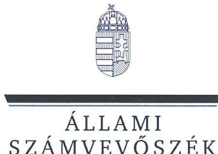
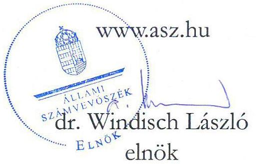
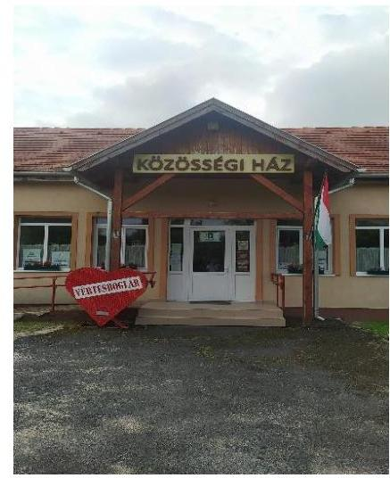
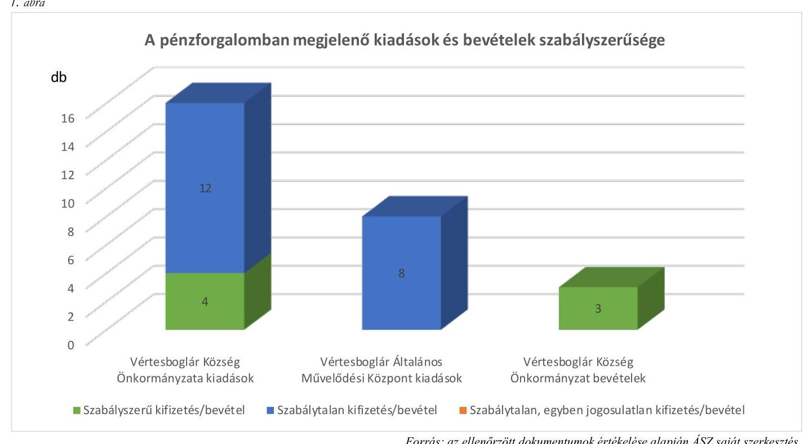

# JELENTÉS 

## Az önkormányzatok gazdálkodásának célvizsgálata

Az önkormányzatok ellenőrzése - a pénzforgalomban megjelenő kiadások teljesítésének és elszámolásának megfelelősége

A pénzforgalomban megjelenő vagyonhasznosítási bevételek beszedésének és elszámolásának megfelelősége

Vértesboglár Község Önkormányzata

2023. 

23032
www.asz.hu

---

ÁLLAMI
SZÁMVEVŐSZÉK

# JELENTÉS 

## Az önkormányzatok gazdálkodásának célvizsgálata

Az önkormányzatok ellenőrzése - a pénzforgalomban megjelenő kiadások teljesítésének és elszámolásának megfelelősége
A pénzforgalomban megjelenő vagyonhasznosítási bevételek beszedésének és elszámolásának megfelelősége

Vértesboglár Község Önkormányzata
2023.

23032

---

# ELLENŐRZÉSI IGAZGATÓSÁG: 

## ÁLLAMHÁZTARTÁS HELYI SZINTJÉT ELLENŐRZŐ IGAZGATÓSÁG

ELLENŐRZÉSI IGAZGATÓ:
KISGERGELY ISTVÁN igazgató

ELLENŐRZÉSVEZETŐ:
LAJTERNÉ HUDÁK MAGDOLNA ellenőrzésvezető

IKTATÓSZÁM: EL-3921-007/2023.
TÉMASZÁM: 2658
ELLENŐRZÉS-AZONOSÍTÓ SZÁM: V1002007

---

# TARTALOMJEGYZÉK 

■ AZ ELLENŐRZÉS ALAPADATAI ..... 5
■ AZ ELLENŐRZÖTT SZERVEZETEK ..... 7
■ ÖSSZEFOGLALÁS ..... 8
■ AZ ELLENŐRZÉS FÓKUSZKÉRDÉSEI ..... 10
■ MEGÁLLAPÍTÁSOK ..... 11
JAVASLATOK ..... 23
MELLÉKLETEK ..... 26
I. sz. melléklet: Az ellenőrzött szervezetek jegyzéke ..... 26
II. sz. melléklet: Összefoglaló táblázat az ellenőrzött szervezetek gazdálkodási jogköreinek gyakorlásáról ellenőrzött gazdasági eseményenként ..... 27
III. sz. melléklet: Vértesboglár Község Önkormányzatánál és Vértesboglár Általános Művelődési Központnál ellenőrzött, késedelmesen könyvelt gazdasági események ..... 32
FÜGGELÉK: ÉSZREVÉTELEK ..... 33
RÖVIDÍTÉSEK JEGYZÉKE ..... 34

---

.

---

# AZ ELLENŐRZÉS ALAPADATAI 

## AZ ELLENŐRZÉS CÉLJA

Az ellenőrzés célja annak értékelése volt, hogy az Önkormányzatnál ${ }^{1}$ és az Intézménynél ${ }^{2}$ a pénzforgalomban megjelenő kiadások teljesítése és elszámolása, továbbá az Önkormányzatnál a pénzforgalomban megjelenő vagyonhasznosítási bevételek beszedése és elszámolása megfelelő volt-e, azok az Önkormányzat, illetve az Intézmény közfeladat-ellátásához kapcsolódtak-e.

## AZ ELLENŐRZÉS TÍPUSA

Megfelelőségi ellenőrzés.

## AZ ELLENŐRZÖTT IDŐSZAK

Az ellenőrzött időszak a 2022. év és a 2023. év, az ellenőrzés megállapításainak az ÁSZ tv. ${ }^{3}$ 29. § (1) bekezdése szerinti megküldése napjáig.

## AZ ELLENŐRZÉS TÁRGYA

Az Önkormányzat és az Intézmény pénzforgalmában megjelenő kiadások teljesítésének és elszámolásának, továbbá az Önkormányzat pénzforgalmában megjelenő vagyonhasznosítási bevételek megalapozottságának és elszámolásának, azok közfeladat-ellátás céljára történő felhasználásának a megfelelősége.

Az ellenőrzés kiemelten fókuszált a kiadások jogosságának, szabályszerűségének értékelésére, a költségvetési források közfeladat-ellátás érdekében történő felhasználására, végrehajtására, figyelemmel a kontrollok gyakorlati alkalmazására is.

## AZ ELLENŐRZÉS JOGALAPJA

Az ellenőrzés jogalapját az ÁSZ tv. 1. § (3) bekezdése, és 5. § (2)-(3), (6) bekezdései képezik.

## AZ ELLENŐRZÉS MÓDSZERE

Az ellenőrzést a nemzetközi standardokat irányadónak tekintve az ellenőrzési program szempontjai, az ellenőrzési időszakban hatályos jogszabályok, az ellenőrzés szakmai szabályok és módszertanok figyelembevételével végezte az ÁSZ ${ }^{4}$.

---

Az ellenőrzés során 24 kiadási (ebből 16 önkormányzati és 8 intézményi) és három önkormányzati bevételi gazdasági eseményt vizsgáltunk.

Az ellenőrzési kérdések megválaszolásához szükséges bizonyítékok megszerzése az ellenőrzött szervezetek által rendelkezésre bocsátott dokumentumokra és adatokra, valamint az ellenőrzést támogató szervezetektől ${ }^{5}$ kapott adatokra alapozva, továbbá megfigyelés, szemle (szemrevételezés), kérdésfeltevés (információkérés), valamint elemző eljárás útján történt.

Az ellenőrzési bizonyítékként felhasználható adatforrások közé tartoztak egyrészt az ellenőrzéshez kért dokumentumok, adatforrások, másrészt adatforrás lehet még minden - az ellenőrzés folyamán - feltárt, az ellenőrzés szempontjából információkat tartalmazó dokumentum.

Az ellenőrzés lefolytatásához az ellenőrzött szervezetek az ÁSZ által kért dokumentumok, adatok, információk megküldésével az ellenőrzés során szolgáltattak adatokat. A rendelkezésre bocsátott adatok, információk kontrolljára helyszíni ellenőrzés keretében is sor került.

A pénzforgalomban megjelenő kiadások teljesítése és a vagyonhasznosítási bevételek megalapozottsága megfelelőségének ellenőrzése során a működés, gazdálkodás kockázatos területeinek meghatározását követően az ellenőrzött szervezetekre vonatkozó főkönyvi adatbázisokból irányított mintavételi eljárások alapján történt a mintatételek kiválasztása. A lényeges és kockázatos tételek beazonosítására egyedi kockázatértékelés alapján került sor. A tények feltárása és azok összegzése során a megállapítások az ellenőrzött mintatételekre vonatkozóan kerültek megfogalmazásra.

Az ellenőrzés kiemelten kezelte a kifizetések és a vagyonhasznosítási bevételek közfeladat ellátáshoz való közvetlen kapcsolódásának, kötelezettségvállalás szerinti teljesülésének, jogosságának és szabályszerűségének értékelését, figyelemmel a kontrollok gyakorlati működésére is.

Az ellenőrzés kiterjedt minden olyan körülményre és adatra, amely az ÁSZ jogszabályban meghatározott feladatainak teljesítéséhez, valamint a program végrehajtása folyamán felmerült újabb összefüggések feltárásához szükséges volt.

---

# AZ ELLENŐRZÖTT SZERVEZETEK 

Vértesboglár község Fejér vármegyében, a Bicskei járásban, a Vértes hegység tövétől keleti irányban négy kilométerre helyezkedik el. A falut körülvevő területek nagy része a Vértesi Tájvédelmi Körzethez tartozik. Lakóinak száma a KSH adatai alapján 2022. január 1-jén 894 fő volt. A munkanélküliség a településen alacsony, a Nemzeti Foglalkoztatási Szolgálat adatai alapján 2023 áprilisában a relatív munkanélküliségi ráta 2,23 % volt.

A település polgármestere ${ }^{6}$ 2007. november 19-étől látja el tisztségét, a Képviselő-testületnek ${ }^{7}$ a polgármesteren kívül négy fő képviselő tagja van. Az Önkormányzat működésével kapcsolatos feladatokat a Csákvári Közös Önkormányzati Hivatal (Hivatal ${ }^{8}$ ) végzi, a jegyző ${ }^{9}$ 2022. szeptember 21-étől vezeti a Hivatalt.

Az Önkormányzat fenntartásában egy költségvetési szerv működik, a 1995. szeptember 01-jén alapított Intézmény, amelynek gazdálkodási feladatait - alapító okirata szerint - a Hivatal látja el. Az Intézmény három tagintézménnyel ${ }^{10}$ működik.

Az Önkormányzat a belső ellenőrzési és a gyepmesteri feladatait, a védőnői szolgálatot, a családsegítést, és a házi segítségnyújtást a Csákvári Önkormányzati Társulás, a hulladékgazdálkodási feladatait a Duna-Vértes Köze Regionális Hulladékgazdálkodási Társulás útján látta el.

Az Önkormányzat 2022. évi beszámolójának főbb adatait az 1. táblázat mutatja be:

| 1. táblázat | adatok MFt-ban |
| :--: | :--: |
| MEGNEVEZÉS | 2022. ÖNKORMÁNYZATI BESZÁMOLÓ |
| Költségvetési bevétel | 129,0 |
| Ebből: önkormányzati feladatok működési támogatása | 91,5 |
| hosszabb időtartamú közfoglalkoztatás támogatása | 2,6 |
| Költségvetési kiadás | 137,9 |
| Ebből: ellátottak pénzbeli juttatásai | 0,9 |
| dologi kiadások | 45,4 |
| beruházások, felújítások | 18,9 |

Forrás: Az Önkormányzat 2022. évi konszolidált beszámolójá alapján ÁSZ saját szerkesztés
Az Önkormányzat a 2022. évben a települési önkormányzatoknak jóváhagyott rendkívüli támogatásokból nem részesült, a települési önkormányzatok szociális tüzelőanyag vásárláshoz kapcsolódó támogatásaiból 2022. évben 0,8 MFt összegű bevétele származott. A költségvetési bevételei és költségvetési kiadásai közötti különbözetet a 2021. évi pénzmaradványból finanszírozta. Közfoglalkoztatási programhoz kapcsolódóan az Önkormányzat a 2022. évben 2,6 M Ft támogatásban részesült. Településfejlesztési projektek megvalósítására a 2022. évben nem érkezett költségvetési támogatás az Önkormányzathoz.

---

# ÖSSZEFOGLALÁS 

A településeken az önkormányzati gazdálkodás sokrétű feladatot jelent. A tevékenység összetettsége, a megfelelő képzettségű, létszámú humán-erőforrás hiánya a gazdálkodás területén magas szintű kockázatokat eredményezhet. Az ellenőrzés hozzájárul az Önkormányzat szabályszerű és felelős gazdálkodásához, a közpénzek szabályos, cél szerinti felhasználásához, a közvagyon védelméhez. Erre tekintettel, az ÁSZ által végzett kockázatelemzés alapján került ellenőrzésre kiválasztásra Vértesboglár Község Önkormányzata.

Az Önkormányzat és az Intézmény pénzforgalmában megjelenő ellenőrzött kiadások teljesítése és elszámolása nem volt megfelelő, mivel a vizsgált 24 gazdasági eseményből 20 esetben, az ellenőrzött tételek 83,3 %-ában az Áht. ${ }^{11}$-ban és Ávr. ${ }^{12}$-ben előírt, a kifizetéseket megelőző ellenőrzéseket nem végezték el. Az Önkormányzat pénzforgalmában megjelenő ellenőrzött vagyonhasznosítási bevételekre vonatkozó döntéseket az arra jogosult hozta meg, azokat a költségvetési rendeletbe beépítették. A bevételek beszedése és elszámolása megfelelt az Áht.-ban és Ávr.-ben, valamint a Gazdálkodási szabályzatban ${ }^{13}$ előírtaknak.

Az Önkormányzatnál és az Intézménynél az ellenőrzött gazdasági események a kötelező, illetve önként vállalt feladatellátáshoz kapcsolódtak. Az Önkormányzat tulajdonában lévő személygépkocsi üzemeltetése során azonban nem tartották be a gépjármű üzemeltetési szabályzatban ${ }^{14}$ és az eszközgazdálkodási szabályzatban ${ }^{15}$ foglalt, a gépjármű használat engedélyeztetésére, az ehhez kapcsolódó dokumentumok kiállítására, vezetésére vonatkozó előírásokat. A gépjármű társadalmi szervezetek részére történő ingyenes használatba adásával megvalósult Áht. és Ávr. szerinti közvetett támogatásokat az Önkormányzat költségvetési rendeletében nem mutatták ki. A gépjárművet az ellenőrzött időszakban az 1/1975. (II. 5.) KPM-BM együttes rendeletben foglaltak ellenére lejárt műszaki engedéllyel üzemeltették.

Az ellenőrzés további hiányosságokat tárt fel az Önkormányzatnál a reprezentációs kiadások, a megbízási díjak, az állami támogatás visszafizetéséhez kapcsolódó kiadások és a települési támogatások kifizetéseinél, az Intézménynél a normatív jutalmak kifizetésénél, az üzemeltetési anyagok beszerzésénél, előlegek elszámolásánál.

Az Önkormányzat és az Intézmény fizetési számlájáról és pénztárából a kiadási előirányzatok terhére teljesített kifizetések nem voltak szabályszerűek, mivel az előzetes kötelezettségvállalást igénylő 19 esetből hét esetben - 1321,0 E Ft kifizetést érintően - az Ávr.-ben foglaltak ellenére nem, vagy nem megfelelően vállaltak írásban kötelezettséget. A kötelezettségvállalások pénzügyi ellenjegyzése 13 gazdasági esemény, összesen 2856,0 E Ft összegű kifizetés esetében nem felelt meg az Ávr. előírásainak. Az Ávr.-ben és a gazdálkodási szabályzatban foglaltak ellenére az ellenőrzött gazdasági események 58,3 %-ánál, összesen 3627,6 E Ft összegű kifizetésnél elmaradt, vagy nem megfelelő dokumentumok alapján végezték el a teljesítésigazolást, így nem ellenőrizték, hogy a kifizetések az arra jogosultak részére, a megfelelő összegben történtek-e, illetve, hogy az ellenszolgáltatást az ellenőrzöttek részére teljesítették-e.

A pénzforgalomban megjelenő kifizetések és bevételek szabályszerűségét ellenőrzött szervezetenként az 1. ábra mutatja be.

---

Forrás: az ellenőrzött dokumentumok értékelése alapján ÁSZ saját szerkesztés
A gazdálkodás részletes rendjét meghatározó szabályzatok közül az Önkormányzat 2023. május 10. előtt nem rendelkezett számlarenddel. Az Intézmény bankszámlája feletti rendelkezési jogosultságok vonatkozásában az ellenőrzött időszakban hatályos pénzkezelési szabályzat ${ }^{16}$ előírásai és a kialakult gyakorlat az elektronikus utalás vonatkozásában nem felelt meg az Intézmény alapító okiratában, az Áht.-ban, Ávr.-ben és a Ptk. ${ }^{17}$-ban foglalt szabályozásnak, mivel az Intézmény költségvetéséből, az Intézmény bankszámlája terhére az utalásokat a bankterminálon keresztül a polgármester jogosultság hiányában hagyta jóvá. Az utalásokat megelőzően az utalványozási jogkör gyakorlása megfelelt az Ávr. előírásainak, a kifizetések előzetes engedélyezését az Intézményvezető végezte. A jogszabályi előírásokkal ellentétes gyakorlat magában hordozhatta a jogosulatlan kifizetések kockázatát. Az Önkormányzat és az Intézmény kötelezettségvállalás nyilvántartása nem felelt meg az Ávr.-ben foglalt előírásoknak, mert nem tartalmazta beazonosítható módon a kötelezettségvállalást tanúsító dokumentum megnevezését, keltét, a pénzügyi teljesítések dátumát, összegét, így nem volt alkalmas a kötelezettségvállalás időpontjában a szabad előirányzat megállapítására.

Az Önkormányzatnál és az Intézménynél biztosított volt a vagyonvédelem, az ellenőrzött gazdasági események keretében beszerzett eszközök az év végi leltárban szerepeltek, a helyszíni ellenőrzés során az eszközöket bemutatták. Az Önkormányzat és az Intézmény a Számv. tv. ${ }^{18}$ és az Áhsz. ${ }^{19}$ előírásainak megfelelően a tárgyi eszközökről analitikus nyilvántartást vezetett.

Az Önkormányzatnál az Áht. előírásainak megfelelően gondoskodtak a belső ellenőrzés kialakításáról, amely a Csákvári Önkormányzati Társulás keretében működött. A belső ellenőrzés az ellenőrzött időszakban egy, az Önkormányzat pénzügyi és vagyongazdálkodására vonatkozó átfogó szabályszerűségi ellenőrzést végzett, amelynek - ÁSZ ellenőrzésének fókuszterületeit érintő - megállapításai az ÁSZ megállapításaival összhangban voltak.

Az ÁSZ az ellenőrzés során feltárt hiányosságok felszámolása, a szabályszerű működés feltételeinek megteremtése érdekében a polgármesternek hét, a jegyzőnek hét és az intézményvezetőnek négy javaslatot tett.

---

# AZ ELLENŐRZÉS FÓKUSZKÉRDÉSEI 

1- Az Önkormányzat pénzforgalmában megjelenő kiadások teljesítése és elszámolása megfelelően, az Önkormányzat feladatellátásához kapcsolódóan valósult-e meg?
2- Az Önkormányzat pénzforgalmában megjelenő vagyonhasznosítási bevételekkel kapcsolatos döntés megalapozott volt-e, a bevételek beszedése és elszámolása megfelelően, az Önkormányzat feladatellátásához kapcsolódóan valósult-e meg?
3. Az Intézmény pénzforgalmában megjelenő kiadások teljesítése és elszámolása megfelelően, az Intézmény feladatellátásához kapcsolódóan valósult-e meg?

---

# 1. Az Önkormányzat pénzforgalmában megjelenő

 kiadások teljesítése és elszámolása megfelelően, az Önkormányzat feladatellátásához kapcsolódóan valósult-e meg? 

Összegző megállapítás Az Önkormányzatnál a közpénzfelhasználás az önkormányzati feladatellátáshoz kapcsolódott, azonban az ellenőrzött gazdasági események tekintetében a pénzforgalomban megjelenő ellenőrzött kiadások teljesítése és elszámolása nem volt megfelelő.
1.1. számú megállapítás Az ellenőrzött kiadások közfeladat ellátásához kapcsolódtak.

Az Önkormányzatnál az ellenőrzött 16 gazdasági eseményhez kapcsolódó, összesen 13 941,1 E Ft összértékű kiadások az MÖtv. ${ }^{20}$ előírásaival összhangban, a törvényben meghatározott kötelező, valamint önként vállalt feladatok ellátása érdekében merültek fel.
1.2. számú megállapítás

A pénzforgalomban megjelenő kiadások teljesítése nem felelt meg az előírásoknak.

Az előzetes írásbeli kötelezettségvállalást igénylő 11 gazdasági eseményből három esetben (339,1 E Ft összegű kifizetésnél) az Ávr. 51. § (2) bekezdés és 52. § (1) bekezdés c) pontjában foglaltak ellenére nem rendelkeztek írásbeli kötelezettségvállalással. További öt esetben az Ávr. 53. § (1) bekezdés a) pontja előírása, valamint a Gazdálkodási szabályzat ${ }_{1}$ II. fejezet (4) bekezdés alapján nem volt szükséges előzetes írásbeli kötelezettségvállalás.

- Nem rendelkeztek írásbeli kötelezettségvállalással az ONK_KIAD_04, ONK_KIAD_05, ONK_KIAD_06 gazdasági események vonatkozásában. Az ONK_KIAD_04 gazdasági esemény esetében korábbi időszakra vonatkozóan (2021.10.07.-2021.12.31.) volt megbízási szerződés zöldterület fenntartásra és síkosságmentesítésre vonatkozóan, azonban az ellenőrzött kifizetés a szerződés időtartamát követő időszakra, 2022. február hónapra vonatkozott, így az Ávr. 51. § (2) bekezdés előírásának ellenére a gazdasági eseményhez nem állt rendelkezésre írásbeli kötelezettségvállalás. Az ONK_KIAD_05, ONK_KIAD_06 reprezentációs célú kiadások voltak. Az előbbi esetekben a Reprezentációs szabályzat ${ }^{21}$ 2.1 pontja és 1. melléklete előírása ellenére nem álltak rendelkezésre a kiadásokat megalapozó jóváhagyott kérelmek.
Az Ávr. 55. § (1) bekezdésében előírtak, valamint a Gazdálkodási szabályzat ${ }_{1}$ II. fejezet (2) pontjában foglaltak ellenére a pénzügyi ellenjegyzést öt esetben nem végezték el, egy esetben nem megfelelően végezték el, ezáltal összesen 1036,4 E Ft összegű kifizetés vonatkozásában az Áht. 37. § (1) bekezdésének előírását megsértve nem győződtek meg a szabad előirányzat rendelkezésre állásáról. Egy esetben - mivel a gazdasági esemény nem igényelt előzetes írásbeli kötelezettségvállalást a pénzügyi ellenjegyzés sem volt szükséges.

---

- Írásos kötelezettségvállalás hiányában nem került sor a pénzügyi ellenjegyzésre az ONK_KIAD_04, ONK_KIAD_05 és ONK_KIAD_06 gazdasági eseményeknél.
- Nem végezték el a pénzügyi ellenjegyzést az ONK_KIAD_13 és ONK_KIAD_14 kifizetések esetében.
- Nem megfelelően végezték el a pénzügyi ellenjegyzést az ONK_KIAD_12 gazdasági eseménynél, mivel az MFP-OJKJF/2022 „Óvodai játszódévar és közterületi játszótér fejlesztése" című pályázattól való elállás miatt (a kivitelezési költségek megemelkedése okán a pályázattól az Önkormányzat elállt) a Kincstár ${ }^{22}$ részére a támogatás ügyleti kamattal növelt mértékű visszautalása 2022. november 14-én megvalósult. A kiadás az Áht. 36. § (1) bekezdése szerint más fizetési kötelezettségnek minősült, azonban a kifizetéshez kapcsolódó utalványrendeleten történő pénzügyi ellenjegyzés az Áht. 37. § (1) bekezdés előírása ellenére a kifizetést követően, 2022. november 23-án történt meg.
Az Önkormányzat a Gazdálkodási szabályzat ${ }_{1}$ IV. pont (1) bekezdésében a kiadások (és bevételek) teljes körére előírta a teljesítések igazolásának kötelezettségét.
Az Áht. 38. § (1) bekezdése és az Ávr. 57. § (1) bekezdése előírása ellenére a teljesítésigazolást öt esetben nem, négy esetben nem a jogszabályi előírásoknak megfelelően végezték el, ezáltal 1637,8 E Ft kifizetését megelőzően nem ellenőrizték, hogy a kifizetések az arra jogosultak részére, a kötelezettségvállalásnak megfelelő összegben történtek-e, illetve, hogy az ellenszolgáltatást az Önkormányzat részére ténylegesen teljesítették-e.
- Az ONK_KIAD_01, ONK_KIAD_02, ONK_KIAD_12, ONK_KIAD_13, ONK_KIAD_14 gazdasági események esetében a teljesítés igazolás dokumentuma nem állt rendelkezésre. Az ONK_KIAD_01, ONK_KIAD_02 gazdasági események a közfoglalkoztatottak munkabér kifizetését érintették, ezekben az esetekben a polgármester a jelenléti íveken a munkában való megjelenést igazolta, azonban a jelenléti ív nem volt alkalmas az Ávr. 57. § (1) bekezdésének előírásában foglaltak szerinti jogosság és összegszerűség ellenőrzésére, a teljesítésigazolást az igazolás dátumának és a teljesítés tényére történő utalásnak a megjelölésével nem végezték el.
- Az ONK_KIAD_04 kifizetés esetében a kötelezettségvállalás dokumentuma hiányában formális volt a teljesítésigazolás elvégzése. Az ONK_KIAD_05 és ONK_KIAD_06 gazdasági események esetében a teljesítések igazolása nem a Reprezentációs szabályzat 2.1 pontjában előírtaknak megfelelően, annak 2. sz. mellékletének használatával történt, továbbá a Reprezentációs szabályzat 1. számú melléklete szerinti jóváhagyott kérelmek hiányában a teljesítést igazoló nem tudott meggyőződni arról, hogy a kifizetések az arra jogosultak részére, a megfelelő összegben történtek-e. Az ONK_KIAD_08 gazdasági esemény (kerítés javítás) esetében nem állt rendelkezésre a munka elvégzésének megtörténtét igazoló dokumentum.
Az ellenőrzött 16 gazdasági eseményből az érvényesítés 12, összesen 2612,8 E Ft összegű kifizetés vonatkozásában nem megfelelően történt, az érvényesítő az Ávr. 58. § (1) bekezdésében foglaltak ellenére nem ellenőrizte az összegszerűséget, a fedezet meglétét és azt, hogy a megelőző ügymenetben az Áht., Ávr. és az Áhsz. előírásait, a belső szabályzatokban foglaltakat betartották-e.
- Az ONK_KIAD_01, ONK_KIAD_02, ONK_KIAD_04, ONK_KIAD_05, ONK_KIAD_06, ONK_KIAD_08, ONK_KIAD_12, ONK_KIAD_13 és ONK_KIAD_14 gazdasági események esetében az érvényesítésre az Ávr. 58. § (1) bekezdés előírása ellenére szabályszerű teljesítés igazolás nélkül, az ONK_KIAD_09, ONK_KIAD_16, ONK_KIAD_17 gazdasági események esetében pedig a kifizetést követően került sor.
Az utalványozást az Áht. 38. § (1) bekezdésében foglaltak ellenére hat, összesen 1927,3 E Ft összegű kifizetésnél nem szabályszerűen végezték, mivel a kifizetés megelőzte az utalványozást az

---

ONK_KIAD_04, ONK_KIAD_08, ONK_KIAD_09, ONK_KIAD_12, ONK_KIAD_16, ONK_KIAD_17 gazdasági események esetében.
(Az Önkormányzatnál ellenőrzött kiadási gazdasági eseményeket a II. számú melléklet 1. számú táblázata tartalmazza.)
1.3. számú megállapítás

A pénzforgalomban megjelenő kiadások teljesítése során a gépjármű használat nem felelt meg az előírásoknak.

Az Önkormányzat a gépjármű használatra vonatkozó előírásokat a Gépjármű üzemeltetési szabályzatban és az Eszközgazdálkodási szabályzatban rögzítette, amelyek részben párhuzamos, részben egymásnak ellentmondó előírásokat tartalmaztak a menetlevelek tartalmára, azok vezetésére vonatkozóan, a gépjármű üzemeltetésével, használatával kapcsolatosan. A gépjármű átadás-átvétel szabályait csak a Gépjármű üzemeltetési szabályzat tartalmazta. Az ellenőrzött időszakban mindkét szabályzat hatályban volt. A párhuzamos, és egymásnak ellentmondó szabályozás miatt a szabályzatok nem feleltek meg a Bkr. ${ }^{23}$ 6. § (1) b) pontjában foglalt előírásoknak, mivel azokban nem voltak egyértelműek a felelősségi, hatásköri viszonyok és feladatok.
Az ellenőrzött időszakban az Önkormányzat tulajdonában volt az Opel Vivaro Combi típusú személygépkocsi, amelynek értéke 2020-ban 0-ra íródott. Szintén az Önkormányzat tulajdonában volt egy KUBOTA típusú traktor és a BAGOD BP típusú pótkocsi is. Az eszközök vonatkozásában az Önkormányzat vezette az egyedi tárgyi eszköz nyilvántartó kartonokat, a traktor esetében a gépüzemnaplót, a személygépkocsi esetében a személygépkocsi menetleveleket. Mindhárom eszköz szerepelt a 2022. évi leltárban.
Az Opel személygépkocsi benyújtott forgalmi engedélye alapján a műszaki engedélye 2019. október 19-ig volt érvényes, így - a 1/1975. (II. 5.) KPM-BM együttes rendelet 5. § (1) bekezdés c) pontja értelmében - a forgalomban az ellenőrzött időszakban nem vehetett volna részt. A gépjármű karbantartásáért, javíttatásáért, műszaki vizsgáztatásáért a Gépjármű üzemeltetési szabályzat XIII. fejezete alapján a polgármester a felelős.

A gépjármű használatára vonatkozóan a polgármester 2022. és 2023. években két-két az egész évre szóló, 2022. évben ezen felül két egyedi gépjármű használati engedélyt adott ki. Az egész évre szóló engedélyek egy nem önkormányzati fenntartású általános iskola diákjainak tanulmányi versenyekre, sportrendezvényekre való utaztatására, az egyedi engedélyek civil szervezetek kirándulására szóltak, ami összhangban volt a Gépjármű üzemeltetési szabályzat V. 1-2. pontjában leírtakkal. A gépjármű használati engedélyek és menetlevelek alapján azonban nem volt megállapítható, hogy a személygépkocsit csak a Gépjármű üzemeltetési szabályzatban feltüntetett kiemelt célokra, vagy azokon túl egyéb célra is használták-e az Önkormányzat költségvetése terhére. Ezáltal fennállt a kockázata annak, hogy a jármű üzemeltetésével összefüggő kiadások nem minden esetben a Gépjármű üzemeltetési szabályzatban és az egyedi gépjármű használati engedélyben foglalt kiemelt célokhoz kapcsolódtak.

- A Gépjármű üzemeltetési szabályzat VI. 10. pont előírása értelmében a gépjármű igénybevétele a kiemelt célokra ingyenes volt, azonban a szabályozás nem rendelkezett arról, hogy az ingyenesség azt jelenti, hogy a gépjármű használatáért nem kell fizetnie az igénybe vevőnek, vagy az üzemanyag ellenértékét sem kell megtérítenie az Önkormányzat részére.
Az üzemanyag beszerzésre, a személygépkocsi futásteljesítményére vonatkozóan rendelkezésre álló adatok alapján a használat során az üzemanyagot az Önkormányzat vásárolta, ami a gépjárművet igénybe

---

vevő szervezetek részére nyújtott közvetett támogatást jelentett. Az Önkormányzat költségvetési rendeleteiben az Áht. 24. § (4) bekezdés c) pontja és az Ávr. 28. §-a szerint bemutatott közvetett támogatások között a nem önkormányzati fenntartású szervezetek gépjármű használatához kapcsolódó kiadások nem szerepeltek.
Az ellenőrzés rendelkezésre bocsátott hat gépjármű használatára kiadott engedély mindegyikén magánszemélyek nevei szerepeltek jogosultként, az igénybevétel célja nem került feltüntetésre, a dátumok alapján lehetett a kérelmekhez rendelni az engedélyeket, de teljes bizonyossággal nem volt összerendelhető, hogy melyik kérelemhez melyik engedély kapcsolódott. Az engedélyek nem tartalmazták a Gépjármű üzemeltetési szabályzat VI. 9. pontjában előírt felelősségvállalási nyilatkozatot, továbbá az üzemanyag elszámolás módját, illetve azt, hogy a gépjármű használata során felmerült költségeket ki milyen arányban viselte.
A személygépkocsi vonatkozásában a menetleveleket kiállították, azonban azok kitöltése nem felelt meg Gépjármű üzemeltetési szabályzat V. 1.-2. pontjában foglalt előírásoknak, céloknak. A menetlevelek és a használatra vonatkozó engedélyek hiányosságai miatt nem volt megállapítható, hogy a jármű igénybevétele mikor és milyen célra történt pontosan, a járművek vezetői nem voltak beazonosíthatók, nem volt megállapítható, hogy a gépjárművet magánszemélyként, vagy valamilyen, a gépjármű használatára engedéllyel rendelkező szervezet munkavállalójaként vagy képviselőjeként vezették-e.

- A menetlevelek vezetésének hiányosságai miatt nem volt követhető, hogy az adott napon megtett út hossza hány fordulót jelentett a menetlevélen szereplő helységek között, valamint azok nem tartalmazták a jármű vezetőjének aláírását. Az Eszközgazdálkodási szabályzat V. 4. pontjában előírtak ellenére a menetlevelek mellé nem csatoltak utaslistát azokban az esetekben, amikor a menetlevél adatai szerint több személy szállítását végezték a személygépkocsival. Továbbá a menetlevelek az Eszközgazdálkodási szabályzat VI. pontjában előírtak ellenére nem tartalmazták az útvonal megállóhelyeit és az ehhez tartozó idő adatokat, a teljesítményt igazoló aláírását, tankolás esetén annak idejét, km óra állást, tankolt mennyiséget. A menetlevelek vezetése nem felelt meg a Gépjármű üzemeltetési szabályzat VI. 13. és XI. 3., 5. pontjában foglalt előírásoknak sem, amelyek alapján a gépjármű használat során a menetlevelet a rajta lévő rovatok pontos kitöltésével, a valóságnak megfelelően, időrendi sorrendben, folyamatosan, olvashatóan és egyértelműen, a járművezető aláírásával kellett volna vezetni.
Az Önkormányzat tulajdonában lévő traktor használatáról az üzemeltetés időpontját és az üzemidőt tartalmazó gépüzemnaplót vezetett az Önkormányzat, amelyet az ellenőrzött időszakra vonatkozóan az ellenőrzés rendelkezésre bocsátott.
1.4. számú megállapítás

A gazdálkodással kapcsolatos szabályozottság az ellenőrzött időszakban nem volt teljeskörű, a nyilvántartások vezetése megfelelt az előírásoknak.

Az Önkormányzat rendelkezett a Számv. tv.-ben és az Áhsz.-ben előírt Számviteli politika ${ }_{1,2}$-val, valamint az Áht.-ban és az Ávr.-ben előírt, a gazdálkodás
 részletes rendjét meghatározó Gazdálkodási szabályzat ${ }_{1}$ 2-tal. Számlarenddel a Számv. tv. 161. § (1) bekezdésének előírása ellenére 2022. január 1-je és 2023. május 10-e közötti időszakban nem rendelkeztek. A Hivatal 2023. május 10-én hatályba lépett, jegyző által kiadott számlarendjének hatálya az Önkormányzatra kiterjedt, azt a polgármester egyetértőleg aláírta. A reprezentációs kiadások teljesítésére, elszámolására a Gazdálkodási szabályzat ${ }_{1,2}$ és a Reprezentációs szabályzat is tartalmazott rendelkezéseket. A Reprezentációs szabályzatban foglalt - a kiadások kérelmezésére és teljesítés igazolására vonatkozó - szabályokat azonban nem tartották be.

---

- A Gazdálkodási szabályzat ${ }_{1-2}$ az Ávr. 53. § (1) bekezdés a) pontja és (2) bekezdése előírásaival összhangban előírta, hogy a 200,0 E Ft-ot el nem érő kifizetés teljesítéséhez előzetes írásbeli kötelezettségvállalás nem szükséges. Ugyanakkor a szabályozás - az Ávr. 57. § (3) bekezdésben foglaltak alapján - rögzítette, hogy a teljesítés igazolását ezen kifizetések esetében is el kell végezni.
- A Reprezentációs szabályzat 2.1 pontja a reprezentációs kiadások kérelmezésére, engedélyezésére és teljesítés igazolására vonatkozóan a Gazdálkodási szabályzat ${ }_{1,2}$ előírásaihoz képest előírta a reprezentációs kiadások írásbeli kérelmezését és engedélyeztetését, valamint a kiadások elszámolásához külön teljesítésigazolási nyomtatvány alkalmazását, azonban ezeket a gyakorlatban nem alkalmazták.
Az Ávr.-ben foglalt előírásokat betartva a polgármester felhatalmazást adott a kötelezettségvállalásra, illetve kijelölte a teljesítés igazolókat és az utalványozókat. A pénzügyi ellenjegyzésre és az érvényesítésre jogosultakat a gazdasági vezető az Ávr. előírásai szerint, szabályszerűen kijelölte. A jogkörök gyakorlására jogosult személyekről és aláírásmintájukról az Ávr.-ben előírt nyilvántartást vezették.
Az Önkormányzat rendelkezett a Számv. tv.-ben előírt Pénzkezelési szabályzat ${ }_{1,2}$-tal. Az Ávr.-ben foglaltak alapján az Önkormányzat elkészítette a működéséhez kapcsolódó, a költségvetési szerv előirányzatait terhelő pénzügyi kihatással bíró, jogszabályban nem szabályozott kérdések rendezésére a beszerzési szabályzatát, anyag- és eszközgazdálkodási szabályzatát, kiküldetési szabályzatát, reprezentációs szabályzatát és gépjármű üzemeltetésre vonatkozó szabályozását. A Gépjármű üzemeltetési szabályzatot az Ávr. 13. § (2) és (3b) bekezdésben foglaltakkal ellentétben nem a jegyző, hanem a polgármester adta ki.
Az ellenőrzés során rendelkezésre bocsátott kötelezettségvállalásokról vezetett nyilvántartás nem felelt meg az Áhsz. 14. melléklet II. pontjában foglaltaknak, azonban az megállapítható, hogy a kötelezettségvállalásokat nyilvántartásba vették.
- A nyilvántartás beazonosítható módon nem tartalmazta a kötelezettségvállalást tanúsító dokumentum megnevezését, keltét, a pénzügyi ellenjegyzésre vonatkozó adatokat, a kötelezettségvállalás, más fizetési kötelezettség évek szerinti megoszlását, a költségvetési évben a pénzügyi teljesítési határidőket dátum szerint, a kötelezettségvállalás módosulásainak adatait, a pénzügyi teljesítések dátumát, összegét, egységes rovatrend szerint besorolását, az utalványozás dokumentumának azonosításához szükséges adatokat, a kötelezettségvállalás végleges vagy nem végleges jellegének megjelölését.
1.5. számú megállapítás

A beszámoló alátámasztása és a számviteli elszámolások megfelelőek voltak, azonban hat esetben a gazdasági események könyvekben történő rögzítése késedelmesen történt.

Az Önkormányzat rendelkezett a polgármester és a Hivatal gazdasági vezetője által aláírt, 2022. évre vonatkozó éves költségvetési beszámolóval.
Az ellenőrzött gazdasági események keretében beszerzett eszközöket a Számv. tv.-ben foglaltak alapján az év végi zárást alátámasztó leltárban kimutatták, a helyszíni ellenőrzés során az eszközök fellelhetők voltak. Az Önkormányzat a tárgyi eszközökről analitikus nyilvántartást vezetett, a 2022. évi mérleg leltárral történő alátámasztását - az ellenőrzésre kiválasztott tárgyi eszközök beszerzése és ingatlanok felújítása eszközcsoportok vonatkozásában - dokumentumokkal igazolta.
A 2022. évre vonatkozóan, egyeztetéssel elvégzett leltározás dokumentumai alapján a befektetett eszközök, a pénzeszközök és a foglalkoztatottaknak adott előlegek mérlegsorai vonatkozásában a leltár adatai a főkönyvi kivonat és a mérleg adataival megegyeztek.

---

A gazdasági események számviteli elszámolása az Áht., Ávr., Áhsz., valamint a gazdálkodást érintő belső szabályzatok vonatkozó előírásainak megfelelően történt, azonban a házi pénztárból és a fizetési számláról teljesített 16 ellenőrzött gazdasági esemény közül öt esetben a Számv. tv. 165. § (3) bekezdés a) pontjában előírtak ellenére nem biztosították a pénzeszközöket érintő gazdasági műveletek, események bizonylati adatainak a könyvekben történő késedelem nélküli rögzítését. Egy esetben a könyvelés több hónap késéssel, a gazdasági eseményt követő gazdasági évben történt meg. A késedelem befolyásolta az államháztartás információs rendszerébe teljesített havi adatszolgáltatások adattartamát, mert így az adatszolgáltatások nem valós adatokon alapultak.

- A számviteli elszámolás késedelmesen történt az ONK_KIAD_02, ONK_KIAD_03, ONK_KIAD_06, ONK_KIAD_15, ONK_KIAD_17 gazdasági események esetében. Az ONK_KIAD_17 kifizetésnél ez több hónapos késést jelentett. A késés az éves beszámolóban szereplő adatokat nem befolyásolta, mivel az adatok rögzítése még az előző évre, a beszámoló elkészítését megelőzően történt.
(A késedelmesen rögzített gazdasági eseményeket részletesen a III. számú melléklet mutatja be.)
1.6. számú megállapítás Az Önkormányzatnál a pénzkezelés során az előírások szerint jártak el.

A helyszíni ellenőrzés keretében sor került az Önkormányzatnál működtetett három házipénztár (Önkormányzat, Közfoglalkoztatás, Intézmény) vonatkozásában pénztárrovancs elvégzésére. Az ellenőrzés időpontjában a pénztárakban lévő ellenőrzött összeg megegyezett a pénztárjelentés szerinti záró adattal (záró egyenleggel).
A pénztáros, a pénztáros-helyettes és a pénztár ellenőr rendelkezett a pénztári feladatok ellátására vonatkozó, jegyző által aláírt megbízással, valamint anyagi felelősségvállalást tartalmazó nyilatkozattal.
A 2022. évre vonatkozóan a fizetési számla és a házipénztár nyitó- és záróegyenlegét tartalmazó számlakivonatok, illetve pénztárjelentések szerinti nyitó és záró egyenlegek és a főkönyvi kivonatban a megfelelő főkönyvi számon kimutatott banki és házipénztári nyitó és záró egyenlegek közötti egyezőség a 2022. évben fennállt.
1.7. számú megállapítás Az Önkormányzatnál a belső ellenőrzés a Bkr. szerint látta el feladatát.

Az Önkormányzatnál a belső ellenőrzést működtették, a belső ellenőrzési feladatokat az Önkormányzat a Csákvári Önkormányzati Társulás keretében, gazdasági társasággal kötött megbízási szerződéssel látta el. A belső ellenőrzés betöltötte a Bkr. 21. §-ában meghatározott szerepét, az ellenőrzött időszakban az Önkormányzatnál végzett ellenőrzés - ÁSZ ellenőrzésének fókuszterületeit érintő megállapításai az ÁSZ megállapításaival összhangban voltak.

---

# 2. Az Önkormányzat pénzforgalmában megjelenő vagyonhasznosítási bevételekkel kapcsolatos döntés megalapozott volt-e, a bevételek beszedése és elszámolása megfelelően, az Önkormányzat feladatellátásához kapcsolódóan valósult-e meg? 

## Összegző megállapítás

Az ellenőrzött vagyonhasznosítással kapcsolatos bevételekre vonatkozó döntéseket az arra jogosult hozta meg, a bevételek felhasználása célhoz kötötten történt, a vagyonhasznosítási bevételek beszedése és elszámolása megfelelő volt.

Az ellenőrzött három gazdasági esemény (ONK_BEV_01, ONK_BEV_02, ONK_BEV_03) Vértesboglár 351 hrsz. alatt található - a Vagyonrendelet ${ }^{24}$ 3.§-a szerint korlátozottan forgalomképes törzsvagyon körébe tartozó - "vízmű" megnevezésű ingatlan meghatározott részének, határozott időtartamra, távközlési bázisállomás létesítése és üzemeltetése céljából, telekommunikációs cég számára történő bérbeadásához kapcsolódott összesen 1139,1 E Ft összegben.
Az Önkormányzat az ellenőrzött vagyonhasznosítási döntések előtt az Nvtv. ${ }^{25}$ 11. § (16) bekezdésében előírt versenytárgyalási kötelezettség fennállását egy esetben vizsgálta, azonban annak során a Vagyonrendelet 7. § (5) bekezdésében foglaltakat nem alkalmazta, így a „vízmű" hasznosítása nem felelt meg a Vagyonrendeletben előírtaknak, mivel annak bérbeadására a versenyeztetés mellőzésével került sor.

- A Vagyonrendelet 7. § 5) bekezdése szerint: „Az önkormányzati vagyon elidegenítése, használatba vagy bérbeadása, illetve bármely más módon történő hasznosítása esetén a 10 millió forint értékhatárt elérő vagy azt meghaladó vagyontárgy esetében csak versenytárgyalás útján, a legjobb ajánlatot tevő részére történhet." Az Önkormányzat az ONK_BEV_02 gazdasági esemény dokumentumai között bemutatott képviselő-testületi előterjesztés alapján nem a hasznosításra szánt vagyontárgy értékét, hanem a bérbeadás (tehát a bevétel) értékét vette figyelembe a versenyeztetési kötelezettség megállapításánál, és tévesen arra a következtetésre jutott, hogy versenytárgyalás megtartására nincs szükség.
- Az ONK_BEV_01, és az ONK_BEV_03 gazdasági események vonatkozásában a hasznosításra szánt vagyontárgy értékét, a versenyeztetési kötelezettséget nem vizsgálták, erre vonatkozó dokumentum nem állt rendelkezésre.
A bérbeadásokról - az Mötv., az Áht. és a Bkr. vonatkozó előírásait figyelembe véve - az arra jogosult Képviselő-testület döntött.
A kiszámlázott és pénzügyileg teljesített bevételek Áht.-ban előírt célhoz kötött felhasználása, közfeladatellátáshoz kapcsolódása biztosított volt, a bevételeket a 2022. évi önkormányzati költségvetési rendeletbe beemelték. A bevételek beszedése és elszámolása a Számv.tv. és az Áhsz. vonatkozó előírásaira figyelemmel, megfelelő módon történt.
(Az Önkormányzatnál ellenőrzött bevételi gazdasági eseményeket a II. számú melléklet 2. számú táblázata tartalmazza.)

---

# 3. Az Intézmény pénzforgalmában megjelenő kiadások teljesítése és elszámolása megfelelően, az Intézmény feladatellátásához kapcsolódóan valósult-e meg? 

Összegző megállapítás Az Intézménynél a kiadások az intézményi feladatellátáshoz kapcsolódtak, azonban a pénzforgalomban megjelenő kiadások teljesítése és elszámolása összességében nem volt megfelelő.
3.1. számú megállapítás Az ellenőrzött kiadások közfeladat ellátásához kapcsolódtak.

Az Intézménynél az ellenőrzött - 2735,8 E Ft összértékű - kifizetések minden esetben az intézményi feladatellátáshoz kapcsolódtak.
3.2. számú megállapítás

A pénzforgalomban megjelenő kiadások teljesítése nem felelt meg az előírásoknak.

Az ellenőrzött időszakban az Intézmény fizetési számlájáról és házi pénztárából teljesített nyolc ellenőrzött kifizetés mindegyikéhez szükséges volt írásbeli kötelezettségvállalás. Egy esetben 108,3 E Ft összegben - az Ávr. 52. § (1) bekezdés c) pontjában foglaltak ellenére nem volt írásbeli kötelezettségvállalás, további három esetben - 873,6 E Ft értékben - a kötelezettségvállalás nem volt megfelelő.

- Az INT_KIAD_08, INT_KIAD_09 gazdasági események keretében előlegfelvétel történt, amelyeknél az előleg engedélyezésével kapcsolatos dokumentum a Pénzkezelési szabályzat ${ }^{26}$ II. Fejezet 7.2 pontjában foglalt előírásnak megfelelően rendelkezésre állt. Az előlegek elszámolása határidőben - a felvételtől számított 30 napon belül - megtörtént.
- Nem történt írásbeli kötelezettségvállalás az INT_KIAD_07 vásárlási előlegből megvalósuló tárgyi eszköz beszerzés esetében, a Pénzkezelési szabályzat ${ }_{3}$ 7.2. pontjában foglaltakkal ellentétben az előleg pontos céljának meghatározását tartalmazó, pénzügyileg ellenjegyzett engedély hiányában került sor a kifizetésre.
- Három esetben a kötelezettségvállalás nem volt megfelelő. Az intézményi dolgozók jutalmazására irányuló gazdasági eseménynél (INT_KIAD_01) a jutalmazásról szóló intézményvezetői és polgármesteri döntés rendelkezésre állt, azonban a kifizetett 405,8 E Ft összegből 34,6 E Ft összegnél - az intézményvezető részére adott jutalomnál - a dokumentumot kötelezettségvállalóként az Ávr. 52. § (1) bekezdésével ellentétesen a polgármester írta alá, aki az Intézmény költségvetése esetében nem volt jogosult kötelezettséget vállalni. További két esetben (ONK_POT_02, INT_KIAD_05) az Ávr. 50. § (1) bekezdés b) pontjában foglaltak ellenére a gazdasági eseményhez tartozó szerződések nem tartalmazták a szerződéses összeg nagyságát, így a kötelezettségvállalás értéke nem volt megállapítható. Az INT_KIAD_05 gazdasági eseménynél a szerződés szerint szükséges volt külön megrendelő is, amely nem állt rendelkezésre.
Az ellenőrzött gazdasági események közül hét esetben - 1819,6 E Ft összértékben - nem végezték el, vagy nem az Áht. 37. § (1) bekezdésében és az Ávr. 53/A. § előírásának megfelelően végezték el a pénzügyi ellenjegyzést, így az Áht. és Ávr. előírásaival ellentétben a kötelezettségvállalást megelőzően

---

nem vizsgálták, hogy a kifizetések várható időpontjában a költségvetési fedezet rendelkezésre állt-e, illetve, hogy a kötelezettségvállalás nem sértette-e a gazdálkodásra vonatkozó szabályokat.

- Két kifizetés esetében (INT_KIAD_01, INT_KIAD_05) a kötelezettségvállalás dokumentuma nem tartalmazott pénzügyi ellenjegyzést.
- Az ONK_POT_02 gazdasági esemény kötelezettségvállalási dokumentumán szerepelt ugyan pénzügyi ellenjegyzés, azonban az a 2009. évi kötelezettségvállalást követően négy évvel később, 2013-ban történt meg.
- Egy gazdasági esemény vonatkozásában (INT_KIAD_06) a megállapodáson szerepelt pénzügyi ellenjegyzés, azonban annak elvégzése formális volt, mivel abból nem
 volt megállapítható a kötelezettségvállalás ellenértéke, így a szükséges fedezet összege sem.
- Az INT_KIAD_07 gazdasági eseménynél kötelezettségvállalási dokumentum hiányában, az INT_KIAD_08, INT_KIAD_09 gazdasági események esetében nem történt meg a pénzügyi ellenjegyzés.
A teljesítés igazolását az ellenőrzött gazdasági események közül két személyi jellegű kifizetésnél és egy vásárlási előleg elszámolásánál nem végezték el az Áht. 38. § (1) bekezdése és az Ávr. 57. § (1), (3) bekezdéseinek előírásai ellenére. Két esetben az Ávr. 57. § (1) és (3) bekezdésében foglaltak ellenére a teljesítés igazolása nem volt megfelelő. Ezzel összességében 1989,8 E Ft összegű kiadás esetében nem ellenőrizték, hogy a kifizetések az arra jogosultak részére, a megfelelő összegben történtek-e, illetve, hogy az ellenszolgáltatást az Intézmény részére ténylegesen teljesítették-e.
- Az INT_KIAD_01 és INT_KIAD_03 gazdasági események vonatkozásában nem történt meg a teljesítés igazolása. Az INT_KIAD_08, 200,0 E Ft összértékű vásárlási előleg elszámolásban szereplő öt számla közül egy esetben, 10,0 E Ft összegű számla vonatkozásában nem állt rendelkezésre a teljesítés igazolása.
- Az ONK_POT_02 és az INT_KIAD_05 gazdasági eseményeknél a teljesítésigazolás formális volt, mivel az Ávr. 57. § (1) bekezdésében foglaltak ellenére a kötelezettségvállalási dokumentumok nem tartalmaztak megfelelő adatokat a kifizetések összegszerűségének, valamint a beszerzés, ellenszolgáltatás teljesítésének ellenőrzésére. Az ONK_POT_02 kifizetésnél a szerződésben rögzítésre került, hogy a mindenkori megállapodás szerinti áron történik az alapanyagok beszerzése, azonban erre vonatkozó további dokumentumokat nem bocsátottak rendelkezésre.
Az Ávr. 58. § (1) bekezdésében foglaltak ellenére az érvényesítést egyik ellenőrzött gazdasági eseményre vonatkozóan sem végezték szabályszerűen. A kötelezettségvállalás, pénzügyi ellenjegyzés és teljesítésigazolás szabálytalanságaival érintett gazdasági események vonatkozásában az érvényesítő az Ávr 58. § (2) bekezdésében, a Gazdálkodási szabályzat: ${ }^{27}$ 1.2.4. pontjában foglaltak ellenére - nem jelezte az utalványozónak, hogy a megelőző ügymenetben nem tartották be az Áht. 37. § (1) bekezdésében és az Ávr. 55. § (1) bekezdésében foglaltakat.
- Az INT_KIAD_01, INT_KIAD_03, INT_KIAD-07, INT_KIAD_08, INT_KIAD_09 gazdasági események esetében az érvényesítés elvégzésére a pénzügyi teljesítést követően került sor.
Az utalványozás öt gazdasági esemény vonatkozásában, összesen 1960,2 E Ft összegű kifizetés esetében szabálytalanul történt, megsértve az Áht. 38. § (1)-(2) bekezdéseinek előírásait.
- Az INT_KIAD_01, INT_KIAD_03, INT_KIAD_07, INT_KIAD_08, INT_KIAD_09 gazdasági események esetében az utalványozásra a pénzügyi teljesítést követően került sor.
- Az INT_KIAD_01 és INT_KIAD_03 gazdasági események esetében utalványozóként a korábbi intézményvezető írt alá, akinek erre a kifizetések időpontjában már nem volt jogosultsága.

---

(Az Intézménynél ellenőrzött kiadási gazdasági eseményeket a II. számú melléklet 3. számú táblázata tartalmazza.)
3.3. számú megállapítás

A gazdálkodással kapcsolatos szabályozottság megfelelő volt, azonban a kötelezettségvállalás módjára vonatkozóan a különböző szabályzatok párhuzamos és egymásnak ellentmondó előírást tartalmaztak. A nyilvántartások vezetése megfelelő volt.

Az Intézmény az ellenőrzött időszakban rendelkezett a Számv. tv. és az Áhsz. által előírt, az arra jogosult intézményvezető; ${ }^{28}$ által kiadott Számviteli politika; ${ }^{29}$-val, majd a Hivatal által elkészített, az Intézményre is kiterjedő hatályú Számviteli politika; ${ }^{29}$-val. A Számv. tv., valamint az Áhsz. előírásai alapján elkészítették az intézményvezető; által kiadott Számlarend; ${ }^{30}$-et, majd hatályba lépett az Intézményre is kiterjedő hatályú, jegyző által kiadott Számlarend${ }_{2}$. Az Intézmény az Áht. és az Ávr. előírásaiban foglaltaknak megfelelően elkészítette a gazdálkodás részletes rendjét meghatározó Gazdálkodási szabályzat${ }_{3}$-ot, majd hatályba lépett az Intézményre is kiterjesztett hatályú, jegyző által kiadott Gazdálkodási szabályzat${ }_{3}$${ }^{31}$.

- A Gazdálkodási szabályzat${ }_{3}$ 1.2.1. pontjában, a Gazdálkodási szabályzat${ }_{2}$ 3.2. pontjában rögzítette, hogy az Ávr. előírásaival összhangban a 200,0 E Ft-ot el nem érő kifizetés teljesítéséhez előzetes írásbeli kötelezettségvállalás nem szükséges. Ugyanakkor az Intézmény Beszerzési szabályzatának ${ }^{32}$ III. pontja a beszerzések vonatkozásában ebben az esetben is előírta a lehetséges szállító részére megrendelés küldését, így a két szabályozás a kötelezettségvállalás módjára vonatkozó előírások tekintetében nem volt összhangban.
Az Ávr.-ben foglalt előírásokat betartva az intézményvezető; felhatalmazást adott a kötelezettségvállalásra, illetve kijelölte a teljesítés igazolókat és az utalványozókat. A pénzügyi ellenjegyzésre és érvényesítésre jogosultakat a gazdasági vezető az Ávr.-ben foglaltak alapján szabályszerűen kijelölte, a jogosultak aláírásmintái rendelkezésre álltak.
A kötelezettségvállalásokról vezetett nyilvántartás nem felelt meg az Áhsz. 14. melléklet II. pontjában foglaltaknak, azonban az megállapítható, hogy a kötelezettségvállalásokat nyilvántartásba vették.
- A nyilvántartás beazonosítható módon nem tartalmazta a kötelezettségvállalást tanúsító dokumentum megnevezését, keltét, a pénzügyi ellenjegyzésre vonatkozó adatokat, a kötelezettségvállalás, más fizetési kötelezettség évek szerinti megoszlását, a költségvetési évben a pénzügyi teljesítési határidőket dátum szerint, a kötelezettségvállalás módosulásainak adatait, a pénzügyi teljesítések dátumát, összegét, egységes rovatrend szerint besorolását, az utalványozás dokumentumának azonosításához szükséges adatokat, a kötelezettségvállalás végleges vagy nem végleges jellegének megjelölését.
Az Intézmény az Ávr.-ben foglaltaknak megfelelően rendelkezett hatályos, a gazdálkodási feladatait ellátó Hivatallal kötött együttműködési megállapodással.
3.4. számú megállapítás

A beszámoló alátámasztása és a számviteli elszámolások megfelelőek voltak, azonban három esetben a gazdasági események könyvekben történő rögzítése késedelmesen történt.

Az Intézmény rendelkezett az intézményvezető és a Hivatal gazdasági vezetője által aláírt, 2022. évre vonatkozó éves költségvetési beszámolóval.
Az ellenőrzött gazdasági események keretében beszerzett eszközt a Számv. tv.-ben foglaltak alapján az év végi zárást alátámasztó leltárban kimutatták, a helyszíni ellenőrzés során az eszköz fellelhető volt. Az Intézmény a tárgyi eszközökről analitikus nyilvántartást vezetett, a 2022. évi mérleg leltárral történő

---

alátámasztását - az ellenőrzésre kiválasztott tárgyi eszközök eszközcsoport vonatkozásában dokumentumokkal igazolta.
A 2022. évre vonatkozóan, egyeztetéssel elvégzett leltározás dokumentumai alapján a befektetett eszközök, a pénzeszközök és a foglalkoztatottaknak adott előlegek mérlegsorai vonatkozásában a leltár adatai a főkönyvi kivonat és a mérleg adataival megegyeztek.
Az Intézmény házipénztárából és a fizetési számlájáról teljesített kifizetések számviteli elszámolása szabályszerű volt. Azonban a nyolc gazdasági eseményből három esetében nem biztosították a pénzeszközöket érintő gazdasági műveletek, események bizonylati adatainak a könyvekben történő késedelem nélküli rögzítését a Számv. tv. 165. § (3) bekezdés a) pontjában előírtak ellenére. A késedelem befolyásolta az államháztartás információs rendszerébe teljesített havi adatszolgáltatások adattartamát, az adatszolgáltatások nem valós adatokon alapultak.

- A számviteli elszámolás késedelmesen történt az INT_KIAD_01, INT_KIAD_03, INT_KIAD_07 gazdasági események esetében, az INT_KIAD_07 kifizetés tekintetében több, mint nyolchónapos eltéréssel került rögzítésre a gazdasági esemény.
(A késedelmesen rögzített gazdasági események tételes bemutatását a III. számú melléklet tartalmazza.)
3.5. számú megállapítás Az Intézménynél a pénzkezelés során az előírások szerint jártak el.

A 2022. évre vonatkozó fizetési számla és a házipénztár nyitó- és záróegyenlegét tartalmazó számlakivonatok, illetve pénztárjelentések szerinti nyitó és záró egyenlegek és a főkönyvi kivonatban a megfelelő főkönyvi számon kimutatott banki és házipénztári nyitó és záró egyenlegek közötti egyezőség a 2022. évben az Intézmény vonatkozásában fennállt.
3.6. számú megállapítás

Az Intézménynél a fizetési számla feletti rendelkezési jogosultság nem volt megfelelő. A bankterminál használata nem felelt meg az előírásoknak.

A fizetési számlák feletti rendelkezési jogosultságra vonatkozó szabályokat a Pénzkezelési szabályzat${ }_{1-3}$ tartalmazta. Az OTPdirekt Elektra Terminál szolgáltatásra vonatkozó szerződés szerint a polgármester egyszemélyben volt jogosult az elektronikus utalás kezdeményezésére mind az Önkormányzat, mind az Intézmény bankszámlája vonatkozásában, ezáltal a szerződés nem felelt meg a Ptk. 6:396. § (1) bekezdésében előírtaknak.

A Pénzkezelési szabályzat${ }_{1-3}$-ban rögzített belső szabályozás az Intézmény bankszámlája feletti rendelkezési jogosultság tekintetében ellentmondásos volt, és sem a szabályozás, sem az Intézmény bankszámlája vonatkozásában fennálló, elektronikus átutalásra vonatkozó polgármesteri jogosultság nem felelt meg az Intézmény alapító okiratában foglaltaknak és a jogszabályi előírásoknak.
A Ptk. 6:396. § (1) bekezdés alapján „A fizetési számla egyenlege felett a számlatulajdonos, illetve az általa meghatalmazott és a számlavezető részére bejelentett személyek jogosultak rendelkezni.” A számla tulajdonosa az alapító okirat${ }^{33}$-ban foglaltak alapján az Intézmény, annak képviseletére az intézményvezető jogosult, tehát a bankszámla feletti rendelkezésre is az intézményvezető, vagy az általa meghatalmazott személy volt jogosult. Az intézményvezető a polgármesternek nem adott felhatalmazást az utalások elvégzésére. A jogszabályi előírásokkal ellentétes utalási gyakorlat magában hordozhatja a jogosulatlan kifizetések kockázatát.

---

- A Pénzkezelési szabályzat${ }_{3}$ értelmében, az Intézmény vonatkozásában a bankszámla feletti jogosultság bejelentése a banki aláírás bejelentőn történt. A szabályozások rögzítették azt is, hogy a számla feletti rendelkezési jogot mindig két jogosult együttesen gyakorolta. Az Intézmény vezetőjének személyében bekövetkezett változást a Pénzkezelési szabályzat${ }_{3}$ I. 6. pontjában foglalt előírások ellenére - az intézményvezető${ }_{2}$${ }^{34}$ 2023. június 12-én kelt nyilatkozata szerint - a banki bejelentőn nem vezették át.
- A bankszámlák terhére történő elektronikus átutalásra a Pénzkezelési szabályzat${ }_{1-3}$ előírásai értelmében mind az Önkormányzat, mind az Intézmény vonatkozásában a bank által biztosított terminál alkalmazásával volt lehetőség. A Pénzkezelési szabályzat${ }_{1-2}$ 1. melléklete tartalmazta az Intézmény bankszámlája feletti rendelkezésre jogosultak körét, ebben azonban a polgármester nem szerepelt. A Pénzkezelési szabályzat${ }_{3}$ 7. melléklete alapján az intézmény számlájára vonatkozóan elektronikus aláírással a polgármester rendelkezett.
- A fizetési számlák terhére teljesített utalások elektronikus úton történő engedélyezése - a hatályos OTPdirekt Elektra Terminál szolgáltatásra vonatkozó, 2018. január 19-én kelt szerződésben foglaltaknak megfelelően - a polgármester kizárólagos aláírási jogosultságával történt. A szerződés tartalmazta az Önkormányzat számlái mellett az Intézmény bankszámlájára vonatkozó jogosultságot is. A szerződést számlatulajdonosként minden számlára - az Intézmény bankszámlájára is - vonatkozóan a polgármester írta alá.

---

# JAVASLATOK 

Az ÁSZ tv. 33. § (1) bekezdésében foglaltak értelmében az ellenőrzött szervezet vezetője köteles a jelentésben foglalt megállapításokhoz kapcsolódó intézkedési tervet összeállítani és azt a jelentés kézhezvételétől számított 30 napon belül az ÁSZ részére megküldeni. Amennyiben az ellenőrzött szervezet vezetője nem küldi meg határidőben az intézkedési tervet, vagy továbbra sem elfogadható intézkedési tervet küld, az Állami Számvevőszék elnöke az ÁSZ tv. 33. § (3) bekezdés a) és b) pontjaiban foglaltakat érvényesítheti.

## VÉRTESBOGLÁR KÖZSÉG ÖNKORMÁNYZATÁNAK POLGÁRMESTERE RÉSZÉRE

1. Intézkedjen az Állami Számvevőszék jelentésének a kézhezvételt követő haladéktalan Képviselő-testület elé terjesztéséről. A jelentést a napirend tárgyalásáról szóló jegyzőkönyvvel együtt tájékoztatásul küldje meg a Kormányhivatal részére is.
(Összefoglalás alapján)
2. Tegyen intézkedéseket az Áht. 37. § (1) és 38. § (1) bekezdésében foglalt kontrolltevékenységek kiépítésére és megfelelő működtetésére, amelyek megelőzik a jelentésben leírt, az Ávr. 52. §-ában, 57. §-ában, valamint 59. §-ában foglalt kötelezettségvállalási, teljesítésigazolási és utalványozási jogkörök gyakorlásával összefüggő szabálytalanságok ismételt előfordulását.
(1.2. sz. megállapítás 1., 4. és 6. bekezdései alapján)
3. Intézkedjen, hogy a menetlevelek vezetése megfeleljen a Gépjármű üzemeltetési szabályzat V. 1.-2. pontjában, valamint a VI. 13. és XI. 3., 5. pontjában foglaltaknak, továbbá, hogy a menetlevelekhez csatolják az Eszközgazdálkodási szabályzat V. 4. pontjában foglalt utaslistát.
(1.3. sz. megállapítás 1., 4., 6.,7. bekezdései alapján)
4. Intézkedjen a gépjármű ingyenes használatba adásával összefüggő, Áht. 24. § (4) bekezdés c) pontja és az Ávr. 28. §-a szerinti közvetett
 támogatások költségvetési rendeletben történő bemutatásáról.
(1.3. sz. megállapítás 5. bekezdése alapján)
5. Intézkedjen, hogy a megbizási jogviszonyról az Ávr. 51. § (2) bekezdésében foglaltaknak megfelelően a megbizási szerződéseket elkészítsék.
(1.2. sz. megállapítás 1. bekezdés 1. részbekezdése alapján)

---

6. Intézkedjen az Önkormányzat vagyonának hasznosítását megelőzően - az Nvtv. 11. § (16) bekezdésében, valamint a Vagyonrendelet 7. § (5) bekezdésében előírtak alapján - a döntéselőkészítés folyamatában a versenyeztetési kötelezettség vizsgálatáról.
(2. sz. megállapítás 2. bekezdés alapján)
7. Gondoskodjon arról, hogy az Önkormányzat tulajdonában lévő Opel személygépkocsi az 1/1975. (II. 5.) KPM-BM együttes rendelet 5. § (1) bekezdés c) pontjában és a Gépjármű üzemeltetési szabályzat XI. 3. pontjában és a XIII. 2. pontjában foglaltaknak megfelelően érvényes forgalmi engedéllyel közlekedjen.
(1.3. sz. megállapítás 3. bekezdés alapján)

# CSÁKVÁRI KÖZÖS ÖNKORMÁNYZATI HIVATAL JEGYZŐJE RÉSZÉRE 

1. Tegyen intézkedéseket az Önkormányzat és az Intézmény vonatkozásában az Áht. 37. § (1) és 38. § (1) bekezdésében foglalt kontrolltevékenységek kiépítésére és megfelelő működtetésére, amelyek megelőzik a jelentésben leírt, az Ávr. 53/A. §-ában, 55. §-ában, valamint 58. §-ában foglalt pénzügyi ellenjegyzési és érvényesítési jogkörök gyakorlásával összefüggő szabálytalanságok ismételt előfordulását.
(1.2. megállapítás 1., 4., 6. bekezdései és 3.2. sz. megállapítás 1., 3., 5. bekezdései alapján)
2. Intézkedjen a Bkr. 6. § (1) bekezdés b) pontjában foglaltakra tekintettel az egyértelmű felelősségi, hatásköri viszonyok és feladatok meghatározása érdekében az Intézmény bankszámlája feletti rendelkezési jogosultság felülvizsgálatáról a Ptk. 6:396. § (1) bekezdésében, az Áht. 10. § (6) bekezdésében és az Ávr. 52. § (1) bekezdés a) pontjában és 59. § (1) bekezdésében foglaltak figyelembevételével.
(3.6. sz. megállapítás 1-3. bekezdése alapján)
3. Intézkedjen a Bkr. 6. § (1) bekezdés b) pontjában foglaltakra tekintettel az egyértelmű felelősségi, hatásköri viszonyok és feladatok meghatározása érdekében az Önkormányzat gépjármű üzemeltetésre vonatkozó szabályozásának felülvizsgálatáról, egységes, egyértelmű szabályozás elkészítéséről.
(1.3. sz. megállapítás 1. bekezdése alapján)
4. Intézkedjen a Bkr. 6. § (1) bekezdés b) pontjában foglaltakra tekintettel az egyértelmű felelősségi, hatásköri viszonyok és feladatok meghatározása érdekében az Önkormányzat Reprezentációs szabályzata II. fejezet 2. pontjában, 1. és 2. számú mellékletében, valamint a Gazdálkodási szabályzat ² IV. fejezet 1.12. és 1.13-as pontjában foglalt, a kiadások teljesítésére vonatkozó szabályozás összhangjának megteremtéséről.
(1.4. sz. megállapítás 1. bekezdése alapján)
5. Intézkedjen a Bkr. 6. § (1) bekezdés b) pontjában foglaltakra tekintettel az egyértelmű felelősségi, hatásköri viszonyok és feladatok meghatározása érdekében a kötelezettségvállalás dokumentálására vonatkozóan az Intézmény Beszerzési szabályzat III. pontjában, illetve a Gazdálkodási szabályzat ³ 3. pont, 3.2. alpontjában foglalt előírások közötti összhang megteremtéséről.
(3.3. sz. megállapítás 1. bekezdés 1. részbekezdése alapján)

---

6. Intézkedjen a Bkr. 8. § (2) bekezdésében foglaltakra tekintettel olyan kontrolltevékenységek kialakításáról, amelyek biztosítják, hogy a Pénzkezelési szabályzat 14.1. pontjában foglaltakat betartva a vásárlásra kiadott előlegek felvételét megelőzően azok engedélyeztetése megtörténjen.
(3.2. sz. megállapítás 1. bekezdés 2. részbekezdése alapján)
7. Intézkedjen a Bkr. 8. § (2) bekezdésében foglaltakra tekintettel olyan kontrolltevékenységek kialakításáról, amelyek biztosítják, hogy a Számv.tv. 165. § (3) bekezdés a) pontjában foglaltak szerint a pénzeszközöket érintő gazdasági műveletek, események bizonylatai adatainak a könyvekben történő rögzítése késedelem nélkül megtörténjen az Önkormányzat és az Intézmény esetében.
(1.5. sz. megállapítás 4. bekezdése és 3.4. sz. megállapítás 4. bekezdése alapján)

# VÉRTESBOGLÁR ÁLTALÁNOS MŰVELŐDÉSI KÖZPONT VEZETŐJE RÉSZÉRE 

1. Tegyen intézkedéseket az Áht. 37. § (1) és 38. § (1) bekezdésében foglalt kontrolltevékenységek kiépítésére és megfelelő működtetésére, amelyek megelőzik a jelentésben leírt, az Ávr. 52. §-ában, 57. §-ában, valamint 59. §-ában foglalt kötelezettségvállalási, teljesítésigazolási és utalványozási jogkörök gyakorlásával összefüggő szabálytalanságok ismételt előfordulását.
(3.2. sz. megállapítás 1., 3., 5. bekezdései alapján)
2. Intézkedjen a Bkr. 8. § (2) bekezdésében foglaltakra tekintettel olyan kontrolltevékenységek kialakításáról, amelyek biztosítják, hogy a Pénzkezelési szabályzat 14.1. pontjában foglaltakat betartva a vásárlásra kiadott előlegek felvételét megelőzően azok engedélyeztetése megtörténjen.
(3.2. sz. megállapítás 1. bekezdés 2. részbekezdése alapján)
3. Intézkedjen a Bkr. 6. § (1) bekezdés b) pontjában foglaltakra tekintettel az egyértelmű felelősségi, hatásköri viszonyok és feladatok meghatározása érdekében az Intézmény bankszámlája feletti rendelkezési jogosultság felülvizsgálatáról és helyesbítéséről a Ptk. 6:396. § (1) bekezdésében, az Áht. 10. § (6) bekezdésében és az Ávr. 52. § (1) bekezdés a) pontjában és 59. § (1) bekezdésében foglaltak figyelembevételével.
(3.6. sz. megállapítás 1-3. bekezdései alapján)
4. Intézkedjen a Bkr. 6. § (1) bekezdés b) pontjában foglaltakra tekintettel az egyértelmű felelősségi, hatásköri viszonyok és feladatok meghatározása érdekében a kötelezettségvállalás dokumentálására vonatkozóan az Intézmény Beszerzési szabályzat III. pontjában, illetve a Gazdálkodási szabályzat 3. pont, 3.2. alpontjában foglalt előírások közötti összhang megteremtéséről.
(3.3. sz. megállapítás 1. bekezdés 1. részbekezdése alapján)

---

# MELLÉKLETEK 

I. SZ. MELLÉKLET: AZ ELLENŐRZÖTT SZERVEZETEK JEGYZÉKE

## MEGNEVEZÉS

Vértesboglár Község Önkormányzata
Csákvári Közös Önkormányzati Hivatal
Vértesboglár Általános Művelődési Központ

---

# II. SZ. MELLÉKLET: ÖSSZEFOGLALÓ TÁBLÁZAT AZ ELLENŐRZÖTT SZERVEZETEK GAZDÁLKODÁSI JOGKÖREINEK GYAKORLÁSÁRÓL ELLENŐRZÖTT GAZDASÁGI ESEMÉNYENKÉNT

## 1. táblázat

VÉRTESBOGLÁR KÖZSÉG ÖNKORMÁNYZATA - KIADÁSI TÉTELEK

|  SOR-
SZÁM | MEG-
NEVE-
ZÉS | TÁRGYA | DÁTUMA | KIFIZETÉS MÓDJA | ÖSSZEGE
(Ft) | KÖTELEZETTSÉG VÁLLALÁS | PÉNZÜGYI ELLENJEGYZÉS | TELJESÍTÉSIGAZOLÁS | ÉRVÉNYESÍTÉS | ÚTALVÁNYOZÁS | KÖZFELADAT ELLÁTÁSÁHOZ KAPCSOLÓDÓ | SZÁMVITELI ELSZÁMOLÁS  |
| --- | --- | --- | --- | --- | --- | --- | --- | --- | --- | --- | --- | --- |
|  1. | $\begin{gathered} \text { ONK_ } \ \text { KIAD } \ _01 \end{gathered}$ | Hosszabb időtartamú közfoglalkoztatás 4. havi bruttó munkabére | 2022.05.31. | Bank | 300000 | Megfelelő dokumentum | Megfelelő dokumentum | Nincs dokumentum | Nem megfelelő dokumentum | Megfelelő dokumentum | Igen | Megfelelő  |
|  2. | $\begin{gathered} \text { ONK_ } \ \text { KIAD } \ _02 \end{gathered}$ | Hosszabb időtartamú közfoglalkoztatás 9. havi bruttó munkabére | 2022.10.03. | Bank | 136364 | Megfelelő dokumentum | Megfelelő dokumentum | Nincs dokumentum | Nem megfelelő dokumentum | Megfelelő dokumentum | Igen | Megfelelő  |
|  3. | $\begin{gathered} \text { ONK_ } \ \text { KIAD } \ _04 \end{gathered}$ | Könyvtáros ill. zöldterület és sikkasztásmentesítés és megbízási díja, bruttó elszámolás | 2022.03.31. | Bank | 90000 | Nincs dokumentum | Nincs dokumentum | Nem megfelelő dokumentum | Nem megfelelő dokumentum | Nem megfelelő dokumentum | Igen | Megfelelő  |
|  4. | $\begin{gathered} \text { ONK_ } \ \text { KIAD } \ _05 \end{gathered}$ | Reprezentáció | 2022.08.01. | Bank | 95838 | Nincs dokumentum | Nincs dokumentum | Nem megfelelő dokumentum | Nem megfelelő dokumentum | Megfelelő dokumentum | Igen | Megfelelő  |
|  5. | $\begin{gathered} \text { ONK_ } \ \text { KIAD } \ _06 \end{gathered}$ | Mikuláscsomagok | 2022.11.16. | Pénztár | 153232 | Nincs dokumentum | Nincs dokumentum | Nem megfelelő dokumentum | Nem megfelelő dokumentum | Megfelelő dokumentum | Igen | Megfelelő  |
|  6. | $\begin{gathered} \text { ONK_ } \ \text { KIAD } \ _07 \end{gathered}$ | Tűzifa nettó ár | 2022.11.21. | Bank | 647500 | Megfelelő dokumentum | Megfelelő dokumentum | Megfelelő dokumentum | Megfelelő dokumentum | Megfelelő dokumentum | Igen | Megfelelő  |
|  7. | $\begin{gathered} \text { ONK_ } \ \text { KIAD } \ _08 \end{gathered}$ | Karbantartás díja | 2022.09.01. | Bank | 165000 | Nem releváns | Nem releváns | Nem megfelelő dokumentum | Nem megfelelő dokumentum | Nem megfelelő dokumentum | Igen | Megfelelő  |
|  8. | $\begin{gathered} \text { ONK_ } \ \text { KIAD } \ _09 \end{gathered}$ | Földmérés | 2022.06.23. | Bank | 200000 | Megfelelő dokumentum | Megfelelő dokumentum | Megfelelő dokumentum | Nem megfelelő dokumentum | Nem megfelelő dokumentum | Igen | Megfelelő  |
|  9. | $\begin{gathered} \text { ONK_ } \ \text { KIAD } \ _10 \end{gathered}$ | Ügyeleti ellátás 2023.01. hó | 2023.02.16. | Bank | 155300 | Megfelelő dokumentum | Megfelelő dokumentum | Megfelelő dokumentum | Megfelelő dokumentum | Megfelelő dokumentum | Igen | Megfelelő  |

---

|  10. | $\begin{aligned} & \text { ONK } \ & \text { KIAD } \ & \text { _11 } \end{aligned}$ | Útpadka és árokkarbantartás | 2023.03.02. | Bank | 160000 | Megfelelő dokumentum | Megfelelő dokumentum | Megfelelő dokumentum | Megfelelő dokumentum | Megfelelő dokumentum | Igen | Megfelelő  |
|  11. | $\begin{aligned} & \text { ONK } \ & \text { KIAD } \ & \text { _12 } \end{aligned}$ | Támogatás visszafizetéshez tartozó költségek | 2022.11.14. | Bank | 607336 | Megfelelő dokumentum | Nem megfelelő dokumentum | Nincs dokumentum | Nem megfelelő dokumentum | Nem megfelelő dokumentum | Igen | Megfelelő  |
|  12. | $\begin{aligned} & \text { ONK } \ & \text { KIAD } \ & \text { _13 } \end{aligned}$ | Települési támogatás 12. havi kifizetés | 2022.01.05. | Pénztár | 10000 | Megfelelő dokumentum | Nem megfelelő dokumentum | Nincs dokumentum | Nem megfelelő dokumentum | Megfelelő dokumentum | Igen | Megfelelő  |
|  13. | $\begin{aligned} & \text { ONK } \ & \text { KIAD } \ & \text { _14 } \end{aligned}$ | Fütéstámogatás | 2023.01.24. | Bank | 80000 | Megfelelő dokumentum | Nem megfelelő dokumentum | Nincs dokumentum | Nem megfelelő dokumentum | Megfelelő dokumentum | Igen | Megfelelő  |
|  14. | $\begin{aligned} & \text { ONK } \ & \text { KIAD } \ & \text { _15 } \end{aligned}$ | Traktor, százúzó, pótkocsi vételár 2. részlet | 2022.02.15. | Bank | 10365489 | Megfelelő dokumentum | Megfelelő dokumentum | Megfelelő dokumentum | Megfelelő dokumentum | Megfelelő dokumentum | Igen | Megfelelő  |
|  15. | $\begin{aligned}

 & \text { ONK } \ & \text { KIAD } \ & \text { _16 } \end{aligned}$ | Út építése műszaki tervdokumentációja | 2022.02.14. | Bank | 400000 | Megfelelő dokumentum | Megfelelő dokumentum | Megfelelő dokumentum | Nem megfelelő dokumentum | Nem megfelelő dokumentum | Igen | Megfelelő  |
|  16. | $\begin{aligned} & \text { ONK } \ & \text { KIAD } \ & \text { _17 } \end{aligned}$ | Út építése műszaki tervdokumentáció | 2022.08.22. | Bank | 375000 | Megfelelő dokumentum | Megfelelő dokumentum | Megfelelő dokumentum | Nem megfelelő dokumentum | Nem megfelelő dokumentum | Igen | Megfelelő  |
|   |  |  | Összesen: | $\begin{gathered} 13941059 \end{gathered}$ |  |  |  |  |  |  |  |   |
|   |  |  | Megfelelő dokumentum: |  |  | 12 | 9 | 7 | 4 | 10 | 16 | 16  |
|  Vértesboglár Község |  |  | Nem megfelelő dokumentum: |  |  | 0 | 3 | 4 | 12 | 6 | 0 | 0  |
|  Önkormányzata összesen (db): |  |  | Nincs dokumentum: |  |  | 3 | 3 | 5 | 0 | 0 | 0 | 0  |
|   |  |  | Nem releváns: |  |  | 1 | 1 | 0 | 0 | 0 | 0 | 0  |
|   |  |  | Összesen: |  |  | 16 | 16 | 16 | 16 | 16 | 16 | 16  |

Forrás: ÁSZ adatgyűjtés

---

### 2. táblázat

### Vértesboglár Község Önkormányzata – Bevételi Tételek

|  SOR
SZÁM | MEGNE
VEZÉS | TÁRGYA | DÁTUMA | KIELETÉS
MÓDIA | ÖSSZEGE
(PT) | SZERZŐDÉS | PENZÜGYI
ELLENJEGYZÉS | TELJESÍTÉS-
IGAZOLÁS | ÉRVÉNYESÍTÉS | UTALVÁNYOZÁS | KÖZFELADAT
ELLÁTÁSHÓZ
KÖZSZÉGŐDÉS | SZÁMYTTEL
ELSZÁMOLÁS  |
| --- | --- | --- | --- | --- | --- | --- | --- | --- | --- | --- | --- | --- |
|  1. | ONK_B
EV_01 | korlátozottan
forgalomképes
törzsvagyon körébe
tartozó ingatlan
meghatározott
részének határozott
időtartamra történő
bérbeadása | 2022.08.23 | bank | 400 000 | Megfelelő
dokumentum | Nem releváns | Megfelelő
dokumentum | Megfelelő
dokumentum | Megfelelő
dokumentum | Igen | Megfelelő  |
|  2. | ONK_B
EV_02 | korlátozottan
forgalomképes
törzsvagyon körébe
tartozó ingatlan
meghatározott
részének határozott
időtartamra történő
bérbeadása | 2022.07.28 | bank | 502 587 | Megfelelő
dokumentum | Nem releváns | Megfelelő
dokumentum | Megfelelő
dokumentum | Megfelelő
dokumentum | Igen | Megfelelő  |
|  3. | ONK_B
EV_03 | korlátozottan
forgalomképes
törzsvagyon körébe
tartozó ingatlan
meghatározott
részének határozott
időtartamra történő
bérbeadása | 2022.12.05 | bank | 236 475 | Megfelelő
dokumentum | Nem releváns | Megfelelő
dokumentum | Megfelelő
dokumentum | Megfelelő
dokumentum | Igen | Megfelelő  |
|   |  |  |  | Összesen: 1 139 062 |  |  |  |  |  |  |  |   |
|   |  |  |  | Megfelelő dokumentum: |  | 3 | 0 | 3 | 3 | 3 | 3 | 3  |
|   |  |  |  | Nem megfelelő dokumentum: |  | 0 | 0 | 0 | 0 | 0 | 0 | 0  |
|  Vértesboglár Község Önkormányzata
összesen (db): |  |  |  | Nincs dokumentum: |  | 0 | 0 | 0 | 0 | 0 | 0 | 0  |
|   |  |  |  | Nem releváns: |  | 0 | 3 | 0 | 0 | 0 | 0 | 0  |
|   |  |  |  | Összesen: |  | 3 | 3 | 3 | 3 | 3 | 3 | 3  |

*Forrás: ÁSZ adatgyűjtés*

---

# Vértesboglár Általános Művelődési Központ

|  NIP.
SZAM | Míne
NEVE
ZÉS | TÁRGYA | DÁTUMA | KIFIZETÉS
MÓDJA | ÖSSZEGE
(Ft) | KÖTELEZETTSÉG
VÁLLALÁS | PÉNZÜGYI
ELLENJEGYZÉS | TEJJESÍTÉS-
IGAZOLÁS | ÉRVÉNYESÍTÉS | ÚTALVÁNYOZÁS | KÖZPELEIJAT
ELLÁTÁSHOZ
KAPCSOLÓDIK | SZÁMVÍTELI
ELSZÁMOLÁS  |
| --- | --- | --- | --- | --- | --- | --- | --- | --- | --- | --- | --- | --- |
|  1. | INT_
KIAD
_01 | Normatív
jutalmak | 2022.12.0
2 | Bank | 405800 | Nem megfelelő
dokumentum | Nem
megfelelő
dokumentum | Nincs
dokumentum | Nem megfelelő
dokumentum | Nem megfelelő
dokumentum | Igen | Megfelelő  |
|  2. | INT_
KIAD
_03 | Foglalkoztatottak
egyéb személyi
juttatásai | 2022.12.0
2 | Bank | 916190 | Megfelelő
dokumentum | Megfelelő
dokumentum | Nincs
dokumentum | Nem megfelelő
dokumentum | Nem megfelelő
dokumentum | Igen | Megfelelő  |
|  3. | $\begin{gathered} \text { ONK_ } \ \text { POT_ } \ 02 \end{gathered}$ | Üzemeltetési
anyagok
beszerzése | 2022.12.2
0 | Bank | 252209 | Nem megfelelő
dokumentum | Nem
megfelelő
dokumentum | Nem
megfelelő
dokumentum | Nem megfelelő
dokumentum | Nem megfelelő
dokumentum | Igen | Megfelelő  |
|  4. | $\begin{gathered} \text { INT_ } \ \text { KIAD } \ \text { _05 } \end{gathered}$ | Üzemeltetési
anyagok
beszerzése | 2023.03.0
9 | Bank | 215579 | Nem megfelelő
dokumentum | Nem
megfelelő
dokumentum | Nem
megfelelő
dokumentum | Nem megfelelő
dokumentum | Nem megfelelő
dokumentum | Igen | Megfelelő  |
|  5. | $\begin{gathered} \text { INT_ } \ \text { KIAD } \ \text { _06 } \end{gathered}$ | Vásárolt
élelmezés | 2022.08.0
8 | Bank | 307740 | Megfelelő
dokumentum | Nem
megfelelő
dokumentum | Megfelelő
dokumentum | Nem megfelelő
dokumentum | Megfelelő
dokumentum | Igen | Megfelelő  |
|  6. | $\begin{gathered} \text { INT_ } \ \text { KIAD } \ \text { _07 } \end{gathered}$ | Egyéb tárgyi
eszközök
beszerzése,
létesítése -
vásárlási előlegből | 2022.05.1
6 | Pénztár | 108260 | Nincs
dokumentum | Nem
megfelelő
dokumentum | Megfelelő
dokumentum | Nem megfelelő
dokumentum | Nem megfelelő
dokumentum | Igen | Megfelelő  |
|  7. | $\begin{gathered} \text { INT_ } \ \text { KIAD } \ \text { _08 } \end{gathered}$ | Előleg felvétel | 2022.08.0
4 | Pénztár | 200000 | Megfelelő
dokumentum | Nem
megfelelő
dokumentum | Nem
megfelelő
dokumentum | Nem megfelelő
dokumentum | Nem megfelelő
dokumentum | Igen | Megfelelő  |
|  8. | $\begin{gathered} \text { INT_ } \ \text { KIAD } \ \text { _09 } \end{gathered}$ | Előleg felvétel | 2022.11.1
4 | Pénztár | 330000 | Megfelelő
dokumentum | Nem
megfelelő
dokumentum | Megfelelő
dokumentum | Nem megfelelő
dokumentum | Nem megfelelő
dokumentum | Igen | Megfelelő  |
|   |  |  | Összesen: | 2735778 |  |  |  |  |  |  |  |   |
|   |  |  | Megfelelő dokumentum: |  |  | 4 | 1 | 3 | 0 | 3 | 8 | 8  |
|   |  |  | Nem megfelelő dokumentum: |  |  | 3 | 7 | 3 | 8 | 5 | 0 | 0  |
|  Vértesboglár Általános
Művelődési Központ összesen
(db): |  |  | Nincs dokumentum: |  |  | 1 | 0 | 2 | 0 | 0 | 0 | 0  |
|   |  |  |  | Nem releváns: |  | 0 | 0 | 0 | 0 | 0 | 0 | 0  |
|   |  |  |  | Összesen: |  | 8 | 8 | 8 | 8 | 8 | 8 | 0  |

---

# 4. táblázat

## Vértesboglár Kiadási Tételek Mindösszesen

|   |  | KÖTELEZETTSÉG-
VÁLLALÁS | PÉNZÜGYI
ELLENJEGYZÉS | TELJESÍTÉS-
IGAZOLÁS | ÉRVÉNYESÍTÉS | ÚTALVÁNYOZÁS | KÖZPELADAT-
ELLÁTÁSHOZ
KAPCSÓLÓDIK | SZÁMVITELI
ELSZÁMOLÁS  |
| --- | --- | --- | --- | --- | --- | --- | --- | --- |
|   | Megfelelő dokumentum: | 16 | 10 | 10 | 4 | 13 | 24 | 24  |
|   | Nem megfelelő dokumentum: | 3 | 10 | 7 | 20 | 11 | 0 | 0  |
|   | Nincs dokumentum: | 4 | 3 | 7 | 0 | 0 | 0 | 0  |
|   | Nem releváns: | 1 | 1 | 0 | 0 | 0 | 0 | 0  |
|   | Mindösszesen: | 24 | 24 | 24 | 24 | 24 | 24 | 24  |

Nem megfelelő: ha rendelkezésre áll dokumentum, de azt a gazdálkodási jogkör gyakorlók aláirással, dátummal nem látták el/ vagy ha aláirással ellátták, azonban a gazdálkodási jogkörrel dokumentum: kapcsolatos ellenőrzési feladatok elvégzéséhez szükséges háttérdokumentumok nem állnak rendelkezésre, és ezért nem megállapítható, hogy azt elvégezték-e/ vagy a háttér dokumentumokból az állapítható meg, hogy az ellenőrzési feladatot ténylegesen nem végezték el, mert a kifizetés nem a jogosultnak, nem megfelelő összegben történt, vagy az ellenszolgáltatás nem történt meg. Nem megfelelő a dokumentum akkor sem, ha aláirással ellátták, de azt nem az arra jogosult írta alá. Nem releváns: az adott gazdasági eseménynél jogszabályi előírás, vagy belső szabályzat szerint nem kell az adott gazdálkodási jogkört gyakorolni (pl. 200 eFt alatti tételek esetében nem kell írásbeli kötelezettségvállalás, ha egyébként azt belső szabályzat sem írja elő.)

---

III. SZ. MELLÉKLET: VÉRTESBOGLÁR KÖZSÉG ÖNKORMÁNYZATÁNÁL ÉS VÉRTESBOGLÁR ÁLTALÁNOS MŰVELŐDÉSI KÖZPONTNÁL ELLENŐRZÖTT, KÉSEDELMESEN KÖNYVELT GAZDASÁGI ESEMÉNYEK

VÉRTESBOGLÁR KÖZSÉG ÖNKORMÁNYZATNÁL ELLENŐRZÖTT KÉSEDELMESEN KÖNYVELT GAZDASÁGI ESEMÉNYEK

| SORSZÁM | GAZDASÁGI ESEMÉNY AZONOSÍTÓJA | GAZDASÁGI ESEMÉNY TÁRGYA | PÉNZÜGYI TELJESÍTÉS IDŐPONTJA | Összege (Ft) | RÖGZÍTÉS JOGSZABÁLYI HATÁRIDEJE | TÉNYLEGES RÖGZÍTÉS (KÖNYVELÉS) IDŐPONTJA |
| :--: | :--: | :--: | :--: | :--: | :--: | :--: |
| 1. | ONK_KIAD_02 | Hosszabb időtartamú közfoglalkoztatás 9. havi bruttó munkabére | 2022.10.03. | 136364 | 2022.11.15. | 2022.11.17 |
| 2. | ONK_KIAD_03 | 12. havi bérjárulék | 2022.01.11. | 76820 | 2022.02.15. | 2022.04.13 |
| 3. | ONK_KIAD_06 | Mikuláscsomagok | 2022.11.16. | 153232 | 2022.11.16. | 2022.12.14 |
| 4. | ONK_KIAD_15 | Traktor, szárzúzó, pótkocsi vételár 2.

 részlet | 2022.02.15. | 10365489 | 2022.03.15. | 2022.04.20 |
| 5. | ONK_KIAD_17 | Út építése műszaki tervdokumentációja | 2022.08.22. | 375000 | 2022.09.15. | 2023.01.31 |
|  |  | Összesen: |  | 11106905 |  |  |

Forrás: ÁSZ adatgyűjtés

VÉRTESBOGLÁR ÁLTALÁNOS MŰVELŐDÉSI KÖZPONTNÁL ELLENŐRZÖTT, KÉSEDELMESEN KÖNYVELT GAZDASÁGI ESEMÉNYEK

| SORSZÁM | GAZDASÁGI   ESEMÉNY   AZONOSÍTÓJA | GAZDASÁGI ESEMÉNY TÁRGYA | PÉNZÜGYI   TELJESÍTÉS   IDŐPONTJA | Összege   (Ft) | RÖGZÍTÉS   JOGSZABÁLYI   HATÁRIDEJE | TÉNYLEGES   RÖGZÍTÉS   (KÖNYVELÉS)   IDŐPONTJA |
| :--: | :--: | :--: | :--: | :--: | :--: | :--: |
| 1. | INT_KIAD_01 | Normatív jutalmak | 2022.12.02. | 405800 | 2023.01.15. | 2023.01.25. |
| 2. | INT_KIAD_03 | Foglalkoztatottak egyéb személyi juttatásai | 2022.12.02. | 916190 | 2023.01.15. | 2023.01.25. |
| 3. | INT_KIAD_07 | Egyéb tárgyi eszköz beszerzése, létesítése | 2022.05.16. | 108260 | 2022.05.16. | 2023.01.23. |
|  |  | Összesen: |  | 1430250 |  |  |

Forrás: ÁSZ adatgyűjtés

---

# FÜGGELÉK: ÉSZREVÉTELEK 

A jelentéstervezetet a Számvevőszék 15 napos észrevételezésre megküldte az ellenőrzött szervezet vezetőjének az ÁSZ tv. 29. § (1) bekezdése előírásának megfelelően.

Az ellenőrzött szervezetek a jelentéstervezet megállapításaira észrevételt nem tettek.

[^0]
[^0]:    * 29. § (1) Az Állami Számvevőszék az ellenőrzési megállapításait megküldi az ellenőrzött szervezet vezetőjének vagy az általa megbízott személynek, és annak, akinek személyes felelősségét állapította meg.
    (2) Az ellenőrzött szervezet vezetője és a felelősként megjelölt személy az ellenőrzés megállapításaira tizenöt napon belül írásban észrevételt tehet.
    (3) Az Állami Számvevőszék az észrevételre a beérkezésétől számított harminc napon belül írásban válaszol. A figyelembe nem vett észrevételeket köteles a jelentésben feltüntetni, és megindokolni, hogy azokat miért nem fogadta el.

---

# RÖVIDÍTÉSEK JEGYZÉKE 

${ }^{1}$ Önkormányzat
${ }^{2}$ Intézmény
${ }^{3}$ ÁSZ tv.
${ }^{4}$ ÁSZ
${ }^{5}$ ellenőrzést támogató szervezetek
${ }^{6}$ polgármester
${ }^{7}$ Képviselő-testület
${ }^{8}$ Hivatal
${ }^{9}$ jegyző
${ }^{10}$ Tagintézmények
${ }^{11}$ Áht.
${ }^{12}$ Ávr.
${ }^{13}$ Gazdálkodási szabályzat ${ }_{1}$
${ }^{14}$ Gépjármű üzemeltetési szabályzat
${ }^{15}$ Eszközgazdálkodási szabályzat
${ }^{16}$ Pénzkezelési szabályzat ${ }_{1}$
Pénzkezelési szabályzat ${ }_{2}$
${ }^{17}$ Ptk.
${ }^{18}$ Számv. tv.
${ }^{19}$ Áhsz.
${ }^{20}$ Mötv.
${ }^{21}$ Reprezentációs szabályzat
${ }^{22}$ Kincstár
${ }^{23}$ Bkr.
${ }^{24}$ Vagyonrendelet
${ }^{25}$ Nvtv
${ }^{26}$ Pénzkezelési szabályzat ${ }_{3}$
${ }^{27}$ Gazdálkodási szabályzat ${ }_{3}$
${ }^{28}$ intézményvezető ${ }_{1}$

Vértesboglár Község Önkormányzata
Vértesboglár Általános Művelődési Központ
az Állami Számvevőszékről szóló 2011. évi LXVI. törvény (hatályos: 2011. július 1-jétől)
Állami Számvevőszék
Fejér Vármegyei Kormányhivatal, NAV Fejér Vármegyei Adó- és Vámigazgatóság, Fejér Vármegyei Rendőrfőkapitányság
Vértesboglár Község polgármestere
Vértesboglár Község Képviselő-testülete
Csákvári Közös Önkormányzati Hivatal
Csákvári Közös Önkormányzati Hivatal jegyzője
Vértesboglár Általános Művelődési Központ Óvoda intézményegysége, Vértesboglár Általános Művelődési Központ Művelődési Ház intézményegysége, Vértesboglár Általános Művelődési Központ Nyilvános Könyvtár intézményegysége
az államháztartásról szóló 2011. évi CXCV. törvény (hatályos: 2011. december 31-étől)
az államháztartásról szóló törvény végrehajtásáról szóló 368/2011. (XII. 31.) Korm. rendelet (hatályos: 2012. január 1-jétől)
Csákvári Közös Önkormányzati Hivatal Gazdálkodási szabályzata (hatályos 2018. 09. 01-től 2023. 05. 09-ig.)
1/2015. Polgármesteri utasítás Gépjármű üzemeltetési szabályzat (hatályos: 2015.11.01-től)

Csákvári Közös Önkormányzati Hivatal Beszerzési, anyag és eszközgazdálkodási szabályzat (hatályos 2018. 09. 01-től)
Csákvári Közös Önkormányzati Hivatal Pénzkezelési szabályzata ${ }_{1}$ (hatályos 2021.06.15-től 2023. 05.09-ig.)

Csákvári Közös Önkormányzati Hivatal Pénzkezelési szabályzata ${ }_{2}$ (hatályos: 2023.05.10-től)
a Polgári Törvénykönyvről szóló 2013. évi V. törvény (hatályos 2014. március 15-től) a számvitelről szóló 2000. évi C. törvény
az államháztartás számviteléről szóló 4/2013. (I. 11.) Korm. rendelet (hatályos: 2014. január 1-jétől)
Magyarország helyi önkormányzatairól szóló 2011. évi CLXXXIX. törvény (hatályos 2012. január 1-jétől)

Csákvári Közös Önkormányzati Hivatal 7/2016. Reprezentációs szabályzata (hatályos 2016. 09. 01-től)
Magyar Államkincstár
a költségvetési szervek belső kontrollrendszeréről és belső ellenőrzéséről szóló 370/2011. (XII. 31.) Korm. rendelet (hatályos 2012. január 1-től)
14/2016 (IX.30.) sz. rendelet az önkormányzat vagyonáról, és a vagyongazdálkodás szabályairól (hatályos 2016. november 30-tól)
2011. évi CXCVI. törvény a nemzeti vagyonról

Vértesboglár Általános Művelődési Központ Pénzkezelési szabályzata (hatályos: 2021.03.01-től)

Vértesboglár Általános Művelődési Központ Gazdálkodási szabályzata (hatályos 2021. 03. 01-től)

Vértesboglár Általános Művelődési Központ vezetője 2022. 10. 31-ig

---

${ }^{29}$ Számviteli politika ${ }_{3}$
${ }^{30}$ Számlarend ${ }_{3}$
${ }^{31}$ Gazdálkodási szabályzat ${ }_{2}$
${ }^{32}$ Beszerzési szabályzat
${ }^{33}$ alapító okirat
${ }^{34}$ intézményvezető ${ }_{2}$

Vértesboglár Általános Művelődési Központ Számviteli politikája (hatályos: 2021.01.04-től)
Vértesboglár Általános Művelődési Központ Számlarend (hatályos: 2021.01.01-től)
Csákvári Közös Önkormányzati Hivatal Gazdálkodási szabályzata2 (hatályos: 2023.05.10-től)

Vértesboglár Általános Művelődési Központ Beszerzési szabályzata (hatályos: 2021.01.01-től)

Vértesboglár Általános Művelődési Központ alapító okirata (hatályos 2020. 07. 01-től)
Vértesboglár Általános Művelődési Központ vezetője 2022. 11. 01-től

---

1052 Budapest, Apáczai Csere János u. 10. | 1364 Budapest 4., Pf. 54
www.asz.hu | szamvevoszek@asz.hu
telefon: +36 14849100

