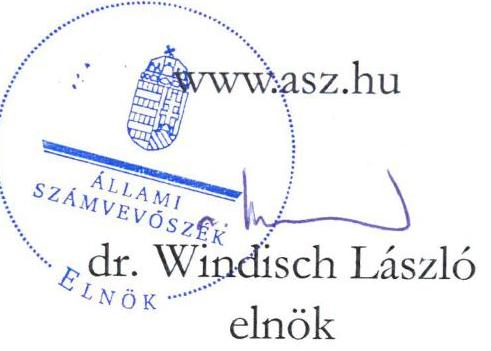
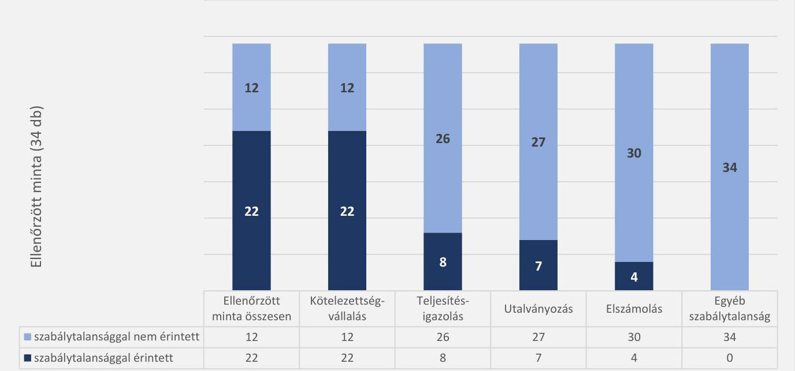
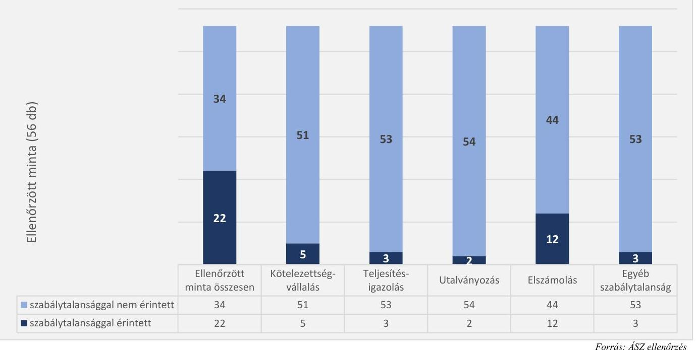
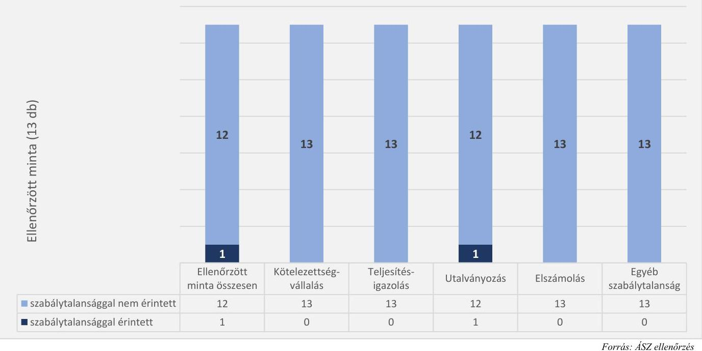

# JELENTÉS 

Az államháztartás központi alrendszerébe tartozó költségvetési szervek személyi juttatásként elszámolt kiadásai, dologi kiadásai és felhalmozási célú kiadásai megfelelőségének célzott ellenőrzése

Magyar Képzőművészeti Egyetem

2023.

---

# JELENTÉS 

Az államháztartás központi alrendszerébe tartozó költségvetési szervek személyi juttatásként elszámolt kiadásai, dologi kiadásai és felhalmozási célú kiadásai megfelelőségének célzott ellenőrzése

Magyar Képzőművészeti Egyetem

2023.

23033

---

# ELLENŐRZÉSI IGAZGATÓSÁG: 

## ÁLLAMHÁZTARTÁS KÖZPONTI SZINTJÉT ELLENŐRZŐ IGAZGATÓSÁG

## ELLENŐRZÉSI IGAZGATÓ:

DR. SZOMOLAI CSABA igazgatói feladatokat ellátó alelnök

## ELLENŐRZÉSVEZETŐ:

Jelentéseink az interneten a www.asz.hu címen olvashatók.

RENKÓ ZSUZSANNA ellenőrzésvezető

IKTATÓSZÁM: EL-3948-001/2023.
TÉMASZÁM: 2663
ELLENŐRZÉS-AZONOSÍTÓ SZÁM: V-1007

---

# TARTALOMJEGYZÉK 

- AZ ELLENŐRZÉS ALAPADATAI ..... 5
- AZ ELLENŐRZÉS HATÓKÖRE ÉS TERÜLETE/ AZ ELLENŐRZÖTT SZERVEZET ..... 6
- ÖSSZEFOGLALÁS ..... 8
- AZ ELLENŐRZÉS FÓKUSZTERÜLETEI ..... 9
- MEGÁLLAPÍTÁSOK ..... 10
- JAVASLATOK ..... 15
- MELLÉKLETEK ..... 16
I. sz. melléklet: Értelmező szótár ..... 16
II. sz. melléklet: Az ellenőrzött szervezetek jegyzéke ..... 17
III. sz. melléklet: Az ellenőrzési programok alapján vizsgált jogszabályi előírások ..... 18
- FÜGGELÉK: ÉSZREVÉTELEK ..... 19
- RÖVIDÍTÉSEK JEGYZÉKE ..... 23

---

.

---

# AZ ELLENŐRZÉS ALAPADATAI 

## AZ ELLENŐRZÉS CÉLJA

Az ellenőrzés célja annak megállapítása, hogy az államháztartás központi alrendszerébe tartozó költségvetési szerv ellenőrzött kiadásai megfeleltek-e az ellenőrzés keretében vizsgált jogszabályi előírásoknak.

## AZ ELLENŐRZÉS TÍPUSA

Megfelelőségi ellenőrzés

## AZ ELLENŐRZÖTT IDŐSZAK

2022. év

## AZ ELLENŐRZÉS TÁRGYA

A személyi juttatások, a dologi kiadások és a felhalmozási célú kiadások kiválasztott rovatain elszámolt, kiválasztott tételek.

## AZ ELLENŐRZÉS JOGALAPJA

Az ellenőrzés jogalapját az ÁSZ tv. ${ }^{1} 1 . \S$ (3) bekezdése és az 5. § (6) bekezdése képezte.

## AZ ELLENŐRZÉS MÓDSZERE

Az ellenőrzést az ÁSZ ${ }^{2}$ az ellenőrzött időszakban hatályos jogszabályok, az ellenőrzés szakmai szabályai alapján, „Az államháztartás központi alrendszerébe tartozó költségvetési szerv személyi juttatásként elszámolt kiadásai megfelelőségének célzott ellenőrzése", „Az államháztartás központi alrendszerébe tartozó költségvetési szerv dologi kiadásai megfelelőségének célzott ellenőrzése" és „Az államháztartás központi alrendszerébe tartozó költségvetési szerv felhalmozási célú kiadásai megfelelőségének célzott ellenőrzése" című ellenőrzési programok (továbbiakban: ellenőrzési programok) kérdéseire adott válaszok kiértékelésével, az ellenőrzési programokban megjelölt adatforrások figyelembevételével folytatta le.

Az ellenőrzési kérdések megválaszolásához szükséges bizonyítékok megszerzése a következő ellenőrzési eljárások alkalmazásával történt: megfigyelés, összehasonlítás, elemző eljárás, a személyi juttatások, dologi kiadások, felhalmozási célú kiadások ellenőrzéssel érintett rovatairól történő mintavétel. Az ellenőrzési bizonyítékként felhasználható adatforrások közé tartoztak az ellenőrzés folyamán feltárt, az ellenőrzés szempontjából információt tartalmazó dokumentumok.

Az ellenőrzés során a kiválasztott mintatételek ellenőrzési programokban meghatározott szempontok szerinti szabályszerűségét értékelte az ÁSZ.

---

# AZ ELLENŐRZÉS HATÓKÖRE ÉS TERÜLETE/ AZ ELLENŐRZÖTT SZERVEZET 

Az ellenőrzés a Magyar Képzőművészeti Egyetemre, mint az államháztartás központi alrendszerébe tartozó költségvetési szervre terjedt ki.

Az ellenőrzés során az ÁSZ

- a személyi juttatások körébe tartozó Törvény szerinti illetmények, munkabérek; Céljuttatás, projektprémium; Készenléti, ügyeleti, helyettesítési díj, túlóra, túlszolgálat; Munkavégzésre irányuló egyéb jogviszonyban nem saját foglalkoztatottnak fizetett juttatások; Egyéb külső személyi juttatások;
- a dologi kiadások körébe tartozó Szakmai anyagok beszerzése; Üzemeltetési anyagok beszerzése; Informatikai szolgáltatások igénybevétele; Vásárolt élelmezés; Bérleti és lízing díjak; Karbantartási, kisjavítási szolgáltatások; Szakmai tevékenységet segítő szolgáltatások; Egyéb szolgáltatások; Kiküldetések kiadásai; Reklám- és propagandakiadások; Egyéb dologi kiadások;
- a felhalmozási célú kiadások körébe tartozó Informatikai eszközök beszerzése, létesítése; Egyéb tárgyi eszközök beszerzése, létesítése rovatokon elszámolt kiadások
kiválasztott mintatételei tekintetében - az ellenőrzési programokban megjelölt jogszabályi előírások alapján - a kötelezettségvállalás, teljesítésigazolás és utalványozás gazdálkodási jogkörök gyakorlását, valamint a kiadások elszámolásának megfelelőségét értékelte.

Az ÁSZ

- a kötelezettségvállalási jogkörgyakorlás ellenőrzése keretében a kötelezettségvállalás szabályszerű elvégzését, és a pénzügyi ellenjegyzéssel ellátott kötelezettségvállalási dokumentum rendelkezésre állását,
- a teljesítésigazolási jogkörgyakorlás ellenőrzése keretében a teljesítésigazolás szabályszerű végrehajtását,
- az utalványozási jogkörgyakorlás ellenőrzése keretében az utalványozás szabályszerű megtörténtét,
- a kiadások rovatokon történő elszámolásának szabályszerűségét vizsgálta.

Az ÁSZ az ellenőrzött rovatokon elszámolt és kiválasztott mintatételek esetében a III. számú mellékletben megjelölt jogszabályi előírásoknak való megfelelőséget értékelte.

## MAGYAR KÉPZŐMŰVÉSZETI EGYETEM

Az $\mathrm{MKE}^{3}$ jogelődje az 1871-ben miniszteri rendelettel létesített Országos Magyar Királyi Mintarajztanoda és Rajztanárképezde. Többszöri átszervezés és névváltozás után 1908-tól a Magyar Királyi Képzőművészeti Főiskola nevet viselte az intézmény. 1971-ben egyetemi jellegű főiskolának, majd 1986-ban egyetemnek nyilvánították. Jelenlegi nevén 2000. január 1. napjától működik az MKE.

Az MKE közfeladata az oktatási, tudományos kutatási és művészeti alkotótevékenység folytatása, melynek keretében alapképzést (Látványtervező, Képzőművészet-elmélet, Vizuális művészet), mesterfokozatot adó osztatlan képzést (Festőművész, Szobrászművész, Grafikusművész, Restaurátorművész, Intermédiaművész), mesterképzést (Látványtervező művész, Képzőművész-tanár, Képzőművész, Kortárs művészetelméleti és kurátori ismeretek) és szakirányú továbbképzést (Gyakorlatvezető mentortanár pedagógus-

---

szakvizsgára felkészítő szakirányú továbbképzési szak, Mentorpedagógus pedagógus-szakvizsgára felkészítő szakirányú továbbképzési szak) végez.

Az ellenőrzött időszakban az MKE irányító szerve változott. 2022. június 30-áig az Innovációs és Technológiai Minisztérium, míg 2022. július 1-jétől a Kulturális és Innovációs Minisztérium látja el az Egyetem irányító szervi feladatait. Az ellenőrzéssel érintett időszak alatt a rektor személye nem változott. A jelenleg hivatalban lévő rektor tisztségét 2021. augusztus 1. óta tölti be.

Az MKE 2022. évi költségvetési beszámolója szerint 1 154,1 M Ft költségvetési bevételt, 4 293,4 M Ft finanszírozási bevételt ért el, valamint 3 004,1 M Ft költségvetési kiadást és 74,15 M Ft finanszírozási kiadást teljesített, a kiadási főösszeg 3 078,3 M Ft volt összesen. A 2022. december 31-i könyvviteli mérleg szerint az MKE eszközei 4 402,42 M Ft-ot tettek ki.

---

# ÖSSZEFOGLALÁS 

Az ÁSZ célzott ellenőrzés keretében vizsgálta az MKE, mint az államháztartás központi alrendszerébe tartozó költségvetési szerv által a 2022. évben teljesített személyi juttatások, dologi, illetve felhalmozási célú kiadások kiválasztott tételeinek megfelelőségét. Az ellenőrzés során a kiválasztott kiadásokhoz kapcsolódóan a kötelezettségvállalás, teljesítésigazolás, utalványozás gazdálkodási jogkörök gyakorlásának, valamint a kiadások elszámolásának ellenőrzési programokban meghatározott jogszabályi előírásoknak való megfelelőségét értékelte az ÁSZ.

Az ellenőrzött 34 személyi juttatás közül 22-nél, az 56 dologi kiadás közül 22-nél, a 13 felhalmozási célú kiadás közül 1-nél tárt fel szabálytalanságot az ellenőrzés.

Az egyes rovatokon elszámolt kiadásokból összesen 103 elemű minta került kiválasztásra, amelyek 43,7%-a volt szabálytalansággal érintett. A szabálytalansággal érintett tételek ellenőrzött tételekhez viszonyított aránya a személyi juttatásoknál 64,7 %, a dologi kiadásoknál 39,3 %, a felhalmozási célú kiadásoknál 7,7 % volt.

A személyi juttatások ellenőrzött kiadásainál a pénzügyi ellenjegyzés hiányában történt kötelezettségvállalás, a dologi kiadásoknál a nem megfelelő rovaton történő elszámolás voltak a jellemző szabálytalanságok. A felhalmozási célú kiadásokhoz kapcsolódóan feltárt szabálytalanság az utalványozás dátumának hiánya volt.

Egyéb, nem a gazdálkodási jogkörgyakorlást érintő szabálytalanságot a dologi kiadások ellenőrzött tételeihez kapcsolódóan, 3 esetben tárt fel az ÁSZ, ezek a kötelezettségvállalás nyilvántartásba vételét, valamint a beszerzési szabályzat előírásának be nem tartását érintő szabálytalanságok voltak.

---

# AZ ELLENŐRZÉS FÓKUSZTERÜLETEI 

1. Az államháztartás központi alrendszerébe tartozó költségvetési szervnél a személyi juttatások ellenőrzött rovatain elszámolt, kiválasztott kiadások megfelelősége.
2. Az államháztartás központi alrendszerébe tartozó költségvetési szervnél a dologi kiadások ellenőrzött rovatain elszámolt, kiválasztott kiadások megfelelősége.
3. Az államháztartás központi alrendszerébe tartozó költségvetési szervnél a felhalmozási célú kiadások ellenőrzött rovatain elszámolt, kiválasztott kiadások megfelelősége.

---

# MEGÁLLAPÍTÁSOK 

## 1. Az államháztartás központi alrendszerébe tartozó költségvetési szervnél a személyi juttatások ellenőrzött rovatain elszámolt, kiválasztott kiadások megfelelősége.

## Összegző megállapítás

A személyi juttatások ellenőrzött rovatain elszámolt és ellenőrzésre kiválasztott kiadások 64,7%-ánál tárt fel az ellenőrzés szabálytalanságot.

A személyi juttatások ellenőrzött rovatairól összesen 34 kiadási tétel ellenőrzésére került sor. A kiadások 35,3%-ánál az ellenőrzés nem tárt fel szabálytalanságot. Az ellenőrzés a kötelezettségvállalás esetében 22 kiadási tételnél, a teljesítésigazolás tekintetében 8 kiadási tételnél, míg az utalványozás vonatkozásában 7 kiadási tételnél tárt fel szabálytalanságot. Továbbá 4 személyi juttatás könyvviteli elszámolása nem felelt meg a jogszabályban meghatározott rovatrend előírásainak.

Az ellenőrzött személyi juttatások szabályszerűségének értékelését az 1. ábra mutatja be.
1. ábra

AZ ELLENŐRZŐTT SZEMÉLYI JUTTATÁSOK SZABÁLYSZERŰSÉGÉNEK ÉRTÉKELÉSE

---

A kötelezettségvállalás gazdálkodási jogkör gyakorlásához kapcsolódóan az ÁSZ az alábbi szabálytalanságokat tárta fel:

- 22 mintatétel esetében az Áht. ${ }^{4}$ 37. § (1) bekezdésében foglalt előírás ellenére az írásbeli kötelezettségvállalásra pénzügyi ellenjegyzés hiányában került sor (K1101/1., K1101/2., K1101/3., K1101/4., K1101/5., K1101/6., K1101/7., K1101/8., K1101/9., K1101/10., K1103/1., K1103/2., K1103/3., K1103/4., K1103/5., K1104/1., K1104/3., K1104/4., K1104/5., K122/1., K122/2., K123/5. sorszámú mintatételek)*.
A teljesítésigazolás gazdálkodási jogkör gyakorlásához kapcsolódóan az ÁSZ az alábbi szabálytalanságokat tárta fel:
- 5 mintatétel esetében az Áht. 38. § (1) bekezdésében, valamint az Ávr. ${ }^{5}$ 57. § (1) bekezdésében foglaltak ellenére nem történt meg a kiadás teljesítésigazolása (K1103/2., K1103/3., K1103/4., K1103/5., K123/5. sorszámú mintatételek),
- 3 mintatételnél a teljesítésigazolás nem felelt meg az Ávr. 57. § (3) bekezdésben foglalt előírásoknak, mivel nem tartalmazta a teljesítésigazolás dátumát, ezáltal nem igazolt, hogy a teljesítésigazolásra a teljesítést követően került-e sor (K1101/1., K1104/4., K1104/5. sorszámú mintatételek).
Az utalványozás gazdálkodási jogkör gyakorlásához kapcsolódóan az ÁSZ az alábbi szabálytalanságokat tárta fel:
- 5 mintatétel esetében az utalványozásra az Áht. 38. § (1) bekezdésben foglaltak ellenére teljesítésigazolás nélkül került sor (K1103/2., K1103/3., K1103/4., K1103/5., K123/5. sorszámú mintatételek),
- 2 mintatétel esetében az utalvány az Ávr. 59. § (3) bekezdés g) pontjában előírtak ellenére nem tartalmazta az utalványozás dátumát (K1101/6., K1101/7. sorszámú mintatételek).
Az ellenőrzés során feltárt elszámolási szabálytalanságok:
- 4 mintatétel esetében a kiadás könyvviteli elszámolása az Áhsz. ${ }^{6}$ 40. § (1) bekezdésében foglalt előírások ellenére nem az Áhsz. 15. mellékletének I. pontjában foglaltaknak szerint történt, mivel a minden dolgozót megillető normatív jutalmat nem a K1102 Normatív jutalmak rovaton számolták el (K1103/2., K1103/3., K1103/4., K1103/5. sorszámú mintatételek).

[^0]
[^0]:    * A K1101/2., K1101/3., K1101/5. és a K1101/9. mintatételeknél a kinevezési okmány módosításán a pénzügyi ellenjegyzés dátuma későbbi, mint a kötelezettségvállalás dátuma. A K1103/1. tételnél és a K122/2. tételnél (MKE./476/2022.sz szerződés) a pénzügyi ellenjegyzés dátuma későbbi, mint a kötelezettségvállalás dátuma. A K122/2. tételnél (MKE./896-1/2022. sz. szerződés) a kötelezettségvállalás dátuma nem szerepel.

---

# 2. Az államháztartás központi alrendszerébe tartozó költségvetési szervnél a dologi kiadások ellenőrzött rovatain elszámolt, kiválasztott kiadások megfelelősége. 

## Összegző megállapítás

A dologi kiadások ellenőrzött rovatain elszámolt és ellenőrzésre kiválasztott kiadások 39,3%-ánál fordult elő szabálytalanság.

A dologi kiadások ellenőrzött rovatairól összesen 56 kiadási tétel ellenőrzésére került sor. A kiadások 60,7%-ánál az ellenőrzés nem tárt fel szabálytalanságot. Az ellenőrzés a kötelezettségvállalás esetében 5 kiadási tételnél, a teljesítésigazolás tekintetében 3 kiadási tételnél, míg az utalványozás vonatkozásában 2 kiadási tételnél tárt fel szabálytalanságot. Továbbá 12 dologi kiadás nem a megfelelő rovaton került elszámolásra, valamint 3 kiadási tétel esetében egyéb, nem a gazdálkodási jogkörgyakorlást érintő szabálytalanság fordult elő.

Az ellenőrzött dologi kiadások szabályszerűségének értékelését a 2. ábra mutatja be.
2. ábra

AZ ELLENŐRZŐTT DOLOGI KIADÁSOK SZABÁLYSZERŰSÉGÉNEK ÉRTÉKELÉSE

---

A kötelezettségvállalás gazdálkodási jogkör gyakorlásához kapcsolódóan az ÁSZ az alábbi szabálytalanságot tárta fel:

- 5 mintatétel esetében az Áht. 37. § (1) bekezdésében foglaltak ellenére a kötelezettségvállalásra pénzügyi ellenjegyzés hiányában került sor (K332/1., K332/2., K334/4., K336/5., K341/5. sorszámú mintatételek).
A teljesítésigazolás gazdálkodási jogkör gyakorlásához kapcsolódóan az ÁSZ az alábbi szabálytalanságokat tárta fel:
-
 1 mintatétel esetében az Áht. 38. § (1) bekezdésében, valamint az Ávr. 57. § (1) bekezdésében foglaltak ellenére nem történt meg a kiadás teljesítésigazolása (K341/5. sorszámú mintatétel),
- 2 mintatétel esetében a teljesítésigazolás az Ávr. 57. § (3) bekezdésében foglaltak ellenére nem tartalmazta a teljesítés igazolásának dátumát (K337/4., K341/2. sorszámú mintatételek).
Az utalványozás gazdálkodási jogkör gyakorlásához kapcsolódóan az ÁSZ az alábbi szabálytalanságokat tárta fel:
- 1 mintatétel esetében az utalvány az Ávr. 59.§ (3) bekezdés g) pontjában előírtak ellenére nem tartalmazta az utalványozás dátumát (K312/4. sorszámú mintatétel),
- 1 mintatétel esetében az utalványozásra az Áht. 38. § (1) bekezdésben foglaltak ellenére teljesítésigazolás nélkül került sor (K341/5. sorszámú mintatétel).

Az ellenőrzés során feltárt elszámolási szabálytalanság:

- 12 mintatétel esetében a kiadás elszámolása az Áhsz. 40. § (1) bekezdésben foglaltak ellenére nem az Áhsz. 15. mellékletének I. pontjában foglaltak szerint történt. (5 ellenőrzött tétel esetében a kiadást a K312. Üzemeltetési anyagok beszerzése rovat helyett a K311 Szakmai anyagok beszerzése rovaton (K311/1., K311/2., K311/3., K311/4., K311/5. sorszámú mintatételek), 1 ellenőrzött tétel esetében a kiadást a K71. Ingatlanok felújítása rovat helyett a K334 Karbantartási, kisjavítási szolgáltatások rovaton (K334/3. sorszámú mintatétel), 2 ellenőrzött tétel esetében a kiadást a K62. Ingatlanok beszerzése, létesítése rovat helyett a K334 Karbantartási, kisjavítási szolgáltatások rovaton, (K334/5.; K334/6. sorszámú mintatételek), 3 ellenőrzött tétel esetében a kiadást a K341. Kiküldetések kiadása rovat helyett a K337 Egyéb szolgáltatások rovaton (K337/5., K337/6., K337/7. sorszámú mintatételek), 1 ellenőrzött tétel esetében a kiadást a K336. Szakmai tevékenységet segítő szolgáltatások rovat helyett a K355 Egyéb dologi kiadások rovaton (K355/6. sorszámú mintatétel) számolták el).
Az ellenőrzés során feltárt egyéb szabálytalanságok:
- 1 mintatételnél az Ávr. 56. § (1) bekezdésében előírtak ellenére a kötelezettségvállalást követően nem gondoskodtak annak nyilvántartásba vételéről (K312/4. sorszámú mintatétel),
- 2 mintatételnél a beszerzési szabályzat ${ }^{7}$ 28. pontjában foglaltak ellenére a beszerzési eljárás során három árajánlat helyett egy árajánlatot kértek be (K321/3.; K336/1. sorszámú mintatételek).

---

# 3. Az államháztartás központi alrendszerébe tartozó költségvetési szervnél a felhalmozási célú kiadások ellenőrzött rovatain elszámolt, kiválasztott kiadások megfelelősége.. 

## Összegző megállapítás

A felhalmozási célú kiadások ellenőrzött rovatain elszámolt és ellenőrzésre kiválasztott kiadásoknál egy esetben fordult elő szabálytalanság.

A felhalmozási célú kiadások ellenőrzött rovatairól összesen 13 kiadási tétel ellenőrzésére került sor. Az ellenőrzés a kiadások 92,3\%-ánál nem tárt fel szabálytalanságot, 1 kiadási tétel kapcsán az utalványozást érintő szabálytalanságot állapított meg.

Az ellenőrzött felhalmozási célú kiadások szabályszerűségének értékelését a 3. ábra mutatja be.
3. ábra

AZ ELLENŐRZÖTT FELHALMOZÁSI CÉLÚ KIADÁSOK SZABÁLYSZERŰSÉGÉNEK ÉRTÉKELÉSE

Az utalványozás gazdálkodási jogkör gyakorlásához kapcsolódóan az ÁSZ az alábbi szabálytalanságot tárta fel:

- 1 mintatétel esetében az utalvány az Ávr. 59.§ (3) bekezdés g) pontjában előírtak ellenére nem tartalmazta az utalványozás dátumát (K64/6. sorszámú mintatétel).

---

# JAVASLATOK 

Az ÁSZ tv. 33. § (1) bekezdésében foglaltak értelmében az ellenőrzött szervezet vezetője köteles a jelentésben foglalt megállapításokhoz kapcsolódó intézkedési tervet összeállítani és azt a jelentés kézhezvételétől számított 30 napon belül az ÁSZ részére megküldeni. Amennyiben az ellenőrzött szervezet vezetője nem küldi meg határidőben az intézkedési tervet, vagy továbbra sem elfogadható intézkedési tervet küld, az Állami Számvevőszék elnöke az ÁSZ tv. 33. § (3) bekezdése a) és b) pontjaiban foglaltakat érvényesítheti.

## A MAGYAR KÉPZŐMŰVÉSZETI EGYETEM KANCELLÁRJÁNAK

1. Kezdeményezzen a költségvetési szervek belső kontrollendszeréről és belső ellenőrzéséről szóló 311/2011. (XII. 31.) Korm. rendelet 31. § (6) bekezdése alapján soron kívüli belső ellenőrzést a jelen ellenőrzés során feltárt szabálytalanságok kialakulása okainak és a gazdálkodási jogkörgyakorlással kapcsolatos kockázati tényezők feltárása, illetve a szabálytalanságok megszüntetése érdekében.
2. A költségvetési szervek belső kontrollendszeréről és belső ellenőrzéséről szóló 311/2011. (XII. 31.) Korm. rendelet 13. § (2) bekezdésében foglaltak alapján, valamint az 1. számú javaslat szerinti belső ellenőrzés megállapításait és javaslatait is figyelembe véve tegyen intézkedéseket azon kontrolltevékenységek kiépítésére és/vagy megfelelő működtetésére, amelyek megelőzik a jelentésben leírt szabálytalanságok ismételt előfordulását.

---

# MELLÉKLETEK 

## I. SZ. MELLÉKLET: ÉRTELMEZŐ SZÓTÁR

kötelezettségvállalás
pénzügyi ellenjegyzés
teljesítésigazolás
utalványozás

A költségvetési szerv által a kiadási előirányzatok és - ha jogszabály lehetővé teszi - a kijelölt lebonyolító szerv számára a Kormány rendeletében meghatározottak szerinti rendelkezésre bocsátott összeg terhére fizetési kötelezettség vállalásáról szóló - így különösen a foglalkoztatásra irányuló jogviszony létesítésére, szerződés megkötésére, költségvetési támogatás biztosítására irányuló - szabályszerűen megtett jognyilatkozat.
Forrás: Áht. 1. § 15. pont
A kötelezettségvállalást megelőző művelet, amelynek során a pénzügyi ellenjegyzőnek meg kell győződnie arról, hogy a szükséges szabad előirányzat - több évet érintő kötelezettségvállalás esetén minden egyes évben rendelkezésre áll, a tervezett kifizetési időpontokban a pénzügyi fedezet biztosított, valamint a kötelezettségvállalás nem sérti a gazdálkodásra vonatkozó szabályokat. Kötelezettséget vállalni a Kormány rendeletében foglalt kivételekkel csak pénzügyi ellenjegyzés után, a pénzügyi teljesítés esedékességét megelőzően, írásban lehet.
Forrás: Áht. 37. § (1) bekezdés
A kötelezettségvállalásban a másik fél által vállalt feltételek teljesítéséhez kapcsolódó igazolás, amely a kiadási előirányzat terhére vállalt utalványozást előzi meg. A teljesítés igazolása során ellenőrizhető okmányok alapján ellenőrizni és igazolni kell a kiadások teljesítésének jogosságát, összegszerűségét, ellenszolgáltatást is magában foglaló kötelezettségvállalás esetében - ha a kifizetés vagy annak egy része az ellenszolgáltatás teljesítését követően esedékes - annak teljesítését. A teljesítést az igazolás dátumának és a teljesítés tényére történő utalás megjelölésével, az arra jogosult személy aláírásával kell igazolni.
Forrás: Áht. 38. § (1) bekezdés; Ávr. 57. § (1) és (3) bekezdések
A bevételek és kiadások elszámolására utalványozás alapján kerülhet sor. A kiadási előirányzatok terhére történő utalványozás esetén az utalványozásra csak azután kerülhet sor, ha a kiadás alapjául szolgáló kötelezettségvállalásban meghatározott feltételeket a másik szerződő fél már teljesítette. A kiadási előirányzatok terhére történő utalványozásra a teljesítés igazolását és az érvényesítést követően, a bevételi előirányzatok esetén a belső szabályzatban a bevételek meghatározott körére esetlegesen elrendelt teljesítés igazolását követően kerülhet sor.
Forrás: Áht. 38. § (1) bekezdés; Ávr. 57. § (2) bekezdés és 59. § (1b) bekezdés

---

# II. SZ. MELLÉKLET: AZ ELLENŐRZÖTT SZERVEZETEK JEGYZÉKE 

## KÖLTSÉGVETÉSI SZERV NEVE

Magyar Képzőművészeti Egyetem

---

# III. SZ. MELLÉKLET: AZ ELLENŐRZÉSI PROGRAMOK ALAPJÁN VIZSGÁLT JOGSZABÁLYI ELŐÍRÁSOK 

## AZ EGYES GAZDÁLKODÁSI JOGKÖRÖKHÖZ, SZÁMFEJTELELSZÁMOLÁSHOZ KAPCSOLÓDÓAN ELLENŐRZÖTT JOGSZABÁLYI KRITÉRIUMOK

## SZEMÉLYI JUTTATÁSOK

Kötelezettségvállalás
Áht. 37. § (1) bekezdés
Ávr. 50. § (1) bekezdés d) pont, 50. § (2) bekezdés b) pont, 52. § (1), (9), 53. § (1), 55. § (1), (4), 56. § (1) bekezdések

Áhsz. 14. melléklet II. pont
Kttv. ${ }^{8}$ 8. § (1)-(2) bekezdések, 38. §, 43. § (1) bekezdés a)-b) pontok, 116. § - 118. §, 154. § (2) bekezdés
Kjt. ${ }^{9}$ 21. §, 61-77 §, 77/A. §
Mt. ${ }^{10}$ 45. § (1) bekezdés, 208-209. §
Kit. ${ }^{11}$ 146. § (1)-(2) bekezdések
Teljesítésigazolás
Áht. 38. § (1) bekezdés
Ávr. 57. § (1), (3), (5) bekezdések
Mt. 134. §
Utalványozás
Áht. 38. § (1) bekezdés
Ávr. 58. § (3), 59. § (1b), (2), (3), (4) bekezdések
DOLOGI ÉS FELHALMOZÁSI CÉLÚ KIADÁSOK
Kötelezettségvállalás
Áht. 37. § (1) bekezdés
Ávr. 13. § (2) bekezdés b) pont, 50. § (1), (1a) bekezdések, 50. § (2) bekezdés b) pont, 52. § (1), (9), 52/A. § (1)-(5), (10), 53. § (1), 55. § (1), (4), 56. § (1) bekezdések
Kttv. 8. § (1)-(2) bekezdések
Áhsz. 14. melléklet II. pont
Kbt. ${ }^{12}$ 15. §, 79. § (2) bekezdés
Teljesítésigazolás
Áht. 38. § (1) bekezdés
Ávr. 57. § (1), (3), (5) bekezdések
Utalványozás
Áht. 38. § (1) bekezdés
Ávr. 57. § (3), 58. § (3), 59. § (1b), (2), (3), (4) bekezdések
Áhsz. 40. § (1) bekezdés, 15. melléklet I. pont
Állománybavétel
Áhsz. 45. § (2), 53. § (6) bekezdések, 16. melléklet

---

# FÜGGELÉK: ÉSZREVÉTELEK 

A jelentéstervezetet a Számvevőszék 15 napos észrevételezésre megküldte az ellenőrzött szervezet vezetőjének az ÁSZ tv. 29. § (1) bekezdése előírásának megfelelően.

A jelentéstervezet megállapításaira a Magyar Képzőművészeti Egyetem kancellárja észrevételt tett. Az ÁSZ tv. 29. § (3) bekezdésével összhangban az Állami Számvevőszék a Függelékben feltünteti a megállapításokkal kapcsolatban tett, el nem fogadott észrevételeket, és megindokolja, hogy azokat miért nem fogadta el.

1. Észrevétel: „A kinevezési dokumentumok szkennelése során a kétoldalas dokumentumoknak csak az egyik oldala lett beszkennelve, a pénzügyi ellenjegyzés a másik oldalra esett, ezért újra, kétoldalasán beszkennelésre kerültek a dokumentumok és mellékelten megküldjük"

Az észrevétellel érintett megállapítás: ,,az Áht. 37. § (1) bekezdésében foglalt előírás ellenére az írásbeli kötelezettségvállalásra pénzügyi ellenjegyzés hiányában került sor (K1101/1., K1101/2., K1101/3., K1101/4., K1101/5., K1101/6., K1101/7., K1101/8., K1101/9., K1101/10., ... sorszámú mintatételek)" (12. oldal 2. bekezdés).

El nem fogadás indoka: Az észrevétel mellékleteként beküldött 9 dokumentumon a pénzügyi ellenjegyzés dátuma minden esetben későbbi volt, mint a kötelezettségvállalás dátuma, továbbá a K1101/4. sorszámú tételhez dokumentumot nem küldött az ellenőrzött szervezet. Így helytálló a megállapítás, hogy az írásbeli kötelezettségvállalásra pénzügyi ellenjegyzés hiányában került sor.
2. Észrevétel: „Hiányos dokumentumok kerültek beküldésre az adatszolgáltatás során, mellékelten küldjük a megfelelő dokumentumokat"

Az észrevétellel érintett megállapítás: ,,az Áht. 37. § (1) bekezdésében foglalt előírás ellenére az írásbeli kötelezettségvállalásra pénzügyi ellenjegyzés hiányában került sor (... K1103/1., K1103/2., K1103/3., K1103/4., K1103/5., ... sorszámú mintatételek)" (12. oldal 2. bekezdés)

[^0]
[^0]:    $\dagger$ 29. $\S$ (1) Az Állami Számvevőszék az ellenőrzési megállapításait megküldi az ellenőrzött szervezet vezetőjének vagy az általa megbízott személynek, és annak, akinek személyes felelősségét állapította meg.
    (2) Az ellenőrzött szervezet vezetője és a felelősként megjelölt személy az ellenőrzés megállapításaira tizenöt napon belül írásban észrevételt tehet.
    (3) Az Állami Számvevőszék az észrevételre a beérkezésétől számított harminc napon belül írásban válaszol. A figyelembe nem vett észrevételeket köteles a jelentésben feltüntetni, és megindokolni, hogy azokat miért nem fogadta el.

---

El nem fogadás indoka: Az észrevétellel beküldött bérszámfejtési lapok nem tartalmaznak információt a kötelezettségvállalás ellenjegyzésével kapcsolatban. Az ellenőrzéshez eredetileg beküldött dokumentumokon a pénzügyi ellenjegyzés dátuma minden esetben későbbi volt, mint a kötelezettségvállalás dátuma. Így helytálló a megállapítás, hogy az írásbeli kötelezettségvállalásra pénzügyi ellenjegyzés hiányában került sor.
3. Észrevétel: „Az adatszolgáltatás során megküldött szerződésen van pénzügyi ellenjegyzés, amit újra megküldünk (Cornext Bt.)"

Az észrevétellel érintett megállapítás: ,,az Áht. 37. § (1) bekezdésében foglaltak ellenére a kötelezettségvállalásra pénzügyi ellenjegyzés hiányában került sor (... K336/5. ... sorszámú mintatételek)" (14. oldal 2. bekezdés)

El nem fogadás indoka: Az észrevételben jelzettel ellentétben nem csatolt az ellenőrzött szervezet dokumentumot. Az ellenőrzéshez eredetileg beküldött dokumentumokon a pénzügyi ellenjegyzés dátuma későbbi volt, mint a kötelezettségvállalás dátuma. Így helytálló a megállapítás, hogy az írásbeli kötelezettségvállalásra pénzügyi ellenjegyzés hiányában került sor.
4. Észrevétel: ,,Az adatszolgáltatás során csak a kiküldetési rendelvény került megküldésre a kötelezettségvállalás dokumentuma külön kiküldetési elrendelőn van amit most utólag megküldünk"

Az észrevétellel érintett megállapítás: ,,az Áht. 37. § (1) bekezdésében foglaltak ellenére
 a kötelezettségvállalásra pénzügyi ellenjegyzés hiányában került sor (... K341/5. sorszámú mintatételek)" (14. oldal 2. bekezdés)

El nem fogadás indoka: Az észrevétel mellékleteként beküldött dokumentumon a pénzügyi ellenjegyzés dátuma későbbi volt, mint a dokumentum dátuma. Így helytálló a megállapítás, hogy az írásbeli kötelezettségvállalásra pénzügyi ellenjegyzés hiányában került sor.
5. Észrevétel: „A jutalom kifizetése nem teljesítményhez kötött volt, hanem normatív jutalom volt."

Az észrevétellel érintett megállapítás: ,,az Áht. 38. § (1) bekezdésében, valamint az Ávr. 57. § (1) bekezdésében foglaltak ellenére nem történt meg a kiadás teljesítésigazolása (K1103/2., K1103/3., K1103/4., K1103/5., ... sorszámú mintatételek)." (12. oldal 4. bekezdés)

El nem fogadás indoka: A jogszabály szerinti teljesítésigazolás a normatív jutalom kifizetése esetében annak igazolását jelenti, hogy a dolgozók részére a normatív jutalom számfejtése a döntésnek megfelelő összegben történt-e. Az észrevétellel teljesítésigazolás elvégzését igazoló dokumentumot nem küldött az ellenőrzött szervezet. Így helytálló a megállapítás, hogy nem történt meg a kiadás teljesítésigazolása.

---

6. Észrevétel: „Hiányos dokumentumok kerültek beküldésre az adatszolgáltatás során, mellékelten küldjük a megfelelő dokumentumokat"

Az észrevétellel érintett megállapítás: ,,az utalványozásra az Áht. 38. § (1) bekezdésben foglaltak ellenére teljesítésigazolás nélkül került sor (K1103/2., K1103/3., K1103/4., K1103/5., ... sorszámú mintatételek)" (12. oldal 7. bekezdés)

El nem fogadás indoka: Az észrevétellel beküldött bérszámfejtési lapok nem tartalmaznak információt a teljesítésigazolással kapcsolatban. Az észrevétellel teljesítésigazolás elvégzését igazoló dokumentumot nem küldött az ellenőrzött szervezet. Így helytálló a megállapítás, hogy az utalványozásra teljesítésigazolás nélkül került sor.
7. Észrevétel: „Művészeti alkotásokhoz használt speciális szakmai anyagok, véleményünk szerint a megfelelő rovaton kerültek elszámolásra"

Az észrevétellel érintett megállapítás: „a kiadás elszámolása az Áhsz. 40. § (1) bekezdésben foglaltak ellenére nem az Áhsz. 15. mellékletének I. pontjában foglaltaknak szerint történt. (5 ellenőrzött tétel esetében a kiadást a K312. Üzemeltetési anyagok beszerzése rovat helyett a K311 Szakmai anyagok beszerzése rovaton (... K311/2., K311/3., K311/4., K311/5. sorszámú mintatételek) ... számolták el)." (14. oldal 10. bekezdés)

El nem fogadás indoka: Az érintett mintatételek az észrevételben jelzettek szerint művészeti alkotásokhoz használt speciális anyagok, amelyek az Áhsz. 15. melléklet I. pontja szerint nem számolhatók el a K3 Dologi kiadások K311. Szakmai anyagok beszerzése rovaton. Így helytálló a megállapítás.
8. Észrevétel: „A szerződés és az átadás-átvételi dokumentumok "épületkarbantartás"-ról szólnak, a számla szövegében helytelenül felújítás szerepel, hibás a számla kiállítása, erre nem figyelt az érvényesítő, javíttatni kellett volna azt, ezért véleményünk szerint megfelelő rovaton került elszámolásra a kiadás."

Az észrevétellel érintett megállapítás: „a kiadás elszámolása az Áhsz. 40. § (1) bekezdésben foglaltak ellenére nem az Áhsz. 15. mellékletének I. pontjában foglaltaknak szerint történt. (... 1 ellenőrzött tétel esetében a kiadást a K71. Ingatlanok felújítása rovat helyett a K334 Karbantartási, kisjavítási szolgáltatások rovaton (K334/3. sorszámú mintatétel) ... számolták el)." (14. oldal 10. bekezdés)

El nem fogadás indoka: A szerződés és az átadás-átvételi dokumentumok nem igazolják, hogy a számla kiállítása helytelenül történt. Az észrevétel nem cáfolja, hogy a könyvelés nem a számla szerint történt. Így helytálló a megállapítás.
9. Észrevétel: „Az adatszolgáltatás során megküldésre került a kötelezettségvállalási nyilvántartásba vétel dokumentuma, ismételten megküldjük."

---

Az észrevétellel érintett megállapítás: ,,az Ávr. 56. § (1) bekezdésében előírtak ellenére a kötelezettségvállalást követően nem gondoskodtak annak nyilvántartásba vételéről (K312/4. sorszámú mintatétel)" (14. oldal 12. bekezdés)

El nem fogadás indoka: Az észrevételben jelzettel ellentétben nem csatolt az ellenőrzött szervezet dokumentumot. Az ellenőrzéshez korábban beküldött kötelezettségvállalás nyilvántartásban nem szerepelt a kért tétel (sem az összeg, sem a dátum, se a beszerzés tárgya nem egyezett). Így helytálló a megállapítás.
10.Észrevétel: „A dokumentumokat felleltük, mellékelten megküldjük."

Az észrevétellel érintett megállapítás: ,, a beszerzési szabályzat 28. pontjában foglaltak ellenére a beszerzési eljárás során három árajánlat helyett egy árajánlatot kértek be (K321/3.; K336/1., ... sorszámú mintatételek)." (14. oldal 13. bekezdés)

El nem fogadás indoka: A K321/3. mintatételhez kapcsolódóan az árajánlatok bekérését, beérkezésének megtörténtét a beküldött dokumentumok nem igazolták. A K336/1. mintatételhez kapcsolódóan a hiányzó két árajánlatot továbbra sem küldte meg az ellenőrzött szervezet.

---

# RÖVIDÍTÉSEK JEGYZÉKE 

${ }^{1}$ ÁSZ tv.
${ }^{2}$ ÁSZ
${ }^{3}$ MKE
${ }^{4}$ Áht.
${ }^{5}$ Ávr.
${ }^{6}$ Áhsz.
${ }^{7}$ beszerzési szabályzat
${ }^{8}$ Kttv.
${ }^{9}$ Kjt.
${ }^{10} \mathrm{Mt}$.
${ }^{11}$ Kit.
${ }^{12} \mathrm{Kbt}$.
2011. évi LXVI. törvény az Állami Számvevőszékről

Állami Számvevőszék
Magyar Képzőművészeti Egyetem
2011. évi CXCV. törvény az államháztartásról

368/2011. (XII. 31.) Korm. rendelet az államháztartásról szóló törvény végrehajtásáról
4/2013. (I. 11.) Korm. rendelet az államháztartás számviteléről
1/2022. (I. 28.) számú kancellári utasítás az igények kezeléséről és a beszerzések rendjéről (hatályos:2022. február 2-ától)
2011. évi CXCIX. törvény a közszolgálati tisztviselőkről
1992. évi XXXIII. törvény a közalkalmazottak jogállásáról
2012. évi I. törvény a munka törvénykönyvéről
2018. évi CXXV. törvény a kormányzati igazgatásról
2015. évi CXLIII. törvény a közbeszerzésekről

---

1052 Budapest, Apáczai Csere János u. 10. | 1364 Budapest 4., Pf. 54
www.asz.hu | szamvevoszek@asz.hu
telefon: +36 14849100
