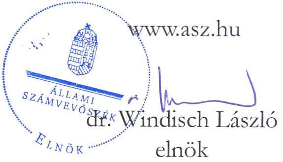
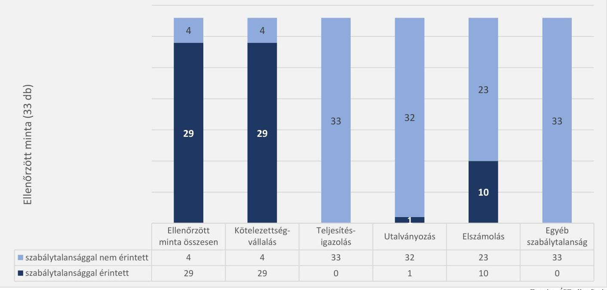
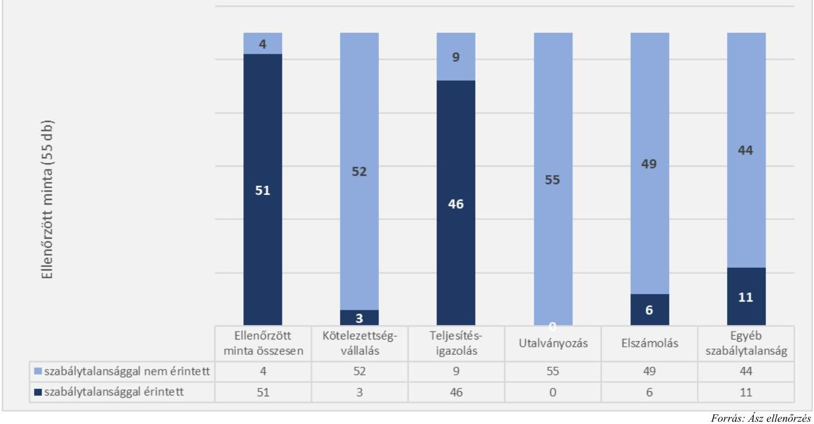
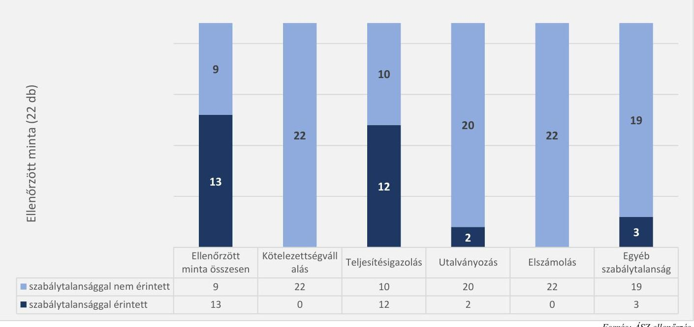

# JELENTÉS 

Az államháztartás központi alrendszerébe tartozó költségvetési szervek személyi juttatásként elszámolt kiadásai, dologi kiadásai és felhalmozási célú kiadásai megfelelőségének célzott ellenőrzése

Alpokalja Integrált Szociális Intézmény Győr-Moson-Sopron Vármegye

2023.

---

# JELENTÉS 

Az államháztartás központi alrendszerébe tartozó költségvetési szervek személyi juttatásként elszámolt kiadásai, dologi kiadásai és felhalmozási célú kiadásai megfelelőségének célzott ellenőrzése

Alpokalja Integrált Szociális Intézmény Győr-Moson-Sopron Vármegye

2023.

23034

---

# ELLENŐRZÉSI IGAZGATÓSÁG: 

## ÁLLAMHÁZTARTÁS KÖZPONTI SZINTJÉT ELLENŐRZŐ IGAZGATÓSÁG

## ELLENŐRZÉSI IGAZGATÓ:

DR. SZOMOLAI CSABA igazgatói feladatokat ellátó alelnök

## ELLENŐRZÉSVEZETŐ:

Jelentéseink az interneten a www.asz.hu címen olvashatók.

RENKÓ ZSUZSANNA ellenőrzésvezető

IKTATÓSZÁM: EL-3948-002/2023.
TÉMASZÁM: 2663
ELLENŐRZÉS-AZONOSÍTÓ SZÁM: V1007

---

# TARTALOMJEGYZÉK 

- AZ ELLENŐRZÉS ALAPADATAI ..... 5
- AZ ELLENŐRZÉS HATÓKÖRE ÉS TERÜLETE/AZ ELLENŐRZÖTT SZERVEZET ..... 6
- ÖSSZEFOGLALÁS ..... 8
- AZ ELLENŐRZÉS FÓKUSZTERÜLETEI ..... 9
- MEGÁLLAPÍTÁSOK ..... 10
- JAVASLATOK ..... 16
- MELLÉKLETEK ..... 17
I. sz. melléklet: Értelmező szótár ..... 17
II. sz. melléklet: Az ellenőrzött szervezetek jegyzéke ..... 18
III. sz. melléklet: Az ellenőrzési programok alapján vizsgált jogszabályi előírások ..... 19
- FÜGGELÉK: ÉSZREVÉTELEK ..... 20
- RÖVIDÍTÉSEK JEGYZÉKE ..... 25

---

.

---

# AZ ELLENŐRZÉS ALAPADATAI 

## AZ ELLENŐRZÉS CÉLJA

Az ellenőrzés célja annak megállapítása, hogy az államháztartás központi alrendszerébe tartozó költségvetési szerv ellenőrzött kiadásai megfeleltek-e az ellenőrzés keretében vizsgált jogszabályi előírásoknak.

## AZ ELLENŐRZÉS TÍPUSA

Megfelelőségi ellenőrzés

## AZ ELLENŐRZŐTT IDŐSZAK

2022. év

## AZ ELLENŐRZÉS TÁRGYA

A személyi juttatások, a dologi kiadások és a felhalmozási célú kiadások kiválasztott rovatain elszámolt, kiválasztott tételek.

## AZ ELLENŐRZÉS JOGALAPJA

Az ellenőrzés jogalapját ÁSZ tv. ${ }^{1} 1 . \S$ (3) bekezdése és az 5. § (6) bekezdése képezte.

## AZ ELLENŐRZÉS MÓDSZERE

Az ellenőrzést az ÁSZ ${ }^{2}$ az ellenőrzött időszakban hatályos jogszabályok, az ellenőrzés szakmai szabályai alapján, „Az államháztartás központi alrendszerébe tartozó költségvetési szerv személyi juttatásként elszámolt kiadásai megfelelőségének célzott ellenőrzése", „Az államháztartás központi alrendszerébe tartozó költségvetési szerv dologi kiadásai megfelelőségének célzott ellenőrzése" és „Az államháztartás központi alrendszerébe tartozó költségvetési szerv felhalmozási célú kiadásai megfelelőségének célzott ellenőrzése" című ellenőrzési programok (továbbiakban: ellenőrzési programok) kérdéseire adott válaszok kiértékelésével, az ellenőrzési programokban megjelölt adatforrások figyelembevételével folytatta le.

Az ellenőrzési kérdések megválaszolásához szükséges bizonyítékok megszerzése a következő ellenőrzési eljárások alkalmazásával történt: megfigyelés, összehasonlítás, elemző eljárás, a személyi juttatások, dologi kiadások, felhalmozási célú kiadások ellenőrzéssel érintett rovatairól történő mintavétel. Az ellenőrzési bizonyítékként felhasználható adatforrások közé tartoztak az ellenőrzés folyamán feltárt, az ellenőrzés szempontjából információt tartalmazó dokumentumok.

Az ellenőrzés során a kiválasztott mintatételek ellenőrzési programokban meghatározott szempontok szerinti szabályszerűségét értékelte az ÁSZ.

---

# AZ ELLENŐRZÉS HATÓKÖRE ÉS TERÜLETE/AZ ELLENŐRZÖTT SZERVEZET 

Az ellenőrzés az Alpokalja Integrált Szociális Intézmény Győr-Moson-Sopron Vármegye, mint az államháztartás központi alrendszerébe tartozó költségvetési szervre terjedt ki.

Az ellenőrzés során az ÁSZ

- a személyi juttatások körébe tartozó Törvény szerinti illetmények, munkabérek; Céljuttatás, projektprémium; Készenléti, ügyeleti, helyettesítési díj, túlóra, túlszolgálat; a Munkavégzésre irányuló egyéb jogviszonyban nem saját foglalkoztatottnak fizetett juttatások; Egyéb külső személyi juttatások;
- a dologi kiadások körébe tartozó Szakmai anyagok beszerzése; Üzemeltetési anyagok beszerzése; Informatikai szolgáltatások igénybevétele; Bérleti és lízing díjak; Karbantartási, kisjavítási szolgáltatások; Szakmai tevékenységet segítő szolgáltatások; Egyéb szolgáltatások; Kiküldetések kiadásai; Egyéb dologi kiadások;
- a felhalmozási célú kiadások körébe tartozó Immateriális javak beszerzése, létesítése; Ingatlanok beszerzése, létesítése; Informatikai eszközök beszerzése, létesítése; Egyéb tárgyi eszközök beszerzése, létesítése; Ingatlanok felújítása rovatokon elszámolt kiadások
kiválasztott mintatételei tekintetében - az ellenőrzési programokban megjelölt jogszabályi előírások alapján - a kötelezettségvállalás, teljesítésigazolás és utalványozás gazdálkodási jogkörök gyakorlását, valamint a kiadások elszámolásának megfelelőségét értékelte.

Az ÁSZ

- a kötelezettségvállalási jogkörgyakorlás ellenőrzése keretében a kötelezettségvállalás szabályszerű elvégzését, és a pénzügyi ellenjegyzéssel ellátott kötelezettségvállalási dokumentum rendelkezésre állását,
- a teljesítésigazolási jogkörgyakorlás ellenőrzése keretében a teljesítésigazolás szabályszerű végrehajtását,
- az utalványozási jogkörgyakorlás ellenőrzése keretében az utalványozás szabályszerű megtörténtét,
- a kiadások rovatokon történő elszámolásának szabályszerűségét vizsgálta.

Az ÁSZ az ellenőrzött rovatokon elszámolt és kiválasztott mintatételek esetében a III. számú mellékletben megjelölt jogszabályi előírásoknak való megfelelőséget értékelte.

## ALPOKALJA INTEGRÁLT SZOCIÁLIS INTEZMÉNY GYŐR-MOSON-SOPRON VÁRMEGYE

Az Alpokalja SZI ${ }^{3}$ jogelődjét 1985. július 26-án alapították. Az Emberi Erőforrások Minisztériuma döntése alapján az Alpokalja SZK ${ }^{4}$ 2016. november 1-jén jött létre a Fogyatékosok Otthona Zsira és a Flandorffer Ignác Szociális Intézmény Sopron Pszichiátriai Betegek Otthona Ágfalva intézményeknek a Fogyatékos Gyermekek Otthonába történő beolvadásával. Az Alpokalja SZK a megalapításakor a székhelyintézmény mellett öt telephellyel működött, 2017. december 19-én az ágfalvai pszichiátriai betegek otthonát egyházi fenntartónak adták át. Az intézmény neve 2023. március 3-án megváltozott Alpokalja Integrált Szociális Intézmény Győr-Moson-Sopron Vármegye névre. Jelenleg az Alpokalja SZI a székhelyintézmény mellett a hatályos alapító okirat szerint négy telephelyen működik, a férőhelyek száma 428 fő.

---

Az Alpokalja SZI közfeladatai a következők: a Szoc.tv. ${ }^{5}$ alapján jelzőrendszeres házi segítségnyújtás, idősek otthont nyújtó ellátása, fogyatékos személyek otthont nyújtó ellátása, támogatott lakhatás, fogyatékos személyek lakóotthoni ellátása, szociális étkeztetés, házi segítségnyújtás, támogató szolgáltatás, fogyatékossággal élők nappali ellátása, fejlesztő foglalkoztatás, továbbá a Gyvt. ${ }^{6}$ szerinti különleges gyermekotthoni ellátás biztosítása.

Az Alpokalja SZI irányító szerve a Belügyminisztérium, a középirányító szerve az SZGYF7, amely a gazdasági szervezet feladatait is ellátja.

Az Alpokalja SZI 2022. évi költségvetési beszámolója szerint 1 939,6 M Ft költségvetési bevételt, 1 932,4 M Ft költségvetési kiadást teljesített, a foglalkoztatottak létszáma 228 fő volt.

---

# ÖSSZEFOGLALÁS 

Az ÁSZ célzott ellenőrzés keretében vizsgálta az Alpokalja SZI, mint az államháztartás központi alrendszerébe tartozó költségvetési szerv által a 2022. évben teljesített személyi juttatások, dologi, illetve felhalmozási célú kiadások kiválasztott tételeinek megfelelőségét. Az ellenőrzés során a kiválasztott kiadásokhoz kapcsolódóan a kötelezettségvállalás, teljesítésigazolás, utalványozás gazdálkodási jogkörök gyakorlásának, valamint a kiadások elszámolásának ellenőrzési programokban meghatározott jogszabályi előírásoknak való megfelelőségét értékelte az ÁSZ.

Az ellenőrzött 33 személyi juttatás közül 29-nél, az 55 dologi kiadás közül 51-nél, a 22 felhalmozási célú kiadás közül 13-nál tárt fel szabálytalanságot az ellenőrzés.

Az egyes rovatokon elszámolt kiadásokból összesen 110 elemű minta került kiválasztásra, amelyek 84,5%-a volt szabálytalansággal érintett. A szabálytalansággal érintett tételek ellenőrzött tételekhez viszonyított aránya a személyi juttatásoknál 87,9%, a dologi kiadásoknál 92,7%, a felhalmozási célú kiadásoknál 59,1% volt.

A személyi juttatások ellenőrzött kiadásainál a pénzügyi ellenjegyzés hiányában történt kötelezettségvállalás, a dologi és felhalmozási célú kiadásoknál a teljesítésigazolás dátumának hiánya voltak a jellemző szabálytalanságok.

Egyéb, nem a gazdálkodási jogkörgyakorlást érintő szabálytalanságot a dologi kiadások ellenőrzött tételeihez kapcsolódóan 13, a felhalmozási célú kiadások ellenőrzött tételeihez kapcsolódóan 3 esetben tárt fel az ÁSZ. A dologi kiadások ellenőrzött tételeinél tapasztalt egyéb szabálytalanságok az intézmény belső szabályzataiban előírtak figyelmen kívül hagyásához, a felhalmozási célú kiadások tekintetében a kötelezettségvállalási dokumentumok tartalmi hiányosságaihoz kapcsolódtak.

---

# AZ ELLENŐRZÉS FÓKUSZTERÜLETEI 

1.- Az államháztartás központi alrendszerébe tartozó költségvetési szervnél a személyi juttatások ellenőrzött rovatain elszámolt, kiválasztott kiadások megfelelősége.
2.- Az államháztartás központi alrendszerébe tartozó költségvetési szervnél a dologi kiadások ellenőrzött rovatain elszámolt, kiválasztott kiadások megfelelősége.
3.- Az államháztartás központi alrendszerébe tartozó költségvetési szervnél a felhalmozási célú kiadások ellenőrzött rovatain elszámolt, kiválasztott kiadások megfelelősége.

---

# MEGÁLLAPÍTÁSOK 

## 1. Az államháztartás központi alrendszerébe tartozó költségvetési szervnél a személyi juttatások ellenőrzött rovatain elszámolt, kiválasztott kiadások megfelelősége.

## Összegző megállapítás

A személyi juttatások ellenőrzött rovatain elszámolt és ellenőrzésre kiválasztott kiadások 87,9%-ánál tárt fel az ellenőrzés szabálytalanságot.

A személyi juttatások ellenőrzött rovatairól összesen 33 kiadási tétel ellenőrzésére került sor. A kiadások 12,1%-ánál az ellenőrzés nem tárt fel szabálytalanságot. Az ellenőrzés a kötelezettségvállalás esetében 29 kiadási tételnél, az utalványozás vonatkozásában 1 kiadási tételnél tárt fel szabálytalanságot. Továbbá 10 személyi juttatás könyvviteli elszámolása nem felelt meg a jogszabályban meghatározott rovatrend előírásainak.

Az ellenőrzött személyi juttatások szabályszerűségének értékelését az 1. ábra mutatja be.
1. ábra

AZ ELLENŐRZŐTT SZEMÉLYI JUTTATÁSOK SZABÁLYSZERŰSÉGÉNEK ÉRTÉKELÉSE

A kötelezettségvállalás gazdálkodási jogkör gyakorlásához kapcsolódóan az ÁSZ az alábbi szabálytalanságokat tárta fel:

- 29 mintatétel esetében az Áht. ${ }^{8}$ 37. § (1) bekezdésében foglalt előírás ellenére az írásbeli kötelezettségvállalásra pénzügyi ellenjegyzés hiányában került sor (K1101/1., K1101/2., K1101/3., K1101/5., K1101/6., K1101/7. K1101//8., K1101/9. K1101/10., K1103/1., K1103/2., K1103/3., K1103/4., K1103/5., K1104/1., K1104/2., K1104/3., K1104/4.,

---

K1104/5., K122/2., K122/3., K122/5., K123/1., K123/2., K123/3., K123/4., K123/5., K123/6., K123/7. sorszámú mintatételek)*.

Az utalványozás gazdálkodási jogkör gyakorlásához kapcsolódóan az ÁSZ az alábbi szabálytalanságot tárta fel:

- 1 mintatétel esetében az Áht. 38. § (1) bekezdésének előírása ellenére a kifizetésre utalványozás nélkül került sor (K123/3. sorszámú mintatétel).

Az ellenőrzés során feltárt elszámolási szabálytalanságok:

- 10 mintatétel esetében a kiadás könyvviteli elszámolása az Áhsz. ${ }^{9} 40 . \S$ (1) bekezdésében foglalt előírások ellenére nem az Áhsz. 15. melléklet I. pontban meghatározott rovaton történt. (A K1101/2., K1101/6., K1101/7. K1101/8., K1101/9. sorszámú mintatételek elszámolása a K1101. Törvény szerinti illetmények, munkabérek rovat helyett a K123. Egyéb külső személyi juttatások rovaton történt az utalványrendelet alapján, továbbá a K1103/1., K1103/2., K1103/3., K1103/4., K1103/5. sorszámú mintatételek esetében a kiadások elszámolása a K1102. Normatív jutalmak rovat helyett a K1103. Céljuttatás, projektprémium rovaton történt.)

[^0]
[^0]:    * A K1101/1., K1101/2., K1101/3. és a K1101/5. sorszámú mintatételeknél a kinevezési okmányon, vagy a munkaszerződésen, továbbá a K122/2., K122/3. és K122/5. sorszámú mintatételeknél a megbízási szerződéseken a pénzügyi ellenjegyzés dátuma későbbi, mint a kötelezettségvállalás dátuma. A K1104/1-5. mintáknál a túlóra elrendelő dokumentumokon nincs pénzügyi ellenjegyzés, a K1104/2-5. tételeknél a helyettesítési megbízásokon a pénzügyi ellenjegyzés dátuma későbbi, mint a kötelezettségvállalás dátuma.

---

# 2. Az államháztartás központi alrendszerébe tartozó költségvetési szervnél a dologi kiadások ellenőrzött rovatain elszámolt, kiválasztott kiadások megfelelősége. 

## Összegző megállapítás

A dologi kiadások ellenőrzött rovatain elszámolt és ellenőrzésre kiválasztott kiadások 92,7%-ánál fordult elő szabálytalanság.

A dologi kiadások ellenőrzött rovatairól összesen 55 kiadási tétel ellenőrzésére került sor. Az ellenőrzés a kiadások mindössze 7,3%-ánál nem tárt fel szabálytalanságot. Az ellenőrzés a kötelezettségvállalás esetében 3 kiadási tételnél, a teljesítésigazolás tekintetében 46 kiadási tételnél tárt fel szabálytalanságot. Továbbá 6 dologi kiadás nem a megfelelő rovaton került elszámolásra, valamint 11 kiadási tételnél nem tartották be a vonatkozó belső szabályzatban előírtakat.

Az ellenőrzött dologi kiadások szabályszerűségének értékelését a 2. ábra mutatja be.
2. ábra

AZ ELLENŐRZŐTT DOLOGI KIADÁSOK SZABÁLYSZERŰSÉGÉNEK ÉRTÉKELÉSE

A kötelezettségvállalás gazdálkodási jogkör gyakorlásához kapcsolódóan az ÁSZ az alábbi szabálytalanságokat tárta fel:

- 3 mintatétel esetében az Áht. 37. § (1) bekezdésében és a kötelezettségvállalási szabályzat ${ }_{1} 11 . \S$ (2) bekezdésében foglaltak ellenére a kötelezettségvállalásra pénzügyi ellenjegyzés hiányában került sor (K333/1., K341/1., K341/2. sorszámú mintatételek).

---

A teljesítésigazolás gazdálkodási jogkör gyakorlásához kapcsolódóan az ÁSZ az alábbi szabálytalanságokat tárta fel:

- 46 mintatétel esetében az Ávr. ${ }^{10}$ 57. § (3) bekezdésében és a kötelezettségvállalási szabályzat ${ }_{1,2}{ }^{11}$ 12. $\S$ (3) bekezdésében foglaltak ellenére a teljesítésigazolás nem tartalmazta az igazolás dátumát, ezáltal nem igazolt, hogy a teljesítésigazolásra a teljesítést követően került-e sor (K311/1., K311/2., K311/3., K311/4., K311/5.; K312/1., K312/2., K312/3., K312/4., K312/5., K321/1.,
 K321/2., K321/3., K321/4., K321/5., K321/6., K321/7.; K333/1., K333/2., K333/3., K333/4., K333/5.; K334/1., K334/2., K334/3., K334/4., K334/5.; K336/1., K336/2., K336/3., K336/4., K336/5.; K337/2., K337/5., K337/6., K337/7., K337/8., K355/1., K355/2., K355/4., K355/5., K355/6., K355/7., K355/8., K355/9., K355/10. sorszámú mintatételek).
Az ellenőrzés során feltárt elszámolási szabálytalanságok:
- 6 mintatétel esetében a kiadások könyvviteli elszámolása az Áhsz. 40. § (1) bekezdésében foglalt előírások ellenére nem az Áhsz. 15. mellékletének I. pontjában foglaltak szerint történt. (3 mintatétel esetében a kiadást a K312. Üzemeltetési anyagok beszerzése rovat helyett a K311. Szakmai anyagok beszerzése rovaton (K311/1., K311/2., K311/3. sorszámú mintatételek), 2 mintatétel esetében az informatikai eszközök bérleti/üzemeltetési díját a K321. Informatikai szolgáltatások igénybevétele rovat helyett a K333. Bérleti és lízingdíjak rovaton (K333/4., K337/8. sorszámú mintatételek), egy mintatétel esetében az új csatorna fektetéséhez kapcsolódó kiadást a K71. Ingatlanok felújítása rovat helyett a K334. Karbantartási, kisjavítási szolgáltatások rovaton (K334/6. sorszámú mintatétel) számolták el.)
Az ellenőrzés során feltárt egyéb szabálytalanságok:
- 11 mintatétel esetében az Alpokalja SZI a kötelezettségvállalási szabályzat ${ }_{1}$ 8. § (1) bekezdésében és a beszerzési szabályzat ${ }^{12}$ 39. §-ában foglaltak ellenére a beszerzési igényekhez a beszerzési szabályzat 1. melléklete szerinti Igénybejelentő adatalapot nem töltött ki (K312/1., K312/4., K321/1., K321/4., K321/5., K334/1., K334/4., K337/1., K337/2., K337/3., K337/5. sorszámú mintatételek),
- 2 mintatétel vonatkozásában a beszerzési szabályzat 32. §-ában és a 47. §-ában foglaltak ellenére a beszerzéseket árajánlat bekérése nélkül folytatták le (K312/1., K312/4. sorszámú mintatételek).

---

# 3. Az államháztartás központi alrendszerébe tartozó költségvetési szervnél a felhalmozási célú kiadások ellenőrzött rovatain elszámolt, kiválasztott kiadások megfelelősége. 

## Összegző megállapítás

A felhalmozási célú kiadások ellenőrzött rovatain elszámolt és ellenőrzésre kiválasztott kiadások 59,1%-ánál fordult elő szabálytalanság.

A felhalmozási célú kiadások ellenőrzött rovatairól összesen 22 kiadási tétel ellenőrzésére került sor. A kiadások 40,9%-ánál az ellenőrzés nem tárt fel szabálytalanságot. Az ellenőrzés a teljesítésigazolás tekintetében 12 kiadási tételnél, az utalványozás vonatkozásában 2 kiadási tételnél tárt fel szabálytalanságot. Továbbá 3 kiadási tétel esetében egyéb, nem a gazdálkodási jogkörgyakorláshoz kapcsolódó szabálytalanság fordult elő.

Az ellenőrzött felhalmozási célú kiadások szabályszerűségének értékelését a 3. ábra mutatja be.
3. ábra

AZ ELLENŐRZÖTT FELHALMOZÁSI CÉLÚ KIADÁSOK SZABÁLYSZERŰSÉGÉNEK ÉRTÉKELÉSE

A teljesítésigazolás gazdálkodási jogkör gyakorlásához kapcsolódóan az ÁSZ az alábbi szabálytalanságokat tárta fel:

- 12 mintatétel esetében az Ávr. 57. § (3) bekezdésében és a kötelezettségvállalási szabályzat ${ }_{1,2} 12. \S$ (3) bekezdésében foglaltak ellenére a teljesítésigazolás nem tartalmazta az igazolás dátumát, ezáltal nem igazolt, hogy a teljesítésigazolásra a teljesítést követően került-e sor (K61/1., K61/2., K63/1., K63/2., K63/3., K63/5., K64/1., K64/2., K64/3., K64/4., K64/5., K71/3. sorszámú mintatételek).

---

Az utalványozás gazdálkodási jogkör gyakorlásához kapcsolódóan az ÁSZ az alábbi szabálytalanságokat tárta fel:

- 2 mintatétel esetében a kifizetésre az Áht. 38. § (1) bekezdésének előírása ellenére utalványozás nélkül került sor (K61/1., K61/2. sorszámú mintatételek).
Az ellenőrzés során feltárt egyéb szabálytalanságok:
- 1 mintatételnél a kötelezettségvállalás dokumentuma az Ávr. 50. § (1) bekezdés a) pontban foglalt előírás ellenére nem tartalmazta a szakmai, műszaki teljesítés határidejét (K62/1.),
- 2 mintatételnél a kötelezettségvállalás dokumentuma az Ávr. 50. § (1) bekezdés b) és c) pontokban foglaltak ellenére nem tartalmazta az ellenérték kifizetésének módját, feltételeit és határidejét (K63/2., K64/5.).

---

# JAVASLATOK 

Az ÁSZ tv. 33. § (1) bekezdésében foglaltak értelmében az ellenőrzött szervezet vezetője köteles a jelentésben foglalt megállapításokhoz kapcsolódó intézkedési tervet összeállítani és azt a jelentés kézhezvételétől számított 30 napon belül az ÁSZ részére megküldeni. Amennyiben az ellenőrzött szervezet vezetője nem küldi meg határidőben az intézkedési tervet, vagy továbbra sem elfogadható intézkedési tervet küld, az Állami Számvevőszék elnöke az ÁSZ tv. 33. § (3) bekezdése a) és b) pontjaiban foglaltakat érvényesítheti.

## AlPOKALJA InTEGRÁLT SZOCIÁLIS IntÉZMÉNY GYŐR-MOSONSOPRON VÁRMEGYE INTÉZMÉNYVEZETŐJE

1. Kezdeményezzen a költségvetési szervek belső kontrollendszeréről és belső ellenőrzéséről szóló 311/2011. (XII. 31.) Korm. rendelet 31. § (6) bekezdése alapján soron kívüli belső ellenőrzést a jelen ellenőrzés során feltárt szabálytalanságok kialakulása okainak és a gazdálkodási jogkörgyakorlással kapcsolatos kockázati tényezők feltárása, illetve a szabálytalanságok megszüntetése érdekében.
2. A költségvetési szervek belső kontrollendszeréről és belső ellenőrzéséről szóló 311/2011. (XII. 31.) Korm. rendelet 13. § (2) bekezdésében foglaltak alapján, valamint az 1. számú javaslat szerinti belső ellenőrzés megállapításait és javaslatait is figyelembe véve tegyen intézkedéseket azon kontrolltevékenységek kiépítésére és/vagy megfelelő működtetésére, amelyek megelőzik a jelentésben leírt szabálytalanságok ismételt előfordulását.

---

# MELLÉKLETEK 

## I. SZ. MELLÉKLET: ÉRTELMEZŐ SZÓTÁR

kötelezettségvállalás
pénzügyi ellenjegyzés
teljesítésigazolás
utalványozás

A költségvetési szerv által a kiadási előirányzatok és - ha jogszabály lehetővé teszi - a kijelölt lebonyolító szerv számára a Kormány rendeletében meghatározottak szerinti rendelkezésre bocsátott összeg terhére fizetési kötelezettség vállalásáról szóló - így különösen a foglalkoztatásra irányuló jogviszony létesítésére, szerződés megkötésére, költségvetési támogatás biztosítására irányuló - szabályszerűen megtett jognyilatkozat.
Forrás: Áht. 1. § 15. pont
A kötelezettségvállalást megelőző művelet, amelynek során a pénzügyi ellenjegyzőnek meg kell győződnie arról, hogy a szükséges szabad előirányzat - több évet érintő kötelezettségvállalás esetén minden egyes évben rendelkezésre áll, a tervezett kifizetési időpontokban a pénzügyi fedezet biztosított, valamint a kötelezettségvállalás nem sérti a gazdálkodásra vonatkozó szabályokat. Kötelezettséget vállalni a Kormány rendeletében foglalt kivételekkel csak pénzügyi ellenjegyzés után, a pénzügyi teljesítés esedékességét megelőzően, írásban lehet.
Forrás: Áht. 37. § (1) bekezdés
A kötelezettségvállalásban a másik fél által vállalt feltételek teljesítéséhez kapcsolódó igazolás, amely a kiadási előirányzat terhére vállalt utalványozást előzi meg. A teljesítés igazolása során ellenőrizhető okmányok alapján ellenőrizni és igazolni kell a kiadások teljesítésének jogosságát, összegszerűségét, ellenszolgáltatást is magában foglaló kötelezettségvállalás esetében - ha a kifizetés vagy annak egy része az ellenszolgáltatás teljesítését követően esedékes - annak teljesítését. A teljesítést az igazolás dátumának és a teljesítés tényére történő utalás megjelölésével, az arra jogosult személy aláírásával kell igazolni.
Forrás: Áht. 38. § (1) bekezdés; Ávr. 57. § (1) és (3) bekezdések
A bevételek és kiadások elszámolására utalványozás alapján kerülhet sor. A kiadási előirányzatok terhére történő utalványozás esetén az utalványozásra csak azután kerülhet sor, ha a kiadás alapjául szolgáló kötelezettségvállalásban meghatározott feltételeket a másik szerződő fél már teljesítette. A kiadási előirányzatok terhére történő utalványozásra a teljesítés igazolását és az érvényesítést követően, a bevételi előirányzatok esetén a belső szabályzatban a bevételek meghatározott körére esetlegesen elrendelt teljesítés igazolását követően kerülhet sor.
Forrás: Áht. 38. § (1) bekezdés; Ávr. 57. § (2) bekezdés és 59. § (1b) bekezdés

---

II. SZ. MELLÉKLET: AZ ELLENŐRZÖTT SZERVEZETEK JEGYZÉKE

# KÖLTSEGYETÉSI SZERV NEVE 

Alpokalja Integrált Szociális Intézmény Győr-Moson-Sopron Vármegye

---

# III. SZ. MELLÉKLET: AZ ELLENŐRZÉSI PROGRAMOK ALAPJÁN VIZSGÁLT JOGSZABÁLYI ELŐÍRÁSOK 

## AZ EGYES GAZDÁLKODÁSI JOGKÖRBÖKHÖZ, SZÁMVÍTELI ELSZÁMOLÁSHÓZ KAPCSOLÓDÓAN ELLENŐRZÖTT JOGSZABÁLYI KRITÉRIUMOK

## SZEMÉLYI JUTTATÁSOK

Kötelezettségvállalás

Teljesítésigazolás

Utalványozás

Ánt. 37. § (1) bekezdés
Ávr. 50. § (1) bekezdés d) pont, 50. § (2) bekezdés b) pont, 52. § (1), (9), 53. § (1), 55. § (1), (4), 56. § (1) bekezdések

Áhsz. 14. melléklet II. pont
Kttv. ${ }^{13}$ 8. § (1)-(2) bekezdések, 38. §, 43. § (1) bekezdés a)-b) pontok, 116. § - 118. §, 154. § (2) bekezdés
Kjt. ${ }^{14}$ 21. §, 61-77 §, 77/A. §
Mt. ${ }^{15}$ 45. § (1) bekezdés, 208-209. §
Eszjtv. ${ }^{16}$ 2. § (1), 7. § (3), 8. § (3) bekezdések
528/2020. (XI. 28.) Korm. rendelet ${ }^{17}$ 6. §, 24-28. §
Kit. ${ }^{18}$ 146. § (1)-(2) bekezdések
Áht. 38. § (1) bekezdés
Ávr. 57. § (1), (3), (5) bekezdések
Mt. 134. §
Áht. 38. § (1) bekezdés
Ávr. 58. § (3), 59. § (1b), (2), (3), (4) bekezdések

## DOLOGI ÉS FELHALMOZÁSI CÉLÚ KIADÁSOK

Kötelezettségvállalás

Teljesítésigazolás

Utalványozás

Ánt. 37. § (1) bekezdés
Ávr. 13. § (2) bekezdés b) pont, 50. § (1), (1a) bekezdések, 50. § (2) bekezdés b) pont, 52. § (1), (9), 52/A. § (1)-(5), (10), 53. § (1), 55. §(1),(4), 56. §(1) bekezdések
Kttv. 8. § (1)-(2) bekezdések
Áhsz. 14. melléklet II. pont
Kbt. ${ }^{19}$ 15. §, 79. § (2) bekezdés
Áht. 38. § (1) bekezdés
Ávr. 57. § (1), (3), (5) bekezdések
Áht. 38. § (1) bekezdés
Ávr. 57. § (3), 58. § (3), 59. § (1b), (2), (3), (4) bekezdések
Áhsz. 40. § (1) bekezdés, 15. melléklet I. pont
Áhsz. 45. § (2), 53. § (6) bekezdések, 16. melléklet

---

# FÜGGELÉK: ÉSZREVÉTELEK 

A jelentéstervezetet a Számvevőszék 15 napos észrevételezésre megküldte az ellenőrzött szervezet vezetőjének az ÁSZ tv. 29. §*(1) bekezdése előírásának megfelelően.

A jelentéstervezet megállapításaira az Alpokalja Integrált Szociális Intézmény Győr-Moson-Sopron Vármegye intézményvezetője észrevételt tett. Az ÁSZ tv. 29. § (3) bekezdésével összhangban az Állami Számvevőszék a Függelékben feltünteti a megállapításokkal kapcsolatban tett, el nem fogadott észrevételeket, és megindokolja, hogy azokat miért nem fogadta el.

1. Észrevétel: „Személyi juttatások kötelezettségvállalásának legfőbb dokumentuma a kinevezési okirat, illetve annak módosítása, munkaszerződés, értesítés illetményen felüli pótlékokról és kiegészítésekről. A Személyi juttatások kötelezettségvállalásának dokumentumainak pénzügyi ellenjegyzése minden esetben megtörténik.

- kinevezési okiratok: Az intézmény az elkészített kinevezés okiratokat (kinevezés közalkalmazotti jogviszonyba, munkaszerződés, értesítés illetményen felüli pótlékokról és kiegészítésekről) minden esetben megküldjük a Győr-Moson-Sopron Vármegyei Gazdasági osztályára pénzügyi ellenjegyzésre. Ha az intézményi közalkalmazottak illetményének, illetményen felüli pótlékainak és kiegészítéseinek összegei, vagy az Munka törvénykönyve hatálya alá tartozóknak a fejlesztő foglalkoztatás keretében foglalkoztatott ellátottak illetve egyéb megbizási szerződéssel foglalkoztatottak bérei változnak (pl. minimálbér, garantált bérminimum, szociális ágazati pótlék, egészségügyi pótlék, keresetkiegészítés, helyettesítési díj stb.), azok szintén munkáltató általi aláírás előtt beküldésre kerülnek a Győr-Moson-Sopron Vármegyei Gazdasági osztályra pénzügyi ellenjegyzésre.
- keresetkiegészítés, helyettesítési díj, rendkívüli munkavégzés: Az intézmény a keresetkiegészítés, helyettesítési díj és rendkívüli munkavégzésért járó díjazás kifizetése előtt a kifizetni szándékozott díjak összegéről az „Intézményi létszám- és személyi változásokra vonatkozó kötelezettségvállalás" nevű dokumentumot beküldjük a Szociális és Gyermekvédelmi Főigazgatóság Győr-Moson-Sopron Vármegyei gazdasági osztályra pénzügyi ellenjegyzésre. Az abban foglalt összeg pénzügyi ellenjegyzését követően kerül sor a számfejtésre, illetve az összegek utalására. A

[^0]
[^0]:    * 29. § (1) Az Állami Számvevőszék az ellenőrzési megállapításait megküldi az ellenőrzött szervezet vezetőjének vagy az általa megbízott személynek, és annak, akinek személyes felelősségét állapította meg.
    (2) Az ellenőrzött szervezet vezetője és a felelősként megjelölt személy az ellenőrzés megállapításaira tizenöt napon belül írásban észrevételt tehet.
    (3) Az Állami Számvevőszék az észrevételre a beérkezésétől számított harminc napon belül írásban válaszol. A figyelembe nem vett észrevételeket köteles a jelentésben feltüntetni, és megindokolni, hogy azokat miért nem fogadta el.

---

pénzügyi teljesítéseket megelőzően az EcoDigit-ben a program beállítása végett nincs lehetőség a utalványlapon pénzügyi ellenjegyzés megtételére, mivel az itt elvégezhető aláírások központilag kerülnek beállításra és elektronikusan csak érvényesítés és utalványozás történik. (1. sz. melléklet A, B)”

Az észrevétellel érintett megállapítás: „29 mintatétel esetében az Áht. 37.
 § (1) bekezdésében foglalt előírás ellenére az írásbeli kötelezettségvállalásra pénzügyi ellenjegyzés hiányában került sor (K1101/1., K1101/2., K1101/3., K1101/5., K1101/6., K1101/7. K1101/8., K1101/9. K1101/10., K1103/1., ... sorszámú mintatételek)" (11. oldal 4. bekezdés).

El nem fogadás indoka: A megállapításunk nem a pénzügyi ellenjegyzés hiányára vonatkozott, hanem hogy a pénzügyi ellenjegyzés dátuma későbbi volt, mint a kötelezettségvállalás dátuma, tehát a kötelezettségvállalás pénzügyi ellenjegyzés hiányában történt. Az észrevételben ismertetett kinevezési folyamatot - miszerint a munkáltatói aláírás előtt küldik meg pénzügyi ellenjegyzésre a kinevezési okmányt - a kinevezési okiratokon szereplő dátumok nem igazolták. Az észrevétel mellékleteként beküldött dokumentumokon a pénzügyi ellenjegyzés dátuma minden esetben későbbi volt, mint a kötelezettségvállalás dátuma, így helytálló az a megállapítás, hogy az írásbeli kötelezettségvállalásra pénzügyi ellenjegyzés hiányában került sor.
2. Észrevétel: „A 12. oldalon feltüntetett K123/3 sorszámú mintatétel utalványozása megtörtént. Az utalványrendeletek aláírása digitálisan, az EcoDigit-ben történik. A digitális aláírás az utalványlap legalján található a jogkör megnevezésével a jogkör gyakorlójának nevével és a digitális aláírás pontos időpontjával (időbélyegző). Ezen aláírások megléte nélkül utalást nem tudunk indítani. (2. sz. melléklet)"

Az észrevétellel érintett megállapítás: „1 mintatétel esetében az Áht. 38. § (1) bekezdésének előírása ellenére a kifizetésre utalványozás nélkül került sor (K123/3. sorszámú mintatétel)." (12. oldal 3. bekezdés).

El nem fogadás indoka: Az ellenőrzés során nem küldték meg sem az utalványrendeletet, sem a kifizetést igazoló bankszámlakivonatot, vagy pénztári kifizetési bizonylatot annak ellenére, hogy a 2023. április 4-i hiánypótlásban kifejezetten kértük ezeket a K123/3 tételhez. Az észrevétel melléklete csak az utalványrendeletet tartalmazza, a kifizetés bizonylatát nem. A kifizetésre vonatkozóan a bérjegyzéken az szerepel, hogy a kifizetés 2022. augusztus 23-án történt. Az észrevétel mellékletében szereplő utalványrendelet a kifizetési dokumentum hiányában továbbra sem igazolja, hogy a 2022. szeptember 6-i utalványozás megelőzte-e a kifizetést, így helytálló az a megállapítás, hogy a kifizetésre utalványozás nélkül került sor.

---

3. Észrevétel: „12. oldal 10 mintatétel

A K1101/2, K1101/6, K1101/7, K1101/8, K1101/9 sorszámú mintatételek elszámolása a K1101 törvény szerinti illetmények, munkabérek helyett a K123 Egyéb külső személyi juttatások rovaton történt az utalványrendelet alapján.
A kifizetés valóban nem a valós rovaton történt, mivel a MÁK által megadott csaber állományban több rovat is szerepelt, de az utalás során csak egyetlen rovatot lehet megadni.
A személyi juttatások helyes rovatra történő könyvelése hó végén bérhelyesbítő naplón történik, amikor a személyi juttatásokra történt kifizetések visszakönyvelésre kerülnek, majd a MÁK által megküldött „Bérfelhasználási összesítő havi kötelezettség vállalásra és teljesítésre költségvetési számvitel szerint" listának megfelelő rovatokra könyveljük a teljesített személyi juttatásokat. (3. sz. melléklet A, B, C)

K 1103/1-K1103/5 mintatételhez kapcsolódó észrevétel:
K1102, Normatív jutalmak: Ezen a rovaton kell elszámolni az előre nem meghatározott követelményekhez kapcsolódóan a foglalkoztatottaknak megállapított normatív jutalmakat
K1103. Céljuttatás, projektprémium: Ezen a rovaton kell elszámolni a teljesítményösztönzés, személyi ösztönzés céljából a foglalkoztatottaknak megállapított jutalmat, prémiumot, céljuttatást, továbbá minden más hasonló személyi ösztönzési jellegű kifizetést, függetlenül annak elnevezésétől.

A középirányító szervtől az alábbi értesítést kaptuk:
A Szociális és Gyermekvédelmi Főigazgatóság fenntartásában lévő intézmények dolgozói munkájuk elismeréseként egyszeri jutalomban részesülhetnek. A jutalom összege a rendelkezésre álló forrásokat figyelembe véve fejenként bruttó 35.000,- Ft összegben került meghatározásra.
A középirányító szervvel egyeztetve ezt személyi ösztönzés céljából kapott jutalomnak minősítettük."

Az észrevétellel érintett megállapítás: „10 mintatétel esetében a kiadás könyvviteli elszámolása az Áhsz. 40. § (1) bekezdésében foglalt előírások ellenére nem az Áhsz. 15. melléklet I. pontban meghatározott rovaton történt. (A K1101/2., K1101/6., K1101/7. K1101/8., K1101/9. sorszámú mintatételek elszámolása a K1101. Törvény szerinti illetmények, munkabérek rovat helyett a K123. Egyéb külső személyi juttatások rovaton történt az utalványrendelet alapján, továbbá a K1103/1., K1103/2., K1103/3., K1103/4., K1103/5. sorszámú mintatételek esetében a kiadások elszámolása a K1102. Normatív jutalmak rovat helyett a K1103. Céljuttatás, projektprémium rovaton történt.)" (12. oldal 5. bekezdés).

El nem fogadás indoka: A megállapítás nem a kifizetéssel, hanem az elszámolással (könyveléssel) kapcsolatban rögzített szabálytalanságot, így az észrevétel kifizetéssel kapcsolatos része nem releváns. Az észrevételben a könyveléssel kapcsolatban leírták, miszerint a helyes rovatra való könyvelés a hó végén a bérhelyesbítő naplón történik megfelelő gyakorlat. Azonban a csatolt mellékletek

---

sem a rovatot, sem a nyilvántartási számlát nem tartalmazzák, így nem lehet ellenőrizni, hogy mely rovatokról mely rovatokra kerültek összegek átkönyvelésre. Nem küldték meg továbbá a Magyar Államkincstár által készített könyvelési értesítőt sem, amely a számfejtett összegek jogcímek (számlaszámok) szerinti megbontását tartalmazza, így nem lehet ellenőrizni a megfelelő rovatokra történő feladást a könyvelésben. A jutalmak könyvelésével kapcsolatban a tett észrevétel nem megalapozott, tekintettel arra, hogy a jutalom mindenkinek egységes összegű volt (normatív), és nem egy előre meghatározott célhoz kötött (céljuttatás). A középirányítóval történő megbeszélés nem teszi szabályszerűvé a nem szabályszerű könyvelést.
4. Észrevétel: „A K312 üzemeltetési anyagok beszerzése rovat helyett a K311 Szakmai anyagok beszerzése rovaton került könyviteli elszámolásra.
Az anyagok beszerzése a fejlesztő foglalkoztatásban résztvevők tevékenységéhez történt, melynek elkülönítése végett az EcoSTAT törzsadatok közt 2022. évben a szakmai a K3110007 fejlesztő foglalkoztatás szakmai anyagai rovat került kialakításra. Az elszámolást ezen a rovaton kellett végezni. (5. sz. melléklet)"

Az észrevétellel érintett megállapítás: „6 mintatétel esetében a kiadások könyvviteli elszámolása az Áhsz. 40. § (1) bekezdésében foglalt előírások ellenére nem az Áhsz. 15. mellékletének I. pontjában foglaltak szerint történt. (3 mintatétel esetében a kiadást a K312. Üzemeltetési anyagok beszerzése rovat helyett a K311 Szakmai anyagok beszerzése rovaton (K311/1., K311/2., K311/3. sorszámú mintatételek)" (14. oldal 6. bekezdés).

El nem fogadás indoka: Az Áhsz. szerint a K311. Szakmai anyagok beszerzése alatt kell elszámolni a gyógyszerek, gyógyszernek nem minősülő gyógyhatású készítmények, tápszerek, vér- és vérkészítmények, a gyógyászati diagnosztikai segédanyagok beszerzése után fizetett vételárat, a gyógyszer alapanyagként használt vegyszerek, valamint a szakmai - termelési, oktatási, kutatási - felhasználású vegyszerek beszerzése után fizetett vételárat, a tevékenységét segítő és a napi, rendszeres tájékoztatást szolgáló, papír alapú eszközök - így különösen könyvek, közlönyök, jogi információk, napilapok, folyóiratok - beszerzése, előfizetése után fizetett vételárat, a 12. § (7) bekezdése szerinti egyéb készletek vételárát, és az olyan informatikai eszközök, elektronikus könyvek, közlönyök, jogi információk, napilapok, folyóiratok, egyéb információhordozók beszerzése után fizetett vételárat, amelyek a tevékenységet legfeljebb egy évig szolgálják. A kifogásolt mintatételek foglalkozásokon felhasznált, fonáshoz kapcsolódó nádat, szövetet, dekoranyagokat tartalmaznak, ezeket az Áhsz. fent említett, vonatkozó szakasza nem tartalmazza. Az, hogy az intézmény a K311-en belül egy K311-0007 rovatot alakított ki és oda könyvelt, még nem teszi az Áhsz. rendelkezésével összhangban lévővé a gyakorlatot, ezért helytálló az a megállapítás, hogy nem megfelelő rovaton történt az elszámolás.

---

5. Észrevétel: „A 15. oldalon a K61/1 és K61/2 sorszámú mintatételek utalványozása megtörtént. Az utalványrendeletek aláírása digitálisan, az EcoDigit-ben történik. A digitális aláírás az utalványlap legalján található a jogkör megnevezésével a jogkör gyakorlójának nevével és a digitális aláírás pontos időpontjával (időbélyegző). Ezen aláírások megléte nélkül utalást nem tudunk indítani (6. sz. melléklet A, B)"

Az észrevétellel érintett megállapítás: ,,2 mintatétel esetében a kifizetésre az Áht. 38. § (1) bekezdésének előírása ellenére utalványozás nélkül került sor (K61/1., K61/2. sorszámú mintatételek). " (15. oldal 6. bekezdés).

El nem fogadás indoka: Az észrevétel mellékleteként megküldött utalványrendeletek a megállapítás megtételekor is rendelkezésre álltak, azok alapján került megállapításra, hogy az utalás előtt nem történt meg az utalványozás. Az utalások 2022. augusztus 30-án történtek meg, az utalványozásra több hónappal a pénzügyi teljesítés után - az utalványrendeleten lévő időbélyegző alapján 2022. december 7-én - került sor.

---

# RÖVIDÍTÉSEK JEGYZÉKE 

${ }^{1}$ ÁSZ tv.
${ }^{2}$ ÁSZ
${ }^{3}$ Alpokalja SZI
${ }^{4}$ Alpokalja SZK
${ }^{5}$ Szoc.tv.
${ }^{6}$ Gyvt.
${ }^{7}$ SZGYF
${ }^{8}$ Ábt.
${ }^{9}$ Áhsz.
${ }^{10}$ Ávr.
${ }^{11}$ kötelezettségvállalási szabályzat ${ }_{1}$
kötelezettségvállalási szabályzat ${ }_{2}$
${ }^{12}$ beszerzési szabályzat
${ }^{13}$ Kttv.
${ }^{14}$ Kjt.
${ }^{15} \mathrm{Mt}$.
${ }^{16}$ Eszjtv.
${ }^{17}$ 528/2020. (XI. 28.) Korm. rendelet
${ }^{18}$ Kit.
${ }^{19} \mathrm{Kbt}$.
2011. évi LXVI. törvény az Állami Számvevőszékről

Állami Számvevőszék
Alpokalja Integrált Szociális Intézmény Győr-Moson-Sopron Vármegye
Győr-Moson-Sopron Megyei Alpokalja Szociális Központ
1993. évi III. törvény a szociális igazgatásról és szociális ellátásokról
1997. évi XXXI. törvény a gyermekek védelméről és a gyámügyi igazgatásról

Szociális és Gyermekvédelmi Főigazgatóság
2011. évi CXCV. törvény az államháztartásról
4/2013. (I. 11.) Korm. rendelet az államháztartás számviteléről
368/2011. (XII. 31.) Korm. rendelet az államháztartásról szóló törvény végrehajtásáról
90814-A/1139/2020. iktatószámú Intézményvezetői utasítás a kötelezettségvállalás, pénzügyi ellenjegyzés, teljesítés igazolás, érvényesítés és utalványozás rendjéről szabályzatáról (hatályos: 2020. augusztus 18-tól 2022. szeptember 8-ig)
90814-A/1084/2022. iktatószámú Intézményvezetői utasítás a kötelezettségvállalás, pénzügyi ellenjegyzés, teljesítés igazolás, érvényesítés és utalványozás rendjéről szabályzatáról (hatályos: 2022. szeptember 9-től)
ASZK-IKT/669/2020. iktatószámú Intézményvezetői utasítás a beszerzések rendjéről (hatályos: 2020. április 9-től)
2011. évi CXCIX. törvény a közszolgálati tisztviselőkről
1992. évi XXXIII. törvény a közalkalmazottak jogállásáról
2012. évi I. törvény a munka törvénykönyvéről
2020. évi C. törvény az egészségügyi szolgálati jogviszonyról
528/2020. (XI. 28.) Korm. rendelet az egészségügyi szolgálati jogviszonyról szóló 2020. évi C. törvény végrehajtásáról
2018. évi CXXV. törvény a kormányzati igazgatásról
2015. évi CXLIII. törvény a közbeszerzésekről

---

1052 Budapest, Apáczai Csere János u. 10. | 1364 Budapest 4., Pf. 54
www.asz.hu | szamvevoszek@asz.hu
telefon: +36 14849100

