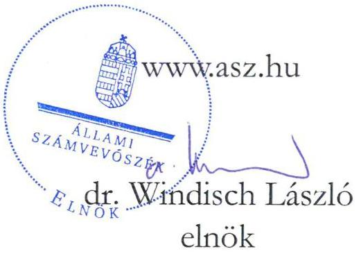
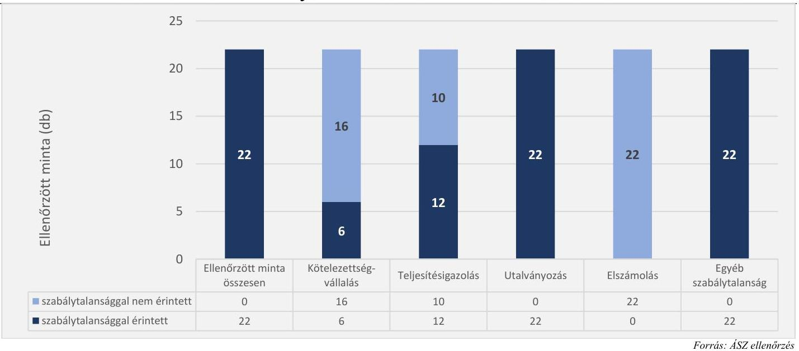
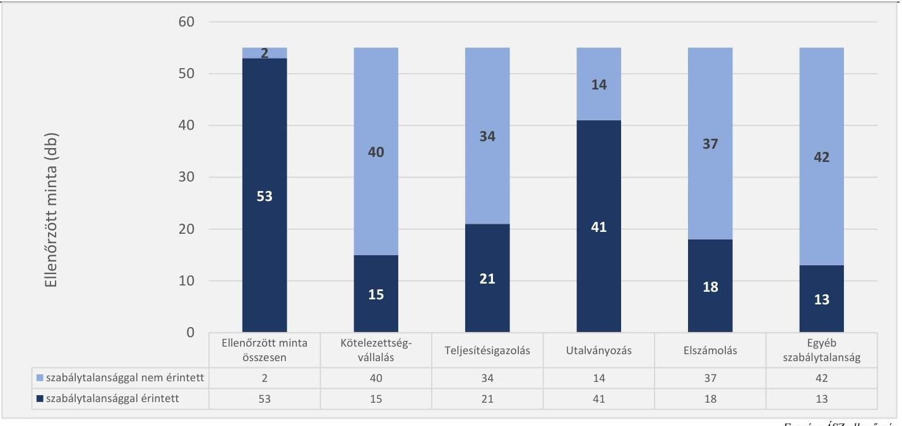
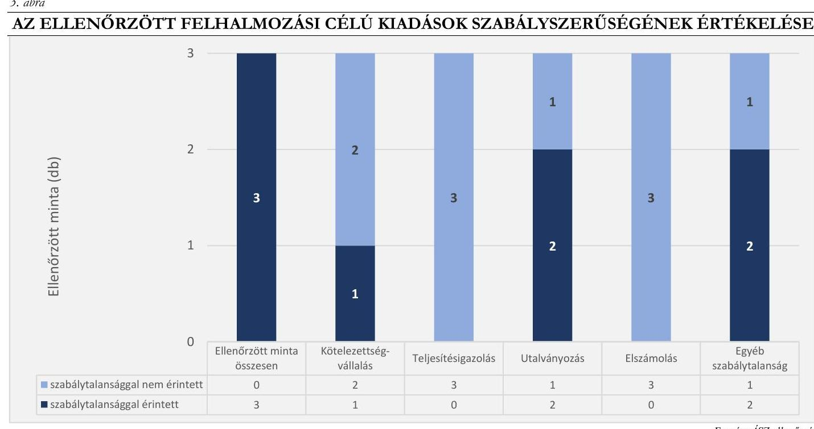

# JELENTÉS 

Az államháztartás központi alrendszerébe tartozó költségvetési szervek személyi juttatásként elszámolt kiadásai, dologi kiadásai és felhalmozási célú kiadásai megfelelőségének célzott ellenőrzése

Budapesti Komplex Szakképzési Centrum

2023.

---

# JELENTÉS 

Az államháztartás központi alrendszerébe tartozó költségvetési szervek személyi juttatásként elszámolt kiadásai, dologi kiadásai és felhalmozási célú kiadásai megfelelőségének célzott ellenőrzése

Budapesti Komplex Szakképzési Centrum

2023.

23035

---

# ELLENŐRZÉSI IGAZGATÓSÁG: 

## ÁLLAMHÁZTARTÁS KÖZPONTI SZINTJÉT ELLENŐRZŐ IGAZGATÓSÁG

## ELLENŐRZÉSI IGAZGATÓ:

DR. SZOMOLAI CSABA igazgatói feladatokat ellátó alelnök

## ELLENŐRZÉSVEZETŐ:

Jelentéseink az interneten a www.asz.hu címen olvashatók.

RENKÓ ZSUZSANNA ellenőrzésvezető

IKTATÓSZÁM: EL-3948-003/2023.
TÉMASZÁM: 2663
ELLENŐRZÉS-AZONOSÍTÓ SZÁM: V-1007

---

# TARTALOMJEGYZÉK 

- AZ ELLENŐRZÉS ALAPADATAI ..... 5
- AZ ELLENŐRZÉS HATÓKÖRE ÉS TERÜLETE/ AZ ELLENŐRZÖTT SZERVEZET ..... 6
- ÖSSZEFOGLALÁS ..... 8
- AZ ELLENŐRZÉS FÓKUSZTERÜLETEI ..... 9
- MEGÁLLAPÍTÁSOK ..... 10
- JAVASLATOK ..... 16
- MELLÉKLETEK ..... 17
I. sz. melléklet: Értelmező szótár ..... 17
II. sz. melléklet: Az ellenőrzött szervezetek jegyzéke ..... 18
III. sz. melléklet: Az ellenőrzési programok alapján vizsgált jogszabályi előírások ..... 19
- FÜGGELÉK: ÉSZREVÉTELEK ..... 20
- RÖVIDÍTÉSEK JEGYZÉKE ..... 21

---

.

---

# AZ ELLENŐRZÉS ALAPADATAI 

## AZ ELLENŐRZÉS CÉLJA

Az ellenőrzés célja annak megállapítása, hogy az államháztartás központi alrendszerébe tartozó költségvetési szerv ellenőrzött kiadásai megfeleltek-e az ellenőrzés keretében vizsgált jogszabályi előírásoknak.

## AZ ELLENŐRZÉS TÍPUSA

Megfelelőségi ellenőrzés

## AZ ELLENŐRZŐTT IDŐSZAK

2022. III.-IV. negyedév

## AZ ELLENŐRZÉS TÁRGYA

A személyi juttatások, a dologi kiadások és a felhalmozási célú kiadások kiválasztott rovatain elszámolt, kiválasztott tételek.

## AZ ELLENŐRZÉS JOGALAPJA

Az ellenőrzés jogalapját az ÁSZ tv. ${ }^{1} 1 . \int(3)$ bekezdése és az 5. § (6) bekezdése képezte.

## AZ ELLENŐRZÉS MÓDSZERE

Az ellenőrzést az ÁSZ ${ }^{2}$ az ellenőrzött időszakban hatályos jogszabályok, az ellenőrzés szakmai szabályai alapján, „Az állambáztartás központi alrendszerébe tartozó költségvetési szerv személyi juttatásként elszámolt kiadásai megfelelőségének célzott ellenőrzése", „Az állambáztartás központi alrendszerébe tartozó költségvetési szerv dologi kiadásai megfelelőségének célzott ellenőrzése" és „Az állambáztartás központi alrendszerébe tartozó költségvetési szerv felhalmozási célú kiadásai megfelelőségének célzott ellenőrzése" című ellenőrzési programok (továbbiakban: ellenőrzési programok) kérdéseire adott válaszok kiértékelésével, az ellenőrzési programokban megjelölt adatforrások figyelembevételével folytatta le.

Az ellenőrzési kérdések megválaszolásához szükséges bizonyítékok megszerzése a következő ellenőrzési eljárások alkalmazásával történt: megfigyelés, összehasonlítás, elemző eljárás, a személyi juttatások, dologi kiadások, felhalmozási célú kiadások ellenőrzéssel érintett rovatairól történő mintavétel. Az ellenőrzési bizonyítékként felhasználható adatforrások közé tartoztak az ellenőrzés folyamán feltárt, az ellenőrzés szempontjából információt tartalmazó dokumentumok.

Az ellenőrzés során a kiválasztott mintatételek ellenőrzési programokban meghatározott szempontok szerinti szabályszerűségét értékelte az ÁSZ.

---

# AZ ELLENŐRZÉS HATÓKÖRE ÉS TERÜLETE/ AZ ELLENŐRZÖTT SZERVEZET 

Az ellenőrzés a Budapesti Komplex Szakképzési Centrum, mint az államháztartás központi alrendszerébe tartozó költségvetési szervre terjedt ki.

Az ellenőrzés során az ÁSZ

- a személyi juttatások körébe tartozó Törvény szerinti illetmények, munkabérek; Készenléti, ügyeleti, helyettesítési díj, túlóra, túlszolgálat; Munkavégzésre irányuló egyéb jogviszonyban nem saját foglalkoztatottnak fizetett juttatások;
- a dologi kiadások körébe tartozó Szakmai anyagok beszerzése; Üzemeltetési anyagok beszerzése; Informatikai szolgáltatások igénybevétele; Vásárolt élelmezés; Bérleti és lízing díjak; Karbantartási, kisjavítási szolgáltatások; Szakmai tevékenységet segítő szolgáltatások; Egyéb szolgáltatások; Kiküldetések kiadásai; Reklám- és propagandakiadások;
- a felhalmozási célú kiadások körébe tartozó Egyéb tárgyi eszközök beszerzése, létesítése; Ingatlanok felújítása rovatokon elszámolt kiadások
kiválasztott mintatételei tekintetében - az ellenőrzési programokban megjelölt jogszabályi előírások alapján - a kötelezettségvállalás, teljesítésigazolás és utalványozás gazdálkodási jogkörök gyakorlását, valamint a kiadások elszámolásának megfelelőségét értékelte.

Az ÁSZ

- a kötelezettségvállalási jogkörgyakorlás ellenőrzése keretében a kötelezettségvállalás szabályszerű elvégzését, és a pénzügyi ellenjegyzéssel ellátott kötelezettségvállalási dokumentum rendelkezésre állását,
- a teljesítésigazolási jogkörgyakorlás ellenőrzése keretében a teljesítésigazolás szabályszerű végrehajtását,
- az utalványozási jogkörgyakorlás ellenőrzése keretében az utalványozás szabályszerű megtörténtét,
- a kiadások rovatokon történő elszámolásának szabályszerűségét vizsgálta.

Az ÁSZ az ellenőrzött rovatokon elszámolt és kiválasztott mintatételek esetében a III. számú mellékletben megjelölt jogszabályi előírásoknak való megfelelőséget értékelte.

## BudAPESTI Komplex SZAKKÉPZÉsi CENTRUM

2015. évet megelőzően az iskolai rendszerủ szakképzésben múködő, állami fenntartású BKSZC ${ }^{3}$ fenntartója a Klebelsberg Intézményfenntartó Központ, a jogelőd költségvetési szerve a Budapesti Vendéglátóipari és Humán Szakképzési Centrum volt. 2015. július 1. napján a szakképző iskolai rendszer keretében megvalósult fenntartóváltás és intézményintegráció következtében jött létre a BKSZC. Az ellenőrzött időszakban a BKSZC irányító szerve és fenntartója a Kulturális és Innovációs Minisztérium, középirányító szerve a NSZFH ${ }^{4}$.

A BKSZC-t a főigazgató és a kancellár önállóan vezeti és képviseli. A főigazgató felel a szakképzési centrum részeként múködő szakképző intézmények szakképzési alapfeladatainak ellátásáért. A kancellár felel a szakképzési centrum törvényes és szakszerű működéséért. A főigazgató és a kancellár megbízására és megbízásának visszavonására a szakképzésért felelős miniszter jogosult. A főigazgató és a kancellár felett a

---

munkáltatói jogokat - a főigazgatói, illetve a kancellári megbízás és annak visszavonása kivételével - a NSZFH elnöke, mint a szakképzési intézményfenntartó központ vezetője gyakorolja.

A BKSZC részeként 13 szakképzési intézmény működik. A szakképző intézmények igazgatóit a BKSZC főigazgatója a szakképzésért felelős miniszter egyetértésével bízza meg. Az igazgatók felett a munkáltatói jogokat a BKSZC főigazgatója gyakorolja.

A BKSZC közfeladata a szakképzésről szóló 2019. évi LXXX. törvény szerinti szakképzési és a nemzeti köznevelésről szóló 2011. évi CXC. törvény szerinti köznevelési feladatok ellátása, fő tevékenysége a szakmai középfokú oktatás. A BKSZC alaptevékenységeként technikumi szakmai oktatást, szakképző iskolai szakmai oktatást, szakgimnáziumi nevelést-oktatást, szakiskolai nevelést-oktatást, a többi gyermekkel, tanulóval együtt nevelhető, oktatható és együtt nem nevelhető, oktatható sajátos nevelési igényű gyermekek, tanulók iskolai nevelését-oktatását folytat, valamint kollégiumi ellátást, továbbá nevelő és oktató munkához kapcsolódó, nem köznevelési tevékenységet is ellát. Tervezi és szervezi az Európai Unió pénzügyi alapjaiból és más külföldi, illetőleg hazai alapokból támogatott egyes fejlesztési programok megvalósítását.

A BKSZC 2022. évi beszámolója alapján a kiadási főösszege 8 113,9 M Ft, a bevételi főösszege 7 205,6 M Ft volt.

---

# ÖSSZEFOGLALÁS 

Az ÁSZ célzott ellenőrzés keretében vizsgálta az BKSZC, mint az államháztartás központi alrendszerébe tartozó költségvetési szerv által a 2022. évben teljesített személyi juttatások, dologi, illetve felhalmozási célú kiadások kiválasztott tételeinek megfelelőségét. Az ellenőrzés során a kiválasztott kiadásokhoz kapcsolódóan a kötelezettségvállalás, teljesítésigazolás, utalványozás gazdálkodási jogkörök gyakorlásának, valamint a kiadások elszámolásának ellenőrzési programokban meghatározott jogszabályi előírásoknak való megfelelőségét értékelte az ÁSZ.

Az ellenörzött 22 személyi juttatás és 3
felhalmozási
mindegyikénél,
55 dologi kiadás
közül 53-nál tárt fel
szabálytalanságot az ellenörzés.

Az egyes rovatokon az ellenőrzött időszakban elszámolt kiadásokból összesen 80 elemű minta került kiválasztásra, amelyek $97,5 \%$-a volt szabálytalansággal érintett. A hibával érintett tételek ellenőrzött tételekhez viszonyított aránya a személyi juttatásoknál és felhalmozási célú kiadásoknál 100\%os, a dologi kiadásoknál $96,4 \%$-os volt.

A személyi juttatások ellenőrzött kiadásai több mint felénél a teljesítésigazolást nem a jogszabályi előírásoknak megfelelően hajtották végre, továbbá az ellenőrzött személyi juttatások mindegyikénél hiba volt, hogy a kifizetés elrendelésére az utalványozást megelőzően került sor. Az ellenőrzött dologi kiadások közel háromnegyedénél, illetve az ellenőrzött felhalmozási célú kiadások kétharmadánál fordult elő a kifizetés elrendelését megelőző utalványozás hiánya, vagy annak tartalmi hiányossága.

Egyéb, nem a gazdálkodási jogkörgyakorlást érintő szabálytalanságot a személyi juttatások ellenőrzött tételeihez kapcsolódóan 22, a dologi kiadások ellenőrzött tételeihez kapcsolódóan 2, a felhalmozási célú kiadások ellenőrzött tételeihez kapcsolódóan 2 mintatétel tekintetében tárt fel az ÁSZ. Ezek a személyi juttatások ellenőrzött tételeihez kapcsolódóan a kötelezettségvállalások nyilvántartásba vételét, a dologi és felhalmozási célú kiadások ellenőrzött tételeihez kapcsolódóan a kötelezettségvállalási dokumentum tartalmát, valamint a beszerzési szabályzat előírásának be nem tartását érintő hibák voltak.

---

# AZ ELLENŐRZÉS FÓKUSZTERÜLETEI 

1. Az államháztartás központi alrendszerébe tartozó költségvetési szervnél a személyi juttatások ellenőrzött rovatain elszámolt, kiválasztott kiadások megfelelősége.
2. Az államháztartás központi alrendszerébe tartozó költségvetési szervnél a dologi kiadások ellenőrzött rovatain elszámolt, kiválasztott kiadások megfelelősége.
3. Az államháztartás központi alrendszerébe tartozó költségvetési szervnél a felhalmozási célú kiadások ellenőrzött rovatain elszámolt, kiválasztott kiadások megfelelősége.

---

# MEGÁLLAPÍTÁSOK 

## 1. Az államháztartás központi alrendszerébe tartozó költségvetési szervnél a személyi juttatások ellenőrzött rovatain elszámolt, kiválasztott kiadások megfelelősége.

## Összegző megállapítás

A személyi juttatások ellenőrzött rovatain elszámolt és ellenőrzésre kiválasztott kiadások mindegyikénél tárt fel szabálytalanságot az ellenőrzés.

A személyi juttatások ellenőrzött rovatairól összesen 22 kiadási tétel ellenőrzésére került sor. Az ellenőrzés a kötelezettségvállalás esetében 6 kiadási tételnél, a teljesítésigazolás tekintetében 12 kiadási tételnél, míg az utalványozás vonatkozásában mind a 22 kiadási tételnél tárt fel szabálytalanságot. Egyéb, nem a gazdálkodási jogkörgyakorláshoz kapcsolódó szabálytalanság mind a 22 mintatételnél előfordult.

Az ellenőrzött személyi juttatások szabályszerűségének értékelését a 1. ábra mutatja be.
1. ábra

AZ ELLENŐRZŐTT SZEMÉLYI JUTTATÁSOK SZABÁLYSZERÜSÉGÉNEK ÉRTÉKELÉSE

A kötelezettségvállalás gazdálkodási jogkör gyakorlásához kapcsolódóan az ÁSZ az alábbi szabálytalanságokat tárta fel:

- 6 mintatétel esetében az Áht. ${ }^{5}$ 37. § (1) bekezdésében foglalt előírás ellenére az írásbeli kötelezettségvállalásra pénzügyi ellenjegyzés hiányában került sor (K1101/6., K1104/2., K1104/3., K1104/4., K1104/5., K122/7. sorszámú mintatételek) *.

[^0]
[^0]:    * A K1101/6. és a K122/7. mintatételeknél a kinevezési okmányon, illetve a megbízási szerződésen a pénzügyi ellenjegyzés dátuma későbbi, mint a kötelezettségvállalás dátuma.

---

A teljesítésigazolás gazdálkodási jogkör gyakorlásához kapcsolódóan az ÁSZ az alábbi szabálytalanságokat tárta fel:

- 1 mintatétel esetében az Áht. 38. § (1) bekezdésében, valamint az Ávr. ${ }^{6}$ 57. § (1) bekezdésében foglaltak ellenére nem igazolták a kiadás teljesítésének a jogosságát. (K1104/3. sorszámú mintatétel),
- 10 mintatételnél az Ávr. 57. § (3) bekezdésben foglalt előírások ellenére a teljesítésigazolás nem tartalmazta a teljesítés tényére történő utalás megjelölését (K1101/1., K1101/2., K1101/3., K1101/4., K1101/5., K1101/6., K1101/7. K1101//8., K1101/9., K1104/1. sorszámú mintatételek),
- 4 mintatétel esetében az Ávr. 57. § (3) bekezdésben foglalt előírások ellenére a teljesítésigazolás nem tartalmazta a teljesítésigazolás dátumát (K1101/2., K1101/4., K1101/7., K1101/9. sorszámú mintatételek),
- 1 mintatétel esetében az Ávr. 57. § (1) bekezdésében előírtak ellenére a teljesítésigazolás során nem ellenőrizték a kiadások teljesítésének jogosságát, mivel a teljesítésigazolás dátuma korábbi volt, mint a teljesítés időpontja (K122/7. sorszámú mintatétel).
Az utalványozás gazdálkodási jogkör gyakorlásához kapcsolódóan az ÁSZ az alábbi szabálytalanságokat tárta fel:
- mind a 22 mintatétel esetén az Áht. 38. § (1) bekezdésében foglalt előírás ellenére a kifizetés elrendelésére az utalványozást megelőzően került sor,
- 1 mintatételnél az Áht. 38. § (1) bekezdésének előírása ellenére az utalványozásra a teljesítés igazolása nélkül került sor (K1104/3. sorszámú mintatétel).
Az ellenőrzés során feltárt egyéb szabálytalanságok:
- a 22 mintatétel egyikénél sem gondoskodtak az Ávr. 56. § (1) bekezdésében előírtak ellenére a kötelezettségvállalás nyilvántartásba vételéről.

# 2. Az államháztartás központi alrendszerébe tartozó költségvetési szervnél a dologi kiadások ellenőrzött rovatain elszámolt, kiválasztott kiadások megfelelősége. 

## Összegző megállapítás A dologi kiadások ellenőrzött rovatain elszámolt és ellenőrzésre kiválasztott kiadások 96,4\%-ánál tárt fel az ellenőrzés szabálytalanságot.

A dologi kiadások ellenőrzött rovatairól összesen 55 kifizetés ellenőrzésére került sor. A kiadások 3,6\%-ánál az ellenőrzés nem tárt fel szabálytalanságot. Az ellenőrzés a kötelezettségvállalás esetében 15 kiadási tételnél, a teljesítésigazolás tekintetében 21 kiadási tételnél, míg az utalványozás vonatkozásában 41 kiadási tételnél tárt fel szabálytalanságot. Továbbá 18 dologi kiadás nem a megfelelő rovaton került elszámolásra., valamint 13 kiadás esetében egyéb, nem a gazdálkodási jogkörgyakorlást érintő szabálytalanság fordult elő.

---

Az ellenőrzött dologi kiadások szabályszerűségének értékelését a 2. ábra mutatja be.
2. ábra

AZ ELLENŐRZÖTT DOLOGI KIADÁSOK SZABÁLYSZERŰSÉGÉNEK ÉRTÉKELÉSE

A kötelezettségvállalás gazdálkodási jogkör gyakorlásához kapcsolódóan az ÁSZ az alábbi szabálytalanságokat tárta fel:

- 7 mintatétel esetében az Áht. 37. § (1) bekezdésében és az Ávr. 52. § (1) bekezdésében foglaltak ellenére nem történt írásbeli kötelezettségvállalás (K312/9., K321/2., K332/3., K336/8., K337/1., K337/7., K337/9. sorszámú mintatételek),
- 3 mintatétel esetében a kötelezettségvállalás dokumentuma (kiküldetési rendelvény) az Áht. 37. § (1) bekezdése, valamint az Ávr. 52. § (1) bekezdés a) pontjában foglaltak ellenére nem tartalmazta a kötelezettségvállalásra jogosult (kiküldetést elrendelő) aláírását (K341/1., K341/2., K341/4. sorszámú mintatételek),
- 5 mintatétel esetében az Áht. 37. § (1) bekezdésében foglaltak ellenére a kötelezettségvállalásra pénzügyi ellenjegyzés hiányában került sor (K312/1., K333/2., K333/3., K333/4., K336/7. sorszámú mintatételek).
A teljesítésigazolás gazdálkodási jogkör gyakorlásához kapcsolódóan az ÁSZ az alábbi szabálytalanságokat tárta fel:
- 2 mintatétel esetében az Áht. 38. § (1) bekezdésében, valamint az Ávr. 57. § (1) bekezdésében foglaltak ellenére nem igazolták a kiadások teljesítésének a jogosságát (K336/7., K337/4. sorszámú mintatételek),
- 1 mintatétel esetében a teljesítésigazoló az Ávr. 57. § (1) bekezdésében foglaltak ellenére a teljesítésigazolás során ellenőrizhető okmányok (kötelezettségvállalási dokumentum) hiányában igazolta a kiadások teljesítésének jogosságát, összegszerűségét (K336/8. sorszámú mintatétel),
- 16 mintatétel esetében az Ávr. 57. § (3) bekezdésében és a kötelezettségvállalási szabályzat ${ }^{7}$ IV. fejezet 2. és 4. pontjában előírtak ellenére a teljesítésigazolás nem tartalmazta az igazolás

---

dátumát (K311/5., K312/3., K312/4., K312/6., K312/7., K312/8., K332/1., K332/3., K332/5., K333/2., K333/3., K333/4., K333/5., K334/4., K334/5., K336/4. sorszámú mintatételek),

- 2 mintatétel esetében az Ávr. 57. § (3) bekezdésében és a kötelezettségvállalási szabályzat IV. fejezet 2. és 4. pontjában előírtak ellenére a teljesítésigazolás nem tartalmazta a teljesítés tényére történő utalás megjelölését (K311/3., K312/2. sorszámú mintatételek).
Az utalványozás gazdálkodási jogkör gyakorlásához kapcsolódóan az ÁSZ az alábbi szabálytalanságokat tárta fel:
- 33 mintatétel esetében a kiadási előirányzat terhére a kifizetést az Áht. 38. § (1) bekezdésében foglaltak ellenére utalványozás nélkül rendelték el. (A K311/2., K311/5., K312/1., K312/2., K321/1., K321/2., K321/3., K321/4., K321/5., K321/6., K332/2., K333/1., K333/5., K334/2., K336/1., K336/4., K336/7., K337/6., K337/7., K337/9., K341/2., K341/4., K342/5. sorszámú mintatételeknél az átutalás értéknapja korábbi volt, mint az utalványozás dátuma. A K341/1. sorszámú mintatételnél az utalványozás és az átutalás napja korábbi volt, mint az utalványrendelet nyomtatási dátuma. A K311/1., K311/4., K312/3., K312/5., K312/6., K312/8., K312/10., K332/3., K337/4. sorszámú mintatételek esetében a kiadási pénztárbizonylat az Ávr. 59. § (3) bekezdés g) pontjában és (4) bekezdésben foglaltak ellenére nem tartalmazta az utalványozó aláirását.),
- 5 mintatétel esetében az utalványrendelet az Ávr. 59. § (3) bekezdés g) pontjában előírt szabályozás ellenére nem tartalmazta az utalványozás dátumát (K312/9., K321/7., K332/1., K332/5., K337/1. sorszámú mintatételek),
- 3 mintatétel esetében az utalványozásra az Áht. 38. § (1) bekezdésben foglaltak ellenére érvényesítés hiányában került sor (K311/3., K312/4., K312/7. sorszámú mintatételek).
Az ellenőrzés során feltárt elszámolási szabálytalanságok:
- 18 mintatétel esetében a kiadások könyvviteli elszámolása az Áhsz. ${ }^{8}$ 40. § (1) bekezdésében foglalt előírások ellenére nem az Áhsz. 15. mellékletének I. pontjában foglaltak szerint történt. (A K311/1., K311/2., K311/3., K311/4., K311/5. sorszámú mintatételek esetében a kiadást a K312. Üzemeltetési anyagok beszerzése rovat helyett a K311 Szakmai anyagok beszerzése rovaton, a K312/4., K312/6., K312/7., K312/8., K312/10., K342/1., K342/4. sorszámú mintatételek esetében a reprezentációs kiadásokat és szóróajándékokat (ingyenes adott termékeket) a K123. Egyéb külső személyi juttatások rovat helyett a K312. Üzemeltetési anyagok beszerzése rovaton, a K312/9., K333/2., K333/3., K333/4. sorszámú mintatételek esetében az informatikai szolgáltatás előfizetés díját, valamint az informatikai eszközök bérleti díját a K321. Informatikai szolgáltatások igénybevétele rovat helyett a K312. Üzemeltetési anyagok beszerzése rovaton, illetve a K333. Bérleti és lízingdíjak rovaton, a K337/1. sorszámú mintatétel esetében a lakásbérlettel összefüggő közüzemi díjat foglalkoztatott esetében a K1111. Lakhatási támogatások rovat vagy nem saját foglalkoztatott esetén a K122. Munkavégzésre irányuló egyéb jogviszonyban nem saját foglalkoztatottnak fizetett juttatások rovat helyett a K337. Egyéb szolgáltatások rovaton, a K337/9. sorszámú mintatétel esetében a szakértői díjat a K336. Szakmai tevékenységet segítő szolgáltatások rovat helyett a K337. Egyéb szolgáltatások rovaton számolták el.)
Az ellenőrzés során feltárt egyéb szabálytalanságok:
- 9 mintatétel vonatkozásában a beszerzési szabályzat ${ }^{9}$ II.2.3.2. pont b) alpontjában meghatározott, legalább 3 árajánlatot nem kérték be. (A K312/9., K321/2., K332/3., K336/4., K336/8., K337/9.

---

sorszámú mintatételeknél a beszerzési eljárás során árajánlatot nem kértek be, a K334/2., K334/7., K334/8. sorszámú mintatételeknél a beszerzési eljárás során egy árajánlatot kértek be.),

- 1 mintatétel esetében a beszerzést a BKSZC tagintézménye a beszerzési szabályzat II.2.3.2. pont b) alpontjában foglaltak ellenére a kancellár előzetes külön engedélye nélkül folytatta le, mivel a kancellári engedély megadására a beszerzést és kifizetést követően (két hónappal később) került sor (K311/1. sorszámú mintatétel),
- 4 mintatétel esetében a kötelezettségvállalás dokumentuma az Ávr. 50. § (1a) bekezdésében foglaltak ellenére nem tartalmazta a szervezet képviselőjének nyilatkozatát arra vonatkozóan, hogy átlátható szervezetnek minősül (K321/7., K332/2., K334/2., K336/4. sorszámú mintatételek),
- 1 mintatétel esetében az idegen nyelven kibocsátott és befogadott számviteli bizonylaton (szerződés) a Számv. tv. 166. § (4) bekezdésében előírtak ellenére nem tüntették fel magyar nyelven azokat az adatokat, megjelöléseket, amelyek a bizonylat megbízható, a valóságnak megfelelő adatrögzítéséhez, könyveléséhez szükségesek, így a szerződés nem tartalmazta magyarul a szakmai teljesítés minőségi jellemzőit, a szakmai teljesítés és a kifizetés határidejét. (K336/7. sorszámú mintatétel).

# 3. Az államháztartás központi alrendszerébe tartozó költségvetési szervnél a felhalmozási célú kiadások ellenőrzött rovatain elszámolt, kiválasztott kiadások megfelelősége. 

## Összegző megállapítás

A felhalmozási célú kiadások ellenőrzött rovatain elszámolt és ellenőrzésre kiválasztott kiadások mindegyike szabálytalan volt.

A felhalmozási célú kiadások ellenőrzött rovatairól összesen 3 kiadás ellenőrzésére került sor. Az ellenőrzés a kötelezettségvállalás esetében 1 kiadási tételnél, az utalványozás vonatkozásában 2 kiadási tételnél tárt fel szabálytalanságot. Továbbá 2 kiadás esetében egyéb, nem a gazdálkodási jogkörgyakorlást érintő szabálytalanság is előfordult.

Az ellenőrzött felhalmozási célú kiadások szabályszerűségének értékelését a 3. ábra mutatja be.

---

A kötelezettségvállalás gazdálkodási jogkör gyakorlásához kapcsolódóan az ÁSZ az alábbi szabálytalanságot tárta fel:

- 1 mintatételnél az Áht. 37. § (1) bekezdésében előírtak ellenére írásbeli kötelezettségvállalásra nem került sor (K71/2. sorszámú mintatétel).
Az utalványozás gazdálkodási jogkör gyakorlásához kapcsolódóan az ÁSZ az alábbi szabálytalanságokat tárta fel:
- 2 mintatétel esetében az Áht. 38. § (1) bekezdésében foglaltak ellenére a kifizetésre utalványozás nélkül került sor (K64/3., K64/5. sorszámú mintatételek).
Az ellenőrzés során feltárt egyéb szabálytalanságok:
- 1 mintatétel esetében a kötelezettségvállalás dokumentuma az Ávr. 50. § (1a) pontban foglaltak ellenére nem tartalmazta a szervezet képviselőjének nyilatkozatát arra vonatkozóan, hogy átlátható szervezetnek minősül (K64/3. sorszámú mintatétel),
- 2 mintatétel esetében a beszerzési szabályzat II.2.3.2. pont b) alpontjában meghatározott, legalább 3 árajánlatot nem kérték be. (A K64/3. sorszámú mintatételnél a beszerzési eljárás során egy árajánlatot kértek be, a K71/2. sorszámú mintatételnél a beszerzési eljárás során nem kértek be árajánlatot.)

---

# JAVASLATOK 

Az ÁSZ tv. 33. § (1) bekezdésében foglaltak értelmében az ellenőrzött szervezet vezetője köteles a jelentésben foglalt megállapításokhoz kapcsolódó intézkedési tervet összeállítani és azt a jelentés kézhezvételétől számított 30 napon belül az ÁSZ részére megküldeni. Amennyiben az ellenőrzött szervezet vezetője nem küldi meg határidőben az intézkedési tervet, vagy továbbra sem elfogadható intézkedési tervet küld, az Állami Számvevőszék elnöke az ÁSZ tv. 33. § (3) bekezdése a) és b) pontjaiban foglaltakat érvényesítheti.

## BUDAPESTI KOMPLEX SZAKKÉPZÉSI CENTRUM KANCELLÁRJÁNAK

1. Kezdeményezzen a Bkr. 31. § (6) bekezdése alapján soron kívüli belső ellenőrzést a jelen ellenőrzés során feltárt szabálytalanságok kialakulása okainak feltárása és a gazdálkodási jogkörgyakorlással, valamint az árajánlatok bekérésének elmulasztásával kapcsolatos kockázati tényezők feltárása, illetve a szabálytalanságok megszüntetése érdekében.
2. A Bkr. 13. § (2) bekezdésében foglaltak alapján, valamint az 1. számú javaslat szerinti belső ellenőrzés megállapításait és javaslatait is figyelembe véve tegyen intézkedéseket azon kontrolltevékenységek kiépítésére és/vagy megfelelő müködtetésére, amelyek megelőzik a jelentésben leírt szabálytalanságok ismételt előfordulását.
3. Hívja fel írásban a gazdálkodási jogkörök gyakorlására felhatalmazott, illetve kijelölt, valamint a számviteli feladatok ellátásával megbízott munkavállalók figyelmét a gazdálkodási jogkörök gyakorlására vonatkozóan a jogszabályok és belső szabályzatok előírásainak betartására és legalább félévente - a belső ellenőrzés közremüködésével - ellenőrizze ezen követelmények érvényesülését.

---

# MELLÉKLETEK 

## I. SZ. MELLÉKLET: ÉRTELMEZŐ SZÓTÁR

kötelezettségvállalás
pénzügyi ellenjegyzés
teljesítésigazolás
utalványozás

A költségvetési szerv által a kiadási előirányzatok és - ha jogszabály lehetővé teszi - a kijelölt lebonyolító szerv számára a Kormány rendeletében meghatározottak szerinti rendelkezésre bocsátott összeg terhére fizetési kötelezettség vállalásáról szóló - így különösen a foglalkoztatásra irányuló jogviszony létesítésére, szerződés megkötésére, költségvetési támogatás biztosítására irányuló - szabályszerűen megtett jognyilatkozat.
Forrás: Áht. 1. § 15. pont
A kötelezettségvállalást megelőző múvelet, amelynek során a pénzügyi ellenjegyzőnek meg kell győződnie arról, hogy a szükséges szabad előirányzat - több évet érintő kötelezettségvállalás esetén minden egyes évben rendelkezésre áll, a tervezett kifizetési időpontokban a pénzügyi fedezet biztosított, valamint a kötelezettségvállalás nem sérti a gazdálkodásra vonatkozó szabályokat. Kötelezettséget vállalni a Kormány rendeletében foglalt kivételekkel csak pénzügyi ellenjegyzés után, a pénzügyi teljesítés esedékességét megelőzően, írásban lehet.
Forrás: Áht. 37. § (1) bekezdés
A kötelezettségvállalásban a másik fél által vállalt feltételek teljesítéséhez kapcsolódó igazolás, amely a kiadási előirányzat terhére vállalt utalványozást előzi meg. A teljesítés igazolása során ellenőrizhető okmányok alapján ellenőrizni és igazolni kell a kiadások teljesítésének jogosságát, összegszerűségét, ellenszolgáltatást is magában foglaló kötelezettségvállalás esetében - ha a kifizetés vagy annak egy része az ellenszolgáltatás teljesítését követően esedékes - annak teljesítését. A teljesítést az igazolás dátumának és a teljesítés tényére történő utalás megjelölésével, az arra jogosult személy aláírásával kell igazolni.
Forrás: Áht. 38. § (1) bekezdés; Ávr. 57. § (1) és (3) bekezdések
A bevételek és kiadások elszámolására utalványozás alapján kerülhet sor. A kiadási előirányzatok terhére történő utalványozás esetén az utalványozásra csak azután kerülhet sor, ha a kiadás alapjául szolgáló kötelezettségvállalásban meghatározott feltételeket a másik szerződő fél már teljesítette. A kiadási előirányzatok terhére történő utalványozásra a teljesítés igazolását és az érvényesítést követően, a bevételi előirányzatok esetén a belső szabályzatban a bevételek meghatározott körére esetlegesen elrendelt teljesítés igazolását követően kerülhet sor.
Forrás: Áht. 38. § (1) bekezdés; Ávr. 57. § (2) bekezdés és 59. § (1b) bekezdés

---

II. SZ. MELLÉKLET: AZ ELLENŐRZÖTT SZERVEZETEK JEGYZÉKE

# KÖLTSEGYETESI SZERV NEVE 

Budapesti Komplex Szakképzési Centrum

---

# III. SZ. MELLÉKLET: AZ ELLENŐRZÉSI PROGRAMOK ALAPJÁN VIZSGÁLT JOGSZABÁLYI ELÖÍRÁSOK 

## AZ EGYES GAZDÁLKODÁSI JOGKÖRÖKHÖZ, SZÁMVITELI ELSZÁMOLÁSHÖZ KAPCSOLÓDÓAN ELLENŐRZÖTT JOGSZABÁLYI KRITÉRIUMOK

## SZEMÉLYI JUTTATÁSOK

Kötelezettségvállalás
Áht. 37. § (1) bekezdés
Ávr. 50. $\$ (1) bekezdés d) pont, 50. $\$ (2) bekezdés b) pont, 52. $\$$ (1), (9), 53. $\$ \mid(1), 55 . \S(1),(4), 56 . \S(1)$ bekezdések

Áhsz. 14. melléklet II. pont
Kttv. ${ }^{10}$ 8. $\$ \text { (1)-(2) bekezdések, 38. } \S, 43 . \S(1)$ bekezdés a)-b) pontok, 116. $\S$ - 118. §, 154. § (2) bekezdés
Kjt. ${ }^{11}$ 21. §, 61-77 §, 77/А. §
Mt. ${ }^{12}$ 45. § (1) bekezdés, 208-209. §
Kit. ${ }^{13}$ 146. § (1)-(2) bekezdések
Teljesítésigazolás
Áht. 38. § (1) bekezdés
Ávr. 57. § (1), (3), (5) bekezdések
Mt. 134. §
Utalványozás
Áht. 38. § (1) bekezdés
Ávr. 58. § (3), 59. § (1b), (2), (3), (4) bekezdések

## DOLOGI ÉS FELHALMOZÁSI CÉLÚ KIADÁSOK

Kötelezettségvállalás
Áht. 37. § (1) bekezdés
Ávr. 13. § (2) bekezdés b) pont, 50. § (1), (1a) bekezdések, 50. § (2) bekezdés b) pont, 52. § (1), (9), 52/Á. § (1)-(5), (10), 53. § (1), 55. § (1), (4), 56. § (1) bekezdések

Kttv. 8. § (1)-(2) bekezdések
Áhsz. 14. melléklet II. pont
Kbt. ${ }^{14}$ 15. §, 79. § (2) bekezdés
Teljesítésigazolás
Áht. 38. § (1) bekezdés
Ávr. 57. § (1), (3), (5) bekezdések
Utalványozás
Áht. 38. § (1) bekezdés
Ávr. 57. § (3), 58. § (3), 59. § (1b), (2), (3), (4) bekezdések
Áhsz. 40. § (1) bekezdés, 15. melléklet I. pont
Állománybavétel
Áhsz. 45. § (2), 53. § (6) bekezdések, 16. melléklet

---

# FÜGGELÉK: ÉSZREVÉTELEK 

A jelentéstervezetet a Számvevőszék 15 napos észrevételezésre megküldte az ellenőrzött szervezet vezetőjének az ÁSZ tv. 29. §* (1) bekezdése előírásának megfelelően.

A Budapesti Komplex Szakképzési Centrum kancellárja a jelentéstervezet megállapításaira nem tett észrevételt.

[^0]
[^0]:    * 29. § (1) Az Állami Számvevőszék az ellenőrzési megállapításait megküldi az ellenőrzött szervezet vezetőjének vagy az általa megbízott személynek, és annak, akinek személyes felelősségét állapította meg.
    (2) Az ellenőrzött szervezet vezetője és a felelősként megjelölt személy az ellenőrzés megállapításaira tizenöt napon belül írásban észrevételt tehet.
    (3) Az Állami Számvevőszék az észrevételre a beérkezésétől számított harminc napon belül írásban válaszol. A figyelembe nem vett észrevételeket köteles a jelentésben feltüntetni, és megindokolni, hogy azokat miért nem fogadta el.

---

# RÖVIDÍTÉSEK JEGYZÉKE 

${ }^{1}$ ÁSZ tv.
${ }^{2}$ ÁSZ
${ }^{3}$ BKSZC
${ }^{4}$ NSZFH
${ }^{5}$ Ábt.
${ }^{6}$ Ávr.
${ }^{7}$ kötelezettségvállalási szabályzat
${ }^{8}$ Áhsz.
${ }^{9}$ beszerzési szabályzat
${ }^{10}$ Kttv.
${ }^{11}$ Kjt.
${ }^{12}$ Mt.
${ }^{13}$ Kit.
${ }^{14} \mathrm{Kbt}$.
2011. évi LXVI. törvény az Állami Számvevőszékről

Állami Számvevőszék
Budapesti Komplex Szakképzési Centrum
Nemzeti Szakképzési és Felnőttképzési Hivatal
2011. évi CXCV. törvény az államháztartásról

368/2011. (XII. 31.) Korm. rendelet az államháztartásról szóló törvény végrehajtásáról
a Budapest Komplex Szakképzési Centrum kötelezettségvállalási szabályzatáról szóló 3/2022. (VI. 2.) kancellári utasítás - az 1. számú módosítással egységes szerkezetben (hatályos: 2022. június 3-tól)
az államháztartás számviteléről szóló 4/2013. (I. 11.) Korm. rendelet
a Budapest Komplex Szakképzési Centrum SZ-18. számú Beszerzési szabályzata (hatályos: 2021. január 1-jétől)
2011. évi CXCIX. törvény a közszolgálati tisztviselőkről
1992. évi XXXIII. törvény a közalkalmazottak jogállásáról
2012. évi I. törvény a munka törvénykönyvéről
2018. évi CXXV. törvény a kormányzati igazgatásról
2015. évi CXLIII. törvény a közbeszerzésekről

---

1052 Budapest, Apáczai Csere János u. 10. | 1364 Budapest 4., Pf. 54
www.asz.hu | szamvevoszek@asz.hu
telefon: +36 14849100