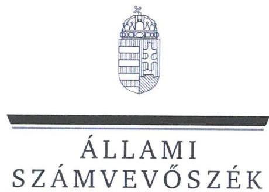
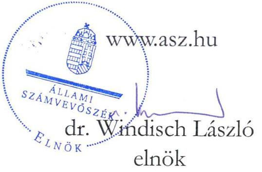

# JELENTÉS 

Az államháztartás központi alrendszerébe tartozó
költségvetési szerv által teljesített dologi és
felhalmozási célú kiadás szabályszerűségének rapid ellenőrzése

Oktatási Hivatal, Miskolci Rendvédelmi Technikum

2023.

---

# JELENTÉS 

Az államháztartás központi alrendszerébe tartozó
költségvetési szerv által teljesített dologi és
felhalmozási célú kiadás szabályszerűségének rapid ellenőrzése

Oktatási Hivatal, Miskolci Rendvédelmi Technikum

2023.

23036

---

# ELLENŐRZÉSI IGAZGATÓSÁG: 

## ÁLLAMHÁZTARTÁS KÖZPONTI SZINTJÉT ELLENŐRZŐ IGAZGATÓSÁG

## ELLENŐRZÉSI IGAZGATÓ:

DR. SZOMOLAI CSABA igazgatói feladatokat ellátó alelnök

## ELLENŐRZÉSVEZETŐ:

Jelentéseink az interneten a www.asz.hu címen olvashatók.

RENKÓ ZSUZSANNA ellenőrzésvezető

IKTATÓSZÁM: EL-3949-001/2023.
TÉMASZÁM: 2685
ELLENŐRZÉS-AZONOSÍTÓ SZÁM: V-1029

---

# TARTALOMJEGYZÉK 

- AZ ELLENŐRZÉS ALAPADATAI ..... 5
- AZ ELLENŐRZÉS HATÓKÖRE ÉS TERÜLETE/ AZ ELLENŐRZÖTT SZERVEZET ..... 7
- ÖSSZEFOGLALÁS ..... 9
- AZ ELLENŐRZÉS FÓKUSZKÉRDÉSEI ..... 10
- MEGÁLLAPÍTÁSOK ..... 11
- MELLÉKLETEK ..... 13
I. sz. melléklet: Értelmező szótár ..... 13
II. sz. melléklet: Az ellenőrzött szervezetek jegyzéke ..... 14
III. sz. melléklet: Az ellenőrzési programok alapján vizsgált jogszabályi előírások ..... 15
- FÜGGELÉK: ÉSZREVÉTELEK ..... 16
- RÖVIDÍTÉSEK JEGYZÉKE ..... 17

---

.

---

# AZ ELLENŐRZÉS ALAPADATAI 

## AZ ELLENŐRZÉS CÉLJA

Az államháztartás központi alrendszerébe tartozó költségvetési szerv által teljesített dologi és felhalmozási célú kiadások egy-egy kiválasztott tételének szabályszerűségi szempontból történő értékelése.

## AZ ELLENŐRZÉS TÍPUSA

Megfelelőségi ellenőrzés (szabályszerűségi)

## AZ ELLENŐRZÖTT IDŐSZAK

Oktatási Hivatal esetében:

- a dologi kiadásnál 2023. május 16., a felhalmozási célú kiadásnál 2023. május 05.
Miskolci Rendvédelmi Technikum esetében:
- a dologi kiadásnál 2023. május 16., a felhalmozási célú kiadásnál 2023. március 29.

## AZ ELLENŐRZÉS TÁRGYA

Az államháztartás központi alrendszerébe tartozó költségvetési szerv által teljesített, ellenőrzésre kiválasztott dologi és felhalmozási célú kiadás. Az ellenőrzés kiterjed minden olyan körülményre és adatra, amely az ÁSZ jogszabályban meghatározott feladatainak teljesítéséhez, valamint a program végrehajtása folyamán felmerült újabb összefüggések feltárásához szükséges.

## AZ ELLENŐRZÉS JOGALAPJA

Az ellenőrzés jogalapját az ÁSZ tv. ${ }^{1} 1 . \S$ (3) bekezdése és az 5. § (6) bekezdése képezte.

## AZ ELLENŐRZÉS MÓDSZERE

Az ellenőrzést az ÁSZ ${ }^{2}$ az ellenőrzött időszakban hatályos jogszabályok, az ellenőrzés szakmai szabályai alapján, „Az állambáztartás központi alrendszerébe tartozó költségvetési szerv által teljesített dologi kiadás szabályszerűségének rapid ellenőrzéséről" és „Az állambáztartás központi alrendszerébe tartozó költségvetési szerv által teljesített felhalmozási célú kiadás szabályszerűségének rapid ellenőrzéséről" című ellenőrzési programok (továbbiakban: ellenőrzési programok) kérdéseire adott válaszok kiértékelésével, az ellenőrzési programokban megjelölt adatforrások figyelembevételével folytatta le.

Az ellenőrzési kérdések megválaszolásához szükséges bizonyítékok megszerzése a következő ellenőrzési eljárások alkalmazásával történt: megfigyelés, összehasonlítás, elemző eljárás, a dologi kiadások, felhalmozási

---

célú kiadások ellenőrzéssel érintett rovatairól történő mintavétel. Az ellenőrzési bizonyítékként felhasználható adatforrások közé tartoztak az ellenőrzés folyamán feltárt, az ellenőrzés szempontjából információt tartalmazó dokumentumok.

Az ellenőrzés során a kiválasztott mintatételek ellenőrzési programokban meghatározott szempontok szerinti szabályszerűségét értékelte az ÁSZ. Az ÁSZ a kötelezettségvállalás, teljesítésigazolás gazdálkodási jogkörök tekintetében a jogkörgyakorlás szabályszerűségét, a pénzügyi ellenjegyzés, utalványozás gazdálkodási jogkörök tekintetében a jogkörgyakorlás megtörténtét értékelte.

---

# AZ ELLENŐRZÉS HATÓKÖRE ÉS TERÜLETE/ AZ ELLENŐRZÖTT SZERVEZET 

Az ellenőrzés az Oktatási Hivatalra és a Miskolci Rendvédelmi Technikumra, mint az államháztartás központi alrendszerébe tartozó költségvetési szervekre terjedt ki.

Az ellenőrzés során az ÁSZ

- mindkét ellenőrzött szervezet esetében a dologi kiadások körébe tartozó Szakmai tevékenységet segítő szolgáltatások;
- az Oktatási Hivatal esetében a felhalmozási célú kiadások körébe tartozó Informatikai eszközök beszerzése, létesítése; a Miskolci Rendvédelmi Technikum esetében a felhalmozási célú kiadások körébe tartozó Egyéb tárgyi eszközök beszerzése, létesítése
rovatokon elszámolt kiadások egy-egy kiválasztott mintatételének megfelelőségét értékelte.

## Oktatási Hivatal

A Hivatal ${ }^{3}$ a köznevelésért felelős miniszter irányítása alá tartozó, központi hivatalként működő központi költségvetési szerv. A Hivatalt 1999. szeptember 1-jén alapították. A költségvetési szerv jogállását az Oktatási Hivatalról szóló 121/2013. (XII. 31.) Korm. rendelet határozza meg. A Hivatal a hatáskörébe tartozó feladatokat Magyarország egész területére kiterjedő illetékességgel látja el.

A Hivatal szakmai alaptevékenysége körében ellátandó feladatai különösen a köznevelés ágazati irányításával összefüggő feladatok; közhiteles nyilvántartási feladatok; hatósági feladatok; szakmai ellenőrzési, mérési, értékelési feladatok; szakképzéssel; a köznevelési jelentéssel; a felsőoktatási felvételi eljárással; a magyar állami ösztöndíj nyilvántartásával; felsőoktatási szakmai testületek működése feltételeinek biztosításával és a duális képzésekkel; a pedagógiai-szakmai szolgáltatásokkal; a pedagógiai szakszolgálattal; a pedagógustovábbképzéssel; a nyelvvizsgáztatással; a külföldi bizonyítványok és oklevelek elismerésével, valamint a hazai bizonyítványokról, oklevelekről és a hazai szakmai gyakorlatról szóló hatósági bizonyítványok kiállításával kapcsolatos feladatok; az oktatás valamennyi ágazatához kapcsolódó informatikai, nyilvántartási, adatszolgáltatási feladatok; a minősített adatok kezelésével; a jogi képviseleti tevékenységgel; az Országos Pedagógiai Könyvtár és Múzeum fenntartásával és működtetésével kapcsolatos feladatok; tananyagfejlesztési és tankönyvkiadási; szakmai vizsgaszervezési feladatok; az óvodai nevelésben részvételre kötelezettek és a tankötelesek nyilvántartásának vezetésével kapcsolatos feladatok. A Hivatal alaptevékenységként nyelvvizsgáztatással kapcsolatos állami feladatok kapcsán, valamint külföldi bizonyítványok és oklevelek elismeréséért, továbbá jogszabályban meghatározottak szerint a köznevelés és a felsőoktatás feladatkörében eljáró felelős hatóság.

A Hivatal jogi személy, általános képviseletét az elnök látja el. A jelenlegi elnök 2022. augusztus 1-jétől látja feladatait. A Hivatal irányító szerve a Belügyminisztérium. A Hivatal felsőoktatással, külföldi oklevelek elismerésével, valamint nyelvvizsgáztatással és nyelvvizsga-akkreditációval kapcsolatos feladataival összefüggésben a központi államigazgatási szervekről, valamint a Kormány tagjai és az államtitkárok jogállásáról szóló 2010. évi XLIII. törvény meghatározott hatásköröket - a hatékonysági és pénzügyi ellenőrzés kivételével - a felsőoktatásért felelős miniszter látja el.

---

A Hivatal 2022. évi költségvetési beszámolója szerint 3 894,2 M Ft költségvetési bevételt, 14 034,8 M Ft finanszírozási bevételt ért el, valamint 15 120,9 M Ft költségvetési kiadást és 497,7 M Ft finanszírozási kiadást teljesített. A bevételi főösszeg 17 929,0 M Ft, a kiadási főösszeg 15 618,6 M Ft volt összesen.

# MISKOLCI RENDVÉDELMI TECHNIKUM 

Az MRVT ${ }^{4}$, mint költségvetési szerv alapításának dátuma 1999. szeptember 1., ezen a néven 2020. július 1. napjától működik. Irányító szerve a Belügyminisztérium, a középirányító szerve az Szkr. ${ }^{5}$ alapján az Országos Rendőr-főkapitányság.

Az MRVT közfeladata az Szkt. ${ }^{6}$ és az Szkr. szerinti technikumi szakmai oktatás és nevelés, valamint az Fszt. ${ }^{7}$ és az Fszvr. ${ }^{8}$ szerinti felnőttképzési tevékenység folytatása.

Alaptevékenysége:

- A rendészeti szervek hivatásos állományú tiszthelyettesi utánpótlását biztosító, érettségi utáni iskolai rendszerű szakmára felkészítő szakmai oktatás és szakképesítésre felkészítő szakmai képzés, valamint vizsgáztatás és iskolarendszeren kívüli szakmai képzés, valamint vizsgáztatás, továbbá szaktanfolyami képzés és vizsgáztatás. A költségvetési szerv az iskolai gyakorlati szakképzéshez és vizsgáztatáshoz rendelkezik tanműhelyekkel (szakkabinetekkel). Az Szkt. és Szkr. alapján a költségvetési szerv technikumi nevelést-oktatást folytat. A költségvetési szerv oktatási profiljának megfelelően a rendvédelmi szervek részére szolgáltatási tevékenységet végezhet.
- Az A-161/1/2020. számú megszüntető okirattal megszüntetett Adyligeti Rendészeti Szakgimnázium szakképzési (oktatás, kiképzés) alapfeladatainak ellátása, az oktatási, szakképzési és képzési feladataival összefüggő iratanyag kezelése.
Az MRVT gazdálkodási tevékenységét saját maga látja el. A 2022. évi költségvetési beszámolója szerint 214,9 M Ft költségvetési bevételt, 2 508,2 M Ft finanszírozási bevételt ért el, valamint 2 614,3 M Ft költségvetési kiadást és 98,5 M Ft finanszírozási kiadást teljesített. A bevételi főösszeg 2 723,1 M Ft a kiadási főösszeg 2 712,8 M Ft volt összesen.

---

# ÖSSZEFOGLALÁS 

Az ÁSZ rapid ellenőrzés keretében vizsgálta a Hivatal és az MRVT, mint az államháztartás központi alrendszerébe tartozó költségvetési szervek által teljesített dologi, illetve felhalmozási célú kiadások egy-egy ellenőrzésre kiválasztott tételének megfelelőségét. Az ellenőrzés során a kiválasztott kiadásokhoz kapcsolódóan a kötelezettségvállalás és a teljesítésigazolás gazdálkodási jogkörök gyakorlásának szabályszerűségét, a pénzügyi ellenjegyzés és utalványozás gazdálkodási jogkörök gyakorlásának megtörténtét, valamint a kiadások elszámolásának ellenőrzési programokban meghatározott jogszabályi előírásoknak való megfelelőségét értékelte az ÁSZ.

A Hivatalnál ellenőrzött egy-egy dologi és felhalmozási célú kiadás tekintetében a kötelezettségvállalás és teljesítésigazolás gazdálkodási jogkörgyakorlás szabályszerű volt. A kötelezettségvállalásra pénzügyi ellenjegyzést követően került sor. A kifizetés elrendelése utalványozás alapján történt. A kiadásokat megfelelő rovatokon számolták el.

Az MRVT-nél ellenőrzött dologi kiadás tekintetében az ellenőrzés a kötelezettségvállalás, teljesítésigazolás, utalványozás gazdálkodási jogkörök gyakorlását, valamint a kiadás elszámolását érintő hibát nem tárt fel. Az ellenőrzött felhalmozási célú kiadásnál a kötelezettségvállalás és a teljesítésigazolás nem volt szabályszerű, mert a gazdálkodási jogkörgyakorlók nem rendelkeztek a felhalmozási célú kiadás tekintetében jogosultsággal. A utalványozás, valamint a kiadás elszámolása vonatkozásában az ellenőrzés nem tárt fel hiányosságot.

---

# AZ ELLENŐRZÉS FÓKUSZKÉRDÉSEI 

1- Az államháztartás központi alrendszerébe tartozó költségvetési szervnél a kiválasztott dologi kiadás teljesítése az egyes jogszabályi rendelkezések alapján szabályszerű volt-e?
2- Az államháztartás központi alrendszerébe tartozó költségvetési szervnél a kiválasztott felhalmozási célú kiadás teljesítése az egyes jogszabályi rendelkezések alapján szabályszerű volt-e?

---

# MEGÁLLAPÍTÁSOK 

## 1. Az államháztartás központi alrendszerébe tartozó költségvetési szervnél a kiválasztott dologi kiadás teljesítése az egyes jogszabályi rendelkezések alapján szabályszerű volt-e?

## Összegző megállapítás

A Hivatalnál és az MRVT-nél az ellenőrzött dologi kiadás teljesítése szabályszerű volt az ellenőrzés keretében vizsgált jogszabályi előírásokkal összhangban.

A Hivatalnál és az MRVT-nél az ellenőrzött mintatétel esetében a kötelezettségvállalási, teljesítésigazolási, utalványozási jogkörgyakorlásnál, továbbá a kiadások elszámolása során az ellenőrzés hiányosságot nem tárt fel:

- A kötelezettségvállalások az Áht. ${ }^{9} 37 . \S$ (1) bekezdésében foglaltakkal összhangban történtek. A kötelezettségvállalók az Áht. 36. § (7) bekezdésében és az Ávr. ${ }^{10} 52 . \S$ (1) bekezdésében foglaltak szerinti felhatalmazással rendelkeztek, a kötelezettségvállalásokra az Áht. 37. § (1) bekezdésében foglaltak szerint, a pénzügyi ellenjegyzések után került sor.
- A teljesítésigazolók az Ávr. 57. § (4) bekezdésében előírt írásbeli kijelöléssel rendelkeztek, az Ávr. 57. § (1) bekezdésében foglaltak szerint a teljesítés igazolása során ellenőrizhető okmányok alapján ellenőrizték és igazolták a kiadások teljesítésének jogosságát, összegszerűségét, valamint az ellenszolgáltatás teljesítését. A teljesítést az Ávr. 57. § (3) bekezdésében foglaltakkal összhangban, az igazolás dátumának és a teljesítés tényére történő utalás megjelölésével, aláírásukkal igazolták.
- Az utalványozásokra az Áht. 38. § (1) bekezdésében, valamint az Ávr. 59. § (3) bekezdés g) pontjában foglaltakkal összhangban, a teljesítésigazolások és annak alapján végrehajtott érvényesítéseket követően került sor.
- A kiadások elszámolása az Áhsz. ${ }^{11} 40 . \S$ (1) bekezdésben foglaltaknak megfelelően az Áhsz. 15. mellékletének I. pontjában előírtak szerint történt.

---

# 2. Az államháztartás központi alrendszerébe tartozó költségvetési szervnél a kiválasztott felhalmozási célú kiadás teljesítése az egyes jogszabályi rendelkezések alapján szabályszerű volt-e? 

Összegző megállapítás A Hivatalnál az ellenőrzött felhalmozási célú kiadás teljesítése szabályszerű volt az ellenőrzés keretében vizsgált jogszabályi előírásokkal összhangban. Az MRVT-nél az ellenőrzött felhalmozási célú kiadásnál a kötelezettségvállalás és a teljesítésigazolás nem szabályszerűen történt.

A Hivatalnál az ellenőrzött mintatétel esetében a kötelezettségvállalási, teljesítésigazolási, utalványozási jogkörgyakorlás, továbbá a kiadás elszámolása szabályszerű volt:

- A kötelezettségvállalás az Áht. 37. § (1) bekezdésében foglaltakkal összhangban történt. Kötelezettséget az Áht. 36. § (7) bekezdésében és az Ávr. 52. § (1) bekezdésében foglaltakkal összhangban a Hivatal elnöke által felhatalmazott személy vállalt. A kötelezettségvállalásra az Áht. 37. § (1) bekezdésében foglaltak szerint, a pénzügyi ellenjegyzés után került sor.
- A teljesítésigazoló az Ávr. 57. § (4) bekezdésében előírt írásbeli kijelöléssel rendelkezett, az Ávr. 57. §
 (1) bekezdésében foglaltak szerint a teljesítés igazolása során ellenőrizhető okmány (átadás-átvételi jegyzőkönyv) alapján ellenőrizte és igazolta a kiadás teljesítésének jogosságát, összegszerűségét, valamint az ellenszolgáltatás teljesítését. A teljesítést az Ávr. 57. § (3) bekezdésében foglaltakkal összhangban, az igazolás dátumának és a teljesítés tényére történő utalás megjelölésével, aláírásával igazolta.
- Az utalványozásra az Áht. 38. § (1) bekezdésében, valamint az Ávr. 59. § (3) bekezdés g) pontjában foglaltakkal összhangban, a teljesítésigazolás és annak alapján végrehajtott érvényesítést követően került sor.
- A kiadás elszámolása az Áhsz. ${ }^{12}$ 40. § (1) bekezdésben foglaltaknak megfelelően az Áhsz. 15. mellékletének I. pontjában előírtak szerint történt.

Az MRVT-nél az ellenőrzött mintatétel esetében a kötelezettségvállalási és a teljesítésigazolási jogkörgyakorlás nem volt szabályszerű, az utalványozási jogkörgyakorlás, valamint a kiadás elszámolása szabályszerű volt:

- A kötelezettségvállaló az Ávr. 52. § (1) bekezdésében foglaltak ellenére nem rendelkezett a felhalmozási célú kiadások vonatkozásában az MRVT vezetője által adott írásbeli felhatalmazással.
- A teljesítésigazoló az Ávr. 57. § (4) bekezdésében foglaltak ellenére nem rendelkezett a felhalmozási célú kiadások vonatkozásában az MRVT vezetője általi írásbeli kijelöléssel.
- Az utalványozásra az Áht. 38. § (1) bekezdésében, valamint az Ávr. 59. § (3) bekezdés g) pontjában foglaltakkal összhangban, a teljesítésigazolás és annak alapján végrehajtott érvényesítést követően került sor.
- A kiadás elszámolása az Áhsz. ${ }^{13}$ 40. § (1) bekezdésben foglaltaknak megfelelően az Áhsz. 15. mellékletének I. pontjában előírtak szerint történt.

---

# MELLÉKLETEK 

## I. SZ. MELLÉKLET: ÉRTELMEZŐ SZÓTÁR

kötelezettségvállalás
pénzügyi ellenjegyzés
teljesítésigazolás
utalványozás

A költségvetési szerv által a kiadási előirányzatok és - ha jogszabály lehetővé teszi - a kijelölt lebonyolító szerv számára a Kormány rendeletében meghatározottak szerinti rendelkezésre bocsátott összeg terhére fizetési kötelezettség vállalásáról szóló - így különösen a foglalkoztatásra irányuló jogviszony létesítésére, szerződés megkötésére, költségvetési támogatás biztosítására irányuló - szabályszerűen megtett jognyilatkozat.
Forrás: Áht. 1. § 15. pont
A kötelezettségvállalást megelőző művelet, amelynek során a pénzügyi ellenjegyzőnek meg kell győződnie arról, hogy a szükséges szabad előirányzat - több évet érintő kötelezettségvállalás esetén minden egyes évben rendelkezésre áll, a tervezett kifizetési időpontokban a pénzügyi fedezet biztosított, valamint a kötelezettségvállalás nem sérti a gazdálkodásra vonatkozó szabályokat. Kötelezettséget vállalni a Kormány rendeletében foglalt kivételekkel csak pénzügyi ellenjegyzés után, a pénzügyi teljesítés esedékességét megelőzően, írásban lehet.
Forrás: Áht. 37. § (1) bekezdés
A kötelezettségvállalásban a másik fél által vállalt feltételek teljesítéséhez kapcsolódó igazolás, amely a kiadási előirányzat terhére vállalt utalványozást előzi meg. A teljesítés igazolása során ellenőrizhető okmányok alapján ellenőrizni és igazolni kell a kiadások teljesítésének jogosságát, összegszerűségét, ellenszolgáltatást is magában foglaló kötelezettségvállalás esetében - ha a kifizetés vagy annak egy része az ellenszolgáltatás teljesítését követően esedékes - annak teljesítését. A teljesítést az igazolás dátumának és a teljesítés tényére történő utalás megjelölésével, az arra jogosult személy aláírásával kell igazolni.
Forrás: Áht. 38. § (1) bekezdés; Ávr. 57. § (1) és (3) bekezdések
A bevételek és kiadások elszámolására utalványozás alapján kerülhet sor. A kiadási előirányzatok terhére történő utalványozás esetén az utalványozásra csak azután kerülhet sor, ha a kiadás alapjául szolgáló kötelezettségvállalásban meghatározott feltételeket a másik szerződő fél már teljesítette. A kiadási előirányzatok terhére történő utalványozásra a teljesítés igazolását és az érvényesítést követően, a bevételi előirányzatok esetén a belső szabályzatban a bevételek meghatározott körére esetlegesen elrendelt teljesítés igazolását követően kerülhet sor.
Forrás: Áht. 38. § (1) bekezdés; Ávr. 57. § (2) bekezdés és 59. § (1b) bekezdés

---

II. SZ. MELLÉKLET: AZ ELLENŐRZÖTT SZERVEZETEK JEGYZÉKE

# KÖLTSEGYETTÉSI SZERVEK NEVEI 

Oktatási Hivatal
Miskolci Rendvédelmi Technikum

---

# III. SZ. MELLÉKLET: AZ ELLENŐRZÉSI PROGRAMOK ALAPJÁN VIZSGÁLT JOGSZABÁLYI ELÖÍRÁSOK 

## AZ EGYES GAZDÁLKODÁSI JOGKÖRÖKHÖZ, SZÁMVITELI ELSZÁMOLÁSHÖZ KAPCSOLÓDÓAN ELLENŐRZÖTT JOGSZABÁLYI KRITÉRIUMOK

## DOLOGI ÉS FELHALMOZÁSI CÉLÚ KIADÁSOK

Kötelezettségvállalás
Áht. 36. § (7), 37. § (1) bekezdések
Ávr. 50. § (1) bekezdés d) pont, 52. § (1), (9), 53. § (1), 60. § (3) bekezdések
Pénzügyi ellenjegyzés
Ávr. 55. § (1) bekezdés
Teljessítésigazolás
Áht. 38. § (1), (2) bekezdések
Ávr. 57. § (1), (3)-(5), 60. § (3) bekezdések
Utalványozás
Áht. 38. § (1) bekezdés
Ávr. 59. § (1b), (2) bekezdések, (3) bekezdés g) pont, (4) bekezdés
Kiadások elszámolása
Áhsz. 40. § (1) bekezdés, 15. melléklet I. pont

---

# FÜGGELÉK: ÉSZREVÉTELEK 

A jelentéstervezetet a Számvevőszék 15 napos észrevételezésre megküldte az ellenőrzött szervezet vezetőjének az ÁSZ tv. 29. § (1) bekezdése előírásának megfelelően.

Az Oktatási Hivatal elnöke és a Miskolci Rendvédelmi Technikum igazgatója a jelentéstervezet megállapításaira nem tettek észrevételt.

[^0]
[^0]:    * 29. § (1) Az Állami Számvevőszék az ellenőrzési megállapításait megküldi az ellenőrzött szervezet vezetőjének vagy az általa megbízott személynek, és annak, akinek személyes felelősségét állapította meg.
    (2) Az ellenőrzött szervezet vezetője és a felelősként megjelölt személy az ellenőrzés megállapításaira tizenöt napon belül írásban észrevételt tehet.
    (3) Az Állami Számvevőszék az észrevételre a beérkezésétől számított harminc napon belül írásban válaszol. A figyelembe nem vett észrevételeket köteles a jelentésben feltüntetni, és megindokolni, hogy azokat miért nem fogadta el.

---

# RÖVIDÍTÉSEK JEGYZÉKE 

${ }^{1}$ ÁSZ tv.
${ }^{2}$ ÁSZ
${ }^{3}$ Hivatal
${ }^{4}$ MRVT
${ }^{5}$ Szkr.
${ }^{6}$ Szkt.
${ }^{7}$ Fszt.
${ }^{8}$ Fszvr.
${ }^{9}$ Áht.
${ }^{10}$ Ávr.
${ }^{11}$ Áhsz.
${ }^{12}$ Áhsz.
${ }^{13}$ Áhsz.
2011. évi LXVI. törvény az Állami Számvevőszékről

Állami Számvevőszék
Oktatási Hivatal
Miskolci Rendvédelmi Technikum
12/2020. (II. 7.) Korm. rendelet a szakképzésről szóló törvény végrehajtásáról
2019. évi LXXX. törvény a szakképzésről
2013. évi LXXVII. törvény a felnőttképzésről
11/2020. (II. 7.) Korm. rendelet a felnőttképzésről szóló törvény végrehajtásáról
2011. évi CXCV. törvény az államháztartásról

368/2011. (XII. 31.) Korm. rendelet az államháztartásról szóló törvény végrehajtásáról
4/2013. (I. 11.) Korm. rendelet az államháztartás számviteléről
4/2013. (I. 11.) Korm. rendelet az államháztartás számviteléről

---

1052 Budapest, Apáczai Csere János u. 10. | 1364 Budapest 4., Pf. 54
www.asz.hu | szamvevoszek@asz.hu
telefon: +36 14849100
