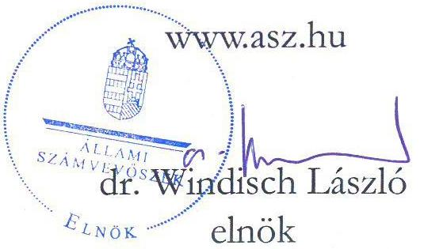
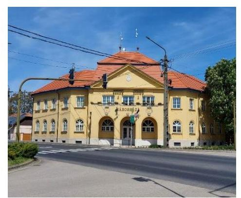
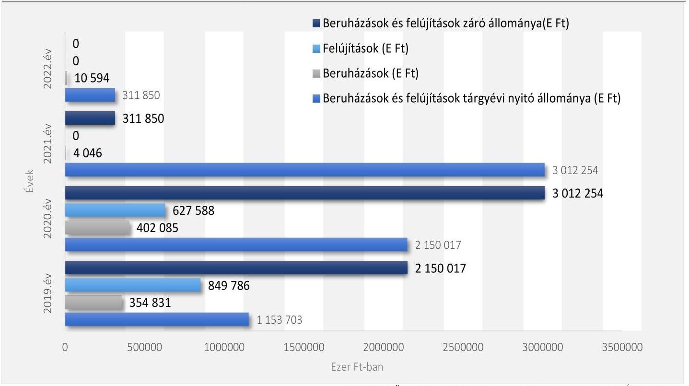

# JELENTÉS 

## Az önkormányzatok és központi költségvetési szervek ingatlanhasznosítási tevékenységének ellenőrzése

Kenderes Városi Önkormányzat

2023.

---

# JELENTÉS 

## Az önkormányzatok és központi költségvetési szervek ingatlanhasznosítási tevékenységének ellenőrzése

Kenderes Városi Önkormányzat

2023.

23037

---

# ELLENŐRZÉSI IGAZGATÓSÁG: 

## ÁLLAMHÁZTARTÁS HELYI SZINTJÉT ELLENŐRZŐ IGAZGATÓSÁG

ELLENŐRZÉSI IGAZGATÓ:
KISGERGELY ISTVÁN igazgató

ELLENŐRZÉSVEZETŐ:
Jelentéseink az interneten a www.asz.hu címen olvashatók.

SZEIBEL GÁBORNÉ ellenőrzésvezető

IKTATÓSZÁM: EL-3711-005/2023.
TÉMASZÁM: 38.
ELLENŐRZÉS-AZONOSÍTÓ SZÁM: V0992

---

# TARTALOMJEGYZÉK 

AZ ELLENŐRZÉS ALAPADATAI ..... 5
AZ ELLENŐRZÖTT SZERVEZET ..... 7
ÖSSZEFOGLALÁS ..... 10
AZ ELLENŐRZÉS FÓKUSZKÉRDÉSEI ..... 12
MEGÁLLAPÍTÁSOK ..... 13
JAVASLATOK ..... 22
MELLÉKLETEK ..... 25
I. sz. melléklet: Értelmező szótár ..... 25
II. sz. melléklet: Az ellenőrzött szervezetek jegyzéke ..... 30
III. sz. melléklet: Kenderes Városi Önkormányzat mérleg adatai a 2019-2022. években ..... 31
IV. sz. melléklet: Kenderes Városi Önkormányzat kiadási és bevételi előirányzatai és teljesítései 2019-2022. években ..... 32
FÜGGELÉK: ÉSZREVÉTELEK ..... 33
RÖVIDÍTÉSEK JEGYZÉKE ..... 34

---

.

---

# AZ ELLENŐRZÉS ALAPADATAI 

## AZ ELLENŐRZÉS CÉLJA

Az ellenőrzés célja a nemzeti vagyonnal gazdálkodó Önkormányzat ingatlangazdálkodási, ingatlanhasznosítási tevékenységének értékelése volt. Az ellenőrzés kiterjedt arra, hogy az Önkormányzat az ingatlangazdálkodási feladatai ellátása során figyelemmel volt-e a vagyon értékének megőrzésére, állagának fenntartására, állományának gyarapítására.

## AZ ELLENŐRZÉS TÍPUSA

Megfelelőségi ellenőrzés.

## AZ ELLENŐRZÖTT IDŐSZAK

A 2019-2022. évek. A nyilvántartások ellenőrzése tekintetében a 2021. év.

## AZ ELLENŐRZÉS TÁRGYA

Az ellenőrzés tárgyát az Épít.tv. ${ }^{1}$ 2. § 8. pontjában foglaltak szerinti építmények, a 2. § 10. pontjában foglaltak szerinti épületek és a 2. § 21. pont szerinti telkek, továbbá a Földtv. ${ }^{2}$ hatálya alá tartozó földterületek, valamint a 147/1992. (XI. 6.) Korm. rendelet ${ }^{3}$ 4. számú melléklete szerinti külterületi ingatlanok képezték.

Az ellenőrzés hatóköre kiterjedt arra, hogy az ellenőrzött szervezet a közfeladatok ellátását biztosító ingatlanokkal kapcsolatos gazdálkodás, hasznosítás területén, a jogszabályi előírások figyelembevételével gondoskodott-e az ingatlanvagyona megfelelő használatáról és hasznosításáról, értékének és állagának védelméről, állományának gyarapításáról.

Az ÁSZ ${ }^{4}$ a megfelelőségi ellenőrzés keretében az ingatlanvagyonnal kapcsolatos intézkedések végrehajtásának, azok elszámolásának megfelelőségét, valamint a nemzeti vagyonba tartozó ingatlanok nyilvántartásának szabályszerűségét is ellenőrizte. A nemzeti vagyonba tartozó ingatlanokkal kapcsolatos gazdálkodási, hasznosítási tevékenységben érintett, kockázatelemzés alapján kiválasztott szervezet ezen feladatellátását támogató belső kontrollrendszere keretében a kontrollkörnyezet részeként a belső szabályozás kialakítása, továbbá a monitoring rendszer kialakítása és működtetése részeként a belső ellenőrzés, valamint az ingatlanokkal kapcsolatos gazdálkodási, hasznosítási folyamatokba épített kontrolltevékenységek kerültek ellenőrzésre.

Az ingatlangazdálkodási tevékenység ellenőrzése az Önkormányzat esetében az ingatlanok ingyenes átvételére, hasznosítására (bérbe-, használatba adására), az ingatlan tulajdonjogának adásvétel keretében történő megszerzésére és értékesítésére, a beruházások, felújítások megvalósítására és az ingatlanok nyilvántartására irányult. Az ellenőrzés azokat a szerződéseket vette figyelembe, amelyek a 2019-2022. években érvényben voltak.

---

Az ellenőrzés kiterjedt minden olyan körülményre és adatra, amely az ÁSZ jogszabályban meghatározott feladatainak teljesítéséhez, valamint a program végrehajtása folyamán felmerült újabb összefüggések feltárásához szükséges.

# AZ ELLENŐRZÉS JOGALAPJA 

Az ellenőrzés jogszabályi alapját az ÁSZ tv. ${ }^{5}$ 1. § (3) bekezdése, 5. § (3) bekezdése és (4) bekezdés a) pontjának előírásai képezték.

## AZ ELLENŐRZÉS MÓDSZERE

Az ellenőrzést az Alaptörvény 43. cikk (1) bekezdésében meghatározott törvényességi, célszerűségi szempontok, valamint a nemzetközi standardokat irányadónak tekintve az ellenőrzési program szempontjai, az ellenőrzött időszakban hatályos jogszabályok, az ellenőrzés szakmai szabályok és módszertanok figyelembevételével hajtotta végre az ÁSZ.

Az ellenőrzési bizonyítékként felhasználható adatforrások közé tartoztak egyrészt az ellenőrzéshez kért dokumentumok, adatforrások, másrészt adatforrás volt még minden - az ellenőrzés folyamán - feltárt, az ellenőrzés szempontjából információkat tartalmazó dokumentum.

Az ellenőrzés lefolytatásához az ellenőrzött szervezet a tanúsítványok kitöltésével, valamint az ÁSZ által kért dokumentumok, adatok, információk megküldésével és a helyszíni ellenőrzés során - interjú keretében - szolgáltatott adatokat.

Az ingatlangazdálkodási, ingatlanhasznosítási tevékenység vonatkozásában az ellenőrzési kérdések megválaszolásához szükséges bizonyítékok megszerzése az ellenőrzött szervezet által rendelkezésre bocsátott dokumentumokra, adatokra alapozva, továbbá megfigyelés, kérdésfeltevés (információkérés), helyszínen végzett ellenőrzés, valamint elemző eljárás alkalmazásával történt.

Az ingatlangazdálkodási, ingatlanhasznosítási tevékenységek, folyamatok tekintetében a belső kontrollrendszer egyes részeinek kialakítását és működtetését évente értékeltük.

Az ingatlangazdálkodási, ingatlanhasznosítási tevékenységek végrehajtásának megfelelőségét mintatételek értékelése alapján ellenőriztük. Az ellenőrzési megállapításokat és a minősítéseket az ellenőrzött mintatételek vonatkozásában tettük meg. A mintatételek köre az ellenőrzött területhez tartozó legnagyobb értékű elemekből állt, továbbá a mintavételi eljárás rétegzett, illetve egyszerű véletlen mintavétellel is kiegészült. Az ellenőrzés módszertana szerint az ellenőrzött mintatételek száma 30 volt, amennyiben az alapsokaság elemszáma kevesebb volt, mint 30, a teljes alapsokaság ellenőrzésére és értékelésére sor került. Így az Önkormányzatnál az ingatlanok értékesítésének ellenőrzésére nyolc mintatétel, az ingatlanok ingyenes átvételére 12 mintatétel, a hasznosításának (bérbe-, használatba adásának) ellenőrzésére 11 mintatétel, az ingatlanberuházással (adásvétel, létesítés, felújítás) kapcsolatosan 14 mintatétel, az ingatlanoknak a számviteli nyilvántartásokban való állományba vétele, mérlegben történő szerepeltetése esetében 30 mintatétel tételes ellenőrzésére került sor. A tények feltárása és azok összegzése során a megállapítások az ellenőrzött mintatételekre vonatkozóan kerültek megfogalmazásra. Az ÁSZ törvényességi és célszerűségi szempontok, valamint az ellenőrzési programja alapján végrehajtott ellenőrzésének megállapításait a „Megállapítások" fejezet tartalmazza.

---

# AZ ELLENŐRZÖTT SZERVEZET 

Kenderes település lélekszáma a KSH${ }^{6}$ 2022. január 1.-i adatai alapján 4311 fő volt. A jellegzetesen alföldi település Jász-Nagykun-Szolnok vármegye középső részén fekszik.

Az Önkormányzatnak ${ }^{7}$ a Polgármesteri Hivatallal ${ }^{8}$ együtt öt intézménye volt, a Kenderesi Gondozási Központ, Család- és Gyermekjóléti Szolgálat; a Kenderes Városgazdálkodás; a Móricz Zsigmond Művelődési Ház és a Városi Könyvtár Kenderes. Valamint egy önkormányzati tulajdonú gazdasági társasága volt, a Kenderesi Nonprofit Kft., amely kényszertörlési eljárás alatt áll. A településen a vizsgált időszakban egy nemzetiségi önkormányzat működött, a Kenderesi Roma Nemzetiségi Önkormányzat, amely 2019.10.24-én alakult és 2023.06.25-én szűnt meg.
A képviselők létszáma 2022. december 31-én hét fő volt. Az ellenőrzött időszakban négy bizottság működött az Önkormányzatnál: az Ügyrendi és Jogi Bizottság, a Pénzügyi és Településfejlesztési Bizottság, az Emberi Erőforrás Bizottság. A Kenderes város egyik településrészét alkotó Bánhalma érdekvédelmével kapcsolatos feladatokat ellátó Bánhalma Bizottság 2022. december 15-én megszűnt. A polgármester személye a vizsgált időszakot tekintve két alkalommal - 2019.10.13., 2022.11.20. - változott, a legutóbbi változás oka az volt, hogy a Képviselő-testület ${ }^{9}$ a 2022. évben feloszlatta magát és ezért 2022. november 20-án önkormányzati választásra került sor. Az Önkormányzat jelenlegi polgármestere ${ }^{10}$ az ellenőrzött időszak éveiben önkormányzati képviselő volt és az Önkormányzat Pénzügyi és Településfejlesztési Bizottságának tagjaként is tevékenykedett. A vizsgált években az Önkormányzatnál négy alkalommal - 2019.12.26., 2021.04.19., 2021.05.17., 2022.12.13. - változott a jegyző személye, a jelenlegi jegyző ${ }^{11}$ 2022. december 13-ától tölti be hivatalát, a vizsgált időszakot tekintve a 2019. év december 31-ig aljegyző volt, ezt követően a 2020. január 1-től 2022. év december 12-ig nem töltött be az Önkormányzatnál funkciót. Az Önkormányzat könyvelését és az éves költségvetési beszámoló készítését megállapodás alapján külső gazdasági társaság végezte 2022. februárjától, mely megállapodás az ellenőrzés időpontjában is fennállt. Az egyéb pénzügyi és számviteli feladatokat a Polgármesteri Hivatal pénzügyi ügyintézői látták el. A 2021. évi éves költségvetési beszámolót nem a külső gazdasági társaság készítette, hanem a megelőző évekhez hasonlóan a Polgármesteri Hivatal pénzügyi ügyintézői.

Kenderes Város Önkormányzata mérleg adatait a 2019-2022. évekre vonatkozóan a III. számú melléklet 1. táblázata mutatja be, mely alapján az Önkormányzat vagyona 2019. évről 2022. évre 5149 246,2 E Ft-ról 4790 853,0 E Ft-ra, 7,0%-kal, 358 393,2 E Ft-tal csökkent, alapvetően az immateriális javak 75,7%-os csökkenése miatt.

---

A tárgyi eszközök és az ingatlanok állománya, nettó értékének alakulását az 1. táblázat szemlélteti.

# 1. táblázat 

A TÁRGYI ESZKÖZÖK ALAKULÁSA 2019-2022. ÉVEKBEN (E FT)

| MEGNEVEZÉS | 2019. ÉV | 2020. ÉV | 2021. ÉV | 2022. ÉV |
| :--: | :--: | :--: | :--: | :--: |
| A/II/1 Ingatlanok és a kapcsolódó vagyoni értékű jogok | 1937397,6 | 2035168,4 | 4009842,1 | 4197263,0 |
| A/II/2 Gépek, berendezések, felszerelések, járművek | 91181,8 | 69226,5 | 287594,8 | 231961,4 |
| A/II/3 Tenyészállatok | 0,0 | 0,0 | 337,2 | 286,4 |
| A/II/4 Beruházások, felújítások | 2150017,2 | 3012253,5 | 311849,9 | 0,0 |
| A/II Tárgyi eszközök összesen | 4178596,6 | 5116648,4 | 4609624,0 | 4429510,8 |

4197 263,0
231 961,4
286,4
0,0
4429510,8
Forrás: Az Önkormányzat 2019-2022. évi éves költségvetési beszámolói, ÁSZ szerkesztés

Az ingatlanok állományának aránya a tárgyi eszközökön belül a 2019. évben 46,4%, míg a 2022. évben 94,8% volt, a növekedés oka alapvetően a korábbi felújítások és beruházások aktiválása volt.

## 1. ábra

A BERUHÁZÁSOK ÉS A FELÚJÍTÁSOK KIADÁSAINAK ALAKULÁSA A 2019-2022. ÉVEKBEN

Forrás: Az Önkormányzat 2019-2022. évi éves költségvetési beszámolói, ÁSZ szerkesztés
Kenderes Város Önkormányzata beszámolói alapján a beruházási kiadások összege a 2020. évben volt a legmagasabb 402 084,7 E Ft, ezt követően a 2021. és a 2022. években csökkenés következett be. Felújításokra a 2019. évben 849 786,0 E Ft-ot, a 2020. évben 26,1%-kal kevesebbet 627 588,0 E Ft-ot költöttek, ezt követően a 2021. és a 2022. években felújítási kiadásaik nem voltak. A beruházások és a felújítások alakulását az 1. ábra szemlélteti.

Az ellenőrzött időszakban a legjelentősebb beruházás a szennyvíztisztító telep és szennyvízcsatornahálózat bővítése volt 1460400 E Ft bekerülési értékkel, mely a KEHOP-2.2.2.-15-0003

---

azonosítószámú projekt keretében történt. A szerződés konzorciális volt, a konzorciumi ${ }^{12}$ együttműködési megállapodás alapján a gesztor feladatokat Izsák Város Önkormányzata látta el. A támogatást szállítói finanszírozás keretében biztosították, ezáltal a támogatás kifizetése közvetlenül a szállítónak történt. A beruházás a szerződés szerinti határidőben, 2020 végén megvalósult.

Az egyes települési önkormányzatok feladatainak támogatása érdekében a IX. Helyi önkormányzatok támogatásai fejezetben történő előirányzat-átcsoportosításról szóló 1680/2017. (IX. 21.) Kormány határozat ${ }^{13}$ alapján a Belügyminisztérium által kiadott támogatói okirat szerint az Önkormányzat egyszeri, 1203500 E Ft vissza nem térítendő központi költségvetési támogatásban részesült. A támogatás felhasználása a 2019. évet érintő öt felújításhoz - a Borház, a volt Református iskola épülete, a Horthy liget, a Pádár ház, a Városháza felújítása - és egy beruházáshoz - a Borházhoz tartozó ingatlan - kapcsolódott.

A 2019. évben jelentős energetikai fejlesztéseket is végeztek, melynek keretében sor került a Polgármesteri Hivatal, a Városi könyvtár, a Bánhalmai Iskola és a Családsegítő Szolgálat épületének energetikai felújítására, összesen 140657,0 E Ft összegben. A fejlesztések forrását az Önkormányzati épületek energetikai korszerűsítése tárgyú, TOP-3.2.1-15-JN1-2016-00053 azonosítószámú szerződés szerinti támogatás jelentette.

---

# ÖSSZEFOGLALÁS 

Az ÁSZ általános hatáskörrel végzi az önkormányzati vagyonnal való gazdálkodás ellenőrzését. Az önkormányzatok vagyona az önkormányzati feladatok és célok ellátását szolgálja, ideértve a lakosság közszolgáltatásokkal való ellátását, és az ezekhez szükséges infrastruktúra biztosítását. Az önkormányzati vagyonba tartozó ingatlanok jelentős anyagi értéket képviselő vagyonelemek, amelyek esetében kiemelten fontos a nemzeti vagyonnal való felelős
 gazdálkodás követelményeinek érvényesítése. Mindezek alapján került sor az Önkormányzat ingatlangazdálkodási és -hasznosítási tevékenységének ellenőrzésére.

Az Önkormányzatnál az ingatlanokkal való gazdálkodással, hasznosítással kapcsolatos intézkedések végrehajtása, illetve azok elszámolása - egy terület kivételével - nem volt megfelelő.

Az Önkormányzat tulajdonában lévő ingatlanok értékesítése nem volt szabályszerű, mivel az Nvtv. előírása ellenére kettő esetben nem volt igazolt, hogy a nemzeti vagyon átruházására átlátható szervezet részére került sor, valamint az értékesített nyolc ingatlan a kataszteri nyilvántartásból nem került kivezetésre. Az értékesített ingatlanok ellenértéke határidőben befizetésre került az Önkormányzat számlájára. Az értékesítésekhez a képviselő-testületi, illetve a koronavírus világjárvány ideje alatt hozott polgármesteri határozatok rendelkezésre álltak. A polgármester az általa meghozott döntésekről a Képviselő-testület tagjait két határozat esetében az Mötv.-ben foglaltak ellenére nem tájékoztatta, a többi határozatról a tájékoztatás megtörtént.

A nemzeti vagyonba tartozó ingatlanok tulajdonjogának ingyenes átvétele szabályszerű volt. Az ingatlanhasznosítással kapcsolatos intézkedések végrehajtása nem felelt meg teljeskörűen a jogszabályi előírásoknak, mert hét esetben az ingatlanok hasznosítására az Mötv. előírása ellenére képviselőtestületi döntés hiányában került sor.

Az Önkormányzatnál az ingatlanberuházással kapcsolatos intézkedések végrehajtása és azok pénzügyi elszámolása az ellenőrzött mintatételek esetében nem volt szabályszerű. Az ingatlanberuházásokhoz, -felújításokhoz kapcsolódó kifizetéseknél a gazdálkodási jogkörök gyakorlása nem volt megfelelő, mert nem tartották be az Áht. és az Ávr. előírásait. A Kbt. ${ }^{14}$ hatálya alá tartozó beruházások, felújítások esetében a közbeszerzési eljárást eredményesen lefolytatták és a szerződést írásban, a nyertes ajánlattevővel kötötték meg.

A jegyző az Mötv. rendelkezése ellenére nem működtetett olyan belső kontrollrendszert, amely biztosítja a rendelkezésre álló források gazdaságos felhasználását, mivel az Önkormányzat pályázati támogatáshoz kapcsolódó 67346,8 E Ft visszafizetési kötelezettségét nem teljesítette határidőben, emiatt összesen 6 021,7 E Ft kamatfizetési kötelezettsége keletkezett a támogatási szerződés alapján, ami az Önkormányzat számára költségvetési kockázatot jelentett. Az Önkormányzat - a 2023. június 7-i állapot szerint - a fel nem használt támogatásból 11 655,4 E Ft-ot és a kamatokat nem teljesítette, a tartozás vonatkozásában a Magyar Államkincstár beszedési megbízást kezdeményezett.

Az Önkormányzatnál az ingatlangazdálkodási, ingatlanhasznosítási tevékenységek tekintetében a nemzeti vagyongazdálkodás Nvtv.-ben meghatározott elveinek érvényesülése nem volt biztosított, mivel a műszaki állapotfelmérések, valamint az ellenőrzött időszakban megvalósuló beruházások, felújítások megalapozása érdekében előterjesztések, számadatokkal alátámasztott elemzések nem készültek, az ellenőrzött időszakban nem végeztek mérést arra vonatkozóan, hogy az energiamegtakarításra vonatkozó beruházás mekkora megtakarítást eredményezett, az ingatlanok hasznosítását megelőzően nem vázoltak fel lehetőségeket arra, hogy hosszú távon az értékesítés, vagy a bérbeadás - hasznosítás - lenne gazdaságosabb az Önkormányzat számára.

---

A jegyző nem gondoskodott az ingatlanvagyon-kataszter és a kataszternapló folyamatos vezetéséről, valamint az ingatlan valóságos állapotában, értékében bekövetkezett változást, a bekövetkezéstől számított 90 napon belül nem vezettette át, így nem tartották be az ingatlanvagyon kataszter vezetése tekintetében a Mötv. és a 147/1992. (XI. 6.) Korm. rendelet előírásait. Az Áhsz. ${ }^{15}$ előírásai ellenére az Önkormányzat ingatlanvagyonáról vezetett főkönyvi és analitikus nyilvántartások adatai nem mutattak egyezőséget. Az Önkormányzat öt ingatlan esetében a Számv. tv. és az Áhsz. előírásai ellenére az egyedi nyilvántartó kartonokat nem készítette el.

Az Önkormányzat a leltárkészítési kötelezettségének az Áhsz., a Számv. tv., valamint az eszközök és források leltárkészítési és leltározási szabályzatában ${ }^{16}$ foglaltak ellenére az ingatlanvagyon tekintetében nem tett eleget, a legalább háromévente mennyiségi felvétellel történő leltározási kötelezettségét az ellenőrzött időszakban nem teljesítette. Ennek következtében a Számv. tv. rendelkezései ellenére a költségvetési beszámolói mérlegének ingatlanokra vonatkozó sorai nem voltak alátámasztottak.

Az Önkormányzat az Nvtv. ${ }^{17}$-ben foglaltak ellenére a nemzeti vagyonnal történt felelős gazdálkodás érdekében nem gondoskodott valamennyi területen az ingatlanvagyon megőrzéséről, értékének és állagának védelméről, az Ehat. ${ }^{18}$ rendelkezése ellenére nem készített energiamegtakarítási intézkedési tervet, valamint nem érvényesítette a környezetvédelemre vonatkozó fenntarthatósági szempontokat.
Az Önkormányzatnál az ingatlangazdálkodási, ingatlanhasznosítási tevékenységek, folyamatok belső kontrollrendszere egyes elemeinek kiépítése és működtetése a 2019-2022. években nem volt megfelelő. A gazdálkodás belső szabályainak kialakítása hiányos volt, valamint a kötelezettségvállalás nyilvántartásának vezetése nem felelt meg az Ávr.-ben foglaltaknak. Az önkormányzati vagyonnal történő gazdálkodás szabályait ${ }^{19}$ a Képviselő-testület elfogadta. A 2019-2022. évekre közép- és hosszú távú vagyongazdálkodási tervvel az Nvtv.-ben foglaltak ellenére nem rendelkeztek. Az Önkormányzat ellenőrzési nyomvonala a Bkr. ${ }^{20}$ előírása ellenére nem tartalmazta a vagyongazdálkodási tevékenységbe tartozó feladatokat, valamint a vagyongazdálkodási tevékenység feladataival kapcsolatos felelősségi, információs szinteket és kapcsolatokat, irányítási és ellenőrzési folyamatokat. A belső ellenőr az ingatlanokkal való gazdálkodást nem ellenőrizte. A Bkr. rendelkezései ellenére a belső ellenőrzésekről az Önkormányzatnál nem vezettek nyilvántartást.

Utóellenőrzés keretében került sor a V0892 számú, „Az önkormányzatok ellenőrzése - Az önkormányzatok integritásának ellenőrzése" című ellenőrzés során feltárt hiányosságok felszámolásának vizsgálatára. Jelen ellenőrzés alapján az Önkormányzat a hiányosságot megszüntette, a hiteles SZMSZ rendelkezésre állt.

A polgármester számára kettő, a jegyző számára 17 javaslatot fogalmaztunk meg az ellenőrzés során feltárt hiányosságok megszüntetése, valamint az ingatlangazdálkodási és -hasznosítási tevékenység jogszabályokban foglalt alapelveknek való megfelelősége érdekében.

---

# AZ ELLENŐRZÉS FÓKUSZKÉRDÉSEI 

1.     - A nemzeti vagyonba tartozó ingatlanokkal való gazdálkodással, hasznosítással kapcsolatos intézkedések végrehajtása, illetve azok elszámolása megfelelő volt-e?
2.     - A nemzeti vagyonba tartozó ingatlanok nyilvántartásával kapcsolatos feladatok ellátása szabályszerű volt-e?
3.     - A nemzeti vagyont használó szervezetnél az ingatlangazdálkodási, ingatlanhasznosítási tevékenységek, folyamatok tekintetében a belső kontrollrendszer kialakítása és működtetése megfelelően történt-e?

---

# MEGÁLLAPÍTÁSOK 

## 1. A nemzeti vagyonba tartozó ingatlanokkal való gazdálkodással, hasznosítással kapcsolatos intézkedések végrehajtása, illetve azok elszámolása megfelelő volt-e?

## Összegző megállapítás

1.1. számú megállapítás

A nemzeti vagyonba tartozó ingatlanokkal való gazdálkodással, hasznosítással kapcsolatos intézkedések végrehajtása, illetve azok elszámolása nem volt megfelelő.

Az Önkormányzat tulajdonában lévő ingatlanok értékesítése nem felelt meg a jogszabályi előírásoknak.

Az Önkormányzatnál az ellenőrzött időszakban ingatlan értékesítésére nyolc esetben került sor. Az értékesítésről hat mintatétel (1., 2., 3., 6., 7., 8. mintatételek) esetében a jogszabályi előírásoknak megfelelően a Képviselő-testület döntött. A hirdetményeket kifüggesztették, a becsült értéknél nagyobb összegért értékesítették az ingatlanokat. Az ingatlanok értékesítésére kettő esetben (4., 5. mintatételek) a koronavírus világjárványra tekintettel elrendelt veszélyhelyzetben került sor, a polgármester döntései a jogszabályi előírásoknak megfeleltek.
Az ingatlanok értékesítése során kettő esetben (5., 8. számú mintatételek) átláthatósági nyilatkozat hiányában az Nvtv. 13. § (2) bekezdésében foglaltak ellenére nem volt igazolt, hogy a nemzeti vagyon tulajdonjogának átruházására átlátható szervezet részére került sor.
Az értékesített ingatlanok közül egy esetben (6. számú mintatétel) forgalomképtelen vagyontárgy került értékesítésre. A forgalomképtelen ingatlan megosztott részét - kivett saját használatú út (6. számú mintatétel) - kisajátítást helyettesítő ingatlan adásvételi szerződés keretében az Nvtv. 6. § (3c) pontjának megfelelően a Magyar Állam nevében a NIF Zrt. vásárolta meg, közérdekű célra.
Az értékesítések során öt esetben (1., 2., 3., 4., 5. számú mintatétel) állt rendelkezésre értékbecslés. Három esetben (6., 7., 8. számú mintatétel) értékhatár (25000 E Ft) alatti volt az értékesítés, amelyre az Nvtv. és az Önkormányzat többször módosított vagyongazdálkodási rendelete szerint nem kellett értékbecslést készíttetni.
Az értékesített ingatlanok közül öt (1., 2., 3., 5., 7. számú mintatételek) az Áhsz. szerinti (analitikus) nyilvántartásokból kivezetésre került, azonban az ingatlanvagyon kataszteri nyilvántartásból való kivezetéséről a jegyző nem gondoskodott. Három esetben (4., 6., 8. számú mintatételek) előfordult, hogy az értékesített ingatlan eredetileg be sem volt vezetve az ingatlanvagyon kataszteri nyilvántartásba. A jegyző nem tett eleget a 147/1992. (XI. 6.) Korm. rendelet 3. §-ában és a 4. § (1) bekezdésében előírtaknak, mivel nem gondoskodott az ingatlanvagyon kataszter és a kataszternapló folyamatos vezetéséről, továbbá az ingatlan valóságos állapotában, értékében bekövetkezett változást, a bekövetkezéstől számított 90 napon belül a kataszteren nem vezette át.
A 7. számú mintatétel esetében a földhivatali nyilvántartás alapján - az Önkormányzat által lekért tulajdoni lapon - a helyszíni ellenőrzés időpontjában is az Önkormányzat neve szerepelt. Az adásvételi szerződést - az ingatlanbejegyzés alapjául szolgáló dokumentumot - az Önkormányzat nem bocsátotta az ellenőrzés rendelkezésére, annak megőrzéséről a Számv. tv. 169. § (2) bekezdése előírása ellenére a jegyző nem 

---

gondoskodott. Az Inytv. vhr. ${ }^{21}$ 60. § (1) bekezdése ellenére az Önkormányzat a bejegyzés iránti kérelmet az ingatlanügyi hatóságnál nem nyújtotta be, pedig arra jogosult volt.
Az értékesített ingatlanok ellenértéke hét ingatlan értékesítése esetében a vevő által határidőben befizetésre került az Önkormányzat számlájára. A Képviselő-testület 86/2020. (X. 16.) számú határozata alapján egy értékesítés során a polgármester olyan adásvételi szerződést kötött (8. számú mintatétel), amelyben az ingatlan vételára - 200 E Ft + ÁFA - úgy került ellentételezésre, hogy a vevő tulajdonában lévő ingatlan Önkormányzat részére történő eladása ellenértékébe számították be. A szerződések alapján értékaránytalanság nem állt fenn.

# 1.2. számú megállapítás A nemzeti vagyon körébe tartozó ingatlanok ingyenes -térítés nélküli- átvétele szabályszerű volt. 

Az Önkormányzat a 2019-2022. években 12 olyan szerződést kötött, ahol térítésmentesen vett át ingatlanokat.
A 2021. évi CXXXII. törvény ${ }^{22}$ szerint „a Magyar Falu Program által támogatott települési önkormányzatokkal lefolytatott előzetes egyeztetések alapján" került sor az ingatlanok átadására 11 esetben (2-12. számú mintatételek).
Az átadó egy esetben (1. számú mintatétel) magánszemély volt, amelyhez kapcsolódó 11/2021. (III. 23.) számú polgármesteri határozat a koronavírus világjárványra tekintettel elrendelt veszélyhelyzet idején született és a 2011. évi CXXVIII. törvény ${ }^{23}$ 6. § (4) bekezdésében foglaltak alapján döntött a polgármester az ajándékozott ingatlan elfogadásáról. A döntésről az Mötv. előírásainak megfelelően tájékoztatta a Képviselő-testület tagjait.

### 1.3. számú megállapítás Az ingatlanok hasznosítása - bérbe-, használatba adása - nem felelt meg teljeskörűen a jogszabályi előírásoknak.

Az ingatlanok hasznosításáról 11 esetből hét esetben (1-5. számú, 8. számú és 10. számú mintatételek) az Mötv. 107. §-ában foglaltak ellenére - jegyzői előterjesztés hiányában - nem a Képviselőtestület döntött. A szolgálati lakások bérbeadására vonatkozó négy szerződést (6, 7, 9, 11. mintatételek) az Önkormányzat tulajdonában álló lakások és helyiségek bérbeadásáról szóló 9/2019. (IV. 25.) számú önkormányzati rendeletnek megfelelően a polgármester kötötte meg. Az ingatlanok hasznosítására irányuló valamennyi szerződést az Nvtv. előírásainak megfelelően, határozatlan időre, de legfeljebb 15 évre kötötték.
A veszélyhelyzet idejére kihirdetett jogszabályi korlátozások idején az ingatlanok bérleti díja megállapítására, módosítására vonatkozó képviselő-testületi előterjesztés, határozat nem született.
A térítés ellenében bérbeadott ingatlanok esetében a szerződés szerint számlázott és befolyt, kiegyenlített bérleti díj elszámolása szabályszerű volt. Az ingatlan bérbeadásból származó bevétel a szerződés szerinti összegben teljesült. A gazdasági esemény elszámolását alátámasztó bizonylatok a Számv. tv.-ben foglaltaknak megfeleltek.

### 1.4. számú megállapítás

Az Önkormányzatnál az ingatlanberuházással kapcsolatos intézkedések végrehajtása és azok pénzügyi elszámolása nem volt szabályszerű.

A Kbt. hatálya alá az ellenőrzött 14 mintatételből 12 mintatétel tartozott, melyeknél
 a közbeszerzési eljárást eredményesen lefolytatták és a szerződést írásban, a nyertes ajánlattevővel kötötték meg.

---

Az Ávr. 50. § (1) bekezdés d) pontjában, az 55. § (2) bekezdés a) pontjában, valamint az 55. § (1) bekezdésében foglaltak ellenére az ingatlan létesítésére, vásárlására, felújítására irányuló visszterhes szerződéseknél a pénzügyi ellenjegyzés 7 esetben (6-10., 13-14. számú mintatételek) nem volt megfelelő, mivel a kötelezettségvállalás dokumentuma nem tartalmazta a pénzügyi ellenjegyzés tényét és a pénzügyi ellenjegyző keltezéssel ellátott aláírását, további 5 esetben (2-4., 11-12. mintatételek) a pénzügyi ellenjegyzőként aláíró kézjegye (aláírása) nem volt beazonosítható, mivel az aláírás az Ávr. 60. § (3) bekezdése szerinti nyilvántartásban nem szerepelt.
Az Ávr.-ben foglaltaknak megfelelően a kötelezettségvállaló a jogszabály alapján arra jogosult polgármester volt, azonban az Áht. 37. § (1) bekezdésében foglaltak ellenére 12 esetben a kötelezettségvállalásra szabályszerű pénzügyi ellenjegyzés hiányában került sor. A kötelezettségvállalások nyilvántartása nem volt megfelelő a nyilvántartásba vett kötelezettségvállalások fentiekben megállapított szabálytalanságaira tekintettel.
A pénzforgalmi tételek értékelése során az Ávr. 57. § (3) és (5) bekezdései, valamint a 60. § (3) bekezdésének előírása ellenére három esetben (8., 11., P14. számú mintatételeknél) a teljesítésigazolás nem történt meg, további két esetben (P4., P6. mintatételeknél) a teljesítésigazolás nem volt szabályszerű, mivel a gazdálkodási szabályzatban foglaltakkal ellentétben a számlán nem szerepelt a teljesítés igazolás bélyegző lenyomata, valamint a teljesítés igazolás dátuma. A kiadási utalványrendeleten nyolc esetben (1., 3., P4., 5., 8., 10., 11. és P14. számú mintatételeknél) az Áht. 38. §-ában és az Ávr. 58. § (3) bekezdésében foglaltak ellenére az érvényesítés nem történt meg. Továbbá az Ávr. 58. § (3) bekezdésében foglalt előírások ellenére három esetben (2., 9., 13. számú mintatételeknél) az érvényesítés keltezése nem szerepelt az utalványrendeleten. Nem tartották be az Áht. 38. § (1) bekezdésében és az Ávr. 59. § (3) bekezdés g) pontjában foglaltakat, mivel az utalványozás három esetben (1., 4., P14. számú mintatételeknél) nem történt meg. Az Ávr. 59. § (1)-(2) bekezdésében foglaltak ellenére négy esetben (3, 5, 10., 11. számú mintatételeknél) az utalványozásra érvényesített okmányok hiányában került sor. Az utalványozás során az Ávr. 59. § (3) bekezdés g) pontjában előírtak ellenére kilenc esetben (1-3., P4., 7-9., 13., P14. számú mintatételeknél) a keltezés feltüntetése elmaradt.
Az Ávr. 50. § (1a) bekezdésében foglaltak ellenére a jogi személlyel, jogi személyiséggel nem rendelkező szervezettel kötött visszterhes szerződés 13 esetben (1-13. számú mintatételeknél) nem tartalmazta a szervezet képviselőjének nyilatkozatát arra vonatkozóan, hogy átlátható szervezetnek minősül.
Az egyes települési önkormányzatok feladatainak támogatása érdekében a IX. Helyi önkormányzatok támogatásai fejezetben történő előirányzat-átcsoportosításról szóló 1680/2017. (IX. 21.) Korm. határozat alapján kiadott támogatói okirat szerint az Önkormányzat egyszeri, 1203500 E Ft vissza nem térítendő központi költségvetési támogatásban részesült, amelyet előfinanszírozott projekt lévén kiutaltak az Önkormányzat számlájára. A támogatás felhasználásának végső határideje 2020. december 31-e volt, amely határidőig a támogatói okirat alapján a fel nem használt támogatásrészt köteles lett volna az Önkormányzat visszafizetni a központi költségvetésbe. Az Önkormányzat a támogatási összegből 56 556,0 E Ft-ot, valamint 10790,8 E Ft keletkezett kamatbevételt - alaptartozást - nem használt fel, amelyet vissza kellett fizetnie a támogató Belügyminisztérium értesítése alapján. A jegyző az Mötv. 119. § (3) bekezdésének rendelkezése ellenére nem működtetett olyan belső kontrollrendszert, amely biztosította volna a rendelkezésre álló források gazdaságos felhasználását, mivel az Önkormányzat visszafizetési kötelezettségét nem teljesítette határidőben, és ennek következtében a támogatási szerződés alapján a fel

---

nem használt támogatási összeghez kapcsolódóan összesen 6 021,7 E Ft kamatfizetési kötelezettsége keletkezett, ami az Önkormányzat számára költségvetési kockázatot jelentett. Az Önkormányzat a 2022. évben 55 691,4 E Ft tőketartozást visszafizetett, - a Magyar Államkincstár által az ellenőrzött szervezetnek a 2023. június 7-i állapotra vonatkozóan küldött tájékoztatás szerint - a fennmaradó 11 655,4 E Ft alaptartozást, valamint a kamattartozást nem teljesítette. A Magyar Államkincstár a fizetési halasztási kérelem lejáratára tekintettel a tartozás vonatkozásában beszedési megbízást kezdeményezett.
A jegyző nem gondoskodott a vagyonkataszter nyilvántartás szabályszerű vezetéséről, mivel a helyszíni adategyeztetés alapján az Önkormányzat vagyonkataszter nyilvántartásába a Mötv. 110. § (1) bekezdése, valamint a 147/1992. (XI.6.) Korm. rend 1. § (1) bekezdésének előírásai ellenére a vizsgált időszakban a 2019-2022. években végzett beruházások, felújítások értéke nem került felvezetésre.

# 1.5. számú megállapítás Az Önkormányzat az ingatlangazdálkodási, ingatlanhasznosítási tevékenysége során az Nvtv.-ben az ingatlan vagyon megőrzésével, értékének és állagának védelmével kapcsolatos előírások nem érvényesültek valamennyi területen. 

Az Önkormányzatnál az Nvtv. 7. § (1)-(2) bekezdésében foglaltak ellenére a nemzeti vagyonnal történő felelős gazdálkodás megvalósulása érdekében a jegyző nem gondoskodott valamennyi területen az ingatlanvagyon megőrzéséről, értékének és állagának védelméről, mivel

- közép- és hosszú távú vagyongazdálkodási tervvel az ellenőrzött időszakban az Önkormányzat nem rendelkezett;
- az ellenőrzött időszakban a feleslegessé vált önkormányzati ingatlanokat nem mérte fel;
- az Önkormányzat tulajdonában lévő ingatlanok állagmegóvása érdekében karbantartási terv nem készült;
- műszaki állapotfelmérések, tervek, valamint a beruházások, felújítások szükségessége érdekében előterjesztések, számadatokkal alátámasztott elemzések nem készültek az Önkormányzat tulajdonában lévő ingatlanok esetében;
- az ingatlanok értékmegőrzésével, értéknövelésével kapcsolatban elvégzett értékmegőrző, -növelő beruházások, felújítások esetében az Önkormányzat részesült energetikai, egyéb épületkorszerűsítési, illetve közvilágítási, ingatlanfejlesztési, beruházási pályázati támogatásban, azonban az ellenőrzött időszakban nem végeztek mérést arra vonatkozóan, hogy az energiamegtakarításra vonatkozó beruházás mekkora megtakarítást eredményezett. A TOP-3.2.1. támogatási szerződésben meghatározott energiatakarékossági output indikátorai és célértékei eléréséről, méréséről nem készült dokumentum;
- nem érvényesítettek fenntarthatósági és a környezetvédelmi követelményeket az ingatlangazdálkodás során a Képviselő-testület felé benyújtott javaslatokban, előterjesztésekben, illetve a beruházásokra, felújításokra, karbantartásokra vonatkozó tervekben;
- az ingatlanok hasznosítását megelőzően nem vázoltak fel lehetőségeket arra, hogy hosszú távon az értékesítés, illetve a hasznosítás lenne megfelelőbb az Önkormányzat számára.
Az Önkormányzat nem rendelkezett gazdasági programmal az Mötv. 116. § (1) bekezdésében foglaltak ellenére.

---

Az ellenőrzött időszakban az Ehat. ${ }^{24}$ 11/A. § a) és b) bekezdéseiben foglaltak ellenére a jegyző nem készített az ingatlangazdálkodással, ingatlanhasznosítással összefüggésben energiamegtakarítási intézkedési tervet ${ }^{25}$.
2. A nemzeti vagyonba tartozó ingatlanok nyilvántartásával kapcsolatos feladatok ellátása szabályszerű volt-e?

# Összegző megállapítás Az Önkormányzatnak az ingatlanok nyilvántartásával kapcsolatos feladatellátása nem volt szabályszerű. 

Az Áhsz. 30. § (4) bekezdése előírása ellenére az ingatlanok és kapcsolódó vagyoni értékű jogok költségvetési beszámoló szerinti bruttó értékéhez képest az ingatlanvagyon kataszter adatai a 2019. évben -564 218,3 E Ft, a 2020. évben -564 217,7 E Ft, a 2021. évben 932 538,0E Ft, a 2022. évben 1256 955,9E Ft eltérést mutattak az ingatlanvagyon kataszteri nyilvántartás hiányos vezetése miatt.

Az ingatlanok és kapcsolódó vagyoni értékű jogok állománya bruttó értékének egyeztetését a beszámoló, az Áhsz. szerinti nyilvántartás és az ingatlanvagyon kataszter nyilvántartása tekintetében a 3. számú táblázat szemlélteti.
3. táblázat

A BESZÁMOLÓBAN SZEREPLŐ BRUTTÓ ÉRTÉKEK, A FŐKÖNYVI KÖNYVELÉS, AZ ASP KATI ÉS AZ ASP IVK ${ }^{26}$ EGYEZTETÉSE A 2019-2022. ÉVEKBEN (E FT-BAN)

| SÖRSZÁM | MEGNEVEZÉS |  | 2019. Év | 2020. Év | 2021. Év | 2022. Év |
| :--: | :--: | :--: | :--: | :--: | :--: | :--: |
| 1. | Beszámoló 15/A űrlap   Ingatlanok és   kapcsolódó vagyoni   értékű jogok állománya | Bruttó   érték (E Ft) | 3003120,7 | 3180706,3 | 5295058,0 | 5619474,9 |
| 2. | Főkönyv ssz.: 121 | Bruttó   érték (E Ft) | 3003120,7 | 3180706,3 | 5295058,0 | 5619447,9 |
| 3. | ASP KATI | Bruttó   érték (E Ft) | 3017018,4 | 3180706,3 | 5295057,0 | 5619447,9 |
| 4. | Eltérés (1-3) illetve (2-3) | Bruttó   érték (E Ft) | $-13897,7$ | 0,0 | 0,0 | 0 |
| 5. | ASP IVK | Bruttó   érték (E Ft) | 3567339,0 | 3744924,0 | 4362519,0 | 4362519,0 |
| 6. | Eltérés (1-5) illetve (2-5) | Bruttó   érték (E Ft) | $-564 218,3$ | $-564217,7$ | $932 538,0$ | $1256 955,9$ |

Forrás: Kenderes Városi Önkormányzat 2019-2022. évi éves beszámolói, ASP KATI nyilvántartás adatai, ÁSZ saját szerkesztés

A Jász-Nagykun-Szolnok Vármegyei Kormányhivatal által szolgáltatott adatok szerint a Kenderes Város Önkormányzat tulajdonában lévő ingatlanok tulajdoni lapjainak adatai alapján az ingatlanok területe összesen 4599398 m², ugyanakkor az Önkormányzat ingatlanvagyonkataszterében - az ÁSZ által 2023.02.24-én letöltött lista alapján - csak 3111511 m² szerepelt, az eltérés $1487887 \mathrm{~m}^{2}$. Azaz a jegyző az Mötv. 110. § (1) bekezdésének és a 147/1992. (XI. 6.) Korm.rend 1. § (1) bekezdésének előírásai ellenére nem vezette szabályszerűen az ingatlanvagyon katasztert.

---

Az ingatlanoknak a számviteli nyilvántartásokba való állományba vétele, mérlegben történő szerepeltetése 30 mintatételből 20 esetben (2-6., 8-12., és a 15-20, 22-23, 25. és 27. számú mintatételeknél) nem volt megfelelően dokumentált, mivel állományba vételi, illetve üzembehelyezési bizonylatok (okmány, jegyzőkönyv) a Számv. tv. 26. § (1)-(2) bekezdései, 165. § (1)-(2) bekezdése és 166. § (1) bekezdése előírásának ellenére nem készültek.
Az ingatlanok nyilvántartásának vezetésére vonatkozó kötelezettségét a jegyző 30-ból öt esetben (2., 11., 15., 18. és 25. számú mintatételeknél) nem szabályszerűen teljesítette a Számv. tv. 26. § (2) bekezdése és az Áhsz. 14. melléklete VII. pontjában foglaltak ellenére, mivel egyedi nyilvántartó kartonok nem készültek.
Az ingatlanok vonatkozásában - az Nvtv. szerinti besorolás alapul vételével - a számviteli nyilvántartásokban a törzsvagyon elkülönített nyilvántartását biztosították, az ingatlan törzsvagyonba vagy üzleti vagyonba történő besorolása szabályszerű volt az ellenőrzött mintatételek esetében.
Az Önkormányzat a leltárkészítési kötelezettségnek az Áhsz. 22. § (1)-(2) bekezdése és a Számv. tv. 69. § (1)-(3) bekezdései, valamint az Önkormányzat 2017. január 1-től hatályos eszközök és források leltárkészítési és leltározási szabályzata 2.1. pontjában és a 2021. január 1-jétől hatályos szabályzat 5.1. pontjában foglaltak ellenére az ingatlanvagyon tekintetében nem tett eleget. Ezáltal az Önkormányzat költségvetési beszámolói mérlegének ingatlanokra vonatkozó sorai a Számv. tv. 69. § (1) bekezdése ellenére nem voltak alátámasztottak.
Az Önkormányzat az Mötv. 110. § (2) bekezdésében foglaltak ellenére a 2019-2021. évi zárszámadási rendeleteihez nem készített vagyonkimutatást.
A vagyongazdálkodási rendeletet módosító 14/2022. (XII. 15.) önkormányzati rendelethez kapcsolódó 1. és 2. számú mellékletekben a korlátozottan forgalomképes vagyon, illetve a forgalomképes vagyon volt felsorolva, amelyek besorolása több esetben nem felelt meg az Nvtv. 5. § (5) bekezdése előírásainak, mivel a forgalomképes vagyontárgyak körében szerepeltették a korlátozottan forgalomképes általános iskola, szakiskola, orvosi rendelő stb. ingatlanokat is.
Az 1.1. és 1.4. pontokban megállapított, a vagyonkataszteri nyilvántartásra vonatkozó hiányosságok alapján az Önkormányzat nem tartotta be a Mötv. 110. § (1) és a 147/1992. (XI. 6.) Korm. rend. 1. §
 1$ (1) bekezdéseinek előírásait, valamint a 257/2016. (VIII. 31.) Korm. rendeletben foglaltakat.

---

# 3. A nemzeti vagyont használó szervezetnél az ingatlangazdálkodási, ingatlanhasznosítási tevékenységek, folyamatok tekintetében a belső kontrollrendszer kialakítása és működtetése megfelelően történt-e? 

Összegző megállapítás Az Önkormányzatnál -az Áht. és az Ávr. előírásai ellenére az ingatlangazdálkodási, ingatlanhasznosítási tevékenységek, folyamatok tekintetében a belső kontrollrendszer egyes ellenőrzött elemeinek kialakítása és működtetése nem volt megfelelő.

Az MÖtv. ${ }^{27}$ előírásainak megfelelően Kenderes Városi Önkormányzat Képviselő-testülete működésének részletes szabályait a szervezeti és működési szabályzatában ${ }^{28}$ a 2019-2022. évekre meghatározta. Az Önkormányzat a gazdasági szervezete ügyrendjére vonatkozó szabályokat SZMSZ-ben, vagy ügyrendben az Áht. 10. § (5) bekezdésében, valamint az Ávr. 10/A. §-ában foglaltak ellenére a 2019. és a 2020. évekre nem rögzítette. A Polgármesteri Hivatal SZMSZ-e az Áht. és az Ávr. előírásainak megfelelt, 2021. év június 1-én lépett hatályba.
A Számv. tv. által rögzített alapelvek, értékelési előírások alapján alakította ki az Önkormányzat számviteli politikáját ${ }^{29}$. Az Önkormányzat a Számv. tv. és az Áhsz. előírásainak megfelelően rendelkezett eszközök és források leltárkészítési és leltározási, valamint az eszközök és források értékelési szabályzatával ${ }^{30}$ a 2019-2022. években. A Számv. tv. és az Áhsz. előírásainak megfelelően az Önkormányzat rendelkezett az önköltségszámítás rendjére vonatkozó szabályzattal ${ }^{31}$. Az Önkormányzat a Számv. tv. 161. § (4) bekezdése és az Áhsz. 51. § (2) bekezdésében foglaltak ellenére a 2019. és a 2020. években nem rendelkezett a polgármester és a jegyző által kiadott számlarenddel ${ }^{32}$. A 2021. január 1-jétől hatályos számlarend megfelelt a Számv. tv. és az Áhsz. előírásainak.

Az Ávr. és az Áht. előírásainak megfelelően az Önkormányzat a 2019-2022. évekre elkészítette a gazdálkodás részletes rendjét meghatározó szabályozását ${ }^{33}$. A 2017. évtől, majd a 2020. év március 1-jétől hatályos szabályozások hiányosak voltak, mivel a jegyző nem gondoskodott a szabályozás teljes körű kialakításáról. Az Ávr. 13. § (2) bekezdés a) pontjában foglaltak ellenére nem tartalmazták a tervezéssel, gazdálkodással kapcsolatos belső előírásokat, feltételeket. A gazdálkodási jogköröket tartalmazó nyilvántartást 2021. júliustól vezették, azonban tartalma alapján nem volt megállapítható, hogy az egyes jogköröket gyakorlók, dátum szerint mikortól és mely időpontig voltak aláírásra jogosultak. A gazdálkodási jogkörökre vonatkozó naprakész nyilvántartás hiányosságai miatt, megsértették az Ávr. 60. § (3) bekezdésének előírásait.
Az Önkormányzat a vagyongazdálkodás szabályait a 22/2011. (VIII. 25.) számú az Önkormányzat vagyonáról és a vagyongazdálkodás szabályairól alkotott, a 38/2011. (XII. 22.), a 11/2012. (III. 20.), a 1/2018. (I. 18.) számú önkormányzati rendeletek módosításaival egységes szerkezetbe foglalt rendeletben - továbbiakban: többször módosított vagyongazdálkodási rendelet - határozta meg. Az Önkormányzat a 14/2022. (XII. 15.) számú rendeletével módosította a többször módosított vagyongazdálkodási rendeletét, mely módosítás csak a rendelet 1., 2. számú mellékleteit érintette. A Nemzeti Jogszabálytárról szóló 338/2011. (XII. 29.) Korm. rendelet ${ }^{34}$ 4/A. §-ában foglaltak

---

ellenére a jegyző nem gondoskodott az Integrált Jogalkotási Rendszer igénybevételével az önkormányzati rendelet Nemzeti Jogszabálytárban való közzétételéről.
2020. március 11-én a koronavírus világjárvány miatt a Kormány veszélyhelyzetet hirdetett ki, a 2011. évi CXXVIII. törvény 46. § (4) bekezdésében foglaltak alapján veszélyhelyzetben a települési Önkormányzat Képviselő-testületének feladat- és hatáskörét a polgármester gyakorolta. A 2021. évben a veszélyhelyzetben a polgármester 33 határozatot adott ki, abból 18 határozat kapcsolódott ingatlanhasznosításhoz, melyek a kiadásuk időpontját tekintve jogszerűek voltak. A polgármester az általa meghozott döntésekről két határozat esetében a MÖtv. 68.§ (3) bekezdésében foglaltak ellenére nem tájékoztatta, a többi határozatról e-mailben értesítette a Képviselő-testület tagjait.
Az Önkormányzat esetében az ingatlangazdálkodási, ingatlanhasznosítási tevékenységek, folyamatok kialakítása és működtetése nem volt megfelelő, mivel a jegyző a Bkr. 6. § (2) bekezdésében foglaltak ellenére nem dolgozott ki olyan részletszabályokat, továbbá nem működtetett olyan kontrollokat, amelyek az Nvtv. rendelkezéseinek maradéktalan betartását biztosították volna.
Az Önkormányzatnál az Nvtv. 7. § (1)-(2) bekezdése, valamint a Bkr. 4. § a)-b) pontjai előírásának maradéktalan érvényesülése érdekében nem történt meg:

- Az állagvédelemre, állagmegóvásra vonatkozó szabályozás kialakítása a 2019-2022. évekre.
- Az ingatlanokra vonatkozó előre meghatározott rendszerességű műszaki állapotfelmérés készítésére vonatkozó szabályozás elkészítése.
- Az ingatlanvagyon vonatkozásában vagyonbiztosítási szerződés megkötésére vonatkozó szabályok meghatározása.
- A Képviselő-testület részére készítendő, az ingatlanvagyon állapotát tartalmazó beszámolóra, illetve tájékoztatóra vonatkozó előírás kialakítása.
- Az ingatlanvagyon hasznosításából elért bevételek, hasznok monitorozási kötelezettsége szabályainak kialakítása.
A Képviselő-testület a többször módosított vagyongazdálkodási rendeletében meghatározta az egyes vagyontárgyak elidegenítésére vonatkozó rendelkezéseit. A 9/2019. (IV. 25.) számú önkormányzati rendelet szabályozta az Önkormányzat tulajdonában álló lakások és helyiségek bérbeadását, valamint a lakbérek mértékét.
Az Önkormányzat az Nvtv. 9. § (1) bekezdésében foglaltak ellenére nem rendelkezett a 2019-2022. évekre közép- és hosszú távú vagyongazdálkodási tervvel.

A jegyző a Bkr. előírásait nem tartotta be, mivel az Önkormányzat ellenőrzési nyomvonala a Bkr. 6. § (3) bekezdése ellenére nem tartalmazta a vagyongazdálkodási tevékenységbe tartozó feladatokat, valamint a vagyongazdálkodási tevékenység feladataival kapcsolatos felelősségi, információs szinteket és kapcsolatokat, irányítási és ellenőrzési folyamatokat.
A belső ellenőrzés az ellenőrzött időszakban ingatlangazdálkodásra irányuló ellenőrzést nem végzett. A Bkr. 22. § (2) bekezdéseiben foglaltak ellenére az Önkormányzatnál a belső ellenőrzésekről nyilvántartást nem vezettek. Az ellenőrzéseikről a kimutatást utólag készítették el az ÁSZ részére.

# Utóellenőrzés: 

A V0892 számú, „Az önkormányzatok ellenőrzése - Az önkormányzatok integritásának ellenőrzése" című ÁSZ ellenőrzéshez rendelkezésre bocsájtott, a 2015.12.18-tól hatályos SZMSZ nem volt hiteles, az ÁSZ által

---

megküldött figyelemfelhívó levélre nem válaszolt az Önkormányzat. Az utóellenőrzés során megállapítottuk, hogy a hiányosság megszűnt, az Önkormányzat SZMSZ a Nemzeti Jogszabálytárban is megtalálható volt.

---

# JAVASLATOK 

Az ÁSZ tv. 33. § (1) bekezdésében foglaltak értelmében az ellenőrzött szervezet vezetője köteles a jelentésben foglalt megállapításokhoz kapcsolódó intézkedési tervet összeállítani és azt a jelentés kézhezvételétől számított 30 napon belül az ÁSZ részére megküldeni. Amennyiben az ellenőrzött szervezet vezetője nem küldi meg határidőben az intézkedési tervet, vagy továbbra sem elfogadható intézkedési tervet küld, az Állami Számvevőszék elnöke az ÁSZ tv. 33. § (3) bekezdés a) és b) pontjaiban foglaltakat érvényesítheti.

## A SZABÁLYSZERŰ VAGYONGAZDÁLKODÁS ÉRDEKÉBEN

## A POLGÁRMESTER RÉSZÉRE

1. Intézkedjen az Állami Számvevőszék jelentésének a kézhezvételt követő haladéktalan Képviselő-testület elé terjesztéséről. A jelentést a napirend tárgyalásáról szóló jegyzőkönyvvel együtt tájékoztatásul küldje meg a Kormányhivatal részére is.

Összefoglalás, javaslatok alapján
2. Tegyen intézkedéseket az Áht. 37. § (1) és 38. § (1) bekezdésében foglalt kontrolltevékenységek kiépítésére és megfelelő működtetésére, amelyek megelőzik az Ávr. 57. §-ában, valamint 59. §-ában foglalt teljesítésigazolási és utalványozási jogkörök gyakorlásával összefüggő szabálytalanságok ismételt előfordulását.
1.4. számú megállapítás 4. bekezdése alapján

## A JEGYZŐ RÉSZÉRE

1. Intézkedjen az Áht. 37. § (1) és 38. § (1) bekezdésében foglalt kontrolltevékenységek kiépítésére és megfelelő működtetésére, amelyek megelőzik az Ávr. 50. §-ában, 55. § (1) bekezdésében, valamint 58. §-ában foglalt pénzügyi ellenjegyzési és érvényesítési jogkörök gyakorlásával összefüggő szabálytalanságok ismételt előfordulását.
1.4. számú megállapítás 2. és 4. bekezdése alapján
2. Intézkedjen, hogy az Önkormányzat gazdálkodási szabályzata az Ávr. 13. § (2) bekezdés a) pontjában foglaltaknak megfelelően tartalmazza a tervezéssel, gazdálkodással kapcsolatos belső előírásokat, feltételeket.
3. számú megállapítás 3. bekezdése alapján

---

3. 

Tegyen intézkedéseket azon kontrolltevékenységek kiépítésére és megfelelő működtetésére, amelyek megelőzik az Ávr. 60. § (3) bekezdés előírásában foglalt, az jelentésben megállapított, a gazdálkodási jogkörökre vonatkozó naprakész nyilvántartás vezetésével összefüggő szabálytalanságok előfordulását.
3. számú megállapítás 3. bekezdése alapján
4. Készítsen előterjesztést a Képviselő-testület részére annak érdekében, hogy a MÖtv. 116. § (1) bekezdésének megfelelően az Önkormányzat a hosszú távú fejlesztési elképzeléseit gazdasági programban, fejlesztési tervben rögzítse.
1.5. számú megállapítás 2. bekezdése alapján
5. Intézkedjen az ingatlangazdálkodással, ingatlanhasznosítással összefüggésben az energiagazdálkodási, energiamegtakarítási terv készítéséről az Ehat. 11/A. §. a) bekezdésének megfelelően.
1.5. számú megállapítás 3. bekezdése alapján
6. Intézkedjen az Nvtv. 13 § (2) bekezdésében foglaltak betartása érdekében, hogy a nemzeti vagyon tulajdonjogának átruházására kizárólag természetes személy vagy átlátható szervezet részére kerüljön sor.
1.1. számú megállapítás 2. bekezdése alapján
7. Intézkedjen a könyvviteli elszámolást közvetlenül és közvetetten alátámasztó számviteli bizonylatok legalább 8 évig, olvasható formában történő megőrzéséről a Számv. tv. 169. § (2) bekezdés előírása szerint.
1.1. számú megállapítás 6. bekezdése alapján
8. Intézkedjen arról, hogy az Ávr. 50. § (1a) bekezdésében foglaltaknak megfelelően a jogi személlyel, jogi személyiséggel nem rendelkező szervezettel kötött visszterhes szerződés esetén a szervezet képviselőjének a nyilatkozatát pótolják arra vonatkozóan, hogy átlátható szervezetnek minősül, illetve, ha nem átlátható a szervezet, akkor intézkedjenek a szerződés felmondására.
1.4. számú megállapítás 5. bekezdése alapján
9. Intézkedjen arról, hogy az ingatlanok számviteli nyilvántartásban való állományba vétele a Számv. tv. 26. § (1)-(2), 165. § (1)-(2), 166. § (1) bekezdései előírásainak megfelelően állományba vételi, illetve üzembehelyezési bizonylattal (okmány, jegyzőkönyv) dokumentáltan történjen.
2. számú megállapítás 4. bekezdése alapján
10. Intézkedjen, hogy valamennyi ingatlanról vezessenek szabályszerű részletező nyilvántartást az Áhsz. 14. melléklete VII. pontjában foglaltaknak megfelelően.
2. számú megállapítás 5. bekezdése alapján

---

11. Intézkedjen, hogy az Önkormányzat évente a leltárkészítési kötelezettségét teljesítse az Áhsz. 22. § (1)(2) bekezdésében, a Számv. tv. 69. § (1)-(3) bekezdéseiben, valamint az Önkormányzat eszközök és források leltárkészítési és leltározási szabályzatában foglaltaknak megfelelően. Továbbá az ingatlanok vonatkozásában a mennyiségi felvétellel történő leltározási kötelezettségüket teljesítsék az Áhsz. 22. § (1)-(2) bekezdése és a Számv. tv. 69. § (3) bekezdésének, valamint az Önkormányzat eszközök és források leltárkészítési és leltározási szabályzatának előírása értelmében.
12. számú megállapítás 7. bekezdése alapján
13. Intézkedjen az Nvtv. 5. § (5) bekezdésének előírása értelmében a forgalomképes vagyontárgyak és a korlátozottan forgalomképes vagyonelemek helyes besorolásáról az analitikus nyilvántartásban és a vagyongazdálkodási rendelet mellékletében.
14. számú megállapítás 9. bekezdése alapján
14. Intézkedjen az ingatlanvagyon-kataszter folyamatos vezetéséről a MÖtv. 110. § (1) bekezdése és a 147/1992. (XI. 6.) Korm.rend. 1. § (1) bekezdésének előírása szerint. Továbbá a 147/1992. (XI. 6.) Korm. rendelet 2. számú mellékletében foglalt előírást tartsa be annak érdekében, hogy az önkormányzati kataszteri nyilvántartás a valós, természetbeni állapotot tartalmazza.
1.4. megállapítás 7. bekezdése, 2. megállapítás 3. bekezdése alapján
15. Intézkedjen annak érdekében, hogy az Önkormányzat a zárszámadási rendeleteihez a vagyonállapotról vagyonkimutatást készítsen a MÖtv. 110. § (2) bekezdésében foglaltak értelmében.
1.4. számú megállapítás 7. bekezdése, 2. megállapítás 8. bekezdése alapján
16. Intézkedjen a 338/2011. (XII. 29.) Korm. rendelet 4/A. §-ában foglaltak értelmében az Önkormányzat 22/2011.(VIII.25.) önkormányzati rendeletét módosító 14/2022. (XII. 15.) számú rendeletének a Nemzeti Jogszabálytárban történő közzétételéről.
18. számú megállapítás 4. bekezdése alapján
17. Intézkedjen az Nvtv. 9. § (1) bekezdés szerinti közép- és hosszú távú vagyongazdálkodási terv elkészítéséről és annak elfogadása érdekében a Képviselő-testület elé történő terjesztéséről.
20. számú megállapítás 9. bekezdése alapján
18. Intézkedjen, hogy a vagyongazdálkodási tevékenységbe tartozó feladatok megjelenjenek az Önkormányzati Hivatal Bkr. 6. § (3) bekezdésének megfelelő ellenőrzési nyomvonalában.
22. számú
 megállapítás 10. bekezdése alapján

---

# MELLÉKLETEK 

## I. SZ. MELLÉKLET: ÉRTELMEZŐ SZÓTÁR

ASP-rendszer Az önkormányzati feladatellátást támogató, számítástechnikai hálózaton keresztül távoli alkalmazásszolgáltatást (Application Service Provider) nyújtó elektronikus információs rendszer. (Forrás: 257/2016. (VIII. 31.) Korm. rendelet - az önkormányzati ASP rendszeréről, 1. § 6. pont)
beruházás A tárgyi eszköz beszerzése, létesítése, saját vállalkozásban történő előállítása, a beszerzett tárgyi eszköz üzembe helyezése, rendeltetésszerű használatbavétele érdekében az üzembe helyezésig, a rendeltetésszerű használatbavételig végzett tevékenység (szállítás, vámkezelés, közvetítés, alapozás, üzembe helyezés, továbbá mindaz a tevékenység, amely a tárgyi eszköz beszerzéséhez hozzákapcsolható, ideértve a tervezést, az előkészítést, a lebonyolítást, a hiteligénybevételt, a biztosítást is); beruházás a meglévő tárgyi eszköz bővítését, rendeltetésének megváltoztatását, átalakítását, élettartamának, teljesítőképességének közvetlen növelését eredményező tevékenység is, az előbbiekben felsorolt, e tevékenységhez hozzákapcsolható egyéb tevékenységekkel együtt. (Forrás: Számv. tv. 3. § (4) bek. 7. pont)
építmény építési tevékenységgel létrehozott, illetve késztermékként az építési helyszínre szállított, - rendeltetésére, szerkezeti megoldására, anyagára, készültségi fokára és kiterjedésére tekintet nélkül - minden olyan helyhez kötött műszaki alkotás, amely a terepszint, a víz vagy az azok alatti talaj, illetve azok feletti légtér megváltoztatásával, beépítésével jön létre, az építmény az épület és műtárgy gyűjtőfogalma. (Forrás: Épít.tv. 2. § 8. pontja)
épület jellemzően emberi tartózkodás céljára szolgáló építmény, amely szerkezeteivel részben vagy egészben teret, helyiséget vagy ezek együttesét zárja körül meghatározott rendeltetés vagy rendeltetésével összefüggő tevékenység, avagy rendszeres munkavégzés, illetve tárolás céljából (Forrás: Épít.tv. 2. § 10. pontja)
felújítás Az elhasználódott tárgyi eszköz eredeti állaga (kapacitása, pontossága) helyreállítását szolgáló, időszakonként visszatérő olyan tevékenység, amely mindenképpen azzal jár, hogy az adott eszköz élettartama megnövekszik, eredeti műszaki állapota, teljesítőképessége megközelítően vagy teljesen visszaáll, az előállított termékek minősége vagy az adott eszköz használata jelentősen javul és így a felújítás pótlólagos ráfordításából a jövőben gazdasági előnyök származnak; felújítás a korszerűsítés is, ha az a korszerű technika alkalmazásával a tárgyi eszköz egyes részeinek az eredetitől eltérő megoldásával vagy kicserélésével a tárgyi eszköz üzembiztonságát, teljesítőképességét, használhatóságát vagy gazdaságosságát növeli; a tárgyi eszközt akkor kell felújítani, amikor a folyamatosan, rendszeresen elvégzett karbantartás mellett a tárgyi eszköz oly mértékben elhasználódott (szerkezeti elemei elöregedtek), amely elhasználódottság már a rendeltetésszerű használatot veszélyezteti; nem felújítás az elmaradt és felhalmozódó karbantartás egyidőben való elvégzése, függetlenül a költségek nagyságától. (Forrás: Számv. tv. 3. § (4) bek. 8. pont)

---

forgalomképtelen nemzeti vagyon
hasznosítás
ingatlan
ingatlangazdálkodás

IVK szakrendszer
az a nemzeti vagyon, amely az e törvényben meghatározott kivétellel nem idegeníthető el -, vagyonkezelői jog, kizárólagos gazdasági tevékenységhez kapcsolódó működtetési jog, jogszabályon alapuló, továbbá az ingatlanra közérdekből jogszabályban feljogosított szervek javára alapított használati jog, vezetékjog vagy ugyanezen okokból alapított szolgalom, továbbá a helyi önkormányzat javára alapított vezetékjog kivételével - nem terhelhető meg, biztosítékul nem adható, azon osztott tulajdon nem létesíthető.
(Forrás: Nvtv. 3. § (1) bekezdés 3. pont)
A tulajdonosi joggyakorló vagy a nemzeti vagyon használója által a nemzeti vagyon birtoklásának, használatának, hasznok szedése jogának bármely - a tulajdonjog átruházását nem eredményező - jogcímen történő átengedése, ide nem értve a vagyonkezelésbe adást, valamint a haszonélvezeti jog alapítását (Forrás: Nvtv. 3. § (1) bek. 4. pont)
A Számv. tv. szerint az ingatlanok között kell kimutatni a rendeltetésszerűen használatba vett földterületet és minden olyan anyagi eszközt, amelyet a földdel tartós kapcsolatban létesítettek. Az ingatlanok közé sorolandó: a földterület, a telek, a telkesítés, az épület, az épületrész, az egyéb építmény, az üzemkörön kívüli ingatlan, illetve ezek tulajdoni hányada, továbbá az ingatlanokhoz kapcsolódó vagyoni értékű jogok, függetlenül attól, hogy azokat vásárolták vagy a vállalkozó állította elő, illetve azok saját tulajdonú vagy bérelt ingatlanon valósultak meg. Az ingatlanok között kell kimutatni a bérbe vett ingatlanokon végzett és aktivált beruházást, felújítást is. (Forrás: Számv. tv. 26. § (2) bek.)
Az ellenőrzés az alábbi fogalomhasználattal egészítette ki a Számv. tv-ben meghatározott ingatlan fogalmat. Az Épít.tv. 2. § 8. pontjában foglaltak szerinti építmények, a 2. § 10. pontjában foglaltak szerinti épületek és a 2. § 21. pont szerinti telkek, továbbá a Földtv. hatálya alá tartozó földterületek, valamint a 147/1992. (XI. 6.) Korm. rendelet 4. számú melléklete szerinti külterületi ingatlanok képezték.
Egy szervezet ingatlanvagyonának teljes körű kezelését, a vele való gazdálkodást jelenti. Magában foglalja a bérlemény- és területgazdálkodást, bérbeadást, a bérleti díjak kezelését; az infrastrukturális szolgáltatások biztosítását, a kapcsolódó jogi, számviteli és pénzügyek kezelését, biztosítási ügyek intézését. Tartalmazza továbbá a karbantartási, javítási és fenntartási munkák elvégzéséről való gondoskodást. (Forrás: Bácsié Bába Éva [2020]: Ingatlangazdálkodás prezentáció, Debreceni Egyetem, https://old.elearning.unideb.hu/pluginfile.php/437201/mod_resource/content/1/L%C3%A9tes%C3%ADtm%C3%A9ny%203.pdf letöltve: 2023.02.01.)
Ingatlanvagyon-kataszter szakrendszer nyilvántartja a 147/1992. (XI. 6.) Korm. rendelet 1. számú melléklete szerinti adatlapokat. A program biztosítja a kataszteri adat és betétlapokon belüli kitöltöttség ellenőrzését, a kataszteri betétlapokon belüli összefüggések ellenőrzését, valamint helyrajzi számonként a kataszteri betétlapok közötti összefüggések ellenőrzését.
(Forrás: https://archiv.ipmonitoring.hu/resources/docs/asp-integracios-folyamatok-20180411v2.pdf letöltve: 2023.02.01.)

---

karbantartás
korlátozottan
forgalomképes
vagyon
külterület
nemzeti vagyon
nemzeti vagyongazdálkodás feladata

A használatban lévő tárgyi eszköz folyamatos, zavartalan, biztonságos üzemeltetését szolgáló javítási, karbantartási tevékenység, ideértve a tervszerű megelőző karbantartást, a hosszabb időszakonként, de rendszeresen visszatérő nagyjavítást, és mindazon javítási, karbantartási tevékenységet, amelyet a rendeltetésszerű használat érdekében el kell végezni, amely a folyamatos elhasználódás rendszeres helyreállítását eredményezi. (Forrás: Számv. tv. 3. § (4) bek. 9. pont)
az Nvtv. 1. § (2) bekezdés a) pontja hatálya alá és nemzetgazdasági szempontból kiemelt jelentőségű nemzeti vagyonba nem tartozó azon nemzeti vagyon, amelyről törvényben, illetve - a helyi önkormányzat tulajdonában álló vagyon esetében - törvényben vagy a helyi önkormányzat rendeletében meghatározott feltételek szerint lehet rendelkezni. (Forrás: Nvtv. 3. § (6) pontja)
A település közigazgatási területének belterületnek nem minősülő, elsősorban mezőgazdasági, erdőművelési, illetőleg különleges (pl. bánya, vízmeder, hulladéktelep) célra szolgáló része. (Forrás: 147/1992. (XI. 6.) Korm. rendelet 4. számú melléklet)
A nemzeti vagyonba tartozik:
a) az állam vagy a helyi önkormányzat kizárólagos tulajdonában álló dolgok,
b) az a) pont hatálya alá nem tartozó, az állam vagy a helyi önkormányzat tulajdonában lévő dolog,
c) az állam vagy a helyi önkormányzat tulajdonában lévő pénzügyi eszközök, továbbá az államot vagy a helyi önkormányzatot megillető társasági részesedések,
d) az államot vagy a helyi önkormányzatot megillető bármely vagyoni értékkel rendelkező jogosultság, amelyet jogszabály vagyoni értékű jogként nevesít,
e) Magyarország határa által körbezárt terület feletti légtér,
f) az üvegházhatású gázok kibocsátási egységeinek kereskedelméről szóló törvény szerinti kibocsátási egység és légiközlekedési kibocsátási egység, valamint az ENSZ Éghajlat-változási Keretegyezménye és annak Kiotói Jegyzőkönyvének végrehajtási keretrendszeréről szóló törvény szerinti kiotói egység,
g) állami vagy helyi önkormányzati fenntartású közgyűjtemény (muzeális intézmény, levéltár, közgyűjteményként működő kép- és hangarchívum, valamint könyvtár) saját gyűjteményében nyilvántartott kulturális javak körébe tartozó dolog, kivéve, ha a dolog más tulajdonában áll,
h) a régészeti lelet,
i) a nemzeti adatvagyon körébe tartozó állami nyilvántartások fokozottabb védelméről szóló törvény szerinti nemzeti adatvagyon. (Forrás: Nvtv. 1. § (2) bekezdése)
A nemzeti vagyon megőrzése, értékének és állagának védelme, rendeltetésének megfelelő, az állam, az önkormányzat mindenkori teherbíró képességéhez igazodó, elsődlegesen a közfeladatok ellátásához és a mindenkori társadalmi szükségletek kielégítéséhez szükséges, egységes elveken alapuló, átlátható, hatékony és költségtakarékos működtetése, értéknövelő használata, hasznosítása, gyarapítása, továbbá az állam vagy a helyi önkormányzat feladatának ellátása szempontjából feleslegessé váló vagyontárgyak elidegenítése, azzal, hogy a nemzeti vagyon megőrzése érdekében végzett bontás vagy átalakítás nem minősül az állagvédelmi kötelezettség

---

önkormányzati törzsvagyon
szállítói
finanszírozás
telek
üzleti vagyon
megszegésének. A kiemelt kulturális örökségvédelmi és természetvédelmi szempontok - kulturális és természeti értékek jövő nemzedékek számára való megőrzése érdekében történő - érvényesítésének nem akadálya a vagyon értékváltozása. (Forrás: Netv. 7. § (2) bek.)
A helyi önkormányzat tulajdonában álló nemzeti vagyon külön része, amely közvetlenül a kötelező önkormányzati feladatkör ellátását vagy hatáskör gyakorlását szolgálja, és amelyet
a) e törvény kizárólagos önkormányzati tulajdonban álló vagyonnak minősít,
b) törvény vagy a helyi önkormányzat rendelete nemzetgazdasági szempontból kiemelt jelentőségű nemzeti vagyonnak minősít (az a) és b) pont a továbbiakban együtt: forgalomképtelen törzsvagyon),
c) törvény vagy a helyi önkormányzat rendelete korlátozottan forgalomképes vagyonelemként állapít meg (Forrás: Netv. 3. § (2) bekezdés)
A szállítói finanszírozás esetén a finanszírozási formában a számlára jutó támogatás közvetlenül a szállító, - illetve engedményezés esetén az engedményes - számlájára kerül kifizetésre, az önerő (a számla támogatás feletti részének) kifizetésének igazolása után, a benyújtást követő 30 napon belül, a hiánypótlás és a további pénzügyi felfüggesztések idejét nem beleértve. Halasztott önerő igénybevétele esetén a megítélt támogatás 90%-áig a költségek önerő teljesítése nélkül, teljes egészében lehívhatóak az utófinanszírozott pályázatok esetében. Konzorciumok esetén ez az arány tagi szinten értendő. Szállítói finanszírozás igénybevétele esetén a számla támogatástartalmát az Irányító Hatóság nem utalja a zálogjogosult részére vagy korlátozott rendelkezésű számlára. Kivéve központi költségvetési szerv, helyi önkormányzat, önkormányzati társulás, valamint közvetlen vagy közvetett többségi állami tulajdonban álló gazdasági társaság kedvezményezett esetén. Ekkor a szállítói előlegnek vagy szállítói finanszírozású számla támogatástartalmának megfelelő támogatásnak a szállítóval zálogszerződést kötött zálogjogosult részére vagy korlátozott rendelkezésű számlára történő utalását teszi meg. https://palyazat-iro.hu/2020/04/26/szallitoi-finanszirozas/
Telek: egy helyrajzi számon nyilvántartásba vett földterület. (Forrás: Épít. tv. 2. § 21. pont) a nemzeti vagyon azon része, amely nem tartozik az állami vagyon esetén a kincstári vagyonba vagy a kivezetésre szánt állami vagyonba, az önkormányzati vagyon esetén a törzsvagyonba (Forrás: Netv. 3. § (1) bek. 18. pont)

---

vagyonkezelő az vagyonkezelő:
önkormányzati a) az állam tulajdonában álló nemzeti vagyon tekintetében:
tulajdonú vagyon aa) költségvetési szerv,
tekintetében ab) helyi önkormányzat, nemzetiségi önkormányzat, valamint ezek társulásai, ac) az ab) alpontban felsoroltak fenntartása vagy irányítása alá tartozó intézmény, ad) köztestület,
ae) az állam, az aa)-ac) alpontban meghatározott személyek együtt vagy külön-külön 100%-os tulajdonában álló gazdálkodó szervezet,
af) az ae) alpont szerinti gazdálkodó szervezet 100%-os tulajdonában álló gazdálkodó szervezet,
ag) országos törzshálózati vasúti pályát működtető többségi állami tulajdonú gazdasági társaság,
ah) a törvény által kijelölt egyedileg meghatározott jogi személy;
b) a helyi önkormányzat tulajdonában álló nemzeti vagyon tekintetében:
ba) állam, helyi önkormányzat, nemzetiségi önkormányzat, helyi vagy nemzetiségi önkormányzati társulás, valamint ezek fenntartása vagy irányítása alá tartozó intézmény, bb) költségvetési szerv,
bc) köztestület,
bd) a ba) alpontban meghatározott személyek együtt vagy külön-külön 100%-os tulajdonában álló gazdálkodó szervezet,
be) a bd) alpont szerinti gazdálkodó szervezet 100%-os tulajdonában álló gazdálkodó szervezet.
c) az egyházi jogi személy, valamint a közfeladatot ellátó közérdekű vagyonkezelő alapítvány és az általa fenntartott felsőoktatási intézmény a tevékenysége ellátásához szükséges nemzeti vagyon tekintetében;
(Forrás: Netv. 3. § (1) bek. 19. pont b) alpont, c) alpont);

---

II. SZ. MELLÉKLET: AZ ELLENŐRZÖTT SZERVEZETEK JEGYZÉKE

# MEGNEVEZÉS 

Kenderes Városi Önkormányzat
Kenderesi Polgármesteri Hivatal

---

# III. SZ. MELLÉKLET: KENDERES VÁROSI ÖNKORMÁNYZAT MÉRLEG ADATAI A 2019-2022. ÉVEKBEN

## 1. táblázat

KENDERES VÁROSI ÖNKORMÁNYZAT MÉRLEG ADATAI A 2019-2022. ÉVEKBEN (E FT-BAN)

|  MEGNEVEZÉS | 2019. Év | 2020. Év
 | 2021. Év | 2022. Év | VÁLTOZÁS
$\%$ A
2022/2019 | VÁLTOZÁS
$\%$ A
2022/2021  |
| --- | --- | --- | --- | --- | --- | --- |
|  A/I Immateriális javak | 14641,3 | 10937,4 | 9853,0 | 3561,1 | $-75,7$ | $-63,9$  |
|  A/II Tárgyi eszközök | 4178596,6 | 5116648,4 | 4609624,0 | 4429510,8 | 6,0 | $-3,9$  |
|  A/III Befektetett pénzügyi eszközök | 3765,0 | 3765,0 | 3765,0 | 3765,0 | 0,0 | 0,0  |
|  A) NEMZETI VAGYONBA TARTOZÓ BEFEKTETETT ESZKÖZÖK | 4197003,0 | 5131350,7 | 4623242,0 | 4436836,9 | 5,7 | $-4,0$  |
|  B/I Készletek | 9702,5 | 1172,8 | 3873,0 | 0,0 | 0,0 | 0,0  |
|  B/II Értékpapírok | 599000,0 | 0,0 | 0,0 | 0,0 | 0,0 | 0,0  |
|  B) NEMZETI VAGYONBA TARTOZÓ FORGÓESZKÖZÖK | 608702,5 | 1172,8 | 3873,0 | 183,9 | $-302,1$ | $-95,3$  |
|  C/II Pénztárak, csekkek, betétkönyvek | 189,7 | 104,2 | 139,5 | 183,9 | $-3,1$ | 31,8  |
|  C/III-IV. Forintszámlák és Devizaszámlák | 322768,5 | 12698,4 | 15230,2 | 256179,6 | $-20,6$ | 1682,1  |
|  C) PÉNZESZKÖZÖK | 322958,2 | 12802,5 | 15369,7 | 256363,5 | $-20,6$ | 1668,0  |
|  D/I Költségvetési évben esedékes követelések | 17876,1 | 27388,3 | 59628,8 | 56201,0 | 314,4 | $-5,7$  |
|  D/II Költségvetési évet követően esedékes követelések | 1957,4 | 1830,3 | 40866,5 | 40746,5 | 2081,7 | $-0,3$  |
|  D/III Követelés jellegű sajátos elszámolások | 749,1 | 2739,2 | 2864,4 | 705,0 | $-5,9$ | $-75,4$  |
|  D) KÖVETELÉSEK | 20582,6 | 31957,7 | 103359,8 | 97652,6 | 474,4 | $-5,5$  |
|  E) EGYÉB SAJÁTOS ELSZÁMOLÁSOK | 0 | 182103,7 | 0,0 | 0,0 | 0,0 | 0,0  |
|  ESZKÖZÖK ÖSSZESEN | 5149246,2 | 5359387,5 | 4745844,4 | 4790853,0 | $-7,0$ | 0,9  |
|  G/I-III Nemzeti vagyon és egyéb eszközök induláskori értéke és változási | 2983633,8 | 2983633,8 | 2983633,8 | 2983633,8 | 0,0 | 0,0  |
|  G/IV Felhalmozott eredmény | 181438,8 | 98003,2 | 382706,1 | $-263818,1$ | $-245,4$ | $-168,9$  |
|  G/VI Mérleg szerinti eredmény | $-83435,6$ | 284702,8 | $-646524,1$ | 161483,0 | 293,5 | 125,0  |
|  G/ SAJÁT TÖKE | 3082637,1 | 3367339,9 | 2720815,8 | 2882298,8 | $-6,5$ | 5,9  |
|  H/I Költségvetési évben esedékes kötelezettségek | 246273,4 | 167776,6 | 201943,1 | 91681,6 | $-62,8$ | $-54,6$  |
|  H/II Költségvetési évet követően esedékes kötelezettségek | 9211,2 | 10135,9 | 10418,0 | 13470,5 | 46,2 | 29,3  |
|  H/III Kötelezettség jellegű sajátos elszámolások | 11988,5 | 14999,6 | 13531,5 | 5569,8 | $-53,5$ | $-58,8$  |
|  H) KÖTELEZETTSÉGEK | 267473,1 | 192911,5 | 225892,6 | 110721,9 | $-58,6$ | $-51,0$  |
|  J) PASSZÍV IDŐBELI ELHATÁROLÁSOK | 1799136,1 | 1799136,1 | 1799136,1 | 1797832,3 | $-7,2$ | $-7,2$  |
|  FORRÁSOK ÖSSZESEN | 5149246,2 | 5359387,5 | 4745844,4 | 4790853,0 | 7,0 | 0,9  |

Fotzár: Kenderes Város Önkormányzatának 2019-2022. évi éves költségvetési beszámoló

---

# IV. SZ. MELLÉKLET: KENDERES VÁROSI ÖNKORMÁNYZAT KIADÁSI ÉS BEVÉTELI ELŐÍRÁNYZATAI ÉS TELJESÍTÉSEI 2019-2022. ÉVEKBEN 

## 2. táblázat

## KENDERES VÁROSI ÖNKORMÁNYZAT 2019-2022. ÉVI KIADÁSI ÉS BEVÉTELI ELŐÍRÁNYZATAI ÉS AZOK TELJESÍTÉSEI KIEMELT SORONKÉNT (ADATOK E FT-BAN)

| MEGNEVEZÉS | 2019. ÉV |  | 2020. ÉV |  | 2021. ÉV |  | 2022. ÉV |  | VÁLTOZÁS %-A 2022/2019 TELJESÍTÉS | VÁLTOZÁS %-A 2022/2021 TELJESÍTÉS |
| :--: | :--: | :--: | :--: | :--: | :--: | :--: | :--: | :--: | :--: | :--: |
|  | ÉRÉDÉTI ELŐÍRÁNYZAT | TELJESÍTÉS | ÉRÉDÉTI ELŐÍRÁNYZAT | TELJESÍTÉS | ÉRÉDÉTI ELŐÍRÁNYZAT | TELJESÍTÉS | ÉRÉDÉTI ELŐÍRÁNYZAT | TELJESÍTÉS |  |  |
| Személyi juttatások | 104 206,7 | 188 144,0 | 183 160,0 | 178 798,6 | 169 365,0 | 189 208,3 | 153 579,2 | 159 728,3 | $-15,1$ | $-15,6$ |
| Munkaadókat terhelő járulékok és szocho | 18675,3 | 29 258,1 | 26 999,0 | 25714,9 | 24 050,0 | 23 834,2 | 20733,2 | 19 705,3 | $-32,7$ | $-17,3$ |
| Dologi kiadások | 57 466,0 | 174 430,0 | 109 582,0 | 128 661,7 | 156 800,0 | 137 861,3 | 76 572,7 | 130 919,9 | $-24,9$ | $-5,0$ |
| Ellátottak pénzbeli juttatásai | 28 560,0 | 26 249,0 | 51 689,0 | 26 123,5 | 58 883,0 | 17 933,5 | 11300,0 | 6 927,6 | $-73,6$ | $-61,4$ |
| Egyéb működési célú kiadások | 4 564,0 | 6340,3 | 23 400,0 | 11 071,0 | 5 800,0 | 21 954,5 | 8 452,5 | 62 853,6 | 991,3 | 286,3 |
| Beruházások | 320 982,3 | 203 651,1 | 897 044,0 | 405 191,5 | 0,0 | 4514,1 | 6 681,0 | 12 385,3 | $-93,9$ | 274,4 |
| Felújítások | 1598 548,6 | 947 372,8 | 0,0 | 860 831,1 | 22 000,0 | 0,0 | 5 080,0 | 0,0 | 0,0 | 0,0 |
| Egyéb felhalmozás célú kiadások | 600,0 | 800,0 | 0,0 | 800,0 | 0,0 | 0,0 | 0,0 | 0,0 | 0,0 | 0,0 |
| KÖLTSÉGVETÉSI KIADÁSOK | 2133 602,8 | 1576 245,4 | 1291 874,0 | 1637 192,5 | 436 898,0 | 395 305,8 | 282 398,5 | 392 520,0 | $-75,1$ | $-0,7$ |
| FINANSZÍROZÁSI KIADÁSOK | 236 415,7 | 1396 394,4 | 229 691,0 | 356 529,5 | 286 512,7 | 280 198,1 | 303 398,2 | 308 175,6 | $-77,9$ | 110,0 |
| ÖSSZES KIADÁS | 2370 018,5 | 2972 639,8 | 1521 565,0 | 1993 722,0 | 723 410,7 | 675 503,9 | 585 796,7 | 700 695,6 | $-76,4$ | 103,7 |
| Működési célú támogatások állambáztartáson belülről | 230 789,4 | 359 900,2 | 346 642,8 | 385 417,2 | 478 932,7 | 438 337,5 | 393 096,3 | 439 242,6 | 122,0 | 100,2 |
| Felhalmozási célú támogatások állambáztartáson belülről | 58 209,0 | 246 373,8 | 0,0 | 396 448,0 | 0,0 | 17549,6 | 0,0 | 270 758,2 | 109,9 | 1542,8 |
| Közhatalmi bevételek | 102 355,0 | 101 417,3 | 117 100,0 | 71 662,1 | 80 200,0 | 64 522,4 | 64 500,0 | 79 091,1 | $-22,0$ | 122,6 |
| Működési bevételek | 102 765,1 | 100 949,5 | 112 881,2 | 102 286,9 | 135 958,0 | 87 473,6 | 91 900,0 | 82 497,7 | $-18,3$ | $-5,7$ |
| Felhalmozási bevételek | 300,0 | 2 055,5 | 0,0 | 3 164,6 | 18 000,0 | 12 793,7 | 11 000,0 | 8 366,3 | 407,0 | $-34,6$ |
| Működési célú átvett pénzeszközök | 0,0 | 438,3 | 700,0 | 114,0 | 10 320,0 | 0,0 | 20 597,8 | 0,0 | 0,0 | 0,0 |
| Felhalmozási célú átvett pénzeszközök | 600,0 | 5723,0 | 0,0 | 15 317,2 | 0,0 | 0,0 | 0,0 | 0,0 | 0,0 | 0,0 |
| KÖLTSÉGVETÉSI BEVÉTELEK | 495 018,5 | 816 857,6 | 577 324,0 | 947 410,0 | 723 410,7 | 620 676,9 | 581 094,1 | 879 955,9 | 107,7 | 141,8 |
| FINANSZÍROZÁSI BEVÉTELEK | 1875 000,0 | 2464 504,0 | 944 241,0 | 1019 854,7 | 0,0 | 59 529,7 | 4 702,7 | 72 238,4 | $-97,1$ | 121,3 |
| ÖSSZES BEVÉTEL | 2370 018,5 | 3281 361,6 | 1521 565,0 | 1993 722,0 | 723 410,7 | 680 206,6 | 585 796,8 | 952 194,3 | $-71,0$ | 140,0 |

Forrás: Kenderes Városi Önkormányzat 2019-2022. évi éves költségvetési beszámolót

---

# FÜGGELÉK: ÉSZREVÉTELEK 

A jelentéstervezetet a Számvevőszék 15 napos észrevételezésre megküldte az ellenőrzött szervezet vezetőjének az ÁSZ tv. 29. § (1) bekezdése előírásának megfelelően.
A jelentéstervezet megállapításaira az ellenőrzött szervezetek vezetőitől nem érkezett észrevétel.

[^0]
[^0]:    * 29. § (1) Az Állami Számvevőszék az ellenőrzési megállapításait megküldi az ellenőrzött szervezet vezetőjének vagy az általa megbízott személynek, és annak, akinek személyes felelősségét állapította meg.
    (2) Az ellenőrzött szervezet vezetője és a felelősként megjelölt személy az ellenőrzés megállapításaira tizenöt napon belül írásban észrevételt tehet.
    (3) Az Állami Számvevőszék az észrevételre a beérkezésétől számított harminc napon belül írásban válaszol. A figyelembe nem vett észrevételeket köteles a jelentésben feltüntetni, és megindokolni, hogy azokat miért nem fogadta el.

---

# RÖVIDÍTÉSEK JEGYZÉKE 

${ }^{1}$ Épít.tv
${ }^{2}$ Földtv.
${ }^{3}$ 147/1992. (XI. 6.) Korm. rendelet
${ }^{4}$ ÁSZ
${ }^{5}$ ÁSZ tv.
${ }^{6} \mathrm{KSH}$
${ }^{7}$ Önkormányzat
${ }^{8}$ Polgármesteri Hivatal
${ }^{9}$ Képviselő-testület
${ }^{10}$ polgármester
${ }^{11}$ jegyző
${ }^{12}$ konzorcium
${ }^{13} 1680 / 2017$. (IX. 21.) Korm. határozat
${ }^{14} \mathrm{Kbt}$.
${ }^{15}$ Áhsz.
${ }^{16}$ Eszközök és források leltárkészítési és leltározási szabályzata
${ }^{17}$ Nvtv .
${ }^{18}$ Ehat.
${ }^{19}$ vagyongazdálkodási rendelet
${ }^{20}$ Bkr.
${ }^{21}$ Inytv. vhr.
${ }^{22}$ 2021. évi CXXXII. törvény
${ }^{23}$ 2011. évi CXXVIII. törvény
${ }^{24}$ Ehat.
${ }^{25}$ EMIT
${ }^{26}$ ASP
1997. évi LXXVIII. törvény az épített környezet alakításáról és védelméről
2013. évi CXXII. törvény a mező- és erdőgazdasági földek forgalmáról

147/1992. (XI. 6.) Korm. rendelet - az önkormányzatok tulajdonában lévő ingatlanvagyon nyilvántartási és adatszolgáltatási rendjéről
Állami Számvevőszék
2011. évi LXVI. törvény az Állami Számvevőszékről

Központi Statisztikai Hivatal
Kenderes Városi Önkormányzat
Kenderesi Polgármesteri Hivatal
Kenderes Városi Önkormányzat Képviselő-testülete
Kenderes Városi Önkormányzat polgármestere
Kenderesi Polgármesteri Hivatal jegyzője
A konzorcium bizonyos vállalkozói vagy banki befektetői csoportok alkalmi, szerződéses együttműködése nagyobb pénzügyi műveletek lebonyolítására (pl. jelentősebb összegű hitelek együttes nyújtása, vállalatok finanszírozása, új részvények kibocsátása). Alakítására többnyire akkor kerül sor, amikor egy tranzakció nagy tőkeerőt igényel és/vagy jelentős kockázatot hordoz, amely így megosztható.
1680/2017. (IX. 21.) Korm. határozat egyes települési önkormányzatok feladatainak támogatása érdekében a IX. Helyi önkormányzatok
támogatásai

 fejezetben történő előirányzat-átcsoportosításról
2015. évi CXLIII. törvény a közbeszerzésekről
4/2013. (I. 11.) Korm. rendelet - az államháztartás számviteléről

Kenderes Városi Önkormányzat Leltározási és leltárkészítési szabályzata (az ellenőrzött időszakban két szabályzat volt hatályban 2017. január 1-től, illetve 2021. január 1-től)
2011. évi CXCVI. törvény - a nemzeti vagyonról
2015. évi LVII. törvény az energiahatékonyságról

Kenderes Városi Önkormányzat 22/2011 (VIII.25.) számú, az önkormányzat vagyonáról és a vagyongazdálkodás szabályairól alkotott a 38/2011.(XII.22.), a 11/2012.(III.20.), a 1/2018.(I.18.) önkormányzati rendeletek módosításaival egységes szerkezetbe foglalt rendelete
370/2011. (XII. 31.) Korm. rendelet a költségvetési szervek belső kontrollrendszeréről és belső ellenőrzéséről
109/1999. (XII. 29.) FVM rendelet az ingatlan-nyilvántartásról szóló 1997. évi CXLI. törvény végrehajtásáról
2021. évi CXXXII. törvény az egyes állami tulajdonú vagyontárgyak ingyenes tulajdonba adásáról, valamint az egyes otthonteremtési állami feladatok karitatív szervezetek általi átvállalásával összefüggő törvények módosításáról
katasztrófavédelemről és a hozzá kapcsolódó egyes törvények módosításáról szóló 2011. évi CXXVIII. törvény
2015. évi LVII. törvény az energiahatékonyságról

Energiamegtakarítási Intézkedési Terv T
ASP: az önkormányzati feladatellátást támogató, számítástechnikai hálózaton keresztül távoli alkalmazásszolgáltatást (Application Service Provider) nyújtó elektronikus információs rendszer. (Forrás: 257/2016. (VIII. 31.) Korm. rendelet - az önkormányzati ASP rendszerről, 1. § 6. pont).

---

ASP KATI

ASP IVK
${ }^{27}$ Mötv.
${ }^{28}$ Szervezeti és működési szabályzat
${ }^{29}$ Számviteli politika
${ }^{30}$ Eszközök és források értékelési szabályzata
${ }^{31}$ Önköltségszámítás rendjére vonatkozó szabályzat
${ }^{32}$ Számlarend
${ }^{33}$ Gazdálkodás részletes rendjét meghatározó szabályozás
${ }^{34}$ 338/2011. (XII. 29.) Korm. rendelet

KATI: az eszközgazdálkodás, leltározás, adatszolgáltatás támogatását szolgálja, továbbá biztosítja a könyvelési adatok átadását a KASZPER modulnak. KASZPER: feladata a főkönyvi könyvelés és pénzügyi tevékenységek támogatása. Ide tartoznak többek között: az általános forgalmi adóbevallás analitika elkészítése; a házipénztár kezelése; a bankforgalmi adatok átadása, valamint azok automatikus feldolgozása; a pénzügyi és költségvetési számvitel párhuzamos vezetése.
ASP ingatlanvagyon kataszter
2011. évi CLXXXIX. törvény - Magyarország helyi önkormányzatairól

Kenderes Város Önkormányzatának Szervezeti és Működési Szabályzata a 17/2019.(XII.5.) és a 6/2021.(V.25.) önkormányzati rendelettel egységes szerkezetbe foglalva
Kenderes Városi Önkormányzat Számviteli politikája (az ellenőrzött időszakban két szabályzat volt hatályban 2017. január 1-től, illetve 2021. január 1-től)
Kenderes Városi Önkormányzat Eszközök és források értékelési szabályzata (az ellenőrzött időszakban két szabályzat volt hatályban 2017. január 1-től, illetve 2021. január 1-től)
Kenderes Városi Önkormányzat Önköltség számítási szabályzata (az ellenőrzött időszakban két szabályzat volt hatályban 2017. január 1-től, illetve 2020. január 1-től)
Kenderes Város Önkormányzat Számlarendje (hatályos 2021. január 1-től)
Kenderes Városi Önkormányzat Szabályzat a pénzgazdálkodással kapcsolatos kötelezettségvállalás, utalványozás, érvényesítés, pénzügyi ellenjegyzés és szakmai teljesítés hatásköri rendjéről (az ellenőrzött időszakban két szabályzat volt hatályban 2017. január 1-től, illetve 2020. március 1-től)

A Nemzeti Jogszabálytárról szóló 338/2011. (XII. 29.) Korm. rendelet

---

1052 Budapest, Apáczai Csere János u. 10. | 1364 Budapest 4., Pf. 54
www.asz.hu | szamvevoszek@asz.hu
telefon: +36 14849100
