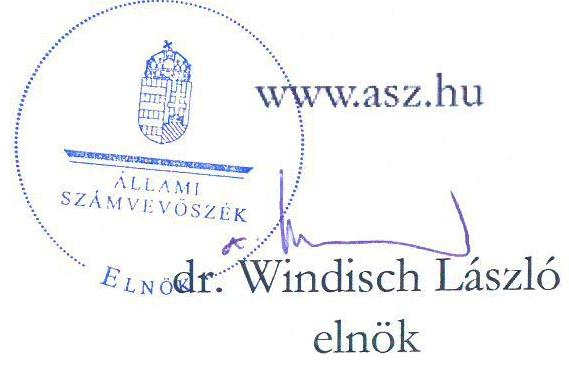
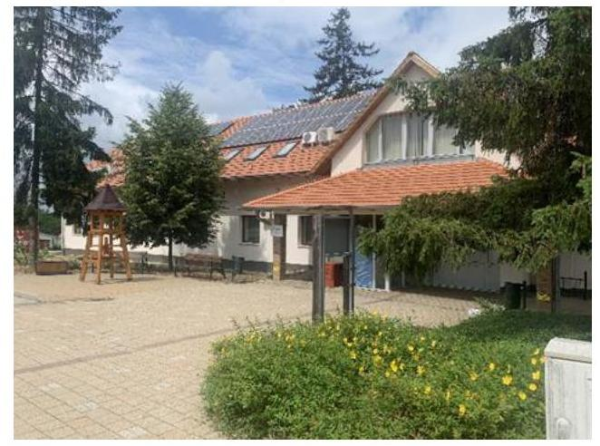
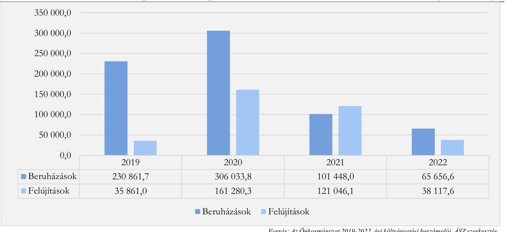

# JELENTÉS 

## Az önkormányzatok és központi költségvetési szervek ingatlanhasznosítási tevékenységének ellenőrzése

Erdőkertes Község Önkormányzata

2023.

---

# JELENTÉS 

## Az önkormányzatok és központi költségvetési szervek ingatlanhasznosítási tevékenységének ellenőrzése

Erdőkertes Község Önkormányzata

2023.

23038

---

# ELLENŐRZÉSI IGAZGATÓSÁG: 

## ÁLLAMHÁZTARTÁS HELYI SZINTJÉT ELLENŐRZŐ IGAZGATÓSÁG

ELLENŐRZÉSI IGAZGATÓ:
KISGERGELY ISTVÁN igazgató

ELLENŐRZÉSVEZETŐ:
Jelentéseink az interneten a www.asz.hu címen olvashatók.

SZEIBEL GÁBORNÉ ellenőrzésvezető

IKTATÓSZÁM: EL-3711-004/2023.
TÉMASZÁM: 38.
ELLENŐRZÉS-AZONOSÍTÓ SZÁM: V0992

---

# TARTALOMJEGYZÉK 

- AZ ELLENŐRZÉS ALAPADATAI ..... 5
- AZ ELLENŐRZÖTT SZERVEZET ..... 7
- ÖSSZEFOGLALÁS ..... 9
- AZ ELLENŐRZÉS FÓKUSZKÉRDÉSEI ..... 11
- MEGÁLLAPÍTÁSOK ..... 12
- JAVASLATOK ..... 21
- MELLÉKLETEK ..... 23
I. sz. melléklet: Értelmező szótár ..... 23
II. sz. melléklet: Az ellenőrzött szervezetek jegyzéke ..... 26
III. sz. melléklet: Az ellenőrzött szervezet mérlegadatai a 2019-2022. években ..... 27
IV. sz. melléklet: Az ellenőrzött szervezet kiadási és bevételi adatai a 2019-2022. években ..... 28
- FÜGGELÉK: ÉSZREVÉTELEK ..... 29
- RÖVIDÍTÉSEK JEGYZÉKE ..... 30

---

.

---

# AZ ELLENŐRZÉS ALAPADATAI 

## AZ ELLENŐRZÉS CÉLJA

Az ellenőrzés célja a nemzeti vagyonnal gazdálkodó önkormányzat ingatlangazdálkodási, ingatlanhasznosítási tevékenységének értékelése volt. Az ellenőrzés kiterjedt arra, hogy az önkormányzat az ingatlangazdálkodási feladatai ellátása során figyelemmel volt-e a vagyon értékének megőrzésére, állagának fenntartására, állományának gyarapítására.

## AZ ELLENŐRZÉS TÍPUSA

Megfelelőségi ellenőrzés.

## AZ ELLENŐRZÖTT IDŐSZAK

A 2019-2022. évek. A nyilvántartások ellenőrzése tekintetében a 2021. év.

## AZ ELLENŐRZÉS TÁRGYA

Az ellenőrzés tárgyát az Épít.tv. ${ }^{1}$ 2. $\int 8$. pontjában foglaltak szerinti építmények, a 2. $\int 10$. pontjában foglaltak szerinti épületek és a 2. $\$ 21$. pont szerinti telkek, továbbá a Földtv. ${ }^{2}$ hatálya alá tartozó földterületek, valamint a 147/1992. (XI. 6.) Korm. rendelet ${ }^{3}$ 4. számú melléklete szerinti külterületi ingatlanok képezték.

Az ellenőrzés hatóköre kiterjedt arra, hogy az ellenőrzött szervezet a közfeladatok ellátását biztosító ingatlanokkal kapcsolatos gazdálkodás, hasznosítás területén, a jogszabályi előírások figyelembevételével gondoskodott-e az ingatlanvagyon megfelelő használatáról és hasznosításáról, értékének és állagának védelméről, állományának gyarapításáról. Az ellenőrzés azokat a szerződéseket vette figyelembe, amelyek a 2019-2022. években hatályosak voltak.

Az ÁSZ a megfelelőségi ellenőrzés keretében az ingatlanvagyonnal kapcsolatos intézkedések végrehajtásának, azok elszámolásának megfelelőségét, valamint a nemzeti vagyonba tartozó ingatlanok nyilvántartásának szabályszerűségét is ellenőrizte. A nemzeti vagyonba tartozó ingatlanokkal kapcsolatos gazdálkodási, hasznosítási tevékenységben érintett, kockázatelemzés alapján kiválasztott szervezet ezen feladatellátását támogató belső kontrollrendszere keretében a kontrollkörnyezet részeként a belső szabályozás kialakítása, továbbá a monitoring rendszer kialakítása és működtetése részeként a belső ellenőrzés, valamint az ingatlanokkal kapcsolatos gazdálkodási, hasznosítási tevékenységbe épített kontrolltevékenységek kerültek ellenőrzésre.

Az ingatlangazdálkodási tevékenység ellenőrzése az önkormányzat esetében az ingatlanok vagyonkezelésbe adására, ingyenes átvételére, hasznosítására (bérbe-, használatba adására), az ingatlan tulajdonjogának adásvétel keretében történő megszerzésére és értékesítésére, a beruházások, felújítások megvalósítására és az ingatlanok nyilvántartására irányult.

---

Az ellenőrzés kiterjedt minden olyan körülményre és adatra, amely az ÁSZ jogszabályban meghatározott feladatainak teljesítéséhez, valamint a program végrehajtása folyamán felmerült újabb összefüggések feltárásához szükséges volt.

# AZ ELLENŐRZÉS JOGALAPJA 

Az ellenőrzés jogszabályi alapját az ÁSZ tv. ${ }^{4} 1 . \int$ (3) bekezdése, 5. § (3) bekezdése és (4) bekezdés a) pontjának előírásai képezték.

## AZ ELLENŐRZÉS MÓDSZERE

Az ellenőrzést az Alaptörvény 43. cikk (1) bekezdésében meghatározott törvényességi, célszerűségi szempontok, valamint a nemzetközi standardokat irányadónak tekintve az ellenőrzési program szempontjai, az ellenőrzött időszakban hatályos jogszabályok, az ellenőrzés szakmai szabályok és módszertanok figyelembevételével hajtotta végre az ÁSZ.

Az ellenőrzési bizonyítékként felhasználható adatforrások közé tartoztak egyrészt az ellenőrzéshez kért dokumentumok, adatforrások, másrészt adatforrás lehetett még minden - az ellenőrzés folyamán - feltárt, az ellenőrzés szempontjából információkat tartalmazó dokumentum.

Az ellenőrzés lefolytatásához az ellenőrzött szervezet a tanúsítványok kitöltésével, valamint az ÁSZ által kért dokumentumok, adatok, információk megküldésével és a helyszíni ellenőrzés során - interjú keretében szolgáltatott adatokat.

Az ingatlangazdálkodási, ingatlanhasznosítási tevékenység vonatkozásában az ellenőrzési kérdések megválaszolásához szükséges bizonyítékok megszerzése az ellenőrzött szervezet által rendelkezésre bocsátott dokumentumokra, adatokra alapozva, továbbá megfigyelés, helyszíni szemle (szemrevételezés), mintavételi eljárás, kérdésfeltevés (információkérés), interjú, helyszínen végzett ellenőrzés, valamint elemző eljárás alkalmazásával történt.

Az ingatlangazdálkodási, ingatlanhasznosítási tevékenységek, folyamatok tekintetében a belső kontrollrendszer egyes elemeinek kialakítása és működtetése évente került értékelésre.

A mintatételek köre az ellenőrzött területhez tartozó legnagyobb értékű elemekből állt, továbbá a mintavételi eljárás rétegzett, illetve egyszerű véletlen mintavétellel is kiegészült. A mintatételek értékelésére az ellenőrzési eljárás során a mintatételek értékelésére alkalmazott kérdésekre adott válaszok alapján került sor.

A tények feltárása és azok összegzése során a megállapítások az ellenőrzött mintatételekre vonatkozóan kerültek megfogalmazásra. Az ellenőrzött mintatételek száma a vagyonkezelésbe adásnál egy, az értékesítéseknél 30, az ingyenes (térítés nélküli) átvételnél tíz, az ingatlanhasznosítás szabályszerűségének értékelésénél 30, az ingatlanberuházással (adásvétel, létesítés, felújítás) kapcsolatos intézkedések végrehajtása körében 30, a 2021. évi nyilvántartások egyeztetésénél 30 volt. . Amennyiben az alapsokaság elemszáma kevesebb volt, mint 30, akkor a teljes alapsokaság ellenőrzésére és értékelésére sor került.

Az ÁSZ törvényességi és célszerűségi szempontok, valamint az ellenőrzési programja alapján végrehajtott ellenőrzésének megállapításait a „Megállapítások" fejezet tartalmazza.

---

# AZ ELLENŐRZÖTT SZERVEZET 

Erdőkertes Község a közép-magyarországi régióban, Pest vármegyében, a Gödöllői járásban található, lakóinak száma 2023. január 1-jén 9863 fő volt. A helyi önkormányzatot a polgármesterrel ${ }^{8}$ együtt 9 fős Képviselő-testület irányította.

A település polgármesterét a 2002. évi önkormányzati választásokon választották meg először Erdőkertes polgármesterévé, az ellenőrzött időszakban ötödik ciklusát töltötte a pozícióban, a jegyző ${ }^{6}$ 2017. július 20-a óta töltötte be a tisztségét. Az Önkormányzat ${ }^{7}$ munkáját támogató egyetlen állandó bizottság a Pénzügyi, Döntés-előkészítő és Vagyonnyilatkozatvizsgáló Bizottság volt. A helyi önkormányzatnak a Polgármesteri Hivatal ${ }^{8}$ mellett két intézménye volt az ellenőrzött időszakban, a Ki Akarok Nyílni Óvoda ${ }^{9}$, valamint az Erdőkertesi Faluház és Könyvtár.

Az ellenőrzött időszakban az Önkormányzatnak nem volt többségi tulajdonú gazdasági társasága és nemzetiségi önkormányzat sem múködött a településen.

Az ellenőrzött időszakban az Önkormányzat tulajdonában álló bel- és külterületek nagyságában nem történt jelentős változás. Az összes terület 2019. január 1-jétől 2022. december 31-ig csekély 1,5\%-kal - 1299799 m²-ről 1318917 m²-re - nőtt, amelyből a külterület jelentősebb mértékben 5,6\%-kal növekedett, miközben a belterület összességében alig, $0,05 \%$-kal csökkent.

Az Önkormányzat 2019-2022. évekre vonatkozó költségvetési kiadási és bevételi előirányzatait, valamint azok teljesítését a IV. sz. melléklet 4. táblázata mutatja be. Az Önkormányzat költségvetési bevételeinek teljesített összege a 2019. évi 1445 880,2 E Ft-ról a 2022. évre 5,3\%-kal 1522 256,6 E Ft-ra növekedett. A költségvetési kiadások teljesítésének összege a 2019. évi 769 766,2 E Ft-ról a 2022. évre 858 428,8 E Ft-ra, $11,5 \%$-kal emelkedett.

A 2019-2022. évek között a beruházások és a felújítások összegeinek alakulását az 1. ábra mutatja. A beruházások és felújítások együttes összege a 2019. évhez képest jelentősen visszaesett a 2022. évre. A beruházások összege a 2019. évről a 2022. évre 71,6\%-kal alacsonyabb, a felújítások összege 6,3\%-kal magasabb összegben teljesült. A 2020. évi kiemelkedő értéket az adja, hogy ebben az évben került sor a Polgármesteri Hivatal és az Óvoda épületek KEHOP forrásból történő energetikai felújítására.

---

1. ábra

A BERUHÁZÁSOK ÉS FELÚJÍTÁSOK TELJESÍTETT ÖSSZEGE 2019-2022. ÉVEK KÖZÖTT (E FORINT)

Forrás: Az Önkormányzat 2019-2022. évi költségvetési beszámolói, ÁSZszerkeztés
Az Önkormányzat vagyona (III. sz. melléklet, 3. táblázat) az ellenőrzött időszakban kismértékben, 4,8\%-kal növekedett, a 2019. évi 5998 147,6 E Ft-ról a 2022. év végére 6287 882,6 E Ft-ra változott. Az Önkormányzat vagyonán belül a legjelentősebb részt a tárgyi eszközök állománya tette ki, amelynek értéke 2019. évhez képest 4,7\%-kal nőtt a 2022. év végére, értéke ekkor 5459 793,0 E Ft volt. A tárgyi eszközök legnagyobb részét kitevő ingatlanok és a kapcsolódó vagyoni értékű jogok értéke 2022. évben 5272 271,6 E Ft volt, amely 2019-2021. évek között emelkedett, azonban a 2022. évben kis mértékben ( $0,4 \%$-kal) csökkent az előző évhez képest.

# 1. táblázat 

TÁRGYI ESZKÖZÖK ALAKULÁSA 2019-2022. ÉVEK KÖZÖTT (E FT)

| TÁRGYI ESZKÖZÖK | 2019. | 2020. | 2021. | 2022. |
| :--: | :--: | :--: | :--: | :--: |
| A/II/1 Ingatlanok és a kapcsolódó vagyoni értékủ jogok | 5118 634,0 | 5191788,3 | 5294 805,5 | 5272 271,6 |
| A/II/2 Gépek, berendezések, felszerelések, jármúvek | 36 465,7 | 29 569,2 | 21018,8 | 15 245,5 |
| A/II/4 Beruházások, felújítások | 58 123,2 | 283 584,4 | 161 600,5 | 172 275,9 |
| Összesen | 5213 222,9 | 5504 941,9 | 5477 424,8 | 5459 793,0 |

Forrás: Az Önkormányzat 2019-2022. évi költségvetési beszámolói, ÁSZ szerkeztés

---

# ÖSSZEFOGLALÁS 

Az ÁSZ általános hatáskörrel végzi az önkormányzati vagyonnal való felelős gazdálkodás ellenőrzését. Az önkormányzatok vagyona az önkormányzati feladatok és célok ellátását szolgálja, ideértve a lakosság közszolgáltatásokkal való ellátását, és az ezekhez szükséges infrastruktúra biztosítását. Az önkormányzati vagyonba tartozó ingatlanok jelentős anyagi értéket képviselő vagyonelemek, amelyek esetében kiemelten fontos a nemzeti vagyonnal való felelős gazdálkodás követelményeinek érvényesítése. Mindezek alapján került sor az Önkormányzat ingatlangazdálkodási tevékenységének ellenőrzésére.

Az Önkormányzatnál az ingatlanokkal való gazdálkodással, hasznosítással kapcsolatos intézkedések végrehajtása, illetve azok elszámolása nem minden területen volt szabályszerű.

Az ingatlanberuházással (adásvétel, létesítés, felújítás) kapcsolatos intézkedések végrehajtása, illetve azok elszámolása, valamint a térítés nélküli átvételek, továbbá az ingatlanok hasznosítása összességében nem történt szabályszerűen. Az önkormányzati tulajdonú ingatlan vagyonkezelésbe adása és az ingatlanok értékesítése összességében szabályszerű volt.

Az ingatlanvagyon értékesítése szabályszerű volt, azonban az értékesítésekhez kapcsolódóan az ingatlan nyilvántartások vezetése nem volt megfelelő. Az Mötv. ${ }^{10}$ és a 147/1992. (XI. 6.) Korm. rendelet előírásai ellenére 13 értékesített ingatlant nem vezettek ki a vagyonkataszterből, továbbá két ingatlan az Mötv.-ben, a Számv. tv.-ben és az Áhsz.-ben foglaltak ellenére értékesítéskor nem szerepelt a nyilvántartásokban. Emiatt az ingatlanvagyon felelős megőrzését biztosító kontrollok nem múködtek megfelelően.

Az ingatlanok ingyenes (térítés nélküli) átvétele az ellenőrzött mintatételek esetében nem volt szabályszerű, az Mötv. és a 147/1992. (XI. 6.) Korm. rendelet előírásai ellenére az ellenőrzött időszakban az Önkormányzat az átvett ingatlanokat nem vezette fel a vagyonkataszterbe és a vagyonváltozásokat a Számv. tv. ${ }^{11}$-ben foglaltak ellenére a főkönyvi nyilvántartásban sem rögzítette. Mindezek miatt a vagyonnyilvántartások vezetése nem volt naprakész.

Az ingatlanok hasznosítása nem volt szabályszerű. Három bérleti szerződés esetében a 603/2020. (XII. 18.) Korm. rendeletben ${ }^{12}$ foglaltak ellenére a kihirdetett veszélyhelyzet időszaka alatt bérleti díj emelés történt. A szerződésekhez kapcsolódó bevételek pénzforgalmi elszámolása összességében szabályos volt, azonban két esetben nem felelt meg a Számv. tv.-ben előírt bruttó elszámolás elvének, amely szerint a bevételek és költségek nem számolhatók el egymással szemben. Az Önkormányzat a hasznosítási szerződések esetében figyelembe vette az ingatlanok karbantartási/felújítási igényeit, az Önkormányzat karbantartási kötelezettséget minden ingatlan hasznosítási szerződésben rögzítette.

Az Önkormányzat a Számv. tv.-ben foglalt előírások ellenére az ingatlanvagyon tekintetében a leltározási és leltárkészítési kötelezettségének nem tett eleget, az ellenőrzött időszakban mennyiségi leltárfelvételre sem került sor.

Az Önkormányzat a 2019-2021. évekre vonatkozó költségvetési beszámolói mérlegei ingatlanokkal összefüggő soraiban szereplő érték - az ingatlanok nyilvántartásával kapcsolatban kimutatott hiányosságok és a leltározás elmulasztása miatt - nem felelt meg a Számv. tv.-ben foglaltaknak, mert nem volt megfelelő és nem volt alátámasztott, ezáltal nem érvényesültek a teljességre és valódiságra vonatkozó számviteli elvek.

---

A Kbt. ${ }^{13}$ hatálya alá tartozó beruházások esetében az eredményes közbeszerzési eljárások alapján a szerződéseket írásban, a nyertes ajánlattevőkkel kötötték meg. A kötelezettségvállalások azonban (egy kivétellel) a pénzügyi ellenjegyzés elmaradása miatt nem feleltek meg az Áht. ${ }^{14}$ rendelkezéseinek.

Az Önkormányzat az Nvtv. ${ }^{15}$ előírásainak megfelelően végezte az ingatlanvagyonának vagyonkezelésbe adását, az ingatlant kizárólag közfeladat ellátása céljából adta át - óvodai nevelés -, e feladatok ellátásához szükséges mértékben. Az Önkormányzat a vagyonkezelési szerződésben figyelembe vette az ingatlan felújítási igényeit, az állagmegóvását kikötötte, ezáltal gondoskodott az ingatlanvagyon értékének megőrzéséről, állagának fenntartásáról.

Az ingatlangazdálkodási, ingatlanhasznosítási tevékenységek, folyamatok tekintetében a belső kontrollrendszer egyes ellenőrzött elemeinek kialakítása - a számlarend hiányosságai kivételével megfelelően történt, azonban a belső szabályzatokban meghatározott kontrollokat nem minden esetben müködtették. Az Önkormányzat ingatlangazdálkodási, ingatlanhasznosítási tevékenységéhez előírt szabályzatokkal, tervekkel rendelkezett. A belső ellenőrzés során a 2019-2021. évek vonatkozásában vizsgálták az ingatlangazdálkodást. Az ellenőrzött időszakban a Hatásköri tv. ${ }^{16}$ előírásainak megfelelően a Képviselőtestület elfogadta az önkormányzati vagyonnal történő gazdálkodás szabályait.

Az Önkormányzat összességében gondoskodott az ingatlanvagyon értékének növeléséről, az ingatlanok funkció szerinti hasznosításáról.

A polgármester részére kettő, a jegyző részére 9 javaslatot fogalmaztunk meg az ellenőrzés során feltárt hiányosságok megszüntetése, valamint az ingatlangazdálkodási- és hasznosítási tevékenység jogszabályokban foglalt alapelveknek való megfelelősége érdekében.

---

# AZ ELLENŐRZÉS FÓKUSZKÉRDÉSEI 

1.- A nemzeti vagyonba tartozó ingatlanokkal való gazdálkodással, hasznosítással kapcsolatos intézkedések végrehajtása, illetve azok elszámolása megfelelő volt-e?
2.- A nemzeti vagyonba tartozó ingatlanok nyilvántartásával kapcsolatos feladatok ellátása szabályszerű volt-e?
3.- A nemzeti vagyont használó szervezetnél az ingatlangazdálkodási, ingatlanhasznosítási tevékenységek, folyamatok tekintetében a belső kontrollrendszer kialakítása és müködtetése megfelelően történt-e?

---

# 1. A nemzeti vagyonba tartozó ingatlanokkal való gazdálkodással, hasznosítással kapcsolatos intézkedések végrehajtása, illetve azok elszámolása megfelelő volt-e? 

Összegző megállapítás Az Önkormányzatnál az ingatlanokkal való gazdálkodással, hasznosítással kapcsolatos intézkedések végrehajtása, illetve azok elszámolása nem minden területen volt szabályszerű.
1.1. számú megállapítás Az önkormányzati tulajdonú ingatlan vagyonkezelésbe adása szabályszerű volt.

Az Önkormányzat az ellenőrzött időszakban egy óvoda épületet egyháznak adott vagyonkezelésbe, amely az Mötv.-ben és a vagyongazdálkodási rendeletben ${ }^{17}$ foglaltaknak megfelelően történt. Az ingatlan vonatkozásában a vagyonkezelői jog létesítésére vonatkozó döntést a Képviselő-testület hozta meg, egyúttal felhatalmazta a polgármestert a szerződés aláírására, a szerződést 2022. május 30 -án kötötték meg öt év időtartamra.

Az Mötv.-ben foglaltaknak megfelelően a Képviselő-testület a vagyongazdálkodási rendeletében meghatározta a vagyonkezelői jog ellenértékét, az ingyenes átengedésnek, a vagyonkezelői jog gyakorlásának, valamint a vagyonkezelés ellenőrzésének részletes szabályait.
Az Önkormányzat ingatlanvagyonának vagyonkezelésbe adása megfelelt az Nvtv. és az Önkormányzat belső szabályzatai rendelkezéseinek. Az ingatlan ingyenes vagyonkezelésbe adása kizárólag közfeladat óvodai nevelés - ellátása céljából történt. Az Önkormányzat a vagyonkezelési szerződésben gondoskodott az ingatlanvagyon értékének megőrzéséről, állagának fenntartásáról.
1.2. számú megállapítás Az Önkormányzat szabályszerűen végezte az ingatlanok értékesítését, azonban az értékesített ingatlanok nyilvántartásokból való kivezetése nem történt meg.

Az értékesítésre került ingatlanok mindegyike az Nvtv. szerinti üzleti vagyon volt. Az ingatlan értékesítése kapcsán a polgármester megfelelő döntési hatáskörrel kötötte meg a szerződéseket.
Az Nvtv. 13. § (1) bekezdésében foglaltak alapján, amely szerint nemzeti vagyont meghatározott értékhatár felett - a központi költségvetésről szóló törvényekben ${ }^{18}$ meghatározott versenyeztetési értékhatár (az ellenőrzött időszakban 25000 E Ft egyedi bruttó forgalmi érték) - csak versenyeztetés útján lehet átruházni, az ellenőrzött időszak alatt egy esetben (1. mintatétel) merült fel. Az ingatlan értékesítés megfelelt az Nvtv. előírásainak, mivel pályázati felhívást tett közzé az Önkormányzat, amelyet egy alkalommal - ajánlat hiányában - meghosszabbított. Ezután egy ajánlat érkezett, amelyet az Önkormányzat elfogadott.
Az ingatlanok értékesítése valamennyi esetben az Nvtv. előírása szerinti természetes személy vagy átlátható szervezet részére történt az Áht.-ban és az Nvtv.-ben foglaltaknak megfelelően.

---

Az ingatlanok értékesítése során az Önkormányzat az Nvtv.-ben foglaltaknak megfelelően a 30 ellenőrzött mintatételből 26 esetben biztosította az állam minden más jogosultat megelőző elővásárlási jogának érvényesítését. Egy tétel esetében (16. mintatétel) az Nvtv. 14. $\$ (3) bekezdés a) pontja szerint a vevőnek az államot megelőző elővásárlási joga volt, mint bérlőnek. A további három esetben (27, 28, 30. mintatétel) az Nvtv. 14. $\$ (4) bekezdésének megfelelően történt az értékesítés, mivel az ingatlanok értéke nem érte el a jogszabályban meghatározott értékhatár $20 \%$-át.
Az ingatlanok értékesítése során a 30 ellenőrzött mintatételből két telekrész esetében (27, 30. mintatétel) nem történt értékbecslés, amely nem felelt meg az Önkormányzat vagyongazdálkodási rendelete 10. $\$ (4) bekezdés a) pontjában foglaltaknak, valamint a Közvetlen értékesítés és a versenyeztetési eljárás szabályairól szóló szabályzat 1. pontjában elrendelteknek.
A jegyző az értékesített ingatlanok vagyonkataszterből való kivezetéséről az Mötv. 110. § (1) bekezdésének és a 147/1992. (XI. 6.) Korm. rendelet 3. § és 4. § (1) bekezdéseinek előírásai ellenére 13 esetben (1, 2, 3, 6, 10, 16, 17, 18, 19, 22, 25, 27, és 30. mintatétel) nem gondoskodott. Két esetben (5. és 9 mintatétel) a nagy értékű eszköz egyedi nyilvántartólapot az ingatlanokra utólag, a 2023. évben készítették el, vagyis az értékesítéskor nem voltak nyilvántartásba véve az ingatlanok az Mötv. 110. § (1) bekezdése, a Számv. tv. 15. § (2)-(3) bekezdése és az Áhsz. 14. melléklete VII. pontjának előírása ellenére.
Az értékesítés során minden ellenőrzött mintatétel esetében beérkezett a szerződés szerinti értékben és határidőben az ingatlan ellenértéke.

# 1.3. számú megállapítás Az ingatlanok ingyenes (térítés nélküli) átvétele az ellenőrzött mintatételek esetében nem volt szabályszerű. 

Az ellenőrzött időszakban az Önkormányzat ingatlanok magánszemélyektől történő térítésmentes átvételére kötött szerződéseket. Az átvett ingatlanok a közterületek rendezését, illetve a településfejlesztést - például utak kialakítása, szélesítése - szolgálták. Az ingyenes átvételek kapcsán a polgármester a megfelelő döntési hatáskörrel rendelkezett a szerződések megkötéséhez.
Az ingatlanok nyilvántartásba vétele az ellenőrzött időszakban nem történt meg, a jegyző nem gondoskodott az Mötv. 110. § (1) bekezdésében, valamint a 147/1992. (XI. 6.) Korm. rendelet 3. § és 4. § (1) bekezdéseiben foglaltak ellenére a térítésmentesen átvett ingatlanok ingatlanvagyon kataszter nyilvántartásban történő szerepeltetéséről, továbbá az Áhsz. ${ }^{19}$ 14. melléklet VII. pont szerinti részletező nyilvántartásba történő bevezetéséről, valamint a Számv. tv. 15. § (2)-(3) bekezdéseiben foglaltaknak sem tett eleget, azaz az átvett eszközöket nem rögzítették a fökönyvi könyvelésben és a számviteli részletező (analitikus) nyilvántartásban sem. Ezáltal a költségvetési beszámolók mérlegei ingatlanokkal összefüggő sorai az ellenőrzött időszakban nem a valós értéket tartalmazták.
A feltárt hiba az Áhsz. 1. § 3. pontja és az Önkormányzat számviteli politikája alapján nem minősült jelentős összegűnek, mivel az Önkormányzat 2019-2022. évi mérlegfőösszegeinek 2\%-át nem érte el.

### 1.4. számú megállapítás Az ingatlanok hasznosítása (bérbe-, használatba adása) nem volt szabályszerű.

A hasznosításra irányuló szerződéseket az arra hatáskörrel rendelkező polgármester kötötte meg. Az Nvtv. előírásainak megfelelően mindegyik szerződést határozatlan vagy legfeljebb 15 éves határozott időre került megkötésre, 24 szerződést természetes személlyel vagy átlátható szervezettel kötöttek meg. Öt mintatétel (8, 9, 10, 23, és 24. mintatétel) összesen négy gazdasági társaság esetében az Nvtv. 11. § (10)

---

bekezdésének előírása ellenére a jegyző nem gondoskodott arról, hogy a bérlők igazolják, hogy a szerződő fél átlátható szervezetnek minősült.
Két ingatlan bérbeadása során (12. és 22 mintatétel) az Önkormányzat és a bérlő abban állapodtak meg, hogy a bérlő az általa végzett ingatlan felújítás értékének megfelelő összegben a bérleti díj fizetése alól mentesül. Az egyik ingatlan esetében a határidő alapján az elszámolásra az ellenőrzött időszakot követően kerül majd sor, a másik ingatlan esetében $50 \mathrm{E} \mathrm{Ft} /$ hó összegben került megállapításra a bérleti díj, amely költséget a bérlő lelakta. Egy $38 \mathrm{~m}^{2}$-es ingatlan bérbeadása esetében (P4. mintatétel) a szerződés módosítás szerint a bérlő a bérelt lakás környezetének tisztántartásával és egyéb karbantartási munkákkal fizette meg a bérleti díjat. A rendszeresen elvégzendő munkálatok megtörténtéről, igazolásáról, a szerződés nem tartalmazott rendelkezést, ennek következtében az azok elszámolására vonatkozó bizonylatokat sem álltak rendelkezésre a Számv.tv. 165. § (1) bekezdésében és a Számv.tv. 166. § (1) bekezdésében foglaltak ellenére. A felújítás értéke, illetve a rendszeresen elvégzett munkálatok értéke és az annak megfelelő bérleti díj elszámolásának elmaradása nem felelt meg a Számv.tv. 15. § (9) bekezdésében előírt bruttó elszámolás elvének, amely szerint a bevételek és költségek nem számolhatók el egymással szemben.
Öt szerződés esetében a Covid19 járvány okozta veszélyhelyzet alatti szerződésmódosítás történt, amelyek közül a 603/2020. (XII. 18.) Korm. rendelet 1. $\$ 1$ ) bekezdésben foglaltak ellenére a kihirdetett veszélyhelyzet időszaka alatt bérleti díj emelés történt három esetben, amelyről a hatáskörében eljáró polgármester döntött. (23, 24, 30. mintatétel)
Az Önkormányzat a vagyongazdálkodási rendelete 14. § (2) bekezdés b) pontjában rögzítette, hogy 10000 E Ft-os értékhatárt el nem érő ingatlanvagyon esetén nem kell a hasznosítás során versenyeztetési eljárást lefolytatni. Három esetben (12, 18, P2. mintatétel) a hasznosítással érintett rész egyedi bruttó forgalmi értéke ${ }^{1}$ meghaladta a 10000 E Ft-os értékhatárt, ennek ellenére a versenyeztetési eljárást nem folytatták le, így a vagyongazdálkodási rendeletében rögzítetteknek nem tett eleget az Önkormányzat.
Az önkormányzati ingatlanok hasznosítására irányuló szerződések szerinti bérleti díjak Önkormányzat részére történő megfizetése a szerződéseknek megfelelően történt. A térítés ellenében bérbeadott/használatba adott ingatlanok esetében a szerződés szerinti számlázott és befolyt (kiegyenlített) bérleti díj elszámolása az Áhsz. előírásainak megfelelő, a költségvetési és pénzügyi számvitel szerint szabályszerű volt, minden esetben a 38/2013. (IX. 19.) NGM rendeletben ${ }^{20}$ foglaltaknak megfelelően történt.
1.5. számú megállapítás

Az Önkormányzatnál az ingatlanberuházással (adásvétel, létesítés, felújítás) kapcsolatos intézkedések végrehajtása, illetve azok elszámolása nem szabályszerűen történt.

Az ellenőrzött mintatételek esetében - egy mintatétel kivételével (12. mintatétel) - az Áht. 37. § (1) bekezdésében, az Ávr. ${ }^{21} 50 . \S$ (1) bekezdés d) pontjában, valamint az 55. § (1) bekezdésben és a Gazdálkodási szabályzatban ${ }^{22}$ foglaltak ellenére a kötelezettségvállalást megelőzően nem került sor pénzügyi ellenjegyzésre. Pénzügyi ellenjegyzés hiányában nem győződtek meg arról, hogy a kifizetés

[^0]
[^0]:    ${ }^{1}$ A hasznosítással érintett rész tekintetében az egyedi bruttó forgalmi érték számítása a következők szerint történt: ASP-IVK adatbázisból cím/helyrajéiszám alapján azonosításra került a tétel, illetve annak bruttó értéke. Az érték a mintatételhez kapcsolódó területi adatok alapján arányosításra került.

---

időpontjában a szükséges fedezet rendelkezésre áll-e. Az Ávr.-ben foglaltaknak megfelelően a kötelezettségvállalásokat a jogszabály alapján arra jogosult - polgármester - tette meg. A kötelezettségvállalások nyilvántartásba vétele megtörtént.
Az Ávr. 50. § (1) bekezdés a) pontjában előírtak ellenére egy esetben (26. mintatétel) nem tartalmazta a szerződés a szakmai, műszaki teljesítés mennyiségi és minőségi jellemzőinek meghatározását, és egy másik esetben (25. mintatétel) nem tartalmazta a szakmai, műszaki teljesítés határidejét. Az ingatlan létesítésére, vásárlására, felújítására irányuló mintatételt képező visszterhes szerződések mindegyike tartalmazta az Ávr. előírásainak megfelelően a kifizetendő összeget vagy a számlázás alapjául szolgáló egységárat, a pénzügyi teljesítés devizanemét, a pénzügyi teljesítés módját és feltételeit, továbbá a kifizetés határidejét.
Két (12. és 22. mintatétel) ugyanazon gazdasági társasággal kötött visszterhes szerződés esetében az Ávr. 50. $\int$ (1a) bekezdésben foglaltak ellenére nem rendelkezett az Önkormányzat a szervezet képviselőjének nyilatkozatával arra vonatkozóan, hogy átlátható szervezetnek minősült.
A Kbt. hatálya alá tartozó beruházások esetében az eredményes közbeszerzési eljárások alapján a szerződéseket írásban, a nyertes ajánlattevőkkel kötötték meg.
A pénzforgalmi mintatételek közül 10 esetben (1-10 mintatételek) az Ávr 57. § (1), (3)-(4) bekezdéseiben, valamint az Áht. 38. $\$ (1) bekezdésében foglaltak ellenére nem történt meg a teljesítésigazolás a polgármester vagy az általa kijelölt személy által. Az érvényesítő ezekben az esetekben nem jelezte, hogy a megelőző ügymenet során elmaradt a teljesítésigazolás, így nem tett eleget az Áht. 38. § (1) bekezdésében, valamint az Ávr. 58. § (1)-(3) bekezdéseiben foglaltaknak. Emiatt az Áht. 38. § (1) bekezdésében és az Ávr. 59. §-ban foglaltak ellenére az utalványozásra is szabálytalanul - teljesítésigazolás és szabályszerű érvényesítés hiányában - került sor. A gazdálkodási kontrollok hiányosságai ellenére a tulajdonjog bejegyzés, illetve az arra vonatkozó kérelem alapján a szerződések teljesültek. 20 mintatétel esetében az Áht.-ban és az Ávr.-ben foglaltaknak megfelelően történt a teljesítés igazolása.

# 1.6. számú megállapítás 

Az Önkormányzat az Nvtv.-ben foglaltaknak megfelelően gondoskodott az ingatlanvagyon értékének, állagának védelméről, valamint az ingatlanok funkció szerinti hasznosításáról.

Az Önkormányzat rendelkezett az Nvtv.-ben előírt közép- és hosszú távú vagyongazdálkodási tervvel ${ }^{23}$. Az Mötv.-ben foglaltaknak megfelelően az 53/2020. (X.20.) képviselő-testületi határozatban elfogadásra került az Önkormányzat 2019-2024 időtávú gazdasági programja, amely tartalmazott célkitűzéseket és feladatokat az Önkormányzat ingatlanvagyonának megújítására, korszerűsítésére, hasznosítására vonatkozóan.
2019. január 1-jétől önkormányzati ingatlan portfóliót hoztak létre, amelyben jelölték az egyes ingatlanokhoz kapcsolódó beruházás, felújítás megtörténtét. A portfólió nyilvántartása alapján az ellenőrzési időszak minden évében történt értéknövelő beruházás és felújítás.
Az ellenőrzött időszak alatt minden évben történtek műszaki állapotfelmérések, készültek tervek a beruházások, felújítások szükségességével, indokával kapcsolatosan, továbbá számadatokkal alátámasztott elemzések is rendelkezésre álltak. A 2019. és a 2022. években az óvodák kapcsán, az óvodai férőhely hiány miatt az ingatlanokra vonatkozóan javaslatokat fogalmaztak meg a Képviselő-testület felé, amelyeket a 2019. évben számszaki elemzésekkel, indokokkal támasztottak alá. A javaslatok alapján megtörténtek a szükséges férőhely hiány miatti intézkedések.

---

Az ellenőrzött időszakon belül egy évben, 2021-ben készült felmérés a feleslegessé vált ingatlanokról. A jegyzék tartalmazta az ingatlan állapotát, valamint a jegyző értékesítésre vonatkozó javaslatát. Az Önkormányzatnál a 2019., 2020. és 2022. években a jegyző nem mérette fel a nem használt (feleslegessé vált) önkormányzati ingatlanokat.
Az Önkormányzat az ellenőrzött időszak minden évében készített karbantartási tervet, amelyek végrehajtásáról a jegyző minden év vonatkozásában beszámolt a Képviselő-testület felé, azonban a karbantartási tervek nem voltak megfelelőek, nem voltak elég részletesek az egyes években, valamint csak formailag tartalmaztak határidőket.
Az Önkormányzat az ellenőrzött időszakban összesen 112 ingatlanon végzett karbantartást, amelyekre a 2019-2022. évek folyamán összesen 24 809,0 E Ft összeget fordított. A karbantartással érintett ingatlanok száma évente eltérő volt, 10-50 ingatlan között mozgott. A karbantartásra 2019. évhez képest (10 313,0 E Ft) 2022-ben jelentősen - 67,2\%-kal - kevesebbet fordítottak, a korábbi években is látható volt a csökkenő tendencia. Az ingatlanállományon belül a legkevesebbet a bérlakások karbantartására fordították, az ellenőrzött időszakban összesen 288,0 E Ft-ot. A közszolgáltatási funkciójú épületek karbantartása $2306,0 \mathrm{E} F \mathrm{~F}$, míg egyéb ingatlanoké $22215,0 \mathrm{E} F \mathrm{t}$ kiadással járt az ellenőrzött időszakban.
Az ellenőrzött időszakban 18 önkormányzati bérlakással rendelkezett az Önkormányzat. A 2019-2022. években összesen 415 507,0 E Ft aktivált értékben újítottak fel ingatlanokat, amelynek keretében a bérlakások esetében csak a 2019. évben került sor felújításra 227,0 E Ft összegben. A közszolgáltatási funkciójú épületek 79 358,0 E Ft, míg egyéb ingatlanok 335 922,0 E Ft összegben kerültek felújításra 2019-2022. években.
A 2019-2022. évek mindegyikében történtek kezdeményezések a Képviselő-testület felé beruházási pályázaton való részvételre az ingatlanok értékmegőrzése, értéknövelése érdekében, amelynek köszönhetően az Önkormányzat az ellenőrzött időszak egésze alatt részesült energetikai, egyéb épületkorszerűsítési, illetve ingatlanfejlesztési, beruházási pályázati támogatásban. Az ellenőrzött időszakban a pályázatok 12 féle ingatlan-fejlesztéshez kapcsolódtak, amelyek összege 1714 537,7 Ft volt.
Az Önkormányzat érvényesített fenntarthatósági és környezetvédelemi követelményeket az ingatlangazdálkodás során, így az ellenőrzött időszak minden évében tartalmazott a karbantartási terv zöldfelület fenntartására vonatkozó feladatokat, valamint az ellenőrzött időszak egészét érintette olyan szerződés, amely fenntarthatósági és/vagy környezetvédelemi követelményeket tartalmazott.
Az Önkormányzat az Ehat. ${ }^{24}$ előírásainak megfelelően 2022. évben a 2022-2026. időtávra Energiamegtakarítási Intézkedési tervet készíttetett hat ingatlanjához kapcsolódóan, amely Intézkedési tervek végrehajtásáról készített éves beszámoló a 2022. évben elkészült.
Az ellenőrzött időszakot lefedte három épület energetikai beruházásának végrehajtása. Az Önkormányzat az energiamegtakarításra vonatkozó beruházások hatásának vizsgálatára a három épület vonatkozásában hiteles energetikai tanúsítványt állíttatott ki. Az ellenőrzött időszakot megelőzően kiadott tanúsítványokhoz képest a 2022. év vonatkozásában kiállított tanúsítványokban kimutatták, hogy az energetikai minőség szerinti besorolás mindhárom épület esetében javult.

---

# 2. A nemzeti vagyonba tartozó ingatlanok nyilvántartásával kapcsolatos feladatok ellátása szabályszerű volt-e? 

## Összegző megállapítás Az Önkormányzat tulajdonában lévő ingatlanok nyilvántartásával kapcsolatos feladatok ellátása nem volt szabályszerű.

Az Önkormányzat az Áhsz. 22. § (1)-(2) bekezdései és a Számv.tv. 69. § (1) és (3)-(4) bekezdései, valamint a leltárkészítési és leltározási szabályzatában foglaltak ellenére az ingatlanvagyon tekintetében nem tett eleget a leltározási és leltárkészítési kötelezettségének. A legalább három évente történő mennyiségi leltárfelvételről a Számv. tv. 69. § (3)-(4) bekezdésében foglaltak ellenére nem gondoskodtak az ellenőrzött időszakban. A leltározási hiányosságok miatt az ellenőrzött időszakban a költségvetési beszámolók mérlegének ingatlanokkal összefüggő sorai nem voltak alátámasztottak.
Az Mötv., valamint a 147/1992. (XI. 6.) Korm. rendelet előírásának megfelelően az ingatlanvagyon-katasztert az Önkormányzat vezette. A kataszter ingatlan adatlapjának adatai az ingatlanügyi hatóságként eljáró kormányhivatal ingatlan-nyilvántartásának azonos tartalmú adataival hét esetben (8, 9, 10, 16, 20, 25, 28 mintatétel) nem egyeztek meg teljeskörűen a 147/1992. (XI. 6.) Korm. rendelet 1. § (2) bekezdésében foglaltak ellenére. Mindegyik ellenőrzött mintatétel esetében az ingatlan területének nagyságánál volt eltérés, valamint ezek közül egy esetben (9. mintatétel) az IVK adatlapon tévesen szerepelt továbbá az is, hogy a tulajdonos Önkormányzat által beépített területről van szó.
Az Önkormányzat az Áhsz. 14. számú melléklete VII. pontjában előírt tárgyi eszköz nyilvántartást vezette.
Az Önkormányzat éves költségvetési beszámolójában szerepeltetett ingatlanok állományának értéke - a 2019-2021. évi beszámolók adatait alapul véve - egyeztetésre került a tárgyi eszközök analitikus nyilvántartása szerinti ingatlanokra vonatkozó adatokkal, a főkönyvi nyilvántartással, valamint az ingatlanvagyon kataszter nyilvántartásával. Az Önkormányzatnál folytatott helyszíni ellenőrzés során az OSAP ${ }^{25}$ statisztika modul segítségével az egyeztetés az egyes évek vonatkozásában az adott évek december 31-ei állapotának megfelelően megtörtént, az egyezőség a rendszer sajátossága miatti kerekítési különbözetekkel - értékek soronkénti kerekítése miatt 2019. évben 135,3 E Ft, 2020. évben 116,3 E Ft, 2021. évben 120,0 E Ft különbözettel - állt fenn az alábbiak (2. táblázat) szerint.
2. táblázat

| NYILVÁNTARTÁSOK EGYEZTETÉSE (FORINTBAN) |  |  |  |  |  |  |
| :--: | :--: | :--: | :--: | :--: | :--: | :--: |
| MEGNEVEZÉS | 2019. |  | 2020. |  | 2021. |  |
|  | NETTÓ | BRUTTÓ | NETTÓ | BRUTTÓ | NETTÓ | BRUTTÓ |
| Beszámoló 15/A űrlap | 5118633996 | 5897888272 | 5191788344 | 6057610323 | 5294805476 | 6250102974 |
| Főkönyv ssz. 12. | 5118633996 | - | 5191788344 | - | 5294805476 | - |
| Tárgyi eszköz analitika (KATI) | 5118634095 | 5897888371 | 5191788443 | 6057610422 | 5294805476 | 6250102974 |
| ASP-IVK | - | 5897753000 | - | 6057494000 | - | 6249983000 |

---

A nyilvántartás ellenőrzéséhez kapcsolódó mintatételek alapján - az ellenőrzött analitikus nyilvántartásából kiválasztott 30 mintatétel esetében - az ingatlanok számviteli nyilvántartásokba történő állományba vétele, mérlegben történő szerepeltetése a Számv. tv. előírásainak megfelelt, az ellenőrzött időszakban állományba vett ingatlanok üzembe helyezése megtörtént.
Az 1.2. és 1.3. pontokban megállapított, az ingatlanokban bekövetkezett állományváltozások főkönyvi könyvelésben történő rögzítésének elmaradása következtében a Számv. tv. 18. § előírása ellenére az Önkormányzat költségvetési beszámolói mérlegeinek ingatlanokkal összefüggő sorai az ellenőrzött időszakban nem megfelelő értéket tartalmaztak, továbbá a Számv. tv. 69. §-ában előírt leltározási kötelezettség elmulasztása miatt nem voltak alátámasztottak, ezáltal nem érvényesültek a Számv. tv. 15. § (2) és (3) bekezdésében foglalt, a teljességre és valódiságra vonatkozó számviteli elvek.

# 3. A nemzeti vagyont használó szervezetnél az ingatlangazdálkodási, ingatlanhasznosítási tevékenységek, folyamatok tekintetében a belső kontrollrendszer kialakítása és müködtetése megfelelően történt-e? 

| Összegző megállapítás | Az Önkormányzatnál az ingatlangazdálkodási, ingatlanhasznosítási tevékenységek, folyamatok tekintetében a belső kontrollrendszer kialakítása megfelelő volt. A számviteli és a gazdálkodásra vonatkozó belső szabályzatokban meghatározott kontrollok müködtetése - az ellenőrzés során feltárt hiányosságok alapján - nem volt megfelelö. |
| :--: | :--: |

Az Önkormányzat az ingatlangazdálkodási, ingatlanhasznosítási tevékenységéhez a kötelezően elkészítendő szabályzatokkal, tervekkel rendelkezett.
Az Önkormányzat Képviselő-testülete rendelkezett az ellenőrözött időszak egésze alatt hatályos, az Mötv. előírásainak megfelelő Szervezeti és Müködési Szabályzattal ${ }^{26}$.
Az Áht.-ban és az Ávt.-ben foglaltak alapján az Önkormányzat gazdasági szervezetére vonatkozó szabályokat rögzítették az Erdőkertes Polgármesteri Hivatal gazdasági szervezetének gazdálkodással összefüggő feladataira vonatkozó ügyrendben ${ }^{27}$.
Az Önkormányzat és a Polgármesteri Hivatal is rendelkezett számviteli politikával ${ }^{28}$. Rendelkeztek továbbá a számviteli politika keretében elkészítendő szabályzatokkal. Az eszközök és források leltárkészítési és leltározási szabályzatában ${ }^{29}$ az ingatlanokra vonatkozóan nem állapították meg a mennyiségi felvétellel történő leltározás gyakoriságát. A jegyző nem gondoskodott továbbá arról sem, hogy a számlarendben ${ }^{30}$ szereplő számlatükör összhangban legyen az Áhsz. 16. melléklet és a 38/2013. (IX.19.) NGM rendelet előírásaival.

Az Önkormányzat és a Polgármesteri Hivatal is rendelkezett a teljes ellenőrzési időszakot lefedő Tervezési és gazdálkodási szabályzattal ${ }^{31}$.

---

Az Ávr.-ben előírt beszerzések lebonyolításának szabályzatával ${ }^{32}$ az Önkormányzat rendelkezett az ellenőrzött időszakban.
Az Önkormányzat esetében a Hatásköri tv. 138. § (1) bekezdés j) pont előírásainak megfelelően az ellenőrzött időszakban a Képviselő-testület elfogadta az önkormányzati vagyonnal történő gazdálkodás szabályait. Az Önkormányzat Képviselő-testülete vagyongazdálkodási rendeletben rendelkezett az Önkormányzat vagyongazdálkodásáról, amelyben rögzítette az önkormányzati vagyonelemek Nvtv. szerinti minősítését. A vagyongazdálkodási rendelet utolsó módosítása 2020. november 2. napján volt, ennek következtében a vagyongazdálkodási rendelet 8. § (2) bekezdésében foglaltak ellenére a 2020. november 2 -át követő ingatlanmozgásokat nem rögzítették a vagyongazdálkodási rendelet részét képező kimutatásban, tehát az ingatlanvagyon tételes kimutatását nem vezették megfelelően a vagyongazdálkodási rendeletükben (Nyilvántartás - 12. mintatétel).
Az önkormányzati lakások lakbérének megállapításáról önkormányzati rendeletben rendelkeztek a Lakástv. ${ }^{33}$ rendelkezéseivel összhangban, továbbá a vagyongazdálkodási rendelet is tartalmazott szabályozásokat a bérbeadásról. A hasznosításra vonatkozó szerződések tartalmi elemeinek meghatározására vonatkozó előírásokat egyrészt a vagyongazdálkodási rendeletben, másrészt az Önkormányzat Középtávú vagyongazdálkodási tervében ${ }^{34}$ rögzítették.
A vagyongazdálkodási rendelet tartalmazta a vagyonkezelésbe adásra vonatkozó rendelkezést, a használatba adásra vonatkozó szabályozást, az állagvédelemre, állagmegóvásra vonatkozó rendelkezéseket, az ingatlanállománnyal kapcsolatos tranzakciók vonatkozásában a döntés-előkészítés folyamatának szabályozását.
Az Önkormányzat 2020. május 4-ét követően rendelkezett külön az ingatlanvagyon elidegenítésére vonatkozó szabályozással - versenyeztetési szabályzattal ${ }^{35}$-, amelyben rendelkezett a közvetlen értékesítés és a versenyeztetési eljárás szabályairól. Ezt megelőzően az Önkormányzat a versenyeztetési eljárás formáit, lebonyolításának részletszabályait nem rögzítette. A teljes ellenőrzött időszakban hatályos vagyongazdálkodási rendeletében is rendelkezett az ingatlanvagyon elidegenítésével kapcsolatos egyes szabályokról. A versenyeztetési szabályzat és a vagyongazdálkodási rendelet is tartalmazta az értékbecslés alkalmazásának előírását ingatlan elidegenítése esetére. Az 1/2016. (06.02.) számú Polgármesteri utasításban ${ }^{36}$ rendelkeztek továbbá az ingatlanpiaci árak nyomon követésének, alkalmazásának, figyelembevételének szabályairól is.
Az Önkormányzat a felelős gazdálkodás érdekében az ingatlangazdálkodásra, ingatlanhasznosításra vonatkozó folyamatok szabályait összességében kialakította, a részletszabályokat a vagyongazdálkodási rendeletben, illetve egyéb belső szabályzatokban rögzítette.
Az Önkormányzatnál az Nvtv. 7. § (1)-(2) bekezdése, valamint a Bkr. 4. § a)-b) pontjai előírásának maradéktalan érvényesülése érdekében nem történt meg:

- a nem kizárólag az Önkormányzat tulajdonában lévő ingatlanokra, ingatlanban meglévő tulajdonosi hányadra vonatkozó koncepció kialakítása;
- az ingatlanvagyon vonatkozásában vagyonbiztosítási szerződésre vonatkozó szabályok meghatározása;
- az értékesíthető, tartósan feleslegessé vált ingatlanok értékesítésére vonatkozó javaslattétel előterjesztésére vonatkozó szabályok meghatározása, valamint
- az ingatlan vagyonelemek pandémia miatti veszélyhelyzet időszakára vonatkozó használata, hasznosítása szabályainak meghatározása.

---

Az Önkormányzat a Bkr. ${ }^{37}$-ben foglaltaknak megfelelően elkészítette az ellenőrzési nyomvonalát, amelyben szabályozta az ingatlanokkal való vagyongazdálkodását „A befektetett eszközök ellenörzési nyomvonala" címen. A 2020. szeptember 1-jei módosítás után már célzottan bekerült a dokumentumba az „Ingatlan-vagyongazdálkodás" ellenőrzési nyomvonala is. Utóbbi külön rögzíti a 3. pontjában az ,ingatlan vagyon kataszter aktualizálása, ASP vagyonmérleggel való egyezőségének" ellenőrzését.
A belső ellenőrzési nyilvántartások és jelentések alapján a 2019-2021. években az ingatlangazdálkodást ellenőrizték, a 2022. évben nem került az ingatlangazdálkodást érintő belső ellenőrzés a munkatervbe.
A belső ellenőrzési jelentésekben csak 2019. évre történt az ingatlanvagyon gazdálkodás tervszerűségére javaslat megfogalmazásra, amelyre a Bkr.-ben foglaltaknak megfelelően készült intézkedési terv, amit a jegyző jóváhagyott. A jelentés tartalmazta, hogy a karbantartásra tervezett összeget jelentősen meghaladta a teljesített kiadások összege, emiatt a későbbiekben szükséges karbantartási terveket készíteni a jobb tervezhetőség érdekében. Az intézkedések nyilvántartása alapján 2019. február 20-án teljesült az intézkedési tervben foglaltak megvalósítása, a végrehajtás dokumentuma (karbantartási terv) határidőre elkészült. A jelentések alapján a 2020-2021. évekre vonatkozóan intézkedési terv nem vált szükségessé, míg 2022. évben nem került sor ingatlangazdálkodást érintő ellenőrzésre.

---

# JAVASLATOK 

Az ÁSZ tv. 33. § (1) bekezdésében foglaltak értelmében az ellenőrzött szervezet vezetője köteles a jelentésben foglalt megállapításokhoz kapcsolódó intézkedési tervet összeállítani és azt a jelentés kézhezvételétől számított 30 napon belül az ÁSZ részére megküldeni. Amennyiben az ellenőrzött szervezet vezetője nem küldi meg határidőben az intézkedési tervet, vagy továbbra sem elfogadható intézkedési tervet küld, az Állami Számvevőszék elnöke az ÁSZ tv. 33. § (3) bekezdése a) és b) pontjaiban foglaltakat érvényesítheti.

## A POLGÁRMESTER RÉSZÉRE

1. Intézkedjen az Állami Számvevőszék jelentésének a kézhez vételt követő haladéktalan Képviselő-testület elé terjesztéséről. A jelentést a napirend tárgyalásáról szóló jegyzőkönyvvel együtt tájékoztatásul küldje meg a Kormányhivatal részére is.

Összegző alapján
2. Tegyen intézkedéseket az Áht. 37. § (1) bekezdésében foglalt kontrolltevékenységek kiépítésére és megfelelő müködtetésére, amelyek megelőzik a jelentésben leírt, az Ávr. 50. §-ában, 57. §-ában, valamint 59. §-ában foglalt kötelezettségvállalási, teljesítésigazolási és utalványozási jogkörök gyakorlásával összefüggő szabálytalanságok ismételt előfordulását.
1.5. számú megállapítás 1. és 5. bekezdés

## A JEGYZŐ RÉSZÉRE

1. Intézkedjen, az Nvtv. 11. § (10) bekezdése előírásának megfelelően, hogy a még hatályban lévő szerződéseknél pótolják a hiányzó átláthatósági nyilatkozatokat, továbbá intézkedjen arról, hogy a jövőben a nemzeti vagyon hasznosítására vonatkozó szerződés csak természetes személlyel vagy átlátható szervezettel kerüljön megkötésre.
1.4. számú megállapítás 1. bekezdés
2. Intézkedjen a Számv.tv. 15. § (9) bekezdésében elöírt bruttó elszámolás elve, illetve a Számv.tv. 165. § (1) bekezdésében és a Számv.tv. 166. § (1) bekezdésében foglalt elöírások betartása érdekében az ellenszolgáltatás fejében történő bérleti díj bizonylattal történő alátámasztásáról, és a költségek és bevételek ennek megfelelő elszámolásáról.
1.4. számú megállapítás 2. bekezdés
3. Intézkedjen az Áht. 37. § (1) és 38. § (1) bekezdésében foglalt kontrolltevékenységek kiépítésére és megfelelő müködtetésére, amelyek megelőzik a jelentésben leírt, az Ávr. 50. §-ában, 55. § (1) bekezdésében, valamint 58. §-ában foglalt pénzügyi ellenjegyzési és érvényesítési jogkörök gyakorlásával összefüggő szabálytalanságok ismételt előfordulását.
1.5. számú megállapítás 1. és 5. bekezdés

---

4. Intézkedjen, hogy az Ávr. 50. § (1) bekezdés a) pontjában foglaltaknak megfelelően a megkötött visszterhes szerződés minden esetben tartalmazza a szakmai, müszaki teljesítés mennyiségi és minőségi jellemzőinek meghatározását, határidejét.
1.5. számú megállapítás 2. bekezdés
5. Intézkedjen, hogy az Ávr. 50. § (1a) bekezdésében foglaltaknak megfelelően a jogi személlyel, jogi személyiséggel nem rendelkező szervezettel kötött visszterhes szerződés esetén a szervezet képviselője nyilatkozzon arra vonatkozóan, hogy átlátható szervezetnek minősül.
1.5. számú megállapítás 3. bekezdés
6. Intézkedjen, hogy a meglévő ingatlanok vonatkozásában az Önkormányzat a leltározási és leltárkészítési kötelezettségét teljesítse, az Áhsz. 22. § (1)-(2) bekezdéseiben és a Számv. tv. 69. § (1) és (3)-(4) bekezdéseiben foglaltaknak megfelelően.
2. megállapítás 1. bekezdés
7. Intézkedjen, hogy a 147/1992. Korm. rendelet 1. § (2) bekezdésében foglaltaknak megfelelően a kataszter ingatlan adatlapjának, valamint a földre, az épületre, a közmüre és az egyéb építményre vonatkozó betétlapjainak az adatai megegyezzenek az ingatlanügyi hatóságként eljáró vármegyei kormányhivatal ingatlan-nyilvántartásának azonos tartalmú adataival. Intézkedjen továbbá az ingatlanokat érintő állományváltozások szabályszerű nyilvántartásba vételéről a Számv. tv. 15. § (2)-(3) bekezdéseiben és az Áhsz. 14. melléklet VII. pontjában foglaltaknak megfelelően.
8. megállapítás 2., 3. és utolsó bekezdés
9. Intézkedjen az Önkormányzat számlarendjének módosításáról annak érdekében, hogy az abban szereplő számlatükör megfeleljen az Áhsz. 16. melléklet és a 38/2013. (IX.19.) NGM rendelet előírásainak.
10. megállapítás 4. bekezdés
11. Intézkedjen arról, hogy az Önkormányzat belső szabályzataiban előírtak érvényesüljenek az alábbiak szerint:
A) Intézkedjen, hogy a vagyongazdálkodási rendelet 10. § (4) bekezdés a) pontjában, valamint a Közvetlen értékesítés és a versenyeztetési eljárás szabályzat 1. pontjában foglaltaknak megfelelően az ingatlanok értékesítése során az ingatlanok becsült értékét minden esetben értékbecslő állapítsa meg.
1.2. számú megállapítás 5. bekezdés
B) Intézkedjen, hogy az Önkormányzat vagyongazdálkodási rendeletének 14. § (2) bekezdés b) pontjában foglaltaknak megfelelően a hasznosítás során az abban foglalt értékhatárt elérő ingatlanvagyon esetében a versenyeztetési eljárás lefolytatása történjen meg.
1.4. számú megállapítás 4. bekezdés
C) Intézkedjen a vagyongazdálkodási rendelet 8. § (2) bekezdésében foglaltak alapján az önkormányzat tulajdonában lévő ingatlanvagyon tételes kimutatásáról.
12. sz. megállapítás 7. bekezdés

---

# MELLÉKLETEK 

## I. SZ. MELLÉKLET: ÉRTELMEZŐ SZÓTÁR

ASP-rendszer
beruházás
építmény
épület
felújítás
hasznosítás
ingatlan

Az önkormányzati feladatellátást támogató, számítástechnikai hálózaton keresztül távoli alkalmazásszolgáltatást (Application Service Provider) nyújtó elektronikus információs rendszer. (Forrás: 257/2016. (VIII. 31.) Korm. rendelet - az önkormányzati ASP rendszerriol, 1. § 6. pont), hatályos: 2019. április 24-től
A tárgyi eszköz beszerzése, létesítése, saját vállalkozásban történő előállítása, a beszerzett tárgyi eszköz üzembe helyezése, rendeltetésszerủ használatbavétele érdekében az üzembe helyezésig, a rendeltetésszerú használatbavételig végzett tevékenység (szállítás, vámkezelés, közvetítés, alapozás, üzembe helyezés, továbbá mindaz a tevékenység, amely a tárgyi eszköz beszerzéséhez hozzákapesolható, ideértve a tervezést, az előkészítést, a lebonyolítást, a hiteligénybevételt, a biztosítást is); beruházás a meglévő tárgyi eszköz bővítését, rendeltetésének megváltoztatását, átalakítását, élettartamának, teljesítőképességének közvetlen növelését eredményező tevékenység is, az előbbiekben felsorolt, e tevékenységhez hozzákapesolható egyéb tevékenységekkel együtt. (Forrás: Számv.tv. 3. § (4) bek. 7. pont)
építési tevékenységgel létrehozott, illetve késztermékként az építési helyszínre szállított, - rendeltetésére, szerkezeti megoldására, anyagára, készültségi fokára és kiterjedésére tekintet nélkül - minden olyan helyhez kötött műszaki alkotás, amely a terepszint, a víz vagy az azok alatti talaj, illetve azok feletti légtér megváltoztatásával, beépítésével jön létre, az építmény az épület és mütárgy gyűjtőfogalma. (Forrás: Épít.tv. 2. § 8. pontja)
jellemzően emberi tartózkodás céljára szolgáló építmény, amely szerkezeteivel részben vagy egészben teret, helyiséget vagy ezek együttesét zárja körül meghatározott rendeltetés vagy rendeltetésével összefüggő tevékenység, avagy rendszeres munkavégzés, illetve tárolás céljából (Forrás: Épít.tv. 2. § 10. pontja)
Az elhasználódott tárgyi eszköz eredeti állaga (kapacitása, pontossága) helyreállítását szolgáló, időszakonként visszatérő olyan tevékenység, amely mindenképpen azzal jár, hogy az adott eszköz élettartama megnövekszik, eredeti műszaki állapota, teljesítőképessége megközelítően vagy teljesen visszaáll, az előállított termékek minősége vagy az adott eszköz használata jelentősen javul és így a felújítás pótlólagos ráfordításából a jövőben gazdasági előnyök származnak; felújítás a korszerűsítés is, ha az a korszerü technika alkalmazásával a tárgyi eszköz egyes részeinek az eredetitől eltérő megoldásával vagy kicserélésével a tárgyi eszköz üzembiztonságát, teljesítőképességét, használhatóságát vagy gazdaságosságát növeli; a tárgyi eszközt akkor kell felújítani, amikor a folyamatosan, rendszeresen elvégzett karbantartás mellett a tárgyi eszköz oly mértékben elhasználódott (szerkezeti elemei elöregedtek), amely elhasználódottság már a rendeltetésszerú használatot veszélyezteti; nem felújítás az elmaradt és felhalmozódó karbantartás egyidőben való elvégzése, függetlenül a költségek nagyságától. (Forrás: Számv.tv. 3. § (4) bek. 8. pont)
A tulajdonosi joggyakorló vagy a nemzeti vagyon használója által a nemzeti vagyon birtoklásának, használatának, hasznok szedése jogának bármely - a tulajdonjog átruházását nem eredményező - jogcímen történő átengedése, ide nem értve a vagyonkezelésbe adást, valamint a haszonélvezeti jog alapítását (Forrás: Netv. 3. § (1) bek. 4. pont)
A Számv. tv. szerint az ingatlanok között kell kimutatni a rendeltetésszerüen használatba vett földterületet és minden olyan anyagi eszközt, amelyet a földdel tartós kapcsolatban létesítettek. Az ingatlanok közé sorolandó: a földterület, a telek, a telkesítés, az épület, az épületrész, az egyéb építmény, az üzemkörön kívüli ingatlan, illetve ezek tulajdoni hányada, továbbá az ingatlanokhoz kapcsolódó vagyoni értékủ jogok, függetlenül attól, hogy azokat vásárolták vagy a vállalkozó állította elő, illetve

---

ingatlangazdálkodás
IVK szakrendszer
karbantartás
külterület
nemzeti vagyon
azok saját tulajdonú vagy bérelt ingatlanon valósultak meg. Az ingatlanok között kell kimutatni a bérbe vett ingatlanokon végzett és aktivált beruházást, felújítást is. (Forrás: Szzime.tv. 26. § (2) bek.)
Az ellenőrzés az alábbi fogalomhasználattal egészítette ki a a Számv. tv-ben meghatározott ingatlan fogalmat. Az Épít.tv. ${ }^{38} 2 . \int 8$. pontjában foglaltak szerinti építmények, a $2 . \int 10$. pontjában foglaltak szerinti épületek és a $2 . \int 21$. pont szerinti telkek, továbbá a Földtv. ${ }^{39}$ hatálya alá tartozó földterületek, valamint a 147/1992. (XI. 6.) Korm. rendelet ${ }^{40} 4$. számú melléklete szerinti külterületi ingatlanok képezték.

Egy szervezet ingatlanvagyonának teljes körű kezelését, a vele valógazdálkodást jelenti. Magában foglalja a bérlemény- és területgazdálkodást, bérbeadást, a bérleti díjak kezelését; az infrastrukturális szolgáltatások biztosítását, a kapcsolódó jogi, számviteli és pénzügyek kezelését, biztosítási ügyek intézését. Tartalmazza továbbá a karbantartási, javítási és fenntartási munkák elvégzéséről való gondoskodást. (Forrás: Bácsné Bába Éva [2020]: Ingatlangazdálkodás prezentáció, Debreceni Egyetem, https://old.elearning.undete.hu/ptuginfilo.php/1437201/mod_resource/content/1/L_ \%C3\%A9ter\%C3\%ADtm\%C3\%A9ny_3.pdf letöltve: 2023.02.01.)
Ingatlanvagyon-kataszter szakrendszer nyilvántartja a 147/1992. (XI. 6.) Korm. rendelet 1. számú melléklete szerinti adatlapokat. A program biztosítja a kataszteri adat és betétlapokon belüli kitöltöttség ellenőrzését, a kataszteri betétlapokon belüli összefüggések ellenőrzését, valamint helyrajzi számonként a kataszteri betétlapok közötti összefüggések ellenőrzését.
(Forrás: https://archiv.ipmonitoring.hu/resources/docs/asp-integracios-folyamatok-20180411v2.pdf letöltve: 2023.02.01.)
A használatban lévő tárgyi eszköz folyamatos, zavartalan, biztonságos üzemeltetését szolgáló javítási, karbantartási tevékenység, ideértve a tervszerű megelőző karbantartást, a hosszabb időszakonként, de rendszeresen visszatérő nagyjavítást, és mindazon javítási, karbantartási tevékenységet, amelyet a rendeltetésszerű használat érdekében el kell végezni, amely a folyamatos elhasználódás rendszeres helyreállítását eredményezi. (Forrás: Szzime.tv. 3. § (4) bek. 9. pont)
A település közigazgatási területének belterületnek nem minősülő, elsősorban mezőgazdasági, erdőművelési, illetőleg különleges (pl. bánya, vízmeder, hulladéktelep) célra szolgáló része. (Forrás: 147/1992. (XI. 6.) Korm. rendelet 4. számú melléklet)
A nemzeti vagyonba tartozik:
a) az állam vagy a helyi önkormányzat kizárólagos tulajdonában álló dolgok,
b) az a) pont hatálya alá nem tartozó, az állam vagy a helyi önkormányzat tulajdonában lévő dolog,
c) az állam vagy a helyi önkormányzat tulajdonában lévő pénzügyi eszközök, továbbá az államot vagy a helyi önkormányzatot megillető társasági részesedések,
d) az államot vagy a helyi önkormányzatot megillető bármely vagyoni értékkel rendelkező jogosultság, amelyet jogszabály vagyoni értékủ jogként nevesít,
e) Magyarország határa által körbezárt terület feletti légtér,
f) az üvegházhatású gázok kibocsátási egységeinek kereskedelméről szóló törvény szerinti kibocsátási egység és légiközlekedési kibocsátási egység, valamint az ENSZ Éghajlat-változási Keretegyezménye és annak Kiotói Jegyzőkönyv végrehajtási keretrendszeréről szóló törvény szerinti kiotói egység,
g) állami vagy helyi önkormányzati fenntartású közgyűjtemény (muzeális intézmény, levéltár, közgyűjteményként működő kép- és hangarchívum, valamint könyvtár) saját gyűjteményében nyilvántartott kulturális javak körébe tartozó dolog, kivéve, ha a dolog más tulajdonában áll,
h) a régészeti lelet,
i) a nemzeti adatvagyon körébe tartozó állami nyilvántartások fokozottabb védelméről szóló törvény szerinti nemzeti adatvagyon. (Forrás: Netv. 1. § (2) bekezdése)

---

nemzeti vagyongazdálkodás feladata
telek
üzleti vagyon
vagyonkezelő az állam tulajdonában álló nemzeti vagyon tekintetében
vagyonkezelő az önkormányzati tulajdonú vagyon tekintetében

A nemzeti vagyon megőrzése, értékének és állagának védelme, rendeltetésének megfelelő, az állam, az önkormányzat mindenkori teherbíró képességéhez igazodó, elsődlegesen a közfeladatok ellátásához és a mindenkori társadalmi szükségletek kielégítéséhez szükséges, egységes elveken alapuló, átlátható, hatékony és költségtakarékos múködtetése, a, hasznosítása, gyarapítása, továbbá az állam vagy a helyi önkormányzat feladatának ellátása szempontjából feleslegessé váló vagyontárgyak elidegenítése, azzal, hogy a nemzeti vagyon megőrzése érdekében végzett bontás vagy átalakítás nem minősül az állag védelmi kötelezettség megszegésének. A kiemelt kulturális örökségvédelmi és természetvédelmi szempontok - kulturális és természeti értékek jövő nemzedékek számára való megőrzése érdekében történő érvényesítésének nem akadálya a vagyon értékváltozása. (Forrás: Netv. 7. § (2) bek.) hatályos: 2020. január 1-jétől
egy helyrajzi számon nyilvántartásba vett földterület. (Forrás: Épit.tv. 2. § 21.pont)
a nemzeti vagyon azon része, amely nem tartozik az állami vagyon esetén a kincstári vagyonba vagy a kivezetésre szánt állami vagyonba, az önkormányzati vagyon esetén a törzsvagyonba (Forrás: Netv. 3. § (1) bek. 18. pont), hatályos: 2022. január 1-jétől

Az állami tulajdonú vagyon tekintetében vagyonkezelő:
aa) költségvetési szerv,
ab) helyi önkormányzat, nemzetiségi önkormányzat, valamint ezek társulásai,
ac) az ab) alpontban felsoroltak fenntartása vagy irányítása alá tartozó intézmény,
ad) köztestület,
ae) az állam, az aa)-ac) alpontban meghatározott személyek együtt vagy külön-külön $100 \%$-os tulajdonában álló gazdálkodó szervezet,
af) az ac) alpont szerinti gazdálkodó szervezet $100 \%$-os tulajdonában álló gazdálkodó szervezet,
ag) országos törzshálózati vasúti pályát működtető többségi állami tulajdonú gazdasági társaság,
ah) a törvény által kijelölt egyedileg meghatározott jogi személy (Forrás: Netv. 3. § (1) bek. 19. pont a) alpont), hatályos: 2020. január 1-jétől

Helyi önkormányzati tulajdonú vagyon tekintetében vagyonkezelő:
ba) állam, helyi önkormányzat, nemzetiségi önkormányzat, helyi vagy nemzetiségi önkormányzati társulás, valamint ezek fenntartása vagy irányítása alá tartozó intézmény,
bb) költségvetési szerv,
bc) köztestület,
bd) a ba) alpontban meghatározott személyek együtt vagy külön-külön 100\%-os tulajdonában álló gazdálkodó szervezet,
be) a bd) alpont szerinti gazdálkodó szervezet 100\%-os tulajdonában álló gazdálkodó szervezet; (Forrás: Netv. 3. § (1) bek. 19. pont b) alpont), hatályos: 2020. december 23-tól

---

II. SZ. MELLÉKLET: AZ ELLENŐRZÖTT SZERVEZETEK JEGYZÉKE

# MEGNEVEZES 

Erdőkertes Község Önkormányzata
Erdőkertesi Polgármesteri Hivatal

---

# III. SZ. MELLÉKLET: AZ ELLENŐRZŐTT SZERVEZET MÉRLEGADATAI A 2019-2022. ÉVEKBEN 

1. táblázat

AZ ÖNKORMÁNYZAT MÉRLEG ADATAI A 2019-2022. ÉVEKBEN (ADATOK EZER FT-BAN)

| MEGNEVEZÉS | 2019. Év | 2020. Év | 2021. Év | 2022. Év | $\begin{gathered} \text { VÁLTOZÍs } \\ \% \text { A } \\ 2022 / 2019 \end{gathered}$ | $\begin{gathered} \text { VÁLTOZÍs } \\ \% \text { A } \\ 2022 / 2021 \end{gathered}$ |
| :--: | :--: | :--: | :--: | :--: | :--: | :--: |
| A/I Immateriális javak | 200,0 | 2668,0 | 4020,1 | 2261,4 | 1030,7 | $-43,7$ |
| A/II Tárgyi eszközök | 5213223,0 | 5504 942,0 | 5477 424,8 | 5459 793,0 | 4,7 | $-0,3$ |
| A/III Befektetett pénzügyi eszközök | 50 000,3 | 50 000,3 | 50612,3 | 50612,3 | 1,2 | 0,0 |
| A) NEMZETI   VAGYONBA TARTOZÓ   BEFEKTETETT   ESZKÖZÖK | 5263 423,3 | 5557 610,2 | 5532 057,9 | 5512 666,6 | 4,7 | $-0,4$ |
| B/I Készletek | 21573,5 | 14709,4 | 16668,3 | 15 950,4 | $-26,1$ | $-4,3$ |
| B) NEMZETI   VAGYONBA TARTOZÓ   FORGÓESZKÖZÖK | 21573,5 | 14709,4 | 16668,3 | 15 950,4 | $-26,1$ | $-4,3$ |
| C/II Pénztárak, esekkek, betétkönyvek | 153,8 | 1234,5 | 1142,8 | 275,4 | 79,1 | $-75,9$ |
| C/III. Forintszámlák | 603 796,8 | 361 177,6 | 518 141,5 | 660 847,9 | 9,4 | 27,5 |
| C) PÉNZESZKÖZÖK | 603 950,6 | 362 412,1 | 519 284,3 | 661 123,4 | 9,5 | 27,3 |
| D/I Költségvetési évben esedékes követelések | 60 971,6 | 52 422,3 | 24 808,5 | 25 108,0 | $-58,8$ | 1,2 |
| D/II Költségvetési évet követően esedékes követelések | 43 091,1 | 41 940,9 | 41723,8 | 62 626,4 | 45,3 | 50,1 |
| D/III Követelés jellegű sajátos elszámolások | 5289,3 | 10 911,0 | 14 811,2 | 10 407,7 | 96,8 | $-29,7$ |
| D) KÖVETELÉSEK | 109 351,9 | 105 274,2 | 81343,5 | 98 142,1 | $-10,3$ | 20,7 |
| E) EGYÉB SAJÁTOS   ELSZÁMOLÁSOK | $-169,6$ | $-11214,6$ | $-429,0$ | 0,0 | $-100,0$ | $-100,0$ |
| F) AKTÍV IDŐBELI ELHATÁROLÁSOK | 18,0 | 0,0 | 0,0 | 0,0 | $-100,0$ | - |
| ESZKÖZÖK ÖSSZESEN | 5998 147,6 | 6028 791,3 | 6148 924,9 | 6287 882,6 | 4,8 | 2,3 |
| G/I-III Nemzeti vagyon és egyéb eszközök induláskori értéke és változásaí | 2692 578,0 | 2692 948,0 | 2695 503,0 | 2702 599,2 | 0,4 | 0,3 |
| G/IV Felhalmozott eredmény | 2775 490,0 | 3223 104,4 | 3239 841,0 | 3333 751,2 | 20,1 | 2,9 |
| G/VI Mérleg szerinti eredmény | 447 614,7 | 16736,6 | 93 910,2 | 140 752,3 | $-68,6$ | 49,9 |
| G/ SAJÁT TÖKE | 5915 682,4 | 5932 789,0 | 6029 254,0 | 6177 102,7 | 4,4 | 2,5 |
| H/I Költségvetési évben esedékes kötelezettségek | 15218,1 | 10 899,1 | 24 499,9 | 12 190,4 | $-19,9$ | $-50,2$ |
| H/II Költségvetési évet követően esedékes kötelezettségek | 36 830,0 | 35 179,2 | 40 838,0 | 38 293,0 | 4,0 | $-6,2$ |
| H/III Kötelezettség jellegủ sajátos elszámolások | 23 747,3 | 40 683,0 | 46 151,0 | 52 145,7 | 119,6 | 13,0 |
| H) | 75 795,0 | 86 761,3 | 111 488,8 | 102 629,2 | 35,4 | $-7,9$ |
| KÖTELEZETTSÉGEK   J) PASSZÍV IDOBELI   ELHATÁROLÁSOK | 6670,4 | 9 241,0 | 8 182,1 | 8 150,7 | 22,2 | $-0,4$ |
| FORRÁSOK   ÖSSZESEN | 5998 147,6 | 6028 791,3 | 6148 924,9 | 6287 882,6 | 4,8 | 2,3 |

---

# IV. SZ. MELLÉKLET: AZ ELLENŐRZŐTT SZERVEZET KIADÁSI ÉS BEVÉTELI ADATAI A 2019-2022. ÉVEKBEN

1. táblázat

## AZ ÖNKORMÁNYZAT 2019-2022. ÉVI KIADÁSI ÉS BEVÉTELI ELŐIRÁNYZATAI ÉS AZOK TELJESÍTÉSEI KIEMELT SORONKÉNT (ADATOK EZER FT-BAN)

|  MEGNEVEZÉS | 2019. Év |  | 2020. Év |  | 2021. Év |  | 2022. Év |  | VÁS?
(\%) | VÁS?
(\%)  |
| --- | --- | --- | --- | --- | --- | --- | --- | --- | --- | --- |
|   |  |  |  |  |  |  |  |  | 2022/ | 2022/  |
|   |  |  |  |  |  |  |  |  | 2019 | 2021  |
|   |  |  |  |  |  |  |  |  | TELJ. | TELJ.  |
|  Személyi juttatások | 78359,7 | 107386,4 | 90662,0 | 89880,2 | 85143,2 | 83708,4 | 93988,9 | 99786,6 | $-7,1$ | 19,2  |
|  Munkaadókat terhelő járulékok és szocho | 14771,5 | 16778,5 | 12820,0 | 13389,5 | 11017,0 | 12137,0 | 10758,7 | 11823,5 | $-29,5$ | $-2,6$  |
|  Dologi kiadások | 74535,0 | 321875,9 | 144270,0 | 181262,5 | 144540,0 | 182481,8 | 187645,0 | 185 178,7 | $-42,5$ | 1,5  |
|  Ellátottak pénzbeli juttatásai | 24350,0 | 7284,8 | 10000,0 | 10190,5 | 10000,0 | 8551,6 | 10000,0 | 8749,9 | 20,1 | 2,3  |
|  Egyéb müködési célú kiadások | 92781,5 | 46218,0 | 114206,6 | 35590,2 | 75396,3 | 40938,6 | 571519,1 | 49115,8 | 6,3 | 20,0  |
|  Beruházások | 778000,0 | 230861,7 | 600000,0 | 306033,8 | 588000,0 | 101448,0 | 177800,0 | 65656,6 | $-71,6$ | $-35,3$  |
|  Felújítások | 0,0 | 35861,0 | 15000,0 | 161280,3 | 0,0 | 121046,1 | 25500,0 | 38117,6 | 6,3 | $-68,5$  |
|  Egyéb felhalmozási célú kiadások | 0,0 | 3500,0 | 0,0 | 110760,0 | 0,0 | 52600,0 | 50000,0 | 400000,0 | 11328,6 | 660,5  |
|  KÖLTSÉGVETÉSI KIADÁSOK | 1062797,7 | 769766,2 | 986958,6 | 908387,0 | 914096,5 | 602911,7 | 1127211,7 | 858428,8 | 11,5 | 42,4  |
|  FINANSZÍROZÁSI KIADÁSOK | 370386,9 | 442047,1 | 445457,0 | 450708,0 | 442484,0 | 483116,9 | 487076,1 | 560001,4 | 26,7 | 15,9  |
|  ÖSSZES KIADÁS | 1433184,6 | 1211813,3 | 1432415,6 | 1359095,0 | 1356580,5 | 1086028,6 | 1614287,8 | 1418430,2 | 17,1 | 30,6  |
|  Müködési célú támogatások ÁHT-n belülről | 467091,2 | 1022232,8 | 531464,2 | 617035,5 | 627780,2 | 629391,2 | 630703,8 | 659066,1 | $-35,5$ | 4,7  |
|  Felhalmozási célú támogatások ÁHT-n belülről | 598015,0 | 89944,1 | 0,0 | 155409,0 | 100000,0 | 271645,2 | 0,0 | 500802,8 | 456,8 | 84,4  |
|  Közhatalmi bevételek | 222000,0 | 247026,2 | 247500,0 | 214080,3 | 165500,0 | 202342,2 | 201000,0 | 249066,3 | 0,8 | 23,1  |
|  Müködési bevételek | 21078,5 | 42096,5 | 5325,0 | 34595,0 | 18500,0 | 35013,0 | 62000,0 | 40864,0 | $-2,9$ | 16,7  |
|  Felhalmozási bevételek | 25000,0 | 42019,9 | 15000,0 | 61528,5 | 47000,0 | 71824,0 | 200000,0 | 70418,1 | 67,6 | $-2,0$  |
|  Müködési célú átvett pénzeszközök | 0,0 | 0,0 | 0,0 | 0,0 | 0,0 | 0,0 | 0,0 | 1606,0 | - | -  |
|  Felhalmozási célú átvett pénzeszközök | 0,0 | 2560,8 | 0,0 | 1796,0 | 0,0 | 200,0 | 0,0 | 433,3 | $-83,1$ | 116,7  |
|  KÖLTSÉGVETÉSI BEVÉTELEK | 1333184,6 | 1445880,2 | 799289,2 | 1084444,2 | 958780,2 | 1210415,6 | 1093703,8 | 1522256,6 | 5,3 | 25,8  |
|  FINANSZÍROZÁSI BEVÉTELEK | 100000,0 | 390749,0 | 633126,4 | 606971,7 | 397800,3 | 364259,1 | 520584,0 | 513839,1 | 31,5 | 41,1  |
|  ÖSSZES BEVÉTEL | 1433184,6 | 1863629,2 | 1432415,6 | 1691415,9 | 1356580,5 | 1574674,7 | 1614287,8 | 2036095,7 | 10,9 | 29,3  |

Forrás: Az Önkormányzat 2019-2022. évi költségvetési beszámolói

---

# FÜGGELÉK: ÉSZREVÉTELEK 

A jelentéstervezetet a Számvevőszék 15 napos észrevételezésre megküldte az ellenőrzött szervezet vezetőjének az ÁSZ tv. 29. §* (1) bekezdése előírásának megfelelően.
A jelentéstervezet megállapításaira az ellenőrzött szervezetek vezetőitől nem érkezett észrevétel.

[^0]
[^0]:    * 29. § (1) Az Állami Számvevőszék az ellenőrzési megállapításait megküldi az ellenőrzött szervezet vezetőjének vagy az általa megbízott személynek, és annak, akinek személyes felelősségét állapította meg.
    (2) Az ellenőrzött szervezet vezetője és a felelősként megjelölt személy az ellenőrzés megállapításaira tizenöt napon belül írásban észrevételt tehet.
    (3) Az Állami Számvevőszék az észrevételre a beérkezésétől számított harminc napon belül írásban válaszol. A figyelembe nem vett észrevételeket köteles a jelentésben feltüntetni, és megindokolni, hogy azokat miért nem fogadta el.

---

# RÖVIDÍTÉSEK JEGYZÉKE 

${ }^{1}$ Épít.tv.
${ }^{2}$ Földtv.
${ }^{3}$ 147/1992. (XI.6.) Korm. rendelet
${ }^{4}$ ÁSZ tv.
${ }^{5}$ polgármester
${ }^{6}$ jegyző
${ }^{7}$ Önkormányzat
${ }^{8}$ Polgármesteri Hivatal
${ }^{9}$ Óvoda
${ }^{10}$ Mótv.
${ }^{11}$ Számv. tv.
${ }^{12}$ 603/2020. (XII. 18.) Korm.rendelet
${ }^{13}$ Kbt.
${ }^{14}$ Áht.
${ }^{15}$ Nvtv.
${ }^{16}$ Hatásköri tv.
${ }^{17}$ vagyongazdálkodási rendelet
${ }^{18}$ költségvetési törvények
${ }^{19}$ Áhsz.
${ }^{20}$ 38/2013. (IX. 19.) NGM rendelet
${ }^{21}$ Ávr.
${ }^{22}$ Gazdálkodási szabályzat
${ }^{23}$ Közép-és hosszú távú vagyongazdálkodási terv
${ }^{24}$ Ehat.
${ }^{25}$ OSAP
${ }^{26}$ Szervezeti és Müködési Szabályzat
${ }^{27}$ ügyrend
${ }^{28}$ számviteli politika
1997. évi LXXVIII. törvény az épített környezet alakításáról és védelméről
2013. évi CXXII. törvény a mező- és erdőgazdasági földek forgalmáról

147/1992. (XI. 6.) Korm. rendelet - az önkormányzatok tulajdonában lévő ingatlanvagyon nyilvántartási és adatszolgáltatási rendjéről
2011. évi LXVI. törvény az Állami Számvevőszékről

Erdőkertes Község polgármestere 2002. évtől
Erdőkertes Község jegyzője 2017. július 20-a óta
Erdőkertes Község Önkormányzata
Erdőkertesi Polgármesteri Hivatal
Ki Akarok Nyílni Óvoda
2011. évi CLXXXIX. törvény Magyarország helyi önkormányzatairól
2000. évi C. törvény - a számvitelről

603/2020. (XII. 18.) Korm.rendelet - a koronavírus-világjárvány nemzetgazdaságot érintő hatásának enyhítése érdekében szükséges gazdasági intézkedésről
2015. évi CXLIII. törvény - a közbeszerzésekről
2011. évi CXCV. törvény - az államháztartásról
2011. évi CXCVI. törvény - a nemzeti vagyonról
1991. évi XX. törvény - a helyi önkormányzatok és szerveik, a köztársasági megbízottak, valamint egyes centrális alárendeltségủ szervek feladat- és hatásköreiről 3/2012. (III.7.) önkormányzati rendelet az önkormányzat vagyongazdálkodásáról. A vagyongazdálkodási rendeletet három alkalommal módosították, a módosítások 2016.06.02-től, 2019.03.02-től, 2020.10.23-tól hatályosak
2018. évi L. törvény - Magyarország 2019. évi központi költségvetéséről, 2019. évi LXXI. törvény - Magyarország 2020. évi központi költségvetéséről, 2020. évi XC. törvény - Magyarország 2021. évi központi költségvetéséről, 2021. évi XC. törvény Magyarország 2022. évi központi költségvetéséről
4/2013. (I. 11.) Korm. rendelet - az államháztartás számviteléről
38/2013. (IX. 19.) NGM rendelet - az államháztartásban felmerülő egyes gyakoribb gazdasági események kötelező elszámolási módjáról
368/2011. (XII. 31.) Korm. rendelet - az államháztartásról szóló törvény végrehajtásáról
Tervezési és gazdálkodási szabályzat (hatályos: 2019.01.01-jétől)
1/2017. (01.03.) sz. Polgármesteri utasítás az Önkormányzat középtávú vagyongazdálkodási tervéről és 14/2013. (II.28.) KT határozat a 2012-2022. időszakra szóló hosszú távú vagyongazdálkodási tervről
2015. évi LVII. törvény az energiahatékonyságról

Országos Statisztikai Adatgyűjtési Program
4/2013. (III. 01.) önkormányzati rendelettel egységes szerkezetben hatályos Erdőkertes Község Önkormányzatának Szervezeti és Működési Szabályzata, hatályos: 2018. október 18-tól, Erdőkertes Község Önkormányzat Képviselőtestületének 10/2019. (XI. 29.) önkormányzati rendelete Erdőkertes Község Önkormányzatának Szervezeti és Müködési Szabályzatáról, hatályos: 2019. november 30-tól, 5 alkalommal módosították, a módosítások 2020. február 13-tól, 2020. július 21-től, 2021. február 24-től, 2021. július 13-tól, 2022. december 8-tól hatályosak
Ügyrend az Erdőkertesi Polgármesteri Hivatal gazdasági szervezetének gazdálkodással összefüggő feladataira, hatályos: 2019. január 1-jétől
Erdőkertes Község Önkormányzata és Intézményei - Számviteli politika, hatályos: 2019. január 1-jétől, majd 2021. június 1-jétől

---

${ }^{29}$ leltárkészítési és leltározási szabályzat
${ }^{30}$ számlarend
${ }^{31}$ Tervezési és gazdálkodási szabályzat
${ }^{32}$ beszerzések lebonyolításának szabályzata
${ }^{33}$ Lakás tv.
${ }^{34}$ Közép távú vagyongazdálkodási terv
${ }^{35}$ versenyeztetési szabályzat
${ }^{36} 1 / 2016$ (06.02.) sz. Polgármesteri utasítás
${ }^{37}$ Bkr.
${ }^{38}$ Épít.tv.
${ }^{39}$ Földtv.
${ }^{40}$ 147/1992. (XI.6.) Korm. rendelet

Erdőkertes Község Önkormányzata és Intézményei - Eszközök és források leltárkészítési és leltározási szabályzat, hatályos: 2019. január 1-jétől
Erdőkertes Község Önkormányzata és Intézményei - Számlarend, hatályos: 2019. január 1-jétől
Erdőkertes Község Önkormányzata és Intézményei - Tervezési és gazdálkodási szabályzat, hatályos: 2019. január 1-jétől
Erdőkertes Község Önkormányzata és Intézményei - Beszerzések lebonyolításának szabályzata, hatályos: 2019. január 1-jétől
1993. évi LXXVIII. törvény a lakások és helyiségek bérletére, valamint az elidegenítésükre vonatkozó egyes szabályokról
1/2017. (01.03.). sz. Polgármesteri utasítás az Önkormányzat középtávú vagyongazdálkodási tervéről
Erdőkertes Község Önkormányzat szabályzata - A közvetlen értékesítés és a versenyeztetési eljárás szabályairól (hatályos: 2020. május 4-től)
1/2016 (06.02.) sz. Polgármesteri utasítás a vagyonrendelet alkalmazásáról az ingatlanpiaci árak alakulásának a piaci kilátásoknak a nyomon követése során
370/2011. (XII. 31.) Korm. rendelet a költségvetési szervek belső kontrollrendszeréről és belső ellenőrzéséről
1997. évi LXXVIII. törvény az épített környezet alakításáról és védelméről
2013. évi CXXII. törvény a mező- és erdőgazdasági földek forgalmáról

147/1992. (XI. 6.) Korm. rendelet - az önkormányzatok tulajdonában lévő ingatlanvagyon nyilvántartási és adatszolgáltatási rendjéről

---

1052 Budapest, Apáczai Csere János u. 10. | 1364 Budapest 4., Pf. 54
www.asz.hu | szamvevoszek@asz.hu
telefon: +36 14849100