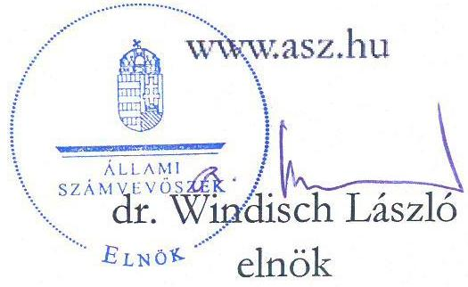
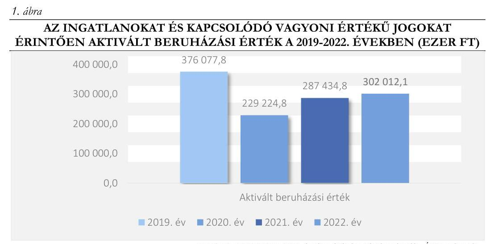
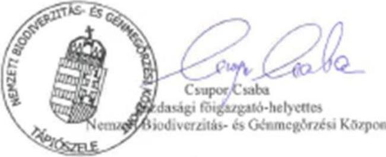
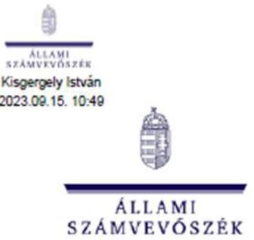

# JELENTÉS 

## Az önkormányzatok és központi költségvetési szervek ingatlanhasznosítási tevékenységének ellenőrzése

Nemzeti Biodiverzitás- és Génmegőrzési Központ

2023.

---

# JELENTÉS 

## Az önkormányzatok és központi költségvetési szervek ingatlanhasznosítási tevékenységének ellenőrzése

Nemzeti Biodiverzitás- és Génmegőrzési Központ

2023.

23039

---

# ELLENŐRZÉSI IGAZGATÓSÁG: 

## ÁLLAMHÁZTARTÁS HELYI SZINTJÉT ELLENŐRZŐ IGAZGATÓSÁG

ELLENŐRZÉSI IGAZGATÓ:
KISGERGELY ISTVÁN igazgató

ELLENŐRZÉSVEZETŐ:
Jelentéseink az interneten a www.asz.hu címen olvashatók.

SZEIBEL GÁBORNÉ ellenőrzésvezető

IKTATÓSZÁM: EL-3711-006/2023.
TÉMASZÁM: 38.
ELLENŐRZÉS-AZONOSÍTÓ SZÁM: V0992

---

# TARTALOMJEGYZÉK 

- AZ ELLENŐRZÉS ALAPADATAI ..... 5
- AZ ELLENŐRZÖTT SZERVEZET ..... 7
- ÖSSZEFOGLALÁS ..... 9
- AZ ELLENŐRZÉS FÓKUSZKÉRDÉSEI ..... 11
- MEGÁLLAPÍTÁSOK ..... 12
- JAVASLATOK ..... 20
- MELLÉKLETEK ..... 22
I. sz. melléklet: Értelmező szótár ..... 22
II. sz. melléklet: Az ellenőrzött szervezet jegyzéke ..... 26
III. sz. melléklet: Az ellenőrzött szervezet mérlegadatai a 2019-2022. években ..... 27
IV. sz. melléklet: A Központi költségvetési szerv 2019-2022. évi kiadási és bevételi előirányzatai és azok teljesítései kiemelt soronként (adatok E Ft-ban) ..... 28
- FÜGGELÉK: ÉSZREVÉTELEK ..... 29
- RÖVIDÍTÉSEK JEGYZÉKE ..... 45

---

.

---

# AZ ELLENŐRZÉS ALAPADATAI 

## AZ ELLENŐRZÉS CÉLJA

Az ellenőrzés célja a nemzeti vagyonnal gazdálkodó központi költségvetési szerv ingatlangazdálkodási, ingatlanhasznosítási tevékenységének értékelése volt. Az ellenőrzés kiterjedt arra, hogy a központi költségvetési szerv az ingatlangazdálkodási feladatai ellátása során figyelemmel volt-e a vagyon értékének megőrzésére, állagának fenntartására, állományának gyarapítására.

## AZ ELLENŐRZÉS TÍPUSA

Megfelelőségi ellenőrzés.

## AZ ELLENŐRZÖTT IDŐSZAK

A 2019-2022. évek. A nyilvántartások ellenőrzése tekintetében a 2021. év.

## AZ ELLENŐRZÉS TÁRGYA

Az ellenőrzés tárgyát az Étv. ${ }^{1}$ 2. § 8. pontjában foglaltak szerinti építmények, a 2. § 10. pontjában foglaltak szerinti épületek és a 2. § 21. pont szerinti telkek, továbbá a Földtv. ${ }^{2}$ hatálya alá tartozó földterületek, valamint a 147/1992. (XI. 6.) Korm. rendelet ${ }^{3}$ 4. számú melléklete szerinti külterületi ingatlanok képezték.

Az ellenőrzés hatóköre kiterjedt arra, hogy az ellenőrzött szervezet a közfeladatok ellátását biztosító ingatlanokkal kapcsolatos gazdálkodás, hasznosítás területén, a jogszabályi előírások figyelembevételével gondoskodott-e az ingatlanvagyona megfelelő használatáról és hasznosításáról, értékének és állagának védelméről, állományának gyarapításáról. Az ellenőrzés azokat a szerződéseket vette figyelembe, amelyek a 2019-2022. években hatályosak voltak.

Az ÁSZ ${ }^{4}$ a megfelelőségi ellenőrzés keretében az ingatlanvagyonnal kapcsolatos intézkedések végrehajtásának, azok elszámolásának megfelelőségét, valamint a nemzeti vagyonba tartozó ingatlanok nyilvántartásának szabályszerűségét is ellenőrizte. A nemzeti vagyonba tartozó ingatlanokkal kapcsolatos gazdálkodási, hasznosítási tevékenységben érintett, kockázatelemzés alapján kiválasztott szervezet ezen feladatellátását támogató belső kontrollrendszere keretében a kontrollkörnyezet részeként a belső szabályozás kialakítása, a monitoring rendszer kialakítása és működtetése részeként a belső ellenőrzés, továbbá az ingatlanokkal kapcsolatos gazdálkodási, hasznosítási tevékenységbe épített kontrolltevékenységek kerültek ellenőrzésre.

Az ingatlangazdálkodási tevékenység ellenőrzése a központi költségvetési szerv esetében az ingatlanok hasznosítására (bérbe-, használatba adására), az ingatlan tulajdonjogának adásvétel keretében történő megszerzésére, a beruházások, felújítások megvalósítására, és az ingatlanok nyilvántartására irányult.

---

Az ellenőrzés kiterjedt minden olyan körülményre és adatra, amely az ÁSZ jogszabályban meghatározott feladatainak teljesítéséhez, valamint a program végrehajtása folyamán felmerült újabb összefüggések feltárásához szükséges volt.

# AZ ELLENŐRZÉS JOGALAPJA 

Az ellenőrzés jogszabályi alapját az ÁSZ tv. ${ }^{5}$ 1. $\$ (3) bekezdése, 5. $\$ (3) bekezdése és (4) bekezdés a) pontja képezte.

## AZ ELLENŐRZÉS MÓDSZERE

Az ellenőrzést az Alaptörvény ${ }^{6}$ 43. cikk (1) bekezdésében meghatározott törvényességi, célszerűségi szempontok, valamint a nemzetközi standardokat irányadónak tekintve az ellenőrzési program szempontjai, az ellenőrzött időszakban hatályos jogszabályok, az ellenőrzés szakmai szabályok és módszertanok figyelembevételével hajtotta végre az ÁSZ.

Az ellenőrzést a nemzetközi standardokat irányadónak tekintve az ellenőrzési program szempontjai, az ellenőrzési időszakban hatályos jogszabályok, az ellenőrzés szakmai szabályok, módszertanok és célszerűségi szempontok figyelembevételével végezte az ÁSZ.

Az ellenőrzési bizonyítékként felhasználható adatforrások közé tartoztak egyrészt az ellenőrzéshez kért dokumentumok, adatforrások, másrészt adatforrás volt még minden - az ellenőrzés folyamán - feltárt, az ellenőrzés szempontjából információkat tartalmazó dokumentum.

Az ellenőrzés lefolytatásához az ellenőrzött szervezet a tanúsítványok kitöltésével, valamint az ÁSZ által kért dokumentumok, adatok, információk megküldésével szolgáltatott adatokat.

Az ingatlangazdálkodási, ingatlanhasznosítási tevékenység vonatkozásában az ellenőrzési kérdések megválaszolásához szükséges bizonyítékok megszerzése az ellenőrzött szervezet által rendelkezésre bocsátott dokumentumokra, adatokra alapozva, továbbá mintavételi eljárás, kérdésfeltevés (információkérés), interjú, helyszínen végzett ellenőrzés, valamint elemző eljárás alkalmazásával történt.

Az ingatlangazdálkodási, ingatlanhasznosítási tevékenységek, folyamatok tekintetében a belső kontrollkörnyezet, illetve a belső kontrollrendszer kialakítása és működtetése évente került értékelésre.

A mintatételek köre az ellenőrzött területhez tartozó legnagyobb értékű elemekből állt, továbbá a mintavételi eljárás rétegzett, illetve egyszerű véletlen mintavétellel is kiegészült. A mintatételek értékelésére az ellenőrzési eljárás során a mintatételek értékelésére alkalmazott kérdésekre adott válaszok alapján került sor.

A tények feltárása és azok összegzése során a megállapítások az ellenőrzött mintatételekre vonatkozóan kerültek megfogalmazásra. Az ellenőrzésre kiválasztott minták elemszáma valamennyi területen 30 darab volt, a minták értékelésének eredménye nem került kivetítésre.

Az ÁSZ a célszerűségi és szabályszerűségi szempontok, valamint az előre meghatározott ellenőrzési programja alapján végrehajtott ellenőrzésének megállapításait a „Megállapítások" fejezet tartalmazza.

---

# AZ ELLENŐRZÖTT SZERVEZET

A Nemzeti Biodiverzitás- és Génmegőrzési Központ (NBGK ${ }^{9}$ ) 2019. június 1-jén jött létre a Haszonállatgénmegőrzési Központ (HáGK ${ }^{8}$ ) Növényi Diverzitás Központba (NÖDIK ${ }^{9}$ ) történő beolvadásával. A jogelőd NÖDIK-t, valamint a HÁGK-t 2010. november 1-jén alapították. A 2019. évi beolvadást megelőzően a NÖDIK látta el a gazdasági szervezettel nem rendelkező HáGK gazdálkodási feladatait.

Az NBGK az agrárpolitikáért felelős miniszter által irányított központi költségvetési szerv, székhelye Tápiószelén található, ezentúl öt telephellyel rendelkezik. Az NBGK szervezeti keretein belül Tápiószelén működik az NBGK Növények Génmegőrző Intézete, és Gödöllőn az NBGK Haszonállat-génmegőrzési Intézete.

Az NBGK a hazai növényi sokféleség, valamint a haszonállat-génvagyon génbanki védelmének, megőrzésének és fenntartható hasznosításának bázisintézménye. Magyarország legnagyobb és egyben központi génbankjaként funkcionál, amely teljes körű génbanki feladatokat lát el. Alaptevékenységébe tartozik a növényi és állati génmegőrzés és fajtavédelem, a biodiverzitás védelme, megőrzése, a kutatás-fejlesztés és innováció, emellett vidékfejlesztési, oktatási és ismeretterjesztő tevékenységeket is végez.

Az NBGK-t az irányító szerv által megbízott főigazgató egyszemélyi felelősséggel vezeti, személye az ellenőrzött időszakban nem változott.

Az NBGK a 2019-2021. évi költségvetési beszámolói szerint az egyes génmegőrző intézmények fejlesztésének és kiemelt programjainak támogatásáról szóló 1049/2018. (II. 20.) Korm. határozat alapján a 2019-2021. évekre többlettámogatásra volt jogosult. 2019-ben működési és fejlesztési feladatokra összesen 209 000,0 E Ft ${ }^{10}$ többlettámogatást kapott (ebből beruházásra 30 000,0 E Ft-ot), a 2020-2021. évi többlettámogatás összege évente 675 000,0 E Ft volt (ebből beruházásra 180 000,0-180 000,0 E Ft).

A 2019-2022. évek december 31-én a mérlegfőösszeg, a tárgyi eszközök, az ingatlanok és a beruházások, felújítások nettó értékének alakulását az 1. táblázat mutatja be.

|  A MÉRLEGFŐŐSSZEG, A TÁRGYI ESZKÖZÖK, AZ INGATLANOK ÉS A BERUHÁZÁSOK, FELÚJÍTÁSOK NETTÓ ÉRTÉKÉNEK ALAKULÁSA 2019-2022. ÉVEK KÖZÖTT (M11 FT) |  |  |  |   |
| --- | --- | --- | --- | --- |
|  TÁRGYI ESZKÖZÖK | 2019. | 2020. | 2021. | 2022.  |
|  Mérlegfőösszeg | 3848,6 | 3757,3 | 4393,2 | 4715,8  |
|  Tárgyi eszközök összesen
Ebből: | 2582,5 | 2916,6 | 3449,3 | 3679,6  |
|  A/II/1 Ingatlanok és a kapcsolódó vagyoni értékủ jogok | 2167,8 | 2366,4 | 2792,49 | 3042,9  |
|  A/II/4 Beruházások, felújítások | 53,4 | 0,6 | 29,2 | 80,5  |

Forrás: Az NBGK 2019-2022. éves költségvetési beszámolói, ÁSZ szerkesztés Az ellenőrzött időszakot tekintve 2019-ben és 2022-ben is a tárgyi eszközök állománya tette ki a mérlegfőösszeg jelentős részét (2019-ben 67,1\%, 2022-ben 78,0\%). Az ingatlanok és kapcsolódó vagyoni értékủ jogok állománya a tárgyi eszközök meghatározó arányát képviselte (2019-ben 83,9\%, 2022-ben 82,7\%).

---

Az ingatlanok és kapcsolódó vagyoni értékű jogok nettó értéke a 2019. évről a 2022. évre 40,4\%-kal nőtt, amelyet a tárgyévben aktivált beruházások és felújítások, és a tárgyévben elszámolt terv szerinti értékcsökkenés összege befolyásoltak.

Az NBGK a feladatellátásához használt ingatlanokon folyamatosan végzett felújításokat, beruházásokat, amelyek jellemzően a feladatellátás minőségének javításával, az állagmegóvással, valamint energetikai fejlesztések végrehajtásával voltak összefüggésben, emellett szolgálati lakás felújítás is történt. A 2019-2022. éves számviteli beszámolók alapján a szervezet nagy összegű beruházásokat hajtott végre az ingatlanok és kapcsolódó vagyoni értékủ jogok tekintetében, amelyet az 1. ábra mutat:

A 2019-2022. években az ingatlanok és kapcsolódó vagyoni értékủ jogok aktivált beruházásainak értéke 1194749,5 E Ft volt, amely 786 922,4 E Ft-tal meghaladta az időszakban elszámolt értékcsökkenés összegét (407 827,1 E Ft).

A beruházási kiadások teljesített összege a 2019. évről a 2022. évre 0,7\%-kal nőtt, a 2021. évről a 2022. évre 12,6\%-kal csökkent. A felújításokkal kapcsolatos kiadások teljesített összege a 2019. évről a 2022. évre 20,7\%-os, a 2021. évről a 2022. évre 26,3\%-os csökkentést mutatott.

Az NBGK 2019-2022. évekre vonatkozó mérlegadatait a III. számú, a kiadási, bevételi előirányzatokat és azok teljesítését a IV. számú melléklet tartalmazza.

A belső ellenőr a 2019-2021. években nem ellenőrizte az eszközökkel - ezen belül az ingatlanokkal - való gazdálkodást. Az NBGK-nál az ÁSZ-on kívül más szervezet nem végzett külső ellenőrzést.

---

# ÖSSZEFOGLALÁS 

Az ÁSZ ellenőrzési tevékenysége keretében általános hatáskörrel ellenőrzi az állami vagyonnal való felelős gazdálkodást. Az ingatlangazdálkodási és ingatlanhasznosítási tevékenység meghatározza a közfeladatok működési környezetét, ezáltal befolyást gyakorol a közfeladatellátás színvonalára. Az ingatlanok jelentős anyagi értéket képviselő vagyonelemek, melyek esetében kiemelten fontos a nemzeti vagyonnal való felelős gazdálkodás követelményeinek érvényesítése. Ezért indokolt a nemzeti vagyont használó központi költségvetési szervek ingatlangazdálkodási és ingatlanhasznosítási tevékenységének ellenőrzése. Így került sor az NBGK ellenőrzésére is.

Az NBGK jogelőd intézményei által megkötött vagyonkezelési szerződés ${ }_{1-4}{ }^{12}$ módosítására a tulajdonosi joggyakorló szervezetek és az NBGK szervezeti átalakulása ellenére nem került sor. A vagyonkezelési szerződés; a Vtv. ${ }^{13}$ előírása ellenére nem biztosította a vagyongazdálkodási feladatok szabályozott és átlátható módon történő végrehajtását, mivel hatályon kívül helyezett jogszabályokra történő hivatkozásokat tartalmazott.

Az ingatlanhasznosítás területén az intézkedések végrehajtása és az azokkal kapcsolatos elszámolás az ellenőrzött mintatételek esetében nem volt megfelelő. Az Nvtv. ${ }^{14}$ és a vagyonkezelési szerződés; előírásai ellenére négy esetben előfordult, hogy a vagyonhasznosítási szerződések megkötéséhez nem állt rendelkezésre a tulajdonosi joggyakorló - $\mathrm{KVI}^{15}$ és jogutódjai - engedélye. Az egyik ilyen 2014-ben megkötött szerződés esetében a tulajdonosi joggyakorló engedélye beszerzésének elmaradása miatt az NBGK 9 éven át évi 200 E Ft bérleti díj bevételtől esett el. Egy esetben úgy került sor az ingatlanvagyon hasznosítására, hogy arra vonatkozó írásba foglalt szerződéssel a Vtv. előírása ellenére nem rendelkezett a szervezet. Tizenegy ingatlanhasznosítási szerződés esetében - az Nvtv. előírása ellenére - nem volt igazolt, hogy az NBGK a szerződést átlátható szervezettel kötötte meg. Egy hasznosítási szerződéshez kapcsolódóan a bérleti díj elszámolása során nem érvényesült a Számv. tv. ${ }^{16}$-ben előírt bruttó elszámolás elve. Öt nem lakáscélú ingatlan hasznosítására vonatkozó szerződést az Nvtv. és a Vtv. hatályba lépését megelőzően kötöttek meg, és a jogszabályi változásokra tekintettel a szerződések módosítására, felülvizsgálatára nem került sor. Az NBGK mindezek miatt a vagyonhasznosítás során nem érvényesítette az Nvtv. és a Vtv. előírásainak a vagyonnal való felelős módon és hatékonyan történő gazdálkodásra, a vagyon értéknövelő hasznosítására vonatkozó követelményeit.

A beruházások, felújítások pénzügyi lebonyolítása és elszámolása az ellenőrzött mintatételek esetében megfelelő volt, a gazdasági események elszámolása és a gazdálkodási jogkörök (kötelezettségvállalás, pénzügyi ellenjegyzés, teljesítés igazolás, érvényesítés, utalványozás) gyakorlása során a jogszabályi előírásokat betartották, a Kbt. ${ }^{17}$ hatálya alá tartozó szerződéskötések során a Kbt. előírásait figyelembe vették.

Az NBGK az ingatlangazdálkodási, ingatlanhasznosítási tevékenységek tekintetében az Nvtv.ben és a Vtv.-ben foglaltak ellenére a feleslegessé vált ingatlanok kapcsán nem élt jelzéssel a tulajdonosi joggyakorló felé, azok visszaadására sem került sor. Az NBGK környezetvédelemmel, fenntarthatósággal, energetikai korszerűsítésekkel, hatékonysággal, megtakarítással kapcsolatos javaslatokat, beszámolókat nem nyújtott be a tulajdonosi joggyakorlók számára.

A nemzeti vagyonba tartozó ingatlanok nyilvántartása az ellenőrzött mintatételek esetében nem volt megfelelő. A részletező nyilvántartás nem felelt meg teljeskörűen az Áhsz. ${ }^{18}$ követelményeinek. Az NBGK az ingatlanvagyon tekintetében leltárkészítési és mennyiségi leltározási kötelezettségét teljesítette.

---

Az NBGK az ellenőrzött időszakban az Áhsz. rendelkezése ellenére két vagyonkezelésében lévő ingatlan értéknövekedését szabálytalanul számolta el összesen 181,6 M Ft értékben. A mérlegben a hiba jelentős összegű, mert a hibahatások együttes összege meghaladja a mérlegfőösszeg 2\%-át. Ezért a Számv. tv.-ben előírtak ellenére az NBGK 2021. és 2022. évi költségvetési beszámolója nem mutatott a szervezet vagyoni helyzetéről megbízható és valós képet.

Az NBGK az Áht., az Ávr. ${ }^{19}$, és a Számv. tv. által kötelezően előírt szabályzatokkal rendelkezett, azonban - az ingatlangazdálkodással és ingatlanhasznosítással kapcsolatos feladatok eredményes végrehajtása érdekében - nem határozott meg olyan részletszabályokat, amelyek végrehajtása az Nvtv., a Vtv. és a Bkr. ${ }^{20}$ rendelkezéseinek érvényesülését biztosították volna. A belső kontrollrendszer működtetése az ellenőrzés során feltárt hiányosságok miatt nem volt megfelelő.

Az NBGK vezetője számára 9 javaslatot fogalmaztunk meg az ellenőrzés során feltárt szabálytalanságok, hiányosságok megszüntetése, valamint az ingatlangazdálkodási és -hasznosítási tevékenység jogszabályokban foglalt alapelveknek való megfelelősége érdekében.

---

# AZ ELLENŐRZÉS FÓKUSZKÉRDÉSEI 

1.- A nemzeti vagyonba tartozó ingatlanokkal való gazdálkodással, hasznosítással kapcsolatos intézkedések végrehajtása, illetve azok elszámolása megfelelő volt-e?
2.- A nemzeti vagyonba tartozó ingatlanok nyilvántartásával kapcsolatos feladatok ellátása szabályszerű volt-e?
3.- A nemzeti vagyont használó szervezetnél az ingatlangazdálkodási, ingatlanhasznosítási tevékenységek, folyamatok tekintetében a belső kontrollrendszer kialakítása és müködtetése megfelelően történt-e?

---

# MEGÁLLAPÍTÁSOK 

## 1. A nemzeti vagyonba tartozó ingatlanokkal való gazdálkodással, hasznosítással kapcsolatos intézkedések végrehajtása, illetve azok elszámolása megfelelő volt-e?

Összegző megállapítás Az NBGK vagyonkezelésében lévő nemzeti vagyonba tartozó ingatlanokkal való gazdálkodással, hasznosítással kapcsolatos intézkedések végrehajtása, illetve azok elszámolása a mintatételek értékelése alapján nem volt megfelelő, mert az ingatlanhasznosítási tevékenységek végrehajtása és elszámolása nem volt megfelelő. Az ingatlanokon végzett beruházásokkal, felújításokkal kapcsolatos intézkedések végrehajtása és azok elszámolása megfelelő volt. Az ingatlangazdálkodás során a jogszabályokban meghatározott vagyongazdálkodási alapelvek nem érvényesültek minden esetben.
1.1. számú megállapítás

A vagyonkezelési szerződés ${ }_{1-4}$ módosítására a szervezeti átalakulások ellenére nem került sor, ezzel összefüggésben a vagyonkezelési szerződés ${ }_{1}$ hatályon kívül helyezett jogszabályi hivatkozásokat tartalmazott.

A vagyonkezelési szerződések tekintetében az NBGK jogelődje, a Kisállattenyésztési és Takarmányozási Kutatóintézet és a tulajdonosi joggyakorló (KVI) között megkötött vagyonkezelési szerződés és annak 2002. szeptember 30. napján történt módosítása az Nvtv. és a Vtv. hatályba lépése előtt született, ezzel összefüggésben hatályon kívül helyezett jogszabályokra (államháztartásról szóló 1992. évi XXXVIII. törvény, 183/1996. (III. 25.) Korm. rendelet) vonatkozó hivatkozásokat tartalmazott. Ezért a vagyonkezelési szerződés ${ }_{1}$ tartalma a Vtvr. ${ }^{21}$ 3. § (1) bekezdés ellenére nem biztosította a vagyongazdálkodási feladatok szabályozott és átlátható módon történő végrehajtását.
A vagyonkezelési szerződések ${ }_{1-4}$ módosítására a vagyonkezelésbe adó szervezetek (KVI, NFA ${ }^{22}$ ) és az NBGK szervezeti átalakulása ellenére nem került sor.
1.2. számú megállapítás

Az ingatlanhasznosítási tevékenységek végrehajtása és elszámolása nem volt megfelelő az ellenőrzött időszakban, mert több esetben nem rendelkeztek a tulajdonosi joggyakorló engedélyével és hozzájárulásával az ügylet létrejöttéhez, továbbá nem volt igazolt, hogy a szerződést átlátható szervezettel kötötték, valamint hiányoztak a gazdasági eseményt megalapozó bizonylatok.

Az ingatlanhasznosítási intézkedések végrehajtása (szerződéskötések) és azok elszámolása a nem lakáscélú ingatlanok bérbeadására vonatkozó 12 mintatétel esetében nem volt megfelelő (érintett mintatételek:1-12.

---

számú mintatétel), míg a 18 lakáscélú ingatlan bérbeadására vonatkozó mintatétel közül 17 esetében megfelelő volt (érintett mintatételek: 15., 17-30., P1, P2 számú mintatétel).
Az NBGK négy ingatlanhasznosítási szerződést a tulajdonosi joggyakorló (KVI, illetve jogutódjai) által kiadott engedély, hozzájárulás nélkül kötött meg, amely nem felelt meg a tulajdonosi joggyakorló szervvel kötött vagyonkezelési szerződés: 5.5 pontjában foglalt előírásnak (a 10 évet meghaladó szerződések esetén a hasznosításhoz a tulajdonosi joggyakorló engedélyét kell kérni), valamint az Nvtv. 11. § (14) bekezdésének (érintett mintatételek: ingatlanhasznosítás terület 3., 4., 8., 12. számú mintatétel). Az egyik szerződés esetében a „Tulajdonosi hozzájárulás" című dokumentumot szabálytalanul az NBGK (vagyonkezelő) vezetője írta alá (érintett mintatétel: 12. számú mintatétel).
Ezen túl az egyik, a tulajdonosi joggyakorló engedélye nélkül 2014-ben kötött szerződésben (4. számú mintatétel) kétféle bérleti díjat határoztak meg. A szerződés hatályba lépését a szerződés 4. pontja, a magasabb bérleti díj kiszabását a szerződés 11.1. pontja a tulajdonosi joggyakorló ${ }^{23}$ hozzájárulásához kötötte, amely nem állt rendelkezésre. A szerződést ennek ellenére hatályosnak tekintették és az alacsonyabb bérleti díjat alkalmazták, emiatt a szervezetnél a 9 éven át a bevételkiesés évi 200 E Ft volt. Az alacsonyabb bérleti díj összegének emelésére a szerződés 11.3. pontjában foglaltaknak megfelelően a Központi Statisztikai Hivatal által közzétett átlagos fogyasztói árindex mértéke alapján - sor került.
Az NBGK egy mintatétel esetében a hasznosításra vonatkozóan - a Vtv. 25. § (4) bekezdésében előírtak ellenére - nem rendelkezett írásba foglalt szerződéssel. A szerződés megkötésének hiánya, a hasznosítás jogviszonyának rendezetlensége miatt az NBGK az állami vagyonnal nem gazdálkodott felelősen, nem tett eleget az Nvtv. 7. § (1) bekezdésében és a Vtv. 2. § (1) bekezdésében foglaltaknak. (Érintett mintatétel: ingatlanhasznosítás terület 1 . számú mintatétel)
Az NBGK-nál 11 nem lakáscélú ingatlanra vonatkozó hasznosítási szerződés esetében az Nvtv. 11. § (10) bekezdésében, az Ávr. 50. § (1a) bekezdésében, és - az Nvtv. hatályba lépését megelőzően kötött, és az Nvtv. hatályba lépésekor fennálló szerződéseket érintően - az Nvtv. 18. § (2) bekezdésében előírtak ellenére nem állt rendelkezésre a használatba/bérbe vevő szervezet vezetőjének arra vonatkozó nyilatkozata, hogy a szervezet átlátható szervezetnek minősül. (Érintett mintatétel: ingatlanhasznosítás terület 2-12. számú mintatételek)
Az NBGK az Nvtv. előírásának megfelelően az ellenőrzött mintatételeknél a hasznosítási/bérleti szerződésekben rögzítette, hogy a bérbe vevő az átengedett nemzeti vagyont a szerződés előírásainak, a tulajdonosi rendelkezéseknek, valamint a meghatározott hasznosítási célnak megfelelően használhatja.
Az NBGK négy mintatétel esetében a hasznosításra irányuló szerződéseket a Vtv. rendelkezéseivel összhangban versenyeztetés mellőzésével kötötte. (Érintett mintatétel: ingatlanhasznosítás terület 3., 4., 8., 12. számú mintatételek)

Az NBGK 18 mintatételnél a lakáscélú ingatlanokat természetes személyek, az NBGK dolgozói, illetve nyugdíjba vonult volt dolgozója részére adta bérbe, amely megfelelt a 106/1999. (XII.28.) FVM rendelet ${ }^{24}$ előírásainak. Ezen esetekben a versenyeztetésre az Nvtv. és a Vtv. előírásainak megfelelően nem került sor. (Érintett mintatétel: ingatlanhasznosítás terület 15-25., 27-30., P1-P2. számú mintatétel)
Egy, az MNV Zrt. tulajdonosi joggyakorlása alatt álló, lakáscélú ingatlan bérbeadására vonatkozó szerződés nem felelt meg a vagyonkezelési szerződés: 4.9.1. pontja előírásának, mivel nem tartalmazta a bérlő előzetes hozzájárulását ahhoz, hogy amennyiben a hasznosított vagyonelemre az NBGK vagyonkezelési joga bármely oknál fogva megszűnik, úgy a hasznosítási szerződés hasznosításba adói

---

pozícióját szerződés-átruházás jogcímén az MNV Zrt. ${ }^{25}$ harmadik személyre átruházhassa. (Érintett mintatétel: 16. számú mintatétel)
Az NBGK az ellenőrzött mintatételeknél a hasznosításra vonatkozó szerződéseket bérleti díj, vagy ellenszolgáltatás fejében kötötte meg, így ingyenes hasznosításra nem került sor. A lakáscélú ingatlanok foglalkoztatottak részére történő bérbeadása során az NBGK a bérleti díjat a 106/1999. (XII.28.) FVM rendelet melléklete előírásai alapján állapította meg. (Érintett mintatétel: ingatlanhasznosítás terület 1530., P1-P2. számú mintatételek)

Az ingatlanhasznosításból származó bevétel a szerződésben rögzítetteknek megfelelő összegekben és feltételekkel teljesült az ellenőrzött mintatételek esetében.
Az NBGK az Áhsz. előírásának megfelelően rendelkezett a szerződésekhez kapcsolódó bevételi analitikával, a befolyt bevételek nyilvántartásba vétele az Áhsz. rendelkezésének megfelelően megtörtént. Az utalványrendeletek alapján az ellenőrzött bevételeket az elszámolás évében hatályos számlatükörnek és a 38/2013. (IX.19.) NGM rendelet ${ }^{26}$-ben foglaltaknak megfelelően számolták el. A gazdasági események elszámolása a 30 mintatétel közül egy mintatétel esetében - a Számv. tv. 165. § (1) bekezdésének és a 166. § (1) bekezdésében foglaltak ellenére - nem volt bizonylattal, számlával alátámasztva (Érintett mintatétel: ingatlanhasznosítás terület 6 . számú mintatétel).
Egy halastó hasznosítására vonatkozó szerződés a bérleti díjat nem értékben állapította meg, hanem a használat fejében egyes feladatok elvégzését szabta ki. A bérleti díj ellentételezéseként természetben elvégzett feladatok számszerúsítése, bizonylatolása, dokumentummal történő alátámasztása - számlázása vagy a teljesítés igazolás kiállítása - a Számv. tv. 165. § (1) bekezdés és a Számv. tv. 166. § (1) bekezdés előírása ellenére nem történt meg. A bérleti díj ellentételezésére elvégzett munkálatok értéke, valamint az annak megfelelő bérleti díj elszámolásának elmaradása nem felelt meg a Számv. tv. 15. § (9) bekezdésében előírt bruttó elszámolás elvének. A bérleti díj szerződésben való meghatározásának hiánya és az elvégzett feladatok számszerúsítésének elmaradása miatt nem volt igazolható, és ellenőrizhető, hogy a bérleti díj fejében elvégzett munka és a bérleti szerződéssel biztosított használat között fennállt-e az értékarányosság. Az Önköltségszámítási Szabályzat ${ }^{27}$ az Áhsz. 50. § (3) bekezdése ellenére nem terjedt ki a szervezet valamennyi rendszeresen végzett szolgáltatásnyújtására, mivel a halastavak bérbeadásával kapcsolatos szabályokat nem tartalmazott, a 2020. november 2-től hatályos Önköltségszámítási Szabályzat ${ }^{28}$ szerint a bérbeadás díját egyedi kalkulációval kellett megállapítani (Érintett mintatétel: ingatlanhasznosítás terület 6. számú mintatétel)

Öt nem lakáscélú ingatlan hasznosítására vonatkozó szerződést (6., 7., 9., 10. és 11. mintatételek) az Nvtv. és a Vtv. hatályba lépését megelőzően kötöttek meg, és a jogszabályi változásokra tekintettel a szerződések módosítására, felülvizsgálatára nem került sor. Ezért a szerződésekben nem érvényesültek az Nvtv. 11. § (10) bekezdésének a hasznosítási szerződés időtartamára, (11) bekezdés a) pontjának a beszámolási, nyilvántartási és adatszolgáltatási kötelezettségekre, c) pontjának a hasznosításban résztvevő személyekre, valamint a Vtvr. 3. § (1) bekezdése előírásának a vagyon használatának ellenőrzésére vonatkozó rendelkezései. Így az Nvtv. 7. § (1) bekezdés előírása ellenére a szerződések nem teremtették meg a nemzeti vagyonnal való felelős gazdálkodás feltételeit.
Az Nvtv. hatályba lépését követően megkötött hasznosítási szerződések esetében az NBGK a hasznosítás időtartamát az Nvtv. előírásainak figyelembevételével állapította meg.

---

# 1.3. számú megállapítás 

Az állami elhelyezési célú ingatlannak nem minősülő ingatlanokon végzett beruházások, felújítások pénzügyi lebonyolítása és számviteli elszámolása megfelelő volt.

A beruházások, felújítások mintatételei esetében az Ávr., és az Áhsz. rendelkezéseivel összhangban a kötelezettségvállalás dokumentuma rendelkezésre állt, azokat a kötelezettségvállalásra jogosult személy írta alá, a pénzügyi ellenjegyzést az arra jogosult személy végezte, a kötelezettségvállalás nyilvántartásba vétele szabályszerűen megtörtént.
A beruházásokra, felújításokra kötött vállalkozási szerződések közül egy mintatétel esetében - az Ávr. 50. § (1a) bekezdésben foglalt előírás ellenére - a szerződés nem tartalmazta a vállalkozó nyilatkozatát arra vonatkozóan, hogy átlátható szervezetnek minősül. (Érintett mintatétel: beruházások, felújítások terület 26. számú mintatétel) Az Ávr. előírásának megfelelően - a további 29 db mintatétel esetében - az átláthatóság igazolása a vállalkozói szerződésekben vagy külön nyilatkozat formájában megtörtént.
Az ellenőrzött mintatételek esetében az NBGK az állami vagyon létrejöttét eredményező jogügyletről (beruházás megvalósításáról, felújításról) a tulajdonosi jogkörgyakorló felé teljesítendő adatszolgáltatási kötelezettségének a Vtvr. és az MNV Zrt. vagyonnyilvántartási szabályzata ${ }^{29}$ előírásainak megfelelően - a kataszteri jelentésekben - eleget tett.
Az NBGK az ellenőrzött mintatételek vonatkozásában a Kbt. hatálya alá tartozó beruházások, felújítások esetében a közbeszerzési eljárást lefolytatta, a szerződést a nyertes ajánlattevővel kötötte meg, összhangban a Kbt. rendelkezéseivel. A gazdálkodási jogkörgyakorlás a beruházások, felújítások végrehajtása tekintetében kötött vállalkozói szerződések esetében megfelelt az Áht. és az Ávr. előírásainak, amelynek keretében a teljesítés igazolását a belső szabályozás szerint az NBGK főigazgatója, vagy az általa írásban kijelölt személy végezte. Az érvényesítést és az utalványozást az arra jogosult személy hajtotta végre. A kiadások utalványozása az Ávr. előírásaival összhangban érvényesített okmány alapján történt.
Az ellenőrzött beruházásokat, felújításokat érintő vállalkozói szerződések esetében a gazdasági események számviteli elszámolása a Számv. tv. rendelkezéseinek megfelelően bizonylattal alátámasztott volt, a szerződések és a számlák rendelkezésre álltak. A gazdasági események pénzügyi számvitel szerinti elszámolása szabályszerű volt. Az ellenőrzött mintatételek esetében az üzembe helyezett beruházások, felújítások esetében az üzembehelyezést a Számv. tv. előírása alapján hitelt érdemlő módon dokumentálták.

### 1.4. számú megállapítás

Az NBGK ingatlangazdálkodási, ingatlanhasznosítási tevékenysége nem felelt meg teljeskörűen az Nvtv.-ben és a Vtv.ben foglalt vagyongazdálkodási alapelveknek.

A NBGK ingatlangazdálkodási, ingatlanhasznosítási tevékenysége során nem érvényesültek teljeskörűen az Nvtv. 7. § (1)-(2) bekezdésében és a Vtv. 2. § (1) bekezdésében foglalt előírások az alábbiak miatt:

- Az MNV Zrt., mint tulajdonosi joggyakorló felé teljesítették az ingatlanokkal kapcsolatos kataszteri jelentéseket a vagyonváltozásokról, azonban a feleslegessé vált, nem használt ingatlanok esetében külön nem készítettek számításokkal, elemzéssel, indokokkal, célszerűségi szempontokkal alátámasztott javaslatokat az ingatlanok kihasználtságára, hasznosítására, fenntarthatóságára vonatkozóan. A 2022. év végén a használaton kívüli ingatlanok száma 19 volt, melyek között épületek, szolgálati lakás, műveletlen területek, állattartó helyiségek szerepeltek.

---

- A fejlesztési tervek alapján az NBGK a vagyonkezelésében lévő ingatlanok fenntarthatósága vonatkozásában felméréseket, elemzéseket és vizsgálatokat készített, azonban azok nem kerültek megküldésre a tulajdonosi joggyakorló felé.
- Nem nyújtották be a környezetvédelemre, a fenntarthatóságra, az energetikai korszerűsítésekre vonatkozó javaslatokat, előterjesztéseket, illetve a beruházásokra, felújításokra, karbantartásokra vonatkozó számszaki elemzéseket, terveket a tulajdonosi joggyakorló felé, és azokról nem készítettek jelentést, beszámolót sem a tulajdonosi joggyakorló felé.
- A 2019. évben nem követték nyomon és nem értékelték az energiamegtakarítási követelmények, célkitűzések teljesülését.

# Az NBGK az Nvtv. és a Vtv. rendelkezéseinek megfelelően az alábbi területeken gondoskodott a vagyon védelméről: 

- A vagyonkezelésében lévő ingatlanvagyonra szerződéseket kötött vagyonbiztosításra, gazdasági társaságokkal biztonsági szolgálatra, járőrözésre, portaszolgálatra, elektronikus biztonsági berendezés 24 órás műszaki felügyeletére, tűzvédelem figyelő szolgálatra, videós megfigyelő rendszer bővítésére, behatolás jelző és beléptető rendszer szállítására, telepítésére, beüzemelésére, karbantartására, megfigyelő rendszer kiépítésére.
- A vagyonkezelésben lévő ingatlanok vonatkozásában történtek műszaki állapotfelmérések, a beruházások, felújítások szükségességével kapcsolatos tervek.
- Az NBGK az energiahatékonysági szemléletformáláshoz kapcsolódóan megtett akciókról a 20212022. évekre vonatkozó éves energiamegtakarításról szóló jelentésekben adott számot. A 20212022. évek energiamegtakarításról szóló éves jelentései szerint a tervezett intézkedések tekintetében elmaradás nem volt, így az NBGK teljesítette az intézkedési tervben előírtakat.
- Az NBGK az ellenőrzött időszakban rendelkezett az ingatlangazdálkodás tekintetében stratégiával. Az éves fejlesztési tervek az NBGK alapfeladatainak ellátásához kapcsolódóan tartalmazták az ingatlanok állapotára vonatkozó információkat, az ingatlangazdálkodási fejlesztéseket, felújításokat és beruházásokat, célkitűzéseket.
Az NBGK az Ehat. tv. ${ }^{30} 11 /$ A. § a) pont előírásai ellenére energiamegtakarítási intézkedési tervvel a 2019. évre vonatkozólag nem rendelkezett. A 2020-2022. évekre vonatkozóan az NBGK elkészítette az Ehat.tv. előírása szerinti, 2020-2024 évekre szóló energiamegtakarítási intézkedési tervet. Az Ehat.tv. 11/A. § b) pont előírásai ellenére nem került sor az energiamegtakarítási intézkedési terv végrehajtásának teljesítéséről szóló éves jelentés elkészítésére a 2020. év tekintetében.

---

# 2. A nemzeti vagyonba tartozó ingatlanok nyilvántartásával kapcsolatos feladatok ellátása szabályszerű volt-e? 

Összegző megállapítás Az NBGK vagyonkezelésében lévő nemzeti vagyonba tartozó ingatlanok nyilvántartásával kapcsolatos feladatok ellátása az ellenőrzött mintatételek esetében a 2021. évben nem volt megfelelő. Két ingatlan esetében az értéknövekedést szabálytalanul számolták el.

Az NBGK a 2019-2021. évekre vonatkozó, az ingatlanokat és kapcsolódó vagyoni értékủ jogokat érintő, éves számviteli beszámolókban - a 15/A űrlapokon - kimutatott adatai (nettó értékek) az adott év főkönyvi kivonatában kimutatott záró, könyv szerinti nettó értékekkel és az éves analitikákban kimutatott könyv szerinti nettó értékekkel egyezőséget mutattak.
Az ellenőrzött mintatételek esetében az NBGK a vagyonkezelésbe vett ingatlanok, mint épületek, földterületek, építmények vonatkozásában az állami vagyonra vonatkozó előírások szerinti nyilvántartás vezetésére vonatkozó kötelezettséget a Vtvr. és a vagyonkezelési szerződések előírásainak, valamint a tulajdonosi joggyakorlók vagyon nyilvántartási szabályzatainak ${ }_{1,2}{ }^{31}$ megfelelően teljesítette.
Az NBGK a vagyonkezelésbe vett ingatlanok vonatkozásában a részletező nyilvántartás vezetésére vonatkozó kötelezettségét teljesítette, azonban az az Áhsz. 14. melléklet VII. 1. pont e) és h) pontja ellenére nem tartalmazta a vagyonkezelő nyilvántartásában a tulajdonos megnevezését, továbbá az ingatlan értékcsökkenési leírási kulcsát.
Az NBGK a leltárfelvételi ívek és leltáranalitika alapján az ellenőrzött mintatételek esetében a 2021. december 31-i mérlegfordulónapra vonatkozóan teljesítette a mennyiségi felvétellel történő leltározási és a leltárkészítési kötelezettséget, valamint az ingatlanok eszköznyilvántartó lapjai alapján a 2021. évi mérlegkészítés időszakában az értékelési feladatokat is elvégezte az Áhsz. és a Számv. tv előírásai szerint.

Az NBGK két vagyonkezelésében lévő ingatlanra (főépület, méhészeti épület) vonatkozóan 2021-ben forgalmi értékmeghatározást (értékbecslést) készíttetett. Az értékmeghatározások alapján a két ingatlan piaci értéke összesen 181638 E Ft-tal meghaladta a könyv szerinti értéküket. Az NBGK az Áhsz. 21. § (1) bekezdésében foglaltak ellenére a különbözetet a költségvetési beszámoló mérlegének ingatlanok és kapcsolódó vagyoni értékủ jogok során bemutatta. Az Áhsz. ezen rendelkezése szerint a mérlegben a tárgyi eszközöket bekerülési értéken kell kimutatni, csökkentve az elszámolt terv szerinti és terven felüli értékcsökkenéssel, növelve a terven felüli értékcsökkenés visszaírásával. Az Áhsz. 15. § (2) bekezdés értelmében a vagyonkezelésbe vett ingatlan bekerülési értéke az átadónál kimutatott bruttó érték, ezentúl az átvevőnek nyilvántartásba kell vennie a vagyonkezelésbe adó által az átadás időpontjáig elszámolt értékcsökkenést, értékvesztést. Az ingatlanok értékét növeli az azokhoz kapcsolódóan a pénzügyi számvitelben elszámolt befejezett felújítás értéke az Áhsz. 16. § (4) bekezdése alapján.

A téves elszámolásból eredő hiba a 2021. évi mérlegfőösszeg - 4393 207,6 E Ft - alapján jelentős összegű az Áhsz. 1. § (1) bekezdés 3. pontja és az NBGK számviteli politikája szerint. Ennek következtében az NBGK 2021-2022. évi költségvetési beszámolója a Számv. tv. 18. §-ában előírtak ellenére nem mutatott a szervezet vagyoni helyzetéről megbízható és valós képet.

---

# 3. A nemzeti vagyont használó szervezetnél az ingatlangazdálkodási, ingatlanhasznosítási tevékenységek, folyamatok tekintetében a belső kontrollrendszer kialakítása és müködtetése megfelelően történt-e? 

Összegző megállapítás Az NBGK-nál az ingatlangazdálkodási, ingatlanhasznosítási tevékenységek, folyamatok tekintetében a belső kontrollrendszer kialakítása szabályszerű volt, működtetése az ellenőrzés során feltárt hiányosságok miatt nem volt megfelelő.

Az NBGK a 2019. év kivételével az Áht. előírásainak megfelelően szervezeti és működési szabályzattal rendelkezett. A HáGK NÖDIK-be történő beolvadását követően az intézményvezető az NBGK SZMSZ ${ }^{32}$-ét 2020. szeptember 17-én kiadmányozta, amit az agrárminiszter 2020. október 12-én hagyott jóvá. Az NBGK szervezetét, feladatai ellátásának részletes belső rendjét és módját - az Áht. 10. § (5) bekezdésében foglaltak ellenére - szervezeti és működési szabályzat 2020. szeptember 17-éig nem szabályozta.
Az NBGK a gazdasági szervezetére vonatkozó szabályokat ügyrend ${ }^{33}$-ben szabályozta, valamint rendelkezett a beszerzések lebonyolításával kapcsolatos szabályzattal ${ }^{34}$ is az Áht. és az Ávr. rendelkezéseinek megfelelően.
Az NBGK a Számv. tv. és az Áhsz előírásainak megfelelően az ellenőrzött időszakban rendelkezett továbbá számviteli politikával ${ }^{35}$, eszközök és források leltárkészítési és leltározási szabályzatával ${ }^{36}$, eszközök és források értékelési szabályzatával ${ }^{37}$, önköltségszámítás rendjére vonatkozó szabályzat ${ }_{1,2}$-tal, és számlarenddel ${ }^{38}$. Az eszközök és források leltárkészítési és leltározási szabályzata biztosította az Áhsz. 22. § (2) bekezdésében foglaltak teljesülését. A szabályzatokat az Ávr. és a Számv. tv. előírásainak megfelelően az NBGK és a jogelőd intézmények arra jogosult intézményvezetői kiadmányozták.
Az ingatlangazdálkodás, ingatlanhasznosítás tevékenységébe tartozó feladatok a Bkr. rendelkezésében foglaltaknak megfelelően megjelentek az NBGK ellenőrzési nyomvonalában ${ }^{39}$ a felújításokkal, a beruházásokkal, a karbantartásokkal, a szolgáltatásokkal és egyéb beszerzésekkel kapcsolatban.
Az NBGK az ellenőrzött időszakban a belső ellenőrzési feladatok ellátását a Bkr. rendelkezésével összhangban külső szolgáltató bevonásával biztosította. A belső ellenőrzés a 2019-2021. években az ingatlangazdálkodás, ingatlanhasznosítás területére vonatkozóan ellenőrzést nem hajtott végre. A belső ellenőrzés ingatlangazdálkodás, ingatlanhasznosítás területét érintő, a 2022. évben megkezdett, a helyszíni ellenőrzés lezárásakor még folyamatban lévő ellenőrzése az NBGK földterületek jellegű vagyonelemeinek nyilvántartási, hasznosítási feladatainak ellenőrzésére vonatkozott.
Az NBGK-nál nem dolgoztak ki olyan részletszabályokat, amelyek végrehajtása az Nvtv. 7. § (1)(2) bekezdése, a Vtv. 2. § (1) bekezdése, és a Bkr. 4. § a)-b) pontjaiban foglalt előírások maradéktalan érvényesülését biztosította volna. Azaz az NBGK nem írt elő belső szabályokat

- az ingatlanokra vonatkozó előre meghatározott rendszerességű (műszaki) állapotfelmérés készítésére, az ingatlanvagyon állapotáról a tulajdonosi joggyakorló részére készítendő beszámoló, tájékoztató előterjesztés tartalmi elemeire,

---

- a vagyonkezelési szerződés alapján használatban lévő ingatlanállomány fenntartási kiadásainak, és a kihasználtságának monitorozási kötelezettségére,
- az ingatlanállománnyal kapcsolatos gazdasági események vonatkozásában a döntéselőkészítés folyamatának szabályozására, a döntés megalapozásához szükséges adatok meghatározására,
- az ingatlanvagyon meghatározott rendszerességgel történő fenntarthatósági szempontú felülvizsgálatának elvégzésére,
- az állagmegóvással, értékmegőrzéssel kapcsolatos tevékenység végrehajtására vonatkozó szabályok elkészítésére,
- az ingatlanvagyon hasznosításából elért bevételek monitorozási kötelezettségére, továbbá a hasznosításra vonatkozó szerződések tartalmi elemeinek meghatározására irányultak.

---

# JAVASLATOK 

Az ÁSZ tv. 33. § (1) bekezdésében foglaltak értelmében az ellenőrzött szervezet vezetője köteles a jelentésben foglalt megállapításokhoz kapcsolódó intézkedési tervet összeállítani és azt a jelentés kézhezvételétől számított 30 napon belül az ÁSZ részére megküldeni. Amennyiben az ellenőrzött szervezet vezetője nem küldi meg határidőben az intézkedési tervet, vagy továbbra sem elfogadható intézkedési tervet küld, az Állami Számvevőszék elnöke az ÁSZ tv. 33. § (3) bekezdése a) és b) pontjaiban foglaltakat érvényesítheti.

## A NEMZETI BIODIVERZITÁs- ÉS GÉNMEGŐRZÉSI KÖZPONT FÓIGAZGATÓJA RÉSZÉRE

1. Kezdeményezze a Vtvr. 3. § (1) bekezdés keretében elöirtaknak történő megfelelés érdekében a tulajdonosi joggyakorlóknál (MNV Zrt., NFK ${ }^{40}$ ) a hatályban lévő- vagyonkezelési szerződések megújítását, módosítását minden, az NBGK nyilvántartásában szereplő ingatlan tekintetében.
1.1.sz. megállapítás 2. bekezdése alapján
2. Intézkedjen az Nvtv. 11. § (14) bekezdése elöírásainak és - amennyiben a hatályos vagyonkezelése szerződések tartalmazzák - a vagyonkezelési szerződések rendelkezéseinek megfelelően, hogy az ingatlanhasznosításra vonatkozó szerződések esetében a tulajdonosi joggyakorlók engedélye, hozzájárulása rendelkezésre álljon.
1.2.sz. megállapítás 2. bekezdés alapján
3. Intézkedjen a Vtv. 25. § (4) bekezdésében foglaltaknak megfelelően a hasznosításra vonatkozó szerződés írásba foglalásáról.
1.2.sz. megállapítás 4. bekezdés alapján
4. Intézkedjen az Nvtv. 11.§ (10) bekezdésben a nem természetes személyekkel kötött ingatlanhasznosításra vonatkozó szerződések megkötése során, illetve a már hatályban lévő - nem természetes személlyel kötött - hasznosítási szerződésekre vonatkozóan a hasznosításba vevő (bérbe vevő) átlátható szervezeti minősitéséről szóló nyilatkozatainak beszerzésére.
1.2.sz. megállapítás 5. sz. bekezdés alapján
5. Intézkedjen az olyan hasznosítási szerződések tekintetében, amelyekben az ellenszolgáltatás természetben, illetve beszámítással került meghatározásra, a Számv. tv. 15. § (9) bekezdésében elöirt bruttó elszámolás elve betartása érdekében a Számv. tv. 165. § (1) bekezdésében és a Számv. tv. 166. § (1) bekezdésében foglalt bizonylatolási elöírások érvényesítéséről.
1.2.sz. megállapítás 12. bekezdés alapján

---

6. Intézkedjen az Áhsz. 50. § (3) bekezdése előírásának megfelelően az Önköltségszámítási Szabályzat kiegészitésére a halastavak ellenszolgáltatás fejében történő bérbeadásával kapcsolatos szabályokra irányulóan.
1.2.sz. megállapítás 12. bekezdés alapján
7. Intézkedjen az Nvtv 7. § (1)-(2) bekezdés, a Vtv. 2. § (1) bekezdés keretében előirtaknak, valamint a vagyonkezelési szerződésekben foglaltaknak történő megfelelés érdekében a vagyonhasznosítási szerződések szükség szerinti felülvizsgálatáról.
1.2.sz. megállapítás 13. és 14. bekezdés alapján
8. Intézkedjen a vagyonkezelésbe vett ingatlanok vonatkozásában a részletező nyilvántartás vezetésére vonatkozó kötelezettség Ahsz. 14. melléklet VII. 1. pontjában elöirtaknak megfelelő teljesitésére.
2.sz. megállapítás 3. bekezdés alapján
9. Intézkedjen, hogy a költségvetési beszámoló a Számv. tv. 18. §-ában elöirtaknak megfelelően a szervezet pénzügyi, vagyoni és jövedelmi helyzetéről és azok változásáról megbízható és valós képet mutasson.
2.sz. megállapítás 6. bekezdés alapján

---

# MELLÉKLETEK 

## I. SZ. MELLÉKLET: ÉRTELMEZŐ SZÓTÁR

állami
elhelyezési célú ingatlan
a) a Kormány irányítása vagy felügyelete alá tartozó költségvetési szerv részére állami elhelyezési célú ingatlanhasználati jogviszony keretében használatba adott többségében irodai funkciót ellátó, Magyarország területén található ingatlan, ahol az ingatlanon fekvő építmény valamennyi helyiségét figyelembe véve megállapítható, hogy azok többsége irodai rendeltetésű vagy azok tényleges hasznosítása irodai célokat szolgál,
ab) a Kormány irányítása vagy felügyelete alá tartozó költségvetési szerv részére állami elhelyezési célú ingatlanhasználati jogviszony keretében használatba adott olyan oktatási, üdültetési vagy egyéb rekreációs célt szolgáló, Magyarország területén található ingatlan, amely nem a költségvetési szerv szakmai alapfeladataként meghatározott tevékenység ellátását biztosítja. (Forrás: Magyarország 2021. évi kö̉zponti költségvetésének megalapozásáról szóló 2020. évi LXXVI. törvény 148. § (11) bekezdés a) pontja)
állami vagyon A Vtv. alkalmazásában állami vagyonnak minősül:
a) az állam tulajdonában lévő dolog, valamint dolog módjára hasznosítható természeti erő;
b) az a) pont hatálya alá tartozó mindazon vagyon, amely vonatkozásában törvény az állam kizárólagos tulajdonjogát nevesíti;
c) az állam tulajdonában lévő tagsági jogviszonyt megtestesítő értékpapír, illetve az államot megillető egyéb társasági részesedés;
d) az államot megillető olyan immateriális, vagyoni értékkel rendelkező jogosultság, amelyet jogszabály vagyoni értékű jogként nevesít;
e) az állam tulajdonában lévő pénzügyi eszközök, illetve 2021. XII. 25-től hatályos rendelkezés szerint: e) az állam tulajdonában álló a befektetési vállalkozásokról és az árutőzsdei szolgáltatókról, valamint az általuk végezhető tevékenységek szabályairól szóló 2007. évi CXXXVIII. törvény szerinti pénzügyi eszköz. (Forrás: Vtv. 1. § (2) bekezdése)
beruházás A tárgyi eszköz beszerzése, létesítése, saját vállalkozásban történő előállítása, a beszerzett tárgyi eszköz üzembe helyezése, rendeltetésszerű használatbavétele érdekében az üzembe helyezésig, a rendeltetésszerű használatbavételig végzett tevékenység (szállítás, vámkezelés, közvetítés, alapozás, üzembe helyezés, továbbá mindaz a tevékenység, amely a tárgyi eszköz beszerzéséhez hozzákapcsolható, ideértve a tervezést, az előkészítést, a lebonyolítást, a hiteligénybevételt, a biztosítást is); beruházás a meglévő tárgyi eszköz bővítését, rendeltetésének megváltoztatását, átalakítását, élettartamának, teljesítőképességének közvetlen növelését eredményező tevékenység is, az előbbiekben felsorolt, e tevékenységhez hozzákapcsolható egyéb tevékenységekkel együtt. (Forrás: Számv. tv. 3. § (4) bek. 7. pont)
építmény Építési tevékenységgel létrehozott, illetve késztermékként az építési helyszínre szállított, - rendeltetésére, szerkezeti megoldására, anyagára, készültségi fokára és kiterjedésére tekintet nélkül - minden olyan helyhez kötött műszaki alkotás, amely a terepszint, a víz vagy az azok alatti talaj, illetve azok feletti légtér megváltoztatásával, beépítésével jön létre, az építmény az épület és mütárgy gyűjtőfogalma. (Forrás: Étv. 2. § 8. pontia)

---

épület Épület: jellemzően emberi tartózkodás céljára szolgáló építmény, amely szerkezeteivel részben vagy egészben teret, helyiséget vagy ezek együttesét zárja körül meghatározott rendeltetés vagy rendeltetésével összefüggő tevékenység, avagy rendszeres munkavégzés, illetve tárolás céljából (Forrás: Étv. 2. § 8. pontja)
felújítás Az elhasználódott tárgyi eszköz eredeti állaga (kapacitása, pontossága) helyreállítását szolgáló, időszakonként visszatérő olyan tevékenység, amely mindenképpen azzal jár, hogy az adott eszköz élettartama megnövekszik, eredeti műszaki állapota, teljesítőképessége megközelítően vagy teljesen visszaáll, az előállított termékek minősége vagy az adott eszköz használata jelentősen javul és így a felújítás pótlólagos ráfordításából a jövőben gazdasági előnyök származnak; felújítás a korszerűsítés is, ha az a korszerű technika alkalmazásával a tárgyi eszköz egyes részeinek az eredetitől eltérő megoldásával vagy kicserélésével a tárgyi eszköz üzembiztonságát, teljesítőképességét, használhatóságát vagy gazdaságosságát növeli; a tárgyi eszközt akkor kell felújítani, amikor a folyamatosan, rendszeresen elvégzett karbantartás mellett a tárgyi eszköz oly mértékben elhasználódott (szerkezeti elemei elöregedtek), amely elhasználódottság már a rendeltetésszerű használatot veszélyezteti; nem felújítás az elmaradt és felhalmozódó karbantartás egyidőben való elvégzése, függetlenül a költségek nagyságától. (Forrás: Számv. tv. 3. § (4) bek. 8. pont)
hasznosítás A tulajdonosi joggyakorló vagy a nemzeti vagyon használója által a nemzeti vagyon birtoklásának, használatának, hasznok szedése jogának bármely - a tulajdonjog átruházását nem eredményező - jogcímen történő átengedése, ide nem értve a vagyonkezelésbe adást, valamint a haszonélvezeti jog alapítását (Forrás: Nvtv. 3. § (1) bek. 4. pont)
ingatlan A Számv. tv. előírásai alapján az ingatlanok között kell kimutatni a rendeltetésszerűen használatba vett földterületet és minden olyan anyagi eszközt, amelyet a földdel tartós kapcsolatban létesítettek. Az ingatlanok közé sorolandó: a földterület, a telek, a telkesítés, az épület, az épületrész, az egyéb építmény, az üzemkörön kívüli ingatlan, illetve ezek tulajdoni hányada, továbbá az ingatlanokhoz kapcsolódó vagyoni értékű jogok, függetlenül attól, hogy azokat vásárolták vagy a vállalkozó állította elő, illetve azok saját tulajdonú vagy bérelt ingatlanon valósultak meg. Az ingatlanok között kell kimutatni a bérbe vett ingatlanokon végzett és aktivált beruházást, felújítást is. (Forrás: Számv. tv. 26. § (2) bek.)
ingatlangazdál Egy szervezet ingatlanvagyonának teljes körű kezelését, a vele valógazdálkodást jelenti. kodás Magában foglalja a bérlemény- és területgazdálkodást, bérbeadást, a bérleti díjak kezelését; az infrastrukturális szolgáltatások biztosítását, a kapcsolódó jogi, számviteli és pénzügyek kezelését, biztosítási ügyek intézését. Tartalmazza továbbá a karbantartási, javítási és fenntartási munkák elvégzéséről való gondoskodást. (Forrás: Bácsné Bába Éva [2020]: Ingatlangazdálkodás prezentáció, Debreceni Egyetem, https://old.elearning.unideb.hu/pluginfile.php/437201/mod resource/content/1/L\%C3 \%A9tes\%C3\%ADtm\%C3\%A9ny_3.pdf letöltve: 2023.02.01.)
karbantartás A használatban lévő tárgyi eszköz folyamatos, zavartalan, biztonságos üzemeltetését szolgáló javítási, karbantartási tevékenység, ideértve a tervszerű megelőző karbantartást, a hosszabb időszakonként, de rendszeresen visszatérő nagyjavítást, és mindazon javítási, karbantartási tevékenységet, amelyet a rendeltetésszerú használat érdekében el kell végezni, amely a folyamatos elhasználódás rendszeres helyreállítását eredményezi. (Forrás: Számv. tv. 3. § (4) bek. 9. pont)

---

külterület
nemzeti vagyon

A település közigazgatási területének belterületnek nem minősülő, elsősorban mezőgazdasági, erdőművelési, illetőleg különleges (pl. bánya, vízmeder, hulladéktelep) célra szolgáló része. (Forrás: 147/1992. (XI. 6.) Korm. rendelet 4. számú melléklet)
a) az állam vagy a helyi önkormányzat kizárólagos tulajdonában álló dolgok,
b) az a) pont hatálya alá nem tartozó, az állam vagy a helyi önkormányzat tulajdonában lévő dolog,
c) az állam vagy a helyi önkormányzat tulajdonában lévő pénzügyi eszközök, továbbá az államot vagy a helyi önkormányzatot megillető társasági részesedések,
d) az államot vagy a helyi önkormányzatot megillető bármely vagyoni értékkel rendelkező jogosultság, amelyet jogszabály vagyoni értékű jogként nevesít,
e) Magyarország határa által körbezárt terület feletti légtér,
f) az üvegházhatású gázok kibocsátási egységeinek kereskedelméről szóló törvény szerinti kibocsátási egység és légiközlekedési kibocsátási egység, valamint az ENSZ Éghajlatváltozási Keretegyezménye és annak Kiotói Jegyzőkönyv végrehajtási keretrendszeréről szóló törvény szerinti kiotói egység,
g) állami vagy helyi önkormányzati fenntartású közgyűjtemény (muzeális intézmény, levéltár, közgyűjteményként működő kép- és hangarchívum, valamint könyvtár) saját gyűjteményében nyilvántartott kulturális javak körébe tartozó dolog, kivéve, ha a dolog más tulajdonában áll,
h) a régészeti lelet,
i) a nemzeti adatvagyon körébe tartozó állami nyilvántartások fokozottabb védelméről szóló törvény szerinti nemzeti adatvagyon. (Forrás: Netv. 1. § (2) bekezdése)
nemzeti
vagyon
használója
nemzeti vagyongazdál kodás feladata
telek vagyonkezelő az állam tulajdonában álló nemzeti

Azon természetes személy, jogi személy vagy jogi személyiséggel nem rendelkező szervezet, aki vagy amely állami vagyon tekintetében törvény vagy szerződés alapján, a helyi önkormányzat vagyona tekintetében törvény, a helyi önkormányzat rendelete vagy szerződés alapján bármely jogcímen nemzeti vagyont birtokol, használ, szedi annak hasznait, kivéve a tulajdonosi joggyakorló (Netv. 3. § (1) bek. 11. pont)
A nemzeti vagyon megőrzése, értékének és állagának védelme, rendeltetésének megfelelő, az állam, az önkormányzat mindenkori teherbíró képességéhez igazodó, elsődlegesen a közfeladatok ellátásához és a mindenkori társadalmi szükségletek kielégítéséhez szükséges, egységes elveken alapuló, átlátható, hatékony és költségtakarékos múködtetése, értéknövelő használata, hasznosítása, gyarapítása, továbbá az állam vagy a helyi önkormányzat feladatának ellátása szempontjából feleslegessé váló vagyontárgyak elidegenítése, azzal, hogy a nemzeti vagyon megőrzése érdekében végzett bontás vagy átalakítás nem minősül az állag védelmi kötelezettség megszegésének. A kiemelt kulturális örökségvédelmi és természetvédelmi szempontok - kulturális és természeti értékek jövő nemzedékek számára való megőrzése érdekében történő - érvényesítésének nem akadálya a vagyon értékváltozása. (Forrás: Netv. 7. § (2) bek.)
Telek: egy helyrajzi számon nyilvántartásba vett földterület. (Forrás: Évtv. 2. § 21.pont)
Az állami tulajdonú vagyon tekintetében vagyonkezelő:
aa) költségvetési szerv,
ab) helyi önkormányzat, nemzetiségi önkormányzat, valamint ezek társulásai,
ac) az ab) alpontban felsoroltak fenntartása vagy irányítása alá tartozó intézmény,

---

vagyon tekintetében
ad) köztestület,
ae) az állam, az aa)-ac) alpontban meghatározott személyek együtt vagy külön-külön 100\%os tulajdonában álló gazdálkodó szervezet,
af) az ae) alpont szerinti gazdálkodó szervezet 100\%-os tulajdonában álló gazdálkodó szervezet,
ag) országos törzshálózati vasúti pályát működtető többségi állami tulajdonú gazdasági társaság,
ah) a törvény által kijelölt egyedileg meghatározott jogi személy (Forrás: Nvtv. 3. § (1) bek. 19. pont a) alpont 2020. I. 1-től batályos szövege)
vagyonkezelő jogköre

A vagyonkezelőt - ha jogszabály vagy a vagyonkezelési szerződés másként nem rendelkezik - megilletik a tulajdonos jogai, és terhelik a tulajdonos kötelezettségei - ideértve a számvitelről szóló törvény szerinti könyvvezetési és beszámoló-készítési kötelezettséget is - azzal, hogy
a) a vagyont nem idegenítheti el, valamint - jogszabályon alapuló, továbbá az ingatlanra közérdekből külön jogszabályban feljogosított szervek javára alapított használati jog, vezetékjog vagy ugyanezen okokból alapított szolgalom, továbbá a helyi önkormányzat javára alapított vezetékjog kivételével - nem terhelheti meg,
b) a vagyont biztosítékul nem adhatja,
c) a vagyonon osztott tulajdont nem létesíthet,
d) a vagyonkezelői jogot harmadik személyre a (9) bekezdésben foglalt kivétellel nem ruházhatja át és nem terhelheti meg, valamint
e) polgári jogi igényt megalapító, polgári jogi igényt eldöntő tulajdonosi hozzájárulást a vagyonkezelésében lévő nemzeti vagyonra vonatkozóan hatósági és bírósági eljárásban sem adhat, kivéve a jogszabályon alapuló, továbbá az ingatlanra közérdekből külön jogszabályban feljogosított szervek javára alapított használati joghoz, vezetékjoghoz vagy ugyanezen okokból alapított szolgalomhoz, továbbá a helyi önkormányzat javára alapított vezetékjoghoz történő hozzájárulást. (Forrás: Nvtv. 11. § (8) bekezdés)

---

II. SZ. MELLÉKLET: AZ ELLENŐRZÖTT SZERVEZET JEGYZÉKE

# MEGNEVEZÉS 

Nemzeti Biodiverzitás- és Génmegőrzési Központ

---

# III. SZ. MELLÉKLET: AZ ELLENŐRZŐTT SZERVEZET MÉRLEGADATAI A 2019-2022. ÉVEKBEN

## 2. táblázat

A KÖZPONTI KÖLTSÉGVETÉSI SZERV MÉRLEG ADATAI A 2019-2022. ÉVEKBEN (ADATOK E FT-BAN)

|  MEGNÉVEZÉS | 2019. EV | 2020. EV | 2021. EV | 2022. EV | $\begin{gathered} \text { VÁLTOZAS } \ \%-\mathrm{A} \ 2022 / 2019 \end{gathered}$ | $\begin{gathered} \text { VÁLTOZAS } \ \%-\mathrm{A} \ 2022 / 2021 \end{gathered}$  |
| --- | --- | --- | --- | --- | --- | --- |
|  A/I Immateriális javak | 105,1 | 0,0 | 0,0 | 0,0 | $-100,0$ | -  |
|  A/II Tárgyi eszközök | 2582 491,7 | 2916 643,7 | 3449 276,7 | 3679 618,2 | 42,5 | 6,7  |
|  A) NEMZETI | 2582 596,8 | 2916 643,7 | 3449 276,7 | 3679 618,2 | 42,5 | 6,7  |
|  VAGYONBA |  |  |  |  |  |   |
|  TARTOZÓ |  |  |  |  |  |   |
|  BEFEKTETETT |  |  |  |  |  |   |
|  ESZKÖZÖK |  |  |  |  |  |   |
|  B/I Készletek | 145 165,9 | 127 830,5 | 118 496,4 | 154 476,4 | 6,4 | 30,4  |
|  B) NEMZETI | 145 165,9 | 127 830,5 | 118 496,4 | 154 476,4 | 6,4 | 30,4  |
|  VAGYONBA |  |  |  |  |  |   |
|  TARTOZÓ |  |  |  |  |  |   |
|  FORGÓESZKÖZÖK |  |  |  |  |  |   |
|  C/III. Forintszámlák | 1107 476,1 | 710 722,1 | 771 884,7 | 858 198,0 | $-22,5$ | 11,2  |
|  C) PÉNZESZKÖZÖK | 1107 476,1 | 710 722,1 | 771 884,7 | 858 198,0 | $-22,5$ | 11,2  |
|  D/I Költségvetési évben | 7369,4 | 2474,6 | 4577,9 | 10323,6 | 40,1 | 125,5  |
|  esedékes követelések |  |  |  |  |  |   |
|  D/III Követelés jellegű sajátos elszámolások | 937,3 | 1145,0 | 790,1 | 13402,6 | 1329,9 | 1596,2  |
|  D) KÖVETELÉSEK | 8306,7 | 3619,6 | 5368,0 | 23726,2 | 185,6 | 342,0  |
|  E) EGYÉB SAJÁTOS | 5036,9 | $-1466,3$ | 48 160,0 | $-246,0$ | $-104,9$ | $-100,5$  |
|  ELSZÁMOLÁSOK |  |  |  |  |  |   |
|  F) AKTÍV IDŐBELI | 0,0 | 0,0 | 21,7 | 30,1 | - | 38,7  |
|  ELHATÁROLÁSOK |  |  |  |  |  |   |
|  ESZKÖZÖK | 3848 582,4 | 3757 349,6 | 4393 207,6 | 4715 802,9 | 22,5 | 7,3  |
|  ÖSSZESEN |  |  |  |  |  |   |
|  G/ SAJÁT TÖKE | 3134 406,8 | 2966 639,1 | 3504 165,0 | 3757 189,9 | 19,9 | 7,2  |
|  H/II Költségvetési évet | 0,0 | 0,0 | 48 391,0 | 0,0 | - | $-100,0$  |
|  követően esedékes kötelezettségek |  |  |  |  |  |   |
|  H/III Kötelezettség | 8066,3 | 8040,6 | 9893,5 | 22545,1 | 179,5 | 127,9  |
|  jellegű sajátos elszámolások |  |  |  |  |  |   |
|  H) | 8066,3 | 8040,6 | 58 284,5 | 22545,1 | 179,5 | $-61,3$  |
|  KÖTELEZETTSÉGEK |  |  |  |  |  |   |
|  J) PASSZÍV IDOBELI | 706 109,3 | 782 669,9 | 830 758,1 | 936 067,9 | 32,6 | 12,7  |
|  ELHATÁROLÁSOK |  |  |  |  |  |   |
|  FORRÁSOK | 3848 582,4 | 3757 349,6 | 4393 207,6 | 4715 802,9 | 22,5 | 7,3  |
|  ÖSSZESEN |  |  |  |  |  |   |

Fornás: Nemzeti Biodiverzitás- és Géomegírzési Központ 2019-2022. évi éves költségvetési beszámoló, ÁSZ szerkesztési

---

# IV. SZ. MELLÉKLET: A KÖZPONTI KÖLTSÉGVETÉSI SZERV 2019-2022. ÉVI KIADÁSI ÉS BEVÉTELI ELŐIRÁNYZATAI ÉS AZOK TELJESÍTÉSEI KIEMELT SORONKÉNT (ADATOK E FT-BAN)

1. táblázat

A KÖZPONTI KÖLTSÉGVETÉSI SZERV 2019-2022. ÉVI KIADÁSI ÉS BEVÉTELI ELŐIRÁNYZATAI ÉS AZOK TELJESÍTÉSEI KIEMELT SORONKÉNT (ADATOK E FT-BAN)

|  MEGNEVEZÉS | 2019. EV |  | 2020. EV |  | 2021. EV |  | 2022. EV |  | $\begin{gathered} \text { VALT } \ \text { (\%) } \ 2022 / \ 2019 \ \text { TELJ. } \end{gathered}$ | $\begin{gathered} \text { VALT } \ \text { (\%) } \ 2022 / \ 2021 \ \text { TELJ. } \end{gathered}$  |
| --- | --- | --- | --- | --- | --- | --- | --- | --- | --- | --- |
|   | EREPETI |  | EREPETI |  | EREPETI |  | EREPETI |  |  |   |
|  Személyi juttatások | 384 400,0 | 674 963,0 | 765 500,0 | 848 732,6 | 776 000,0 | 941 453,9 | 780 500,0 | 1069 052,9 | 58,4 | 13,6  |
|  Munkaadókat terhelő járulékok és szocho | 88 100,0 | 137 488,3 | 143 100,0 | 157 320,6 | 132 100,0 | 158 953,3 | 132 800,0 | 165 897,6 | 20,7 | 4,4  |
|  Dologi kiadások | 173 700,0 | 574 519,7 | 591 700,0 | 702 431,6 | 532 500,0 | 997 712,6 | 532 500,0 | 861 078,9 | 49,9 | $-13,7$  |
|  Egyéb müködési célú kiadások | 0,0 | 5596,8 | 0,0 | 476 028,6 | 0,0 | 17816,8 | 0,0 | 15 007,9 | 168,2 | $-15,8$  |
|  Beruházások | 55 100,0 | 258 742,5 | 240 000,0 | 431 048,5 | 204 000,0 | 298 110,8 | 204 000,0 | 260 675,4 | 0,7 | $-12,6$  |
|  Felújítások | 0,0 | 379 870,8 | 0,0 | 235 709,2 | 0,0 | 408 906,0 | 0,0 | 301 293,6 | $-20,7$ | $-26,3$  |
|  Egyéb felhalmozási célú kiadások | 0,0 | 3 101,6 | 0,0 | 0,0 | 0,0 | 0,0 | 0,0 | 0,0 | $-100,0$ | -  |
|  Finanszírozási kiadások | 0,0 | 0,0 | 0,0 | 0,0 | 0,0 | 0,0 | 0,0 | 48 391,0 | - | -  |
|  KÖLTSÉGVETÉSI KIADÁSOK | 701 300,0 | 2034 282,6 | 1740 300,0 | 2851 271,2 | 1644 600,0 | 2820 953,4 | 1649 800,0 | 2721 397,4 | 33,8 | $-3,6$  |
|  Müködési célú támogatások ÁHT-n belülről | 20 300,0 | 803 738,8 | 20 300,0 | 473 444,7 | 20 300,0 | 482 917,2 | 20 300,0 | 628 059,7 | $-21,9$ | 30,1  |
|  Felhalmozási célú támogatások ÁHT-n belülről | 0,0 | 0,0 | 0,0 | 299 308,2 | 0,0 | 194 204,7 | 0,0 | 113 000,0 | - | $-41,8$  |
|  Müködési bevételek | 15 000,0 | 102 587,9 | 165 000,0 | 197 673,1 | 165 000,0 | 250 719,7 | 165 000,0 | 185 412,6 | 80,7 | $-26,0$  |
|  Felhalmozási bevételek | 0,0 | 1811,0 | 0,0 | 5 116,1 | 0,0 | 788,7 | 0,0 | 0,0 | $-100,0$ | $-100,0$  |
|  Müködési célú átvett pénzeszközök | 0,0 | 0,0 | 0,0 | 7720,2 | 0,0 | 0,0 | 0,0 | 15 329,5 | - | -  |
|  Finanszírozási bevételek (központi irányítószervi támogatás) | 666 000,0 | 2226 492,1 | 1555 000,0 | 2571 835,4 | 1459 300,0 | 2703 495,5 | 1464 500,0 | 2631 056,0 | 18,2 | $-2,7$  |
|  KÖLTSÉGVETÉSI BEVÉTELEK | 701 300,0 | 3134 629,8 | 1740 300,0 | 3555 097,7 | 1644 600,0 | 3632 125,8 | 1649 800,0 | 3572 857,8 | 14,0 | $-1,6$  |

Fonrás: Nemzeti Biodiverzitás- és Gémeqüresi Központ 2019-2022. évi éves költségvetési beszámolói, ÁSZ szorkeszztis

---

# FÜGGELÉK: ÉSZREVÉTELEK 

A jelentéstervezetet a Számvevőszék 15 napos észrevételezésre megküldte az ellenőrzött szervezet vezetőjének az ÁSZ tv. 29. §* (1) bekezdése előírásának megfelelően.
A jelentéstervezet megállapításaira a Nemzeti Biodiverzitás- és Génmegőrzési Központ vezetője észrevételt tett. A függelék tartalmazza a szervezet vezetőjének észrevételeit, illetve az el nem fogadott észrevételek elutasításának indoklását.

[^0]
[^0]:    * 29. § (1) Az Állami Számvevőszék az ellenőrzési megállapításait megküldi az ellenőrzött szervezet vezetőjének vagy az általa megbízott személynek, és annak, akinek személyes felelősségét állapította meg.
    (2) Az ellenőrzött szervezet vezetője és a felelősként megjelölt személy az ellenőrzés megállapításaira tizenöt napon belül írásban észrevételt tehet.
    (3) Az Állami Számvevőszék az észrevételre a beérkezésétől számított harminc napon belül írásban válaszol. A figyelembe nem vett észrevételeket köteles a jelentésben feltüntetni, és megindokolni, hogy azokat miért nem fogadta el.

---

Állami Számvevőszék
1052 Budapest
Apáczai Csere János u. 30.

Iktatószám: NBGK/44-8/2023

Tárgy: Az EL-3787-164/2023. iktatószámú ellenőrzési jelentéstervezettel kapcsolatos észrevételeink megküldése

Tisztelt Állami Számvevőszék!

Az önkormányzatok és központi költségvetési szervek ingatlanhasznosítási tevékenységének ellenőrzésével kapcsolatban készült jelentéstervezet megküldését és az észrevételezési lehetőséget ezúton is köszönjük.

Az alábbiakban tesszük meg megállapításaikra tett észrevételeinket:

Általánosságban tisztelettel kérjük, hogy a félreértelmezések elkerülése végett – figyelemmel arra is, hogy a részben kifogásolt esetekben maga a jelentéstervezet is alkalmaz olyan megfogalmazásokat, amelyek tartalmazó szerint „részben nem megfelelő” eljárásra utal, így minden olyan további esetben is, amikor részbeni hibák kerültek feltárásra, a jelentésben lehetőleg ne olyan megállapítás szerepeltet (nem megfelelő) amely azt sugallhatja az ellenőrzésben részt nem vevő, harmadik személyeknek, hogy az adott kérdésben teljes mértékben hibásan/hiányosan járt el intézményünk.

1. „A nemzeti vagyonba tartozó ingatlanokkal való gazdálkodással, hasznosítással kapcsolatos intézkedések végrehajtása, illetve azok elszámolása megfelelő volt-e?”

Összegző megállapítás Az NBGK vagyonkezelésében lévő nemzeti vagyonba tartozó ingatlanokkal való gazdálkodással, hasznosítással kapcsolatos intézkedések végrehajtása, illetve azok elszámolása nem volt megfelelő. Ezen belül az ingatlanhasznosítási tevékenységek végrehajtása és elszámolása nem volt megfelelő, az ingatlanokon végzett beruházásokkal, felújításokkal kapcsolatos intézkedések végrehajtása és azok elszámolása megfelelő volt. Az ingatlangazdálkodás során a jogszabályokban meghatározott vagyongazdálkodási alapelvek nem érvényesültek minden esetben.”

Észrevétel: Álláspontunk szerint azt megállapítani, hogy általánosságban nem volt megfelelő, az eljárás nem lehet. Egyes tételeknél valóban voltak orvosolható hiányosságok, azonban ezekből általános következtetést tenni azzal kapcsolatban, hogy általánosságban nem volt megfelelő a tárgykörben tett intézkedések nem lehet. Kérjük a fentiek szerint a szövegezés pontosítását!

1.1. számú megállapítás
„A vagyonkezelési szerződés módosítására a szervezeti átalakulások
ellenére nem került sor, ezzel összefüggésben a vagyonkezelési szerződési hatályon kívül helyezett
jogszabályi hivatkozásokat tartalmazott.

A VAGYONKEZELÉSI SZERZŐDÉSEK tekintetében az NBGK jogelődje, a Kisállattenyésztési
és Takarmányozási Kutatóintézet és a tulajdonosi joggyakorló (KVI) között megkötött
vagyonkezelési szerződési és annak 2002. szeptember 30. napján történt módosítása az Nvtv. és a
Vtv. hatályba lépése előtt született, ezzel összefüggésben hatályon kívül helyezett jogszabályokra
(állambázatrásról szóló 1992. évi XXXVIII. törvény, 183/1996. (III. 25.) Korm. rendelet) vonatkozó

---

hivatkozásokat tartalmazott. Ezért a vagyonkezelési szerződési tartalma a Vtvr. 3. § (1) bekezdés ellenére nem biztosította a vagyongazdálkodási feladatok szabályozott és átlátható módon történő végrehajtását.

A vagyonkezelési szerződések ${ }^{117}$ módosítására a vagyonkezelésbe adó szervezetek (KVI, NFA) és az NBGK szervezeti átalakulása ellenére nem került sor."

Észrevétel: Intézményünk vonatkozásában többszörös változás (jogutódlás) történt. A vagyonkezelési szerződések felülvizsgálata (módosításának kezdeményezése) az ASZ ellenőrzés előtt már megkezdődött, az erről szóló dokumentumokat az ellenőrzés során a T. ASZ rendelkezésére bocsátottuk.

Önmagában az a tény - jogi szempontból - hogy nem hatályos jogszabályra hivatkozik bármely szerződés, az értelmezési gondot nem okozhat, hiszen az alkalmazandó jogszabályok körét a mindenkor hatályos jogszabályi környezet adja meg, míg a hatályon kívül helyezett jogszabályokat értelemszerüen nem lehet alkalmazni. Továbbá fentieket megerősíti, hogy tárgyi jogszabályok ún. kógens jogszabályok, így a szerződésben lévő - hatályon kívül helyezett - jogszabályokra való hivatkozás akként sem értékelhető, hogy a felek kifejezetten ezek alkalmazásában állapodtak meg.

Megjegyezni kívánjuk, hogy ezen érintett szerződések túlnyomó részét még a jogelőd szervezetek, a Nvtv. hatályba lépése előtt kötötték meg, azok nem az ellenőrzött időszakban jöttek létre.

# 1.2. számú megállapítás 

„Az ingatlanhasznosítási tevékenységek végrehajtása és elszámolása
nem volt megfelelő az ellenőrzött időszakban, mert több esetben nem rendelkeztek a tulajdonosi joggyakorló engedélyével és hozzájárulásával az ügylet létrejöttéhez, továbbá nem volt igazolt, hogy a szerződést átlátható szervezettel kötötték, valamint hiányoztak a gazdasági eseményt megalapozó bizonylatok.

Az ingatlanhasznosítási intézkedések végrehajtása (szerződéskötések) és azok elszámolása a nem lakáscélú ingatlanok bérbeadására vonatkozó 12 mintatétel esetében nem volt megfelelő (érintett mintatételek:1-12. számú mintatétel), míg a 18 lakáscélú ingatlan bérbeadására vonatkozó mintatétel közül 17 esetében megfelelő volt (érintett mintatételek: 15., 17-30., P1, P2 számú mintatétel).

Az NBGK négy ingatlanhasznosítási szerződést a tulajdonosi joggyakorló (KVI, illetve jogutódjai) által kiadott engedély, hozzájárulás nélkül kötött meg, amely nem felelt meg a tulajdonosi joggyakorló szervvel kötött vagyonkezelési szerződési 5.5 pontjában foglalt előírásnak (a 10 évet meghaladó szerződések esetén a hasznosításhoz a tulajdonosi joggyakorló engedélyét kell kérni), valamint az Nvtv. 11. § (14) bekezdésének (érintett mintatételek: ingatlanhasznosítás terület 3., 4., 8., 12. számú mintatétel). Az egyik szerződés esetében a „Tulajdonosi hozzájárulás" című dokumentumot szabálytalanul az NBGK (vagyonkezelő) vezetője írta alá (érintett mintatétel: 12. számú mintatétel)."

Észrevétel: A tárgyi probléma valós, e körben előadjuk, hogy a tárgyi szerződés ezeddig nem ment teljesedésbe, így tényleges problémát, vagy hátrányt nem okozott.
„Ezen túl az egyik, a tulajdonosi joggyakorló engedélye nélkül 2014-ben kötött szerződésben (4. számú mintatétel) kétféle bérleti díjat határoztak meg. A szerződés hatályba lépését a szerződés 4. pontja, a magasabb bérleti díj kiszabását a szerződés 11.1. pontja a tulajdonosi joggyakorló ${ }^{18}$ hozzájárulásához kötötte, amely nem állt rendelkezésre. A szerződést ennek ellenére hatályosnak tekintették és az alacsonyabb bérleti díjat alkalmazták, emiatt a szervezetnél a 9 éven át a

---

bevételkiesés évi 200 E Ft volt. Az alacsonyabb bérleti díj összegének emelésére a szerződés 11.3. pontjában foglaltaknak megfelelően - a Központi Statisztikai Hivatal által közzétett átlagos fogyasztói áriadex mértéke alapján — sor került."

Észrevétel: E körben előadjuk, hogy a szerződést még a jogelőd szervezet(ek) kötötték, a 9 éven át való bevételkiesés nem az NBGK-t, hanem a jogelődöket érintette túlnyomó részben.
„Az NBGK egy mintatétel esetében a hasznosításra vonatkozóan — a Vtv. 25. § (4) bekezdésében elöirtak ellenére - nem rendelkezett írásba foglalt szerződéssel. A szerződés megkötésének hiánya, a hasznosítás jogviszonyának rendezetlensége miatt az NBGK az állami vagyonnal nem gazdálkodott felelősen, nem tett eleget az Nvtv. 7. § (1) bekezdésében és a Vtv. 2. § (1) bekezdésében foglaltaknak. (Érintett mintatétel: ingatlanhasznosítás terület 1. számú mintatétel)"

Észrevétel: E körben jelezzük, hogy az ellenőrzés 2022. dec. 31-ig terjedő időszakra került lefolytatásra. Az általunk megküldött szerződésnyilvántartási lista tévedésből tartalmazta az adott mintatételre vonatkozó utalást, ugyanis ezen szerződés ill. a jogviszony 2023-től jött létre, és éppen ezen okból nem került feltöltésre ezen szerződés a többivel együtt. Ismételten nyilatkoznak, hogy ezen szerződés is rendelkezésre áll, így az ezen pontban meghatározott hiba nem áll fenn.
„Az NBGK-nál 11 nem lakáscélú ingatlanra vonatkozó hasznosítási szerződés esetében az Nvtv. 11. § (10) bekezdésében, az Ávr. 50. § (1a) bekezdésében, és - az Nvtv. hatályba lépését megelözően kötött, és az Nvtv. hatályba lépésekor fennálló szerződéseket érintően — az Nvtv. 18. § (2) bekezdésében elöirtak ellenére nem állt rendelkezésre a használatba/bérbe vevő szervezet vezetőjének arra vonatkozó nyilatkozata, hogy a szervezet átlátható szervezetnek minősül. (Érintett mintatétel: ingatlanhasznosítás terület 2-12. számú mintatételek)"

Észrevétel: A 12-es tétel kivételével még a jogelőd szervezetek által megkötött szerződések voltak az említett mintatételek, illetve az Nvtv. hatálybalépésekor is még a jogelőd szervezetek kötelezettsége lett volna ezen nyilatkozatok bekérése.
„Az NBGK az Nvtv. előírásának megfelelően az ellenőrzött mintatételeknél a hasznosítási/bérleti szerződésekben rögzítette, hogy a bérbe vevő az átengedett nemzeti vagyont a szerződés előírásainak, a tulajdonosi rendelkezésének, valamint a meghatározott hasznosítási célnak megfelelően használhatja.
Az NBGK négy mintatétel esetében a hasznosításra irányuló szerződéseket a Vtv. rendelkezésével összhangban versenyeztetés mellőzésével kötötte. (Érintett mintatétel: ingatlanhasznosítás terület 3., 4., 8., 12. számú mintatételek)"

Észrevétel: Itt is jelezzük, hogy a 3., 4., 8. mintatétel esetén a jogelőd szervezet kötötte a tárgyi szerződést, a 12. sz. szerződés a tartalma szerint olyannak minősült (távközlési torony építésére vonatkozóan kötődött a szerződés), amely a Vtv. 24. § (2) bek. c) pontjában foglalt esetnek felel meg álláspontunk szerint, így ott mellőzhető volt a versenyeztetés (különösen, hogy 3. személy nem kívánta a jelzett területet ill. nem a jelzett célra igénybe venni)
„Az NBGK 18 mintatételnél a lakáscélú ingatlanokat természetes személyek, az NBGK dolgozói, illetve nyugdíjba vonult volt dolgozója részére adta bérbe, amely megfeleli a 106/1999. (XII.28.) FVM rendelet" elöírásainak. Ezen esetekben a versenyeztetésre az Nvtv. és a Vtv. előírásainak megfelelően nem került sor. (Érintett mintatétel: ingatlanhasznosítás terület 15-25., 27-30., P1-P2. számú mintatétel)

---

Egy, az MNV Zrt. tulajdonosi joggyakorlása alatt álló, lakáscélú ingatlan bérbeadására vonatkozó szerződés nem felelt meg a vagyonkezelési szerződés4 4.9.1. pontja elöírásának, mivel nem tartalmazta a bérlő elözetes hozzájárulását ahhoz, hogy amennyiben a hasznosított vagyonelemre az NBGK vagyonkezelési joga bármely oknál fogva megszünik, úgy a hasznosítási szerződés hasznosításba adói pozícióját szerződés-átruházás jogcímén az MNV Zrt. ${ }^{20}$ harmadik személyre átruházhassa. (Érintett mintatétel: 16. számú mintatétel)"

Észrevétel: Tárgyi hiányosság valóban fennáll az adott szerződés vonatkozásában, mely szerződésszerkesztési hibából adódott, hiszen a T. Állami Számvevőszék is rögzítette, hogy a többi szerződés kifejezetten tartalmazza ezt a feltételt. Ezen szerződés vonatkozásában a módosításban rendelkezünk a hivatkozottakról.
„Az NBGK az Áhsz. elöírásának megfelelően rendelkezett a szerződésekhez kapcsolódó bevételi analitikával, a befolyt bevételek nyilvántartásba vétele az Áhsz. rendelkezésének megfelelően megtörtént. Az utalványrendeletek alapján az ellenőrzött bevételeket az elszámolás évében hatályos számlatükörnek és a 38/2013. (IX.19.) NGM rendelet ${ }^{21}$-ben foglaltaknak megfelelően számolták el. A gazdasági események elszámolása a 30 mintatétel közül egy mintatétel esetében a Számv. tv. 165. § (1) bekezdésének és a 166. § (1) bekezdésében foglaltak ellenére - nem volt bizonylattal, számlával alátámasztva (Érintett mintatétel: ingatlanhasznosítás terület 6. számú mintatétel)."

Észrevétel: Tárgyi 6. sz. mintatétel szerződése még a jogelődök által került megkötésre, határozott időre.
„Egy halastó hasznosítására vonatkozó szerződés a bérleti díjat nem értékben állapította meg, hanem a használat fejében egyes feladatok elvégzését szabta ki. A bérleti díj ellentételezéseként természetben elvégzett feladatok számszerúsitése, bizonylatolása, dokumentummal történő alátámasztása - számlázása vagy a teljesítés igazolás kiállítása - a Számv. tv. 165. § (1) bekezdés és a Számv. tv. 166. § (1) bekezdés elöírása ellenére nem történt meg. A bérleti díj ellentételezésére elvégzett munkálatok értéke, valamint az annak megfelelő bérleti díj elszámolásának elmaradása nem felelt meg a Számv. tv. 15. § (9) bekezdésében elöírt bruttó elszámolás elvének."

Észrevétel: E körben is jelezzük, hogy tárgyi szerződés az NBGK jogelődje kötötte, az NBGK szerződésmódosítást kezdeményezett, amely nem vezetett eddig eredményre.

Tárgyi munkák elvégzése, szintén a jogelőd(ök) „ideje alatt" történt, az elszámolás kötelezettsége is ezen szervezeteket terhelte, figyelemmel arra, hogy akkori gazdasági eseményeket érintett.

Tekintettel a fentiekre 2020. novemberében sem állt fenn álláspontunk szerint azon kötelezettség, hogy a bérleti díjat egyedi kalkulációval kellett volna megállapítani.
„Öt nem lakáscélú ingatlan hasznosítására vonatkozó szerződést (6., 7., 9., 10. és 11. mintatételek) az Nvtv. és a Vtv. hatályba lépését megelőzően kötöttek meg, és a jogszabályi változásokra tekintettel a szerződések módosítására, felülvizsgálatára nem került sor. Ezért a szerződésekben nem érvényesültek az Nvtv. 11. § (10) bekezdésének a hasznosítási szerződés időtartamára, (11) bekezdés a) pontjának a beszámolási, nyilvántartási és adatszolgáltatási kötelezettségekre, c) pontjának a hasznosításban résztvevő személyekre, valamint a Vtvr. 3. § (1) bekezdése elöírásának a vagyon használatának ellenőrzésére vonatkozó rendelkezései. Így az Nvtv. 7. § (1) bekezdés elöírása ellenére a szerződések nem teremtették meg a nemzeti vagyonnal való felelős gazdálkodás feltételeit."

---

Észrevétel: Álláspontunk szerint ezen szerződések is a jogelőd szervezetek fennállása alatt készültek, továbbá, hogy a Nvtv. és a Vtv. kógens jogszabályok, amelyek alkalmazandóak külön szerződésmódosítás nélkül is, így a fenti probléma a jogszabályi környezetben vizsgálva ténylegesen nem áll fenn.

# 1.3. számú megállapítás 

Az állami elhelyezési célú ingatlannak nem minősülö ingatlanokon végzett beruházások, felújítások pénzügyi lebonyolítása és számviteli elszámolása megfelelő volt.
„A beruházásokra, felújításokra kötött vállalkozási szerződések közül egy mintatétel esetében — az Ávr. 50. § (1a) bekezdésben foglalt előírás ellenére - a szerződés nem tartalmazza a vállalkozó nyilatkozatát arra vonatkozóan, hogy átlátható szervezetnek minösül."

Észrevétel: Tárgyi esetben szintén szerződés szerkesztési (adminisztrációs) problémáról van szó. Intézkedés történik a szerződés módosítására. Egyebekben a fentiekből látható, hogy azt NBGK kifejezetten hangsúlyt fektetett az átláthatósági nyilatkozatok rendelkezésére állásának biztosítására.

### 1.4. számú megállapítás

„Az NBGK ingatlangazdálkodási, ingatlanhasznosítási tevékenysége nem felelt meg teljeskörüen az Nvtv.-ben és a Vtv.-ben foglalt vagyongazdálkodási alapelveknek.
Az NBGK ingatlangazdálkodási, ingatlanhasznosítási tevékenysége során nem érvényesültek teljeskörüen az Nvtv. 7. § (1)-(2) bekezdésében és a Vtv. 2. § (1) bekezdésében foglalt előírások az alábbiak miatt:

- Az MNV Zrt., mint tulajdonosi joggyakorló felé teljesítették az ingatlanokkal kapcsolatos kataszteri jelentéseket a vagyonváltozásokról, azonban a feleslegessé vált, nem használt ingatlanok esetében külön nem készítettek számításokkal, elemzéssel, indokokkal, célszerüségi szempontokkal alátámasztott javaslatokat az ingatlanok kihasználtságára, hasznosítására, fenntarthatóságára vonatkozóan. A 2022. év végén a használaton kívüli ingatlanok száma 19 volt, melyek között épületek, szolgálati lakás, müveletlen területek, állattartó helyiségek szerepeltek."

Észrevétel: Észrevételezzük, hogy
a. müveletlen területek (értve ez alatt termőföldek) nem voltak; az NBGK a termőföldre vonatkozó jogszabályoknak megfelelően teljesítette a termőföldekkel kapcsolatos kötelezettségeit,
b. A nem hasznosított vagyontárgyak vonatkozásában éppen az átalakulások okán felmerült/felmerülő feladatszervezési okból nem került sor az ingatlanok további sorsával kapcsolatos végleges döntések meghozatalára, amelyet jelen időpillanatra megszülettek és a vagyonkezelési szerződések módosítása során ezek figyelembevételre kerülnek.

- „A fejlesztési tervek alapján az NBGK a vagyonkezelésében lévő ingatlanok fenntarthatósága vonatkozásában felméréseket, elemzéseket és vizsgálatokat készített, azonban azok nem kerültek megküldésre a tulajdonosi joggyakorló felé."
Észrevétel: Ezen észrevételben foglaltakat - megküldés - pótolni fogjuk.
- „Nem nyújtották be a környezetvédelemre, a fenntarthatóságra, az energetikai korszerüsitésekre vonatkozó javaslatokat, előterjesztéseket, illetve a

---

# beruházásokra, felújításokra, karbantartásokra vonatkozó számszaki elemzéseket, terveket a tulajdonosi joggyakorló felé, és azokról nem készítettek jelentést, beszámolót sem a tulajdonosi joggyakorló felé." 

Észrevétel: Tárgyi tartalmú iratok elkészültek, azok csak megküldésre nem kerültek a tulajdonosi joggyakorló felé, azonban a kataszteri jelentésekben a vonatkozó tájékoztatást az NBGK évenként folyamatosan teljesítette a tulajdoni joggyakorló felé, mely tartalmazta különösen a beruházásokra/felújításokra vonatkozó adatokat, így a tulajdonosi joggyakorló tájékoztatása álláspontunk szerint a fenti körben megtörtént.

* „A 2019. évben nem követték nyomon és nem értékelték az energiamegtakarítási követelmények, célkitűzések teljesülését."

Észrevétel: 2019. évben került kialakításra a jelenlegi jogi személy. A fenti szervezeti átalakulás az év közepén történt, ennek okán a tárgyi pontban rögzítettek vezetői értekezleteken kerültek - a többi egyéb az átalakulással is érintett kérdésekkel együtt - figyelemre kísérésre.
„Az NBGK az Ehat. tv. ${ }^{23}$ II/A. § a) pont elöírásai ellenére energiamegtakarítási intézkedési terveel a 2019. évre vonatkozólag nem rendelkezett."

Észrevétel: Ezzel kapcsolatban ismét hivatkozunk az előző érintett pontra tett észrevételünkre.
2. „A nemzeti vagyonba tartozó ingatlanok nyilvántartásával kapcsolatos feladatok ellátása szabályszerű volt-e?

Összegző megállapítás Az NBGK vagyonkezelésében lévő nemzeti vagyonba tartozó ingatlanok nyilvántartásával kapcsolatos feladatok ellátása az ellenőrzött mintatételek esetében a 2021. évben nem volt megfelelő. Két ingatlan esetében az értéknövekedést szabálytalanul számolták el"

Észrevétel: Elsődlegesen rögzíteni kell, hogy a tárgyi felújítást még az NBGK jogelődje végezte.
Az átalakulást követően, a vagyonkezelési szerződés létrehozatalának előkészítése során észlelte az „új szervezet" az NBGK, hogy ezen felújítás a könyvekben addig nem szerepel.

A felújítással kapcsolatosan nem álltak rendelkezésre a jogelődből dokumentumok (semmilyen körben).
Tekintettel arra, hogy a könyvekben a valós értékeket kell szerepeltetni, a rendelkezésre álló információk alapján került sor olyan döntés meghozatalára (pl. értékbecslés készítésére), amely alapján született a fenti döntés.

Álláspontunk szerint intézményünk a jelzett körülmények között a lehető legalaposabban járt el.
Itt is kérnék a bevezetőben foglaltak a szerint a „nem megfelelő" helyett a „részben nem megfelelő" kifejezés használatát, mert az a pontosabb álláspontunk szerint.
„Az NBGK a vagyonkezelésbe vett ingatlanok vonatkozásában a részletező nyilvántartás vezetésére vonatkozó kötelezettséget 19 db mintatétel esetében az Ábsz. 14. mellékletében foglalt elöírásoknak megfelelően teljesítette, II ingatlan esetében azonban az NBGK nem rendelkezett az Ábsz. 14. melléklet VII. pont 1. a)-l) pontjaiban elöírtaknak megfelelő, az egyes eszközökre vonatkozó szabályszerű részletező nyilvántartással. A tárgyi eszközök analitikus nyilvántartásának összesített értéke tartalmazta a II mintatételt értékben (11., 12., 17., 19., 20., 21., 22., 24., 25., 27., 30.

---

# Számú mintatételek

Észrevétel: Álláspontunk szerint az NBGK valamennyi vagyontárgya vonatkozásában teljesítette a nyilvántartási kötelezettségét, nyilvántartásba nem vett vagyontárgy nem volt a megállapítás szerint.

Az esetlegesen a nyilvántartásba fel nem vett - egyes vagyontárgyakra vonatkozó - további kiegészítő adatok vonatkozásban a nyilvántartás pontosításáról intézkedünk.

## Az NBGK két vagyonkezelésében lévő ingatlanra (főépület, méhészeti épület) vonatkozóan 2021-ben forgalmi értékmeghatározást (értékbecslést) készíttetett. Az értékmeghatározások alapján a két ingatlan pisci értéke összesen 181 638 E Ft-tal meghaladta a könyv szerinti értéküket. Az NBGK az Áhsz. 21. § (1) bekezdésében foglaltak ellenére a különbözetet a költségvetési beszámoló mérlegének ingatlanok és kapcsolódó vagyoni értékű jogok során bemutatta. Az Áhsz. ezen rendelkezése szerint a mérlegben a tárgyi eszközöket bekerülési értéken kell kimutatni, csökkentve az elszámolt terv szerinti és terven felüli értékcsökkenéssel, növelve a terven felüli értékcsökkenés visszajárásával. Az Áhsz. 15. § (2) bekezdés értelmében a vagyonkezelésbe vett ingatlan bekerülési értéke az átadónál kimutatott bruttó érték, cserél az átvevőnek nyilvántartásba kell vennie a vagyonkezelésbe adó által az átadás időpontjáig elszámolt értékcsökkenést, értékvesztést. Az ingatlanok értékét növeli az azokhoz kapcsolódóan a pénzügyi számvitelben elszámolt befejezett felújítás értéke az Áhsz. 16. § (4) bekezdése alapján.

A téves elszámolásból eredő hiba a 2021. évi mérlegfőösszeg - 4 393 207,6 E Ft - alapján jelentős összegű az Áhsz. 1. § (1) bekezdés 3. pontja és az NBGK számviteli politikája szerint. Ennek következtében az NBGK 2021-2022. évi költségvetési beszámolója a Számv. tv. 18. §-ában elöírtak ellenére nem mutatott a szervezet vagyoni helyzetéről megbízható és valós képet.

Észrevétel: E körben hivatkozunk a korábbi (értékcsökkenésre vonatkozó) észrevételre tett nyilatkozatunkra azzal, hogy a vitatott tételeket a beszámoló ténylegesen tartalmazta, csak - a fentiekben kifejtett körülmények (iratok rendelkezésre nem állása, könyvekben a jogelőd idejében történő szerepeltetés hiánya, stb.) - nem a megfelelő soron, de az a mérlegfőösszeg vonatkozásában - a fentiek okán - nem eredményezett és nem is eredményezhetett jelentős hibát, mert az eltérés mértéke nem haladta meg a mérlegfőösszeg 2%-át. Ennek okán álláspontunk szerint az NBGK 2021-2022. évi költségvetési beszámolója a szervezet vagyoni helyzetéről megbízható és valós képet mutatott.

## A nemzeti vagyont használó szervezetnél az ingatlanazdálkodási, ingatlanhasznosítási tevékenységek, folyamatok tekintetében a belső kontrollrendszer kialakítása és működtetése megfelelően történt-e?

Összegző megállapítás Az NBGK-nál az ingatlanazdálkodási, ingatlanhasznosítási tevékenységek, folyamatok tekintetében a belső kontrollrendszer kialakítása szabályszerű volt, működtetése az ellenőrzés során feltárt hiányosságok miatt nem volt megfelelő.

Észrevétel: Figyelemmel a részletes megállapításokban foglaltakra, jelen esetben is kérnék a bevezetőben foglaltak a szerint a "nem megfelelő" helyett a "részben nem megfelelő" kifejezés használatát, mert az a pontosabb álláspontunk szerint.

## Az NBGK-nál nem dolgoztak ki olyan részletszabályokat, amelyek végrehajtása az Nvvv. 7. § (1)-(2) bekezdése, a Vtv. 2. § (1) bekezdése, és a Bkr. 4. § a)-b) pontjaiban foglalt előírások

---

# Fürgielék: Észrevételek

#### maradéktalan érvényesülését biztosította volna. Azaz az NBGK nem írt elő behó szabályokat

Észrevétel: Az NBGK álláspontja az, hogy a rögzített részletszabályok valóban nem kerültek szabályzatokban rögzítésre, de a kapcsolódó feladatok, kötelezettségek egyebekben ellátásra kerültek, így a részletes szabályozás esetleges részbeni hiánya nem okozta a szabályok megsértését közvetlenül.

Kérjük T. Állami Számvevőszéket, hogy a jelentés véglegesítésénél a fentieket figyelembe venni szíveskedjenek.

Kelt.: Tápiószele, 2023. augusztus 17.

Munkájukat megköszönve, tisztelettel:

Dr. Baktay Borbála főigazgató távollétében

---

ÁLLAMI SZÁMVEVÓSZÉK

ÁLLAMHÁZTARTÁS HELVI SZINTJÉT ELLENŐRZŐ IGAZGATÓSÁG

Ikt. szám: EL-3787-173/2023. Ugristéző: Széltel Gáborek Telefonszám: +36 34 514 152

Baktay Borbála

Főigazgató

Nemzeti Biodiverzitás- és Génmegőrzési Központ

Tápiószele

Tárgy: Válaszlevél ellenőrzéssel kapcsolatos észrevételek kezeléséről

Tisztelt Főigazgató Asszony!

„Az önkormányzatok és központi költségvetési szervek ingatlanhasznosítási tevékenységének ellenőrzése – Nemzeti Biodiverzitás- és Génmegőrzési Központ” című ellenőrzéssel kapcsolatos, 2023. augusztus 17-ei keltezésű észrevételét köszönettel megkaptam.

Az Állami Számvevőszék észrevételekre vonatkozó álláspontjáról az alábbi tájékoztatást adom:

1. Az összegző megállapításban szereplő minősítésre tett észrevétel (1. oldal 1. észrevétel) kezelése

Tájékoztatom Főigazgató asszonyt, hogy az Állami Számvevőszék (továbbiakban ÁSZ) az ellenőrzései során az ÁSZ tv. 24. § (1) bekezdés b) pontja értelmében a jogszabályok, az ellenőrzési program, és az ellenőrzési szakmai szabályok, módszerek, valamint az etikai normák szerint jár el. Az ÁSZ az általa végzett ellenőrzések szakmai szabályait, módszereit maga alakítja ki és a kialakított szabályokat nyilvánosságra hozza az ÁSZ tv. 23. § (1) bekezdése értelmében. Az ÁSZ által összeállított ellenőrzési programot, amely tartalmazza az ellenőrzés módszereit, az ellenőrzés megkezdésekor megküldtők a Főigazgató asszony számára. A jelentéstervezet „Az ellenőrzés módszere” fejezete tartalmazza, hogy „A tények feltárása és azok összegése során a megállapítások az ellenőrzött mintatételekre vonatkozóan kerültek megfogalmazásra.”. Észrevételére tekintettel azonban az egyértelműség érdekében a kifogásolt megállapítást pontosítottuk.

1052 Budapest, Apázzsi Cseré János u. 10. | www.asz.hu
ahszej@asz.hu | 1364 Budapest 4., Pf. 54 | telefon: +36 1 484 9100

---

# 2. A vagyonkezelési szerződések módosításának elmaradására vonatkozó megállapításra tett észrevétel (2. oldal 1. észrevétel) kezelése 

Az Ábt. 11. § (3) bekezdése alapján beolvadás esetén a megszűnő beolvadó költségvetési szerv jogutódja az egyesítésben részt vevő másik költségvetési szerv, azaz jelen esetben a Nemzeti Biodireccitás- és Génmegőrzési Központ (továbbiakban: NBGK). A Polgári Törvénykönyvről szóló 2013. évi V. törvény 3:44. § (1) bekezdése alapján az NBGK a megszűnő költségvetési szerv általános jogutódja. A többszöri jogutódlást követően 2019. év közepén jött létre a jelenlegi szervezet, az ASZ a 2019-2022. évek vagyongazdálkodási és -hasznosítási tevékenységét ellenőrizte. Az ellenőrzés megkezdéséig a jogutód szervezetnek a jogelőd hiányosságait, hibás gyakorlatait módjában volt kihúszóbólni.
Az NBGK által az ellenőrzés rendelkezésére bocsátott dokumentumok és nyilatkozat alapján az ellenőrzött időszakban kezdeményezések történtek a vagyonkezelési szerződésekben szereplő ingatlanok helyzetének rendezése érdekében. A vagyonkezelési szerződések módosítására azonban nem került sor, erre vonatkozó megállapításunkat észrevételtükben nem kifogásolták. A vagyonkezelési szerződés, a vagyonkezelő jogait és kötelezettségeit konkrét jogszabályi helyek megjelölésével alátámasztva rögzítette. A jogszabályi környezet változásával ezek az előírások megszűntek, illetve megváltozták, és az új jogszabályok újabb kötelezettségeket tartalmaznak. A vagyongazdálkodási feladatok Vtrr. 3. § (1) bekezdése szerinti, szabályozott és átlátható módon történő, valamint egyértelmű végrehajtása érdekében indokolt, hogy a vagyongazdálkodási szerződések a hatályos jogszabályi előírásokkal összhangban legyenek. Mindezek alapján a jelentéstervezet megállapítása helytálló, módosítása nem indokolt.

## 3. Az ingatlanhasznosítási szerződések hiányosságára vonatkozó megállapításra tett észrevétel (2. oldal 2. észrevétel) kezelése

Az észrevételben a 12. számú mintatételhez kapcsolódó szerződés vonatkozásában tájékoztatást adnak arról, hogy „a tárgai szervfizés nem ment teheredésbe, így tényleges problémát, vagy hátrányt nem okozott", az ASZ megállapítását nem vitatják.
Tájékoztatása alapján az ASZ által feltárt hiányosság továbbra is fennáll, melynek javítása indokolt az előírásoknak való megfelelés és az esetleges károk és hátrányok keletkezésének elkerülése érdekében.

## 4. Bédleti díj megállapítására és a bevételléesésre vonatkozó megállapítással kapcsolatban tett észrevétel (3. oldal 1. észrevétel) kezelése

Tájékoztatom, hogy az észrevétel kezelése, mivel az a jogelőd szervezetre történő hivatkozást tartalmazott, a 2. sorszámnál adott válaszban rögzítettek szerint történt.

## 5. A hasznosítási szerződés hiányára vonatkozó megállapítással kapcsolatban tett észrevétel (3. oldal 2. észrevétel) kezelése

Az észrevétellel érintett horgásztó az NBGK által az ellenőrzés rendelkezésére bocsátott 2015. december 16-án kelt megállapodás szerint a Horgászegyesület birtokában állt, a megállapodás a hasznosítás jellegére vonatkozóan utalást nem tartalmazott. Az NBGK 2023. április 12-én kelt nyilatkozata (Nyilatkozat AB III adatszolgáltatáshoz) alapján a halastó vonatkozásában 1984. február 14-én kelt bérleti szerződés 50 éves időtartamra szólt, mely 2034. február 13-án járt

---

volna le. Az NBGK által rendelkezésre bocsátott 1997. július 1-én kelt megállapodásban azonban a fenti – az NBGK jogelődje által 1984. február 14-én kötött – hasznosítási szerződést megvalöntették. Az NBGK 2023. május 18-án kelt nyilatkozata (Nyilatkozat „Az önkormányzatok és központi költségvetési szervek ingatlanhasznosítási tevékenységének ellenőrzése” (KKSZ) címủ ellenőrzés keretében feltett kérdésekre) 4. kérdésre adott válasz utolsó bekezdése (3. oldal 2. bekezdés) szerint: „A korábbi jogi képviselő a kialakított jogi álláspontja alapján e körben is elkészítette és megküldöt a Hozgárszegyeztetnek a módosító szerződést, de az eddig nem került aláírásra”. Erre tekintettel a jelentéstervezet megállapítása helytálló, módosítása nem indokolt.

## 6. A nem lakáscélú ingatlanok hasznosítási szerződéseire vonatkozó megállapításra tett észrevétel (3. oldal 3. észrevétel) kezelése

Tájékoztatom, hogy az észrevétel kezelése, mivel az a jogelőd szervezetre történő hivatkozást tartalmazott, a 2. sorszámnál adott válaszban rögzítettek szerint történt.

## 7. A hasznosításra irányuló szerződések megkötését megelőző versenyeztetési eljárás elmaradása megfelelőségének megállapítására tett észrevétel (3. oldal 4. észrevétel) kezelése

Tájékoztatom, hogy az észrevétel a jogelőd szervezetre történő hivatkozást tartalmazó részének kezelése a 2. sorszámnál adott válaszban rögzítettek szerint történt.

Az ÁSZ jelentéstervezete szerint „az NBGK négy mintatétel esetében a hasznosításra irányuló szerződéseket a V'm. rendelkezésével összhangban versenyeztetés mellőrzésével kötött”, melyet az NBGK nem hifogásolt, hanem észrevételeben rögzítette, hogy álláspontjuk szerint is mellőzhető volt a versenyeztetés.

## 8. Lakáscélú ingatlan bérbeadási szerződésének hiányosságára vonatkozó megállapításra tett észrevétel (4. oldal 1. észrevétel) kezelése

Az észrevételében az ÁSZ jelentéstervezetében rögzített megállapítással egyetértett, a hiányosság fennállását elismerte. A hiányosság megszüntetésére irányuló, tervezett intézkedésére vonatkozó tájékoztatását köszönjük.

## 9. Az ingatlanhasznosítás bevételeinek pénzügyi elszámolásával összefüggő megállapításra tett észrevétel (4. oldal 2. észrevétel) kezelése

Tájékoztatom, hogy az észrevétel kezelése, mivel az a jogelőd szervezetre történő hivatkozást tartalmazott, a 2. sorszámnál adott válaszban rögzítettek szerint történt.

## 10. A használat ellenértéke elszámolásának hiányára vonatkozó megállapítással kapcsolatban tett észrevétel (4. oldal 3. észrevétel) kezelése

Az észrevétel 1. és 2. bekezdése a jogelőd szervezetre történő hivatkozást tartalmazott, melyek vonatkozásában az észrevétel kezelése a 2. sorszámnál adott válaszban rögzítettek szerint történt.

Az észrevétel 3. bekezdése szerint az NBGK-nak nem állt fenn kötelezettsége az érintett ingatlan vonatkozásában 2020. novemberében a bérleti díj egyedi kalkulációval történő megállapítását illetően.

---

A halastó hasznosítására irányuló szerződésben nem került megállapításra sem a szolgáltatás (bérleti díj), sem az ellenszolgáltatás (elvégzett feladatok) értéke, és annak elszámolásához más bizonylatot, dokumentumot sem készítettek. Emiatt a számviteli nyilvántartásokban történő rögzítésre sem került sor, vagyis nem érvényesült a Számv. tv. 15. § (9) bekezdésében foglalt bruttó elszámolás elve, mely szerint a bevételek és a költségek egymással szemben nem számolhatók el. Az Ahsz. 4. § (1) bekezdése értelmében a költségvetési számvitelben és a pénzügyi számvitelben a Számv. tv.-ben meghatározott alapelveket a (2)-(3) bekezdésben meghatározott sajátosságokkal kell érvényesíteni. Az Ahsz. 4. § (2)-(3) bekezdései a bruttó elszámolás elvével kapcsolatban külön sajátosságot nem határoznak meg, vagyis annak érvényre jutását a Számv. tv. előírásával összhangban kell biztosítani. Az előzőek alapján a jelentéstervezetben rögzített, a bérleti díj megállapítására és az önköltségszámítási szabályzatokra tett megállapítás helytálló, módosítása nem indokolt.

# 11. Nem lakáscéli ingatlan hasznosítására vonatkozó szerződések módosításához, felülvizsgálatához kapcsolódó észrevétel (5. oldal 1. észrevétel) kezelése 

Tájékoztatom, hogy az észrevétel a jogelőd szervezetre történő hivatkozást tartalmazó részének kezelése a 2. sorszámnál adott válaszban rögzítettek szerint történt. A jelentéstervezet részletesen tartalmazza azokat a jogszabályi előírásokat, amelyek a szerződésekben - a módosítás hiányában nem érvényesültek. Az ingatlanok hasznosítási feladatainak Vtva. 3. § (1) bekezdése szerinti, szabályozott és átlátható módon történő, egyértelmű végrehajtása érdekében indokolt, hogy a hasznosítási szerződések a hatályos jogszabályi előírásokkal összhangban legyenek. Ezen indokok alapján a megállapítást nem módosítottak.

## 12. Átláthatósági nyilatkozat hiányára vonatkozó megállapítással kapcsolatos észrevétel (5. oldal 2. észrevétel) kezelése

Észrevételében az ÁSZ megállapítását nem kifogásolta, hanem a hiányosság okát - adminisztrációs hiba - jelölte meg. Ezért a megállapítás módosítása nem indokolt.

## 13. Használaton kívüli ingatlanokkal - műveletlen területek - kapcsolatos észrevétel (5. oldal 3. észrevétel a) pontja) kezelése

A 2023. március 3-án, valamint a 2023. április 12-én kelt, Főigazgató asszony és a Gazdasági főigazgató-helyettes úr által aláírt, és az ÁSZ részére megküldött „Kimutatás a harapálatot kívül, feladagozó vált ingatlanokról" című kimutatások szerint az NEGK összesen 19 használaton kívüli, feleslegessé vált ingatlanral rendelkezett, melyből hat ingatlan műveletlen földrertilet volt. Az ÁSZ rendelkezésére bocsátott dokumentumok alapján a megállapítás helytálló, módosítása nem indokolt.

## 14. Használaton kívüli ingatlanok hasznosításával kapcsolatos észrevétel (5. oldal 3. észrevétel b) pont) kezelése

Észrevételében az ÁSZ megállapítását nem kifogásolta, annak indokáról adott tájékoztatást, miszerint az ellenőrzött időszakban a kihasználatlan ingatlanok további sorsával kapcsolatos döntések meghozatala az átalakulások miatt felmerülő feladatszervezési okok következtében

---

maradt el. A hiányosság megcziintetésére irányuló, tervezett intézkedésére vonatkozó tájékoztatását köszönjük.

15. Az NEGK vagyonkezelésében lévő ingatlanok fenntarthatóságára vonatkozóan elkészített felmérések, elemzések és vizsgálatok tulajdonosi joggyakorló részére történő megküldésére vonatkozó megállapítással kapcsolatos észrevétel (5. oldal 4. észrevétel) kezelése

Az NEGK az ÁSZ megállapítását nem vitatta. A hiányosság megcziintetésére irányuló, tervezett intézkedésére vonatkozó tájékoztatását köszönjük.

16. A környezetvédelendre, fenntarthatóságra, energetikai korszerűsítésre vonatkozó javaslatok, valamint beruházásokra, felújításokra, karbantartásokra vonatkozó számszaki tervek, beszámolók elkészítésére és tulajdonosi joggyakorlónak történő megküldésére vonatkozó megállapítással kapcsolatos észrevétel (6. oldal 1. észrevétel)

Észrevételében rögzíti, hogy a terveket, beszámolókat tartalmazó iratok elkészültek, azonban azok nem kerültek megküldésre a tulajdonosi joggyakorló felé, továbbá a katasztezi jelentésekben a vonatkozó tájékoztatási kötelezettségüknek a tulajdonosi joggyakorló felé eleget tettek. Az ellenőrzés számára katasztezi jelentésként átadott dokumentumok nem tartalmazzák a megállapításban szerepeltetett elemzéseket, terveket, illetve jelentéseket vagy beszámolókat. Ezért a megállapítás módosítása nem indokolt.

17. Az energiamegtakarítási követelmények, célkitűzések teljesülése értékelésének és nyomonkövetésének elmaradására vonatkozó megállapítással kapcsolatos észrevétel (6. oldal 2. észrevétel) kezelése

Észrevételében azt jelezte, hogy a 2019. évben az energia megtakarítási követelmények, célkitűzések teljesülésének nyomonkövetése a vezetői értekezleteken került figyelemmel kíséretre. Az ellenőrzés során adott "Nyilatkozat ÁB_III_adatmegląkhatáshoz" című dokumentumban arról nyilatkozott, hogy a 2019-2020. évekre nem állnak rendelkezése az energiamegtakarítási intézkedési tervek teljesítését, megvalósulását, azok nyomonkövetését alátámasztó (pl. havi) beszámolók, eredménykövetések, jelentések, egyéb dokumentumok. A későbbiekben, a hiánypótlások során a 2020. évre vonatkozó dokumentumokat rendelkezésünkre bocsátotta. A fentiek alapján megállapításunk módosítása nem indokolt.

18. A 2019. évre vonatkozó energiamegtakarítási intézkedési terv hiányára vonatkozó megállapítással kapcsolatos észrevétel (6. oldal 3. észrevétel) kezelése

Az észrevételében hivatkozott az előző pontban tett észrevételére, a megállapítást nem kifogásolta. Az ellenőrzés során adott "Nyilatkozat ÁB_III_adatmegląkhatáshoz" című dokumentumban arról nyilatkozott, hogy a 2019. évre nem áll rendelkezésre energiamegtakarítási intézkedési terv. Az előzőek alapján a megállapítás módosítása nem indokolt.

---

# 19. Két vagyonkezelésben lévő ingatlan felértékelésének elszámolása és az abból eredő jelentős összegű hiba vonatkozásában tett megállapítással kapcsolatos észrevétel (6. oldal 4. észrevétel és 7. oldal 2. észrevétel) kezelése 

Tájékoztatom, hogy az észrevétel a jogelőd szervezetre történő hivatkozást tartalmazó részének kezelése a 2. sorszámnál adott válaszban rögzítettek szerint történt.
A két vagyonkezelésben lévő ingatlan vonatkozásában az NBGK a 2021. évben forgalmi (piaci) értékmeghatározást készíttetett, amely alapján ezen ingatlanok piaci értéke 181638 E Ft-tal magasabb volt a könyv szerinti értéknél. Az NBGK az Ahsz. 21. § (1) bekezdésében foglaltak ellenére a különbözetet a költségvetési beszámoló mérlegének ingatlanok és kapcsolódó vagyoni értékủ jogok során bemutatta. Az Ahsz. ezen rendelkezése szerint a mérlegben a tárgyi eszközöket bekerülési értéken kell kimutatni, csökkentve az elszámolt terv szerinti és terven felüli értékcsökkenéssel, növelve a terven felüli értékcsökkenés visszairááival. Az Ahsz. 15. § (2) bekezdés értelmében a vagyonkezelésbe vett ingatlan bekerülési értéke az átadónál kimutatott bruttó érték, ezentől az átvevőnek nyilvántartásba kell vennie a vagyonkezelésbe adó által az átadás időpontjáig elszámolt értékcsökkenést, értékvesztést. Az ingatlanok értékét növeli az azokhoz kapcsolódóan a pénzügyi számvitelben elszámolt befejezett felújítás értéke az Ahsz. 16. § (4) bekezdése alapján.
Az NBGK 2021-ben hatályos eszközök és források értékelési szabályzata rögzíti az értékhelyesbítés és visszairááának elszámolási szabályait, mely szerint „piaci értékelést korlátozattan lehet alkalmazni. Ilyen eszköz lehet gazdasági társaságokban való részvadás, értékpapírok (költségvetési szerveknéi nem lehetséges) és képzömüvészeti alkatások". Az immateriális javak és tárgyi eszközök mérlegben történő szerepeltetésére vonatkozó részletes szabályok meghatározzák, hogy „a mérlegben az immateriális javakat, tárgyi eszközöket a bekerülési értéken kell kimutatni, csökkentve az elszámolt terv szerinti és terven felüli értékcsökkenéssel, növelve a terven felüli értékcsökkenés visszairá összegével. Az értékhelyesbítést külön kell kimutatni az eszközök értékhelyesbítésének forrásával arpnes összegben." Vagyis piaci értéken történő értékelésre az NBGK belső szabályzata nem ad lehetőséget az épületek vonatkozásában.
Az Ahsz. 1. § (1) bekezdés 3. pontja értelmében jelentős összegű a hiba, ha a hiba megállapításának évében, az ellenőrzések során ugyanazon költségvetési évet érintően a pénzügyi számvitelben megállapított hibák, hibáhatások abszolút értékének együttes (előjeltől független) összege eléri, vagy meghaladja a költségvetési év mérlegfőösszegének 2\%-át, vagy - ha a mérlegfőösszeg 2\%-a meghaladja a százmillió forintot - a százmillió forintot. Ezzel megegyező rendelkezést tartalmaz az NBGK számviteli politikája is. A hiba mindkét évben meghaladta a mérlegfőösszeg 2\%-át és a 100 millió Ft-ot is, ezért jelentős összegűnek minősül. Ennek következtében az NBGK 2021-2022. évi költségvetési beszámolója a Számv. tv. 18. §-ában előírtak ellenére nem mutatott a szervezet vagyoni helyzetéről megbízható és valós képet. A fentiek alapján a jelentéstervezet vagyonkezelésben lévő vagyon felértékelésével kapcsolatos megállapításai helytállóak, módosításuk nem indokolt.

## 20. A vagyonkezelésbe vett ingatlanok nyilvántartásának hiányosságára vonatkozó megállapítással kapcsolatos észrevétel (7. oldal 1. észrevétel) kezelése

Észrevétele alapján az ÁSZ részére megküldött dokumentumokat felülvizsgáljuk, és megállapítottuk, hogy a részletező nyilvántartás valamennyi eszköz tekintetében tartalmazta az Ahsz. 14. melleklet VII. 1. pontban előírt adatokat, az e) és h) pontban előírtak kivételével (a vagyonkezelő esetében a tulajdonos megnevezése, valamint az ingatlan értékcsökkenési leírási kulcsa). Ennek alapján a jelentéstervezet részletes és összegző megállapításait pontosítottuk.

---

# 21. Két vagyonkezelésben lévő két ingatlan felértékelésének elszámolása és az abból eredő jelentés összegű hiba vonatkozásában tett megállapítással kapcsolatos észrevétel (? oldal 2. észrevétel) kezelése 

Tájékoztatom, hogy mivel az észrevétel szorosan kapcsolódik a 6. oldal 4. észrevételéhez, ezért kezelése a 19. sorszámnál történt.

## 22. A belső kontrollrendszer nem megfelelő müködtetésére vonatkozó összegző megállapítással kapcsolatos észrevétel (? oldal 3 észrevétel) kezelése

A belső kontrollrendszerben kialakított szabályok, folyamatok, ellenőrzési funkciók akkor múködnek megfelelően, ha biztosítják a költségvetési szerv tevékenységeinek szabályszerű ellátását, kiszünk, megakadályozzák a hibák, hiányosságok előfordulását. Az NBGK vagyongazdalkodási tevékenységében feltárt hiányosságok azt mutatják, hogy a szervezet esetében nem múködtették megfelelően a kialakított kontrollokat. Ezért az összegző megállapítás módosítása nem indokolt.

## 23. Az Nv. 7. § (1)-(2) bekezdése, a Vt. 2. § (1) bekezdése, továbbá a Bk. 4. § a)-b) pontjaiban foglalt előírások maradéktalan érvényesülését biztosító részletszabályok hiányára vonatkozó megállapítással kapcsolatos észrevétel (8. oldal 1. észrevétel) kezelése

Észrevételében elismerte, hogy a megállapítás szerinti részletszabályokat valóban nem alakítottak ki, és tájékoztatást adott arról, hogy a kapcsolódó feladatokat, kötelezettségeket ellátják, „ég a részletes szabályozás esetleges részjémi hiánya nem okozta a szabályok megértését kétszélését". Az ellenőrzés végrehajtása során az ASZ a szabályozás meglétét és nem annak betartását vizsgálta. A szabályozás hiánya következtében nem biztosított az Nvtr. 7. § (1)-(2) bekezdése, a Vt. 2. § (1) bekezdése, továbbá a Bk. 4. § a)-b) pontjaiban foglalt előírások maradéktalan betartásának ellenőrzhetősége, mert nem meghatározottak a végrehajtandó feladatok, a feladatok végrehajtásáért felelős személyek, a feladatellátás kiténtumai. Ezért az ASZ megállapítása helytálló, módosítása nem indokolt.

Tájékoztatom Fölgazgató Asszonyt, hogy a számverőszaki jelentésben a figyelembe nem vett észrevételt szerepeltetjük az elutasítás indokának feltüntetésével.

Budapest, időbélyegző szerint

Tisztelettel:
az Állami Számverőszék elnöke nevében:

Kisgergely István
igazgató, kiadmányozó
Állami Számverőszék
Államháztartás helyi szintjét ellenőrző igazgatóság

---

# RÖVIDÍTÉSEK JEGYZÉKE 

${ }^{1}$ Étv. ${ }^{2}$ Földtv. ${ }^{3}$ 147/1992. (XI.6.) Korm. rendelet ${ }^{4}$ ÁSZ ${ }^{5}$ ÁSZ tv. ${ }^{6}$ Alaptörvény ${ }^{7}$ NBGK ${ }^{8}$ HáGK ${ }^{9}$ NÖDIK ${ }^{10}$ E Ft ${ }^{11} \mathrm{M} \mathrm{Ft}$ ${ }^{12}$ vagyonkezelési szerződések ${ }_{1-4}$

[^0]1997. évi LXXVIII. törvény az épített környezet alakításáról és védelméről 2013. évi CXXII. törvény a mező- és erdőgazdasági földek forgalmáról 147/1992. (XI. 6.) Korm. rendelet - az önkormányzatok tulajdonában lévő ingatlanvagyon nyilvántartási és adatszolgáltatási rendjéről
Állami Számvevőszék
2011. évi LXVI. törvény az Állami Számvevőszékről

Magyarország Alaptörvénye
Nemzeti Biodiverzitás- és Génmegőrző Központ
Haszonállat Génmegőrző Központ (NBGK jogelődje)
Növényi Diverzitás Központ (NBGK jogelődje)
ezer Ft
millió Ft
vagyonkezelési szerződés ${ }_{1}$ : Kisállattenyésztési és Takarmányozási Kutatóintézet és a Kincstári Vagyoni Igazgatóság között 1997. december 18-án létrejött 140168/1997/0100 számú szerződés, és annak 2002. szeptember 30-án kötött 140168/2002/0120. számú módosítása
vagyonkezelési szerződés ${ }_{2}$ : Nemzeti Földalapkezelő Szervezet és a HáGK között 2017. július 6-án létrejött VK-2017/17. számú szerződés
vagyonkezelési szerződés ${ }_{3}$ : Nemzeti Földalapkezelő Szervezet és a NÖDIK között létrejött 2017 július 18-én kelt VK-2017/18. számú szerződés és annak 2018. május 2-án kelt VK-2017/18/1. számú módosítása
vagyonkezelési szerződés ${ }_{4}$ : SZT-123289. számú, az MNV Zrt. és a NÖDIK között megkötött, 2019. március 19-én kelt szerződés
az állami vagyonról szóló 2007. évi CVI. törvény
a nemzeti vagyonról szóló CXCVI. törvény
Kincstári Vagyoni Igazgatóság
a számvitelről szóló 2000. évi C. törvény
2015. évi CXLIII. törvény - a közbeszerzésekről
4/2103 (I.11.) Korm. rendelet az államháztartás számviteléről
368/2011. (XII. 31.) Korm. rendelet az államháztartásról szóló törvény végrehajtásáról
370/2011. (XII. 31.) Korm. rendelet - a költségvetési szervek belső kontrollrendszeréről és belső ellenőrzéséről
254/2007. (X. 4.) Korm. rendelet - az állami vagyonnal való gazdálkodásról
Nemzeti Földalap
Kincstári Vagyoni Igazgatóság: (KVI) az állami vagyonról szóló 2007. évi CVI. törvény alapján 2007. december 31-ei hatállyal megszűnő tulajdonosi joggyakorló
Magyar Nemzeti Vagyonkezelő Zrt.: az állami vagyonról szóló 2007. évi CVI. törvény alapján a Kincstári Vagyoni Igazgatóság 2007. december 31-ei hatállyal történő megszűnése után létrehozott tulajdonosi joggyakorló szervezet
Észrevétel: az MNV Zrt. alapítására még a KVI megszüntetése előtt sor került (cégbejegyzés:2007. 11. 20.), ezért szállhattak a KVI Vtv. szerinti jogai - a Vtv.-ben meghatározott kivétellel - az MNV Zrt.-re, mint már működő szervezetre
a Nemzeti Földügyi Központ létrehozásáról szóló 1150/2019. (III. 25.) Korm. határozat szerint az agrárpolitikáért felelős miniszter a Nemzeti Földalapkezelő Szervezet útján (2019. június 30-i hatállyal megszűnő tulajdonosi joggyakorló)

[^0]:    ${ }^{13}$ Vtv.
    ${ }^{14}$ Nvtv.
    ${ }^{15}$ KVI
    ${ }^{16}$ Számv. tv.
    ${ }^{17}$ Kbt.
    ${ }^{18}$ Áhsz.
    ${ }^{19}$ Ávr.
    ${ }^{20}$ Bkr.
    ${ }^{21}$ Vtvr.
    ${ }^{22}$ NFA
    ${ }^{23}$ tulajdonosi joggyakorló

---

a Nemzeti Földügyi Központ létrehozásáról szóló 1150/2019. (III. 25.) Korm. határozat szerint az az agrárpolitikáért felelős miniszter az Nemzeti Földügyi Központ útján (2019. július 1-jei hatállyal létrehozott tulajdonosi joggyakorló)
a lakások és helyiségek bérletére, valamint az elidegenítésükre vonatkozó egyes szabályokról szóló 1993. évi LXXVIII. törvény végrehajtásáról
Magyar Nemzeti Vagyonkezelő Zártkörűen Működő Részvénytársaság
38/2013. (IX. 19.) NGM rendelet - az államháztartásban felmerülő egyes gyakoribb gazdasági események kötelező elszámolási módjáról
a Növényi Diverzitás Központ Önköltség-számítási szabályzata (hatályos 2014. március 3 -ától 2020. november 2 -áig)
a Nemzeti Biodiverzitás- és Génmegőrző Központ Önköltségszámítási szabályzata (hatályos 2020. november 2 -ától)
a Magyar Nemzeti Vagyonkezelő Zrt. vagyonnyilvántartási szabályzata
2015. évi LVII. törvény az energiahatékonyságról
az NFA vagyonnyilvántartási szabályzata (hatályos 2017. december 18-ától), az MNV Zrt. vagyonnyilvántartási szabályzata
szervezeti és múködési szabályzat
az NBGK gazdasági szervezetének ügyrendje
a Növényi Diverzitás Központ beszerzési szabályzata (hatályos: 2017. január 1-jétől), a Nemzeti Biodiverzitás- és Génmegőrző Központ beszerzési szabályzata (hatályos: 2020. november 2 -ától)
a Növényi Diverzitás Központ számviteli politikája (hatályos 2017. január 1-jétől)
a Nemzeti Biodiverzitás- és Génmegőrző Központ számviteli politikája (hatályos 2020. november 2 -ától)
a Növényi Diverzitás Központ eszközök és források leltárkészítési és leltározási szabályzata (hatályos: 2017. január 1-jétől)
a Nemzeti Biodiverzitás- és Génmegőrző Központ eszközök és források leltárkészítési és leltározási szabályzata (hatályos: 2020. november 2-ától).)
a Növényi Diverzitás Központ eszközök és források értékelési szabályzata (hatályos: 2017. január 1-jétől)
a Nemzeti Biodiverzitás- és Génmegőrző Központ eszközök és források értékelési szabályzata (hatályos: 2020. november 2-ától)
a Növényi Diverzitás Központ számlarendje (hatályos: 2017. január 1-jétől)
a Nemzeti Biodiverzitás- és Génmegőrző Központ számlarendje (hatályos: 2020. november 2 -ától)
az NBGK tevékenységeinek ellenőrzési nyomvonala
Nemzeti Földügyi Központ

---

1052 Budapest, Apáczai Csere János u. 10. | 1364 Budapest 4., Pf. 54
www.asz.hu | szamvevoszek@asz.hu
telefon: +36 14849100