ÁLLAMI
SZÁMVEVŐSZÉK

# JELENTÉS 

## A Brexit Alkalmazkodási Tartalékból nyújtott uniós támogatások ellenőrzése

2023.

---

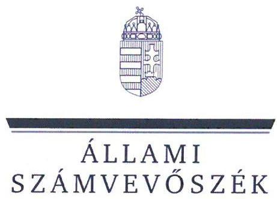

ÁLLAMI
SZÁMVEVŐSZÉK

# JELENTÉS 

## A Brexit Alkalmazkodási Tartalékból nyújtott uniós támogatások ellenőrzése

2023.

---

# ELLENŐRZÉSI IGAZGATÓSÁG: 

## ÁLLAMHÁZTARTÁS KÖZPONTI SZINTJÉT ELLENŐRZŐ IGAZGATÓSÁG

## ELLENŐRZÉSI IGAZGATÓ:

## SINKÁNÉ DR. CSENDES ÁGNES igazgató

## ELLENŐRZÉSVEZETŐ:

Jelentéseink az interneten a www.asz.hu címen olvashatók.

HUSZÁR ANNA ellenőrzésvezető

IKTATÓSZÁM: EL-3981-001/2023
TÉMASZÁM: 14
ELLENŐRZÉS-AZONOSÍTÓ SZÁM: V1012

---

# TARTALOMJEGYZÉK 

AZ ELLENŐRZÉS ALAPADATAI ..... 5
AZ ELLENŐRZÉS HATÓKÖRE ÉS TERÜLETE ..... 7
ÖSSZEFOGLALÁS ..... 9
AZ ELLENŐRZÉS FÓKUSZKÉRDÉSEI ..... 11
MEGÁLLAPÍTÁSOK ..... 12
JAVASLATOK ..... 28
MELLÉKLETEK ..... 29
I. sz. melléklet: Értelmező szótár ..... 29
II. sz. melléklet: Az ellenőrzött szervezetek jegyzéke ..... 30
III. sz. melléklet: A BAR-ból nyújtott uniós támogatások szabályozási környezetét érintő szabályozási eszközök/elemek és ezek elkészítésének, hatálybalépésének, illetve közzétételének időpontjai ..... 31
IV. sz. melléklet: Az ÁSZ által ellenőrzött 15 projekt és ezek főbb adatai (2023.05.29.) ..... 32
V. sz. melléklet: A Brexitből származtatott közvetlen kár alátámasztottsága a 15 projekt esetében ..... 33
VI. sz. melléklet: A kedvezményezettek által megadott, a Brexitből származtatott közvetlen kár kimutatását szolgáló monitoringmutatók (millió Ft) ..... 36
VII. sz. melléklet: A támogatási kérelmek tartalmi értékelésénél feltárt hibák 13 projektnél. ..... 38
VIII. sz. melléklet: A lebonyolítást érintő határidő túllépések időtartama az ellenőrzött 15 projektnél (nap) ..... 41
FÜGGELÉK: ÉSZREVÉTELEK ..... 42
RÖVIDÍTÉSEK JEGYZÉKE ..... 52

---

.

---

# AZ ELLENŐRZÉS ALAPADATAI 

## AZ ELLENŐRZÉS CÉLJA

Az ellenőrzés célja annak értékelése volt, hogy a Külgazdasági és Külügyminisztérium, mint irányító hatóság és a HEPA Magyar Exportfejlesztési Ügynökség Nonprofit Zrt., mint közremúködő szervezet a Brexit Alkalmazkodási Tartalékból nyújtott támogatások felhasználását biztosító belső kontrollrendszert megfelelően kialakította-e és múködtette-e; ennek keretében a nyújtott támogatások megítélésének, folyósításának, felhasználásának ellenőrzése és a beszámolás jogszabályi és az egyéb előírásokkal való összhangja megvalósult-e.

Az ellenőrzés célja továbbá annak értékelése volt, hogy az irányító hatóság és a közremúködő szervezet által ellátott feladatok támogatták-e az Európai Unió Brexit miatti kiigazításokra képzett Brexit Alkalmazkodási Tartalékból nyújtott uniós támogatások cél szerinti felhasználását.

## AZ ELLENŐRZÉS TÍPUSA

Megfelelőségi ellenőrzés

## AZ ELLENŐRZŐTT IDŐSZAK

2021. január 1-től 2023. június 30-ig tartó időszak.

## AZ ELLENŐRZÉS TÁRGYA

Az ellenőrzés kiterjedt a Brexit Alkalmazkodási Tartalékból nyújtott uniós támogatások igényléséhez és a források felhasználásához kialakított pályázati rendszer megfelelőségére a pályázati feltételek, a támogatások kifizetése, a beszámolási és ellenőrzési tevékenység tekintetében, valamint az irányítási és kontrollrendszer múködtetésének szabályszerűségére a támogatási kérelmekről való döntés, a kifizetések, a beszámolás és az ellenőrzés vonatkozásában a pályázati kérelmet benyújtó, illetve a támogatásban részesített kiválasztott projekteken keresztül.

A pályázati rendszerben a $\mathrm{BAR}^{1}$ lebonyolításához szükséges szabályozási keretek és eljárási szabályok kialakításának, az együttműködési megállapodások meglétének, a gazdálkodási jogkörgyakorlók kijelölésének, illetve a szakmai program, a felhívás, a módszertani útmutatók elkészítésének ellenőrzését végezte az Állami Számvevőszék.

A támogatási kérelmekről való döntés szabályszerűségének ellenőrzéséhez 15 projekt esetében került sor a benyújtott támogatási kérelmek tekintetében a jogosultság, a pályázatok tartalmi értékelésének, a döntéselőkészítő bizottság által összeállított döntési javaslat, az összeférhetetlenségi szabályok betartásának, valamint a megkötött támogatói okiratok, illetve azok módosításainak ellenőrzésére. Az ellenőrzés kiterjedt a 15 projekt kedvezményezettjei által benyújtott támogatási előlegek ellenőrzésére, az időközi kifizetések és záró kifizetésre irányuló kérelmek ellenőrzésére, valamint a szakmai beszámolók ellenőrzésére.

---

A KKM² és a HEPA Zrt. ${ }^{3}$ - az ellenőrzött 15 projekt tekintetében végzett - értékelési, ellenőrzési, hiánypótoltatási, döntési, beszámolási tevékenységén keresztül került sor a két ellenőrzött szervezet feladatellátásának ellenőrzésére.

# AZ ELLENŐRZÉS JOGALAPJA 

Az ellenőrzés jogszabályi alapját az Állami Számvevőszékről szóló 2011. évi LXVI. törvény 1. § (3) bekezdés, 5. $\S(2)-(3)$ bekezdés előírásai képezték.

## AZ ELLENŐRZÉS MÓDSZERE

Az ellenőrzést a nemzetközi standardokat irányadónak tekintve az ellenőrzési program szempontjai, az ellenőrzött időszakban hatályos jogszabályok, az ellenőrzés szakmai szabályok és módszertanok figyelembevételével végezte az ÁSZ ${ }^{4}$.

Az ellenőrzési kérdések megválaszolásához szükséges bizonyítékok megszerzése az ellenőrzött szervezetek által rendelkezésre bocsátott dokumentumokra és adatokra alapozva, továbbá megfigyelés, szemle (szemrevételezés), kérdésfeltevés (információkérés), valamint elemző eljárás útján történt.

Az ellenőrzés lefolytatásához az ellenőrzött szervezetek az ÁSZ által kért dokumentumok, adatok, információk megküldésével szolgáltattak adatokat.

Az ellenőrzési bizonyítékként felhasználható adatforrások közé tartoztak egyrészt az ellenőrzéshez kért dokumentumok, adatforrások, a nyilvánosan hozzáférhető adatok, dokumentumok (www.palyazat.gov.hu és a https://brexit.kormany.hu/ oldalakon), hozzáférés biztosításával a monitoring és információs rendszerben rögzített adatok, dokumentumok, másrészt adatforrás volt még minden, az ellenőrzés folyamán feltárt, az ellenőrzés szempontjából releváns információt tartalmazó dokumentum.

A támogatási kérelmekről való döntés, a támogatások kifizetésének, a beszámolási és az ellenőrzési tevékenység ellátásának megfelelőségét véletlen és kockázat alapú mintavételi eljárással kiválasztott 15 projekt tekintetében ellenőrizte az ÁSZ. A tények feltárása és azok összegzése során a megállapítások az ellenőrzött projektekre vonatkozóan kerültek megfogalmazásra. Az ellenőrzési eredmények teljes sokaságra történő kivetítésére nem került sor.

A Brexitből eredő kár igazolásához, hitelt érdemlő alátámasztásához a 2020. február 1. és 2023. december 31. között a Brexit miatt felmondott szerződések/megrendelések meglétét, az erre az időszakra vonatkozó analitikus kimutatások, főkönyvi kartonok/kivonatok, számviteli bizonylatok meglétét, az azokon szereplő értékek, összegek és a támogatást igénylő által összesen kimutatott Brexit kár számszaki egyezőségét ellenőrizte az ÁSZ.

A belső kontrollrendszer KKM és HEPA Zrt. által történt kialakításának és működtetésének ellenőrzése során a kontrollkörnyezet egyes elemeinek, a kontrolltevékenységek és a nyomon követési rendszer megfelelőségét ellenőrizte az ÁSZ. Az ellenőrzés nem terjedt ki az integrált kockázatkezelési rendszer, valamint az információs és kommunikációs rendszer megfelelőségének részletes értékelésére.

---

# AZ ELLENŐRZÉS HATÓKÖRE ÉS TERÜLETE 

Az Egyesült Királyság Európai Unióból való kilépése (Brexit) az érintett vállalkozásokra negatívan hatott, ezért annak enyhítésére 2020 júliusában az $\mathrm{EU}^{3}$-ban döntés született. Az Európai Bizottság a 2021. október 6- i 2021/1755 Európai Parlament és Tanács rendelettel ${ }^{6}$ létrehozta a Brexit miatti kiigazításokra képzett tartalékot. A BAR támogatás célja, hogy az Egyesült Királyság Európai Unióból való kilépése nyomán kárt szenvedett vállalkozásoknak (érintett ágazatoknak, régióknak) ne kelljen munkaerőt elbocsátania, és kártalanítást kapjanak a kieső kereskedelmi forgalomból adódó veszteség miatt, illetve, hogy a támogatás segítse a Brexit miatti változásokhoz való alkalmazkodásukat, meg tudják valósítani a tervezett beruházásaikat, fejlesztéseiket. A támogatást illetően a Bizottság ${ }^{7}$ elvárása, hogy a BAR keretében tett intézkedéseknek fejleszteniük kell az érintett vállalatokat, nem csupán a veszteségeiket fedezni.

Az összesen 5 milliárd EUR összegű támogatásból minden tagállam részesül, a 2021-2023. években előfinanszírozásként, míg az elszámolásra 2025-ben kerül sor. A Bizottság Magyarország számára 57,2 millió EUR (23-24 milliárd Ft) pénzügyi forrást ítélt meg.

A BAR felhasználásához szükséges irányítási feladatok végrehajtására a Kormány a 2050/2021. számú határozatával a KKM-et jelölte ki 2021 februárjában. A KKM a Bizottság 2021 júliusában kiadott iránymutatása ${ }^{8}$ alapján dolgozta ki a BAR irányítási és kontrollrendszerét: az eljárási szabályokat és a szakmai programot.

A pályáztatási rendszer kialakításához, a pályáztatás lebonyolításához és a projektek megvalósításához a Bizottság részéről meghatározott időintervallum rendkívül szűkre szabott volt, amelyet nehezített a BAR egyedisége is. A Bizottság tagállamoknak kiadott iránymutatása alapján a KKM - a kohéziós politikai operatív programok mintájára - felépítette a pályázati rendszert és kialakította a pályáztatás, a projektmegvalósítás teljes folyamatának, dokumentálásának elektronikus rendszerét.

A Brexit Alkalmazkodási Tartalékból a magyar vállalkozások részére nyújtott támogatások igénylésének és a források felhasználásának részletes szabályairól szóló rendelet tervezetét a KKM 2021. december 3-án terjesztette a Kormány elé jóváhagyás céljából. A BAR rendelet ${ }^{9}$ 2021. december 21-én lépett hatályba. (A BARból nyújtott uniós támogatások szabályozási környezetét érintő szabályozási eszközöket és elemeket, valamint azok elkészítésének, hatálybalépésének, illetve közzétételének időpontjait a III. sz. melléklet mutatja be.)

A KKM által kialakított szakmai program alapján a BAR keretéből adható vissza nem térítendő támogatásra mikro- kis- és középvállalkozások, valamint nagyvállalatok pályázhattak 3 millió Ft és 2 milliárd Ft közötti összegre összesen három alkalommal: 2021. október-november, 2022. január-február hónapokban, valamint - a pénzügyi forrás maradéktalan felhasználása érdekében - 2023 áprilisában. A pályázati felhívásra jelentkezők száma a 2021-es és a 2022-es pályázati felhívások során csekély volt.

A támogatható tevékenységek között szerepelt többek között technológiai fejlesztést eredményező új eszközök beszerzése, infrastrukturális és ingatlan beruházás, szoftverfejlesztés, EU-n kívüli célországba irányuló marketing tevékenység, energiahatékonyság növelését célzó épületenergetikai fejlesztések. A 2021-es és a 2022es pályázati felhívások során a támogatott szoftverfejlesztés tevékenységnél tapasztalt kockázatok, végrehajtási problémák miatt a 2023-as pályázati felhívásban szoftverfejlesztés már nem volt támogatható tevékenység. A támogatott projektek fizikai befejezésére az első két felhívás során a projekt megkezdésétől (vagy a támogatói okirat hatályba lépésétől) számított 24 hónap, a harmadik felhívás esetében 12 hónap áll rendelkezésre, de legkésőbb 2024. május 31-ig végre kell hajtani a projekteket.

---

A támogatás odaítélésének feltétele volt a Brexitből közvetlenül származtatott - dokumentumokkal vagy hitelt érdemlően igazolt - 2020. február 1. és 2023. december 31. között felmerült és a pályázat benyújtását követően várhatóan felmerülő jövőbeni veszteség kimutatása.

A támogatást igénylő akár mindhárom pályázati felhívásra nyújthatott be támogatási kérelmet, és figyelemmel a támogatási összeg felső korlátjára, - akár több konstrukcióból is támogatásban részesülhetett. A KKM ÁSZ ellenőrzéshez teljesített adatszolgáltatása alapján a 2021-ben és 2022-ben meghirdetett pályázati felhívások során a KKM, mint irányító hatóság 64 vállalkozás, összesen 80 projektjének támogatására bocsátott ki támogatói okiratot. A BAR rendeletben közremúködő szervezetként kijelölt HEPA Zrt. mellett, 25 projekt esetében a KKM látta el a közreműködő szervezet részére előírt feladatokat is.

A BAR-ból nyújtott uniós támogatások végrehajtása során a KKM, mint irányító hatóság az uniós források kezeléséért és kontrolljáért felelős szerv, a HEPA Zrt., mint közreműködő szervezet az irányító hatóság felelőssége alatt működik, annak nevében lát el funkciókat, hajt végre feladatokat.

A KKM és a HEPA Zrt. feladatellátásának számvevőszéki ellenőrzésére a - 2021-es és 2022-es pályázati felhívások eredményeként támogatást nyert projektek közül mintavételi eljárás alkalmazásával kiválasztott 15 projekt értékelésével került sor, oly módon, hogy a projekteket 2023. június 30 -ig bezárólag ellenőrizte az ÁSZ. Az ellenőrzött projekteknek megítélt támogatás összege mindösszesen 4055,9 millió Ft volt. 6 projekt esetében a szakmai lebonyolító a KKM volt, 9 projektnél a HEPA Zrt. A projektek megvalósítása, a támogatások kifizetése a helyszíni ellenőrzés lefolytatása alatt folyamatos volt. (Az ellenőrzött 15 projektet és ezek főbb adatait a IV. sz. melléklet tartalmazza.)

A Bizottság a 2021-2022-es időszakra szóló BAR program finanszírozásához 2022-ben 12 858,2 millió Ft (31,3 millió EUR) összegben folyósított támogatást. Előfinanszírozásként 2023-ban 13,8 millió EUR támogatást kap még Magyarország, majd elszámoláskor 2025-ben 12,0 millió EUR összegű támogatás folyósítása várható. A kedvezményezetteknek 2021-ben nem, 2022-ben 8545,5 millió Ft összegben fizetett ki támogatást a KKM, amely a költségvetés XVIII. Külgazdasági és Külügyminisztérium fejezetében a 8/3 Brexit Alkalmazkodási Tartalék (BAR) központi kezelésű előirányzaton került elszámolásra. A támogatások kifizetésére támogatási előlegek, időközi kifizetések formájában került sor, illetve egy projekt kedvezményezettje benyújtotta a záró kifizetési igénylést. A kedvezményezettek jellemzően több időközi kifizetésre irányuló kérelmet is benyújtottak. A KKM által rendelkezésre bocsátott adatok alapján a támogatásokat 2023. év végéig ki kell fizetni a kedvezményezetteknek, az ez utáni folyósítások összegei a Bizottsággal már nem számolhatók el.

---

# ÖSSZEFOGLALÁS 

A BAR-ból nyújtott uniós támogatások számvevőszéki ellenőrzését a BAR sajátos jellegéből adódó, a többi uniós támogatási formától eltérő vissza nem térítendő támogatás és a pályázati eljárás egyedisége indokolta.

A BAR lebonyolításához a szabályozási keret a KKM részéről késedelmesen, csak 2023. április végén került teljes körűen kialakításra. Ezt megelőzően a BAR végrehajtásában érintett szervezeti egységek BAR-ból nyújtott uniós támogatásokkal kapcsolatos feladatainak belső szabályzatokban való meghatározása nem történt meg. A KKM a BAR lebonyolításának szabályozását tartalmazó eljárásrendet, a támogatások kifizetésére, a kedvezményezettek ellenőrzésére vonatkozó szabályokat a BAR végrehajtásának megkezdését követően késedelmesen, 2022 novemberében készítette el. A KKM, mint irányító hatóság és a HEPA Zrt., mint közreműködő szervezet közötti együttműködési megállapodás megkötésére késedelmesen, 2022 augusztusában került sor. A pályáztatási rendszer kereteinek, eljárási szabályainak késedelmes kialakítása hozzájárult a BAR végrehajtása során bekövetkezett - ÁSZ által feltárt - szabálytalanságokhoz.

A 2021-es és 2022-es pályázati felhívásokhoz a KKM az előírt dokumentumokat (eljárásrendet, módszertani útmutatót, ellenőrzési nyomvonalat, szakmai programot és mellékleteit) elkészítette, majd az első felhívástervezetet - a BAR rendelet előírásainak megfelelően - minőségbiztosítás céljából megküldte a Bizottságnak. A Bizottság válaszában egységesen a tagállamok felelősségi körébe utalta a Brexittel kapcsolatos károk alátámasztására vonatkozó szabályok kialakítását. A KKM a szakmai programot a 2021/1755 európai parlamenti és tanácsi rendeletben meghatározott célokkal, keretfeltételekkel összhangban alakította ki.

## Fö megállapítás

A KKM és a HEPA Zrt. BAR pályázatokról való döntése nem megfelelően történt. A KKM 12 projekt tekintetében szabálytalanul fogadta be a támogatási kérelmeket, mert ezen projektek esetében nem volt hitelt érdemlően igazolt a Brexit kár és ezáltal nem feleltek meg a pályázati kiírás feltételeinek. A HEPA Zrt. ezen 12 projekt közül 1 projekt, valamint a további projektek közül 1 projekt esetében - a BAR rendeletben előírtak ellenére - nem tartotta be a határidő túllépésből adódó kizáró feltételt. Ezek eredményeként a KKM a 15 ellenőrzött projektből 13 projekt esetében szabálytalanul bocsátotta ki a támogatói okiratokat.

A pályázatokról való döntésekkel kapcsolatos szabálytalanságok miatt a támogatások kifizetése nem volt szabályszerű. A KKM és a HEPA Zrt. az ellenőrzött 13 projektre összesen 1209,5 millió Ft összegben szabálytalanul fizetett ki támogatásokat. Emiatt felmerül annak kockázata, hogy a Bizottság nem hagyja jóvá a támogatott projektek finanszírozását, így a kifizetett támogatások a hazai költségvetést fogják terhelni.

A pályázatokról való döntés tekintetében feltárt szabálytalanságok ellenére az ÁSZ - az ellenőrzött szervezetek jogszabályok és belső előírások szerinti tevékenységének támogatása céljából - a további ellenőrzési területeken is lefolytatta az ellenőrzést.

## További megállapítások

A támogatási kérelmekről a KKM határidőben döntött, azonban 13 kedvezményezett által benyújtott támogatási kérelem tartalmi értékelése nem felelt meg a felhívásokban rögzített összes szempontnak.

A támogatási kérelmek megfeleltetése során az ellenőrzés által feltárt hibák a - KKM által a pályázati felhívásokban rögzített - jogosultsági és tartalmi kritériumok nem egyértelmű meghatározásából, azok szubjektív megítélhetőségéből, a Brexit kár értékeléséhez adott tág keretből, illetve a támogatási kérelemhez elvárt alátámasztó dokumentumok nem kellő részletezettségéből adódtak.

---

A Brexit kár alátámasztottságának hiánya mellett a KKM a támogatói okiratokat 1 kedvezményezett esetében a már folyamatban lévő felszámolási eljárás miatt, 1 másik kedvezményezettnél a biztosíték kikötésének elmaradása miatt a jogszabályi előírások megsértésével bocsátotta ki.

A KKM és a HEPA Zrt. részéről a támogatási előlegek kifizetése 11 projektnél a jogszabályban előírt határidőt követően történt. Az időközi kifizetési kérelmek ellenőrzését a KKM 2 projektnél késedelmesen, 2 projektnél nem végezte el, a HEPA Zrt. 1 projekt esetében határidőben, 5 projektnél késedelmesen, 1 projektnél nem végezte el. Az időközi kifizetési kérelmekről a HEPA Zrt. 1 projekt tekintetében határidőben, 3 projekthez tartozó kérelmek tekintetében a jogszabályban előírt határidőt követően döntött, míg 3 projekthez tartozó kérelmek esetében nem döntött, a KKM pedig 4 projekthez tartozó kérelmek esetében nem döntött időszerűségük ellenére - azok kifizethetőségéről vagy elutasításáról az ÁSZ helyszíni ellenőrzésének lezárásáig. Az időközi kifizetési kérelmekben igényelt összegeket a HEPA Zrt. a jogszabályban előírt határidőn túl fizette ki 2 projektnél összesen 11,4 millió Ft összegben, illetve az igényelt összegek kifizetésére - azok időszerűsége ellenére - a HEPA Zrt. 2 projektjénél, a KKM 4 projektjénél nem került sor. A HEPA Zrt. 1 projekt esetében a záró kifizetési kérelemről határidőben nem döntött, kifizetése az ÁSZ ellenőrzés lezárásáig nem történt meg.

A beszámolási és az ellenőrzési tevékenység ellátása nem volt megfelelő. A BAR lebonyolítása során a KKM a hozzá tartozó 6 projekt támogatási kérelmeinek tartalmi értékelésekor nem érvényesítette a négy szem elvét. A kedvezményezettek által benyújtott szakmai beszámolók ellenőrzését a KKM 5 projektnél, a HEPA Zrt. 2 projektnél nem végezte el az ÁSZ helyszíni ellenőrzésének lezárásáig. 11 projekt tekintetében a benyújtott szakmai beszámolókról a KKM nem döntött a jogszabályban előírt 30 napon belül.

A HEPA Zrt. feladatai ellátásáról a részbeszámolókat határidőben elkészítette, és megküldte a KKM részére. A KKM nem a jogszabályi előírások és az együttmúködési megállapodásnak megfelelően látta el a HEPA Zrt. feletti ellenőrzési tevékenységét, mivel nem rendszeresen, nem folyamatba építetten ellenőrizte a HEPA Zrt. feladatellátását. A projektek végrehajtása során az ÁSZ által megállapított hiányosságok, szabálytalanságok nem kerültek feltárásra sem a HEPA Zrt. részbeszámolóiban, sem a KKM HEPA Zrt. feletti ellenőrzési tevékenysége végzése közben.

A kontrollok nem megfelelő működése is hozzájárulhatott a pályázatok nem megfelelő elbírálásához, a támogatások szabálytalan kifizetéséhez.

Az összeférhetetlenség kizárása érdekében a HEPA Zrt. a támogatási döntés meghozatalában részt vevő személyektől minden esetben összeférhetetlenségi nyilatkozat kitöltését kérte, amely rendelkezésre állt. A KKM az összeférhetetlenség kizárása érdekében - 1 eset kivételével - csak a BAR lebonyolítójának szakmai felelősét nyilatkoztatta.

A KKM a jelentéstervezet 15 napos észrevételezése keretében jelezte, hogy intézkedni kíván a feltárt szabálytalanságok megszüntetése érdekében.
„...a KKM részéről készek vagyunk olyan intézkedéseket bevezetni, amelyek az ellenörzési rendszer müködését szavatolják. Ennek érdekében olyan kontrolltevékenységek kiépitésén dolgozunk, amelyek megelözik a pályázatokról való döntéssel, a támogatások kifizetésével, valamint a szakmai beszámolókkal összefüggő feltárt szabálytalanságok ismételt elöfordulását. Intézkedünk az összes BAR projekt ellenörzéséről, mind a jogszabályi és a belső elöírásoknak való megfelelést vizsgálva, mind a támogatási kérelmekröl való döntések, a támogatások kifizetése, illetve a szakmai beszámolók kapcsán feltárt szabálytalanságok megszüntetése érdekében.

Célunk, hogy 2024 szeptemberében az Európai Bizottság felé kizárólag elszámolható, szabályosan kifizetett költségek, bizonylatok kerüljenek elszámolásra."

---

# AZ ELLENŐRZÉS FÓKUSZKÉRDÉSEI 

1. A pályázati rendszer kialakítása és a pályázatokról való döntés megfelelően történt-e?
2. A támogatások kifizetése szabályszerűen történt-e?
3. A beszámolási, ellenőrzési tevékenység ellátása szabályszerű volt-e?

---

# 1. A pályázati rendszer kialakítása és a pályázatokról való döntés megfelelően történt-e? 

Összegző megállapítás

1.1. számú megállapítás

A pályázati rendszer kialakítása késedelmesen történt meg. A BAR pályázatokról való döntés nem megfelelően történt. A KKM 13 projekt esetében - a pályázati felhívásban és a BAR rendeletben előírtak ellenére - szabálytalanul bocsátotta ki a támogatói okiratokat.

A BAR végrehajtásához a szabályozási keretek, az eljárásrendi szabályok kialakítása nem volt megfelelő a teljes ellenőrzött időszakban, mivel a KKM szervezeti és múködési szabályzata 2023 áprilisáig nem tartalmazta a BAR-ból nyújtott uniós támogatásokkal kapcsolatos feladatokat, és nem állt rendelkezésre 2022 novemberéig a BAR lebonyolításához szükséges eljárásrend.

## A szervezeti és müködési szabályzat és az ügyrendek tartalma

A KKM rendelkezett az Áht. ${ }^{10} 10 . \int$ (5) bekezdésében foglaltak alapján az ellenőrzéssel érintett időszakra vonatkozó jóváhagyott szervezeti és múködési szabályzattal, a BAR végrehajtásában érintett szervezeti egységek ${ }^{11}$ rendelkeztek ügyrenddel. Azonban a BAR végrehajtásában érintett szervezeti egységek nevesítését, valamint a BAR végrehajtásában érintett szervezeti egységekre vonatkozó, a BAR-ból nyújtott uniós támogatásokkal kapcsolatos feladatokat, és azok ellátásának módját - az Áht. 10. § (5) bekezdésében foglaltak ellenére - a KKM szervezeti és múködési szabályzata 2021 decemberétől 2023. április 28 -ig nem tartalmazta. A BAR végrehajtásában érintett szervezeti egységek ügyrendjei megsértve az Ávr. ${ }^{12}$ 13. § (5) bekezdésében előírtakat - 2023. április 28 -ig a BAR végrehajtására vonatkozóan nem tartalmazták a feladat- és hatásköröket. Az Áht. 10. § (5) bekezdésében, és az Ávr. 13. § (5) bekezdésében előírtakat a BAR végrehajtásában érintett szervezeti egységekre vonatkozóan a 2023. április 29-től hatályos KKM utasítás ${ }^{13}$ tartalmazza.

A KKM a Felhívás $1^{14}$-hez a BAR rendelet 70. § (1) bekezdésében foglaltak ellenére nem rendelkezett a döntés-előkészítő bizottság ügyrendjével. A Felhívás $2^{15}$-höz elkészítette a KKM a BAR rendelet 70. § (1) bekezdésében előírt döntés-előkészítő bizottság ügyrendjét, amely az Ávr. 13. § (5) bekezdése és a BAR rendelet 70. § (1) bekezdése szerint tartalmazza a döntés-előkészítő bizottság feladatait, felelősségi körét, összehívását, múködését és tagjait.

## A belső szabályozás kialakítása és az együttmüködési megállapodások megkötése

A KKM a BAR rendelet 4. § d) pontjában előírtak szerinti, a program lebonyolításának szabályozását tartalmazó Eljárásrendet ${ }^{16}$ a BAR végrehajtásának megkezdését követően késedelmesen, 2022 novemberében készítette el. Az Eljárásrend többek között tartalmazta a BAR lebonyolításához kapcsolódó eljárási cselekmények szabályait, a kedvezményezettek ellenőrzésére, beszámolási

---

tevékenységének ellenőrzésére vonatkozó szabályokat, valamint a BAR rendelet III. fejezetének 7. pontja szerint az intézményrendszer működésével kapcsolatos összeférhetetlenségi követelményeket. Az Eljárásrend a BAR rendelet 4. $\int$ d) pontjában foglaltak ellenére a helyszíni ellenőrzés lefolytatására vonatkozó szabályozást az ellenőrzött időszakon belül nem tartalmazott.
A Bkr. ${ }^{17}$ 6. § (3) bekezdésében előírt, a BAR lebonyolítására vonatkozó ellenőrzési nyomvonalat a KKM a projektek tekintetében az EU 2021. október 6-i (EU) 2021/1755 európai parlamenti és tanácsi rendeletének 4. pontja szerint kötelezően alkalmazandó elektronikus FAIR ${ }^{18}$ rendszerben alakította ki, a program megvalósításához szükséges módszertani útmutatókat a BAR rendelet 4. § d) pontja és a 12. § (1) bekezdésének b) pontja alapján kidolgozta.

A KKM által, a HEPA Zrt.-vel megkötött együttműködési megállapodás késedelmesen, 2022 augusztusában lépett hatályba. Az együttműködési megállapodás a BAR rendelet 14. § (2) bekezdésében foglaltaknak megfelelően részletesen meghatározta a két fél közötti feladatmegosztást, az együttműködés szabályait, a felek megállapodásból eredő jogait és kötelezettségeit, illetve meghatározta a HEPA Zrt. által ellátott feladatok végrehajtásából adódóan felmerülő költségek finanszírozási módját.
A HEPA Zrt. részéről 2022. július 27-én, a KKM részéről 2022. augusztus 10-én aláírt együttműködési megállapodás 3.4 pontja a KKM, 3.5 pontja a HEPA Zrt. feladatait (azon belül az f) pontja a kedvezményezettek által készített beszámoló ellenőrzésével kapcsolatos feladatmegosztást), a 6. pontja a HEPA Zrt. beszámolási kötelezettségét a KKM felé, azon belül a 6.7. pontja a KKM részére a HEPA Zrt. beszámolási kötelezettségének teljesítésére vonatkozó ellenőrzési feladatot tartalmazta. Az együttműködési megállapodás 8. pontjában a - BAR rendelet 12. § (2) bekezdése szerinti - HEPA Zrt. KKM által történő ellenőrzésére vonatkozó előírásokat rögzítették részletesen.
A KKM élt a BAR rendelet 13. §-ában előírt lehetőséggel és a Felhívás2 keretében meghirdetett szoftverfejlesztésre vonatkozó támogatási kérelmek értékelésébe bevonta a Kormányzati Informatikai Fejlesztési Ügynökséget, amellyel késedelmesen, 2022. május 17-én kötötte meg az együttműködési megállapodást. A kiberbiztonság és adatvédelem tevékenység esetén azonban a Nemzetbiztonsági Szakszolgálat, valamint a Nemzeti Kibervédelmi Intézet együttműködésével történő tartalmi értékeléshez a KKM a támogatási kérelmek tartalmi értékelési szempontjait írásban nem rögzítette az ellenőrzött időszakban, ezért az együttműködés pontos tartalma nem volt megállapítható.
Az $\mathrm{EUTAF}^{19}$, mint audit hatóság számára - a BAR rendelet 15. § (1) bekezdésének megfelelően együttműködési megállapodásban kerültek meghatározásra a BAR lebonyolításához kapcsolódóan elvégzendő feladatai (audit stratégia kidolgozása, felülvizsgálata, rendszerellenőrzés, mintavételes ellenőrzés, ajánlások megfogalmazása, beszámoló összeállítása és audit vélemény kiadása).

# A gazdálkodási jogkörgyakorlók kijelölése 

A KKM által kiadott 2/2021 (III. 19.) KKM utasítás 1. sz. függeléke 2021. december 23-tól a BAR tekintetében tartalmazta a kötelezettségvállalásra és teljesítésigazolásra jogosultak körét. A KKM vezetője a BAR rendelet 101. § a) pontjában foglaltaknak megfelelően 2021. december 20-tól írásban kijelölte kötelezettségvállalásra a fejezetet irányító szerv alkalmazásában álló személyt. A HEPA Zrt. vezetője a BAR rendelet 101. § b) - f) pontjában előírtak szerint 2022. február 2-től írásban kijelölte a pénzügyi ellenjegyzésre, teljesítésigazolásra, érvényesítésre, utalványozásra, szakmai ellenjegyzésre a HEPA Zrt. alkalmazásában álló személyeket. (A HEPA Zrt. vezetőjének felhatalmazása alapján történő jogkörök 2022. február 2. előtti gyakorlására nem volt szükség a BAR végrehajtási folyamata alapján.)

A HEPA Zrt. rendelkezett a támogatások kifizetésére vonatkozó, „Kötelezettségvállalás, pénzügyi ellenjegyzés, teljesítésigazolás és utalványozás rendje" szabályzattal az ellenőrzött időszakban. A

---

szabályzat azonban részben volt összhangban a BAR rendelet VII. Pénzügyi lebonyolítás fejezetének központi kezelésű előirányzat felhasználásának hatásköri szabályairól szóló 23 . pontjával, mivel az érvényesítő és a szakmai ellenjegyző személyével, feladataival kapcsolatos előírásokat a szabályzat nem tartalmazta a BAR rendelet $101 . \S \mathrm{~d}$ ) és f) pontjaihoz igazodóan.
Az Ávr. 60. § (3) bekezdésének megfelelőn a KKM rendelkezett a kötelezettségvállalásra és pénzügyi ellenjegyzésre kijelölt személyekről és aláírásmintájukról vezetett nyilvántartással, a HEPA Zrt. vezette a kijelölt gazdálkodási jogkörgyakorlókról és aláírásmintájukról a nyilvántartást.

# A szakmai program, felhívás, sablonok elkészitése, tájékoztatási kötelezettség teljesitése 

A KKM a BAR rendelet $4 . \S$ a) és b) pontjában foglaltaknak megfelelően kidolgozta a támogatási program szakmai tartalmát, és elkészítette a Felhívások ${ }^{20}$ tervezetét. A Felhívás1 és a Felhívás2 tervezetét is a BAR rendelet 44. § (1) bekezdése szerint - https://www.palyazat.gov.hu/ honlapon társadalmi egyeztetésre bocsátotta 2021. október 1-én, illetve 2022. január 12-én.
A BAR rendelet 45. § (1) bekezdésének megfelelően a KKM a Felhívás1 tervezetét - minőségbiztosítás céljából - 2021. december 8-án elektronikus úton megküldte a Bizottság részére. A Bizottság 2021. december 21-én elektronikus válaszában egységesen a tagállamok felelősségi körébe utalta a Brexittel kapcsolatos károk alátámasztására vonatkozó szabályok kialakítását.
A KKM a szakmai programot a 2021/1755 európai parlamenti és tanácsi rendeletben meghatározott célokkal, keretfeltételekkel összhangban alakította ki.
A 2021/1755 európai parlamenti és tanácsi rendelettel összhangban a Felhívásokban rögzítésre került, hogy a finanszírozás feltétele a Brexit közvetlen negatív hatásának bizonyítása. A BAR-ból kizárólag olyan intézkedések finanszírozhatók, amelyek a hátrányosan érintett ágazatok brexitből fakadó többletterheit (igazgatási, engedélyeztetési, működési stb.) kompenzálják, illetve piaci alkalmazkodását, új piacszerzéseit segítik elő. A referencia időszaknak egy hónappal szűkebben, a 2020. február 1től 2023. december 31-ig tartó időszakot határozták meg. A támogathatóság során kizárásra kerültek azon esetek, amelyek az uniós joggal ellentétesek.
A KKM a BAR rendelet 4. § b) pontjának, illetőleg a 40. §-ának megfelelően elkészítette a Felhívásokat, azok módosításait, a támogatói okirat sablonját, az ÁSZF ${ }^{21}$-et, valamint a Felhívások mellékleteként a BAR rendelet 109. § (2) bekezdése szerinti útmutatót az elszámolható költségekről.
A KKM a BAR rendelet 4. § c) pontjában foglaltaknak eleget téve rögzítette a Felhívásokat, illetve módosításaikat a FAIR-ben. A KKM eleget téve a BAR rendelet indokolásában foglaltaknak a Felhívások 7.3., majd a 2022. július 20 -tól hatályos Felhívások 7.5. pontjában meghatározta a Brexitből közvetlenül származtatott, jövőbeni várható veszteségre vonatkozó értékelési szabályokat. A Felhívások 1. számú mellékletében, az elszenvedett hátrányra vonatkozó iránymutatásban az szerepelt, hogy a „BAR alapvetöen a vállalatokra bizza az elszenvedett bátrány és a Brexit kö̃ötti kö̃vetlen kapcsolat bizonyitását, illetve az elszenvedett bátrány mértékének meghatározását". A KKM részéről, a közvetlen kapcsolatra és a kárszámítási módszertanra adott iránymutatás, egyrészt tág keretet biztosított a Felhívásokra jelentkező pályázók számára, másrészt nem adott egyértelmű kritériumot a Brexit kár tekintetében a támogatási kérelmek azonos és dokumentált módon történő elkészítéséhez és ez alapján ennek alátámasztott formában történő elfogadásához.
A KKM a Felhívások keretében alkalmazandó dokumentumoknak a nyilvánosan elérhető https://www.palyazat.gov.hu/brexitkr-enyht-beruhzs-tmogatsi-terv internetes oldalra történő feltöltésével eleget tett a BAR rendelet 4. § e) pontjában előírt tájékoztatási kötelezettségének.

---

1.2. számú megállapítás

A KKM 12 projekt tekintetében szabálytalanul fogadta be a támogatási kérelmeket, mert ezen projektek esetében nem volt hitelt érdemlően igazolt a Brexit kár és ezáltal nem feleltek meg a pályázati kiírás feltételeinek. A HEPA Zrt. ezen 12 projekt közül 1 projekt, valamint a további projektek közül 1 projekt esetében - a BAR rendeletben előírtak ellenére - nem tartotta be a határidő túllépésből adódó kizáró feltételt. Ezek eredményeként a KKM a 15 ellenőrzött projektből 13 projekt esetében szabálytalanul bocsátotta ki a támogatói okiratokat.

# A pályázati feltételeknek való megfeleltetés 

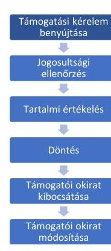

A Felhívás1-re és a Felhívás2-re az ellenőrzött 15 projekt kedvezményezettjei a benyújtásra nyitva álló határidőben, azaz 2021. október 11. és november 21. illetve 2022. január 17. és február 20. között nyújtották be a támogatási kérelmet. A támogatási kérelmek BAR rendelet 54. $\mathbb{S}$-a szerinti jogosultsági ellenőrzését a támogató ${ }^{22}$ minden esetben elvégezte a FAIR-ben, a BAR rendelet 16. § b) pontjában előírt négy szem elve alkalmazásával.
A Felhívások 8.3.1. pontjában előírt „nem biánypótoltathatő" jogosultsági kritériumokat valamennyi támogatást igénylő hiánytalanul feltöltötte a FAIR-be, így a támogatónak nem kellett kérelmet elutasítania hiánypótlási felhívás nélkül. A támogatási kérelem jogosultsági ellenőrzése során a Felhívások szerint hiánypótoltatható jogosultsági kritériumok tekintetében a támogató összesen 14 esetben hívta fel hiánypótlásra a támogatást igénylőt támogatási kérelemhez nem feltöltött, vagy azt nem kellőképpen alátámasztó dokumentumok bekérése érdekében. Hiánypótlás felhívására 1 esetben nem került sor (az 5. projektnél).
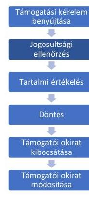

A HEPA Zrt. által a jogosultsági ellenőrzés során hiánypótlásra felszólítottak közül 2 támogatást igénylő nem a BAR rendelet 55. § (1) bekezdésében rögzített ötnapos határidőben nyújtotta be a pótlásra kért dokumentumokat, illetve nem határidőben módosította a támogatási kérelem paramétereit, értékeit. A HEPA Zrt. a BAR rendelet 55. § (1) bekezdésében rögzített, hiánypótlásra biztosított legfeljebb ötnapos határidővel szemben hosszabb, - a hétvégi napok beszámításával - hétnapos határidőt biztosított a 2 támogatást igénylő számára. Ezen szabálytalanság ellenére a HEPA Zrt. a BAR rendelet 55. § (2) bekezdésében foglaltakkal ellentétben nem utasította el a 2 támogatási kérelmet, hanem megkezdte azok tartalmi értékelését (a 8., 9. projektnél).

- A 8. projekt esetében a támogatást igénylő a HEPA Zrt. 5 napos határidejű, 2021. november 23-i hiánypótlásra felszólító levelét 2021. november 26-án vette át az elektronikus rendszerben. A felszólító levél alapján a „,határidő az értesités Pályázati e-ügyéntréséé felületen történő első meytekéntését, tebát a kézhezzéetelt követő naptól veszi kezdetét", vagyis 2021. november 27-től december 1-ig volt lehetőség határidőben történő hiánypótlásra, ugyanakkor a 8. projekt 2021. december 3-án, 2 napos késéssel nyújtotta be a dokumentumokat.
- A 9. projekt esetében a HEPA Zrt. a támogatási kérelem hiánypótlására szólította fel a támogatást igénylőt 2022. február 16-án. A hiánypótlás beérkezésének határideje a kézhezvétel (2022. február 18.) napjától számított 5 nap, azaz 2022. február 23-a volt, ugyanakkor a hiánypótlást határidőn túl, 2022. február 25-én nyújtotta be.

A KKM által hiánypótlásra felszólítottak közül 2 támogatást igénylő esetében nem megfelelően történt a hiánypótlás, mivel nem minden kért dokumentum került beküldésre, illetve nem került módosításra a támogatási kérelem hiánypótlásban jelzett paramétere, értéke, így azok a hiánypótlást követően sem feleltek meg a jogosultsági szempontoknak. A KKM a BAR rendelet 55. § (2) bekezdésében foglaltakkal

---

ellentétben nem utasította el a 2 támogatási kérelmet, hanem megkezdte azok tartalmi értékelését (10., 14. projektnél).

- A KKM a 10. projekt esetében - többek között - arra hívta fel a figyelmet, hogy a támogatási kérelem „Monitoringmutatók" pontjában számszerúsített, a Brexitből származtatott valamennyi kár tekintetében tényleges bevételkiesés nem történt, kizárólag extrapoláció, ezért kérte az értékek felülvizsgálatát, módosítását. A támogatást igénylő arra hivatkozott, hogy a Felhívás1-re benyújtott támogatási kérelmüknél nem használták fel a teljes Brexitből eredő kárt, ezért a Felhívás2 keretében igénylik a fennmaradó támogatási lehetőséget a Felhívás1-nél benyújtott Brexit kár alapján. A 10. projekt esetében a támogatást igénylő - a KKM felszólítása ellenére - a Brexitből származtatott kár tekintetében nem módosította a „Monitoringmutatók" pontban számszerúsített értékeket.
- A 14. projektnél a támogatást igénylő a KKM által megküldött hiánypótlási felszólítást nem teljes körűen teljesítette. A KKM ezen projektnél is jelezte, hogy a „Monitoringmutatók" pontban számszerúsített, a Brexitből származtatott valamennyi kár tekintetében tényleges bevételkiesés nem történt, kizárólag extrapoláció, ezért kérte az értékek felülvizsgálatát, módosítását. Felhívta a figyelmet arra is, hogy a Brexit kár alátámasztásául megküldött

A Felhívások 1.2., valamint 8.3. fejezetében előírtak alapján azon cég nem nyújthat be támogatási kérelmet: „amely cég nem rendelkezik a Brexitböl közzetlenül származtatott módon - dokumentumokkal vagy bitelt érdemlő́en igazolt - felmerült, illetve - 2023. december 31-ig - tervezett veszteséggel".

A támogató a jogosultsági ellenőrzés során lefolytatta valamennyi támogatási kérelemhez csatolt Brexit kár levezetését bemutató, feltöltött dokumentum jogosultsági szempontok szerinti ellenőrzését a BAR rendelet 54. §-ának megfelelően. A FAIR-be feltöltött dokumentumok alapján az ÁSZ ellenőrzése megállapította, hogy 12 támogatási kérelem esetében nem volt megfelelő a kimutatott Brexit kár dokumentumokkal történő, hitelt érdemlő alátámasztása. A KKM 12 támogatási kérelemről (az 1., 2., 3., 4., 5., 7., 8., 10., 11., 12., 13., 14. projektnél) a BAR rendelet 55. § (2) bekezdésében foglaltak ellenére nem hozott elutasító döntést, pedig azok nem feleltek meg a jogosultsági szempontoknak. A Brexit kár hitelt érdemlő alátámasztásának hiánya miatt a KKM a Felhívások 1.2., valamint 8.3. fejezetében előírtak alapján nem fogadhatta volna be a benyújtott támogatási kérelmeket, azokat el kellett volna utasítani. (A 15 projekt esetében a Brexitből származtatott közvetlen kár alátámasztottságát az V. sz. melléklet tartalmazza részletesen. A VI. sz. melléklet a
dátámasztó dokumentumok szükségesek, valamint a napelemre vonatkozóan 2 db - egymástól és a kedvezményezettől független ajánlattevőtől származó, azonos tárgyú, összehasonlítható indikatív árajánlatot is be kell nyújtani. A 14. projektnél a támogatást igénylő a 2 db napelem-árajánlat helyett csak 1 db árajánlatot csatolt, a Brexit kár alátámasztásául újabb dokumentumokat nem töltött fel és a Brexit kár tekintetében a „Monitoringmutatók" pontban számszerúsített értékeket sem módosította.

# 1. ábra 

15 PROJEKT ESETÉBEN A JOGOSULTSÁGI SZEMPONTOKNAK VALÓ MEGFELELÉS A BREXIT KÁR ALÁTÁMASZTOTTSÁGA ÉS A HIÁNYPÓTLÁSI HATÁRIDŐ BETARTÁSA TEKINTETÉBEN (DB)
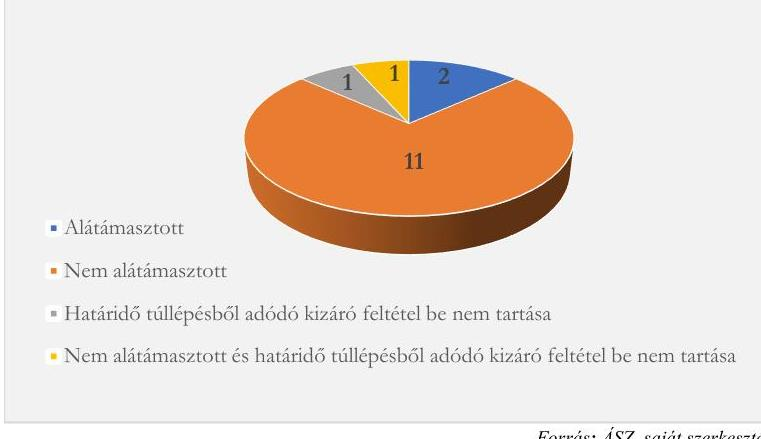

Forrás: ÁSZ, saját szerkestés

---

kedvezményezettek által megadott, a Brexitből származtatott közvetlen kár kimutatását szolgáló monitoringmutatókat mutatja be.)
A támogatási kérelmek hiánypótlását követően a KKM és a HEPA Zrt. a támogatási kérelmeket jogosultsági szempontokból annak ellenére találta megfelelőnek, hogy azok nem feleltek meg a Felhívásokban foglalt feltételeknek. A KKM és a HEPA Zrt. minden esetben megküldték a BAR rendelet 56. $\mathbb{S}$-a szerinti tájékoztatást a támogatást igénylőknek.

A kimutatott Brexit kár hitelt érdemlő alátámasztottságának hiányát mutatják a támogatást igénylők közzétett 2019-2021. évi számviteli beszámolói is. A számviteli törvényben rögzített alapelvek, szabályok alapján a támogatást igénylő vállalkozás a Brexitből adódó elszenvedett veszteségeit, várható veszteségeit, előrelátható kockázatait kimutathatta volna a támogatások összegéből következtethető veszteségek nagyságrendje alapján. A kockázatok alapján céltartalékot képezhetett volna a számviteli beszámolóban a Brexit miatt elszenvedett pl. megnövekedett szállítási, tárolási költségekre, ugyanakkor csak 4 támogatást igénylő vállalkozás képzett céltartalékot a 2018-2021. évekre, és azok között nem szerepel indokolásként a Brexit. (A 4 vállalkozás a nem realizált árfolyamveszteségre, garanciális kötelezettségekre, egyéb kiadásokra, illetve várható költségekre számolt el céltartalékot 0,6 millió Ft és 1383 millió Ft közötti értékben.) Az érintett támogatást igénylők adott időszakra vonatkozó számviteli beszámolóiban egyéb módon sem kerültek kimutatásra a Brexittel kapcsolatos veszteség értéke.

A Felhívás1 7.2. illetve a Felhívás2 7.4. pontja előírta, hogy a „támogatási kérelem benyújtásakor nyilatkoz̧oi kell az öneró rendelkezésre állásáról és legkésőbb az első kifizetési kérelem benyújtásakor (ideértve az elöleget is) igazolni kell az öneró rendelkezésre állását".

A KKM és a HEPA Zrt. a jogosultsági ellenőrzés során, a Felhívásokban előírt önerő-nyilatkozatot a hiánypótlás keretében nem teljes körűen pótoltatta, mivel a KKM a hozzá tartozó 6 projekt közül csak 1 projektnél, a HEPA Zrt. a hozzá tartozó 9 projekt közül csak 2 támogatási kérelemnél hívta fel a figyelmet a nyilatkozat hiányára.

A 15 támogatást igénylő közül csak 3 támogatást igénylő nyújtotta be az önerő rendelkezésre állásáról szóló nyilatkozatot a támogatási kérelem hiánypótlásakor. A Felhívás1 7.2. illetve a Felhívás2 7.4. pontjában előírtak ellenére a támogatási kérelem benyújtásának időpontjában az önerő rendelkezésre állásáról 12 projekt esetében a támogatást igénylő nem nyilatkozott (az 1., 2., 3., 4., 5., 6., 7., 8., 10., 11., 12., 14. projektnél).
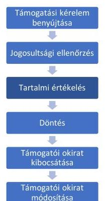

A támogató minden esetben eleget tett a BAR rendelet 57. § (1) bekezdésében előírt tartalmi értékelésnek, amely során 13 projekt esetén élt a BAR rendelet 63. § (1) bekezdésében biztosított tisztázó kérdésre történő felhívás lehetőségével. A tisztázó kérdésre felhívott támogatást igénylők mindegyike határidőben választ adott, amelyet követően az értékelők ${ }^{23}$ - a BAR rendelet 57. § (2) bekezdésében és a Felhívások 8.3.2. pontjában előírtak szerint - elvégezték a támogatási kérelmek pontozással történő tartalmi értékelését, és a BAR rendelet 66. §-ának megfelelően az értékelőlapok kitöltését. A támogatási kérelem tartami értékelési szempontjainak értékeléséhez minden esetben a támogatást igénylők által megjelölt bázis év került figyelembevételre, amely - a Felhívások 8.3.2. pontjában foglaltaknak eleget téve - megegyezett az eredményesség-méréshez alapul vett évvel.
A támogatási kérelmekkel benyújtott dokumentumok tartalma alapján a KKM 6 támogatási kérelmet, a HEPA Zrt. 7 támogatási kérelmet nem minden tartalmi értékelési szempontból a Felhívások 8.3.2. pontjának megfelelően értékelt, illetve pontozott. A tartalmi értékelések során jelentkező egyik értékelési hiba a - Felhívások 8.3.2. pont 1. b. alpontjában előértékelési szempontként előírt - költséghatékonyság igazolásához kapcsolódott. A költséghatékonyság 6 támogatási kérelem esetében nem volt igazolt, mivel a piaci árnak való megfelelőséget igazoló dokumentumokat (azonos termékre, szolgáltatásra vonatkozó összehasonlító árajánlatokat) a támogatást igénylők nem teljes körűen csatoltak a támogatási kérelemhez

---

a KKM és a HEPA Zrt. hiánypótlásra történő felhívására sem. Indikatív árajánlatok hiányában a költségvetésben szereplő tételek - Felhívások 8.3.2. pont 1. b. alpontjában előírt - költséghatékonysága és megalapozottsága nem volt igazolt, ennek ellenére a KKM a 14. projekt, a HEPA Zrt. az 1., a 2., a 3., a 4. és a 7. projektek költségvetését költséghatékonynak és megalapozottnak értékelte.
A pontozással történő értékelés során a pontozási hibák az önállóan nem támogatható tevékenységek értékelésénél, a Brexitből származtatott kár összegével képzett hányadosok értékelésénél, az állományi létszám alakulásának értékelésénél fordultak elő összesen 8 támogatási kérelemnél (az 5., 6., 10., 11., 12., 13., 14., 15. projektnél). (A támogatási kérelmek tartalmi értékelésénél feltárt hibákat a VII. sz. melléklet tartalmazza.)
Az ellenőrzött támogatási kérelmek közül 1 esetben került sor a BAR rendelet 13. §-a szerinti alvállalkozó bevonására a tartalmi értékeléshez. Tekintettel arra, hogy a 13. projekt szoftverfejlesztésre irányult, a Felhívás2 2.3 pontjának szoftverfejlesztésre vonatkozó részében előírt független informatikai szempontú vizsgálatra volt szükség, melyhez a KIFÜ ${ }^{24}$, mint alvállalkozó bevonásra került. A KIFÜ a feladatát elvégezte.
A KKM a tartalmi értékelések során a hozzá tartozó 6 projekt támogatási kérelmeinek egyikénél sem érvényesítette a BAR rendelet 16. § b) pontjában előírt négy szem elvét (az 5., 10., 11., 12., 14., 15. projektnél). A négy szem elvű ellenőrzést a tartalmi értékeléshez kapcsolódóan a HEPA Zrt. a hozzá tartozó 9 projekt támogatási kérelme tekintetében elvégezte.
A Felhívásokban rögzített jogosultsági ellenőrzés és tartalmi értékelés azonos módon történő elvégzését nehezítette bizonyos kritériumok szubjektivitása (ezek közé tartozott a költségvetés átláthatósága, valamint a Brexit kár alátámasztottsága), a kritériumok nem egyértelmű megfogalmazása, és a támogatási kérelemhez elvárt alátámasztó dokumentumok nem kellő részletezettségű meghatározása (a hitelt érdemlő alátámasztáshoz benyújtandó dokumentumok köre). A Felhívás1 esetén az átmeneti támogatást kapott támogatást igénylőknek hitelt érdemlően igazolniuk kellett, hogy a koronavírus-járvány miatt, azzal ok-okozati összefüggésben az értékesítés nettó árbevétele vagy megrendelési állományának értéke legalább $25 \%$-kal visszaesett. A Felhívás1 szerint ezen igazolás elmaradása kizáró okot jelentett a támogatásból. Azonban, hogy mely időszakra vonatkozzon az igazolás, hogy milyen mélységű, részletezettségű adatok, dokumentumok szükségesek, a Felhívás1 nem tartalmazta. A HEPA Zrt. nyilatkozat bekérésével kezelte a kritérium teljesülését és nem dokumentumok bekérésével.
Az ÁSZ által feltárt tartalmi értékelési hibák miatt az ellenőrzött 15 támogatási kérelem egyikénél sem került sor a BAR rendelet 68. § (1) bekezdés a) pontja szerinti újraértékelésre. A HEPA Zrt. által értékelt támogatási kérelmek esetében az értékelő és a felülvizsgáló által adott összpontszám megegyezett. A BAR rendelet 67. § (1) bekezdésében foglaltaknak megfelelően az értékelt támogatási kérelmek az összesített értékelőtáblázatra a kitöltött értékelőlapoknak megfelelően, sorba rendezve kerültek rögzítésre a kapott összpontszám alapján mind a Felhívás1, mind a Felhívás2 során.

---

# Döntés a támogatási kérelmekröl 

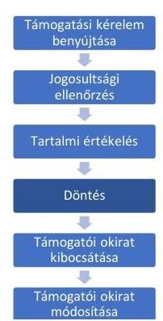

A támogatási döntés megalapozása érdekében - a BAR rendelet 69. § (1) bekezdésének megfelelően - a Felhívásokhoz kapcsolódóan döntés-előkészítő bizottság felállítására került sor. A DEB ${ }^{25}$ tagjainak száma és összetétele megfelelt a BAR rendelet 69. § (2)(3) bekezdésében foglaltaknak, a DEB határozatképes volt. Az ülésen résztvevő 5 tag titoktartási és összeférhetetlenségi nyilatkozata mindkét alkalommal rendelkezésre állt. A DEB döntési javaslatát a BAR rendelet 70. § (2) bekezdésében, és az ügyrendben meghatározottak szerint elkészítette, minden ülésről jegyzőkönyv készült.
A döntési javaslat alapján a kötelezettségvállalásra jogosult helyettes államtitkár - a BAR rendelet 71. § (1) bekezdésében és 73. §-ában előírtak szerint - határidőben döntött, 2021. december 21-én és 2022. március 23-án. A támogatási döntést, mint kötelezettségvállalást a KKM a BAR rendelet 71. § (2) és (3) bekezdése, illetőleg az Áhsz. ${ }^{26}$ 45. § (3) bekezdése értelmében nyilvántartásba vette. A kötelezettségvállalás módosítására az ellenőrzött 15 projekt tekintetében a helyszíni ellenőrzés lezárásáig egy esetben, a 12. projektnél került sor. Ennek során a megnövelt 28,1 millió Ft támogatás nagyságával a BAR rendelet 71. § (4) bekezdés b) pontjának megfelelően a FAIRben módosították a kötelezettségvállalás összegét.
Az összeférhetetlenség kizárása érdekében az eljárási cselekményekben részt vevő személyektől a HEPA Zrt. minden esetben összeférhetetlenségi nyilatkozat kitöltését kérte, amely nyilatkozat a HEPA Zrt. 9 projekt támogatási kérelmei jogosultsági ellenőrzésében és tartalmi értékelésében résztvevő valamennyi személy tekintetében rendelkezésre állt. A KKM a BAR rendelet 18. §-ában rögzített összeférhetetlenség kizárása érdekében 6 projekt támogatási kérelmei esetében a döntés előkészítési folyamatában - 1 eset kivételével - csak a szakmai felelőst nyilatkoztatta. Az ellenőrzés során nem volt megállapítható, hogy a KKM a BAR rendelet 25. §-a szerint vizsgálta volna az összeférhetetlenséget a 15 projekt tekintetében.

## A támogatói okiratok kibocsátása, módosítása

A támogatói okiratok kibocsátása nem volt szabályszerű, mivel 12 projekt nem felelt meg a pályázati kiírás azon feltételének, hogy a Brexit kárt hitelt érdemlően igazolni kell, továbbá ezen 12 projekt közül 1 és további 1 projekt esetében a HEPA Zrt. nem tartotta be a határidő túllépésből adódó kizáró feltételt.

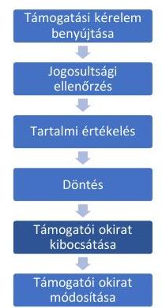

A KKM a támogatói okiratot az ellenőrzött 15 támogatást igénylővel megkötötte, az azokban foglaltak megegyeztek a támogatási kérelemben szereplő adatokkal. A támogatói okiratok megkötése előtt a BAR rendelet 78. § (1) bekezdésében felsorolt kizáró okok vizsgálatához a kedvezményezetteket a KKM és a HEPA Zrt. nyilatkoztatta. A HEPA Zrt. a BAR rendelet 78. § (1) bekezdés b) pontjában nevesített kizáró okok fennállásának ellenőrzését a 7. projekt támogatási kérelme esetében nem végezte el. Ezáltal a KKM a BAR rendelet 78. § (2) bekezdésében rögzített előírás ellenére, - a kizáró ok fennállását figyelmen kívül hagyva - 1 esetben a támogatási döntését nem azonnal vonta vissza (a 7. projektnél).

- A 7. projekt esetében a KKM 2021. december 29-én úgy bocsátotta ki a támogatói okiratot, hogy a kedvezményezett már 2021. december 17-től felszámolási eljárás alatt állt. A céginformációs nyilvántartás alapján a Tatabányai Városi Bíróság 2021. október 12. napján végrehajtást rendelt el, 2021. december 17. napjától kezdődően a vállalkozás ellen felszámolási eljárás volt folyamatban. (A KKM 2022. október 17-én visszavonta a támogatói okiratot, amely jogerőre 2023. június 8-án emelkedett. Támogatás kifizetésére nem került sor.)

---

A 15 ellenőrzött projekt közül 12 projekthez tartozó támogatói okiratban biztosíték kikötésére nem került sor, mert fennálltak, vagy teljesültek a BAR rendelet 88. § (1) bekezdésében foglalt mentesítő körülmények, illetve feltételek. Biztosíték kikötésére került sor a BAR rendelet 80. § (1) bekezdésének megfelelően a 7. és a 15. projektek esetében. A 2. projektnél a BAR rendelet 80. § (1) bekezdésében rögzített előírást figyelmen kívül hagyva a HEPA Zrt. a támogatói okiratban biztosítékot annak ellenére nem kötött ki, hogy a kedvezményezett esetében nem álltak fenn a BAR rendelet 88. § (1) bekezdés b) pontjában szabályozott mentességi feltételek.
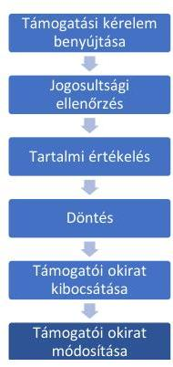

A kedvezményezett részéről a projekt műszaki, szakmai tartalmát, költségvetését vagy az egyéb, jogosultsági szempontot vagy támogathatósági feltételt érintő változás bejelentésére 10 projekt tekintetében került sor (az 1., 2., 3., 4., 6., 9., 10., 12., 13., 15. projektnél), amelyek közül 5 projektnél több módosítási igényt is benyújtottak a helyszíni ellenőrzés lezárásáig (a 2., 4., 12., 13., 15. projektnél). A 7. projekt esetében a KKM az Eljárásrend 3.1.2. pontjában előírtak ellenére a kockázatot jelentő felszámolási eljárást nem követte nyomon, amelynek a kedvezményezett részéről történő, BAR rendelet 91. § (1) bekezdése a) pontja szerinti bejelentésére sem került sor.
A KKM a 6. és a 10. projekt változás-bejelentésénél, a 2., a 13., és a 15. projekt 2. változás-bejelentésénél, valamint a 4. és a 12. projekt 3. változás-bejelentésénél a BAR rendelet 93. § (1) bekezdésében előírt 30 napos határidőn belül nem intézkedett a szükséges lépésekről. A legrövidebb késedelem 1 nap, a leghosszabb késedelem 80 nap volt, többségében 70 nap feletti volt a határidő túllépés. (A határidő túllépeseket az egyes projekteknél a VIII. sz. melléklet tartalmazza.) A változásbejelentések okán a KKM a támogatói okiratot a 2., a 3., a 6., a 12., a 13. és a 15. projekt esetében módosította a BAR rendelet 95. § (1) bekezdésében rögzítetteknek megfelelően. A 8. projekt esetében - ahol a támogatói okirat közös megegyezéssel történő visszavonását kérte a kedvezményezett -, a KKM nem a BAR rendelet 100. § (4) bekezdésében rögzített határidőn belül tájékoztatta a kedvezményezettet az elállás tudomásulvételéről és annak következményeiről.

- A 8. projekt esetében a kedvezményezett a 2021. december 29-én hatályba lépett támogatói okirat közös megegyezéssel történő visszavonását kérte 2022. január 19-én. A KKM 2022. október 17-én, 241 napos késéssel tájékoztatta a kedvezményezettet annak tudomásulvételéről és közös megegyezéssel visszavonta a támogatói okiratot, amely 2023. június 01-én emelkedett jogerőre.

# 2. A támogatások kifizetése szabályszerűen történt-e? 

Összegző megállapítás A pályázatokról való döntésekkel kapcsolatos szabálytalanságok miatt a támogatások kifizetése 13 projekt esetében nem volt szabályszerű a KKM és a HEPA Zrt. részéről. A fennmaradó 2 projektnél a támogatások kifizetése és azokról szóló döntés nem a jogszabályban előírt határidőben történt.

A pályázatokról való döntésekkel kapcsolatos szabálytalanságok miatt a támogatások kifizetése nem volt szabályszerű. A KKM és a HEPA Zrt. az ellenőrzött 13 projektre összesen 1209,5 millió Ft összegben szabálytalanul fizetett ki támogatásokat.

---

# Támogatási elóleg kifizetése 

Az ellenőrzött 15 projekt közül 3 esetében (a 2., 7., 8. projektnél) nem került sor támogatási előleg igénylésére és kifizetésére, mivel

- a 2. projekt esetében a kedvezményezett nem élt előlegigényléssel,
- a 7. projekt kapcsán megszüntetésre került a támogatási jogviszony a kedvezményezettel szembeni felszámolási eljárás miatt,
- a 8. projektnél pedig a támogatási jogviszony megszüntetését kérte a kedvezményezett.

A fennmaradó 12 projekt keretében a BAR rendelet 120. § (1) bekezdésében foglaltak szerint került sor támogatási előleg igénylésére és kifizetésére, a támogatási előleg igénylésére vonatkozó kérelem a BAR rendelet 116. $\S$ (1) bekezdésében előírtak szerint minden esetben rendelkezésre állt. A támogatási előleg mértéke, összege - a BAR rendelet 120. § (2) bekezdésével összhangban - a támogatói okiratban rögzítésre került.
A 12 projekt közül 1 projektnél (a 12. projektnél) a 2. előlegigénylési kérelemben igényelt összeg a BAR rendelet 120. § (2) bekezdésében foglaltak ellenére nem volt összhangban a módosított támogatói okirattal.

- A 12. projekt 2. előlegigénylési kérelmét, amely 5 millió Ft-tal haladta meg a módosított támogatói okirat alapján kifizethető előleg összegét, a KKM 2022. december 15-én elfogadta. Az előleg kifizetésére - a FAIR-be feltöltött adatok alapján - nem került sor az ÁSZ helyszíni ellenőrzésének lezárásáig, 2023. június 30-ig.
A kifizetett támogatási előlegek összegei megfeleltek a támogatói okiratban foglaltaknak, a támogatási előleg mértéke egyik esetben sem haladta meg a BAR rendelet 121. §-ában, illetve a Felhívások 7.1 pontjában előírt összeget. A támogató az előlegigénylésre vonatkozó kérelmet a BAR rendelet 117. § c) pontjában foglaltak szerint a biztosítéknyújtási kötelezettség teljesítése tekintetében is ellenőrizte.
A 10. projekt esetében a KKM nem a BAR rendelet 116. § (2) bekezdés a) pontjában előírt 3 napos határidőn belül szólította fel hiánypótlásra a kedvezményezettet az előlegigénylésére irányuló kérelme kapcsán.
A HEPA Zrt. az előlegigényléssel érintett 12 projekt közül 11 projekt esetében (az 1., 3., 4., 5., 6., 9., 10., 11., 12., 14., 15. projektnél) az előlegigénylésre vonatkozó kérelem beérkezésétől számított 15 napon belül nem fizette ki az előleg összegét a kedvezményezett részére a BAR rendelet 118. §-ában foglaltak ellenére. A legrövidebb késedelem 3 nap, a leghosszabb késedelem 185 nap volt, többségében 40 nap feletti volt a határidő túllépés. (A határidő túllépeseket az egyes projekteknél a VIII. sz. melléklet tartalmazza.) Az 5. projekt esetében a támogatási előleg kifizetése a kedvezményezett részére azáltal késett a 13 napon felül további 67 napot, mert a kincstári kezelésű BAR kiadási számlán nem állt rendelkezésre fedezet. A KKM nem tett eleget a BAR rendelet 5. §-ában előírt pénzügyi feladatának, mivel nem biztosított forrást a központi kezelésű előirányzat-felhasználási keretszámlán.
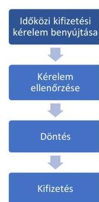

## Idöközi kifizetés teljesitése

Az időközi kifizetési kérelmek teljesítése kapcsán - mivel a 7. és 8. projekt az előleg kifizetésénél említettek miatt nem releváns - a 13 projektből 11 esetében nyújtottak be időközi kifizetési igénylésre irányuló kérelmet a kedvezményezettek. A 11 projekt közül 4 KKM-hez tartozó projekt (a 10., 11., 14., 15. projektnél) és 7 HEPA Zrt.-hez tartozó projekt volt (az 1., 2., 3., 4., 6., 9., 13. projektnél).
Ebből:

---

- 10 projekt esetében teljesültek a BAR rendelet 134. § (1) és/vagy (3) bekezdésében előírt benyújthatósági feltételek, mivel a benyújtott időközi kifizetési kérelmekben igényelt támogatás összege összhangban volt a jogszabályi előírásban és a támogatói okiratban meghatározott kifizethető összeg nagyságával.
- 1 projekt esetében (a 3. projektnél) az időközi kifizetési igényt a HEPA Zrt. a BAR rendelet 108. § (1) bekezdésében foglaltakkal összhangban elutasította, mivel a BAR rendelet 134. § (3) bekezdésében előírt benyújthatósági feltétel nem teljesült, az igényelt támogatás nem haladta meg a támogatói okiratban meghatározott legkisebb kifizethető összeget. A HEPA Zrt. döntését a BAR rendelet 140. § (1) bekezdésében előírt 45 napos határidőn belül hozta meg.
- A BAR rendelet 134. § (1) bekezdése szerint utófinanszírozás esetén kifizetési kérelem akkor nyújtható be, ha az abban igényelt támogatás meghaladja a megítélt támogatás $10 \%$-át, a 134. § (3) bekezdés szerint: amennyiben a projekt támogatása meghaladja a száz millió forintot, a kifizetési kérelemben igényelt támogatás összegének meg kell haladnia a támogatási szerződésben meghatározott legkisebb kifizethető összeget. Utóbbi feltétel a 3. projektnél nem teljesült, mivel a kedvezményezett 11,2 millió Ft összegre vonatkozó kifizetési igényt nyújtott be, de a legkisebb kifizethető összeg 20,0 millió Ft volt.

ÁSZF 8.4.5.2. „Ha a kedvezményezett a rá vonatkozó bármilyen jogszabályi, szerzödéses kötelezettségét, vagy a támogatói intézményrendszer által kiadott elöirást vagy útmutatót megszegi, a Támogató jogosult a szerzödéstől elállni, igy különösen
c) ha az Okirat hatályba lépésétől számított 12 hónapon belül
ca) a támogatott tevékenység nem kezdödik meg és a megvalósitás érdekében harmadik fettől megrásárolandó szolgáltatásokat, árukat, épitési munkákat legalább azok tervezett összértékének 25\%-át elérő mértékben - esetleges közbeszerzési kötelezettségének teljesitése mellett - a kedvezményezett nem rendeli meg vagy az erre irányuló szerzödést harmadik fellel nem köti meg,
cb) a támogatás igénybevételét a kedvezményezett nem kezdeményezi, kifizetési kérelem benyúitásával a megítélt támogatás legalább 10\%-ának felhasználását nem igazolja és késedelmét ezen idő alatt írásban nem menti ki."

2 projektnél (az 5., 12. projektnél) a kedvezményezett a támogatói okirat hatályba lépése után 12 hónapon belül nem nyújtott be időközi kifizetési igénylésre irányuló kérelmet, megsértve ezzel a ÁSZF 8.4.5.2 pont ca) és cb) pontjait (a 12 hónapos szabályt). Erre a KKM levélben felhívta a kedvezményezett figyelmét. A kedvezményezett a helyszíni ellenőrzés befejezéséig, 2023. június 30 -ig sem nyújtott be kifizetési igényre irányuló kérelmet, amely idő alatt a KKM nem élt az ÁSZF hivatkozott pontjaiban foglalt lehetőséggel és nem állt el a 2 támogatói okirattól. (A 14. projekt esetében is szükség volt a KKM figyelmeztetésére a 12 hónapos szabály betartatása érdekében, ennek eredményeként a kedvezményezett 2023. március 29-én időközi kifizetési kérelmet nyújtott be.)

- A KKM 2 projekt esetében (a 14., 15. projektnél), a HEPA Zrt. 7 projekt esetében (1., 2., 3., 4., 9., 13., illetve a 6. projekt 1. és 2. időközi kifizetési kérelménél) elvégezte a kifizetési kérelmek és az alátámasztó dokumentumok ellenőrzését a BAR rendelet 136-137. §-aiban foglaltakkal összhangban, melynek keretében a BAR rendelet 153. § (2) bekezdés i) pontja szerinti, a szokásos piaci árnak való megfelelést is ellenőrizte.
- 2 projektnél (a 10., 11. projektnél) a KKM, 1 projektnél (a 6. projekt 3. időközi kifizetési kérelménél) a HEPA Zrt. a BAR rendelet 136-137. §-aiban és a 139. §-ban foglalt előírások ellenére a 2023. március 22-én, 2023. március 29-én, illetve 2023. május 18-án

---

beérkezett időközi kifizetésre irányuló kérelmet 2023. június 30 -ig (a helyszíni ellenőrzés lezárásáig) nem ellenőrizte.
7 projekt kifizetési kérelmeinek ellenőrzését ugyanakkor a KKM 2 projekt esetében (a 14., 15. projektnél), a HEPA Zrt. 5 projekt esetében (az 1., 2., 4., 9., 13. projektnél) a BAR rendelet 139. $\mathbb{S}$-ában előírtakat figyelmen kívül hagyva a hiánypótlás küldésére nyitva álló 30 napos határidőn túl végezte el. A legrövidebb késedelem 6 nap, a leghosszabb késedelem 233 nap volt, többségében 60 nap feletti volt a késedelem. (A határidő túllépeseket az egyes projekteknél a VIII. sz. melléklet tartalmazza.)
Az időközi kifizetési kérelmet benyújtó 11 projektből

- 10 projekt esetében a költségelszámolásra írásbeli megállapodás alapján került sor, a benyújtott bizonylatokon a kedvezményezett aláírásával igazolta a teljesítés tényét vagy rendelkezésre álltak a teljesítésigazolások, illetve a bizonylatokon feltüntetésre került a projekt azonosító száma és a kedvezményezett záradékkal látta el a bizonylatot.
- A 14. projekt tekintetében nem teljesültek az ÁSZF-ben előírt követelmények, mivel a projekt keretében benyújtott első időközi kifizetési igény során a kedvezményezett nem látta el záradékkal a bizonylatokat az ÁSZF 4.4.6. pontjának a) és b) alpontjában előírtakkal ellentétben.
Idegen nyelvű bizonylat benyújtására 4 projektnél került sor, melyek közül 3 projektben (a 9., 10., 15. projektnél) a bizonylat tartalmazta a főbb megnevezések magyar nyelvű fordítását és a kedvezményezett cégszerű aláírását. A KKM a 14. projekt kapcsán benyújtott idegen nyelvű bizonylatok ellenőrzése során nem kifogásolta, hogy az ÁSZF 4.4.6. pontjának c) alpontjában foglalt előírások ellenére a kedvezményezett nem mellékelte a cégszerű aláírásával ellátott, a főbb megnevezések magyar nyelvű fordítását tartalmazó másolatot.
Devizában meghatározott ellenértéket tartalmazó bizonylatot 6 projekt esetében nyújtottak be a kedvezményezettek az időközi kifizetési kérelem keretében, melyek közül
- 4 projektnél (a 2., 3., 6., 10. projektnél) a bizonylat végösszege és az arra jutó támogatás összege a BAR rendelet 156. $\$ (2) bekezdése szerinti árfolyamon került átszámításra, megfelelve az ÁSZF 4.4.7. pontjában foglaltaknak is.
- A 9. projekt esetében a kedvezményezett részéről benyújtott, devizában meghatározott ellenértéket tartalmazó bizonylat a HEPA Zrt. részéről - a beszerzési eljárás megsértése miatt - elutasításra került.
- Azonban a 14. projektnél a BAR rendelet 156. § (2) bekezdésében és az ÁSZF 4.4.7. pontjában előírtak nem teljesültek, mivel az átszámítás során alkalmazott árfolyam nem felelt meg a szolgáltatás fizikai teljesítésének napján érvényes, $\mathrm{MNB}^{27}$ által közzétett HUF/EUR árfolyamnak. A 14. projekt esetében a bizonylaton megjelölt fizikai teljesítés időpontjában (2023. március 28.) érvényes 385,03 HUF/EUR árfolyam helyett 385,8 HUF/EUR árfolyammal számoltak. Az eltérés összege 21146 Ft. A kifizetési kérelemben igényelt összeg kifizetésére az ÁSZ helyszíni ellenőrzésének lezárásáig, 2023. június 30 -ig nem került sor.
A 11 projekt időközi kifizetési kérelmei kapcsán a KKM 4 projekt (a 10., 11., 14., 15. projektnél), a HEPA Zrt. 6 projekt (az 1., 2., 4., 6., 9., 13. projekt) esetében a BAR rendelet 140. § (1) bekezdésében foglaltakat nem tartotta be, mivel nem döntött határidőben (a kérelmek beérkezésétől számított 45 napon belül) az időközi kifizetési kérelmekről. Ezek közül, a KKM-hez tartozó 4 projektnél (a 10., 11. projektnél, illetve a 14. és 15. projekteknél az 1. számú kérelemnél) és a HEPA Zrt.-hez tartozó 3 projektnél (a 4., 9., 13. projektnél) az időközi kifizetési kérelemről való döntés 2023. június 30 -ig, a helyszíni ellenőrzés lezárásáig nem történt meg. Ezen projektek tekintetében a legrövidebb késedelem 32 nap, a leghosszabb késedelem 246 nap volt, többségében 40 nap felettiek. (A határidő túllépeseket az egyes projekteknél a VIII. sz. melléklet tartalmazza.)

---

A KKM-hez tartozó 2 projekt (a 14., 15. projekt) keretében benyújtott 2. számú kifizetési kérelem és a HEPA Zrt.-hez tartozó 6. projekt részéről benyújtott 3. számú kérelem esetében nem volt időszerű a döntés a kifizetési kérelemről 2023. június 30 -ig, mivel a határidő még nem járt le.
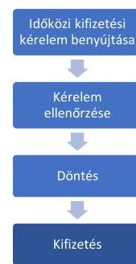

A BAR rendelet 134. § (1) és (3) bekezdésében előírt benyújthatósági feltételnek megfelelő időközi kifizetési kérelmet benyújtó 10 projekt kapcsán:

- A KKM 4 projektje (a 10., 11., 14., 15. projekt) és a HEPA Zrt. 2 projektje (a 2., 9. projekt) esetében a kifizetési kérelmekben igényelt összegek kifizetése a BAR rendelet 160. § a) pontjában foglaltak ellenére 2023. június 30 -ig nem történt meg.
- 1 projektnél elutasító döntés miatt nem történt kifizetés. (A 4. projektnél a HEPA Zrt. a BAR rendelet 108. § (1) bekezdésében rögzített előírással összhangban elutasította a kifizetési kérelmet, mivel a kifizetési igényléssel kapcsolatban megküldött hiánypótlásban, valamint a tisztázó kérdésben foglaltak ellenére nem került benyújtásra a kért módosítási igény.)
- A 13. projektnél a pénzügyi felfüggesztés okán nem került sor kifizetésre.
- A HEPA Zrt. 2 projektje kapcsán (1. projekt, 6. projektnél az 1. időközi kifizetési kérelem tekintetében) a kifizetési kérelmekben igényelt összegeket a BAR rendelet 160. § a) pontjában foglaltak ellenére - a jogszabály által hiánypótlásra rendelkezésre álló időszakot is figyelembe véve - nem határidőben, azaz a beérkezéstől számított 45 napon túl fizette ki a kedvezményezettek részére (a 6. projektnél a 2. időközi kifizetési kérelemben igényelt összeg kifizetésének kivételével). A legrövidebb késedelem 17 nap, a leghosszabb késedelem 180 nap volt, többségében 30 nap körüli volt a késedelem. (A határidő túllépeseket az egyes projekteknél a VIII. sz. melléklet tartalmazza.) A HEPA Zrt. a kedvezményezett fizetési számlájára történő utalással teljesítette a kifizetést és a kiutalt összeg összhangban volt a kifizetési kérelemben jóváhagyott támogatással a BAR rendelet 154. § a) pontjában foglaltak szerint.
Az 1., 2., 3., 4. és 6. projektek esetében a HEPA Zrt. az időközi kifizetési kérelemről szóló döntésről, illetve az elutasítás indokáról tájékoztatta a kedvezményezetteket a BAR rendelet 140. § (4) bekezdésében foglalt előírásoknak megfelelve.
6 projektnél a BAR rendelet 135. § (1) bekezdésében és a Felhívások 7.8 pontjának e) alpontjában foglaltak szerint az elszámolással érintett költségtípust számlaösszesítőn kellett elszámolni, azonban a KKM 3 projektnél (a 10., 11., 14. projektnél), illetve a HEPA Zrt. 3 projektnél (az 1., 9., 13. projektnél) a 2023. május 22 -ig hatályban lévő BAR rendelet 135. § (3) bekezdésében foglaltak ellenére a számlaösszesítőben szereplő költségek alátámasztó dokumentumait közbenső helyszíni ellenőrzés keretében 2023. június 30 -ig nem ellenőrizte. A HEPA Zrt. a 15 napos véleményezés során arról tájékoztatta az ÁSZ-t, hogy a 13. projekt esetében 2023. szeptember 11-én folytatott le közbenső helyszíni ellenőrzést.
A KKM és a HEPA Zrt. a BAR rendelet 161. § (1) bekezdés c) pontjában, illetve 161. § (3) bekezdésében foglaltaknak megfelelően 4 projekt esetében a kifizetési határidőt, illetve a támogatás kifizetését felfüggesztette (a 2., 4., 13., 15. projektnél).
- A 2. projekt esetében a kedvezményezett 2022. december 21-én a teljes műszaki, szakmai tartalomra vonatkozó módosítási igényt nyújtott be, ezért annak elbírálásáig, a támogatói okirat módosításáig szerződés szintű pénzügyi felfüggesztéssel élt a HEPA Zrt. A pénzügyi felfüggesztést a HEPA Zrt. 2023. június 23-án, 2022. december 21.2023. április 4. közötti visszamenőleges hatállyal rögzítette a FAIR rendszerben.

---

- A 4. projektnél a kedvezményezett az időközi kifizetési kérelemhez módosítási igényt nyújtott be, mivel azonban a hiánypótlás, és a tisztázó kérdés kapcsán nem teljesítette adatszolgáltatási kötelezettségét, a HEPA Zrt. részéről szerződés szintű pénzügyi felfüggesztés történt 2023.02.10-től. Ennek tényéről 2023.05.23-án az időközi kifizetési kérelem kapcsán küldött hiánypótlás keretében tájékoztatták a kedvezményezettet. A pénzügyi felfüggesztés feloldására a helyszíni ellenőrzés lezárásig nem került sor.
- A 13. projektnél a kedvezményezett 2023. május 30-án saját teljesítéshez kapcsolódó költségeket érintő, változásbejelentési igényt nyújtott be, így bizonylat szintű felfüggesztésre került sor a HEPA Zrt. által. A pénzügyi felfüggesztés feloldására a helyszíni ellenőrzés lezárásig nem került sor.
- A 15. projekt cégbírósági jegyzékébe bejegyzett bírósági végrehajtás miatt 2023. május 3-án pénzügyi felfüggesztésre került sor a KKM által, amelyről 2023. június 2-án értesítette a kedvezményezettet. A cégbírósági jegyzék szerint a bírósági végrehajtás 2023. június 19-én törlésre került, melyre vonatkozó alátámasztó dokumentumokat a kedvezményezett 2023. június 20-án a FAIR-be feltöltötte.

A 2. projekt, a 4. projekt és a 13. projekt esetében az utólagos szerződésszintű pénzügyi felfüggesztésről a kedvezményezett értesítése a BAR rendelet 161. § (4) bekezdésében foglaltak ellenére nem, illetve - a 4. projektnél - nem haladéktalanul történt meg a HEPA Zrt. részéről.

A 2. projektnél a HEPA Zrt. nyilatkozott, hogy a felfüggesztés feloldása helyett hibásan a felfüggesztés törlése történt meg, de a BAR rendelet 162. § (2) bekezdésében foglaltakat megsértve a HEPA Zrt. nem értesítette a kedvezményezettet.
A 15. projektnél a KKM a kedvezményezettet a pénzügyi felfüggesztésről a BAR rendelet 161. § (4) bekezdésében foglaltak ellenére nem haladéktalanul értesítette. A KKM a BAR rendelet 162. § (2) bekezdésében előírtakat megsértve a felfüggesztés feloldásáról nem értesítette a kedvezményezettet 2023. június 30-ig, a helyszíni ellenőrzés lezárásig. (A határidő túllépeseket az egyes projekteknél a VIII. sz. melléklet tartalmazza.)

# Záró kifizetés benyújtása 

Záró kifizetési kérelem benyújtására kizárólag a HEPA Zrt.-hez tartozó 1. projekt esetében került sor 2023. január 20-án. A kedvezményezett a záró kifizetési kérelmet a Felhívás1 4.2. pontjában foglalt előírásnak megfelelően, a projekt fizikai befejezését (2022. november 30.) követő 60. napig benyújtotta.

- A kedvezményezett a BAR rendelet 141. § (1) bekezdésében foglaltakkal összhangban a záró kifizetési kérelmet a támogatói okiratban foglalt határidőben nyújtotta be, a záró kifizetési kérelemben a projekttel összefüggésben felmerült, korábban el nem számolt költségek elszámolása - a BAR rendelet 123. § (1) bekezdése és az ÁSZF 4.1.8. pontja szerint beleértve a támogatási előleget is - megtörtént.
A teljes támogatási összeg erejéig rendelkezésre állt a kifizetési kérelem keretében benyújtott, a költségek igazolását alátámasztó dokumentumok, amelyeket a HEPA Zrt. elfogadott. Azonban a HEPA Zrt. a záró kifizetési kérelem ellenőrző lista alapján történő ellenőrzését a BAR rendelet 137. §-a, 139. §-a és a 143. § (1) bekezdésében foglaltak ellenére 2023. június 30-ig nem végezte el. Ezáltal a HEPA Zrt. a BAR rendelet 144. § (1) bekezdésében foglaltak ellenére a záró kifizetési kérelemről annak beérkezésétől számított 60 napon belül nem döntött (késedelem 101 nap) és a BAR rendelet 144. § (2) bekezdésében foglaltak ellenére a kedvezményezett utolsó beszámolóját sem fogadta el, így a projekt pénzügyi zárására sem került sor.

---

# 3. A beszámolási, ellenőrzési tevékenység ellátása szabályszerű volt-e? 

Összegző megállapítás

A KKM nem a jogszabályi előírások szerint látta el ellenőrzési tevékenységét, mivel nem rendszeresen, és nem folyamatba építetten ellenőrizte a HEPA Zrt., mint közremúködő szervezet feladatellátását. A HEPA Zrt. határidőben teljesítette az együttmúködési megállapodásban előírt beszámolási kötelezettségét a KKM felé. A KKM és a HEPA Zrt. összesen 7 projekt szakmai beszámolóját nem ellenőrizte, 11 projekt esetében a KKM nem döntött határidőben a szakmai beszámolókról.

A HEPA Zrt., mint közremúködő szervezet az együttműködési megállapodás 6.3 pontjában foglaltak szerint az előírt határidőben elkészítette és megküldte a KKM, az irányító hatóság részére a 2021. szeptember 1-től 2021. december 31-ig, illetve a 2022. január 1-től 2022. december 31-ig tartó időszakra szóló részbeszámolókat. A KKM a részbeszámolókat az együttműködési megállapodás 6.7 pontjában foglaltak szerint ellenőrizte, melynek nyomán a pénzügyi részelszámolás kapcsán észrevételt tett. A részbeszámolók megfeleltek a jogszabályi előírásoknak és az együttműködési megállapodásban foglaltaknak, így a KKM felszólítással nem élt a HEPA Zrt. felé.
A KKM BAR lebonyolításában résztvevő szakmai felelőse a HEPA Zrt. által feltett kérdésekre adott válaszadással támogatta a HEPA Zrt. feladatellátását. A KKM tisztázó kérdésekkel, szerződésmódosításokkal kapcsolatos iránymutatásaival és támogatásával folyamatosan figyelemmel kísérte a HEPA Zrt. tevékenységét. A KKM részéről az együttműködési megállapodás 8.2 pontjában foglalt intézkedések megtételére nem volt szükség, ezáltal a HEPA Zrt.-nek intézkedési terv készítési kötelezettsége nem volt.
A KKM ÁSZ ellenőrzéshez teljesített adatszolgáltatása alapján a KKM a BAR rendelet 12. § (2) bekezdés a) és b) pontjában, valamint az együttműködési megállapodás 8.1 pont a) és b) pontjában foglaltak ellenére, rendszeresen, és folyamatba építetten nem ellenőrizte a HEPA Zrt. tevékenységét.
Az ellenőrzött 15 projekt közül a szakmai beszámoló benyújtása
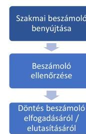

- 2 projektnél (a 7., 8. projektnél) a támogatási jogviszony megszüntetése miatt nem volt releváns.
- 9 projekt esetében (a 3., 4., 5., 10., 11., 12., 13., 14., 15. projektnél) a szakmai beszámoló benyújtása időszerű volt és azt a kedvezményezettek határidőben (a meghatározott mérföldkő elérését követő 15 napon belül) a BAR rendelet 148. § (1) bekezdésében foglaltak szerint beküldték a támogató részére.
- 3 projekt esetében (1. projektnél 1. mérföldkőhöz tartozó beszámolónál, a 2., és a 6. projektnél) a BAR rendelet 148. § (1) bekezdésében foglalt előírás ellenére a szakmai beszámolót a kedvezményezett nem határidőben nyújtotta be.
- 1 projekt esetében (a 9. projektnél) nem volt időszerű a szakmai beszámoló elkészítése, mivel a kedvezményezett a meghatározott és elfogadott mérföldkövet 2023. június 30 -ig nem érte el. Ennél a projektnél a BAR rendelet 148. § (2) bekezdése szerinti, az egyes mérföldkövek közötti egyedi, ún. addicionális beszámoló benyújtását kérte a KKM, melyet a kedvezményezett határidőben teljesített.

---

A releváns 13 projekt esetében a benyújtott szakmai beszámolók - az addicionális beszámolóval együtt tartalmazták a Felhívások 5.1 pontjában foglaltak alapján a projekt műszaki-szakmai előrehaladását.
A szakmai beszámoló készítési kötelezettséggel érintett 12 projekt esetében - az ÁSZF 4.3.4 pontjában, illetve a KKM és HEPA Zrt. közötti együttműködési megállapodás 3.5 g ) pontjában foglaltak alapján a KKM és a HEPA Zrt. ellenőrizte a beszámoló FAIR rendszerbe való feltöltését. A 6. projekt esetében a határidőn túl, 2023. június 16-án beküldött beszámoló feltöltésének ellenőrzése 2023. június 30-án még nem történt meg, az arra nyitva álló 30 napos határidő nem telt le.
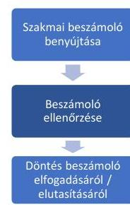

A 12 projekt közül a beszámoló (a projekt pénzügyi, műszaki-szakmai előrehaladásának, az alátámasztó dokumentumoknak, a tájékoztatással és nyilvánossággal kapcsolatos kötelezettségek teljesítésének) ellenőrzése 5 projektnél (a 2., 3., 4., 13., 14. projektnél), illetve az 1. projekt keretében az 1. szakmai beszámoló esetében megtörtént. Azonban 7 projekt esetében - annak időszerűsége ellenére - az ellenőrzést a KKM 5 projektnél (az 5., 10., 11., 12., 15. projektnél) és a HEPA Zrt. 2 projektnél (1. projektnél a 2. szakmai beszámolóra, 9. projektnél) 2023. június 30-ig nem végezte el a BAR rendelet 149. §-ában és a 153. § (1) bekezdésében foglalt előírások ellenére. A HEPA Zrt. a 15 napos véleményezés során arról tájékoztatta az ÁSZ-t, hogy a 9. projekt 1. számú, addicionális beszámoló teljes körű ellenőrzése és elfogadása 2023. augusztus 21-én megtörtént.
A 14. projekt esetében, a Felhívások 7.7.2 pontjában foglaltak ellenére az alátámasztó dokumentumok nem feleltek meg a dokumentummátrixban foglaltaknak és nem voltak összhangban a számlaösszesítővel. A KKM, mint szakmai lebonyolító a szakmai beszámoló ellenőrzése során a hiányosságokat feltárta és 2023. június 29-én kérte a hiányosságok pótlását 15 napos hiánypótlási határidővel. Az 1. projekt keretében ellenőrzött 1. szakmai beszámoló kapcsán a kedvezményezett a hiánypótlást követően sem csatolta az alátámasztó dokumentumokat, ezért a HEPA Zrt., mint szakmai lebonyolító a BAR rendelet 151. § (2) bekezdésében foglaltaknak megfelelően elutasította a szakmai beszámolót.

- A 13. projekt esetében a Felhívások 7.7.2 pontjában előírtak teljesültek, mivel az alátámasztó dokumentumok megfeleltek a dokumentummátrixban foglaltaknak és összhangban voltak a számlaösszesítővel is. A 2., 3. és 4. projektek esetében a Felhívások 7.7.2 pontjának előirása nem volt releváns, mivel nem kellett számlaösszesítőt készíteni.
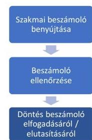

A KKM a 11 projekt tekintetében benyújtott szakmai beszámolókról a BAR rendelet 151. § (1) bekezdésében foglaltak ellenére a beérkezéstől számított 30 napon belül nem döntött. A legrövidebb késedelem 18 nap, a leghosszabb késedelem 168 nap volt, többségében 40 nap feletti volt a késedelem. (A határidő túllépeseket az egyes projekteknél a VIII. sz. melléklet tartalmazza.) A HEPA Zrt.-hez tartozó 9. projekt esetében a szakmai beszámoló ellenőrzése 2023. június 30-ig nem volt időszerű, mivel a döntésre rendelkezésre álló 30 napos határidő nem telt le.
A KKM és a HEPA Zrt. 2023. június 30-ig a beszámolókra vonatkozóan meghozott döntésekről a kedvezményezetteket tájékoztatta, mely megfelelt a BAR rendelet 151. § (3) bekezdésben szereplő előírásnak.
A 15 ellenőrzött projektből - a 7. és a 8. projektek támogatói okiratának visszavonása miatt - összesen 13 releváns projekt tekintetében a BAR rendelet 202. §-a szerinti szabálytalansági eljárás megindítására, a BAR rendelet 206. § (1) bekezdés szerinti szabálytalansági gyanú bejelentésére, a BAR rendelet 9. § a) pontja szerinti csalás elleni intézkedés alkalmazására és a BAR rendelet 251. § és 252. § szerinti biztosíték érvényesítésére 2023. június 30 -ig nem került sor, így a KKM-nek nem kellett a BAR rendelet 207. § (1) bekezdésében, illetve 216. § (2) bekezdésében meghatározottak szerint intézkednie.

---

# JAVASLATOK 

Az ÁSZ tv. 33. § (1) bekezdésében foglaltak értelmében az ellenőrzött szervezet vezetője köteles a jelentésben foglalt megállapításokhoz kapcsolódó intézkedési tervet összeállítani és azt a jelentés kézhezvételétől számított 30 napon belül az ÁSZ részére megküldeni. Amennyiben az ellenőrzött szervezet vezetője nem küldi meg határidőben az intézkedési tervet, vagy továbbra sem elfogadható intézkedési tervet küld, az Állami Számvevőszék elnöke az ÁSZ tv. 33. § (3) bekezdése a) és b) pontjaiban foglaltakat érvényesítheti.

## A KKM MINISZTERE RÉSZÉRE

1. Tegyen intézkedéseket az ellenőrzési rendszer azon elemeinek müködtetésére, valamint azon kontrolltevékenységek kiépítésére és megfelelő müködtetésére, amelyek megelőzik a pályázatokról való döntéssel, a támogatások kifizetésével, valamint a szakmai beszámolókkal összefüggő szabálytalanságok ismételt előfordulását.
2. Intézkedjen valamennyi BAR projekt kivizsgálása érdekében, figyelembe véve a jogszabályi és belső előírásokat, valamint a pályázatokról való döntéssel, a támogatások kifizetésével, illetve a szakmai beszámolókkal összefüggő számvevőszéki megállapításokat. A vizsgálat eredménye alapján tegyen intézkedéseket a kivizsgálás során feltárt szabálytalanságok megszüntetése érdekében.

## A HEPA ZRT. VEZÉRIGAZGATÓJA RÉSZÉRE

1. Tegyen intézkedéseket az ellenőrzési rendszer azon elemeinek müködtetésére, valamint azon kontrolltevékenységek kiépítésére és megfelelő müködtetésére, amelyek megelőzik a pályázatokról való döntéssel, a támogatások kifizetésével, valamint a szakmai beszámolókkal összefüggő szabálytalanságok ismételt előfordulását a HEPA Zrt. felelősségi körébe tartozó projektek tekintetében.
2. Intézkedjen a HEPA Zrt. felelősségi körébe tartozó valamennyi BAR projekt kivizsgálása érdekében, figyelembe véve a jogszabályi és belső előírásokat, valamint a pályázatokról való döntéssel, a támogatások kifizetésével, illetve a szakmai beszámolókkal összefüggő számvevőszéki megállapításokat. A vizsgálat eredménye alapján tegyen intézkedéseket a kivizsgálás során feltárt szabálytalanságok megszüntetése érdekében.

---

# MELLÉKLETEK 

## I. SZ. MELLÉKLET: ÉRTELMEZŐ SZÓTÁR

Brexit Alkalmazkodási Tartalék (BAR)
Elektronikus Pályázó Tájékoztató és Kommunikációs rendszer (EPTK)

Európai Uniós Programok Rendszere (EUPR)

Fejlesztéspolitikai Adatbázis és Információs Rendszer (FAIR)
Hitelt érdemlően igazolt

Irányító hatóság

Közreműködő szervezet

Kedvezményezett

Négy szem elve

Projekt fizikai befejezése

Támogató

Brexit Adjustment Reserve - Brexit Alkalmazkodási Tartalék
A Fejlesztéspolitikai Adatbázis és Információs Rendszer részeként az uniós és egyes hazai támogatású felhívásokhoz kapcsolódó támogatási kérelmek elkészítéséhez, benyújtásához és menedzseléséhez kapcsolódóan kialakított egységes elektronikus felületet. (EUPR/EPTK online Súgóközpont)
A Fejlesztéspolitikai Adatbázis és Információs Rendszeren belül múködő pályázatkezelő rendszer intézményi felhasználóknak készült felülete. Célja, hogy teljeskörű, elektronikusan működő támogatást nyújtson a támogatási igények ellenőrzésében és elosztásában résztvevő szervezeteknek. Uniós és hazai források kezelését egyaránt támogatja. (EUPR/EPTK online Súgóközpont)

Monitoring és információs rendszer (BAR rendelet 3. § 8. pont)
A Felhívások 12.1. pontja értelmében a támogatási kérelemhez minden esetben csatolni kellett „a Brexitböl eredő károkat - biteltérdemlő - alátámasztó dokumentumok"-at. A Felhívás2 12.1. pontja kiegészült a „pl.: szerzödések, kimutatások, emailek" tartalommal.
A tagállam által a megfelelő szinten kijelölt, az uniós források kezeléséért és kontrolljáért felelős szerv. (Forrás: (EU, Euratom) 2018/1046 európai parlamenti és tanácsi rendelet ${ }^{28} 63$. cikk (3) bekezdés)
Olyan közjogi vagy magánjogi szerv, amely az irányító hatóság felelőssége alatt múködik, vagy ilyen hatóság nevében lát el funkciókat vagy hajt végre feladatokat. (Forrás: (EU) 2021/1060 európai parlamenti és tanácsi rendelet ${ }^{29} 2$. cikk 8 . pontja)

1. Közjogi vagy magánjogi szerv, jogi személyiséggel rendelkező vagy nem rendelkező jogalany vagy természetes személy, aki vagy amely a műveletek kezdeményezéséért, vagy azok kezdeményezéséért és végrehajtásáért felelős. (Forrás: (EU) 2021/1060 európai parlamenti és tanácsi rendelet 2. cikk 9/a). pontja)
2. Támogatásban részesített támogatást igénylő (Forrás: BAR rendelet 3. §6. pont)

Az adott feladatot végző személy munkáját egy másik személy ugyanazon szempontok szerint, ismételten és teljes körűen ellenőrzi. (Forrás: BAR rendelet $3 . \int 29$. pont)
A projekt keretében támogatott tevékenységnek a felhívás és a támogatási szerződés szerinti végrehajtása. (Forrás: BAR rendelet 3. § 12. pont)
Együtt a KKM, mint irányító hatóság és a HEPA Zrt., mint közreműködő szervezet.

---

II. SZ. MELLÉKLET: AZ ELLENŐRZÖTT SZERVEZETEK JEGYZÉKE

| ADOSZÁM | ELLENŐRZÖTT SZERVEZET MEGNEVEZÉSE |
| :-- | :-- |
| $15311344-1-41$ | Külgazdasági és Külügyminisztérium |
| $26502887-2-41$ | HEPA Magyar Exportfejlesztési Ügynökség Nonprofit Zártkörúen |
|  | Müködő Részvénytársaság |

---

# III. SZ. MELLÉKLET: A BAR-BÓL NYÚJTOTT UNIÓS TÁMOGATÁSOK SZABÁLYOZÁSI KÖRNYEZETÉT ÉRINTŐ SZABÁLYOZÁSI ESZKÖZÖK/ELEMEK ÉS EZEK ELKÉSZÍTÉSÉNEK, HATÁLYBALÉPÉSÉNEK, ILLETVE KÖZZÉTÉTELÉNEK IDŐPONTJAI 

| DATUM |  | ÉSEMÉNY |
| :--: | :--: | :--: |
| 2020. | július 17-21. | Az Európai Tanács a BAR létrehozásáról döntött. |
|  | február | 2050/2021. Kormányhatározat a BAR keretében nyújtott vissza nem térítendő támogatással járó irányítási feladatok külgazdasági és külügyminiszter felelősségi körébe történő helyezéséről. |
|  | július 1. | A HEPA Zrt. kötelezettségvállalás, pénzügyi ellenjegyzés, teljesítésigazolás és utalványozás rendjéről szóló szabályzatának hatályba lépése. |
|  | július 12. | A Bizottság iránymutatást adott ki a tagállamok részére a BAR lebonyolításához szükséges irányítási és kontrollrendszer kialakításához. |
|  | október 1. | A Felhívás1 tervezete a www.palyazat.gov.hu oldalra feltöltésre került társadalmi egyeztetés céljából. |
|  | október 9. | 2021/1755 európai parlamenti és tanácsi rendelet hatályba lépése a Brexit miatti kiigazításokra képzett tartalék létrehozásáról. |
|  | október 11. | A Felhívás1 közzététele. |
| 2021. | december 2. | Kormány-előterjesztés benyújtása az Európai Unió Brexit miatti hátrányok ellensúlyozására Brexit Alkalmazkodási Tartalékból a magyar vállalkozások részére nyújtott támogatások igénylésének és a források felhasználásának részletes szabályairól tárgyában. |
|  | december 8. | A Felhívás1 tervezetének Európai Bizottság részére történő megküldése. |
|  | december 20. | A kötelezettségvállalásra és teljesítésigazolásra jogosult személyek kijelölése a KKM részéről. |
|  | december 21. | Az Európai Bizottság válaszolt (nem adtak előzetes írásbeli megerősítést arról, hogy a megküldött dokumentumok megfelelnek az uniós követelményeknek). |
|  | december 21. | 733/2021. (XII. 20.) Korm. rendelet hatályba lépése az Európai Unió Brexit miatti kiigazításokra képzett Brexit Alkalmazkodási Tartalékból a magyar vállalkozások részére nyújtott támogatások igénylésének és a források felhasználásáról. A HEPA Zrt. közreműködő szervezetként kijelölésre került. |
|  | január 12. | A Felhívás2 tervezete a www.palyazat.gov.hu oldalra feltöltésre került társadalmi egyeztetés céljából. |
|  | január 17. | A Felhívás2 közzététele. |
|  | január 20. | Kötelezettségvállalásra és teljesítésigazolásra jogosult személyek további kijelölése a KKM-nél. |
|  | február 2. | Teljesítésigazolásra, ellenjegyzésre és utalványozásra jogosult személyek kijelölése a HEPA Zrt. részéről. |
| 2022. | május 17. | A KKM és a KIFÜ közötti támogatási szerződés aláírása. |
|  | június 12. | Kötelezettségvállalásra és teljesítésigazolásra jogosult személyek további kijelölése a KKM-nél. |
|  | augusztus 10. | A KKM, mint irányító hatóság és a HEPA Zrt., mint közreműködő szervezet között létrejött együttműködési megállapodás aláírása. |
|  | október 28. | A HEPA Zrt. kötelezettségvállalás, pénzügyi ellenjegyzés, teljesítésigazolás és utalványozás rendjéről szóló módosított szabályzatának hatályba lépése. |
|  | november 16. | BAR Részletes Eljárásrend elkészítése és alkalmazása. |
|  | április 5. | A 2023-as pályázati felhívás tervezete a www.palyazat.gov.hu oldalra feltöltésre került társadalmi egyeztetésre. |
|  | április 17. | A 2023-as pályázati felhívás közzététele. |
|  | április 21. | Teljesítésigazolásra, ellenjegyzésre és utalványozásra jogosult személyek további kijelölése a HEPA Zrt. részéről. |
| 2023. | április 29. | 7/2023. (IV. 28.) KKM utasítás hatályba lépése az Európai Unió brexit miatti kiigazításokra képzett Brexit Alkalmazkodási Tartalékból a magyar vállalkozások részére nyújtott támogatások igénylésének és a források felhasználásának részletes szabályairól szóló 733/2021. (XII. 20.) Korm. rendelet szerinti irányító hatósági feladatok ellátásának minisztériumon belüli rendjének átmeneti meghatározásáról. |
|  | május 23. | 733/2021. (XII. 20.) Korm. rendelet módosításával kijelölésre került az irányító hatóság. (A külgazdasági ügyekért felelős miniszter által vezetett minisztérium - miniszter által kijelölt - feladatkörében érintett szervezeti egysége.) |

---

|  PROJEKT-AZONOSÍTÓ | KONSTRUKCIO
SZAMA | SZAKMAI
LEBONYÓLÍTÓ | A MEGITELT TÁMOGATÁS
NAGYSÁGA  |
| --- | --- | --- | --- |
|  1. projekt | BAR-2021 | HEPA | $0-100$ millió Ft közötti  |
|  2. projekt | BAR-2021 | HEPA | $300-400$ millió Ft közötti  |
|  3. projekt | BAR-2021 | HEPA | $100-200$ millió Ft közötti  |
|  4. projekt | BAR-2021 | HEPA | $300-400$ millió Ft közötti  |
|  5. projekt | BAR-2021 | KKM | $300-400$ millió Ft közötti  |
|  6. projekt | BAR-2021 | HEPA | $0-100$ millió Ft közötti  |
|  7. projekt | BAR-2021 | HEPA | $400-500$ millió Ft közötti  |
|  8. projekt* | BAR-2021 | HEPA | $0-100$ millió Ft közötti  |
|  9. projekt | BAR-2022 | HEPA | $300-400$ millió Ft közötti  |
|  10. projekt** | BAR-2022 | KKM | $0-100$ millió Ft közötti  |
|  11. projekt*** | BAR-2022 | KKM | $300-400$ millió Ft közötti  |
|  12. projekt | BAR-2022 | KKM | $200-300$ millió Ft közötti  |
|  13. projekt | BAR-2022 | HEPA | $300-400$ millió Ft közötti  |
|  14. projekt | BAR-2022 | KKM | $400-500$ millió Ft közötti  |
|  15. projekt | BAR-2022 | KKM | $500-600$ millió Ft közötti  |
|  összesen |  |  | 4055907052 Ft  |

- Kedvezményezett a Felhívás2-ben benyújtott pályázat alapján is. ** Kedvezményezett a Felhívás1-ben benyújtott pályázat alapján is. *** Kedvezményezett a Felhívás1-ben benyújtott pályázat alapján is.

---

# V. SZ. MELLÉKLET: A BREXITBŐL SZÁRMAZTATOTT KÖZVETLEN KÁR ALÁTÁMASZTOTTSÁGA A 15 PROJEKT ESETÉBEN 

1. Az 1. projekt (Szakmai lebonyolító: HEPA Zrt.)

- a Brexit kár igazolására az angliai partnere részére 2019, 2020 és 2021 években kibocsátott számlákat, valamint a 2020 I. féléves, 2020. éves és 2021. I. féléves exportárbevétel alakulását bemutató főkönyvi kivonatokat csatolta,
- a Brexit miatt megszűnő szerződések, visszamondott megrendelések dokumentumai nem álltak rendelkezésre.

2. A 2. projekt (Szakmai lebonyolító: HEPA Zrt.)

- a Brexitből származtatott kárát az elmaradt bevételei (lehetséges megrendelései) alapján határozta meg, bevételeinek Brexit miatti csökkenését számadatokkal szemléltette,
- Angliából származó bevételei már 2018-ról 2019-re jelentősen visszaesett,
- a jövőbeni bevételek alakulását alátámasztó dokumentumokat a 2020-2023 évekre prognosztizált évi $15 \%$-os bevételnövekedésről, és további alátámasztó dokumentumokat a tényleges és extrapolációs bevételkiesések Brexit miatti bekövetkezéséről nem küldött be.

3. A 3. projekt (Szakmai lebonyolító: HEPA Zrt.)

- a Brexit kár alátámasztásához 2021. júniusi-júliusi-októberi levelezést csatolt, amelyek közül egy szól a rendelés visszamondásáról,
- a Brexit kárral kapcsolatos, az angol vevők számának csökkenését alátámasztó megszüntetett export-import szerződések, további visszamondott rendelések, mennyiségek, árak nem állnak rendelkezésre.

4. A 4. projekt (Szakmai lebonyolító: HEPA Zrt.)

- Brexit kára alátámasztásához benyújtott táblázatban az import tevékenység megszűnéséhez kapcsolódóan 38 beszállító partner szerepelt, a beszállítói kapcsolatok megszűnésének igazolásaként 4 partnerrel folytatott elektronikus levelezést csatolt,
- Brexit kár számítási módszertanában az angliai export és import tevékenységének Brexit miatti változását ismertette, a változásokat számadatokkal szemléltette,
- változást eredményező dokumentumokat (pl. megszüntetett szerződések, visszamondott megrendelések, angliai partner vállalkozások export tevékenységének megszűnését igazoló dokumentumok, képernyőképek stb.) nem csatolt támogatási kérelméhez.

5. Az 5. projekt (Szakmai lebonyolító: KKM)

- Brexit kár alátámasztásához egy Brexit többlettárolás miatti többletköltség kimutatást töltött fel (nem mutatta ki elkülönítetten az Egyesült Királyságra vonatkozó, megszűnt vagy felmondott szerződések miatti többlettárolást),
- továbbá két táblázatot, amelyből az egyikben az Egyesült Királyságba történő exportértékesítés mennyiségi és értékadatai találhatók éves bontásban,
- a 2020-ban csökkenő tendenciát mutató exportértékesítéshez kapcsolódóan levelezések, megrendelés lemondások és szerződés megszüntetések nem kerültek benyújtásra, nincsenek dokumentumok, illetve főkönyvi kivonatok az Egyesült Királyságba irányuló exporttevékenységre és onnan jövő importtevékenységre vonatkozóan.

---

6. A 6. projekt (Szakmai lebonyolító: HEPA Zrt.)

- Rendelkezésre állnak az angliai fuvar statisztikák cégek szerinti bontásban (fuvar darab arányos eredmény megosztás 2020 és 2021 évekre),
- a fuvarok száma csökkent Angliába, amelyről összesítő táblázat, kimutatás áll rendelkezésre,
- rendelkezésre áll GFL exp kimutatás az export kiesés számításáról.

7. A 7. projekt (Szakmai lebonyolító: HEPA Zrt.)

- korábban megkötött keretszerződések és megrendelések tapasztalati adatai alapján kalkulálta ki a Brexit kár összegét, igazolásként 4 db 2010-2017-es szerződést és egy, a termékeit bemutató dokumentumot csatolt,
- Egyesült Királyságból származó árbevétele már a 2019. évben is jelentős csökkenést mutatott (2018. évi 628 millió Ft-ról 168 millió Ft-ra), ugyanakkor export tevékenységéből származó bevételei a többi EU-s országba 2020-ra egyaránt nullára redukálódtak,
- az exportkiesést alátámasztó dokumentumokat (pl. megszüntetett szerződések, visszamondott megrendelések) nem csatolt.

8. A 8. projekt (Szakmai lebonyolító: HEPA Zrt.)

- Brexit kárt alátámasztó dokumentumként egy 2021. szeptember 30-ai angol nyelvű e-mailt küldött, amely egy heti rendelésállomány lemondásáról szól a Brexit okozta sofőrhiány miatt, konkrét mennyiség, érték szerepeltetése nélkül,
- továbbá főkönyvi kartont a Közösségen belüli értékesítés árbevételéről 2020. február 01-től 2021. október 30-ig tartó időszakra vonatkozóan (kézzel írott dátumokkal és kézzel módosított összegekkel),
- külföldi partnerrel szerződéseket, azok felmondását igazoló dokumentumokat nem csatolt.

9. A 9. projekt (Szakmai lebonyolító: HEPA Zrt.)

- Közvetlen (tényleges) kár a 2020-as elmaradt árbevétel, amelyet a 2020.03.18-án megkötött és a brexit miatt 2020.05.15-én felbontott know-how átruházási szerződés 874 millió Ft értéke alapján számítottak ki.
- A megkötött angliai szerződés és annak felbontását igazoló dokumentum csatolásra került.

10. A 10. projekt (Szakmai lebonyolító: KKM)

- a Brexitből eredő kár alátámasztására vevő analitikát csatolt,
- a 2020. évi angliai exportbevétel csökkenését eredményező szerződések felmondásáról nem áll rendelkezésre dokumentum.

11. A 11. projekt (Szakmai lebonyolító: KKM)

- az 538,9 millió Ft-os Brexit kár alátámasztására egy angol nyelvű levelet csatolt, amely az angol kapcsolat miatti pénzügyi nehézségről szól,
- a Brexit miatt megszűnő szerződéseket, visszamondott megrendelések dokumentumait nem nyújtott be.

---

12. A 12. projekt (Szakmai lebonyolító: KKM)

- Brexit kár címén összesen a 2020-2023. években 2037 millió Ft-ot tervezett (ebből árbevétel-kiesés miatti veszteségként 1250 millió Ft-ot, a raktározási többletköltségből adódóan 787 millió Ft-ot),
- alátámasztó dokumentumnak a Navision ERP rendszerének adatai, valamint az ehhez kapcsolódó főkönyv- és mérleg adatok felhasználását jelölte meg,
- ugyanakkor a jelzett rendszerből dokumentumokat, főkönyvi kartonokat/kivonatokat nem küldött be.

13. A 13. projekt (Szakmai lebonyolító: HEPA Zrt.)

- leírása alapján a folyamatos árbevétel-növekedés fenntartása érdekében 2018-ban elkezdte felmérni az újabb exportpiacokat, majd 2019-ben az angol piacot, ahol megkezdte a kapcsolatok kiépítését,
- a potenciális megrendelők között volt egy angol cég, de végül az együttműködés visszautasításra került az angol cég által a bizonytalan jogszabályi környezet miatt,
- a Brexit károk szöveges bemutatásán túl alátámasztásul további dokumentumokat a 2018. és 2019. évi piackutatásra, együttműködés megkezdésére nem nyújtott be.

14. A 14. projekt (Szakmai lebonyolító: KKM)

- a Brexitből közvetlenül származtatott veszteség alátámasztására egy 2020. évi főkönyvi kivonatot és 3 db kimutatást nyújtott be, amelyben az Egyesült Királyságba tervezett, cikkszámokra lebontott exportértékesítés összegei 2019-től 2021-ig terjedően, mint kimutatott elveszett bevételek kerültek bemutatásra,
- a Brexitből származtatott károk tekintetében az ellátási láncok megszakadását, árfolyamingadozásokat, valamint a logisztikai költségek és az alapanyagárak megnövekedését nevesíti, de fentiek alátámasztásához dokumentumokat nem nyújtott be.

15. A 15. projekt (Szakmai lebonyolító: KKM)

- A vállalkozás 2019-től 2023-ig szóló, öt éves keretszerződést kötött robottechnikai szoftverek fejlesztésére és szállítására egy londoni székhelyű céggel 2019.01.22-én, 1913240 EUR összegben. A szerződés mellékletében évente lebontásra került a partner által fizetendő összeg, a mennyiség és az egységár. A 2019. évi teljesített fejlesztés kiszámlázásra és kifizetésre került a vállalkozásnak. Az angol cég 2020.03.09-i levelében lemondta a 2020. évre tervezett fejlesztést a Brexitre hivatkozva, majd egy 2021.03.16-i levelében - a Brexit miatt - csökkentette az eredeti rendelést a 2021-2023. évekre vonatkozóan. A 2021. évi 10 db-os mennyiség ( 50 db helyett) 94000 EUR összegben kifizetésre került számla ellenében. A 2022. és 2023. évre vonatkozó csökkentett mennyiségre vonatkozóan kiszámlázás, kifizetés már nem történt meg a feltöltött, megküldött dokumentumok szerint.

16. A vállalkozás egy másik angol céggel 2021.03.12-én 3 éves szállítási keretszerződést kötött robottechnikai szoftver szállítására. Az angol cég 2021.08.30-án a Brexit okozta gazdasági helyzetre hivatkozva csökkentette a rendelt mennyiségeket. 2021-ben a csökkentett mennyiség ( 400 db helyett 100 db ) számlázásra és kifizetésre került, míg a 2022-2023. évi mennyiségekre vonatkozóan nincsenek számlák.

---

# VI. SZ. MELLÉKLET: A KEDVEZMÉNYEZETTEK ÁLTAL MEGADOTT, A BREXITBŐL SZÁRMAZTATOTT KÖZVETLEN KÁR KIMUTATÁSÁT SZOLGÁLÓ MONITORINGMUTATÓK (MILLIÓ FT)

|   | 1. | 2. | 3. | 4. | 5. | 6. | 7. | 8. | 9. | 10. | 11. | 12. | 13. | 14. | 15. | Összesen  |
| --- | --- | --- | --- | --- | --- | --- | --- | --- | --- | --- | --- | --- | --- | --- | --- | --- |
|  Sorszám | 1. projekt | 2. projekt | 3. projekt | 4. projekt | 5. projekt | 6. projekt | 7. projekt | 8. projekt | 9. projekt | 10. projekt | 11. projekt | 12. projekt | 13. projekt | 14. projekt | 15. projekt | export  |
|  Monitoringmutatószámok | export | export | export | export | export | export | export | export | export | export | export | export | export | export | export | +import  |
|  2019. év Extrapoláció bevételkiesés |  |  |  |  |  |  |  |  |  |  |  |  |  |  |  |   |
|  2019. év Extrapoláció költségnövekmény |  |  |  |  |  |  |  |  |  |  |  |  |  |  |  | 101,1  |
|  2019. év Tényleges bevételkiesés |  |  |  |  | 101,1 |  |  |  |  |  |  |  |  |  |  |   |
|  2019. év Tényleges költségnövekmény |  |  |  |  |  |  |  |  |  |  |  |  |  |  |  |   |
|  2020. év Extrapoláció bevételkiesés |  |  |  |  |  |  |  | 61,9 |  | 80,0 |  |  | 100,0 | 30,0 | 149,5 |   |
|  2020. év Extrapoláció költségnövekmény |  |  |  |  |  |  |  |  |  |  |  |  |  |  |  | 2923,5  |
|  2020. év Tényleges bevételkiesés |  |  | 243,3 | 100,0 | 220,0 |  |  | 179,9 | 873,7 |  |  | 220,0 |  |  | 62,0 |   |
|  2020. év Tényleges költségnövekmény |  |  | 1,3 |  | 246,8 | 93,0 |  | 15,3 |  |  |  | 246,8 |  |  |  |   |
|  2021. év Extrapoláció bevételkiesés | 170,0 |  | 242,1 |  |  | 28,2 |  | 63,8 | 70,0 | 150,0 | 50,9 |  | 200,0 | 120,0 | 195,9 |   |
|  2021. év Extrapoláció költségnövekmény | 3,0 |  | 17,3 |  |  | 80,0 |  |  |  |  |  |  |  |  |  | 3430,5  |
|  2021. év Tényleges bevételkiesés | 90,0 | 333,6 |  | 162,4 | 310,0 | 88,0 |  | 189,9 |  |  |  | 310,0 |  |  |  |   |
|  2021. év Tényleges költségnövekmény | 1,5 |  |  |  | 206,9 | 140,0 |  |  |  |  |  | 206,9 |  |  |  |   |
|  2022. év Extrapoláció bevételkiesés | 175,0 |  | 277,1 | 177,8 |  | 84,6 |  | 33,8 | 77,0 | 230,0 | 235,0 |  | 250,0 | 180,0 | 233,8 |   |
|  2022. év
Extrapolációköltségnövekmény | 4,0 |  | 18,9 |  |  | 240,0 |  |  | 140,0 |  |  |  |  |  |  | 3643,0  |
|  2022. év Tényleges bevételkiesés |  |  |  |  | 340,0 | 104,8 |  |  |  |  |  | 340,0 |  |  |  |   |
|  2022. év Tényleges költségnövekmény |  |  |  |  | 180,6 | 140,0 |  |  |  |  |  | 180,6 |  |  |  |   |
|  2023. év Extrapoláció bevételkiesés | 180,0 | 516,0 | 314,3 | 212,5 |  | 881,4 | 3400,0 | 33,8 | 100,0 | 290,0 | 253,0 |  |  | 210,0 | 233,8 |   |
|  2023. év Extrapoláció költségnövekmény | 5,0 |  | 20,6 |  |  | 400,0 | 84,0 |  |  |  |  |  |  |  |  | 9841,6  |
|  2023. év Tényleges bevételkiesés |  |  |  |  | 380,0 |  | 1600,0 |  |  |  |  | 380,0 |  |  |  |   |
|  2023. év Tényleges költségnövekmény |  |  |  |  | 152,6 |  | 42,0 |  |  |  |  | 152,6 |  |  |  |   |
|  Brexitből eredő kár | 628,5 | 849,6 | 1134,9 | 652,7 | 2138,0 | 2280,1 | 5126,0 | 578,4 | 1260,7 | 750,0 | 538,9 | 2037,0 | 550,0 | 540,0 | 874,9 | 19939,7  |

---

|   | adatok millió Vt-ban  |
| --- | --- |
|  MONITORINGMUTATÓSZÁMOK A 15 PROJEKT TERÍNTETÉREN | TÉRJEZ  |
|  2019. év - 2023. év Extrapoláció bevételkiesés | 10 291,1  |
|  2019. év - 2023. év Extrapoláció költségnövekmény | 1 012,8  |
|  2019. év - 2023. év Tényleges bevételkiesés | 6 628,8  |
|  2019. év - 2023. év Tényleges költségnövekmény | 2 007,0  |
|  Brexitből eredő kár | 19 939,7  |

---

# - VII. SZ. MELLÉKLET: A TÁMOGATÁSI KÉRELMEK TARTALMI ÉRTÉKELÉSÉNÉL FELTÁRT HIBÁK 13 PROJEKTNÉL 

A Felhívás1 során a támogatási kérelemnél előírt minimális pontszám a maximális 80 ponthoz képest 35 pont, a Felhívás2 esetében a maximális 76 ponthoz képest 32 pont volt.

A tartalmi értékelések során a Felhívások 8.3.2. pont 1. b) alpontjában, az előértékelési szempontként előírt költséghatékonyság igazolásához kapcsolódóan, valamint a pontozásos értékelésnél jellemzően az önállóan nem támogatható tevékenységekhez, a Brexitből származtatott kár összegével képzett hányadosokhoz, a beruházás helyszínéhez, a 2021. évi állományi létszám alakulásához kapcsolódóan fordultak elő értékelési, pontozási hibák.
A 2021. évi állományi létszám kapcsán a KKM a tartalmi értékeléshez használt értékelő táblázathoz tartozó összefoglalóban előírta, hogy "Szükeséges nyilatkozni a 2021. évi statisztikai létszámról és arról, hogy a választott bázis évhez viszonyitva, hogyan változott a statisztikai létszám." Ugyanakkor a KKM nem nyilatkoztatta a hozzá tartozó, ellenőrzött 6 kedvezményezettet a 2021. évi létszámról, ezáltal a tartalmi értékelés 3. pontjában, az éves statisztikai létszámok alakulásához nem a 2021. évi statisztikai létszámot vette figyelembe.

1. Az 1. projekt (Szakmai lebonyolító: HEPA Zrt.)

- a pályázat keretében történő eszközbeszerzések (notebook, szerver, érintésvédelmi műszerek, digitális tároló oszcilloszkóp, békamérleg, egyéb műszaki, informatikai eszközök) tekintetében a kedvezményezett egy-egy árajánlatot csatolt támogatási kérelméhez, ezáltal a költségvetési tételek költséghatékonyságát és megalapozottságát nem igazolta.

2. A 2. projekt (Szakmai lebonyolító: HEPA Zrt.)

- a Technológiai fejlesztést eredményező eszközbeszerzésekhez, valamint a Megújuló energiaforrást alkalmazó technológiák alkalmazása keretében beszerzésre kerülő kazán beszerzéshez egy-egy árajánlatot csatolt, ezáltal a költségvetési tételek költséghatékonyságát, piaci árnak való megfelelőségét nem igazolta.

3. A 3. projekt (Szakmai lebonyolító: HEPA Zrt.)

- 2 db árajánlat került feltöltésre, az egyik árajánlat a PLC szabályozóra, a másik a notbookok beszerzésére vonatkozik, ugyanakkor további árajánlatok ezen termékekre nem került feltöltésre, ezáltal - összehasonlító árajánlatok hiányában - a költségvetési tételek költséghatékonyságát és megalapozottságát (ár-érték arány, piaci árnak való megfelelőség) nem igazolta.

4. A 4. projekt (Szakmai lebonyolító: HEPA Zrt.)

- a hűtőberendezések, napelem, tanácsadási szolgáltatás tekintetében 1-1 árajánlat került csatolásra, ezáltal a költségvetési tételek költséghatékonysága és megalapozottsága nem volt igazolt.

5. Az 5. projekt (Szakmai lebonyolító: KKM)

- a tartalmi értékelés pontozásos részének 1. pontjában az értékelő 0 pontot adott, miközben a vállalkozás rendelkezik 8 évnél több lezárt, teljes üzleti éves beszámolóval, így 4 pontot kellett volna kapnia,
- a 9. pontban a Brexitből származott kár és a bázisév értékesítés nettó árbevételének hányadosa téves adatokkal került kiszámításra, a helyes érték a számított Brexit kár összege 2037 millió Ft, a

---

bázisév értékesítés nettó árbevétele 7847,6 millió Ft, így a hányados 25,96\%, a kapott érték alapján 10 pontot kellett volna kapnia, az értékelő azonban 5 pontot adott (összességében a kedvezményezett 9 ponttal kapott kevesebbet).
6. A 6. projekt (Szakmai lebonyolító: HEPA Zrt.)

- a tartalmi értékelés 7. pontjában az értékelő 2 pontot adott, miközben 4 pont járt a kedvezményezettnek, ugyanis a beruházás helyszíne Tompa, amely a 27/2013. (II. 12.) Korm. rendelet szerint szabad vállalkozási zónának minősül.

7. A 7. projekt (Szakmai lebonyolító: HEPA Zrt.)

- a hőszivattyús rendszer, a fagyasztó, a gyártósor és az IT fejlesztés tekintetében 1-1 árajánlat került csatolásra, ezáltal - indikatív árajánlatok hiányában - a költségvetési tételek költséghatékonysága, piaci árnak való megfelelősége nem volt igazolt.

8. A 10. projekt (Szakmai lebonyolító: KKM)

- a tartalmi értékelés 2. pontjánál az értékelő az árbevétel arányos nyereséghez 10 pontot adott, miközben a helyesen számított $2,19 \%$ alapján csak 5 pont lett volna adható,
- a 7. pontban az értékelő 0 pontot adott, miközben 2 pont járt a kedvezményezettnek, ugyanis a beruházás helyszíne - Szegeden történő megvalósítással - az egyik legkevésbé fejlett régióba, a Dél-Alföldi régióba tartozik,
- a 8. pontban az értékelő 15 pontot adott, miközben a középvállalkozásnak számító kedvezményezett esetében a Brexitből származtatott kár mértékének a vetítési költséghez viszonyított értéke alapján (Brexit kár 750 millió $\mathrm{Ft} / 500$ millió $\mathrm{Ft}=150 \%$ ) 20 pontot kellett volna adni (összességében a kedvezményezett 2 ponttal kapott kevesebbet).

9. A 11. projekt (Szakmai lebonyolító: KKM)

- a tartalmi értékelés 3. pontjában, az éves statisztikai létszám alakulásához az értékelő 0 pontot adott, ugyanakkor a 2021. évi létszámról szóló nyilatkozat rendelkezésre állása esetén 4. pont járt volna, mivel a bázisévhez (2020. évhez) viszonyítva a létszám nőtt,
- a 7. pontban az értékelőlapon 0 pont szerepel, miközben 2 pont járt a kedvezményezettnek, ugyanis a beruházás helyszíne- Pécsett történő megvalósítással - az egyik legkevésbé fejlett régióban, a Dél-Dunántúli régióban található (összességében a kedvezményezett 6 ponttal kapott kevesebbet).

10. A 12. projekt (Szakmai lebonyolító: KKM)

- a tartalmi értékelés 3. pontjában, az éves statisztikai létszám alakulásához az értékelő 2 pontot adott, ami változatlan létszám esetén volt adható, ugyanakkor a 2021. évi létszámról szóló nyilatkozat rendelkezésre állása esetén 0 pont járt volna, mivel a bázisévhez (2019. évhez) képest a létszám csökkent (2019-ben 195 fő, 2020-ban 195 fő, 2021-ben 191 fő volt),
- az értékelő nem volt következetes, mivel ugyanazon kedvezményezett éves számviteli beszámolója alapján, az 5. projektnél más pontszámot, 0 pontot adott ugyanolyan létszámalakulásra ugyanazon bázisévhez viszonyítva (a kedvezményezett összpontszáma a 2 ponttal kevesebb pontszámmal is meghaladta a Felhívás2 során a támogatási kérelemnél előírt minimális pontszámot, a 32 pontot).

---

11. A 13. projekt (Szakmai lebonyolító: HEPA Zrt.)

- a tartalmi értékelés 4. pontjában az értékelő 2 pontot adott az önállóan nem támogatható tevékenységek értékelésére, ami akkor lett volna adható, ha a projekt költségvetése legalább 2 önállóan nem támogatható tevékenységet tartalmaz, a kedvezményezett ugyanakkor csak 1 db tevékenységet, a tanácsadási szolgáltatások igénybevételét építette be a projektbe, ezért 0 pontot kellett volna kapnia (a kedvezményezett összpontszáma a 2 ponttal kevesebb pontszámmal is meghaladta a Felhívás2 során a támogatási kérelemnél előírt minimális pontszámot, a 32 pontot).

12. A 14. projekt (Szakmai lebonyolító: KKM)

- a költséghatékonyság, a piaci árnak való megfelelőség nem volt igazolt, mivel a Megújuló energiaforrást basznositó technológiák alkalmazása tevékenységhez csak 1 db napelem árajánlatot nyújtott be a kedvezményezett,
- a tartalmi értékelés 3. pontjánál, a statisztikai létszám 2021. évi alakulásáról rendelkezésre álló nyilatkozat esetén 4 pont járt volna a 0 pont helyett, (a bázisévben 2020-ban 78 fő; 2021-ben 96 fő volt a statisztikai létszám), az értékelő azonban a 2019. évhez viszonyított (177 fő), amely a kedvezményezett részéről nem a választott bázisév volt,
- a 8. pontnál az értékelő nem megfelelő vállalatnagysághoz tartozó vetítési alappal számolt, így 15 pontot adott 20 pont helyett (a 2004. évi XXXIV. törvény alapján a kedvezményezett a bázisévben középvállalkozásnak minősült: létszám 78 fő, a mérlegfőösszeg 6287,8 millió Ft (17,22 millió EUR 365,13 HUF/EUR árfolyamon); nettó árbevétel 5609,5 millió Ft (15,36 millió EUR), összességében 9 ponttal kapott kevesebbet a kedvezményezett).

13. A 15. projekt (Szakmai lebonyolító: KKM)

- a tartalmi értékelés 3. pontjánál van pontozási hiba, mivel a kedvezményezett létszáma a bázisévnek választott 2020. évi 10 főről - nyilatkozata alapján - 16 főre emelkedett 2021-ben, ezáltal 4 pontot kellett volna kapnia, az értékelő azonban változatlannak értékelve a létszám alakulását, 2 pontot adott (a 2019. évi létszám is 10 fő volt).

---

# VIII. SZ. MELLÉKLET: A LEBONYOLÍTÁST ÉRINTŐ HATÁRIDŐ TÚLLÉPÉSEK IDŐTARTAMA AZ ELLENŐRZÖTT 15 PROJEKTNÉL (NAP)

|  SZAKMAI LEBONYOLÍTÓ | HEPA | HEPA | HEPA | HEPA | KKM | HEPA | HEPA | HEPA | HEPA | KKM | KKM | HEPA | KKM | KKM  |
| --- | --- | --- | --- | --- | --- | --- | --- | --- | --- | --- | --- | --- | --- | --- | --- |
|  Ellenőrzött határidők/Projekt azonosítószámok | 1. projekt | 2. projekt | 3. projekt | 4. projekt | 5. projekt | 6. projekt | 7. projekt | 8. projekt | 9. projekt | 10. projekt | 11. projekt | 12. projekt | 13. projekt | 14. projekt | 15. projekt  |
|  Az irányító hatóságot irányító helyettes államtitkár a döntés-előkészítő bizottság döntési javaslata alapján meghozott döntése. (60 nap). | igen | igen | igen | igen | igen | igen | igen | igen | igen | igen | igen | igen | igen | igen  |
|  BAR rendelet 91. §-a szerinti bejelentés kapcsán az irányító hatóság intézkedése. (30 nap + hiánypótlás időszak) | igen | 1. igen
2. 74 nap | igen | $\begin{gathered} 1 . \mathrm{x} \ 2 . \mathrm{x} \ 78 \text { nap } \end{gathered}$ | x | 4 nap | x | 241 nap | x | 70 nap | x | 1. igen
2. igen
3. 80 nap | 1. igen
2. 1 nap | x | 1. igen
2. 31 nap  |
|  Támogatási előleg kifizetése. (beérkezéstől számított 15 nap, ha nincs felfüggesztés) | 35 nap | x | 3 nap | 1. 43 nap
2. x | 75 nap | 20 nap | x | x | 80 nap | 81 nap | 44 nap | 1. 5 nap
2. 185 nap | igen | 20 nap | 1. 115 nap
2. 46 nap  |
|  Időközi/záró kifizetési igény ellenőrzése során a hiánypótlásra való felszólítás.(beérkezéstől számított 30 nap) | időkőzi 54 nap záró 130 nap | 111 nap | igen | 123 nap | x | 1. igen
2. igen
3. 11 nap | x | x | 6 nap | 70 nap | 63 nap | x | 8 nap | 1. 62 nap
2. x | 1. 233 nap
2. x  |
|  Időközi kifizetésről való döntés. (beérkezéstől számított 45 nap) | 141 nap | 144 nap | igen | 144 nap | x | 1. 32 nap
2. igen
3. x | x | x | 42 nap | 53 nap | 46 nap | x | 42 nap | 1. 46 nap
2. x | 1. 246 nap
2. x  |
|  Záró kifizetési kérelemről való döntés. (beérkezéstől számított 60 nap) | 101 nap | x | x | x | x | x | x | x | x | x | x | x | x | x | x  |
|  Időközi/záró kifizetési kérelemben lévő összeg kifizetése. (beérkezéstől számított 45 nap) | időkőzi 127 nap záró 116 nap | 86 nap | x | x | x | 1. 31 nap
2. igen
3. x | x | x | 17 nap | 39 nap | 28 nap | x | x | 1. 23 nap
2. x | 1. 180 nap
2. x  |
|  Támogatás kifizetése felfüggesztéséről és annak okáról való értesítés. (haladéktalanul) | x | 8 nap | x | 92 nap | x | x | x | x | x | x | x | x | 2 nap | x | 29 nap  |
|  Támogatás kifizetése felfüggesztésének feloldásáról való tájékoztatás. (haladéktalanul) | x | 8 nap | x | x | x | x | x | x | x | x | x | x | x | x | 12 nap  |
|  Szakmai beszámolóról való döntés. (beérkezéstől számított 30 nap) | 1. 124 nap
130 nap | 127 nap | 44 nap | 137 nap | 168 nap | x | x | x | x | 92 nap | 46 nap | 18 nap | 46 nap | 46 nap | 53 nap  |

## Jelmagyarázat

„igen" az eljárási cselekmény a BAR rendelet által előírt határidőn belül történt. pl.: 74 nap az eljárási cselekmény késedelmesen, a BAR rendelet által előírt határidőt követő 74. napon történt, vagy az ÁSZ helyszíni ellenőrzésének befejezéséig, 2023. június 30-ig már 74 nap késedelemben volt az eljárási cselekmény. „x" az eljárási cselekmény nem volt releváns az adott projektnél, vagy még nem telt le a BAR rendelet szerinti határidő az ÁSZ helyszíni ellenőrzésének befejezéséig, 2023. június 30-ig.

---

# FÜGGELÉK: ÉSZREVÉTELEK 

A jelentéstervezetet a Számvevőszék 15 napos észrevételezésre megküldte az ellenőrzött szervezet vezetőjének az ÁSZ tv. 29. §* (1) bekezdése előirásának megfelelően.

A jelentéstervezet megállapításaira a Külgazdasági és Külügyminisztérium miniszterhelyettese, és a HEPA Magyar Exportfejlesztési Ügynökség Nonprofit Zrt. vezérigazgatója észrevételt tettek. Az ÁSZ tv. 29. § (3) bekezdésével összhangban az Állami Számvevőszék a Függelékben feltünteti a megállapításokkal kapcsolatban tett, el nem fogadott észrevételeket, és megindokolja, hogy azokat miért nem fogadta el.

## A KKM el nem fogadott észrevételei:

1. Észrevétel: „A határidők betartására vonatkozóan megiegyezzük, hogy a Korm. Rendelet 73. § (4) bekezdése alapján a döntési határidőbe nem számít bele a) a hiánypótlás időtartama, b) a tisztázó kérdés megválaszolására rendelkezésre álló időtartam, valamint c) a kifogás elbírálására irányuló eljárás időtartama. A hiánypótlás, tisztázó kérdések megválaszolásának idöszakára az eljárásrendi határidők felfüggesztésre kerülnek, továbbá a Korm. Rendelet 36. § (1) pontja értelmében a napokban megállapított határidőbe nem számít bele a közlés, kézbesítés napja sem."
Az észrevétellel érintett megállapítás: a VIII. sz. mellékletben szereplő, a lebonyolítást érintő határidő túllépések időtartama (41. oldal)

El nem fogadás indoka: A BAR rendelet hivatkozott 73. § (4) bekezdésében rögzítettek - miszerint a hiánypótlás, tisztázó kérdések megválaszolásának időszakára az eljárásrendi határidők felfüggesztésre kerülnek - a támogatási kérelemről történő döntés határidejére írnak elő szabályokat. Az észrevétel hivatkozott jogszabályához kapcsolódik a BAR rendelet 73. § (1) bekezdése: „Az irányító hatóság a támogatási kérelemröl a felbivásban rögzített szakasz zárásától számított hatvan napon belül dönt." A KKM az ellenőrzött 15 projekt mindegyikénél betartotta a 60 napos határidőt, a szakasz zárásától számított 60 napon belül döntött a támogatási kérelmekről. A VIII. sz. melléklet is ennek megfelelően tartalmazza a megállapítást ( 15 db igen található az első határidőre vonatkozó sorban).
Az ellenőrzés a BAR rendelet 36. § (1) bekezdésében leírtaknak megfelelően számította a határidőket, vagyis a számítások során a napokban megállapított határidőbe nem számított bele a közlés, kézbesítés napja.

[^0]
[^0]:    * 29. § (1) Az Állami Számvevőszék az ellenőrzési megállapításait megküldi az ellenőrzött szervezet vezetőjének vagy az általa megbízott személynek, és annak, akinek személyes felelősségét állapította meg.
    (2) Az ellenőrzött szervezet vezetője és a felelősként megjelölt személy az ellenőrzés megállapításaira tizenöt napon belül írásban észrevételt tehet.
    (3) Az Állami Számvevőszék az észrevételre a beérkezésétől számított harminc napon belül írásban válaszol. A figyelembe nem vett észrevételeket köteles a jelentésben feltüntetni, és megindokolni, hogy azokat miért nem fogadta el.

---

2. Észrevétel: „A 2. és 13. projekt a HEPA kezelésében volt a változásbejelentés benyújtásakor is."

Az észrevétellel érintett megállapítás: „A KKM a 2. projekt 2. változzás-bejelentésénél (müszaki tartalom, mérföldkövek módosítása, batáridőbosszabbítások), a 12. projekt müszaki-szakmai tartalom változtatására vonatkozó 3. változás-bejelentésénél, valamint a 13. projekt létszámváltozásra vonatkozó 2. változás-bejelentésénél a B.AR rendelet 93. § (1) bekezdésében előirt 30 napos batáridőn belül nem intézkedett a szükséges lépésekről. (A batáridő túllépés 44, 53 és 1 nap volt...)" (20. oldal)

El nem fogadás indoka: A KKM észrevétel annyiban helytálló, hogy a 2. és a 13. projekt esetében valóban a HEPA Zrt. volt a szakmai lebonyolító. Ugyanakkor a BAR rendelet 93. § (1) bekezdése alapján „Az irányító batóság a változás bejelentését vagy észlelését követő barminc napon belül megteszi a szükséges intézkedést. Az irányító batóság az intézkedést a bejelentés tartalmára és a projekt eredményes végrehajtására figyelemmel választja meg.". Az előírás alapján a KKM-nek kell meghoznia a döntést a változásbejelentés ismeretében a szükséges intézkedésekről. Mindkét változásbejelentés támogatói okirat módosításával járó változásbejelentés volt. A BAR rendelet 14. § (2) bekezdése alapján „A közremüködő szervezet az e rendelet által az irányító batóság feladatkörébe utalt feladatok közül az erre vonatkozóan megkötött megállapodásban meghatározott feladatokat látja el.". A KKM és a HEPA Zrt. közötti KKM/16649/2022/Adm nyilvántartási számú Közreműködő szervezeti megállapodás 3.5 f) pontja szerint a közreműködő szervezet „az irányadó jogszabályok, a felhívás, a támogatói okirat szerint ellenőrzi a kedvezményezztttek által benyújtott dokumentumokat és indokolt esetben jóváhagyásra megküldi a Minisztérium részére". A HEPA Zrt. feladata az ellenőrzés volt, a döntés, az intézkedés a KKM felelősségébe tartozott.
3. Észrevétel: „Az 5. projektnél az előlegigény benyújtásának dátuma 2022. április 6., az előleggel kapcsolatos döntés dátuma pedig 2022. április 12. Az utalvány kiállításának dátuma 2022. április 26. A felsorolt eljárásbeli cselekmények batáridőben kerültek teljesitésre.
A további, HEPA batáskörébe tartozó feladatok és azok ellenőrzése (érvényesités, teljesités igazolás, utalványozás és utalás) 2022. július 5-én megtörtént.
A 10. projekt előlegigénye 2023.március 30-án érkezett be, a biánypótlás pedig 2023. április 12-én került kiküldésre. A KKM 2022. április 29-én a beérkezett biánypótlásra tekintettel döntést hozott, ezt követően a további eljárásrendi lépések a HEPA feladatkörébe tartoztak. Így a KKM a 2023. július 4-i kifizetéssel nem lépte túl a batáridőt.

Az észrevétellel érintett megállapítás: „A KKM 6 projekt (5., 10., 11., 12., 14., 15. projekt), a HEPA Zrt. szintén 6 projekt (1., 3., 4., 6., 9., 13. projekt) esetében a B.AR rendelet 118. §-ában foglaltak ellenére nz előlegigény lésre vonatkozó kérelem beérkezésétől számított 15 napon belül nem fizette ki az előleg összegét a kedvezményezett részére. (21. oldal)

El nem fogadás indoka: Az 5. projekt esetében a KKM részéről jelzett dátumok, hogy az előlegigénylés benyújtásának dátuma 2022. április 06., az előleggel kapcsolatos döntés dátuma 2022. április 12., az utalvány kiállításának dátuma 2022. április 26. mind helytálló. Ugyanakkor a KKM 2022. április 29-i értéknappal készült 8/2022 számú banki kivonata alapján megállapítható, hogy a Kincstár fedezethiány miatt (nem állt rendelkezésre szabad keret) nem tudta teljesíteni a megbízást 2022. április 28-án, ezért kellett megismételni 2022. július 05-én ugyanazon támogatási előleg tekintetében az érvényesítést, a teljesítésigazolást, az utalványozást és az utalást.
A BAR rendelet 118. §-a alapján „az irányító batóság az előleget az előleg igénylésére irányuló kérelem beérkezésétől számított tizenöt napon belül kifizeti, ha a kérelem ellenőrzése során nem merült fel olyan ok, amely miatt a kifizetést

---

fel kellene függeszteni". A BAR rendelet 5. §-a értelmében „Az irányító batóság pénzügyi feladatai keretében a) forrást biztosit a programok központi kezelésũ elöirányzat-felhasználási keretszámláin.".
A KKM és a HEPA Zrt. közötti KKM/16649/2022/Adm nyilvántartási számú Közreműködő szervezeti megállapodás 3.2. pontja szerint: „A Minisztérium vállalja, hogy a Projektek megvalósitásának és lebonyolításának támogatására, a támogatói okiratok finanszirozása céljából keretösszeget biztosit." 3.5 c) pontja szerint a közreműködő szervezet „gondoskodik a pályázati keretösszeg szerzödésszerü átutalásáról". A KKM nem biztosította az 5. projekt esetében a fedezet rendelkezésre állását az előleg utalásához a HEPA Zrt. számára.

A 10. projekt esetében a KKM által leírtak helytállóak. Ugyanakkor a BAR rendelet 116. § (2) bekezdése alapján „az előleg igénylésére irányuló kérelem vonatkozásában a) a biánypótlási felbivást az előleg igénylésére irányuló kérelem beérkezésétól számított három napon belül, legfeljebb ötnapos batáridő kitüzésével kell megküldeni a kedvezményezett részére". A 2022. március 30-án beérkezett előlegigénylési kérelmet a KKM-nek 3 napon belül kellett volna elbírálnia, a hiánypótlásra felszólítást kiküldenie.
4. Észrevétel: „A támogatást igénylő a támogatási kérelem benyújtásakor a kérelmet hitelesitő nyilatkozatban egyebek között a következökröl is nyilatkozott:
„2. a felbivást és mellékleteit, a vonatkozó jogszabályokat megismerte, tudomásul vette, az abban foglalt feltételeket, kikötéseket és korlátozásokat magára nézve kötelezönek ismeri el; kijelenti, hogy az abban foglalt feltételeknek és kikötéseknek megfelel, és biztositja, hogy a támogatási jogviszony fennállásának teljes idötartama alatt meg fog felelni..." Megítélésünk szerint ez a nyilatkozat kiterjed az önerő rendelkezésre állására is, mivel arról, hogy a támogatási kérelem benyújtásakor nyilatkozni kell az önerő rendelkezésre állásáról, a pályázati felbivás rendelkezzék."
Az észrevétellel érintett megállapítás: „A 15 támogatást igénylő közül csak 3 támogatást igénylő nyújtotta be az önerő rendelkezésre állásáról szóló nyilatkozatot a támogatási kérelem biánypótlásakor." (17. oldal)
El nem fogadás indoka: Egyrészt a Felhívás 7.2. (illetve 7.4.) pontja előírta, hogy a „támogatási kérelem benyújtásakor nyilatkozni kell az önerő rendelkezésre állásáról és legkésőbb az első kifizetési kérelem benyújtásakor (ideértve az elöleget is) igazolni kell az önerő rendelkezésre állását".
Másrészt a támogatási kérelem benyújtásakor történő nyilatkozattétel szükségességét a Felhívás több témát érintően előírta. Ilyenek pl. a klímakockázatról, vagy a Brexitből származtatott kár teljes összegéről szóló nyilatkozatok. Ezeket a nyilatkozatokat sem "váltotta ki" a KKM részéről - a kérelmet hitelesítő nyilatkozat behivatkozott 2. pontjában tett - általános nyilatkozat. A jelzett nyilatkozatokat a pályázóknak külön csatolniuk kellett a támogatási kérelemhez.

# A HEPA Zrt. el nem fogadott észrevételei: 

1. Általános észrevétel: „Ezen túl a HEPA javasolja annak vizsgálatát és rögzitését a jelentésben, hogy az azok betartásához szükséges feltételek mennyire voltak biztositottak az eljáró szervezet részére. Ez esetben is fontos lenne külön-külön lebatárolni az egyes, Rendeletben meghatározott lebonyolító szervezetek batásköreit és megvizsgálni, hogy a batáridők betartásához valamennyi feltétel rendelkezésére állt-e az adott szervezetnek."
El nem fogadás indoka: A KKM és a HEPA Zrt. közötti KKM/16649/2022/Adm nyilvántartási számú Közreműködő szervezeti megállapodás 3.9 a) pontjában előírtaknak megfelelően, a HEPA Zrt.nek haladéktalanul, de legkésőbb a tudomására jutástól számított 8 napon belül írásban jeleznie kellett volna a KKM felé, ha a HEPA Zrt. tevékenységének megvalósítása részben meghiúsul, tartós akadályba

---

ütközik, a Közreműködő szervezeti megállapodásban foglaltakhoz képest késedelmet szenved, illetve ennek bekövetkezése fenyeget.
A HEPA Zrt. sem a helyszíni ellenőrzés lefolytatása, sem a jelentéstervezet 15 napos észrevételezése során nem bocsátott az ÁSZ rendelkezésére ilyen témában keletkezett írásos dokumentumokat.
2. Általános észrevétel: „...Bár a jelentéstervezet IV., V., és VII sz, melléklete tartalmazza, bogy mely szervezet volt a szakmai lebonyolító, azt nem tartalmazza, bogy a feltárt probléma/biányosság kapcsán mihven felelösségi körök határozbatók meg (pl. a feladat szabályos lefolytatásához minden szükséges feltétel rendelkezésre állt-e)."
El nem fogadás indoka: a HEPA Zrt. azon észrevétele, miszerint a jelentéstervezet arra vonatkozóan nem tartalmaz megállapítást, hogy "a feladat szabályos lefolytatásához minden szükséges feltétel rendelkezésre állt"", nem elfogadható az előző észrevételnél kifejtettek miatt.
3. Általános észrevétel: „Az ÁSZ ellenörzés lefolytatásához az illetékes, ellenörzést végzö szerv tudomásunk sze-rint olvasói jogot kapott az EUPR rendszerbez, az ellenörzésbez kért dokumentumokat mégis az ellenörzö szerv saját rendszerébe kellett feltöltenie mindkét ellenörzött szer-vezetnek (KKM és HEPA). A jelentéstervezetben lévő megállapítások több esetben azt tükrözik, bogy nem minden olyan adat és információ került felhasználásra az ellenörzésbez, amelyet az EUPR tartalmaz. Ennek fényében a HEPA javasolja az EUPR basználatát is az ellenörzés során."

El nem fogadás indoka: Az ÁSZ az ellenőrzött szervezetek által szolgáltatott adatok, dokumentumok alapján folytatja le ellenőrzési tevékenységét, amelyek teljeskörüségéről az ellenőrzött szervezet első számú vezetője teljességi és hitelességi nyilatkozatot állít ki. Az ellenőrzés kapcsán a feladatok szabályszerű ellátásának igazolása, az alátámasztó dokumentumok ellenőrzés részére történő átadása, rendelkezésre bocsátása az ellenőrzött szervezet feladata, kötelezettsége, miközben az EUPR mint kontrolladatbázis is felhasználásra került az ellenőrzés során. Az EUPR-ben az ÁSZ részéről az került ellenőrzésre, hogy a benyújtott dokumentumok tartalma megegyezik-e a rendszerben tárolt dokumentumokkal.
4. Észrevétel: „A 733/2021. (XII.20) Kormány rendelet 4. és 6. § értelmében a szabályozási keretek kialakítása az Irányitó Hatóság jogköre."
Az észrevétellel érintett megállapítás: „1.1 számú megállapítás $A$ BAR végrehajtásához a szabályozási keretek, az eljárásrendi szabályok kialakítása nem volt megfelelö a teljes ellenörzött idöszakban, mivel a KKM szervezeti és müködési szabályzata 2023 áprilisáig nem tartalmazta a BAR-ból nyújtott uniós támogatásokkal kapcsolatos feladatokat, és nem állt rendelkezésre 2022 novemberéig a BAR lebonyolításához szükséges eljárásrend." (12. oldal)
El nem fogadás indoka: A megállapításra tett észrevétel nincs ellentmondásban az 1.1 számú megállapításban megfogalmazottakkal.
5. Észrevétel: „A jelentésben leirtakkal ellentétben a biánypótlási határidő 2021. december 3-a volt, igy a Támogatást igénylő a kért biánypótlást határidőben teljesítette, melyet a lenti képernyöfotó igazol. Amennyiben a biánypótlás teljesitésére nyitva álló időintervallum a bétvégét (nem munkanap) is érinti, úgy a bétvégi napok nem számítódnak bele a biánypótlás teljesitésre rendelkezésre álló napok számára."
Az észrevétellel érintett megállapítás: „A 8. projekt esetében a támogatást igénylö a HEPA Zrt. 5 napos határidejü, 2021. november 23-i biánypótlásra felszólító levelét 2021. november 26-án vette át az elektronikus rendszerben. A felszölító levél alapján a „határidő az értesités Pályázati e-ügyintézés felületen történő első megtekintését,

---

tehát a kézhezételt követő naptól veszi kezdetét", vagyis 2021. november 27-től december 1-ig volt lehetőség határidőben történő hiánypótlásra, ugyanakkor a 8. projekt 2021. december 3-án, 2 napos késéssel nyújtotta be a dokumentumokat." (15. oldal)
6. Észrevétel: „A jelentésben foglaltakkal ellentétben a hiánypótlási határidő 2022. február 25-e volt, igy a Támogatást igénylő a kért hiánypótlás határidőben teljesitette, melyet a lenti képernyőfotó igazol. Amennyiben a biánypótlás teljesitésére nyitva álló időintervallum a bétvégét (nem munkanap) is érinti, úgy a bétvégi napok nem számítanak bele a biánypótlás teljesitésre rendelkezésre álló napok számára."
Az észrevétellel érintett megállapítás: „A 9. projekt esetében a HEPA Zrt. a támogatási kérelem biánypótlására szólította fel a támogatást igénylőt 2022. február 16-án. A biánypótlás beérkezésének határideje a kézhezyétel (2022. február 18.) napjától számított 5 nap, azaz 2022. február 23-a volt, ugyanakkor a biánypótlást határidőn túl, 2022. február 25-én nyújtotta be." (15. oldal)
Az 5. és 6. észrevétel el nem fogadásának indoka: A BAR rendeletben "munkanap" kifejezés csak a 36. § (3) bekezdésben szerepel "(3) Ha a határidő utolsó napja nem munkanap, a határidő a következoo munkanapon jár le." A 36. § (1) bekezdés felsorolja, mi nem számít bele a határidőbe: "A napokban megállapított határidőbe nem számít bele a közlés, kézbesítés napja.", amelyek között a hétvége nem került felsorolásra.
A BAR rendeletben a határidőhöz kötött valamennyi eljárási cselekményt napban (naptári napban) és nem munkanapban határozták meg, különben eltérően alkalmaznánk, számolnánk az egyes eljárási cselekmények során. Egyetlen példa a BAR rendeletből a 75. § (3) bekezdés alapján "Az irányító hatóság a kifogásnak helyt adó döntés alapján lefolytatott újraértékelés során a támogatási kérelemröl a kifogásnak helyt adó döntéstől számított barminc napon belül dönt.", amely eljárási cselekményben is napokban, és nem munkanapokban határozták meg a határidőt.
Az észrevételezett 8. és 9. projekt esetében a kézhezvételt követő naptól számított 5 napos határidő utolsó napja egyik projektnél sem a hétvégére esett, így a határidő számításába a hétvégi napok is beleszámítódtak. Mindezek alapján az észrevétel nem helytálló, mert a határidő 5 napos volt. A HEPA Zrt. az EUPR-ben a hiánypótlás teljesítéséhez rossz dátummal, 7 nappal adta meg a határidő végét a kedvezményezett számára, amellyel megsértette a BAR rendelet 55. § (1) bekezdésében rögzített legfeljebb ötnapos hiánypótlási határidőt.
7. Észrevétel: „Kérjük az általános észrevételekre tett megállapítás figyelembe vételét az illetékességi körök lehatárolásában."
Az észrevétellel érintett megállapítás: „A támogatási kérelmek hiánypótlását követően a KKM és a HEPA Zrt. a támogatási kérelmeket jogosultsági szempontokból annak ellenére találta megfelelőnek, bogy azok nem feleltek meg a Felbivásokban foglalt feltételeknek." (17. oldal)
El nem fogadás indoka: A támogatási kérelmek hiánypótoltatását követő ellenőrzéseit a projekt szakmai lebonyolítója végezte. A HEPA Zrt.-hez tartozó projektek esetében a hiánypótlást követően a HEPA Zrt. döntött a hiánypótlás megfelelőségéről annak ellenőrzése során.
8. Észrevétel: „A Támogatási kérelmet tartalmazó rendszer által generált és pályázó által bitelesitett Nyilatkozat 2. pontja értelmében a Pályázó a feltúvást és mellékleteit, a vonatkozó jogszabályokat megismerte, tudomásul vette, az abban foglalt feltételeket, kikötéseket és korlátozásokat magára nézve kötelezönek ismeri el; kijelenti, bogy az abban foglalt feltételeknek és kikötéseknek megfelel, és biztositja, bogy a támogatási jogviszony fennállásának teljes időtartama alatt

---

meg fog felelni. A fentiek értelmében jelen Nyilatkozattal a pályázó az önerő rendelkezésre állásáról és annak a projekt időtartama alatti biztositásáról is nyilatkozatott tett. Az önerő igazolása az első kifizetési kérelem során (előleg) bekérésre került a HEPA részéről."

Az észrevétellel érintett megállapítás: „A KKM és a HEPA Zrt. a jogosultsági ellenőrzés során, a Felhívásokban elöirt önerő-nyilatkozatot a biánypótlás keretében nem teljes körüen pótoltatta, mivel a KKM a bozzá tartozó 6 projekt közül csak 1 projektnél, a HEPA Zrt. a bozzá tartozó 9 projekt közül csak 2 támogatási kérelemnél bírta fel a figyelmet a nyilatkozat biányára. A 15 támogatást igénylő közül csak 3 támogatást igénylő nyújtotta be az önerő rendelkezésre állásáról szóló nyilatkozatot a támogatási kérelem biánypótlásakor. A Felhívás1 7.2. illetve a Felhívás2 7.4. pontjában elöirtak ellenére a támogatási kérelem benyújtásának időpontjában az önerő rendelkezésre állásáról 12 projekt esetében a támogatást igénylő nem nyilatkozott (1., 2., 3., 4., 5., 6., 7., 8., 10., 11., 12., 14. projekt)." (17. oldal)

El nem fogadás indoka: Egyrészt a Felhívás 7.2. (illetve 7.4.) pontja előírta, hogy a „támogatási kérelem benyújtásakor nyilatkozni kell az önerő rendelkezésre állásáról és legkésőbb az első kifizetési kérelem benyújtásakor (ideértve az előleget is) igazolni kell az önerő rendelkezésre állását".
Másrészt a támogatási kérelem benyújtásakor történő nyilatkozattétel szükségességét a Felhívás több témát érintően előírta. Ilyenek pl. a klímakockázatról, vagy a Brexitből származtatott kár teljes összegéről szóló nyilatkozatok. Ezeket a nyilatkozatokat sem "váltotta ki" a HEPA Zrt. részéről - a kérelmet hitelesítő nyilatkozat behivatkozott 2. pontjában tett - általános nyilatkozat. A jelzett nyilatkozatokat a pályázóknak külön csatolniuk kellett a támogatási kérelemhez.
9. Észrevétel: „Kérjük módosítani a Jelentéstervezetben "a HEPA Zrt. nem tartotta be a határidő túllépésből adódó kizáró feltételt" tekintettel arra, hogy a 8. projekt és a 9. projekt esetében is a biánypótlás határidőben került benyújtásra, igy a Támogatói Okirat kibocsátása e tekintetben szabálysxerü volt."

Az észrevétellel érintett megállapítás: "A támogatói okiratok kibocsátása nem volt szabálysxerü, mivel 12 projekt nem felelt meg a pályázati kiírás azon feltételének, hogy a Brexit kárt bitelt érdemlően igazolni kell, továbbá a 12 projekt közül 1 és 1 további projekt esetében a KKM és a HEPA Zrt. nem tartotta be a határidő túllépésből adódó kizáró feltételt." (19. oldal)

El nem fogadás indoka: Az 5. és 6. észrevételnél kifejtésre kerültek.
10. Észrevétel: „A 2. projekt Kedvezményezettje által e-Posta funkcion keresztül 2022.01.20-án benyújtott biztositék mentesség iránti kérelmét a HEPA a beérkezést követöen megrízsgálta. A vizsgálat során megállapítást nyert, hogy ugyan a Kedvezményezett a felhatalmazó leveleit benyújtotta, azonban a kérelmében bivatkozott 733/2021. (XII.20) Korm. rendelet VI. fejezet 88. § b) bekezdése foglaltaknak nem felelt meg. A HEPA 2022.01.25-én írásban (e-mail útján) tájékoz-tatta a Kedvezményezettet, hogy a biztositéknyújtásra vonatkozó mentesség feltételeinek nem felel meg, igy a projektjét illetően biztositék nyújtásra kötelezett. A tájékoztató levélre a Kedvezményezett jelentős ideig nem reagált, majd ezt követöen 2022.03.29-én hatályba lépett a BAR Rendelet módosítása, amely 88. § c) pontjára bivatkozva lehetősége nyilt a Kedvezményezettnek ismételt kérelmet benyújtani a biztositék nyújtás mentességére vonatkozóan.
A fentiek értelmében a HEPA a 45 napos határidőt betartotta, ezért kérjük a Jelentéstervezetben a releváns pont(ok) módosítását."

Az észrevétellel érintett megállapítás: „A 2. projektnél a BAR rendelet 80. § (1) bekezdésében rögzített elöirást figyelmen kivïl hagyva a HEPA Zrt. a támogatói okiratban biztositékot annak ellenére nem kötött ki, hogy a

---

kedvezményezett esetében nem álltak fenn a BAR rendelet 88. § (1) bekezdés b) pontjában szabályozott mentességi feltételek." (20. oldal)

El nem fogadás indoka: A HEPA Zrt. részéről hivatkozott ÁSZ megállapítás nem a határidő be nem tartására vonatkozik, hanem arra, hogy a 2. projekt esetében a 2021. december 22-én kiadott támogatói okiratban a jogszabályi előírás ellenére biztosíték kikötésére nem került sor, holott a kedvezményezett esetében nem álltak fenn a biztosítéknyújtás alóli mentesülés feltételei.
11. Észrevétel: „Az általános észrevételeknél megfogalmazottak szerint, az előlegek kiutalásának időben történő teljesitésébez nem állt rendelkezésre valamennyi feltétel (például a FAIR rendszer forrás megbontást érintő bibátlan müködése nem volt adott), melyek szükségesek lettek volna a határidőben történő teljesitésekhez. Továbbá a Kedvezményezzettek által benyújtott elöleg igényekről az EUPR rendszer értesittőt nem küld az illetékes projektmenedzsereknek (a biba orvoslását a HEPA és a KKM kezdeményezte)."
Az észrevétellel érintett megállapítás: „A KKM 6 projekt (5., 10., 11., 12., 14., 15. projekt), a HEPA Zrt. szintén 6 projekt (1., 3., 4., 6., 9., 13. projekt) esetében a BAR rendelet 118. §-ában foglaltak ellenére az előlegigénylésre vonatkozó kérelem beérkezésétől számított 15 napon belül nem fizette ki az előleg összegét a kedvezményezett részére (a legrövidebb késedelem 1 nap, a legbosszabb késedelem 184 nap volt, többségében 40 nap feletti volt a határidő tüllépés). (A határidő tüllépeseket az egyes projekteknél a VIII. sz. melléklet tartalmazza.)" (21. oldal)

El nem fogadás indoka: Az észrevétel a szabálytalanság fennállását nem vitatja.
12. Észrevétel: „A megállapítás belytálló, a késedelem oka, bogy a batályos eljárásrendek véglegesítése és kiadása a vártnál több időt vett igénybe, továbbá az EUPR rendszerben a zárási feladatokboz kapcsolódó ellenőrzési szempontok paraméterezése is elbúzódott."

Az észrevétellel érintett megállapítás: „... Azonban a HEPA Zrt. a záró kifizetési kérelem ellenőrző lista alapján történő ellenőrzését a BAR rendelet 137. §-a, 139. §-a és a 143. § (1) bekezdésében foglaltak ellenére 2023. június 30-ig nem végezte el. Ezáltal a HEPA Zrt. a BAR rendelet 144. § (1) bekezdésében foglaltak ellenére a záró kifizetési kérelemről annak beérkezésétől számított 60 napon belül nem döntött (késedelem 101 nap) és a BAR rendelet 144. § (2) bekezdésében foglaltak ellenére a kedvezményezett utolsó beszámolóját sem fogadta el, igy a projekt pénzügyi zárására sem került sor." (26. oldal)

El nem fogadás indoka: Az észrevétel a megállapítást nem vitatja.
13. Észrevétel: „Kérjük az általános észrevételek szíves figyelembe vételét."

Az észrevétellel érintett megállapítás: V. sz. melléklet: A Brexitből származtatott közvetlen kár alátámasztottsága a 15 projekt esetében (33. oldal)

El nem fogadás indoka: A táblázat módosítást nem igényel, helytállóan azt tartalmazza, hogy mely ellenőrzött szervezet volt az egyes projektek szakmai lebonyolítója. A jelentéstervezet 1.2. számú megállapításából és a részletes részből, valamint az összefoglalóból törlésre került a HEPA Zrt.-re tett negatív megállapítás a Brexit kár megfelelő alátámasztottsága tekintetében.
14. Észrevétel: „Kérjük az általános észrevételek szíves figyelembe vételét."

Az észrevétellel érintett megállapítás: VI. sz. melléklet: A kedvezményezettek által megadott, a Brexitből származtatott közvetlen kár kimutatását szolgáló monitoringmutatók (millió Ft) (36. oldal)

---

El nem fogadás indoka: A táblázat módosítást nem igényel. A jelentéstervezet 1.2. számú megállapításából és a részletes részből, valamint az összefoglalóból törlésre került a HEPA Zrt.-re tett negatív megállapítás a Brexit kár megfelelő alátámasztottsága tekintetében.
15. - 18., 20. Észrevételek: „A BAR-2021-es Felhívás az indikatív árajánlatok tekintetében a következök szerint rendelkezik:
A Pályázati Felhívás 7.6. k) pont:
Piaci ár igazolása a közbeszerzési eljárás alapján megkötött szerzödés esetében a közbeszerzés dokumentációjával, vagy közbeszerzési kötelezettség hiányában, a piacfelméréssel kell, hogy történjen. A becsült érték (támogatási kérelem részeként, a költségvetésben szereplő értékek alátámasztása) meghatározásához az irányító hatáság konkrét módszertant nem határoz meg, de elvárás a 2015. évi CXLIII. törvény (a továbbiakban: Kbt.) 28. § (2.) bekezdésében foglalt objektív alapú módszerek alkalmazása. Javasoljuk a támogatást igénylő szervezeteknek, hogy a becsült értéket indikatív ajánlatkéréssel állapítsák meg."
A fentiek értelmében a támogatási kérelem egyes költségvetési tételeibez egy darab indikatív árajánlat csatolása volt elvárt."

Az észrevétellel érintett megállapítás: VII. sz. melléklet: A támogatási kérelmek tartalmi értékelésénél feltárt hibák 13 projektnél (38.-39. oldal)
„Az 1. projekt (Szakmai lebonyolító: HEPA Zrt.): a pályázat keretében történő eszközbeszerzések (notebook, szerver, érintésvédelmi müszerek, digitális tároló oszcilloszköp, békamérleg, egyéb müszaki, informatikai eszközök) tekintetében a kedvezményezett egy-egy árajánlatot csatolt támogatási kérelmébez, ezáltal a költségvetési tételek költségbatékonyságát és megalapozottságát nem igazolta.
A 2. projekt (Szakmai lebonyolító: HEPA Zrt.): a Technológiai fejlesztést eredményezö eszközbeszerzésekbez, valamint a Megújuló energiaforrást alkalmazó technológiák alkalmazása keretében beszerzésre kerülő kazán beszerzéshez egy-egy árajánlatot csatolt, ezáltal a költségvetési tételek költségbatékonyságát, piaci árnak való megfelelőségét nem igazolta.
A 3. projekt (Szakmai lebonyolító: HEPA Zrt.): 2 db árajánlat került feltöltésre, az egyik árajánlat a PLC szabályozóra, a másik a notbookok beszerzésére vonatkozik, ugyanakkor további árajánlatok ezen termékekre nem került feltöltésre, ezáltal - összebasonlító árajánlatok hiányában - a költségvetési tételek költségbatékonyságát és megalapozottságát (ár-érték arány, piaci árnak való megfelelőség) nem igazolta.
A 4. projekt (Szakmai lebonyolító: HEPA Zrt.): a bütőberendezések, napelem, tanácsadási szolgáltatás, kivitelezési tevékenység tekintetében 1-1 árajánlat került csatolásra, ezáltal a költségvetési tételek költségbatékonysága és megalapozottsága nem volt igazolt.
A 7. projekt (Szakmai lebonyolító: HEPA Zrt.): a bösziwattyús rendszer, a fagyasztó, a gyártósor és az IT fejlesztés tekintetében 1-1 árajánlat került csatolásra, ezáltal - indikatív árajánlatok hiányában - a költségvetési tételek költségbatékonysága, piaci árnak való megfelelősége nem volt igazolt."

# El nem fogadás indoka: 

1. A Felhívások 7.6.k) pontjában, illetve a 2022. július 20-tól hatályos Felhívások 7.8.k) pontjában elvárásként hivatkozott 2015. évi CXLIII törvény (Kbt.) 28. § (2) bekezdése a következőket írja elő: "(2) Az ajánlatkérő az (1) bekezdésben meghatározott felelősségi körében kötelez a becsült érték meghatározása céljából külön vizsgálatot végezni és annak eredményét dokumentálni. A vizsgálat során az ajánlatkérő objektív alapú módszereket alkalmazhat. Ilyen módszerek különösen

---

a) a beszerzés tárgyára vonatkozó indikatív ajánlatok bekérése,"

A Kbt. több és nem egy indikatív ajánlat bekérését rögzíti.
2. A Felhívások 7.6.l) pontjában, illetve a 2022. július 20-tól hatályos Felhívások 7.8.l) pontjában folytatólagosan a HEPA Zrt. által behivatkozott előbbi pontokkal, - a következő szerepel:
"Ajánlatkérések esetén legalább három, egymástól és a Kedvezményezettől független ajánlattevőtől származó, azonos tárgyú, összehasonlítható, érvényes írásos árajánlat megléte szükséges, ami nem lehet régebbi 6. hónapnál. $A z$ ajánlatkérést úgy kell lebonyolítani, hogy az igazolás feltételei teljesíthetőek legyenek."
A 2022. január 17-től 2023. február 20-ig hatályos Felhívás2-ben a "legalább három" helyett "legalább kettő" árajánlat volt szükséges a támogatási kérelemben tervezett elszámolható költségek alátámasztásához, majd 2023. február 21-től ismét a "legalább három" árajánlat lett az elvárás.
3. A Felhívás1 12.1 pontjában (Milyen dokumentumokat kell csatolni a támogatási kérelemhez?) 3. alpontban szerepel, hogy „A piaci árnak való megfeleltethetőséget igazoló dokumentumok" „b) indikatív árajánlatok". (Megjegyzés: A Felhívás2 12.1 pontjának 5.b) alpontjában ugyanez a kitétel szerepel.)
4. A 2022. január 31-től hatályos Felhívás2 12.1. pontja az egyes választott tevékenységeknél is a legalább kettő indikatív árajánlat szükségességét rögzíti - néhány kivételtől eltekintve. Az energiahatékonyság növelését célzó épületenergetikai fejlesztések, valamint az infrastrukturális és ingatlan beruházás esetében a 2 db indikatív árajánlatot kiválthatta az építési tervezői nyilatkozat és a költségbecslés együttesen, illetve a saját teljesítésű szoftverfejlesztés esetén is elegendő volt 1 db indikatív árajánlat egyéb feltétel teljesülése esetén.
A HEPA Zrt. részéről az 1., a 2., a 3., a 4. és a 7. projekt tekintetében észrevételezett költségvetési tételek esetében - a 4. projektnél rögzített kivitelezési tevékenység kivételével - nem volt elegendő az egyegy darab indikatív árajánlat csatolása.
19. Észrevétel: „A megállapítás belytálló, a beruházás befyszine Tompa a 27/2013. (II. 12.) Korm. Rendelet szerint szabad vállalkozási zónának minösïl. Az értékelö által megállapított pontszám 64, mely a támogatáshoz szükséges minimálisan elvárt (35) pontszámot jóval meghaladja. Tekintettel arra, hogy a konstrukcióra vonatkozóan tartaléklista nem került létrehozásra, továbbá a sorrendiség semmilyen szempontból nem releváns a kiválasztási folyamatban, igy a feltárt megállapítás következménye nem megállapítható, az értékelés eredményét nem befolyásolja."

Az észrevétellel érintett megállapítás: „A 6. projekt (Szakmai lebonyolító: HEPA Zrt.) a tartalmi értékelés 7. pontjában az értékelö 2 pontot adott, miközben 4 pont járt a kedvezményezettnek, ugyanis a beruházás befyszine Tompa, amely a 27/2013. (II. 12.) Korm. Rendelet szerint szabad vállalkozási zónának minösïl." (39. oldal)

El nem fogadás indoka: Az észrevétel a megállapítást nem vitatja.
21. Észrevétel: „Az eredeti támogatási kérelemben a 13. sz. Projekt költségvetésébe kettő db önállóan nem támogatható tevékenység került betervezésre a következök szerint: tanácsadási szolgáltatások igénybevétele és képzési szolgáltatások igénybevétele.
A fentiek értelmében a támogatási kérelem értékelése során az értékelö helyesen 2 pontot adott a megállapításban szereplö értékelési szempontra."

Az észrevétellel érintett megállapítás: „A 13. projekt (Szakmai lebonyolító: HEPA Zrt.) a tartalmi értékelés 4. pontjában az értékelö 2 pontot adott az önállóan nem támogatható tevékenységek értékelésére, ami akkor lett volna adható, ha a projekt költségvetése legalább 2 önállóan nem támogatható tevékenységet tartalmaz, a kedvezményezett ugyanakkor csak 1 db tevékenységet, a tanácsadási szolgáltatások igénybevételét építette be a projekthe, ezért 0 pontot

---

kellett volna kapnia (a kedvezményezett összpontszáma a 2 ponttal kevesebb pontszámmal is meghaladta a Felbivás2 során a támogatási kérelennél elöirt minimális pontszámot, a 32 pontot)." (39. oldal)

El nem fogadás indoka: Az észrevétel annyiban helytálló, hogy a kedvezményezett eredeti támogatási kérelmében valóban szerepel a képzési szolgáltatások igénybevétele "Projekt alapú szemléletváltás" címmel. Ugyanakkor erre a tevékenységre a kedvezményezett részéről nem került sor szerződéskötésre és a HEPA Zrt. hiánypótlási felhívása ellenére a hiánypótlási nyilatkozatában sem mutatta be, hogy a képzési szolgáltatás költségei hogyan felelnek meg a Felhívás szerint meghatározott százalékos korlátnak. Ezen elvárás bemutatására csak a tanácsadási szolgáltatás igénybevétele tekintetében került sor.

---

# RÖVIDÍTÉSEK JEGYZÉKE 

${ }^{1}$ BAR
${ }^{2}$ KKM
${ }^{3}$ HEPA Zrt.
${ }^{4}$ ÁSZ
${ }^{5} \mathrm{EU}$
${ }^{6}$ 2021/1755 európai parlamenti és tanácsi rendelet
${ }^{7}$ Bizottság
${ }^{8}$ Bizottság által kiadott iránymutatás
${ }^{9}$ BAR rendelet
${ }^{10}$ Áht.
${ }^{11}$ BAR végrehajtásában érintett szervezeti egységek
${ }^{12}$ Ávr.
${ }^{13}$ KKM utasítás
${ }^{14}$ Felhívás1
${ }^{15}$ Felhívás2
${ }^{16}$ Eljárásrend
${ }^{17}$ Bkr.
${ }^{18}$ FAIR
${ }^{19}$ EUTAF
${ }^{20}$ Felhívások
${ }^{21}$ ÁSZF
${ }^{22}$ Támogató
${ }^{23}$ Értékelő
${ }^{24}$ KIFÜ
${ }^{25}$ DEB
${ }^{26}$ Áhsz.
${ }^{27}$ MNB
${ }^{28}$ 2018/1046 európai parlamenti és tanácsi rendelet
${ }^{29}$ 2021/1060 európai parlamenti és tanácsi rendelet

Brexit Alkalmazkodási Tartalék (Brexit Adjustment Reserve)
Külgazdasági és Külügyminisztérium
HEPA Magyar Exportfejlesztési Ügynökség Nonprofit Zrt.
Állami Számvevőszék
Európai Unió
AZ EURÓPAI PARLAMENT ÉS A TANÁCS 2021. október 6-i (EU) 2021/1755
RENDELETE a brexit miatti kiigazításokra képzett tartalék létrehozásáról
Európai Bizottság
The Brexit Adjustment Reserve - Post inter-institutional negotiations; 12 July 2021
733/2021. (XII. 20.) Korm. rendelet az Európai Unió brexit miatti kiigazításokra
képzett Brexit Alkalmazkodási Tartalékból a magyar vállalkozások részére nyújtott
támogatások igénylésének és a források felhasználásának részletes szabályairól
2011. évi CXCV. törvény az államháztartásról

Külgazdaság Fejlesztéséért Felelős Helyettes Államtitkárság, Kereskedelempolitikai
főosztály, Jogi főosztály, Költségvetési főosztály, Pénzügyi és Számviteli főosztály
368/2011. (XII. 31.) Korm. rendelet az államháztartásról szóló törvény
végrehajtásáról
7/2023. (IV. 28.) KKM utasítás az Európai Unió brexit miatti kiigazításokra képzett
Brexit Alkalmazkodási Tartalékból a magyar vállalkozások részére nyújtott
támogatások igénylésének és a források felhasználásának részletes szabályairól szóló
733/2021. (XII. 20.) Korm. rendelet szerinti irányító hatósági feladatok ellátásának
minisztériumon belüli rendjének átmeneti meghatározásáról
2021. évi pályázati felhívás (BAR-2021)
2022. évi pályázati felhívás (BAR-2022)

Brexit Adjustment Reserve - Brexit Alkalmazkodási Tartalék (BAR) Részletes
Eljárásrend
370/2011. (XII. 31.) Korm. rendelet a költségvetési szervek belső
kontrollrendszeréről és belső ellenőrzéséről
Fejlesztéspolitikai Adatbázis és Információs Rendszer
Európai Támogatásokat Auditáló Főigazgatóság
együttesen a 2021. és a 2022. évi pályázati felhívás (BAR2021 és BAR-2022)
Általános Szerződési Feltételek
Együtt a KKM, mint irányító hatóság és a HEPA Zrt., mint közreműködő szervezet.
A BAR rendelet 60. §-a alapján a támogatási kérelem tartalmi értékelésének
elvégzésére kijelölt KKM, vagy HEPA Zrt. munkatárs
Kormányzati Informatikai Fejlesztési Ügynökség
Döntés-előkészítő bizottság
4/2013. (I. 11.) Korm. rendelet az államháztartás számviteléről
Magyar Nemzeti Bank
AZ EURÓPAI PARLAMENT ÉS A TANÁCS 2018. július 18-i (EU, Euratom)
2018/1046 RENDELETE az Unió általános költségvetésére alkalmazandó pénzügyi
szabályokról, az 1296/2013/EU, az 1301/2013/EU, az 1303/2013/EU, az
1304/2013/EU, az 1309/2013/EU, az 1316/2013/EU, a 223/2014/EU és a
283/2014/EU rendelet és az 541/2014/EU határozat módosításáról, valamint a
966/2012/EU, Euratom rendelet hatályon kívül helyezéséről
AZ EURÓPAI PARLAMENT ÉS A TANÁCS 2021. június 24-i (EU) 2021/1060
RENDELETE az Európai Regionális Fejlesztési Alapra, az Európai Szociális Alap
Pluszra, a Kohéziós Alapra, az Igazságos Átmenet Alapra és az Európai Tengerügyi,
Halászati és Akvakultúra-alapra vonatkozó közös rendelkezések, valamint az
előbbiekre és a Menekültügyi, Migrációs és Integrációs Alapra, a Belső Biztonsági
Alapra és a határigazgatás és a vízumpolitika pénzügyi támogatására szolgáló eszközre
vonatkozó pénzügyi szabályok megállapításáról

---

1052 Budapest, Apáczai Csere János u. 10. | 1364 Budapest 4., Pf. 54
www.asz.hu | szamvevoszek@asz.hu
telefon: +36 14849100