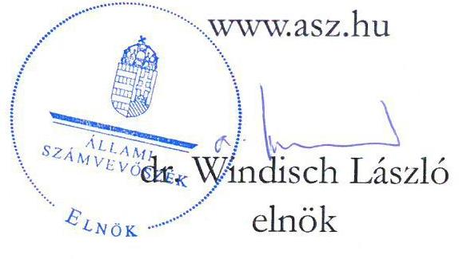
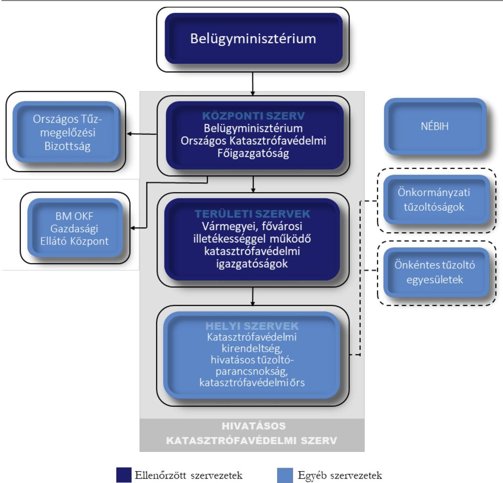
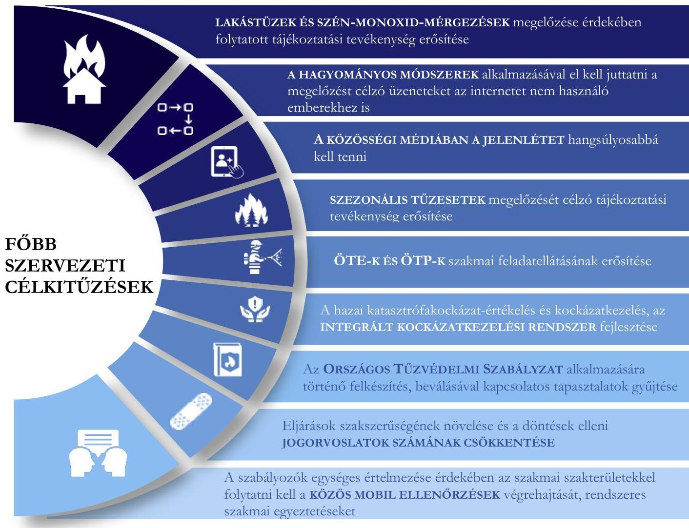
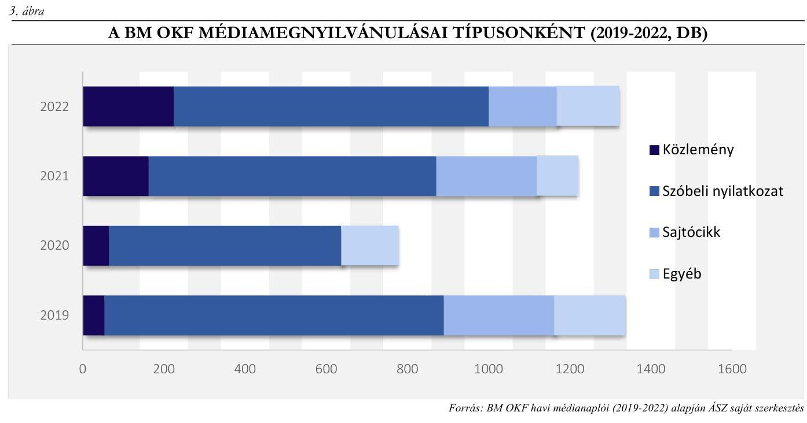
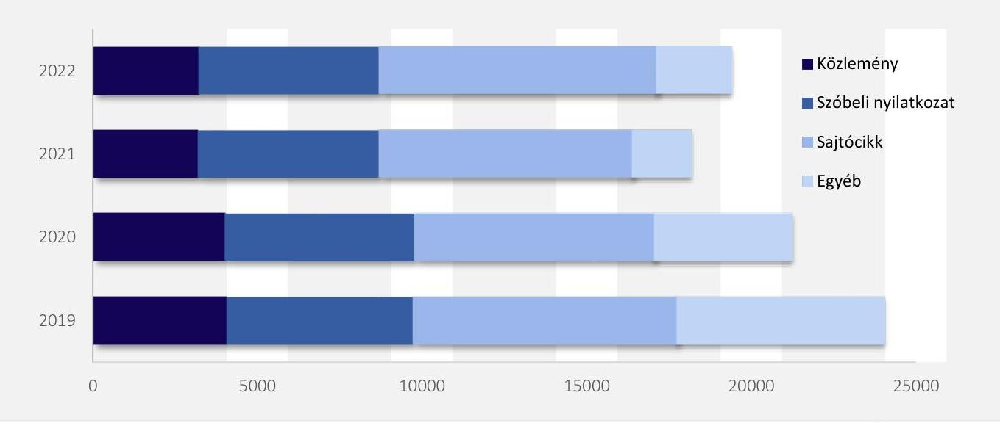
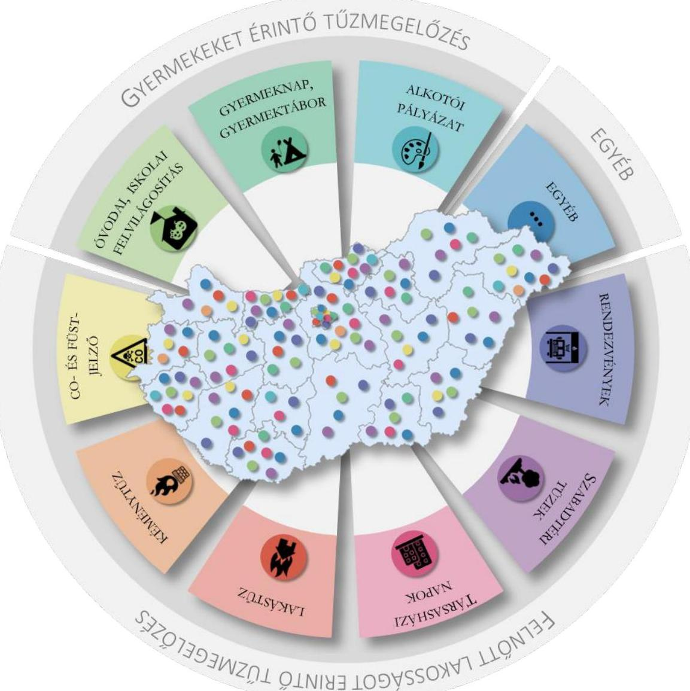
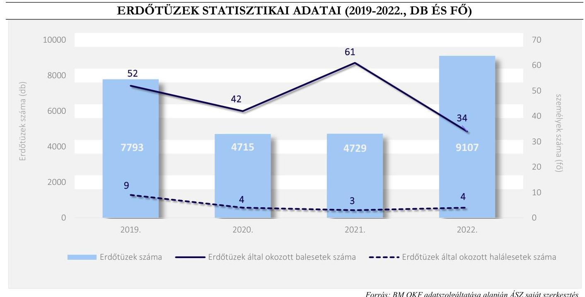
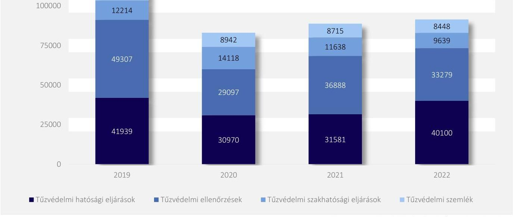
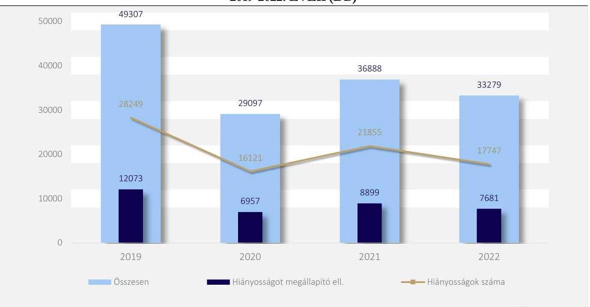
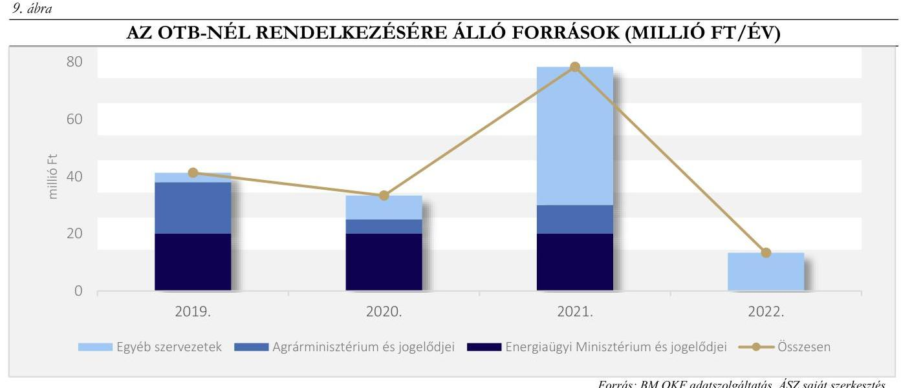

# JELENTÉS 

## Katasztrófavédelem tűzmegelőzési feladatainak ellenőrzése

2023.

---

1052 Budapest, Apáczai Csere János u. 10. | 1364 Budapest 4., Pf. 54
www.asz.hu | szamvevoszek@asz.hu
telefon: +36 14849100

---

# JELENTÉS 

## Katasztrófavédelem tűzmegelőzési feladatainak ellenőrzése

2023.

---

# ELLENŐRZÉSI IGAZGATÓSÁG: 

## TELJESÍTMÉNYELLENŐRZÉSI IGAZGATÓSÁG

## ELLENŐRZÉSI IGAZGATÓ:

DR. JAKAB KORNÉL igazgató

## ELLENŐRZÉSVEZETŐ:

PÉTER ÁKOS ellenőrzésvezető

Jelentéseink az interneten a www.asz.hu címen olvashatók.

IKTATÓSZÁM: EL-3819-003/2023
TÉMASZÁM: 46
ELLENŐRZÉS-AZONOSÍTÓ SZÁM: V1003

---

# TARTALOMJEGYZÉK 

- AZ ELLENŐRZÉS ALAPADATAI ..... 5
- AZ ELLENŐRZÉS HATÓKÖRE, TERÜLETE ..... 7
- ÖSSZEFOGLALÁS ..... 9
- AZ ELLENŐRZÉS FÓKUSZTERÜLETEI ..... 11
- MEGÁLLAPÍTÁSOK ..... 12
- JAVASLATOK ..... 30
- MELLÉKLETEK ..... 31
I. sz. melléklet: Értelmező szótár ..... 31
II. sz. melléklet: Az ellenőrzött szervezetek jegyzéke ..... 33
III. sz. melléklet: Táblázatok ..... 34
IV. sz. melléklet: A füstérzékelők jelentősége ..... 39
- FÜGGELÉK: ÉSZREVÉTELEK ..... 40
- RÖVIDÍTÉSEK JEGYZÉKE ..... 41

---

.

---

# AZ ELLENŐRZÉS ALAPADATAI 

## AZ ELLENŐRZÉS CÉLJA

Az ellenőrzés célja a katasztrófavédelem rendszerében a tűzmegelőzés területén - az élet és vagyonbiztonság megóvása érdekében - végzett tájékoztatási, tűzvédelmi hatósági és felügyeleti tevékenységek eredményességének értékelése volt.

## AZ ELLENŐRZÉS TÍPUSA

Teljesítmény-ellenőrzés

## AZ ELLENŐRZÖTT IDŐSZAK

A 2019-2022. évek

## AZ ELLENŐRZÉS TÁRGYA

Az ellenőrzés tárgyát képezte a katasztrófavédelmi szervek - a $\mathrm{BM}^{1}$, a $\mathrm{BM}^{-1} \mathrm{OKF}^{2}$ és területi szervei ${ }^{3}$ tüzmegelőzés érdekében végzett tájékoztatási, tűzvédelmi hatósági és felügyeleti tevékenységei. Az ellenőrzés keretében az ÁSZ ${ }^{4}$ értékelte a katasztrófavédelmi szervek hozzájárulását a tűzmegelőzési rendszer eredményes működéséhez. Az ellenőrzés és értékelés kiterjedt a BM OKF és területi szervei, az OTB ${ }^{5}$ és a $\mathrm{TTB}^{6}-\mathrm{k}$ tűzmegelőzési tevékenységére, és az együttműködés irányaira, különösen az erdőtüzek megelőzése érdekében a NÉBIH ${ }^{7}$-hel, valamint az ÖTP ${ }^{8}$-kel és ÖTE ${ }^{9}$-kel. Ezen túlmenően az ellenőrzés értékelte a BM OKF-nél és területi szerveinél a tűzmegelőzés érdekében végzett tájékoztatási, tűzvédelmi hatósági és felügyeleti tevékenységek esetében a pénzügyi források és a humán erőforrások nyilvántartásának, valamint általuk az ÖTE-k és ÖTP-k részére pályázati és egyedi elbírálás alapján nyújtott pénzbeli és nem pénzbeli juttatásoknak az átláthatóságát.

## AZ ELLENŐRZÉS JOGALAPJA

Az ellenőrzés jogszabályi alapját az Állami Számvevőszékről szóló 2011. évi LXVI. törvény 1. § (3) és 5. § (2)-(3) bekezdései képezték.

## AZ ELLENŐRZÉS MÓDSZERE

Az ellenőrzést - a nemzetközi standardokat irányadónak tekintve - az ellenőrzési program szempontjai, az ellenőrzött időszakban hatályos jogszabályok, az ellenőrzés-szakmai szabályok és módszertanok figyelembevételével végezte az ÁSZ.

---

Az ellenőrzési kérdések megválaszolásához szükséges bizonyítékok megszerzése az ellenőrzött által rendelkezésre bocsátott dokumentumokra, adatokra alapozva, kérdésfeltevés (információkérés), interjú, valamint elemző eljárás útján történt.

Az ellenőrzési bizonyítékként felhasználható adatforrások közé tartoztak egyrészt az ellenőrzéshez kért dokumentumok, másrészt adatforrás volt minden - az ellenőrzés folyamán feltárt - az ellenőrzés szempontjából információkat tartalmazó dokumentum.

Az ellenőrzés lefolytatásához az ellenőrzött szervezetek tanúsítványok kitöltésével, az ÁSZ által kért dokumentumok rendelkezésre bocsátásával és az ellenőrzés során lefolytatott interjúk keretében szolgáltattak adatokat.

---

# AZ ELLENŐRZÉS HATÓKÖRE, TERÜLETE 

A tűzmegelőzés a Ttv. ${ }^{10}$ szerint a tüzek keletkezésének megelőzésére, továbbterjedésének megakadályozására, illetőleg a tűzoltás alapvető feltételeinek biztosítására vonatkozó, a létesítés és a használat során megtartandó tűzvédelmi jogszabályok, szabványok, hatósági előírások rendszere és az azok érvényesítésére irányuló tevékenység. Ebben a széles fogalomkörben az ellenőrzés a tüzek keletkezésének megelőzését szolgáló tevékenységek eredményességét értékelte, amelyet a katasztrófavédelmi szervek hatósági és felügyeleti, valamint tájékoztatási eszközökkel biztosítottak.

Az ellenőrzés a hatósági és felügyeleti eszközök esetében a BM OKF és területi szervei által - a 259/2011. (XII.7.) Korm. rendelet ${ }^{11}$ és a 489/2017. (XII. 29.) Korm. rendelet ${ }^{12}$ alapján - ellátott tűzvédelmi hatósági és felügyeleti tevékenységeket, a tájékoztatási eszközök esetében a lakosság felkészítését szolgáló különféle kommunikációs tevékenységeket vizsgálta.

A tűzvédelem tevékenységének központi irányítását a Ttv. szerint a katasztrófák elleni védekezésért felelős belügyminiszter a központi katasztrófavédelmi szervet jelentő BM OKF a főigazgató útján gyakorolja. A BM OKF irányítja és felügyelet alatt tartja a tűzvédelmi rendszert, helyi készenléti hivatásos szervei végzik a tűzoltási, műszaki mentési feladatokat, a lakosság védelmét, tájékoztatását és riasztását.

A hivatásos katasztrófavédelmi szerv irányításával, együttműködésével történik a tűzmegelőzési feladatokat is ellátó ÖTP-k, ÖTE-k részvétele a tűzoltásban, műszaki mentésben. Az ÖTP-k és ÖTE-k központi költségvetési támogatására az adott évi költségvetési törvények BM fejezetbe sorolt fejezeti kezelésű előirányzatai biztosítottak forrást, melynek terhére - a fejezeti kezelésű előirányzatok felhasználásáról szóló BM rendeletek értelmében - a BM OKF és területi szervei pályázati úton, illetve egyedi döntés alapján nyújtottak számukra költségvetési támogatást.

Az erdőtüzek megelőzése területén a 4/2008. (VIII.1.) ÖM rendelet ${ }^{13}$ alapján a BM OKF a NÉBIH-hel együttműködésben látja el a feladatot. Az OTB a tűzmegelőzéssel kapcsolatos ismeretek átadására létrehozott tanácsadó, javaslattévő és kommunikációt folytató szervezet, elnöke a BM OKF mindenkori főigazgatója, társelnökei az Agrárminisztérium (illetve jogelődjei) és az Energiaügyi Minisztérium (illetve jogelődjei) közigazgatási államtitkárai. Az OTB-be mintegy 24 szervezet tartozik, ezek az ipar és a mezőgazdaság képviselőiből, valamint a tűzmegelőzésben érintett szervezetekből állnak. Az OTB működtetéséhez személyes munkavégzéssel elsősorban a BM OKF Tűzvédelmi Főosztály járult hozzá, melyben egy adott feladat, vagy adott rendezvény függvényében közreműködött a Kommunikációs Szolgálat is. Az OTB országos szintű feladatellátásába (kampányaiba) a katasztrófavédelem területi szerveit is bevonták. Az OTB gazdálkodásával kapcsolatos teendőket a BM OKF GEK ${ }^{14}$ látja el.

Az ellenőrzés hatókörébe tartozó ellenőrzött és egyéb szervezeteket az 1. ábra szemlélteti.

---

1. ábra

AZ ELLENŐRZÉS HATÓKÖRÉBE TARTOZÓ ELLENŐRZÖTT ÉS EGYÉB SZERVEZETEK

# Ellenőrzött szervezetek 

Egyéb szervezetek

Forrás: Katasztrófavédelem 2021 évkönyv alapján, ÁSZ saját szerkesztés

---

# ÖSSZEFOGLALÁS 

Az élet- és vagyonbiztonságot, a környezetet, valamint a gazdasági biztonságot közvetlenül fenyegető veszélyhelyzetek kialakulása miatt a védelmi szervek tevékenysége időről időre az érdeklődés előterébe kerül. A katasztrófavédelem területén a tűzoltás és a tűzvédelem fogalmaktól élesen nem elválasztható tűzmegelőzés folyamatos tevékenységet jelent, fontos, hogy az érintett szereplők feladatellátása összehangolt legyen.

A BM mint a katasztrófák elleni védekezésért felelős szaktárca a területet érintő előkészítő és jogalkotó tevékenysége eredményeképpen jogszabályokban és közjogi szervezetszabályozó eszközökben határozta meg a tűzmegelőzés érdekében végzett tájékoztatási-, illetve tűzvédelmi hatósági és felügyeleti tevékenységek stratégiai céljait és a célok elérése érdekében végrehajtandó feladatokat, valamint a feladatellátás alapvető kereteit, szabályait. Ezen túl irányítószervi feladatellátása során a BM OKF intézményi munkaterveit jóváhagyta, a hivatásos katasztrófavédelmi szerv teljesítményét értékelte, és az arról szóló döntéssel együtt meghatározta a következő évi ágazati célkitűzéseket.

A BM OKF a BM által meghatározott ágazati célkitűzések alapján tervezte meg a tűzmegelőzés érdekében végzett tájékoztatási tevékenység feladatait, célkitűzéseit. A tervezés hiányossága volt, hogy a kapcsolódó szervezeti célkitűzésekhez nem rendelt számszerűsített célokat, teljesítménymutatókat, mérőszámokat, így az eredményesség alakulása nem volt visszamérhető.

Az OTB tervszerűen, programozott módon építette fel a tűzmegelőzés tájékoztatási tevékenységét, melyhez költségvetési támogatásokat és költségvetésen kívüli forrásokat önállóan igényelt és kapott. A BM OKF, az OTB és a területi szervek széleskörü és sokrétü tájékoztatási tevékenysége hozzájárult a tűzmegelőzési rendszer eredményes múködéséhez. A médiafelületeken történt megjelenés mellett a BM OKF, az OTB és a területi szervek a különféle rendezvényeken a lakosság részére személyesen adták át a tűzmegelőzést szolgáló ismereteket. Az egyes tájékoztatási tevékenységekhez kapcsolódóan kiemelt szereppel bírt a szén-monoxid- és füstérzékelők kiosztása, mivel azok háztartásokban történő elhelyezése önmagában is hozzájárult a tűzesetekkel összefüggő balesetek megelőzéséhez.

A BM OKF, az OTB és a területi szervek erősítették a tájékoztató tevékenységre irányuló együttműködést a társszervekkel, gazdálkodó szervezetekkel, egyéb intézményekkel. A területi szervek együttműködési megállapodásokat kötöttek a vármegyei tűzoltó szövetségekkel, további együttműködési megállapodások keretében valósult meg a hivatásos tűzoltóságok, illetve tűzoltóparancsnokságok és az ÖTE-k általános tűzvédelmi feladatainak, tűzoltási tevékenységének egymás közötti összehangolása. Az ágazati célkitűzések között is szerepelt az ÖTE-k feladatellátásának az erősítése, amely cél teljesült. Az ÖTE-kel kötött együttműködési megállapodások száma 2019-2022 között 625-ről 689-re emelkedett. Az erdőtüzek és a mezőgazdasági tevékenység, különösen a betakarítás során jelentkező tűzesetek megelőzésében a BM OKF és a NÉBIH együttmüködött. Az erdőtüzek megelőzésére vonatkozó tevékenység eredményességére kockázatot hordoz, hogy a két szervezet közötti Együttmüködési megállapodás ${ }^{15}$ és az erdőtűzvédelmi tervek ${ }^{16}$ több, mint 12 éve készültek, melyek aktualizálására az azóta eltelt időben nem került sor.

A BM OKF meghatározta a tűzmegelőzés érdekében végzett tűzvédelmi hatósági és felügyeleti tevékenység tervezésének, feladatellátásának alapvető irányelveit, szabályait, módszereit, a BM által meghatározott ágazati célkitűzések alapján az éves terveket elkészítette. A BM OKF és területi szerveinek tűzvédelmi hatósági és felügyeleti tevékenysége éves szinten mintegy 60 ezer hatósági ügyet, ebből hozzávetőleg

---

30 ezer ellenőrzést jelentett. A tüzvédelmi hatósági és felügyeleti tevékenység meghatározó részét jelentő tüzvédelmi ellenőrzések tervezettek voltak, kockázatelemzésen alapultak, amihez a szervezetrendszeren belül rendelkezésre álló statisztikákon túl külső forrásokból is felhasználtak adatokat.

A hatósági, felügyeleti és a tájékoztatási tevékenység eredményességét tovább növeli, az ellenőrzések alaposabb, illetve a tájékoztatási tevékenység célzottabb tervezését teszi lehetővé a kockázatelemzéshez felhasználható - külső forrásból származó - adatok körének a bővítése, különösen a $\mathrm{KSH}^{17}$ által gyűjtött releváns népszámlálási adatok adnak erre lehetőséget.

A BM OKF és a területi szervek a tüzvédelmi hatósági és felügyeleti feladatok ellátása területén a kitűzött célokat elérték, a feladatellátás eredményes volt. A BM OKF és a területi szervek az integrált kockázatkezelési rendszert fejlesztették, folyamatosan végezték az Országos Tűzvédelmi Szabályzat alkalmazására történő felkészítést, beválásával kapcsolatos tapasztalatok gyűjtését. A tűzvédelmi hatósági döntések elleni jogorvoslatok száma 2019. évi 99 db-ról a 2022. évre 48 db-ra csökkent, továbbá minden ellenőrzött évben történtek egyes szakterületekkel közös mobil ellenőrzések és szakmai egyeztetések.

A BM OKF és a területi szervek tűzmegelőzés érdekében végzett tájékoztatási tevékenységeihez tartozó dologi és felhalmozási kiadásai, valamint a nem tartós munkaviszonyért járó személyi juttatások elsősorban az OTB költségvetésében összpontosultak. A BM OKF és területi szerveinek a tűzmegelőzés érdekében végzett tájékoztatási, valamint tűzvédelmi hatósági és felügyeleti tevékenysége kapcsán vezetett pénzügyi nyilvántartásaiban nem szerepeltek elkülönítetten az OTB-hez köthető tűzmegelőzési tevékenységet is végző hivatásos katasztrófavédelmi szervek kötelékébe tartozók arányosított személyi juttatásai.

Az ÖTP-k és ÖTE-k központi költségvetési támogatásához szükséges források a 2019-2022. évekre vonatkozó költségvetési törvények ${ }^{18}$ BM fejezetbe sorolt fejezeti kezelésű előirányzatainál álltak rendelkezésre. A BM OKF és területi szervei az ÖTP és ÖTE támogatások elszámolását átláthatóan, szervezetenként és jogcímenként is elkülönítették.

A BM OKF éves tevékenységéről szóló jelentéseiben értékelte a szervezeti célkitűzések teljesülését. A tűzmegelőzés érdekében végzett tevékenységek objektív értékelése tovább erősíthető kompozit mutatók alkalmazásával.

---

# AZ ELLENŐRZÉS FÓKUSZTERÜLETEI 

1.- A katasztrófavédelmi szervek tüzmegelőzés érdekében végzett tájékoztatási tevékenységének hozzájárulása a tüzmegelőzési rendszer eredményes müködéséhez.
2.- A katasztrófavédelmi szervek tüzmegelőzés érdekében végzett tüzvédelmi hatósági és felügyeleti tevékenységének hozzájárulása a tüzmegelőzési rendszer eredményes müködéséhez.
3.- A katasztrófavédelmi szervek hozzájárulása a tüzmegelőzés érdekében végzett tájékoztatási, tüzvédelmi hatósági és felügyeleti tevékenységek esetében a pénzügyi források és a humán erőforrások átlátható nyilvántartásához.

---

# MEGÁLLAPÍTÁSOK 

## 1. A katasztrófavédelmi szervek tűzmegelőzés érdekében végzett tájékoztatási tevékenységének hozzájárulása a tűzmegelőzési rendszer eredményes múködéséhez.

Összegző megállapítás A BM OKF és területi szervei, valamint a velük együttműködő szervezetek tájékoztatási tevékenysége hozzájárult a tűzmegelőzési rendszer eredményes múködéséhez. A BM OKF a tájékoztatási tevékenységhez kapcsolódó szervezeti célkitűzésekhez nem rendelt visszamérhető célértékeket, továbbá az erdőtűzek megelőzését célzó Együttműködési megállapodást és az erdőtűzvédelmi terveket a felek nem aktualizálták.

A BM, mint a katasztrófák elleni védekezésért felelős szaktárca a területet érintő előkészítő és jogalkotó tevékenysége eredményeképpen jogszabályokban és közjogi szervezetszabályozó eszközökben határozta meg a tűzmegelőzés érdekében végzett tájékoztatási tevékenységek stratégiai céljait és a célok elérése érdekében végrehajtandó feladatokat, valamint a feladatellátás alapvető kereteit, szabályait. A BM a 26/2013. (VI.26.) BM rendeletben ${ }^{19}$ meghatározottak szerinti, a hivatásos katasztrófavédelmi szervre vonatkozó szervezeti teljesítményértékelést követően, az arról szóló döntéssel együtt meghatározta a következő évi ágazati célkitűzéseket.
A BM OKF a 38/2012. (III. 12.) Korm. rendelet ${ }^{20}$ 11. §-ban előírt intézményi munkatervet a BM által meghatározott ágazati célkitűzések figyelembevételével készítette el. A BM OKF éves munkaprogrammal, féléves munkatervvel (féléves vezetői munkaterv), éves kommunikációs tervvel, valamint havi tervekkel is rendelkezett. Az éves munkaprogramban, az intézményi munkatervben és az éves kommunikációs tervben meghatározott célok kiterjedtek a tűzmegelőzés érdekében végzett tájékoztatási feladatokra.

---

Forrás: BM OKF éves intézményi munkatervei, éves munkaprogramjai 2019-2022 alapján ÁSZ saját szerkesztés
A tervdokumentumokban a tűzmegelőzés érdekében végzett tájékoztatási tevékenységekhez kapcsolódó célkitűzések esetében számszerűsített célkitűzések, célértékek és mutatószámok, mérőszámok nem jelentek meg, a tájékoztatási tevékenységek (pl. lakosság-tájékoztatási tevékenység, katasztrófák veszélyeire való felkészítés, katasztrófavédelem megelőzést célzó kommunikációja) folytatására, illetve fokozására, erősítésére, növelésére irányultak. A BM OKF az időszak vonatkozó adatainak az összehasonlításával a tevékenységek erősítésére, fokozására, növelésére értékelést adott, azonban számszerűsített célok hiányában az elért eredményeket nem lehetett célértékekhez visszamérni.
A BM OKF Kommunikációs Szolgálata éves kommunikációs terveket készített. Az éves kommunikációs tervek kiterjedtek a célcsoport, kommunikációs csatorna, nyelvezet meghatározásának szempontjaira, kommunikáció szintjeire, javasolt kommunikációs témákra, időzítésre, alapüzenetekre, üzenetek formáira, mondanivalóra, hangsúlyos területekre, amelyek meghatározása a korábbi év tapasztalataira, illetve elvi megközelítésekre, kutatásokra, elemzésekre épültek. A kommunikációs terv része volt továbbá a BM OKF és a területi szervek közötti kommunikációs munkamegosztás is. A BM OKF Kommunikációs Szolgálatának rendelkezésre álltak a tűzesetekkel kapcsolatos adatok, amelyek alapján

---

módosították a következő éves kommunikációs tervet. További külső (statisztikai) adatok figyelembevételével van lehetőség a tervezés továbbfejlesztésére.
A BM OKF és a területi szervek közötti információáramlást, információgyűjtést- és feldolgozást informatikai rendszerek támogatták. A hivatásos katasztrófavédelmi szervek rendszeres jelentési rendjének szabályozására kiadott föigazgatói intézkedések ${ }^{21}$ meghatározták a hivatásos katasztrófavédelmi szervek jelentéstételi kötelezettségeinek tartalmát, formáját, gyakoriságát, részletezettségét, ennek keretében a területi szervek tűzmegelőzés területén végzett tevékenységéről szóló jelentéstételi kötelezettséget és annak tartalmát is. A tűzmegelőzés érdekében végzett tájékoztatási tevékenység továbbfejlesztése céljából a BM OKF Kommunikációs Szolgálata havonta tartott továbbképzéseket a területi szervek szóvivői számára. A félévente készített kommunikációs beszámolók országos elemzést tartalmaztak az előző időszak kommunikációs tapasztalatairól. A BM OKF a féléves kommunikációs beszámolókban a változó trendeket, annak okait tárta fel, bemutatta a BM OKF hivatalos weboldalának átlagos látogatottságát, legkedveltebb híreket, posztokat, elérni szándékolt célcsoportra, havi témák arányára vonatkozó adatokat, elért emberek számát. A Kommunikációs Szolgálat a beszámolóiban a tájékoztatási tevékenység eredményességére, illetve a tapasztalatokból levont következtetésekre fókuszált, valamint meghatározta a kommunikáció fejlesztendő területeit.
A BM OKF éves munkaprogramjában foglalt tervek (ágazati célkitűzések), éves feladatok, kommunikációs tervek, illetve a szervezeti teljesítménykövetelményekre vonatkozó elvárások visszamérését, értékelését az éves beszámolókban (évértékelő jelentés ${ }^{22}$ ), kommunikációs beszámolókban és az éves szervezeti teljesítményértékelésekben hajtották végre. A tervek visszamérésére szolgáló dokumentumokban a BM OKF értékelte a tájékoztatási tevékenységeket, értékeléseit adatokkal alátámasztotta. A BM OKF saját szervezetére és a területi szervekre részletes nyilvántartást vezetett a médiamegnyilvánulásokról és a tevékenységükkel kapcsolatos sajtómegjelenésekről. A BM OKF 2019-2022. évek médiamegnyilvánulásait típusonként a 3. ábra szemlélteti.

A BM OKF média megnyilvánulásainak száma - 2020. év kivételével - az 1200-at is meghaladta éves szinten, ezeknek mintegy 50-70\%-a volt tűzesetekkel és annak megelőzésével kapcsolatos. A 2020. évi visszaeséshez

---

hozzájárult, hogy a koronavírus-járvány kitörését követően a médiaérdeklődés járványközpontúvá vált, illetve abban az évben a BM OKF kommunikációs tevékenységének nagyobb hányadát összpontosította a közösségi média felületekre a sajtótermékekben való megjelenésekhez képest. A médiamegnyilvánulások legnagyobb részét a szóbeli nyilatkozatok, tűzmegelőzést érintően egy-egy bekövetkezett tűzesettel kapcsolatos beszámoló jelentette.
A területi szervek - hasonlóan a BM OKF-hez - rendszeresen tájékoztatást adtak a különböző médiafelületeken tűzmegelőzési céllal. A területi szervek médiamegnyilvánulásait a BM OKF Kommunikációs Szolgálata figyelemmel kísérte, médianapló formájában nyilvántartást vezetett a területi szervek sajtóközleményeiről, egyéb közzétételeiről. A területi szervek 2019-2022. időszaki médiamegnyilvánulásainak számát a 4. ábra szemlélteti.
4. ábra

VÁRMEGYEI ÉS FŐVÁROSI KATASZTRÓFAVÉDELMI IGAZGATÓSÁGOK MÉDIAMEGNYILVÁNULÁSAI TÍPUSONKÉNT (2019-2022, DB)

A média-megnyilvánulások szempontjából a területi szervek 2019-ben voltak a legaktívabbak. A teljes médiamegnyilvánulásoknak az ellenőrzött időszakban mintegy 50-70\%-a volt tűzmegelőzési célú. A területi szervek nemcsak a helyi médiában, hanem az országos médiában is rendszeresen szerepeltek általában egyegy jelentősebb tűzeset kapcsán.
A médiamegnyilvánulások mellett a BM OKF és területi szervei a tűzmegelőzés érdekében végzett tájékoztatási tevékenységet a lakossággal személyes találkozást jelentő eseményeken is végezte.
Az OTB számos feladatot koordinált és valósított meg a tűzmegelőzési tájékoztató tevékenység tekintetében, így többek között rendezvényeket, konferenciákat, gyakorlati képzéseket, szimulációs bemutatót, nyári tábort szervezett, a tűzoltó szakmát népszerűsítette, médiatermékben való megjelenést intézett, oktatási intézményekbe tűzmegelőzési látogatásokat szervezett, alkotó pályázatokat hirdetett. Az OTB rendszeres tájékoztatási tevékenységét jelentette a különféle rendezvényeken a tűzvédelmi, szénmonoxid mérgezés megelőzési témájú szórólapok (köztük is különösen kreatívnak számító képregények) kiosztása, a témában online elérhető tartalmak, többek között videók, tűzvédelmi tesztek népszerúsítése.
Az OTB éves munkaterveket készített, amelyeket a BM OKF főigazgatója - mint az OTB elnöke jóváhagyott. Az OTB munkatervei szerint az ellenőrzött időszakban az egyik fő célkitúzés a kéménytüzek megelőzése volt, mivel a statisztikák szerint minden ötödik lakástűz a kéményben

---

keletkezett. Ennek érdekében az OTB lakosság-tájékoztatási tevékenységet végzett, szakkiállításokon vett részt, ahol alkalom nyílt a kémények felülvizsgálatának tapasztalatairól és hasznosságáról tájékoztatást adni, illetve az érdeklődők tesztet tölthettek ki a tűzvédelem és a kéményseprés kérdéseiben. Emellett az OTB elektromos és olaj tüzeket szimuláló bemutatókat is tartott.
Az OTB - a BM OKF és területi szervei tevékenységén keresztül - célul tűzte ki a szén-monoxid- és füstérzékelők elterjedésének elősegítését, melynek keretében több száz szén-monoxid- és füstérzékelőt osztott szét rendezvényein, illetve juttatott el a szociálisan rászorulók - füstérzékelők esetében jellemzően fatüzelésű fűtési rendszert használók - részére. A füstérzéskelők jelentőségét a IV. sz. melléklet mutatja be.
Az OTB 2019-2022 között összesen 86 rendezvényen vett részt, míg a területi szervek - rendszerint az OTB-hez hasonlóan múködő, vármegyei katasztrófavédelmi igazgatóságokhoz tartozó TTB-k által - több mint 5600 eseményen, több százezer személyt megszólítva jelentek meg és végeztek tűzmegelőzéshez kapcsolódó lakosságtájékoztatási tevékenységet. Számos esetben a területi szervek a tűzmegelőzéshez kapcsolódó események megszervezésébe közösségi szolgálatos diákokat vontak be, melynek során a diákok mélyrehatóan bővíthették tűzvédelmi felkészültségüket. A koronavírus járvány ideje alatt a tűzmegelőzéshez kapcsolódó események száma nagyságrendekkel csökkent, 2020-ban az események száma mintegy $80 \%$-kal esett vissza az előző évhez képest.
A területi szervek tűzmegelőzés érdekében végzett tájékoztatási tevékenységeit a sokrétűség jellemezte, amelyet az 5. ábra szemléltet.

---

Forrás: BM OKF adatszolgáltatása (médtanaplók), ÁSZ saját szerkesztés
A területi szervek tűzmegelőzés érdekében végzett tájékoztatási tevékenységeiben elkülöníthetőek a felnőtt lakosságot érintő, illetve a gyermekeket célzó tájékoztatási tevékenységek. A területi szervek tűzvédelmi felvilágosítást, pályaorientációs rendezvényeket, előadásokat tartottak óvodákban, iskolákban, továbbá a fiatalok tűzmegelőzési ismereteinek szélesítése érdekében gyermeknapi rendezvényeket, illetve gyermektáborok keretein belül szemléletformáló programokat is szerveztek. Egyes vármegyékben tűzmegelőzéssel kapcsolatos alkotói pályázat kiírására is sor került.
A területi szervek az éves tevékenységükről, az elvégzett feladatokról a BM OKF felé évente beszámoltak. A területi szervek, illetve a TTB-k az éves tevékenységükről szóló beszámoló keretében az elvégzett tájékoztatási tevékenységekről információkat adtak, amelyek kiterjedtek a kommunikáció formáira, csatornáira és témáira.
A tűzesetek statisztikái a katasztrófavédelmi szervek feladatellátásával összefüggésben alapadatok, amelyeket számos tényező (pl. emberi gondatlanság, szándékosság, véletlenszerű tényezők) befolyásol. Közvetlen összefüggés nincs a tűzesetek száma és a tűzmegelőzés érdekében végzett

---

tájékoztatási tevékenységek eredményessége között, noha a tájékoztatási tevékenységek végeélja a tűzesetek számának a csökkentése. A területi tűzstatisztikát önmagában nem lehet felhasználni a területi szervek tűzmegelőzés érdekében végzett tájékoztatási tevékenységének az összehasonlítására, kiváltképpen azért nem, mert az egyes vármegyék adottságai eltérőek (lakosságszám, területnagyság, veszélyes üzemek száma, stb.), amelyek a tűzesetek számát tovább befolyásolják. A területi szerveknek ugyanakkor figyelembe kell venniük a tűzmegelőzés érdekében végzett tájékoztatási tevékenységeik megtervezésénél, hogy az illetékességi területükön melyek voltak a leggyakoribb tűzesetek és azok okai. A területi szervek a lokális tűzesetekről és azok megelőzéséről a helyi médiában, illetve honlapjukon tájékoztatták a lakosságot. A területi szervek illetékességi területén bekövetkezett tűzesetek számát a III. sz. melléklet 1. táblázata mutatja. Egyes vármegyékben (pl.: Heves, Borsod-Abaúj-Zemplén) a szabadterületen bekövetkezett tűzesetszámok, míg más vármegyék (pl.: Veszprém, Győr-Moson-Sopron) esetében az épített környezetben történt tűzesetek mutatnak magas értékeket. Az otthon jellegű létesítmények esetében Budapest, illetve Pest vármegye rendelkezett a legmagasabb értékekkel, ami egyértelműen következik a magas lakosságszámból, illetve a lakóépületek számából.
Az egyes vármegyék eltérő adottságai miatt a tűzesetszámok összehasonlítása kompozit mutatók alkalmazásával lehetséges. Ilyen pl. az 1000 lakásra jutó otthon jellegű létesítményekben keletkezett tűzesetek száma, amelyet az 1. táblázat szemléltet, az átlagnál magasabb mutatószámot piros betűszín jelöli. 1. táblázat

OTTHON JELLEGŰ LÉTESÍTMÉNYBEN KELETKEZETT TŰZESETEK SZÁMA 1000 LAKÁSRA VETÍTVE (ESET/1000 LAKÁS)

| VÁRMEGYÉK / FÓVÁROS | 2019. | 2020. | 2021. | 2022. |
| :--: | :--: | :--: | :--: | :--: |
| Bács-Kiskun | 1,41 | 1,45 | 1,52 | 1,67 |
| Baranya | 1,25 | 1,47 | 1,33 | 1,42 |
| Békés | 1,49 | 1,57 | 1,62 | 1,45 |
| Borsod-Abaúj-Zemplén | 1,75 | 2,09 | 2,32 | 2,56 |
| Budapest | 1,11 | 0,97 | 1,04 | 0,99 |
| Csongrád-Csanád | 1,54 | 1,35 | 1,24 | 1,33 |
| Fejér | 1,40 | 1,59 | 1,69 | 1,71 |
| Győr-Moson-Sopron | 1,32 | 1,20 | 1,41 | 1,34 |
| Hajdú-Bihar | 1,54 | 1,65 | 1,59 | 1,70 |
| Heves | 1,82 | 1,95 | 2,40 | 2,50 |
| Jász-Nagykun-Szolnok | 1,76 | 1,53 | 2,00 | 1,99 |
| Komárom-Esztergom | 1,70 | 1,89 | 2,00 | 1,86 |
| Nógrád | 2,03 | 2,15 | 2,43 | 2,59 |
| Pest | 1,55 | 1,66 | 1,65 | 1,60 |
| Somogy | 1,50 | 1,78 | 2,27 | 1,97 |
| Szabolcs-Szatmár-Bereg | 1,86 | 1,77 | 1,75 | 2,40 |
| Tolna | 1,47 | 1,54 | 1,35 | 1,44 |
| Vas | 1,46 | 1,46 | 1,49 | 1,34 |
| Veszprém | 1,68 | 1,85 | 1,89 | 1,95 |
| Zala | 1,40 | 1,44 | 1,56 | 1,23 |
| VÁRMEGYÉK ÉS   A FÓVÁROS ÁTLAGA | 1,55 | 1,62 | 1,73 | 1,75 |

---

A tűzesetek abszolút száma alapján az ellenőrzött időszakban a főváros járt az élen, az ezer lakásra jutó tűzesetek száma alapján, a lakások magas száma mellett viszonylag alacsony volt a tűzesetek száma. A kompozit mutatószámok alakulását számos tényező befolyásolta, többek között a lakásállomány minősége, kora, fűtési mód, területi egyenlőtlenségek, illetve akár rendkívüli események, katasztrófahelyzetek, egyéb tényezők. Ezzel együtt a kompozit mutatószámok hasznos információkkal szolgálhatnak a tűzmegelőzési tevékenység még célzottabb tervezéséhez és objektív értékeléséhez.
A tűzmegelőzés érdekében végzett lakossági tájékoztatásban szerepet vállaló BM OKF, az OTB és a területi szervek erősítették a tájékoztató tevékenységre irányuló együttműködést a társszervekkel, gazdálkodó szervezetekkel, egyéb intézményekkel. A BM OKF tűzmegelőzési szakterületének munkatársai több alkalommal tartottak előadást a TSZVSZ ${ }^{23}$ konferenciáin, a Magyar Mérnöki Kamara képzésein, a társasházak üzemeltetői részére rendezett központi rendezvényeken. A BM OKF az adott évi hatósági ellenőrzésekben érintett gazdálkodókat és üzemeltetőket képviselő szakmai szervezetekkel közvetlenül dolgozta fel a tűzmegelőzés lehetséges megoldási technikáit.
A BM OKF a tűzmegelőzés érdekében végzett tájékoztatási tevékenység eredményessége érdekében biztosította a feladatokat ellátó szervezetek közötti információáramlást, együttműködést. A területi szervek helyi szinten gondoskodtak a tűzmegelőzésben feladatot ellátó szervezetek közötti együttműködésről, tapasztalatcseréről, ami hozzájárult a tűzmegelőzési rendszer működéséhez. Ennek érdekében a területi szervek együttműködési megállapodásokat kötöttek a vármegyei tűzoltó szövetségekkel, további együttműködési megállapodások keretében valósult meg a hivatásos tűzoltóságok/tűzoltóparancsnokságok és az ÖTE-k általános tűzvédelmi feladatainak, tűzoltási tevékenységének egymás közötti összehangolása, amelyeket a területi szervek egyetértő nyilatkozataikkal láttak el.
Az ágazati célkitűzések között is szerepelt az ÖTE-k feladatellátásának az erősítése, amelyeket a BM OKF és területi szervei teljesítettek. Az ÖTE-kel kötött együttműködési megállapodások száma 2019-2022 között 625-ről 689-re emelkedett. Külön részcél volt az önállóan beavatkozó ÖTE-k számának növelése, amely részcél szintén teljesült, számuk 2019-2022 között 55-ről 63-ra emelkedett. A területi szervek az ÖTE-k és ÖTP-k működését szakmai ellenőrzési tevékenység keretében felügyelték, szakmailag támogatták. Az elvégzett szakmai ellenőrzések során minden évben tártak fel hiányosságokat, amelyek megszüntetésére valamennyi esetben felhívták az ÖTE-ket és ÖTP-ket.
A területi szervek az önkormányzatok körében külön felkészítési, tájékoztatási tevékenységet végeztek a polgári védelmi szervezetekkel kapcsolatos feladatok, illetve a katasztrófavédelmi felkészítési feladatok keretében.

A BM OKF és a NÉBIH együttműködött az erdőtüzek és a mezőgazdasági tevékenység, különösen a betakarítás során jelentkező tűzesetek megelőzésében. A BM OKF 2011-ben Együttműködési megállapodást kötött a NÉBIH jogelődjének számító $\mathrm{MgSzH}^{24}$-val a katasztrófák elleni védekezés és megelőzés területén jelentkező feladatok közös és hatékony megoldása érdekében. A megállapodás a tűzmegelőzés területén az erdőtüzek és a mezőgazdasági tevékenység, különösen a betakarítás során jelentkező tűzesetek megelőzésében történő együttműködést célozta meg. Az erdőtüzek elleni védekezés fontosságára az erdőtűzesetszámok is felhívják a figyelmet, alakulásukat az erdőtüzek által okozott halálesetek és balesetek számával együtt az 6. ábra szemlélteti.

---

Az erdőtüzek száma 2022-ben volt a legmagasabb ( 9107 db ), összefüggésben a rendkívül csapadékszegény tavaszi és nyári időjárással. Ugyanakkor az erdőtűz által okozott balesetek száma a legalacsonyabb 2022-ben volt az ellenőrzött időszakot tekintve.
Az erdőtüzek megelőzéséről rendelkező 4/2008. (VIII.1.) ÖM rendelet 5. §-ában foglaltaknak megfelelően a BM OKF és a NÉBIH együttműködve vármegyei erdőtűzvédelmi terveket készített. A 2009 szeptemberében megalkotott és azóta nem módosított erdőtűzvédelmi tervek voltak hatályban az ellenőrzött időszakban is, noha a felülvizsgálatot - alapesetben öt évenként - az Együttmüködési megállapodás III. melléklet 4. pontjában foglaltak előírták. Az elmaradt felülvizsgálatok miatt a tervek egyes részei elavultak, 2009. előtti adatokat tartalmaztak.
A BM OKF és a NÉBIH az erdőtüzekkel kapcsolatos tapasztalatokat megosztotta egymással, eleget téve a 4/2008. (VIII.1.) ÖM rendelet 15. §-ában foglaltaknak. Az erdőtűzvédelem területén a BM OKF és a NÉBIH közötti együttmúködés legfontosabb részét a fokozott tűzveszély (tüzgyújtási tilalom) meghatározása jelentette, amelyet a két szervezet minden esetben írásban egyeztetett.
Az Együttműködési megállapodás III. melléklet 2.1 pontjában foglaltak alapján jött létre 2016 júliusában az Országos Erdőtűzoltási Törzs az erdőtüzekkel kapcsolatos tűzoltói beavatkozások hatékonyságának növelése érdekében. A BM OKF az Országos Erdőtűzoltási Törzs bevonásával gyakorlattal egybekötött konferenciát szervezett 2019-ben. A 2020., illetve 2021-es évben a koronavírus járvány miatt a rendszeres éves BM OKF gyakorlatok és konferenciák elmaradtak. A kapcsolatot ez idő alatt elektronikus levelezéssel tartották, a szabadtéri tüzekkel kapcsolatos időszakos (féléves) adatátadások a NÉBIH Rendszerszervezési és Felügyeleti Igazgatóság részére személyesen történtek, kijelölt kapcsolattartó útján.
Az Együttmüködési megállapodás III. mellékletének számos előirása nem teljesült. A 2.4 pontban foglaltak ellenére a BM OKF kifejezetten az erdőtüzek elleni védekezéshez nem készített külön kommunikációs terveket. A 4.6 pontban foglaltak ellenére az erdőgazdálkodók által a vármegyei katasztrófavédelmi igazgatóságokhoz benyújtott erdőtűz megelőzési védelmi tervekről a BM OKF nyilvántartást nem vezetett. Az 5.2 pont szerinti, az erdőtűzvédelmi terv készítésre kötelezett gazdálkodók

---

körében, az erdőtűz megelőzési tevékenység ellenőrzése céljából elvégzett hatósági ellenőrzésekről - a NÉBIH-hel közös - országos jelentés nem készült.

A NÉBIH 2014.07.01-2019.01.31 között EU-s forrást jelentő LIFE projektet (Firelife elnevezéssel) valósított meg projekt kedvezményezettként, a projekttámogatók között volt többek között a BM OKF és az OTB is. Az alapvetően kommunikációs projekt eredményei között szerepelt, hogy ráirányította a figyelmet az erdőtűz elleni védekezés fontosságára, közvetlenül 59 ezer embert ért el, mintegy 2000 információs táblát és 73 ezer plakátot helyezett el, kalandpályát üzemeltetett, amit 32 ezer gyermek használt.

# 2. A katasztrófavédelmi szervek tűzmegelőzés érdekében végzett tűzvédelmi hatósági és felügyeleti tevékenységének hozzájárulása a tűzmegelőzési rendszer eredményes működéséhez. 

## Összegző megállapítás

A katasztrófavédelmi szervek a tűzmegelőzés érdekében végzett tűzvédelmi hatósági és felügyeleti tevékenységeket az éves tervek szerint elvégezték, amelyek hozzájárultak a tűzmegelőzési rendszer eredményes müködéséhez.

A BM OKF meghatározta a tűzmegelőzés érdekében végzett tűzvédelmi hatósági és felügyeleti tevékenység tervezésének, feladatellátásának alapvető irányelveit, szabályait, módszereit, a BM által meghatározott ágazati célkitűzések alapján az éves terveket elkészítette.
A BM a 26/2013. (VI.26.) BM rendeletben meghatározottak szerinti szervezeti teljesítményértékelést követően, az arról szóló döntéssel együtt meghatározta a következő évi célkitűzéseket, amelyeket a BM OKF figyelembe vett a tűzvédelmi hatósági és felügyeleti tevékenységek céljainak meghatározásánál. A BM OKF éves munkaprogramjaiban, intézményi munkaterveiben szereplő tűzmegelőzés érdekében folytatott tűzvédelmi hatósági és felügyeleti tevékenységekkel összefüggő főbb szervezeti célkitűzéseket a 2. ábra szemlélteti.
A BM OKF főigazgatója a tevékenységre vonatkozó irányelvek, szabályok, módszerek meghatározásával hozzájárult a tűzmegelőzési rendszer eredményes működéséhez, kiadta

- a tűzmegelőzési hatósági tevékenység ellátásának egységesítése érdekében a 9/2018. számú intézkedését ${ }^{25}$, illetve a 2022. július 1-jétől hatályba lépett 20/2022. számú intézkedését ${ }^{26}$, amelyben - a határidők és felelősök megjelölésével - szabályozta az éves és havi hatósági ellenőrzési tervek elkészítésének és felterjesztésének követelményét, a tervek közzétételét, a HADAR rendszerben ${ }^{27}$ történő rögzítési kötelezettséget, a tervek módosításának lehetőségeit.
- a 29/2016. ${ }^{28}$, valamint a 34/2020. számú intézkedést ${ }^{29}$, amely 1. sz. mellékletében meghatározta a panaszok és közérdekű bejelentések kezelésének rendjét. A BM OKF ezzel biztosította, hogy tűzvédelmi hatósági és felügyeleti tevékenységekkel kapcsolatos ügyféligényeket, véleményeket szabályozottan figyelembe vegyék,

---

- az ÖTE-kel való együttműködés részletes szabályairól a 7/2018. (VIII. 23.) BM OKF utasítást ${ }^{30}$, meghatározva az együttműködési megállapodások tartalmi kereteit,
- az ÖTE-k egységes feladatellátása és a szakirányítás megvalósítása érdekében a 2/2019. (III. 29.) BM OKF utasítást ${ }^{31}$, az ÖTP-k egységes feladatellátása és a szakirányítás megvalósítása érdekében a 8/2014. (III. 21.) számú BM OKF utasítást ${ }^{32}$,
- 2022. évben a 32/2022. BM OKF intézkedést ${ }^{33}$ a beavatkozó ÖTE-k tevékenységét támogató mentori rendszeréről,
- egyéb kapcsolódó előírásokat, módszertani dokumentumokat ${ }^{34}$ 2021-2022. évben.

A BM OKF a tűzvédelmi hatósági és felügyeleti tevékenységét érintően az intézményi munkatervek és éves munkaprogramok mellett éves országos ellenőrzési terveket és havi hatósági ellenőrzési terveket is készített. Az intézményi munkaterveket a BM hagyta jóvá.

A tűzvédelmi ellenőrzések tervezettek voltak, kockázatelemzésen alapultak, amihez a szervezetrendszeren belül rendelkezésre álló statisztikákon túl külső forrásokból is gyűjtöttek adatokat. A BM OKF nem határozott meg szabályokat a tűzvédelmi hatósági ellenőrzések tervezésével összefüggő kockázatelemzésre, valamint a kockázatelemzés során felhasználandó külső és belső forrásból származó adatok körére, adatok beszerzésére, elemzésére, tisztítására, felhasználására. Az adatfelhasználás kereteinek, szabályainak kialakításával biztosítható, illetve erősíthető a kockázatelemzés, ezáltal a tervezés megalapozottsága.
A BM OKF a hivatásos katasztrófavédelmi szervek éves országos ellenőrzési terveiben meghatározta a tűzvédelmi hatósági tevékenység végrehajtásával kapcsolatosan elérni kívánt célokat (elvégzendő ellenőrzések tárgyát, ütemezését, szempontrendszerét) saját maga és területi szervei számára. A 2019-2021. évi országos ellenőrzési tervben előírt ellenőrzésekhez nem határoztak meg mennyiségi követelményeket. A 2022. évi országos ellenőrzési terv egy „Mennyiség" oszloppal kibővült, amellyel így a BM OKF az elvégzendő ellenőrzésekhez mennyiségi mutatószámot rendelt, biztosítva a tevékenység teljesítményének mérhetőségét, az eredményesség megítélését és a célok eléréséhez szükséges esetleges beavatkozások megtételének lehetőségét. A BM OKF az előre nem látott események (pl. kiemelt rendezvények) következtében a tűzvédelmi hatósági tevékenység feladatait, célkitűzéseit módosította.
A BM OKF kockázatelemzési célból, valamint az ellenőrzésre tervezett helyszínek, telephelyek beazonosításához rendszeresen a szervezeten belül a különböző területekről beérkező feladatellátással összefüggő adatokat (pl. tűzstatisztika, hatósági munka eredményei), az éves beválás vizsgálatok adatait, valamint a Ttv.-nek megfelelően szervezeten kívülről az OMSZ ${ }^{35}$-tól, a TakarNet rendszerből ${ }^{36}$, az önkormányzatok jegyzői által használt nyilvántartásokból és az erdészeti, természetvédelmi hatóság által használt nyilvántartásokból használt fel adatokat. A külső adatforrások használatára a GDPR rendelet ${ }^{37}$ a személyes adatok esetében is lehetőséget biztosít, mivel a katasztrófavédelmi szervek tűzvédelmi hatósági és felügyeleti tevékenysége fontos közérdek.
A külső forrásokból származó adatok körének bővítése és azok felhasználása (adott esetben kompozit mutatók képzésével) a tűzmegelőzés érdekében végzett tevékenységek esetében megalapozottabb tervezést, hatékonyabb és eredményesebb feladatellátást tesz lehetővé. A katasztrófavédelmi szervek kockázatkezelési rendszerének fejlesztése ágazati célkitűzésként jelent meg a BM OKF munkaprogramjaiban. Ehhez kapcsolódóan a kockázatelemzés megalapozottságát a KSH 2022. évben tartott népszámlálási adatainak (lakások, lakók száma, életkörülmények, fűtési mód) felhasználása képes erősíteni. A lakások fűtésére

---

vonatkozó aktuális adatok figyelembevétele a BM OKF GEK esetében a kéményseprő-ipari tevékenység ellátása során is fontos információ a szolgáltatások tervezésekor.

A BM OKF és területi szervei, - figyelembe véve az elvégzett feladatok mennyiségét és szakszerűségét - a tűzmegelőzés érdekében végzett tűzvédelmi hatósági és felügyeleti feladataik ellátásával hozzájárultak a tűzmegelőzési rendszer eredményes múködéséhez.
A BM OKF és területi szervei a 259/2011. (XII. 7.) Korm. rendelet alapján ellátott tűzvédelmi hatósági és felügyeleti tevékenységekről részletes nyilvántartást vezettek saját fejlesztésű informatikai rendszerükben. Az adatok gyűjtése feladattípusonként történt, amely így biztosította az egyes feladatok alakulásának a nyomonkövethetőségét. Az egyes tűzvédelmi hatósági feladattípusokat és a 2019-2022 között végrehajtott feladatok számainak alakulását a III. melléklet mutatja részletesen. A tűzvédelmi hatósági feladatok számos módon elkülönülnek, így épületek (bölcsődék, óvodák, iskolák, kollégiumok), területrészek (erdőterületek) rendeltetése alapján, de külön feladattípusokat jelent bizonyos események (karácsonyi vásárok, zenés, táncos rendezvények) ellenőrzése, szemléje. A BM OKF és területi szervei ellátták a kéményseprő-ipari szakkérdésekben a hatósági feladatokat, valamint a kéményseprő-ipari szolgáltatók felügyeletét.
A tűzvédelmi hatósági és felügyeleti tevékenységek összefoglaló adatait a 7. ábra szemlélteti.
7. ábra

TŰZVÉDELMI HATÓSÁGI ÉS FELÜGYELETI TEVÉKENYSÉG ADATAI 2019-2022. (DB)

A BM OKF és területi szervei éves szinten 83,1 ezer és 112,9 ezer db közötti nagyságrendben végezték tűzvédelmi hatósági és felügyeleti feladataikat (ld. III. számú melléklet). A 2019. évi adatokhoz képest 2020. évben mintegy $25 \%$-os mértékủ visszaesés volt tapasztalható, ami döntően a koronavírus járvánnyal volt összefüggésben. A tűzvédelmi hatósági és felügyeleti tevékenység területi megoszlását a III. számú melléklet 3. táblázat szemlélteti, az adatok szerint Budapesten és Pest vármegyében végezték a legtöbb tűzvédelmi hatósági és felügyeleti tevékenységet.
Az elvégezhető feladatmennyiséget a területi szervek létszáma behatárolja. A III. sz. melléklet 5. táblázatában területi létszámadatokkal arányosított hatósági tevékenység adatok kompozit mutatói rávilágítanak a területi szervek leterheltségbeli különbségeire. Az átlagos létszámmal arányosított tevékenység adatok azt mutatják,

---

hogy a tűzvédelmi hatósági és felügyeleti tevékenység esetében a legnagyobb leterheltségű területi szerv a Hajdú-Bihar Vármegyei Katasztrófavédelmi Igazgatóság, míg a legkisebb a Vas Vármegyei Katasztrófavédelmi Igazgatóság volt. A kompozit mutatószámok hasznos információkkal szolgálhatnak a tűzvédelmi hatósági és felügyeleti tevékenység még célzottabb tervezéséhez és objektív értékeléséhez.
Az egyes ellenőrzési típusok esetében lehetőség van kompozit mutatók alkalmazásával a területi szervek adatainak összehasonlítására. A területi szervek által az erdők, vegetációs területek védelmében elvégzett tűzvédelmi ellenőrzések 1000 hektár erdőterületre vetített számát a 2. táblázat szemlélteti, zöld betűszínnel jelölve az évente a vármegyék és a főváros átlagánál nagyobb mutatószámot.
2. táblázat

A KATASZTRÓFAVÉDELMI IGAZGATÓSÁGOK TERÜLETÉN ERDŐK, VEGETÁCIÓS TERÜLETEK VÉDELMÉBEN VÉGZETT ERDŐTERÜLETRE VETÍTETT TŰZVÉDELMI ELLENŐRZÉSEK SZÁMA 2019-2022 KÖZÖTT (DB)

| VÁRMEGYÉ   ÉS FÖVÁROS | 2019 | 2020. | 2021. | 2022. |
| :--: | :--: | :--: | :--: | :--: |
| Bács-Kiskun | 3,18 | 2,80 | 2,75 | 2,34 |
| Baranya | 1,90 | 1,11 | 0,60 | 0,80 |
| Békés | 3,81 | 2,01 | 2,29 | 3,61 |
| Borsod-Abaúj-Zemplén | 2,12 | 0,65 | 0,61 | 1,24 |
| Budapest | 12,27 | 4,59 | 0,00 | 10,99 |
| Csongrád-Csanád | 5,13 | 3,21 | 3,38 | 5,36 |
| Fejér | 1,36 | 0,19 | 0,24 | 0,08 |
| Győr-Moson-Sopron | 1,60 | 2,00 | 1,07 | 1,37 |
| Hajdú-Bihar | 6,21 | 2,03 | 4,80 | 3,00 |
| Heves | 5,73 | 2,36 | 0,83 | 1,44 |
| Jász-Nagykun-Szolnok | 7,46 | 1,90 | 1,13 | 1,10 |
| Komárom-Esztergom | 1,09 | 0,61 | 0,21 | 0,64 |
| Nógrád | 3,70 | 1,48 | 0,38 | 0,96 |
| Pest | 3,82 | 1,21 | 0,64 | 3,01 |
| Somogy | 1,91 | 1,41 | 1,36 | 1,54 |
| Szabolcs-Szatmár-Bereg | 2,89 | 1,42 | 1,20 | 2,60 |
| Tolna | 1,29 | 0,40 | 0,60 | 0,58 |
| Vas | 0,53 | 0,40 | 0,12 | 0,79 |
| Veszprém | 1,35 | 0,45 | 0,58 | 0,51 |
| Zala | 1,08 | 0,76 | 0,36 | 1,33 |
| VÁRMEGYÉK ÉS A FÓVÁROS ÁTLAGA | 3,42 | 1,55 | 1,16 | 2,17 |

${ }^{a}$ Vetítési alap a 2021. évi erdőterület, mivel a 2022. évi adat nem állt rendelkezésre
Forrás: BM OKF adatszolgáltatás, KSH 15.1.2.14. Erdők vármegye és régió szerinti adattábla, ÁSZ saját szerkesztés
A négy legnagyobb erdőgazdálkodási célú terület Pest vármegyében 173,9; Bács-Kiskun vármegyében 185,9; Somogy vármegyében 192,7; Borsod-Abaúj-Zemplén vármegyében 220,1 ezer hektár volt. Ezen négy nagy erdőterülettel rendelkező vármegye esetében is jelentős eltérésekre világítanak rá a kompozit mutatószámok, míg Bács-Kiskunban 3 évben is átlag feletti a mutatószám, addig Borsod-Abaúj-Zemplén vármegyében

---

jelentősen alacsonyabbak az adatok. A három legkevesebb erdőterülettel rendelkező terület (Budapest, Békés és Csongrád-Csanád vármegye) esetében szinte valamennyi évben átlagot meghaladóak a mutatók.
A BM OKF a tüzvédelmi hatósági ellenőrzések adatai esetében külön kimutatta a hiányosságot megállapító ellenőrzések számát és a hiányosságok számát, amely ha csak részben is (hiszen az utóbbi adatok alapvetően az ellenőrzöttől függnek), de az ellenőrzések megalapozott tervezését támasztották alá.
A BM OKF és területi szervei által 2019-2022. években elvégzett tűzvédelmi hatósági ellenőrzések számát, ebből a hiányosságot feltáró ellenőrzések számát, valamint a feltárt hiányosságok számát a 8. ábra szemlélteti.
8. ábra

TŰZVÉDELMI HATÓSÁGI ELLENŐRZÉSEK ÁLTAL FELTÁRT HIÁNYOSSÁGOK ADATAI 2019-2022. ÉVEK (DB)

A hatósági ellenőrzések száma 2019-ről 2022-re mintegy harmadával esett vissza, közel azonos arányban csökkent a hiányosságot megállapító ellenőrzések és a hiányosságok száma.
A hiányosságot megállapító ellenőrzések adatainak részhalmazát jelentik a kiszabott bírság adatok. A BM OKF által a tűzvédelmi hatósági tevékenység során kiszabott bírságokról részletes nyilvántartást vezetett, amely alapján a 2019-ben 1898 esetben 119,9 M Ft, 2020-ban 1385 esetben 88,8 M Ft, 2021-ben 1247 esetben 64,6 M Ft, 2022-ben 1564 esetben 75,0 M Ft bírságot szabtak ki tűzvédelmi ellenőrzések során. A bírságszámok is a tervezés megalapozottságát támasztották alá.
A tűzmegelőzés érdekében végzett tűzvédelmi hatósági tevékenység minőségét, szakszerűségét jelezték az elsőfokú döntések elleni fellebbezések, jogorvoslati eljárások és azok végeredményének alakulása. A BM OKF és területi szervei - az OSAP $1229^{30}$ adatszolgáltatásnak megfelelő részletezettségben - nyomon követték a másodfokú döntések adatainak az alakulását. Az adatok azt mutatták, hogy a tüzvédelem területén a fellebbezések száma a 2019. évben $0,8 \%$-a, a 2020. évben $1,2 \%$-a volt a hiányosságot megállapító ellenőrzéseknek, 2021-2022 években pedig a fél \%-át sem érte el, amelyeknek átlagosan $50 \%$-ában született csak eltérő másodfokú döntés.
A BM OKF közérdekű bejelentésekkel, panaszokkal kapcsolatos feladatellátása (nyilvántartás vezetése, kezelésük - kivizsgálás, mellőzés, tájékoztatás hatáskör hiányáról, áttétel más szervhez) és az éves

---

összefoglalók, azok kiértékelése támogatta a BM OKF és területi szervei tűzmegelőzési tevékenységét. A közérdekű bejelentésekkel, panaszokkal kapcsolatos feladatellátás keretében a lakosságot közvetlenül érintő problémákról gyűjtött adatokat felhasználták a tűzmegelőzés érdekében végzett tájékoztatási és tűzvédelmi hatósági és felügyeleti tevékenység tervezésénél és végrehajtásánál.
A tűzvédelmi hatósági tevékenység minőségét, szakszerűségét közvetetten jelezte a közérdekű bejelentések/panaszok alacsony száma. A közérdekű bejelentések/panaszok száma a tűzvédelmi szakterület esetében alacsony - 2019. évben 1935 db, 2020. évben 1897 db, 2021. évben 2014 db, 2022. évben 1897 db - volt. A BM OKF és területi szerveinek állományát, tagját/szervezetet érintő panasz 2019ben 28 db, 2020-ban 40 db, 2021-ben 64 db, 2022-ben 48 db volt. (A bejelentők gyakran többféle problémát foglaltak egy bejelentésbe, így adott esetben egy-egy bejelentésnek részben a katasztrófavédelmi szervek hatáskörébe tartozó, részben azon túlmutató (jellemzően levegőtisztaság-védelmi, építésügyi, ritkábban munkavédelmi) vonatkozása is volt.).

A BM OKF értékelte a saját és területi szervei tűzvédelmi hatósági tevékenységét a 2019-2022. évi tevékenységét értékelő összefoglaló jelentésekben, a BM és a BM OKF elvégezte a 26/2013. (VI.26.) BM rendeletnek megfelelő szervezeti teljesítményértékeléseket.
A BM OKF főigazgatójának a 9/2018., illetve a 20/2022. számú intézkedéseiben az értékelés módszereinek rögzítése biztosította az értékelések objektivitását, az egyes értékelési időszakok értékelései közötti összehasonlíthatóságot. A 2019-2022. évi tevékenységét értékelő összefoglaló jelentések kiterjedtek a (2. ábrán megjelenített) tűzvédelmi hatósági és felügyeleti tevékenységekhez kapcsolódó szervezeti célkitűzések értékelésére. A célkitűzések az alábbiak szerint teljesültek:

- A BM OKF 2019-2022. években a hazai katasztrófakockázat-értékelés és kockázatkezelés, valamint az integrált kockázatkezelési rendszer fejlesztéséről számos intézkedést hozott. 2020-ban a BM OKF vezetésével megtörtént Magyarország nemzeti katasztrófakockázat-értékelésének felülvizsgálata, amely során 12 kockázati területet azonosítottak, a lehetséges következmények hatásai szerint 32 kockázati forgatókönyvet és 77 alforgatókönyvet készítettek. A BM OKF belső ellenőrző szerve folyamatosan információkat biztosított a felsővezetés számára a működési folyamatokban rejlő kockázatokról.
- A BM OKF a 2019-2022. években folyamatosan végezte az Országos Tűzvédelmi Szabályzat alkalmazására történő felkészítését, valamint a beválásával kapcsolatos tapasztalatok gyűjtését.
- A BM OKF és területi szervei az eljárások szakszerűségének növelése és a döntések elleni jogorvoslatok számának csökkentése célkitűzés teljesülése érdekében folyamatosan végezte a szakhatósági állásfoglalásokkal összefüggő törvényességi és szakszerűségi ellenőrzési, illetve felügyeleti tevékenységét. A tűzvédelem területén a másodfokú döntések száma 2019. évi 99 db-ról 2022. évre 48 db-ra csökkent.
- A BM OKF-nél a szabályozók egységes értelmezése érdekében a Mobil Ellenőrzési Osztály és a Tűzoltósági Főosztály minden ellenőrzött évben végzett közös mobil ellenőrzéseket, szakmai egyeztetéseket.
A BM OKF az éves tevékenységét értékelő összefoglaló jelentések 1. számú mellékleteiben ábrákkal, adatokkal is jellemezte egyes tevékenységeit, köztük a tűzmegelőzés érdekében végzett tevékenyégeket is. A tűzmegelőzés érdekében végzett tevékenységek objektív értékelése tovább erősíthető kompozit mutatók alkalmazásával.

---

A hivatásos katasztrófavédelmi szerv szervezeti teljesítményértékeléssel kapcsolatos feladatairól kiadott 20/2019, 24/2020, 12/2021 és 10/2022. sz. BM OKF főigazgatói intézkedések ${ }^{39}$ meghatározták a területi szervek teljesítménycéljait, szöveges formában tartalmaztak a tűzmegelőzéssel kapcsolatos célkitűzéseket. A főigazgatói intézkedések 9 db teljesítményminimum követelményt (pl: katasztrófavédelmi gyakorlatok száma, kiemelt kockázati helyszínek szemléje) határoztak meg, amelyek között szerepelt a tűzmegelőzéssel kapcsolatosan a „tűzvédelmi ellenőrzés (db/év)" mutatószám.
A BM és a BM OKF elvégezte a 26/2013. (VI.26.) BM rendeletnek megfelelő szervezeti teljesítményértékeléseket. A BM OKF a területi szervei részére a 26/2013. (VI.26.) BM rendelet előírásainak megfelelően a tűzmegelőzés érdekében végzett tűzvédelmi hatósági és felügyeleti tevékenységhez kapcsolódóan a 2019-2022. évi szakmai teljesítménykövetelmény minimumként meghatározta az évente elvégzendő tűzvédelmi hatósági ellenőrzések számát. A 2019-2022. évi szakmai teljesítménykövetelmény minimumként meghatározott, az évente elvégzendő tűzvédelmi hatósági ellenőrzések számát valamennyi területi szerv teljesítette. Az éves átlagos túlteljesítés az ellenőrzött években 200,9\% és $261,0 \%$ közé esett, tehát a területi szervek a minimumkövetelményeknél átlagosan 2-2,5-szer több ellenőrzést végeztek. A tűzvédelmi hatósági ellenőrzések számára vonatkozó teljesítmény minimumértékeket az ellenőrzött időszakban a BM OKF jelentősen alultervezte, amely a könnyen teljesíthetőség folytán kockázatot jelent a tevékenység teljesítményére.
A BM OKF 26/2013. (VI.26.) BM rendeletnek megfelelően az ellenőrzött időszakban - a területi szerv önértékelése figyelembevételével - értékelte a területi szerv teljesítményét. A belügyminiszter - az országos parancsnok előterjesztése alapján - értékelte a hivatásos katasztrófavédelmi szerv teljesítményét, amely összesített értékelésnek a tüzvédelem is része volt. Az értékelési elemek teljesülését $0 \%$-tól $100 \%$-ig terjedő mérőskálán mérték és értékelték, a 2019. évben $92 \%$-os, 2020. és 2021. évben $92,5 \%$-os, 2022. évben pedig $92,7 \%$-os volt az összesített teljesítmény.

# 3. A katasztrófavédelmi szervek hozzájárulása a tűzmegelőzés érdekében végzett tájékoztatási, tűzvédelmi hatósági és felügyeleti tevékenységek esetében a pénzügyi források és a humán erőforrások átlátható nyilvántartásához. 

Összegző megállapítás A BM OKF és területi szerveinek a tűzmegelőzés érdekében végzett tájékoztatási, valamint tűzvédelmi hatósági és felügyeleti tevékenysége kapcsán vezetett pénzügyi nyilvántartásaiban nem szerepeltek elkülönítetten az OTB-hez köthető tűzmegelőzési tevékenységet is végző hivatásos katasztrófavédelmi szervek kötelékébe tartozók arányosított személyi juttatásai.

A BM OKF főigazgatója - a 4/2015. BM utasításban ${ }^{40}$ foglaltaknak megfelelően - a BM OKF-re, valamint a középirányítása alá tartozó területi szervekre kiterjedő hatállyal, a gazdálkodásra vonatkozó részletes szabályokat belső szabályzatokban határozta meg. E szabályzatok előírták egyes tűzmegelőzéshez kapcsolódó tájékoztatási, valamint a tűzvédelmi hatósági és felügyeleti tevékenységekhez az elkülönített nyilvántartások vezetésének kötelezettségét.

---

A területi szervek vezetői - a középirányítói szabályzatokhoz igazodva - megalkották saját gazdálkodásukra vonatkozó szabályzataikat, melyekben a tűzmegelőzés érdekében végzett tevékenységek elkülönítése a BM OKF szabályzataihoz hasonló tartalommal jelent meg.
A tűzmegelőzéssel kapcsolatos tájékoztatási tevékenység dologi és felhalmozási kiadásai elsősorban az OTB költségvetésében összpontosultak. Az OTB költségvetésének forrása költségvetési fejezetek közötti átcsoportosításból (Agrárminisztérium és jogelődjei, illetve Energiaügyi Minisztérium és jogelődjei), valamint civil és gazdálkodó szervezetek adományaiból állt össze. A minisztériumi támogatások a 2019. évi 20-20 millió Ft-ról évről évre csökkentek, 2022-ben minisztériumi (központi költségvetési) támogatást az OTB már nem kapott. Az OTB-nél rendelkezésre álló források alakulását az ellenőrzött időszakban a 9. ábra mutatja.

Az OTB központi költségvetési támogatásainak a csökkenése, megszűnése kockázatot hordoz a tűzmegelőzési tevékenység eredményességére.
Az OTB bevételeinek és kiadásainak az Áhsz. ${ }^{41}$-ben foglaltak szerinti elkülönítése a BM OKF GEK pénzeszközeitől a Forrás.net integrált ügyviteli rendszerben történt, ez tartalmazta a felhalmozási és dologi kiadásokat, valamint a nem tartós munkaviszonyért járó személyi juttatásokat.
A BM OKF nem mutatta ki elkülönítetten azon hivatásos katasztrófavédelmi szervek kötelékébe tartozók arányosított (hozzávetőleges létszámmal, munkaidőráfordítással és átlagbérrel kalkulált) személyi juttatásait, akik az OTB-hez köthető tűzmegelőzés tevékenységet is végeztek. Emiatt a tűzmegelőzés tájékoztatási tevekénységére fordított kiadások - függetlenül attól, hogy azokat milyen forrásból finanszírozták elkülönített kimutatása nem volt teljeskörű.
A hivatásos katasztrófavédelmi szerv hatósági és felügyeleti tevékenysége érdekében felmerülő, döntően működési kiadások (azon belül is személyi juttatások, illetve munkaadókat terhelő járulékok) előirányzatainak alakulásáról és felhasználásáról - az azokat ellátó szervezeti egységek - átlátható nyilvántartást vezettek, melyet negyedévente egyeztettek a BM OKF Költségvetési Főosztályával. A BM OKF saját és területi szervei humánerőforrás állományáról, és a hozzájuk kapcsolódó személyi juttatásokról elkülönített nyilvántartást vezetett, amelyben a hatósági és felügyeleti tevékenységet ellátó szervezeti egységek elkülönítésre kerültek, az ehhez tartozó humánerőforrás és a hozzájuk kapcsolódó személyi juttatások azonosíthatók voltak.

---

A tűzmegelőzéshez köthető bevételekről elkülönített nyilvántartást vezettek, az igazgatási szolgáltatási bevételeken belül a „Tüzmegelözési batósági, szakhatósági eljárási dij" bevételeket mind a BM OKF-nél, mind a területi szerveknél elkülönítetten számolták el.
A BM OKF-et szakmailag érintő fejezeti kezelésű előirányzatok - köztük ÖTE-k és ÖTP-k részére biztosítandó költségvetési támogatások - felhasználásának alapvető céljairól, szabályairól az 5/2015. (VI. 25.) BM OKF utasítás ${ }^{42}$-ban foglaltak rendelkeztek. Az ÖTP-k és ÖTE-k költségvetési támogatására vonatkozó speciális rendelkezéseket a 4/2015. (VI. 25.) BM OKF utasítás tartalmazta. Ezeken túl a BM OKF Költségvetési gazdálkodási szabályzata ${ }^{43}$, valamint a területi szervek saját szabályzatai biztosították az ÖTE-k és ÖTP-k számára pályázati úton, valamint egyedi elbírálás alapján nyújtott pénzbeli és nem pénzbeli juttatások átlátható nyilvántartásának feltételeit.
A területi szervek -az Áhsz. előírásainak eleget téve - pályázatonként, illetve egyedi elbírálásonként tartották nyilván a támogatott ÖTE-knek, ÖTP-knek, a megítélt támogatási összeget, annak folyósítását, az azzal történő elszámolást. A BM OKF összesítette a területi szervek által szolgáltatott adatokat és maga is részletes és átlátható nyilvántartást vezetett a pályázati és egyedi támogatásokról, mely dokumentáltan alátámasztotta a Magyar Államkincstár felé történő elszámolást.

---

# JAVASLATOK 

Az ÁSZ tv. 33. § (1) bekezdésében foglaltak értelmében az ellenőrzött szervezet vezetője köteles a jelentésben foglalt megállapításokhoz kapcsolódó intézkedési tervet összeállítani és azt a jelentés kézhezvételétől számított 30 napon belül az ÁSZ részére megküldeni. Amennyiben az ellenőrzött szervezet vezetője nem küldi meg határidőben az intézkedési tervet, vagy továbbra sem elfogadható intézkedési tervet küld, az Állami Számvevőszék elnöke az ÁSZ tv. 33. § (3) bekezdése a) és b) pontjaiban foglaltakat érvényesítheti.

## BM OKF FŐIGAZGATÓJA RÉSZÉRE

1. Intézkedjen a tüzmegelőzés érdekében végzett tájékoztatási tevékenységek esetében számszerüsíthető célok meghatározásáról, a célokhoz mérő-, mutatószámok rendeléséről.
2. Kezdeményezze a BM OKF és a NÉBIH közötti együttmüködési megállapodás megújítását, és biztosítsa az együttmüködési megállapodásban elöirt feladatok maradéktalan teljesitését.
3. Kezdeményezze az Erdőtüzvédelmi terv(ek) aktualizálását.
4. Intézkedjen a kockázatelemzésre, valamint a kockázatelemzés során felhasználandó külső és belső forrásból származó adatok körére, adatok beszerzésére, elemzésére, tisztitására, felhasználására vonatkozó szabályok meghatározásáról.
5. Intézkedjen a kockázatelemzési célból figyelembe vehető külső forrásból származó adatok felhasználási lehetőségeinek szélesítéséről.
6. Intézkedjen a tüzmegelőzés érdekében végzett tevékenységek értékelése esetében kompozit mutatók alkalmazásáról.
7. Intézkedjen a 2024. évi szervezeti teljesítményértékelés során a tüzvédelmi hatósági ellenőrzés teljesítménykövetelmény minimumértékek meghatározásának felülvizsgálatáról.
8. Intézkedjen az OTB-hez köthető tüzmegelőzési tevékenységet is végző hivatásos katasztrófavédelmi szerv kötelékébe tartozók arányosított személyi juttatásainak elkülönített kimutatásáról.
9. Kezdeményezze az OTB müködéséhez központi költségvetési források rendelkezésre állását, amennyiben az egyéb szervezetek támogatásai az OTB eredményes müködését nem biztosítják.

---

# MELLÉKLETEK 

I. SZ. MELLÉKLET: ÉRTELMEZŐ SZÓTÁR
átláthatóság
beválás vizsgálat
eredményesség elve:
gazdaságosság elve:
hatékonyság elve:

Az átláthatóság előfeltétele az elszámoltathatóságnak, a célok elérése érdekében folytatott tevékenységekről, folyamatokról a fontos információk közzé vagy hozzáférhetővé legyenek téve (ÁSZ elemzés a számviteli szabályzatok szerepe - a kontrollkörnyezet kialakítása, 2021.,
https://www.asz.hu/dokumentumok/szamviteli_szabalyzatok_20210413.pdf).
A Beválás vizsgálat célja: a vármegyei és az országos éves komplex veszélyhelyzeti prognózisban meghatározottak és a bekövetkezett események összevetése, a végrehajtott műveletek értékelése, a tapasztalatok integrálása a műveleti tervezésbe, végrehajtásba, a jogszabály-alkotásba, valamint az oktatásiképzési rendszerbe. A beválás-vizsgálat tartalmazza: a prognózisokkal történő összevetéseket, következtetéseket, javaslatokat, elemzi a kiemelt érdeklődésre számot tartott eseményeket. (Dr. Muhoray Árpád ny. pv. vezérőrnagy A katasztrófavédelmi műveletek tervezése és szervezése, 2016., https://www.uni-nke.hu/document/uni-nke-hu/6-muhorayarpad.original.pdf)
Az eredményesség elve a kitűzött célok és a szándékolt eredmények (hatások) elérését jelenti. A feladatellátás eredményességét mutatja a tényleges és a tervezett eredmények (hatások) összevetése. (ÁSZ: A teljesítmény-ellenőrzés alapelvei. 2015.,
https://www.asz.hu/files/09_a_teljesitmeny_ellenorzes_alapelvei.pdf)
A gazdaságosság elve az elért eredményekhez igénybe vett erőforrások költségeinek minimalizálását jelenti. Az igénybe vett erőforrásoknak a megfelelő időben, helyen, mennyiségben és minőségben, valamint a legkedvezőbb áron kell rendelkezésre állniuk. A költség-minimalizálás nem egyenlő a legolcsóbb megoldással, a ráfordításokat mindig a ténylegesen elért eredményekhez viszonyítva kell minősíteni, figyelembe véve a mennyiségi, minőségi szempontokat és az idő-tényezőt. (ÁSZ: A teljesítmény-ellenőrzés alapelvei. 2015.,
https://www.asz.hu/files/09_a_teljesitmeny_ellenorzes_alapelvei.pdf)
A hatékonyság elve azt jelenti, hogy a rendelkezésre álló erőforrásokkal a lehető legtöbbet érjük el. Ez az elv az igénybe vett erőforrások és az elért eredmények mennyiségben, minőségben és időben kifejezett kapcsolatát jelenti, azaz az adott erőforrásokkal a lehető legjobb teljesítményt érjük el, figyelembe véve a mennyiségi, a minőségi szempontokat és az idő-tényezőt (ÁSZ: A teljesítményellenőrzés alapelvei. 2015.,
https://www.asz.hu/files/09_a_teljesitmeny_ellenorzes_alapelvei.pdf)

---

katasztrófa:
katasztrófavédelem:
kompozit mutató:
megelőzés:
tűz elleni védekezés
(tűzvédelem):
tűzmegelőzés
teljesítmény-ellenőrzés:

A veszélyhelyzet kihirdetésére alkalmas, illetve e helyzet kihirdetését el nem érő mértékủ olyan állapot vagy helyzet, amely emberek életét, egészségét, anyagi értékeiket, a lakosság alapvető ellátását, a természeti környezetet, a természeti értékeket olyan módon vagy mértékben veszélyezteti, károsítja, hogy a kár megelőzése, elhárítása vagy a következmények felszámolása meghaladja az erre rendelt szervezetek előírt együttműködési rendben történő védekezési lehetőségeit, és különleges intézkedések bevezetését, valamint az önkormányzatok és az állami szervek folyamatos és szigorúan összehangolt együttműködését, illetve nemzetközi segítség igénybevételét igényli. (Kat. 3. §5. pont)
A különböző katasztrófák elleni védekezésben azon tervezési, szervezési, összehangolási, végrehajtási, irányítási, létesítési, működtetési, tájékoztatási, riasztási, adatközlési és ellenőrzési tevékenységek összessége, amelyek a katasztrófa kialakulásának megelőzését, közvetlen veszélyek elhárítását, az előidéző okok megszüntetését, a károsító hatásuk csökkentését, a lakosság életés anyagi javainak védelmét, az alapvető életfeltételek biztosítását, valamint a mentés végrehajtását, továbbá a helyreállítás feltételeinek megteremtését szolgálják. (Kat. 3. § 8. pont)
több területről származó információt kombinál egyetlen mutatóba, hogy pontosabb képet adjon jelenségekről (Havasi Éva: Az indikátorok, indikátorrendszerek jellemzői és statisztikai követelményei, Statisztikai Szemle, 85. évfolyam 8. szám, (https://www.ksh.hu/statszemle_archive/2007/2007_08/2007_08_677.pdf)
minden olyan tevékenység vagy előírás alkalmazása, amely a katasztrófát előidéző okokat megszünteti vagy minimálisra csökkenti, a károsító hatás valószínűségét a lehető legkisebbre korlátozza. (Kat. 3. § 16. pont)
a tűzesetek megelőzése, a tűzoltási feladatok ellátása, a tűzvizsgálat, valamint ezek feltételeinek biztosítása. (Ttv. 4. § b) pont
a tüzek keletkezésének megelőzésére, tovább terjedésének megakadályozására, illetőleg a tűzoltás alapvető feltételeinek biztosítására vonatkozó, a létesítés és a használat során megtartandó tűzvédelmi jogszabályok, szabványok, hatósági előírások érvényesítésére irányuló tevékenység (Ttv. 4. § c) pont)
A teljesítmény-ellenőrzés a számvevőszéki ellenőrzés azon típusa, amely annak megállapítására irányul, hogy a közpénzekkel és a nemzeti vagyonnal való gazdálkodás megfelel-e az eredményesség, hatékonyság, gazdaságosság elveinek, illetve vannak-e lehetőségek a teljesítmény javítására. (ÁSZ: A teljesítményellenőrzés
alapelvei.
2015., https://www.asz.hu/files/09_a_teljesitmeny_ellenorzes_alapelvei.pdf)

---

# II. SZ. MELLÉKLET: AZ ELLENŐRZÖTT SZERVEZETEK JEGYZÉKE 

| ADOSZAM | ELLENŐRZÖTT SZERVEZET MEGNEVEZÉSE |
| :--: | :--: |
| 15311605-2-41 | Belügyminisztérium |
| 15722720-2-51 | Belügyminisztérium Országos Katasztrófavédelmi Főigazgatóság |
| 15722816-2-51 | Baranya Vármegyei Katasztrófavédelmi Igazgatóság |
| 15722823-2-51 | Bács-Kiskun Vármegyei Katasztrófavédelmi Igazgatóság |
| 15722830-2-51 | Békés Vármegyei Katasztrófavédelmi Igazgatóság |
| 15722847-2-51 | Borsod-Abaúj-Zemplén Vármegyei Katasztrófavédelmi Igazgatóság |
| 15722854-2-51 | Csongrád-Csanád Vármegyei Katasztrófavédelmi Igazgatóság |
| 15722861-2-51 | Fejér Vármegyei Katasztrófavédelmi Igazgatóság |
| 15494140-2-51 | Fővárosi Katasztrófavédelmi Igazgatóság |
| 15722878-2-51 | Győr-Moson-Sopron Vármegyei Katasztrófavédelmi Igazgatóság |
| 15722885-2-51 | Hajdú-Bihar Vármegyei Katasztrófavédelmi Igazgatóság |
| 15722892-2-51 | Heves Vármegyei Katasztrófavédelmi Igazgatóság |
| 15722902-2-51 | Jász-Nagykun-Szolnok Vármegyei Katasztrófavédelmi Igazgatóság |
| 15722919-2-51 | Komárom-Esztergom Vármegyei Katasztrófavédelmi Igazgatóság |
| 15722926-2-51 | Nógrád Vármegyei Katasztrófavédelmi Igazgatóság |
| 15722933-2-51 | Pest Vármegyei Katasztrófavédelmi Igazgatóság |
| 15722957-2-51 | Szabolcs-Szatmár-Bereg Vármegyei Katasztrófavédelmi Igazgatóság |
| 15722940-2-51 | Somogy Vármegyei Katasztrófavédelmi Igazgatóság |
| 15722964-2-51 | Tolna Vármegyei Katasztrófavédelmi Igazgatóság |
| 15722971-2-51 | Vas Vármegyei Katasztrófavédelmi Igazgatóság |
| 15722988-2-51 | Veszprém Vármegyei Katasztrófavédelmi Igazgatóság |
| 15722995-2-51 | Zala Vármegyei Katasztrófavédelmi Igazgatóság |

---

# III. SZ. MELLÉKLET: TÁBLÁZATOK 

1. táblázat

TÜZESETEK SZÁMA TERÜLETI SZERVENKÉNT 2019-2022 KÖZÖTT

| VÁRMEGYE   ÉS FÖVÁRÓs | ÉPÍTETT   KÖRNYEZET | ÖTTHÖN   JELLEGÜ   LETESITMÉNT | SZABÁD   TERÜLETEN | KÖZLEKEDÉSI   TERÜLETEN | EGYÉB |
| :-- | :--: | :--: | :--: | :--: | :--: |
| Bács-Kiskun | 1980 | 1470 | 2878 | 255 | 406 |
| Baranya | 1079 | 924 | 1153 | 161 | 261 |
| Békés | 1238 | 1021 | 1489 | 147 | 312 |
| Borsod-Abaúj-Zemplén | 2967 | 2487 | 7754 | 220 | 1087 |
| Budapest | 5568 | 3836 | 2079 | 676 | 1264 |
| Csongrád-Csanád | 1343 | 1078 | 1665 | 190 | 92 |
| Fejér | 1945 | 1149 | 1901 | 210 | 529 |
| Győr-Moson-Sopron | 1481 | 1074 | 1060 | 225 | 321 |
| Hajdú-Bihar | 2079 | 1518 | 2579 | 129 | 571 |
| Heves | 1489 | 1182 | 3009 | 156 | 224 |
| Jász-Nagykun-Szolnok | 1400 | 1259 | 3247 | 289 | 291 |
| Komárom-Esztergom | 1319 | 964 | 1398 | 83 | 379 |
| Nógrád | 900 | 820 | 1925 | 133 | 116 |
| Pest | 4032 | 3242 | 5016 | 549 | 900 |
| Somogy | 1383 | 1096 | 2094 | 179 | 153 |
| Szabolcs-Szatmár-Bereg | 2050 | 1706 | 3434 | 215 | 466 |
| Tolna | 712 | 573 | 796 | 100 | 149 |
| Vas | 871 | 650 | 555 | 82 | 204 |
| Veszprém | 1520 | 1134 | 1163 | 104 | 309 |
| Zala | 905 | 731 | 851 | 114 | 255 |

Forrás: BM OKF adatszolgáltatás alapján ÁSZ saját szerkesztés

---

# 2. táblázat 

TŰZVÉDELMI ELLENŐRZÉSEK SZÁMA 2019-2022. KÖZÖTT (DB)

| TÜZVÉDELMI ELLENŐRZÉSEK | $\mathbf{2 0 1 9 .}$ | $\mathbf{2 0 2 0 . *}$ | $\mathbf{2 0 2 1 .}$ | $\mathbf{2 0 2 2 .}$ |
| :-- | --: | --: | --: | --: |
| Karácsonyi vásárok, bevásárlóközpontok | 976 | 855 | 914 | 67 |
| Bölcsődék, óvodák, iskolák | 2488 | 894 | 989 | 1143 |
| Középiskolai kollégiumok | 92 | 4 | 317 | 62 |
| Középmagas, magas lakóépületek | 711 | 238 | 398 | 692 |
| Általános szolgáltatásfelügyeleti tevékenység | 387 | 254 | 307 | 300 |
| Egyéb közösségi épületek | 1786 | 1097 | 1489 | 1083 |
| Szabadtéri rendezvények | 327 | 17 | 131 | 169 |
| Zenés, táncos rendezvények | 786 | 173 | 345 | 371 |
| Kéményseprő-ipari szolgáltatás felügyelete | 132 | 76 | 113 | 78 |
| Mezőgazdasági, betakarítási munkák | 595 | 156 | 367 | 481 |
| Erdő, vegetációs területek | 5464 | 2711 | 2272 | 3373 |
| Társhatságokkal közösen végrehajtott (supervisori) | 149 | 156 | 107 | 83 |
| Kéménytủz, szénmonoxid-szivárgás káreseményeket   követő | 1894 | 980 | 267 | 180 |
| Egyéb (pl.: irányított égetés, pirotechnikai   tevékenység) | 33520 | 21486 | 28872 | 25197 |
| ÖSSZESEN | 49307 | 29097 | 36888 | 33279 |

*koronavírus járvány időszaka
Forrás: BM OKF adatszolgáltatás alapján ÁSZ saját szerkesztés
3. táblázat

TŰZVÉDELMI HELYSZÍNI SZEMLÉK SZÁMA 2019-2022. KÖZÖTT (DB)

| TÜZVÉDELMI HELYSZÍNI SZEMLÉK | $\mathbf{2 0 1 9 .}$ | $\mathbf{2 0 2 0 .}$ | $\mathbf{2 0 2 1 .}$ | $\mathbf{2 0 2 2 .}$ |
| :-- | --: | --: | --: | --: |
| Bölcsődék, óvodák, iskolák | 555 | 396 | 456 | 714 |
| Többszintes és középmagas lakóépület | 307 | 395 | 254 | 236 |
| Pirotechnikai eszközök tárolása, forgalmazása,   felhasználása | 309 | 158 | 171 | 99 |
| Szállásépületek | 128 | 144 | 144 | 161 |
| Egyéb közösségi épületek | 759 | 630 | 622 | 577 |
| Zenés-táncos rendezvények | 294 | 31 | 107 | 175 |
| Kéményseprő-ipari szolgáltatás felügyeleti   tevékenység | 46 | 11 | 22 | 24 |
| Káresetet követő szemle (pl.: tűzvizsgálati) | 784 | 748 | 763 | 824 |
| Egyéb (pl.: sportcélú létesítmények pályabejárásai) | 6337 | 6429 | 6176 | 5638 |
| ÖSSZESEN | $\mathbf{9 5 1 9}$ | $\mathbf{8 9 4 2}$ | $\mathbf{8 7 1 5}$ | $\mathbf{8 4 4 8}$ |

Forrás: BM OKF adatszolgáltatás, ÁSZ saját szerkesztés

---

# 4. táblázat 

TÜZVÉDELMI HATÓSÁGI ELJÁRÁSOK SZÁMA 2019-2022. KÖZÖTT (DB)

| TÜZVÉDELMI HATÓSÁGI ELJÁRÁSOK | 2019. | 2020. | 2021. | 2022. |
| :--: | :--: | :--: | :--: | :--: |
| Beépített tűzjelző- és oltóberendezések engedélyezése | 4819 | 5064 | 5361 | 5615 |
| Tüzvédelmi követelményektől eltérő kialakítás engedélyezése | 614 | 398 | 532 | 504 |
| Hatósági bizonyítvány kiadása | 3278 | 3043 | 3900 | 4129 |
| Épületeken egyedi éghető fedélhéjazata engedélyezése (pl: nádfedés) | 41 | 15 | 20 | 14 |
| Számítógépes szimuláció jóváhagyása (pl: kiürítés egyedi kialakítása) | 126 | 101 | 149 | 88 |
| Szolgáltatásfelügyeleti tevékenység (pl.: tűzvédelmi szakvizsgáztatás) | 189 | 178 | 180 | 223 |
| Kéményseprő-ipari szolgáltatás felügyelete | 252 | 166 | 64 | 69 |
| Ellenőrzés során feltárt hiányosságok miatt indult eljárások | 6296 | 3831 | 4790 | 4383 |
| Tűzvizsgálati eljárás | 1129 | 502 | 588 | 575 |
| Egyéb (pl.: irányított égetés, tűzvédelmi helyzetre kiható változás bejelentése) | 25195 | 17672 | 15997 | 24500 |
| ÖsszeSEN | 41939 | 30970 | 31581 | 40100 |

## 5. táblázat

TÜZVÉDELMI SZAKHATÓSÁGI ELJÁRÁSOK* SZÁMA 2019-2022. KÖZÖTT** (DB)

| TÜZVÉDELMI SZAKHATÓSÁGI ELJ. | 2019. | 2020. | 2021. | 2022. |
| :--: | :--: | :--: | :--: | :--: |
| Bányafelügyelettel kapcsolatos engedélyezés | 94 | 82 | 70 | 46 |
| Közlekedési létesítmények engedélyezése | 2207 | 1976 | 139 | 84 |
| Műszaki biztonsági engedélyezés (pl.: nyomástartó berendezések) | 368 | 410 | 404 | 394 |
| Állami és magán fenntartású szociális szolgáltatások engedélyezése | 689 | 434 | 516 | 572 |
| Épületek építési és használatbavételi engedélyezése | 7483 | 7667 | 7662 | 5434 |
| Zenés, táncos rendezvények engedélyezése | 216 | 30 | 79 | 128 |
| Üzletek múködési engedélyezése | 825 | 909 | 1060 | 822 |
| Egyéb (pl.: szálláshelyek, tömegtartózkodásra szolgáló létesítmények, ipari és mezőgazdasági létesítmények) | 332 | 2610 | 1708 | 2159 |
| ÖsszeSEN | 12214 | 14118 | 11638 | 9639 |

*Kizárólag kérelemre indul
**Az elmúlt két évben a hatáskörökben jelentős változások voltak

---

6. táblázat

A KATASZTRÓFAVÉDELMI IGAZGATÓSÁGOK TERÜLETÉN VÉGZETT TÜZVÉDELMI HATÓSÁGI TEVÉKENYSÉGEK SZÁMA 2019-2022 KÖZÖTT (DB)

| VÁRMÉGYE   ÉS FÖVÁROS | TÜZVÉDELMI   ELLENÖRZÉSEK | TÜZVÉDELMI   HELÍSZÍNI   SZUMLÉK | TÜZVÉDELMI   HATÓSÁGI   ELJÁRÁSOK | TÜZVÉDELMI   SZAKTATÓSÁGI   ELJÁRÁSOK |
| :--: | :--: | :--: | :--: | :--: |
| Bács-Kiskun | 10320 | 1651 | 4002 | 2876 |
| Baranya | 4961 | 1347 | 4778 | 1652 |
| Békés | 5265 | 1380 | 2984 | 1970 |
| Borsod-Abaúj-Zemplén | 9524 | 2215 | 7494 | 3044 |
| Budapest | 19716 | 5252 | 50428 | 4315 |
| Csongrád-Csanád | 4665 | 1398 | 4459 | 1856 |
| Fejér | 3314 | 1490 | 3739 | 2274 |
| Győr-Moson-Sopron | 7135 | 1606 | 6113 | 3356 |
| Hajdú-Bihar | 11045 | 2222 | 11213 | 3098 |
| Heves | 5460 | 1076 | 4213 | 1545 |
| Jász-Nagykun-Szolnok | 5724 | 1352 | 3317 | 1723 |
| Komárom-Esztergom | 3159 | 1338 | 4456 | 1893 |
| Nógrád | 4255 | 752 | 3775 | 808 |
| Pest | 12717 | 4216 | 8460 | 5666 |
| Somogy | 7983 | 1108 | 2782 | 1738 |
| Szabolcs-Szatmár-Bereg | 8335 | 2668 | 4843 | 3437 |
| Tolna | 3880 | 945 | 1755 | 1227 |
| Vas | 4035 | 1047 | 2321 | 1130 |
| Veszprém | 9047 | 1399 | 5168 | 2227 |
| Zala | 8021 | 1013 | 5596 | 1585 |

[^0]
[^0]:    *Kizárólag kérelemre indul

---

7. táblázat

TŪZVÉDELMI HATÓSÁGI ÉS FELÜGYELETI TEVÉKENYSÉGEK SZÁMA / HATÓSÁGI FELADATOKAT ELLÁTÓK LÉTSZÁMA 2019-2022. KÖZÖTT (DB/FŐ)

| VÁRMEGYE-   ÉS FÖVÁROS | 2019. | 2020. | 2021. | 2022.* |
| :-- | :--: | :--: | :--: | :--: |
| Bács-Kiskun | 198 | 120 | 171 | 124 |
| Baranya | 192 | 100 | 148 | 123 |
| Békés | 190 | 127 | 157 | 134 |
| Borsod-Abaúj-Zemplén | 142 | 113 | 151 | 118 |
| Budapest | 361 | 205 | 184 | 273 |
| Csongrád-Csanád | 124 | 141 | 129 | 107 |
| Fejér | 119 | 105 | 113 | 151 |
| Győr-Moson-Sopron | 203 | 180 | 175 | 162 |
| Hajdú-Bihar | 297 | 262 | 383 | 258 |
| Heves | 190 | 140 | 187 | 212 |
| Jász-Nagykun-Szolnok | 157 | 101 | 143 | 99 |
| Komárom-Esztergom | 183 | 148 | 167 | 194 |
| Nógrád | 215 | 176 | 186 | 243 |
| Pest | 183 | 146 | 180 | 172 |
| Somogy | 150 | 117 | 161 | 135 |
| Szabolcs-Szatmár-Bereg | 170 | 141 | 170 | 200 |
| Tolna | 161 | 124 | 134 | 101 |
| Vas | 113 | 89 | 90 | 91 |
| Veszprém | 212 | 182 | 219 | 172 |
| Zala | 189 | 282 | 264 | 219 |

Forrás: BM OKF adatzoógáltatás, ÁSZ saját szerkesztés

---

# IV. SZ. MELLÉKLET: A FÜSTÉRZÉKELŐK JELENTŐSÉGE 

## FÜSTÉRZÉKELŐK

A füstérzékelők időben jelzik, ha a lakásban olyan mértékű a füst, amely káros az emberi szervezetre, ez segíti a menekülést, a beavatkozást. A Magyar Tűzoltó Szövetség adatai szerint a lakástüzek áldozatainak $90 \%$-a a füst miatt veszíti életét és mivel a halálesetek jelentős része füstérzékelővel megelőzhető lenne (szakértői vélemény szerint mintegy 20\%-kal csökkenthető a halálesetek száma, ami Magyarország esetében éves szinten akár 20 főt is jelenthet), ezért a füstérzéskelők használatának népszerűsítése hozzájárul a tűzmegelőzés eredményességéhez.

Egyes országokban (pl. Németország, Franciaország, Nagy-Brittannia, Ausztria, Csehország) tűzmegelőzési célból kötelező a füstjelzők elhelyezése a lakóépületekben. Ezzel szemben hazánkban - a lakosság jövedelmi viszonyaira tekintettel - ez nem kötelező. (https://budapest.tuzoltoszovetseg.hu/hirek/2931, https://www.q-certified.eu/en/smoke-detector-legislation-in-the-european-union/)

A fával történő fűtés tűzkockázata kiemelt, mivel a fűtőberendezésben az égési folyamat jelentős hőt és lángokat generál, és az elégtelen vagy nem megfelelően karbantartott fűtőberendezések, kémények vagy kályhák, valamint a helytelenül tárolt vagy kezelt faanyag tovább növelheti a tűzveszélyt.

A 2022-2023. évi fűtési szezonban (és a korábbi években is) az önkormányzatokon keresztül mintegy 180 ezer rászoruló háztartás részesült tűzifában szociális tűzifa program keretében, amelyhez 5 milliárd Ft támogatást biztosított a Kormány (https://kormany.hu/hirek/megnyilt-a-jovo-teli-tuzeloanyag-palyazat). Ennek a 180 ezer háztartásnak füstjelző készülék biztosítása összességében mintegy 468 millió Ft egyszeri kiadási tételt jelentene a helyi és/vagy a központi költségvetés számára (füstjelzőnként a legalacsonyabb, bruttó 2600 Ft-os darabonkénti eladási árral számolva).
2022. évben összesen 700 db füstjelző kiosztására került sor annak a közvélemény-formálási kampánynak a keretében, amelyet az ÖTE-ket ÖTP-ket, Létesítmény tűzoltóságokat összefogó Magyar Tűzoltó Szövetség - a Füstmentes.hu és a MABISZ együttműködésével - folytatott. (https://budapest.tuzoltoszovetseg.hu/hirek/2611)

---

# FÜGGELÉK: ÉSZREVÉTELEK 

A jelentéstervezetet a Számvevőszék 15 napos észrevételezésre megküldte az ellenőrzött szervezet vezetőjének az ÁSZ tv. 29. §* (1) bekezdése előírásának megfelelően.

Az elfogadott észrevételek alapján a Számvevőszék módosította a jelentést.
A függelék tartalmazza az ellenőrzött észrevételeit, illetve az el nem fogadott észrevételek elutasitásának indoklását.

[^0]
[^0]:    * 29. § (1) Az Állami Számvevőszék az ellenőrzési megállapításait megküldi az ellenőrzött szervezet vezetőjének vagy az általa megbízott személynek, és annak, akinek személyes felelősségét állapította meg.
    (2) Az ellenőrzött szervezet vezetője és a felelősként megjelölt személy az ellenőrzés megállapításaira tizenöt napon belül írásban észrevételt tehet.
    (3) Az Állami Számvevőszék az észrevételre a beérkezésétől számított harminc napon belül írásban válaszol. A figyelembe nem vett észrevételeket köteles a jelentésben feltüntetni, és megindokolni, hogy azokat miért nem fogadta el.

---

# BELÜGYMINISZTÉRIUM   ORSZÁGOS KATASZTRÓFAVÉDELMI FŐIGAZGATÓSÁG 

FŐIGAZGATÓ

Iktatószámuk: EL-3812-179/2023.
Iktatószámunk: 35000-7714-1/2023. ált.
Tárgy: Jelentés-tervezet véleményezése
Ügyintéző: Mecsei Judit tủ. ezds.
Telefonszám: +36 14694247
dr. Jakab Kornél
Igazgató
Állami Számvevőszék
Teljesítményellenőrzési Igazgatóság
Budapest

## Tisztelt Igazgató Úr!

A Katasztrófavédelem tűzmegelőzési feladatainak az Állami Számvevőszék általi ellenőrzését és a megküldött jelentés-tervezetet köszönettel vettem, javaslataikkal hozzájárulnak a Katasztrófavédelem tűzmegelőzési tevékenységének hatékonyabb végzéséhez, ezen keresztül az állampolgárok élet- és vagyonbiztonságának, a közbiztonság biztosításához.

A jelentés-tervezetet áttanulmányoztam, az abban foglaltakhoz az alábbi módosító javaslatot teszem:

Javasolom a Jelentés 5. oldalán az „Ellenőrzés Tárgya" pont alábbiak szerinti módosítását:
„Az ellenőrzés és értékelés kiterjedt a BM OKF és területi szervei OTB ${ }^{3}$-vel, továbbá az erdőtüzek megelőzése érdekében a NÉBIH ${ }^{0}$-hel, valamint az ÖTP ${ }^{3}$-kel és $\dot{O} T E^{0}$-kel történt együttmüködés irányaira. " szöveg helyett az
„Az ellenőrzés és értékelés kiterjedt a BM OKF és területi szervei, az OTB ${ }^{3}$ és a területi tüzmegelőzési bizottságok tüzmegelőzési tevékenységére, és az együttmüködés irányaira, különösen az erdőtüzek megelőzése érdekében a NÉBIH ${ }^{0}$-hel, valamint az $\dot{O} T P^{3}$-kel és $\dot{O} T E^{0}$ -kel. "
szöveg használatát.
Indokolás: Az OTB nem minősül önálló jogi személynek, jogképessége nincs, a BM OKF keretein belül müködik. Nem értelmezhető a BM OKF és az OTB közötti együttműködés.

---

Fentieken túl kérem, hogy a jelentés-tervezet 8. oldalán található, „Az ellenőrzés hatókörébe tartozó ellenőrzött és egyéb szervezetek" című 1. ábrán az Országos Tűzmegelőzési Bizottság elemet szíveskedjen összekötni a Központi szerv BM Országos Katasztrófavédelmi Főigazgatóság elemmel, az előző bekezdésben leírt indokolás alapján.

Kelt: elektronikus bélyegző szerint

Üdvözlettel:

# Dr. Góra Zoltán tű. altábornagy tűzoltósági főtanácsos 

H-1149 Budapest, Mogyoródi út 43., Postacím: 1903 Budapest, Pf. 314
Telefon: (36-1) 469-4101, Fax: (36-1) 469-4102
E-mail: okf.foigazgato@katved.gov.hu

---

# ZÁRADÉK 

A dokumentum elektronikus aláírással hitelesített 35000/5828-29/2022.ált.

---

# Dr. Góra Zoltán 

Főigazgató
Belügyminisztérium
Országos Katasztrófavédelmi Főigazgatóság

Tárgy: Válaszlevél ellenőrzéssel kapcsolatos észrevételek kezeléséről

## Tisztelt Főigazgató Úr!

A „Katasztrófavédelem tüzmegelözési feladatainak ellenörzése" című ellenőrzéssel kapcsolatos, 2023. október 6-ai keltezésű észrevételét köszönettel megkaptam.

Az Állami Számvevőszék észrevételekre vonatkozó álláspontjáról az alábbi tájékoztatást adom:

- a jelentés 5. oldalán az „Ellenőrzés Tárgya" pont a javasoltnak megfelelően „Az ellenörzés és értékelés kiterjedt a BM OKF és területi szervei, az OTB ${ }^{2}$ és a TTB² ${ }^{2}$ tüzmegelözési tevékenységére, és az együttmúködés irányaira, különösen az erdötüzek megelözése érdekében a NÉBIH ${ }^{2}$-bel, valamint az ÖTP ${ }^{2}$-kel és ÖTE ${ }^{2}$-kel." szövegrészre módosításra került.
- a jelentés-tervezet 8. oldalán található, „Az ellenőrzés hatókörébe tartozó ellenőrzött és egyéb szervezetek" című 1. ábrán az Országos Tűzmegelőzési Bizottság elem összekötésre került a Központi szerv BM Országos Katasztrófavédelmi Főigazgatóság elemmel.

Egyidejűleg megköszönöm Főigazgató Úrnak és munkatársainak az ellenőrzésünk eredményes lefolytatásához nyújtott segítségét.

---

Budapest, 2023. november 2.

Tisztelettel:
az Állami Számvevőszék elnöke nevében:
dr. Jakab Kornél
igazgató, kiadmányozó
Állami Számvevőszék
Teljesítményellenőrzési igazgatóság
p. h.

---

# RÖVIDÍTÉSEK JEGYZÉKE 

${ }^{1} \mathrm{BM}$
${ }^{2}$ BM OKF
${ }^{3}$ területi szervek
${ }^{4}$ ÁSZ
${ }^{5}$ OTB
${ }^{6}$ TTB
${ }^{7}$ NÉBIH
${ }^{8}$ ÖTP
${ }^{9}$ ÖTE
${ }^{10} \mathrm{Ttv}$.
${ }^{11}$ 259/2011. (XII. 7.) Korm. rendelet
${ }^{12}$ 489/2017. (XII. 29.) Korm. rendelet
${ }^{13} 4 / 2008$. (VIII. 1.) ÖM rendelet
${ }^{14}$ BM OKF GEK
${ }^{15}$ Együttműködési megállapodás
${ }^{16}$ erdőtűzvédelmi tervek
${ }^{17} \mathrm{KSH}$
${ }^{18}$ költségvetési törvények
${ }^{19}$ 26/2013. (VI.26.) BM rendelet
${ }^{20}$ 38/2012. (III. 12.) Korm. rendelet
${ }^{21}$ főigazgatói intézkedések
${ }^{22}$ évértékelő jelentés
${ }^{23}$ TSZVSZ
${ }^{24} \mathrm{MgSzH}$
${ }^{25}$ a BM OKF főigazgató
9/2018. számú intézkedése
${ }^{26}$ BM OKF főigazgató
20/2022. számú intézkedése

Belügyminisztérium
Belügyminisztérium Országos Katasztrófavédelmi Főigazgatóság
BM irányítása alá tartozó vármegyei és fővárosi illetékességgel működő
katasztrófavédelmi igazgatóságok
Állami Számvevőszék
Országos Tűzmegelőzési Bizottság
Területi Tűzmegelőzési Bizottság
Nemzeti Élelmiszerlánc-biztonsági Hivatal
önkéntes tűzoltóság
önkéntes tűzoltóegyesület
1996. évi XXXI. törvény - a tűz elleni védekezésről, a műszaki mentésről és a
tűzoltóságról (hatályos: 1996. augusztus 1-jétől)
259/2011. (XII. 7.) Korm. rendelet a tűzvédelmi hatósági feladatokat ellátó szervezetekről, a tűzvédelmi bírságról és a tűzvédelemmel foglalkozók kötelező élet- és balesetbiztosításáról (hatályos: 2011. december 8-ától)
489/2017. (XII. 29.) Korm. rendelet - a tűzvédelmi hatósági eljárások általános és különös szabályairól (hatályos: 2018. január 1-jétől)
Az erdők tűz elleni védelméről szóló 4/2008. (VIII. 1.) ÖM rendelet (hatályos: 2008. augusztus 16-ától)
Belügyminisztérium Országos Katasztrófavédelmi Főigazgatóság Gazdasági Ellátó Központ
9358-1/2011. számú Együttműködési Megállapodás a BM OKF és a MGSZH között 4/2008. (VIII. 1.) ÖM rendeletben meghatározott erdőtűzvédelmi tervek
Központi Statisztikai Hivatal
2018. évi L. törvény Magyarország 2019. évi központi költségvetéséről (hatályos: 2018. november 1-jétől 2022. december 31-éig)
2019. évi LXXI. törvény Magyarország 2020. évi központi költségvetéséről (hatályos: 2019. november 1-jétől)
2020. évi XC. törvény Magyarország 2021. évi központi költségvetéséről (hatályos: 2020. október 1-jétől)
2021. évi XC. törvény Magyarország 2022. évi központi költségvetéséről (hatályos: 2021. október 1-jétől)

A belügyminiszter irányítása alatt álló egyes fegyveres szervek hivatásos állományú tagjai teljesítményértékelésének ajánlott elemeiről, az ajánlott elemek alkalmazásához kapcsolódó eljárási szabályokról, a minősítés rendjéről és a szervezeti teljesítményértékelésről szóló 26/2013. (VI. 26.) BM rendelet (hatályos: 2013. július 1-jétől)
38/2012. (III. 12.) Korm. rendelet a kormányzati stratégiai irányításról (hatályos: 2012. március 31-étől)
A hivatásos katasztrófavédelmi szervek rendszeres jelentési rendjének szabályozására kiadott 12/2017, 9/2020 és 5/2022. sz. BM OKF főigazgatói intézkedések
BM OKF adott évi tevékenységét értékelő összefoglaló jelentés
Tűzvédelmi Szolgáltatók és Vállalkozók Szövetsége
Mezőgazdasági Szakigazgatási Hivatal
a katasztrófavédelem központi, területi és helyi szervei hatósági és szakhatósági tevékenységének rendjéről (hatályos: 2018. február 16-ától 2022. június 30-áig)
a katasztrófavédelem központi, területi és helyi szervei hatósági és szakhatósági tevékenységének rendjéről (hatályos: 2022. július 1-jétől)

---

${ }^{27}$ Hadar rendszer
28 29/2016. számú BM OKF főigazgatói intézkedés
29 34/2020. számú BM OKF főigazgatói intézkedés
30 7/2018. (VIII. 23.) BM OKF utasítás
${ }^{31}$ 2/2019. (III. 29.) BM OKF utasítás
${ }^{32}$ 8/2014.(III. 21.) számú BM OKF utasítás
${ }^{33}$ 32/2022. számú BM OKF intézkedés
${ }^{34}$ módszertani dokumentumok
${ }^{35}$ OMSZ
${ }^{36}$ TakarNet rendszer
${ }^{37}$ GDPR rendelet
${ }^{38}$ OSAP 1229
${ }^{39}$ 20/2019, 24/2020, 12/2021 és 10/2022. sz. BM OKF főigazgatói intézkedések
${ }^{40}$ 4/2015. BM utasítás
${ }^{41}$ Áhsz.
${ }^{42}$ 5/2015. (VI. 25.) BM OKF utasítás
${ }^{43}$ BM OKF Költségvetési gazdálkodási szabályzata:

BM OKF Költségvetési gazdálkodási szabályzat:

Hatósági adatszolgáltatási rendszer
a hivatásos katasztrófavédelmi szervek hivatali szervezetei müködésének szabályozásáról (hatályos: 2016. június 8 -ától 2020. augusztus 7 -éig)
a hivatásos katasztrófavédelmi szervek hivatali szervezetei müködésének szabályozásáról (hatályos: 2020. augusztus 8 -ától)
az önkéntes tűzoltó egyesületek támogatásának, tűzoltó szakmai ellenőrzésének katasztrófavédelmi feladatairól szóló (hatályos: 2018. augusztus 24 -jétől)
az önkéntes tűzoltó egyesület önálló beavatkozásának feltételeiről és a beavatkozó önkéntes tűzoltó egyesület tevékenységéről (hatályos: 2019. március 30 -ától)
Az önkormányzati tűzoltó parancsnokságok szakmai irányításáról és felügyeleti ellenőrzésének rendjéről szóló 8/2014. (III. 21.) BM OKF utasítás (hatályos: 2014. március 22 -étől)
A BM OKF Főigazgató 32/2022. számú intézkedése a beavatkozó önkéntes egyesületek tevékenységét támogató mentori rendszerről (hatályos: 2022. november 3ától)
Módszertani útmutató az építésügyi tűzvédelmi használatbavételi eljárásokat megelőző - hatósági és szakhatósági eljáráshoz kapcsolódó - konzultációk, valamint az eljárások és szemlék lefolytatásához (2021. aug),
Módszertani útmutató az élet és a vagyonbiztonság közvetlen veszélyeztetésének észlelése esetén alkalmazandó szabályokról (2021. október) Módszertani útmutató a közzétett iratminták alkalmazásához (2021. okt),
Módszertani útmutató az építésügyi tűzvédelmi használatbavételi eljárásokat megelőző - hatósági és szakhatósági eljáráshoz kapcsolódó - konzultációk, valamint az eljárások és szemlék lefolytatásához (2021. aug),
Módszertani útmutató a robbanásveszélyes létesítmények tűzvédelmi ellenőrzésére vonatkozó eljárásrendhez (2022. szeptember),
Módszertani útmutató a közérdekủ bejelentések és panaszok vizsgálatához (2022. október)
Országos Meteorológiai Szolgálat
Ingatlannyilvántartás informatikai rendszere
AZ EURÓPAI PARLAMENT ÉS A TANÁCS 2016. április 27-i (EU) 2016/679 rendelete a természetes személyeknek a személyes adatok kezelése tekintetében történő védelméről és az ilyen adatok szabad áramlásáról, valamint a 95/46/EK irányelv hatályon kívül helyezéséről (általános adatvédelmi rendelet, hatályos: 2018. május 25étől)
Országos Statisztikai Adatfelvételi Program 1229 Elsőfokú hatósági döntések összefoglaló adatai
A hivatásos katasztrófavédelmi szerv szervezeti teljesítményértékeléssel kapcsolatos feladatairól kiadott 20/2019, 24/2020, 12/2021 és 10/2022. sz. BM OKF főigazgatói intézkedések
4/2015. (IV. 10.) BM utasítása Belügyminisztérium fejezet költségvetési gazdálkodásának rendjéről (hatályos: 2015. április 11-étől)
Az államháztartás számviteléről szóló 4/2013. (I. 11.) Korm. rendelet (hatályos: 2014. január 1-jétől)
A Belügyminisztérium fejezethez tartozó, a BM Országos Katasztrófavédelmi Főigazgatóságot szakmailag érintő fejezeti kezelésű előirányzatok felhasználásáról szóló 5/2015. (VI. 25.) BM OKF utasítás (hatályos: 2015. június 26 -ától)

A BM Országos Katasztrófavédelmi Főigazgató 40/2018. számú intézkedése a hivatásos katasztrófavédelmi szerv Költségvetési Gazdálkodási Szabályzatának kiadásáról (hatályos: 2018.09.12-től 2022.07.28-ig)
A BM Országos Katasztrófavédelmi Főigazgató 24/2022. számú intézkedése a hivatásos katasztrófavédelmi szerv Költségvetési Gazdálkodási Szabályzatának kiadásáról (hatályos: 2022.07.29-től)