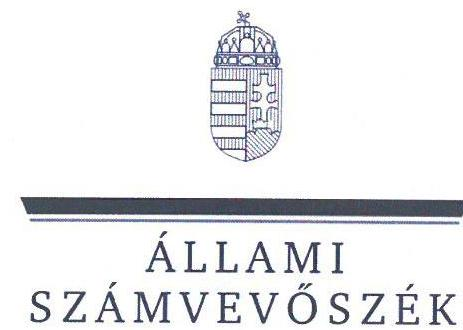
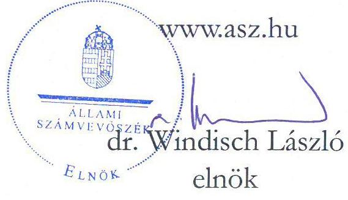
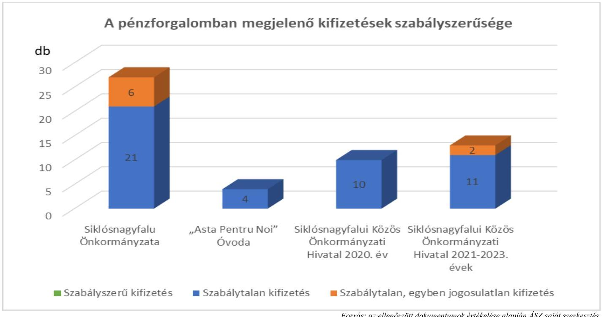
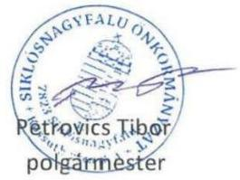
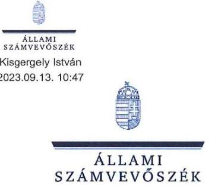

# JELENTÉS 

## Az önkormányzatok gazdálkodásának célvizsgálata

Az önkormányzatok ellenőrzése - a pénzforgalomban megjelenő kiadások teljesítésének és elszámolásának megfelelősége

Siklósnagyfalu Önkormányzat

2023. 

23043
www.asz.hu

---

ÁLLAMI SZÁMVEVŐSZÉK

# JELENTÉS 

## Az önkormányzatok gazdálkodásának célvizsgálata

Az önkormányzatok ellenőrzése - a pénzforgalomban megjelenő kiadások teljesítésének és elszámolásának megfelelősége

Siklósnagyfalu Önkormányzat

2023.

23043

---

# ELLENŐRZÉSI IGAZGATÓSÁG: 

## ÁLLAMHÁZTARTÁS HELYI SZINTJÉT ELLENŐRZŐ IGAZGATÓSÁG

ELLENŐRZÉSI IGAZGATÓ:
KISGERGELY ISTVÁN igazgató

ELLENŐRZÉSVEZETŐ:
$\square$ LAJTERNÉ HUDÁK MAGDOLNA ellenőrzésvezető

IKTATÓSZÁM: EL-3905-011/2023.
TÉMASZÁM: 2658
ELLENŐRZÉS-AZONOSÍTÓ SZÁM: V100203

---

# TARTALOMJEGYZÉK 

AZ ELLENŐRZÉS ALAPADATAI ..... 5
AZ ELLENŐRZÖTT SZERVEZETEK ..... 7
ÖSSZEFOGLALÁS ..... 9
AZ ELLENŐRZÉS FÓKUSZKÉRDÉSEI ..... 11
MEGÁLLAPÍTÁSOK ..... 12
JAVASLATOK ..... 30
MELLÉKLETEK ..... 35
I. sz. melléklet: Az ellenőrzött szervezetek jegyzéke ..... 35
II. sz. melléklet: Összefoglaló táblázat az ellenőrzött szervezetek gazdálkodási jogköreinek gyakorlásáról ellenőrzött gazdasági eseményenként ..... 36
III. sz. melléklet: Siklósnagyfalu Önkormányzatánál ellenőrzött, késedelmesen könyvelt gazdasági események ..... 46
IV. sz. melléklet: Az EFOP-2.4.1.-16-2017-00030. számú pályázati forrásból jogosulatlanul felhasznált összegek kimutatása ..... 48
V. sz. melléklet: Az EFOP-1.6.2-16-2017-00097. számú pályázati forrásból jogosulatlanul felhasznált összegek kimutatása ..... 51
FÜGGELÉK: ÉSZREVÉTELEK ..... 53
RÖVIDÍTÉSEK JEGYZÉKE ..... 59

---

.

---

# AZ ELLENŐRZÉS ALAPADATAI 

## AZ ELLENŐRZÉS CÉLJA

Az ellenőrzés célja annak értékelése, hogy az Önkormányzatnál ${ }^{1}$, a Hivatalnál ${ }^{2}$ és az Óvodánál ${ }^{3}$ a pénzforgalomban megjelenő kiadások teljesítése, elszámolása, megfelelő volt-e, az Önkormányzat, a Hivatal, illetve az Óvoda közfeladat-ellátásához kapcsolódott-e.

## AZ ELLENŐRZÉS TÍPUSA

Megfelelőségi ellenőrzés.

## AZ ELLENŐRZÖTT IDŐSZAK

Az ellenőrzött időszak a 2021-2022. évek és a 2023. év, az ellenőrzés megállapításainak az ÁSZ tv. ${ }^{4}$ 29. § (1) bekezdése szerinti megküldése napjáig, továbbá a Hivatalt érintően a 2020. év.

## AZ ELLENŐRZÉS TÁRGYA

Az Önkormányzat, a Hivatal és az Óvoda pénzforgalmában megjelenő kiadások teljesítésének, elszámolásának, közfeladat-ellátás céljára történő felhasználásának megfelelősége.

## AZ ELLENŐRZÉS JOGALAPJA

Az ellenőrzés jogalapját az ÁSZ tv. 1. § (3) bekezdése, és 5. § (2)-(3), (6) bekezdései képezik.

## AZ ELLENŐRZÉS MÓDSZERE

Az ellenőrzés végrehajtása az ellenőrzési programokban foglaltaknak, az ellenőrzött időszakban hatályos jogszabályoknak és az ellenőrzött szervezet belső szabályozásainak, az ellenőrzés szakmai szabályainak, valamint a jelen ellenőrzésre irányadó ÁSZ ${ }^{5}$ módszertanoknak figyelembevételével történt.

Az ÁSZ által 2022-ben Alsószentmárton Község Önkormányzatánál és a hivatali feladatokat ellátó Siklósnagyfalui Közös Önkormányzati Hivatalnál megkezdett, de irathiány miatt a Hivatalnál függőben maradt „Az önkormányzatok ellenörzése - A pénzforgalomban megjelenő kiadások elszámolásának ellenörzése" című ellenőrzés lezárásaként került ellenőrzésre a Hivatalt érintően a 2020. év. „Az önkormányzatok ellenörzése - a pénzforgalomban megjelenő kiadások teljesitésének és elszámolásának megfelelősége" című ellenőrzési program alapján került ellenőrzésre az Önkormányzat, a Hivatal és az Óvoda pénzforgalmában megjelenő kiadások teljesítése és elszámolása a 2021-2022. évekre és a 2023. évre vonatkozóan, az ellenőrzés megállapításainak az ÁSZ tv. 29. § (1) bekezdése szerinti megküldése napjáig.

---

Az ellenőrzési kérdések megválaszolásához szükséges bizonyítékok megszerzése az ellenőrzött szervezetek által rendelkezésre bocsátott dokumentumokra, adatokra, valamint az ellenőrzést támogató szervezetektől ${ }^{6}$ kapott adatokra alapozva a következő ellenőrzési eljárások alkalmazásával történt: dokumentumok vizsgálata, elemzése, helyszíni ellenőrzés, interjúk, mintavételi eljárás, elemző eljárás, szemle, szemrevételezés, rovancs.

Az ellenőrzés során bizonyítékként felhasználható adatforrások közé tartoztak az Önkormányzat, a Hivatal és az intézmény, valamint a megkeresett ellenőrzést támogató szervezetek által átadott dokumentumok, továbbá minden - az ellenőrzés szempontjából információkat tartalmazó - dokumentum. Az ellenőrzés ideje alatt az Önkormányzatot érintően bűncselekmény gyanúja miatt a rendőrség ${ }^{7}$ nyomozást folytatott. Az eljárás keretében iratlefoglalásra is sor került, az illetékes nyomozóhatóságtól az iratokba betekintést, illetve az ellenőrzés szempontjából releváns iratokról másolatot kértünk, amelyeket az ellenőrzés során a megállapítások alátámasztásához felhasználtunk.

Az ellenőrzött szervezetek által az ÁSZ rendelkezésére bocsátott dokumentumok valódiságát és teljeskörűségét az ellenőrzött szervezetek képviseletében a polgármester ${ }_{3}{ }^{8}$ és a jegyző által tett teljességi és hitelességi nyilatkozat igazolta. A rendelkezésre bocsátott adatok, információk kontrolljára helyszíni ellenőrzés keretében is sor került.

A pénzforgalomban megjelenő kiadások teljesítése megfelelőségének ellenőrzése során a működés, gazdálkodás kockázatos területeinek meghatározását követően az ellenőrzött szervezetekre vonatkozó főkönyvi adatbázisokból irányított mintavételi eljárás alapján történt a mintatételek kiválasztása. Az irányított mintavételre - a lényeges és kockázatos tételek beazonosítására - egyedi kockázatértékelés alapján került sor.

Az ellenőrzés kiemelten kezelte a kifizetések közfeladat ellátáshoz való közvetlen kapcsolódásának, kötelezettségvállalás szerinti teljesülésének, jogosságának és szabályszerűségének értékelését, figyelemmel a kiadások teljesítésével összefüggő kontrollok gyakorlati múködésére.

Az ellenőrzés kitért minden olyan körülményre és kérdésre is, amely a program végrehajtása kapcsán felmerült újabb összefüggéseknek az ellenőrzés céljaival összhangban lévő feltárásához szükséges volt.

---

# AZ ELLENŐRZÖTT SZERVEZETEK 

Siklósnagyfalu község a Dél-Dunántúli régióban, Baranya vármegyében, a Siklósi járásban található. Siklóstól délkeletre helyezkedik el, közel a déli horvát országhatárhoz, Pécstől 50 km-re. A település területe $9,09 \mathrm{~km}^{2}$. Lakosságszáma a $\mathrm{KSH}^{9}$ adatai szerint 2022. január 1-jén 442 fő.

Siklósnagyfalu település a 105/2015. (IV. 23.) Korm. rendelet ${ }^{10}$ alapján a társadalmi-gazdasági és infrastrukturális szempontból kedvezményezett települések körébe tartozik, azonban a jelentős munkanélküliséggel sújtott települések közé nem sorolt.

Az ellenőrzött időszakban négy fő - a 2019. évi önkormányzati választásokon megválasztott polgármester ${ }_{1}{ }^{11}$ 2021. január 19-ig, ezt követően 2021. január 20. - 2021. június 30. között az alpolgármester ${ }_{1}{ }^{12}$, illetve 2021. július 1. - 2022. június 26. között az alpolgármester ${ }_{2}{ }^{13}$ és a polgármester ${ }_{2}$ - látta el a polgármesteri feladatokat. A polgármester ${ }_{2}$ a 2022. június 26 -ai időközi önkormányzati választás óta tölti be tisztségét. A képviselő-testület ${ }^{14}$-nek a polgármesteren kívül négy fő képviselő tagja van.

Az Önkormányzat működésével kapcsolatos feladatokat a Hivatal végzi, a jegyző 2013. május 13-ától tölti be tisztségét. A Hivatal létszáma a jegyzővel együtt a 2022. évben nyole fő volt. A Hivatalhoz két települési önkormányzat tartozott, Siklósnagyfalu Önkormányzat ügyeivel foglalkozó dolgozói létszám átlagosan négy fő volt.

Az Önkormányzat fenntartásában egy költségvetési szerv, a 2004. július 13-án alapított Óvoda múködött. Az intézmény gazdálkodási feladatait a Hivatal látta el.

Az Önkormányzat a szociális-, gyermek- és ifjúságvédelmi feladatait a Villányi Mikrotérségi Szociális és Gyermekjóléti Társulás, a hulladékkezelési, hulladékgazdálkodási feladatait a Mecsek-Dráva Regionális Szilárdhulladék Kezelő Rendszer Létrehozását Célzó Önkormányzati Társulás útján biztosította.

Az Önkormányzat 2021. és 2022. évi konszolidált beszámolójának főbb adatait az 1. táblázat mutatja be. 1 táblázat
adatok $M$ Ft-ban

| MEGNEVEZÉS | 2021. EVI KONSZOLIDÁLT ÖNKORMÁNYZATI BESZÁMOLÓ | 2022. EVI KONSZOLIDÁLT ÖNKORMÁNYZATI BESZÁMOLÓ |
| :--: | :--: | :--: |
| Költségvetési bevétel | 181,0 | 140,4 |
| Ebből: önkormányzati feladatok múködési támogatása | 118,7 | 128,8 |
| hosszabb időtartamú közfoglalkoztatás támogatása | 52,7 | - |
| településfejlesztési projektek | 0,06 | - |
| Költségvetési kiadás | 224,0 | 145,5 |

Az Önkormányzat éves költségvetési beszámolói szerint a települési önkormányzatoknak jóváhagyott rendkívüli támogatásokból 2021. évben 1,2 M Ft, 2022. évben 3,1 M Ft, a települési önkormányzatok szociális

---

tüzelőanyag vásárláshoz kapcsolódó támogatásaiból 2021. évben 2,9 M Ft, 2022. évben 4,2 M Ft támogatást használt fel.

Az ellenőrzött időszakban a „Szegregált élethelyzetek felszámolása komplex programok" EFOP pályázatok ${ }^{15}$ keretében - három új építésű és három felújított szociális bérlakás kialakítására, illetve hátrányos helyzetű csoportok foglalkoztatásra való felkészítésére, képzésére - összesen 399,9 M Ft vissza nem térítendő pályázati támogatást nyert el az Önkormányzat.

---

# ÖSSZEFOGLALÁS 

A településeken az önkormányzati gazdálkodás sokrétű feladatot jelent. A tevékenység összetettsége, a megfelelő képzettségű, létszámú humán-erőforrás hiánya a gazdálkodás területén magas szintű kockázatokat eredményezhet. Az ellenőrzés kiemelten fókuszál a kiadások jogosságának, szabályszerűségének értékelésére, a közfeladat-ellátás érdekében történő felhasználására, végrehajtására, figyelemmel a kontrollok gyakorlati alkalmazására is. Az ellenőrzés hozzájárul az Önkormányzat szabályszerű és felelős gazdálkodásához, a közpénzek szabályos, cél szerinti felhasználásához, a közvagyon védelméhez. Erre tekintettel, az ÁSZ által végzett kockázatelemzés alapján került ellenőrzésre kiválasztásra a Siklósnagyfalu Önkormányzat.

Az ellenőrzés során 54 gazdasági eseményt vizsgáltunk. Ezek alapján az Önkormányzat, a Hivatal és az Óvoda pénzforgalmában megjelenő kiadások teljesítése és elszámolása nem volt megfelelő, mivel az ellenőrzött 54 gazdasági esemény közül egyetlen egy teljesítése és elszámolása felelt meg a jogszabályi előirásoknak.

Az Önkormányzatnál a vásárlásra kiadott előlegek elszámolásakor, ingatlanok vásárlásakor, és a rendkívüli települési támogatások kifizetéseinél, a Hivatalnál a céljuttatás/projektprémium elszámolásánál, az Óvodánál a munkába járás elszámolásánál nem érvényesült, hogy az Alaptörvény ${ }^{16}$ szerint „A közpénzeket és a nemzeti vagyont az átláthatóság és a közélet tisztaságának elve szerint kell kezelni", mivel a közpénzfelhasználással kapcsolatos döntések dokumentumokkal nem voltak alátámasztottak, nem volt biztosított a költségvetési kiadások felhasználásának szabályszerűsége, ellenőrizhetősége. Az Önkormányzat az ingatlanok vásárlásakor, valamint a települési támogatások odaítélésénél megsértette az Ávr. ${ }^{17}$ összeférhetetlenségre vonatkozó előírásait is. Az Önkormányzatnál nem volt biztosított a vagyonvédelem sem, a szemrevételezéses ellenőrzéskor 2068,3 E Ft összértékben öt-öt számítástechnikai szoftvert (Office és Windows), öt laptopot, továbbá a közfoglalkoztatáshoz vásárolt eszközöket és szerszámokat nem tudták az ellenőrzés részére bemutatni.

Az Önkormányzatnál és a Hivatalnál a gazdálkodás során nem tartották be az Áht. ${ }^{18}$-t és az Ávr. előírásait, nem volt biztosított, hogy a közpénzek kizárólag közfeladatellátásra kerüljenek felhasználására, mivel az ellenőrzött kiadások közül hét esetben - 19 077,6 E Ft kifizetést érintően - a bizonylatok teljes hiánya miatt nem volt ellenőrizhető az önkormányzati feladatellátáshoz kötöttség. Mindezek felvetik a jogosulatlan kifizetés kockázatát.

Az Önkormányzat, a Hivatal és az Óvoda fizetési számlájáról és pénztárából a kiadási előirányzatok terhére teljesített kifizetéseknél a gazdálkodás nem volt szabályszerű, mivel az előzetes kötelezettségvállalást igénylő 27 esetből 15 esetben - 25 176,1 E Ft kifizetést érintően - az Ávr.-ben foglaltak ellenére nem vállaltak írásban kötelezettséget, és nem végezték el a kötelezettségvállalások pénzügyi ellenjegyzését. Az Ávr.-ben és a gazdálkodási szabályzatban foglaltak ellenére az ellenőrzött gazdasági események 93,9\%-ánál elmaradt, vagy nem megfelelő dokumentumok alapján végezték el a teljesítésigazolást, így nem ellenőrizték, hogy a kifizetések az arra jogosultak részére, a megfelelő összegben történtek-e, illetve, hogy az ellenszolgáltatást az ellenőrzöttek részére teljesítették-e.

Az Önkormányzat 2021. május 18. napjától az ellenőrzés lezárásáig adósságrendezési eljárás alatt állt. A Har.tv. ${ }^{19}$ szerint az Önkormányzat 2021. május 18 -át követő kötelezettségvállalásai és kifizetései csak a pénzügyi gondnok ellenjegyzésével voltak teljesíthetők, ennek ellenére az Önkormányzat a pénzügyi gondnoki ellenjegyzésben érintett, ellenőrzött 10 gazdasági esemény egyikénél sem igazolta, hogy

---

kötelezettségvállalásaira és kifizetéseire a pénzügyi gondnok által történő ellenjegyzést követően került sor.

A kifizetéseket megelőző jogszabályokban előírt kontrollok szabályszerű működtetése nem volt biztosított, így nem akadályozta meg az Önkormányzatnál és a Hivatalnál előfordult jogosulatlan kifizetéseket.

A pénzforgalomban megjelenő kifizetések szabályszerűségét ellenőrzött szervezetenként az 1. ábra mutatja be.

1. ábra

A gazdálkodás részletes rendjét meghatározó szabályzatok közül az Önkormányzat, a Hivatal és az Óvoda nem rendelkeztek a gazdálkodási feladatok ellátásáért felelős jegyző által kiadmányozott számlarenddel, a gazdálkodási szabályzatot nem aktualizálták, nem vezették naprakészen a gazdálkodási jogkörök gyakorlói aláírás mintáit tartalmazó nyilvántartásokat. A jegyző nem építette ki azokat a kontrolltevékenységeket, amelyek csökkentették volna a kifizetések szabálytalanságának kockázatait. Az ellenőrzött szervezetek pénzkezelési szabályzatai nem rendelkeztek a pénzforgalom (készpénzben, illetve bankszámlán történő) lebonyolításának rendjéről, a pénzkezelés személyi és tárgyi feltételeiről, felelősségi szabályairól.

Az Önkormányzat a mérlegben kimutatandó tárgyi eszközöket az ellenőrzött, költségvetési beszámolóval lezárt években a Számv. tv. ${ }^{20}$ és az Áhsz. ${ }^{21}$ előírásai ellenére nem támasztotta alá leltárral, és az Áhsz. előírásai ellenére tárgyi eszköz nyilvántartással sem rendelkezett. A 2021-2022. évi költségvetési beszámolók mérlegének egyes eszközcsoportjai nem voltak leltárral, nyilvántartásokkal alátámasztottak, ezáltal nem volt biztosított, hogy a beszámolók az Önkormányzat vagyoni, pénzügyi és jövedelmi helyzetéről megbízható és valós képet mutatnak.

Az Önkormányzatnál az Áht. előírása ellenére a jegyző nem gondoskodott a belső ellenőrzés kialakításáról, az Önkormányzatnál belső ellenőrzést 2013 óta nem működtettek.

Az ÁSZ az ellenőrzés során feltárt hiányosságok felszámolása, a szabályszerű működés feltételeinek megteremtése érdekében a polgármester ${ }_{2}$-nek 16, a jegyzőnek 14 és az óvoda vezetőnek 6 javaslatot tett.

---

# AZ ELLENŐRZÉS FÓKUSZKÉRDÉSEI 

1. Az Önkormányzat pénzforgalmában megjelenő kiadások teljesitése és elszámolása megfelelően, az Önkormányzat feladatellátásához kapcsolódóan valósult-e meg?
2. A Hivatal 2020. évi pénzforgalmában megjelenő kiadások teljesitése és elszámolása megfelelően, a Hivatal feladatellátásához kapcsolódóan valósult-e meg?
3. A Hivatal 2021-2023. évi pénzforgalmában megjelenő kiadások teljesitése és elszámolása megfelelően, a Hivatal feladatellátásához kapcsolódóan valósult-e meg?
4. Az Óvoda pénzforgalmában megjelenő kiadások teljesitése és elszámolása megfelelően, az Óvoda feladatellátásához kapcsolódóan valósult-e meg?

---

# 1. Az Önkormányzat pénzforgalmában megjelenő kiadások teljesítése és elszámolása megfelelően, az Önkormányzat feladatellátásához kapcsolódóan valósult-e meg? 

Összegző megállapítás Az ellenőrzött gazdasági események tekintetében az Önkormányzat pénzforgalmában megjelenő kiadások teljesítése és elszámolása nem volt megfelelő, mivel azok Áht.-ban és Ávr.-ben előírt, a közpénzfelhasználás ellenőrzésére alkalmas dokumentumokkal történő alátámasztása hiányos volt, és a kiadások egy részénél nem volt igazolható az sem, hogy a közpénzfelhasználás az önkormányzati feladatellátáshoz kapcsolódott. Ezáltal nem volt biztosított a közpénzek felhasználásának szabályszerűsége, átláthatósága, ellenőrizhetősége.

### 1.1. számú megállapítás Közfeladat ellátáshoz való kapcsolódás

Az Önkormányzatnál a könyvelést és kifizetést alátámasztó bizonylatok a 27 ellenőrzött gazdasági eseményből öt esetben - 17 143,2 E Ft összegben - a Számv. tv. 169. § (2) bekezdésében előírtak ellenére nem álltak rendelkezésre. További egy gazdasági esemény vonatkozásában a Számv. tv. 165. § (1)-(2) bekezdéseiben foglaltak ellenére nem állítottak ki a számviteli elszámolást megalapozó bizonylatot, 169,0 E Ft értékben nem volt megállapítható a kiküldetés célja. Így mindösszesen 17 312,2 E Ft kifizetés esetében a Mötv. ${ }^{22}$ 111. § (2) bekezdésében foglaltak ellenére nem ellenőrizhető, hogy az Önkormányzat a költségvetési forrásokat a törvényben meghatározott kötelező, valamint önként vállalt feladatai ellátására használta fel. Mindezek felvetik a jogosulatlan kifizetés kockázatát.

- Nem álltak rendelkezésre a kifizetéseket megalapozó bizonylatok a HM_SNF_ÖNK_02, HM_SNF_ÖNK_04, HM_SNF_ÖNK_05, HM_SNF_ÖNK_10, HM_SNF_ÖNK_13 gazdasági eseményeknél.
- A 2022. augusztus 5-ei 169,0 E Ft kiküldetés jogcímen kifizetett összeghez (HM_SNF_ÖNK_12) a kiküldetési szabályzat „II. Értelmező rendelkezések, A kiküldetés elrendelése", valamint a „III. Belföldi kiküldetés" címủ pontjaiban foglaltak ellenére nem állt rendelkezésre a kiküldetés elrendelésével, céljával, a kiküldött személyével kapcsolatos dokumentum, csak egy bérfelhasználási összesítő, amelyből látható, hogy az összeg a bérfeladáson szerepelt. A rendelkezésre bocsájtott dokumentumokból azt sem lehetett megállapítani, hogy az összeget kinek/kiknek fizették ki.

---

# 1.2. számú megállapítás 

Az ellenőrzés 27 gazdasági esemény ellenőrzését végezte el, amelyek nettó összértéke 98 596,5 E Ft volt. Az Önkormányzatnál az előzetes írásbeli kötelezettségvállalást igénylő 27 gazdasági eseményből 15 esetben (25 176,1 E Ft összegű kifizetésnél) az Ávr. 52. § (1) bekezdés e) pontjában foglaltak ellenére nem volt írásbeli kötelezettségvállalás. További kilenc esetben 71 595,9 E Ft összegben a kötelezettségvállalás nem volt megfelelő. Megfelelő kötelezettségvállalási dokumentummal rendelkeztek három, összesen 1824,5 E Ft összértékủ gazdasági eseménynél.

- Nem rendelkeztek a kötelezettségvállalás dokumentumával 15 gazdasági eseménynél (HM SNF Ö NK 02, HM_SNF_ÖNK_04, HM_SNF_ÖNK_05, HM_SNF_ÖNK_09, HM_SNF_ÖNK_10, HM_SNF_ÖNK_11, HM_SNF_ÖNK_12, HM_SNF_ÖNK_13, HM_SNF_ÖNK_17, HM_SNF_ÖNK_18, HM_SNF_ÖNK_19, HM_SNF_ÖNK_20, HM_SNF_ÖNK_21, HM_SNF_ÖNK_22, HM_SNF_ÖNK_23). Ezekben az esetekben a pénzügyi ellenjegyzési feladatokat sem végezték el.
- Kilenc esetben nem volt megfelelő a kötelezettségvállalás. Ebből négy esetben (HM_SNF_ÖNK_01 és HM_SNF_ÖNK_03, HM_SNF_ÖNK_24, HM_SNF_ÖNK_08 gazdasági események) a kötelezettségvállalási dokumentumot az Ávr. 52. § (6) bekezdésében foglaltak ellenére a kötelezettségvállalásra nem jogosult alpolgármester ${ }_{1,2}$ írta alá. Két esetben (HM_SNF_ÖNK_25, HM_SNF_ÖNK_26 gazdasági események) a kapcsolódó ingatlan adás-vételi szerződések nem voltak megfelelőek, mivel azokat az Ávr. 60. § (2) bekezdésében foglaltakat megsértve kötelezettségvállalóként az eladóval közeli hozzátartozói kapcsolatban lévő polgármester ${ }_{1}$ írta alá. További három esetben (HM_SNF_ÖNK_06, HM_SNF_ÖNK_07, HM_SNF_ÖNK_14) az Ávr. 50. § (1) bekezdés b) pontjában foglaltak ellenére a gazdasági eseményhez tartozó szerződések, valamint a gazdasági eseményhez kapcsolódó 29/2022. (XII. 12.) számú rezsi támogatásról szóló képviselő-testületi határozati javaslat nem tartalmaztak a pénzügyi teljesítés módjára, és feltételeire vonatkozó külön előírást. Emiatt a HM_SNF_ÖNK_14, HM_SNF_ÖNK_07 gazdasági eseményeknél a szerződéses összeg nagysága, így a kötelezettségvállalás értéke nem volt megállapítható, valamint HM_SNF_ÖNK_06 gazdasági eseménynél a szerződéses összeg több részletben történő kifizethetőségére való utalás hiánya miatt a kifizetés nem fellelt meg a szerződésben foglaltaknak.
Az Ávr. 55. § (1) bekezdésében előírtak ellenére 26 esetben nem végezték el a pénzügyi ellenjegyzéshez kapcsolódó ellenőrzési feladatokat, így az Áht. 37. § (1) bekezdésének és (1) bekezdés a) pontjának előírását megsértve 26 esetben nem győződtek meg a szabad előirányzat rendelkezésre állásáról, illetve, hogy a kötelezettségvállalás nem sérti a gazdálkodásra vonatkozó szabályokat. Egy esetben (HM_SNF_ÖNK_15 gazdasági eseménynél) a pénzügyi ellenjegyzési feladatokat Ávr. 55. § (1) bekezdésében foglaltaknak megfelelően végezték el.
Az Önkormányzatnál ellenőrzött 27 gazdasági eseményből két esetben a teljesítésigazolást a gazdasági esemény tartalmára tekintettel - vásárlási előleg, illetve visszafizetendő támogatás és pótlék havi részlete - nem kellett elvégezni. A 27 gazdasági eseményből nyolc esetben (21 630,5 E Ft összértékben) a teljesítésigazolást az Áht. 38. § (1) bekezdés és az Ávr. 57. § (1) bekezdés előírása ellenére nem végezték el, 17 esetben ( 70 917,0 Ft összértékben) a teljesítés igazolást nem megfelelően végezték el. Összességében a vizsgált gazdasági események 93,9\%-ában, 92 547,5 E Ft közpénz elköltését megelőzően nem ellenőrizték, hogy a kifizetések az arra jogosultak részére, a megfelelő összegben történtek-e, illetve, hogy az ellenszolgáltatást az Önkormányzat részére teljesítették-e. Az Ávr. 58. §

---

(1) bekezdésében foglaltak ellenére az érvényesítést - egy gazdasági esemény kivételével - nem végezték el.

- Nem volt teljesítés igazolás az HM_SNF_ÖNK_04, HM_SNF_ÖNK_05, HM_SNF_ÖNK_07, HM_SNF_ÖNK_10, HM_SNF_ÖNK_12, HM_SNF_ÖNK_13, HM_SNF_ÖNK_14, HM_SNF_ÖNK_16 gazdasági eseményeknél.
- A teljesítésigazolást nem megfelelően végezték el 17 esetben. Ebből kilenc esetben (HM_SNF_ÖNK_09, HM_SNF_ÖNK_11, HM_SNF_ÖNK_17, HM_SNF_ÖNK_18, HM_SNF_ÖNK_19, HM_SNF_ÖNK_20, HM_SNF_ÖNK_21, HM_SNF_ÖNK_22, HM_SNF_ÖNK_23) a teljesítésigazolást nem lehetett elvégezni, mivel nem állt rendelkezésre a kötelezettségvállalás dokumentuma. Négy esetben (HM SNF Ö NK 01, HM_SNF_ÖNK_03, HM_SNF_ÖNK_25, HM_SNF_ÖNK_26) a dokumentum nem tartalmazta a teljesítés igazolás tényére való utalást, a dátumot és az aláírást, két esetben (HM_SNF_ÖNK_06, PÖT-MINTA 01 ÖNK) nem tartalmazta a teljesítés igazolás dátumát, egy esetben (HM_SNF_ÖNK_08) nem tartalmazta a teljesítésigazolás dátumát és az aláírást, és egy esetben (HM_SNF_ÖNK_24) a teljesítésigazolási jegyzőkönyv későbbi volt, mint a kifizetés időpontja, és nem tartalmazta a teljesítés igazolás tényére való utalást, a dátumot és az aláírást.
A 27 ellenőrzött gazdasági eseményből három felelt meg az utalványozási előírásoknak. Az Ávr. 57. § (1) és (3) bekezdéseiben foglalt előírások ellenére öt esetben nem volt utalványozás, 19 esetben volt utalványrendelet, de azok a kifizetés elrendelésére utaló aláírást, dátumot, nem tartalmaztak, ebből két esetben az utalványozó nem rendelkezett a tevékenység végzésére vonatkozó kijelöléssel sem.
- Nem volt utalványozás az HM_SNF_ÖNK_04, HM_SNF_ÖNK_05, HM_SNF_ÖNK_10, HM_SNF_ÖNK_13, HM_SNF_ÖNK_22 gazdasági eseményeknél.
- Az utalványozást nem megfelelően végezték el 19 esetben. Ebből két esetben (HM_SNF_ÖNK_03, HM_SNF_ÖNK_08) az utalványrendeleten a jegyző gyakorolta az utalványozási jogkört, azonban az Önkormányzat vonatkozásában nem rendelkezett az utalványozásra vonatkozó kijelöléssel. További 17 esetben (HM_SNF_ÖNK_01, HM_SNF_ÖNK_02, HM_SNF_ÖNK_06, HM_SNF_ÖNK_07, HM_SNF_ÖNK_09, HM_SNF_ÖNK_11, HM_SNF_ÖNK_12, HM_SNF_ÖNK_16, HM_SNF_ÖNK_17, HM_SNF_ÖNK_18, HM_SNF_ÖNK_19, HM_SNF_ÖNK_20, HM_SNF_ÖNK_21, HM_SNF_ÖNK_23 és HM_SNF_ÖNK_24, HM_SNF_ÖNK_25, HM_SNF_ÖNK_26) az utalványrendelet nem került aláírásra.
Az ellenőrzés által feltárt hiányosságok alapján az Önkormányzatnál az Áht. 36-38. §-aiban és az Ávr. 5260. §-aiban előírt gazdálkodási jogkörök gyakorlásához kapcsolódó feladatokat nem látták el, ezáltal nem volt biztosított a közpénzek felhasználásának szabályszerűsége, átláthatósága, ellenőrizhetősége.
Az Önkormányzat 2021. május 18. napjától adósságrendezési eljárás alatt áll, ezért a Har.tv. 14. § (1) bekezdés előírása szerint az Önkormányzat kötelezettségvállalásai és kifizetései csak a pénzügyi gondnok ellenjegyzésével voltak teljesíthetők. Az Önkormányzat nem tudta igazolni, hogy a 2021. május 18 -át követő 10 ellenőrzött gazdasági esemény kötelezettségvállalásaira és kifizetéseire - a Har.tv. 14. § (1) bekezdésében foglaltaknak megfelelően - a pénzügyi gondnok által történő ellenjegyzést követően került sor.
- A pénzügyi gondnok 2023. március 22 -én kelt levele szerint a kifizetéseket és az azokat alátámasztó dokumentumokat a kifizetést megelőzően egyesével áttekintette, majd egyesével külön-külön aláírva engedélyezte/elutasította. A helyszíni ellenőrzés során a polgármesterz és a jegyző nyilatkozata szerint az ellenjegyzendő dokumentumokat az Önkormányzat postai úton küldte meg a pénzügyi gondnoknak, melyeket a pénzügyi gondnok is postai úton küldött vissza. Mindezek ellenére az Önkormányzat 2021. május 18 -át követő

---

10 ellenőrzött gazdasági esemény egyikénél sem bocsájtott rendelkezésre olyan dokumentumokat, amelyek a pénzügyi gondnok ellenjegyzéseit tartalmazták volna.
(Az ellenőrzött gazdasági eseményeket és a feltárt hiányosságokat tételesen a gazdasági események azonosítására szolgáló adatok megadásával a II. számú melléklet 1. táblázata tartalmazza.)

# 1.3. számú megállapítás 

A pénzforgalomban megjelenő kiadások teljesítésének megfelelősége - egyes gazdálkodási területekre vonatkozó megállapítások
a) A tárgyi eszközök szemrevételezéssel történő ellenőrzése során megállapított hiányosságok

Az Önkormányzatnál az eszköz vásárlásra irányuló ellenőrzésre kiválasztott tíz gazdasági eseményből öt gazdasági eseménynél tíz számítástechnikai szoftvert (öt Office és öt Windows szoftvert), öt laptopot, továbbá a közfoglalkoztatáshoz vásárolt eszközöket (tíz fűkaszát) és szerszámokat a szemrevételezéses ellenőrzéskor nem tudták az ellenőrzés részére bemutatni. Az érintett költségvetési kiadás nettó 2068,3 E Ft volt. Az EFOP-1.6.2-16-2017-0009723 számú támogatási szerződésből vásárolt laptopok projektmunkatársaktól való visszavételezésére - az Mötv. 115. § (1) bekezdésében előírtak ellenére - az alpolgármester ${ }_{2}$, és a polgármester ${ }_{2}$, illetve - az Ávr. 11. §-ában foglaltak ellenére - a jegyző annak ellenére nem tettek intézkedéseket, hogy az EMMI ${ }^{24}$, mint támogató a támogatási szerződéstől 2021. november 22 -én elállt, tehát a projekttel kapcsolatos munkavégzés megszűnt.

- Az ellenőrzött tíz tárgyi eszköz beszerzésre irányuló gazdasági esemény összértéke 9312,7 E Ft volt (HM_SNF_ÖNK_16 HM_SNF_ÖNK_17, HM_SNF_ÖNK_18, HM_SNF_ÖNK_19, HM_SNF_ÖNK_20, HM_SNF_ÖNK_21, HM_SNF_ÖNK_22, HM_SNF_ÖNK_23, HM_SNF_ÖNK_25, HM_SNF_ÖNK_26). A helyszíni ellenőrzés során a HM_SNF_ÖNK_17 gazdasági eseménnyel vásárolt hét laptopból öt (nettó 880,1 E Ft összértékben), a HM_SNF_ÖNK_18 gazdasági eseménnyel vásárolt hét Office szoftverből öt (nettó 349,5 E Ft összértékben), a HM_SNF_ÖNK_19 gazdasági eseménnyel vásárolt hét Windows szoftverből öt (nettó 219,5 E Ft összértékben), a HM_SNF_ÖNK_21 gazdasági eseménnyel a közfoglalkoztatáshoz vásárolt tíz motoros fűkasza (nettó 321,2 E Ft összértékben), és a HM_SNF_ÖNK_22 gazdasági eseménnyel a közfoglalkoztatáshoz vásárolt szerszámok nettó 298,0 E Ft összértékben nem voltak fellelhetőek. A motoros fűkaszákat és egyéb eszközöket a 2022. június 26-i választást követő átadás-átvételkor nem adták át.
- Az ellenőrzés részére a HM_SNF_ÖNK_20 gazdasági eseményhez átadott dokumentumok alapján az EFOP-1.6.2-16-2017-00097 számú pályázathoz vásárolt hét laptop közül négyet az ellenőrzés részére rendelkezésre bocsájtott átadás-átvételi jegyzőkönyvek alapján a projektben dolgozó személyeknek adtak át, azonban azokat sem az átadó polgármesterı, sem az átvevők nem írták alá.
b) Az ellenőrzés által feltárt szabálytalanságok az utólagos elszámolásra kiadott előlegeknél

Az utólagos elszámolásra kiadott 5000,0 E Ft összegű vásárlási előleg esetében az előleg kifizetéshez a pénzkezelési szabályzatban előírt bizonylatok nem álltak rendelkezésre, megsértve ezzel a Számv.tv. 165. § (1) bekezdésének előírását. Az Önkormányzat költségvetése terhére olyan kifizetést teljesítettek, amelynél nem volt megállapítható, hogy azt milyen céllal, és ki vette fel, és az sem,

---

# hogy azt mire költötték. Az előleg visszafizetésével, elszámolásával kapcsolatos dokumentum nem állt rendelkezésre. Mindezek felvetik a jogosulatlan kifizetés kockázatát. 

- A 2021. március 19-ei 5000,0 E Ft közfoglalkoztatotti pénztárból kiadott vásárlási előleg (HM SNF ÖNK 02) esetében a pénzkezelési szabályzat ${ }^{25} 18.2$ pontjában foglaltak ellenére nem állt rendelkezésre az előleg felvételének célját, engedélyezését bemutató dokumentum. A belső szabályzatban előírt dokumentumok hiányában nem volt megállapítható, hogy az utólagos elszámolásra felvett előleget milyen céllal, milyen beszerzésekre és ki vette fel. A kiadási pénztárbizonylat szerint az előleg felvevője az alpolgármester ${ }_{1}$ volt, azonban a pénz felvételét aláírásával nem igazolta. A kiadási utalványrendeletet az utalványozó nem írta alá, tehát az összeg kifizetésére úgy került sor, hogy a kifizetést nem hagyták jóvá. Az ellenőrzés számára az előleg elszámolásával, visszafizetésével kapcsolatban az Önkormányzat nem adott át dokumentumot.

## c) Az ellenőrzés által feltárt szabálytalanságok két ingatlanvásárlással kapcsolatban

Az EMMI 2020. szeptember 10-én támogatási szerződést kötött az Önkormányzattal a „Vzegregá́lt élethelyzetek felszámolása komplex programok" EFOP pályázat keretében.
A pályázat benyújtásához kapcsolódóan egyidőben öt ingatlan vásárlásáról döntött a képviselő-testület, ebből három, pénzügyileg 2021-ben teljesült gazdasági eseményt vizsgált az ellenőrzés. A jegyző a Bkr. ${ }^{26}$ 8. $\S$ (2) bekezdés b) pontjában foglaltak ellenére a szükséges kontrollokat nem építette ki, ezért az ellenőrzött ingatlanvásárlásokról szóló képviselő-testületi határozatok (11/2020. (VI.24.), 12/2020. (VI.24.) és 13/2020. (VI.24.) számú) célszerűségi, gazdaságossági, hatékonysági és eredményességi szempontból nem voltak megalapozottak, a döntéseket nem támasztották alá az ingatlanok kiválasztásának szempontjait tartalmazó dokumentumokkal.
A három megvásárolt ingatlan közül két, összesen 3000,0 E Ft összértékú ingatlan a polgármester ${ }_{1}$ közeli hozzátartozójának tulajdonában állt, az adás-vételi szerződéseket - az Ávr. 60. § (2) bekezdésében foglaltak ellenére - a polgármester ${ }_{1}$ az összeférhetetlenségi szabályok megsértésével írta alá. Az egyik ingatlanra három hónappal annak Önkormányzat általi megvásárlását követően az alpolgármester ${ }_{1}$ bérleti szerződést kötött az eladó közeli hozzátartozójával azzal, hogy az ingatlant a pályázati forrásból történő felújítása után birtokba veheti. Az alpolgármester ${ }_{1}$ a megállapodást a 3/2016. (III. 2.) önkormányzati rendelet ${ }^{27}$ 2. $\$ (2) bekezdésében foglaltak ellenére jogosulatlanul írta alá, mivel az Önkormányzat sem a bérbeadásról, sem a bérleti díj megállapításáról nem rendelkezett képviselő-testületi határozattal. A felújítás közbeszerzési eljárásban meghatározott ellenértéke nettó 19 097,8 E Ft volt, ez azonban meghiúsult.

- A HM_SNF_ÖNK_25 (2300,0 E Ft), és a HM_SNF_ÖNK_26 (700,0 E Ft) gazdasági események a siklósnagyfalui ingatlannyilvántartásban 50 hrsz-on, valamint 30/1 hrsz-on szereplő ingatlanok pályázati forrásból történő megvásárlására irányultak. A 2023. május 16. keltezésű jegyzői nyilatkozat szerint az eladó és a polgármester ${ }_{1}$ közeli hozzátartozói státuszban álltak, ezzel megsértették az Ávr. 60. § (2) bekezdésében foglalt összeférhetetlenségi szabályokat.
- Az Önkormányzat 2020. október 13-án megállapodást kötött a siklósnagyfalui 50. hrsz-ú ingatlanra, annak EFOP pályázatból történő felújítása után történő bérbeadásra az eladó közeli hozzátartozójával, amelyet az alpolgármester ${ }_{1}$ írt alá. Az alpolgármester ${ }_{1}$ a megállapodást az Önkormányzat tulajdonában lévő lakások bérletének feltételeiről szóló 3/2016. (III. 2.) önkormányzati rendelet 2. § (2) bekezdésében foglaltak ellenére jogosulatlanul írta alá, mert a rendelet 2. § (1) bekezdésében foglaltak szerint „Lakbérleti jogviszony fennállása esetén a lakás basználatáért a bérlő az e rendeletben meghatározottak szerint lakbért köteles fizetni. A bérbeadás során a lakbért a

---

képeiselö-testület felhatalmazásával a bérbeadó önkormányzat nevében eljáró polgármester a bérleti szerzödés megkötésekor az e rendeletben foglaltak alapján állapítja meg."
d) Az ellenőrzés által feltárt szabálytalanságok a rendkívüli települési támogatások kifizetésével kapcsolatban

A rendkívüli települési támogatások indokoltsága, a támogatottak jogosultsága nem volt alátámasztott, mivel az Önkormányzat a támogatásokat megalapozó rászorultság vizsgálatával és a jogosultság megállapításával kapcsolatos dokumentumokkal nem rendelkezett.

- Az összesen 7800,0 E Ft, 2022. december 19-én teljesített rendkívüli települési támogatásról (HM_SNF_ÖNK_14) a 29/2022. (XII.12.) számú képviselő-testületi határozattal döntött a képviselő-testület. Eszerint 2022. december hónapban minden Siklósnagyfaluban életvitelszerűen tartózkodó rászoruló család részére rezsitámogatás címén $50,0-50,0 \mathrm{E}$ Ft támogatás került kifizetésre. A szociális ellátások helyi szabályozásáról szóló 2/2015. (XI. 11.) ÖK rendeletének 9. §-a tartalmazza a lakásfenntartási támogatás jogosultsági feltételeit, azonban a rászorultság vizsgálatával és a jogosultság megállapításával kapcsolatos dokumentumot az Önkormányzat nem tudott az ellenőrzés részére bemutatni.
e) Az ellenőrzés által feltárt szabálytalanságok a pályázati források felhasználásával kapcsolatban

Az Önkormányzat az EFOP-1.6.2-16-2017-00097, valamint az EFOP-2.4.1-16-2017-0003028 pályázatokra a 2020. évben 125 485,0 E Ft-ot kapott, amelyből az EMMI által végzett helyszíni ellenőrzés dokumentumai, valamint a rendelkezésre álló bankszámlakivonatok alapján $81392,4 \mathbf{E} \mathbf{F t}$ felhasználása nem a pályázati céllal összhangban történt, további 2 199,8 E Ft elszámolását egyéb feltételek fennállásának hiánya, illetve hiánypótlás elmaradása miatt elutasították. Ezen kívül nem térült meg a pályázat meghiúsulása miatt az ingatlanok felújítására kifizetett 27 234,5 E Ft előleg sem.

- Az Önkormányzat az EFOP-1.6.2-16-2017-00097 számú pályázatra 2020.10.15-én 23 518,8 E Ft-ot, az EFOP-2.4.1-16-2017-00030 számú, pályázatban megjelölt célra 2020.09.07-én 101 966,2 E Ft-ot kapott az ITM Uniós Fejlesztések Fejezeti kezelésű előirányzatból. A két pályázattal kapcsolatban az irányító hatóság (EMMI) 2021.07.19-én helyszíni ellenőrzést tartott, amelynek során megállapította, hogy a pályázati forrásból az EFOP-1.6.2-16-2017-00097 számú pályázat esetében 19 094,5 E Ft-ot, míg az EFOP-2.4.1-16-2017-00030 számú pályázat esetében 62 297,9 E Ft az Önkormányzat jogosulatlan használt fel. Ez utóbbi pályázatnál továbbá az elszámolásban nem fogadott el az EMMI 2199,8 E Ft kifizetést, mivel azok végrehajtási joggal terhelt ingatlanok megvásárlására, illetve a pályázatban eredetileg tervezett költségektől magasabb összeg elszámolására irányultak.
- Az EMMI a pályázati célok meghiúsulása miatt a támogatási szerződéseket felmondta. Az EMMI az adósságrendezési eljárásban eljáró pénzügyi gondnok által, a Pécsi Törvényszék részére 2022. december 23-án megküldött módosított zárójelentés és vagyonfelosztási javaslat szerint 2021. december 7-én 126 728,4 E Ft-os hitelezői igényt nyújtott be (két meghiúsult EFOP pályázatra utalt összegek és kamatok), amelyet azonban a pénzügyi gondnok elutasított. A pályázat meghiúsulása, a szerződés felmondása miatt a beruházás nem valósult meg, a kivitelezőnek előlegként kifizetett bruttó 27 234,5 E Ft nem térült meg. Az Önkormányzat ügyvédi iroda bevonásával tett lépéseket az előleg visszaszerzésére.
(A pályázati forrásokból jogosulatlanul felhasznált összegekről szóló kimutatásokat a IV. és V. melléklet tartalmazza.)

---

# 1.4. számú megállapítás Szabályozottság, nyilvántartások vezetése 

Az Önkormányzat rendelkezett számviteli politikával ${ }^{29}$ és gazdálkodási szabályzat ${ }^{30}$-tal. Az Önkormányzat a Számv. tv. 161. § (1) bekezdésének előírása ellenére nem rendelkezett az ellenőrzött időszakban számlarenddel. A számlarendként ${ }^{31}$ megküldött dokumentum az Áhsz. 31. § (1) bekezdésében foglaltak szerint a jegyző, mint az Önkormányzat gazdálkodási feladatait ellátó költségvetési szerv vezetője által nem került kiadmányozásra.
Az Ávr. 60. § (3) bekezdésében előírtakkal és a gazdálkodási szabályzat 1.1.7. pontjában foglaltakkal ellentétben nem vezették naprakészen a gazdálkodási jogkörök gyakorlói aláírás mintáit tartalmazó nyilvántartást. A gazdálkodási szabályzat1-ot nem aktualizálták, abban kötelezettségvállalóként és utalványozóként az ellenőrzött időszak egészében a polgármester ${ }_{1}$ volt megjelölve, továbbá a polgármester ${ }_{2}$ alpolgármesterként volt feltüntetve. Ezáltal a Bkr. 6. § (1) bekezdés b) pontjában foglaltakkal szemben a felelősségi, hatásköri viszonyok és feladatok nem voltak egyértelműek. A gazdálkodási jogkörök gyakorlására feljogosító kijelölésekkel a pénzügyi ellenjegyző esetében az Ávr. 55. § (2) bekezdés a) pontja, az érvényesítő esetében az Ávr. 58. § (4) bekezdése ellenére nem rendelkeztek.
Az Önkormányzat az Ávr. 56. § (1) bekezdésének előírása ellenére nem gondoskodott a kötelezettségvállalások Áhsz. 14. melléklet II. pontja szerinti nyilvántartásba vételéről.

- A kötelezettségvállalás nyilvántartásba vételének alátámasztására kilenc (HM_SNF_ÖNK_06, HM_SNF_ÖNK_07, HM_SNF_ÖNK_15, HM_SNF_ÖNK_17, HM_SNF_ÖNK_18, HM_SNF_ÖNK_19, HM_SNF_ÖNK_20, HM_SNF_ÖNK_23 és HM_SNF_ÖNK_24) esetben rendelkezésre bocsátották a számlák rögzítésekor az ASP rendszerben elkészített „Követelések/Kötelezettségvállalások, más fizetési kötelezettségek nyilvántartása" elnevezésű dokumentumokat, amelyet azonban nem lehet az Áhsz. 14. melléklet II. 4. a) és c) pontban előírt nyilvántartásnak tekinteni, mivel azok tartalmukban nem feleltek meg az Áhsz. előírásainak, mert nem tartalmazták a pénzügyi ellenjegyzésre vonatkozó, a jogosult azonosításához szükséges adatokat. Nyolc gazdasági esemény (HM_SNF_ÖNK_01, HM_SNF_ÖNK_03, HM_SNF_ÖNK_09, HM_SNF_ÖNK_11, HM_SNF_ÖNK_12, HM_SNF_ÖNK_16, HM_SNF_ÖNK_21 és PÓT-MINTA 01 ÖNK) esetében a kötelezettségvállalások nyilvántartásba vételéről nem bocsátottak rendelkezésre dokumentumot, azonban egy kivételével az utalványrendelet tartalmazta a kötelezettségvállalás azonosítóját. A helyszíni ellenőrzés során a polgármester ${ }_{2}$ és a jegyző nyilatkozott arról, hogy az Önkormányzat nem rendelkezett az Áhsz. 14. melléklet II. pontja szerinti tartalmú nyilvántartással.
Az Önkormányzat az ellenőrzött időszakban az Ávr. 122. § (2) bekezdésének előírása ellenére likviditási tervet nem készített.

### 1.5. számú megállapítás   A beszámoló alátámasztása, számviteli elszámolások megfelelősége

Az Önkormányzat az ellenőrzött, költségvetési beszámolóval lezárt években a mérlegben kimutatandó eszközöket a Számv. tv. 69. § (1) bekezdésének, és az Áhsz. 22. § (1) bekezdésének előírása ellenére leltárral nem támasztotta alá, és az Áhsz. 45. § (3) bekezdésében meghatározott, az Áhsz. 14. számú mellékletének VII. pontjában részletezett tartalmú tárgyi eszköz nyilvántartással nem rendelkezett.
A tárgyi eszköz nyilvántartás és a leltár hiánya miatt nem volt ismert az Önkormányzat tárgyi eszközeinek köre, mennyisége és értéke, nem volt ellenőrizhető az egyes vagyonelemek megléte, ezáltal nem volt

---

biztosított a Nvtv. 7. § (2) bekezdésében előírt nemzeti vagyongazdálkodási feladatok végrehajtása, különös tekintettel a vagyon megőrzésének elvére.
A Magyar Államkincstár részére megküldött éves beszámoló adatok szerint az Önkormányzatnál a tárgyi eszközök értéke 2021-ben 438 371,1 E Ft, 2022-ben 437 258,4 E Ft volt, amelynek összege a leltár és tárgyi eszköz nyilvántartás hiányában, valamint az értékcsökkenési leírás elszámolása adatainak megbízhatatlansága miatt nem volt alátámasztott. A Számv. tv. 18. §-ában előírtak ellenére a nyilvántartás, valamint a leltár elkészítésének hiánya miatt a 2021-2022. évi költségvetési beszámolók mérlegének egyes eszközcsoportjai nem voltak alátámasztottak, ezáltal nem volt biztosított, hogy a beszámolók az Önkormányzat vagyoni, pénzügyi és jövedelmi helyzetéről megbízható és valós képet mutattak.

- A helyszíni ellenőrzés során a polgármester ${ }_{2}$ és a jegyző úgy nyilatkozott, nem rendelkeznek tárgyi eszköz nyilvántartással, csak ingatlan kataszterrel, továbbá mennyiségi, fizikai leltár felvételére három-négy éve került sor. A polgármester 2 2023. április 6-án kelt nyilatkozata szerint az Önkormányzat 2021-2022. évi beszámolóit alátámasztó leltárak nem készültek. Egyedi tárgyi eszköz nyilvántartó lapot kizárólag a pályázati forrásból megvalósuló eszközbeszerzésekhez készítettek, de azok sem tartalmaztak az eszközök egyedi beazonosítására alkalmas adatot (pl. leltári szám, gyári szám stb.), a tárgyi eszköz kartonok nyilvántartási számként a számlaszámot tartalmazták.
Az Önkormányzat az Áhsz. 31. § (1) bekezdésében előírtakkal ellentétben nem rendelkezett az arra jogosult által aláirt, a 2021. évre vonatkozó éves költségvetési beszámolóval, azonban a beszámolót elkészítették és a Magyar Államkincstár részére elektronikus úton benyújtották.
- Az Önkormányzat 2021. évre vonatkozó beszámolóját, az Önkormányzat képviseletére jogosult alpolgármester ${ }_{1}$ aláirta, azonban az Áhsz. 31. § (1) bekezdésben előírtak ellenére a gazdasági feladatokat ellátó költségvetési szerv vezetőjének aláírása nem szerepelt a dokumentumon.
A házipénztárból és a fizetési számláról teljesített 27 gazdasági eseményből 25 esetében, 93 295,1 E Ft összértékben a Számv. tv. 165. § (3) bekezdés a) pontja előírása ellenére nem biztosították a pénzeszközöket érintő gazdasági múveletek, események bizonylati adatainak a könyvekben történő késedelem nélküli - legkésőbb tárgyhót követő hónap 15-ig történő - rögzítését. Ez a késedelem befolyásolta az államháztartás információs rendszerébe teljesített havi adatszolgáltatások (időszaki költségvetési jelentések) adattartalmát, az adatszolgáltatások nem valós adatokon alapultak.
(Az Önkormányzatánál ellenőrzött, késedelmesen könyvelt gazdasági események bemutatását a III. számú melléklet tartalmazza.)

# 1.6. számú megállapítás Bankszámla kezelés, készpénzkezelés 

Az Önkormányzat pénzkezelési szabályzata a bankszámlák feletti rendelkezési jog gyakorlójaként általánosan a polgármestert és az alpolgármestert nevesítette, ugyanakkor a megismerési nyilatkozaton az ellenőrzött időszak egészében a polgármester ${ }_{1}$ szerepelt Siklósnagyalu polgármestereként. A helyszíni pénztárellenőrzés során közreműködő pénztáros nem rendelkezett a feladatok elvégzésére vonatkozó munkaköri leírással, felelősségvállalási nyilatkozattal, így a Számv.tv. 14. § (8) bekezdésében foglaltak ellenére nem rendelkeztek a pénzforgalom (készpénzben, illetve bankszámlán történő) lebonyolításának rendjéről, a pénzkezelés személyi és tárgyi feltételeiről, felelősségi szabályairól. Az Önkormányzat fizetési számlájának 2022. évi záró egyenlegénél, a Forintpénztár 2022. évi nyitó és záró egyenlegénél, valamint a Közfoglalkoztatási pénztár 2021. évi záró és 2022. évi nyitó egyenlegénél

---

nem állt fenn az egyezőség a főkönyvi kivonaton és a bankszámlakivonaton szereplő összegek között, ezért sérült a Számv. tv. 15. $\$ 3$ ) bekezdésében lévő valódiság elve.
Az Önkormányzat főkönyvi kivonatainak, bankszámlakivonatainak és pénztárjelentéseinek nyitó és záró egyenlegeit és eltéréseit a 2. táblázat mutatja be.
2. táblázat
adatok Ft-ban

|  | Nytro   EGYENLEG   2021.01.01. | ZÁRÓ   EGYENLEG   2021.12.31. | Nytro   EGYENLEG   2022.01.01. | ZÁRÓ EGYENLEG   2022.12.31. |
| :--: | :--: | :--: | :--: | :--: |
| Fizetési számla |  |  |  |  |
| Főkönyvi kivonat | 0 | N.A.* | 11986453 | 2782417 |
| Bankszámlakivonat | N.A.* | 11986453 | 11986453 | 1340901 |
| Eltérés | - | - | 0 | 1441516 |
| Forintpénztár |  |  |  |  |
| Főkönyvi kivonat | 10359466 | 296676 | 296676 | 621436 |
| Pénztárjelentés | N.A.* | N.A.* | 326460 | 431400 |
| Eltérés | - | - | $-29784$ | 190036 |
| Közfoglalkoztatási pénztár |  |  |  |  |
| Főkönyvi kivonat | 1676989 | 2220109 | 2220109 | 29784 |
| Pénztárjelentés | 1676990 | 2190325 | 2190325 | N.A.* |
| Eltérés | $-1$ | 29784 | 29784 | - |
| N.A.*:Nincs adat |  |  | Forrás: Önkormányzat adatszolgáltatása, ÁSZ saját szerkesztés |  |

- Az Önkormányzat fizetési számlájának 2021. évi nyitó és záró egyenlegét igazoló bankszámlakivonatokat, valamint az Önkormányzat házipénztárának 2021. évi nyitó és záró egyenlegét igazoló pénztárjelentéseket, illetve a közfoglalkoztatási pénztár 2022. évi záró egyenlegét igazoló bankszámlakivonatokat a Számv. tv. 169. § (1) bekezdésében foglaltak ellenére nem őrizték meg.
A pénztárellenőr a pénzkezelési szabályzat 9.3. pontjában előírt feladatokat nem látta el, az ellenőrzött 22 982,2 E Ft összértékű, kilenc gazdasági esemény egyike sem tartalmazott a pénztárellenőrzés elvégzésére történő utalást és aláírást.

# 1.7. számú megállapítás A belső ellenőrzés múködésének megfelelősége 

Az Önkormányzatnál az Áht. 70. § (1) bekezdés előirása ellenére nem gondoskodtak a belső ellenőrzés kialakításáról.

- A helyszíni ellenőrzés során a polgármesterz és a jegyző nyilatkozott, hogy a 2021-2022. években belső ellenőrzést nem múködtettek. Nyilatkozatuk szerint a belső ellenőrzés 2013. óta nem múködött.
A belső ellenőrzés hiánya is hozzájárult az ÁSZ ellenőrzés által a gazdálkodás során feltárt számtalan szabálytalanság elkövetéséhez, mivel elmaradt az adott szervezet tevékenységeire, különösen a költségvetési bevételek és kiadások tervezésének, felhasználásának és elszámolásának, valamint az eszközökkel és forrásokkal való gazdálkodásnak független belső ellenőrzési vizsgálata.

---

# 2. A Hivatal 2020. évi pénzforgalmában megjelenő kiadások teljesítése és elszámolása megfelelően, a Hivatal feladatellátásához kapcsolódóan valósult-e meg? 

## Összegző megállapítás

Az ellenőrzött gazdasági események tekintetében a Hivatal 2020. évi pénzforgalmában megjelenő kiadások teljesítése és elszámolása nem volt megfelelő, mivel azok Áht.-ban és Ávr.-ben előírt, a közpénzfelhasználás ellenőrzésére alkalmas dokumentumokkal történő alátámasztása hiányos volt. Ezáltal nem volt biztosított a közpénzek felhasználásának szabályszerűsége, átláthatósága, ellenőrizhetősége.

### 2.1. számú megállapítás

A Hivatal pénzforgalomban megjelenő kiadások teljesítésének megfelelősége

A Hivatal 2020. évi fizetési számlájáról és pénztárából a kiadási előirányzatok terhére teljesített kifizetések nem voltak megfelelőek, a gazdálkodási jogkörök gyakorlásához kapcsolódó Áht.-ban és Ávr.-ben előírt ellenőrzési, bizonylatolási feladatokat nem végezték el, illetve a szükséges bizonylatokkal nem rendelkeztek, azokat nem őrizték meg.
Az ellenőrzött tíz gazdasági eseményből hét esetben lett volna szükség írásbeli kötelezettségvállalásra. Ebből három esetben (410,7 E Ft összegben) az Ávr. 52. § (1) bekezdés c) pontjában foglaltak ellenére kötelezettségvállalási dokumentummal nem rendelkeztek, és nem végezték el az Ávr. 55. § (1) bekezdésében rögzített pénzügyi ellenjegyzéshez kapcsolódó ellenőrzési feladatokat. Három esetben a kötelezettségvállalási dokumentum megfelelő volt. Négy esetben a pénzügyi ellenjegyzés nem felelt meg az Ávr. 55. § (1) bekezdésében foglaltaknak. Öt gazdasági esemény tekintetében - 2581,6 E Ft összértékben - nem végezték el az Ávr. 57. § (1) bekezdésében foglalt teljesítés igazolási feladatokat sem, nem vizsgálták, hogy a kifizetés a jogosult részére, illetve a megfelelő összegben történt-e, valamint nem kontrollálták, hogy a kifizetés alapjául szolgáló ellenszolgáltatás ténylegesen megtörtént-e. Mindezek felvetik a jogosulatlan kifizetés kockázatát.

- Nem állt rendelkezésre kötelezettségvállalási dokumentum három esetben (KÖH_2020_R_03, KÖH_2020_R_04, KÖH_2020_R_09). Ebből a KÖH_2020_R_03, KÖH_2020_R_04 gazdasági események személyi kifizetéseket takarnak, ezért értéküktől függetlenül szükséges az írásbeli kötelezettségvállalás. A KÖH_2020_R_09 gazdasági esemény esetében 203,0 E Ft összértékủ eszközbeszerzés 12,3 E Ft-os tétele került kiválasztásra. A KÖH_2020_R_03, KÖH_2020_R_04 céljuttatás/projektprémium és a közlekedési költségtérítés kifizetéséhez kapcsolódó gazdasági eseményeknél a kötelezettségvállalási dokumentumok hiánya miatt nem állapítható meg a kifizetés forrása, jogszerűsége, továbbá a kifizetés kedvezményezettjei sem. Ezekben az esetekben a pénzügyi ellenjegyzést sem végezték el.
- A pénzügyi ellenjegyzés négy esetben nem volt megfelelő. Ebből egy gazdasági eseménynél (KÖH_2020_R_05) a kötelezettségvállalás dokumentuma rendelkezésre állt, azonban az Áht. 37. § (1) bekezdés előírása ellenére a kötelezettségvállalásra pénzügyi ellenjegyzés hiányában került sor. Két gazdasági eseménynél (KÖH_2020_R_01, és KÖH_2020_R_06) az Ávr. 60. § (1) bekezdésében foglaltakat megsértve a kötelezettségvállaló és pénzügyi ellenjegyző ugyanazon személy volt. Egy pénztári kifizetés esetében

---

(KÖH_2020_R_02) a kötelezettségvállalás dokumentuma rendelkezésre állt, azonban az Ávr. 55. § (2) bekezdés a) pontjától eltérően a pénzügyi ellenjegyzés nem az arra jogosult személy végezte.

- Nem volt teljesítésigazolás öt esetben (KÖH_2020_R_01, KÖH_2020_R_03, KÖH_2020_R_04, KÖH_2020_R_06, KÖH_2020_R_09 gazdasági eseményeknél), mivel a teljesítésigazolás dokumentuma nem állt rendelkezésre. Három esetben (KÖH_2020_R_07, KÖH_2020_R_08, KÖH_2020_R_10) a beszerzés értéke miatt a teljesítés igazolást nem kellett elvégezni, két esetben (KÖH_2020_R_02, KÖH_2020_R_05) a teljesítés igazolás megfelelő volt.
(Az ellenőrzött gazdasági eseményeket és feltárt hiányosságokat tételesen a gazdasági események azonosítására szolgáló adatok megadásával a II. számú melléklet 2. számú táblázata tartalmazza.)

# 2.2. számú megállapítás 

A pénzforgalomban megjelenő kiadások teljesítésének megfelelősége - egyes gazdálkodási területekre vonatkozó megállapítások

## a) Az ellenőrzés által feltárt szabálytalanságok a tárgyi eszközök szemrevételezése során

Az eszköz vásárlásra irányuló három gazdasági eseményből két gazdasági eseménynél öt pendrive és egy notebook a szemrevételezés során a Számv. tv. 15. § (3) bekezdése ellenére nem volt fellelhető.
Az EFOP-1.6.2-16-2017-00097 pályázat keretében megvásárolt eszközök között szereplő 172,3 E Ft összértékủ számítástechnikai eszközt a 2023. március 21-ei helyszíni szemrevételezés során nem tudták bemutatni.

- A helyszíni ellenőrzés során nem tudták bemutatni a KÖH_2020_R_08 gazdasági eseménnyel vásárolt Lenovo laptop-ot nettó 160,0 E Ft értékben, a KÖH_2020_R_09 gazdasági eseménnyel vásárolt öt pendrive-ot nettó 12,3 E Ft értékben.

### 2.3. számú megállapítás Szabályozottság, nyilvántartások vezetése

A Hivatal rendelkezett hatályos számviteli politikával és gazdálkodási szabályzattal. A Hivatal a Számv. tv. 161. § (1) bekezdésének előírása ellenére nem rendelkezett az ellenőrzött időszakban hatályos számlarenddel. A számlarendként megküldött dokumentum az Áhsz. 31. § (1) bekezdésében foglaltak ellenére a jegyző által nem került kiadmányozásra.
A gazdálkodási szabályzat mellékletei között a gazdálkodási jogkörök gyakorlóinak aláírásmintáit tartalmazza. A gazdálkodási jogkörök gyakorlására feljogosító kijelölésekkel a pénzügyi ellenjegyző esetében az Ávr. 55. § (2) bekezdés a) pontja, az érvényesítő esetében az Ávr. 58. § (4) bekezdése ellenére nem rendelkeztek.
A Hivatal az Ávr. 56. § (1) bekezdésének előírása ellenére nem gondoskodott a kötelezettségvállalások Áhsz. 14. melléklet II. pontja szerinti nyilvántartásba vételéről.

- A kötelezettségvállalásokat két gazdasági esemény (KÖH_2020_R_01, KÖH_2020_R_06,) esetében, 2130,9 E Ft összegben az Ávr. 56. § (1) bekezdés előírása ellenére nem vették nyilvántartásba. A kötelezettségvállalásokat nyolc tétel (KÖH_2020_R_02, KÖH_2020_R_03, KÖH_2020_R_04, KÖH_2020_R_05, KÖH_2020_R_07, KÖH_2020_R_08, KÖH_2020_R_09, KÖH_2020_R_10) esetében, 717,9 E Ft összegben nyilvántartásba vették, azonban a nyilvántartást nem az Áhsz. 14. melléklet II. pontja szerinti tartalommal vezették.

---

# 3. A Hivatal 2021-2023. évi pénzforgalmában megjelenő kiadások teljesítése és elszámolása megfelelően, a Hivatal feladatellátásához kapcsolódóan valósult-e meg? 

Összegző megállapítás Az ellenőrzött gazdasági események tekintetében a Hivatal pénzforgalmában megjelenő kiadások teljesítése és elszámolása nem volt megfelelő, mivel azok Áht.-ban és Ávr.ben előírt, a közpénzfelhasználás ellenőrzésére alkalmas dokumentumokkal történő alátámasztása hiányos volt, két esetben nem volt igazolható, hogy a kifizetések a hivatali feladatellátáshoz kapcsolódtak. Ezáltal nem volt biztosított a közpénzek felhasználásának szabályszerűsége, átláthatósága, ellenőrizhetősége.

### 3.1. számú megállapítás

A Hivatal pénzforgalmában megjelenő kiadások teljesítésének megfelelősége

A Hivatal fizetési számlájáról és pénztárából a kiadási előirányzatok terhére teljesített kifizetések nem voltak megfelelőek, a gazdálkodási jogkörök gyakorlásához kapcsolódó Áht.-ban és Ávr.-ben előírt ellenőrzési, bizonylatolási feladatokat nem végezték el, illetve a szükséges bizonylatokkal nem rendelkeztek, azokat nem őrizték meg.
Az ellenőrzött 13 gazdasági eseményből hét esetben (3534,7 E Ft összegben) a kötelezettségvállalás dokumentumával az Ávr. 52. § (1) bekezdés c) pontjában foglaltak ellenére nem rendelkeztek, nem végezték el az Ávr. 55. § (1) bekezdésében rögzített pénzügyi ellenjegyzéshez kapcsolódó ellenőrzési feladatokat. A hét gazdasági eseményből kettő esetben (1934,4 E Ft összegben) a dokumentumok teljes hiánya miatt nem lehetett megállapítani a közfeladathoz kötöttséget. Tíz gazdasági esemény tekintetében ( 5776,2 E Ft összértékben) nem végezték el az Ávr. 57. § (1) bekezdésében foglalt teljesítés igazolási feladatokat, három esetben (2493,2 E Ft összegben) a teljesítésigazolás nem volt megfelelő, így összesen 8269,4 E Ft közpénz elköltése esetén nem vizsgálták, hogy a kifizetés a jogosult részére, illetve a megfelelő összegben történt-e, valamint nem kontrollálták, hogy a kifizetés alapjául szolgáló ellenszolgáltatás ténylegesen megtörtént-e. Mindezek felvetik a jogosulatlan kifizetés kockázatát.

- Hét gazdasági esemény esetében nem állt rendelkezésre kötelezettségvállalási dokumentum. (HM_SNF_KÖH_03, HM_SNF_KÖH_04, HM_SNF_KÖH_05, HM_SNF_KÖH_06, HM_SNF_KÖH_10, PÓT-MINTA 02 KÖH, PÓT-MINTA 03 KÖH). Ebből két gazdasági eseménynél (HM_SNF_KÖH_05, HM_SNF_KÖH_06) semmilyen bizonylat nem volt. A polgármester 2023. április 3-án kelt nyilatkozata alapján a bizonylatok hiányát az Önkormányzatnál csak az ÁSZ helyszíni ellenőrzése során tapasztalták, azzal kapcsolatban feljelentést nem tettek.
- Tíz gazdasági eseménynél (HM_SNF_KÖH_01, HM_SNF_KÖH_03, HM_SNF_KÖH_04, HM_SNF_KÖH_05, HM_SNF_KÖH_06, HM_SNF_KÖH_07, HM_SNF_KÖH_08, HM_SNF_KÖH_09, HM_SNF_KÖH_10, PÓT-MINTA 02 KÖH) nem volt teljesítésigazolás. Egy esetben (HM_SNF_KÖH_02) a bizonylat nem tartalmazta a teljesítésigazolás elvégzésének tényét, dátumot és aláírást. Két esetben (PÓTMINTA 01 KÖH PÓT-MINTA 03 KÖH) a teljesítésigazolás nem tartalmazott dátumot.

---

A 13 ellenőrzött gazdasági eseményből négy felelt meg az utalványozási előírásoknak. Az Ávr. 57. § (1) és (3) bekezdéseiben foglalt előírások ellenére három esetben nem történt utalványozás, hat esetben volt utalványrendelet, de azok a kifizetés elrendelésére utaló aláírást, dátumot, nem tartalmaztak, illetve két három esetben az utalványozás jogosulatlan érvényesítés mellett történt.

- Nem volt utalványozás az HM_SNF_KÖH_05, HM_SNF_KÖH_06, HM_SNF_KÖH_07 gazdasági eseményeknél.
- Az utalványozást nem megfelelően végezték el hat esetben. Három esetben (HM_SNF_KÖH_03, HM_SNF_KÖH_04, HM_SNF_KÖH_10) az utalványozás jogosulatlan érvényesítés mellett történt. Három esetben (HM_SNF_KÖH_08, HM_SNF_KÖH_09, PÖT-MINTA 02 KÖH) az utalványrendelet nem került aláírásra.

# 3.2. számú megállapítás 

A pénzforgalomban megjelenő kiadások teljesítésének megfelelősége - egyes gazdálkodási területekre vonatkozó megállapítások
a) Az ellenőrzés által feltárt szabálytalanságok egyes személyi juttatások kifizetése során

A Hivatalnál a kiküldetésekre, céljuttatásra, munkába járásra teljesített négy, összesen 1400,3 E Ft összegű kifizetésnél az Ávr. 52. § (1) bekezdés c) pontjában foglaltak ellenére nem állt rendelkezésre a kötelezettségvállalás dokumentuma, ezért nem lehetett megállapítani a kifizetések jogszerűségét. Mindezek felvetik a jogosulatlan kifizetés kockázatát.

- A 2022. augusztus 5-ei 483,4 E Ft kiküldetés jogcímen kifizetett összeghez (HM_SNF_KÖH_10) nem állt rendelkezésre a kiküldetési szabályzat „II. Értelmezö rendelkezések, A kiküldetés elrendelése", valamint a „III. Belföldi kiküldetés" pontjának megfelelően a kiküldetés elrendelésével, céljával, a kiküldött személyével kapcsolatos dokumentum, csak egy bérfelhasználási összesítő, amelyből az látható, hogy az összeg a bérfeladáson szerepel. A rendelkezésre bocsájtott dokumentumokból nem lehetett megállapítani, hogy az összeget kinek/kiknek fizették ki.
- Két, összesen 846,9 E Ft összegű tételhez (HM_SNF_KÖH_03 és HM_SNF_KÖH_04) kapcsolódóan nem bocsátották az ÁSZ rendelkezésére a céljuttatás/projektprémium kifizetéséhez kapcsolódó kötelezettségvállalásról szóló dokumentumokat, sem bármilyen más dokumentumot, amelyből a kifizetés forrása, kedvezményezettjei jogszerüsége megállapítható lenne.
- A 2023. február 7-ei 70,0 E Ft összegű, a jegyző részére munkába járás címén kifizetett összeghez (PÖT-MINTA 02 KÖH ) nem állt rendelkezésre a költségátalányról szóló döntés. A Mötv. 71. § (6) bekezdése alapján átalány jellegű költségtérítést a polgármester részére lehetett megállapítani. A jegyző a Kttv. ${ }^{32}$ hatálya alá tartozó köztisztviselő volt, akinek munkába járásával kapcsolatos költségek megtérítésére a munkába járással kapcsolatos utazási költségtérítésről szóló 39/2010. (II. 26.) Korm. rendeletben ${ }^{33}$ foglaltakat kellett alkalmazni. Figyelemmel arra, hogy az utazási költségtérítés több formában is történhetett, a munkáltatónak (a jegyző esetében a polgármesternek) a döntése volt szükséges a költségtérítés módjának és mértékének engedélyezéséről, az elszámolás feltétele pedig annak a vizsgálata volt, hogy adott hónapban hány munkában töltött nap volt. A kifizetéshez egyik dokumentum sem állt rendelkezésre. Az ellenőrzés során egy gazdasági eseményt vizsgáltára került sor, azonban az átalány jellegű kifizetés havi rendszerességű volt.
(Az ellenőrzött gazdasági eseményeket és feltárt hiányosságokat tételesen a gazdasági események azonosítására szolgáló adatok megadásával a II. számú melléklet 3. számú táblázata tartalmazza.)

---

# 3.3. számú megállapítás Szabályozottság, nyilvántartások vezetése 

A Hivatal rendelkezett hatályos számviteli politikával és gazdálkodási szabályzattal. A Hivatal a Számv. tv. 161. § (1) bekezdésének előírása ellenére nem rendelkezett az ellenőrzött időszakban hatályos számlarenddel. A számlarendként megküldött dokumentum az Áhsz. 31. § (1) bekezdésében foglaltak ellenére a jegyző által nem került kiadmányozásra.
Az Ávr. 60. § (3) bekezdésében előírtak és a gazdálkodási szabályzat 1.1.7. pontjában foglaltak ellenére nem vezették naprakészen a gazdálkodási jogkörök gyakorlói aláírás mintáit tartalmazó nyilvántartást. A gazdálkodási szabályzatot nem aktualizálták, abban a Hivatalvezető-helyettesként, illetve pénzügyi ellenjegyzőként feltüntetett munkavállalók 2021 júniusától nem álltak a Hivatal alkalmazásában. Ezáltal a Bkr. 6. § (1) bekezdés b) pontjában foglaltakkal szemben a felelősségi, hatásköri viszonyok és feladatok nem voltak egyértelműek. A gazdálkodási jogkörök gyakorlására feljogosító kijelölésekkel a pénzügyi ellenjegyző esetében az Ávr. 55. § (2) bekezdés a) pontja, az érvényesítő esetében az Ávr. 58. § (4) bekezdése ellenére nem rendelkeztek.
A Hivatal az Ávr. 56. § (1) bekezdésének előírása ellenére nem gondoskodott a kötelezettségvállalások Áhsz. 14. melléklet II. pontja szerinti nyilvántartásba vételéről.

- A kötelezettségvállalásokat öt gazdasági esemény (HM_SNF_KÖH_01, HM_SNF_KÖH_02, HM_SNF_KÖH_07, PÓT-MINTA 02 KÖH, PÓT-MINTA 03 KÖH) esetében, 4294,7 E Ft összegben az Ávr. 56. § (1) bekezdés előírása ellenére nem vették nyilvántartásba. A kötelezettségvállalásokat hat tétel (HM_SNF_KÖH_03, HM_SNF_KÖH_04, HM_SNF_KÖH_08, HM_SNF_KÖH_09, HM_SNF_KÖH_10, PÓT-MINTA 01 KÖH) esetében, 1770,3 E Ft összegben nyilvántartásba vették, azonban a nyilvántartást nem az Áhsz. 14. melléklet II. pontja szerinti tartalommal vezették.

### 3.4. számú megállapítás Beszámoló alátámasztása, számviteli elszámolások megfelelősége

A Hivatal az Áhsz. 31. § (1) bekezdésében előírtak ellenére nem rendelkezett az arra jogosult (jegyző) által aláírt, a 2021. évre vonatkozó éves költségvetési beszámolóval, azonban a beszámolót elkészítették és a Magyar Államkincstár részére elektronikus úton benyújtották.
A Számv.tv. 165. § (3) bekezdés a) pontja előírása ellenére nem biztosították a pénzeszközöket érintő gazdasági műveletek, események bizonylatai adatainak a könyvekben történő késedelem nélküli rögzítését. A Számv. tv. 165. § (3) bekezdése a) pontja értelmében a pénzeszközöket érintő gazdasági műveletek, események bizonylatainak adatait késedelem nélkül a pénzmozgással egyidejűleg, az egyéb pénzeszközöket érintő tételeknek legkésőbb a tárgyhót követő hó 15 -éig kellett a könyvekben rögzíteni. A Hivatalnál az ellenőrzött 13 tételből kilenc esetében a gazdasági események rögzítése több hónapos késéssel történt meg. Ez befolyásolta az államháztartás információs rendszerébe teljesített havi adatszolgáltatások (időszaki költségvetési jelentések) adattartalmát, az adatszolgáltatások nem valós adatokon alapultak.
Két gazdasági esemény vonatkozásában (HM_SNF_KÖH_07, HM_SNF_KÖH_08), 145,5 E Ft értékben a Számv. tv. 167. § (1) bekezdés h) pontjában foglaltak ellenére nem szerepelt a könyvviteli elszámolást közvetlenül alátámasztó bizonylaton az általános alaki és tartalmi kellékek közül az érintett könyvviteli számlákra történő hivatkozás.

---

- Két esetben (HM_SNF_KÖH_01, HM_SNF_KÖH_02), 4249,7 E Ft értékben a 38/2013. (IX. 19.) NGM rendelet ${ }^{34}$ VIII. fejezet B) 9. pontja előírása ellenére a kifizetés elszámolása nem a megfelelő főkönyvi számlán történt.
- A két tétel esetében a nettó munkabérek és költségtérítés elszámolása a T36515 - K3311 számlaösszefüggés alapján történt, nem pedig a T4211 - K32/33 főkönyvi számlákon.

# 3.5. számú megállapítás Bankszámla kezelés, készpénz kezelés 

A 2023. március 21-én a Hivatalnál lefolytatott helyszíni ellenőrzés során a pénztárellenőrzés (rovancs) eltérést nem mutatott.
A helyszíni pénztárellenőrzés során közreműködő pénztáros a Kttv. 43. § (4) bekezdésében foglaltak ellenére nem rendelkezett a feladatok elvégzésére vonatkozó munkaköri leírással, valamint a Számv. tv. 14. $\$ 8$ bekezdés szerinti felelősségvállalási nyilatkozattal.
A pénztárellenőr a Hivatal pénzkezelési szabályzata 9.3. pontjában előírt feladatokat nem látta el, az ellenőrzött 270,0 E Ft összértékű, két gazdasági esemény egyike sem tartalmazott a pénztárellenőrzés elvégzésére történő utalást és aláírást.

### 3.6. számú megállapítás A gazdálkodási feladatok szervezésének megfelelősége

Az Önkormányzat intézményének gazdálkodási feladatait a Hivatal látta el, azonban az Ávr. 9. § (5) bekezdés a) pontjában foglaltak ellenére az Óvodával nem rendelkeztek a munkamegosztást és a felelősségvállalás rendjét rögzítő munkamegosztási megállapodással.

## 4. Az Óvoda pénzforgalmában megjelenő kiadások teljesítése és elszámolása megfelelően, az Óvoda feladatellátásához kapcsolódóan valósult-e meg?

Összegző megállapítás Az ellenőrzött gazdasági események tekintetében az Óvoda pénzforgalmában megjelenő kiadások teljesítése és elszámolása nem volt megfelelő, mivel azok Áht.-ban és Ávr.-ben előírt dokumentumokkal történő alátámasztása hiányos volt. Ezáltal nem volt biztosított a közpénzek felhasználásának szabályszerűsége, átláthatósága, ellenőrizhetősége.

### 4.1. számú megállapítás Közfeladat ellátáshoz való kapcsolódás

Az ellenőrzött négy gazdasági esemény (munkabér és munkába járási költségtérítés) az Óvoda alaptevékenységeinek ellátásához kapcsolódott, azok tervezés során meghatározott célhoz kötött felhasználását biztosították az Áht. előírása szerint.

---

# 4.2. számú megállapítás Az Óvoda pénzforgalmában megjelenő kiadások teljesítésének megfelelősége 

Az Óvoda fizetési számlájáról és pénztárából a kiadási előirányzatok terhére teljesített kifizetések nem voltak megfelelőek, az ellenőrzött időszakban a vizsgált négy - összesen 1322,2 E Ft értékű - gazdasági esemény mindegyikéhez szükséges volt írásbeli kötelezettségvállalás, amely három esetben (HM_SNF_Óvoda_01, PÓT-MINTA 01 ÓVODA, PÓT-MINTA 02 ÓVODA gazdasági eseményeknél) az Ávr. 52. $\int$ (1) bekezdés a) pontjában foglaltak ellenére nem történt meg írásban, és nem végezték el az Ávr. 55. $\int$ (1) bekezdésében rögzített pénzügyi ellenjegyzéshez kapcsolódó ellenőrzési feladatokat. Az Óvoda költségvetése terhére olyan útiköltség térítéseket fizettek 143,1 E Ft értékben (PÓT-MINTA 01 ÓVODA, PÓT-MINTA 02 ÓVODA) amelyből az Szja. tv. ${ }^{35} 25 . \int$ (2) bekezdés b) pontjában foglaltak ellenére nem állapítható meg, hogy a saját gépjárművel való munkába járást előzetesen milyen gépjárműre, milyen útvonalra, és mekkora távolságra, illetve mekkora elszámolható $\mathrm{Ft} / \mathrm{km}$ összegre engedélyezték.
Egy esetben (HM_SNF_Óvoda_02) 857,5 E Ft értékben az Áht. 37. § (1) bekezdésében, az Ávr. 53/A. $\int(1)$ és $55 \int(1)$ bekezdésében foglaltak ellenére a kötelezettségvállalás pénzügyi ellenjegyzését nem végezték el.
Az Áht. 38. § (1) bekezdés és az Ávr. 57. § (1) bekezdés előírása és a gazdálkodási szabályzatban foglaltak ellenére egyik ellenőrzött gazdasági esemény vonatkozásában sem végezték el a kifizetéseket megelőzően a teljesítés igazolást, így 1322,2 E Ft összegű közpénz kifizetés esetében nem vizsgálták, hogy az a jogosult részére, illetve a megfelelő összegben történt-e, valamint nem kontrollálták, hogy a kifizetés alapjául szolgáló ellenszolgáltatás ténylegesen megtörtént-e.

- Az Óvodánál a HM_SNF_Óvoda_01, HM_SNF_Óvoda_02 tételek esetében nem volt teljesítésigazolás, a, PÓT-MINTA 01 ÓVODA, PÓT-MINTA 02 ÓVODA gazdasági eseményeknél a bizonylatok nem tartalmaztak a teljesítési igazolás tényére való utalást, dátumot és aláirást.
Az ellenőrzött, fizetési számláról a kiadási előirányzat terhére teljesített tételek egyikénél sem végezték el az Ávr. 58. § (1) bekezdésében foglalt érvényesítési feladatokat.
- A HM_SNF_Óvoda_01, PÓT-MINTA 01 ÓVODA és PÓT-MINTA 02 ÓVODA tételek esetében az Ávr. 59. § (3) bekezdés h) pont előírása ellenére az az utalványrendelet nem tartalmazta az érvényesítést. A HM_SNF_Óvoda_02 tétel esetében az érvényesítési feladatokat ellátó munkavállaló nem rendelkezett az Ávr. 58. $\int$ (4) bekezdés és az Ávr. 55. $\int$ (2) bekezdésében előírt kijelöléssel, ezért nem volt jogosult az érvényesítésre, továbbá az érvényesítésre a kifizetést követően került sor az Ávr. 58. § (1) bekezdés előírása ellenére.
Az Ávr. 57. § (1) és (3) bekezdéseiben foglaltak ellenére az utalványozást egyik ellenőrzött gazdasági esemény során sem végezték el, az utalványrendelet az Ávr. 59. § (3) bekezdés g) pont előírása ellenére nem tartalmazta az utalványozó keltezéssel ellátott aláírását.
(Az ellenőrzött gazdasági eseményeket és feltárt hiányosságokat tételesen a gazdasági események azonosítására szolgáló adatok megadásával a II. számú melléklet 4. táblázata tartalmazza.)

### 4.3. számú megállapítás Szabályozottság, nyilvántartások vezetése

Az Óvoda rendelkezett hatályos számviteli politikával és gazdálkodási szabályzattal. Az Óvoda a Számv. tv. 161. § (1) bekezdésének előírása ellenére nem rendelkezett az ellenőrzött időszakban hatályos számlarenddel. A számlarendként megküldött dokumentum az Áhsz. 31. § (1) bekezdésében foglaltak szerint a jegyző, mint az Önkormányzat gazdálkodási feladatait ellátó költségvetési szerv vezetője által nem került kiadmányozásra.

---

Az Ávr. 60. § (3) bekezdésében előírtak és a gazdálkodási szabályzat 1.1.7. pontjában foglaltak ellenére nem vezették naprakészen a gazdálkodási jogkörök gyakorlói aláírás mintáit tartalmazó nyilvántartást. A gazdálkodási szabályzatot nem aktualizálták, a teljesítésigazoló jogkör gyakorlására a mellékletben feltüntetett óvodapedagógus az ellenőrzött időszakban nem állt az Óvoda alkalmazásában. Ezáltal a Bkr. 6. $\$ (1) bekezdés b) pontjában foglaltakkal szemben a felelősségi, hatásköri viszonyok és feladatok nem voltak egyértelműek. A gazdálkodási jogkörök gyakorlására feljogosító kijelölésekkel a pénzügyi ellenjegyző esetében az Ávr. 55. § (2) bekezdés a) pontja, az érvényesítő esetében az Ávr. 58. § (4) bekezdése ellenére nem rendelkeztek.
Az Óvoda az Ávr. 56. § (1) bekezdésének előírása ellenére nem gondoskodott a kötelezettségvállalások Áhsz. 14. melléklet II. pontja szerinti nyilvántartásba vételéről.

- Az ellenőrzött tételek esetében az Ávr. 56. § (1) bekezdés előírása ellenére a kötelezettségvállalást az adott kiadáshoz tartozóan nem vették nyilvántartásba.

# 4.4. számú megállapítás Beszámoló alátámasztása, számviteli elszámolások megfelelősége 

Az Óvoda a Számv. tv. 20. § (6) bekezdésében előírtakat megsértve nem rendelkezett az arra jogosult által aláírt, a 2021. évre vonatkozó éves költségvetési beszámolóval, azonban azt elkészítette, és elektronikus úton a Magyar Államkinestár részére átadta.

- Az Óvoda 2021. évre vonatkozó beszámolóját, az Óvoda képviseletére jogosult intézményvezető aláírta, azonban az Áhsz. 31. § (1) bekezdésben előírtak ellenére a gazdasági feladatokat ellátó költségvetési szerv vezetőjének aláírása hiányzott a dokumentumról.
Két gazdasági esemény vonatkozásában (PÓT-MINTA 01 és PÓT-MINTA 02 ÓVODA), 143,1 E Ft értékben a Számv. tv. 167. § (1) bekezdés h) pontjában foglaltak ellenére nem szerepelt a könyvviteli elszámolást közvetlenül alátámasztó bizonylaton az általános alaki és tartalmi kellékek közül az érintett könyvviteli számlákra történő hivatkozás.
Két esetben (HM_SNF_Óvoda_01 és HM_SNF_Óvoda_02), 1791,1 E Ft értékben a 38/2013. (IX. 19.) NGM rendelet VIII. fejezet B) 9. pontja előírása ellenére a kifizetés elszámolása nem a megfelelő főkönyvi számlán történt.
- A két gazdasági eseménynél az utalványrendeleten és a főkönyvi adatállományban a nettó munkabérek és költségtérítés elszámolása a T36515 - K3311 számlaösszefüggés alapján történt, nem pedig a T4211 - K32/33 főkönyvi számlákon.

### 4.5. számú megállapítás Bankszámla kezelés, készpénz kezelés

Az Óvoda pénzkezelési szabályzata a bankszámlák feletti rendelkezési jog gyakorlójaként általánosan az intézményvezetőt, a polgármestert és az első alpolgármestert nevesítette, ugyanakkor a megismerési nyilatkozaton az ellenőrzött időszak egészében a polgármester; szerepelt Siklósnagyalu polgármestereként, a helyszíni pénztárellenőrzés során közreműködő pénztáros nem rendelkezett a feladatok elvégzésére vonatkozó munkaköri leírással, felelősségvállalási nyilatkozattal, így a Számv.tv. 14. § (8) bekezdésében foglaltak ellenére nem rendelkeztek egyértelműen a pénzforgalom (készpénzben, illetve bankszámlán történő) lebonyolításának rendjéről, a pénzkezelés személyi és tárgyi feltételeiről, felelősségi szabályairól.
Az Óvoda fizetési számlájának és forint házipénztárának 2022. évi nyitó és záró egyenlege között az egyezőség fennállt a főkönyvi kivonattal és a bankszámlakivonatok/pénztárjelentések alapján. A fizetési számla 2021. évi záró egyenlege esetében fennállt az egyezőség a főkönyvi kivonaton és a bankszámlakivonaton szereplő összegek között. Az Óvoda forintpénztárral 2021-ben nem rendelkezett.

---

# 4.6. számú megállapítás A gazdálkodási feladatok szervezésének megfelelősége 

Az Óvoda pénzügyi gazdálkodási feladatait a Hivatal látta el, azonban az Ávr. 9. § (5) bekezdésében foglaltak ellenére nem rendelkeztek a munkamegosztást és a felelősségvállalás rendjét rögzítő munkamegosztási megállapodással.

---

# JAVASLATOK 

Az ÁSZ tv. 33. § (1) bekezdésében foglaltak értelmében az ellenőrzött szervezet vezetője köteles a jelentésben foglalt megállapításokhoz kapcsolódó intézkedési tervet összeállítani és azt a jelentés kézhezvételétől számított 30 napon belül az ÁSZ részére megküldeni. Amennyiben az ellenőrzött szervezet vezetője nem küldi meg határidőben az intézkedési tervet, vagy továbbra sem elfogadható intézkedési tervet küld, az Állami Számvevőszék elnöke az ÁSZ tv. 33. § (3) bekezdése a) és b) pontjaiban foglaltakat érvényesítheti.

## SIKLÓSNAGYFALU ÖNKORMÁNYZAT POLGÁRMESTERE RÉSZÉRE

1. Intézkedjen az Állami Számvevőszék jelentésének, és az arra készült intézkedési tervnek a kézhezvételt követő 30 napon belül a képviselő-testület elé terjesztéséről. A napirend tárgyalásáról szóló jegyzőkönyvvel együtt tájékoztatásul a jelentést küldje meg a Kormányhivatalnak is.
(Összefoglalás alapján)
2. Intézkedjen a könyvelést és kifizetést alátámasztó bizonylatok Számv.tv. 165. § (1) bekezdésének előirása szerinti kiállításáról és a Számv. tv. 169. § (2) bekezdése előirása alapján a számviteli bizonylatok nyolc évig, visszakereshető módon történő megőrzéséről.
(1.1. sz. megállapítás 1. bekezdés 1-2. mondata, és 1.3. sz. megállapítás b) pont 1. bekezdése)
3. Tegyen intézkedéseket az Áht. 37. § (1) és 38. § (1) bekezdésében foglalt kontrolltevékenységek kiépítésére és megfelelő müködtetésére, amelyek megelőzik a jelentésben leírt, az Ávr. 52. §-ában, 57. §ában, valamint 59. §-ában foglalt kötelezettségvállalási, teljesítésigazolási és utalványozási jogkörök gyakorlásával és az Ávr. 60. §-ában foglalt összeférhetetlenségi követelményekkel összefüggő szabálytalanságok ismételt előfordulását.
(1.2. sz. megállapítás 1-4. bekezdései, és az 1.3. sz. megállapítás c) pont 3. bekezdése alapján)
4. Intézkedjen az Önkormányzat esetében arról, hogy Számv. tv. 15. § (3) bekezdése szerint a könyvvitelben rögzített és a beszámolóban szereplő tételek a valóságban is megtalálhatók legyenek. Tegyen lépéseket a hiányzó tárgyi eszközök és szoftverek visszaszerzésére.
(1.3. sz. megállapítás a) pont 1. bekezdése, 1.6. sz. megállapítás 2. bekezdés alapján)
5. Intézkedjen a pénzkezelési szabályzat 18.2. pontjában foglaltak szerint a vásárlásra kiadott előlegek kifizetése előtt az előlegfelvétel engedélyeztetéséről.
(1.3. sz. megállapítás b) pont 1. részbekezdése alapján)
6. A lakásbérleti szerződések szabályszerű megkötése érdekében intézkedjen az önkormányzat tulajdonában lévő lakások bérletének feltételeiről szóló 3/2016. (III. 2.) önkormányzati rendeletben foglalt szabályok érvényesítéséről.
(1.3. sz. megállapítás c) pont 3. bekezdés 2. részbekezdése alapján)

---

7. Intézkedjen gazdálkodási jogkörök gyakorlására jogosult személyek aláírásmintáit tartalmazó Ávr. 60. § (3) bekezdés szerinti nyilvántartás naprakész vezetéséről.
(1.4. sz. megállapítás 2. bekezdés 1. mondata alapján)
8. Intézkedjen Bkr. 6. § (1) bekezdés b) pontjában foglaltakra tekintettel az egyértelmú felelősségi, hatásköri viszonyok és feladatok meghatározása érdekében az Önkormányzat gazdálkodási szabályzatának aktualizálásáról.
(1.4. sz. megállapítás 2. bekezdés 2-3. mondata alapján)
9. Intézkedjen az Ávr. 52.§ (6) bekezdésében, Ávr. 57. § (4) bekezdésében, valamint az Ávr. 59. § (1) bekezdésében foglaltak szerint a gazdálkodási jogkörök gyakorlására jogosult személyek kijelöléséről, felhatalmazásáról.
(1.4. sz. megállapítás 2. bekezdés 3. mondata alapján)
10. Intézkedjen az Ávr. 56. § (1) bekezdése szerint a kötelezettségvállalások haladéktalan nyilvántartásba vételéről, valamint az Ávr. 56. § (2) bekezdésében rögzítettek szerint a kötelezettségvállalás értékének meghatározásához az abból származó valamennyi fizetési kötelezettség számbavételéről.
(1.4. sz. megállapítás 3. bekezdés alapján)
11. Intézkedjen az Ávr. 122. § (2) bekezdésének előírása szerinti likviditási terv elkészítéséről.
(1.4. sz. megállapítás 4. bekezdés alapján)
12. Intézkedjen a Számv. tv. 20. § (1) bekezdése és az Áhsz. 22. § (1) bekezdése szerint éves költségvetési beszámoló elkészitéséhez, a mérleg tételeinek alátámasztásához olyan leltár összeállításáról és megőrzéséről, amely tételesen, ellenőrizhető módon tartalmazza a mérlegben szereplő eszközöket és forrásokat.
(1.5. sz. megállapítás 1. bekezdés első része és 1.6. sz. megállapítás 2. bekezdése alapján)
13. Intézkedjen az Áhsz. 45. § (3) bekezdésében meghatározott, az Áhsz. 14. számú mellékletének VII. pontjában részletezett tartalmú tárgyi eszköz nyilvántartás vezetéséről.
(1.5. sz. megállapítás 1. bekezdés második része alapján)
14. Intézkedjen az éves költségvetési beszámoló Áhsz. 31. § (1) bekezdése szerinti aláírásáról.
(1.5. sz. megállapítás 4. bekezdés alapján)
15. Intézkedjen az Önkormányzat pénzkezelési szabályzatának aktualizálásáról, és abban a Számv.tv. 14. § (8) bekezdésében foglaltaknak megfelelően rendelkezzen a pénzkezelés személyi és tárgyi feltételeiről, felelősségi szabályairól.
(1.6. sz. megállapítás 1. bekezdés alapján)
16. Intézkedjen az Önkormányzatnál a belső ellenőrzés Áht. 70. § (1) bekezdése szerinti kialakításáról és müködtetéséről.
(1.7. sz. megállapítás 1. bekezdés alapján)

---

# ŠIKLÓSNAGYFALUI KÖZÖS ÖNKORMÁNYZATI HIVATAL JEGYZŐJE RÉSZÉRE 

1. Tegyen intézkedéseket az Áht. 37. § (1) és 38. § (1) bekezdésében foglalt kontrolltevékenységek kiépítésére és megfelelő müködtetésére, amelyek megelőzik a jelentésben leírt, az Ávr. 53/A. §-ában, 55. §-ában, valamint 58. §-ában foglalt pénzügyi ellenjegyzési és érvényesitési jogkörök gyakorlásával összefüggő szabálytalanságok ismételt előfordulását.
(2.1. sz. megállapítás 1-2. bekezdései és 3.1. sz. megállapítás 1-3. bekezdései alapján)
2. Intézkedjen az utazási költségtérítés során a 39/2021. (II. 26.) Korm. rendeletben foglaltak betartásáról.
(3.2. sz. megállapítás a) pont 3. részbekezdése alapján)
3. Intézkedjen a Számv.tv. 161. § (1) bekezdésének előirása szerint a számlarend elkészitéséről.
(2.3. sz. megállapítás 1. bekezdése és 3.3. sz. megállapítás 1. bekezdése alapján)
4. Intézkedjen belső szabályzatban a gazdálkodói jogkörök gyakorlására jogosult személyek aláírásmintáit tartalmazó Ávr. 60. § (3) bekezdés szerinti nyilvántartás naprakész vezetéséről.
(3.3. sz. megállapítás 2. bekezdés 1. mondata alapján)
5. Intézkedjen Bkr. 6. § (1) bekezdés b) pontjában foglaltakra tekintettel az egyértelmü felelősségi, hatásköri viszonyok és feladatok meghatározása érdekében a Hivatal gazdálkodási szabályzatának aktualizálásáról.
(3.3. sz. megállapítás 2. bekezdés 2-3. mondata alapján)
6. Intézkedjen az Ávr. 55. § (2) bekezdésében, valamint az Ávr. 58. § (4) bekezdésében foglalt előírások szerint a gazdálkodási jogkörök gyakorlására jogosult személyek kijelöléséről, felhatalmazásáról.
(2.3. sz. megállapítás 2. bekezdés 2. mondata és 3.3. sz. megállapítás 2. bekezdés 4. mondata alapján)
7. Intézkedjen az Ávr. 56. § (1) bekezdése szerint a kötelezettségvállalások haladéktalan nyilvántartásba vételéről, valamint az Ávr. 56. § (2) bekezdésében rögzítettek szerint a kötelezettségvállalás értékének meghatározásához az abból származó valamennyi fizetési kötelezettség számbavételéről.
(2.3. sz. megállapítás 3. bekezdés és 3.3. sz. megállapítás 3. bekezdése alapján)
8. Intézkedjen az éves költségvetési beszámoló Áhsz. 31. § (1) bekezdése szerinti aláírásáról.
(3.4. sz. megállapítás 1. bekezdés alapján)
9. Intézkedjen a Számv.tv. 165. § (3) bekezdés a) pontjában foglaltak szerint a pénzeszközöket érintő gazdasági müveletek, események bizonylatai adatainak a könyvekben történő késedelem nélküli rögzítéséről az Önkormányzat és a Hivatal esetében.
(1.5. sz. megállapítás 5. bekezdés, 3.4. sz. megállapítás 2. bekezdés alapján)

---

10. Intézkedjen, hogy a pénztárosi feladatokat ellátó munkavállaló rendelkezzen a Kttv. 43. § (4) bekezdésében foglaltak szerint munkaköri leírással.
(1.6. sz. megállapítás 1. bekezdés, 3.5. sz. megállapítás 2. bekezdés és 4.5. sz. megállapítás 1. bekezdése alapján)
11. Intézkedjen az Önkormányzat, a Hivatal és az Óvoda pénzkezelési szabályzatának 9.3. pontjában előirtak szerint a pénztárellenőri feladatok ellátásáról.
(1.6. sz. megállapítás 4. bekezdés, 3.5. sz. megállapítás 3. bekezdés alapján)
12. Intézkedjen az Ávr. 9. § (5) bekezdése szerint a munkamegosztást és a felelősségvállalás rendjét rögzítő munkamegosztási megállapodás elkészítéséről a Hivatal, valamint az Óvoda vonatkozásában.
(3.6. sz. megállapítás 1. bekezdés, 4.6. sz. megállapítás 1. bekezdés alapján)
13. Intézkedjen a Hivatalnál a belső ellenőrzés Áht. 70. § (1) bekezdése szerinti kialakításáról és müködtetéséről.
(1.7. sz. megállapítás 1. bekezdés alapján)
14. Intézkedjen a Hivatal esetében arról, hogy Számv. tv. 15. § (3) bekezdése szerint a könyvvitelben rögzített és a beszámolóban szereplő tételek a valóságban is megtalálhatók legyenek. Tegyen lépéseket a hiányzó tárgyi eszközök és szoftverek visszaszerzésére.
(2.2. sz. megállapítás a) pont 1-2. bekezdései alapján)

# „ASTA PENTRU NOI" ÓVODA VEZETŐJE RÉSZÉRE 

1. $\quad$ Tegyen intézkedéseket az Áht. 37. § (1) és 38. § (1) bekezdésében foglalt kontrolltevékenységek kiépítésére és megfelelő müködtetésére, amelyek megelőzik a jelentésben leírt, az Ávr. 52. §-ában, 57. §ában, valamint 59. §-ában foglalt kötelezettségvállalási, teljesítésigazolási és utalványozási jogkörök gyakorlásával és az Ávr. 60. §-ában foglalt összeférhetetlenségi követelményekkel összefüggő szabálytalanságok ismételt előfordulását.
(4.2. sz. megállapítás 1-5. bekezdései alapján)
2. Intézkedjen a gazdálkodási jogkörök gyakorlására jogosult személyek aláírásmintáit tartalmazó Ávr. 60. § (3) bekezdés szerinti nyilvántartás naprakész vezetéséről.
(4.3. sz. megállapítás 2. bekezdés 1. mondata alapján)
3. Intézkedjen Bkr. 6. § (1) bekezdés b) pontjában foglaltakra tekintettel az egyértelmü felelősségi, hatásköri viszonyok és feladatok meghatározása érdekében az Óvoda gazdálkodási szabályzatának aktualizálásáról.
(4.3. sz. megállapítás 2. bekezdés 2-3. mondata alapján)

---

4. Intézkedjen az Ávr. 52.§ (6) bekezdésében, Ávr. 57. § (4) bekezdésében, valamint az Ávr. 59. § (1) bekezdésében foglaltak szerint a gazdálkodási jogkörök gyakorlására jogosult személyek kijelöléséről, felhatalmazásáról.
(4.3. sz. megállapítás 2. bekezdés 4. mondata alapján)
5. Intézkedjen az Ávr. 56. § (1) bekezdése szerint a kötelezettségvállalások haladéktalan nyilvántartásba vételéről, valamint az Ávr. 56. § (2) bekezdésében rögzítettek szerint a kötelezettségvállalás értékének meghatározásához az abból származó valamennyi fizetési kötelezettség számbavételéről.
(4.3. sz. megállapítás 3. bekezdés alapján)
6. Intézkedjen az éves költségvetési beszámoló Áhsz. 31. § (1) bekezdése szerinti aláírásáról.
(4.4. sz. megállapítás 1. bekezdés alapján)

---

# MELLÉKLETEK 

I. SZ. MELLÉKLET: AZ ELLENŐRZÖTT SZERVEZETEK JEGYZÉKE

## MEGSEVEZÉS

Siklósnagyfalu Önkormányzata
Siklósnagyfalui Közös Önkormányzati Hivatal
„Asta Pentru Noi" Óvoda

---

# II. SZ. MELLÉKLET: ÖSSZEFOGLALÓ TÁBLÁZAT AZ ELLENŐRZÖTT SZERVEZETEK GAZDÁLKODÁSI JOGKÖREINEK GYAKORLÁSÁRÓL ELLENŐRZÖTT GAZDASÁGI ESEMÉNYENKÉNT

## 1. táblázat

## SIKLÓsNAGYFALU ÖNKORMÁNYZATA

|  SOR-
SZÁM | MEGNEVEZÉS | TÁBGYA | DÁTUMA | KIFIZETÉS MOUJA | ÖSSZEGE (Ft) | KÖTELEZETT-
SÉGVALLELÁS | PÉNZÜGVI
ELLENJEGYZÉS | TEÁJESÍTÉS-
IGAZOLÁS | ÉRVÉNYESÍTÉS | ÚTALVÁNYOZÁ  |
| --- | --- | --- | --- | --- | --- | --- | --- | --- | --- | --- |
|  1. | HM SNF Ö NK 01 | 2021.05 havi nettó munkabér | 2021.06.04 | pénztár | 5026090 | Nem megfelelő dokumentum | Nem megfelelő dokumentum | Nem megfelelő dokumentum | Nem megfelelő dokumentum | Nem megfelelő dokumentum  |
|  2. | HM SNF Ö NK 02 | vásárlási előleg felvétele | 2021.03.19 | pénztár | 5000000 | Nincs dokumentum | Nincs dokumentum | Nem releváns | Nem megfelelő dokumentum | Nem megfelelő dokumentum  |
|  3. | HM_SNF_ÖNK_03 | Hosszabb időtartamú közfoglalkoztatás munkabérek (2021.06-09.havi) | 2021.12.05 | bank | 30314085 | Nem megfelelő dokumentum | Nem megfelelő dokumentum | Nem
megfelelő
dokumentum | Nem megfelelő dokumentum | Nem megfelelő dokumentum  |
|  4. | HM_SNF_ÖNK_04 | Munkavégzésre irányuló egyéb jogviszonyban nem saját foglalkoztatottnak fizetett juttatások | 2021.04.02 | bank | 2147460 | Nincs dokumentum | Nincs dokumentum | Nincs dokumentum | Nincs dokumentum | Nincs dokumentum  |
|  5. | HM_SNF_ÖNK_05 | Munkavégzésre irányuló egyéb jogviszonyban nem saját foglalkoztatottnak fizetett juttatások | 2021.04.02 | bank | 4294920 | Nincs dokumentum | Nincs dokumentum | Nincs dokumentum | Nincs dokumentum | Nincs dokumentum  |
|  6. | HM_SNF_ÖNK_06 | Szociális tűzifa beszerzés | 2021.11.16 | bank | 2857500 | Nem megfelelő dokumentum | Nem megfelelő dokumentum | Nem
megfelelő
dokumentum | Nem megfelelő dokumentum | Nem megfelelő dokumentum  |
|  7. | HM_SNF_ÖNK_07 | Szünidei szociális gyermekétkeztetés 2021. év. 8.hó | 2021.11.22 | bank | 1018248 | Nem megfelelő dokumentum | Nem megfelelő dokumentum | Nincs dokumentum | Nem megfelelő dokumentum | Nem megfelelő dokumentum  |

---

|  SOR-
ZZÁM | MEGNEVEZÉS | TÁRGYA | DÁTUMA | KIFIZETÉS MÓDJA | ÖSSZEGE
(Ft) | KÖTELEZETTSÉGYÁLLALÁS | PÉNZÜGYI ELLENJEGYZÉS | TEJJESÍTÉSIGAZOLÁS | ÉRVÉNYESÍTÉS | ÚTALVÁNYOZÁ  |
| --- | --- | --- | --- | --- | --- | --- | --- | --- | --- | --- |
|  8. | HM_SNF_ÖNK_08 | Gépjármú javítás | 2021.10.21 | pénztár | 135500 | Nem megfelelő dokumentum | Nem megfelelő dokumentum | Nem megfelelő dokumentum | Nem megfelelő dokumentum | Nem  |
|  9. | HM_SNF_ÖNK_09 | Közbeszerzés lebonyolítása | 2021.03.29 | bank | 712500 | Nincs dokumentum | Nincs dokumentum | Nem megfelelő dokumentum | Nem megfelelő dokumentum | Nem  |
|  10. | HM_SNF_ÖNK_10 | Egyéb szolgáltatások | 2021.01.06 | bank | 4104000 | Nincs dokumentum | Nincs dokumentum | Nincs dokumentum | Nincs dokumentum | Nincs  |
|  11. | HM_SNF_ÖNK_11 | Szociális tűzifa beszerzés | 2021.11.04 | bank | 1338750 | Nincs dokumentum | Nincs dokumentum | Nem megfelelő dokumentum | Nem megfelelő dokumentum | Nem  |
|  12. | HM_SNF_ÖNK_12 | Kiküldetési kiadások (2022.07.havi bérfeladás) | 2022.08.05 | bank | 169000 | Nincs dokumentum | Nincs dokumentum | Nincs dokumentum | Nem megfelelő dokumentum | Nem  |
|  13. | HM_SNF_ÖNK_13 | Egyéb dologi kiadások | 2021.04.29 | bank | 1596834 | Nincs dokumentum | Nincs dokumentum | Nincs dokumentum | Nincs dokumentum | Nincs  |
|  14. | HM_SNF_ÖNK_14 | Szociális támogatás (karácsony) | 2022.12.19 | pénztár | 7800000 | Nem megfelelő dokumentum | Nem megfelelő dokumentum | Nincs dokumentum | Nem megfelelő dokumentum | Megfelelő  |
|  15. | HM_SNF_ÖNK_15 | Gazdaságvédelmi Foglalkoztatási Alap visszafizetendő támogatás és futamidős pótlék havi részlete | 2022.07.08 | bank | 1049086 | Megfelelő dokumentum | Megfelelő dokumentum | Nem releváns | Nem megfelelő dokumentum | Megfelelő  |
|  16. | HM_SNF_ÖNK_16 | Siklósnagyfalu belterület 94. hrsz ingatlan vásárlás | 2021.01.29 | pénztár | 500000 | Megfelelő dokumentum | Nem megfelelő dokumentum | Nincs dokumentum | Nem megfelelő dokumentum | Nem megfelelő  |

---

|  SOR-
EZÁM | MEGNEVEZÉS | TÁRGYA | DÁTUMA | KIFIZETÉS MÓDJA | ÖSSZEGE
(Ft) | KÖTELEZETTSÉGYÁLLALÁS | PÉNZÜGYI ELLENJEGYZÉS | TEJJESÍTÉSIGAZOLÁS | ÉRVÉNYESÍTÉS | ÚTALVÁNYOZÁ  |
| --- | --- | --- | --- | --- | --- | --- | --- | --- | --- | --- |
|  17. | HM_SNF_ÖNK_17 | 7 db HP 255 G7
Notebook beszerzés
(EFOP) | 2021.03.31 | bank | 1243299 | Nincs
dokumentum | Nincs
dokumentum | Nem
megfelelő
dokumentum | Nem megfelelő
dokumentum | Nem megfelelő
dokumentum  |
|  18. | HM_SNF_ÖNK_18 | 7 db Office 2019
szoftver (EFOP) | 2021.03.31 | bank | 489300 | Nincs
dokumentum | Nincs
dokumentum | Nem
megfelelő
dokumentum | Nem megfelelő
dokumentum | Nem megfelelő
dokumentum  |
|  19. | HM_SNF_ÖNK_19 | 7 db Windows 10
szoftver (EFOP) | 2021.03.31 | bank | 297500 | Nincs
dokumentum | Nincs
dokumentum | Nem
megfelelő
dokumentum | Nem megfelelő
dokumentum | Nem megfelelő
dokumentum  |
|  20. | HM_SNF_ÖNK_20 | 6 db irodai asztal, 4
db tárgyaló asztal, 6
db számítógép asztal
alá betolható
szekrény, 5-5 db
nyitott/zárt polcos
szekrény (EFOP) | 2021.03.31 | bank | 1663000 | Nincs
dokumentum | Nincs
dokumentum | Nem
megfelelő
dokumentum | Megfelelő
dokumentum | Nem megfelelő
dokumentum  |
|  21. | HM_SNF_ÖNK_21 | Fükasza, védőital,
fertőtlenítő,
motorolaj, kalapgumi | 2021.01.15 | pénztár | 710370 | Nincs
dokumentum | Nincs
dokumentum | Nem
megfelelő
dokumentum | Nem megfelelő
dokumentum | Nem megfelelő
dokumentum  |
|  22. | HM_SNF_ÖNK_22 | Gereblye, cukor,
kesztyű, védőital,
damil stb. számla
szerint | 2021.04.26 | pénztár | 810200 | Nincs
dokumentum | Nincs
dokumentum | Nem
megfelelő
dokumentum | Nincs
dokumentum | Nincs
dokumentum  |
|  23. | HM_SNF_ÖNK_23 | 1 db XEROX B7030
fénymásoló (EFOP) | 2021.04.01 | bank | 599000 | Nincs
dokumentum | Nincs
dokumentum | Nem
megfelelő
dokumentum | Nem megfelelő
dokumentum | Nem megfelelő
dokumentum  |
|  24. | HM_SNF_ÖNK_24 | 30/1.hrsz. (Dózsa
Gy.u. 7.), 50.hrsz.
(Kossuth L.u.43.) és
106.hrsz. (Petőfi
S.u.22.) ingatlanok
felújításának előlege | 2021.03.26 | bank | 21444504 | Nem megfelelő
dokumentum | Nem megfelelő
dokumentum | Nem
megfelelő
dokumentum | Nem megfelelő
dokumentum | Nem megfelelő
dokumentum  |

---

|  SOR-
EZÁM | MEGNEVEZÉS | TÁRGYA | DÁTUMA | KIFIZETÉS
MÓDJA | ÖsszÉGE
(FT) | KÖTELEZETT-
SÉGVÁLLALÁS | PÉNZÜGVI
ELLENJEGYZÉS | TELJESÍTÉS-
IGAZOLÁS | ÉRVÉNYESÍTÉS | ÚTALVÁNYOZÁS  |
| --- | --- | --- | --- | --- | --- | --- | --- | --- | --- | --- |
|  25. | HM_SNF_ÖNK_25 | Siklósnagyfalu 50
hrsz-ü ingatlan
megvásárlása | 2021.01.29 | pénztár | 2300000 | Nem megfelelő
dokumentum | Nem megfelelő
dokumentum | Nem
megfelelő
dokumentum | Nem megfelelő
dokumentum | Nem megfelelő
dokumentum  |
|  26. | HM_SNF_ÖNK_26 | Siklósnagyfalu 30/1
hrsz ingatlan
megvásárlása | 2021.01.29 | pénztár | 700000 | Nem megfelelő
dokumentum | Nem megfelelő
dokumentum | Nem
megfelelő
dokumentum | Nem megfelelő
dokumentum | Nem megfelelő
dokumentum  |
|  27. | PÓT-MINTA 01
ÖNK | 2023.01.
gyermekétkeztetés az
óvodában | 2023.02.28 | bank | 275400 | Megfelelő
dokumentum | Nem megfelelő
dokumentum | Nem
megfelelő
dokumentum | Nem megfelelő
dokumentum | Megfelelő
dokumentum  |
|   |  |  |  | Összesen: | 98596546 |  |  |  |  |   |
|   |  |  |  | Megfelelő dokumentum: |  | 3 | 1 | 0 | 1 | 3  |
|   |  |  |  | Nem megfelelő dokumentum: |  | 9 | 11 | 17 | 21 | 19  |
|  Siklósnagyfalu Önkormányzat összesen (db): |  |  |  | Nincs dokumentum: |  | 15 | 15 | 8 | 5 | 5  |
|   |  |  |  | Nem releváns: |  | 0 | 0 | 2 | 0 | 0  |
|   |  |  |  | Összesen: |  | 27 | 27 | 27 | 27 | 27  |

*Forrás: ÁSZ saját szerkesztés*

---

|  SZKLÓsNAGYFALUI KÖZÖS ÖNKORMÁNYZATI HIVATAL - 2020. ÉV |  |  |  |  |  |  |  |  |  |   |
| --- | --- | --- | --- | --- | --- | --- | --- | --- | --- | --- |
|  SZKLÓsNAGYFALUI KÖZÖS ÖNKORMÁNYZATI HIVATAL - 2020. ÉV |  |  |  |  |  |  |  |  |  |   |
|  SZKLÓsNAGYFALUI KÖZÖS ÖNKORMÁNYZATI HIVATAL - 2020. ÉV |  |  |  |  |  |  |  |  |  |   |
|  SZKLÓsNAGYFALUI KÖZÖS ÖNKORMÁNYZATI HIVATAL - 2020. ÉV |  |  |  |  |  |  |  |  |  |   |
|  1. | KÖH_2020_R_01 | 2020.10.havi nettó munkabér és költségtérítés utalása | 2020.11.04 | bank | 2030908 | Megfelelő dokumentum | Nem megfelelő dokumentum | Nincs dokumentum | Nem megfelelő dokumentum | Nem megfelelő dokumentum  |
|  2. | KÖH_2020_R_02 | 2020_09_13 időközi választás | 2020.09.14 | pénztár | 59500 | Megfelelő dokumentum | Nem megfelelő dokumentum | Megfelelő dokumentum | Nem megfelelő dokumentum | Nem megfelelő dokumentum  |
|  3. | KÖH_2020_R_03 | Céljuttatás, projektprémium 2020. 03. havi bérkönyvelés alapján | 2020.02.02 | bank | 240000 | Nincs dokumentum | Nincs dokumentum | Nincs dokumentum | Nem megfelelő dokumentum | Nem megfelelő dokumentum  |
|  4. | KÖH_2020_R_04 | 2020.11.havi bérkönyvelés alapján közlekedési költségtérítés | 2020.12.03 | bank | 158360 | Nincs dokumentum | Nincs dokumentum | Nincs dokumentum | Nem megfelelő dokumentum | Nem megfelelő dokumentum  |
|  5. | KÖH_2020_R_05 | Informatikai szolgáltatás | 2020.12.17 | pénztár | 40000 | Nem megfelelő dokumentum | Nem megfelelő dokumentum | Megfelelő dokumentum | Nem megfelelő dokumentum | Nem megfelelő dokumentum  |
|  6. | KÖH_2020_R_06 | Havi szaktanácsadás | 2020.04.29 | bank | 100000 | Megfelelő dokumentum | Nem megfelelő dokumentum | Nincs dokumentum | Nincs dokumentum | Nincs dokumentum  |
|  7. | KÖH_2020_R_07 | Levél bélyeg | 2020.01.14 | pénztár | 25850 | Nem releváns | Nem releváns | Nem releváns | Nem megfelelő dokumentum | Nem megfelelő dokumentum  |
|  8. | KÖH_2020_R_08 | 9511C2 Lenovo Notebook | 2020.06.29 | pénztár | 160000 | Nem releváns | Nem releváns | Nem releváns | Nem megfelelő dokumentum | Nem megfelelő dokumentum  |

---

|  SOR-
EZÁM | MEGNEVEZÉS | TÁRGYA | DÁTUMA | KIFIZETÉS MÓDJA | ÖSSZEGE
(Ft) | KÖTELEZETT-
SÉGVÁLLALÁS | PÉNZÜGYI
ELLENJEGYZÉS | TEJJESÍTÉS-
IGAZOLÁS | ÉRVÉNYESÍTÉS | UTAUVÁNYOZÁS  |
| --- | --- | --- | --- | --- | --- | --- | --- | --- | --- | --- |
|  9. | KÖH_2020_R_09 | 203,0 E Ft
eszközbeszerzésből
5 db pendrive
vásárlása | 2020.11.20 | bank | 12311 | Nincs
dokumentum | Nincs
dokumentum | Nincs
dokumentum | Nem megfelelő
dokumentum | Nem megfelelő
dokumentum  |
|  10. | KÖH_2020_R_10 | asztali LED lámpa,
notebooktáska | 2020.12.17 | pénztár | 21920 | Nem releváns | Nem releváns | Nem releváns | Nem megfelelő
dokumentum | Megfelelő
dokumentum  |
|   |  |  |  | Összesen: | 2848849 |  |  |  |  |   |
|   |  |  |  | Megfelelő dokumentum: |  | 3 | 0 | 2 | 0 | 1  |
|   |  |  |  | Nem megfelelő dokumentum: |  | 1 | 4 | 0 | 9 | 8  |
|  Siklósnagyfalui Közös Önkormányzati Hivatal 2020. év összesen (db): |  |  |  | Nincs dokumentum: |  | 3 | 3 | 5 | 1 | 1  |
|   |  |  |  | Nem releváns: |  | 3 | 3 | 3 | 0 | 0  |
|   |  |  |  | Összesen: |  | 10 | 10 | 10 | 10 | 10  |

*Forrás: ÁSZ saját szerkesztés*

---

# 3. táblázat

## SIKLÓSNAGYFALUI KÖZÖS ÖNKORMÁNYZATI HIVATAL - 2021-2023. ÉV

|  SZT
SZÁM | MEGNEVEZÉS | TÁRGYA | DÁTJUMA | KÜSZTÉES
MÓDÍA | ÖSZZÉGE
(TV) | KÖTEKETELI -
SZOTÁLLATÁA | PÉSZÉNYI-
KÜSZTÉSZTÉS | PÉSZÉNYI-
KÜSZTÉSZTÉS | ÉRVÉNYÉSÍTÉS | ÚTALVÁNYÓZÁ  |
| --- | --- | --- | --- | --- | --- | --- | --- | --- | --- | --- |
|  1. | HM_SNF_KÖH_01 | 2021.12.havi nettó munkabér, jutalom és költségtérítés utalása | 2022.01.05 | bank | 2126484 | Nem megfelelő dokumentum | Nem megfelelő dokumentum | Nincs dokumentum | Nem megfelelő dokumentum | Megfelelő dokumentum  |
|  2. | HM_SNF_KÖH_02 | 2022.11.havi nettó munkabér, megbízási díj, költségtérítés utalása | 2022.12.02 | bank | 2123188 | Nem megfelelő dokumentum | Nem megfelelő dokumentum | Nem megfelelő dokumentum | Nem megfelelő dokumentum | Megfelelő dokumentum  |
|  3. | HM_SNF_KÖH_03 | Céljuttatás, projektprémium 2022. 07. havi bérkönyvelés alapján | 2022.08.05 | bank | 501128 | Nincs dokumentum | Nincs dokumentum | Nincs dokumentum | Nem megfelelő dokumentum | Nem megfelelő dokumentum  |
|  4. | HM_SNF_KÖH_04 | Céljuttatás, projektprémium 2021. 12. havi bérkönyvelés alapján | 2022.01.05 | bank | 345791 | Nincs dokumentum | Nincs dokumentum | Nincs dokumentum | Nem megfelelő dokumentum | Nem megfelelő dokumentum  |
|  5. | HM_SNF_KÖH_05 | Béren kívüli juttatások | 2021.04.02 | bank | 1720205 | Nincs dokumentum | Nincs dokumentum | Nincs dokumentum | Nincs dokumentum | Nincs dokumentum  |
|  6. | HM_SNF_KÖH_06 | Közlekedési költségtérítés | 2021.08.04 | bank | 214200 | Nincs dokumentum | Nincs dokumentum | Nincs dokumentum | Nincs dokumentum | Nincs dokumentum  |
|  7. | HM_SNF_KÖH_07 | Informatikai szolgáltatás | 2022.01.05 | bank | 45000 | Nem megfelelő dokumentum | Nem megfelelő dokumentum | Nincs dokumentum | Nincs dokumentum | Nincs dokumentum  |
|  8. | HM_SNF_KÖH_08 | Szaktanácsadás (2021.07.hö) | 2021.08.05 | bank | 100000 | Nem megfelelő dokumentum | Nem megfelelő dokumentum | Nincs dokumentum | Nem megfelelő dokumentum | Nem megfelelő dokumentum  |

---

|  SOR-
EZÁM | MEGNEVEZÉS | TÁRGYA | DÁTUMA | KHIZETÉS
MÓDJA | ÖSSZEGE
(FT) | KÖTELEZETT-
SÉGYÁLLALÁS | PÉNZÜGYI
ELLENJEGYZÉS | TELEKKETÉS-
IGAZOLÁS | ÉRVÉNYESÍTÉS | ÚTALVÁNYOZÁS  |
| --- | --- | --- | --- | --- | --- | --- | --- | --- | --- | --- |
|  9. | HM_SNF_KÖH_09 | Szaktanácsadás
(2022.04.hó) | 2022.05.10 | bank | 170000 | Nem megfelelő
dokumentum | Nem megfelelő
dokumentum | Nincs
dokumentum | Nem megfelelő
dokumentum | Nem megfelelő
dokumentum  |
|  10. | HM_SNF_KÖH_10 | Kiküldetési kiadás
teljesítés 2022. 07.
havi bérkönyvelés
alapján | 2022.08.05 | bank | 483412 | Nincs
dokumentum | Nincs
dokumentum | Nincs
dokumentum | Nem megfelelő
dokumentum | Nem megfelelő
dokumentum  |
|  11. | PÓT-MINTA 01
KÖH | Üzletviteli
tanácsadás
(2022.12. havi díja) | 2023.02.02 | bank | 170000 | Nem megfelelő
dokumentum | Nem megfelelő
dokumentum | Nem
megfelelő
dokumentum | Nem megfelelő
dokumentum | Megfelelő
dokumentum  |
|  12. | PÓT-MINTA 02
KÖH | Jegyző munkába
járás | 2023.02.07 | pénztár | 70000 | Nincs
dokumentum | Nincs
dokumentum | Nincs
dokumentum | Nem megfelelő
dokumentum | Nem megfelelő
dokumentum  |
|  13. | PÓT-MINTA 03
KÖH | Tűzifa vásárlás
WRCEA 1612235 | 2023.02.07 | pénztár | 200000 | Nincs
dokumentum | Nincs
dokumentum | Nem
megfelelő
dokumentum | Nem megfelelő
dokumentum | Megfelelő
dokumentum  |
|   |  |  |  | Összesen: | 8269408 |  |  |  |  |   |
|   |  |  |  | Megfelelő dokumentum: |  | 0 | 0 | 0 | 0 | 4  |
|   |  |  |  | Nem megfelelő dokumentum: |  | 6 | 6 | 3 | 10 | 6  |
|  Siklósnagyfalui Közös Önkormányzati Hivatal
2021-2023. év összesen (db): |  |  |  | Nincs dokumentum: |  | 7 | 7 | 10 | 3 | 3  |
|   |  |  |  | Nem releváns: |  | 0 | 0 | 0 | 0 | 0  |
|   |  |  |  | Összesen: |  | 13 | 13 | 13 | 13 | 13  |

*Forrás: ÁSZ saját szerkesztés*

---

# 4. táblázat

## „ASTA PENTRU NOI" ÓVODA

|  SZT.
SZT. | MEGGREVEZÉS | TÁRGYA | DÁYEMA | KIRZENÉS
MÓDIA | ÖSZZÉGE
(Pr.) | KÖTELENTE
SZTÁRÁTÁT | PÉSZÉNY
KLASZIJÁTÉS | PÉSZÉNYE-
SZTÁRÁT | ÉRVÉNYÉSÍTÉS | ÚTALVÁNYÓZÁ  |
| --- | --- | --- | --- | --- | --- | --- | --- | --- | --- | --- |
|  1. | HM_SNF_Óvoda_01 | nettó munkabér és munkábajárási költségtérítés | 2021.09.03 | bank | 321656 | Nincs dokumentum | Nincs dokumentum | Nincs dokumentum | Nem megfelelő dokumentum | Nem megfelelő dokumentum  |
|  2. | HM_SNF_Óvoda_02 | nettó munkabérek és munkábajárási költségtérítések | 2022.12.09 | bank | 857452 | Nem megfelelő dokumentum | Nem megfelelő dokumentum | Nincs dokumentum | Nem megfelelő dokumentum | Nem megfelelő dokumentum  |
|  3. | PÓT-MINTA 01
ÓVODA | 2023.02.havi hóközi bérszámfejtés alapján munkába járás | 2023.03.03 | bank | 91800 | Nincs dokumentum | Nincs dokumentum | Nem
megfelelő
dokumentum | Nem megfelelő dokumentum | Nem megfelelő dokumentum  |
|  4. | PÓT-MINTA 02
ÓVODA | 2023.02.havi hóközi bérszámfejtés alapján munkába járás | 2023.02.14 | bank | 51300 | Nincs dokumentum | Nincs dokumentum | Nem
megfelelő
dokumentum | Nem megfelelő dokumentum | Nem megfelelő dokumentum  |
|   |  |  |  | Összesen: | 1322208 |  |  |  |  |   |
|   |  |  |  | Megfelelő dokumentum: |  | 0 | 0 | 0 | 0 | 0  |
|   |  |  |  | Nem megfelelő dokumentum: |  | 1 | 1 | 2 | 4 | 4  |
|   | Asta Pentru Noi" Óvoda összesen (db): |  |  | Nincs dokumentum: |  | 3 | 3 | 2 | 0 | 0  |
|   |  |  |  | Nem releváns: |  | 0 | 0 | 0 | 0 | 0  |
|   |  |  |  | Összesen: |  | 4 | 4 | 4 | 4 | 4  |

---

# 5. táblázat

## ELLENŐRZÓTT SZERVEZETEK 2020-2023. ÉV MINDÖSSZESEN

|   | KÖTELEZETTSÉG-
VÁLLALÁS | TÉNSZÖZT-
SZLENÉGŰZÉS | TÁJISZTÉS-
RÉZŐLÉS | ÉRVÉNYESÍTÉS | ÚTALVÁNVOZÁS  |
| --- | --- | --- | --- | --- | --- |
|  Megfelelő dokumentum: | 6 | 1 | 1 | 1 | 8  |
|  Nem megfelelő dokumentum: | 17 | 22 | 23 | 44 | 37  |
|  Nincs dokumentum: | 28 | 28 | 25 | 9 | 9  |
|  Nem releváns: | 3 | 3 | 5 | 0 | 0  |
|  Mindösszesen: | 54 | 54 | 54 | 54 | 54  |

Nem megfelelő: ha rendelkezésre áll dokumentum, de azt a gazdálkodási jogkör gyakorlók aláírással, dátummal nem látták el/ vagy ha aláírással ellátták, azonban a gazdálkodási jogkörrel dokumentum: kapcsolatos ellenőrzési feladatok elvégzéséhez szükséges háttérdokumentumok nem állnak rendelkezésre, és ezért nem megállapítható, hogy azt elvégezték-e/ vagy a háttér dokumentumokból az állapítható meg, hogy az ellenőrzési feladatot ténylegesen nem végezték el, mert a kifizetés nem a jogosultnak, nem megfelelő összegben történt, vagy az ellenszolgáltatás nem történt meg. Nem megfelelő a dokumentum akkor sem, ha aláírással ellátták, de azt nem az arra jogosult írta alá. Nem releváns: az adott gazdasági eseménynél jogszabályi előírás, vagy belső szabályzat szerint nem kell az adott gazdálkodási jogkört gyakorolni (pl. 200 E Ft alatti tételek esetében nem kell írásbeli kötelezettségvállalás, ha egyébként azt belső szabályzat sem írja elő.)

---

III. SZ. MELLÉKLET: SIKLÓSNAGYFALU ÖNKORMÁNYZATÁNÁL ELLENŐRZÖTT, KÉSEDELMESEN KÖNYVELT GAZDASÁGI ESEMÉNYEK

|  SÓRSZÁM | GAZDASÁGI ESEMÉNY AZONOSÍTÓJA | GAZDASÁGI ESEMÉNY TÁRGYA | PÉNZÉGYI TELJESÍTÉS IDÓPONTJA | ÖNSZEGE (Ft) | RÓGZÍTÉS JÓGSZÁBÁLYI HATÁRIDEJE | TÉNYLEGES RÓGZÍTÉS (KÖNYVELÉS) IDÓPONTJA  |
| --- | --- | --- | --- | --- | --- | --- |
|  1. | HM_SNF_ÖNK_02 | Vásárlási előleg felvétele | 2021.03.19 | 5000000 | 2021.04.15 | 2021.06.27  |
|  2. | HM_SNF_ÖNK_03 | Hosszabb időtartamú közfoglalkoztatás munkabérek (2021.06-09.havi) | 2021.12.05 | 30314085 | 2022.01.15 | 2022.03.22  |
|  3. | HM_SNF_ÖNK_04 | Munkavégzésre irányuló egyéb jogviszonyban nem saját foglalkoztatottnak fizetett juttatások | 2021.04.02 | 2147460 | 2021.05.15 | 2021.06.29  |
|  4. | HM_SNF_ÖNK_05 | Munkavégzésre irányuló egyéb jogviszonyban nem saját foglalkoztatottnak fizetett juttatások | 2021.04.02 | 4294920 | 2021.05.15 | 2021.06.29  |
|  5. | HM_SNF_ÖNK_06 | Szociális tűzifa beszerzés | 2021.11.16 | 2857500 | 2021.12.15 | 2022.03.19  |
|  6. | HM_SNF_ÖNK_07 | Szünidei szociális gyermekétkeztetés 2021. év. 8.hó | 2021.11.22 | 1018248 | 2021.12.15 | 2022.03.24  |
|  7. | HM_SNF_ÖNK_08 | Gépjármú javítás | 2021.10.31 | 135500 | 2021.11.15 | 2022.03.17  |
|  8. | HM_SNF_ÖNK_09 | Közbeszerzés lebonyolítása | 2021.03.29 | 712500 | 2021.04.15 | 2021.06.29  |
|  9. | HM_SNF_ÖNK_10 | Egyéb szolgáltatások | 2021.01.06 | 4104000 | 2021.02.15 | 2022.03.24  |
|  10. | HM_SNF_ÖNK_11 | Szociális tűzifa beszerzés | 2021.11.04 | 1338750 | 2021.12.15 | 2022.02.22  |
|  11. | HM_SNF_ÖNK_12 | Kiküldetési kiadások (2022.07.havi bérfeladás) | 2022.08.05 | 169000 | 2022.09.15 | 2022.09.27  |
|  12. | HM_SNF_ÖNK_13 | Egyéb dologi kiadások | 2021.04.29 | 1596834 | 2021.05.15 | 2022.03.19  |
|  13. | HM_SNF_ÖNK_14 | Szociális támogatás (karácsony | 2022.12.30 | 7800000 | 2023.01.15 | 2023.01.26  |
|  14. | HM_SNF_ÖNK_15 | Gazdaságvédelmi Foglalkoztatási Alap visszafizetendő támogatás és futamidős pótlék havi részlete | 2022.07.08 | 1049086 | 2022.08.15 | 2022.11.11  |
|  15. | HM_SNF_ÖNK_16 | Siklósnagyfalu belterület 94. hrsz ingatlan vásárlás | 2021.01.29 | 500000 | 2021.02.15 | 2021.07.14  |
|  16. | HM_SNF_ÖNK_17 | 7 db HP 255 G7 Notebook beszerzés (EFOP) | 2021.03.31 | 1243299 | 2021.04.15 | 2021.06.29  |
|  17. | HM_SNF_ÖNK_18 | 7 db Office 2019 szoftver (EFOP) | 2021.03.31 | 489300 | 2021.04.15 | 2021.06.29  |

---

| SORSZÁM | GAZDASÁGI   ESEMÉNY   AZONOSÍTÓJA | GAZDASÁGI ESEMÉNY TÁRGYA | PÉNZÜGYI   TELJESÍTÉS   IDŐPÖNTJA | ÖsszEGE   (ÍT) | RÖGZÍTÉS   JOGSZABÁLYI   HATÁRÍDEJE | TENYLEGES   RÖGZÍTÉS   (KÖNYVELÉS)   IDŐPONTJA |
| :--: | :--: | :--: | :--: | :--: | :--: | :--: |
| 18. | HM_SNF_ÖNK_19 | 7 db Windows 10 szoftver (EFOP) | 2021.03.31 | 297500 | 2021.04.15 | 2021.06.29 |
| 19. | HM_SNF_ÖNK_20 | 6 db irodai asztal, 4 db tárgyaló asztal, 6 db számítógép asztal alá betolható szekrény, 5-5 db nyitott/zárt polcos szekrény (EFOP) | 2021.03.31 | 1663000 | 2021.04.15 | 2021.05.17 |
| 20. | HM_SNF_ÖNK_21 | Védőital, fertőtlenítő, motorolaj, kalapgumi | 2021.01.15 | 710370 | 2021.02.15 | 2021.05.20 |
| 21. | HM_SNF_ÖNK_22 | Cukor, kesztyű, védőital, damil stb. számla szerint NL6EA587556 szla. | 2021.01.15 | 810200 | 2021.02.15 | 2021.05.20 |
| 22. | HM_SNF_ÖNK_23 | 1 db XEROX B7030 fénymásoló (EFOP) | 2021.03.31 | 599000 | 2021.04.15 | 2021.06.29 |
| 23. | HM_SNF_ÖNK_24 | 30/1.hrsz. (Dózsa Gy.u. 7.), 50.hrsz. (Kossuth L.u.43.) és 106.hrsz. (Petőfi S.u.22.) ingatlanok felújításának előlege. | 2021.03.26 | 21444504 | 2021.04.15 | 2021.06.29 |
| 24. | HM_SNF_ÖNK_25 | Siklósnagyfalu 50 hrsz-ú ingatlan megvásárlása | 2021.01.29 | 2300000 | 2021.02.15 | 2021.07.14 |
| 25. | HM_SNF_ÖNK_26 | Siklósnagyfalu 30/1 hrsz ingatlan megvásárlása | 2021.01.29 | 700000 | 2021.02.15 | 2021.07.14 |
| Összesen: |  |  |  | 93295056 |  |  |

Forrás: ÁSZ saját szerkesztés

---

IV. SZ. MELLÉKLET: AZ EFOP-2.4.1.-16-2017-00030. SZÁMÚ PÁLYÁZATI FORRÁSBÓL JOGOSULATLANUL FELHASZNÁLT ÖSSZEGEK KIMUTATÁSA

| $\begin{aligned} & \text { SZÁMÍA } \\ & \text { KIVONAT } \end{aligned}$ | Értéknap | Nyitó   EGYENLEG | Forgalom |  |  | Záró EGYENLEG |
| :--: | :--: | :--: | :--: | :--: | :--: | :--: |
|  |  |  | PÁRTNER | ÖSSZEG | KÖZLEMÉNY |  |
| $1 / 2020$ | 2020.08 .26 | 0 Ft | ITM- Uniós Fejlesztések Fejezeti Kezelésű Előirányzat | 101966250 Ft | Azonnali támogatási előleg | 101966250 Ft |
| $2 / 2020$ | 2020.09 .07 | 101966250 Ft | Siklósnagyfalu Önkormányzat | $-600000 \mathrm{Ft}$ | 106 Hrsz adásvétel (pályázati (pályázati (b) | 97449850 Ft |
|  |  |  | Siklósnagyfalu Önkormányzat | $-400000 \mathrm{Ft}$ | 94. Hrsz adásvétel rendezése (pályázati elszámolása elutasításra került) |  |
|  |  |  | Siklósnagyfalu Önkormányzat | $-16600 \mathrm{Ft}$ | U0204/2020/0003541 számla (földhivatali illeték) |  |
|  |  |  | Siklósnagyfalu Önkormányzat | $-16600 \mathrm{Ft}$ | U0204/2020/0003539 számla (földhivatali illeték) |  |
|  |  |  | Siklósnagyfalu Önkormányzat | $-16600 \mathrm{Ft}$ | U0204/2020/0003542 számla (földhivatali illeték) |  |
|  |  |  | Siklósnagyfalu Önkormányzat | $-16600 \mathrm{Ft}$ | U0204/2020/0003431 számla (földhivatali illeték) |  |
|  |  |  | Siklósnagyfalu Önkormányzat | $-450000 \mathrm{Ft}$ | DR-2020-4 (ügyvédi díj, pályázati elszámolása elutasításra került) |  |
|  |  |  | Siklósnagyfalu Önkormányzat | $-700000 \mathrm{Ft}$ | 30/1-Hrsz adásvétel (kL-ben a tétel elutasításra került) |  |
|  |  |  | Siklósnagyfalu Önkormányzat | $-2300000 \mathrm{Ft}$ | 506. Hrsz adásvétel (rendezése |  |
| $3 / 2020$ | 2020.09 .11 | 97449850 Ft | Siklósnagyfalu Önkormányzat | $-1200000 \mathrm{Ft}$ | Általános rezsi költség átvezetés | 95226850 Ft |
|  |  |  | Siklósnagyfalu Önkormányzat | $-1023000 \mathrm{Ft}$ | Foglalkoztatást terhelő járulékok átvezetés |  |
| $4 / 2020$ | 2020.10 .15 | 95226850 Ft | Projektmenedzser | $-558600 \mathrm{Ft}$ | 2020.07-09 havi munkabér | 89787104 Ft |
|  |  |  | Vállalkozási szerződés kivitelezésre | $-3250000 \mathrm{Ft}$ | Lakhatási beavatkozási terv |  |
|  |  |  | Vállalkozási szerződés értékbecslésre | $-381000 \mathrm{Ft}$ | GU4SA 1239327 SZ. számla rendezése |  |
|  |  |  | Földmérő | $-300000 \mathrm{Ft}$ | STA-2020-33 SZLA teljesítése 1. részszámla |  |
|  |  |  | Pénzügyi vezető | $-160596 \mathrm{Ft}$ | 2020. 07-09 havi munkabér |  |

---

| Számla KIVONAT | Értéknap | Nyitó EGYENLEG | Forgalom |  |  | ZARÓ EGYENLEG |
| :--: | :--: | :--: | :--: | :--: | :--: | :--: |
|  |  |  | PÁRTNER | ÖssZEG | KözLEMÉNY |  |
|  |  |  | Szakmai vezető | -160596 Ft | 2020. 07-09 havi munkabér |  |
|  |  |  | Siklósnagyfalu Önkormányzat | $-628954 \mathrm{Ft}$ | 2020. 07-09 havi munkabér járulék |  |
| 5/2020 | Hiányzó számla információ |  | EMMI ellenőrzési jegyzőkönyv alapján indokolatlan pénzmozgás | $-22451642 \mathrm{Ft}$ |  |  |
| 6/2020 | Hiányzó számla információ |  |  |  |  |  |
| 7/2020 | 2020.12.08 | 67335462 Ft | Projektmenedzser | -186 200 Ft | 202011 havi munkabér | 67015402 Ft |
|  |  |  | Pénzügyi vezető | -53532 Ft | 202011 havi munkabér |  |
|  |  |  | Pénzügyi vezető | -26 766 Ft | 2020 november havi munkabér (EFOP-1.6.2.-höz kapcsolódott) |  |
|  |  |  | Szakmai vezető | -53562 Ft | 202011 havi munkabér |  |
| 8/2020 | 2020.12.08 | 67015402 Ft | Siklósnagyfalu Önkormányzat | -2000 000 Ft | Rezsi költség átvezetés | 65015402 Ft |
| 9/2020 | 2020.12.16 | 65015402 Ft | Siklósnagyfalu Önkormányzat | -10000 000 Ft | átvezetés | 55015402 Ft |
| 2/2021 | 2021.01.06 | 55015402 Ft | Projektmenedzser | -59 850 Ft | 202012 havi munkabér (EFOP-1.6.2.-höz kapcsolódott) | 49359580 Ft |
|  |  |  | Projektmenedzser | -59 850 Ft | 202011 havi munkabér (EFOP-1.6.2.-höz kapcsolódott) |  |
|  |  |  | Projektmenedzser | -186 200 Ft | 202012 havi munkabér |  |
|  |  |  | Pénzügyi vezető | -53532 Ft | 202012 havi munkabér |  |
|  |  |  | Pénzügyi vezető | -26 766 Ft | 202012 havi munkabér (EFOP-1.6.2.-höz kapcsolódott) |  |
|  |  |  | Szakmai vezető | -53532 Ft | 202012 havi munkabér |  |
|  |  |  | Siklósnagyfalu Önkormányzat | -5000 000 Ft | átvezetés |  |
|  |  |  | Siklósnagyfalu Önkormányzat | -216 092 Ft | 12 hó 20 járulék |  |
| 3/2021 | 2021.01.11 | 49359580 Ft | Siklósnagyfalu Önkormányzat | -2700 000 Ft | Informatikai eszközök vásárlása | 43909580 Ft |
|  |  |  | Siklósnagyfalu Önkormányzat | -2750 000 Ft | Dologi kiadás |  |
| 4/2021 | 2021.02.04 | 43909580 Ft | ME-Uniös   Fejlesztések   Központi Kezelésü   Előirányzat | 366400 Ft | $\begin{aligned} & \text { EFOP-2.4.1-16-2017- } \\ & 00030 ; \quad 1 . \quad \text { sz. időközi } \\ & \text { elszámolás } \end{aligned}$ | 43975980 Ft |
| 5/2021 | 2021.03.18 | 43975980 Ft | Siklósnagyfalu Önkormányzat | 10000 000 Ft | Átvezetés | 53975980 Ft |
| 6/2021 | 2021.03.26 | 53975980 Ft | Siklósnagyfalu Önkormányzat | -9000 000 Ft | átvezetés (EFOP-1.6.2. számlára) | 17741460 Ft |

---

| Számla   KIVONAT | ÉrtékNAP | NyitÓ   EGYENLEG | Forgalom |  |  | ZARÓ   EGYENLEG |
| :--: | :--: | :--: | :--: | :--: | :--: | :--: |
|  |  |  | Partner | ÖssZeg | Közlemény |  |
|  |  |  | Vállalkozási szerződés kivitelezésre | $-27234520 \mathrm{Ft}$ | WSCSA5305201   előlegszámla |  |
| 7/2021 | 2021.03.29 | 17741460 Ft | Projektmenedzser | $-372400 \mathrm{Ft}$ | 20210102 havi munkabér | 16250051 Ft |
|  |  |  | Pénzügyi vezető | $-107067 \mathrm{Ft}$ | 20210102 havi munkabér |  |
|  |  |  | Szakmai vezető | $-107067 \mathrm{Ft}$ | 20210102 havi munkabér |  |
|  |  |  | Közbeszerzési szakértő | $-904875 \mathrm{Ft}$ | közbeszerzési szakértői dij |  |
| 8/2021 | 2021.03.30 | 16250051 Ft | Siklósnagyfalu Önkormányzat | $-10000000 \mathrm{Ft}$ | átvezetés (téves összeg visszavétele) | 6250051 Ft |
| 9/2021 | 2021.04.01 | 6250051 Ft | Siklósnagyfalu Önkormányzat | $-2000000 \mathrm{Ft}$ | átvezetés | 4250051 Ft |
| 11/2021 | 2021.04.27 | 4250051 Ft | Siklósnagyfalu Önkormányzat | $-4000000 \mathrm{Ft}$ | átvezetés | 250051 Ft |

# ÖSSZEGZES 

Jogosulatlanul felhasznált összeg: (EMMI jegyzőkönyv szerint)
Az el nem fogadott elszámolások miatti visszafizetési kötelezettség
Kivitelezésre kifizetett előleg, amely a beruházás meghiúsulása miatt visszakövetelendő
-62297874 Ft
-2199800 Ft
-27234520 Ft

Forrás: ÁsZ saját szerkesztés

---

# V. SZ. MELLÉKLET: AZ EFOP-1.6.2-16-2017-00097. SZÁMÚ PÁLYÁZATI FORRÁSBÓL JOGOSULATLANUL FELHASZNÁLT ÖSSZEGEK KIMUTATÁSA 

| SZÁMLA KIVONAT | KINCSTÁRI   NAP | NYITÓ   EGYENLEG | Forgalom |  |  | ZARÓ   EGYENLEG |
| :--: | :--: | :--: | :--: | :--: | :--: | :--: |
|  |  |  | Partner | ÖssZeg | Közlemény |  |
| $1 / 2020$ | 2020.10 .05 | 0 Ft | ITM-Uniós   Fejlesztések Fejezeti   Kezelésű   Előirányzat | 23518754 Ft | EFOP-1.6.2-16-2017-00097; 1.sz.   Azonnali támogatási előleg | 23518754 Ft |
| $2 / 2020$ | 2020.10 .15 | 23518754 Ft | Start asszisztens | -152 950 Ft | 2020.09. havi munkabér | 22235415 Ft |
|  |  |  | Projektmenedzser | -59 850 Ft | 2020.09. havi munkabér |  |
|  |  |  | Szociális munkás | -166 250 Ft | 2020.09. havi munkabér |  |
|  |  |  | Szociális munkás | -212 500 Ft | 2020.09. havi munkabér |  |
|  |  |  | Pénzügyi vezető | -26 766 Ft | 2020.09. havi munkabér |  |
|  |  |  | Szociális munkás | -166 250 Ft | 2020.09. havi munkabér |  |
|  |  |  | Siklósnagyfalu Önkormányzat | -498 773 Ft | 2020.09. havi munkabérek járuléka |  |
| $3 / 2020$ | Hiányzó számla információ |  |  | -17094500 Ft |  |  |
| $4 / 2020$ | Hiányzó számla információ |  |  |  |  |  |
| $5 / 2020$ | Hiányzó számla információ |  |  |  |  |  |
| $6 / 2020$ | 2020.12 .07 | 3857576 Ft | Start asszisztens | -152 950 Ft | 2020. november havi munkabér ESZA | 2444761 Ft |
|  |  |  | Szociális munkás | -166 250 Ft | 2020. november havi munkabér ESZA |  |
|  |  |  | Szociális munkás | -212 500 Ft | 2020. november havi munkabér ESZA |  |
|  |  |  | Szociális munkás | -166 250 Ft | 2020. november havi munkabér ESZA |  |
|  |  |  | Siklósnagyfalu Önkormányzat | -216 092 Ft | 2020. november havi járulék |  |
|  |  |  | Siklósnagyfalu Önkormányzat | -498 773 Ft | 2020. 11. havi járulék ESZA |  |
| $7 / 2020$ | 2020.12 .08 | 2444761 Ft | Siklósnagyfalu Önkormányzat | -2000 000 Ft | Bér járulék előleg | 444761 Ft |
| $2 / 2021$ | 2021.01 .06 | 444761 Ft | Start asszisztens | -152 950 Ft | 2020. 12 havi munkabér | 79311 Ft |
|  |  |  | Szociális munkás | -212 500 Ft | 2020. 12 havi munkabér |  |
| $3 / 2021$ | 2021.01 .08 | 79311 Ft | - | - | - | 79311 Ft |
| $4 / 2021$ | 2021.01 .11 | 79311 Ft | - | - | - | 79311 Ft |
| $5 / 2021$ | 2021.03 .26 | 79311 Ft | Siklósnagyfalu Önkormányzat | 9000000 Ft | Átvezetés (EFOP-2.4.1. számláról) | 9079311 Ft |
| $6 / 2021$ | 2021.03 .30 | 9079311 Ft | Vállalkozási szerződés | -9 994900 Ft | LT/000110 | 9084411 Ft |
|  |  |  | Siklósnagyfalu Önkormányzat | 10000000 Ft | Átvezetés (EFOP-2.4.1. számláról) |  |

---

| SZAMLA   KIVONAT | KINCSTÁRI   NAP | NSTtó   EGYENLEG | Forgalom |  |  | ZARÓ   EGYENLEG |
| :--: | :--: | :--: | :--: | :--: | :--: | :--: |
|  |  |  | Partner | ÖssZeg | Közlemény |  |
| 7/2021 | 2021.03 .31 | 9084411 Ft | Vállalkozási szerződés informatikai eszköz beszerzésére | $-2112010 \mathrm{Ft}$ | 611VB21 | 1706949 Ft |
|  |  |  | Vállalkozási szerződés informatikai eszköz beszerzésére | $-4028820 \mathrm{Ft}$ | 6436VB20 |  |
|  |  |  | Projektmenedzser | $-119700 \mathrm{Ft}$ | 2021 01. 02. havi munkabért |  |
|  |  |  | Szociális munkás | $-425000 \mathrm{Ft}$ | 2021 01. 02. havi munkabért |  |
|  |  |  | Pénzügyi vezető | $-53532 \mathrm{Ft}$ | 2021 01. 02. havi munkabért |  |
|  |  |  | Szociális munkás | $-332500 \mathrm{Ft}$ | 2021 01. 02. havi munkabért |  |
|  |  |  | Start asszisztens | $-305900 \mathrm{Ft}$ | 2021 01. 02. havi munkabért |  |
| 8/2021 | 2021.04 .01 | 1706949 Ft | Szakmai vezető | $-798000 \mathrm{Ft}$ | $\begin{aligned} & 2020.09,10,11,12 ; \\ & 2021.01,02 \text { havi munkabér } \end{aligned}$ | 908949 Ft |
| 9/2021 | 2021.04 .06 | 908949 Ft | Szociális munkás | $-332500 \mathrm{Ft}$ | 202012 ÉS 202102 | 576449 Ft |

# ÖSSZEGZÉS 

Jogosulatlanul felhasznált összeg: (EMMI JK szerint)

Munkabérekkel kapcsolatos észrevétel

Informatikai eszköz beszerzés

EFOP-1.6.2.-es számlára történő átvezetés

19094500 Ft

A 4. szociális munkás foglalkoztatására nem került sor. Ezáltal nem volt biztosítva a 30 célcsoport/1 fő szociális munkás jelenlétén alapuló szociális munka biztosítása elvárás. Munkabérek és járulékok nincsenek összhangban a bérszámfejtéssel, ezért nem megállapítható, hogy azok milyen mértékben számolhatók el a projekt keretében.
A 2. számla kifizetett összege meghaladja a szerződés összegét. Elszámolásra nem került benyújtásra.

19000000 Ft

---

# FÜGGELÉK: ÉSZREVÉTELEK 

A jelentéstervezetet a Számvevőszék 15 napos észrevételezésre megküldte az ellenőrzött szervezet vezetőjének az ÁSZ tv. 29. §* (1) bekezdése előírásának megfelelően.
A jelentéstervezet megállapításaira a Siklósnagyfalui Közös Önkormányzati Hivatal jegyzője, valamint az „ASTA PENTRU NOI" Óvoda vezetője nem tett észrevételt.
A jelentéstervezet megállapításaira Siklósnagyfalu Önkormányzat polgármestere észrevételt tett. Az ÁSZtv. 29. § (3) bekezdésével összhangban az Állami Számvevőszék a Függelékben feltünteti a megállapításokkal kapcsolatban tett, el nem fogadott észrevételeket, és megindokolja, hogy azokat miért nem fogadta el.

[^0]
[^0]:    * 29. § (1) Az Állami Számvevőszék az ellenőrzési megállapításait megküldi az ellenőrzött szervezet vezetőjének vagy az általa megbízott személynek, és annak, akinek személyes felelősségét állapította meg.
    (2) Az ellenőrzött szervezet vezetője és a felelősként megjelölt személy az ellenőrzés megállapításaira tizenöt napon belül írásban észrevételt tehet.
    (3) Az Állami Számvevőszék az észrevételre a beérkezésétől számított harminc napon belül írásban válaszol. A figyelembe nem vett észrevételeket köteles a jelentésben feltüntetni, és megindokolni, hogy azokat miért nem fogadta el.

---

# Siklósnagyfalu Önkormányzat 

7823 Siklósnagyfalu Kossuth utca 8/a.
Tel.: 72/701-825; Email: polgarmester@siklosnagyfalu.hu
www.siklosnagyfalu.hu

## ÁLLAMI SZÁMVEVŐSZÉK

Államháztartás Helyi Szintjét ellenőrző Igazgatóság
Kisgergely István igazgató részére

Tárgy: Siklósnagyfalu Önkormányzat-EL-
3905-005/2023ikt.sz. jelentéstervezet véleményezése

Tisztelt Igazgató Úr!

Fenti iktatószámú, 2023. 07- 28-i keltezésű, az Állami Számvevőszék által Siklósnagyfalu Önkormányzatánál, a Siklósnagyfalui Közös Önkormányzati Hivatalnál, valamint az önkormányzat fenntartásában működő Asta Pentru Noi Óvodánál lefolytatott ellenőrzés megállapításait tartalmazó jelentéstervezetükhöz kapcsolódóan Siklósnagyfalu Önkormányzat nevében az alábbi észrevételeket teszem.

A megválasztásom előtti időszak, azaz a vizsgálat tárgyát képező időszak 2021. 01. 01. - 2022. 06. 26. közötti részére eső gazdasági események kapcsán érdemi információval nem sokkal rendelkezünk, emiatt azokra tételesen észrevételt nem tudok tenni. Kosztics József volt polgármestert 2021. 01. 19-én tartóztatták le, utána az alpogármesterek vezették az önkormányzatot, akik szintén kevés információval rendelkeztek a település anyagi helyzetét, pénzügyi problémáit illetően. Ettől függetlenül ők voltak azok, akik a polgármester akadályoztatása miatt az utalványozási jogkört gyakorolták egészen 2022. június 26-i megválasztásomig.

A Pécsi Törvényszék 5.Apk.1/2021/15/1 számú határozatával 2021. 05. 18-án rendelte el az adósságrendezési eljárást Siklósnagyfalu Önkormányzatával szemben. Ahogyan a jelentésből is kitűnik, a 2021-es év ezt megelőző szakasza az, melyben az iratok nem állnak rendelkezésre. Ez előttem sem volt ismert, hiszen az akkor itt dolgozó kolléganő sem tagja már a Siklósnagyfalui Közös Önkormányzati Hivatal köztisztviselői állományának.

A kötelezettségvállalás dokumentumaival kapcsolatban megjegyzem, hogy az ilyen vidéki kis hivataloknál egy mérlegképes könyvelő alkalmazása sem egyszerű feladat, kettő megszerzése és alkalmazása gyakorlatilag szinte lehetetlen. Emiatt a pénzügyi ellenjegyzés és érvényesítés Ávr szerinti szétválasztása esetünkben, ahogyan a vidéki kis hivatalok többségében is - lehetetlen.

---

Az adósságrendezési eljárás során a pénzügyi gondnok ellenjegyzése után kerülhetett bármi is kifizetésre. Az ellenőrzési jelentésben jelzett 5 eset (HM_SNF_ÖNK_20, HM_SNF_ÖNK_17, HM_SNF_ÖNK_19, HM_SNF_ÖNK_23, HM_SNF_ÖNK_24) mindegyike az adósságrendezési eljárás megindítását megelőző időszakra esik, így ott nem szerepelhet a pénzügyi gondnok aláírása.
Az EFOP-1.6.2-es pályázat keretén belül beszerzett eszközökkel kapcsolatban további információval nem rendelkezem, azok az eszközök az időközi polgármester választást követő átadás-átvétel során sem álltak már rendelkezésre.

A pályázati források szabálytalan felhasználásával kapcsolatban szintén nem rendeikezem egyéb információval. A szabálytalanságot a korábbi vezetés jelezte a Társadalmi Esélyteremtési Főigazgatóság, mint a pályázati megvalósítást mentoráló szervezet felé, valamint azt az EMMI helyszíni ellenőrzése is feltárta.

A 2022. december 19-i teljesítésű 50.000 Ft-os rendkívüli rezsitámogatással kapcsolatban megjegyzem, hogy az nem lakhatási támogatás címen került kifizetésre. A lakhatáshoz kapcsolódó települési támogatás megítélésére, melynek feltételeiről az önkormányzat szociális ellátásokra vonatkozó rendelete rendelkezik, kérelemre induló eljárás keretében kerül sor. A rendkívüli rezsi támogatás a szociális feladatellátásra szolgáló normatív finanszírozás maradványkerete terhére került egységesen megállapításra - testületi határozat formájában - és így került kifizetésre.

Siklósnagyfalu, 2023. augusztus 18.

Tisztelettel:

---

#  

ÁLLAMI
SZÁMVEVÖSZÉK

ÁLLAMHÁZTARTÁS HELYI SZINTJÉT ELLENŐRZŐ IGAZGATÓSÁG

Ikt. szám: EL-3905-009/2023
Ügyintéző: Lajtrené Hirdák Magdolna
Telefonszám: +3614849190

## Petrovics Tibor

polgármester
SIKLÓSNAGYFALU ÖNKORMÁNYZAT

## Siklósnagyfalu

Tárgy: Válaszlevél „Az önkormányzatok gazdálkodásának célrézzglalata - Az önkormányzatok ellenörzése - a pénzforgalomban megjelenő kiadások tef́estitésének és elszámolásának megfelelösége - Siklósnagyfalu Önkormányzat" című jelentéstervezettel kapcsolatos észrevétel kezeléséről

## Tisztelt Polgármester Úr!

„Az önkormányzatok gazdálkodásának célrézzglalata - Az önkormányzatok ellenörzése - a pénzforgalomban megjelenő kiadások tef́estitésének és elszámolásának megfelelösége - Siklósnagyfalu Önkormányzat" címú jelentéstervezetre tett, 2023. augusztus 18-i keltezésű észrevételét köszönettel megkaptam.
Polgármester úr levelének első oldala 1-4. bekezdéseiben, valamint második oldala második bekezdésében közölt információk tájékoztató jellegűek, azok nem befolyásolják az Állami Számvevőszék vonatkozó megállapításait és a megfogalmazott javaslatok szerinti intézkedés szükségességét.

Az észrevételének első oldal negyedik bekezdésében foglaltakkal kapcsolatban tájékoztatom, hogy a pénzügyi ellenjegyző és az érvényesítő személye az államháztartásról szóló törvény végrehajtásáról szóló 368/2011. (XII. 31.) Korm. rendelet 60. § (1) bekezdésében foglaltak alapján nem összeférhetetlen, ezért Polgármester úr levelében foglaltakkal ellentétben nincs szükség a két funkciót ellátók személyének szétválasztására.

Az Állami Számvevőszéknek a konkrétumokat tartalmazó érdemi észrevételeire vonatkozó álláspontjáról az alábbi tájékoztatást adom:

---

1. Polgármester úr levelének második oldala első bekezdésében szereplő észrevételében jelezte, hogy a jelentéstervezetben szereplő 5 eset (HM_SNF_ÖNK_20, HM_SNF_ÖNK_17, HM_SNF_ÖNK_19, HM_SNF_ÖNK_23, HM_SNF_ÖNK_24) mindegyike az adósságrendezési eljárás megindítását megelőző időszakra esett, így ott nem szerepelhetett a pénzügyi gondnok aláírása.
Az Állami Számvevőszék az EL-3832-029/2023. számú adatbekérő levél 1. melléklet 3. pontjában, illetve az EL-3832-034/2023. számú adatbekérő levél 2. melléklet 3. pontjában kérte Önöktől az ellenőrzött gazdasági események vonatkozásában azon dokumentumok megküldését, amelyek igazolták, hogy a kifizetéseket megelőzően a pénzügyi gondnok jóváhagyása megtörtént. Az erre válaszul az önkormányzat által 2023. április 3-án, április 12-én és április 13-án beküldött dokumentumok mindegyike ugyanazt a három, 2021. március 23-i keltezésű átutalási megbízást tartalmazta, amelyek a HM_SNF_ÖNK_17., HM_SNF_ÖNK_18., HM_SNF_ÖNK_19., HM_SNF_ÖNK_20., HM_SNF_ÖNK_23. és HM_SNF_ÖNK_24. számú ellenőrzött gazdasági eseményeket érintették, tehát az önkormányzati adatszolgáltatás nem az adatbekérésben foglalt, 2021. május 18 -át követő időszakra irányult. Az Állami Számvevőszék Polgármester úr észrevétele alapján a gazdasági eseményeket a pontos kifizetési időpontok szerint újra áttekintette, és megállapította, hogy az ellenőrzésre kiválasztott 27 gazdasági eseményből a 2021. május 18 -ai adósságrendezési eljárás kezdetét követően 10 kiadási tételt teljesítettek (HM_SNF_ÖNK_1., HM_SNF_ÖNK_3., HM_SNF_ÖNK_6., HM_SNF_ÖNK_7., HM_SNF_ÖNK_8., HM_SNF_ÖNK_11., HM_SNF_ÖNK_12, HM_SNF_ÖNK_14., HM_SNF_ÖNK_15. és PÖT-MINTA_01_ÖNK), amelyeken szerepelnie kellett volna a pénzügyi gondnok ellenjegyzésének. Az érintett gazdasági eseményekhez megküldött dokumentumok azonban nem igazolták a pénzügyi gondnok ellenjegyzésének megtörténtét. Mindezek miatt a jelentésnek azon megállapítása, hogy az Önkormányzat nem igazolta, hogy az érintett kifizetésekre a pénzügyi gondnok ellenjegyzését követően került sor, helytálló. Az esetszámokat a jelentésben pontosítottuk a pénzügyi teljesítések dátumához igazodóan.
2. Polgármester úr levelének második oldala utolsó bekezdésében szereplő észrevételében jelezte, hogy a 2022. december 19-i teljesítésű 50.000 Ft-os rendkívüli rezsitámogatás nem lakhatási támogatás címen, hanem a szociális feladatellátásra szolgáló normatív finanszírozás maradványkerete terhére került egységesen megállapításra - testületi határozat formájában - és így került kifizetésre.
A szociális igazgatásról és szociális ellátásokról szóló 1993. évi III. törvény (továbbiakban: Szoc. tv.) 45. § (1) bekezdés a) pontja szerint települési támogatás keretében nyújtható támogatás különösen a lakhatáshoz kapcsolódó rendszeres kiadások viseléséhez. A Szoc. tv. 45. § (2) bekezdése szerint más jogszabály alkalmazásában az (1) bekezdés a) pontja szerinti célra nyújtott települési támogatást lakásfenntartási támogatásnak kell tekinteni, ezért a jelentés módosítása nem indokolt.

---

Tájékoztatom Polgármester urat, hogy a számvevőszéki jelentésben a figyelembe nem vett észrevételeit szerepeltetjük az elutasítás indokának feltüntetésével.

Budapest, időbélyegző szerint

Tisztelettel:
az Állami Számvevőszék elnöke nevében:
Kisgergely István
igazgató, kiadmányozó
Állami Számvevőszék
Államháztartás helyi szintjét ellenőrző igazgatóság

---

# RÖVIDÍTÉSEK JEGYZÉKE 

${ }^{1}$ Önkormányzat
${ }^{2}$ Hivatal
${ }^{3}$ Óvoda
${ }^{4}$ ÁSZ tv.
${ }^{5}$ ÁSZ
${ }^{6}$ ellenőrzést támogató szervezetek
${ }^{7}$ rendőrség
${ }^{8}$ polgármester ${ }_{2}$
${ }^{9} \mathrm{KSH}$
${ }^{10}$ jelentős munkanélküliséggel
sújtott települések
${ }^{11}$ polgármester ${ }_{1}$
${ }^{12}$ alpolgármester ${ }_{1}$
${ }^{13}$ alpolgármester ${ }_{2}$
${ }^{14}$ képviselő-testület
${ }^{15}$ EFOP pályázatok
${ }^{16}$ Alaptörvény
${ }^{17}$ Ávr.
${ }^{18}$ Áht.
${ }^{19}$ Har. tv.
${ }^{20}$ Számv. tv.
${ }^{21}$ Áhsz.
${ }^{22}$ Mötv.
${ }^{23}$ EFOP-1.6.2-16-2017-00097 számú pályázat
${ }^{24}$ EMMI
${ }^{25}$ pénzkezelési szabályzat
${ }^{26} \mathrm{Bkr}$.
${ }^{27}$ 3/2016. (III. 2.) önkormányzati rendelet
${ }^{28}$ EFOP-2.4.1-16-2017-00030 számú pályázat

Siklósnagyfalu Önkormányzat
Siklósnagyfalui Közös Önkormányzati Hivatal
„Asta Pentru Noi" Óvoda
az Állami Számvevőszékről szóló 2011. évi LXVI. törvény (hatályos: 2011. július 1-jétől)
Állami Számvevőszék
Magyar Államkincstár, Nemzeti Adó- és Vámhivatal, Baranya Vármegyei Kormányhivatal, Baranya Vármegyei Rendőr-Főkapitányság, az adósságrendezési eljárásban kijelölt pénzügyi gondnok
Baranya Vármegyei Rendőr-Főkapitányság
2022. június 27 -étől a polgármesteri tisztséget jelenleg is betöltő személy

Központi Statisztikai Hivatal
a kedvezményezett települések besorolásáról és a besorolás feltételrendszeréről szóló 105/2015. (IV. 23.) Korm. rendelet
2019. októberétől 2021. január 19-ig a polgármesteri tisztséget betöltő személy
2021. január 20. - 2021. június 30. között a polgármesteri tisztséget ellátó alpolgármester
2021. július 1. - 2022. június 26. között a polgármesteri tisztséget ellátó alpolgármester

Siklósnagyfalu Önkormányzat Képviselő-Testülete
EFOP-1.6.2-16-2017-00097 - Szegregált élethelyzetek felszámolása komplex programokkal Siklósnagyfaluban, elnyert összeg: 199,9 M Ft
EFOP-2.4.1-16-2017-00030 - Szegregált élethelyzetek felszámolása komplex programokkal (ERFA) Siklósnagyfalun, elnyert összeg: 200,0 M Ft
Magyarország Alaptörvénye (2011. április 25.)
az államháztartásról szóló törvény végrehajtásáról szóló 368/2011. (XII. 31.) Korm. rendelet (hatályos: 2012. január 1-jétől)
az államháztartásról szóló 2011. évi CXCV. törvény (hatályos: 2011. december 31-étől)
a helyi önkormányzatok adósságrendezési eljárásáról szóló 1996. évi XXV. törvény
a számvitelről szóló 2000 . évi C. törvény
az államháztartás számviteléről szóló 4/2013. (I. 11.) Korm. rendelet (hatályos: 2014. január 1-jétől)
Magyarország helyi önkormányzatairól szóló 2011. évi CLXXXIX. törvény (hatályos 2012. január 1-jétől)
Szegregált élethelyzetek felszámolása komplex programokkal Siklósnagyfaluban címú pályázat
Emberi Erőforrások Minisztériuma
Siklósnagyfalu Közös Önkormányzati Hivatal Pénzkezelési Szabályzata (hatályos: 2018. október 29. napjától, hatálya kiterjed Siklósnagyfalu Önkormányzatra és az „Asta Pentru Noi" Óvodára)
a költségvetési szervek belső kontrollrendszeréről és belső ellenőrzéséről szóló 370/2011. (XII. 31.) Korm. rendelet (hatályos 2012. január 1-től)
az Önkormányzat tulajdonában lévő lakások bérletének feltételeiről szóló 3/2016. (III. 2.) önkormányzati rendelet

Szegregált élethelyzetek felszámolása komplex programokkal (ERFA) Siklósnagyfalun címú pályázat

---

${ }^{29}$ számviteli politika
${ }^{30}$ gazdálkodási szabályzat
${ }^{31}$ számlarend
${ }^{32} \mathrm{Kttv}$.
${ }^{33}$ 39/2010. (II. 26.) Korm. rendelet
${ }^{34}$ 38/2013. (IX. 19.) NGM rendelet
${ }^{35}$ Szja. tv.

Siklósnagyfalui Közös Önkormányzati Hivatal Számviteli politikája, (hatályos: 2018.július 25. napjától, hatálya kiterjed Siklósnagyfalu Önkormányzatra és az „Ásta Pentru Noi" Óvodára)
Siklósnagyfalui Közös Önkormányzati Hivatal Gazdálkodási szabályzat (hatályos: 2018. október 22-től, hatálya kiterjed Siklósnagyfalu Önkormányzatra és az „Ásta Pentru Noi" Óvodára)
Siklósnagyfalui Közös Önkormányzati Hivatal Számlarendje, készült: 2019. február 19. (jegyző által nem kiadmányozott)
a közszolgálati tisztviselőkről szóló 2011. évi CXCIX. törvény
a munkába járással kapcsolatos utazási költségtérítésről szóló 39/2010. (II. 26.) Korm. rendelet (hatályos: 2010. május 1-jétől)
az állambáztartásban felmerülő egyes gyakoribb gazdasági események kötelező elszámolási módjáról szóló 38/2013. (IX. 19.) NGM rendelet
a személyi jövedelemadóról szóló 1995. évi CXVII. törvény (hatályos 1996. január 1-jétől)

---

1052 Budapest, Apáczai Csere János u. 10. | 1364 Budapest 4., Pf. 54
www.asz.hu | szamvevoszek@asz.hu
telefon: +36 14849100