# JELENTÉS 

## A Gárdonyi Géza Színház pénzügyi helyzetének alakulása

2023.

---

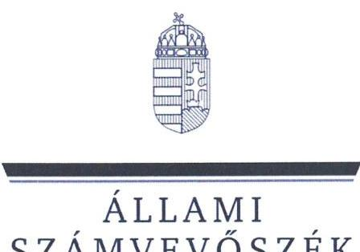

ÁLLAMI
SZÁMVEVŐSZÉK

# JELENTÉS 

## A Gárdonyi Géza Színház pénzügyi helyzetének alakulása

2023. 

23044
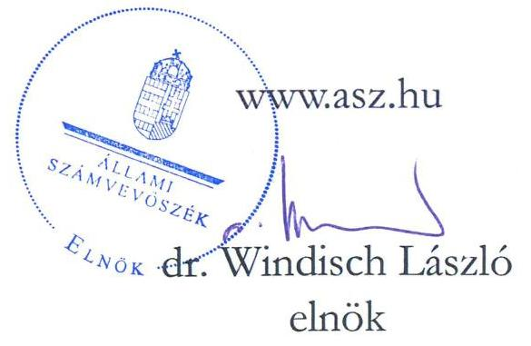

---

# ELLENŐRZÉSI IGAZGATÓSÁG: 

## ÁLLAMHÁZTARTÁS HELYI SZINTJÉT ELLENŐRZŐ IGAZGATÓSÁG

ELLENŐRZÉSI IGAZGATÓ:
KISGERGELY ISTVÁN igazgató

ELLENŐRZÉSVEZETŐ:
Jelentéseink az interneten a www.asz.hu címen olvashatók.

BŐRŐCZ IMRE ellenőrzésvezető

IKTATÓSZÁM: EL-3872-004/2023.
TÉMASZÁM: -
ELLENŐRZÉS-AZONOSÍTÓ SZÁM: V1028

---

# TARTALOMJEGYZÉK 

AZ ELLENŐRZÉS ALAPADATAI ..... 5
AZ ELLENŐRZÖTT SZERVEZETEK/ AZ ELLENŐRZÉS HATÓKÖRE ..... 7
ELŐZMÉNYEK ..... 9
ÖSSZEFOGLALÁS ..... 10
AZ ELLENŐRZÉS FÓKUSZKÉRDÉSE ..... 12
MEGÁLLAPÍTÁSOK ..... 13
JAVASLATOK ..... 24
MELLÉKLETEK ..... 25
I. sz. melléklet: Értelmező szótár ..... 25
II. sz. melléklet: Az ellenőrzött szervezetek jegyzéke ..... 27
III. sz. melléklet: Főbb mérlegadatok és azok változása a 2021. és a 2022. években (ezer Ft, \%). ..... 28
IV. sz. melléklet: Bevételek és kiadások összetétele és azok változása 2021-2022. (ezer Ft, \%). ..... 29
V. sz. melléklet: A színház gazdálkodását jellemző egyes mutatószámok alakulása (\%), valamint azok viszonyítása másik négy színház azonos mutatóinak átlagához. ..... 30
VI. sz. melléklet: A színház kumulált bevételei, kiadásai és bankszámla egyenlegének alakulása 2021. márciustól 2023. márciusig tartó időszakban (ezer Ft) ..... 32
FÜGGELÉK: ÉSZREVÉTELEK ..... 33
RÖVIDÍTÉSEK JEGYZÉKE ..... 62

---

.

---

# AZ ELLENŐRZÉS ALAPADATAI 

## AZ ELLENŐRZÉS CÉLJA

Az ellenőrzés célja annak értékelése, hogy a Gárdonyi Géza Színház (Színház ${ }^{1}$ ) és Eger Megyei Jogú Város Önkormányzata (Önkormányzat²) megtette-e a Színház pénzügyi egyensúlyának fenntartása érdekében a szükséges intézkedéseket.

## AZ ELLENŐRZÉS TÍPUSA

Megfelelőségi ellenőrzés

## AZ ELLENŐRZÖTT IDŐSZAK

2021-2022. évek és 2023. I. negyedév

## AZ ELLENŐRZÉS TÁRGYA

A Színház pénzügyi egyensúlyi helyzetének, valamint az annak kezelése érdekében tett intézkedések, döntések és azok végrehajtásának értékelése.

Az ellenőrzés kiterjedt minden olyan körülményre és adatra, amely az ÁSZ ${ }^{3}$ jogszabályban meghatározott feladatainak teljesítéséhez, valamint a program végrehajtása folyamán felmerült újabb összefüggések feltárásához szükséges volt.

## AZ ELLENŐRZÉS JOGALAPJA

Az ellenőrzés jogszabályi alapját az ÁSZ tv. ${ }^{4}$ 1. § (3) bekezdése, 3. § (2a) bekezdése, valamint az 5. § (3) bekezdés előírásai képezték.

## AZ ELLENŐRZÉS MÓDSZERE

Az ellenőrzést az Alaptörvény 43. cikk (1) bekezdésében meghatározott törvényességi, célszerűségi szempontok, valamint a nemzetközi standardokat irányadónak tekintve az ellenőrzési program szempontjai, az ellenőrzött időszakban hatályos jogszabályok, az ellenőrzés szakmai szabályok és módszertanok figyelembevételével hajtotta végre az ÁSZ.

Az ellenőrzési bizonyítékként felhasználható adatforrások közé tartoztak egyrészt az ellenőrzés során kért dokumentumok, másrészt adatforrás lehet még minden - ellenőrzés folyamán feltárt - az ellenőrzés szempontjából releváns információkat tartalmazó dokumentum. Az ellenőrzés felhasznált az államháztartás információs rendszerében rendelkezésre álló adatokat is.

---

Az ellenőrzés lefolytatásához az ellenőrzött szervezet az ÁSZ által kért dokumentumok, adatok, információk rendelkezésre bocsátásával a helyszíni ellenőrzés során szolgáltatott adatokat.

Az ellenőrzési kérdések megválaszolásához szükséges bizonyítékok megszerzése az ellenőrzött szervezet(ek) által rendelkezésre bocsátott dokumentumokra és adatokra alapozva, továbbá megfigyelés, szemle (szemrevételezés), kérdésfeltevés (információkérés), valamint elemző eljárás útján történt. Az elemző eljárás keretében értékelésre került a Színház költségvetési beszámolóiból származó adatok alapján képzett mutatók alakulása (működési költségvetési kiadások fedezettsége, felhalmozási kiadások fedezettsége, államháztartáson belüli támogatások összes bevételen belüli aránya, működési költségvetési bevételek összes bevételen belüli aránya, finanszírozási bevételek összes bevételen belüli aránya, irányító szervi támogatás aránya, 90 napon túli lejárt kötelezettségek állományának aránya, fizetett késedelmi kamat összes kiadáshoz viszonyított aránya, likviditási gyorsráta, tőkeerősségi mutató, befektetett eszközök fedezettsége), valamint ezek összehasonlításra kerültek négy színház ${ }^{5}$ egyes hasonló mutatóinak átlagával.

---

# **AZ ELLENŐRZÖTT SZERVEZETEK/ AZ ELLENŐRZÉS HATÓKÖRE**

**A SZÍNHÁZAT** – mint költségvetési szervet – 1985. január 1-jén alapították. A Színház irányító szerve és fenntartója az ellenőrzött időszakban az Önkormányzat volt. Alaptevékenysége alapján a Színház prózai, zenés, táncos színpadi művek előadásával foglalkozó és táncművészeti alkotásokat bemutató, állandó játszóhellyel rendelkező előadó-művészeti szervezet.

|  1. táblázat |  |  |  |  |   |
| --- | --- | --- | --- | --- | --- |
|   | **A SZÍNHÁZ MŰKÖDÉSÉNEK FŐBB ADATAI A 2021. ÉS A 2022. ÉVEKBEN** |  |  |  |   |
|   |  | 2021. |  | 2022. |   |
|  Eszközök év |  |  |  |  |   |
|  végi állománya: | 1 172 903 ezer Ft |  | 885 834 ezer Ft |  |   |
|  Kiadás összesen: | 651 637 ezer Ft |  | 1 043 229 ezer Ft |  |   |
|  Statisztikai átlaglétszám: | 113 fő |  | 110 fő |  |   |
|  Előadások száma: | 124 db |  | 239 db |  |   |
|  Nézőszám: | 19,9 ezer fő |  | 55,1 ezer fő |  |   |

*Forrás: A Színház költségvetési beszámolói és az ellenőrzés számára átadott adatok alapján ÁSZ saját szerkesztés*

A Színház gazdasági szervezettel nem rendelkező költségvetési szerv, gazdálkodási feladatait munkamegosztási megállapodás alapján 2021. március 31-ig az Egri Közszolgáltatások Városi Intézménye (EKVI${ }^{6}$), 2021. április 1-től Eger Megyei Jogú Város Polgármesteri Hivatal (Hivatal${ }^{7}$) látta el. A Színház a világjárvány idején 2020. március 12. – 2020. augusztus 31., illetve 2020. november 4. – 2021. augusztus 31. között volt kénytelen bezárni. A kényszerű szünet alatt online előadásokat, illetve vendégelőadásokat tartottak. Az energiaválság miatt – önkormányzati döntés alapján – a 2023. év I. negyedév nagy része is a színházi épület közönség előtti zárvatartásával telt. A nézőszám és az előadásszám a világjárvány miatti kényszerű visszaesés után még nem tért vissza a 2019. bázis év szintjére, az előadások száma a 2019. évi 352 darabhoz képest a 2021. évben 64,8%-kal, a 2022. évben 32,1%-kal volt kevesebb. A nézőszámban a 2022. évben növekedés volt megfigyelhető a 2021-hez viszonyítva, de a bezárás hatására a 2019. évi 89 326 főről 2021. évben 77,8%-kal, 2022. évben 38,3%-kal csökkent. Az államháztartás információs rendszerének teljesítési adatai szerint a színházi kiadásokra a fedezetet a 2021. évben 965 910 ezer Ft (ebből előző évi maradvány igénybevétele: 83 948 ezer Ft), a 2022. évben 1 083 718 ezer Ft bevétel (ebből előző évi maradvány igénybevétele: 314 272 ezer Ft) biztosította. Az irányító szervi finanszírozásban az ellenőrzött időszakban az Önkormányzat mellett jelentős szerepet vállalt az állam is azzal, hogy öt éven keresztül – 2024. december 31-ig – évente 284 000 ezer Ft támogatással járul hozzá a Színház fenntartásához. Az összes kiadás az összes bevételnek a 2021. évben 67,5%-át, a 2022. évben 96,3%-át jelentette. A Színház egyszemélyi felelős vezetője az igazgató, akinek személyében az ellenőrzött időszakban változás nem történt.

A színház könyvviteli mérlegei szerint az év végi állapotot mutató mérlegfőösszeg (eszköz-, illetve azzal egyező forrásállomány) a 2021. évben 1 172 903 ezer Ft, míg a 2022. évben 885 834 ezer Ft volt. A 24,5%-os

---

(287 069 ezer Ft-os) állományvisszaesés az eszközoldalon alapvetően a pénzeszközök 87,5%-os (271 710 ezer Ft-os, amelyből az előző évi maradvány elvonása 215 390 ezer Ft-ot jelentett) csökkenésével állt összefüggésben. A főbb mérlegadatok 2021. és 2022. év végi alakulását és a változásait az III. számú melléklet mutatja be.
EGER MEGYEI JOGÚ VÁROS az észak-magyarországi régióban fekszik, Heves vármegye székhelye. Lakosainak száma 2023. január 1-jén 49 981 fő volt. Az ellenőrzött időszakban a várost a Polgármesterrel ${ }^{8}$ együtt 18 fős Közgyűlés ${ }^{9}$ irányította. Az Önkormányzat a Hivatal és 12 intézmény fenntartója volt. A Hivatal látta el az EKVI kivételével valamennyi önkormányzati költségvetési szerv gazdálkodási feladatait. A Polgármester és a Jegyző ${ }^{10}$ személye az ellenőrzött időszakban nem változott.
Az ÁSZ ellenőrzés hatóköre nem terjedt ki:

- a Színház pályázaton nyert pénzeszközei felhasználásának és elszámolásainak ellenőrzésére;
- a jegyárak megalapozottságának értékelésére és a Színház bevételnövelési lehetőségeinek feltárására,
- a Színház kötelezettségvállalással terhelt maradványának felülvizsgálatára,
- a Színház szakmai feladat-ellátásának értékelésére.

---

# ELŐZMÉNYEK 

A helyszínen végzett ellenőrzéskor a Színház és az Önkormányzat is nyilatkozott az álláspontjáról különösen a tervezés, az irányító szervi finanszírozás és a maradványelvonás témakörében, amelyet a következők foglalják össze:

- A Színház szerint az irányító szervi támogatást a Színház nem ütemezve kapta meg, rákényszerült, hogy műsorváltoztatás árán azokat a produkciókat hozza előbbre az évadtervben, amelyek megvalósításához pályázati támogatással rendelkezett. Ezen probléma megoldására a támogatási rendszer felülvizsgálatát tartja szükségesnek a Színház.
- Az Önkormányzat szerint a Fenntartói megállapodásban ${ }^{11}$ szabályozottakat megfelelően alkalmazta, mivel abban az szerepelt, hogy a támogatás éves összegét és annak kiadási főcsoport szerinti megoszlását a költségvetési rendeletében - a tervezhető források mértékének figyelembevételével - állapítja meg. A költségvetés tervezésekor a keretszámok kialakítása a Színházzal előzetesen egyeztetett volt. A 2021. és a 2022. évben a költségvetési rendeletben eredeti előirányzatként kevesebbet terveztek, mint a Közös működtetési megállapodásban ${ }^{12}$ vállalt támogatási összeg, azonban a Színház a teljes támogatási összeg fennmaradó részét 2021. november 30-án pótelőirányzatként kapta meg, valamint 2022. júniusában a maradvány elszámolást követően az Önkormányzat a pénzmaradványból biztosította.
- A Színház megítélése szerint az Önkormányzat a többletbevételeket, valamint a Színház által megszerzett pályázati és egyéb forrásokat „dupla finanszirozás" címen vonta el a maradvány egy részének elvonására vonatkozó döntésével. Az Önkormányzat 2021. december 20-án utalt át nagy összegű irányító szervi támogatást. Ez hozzájárult ahhoz, hogy a Színháznak 2021. évben jelentős maradványa keletkezett, amelynek - mivel 10 nap alatt nem tudta kötelezettségvállalással terhelni - a 2022. évben az Önkormányzat nagy részét elvonta. Az Önkormányzat tájékoztatása szerint azért vonta el a szabad maradványt a Színháztól, mert a Színház nem jelezte, hogy mire szeretné ezt a maradványt fordítani, és erre vonatkozó igényt nem nyújtott be.
- A Színház szerint a 2020. és a 2021. évi bérfejlesztésre és a kulturális bérpótlék kifizetésére a fedezetet a központi költségvetés biztosította az Önkormányzat számára, azt az Önkormányzatnak nem saját bevételéből kellett átadnia a Színház részére, mégis a Közös működtetési megállapodásban vállalt önkormányzati támogatás részeként vette figyelembe. Az Önkormányzat szerint a bérminimum miatti emelkedés a Színháznál duplán volt lefinanszírozva, mivel arra a Színház a 2022. évi költségvetésében önkormányzati támogatást kapott, miközben azt az állam is támogatta pályázati pénzeszköz biztosításával.
- Az Önkormányzat a helyszíni ellenőrzés során a kialakult nézetkülönbség okaként jelölte meg, hogy a Színház szakmai teljesítménye jelentősen csökkent a világjárvány ideje alatt, amelyet azóta sem tudott a járvány előtti szintre visszaemelni, illetve több esetben tártak fel szabálytalanságot a Színház működésével, gazdálkodásával kapcsolatban. A probléma megoldása érdekében az Önkormányzat létrehozott 2023. áprilisában egy, a Színház működését, anyagi helyzetét, szervezeti felépítését áttekintő helyzetelemző munkacsoportot ${
 }^{13}$.
Az Önkormányzat, illetve a Színház fentiekben ismertetett álláspontjai nem tartoznak az ÁSZ megállapításai körébe. Az ÁSZ a célszerűségi és szabályszerűségi szempontok alapján, az előre meghatározott ellenőrzési programja alapján végrehajtott ellenőrzésének megállapításait külön („Megállapítások") fejezet tartalmazza.

---

# ÖSSZEFOGLALÁS 

Az elmúlt években a világjárvány, majd az azt követő energiaválság sajátos jogi, működési és gazdálkodási környezetet okozott. A Színháznak és az Önkormányzatnak is olyan problémákkal kellett szembesülnie, amelyekkel korábban nem. Az ÁSZ terven felüli ellenőrzés keretében ellenőrizte a Színház pénzügyi helyzetének alakulását, a Színház és az Önkormányzat által a Színház pénzügyi egyensúlyának fenntartása érdekében tett intézkedéseket.

A Színháznál 2021. évben a bevételek több mint felét, 2022. évben közel felét az Önkormányzat és a kultúráért felelős Minisztérium ${ }^{14}$ 2024. december 31-ig szóló közös működtetésre irányuló megállapodásán alapuló, évente fix összegű (284000 ezer Ft állami, 245152 ezer Ft önkormányzati) támogatás jelentette. A 2022. évben a Közös működtetési megállapodás szerinti támogatási összeg a személyi jellegű kiadások és járulékok 92,5%-ának fedezetére volt elegendő. Az ellenőrzött időszakban a Színház működési bevétele az irányító szervi támogatásnál lényegesen alacsonyabb - annak a 2021. évben 19,5%-a, a 2022. évben 18,7%-a volt. A Színház bevételtermelő képessége az ellenőrzött időszakban jelentősen visszaesett, amely összefüggött a világjárvánnyal és az energiaválsággal, az ezek miatti ideiglenes színházbezárásokkal. A jegy- és bérletértékesítésből származó bevételek a 2021. évben 60,3%-kal, a 2022. évben 45,2%-kal maradtak el a világjárvány előtti bázisévhez képest. Az egy nézőre jutó átlagos jegybevétel a 2021. évben 2828 Ft/néző és a 2022. évben 1408 Ft/néző volt, ami a 2019. bázisévre számított mutatóhoz képest a 2021. évben 78,4%-kal magasabb, a 2022. évben 11,2%-kal alacsonyabb volt. A Színház egy foglalkoztatottra jutó működési költségvetési bevétele a 2021. évben 2323 ezer Ft/foglalkoztatott, 2022. évben 2086 ezer Ft/foglalkoztatott volt. A Színház önfenntartó, bevételtermelő képességére és a gazdálkodás hatékonyságára utaló ezen mérési mutató alakulása az összehasonlításba hasonló jellegük miatt bevont másik négy színház azonos mutatóinak átlagaihoz viszonyítva is kedvezőtlennek tekinthető, mert annak 2021-ben 54,8%-a, 2022-ben 39,7%-a volt.

A 2022. évben a Színház teljesített kiadásai 60,1%-kal meghaladták a 2021. évi kiadások összegét, amely döntően azzal állt összefüggésben, hogy az előző évi maradványból az Önkormányzat 215390 ezer Ft-ot elvont. A maradványelvonás kiadási hatását kiszűrve a két év között a kiadások növekedése 27,0%-os volt.

Az ellenőrzés keretében a pénzügyi és vagyoni helyzet elemzésére alkalmazott mutatók között a mértéken alapuló megítélés szerint közel azonos volt a kedvezően és kedvezőtlenül alakuló mutatók száma. Kedvezőnek értékelhető, hogy a 2021. év, a 2022. év és a 2023. I. negyedév végén sem volt 90 napon túli lejárt kötelezettsége a Színháznak és az ellenőrzött időszakban nem kellett fizetnie a késedelmes teljesítések miatti kamatot sem. Az időszakok végi likviditási gyorsráta minden esetben 100% feletti volt,

A költségvetési beszámolási, gazdálkodási adatok alapján a Színház a pénzügyi egyensúlyi helyzetét megőrizte, a likviditása stabil volt, a fizetési kötelezettségeinek eleget tudott tenni. Az irányító szervi támogatás 2021. és 2022. évekre tervezett eredeti előirányzatai nem feleltek meg a közgazdasági megalapozottság követelményének, egyes fenntartói intézkedéseket nem alapozták meg előre tisztázott, célszerű részletszabályok.
vagyis a pénzeszközök elegendők lettek volna valamennyi rövid lejáratú kötelezettség azonnali teljesítésére. A működési költségvetési kiadások, valamint felhalmozási költségvetési kiadások fedezettsége, működési költségvetési bevételek, finanszírozási bevételek, valamint az irányító szervi támogatás összes bevételen belüli aránya ugyanakkor kedvezőtlen volt. Ezek - a felhalmozási kiadások fedezettsége kivételével - az összehasonlításba hasonló jellegük miatt bevont másik négy színház azonos mutatóinak átlagaihoz viszonyítva is kedvezőtlenebb képet mutattak.

---

A Színház szervezeti és működési szabályzata nem az ellenőrzött időszakban fennálló állapotot tartalmazta, mert nem a Hivatalt jelölte meg a gazdálkodási feladatokat ellátó költségvetési szervként. Az Önkormányzat és a Színház közötti éves Fenntartói megállapodások nem tértek ki az előirányzatok tervezésének, az irányító szervi támogatás folyósításának, a maradvánnyal kapcsolatos adatszolgáltatásoknak a részletszabályaira. Az Önkormányzat költségvetési rendeletei a részletszabályok meghatározásának célszerűsége ellenére nem tartalmaztak a maradványelvonásra vonatkozó általános elvet és szabályokat, valamint az év közben a keletkezett többletbevételek felhasználására vonatkozó szabályokat. A Közös működtetési megállapodásban vállalt intézményfinanszírozási kötelezettség eredeti előirányzatként nem teljes összegű, hanem csak részleges megtervezése helytelen tervezési gyakorlat volt a 2021. és a 2022. évben, mivel a várható gazdasági események teljesítéséhez a teljes állami és a vállalt önkormányzati támogatás, valamint a tervezett saját bevétel biztosítására szükség lett volna. Az Önkormányzat 2021-2022. évben alkalmazott tervezési gyakorlata nem felelt meg a bevételekre törvényben előírt közgazdasági megalapozottsági követelménynek, valamint a valódiság, továbbá a teljesség és a részletezettség tervezésre vonatkozó szakmai elveinek. A 2023. évben már a teljes előirányzatot biztosították, így tervszinten is érvényesült a Közös működtetési megállapodásban vállalt támogatási kötelezettség.

Törvényes lehetőség állt rendelkezésre, hogy az Önkormányzat az előző évről származó maradványokat elvonja. A maradvány részét is képező pályázati forrásokkal való elszámolások felülvizsgálata és értékelése a támogatást nyújtók

Az Önkormányzat és a Színház intézkedéseket tett a Színház pénzügy egyensúlyi helyzetének megtartására, a likviditásának folyamatos fenntartására.
feladat- és hatáskörébe tartozik. Amennyiben az elszámolásokkal összefüggésben esetlegesen a későbbiekben visszafizetési kötelezettség keletkezne, annak teljesítése az Önkormányzatot terhelő forrásigénnyel járhat.

A döntések körében olyan kényszerű megoldásokra is sor került, mint a Színház átmeneti bezárása, energiatakarékossági intézkedések. A pénzügyi helyzetet kedvezőtlenül érintő környezeti hatások kiküszöbölése érdekében tett bevételnövelő és kiadáscsökkentő intézkedések elvárt eredményeinek visszamérése a helyszíni ellenőrzés lezárásáig az Önkormányzatnál és a Színháznál sem történt meg. A Közgyűlés 2023 áprilisában döntött a Színház működését, anyagi helyzetét, szervezeti felépítését áttekintő helyzetelemző munkacsoport felállításáról, amelynek voltak a jelen ellenőrzés lefolytatásának időszakába eső részhatáridői, de a tevékenységének érdemi folyamata nem zárult le és eredménye még nem volt megítélhető.

A Színház és az Önkormányzat eltérő álláspontja szerint megítélt színház-működtetési és gazdálkodási gyakorlat egyes kockázatok (a színházi feladatellátás és gazdálkodás feltételeinek szűkülése, a pályázati érdekeltség csökkenéséből eredően a pályázati aktivitás visszaesése, a szakmai színvonal növelésére irányuló motiváltság fékeződése, az együttműködés feltételeinek romlása) kedvezőtlen irányú változásával járhatnak.

---

# AZ ELLENŐRZÉS FÓKUSZKÉRDÉSE 

- A Színház és az Önkormányzat megtette-e a Színház pénzügyi egyensúlyának fenntartása érdekében szükséges intézkedéseket?

---

# MEGÁLLAPÍTÁSOK 

## 1. A Színház és az Önkormányzat megtette-e a Színház pénzügyi egyensúlyának fenntartása érdekében szükséges intézkedéseket?

Összegző megállapítás

1.1. számú megállapítás

A Színház és az Önkormányzat intézkedéseivel a Színház pénzügyi egyensúlya összességében biztosított volt.

A költségvetési beszámolási, gazdálkodási adatok alapján a Színház a pénzügyi egyensúlyi helyzetét megőrizte, a likviditása stabil volt, a fizetési kötelezettségeinek eleget tudott tenni. Az irányító szervi támogatás 2021. és 2022. évekre tervezett eredeti előirányzatai nem feleltek meg a közgazdasági megalapozottság követelményének, egyes fenntartói intézkedéseket nem alapozták meg előre tisztázott, célszerű részletszabályok.

A Színház az ellenőrzött időszakban - a KGR-K11 ${ }^{15}$ rendszerbe való feltöltésekkel - az Áht. ${ }^{16}$-ban, valamint az Ávr. ${ }^{17}$-ben előírtaknak megfelelően szolgáltatott adatot az államháztartás információs rendszerébe.
A BEVÉTELEK meghatározó részét a 2021. és a 2022. években is a Színházat fenntartó Önkormányzat és a kultúráért felelős Minisztérium 2020. május 29-én öt évre kötött, 2024. december 31-ig szóló közös működtetésre irányuló megállapodásán alapuló, évente fix összegű támogatás (284000 ezer Ft állami, 245152 ezer Ft önkormányzati) jelentette. A minden évben változatlan összegű támogatás az öt éves időtartam alatt veszített a reálértékéből. A Színház bevételeinek összetételét a 2021. és a 2022. évi teljesítési adatok szerint az 1. és 2. számú ábrák mutatják be.

## 1. ábra

A SZÍNHÁZ BEVÉTELEINEK ÖSSZETÉTELE A 2021. ÉVI TELJESÍTÉSI ADATOK SZERINT
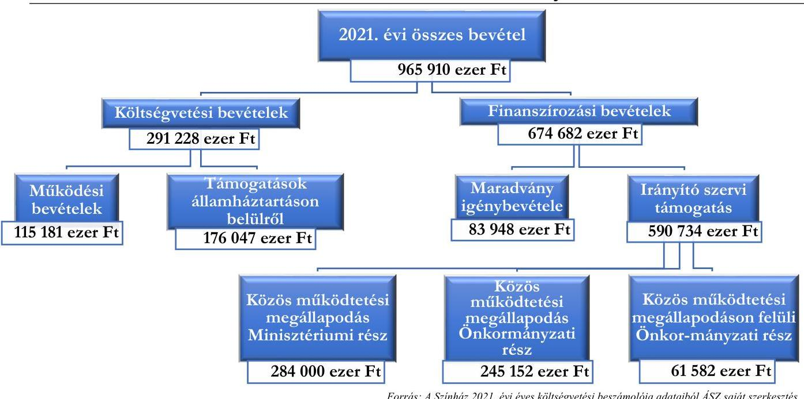

---

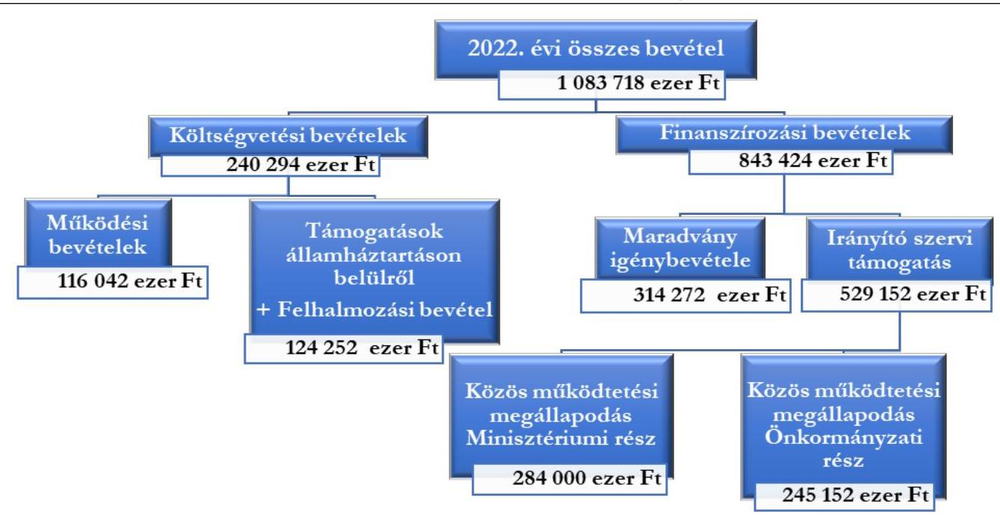

Forrás: A Színház 2022. évi éves költségvetési beszámolója adataiból ÁSZ saját szerkesztés

A bevételek az eredeti előirányzathoz képest a 2021. évben 55,4%-kal, a 2022. évben 75,7%-kal haladták meg a tervezettet. Ez elsősorban a következőkkel függött össze:

- Az Önkormányzat a költségvetési rendeletében a Színház költségvetésének eredeti előirányzataként az intézményfinanszírozásra a Közös működtetési megállapodásban vállalt kötelezettséggel (529 152 ezer Ft-tal) szemben a 2021. évre annak 80,7%-át (426 962 ezer Ft-ot), a 2022. évre annak 84,9%-át (449152 ezer Ft-ot) tervezte. Az Emtv. ${ }^{18}$ 16. § (8) bekezdésén alapuló megállapodásban rögzített kötelezettség részleges figyelembevétele helytelen tervezési gyakorlat volt, amely nem felelt meg az Áht. 4. § (2) bekezdésében a bevételekre előírt közgazdasági megalapozottsági követelménynek, valamint a valódiság, továbbá a teljesség és a részletezettség tervezésre vonatkozó szakmai elveinek. A költségvetés tervezésének az Önkormányzat által alkalmazott módja akadályozta a Színház vezetőjét a rendelkezésére álló előirányzat évközi folyamatos és ütemszerű felhasználásában.
- Az államháztartáson belülről származó - működési és felhalmozási célú - támogatások sem a 2021. évben, sem a 2022. évben nem voltak tervezhetők eredeti előirányzatként, mivel azok évközi pályázatok elnyeréséhez kapcsolódtak (a teljesítési adat 176047 ezer Ft, illetve 120152 ezer Ft volt). A keletkezett többletbevételek felhasználására vonatkozó szabályokat az Önkormányzat költségvetési rendelete nem tartalmazott.
- A 2022. évben az előző évi maradvány igénybevételeként eredeti előirányzatként a Színház költségvetésében 50464 ezer Ft-ot terveztek. Ezt követően az előző évről szóló zárszámadás keretében 2022 májusában a jóváhagyott maradvány 314272 ezer Ft volt. Ebben jelentős szerepe volt annak, hogy 2021. november 30-án 100000 ezer Ft intézményfinanszírozási bevétel - ami a Közös működtetési megállapodásban vállalt önkormányzati támogatás összegének mintegy 40%-a - felügyeleti hatáskörben a Színház költségvetésében pótelőirányzatként került jóváhagyásra. Ennek terhére az év végéig a Színház csak korlátozottan tudott kötelezettséget vállalni. Ezen

---

túlmenően az eredeti előirányzatként tervezett intézményfinanszírozásnak 41,9%-a (188 127 ezer Ft) is csak 2021. december 20-án került átutalásra a Színház számlájára, amely célszerűen nem volt elkölthető. A Színház finanszírozása az időarányostól és a feladatarányostól is eltérő volt.

- Az Önkormányzatnál az ellenőrzött időszak minden évében módosult a béren kívüli előirányzatokat finanszírozó irányító szervi támogatás rendelkezésre bocsátásának számossága és összege. 2022 júliusától a gazdálkodási környezet kiszámíthatóságát csökkentette, hogy a Színház számláján lényegesen kisebb összegű pénzeszköz állt rendelkezésre a 2021. évi szabad pénzmaradvány elvonása miatt.
Törvényes lehetőség állt rendelkezésre (az Áht. 86. § (5) bekezdésének, valamint az Ávr. 155. § (2) bekezdésének előírásai alapján) arra, hogy az Önkormányzat az előző évről származó maradványokat elvonja. Az Önkormányzat költségvetési rendeletei a maradványelvonásra vonatkozó általános elvet és szabályokat nem tartalmaztak, így a Színház számára nem volt előre tisztázott, hogy milyen esetekben, milyen adatszolgáltatások és eljárások alapján történik maradványelvonás a fenntartó Önkormányzat részéről. Az Ávr. 155. § (1) bekezdése előírásának megfelelően a maradványból az irányító szervet megillető rész számítása megismerhető volt, mivel az a közgyűlési döntés előterjesztésében szerepelt.
A maradvány részét képező pályázati forrásokkal összefüggő megtakarításokkal kapcsolatban indokolt kiemelni, hogy a pályázati forrásokkal való elszámolások
 felülvizsgálata és értékelése a támogatást nyújtók feladat- és hatáskörébe tartozik, ezért ezeket az ÁSZ jelen ellenőrzés keretében külön-külön nem vizsgálta. Amennyiben az elszámolásokkal összefüggésben esetlegesen a későbbiekben visszafizetési kötelezettsége keletkezne a Színháznak, annak teljesítése - az önkormányzatokra vonatkozó Áht. 60/A. §-ában foglalt előírások mellett - az Önkormányzatot terhelő forrásigénnyel járhat a maradványelvonásról szóló döntésre tekintettel.
Az 1. és 2. ábrák összehasonlításából a teljesítési adatok alapján megállapítható, hogy az előző évhez képest a 2022. évben a jelentős bevételi emelkedés az előző évi maradvány igénybevételénél jelentkező érdemi többletből származott. Az előző évi maradvány, továbbá a működési bevételek mindössze 0,7%-os emelkedésén túl minden más, az ábrákban szereplő bevételnél azonos, vagy alacsonyabb szinten teljesült a bevétel, mint a korábbi évben. A Közös működtetési megállapodáson felüli önkormányzati rész 2022-ben már nem jelentkezett (nulla volt), sőt az Önkormányzat az előző évi maradvány kötelezettségvállalással nem terhelt részéből 215390 ezer Ft-ot el is vont a Színháztól. A 2021. évi maradványból elvont összeg a közös működtetési megállapodás szerinti 2021. évi önkormányzati támogatási részt nem csökkentette az előírt szint alá, mert arra egyes 2021. évi bevételi források elegendő fedezetet nyújtottak. Az alábbi ábra szemlélteti az elvont összeg és annak lehetséges fedezetét biztosító bevételek összevetését.
3. ábra

# A 2021. ÉVI PÉNZMARADVÁNYBÓL ELVONT ÖSSZEG ÉS ANNAK LEHETSÉGES BEVÉTELI FEDEZETE (EZER FT) 

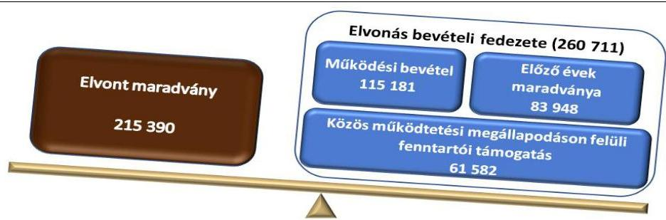

Forrás: A Színház 2021. és 2022. évi költségvetési beszámolóinak adataiból ÁSZ saját szerkesztés

---

A TELJESÍTETT KIADÁSOK összege a 2021. évben 651637 ezer Ft, a 2022. évben az előző évhez képest 60,1%-kal több, 1043229 ezer Ft volt, amelyből 215390 ezer Ft-ot az elvont és az önkormányzat számlájára pénzforgalmi költségvetési kiadásként befizetett maradvány tett ki. A maradványelvonás nélkül a teljesített kiadások emelkedése a két év között 27,0% volt. A kiadások a 2021. évben 4,8%-kal, a 2022. évben 69,1%-kal haladták meg a Színház eredeti előirányzatát. A 2022. évi jelentős mértékű eltérés oka volt az előirányzatok szintjén az is, hogy a személyi juttatások és munkaadót terhelő járulékok együttesen +24,7%-a évközi módosítással kerültek be a költségvetésbe, a dologi kiadások esetében a változtatás +79,5%-ot képviselt. Ez összefüggött azzal, hogy az eredeti bevételi előirányzatok megtervezése nem volt teljeskörű, így a kiadási előirányzatok is jelentősen visszafogottak voltak.
A személyi jellegű kiadások és munkaadót terhelő járulékok együttes összege az ellenőrzött időszak első évében a teljesített kiadások 71,1%-át, második évében 54,8%-át tették ki. A maradványelvonás nélkül a 2022. évben személyi jellegű kiadások és munkaadót terhelő járulékok az összes kiadás 69,1%-át jelentették. A személyi jellegű kiadások és munkaadót terhelő járulékok alapvetően a kulturális ágazatot érintő bérfejlesztés hatására a két év között is jelentős mértékben - 23,4%-kal - növekedtek, olyannyira, hogy 2022. évben a Közös működtetési megállapodás szerinti támogatási összeg ezen kiadások 92,5%-ára volt elegendő. A dologi kiadások összege a 2021. évről a 2022. évre 30,4%-kal emelkedett. A dologi kiadásokra és a felhalmozási kiadásokra együttesen a 2021. évben a kiadások 28,7%-át, a 2022. évben 22,6%-át (maradványelvonás nélküli kiadások 28,5%-át) fordították, ami elmaradt az infláció okozta hatástól.
A bevételek és kiadások összetételének teljesítési adatait a 2021. és a 2022. évekre a IV. számú melléklet foglalja össze.
A SZÍNHÁZ LIKVIDITÁSA az ellenőrzött időszakban folyamatosan biztosított volt.
Az államháztartás információs rendszerében elérhető adatok alapján a kiadások és bevételek kumulált teljesítési adatainak alakulását a 4. ábra mutatja, a részletes adatokat a VI. számú melléklet tartalmazza.
4. ábra

# A KIADÁSOK ÉS BEVÉTELEK KÖLTSÉGVETÉSI JELENTÉSEK SZERINTI KUMULÁLT TELJESÍTÉSI ADATAINAK ALAKULÁSA 2021. MÁRCIUSTÓL 2023. MÁRCIUS HÓ VÉGÉIG (EZER FT) 

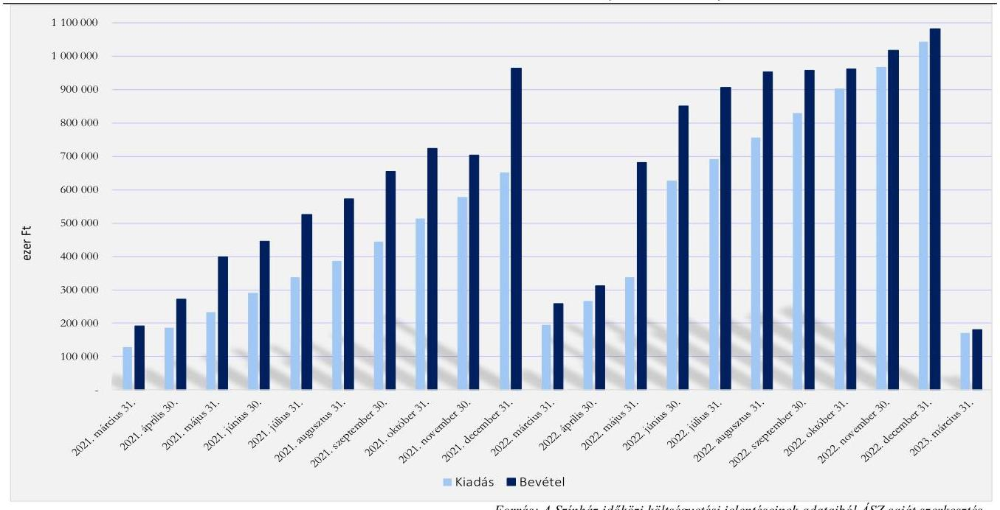

---

Az ábra jól szemlélteti, hogy a Színháznál az ellenőrzött időszak minden adatszolgáltatási időszakában a bevételek kumulált adata meghaladta a kumulált kiadási adatokat. A 2021. év decemberében a bevételek jelentős növekedést mutatnak az előző hó végi adathoz képest, mivel az Önkormányzat 188127 ezer Ft-ot 2021. december 20-án utalt a Színháznak. Ezt követően 2022 májusában ismét jelentős növekedés figyelhető meg a bevételek alakulásában, aminek oka, hogy az előző évi maradvány igénybevételének finanszírozási bevételként (pénzforgalom nélküli bevételként) történő elszámolása ebben a hónapban jelent meg az adatszolgáltatásban. Az Önkormányzat döntött a kötelezettségvállalással nem terhelt előző évi maradvány elvonásáról, amelyet a Színháznak 2022 június hónapban kellett visszafizetnie az Önkormányzat számlájára. Jól mutatja az ábra, hogy év végére a bevételek és kiadások egyre közeledtek egymáshoz, ami hatással volt a 2022. év alacsony maradványára.
A bevételek 2023. I. negyedévében - a kiadási szükségletekhez igazodó önkormányzati finanszírozás hatására - kis mértékben haladták meg a kiadásokat.

# A KÖLTSÉGVETÉSI BESZÁMOLÓK ADATAI ALAPJÁN SZÁMÍTOTT EGYES FŐBB 

MUTATÓK 2021., 2022. évi és 2023. év I. negyedév szerinti alakulását és azok megítélésének rövid magyarázatát a V. számú melléklet mutatja be. A számított, kiemelt 11 mutató közül a 2021. évre öt, a 2022. évre négy, a 2023. év I. negyedévére öt db mutató tekinthető önmagában kedvezőnek, míg a további mutatók kedvezőtlen mértékűnek. A mutatók alakulásából a főbb megállapítások a következők:

- A kiadások fedezetét jelentő bevételeken belül a finanszírozási bevételek jelentős arányt képviseltek - a három időszakot tekintve 69,8%-ot, 77,8%-ot, 86,7%-ot -, azon belül is az irányító szervi támogatás volt a meghatározó. A finanszírozási bevételek magas aránya jelzi, hogy a Színház bevételtermelő képessége a működésének biztosításához nem volt elegendő, hasonlóan más költségvetési intézményekhez;
- Nagyrészt a világjárvány és az energiaválság hatásaival is összefüggésben kedvezőtlenül alakult a működési költségvetési kiadások fedezettsége (43,1%, 22,8%, 14,1%), valamint a felhalmozási kiadások fedezettsége is (75,3%, 30,4%, 0%);
- Az összes bevételen belül évről-évre egyre alacsonyabb volt a működési költségvetési bevételek aránya (27,6%, 21,2%, 13,3%) és az államháztartáson belüli támogatási bevételek aránya (18,2%, 11,1%, 0%). A 2022. évben a működési bevételek összes bevételen belüli aránya a világjárvány előtti mértékhez képest 40,3 százalékponttal, az államháztartáson belüli támogatások összes bevételen belüli aránya a 2019. év mutatójához képest szintén 40,3 százalékponttal volt alacsonyabb;
- Mindhárom kiemelt időszak végén pozitív képet mutatott, hogy a Színháznak nem volt 90 napon túli lejárt kötelezettsége, illetve az időszakokban kifizetett késedelmi kamat sem merült fel;
- A likviditási gyorsráta kedvezően alakult, a pénzeszközök a kiemelt három időszak mindegyikének végén elegendő lettek volna a rövid lejáratú kötelezettségek teljes körű kiegyenlítésére.
A 2022. évi mutatók 2019. évi mértékektől való százalékos eltérése kimutatta, hogy a 2022. évben kedvezőtlennek minősített mutatók tovább romlottak a világjárvány előtti mértékekhez képest.

---

A V. számú melléklet bemutatja a 2021. és a 2022. évek esetében a több aspektusból a azonos, vagy nem jelentős eltérést mutató másik négy színház mutatóinak átlagos értékeit is. Az ezzel való összevetés alapján a Színház mutatóinak alakulását a következők jellemezték:

- Kedvező volt a 90 napon túli lejárt kötelezettségek állománya, az időszakok végén nulla forint volt.
- A kedvezőtlen alakulású mutatók a másik négy színház átlagos mutatóival való összehasonlításban többségében negatív képet mutattak. A működési költségvetési bevételek összes bevételen belüli aránya mind a 2021., mind a 2022. év vonatkozásában alulmaradt a másik négy színház átlagához viszonyítva (2021-ben 13,8 százalékponttal, 2022-ben 20,5 százalékponttal). Az irányító szervi támogatás aránya a 2021. évben kedvezőtlenebb képet mutatott a másik négy színház átlagához képest. A Színház esetében a finanszírozási bevételek összbevételhez viszonyított aránya 2022-ben jelentősen - 20,9 százalékponttal - magasabb a másik négy színház átlagánál, amely az előző évi maradvány igénybevételével függött össze.
- A Színház egy foglalkoztatottra jutó összes kiadása az ellenőrzött időszak éveiben alacsonyabb (kedvezőbb) volt, mint a másik négy színház átlaga. Ez szükségszerű volt, hiszen az egy foglalkoztatottra jutó összes bevétele - mint rendelkezésre álló fedezet - is alacsonyabb volt a másik négy színház átlagához viszonyítva. Az egy foglalkoztatottra jutó működési költségvetési bevétel 2021. évben 54,8%-a volt, 2022. évben a 40%-át sem érte el a másik négy színház átlagának. Ezen hatékonysági mutató jelzi a Színház önfenntartó, bevételtermelő képességének a másik négy színházhoz mért alacsonyabb szintjét. A mutatókat a 2. számú táblázat mutatja be.
2. táblázat

# A SZÍNHÁZ EGY FOGLALKOZTATOTTRA JUTÓ EGYES MUTATÓINAK ALKULÁSA, VALAMINT AZOK VISZONYÍTÁSA MÁSIK NÉGY SZÍNHÁZ AZONOS MUTATÓINAK ÁTLAGÁHOZ 

| MEGNEVEZÉS | GÁRDONYI GEZA SZÍNHÁZ |  | MÁSIK 4 SZÍNHÁZ ÁTLAGA |  |
| :--: | :--: | :--: | :--: | :--: |
|  | 2021.67 | 2022.67 | 2021.67 | 2022.67 |
| 1 foglalkoztatottra jutó összes kiadás (eFt/fő) | 5767 | 9484 | 9756 | 12785 |
| 1 foglalkoztatottra jutó összes bevétel (eFt/fő) | 8548 | 9852 | 11005 | 13381 |
| 1 foglalkoztatottra jutó működési költségvetési bevétel (eFt/fő) | 2323 | 2086 | 4242 | 5258 |

Forrás: A Színház és másik négy színház 2021-2022. évi éves költségvetési beszámolójának adataiból, ÁSZ saját szerkesztés

## A SZÍNHÁZ BEVÉTELTERMELŐ KÉPESSÉGE, A NÉZŐSZÁM ÉS AZ ELŐADÁSSZÁM

ALAPJÁN számított egyes mutatók tanúsága szerint az ellenőrzött időszakban jelentősen visszaesett, amely a világjárvány és az energiaválság következményeivel egyértelműen összefüggésbe hozható, de részben akár - a jelen ellenőrzés hatókörébe nem tartozó - eltérő okok sem zárhatók ki, tekintve a másik négy színház mutatóihoz viszonyított kedvezőtlenebb képet.
A Színház bérbeadásból, jegy- és bérletbevételből, valamint egyéb saját bevételekből álló bevételeinek együttes összege a 2019. bázis év értékéhez képest a 2021. évben 36,8%-kal volt alacsonyabb, a 2022.

[^0]
[^0]:    a vidéki kőszínház jelleg, önkormányzati fenntartó, foglalkoztatottak száma, kiadási nagyságrend

---

évben 34,0%-kal maradt el attól. A 2021. és 2022. évi adatok összehasonlításában 4,3%-os lassú javulás történt.
A világjárvány okozta színházbezárás nemcsak a bevételek visszaesésében, hanem a Színház által megrendezett előadások számának csökkenésében is megfigyelhető volt.
Az egy előadásra jutó kiadások a világjárvány előtti fajlagos mutatóhoz viszonyítva jelentősen - a 2021. évben 142,5%-kal, a 2022. évben 101,4%-kal - emelkedtek, a mutatószámot befolyásoló kiadások és előadásszámok ellenőrzött időszakon belüli eltérő mértékű és irányú változásainak együttes hatására.
A 5. ábra mutatja be a jegybevétel és a nézőszám alakulását a 2021. és a 2022. években, valamint a 2019. bázis év adatai alapján.
5. ábra

A JEGYBEVÉTEL ÉS NÉZŐSZÁM ALAKULÁSA A 2021. ÉS A 2022. ÉVEKBEN, VALAMINT EZEKNEK A 2019. BÁZIS ÉV ADATAIHOZ TÖRTÉNŐ VISZONYÍTÁSA
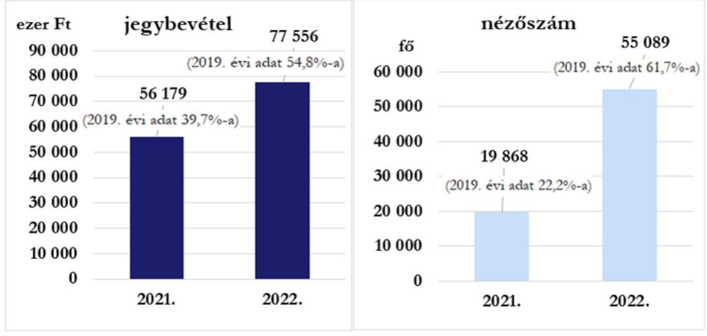

Forrás: Színházt adatszolgáltatás alapján ÁSZ saját szerkesztés
Az egy nézőre jutó átlagos jegybevétel a 2021. évben 2828 Ft/néző és a 2022. évben 1408 Ft/néző volt, ami a 2019. bázis évre számított mutatóhoz

 képest a 2021. évben 78,4%-kal magasabb, a 2022. évben 11,2%-kal alacsonyabb volt. Az egy nézőre jutó kiadás a 2019. bázisévi 8540 Ft/néző értékről 2021. évben 284,1%-kal 32798 Ft/nézőre, a 2022. évben 121,8%-kal 18937 Ft/nézőre növekedett. A változások szakmai okainak értékelése, valamint a jegyárak és a bevételnövelés lehetőségeinek feltárása célszerű lehet a Színház önfinanszírozási képességének javításához.
1.2. számú megállapítás

Az Önkormányzat és a Színház intézkedéseket tett a Színház pénzügyi egyensúlyi helyzetének megtartására, a likviditásának folyamatos fenntartására.

# A HIVATAL ÉS A SZÍNHÁZ KÖZÖTT A MUNKAMEGOSZTÁS ÉS 

FELELŐSSÉGVÁLLALÁS rendje az Ávr. 9. § (5) bekezdés a) pontjában előírtaknak megfelelően szabályozott volt. A Polgármester - a katasztrófavédelemről és a hozzá kapcsolódó egyes törvények módosításáról szóló 2011. évi CXXVIII. törvény 46. § (4) bekezdésében kapott felhatalmazás alapján elrendelte 2021. április 1. napjától valamennyi önkormányzati intézmény esetében az intézményi gazdálkodási feladatok átvételét az EKVI-től a Hivatal feladatai közé. A Munkamegosztási megállapodás ${ }^{19}$ az Ávr. 9. § (1) és az (5a) bekezdésekben foglaltaknak megfelelt.

---

A SZÍNHÁZ SZMSZ-ÉNEK ${ }^{20}$ módosítására a Színház igazgatója a Bkr. ${ }^{21}$ 6. § (2) bekezdésében és a 97/2021. (II. 19.) polgármesteri határozatban foglaltak ellenére nem intézkedett, a Színház ellenőrzött időszakban hatályos SZMSZ-ében továbbra is az EKVI szerepel, mint a pénzügyi-, gazdasági- és egyéb feladatai ellátására kijelölt költségvetési szerv. A Hivatali SZMSZ ${ }^{22}$ I. Függeléke tartalmazta a Színház gazdálkodási feladatai ellátására vonatkozó előírást.
A KÖTELEZETTSÉGVÁLLALÁSI SZABÁLYZAT ${ }^{23}$ rendelkezéseit 2021. április 1. napjától kellett alkalmazni, a szabályozás hatálya a Színházra is kiterjedt. A Hivatal az Ávr. 60. § (3) bekezdés előírásának megfelelően a kötelezettségvállalásra, pénzügyi ellenjegyzésre, teljesítés igazolására, érvényesítésre, utalványozásra jogosult személyekről és aláírás-mintájukról nyilvántartást vezetett.
A KÖZÖS MŰKÖDTETÉSI MEGÁLLAPODÁS létrejöttét az Emtv. 16. § (4) bekezdésében előírtak alapján a színház fenntartó Önkormányzat közös működtetésre vonatkozó kérelmében kezdeményezte, mivel a működéséhez szükséges forrásokat teljes körűen nem tudta biztosítani. A Kormányhatározat ${ }^{24}$ szerint 2024. december 31-ig terjedő időbeli hatállyal a Kormány döntött a közös működtetésről. A Közös működtetési megállapodásban a támogatás nyújtás céljaként került megfogalmazásra, hogy a Színház kiszámítható és biztonságos működtetése érdekében, a Színház művészeti szabadságának elismerésével és biztosítása mellett nyújtja az állam. A Közös működtetési megállapodást az emberi erőforrások minisztere és az Önkormányzat Polgármestere kötötte, továbbá a Színház igazgatója is záradékolta. A Közös működtetési megállapodás az Emtv. 16. § (8) bekezdés a) és b) pontjaiban előírtaknak eleget téve meghatározta a Színház közös működtetésének és működésének szabályait, valamint a központi költségvetésből juttatandó támogatás és az önkormányzati támogatás mértékét, amelynek finanszírozási szempontból legfőbb elemei a következők voltak:

- A Minisztérium vállalta, hogy évente összesen 284000 ezer Ft költségvetési támogatással a Színház működése pénzügyi feltételeinek meghatározott részét társműködtetői felelősségéből adódóan biztosítja.
- Az Önkormányzat kötelezettséget vállalt arra, hogy a költségvetési támogatás teljes összegét a Színház működtetésére és művészeti fejlesztésére fordítja, illetve a Színház számára biztosított éves fenntartói támogatás mértékét nem csökkenti a 2020. év vonatkozásában biztosított 245152 ezer Ft támogatási összeg alá.
A Közös működtetési megállapodás az állami és önkormányzati támogatás éves szintű rendelkezésre bocsátását előírta, és megjelölt a megállapodásban nem szabályozott kérdésekben irányadó jogszabályokat. A gazdálkodást és működést érintő részletszabályokról (pl.: a tervezéssel, gazdálkodással kapcsolatosan, a finanszírozás ütemezésének módja, az előirányzat megtervezése, szakmai teljesítményekre vonatkozó kritériumok azon túl, hogy a Színház az Emtv. szerinti kiemelt minősítését megőrzi) a felek nem állapodtak meg.
A TÁMOGATÓI OKIRATOK ${ }^{25}$ kiadására a Közös működtetési megállapodásban előírt határidő az ellenőrzött időszak éveire tárgyév január 31-e volt. A támogatói jogviszonyt létrehozó Támogatói okiratok kiadásának dátumai 2021. 11. 15., 2022. 02. 28., illetve a 2023. évben az ellenőrzött időszak végéig nem történt meg. Ezen dátumoknak az ad különös jelentőséget, hogy a támogatói jogviszony létrejöttét követő 30 napon belül juthatott az Önkormányzat az állami támogatás teljes összegű előlegéhez.
A kedvezményezett Önkormányzat a támogatás felhasználásáról a tárgyévet követő március 1-ig köteles szakmai beszámolót és pénzügyi elszámolást készíteni és a Minisztériumnak benyújtani. Az ellenőrzött időszakban az Önkormányzat határidőben eleget tett beszámolási kötelezettségének, a szakmai

---

beszámolót és pénzügyi elszámolást a 2021. évi támogatásról 2022. február 28-án, a 2022. évi támogatásról 2023. február 28-án benyújtotta. A Minisztériumnak a támogatói okiratokban foglaltak szerint a beszámolót és az elszámolást a beérkezést követő 60 napon belül kellett megvizsgálnia és döntenie annak elfogadásáról, illetve elutasításáról ${ }^{\text {b }}$. A Minisztérium a 2021. évi támogatás felhasználásáról benyújtott beszámoló és elszámolás elfogadásáról a 2022. október 27-i dátumú levélben tájékoztatta az Önkormányzatot. A 2022. évre vonatkozóan benyújtott beszámoló és elszámolás elfogadásáról a helyszíni ellenőrzés időpontjáig a Minisztérium részéről még nem történt visszajelzés.
AZ ÖNKORMÁNYZAT ÉS A SZÍNHÁZ ÁLTAL KÖTÖTT FENNTARTÓI MEGÁLLAPODÁSOKBAN rögzítették a Színház költségvetési támogatásának feltételrendszerét. Ennek keretében az Önkormányzat vállalta, hogy a Színháznak a megállapodás időtartama alatt és az abban foglalt feltételek mellett az Emtv. 3. § (7)-(8) bekezdése alapján működési és felhalmozási célú támogatást nyújt. A 2021. és 2022. évekre vonatkozó Fenntartói megállapodások nem tértek ki a két fél megállapodásán alapuló olyan célszerű előírásokra, amelyek a támogatás rendelkezésre bocsátásának ütemezésére, a Színház számlájára történő utalásának rendjére vonatkoztak. A 2023. évre vonatkozó Fenntartói megállapodás az egyösszegű folyósításra vonatkozóan tartalmazott szabályt, ugyanakkor alkalmazására a társműködtetői költségvetési támogatás megérkezésének hiányában a helyszíni ellenőrzés időpontjáig nem került sor.
Az ellenőrzött időszakban a Fenntartói megállapodások tartalmazták a következő előírást „A támogatás éves összegét és annak kiadási főcsoportok szerinti megoszlását évente a Fenntartó költségvetési rendeletének keretében - a tervezhető források mértékének figyelembevételével - állapítja meg. A Fenntartó a keretszámok kialakítását a Színház művészeti és gazdasági vezetésével előzetesen egyezteti." A „tervezhető források mértékének figyelembevételével" kitételt a szerződő felek eltérően értelmezték (a források figyelembevételének kötelezettsége, illetve a források rendelkezésre állásához igazodás lehetősége).
A Fenntartói megállapodásokban előírtaknak megfelelően a Színház a megállapodásokban foglaltak teljesítéséről évente beszámolót készített. A 2020. évre vonatkozó beszámolót - a veszélyhelyzetre vonatkozó szabályozások alapján - a Polgármester 2021. június 30-án, a 2021. évi beszámolót a Városi Kulturális, Idegenforgalmi és Szociális Bizottság - átruházott hatáskörben - 2022. június 23-án hagyta jóvá. A 2022. évre vonatkozóan a beszámolót az ellenőrzött időszakot követően - a tárgyévet követő év június 10-ig - kellett a Színháznak benyújtania.
FEJEZETI KEZELÉSŰ ELŐIRÁNYZATBÓL ${ }^{c}$ az Önkormányzat a 2020-2021. évi kulturális feladatainak ellátására 100000 ezer Ft támogatásban részesült. A 2021. október 22-én aláírt Megállapodás ${ }^{26}$ alapján az Önkormányzat közreműködőként bevonásra került támogatott tevékenység megvalósításába. A támogatási igényhez benyújtott szakmai terv szerint a Színháznál a támogatási forrásból kazán felújítást, valamint projektor beszerzést terveztek megvalósítani. A támogatásból az Önkormányzat - a tételes elszámolás szerint - a Színház és további két kulturális intézmény (Bródy Sándor Megyei és Városi Könyvtár, Dobó István Vármúzeum) részére dologi kiadásokra, felújításokra, valamint beruházásokra biztosított pénzügyi forrást. A Színház tekintetében a szakmai tervben szereplő felújítás és

[^0]
[^0]:    ${ }^{\text {b }}$ A Minisztérium, mint támogató elrendelheti a költségvetési támogatás részleges visszafizetését jogszabálysértés, nem rendeltetésszerű vagy szerződésellenes felhasználás miatt.
    ${ }^{\text {c }}$ Magyarország 2020. évi központi költségvetéséről szóló 2019. évi LXXI. törvény 1. számú melléklete, XX. Emberi Erőforrások Minisztériuma fejezet, 20/5/9 önkormányzati fenntartású kulturális intézmények támogatása.

---

beruházás megtörtént, az Önkormányzat kimutatása szerint összesen 21705 ezer Ft összegű támogatási forrás igénybevételével. A Színház tekintetében - a tételes elszámolás szerint - a beruházások, felújítások már a Megállapodás aláírását megelőző időpontban megvalósultak, a támogatást utólagos finanszírozás keretében kapta meg az Önkormányzat.
A SZÍNHÁZ MŰKÖDTETÉSI FORMÁJÁNAK MEGVÁLTOZTATÁSI TERVÉRŐL az Önkormányzat közgyűlése 165/2020. (VII. 30.) számú határozatával döntött, mely szerint a Színházat 2021. augusztus 1. napjával nonprofit kft.-ként működtetik tovább. A 7/2021. (VI. 30.) közgyűlési határozattal módosították az eredeti határozatot és az átalakítás határidejét 2022. július 1. napjában határozták meg. Az átalakításra vonatkozó ütemterv 2021. november 25-i közgyűlésre történő beterjesztésére nem került sor, a beterjesztő Polgármester visszavonta az előterjesztést. Az Önkormányzat éves költségvetéseiben 3000 ezer Ft előirányzat szerepelt a nonprofit szervezetté történő átalakításra. A társasági formában történő működtetésre vonatkozóan az Önkormányzat részéről további intézkedés, döntés az ellenőrzés lezárásáig nem történt.
AZ ÖNKORMÁNYZAT ÁLTAL LÉTREHOZOTT MUNKACSOPORT 2023. április 27-i létrehozásakor feladataként a Színház működésének, anyagi helyzetének, szervezeti felépítésének áttekintő helyzetelemzését jelölte meg, továbbá megbízást kapott a munkacsoport, hogy terjesszen a Közgyűlés elé a Színház működési stabilitását biztosító intézkedési tervet. A munkacsoport - amelynek a Színház igazgatója is tagja - megkezdte működését, ennek keretében a Színház igazgatójától adatszolgáltatást, tájékoztatást kértek. A Színház a kért adatokat nem adta meg, mivel véleménye szerint azok a Hivatalnál, mint a Színház gazdasági szervezeténél rendelkezésre állnak, továbbá az adatgyűjtésre adott idő rendkívül rövid volt. A Hivatal összeállított egy információs anyagot a munkacsoport részére, de a feladatütemezés szerinti határidőig - 2023. május 25-ig - a munkacsoport által összeállított helyzetelemzés és intézkedési terv dokumentumai nem kerültek a Közgyűlés elé.
A SZÍNHÁZ BEVÉTELEINEK NŐVELÉSE érdekében a Színház által tett alapvető intézkedések a következők voltak:

- Az „Előadó-művészeti többlettámogatás" támogatási konstrukció keretében pályázati úton a 2021. évben 77000 ezer Ft, 2022. évben 15000 ezer Ft támogatásban részesült, valamint a 2023. évben öt témában, összesen 120040 ezer Ft összegű támogatást igényelt.
- Az „Agazati bértámogatási program" ${ }^{\text {d }}$ keretében a megyei kormányhivatalhoz benyújtott kérelem alapján a Színház vissza nem térítendő támogatásban részesült a 2020. november - 2021. május időszakra, összesen 85046 ezer Ft összegben.
AZ ÖNKORMÁNYZAT KULTURÁLIS, IDEGENFORGALMI ÉS SZOCIÁLIS BIZOTTSÁGA ELNÖKÉNEK MEGKÜLDÖTT TAKARÉKOSSÁGI INTÉZKEDÉSEK tárgyú levelében a Színház az energia megtakarításra irányuló intézkedéseken túl egyéb megtakarítást eredményező intézkedéseket - pl. a túlóra-elrendelések minimálisra csökkentése, új darab helyett felújított darab bemutatása - is tervezett.
AZ ÖNKORMÁNYZAT ÁLTAL A 2022. ÉVBEN LÉTREHOZOTT ENERGIA VESZÉLYHELYZETI IDEIGLENES BIZOTTSÁG véleménye alapján a Közgyűlés jóváhagyta az Önkormányzat fenntartásában lévő intézmények „Energiatakarékossági és Intézkedési Ütemtervét". Ebben a

[^0]
[^0]:    d A GINOP-5.3.10-VEKOP-17-2017-00001 strukturális változásokhoz való alkalmazkodás segítése címủ munkaerő-piaci projektből megállapítható ágazati bértámogatás.

---

Színház két telephelye - a Színház és a Műhelyház - vonatkozásában kerültek meghatározásra energiamegtakarítást eredményező intézkedések ${ }^{27}$, valamint kimutatták az energiatakarékossági intézkedések eredményeként várható megtakarítást energia egységben és összegszerűen.
A Színházat érintően energia veszélyhelyzeti eseti intézkedésekről az 560/2022. (XI. 24.) számú közgyűlési határozattal döntött a Közgyűlés, amely szerint 2023. január 2. és március 14. közötti időszakban a Színház bezárásra
 került.
A BEVÉTELNÖVELŐ ÉS/VAGY KIADÁSCSÖKKENTŐ INTÉZKEDÉSEK TEKINTETÉBEN AZ ELVÁRT EREDMÉNYEK BEKÖVETKEZÉSÉT sem az Önkormányzat, sem a Színház nem vizsgálta, illetve nem mutatta ki, hogy azok az elvárt hatást eredményezték-e.
AZ ELLENŐRZÖTT IDŐSZAKBAN - A HIVATAL MEGÁLLAPÍTÁSAI SZERINT - A SZÍNHÁZ IGAZGATÓJA TÖBB KÖTELEZETTSÉGVÁLLALÁS ESETÉBEN AZ ÁHT. 37. § (1) BEKEZDÉSÉBEN foglaltakat nem tartotta be. A Hivatal a jogszabálysértéseket feltárta és ezek figyelembevételével az alábbi intézkedéseket tette:

- A 2021. évben levél hívta fel a Színház igazgatójának a figyelmét a szabályos közpénz felhasználásra, a kötelezettségvállalás jogszabályban meghatározott eljárásrendjének betartására és a színházi forrásokkal történő felelős gazdálkodásra.
- A 2022. évben a Színház igazgatója, két kötelezettségvállalásánál írásban utasította a pénzügyi ellenjegyzőt pénzügyi ellenjegyzés elvégzésére, nyolc esetben pedig az érvényesítés elvégzésére adott utasítást. Az Ávr. 54. § (3)-(4) bekezdésében, valamint az Ávr. 58. § (2) bekezdésben foglaltak figyelembevételével a Hivatal Gazdasági Irodavezetője tájékoztatta a Polgármestert az utasításra történt pénzügyi ellenjegyzésekről, érvényesítésekről, az ügyet a 2022. november 24-i ülésén a 47. napirend keretében a Közgyűlés is tárgyalta. A Színház igazgatójának munkavállalói felelősségre vonására irányuló határozati javaslatot a Közgyűlés elutasította.
- A 2023. évben a Színház igazgatója felé - a személyes egyeztetésen túl - ismételten jelzéssel élt a Polgármester amiatt, hogy a pénzügyi ellenjegyzést megelőzően már megtörtént a szerződés teljesítése és a kifizetés. Továbbá felhívták a figyelmet a 200 ezer Ft-ot elérő kötelezettségvállalás írásba foglalási kötelezettségére.

---

# JAVASLATOK 

Az ÁSZ tv. 33. § (1) bekezdésében foglaltak értelmében az ellenőrzött szervezet vezetője köteles a jelentésben foglalt megállapításokhoz kapcsolódó intézkedési tervet összeállítani és azt a jelentés kézhezvételétől számított 30 napon belül az ÁSZ részére megküldeni. Amennyiben az ellenőrzött szervezet vezetője nem küldi meg határidőben az intézkedési tervet, vagy továbbra sem elfogadható intézkedési tervet küld, az Állami Számvevőszék elnöke az ÁSZ tv. 33. § (3) bekezdése a) és b) pontjaiban foglaltakat érvényesítheti.

## EGER MEGYEI JOGÚ VÁROS ÖNKORMÁNYZATA POLGÁRMESTERÉNEK

1. Intézkedjen az Állami Számvevőszék jelentésének ÁSZ általi nyilvánosságra hozatalát követően haladéktalanul a Képviselő-testület elé terjesztéséről. A jelentést a napirend tárgyalásáról szóló jegyzőkönyvvel együtt tájékoztatásul küldje meg a Kormányhivatal részére is.

## GÁRDONYI GÉZA SZÍNHÁZ IGAZGATÓJÁNAK

1. Intézkedjen a Bkr. 6. § (2) bekezdésében és a 97/2021. (II.19.) polgármesteri határozatban foglaltak figyelembevételével a Színház SZMSZ-ének felülvizsgálatáról és módosításáról.
(1.2. megállapítás 20. oldal első bekezdés)

---

# MELLÉKLETEK 

## I. SZ. MELLÉKLET: ÉRTELMEZŐ SZÓTÁR

90 napon túli lejárt kötelezettségek állományának aránya
államháztartás információs rendszere
államháztartáson belüli támogatások összes bevételen belüli aránya
befektetett eszközök fedezettsége előirányzat
felhalmozási kiadások fedezettsége
finanszírozási bevételek összes bevételen belüli aránya
fizetési késedelmi kamat összes kiadáshoz viszonyított aránya időközi költségvetési jelentés
irányító szervi támogatás aránya

90 napon túli lejárt kötelezettségek/összes kötelezettség*100
az államháztartás információs rendszere az államháztartás egészére, a kormányzati szektorba sorolt egyéb szervezetekre, és az államháztartással kapcsolatba kerülő természetes személyek, jogi személyek és jogi személyiséggel nem rendelkező egyéb szervezetek e kapcsolatára kiterjedő a) azonosító adatokat,
b) költségvetési, pénzügyi, számviteli adatokat, és
c) a költségvetési adatokhoz és információkhoz kapcsolódó naturális mutatószámokat
gyűjtő, nyilvántartó, feldolgozó és szolgáltató információs rendszer. (Forrás: Áht. 103. § (2) bekezdése)
államháztartáson belüli támogatások/összes bevétel*100
saját tőke/befektetett eszközök*100
az államháztartás önkormányzati alrendszere esetében a költségvetési rendelet szerint előirányzott összeg (Forrás: Áht. 5. § (1) bekezdés)
felhalmozási bevétel/felhalmozási kiadás*100
finanszírozási bevétel/összes bevétel*100
kifizetett késedelmi kamat/összes kiadás*100
a költségvetési szerv - az államháztartási számviteli kormányrendelet 1. mellékletében meghatározott központi kezelésű előirányzatok kivételével - a központi kezelésű előirányzat, fejezeti kezelésű előirányzat, elkülönített állami pénzalap, társadalombiztosítás pénzügyi alapja kezelő szerve, a helyi önkormányzat, a nemzetiségi önkormányzat, a társulás, valamint a térségi fejlesztési tanács a költségvetési számvitel nyilvántartási számláin a tárgyidőszakban könyvelt adatokból időközi költségvetési jelentést készít. Az időközi költségvetési jelentés az államháztartási számviteli kormányrendelet 8. § (1) bekezdése szerinti költségvetési jelentést, valamint a költségvetési folyamatok nyomon követéséhez szükséges egyes kiegészítő információkat tartalmaz. Az időközi költségvetési jelentést a költségvetési év első három hónapjáról egyben, majd azt követően havonta kellett a Kincstár által működtetett elektronikus adatszolgáltató rendszerbe feltölteni. (Forrás: Ávr. 169. § (1) és (3) bekezdés)
irányító szervi támogatás/összes bevétel*100

---

kötelezettségvállalás
likviditás
likviditási gyorsráta
munkamegosztási megállapodás
működési költségvetési bevételek összes bevételen belüli aránya
működési költségvetési kiadások fedezettsége
pénzügyi egyensúly
részletezettség elve
teljesség elve
tőkeerősségi mutató
valódiság elve, mint tervezési alapelv
világjárvány
a kiadási előirányzatok, és - ha jogszabály azt lehetővé teszi - a 49. § szerinti lebonyolító szerv számára a Kormány rendeletében meghatározottak szerinti rendelkezésre bocsátott összeg terhére fizetési kötelezettség vállalásáról szóló - így különösen a foglalkoztatásra irányuló jogviszony létesítésére, szerződés megkötésére, költségvetési támogatás biztosítására irányuló - szabályszerűen megtett jognyilatkozat.
(Forrás: Áht. 1. § 15. pont)
a kötelezettségvállalásokról az Áhsz. 14. melléklet II. pontjában foglaltak szerinti tartalommal nyilvántartást kell vezetni.
folyamatos fizetőképesség.
(Forrás: https://idegen-szavak.hu/likviditás)
pénzeszközök/ rövid lejáratú kötelezettségek*100
a gazdasági szervezettel nem rendelkező költségvetési szerv jogszabályban meghatározott egyes feladatait az irányító szerv vagy az irányító szerv irányítása alá tartozó más költségvetési szerv az állományába tartozó alkalmazottakkal, a munkamegosztás és felelősségvállalás rendjét tartalmazó megállapodásban meghatározott helyen és módon, látja el. A munkamegosztási megállapodás tartalmazza a költségvetés tervezése, az előirányzatok módosításának, átcsoportosításának és felhasználásának végrehajtása, a finanszírozási, adatszolgáltatási, beszámolási és a pénzügyi, számviteli rend betartása, és a költségvetési szerv és a hozzá rendelt költségvetési szervek működtetése, a használatában lévő vagyon használatával, védelmével összefüggő feladatok ellátásának módját. (Forrás: az Ávr. 9. § (5) bekezdés a) pontja, az Ávr. 9. § (1) bekezdés) működési költségvetési bevétel/összes bevétel*100
működési költségvetési bevétel/működési költségvetési kiadás*100
a pénzügyi egyensúly szűkebb értelemben különböző pénzáramlások és reál áramlások mennyiségi megfelelése, összhangja.
(Forrás: http://www.econom.hu/pénzügyi-egyensúly/)
lehetővé teszi az országgyűlés, illetve a helyi önkormányzati képviselőtestületek (közgyűlések) számára a megalapozott döntéshozatalt, illetve a költségvetés figyelemmel kísérését. az államháztartás alrendszereinek költségvetésében az egyes előirányzatokat részletesen kell megtervezni, előterjeszteni, elfogadni és elszámolni. a részletezettség elve garantálja, hogy csak a döntéshozó által szándékolt kiadások valósulnak meg, illetve csak a szándékolt bevételek kerülnek beszedésre (Forrás: Nemzeti Közszolgálati Egyetem Közigazgatási Szakvizsga Általános közigazgatási ismeretek: http://real.mtak.hu/36539/1/iii modul tananyag 2015.original u.pdf) minden megvalósítani tervezett gazdasági eseményt fel kell venni a költségvetésbe és a zárszámadásba minden megtörtént pénzügyi műveletet ki kell mutatni. (Forrás: Szegedi Tudományegyetem Gazdaságtudományi Kar Közgazdász képzés Távoktatási tagozat leckesorozat: http://eta.bibl.uszeged.hu/2567/3/3 3 lecke a költségvetés készítésének alapelvei.pdf) saját tőke/összes forrás* 100
a tervezés során biztosítani kell a bevételek közgazdasági megalapozottságát, valamint azt, hogy annyi kiadás kerüljön megállapításra, amennyi a közfeladatok ellátásához indokoltan szükséges (Forrás:
https://allamhaztartas.kormany.hu/költségvetési-gazdálkodás)
SARS-CoV-2 vírus okozta megbetegedés, melyet az Egészségügyi Világszervezet (WHO) 2020. március 11-én világjárvánnyá nyilvánított.

---

II. SZ. MELLÉKLET: AZ ELLENŐRZÖTT SZERVEZETEK JEGYZÉKE

| ADÓSZÁM | PIR TÖRZŐSZÁM | ELLENŐRZÖTT SZERVEZET NEVE |
| :-- | :-- | :-- |
| $15381206-2-10$ | 381202 | Gárdonyi Géza Színház |
| $15729325-2-10$ | 729325 | Eger Megyei Jogú Város Önkormányzata |
| $15379841-2-10$ | 379843 | Eger Megyei Jogú Város Polgármesteri Hivatal |

---

III. SZ. MELLÉKLET: FŐBB MÉRLEGADATOK ÉS AZOK VÁLTOZÁSA A 2021. ÉS A 2022. ÉVEKBEN (EZER FT, \%)

| MÉRLEG |  |  | VÁLTOZÁS |  |
| :--: | :--: | :--: | :--: | :--: |
| MEGNEVEZÉS | 2021.12.31. | 2022.12-31. | 2022/2021 |  |
|  |  |  | ÉRTÉKE | \%-BAN |
| A) NEMZETI VAGYONBA   TARTOZÓ BEFEKTETETT ESZKÖZÖK | 849591 | 832788 | $-16803$ | $-2,0 \%$ |
| B) NEMZETI VAGYONBA   TARTOZÓ   FORGÓESZKÖZÖK | 3353 | 4087 | 734 | $21,9 \%$ |
| C) PÉNZESZKÖZÖK | 310581 | 38871 | $-271710$ | $-87,5 \%$ |
| D) KÖVETELÉSEK | 8883 | 5251 | $-3632$ | $-40,9 \%$ |
| E) EGYÉB SAJÁTOS ELSZÁMOLÁSOK | $-3260$ | 3465 | 6726 | 206,3\% |
| F) AKTÍV IDŐBELI ELHATÁROLÁSOK | 3755 | 1372 | $-2383$ | $-63,5 \%$ |
| ESZKÖZÖK ÖSSZESEN | 1172903 | 885834 | $-287069$ | $-24,5 \%$ |
| G/ SAJÁT TÖKE | 993495 | 767319 | $-226176$ | $-22,8 \%$ |
| H) KÖTELEZETTSÉGEK | 14684 | 11320 | $-3364$ | $-22,9 \%$ |
| I) KINCSTÁRI   SZÁMLAVEZETÉSSEL   KAPCSOLATOS   ELSZÁMOLÁSOK | 0 | 0 | 0 | - |
| J) PASSZÍV IDŐBELI ELHATÁROLÁSOK | 164724 | 107195 | $-57529$ | $-34,9 \%$ |
| FORRÁSOK ÖSSZESEN | 1172903 | 885834 | $-287069$ | $-24,5 \%$ |

A táblázat fogalmainak tartalma azonos az Áhsz. ${ }^{28}$-ben meghatározottakkal.

---

| SOR-   SZÁM | MEGNEVEZÉS | GÁRDONYI GÉZA SZÍNHÁZ |  |  |
| :--: | :--: | :--: | :--: | :--: |
|  |  | 2021. EV | 2022. EV | VÁLTOZÁS \%-A |
|  |  | TELJESÍTÉS | TELJESÍTÉS | 2022/2021. |
| 1. | Működési költségvetési bevételek | 267035 | 230022 | $-13,9$ |
| 1a. | ebből működési célú támogatások államháztartáson belülről | 151854 | 113980 | $-24,9$ |
| 1b. | ebből működési bevételek | 115181 | 116042 | 0,7 |
| 2. | Felhalmozási költségvetési bevételek | 24193 | 10272 | $-57,5$ |
| 2a. | ebből felhalmozási célú támogatások államháztartáson belülről | 24193 | 6172 | $-74,5$ |
| 2b. | ebből felhalmozási bevételek | - | 4100 | - |
| 3. | Költségvetési bevételek összesen (1.+2.) | 291228 | 240294 | $-17,5$ |
| 4. | Finanszírozási bevételek | 674682 | 843424 | 25,0 |
| 4a. | ebből előző évi költségvetési maradvány | 83948 | 314272 | 274,4 |
| 4b. | ebből irányító szervi támogatás | 590734 | 529152 | $-10,4$ |
| 5. | Bevételek mindösszesen (3.+4.) | 965910 | 1083718 | 12,2 |
| 6. | Működési költségvetési kiadások | 619507 | 1009393 | 62,9 |
| 6a. | ebből személyi juttatások és munkaadót terhelő járulékok | 463632 | 571963 | 23,4 |
| 6b. | ebből dologi kiadások | 155171 | 202319 | 30,4 |
| 6c. | ebből egyéb működési célú kiadások | 704 | 235111 | 33296,4 |
| 7. | Felhalmozási költségvetési kiadások | 32130 | 33836 | 5,3 |
| 7a. | ebből beruházások | 32130 | 22636 | $-29,5$ |
| 7b. | ebből felújítások | - | 11134 | - |
| 7c. | ebből egyéb felhalmozási célú kiadások | - | 65 | - |
| 8. | Költségvetési kiadások összesen (6.+7.) | 651637 | 1043229 | 60,1 |
| 9. | Finanszírozási kiadások | 0 | 0 | - |
| 10. | Kiadások mindösszesen (8.+9.) | 651637 | 1043229 | 60,1 |
| 11. | Bevétel-Kiadás (Maradvány) | 314272 | 40490 | $-87,1$ |

A táblázatban használt fogalmak tartalma azonos az elemi költségvetés és beszámoló űrlapjai, kitöltési útmutatóiban meghatározottakkal.
(https://allamhaztartas.kormany.hu/elemi-költségvetés-és-beszámoló-űrlapjai).

---

# V. SZ. MELLÉKLET: A SZÍNHÁZ GAZDÁLKODÁSÁT JELLEMZŐ EGYES MUTATÓSZÁMOK

 ALAKULÁSA (%), VALAMINT AZOK VISZONYÍTÁSA MÁSIK NÉGY SZÍNHÁZ AZONOS MUTATÓINAK ÁTLAGÁHOZ 

|  |  | GÁRDONYI GÉZA SZÍNHÁZ |  |  |  | MÁSIK NÉGY SZÍNHÁZ ÁTLAGÁ |  |
| :--: | :--: | :--: | :--: | :--: | :--: | :--: | :--: |
|  |  | $\begin{gathered} 2021 . \\ \text { TÉNY } \end{gathered}$ | $\begin{gathered} 2022 . \\ \text { TÉNY } \end{gathered}$ | $\begin{gathered} 2022 . \text { TÉNY} \\ \text { A } 2019 . \\ \text { TÉNY } \\ \% \text {-ÁBAN } \end{gathered}$ | 2023. I. NÉV TÉNY | 2021. | 2022. |
| Működési költségvetési kiadások fedezettsége (%) | működési költségvetési bevétel / működési költségvetési kiadás x 100 | $43,1 \text { * }$ | $22,8 \text { * }$ | 53,7 | $14,1 \text { * }$ | 50,1 | 46,0 |
| Felhalmozási költségvetési kiadások fedezettsége (%) | felhalmozási költségvetési bevétel / felhalmozási költségvetési kiadás x 100 | 75,3 | 30,4 | 34,5 | 0,0 | 14,2 | 22,8 |
| Államháztartáson belüli támogatások összes bevételen belüli aránya (%) | államháztartáson belüli támogatások / összes bevétel x 100 | 18,2 | 11,1 | 59,7 | 0,0 | 23,2 | 19,7 |
| Működési költségvetési bevételek összes bevételen belüli aránya (%) | működési költségvetési bevétel / összes bevétel x 100 | 27,6 | 21,2 | 59,7 | 13,3 | 41,0 | 41,7 |
| Finanszírozási bevételek összes bevételen belüli aránya (%) | finanszírozási bevételek / összes bevétel x 100 | 69,8 | 77,8 | 129,1 | 86,7 | 58,5 | 56,9 |
| Irányító szervi támogatás aránya (%) | irányító szervi támogatás/összes bevétel x 100 | 61,2 | 48,8 | 85,9 | 86,7 | 50,9 | 47,5 |
| 90 napon túli lejárt kötelezettségek állományának aránya (%) | 90 napon túli lejárt kötelezettség állománya / összes kötelezettség állománya x 100 | 0,0 | 0,0 | - | 0,0 | 0,0 | 0,0 |
| Fizetett késedelmi kamat összes kiadáshoz viszonyított aránya (%) | kifizetett késedelmi kamat / összes kiadás x 100 | 0,0 | 0,0 | - | 0,0 | 0,0 | 0,0 |
| Likviditási gyorsráta (%) | pénzeszközök / rövid lejáratú kötelezettségek x 100 | 3 886,5 | 361,0 | 9,2 | 954,7 | 11570,8 | 20 197,7 |
| Tőkeerősség mutató (%) | saját tőke / összes forrás x 100 | 84,7 | 86,6 | 98,2 | 94,6 | 71,3 | 71,4 |
| Befektetett eszközök fedezettsége (%) | saját tőke /   befektetett eszközök   x 100 | 116,9 | 92,1 | 92,1 | 101,7 | 113,3 | 93,3 |

Forrás: A Színház 2021-2022. évi éves költségvetési beszámolójának adataiból, ÁSZ saját szerkesztés
A kedvezően alakult mutatók mellett ■ jel, a kedvezőtlenül alakult mutatók mellett $\boldsymbol{\bullet}$ jel található.

---

# Egyes mutatók értékei kedvező megítélésének indoklása: 

- 90 napon túli lejárt kötelezettségek állományának aránya: nem volt az ellenőrzött időszak éveiben 90 napon túl lejárt kötelezettség.
- Fizetett késedelmi kamat összes kiadáshoz viszonyított aránya: nem volt az ellenőrzött időszak éveiben fizetett késedelmi kamat.
- Likviditási gyorsráta: a mutató 100% felett van, tehát a pénzeszközök év végi állománya az összes rövid lejáratú kötelezettség teljesítésére elegendő lett volna.
- Tőkeerősségi mutató: a vagyon többsége saját forrásból származik.
- Befektetett eszközök fedezettsége: a 100%-nál magasabb mutató azt jelzi, hogy a saját források egyre nagyobb hányadát finanszírozzák a befektetett eszközöknek.

## Egyes mutatók értékei kedvezőtlen megítélésének indoklása:

- Működési költségvetési kiadás fedezettsége: nem éri el a 100%-ot.
- Felhalmozási kiadások fedezettsége: nem éri el a 100%-ot.
- Működési költségvetési bevételek összes bevételen belüli aránya: alacsony mértéke még az egyharmados részt sem érte el.
- Finanszírozási bevételek összes bevételen belüli aránya: magas, kétharmados arányt meghaladó a finanszírozási bevételektől való függősége.
- Irányító szervi támogatás aránya: magas az irányító szervi támogatástól való függőség aránya.

---

VI. SZ. MELLÉKLET: A SZÍNHÁZ KUMULÁLT BEVÉTELEI, KIADÁSAI ÉS BANKSZÁMLA EGYENLEGÉNEK ALAKULÁSA 2021. MÁRCIUSTÓL 2023. MÁRCIUSIG TARTÓ IDŐSZAKBAN (EZER FT)

|  Kiadások, bevételek és bankszámla 2021. január 1-jét követő időszak végi adatai |  |  |   |
| --- | --- | --- | --- |
|   | Kiadás | Bevétel | Bankszámla  |
|  2021. január 01. | - | - | 82440,1  |
|  2021. március 31. | 128825,7 | 191595,6 | 143843,9  |
|  2021. április 30. | 186841,9 | 272146,0 | 167549,7  |
|  2021. május 31. | 233719,1 | 399038,1 | 160858,7  |
|  2021. június 30. | 290632,2 | 446750,9 | 150713,5  |
|  2021. július 31. | 337281,9 | 526800,7 | 183886,0  |
|  2021. augusztus 31. | 387144,9 | 571840,1 | 180207,8  |
|  2021. szeptember 30. | 443871,4 | 655340,9 | 207110,2  |
|  2021. október 31. | 513363,8 | 725336,9 | 208007,0  |
|  2021. november 30. | 578447,6 | 703594,9 | 120967,3  |
|  2021. december 31. | 651637,3 | 965909,7 | 310581,0  |
|  2022. március 31. | 195120,4 | 257947,8 | 373950,5  |
|  2022. április 30. | 265786,9 | 313303,0 | 358122,7  |
|  2022. május 31. | 336984,1 | 682288,2 | 343604,4  |
|  2022. június 30. | 628006,2 | 850758,6 | 215222,7  |
|  2022. július 31. | 691728,6 | 907961,6 | 199301,7  |
|  2022. augusztus 31. | 756274,2 | 952747,3 | 179914,4  |
|  2022. szeptember 30. | 830390,4 | 958088,8 | 123152,4  |
|  2022. október 31. | 903157,3 | 963010,5 | 58335,4  |
|  2022. november 30. | 967757,8 | 1017848,7 | 47373,2  |
|  2022. december 31. | 1043229,0 | 1083718,9 | 38871,1  |
|  2023. március 31. | 171776,6 | 181967,3 | 42835,7  |

Forrás: A Színház 2021-2023. I. negyedévi időközi költségvetési jelentésének adataiból, ÁSZ saját szerkesztés

---

# FÜGGELÉK: ÉSZREVÉTELEK 

A jelentéstervezetet a Számvevőszék 15 napos észrevételezésre megküldte az ellenőrzött szervezet vezetőjének az ÁSZ tv. 29. § (1) bekezdése előírásának megfelelően.

A függelék tartalmazza az ellenőrzött észrevételeit, illetve az el nem fogadott észrevételek elutasításának indoklását.

[^0]
[^0]:    * 29. § (1) Az Állami Számvevőszék az ellenőrzési megállapításait megküldi az ellenőrzött szervezet vezetőjének vagy az általa megbízott személynek, és annak, akinek személyes felelősségét állapította meg.
    (2) Az ellenőrzött szervezet vezetője és a felelősként megjelölt személy az ellenőrzés megállapításaira tizenöt napon belül írásban észrevételt tehet.
    (3) Az Állami Számvevőszék az észrevételre a beérkezésétől számított harminc napon belül írásban válaszol. A figyelembe nem vett észrevételeket köteles a jelentésben feltüntetni, és megindokolni, hogy azokat miért nem fogadta el.

---

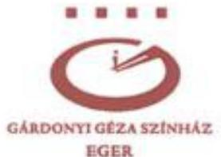

3300, EGER HATVANI KAPU TÉR 4.
TEL: +36 36/510-700, +36 36/510-701 - FAX: +36 36/313-838
TITKARSAG@GARDONYISZINHAZ.HU - WWW.GARDONYISZINHAZ.HU

Ikt.sz.:76-6/2023/II/10

Állami Számvevőszék
1052 Budapest, Apáczai Csere János u. 10.
1364 Budapest, 4. Pf. 54.

Reflexió az ÁSZ jelentéstervezetére

# Tisztelt Számvevőszék,

Az ÁSZ által elkészített jelentéstervezetet 2023. 08. 02-án kaptam kézhez, azzal a külön felszólítással, hogy a tervezet nem nyilvános, nyilvánosságra hozataláról az ÁSZ gondoskodik. Legnagyobb megdöbbenésemre Eger MJV. képviselőtestületének 2023.08.11-i rendkívüli közgyűlésén – **melyre meghívást nem kaptam** – Mirkóczki Zita tanácsnok asszony, Minczér Gábor alpolgármester, Mirkóczki Ádám polgármester, valamint Farkas Attila alpolgármester a TV és a sajtó nyilvánossága előtt részletesen idézett a tervezetből, illetve az abban foglaltakra hivatkozva súlyosan elmarasztalta személyemet és a Gárdonyi Géza Színház vezetését. Felháborítónak tartom az eljárást. **Panasszal kívánok élni az ÁSZ elnöksége, valamint a jelentéstervezet elkészítői felé. Kérem az eset kivizsgálását és megfelelő szankcionálását - illetve a számonkérésre jogosultak figyelmének felhívását a számvevőszék figyelmeztetésének semmibevételét illetően.**

Annál is inkább, mert a következményei súlyosan sértik a Színház érdekeit.

A napirendi pont tárgyalását követően szavazott a testület arról az előterjesztésről – **negatív eredménnyel - amely a színház költségvetési gondjainak enyhítését célozta.**

---

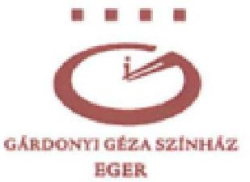

3300, EGER HATVANI KAPU TÉR 4.
TEL: +36 36/510-700, +36 36/510-701 - FAX: +36 36/313-838
TITKARSAG@GARDONYISZINHAZ.HU - WWW.GARDONYISZINHAZ.HU

Mielőtt meghirdettük volna az új évadot, jeleztem az önkormányzati képviselőknek bizottsági ülésen, közgyűlésen is, hogy csak akkor tudunk belekezdeni a munkába, ha legalább ígéretet kapunk 70 millió Ft + Áfa összeges segítségre a színház amúgy is nehezített helyzetében. Az intézmény rezsije ekkora nagyságrendben növekedett, az összeget az önkormányzat dologi sorról csoportosította át, így produkciók létrehozására gyakorlatilag nincs forrás. A 2023. áprilisi közgyűlés a hiányzó 70 milliós összegből megszavazott a színháznak 20.5 millió Ft-ot, még a közgyűlés alkalmával megtalálva a megfelelő címszámokat, amelyekről biztosítani lehetett ezt az összeget. A Színház ezt követően az új évadot meghirdette, a bérletárusítást megkezdte. Egy június 22-i közgyűlési határozat értelmében a Gazdasági Iroda vezetőjének meg kellett volna vizsgálnia, mely címszámok azok, amelyeken maradvány várható, a maradék 50 millió fedezeteként. Ez nem történt meg. Irodavezető úr nem tett eleget a közgyűlési határozatnak. Az augusztus 11-i közgyűlésen újra napirendre került a színház ügye, előterjesztésben kérték fel Irodavezető urat különböző címszámok megvizsgálására, de ezt az előterjesztést a testület leszavazta.

A közgyűlés említett tagjain kívül a képviselőtestület nem ismerte az ÁSZ jelentéstervezetét, csak az elhangzottak alapján ítélt. Az élő adásban is követhető történések és az ülést követő sajtóvisszhang - különösen így, bérletezési időszakban sokat árthat a színháznak. Sajnos, nem először fordul elő, hogy a városvezetés személyemet és a színház ügyeit tekintve hasonló módszerekhez folyamodik.

A TV Eger felvétele ezen a linken elérhető:

http://www.tveger.hu/2023/08/11/eger-varosi-kozgyules-rendkivuli-2023-08-11/

A napirendi pont tárgyalása 1:04:22-től 1:37:22-ig tart.

(G-L Leclerc de Buffon mondása jutott róla eszembe: "A stílus maga az ember")

1.sz. melléklet: Részletek a képviselői hozzászólásokból (írásos formában).

---

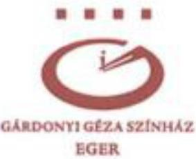

3300, EGER HATVANI KAPU TÉR 4.
TEL: +36 36/510-700, +36 36/510-701 - FAX: +36 36/313-838
TITKARSAG@GARDONYISZINHAZ.HU - WWW.GARDONYISZINHAZ.HU

# Az alábbiakban megpróbálom megfogalmazni benyomásaimat, gondolataimat, észrevételeimet a jelentéstervezet és az azzal kapcsolatosan felmerült anomáliák vonatkozásában

- A Színház szerint az Önkormányzat az irányító szervi támogatást a 2021.
 év során nem ütemezetten adta át a Színháznak, ezért a Színház év közben kénytelen volt a pályázati támogatásokat a működésére fordítani, hogy biztosítsa a likviditását. *Amennyiben az irányító szervi támogatás ütemezése optimálisabb lett volna, új produkciókat tudott volna a Színház létrehozni az elnyert pályázati forrásokból.* Ezen probléma megoldására a támogatási rendszer felülvizsgálatát tartja szükségesnek a Színház.

## Észrevétel:

A megfogalmazásban értelmezési zavart érzünk. A pályázati összegeket elnyert produkciók megvalósultak. (A színház a pályázati pénzeket rendeltetésszerűen használta fel, a pályáztatók felé rendben elszámolt. Tény, hogyha esetlegesen visszafizetési kötelezettsége keletkezne, erre nem rendelkezne forrásai.)

A visszatartott irányítószervi támogatásból kellett volna megvalósítania a színháznak azokat, a műsorrendben sorra kerülő produkciókat, amelyek létrehozására nem rendelkezett pályázati forrásai.

Mivel az irányítószervi támogatást a színház nem ütemezve kapta meg, rákényszerült, hogy műsorváltoztatás árán azokat a produkciókat hozza előbbre az évadtervben, amelyek megvalósításához pályázati támogatással rendelkezett. (Ez a tendencia a 2020/2021 és a 2021/2022-es évadra is jellemző volt.) Amennyiben az irányító szervi támogatás ütemezése folyamatos lett volna, s a színház nem december 20-án, egyösszegben kapta volna meg az irányítószervi támogatás döntő hányadát (188.127.082 Ft-ot), nem kényszerült volna többszörös műsorterv változtatásra, s emellett megvalósíthatta volna mindazt a szükséges műszaki és művészeti fejlesztést, amit nyertes pályázatainak elszámolása nem tett lehetővé. S ez esetben nem halmozott volna fel 2021. évben több mint 215 milliós, igen kimagasló pénzmaradványt.

---

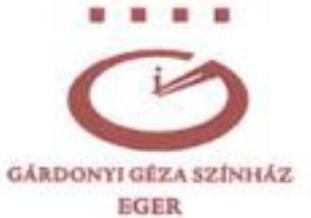

3300, EGER HATVANI KAPU TÉR 4.
TEL: +36 36/510-700, +36 36/510-701 - FAX: +36 36/313-838
TITKARSAG@GARDONYISZINHAZ.HU - WWW.GARDONYISZINHAZ.HU

A horribilis pénzmaradvány magyarázata:

A Pandémia miatti leálláskor a zárt ajtók mögött elkészült előadásokat, melyeket pályázati pénzek felhasználásával hozott létre a színház, csak a veszélyhelyzet megszűnése után vihette közönség elé, így a kész előadások lejátszásának egy-egy előadásra jutó fajlagos költsége terhelte csak a költségvetését. Ezért fordulhatott elő, hogy - bár az intézmény folyamatosan jelezte az önkormányzat felé a biztonságos és elvárható működéséhez szükséges finanszírozási igényeket, nagy erőfeszítések árán a közönséget valamennyire ki tudta szolgálni, s egészen az év végéig „kibírta” az önkormányzat nagyságrendi támogatása nélkül. Ezek egyenes következménye, hogy - az utolsó pillanatban megkapott támogatás következtében - tekintélyes összegű pénzmaradványa keletkezett.

2021. évben, az Eger MJV. által a közös működtetési szerződésben vállalt 245.152.000 Ft-os támogatási összegből a Színház 91 343 723 Ft-ot tudott felhasználni az önkormányzat késedelmes átutálása miatt, gyakorlatilag tárgyévben az önkormányzat nem biztosította a színház részére a közös működési megállapodásban vállalt támogatását. A Színház számára nem felhasználható, 153 808 277 Ft-os összeg részét képezi a több mint 215 millió Ft-os, elvonásra került pénzmaradványnak.

- Az Önkormányzat szerint a Fenntartói megállapodásban szabályozottakat megfelelően alkalmazta, mivel abban az szerepelt, hogy a támogatás éves összegét és annak kiadási főcsoport szerinti megoszlását a költségvetési rendeletében - a tervezhető források mértékének figyelembevételével — állapítja meg. A költségvetés tervezésekor a keretszámok kialakítása a Színházzal előzetesen egyeztetett volt. A 2021. és a 2022. évben a költségvetési rendeletben eredeti előirányzatként kevesebbet terveztek, mint a Közös működtetési megállapodásban vállalt támogatási összeg, azonban a Színház a teljes támogatási összeg fennmaradó részét 2021. november 30-án pótelőirányzatként kapta meg, valamint 2022 júniusában a maradvány elszámolást követően az Önkormányzat a pénzmaradványból biztosította.

Észrevétel:

Az önkormányzat a Színházzal előzetesen egyeztetett keretszámokat mindkét évben utólag, önkényesen módosította. 2022 évben a sajátbevételi előirányzatot is önkényesen megemelte. Az előzetes egyeztetésekhez képest a kézhez kapott költségvetési táblázatban több mint 100 milliós támogatási megvonás szerepelt.

2022. március 4-én kelt, a polgármesternek írt levelemben az eljárás nehezményezése mellett egyúttal jeleztem azt is, hogy számításaink szerint 100 milliós nagyságrendű

---

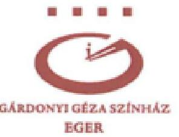

pénzmaradványa van a teátrumnak, s amennyiben írásbeli biztosítékot kapunk arra, hogy az április végéig véglegesülő pénzmaradvány intézményünknél marad, akkor tudok csak felelősséget vállalni a Színház 2022. évi biztonságos működéséért. Levelemet másolatban a főjegyző úrnak is megküldtem.

2022. március 28-án a tárgyban levelet írtam Juhász Tamásnak, a Gazdasági Iroda vezetőjének, mellékelve számára a március 4-i, a polgármesternek írt levelemet is. Válasz egyiküktől sem érkezett.

## 2. sz. melléklet: leveleim, költségvetési táblázat

Illetve, polgármester úr 2022. április 14-én a március 4-i, hozzá intézett levelemben megfogalmazottakra való hivatkozással (mármint, hogy nem akarok belenyugodni az önkormányzati támogatás 100 millió forintos megkurtításába, valamint jeleztem, hogy legalább ígéretet kérek a pénzmaradvány terhére a pótlására) utasította vissza a február 27-én hozzá intézett kérésemet: hagyja jóvá, hogy beiskolázó munkáltatóként vállaljuk a Színház - és Filmművészeti Egyetemre drámainstruktor/színjátékos szakra felvett, saját nevelésű fiataljaink képzési költségeinek 50%-át, melynek másik 50%-át az EMMI állja. A tandíj fele félévenként 150 000 Ft. Két fiatal, tehetséges művészünk felrótt szabálytalanságaim árán végzi a képzést, ezt követően felvett három kollégánk nem tudta elkezdeni tanulmányait. (Intézményünknek, hogy megőrizze kiemelt kategóriáját - amelyet a Fenntartói szerződés is előír - az Előadóművészeti törvényben foglaltak szerinti 60%, felsőfokú végzettséggel rendelkező művészt kell foglalkoztatnia. Az előkészítési szakaszban lévő módosítás ezt az arányt 70%-ra kívánja emelni.)

## 3. sz. melléklet: levelek

A színház a támogatás fennmaradó, késve megkapott részét méltatlan köröket végigjárva szerezte meg. A támogatási összegekkel kapcsolatos zűrzavar nagymértékben veszélyeztette a színház biztonságos működését, és szorongással teli munkahelyi légkört teremtett a társadalomban. A potenciális közönség körében az, hogy "már megint baj van a színházzal", nem igazán erősítette a bérlet- és jegyvásárlási kedvet.

A Színház megítélése szerint az Önkormányzat a többletbevételeket, valamint a Színház által megszerzett pályázati és egyéb forrásokat "chajda finanszírozás" címen vonta el a maradvány egy részének elvonására vonatkozó döntésével. Az Önkormányzat 2021.

---

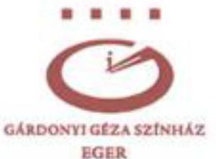

3300, EGER HATVANI KAPU TÉR 4.
TEL: +36 36/510-700, +36 36/510-701 - FAX: +36 36/313-838
TITKARSAG@GARDONYISZINHAZ.HU - WWW.GARDONYISZINHAZ.HU

December 20-án utalt át nagy összegű irányító szervi támogatást. Ez hozzájárult ahhoz, hogy a Színháznak 2021. évben jelentős maradványa keletkezett, amelynek — mivel 10 nap alatt nem tudta kötelezettségvállalással terhelni — a 2022. évben az Önkormányzat nagy részét elvonta. Az Önkormányzat tájékoztatása szerint azért vonta el a szabad maradványt a Színháztól, mert a Színház nem jelezte, hogy mire szeretné ezt a maradványt fordítani, és erre vonatkozó igényt nem nyújtott be.

### Észrevétel:

Azzal kapcsolatban, hogy a színház 2022. évben nem jelezte, mire szeretné a maradványt fordítani, ismét csak hivatkoznom kell 2022 márciusában Mirkóczki Ádám polgármester és Juhász Tamás Irodavezető számára megküldött leveleimre (2. számú melléklet) amelyben jeleztem, hogy az általunk 100 milliós nagyságrendűnek becsült pénzmaradványunkra intézményünk alaptevékenységének biztosítására lenne szükség. Jelzéseimet teljesen figyelmen kívül hagyták. Válasz nem érkezett. (Idén, az 5.657.089 Ft-os pénzmaradványunkról kaptunk értesítést)

A Színház vezetése 2020-tól kezdődően, tehát a 20-21-22-23- évi költségvetési előkészítő tárgyalásokon — amelyeken minden esetben jelen volt Eger MJV. polgármestere, aljegyzője, valamint az önkormányzat gazdasági irodájának munkatársai — a színház vezetése részéről minden alkalommal elhangzott többek között: hogy a Gárdonyi Géza Színház nézőterének zsöllyerendszere sürgős, teljes cserére szorul, továbbá, hogy megfelelő tehergépjármű beszerzése, valamint az immár 8 éves személyautó cseréje is szükségessé vált. A színház felvonója szinte havonta javításra szorul, új szerkezet beszerzése vált szükségessé. Színházunk tetőszerkezete folyamatosan beázik, az irodasoron a konnektorokból esetenként folyik a víz, az épület tetőszerkezetének szigetelése sem tűr már halasztást. Földvári Győző, az intézményekkel való kapcsolattartásra kijelölt önkormányzati képviselő pedig folyamatosan értesült a színházat érintő, sürgető problémákról.

Minderről a képviselőtestület, s Eger MJV. kompetens bizottságai előtt is részletesen beszámoltam volna, ha a pénzmaradványunk sorsáról döntő közgyűlésre, s az azt megelőző bizottsági egyeztetésekre meghívást kapok.

A pénzmaradvány összegét illetően nem hozott semmit az önkormányzat a színház tudomására, a pénzmaradvány elvonásáról is késve értesült az intézmény.

4. sz. melléklet Irányítószervi támogatás alakulása, maradvány elvonásának okai

---

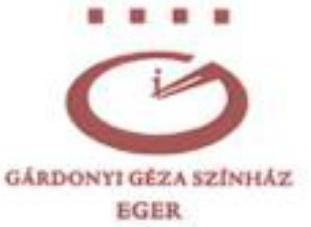

3300, EGER HATVANI KAPU TÉR 4.
TEL: +36 36/510-700, +36 36/510-701 - FAX: +36 36/313-838
TITKARSAG@GARDONYISZINHAZ.HU - WWW.GARDONYISZINHAZ.HU

Amíg a színház az Egri Közszolgáltatások Városi Intézménye alá tartozott, az együttműködés zökkenőmentes, folyamatos volt, kiváló munkakapcsolat alakult ki. 2021. április 1-je óta, mióta az intézmény gazdálkodását közvetlenül az önkormányzat irányítja, a színház vezetése sok esetben nem kap tájékoztatást az intézményt érintő költségvetési, gazdálkodási folyamatok miértjéről, állásáról, mikéntjéről.

Az önkormányzat vezetése tisztában volt (és van) azzal, hogy a Gárdonyi Géza Színház munkavállalóinak bére és járulékai szinte teljes egészében lefedik az állami és önkormányzati támogatás együttes összegét. Így tudatában kellett, hogy legyenek annak is, hogy ha a színháztól elvonásra kerül több mint 215 millió forint, ez olyan csapás az intézmény működésére, amit segítség nélkül nem lehet kiheverni.

A Színház szerint a 2020. és a 2021. évi bérfejlesztésre és a kulturális bérpótlék kifizetésére a fedezetet a központi költségvetés biztosította az Önkormányzat számára, azt az Önkormányzatnak nem saját bevételéből kellett átadnia a Színház részére, mégis a Közös működtetési megállapodásban vállalt önkormányzati támogatás részeként vette figyelembe. Az Önkormányzat szerint a bérminimum miatti emelkedés a Színháznál duplán volt lefinanszírozva, mivel arra a Színház a 2022. évi költségvetésében önkormányzati támogatást kapott, miközben azt az állam is támogatta pályázati pénzeszköz biztosításával.

# Észrevétel: 

Igen, az EMMI által elrendelt bérfejlesztésnek a központi költségvetés biztosította a fedezetét (kulturális bérpótlékra 11.577.937,-Ft-t, járuléka 1.794.580,-Ft, ez a 2020-as kulturális bérpótlék, amit Eger MJV csak 2021 márciusában engedett kifizetni), s a város kulturális intézményeit megillető összeget az önkormányzat számlájára utalta, egyösszegben.

Hogy finanszírozta volna le duplán az önkormányzat, amikor az EMJV-től kapott 2022. évi eredeti előirányzat 165.152.000,-Ft volt a 245.152.000,- Ft helyett. Év közben a közgyűléseken összesen 79.700.000 Ft-al emelték még az eredeti előirányzatot, így 2022 végére 244.852.000 Ft lett a végleges önkormányzati támogatás. A színház személyi juttatása + járuléka 474.679.039,- Ft volt az eredeti előirányzatban, az önkormányzat végleges támogatása 244.852.000 Ft lett év végére.

---

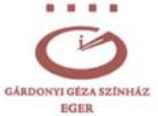

3300, EGER HATVANI KAPU TÉR 4.
TEL: +36 36/510-700, +36 36/510-701 - FAX: +36 36/313-838
TITKARSAG@GARDONYISZINHAZ.HU - WWW.GARDONYISZINHAZ.HU

Hogyan történhetett volna dupla finanszírozás, mikor még a közös működtetési szerződésben meghatározott kötelező érvényű összeget (245.152eFt-ot) sem adta át az önkormányzat az intézménynek.

Az Önkormányzat a helyszíni ellenőrzés során a kialakult nézetkülönbség okaként jelölte meg, hogy a Színház szakmai teljesítménye jelentősen csökkent a világjárvány ideje alatt, amelyet azóta sem tudott a járvány előtti szintre visszaemelni, illetve több esetben tártak fel szabálytalanságot a Színház működésével, gazdálkodásával kapcsolatban. A probléma megoldása érdekében az Önkormányzat létrehozott 2023 áprilisában egy, a Színház működését, anyagi helyzetét, szervezeti felépítését áttekintő helyzetelemző munkacsoportot.

### Észrevétel:

A színház szakmai teljesítménye nem csökkent, az előadások magas művészi színvonalon valósultak meg. A színház gazdasági teljesítményének jelentős csökkenéséhez pedig a világjárvány, az infláció, és a város népességének erőteljes csökkenése mellett nagyban hozzájárult az önkormányzat vezetésének a színházzal szemben tanúsított ellenséges magatartása, s a rugalmasság, a megfelelő kommunikáció teljes hiánya. Sok-sok kisebb és nagyobb méltánytalanság mellett vegyük csak
 a leghúsbavágóbbat: amennyiben a Színház 2021-ben megkapja az önkormányzat által vállalt teljes támogatást, s a különbözet nem simul bele a pályázati pénzekkel kapcsolatban hangoztatott dupla finanszírozás indokával a mintegy 215 milliós pénzmaradványba, a színház megvalósíthatta volna meghirdetett műsortervét, nem kényszerült volna a közönséget elbizonytalanító állandó műsorváltoztatásra, megvalósíthatta volna mindazt a szükséges műszaki és művészeti fejlesztést, amit szükségessé vált. Beiskolázhatta volna a Színház- és Filmművészeti Egyetemre felvételt nyert tehetséges fiataljait, megújíthatta volna színpadtechnikai eszközeit, a nagyszínpadi produkciók kivitelezése színvonalának emelése mellett rétegigényeket kiszolgáló stúdióelőadásokat hozhatott volna létre, korszerűsíthette volna a nagyterem nézőterét, székhelyen kívüli elmozdulása elősegítésére díszletszállításra alkalmas teherjárművet vásárolhatott volna, erőteljesebben élhetett volna marketing-eszközökkel...

Mindezek növelhették volna a színház bevételteremtő képességét.

A színház renoméját nagymértékben rontja, hogy a város vezetése által évek óta folyamatosan rossz színben van feltüntetve a közvélemény előtt.

---

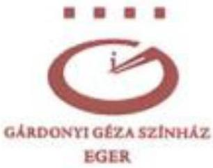

3300, EGER HATVANI KAPU TÉR 4.
TEL: +36 36/510-700, +36 36/510-701 - FAX: +36 36/313-838
TITKARSAG@GARDONYISZINHAZ.HU - WWW.GARDONYISZINHAZ.HU

Sajnos, az önkormányzat gazdasági irodájának reakcióideje sok esetben jóval hosszabb, mint amit egy színház feszített és sok-sok rögtönzéssel terhelt (beugrások, hirtelen fellépő technikai nehézségek, műsorváltozások, stb.) napi működése elvisel. A szóban forgó kifizetéseket négy alkalommal fedezethiány miatt utasította el a hivatal (beiskolázott kollégáink tandíja; a Gárdonyi-év kapcsán a színház homlokzatára készíttetett Gárdonyi Géza Színház felirat; vendégművészek kifizetése), holott a rövid lejáratú kötelezettségek pénzügyi teljesítésére a jelentéstervezet szerint is mindig lett volna fedezet.

Mirkóczki Ádám polgármester a színház hivatalos megkereséseire csak többszöri, ismételt megkeresés után, van, hogy 30-40 nap elteltével reagál. Így viszonylag nehéz a színház számára az ügyviteli rendszabályokat pontosan betartani.

Számtalan esetben csak szabálytalanságok árán lehetett biztosítani az intézmény elvárható működését, jó hírnevének megőrzését, a késlekedéssel okozott károk elkerülését.

Az ÁSZ, vizsgálatot végző munkatársainak, a személyemet érintő ügyviteli szabálytalanságokkal kapcsolatosan, indokolt lett volna lehetőséget adnia személyes egyeztetésre. Nagyon szívesen beszámoltam volna egyenként a szóban forgó esetekről. Sajnos, ez nem történt meg, nem kaptam kérdést, nem válaszolhattam.

Egyoldalú önkormányzati tájékoztatás történt e tárgyban.

Eger MJV. polgármestere 2022. novemberében ezekre a (2022.02.17. óta összegyűjtött) szabálytalanságokra hivatkozva, egy héttel a közgyűlés időpontja előtt (2022. 10.18-án) bejelentette a sajtóban, hogy felmentésemet kezdeményezi a szakminisztériumnál. https://egripost.hu/most-lett-eleg-a-szinhazi-amokfutasbol-a-polgarmester-blasko-visszahivasat-kezdemenyezi/ Ezt a metódust már nem első esetben alkalmazta. A helyi és országos sajtóban felröppenő, az önkormányzat vezetése által gerjesztett túlzó, negatív, igaztalan hírek nagymértékben rongálják a Gárdonyi Géza Színház megítélését a helyi és országos közvélemény előtt.

A felmentésemre irányuló előterjesztést Eger MJV. 2022. november 24-én megtartott közgyűlésén a képviselőtestület nem szavazta meg.

---

3300, EGER HATVANI KAPU TÉR 4.
TEL: +36 36/510-700, +36 36/510-701 - FAX: +36 36/313-838
TITKARSAG@GARDONYISZINHAZ.HU - WWW.GARDONYISZINHAZ.HU

A munkacsoport április végén, 2023. április 27-én jött létre, ez a hónap nem tartozik az első negyedévhez, a színház vezetésének nem volt tudomása róla, hogy az ellenőrzés tárgyát képezi. A vizsgálatot lefolytató személyek velem e tárgyban nem egyeztettek, nem tettek fel kérdéseket. A jelentéstervezetből egyértelműen kitűnik, hogy a tervezet e témában is kizárólag önkormányzati információkra hagyatkozik. A tervezetbe anélkül kerültek személyemet elmarasztaló, 2023. májusi történések, és azokból levont egyoldalú megállapítások, hogy engem meghallgattak volna.

Az április 27-i közgyűlésen létrehozott munkacsoportnak a testület döntése értelmében magam is tagja vagyok, ezért igen meglepett a Minczér Gábor alpolgármestertől minden előzetes egyeztetés, munkamegbeszélés nélkül, május 8-i dátummal kapott felszólítás, melyet, válaszlevelemmel együtt, (a munkacsoport minden tagjai is megkapták) tisztelettel csatolok.

### 5. sz. melléklet

Amellett, hogy egy valamirevaló munkacsoport általában alakuló üléssel kezdi meg működését, ahol közösen kialakít valamiféle munkatervet – én ilyenről nem tudok –, alpolgármester úr május 8-án olyan mennyiségű adat szolgáltatására adott utasítást, amelyet a színház dolgozói a megadott határidőig, 11-e déli 12-ig, semmiképpen nem tudtak volna kigyűjteni. Emellett a színház a bezárt főépület ellenére, a pandémia miatt is nehezített, nagyon sok munkával és feladattal leterhelt időszakát élte, ezért javasoltam Minczér Gábor alpolgármester úrnak, hogy forduljon az önkormányzat hivatali apparátusához, hiszen minden adatunkkal rendelkeznek.

Mirkóczki Zita tanácsnokasszony 2023.05.22-én, e-mail-en megkapott értesítésében az áll:

> "Tisztelt Képviselőtársak!

A Gazdasági Iroda összeállított egy anyagot a színházzal kapcsolatos munkacsoport további működését segítve. Ezek azok az anyagok, melyeket a munkacsoport ülésein kértünk. Az anyag igen terjedelmes és bizalmas információt is tartalmaz, így azt beszéltük meg, hogy minden képviselő, a munkacsoport tagja pendrive-on kapja meg az anyagokat egy átadásátvételi jegyzőkönyvet aláírva. Ha bárkinek szüksége van még valamire, kérem jelezze felém.

A következő munkacsoportülés a jövő héten várható, addig a dokumentumokat is át tudjuk nézni, a közgyűlésen egyeztetjük az időpontot, majd igazgató úrral is egyeztetek."

A munkacsoportról azóta nem hallottam...

A színháznak gyors, hathatós segítségre lenne szüksége.

---

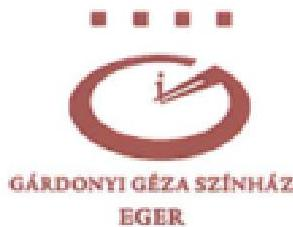

3300, EGER HATVANI KAPU TÉR 4.
TEL: +36 36/510-700, +36 36/510-701 - FAX: +36 36/313-838
TITKARSAG@GARDONYISZINHAZ.HU - WWW.GARDONYISZINHAZ.HU

A munkacsoport létrehozását javasló Mirkóczki Zita tanácsnok asszonyt így idézi a közgyűlési jegyzőkönyv:

„Az ő előterjesztése arról szól, hogy nézzék meg, hogy hosszútávon hogyan tudnak jó színházat gazdaságilag jól működtetni... ezért javasolja azt, hogy vizsgálják meg a színház gazdasági működését, hol lehetne esetleg spórolni, hogyan lehetne jobb előadásokat létrehozni, hogyan lehetne több nézőt becsalogatni, marketing szempontból mi az, amiben kellene segítség.”

Olyan ez, mint amikor valakinek levágják a fél lábát, majd azok, akik levágták, létrehoznak egy bizottságot, hogy segítsen neki kideríteni, miért nem tud táncolni.

A Gárdonyi Géza Színházra a legsúlyosabb csapást egyértelműen az intézmény működésére máig kihatással lévő, több mint 215 milliós elvonás mérte. (Amely összegbe beletartozik EMJV. támogatása döntő hányadának a 2021-es évben való visszatartása, majd elvonása.)

A színház gazdasági működését tapasztalt, a speciális területhez értő szakemberek lennének hivatottak érdemben átvizsgálni.

No és mi alapján fogja a munkacsoport megállapítani, „hogyan lehetne jobb előadásokat létrehozni”? Mihez képest jobbakat? Visszásnak tartom, hogy olyanok (a munkacsoport tagjai közül egy képviselőt kivéve) kívánják megítélni a színház munkáját, akik nem látják, nem ismerik előadásainkat, de nagyon lesújtó véleménnyel rendelkeznek, s ezt a sajtó nyilvánossága előtt is gyakorta hangoztatják. Azt pedig végtelenül szomorúnak tartom, hogy az önkormányzat vezetése beleértve tanácsnok asszonyt, a kulturális bizottság vezetőjét is - nem csak, hogy színházba nem jár (annak ellenére, hogy a testület összes tagja minden bemutatónkra meghívást kap), de évadnyitó és évadzáró társulati üléseinkre is évek óta hiába várjuk fenntartónk képviselőjét.

A Színház, pénzügyi és egyéb lehetőségeihez mérten, minden tőle tehetőt megtesz a minél hatékonyabb marketing érdekében (például bérletárusító kitelepülések rendezvényekre, intézményekhez, s iskoláknak, civil közösségeknek is felajánlott „kedvcsináló” fellépések). Az pedig igazán nonszensz, hogy egy-egy áldozatkész munkatársunknak kelljen a saját bankkártyáját használva finanszíroznia a színház

---

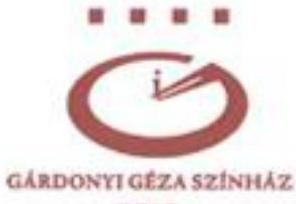

hirdetéseit a Facebook-on, mert az önkormányzat, többszöri kérésünk ellenére sem engedélyez bankkártyát a színház számára.

Ha már marketingről van szó: nagyon sokat ártott előző évadunk látogatottságának, hogy polgármesterünk, anélkül, hogy a képviselőtestülettel, illetve a színház vezetésével egyeztetett volna, augusztus végén, alig évadnyitó társulati ülésünk után bejelentette a sajtóban, hogy októbertől (több intézménnyel együtt) a rezsiválság miatt bezár a színház. Már másnap megindult az eltetett bérletek lemondása. Rövid idő alatt akkor mintegy 1500 bérletest veszített el a színház. Polgármester úr előterjesztését a testület nem szavazta meg. A január 2-i tényleges bezárásig még öt sikeres bemutatónk volt, de a bérleteseknek csak nagyon kis százaléka tért vissza. Előadásszámot kellett csökkenteni, bérleteket összevonni.

- Törvényes lehetőség állt rendelkezésre (az Aht. 86. § (5) bekezdésének, valamint az Avr. 155. § (2) bekezdésének előírásai alapján) arra, hogy az Önkormányzat az előző évről származó maradványokat elvonja. Az Önkormányzat költségvetési rendeletét a maradványelvonásra vonatkozó általános elvet és szabályokat nem tartalmaztak, így a Színház számára nem volt előre tisztázott, hogy milyen esetekben, milyen adatszolgáltatások és eljárások alapján történik maradványelvonás a fenntartó Önkormányzat részéről. Az Ávr. 155. § (1) bekezdése előírásának megfelelően a maradványból az irányító szervet megillető rész számítása megismerhető volt, mivel az a közgyűlési döntés előterjesztésében szerepelt.

# Észrevétel: 

Törvényes lehetőséggel lehet élni, és visszaélni. Szabad-e azt, amit lehet?
A színház vezetése nem ismerte az előterjesztést. Sem bizottsági szakaszban, sem a közgyűlésre nem kapott meghívást. Arról sem volt tudomása, hogy pontosan milyen összegű pénzmaradvánnyal rendelkezik az intézmény.

- A maradvány részét képező pályázati forrásokkal összefüggő megtakarításokkal kapcsolatban indokolt kiemelni, hogy a pályázati forrásokkal való elszámolások felülvizsgálata és értékelése a támogatást nyújtók feladat- és hatáskörébe tartozik, ezért ezeket az ÁSZ jelen ellenőrzés keretében külön-külön nem vizsgálta. Amennyiben az elszámolásokkal összefüggésben esetlegesen a későbbiekben visszafizetési kötelezettsége keletkezne a Színháznak, annak teljesítése - az önkormányzatokra vonatkozó Aht. 60/A. §-ában foglalt előírások mellett - az Önkormányzatot terhelő forrásigénnyel járhat a maradványelvonásról szóló döntésre tekintettel.

---

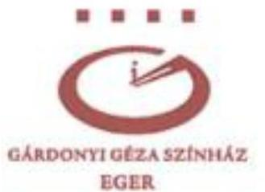

3300, EGER HATVANI KAPU TÉR 4.
TEL: +36 36/510-700, +36 36/510-701 - FAX: +36 36/313-838
TITKARSAG@GARDONYISZINHAZ.HU - WWW.GARDONYISZINHAZ.HU

# Észrevétel:

A pályázati forrásokkal való elszámolás felülvizsgálata a támogatást nyújtók feladat és hatáskörébe tartozik.

Feltétlenül szükségesnek tartjuk azonban, hogy felülvizsgálatot kapjon, hogy Eger MJV. a 2021. évben teljesítette-e a közös működtetési megállapodásban vállalt kötelezettségét? Ezügyben mindenképp segítségre lehetnének az ÁSZ megállapításai.

Eger MJV. önkormányzata nem "egyenesben" vette el (a többéves maradvánnyal együtt) a színház pályázatokon elnyert támogatásait, hanem mintegy a pályázaton elnyert összegek mértékével csökkentette a színháznak átadandó önkormányzati támogatás összegét (s az összeg a 215.390.173 Ft-os pénzmaradványba beépült).

A minisztérium és az önkormányzat között a fenntartó önkormányzat kérelmére létrejött közös működtetési megállapodás kimondja:

- A fenntartó felelőssége, hogy biztosítsa az előadó-művészeti szervezet működésének tárgyi, pénzügyi és személyi feltételeit.
- az Emtv. 16. § (8) bekezdés b) pontja értelmében – a Színház számára biztosított éves fenntartói támogatás mértékét nem csökkenti a 2020. év vonatkozásában biztosított 245.152.000 forint támogatási összeg alá;
- Jelen megállapodás hatálya alatt a Fenntartó kötelezettséget vállal arra, hogy a) az 10. pontban meghatározott költségvetési támogatás teljes összegét a Színház működtetésére és művészeti fejlesztésére fordítja;

A színház 2021. évben elköltött önkormányzati finanszírozása: 91 343 723 Ft

---

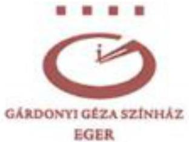

3300, EGER HATVANI KAPU TÉR 4. TEL: +36 36/510-700, +36 36/510-701 - FAX: +36 36/313-838 TITKARSAG@GARDONYISZINHAZ.HU - WWW.GARDONYISZINHAZ.HU

- Kérjük a tisztelt Állami Számvevőszéket, állapítsa meg: Eger MJV. önkormányzata 2021. évben biztosította-e a Gárdonyi Géza Színház számára a szakminisztériummal kötött közös működtetési megállapodásban vállalt támogatást.

illetve

- Állapítsa meg, hogy EMJV. önkormányzata, törvény adta lehetőségével rosszhiszeműen élve, hosszú időre való kihatással gátolta a Gárdonyi Géza Színház megfelelő működését.

Kérjük, hívja fel a szakminisztérium figyelmét az ÁSZ által megállapított tényekre!

Fontosnak tartanánk, hogy az EMJV. által nyújtott, 245.152.000 Ft-os támogatás is úgy kerüljön elszámoltatásra, mint ahogy a 284.000.000 Ft-os minisztériumi támogatás felhasználását is záradékkal ellátott bizonylatokkal kell alátámasztani és az elszámolást könyvvizsgáló ellenőrzi. A 245.152.000 Ft eddig egyik évben sem volt ily módon elszámolva. Erre utólag is látok lehetőséget. Ez egyértelműen bizonyítaná, hogy a
 Színház milyen mértékű önkormányzati támogatásban részesült 2021 év folyamán.

- *A Kötelezettségvállalási Szabályzat23 rendelkezéseit 2021. április 1. napjától kellett alkalmazni, a szabályozás hatálya a Színházra is kiterjedt. A Hivatal az Ávr. 60. § (3) bekezdés előírásának megfelelően a kötelezettségvállalásra, pénzügyi ellenjegyzésre, teljesítés igazolására, érvényesítésre, utalványozásra jogosult személyekről és aláírás-mintájukról nyilvántartást vezetett.*

- *A 2021. évben levél hívta fel a Színház igazgatójának a figyelmét a szabályos közpénz felhasználásra, a kötelezettségvállalás jogszabályban meghatározott eljárásrendjének betartására és a színházi forrásokkal történő felelős gazdálkodásra.*

---

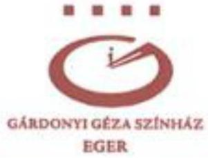

3300, EGER HATVANI KAPU TÉR 4.
TEL: +36 36/510-700, +36 36/510-701 - FAX: +36 36/313-838
TITKARSAG@GARDONYISZINHAZ.HU - WWW.GARDONYISZINHAZ.HU

Több esetben fordult elő, hogy 2021.04.01-től alkalmazandó szabályzatok esetében a szabályzaton szereplő dátum hónapokkal későbbi volt, EMJV. Gazdasági Irodája pedig a következő év, 2022. 02. 03. 04. és 12. hónapjában visszadátumozva küldte át aláírásra. A "leltározási és leltárkészítési szabályzat" például 2022.02.07-én érkezett, az ehhez kapcsolódó megismerési nyilatkozat pedig 2021.03.31-re visszadátumozva. A 2022.12.15-én színházunkhoz érkezett szabályzat megismerési nyilatkozatának visszadátumozását megtagadtam, azon a valós dátum szerepel.

Kimutatás, az önkormányzattól beérkezett e-mail-ek, megismerési nyilatkozatok csatolva.

6. sz. melléklet

A 2023. évben a Színház igazgatója felé — a személyes egyeztetésen túl — ismételten jelzéssel élt a Polgármester amiatt, hogy a pénzügyi ellenjegyzést megelőzően már megtörtént a szerződés teljesítése és a kifizetés. Továbbá felhívták a figyelmet a 200 ezer Ft-ot elérő kötelezettségvállalás írásba foglalási kötelezettségére.

"Bűvös virág – Madách 200" c. produkciónk szerződéseit Eger MJV. számára a színház 2023. 02. 15-én küldte meg, erre a Gazdasági Iroda 2023.03.09-én reagált.

2023. 03. 14-én megtörtént az összes szerződés ellenjegyzése. A bemutatóra 2023.03.24-én került sor.

A darab írója, s egyben rendezője tiszteletdíját 2023.04.04-én, a jelmeztervezőét április 6-án számfejtette a színház, a zenei munkatárs számlája 03.28-án érkezett be, a díszlettervező 04.30-án nyújtotta be a számlát…. A számlák az önkormányzatnál megtalálhatók.

EMJV. a megküldött dokumentumokkal kapcsolatban 22 napon keresztül nem reagált.

Nem történt teljesítés- és kifizetés az ellenjegyzés előtt.

Személyes egyeztetésre sajnos az elmúlt 3 évben egyetlenegyszer sem került sor polgármester úr és köztem. Irodavezető úr levele és válaszom csatolva.

7. sz. melléklet

---

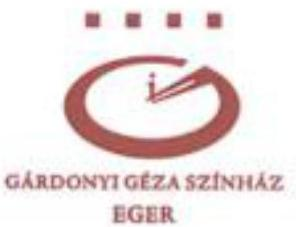

3300, EGER HATVANI KAPU TÉR 4.
TEL: +36 36/510-700, +36 36/510-701 - FAX: +36 36/313-838
TITKARSAG@GARDONYISZINHAZ.HU - WWW.GARDONYISZINHAZ.HU

• A SZÍNHÁZ bevételtermelő képessége, a nézőszám és az előadásszám alapján számított egyes mutatók tanúsága szerint az ellenőrzött időszakban jelentősen visszaesett, amely a világjárvány és az energiaválság következményeivel egyértelműen összefüggésbe hozható, de részben akár — a jelen ellenőrzés hatókörébe nem tartozó — eltérő okok sem zárhatók ki, tekintve a másik négy színház mutatóihoz viszonyított kedvezőtlenebb képet.

A vizsgált 5 színház összehasonlításának vonatkozásában igen fontos alapszempont, kiindulópont, hogy székhelyük mekkora lélekszámú városban található. (Eger lakossága a színház újraalapításának évében, 1986-ban meghaladta a 70.000-et, s még a pandémia előtt is több mint 55.000 volt. Mára nem éri el az 50.000 főt.) Ez a folyamatosan csökkenő tendencia - és az ezt kiváltó okok - alapvetően indokolják a bérletes nézőszám, s ezáltal előadásszám csökkenését. (A 2015/16-os évadban a HVG felmérése szerint a Gárdonyi Géza Színház az ország leglátogatottabb színháza volt, 13.700 bérletes nézővel, 103,7% nézőtértelítettséggel.) A lakosságfogyás, pandémia, energiaválság, infláció mellett az elvonások, az önkormányzati hozzáállás okozza a legtöbb gondot színházunknak.

A Gárdonyi Géza Színház más színházakhoz való viszonyítása kapcsán felmerülő egyéb összetevők, melyek megítélés szempontjából nagy különbségeket generálhatnak:

- Mekkora költségvetésből gazdálkodik a színház?
- Milyen a régió vásárlóereje?
- Önálló gazdálkodással rendelkezik-e a színház?
- Intézményi, vagy egyéb formában működik-e?
- Rendelkezik-e műhelyházzal, varrodával (mint az egri színház), vagy a díszletgyártást, jelmezkészítést vállalkozásokhoz szervezi ki? (Ez nagy különbségeket okozhat az „egy főre jutó bevétel” vonatkozásában.)
- A színház fenntartója követett-e el sorozatos pénzügyi szabálytalanságot saját intézménye kárára?
- Megvontak-e bármelyik színháztól a költségvetéséhez viszonyítva olyan

---

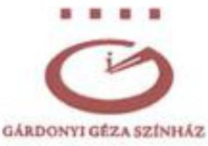

3300, EGER HATVANI KAPU TÉR 4.
TEL: +36 36/510-700, +36 36/510-701 - FAX: +36 36/313-838
TITKARSAG@GARDONYISZINHAZ.HU - WWW.GARDONYISZINHAZ.HU

**EGER**

hatalmas összeget, mint az egri színháztól elvont több mint 215 millió Ft?

- Segítő hozzáállással gondoskodik-e a fenntartó a színházról?

Eger polgármestere, alpolgármesterei, s képviselőinek döntő többsége több éve, bevallottan nem tette be a lábát a Gárdonyi Géza Színházba.

A színház igazgatója három éve képtelen személyesen – akár csak telefonon is – egyeztetni a polgármesterrel. Nem hiszem, hogy van még egy városvezetés, amely ilyen módszeresen tönkretenné, leépítené városa színházát. A színházunkkal, társulatunkkal kapcsolatos fenntartói bánásmód kritikán aluli!

A jelentéstervezet – többször és kiemelten – rendkívül súlyos megállapításokat tartalmaz az önkormányzat gazdasági irodájának színházunkkal kapcsolatos sorozatos pénzügyi eljárásrendjével összefüggésben. Nagyon hiányolom, hogy ugyanakkor az ÁSZ nem szólítja fel az ismételten és hosszú időn át megállapítottan szabálytalanul eljáró Önkormányzatot a hibák haladéktalan orvoslására.

Tisztelettel kérem a Számvevőszéket, állapítsa meg, hogy Eger MJV számos alkalommal rosszhiszeműen viszonyult az általa fenntartott intézményhez, s figyelmeztesse, hogy minden területen álljon el a színházzal szembeni hibás gyakorlattól!

A szakszerűtlen, hibás pénzügyi eljárásrend gyakorlata jóvátehetetlen károkat okozott és okoz a mai napig a Gárdonyi Géza Színház alapfeladatának ellátásában. Dominó-elv szerint működve, egyre felgyorsulva rombol és színházunk továbbélését, jövőjét veszi el.

Kérjük, nyomatékosan hívja fel az ÁSZ az önkormányzat és a szakminisztérium figyelmét a Közös működtetési megállapodás hiányosságainak pótlására!

---

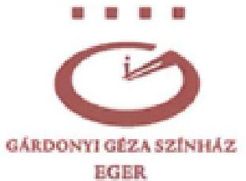

3300, EGER HATVANI KAPU TÉR 4.
TEL: +36 36/510-700, +36 36/510-701 - FAX: +36 36/313-838
TITKARSAG@GARDONYISZINHAZ.HU - WWW.GARDONYISZINHAZ.HU

A Gárdonyi Géza Színház SZMSZ-ének módosítása 2023. május 12-én megtörtént.

8. sz. melléklet,

A jelentéstervezetet illetően több pontban is tudtam volna feltáró jellegű segítséget nyújtani, igényeltem volna az ilyen jellegű, személyes egyeztetést. Végtelenül sajnálom, hogy erre nem került sor. Átfogóbb, mélyrehatóbb vizsgálatot reméltünk.

Mindenesetre nagyon várjuk a szakminisztérium állásfoglalását, netán szankcionáló intézkedését a rendkívül fondorlatosan átadott (2021.12.20.), majd zárolásra került (2022. január), végül visszavett (2022. május), a közös működtetési megállapodásban garantált fenntartói támogatás ügyében.

Tisztelt Állami Számvevőszék!

Mivel az ÁSZ tv értelmében az Állami Számvevőszék a feltárt tényeket, az ezeken alapuló megállapításokat, következtetéseket záró megbeszélés keretében egyeztetheti az ellenőrzött szervezet vezetőjével vagy az általa megbízott személlyel, kérem Önöket, a Gárdonyi Géza Színház társulata érdekében kerüljön sor ilyen megbeszélésre!

Eger, 2023.08.17.

Blaskó Balázs

a Gárdonyi Géza Színház igazgatója

---

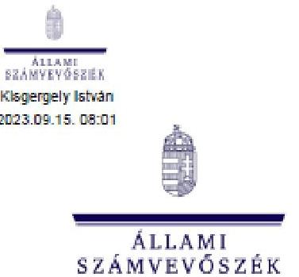

ÁLLAMI SZÁMVEVŐSZÉK

ÁLLAMHÁZTARTÁS HELYI SZINTJÉT ELLENŐRZŐ IGAZGATÓSÁG

Ikt. szám: EL-3881-042/2023. Úgintéző: Böröcz Imre Telefonszám: +36 34 514-151

#### Blaskó Balázs Pál

igazgató

Gárdonyi Géza Színház

#### Eger

Tárgyi Válaszlevél ellenőrzéssel kapcsolatos észrevételek kezeléséről

#### Tisztelt Igazgató Úr!

„A Gárdonyi Géza Színház pénzügyi befogadásának alakulása” című ellenőrzéssel kapcsolatos, 2023. augusztus 17-i keltezésű észrevételét köszönettel megkaptam.

Levelének 1-2. oldalán leírtak az ellenőrzött időszakon túli, a közelmúlt eseményeit leíró információk, melyek nem a jelentéstervezet megállapításaira vonatkozó észrevételek.

Azon felvetésére, mely szerint Eger Megyei Jogú Város Önkormányzatának Közgyűlése a 2023. 08. 11-én megtartott rendkívüli ülésén az Állami Számvevőszék (továbbiakban: ÁSZ) jelentéstervezetéből a résztvevők idéztek, illetve arra hivatkoztak, ami miatt Ön panasszal él, továbbá kérte az eset kivizsgálását és szankcionálását, tájékoztatom, hogy az ÁSZ az Állami Számvevőszékről szóló 2011. évi LXVI. törvénynek megfelelően járt el. A törvényi rendelkezéseket betartva biztosította az ellenőrzöttek észrevételezési jogát azzal, hogy megküldte az ellenőrzési megállapításokat tartalmazó – nem nyilvános jelzéssel ellátott – jelentéstervezetét az ellenőrzöttek részére. Ezen túlmenően jelezte továbbá az ellenőrzötteknek, hogy a megküldött jelentés még tervezet, azt nem véglegesként kell kezelniük, az az ÁSZ részéről nem nyilvános. Arra az ÁSZ-nak nincs törvényi lehetősége, illetve felhatalmazása, hogy az ellenőrzötteket a nyilvánosság kapcsán korlátozza, szankcionálja.

1052 Budapest, Apáczai Csere János u. 10. | www.asz.hu gardonyi_szinhaz@asz.hu | 1364 Budapest 4., Pf. 54 | telefon: +36 1 484 9100

---

Igazgató úr levelének 3. oldalán az ÁSZ jelentéstervezet „Előzmények” fejezetében leírtakkal kapcsolatosan fogalmazott meg észrevételt, mely szerint a leírtak megfogalmazásában értelmezési zavart érez.
A jelentéstervezet „Előzmények” fejezetében bemutatott önkormányzati és színházi álláspontok nem tartoznak az ÁSZ megállapítások körébe. A félreérthetőség elkerülése és a Színház álláspontjának pontosabb bemutatása érdekében az ÁSZ jelentéstervezetben szereplő, több dokumentumból összeszerkesztett megfogalmazást felülvizsgáltuk és Igazgató úr által az észrevételében szereplő szövegelem átvételével a jelentéstervezetben (9. oldal 1. felsoroló bekezdés) pontosítjuk a következők szerint:
„A Színház szerint az irányító szervi támogatást a Színház nem ütemezve kapta meg, ráébresztve, hogy minőségváltoztatás árán azokat a produkciókat hozza előbbre az évadtervben, amelyek megvalósításához pályázati támogatással rendelkezett. Ezen probléma megoldására a támogatási rendszer felülvizsgálatát tartja szükségesnek a Színház.”

Igazgató úr levelében a 4-12. oldalakon megfogalmazott észrevételei tekintetében tájékoztatom, hogy az ÁSZ jelentéstervezet „Előzmények” rész 2. és az 5. felsorolás az Önkormányzat, a 3. és a 4. felsorolás a Színház és az Önkormányzat álláspontját tartalmazzák. Ezen önkormányzati álláspontokat az Önkormányzat nem kifogásolta, a megjelenített önkormányzati vélemény nem módosítható Igazgató úr tájékoztató jellegű információi alapján.

Igazgató úr az önkormányzati álláspontokkal kapcsolatosan leírt észrevételei között, annak a 9. oldal negyedik bekezdésében, továbbá 10. oldal első bekezdésében az ÁSZ ellenőrzést érintő megjegyzéseire a következőkről tájékoztatom:

- A jelentéstervezet „Előzmények, (jelentéstervezet 9. oldal 5. felsoroló bekezdés) részében az a tényszerű és önkormányzati állítás került megjelenítésre, hogy a Hivatal szabálytalanságokat tárt fel a Színház működésével, gazdálkodásával kapcsolatban. Az ÁSZ ellenőrzésnek nem képezte tárgyát a Hivatal által végrehajtott ellenőrzések utólagos számvevőszéki felülvizsgálata.
- A jelentéstervezet ugyanezen felsoroló bekezdésében a munkacsoport létrehozására vonatkozó önkormányzati tájékoztatást - ugyan az ellenőrzött időszakot közvetlenül követő intézkedésre utalt - azért tartottuk indokoltnak rögzíteni, mivel ez a Színház pénzügyi helyzetével összefüggő intézkedések objektív megítélése szempontjából lényeges információ volt.

A konkrétumokat tartalmazó érdemi észrevételeire vonatkozóan az ÁSZ álláspontjáról az alábbi tájékoztatást adom:

1. Az észrevétel 12. oldal negyedik és ötödik bekezdéseiben a jelentéstervezet 1.1. számú megállapítás 15. oldal harmadik bekezdésében foglaltakkal kapcsolatos észrevétel

A Színház 2021. évi maradvány elvonásával kapcsolatosan megfogalmazott észrevételében Igazgató úr sem vitatta, hogy a maradvány elvonás az Önkormányzat jogszabályban

---

biztosított lehetősége. A maradvány elvonásról szóló közgyűlés napirendi pontjának megtárgyalására történő meghívásának elmaradására az Önkormányzat szervezeti és működési rendjét szabályozó Alapokmány vonatkozó előírása ("...akinek jelenléte az adott napirend tárgyalásához szükséges") lehetőséget biztosított.

## 2. Az észrevétel 13. oldal második bekezdésében a jelentéstervezet 1.1. számú megállapítás 15. oldal negyedik bekezdésében foglaltakkal kapcsolatos észrevétel

A támogatást nyújtók feladat- és hatásköréhez kapcsolódóan Igazgató úr által tett véleményt – amely az ÁSZ megállapításával összhangban van – köszönjük.

Igazgató úr kérte, hogy az ÁSZ állapítsa meg, hogy az Önkormányzat a 2021. évben biztosította-e a Színháznak a közös működtetési megállapodásban vállalt támogatást.

A jelentéstervezet – 13-15. oldalai – tartalmazták azokat a megállapításokat, melyekből az igen válasz következik, de az egyértelműség érdekében a jelentéstervezetet kiegészítjük a következő szövegelemekkel és ábrával:

A 2021. évi maradványból elvont összeg a közös működtetési megállapodás szerinti 2021. évi önkormányzati támogatási részt nem csökkentette az előírt szint alá, mert arra egyes 2021. évi bevételi források elegendő fedezetet nyújtottak. Az alábbi ábra szemlélteti az elvont összeg és annak lehetséges fedezetét biztosító bevételek összevetését.

## A 2021. ÉVI PÉNZMARADVÁNYBÓL ELVONT ÖSSZEG ÉS ANNAK LEHETSÉGES BEVÉTELI FEDEZETE (EZER FT)

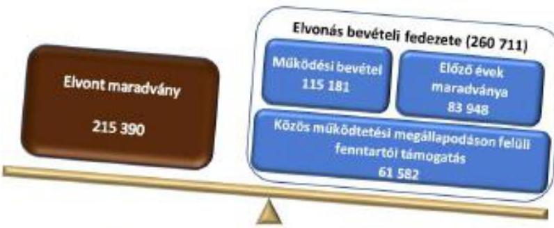

Forrás: A Színház 2021. és 2022. évi költségvetési beszámolóinak adataiból ÁSZ saját szerkesztés

## 3. Az észrevétel 15. oldal első bekezdésében a
 jelentéstervezet 1.2. számú megállapítás 20. oldal első bekezdésében foglaltakkal kapcsolatos észrevétel

Igazgató úr észrevételében jelezte, hogy több esetben előfordult, hogy a Gazdasági Iroda visszadatja a küldött, meg aláírásra szabályzat megismerési nyilatkozatot. Köszönjük jelzését, amelyet a jövőbeli ellenőrzéseink során figyelembe veendő kockázatként kezelünk. A jelentéstervezet módosítása azonban jelzése alapján nem indokolt.

---

4. Az észrevétel 15. oldal hetedik bekezdésében a jelentéstervezet 1.2. számú megállapítás 23. oldal utolsó bekezdésében foglaltakkal kapcsolatos észrevétel

Igazgató úr észrevételében kifogásolta, hogy az általa ellenjegyzésre behülydött szerződések ellenjegyzése időben elhúzódott, a Gazdasági Iroda 22 napon keresztül nem reagált a megküldött dokumentumokra.

Az ÁSZ jelentéstervezetben az Önkormányzat által tett intézkedés - dokumentummal alátámasztott - tényként került rögzítésre. Az ellenjegyzéssel kapcsolatos megállapítását kockázatjelzésként vesszük figyelembe és a jövőben hasznosítani fogjuk. A jelentéstervezet módosítása nem indokolt.
5. Az észrevétel 16. oldal és a 17. oldal első bekezdésében jelentéstervezet 1.1. számú megállapítás 18. oldal harmadik bekezdésében foglaltakkal kapcsolatos észrevétel

A jelentéstervezetben a másik négy színházzal történő mutatószám összehasonlítással kapcsolatosan Igazgató úr alapszempontként határozta meg a lakosság számát/lakosságfogyást, és erre vonatkozó adatokat is bemutatja.

Jelzem, hogy a másik négy színház kiválasztásának paraméterei a jelentéstervezet 17. oldalának lábjegyzetében, az intézmények felsorolása a rövidítések jegyzékében található.

Jó megközelítés, hogy átgondolták, milyen további kritériumok, szempontok szerint lehet a színházak működését összehasonlítani. Ez alapul szolgálhat önértékelésre és mások által alkalmazott jó gyakorlatok feltárására, hasznosítására is.

A közölt információk tájékoztató jellegűek, azok nem befolyásolják az Állami Számvevőszék vonatkozó megállapításait.
6. Az észrevétel 18. oldal első bekezdésében a jelentéstervezet 1.2. számú megállapítás 19. oldal utolsó bekezdésében foglaltakkal kapcsolatos észrevétel

Igazgató úr által a Színház SZMSZ-ének kiegészítésére becsatolt dokumentummal kapcsolatosan tájékoztatom, hogy az SZMSZ módosítására tett intézkedés nem felel meg az Áht. 9. § b) pontjának, mivel nem igazolt, hogy a Színház SZMSZ-ét az irányító szerv jóváhagyta.

A jelentéstervezetben megfogalmazott megállapítást és a Színház SZMSZ-ének módosítására vonatkozó javaslatot továbbra is fenntartjuk.

Igazgató úr által az ÁSZ további teendőivel kapcsolatos felvetéseire jelzem, hogy az ÁSZ az ÁSZ törvényben biztosított és belső eljárásrendjeiben részletesen szabályozott módon jár el ellenőrzései során. Észrevétele és annak mellékletei az ellenőrzési dokumentáció részévé válnak.

Igazgató úr által a zárótárgyalást követően - 2023. augusztus 28-ai elektronikus levelében megküldött kiegészítő észrevételével kapcsolatosan tájékoztatom, hogy azt az észrevételek kezelésekor az ÁSZ már nem veheti figyelembe arra való tekintettel, hogy az észrevétel az ÁSZ

---

törvény 29. § (2) bekezdésében előírt, illetve az EL-3881-031/2023. iktatószámú levelünkben jelölt határidőn túl került benyújtásra. A kiegészítő észrevételben foglaltakat azonban kockázatjelzésként értékeljük és kockázatelemzés során hasznosítani fogjuk.

Tájékoztatom Igazgató urat, hogy a számvevőszéki jelentés függeléke tartalmazni fogja az ellenőrzött észrevételeit, illetve az el nem fogadott észrevételek elutasításának indoklását.

Budapest, időbélyegző szerint

# Üdvözlettel: 

az Állami Számvevőszék elnöke nevében:

Kisgergely István
igazgató, kiadmányozó
Állami Számvevőszék
Államháztartás helyi szintjét ellenőrző igazgatóság

---

# EGER 

MEGYEI JOGÚ VÁROS
POLGÁRMESTERI
HIVATALÁ

DR. BÁNHIDY PÉTER JEGYZŐ
3300 EGER, DOBÓ TÉR 2. TEL: +3636523705
FAX: +36 36523 779, BANHIDY.PETER@PH.EGER.HU

Ikt.szám: 11566-13/2023.
Ügyintéző: Dolenszky-Szőke Szilvia/Solymosné Füstös Zsuzsanna
Tárgy: észrevétel tétel jelentéstervezetre
Az Önök iktatószáma: EL-3881-033/2023.
Az Önök ügyintézője: Böröcz Imre

## Kisgergely István Igazgató Úr részére

Állami Számvevőszék
Államháztartás helyi szintjét ellenőrző igazgatóság
Budapest 4
Pf. 54 .
1364

## Tisztelt Igazgató Úr!

Köszönettel kézhez vettük „A Gárdonyi Géza Színház pénzügyi helyzetének alakulása" vizsgálat számvevőszéki jelentés tervezetét.

Áttanulmányoztuk a megállapításaikat és a javaslataikat, amelyek Eger Megyei Jogú Város Önkormányzata és intézménye szabályszerű működését segítik elő.

Észrevételeinket az alábbiakban foglaljuk össze.

## 1.1 megállapítás 3. bekezdés 3. pont

A 2021. évben a világjárvány következtében soha nem látott nehézségekbe ütközött önkormányzatunk, ami komoly hatással volt a költségvetési helyzetünkre is. Megkerestük a minisztériumot és egyeztetést kezdeményeztünk a közös működtetési megállapodás módosítása ügyében, mivel nem tudtuk biztosítani év elején a közös működtetési megállapodásban foglalt önkormányzati támogatást a Színháznak. A tárgyalások eredménytelennek bizonyultak, így év végén tudtuk csak odaadni a hiányzó összeget pótelőirányzatként. Az előirányzat november hónap végén került jóváhagyásra a közgyűlés által, azonban a támogatás bankszámlára történő kiutalásának nincs jelentősége a kötelezettségvállalás szempontjából, így véleményünk szerint ez nem korlátozta a Színház gazdálkodási lehetőségeit, tekintettel arra is, hogy a novemberben elfogadott pótelőirányzat 100.000 e Ft, még a decemberben kiutalt támogatás 188.127 e Ft volt. Ebből adódóan 88.127 e Ft már év elejétől a színház rendelkezésére állt az előirányzatán, amire év végéig kötelezettséget nem vállalt, holott arra lehetősége és joga lett volna.

## 1.1 megállapítás 3. bekezdés 4. pont

Nem értünk egyet azzal a megállapítással, hogy az Önkormányzat az irányítószervi támogatás rendelkezésre bocsátásának módszerét az ellenőrzött időszak minden évében módosította.

---

Az irányítószervi támogatás kiutalásának gyakorisága, összege minden esetben az intézmény által benyújtott igényen alapult. Tekintettel a Színház sajátos szezonális működésére, az egységes, rendszeres támogatás kiutalás nem alkalmazható.
A támogatás kiutalása heti bontásban történik az intézmény által kért összegben, igazodva az aktuális kötelezettségeikhez.
Mindezek alapján nem állja meg a helyét az a megállapítás, hogy a finanszírozás módja bármiben is korlátozza az intézmény gazdálkodási lehetőségeit. Éppen ellenkezőleg, hiszen az teljes mértékben az intézményi sajátosságokhoz igazodik.

# 1.2 megállapítás 14. bekezdés 2. pont 

Nem értünk egyet azzal a megállapítással, hogy az Önkormányzat Közgyűlése a 2021. évi költségvetési maradvány 2022. évi megállapításakor a Színháznál maradvány elvonást rendelt el, amelynek része volt az ágazati bértámogatási program keretében kapott támogatási összeg is.
A Közgyűlés által jóváhagyott 2021. évi maradvány elvonásnak nem része az intézmény által kapott bértámogatás, tekintettel arra, hogy az kötött felhasználású pályázati pénz volt, mellyel az intézmény el is számolt a támogató szervezet felé. A pénzmaradványelvonás az intézmény szabad, kötelezettséggel nem terhelt előirányzatára vonatkozott, annak semmilyen kötött felhasználású pályázati támogatás nem képezte részét.

Kérem Tisztelt Igazgató Urat, hogy a fentiek méltánylásával szíveskedjenek jelentésüket összeállítani.
Eger, 2023. augusztus 17.

---

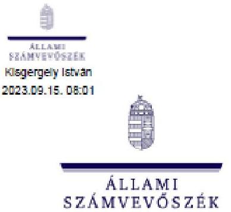

ÁLLAMI SZÁMVEVŐSZÉK

ÁLLAMHÁZTARTÁS HELYI SZINTJÉT ELLENŐRZŐ IGÁZGATÓSÁG

Ikt. szám: EL-3881-041/2023. Ugrástszó: Böröcz Imre Telefonszám: +36 34 514-151

Dr. Bánhidy Péter

jegyző

Eger Megyei Jogú Város Polgármesteri Hivatal

Eger

Tárgy: Válaszlevél ellenőrzéssel kapcsolatos észrevételek kezeléséről

Tisztelt Jegyző Úr!

„A Gárdonyi Géza Színház pénzügyi helyzetének alakulása” című ellenőrzéssel kapcsolatos, 2023. augusztus 17-i keltezésű észrevételét köszönettel megkaptam.

Az Állami Számvevőszék észrevételekre vonatkozó álláspontjáról az alábbi tájékoztatást adom:

1. A jelentéstervezet 1.1. számú megállapítás 3. bekezdésének 3. pontjával kapcsolatos észrevétel

Jegyző úr észrevételében jelezte, hogy a közös működtetési megállapodásban foglalt önkormányzati támogatás előirányzata a Színháznak november hónap végén került jóváhagyásra a közgyűlés által, azonban a támogatás bankszámlára történő kiutalásának nincs jelentősége a kötelezettségvállalás szempontjából, így véleménye szerint ez nem korlátozta a Színház gazdálkodási lehetőségeit, tekintettel arra is, hogy a novemberben elfogadott pótelőirányzat 100 000 E Ft, míg a decemberben kiutalt támogatás 188 127 E Ft volt.

Azzal, hogy Eger Megyei Jogú Város Önkormányzata (továbbiakban: Önkormányzat) 2021. év elején nem biztosította a közös működtetési megállapodásban foglalt

1052 Budapest, Apáczai Csere János u. 10. | www.asz.hu
gardonyi_szinhazdassz.hu | 1364 Budapest 4., Pf. 54 | telefon: +36 1 454 9100

---

önkormányzati támogatás szerinti előirányzatot, bizonytalanságban tartotta a Színház vezetőségét az előirányzat felhasználhatósága tekintetében. A megalapozottság feltételezi, hogy az előirányzat eredeti előirányzati szinten biztosítása kerül. Ez független attól, hogy a Színház hogyan használja fel a rendelkezésre álló előirányzatot. Az előirányzat részleges biztosítása miatti fedezethiány akadályozhatta a kötelezettségvállalást.

A fentiekre tekintettel észrevételét nem fogadjuk el, a jelentéstervezet módosítását nem tartjuk indokoltnak. Fenntartjuk a megállapítást, hogy az év végéig a Színház csak korlátozottan tudott kötelezettséget vállalni.

2. A jelentéstervezet 1.1. számú megállapítás 3. bekezdésének 4. pontjával kapcsolatos észrevétel

Jegyző úr nem ért egyet a jelentéstervezet azon megállapításával, hogy az Önkormányzat az irányító szervi támogatás rendelkezésre bocsátásának módszerét az ellenőrzött időszak minden évében módosította.

Az észrevételében foglaltak szerint az irányító szervi támogatás kiutalásának gyakorisága, összege minden esetben az intézmény által benyújtott igényen alapult. Tekintettel a Színház sajátos szezonális működésére, az egységes, rendszeres támogatás kiutalás nem alkalmazható. A támogatás kiutalása heti bontásban történik az intézmény által kért összegben, igazodva az aktuális kötelezettségeikhez. Továbbá nem állja meg a helyét az a megállapítás, hogy a finanszírozás módja bármiben is korlátozza az intézmény gazdálkodási lehetőségeit.

Részben elfogadjuk Jegyző úr észrevételét és az alábbiak szerint módosítjuk a jelentés tervezetét: *"Az Önkormányzatnál az ellenőrzött időszak minden évben módosult a béren kívüli előirányzatokat finanszírozó irányító szervi támogatás rendelkezésre bocsátásának gyakorisága és összege. 2022 júliusától a gazdálkodási környezet kiszámíthatóságát csökkentette, hogy a Színház számláján lényegesen kisebb összegű pénzeszköz állt rendelkezésre a 2021. évi szabad pénzmaradvány elvonása miatt."*

A szabad maradvány elvonásával a Színház elszámolási számláján a rendelkezésre álló pénzeszközök jelentősen csökkentek, a korábban felhalmozott tartalékok által nyújtott gazdálkodási biztonság lényegesen romlott. Emiatt a Színház korábbi fejlesztési elképzelései módosultak, korlátozottabbá váltak a működés során vállalható többletkiadásai. Mindezek a tények is alátámasztják azon Állami Számvevőszék megállapítást, hogy a gazdálkodási környezet kiszámíthatósága a Színház esetében csökkent.

3. A jelentéstervezet 1.2. számú megállapítás 14. bekezdésének 2. pontjával kapcsolatos észrevétel

Jegyző úr nem ért egyet a jelentéstervezet azon megállapításával, hogy az Önkormányzat Közgyűlése a 2021. évi költségvetési maradvány 2022. évi megállapításakor a Színháznál maradvány elvonást rendelt el, amelynek része volt az ágazati bértámogatási program

---

keretében kapott támogatási összeg is. A pénzmaradványelvonás az intézmény szabad, kötelezettséggel nem terhelt előirányzatára vonatkozott, annak semmilyen kötött felhasználású pályázati támogatás nem képezte részét.

A jelentéstervezet e bekezdésének szövegezését felülvizsgáltuk és a félreérthetőség elkerülése érdekében az első mondatra szűkítjük. Figyelembe vettük, hogy a Színház által külön számlán kezelt támogatáshoz kapcsolódó bérintézkedési célkitűzéseket a Színház költségvetésében biztosított forrásból valósították meg.

A bekezdés pontosított szövege:

„Az *Ágazati bértámogatási program*” keretében a megyei kormányhivatalhoz benyújtott kérelem alapján a Színház vissza nem térítendő támogatásban részesült a 2020. november - 2021. május időszakra, összesen 85 046 ezer Ft összegben.”

Tájékoztatom Jegyző urat, hogy a számvevőszéki jelentés függeléke tartalmazni fogja az ellenőrzött észrevételeit, illetve az el nem fogadott észrevételek elutasításának indoklását.

Budapest, időbélyegző szerint

Üdvözlettel:

az Állami Számvevőszék elnöke nevében:

Kisgergely István
igazgató, kiadmányozó
Állami Számvevőszék
Államháztartás helyi szintjét ellenőrző igazgatóság

---

# RÖVIDÍTÉSEK JEGYZÉKE 

${ }^{1}$ Színház
${ }^{2}$ Önkormányzat
${ }^{3}$ ÁSZ
${ }^{4}$ ÁSZ tv.
${ }^{5}$ négy színház
${ }^{6}$ EKVI
${ }^{7}$ Hivatal
${ }^{8}$ Polgármester
${ }^{9}$ Közgyűlés
${ }^{10}$ Jegyző
${ }^{11}$ Fenntartói megállapodás
${ }^{12}$ Közös működtetési megállapodás
${ }^{13}$ munkacsoport
${ }^{14}$ Minisztérium
${ }^{15}$ KGR-K11
${ }^{16}$ Áht.
${ }^{17}$ Ávr.
${ }^{18}$ Emtv.
${ }^{19}$ Munkamegosztási megállapodás
${ }^{20}$ Színház SZMSZ
${ }^{21}$ Bkr.
${ }^{22}$ Hivatali SZMSZ
${ }^{23}$ Kötelezettségvállalási szabályzat
${ }^{24}$ Kormányhatározat
${ }^{25}$ Támogatói okirat
${ }^{26}$ Megállapodás
${ }^{27}$ energia-megtakarítást
${ }^{28}$ Áhsz.

Gárdonyi Géza Színház
Eger Megyei Jogú Város Önkormányzata mint fenntartó
Állami Számvevőszék
2011. évi LXVI. törvény az Állami Számvevőszékről

Veszprémi Petőfi Színház, Békéscsabai Jókai Színház, Hevesi Sándor Színház, Zalaegerszeg, Vörösmarty Színház, Székesfehérvár
Egri Közszolgáltatások Városi Intézménye
Eger Megyei Jogú Város Polgármesteri Hivatala
Eger Megyei Jogú Város Polgármestere
Eger Megyei Jogú Város Önkormányzat Közgyűlése
Eger Megyei Jogú Város Polgármesteri Hivatalának jegyzője
A 2019-2021. évekre a 375/2018. (X. 25.) Közgyűlési határozattal jóváhagyott, a 2022. évre a 70/2021.
 (X. 07.) Közgyűlési határozattal jóváhagyott, a 2023. évre a 28/2023. (I. 26.) Közgyűlési határozattal jóváhagyott megállapodások.

Az Emberi Erőforrások Minisztériuma és Eger Megyei Jogú Város Önkormányzata között 2020. május 20-án létrejött megállapodás
A Közgyűlés által a 207/2023 (IV.27.) Közgyűlési határozattal létrehozott munkacsoport 2022. május 23-ig Emberi Erőforrások Minisztériuma
2022. május 24-től Kulturális és Innovációs Minisztérium

Az államháztartás információs rendszerének eleme, számviteli adatgyűjtő rendszer, amely az államháztartás egészének aktuális vagyoni és pénzügyi helyzetéről gyűjt adatokat a pénzügyi kormányzat számára
2011. évi CXCV. törvény az államháztartásról

368/2011. (XII. 31.) Korm. rendelet az államháztartásról szóló törvény végrehajtásáról 2008. évi XCIX. törvény az előadó-művészeti szervezetek támogatásáról és sajátos foglalkoztatási szabályairól
A pénzügyi-gazdasági feladatok, a munkamegosztás és a felelősségvállalás rendjéről szóló megállapodás
Intézmény Szervezeti és Működési Szabályzata (Hatályos 2012. január 1.)
370/2011. (XII. 31.) Korm. rendelet a költségvetési szervek belső kontrollrendszeréről és belső ellenőrzéséről
Eger Megyei Jogú Város Polgármesteri Hivatala Szervezeti és Működési Szabályzata
Kötelezettségvállalás, Pénzügyi ellenjegyzés, Teljesítésigazolás, Érvényesítés, Utalványozás Rendjének Szabályzata (hatályos 2021. április 1.)
1150/2020. (IV. 10.) Korm. határozat egyes önkormányzati fenntartású színházak közös működtetéséről
A 2021. 11. 15-én, illetve a 2022. 02. 28-án kiadott Támogatói okiratok
Nemzeti Művelődési Intézet Nonprofit Közhasznú Korlátolt Felelősségű Társaság és az Önkormányzat között a 2020-2021. évi kulturális feladatok ellátásának támogatására létrejött megállapodás
A terembőmérséklet $18 \mathrm{C}^{\text {n}}$-ra állítása, a kazánjelleggörbe 1,5-ről 1,2-re történő eredményező intézkedések levétele, a festőműhely időközönkénti fűtése és világítása, a Színház épületben az éjszakai hőmérséklet $16 \mathrm{C}^{\text {n}}$-ra való levétele, valamint a próbák alatti fénykapacitás csökkentése.
4/2013. (I. 11.) Korm. rendelet az államháztartás számviteléről

---

1052 Budapest, Apáczai Csere János u. 10. | 1364 Budapest 4., Pf. 54
www.asz.hu | szamvevoszek@asz.hu
telefon: +36 14849100
