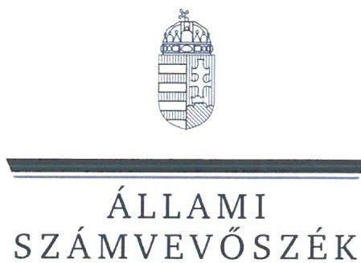
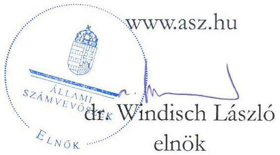
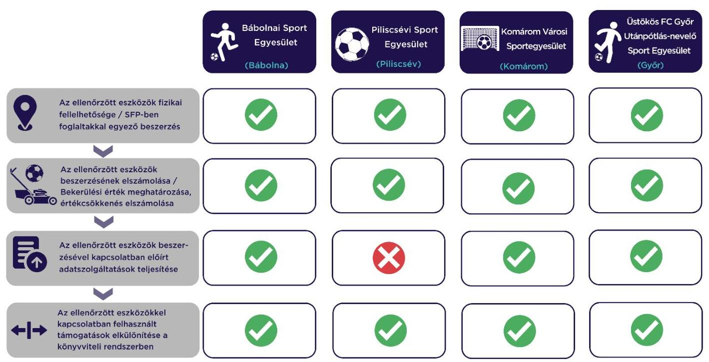

# JELENTÉS 

## Sportegyesületek eszközbeszerzésre kapott támogatás felhasználása szabályszerűségének ellenőrzése

Bábolnai Sport Egyesület, Piliscsévi Sport Egyesület, Komárom Városi Sportegyesület, Üstökös FC Győr Utánpótlás-nevelő Sport Egyesület

2023.

---

ÁLLAMI
SZÁMVEVŐSZÉK

# JELENTÉS 

## Sportegyesületek eszközbeszerzésre kapott támogatás felhasználása szabályszerűségének ellenőrzése

Bábolnai Sport Egyesület, Piliscsévi Sport Egyesület, Komárom Városi Sportegyesület, Üstökös FC Győr Utánpótlás-nevelő Sport Egyesület

2023. 

23045

---

# ELLENŐRZÉSI IGAZGATÓSÁG: 

## ÁLLAMHÁZTARTÁSON KÍVÜLI SZERVEZETEK ELLENŐRZŐ IGAZGATÓSÁG

## ELLENŐRZÉSI IGAZGATÓ:

## KLINGA LÁSZLÓ igazgató

## ELLENŐRZÉSVEZETŐ:

## KAKAS SÁNDOR ellenőrzésvezető

SALAMIN VIKTOR ellenőrzésvezető

IKTATÓSZÁM: EL-3870-127/2023.
TÉMASZÁM: 2638.
ELLENŐRZÉS-AZONOSÍTÓ SZÁM: V1027

---

# TARTALOMJEGYZÉK 

- AZ ELLENŐRZÉS ALAPADATAI ..... 5
- AZ ELLENŐRZÖTT SZERVEZET ..... 6
- ÖSSZEFOGLALÁS ..... 7
- AZ ELLENŐRZÉS FÓKUSZKÉRDÉSE ..... 8
- MEGÁLLAPÍTÁSOK ..... 9
- MELLÉKLETEK ..... 10
I. sz. melléklet: Értelmező szótár ..... 10
II. sz. melléklet: Az ellenőrzött szervezetek jegyzéke ..... 11
- FÜGGELÉK: ÉSZREVÉTELEK ..... 12
- RÖVIDÍTÉSEK JEGYZÉKE ..... 13

---

.

---

# AZ ELLENŐRZÉS ALAPADATAI 

## AZ ELLENŐRZÉS CÉLJA

Annak ellenőrzése, hogy az ellenőrzött sportegyesületnél a $\mathrm{TAO}^{1}$ támogatásból megvalósult kiválasztott eszközbeszerzés szabályszerűen történt-e.

## AZ ELLENŐRZÉS TÍPUSA

Szabályszerűségi ellenőrzés.

## AZ ELLENŐRZÖTT IDŐSZAK

A kiválasztott sportfejlesztési támogatás felhasználásáról szóló döntéstől a helyszíni ellenőrzés napjáig tartó időszak.

## AZ ELLENŐRZÉS TÁRGYA

A sportegyesületeknél a TAO támogatásból megvalósult kiválasztott eszközbeszerzések ellenőrzése.

## AZ ELLENŐRZÉS JOGALAPJA

Az ellenőrzés jogalapját az ÁSZ tv. ${ }^{2}$ 1. § (3), valamint az 5. § (3) bekezdése képezi.

## AZ ELLENŐRZÉS MÓDSZERE

Az ellenőrzést az ellenőrzési program szempontjai, az ellenőrzött időszakban hatályos jogszabályok, előírások, az ellenőrzés általános szakmai szabályai, az ellenőrzésre irányadó ÁSZ ${ }^{3}$ módszertanok figyelembevételével végezte az ÁSZ.

Az ellenőrzési kérdések megválaszolásához szükséges bizonyítékok megszerzése az ellenőrzött szervezet által rendelkezésre bocsátott dokumentumokra, adatokra alapozva kérdésfeltevés (információkérés), helyszíni szemle, interjú, mintavételezés útján történt. A helyszíni szemle során a sportfejlesztési program alapján beszerzett eszközök közül legalább 3 db - legnagyobb értékű - eszköz került kiválasztásra.

Az ellenőrzési bizonyítékként felhasználható adatforrások közé tartoztak egyrészt az ellenőrzési programban felsorolt adatforrások, másrészt adatforrás lehet még az ellenőrzés folyamán feltárt, az ellenőrzés szempontjából releváns információt tartalmazó dokumentum.

---

# AZ ELLENŐRZÖTT SZERVEZET 

## BÁBOLNAI SPORT EGYESÜLET

Az ellenőrzés a labdarúgás sportágat érintő SFPMOD01-45985/2021/MLSZ számú, 2021. május 5-én határozattal jóváhagyott sportfejlesztési program megvalósítására eszközbeszerzés jogcímen kapott TAO támogatásból 2021-2022. években megvalósult eszközbeszerzések elszámolásának szabályszerűségére és a helyszíni ellenőrzés során a kiválasztott, beszerzett eszközök fizikai szemrevételezésére irányult.

Az ellenőrzött SFPMOD01-45985/2021/MLSZ számú sportfejlesztési program keretében 9 féle eszközt szerzett be az ellenőrzés megkezdéséig. A beszerzett eszközök beszerzési árából a támogatott összeg 1375 E Ft, ebből a helyszíni ellenőrzés keretében valamennyi eszköz szemrevételezésre került.

## PILISCSÉVI SPORT EGYESÜLET

Az ellenőrzés a labdarúgás sportágat érintő SFP-46659/2021/MLSZ számú, 2021. május 4-én határozattal jóváhagyott sportfejlesztési program megvalósítására eszközbeszerzés jogcímen kapott TAO támogatásból 2021-2022. években megvalósult eszközbeszerzések elszámolásának szabályszerűségére és a helyszíni ellenőrzés során a kiválasztott, beszerzett eszközök fizikai szemrevételezésére irányult.

Az ellenőrzött SFP-46659/2021/MVSZL számú sportfejlesztési program keretében 3 db eszközt szerzett be az ellenőrzés megkezdéséig. A beszerzett eszközök beszerzési árából a támogatott összeg 798 E Ft, ebből a helyszíni ellenőrzés keretében valamennyi eszköz szemrevételezésre került.

## KOMÁROM VÁROSI SPORTEGYESÜLET

Az ellenőrzés a labdarúgás sportágat érintő SFPMÓD1-44680/2021/MLSZ számú, 2021. május 6-án határozattal jóváhagyott sportfejlesztési program megvalósítására eszközbeszerzés jogcímen kapott TAO támogatásból 2021. években megvalósult eszközbeszerzések elszámolásának szabályszerűségére és a helyszíni ellenőrzés során a kiválasztott, beszerzett eszközök fizikai szemrevételezésére irányult.

Az ellenőrzött SFPMÓD1-44680/2021/MLSZ számú sportfejlesztési program keretében az ellenőrzött 3 db eszközt szerzett be az ellenőrzés megkezdéséig. A beszerzett eszközök beszerzési árából a támogatott összeg 7912 E Ft, ebből a helyszíni ellenőrzés keretében valamennyi eszköz szemrevételezésre került.

## ÜSTÖKÖS FC GYŐR UTÁNPÓTLÁS-NEVELŐ SPORT EGYESÜLET

Az ellenőrzés a labdarúgás sportág SFPMÓD2-44129/2021/MLSZ számú, 2021. május 7-én határozattal jóváhagyott sportfejlesztési program megvalósítására eszközbeszerzés jogcímen kapott TAO támogatásból 2021. években megvalósult eszközbeszerzések elszámolásának szabályszerűségére és a helyszíni ellenőrzés során a kiválasztott, beszerzett eszközök fizikai szemrevételezésére irányult.

Az ellenőrzött a SFPMÓD2-44129/2021/MLSZ számú sportfejlesztési program keretében 2 db tárgyi eszközt szerzett be az ellenőrzés megkezdéséig. A beszerzett eszközök beszerzési árából a támogatott összeg 9120 E Ft volt, ebből a helyszíni ellenőrzés keretében valamennyi eszköz szemrevételezésre került.

---

# ÖSSZEFOGLALÁS 

A Sportegyesület1-4-nél4 az ellenőrzött eszközbeszerzésre kapott TAO támogatások felhasználása - a Sportegyesület2-nél az előírt adatszolgáltatás teljesítése kivételével - szabályszerűen valósult meg.

A Sportegyesület1-4 a sportfejlesztési program1-45-ben meghatározott támogatások felhasználásával a sportfejlesztési program1-4-ben szereplő eszközöket vásárolta meg. A TAO támogatásból beszerzett eszközök a nyilvántartással összhangban a helyszíni szemrevételezés során fellelhetőek voltak.

A Sportegyesület1-4-nél a sportfejlesztési program1-4 keretében beszerzett eszközök vonatkozásában a bekerülési érték meghatározása, az értékcsökkenés elszámolása szabályszerű volt.

Az előírt elszámolási, adatszolgáltatási kötelezettségét a Sportegyesület1,3,4 a 107/2011. Korm. rendeletben6 előírtaknak megfelelően teljesítette. A Sportegyesület2 a 107/2011. Korm. rendeletben foglaltak ellenére a támogatás felhasználásáról negyedéves előrehaladási jelentést nem nyújtott be az MLSZ7 felé.

A sportfejlesztési program1-4 keretében beszerzett eszközökkel kapcsolatos támogatások és azok felhasználásának könyvvitelben való elkülönítése a Sportegyesület1-4-nél a jogszabályoknak megfelelően történt.

Az alábbi ábra a főbb ellenőrzési tapasztalatokat szemlélteti sportegyesületenként:

---

# AZ ELLENŐRZÉS FÓKUSZKÉRDÉSE 

- Szabályszerű volt-e a Sportegyesületek eszközbeszerzésre kapott támogatásának felhasználása?

---

# 1. Szabályszerű volt-e a Sportegyesületek eszközbeszerzésre kapott támogatásának felhasználása? 

## Összegző megállapítás

A Sportegyesület1-4-nél az ellenőrzött eszközbeszerzésre kapott TAO támogatások felhasználása - a Sportegyesület2-nél az előírt adatszolgáltatás teljesítése kivételével szabályszerűen valósult meg.

Az ellenőrzött eszközök fizikai fellelhetősége, SFP1-48-ben foglaltakkal egyező tartalma
A TAO támogatásból beszerzett ellenőrzött eszközök a Sportegyesület1-4-nél a helyszíni szemrevételezés során fizikailag fellelhetőek voltak. A helyszíni szemle során az ellenőrzött támogatásból beszerzett eszközök az eszköz típusa, megnevezése, illetve gyári száma alapján beazonosíthatók voltak.
A Sportegyesület1-4 az SFP1-4-ben meghatározott támogatásokat az SFP1-4-ben jóváhagyott eszközök beszerzésére fordította.

Az ellenőrzött eszközök beszerzésének elszámolása, a bekerülési érték és az értékcsökkenés meghatározása

A Sportegyesület1-4 a 2021-2022. években SFP1-4 keretében megvalósult tárgyi eszközök beszerzését a Számv. tv.9-ben előírtak szerint számolta el, az ellenőrzött eszközök bekerülési értékének megállapítása a Számv. tv.-ben előírtak szerint történt. A Sportegyesület1-4 az értékcsökkenést a Számv. tv. előírásainak megfelelően számolta el.

## Az ellenőrzött eszközökkel kapcsolatos előírt adatszolgáltatások teljesítése

Az SFP1-4 vonatkozásában a 107/2011. Korm. rendeletben előírt elszámolási és adatszolgáltatási kötelezettségének a Sportegyesület1,3,4 eleget tett, az előrehaladási jelentések, záró elszámolások beküldésre kerültek az MLSZ felé. A Sportegyesület2 a 107/2011. Korm. rendelet 11. § (2) bekezdésében foglaltak ellenére a támogatás felhasználásáról negyedéves előrehaladási jelentést nem nyújtott be az MLSZ felé.

Az ellenőrzött eszközökkel kapcsolatban felhasznált támogatások elkülönítése a könyvviteli rendszerben
A Sportegyesület1-4 a 107/2011. Korm. rendeletben, illetve a Civil tv.10-ben foglaltakkal összhangban az alapcél szerinti tevékenysége költségei, ráfordításai ellentételezésére visszafizetési kötelezettség nélkül kapott támogatásokat forrásonként, illetve azok felhasználását elkülönítetten kimutatta, melyek alapján támogatásonként megállapítható és ellenőrizhető a kapott támogatás felhasználása.

---

# MELLÉKLETEK 

## I. SZ. MELLÉKLET: ÉRTELMEZŐ SZÓTÁR

költségvetési támogatás

TAO támogatás
kiválasztott eszköz
sportfejlesztési program
sportegyesület
a társadalombiztosítás pénzügyi alapjai kivételével az államháztartás központi alrendszeréből ellenérték nélkül, pénzben nyújtott támogatások (Áht.11 1. § 14. pont)
látvány-csapatsport támogatása: az adóévben visszafizetési kötelezettség nélkül nyújtott támogatás, juttatás, véglegesen átadott pénzeszköz és térítés nélkül átadott eszköz könyv szerinti értéke, az adóévben térítés nélkül nyújtott szolgáltatás bekerülési értéke az e törvényben meghatározott jogcímeken (Tao tv.12 4. § 44. pont)
az ÁSZ által ellenőrzésre kiválasztott tárgyi eszköz, forgóeszköz
a támogatás igénybevételére jogosult szervezet által készített, a sportpolitikáért felelős miniszter, illetve az országos sportági szakszövetség által jóváhagyott, a látvány-csapatsport támogatás igénybevételének feltételét képező, tervezett támogatással érintett sportfejlesztési program (Tao. tv. 22/C. § (3e) bekezdés)
a sportegyesület olyan egyesület, amelynek alaptevékenysége a sporttevékenység szervezése, valamint a sporttevékenység feltételeinek megteremtése (Sport tv.13 16. § (1) bekezdése)

---

II. SZ. MELLÉKLET: AZ ELLENŐRZÖTT SZERVEZETEK JEGYZÉKE

|  Ssz. | SPORTEGYESÜLET MEGNEVEZÉSE | SZÉKHELY  |
| --- | --- | --- |
|  1. | Bábolnai Sport Egyesület | Bábolna  |
|  2. | Piliscsévi Sport Egyesület | Piliscsév  |
|  3. | Komárom Városi Sportegyesület | Komárom  |
|  4. | Üstökös FC Győr Utánpótlás-nevelő Sport Egyesület | Győr  |

---

# FÜGGELÉK: ÉSZREVÉTELEK 

A jelentéstervezetet a Számvevőszék 15 napos észrevételezésre megküldte az ellenőrzött szervezet vezetőjének az ÁSZ tv. 29. § (1) bekezdése előírásának megfelelően.

A Bábolnai Sport Egyesület ügyvezetője, a Piliscsévi Sport Egyesület, Komárom Városi Sportegyesület valamint a Üstökös FC Győr Utánpótlás-nevelő Sport Egyesület elnökei a jelentéstervezetre nem tettek észrevételt.

[^0]
[^0]:    * 29. § (1) Az Állami Számvevőszék az ellenőrzési megállapításait megküldi az ellenőrzött szervezet vezetőjének vagy az általa megbízott személynek, és annak, akinek személyes felelősségét állapította meg.
    (2) Az ellenőrzött szervezet vezetője és a felelősként megjelölt személy az ellenőrzés megállapításaira tizenöt napon belül írásban észrevételt tehet.
    (3) Az Állami Számvevőszék az észrevételre a beérkezésétől számított harminc napon belül írásban válaszol. A figyelembe nem vett észrevételeket köteles a jelentésben feltüntetni, és megindokolni, hogy azokat miért nem fogadta el.

---

# RÖVIDÍTÉSEK JEGYZÉKE 

1 TAO
2 ÁSZ tv.
3 ÁSZ
4 Sportegyesület1-4
5 sportfejlesztési program1-4
6 107/2011. Korm. rendelet
7 MLSZ
8 SFP1-4
9 Számv. tv.
10 Civil tv.
11 Áht.
12 Tao tv.
13 Sport tv.

Társasági adó
2011. évi LXVI. törvény az Állami Számvevőszékről

Állami Számvevőszék
1. Bábolnai Sport Egyesület (Bábolnai SE)
2. Piliscsévi Sport Egyesület (Piliscsévi SE)
3. Komárom Városi Sportegyesület (Komáromi SE)
4. Üstökös FC Győr Utánpótlás-nevelő Sport Egyesület (Győri SE)
1 SFPMOD01-45985/2021/MLSZ
2 SFP- 46659/2021/MLSZ
3 SFPMOD01-44680/2021/MLSZ
4 SFPMOD02-44129/2021/MLSZ
107/2011. (VI. 30.) Korm. rendelet a látvány-csapatsport támogatását biztosító támogatási igazolás kiállításáról, felhasználásáról, a támogatás elszámolásának és ellenőrzésének, valamint visszafizetésének szabályairól

Magyar Labdarugó Szövetség
1 SFPMOD01-45985/2021/MLSZ
2 SFP- 46659/2021/MLSZ
3 SFPMOD01-44680/2021/MLSZ
4 SFPMOD02-44129/2021/MLSZ
2000. évi C. törvény a számvitelről
2011. évi CLXXV. törvény az egyesülési jogról, a közhasznú jogállásról, valamint a civil szervezetek működéséről és támogatásáról
2011 évi CXCV. törvény az államháztartásról
1996. évi LXXXI. törvény a társasági adóról és az osztalékadóról
2004. évi I. törvény a sportról

---

1052 Budapest, Apáczai Csere János u. 10. | 1364 Budapest 4., Pf. 54
www.asz.hu | szamvevoszek@asz.hu
telefon: +36 14849100

