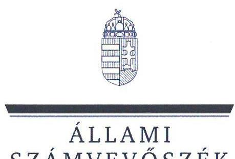
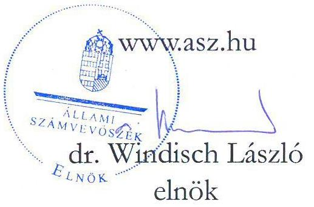
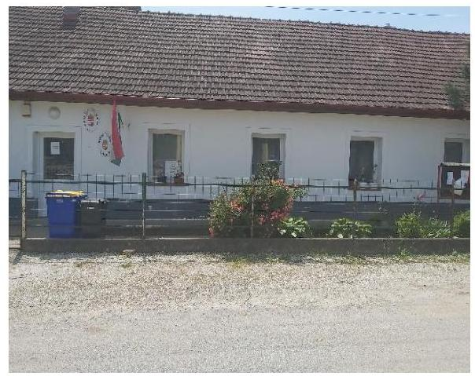
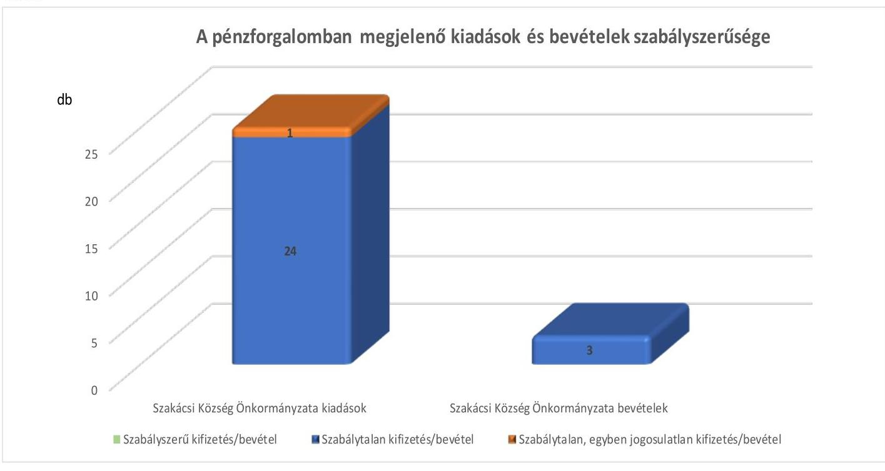

# JELENTÉS 

## Az önkormányzatok gazdálkodásának célvizsgálata

Az önkormányzatok ellenőrzése - a pénzforgalomban megjelenő kiadások teljesítésének és elszámolásának megfelelősége

A pénzforgalomban megjelenő vagyonhasznosítási bevételek beszedésének és elszámolásának megfelelősége

Szakácsi Község Önkormányzata

2023. 

23046
www.asz.hu

---

ÁLLAMI
SZÁMVEVŐSZÉK

# JELENTÉS 

## Az önkormányzatok gazdálkodásának célvizsgálata

Az önkormányzatok ellenőrzése - a pénzforgalomban megjelenő kiadások teljesítésének és elszámolásának megfelelősége

A pénzforgalomban megjelenő vagyonhasznosítási bevételek beszedésének és elszámolásának megfelelősége

Szakácsi Község Önkormányzata

2023. 

23046

---

# ELLENŐRZÉSI IGAZGATÓSÁG: 

## ÁLLAMHÁZTARTÁS HELYI SZINTJÉT ELLENŐRZŐ IGAZGATÓSÁG

ELLENŐRZÉSI IGAZGATÓ:
KISGERGELY ISTVÁN igazgató

ELLENŐRZÉSVEZETŐ:
$\square$ LAJTERNÉ HUDÁK MAGDOLNA ellenőrzésvezető

IKTATÓSZÁM: EL-3920-006/2023.
TÉMASZÁM: 2658
ELLENŐRZÉS-AZONOSÍTÓ SZÁM: V1002004

---

# TARTALOMJEGYZÉK 

- AZ ELLENŐRZÉS ALAPADATAI ..... 5
- AZ ELLENŐRZÖTT SZERVEZETEK ..... 7
- ÖSSZEFOGLALÁS ..... 9
- AZ ELLENŐRZÉS FÓKUSZKÉRDÉSEI ..... 11
- MEGÁLLAPÍTÁSOK ..... 12
- JAVASLATOK ..... 22
- MELLÉKLETEK ..... 24
I. sz. melléklet: Az ellenőrzött szervezetek jegyzéke ..... 24
II. sz. melléklet: Összefoglaló táblázat az ellenőrzött szervezetek gazdálkodási jogköreinek gyakorlásáról ellenőrzött gazdasági eseményenként ..... 25
III. sz. melléklet: Szakácsi Község Önkormányzatánál ellenőrzött, késedelmesen könyvelt gazdasági események ..... 31
- FÜGGELÉK: ÉSZREVÉTELEK ..... 32
- RÖVIDÍTÉSEK JEGYZÉKE ..... 33

---

.

---

# AZ ELLENŐRZÉS ALAPADATAI 

## AZ ELLENŐRZÉS CÉLJA

Az ellenőrzés célja annak értékelése volt, hogy az Önkormányzatnál ${ }^{1}$ a pénzforgalomban megjelenő kiadások teljesítése és elszámolása, továbbá a pénzforgalomban megjelenő vagyonhasznosítási bevételek beszedése és elszámolása megfelelő volt-e, azok az Önkormányzat közfeladat-ellátásához kapcsolódtak-e.

## AZ ELLENŐRZÉS TÍPUSA

Megfelelőségi ellenőrzés.

## AZ ELLENŐRZÖTT IDŐSZAK

Az ellenőrzött időszak a 2022. év és a 2023. év, az ellenőrzés megállapításainak az ÁSZ tv. ${ }^{2}$ 29. § (1) bekezdése szerinti megküldése napjáig.

## AZ ELLENŐRZÉS TÁRGYA

Az Önkormányzat pénzforgalmában megjelenő kiadások teljesítésének és elszámolásának, továbbá a pénzforgalomban megjelenő vagyonhasznosítási bevételek megalapozottságának és elszámolásának, azok közfeladat-ellátás céljára történő felhasználásának a megfelelősége.

Az ellenőrzés kiemelten fókuszált a kiadások jogosságának, szabályszerűségének értékelésére, a költségvetési források közfeladat-ellátás érdekében történő felhasználására, végrehajtására, figyelemmel a kontrollok gyakorlati alkalmazására is.

## AZ ELLENŐRZÉS JOGALAPJA

Az ellenőrzés jogalapját az ÁSZ tv. 1. § (3) bekezdése, és 5. § (2)-(3), (6) bekezdései képezték.

## AZ ELLENŐRZÉS MÓDSZERE

Az ellenőrzést a nemzetközi standardokat irányadónak tekintve az ellenőrzési program szempontjai, az ellenőrzési időszakban hatályos jogszabályok, az ellenőrzés szakmai szabályok és módszertanok figyelembevételével végezte az ÁSZ ${ }^{3}$.

Az ellenőrzési kérdések megválaszolásához szükséges bizonyítékok megszerzése az ellenőrzött szervezetek által rendelkezésre bocsátott dokumentumokra és adatokra, valamint az ellenőrzést támogató szervezetektől ${ }^{4}$ kapott adatokra alapozva, továbbá megfigyelés, szemle (szemrevételezés), kérdésfeltevés (információkérés), valamint elemző eljárás útján történt.

---

Az ellenőrzési bizonyítékként felhasználható adatforrások közé tartoztak egyrészt az ellenőrzéshez kért dokumentumok, adatforrások, másrészt adatforrás volt még a közhiteles nyilvántartásból (Magyar Államkincstár nyilvántartásai, Önkormányzati rendelettár) származó, az ellenőrzés szempontjából információkat tartalmazó dokumentum.

Az ellenőrzés lefolytatásához az ellenőrzött szervezetek az ÁSZ által kért dokumentumok, adatok, információk megküldésével az ellenőrzés során szolgáltattak adatokat. A rendelkezésre bocsátott adatok, információk kontrolljára helyszíni ellenőrzés keretében is sor került.

Az ellenőrzés során az Önkormányzatnál 25 kiadási és három bevételi gazdasági eseményt vizsgált az ÁSZ. A pénzforgalomban megjelenő kiadások teljesítése és a vagyonhasznosítási bevételek megalapozottsága megfelelőségének ellenőrzése során a működés, gazdálkodás kockázatos területeinek meghatározását követően az ellenőrzött szervezetekre vonatkozó főkönyvi adatbázisokból irányított mintavételi eljárások alapján történt a mintatételek kiválasztása. A lényeges és kockázatos tételek beazonosítására egyedi kockázatértékelés alapján került sor. A tények feltárása és azok összegzése során a megállapítások az ellenőrzött mintatételekre vonatkozóan kerültek megfogalmazásra.

Az ellenőrzés kiemelten kezelte a kifizetések és a vagyonhasznosítási bevételek közfeladat ellátáshoz való közvetlen kapcsolódásának, kötelezettségvállalás szerinti teljesülésének, jogosságának és szabályszerűségének értékelését, figyelemmel a kontrollok gyakorlati működésére is.

Az ellenőrzés kiterjedt minden olyan körülményre és adatra, amely az ÁSZ jogszabályban meghatározott feladatainak teljesítéséhez, valamint a program végrehajtása folyamán felmerült újabb összefüggések feltárásához szükséges volt. A 2022. évi beszámoló alátámasztottságának vizsgálatához kapcsolódóan a korábbi évekből (2019-2021. évek) eredő hibák beazonosítása érdekében nyilatkozatot kértünk az Önkormányzattól.

---

# AZ ELLENŐRZÖTT SZERVEZETEK 

Szakácsi község az Észak-Magyarországi régióban, Borsod-Abaúj-Zemplén vármegyében, Edelény járásban található. Zsáktelepülés, a $\mathrm{KSH}^{4}$ adatai szerint a lakónépesség 2022. január 1-én 201 fő, a lakások száma 66 volt. A település területe 863 hektár.

Az Önkormányzat a társadalmi-gazdasági és infrastrukturális szempontból elmaradott, jelentős munkanélküliséggel sújtott települések között szerepel. A munkanélküliségi ráta az NFSZ ${ }^{7}$ 2023. június 20-án közzétett tájékoztatója szerint $17,8 \%$ volt. A település szerepelt a Felzárkózó Települések Kormányprogramban.

A település polgármestere a 2014. év óta látta el tisztségét, a Képviselő-testületnek ${ }^{8}$ a polgármesteren kívül négy fő képviselő tagja volt. Az Önkormányzat működésével kapcsolatos feladatokat 2020. január 1-től a Szendrőládi Közös Önkormányzati Hivatal látta el. A Hivatal ${ }^{9}$ létszáma a 2022. évben 12 fő volt. A jegyzői feladatokat 2022. július 31-éig a jegyző; ${ }^{10}$, 2022. augusztus 1-jétől a jegyző; ${ }^{11}$ látta el.

Az Önkormányzat költségvetési szervet az ellenőrzött időszakban nem tartott fent. Az Önkormányzat tárulás útján nem látott el feladatot.

Az Önkormányzat 2022. évi konszolidált beszámolójának főbb adatait az 1. táblázat mutatja be.

| 1. táblázat | adatok M Ft-ban |
| :--: | :--: |
| MEGNEVEZÉS | 2022. EVI ÖNKORMÁNYZATI BESZÁMOLO |
| Költségvetési bevétel | 84,8 |
| Ebből: önkormányzati feladatok működési támogatása | 37,0 |
| hosszabb időtartamú közfoglalkoztatás támogatása | 20,5 |
| közfoglalkoztatási mintaprogram támogatása | 26,6 |
| önkormányzatok funkcióra nem sorolható bevételei államháztartáson kívülről | 0,7 |
| Költségvetési kiadás | 124,2 |

Forrás: Az Önkormányzat 2022. évi konszolidált beszámolója alapján ÁSZ saját szerkesztés
Az Önkormányzat költségvetési kiadásai a 2022. évben meghaladták költségvetési bevételeit, a különbözetet az előző évi pénzmaradványból biztosították. Az Önkormányzat 2022. évi éves költségvetési beszámolója szerint a települési önkormányzatok szociális tüzelőanyag vásárláshoz kapcsolódó támogatásából 2022. évben 2,0 M Ft támogatásban részesült.

Az Önkormányzat „Új mini bölcsőde kialakítása Szakácsi településen" TOP pályázat ${ }^{12}$ keretében, vissza nem térítendő 95,1 M Ft összegű támogatásból kétcsoportos, 14 férőhelyes mini bölcsődét létesített. A bölcsőde az ellenőrzött időszakban még nem működött, a létesítmény ugyan elkészült, azonban használatbavétele

---

vízminőségi problémák következtében az ÁSZ ellenőrzés lezártáig nem történt meg. Az Önkormányzat az „Abod-Szakácsi települések közötti mezőgazdasági út fejlesztése" című Széchenyi 2020 VP pályázatban ${ }^{13}$ konzorciumi tagként vett részt. Abod községgel közösen benyújtott pályázat Támogatói okirata szerint a támogatás kedvezményezettje Abod Község Önkormányzata, az elszámolható költség 234,3 M Ft, a támogatás intenzitása $95,00 \%$, összesen 222,5 M Ft volt, amelyből az Önkormányzatra jutó rész 87,8 M Ft volt.

---

# ÖSSZEFOGLALÁS 

A településeken az önkormányzati gazdálkodás sokrétű feladatot jelent. A tevékenység összetettsége, a megfelelő képzettségű, létszámú humán-erőforrás hiánya a gazdálkodás területén magas szintű kockázatokat eredményezhet. Az ellenőrzés hozzájárul az Önkormányzat szabályszerű és felelős gazdálkodásához, a közpénzek szabályos, cél szerinti felhasználásához, a közvagyon védelméhez. Erre tekintettel, az ÁSZ által végzett kockázatelemzés alapján került ellenőrzésre kiválasztásra Szakácsi Község Önkormányzata.

Az Önkormányzat pénzforgalmában megjelenő ellenőrzött 25 kiadási, valamint három bevételi gazdasági esemény teljesítése, illetve elszámolása nem volt megfelelő, az nem felelt meg a jogszabályi előírásoknak. Az ellenőrzött kiadások - egy ügyvédi munkadíj kivételével - az önkormányzati feladatellátáshoz kapcsolódtak. Az ügyvédi munkadíjnál a közfeladathoz kapcsolódás szerződés hiányában nem volt megállapítható, ezért ebben az esetben fennállt a jogosulatlan kifizetés kockázata.

A jogszabályokban előírt, kifizetéseket megelőző, illetve a bevételek beszedéséhez kapcsolódó kontrolltevékenységek szabályszerű működtetése nem volt biztosított, nem akadályozta meg az Önkormányzatnál előforduló szabálytalan kifizetéseket, elszámolásokat.

A pénzforgalomban megjelenő kifizetésekkel és bevételekkel kapcsolatos gazdasági események szabályszerűségét az 1. ábra mutatja be.
1. ábra

Forrás az ellenőrzött dokumentumok értékelése alapján ÁSZ saját szerkesztés
Az Önkormányzat fizetési számlájáról és pénztárából teljesített kifizetések nem voltak szabályszerűek, mivel az előzetes írásbeli kötelezettségvállalást igénylő 25 gazdasági eseményből az Ávr. ${ }^{14}$-ben foglaltak ellenére négy gazdasági eseménynél nem volt írásbeli kötelezettségvállalás, továbbá 10 esetben pedig a kötelezettségvállalás dokumentuma hiányos volt. Az írásbeli kötelezettségvállalást igénylő 25 gazdasági eseményből mindössze egy gazdasági eseménynél volt az Ávr. -ben foglalt előírásoknak megfelelő a pénzügyi ellenjegyzés. Az Ávr.-ben és a Gazdálkodási szabályzat ${ }^{15}$-ban foglaltak ellenére az ellenőrzött gazdasági események 68%-ánál elmaradt, vagy nem volt megfelelő a teljesítés igazolása, így nem

---

ellenőrizték, hogy a kifizetések az arra jogosultak részére, a megfelelő összegben történtek-e, illetve, hogy az ellenszolgáltatást az ellenőrzöttek részére teljesítették-e.

Az Önkormányzat a mérlegben kimutatandó eszközöket az ellenőrzött, éves költségvetési beszámolóval lezárt 2022. évben a Számv. tv. ${ }^{16}$ és az Áhsz. ${ }^{17}$ előírásai ellenére nem támasztotta alá leltárral, és az Áhsz. előírásai ellenére tárgyi eszköz nyilvántartással sem rendelkezett.

Az Önkormányzat 2022. évi mérlegében és az azt alátámasztó főkönyvi kivonatban kimutatott egyes pénzeszközei és a bankszámlakivonatokon, illetve pénztárjelentésen szereplő összegek között 2481,1 E Ft összegben nem állt fenn az egyezőség. Egy 100,0 E Ft-os törzsbetét vásárlást nem mutattak ki a tartós részesedések között, valamint egy 4693,8 E Ft-os vállalkozásnak adott előleget nem vezettek ki a könyvekből annak ellenére, hogy annak pénzügyi rendezése megtörtént. Mindezek következtében sérült a Számv. tv. szerinti teljesség és valódiság elve. Az Önkormányzat 2022. évi mérlegében feltárt, saját tőkét növelő-csökkentő, előjeltől független eltérések összértéke 7274,9 E Ft volt, amely meghaladta a mérlegfőösszeg 2\%-át, és ezért a Számv. tv.-ben foglaltakra tekintettel jelentős összegű hibának minősült. Ezáltal az éves költségvetési beszámoló mérlege a 2022. évben az Önkormányzat vagyoni, pénzügyi és jövedelmi helyzetéről nem mutatott megbízható és valós képet.

Az Önkormányzatnál a gazdálkodás belső szabályainak kialakítása nem volt teljes körű, mert a Számv. tv. előírása ellenére a Számlarend nem tartalmazta a bizonylati rendet. A Gazdálkodási szabályzat ${ }^{18}$ ban az Ávr. előírása ellenére nem rögzítették az előzetes írásbeli kötelezettségvállalást nem igénylő, bruttó 200,0 E Ft alatti kifizetések rendjét, nem gondoskodtak a Pénzkezelési szabályzat ${ }^{19}$ aktualizálásáról. A személyi változásokkal összhangban nem történt meg az Önkormányzati SzMSz ${ }^{20}$ feladatváltozás miatti aktualizálása.

A belső ellenőrzés az ellenőrzött időszakban 2022. évben végzett, a pénzkezelést és gazdálkodást érintő ellenőrzése során tett megállapításai összhangban voltak az ÁSZ jelen ellenőrzésének megállapításával. A 2023. évi belső ellenőrzési terv az Önkormányzatra vonatkozóan tervezett ellenőrzést nem tartalmazott, és a 2023. év I. félévében az Önkormányzatnál soron kívüli belső ellenőrzést sem végeztek.

Az ÁSZ az ellenőrzés során feltárt hiányosságok felszámolása, a szabályszerű működés feltételeinek megteremtése érdekében a polgármesternek három, a jegyzőnek 12 javaslatot tett.

---

# AZ ELLENŐRZÉS FÓKUSZKÉRDÉSEI 

1.- Az Önkormányzat pénzforgalmában megjelenő kiadások teljesítése és elszámolása megfelelően, az Önkormányzat feladatellátásához kapcsolódóan valósult-e meg?
2.- Az Önkormányzat pénzforgalmában megjelenő vagyonhasznosítási bevételekkel kapcsolatos döntés megalapozott volt-e, a bevételek beszedése és elszámolása megfelelően, az Önkormányzat feladatellátásához kapcsolódóan valósult-e meg?

---

# 1. Az Önkormányzat pénzforgalmában megjelenő kiadások teljesítése és elszámolása megfelelően, az Önkormányzat feladatellátásához kapcsolódóan valósult-e meg? 

Összegző megállapítás Az Önkormányzatnál a közpénzfelhasználás többségében az önkormányzati feladatellátáshoz kapcsolódott, azonban az ellenőrzött gazdasági események tekintetében a pénzforgalomban megjelenő kiadások
 teljesítése és elszámolása nem volt megfelelő. Egy kifizetés esetében nem volt igazolható, hogy a közpénzfelhasználás az önkormányzati feladatellátás érdekében történt.
1.1. számú megállapítás

Az Önkormányzatnál az ellenőrzött kiadások egy kivételével az önkormányzati feladatellátáshoz kapcsolódtak.

Az Önkormányzatnál az ellenőrzött 25 gazdasági eseményhez kapcsolódó, 23 832,0 E Ft összértékű kiadások - egy kivétellel - az MÖtv. ${ }^{21}$-ben foglaltakkal összhangban, a törvényben meghatározott kötelező, valamint önként vállalt feladatok ellátása érdekében merültek fel. Egy gazdasági esemény tekintetében (ONK_KIAD_14) az Önkormányzat a MÖtv. 111. § (2) bekezdésében foglaltak ellenére dokumentumokkal nem tudta igazolni, hogy az ügyvédi munkadíj címén kifizetett 150,0 E Ft az önkormányzati feladatellátáshoz kapcsolódott.
1.2. számú megállapítás

A pénzforgalomban megjelenő kiadások teljesítése nem felelt meg a jogszabályi előírásoknak.

Az Önkormányzatnál az előzetes írásbeli kötelezettségvállalást igénylő 25 gazdasági eseményből négy esetben (1037,9 E Ft összegű kifizetésnél) az Áht. ${ }^{22}$-ban foglaltak ellenére nem történt előzetes írásbeli kötelezettségvállalás, további 10 esetben (7816,4 E Ft összegű kifizetésnél) a kötelezettségvállalás dokumentuma nem felelt meg az Ávr. előírásának.

- Négy gazdasági eseménynél az Áht. 37. § (1) bekezdésében foglaltak ellenére az Önkormányzat nem rendelkezett a kötelezettségvállalás dokumentumával (ONK_KIAD_08, ONK_KIAD_10, ONK_KIAD_14, ONK_KIAD_22). Ezeknél a kiadásoknál a pénzügyi ellenjegyzési feladatokat sem végezték el. Ebből az ONK_KIAD_08 gazdasági esemény értéke nem érte el a 200,0 E Ft-ot, azonban a kifizetéshez kapcsolódóan nem tartották be az Önkormányzat Reprezentációs szabályzat ${ }^{23}$-ának III. fejezet 2. pontjában foglaltakat, mivel az önkormányzati rendezvényekkel kapcsolatos kifizetéshez a Képviselőtestület előzetes jóváhagyására lett volna szükség. Az ONK_KIAD_14 gazdasági esemény értéke 200,0 E Ft alatti volt, azonban az Ügyvédi tv. ${ }^{24} 29. § (1) bekezdésében foglaltak ellenére írásbeli megbízási szerződéssel nem rendelkeztek és nem igazolták, hogy az ügyvédi munka az önkormányzati feladatellátással kapcsolatos jogi tanácsadásra irányult. Az Önkormányzat az ÁSZ ellenőrzés számára nem adott információt a megbízás tartalmáról, a kifizetett számla ügyvédi munkadíjról szól.

---

- 10 esetben (ONK_KIAD_01, ONK_KIAD_05, ONK_KIAD_06, ONK_KIAD_07, ONK_KIAD_13, ONK_KIAD_16, ONK_KIAD_17, ONK_KIAD_21, ONK_KIAD_25, ONK_KIAD_26,) nem volt megfelelő a kötelezettségvállalás. Ebből 7 esetben (ONK_KIAD_05, ONK_KIAD_07, ONK_KIAD_13, ONK_KIAD_17, ONK_KIAD_21, ONK_KIAD_25, ONK_KIAD_26) a kötelezettségvállalás dokumentuma az Ávr. 50. § (1) bekezdés b) pontjában foglaltak ellenére nem tartalmazott a kötelezettségvállalás ellenértékének megállapítására alkalmas adatot. Egy esetben (ONK_KIAD_16) az Áht. 37. § (1) bekezdésében foglaltakat megsértve a kötelezettségvállalás dokumentuma (megrendelő) későbbi keltezésű volt, mint a pénzügyi teljesítés, valamint a megrendelő az Ávr. 50. § (1) bekezdés b) pontjában foglaltakkal szemben nem tartalmazta az egységárat.
További két esetben (ONK_KIAD_01, ONK_KIAD_06) a rendelkezésre bocsátott kötelezettségvállalások dokumentumain a polgármester eredeti aláírása helyett aláírásbélyegzőjének lenyomata szerepelt. Az Ávr. 52. § (1) bekezdés c) pont előírására tekintettel az eredeti aláírás hiányában az írásbeli kötelezettségvállalás ténylegesen nem jött létre.
Az Ávr. 55. § (1) bekezdésében előírtak ellenére 24 esetben nem, vagy nem megfelelően végezték el a pénzügyi ellenjegyzéshez kapcsolódó ellenőrzési feladatokat, ezáltal az Áht. 37. § (1) bekezdésének előírását megsértve nem győződtek meg arról, hogy a kötelezettségvállalás nem sérti-e a gazdálkodásra vonatkozó szabályokat. Ebből öt esetben a pénzügyi ellenjegyzést végző az Ávr. 55. § (2) bekezdés ellenére nem rendelkezett az arra jogosult általi írásbeli kijelöléssel.

Kilenc esetben, 3998,3 E Ft összegű kifizetést megelőzően az Áht. 38. § (1) bekezdésének és az Ávr. 57. § (1) bekezdésének előírását megsértve nem történt meg a teljesítés igazolása. További nyolc esetben 3733,1 E Ft összegű kifizetést megelőzően a teljesítés igazolást nem megfelelően végezték el, mert az Ávr. 57. § (1) bekezdésének előírása ellenére nem állt rendelkezésre olyan dokumentum, amely alapján ellenőrizni és igazolni lehetett az összegszerűséget, ellenszolgáltatás esetében annak teljesítését. Összességében az ellenőrzött gazdasági események 68,0%-ában, 7731,4 E Ft összegű közpénz felhasználását megelőzően nem ellenőrizték, hogy a kifizetések az arra jogosult részére a megfelelő összegben történtek-e, illetve, hogy a kifizetés alapjául szolgáló ellenszolgáltatást az Önkormányzat részére ténylegesen elvégezték-e. Nyolc, 16 100,6 E Ft összegű gazdasági esemény teljesítés igazolása az Ávr. előírásainak megfelelően történt.

- Nem volt teljesítés igazolás az ONK_KIAD_01, ONK_KIAD_04, ONK_KIAD_05, ONK_KIAD_09, ONK_KIAD_10, ONK_KIAD_11, ONK_KIAD_22, ONK_KIAD_23, ONK_KIAD_24 gazdasági eseményeknél.
- A teljesítés igazolást nem megfelelően végezték el nyolc (ONK_KIAD_07, ONK_KIAD_08, ONK_KIAD_13, ONK_KIAD_14, ONK_KIAD_16, ONK_KIAD_17, ONK_KIAD_21, ONK_KIAD_26) esetben. Ebből öt esetben (ONK_KIAD_13, ONK_KIAD_16, ONK_KIAD_17, ONK_KIAD_21, ONK_KIAD_26) a kötelezettségvállalás dokumentuma az Ávr. 50. § (1) bekezdés b) pontjában foglaltak ellenére nem tartalmazta az egységárat, összeget, emiatt az összegszerűség nem volt ellenőrizhető, kettő esetben (ONK_KIAD_08, ONK_KIAD_14) az Ávr. 57. § (1) bekezdésében foglaltak ellenére nem állt rendelkezésre olyan dokumentum (pl. szerződés, árajánlat, szállító levél, tételes költségvetés) amely biztosította volna az elvégzett munka teljesítésének ellenőrizhetőségét, egy esetben (ONK_KIAD_07) az Áht. 38. § (1) bekezdésében foglaltakat megsértve a teljesítés igazolás az utalványozást és a pénzügyi teljesítést követően történt.
Az érvényesítés az ellenőrzött 25 gazdasági esemény egyikénél sem felelt meg az Ávr. előírásainak.

---

- 12 esetben (ONK_KIAD_03, ONK_KIAD_04, ONK_KIAD_05, ONK_KIAD_06, ONK_KIAD_07, ONK_KIAD_08, ONK_KIAD_09, ONK_KIAD_10, ONK_KIAD_11, ONK_KIAD_12, ONK_KIAD_13, ONK_KIAD_14) az érvényesítést végző kijelölése nem felelt meg az Ávr. 58. § (4) bekezdés előírásának, mivel az Ávr. 55. § (2) bekezdés f) pont előírása ellenére az érvényesítést végzőt a jegyző helyett a polgármester jelölte ki, így az érvényesítést jogosulatlanul végezte.
- Egy esetben (ONK_KIAD_24) az Ávr. 58. § (3) bekezdésében foglaltak ellenére az érvényesítő aláírásával nem igazolta az ellenőrzési feladat ellátását.
- Két esetben (ONK_KIAD_21, ONK_KIAD_23) nem észrevételezte, hogy az Ávr. 55. § (1) bekezdésében foglaltaknak megfelelően nem történt meg a kötelezettségvállalás pénzügyi ellenjegyzése, valamint az Ávr. 58. § (1) bekezdésében foglaltakra tekintettel nem észrevételezte, hogy az utalványrendelet nem tartalmazta az egységes rovatrend, valamint könyviteli számla számát.
- 10 esetben (ONK_KIAD_02, ONK_KIAD_16, ONK_KIAD_17, ONK_KIAD_18, ONK_KIAD_19, ONK_KIAD_20, ONK_KIAD_22, ONK_KIAD_24, ONK_KIAD_25, ONK_KIAD_26) a pénzügyi teljesítést követően történt az érvényesítés, amellyel megsértették az Áht. 38. § (1) bekezdés előírását.
A gazdasági események utalványozása 19 esetben, 20 548,7 E Ft összegű kifizetést érintően nem felelt meg az előírásoknak. Az utalványozás a kifizetést, pénzügyi teljesítést követően történt 16 (19 412,9 E Ft összértékű) gazdasági esemény esetében, ezzel megsértették az Áht. 38. § (1) bekezdés előírását, továbbá 705,0 E Ft összértékű gazdasági esemény esetében az utalványozó aláírása hiányzott, illetve nem volt beazonosítható. Ezen túlmenően egy esetben, 430,8 E Ft kifizetést érintően az utalványrendelet az Ávr. 59. § (3) bekezdés e) pont előírása ellenére nem tartalmazta a kiadás egységes rovatrend, valamint a kifizetéssel érintett pénzeszköz Áhsz. szerinti könyviteli számlájának számát.
- 16 esetben (ONK_KIAD_02, ONK_KIAD_03, ONK_KIAD_04, ONK_KIAD_05, ONK_KIAD_06, ONK_KIAD_07, ONK_KIAD_10, ONK_KIAD_11, ONK_KIAD_12, ONK_KIAD_13, ONK_KIAD_18, ONK_KIAD_19, ONK_KIAD_20, ONK_KIAD_24, ONK_KIAD_25, ONK_KIAD_26) az utalványozás a kifizetést, pénzügyi teljesítést követően történt.
- Két esetben (ONK_KIAD_16, ONK_KIAD_17) az utalványozó aláírása hiányzott, illetve nem volt beazonosítható.
- Egy esetben (ONK_KIAD_21) utalványrendelet nem tartalmazta az egységes rovatrend, valamint könyviteli számla számát.
(Az Önkormányzatnál ellenőrzött gazdasági eseményeket a II. számú melléklet 1. táblázata tartalmazza.)
1.3. számú megállapítás

A gépjárművek használata, valamint az üzemanyag beszerzés elszámolása nem felelt meg az MÖtv. előírásainak.

Az Önkormányzat az ellenőrzött időszakban egy Ford és egy Volkswagen kisbusszal, valamint egy mezőgazdasági géppel (traktor) rendelkezett, mindhárom jármű gázolaj üzemű volt.
Az üzemanyag beszerzéshez kapcsolódó gazdasági esemény (ONK_KIAD_07) ellenőrzése a Ford kisbuszba vásárolt üzemanyag beszerzésre, valamint a 2022-2023. január-május hónapokban történő üzemanyag felhasználásra vonatkozott. A Ford kisbuszba az üzemanyag beszerzése MOL kártyával történt. Az Önkormányzat által rendelkezésre bocsátott menetlevél elszámolások adatai alapján a 2022. első félévben összesen 609,7 liter üzemanyag túlfogyasztás keletkezett ${ }^{25}$, melynek összege 280,7 E Ft volt. A 2022. január és 2022. november között a Ford kisbusz futásteljesítményét és az arra elszámolt üzemanyag fogyasztások kimutatását a 2. táblázat tartalmazza.

---

| HÓNAP | FUTÁS   TELJESÍTMÉNY   KM | VÁSÁROLT   ÜZEMANYAG   LITER | ÜZEMANYAG ÖSSZEGE FT | TÚLFOGYASZTÁS MÉRTÉKE LITER | TÚLFOGYASZTÁS ÉRTÉKE FT |
| :--: | :--: | :--: | :--: | :--: | :--: |
| 2022 január | 2634 | 368,68 | 176612 | 195,9 | 95282 |
| 2022. február | 2176 | 299,41 | 143687 | 153,69 | 73754 |
| 2022 március | 1704 | 177,56 | 85211 | 63,39 | 30422 |
| 2022. május | 2772 | 301,37 | 114179 | 118,68 | 43814 |
| 2022. június | 2883 | 271,23 | 130190 | 78,07 | 37473 |
| 2022. augusztus | 4520 | 244,21 | 159462 | - | - |
| 2022 szeptember | 4227 | 232,84 | 173270 | - | - |
| 2022. október | 2927 | 102,82 | 85180 | - | - |
| 2022. november | 3116 | 150,0 | 115500 | - | - |
| Összesen | 21260 | 2 148,12 | 908329 | 609,73 | 280745 |

Az Önkormányzat által rendelkezésre bocsátott adatok alapján, összesen 609,73 liter túlfogyasztás történt, amely a túlfogyasztással érintett hónapok üzemanyag fogyasztásának 43,0%-át tette ki.
Az Önkormányzatnál a túlfogyasztás okait nem vizsgálták. A Gépjármű szabályzat ${ }^{26,27}$ előírásai szerint a gépkocsivezető a túlfogyasztás miatti többletköltséget nem volt köteles megtéríteni. A belső szabályozás a túlfogyasztás vizsgálata nélküli megtéríttetésről való lemondás miatt nem felelt meg az MÖtv 119. § (3) bekezdésében előírt, az önkormányzati források gazdaságos és hatékony felhasználásának. 2022 augusztusától a menetlevelek alapján túlfogyasztást az Önkormányzat már nem mutatott ki.
1.4. számú megállapítás

A szociális támogatások juttatása során az Önkormányzat megsértette az Ávr. összeférhetetlenségre vonatkozó előírásait.

Az Önkormányzatnál a szociális támogatásokról átruházott hatáskörben a polgármester döntött. Egy gazdasági eseménynél (ONK_KIAD_24) az Ávr. 60. § (2) bekezdésében foglaltakat megsértve a polgármester az S/81-23/2022. számú határozatában a közeli hozzátartozója részére 2 m³ szociális tüzifát biztosított, kérelem hiányában a Szociális célú tűzifa támogatás igényléséről és felhasználásáról szóló 8/2022. (X. 5.) Önkormányzati rendelet 2. § (1)-(2) bekezdéseiben foglalt jogosultsági feltételeknek való megfelelés sem volt megállapítható.
1.5. számú megállapítás

A házipénztár pénztárellenőrzése nem felelt meg a Pénzkezelési szabályzat előírásainak.

Az Önkormányzat Pénzkezelési szabályzatának IV. 2.4. pontja szerint a pénztár ellenőri feladatokat az ellenőrzött időszakban a jegyző látta el. Három, 2022. március és május hónapban történt pénztári kifizetés esetében (ONK_KIAD_07, ONK_KIAD_08, ONK_KIAD_09) a Pénzkezelési szabályzat IV. 2.4. pontjában foglaltak ellenére a pénztárellenőri feladatokat ténylegesen nem végezték el. A kiadási pénztárbizonylatokon szerepelt ugyan pénztárellenőrként a jegyző aláírása, azonban a kifizetések

---

időpontjában az ellenőrzési feladatot még nem végezhette el, mivel jegyzővé történő kinevezésére a kifizetéseket követően, 2022. augusztus 1-jén került sor.
1.6. számú megállapítás

A gazdálkodás belső szabályainak kialakítása nem felelt meg a jogszabályi előírásoknak, továbbá a szervezeti és személyi változásokat követően azok aktualizálásáról nem
 gondoskodtak.

Az Önkormányzat az ellenőrzött időszakban rendelkezett Számviteli politikával ${ }^{28}$, Számlarenddel ${ }^{29}$, valamint Gazdálkodási szabályzattal ${ }_{1,2}$. A Számlarend a Számv. tv. 161. § (2) bekezdése d) pontjának előírása ellenére nem tartalmazta a bizonylati rendet. A Gazdálkodási szabályzat ${ }_{1,2}$ II. fejezetében meghatározták, hogy nem szükséges előzetes írásbeli kötelezettségvállalás a kétszázezer forintot el nem érő kiadások esetében, azonban az Ávr. 53. § (2) bekezdés előírása ellenére a Gazdálkodási szabályzat ${ }_{2}$-ban nem rögzítették az előzetes írásbeli kötelezettségvállalást nem igénylő kifizetések rendjét. Továbbá a Gazdálkodási szabályzat ${ }_{2}$ IV. fejezet 8. bekezdésében „a teljesítés igazolására és az érvényesítésre jogosultakról készült nyilvántartás folyamatos és naprakész vezetéséért" a pénzügyi osztály vezetőjeként olyan személyt nevesített, aki az ellenőrzött időszakban nem tartozott a Hivatal állományába, pénzügyi osztály nem szerepelt a Hivatali $\mathrm{SzMSz}^{30}$-ben.
Az Önkormányzat SzMSz-e nem került aktualizálásra, az nem felelt meg az Ávr. 13. § (1) bekezdés j) pontjában foglaltaknak, mivel az I. fejezet 1. § (3), IV. fejezet 44. § (6), a IX. fejezet 55. § (1) bekezdésében közös önkormányzati hivatalként az Edelényi Közös Önkormányzati Hivatal került megnevezésre. 2020. január 1-jétől a közös hivatali feladatokat az Edelényi Közös Önkormányzati Hivatal helyett már a Hivatal látta el.
Az Önkormányzat az ellenőrzött időszakban az Ávr. 122. § (2) bekezdésének előírása ellenére likviditási tervet nem készített.
1.7. számú megállapítás

A 2022. évi éves költségvetési beszámolóban kimutatott eszközöket leltárral nem támasztották alá, a számviteli elszámolások nem feleltek meg a jogszabályi előírásoknak.

Az Önkormányzat a 2022. évre vonatkozóan az Áhsz.-ben foglaltaknak megfelelően rendelkezett a polgármester és a jegyző által aláírt éves költségvetési beszámolóval. Az Önkormányzat a 2022. évi mérlegben kimutatandó eszközöket a Számv. tv. 69. § (1) bekezdésének, és az Áhsz. 22. § (1) bekezdésének előírása ellenére leltárral nem támasztotta alá, és az Áhsz. 45. § (3) bekezdésében meghatározott, az Áhsz. 14. számú mellékletének VII. pontjában részletezett tartalmú tárgyi eszköz nyilvántartással nem rendelkezett.
A tárgyi eszköz nyilvántartás és a leltár hiánya miatt nem volt megállapítható az Önkormányzat tárgyi eszközeinek köre, mennyisége és értéke, nem volt ellenőrizhető az egyes vagyonelemek megléte, ezáltal nem volt biztosított a Nvtv. ${ }^{31}$ 7. § (2) bekezdésében előírt nemzeti vagyongazdálkodási feladatok végrehajtása, különös tekintettel a vagyon megőrzésének elvére.
A 2022. évi éves költségvetési beszámoló adatok szerint az Önkormányzatnál a tárgyi eszközök nettó értéke 2022-ben 321 274,7 E Ft volt, amelynek összege a leltár és tárgyi eszköz nyilvántartás hiányában nem volt alátámasztott. A Számv. tv. 18. §-ában előírtak ellenére a nyilvántartás, valamint a leltár elkészítésének hiánya miatt a 2022. évi éves költségvetési beszámoló mérlegének tárgyi eszköz eszközcsoportjai nem voltak alátámasztottak, ezáltal nem volt biztosított, hogy a beszámoló az Önkormányzat vagyoni, pénzügyi és jövedelmi helyzetéről megbízható és valós képet mutasson.

---

- A helyszíni ellenőrzés során a polgármester és a jegyző úgy nyilatkoztak, hogy az Önkormányzat 2022. évi éves költségvetési beszámolóját alátámasztó leltárak nem készültek, továbbá tárgyi eszközök nyilvántartásaként a 200,0 E Ft érték alatti, pályázati forrásból beszerzett, kisértékű tárgyi eszköz nyilvántartást bocsátották az ellenőrzés rendelkezésére.
Az Önkormányzatnál a házipénztárból és a fizetési számláról teljesített 25 gazdasági eseményből kilenc esetben 14 753,1 E Ft összértékben a számviteli elszámolás nem felelt meg az Áhsz. 39. §, 45. § és a 38/2013 (IX.19.) NGM ${ }^{32}$ rendelet előírásainak.
- Hét esetben, 5513,4 E Ft összértékben nem a megfelelő főkönyvi számlára, valamint nem az egységes rovatrend szerinti nyilvántartási számlára történt a gazdasági esemény rögzítése. Ebből két esetben (ONK_KIAD_01, ONK_KIAD_03) a nettó munkabért tévesen a foglalkoztatottaknak adott előlegre, egy esetben (ONK_KIAD_06) az egyéb szolgáltatásokat tévesen az üzemeltetési anyag beszerzésre, egy esetben (ONK_KIAD_24) az előleg számlát tévesen az egyéb szolgáltatásokra, két esetben (ONK_KIAD_17, ONK_KIAD_25) az üzemeltetési anyagok beszerzését tévesen az egyéb szolgáltatásra, illetve karbantartási kisjavításra, egy esetben (ONK_KIAD_04) a közigazgatási bírságot tévesen az egyéb működési célú támogatásokra könyvelték.
- Egy esetben egy gazdasági esemény kétszeres könyvelése történt meg, mivel a reprezentációs célú beszerzés nettó összegét is lekönyvelték egyéb külső személyi juttatásként (ONK_KIAD_08) a helyesen rögzített bruttó összeg (ONK_KIAD_10) mellett.
- Egy esetben (ONK_KIAD_18 gazdasági eseménynél) a könyvelés során a számlában érvényesített előleg 4693,8 E Ft-os összegének számviteli rendezése nem történt meg.
A házipénztárból és a fizetési számláról teljesített 25 gazdasági eseményből 18 esetben, 9823,3 E Ft összértékben a Számv. tv. 165. § (3) bekezdés a) pontja előírása ellenére nem biztosították a pénzeszközöket érintő gazdasági műveletek, események bizonylati adatainak a könyvekben történő késedelem nélküli - legkésőbb tárgyhót követő hónap 15-ig történő - rögzítését. Ez a késedelem befolyásolta az államháztartás információs rendszerébe teljesített havi adatszolgáltatások (időszakos költségvetési jelentések) adattartalmát, az adatszolgáltatások nem valós adatokon alapultak. (Az Önkormányzatnál ellenőrzött, késedelmesen könyvelt gazdasági események bemutatását a III. számú melléklet tartalmazza.)
1.8. számú megállapítás

Az Önkormányzat bankszámlájának kezelése és a pénzkezelés nem felelt meg a jogszabályi előírásoknak.

A helyszíni ellenőrzés keretében került sor az Önkormányzatnál működtetett kettő házipénztár (Forintpénztár, Közfoglalkoztatás) pénztárrovancsának elvégzésére. Az ellenőrzés időpontjában a pénztárban lévő ellenőrzött összeg megegyezett a pénztárjelentés szerinti záró adat, valamint az utolsó pénztárzárás és a megszámlálás közötti időszakban keletkezett bizonylatok összevont egyenlegével.
Az ellenőrzött időszakban hatályos Pénzkezelési szabályzat 1/8. sz. melléklete a bankszámlák feletti rendelkezési jog gyakorlójaként a polgármestert és a jegyzőt nevesítette, amelynek 2022. augusztus 1-jétől - a személyi változást követően - nem történt meg a jegyzőre vonatkozó aktualizálása. A szabályzat továbbá nem tartalmazta valamennyi fizetési számla számát, így a Számv. tv. 14. § (8) bekezdésében foglaltak ellenére nem rendelkeztek egyértelműen a pénzforgalom bankszámlán történő lebonyolításának rendjéről, a pénzkezelés személyi és tárgyi feltételeiről, felelősségi szabályairól.

---

A pénztáros munkaköri leírása a Kttv. 18. § (1) bekezdésében foglaltak ellenére aláírást sem tartalmazott, továbbá a pénztárosi, illetve pénztárhelyettesi feladatot ellátók munkaköri leírása keltezést sem tartalmazott, ezért hatályának kezdő időpontja nem volt megállapítható, továbbá Pénzkezelési szabályzat megismeréséről sem nyilatkozott.
Az Önkormányzat a 2022. évi mérlegében és az azt alátámasztó főkönyvi kivonatban kimutatott egyes pénzeszközei és a bankszámlakivonatokon, illetve pénztárjelentésen szereplő összegek között nem állt fenn az egyezőség, mert az Önkormányzat egyes fizetési számlái, valamint az önkormányzati Forintpénztár 2022. évi nyitó és záró egyenlege nem egyezett meg a főkönyvi kivonaton szereplő összeggel. Az egyezőség hiánya következtében sérült a Számv. tv. 15. § (3) bekezdésében lévő valódiság elve.
Az Önkormányzat azon bankszámlakivonatainak és pénztárjelentésének nyitó és záró egyenlegeit, ahol eltérés mutatkozott a főkönyvi kivonatához képest a 3. táblázat mutatja be.
1. táblázat
adatok Ft-ban
NYITÓ EGYENLEG 2022.01.01. ZÁRÓ EGYENLEG 2022.12.31.
54300039-10002137 Fizetési számla (Szakácsi Község Önkorm. Költségvetési számla - Fő bankszámla)
Főkönyvi kivonat 3315089 1788399
Bankszámlakivonat 3302089 1775399
Eltérés 13000 13000
54300039-10004548 Fizetési számla (Szakácsi Község Önkorm. Idegen bevétel számla)
Főkönyvi kivonat 21000 41350
Bankszámlakivonat 0 20350
Eltérés 21000 21000
54300039-10005673 Fizetési számla (Szakácsi 'START mintaprogram' elk.szla)
Főkönyvi kivonat 3844583 2856393
Bankszámlakivonat 3633552 2645362
Eltérés 211031 211031
54300039-10006306 Fizetési számla (Szakácsi Község Önkormányzat Iparüzési adó számla)
Főkönyvi kivonat 422775 56047
Bankszámlakivonat 373268 2693
Eltérés 49507 53354
46373 Önkormányzati Forintpénztár
Főkönyvi kivonat 2253515 2284195
Pénztárjelentés 70795 101475
Eltérés 2182720 2182720

---

A főkönyvi könyvelés és a fizetési számlák, valamint forintpénztár egyenlegei közötti eltérést téves könyvelés, illetve egyes gazdasági események könyvelésének elmaradása eredményezte. Az Önkormányzatnál az Áhsz. 53. § (1) és (4) bekezdés előírásaival ellentétesen nem történt meg a költségvetési és pénzügyi könyvvezetés helyességének ellenőrzése, ennek következtében nem észlelték, hogy a kiadások pénzügyi teljesítését követően nem történt meg azok végleges könyvelése.
1.9. számú megállapítás

Az igénybe vett szolgáltatásokra adott előlegek számviteli elszámolása nem felelt meg a jogszabályi előírásainak.

Az ellenőrzés az ONK_KIAD_18 gazdasági esemény ellenőrzéséhez kapcsolódóan tárta fel, hogy „A Szakácsi Közösségi Tér felújítása" című a Magyar Falu Program keretében megvalósuló felújítási munkálatokhoz 2022. július 1-én, 20\% előleg címén kifizetett 4693,8 E Ft számviteli elszámolása nem felelt meg a 38/2013. (IX.19.) NGM rendelet II. fejezet A. 4/b pontjában foglaltaknak, mivel azt a végszámla (2022.11.02. UT-546373-2022/983) számviteli elszámolása során nem vették figyelembe. Ennek következtében a 36514 főkönyvi számla 2022. évvégi záróegyenlegében, tévesen továbbra is követelésként mutatták ki ezt az összeget, amelyet az év végi beszámoláskor a D/III/1d Igénybe vett szolgáltatásra adott előlegek mérlegsor is tartalmazott. Emiatt a Számv. tv. 18. §-ában foglaltak ellenére a 2022. évi éves költségvetési beszámoló mérlegének Igénybe vett szolgáltatásra adott előlegek eszközcsoportján szereplő érték nem volt megfelelő, valamint a leltározás elmaradása miatt nem volt alátámasztott. Az előleg szabálytalan számviteli elszámolása, valamint a mérlegtételek alátámasztását célzó évvégi egyeztetés, továbbá a leltár hiánya következtében sérült a Számv. tv. 15. § (2) és (3) bekezdése szerinti teljesség és valódiság elve is.

- Az Önkormányzat a 2022. évi éves költségvetési beszámolójában igénybe vett szolgáltatásra adott előlegek mérlegsoron 19 741,4 E Ft-ot mutatott ki, amely tartalmazta a 4693,8 E Ft-os előleg összegét is, amelyet a végszámla pénzügyi teljesítésére tekintettel az előlegek közül ki kellett volna vezetni.
1.10. számú megállapítás

A bankszámlakivonatokon, valamint a forintpénztárban mutatkozó eltérések, továbbá az igénybe vett szolgáltatásokra adott előlegek számviteli elszámolása során a 2022. évben jelentős összegű hiba keletkezett.

Az ellenőrzés során az 1.8. és 1.9. számú megállapításoknál leírt hiányosságok saját tőkét növelő-csökkentő, előjeltől független eltéréseit a 4. táblázat mutatja be:
4. táblázat
adatok Ft-ban

|  | 2019. EV | 2020. EV | 2021. EV | 2022. EV |
| :--: | :--: | :--: | :--: | :--: |
| Mérlegfőösszeg | 252957355 | 348365909 | 368441655 | 350199228 |
| mérlegfőösszeg 2\%-a | 5059147 | 6967318 | 7368833 | 7003984 |
| A/III/1 Tartós részesedések mérlegsort érintő eltérés: |  |  |  |  |
| Tartós részesedések (törzstőke vásárlás) |  | $+100000$ | $+100000$ | $+100000$ |
| C) PÉNZESZKÖZÖK mérlegsort érintő eltérések: |  |  |  |  |
| Költségvetési számla |  | $-13000$ | $-13000$ | $-13000$ |
| Idegen bevétel számla |  | $-21000$ | $-21000$ | $-21000$ |

---

|  | 2019. EV | 2020. EV | 2021. EV | 2022. EV |
| :--: | :--: | :--: | :--: | :--: |
| 'START mintaprogram' |  | $-211031$ | $-211031$ | $-211031$ |
| Iparűzési adó számla |  |  | $-49507$ | $-53354$ |
| Forintpénztár | $-1919200$ | $-2059400$ | $-2182720$ | $-2182720$ |
| D/III Követelés jellegű sajátos elszámolások mérlegsort érintő eltérés: |  |  |  |  |
| Igénybe vett szolgáltatásra adott előlegek |  |  |  | $-4693772$ |
| Eszköz oldalt érintő eltérés abszolút értékben | [1 919 200] | [2 404
 431] | [2 577 258] | [7 274 877] |
| Saját tőkét érintő eltérés abszolút értékben | [1 919 200] | [2 404 431] | [2 577 258] | [7 274 877] |
| Feltárt hiba minősítése | nem jelentős összegű hiba |  |  | jelentős összegű hiba |

Az Önkormányzat 2022. évi mérlegében feltárt, saját tőkét növelő-csökkentő, előjeltől független eltérések összértéke 7274,9 E Ft volt, amely meghaladta a mérlegfőösszeg 2%-át, és ezért a Számv. tv. 3. § (3) bekezdés 3. pontjában foglaltakra tekintettel jelentős összegű hibának minősült. Ezáltal az éves költségvetési beszámoló mérlege a Számv. tv. 18. §-ában foglaltak ellenére a 2022. évben az Önkormányzat vagyoni, pénzügyi és jövedelmi helyzetéről nem mutatott megbízható és valós képet.
Az ellenőrzött időszakra vonatkozóan feltárt, az éves költségvetési beszámolót érintő hibák részben a 2019-2021. években keletkezett könyvelési hiányosságokra voltak visszavezethetők.
1.11. számú megállapítás

A belső ellenőrzés a 2022. évben betöltötte a Bkr.-ben meghatározott feladatát, a 2023. évben az Önkormányzatra vonatkozóan nem terveztek, és az ellenőrzés lezárásáig nem végeztek belső ellenőrzést.

Az Önkormányzatnál a belső ellenőrzés a 2022. évben egy ellenőrzést végzett a pénzkezelés és gazdálkodás ellenőrzése témában a 2021. évre vonatkozóan. A belső ellenőrzés megállapításai összhangban voltak az ÁSZ megállapításaival. Az Önkormányzatra vonatkozó intézkedési tervet a jegyző elkészítette, azonban a Bkr. 46. § (1) bekezdés előírása ellenére az intézkedési tervben meghatározott feladatok végrehajtására vonatkozó írásos beszámolót nem készítette el.
A 2023. évi belső ellenőri terv az Önkormányzatra vonatkozóan nem tartalmazott ellenőrzési feladatot, az ellenőrzés lezártáig rendkívüli belső ellenőrzés elrendelésére sem került sor.

---

# 2. Az Önkormányzat pénzforgalmában megjelenő vagyonhasznosítási bevételekkel kapcsolatos döntés megalapozott volt-e, a bevételek beszedése és elszámolása megfelelően, az Önkormányzat feladatellátásához kapcsolódóan valósult-e meg? 

Összegző megállapítás Az Önkormányzat pénzforgalmában megjelenő vagyonhasznosítási bevételek az Önkormányzat feladatellátásához kapcsolódtak. Egy bevétellel kapcsolatos döntés megalapozottsága dokumentumok hiányában nem volt megállapítható. Az ellenőrzött bevételek beszedése és elszámolása nem felelt meg a Számv. tv. és az Ávr. előírásainak.

Az ellenőrzött három gazdasági esemény közül egy esetben készletértékesítés, két esetben víziközmű használati díj különbözetből származó bevétel elszámolása történt, mindhárom gazdasági esemény az önkormányzati feladatok ellátásához kapcsolódott.

- A víziközmű használati díjak elszámolási különbözetei címén 69,7 E Ft, valamint 27,1 E Ft (ONK_BEV_02, ONK_BEV_03) bevétel keletkezett, amelyek elszámolásának alapjául szolgáló dokumentumok (megállapodás, elszámolás), a Számv. tv. 165. § (1) bekezdés előírása ellenére nem álltak rendelkezésre. A 2022. évi éves költségvetési beszámolóban az Áhsz 15. melléklet B4 pontjával ellentétesen tárgyi eszköz bérbe adásból származó bevételként mutatták ki a használati díj különbözetből (ONK_BEV_03) származó 27,1 E Ft bevételt.
- Készletértékesítés címén a közmunka program során előállított betonoszlopok értékesítéséből 151,9 E Ft bevétele keletkezett az Önkormányzatnak (ONK_BEV_01). Az eladási ár megállapításával kapcsolatban az Önkormányzat dokumentumot nem tudott rendelkezésre bocsájtani, ezért a bevétel tervezése és a szerződés előkészítése során annak közgazdasági megalapozottsága az Áht. 4. § (2) bekezdésében foglaltak ellenére nem volt megállapítható. A pénzügyi ellenjegyzést végző az Ávr. 55. § (2) bekezdés ellenére nem rendelkezett az arra jogosult által írásbeli kijelöléssel. A Gazdálkodási szabályzat; IV. fejezet előírása szerint nem volt szükséges a készletértékesítésből történő bevételek utalványozása és érvényesítése, azonban azt az ÖNK_BEV_01 esetében elvégezték, amely nem volt megfelelő, mivel az érvényesítést végző kijelölése nem felelt meg az Ávr. 58. § (4) bekezdés előírásának. Az érvényesítőt az Ávr. 55. § (2) bekezdés f) pont előírása ellenére a jegyző helyett a polgármester jelölte ki, így jogosultság hiányában végezte az érvényesítést.
(Az Önkormányzatnál ellenőrzött gazdasági eseményeket a II. számú melléklet 2. táblázata tartalmazza.)

---

# JAVASLATOK 

Az ÁSZ tv. 33. § (1) bekezdésében foglaltak értelmében az ellenőrzött szervezet vezetője köteles a jelentésben foglalt megállapításokhoz kapcsolódó intézkedési tervet összeállítani és azt a jelentés kézhezvételétől számított 30 napon belül az ÁSZ részére megküldeni. Amennyiben az ellenőrzött szervezet vezetője nem küldi meg határidőben az intézkedési tervet, vagy továbbra sem elfogadható intézkedési tervet küld, az Állami Számvevőszék elnöke az ÁSZ tv. 33. § (3) bekezdés a) és b) pontjaiban foglaltakat érvényesítheti.

## SZAKÁCSI KÖZSÉG ÖNKORMÁNYZATÁNAK POLGÁRMESTERE RÉSZÉRE

1. Intézkedjen az Állami Számvevőszék nyilvános jelentésének a kézhezvételt követő haladéktalan Képviselő-testület elé terjesztéséről. A jelentést a napirend tárgyalásáról szóló jegyzőkönyvvel együtt tájékoztatásul küldje meg a Kormányhivatal részére is.
2. Tegyen intézkedéseket az Áht. 37. § (1) és 38. § (1) bekezdésében foglalt kontrolltevékenységek kiépítésére és megfelelő működtetésére, amelyek megelőzik a jelentésben leírt, az Ávr. 52. §-ában, 57. §-ában, valamint 59. §-ában foglalt kötelezettségvállalási, teljesítésigazolási és utalványozási jogkörök gyakorlásával és az Ávr. 60. §-ában foglalt összeférhetetlenségi követelményekkel összefüggő szabálytalanságok ismételt előfordulását.
3. Intézkedjen az Önkormányzat Szervezeti és Működési szabályzatának aktualizálásáról, és abban az Mötv. 84. § (1) bekezdésében foglaltaknak megfelelően rögzítse a feladatellátás szervezeti kereteit, továbbá az Ávr. 13. § (1) bekezdés j) pontjában foglaltaknak megfelelően azt aktualizálja a közös önkormányzati hivatali feladatokat ellátó szervezet tekintetében. Gondoskodjon a módosított Szervezeti és Működési szabályzat Képviselő-testület elé terjesztéséről, annak elfogadása céljából.

## SZENDRŐLÁDI KÖZÖS ÖNKORMÁNYZATI HIVATAL JEGYZŐJE RÉSZÉRE

1. Tegyen intézkedéseket az Áht. 37. § (1) és 38. § (1) bekezdésében foglalt kontrolltevékenységek kiépítésére és megfelelő működtetésére, amelyek megelőzik a jelentésben leírt, az Ávr. 53/A. §-ában, 55. §-ában, valamint 58. §-ában foglalt pénzügyi ellenjegyzési és érvényesítési jogkörök gyakorlásával összefüggő szabálytalanságok ismételt előfordulását.
2. Intézkedjen az Önkormányzat Gépjármű szabályzatában foglaltaknak megfelelően a gépjármű elszámolások szabályszerűségéről, továbbá a szabályzatot egészítse ki a túlfogyasztás miatti többletköltség okai kivizsgálásának, valamint megtérítési módjának szabályozásával az Mötv. 119. § (3) bekezdésében előírtak biztosítása céljából.

---

3. Intézkedjen a Számv.tv. 161. § (2) bekezdés d) pontja előírása szerint a számlarend mellékleteként a bizonylati rend elkészítéséről.
4. Intézkedjen az Önkormányzat Gazdálkodási szabályzatának az aktualizálásáról, és abban az Ávr. 53.§ (2) bekezdésében foglaltaknak megfelelően rögzítse az előzetes írásbeli kötelezettségvállalást nem igénylő kifizetések rendjét.
5. Intézkedjen az Önkormányzat likviditási tervének az Ávr. 122. § (2) bekezdésének előírása szerinti elkészítéséről.
6. Intézkedjen az éves költségvetési beszámoló elkészítéséhez, a mérleg tételeinek alátámasztásához a Számv. tv. 20. § (1) bekezdése és az Áhsz. 22. § (1) bekezdése szerinti leltár összeállításáról és megőrzéséről.
7. Intézkedjen az Áhsz. 45. § (3) bekezdésében meghatározott, az Áhsz. 14. számú mellékletének VII. pontjában részletezett tartalmú tárgyi eszköz nyilvántartás vezetéséről.
8. Intézkedjen az Áhsz. 39. §, 45. § és a 38/2013. (IX. 19.) NGM rendelet előírásai alapján a gazdasági események tartalmának megfelelő számviteli nyilvántartásáról.
9. Intézkedjen az Önkormányzat pénzkezelési szabályzatának aktualizálásáról, és abban a Számv.tv. 14. § (8) bekezdésében foglaltaknak megfelelően rendelkezzen a pénzkezelés személyi és tárgyi feltételeiről, felelősségi szabályairól.
10. Intézkedjen, hogy a pénztárosi feladatokat ellátó köztisztviselő rendelkezzen a Kttv. 43. § (4) bekezdésében foglaltak szerinti hatályos, a Kttv. 18. § (1) bekezdésében foglaltaknak megfelelően a köztisztviselő által is aláírt, elfogadott munkaköri leírással.
11. Intézkedjen - a Szám.tv. 15. § (3) bekezdésében előírtak biztosítása érdekében - az Áhsz. 53. § előírása szerinti egyeztetési feladatok ellátásáról, az Önkormányzat 2022. évi mérlegében kimutatott pénzeszközök és a bankszámlakivonaton, illetve pénztárjelentésen szereplő összegek között mutatkozó eltérés okainak feltárásáról, az esetleges munkaköri kötelezettség megsértésével kapcsolatos felelősség kivizsgálásáról.
12. Az Áhsz. 54/A. § (5) bekezdés c) pontjában foglaltakra tekintettel az Állami Számvevőszék éves költségvetési beszámolókat érintő megállapításai alapján intézkedjen a 2019-2021. évi beszámolók nem jelentős összegű hibáinak, valamint a 2022. évi beszámoló jelentős összegű hibáinak az Áhsz. 54/A., illetve az 54/B. § előírásai szerinti javításáról.

---

# MELLÉKLETEK 

I. SZ. MELLÉKLET: AZ ELLENŐRZÖTT SZERVEZETEK JEGYZÉKE

## MEGNEVEZÉS

Szakácsi Község Önkormányzata
Szendrőlád Közös Önkormányzati Hivatal

---

# II. SZ. MELLÉKLET: ÖSSZEFOGLALÓ TÁBLÁZAT AZ ELLENŐRZÖTT SZERVEZETEK GAZDÁLKODÁSI JOGKÖREINEK GYAKORLÁSÁRÓL ELLENŐRZÖTT GAZDASÁGI ESEMÉNYENKÉNT

## 1. táblázat

## SZAKÁCSI KÖZSÉG ÖNKORMÁNYZATA - KIADÁSI TÉTELEK

|  SZ. | Mintatétel azonosító száma | Gazdasági esemény |  |  |  |  | Gazdálkodási jogkörök gyakorlása |  |  |  |  |   |
| --- | --- | --- | --- | --- | --- | --- | --- | --- | --- | --- | --- | --- |
|   |  | Tárgya | Dátuma | Kifizetés módja | Összege ( Ft ) | Kötelezettségvállalás | Pénzügyi ellenjegyzés | Teljesítésigazolás | Érvényesítés | Utalványozás | Közfeladat ellátás | Számviteli elszámolás  |
|  1. | ONK_KIAD_01 | Foglalkoztatottaknak adott előleg | 2023.01.09 | Pénztár | 1885690 | Nem megfelelő dokumentum | Nem megfelelő dokumentum | Nincs dokumentum | Nem megfelelő dokumentum | Megfelelő dokumentum | I | N  |
|  2. | ONK_KIAD_02 | Szakmai tevékenységet segítő szolgáltatások | 2023.01.19 | Bank | 200000 | Megfelelő dokumentum | Megfelelő dokumentum | Megfelelő dokumentum | Nem megfelelő dokumentum | Nem megfelelő dokumentum | I | I  |
|  3. | ONK_KIAD_03 | Munkavégzésre irányuló egyéb jogviszonyban nem saját foglalkoztatottnak fizetett juttatások | 2022.01.11 | Bank | 150000 | Megfelelő dokumentum | Nem megfelelő dokumentum | Megfelelő dokumentum | Nem megfelelő dokumentum | Nem megfelelő dokumentum | I | N  |
|  4. | ONK_KIAD_04 | Egyéb működési célú támogatások állambáztartáson belülre | 2022.01.11 | Bank | 30000 | Megfelelő dokumentum | Nem megfelelő dokumentum | Nincs dokumentum | Nem megfelelő dokumentum | Nem megfelelő dokumentum | I | N  |
|  5. | ONK_KIAD_05 | Egyéb szolgáltatások | 2022.01.25 | Bank | 100000 | Nem megfelelő dokumentum | Nem megfelelő dokumentum | Nincs dokumentum | Nem megfelelő dokumentum | Nem megfelelő dokumentum | I | I  |
|  6. | ONK_KIAD_06 | Üzemeltetési anyagok beszerzése | 2022.02.28 | Bank | 2081339 | Nem megfelelő dokumentum | Nem megfelelő dokumentum | Megfelelő dokumentum | Nem megfelelő dokumentum | Nem megfelelő dokumentum | I | N  |

---

|  7. | ONK_KIAD_07 | Üzemeltetési anyagok beszerzése | 2022.03.01 | Pénztár | 20087 | Nem megfelelő dokumentum | Nincs dokumentum | Nem megfelelő dokumentum | Nem megfelelő dokumentum | Nem megfelelő dokumentum | I | I  |
| --- | --- | --- | --- | --- | --- | --- | --- | --- | --- | --- | --- | --- | --- |
|  8. | ONK_KIAD_08 | Egyéb külső személyi juttatások | 2022.03.18 | Pénztár | 39606 | Nincs dokumentum | Nincs dokumentum | Nem megfelelő dokumentum | Nem megfelelő dokumentum | Megfelelő dokumentum | I | N |   |
|  9. | ONK_KIAD_09 |

 Üzemeltetési anyagok beszerzése | 2022.03.24 | Pénztár | 70000 | Megfelelő dokumentum | Nem megfelelő dokumentum | Nincs dokumentum | Nem megfelelő dokumentum | Megfelelő dokumentum | I | I |   |
|  10. | ONK_KIAD_10 | Egyéb külső személyi juttatások | 2022.04.03 | Bank | 50300 | Nincs dokumentum | Nincs dokumentum | Nincs dokumentum | Nem megfelelő dokumentum | Nem megfelelő dokumentum | I | I |   |
|  11. | ONK_KIAD_11 | Egyéb működési célú támogatások állambáztartáson kívülre | 2022.05.10 | Bank | 227500 | Megfelelő dokumentum | Nem megfelelő dokumentum | Nincs dokumentum | Nem megfelelő dokumentum | Nem megfelelő dokumentum | I | I |   |
|  12. | ONK_KIAD_12 | Egyéb szolgáltatások | 2022.05.13 | Bank | 511811 | Megfelelő dokumentum | Nem megfelelő dokumentum | Megfelelő dokumentum | Nem megfelelő dokumentum | Nem megfelelő dokumentum | I | I |   |
|  13. | ONK_KIAD_13 | Üzemeltetési anyagok beszerzése | 2022.05.13 | Bank | 1460590 | Nem megfelelő dokumentum | Nem megfelelő dokumentum | Nem megfelelő dokumentum | Nem megfelelő dokumentum | Nem megfelelő dokumentum | I | I |   |
|  14. | ONK_KIAD_14 | Szakmai tevékenységet segítő szolgáltatások | 2022.05.26 | Pénztár | 150000 | Nincs dokumentum | Nincs dokumentum | Nem megfelelő dokumentum | Nem megfelelő dokumentum | Megfelelő dokumentum | N | I |   |

---

|  15. | ONK_KIAD_15 | Üzemeltetési anyagok beszerzése | 2022.08.01 | Bank | 81000 | Nem megfelelő dokumentum | Nem megfelelő dokumentum | Nem megfelelő dokumentum | Nem megfelelő dokumentum | Nem | 1 | I  |
| --- | --- | --- | --- | --- | --- | --- | --- | --- | --- | --- | --- | --- |
|  16. | ONK_KIAD_16 | Egyéb szolgáltatások | 2022.08.01 | Bank | 624000 | Nem megfelelő dokumentum | Nem megfelelő dokumentum | Nem megfelelő dokumentum | Nem megfelelő dokumentum | Nem |  |   |
|  17. | ONK_KIAD_17 | Ingatlanok felújítása | 2022.08.17 | Bank | 9239709 | Megfelelő dokumentum | Nem megfelelő dokumentum | Megfelelő dokumentum | Nem megfelelő dokumentum | Nem |  |   |
|  18. | ONK_KIAD_18 | Egyéb tárgyi eszközök beszerzése, létesítése | 2022.08.30 | Bank | 2131228 | Megfelelő dokumentum | Nem megfelelő dokumentum | Megfelelő dokumentum | Nem megfelelő dokumentum | Nem |  |   |
|  19. | ONK_KIAD_19 | Üzemeltetési anyagok beszerzése | 2022.08.30 | Bank | 1580599 | Megfelelő dokumentum | Nem megfelelő dokumentum | Megfelelő dokumentum | Nem megfelelő dokumentum | Nem |  |   |
|  20. | ONK_KIAD_20 | Üzemeltetési anyagok beszerzése | 2022.08.31 | Pénztár | 430886 | Nem megfelelő dokumentum | Nem megfelelő dokumentum | Nem megfelelő dokumentum | Nem megfelelő dokumentum | Nem |  |   |
|  21. | ONK_KIAD_21 | Választott tisztségviselők juttatásai | 2022.09.02 | Bank | 798000 | Nincs dokumentum | Nincs dokumentum | Nincs dokumentum | Nem megfelelő dokumentum | Megfelelő dokumentum | I | I  |
|  22. | ONK_KIAD_22 | Egyéb nem intézményi ellátások | 2022.09.05 | Pénztár | 340000 | Megfelelő dokumentum | Nem megfelelő dokumentum | Nincs dokumentum | Nem megfelelő dokumentum | Megfelelő dokumentum | I | I  |

---

|  23. | ONK_KIAD_23 | Egyéb szolgáltatások | 2022.11.25 | Bank | 496860 | Megfelelő dokumentum | Nem megfelelő dokumentum | Nincs dokumentum | Nem megfelelő dokumentum | Nem megfelelő dokumentum | I | N  |
| --- | --- | --- | --- | --- | --- | --- | --- | --- | --- | --- | --- | --- |
|  24. | ONK_KIAD_24 | Karbantartási, kisavítási szolgáltatások | 2022.12.21 | Bank | 205921 | Nem megfelelő dokumentum | Nem megfelelő dokumentum | Megfelelő dokumentum | Nem megfelelő dokumentum | Nem megfelelő dokumentum | I | N  |
|  25. | ONK_KIAD_25 | Üzemeltetési anyagok beszerzése | 2022.12.28 | Pénztár | 926916 | Nem megfelelő dokumentum | Nem megfelelő dokumentum | Nem megfelelő dokumentum | Nem megfelelő dokumentum | Nem | I | I  |
|   |  |  |  |  | Összesen: 23832042 |  |  |  |  |  |  |   |
|   |  |  |  | Megfelelő dokumentum: |  | 11 | 1 | 8 | 0 | 6 | 24 | 17  |
|   |  |  |  | Nem megfelelő dokumentum: |  | 10 | 19 | 8 | 25 | 19 | 1 | 8  |
|   | Szakácsi Község Önkormányzata kiadási tételek összesen (db): |  |  | Nincs dokumentum: |  | 4 | 5 | 9 | 0 | 0 | 0 | 0  |
|   |  |  |  | Nem releváns: |  | 0 | 0 | 0 | 0 | 0 | 0 | 0  |
|   |  |  |  | Kiadási tételek összesen: |  | 25 | 25 | 25 | 25 | 25 | 25 | 25  |

*Forrás: ÁSZ adatgyűjtés*

---

# 2. táblázat

## SZAKÁCSI KÖZSÉG ÖNKORMÁNYZATA - BEVÉTELI TÉTELEK

|  ㅁ
2. | Mintatétel azonosító száma | Tárgya | Gazdasági esemény |  |  |  | Gazdálkodási jogkörök gyakorlása |  |  |  |  |   |
| --- | --- | --- | --- | --- | --- | --- | --- | --- | --- | --- | --- | --- |
|   |  |  | Dátuma | Kifizetés módja | Összege
( Ft ) | Kötelezettség -vállalás | Pénzügyi ellenjegyzés | Teljesítésigazolás | Érvényesítés | Utalványo-
zás | Közfelada
t ellátás | Számviteli
elszámolás  |
|  1. | ONK_BEV_01 | Készletértékesítés ellenértéke | 2022.06.03 | Bank | 151892 | Megfelelő dokumentum | Nem megfelelő dokumentum | Nem releváns | Nem megfelelő dokumentum | Megfelelő dokumentum | I | I  |
|  2. | ONK_BEV_02 | Szolgáltatások ellenértéke | 2022.08.26 | Bank | 69667 | Nincs dokumentum | Nincs dokumentum | Nem releváns | Nem releváns | Nem releváns | I | I  |
|  3. | ONK_BEV_03 | Szolgáltatások ellenértéke | 2022.09.27 | Bank | 27143 | Nincs dokumentum | Nincs dokumentum | Nem releváns | Nem releváns | Nem releváns | I | N  |
|   |  |  | Összesen: | 248702 |  |  |  |  |  |  |  |   |
|   |  |  | Megfelelő dokumentum: |  |  | 1 | 0 | 0 | 0 | 1 | 3 | 2  |
|   |  |  | Nem megfelelő dokumentum: |  |  | 0 | 1 | 0 | 1 | 0 | 0 | 1  |
|  Szakácsi Község Önkormányzata bevételi tételek összesen (db): |  |  | Nincs dokumentum: |  |  | 2 | 2 | 0 | 0 | 0 | 0 | 0  |
|   |  |  | Nem releváns: |  |  | 0 | 0 | 3 | 2 | 2 | 0 | 0  |
|   |  |  | Bevételek összesen: |  |  | 3 | 3 | 3 | 3 | 3 | 3 | 3  |

---

# A DOKUMENTUMOK ÉRTÉKELÉSE 

Nem megfelelő dokumentum: ha rendelkezésre áll dokumentum, de azt a gazdálkodási jogkör gyakorlok aláirással, dátummal nem látták el/ vagy ha aláirással ellátták, azonban a gazdálkodási jogkörrel kapcsolatos ellenőrzési feladatok elvégzéséhez szükséges háttérdokumentumok nem állnak rendelkezésre, és ezért nem megállapítható, hogy azt elvégezték-e/ vagy a háttér dokumentumokból az állapítható meg, hogy az ellenőrzési feladatot ténylegesen nem végezték el, mert a kifizetés nem a jogosultnak, nem megfelelő összegben történt, vagy az ellenszolgáltatás nem történt meg. Nem megfelelő a dokumentum akkor sem, ha aláirással ellátták, de azt nem az arra jogosult írta alá.

Nem releváns: az adott gazdasági eseménynél jogszabályi előírás, vagy belső szabályzat szerint nem kell az adott gazdálkodási jogkört gyakorolni (pl. 200 eFt alatti tételek esetében nem kell írásbeli kötelezettségvállalás, ha egyébként azt belső szabályzat sem írja elő.)

---

III. SZ. MELLÉKLET: SZAKÁCSI KÖZSÉG ÖNKORMÁNYZATÁNÁL ELLENŐRZŐTT, KÉSEDELMESEN KÖNYVELT GAZDASÁGI ESEMÉNYEK

| Sorszám | Gazdasági esemény azonosítója | Gazdasági esemény tárgya | Pénzügyi teljesítés időpontja | Összege (Ft) | Rögzítés jogszabályi határideje | Tényleges rögzítés (könyvelés) időpontja |
| :--: | :--: | :--: | :--: | :--: | :--: | :--: |
| 1. | ONK_KIAD_02 | Szakmai tevékenységet segítő szolgáltatások | 2023.01.19 | 200000 | 2023.02.15 | 2023.02.23 |
| 2. | ONK_KIAD_03 | Munkavégzésre irányuló egyéb jogviszonyban nem saját foglalkoztatottnak fizetett juttatások | 2022.01.11 | 150000 | 2022.02.15 | 2022.04.19 |
| 3. | ONK_KIAD_04 | Egyéb működési célú támogatások államháztartáson belülre | 2022.01.11 | 30000 | 2022.02.15 | 2022.04.11 |
| 4. | ONK_KIAD_05 | Egyéb szolgáltatások | 2022.01.25 | 100000 | 2022.02.15 | 2022.02.16 |
| 5. | ONK_KIAD_06 | Üzemeltetési anyagok beszerzése | 2022.02.28 | 2081339 | 2022.03.15 | 2022.06.22 |
| 6. | ONK_KIAD_07 | Üzemeltetési anyagok beszerzése | 2022.03.01 | 20087 | 2022.03.01 | 2022.04.07 |
| 7. | ONK_KIAD_08 | Egyéb külső személyi juttatások | 2022.03.18 | 39606 | 2022.03.18 | 2023.03.30 |
| 8. | ONK_KIAD_09 | Üzemeltetési anyagok beszerzése | 2022.03.24 | 70000 | 2022.03.24 | 2023.03.30 |
| 9. | ONK_KIAD_10 | Egyéb külső személyi juttatások | 2022.04.03 | 50300 | 2022.05.15 | 2022.07.19 |
| 10. | ONK_KIAD_11 | Egyéb működési célú
 támogatások államháztartáson kívülre | 2022.05.10 | 227500 | 2022.06.15 | 2022.06.16 |
| 11. | ONK_KIAD_14 | Szakmai tevékenységet segítő szolgáltatások | 2022.05.26 | 150000 | 2022.05.26 | 2023.03.30 |
| 12. | ONK_KIAD_19 | Egyéb tárgyi eszközök beszerzése, létesítése | 2022.08.30 | 2131228 | 2022.09.15 | 2022.10.05 |
| 13. | ONK_KIAD_20 | Üzemeltetési anyagok beszerzése | 2022.08.30 | 1580599 | 2022.09.15 | 2022.10.05 |
| 14. | ONK_KIAD_21 | Üzemeltetési anyagok beszerzése | 2022.08.31 | 430886 | 2022.08.31 | 2023.02.07 |
| 15. | ONK_KIAD_22 | Választott tisztségviselők juttatásai | 2022.09.02 | 798000 | 2022.10.15 | 2022.10.17 |
| 16. | ONK_KIAD_23 | Egyéb nem intézményi ellátások | 2022.09.05 | 340000 | 2022.09.05 | 2023.02.07 |
| 17. | ONK_KIAD_24 | Egyéb szolgáltatások | 2022.11.25. | 496860 | 2022.12.15 | 2022.12.19 |
| 18. | ONK_KIAD_26 | Üzemeltetési anyagok beszerzése | 2022.12.28 | 926916 | 2022.12.28 | 2023.02.01 |
|  |  | Összesen: |  | 9823321 |  |  |

Forrás: ASZ adatgyűjtés

---

# FÜGGELÉK: ÉSZREVÉTELEK 

A jelentéstervezetet a Számvevőszék 15 napos észrevételezésre megküldte az ellenőrzött szervezet vezetőjének az ÁSZ tv. 29. § (1) bekezdése előírásának megfelelően.

Az ellenőrzött szervezetek a jelentéstervezet megállapításaira észrevételt nem tettek.

* 29. § (1) Az Állami Számvevőszék az ellenőrzési megállapításait megküldi az ellenőrzött szervezet vezetőjének vagy az általa megbízott személynek, és annak, akinek személyes felelősségét állapította meg.
(2) Az ellenőrzött szervezet vezetője és a felelősként megjelölt személy az ellenőrzés megállapításaira tizenöt napon belül írásban észrevételt tehet.
(3) Az Állami Számvevőszék az észrevételre a beérkezésétől számított harminc napon belül írásban válaszol. A figyelembe nem vett észrevételeket köteles a jelentésben feltüntetni, és megindokolni, hogy azokat miért nem fogadta el.

---

# RÖVIDÍTÉSEK JEGYZÉKE 

${ }^{1}$ Önkormányzat
${ }^{2}$ ÁSZ tv.
${ }^{3}$ ÁSZ
${ }^{4}$ ellenőrzést támogató szervezetek
${ }^{5} \mathrm{KSH}$
${ }^{6}$ társadalmi-gazdasági és infrastrukturális szempontból elmaradott jelentős munkanélküliséggel sújtott települések
${ }^{7}$ NFSZ
${ }^{8}$ Képviselő-testület
${ }^{9}$ Hivatal
${ }^{10}$ jegyző ${ }_{1}$
${ }^{11}$ jegyző ${ }_{2}$
${ }^{12}$ TOP pályázat
${ }^{13}$ Széchenyi 2020 VP pályázat
${ }^{14}$ Ávr.
${ }^{15}$ Gazdálkodási szabályzat ${ }_{1}$
${ }^{16}$ Számv. tv.
${ }^{17}$ Áhsz.
${ }^{18}$ Gazdálkodási szabályzat ${ }_{2}$
${ }^{19}$ Pénzkezelési szabályzat
${ }^{20}$ Önkormányzati SzMSz
${ }^{21}$ Mötv.
${ }^{22}$ Áht.
${ }^{23}$ Reprezentációs szabályzat
${ }^{24}$ Ügyvédi tv.
${ }^{25}$ üzemanyag túlfogyasztás

Szakácsi Község Önkormányzata
az Állami Számvevőszékről szóló 2011. évi LXV. törvény
Állami Számvevőszék
Borsod-Abaúj-Zemplén Vármegyei Kormányhivatal
NAV Borsod-Abaúj-Zemplén Vármegyei Adó- és Vámigazgatósága
Borsod-Abaúj-Zemplén Vármegyei Rendőr-főkapitányság
Központi Statisztikai Hivatal
a kedvezményezett települések besorolásáról és a besorolás
feltételrendszeréről szóló 105/2015. (IV. 23.) Korm. rendelet
Nemzeti Foglalkoztatási Szolgálat
Szakácsi Község Önkormányzatának Képviselő-testülete
Szendrőládi Közös Önkormányzati Hivatal
Szendrőládi Közös Önkormányzati Hivatalt 2022. július 31-ig vezető
jegyző
Szendrőládi Közös Önkormányzati Hivatalt 2022. augusztus 1-től
jelenleg is vezető jegyző
TOP-1.4.1-19-BO1-2019-00034 - Új mini bölcsőde kialakítása
Szakácsi településen című pályázat, elnyert összeg: 95,1 M Ft
VP-7.2.1-1-21 - Abod-Szakácsi települések közötti mezőgazdasági út
fejlesztése - Abod községgel közös, Vissza nem térítendő támogatás
összege: 222,5 M Ft
az államháztartásról szóló törvény végrehajtásáról szóló 368/2011.
(XII. 31.) Korm. rendelet
Szendrőládi Közös Önkormányzati Hivatal 2020. április 1-jén kiadott
gazdálkodási szabályzata
a számvitelről szóló 2000. évi C. törvény
az államháztartás számviteléről szóló 4/2013. (I. 11.) Korm. rendelet
1/2022. sz. Polgármesteri és Jegyzői együttes rendelkezés a
kötelezettségvállalás, utalványozás, pénzügyi ellejegyzés, érvényesítés
és teljesítés igazolásának rendjéről szóló, 2022. augusztus 1-jétől
hatályos szabályzata
Szendrőládi Közös Önkormányzati Hivatal 2020. január 1-jétől
hatályos pénzkezelési szabályzata
Szakácsi Község Önkormányzat Képviselő-testületének 3/2018.
(II.15.) Önkormányzati Rendelete Szakácsi Község
Önkormányzatának Szervezeti és Működési Szabályzatáról
módosításokkal egységes szerkezetben, hatályos 2019. március 1-jétől
Magyarország helyi önkormányzatairól szóló 2011. évi CLXXXIX.
törvény
az államháztartásról szóló 2011. évi CXCV. törvény
Szendrőládi Közös Önkormányzati Hivatal 2020. április 1-jén kiadott
reprezentációs szabályzata
az ügyvédi tevékenységről szóló 2017. évi LXXVIII. törvény
A NAV által közzétett, adott gépjárműre vonatkozó üzemanyagnorma és a gépjármű tényleges igénybevétele során feltüntetett fogyasztás közötti eltérés. (Az Önkormányzat Gépjármű szabályzat1-ben foglaltak alapján meghatározott fogalom)

---

| ${ }^{26}$ Gépjármű szabályzat ${ }_{1}$ | Gépjárművek igénybevételének, használatának és |
| :--: | :--: |
| ${ }^{27}$ Gépjármű szabályzat ${ }_{2}$ | költségelszámolásának szabályzata 2022 |
| ${ }^{28}$ Számviteli politika | Gépjárművek igénybevételének, használatának és költségelszámolásának 2023. január 1-től hatályos szabályzata |
| ${ }^{29}$ Számlarend | Szendrőládi Közös Önkormányzati Hivatal 2020. január 1-jétől hatályos számviteli politikája |
| ${ }^{30}$ Hivatali SzMSz | Szendrőládi Közös Önkormányzati Hivatal 2020. január 1-jétől hatályos számlarendje |
| ${ }^{31}$ Nvtv. | Szendrőládi Közös Önkormányzati Hivatal 2020. január 1-jétől hatályos Szervezeti és Működési Szabályzata |
| ${ }^{32}$ 38/2013. (IX. 19.) NGM rendelet | a nemzeti vagyonról szóló 2011. évi CXCVI. törvény 38/2013. (IX. 19.) NGM rendelet az államháztartásban felmerülő egyes gyakoribb gazdasági események kötelező elszámolási módjáról |

---

1052 Budapest, Apáczai Csere János u. 10. | 1364 Budapest 4., Pf. 54
www.asz.hu | szamvevoszek@asz.hu
telefon: +36 14849100
