# JELENTÉS 

2022. évi zárszámadás

Magyarország 2022. évi központi költségvetése végrehajtásának ellenőrzése

2023.

23047
T/5387/1
www.asz.hu

---

# JELENTÉS 

2022. évi zárszámadás

Magyarország 2022. évi központi költségvetése végrehajtásának ellenőrzése

2023. 

23047
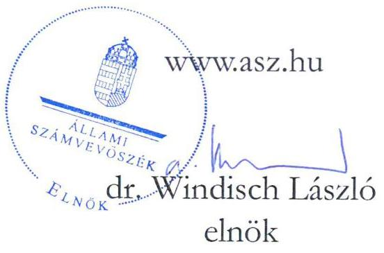

---

# ELLENŐRZÉSI IGAZGATÓSÁG: 

## ÁLLAMHÁZTARTÁS KÖZPONTI SZINTJÉT ELLENŐRZŐ IGAZGATÓSÁG

## ELLENŐRZÉSI IGAZGATÓ:

DR. SZOMOLAI CSABA alelnök

## ELLENŐRZÉSVEZETŐ:

Jelentéseink az interneten a www.asz.hu címen olvashatók.

JANIK JÓZSEF ellenőrzésvezető

IKTATÓSZÁM: EL-3840-1130/2023
TÉMASZÁM: 2666
ELLENŐRZÉS-AZONOSÍTÓ SZÁM: V1010

---

# TARTALOMJEGYZÉK 

- AZ ELLENŐRZÉS ALAPADATAI ..... 5
- AZ ELLENŐRZÉS HATÓKÖRE ÉS TERÜLETE / AZ ELLENŐRZÖTT SZERVEZETEK ..... 8
- ÖSSZEFOGLALÁS ..... 9
- AZ ELLENŐRZÉS FÓKUSZKÉRDÉSEI ..... 11
- MEGÁLLAPÍTÁSOK ..... 12
- MELLÉKLETEK ..... 32
I. sz. melléklet: Értelmező szótár ..... 32
II. sz. melléklet: Az ellenőrzött szervezetek jegyzéke ..... 36
III. sz. melléklet: A belső kontrollrendszer lényeges elemeinek értékelése a központi alrendszer kiválasztott szervezeteinél. ..... 44
IV. sz. melléklet: A költségvetés központi tartalékainak képzése és felhasználása ..... 46
V. sz. melléklet: A kockázati alapon kiválasztott lényeges előirányzat-módosítások ..... 47
- FÜGGELÉK: ÉSZREVÉTELEK ..... 49
- RÖVIDÍTÉSEK JEGYZÉKE ..... 50

---

.

---

# AZ ELLENŐRZÉS ALAPADATAI 

## AZ ELLENŐRZÉS CÉLJA

Az ellenőrzés célja az Alaptörvényben, valamint az Ász tv. ${ }^{1}$-ben rögzítettek szerint a központi költségvetés végrehajtásáról készített zárszámadás vizsgálata volt. Ezen belül:

- annak megállapítása, hogy az Alaptörvény és a Stabilitási tv. ${ }^{2}$ államadósságra vonatkozó előírásai a 2022. költségvetési évben érvényesültek-e, az államháztartás központi alrendszerében a hiány alakulása megfelelt-e a Kvtv. ${ }^{3}$ előírásainak;
- annak értékelése, hogy a 2022. évi zárszámadási törvényjavaslat tartalma, szerkezete megfelel-e a jogszabályi előírásoknak, és valósághűen mutatja-e be a költségvetés végrehajtására vonatkozó pénzügyi adatokat, információkat,
- annak ellenőrzése, hogy a központi költségvetés bevételi és kiadási előirányzatainak teljesítési adatai tartalmaznak-e lényeges hibát; teljesítésük megfelelt-e a jogszabályi előírásoknak,
- továbbá az államháztartás bevételeit a Kvtv.-ben rögzítettekkel összhangban, a közpénzekkel való gazdálkodás jogszabályi követelményeinek megfelelően használták-e fel, a költségvetés végrehajtásában jog- és hatáskörrel rendelkezők a Kvtv.-ben meghatározott pénzügyi keretek között, szabályszerűen gazdálkodtak-e a közpénzekkel.

## AZ ELLENŐRZÉS TÍPUSA

Megfelelőségi ellenőrzés.

## AZ ELLENŐRZÖTT IDŐSZAK

A 2022. év; a zárszámadási törvényjavaslat elkészítése tekintetében 2023. I-III. negyedév.

## AZ ELLENŐRZÉS TÁRGYA

A zárszámadási ellenőrzés során az Állami Számvevőszék a zárszámadási törvényjavaslat megfelelőségét és az abban szereplő adatok megbízhatóságát, valamint a Társadalombiztosítási Alapok ${ }^{4}$ pénzügyi beszámolóját ellenőrizte. A zárszámadási ellenőrzés keretében az ÁSZ ${ }^{5}$ valamennyi ellenőrzött területen (központi kezelésű előirányzatok; fejezeti kezelésű előirányzatok, uniós és kapcsolódó, hazai forrásból nyújtott költségvetési támogatások; központi alrendszerbe tartozó szervezetek; Elkülönített Állami Pénzalapok; Társadalombiztosítási Alapok) ellenőrizte a gazdálkodás és az előirányzat-felhasználás során a költségvetési gazdálkodásra vonatkozó alapvető szabályok érvényesülését.

Az ellenőrzés kiterjedt minden olyan körülményre és adatra, amely az ÁSZ jogszabályban meghatározott feladatainak teljesítéséhez, valamint a program végrehajtása folyamán felmerült újabb összefüggések feltárásához szükséges volt.

---

# AZ ELLENŐRZÉS JOGALAPJA 

Az ellenőrzés jogszabályi alapját az Állami Számvevőszékről szóló 2011. évi LXVI. törvény 5. § (7) bekezdésének előírásai képezték.

## AZ ELLENŐRZÉS MÓDSZERE

Az ellenőrzést a nemzetközi standardokat irányadónak tekintve az ellenőrzési program szempontjai, az ellenőrzött időszakban hatályos jogszabályok, az ellenőrzés szakmai szabályok és módszertanok figyelembevételével végezte az ÁSZ.

Az ellenőrzési kérdések megválaszolásához szükséges bizonyítékok megszerzése az ellenőrzött szervezetek által rendelkezésre bocsátott dokumentumokra és adatokra alapozva, továbbá megfigyelés, szemle (szemrevételezés), kérdésfeltevés (információkérés), valamint elemző eljárás útján történt. Az ÁSZ felhasználta az ellenőrzés tárgya kapcsán releváns, nyilvánosan hozzáférhető adatokat, információkat és a Magyar Államkincstár által kezelt nemzetgazdasági számlák és egyéb előirányzatok pénzforgalmi adatbázisait.

Az ellenőrzés lefolytatásához az ellenőrzött szervezetek tanúsítványok kitöltésével, az ÁSZ által kért dokumentumok, adatok, információk megküldésével, valamint az ellenőrzés során helyszíni ellenőrzés keretében szolgáltattak adatokat.

A 2022. évi zárszámadási törvényjavaslatban szereplő pénzforgalmi bevételek és kiadások teljesítésének ellenőrzése reprezentativitást biztosító eljárással kiválasztott mintatételek értékelésére, adatok, folyamatok mintatételek alapján történt tesztelésére, és meghatározott területeken elemző eljárások alkalmazására épült.

A mintatételek értékelése során az ÁSZ a feltárt hibákat két fő csoportba sorolta: szabályszerűségi hibák, azaz a jogszabályi előírásoknak való meg nem felelés esetei, illetve megbízhatósági hibák, amelyek a zárszámadási törvényjavaslat adatainak megbízhatóságát befolyásolhatják.

A 2022. évi zárszámadási törvényjavaslatban szereplő pénzforgalmi bevételek és kiadások teljesítésének megbízhatóságát statisztikai mintavételi módszer alkalmazásával értékelte az ÁSZ. Az ellenőrzés eredményeinek kiértékelése és a hibák teljes sokaságra történt kivetítése alapján az ÁSZ a zárszámadási törvényjavaslat megbízhatóságát befolyásoló összes hiba összegét viszonyította a lényegességi küszöbértékhez, amelyet a központi költségvetés teljesített kiadási, illetve bevételi főösszegének 2\%-ában határozott meg. A kiértékelés a kiválasztott mintatételek alapján lehetővé tette a zárszámadási törvényjavaslat adataiban előforduló hibák összege felső korlátjának 95%-os bizonyossággal történő meghatározását.

A központi kezelésű kiadási és bevételi előirányzatok ellenőrzése az automatizált folyamatok, informatikai rendszerekben standardizált módon feldolgozott adatok mintatételek alapján történő tesztelésével egészült ki.

A szabályszerűségi hibák abban az esetben minősültek lényegesnek, amennyiben azok nem egyedi jellegűek voltak, azonos típusú hiba jellemzően fordult elő, így rendszerszerű probléma volt valószínűsíthető.

Elemző eljárással történt az állam által vállalt kezesség és viszontgarancia érvényesítésével kapcsolatos bevételek és kiadások, az adósságszolgálattal kapcsolatos bevételek, az ELKA ${ }^{6}$ bevételeinek, valamint a Társadalombiztosítás Alapok ellátási bevételeinek értékelése. Szintén elemzéssel végezte az ÁSZ a kiválasztott előirányzat módosítások, valamint a költségvetés központi tartalék előirányzatai képzésének és felhasználásának értékelését.

---

Az ÁSZ a belső kontrollrendszer tekintetében a kontrollkörnyezet, az integrált kockázatkezelési rendszer, az információs rendszer és a nyomon követési rendszer zárszámadás szempontjából lényeges elemeinek kialakítását értékelte a központi alrendszerbe tartozó 15 kockázati alapon kiválasztott szervezet esetében. A központi alrendszer szervezetei kontrolltevékenységének értékelése a bevételi és kiadási mintatételek alapján történt. A belső kontrollrendszer megfelelőségének megítéléséhez az ÁSZ két kategóriát alkalmazott: „megfelelő" minősítésű, ha a kérdésekre adott válaszok alapján a megfelelőség elérte a 80,0%-os értéket; ez alatt „nem megfelelő" volt a minősítés.

---

# AZ ELLENŐRZÉS HATÓKÖRE ÉS TERÜLETE / AZ ELLENŐRZÖTT SZERVEZETEK 

A Pénzügyminisztérium jogszabályi kötelezettség alapján minden költségvetési évre vonatkozóan az elfogadott költségvetéssel összehasonlítható módon elkészíti a központi költségvetés végrehajtásáról szóló törvényjavaslatot, melyet az ÁSZ törvényi kötelezettségének eleget téve ellenőriz.

A Magyarország 2022. évi központi költségvetéséről szóló 2021. évi XC. törvény végrehajtásáról szóló törvényjavaslattal kapcsolatban az ÁSZ ellenőrzése kiterjedt a központi kezelésű előirányzatokra, a fejezeti kezelésű előirányzatokra, az uniós és kapcsolódó hazai forrásból finanszírozott költségvetési támogatásokra, a központi alrendszerbe tartozó szervezetekre, az Elkülönített Állami Pénzalapokra, valamint a Társadalombiztosítási Alapokra.

Az ellenőrzött szervezetek a központi kezelésű előirányzatok, a fejezeti kezelésű előirányzatok és az uniós előirányzatok fejezetet irányító, illetve kezelő szervei, továbbá az ELKA keretében a Bethlen Gábor Alap, a Gazdaság-újraindítási Foglalkoztatási Alap, a Központi Nukleáris Pénzügyi Alap, a Nemzeti Kulturális Alap és a Nemzeti Kutatási, Fejlesztési és Innovációs Alap, valamint a Társadalombiztosítási Alapok keretében az Egészségbiztosítási Alap és a Nyugdíjbiztosítási Alap kezelő szervei voltak. Emellett az ellenőrzötti körbe tartozott a költségvetési év végén nyilvántartott, összesen 587 központi alrendszerbe tartozó szervezet közül statisztikai mintavétellel és kockázati alapon kiválasztott 64 szervezet, továbbá a központi költségvetés bevételei jelentős részének beszedéséért felelős Nemzeti Adó-és Vámhivatal, valamint a központi költségvetés végrehajtása során az elszámolásokban, pénzügyi tranzakciók lebonyolításában meghatározó szerepet játszó Magyar Államkincstár.

Az ellenőrzött szervezetek részletes jegyzékét a II. számú melléklet tartalmazza.

---

# ÖSSZEFOGLALÁS 

Az Alaptörvény szerint a központi költségvetés végrehajtásának ellenőrzése az ÁSZ törvényi feladata. Az ÁSZ az ellenőrzés elvégzésével hozzájárul ahhoz, hogy az Országgyűlés a zárszámadási törvényjavaslatra vonatkozóan megalapozott döntést hozhasson.

A költségvetés végrehajtásáról számot adó zárszámadási törvényjavaslat az Áht. ${ }^{7}$ irányadó rendelkezései szerinti szerkezetben és tartalommal készült el, a bevételi és kiadási adatokat valósághűen mutatta be.

Az államháztartás központi alrendszerébe tartozó központi és fejezeti kezelésű, valamint uniós és hazai forrásból finanszírozott költségvetési támogatási előirányzatok, a központi alrendszerbe tartozó szervezetek, a Társadalombiztosítási Alapok, valamint az ELKA bevételi és kiadási előirányzatainak a 2022. évi zárszámadási törvényjavaslatban szereplő teljesítési adatai megbízhatóak voltak. Az ellenőrzés nem tárt fel olyan lényeges hibát, amely befolyásolná a zárszámadás elkészítéséhez felhasznált adatok pontosságát és a zárszámadási törvényjavaslat megbízhatóságát.

A központi költségvetés bevételei és kiadásai, valamint az államháztartás központi alrendszerének pénzforgalmi hiánya a Kvtv.-ben rögzített eredeti összegekhez képest túlteljesültek. Ezzel együtt a központi alrendszer pénzforgalmi hiánya a 2022. év végére az előző évi 8,6%-os mértékhez képest a GDP ${ }^{8}$ 7,1%-ára mérséklődött.

A kormányzati szektor GDP arányos hiánya a 2021. évi 7,2%-hoz képest 6,2%-ra mérséklődött, ezzel együtt a 3,0%-os maastrichti kritérium fölött realizálódott. A maastrichti kritérium teljesítése alóli mentesítést a COVID-19 járvány negatív hatásainak kezelése érdekében meghozott uniós szabályozások, illetve a hazai jogrendben a Stabilitási tv. nemzetgazdasági stabilitás válsághelyzetben történő garantálása érdekében rögzített mentesítő rendelkezései egyaránt lehetővé tették a 2022. évben is.

Az államadósság-mutató a 2021. év végi 76,7%-os mértékhez képest a 2022. év végére 73,9%-ra mérséklődött, így a Kvtv.-ben rögzített, 79,3%-os tervezett mértéknél kedvezőbben alakult.

A 2022. évi központi költségvetés végrehajtása a jogszabályi előírásokkal összhangban történt.
Az ellenőrzés nem tárt fel olyan lényeges hibát, amely a költségvetés egésze végrehajtásának szabályszerűségét befolyásolná. A gazdasági események elszámolását, a kifizetések teljesítését megelőző kontrollokat, valamint a belső szabályozásokat érintően feltárt eseti hiányosságokat az ÁSZ az érintett ellenőrzött szervezetek vezetői részére jelezte.

A központi alrendszer bevételi és kiadási előirányzatainak 2022. évi teljesítési adatait az 1. ábra mutatja be.

---

1. ábra

A KÖZPONTI ALRENDSZER 2022. ÉVI TELJESÍTETT BEVÉTELI ÉS KIADÁSI ADATAI (ELLENŐRZÉSI TERÜLETEK SZERINT, ILLETVE A FŐÖSSZEG %-ÁBAN)
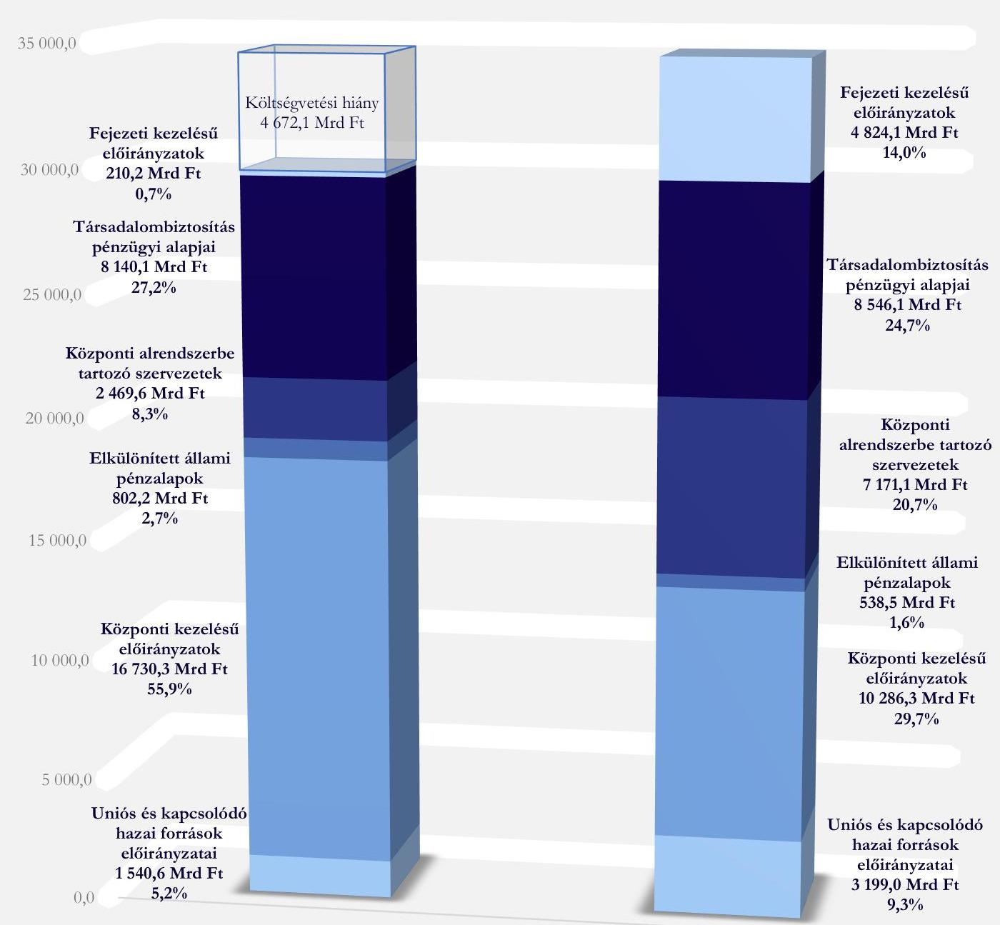

Bevételek: 29 893,0 Mrd Ft
Kiadások: 34 565,1 Mrd Ft

---

# AZ ELLENŐRZÉS FÓKUSZKÉRDÉSEI 

1.- Az Alaptörvény és a Stabilitási tv. államadósságra vonatkozó előírásai érvényesültek-e, az államháztartás központi alrendszerében a hiány a Kvtv. előírásai szerint alakult-e?
2.- A zárszámadási törvényjavaslat tartalma, szerkezete összhangban volt-e a jogszabályi előírásokkal?
3.- A zárszámadási törvényjavaslatban szereplő bevételi és kiadási előirányzatok teljesítési adatai megbízhatóak voltak-e?
4.- A 2022. évi központi költségvetés végrehajtása szabályszerűen történt-e?

---

# MEGÁLLAPÍTÁSOK 

## 1. Az Alaptörvény és a Stabilitási tv. államadósságra vonatkozó előírásai érvényesültek-e, az államháztartás központi alrendszerében a hiány a Kvtv. előírásai szerint alakult-e?

Összegző megállapítás Az Alaptörvény és a Stabilitási tv. államadósságra és hiányra vonatkozó előírásai érvényesültek. Az államadósság a Kvtv.ben előirányozottnál kedvezőbben alakult, az államháztartás központi alrendszerének pénzforgalmi hiánya ugyanakkor a Kvtv.-ben tervezett összeget meghaladta.

### 1.1. számú megállapítás

Az államháztartás központi alrendszerének bevételi és kiadási főösszege, ezzel együtt pénzforgalmi hiánya a Kvtv.-ben tervezettet meghaladóan teljesült.

Az Országgyűlés a Kvtv.-ben az államháztartás központi alrendszerének bevételi főösszegét 25 393,8 Mrd Ft-ban, kiadási főösszegét 28 546,5 Mrd Ft-ban, pénzforgalmi hiányát 3 152,7 Mrd Ft-ban állapította meg. A központi alrendszer előirányzatain belül a hazai működési költségvetés tervezett bevételei és kiadásai egyensúlyban voltak. A hazai felhalmozási költségvetés esetében a tervezett hiány 2514,8 Mrd Ft-ban került elfogadásra, míg az európai uniós fejlesztési költségvetés tervezett hiánya 637,9 Mrd Ft volt.
A zárszámadási törvényjavaslat alapján az államháztartás központi alrendszerének 2022. évi bevétele az eredeti előirányzatot 17,7%-kal meghaladva, 29 893,0 Mrd Ft-ban teljesült, kiadása
 a tervezetthez képest 21,1%-kal növekedett, 34 565,1 Mrd Ft-ot tett ki, a pénzforgalmi hiány 4672,1 Mrd Ft, a GDP 7,1%-a volt.
A központi alrendszer előirányzatain belül a hazai működési költségvetés hiánya 251,2 Mrd Ft, a hazai felhalmozási költségvetés hiánya 2822,4 Mrd Ft, míg az európai uniós fejlesztési költségvetés hiánya 1598,5 Mrd Ft összegben alakult.
A 2022. évi Kvtv.-ben előirányzotthoz képest jelentős összegben és arányban túlteljesült bevételeket és kiadásokat a 2. és 3. ábra szemlélteti.

---

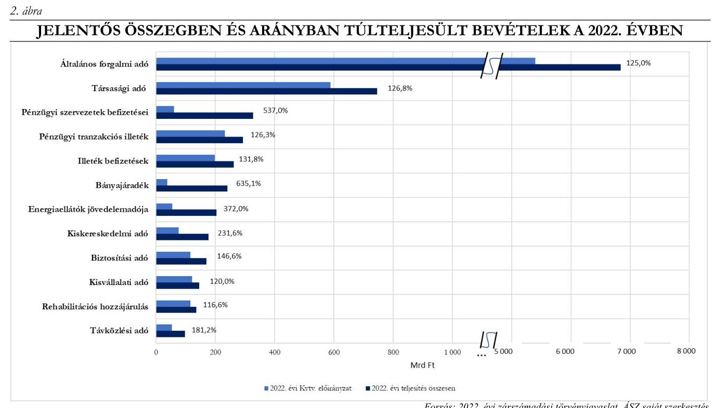

Forrás: 2022. évi zárszámadási törvényjavaslat, ÁSZ saját szerkesztés
3. ábra

JELENTŐS ÖSSZEGBEN ÉS ARÁNYBAN TÚLTELJESÜLT KIADÁSOK A 2022. ÉVBEN
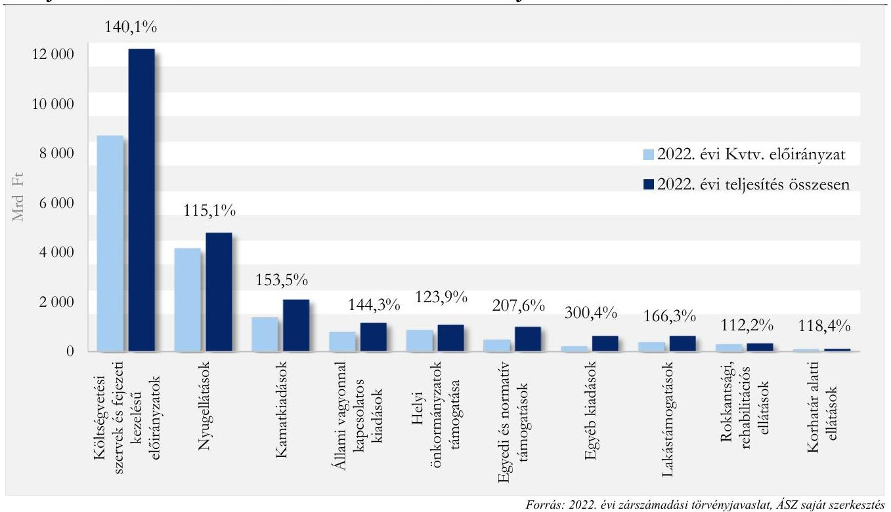

Forrás: 2022. évi zárszámadási törvényjavaslat, ÁSZ saját szerkesztés
Az államháztartás központi alrendszerén belül a központi költségvetés 4 529,8 Mrd Ft-os, a Társadalombiztosítási Alapok 406,0 Mrd Ft-os hiánnyal, az ELKA 263,7 Mrd Ft-os többlettel zárták a 2022. évet.

A Társadalombiztosítási Alapok 2022. évi hiánya a Nyugdíjbiztosítási Alap 297,3 Mrd Ft-os és az Egészségbiztosítási Alap 108,7 Mrd Ft-os deficitjéből tevődött össze.

---

Az államháztartás egészének 2022. évi pénzforgalmi hiánya (amely tartalmazza az önkormányzati alrendszer 52,3 Mrd Ft-os hiányát is) az eredeti 3309,1 Mrd Ft előirányzatot 1415,3 Mrd Ft-tal meghaladta, 4724,4 Mrd Ft összegben teljesült, ami a GDP 7,2%-ának felelt meg.

# 1.2. számú megállapítás Az államadósság a Kvtv.-ben tervezettnél kedvezőbben alakult, az Alaptörvény és a Stabilitási tv. államadósságra és hiányra vonatkozó előírásai érvényesültek. 

A zárszámadási törvényjavaslat alapján 2022. december 31-én az államadósság-mutató számlálójának (államadósság) összege 48 834,2 Mrd Ft, nevezőjének (GDP) összege 66 075,2 Mrd Ft, az államadósságmutató mértéke 73,9% volt. Az államadósság-mutató a Kvtv.-ben rögzített, 2022. év végére tervezett 79,3%-os mértékhez képest kedvezőbben alakult, és a 2021. év végi 76,7%-hoz képest 2,8 százalékponttal csökkent.
A Stabilitási tv. szerinti államadósság és az államadósság-mutató alakulását 2021-2022. évben a 4. ábra szemlélteti.
4. ábra

AZ ÁLLAMADÓSSÁG, ILLETVE ÁLLAMADÓSSÁG-MUTATÓ A 2021. ÉS A 2022. ÉVBEN
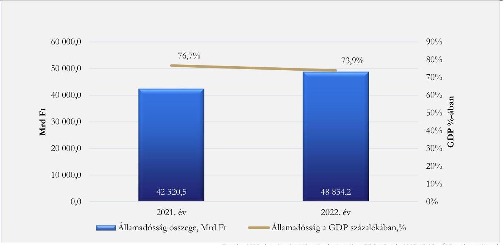

Forrás: 2022. évi zárszámadási törvényjavaslat, EDP jelentés 2023.09.29., ÁSZ saját szerkesztés
Az államadósság összege a 2021. év végi 42 320,5 Mrd Ft-hoz képest mintegy 15,4%-kal növekedett, ugyanakkor a GDP ezt meghaladó mértékű növekedése az államadósság-mutató csökkenését eredményezte.
A kormányzati szektor európai uniós módszertan szerinti hiányát a 2022. évre vonatkozóan a Kvtv.-ben eredetileg a GDP 5,9%-ában tervezték, amely célérték 2021. december végén a 1949/2021. (XII.22.) Korm. határozattal 4,9%-ra módosult. Az uniós módszertan szerinti hiány az energiaválság-helyzet kezelése érdekében szükségessé vált földgázkészlet-felhalmozás mintegy 1,2%-os hiányrontó hatását is figyelembe véve 2022. december végére 6,2%-ban teljesült, ami 1,0 százalékponttal volt alacsonyabb a 2021. évi végi 7,2%-os mértéknél. A maastrichti kritérium szerinti 3%-os mérték teljesítése alóli mentesítést biztosító uniós mentesítési záradék előírásaival összhangban, a nemzetgazdasági stabilitás válsághelyzetben történő garantálása érdekében a Stabilitási tv. 48. § (3) bekezdésének rendelkezései szerint a 2021-2023. költségvetési évekre a GDP arányos hiány mértékére vonatkozó előírást nem kell

---

alkalmazni. A kormányzati szektor európai uniós módszertan szerinti hiánya összegének és GDP-hez viszonyított arányának alakulását az 5. ábra szemlélteti.
5. ábra

# A KORMÁNYZATI SZEKTOR UNIÓS MÓDSZERTAN SZERINTI HIÁNYA A 2021. ÉS A 2022. ÉVBEN 

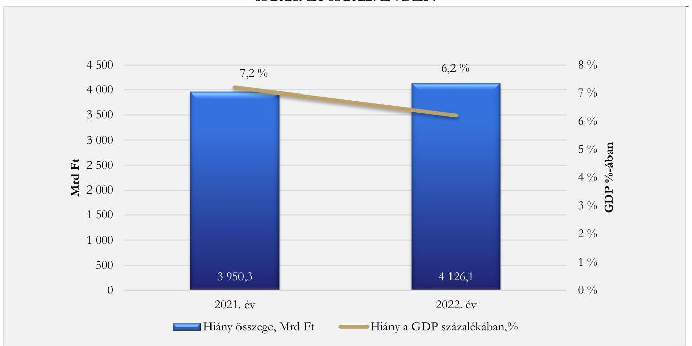

Forrás: 2022. évi zárszámadási törvényjavaslat, EDP jelentés 2023.09.29., ÁSZ saját szerkesztés

---

# 2. A zárszámadási törvényjavaslat tartalma, szerkezete összhangban volt-e a jogszabályi előírásokkal? 

Összegző megállapítás

A zárszámadási törvényjavaslatot a Pénzügyminisztérium az Áht.-ban foglaltaknak megfelelően az éves költségvetési beszámolók alapján, az elfogadott költségvetéssel összehasonlítható módon, a jogszabályban előírt tartalommal és szerkezetben készítette el.
2.1. számú megállapítás

A zárszámadási törvényjavaslat előkészítése, összeállítása a jogszabályi előírások érvényesítésével történt.

A PM⁹ a zárszámadásról szóló törvényjavaslat normaszövegét, mellékleteit, az indoklásokat és azok számítási anyagát a fejezetek, illetve a funkcionális és pénzügyi irányító, lebonyolító és adatfeldolgozást végző szervek közreműködésével állította össze.
A PM a zárszámadási törvényjavaslatot az Áht. előírásaival összhangban az éves költségvetési beszámolók alapján, az elfogadott költségvetéssel összehasonlítható módon, az év utolsó napján érvényes szervezeti, besorolási rendnek megfelelően készítette el.

### 2.2. számú megállapítás

A Pénzügyminisztérium a zárszámadási törvényjavaslatban a jogszabályokban meghatározott lényeges tartalmi elemeket szerepeltette.

A PM a zárszámadásról szóló törvényjavaslatban ismertette az Áht.-ban meghatározott adatokat, információkat, a központi alrendszer hiányának a költségvetésben tervezett mértékétől való eltérése okait, továbbá az Áht. vonatkozó előírása alapján a költségvetési hiány finanszírozásának módját. A zárszámadási törvényjavaslat tartalmazta az Áht.-ban előírt mérlegeket, kimutatásokat és szöveges indokolásokat.

---

# 3. A zárszámadási törvényjavaslatban szereplő bevételi és kiadási előirányzatok teljesítési adatai megbízhatóak voltak-e? 

## Összegző megállapítás

A központi költségvetés bevételi és kiadási előirányzatainak teljesítési adatai megbízhatóak voltak.

## 3.1. számú megállapítás

A központi kezelésű bevételi és kiadási előirányzatok teljesítési adatai megbízhatóak voltak.

A költségvetés központi kezelésű előirányzatainak bevételeiről az 1. táblázat, kiadásairól a 2. táblázat ad áttekintést.

1. táblázat

A KÖZPONTI KEZELÉSŰ ELŐIRÁNYZATOK BEVÉTELEI A 2022. ÉVBEN (MRD FT)

| MEGNEVEZÉS | EREDETI   ELŐIRÁNYZAT | TELJESÍTÉS |
| :-- | --: | --: |
| Általános forgalmi adó | 5487,1 | 6860,3 |
| Jövedéki adó | 1296,2 | 1229,5 |
| Fogyasztáshoz kapcsolt egyéb adók | 459,5 | 628,4 |
| Társadalombiztosítási-, nyugdíj- és egészségbiztosítási járulék | 3349,8 | 3769,4 |
| Személyi jövedelemadó | 2866,5 | 2786,0 |
| Lakosság egyéb költségvetési befizetései | 289,2 | 358,0 |
| Szociális hozzájárulási adó | 2454,6 | 2378,6 |
| Társasági adó | 588,7 | 746,6 |
| Gazdálkodó szervezetek egyéb befizetései | 1356,2 | 2122,7 |
| Az állami vagyonnal kapcsolatos bevételek | 275,8 | 469,9 |
| Az adósságszolgálattal kapcsolatos bevételek | 105,0 | 258,3 |
| Egyéb bevételek | 62,9 | 167,6 |
| Államháztartáson belüli transzferek | 177,1 | 1113,6 |
| Összesen: | 18768,6 | 22888,9 |
| Összesen a Társadalombiztosítási Alapokat és GUFA III-t megillető bevételek   nélkül: | 12957,8 | 16730,3 |

Forrás: 2022. évi zárszámadási törvényjavaslat, ÁSZ saját szerkesztés
2. táblázat

A KÖZPONTI KEZELÉSŰ ELŐIRÁNYZATOK KIADÁSAI A 2022. ÉVBEN (MRD FT)

| MEGNEVEZÉS | EREDETI   ELŐIRÁNYZAT | TELJESÍTÉS |
| :-- | --: | --: |
| Az adósságszolgálattal kapcsolatos kiadások | 1413,0 | 2143,5 |
| Az állami vagyonnal kapcsolatos kiadások | 800,1 | 1154,7 |
| A helyi, a települési és területi nemzetiségi önkormányzatok támogatása | 877,2 | 1086,0 |
| A Nemzeti Család- és Szociálpolitikai Alap kiadásai | 685,3 | 717,1 |
| Központi kezelésű egyéb kiadási előirányzatok | 1186,7 | 3086,4 |
| Összesen: | 4962,3 | 8187,7 |
| Összesen a központi alrendszeren belüli transzferekkel együtt: | 10286,3 |  |

Forrás: 2022. évi zárszámadási törvényjavaslat, ÁSZ saját szerkesztés

A költségvetés központi kezelésű bevételi és kiadási előirányzatai tekintetében a gazdasági események számviteli elszámolása megfelelt a Számv. tv.¹¹ és az Áhsz.¹² előírásainak, a gazdasági eseményeket

---

bizonylattal alátámasztották, és a bizonylaton szereplő összegben, az egységes rovatrendben foglaltaknak megfelelően vették nyilvántartásba. Egyedi megbízhatósági hibaként tárt fel az ellenőrzés az állami vagyonnal kapcsolatos kiadások esetében az Áhsz. 40. § (1) bekezdésben és 15. mellékletében, valamint a 38/2013. (IX. 19.) NGM rendelet¹³ IV. fejezet A) pontjában foglaltak ellenére az előírt rovatrendtől eltérő, téves elszámolást, amely sem érték, sem jelleg szerint nem minősült lényeges hibának.
A NAV¹⁴ teszteléses módszerrel ellenőrzött bevallásfeldolgozó és pénzforgalmi rendszereinek működése megbízható volt. A társasági adó, általános forgalmi adó, jövedéki adó, pénzügyi tranzakciós illeték, személyi jövedelemadó, energiaellátók jövedelemadója, pénzügyi szervezetek különadója, szociális hozzájárulási adó, társadalombiztosítási járulék adónemeken elszámolt bevételek tekintetében az Art.¹⁵, az Adóig. vhr.¹⁶ és a NAV belső előírásainak megfelelő volt a bevallások feldolgozása, a kiutalás előtti felülvizsgálat szabályszerűen történt, a befizetések kezelése, az átvezetések és kiutalások (folyószámla könyvelés), a bevallásfeldolgozás eseményeinek nyomon követhetősége biztosított volt. A NAV informatikai rendszereiben a rögzített és elszámolt tranzakciók megbízhatóságát biztosító beépített kontrollok megfelelően működtek.

# 3.2. számú megállapítás A fejezeti kezelésű kiadási előirányzatok teljesítési adatai megbízhatóak voltak. 

A fejezeti kezelésű előirányzatok összesített 2022. évi bevételeit és kiadásait a 3. táblázat, a teljesített kiadások fejezetet irányító szervek szerinti megoszlását a 6. ábra szemlélteti.

| 3. táblázat |  |  |
| :--: | :--: | :--: |
| A FEJEZETI KEZELÉSŰ ELŐIRÁNYZATOK BEVÉTELEI ÉS KIADÁSAI A 2022. ÉVBEN (MRD FT) |  |  |
| MEGNEVEZÉS | EREDETI ELŐIRÁNYZAT | TELJESÍTÉS |
| Bevétel | 26,8 | 210,2 |
| Kiadás | 3 100,7 | 4824,1 |

Forrás: 2022. évi zárszámadási törvényjavaslat, ÁSZ saját szerkesztés

---

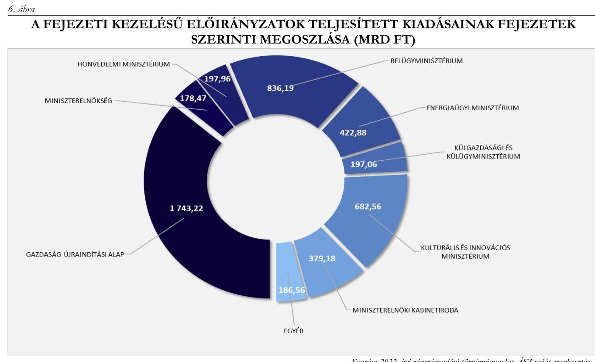

*Forrás: 2022. évi zárszámadási törvényjavaslat, ÁSZ saját szerkesztés*

A fejezeti kezelésű előirányzatok kiadásainak elszámolása megfelelt a Számv. tv. és az Áhsz. előírásainak. A kapcsolódó gazdasági események számviteli elszámolását bizonylatok alátámasztották, azok tartalmi elemei megfeleltek a Számv. tv. előírásainak. Az egyes kiadások elszámolt összege (részösszege) megegyezett az adott gazdasági esemény számviteli elszámolását alátámasztó számviteli bizonylaton szereplő összeggel, és az elszámolások az egységes rovatrend előírásainak megfelelő nyilvántartási számlákon történtek.

A támogatási célú előirányzatok esetében az egyes kifizetések teljesítése a vonatkozó jogszabályok, ágazati rendeletek és a belső szabályzatok rendelkezései szerint, támogatási szerződések alapján történt.

A bevételek nagyságrendje a fejezeti kezelésű előirányzatok esetében nem volt jelentős, a kiadási előirányzatok forrásaként jellemzően a központi költségvetési bevételek szolgáltak.

### 3.3. számú megállapítás

Az uniós forrásokból és a kapcsolódó hazai forrásból finanszírozott támogatások kiadási előirányzatainak teljesítési adatai megbízhatóak voltak.

Az uniós előirányzatok az Európai Unió kohéziós politikájának megvalósítását biztosító pénzügyi forrásokat, továbbá egyéb nemzetközi programok forrásait tartalmazzák. Az uniós forrásokból és a kapcsolódó hazai forrásból finanszírozott támogatások 2022. évi eredeti előirányzatait és teljesítési adatait a 4. táblázat szemlélteti.

Az uniós kiadási előirányzattal rendelkező fejezetek 2022. évi kiadási teljesítési adatait az 5. táblázat tartalmazza. (A 2022. évben nem történt teljesítés az Európai Hálózatfinanszírozási Eszköz (CEF) politikájának megvalósítását biztosító pénzügyi 4. táblázat

| AZ UNIÓS FORRÁSBÓL ÉS KAPCSOLÓDÓ HAZAI FORRÁSBÓL FINANSZÍROZOTT TÁMOGATÁSOK BEVÉTELEI ÉS KIADÁSAI A 2022. ÉVBEN (MRD FT) |  |   |
| --- | --- | --- |
| MEGNEVEZÉS | EREDETI ELŐIRÁNYZAT | TELJESÍTÉS  |
| Bevétel | 2 571,6 | 1 540,6  |
| Kiadás | 3 223,0 | 3 199,0  |

*Forrás: 2022. évi zárszámadási törvényjavaslat, ÁSZ saját szerkesztés*

---

projektek 2021-2027, a Magyar Halgazdálkodási Operatív Program Plusz és a Belügyi Alapok 2021-2027 uniós kiadási előirányzatokon.)
5. táblázat

AZ UNIÓS KIADÁSI ELŐIRÁNYZATOK 2022. ÉVI TELJESÍTÉSI ADATAI (MRD FT)

| MEGNEVEZÉS | TELJESÍTÉS |
| :--: | :--: |
| 2014-2020. közötti kohéziós politikai operatív programok (XIX. fejezet) | 1346,0 |
| 2021-2027. közötti kohéziós politikai operatív programok (XIX. fejezet) | 663,0 |
| Egyéb kohéziós kiadási előirányzatok (XIX. fejezet) * | 252,3 |
| Helyreállítási és Ellenállóképességi Eszköz (XIX. fejezet) | 501,3 |
| Agrár- és halászati alapok programjai**
 | 420,0 |
| Egyéb uniós programok*** | 7,9 |
| Brexit Alkalmazkodási Tartalék (XVIII. fejezet) | 8,5 |
| ÖSSZESEN: | 3199,0 |

* Európai Területi Együttműködési (2014-2020), Európai Hálózatfinanszírozási Eszköz (CEF) projektek 2014-2020, Transznacionális és Interregionális Együttműködés (2014-2020) és (2021-2027), valamint tartalmazza a hazai 209,6 Mrd Ft forrást is
** A XIX. fejezeten belül a Vidékfejlesztési Program, Magyar Halgazdálkodási Operatív Program Plusz, valamint a XII. Agrárminisztérium fejezeten belül az Uniós programok kiegészítő támogatása
*** A XIV. Belügyminisztérium fejezeten belül az Európai Uniós és nemzetközi projektek/programok megvalósításához kapcsolódó kiadások, Belügyi Alapok 2014-2020, továbbá a XIX. fejezeten belül az EGT és Norvég Finanszírozási Mechanizmusok 2014-2021 és a Svájci-Magyar Együttműködési Program II.

Forrás: 2022. évi zárszámadási törvényjavaslat, ÁSZ saját szerkesztés
Az uniós forrásokból és a kapcsolódó hazai forrásból finanszírozott támogatások kiadási előirányzatai terhére teljesített kifizetések elszámolása a Számv. tv. és az Áhsz. előírásaival összhangban, a gazdasági események számviteli elszámolását megfelelően alátámasztó hiteles, megbízható számviteli bizonylatok alapján történt.
Az uniós forrásokból és a kapcsolódó hazai forrásból származó bevételek túlnyomó részét az Európai Bizottság jóváhagyásával, elszámolás alapján megtérített összegek jelentették (1 304,0 Mrd Ft). A 2022. évben a bevételek jelentős része (közel 80%-a) a 2014-2020-as programozási időszakra vonatkozó kohéziós politikai operatív programok megtérítéséből származott.

# 3.4. számú megállapítás A központi alrendszerbe tartozó szervezetek bevételi és kiadási előirányzatainak teljesítési adatai megbízhatóak voltak. 

A központi alrendszerbe tartozó szervezetek bevételi és kiadási adatait a 6. táblázat szemlélteti (a táblázat nem tartalmazza a NEAK ${ }^{\mathrm{IT}}$ adatait, figyelemmel arra, hogy az intézmény bevételei és kiadásai a LXXII. Egészségbiztosítási és Járvány Elleni Védekezési Alap fejezetben szerepelnek).
A gazdasági események számviteli elszámolása összességében megfelelt a Számv. tv. és az Áhsz. előírásainak, az adott gazdasági esemény az elszámolást alátámasztó bizonylaton szereplő összegben, az egységes rovatrend előírásainak figyelembevételével került elszámolásra.

## 6. táblázat

A KÖZPONTI ALRENDSZERBE TARTOZÓ SZERVEZETEK BEVÉTELEI ÉS KIADÁSAI A 2022. ÉVBEN (MRD FT)

| MEGNEVEZÉS | EREDEI   ELŐIRÁNYZAT | TELJESÍTÉS |
| :-- | :--: | :--: |
| Bevétel | 1510,6 | 2469,6 |
| Kiadás | 5386,3 | 7171,1 |

Forrás: 2022. évi zárszámadási törvényjavaslat, ÁSZ saját szerkesztés

---

A kiadási előirányzatok teljesítési adatainak megoszlását tranzakció-típusonként a 7. ábra szemlélteti:
7. ábra

# A KÖZPONTI ALRENDSZERBE TARTOZÓ SZERVEZETEK 2022. ÉVI TELJESÍTETT KÖLTSÉGVETÉSI KIADÁSAINAK MEGOSZLÁSA (MRD FT) 

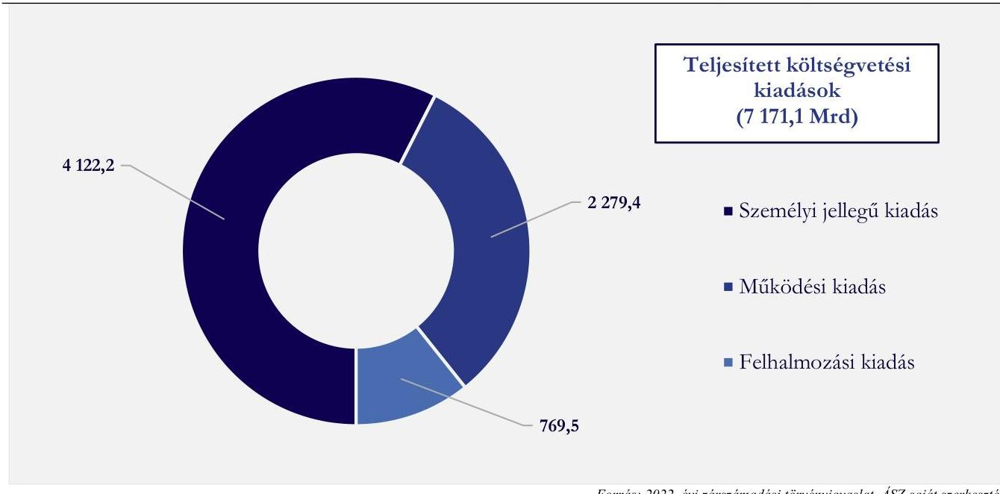

Forrás: 2022. évi zárszámadási törvényjavaslat, ÁSZ saját szerkesztés
A kiadások tekintetében egyedi megbízhatósági hibaként tárta fel az ellenőrzés egy intézménynél, hogy a Számv. tv. 165. § (2) bekezdésében foglaltak ellenére több esetben a kifizetés tényét és összegét alátámasztó bizonylat hiányában jegyeztek be adatokat a könyvviteli nyilvántartásba. A hiba értéke a lényegességi szint alatt maradt, így a központi alrendszerbe tartozó szervezetek kiadásainak megbízhatóságát nem befolyásolta.
A bevételi előirányzatok teljesítési adatainak tranzakció-típusonkénti megoszlását a 8. ábra szemlélteti.
8. ábra

KÖZPONTI ALRENDSZERBE TARTOZÓ SZERVEZETEK 2022. ÉVI TELJESÍTETT KÖLTSÉGVETÉSI BEVÉTELEINEK MEGOSZLÁSA (MRD FT)
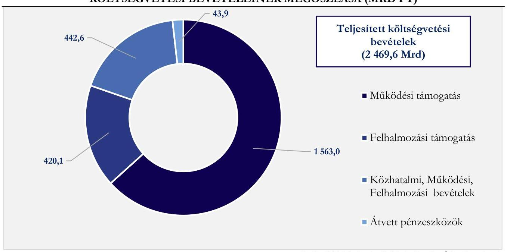

Forrás: 2022. évi zárszámadási törvényjavaslat, ÁSZ saját szerkesztés

---

A bevételek tekintetében megbízhatósági hibát nem tárt fel az ellenőrzés.

# 3.5. számú megállapítás Az ELKA kiadási előirányzatainak teljesítési adatai megbízhatóak voltak. 

Az ELKA 2022. évi zárszámadási törvényjavaslatban megjelenő kiadásainak és bevételeinek alakulását összesítve a 7. táblázat mutatja be, alaponként a 9. ábra szemlélteti.

| 7. táblázat |  |  |
| :--: | :--: | :--: |
| AZ ELKA BEVÉTELEI ÉS KIADÁSAI A 2022. ÉVBEN (MRD FT) |  |  |
| MEGNEVEZÉS | EREDEI | TELJESÍTÉS |
| Bevétel | 703,3 | 802,2 |
| Kiadás | 577,9 | 538,5 |
| 9. ábra |  |  |

AZ ELKA TELJESÍTETT KÖLTSÉGVETÉSI BEVÉTELEI ÉS KIADÁSAI ALAPONKÉNT A 2022. ÉVBEN (MRD FT)
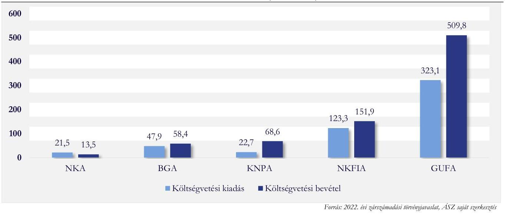

Az ELKA (BGA ${ }^{18}$, KNPA $^{19}$, GUFA, NKA $^{20}$, NKFIA $^{21}$ ) alapokból teljesített kifizetések számviteli elszámolását a Számv. tv. előírásainak megfelelő bizonylattal alátámasztották, a Számv. tv. előírásaival összhangban a kiadások elszámolt összege (részösszege) megegyezett a gazdasági esemény számviteli elszámolását alátámasztó bizonylatokon szereplő összeggel, elszámolásuk az Áhsz.-ben foglaltaknak megfelelően történt.

---

# 3.6. számú megállapítás A Társadalombiztosítási Alapok bevételi és kiadási előirányzatainak teljesítési adatai megbízhatóak voltak. 

A Társadalombiztosítási Alapok bevételi és kiadási adatait összesítve a 8. táblázat, alaponként elkülönítve a 9. és 10. táblázat szemlélteti.

| 8. táblázat |  |  |  |
| :--: | :--: | :--: | :--: |
| A TÁRSADALOMBIZTOSÍTÁSI ALAPOK BEVÉTELEI ÉS KIADÁSAI A 2022. ÉVBEN (MRD FT) |  |  |  |
|  |   |   |   |
|  |   |   |   |
|  |   |   |   |
|  |   |   |   |
|  |   |   |   |
|  |   |   |   |
|  |   |   |   |
|  |   |   |   |

9. táblázat

AZ NY. ALAP BEVÉTELEI ÉS KIADÁSAI A 2022. ÉVBEN (MRD FT)

| MEGNEVEZÉS | EREDETI   ELŐIRÁNYZAT | TELJESÍTÉS |
| :-- | :--: | :--: |
| Bevétel | 4170,0 | 4509,0 |
| Kiadás | 4170,0 | 4806,3 |
| Forrás: 2022. évi zárszámadási törvényjavaslat, ÁSZ saját szerkesztés |  |  |

10. táblázat

AZ E. ALAP BEVÉTELEI ÉS KIADÁSAI A 2022. ÉVBEN (MRD FT)

| MEGNEVEZÉS | EREDETI   ELŐIRÁNYZAT | TELJESÍTÉS |
| :-- | :--: | :--: |
| Bevétel | 4170,0 | 4509,0 |
| Kiadás | 4170,0 | 4806,3 |
| Forrás: 2022. évi zárszámadási törvényjavaslat, ÁSZ saját szerkesztés |  |  |

A NAV által - a központi kezelésű bevételi előirányzatokon - beszedett adók, járulékok, hozzájárulások Ny. Alapot ${ }^{22}$, illetve E. Alapot ${ }^{23}$ megillető éves bevételi összegei az alapok költségvetési beszámolóiban megjelentek, a bevételek számviteli elszámolása megbízhatóan történt.
A Társadalombiztosítási Alapok kezelői ${ }^{24}$ az Ny. Alap, valamint az E. Alap ellátási kiadásainak számviteli elszámolását a Számv. tv.-ben meghatározott tartalmi követelményeknek megfelelő számviteli bizonylatokkal alátámasztották. A kiadások elszámolása az Ávr. ${ }^{25}$-ben és az Áhsz.-ben előírtak szerint, a számviteli bizonylaton szereplő összeggel megegyezően, az Áhsz.-ben előírt rovatokon történt.
Az E. Alap költségvetési fejezetének részét képező NEAK működéséhez kapcsolódó kiadások, illetve bevételek számviteli elszámolása a Számv. tv.-ben meghatározott tartalmi követelményeknek megfelelő számviteli bizonylatok alapján történt. A bevételeket és kiadásokat a számviteli bizonylaton szereplő összeggel megegyezően a jogszabályban meghatározott egységes rovatrend szerinti nyilvántartási számlákon számolták el.

---

# 4. A 2022. évi központi költségvetés végrehajtása szabályszerűen történt-e? 

| Összegző megállapítás | A 2022. évi központi költségvetés végrehajtása   szabályszerűen történt, az ellenőrzés a költségvetés   végrehajtásának szabályszerűségét befolyásoló lényeges   hibát nem tárt fel. |
| :-- | :-- |

4.1. számú megállapítás

A költségvetés központi kezelésű bevételi előirányzatainak teljesítése, kiadási előirányzatainak felhasználása kapcsán az ellenőrzés szabályszerűségi hibát nem tárt fel.

A NAV által beszedett bevételek ellenőrzött mintatételei esetében a regisztrációs adót a Rega. tv. ${ }^{26}$, a lakossági illetékeket az Itv. ${ }^{27}$, a bírságbevételeket az Art. és az Avt. ${ }^{28}$, valamint a gépjárműadó bevételeit az 1991. évi LXXXII. tv. ${ }^{29}$ hatályos rendelkezéseinek megfelelően írták elő és vették nyilvántartásba. A NAV végrehajtási számlákra befolyt bevételek teljesítése az ellenőrzött tételeknél az Avt. és a Számv. tv. előírásainak megfelelt.
A Bányajáradék előirányzaton összesen 241,3 Mrd Ft bevétel teljesült, ami a bányajáradék-bevételek szabályozói eszközökkel történő növelésének, illetve a bányajáradék-bevétel számítási módját érintő jogszabályi módosításoknak köszönhetően a 38,0 Mrd Ft eredeti előirányzat több mint hatszorosa. A bányafelügyelet az ellenőrzött tételeknél a bányajáradékkal kapcsolatban beérkezett bevallásokat ellenőrizte, a bevételek teljesítése az 1993. évi XLVIII. tv. ${ }^{30}$, a 203/1998. (XII. 19.) Korm. rendelet ${ }^{31}$, az 54/2008. (III. 20.) Korm. rendelet ${ }^{32}$, valamint a 404/2021. (VII. 8.) Korm. rendelet ${ }^{33}$ vonatkozó előírásainak megfelelt.
A Megtett úttal arányos útdíj előirányzat esetében 277,1 Mrd Ft bevétel teljesült, amely 5,4%-kal haladta meg az eredeti 263,0 Mrd Ft előirányzatot. A megtett úttal arányos útdíj összegének megállapítása és a beszedett díjbevételek befizetése a központi költségvetésbe az ellenőrzött tételeknél megfelelt a 209/2013. (VI. 18.) Korm. rendelet ${ }^{34}$ előírásainak.
Az állami vagyonnal való gazdálkodással kapcsolatos ellenőrzött mintatételek esetében a bevételek teljesítése és a kiadások felhasználása az Áht. és az Ávr. előírásaival összhangban történt, a szerződéskötések és az ügyletek lebonyolítása a Vtv. ${ }^{35}$ és az Nfa tv. ${ }^{36}$ előírásainak megfelelt.
Az Adósságszolgálattal kapcsolatos kiadási előirányzatok felhasználása a jogszabályi előírásokkal összhangban történt, az ellenőrzött kifizetések alátámasztó dokumentumai a Számv. tv. és az Áhsz. előírásainak megfeleltek.
Az Adósságszolgálattal kapcsolatos bevételek teljesítése (258,3 Mrd Ft) a Kvtv. előírásainak megfelelt.
Az állam által vállalt kezesség és viszontgarancia érvényesítése tekintetében hét előirányzaton összesen 33,0 Mrd Ft kiadás, valamint a kapcsolódó megtérülésekből 3,6 Mrd Ft bevétel teljesült.
A kifizetések túlnyomó részét a Garantiqa Hitelgarancia Zrt. garanciaügyleteiből (24,2 Mrd Ft), valamint Mehib Zrt. ${ }^{37}$ biztosítási tevékenységből (7,1 Mrd Ft) eredő fizetési kötelezettségek tették ki. A megtérülések mintegy 80%-a (2,9 Mrd Ft) szintén a Garantiqa Hitelgarancia Zrt. garanciaügyleteihez kapcsolódott.

---

A Kincstár ${ }^{38}$ és a garantőr szervezetek betartották a Kvtv. állam által vállalt kezességek, garanciák, viszontgaranciák és nyújtott hitelek állományának felső határára vonatkozó előírásait.
A Helyi önkormányzatok támogatásai, valamint a Települési és területi nemzetiségi önkormányzatok támogatása esetében az ellenőrzött kiadásoknál a Helyi önkormányzatok támogatásai, valamint a Települési és területi nemzetiségi önkormányzatok támogatása előirányzatok teljesítése szabályszerűen, a Kvtv., az Áht. és az Ávr. vonatkozó rendelkezéseivel összhangban történt.
A Nemzeti Család- és Szociálpolitikai Alap ellenőrzött kifizetései tekintetében a kontrollok működése szabályszerű volt, az ellenőrzött szervezetek a Kvtv. előírásainak megfelelően rendelkeztek a kifizetést alátámasztó dokumentumokkal.
A Központi kezelésű egyéb kiadási előirányzatokon a 2022. évben teljesített kifizetések meghatározó tételeit a személyszállítási közszolgáltatások, valamint a vasúti pályahálózatok működtetésének költségtérítése képezte, amely támogatások célja az érintett társaságok közszolgáltatási tevékenységei bevételekkel nem fedezett, indokolt költségeinek megtérítése volt.
A központi kezelésű egyéb kiadások esetében az ellenőrzés szabályszerűségi hibát nem tárt fel.

# 4.2. számú megállapítás A költségvetés központi tartalékainak képzése és felhasználása tekintetében az ellenőrzés szabálytalanságot nem tárt fel. 

A központi tartalék előirányzatok esetében a felhasználás az előirányzott összegek más előirányzatok javára történő átcsoportosításával valósult meg. A tartalékok átcsoportosításai a felhasználási célokkal összhangban történtek.
A költségvetés központi tartalék előirányzatainak képzése és felhasználása az Áht., Ávr. és a Kvtv. előírásainak megfelelt.
A KMA${ }^{39}$ és a MA${ }^{40}$ tekintetében a Kvtv. tervezett előirányzat összeget nem tartalmazott, ezek az előirányzatok

 az államháztartás központi alrendszerébe tartozó költségvetési szervek és a fejezeti kezelésű előirányzatok kötelezettségvállalással nem terhelt költségvetési maradványainak Áht.-ban előírt befizetéseiből képződtek az év folyamán.
A költségvetés központi tartalék előirányzatainak összes felhasználása a központi költségvetés kiadási főösszege 12,9%-ának felelt meg.
A 2022. évi költségvetés központi tartalék előirányzatainak alakulását a 11. táblázat szemlélteti.

---

11. táblázat

# A 2022. ÉVI KÖLTSÉGVETÉS KÖZPONTI TARTALÉK ELŐIRÁNYZATAINAK ALAKULÁSA (MRD FT) 

| MEGNEVEZÉSE | EREDETI   ELŐIRÁNYZAT | TELJESÍTÉS |
| :--: | :--: | :--: |
| Céltartalékok |  |  |
| XV. Pénzügyminisztérium fejezet/ 26. cím Központi kezelésű előirányzatok / 2. alcím   Központi tartalékok / 3. jogcímcsoport | 105,7 | 720,8 |
| Rendkívüli kormányzati intézkedések |  |  |
| XV. Pénzügyminisztérium fejezet / 26. cím Központi kezelésű előirányzatok / 2. alcím   Központi tartalékok / 7. jogcímcsoport | 145,0 | 143,4 |
| Gazdaság-újraindítási Programok |  |  |
| XLVII. Gazdaság-újraindítási Alap fejezet/ 1 cím Központi kezelésű előirányzatok/1   alcím Központi tartalékok/ 1.jogcímcsoport | 68,0 | 1348,9 |
| Beruházás előkészítési Alap |  |  |
| XLVII. Gazdaság-újraindítási Alap fejezet/ 1. cím Központi kezelésű előirányzatok / 1.   alcím Központi tartalékok / 2. jogcímcsoport | 5,0 | 0,5 |
| Beruházási Alap |  |  |
| XLVII. Gazdaság-újraindítási Alap fejezet/ 1. cím Központi kezelésű előirányzatok / 1.   alcím Központi tartalékok / 3. jogcímcsoport | 550,0 | 510,1 |
| Rezsivédelmi Alap központi kiadása | 0,0 | 779,5 |
| L. Rezsivédelmi Alap fejezet/ 1. cím |  |  |
| Járvány Elleni Védekezés Központi Tartaléka |  |  |
| LXXII. Egészségbiztosítási és Járvány Elleni Védekezési Alap fejezet/ 2. cím Járvány   elleni védekezési alap / 1. alcím | 20,0 | 100,7 |
| Központi Maradvány-elszámolási Alap | 0,0 | 461,8 |
| XLII. Költségvetés közvetlen bevételei és kiadásai fejezet/ 43. cím |  |  |
| Megtakarítási Alap | 0,0 | 399,7 |
| XLII. Költségvetés közvetlen bevételei és kiadásai fejezet/ 44. cím | 893,7 | 4465,4 |
| Összesen: |  |  |

A költségvetés központi tartalék előirányzatainak további adatait a IV. számú melléklet tartalmazza.

### 4.3. számú megállapítás Az előirányzat módosítások és átcsoportosítások tekintetében az ellenőrzés szabálytalanságot nem tárt fel.

Az ellenőrzésre kockázati alapon kiválasztott, értékelést megalapozó lényeges előirányzat-módosításokkal érintett előirányzatok tekintetében az előirányzat-módosítások, átcsoportosítások az Ávr. és az Áhsz. vonatkozó előírásainak megfelelően történtek. Az előirányzat módosítások és átcsoportosítások főbb adatait az V. számú melléklet tartalmazza.

### 4.4. számú megállapítás A fejezeti kezelésű kiadási előirányzatok teljesítése kapcsán az ellenőrzés szabályszerűségi hibát nem tárt fel.

A 2022. áprilisi választásokat követően - a kormányzati struktúra módosulása miatt - változások következtek be a Kvtv.-ben meghatározott fejezeti kezelésű előirányzatok címrendjében, feladataiban, a Magyarország minisztériumainak felsorolásáról szóló 2022. évi II. törvény, illetve a Kormány tagjainak feladat- és hatásköréről szóló 182/2022. (V. 24.) Korm. rendelet, valamint a hozzá köthető címrend kiegészítés alapján.* Ennek keretében megszűnt az Innovációs és Technológiai Minisztérium és az Emberi

[^0]
[^0]:    * 1388/2022. (VIII. 9.) Korm. határozat címrendi kiegészítésről, a Gazdaság-újraindítási programok előirányzatból, a Központi Maradványelszámolási Alap előirányzatból, a Járvány Elleni Védekezés Központi Tartaléka előirányzatból történő előirányzat-átcsoportosításról, fejezeten belüli előirányzat-átcsoportosításról, valamint kötelezettségvállalás engedélyezéséről.

---

Erőforrások Minisztériuma, illetve a Miniszterelnöki Kormányiroda a Miniszterelnöki Kabinetiroda munkaszervezete lett. A XLVII. Gazdaság-újraindítási Alap 10 fejezetet irányító minisztérium között került felosztásra.
A fejezeti kezelésű előirányzatok 2022. évi teljesítési adatait a 12. táblázat szemlélteti, részletezve a Gazdaság-újraindítási Alapból történt fejezeti felosztást és a kapcsolódó teljesítést is.
12. táblázat

FEJEZETI KEZELÉSŰ ELŐIRÁNYZATOK KIADÁSAINAK TELJESÍTÉSI ADATAI A 2022. ÉVBEN (MRD FT)

| FEJEZET ÉS IRÁNYÍTÓ SZERV MEGNEVEZÉSE | KÖLTSÉGVETÉSI   KIADÁSOK | $\begin{gathered} \text { XLVIII/2- } \\ \text { GAZDASÁG- } \\ \text { ÚJRAINDÍTÁSI } \\ \text { ALAPBÓL } \end{gathered}$ | KÖLTSÉGVETÉSI   KIADÁSOK ÖSSZESEN |
| :--: | :--: | :--: | :--: |
| I/04 Országgyúlés Hivatala | 5,64 |  | 5,64 |
| I/21 Nemzeti Választási Iroda | 11,91 |  | 11,91 |
| II/02 Köztársasági Elnöki Hivatal | 0,17 |  | 0,17 |
| VI/03 Országos Bírósági Hivatal | 4,85 |  | 4,85 |
| VIII/04 Legföbb Ügyészség | 0,03 |  | 0,03 |
| X/20 Igazságügyi Minisztérium | 6,45 |  | 6,45 |
| XI/30 Miniszterelnökség | 178,47 | 344,06 | 522,53 |
| XII/20 Agrárminisztérium | 75,98 | 73,65 | 149,63 |
| XIII/08 Honvédelmi Minisztérium | 141,87 | 56,09 | 197,96 |
| XIV/20 Belügyminisztérium | 913,99 | 63,71 | 977,70 |
| XV/25 Pénzügyminisztérium | 56,82 | 16,89 | 73,72 |
| XVI/10 Építési és Közlekedési Minisztérium | 5,62 | 12,00 | 17,62 |
| XVII/20 Energiaügyi Minisztérium | 422,88 | 702,21 | 1125,09 |
| XVIII/07 Külgazdasági és Külügyminisztérium | 197,06 | 287,24 | 484,30 |
| XX/20 Kulturális és Innovációs Minisztérium | 660,86 | 21,70 | 682,56 |
| XXI/20 Miniszterelnöki Kabinetiroda | 379,18 | 165,66 | 544,84 |
| XXX/02 Gazdasági Versenyhivatal | 0,05 |  | 0,05 |
| XXXI/06 Központi Statisztikai Hivatal | 1,11 |  | 1,11 |
| XXXIII/06 Magyar Tudományos Akadémia Titkársága | 2,50 |  | 2,50 |
| XXXIV/04 Magyar Művészeti Akadémia Titkársága | 2,50 |  | 2,50 |
| XXXV/02 Nemzeti Kutatási Fejlesztési és Innovációs Hivatal | 10,88 |  | 10,88 |
| XXXVI/04 Eötvös Loránd Kutatási Hálózat | 2,06 |  | 2,06 |
| Összesen | 3080,88 | 1743,22 | 4824,10 |

Forrás: 2022. évi zározámadási törvényjavaslat, A\&Z saját szerkesztés
Az ellenőrzött tételek esetében a fejezeti kezelésű kiadási előirányzatok kifizetéseinek teljesítése az Áht., valamint az Ávr. előírásainak és a belső szabályzatokban foglaltaknak megfelel, szabályszerű volt. A kötelezettségvállalás és a szakmai teljesítésigazolás jogkörét az Áht. és az Ávr. rendelkezéseinek és a belső szabályzatoknak megfelelően felhatalmazott személyek szabályszerűen gyakorolták.
A kifizetéseket szabályszerűen megkötött támogatói dokumentumok támasztották alá, amelyek az Áht. és az Ávr. rendelkezéseiben előírt, vagy a fejezetet irányító szerv belső szabályzatában meghatározott személyek, testületek támogatói döntésein alapultak. A támogatási döntések tárgya összhangban volt az előirányzatok céljával. Az Áht. és az Ávr. előírásait betartva a fejezetet kezelő szerv támogatási határozatban, támogatási szerződésben, illetve megállapodásban rendelkezett - többek között - a támogatással való elszámolás vagy a részbeszámolás kötelezettségéről is.

---

# 4.5. számú megállapítás 

Az uniós forrásokból és a kapcsolódó hazai forrásból finanszírozott támogatások terhére történt kifizetések tekintetében az ellenőrzés szabályszerűségi hibát nem tárt fel.

Az uniós forrásokból és a kapcsolódó hazai forrásból finanszírozott támogatások terhére az ellenőrzött tételek esetében szabályszerűen történtek a kifizetések. A kifizetésekhez az érintett uniós támogatási előirányzatokra vonatkozó, szabályszerűen megkötött támogatói okiratok/támogatási szerződések kapcsolódtak, amelyek támogatói döntéseken alapultak. A kifizetések teljesítése az irányadó jogszabályok, így a 272/2014. (I. 28.) Korm. rendelet ${ }^{41}$, a 256/2021. (V.18.) Korm. rendelet ${ }^{42}$, a 413/2021. (VII.3) Korm. rendelet ${ }^{43}$, a 373/2022. (IX. 30.) Korm. rendelet ${ }^{44}$ és a 733/2021. (XII. 20.) Korm. rendelet ${ }^{45}$ előírásainak betartásával történt, a teljesítésigazolási jogkört az arra jogosult személyek gyakorolták.

### 4.6. számú megállapítás

A központi alrendszerbe tartozó szervezetek bevételi és kiadási előirányzatainak teljesítése kapcsán az ellenőrzés a költségvetés végrehajtásának szabályszerűségét befolyásoló lényeges hibát nem tárt fel.

A bevételek ellenőrzött tételei esetében az ÁSZ ellenőrzése nem tárt fel szabálytalanságot, a bevételek előírása az Áht. és az Áhsz. rendelkezéseinek, valamint a gazdálkodással kapcsolatos belső szabályzatoknak megfelelően történt, a bevételek, támogatások beszedése minden esetben dokumentumokkal alátámasztott volt, összhangban a Számv. tv. vonatkozó rendelkezéseivel.
A kiadási előirányzatok terhére történt kifizetések ellenőrzött tételei esetében rendszerszerűen érvényesültek az Áht. és az Ávr. irányadó előírásai és a gazdálkodási jogkörök gyakorlására vonatkozó belső kontrollok. A feltárásra került eseti szabálytalanságok a személyi juttatások mintatételei esetében az utalványozás és az érvényesítés Áht. 38. § (1) bekezdésében előírt kötelezettségét, a működési és felhalmozási kiadások esetében az Ávr. 57. § (4) bekezdésében a teljesítésigazolással kapcsolatosan előírt kötelezettséget érintették.
A kontrolltevékenységek működtetésére vonatkozó ellenőrzési tapasztalatokat, valamint a belső kontrollrendszer zárszámadás szempontjából lényeges elemei kiépítettségének értékelését a III. számú melléklet foglalja össze.

### 4.7. számú megállapítás

Az ELKA kiadási előirányzatainak teljesítése kapcsán az ellenőrzés szabályszerűségi hibát nem tárt fel.

Az ELKA kiadási előirányzatai terhére teljesített kifizetések az ellenőrzött tételek esetében szabályszerűek voltak. Az ELKA (BGA, KNPA, GUFA, NKA NKFIA) alapokból teljesített kiadások a 2010. évi CLXXXII. törvény ${ }^{46}$-ben, az 1996. évi CXVI. törvény ${ }^{47}$-ben, az 1991. évi IV. törvény ${ }^{48}$-ben, az 1993. évi XXIII. törvény ${ }^{49}$-ben, illetve a 2014. évi LXXVI. törvény ${ }^{50}$-ben meghatározott céloknak megfeleltek. Az ELKA által nyújtott támogatások odaítélése és elszámoltatása, valamint a kifizetések teljesítése során betartották az Áht., az Ávr., valamint az alapokra vonatkozó jogszabályok és a belső szabályzatok előírásait. A támogatások odaítéléséről a megfelelő testület/szerv döntött, a támogatói okiratban, támogatási szerződésben rögzítették a jogszabályokban foglalt kötelezettségek megtartását biztosító feltételeket. Az Áht. és az Ávr. rendelkezései szerint a kötelezettségvállalási és teljesítésigazolási jogkört az arra jogosult személyek gyakorolták, továbbá a teljesítésigazolt és kifizetett összegek összhangban voltak a kötelezettségvállalás dokumentumában foglaltakkal.
Az ELKA bevételi előirányzatainak teljesítése kapcsán szabályszerűségi hiba nem került azonosításra.

---

# 4.8. számú megállapítás Az ELKA éves költségvetési beszámolóinak összeállítása megfelelt a jogszabályi előírásoknak. 

A beszámolókat az alapkezelők az Áhsz.-ben előírt határidőre elkészítették, a költségvetési jelentést főkönyvi kivonattal alátámasztották, a beszámolók tartalmazták az Áhsz. által előírt dokumentumokat. A GUFA-t, az NKA-t és az NKFIA-t megillető, a NAV által beszedett bevételek éves beszámolókban megjelenő összege összhangban volt a NAV adatszolgáltatásában szereplő összeggel.
4.9. számú megállapítás

A Társadalombiztosítási Alapok bevételi előirányzatainak teljesítése, kiadási előirányzatainak felhasználása kapcsán szabálytalanság nem került feltárásra.

A Társadalombiztosítási Alapok bevételi és kiadási teljesítési adatait alaponkénti megoszlásban a 10. ábra szemlélteti.
10. ábra

A TÁRSADALOMBIZTOSÍTÁSI ALAPOK TELJESÍTETT BEVÉTELEI ÉS KIADÁSAI A 2022. ÉVBEN (MRD FT)
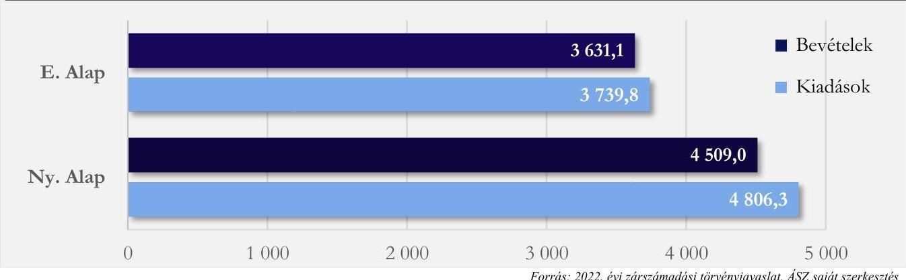

Az E. Alapot, illetve az Ny. Alapot megillető bevételek tekintetében az ellenőrzés szabálytalanságot nem tárt fel.
A NEAK működési bevételi előirányzatainak teljesítése az ellenőrzött mintatételek esetében az Áht., az Áhsz. valamint a belső szabályzatoknak megfelelően történt, a Számv. tv. előírásaival összhangban a bevételeket alátámasztó dokumentumok rendelkezésre álltak.
A 2022. évi teljesített költségvetési bevétel az Ny. Alap esetében 399,9 Mrd Ft-tal, az E. Alap esetében 789,5 Mrd Ft-tal haladta meg a 2021. évi teljesített költségvetési bevétel összegét. A Társadalombiztosítási Alapok költségvetési bevételei a 2022. évben összesen 516,4 Mrd Ft-tal nagyobb összegben teljesültek a tervezettnél és 1 189,4 Mrd Ft-tal haladták meg a 2021. év bevételét, ami az
 előző év adataihoz viszonyítva 17,1%-os növekedést jelent. Ezt szemlélteti a 11. ábra.

---

11. ábra

AZ TÁRSADALOMBIZTOSÍTÁSI ALAPOK 2022. ÉVBEN TELJESÜLT BEVÉTELEINEK VÁLTOZÁSA A 2021. ÉVI BEVÉTELHEZ VISZONYÍTVA
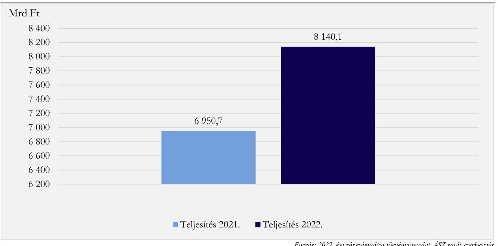

A Társadalombiztosítási Alapok bevételei 73,3%-ban a Társadalombiztosítási Alapokhoz rendelt járulék bevételekből, hozzájárulásokból származtak. A közhatalmi bevételek közé tartozó - Társadalombiztosítási Alapokhoz rendelt járulék bevételekből, hozzájárulásokból származó - bevételek összege a 2022. évben 11,6%-kal nőtt 2021. évhez képest.

A központi költségvetési támogatás mértéke a Társadalombiztosítási Alapok bevételeinek 23,7%-át tette ki a 2022. évben. A Működési célú támogatások államháztartáson belülről kiemelt előirányzatokhoz tartozó központi költségvetési támogatások összege a 2022. évben 8%-kal emelkedett 2021. évhez képest. A Társadalombiztosítási Alapok bevételeinek összetételét a 12. ábra szemlélteti.
12. ábra

A TÁRSADALOMBIZTOSÍTÁSI ALAPOK BEVÉTEL ÖSSZETÉTELÉNEK MEGOSZLÁSA A 2022. ÉVBEN (%)
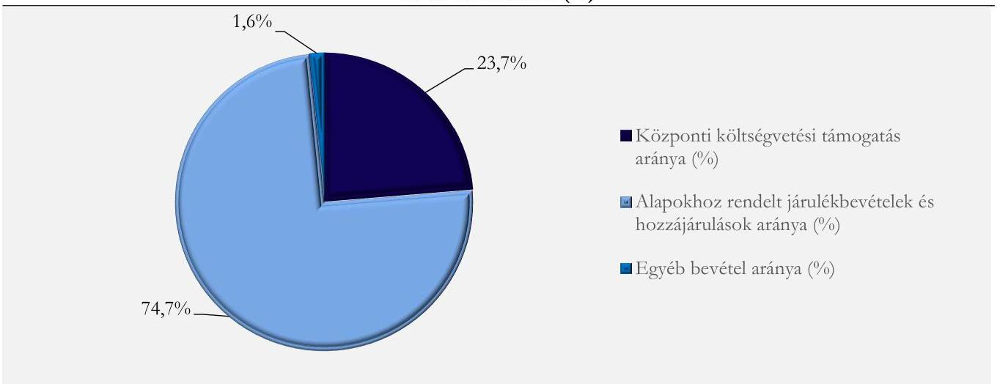

Forrás: 2022. évi zárszámadási törvényjavaslat, ÁSZ saját szerkesztés

---

Az Ny. Alap kiadási előirányzatainak felhasználása során a kiadások jogszerűsége, az ellátás összegének megalapozottsága dokumentált volt, az arra jogosult személy által aláírt kötelezettségvállalás Áht. és Ákr ${ }^{51}$. által előírt dokumentumai rendelkezésre álltak, tartalmazták a jogszabály által kötelezően előírt tartalmi elemeket és az ellátás összegét.
Az E. Alap ellátási kiadási előirányzatainak felhasználása kapcsán a NEAK az Ávr. előírásának eleget téve az ellátási szektor kötelezettségvállalásról szóló szabályzatában ${ }^{52}$ meghatározta az előzetes írásbeli kötelezettségvállalást nem igénylő kifizetések rendjét, amelynek értelmében az ellátási kiadások vonatkozásában az Ávr. 135. §-a alapján összeállított és a Kincstárhoz benyújtott finanszírozási (előirányzat-felhasználási) tervek jelentik a kötelezettségvállalás dokumentumát. Az ellátásokhoz kapcsolódó kifizetések összegei dokumentumokkal megalapozottak voltak.
A NEAK működési kiadási előirányzatainak felhasználása az ellenőrzött mintatételek esetében az Áht.-ben, Ávr.-ben foglalt jogszabályi rendelkezéseknek, valamint a gazdálkodással kapcsolatos belső szabályozásnak megfelelően történt.

# 4.10. számú megállapítás A Társadalombiztosítási Alapok költségvetési beszámolójának összeállítása szabályszerű volt. 

A Társadalombiztosítási Alapok költségvetési beszámolójának összeállítása szabályszerűen történt.
A beszámolók tartalmazták az Áhsz. által előírt dokumentumokat. A beszámolók részét képező 2022. évi költségvetési jelentések megfeleltek az Áhsz.-ben előírt tartalmi követelményeknek, továbbá a könyvviteli zárlat során készített és a Kincstár által működtetett elektronikus adatszolgáltató rendszerbe feltöltött főkönyvi kivonattal alátámasztottak voltak. Az Ny. Alap és E. Alap költségvetési beszámolója az Áhsz.-ben előírt határidőre feltöltésre került a Kincstár által működtetett elektronikus adatszolgáltató rendszerbe.

---

# MELLÉKLETEK 

## I. SZ. MELLÉKLET: ÉRTELMEZŐ SZÓTÁR

Alapokhoz rendelt járulék bevételek, hozzájárulások
államadósság-mutató
államháztartás központi alrendszere
belső kontrollrendszer
belső kontrollrendszer elemei
az Ny. Alapnál: a Szociális hozzájárulási adó Ny. Alapot megillető része, a társadalombiztosítási járulék Ny. Alapot megillető része és a nyugdíjárulék, az Egyéb járulékok és hozzájárulások, és a Késedelmi pótlék, bírság.
az E. Alapnál: a Szociális hozzájárulási adó E. Alapot megillető része, a társadalombiztosítási járulék E. Alapot megillető része és az egészségbiztosítási járulék, továbbá az Egyéb járulékok és hozzájárulások, és a Késedelmi pótlék és bírság.
(Forrás: 2022. évi zárszámadási törvényjavaslat)
Az Alaptörvény 36. cikk (4) és (5) bekezdésében, valamint 37. cikk (2) és (3) bekezdésében foglaltak végrehajtása során figyelembe veendő mindenkori államadósság mutatója olyan, százalékban kifejezett, egy tizedesig kerekített hányados, amely a) számlálójában az államadósságnak, b) nevezőjében a Közösségben a nemzeti és regionális számlák európai rendszeréről szóló tanácsi rendeletben meghatározottak szerint számított bruttó hazai terméknek e törvény szerinti értéke szerepel.
(Forrás: Stabilitási tr. 2. §)
Az államháztartás központi és önkormányzati alrendszerből áll. Az államháztartás központi alrendszerébe tartozik az állam, a központi költségvetési szerv, a törvény által az államháztartás központi alrendszerébe sorolt köztestület, illetve az e köztestület által irányított köztestületi költségvetési szerv.
(Forrás: Abt. 3. § (1)-(2) bekezdés)
A kockázatok kezelése és tárgyilagos bizonyosság megszerzése érdekében kialakított folyamatrendszer, amelynek célja, hogy a működés és gazdálkodás során a tevékenységeket szabályszerűen, gazdaságosan, hatékonyan, eredményesen hajtsák végre, az elszámolási kötelezettségeket teljesítsék, és megvédjék az erőforrásokat a veszteségektől, károktól és a nem rendeltetésszerű használattól.
(Forrás: Abt. 69. §)
- kontrollkörnyezet,
- integrált kockázatkezelési rendszer,
- kontrolltevékenységek,
- információs és kommunikációs rendszer,
- nyomon követési rendszer.
(Forrás: Bker ${ }^{33}$. 3. §)

---

EDP jelentés

Elkülönített Állami
Pénzalapok (ELKA)
előirányzat-átcsoportosítás
előirányzat-módosítás
fejezetet irányító szerv
fejezeti kezelésű előirányzat

Az Európai Unió Túlzott Hiány Eljárása (Excessive Deficit Procedure = EDP) keretében a tagországok évente kétszer adatszolgáltatásban (EDP Jelentés) jelentik a kormányzati szektor két kiemelt mutatójának: a kormányzati szektor hiányának és adósságának alakulását. Annak érdekében, hogy az uniós konvergencia kritériumok által meghatározott mutatók és az államháztartási mutatók módszertani megkülönböztetése egyértelmű legyen, a Stabilitási tv. a kormányzati szektor hiánya elnevezést használja az uniós módszertan szerinti egyenlegre, míg a Stabilitási tv. szerinti államadósság és az uniós módszertan szerinti ún. maastrichti adósság megegyeznek. A Konvergencia Programban használatos mutatók módszertana megegyezik az EDP jelentésével. Az EDP jelentésben rögzített kormányzati szektor egyenlegének (hiányának) összege, valamint a konszolidált bruttó adósságának összege változhat addig, ameddig nem kerül az adott év végleges státuszba.
(Forrás: PM bonlap szerinti definíció, KSH bonlapon közzétett 2022.10.21-én és 2023.04.21-én publikált EDP-jelentések)

Az Elkülönített Állami Pénzalapok a közfeladatok ellátása során az állam nevében beszedendő költségvetési bevételek és teljesítendő költségvetési kiadások alapszerű elszámolására szolgálnak. Elkülönített Állami Pénzalapot közfeladat részben vagy egészben államháztartáson kívüli forrásból történő ellátásának biztosítása céljából törvény hozhat létre. Ide tartozik a Bethlen Gábor Alap, a Központi Nukleáris Pénzügyi Alap, a Gazdaság-Újraindítási Foglalkoztatási Alap, a Nemzeti Kulturális Alap, valamint a Nemzeti Kutatási, Fejlesztési és Innovációs Alap.
(Forrás: Abt. 6/A. § (1) bekezdés d) pont, (5) bekezdés, Kvtv. 10. §)
Az átcsoportosítást végrehajtó költségvetésének - az Országgyűlés vagy a Kormány intézkedése, és a fejezetet irányító szervek megállapodása esetén a központi költségvetés, a fejezetet irányító szerv intézkedése esetén a fejezet, az államháztartás önkormányzati alrendszerében a költségvetési rendelet, határozat összesített - kiadási előirányzatai főösszegének változatlansága mellett a kiadási előirányzatok egyidejű csökkentésével és növelésével végrehajtott módosítás.
(Forrás: Abt. 1. § 5. pont)
A bevételi előirányzat vagy a kiadási előirányzat növelése, vagy csökkentése.
(Forrás: Abt. 1. § 6. pont)
A fejezetet irányító szerv látja el a központi kezelésű előirányzatokhoz, a fejezeti kezelésű előirányzatokhoz, az ELKA-hoz és a Társadalombiztosítási Alapokhoz kapcsolódó tervezési, gazdálkodási, ellenőrzési, adatszolgáltatási és beszámolási feladatokat. A fejezetet irányító szerveket és azok vezetőit az Ávr. 1. sz. melléklete határozza meg.
(Forrás: Abt. 6/B. § (1) bekezdés, Avr. 6. §)
A fejezeti kezelésű előirányzatok a fejezetet irányító szerv sajátos szakmai, ágazati feladatai ellátása, vagy az államnak a fejezethez tartozó költségvetési szervek tevékenységével kapcsolatban felmerülő, illetve szakmailag ahhoz kapcsolódó sajátos kötelezettségei teljesítése során felmerülő költségvetési bevételek és költségvetési kiadások elszámolására szolgálnak.
(Forrás: Abt. 6/A. § (3) bekezdés)

---

garantőr szervezet
integrált kockázatkezelési rendszer
konszolidált adósság
kontrollkörnyezet
kormányzati szektor
kormányzati szektor egyenlege
kontrolltevékenységek

Konvergencia Program

Az állami viszontgarancia alapjául szolgáló kezességet, garanciát nyújtó jogi személy, amelynek feladata az állam által a viszontgarancia alapján kifizetett összeg behajtása is.
(Forrás: Abt. 93. § (2) bekezdés)
Olyan folyamatalapú kockázatkezelési rendszer, amely a szervezet minden tevékenységére kiterjed, egységes módszertan és eljárások alkalmazásával, a szervezet célkitűzéseinek és értékeinek figyelembevételével biztosítja a szervezet kockázatainak teljes körű azonosítását, azok meghatározott kritériumok szerinti értékelését, valamint a kockázatok kezelésére vonatkozó intézkedési terv elkészítését és az abban foglaltak nyomon követését.
(Forrás: Bker. 2. § m) pont)
A kormányzati szektorba sorolt pénzügyi intézmény költségvetési év utolsó napján fennálló, az államháztartás központi alrendszerével, az államháztartás önkormányzati alrendszerével, és a kormányzati szektorba sorolt egyéb szervezetekkel szemben fennálló követelései és kötelezettségei kiszűrésével számított adósságállomány.
(Forrás: Stabilitási törvény 9. § (4) bekezdés)
Olyan szervezeti felépítés, amelyben világos a szervezeti struktúra, a folyamatok átláthatóak, egyértelműek a felelősségi, hatásköri viszonyok és feladatok, meghatározottak, ismertek és elfogadottak az etikai elvárások a szervezet minden szintjén, átlátható a humánerőforrás-kezelés, biztosított a szervezeti célok és értékek irányában való elkötelezettség fejlesztése és elősegítése.
(Forrás: Bker. 6. § (1) bekezdés)
Az államháztartás központi és önkormányzati alrendszeréhez tartozó szervezeteken felül magában foglalja az Európai Közösséget létrehozó szerződéshez csatolt, a túlzott hiány esetén követendő eljárásról szóló jegyzőkönyv alkalmazásáról szóló 2009. május 25-i 479/2009/EK rendelet szerinti kormányzati szektorba sorolt egyéb szervezeteket.
(Forrás: Abt. 1. § 12. pont)
Az Európai Közösséget létrehozó szerződéshez csatolt, a túlzott hiány esetén követendő eljárásról szóló jegyzőkönyv alkalmazásáról szóló 2009. május 25-i 479/2009/EK tanácsi rendelet alapján számított egyenleg.
(Forrás: Stabilitás tv. 1.§ c) pont)
Azok a szervezeten belüli tevékenységek, amelyek biztosítják a kockázatok kezelését, hozzájárulnak a szervezet céljainak eléréséhez és erősítik a szervezet integritását.
(Forrás: Bker. 8. §)
A Kormány által évente elfogadott, adott időszakra vonatkozó gazdaságpolitikai célokat, makrogazdasági előrejelzéseket, az államháztartás egyenlege és az államadósság alakulására, az államháztartás folyamataira és rendszerére vonatkozó prognózisokat, követelményeket tartalmazó dokumentum, amely a költségvetési fegyelem biztosításának feltételrendszerét rögzíti. Magyarország Konvergencia programja 2022-2026 kiadására 2022. áprilisában került sor.
(Forrás: Magyarország Konvergencia Programja, kormany.hu)

---

költségvetési bevételi és kiadási előirányzatok
költségvetési hiány
központi alrendszerbe tartozó szervezetek

Maastrichti kritérium
pénzforgalmi hiány

A központi költségvetésről szóló törvényben a költségvetési bevételi előirányzatok és a költségvetési kiadási előirányzatok központi kezelésű előirányzatként, fejezeti kezelésű előirányzatként, a Társadalombiztosítási Alapok előirányzataiként, ELKA előirányzataiként, az államháztartás központi alrendszerébe tartozó költségvetési szervek előirányzataiként jelennek meg. A központi kezelésű előirányzatok -a törvényben meghatározott kivételekkel - az állam nevében beszedendő költségvetési bevételek és teljesítendő költségvetési kiadások elszámolására szolgálnak.
(Forrás: Ábt. 6/A. § (1)-(2) bekezdés)
A költségvetési hiány a kormányzati szektor negatív egyenlege (ESA - nemzeti számlákkal összhangban álló költségvetési egyenleg): az Európai Közösséget létrehozó szerződéshez csatolt, a túlzott hiány esetén követendő eljárásról szóló jegyzőkönyv alkalmazásáról szóló 2009. május 25-i 479/2009/EK tanácsi rendelet alapján számított negatív egyenleg, a kormányzati szektor eredményszemléletű bevételeinek és kiadásainak negatív egyenlege.

| Bevétel | Kiadás |
| :--: | :--: |
| Eredményszemléletű adóbevétel | Eredményszemléletű kamatkiadás |
| Folyó- és tőketranszfer bevétel | Eredményszemléletű bér és dologi kiadás |
|  | Folyó- és tőketranszfer kiadás |
|  | Eredményszemléletű beruházási kiadás |

(Forrás: Stabilitási tv. 1. § s) pontja alapján ÁSZ megfogalmazás)
Az államháztartás központi alrendszerébe tartozó költségvetési szervek, valamint az önálló költségvetési beszámolót készítő egyéb szervezetek.
(ÁSZ meghatározás)
Az 1993-ban hatályba lépett Maastrichti Szerződésben meghatározott, úgynevezett konvergencia-kritériumok alapján az államháztartás hiánya nem haladhatja meg a GDP 3%-át, az államadósság pedig a GDP 60%-át.
(Forrás: Maastrichti Szerződés - Szerződés az Európai Unióról (92/C 191/01))
A pénzforgalmi egyenleg (deficit) a legegyszerűbb hiánymutató a központi költségvetés jellemzésére. A kétezres évekig az IMF olyan költségvetési statisztikát (GFS86) gyűjtött a tagállamaitól, amely a nettó államadósságra, illetve annak változására összpontosított. Ezzel összhangban a költségvetési hiányt úgy definiálták, hogy az adóssággal finanszírozandó egyenleggel egyezzen meg.
A pénzforgalmi hiány az alábbi tételek negatív egyenlegével egyenlő:

| A pénzforgalmi egyenleg főbb bevételei és kiadásai |  |
| :--: | :--: |
| Bevétel | Kiadás |
| Pénzforgalmi adóbevétel | Pénzforgalmi kamatkiadás |
| Folyó- és tőketranszfer bevétel | Pénzforgalmi bér és dologi kiadás |
| Privatizációs bevétel | Folyó- és tőketranszfer kiadás |
|  | Pénzforgalmi beruházási kiadás |
|  | Tulajdonosi részesedés szerzése |

(Forrás: MNB oktatási füzetek, 9. szám)

---

# II. SZ. MELLÉKLET: AZ ELLENŐRZÖTT SZERVEZETEK JEGYZÉKE

|

 SORSZ. | ELLENŐRZÖTT SZERVEZET NEVE | ADÓSZÁM | ELLENŐRZÉSI TERÜLET |  |  |  |  |  |   |
| --- | --- | --- | --- | --- | --- | --- | --- | --- | --- |
|   |  |  | KÖZP. KEZ. EI | FEJ. KEZ. EI | UNIÓs EL | KÖZPONTI ALRENDSZER SZERVEZETEI | ELKA | TB ALAPOK | BELSŐ KONTROLL RENDSZER  |
|  1. | Agrárminisztérium | 15305679-2-41 | X | X | X | X |  |  | X  |
|  2. | Alapvető Jogok Biztosának Hivatala | 15795764-1-41 |  |  |  | X |  |  |   |
|  3. | Alkotmánybíróság | 15324793-2-41 |  |  |  | X |  |  |   |
|  4. | Államadósság Kezelő Központ Zrt. | 12598757-1-41 | X |  |  |  |  |  |   |
|  5. | Állatorvostudományi Kutatóintézet | 15846059-2-42 |  |  |  | X |  |  |   |
|  6. | Bács-Kiskun Vármegyei Oktatókórház (2023.04.14. előtt Bács-Kiskun Megyei Kórház a Szegedi Tudományegyetem Általános Orvostudományi Kar Oktató Kórháza) | 15336062-2-03 |  |  |  | X |  |  | X  |
|  7. | Bács-Kiskun Vármegyei Kormányhivatal (2023.01.01. előtt Bács-Kiskun Megyei Kormányhivatal) | 15789257-2-03 | X |  |  |  |  |  |   |
|  8. | Bajai Szent Rókus Kórház | 15336282-2-03 |  |  |  | X |  |  |   |
|  9. | Balassagyarmati Fegyház és Börtön | 15752040-2-51 |  |  |  | X |  |  |   |
|  10. | Balatonfüredi Tankerületi Központ | 15834993-2-19 |  |  |  | X |  |  |   |
|  11. | Baranya Vármegyei Kormányhivatal (2023.01.01. előtt Baranya Megyei Kormányhivatal) | 15789240-2-02 | X |  |  |  |  |  |   |
|  12. | Békeliget Integrált Szociális Intézmény Békés Vármegye (2023. március 3. előtt Eleki Pszichiátriai Betegek Orthona) | 15342067-1-04 |  |  |  | X |  |  |   |
|  13. | Békés Vármegyei Kormányhivatal (2023.01.01. előtt Békés Megyei Kormányhivatal) | 15789264-2-04 | X |  |  |  |  |  |   |

---

|  SORSZ. | ELLENŐRZÖTT SZERVEZET NEVE | ADÓSZÁM |  |  |  |  |  |  |   |
| --- | --- | --- | --- | --- | --- | --- | --- | --- | --- |
|   |  |  |  |  |  |  |  |  | BELSŐ KONTROLL RENDSZER  |
|   |  |  |  |  |  |  |  |  |   |
|  14. | Belügyminisztérium (2022.05.24-től ellátja az EMMI-től átvett, egészségüggyel, szociális ügyekkel és közoktatással kapcsolatos feladatokat) | 15311605-2-41 | X | X | X |  |  |  |   |
|  15. | Berettyóújfalui Gróf Tisza István Kórház (2023.04.12. előtt Gróf Tisza István Kórház) | 15372019-2-09 |  |  |  | X |  |  |   |
|  16. | Berettyóújfalui Tankerületi Központ | 15835365-2-09 |  |  |  | X |  |  |   |
|  17. | Bethlen Gábor Alapkezelő Közhasznú Nonprofit Zrt. | 23300576-2-41 | X |  |  |  | X |  |   |
|  18. | Bokréta Lakásothoni, Gyermekotthoni Központ és Általános Iskola | 16927423-1-42 |  |  |  | X |  |  |   |
|  19. | Bolyai Farkas Gyermekotthoni Központ Budapest | 16927368-1-43 |  |  |  | X |  |  |   |
|  20. | Borsod-Abaúj-Zemplén Vármegyei Kormányhivatal (2023.01.01. előtt Borsod-Abaúj-Zemplén Megyei Kormányhivatal) | 15789271-2-05 | X |  |  |  |  |  |   |
|  21. | Bölcsészettudományi Kutatóközpont | 15300629-2-43 |  |  |  | X |  |  |   |
|  22. | Budapest Főváros Kormányhivatala | 15789233-2-41 | X |  |  |  |  |  |   |
|  23. | Budapesti Komplex Szakképzési Centrum | 15831873-2-43 |  |  |  | X |  |  |   |
|  24. | Budapesti Rendőr-Főkapitányság | 15720388-2-51 |  |  |  | X |  |  |   |
|  25. | Csillagvirág Integrált Szociális Intézmény Borsod-Abaúj-Zemplén Vármegye (2023.03.03. előtt ÉszakBorsodi Integrált Szociális Intézmény) | 15837965-2-05 |  |  |  | X |  |  |   |
|  26. | Csongrád-Csanád Vármegyei Kormányhivatal (2023.01.01. előtt Csongrád-Csanád Megyei Kormányhivatal) | 15789288-2-06 | X |  |  |  |  |  |   |
|  27. | Csongrád-Csanád Vármegyei Rendőr-főkapitányság (2023.01.01. előtt Csongrád-Csanád Megyei Rendőr-főkapitányság) | 15720742-2-51 |  |  |  | X |  |  |   |
|  28. | Digitális Kormányzati Ügynökség Zrt. | 26698180-2-41 | X |  |  |  |  |  |   |

---

|  SORSZ. | ELLENŐRZÖTT SZERVEZET NEVE | ADÓSZÁM | ELLENŐRZÉSI TERÜLET |  |  |  |  |  |   |
| --- | --- | --- | --- | --- | --- | --- | --- | --- | --- |
|   |  |  | KÖZP. KEZ. EI | FEJ. KEZ. EI | UNIÓS EI. | KÖZPONTI ALRENDSZER SZERVEZETEI | ELKA | TB ALAPOK | BELSŐ KONTROLL RENDSZER  |
|  29. | Duna-Ipoly Nemzeti Park Igazgatóság | 15325763-2-11 |  |  |  | X |  |  |   |
|  30. | Emberi Erőforrás Támogatáskezelő | 15329114-2-42 |  |  |  |  | X |  |   |
|  31. | Energiaügyi Minisztérium (a Technológiai és Ipari Minisztérium átnevezésével jött létre 2022.12.01.-től) Jogelödeje: Innovációs és Technológiai Minisztérium (2022.01.01.-2022.05.23.), Technológiai és Ipari Minisztérium (2022.05.24.-2022.11.30.) | 15764412-2-41 | X | X |  |  | X |  |   |
|  32. | Eötvös Loránd Kutatási Hálózat Titkársága | 15840572-1-41 |  | X |  |  |  |  |   |
|  33. | Építési és Közlekedési Minisztérium (a Miniszterelnökségből történő kiválással jött létre; 2022.05.24.-2022.11.30-ig Építési és Beruházási Minisztérium néven működött; 2022.11.22-től ellátja a Technológiai és Ipari Minisztériumtól átvett, közlekedéssel kapcsolatos feladatokat) | 15847397-2-41 | X | X |  |  |  |  |   |
|  34. | Fejér Vármegyei Kormányhivatal (2023.01.01. előtt Fejér Megyei Kormányhivatal) | 15789295-2-07 | X |  |  |  |  |  |   |
|  35. | Fertő-Hanság Nemzeti Park Igazgatóság | 15325756-2-08 |  |  |  | X |  |  |   |
|  36. | Gazdaságfejlesztési Minisztérium (2022.05.24-ig az Innovációs és Technológiai Minisztérium, 2022.05.25-2022.11.21. közötti időszakban a Technológiai és Ipari Minisztérium, 2022.11.22-2022.12.31. között a Miniszterelnöki Kabinetiroda) | 15848398-2-41 | X |  |  |  | X |  |   |
|  37. | Gazdasági Versenyhivatal | 15325275-1-41 |  | X |  |  |  |  |   |
|  38. | Gyermekotthoni Központ Hajdú-Bihar Vármegye (2023.03.07. előtt Hajdú-Bihar Megyei Gyermekotthoni Központ) | 15372215-2-09 |  |  |  | X |  |  |   |

---

|  SORSZ. | ELLENŐRZÖTT SZERVEZET NEVE | ADÓSZÁM |  |  |  |  |  |  |   |
| --- | --- | --- | --- | --- | --- | --- | --- | --- | --- |
|   |  |  |  |  |  |  |  |  | BELSŐ KONTROLL RENDSZER  |
|  39. | Győr-Moson-Sopron Megyei Büntetés-végrehajtási Intézet jogutódjaként a Szombathelyi Országos Büntetés-végrehajtási Intézet (2022.12.31-ével jogutódlással megszűnt) | 15762922-2-51 |  |  |  | X |  |  |   |
|  40. | Győr-Moson-Sopron Vármegyei Kormányhivatal (2023.01.01. előtt Győr-Moson-Sopron Megyei Kormányhivatal) | 15789305-2-08 | X |  |  |  |  |  |   |
|  41. | Hajdú-Bihar Vármegyei Kormányhivatal (2023.01.01. előtt Hajdú-Bihar Megyei Kormányhivatal) | 15789312-2-09 | X |  |  |  |  |  |   |
|  42. | HEPA Magyar Exportfejlesztési Ügynökség Nzrt. | 26502887-2-41 | X |  |  |  |  |  |   |
|  43. | Heves Megyei Büntetés-végrehajtási Intézet jogutódjaként a Fővárosi Büntetés-végrehajtási Intézet (2022.12.31-ével jogutódlással megszűnt) | 15752181-2-51 |  |  |  | X |  |  |   |
|  44. | Heves Vármegyei Kormányhivatal (2023.01.01. előtt Heves Megyei Kormányhivatal) | 15789329-2-10 | X |  |  |  |  |  |   |
|  45. | Honvédelmi Minisztérium (2022.05.24-től ellátja az Emberi Erőforrások Minisztériumától átvett, sportügyekkel kapcsolatos feladatokat) | 15701051-2-51 | X | X |  |  |  |  |   |
|  46. | Igazságügyi Minisztérium | 15300076-2-41 |  | X |
 |  |  |  |   |
|  47. | Ipolypart Integrált Szociális Intézmény Nógrád Vármegye (2023.02.28. előtt Ipolypart Ápoló-Gondozó Otthon és Rehabilitációs Intézet) | 15450119-2-12 |  |  |  | X |  |  |   |
|  48. | Jász-Nagykun-Szolnok Vármegyei Kormányhivatal (2023.01.01. előtt Jász-Nagykun-Szolnok Megyei Kormányhivatal) | 15789381-2-16 | X |  |  |  |  |  |   |
|  49. | Kaffka Margit Utógondozói és Gyermekotthoni Központ Budapest | 15494360-1-43 |  |  |  | X |  |  |   |

---

|  SORSZ. | ELLENŐRZÓTT SZERVEZET NEVE | ADÓSZÁM | ELLENŐRZÉSI TERÜLET |  |  |  |  |  |   |
| --- | --- | --- | --- | --- | --- | --- | --- | --- | --- |
|   |  |  | KÖZP. KEZ.
EI | FEJ. KEZ.
EI | UNIÓS
EI. | KÖZPONTI
ALRENDSZER
SZERVEZETEI | ELKA | TB
ALAPOK | BELSŐ
KONTROLL
RENDSZER  |
|  50. | Kazincbarcikai Kórház | 15846413-2-05 |  |  |  | X |  |  |   |
|  51. | Készenléti Rendőrség | 15720199-2-51 |  |  |  | X |  |  | X  |
|  52. | Komárom-Esztergom Vármegyei Kormányhivatal (2023.01.01. előtt Komárom-Esztergom Megyei Kormányhivatal) | 15789336-2-11 | X |  |  |  |  |  |   |
|  53. | Körös-Maros Nemzeti Park Igazgatóság | 15328993-2-04 |  |  |  | X |  |  |   |
|  54. | Közbeszerzési és Ellátási Főigazgatóság | 15329396-2-41 |  |  |  | X |  |  | X  |
|  55. | Közép-Dunántúli Vízügyi Igazgatóság | 15308407-2-07 |  |  |  | X |  |  |   |
|  56. | Közép-Tisza-vidéki Vízügyi Igazgatóság | 15308469-2-16 |  |  |  | X |  |  | X  |
|  57. | Központi Statisztikai Hivatal | 15302724-2-41 |  | X |  |  |  |  |   |
|  58. | Köztársasági Elnöki Hivatal | 15300021-2-41 |  | X |  |  |  |  |   |
|  59. | Kulturális és Innovációs Minisztérium (2022.05.24-től az Emberi Erőforrások Minisztériuma általános jogutódja) | 15309271-2-41 | X | X |  |  |  |  |   |
|  60. | Külgazdasági és Külügyminisztérium | 15311344-1-41 | X | X | X |  |  |  |   |
|  61. | Külső-Pesti Tankerületi Központ | 15835262-2-43 |  |  |  | X |  |  |   |
|  62. | Legfőbb Ügyészség | 15300148-2-41 |  | X |  |  |  |  |   |
|  63. | Magyar Államkincstár | 15329970-2-41 | X |  | X |  |  | X |   |
|  64. | Magyar Műszaki és Közlekedési Múzeum | 15308067-2-42 |  |  |  | X |  |  |   |
|  65. | Magyar Művészeti Akadémia Titkársága | 15795506-2-42 |  | X |  |  |  |  |   |
|  66. | Magyar Nemzeti Múzeum | 15321226-2-42 |  |  |  | X |  |  | X  |
|  67. | Magyar Nemzeti Vagyonkezelő Zrt. | 14077340-2-44 | X |  |  |  |  |  |   |
|  68. | Magyar Tudományos Akadémia Titkársága | 15300203-2-41 |  | X |  |  |  |  |   |

---

|  SORSZ. | ELLENŐRZÓTT SZERVEZET NEVE | ADÓSZÁM |  |  |  | ELLENŐRZÉSI TERÜLET |  |  |  |   |
| --- | --- | --- | --- | --- | --- | --- | --- | --- | --- | --- |
|   |  |  |  |  |  |  |  |  |  |   |
|   |  |  |  |  |  |  |  |  |  | BEISŐ  |
|   |  |  |  |  |  |  |  |  |  | KONTROLL  |
|   |  |  |  |  |  |  |  |  |  | RENDSZER  |
|  69. | Magyar Tudományos Akadémia Üdülési Központ | 15300234-2-41 |  |  |  |  | X |  |  |   |
|  70. | Magyar Turisztikai Ügynökség Zrt. | 10356113-4-41 |  | X |  |  |  |  |  |   |
|  71. | Magyarország Európai Unió melletti Állandó Képviseletének igazgatása (Felügyeletét az igazságügyi miniszter látja el; IM adószáma) | 15300076-2-41 |  |  |  |  | X |  |  |   |
|  72. | Mátrai Gyógyintézet | 15309824-2-10 |  |  |  |  | X |  |  |   |
|  73. | Miniszterelnöki Kabinetiroda (2022.05.24-től ide tartozik a Miniszterelnöki Kormányiroda, amely a Miniszterelnöki Kabinetirodába történő beolvadással megszűnt) | 15833167-2-41 |  | X | X |  |  |  |  |   |
|  74. | Miniszterelnökség | 15775292-2-41 |  | X | X | X | X |  |  | X  |
|  75. | Miskolci Rendvédelmi Technikum | 15722665-2-51 |  |  |  |  | X |  |  |   |
|  76. | Monori Tankerületi Központ | 15835310-2-13 |  |  |  |  | X |  |  |   |
|  77. | Nagykanizsai Javítóintézet | 15840118-2-20 |  |  |  |  | X |  |  |   |
|  78. | Nemzeti Adó- és Vámhivatal | 15789934-2-51 |  | X |  |  |  |  |  |   |
|  79. | Nemzeti Egészségbiztosítási Alapkezelő | 15328106-2-41 |  | X |  |  |  |  | X |   |
|  80. | Nemzeti Élelmiszerlánc-biztonsági Hivatal | 15598347-2-41 |  | X |  |  |  |  |  |   |
|  81. | Nemzeti Földügyi Központ | 15840369-2-42 |  | X |  |  |  |  |  |   |
|  82. | Nemzeti Kutatási, Fejlesztési és Innovációs Hivatal | 15831000-1-42 |  |  | X |  |  | X |  |   |
|  83. | Nemzeti Média- és Hírközlési Hatóság | 15775883-2-41 |  | X |  |  |  |  |  |   |
|  84. | Nemzeti Népegészségügyi Központ | 15598787-2-43 |  |  |  |  | X |  |  | X  |
|  85. | Nemzeti Szakértői és Kutató Központ | 15836847-2-51 |  |  |  |  | X |  |  |   |
|  86. | Nemzeti Szakképzési és Felnőttképzési Hivatal | 15830731-2-42 |  |  |  |  |  | X |  |   |
|  87. | Nemzeti Útdíjfizetési Szolgáltató Zrt. | 12147715-2-44 |  | X |  |  |  |  |  |   |

---

|  SORSZ. | ELLENŐRZÓTT SZERVEZET NEVE | ADÓSZÁM | ELLENŐRZÉSI TERÜLET |  |  |  |  |   |
| --- | --- | --- | --- | --- | --- | --- | --- | --- |
|   |  |  | KÖZP. KEZ.
EI | FEJ. KEZ.
EI | UNIÓS
EI. | KÖZPONTI
ALRENDSZER
SZERVEZETEI | ELKA | TB
ALAPOK  |
|  88. | Nemzeti Választási Iroda | 15815563-1-41 |  | X |  | X |  |   |
|  89. | Nógrád Vármegyei Kormányhivatal (2023.01.01. előtt Nógrád Megyei Kormányhivatal) | 15789343-2-12 | X |  |  |  |  |   |
|  90. | Oktatási Hivatal | 15329729-2-41 |  |  |  | X |  |   |
|  91. | Országos Bírósági Hivatal | 15795960-2-41 |  | X |  | X |  |   |
|  92. | Országos Gyermekvédelmi Szakszolgálat | 15372246-2-09 |  |  |  | X |  |   |
|  93. | Országos Kórházi Főigazgatóság | 15845883-2-43 |  |  |  | X |  |   |
|  94. | Országgyűlés Hivatala | 15300014-2-41 |  | X |  |  |  |   |
|  95. | Őszi Napfény Integrált Szociális Intézmény Bács-Kiskun Vármegye (2023.03.03. előtt Bács-borsódi Őszi Napfény Integrált Szociális Intézmény) | 15336440-2-03 |  |  |  | X |  |   |
|  96. | Pénzügyminisztérium | 15303392-2-41 | X | X | X | X |  |   |
|  97. | Pest Vármegyei Katasztrófavédelmi Igazgatóság (2023.01.01. előtt Pest Megyei

 Katasztrófavédelmi Igazgatóság) | 15722933-2-51 |  |  |  | X |  |   |
|  98. | Pest Vármegyei Kormányhivatal
(2023.01.01. előtt Pest Megyei Kormányhivatal) | 15789350-2-41 | X |  |  |  |  |   |
|  99. | Salgótarjáni Tankerületi Központ | 15835372-2-12 |  |  |  | X |  |   |
|  100. | Sárospataki Tankerületi Központ | 15835389-2-05 |  |  |  | X |  |   |
|  101. | Sárvári Tankerületi Központ | 15835396-2-18 |  |  |  | X |  |   |
|  102. | Slachta Margit Nemzeti Szociálpolitikai Intézet | 15845931-2-42 |  |  |  | X |  |   |
|  103. | Somogy Vármegyei Kormányhivatal
(2023.01.01. előtt Somogy Megyei Kormányhivatal) | 15789367-2-14 | X |  |  |  |  |   |
|  104. | Szabályozott Tevékenységek Felügyeleti Hatósága | 15846853-2-43 | X |  |  |  |  |   |

---

|  SORSZ. | ELLENŐRZÖTT SZERVEZET NEVE | ADÓSZÁM | ELLENŐRZÉSI TERÜLET |  |  |  |  |   |
| --- | --- | --- | --- | --- | --- | --- | --- | --- |
|   |  |  | KÖZP. KEZ.
EI | FEJ. KEZ.
EI | UNIÓS
EI. | KÖZPONTI
ALRENDSZER
SZERVEZETEI | ELKA | TB
ALAPOK  |
|  105. | Szabolcs-Szatmár-Bereg Vármegyei Kormányhivatal (2023.01.01. előtt Szabolcs-Szatmár-Bereg Megyei Kormányhivatal) | 15789374-2-15 | X |  |  |  |  |   |
|  106. | Szabolcs-Szatmár-Bereg Vármegyei Rendőr-
fókapitányság (2023.01.01. előtt Szabolcs-Szatmár-
Bereg Megyei Rendőr-fókapitányság) | 15720546-2-51 |  |  |  | X |  |   |
|  107. | Székesfehérvári Tankerületi Központ | 15835437-2-07 |  |  |  | X |  |   |
|  108. | Szellemi Tulajdon Nemzeti Hivatala | 15311746-2-42 |  |  |  | X |  |   |
|  109. | Szent Kozma és Damján Rehabilitációs Szakkórház és Gyógyfürdő | 15492894-2-13 |  |  |  | X |  |   |
|  110. | Szent Margit Kórház | 15799799-2-41 |  |  |  | X |  |   |
|  111. | Szivárvány Integrált Szociális Intézmény Zala Vármegye (2023.02.28. előtt Zala Megyei Szivárvány Egyesített Szociális Intézmény) | 15432821-2-20 |  |  |  | X |  |   |
|  112. | Tolna Megyei Szakképzési Centrum | 15832166-2-17 |  |  |  | X |  |   |
|  113. | Tolna Vármegyei Kormányhivatal (2023.01.01. előtt Tolna Megyei Kormányhivatal) | 15789398-2-17 | X |  |  |  |  |   |
|  114. | Vas Megyei Szakképzési Centrum | 15832207-2-18 |  |  |  | X |  |   |
|  115. | Vas Vármegyei Katasztrófavédelmi Igazgatóság (2023.01.01. előtt Vas Megyei Katasztrófavédelmi Igazgatóság) | 15722971-2-51 |  |  |  | X |  |   |
|  116. | Vas Vármegyei Kormányhivatal (2023.01.01. előtt Vas Megyei Kormányhivatal) | 15789408-2-18 | X |  |  |  |  |   |
|  117. | Veszprém Vármegyei Kormányhivatal (2023.01.01. előtt Veszprém Megyei Kormányhivatal) | 15789415-2-19 | X |  |  |  |  |   |
|  118. | Zala Vármegyei Kormányhivatal (2023.01.01. előtt Zala Megyei Kormányhivatal) | 15789422-2-20 | X |  |  |  |  |   |

---

# III. SZ. MELLÉKLET: A BELSŐ KONTROLLRENDSZER LÉNYEGES ELEMEINEK ÉRTÉKELÉSE A KÖZPONTI ALRENDSZER KIVÁLASZTOTT SZERVEZETEINÉL 

A belső kontrollrendszer értékelésére kiválasztott 15 központi alrendszerbe tartozó szervezet mindegyike esetében a gazdálkodás szabályszerűségét biztosító belső kontrollrendszeren belül a kontrollkörnyezet, az integrált kockázatkezelési rendszer, az információs rendszer és a nyomon követési rendszer zárszámadás szempontjából lényeges elemei kialakítása szabályszerűségének értékelése megfelelő volt. A nyomon követési rendszer vonatkozásában az ÁSZ ellenőrzése az ellenőrzési rendszer értékelésére fókuszált.
A kontrollkörnyezet lényeges elemeiként az értékelt szervezetek működésük szervezeti kereteit szabályszerűen alakították ki, rendelkeztek a működés alapvető kereteit meghatározó szervezeti és működési szabályzattal az Áht. előírásainak megfelelően.
A Számv. tv. által előírt szabályzatokkal (számviteli politika, leltárkészítési és leltározási szabályzat, eszközök és források értékelési szabályzata, pénzkezelési szabályzat, számlarend) minden értékelt szervezet rendelkezett. Az ellenőrzés eseti hibákat, hiányosságokat tárt fel. Egy intézménynél a leltárkészítési és leltározási szabályzat az Áhsz. 22. § (2) bekezdés b) pontjában előírtakkal ellentétben nem tartalmazta a mérlegben értékkel nem szereplő immateriális javak, tárgyi eszközök, készletek leltározási módját, továbbá a számlarend nem tartalmazta a pénzügyi könyveléshez készült összesítő bizonylatok elkészítésének rendjét, valamint az összesítő bizonylatok tartalmi és formai követelményeit az Áhsz. 51. § (3) bekezdésében foglaltak ellenére. Egy szervezet az Ávr. 13. § (2) bekezdés a) pontja ellenére nem szabályozta az utalványozás módját, eljárási és dokumentálási szabályait, továbbá az ellenőrzés egy szervezet esetében a Kbt. 27. § (1)-(2) bekezdésében foglalt előírásokkal összhangban álló, a közbeszerzések rendjét meghatározó hatályos szabályzat hiányát állapította meg.
Az értékelt szervezeteknél az integrált kockázatkezelési rendszer, valamint az információs és kommunikációs rendszer kialakításával kapcsolatban az ellenőrzés szabálytalanságot nem tárt fel.
Az értékelt szervezetek az ellenőrzési rendszert szabályszerűen alakították ki. Az ellenőrzés egy szervezetnél szabálytalanságként azonosította, hogy a Bkr. 14. § (1) bekezdése szerinti, a külső ellenőrzésekre vonatkozó nyilvántartást nem a Bkr. 47. § (2) bekezdésében előírt tartalommal vezették, mivel az nem tartalmazta az ellenőrzési jelentésben szereplő javaslatot, az elfogadott intézkedési tervet, és az intézkedési terv alapján végrehajtott intézkedések rövid leírását.

## A kontrolltevékenységek működésének értékelése

A központi alrendszerbe tartozó szervezetek a kiválasztott kiadási és bevételi mintatételek ellenőrzése alapján a kötelezettségvállalás, teljesítésigazolás és utalványozás kontrollokat az Áht. és az Ávr. előírásai szerint, összességében szabályszerűen működtették.
A bevételek elszámolása tekintetében az ellenőrzés szabálytalanságot nem tárt fel.
A kiadások vonatkozásában az ellenőrzés eseti jelleggel előforduló szabálytalanságokat azonosított, amelyek a személyi juttatások mintatételei esetében az utalványozás és az érvényesítés, a működési és felhalmozási kiadások esetében a teljesítésigazolás gazdálkodási jogkörök gyakorlását érintették. A személyi juttatások mintatételeinél 12 intézmény esetében fordult elő, hogy a kifizetések elrendelésére utalványozás nélkül került sor az Áht. 38. § (1) bekezdésében foglaltak ellenére. Ezeknél a mintatételeknél a következő szabálytalanságokat állapította meg az ellenőrzés:

- a kifizetés elrendeléséről külön írásbeli rendelkezés nem készült, vagy azon nem szerepelt az érvényesítő és az utalványozó aláírása, vagy az utalványozás dátuma az Ávr. 59. § (2)-(3) bekezdéseiben foglaltak ellenére;

---

- a kifizetés megelőzte az utalványozást az Áht. 38. § (1) bekezdésében foglaltak ellenére;
- az utalványozásra szabályszerű érvényesítés hiányában került sor az Áht. 38. § (1) bekezdés előírása ellenére.
Egy intézmény esetében egyes személyi juttatások kifizetése kapcsán alátámasztó bizonylat hiányában jegyeztek be a könyvviteli nyilvántartásba adatokat a Számv. tv. 165. § (2) bekezdésében foglaltak ellenére.
Három intézménynél egyes működési és felhalmozási kiadások esetében a teljesítések igazolásával kapcsolatban tárt fel az ellenőrzés szabálytalanságot. Előfordult, hogy az Ávr. 57. § (4) bekezdés előírása ellenére a teljesítésigazolást nem a kötelezettségvállaló vagy az általa írásban kijelölt személy végezte, továbbá az Ávr. 57. § (3) bekezdésben foglaltak ellenére a kifizetés teljesítésigazolása nem tartalmazta a teljesítés igazolásának dátumát.

---

# IV. SZ. MELLÉKLET: A KÖLTSÉGVETÉS KÖZPONTI TARTALÉKAINAK KÉPZÉSE ÉS FELHASZNÁLÁSA 

A Kvtv. a központi tartalékokra összesen 893,7 Mrd Ft eredeti előirányzatot tartalmazott. A központi tartalék előirányzatok együttes felhasználása az előirányzatok tervezett összegének 358,2%-át tette ki.
A tartalék előirányzatok terhére a jelentősebb felhasználások (előirányzat átcsoportosítások) az alábbiak voltak: A Céltartalékok terhére történt legnagyobb összegű átcsoportosítás (265,7 Mrd Ft összegben) a fegyveres és a rendvédelmi feladatokat ellátó szerveknél a hivatásos szolgálat elismerése céljából megállapított szolgálati juttatásról szóló 712/2021. (XII.20.) Korm. rendelet végrehajtását szolgálta. További jelentős átcsoportosítások a felsőoktatási bérfejlesztéshez és a közszféra egyes területi béremeléséhez nyújtott támogatásokhoz kapcsolódtak. A GÚP ${ }^{54}$ terhére a legnagyobb arányban, 28,0%-ban (379,4 Mrd Ft összegben) a XLIII. Állami vagyonnal kapcsolatos bevételek és kiadások fejezethez csoportosított át forrásokat a Kormány.
A XLVII. Gazdaság-újraindítási Alap fejezet központi tartalék előirányzatairól a legnagyobb összegű átcsoportosítás a XLVII/1/1/1 Gazdaság-újraindítási Programok jogcímcsoport terhére történt, 136,1 Mrd Ft összegben. Az átcsoportosítás a XLIII. Állami Vagyonnal Kapcsolatos Bevételek és Kiadások fejezet 2/2/3. Az NVTNM ${ }^{55}$ tulajdonosi joggyakorlása alá tartozó egyéb társaságok forrásjuttatásai jogcímcsoport javára történt, az AEGON részesedés-vásárláshoz forrás biztosítása céljából a Corvinus Zrt. számára.
A Rezsivédelmi Alap központi kiadása előirányzatot a Kvtv. nem tartalmazta. 2022 júniusban a Kormány a Költségvetés Közvetlen Bevételei és Kiadásai fejezetben új jogcímcsoportot határozott meg XLII/32/1/23. Energiaügyi kiadások néven. 2022. július 1-től létrejött az L. Rezsivédelmi Alap fejezet, egyúttal az Energiaügyi kiadások jogcímcsoport elnevezése és címrendi besorolása I./1. Rezsivédelmi Alap központi kiadása címre változott. Erről az előirányzatról 2022 II. félévben összesen 780,5 Mrd Ft került átcsoportosításra. A legnagyobb összegű átcsoportosítások (157,5 Mrd Ft és 148,1 Mrd Ft) a villamos energia és földgáz egyetemes szolgáltatás változatlan feltételek szerinti nyújtása költségeinek ellentételezése érdekében történtek.
A Járvány Elleni Védekezés Központi Tartaléka terhére a legnagyobb összegű átcsoportosítás 12,6 Mrd Ft összegben, mRNA-1273 vakcina és Pfizer oltóanyagok beszerzése érdekében valósult meg. További jelentősebb összegek átcsoportosítása koronavírus fertőzés kezelésére szolgáló gyógyszerek beszerzése, egyéb gyógyszerek beszerzése és a koronavírus elleni védekezéshez szükséges antigén gyorstesztek beszerzése érdekében történt.
A KMA és a MA célja a Kormányzati döntésekből következő, illetve évközben jelentkező finanszírozási problémák kezelése volt. A KMA és az MA terhére az átcsoportosítások a költségvetési szervek, fejezeti kezelésű előirányzatok, központi kezelésű előirányzatok javára, az alapok céljaival összhangban történtek.
A 2022. évben az államháztartás központi alrendszerébe tartozó költségvetési szervek és a fejezeti kezelésű előirányzatok kötelezettségvállalással nem terhelt költségvetési maradványaként összesen 121,1 Mrd Ft-ot fizettek be a KMA javára. A KMA előirányzatának emelésére 18 alkalommal került sor, összesen 463,5 Mrd Ft összegben, illetve az előirányzat terhére átcsoportosítás 15 alkalommal történt, összesen 461,8 Mrd Ft összegben, így a fel nem használt maradvány (módosított előirányzat) összege 1,7 Mrd Ft lett.
A 2022. évben az államháztartás központi alrendszerébe tartozó költségvetési szervek a

 fejezeti kezelésű előirányzatok kötelezettségvállalással nem terhelt költségvetési maradványaként 746,4 Mrd Ft-ot fizettek be az MA javára. Az MA előirányzatának emelésére 17 alkalommal került sor, összesen a teljesített befizetésekkel azonos, 746,4 Mrd Ft összegben, az előirányzat terhére átcsoportosítás (kormány határozat/PM engedély útján) 122 alkalommal történt, 742,4 Mrd Ft összegben, amelyből a KMA javára kormány határozattal végrehajtott átcsoportosítás összege 342,7 Mrd Ft volt. Az MA fel nem használt maradványa (módosított előirányzat) összege 4,0 Mrd Ft volt.

---

# V. SZ. MELLÉKLET: A KOCKÁZATI ALAPON KIVÁLASZTOTT LÉNYEGES ELŐIRÁNYZAT-MÓDOSÍTÁSOK 

Az ellenőrzésre kockázati alapon kiválasztott, értékelést megalapozó lényeges előirányzat-módosításokkal érintett előirányzatok felsorolását a következő táblázat tartalmazza (a táblázatban feltüntetett címrendi besorolás a 2022. év végi, a zárszámadási törvényjavaslat szerinti állapotot tükrözi):

## AZ ELLENŐRZÉSRE KOCKÁZATI ALAPON KIVÁLASZTOTT, AZ ÉRTÉKELÉST MEGALAPOZÓ LÉNYEGES ELŐIRÁNYZAT-MÓDOSÍTÁSOKKAL ÉRINTETT KIADÁSI ELŐIRÁNYZATOK A 2022. ÉVBEN (MRD FT)

|  | ÉREDETI   ELŐIRÁNYZAT | MÓDOSÍTOTT   ELŐIRÁNYZAT |
| :--: | :--: | :--: |
| Értékelésre kiválasztott fejezeti kezelésű kiadási előirányzatok | 437,7 | 1356,7 |
| XI/30/1/30/1 Egyházi közfeladatellátáshoz kapcsolódó céltámogatások és karitatív feladatok támogatása | 14,4 | 35,1 |
| XIII/21/1 Versenysport és szakmai feladatok támogatása | 17,1 | 56,0 |
| XV/25/8 Szentháromság téri ingatlanberuházással összefüggő működési kiadások | 0,4 | 18,8 |
| XVII/20/36/3 Kormányzati szakpolitikák | 7,5 | 54,5 |
| XVIII/7/1/6 Külgazdasági és Külügyminisztérium felügyelete alá tartozó szervezetek és szakmai programok támogatása | 1,7 | 104,7 |
| XVIII/7/2 Külgazdasági fejlesztési célú szervezeti támogatások | 8,9 | 18,7 |
| XX/20/11/5 Közgyűjteményi, közművelődési szakmai feladatok | 1,5 | 25,6 |
| XX/20/12/1 Nem állami felsőoktatási intézmények támogatása | 177,5 | 405,3 |
| XXI/20/1/28 Kormányzati infokommunikációs szolgáltatások | 69,5 | 226,9 |
| XLVII/2/1/3 Egyházi működési, program és fejlesztési támogatások | 30,2 | 121,0 |
| XLVII/2/7/1 Beruházás ösztönzési célelőirányzat | 80,0 | 175,8 |
| XLVII/2/7/2 Külügyi fejlesztési és kutatási programok | 18,9 | 63,1 |
| XLVII/2/11/1 Kiemelt Nemzetközi Sportesemény Stratégia és sportesemény pályázatok, valamint kiemelt hazai rendezésű sportesemények támogatása | 10,1 | 51,2 |
| Uniós támogatások értékelésre kiválasztott kiadási előirányzatai | 10,2 | 44,3 |
| XV/25/4 A 2007-2013. évek közötti operatív programok visszaforgó pénzeszközeinek felhasználása és kezelése | 9,1 | 32,4 |
| XIX/2/17/2 Alapok alapja VEKOP pénzügyi eszközök jogcímesoport | 1,1 | 11,9 |
| A központi alrendszerbe tartozó szervezetek értékelésre kiválasztott kiadási előirányzatai | 147,1 | 501,4 |
| I/24 Nemzeti Választási Iroda | 1,5 | 15,5 |
| XII/1 Agrárminisztérium Igazgatása | 9,4 | 24,7 |
| XIV/3/2 Slachta Margit Nemzeti Szociálpolitikai Intézet | 1,1 | 8,2 |
| XIV/9/1 Országos Kórházi Főigazgatóság | 29,2 | 186,0 |
| XIV/11 Nemzeti Népegészségügyi Központ | 22,4 | 70,7 |
| XIV/17 Vízügyi Igazgatóságok előirányzat részeként a Közép-Tisza-vidéki Vízügyi Igazgatóság | 3,8 | 6,8 |
| XV/05 Közbeszerzési és Ellátási Főigazgatóság | 76,3 | 168,0 |
| XX/11 Közgyűjtemények előirányzat részeként a Magyar Nemzeti Múzeum | 3,4 | 21,5 |
| Központi kezelésű előirányzatok értékelésre kiválasztott kiadási előirányzatai | 34,9 | 382,9 |
| XVII/21/13/2/2 A regionális víziközmű társaságok támogatása | 23,0 | 71,4 |
| XLIII/2/2/3 Az NVTNM tulajdonosi joggyakorlása alá tartozó egyéb társaságok forrásjuttatásai | 11,9 | 311,5 |

---

Az előirányzat átcsoportosítások jelentős része a kormányzati struktúra átalakításához kapcsolódóan történt, különös tekintettel az Emberi Erőforrások Minisztériuma és az Innovációs és Technológiai Minisztérium átszervezésére. Az előirányzatok javára történt átcsoportosítások kormányzati döntések alapján kerültek végrehajtásra, főként a központi tartalék előirányzatok terhére. Az értékelt 25 előirányzaton a 2022. évben végrehajtott összesen több, mint 1000 módosítás elsődlegesen feladatátvételből fakadó, illetve a működéssel kapcsolatos többletköltségek biztosítását szolgálta.

---

# FÜGGELÉK: ÉSZREVÉTELEK 

A jelentéstervezetet a Számvevőszék 15 napos észrevételezésre megküldte a Pénzügyminisztérium részére az ÁSZ tv. 29. § (1) bekezdése előírásának megfelelően.
A Pénzügyminisztérium nem tett észrevételt.

[^0]
[^0]:    * 29. § (1) Az Állami Számvevőszék az ellenőrzési megállapításait megküldi az ellenőrzött szervezet vezetőjének vagy az általa megbízott személynek, és annak, akinek személyes felelősségét állapította meg.
    (2) Az ellenőrzött szervezet vezetője és a felelősként megjelölt személy az ellenőrzés megállapításaira tizenöt napon belül írásban észrevételt tehet.
    (3) Az Állami Számvevőszék az észrevételre a beérkezésétől számított harminc napon belül írásban válaszol. A figyelembe nem vett észrevételeket köteles a jelentésben feltüntetni, és megindokolni, hogy azokat miért nem fogadta el.

---

# RÖVIDÍTÉSEK JEGYZÉKE 

${ }^{1}$ Ász tv.
${ }^{2}$ Stabilitási tv.
${ }^{3}$ Kvtv.
${ }^{4}$ Társadalombiztosítási Alapok
${ }^{5}$ ÁSZ
${ }^{6}$ ELKA
${ }^{7}$ Áht.
${ }^{8}$ GDP
${ }^{9}$ PM
${ }^{10}$ GUFA
${ }^{11}$ Számv. tv.
${ }^{12}$ Áhsz.
${ }^{13}$ 38/2013. (IX.19.) NGM rendelet
${ }^{14}$ NAV
${ }^{15}$ Art.
${ }^{16}$ Adóig. vhr.
${ }^{17}$ NEAK
${ }^{18}$ BGA
${ }^{19}$ KNPA
${ }^{20}$ NKA
${ }^{21}$ NKFIA
${ }^{22}$ Ny. Alap
${ }^{23}$ E. Alap
${ }^{24}$ Társadalombiztosítási Alapok kezelői
${ }^{25}$ Ávr.
${ }^{26}$ Rega. tv.
${ }^{27}$ Itv.
${ }^{28}$ Avt.
${ }^{29} 1991$. évi LXXXII. tv.
${ }^{30} 1993$. évi XLVIII. tv
${ }^{31}$ 203/1998. (XII. 19.) Korm. rendelet
${ }^{32}$ 54/2008. (III. 20.) Korm. rendelet
${ }^{33}$ 404/2021. (VII. 8.) Korm. rendelet
${ }^{34}$ 209/2013. (VI. 18.) Korm. rendelet
${ }^{35}$ Vtv.
${ }^{36}$ Nfa tv.
${ }^{37}$ Mehib Zrt.
az Állami Számvevőszékről szóló 2011. évi LXVI. törvény
a Magyarország gazdasági stabilitásáról szóló 2011. évi CXCIV. törvény
a Magyarország 2022. évi központi költségvetéséről szóló 2021. évi XC. törvény
Nyugdíjbiztosítási Alap és Egészségbiztosítási Alap
Állami Számvevőszék
Elkülönített Állami Pénzalapok
az államháztartásról szóló 2011. évi CXCV. törvény
bruttó hazai termék (gross domestic product)
Pénzügyminisztérium
Gazdaság-Újraindítási Foglalkoztatási Alap (XLVII. fejezet 4. cím)
a számvitelről szóló 2000. évi C. törvény
az államháztartás számviteléről szóló 4/2013. (I. 11.) Korm. rendelet
az államháztartásban felmerülő egyes gyakoribb gazdasági események kötelező elszámolási módjáról
Nemzeti Adó- és Vámhivatal
az adózás rendjéről szóló 2017. évi CL. törvény
az adóigazgatási eljárás részletszabályairól szóló 465/2017. (XII.28.) Korm. rendelet
Nemzeti Egészségbiztosítási Alapkezelő
Bethlen Gábor Alap (LXV. fejezet)
Központi Nukleáris Pénzügyi Alap (LXVI. fejezet)
Nemzeti Kulturális Alap (LXVII. fejezet)
Nemzeti Kutatási, Fejlesztési és Innovációs Alap (LXII. fejezet)
Nyugdíjbiztosítási Alap
Egészségbiztosítási Alap
Nyugdíjbiztosítási Alap esetében a Magyar Államkincstár, Egészségbiztosítási
Alap esetében a Nemzeti Egészségbiztosítási Alapkezelő (NEAK)
az államháztartásról szóló törvény végrehajtásáról szóló 368/2011. (XII. 31.) Korm. rendelet
a regisztrációs adóról szóló 2003. évi CX. törvény
az illetékekről szóló 1990. évi XCIII. törvény
az adóhatóság által foganatosítandó végrehajtási eljárásokról szóló 2017. évi CLIII. törvény
a gépjárműadóról szóló 1991. évi LXXXII. törvény
a bányászatról szóló 1993. évi XLVIII. törvény
a bányászatról szóló 1993. évi XLVIII. törvény végrehajtásáról szóló 203/1998. (XII. 19.) Korm. rendelet
az ásványi nyersanyagok és a geotermikus energia fajlagos értékének, valamint az értékszámítás módjának meghatározásáról szóló 54/2008. (III. 20.) Korm. rendelet a gazdaság újraindítása érdekében fizetendő kiegészítő bányajáradékról szóló 404/2021. (VII. 8.) Korm. rendelet -
az autópályák, autóutak és főutak használatáért fizetendő megtett úttal arányos díjról szóló 2013. évi LXVII. törvény végrehajtásáról szóló 209/2013. (VI. 18.) Korm. rendelet
az állami vagyonról szóló 2007. évi CVI. törvény
a Nemzeti Földalapról szóló 2010. évi LXXXVII. törvény
Magyar Exporthitel Biztosító Zártkörűen működő Részvénytársaság

---

${ }^{38}$ Kincstár
${ }^{39}$ KMA
${ }^{40}$ MA
${ }^{41}$ 272/2014. (I. 28.) Korm. rendelet
${ }^{42}$ 256/2021. (V.18.) Korm. rendelet
${ }^{43}$ 413/2021. (VII.3.) Korm. rendelet
${ }^{44}$ 373/2022. (IX. 30.) Korm. rendelet
${ }^{45}$ 733/2021. (XII. 20.) Korm. rendelet
${ }^{46}$ 2010. évi CLXXXII. törvény
${ }^{47}$ 1996. évi CXVI. törvény
${ }^{48}$ 1991. évi IV. törvény
${ }^{49}$ 1993. évi XXIII. törvény
${ }^{50}$ 2014. évi LXXVI. törvény
${ }^{51}$ Ákr.
${ }^{52}$ Ellátási szektor kötelezettségvállalási szabályzata
${ }^{53}$ Bkr.
${ }^{54}$ GÚP
${ }^{55}$ NVTNM

Magyar Államkincstár
Központi Maradvány-elszámolási Alap
Megtakarítási Alap
a 2014-2020 programozási időszakban az egyes európai uniós alapokból származó támogatások felhasználásának rendjéről
a 2021-2027 programozási időszakban az egyes európai uniós alapokból származó támogatások felhasználásának rendjéről
Magyarország Helyreállítási és Ellenállóképességi Terve végrehajtásának alapvető szabályairól és felelős intézményeiről
Magyarország Helyreállítási és Ellenállóképességi Terve végrehajtásának alapvető szabályairól és felelős intézményeiről
az Európai Unió brexit miatti kiigazításokra képzett Brexit Alkalmazkodási Tartalékból a magyar vállalkozások részére nyújtott támogatások igénylésének és a források felhasználásának részletes szabályairól
a Bethlen Gábor Alapról szóló 2010. évi CLXXXII. törvény -
az atomenergiáról szóló 1996. évi CXVI. törvény
a foglalkoztatás elősegítéséről és a munkanélküliek ellátásáról szóló 1991. évi IV. törvény
a Nemzeti Kulturális Alapról szóló 1993. évi XXIII. törvény
a tudományos kutatásról, fejlesztésről és innovációról szóló 2014. évi LXXVI. törvény
2016. évi CL. törvény - az általános közigazgatási rendtartásról
16/2020. számú szabályzata az Egészségbiztosítási Alap ellátási szektor
kötelezettségvállalási, pénzügyi ellenjegyzési, teljesítésigazolási, valamint utalványozási és érvényesítési jogköreiről
370/2011. (XII. 31.) Korm. rendelet - a költségvetési szervek belső kontrollrendszeréről és belső ellenőrzéséről
Gazdaság-újraindítási Programok
nemzeti vagyon kezeléséért felelős tárca nélküli miniszter

---

1052 Budapest, Apáczai Csere János u. 10. | 1364 Budapest 4., Pf. 54
www.asz.hu | szamvevoszek@asz.hu
telefon: +36 1 4849100

