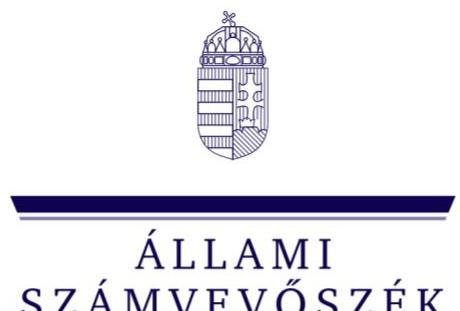
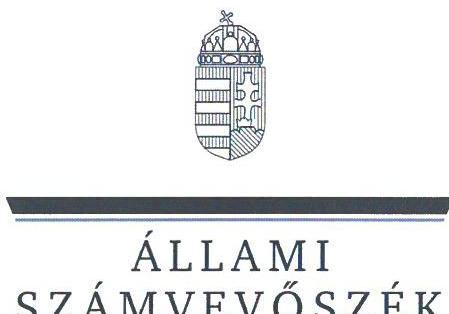
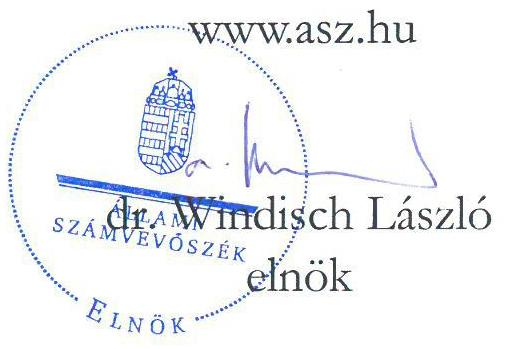
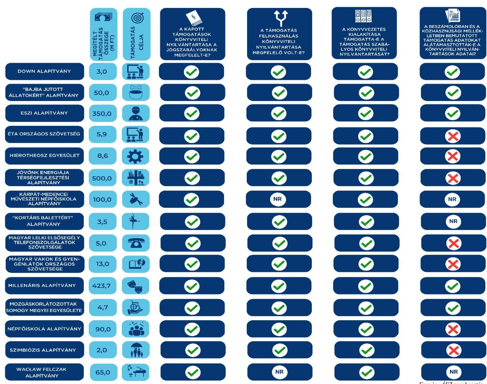

ÁLLAMI
SZÁMVEVŐSZÉK

# JELENTÉS 

Egyesületek és alapítványok államháztartásból kapott támogatásai könyvviteli nyilvántartásának ellenőrzése
2023.

23048
www.asz.hu

---

ÁLLAMI
SZÁMVEVŐSZÉK

# JELENTÉS 

## Egyesületek és alapítványok államháztartásból kapott támogatásai könyvviteli nyilvántartásának ellenőrzése

2023. 

23048

---

# ELLENŐRZÉSI IGAZGATÓSÁG: 

## ÁLLAMHÁZTARTÁSON KÍVÜLI SZERVEZETEK ELLENŐRZŐ IGAZGATÓSÁG

ELLENŐRZÉSI IGAZGATÓ:
KLINGA LÁSZLÓ igazgató

ELLENŐRZÉSVEZETŐ:
SOLYMÁR ÁGNES ellenőrzésvezető

## IKTATÓSZÁM: EL-3963-001/2023.

TÉMASZÁM: 2693

ELLENŐRZÉS-AZONOSÍTÓ SZÁM: V1037

---

# TARTALOMJEGYZÉK 

- AZ ELLENŐRZÉS ALAPADATAI ..... 5
- AZ ELLENŐRZÖTT SZERVEZETEK ..... 6
- ÖSSZEFOGLALÁS ..... 15
- AZ ELLENŐRZÉS FÓKUSZKÉRDÉSE ..... 16
- MEGÁLLAPÍTÁSOK ..... 17
- JAVASLATOK ..... 32
- MELLÉKLETEK ..... 34
I. sz. melléklet: Értelmező szótár ..... 34
II. sz. melléklet: Az ellenőrzött szervezetek jegyzéke ..... 36
III. sz. melléklet: Ellenőrzési kritériumok ..... 37
- FÜGGELÉK: ÉSZREVÉTELEK ..... 38
- RÖVIDÍTÉSEK JEGYZÉKE ..... 39

---

.

---

# AZ ELLENŐRZÉS ALAPADATAI 

## AZ ELLENŐRZÉS CÉLJA

Az ellenőrzés célja annak ellenőrzése volt, hogy az ellenőrzött egyesületnél, alapítványnál a kiválasztott, államháztartási forrásból származó támogatás könyvviteli nyilvántartása szabályszerűen történt-e.

## AZ ELLENŐRZÉS TÍPUSA

Szabályszerűségi ellenőrzés.

## AZ ELLENŐRZÖTT IDŐSZAK

Az ellenőrzésre kiválasztott államháztartási támogatásra vonatkozó támogatási döntéstől / szerződéskötéstől 2023.06.14-ig, a helyszíni ellenőrzésről szóló értesítés keltéig tartó időszak.

## AZ ELLENŐRZÉS TÁRGYA

Az egyesületnél, illetve alapítványnál az ellenőrzésre kiválasztott államháztartási forrásból kapott támogatás könyvviteli nyilvántartását, ennek keretében a támogatásból származó bevétel-, valamint a támogatás felhasználás nyilvántartására vonatkozó jogszabályi előírások betartását ellenőriztük.

## AZ ELLENŐRZÉS JOGALAPJA

Az ellenőrzés jogalapját az ÁSZ tv. ${ }^{1} 1 . \int(3)$, valamint az 5. $\int(3)$ bekezdés előírásai képezték.

## AZ ELLENŐRZÉS MÓDSZERE

Az ellenőrzést az ellenőrzési program szempontjai, az ellenőrzött időszakban hatályos jogszabályok, előírások, az ellenőrzés általános szakmai szabályai, az ellenőrzésre irányadó ÁSZ ${ }^{2}$ megfelelőségi ellenőrzési módszertana figyelembevételével végezte az ÁSZ. Az ellenőrzési kérdések megválaszolásához szükséges bizonyítékok megszerzése az ellenőrzött egyesület, alapítvány által rendelkezésre bocsátott dokumentumokra és adatokra alapozva, továbbá kérdésfeltevés (információkérés) útján történt. Az ellenőrzési bizonyítékként felhasznált adatforrások közé tartoztak egyrészt az ellenőrzéshez kért dokumentumok, adatforrások, másrészt minden - az ellenőrzés folyamán - feltárt, az ellenőrzés szempontjából információkat tartalmazó dokumentum. Az ellenőrzés lefolytatásához az ellenőrzött szervezet a tanúsítvány kitöltésével, valamint az ÁSZ által kért dokumentumok, adatok, információk megküldésével szolgáltatott adatokat.

---

# AZ ELLENŐRZÖTT SZERVEZETEK 

Az ellenőrzésre 15 civil szervezet esetében került sor, melyek közül tíz alapítványi, öt pedig egyesületi formában működött. Valamennyi ellenőrzött szervezet kettős könyvvezetéssel támasztotta alá beszámolóját, közülük 13 szervezet rendelkezett közhasznú jogállással. Két szervezet választotta, hogy működéséről, vagyoni, pénzügyi és jövedelmi helyzetéről Számv. tv. ${ }^{3}$ szerinti éves beszámolót készít. A Közbef. tv. ${ }^{4}$ előírása szerint tevékenysége és a 2022. évi számviteli beszámoló mérlegfőösszege alapján - mivel mérlegfőösszegük elérte a 20 millió forintot - 14 szervezet a közélet befolyásolására alkalmas tevékenységet végző szervezetnek minősült.

Az ellenőrzött szervezetek 2022. évben - beszámolóik szerint - összesen 84571 M Ft vagyonnal gazdálkodtak, tevékenységükhöz 9644 M Ft támogatást számoltak el bevételként. A legnagyobb szervezet 39858 M Ft , a legkisebb 17 M Ft eszközállománnyal rendelkezett.

A tíz alapítványnál és öt egyesületnél összesen 1624 M Ft támogatás számviteli nyilvántartásának ellenőrzésére került sor.

## Az Értelmi Fogyatékosok Fejlődését Szolgáló Magyar Down Alapítvány

Az alapítványt 1992-ben egy magánszemély hozta létre határozatlan időre, célja „az értelmi fogyatékos, különösen a Down szindrómás emberek életvitelének segítése". A közhasznú jogállású alapítvány képviseletére és vagyonának kezelésére az alapító hét főből álló kuratóriumot hozott létre, működését és gazdálkodását az alapító által megbízott felügyelő bizottság ellenőrizte. Könyvvizsgálati kötelezettsége az ellenőrzött időszakban nem volt. Az alapítvány 2022. évi gazdálkodásáról egyszerűsített éves beszámolót készített.

## AZ ELLENŐRZÖTT, KÖZPONTI KÖLTSÉGVETÉSBŐL NYÚJTOTT TÁMOGATÁS BEMUTATÁSA

Támogatott szervezet megnevezése, székhelytelepülése

Támogatási program célja
Támogató megnevezése
Támogatás időtartama
Támogatási összeg
Támogatás típusa
A pénzügyi elszámolás határideje
Elszámolás a támogató szervezet felé

Az Értelmi Fogyatékosok Fejlődését Szolgáló Magyar Down Alapítvány, Budapest

Segítők képzése az intim kapcsolatok támogatására
Emberi Erőforrások Minisztériuma
2022.09.01. - 2023.08.31.
3.000.000 Ft
vissza nem térítendő
2023.09.29.

Az ellenőrzött időszakban az alapítványnak nem volt a támogató szervezet felé elszámolási kötelezettsége.

---

# "BAJBA JUTOTT ÁLLATOKÉRT" ALAPÍTVÁNY 

Az alapítványt három magánszemély alapította 2017. április 11-én., célja „elsősorban a tiszafüredi, illetve a környékbeli, gazdátlan állatok ideiglenes gondozásának, mielőbbi gazdához juttatásának támogatása; a tiszafüredi állatmenhely befogadott kutyáinak táplálékhoz juttatása, megfelelő élettér kialakításának támogatása". A közhasznú jogállással nem rendelkező alapítvány tevékenységét három tagú kuratórium irányította, felügyelő bizottság létrehozására nem volt kötelezett és nem is hozott létre. Könyvvizsgálati kötelezettsége az ellenőrzött időszakban nem volt. Az alapítvány a 2022. évi gazdálkodásáról egyszerűsített éves beszámolót készített.

## AZ ELLENŐRZÖTT, KÖZPONTI KÖLTSÉGVETÉSBŐL NYÚJTOTT TÁMOGATÁS BEMUTATÁSA

Támogatott szervezet megnevezése, székhelytelepülése
„Bajba jutott állatokért" Alapítvány, Tiszafüred
Támogatási program célja
Támogató megnevezése
Támogatás időtartama
Támogatási összeg
Támogatás típusa
A pénzügyi elszámolás határideje
Elszámolás a támogató szervezet felé

A kedvezményezett által a civil állatvédő szervezetek részére juttatandó tápadomány költségeinek támogatása

Igazságügyi Minisztérium
2022.12.01. - 2023.04.30.

50000000 Ft
vissza nem térítendő
2023.05.31.

A támogatott az elszámolást a határidő betartásával benyújtotta.

## ESZI INTÉZMÉNYFENNTARTÓ ÉS MŰKÖDTETŐ ALAPÍTVÁNY

Az alapítványt az MVM Paksi Atomerőmű Zrt. 2001-ben alapította, a szervezet 2001. július 1-től fenntartója a mai nevén Energetikai Technikum és Kollégium szakképző oktatási intézménynek. Az alapítvány közhasznú jogállású szervezet, hét tagú kuratórium irányította. Működését és gazdálkodását az alapító által megbízott három tagú felügyelő bizottság ellenőrizte. Az alapítvány 2022. évi egyszerűsített éves beszámolóját a jogszabályi előírásoknak megfelelve könyvvizsgáló ellenőrizte.

## AZ ELLENŐRZÖTT, KÖZPONTI KÖLTSÉGVETÉSBŐL NYÚJTOTT TÁMOGATÁS BEMUTATÁSA

Támogatott szervezet megnevezése, székhelytelepülése
Támogatási program célja
Támogató megnevezése
Támogatás időtartama
Támogatási összeg
Támogatás típusa
A pénzügyi elszámolás határideje
Elszámolás a támogató szervezet felé

ESZI Intézményfenntartó és Működtető Alapítvány, Paks
Az Energetikai Technikum és Kollégium támogatása a Paks II. projekt szakemberképzési igényének biztosítására

Miniszterelnökség
2021.12.01. - 2023.01.31.

350000000 Ft
vissza nem térítendő
2023.02.28.

A támogatott az elszámolást a határidő betartásával benyújtotta.

---

# ÉTA ÉRTELMI SÉRÜLTEKET SZOLGÁLÓ TÁRSADALMI SZERVEZETEK ÉS ALAPÍTVÁNYOK ORSZÁGOS SZÖVETSÉGE 

Az egyesület 1997-ben alakult. Az egyesület célja, hogy érdekvédelmi tevékenységével és szolgáltatásainak nyújtásával hozzájáruljon a célcsoportjai és közvetlen környezete életminőségének javításához, melynek érdekében elsősorban az értelmi sérülteket szolgáló szervezeteket összefogja, tevékenységüket koordinálja, e szervezetek közösségi érdekeinek és céljainak érvényesítését segíti, védi és képviseli. A közhasznú jogállással rendelkező egyesület legfőbb döntéshozó szerve a közgyűlés, ügyintéző és képviselő szerve a hét tagú elnökség volt. Az egyesületnél a felügyelő bizottság jogszabályban meghatározott feladatainak ellátását, a gazdálkodás és az alapszabály szerinti működés ellenőrzését az alapító által létrehozott, három főből álló ellenőrző bizottság végezte. Könyvvizsgálati kötelezettsége az ellenőrzött időszakban nem volt. Az egyesület a 2022. évi gazdálkodásáról egyszerűsített éves beszámolót készített.

## AZ ELLENŐRZÖTT, KÖZFONTI KÖLTSÉGVETÉSBŐL NYÚJTOTT TÁMOGATÁS BEMUTATÁSA

Támogatott szervezet megnevezése, székhelytelepülése

Támogatási program célja

Támogató megnevezése
Támogatás időtartama
Támogatási összeg
Támogatás típusa
A pénzügyi elszámolás határideje
Elszámolás a támogató szervezet felé

ETA Értelmi Sérülteket Szolgáló Társadalmi Szervezeteket és Alapítványok Országos Szövetsége, Budapest
A gyámügyi igazgatásban és a gyermekvédelmi intézményekben dolgozó szakemberek érzékenyítő képzése
Emberi Erőforrások Minisztériuma
2022.05.01. - 2022.11.30.

5915000 Ft
vissza nem térítendő
2022.12.15.

A támogatott az elszámolást a határidő betartásával benyújtotta.

## HIEROTHEOSZ EGYESÜLET

Az egyesület 2011. szeptember 21-én alakult Máriapócson. Célja a társadalom életében megjeleníteni a Magyar Görögkatolikus Egyház tanítását a Kárpát-medencében. Feladatai közé tartozott a kirekesztés csökkentése, és az esélyegyenlőség növelése érdekében programok működtetése, a hátrányos helyzetű csoportok integrációjának elősegítése. A közhasznú jogállással rendelkező szervezet legfőbb döntéshozó szerve a küldöttgyűlés, ügyintéző szerve a hét tagú elnökség volt. A gazdálkodás és az alapszabály szerinti működés ellenőrzési feladatait a jogszabályi előírásnak megfelelve létrehozott három tagú ellenőrző bizottság látta el. Könyvvizsgálati kötelezettsége az ellenőrzött időszakban nem volt. Az egyesület a 2022. évi gazdálkodásáról egyszerűsített éves beszámolót készített.

---

# AZ ELLENŐRZÖTT, KÖZPONTI KÖLTSÉGVETÉSBŐL NYÚJTOTT TÁMOGATÁS BEMUTATÁSA 

Támogatott szervezet megnevezése, székhelytelepülése

Támogatási program célja

Támogató megnevezése
Támogatás időtartama
Támogatási összeg
Támogatás típusa
A pénzügyi elszámolás határideje
Elszámolás a támogató szervezet felé

Hierotheosz Egyesület, Máriapócs
A Szabolcs-Szatmár-Bereg megyei Család, Esélyteremtő és Önkéntes Ház feladatellátásának támogatása

Miniszterelnökség
2022.04.01. - 2022.12.31.
$8550000 \mathrm{Ft}$
vissza nem térítendő
2023.01.30.

A támogatott az elszámolást a határidő betartásával benyújtotta.

## JÓVŐNK ENERGIÁJA TÉRSÉGFEJLESZTÉSI ALAPÍTVÁNY

Az alapítványt az MVM Paksi Atomerőmű Zrt. alapította 2011-ben. Alapító okirat szerinti célja a kedvezményezett területeken (kalocsai, paksi, tolnai járás és a szekszárdi járás északi része, összesen 47 településen) megvalósuló térségfejlesztés, az életminőség emelése és a munkahelyteremtés. Az alapítvány közhasznú jogállású szervezet. Ügyvezető szerve az öt tagú kuratórium, melynek bármely két tagja együttesen volt jogosult az alapítvány képviseletére. Az ellenőrzési feladatokat az alapító által megbízott három tagú felügyelő bizottság látta el, az alapítvány 2022. évi egyszerűsített éves beszámolóját a jogszabályi előírásoknak eleget téve könyvvizsgáló felülvizsgálta.

## AZ ELLENŐRZÖTT, KÖZPONTI KÖLTSÉGVETÉSBŐL NYÚJTOTT TÁMOGATÁS BEMUTATÁSA

Támogatott szervezet megnevezése, székhelytelepülése

Támogatási program célja

Támogató megnevezése
Támogatás időtartama
Támogatási összeg
Támogatás típusa
A pénzügyi elszámolás határideje
Elszámolás a támogató szervezet felé

Jövőnk Energiája Térségfejlesztési Alapítvány, Paks
Térség és infrastruktúra fejlesztés, életminőség javítás a Paksi Atomerőmű környezetében lévő településeken - Területfejlesztési projektek és támogatásuk

Miniszterelnökség
2021.09.01. - 2023.12.31.
$500000000 \mathrm{Ft}$
vissza nem térítendő
2024.01.31.

Az ellenőrzött időszakban az alapítványnak a támogató szervezet felé elszámolási kötelezettsége nem volt.

## KÁRPÁT-MEDENCEI MŰVÉSZETI NÉPFŐISKOLA ALAPÍTVÁNY

Az alapítványt 2019. január 25-én az Örökség Kultúrpolitikai Intézet Nonprofit Korlátolt Felelősségű Társaság alapította 20 M Ft-os összegű vagyoni hozzájárulással. Célja a „kulturális örökség megőrzése, ápolása a művészeteken keresztül. Ennek elérése érdekében művészeti programokat, művészetoktatást szervez, művészeti projekteket támogat Magyarországon és a Kárpát-medencében". A közhasznú jogállású alapítvány tulajdonában állt a Levendula

---

Színpad Közhasznú Nonprofit Kft., a Művészeti Népfőiskola Vagyonkezelő Kft., valamint résztulajdonosa volt a Csajághy Laura Színpad Közhasznú Nonprofit Kft.-nek és a Magyar Tavak Fesztiválja Közhasznú Nonprofit Kft.-nek. Az alapítvány képviseletére és vagyonának kezelésére az alapító öt főből álló kuratóriumot hozott létre, működését és gazdálkodását az alapító által megbízott három tagú felügyelő bizottság ellenőrizte. Az alapítvány 2022. évi egyszerűsített éves beszámolóját az alapítói előírásnak eleget téve könyvvizsgáló ellenőrizte.

# AZ ELLENŐRZÖTT, KÖZPONTI KÖLTSÉGVETÉSBŐL NYÚJTOTT TÁMOGATÁS BEMUTATÁSA 

Támogatott szervezet megnevezése, székhelytelepülése

Támogatási program célja
Támogató megnevezése
Támogatás időtartama
Támogatási összeg
Támogatás típusa
A pénzügyi elszámolás határideje
Elszámolás a támogató szervezet felé

Kárpát-medencei Művészeti Népfőiskola Alapítvány, Kápolnásnyék
A közösségi- és hálózatépítő munka bértámogatása
Emberi Erőforrások Minisztériuma
2021.12.09 - 2023.12.31.
100000000 Ft
vissza nem térítendő
2024.02.29.

Az ellenőrzött időszakban az alapítványnak a támogató szervezet felé nem volt elszámolási kötelezettsége.

## „KORTÁRS BALETTÉRT" ALAPÍTVÁNY

Az alapítvány 1993. november 29-én jött létre szegedi székhellyel, melyet egy magánszemély alapított. Az alapítvány célja „kulturális tevékenység" és „kulturális örökség megóvása". Az alapítvány 2015. óta közhasznú jogállású szervezetként működik. A közhasznú tevékenység keretei között az alapítvány célja „elősegíteni a balett, elsősorban a szegedi balett működését, támogatást nyújtani a tánckultúra fejlesztéséhez és közönséggel való megismertetéséhez, a táncművészet megszerettetése és megismertetése az ifjúsággal, az ifjúság mozgáskultúrájának kialakítása és fejlesztése". Az alapítvány képviseletére és a vagyonának a kezelésére az alapító három főből álló kuratóriumot hozott létre, működését és gazdálkodását az alapító által megbízott három tagú felügyelő bizottság ellenőrizte. Az alapítvány 2022. évi egyszerűsített éves beszámolóját jogszabályi előírásoknak eleget téve könyvvizsgáló ellenőrizte.

## AZ ELLENŐRZÖTT, KÖZPONTI KÖLTSÉGVETÉSBŐL NYÚJTOTT TÁMOGATÁS BEMUTATÁSA

Támogatott szervezet megnevezése, székhelytelepülése
Támogatási program célja
Támogató megnevezése
Támogatás időtartama
Támogatási összeg
Támogatás típusa
A pénzügyi elszámolás határideje
Elszámolás a támogató szervezet felé

„Kortárs Balettért" Alapítvány, Szeged
A SZEGEDI KORTÁRS BALETT LEAR című új bemutatójának megvalósítása

Nemzeti Kulturális Alap Táncművészeti Kollégiuma
2022.08.01.- 2023.12.31.

3500000 Ft
vissza nem térítendő
2024.01.10.

Az ellenőrzött időszakban az alapítványnak
 a támogató szervezet felé nem volt elszámolási kötelezettsége.

---

# MAGYAR LELKI ElsőSEGÉLY TELEFONSZOLGÁLATOK SZÖVETSÉGE 

Az egyesületet 1986. november 21-én alapították. Tagjai jogi személyiségű és jogi személyiséggel nem rendelkező szervezetek, szolgálatok. Az egyesület célja, hogy megteremtse és biztosítsa a szakmai együttműködés szervezett kereteit a tagszolgálatok számára", valamint „a Magyarországon működő telefonon, vagy telefonon is igénybe vehető olyan szolgálatokat gyűjti egybe, melyek a telefont, mint sajátos kommunikációs eszközt és esetvezetési módszert használják fel a mentálhigiénés prevenció, a krízisintervenció, szicid prevenció területén". A közhasznú jogállással rendelkező egyesület legfőbb döntéshozó szerve a küldöttgyűlés, ügyintéző szerve a három tagú elnökség, az ellenőrzési feladatokat a jogszabályi előírásoknak megfelelően létrehozott három tagú felügyelő bizottság látta el. Könyvvizsgálati kötelezettsége az ellenőrzött időszakban nem volt. Az egyesület a 2022. évi gazdálkodásáról egyszerűsített éves beszámolót készített.

## AZ ELLENŐRZÖTT, KÖZPONTI KÖLTSÉGVETÉSRŐL NYÚJTOTT TÁMOGATÁS BEMUTATÁSA

Támogatott szervezet megnevezése, székhelytelepülése

Támogatási program célja

Támogató megnevezése

Támogatás időtartama
Támogatási összeg
Támogatás típusa
A pénzügyi elszámolás határideje
Elszámolás a támogató szervezet felé

Magyar Lelki Elsősegély Telefonszolgálatok Szövetsége, Békéscsaba
A telefonos lelki elsősegélyszolgálat szakmai támogatása, a szupervízió fejlesztése

Tempus Közalapítvány a Kulturális és Innovációs Minisztérium képviseletében
2022.12.01. - 2023.02.28.

5000000 Ft
vissza nem térítendő
2023.04.29.

A támogatott az elszámolást a határidő betartásával benyújtotta.

## MAGYAR VAKOK ÉS GYENGÉNLÁTÓK ORSZÁGOS SZÖVETSÉGE

Az egyesület jogelődjét 1918. évben alapították, a civil szervezetek bírósági nyilvántartásában 1989. november 20-tól tartják nyilván egyesületként, melynek jogi személy és természetes személy tagjai egyaránt vannak. Az egyesület célja „valamennyi emberi jog és alapvető szabadság teljes és egyenlő gyakorlásának elősegítése, védelme és biztosítása minden látássérült személy számára, és a velük született méltóság tiszteletben tartásának előmozdítása", a szövetség tagjainak társadalmi összefogása, érdekvédelmük ellátása, habilitációjuk és rehabilitációjuk elősegítése. Az egyesület közhasznú jogállással rendelkező szervezet. Legfőbb döntéshozó szerve a küldöttgyűlés, ügyintéző szerve a hét tagú elnökség, az ellenőrzési feladatokat a jogszabályi előírásoknak megfelelően létrehozott három tagú felügyelő bizottság látta el. Az egyesület 2022. évi Számv. tv. szerinti éves beszámolóját a jogszabályi előírásoknak eleget téve könyvvizsgáló véleményezte.

---

# AZ ELLENŐRZÖTT, KÖZPONTI KÖLTSÉGVETÉSRŐL NYÚJTOTT TÁMOGATÁS BEMUTATÁSA 

Támogatott szervezet megnevezése, székhelytelepülése

Támogatási program célja
Támogató megnevezése
Támogatás időtartama
Támogatási összeg
Támogatás típusa
A pénzügyi elszámolás határideje
Elszámolás a támogató szervezet felé

Magyar Vakok és Gyengénlátók Országos Szövetsége, Budapest
Online hangoskönyvtár fejlesztése
Miniszterelnöki Kabinetiroda
2022.01.01 - 2022.12.31.

13000000 Ft
vissza nem térítendő
2023.02.28.

A támogatott az elszámolást a határidő betartásával benyújtotta.

## MILLENÁRIS TUDOMÁNYOS KULTURÁLIS ALAPÍTVÁNY

Az alapítványt 2021. január 15-én alapította a Magyar Állam. Az alapítói jogok gyakorlója a kuratórium. A KEKVA tv. ${ }^{5}$ 1. sz. melléklete szerint közérdekű vagyonkezelő alapítvánnyá minősített szervezet tevékenysége a Millenáris Nonprofit Kft. és a Thália Színház Nonprofit Kft. feletti tulajdonosi jogok gyakorlása, nyilvántartott tevékenységeinek támogatása és azok anyagi, tárgyi feltételeinek, jogi hátterének megteremtése. Az alapítvány képviseletére és vagyonának a kezelésére az alapító öt főből álló kuratóriumot hozott létre, működését és gazdálkodását az alapító által megbízott három tagú felügyelő bizottság ellenőrizte, valamint alapítványi vagyonellenőr őrködött a szabályszerű működés fölött. Az alapítvány 2022. évi egyszerűsített éves beszámolóját jogszabályi előírás alapján könyvvizsgáló ellenőrizte.

## AZ ELLENŐRZÖTT, KÖZPONTI KÖLTSÉGVETÉSRŐL NYÚJTOTT TÁMOGATÁS BEMUTATÁSA

Támogatott szervezet megnevezése, székhelytelepülése

Támogatási program célja

Támogató megnevezése
Támogatás időtartama
Támogatási összeg
Támogatás típusa
A pénzügyi elszámolás határideje
Elszámolás a támogató szervezet felé

Millenáris Tudományos Kulturális Alapítvány, Budapest
A Thália Színház újranyitás utáni működését elősegítő színpad- és hangtechnikai fejlesztések, egyéb szükséges felújítási munkálatok megvalósítása

Nemzeti Együttműködési Alap
2021.04.01 - 2022.12.31.

423700000 Ft
vissza nem térítendő
2023.01.30.

Az alapítvány az elszámolást a határidő betartásával benyújtotta.

## MOZGÁSKORLÁTOZOTTAK SOMOGY MEGYEI EGYESÜLETE

Az egyesület jogelődjét 1979-ben alapították, Mozgáskorlátozottak Somogy Megyei Egyesületeként a civil szervezetek bírósági nyilvántartásában 1997. október 18-tól tartják nyilván. Székhelye Kaposvár, a szervezetnek természetes személy tagjai és pártoló tagjai egyaránt vannak. Célja a Somogy Megyében élő mozgásukban korlátozott, fogyatékos, emiatt megváltozott munkaképességű emberek érdekeinek érvényesítése, védelme,

---

számukra széleskörű, szociális, egészségügyi, köznevelési, munkaerő-piaci, sport, szabadidős és egyéb közösségi szolgáltatások nyújtása. Az egyesület közhasznú jogállással rendelkező szervezet. Legfőbb döntéshozó szerve a küldöttközgyűlés, ügyintéző szerve a kilenc tagú vezetőség, az ellenőrzési feladatokat a jogszabályi előírásoknak megfelelően létrehozott három tagú felügyelő bizottság látta el. Az egyesület 2022. évi egyszerűsített éves beszámolóját jogszabályi előírásnak megfelelve könyvvizsgáló véleményezte.

# AZ ELLENŐRZÖTT, KÖZPONTI KÖLTSÉGVETÉSBŐL NYÚJTOTT TÁMOGATÁS BEMUTATÁSA 

Támogatott szervezet megnevezése, székhelytelepülése

Támogatási program célja

Támogató megnevezése
Támogatás időtartama
Támogatási összeg
Támogatás típusa
A pénzügyi elszámolás határideje
Elszámolás a támogató szervezet felé

Mozgáskorlátozottak Somogy Megyei Egyesülete, Kaposvár
A fogyatékossággal élő személyek számára bentlakásos vagy lakóotthoni ellátást nyújtó nem állami, nem egyházi szervezetek egyszeri kiegészítő támogatása keretében szociális gondozók bérköltségének támogatása
Emberi Erőforrások Minisztériuma
2022.03.01. - 2023.02.28.

4690000 Ft
vissza nem térítendő
2023.03.15.

A támogatott az elszámolást a határidő betartásával benyújtotta.

## NÉPFŐISKOLA ALAPÍTVÁNY

Az alapítványt 1992. augusztus 31-én a Lakiteleki Alapítvány hozta létre. Székhelye Lakitelek, főtevékenysége a kulturális nemzeti örökség megőrzése, ápolása, melynek keretében Népfőiskolát tart fenn. Az alapítvány képviseletére és a vagyonának a kezelésére az alapító öt főből álló kuratóriumot hozott létre, működését és gazdálkodását az alapító által megbízott három tagú felügyelő bizottság ellenőrizte. A közhasznú jogállású alapítvány 2022. évi Számv. tv. szerinti éves beszámolóját a jogszabályi előírásoknak eleget téve könyvvizsgáló ellenőrizte.

## AZ ELLENŐRZÖTT, KÖZPONTI KÖLTSÉGVETÉSBŐL NYÚJTOTT TÁMOGATÁS BEMUTATÁSA

Támogatott szervezet megnevezése, székhelytelepülése

Támogatási program célja
Támogató megnevezése
Támogatás időtartama
Támogatási összeg
Támogatás típusa
A pénzügyi elszámolás határideje
Elszámolás a támogató szervezet felé

Népfőiskola Alapítvány, Lakitelek
A Petőfi-emlékév keretében a költő visszatér című kárpát-medencei programsorozat megvalósítása
Nemzeti Kulturális Alap
2021.12.01 - 2023.12.31.

90000000 Ft
vissza nem térítendő
2024.02.29.

Az ellenőrzött időszakban az alapítványnak még nem volt a támogató szervezet felé elszámolási kötelezettsége.

---

# "SZIMBIÓZIS" A HARMÓNIKUS EGYÜTT-LÉTÉRT ALAPÍTVÁNY 

Az alapítványt 1999. október 11-én egy magánszemély alapította, elsősorban az észak-magyarországi felnőtt fogyatékossággal élő személyek hátrányos szociális ellátási és foglalkoztatási helyzetének megoldása érdekében. Az alapítvány közhasznú jogállású szervezet, képviseletére és vagyonának kezelésére az alapító három főből álló kuratóriumot hozott létre, működését és gazdálkodását az alapító által megbízott három tagú felügyelő bizottság ellenőrizte. Az alapítvány 2022. évi egyszerűsített éves beszámolóját jogszabályi előírásnak megfelelve könyvvizsgáló ellenőrizte.

## AZ ELLENŐRZÖTT, KÖZPONTI KÖLTSÉGVETÉSBŐL NYÚJTOTT TÁMOGATÁS BEMUTATÁSA

Támogatott szervezet megnevezése, székhelytelepülése

Támogatási program célja

Támogató megnevezése
Támogatás időtartama
Támogatási összeg
Támogatás típusa
A pénzügyi elszámolás határideje
Elszámolás a támogató szervezet felé

"Szimbiózis" A Harmónikus Együtt-Létért Alapítvány, Miskolc
Fogyatékossággal élő gyermeket vagy felnőttet nevelő családok részére a Baráthegyi Majorságban szervezett „Egy hét mennyország" program megvalósítása.
Emberi Erőforrások Minisztériuma
2022.04.01 - 2022.12.31.

2000000 Ft
vissza nem térítendő
2023.02.28.

Az alapítvány az elszámolást a határidő betartásával benyújtotta, a támogató szervezet a pénzügyi elszámolást elfogadta.

## Wacław Felczak Alapítvány

Az alapítvány 2018. április 25-én jött létre budapesti székhellyel, melyet Magyarország Kormánya alapított. Az alapítói jogokat a kultúráért és innovációért felelős miniszter gyakorolta. A közhasznú jogállású szervezet célja és feladata a magyar-lengyel barátság hagyományának nemzedékek közötti átörökítése, illetve a magyar és a lengyel nemzet közötti együttműködés társadalmi bázisának szélesítése. Az alapítvány képviseletére és vagyonának kezelésére az alapító öt főből álló kuratóriumot hozott létre, működését és gazdálkodását az alapító által megbízott három tagú felügyelő bizottság ellenőrizte. Az alapítvány 2022. évi egyszerűsített éves beszámolóját jogszabályi előírásnak megfelelve könyvvizsgáló ellenőrizte.

## AZ ELLENŐRZÖTT, KÖZPONTI KÖLTSÉGVETÉSBŐL NYÚJTOTT TÁMOGATÁS BEMUTATÁSA

Támogatott szervezet megnevezése, székhelytelepülése

Támogatási program célja

Támogató megnevezése
Támogatás időtartama
Támogatási összeg
Támogatás típusa
A pénzügyi elszámolás határideje
Elszámolás a támogató szervezet felé

Wacław Felczak Alapítvány, Budapest
Szilasi Alex zongoraművész tulajdonát képező, Pleyel 10112 sorozatszámú „Obreskoff" elnevezésű pianínó megvásárlása azért, hogy azt a Fryderyk Chopin intézetnek adományozza
Miniszterelnökség
2022.04.01 - 2023.06.30.

65000000 Ft
vissza nem térítendő
2023.07.31.

Az ellenőrzött időszakban az alapítványnak nem volt a támogató szervezet felé elszámolási kötelezettsége.

---

# ÖSSZEFOGLALÁS 

Valamennyi ellenőrzött szervezet könyvvezetési rendszerének kialakítása megfelelően támogatta az államháztartásból származó támogatások szabályszerű könyvviteli nyilvántartását, biztosította a közpénzek felhasználásának ellenőrizhetőségét. Az ellenőrzött támogatást mind a 15 szervezet, annak felhasználását pedig az a 13 szervezet, ahol arra sor került, könyvviteli rendszerében a jogszabályi előírások szerint tartotta nyilván.

Az ellenőrzött 15 szervezet közül hét szervezet nem megfelelően tájékoztatta a közvéleményt a közpénzek felhasználásáról. Hat közhasznú jogállású ellenőrzött szervezet beszámolójának kiegészítő melléklete nem a törvényi előírások szerint tartalmazta a főkönyvi és analitikus nyilvántartásokban szabályszerűen kimutatott támogatásokat. Kettő ellenőrzött szervezet a közhasznúsági mellékletét nem a jogszabályok előírásai szerint készítette el. Összességében hét szervezetnél nem biztosították a közpénzek felhasználásának nyilvánosságát, ezáltal sérült a közpénz kezelés Alaptörvényben ${ }^{6}$ rögzített átláthatóságának elve. Az ellenőrzési megállapításokhoz kapcsolódóan, a feltárt hiányosságok megszüntetésére 7 szervezet vezetőjének, összesen 8 javaslatot tettünk. A fentiekben bemutatott megállapítások ellenőrzött szervezetenkénti megjelenését az 1. ábra szemlélteti.
1. ábra
FŐBB ELLENŐRZÉSI TAPASZTALATOK

---

# AZ ELLENŐRZÉS FÓKUSZKÉRDÉSE 

1. Szabályszerű volt-e az egyesület/alapítvány államháztartási forrásból kapott támogatásának könyvviteli nyilvántartása?

---

# 1. Az Értelmi Fogyatékosok Fejlődését Szolgáló Magyar Down Alapítvány 

## Összegző megállapítás Az Értelmi Fogyatékosok Fejlődését Szolgáló Magyar Down Alapítvány államháztartási forrásból kapott támogatásának könyvviteli nyilvántartása szabályszerű volt.

## A kapott támogatás könyvviteli nyilvántartása

Az alapítvány könyvvezetési rendszerében a (főkönyvi és analitikus nyilvántartások) az államháztartási forrásból kapott, bevételként elszámolt támogatást - főkönyvi számla alábontásával, alszámla alkalmazásával - az Eszkr. ${ }^{7}$-ben és a Civil tv. ${ }^{8}$-ben előírtak szerint, elkülönítetten mutatta ki.

## A támogatás felhasználásának könyvviteli nyilvántartása

Az alapítvány az Eszkr.-ben és a Civil tv.-ben előírtakat betartva könyvvezetési rendszerében - főkönyvi számlák alábontásával, alszámlák használatával - az államháztartási forrásból kapott támogatás felhasználását elkülönítetten tartotta nyilván, továbbá a felhasználás számviteli nyilvántartása során figyelembe vette a támogatási szerződés előírásait is.
A szervezet könyvvezetésének kialakítása, keretrendszere a támogatás könyvviteli nyilvántartásának szabályossága tükrében

Az alapítvány könyvvezetési, nyilvántartási rendszerét az Eszkr., és a Civil tv. előírásai szerint alakította ki, biztosítva ezzel az alapcél szerinti tevékenysége költségei, ráfordításai ellentételezésére visszafizetési kötelezettség nélkül kapott támogatás és annak felhasználása elkülönített kimutatását.
A szervezet számviteli beszámolójában, közhasznúsági mellékletében a támogatással kapcsolatban bemutatott adatok könyvviteli nyilvántartásban elszámolt adatokkal történő alátámasztottsága

A közhasznú jogállású alapítványnak az Eszkr.-ben rögzített előírások szerint kialakított könyvvezetése és nyilvántartása biztosította a 2022. évi egyszerűsített éves beszámoló kiegészítő mellékletében a Civil tv.-ben előírtaknak megfelelően bemutatott adatok alátámasztását.

---

# 2. „Bajba jutott állatokért" Alapítvány 

## Összegző megállapítás A „Bajba jutott állatokért" Alapítvány államháztartási forrásból kapott támogatásának könyvviteli nyilvántartása szabályszerű volt.

## A kapott támogatás könyvviteli nyilvántartása

Az alapítvány könyvvezetési rendszerében a (főkönyvi és analitikus nyilvántartások) az államháztartási forrásból kapott, előlegként elszámolt támogatást - főkönyvi számla alábontásával, alszámla alkalmazásával - az Eszkr.-ben és a Civil tv.-ben előírtak szerint, elkülönítetten mutatta ki.

## A támogatás felhasználásának könyvviteli nyilvántartása

Az alapítvány az Eszkr.-ben és a Civil tv.-ben előírtakat betartva könyvvezetési rendszerében - főkönyvi számlák alábontásával, alszámlák használatával - az államháztartási forrásból kapott támogatás felhasználását elkülönítetten tartotta nyilván, továbbá a felhasználás számviteli nyilvántartása során figyelembe vette a támogatási szerződés előírásait is.
A szervezet könyvvezetésének kialakítása, keretrendszere a támogatás könyvviteli nyilvántartásának szabályossága tükrében

Az alapítvány könyvvezetési, nyilvántartási rendszerét az Eszkr. és a Civil tv. előírásai szerint alakította ki, biztosítva ezzel az alapcél szerinti tevékenysége költségei, ráfordításai ellentételezésére visszafizetési kötelezettség nélkül kapott támogatás és annak felhasználása elkülönített kimutatásának lehetőségét.
A szervezet számviteli beszámolójában, közhasznúsági

 mellékletében a támogatással kapcsolatban bemutatott adatok könyvviteli nyilvántartásban elszámolt adatokkal történő alátámasztottsága

Az alapítványnak az Eszkr.-ben rögzített előírások szerint kialakított könyvvezetése és nyilvántartása biztosította a 2022. évi egyszerűsített éves beszámoló kiegészítő mellékletében a Civil tv.-ben előírtaknak megfelelően bemutatott adatok alátámasztását.

---

# 3. ESZI Intézményfenntartó és Működtető Alapítvány 

## Összegző megállapítás Az ESZI Intézményfenntartó és Működtető Alapítvány államháztartási forrásból kapott támogatásának könyvviteli nyilvántartása szabályszerű volt.

## A kapott támogatás könyvviteli nyilvántartása

Az alapítvány könyvvezetési rendszerében a (főkönyvi és analitikus nyilvántartások) az államháztartási forrásból kapott, bevételként elszámolt támogatást - munkaszám használatával és főkönyvi számla alábontásával, alszámla alkalmazásával - az Eszkr.-ben és a Civil tv.-ben előírtak szerint, elkülönítetten mutatta ki.

## A támogatás felhasználásának könyvviteli nyilvántartása

Az alapítvány az Eszkr.-ben és a Civil tv.-ben előírtakat betartva könyvvezetési rendszerében munkaszám alkalmazásával - az államháztartási forrásból kapott támogatás felhasználását elkülönítetten tartotta nyilván, továbbá a felhasználás számviteli nyilvántartása során figyelembe vette a támogatási szerződés előírásait is.
A szervezet könyvvezetésének kialakítása, keretrendszere a támogatás könyvviteli nyilvántartásának szabályossága tükrében

Az alapítvány könyvvezetési, nyilvántartási rendszerét az Eszkr., és a Civil tv. előírásai szerint alakította ki, biztosítva ezzel az alapcél szerinti tevékenysége költségei, ráfordításai ellentételezésére visszafizetési kötelezettség nélkül kapott támogatás és annak felhasználása elkülönített kimutatását.
A szervezet számviteli beszámolójában, közhasznúsági mellékletében a támogatással kapcsolatban bemutatott adatok könyvviteli nyilvántartásban elszámolt adatokkal történő alátámasztottsága

A közhasznú jogállású alapítványnak az Eszkr.-ben rögzített előírások szerint kialakított könyvvezetése és nyilvántartása biztosította a 2022. évi egyszerűsített éves beszámoló kiegészítő mellékletében a Civil tv.-ben előírtaknak megfelelően bemutatott adatok alátámasztását.

---

# 4. ÉTA Értelmi Sérülteket Szolgáló Társadalmi Szervezetek és Alapítványok Országos Szövetsége 

Összegző megállapítás Az ÉTA Értelmi Sérülteket Szolgáló Társadalmi Szervezetek és Alapítványok Országos Szövetsége államháztartási forrásból kapott támogatásának könyvviteli nyilvántartása szabályszerű volt. A 2022. évi egyszerűsített éves beszámoló kiegészítő melléklete nem tartalmazta az ellenőrzött támogatási program keretében végleges jelleggel felhasznált összegek bemutatását.

## A kapott támogatás könyvviteli nyilvántartása

Az egyesület könyvvezetési rendszerében a (főkönyvi és analitikus nyilvántartások) az államháztartási forrásból kapott, bevételként elszámolt támogatást - munkaszám alkalmazásával - az Eszkr.-ben és a Civil tv.-ben előírtak szerint, elkülönítetten mutatta ki.

## A támogatás felhasználásának könyvviteli nyilvántartása

Az egyesület az Eszkr.-ben és a Civil tv.-ben előírtakat betartva könyvvezetési rendszerében - munkaszám alkalmazásával - az államháztartási forrásból kapott támogatás felhasználását elkülönítetten tartotta nyilván, továbbá a felhasználás számviteli nyilvántartása során figyelembe vette a támogatási szerződés előírásait is.

A szervezet könyvvezetésének kialakítása, keretrendszere a támogatás könyvviteli nyilvántartásának szabályossága tükrében

Az egyesület könyvvezetési, nyilvántartási rendszerét az Eszkr., és a Civil tv. előírásai szerint alakította ki, biztosítva ezzel az alapcél szerinti tevékenysége költségei, ráfordításai ellentételezésére visszafizetési kötelezettség nélkül kapott támogatás és annak felhasználása elkülönített kimutatásának lehetőségét.
A szervezet számviteli beszámolójában, közhasznúsági mellékletében a támogatással kapcsolatban bemutatott adatok könyvviteli nyilvántartásban elszámolt adatokkal történő alátámasztottsága

A közhasznú jogállású egyesület 2022. évi egyszerűsített éves beszámolójának kiegészítő melléklete a Civil tv. 29. § (4) bekezdés előírása ellenére nem tartalmazta az ellenőrzött támogatási program keretében végleges jelleggel felhasznált összegek bemutatását.

---

# 5. Hierotheosz Egyesület 

Összegző megállapítás A Hierotheosz Egyesület államháztartási forrásból kapott támogatásának könyvviteli nyilvántartása szabályszerű. A 2022. évi közhasznúsági mellékletben az ellenőrzött támogatás felhasználásának cél szerinti juttatások közötti bemutatása nem felelt meg a jogszabályi előírásoknak.

## A kapott támogatás könyvviteli nyilvántartása

Az egyesület könyvvezetési rendszerében a (főkönyvi és analitikus nyilvántartások) az államháztartási forrásból kapott, bevételként elszámolt támogatást - munkaszám alkalmazásával - az Eszkr.-ben és a Civil tv.-ben előírtak szerint, elkülönítetten mutatta ki.

## A támogatás felhasználásának könyvviteli nyilvántartása

Az egyesület az Eszkr.-ben és a Civil tv.-ben előírtakat betartva könyvvezetési rendszerében - munkaszám alkalmazásával - az államháztartási forrásból kapott támogatás felhasználását elkülönítetten tartotta nyilván, továbbá a felhasználás számviteli nyilvántartása során figyelembe vette a támogatási szerződés előírásait is.
A szervezet könyvvezetésének kialakítása, keretrendszere a támogatás könyvviteli nyilvántartásának szabályossága tükrében

Az egyesület könyvvezetési, nyilvántartási rendszerét az Eszkr., és a Civil tv. előírásai szerint alakította ki, biztosítva ezzel az alapcél szerinti tevékenysége költségei, ráfordításai ellentételezésére visszafizetési kötelezettség nélkül kapott támogatás és annak felhasználása elkülönített kimutatásának lehetőségét.
A szervezet számviteli beszámolójában, közhasznúsági mellékletében a támogatással kapcsolatban bemutatott adatok könyvviteli nyilvántartásban elszámolt adatokkal történő alátámasztottsága

A közhasznú jogállású egyesületnek az Eszkr.-ben rögzített előírások szerint kialakított könyvvezetése és nyilvántartása biztosította a 2022. évi egyszerűsített éves beszámoló kiegészítő mellékletében a Civil tv.-ben előírtaknak megfelelően bemutatott adatok alátámasztását. Ugyanakkor a 2022. évre vonatkozó közhasznúsági melléklet a Civil vhr. ${ }^{9} 12 . \int(3)$ bekezdés előírásai ellenére nem állt összhangban a kiegészítő melléklet adataival. A közhasznúsági melléklet 5. pontjában a Civil tv. 29. § (7) bekezdése szerinti közhasznú cél szerinti juttatások kimutatása az ellenőrzött, feladatellátáshoz kapcsolódó támogatás teljes összegét tartalmazta. Az ellenőrzött támogatásból a koordinátorok alkalmazásával kapcsolatban felmerült költségek nem minősülnek a Civil tv. 2. § 4. pontjában meghatározott cél szerinti juttatásnak, nem képeztek a civil szervezet által, az alaptevékenysége keretében nyújtott pénzbeli vagy nem pénzbeli szolgáltatást.

---

# 6. Jövőnk Energiája Térségfejlesztési Alapítvány 

| Összegző megállapítás | A Jövőnk Energiája Térségfejlesztési Alapítvány államháztartási forrásból kapott támogatásának könyvviteli nyilvántartása szabályszerű volt. A 2022. évi egyszerűsített éves beszámoló kiegészítő mellékletében és a közhasznúsági mellékletben a támogatás felhasználásának bemutatása nem felelt meg a jogszabályi előírásoknak. |
| :--: | :--: |

## A kapott támogatás könyvviteli nyilvántartása

Az alapítvány könyvvezetési rendszerében a (főkönyv/analitikus nyilvántartások) az államháztartási forrásból kapott bevételként elszámolt támogatást - főkönyvi számla alszámlára történő alábontásával és munkaszám használatával - az Eszkr.-ben és a Civil tv.-ben előírtak szerint, elkülönítetten mutatta ki.

## A támogatás felhasználásának könyvviteli nyilvántartása

Az alapítvány az Eszkr.-ben és a Civil tv.-ben előírtakat betartva könyvvezetési rendszerében munkaszámon történő elkülönítéssel, valamint főkönyvi számla alábontásával, alszámla alkalmazásával az államháztartási forrásból kapott támogatás felhasználását elkülönítetten tartotta nyilván, továbbá a felhasználás számviteli nyilvántartása során figyelembe vette a támogatási szerződés előírásait is.
A szervezet könyvvezetésének kialakítása, keretrendszere a támogatás könyvviteli nyilvántartásának szabályossága tükrében

Az alapítvány könyvvezetési, nyilvántartási rendszerét az Eszkr., és a Civil tv. előírásai szerint alakította ki, biztosítva ezzel az alapcél szerinti tevékenysége költségei, ráfordításai ellentételezésére visszafizetési kötelezettség nélkül kapott támogatás és annak felhasználása elkülönített kimutatásának lehetőségét.
A szervezet számviteli beszámolójában, közhasznúsági mellékletében a támogatással kapcsolatban bemutatott adatok könyvviteli nyilvántartásban elszámolt adatokkal történő alátámasztottsága

Az alapítvány 2022. évi egyszerűsített éves beszámolójának kiegészítő melléklete a Civil tv. 29. § (4) bekezdés előírása ellenére nem tartalmazta a támogatási program keretében végleges jelleggel felhasznált összegek bemutatását, mert az ellenőrzött támogatásból a szakértői díjak finanszírozására felhasznált összeget nem mutatta be.
Az alapítvány a Civil tv. 29. § (6) bekezdésében, valamint a Civil vhr. 12. § (1) bekezdésében előírtak ellenére a 2022. évi közhasznúsági mellékletben a szervezet által végzett közhasznú tevékenységeket, ezen tevékenységek fő célcsoportjait és eredményeit nem mutatta be, továbbá a Civil tv. 29. § (7) bekezdésében foglaltak ellenére a közhasznúsági melléklet a közhasznú cél szerinti juttatások kimutatását nem tartalmazta.

---

# 7. Kárpát-medencei Művészeti Népfőiskola Alapítvány 

## Összegző megállapítás A Kárpát-medencei Művészeti Népfőiskola Alapítvány államháztartási forrásból kapott támogatásának könyvviteli nyilvántartása szabályszerű volt.

## A kapott támogatás könyvviteli nyilvántartása

Az alapítvány könyvvezetési rendszerében a (főkönyvi és analitikus nyilvántartások) az államháztartási forrásból kapott, előlegként kimutatott támogatást - főkönyvi számla alábontásával, alszámla és munkaszám alkalmazásával - az Eszkr.-ben és a Civil tv.-ben előírtak szerint, elkülönítetten mutatta ki.

## A támogatás felhasználásának könyvviteli nyilvántartása

Az alapítvány az ellenőrzött költségvetési támogatást 2023. június 14-ig nem használta fel.
A szervezet könyvvezetésének kialakítása, keretrendszere a támogatás könyvviteli nyilvántartásának szabályossága tükrében

Az alapítvány könyvvezetési, nyilvántartási rendszerének az Eszkr. és a Civil tv. előírásai szerinti kialakítása a munkaszám használatával biztosította a kapott támogatás előírások szerinti kimutatását.
A szervezet számviteli beszámolójában, közhasznúsági mellékletében a támogatással kapcsolatban bemutatott adatok könyvviteli nyilvántartásban elszámolt adatokkal történő alátámasztottsága

Az alapítvány az ellenőrzött költségvetési támogatást 2023. június 14-ig nem használta fel, arról beszámolási kötelezettsége az ellenőrzött időszakban nem keletkezett.

---

# 8. „Kortárs Balettért" Alapítvány 

## Összegző megállapítás A „Kortárs Balettért" Alapítvány államháztartási forrásból kapott támogatásának könyvviteli nyilvántartása szabályszerű volt.

## A kapott támogatás könyvviteli nyilvántartása

Az alapítvány könyvvezetési rendszerében a (főkönyvi és analitikus nyilvántartások) az államháztartási forrásból kapott, bevételként elszámolt támogatást - főkönyvi számla alábontásával, alszámla alkalmazásával és munkaszám használatával - az Eszkr.-ben és a Civil tv.-ben előírtak szerint, elkülönítetten mutatta ki.

## A támogatás felhasználásának könyvviteli nyilvántartása

Az alapítvány az Eszkr.-ben és a Civil tv.-ben előírtakat betartva könyvvezetési rendszerében munkaszám alkalmazásával - az államháztartási forrásból kapott támogatás felhasználását elkülönítetten tartotta nyilván, továbbá a felhasználás számviteli nyilvántartása során figyelembe vette a támogatási szerződés előírásait is.
A szervezet könyvvezetésének kialakítása, keretrendszere a támogatás könyvviteli nyilvántartásának szabályossága tükrében

Az alapítvány könyvvezetési, nyilvántartási rendszerét az Eszkr., és a Civil tv. előírásai szerint alakította ki, biztosítva ezzel az alapcél szerinti tevékenysége költségei, ráfordításai ellentételezésére visszafizetési kötelezettség nélkül kapott támogatás és annak felhasználása elkülönített kimutatását.
A szervezet számviteli beszámolójában, közhasznúsági mellékletében a támogatással kapcsolatban bemutatott adatok könyvviteli nyilvántartásban elszámolt adatokkal történő alátámasztottsága

Az alapítvány az ellenőrzött költségvetési támogatást 2023. évben használta fel, arról beszámolási kötelezettsége az ellenőrzött időszakban nem keletkezett.

---

# 9. Magyar Lelki Elsősegély Telefonszolgálatok Szövetsége 

| Összegző megállapítás | A Magyar Lelki Elsősegély Telefonszolgálatok Szövetsége |
| :-- | :-- |
|  | államháztartási forrásból kapott támogatásának könyvviteli |
|  | nyilvántartása szabályszerű volt. A 2022. évi egyszerűsített |
|  | éves beszámoló kiegészítő melléklete nem megfelelő |
|  | összegben tartalmazta az ellenőrzött támogatási program |
|  | keretében végleges jelleggel felhasznált összegek |
|  | bemutatását. |

## A kapott támogatás könyvviteli nyilvántartása

Az egyesület könyvvezetési rendszerében a (főkönyvi és analitikus nyilvántartások) az államháztartási forrásból kapott, előlegként elszámolt támogatást - költséghely alkalmazásával - az Eszkr.-ben és a Civil tv.-ben előírtak szerint, elkülönítetten mutatta ki.

## A támogatás felhasználásának könyvviteli nyilvántartása

Az egyesület az Eszkr.-ben és a Civil tv.-ben előírtakat betartva könyvvezetési rendszerében - költséghely alkalmazásával - az államháztartási forrásból kapott támogatás felhasználását elkülönítetten tartotta nyilván, továbbá a felhasználás számviteli nyilvántartása során figyelembe vette a támogatási szerződés előírásait is.
A szervezet könyvvezetésének kialakítása, keretrendszere a támogatás könyvviteli nyilvántartásának szabályossága tükrében

Az egyesület könyvvezetési, nyilvántartási rendszerét az Eszkr., és a Civil tv. előírásai szerint alakította ki, biztosítva ezzel az alapcél szerinti tevékenysége költségei, ráfordításai ellentételezésére visszafizetési kötelezettség nélkül kapott támogatás és annak felhasználása elkülönített kimutatásának lehetőségét.
A szervezet számviteli beszámolójában, közhasznúsági mellékletében a támogatással kapcsolatban bemutatott adatok könyvviteli nyilvántartásban elszámolt adatokkal történő alátámasztottsága

A közhasznú jogállású egyesület a 2022. évi egyszerűsített éves beszámoló kiegészítő mellékletében nem a Civil tv. 29. § (4) bekezdése előírásának megfelelően mutatta be a támogatási program keretében végleges jelleggel
 felhasznált összeget. A kiegészítő mellékletben a támogatási program keretében végleges jelleggel felhasznált összegek támogatásonkénti bemutatása során nem a könyvviteli nyilvántartásokban elszámolt, felhasznált összeget szerepeltette, mivel az ellenőrzött támogatásból a 2022. évben felhasznált összeg a nyilvántartások szerint 120 E Ft volt, a 2022. évi egyszerűsített éves beszámoló kiegészítő mellékletében ezzel szemben a támogatáshoz kapcsolódóan 1749 E Ft felhasznált összeget mutattak be.

---

# 10. Magyar Vakok és Gyengénlátók Országos Szövetsége 

## Összegző megállapítás

A Magyar Vakok és Gyengénlátók Országos Szövetsége államháztartási forrásból kapott támogatásának könyvviteli nyilvántartása szabályszerű volt. Az egyesület a 2022. évi Számv. tv. szerinti éves beszámoló kiegészítő mellékletében a jogszabályi előírások ellenére nem mutatta be a végleges jelleggel kapott költségvetési támogatást, valamint annak felhasználását.

## A kapott támogatás könyvviteli nyilvántartása

Az egyesület könyvvezetési rendszerében a (főkönyvi és analitikus nyilvántartások) az államháztartási forrásból kapott, bevételként elszámolt támogatást - munkaszám alkalmazásával, és főkönyvi számla alábontásával, alszámla használatával - az Eszkr.-ben és a Civil tv.-ben előírtak szerint, elkülönítetten mutatta ki.

## A támogatás felhasználásának könyvviteli nyilvántartása

Az egyesület az Eszkr.-ben és a Civil tv.-ben előírtakat betartva könyvvezetési rendszerében - munkaszám alkalmazásával - az államháztartási forrásból kapott támogatás felhasználását elkülönítetten tartotta nyilván, továbbá a felhasználás számviteli nyilvántartása során figyelembe vette a támogatási szerződés előírásait is.

A szervezet könyvvezetésének kialakítása, keretrendszere a támogatás könyvviteli nyilvántartásának szabályossága tükrében

Az egyesület könyvvezetési, nyilvántartási rendszerét az Eszkr., és a Civil tv. előírásai szerint alakította ki, biztosítva ezzel az alapcél szerinti tevékenysége költségei, ráfordításai ellentételezésére visszafizetési kötelezettség nélkül kapott támogatás és annak felhasználása elkülönített kimutatásának lehetőségét.
A szervezet számviteli beszámolójában, közhasznúsági mellékletében a támogatással kapcsolatban bemutatott adatok könyvviteli nyilvántartásban elszámolt adatokkal történő alátámasztottsága

A közhasznú jogállású egyesület a 2022. évi Számv. tv. szerinti éves beszámoló kiegészítő mellékletében a Civil tv. 29. § (4) bekezdésében előírtak ellenére nem mutatta be a központi költségvetési forrásból kapott, és végleges jelleggel felhasznált támogatást. Nem tartalmazta továbbá a kiegészítő melléklet a Számv. tv. 93. § (3) bekezdésének előírásai ellenére a támogatási program keretében végleges jelleggel kapott összegek támogatásonkénti, valamint annak felhasználása bemutatását jogcímenkénti összegben.

---

# 11. Millenáris Tudományos Kulturális Alapítvány 

## Összegző megállapítás A Millenáris Tudományos Kulturális Alapítvány államháztartási forrásból kapott támogatásának könyvviteli nyilvántartása szabályszerű volt.

## A kapott támogatás könyvviteli nyilvántartása

Az alapítvány könyvvezetési rendszerében a (főkönyvi és analitikus nyilvántartások) az államháztartási forrásból kapott, bevételként elszámolt támogatást - részlegszám alkalmazásával - az Eszkr.-ben és a Civil tv.-ben előírtak szerint, elkülönítetten mutatta ki.

## A támogatás felhasználásának könyvviteli nyilvántartása

Az alapítvány az Eszkr.-ben és a Civil tv.-ben előírtakat betartva könyvvezetési rendszerében részlegszám alkalmazásával - az államháztartási forrásból kapott támogatás felhasználását elkülönítetten tartotta nyilván, továbbá a felhasználás számviteli nyilvántartása során figyelembe vette a támogatási szerződés előírásait is.
A szervezet könyvvezetésének kialakítása, keretrendszere a támogatás könyvviteli nyilvántartásának szabályossága tükrében

Az alapítvány könyvvezetési, nyilvántartási rendszerét az Eszkr., és a Civil tv. előírásai szerint alakította ki, biztosítva ezzel az alapcél szerinti tevékenysége költségei, ráfordításai ellentételezésére visszafizetési kötelezettség nélkül kapott támogatás és annak felhasználása elkülönített kimutatását.
A szervezet számviteli beszámolójában, közhasznúsági mellékletében a támogatással kapcsolatban bemutatott adatok könyvviteli nyilvántartásban elszámolt adatokkal történő alátámasztottsága

Az alapítványnak az Eszkr.-ben rögzített előírások szerint kialakított könyvvezetése és nyilvántartása biztosította a 2022. évi egyszerűsített éves beszámoló kiegészítő mellékletében a Civil tv.-ben előírtaknak megfelelően bemutatott adatok alátámasztását.

---

# 12. Mozgáskorlátozottak Somogy Megyei Egyesülete 

## Összegző megállapítás A Mozgáskorlátozottak Somogy Megyei Egyesülete államháztartási forrásból kapott támogatásának könyvviteli nyilvántartása szabályszerű volt.

## A kapott támogatás könyvviteli nyilvántartása

Az egyesület könyvvezetési rendszerében a (főkönyvi és analitikus nyilvántartások) az államháztartási forrásból kapott, bevételként elszámolt támogatást - munkaszám alkalmazásával és főkönyvi számla alábontásával, alszámla használatával - az Eszkr.-ben és a Civil tv.-ben előírtak szerint, elkülönítetten mutatta ki.

## A támogatás felhasználásának könyvviteli nyilvántartása

Az egyesület az Eszkr.-ben és a Civil tv.-ben előírtakat betartva könyvvezetési rendszerében - munkaszám alkalmazásával - az államháztartási forrásból kapott támogatás felhasználását elkülönítetten tartotta nyilván, továbbá a felhasználás számviteli nyilvántartása során figyelembe vette a támogatási szerződés előírásait is.

A szervezet könyvvezetésének kialakítása, keretrendszere a támogatás könyvviteli nyilvántartásának szabályossága tükrében

Az egyesület könyvvezetési, nyilvántartási rendszerét az Eszkr., és a Civil tv. előírásai szerint alakította ki, biztosítva ezzel az alapcél szerinti tevékenysége költségei, ráfordításai ellentételezésére visszafizetési kötelezettség nélkül kapott támogatás és annak felhasználása elkülönített kimutatását.
A szervezet számviteli beszámolójában, közhasznúsági mellékletében a támogatással kapcsolatban bemutatott adatok könyvviteli nyilvántartásban elszámolt adatokkal történő alátámasztottsága

A közhasznú jogállású egyesület Eszkr.-ben rögzített előírások szerint kialakított könyvvezetése és nyilvántartása biztosította a 2022. évi egyszerűsített éves beszámoló kiegészítő mellékletében a Civil tv.-ben előírtaknak megfelelően bemutatott adatok alátámasztását.

---

# 13. Népfőiskola Alapítvány 

Összegző megállapítás A Népfőiskola Alapítvány államháztartási forrásból kapott támogatásának könyvviteli nyilvántartása szabályszerű volt. Az alapítvány a 2022. évi Számv. tv. szerinti éves beszámoló kiegészítő mellékletében a jogszabályi előírások ellenére nem mutatta be a központi költségvetési forrásból kapott támogatásból még rendelkezésre álló összeget.

## A kapott támogatás könyvviteli nyilvántartása

Az alapítvány könyvvezetési rendszerében a (főkönyvi és analitikus nyilvántartások) az államháztartási forrásból kapott, bevételként elszámolt támogatást - részlegszám alkalmazásával - az Eszkr.-ben és a Civil tv.-ben előírtak szerint, elkülönítetten mutatta ki.

## A támogatás felhasználásának könyvviteli nyilvántartása

Az alapítvány az Eszkr.-ben és a Civil tv.-ben előírtakat betartva könyvvezetési rendszerében részlegszám alkalmazásával - az államháztartási forrásból kapott támogatás felhasználását elkülönítetten tartotta nyilván, továbbá a felhasználás számviteli nyilvántartása során figyelembe vette a támogatási szerződés előírásait is.
A szervezet könyvvezetésének kialakítása, keretrendszere a támogatás könyvviteli nyilvántartásának szabályossága tükrében

Az alapítvány könyvvezetési, nyilvántartási rendszerének az Eszkr. és a Civil tv. előírásai szerinti kialakítása biztosította az eszközbeszerzésre kapott támogatás előírások szerinti kimutatását.
A szervezet számviteli beszámolójában, közhasznúsági mellékletében a támogatással kapcsolatban bemutatott adatok könyvviteli nyilvántartásban elszámolt adatokkal történő alátámasztottsága

A közhasznú jogállású alapítvány a 2022. évi Számv. tv. szerinti éves beszámoló kiegészítő mellékletében a Számv. tv. 93. § (3) bekezdésének előírásai ellenére nem mutatta be a központi költségvetési forrásból kapott támogatásból még rendelkezésre álló összeget.

---

# 14. "Szimbiózis" A Harmónikus Együtt-Létért Alapítvány 

## Összegző megállapítás

A "Szimbiózis" A Harmónikus Együtt-Létért Alapítvány államháztartási forrásból kapott támogatásának könyvviteli nyilvántartása szabályszerű volt. Az alapítvány a 2022. évi egyszerűsített éves beszámoló kiegészítő mellékletében a jogszabályi előírások ellenére nem mutatta be a végleges jelleggel kapott költségvetési támogatás felhasználását.

## A kapott támogatás könyvviteli nyilvántartása

Az alapítvány könyvvezetési rendszerében a (főkönyvi és analitikus nyilvántartások) az államháztartási forrásból kapott, bevételként elszámolt támogatást - munkaszám alkalmazásával - az Eszkr.-ben és a Civil tv.-ben előírtak szerint, elkülönítetten mutatta ki.

## A támogatás felhasználásának könyvviteli nyilvántartása

Az alapítvány az Eszkr.-ben és a Civil tv.-ben előírtakat betartva könyvvezetési rendszerében munkaszám alkalmazásával - az államháztartási forrásból kapott támogatás felhasználását elkülönítetten tartotta nyilván, továbbá a felhasználás számviteli nyilvántartása során figyelembe vette a támogatási szerződés előírásait is.
A szervezet könyvvezetésének kialakítása, keretrendszere a támogatás könyvviteli nyilvántartásának szabályossága tükrében

Az alapítvány könyvvezetési, nyilvántartási rendszerét az Eszkr., és a Civil tv. előírásai szerint alakította ki, biztosítva ezzel az alapcél szerinti tevékenysége költségei, ráfordításai ellentételezésére visszafizetési kötelezettség nélkül kapott támogatás és annak felhasználása elkülönített kimutatásának lehetőségét.
A szervezet számviteli beszámolójában, közhasznúsági mellékletében a támogatással kapcsolatban bemutatott adatok könyvviteli nyilvántartásban elszámolt adatokkal történő alátámasztottsága

A közhasznú jogállású alapítvány a 2022. évi egyszerűsített éves beszámoló kiegészítő mellékletében a Civil tv. 29. § (4) bekezdésében előírtak ellenére nem mutatta be a támogatási program keretében kapott, végleges jelleggel felhasznált támogatást.

---

# 15. Wacław Felczak Alapítvány 

## Összegző megállapítás A Wacław Felczak Alapítvány államháztartási forrásból kapott támogatásának könyvviteli nyilvántartása szabályszerű volt.

## A kapott támogatás könyvviteli nyilvántartása

Az alapítvány könyvvezetési rendszerében a (főkönyvi és analitikus nyilvántartások) az államháztartási forrásból kapott, bevételként elszámolt támogatást - főkönyvi számla alábontásával, alszámla használatával - az Eszkr.-ben és a Civil tv.-ben előírtak szerint, elkülönítetten mutatta ki.

## A támogatás felhasználásának könyvviteli nyilvántartása

Az alapítvány az ellenőrzött költségvetési támogatást 2023. június 14-ig nem használta fel.
A szervezet könyvvezetésének kialakítása, keretrendszere a támogatás könyvviteli nyilvántartásának szabályossága tükrében

Az alapítvány könyvvezetési, nyilvántartási rendszerének az Eszkr. és a Civil tv. előírásai szerinti kialakítása biztosította az eszközbeszerzésre kapott támogatás előírások szerinti kimutatását.
A szervezet számviteli beszámolójában, közhasznúsági mellékletében a támogatással kapcsolatban bemutatott adatok könyvviteli nyilvántartásban elszámolt adatokkal történő alátámasztottsága

A közhasznú jogállású alapítvány az eszközbeszerzési célú költségvetési támogatást az ellenőrzési időszakon belül nem használta fel, arról beszámolási kötelezettsége nem keletkezett.

---

# JAVASLATOK 

Az ÁSZ tv. 33. § (1) bekezdésében foglaltak értelmében az ellenőrzött szervezet vezetője köteles a jelentésben foglalt megállapításokhoz kapcsolódó intézkedési tervet összeállítani és azt a jelentés kézhezvételétől számított 30 napon belül az ÁSZ részére megküldeni. Amennyiben az ellenőrzött szervezet vezetője nem küldi meg határidőben az intézkedési tervet, vagy továbbra sem elfogadható intézkedési tervet küld, az Állami Számvevőszék elnöke az ÁSZ tv. 33. § (3) bekezdése a) és b) pontjaiban foglaltakat érvényesítheti.

## ÉTA ÉrTELMI SÉrÜLTEKET SZOLGÁLÓ TÁRSADALMI SZERVEZETEK ÉS ALAPÍTVÁNYOK ORSZÁGOS SZÖVETSÉGE ELNÖKE

1. Az egyesület működéséről, vagyoni, pénzügyi és jövedelmi helyzetéről szóló beszámolójának részeként elkészítésre kerülő kiegészítő melléklet feleljen meg a vele szemben támasztott tartalmi követelményeknek, különös tekintettel a Civil tv. 29. § (4) bekezdésében foglaltakra.

## HIEROTHEOSZ EGYESÜLET ELNÖKE

1. A közhasznúsági melléklet Civil tv. 29. § (7) bekezdés szerinti közhasznú cél szerinti juttatás kimutatása a Civil tv. 2. § 4. pontban meghatározottak szerint, a civil szervezet által alaptevékenysége keretében nyújtott pénzbeli vagy nem pénzbeli szolgáltatást tartalmazza.

## JÖVÖNK ENERGIÁJA TÉRSÉGFEJLESZTÉSI ALAPÍTVÁNY KURATÓRIUMI ELNÖKE

1. Az alapítvány működéséről, vagyoni, pénzügyi és jövedelmi helyzetéről szóló beszámolójának részeként elkészítésre kerülő kiegészítő melléklet feleljen meg a vele szemben támasztott tartalmi követelményeknek, különös tekintettel a Civil tv. 29. § (4) bekezdésében foglaltakra.
2. Az elkészítésre kerülő közhasznúsági melléklet feleljen meg a vele szemben támasztott tartalmi követelményeknek, különös tekintettel a Civil vhr. 12. § (1) bekezdésében és a Civil tv. 29. § (7) bekezdésében foglaltakra.

---

# MAGYAR LELKI ELSŐSEGÉLY TELEFONSZOLGÁLATOK SZÖVETSÉGE ELNÖKE 

1. Az egyesület működéséről, vagyoni, pénzügyi és jövedelmi helyzetéről szóló beszámolójának részeként elkészítésre kerülő kiegészítő melléklet feleljen meg a vele szemben támasztott tartalmi követelményeknek, különös tekintettel a Civil tv. 29. § (4) bekezdésében foglaltakra.

## MAGYAR VAKOK ÉS GYENGÉNLÁTÓK ORSZÁGOS SZÖVETSÉGE ELNÖKE

1. Az egyesület működéséről, vagyoni, pénzügyi és jövedelmi helyzetéről szóló beszámolójának részeként elkészítésre kerülő kiegészítő melléklet feleljen meg a vele szemben támasztott tartalmi követelményeknek, különös tekintettel a Civil tv. 29. § (4) bekezdésében és a Számv. tv. 93. § (3) bekezdésének foglaltakra.

## NÉPFŐISKOLA ALAPÍTVÁNY KURATÓRIUMI ELNÖKE

1. Az alapítvány működéséről, vagyoni, pénzügyi és jövedelmi helyzetéről szóló beszámolójának részeként elkészítésre kerülő kiegészítő melléklet feleljen meg a vele szemben támasztott tartalmi követelményeknek, különös tekintettel
 a Számv. tv. 93. § (3) bekezdésében foglaltakra.

## "SZIMBIOZIS" A HARMÓNIKUS EGYÜTT-LÉTÉRT ALAPÍTVÁNY KURATÓRIUMI ELNÖKE

1. Az alapítvány működéséről, vagyoni, pénzügyi és jövedelmi helyzetéről szóló beszámolójának részeként elkészítésre kerülő kiegészítő melléklet feleljen meg a vele szemben támasztott tartalmi követelményeknek, különös tekintettel a Civil tv. 29. § (4) bekezdésében foglaltakra.

---

# MELLÉKLETEK 

- I. SZ. MELLÉKLET: ÉRTELMEZŐ SZÓTÁR
egyesület
alapítvány
közélet befolyásolására alkalmas tevékenységet végző civil szervezetek
közfeladat
civil szervezet
közhasznú szervezet
közhasznú tevékenység
közcélú tevékenység
adomány
gazdálkodó tevékenység
gazdasági-vállalkozási tevékenység

Az egyesület a tagok közös, tartós, alapszabályban meghatározott céljának folyamatos megvalósítására létesített, nyilvántartott tagsággal rendelkező jogi személy. (Ptk. 3:63. § (1) bekezdés)
A Számv. tv. alkalmazásában egyéb szervezet. (Számv. tv. 3. § 4.a) pont)
Az alapítvány az alapító által az alapító okiratban meghatározott tartós cél folyamatos megvalósítására létrehozott jogi személy. Az alapító az alapító okiratban meghatározza az alapítványnak juttatott vagyont és az alapítvány szervezetét. (Ptk. 3:378. §)
A Számv. tv. alkalmazásában egyéb szervezet. (Számv. tv. 3. § 4.a) pont)
A közélet befolyásolására alkalmas tevékenységet végző civil szervezetek átláthatóságáról szóló 2021. évi XLIX. törvény 1. § (2) bekezdésében meghatározott kivételekkel - azon egyesületek és alapítványok, amelyek tárgyévi mérlegfőösszege eléri a 20 millió forintot. (2021. évi XLIX. törvény 1. § (1) bekezdés)
A jogszabályban meghatározott állami vagy önkormányzati feladat. A közfeladat ellátásban államháztartáson kívüli szervezet jogszabályban meghatározott rendben közreműködhet. (Áht. ${ }^{10} 3 /$ A § (1)-(2) bekezdés)
A civil társaság; a Magyarországon nyilvántartásba vett egyesület a párt, a szakszervezet és a kölcsönös biztosító egyesület kivételével; az alapítvány közalapítvány és a pártalapítvány kivételével. (Civil tv. 2. § 6. pont)
Közhasznú szervezetté minősíthető a Magyarországon nyilvántartásba vett közhasznú tevékenységet végző szervezet, amely a társadalom és az egyén közös szükségleteinek kielégítéséhez megfelelő erőforrásokkal rendelkezik, továbbá amelynek megfelelő társadalmi támogatottsága kimutatható, és amely:
a) civil szervezet (ide nem értve a civil társaságot), vagy
b) olyan egyéb szervezet, amelyre vonatkozóan a közhasznú jogállás megszerzését törvény lehetővé teszi. (Civil tv. 32. § (1) bekezdés)
Minden olyan tevékenység, amely a létesítő okiratban megjelölt közfeladat teljesítését közvetlenül vagy közvetve szolgálja, ezzel hozzájárulva a társadalom és az egyén közös szükségleteinek kielégítéséhez; (Civil tv. 2. § 20. pont)
Személyek csoportja által, valamely a csoportnál tágabb közösség érdekében más, e közösségbe nem tartozó személyek érdekeinek sérelme nélkül - végzett tevékenység. (Civil tv. 2. § 16. pont)
A civil szervezetnek - létesítő okiratban rögzített céljaira - ellenszolgáltatás nélkül juttatott eszköz, illetve nyújtott szolgáltatás; (Civil tv. 2. § 1. pont)
Azon tevékenységek összessége, amelyek a civil szervezet vagyoni, pénzügyi, jövedelmi helyzetére kiható gazdasági eseményt eredményeznek; (Civil tv. 2. § 10. pont)
Jövedelem- és vagyonszerzésre irányuló vagy azt eredményező, üzletszerűen végzett gazdasági tevékenység, kivéve
a) az adomány (ajándék) elfogadását,

---

könyvvizsgálati kötelezettség
támogatás
támogatási döntés
feladatfinanszírozást szolgáló költségvetési támogatás
civil szervezetek normatív támogatása
civil szervezetek egyszerűsített támogatása
cél szerinti juttatás
b) a létesítő okiratban meghatározott cél szerinti tevékenységet (ideértve a közhasznú tevékenységet is),
c) a pénzeszközök betétbe, értékpapírba, társasági részesedésbe történő elhelyezését,
d) az ingatlan megszerzését, használatának átengedését és átruházását; (Civil tv. 2. § 11. pont)
a civil szervezet akkor kötelezett könyvvizsgálatra, ha az éves (éves szintre átszámított) bevétele az üzleti évet megelőző két üzleti év átlagában meghaladja a 300 millió forintot, vagy azt más jogszabály kötelezővé teszi, továbbá, ha ezek egyike sem áll fenn, akkor a civil szervezet is dönthet arról, hogy a beszámoló felülvizsgálatával könyvvizsgálót bíz meg; (Eszkr. 16. § (1) bekezdés alapján)
Céljellegű juttatás, mely kizárólag arra a célra használható fel, amelyre a támogató azt rendelkezésre bocsátotta, amely cél megvalósítását a támogatási szerződés, okirat vagy éppen jogszabály kikötötte. Támogatásként értelmezzük valamennyi, a civil szervezetnek államháztartási forrásból nyújtott támogatást ideértve a központi költségvetésből kapott támogatást, az elkülönített állami pénzalapokból kapott támogatást, a helyi önkormányzatoktól, kisebbségi önkormányzatoktól, önkormányzati társulástól kapott támogatást -, továbbá az Európai Unió költségvetéséből, külföldi állam államháztartásából, nemzetközi szervezettől, vagy nemzetközi szerződés rendelkezése alapján kapott támogatást, valamint más civil szervezettől kapott támogatást. A gyűjtő fogalom alatt egyaránt értjük a civil szervezetnek nyújtott feladatfinanszírozást szolgáló költségvetési támogatást, a civil szervezetek normatív támogatását, valamint a civil szervezetek egyszerűsített támogatását is.
Az államháztartás alrendszereiből, az európai uniós forrásokból, a nemzetközi megállapodás alapján finanszírozott egyéb programokból, a 100%-os állami tulajdonban álló szervezet által létrehozott alapítványtól származó, egyedi döntés alapján nyújtott, pályázati úton vagy pályázati rendszeren kívül az államháztartáson kívüli természetes személyek, jogi személyek és jogi személyiséggel nem rendelkező egyéb szervezetek számára odaítélt, természetben vagy pénzben juttatott támogatásokban részesülő személy, valamint az e személy részére juttatandó konkrét támogatási összeg meghatározása; (2007. évi CLXXXI. törvény 1. § (1) bekezdése és 2. § 1) bekezdése alapján)
Valamely közfeladat államháztartáson kívüli szervezet által történő ellátását, valamint e feladat ellátásához közvetlenül kapcsolódó, arányos működési költségeket finanszírozó költségvetési támogatás; (Civil tv. 2. § 8. pont)
A Nemzeti Együttműködési Alap terhére történő kifizetés, mely a civil szervezetek által gyűjtött és a számviteli beszámolóban feltüntetett adományok értéke után járó tíz százalékos normatív kiegészítés, amelyet a civil szervezet a működési költségeinek fedezésére fordít; (Civil tv. 2. § 8a. pont alapján)
A Nemzeti Együttműködési Alap terhére történő kifizetés a helyi vagy területi hatókörű civil szervezetek számára, mely egyszerűsített formában, jogosultsági alapon nyújtott támogatás, amelyet a civil szervezet alapcél szerinti közösségteremtő, a hatókörébe tartozó közösség érdekében végzett tevékenységéhez kapcsolódó költségeinek fedezésére fordít; (Civil tv. 2. § 8b. pont alapján)
A civil (közhasznú) szervezet által (közhasznú) alaptevékenysége keretében nyújtott pénzbeli vagy nem pénzbeli szolgáltatás; (Civil tv. 2. § 4. pont)

---

II. SZ. MELLÉKLET: AZ ELLENŐRZÖTT SZERVEZETEK JEGYZÉKE

| SORSZÁM | SZERVEZETEK MEGNEVEZÉSE | SZÉKHELY |
| :--: | :--: | :--: |
| 1. | Az Értelmi Fogyatékosok Fejlődését Szolgáló Magyar Down Alapítvány | Budapest |
| 2. | "Bajba jutott állatokért" Alapítvány | Tiszafüred |
| 3. | ESZI Intézményfenntartó és Működtető Alapítvány | Paks |
| 4. | ÉTA Értelmi Sérülteket Szolgáló Társadalmi Szervezetek és Alapítványok Országos Szövetsége | Budapest |
| 5. | Hierotheosz Egyesület | Máriapócs |
| 6. | Jövőnk Energiája Térségfejlesztési Alapítvány | Paks |
| 7. | Kárpát-medencei Művészeti Népfőiskola Alapítvány | Kápolnásnyék |
| 8. | „Kortárs Balettért" Alapítvány | Szeged |
| 9. | Magyar Lelki Elsősegély Telefonszolgálatok Szövetsége | Békéscsaba |
| 10. | Magyar Vakok és Gyengénlátók Országos Szövetsége | Budapest |
| 11. | Millenáris Tudományos Kulturális Alapítvány | Budapest |
| 12. | Mozgáskorlátozottak Somogy Megyei Egyesülete | Kaposvár |
| 13. | Népfőiskola Alapítvány | Lakitelek |
| 14. | "Szimbiózis" A Harmónikus Együtt-Létért Alapítvány | Miskolc |
| 15. | Wacław Felczak Alapítvány | Budapest |

---

# III. SZ. MELLÉKLET: ELLENŐRZÉSI KRITÉRIUMOK 

| FOKUSZTERÜLET/FOKUSZKÉRDÉS | ELLENŐRZÉSI KRITÉRIUMOK |
| :--: | :--: |
| 1. Szabályszerű volt-e az egyesület/alapítvány államháztartási forrásból kapott támogatásának könyvviteli nyilvántartása? | Eszkr. 7. § (1)-(8) bekezdés   Eszkr. 8. § (1)-(3) bekezdés   Eszkr. 9. § (1)-(2) és (4)-(5) bekezdés   Eszkr. 12. § (6) bekezdés   Eszkr. 13. § (3) bekezdés   Eszkr. 14. § (1) bekezdés   Eszkr. 16. § (1) bekezdés   Eszkr. 22. § (1) bekezdés   Civil tv. 2. § 4. pont   Civil tv. 20. § (1)-(4) bekezdés   Civil tv. 27. § (2) bekezdés   Civil tv. 28. § (1)-(3) bekezdés   Civil tv. 29. § (1)-(7) bekezdés   Civil tv. 30. § (6) bekezdés   Civil vhr. 12. § (1) és (3) bekezdés   Számv. tv. 15. § (7) bekezdés   Számv. tv. 16. § (2) bekezdés   Számv. tv. 33. § (7) bekezdés   Számv. tv. 44. § (2) bekezdés   Számv. tv. 45. § (1) bekezdés a) pont   Számv. tv. 77. § (2) bekezdés d) pont   Számv. tv. 93. § (3) bekezdés   Számv. tv. 165. § (1) bekezdés   Számv. tv. 165. § (3) bekezdés a) pont |

---

# FÜGGELÉK: ÉSZREVÉTELEK 

A jelentéstervezetet a Számvevőszék 15 napos észrevételezésre megküldte az ellenőrzött szervezet vezetőjének az ÁSZ tv. 29. § (1) bekezdése előírásának megfelelően.

Az észrevételezésre megküldött jelentéstervezet megállapításaira az ÉTA Értelmi Sérülteket Szolgáló Társadalmi Szervezetek és Alapítványok Országos Szövetsége, a Hierotheosz Egyesület, a Jövőnk Energiája Térségfejlesztési Alapítvány, a Népfőiskola Alapítvány, a "Szimbiózis" A Harmónikus Együtt-Létért Alapítvány, a Wacław Felczak Alapítvány észrevételében a megállapításokat nem vitatta, a többi ellenőrzött szervezet vezetője nem tett észrevételt.

[^0]
[^0]:    * 29. § (1) Az Állami Számvevőszék az ellenőrzési megállapításait megküldi az ellenőrzött szervezet vezetőjének vagy az általa megbízott személynek, és annak, akinek személyes felelősségét állapította meg.
    (2) Az ellenőrzött szervezet vezetője és a felelősként megjelölt személy az ellenőrzés megállapításaira tizenöt napon belül írásban észrevételt tehet.
    (3) Az Állami Számvevőszék az észrevételre a beérkezésétől számított harminc napon belül írásban válaszol. A figyelembe nem vett észrevételeket köteles a jelentésben feltüntetni, és megindokolni, hogy azokat miért nem fogadta el.

---

# RÖVIDÍTÉSEK JEGYZÉKE 

${ }^{1}$ ÁSZ tv.
${ }^{2}$ ÁSZ
${ }^{3}$ Számv. tv.
${ }^{4}$ Közbef. tv.
${ }^{5}$ KEKVA tv.
${ }^{6}$ Alaptörvény
${ }^{7}$ Eszkr.
${ }^{8}$ Civil tv.
${ }^{9}$ Civil vhr.
${ }^{10}$ Áht.
2011. évi LXVI. törvény az Állami Számvevőszékről

Állami Számvevőszék
2000. évi C. törvény a számvitelről
2021. évi XLIX. törvény a közélet befolyásolására alkalmas tevékenységet végző civil szervezetek átláthatóságáról
2021. évi IX. törvény a közfeladatot ellátó közérdekű vagyonkezelő alapítványokról Magyarország Alaptörvénye
479/2016. (XII.28.) Korm. rendelet a számviteli törvény szerinti egyes egyéb szervezetek beszámoló készítési és könyvvezetési kötelezettségének sajátosságairól
2011. évi CLXXV. törvény az egyesülési jogról, a közhasznú jogállásról, valamint a civil szervezetek működéséről és támogatásáról
350/2011. (XII. 30.) Korm. rendelet a civil szervezetek gazdálkodása, az adománygyűjtés és a közhasznúság egyes kérdéseiről
2011. évi CXCV. törvény az államháztartásról

---

1052 Budapest, Apáczai Csere János u. 10. | 1364 Budapest 4., Pf. 54
www.asz.hu | szamvevoszek@asz.hu
telefon: +36 14849100
