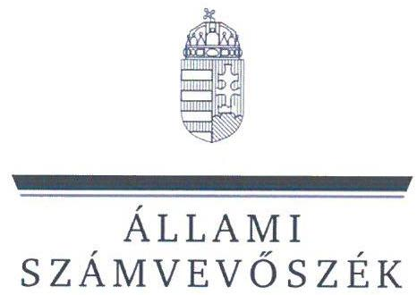
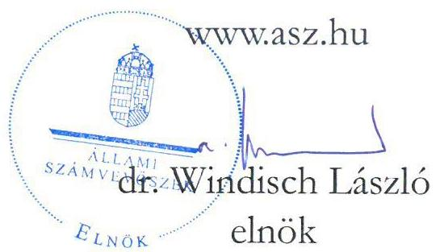
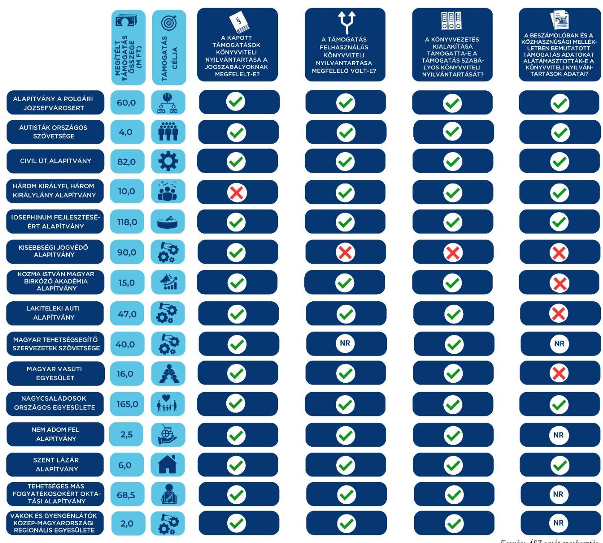

ÁLLAMI
SZÁMVEVŐSZÉK

# JELENTÉS 

Egyesületek és alapítványok államháztartásból kapott támogatásai könyvviteli nyilvántartásának ellenőrzése
2023.

23049
www.asz.hu

---

ÁLLAMI
SZÁMVEVŐSZÉK

# JELENTÉS 

## Egyesületek és alapítványok államháztartásból kapott támogatásai könyvviteli nyilvántartásának ellenőrzése

2023. 

23049

---

# ELLENŐRZÉSI IGAZGATÓSÁG: 

## ÁLLAMHÁZTARTÁSON KÍVÜLI SZERVEZETEKET ELLENŐRZŐ IGAZGATÓSÁG

## ELLENŐRZÉSI IGAZGATÓ:

## KLINGA LÁSZLÓ igazgató

## ELLENŐRZÉSVEZETŐ:

Jelentéseink az interneten a www.asz.hu címen olvashatók.

## SOLYMÁR ÁGNES ellenőrzésvezető

IKTATÓSZÁM: EL-3963-002/2023.
TÉMASZÁM: 2693
ELLENŐRZÉS-AZONOSÍTÓ SZÁM: V1037

---

# TARTALOMJEGYZÉK 

- AZ ELLENŐRZÉS ALAPADATAI ..... 5
- AZ ELLENŐRZÖTT SZERVEZETEK ..... 6
- ÖSSZEFOGLALÁS ..... 16
- AZ ELLENŐRZÉS FÓKUSZKÉRDÉSE ..... 18
- MEGÁLLAPÍTÁSOK ..... 19
- JAVASLATOK ..... 34
- MELLÉKLETEK ..... 36
I. sz. melléklet: Értelmező szótár ..... 36
II. sz. melléklet: Az ellenőrzött szervezetek jegyzéke ..... 38
III. sz. melléklet: Ellenőrzési kritériumok ..... 39
- FÜGGELÉK: ÉSZREVÉTELEK ..... 40
- RÖVIDÍTÉSEK JEGYZÉKE ..... 41

---

.

---

# AZ ELLENŐRZÉS ALAPADATAI 

## AZ ELLENŐRZÉS CÉLJA

Az ellenőrzés célja annak ellenőrzése volt, hogy az ellenőrzött egyesületnél, alapítványnál a kiválasztott, államháztartási forrásból származó támogatás könyvviteli nyilvántartása szabályszerűen történt-e.

## AZ ELLENŐRZÉS TÍPUSA

Szabályszerűségi ellenőrzés.

## AZ ELLENŐRZÖTT IDŐSZAK

Az ellenőrzésre kiválasztott államháztartási támogatásra vonatkozó támogatási döntéstől /szerződéskötéstől 2023.06.14-ig, a helyszíni ellenőrzésről szóló értesítés keltéig tartó időszak.

## AZ ELLENŐRZÉS TÁRGYA

Az egyesületnél, illetve alapítványnál az ellenőrzésre kiválasztott államháztartási forrásból kapott támogatás könyvviteli nyilvántartását, ennek keretében a támogatásból származó bevétel-, valamint a támogatás felhasználás nyilvántartására vonatkozó jogszabályi előírások betartását ellenőrizzük.

## AZ ELLENŐRZÉS JOGALAPJA

Az ellenőrzés jogalapját az ÁSZ tv. ${ }^{1} 1 . \int(3)$, valamint az 5. $\int(3)$ bekezdés előírásai képezték.

## AZ ELLENŐRZÉS MÓDSZERE

Az ellenőrzést az ellenőrzési program szempontjai, az ellenőrzött időszakban hatályos jogszabályok, előírások, az ellenőrzés általános szakmai szabályai, az ellenőrzésre irányadó ÁSZ ${ }^{2}$ megfelelőségi ellenőrzési módszertana figyelembevételével végezte az ÁSZ. Az ellenőrzési kérdések megválaszolásához szükséges bizonyítékok megszerzése az ellenőrzött egyesület, alapítvány által rendelkezésre bocsátott dokumentumokra és adatokra alapozva, továbbá kérdésfeltevés (információkérés) útján történt. Az ellenőrzési bizonyítékként felhasznált adatforrások közé tartoztak egyrészt az ellenőrzéshez kért dokumentumok, adatforrások, másrészt minden - az ellenőrzés folyamán - feltárt, az ellenőrzés szempontjából információkat tartalmazó dokumentum. Az ellenőrzés lefolytatásához az ellenőrzött szervezet a tanúsítvány kitöltésével, valamint az ÁSZ által kért dokumentumok, adatok, információk megküldésével szolgáltatott adatokat.

---

# AZ ELLENŐRZÖTT SZERVEZETEK 

Az ellenőrzésre 15 civil szervezet esetében került sor, melyek közül tíz alapítványi, öt pedig egyesületi formában működött. Valamennyi ellenőrzött szervezet kettős könyvvezetéssel támasztotta alá beszámolóját, közülük 12 szervezet rendelkezett közhasznú jogállással. Működéséről, vagyoni, pénzügyi és jövedelmi helyzetéről valamennyi ellenőrzött egyszerűsített éves beszámolót készített. A Közbef. tv. ${ }^{3}$ előírása szerint tevékenysége és a 2022. évi számviteli beszámoló mérlegfőösszege alapján - mivel mérlegfőösszegük elérte a 20 millió forintot -, 14 szervezet a közélet befolyásolására alkalmas tevékenységet végző szervezetnek minősült.

Az ellenőrzött szervezetek 2022. évben - beszámolóik szerint - összesen 17 289,0 M Ft vagyonnal gazdálkodtak, tevékenységükhöz 6 033,0 M Ft támogatást számoltak el bevételként. A legnagyobb szervezet 9 776,0 M Ft, a legkisebb 6,0 M Ft eszköz-állománnyal rendelkezett.

A tíz alapítványnál és öt egyesületnél összesen 726,1 M Ft támogatás számviteli nyilvántartásának ellenőrzésére került sor.

## Alapítvány a Polgári Józsefvárosért

Az alapítványt egy magánszemély alapította 1998-ban. Célja a „józsefvárosi lokálpatriotizmus erősítése, különösen a budapesti polgári lokálpatrióta közösségek működésének támogatása, tevékenységük anyagi, szervezeti, kulturális segítése. Helyi lokálpatriotizmus erősítésével a budapesti kulturális és politikai közéletben való közösségi részvétel támogatása, illetve nyilvános fórumok szervezése, tartása, közösségi részvétel támogatása. Helyi közösségi médiában polgári gondolkodás, a kulturális városfejlesztés erősítése". Az alapítvány képviseletére és vagyonának kezelésére az alapító három főből álló kuratóriumot hozott létre. Az alapítvány az ellenőrzött időszakban nem közhasznú jogállású szervezetként működött, nem volt kötelezettsége felügyelőbizottság létrehozására. Könyvvizsgálatra nem volt kötelezett, 2022. évre egyszerűsített éves beszámolót készített.

## AZ ELLENŐRZÖTT, ÁLLAMHÁZTARTÁSI FORRÁSBÓL KAPOTT TÁMOGATÁS BEMUTATÁSA

Támogatott szervezet megnevezése, székhelytelepülése

Támogatási program célja
Támogató megnevezése
Támogatás időtartama
Támogatási összeg
Támogatás típusa
A pénzügyi elszámolás határideje
Elszámolás a támogató szervezet felé

Alapítvány a Polgári Józsefvárosért, Budapest
Józsefvárosi Cigányzenekar Kulturális Programjainak megvalósítása
Nemzeti Kulturális Alap - kultúráért felelős miniszter
2022.07.01. - 2023.12.31.

60000000 Ft
vissza nem térítendő
2024.02.29.

Az ellenőrzött időszakban az alapítványnak nem volt a támogató szervezet felé elszámolási kötelezettsége.

---

# Autisták Országos Szövetsége 

Az egyesület jogelődjét 1988-ban alapították Autisták Érdekvédelmi Egyesülete néven. Célja az autizmusban érintett családok érdekeinek szervezett, korszerű képviselete és védelme, emberi és állampolgári jogaik gyakorlásának biztosítása, esélyegyenlőségük megvalósítása, az autista személyek ellátásának, nevelésének, oktatásának, foglalkoztatásának, szociális gondozásának előmozdítása, a családok támogatása, az autizmus spektrum zavar, mint fogyatékosság megismertetése a magyar társadalommal, továbbá az autizmus társadalmi elfogadottságának növelése, az alakuló és kialakult közösségek egymást támogató együttműködésének segítése volt. A közhasznú jogállással rendelkező, egyesület legfőbb döntéshozó szerve a közgyűlés, ügyintéző szerve a háromtagú elnökség volt, az ellenőrzési feladatokat a jogszabályi előírásnak megfelelően létrehozott háromtagú felügyelőbizottság látta el. Az egyesület könyvvizsgálatra a jogszabályi előírások alapján nem volt kötelezett, azonban a 2022. évi egyszerűsített éves beszámolóját könyvvizsgáló véleményezte.

## AZ ELLENŐRZÖTT, ÁLLAMHÁZTARTÁSI FORRÁSRÓL KAPOTT TÁMOGATÁS BEMUTATÁSA

Támogatott szervezet megnevezése, székhelytelepülése

Támogatási program célja
Támogató megnevezése
Támogatás időtartama
Támogatási összeg
Támogatás típusa
A pénzügyi elszámolás határideje

Elszámolás a támogató szervezet felé

Autisták Országos Szövetsége, Budapest
Az egyesület szakemberei részvételének támogatása a 13. Autism Europe 2022. Nemzetközi Kongresszuson
Belügyminisztérium
2022.08.12. - 2023.05.31.

4000000 Ft
vissza nem térítendő
2023.07.01.

Az egyesület a határidő figyelembevételével nyújtotta be az elszámolást a támogató szervezet felé. A támogató az elszámolás/beszámoló elfogadásáról az ellenőrzött időszak végéig nem értesítette a szervezetet.

## CIVIL ÚT ALAPÍTVÁNY

A nyílt alapítványt 2019-ben alapította egy magánszemély. Az alapítvány „civil társadalmi szerveződésként, összekötő, közvetítő szerepet kíván betölteni a törvényhozás és a közszolgálati intézményrendszer, valamint a civil szervezetek együttműködésében, amely a köztük lévő kétirányú kommunikációt és valódi partneri kapcsolatok kialakítását kívánja segíteni, annak érdekében, hogy erősödjön a társadalmi együttműködés rendszere". Az alapító az alapítvány vagyonának kezelésére három természetes személyből álló kuratóriumot hozott létre. Az alapítvány nem közhasznú jogállású szervezet, nem volt kötelezettsége felügyelőbizottság létrehozására. Könyvvizsgálati kötelezettsége az ellenőrzött időszakban nem volt. 2022. évre egyszerűsített éves beszámolót készített.

---

# AZ ELLENŐRZÖTT, ÁLLAMHÁZTARTÁSI FORRÁSBÓL KAPOTT TÁMOGATÁS BEMUTATÁSA 

Támogatott szervezet megnevezése, székhelytelepülése
Támogatási program célja
Támogató megnevezése
Támogatás időtartama
Támogatási összeg
Támogatás típusa
A pénzügyi elszámolás határideje
Elszámolás a támogató szervezet felé

Civil út Alapítvány, Budaörs
Civil út Alapítvány működési feltételeinek kialakításához szükséges fejlesztések támogatása
Miniszterelnöki Kabinetiroda
2022.04.01. - 2023.12.31.

82000000 Ft
vissza nem térítendő
2024.01.31.

Az ellenőrzött időszakban az alapítványnak nem volt a támogató szervezet felé elszámolási kötelezettsége

## HÁROM KIRÁLYFI, HÁROM KIRÁLYLÁNY ALAPÍTVÁNY

Az alapítványt 2015-ben egy magánszemély alapította, mely „a magyarországi súlyos demográfiai krízis megoldására jött létre, kiemelt közérdekű célja a kívánt gyermekek megszületésének ösztönzése". Ennek érdekében többek között egészségmegőrzési, betegségmegelőzési, szociális- és családsegítési, nevelési, oktatási, képességfejlesztési és ismeretterjesztési tevékenységi körbe tartozó, a célja megvalósítását szolgáló tevékenységeket végzett. A közhasznú jogállású alapítvány ügyvezető szerve az öttagú kuratórium volt, gazdálkodásának ellenőrzésére az alapító három főből álló felügyelő szervet hozott létre. Az alapítványnak az ellenőrzött időszakban könyvvizsgálati kötelezettsége nem volt. 2022. évre egyszerűsített éves beszámolót készített.

## AZ ELLENŐRZÖTT, ÁLLAMHÁZTARTÁSI FORRÁSBÓL KAPOTT TÁMOGATÁS BEMUTATÁSA

Támogatott szervezet megnevezése, székhelytelepülése
Támogatási program célja
Támogató megnevezése
Támogatás időtartama
Támogatási összeg
Támogatás típusa
A pénzügyi elszámolás határideje
Elszámolás a támogató szervezet felé

Három Királyfi, Három Királylány Alapítvány, Budapest
Feladatfinanszírozás a szakmai programban meghatározott feladatokra Gyermek, ifjúsági és családpolitikai programok
Miniszterelnökség képviseletében a Tempus Közalapítvány
2021.12.01. - 2022.04.30.

10000000 Ft
vissza nem térítendő
2022.06.29.

A támogatott az elszámolást határidőben benyújtotta, a támogató elszámolással kapcsolatos hiánypótlási felhívásának határidőben eleget tett. A támogató az elszámolás/beszámoló elfogadásáról az ellenőrzött időszak végéig nem értesítette a szervezetet.

## IOSEPHINUM FEJLESZTÉSÉÉRT ALAPÍTVÁNY

Az alapítványt 2006. évben egy magánszemély alapította. Célja „a Iosephinum Tudományos Oktatási és Rekreációs Központ kiépítése, Makovecz Imre Bástyája című nagyprojekt megvalósításának támogatása". Alaptevékenységébe tartozik többek között „a már működő AVICENNA Kutatóintézet székhelyének létrehozása; új kutatási, oktatási intézmények létrehozásának támogatása az életminőség, a környezetkultúra, a családkultúra és a rekreáció területén; a kutatási és oktatási intézményeket kiszolgáló kollégiumi hálózat létrehozása, tanári lakások építése; a Pilisi Térséget és Régiót ellátó, a

---

szabadidő eltöltésére alkalmas központ kiépítése". A közhasznú jogállású alapítvány ügyvezető szerve az öttagú kuratórium volt, az ellenőrzési feladatok ellátására az alapító háromtagú felügyelőbizottságot hozott létre. Az alapítvány az ellenőrzött időszakban könyvvizsgálatra nem volt kötelezett. 2022. évre egyszerűsített éves beszámolót készített.

# AZ ELLENŐRZÖTT, ÁLLAMHÁZTARTÁSI FORRÁSRÓL KAPOTT TÁMOGATÁS BEMUTATÁSA 

Támogatott szervezet megnevezése, székhelytelepülése

Támogatási program célja

Támogató megnevezése

Támogatás időtartama

Támogatási összeg

Támogatás típusa
A pénzügyi elszámolás határideje

Elszámolás a támogató szervezet felé

Iosephinum Fejlesztéséért Alapítvány, Piliscsaba
Rekreációs célokat szolgáló sportcentrum, valamint speciális tan- és kiképzőuszoda beruházásának előkészítése és megvalósítása (tervezés)
Emberi Erőforrások Minisztériuma (jogutód: Belügyminisztérium)
2022.03.01. - 2022.11.30. módosítás alatt, kért időszak: 2022.03. - 2023.08.

118000000 Ft
vissza nem térítendő
2023.01.30. módosítás alatt, kért határidő: 2023.08.30.

A támogatói okirat módosítása folyamatban van, a módosításra tekintettel az alapítványnak az ellenőrzött időszakban elszámolási kötelezettsége nem volt.

## KISESSÉGI JOGVÉDŐ ALAPÍTVÁNY

Az alapítványt 2012-ben alapította két magánszemély. Célja „a Kárpát-medencében tanuló jogászhallgatók, ill. végzett jogász doktoranduszok támogatása egy a kisebbségi jogvédelem területén működő továbbképzési centrum létrehozásával. Az Alapítvány szerény eszközeivel támogatni kívánja továbbá a határon túli magyarság jogvédelmének eszközrendszerét, így a külföldi jogászok kisebbségvédelem területén folytatott munkáját és általában a kisebbségi jogvédelem területén kiemelkedő szerepet játszó személyeket, csoportokat és intézményeket’. Az alapítvány nem közhasznú jogállású szervezet. Ügyvezető szerve a kilenctagú kuratórium volt, melynek elnöke és elnökhelyettesei önállóan voltak jogosultak az alapítvány képviseletére. Felügyelőbizottság létrehozására az alapítvány nem volt kötelezett és nem is hozott létre. Könyvvizsgálatra az ellenőrzött időszakban nem volt kötelezett, 2022. évre egyszerűsített éves beszámolót készített.

## AZ ELLENŐRZÖTT, ÁLLAMHÁZTARTÁSI FORRÁSRÓL KAPOTT TÁMOGATÁS BEMUTATÁSA

Támogatott szervezet megnevezése, székhelytelepülése

Támogatási program célja
Támogató megnevezése
Támogatás időtartama
Támogatási összeg
Támogatás típusa
A pénzügyi elszámolás határideje
Elszámolás a támogató szervezet felé

Kisebbségi Jogvédő Alapítvány, Csömör
Az alapítvány 2022. évi működésének programjainak és eszközbeszerzésének támogatása
Bethlen Gábor Alapkezelő Zrt.
2022.01.01. - 2022.12.31.

90000000 Ft
vissza nem térítendő
2023.01.30.

A támogatott az elszámolást a határidő betartásával benyújtotta.

---

# Kozma István Magyar Birkózó Akadémia Alapítvány 

Az alapítványt 2017-ben alapította egy magánszemély. Célja a magyar birkózó sport és annak utánpótlás nevelése fejlesztésének támogatása volt. Az alapítvány 2021. 06. 16-ától működik közhasznú jogállású szervezetként. Egyszemélyes ügyvezető szerve a kurátor volt. Az alapító a működés és gazdálkodás ellenőrzésére háromtagú felügyelőbizottságot hozott létre. Az alapítvány az ellenőrzött időszakban kötelezett volt könyvvizsgálatra, 2022. évi egyszerűsített éves beszámolóját könyvvizsgáló ellenőrizte.

## AZ ELLENŐRZÖTT, ÁLLAMHÁZTARTÁSI FORRÁSRÓL KAPOTT TÁMOGATÁS BEMUTATÁSA

Támogatott szervezet megnevezése, székhelytelepülése

Támogatási program célja

Támogató megnevezése
Támogatás időtartama
Támogatási összeg
Támogatás típusa
A pénzügyi elszámolás határideje

Elszámolás a támogató szervezet felé

Kozma István Magyar Birkózó Akadémia Alapítvány, Budapest
Kozma István Magyar Birkózó Akadémia kommunikációs tevékenységének fejlesztése, továbbá kommunikációs stratégia megvalósítása
Miniszterelnökség nevében és képviseletében a Bethlen Gábor Alapkezelő Zrt.
2021.01.01. - 2022.12.31.

15000000 Ft
vissza nem térítendő
2023.03.01.

Az alapítvány az elszámolást határidőn túl, 2023. 03. 21-én nyújtotta be. A támogató az elszámolás/beszámoló elfogadásáról az ellenőrzött időszak végéig nem értesítette a szervezetet.

## LAKITELEKI AUTI ALAPÍTVÁNY

Az alapítványt 2017-ben alapította egy magánszemély. Célja az autizmussal élő, óvodás, illetve tankötelezett korú gyermekek integrációjának segítése, az autista gyermekek iskolai előkészítő oktatásának elősegítése és ezen oktatási környezet megteremtése, oktatás kiegészítő tevékenységek
 szervezése, valamit az autizmussal élő gyermekek oktatását népszerűsítő konferenciák szervezése volt. A közhasznú jogállású alapítvány ügyintéző szerve az öt főből álló kuratórium volt. A működés és gazdálkodás ellenőrzésére az alapító négytagú felügyelőbizottságot hozott létre. Az alapítvány könyvvizsgálatra 2022. évben nem volt kötelezett. 2022. évre egyszerűsített éves beszámolót készített.

---

# AZ ELLENŐRZÖTT, ÁLLAMHÁZTARTÁSI FORRÁSRÓL KAPOTT TÁMOGATÁS BEMUTATÁSA 

Támogatott szervezet megnevezése, székhelytelepülése

Támogatási program célja

Támogató megnevezése

Támogatás időtartama
Támogatási összeg
Támogatás típusa
A pénzügyi elszámolás határideje

Elszámolás a támogató szervezet felé

Lakiteleki Auti Alapítvány, Tiszakécske
A szervezet szakmai feladatellátásához és a zavartalan működéshez szükséges beszerzések forrásának biztosítása
Miniszterelnökség Civil és Társadalmi Kapcsolatokért Felelős Helyettes Államtitkárság szakmai felügyelete alatt a Bethlen Gábor Alapkezelő Zrt.
2021.12.15. - 2022.12.31.

47000000 Ft
vissza nem térítendő
2023.01.30.

A támogatott az elszámolást a határidő betartásával benyújtotta. A támogató az elszámolás/beszámoló elfogadásáról az ellenőrzött időszak végéig nem értesítette a szervezetet.

## MAGYAR TEHETSÉGSEGÍTŐ SZERVEZETEK SZÖVETSÉGE

Az egyesületet tíz civil szervezet hozta létre 2006-ban. Célja, hogy állandó lehetőséget biztosítson a magyarországi és határon túli magyar tehetségsegítéssel foglalkozó szervezetek számára álláspontjuk egyeztetésére. Céljainak megvalósítása érdekében a Magyar Géniusz Program keretében létrehozott Tehetséghálózatban folyó tehetségsegítő tevékenység támogatására, szervezésére működtette a Nemzeti Tehetségpontot, valamint a Budapesti Európai Tehetségközpontot. A közhasznú jogállással rendelkező egyesület ügyvezetését a tizenegytagú elnökség látta el. Az ellenőrzési feladatokra a jogszabályi előírásoknak megfelelően felügyelőbizottságot hoztak létre. Az egyesület 2022. évi egyszerűsített éves beszámolóját a közgyűlés döntésének megfelelően könyvvizsgáló véleményezte.

## AZ ELLENŐRZÖTT, ÁLLAMHÁZTARTÁSI FORRÁSRÓL KAPOTT TÁMOGATÁS BEMUTATÁSA

Támogatott szervezet megnevezése, székhelytelepülése

Támogatási program célja

Támogató megnevezése
Támogatás időtartama
Támogatási összeg
Támogatás típusa
A pénzügyi elszámolás határideje
Elszámolás a támogató szervezet felé

Magyar Tehetségsegítő Szervezetek Szövetsége, Budapest
A Magyar Tehetségsegítő Szervezetek Szövetsége működésének támogatása
Miniszterelnökség Civil és Társadalmi Kapcsolatokért Felelős Helyettes Államtitkárság szakmai felügyelete alatt a Bethlen Gábor Alapkezelő Zrt.
2021.05.01. - 2023.12.31.

40000000 Ft
visszatérítendő támogatás
2024.01.31.

Az ellenőrzött időszakban az egyesületnek nem volt a támogató szervezet felé elszámolási kötelezettsége.

## MAGYAR VASÚTI EGYESÜLET

Az egyesületet 2011. évben alapították. Célja „a vasúti közlekedési alágazat versenyképességének növelése a fenntartható fejlődés elvének figyelembevételével, az Európai Unió vasutakkal kapcsolatos politikájának, jogszabályainak, valamint egyéb követelményeinek való megfelelés elősegítése a magyar vasúti piac résztvevőinek számára". Az egyesület

---

2015. 09. 05-től közhasznú jogállású szervezetként működött. Legfőbb döntéshozó szerve a küldöttgyűlés, ügyintéző szerve a hattagú elnökség volt. Az egyesületnél a felügyelőbizottság jogszabályban meghatározott feladatainak ellátását, a gazdálkodás és az alapszabály szerinti működés ellenőrzését az alapítók által létrehozott, három főből álló ellenőrző bizottság végezte. Könyvvizsgálati kötelezettsége az ellenőrzött időszakban nem volt. Az egyesület a 2022. évi gazdálkodásáról egyszerűsített éves beszámolót készített.

# AZ ELLENŐRZÖTT, ÁLLAMHÁZTARTÁSI FORRÁSBÓL KAPOTT TÁMOGATÁS BEMUTATÁSA 

Támogatott szervezet megnevezése, székhelytelepülése

Támogatási program célja
Támogató megnevezése
Támogatás időtartama
Támogatási összeg
Támogatás típusa
A pénzügyi elszámolás határideje

Elszámolás a támogató szervezet felé

Magyar Vasúti Egyesület, Budapest
V4+Vasúti konferencia (V4+RAIL CEO SUMMIT) megrendezése
Energiaügyi Minisztérium
2022.03.01. - 2022.06.23.
(saját kockázatra megvalósított projekt utófinanszírozása)
16000000 Ft
vissza nem térítendő
2023.01.12.

A támogatott az elszámolást a határidő betartásával benyújtotta. A támogató az elszámolás/beszámoló elfogadásáról az ellenőrzött időszak végéig nem értesítette a szervezetet.

## NAGYCSALÁDOSOK ORSZÁGOS EGYESÜLETE

Az egyesület 1987-ben alakult. Célja „az élet és az anyaság tiszteletére nevelés, a felelősségért és a jövő generációért érzett felelősség erősítése; a nagycsaládok sajátos érdekeinek képviselete és szolgálata; felmutatni a társadalomnak azokat az értékeket, amelyeket a nagycsaládok képviselnek; a nagycsaládok egymást ismerő és segítő közösségekké szervezése" volt. A közhasznú jogállással rendelkező egyesület legfőbb döntéshozó szerve a közgyűlés, ügyintéző és képviselő szerve a kilenctagú elnökség volt. Az egyesületnél a felügyelőbizottság jogszabályban meghatározott feladatainak ellátását, a gazdálkodás és az alapszabály szerinti működés ellenőrzését az alapítók által létrehozott, öt főből álló ellenőrző bizottság végezte. Az egyesület 2022. évi egyszerűsített éves beszámolóját a jogszabályi előírásoknak eleget téve könyvvizsgáló felülvizsgálta.

## AZ ELLENŐRZÖTT, ÁLLAMHÁZTARTÁSI FORRÁSBÓL KAPOTT TÁMOGATÁS BEMUTATÁSA

Támogatott szervezet megnevezése, székhelytelepülése

Támogatási program célja
Támogató megnevezése
Támogatás időtartama
Támogatási összeg
Támogatás típusa
A pénzügyi elszámolás határideje
Elszámolás a támogató szervezet felé

Nagycsaládosok Országos Egyesülete, Budapest
Szakmai programban részletezett tevékenység megvalósításával összefüggésben felmerült költségek finanszírozása
A Miniszterelnökség képviseletében a Tempus Közalapítvány
2022.01.01. - 2023.02.28.
165000000 Ft
vissza nem térítendő
2023.04.29.

A támogatott az elszámolást a határidő betartásával benyújtotta. A támogató az elszámolás/beszámoló elfogadásáról az ellenőrzött időszak végéig nem értesítette a szervezetet.

---

# NEM ADOM FEL ALAPÍTVÁNY 

Az alapítványt 2005-ben alapították, azzal a céllal, hogy a társadalom hátrányos helyzetű csoportjainak, illetve tagjainak (fogyatékos és idős emberek, etnikai kisebbségek, hajléktalanok, állami gondozottak, szenvedélybetegek, mentális problémával küzdő illetve szociálisan hátrányos helyzetű személyek, stb.) támogatásával elősegítse a fizikai, mentális, illetve szociális állapotuk javulását, társadalmi integrációjukat, illetve reintegrációjukat. Az alapítvány közhasznú jogállással rendelkező szervezet volt, mely gazdasági-vállalkozási tevékenységet az alapszabálya szerint „csak közhasznú céljainak megvalósítása érdekében, azokat nem veszélyeztetve végezhet". Az alapítvány képviseletére és a vagyonának a kezelésére az alapító négy főből álló kuratóriumot hozott létre, működését és gazdálkodását az alapító által megbízott háromtagú felügyelőbizottság ellenőrizte. Az alapítvány 2022. évi egyszerűsített éves beszámolóját jogszabályi előírásoknak eleget téve könyvvizsgáló véleményezte.

| AZ ELLENŐRZÖTT, ÁLLAMHÁZTARTÁSI FORRÁSBÓL KAPOTT TÁMOGATÁS BEMUTATÁSA |  |
| :--: | :--: |
| Támogatott szervezet megnevezése, székhelytelepülése | NEM ADOM FEL Alapítvány, Budapest |
| Támogatási program célja | Fogyatékos személyek helyi, regionális és országos szervezeteinek szakmai programjainak támogatása |
| Támogató megnevezése | Belügyminisztérium a Slachta Margit Nemzeti Szociálpolitikai Intézeten keresztül |
| Támogatás időtartama | 2022.09.01. - 2023.08.31. |
| Támogatási összeg | 2500000 Ft |
| Támogatás típusa | vissza nem térítendő |
| A pénzügyi elszámolás határideje | 2023.09.29. |
| Elszámolás a támogató szervezet felé | Az ellenőrzött időszakban az alapítványnak nem volt a támogató szervezet felé elszámolási kötelezettsége. |

## SZENT LÁZÁR ALAPÍTVÁNY

Az alapítványt 1996-ban egy magánszemély hozta létre. Székhelye Békés, főtevékenysége „idős, beteg emberek, hátrányos helyzetűek támogatása, humanitárius segítségnyújtás, munkanélküliek munkahely-teremtése, rehabilitációs foglalkoztatás, foglalkoztatás elősegítése" volt. Az alapító okirata szerint gazdasági-vállalkozási tevékenységet „csak közhasznú vagy az alapító okiratban meghatározott alapcél szerinti tevékenység megvalósítását nem veszélyeztetve végezhet." Az alapítvány képviseletére és a vagyonának a kezelésére az alapító hat főből álló kuratóriumot hozott létre. A felügyelőbizottság jogszabályban meghatározott feladatainak ellátását, a gazdálkodás és az alapszabály szerinti működés ellenőrzését az alapító által létrehozott, négy főből álló „Számvizsgáló - ellenőrző Bizottság" végezte. A közhasznú jogállású alapítvány 2022. évi egyszerűsített éves beszámolóját a jogszabályi előírásoknak eleget téve könyvvizsgáló ellenőrizte.

---

# AZ ELLENŐRZÖTT, ÁLLAMHÁZTARTÁSI FORRÁSRÓL KAPOTT TÁMOGATÁS BEMUTATÁSA 

Támogatott szervezet megnevezése, székhelytelepülése
Támogatási program célja
Támogató megnevezése
Támogatás időtartama
Támogatási összeg
Támogatás típusa
A pénzügyi elszámolás határideje
Elszámolás a támogató szervezet felé

Szent Lázár Alapítvány, Békés
Támogatott lakhatás nyújtásának helyet adó ingatlan megvétele
Emberi Erőforrások Minisztériuma (jogutód: Belügyminisztérium)
2022.02.01. - 2022.12.31.
6000000 Ft
vissza nem térítendő
2023.03.31.

A támogatott az elszámolást a határidő betartásával benyújtotta. A
támogató az elszámolás/beszámoló elfogadásáról az ellenőrzött időszak végéig nem értesítette a szervezetet.

## TEHETSÉGES „MÁS FOGYATÉKOSOKÉRT" OKTATÁSI ALAPÍTVÁNY

Az alapítványt 1998-ban egy magánszemély alapította, célja köznevelési intézmények - köztük a budapesti székhelyű Gyermekház Iskola - létrehozása, fenntartása, működtetése volt. Az alapító okirata szerint gazdasági-vállalkozási tevékenységet „csak közhasznú vagy az alapító okiratban meghatározott alapcél szerinti tevékenység megvalósítását nem veszélyeztetve végezhet." Az alapítvány képviseletére és vagyonának kezelésére az alapító három főből álló kuratóriumot hozott létre, működését és gazdálkodását az alapító által megbízott háromtagú felügyelőbizottság ellenőrizte. Az alapítvány 2022. évi egyszerűsített éves beszámolóját jogszabályi előírásnak megfelelve könyvvizsgáló véleményezte.

## AZ ELLENŐRZÖTT, ÁLLAMHÁZTARTÁSI FORRÁSRÓL KAPOTT TÁMOGATÁS BEMUTATÁSA

Támogatott szervezet megnevezése, székhelytelepülése
Támogatási program célja
Támogató megnevezése
Támogatás időtartama
Támogatási összeg
Támogatás típusa
A pénzügyi elszámolás határideje
Elszámolás a támogató szervezet felé

TEHETSÉGES „MÁS FOGYATÉKOSOKÉRT" Oktatási Alapítvány, Budapest
Köznevelési közszolgálati feladatokban való részvétel támogatása
Belügyminisztérium
2022.09.01. - 2023.08.31.
68580000 Ft
vissza nem térítendő
2023.09.30.

Az ellenőrzött időszakban az alapítványnak nem volt a támogató szervezet felé elszámolási kötelezettsége.

---

# VAKOK ÉS GYENGÉNLÁTÓK KÖZÉP-MAGYARORSZÁGI REGIONÁLIS EGYESÜLETE 

Az egyesület 2004-ben jött létre budapesti székhellyel. Célja az volt, hogy ellássa tagjai egyéni és kollektív érdekvédelmét, ezen belül módot nyújtson tagjainak érdekeik kifejezésére, lehetőséget teremtsen azok érvényesítésére és ellássa érdekképviseletüket". A közhasznú jogállással rendelkező egyesület legfőbb döntéshozó szerve a közgyűlés, ügyintéző és képviselő szerve az öttagú elnökség volt. Az egyesületnél a gazdálkodás és az alapszabály szerinti működés ellenőrzését a közgyűlés által létrehozott, három főből álló felügyelőbizottság végezte. Könyvvizsgálati kötelezettsége az ellenőrzött időszakban nem volt. Az egyesület a 2022. évi gazdálkodásáról egyszerűsített éves beszámolót készített.

| AZ ELLENŐRZÖTT, ÁLLAMHÁZTARTÁSI FORRÁSRÓL KAPOTT TÁMOGATÁS BEMUTATÁSA |  |
| :-- | :-- |
| Támogatott szervezet megnevezése,   székhelytelepülése | Vakok és Gyengénlátók Közép-Magyarországi Regionális Egyesülete,   Budapest |
| Támogatási program célja | Fogyatékos személyek helyi, regionális és országos szervezetei szakmai   programjainak támogatása |
| Támogató megnevezése | Belügyminisztérium képviseletében eljárva a Slachta Margit Nemzeti   Szociálpolitikai Intézet |
| Támogatás időtartama | 2022.09.01. - 2023.08.31. |
| Támogatási összeg | 2000000 Ft |
| Támogatás típusa | vissza nem térítendő |
| A pénzügyi elszámolás határideje | 2023.09.29. |
| Elszámolás a támogató szervezet felé | Az ellenőrzött időszakban az egyesületnek nem volt a támogató szervezet   felé elszámolási kötelezettsége. |

---

# ÖSSZEFOGLALÁS 

Az ellenőrzött 15 civil szervezetből 14 szervezet könyvvezetési rendszerének kialakítása megfelelően támogatta az államháztartásból származó támogatások szabályszerű könyvviteli nyilvántartását, biztosította a közpénzek felhasználásának ellenőrizhetőségét. Az ellenőrzés egy szervezetnél tárta fel, hogy könyvvezetési rendszerét nem a jogszabályi előírások szerint alakította ki, ezáltal a közpénz felhasználás ellenőrizhetőségét nem biztosította.

14 ellenőrzött szervezet az államháztartási forrásból kapott támogatást megfelelően, a jogszabályi előírások szerint, elkülönítve tartotta nyilván. Egy szervezetnél a kapott támogatás könyvviteli elszámolása nem felelt meg a törvény előírásának, mert a központi költségvetésből kapott támogatást elkülönített állami pénzalapokból kapott támogatásként mutatta ki.

Az államháztartási forrásból kapott támogatás felhasználására 14 ellenőrzött szervezetnél került sor, közülük 13 szervezetnél annak nyilvántartása megfelelt a jogszabályi előírásoknak. Egy szervezet a törvény előírásától eltérően az államháztartási forrásból kapott támogatások felhasználásáról nem vezetett olyan számviteli nyilvántartást, amelynek alapján megállapítható és ellenőrizhető a kapott támogatás felhasználása. Továbbá egy elszámolt tétel esetében a kapott támogatás felhasználását igazoló bizonylat adatát a törvény előírásai ellenére a könyvviteli nyilvántartásában nem rögzítette.

Az ellenőrzött 15 szervezet közül négy szervezetnél 2023. évben került sor a támogatás felhasználására, így arra vonatkozóan a 2022. évi beszámolójukban tájékoztatási kötelezettségük nem volt. Hét szervezet közpénzfelhasználásra vonatkozó tájékoztatása megfelelt a jogszabályi előírásoknak. Négy szervezet nem megfelelően tájékoztatta a közvéleményt a közpénzek felhasználásáról, nem biztosította a közpénzek felhasználásának nyilvánosságát, ezáltal sérült a közpénz kezelés Alaptörvényben ${ }^{4}$ rögzített átláthatóságának elve. Közülük három közhasznú jogállású ellenőrzött szervezet beszámolójának kiegészítő melléklete a törvény előírása ellenére nem tartalmazta a főkönyvi és analitikus nyilvántartásokban szabályszerűen kimutatott, a támogatási program keretében végleges jelleggel felhasznált támogatást. Egy ellenőrzött szervezet a közhasznúsági mellékletében a cél szerinti juttatásokat nem a jogszabályban meghatározott fogalomnak megfelelően mutatta ki, ezáltal a közhasznúsági mellékletet nem a törvény előírásai szerint készítette el.

Az ellenőrzési megállapításokhoz kapcsolódóan, a feltárt hiányosságok megszüntetésére öt szervezet vezetőjének,
 összesen hét javaslatot tettünk. A fentiekben bemutatott megállapítások ellenőrzött szervezetenkénti megjelenését az 1. ábra szemlélteti.

---

# 1. ábra

FŐBB ELLENŐRZÉSI TAPASZTALATOK

---

# AZ ELLENŐRZÉS FÓKUSZKÉRDÉSE

1- Szabályszerű volt-e az egyesület/alapítvány államháztartási forrásból kapott támogatásának könyvviteli nyilvántartása?

---

# 1. Alapítvány a Polgári Józsefvárosért

## Összegző megállapítás Az Alapítvány a Polgári Józsefvárosért államháztartási forrásból kapott támogatásának könyvviteli nyilvántartása szabályszerű volt.

## A kapott támogatás könyvviteli nyilvántartása

Az alapítvány könyvvezetési rendszerében a (főkönyvi és analitikus nyilvántartások) az államháztartási forrásból kapott, bevételként elszámolt támogatást - főkönyvi számla alábontásával, alszámla alkalmazásával - az Eszkr. ${ }^{5}$-ben és a Civil tv. ${ }^{6}$-ben előírtak szerint, elkülönítetten mutatta ki.

## A támogatás felhasználásának könyvviteli nyilvántartása

Az alapítvány az Eszkr.-ben és a Civil tv.-ben előírtakat betartva könyvvezetési rendszerében - főkönyvi számlák alábontásával, alszámlák használatával - az államháztartási forrásból kapott támogatás felhasználását elkülönítetten tartotta nyilván, továbbá a felhasználás számviteli nyilvántartása során figyelembe vette a támogatási szerződés előírásait is.
A szervezet könyvvezetésének kialakítása, keretrendszere a támogatás könyvviteli nyilvántartásának szabályossága tükrében

Az alapítvány könyvvezetési, nyilvántartási rendszerét az Eszkr., és a Civil tv. előírásai szerint alakította ki, biztosítva ezzel az alapcél szerinti tevékenysége költségei, ráfordításai ellentételezésére visszafizetési kötelezettség nélkül kapott támogatás és annak felhasználása elkülönített kimutatását.
A szervezet számviteli beszámolójában, közhasznúsági mellékletében a támogatással kapcsolatban bemutatott adatok könyvviteli nyilvántartásban elszámolt adatokkal történő alátámasztottsága

Az alapítványnak az Eszkr.-ben rögzített előírások szerint kialakított könyvvezetése és nyilvántartása biztosította a 2022. évi egyszerűsített éves beszámoló kiegészítő mellékletében a Civil tv.-ben előírtaknak megfelelően bemutatott adatok alátámasztását.

---

# 2. Autisták Országos Szövetsége

| Összegző megállapítás | Az Autisták Országos Szövetsége államháztartási forrásból kapott támogatásának könyvviteli nyilvántartása szabályszerű volt |
| :--: | :--: |

## A kapott támogatás könyvviteli nyilvántartása

Az egyesület könyvvezetési rendszerében a (főkönyvi és analitikus nyilvántartások) az államháztartási forrásból kapott, előlegként elszámolt támogatást - munkaszám alkalmazásával - az Eszkr.-ben és a Civil tv.-ben előírtak szerint, elkülönítetten mutatta ki.

## A támogatás felhasználásának könyvviteli nyilvántartása

Az egyesület az Eszkr.-ben és a Civil tv.-ben előírtakat betartva könyvvezetési rendszerében - munkaszám használatával - az államháztartási forrásból kapott támogatás felhasználását elkülönítetten tartotta nyilván, továbbá a felhasználás számviteli nyilvántartása során figyelembe vette a támogatási szerződés előírásait is.

A szervezet könyvvezetésének kialakítása, keretrendszere a támogatás könyvviteli nyilvántartásának szabályossága tükrében

Az egyesület könyvvezetési, nyilvántartási rendszerét az Eszkr. és a Civil tv. előírásai szerint alakította ki, biztosítva ezzel az alapcél szerinti tevékenysége költségei, ráfordításai ellentételezésére visszafizetési kötelezettség nélkül kapott támogatás és annak felhasználása elkülönített kimutatását.
A szervezet számviteli beszámolójában, közhasznúsági mellékletében a támogatással kapcsolatban bemutatott adatok könyvviteli nyilvántartásban elszámolt adatokkal történő alátámasztottsága

A közhasznú jogállású egyesület Eszkr.-ben rögzített előírások szerint kialakított könyvvezetése és nyilvántartása biztosította a 2022. évi egyszerűsített éves beszámoló kiegészítő mellékletében a Civil tv.-ben előírtaknak megfelelően bemutatott adatok alátámasztását.

---

# 3. Civil út Alapítvány

## Összegző megállapítás A Civil út Alapítvány államháztartási forrásból kapott támogatásának könyvviteli nyilvántartása szabályszerű volt.

## A kapott támogatás könyvviteli nyilvántartása

Az alapítvány könyvvezetési rendszerében a (főkönyvi és analitikus nyilvántartások) az államháztartási forrásból kapott, bevételként elszámolt támogatást - főkönyvi számla alábontásával, alszámla alkalmazásával és munkaszám használatával - az Eszkr.-ben és a Civil tv.-ben előírtak szerint, elkülönítetten mutatta ki.

## A támogatás felhasználásának könyvviteli nyilvántartása

Az alapítvány az Eszkr.-ben és a Civil tv.-ben előírtakat betartva könyvvezetési rendszerében munkaszám alkalmazásával - az államháztartási forrásból kapott támogatás felhasználását elkülönítetten tartotta nyilván, továbbá a felhasználás számviteli nyilvántartása során figyelembe vette a támogatási szerződés előírásait is.
A szervezet könyvvezetésének kialakítása, keretrendszere a támogatás könyvviteli nyilvántartásának szabályossága tükrében

Az alapítvány könyvvezetési, nyilvántartási rendszerét az Eszkr., és a Civil tv. előírásai szerint alakította ki, biztosítva ezzel az alapcél szerinti tevékenysége költségei, ráfordításai ellentételezésére visszafizetési kötelezettség nélkül kapott támogatás és annak felhasználása elkülönített kimutatását.
A szervezet számviteli beszámolójában, közhasznúsági mellékletében a támogatással kapcsolatban bemutatott adatok könyvviteli nyilvántartásban elszámolt adatokkal történő alátámasztottsága

Az alapítványnak az Eszkr.-ben rögzített előírások szerint kialakított könyvvezetése és nyilvántartása biztosította a 2022. évi egyszerűsített éves beszámoló kiegészítő mellékletében a Civil tv.-ben előírtaknak megfelelően bemutatott adatok alátámasztását.

---

# 4. Három Királyfi, Három Királylány Alapítvány

## Összegző megállapítás

A Három Királyfi, Három Királylány Alapítvány könyvviteli, nyilvántartási rendszerét a jogszabályi előírásoknak megfelelően alakította ki, azonban a kapott támogatást 2022-ben nem a jogszabályi előírások szerint vette nyilvántartásba.

## A kapott támogatás könyvviteli nyilvántartása

Az ellenőrzött költségvetési támogatás bevételként történő könyvviteli elszámolása 2022-ben nem felelt meg a Civil tv. 20. § (3) bekezdése előírásainak, mert az alapítvány elkülönített állami pénzalapokból kapott támogatásként mutatta ki a támogatói okirat szerint a 2021. évi Kvtv. ${ }^{7}$-ben meghatározott Miniszterelnökség - Fejezeti kezelésű előirányzatok terhére folyósított támogatást, melyet a Civil tv. 20. § (3) bekezdésében meghatározottak szerint, központi költségvetésből kapott támogatásként kellett volna kimutatnia.

## A támogatás felhasználásának könyvviteli nyilvántartása

Az alapítvány az Eszkr.-ben és a Civil tv.-ben előírtakat betartva könyvvezetési rendszerében munkaszám alkalmazásával - az államháztartási forrásból kapott vissza nem térítendő támogatás felhasználását elkülönítetten tartotta nyilván, továbbá a felhasználás számviteli nyilvántartása során figyelembe vette a támogatási szerződés előírásait is.
A szervezet könyvvezetésének kialakítása, keretrendszere a támogatás könyvviteli nyilvántartásának szabályossága tükrében

Az alapítvány könyvvezetési, nyilvántartási rendszerét az Eszkr., és a Civil tv. előírásai szerint alakította ki, biztosítva ezzel az alapcél szerinti tevékenysége költségei, ráfordításai ellentételezésére visszafizetési kötelezettség nélkül kapott támogatás és annak felhasználása elkülönített kimutatásának lehetőségét.
A szervezet számviteli beszámolójában, közhasznúsági mellékletében a támogatással kapcsolatban bemutatott adatok könyvviteli nyilvántartásban elszámolt adatokkal történő alátámasztottsága

A közhasznú jogállású alapítványnak az Eszkr.-ben rögzített előírások szerint kialakított könyvvezetése biztosította a 2022. évi egyszerűsített éves beszámoló kiegészítő mellékletében a Civil tv.-ben előírtaknak megfelelően bemutatott adatok alátámasztását.

---

# 5. Iosephinum Fejlesztéséért Alapítvány

## Összegző megállapítás A Iosephinum Fejlesztéséért Alapítvány államháztartási forrásból kapott támogatásának könyvviteli nyilvántartása szabályszerű volt.

## A kapott támogatás könyvviteli nyilvántartása

Az alapítvány könyvvezetési rendszerében a (főkönyvi és analitikus nyilvántartások) az államháztartási forrásból kapott, bevételként elszámolt támogatást - főkönyvi számla alábontásával, alszámla alkalmazásával és munkaszám használatával - az Eszkr.-ben és a Civil tv.-ben előírtak szerint, elkülönítetten mutatta ki.

## A támogatás felhasználásának könyvviteli nyilvántartása

Az alapítvány az Eszkr.-ben és a Civil tv.-ben előírtakat betartva könyvvezetési rendszerében - főkönyvi számlák alábontásával, alszámlák alkalmazásával és munkaszám használatával - az államháztartási forrásból kapott támogatás felhasználását elkülönítetten tartotta nyilván, továbbá a felhasználás számviteli nyilvántartása során figyelembe vette a támogatási szerződés előírásait is.
A szervezet könyvvezetésének kialakítása, keretrendszere a támogatás könyvviteli nyilvántartásának szabályossága tükrében

Az alapítvány könyvvezetési, nyilvántartási rendszerét az Eszkr., és a Civil tv. előírásai szerint alakította ki, biztosítva ezzel az alapcél szerinti tevékenysége költségei, ráfordításai ellentételezésére visszafizetési kötelezettség nélkül kapott támogatás és annak felhasználása elkülönített kimutatását.
A szervezet számviteli beszámolójában, közhasznúsági mellékletében a támogatással kapcsolatban bemutatott adatok könyvviteli nyilvántartásban elszámolt adatokkal történő alátámasztottsága

A közhasznú jogállású alapítványnak az Eszkr.-ben rögzített előírások szerint kialakított könyvvezetése és nyilvántartása biztosította a 2022. évi egyszerűsített éves beszámoló kiegészítő mellékletében a Civil tv.-ben előírtaknak megfelelően bemutatott adatok alátámasztását.

---

# 6. Kisebbségi Jogvédő Alapítvány

| Összegző megállapítás | A Kisebbségi Jogvédő Alapítvány a könyvvezetési, nyilvántartási rendszerét nem a jogszabályi előírások szerint alakította ki. A kapott támogatás könyvviteli nyilvántartása szabályszerű volt, azonban a támogatás felhasználásáról 2022-ben nem vezetett a jogszabályi előírásoknak megfelelő nyilvántartást. A 2022. évi közhasznúsági mellékletben az ellenőrzött támogatás felhasználásának cél szerinti juttatások közötti bemutatása nem felelt meg a jogszabályi előírásoknak. |
| :--: | :--: |

## A kapott támogatás könyvviteli nyilvántartása

Az alapítvány könyvvezetési rendszerében a (főkönyv/analitikus nyilvántartások) az államháztartási forrásból kapott, bevételként elszámolt támogatást - a főkönyvi számla alszámlákra történő alábontásával - az Eszkr.-ben és a Civil tv.-ben előírtak szerint, elkülönítetten mutatta ki.

## A támogatás felhasználásának könyvviteli nyilvántartása

Az alapítvány a Civil tv. 20. § (4) bekezdés előírásától eltérően az államháztartási forrásból kapott támogatások felhasználásáról 2022-ben nem vezetett olyan számviteli nyilvántartást, amelynek alapján megállapítható és ellenőrizhető a kapott támogatás felhasználása. Továbbá egy elszámolt tétel (320 E Ft) esetében az államháztartási forrásból kapott támogatás felhasználását igazoló bizonylat adatait a Számv. tv. ${ }^{8} 165. §$ (1) bekezdés előírásai ellenére 2022-ben a könyvviteli nyilvántartásában nem rögzítette.

## A szervezet könyvvezetésének kialakítása, keretrendszere a támogatás könyvviteli nyilvántartásának szabályossága tükrében

Az alapítvány az Eszkr. 14. § (1) bekezdése előírásai ellenére a könyvvezetési, nyilvántartási rendszerének kialakítása során 2022-ben nem vette figyelembe a Civil tv. 20. § (4) bekezdése elkülönített számviteli nyilvántartás vezetésére vonatkozó előírásait, mert az alapítvány nem alakította ki az alapcél szerinti tevékenysége költségei, ráfordításai ellentételezésére visszafizetési kötelezettség nélkül kapott támogatás felhasználásának elkülönített nyilvántartását.
A szervezet számviteli beszámolójában, közhasznúsági mellékletében a támogatással kapcsolatban bemutatott adatok könyvviteli nyilvántartásban elszámolt adatokkal történő alátámasztottsága
A 2022. évre vonatkozó közhasznúsági melléklet 5. pontjában a Civil tv. 29. § (7) bekezdése előírásai szerinti közhasznú cél szerinti juttatások kimutatása az ellenőrzött, feladatellátáshoz kapcsolódó támogatás teljes összegét tartalmazta. Azonban az ellenőrzött támogatásból az alapítvány működésével kapcsolatban felmerült költségek (foglalkoztatottak alkalmazásának költségei, közüzemi díjak, bankköltség, telefondíj, informatikai szolgáltatás) nem minősülnek a Civil tv. 2. § 4. pontjában meghatározott cél szerinti juttatásnak, nem képeztek a civil szervezet által, az alaptevékenysége keretében nyújtott pénzbeli vagy nem pénzbeli szolgáltatást. Az alapítvány nem közhasznú jogállású és egyszerűsített éves beszámolót készített, ezáltal részére sem a Civil tv. sem a Számv. tv. nem határoz meg előírást a támogatási program keretében végleges jelleggel felhasznált összegek kiegészítő mellékletben történő bemutatására vonatkozóan.

---

# 7. Kozma István Magyar Birkózó Akadémia Alapítvány

Összegző megállapítás A Kozma István Magyar Birkózó Akadémia Alapítvány államháztartási forrásból kapott támogatásának könyvviteli nyilvántartása szabályszerű volt. A 2022. évi egyszerűsített éves beszámoló kiegészítő melléklete nem tartalmazta a támogatási program keretében végleges jelleggel felhasznált összeg bemutatását.

## A kapott támogatás könyvviteli nyilvántartása

Az alapítvány könyvvezetési rendszerében a (főkönyvi és analitikus nyilvántartások) az államháztartási forrásból kapott, bevételként elszámolt támogatást - főkönyvi számla alszámlákra történő alábontásával, és a támogatás megnevezésének mint elkülönítési eszköznek a használatával - az Eszkr.-ben és a Civil tv.-ben előírtak szerint, elkülönítetten mutatta ki.

## A támogatás felhasználásának könyvviteli nyilvántartása

Az alapítvány az Eszkr.-ben és a Civil tv.-ben előírtakat betartva könyvvezetési rendszerében - a támogatás megnevezésének mint elkülönítési eszköznek a használatával - az államháztartási forrásból kapott támogatás felhasználását elkülönítetten tartotta nyilván, továbbá a felhasználás számviteli nyilvántartása során figyelembe vette a támogatási szerződés előírásait is.
A szervezet könyvvezetésének kialakítása, keretrendszere a támogatás könyvviteli nyilvántartásának szabályossága tükrében

Az alapítvány könyvvezetési, nyilvántartási rendszerét az Eszkr., és a Civil tv. előírásai szerint alakította ki, biztosítva ezzel az alapcél szerinti tevékenysége költségei, ráfordításai ellentételezésére visszafizetési kötelezettség nélkül kapott támogatás és annak felhasználása elkülönített kimutatásának lehetőségét.
A szervezet számviteli beszámolójában, közhasznúsági mellékletében a támogatással kapcsolatban

 bemutatott adatok könyvviteli nyilvántartásban elszámolt adatokkal történő alátámasztottsága

A közhasznú jogállású alapítvány 2022. évi egyszerűsített éves beszámolójának kiegészítő melléklete a Civil tv. 29. § (4) bekezdés előírása ellenére nem tartalmazta a támogatási program keretében végleges jelleggel felhasznált összeg bemutatását.

---

# 8. Lakiteleki Auti Alapítvány 

Összegző megállapítás A Lakiteleki Auti Alapítvány államháztartási forrásból kapott támogatásának könyvviteli nyilvántartása szabályszerű volt. A 2022. évi egyszerűsített éves beszámoló kiegészítő melléklete nem tartalmazta a támogatási program keretében végleges jelleggel felhasznált összeg bemutatását.

## A kapott támogatás könyvviteli nyilvántartása

Az alapítvány könyvvezetési rendszerében a (főkönyvi és analitikus nyilvántartások) az államháztartási forrásból kapott, előlegként elszámolt támogatást - főkönyvi számla alszámlákra történő alábontásával, támogatásonként megnyitott alszámlák használatával - az Eszkr.-ben és a Civil tv.-ben előírtak szerint, elkülönítetten mutatta ki.

## A támogatás felhasználásának könyvviteli nyilvántartása

Az alapítvány az Eszkr.-ben és a Civil tv.-ben előírtakat betartva könyvvezetési rendszerében - főkönyvi számla alszámlákra történő alábontásával, támogatásonként megnyitott alszámlák használatával - az államháztartási forrásból kapott támogatás felhasználását elkülönítetten tartotta nyilván, továbbá a felhasználás számviteli nyilvántartása során figyelembe vette a támogatási szerződés előírásait is.
A szervezet könyvvezetésének kialakítása, keretrendszere a támogatás könyvviteli nyilvántartásának szabályossága tükrében

Az alapítvány könyvvezetési, nyilvántartási rendszerét az Eszkr. és a Civil tv. előírásai szerint alakította ki, biztosítva ezzel az alapcél szerinti tevékenysége költségei, ráfordításai ellentételezésére visszafizetési kötelezettség nélkül kapott támogatás és annak felhasználása elkülönített kimutatásának lehetőségét.
A szervezet számviteli beszámolójában, közhasznúsági mellékletében a támogatással kapcsolatban bemutatott adatok könyvviteli nyilvántartásban elszámolt adatokkal történő alátámasztottsága

A közhasznú jogállású alapítvány 2022. évi egyszerűsített éves beszámolójának kiegészítő melléklete a Civil tv. 29. § (4) bekezdés előírása ellenére nem tartalmazta a támogatási program keretében végleges jelleggel felhasznált összeg bemutatását.

---

# 9. Magyar Tehetségsegítő Szervezetek Szövetsége 

## Összegző megállapítás A Magyar Tehetségsegítő Szervezetek Szövetsége államháztartási forrásból kapott támogatásának könyvviteli nyilvántartása szabályszerű volt.

## A kapott támogatás könyvviteli nyilvántartása

Az egyesület könyvvezetési rendszerében a (főkönyvi és analitikus nyilvántartások) az államháztartási forrásból visszafizetési kötelezettséggel kapott támogatást a rövid lejáratú kötelezettségek között mutatta ki a Számv. tv.-ben előírtaknak megfelelően.

## A támogatás felhasználásának könyvviteli nyilvántartása

Az egyesület az ellenőrzött költségvetési támogatást 2023. június 14-ig nem használta fel.
A szervezet könyvvezetésének kialakítása, keretrendszere a támogatás könyvviteli nyilvántartásának szabályossága tükrében

Az egyesület könyvvezetési, nyilvántartási rendszerének az Eszkr. és a Civil tv. előírásai szerinti kialakítása biztosította a számára folyósított visszatérítendő támogatás előírások szerinti kimutatását.
A szervezet számviteli beszámolójában, közhasznúsági mellékletében a támogatással kapcsolatban bemutatott adatok könyvviteli nyilvántartásban elszámolt adatokkal történő alátámasztottsága

A közhasznú jogállású egyesület a visszatérítendő támogatást az ellenőrzési időszakon belül nem használta fel, arról beszámolási kötelezettsége nem keletkezett.

---

# 10. Magyar Vasúti Egyesület 

## Összegző megállapítás

A Magyar Vasúti Egyesület államháztartási forrásból kapott támogatásának könyvviteli nyilvántartása szabályszerű volt. A 2022. évi egyszerűsített éves beszámoló kiegészítő melléklete nem tartalmazta a támogatási program keretében végleges jelleggel felhasznált összeg bemutatását.

## A kapott támogatás könyvviteli nyilvántartása

Az egyesület könyvvezetési rendszerében a (főkönyvi és analitikus nyilvántartások) az államháztartási forrásból kapott, bevételként elszámolt támogatást - főkönyvi számla alszámlákra történő alábontásával, támogatásonként megnyitott alszámla használatával - az Eszkr.-ben és a Civil tv.-ben előírtak szerint, elkülönítetten mutatta ki.

## A támogatás felhasználásának könyvviteli nyilvántartása

Az egyesület Eszkr.-ben és a Civil tv.-ben előírtakat betartva könyvvezetési rendszerében - főkönyvi számlák alszámlákra történő alábontásával, támogatásonként megnyitott alszámlák használatával - az államháztartási forrásból kapott támogatás felhasználását elkülönítetten tartotta nyilván, továbbá a felhasználás számviteli nyilvántartása során figyelembe vette a támogatási szerződés előírásait is.
A szervezet könyvvezetésének kialakítása, keretrendszere a támogatás könyvviteli nyilvántartásának szabályossága tükrében

Az egyesület könyvvezetési, nyilvántartási rendszerét az Eszkr. és a Civil tv. előírásai szerint alakította ki, biztosítva ezzel az alapcél szerinti tevékenysége költségei, ráfordításai ellentételezésére visszafizetési kötelezettség nélkül kapott támogatás és annak felhasználása elkülönített kimutatásának lehetőségét.
A szervezet számviteli beszámolójában, közhasznúsági mellékletében a támogatással kapcsolatban bemutatott adatok könyvviteli nyilvántartásban elszámolt adatokkal történő alátámasztottsága

A közhasznú jogállású egyesület 2022. évi egyszerűsített éves beszámolójának kiegészítő melléklete a Civil tv. 29. § (4) bekezdés előírása ellenére nem tartalmazta a támogatási program keretében végleges jelleggel felhasznált összeg bemutatását.

---

# 11. Nagycsaládosok Országos Egyesülete 

## Összegző megállapítás A Nagycsaládosok Országos Egyesülete államháztartási forrásból kapott támogatásának könyvviteli nyilvántartása szabályszerű volt.

## A kapott támogatás könyvviteli nyilvántartása

Az egyesület könyvvezetési rendszerében a (főkönyvi és analitikus nyilvántartások) az államháztartási forrásból kapott, előlegként elszámolt támogatást - főkönyvi számla alszámlákra történő alábontásával, támogatásonként megnyitott alszámla használatával - az Eszkr.-ben és a Civil tv.-ben előírtak szerint, elkülönítetten mutatta ki.

## A támogatás felhasználásának könyvviteli nyilvántartása

Az egyesület Eszkr.-ben és a Civil tv.-ben előírtakat betartva könyvvezetési rendszerében - a támogatás felhasználás nyilvántartását a 0 számlaosztályban vezetett számlák használatával - az államháztartási forrásból kapott támogatás felhasználását elkülönítetten tartotta nyilván, továbbá a felhasználás számviteli nyilvántartása során figyelembe vette a támogatási szerződés előírásait is.
A szervezet könyvvezetésének kialakítása, keretrendszere a támogatás könyvviteli nyilvántartásának szabályossága tükrében

Az egyesület könyvvezetési, nyilvántartási rendszerét az Eszkr. és a Civil tv. előírásai szerint alakította ki, biztosítva ezzel az alapcél szerinti tevékenysége költségei, ráfordításai ellentételezésére visszafizetési kötelezettség nélkül kapott támogatás és annak felhasználása elkülönített kimutatását.
A szervezet számviteli beszámolójában, közhasznúsági mellékletében a támogatással kapcsolatban bemutatott adatok könyvviteli nyilvántartásban elszámolt adatokkal történő alátámasztottsága

A közhasznú jogállású egyesületnek az Eszkr.-ben rögzített előírások szerint kialakított könyvvezetése és nyilvántartása biztosította a 2022. évi egyszerűsített éves beszámoló kiegészítő mellékletében a Civil tv.-ben előírtaknak megfelelően bemutatott adatok alátámasztását.

---

# 12. NEM ADOM FEL Alapítvány 

## Összegző megállapítás A NEM ADOM FEL Alapítvány államháztartási forrásból kapott támogatásának könyvviteli nyilvántartása szabályszerű volt.

## A kapott támogatás könyvviteli nyilvántartása

Az alapítvány könyvvezetési rendszerében a (főkönyvi és analitikus nyilvántartások) az államháztartási forrásból kapott, bevételként elszámolt támogatást - munkaszám alkalmazásával - az Eszkr.-ben és a Civil tv.-ben előírtak szerint, elkülönítetten mutatta ki.

## A támogatás felhasználásának könyvviteli nyilvántartása

Az alapítvány az Eszkr.-ben és a Civil tv.-ben előírtakat betartva könyvvezetési rendszerében munkaszám alkalmazásával - az államháztartási forrásból kapott támogatás felhasználását elkülönítetten tartotta nyilván, továbbá a felhasználás számviteli nyilvántartása során figyelembe vette a támogatási szerződés előírásait is.
A szervezet könyvvezetésének kialakítása, keretrendszere a támogatás könyvviteli nyilvántartásának szabályossága tükrében

Az alapítvány könyvvezetési, nyilvántartási rendszerét az Eszkr. és a Civil tv. előírásai szerint alakította ki, biztosítva ezzel az alapcél szerinti tevékenysége költségei, ráfordításai ellentételezésére visszafizetési kötelezettség nélkül kapott támogatás és annak felhasználása elkülönített kimutatását.
A szervezet számviteli beszámolójában, közhasznúsági mellékletében a támogatással kapcsolatban bemutatott adatok könyvviteli nyilvántartásban elszámolt adatokkal történő alátámasztottsága

Az alapítvány az ellenőrzött költségvetési támogatást 2023. évben használta fel, arról beszámolási kötelezettsége az ellenőrzött időszakban nem keletkezett.

---

# 13. Szent Lázár Alapítvány 

## Összegző megállapítás A Szent Lázár Alapítvány államháztartási forrásból kapott támogatásának könyvviteli nyilvántartása szabályszerű volt.

## A kapott támogatás könyvviteli nyilvántartása

Az alapítvány könyvvezetési rendszerében a (főkönyvi és analitikus nyilvántartások) az államháztartási forrásból kapott, bevételként elszámolt támogatást - főkönyvi számla alábontásával, alszámla alkalmazásával és munkaszám használatával - az Eszkr.-ben és a Civil tv.-ben előírtak szerint, elkülönítetten mutatta ki.

## A támogatás felhasználásának könyvviteli nyilvántartása

Az alapítvány az Eszkr.-ben és a Civil tv.-ben előírtakat betartva könyvvezetési rendszerében munkaszám alkalmazásával - az államháztartási forrásból kapott támogatás felhasználását elkülönítetten tartotta nyilván, továbbá a felhasználás számviteli nyilvántartása során figyelembe vette a támogatási szerződés előírásait is.
A szervezet könyvvezetésének kialakítása, keretrendszere a támogatás könyvviteli nyilvántartásának szabályossága tükrében

Az alapítvány könyvvezetési, nyilvántartási rendszerét az Eszkr. és a Civil tv. előírásai szerint alakította ki, biztosítva ezzel az alapcél szerinti tevékenysége költségei, ráfordításai ellentételezésére visszafizetési kötelezettség nélkül kapott támogatás és annak felhasználása elkülönített kimutatását.
A szervezet számviteli beszámolójában, közhasznúsági mellékletében a támogatással kapcsolatban bemutatott adatok könyvviteli nyilvántartásban elszámolt adatokkal történő alátámasztottsága

A közhasznú jogállású alapítványnak az Eszkr.-ben rögzített előírások szerint kialakított könyvvezetése és nyilvántartása biztosította a 2022. évi egyszerűsített éves beszámoló kiegészítő mellékletében a Civil tv.-ben előírtaknak megfelelően bemutatott adatok alátámasztását.

---

# 14. TEHETSÉGES „MÁS FOGYATÉKOSOKÉRT" Oktatási Alapítvány 

## Összegző megállapítás A TEHETSÉGES „MÁS FOGYATÉKOSOKÉRT" Oktatási Alapítvány államháztartási forrásból kapott támogatásának könyvviteli nyilvántartása szabályszerű volt.

## A kapott támogatás könyvviteli nyilvántartása

Az alapítvány könyvvezetési rendszerében a (főkönyvi és analitikus nyilvántartások) az államháztartási forrásból kapott, bevételként elszámolt támogatást - főkönyvi számla alábontásával, alszámla alkalmazásával - az Eszkr.-ben és a Civil tv.-ben előírtak szerint, elkülönítetten mutatta ki.

## A támogatás felhasználásának könyvviteli nyilvántartása

Az alapítvány az Eszkr.-ben és a Civil tv.-ben előírtakat betartva könyvvezetési rendszerében - főkönyvi számla alábontásával, alszámla alkalmazásával - az államháztartási forrásból kapott támogatás felhasználását elkülönítetten tartotta nyilván, továbbá a felhasználás számviteli nyilvántartása során figyelembe vette a támogatási szerződés előírásait is.
A szervezet könyvvezetésének kialakítása, keretrendszere a támogatás könyvviteli nyilvántartásának szabályossága tükrében

Az alapítvány könyvvezetési, nyilvántartási rendszerét az Eszkr. és a Civil tv. előírásai szerint alakította ki, biztosítva ezzel az alapcél szerinti tevékenysége költségei, ráfordításai ellentételezésére visszafizetési kötelezettség nélkül kapott támogatás és annak felhasználása elkülönített kimutatását.
A szervezet számviteli beszámolójában, közhasznúsági mellékletében a támogatással kapcsolatban bemutatott adatok könyvviteli nyilvántartásban elszámolt adatokkal történő alátámasztottsága

Az alapítvány az ellenőrzött költségvetési támogatást 2023. évben használta fel, arról beszámolási kötelezettsége az ellenőrzött időszakban nem keletkezett.

---

# 15. Vakok és Gyengénlátók Közép-Magyarországi Regionális Egyesülete 

Összegző megállapítás A Vakok és Gyengénlátók Közép-Magyarországi Regionális Egyesülete államháztartási forrásból kapott támogatásának könyvviteli nyilvántartása szabályszerű volt.

## A kapott támogatás könyvviteli nyilvántartása

Az egyesület könyvvezetési rendszerében a (főkönyvi és analitikus nyilvántartások) az államháztartási forrásból kapott, bevételként elszámolt támogatást - elkülönített főkönyvi szám használatával - az Eszkr.-ben és a Civil tv.-ben előírtak szerint, elkülönítetten mutatta ki.

## A támogatás felhasználásának könyvviteli nyilvántartása

Az egyesület az Eszkr.-ben és a Civil tv.-ben előírtakat betartva könyvvezetési rendszerében - főkönyvi számla alábontásával, alszámla alkalmazásával - az államháztartási forrásból kapott támogatás felhasználását elkülönítetten tartotta nyilván, továbbá a felhasználás számviteli nyilvántartása során figyelembe vette a támogatási szerződés előírásait is.
A szervezet könyvvezetésének kialakítása, keretrendszere a támogatás könyvviteli nyilvántartásának szabályossága tükrében

Az alapítvány könyvvezetési, nyilvántartási rendszerét az Eszkr. és a Civil tv. előírásai szerint alakította ki, biztosítva ezzel az alapcél szerinti tevékenysége költségei, ráfordításai ellentételezésére visszafizetési kötelezettség nélkül kapott támogatás és annak felhasználása elkülönített kimutatását.
A szervezet számviteli beszámolójában, közhasznúsági mellékletében a támogatással kapcsolatban bemutatott adatok könyvviteli nyilvántartásban elszámolt adatokkal történő alátámasztottsága

Az egyesület az ellenőrzött költségvetési támogatást 2023. évben használta fel, arról beszámolási kötelezettsége az ellenőrzött időszakban nem keletkezett.

---

# JAVASLATOK 

Az ÁSZ tv. 33. § (1) bekezdésében foglaltak értelmében az ellenőrzött szervezet vezetője köteles a jelentésben foglalt megállapításokhoz kapcsolódó intézkedési tervet összeállítani és azt a jelentés kézhezvételétől számított 30 napon belül az ÁSZ részére megküldeni. Amennyiben az ellenőrzött szervezet vezetője nem küldi meg határidőben az intézkedési tervet, vagy továbbra sem elfogadható intézkedési tervet küld, az Állami Számvevőszék elnöke az ÁSZ
 tv. 33. § (3) bekezdése a) és b) pontjaiban foglaltakat érvényesítheti.

## HÁROM KIRÁLYFI, HÁROM KIRÁLYLÁNY ALAPÍTVÁNY KURATÓRIUMI ELNÖKE

1. Az alapítvány a Civil tv. 20. § (3) bekezdésében rögzítettek szerint vezessen elkülönített számviteli nyilvántartást az államháztartási forrásból kapott támogatásokról és adományokról.

## KISEBBSÉGI JOGVÉDŐ ALAPÍTVÁNY KURATÓRIUMI ELNÖKE

1. Az alapítvány a nyilvántartási rendszerét úgy alakítsa ki (részletezze), hogy az alkalmas legyen a Civil tv. 20. § (4) bekezdésében meghatározott elkülönítésre vonatkozó követelmények teljesítésére, majd az alapcél szerinti tevékenysége költségei, ráfordításai ellentételezésére kapott támogatásokról a hivatkozott jogszabályi előírásnak megfelelve olyan elkülönített számviteli nyilvántartást vezessen, amelynek alapján támogatásonként megállapítható és ellenőrizhető a kapott támogatás felhasználása.
2. Az alapítvány könyvviteli nyilvántartásában a Számv. tv. 165. § (1) bekezdésében foglaltak alapján a gazdasági műveletek (események) folyamatát tükröző összes bizonylat adata kerüljön rögzítésre, különös tekintettel az államháztartási forrásból kapott támogatás felhasználását igazoló adatok.
3. A közhasznúsági melléklet Civil tv. 29. § (7) bekezdés szerinti közhasznú cél szerinti juttatás kimutatása a Civil tv. 2. § 4. pontban meghatározottak szerint, a civil szervezet által alaptevékenysége keretében nyújtott pénzbeli vagy nem pénzbeli szolgáltatást tartalmazza

---

# KOZMA ISTVÁN MAGYAR BIRKÓZÓ AKADÉMIA ALAPÍTVÁNY KURATÓRIUMI ELNÖKE 

1. Az alapítvány működéséről, vagyoni, pénzügyi és jövedelmi helyzetéről szóló beszámolójának részeként elkészítésre kerülő kiegészítő melléklet feleljen meg a vele szemben támasztott tartalmi követelményeknek, különös tekintettel a Civil tv. 29. § (4) bekezdésében foglaltakra.

## LAKITELEKI AUTI ALAPÍTVÁNY KURATÓRIUMI ELNÖKE

1. Az alapítvány működéséről, vagyoni, pénzügyi és jövedelmi helyzetéről szóló beszámolójának részeként elkészítésre kerülő kiegészítő melléklet feleljen meg a vele szemben támasztott tartalmi követelményeknek, különös tekintettel a Civil tv. 29. § (4) bekezdésében foglaltakra.

## MAGYAR VASÚTI EGYESÜLET ELNÖKE

1. Az egyesület működéséről, vagyoni, pénzügyi és jövedelmi helyzetéről szóló beszámolójának részeként elkészítésre kerülő kiegészítő melléklet feleljen meg a vele szemben támasztott tartalmi követelményeknek, különös tekintettel a Civil tv. 29. § (4) bekezdésében foglaltakra.

---

# MELLÉKLETEK 

- I. SZ. MELLÉKLET: ÉRTELMEZŐ SZÓTÁR
egyesület
alapítvány
közélet befolyásolására alkalmas tevékenységet végző civil szervezetek
közfeladat
közhasznú szervezet
közhasznú tevékenység
közcélú tevékenység
adomány
gazdálkodó tevékenység

Az egyesület a tagok közös, tartós, alapszabályban meghatározott céljának folyamatos megvalósítására létesített, nyilvántartott tagsággal rendelkező jogi személy. (Ptk. 3:63. § (1) bekezdés)
A Számv. tv. alkalmazásában egyéb szervezet (Számv. tv. 3. § 4.a) pont)
Az alapítvány az alapító által az alapító okiratban meghatározott tartós cél folyamatos megvalósítására létrehozott jogi személy. Az alapító az alapító okiratban meghatározza az alapítványnak juttatott vagyont és az alapítvány szervezetét. (Ptk. 3:378. §)
A Számv. tv. alkalmazásában egyéb szervezet (Számv. tv. 3. § 4.a) pont)
A közélet befolyásolására alkalmas tevékenységet végző civil szervezetek átláthatóságáról szóló 2021. évi XLIX. törvény 1. § (2) bekezdésében meghatározott kivételekkel - azon egyesületek és alapítványok, amelyek tárgyévi mérlegfőösszege eléri a 20 millió forintot. (2021. évi XLIX. törvény 1. § (1) bekezdés)
A jogszabályban meghatározott állami vagy önkormányzati feladat. A közfeladat ellátásban államháztartáson kívüli szervezet jogszabályban meghatározott rendben közreműködhet. (Áht. 93/A § (1)-(2) bekezdés)
Közhasznú szervezetté minősíthető a Magyarországon nyilvántartásba vett közhasznú tevékenységet végző szervezet, amely a társadalom és az egyén közös szükségleteinek kielégítéséhez megfelelő erőforrásokkal rendelkezik, továbbá amelynek megfelelő társadalmi támogatottsága kimutatható, és amely:
a) civil szervezet (ide nem értve a civil társaságot), vagy
b) olyan egyéb szervezet, amelyre vonatkozóan a közhasznú jogállás megszerzését törvény lehetővé teszi. (Civil tv. 32. § (1) bekezdés)
minden olyan tevékenység, amely a létesítő okiratban megjelölt közfeladat teljesítését közvetlenül vagy közvetve szolgálja, ezzel hozzájárulva a társadalom és az egyén közös szükségleteinek kielégítéséhez; (Civil tv. 2. § 20. pont)
személyek csoportja által, valamely a csoportnál tágabb közösség érdekében - más, e közösségbe nem tartozó személyek érdekeinek sérelme nélkül - végzett tevékenység. (Civil tv. 2. § 16. pont)
a civil szervezetnek - létesítő okiratban rögzített céljaira ellenszolgáltatás nélkül juttatott eszköz, illetve nyújtott szolgáltatás; (Civil tv. 2. § 1. pont)
azon tevékenységek összessége, amelyek a civil szervezet vagyoni, pénzügyi, jövedelmi helyzetére kiható gazdasági eseményt eredményeznek; (Civil tv. 2. § 10. pont)

---

gazdasági-vállalkozási tevékenység
könyvvizsgálati kötelezettség
támogatás
támogatási döntés
feladatfinanszírozást szolgáló költségvetési támogatás
cél szerinti juttatás
a jövedelem- és vagyonszerzésre irányuló vagy azt eredményező, üzletszerűen végzett gazdasági tevékenység, kivéve
a) az adomány (ajándék) elfogadását,
b) a létesítő okiratban meghatározott cél szerinti tevékenységet (ideértve a közhasznú tevékenységet is),
c) a pénzeszközök betétbe, értékpapírba, társasági részesedésbe történő elhelyezését,
d) az ingatlan megszerzését, használatának átengedését és átruházását; (Civil tv. 2. § 11. pont)
a civil szervezet akkor kötelezett könyvvizsgálatra, ha az éves (éves szintre átszámított) bevétele az üzleti évet megelőző két üzleti év átlagában meghaladja a 300 millió forintot, vagy azt más jogszabály kötelezővé teszi, továbbá, ha ezek egyike sem áll fenn, akkor a civil szervezet is dönthet arról, hogy a beszámoló felülvizsgálatával könyvvizsgálót bíz meg; (Eszkr. 16. § (1) bekezdés alapján)
céljellegű juttatás, mely kizárólag arra a célra használható fel, amelyre a támogató azt rendelkezésre bocsátotta, amely cél megvalósítását a támogatási szerződés, okirat vagy éppen jogszabály kikötötte. Támogatásként értelmezzük valamennyi, a civil szervezetnek államháztartási forrásból nyújtott támogatást - ideértve a központi költségvetésből kapott támogatást, az elkülönített állami pénzalapokból kapott támogatást, a helyi önkormányzatoktól, kisebbségi önkormányzatoktól, önkormányzati társulástól kapott támogatást -, továbbá az Európai Unió költségvetéséből, külföldi állam államháztartásából, nemzetközi szervezettől, vagy nemzetközi szerződés rendelkezése alapján kapott támogatást, valamint más civil szervezettől kapott támogatást. A gyűjtő fogalom alatt egyaránt értjük a civil szervezetnek nyújtott feladatfinanszírozást szolgáló költségvetési támogatást, a civil szervezetek normatív támogatását, valamint a civil szervezetek egyszerűsített támogatását is.
az államháztartás alrendszereiből, az európai uniós forrásokból, a nemzetközi megállapodás alapján finanszírozott egyéb programokból, a 100%-os állami tulajdonban álló szervezet által létrehozott alapítványtól származó, egyedi döntés alapján nyújtott, pályázati úton vagy pályázati rendszeren kívül az államháztartáson kívüli természetes személyek, jogi személyek és jogi személyiséggel nem rendelkező egyéb szervezetek számára odaítélt, természetben vagy pénzben juttatott támogatásokban részesülő személy, valamint az e személy részére juttatandó konkrét támogatási összeg meghatározása; (2007. évi CLXXXI. törvény 1. § (1) bekezdése és 2. § (1) bekezdése alapján)
valamely közfeladat államháztartáson kívüli szervezet által történő ellátását, valamint e feladat ellátásához közvetlenül kapcsolódó, arányos működési költségeket finanszírozó költségvetési támogatás; (Civil tv. 2. § 8. pont)
a civil (közhasznú) szervezet által (közhasznú) alaptevékenysége keretében nyújtott pénzbeli vagy nem pénzbeli szolgáltatás; (Civil tv. 2. § 4. pont)

---

II. SZ. MELLÉKLET: AZ ELLENŐRZÖTT SZERVEZETEK JEGYZÉKE

| SORSZÁM | SZERVEZETEK MEGNEVEZÉSE | SZÉKHELY |
| :--: | :--: | :--: |
| 1. | Alapítvány a Polgári Józsefvárosért | Budapest |
| 2. | Autisták Országos Szövetsége | Budapest |
| 3. | Civil út Alapítvány | Budaörs |
| 4. | Három Királyfi, Három Királylány Alapítvány | Budapest |
| 5. | Iosephinum Fejlesztéséért Alapítvány | Piliscsaba |
| 6. | Kisebbségi Jogvédő Alapítvány | Csömör |
| 7. | Kozma István Magyar Birkózó Akadémia Alapítvány | Budapest |
| 8. | Lakiteleki Auti Alapítvány | Tiszakécske |
| 9. | Magyar Tehetségsegítő Szervezetek Szövetsége | Budapest |
| 10. | Magyar Vasúti Egyesület | Budapest |
| 11. | Nagycsaládosok Országos Egyesülete | Budapest |
| 12. | NEM ADOM FEL Alapítvány | Budapest |
| 13. | Szent Lázár Alapítvány | Békés |
| 14. | TEHETSÉGES „MÁS FOGYATÉKOSOKÉRT" Oktatási Alapítvány | Budapest |
| 15. | Vakok és Gyengénlátók Közép-Magyarországi Regionális Egyesülete | Budapest |

---

# III. SZ. MELLÉKLET: ELLENŐRZÉSI KRITÉRIUMOK 

| FOKUSZTERÜLET/FOKUSZKÉRDÉS | ELLENŐRZÉSI KRITÉRIUMOK |
| :--: | :--: |
| 1. Szabályszerű volt-e az egyesület/alapítvány állambáztartási forrásból kapott támogatásának könyvviteli nyilvántartása? | Eszkr. 7. § (1)-(8) bekezdés   Eszkr. 8. § (1)-(3) bekezdés   Eszkr. 9. § (1)-(2) és (4)-(5) bekezdés   Eszkr. 12. § (6) bekezdés   Eszkr. 13. § (3) bekezdés   Eszkr. 14. § (1) bekezdés   Eszkr. 16. § (1) bekezdés   Eszkr. 22. § (1) bekezdés   Civil tv. 2. § 4. pont   Civil tv. 20. § (1)-(4) bekezdés   Civil tv. 27. § (2) bekezdés   Civil tv. 28. § (1)-(3) bekezdés   Civil tv. 29. § (1)-(7) bekezdés   Civil tv. 30. § (6) bekezdés   Civil vhr. $^{10}$ 12. § (1) és (3) bekezdés   Számv. tv. 15. § (7) bekezdés   Számv. tv. 16. § (2) bekezdés   Számv. tv. 33. § (7) bekezdés   Számv. tv. 44. § (2) bekezdés   Számv. tv. 45. § (1) bekezdés a) pont   Számv. tv. 77. § (2) bekezdés d) pont   Számv. tv. 93. § (3) bekezdés   Számv. tv. 165. § (1) bekezdés   Számv. tv. 165. § (3) bekezdés a) pont |

---

# FÜGGELÉK: ÉSZREVÉTELEK 

A jelentéstervezetet a Számvevőszék 15 napos észrevételezésre megküldte az ellenőrzött szervezet vezetőjének az ÁSZ tv. 29. § (1) bekezdése előírásának megfelelően.

Az észrevételezésre megküldött jelentéstervezet megállapításait a Három Királyfi, Három Királylány Alapítvány és a Kisebbségi Jogvédő Alapítvány képviselője észrevételében nem vitatta, a többi ellenőrzött szervezet vezetője nem tett észrevételt.

[^0]
[^0]:    * 29. § (1) Az Állami Számvevőszék az ellenőrzési megállapításait megküldi az ellenőrzött szervezet vezetőjének vagy az általa megbízott személynek, és annak, akinek személyes felelősségét állapította meg.
    (2) Az ellenőrzött szervezet vezetője és a felelősként megjelölt személy az ellenőrzés megállapításaira tizenöt napon belül írásban észrevételt tehet.
    (3) Az Állami Számvevőszék az észrevételre a beérkezésétől számított harminc napon belül írásban válaszol. A figyelembe nem vett észrevételeket köteles a jelentésben feltüntetni, és megindokolni, hogy azokat miért nem fogadta el.

---

# RÖVIDÍTÉSEK JEGYZÉKE 

$^{1}$ ÁSZ tv.
$^{2}$ ÁSZ
$^{3}$ Közbef. tv.
$^{4}$ Alaptörvény
$^{5}$ Eszkr.
$^{6}$ Civil tv.
$^{7}$ 2021. évi Kvtv.
$^{8}$ Számv. tv.
$^{9}$ Áht.
$^{10}$ Civil vhr.
2011. évi LXVI. törvény az Állami Számvevőszékről

Állami Számvevőszék
2021. évi XLIX. törvény a közélet befolyásolására alkalmas tevékenységet végző civil szervezetek átláthatóságáról
Magyarország Alaptörvénye
479/2016. (XII.28.) Korm. rendelet a számviteli törvény szerinti egyes egyéb szervezetek beszámoló készítési és könyvvezetési kötelezettségének sajátosságairól
2011. évi CLXXV. törvény az egyesülési jogról, a közhasznú jogállásról, valamint a civil szervezetek működéséről és támogatásáról
2020. évi XC. törvény Magyarország 2021. évi központi költségvetéséről
2000. évi C. törvény a számvitelről
2011. évi CXCV. törvény az államháztartásról

350/2011. (XII. 30.) Korm. rendelet a civil szervezetek gazdálkodása, az adománygyűjtés és a közhasznúság egyes kérdéseiről

---

1052 Budapest, Apáczai Csere János u. 10. | 1364 Budapest 4., Pf. 54
www.asz.hu | szamvevoszek@asz.hu
telefon: +36 14849100

