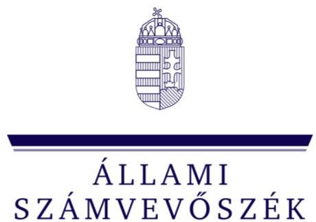
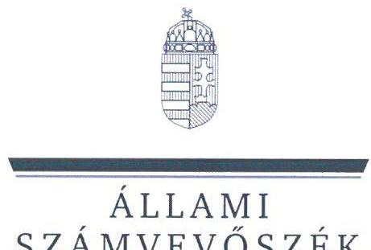
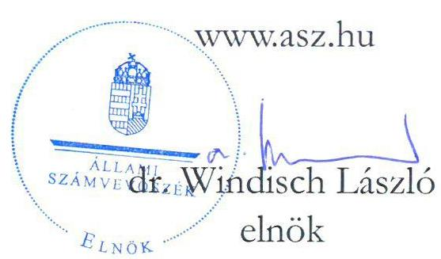
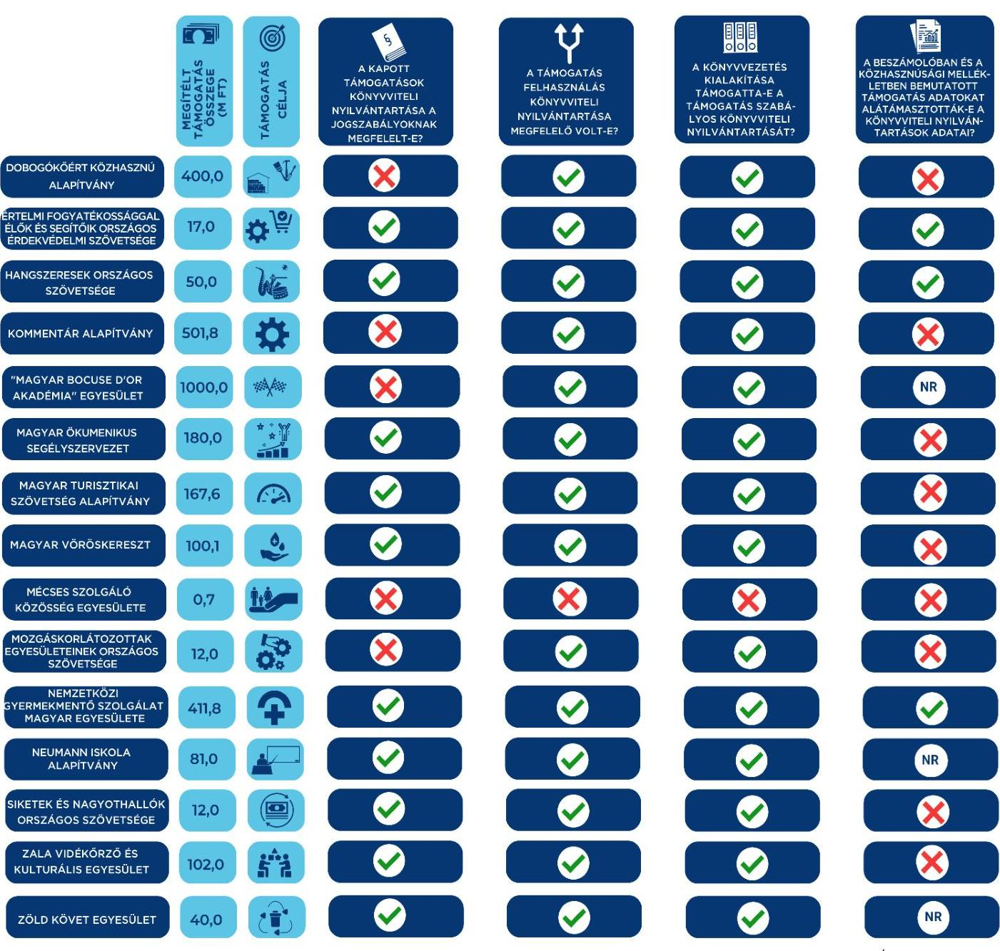

ÁLLAMI
SZÁMVEVŐSZÉK

# JELENTÉS 

Egyesületek és alapítványok államháztartásból kapott támogatásai könyvviteli nyilvántartásának ellenőrzése
2023.

23050
www.asz.hu

---

ÁLLAMI
SZÁMVEVŐSZÉK

# JELENTÉS 

## Egyesületek és alapítványok államháztartásból kapott támogatásai könyvviteli nyilvántartásának ellenőrzése

2023. 

23050

---

# ELLENŐRZÉSI IGAZGATÓSÁG: 

## ÁLLAMHÁZTARTÁSON KÍVÜLI SZERVEZETEKET ELLENŐRZŐ IGAZGATÓSÁG

## ELLENŐRZÉSI IGAZGATÓ:

## KLINGA LÁSZLÓ igazgató

## ELLENŐRZÉSVEZETŐ:

Jelentéseink az interneten a www.asz.hu címen olvashatók.

## SOLYMÁR ÁGNES ellenőrzésvezető

IKTATÓSZÁM: EL-3963-003/2023.
TÉMASZÁM: 2693
ELLENŐRZÉS-AZONOSÍTÓ SZÁM: V1037

---

# TARTALOMJEGYZÉK 

- AZ ELLENŐRZÉS ALAPADATAI ..... 5
- AZ ELLENŐRZÖTT SZERVEZETEK ..... 6
- ÖSSZEFOGLALÁS ..... 15
- AZ ELLENŐRZÉS FÓKUSZKÉRDÉSE ..... 17
- MEGÁLLAPÍTÁSOK ..... 18
- JAVASLATOK ..... 33
- MELLÉKLETEK ..... 37
I. sz. melléklet: Értelmező szótár ..... 37
II. sz. melléklet: Az ellenőrzött szervezetek jegyzéke ..... 40
III. sz. melléklet: Ellenőrzési kritériumok ..... 41
- FÜGGELÉK: ÉSZREVÉTELEK ..... 42
- RÖVIDÍTÉSEK JEGYZÉKE ..... 43

---

.

---

# AZ ELLENŐRZÉS ALAPADATAI 

## AZ ELLENŐRZÉS CÉLJA

Az ellenőrzés célja annak ellenőrzése volt, hogy az ellenőrzött egyesületnél, alapítványnál az ellenőrzésre kiválasztott, államháztartási forrásból származó támogatás könyvviteli nyilvántartása szabályszerűen történt-e.

## AZ ELLENŐRZÉS TÍPUSA

Szabályszerúségi ellenőrzés.

## AZ ELLENŐRZÖTT IDŐSZAK

Az ellenőrzésre kiválasztott államháztartási támogatásra vonatkozó támogatási döntéstől/szerződéskötéstől 2023.06.14-ig, a helyszíni ellenőrzésről szóló értesítés keltéig tartó időszak.

## AZ ELLENŐRZÉS TÁRGYA

Az egyesületnél, illetve alapítványnál az ellenőrzésre kiválasztott államháztartási forrásból kapott támogatás könyvviteli nyilvántartását, ennek keretében a támogatásból származó bevétel-, valamint a támogatás felhasználás nyilvántartására vonatkozó jogszabályi előírások betartását ellenőrizzük.

## AZ ELLENŐRZÉS JOGALAPJA

Az ellenőrzés jogalapját az ÁSZ tv. ${ }^{1} 1 . \int(3)$, valamint az 5. $\int(3)$ bekezdés előírásai képezték.

## AZ ELLENŐRZÉS MÓDSZERE

Az ellenőrzést az ellenőrzési program szempontjai, az ellenőrzött időszakban hatályos jogszabályok, előírások, az ellenőrzés általános szakmai szabályai, az ellenőrzésre irányadó ÁSZ ${ }^{2}$ megfelelőségi ellenőrzési módszertana figyelembevételével végezte az ÁSZ. Az ellenőrzési kérdések megválaszolásához szükséges bizonyítékok megszerzése az ellenőrzött egyesület, alapítvány által rendelkezésre bocsátott dokumentumokra és adatokra alapozva, továbbá kérdésfeltevés (információkérés) útján történt. Az ellenőrzési bizonyítékként felhasznált adatforrások közé tartoztak egyrészt az ellenőrzéshez kért dokumentumok, adatforrások, másrészt minden - az ellenőrzés folyamán - feltárt, az ellenőrzés szempontjából információkat tartalmazó dokumentum.

Az ellenőrzés lefolytatásához az ellenőrzött szervezet a tanúsítvány kitöltésével, valamint az ÁSZ által kért dokumentumok, adatok, információk megküldésével szolgáltatott adatokat.

---

# AZ ELLENŐRZÖTT SZERVEZETEK 

Az ellenőrzésre 15 civil szervezet esetében került sor, melyek közül 11 egyesületi, négy pedig alapítványi formában működött. Valamennyi ellenőrzött szervezet kettős könyvvezetéssel támasztotta alá beszámolóját, közülük tíz szervezet rendelkezett közhasznú jogállással. Működéséről, vagyoni, pénzügyi és jövedelmi helyzetéről két egyesület és egy alapítvány Számv. tv. ${ }^{3}$ szerinti éves beszámolót, a fennmaradó 12 ellenőrzött egyszerűsített éves beszámolót készített. A Közbef. tv. ${ }^{4}$ előírása szerint tevékenysége és a 2022. évi számviteli beszámoló mérlegfőösszege alapján - mivel mérlegfőösszegük elérte a 20 millió forintot - , 14 szervezet a közélet befolyásolására alkalmas tevékenységet végző szervezetnek minősült.

Az ellenőrzött szervezetek 2022. évi számviteli beszámolóik szerint mindösszesen 61 623,0 M Ft vagyonnal gazdálkodtak, tevékenységükhöz 45 245,0 M Ft támogatást számoltak el bevételként. A legnagyobb szervezet 19 439,0 M Ft, a legkisebb 18,7 M Ft értékủ eszköz állománnyal rendelkezett. A négy alapítványnál és 11 egyesületnél összesen 3 076,0 M Ft összegű támogatás számviteli nyilvántartásának ellenőrzésére került sor.

## DOBOGÓKÓÉRT KÖZHASZNÚ ALAPÍTVÁNY

A dobogókői székhelyű alapítványt magánszemélyek alapították 1994-ben. Célja a „Dobogókő értékeinek a jelentőségének megfelelő - megőrzése, múködletése és fejlesztése, Dobogókő turisztikai jelentőségének visszaállítása". Az alapítvány kezelő szerve a három főből álló kuratórium, képviseletére a kuratórium elnöke vagy bármely két tagja együttesen volt jogosult. Az alapítvány az ellenőrzött időszakban közhasznú jogállású szervezetként működött, felügyelőbizottság létrehozására nem volt kötelezett. Az alapítvány könyvvizsgálatra nem volt kötelezett, 2022. évre egyszerűsített éves beszámolót készített.

## AZ ELLENŐRZÖTT, ALLAMHÁZTARTÁSI FORRÁSBOL KAPOTT TÁMOGATÁS BEMUTATÁSA

Támogatott szervezet megnevezése, székhelytelepülése
Támogatási program célja
Támogató megnevezése
Támogatás időtartama
Támogatási összeg
Támogatás típusa
A pénzügyi elszámolás határideje
Elszámolás a támogató szervezet felé

Dobogókőért Közhasznú Alapítvány, Dobogókő
„Zsindelyes Vendégbáz" (sibáz) felújítása"
Emberi Erőforrások Minisztériuma - jogutód Kulturális és Innovációs Minisztérium
2018.03.01. - 2023.12.31.

400000000 Ft
vissza nem térítendő
2024.02.29.

Az ellenőrzött időszakban az alapítványnak nem volt a támogató szervezet felé elszámolási kötelezettsége.

## ÉrTELMI FOGYATÉKossÁGGAL ÉLŐK ÉS SEGÍTŐIK ORSZÁGOS ÉRDEKVÉDELMI SZÖVETSÉGE

A budapesti székhelyű egyesület szülői kezdeményezésre 1981-ben alakult, bírósági nyilvántartásba vételének dátuma: 1989. november 23. Alapításának célja volt a Magyar Köztársaság területén élő értelmi fogyatékos emberek és családjaik egyenjogú és teljes körű társadalmi befogadásának igényével indokolt érdekeinek képviselete, érvényesítése és védelme, társadalmi hátrányainak kiegyenlítése, emberi és állampolgárai

---

jogaik, társadalmi integrációjuk, szociális biztonságuk, rehabilitációjuk biztosítása, esélyegyenlőségük megvalósítása, az értelmi fogyatékossággal élők öntevékenységeinek, önrendelkezési lehetőségeinek, önmegvalósításának elősegítése. A közhasznú jogállással rendelkező, egyesület legfőbb döntéshozó szerve a küldöttgyűlés és az országos elnökség volt, mely kilenc tagból állt. Az ellenőrzési feladatokat a jogszabályi előírásnak megfelelően létrehozott háromtagú felügyelőbizottság látta el. Az egyesület az ellenőrzött időszakban kötelezett volt könyvvizsgálatra, 2022. évi egyszerűsített éves beszámolóját könyvvizsgáló felülvizsgálta.

| AZ ELLENÖRZÖTT, ÁLLAMHAZTARTÁSI FORRÁSRÓL KAPOTT TÁMOGATÁS BEMUTATÁSA |  |
| :-- | :-- |
| Támogatott szervezet megnevezése,   székhelytelepülése | Értelmi Fogyatékossággal Élők és Segítőik Országos Érdekvédelmi   Szövetsége, Budapest |
| Támogatási program célja | Az egyesület „2022. évi szakmai és müködési feladatainak támogatása" |
| Támogató megnevezése | Miniszterelnöki Kabinetiroda |
| Támogatás időtartama | 2022.01.01. - 2022.12.31. |
| Támogatási összeg | 17 000 000 Ft |
| Támogatás típusa | vissza nem térítendő |
| A pénzügyi elszámolás határideje | 2023.01.31. |
| Elszámolás a támogató szervezet felé | Az egyesület az elszámolást határidőben benyújtotta, annak elbírálásáról   a támogató szervezet az ellenőrzött időszakban tájékoztatást nem adott. |

# HANGSZERESEK ORSZÁGOS SZÖVETSÉGE 

A budapesti székhelyű egyesületet 2003-ban hozta létre 12 hangszereket, audiovizuális és fénytechnikai eszközöket gyártó, forgalmazó és importáló magyar vállalat azzal a céllal, hogy a tagok részére olyan szakmai fórumot biztosítson, melyen keresztül megfogalmazhatják véleményüket, érdekeiket, ezeknek különböző társadalmi viszonyokban hangot adhatnak. A közhasznú jogállással nem rendelkező egyesület ügyvezető és képviseleti szerve a hattagú elnökség volt. Az elnök az egyesület képviseletére önálló jogosultsággal rendelkezett. Az egyesület működésének és gazdálkodásának ellenőrzésére három főből álló felügyelőbizottságot hoztak létre. Az egyesületnek az ellenőrzött időszakban könyvvizsgálati kötelezettsége nem volt. 2022. évre egyszerűsített éves beszámolót készített.

---

# AZ ELLENÖRZÖTT, ÁLLAMHÁZTARTÁSI FORRÁSBOI. KAPOTT TÁMOGATÁS BEMUTATÁSA 

Támogatott szervezet megnevezése, székhelytelepülése

Támogatási program célja

Támogató megnevezése
Támogatás időtartama
Támogatási összeg
Támogatás típusa
A pénzügyi elszámolás határideje
Elszámolás a támogató szervezet felé

Hangszeresek Országos Szövetsége, Budapest
„Hangsert a kézbe rendezvénysorozat 7. évadjának megrendezése (2022. év utolsó barmadában)"

Nemzeti Kulturális Alap - Hangfoglaló Könnyüzenei Támogatói Program Kollégiuma
2022.06.02. - 2023.08.14.

50000000 Ft
vissza nem térítendő
2023.08.29.

Az ellenőrzött időszakban az egyesületnek nem volt a támogató szervezet felé elszámolási kötelezettsége.

## KomMENTÁr AlAPÍTVÁNY

A balatonszepezdi székhelyű alapítványt 2005. évben egy magánszemély alapította. Az alapítvány célja többek között „a Kommentár címü társadalomkritikai, szemlérő folyóirat és bozzá kapcsolódó könyvek kiadásához szükséges anyagi fedezet megteremtése, valamint ezek kiadása és terjesztése" továbbá „a magyarországi, a batáron túli és külföldi folyóiratokkal való kapcsolattartás" és „a magyar kritikai élet, társadalomtudományos ismeretterjesztés segítése; gazdagitása". A közhasznú jogállású alapítvány kezelő és képviselő szerve a három tagból álló kuratórium volt. Az alapítvány működésének és gazdálkodásának ellenőrzésére az alapító háromtagú felügyelőbizottságot hozott létre. Az alapítvány az ellenőrzött időszakban kötelezett volt könyvvizsgálatra, 2022. évi egyszerűsített éves beszámolóját könyvvizsgáló felülvizsgálta.

## AZ ELLENÖRZÖTT, ÁLLAMHÁZTARTÁSI FORRÁSBOI. KAPOTT TÁMOGATÁS BEMUTATÁSA

Támogatott szervezet megnevezése, székhelytelepülése

Támogatási program célja
Támogató megnevezése
Támogatás időtartama
Támogatási összeg
Támogatás típusa
A pénzügyi elszámolás határideje
Elszámolás a támogató szervezet felé

Kommentár Alapítvány, Balatonszepezd
„Kommentár Alapitvány 2022. évi müködése és alapitás céljainak megvalósitása"
Miniszterelnöki Kabinetiroda
2022.01.01. - 2022.12.31.

501749000 Ft
vissza nem térítendő
2023.02.28.

Az alapítvány az elszámolást határidőben benyújtotta, annak elbírálásáról a támogató szervezet az ellenőrzött időszakban tájékoztatást nem adott.

## „MAGYAR BOCUSE D'OR AKADÉMIA" EGYESÜLET

A budapesti székhelyű egyesületet 2009. évben hozták létre. Célja „a magyar gasztronómia bazai és nemzetközi színtéren, magas szinvonalon való képviselete és megismertetése". Az egyesület feladata „minden olyan tevékenység, amely a magyar gasztronómia Magyarországon és külföldön történő népszerüsitésével és megismertetésével összefügg, igy különösen, de nem kizárólag a Bocuse d'Or versenyek megrendezése és lebonyolítása Magyarországon, a nemzetközi Bocuse d'Or verseny magyar részstvevőinek kiválasztása, valamint a magyar és külföldi versenyeken történő megjelenésük támogatása". A közhasznú jogállással nem rendelkező egyesület legfőbb döntéshozó szerve a közgyűlés. Az egyesület ügyvezetését

---

elnökből, három alelnökből, gazdasági felelősből, és titkárból álló elnökség látta el. Az egyesület a jogszabályi előírások alapján felügyelőbizottság létrehozására nem volt kötelezett. Az egyesület könyvvizsgálatra a jogszabályi előírások alapján az ellenőrzött időszakban nem volt kötelezett, azonban az alapítók alapszabályban rögzített döntése értelmében egyszerűsített éves beszámolóit könyvvizsgáló felülvizsgálta.

# AZ ELLENÖRZÖTT, ÁLLAMHÁZTARTÁSI FORRÁSRÓL KAPOTT TÁMOGATÁS BEMÚTATÁSA 

Támogatott szervezet megnevezése, székhelytelepülése
Támogatási program célja
Támogató megnevezése

Támogatás időtartama
Támogatási összeg
Támogatás típusa
A pénzügyi elszámolás határideje
Elszámolás a támogató szervezet felé

„Magyar Bocuse D’OR Akadémia" Egyesület, Budapest
„Bocuse d'Or Europe 2022" gasztronómiai esemény megvalósítása
Magyar Turisztikai Ügynökség Zrt. mint a Miniszterelnöki Kabinetiroda által a Turisztikai fejlesztési cálelóirányzat terhére rendelkezésre bocsátott összeg kezelő szerv e
2021.04.01. - 2023.03.31.

1000000000 Ft
vissza nem térítendő
2023.04.30.

Az egyesület az elszámolást határidőben benyújtotta, annak elbírálásáról a támogató szervezet az ellenőrzött időszakban tájékoztatást nem adott.

## MaGyar ÖKumenikus SEGÉLYSZERVEZET

A budapesti székhelyű egyesületként bejegyzett szervezet 1991-ben alakult, egyházi hátterủ szervezet, de missziós tevékenységet nem végez. Célja, hogy „a jelen kor társadalmi kibivásainak megfelelöen, erősitse az alapitók társadalmi szolggálatát a bazai és nemzetközi bumanitárius segitségnyújtás, a bazai és nemzetközi fejlesztés, a bazai szociális segitségnyújtás, valamint a kommunikáció és szemléletformálás területein". Az egyesület közhasznú jogállású szervezet, döntéshozó szerve a küldöttgyűlés volt, ügyvezetését és képviseletét az elnök-igazgató látta el. Az alapítók a felügyelőbizottság feladatainak ellátására, az egyesület müködésének, gazdálkodásának ellenőrzésére öttagú felügyelő szervet hoztak létre. Az egyesület az ellenőrzött időszakban kötelezett volt könyvvizsgálatra, 2022. évi Számv. tv. szerinti éves beszámolóját könyvvizsgáló felülvizsgálta.

## AZ ELLENÖRZÖTT, ÁLLAMHÁZTARTÁSI FORRÁSRÓL KAPOTT TÁMOGATÁS BEMÚTATÁSA

Támogatott szervezet megnevezése, székhelytelepülése
Támogatási program célja
Támogató megnevezése
Támogatás időtartama
Támogatási összeg
Támogatás típusa
A pénzügyi elszámolás határideje
Elszámolás a támogató szervezet felé

Magyar Ökumenikus Segélyszervezet, Budapest
„Karitativ feladatok ellátása a támogatói okirat 2.1. pontjában meghatározott programok megvalósitásával (szakmai feladat)"
Emberi Erőforrások Minisztériuma - szociális ügyekért felelős államtitkár -, jogutód: Belügyminisztérium
2022.01.01. - 2022.12.31.

180000000 Ft
vissza nem térítendő
2023.03.31.

Az egyesület az elszámolást határidőben benyújtotta, annak elbírálásáról a támogató szervezet az ellenőrzött időszakban tájékoztatást nem adott.

---

# MAGYAR TURISZTIKAI SZÖVETSÉG ALAPÍTVÁNY 

A budapesti székhelyű alapítványt 2017-ben alapították. Célja „a turizmus különbözö szegmensei képviselöi együttmüködésének koordinálása", „a magyar turizmus fejlődésének támogatása", „a modern és minöségi turizmus megteremtése". Az Alapítvány közreműködött többek között a magyar turizmus fejlődésének támogatásában, különösen bizonyos béren kívüli juttatások jelentőségének, a rugalmas foglalkoztatásnak és turisztikai szakmáknak a promotálásával. Az alapítvány nem közhasznú jogállású szervezet, ügyvezető szerve a 12 természetes személyből álló kuratórium volt. Felügyelőbizottság létrehozására nem volt kötelezett. Az alapítvány az ellenőrzött időszakban kötelezett volt könyvvizsgálatra, 2022. évi Számv. tv. szerinti éves beszámolóját könyvvizsgáló felülvizsgálta.

## AZ ELLENÖRZÖTT, ÁLLAMHÁZTARTÁSI FORRÁSBÓL KAPOTT TÁMOGATÁS BEMÚTÁTÁSA

Támogatott szervezet megnevezése, székhelytelepülése

Támogatási program célja

Támogató megnevezése

Támogatás időtartama
Támogatási összeg
Támogatás típusa
A pénzügyi elszámolás határideje

Elszámolás a támogató szervezet felé

Magyar Turisztikai Szövetség Alapítvány, Budapest
„"Magyarország" vár 2022 belföldi kereslet élinktib kampány" program megvalósítása

Miniszterelnöki Kabinetiroda - kezelő szervként a Magyar Turisztikai Ügynökség Zrt.
2021.03.01. - 2022.12.31.

167640000 Ft
vissza nem térítendő
2023.02.28.

Az alapítvány az elszámolást határidőben benyújtotta, elszámolását a támogató szervezet elfogadta.

## MAGYAR VÖRÖSKERESZT

A budapesti székhelyű egyesület jelenlegi formájában 1988. január 01-én alakult. Célja az élet és egészség védelme, az emberi személyiség tiszteletben tartása, az emberi szenvedés, a szociális gondok enyhítése, a betegségek megelőzése, a fegyveres konfliktusok, katasztrófák áldozatainak megsegítése, a Genfi Egyezményekből adódó feladatokban való közreműködés, a nemzetközi humanitárius jog, a Nemzetközi Vöröskereszt alapelveinek terjesztése, a társadalmi szolidaritásra nevelés. Az egyesület alap és vállalkozási tevékenységét a 19 vármegyei és a fővárosi szervezet, valamint az Országos Igazgatóság keretein belül fejtette ki. A közhasznú jogállású egyesület legfőbb döntéshozó szerve küldöttgyűlés, ügyintéző szerve a héttagú elnökség volt. A múködés és gazdálkodás ellenőrzésére háromtagú felügyelőbizottságot hoztak létre. Az egyesület könyvvizsgálatra kötelezett szervezet, 2022. évi Számv. tv. szerinti éves beszámolóját könyvvizsgáló felülvizsgálta.

---

# AZ ELLENÖRZÖTT, ÁLLAMHAZTARTÁSI FORRÁSRÓL KAPOTT TÁMOGATÁS BEMUTATÁSA 

| Támogatott szervezet megnevezése,   székhelytelepülése | Magyar Vöröskereszt, Budapest |
| :-- | :-- |
| Támogatási program célja | Magyar Vöröskereszt szakmai feladatainak ellátása |
| Támogató megnevezése | Emberi Erőforrások Minisztériuma -jogutód: Belügyminisztérium |
| Támogatás időtartama | 2022.01.01. - 2022.12.31. |
| Támogatási összeg | 100100000 Ft |
| Támogatás típusa | vissza nem térítendő |
| A pénzügyi elszámolás határideje | 2023.02.28. |
| Elszámolás a támogató szervezet felé | Az egyesület az elszámolást a határidőben benyújtotta, annak elbírálásáról   a támogató szervezet az ellenőrzött időszakban tájékoztatást nem adott. |

## MÉCSES SZOLGÁLÓ KÖZÖSSÉG EGYESÜLETE

A mezőberényi székhelyű egyesület 1999-ben alakult 12 alapító taggal. Célja a hátrányos helyzetű gyermekek, fiatalok, felnőttek segítése, köztük kiemelten a fogyatékkal élő, beteg emberek életének segítése, részükre ellátások biztosítása, ellátások nyújtása, és az érdekképviseletük. A közhasznú jogállással rendelkező egyesület legfelsőbb szerve a közgyűlés, ügyvezetési feladatokat a közgyűlés által választott ügyvezető látta el. Az ellenőrzési feladatokra a jogszabályi előírásoknak megfelelően háromtagú felügyelőbizottságot hoztak létre. Az egyesület könyvvizsgálatra kötelezett szervezet, 2022. évi egyszerűsített éves beszámolóját könyvvizsgáló felülvizsgálta.

## AZ ELLENÖRZÖTT, ÁLLAMHAZTARTÁSI FORRÁSRÓL KAPOTT TÁMOGATÁS BEMUTATÁSA

Támogatott szervezet megnevezése, székhelytelepülése

Támogatási program célja
Támogató megnevezése
Támogatás időtartama
Támogatási összeg
Támogatás típusa
A pénzügyi elszámolás határideje
Elszámolás a támogató szervezet felé

Mécses Szolgáló Közösség Egyesülete, Mezőberény
„Szïlősegitő szoláaltatások támogatása"
Emberi Erőforrások Minisztériuma képviseletében a Slachta Margit Nemzeti Szociálpolitikai Intézet - jogutód: Belügyminisztérium
2022.06.01. - 2023.05.31.

696000 Ft
vissza nem térítendő
2023.06.30.

Az ellenőrzött időszakban az egyesületnek nem volt a támogató szervezet felé elszámolási kötelezettsége.

## MOZGÁSKORLÁTOZOTTAK EGYESÜLETEINEK ORSZÁGOS SZÖVETSÉGE

A budapesti székhelyű egyesületet 1981-ben alapították. Célja a mozgáskorlátozott emberek és családjaik érdekvédelme, a mozgáskorlátozottságból eredő sajátos érdekek feltárása, megfogalmazása, képviselete és érvényesítése. A közhasznú jogállású egyesület legfőbb döntéshozó szerve a küldöttgyűlés, ügyintéző szerve a 11 tagú elnökség volt. Az egyesületnél az alapszabályban meghatározott feladatok ellátását, a gazdálkodás és az alapszabály szerinti múködés ellenőrzését az alapítók által létrehozott, öt főből álló felügyelőbizottság végezte. A 2022. évi egyszerűsített éves beszámolóját a jogszabályi előírásoknak eleget téve könyvvizsgáló felülvizsgálta.

---

# AZ ELLENÖRZÖTT, ÁLLAMDÁZTARTÁSI FORRÁSROL KAPOTT TÁMOGATÁS BEMÚTATÁSA 

Támogatott szervezet megnevezése, székhelytelepülése
Támogatási program célja
Támogató megnevezése
Támogatás időtartama
Támogatási összeg
Támogatás típusa
A pénzügyi elszámolás határideje
Elszámolás a támogató szervezet felé

Mozgáskorlátozottak Egyesületeinek Országos Szövetsége, Budapest
Szakmai feladatok ellátása
Miniszterelnöki Kabinetiroda
2022.02.01. - 2022.09.30.
$12000000 \mathrm{Ft}$
vissza nem térítendő
2022.11.30.

Az egyesület határidőben benyújtott elszámolását a támogató szervezet elfogadta.

## NEMZETKÖZI GYERMEKMENTŐ SZOLGÁLAT MAGYAR EGYESÜLET

A budapesti székhelyű egyesület 1990-ben alakult azzal a céllal, hogy „egészségügyi és más célra adományokat gyüjtsön pénzben vagy természetben, és az arra rászorulók részére ilyen adományokat nyújtson, továbbá tagjainak tevékenységével segitse a rászoruló gyermekeket és gyermekintézményeket". A közhasznú jogállással rendelkező egyesület legfőbb döntéshozó szerve a közgyűlés, ügyintéző és képviselő szerve a kilenctagú elnökség volt. Az egyesületnél a felügyelőbizottság jogszabályban meghatározott feladatainak ellátását, a gazdálkodás és az alapszabály szerinti működés ellenőrzését az alapítók által létrehozott, három főből álló felügyelő szerv végezte. Az egyesület 2022. évi egyszerűsített éves beszámolóját a jogszabályi előírásoknak eleget téve könyvvizsgáló felülvizsgálta.

## AZ ELLENÖRZÖTT, ÁLLAMDÁZTARTÁSI FORRÁSROL KAPOTT TÁMOGATÁS BEMÚTATÁSA

Támogatott szervezet megnevezése, székhelytelepülése
Támogatási program célja
Támogató megnevezése
Támogatás időtartama
Támogatási összeg
Támogatás típusa
A pénzügyi elszámolás határideje
Elszámolás a támogató szervezet felé

Nemzetközi Gyermekmentő Szolgálat Magyar Egyesület, Budapest
„A bátrányos települések orvosi és prevenciós ellátására"
Emberi Erőforrások Minisztériuma (jogutód: Belügyminisztérium)
2022.03.01. - 2023.06.30.
$411766000 \mathrm{Ft}$
vissza nem térítendő
2023.08.28.

Az ellenőrzött időszakban az egyesületnek nem volt a támogató szervezet felé elszámolási kötelezettsége.

## Neumann IsKola Alapítvány

Az egri székhelyű alapítványt 1993-ban hozták létre azzal a céllal, hogy megalapítsa és működtesse a Neumann János Közgazdasági Szakközépiskola és Gimnázium intézményt. Az alapítvány közhasznú jogállással rendelkező szervezetként működött, mely gazdasági-vállalkozási tevékenységet az alapszabálya szerint „csak közbasznú céljainak megvalósitása érdekében, azokat nem veszélyeztetve végezhet". Az alapítvány képviseletére és a vagyonának a kezelésére az alapító kilenc főből álló kuratóriumot hozott létre, működését és gazdálkodását az alapító által megbízott háromtagú felügyelőbizottság ellenőrizte. Az alapítvány 2022. évi egyszerűsített éves beszámolóját jogszabályi előírásoknak eleget téve könyvvizsgáló felülvizsgálta.

---

# AZ ELLENÖRZÖTT, ALLANHAZTARTÁSI FORRÁSRÓL KAPOTT TÁMOGATÁS BEMUTATÁSA 

Támogatott szervezet megnevezése, székhelytelepülése
Támogatási program célja
Támogató megnevezése
Támogatás időtartama
Támogatási összeg
Támogatás típusa
A pénzügyi elszámolás határideje
Elszámolás a támogató szervezet felé

Neumann Iskola Alapítvány, Eger
A köznevelési közszolgálati feladatokban való részvétel támogatása
Belügyminisztérium
2022.09.01. - 2023.08.31.
81000000 Ft
vissza nem térítendó
2023.09.29.

Az ellenőrzött időszakban az alapítványnak nem volt a támogató szervezet felé elszámolási kötelezettsége.

## SIKETEK ÉS NAGYOTHALLÓK ORSZÁGOS SZÖVETSÉGE

A budapesti székhelyű egyesület a jogelődjét 1907-ig vezeti vissza. Jelen formájában 1989-ben vette nyilvántartásba a Fővárosi Bíróság. Célja „a területén élő siket és nagyothalló személyek érdekeinek szervezett és szakszerü védelme, érdekeinek képviselete, az érdekéééényesitési lehetőség folyamatos bővítése, a társadalomba való beilleszkedésük elősegitése". Az alapszabályában meghatározott gazdasági-vállalkozási tevékenységeket végezhette, melyből 2022ben 6,7 M Ft árbevétele volt. Az egyesület legfőbb döntéshozó szerve az „Országos Küldöttkö̋gyülés", ügyvezető szerve a 11 tagú „Országos Elnökség" volt. A felügyelőbizottság jogszabályban meghatározott feladatainak ellátását, a gazdálkodás és az alapszabály szerinti múködés ellenőrzését az „Országos Küldöttkö̋gyülés" által választott, három főből álló „Országos Felügyelő Bizottság" végezte. A közhasznú jogállású egyesület 2022. évi egyszerűsített éves beszámolóját a jogszabályi előírásoknak eleget téve könyvvizsgáló felülvizsgálta.

## AZ ELLENÖRZÖTT, ALLANHAZTARTÁSI FORRÁSRÓL KAPOTT TÁMOGATÁS BEMUTATÁSA

Támogatott szervezet megnevezése, székhelytelepülése
Támogatási program célja
Támogató megnevezése
Támogatás időtartama
Támogatási összeg
Támogatás típusa
A pénzügyi elszámolás határideje
Elszámolás a támogató szervezet felé

Siketek és Nagyothallók Országos Szövetsége, Budapest
Az egyesületi székház felújítása és bővítése
Miniszterelnöki Kabinetiroda
2022.01.01. - 2022.12.31.

12000000 Ft
vissza nem térítendő
2023.01.31.

Az egyesület az elszámolást határidőben benyújtotta, annak elbírálásáról a támogató szervezet az ellenőrzött időszakban tájékoztatást nem adott.

## ZALA VIDÉKÖRZŐ ÉS KULTURÁLIS EGYESÜLET

A zalaszentgróti egyesületet 2005-ben hozták létre, célja, hogy „müködésével elösegítse Zala aprófalvas településeinek felemelkedését gazdasági, szociális és kulturális téren egyaránt". Az alapszabálya szerint „,éljának elérése érdekében jogszabályi keretek között vállalkozási tevékenységet folytathat", az ellenőrzött időszakban vállalkozásigazdasági tevékenységet nem folytatott. A közhasznú jogállással nem rendelkező egyesület legfőbb döntéshozó szerve a közgyűlés, ügyvezető szerve a három tagból álló elnökség volt. Az egyesület nem volt kötelezett könyvvizsgálatra, a 2022. évre egyszerűsített éves beszámolót készített.

---

# AZ ELLENÖRZÖTT, ÁLLAMHÁZTARTÁSI FORRÁSBÓL KAPOTT TÁMOGATÁS BEMUTATÁSA 

Támogatott szervezet megnevezése, székhelytelepülése

Támogatási program célja
Támogató megnevezése
Támogatás időtartama
Támogatási összeg
Támogatás típusa
A pénzügyi elszámolás határideje
Elszámolás a támogató szervezet felé

Zala Vidékőrző és Kulturális Egyesület, Zalaszentgrót
„Mezögazdasági gépjavitó múhely kialakításához ingatlanvásárlás és könnyüszzerkezetes épület épitése"
A Miniszterelnökség megbízásából a Bethlen Gábor Alapkezelő Zrt.
2021.01.01. - 2023.12.31.

102000000 Ft
vissza nem térítendő
2024.01.30.

Az ellenőrzött időszakban az egyesületnek nem volt a támogató szervezet felé elszámolási kötelezettsége.

## ZÖLD KÖVET EGYESÜLET

A budapesti székhelyű egyesület 2020-ban jött létre balatonkenesei székhellyel. Célja, „a természeti és környezeti értékek megismertetése, a felnövekvö generáció edukálása, programok szervezése, a környezettudatosság magatartásának kialakítása és fontosságának ismertetése". A közhasznú jogállással nem rendelkező egyesület legfőbb döntéshozó szerve a közgyűlés, ügyintéző és képviselő szerve a háromtagú elnökség volt. Az egyesületnek könyvvizsgálati kötelezettsége az ellenőrzött időszakban nem volt, a 2022. évi gazdálkodásáról egyszerűsített éves beszámolót készített.

## AZ ELLENÖRZÖTT, ÁLLAMHÁZTARTÁSI FORRÁSBÓL KAPOTT TÁMOGATÁS BEMUTATÁSA

Támogatott szervezet megnevezése, székhelytelepülése
Támogatási program célja
Támogató megnevezése
Támogatás időtartama
Támogatási összeg
Támogatás típusa
A pénzügyi elszámolás határideje
Elszámolás a támogató szervezet felé

Zöld Követ Egyesület, Budapest
„Az ökotudatosság erösitése a fiatalok és a családok körében"
a Miniszterelnökség megbízásából a TEMPUS Közalapítvány
2022.05.01. - 2023.05.30.

40000000 Ft
vissza nem térítendő
2023.06.29.

Az egyesület az elszámolást a határidőben benyújtotta, annak elbírálásáról a támogató szervezet az ellenőrzött időszakban tájékoztatást nem adott.

---

# ÖSSZEFOGLALÁS 

Az ellenőrzött 15 civil szervezetből 14 szervezet könyvvezetési rendszerének kialakítása megfelelően támogatta az államháztartásból származó ellenőrzött támogatások szabályszerű könyvviteli nyilvántartását, biztosította a közpénzek felhasználásának ellenőrizhetőségét. Az ellenőrzés egy szervezetnél tárta fel azt a hiányosságot, hogy könyvvezetési rendszerét nem a jogszabályi előírások szerint alakította ki, ezáltal a közpénz felhasználás ellenőrizhetőségét nem biztosította.

Tíz ellenőrzött szervezet az államháztartási forrásból kapott támogatást megfelelően, a jogszabályi előírások szerint, elkülönítve tartotta nyilván. Egy szervezetnél a kapott támogatás könyvviteli nyilvántartása nem felelt meg a törvényi előírásnak, mert az ellenőrzött szervezet az államháztartási forrásból kapott támogatást nem az előírt részletezésben mutatta ki. Egy további szervezet a kapott támogatás elszámolásakor nem alkalmazta következetesen az elkülönített nyilvántartás érdekében a könyvviteli nyilvántartási rendszerében kialakított munkaszámos elkülönítést. Három szervezet a fejlesztési célra kapott támogatás elszámolásakor nem vette figyelembe a számviteli törvény időbeli elhatárolásra vonatkozó előírásait, a fejlesztési célra, visszafizetési kötelezettség nélkül kapott támogatást a passzív időbeli elhatárolások között nem mutatta ki. Az időbeli elhatárolás alkalmazásának hiányában a költséggel nem ellentételezett, bevételként elszámolt támogatások torzították a szervezetek tárgyévi eredményeit.

Az államháztartási forrásból kapott támogatás felhasználását 14 szervezet a könyvviteli rendszerében a jogszabályi előírások szerint tartotta nyilván. Egy szervezet a jogszabályi előírások ellenére az államháztartási forrásból kapott támogatás felhasználásáról nem vezetett olyan számviteli nyilvántartást, amelynek alapján megállapítható és ellenőrizhető a kapott támogatás felhasználása, továbbá a kapott támogatás felhasználását igazoló, a 2023. évre vonatkozó bizonylatok adatait a törvény előírásai ellenére a könyvviteli nyilvántartásában nem rögzítette.

Az ellenőrzött 15 szervezet közül három szervezetnek nem volt a támogatás felhasználására vonatkozóan a 2022. évi beszámolóban tájékoztatási kötelezettsége, egy szervezetnek jogszabályi előírás hiányában, két szervezet az ellenőrzött költségvetési támogatást 2023. évben használta fel. Három szervezet közpénzfelhasználásra vonatkozó tájékoztatása megfelelt a jogszabályi előírásoknak. Kilenc szervezet nem megfelelően tájékoztatta a közvéleményt az ellenőrzött támogatás felhasználásáról, mert nem biztosította a közpénzek felhasználására vonatkozó gazdálkodása nyilvánosságát, ezáltal sérült a közpénzkezelés Alaptörvényben ${ }^{5}$ rögzített átláthatóságának elve. Közülük két szervezet esetében nem a Számv. tv., négy szervezet esetében nem a törvény előírásai szerint tartalmazta a kiegészítő melléklet az államháztartási forrásból kapott támogatás felhasználásának bemutatását, további egy szervet a számviteli törvény szerinti éves beszámoló kiegészítő mellékletének elkészítése során nem tett eleget a törvény támogatás felhasználás bemutatására vonatkozó előírásainak. Két civil szervezet a közhasznúsági mellékletét nem a törvény előírásai szerint készítette el.

Az ellenőrzési megállapításokhoz kapcsolódóan, a feltárt hiányosságok megszüntetésére 10 szervezet vezetőjének, összesen 16 javaslatot tettünk. A fentiekben bemutatott megállapítások ellenőrzött szervezetenkénti megjelenését az 1. ábra szemlélteti.

---

# FŐBB ELLENŐRZÉSI TAPASZTALATOK 

Fonrás: ÁSZ saját szerkezésé

---

# AZ ELLENŐRZÉS FÓKUSZKÉRDÉSE 

1.- Szabályszerü volt-e az egyesület/alapítvány államháztartási forrásból kapott támogatásának könyvviteli nyilvántartása?

---

# 1. Dobogókőért Közhasznú Alapítvány 

Összegző megállapítás

A Dobogókőért Közhasznú Alapítvány az államháztartási forrásból kapott támogatás könyvviteli nyilvántartását szabályszerűen kialakította. Az ellenőrzött támogatást 2022ben bevételként nem a jogszabályi előírások szerint számolta el. A 2022. évi egyszerűsített éves beszámoló kiegészítő melléklete nem tartalmazta a támogatási program keretében végleges jelleggel felhasznált összeg bemutatását.

## A kapott támogatás könyvviteli nyilvántartása

Az alapítvány könyvvezetési rendszerében (főkönyvi és analitikus nyilvántartások) az államháztartási forrásból kapott támogatást - főkönyvi számla alábontásával, alszámla alkalmazásával - az Eszkr. ${ }^{6}$-ben és a Civil tv. ${ }^{7}$-ben előírtak szerint, elkülönítetten mutatta ki. A fejlesztési célra kapott támogatást bevételként számolta el, azt 2022-ben halasztott bevételként a Számv. tv. 45. § (1) bekezdés a) pont előírása ellenére a passzív időbeli elhatárolások között nem mutatta ki. Az időbeli elhatárolás hiánya miatt - a fejlesztési célú támogatásnak nem a jogszabályi előírások szerinti elszámolásával - sérült Számv. tv. 15. § (7) bekezdése szerinti összemérés elve és a Számv. tv. 16. § (2) bekezdése szerinti időbeli elhatárolás elve.

## A támogatás felhasználásának könyvviteli nyilvántartása

Az alapítvány az Eszkr.-ben és a Civil tv.-ben előírtakat betartva könyvvezetési rendszerében - főkönyvi számla alábontásával, alszámla használatával - az államháztartási forrásból kapott támogatás felhasználását elkülönítetten tartotta nyilván, továbbá a felhasználás számviteli nyilvántartása során figyelembe vette a támogatói okirat előírásait.

A szervezet könyvvezetésének kialakítása, keretrendszere a támogatás könyvviteli nyilvántartásának szabályossága tükrében

Az alapítvány könyvvezetési, nyilvántartási rendszerét az Eszkr., és a Civil tv. előírásai szerint alakította ki, biztosítva ezzel az a támogatási program keretében visszafizetési kötelezettség nélkül kapott támogatás és annak felhasználása elkülönített kimutatásának lehetőségét.
A szervezet számviteli beszámolójában, közhasznúsági mellékletében a támogatással kapcsolatban bemutatott adatok könyvviteli nyilvántartásban elszámolt adatokkal történő alátámasztottsága

A közhasznú jogállású alapítvány 2022. évi egyszerűsített éves beszámolójának kiegészítő melléklete a Civil tv. 29. § (4) bekezdés előírása ellenére nem tartalmazta a támogatási program keretében végleges jelleggel felhasznált összeg bemutatását.

---

# 2. Értelmi Fogyatékossággal Élők és Segítőik Országos Érdekvédelmi Szövetsége 

## Összegző megállapítás Az Értelmi Fogyatékossággal Élők és Segítőik Országos Érdekvédelmi Szövetsége államháztartási forrásból kapott támogatásának könyvviteli nyilvántartása szabályszerű volt.

## A kapott támogatás könyvviteli nyilvántartása

Az egyesület könyvvezetési rendszerében (főkönyvi és analitikus nyilvántartások) az államháztartási forrásból kapott támogatást - főkönyvi számla alábontásával, alszámla használatával és munkaszám alkalmazásával - az Eszkr.-ben és a Civil tv.-ben előírtak szerint, elkülönítetten mutatta ki.

## A támogatás felhasználásának könyvviteli nyilvántartása

Az egyesület az Eszkr.-ben és a Civil tv.-ben előírtakat betartva könyvvezetési rendszerében - munkaszám használatával - az államháztartási forrásból kapott támogatás felhasználását elkülönítetten tartotta nyilván.
A szervezet könyvvezetésének kialakítása, keretrendszere a támogatás könyvviteli nyilvántartásának szabályossága tükrében

Az egyesület könyvvezetési, nyilvántartási rendszerét az Eszkr. és a Civil tv. előírásai szerint alakította ki, biztosítva ezzel az alapcél szerinti tevékenysége költségei, ráfordításai ellentételezésére visszafizetési kötelezettség nélkül kapott támogatás és annak felhasználása elkülönített kimutatását.
A szervezet számviteli beszámolójában, közhasznúsági mellékletében a támogatással kapcsolatban bemutatott adatok könyvviteli nyilvántartásban elszámolt adatokkal történő alátámasztottsága

A közhasznú jogállású egyesület könyvvezetését és nyilvántartását az Eszkr.-ben és a Civil tv. rögzített előírások szerint alakította ki, biztosította a 2022. évi egyszerűsített éves beszámoló kiegészítő mellékletében a Civil tv.-ben előírtaknak megfelelően bemutatott adatok alátámasztását.

---

# 3. Hangszeresek Országos Szövetsége 

## Összegző megállapítás A Hangszeresek Országos Szövetsége államháztartási forrásból kapott támogatásának könyvviteli nyilvántartása szabályszerű volt.

## A kapott támogatás könyvviteli nyilvántartása

Az egyesület könyvvezetési rendszerében (főkönyvi és analitikus nyilvántartások) az államháztartási forrásból kapott támogatást - munkaszám használatával - az Eszkr.-ben és a Civil tv.-ben előírtak szerint, elkülönítetten mutatta ki.

## A támogatás felhasználásának könyvviteli nyilvántartása

Az egyesület az Eszkr.-ben és a Civil tv.-ben előírtakat betartva könyvvezetési rendszerében - munkaszám alkalmazásával - az államháztartási forrásból kapott támogatás felhasználását elkülönítetten tartotta nyilván, továbbá a felhasználás számviteli nyilvántartása során figyelembe vette a támogatási szerződés előírásait.
A szervezetek könyvvezetésének kialakítása, keretrendszere a támogatás könyvviteli nyilvántartásának szabályossága tükrében

Az egyesület könyvvezetési, nyilvántartási rendszerét az Eszkr., és a Civil tv. előírásai szerint alakította ki, biztosítva ezzel az alapcél szerinti tevékenysége költségei, ráfordításai ellentételezésére visszafizetési kötelezettség nélkül kapott támogatás és annak felhasználása elkülönített kimutatását.
A szervezet számviteli beszámolójában, közhasznúsági mellékletében a támogatással kapcsolatban bemutatott adatok könyvviteli nyilvántartásban elszámolt adatokkal történő alátámasztottsága

Az egyesületnek az Eszkr.-ben és Civil tv.-ben rögzített előírások szerint kialakított könyvvezetése és nyilvántartása biztosította a 2022. évi egyszerűsített éves beszámolóban bemutatott adatok alátámasztását.

---

# 4. Kommentár Alapítvány 

## Összegző megállapítás

A Kommentár Alapítvány az államháztartási forrásból kapott támogatás könyvviteli nyilvántartását szabályszerűen kialakította. Az ellenőrzött támogatást 2022-ben bevételként nem a jogszabályi előírások szerint számolta el. A 2022. évi közhasznúsági mellékletben a cél szerint juttatást a jogszabályi előírások ellenére nem mutatta be.

## A kapott támogatás könyvviteli nyilvántartása

Az alapítvány könyvvezetési rendszerében (főkönyvi és analitikus nyilvántartások) az államháztartási forrásból kapott támogatást - a főkönyvi számla alábontásával, támogatásonként megnyitott alszámla használatával - az Eszkr.-ben és a Civil tv.-ben előírtak szerint, elkülönítetten mutatta ki. Ugyanakkor a támogatásból a fejlesztési célra kapott támogatás összegét bevételként számolta el, azt halasztott bevételként 2022-ben a Számv. tv. 45. § (1) bekezdés a) pont előírása ellenére a passzív időbeli elhatárolások között nem mutatta ki. Az időbeli elhatárolás hiánya miatt - a fejlesztési célú támogatásnak nem a jogszabályi előírások szerinti elszámolásával - sérült Számv. tv. 15. § (7) bekezdése szerinti összemérés elve és a Számv. tv. 16. § (2) bekezdése szerinti időbeli elhatárolás elve.

## A támogatás felhasználásának könyvviteli nyilvántartása

Az alapítvány az Eszkr.-ben és a Civil tv.-ben előírtakat betartva könyvvezetési rendszerében munkaszám alkalmazásával - az államháztartási forrásból kapott vissza nem térítendő támogatás felhasználását elkülönítetten tartotta nyilván, továbbá a felhasználás számviteli nyilvántartása során figyelembe vette a támogatói okirat előírásait.
A szervezet könyvvezetésének kialakítása, keretrendszere a támogatás könyvviteli nyilvántartásának szabályossága tükrében

Az alapítvány könyvvezetési, nyilvántartási rendszerét az Eszkr., és a Civil tv. előírásai szerint alakította ki, biztosítva ezzel az alapcél szerinti tevékenysége költségei, ráfordításai ellentételezésére visszafizetési kötelezettség nélkül kapott támogatás és annak felhasználása elkülönített kimutatásának lehetőségét.
A szervezet számviteli beszámolójában, közhasznúsági mellékletében a támogatással kapcsolatban bemutatott adatok könyvviteli nyilvántartásban elszámolt adatokkal történő alátámasztottsága

Az alapítvány 2022. évi közhasznúsági melléklet 5. pontja a Civil tv. 29. § (7) bekezdés előírásai ellenére nem tartalmazta a Támogatói okirat ${ }^{8}$ 2. sz. melléklete 6. pontjában felsorolt konferenciákhoz és képzésekhez kapcsolódó támogatás felhasználásából eredő, nem pénzbeli szolgáltatások, mint cél szerinti juttatás összegét.

---

# 5. „Magyar Bocuse D'OR Akadémia" Egyesület 

Összegző megállapítás A „Magyar Bocuse D'OR Akadémia" Egyesület az államháztartási forrásból kapott támogatás könyvviteli nyilvántartását szabályszerűen kialakította. Az ellenőrzött támogatást 2021-ben és 2022-ben bevételként nem a jogszabályi előírások szerint számolta el.

## A kapott támogatás könyvviteli nyilvántartása

Az egyesület könyvvezetési rendszerében (főkönyvi és analitikus nyilvántartások) az államháztartási forrásból kapott, bevételként elszámolt támogatás elkülönített nyilvántartására munkaszámos megjelölést alkalmazott. Ugyanakkor az ellenőrzött támogatásra meghatározott T/113 munkaszámot 2021.évben a folyósított támogatás bevételként történt elszámolása során nem használta, 2022. évben pedig más, nem az ellenőrzött támogatáshoz kapcsolódó bevétel elszámolásakor is alkalmazta, ezáltal az egyesület nyilvántartása nem felelt meg az Eszkr. 14. § (1) bekezdésében és a Civil tv. 20. § (1)-(3) bekezdésében foglalt előírásoknak.

## A támogatás felhasználásának könyvviteli nyilvántartása

Az egyesület az Eszkr.-ben és a Civil tv.-ben előírtakat betartva könyvvezetési rendszerében - munkaszám használatával - az államháztartási forrásból kapott támogatás felhasználását elkülönítetten tartotta nyilván, továbbá a felhasználás számviteli nyilvántartása során figyelembe vette a támogatási szerződés előírásait.
A szervezet könyvvezetésének kialakítása, keretrendszere a támogatás könyvviteli nyilvántartásának szabályossága tükrében

Az egyesület könyvvezetési, nyilvántartási rendszerét az Eszkr., és a Civil tv. előírásai szerint alakította ki, biztosítva ezzel az alapcél szerinti tevékenysége költségei, ráfordításai ellentételezésére visszafizetési kötelezettség nélkül kapott támogatás és annak felhasználása elkülönített kimutatásának lehetőségét.
A szervezet számviteli beszámolójában, közhasznúsági mellékletében a támogatással kapcsolatban bemutatott adatok könyvviteli nyilvántartásban elszámolt adatokkal történő alátámasztottsága

A nem közhasznú jogállású egyesület egyszerűsített éves beszámolót készített, ezáltal részére sem a Civil tv. sem a Számv. tv. nem határoz meg előírást a támogatási program keretében végleges jelleggel felhasznált összegek kiegészítő mellékletben történő bemutatására vonatkozóan.

---

# 6. Magyar Ökumenikus Segélyszervezet 

Összegző megállapítás A Magyar Ökumenikus Segélyszervezet államháztartási forrásból kapott támogatásának könyvviteli nyilvántartása szabályszerű volt. A 2022. évi Számv. tv. szerinti éves beszámoló kiegészítő mellékletében az ellenőrzött támogatás bemutatása nem felelt meg a jogszabályi előírásoknak.

## A kapott támogatás könyvviteli nyilvántartása

Az egyesület könyvvezetési rendszerében (főkönyv/analitikus nyilvántartások) az államháztartási forrásból kapott támogatást - a főkönyvi számla alszámlákra történő alábontásával és projektszámok használatával - az Eszkr.-ben és a Civil tv.-ben előírtak szerint, elkülönítetten mutatta ki.

## A támogatás felhasználásának könyvviteli nyilvántartása

Az egyesület az Eszkr.-ben és a Civil tv.-ben előírtakat betartva könyvvezetési rendszerében projektszámok használatával - az államháztartási forrásból kapott támogatás felhasználását elkülönítetten tartotta nyilván, továbbá a felhasználás számviteli nyilvántartása során figyelembe vette a támogatói okirat előírásait.

A szervezet könyvvezetésének kialakítása, keretrendszere a támogatás könyvviteli nyilvántartásának szabályossága tükrében

Az egyesület könyvvezetési, nyilvántartási rendszerét az Eszkr., és a Civil tv. előírásai szerint alakította ki, biztosítva ezzel az alapcél szerinti tevékenysége költségei, ráfordításai ellentételezésére visszafizetési kötelezettség nélkül kapott támogatás és annak felhasználása elkülönített kimutatásának lehetőségét.
A szervezet számviteli beszámolójában, közhasznúsági mellékletében a támogatással kapcsolatban bemutatott adatok könyvviteli nyilvántartásban elszámolt adatokkal történő alátámasztottsága

A közhasznú jogállású egyesület 2022. évi Számv. tv. szerinti éves beszámolójának kiegészítő melléklete a Számv. tv. 93. § (3) bekezdése előírása ellenére nem tartalmazza - a támogatási program keretében végleges jelleggel kapott, folyósított, illetve felhasznált összegek bemutatása keretében - a támogatás felhasználását jogcímenkénti bontásban.

---

# 7. Magyar Turisztikai Szövetség Alapítvány 

Összegző megállapítás A Magyar Turisztikai Szövetség Alapítvány államháztartási forrásból kapott támogatásának könyvviteli nyilvántartása szabályszerű volt. A 2022. évi Számv. tv. szerinti éves beszámoló kiegészítő melléklete nem tartalmazta a támogatási program keretében végleges jelleggel kapott, folyósított, illetve elszámolt összegek bemutatását.

## A kapott támogatás könyvviteli nyilvántartása

Az alapítvány könyvvezetési rendszerében (főkönyvi és analitikus nyilvántartások) az államháztartási forrásból kapott támogatást - főkönyvi számla alszámlákra történő alábontásával, és munkaszám használatával - az Eszkr.-ben és a Civil tv.-ben előírtak szerint, elkülönítetten mutatta ki.

## A támogatás felhasználásának könyvviteli nyilvántartása

Az alapítvány az Eszkr.-ben és a Civil tv.-ben előírtakat betartva könyvvezetési rendszerében munkaszám használatával - az államháztartási forrásból kapott támogatás felhasználását elkülönítetten tartotta nyilván, továbbá a felhasználás számviteli nyilvántartása során figyelembe vette a támogatási szerződés előírásait.
A szervezet könyvvezetésének kialakítása, keretrendszere a támogatás könyvviteli nyilvántartásának szabályossága tükrében

Az alapítvány könyvvezetési, nyilvántartási rendszerét az Eszkr., és a Civil tv. előírásai szerint alakította ki, biztosítva ezzel az alapcél szerinti tevékenysége költségei, ráfordításai ellentételezésére visszafizetési kötelezettség nélkül kapott támogatás és annak felhasználása elkülönített kimutatásának lehetőségét.
A szervezet számviteli beszámolójában, közhasznúsági mellékletében a támogatással kapcsolatban bemutatott adatok könyvviteli nyilvántartásban elszámolt adatokkal történő alátámasztottsága

Az alapítvány a 2022. évi Számv. tv. szerinti éves beszámolójának kiegészítő melléklete a Számv. tv. 93. § (3) bekezdésének előírásai ellenére nem tartalmazta a támogatási program keretében végleges jelleggel kapott összegek támogatásonkénti, valamint annak felhasználása bemutatását jogcímenkénti összegben.

---

# 8. Magyar Vöröskereszt 

Összegző megállapítás A Magyar Vöröskereszt államháztartási forrásból kapott támogatásának könyvviteli nyilvántartása szabályszerű volt. A 2022. évi Számv. tv. szerinti éves beszámoló kiegészítő melléklete nem tartalmazta a támogatási program keretében végleges jelleggel kapott, illetve elszámolt összegek bemutatását.

## A kapott támogatás könyvviteli nyilvántartása

Az egyesület könyvvezetési rendszerében (főkönyvi és analitikus nyilvántartások) az államháztartási forrásból kapott támogatást - főkönyvi számla alszámlákra történő alábontásával és pénzügyi forráskód használatával - az Eszkr.-ben és a Civil tv.-ben előírtak szerint, elkülönítetten mutatta ki.

## A támogatás felhasználásának könyvviteli nyilvántartása

Az egyesület az Eszkr.-ben és a Civil tv.-ben előírtakat betartva könyvvezetési rendszerében - pénzügyi forráskód használatával - az államháztartási forrásból kapott támogatás felhasználását elkülönítetten tartotta nyilván, továbbá a felhasználás számviteli nyilvántartása során figyelembe vette a támogatási szerződés előírásait.

A szervezet könyvvezetésének kialakítása, keretrendszere a támogatás könyvviteli nyilvántartásának szabályossága tükrében

Az egyesület könyvvezetési, nyilvántartási rendszerét az Eszkr., és a Civil tv. előírásai szerint alakította ki, biztosítva ezzel az alapcél szerinti tevékenysége költségei, ráfordításai ellentételezésére visszafizetési kötelezettség nélkül kapott támogatás és annak felhasználása elkülönített kimutatásának lehetőségét.
A szervezet számviteli beszámolójában, közhasznúsági mellékletében a támogatással kapcsolatban bemutatott adatok könyvviteli nyilvántartásban elszámolt adatokkal történő alátámasztottsága

A közhasznú jogállású egyesület a 2022. évi Számv. tv. szerinti éves beszámolójának kiegészítő mellékletében a Civil tv. 29. § (4) bekezdésében előírtak ellenére nem mutatta be a központi költségvetési forrásból kapott, és végleges jelleggel felhasznált támogatást. A Számv. tv. 93. § (3) bekezdésének előírásai ellenére a kiegészítő melléklet nem tartalmazta a támogatási program keretében végleges jelleggel kapott, folyósított, illetve elszámolt összegeket támogatásonként, a kapott összeget, annak felhasználását (jogcímenként és évenként), a rendelkezésre álló összeg megbontásban.

---

# 9. Mécses Szolgáló Közösség Egyesülete 

Összegző megállapítás

A Mécses Szolgáló Közösség Egyesülete az ellenőrzött, államháztartási forrásból kapott támogatást 2022-ben nem szabályszerűen tartotta nyilván. A 2022. évi egyszerűsített éves beszámoló kiegészítő melléklete nem tartalmazta a támogatási program keretében végleges jelleggel felhasznált összeg bemutatását.

## A kapott támogatás könyvviteli nyilvántartása

Az egyesület könyvvezetési rendszerében (főkönyvi és analitikus nyilvántartások) 2022-ben nem tartotta be a Civil tv. 20. § (3) bekezdés előírásait, mert az államháztartási forrásból kapott támogatást nem az előírt részletezésben mutatta ki.

## A támogatás felhasználásának könyvviteli nyilvántartása

Az egyesület az Eszkr. 14. § (1) bekezdés és a Civil tv. 20. § (4) bekezdés előírása ellenére az államháztartási forrásból kapott támogatás felhasználásáról nem vezetett olyan számviteli nyilvántartást, amelynek alapján megállapítható és ellenőrizhető a kapott támogatás felhasználása. Az egyesület dokumentumokkal nem igazolta a támogatás felhasználásáról készített, a támogatás kezelő részére megküldött elszámolásában szereplő, 2023. évre vonatkozó számviteli bizonylatoknak a könyviteli nyilvántartásaiban történt rögzítését. A 2023. évi könyvviteli nyilvántartás hiányával megsértette a Számv. tv. 165. § (3) bekezdése a) pontjának előírását. A pénzeszközöket érintő gazdasági műveletek, események bizonylatainak könyvekben történő rögzítésére nem történt meg.
A szervezet könyvvezetésének kialakítása, keretrendszere a támogatás könyvviteli nyilvántartásának szabályossága tükrében

Az egyesület az Eszkr. 14. § (1) bekezdése előírásai ellenére a könyvvezetési, nyilvántartási rendszerének kialakítása során nem vette figyelembe a Civil tv. 20. § (1) bekezdése bevételek elkülönített kimutatására, valamint a Civil tv. 20. § (4) bekezdése elkülönített számviteli nyilvántartás vezetésére vonatkozó előírásait. Az egyesület nem alakította ki az alapeél szerinti tevékenysége bevételei, valamint költségei, ráfordításai ellentételezésére visszafizetési kötelezettség nélkül kapott támogatás felhasználásának elkülönített nyilvántartása lehetőségét. Az alkalmazott „,8" munkaszám/költséghely a fenntartói és irodai költségek gyűjtésére szolgált, nem biztosította a támogatás felhasználás jogszabályi előírásoknak megfelelő elkülönített kimutatását.
A szervezet számviteli beszámolójában, közhasznúsági mellékletében a támogatással kapcsolatban bemutatott adatok könyvviteli nyilvántartásban elszámolt adatokkal történő alátámasztottsága

A közhasznú jogállású egyesület 2022. évi egyszerűsített éves beszámolójának kiegészítő melléklete a Civil tv. 29. § (4) bekezdés előírása ellenére nem tartalmazta a támogatási program keretében végleges jelleggel felhasznált összeg bemutatását.

---

# 10. Mozgáskorlátozottak Egyesületeinek Országos Szövetsége 

## Összegző megállapítás

A Mozgáskorlátozottak Egyesületeinek Országos Szövetsége az államháztartási forrásból kapott támogatás könyvviteli nyilvántartását szabályszerűen kialakította. Az ellenőrzött támogatást 2022-ben bevételként nem a jogszabályi előírások szerint számolta el. A 2022. évi egyszerűsített éves beszámoló kiegészítő melléklete nem tartalmazta a támogatási program keretében végleges jelleggel felhasznált összeg bemutatását.

## A kapott támogatás könyvviteli nyilvántartása

Az egyesület könyvvezetési rendszerében (főkönyvi és analitikus nyilvántartások) az államháztartási forrásból kapott támogatást - munkaszám alkalmazásával - az Eszkr.-ben és a Civil tv.-ben előírtak szerint, elkülönítetten mutatta ki. Ugyanakkor a fejlesztési célra kapott támogatást 2022-ben bevételként számolta el, azt halasztott bevételként a Számv. tv. 45. § (1) bekezdés a) pont előírása ellenére a passzív időbeli elhatárolások között nem mutatta ki. Az időbeli elhatárolás hiánya miatt - a fejlesztési célú támogatásnak nem a jogszabályi előírások szerinti elszámolásával - sérült a Számv. tv. 15. § (7) bekezdése szerinti összemérés elve és a Számv. tv. 16. § (2) bekezdése szerinti időbeli elhatárolás elve.

## A támogatás felhasználásának könyvviteli nyilvántartása

Az egyesület Eszkr.-ben és a Civil tv.-ben előírtakat betartva könyvvezetési rendszerében - munkaszám alkalmazásával - az államháztartási forrásból kapott támogatás felhasználását elkülönítetten tartotta nyilván, továbbá a felhasználás számviteli nyilvántartása során figyelembe vette a támogatási szerződés előírásait.

A szervezet könyvvezetésének kialakítása, keretrendszere a támogatás könyvviteli nyilvántartásának szabályossága tükrében

Az egyesület könyvvezetési, nyilvántartási rendszerét az Eszkr., és a Civil tv. előírásai szerint alakította ki, biztosítva ezzel az államháztartási forrásból kapott támogatás és annak felhasználása elkülönített kimutatásának lehetőségét.
A szervezet számviteli beszámolójában, közhasznúsági mellékletében a támogatással kapcsolatban bemutatott adatok könyvviteli nyilvántartásban elszámolt adatokkal történő alátámasztottsága

A közhasznú jogállású egyesület a 2022. évi egyszerűsített éves beszámoló kiegészítő mellékletében a Civil tv. 29. § (4) bekezdésében előírtak ellenére nem mutatta be a központi költségvetési forrásból kapott, és végleges jelleggel felhasznált támogatást.

---

# 11. Nemzetközi Gyermekmentő Szolgálat Magyar Egyesület 

## Összegző megállapítás A Nemzetközi Gyermekmentő Szolgálat Magyar Egyesület államháztartási forrásból kapott támogatásának könyvviteli nyilvántartása szabályszerű volt.

## A kapott támogatás könyvviteli nyilvántartása

Az egyesület könyvvezetési rendszerében (főkönyvi és analitikus nyilvántartások) az államháztartási forrásból kapott, előlegként elszámolt támogatást - főkönyvi számla alszámlákra történő alábontásával az Eszkr.-ben és a Civil tv.-ben előírtak szerint, elkülönítetten mutatta ki.

## A támogatás felhasználásának könyvviteli nyilvántartása

Az egyesület Eszkr.-ben és a Civil tv.-ben előírtakat betartva könyvvezetési rendszerében - munkaszám alkalmazásával - az államháztartási forrásból kapott támogatás felhasználását elkülönítetten tartotta nyilván, továbbá a felhasználás számviteli nyilvántartása során figyelembe vette a támogatási szerződés előírásait.
A szervezet könyvvezetésének kialakítása, keretrendszere a támogatás könyvviteli nyilvántartásának szabályossága tükrében

Az egyesület könyvvezetési, nyilvántartási rendszerét az Eszkr., és a Civil tv. előírásai szerint alakította ki, biztosítva ezzel az alapcél szerinti tevékenysége költségei, ráfordításai ellentételezésére visszafizetési kötelezettség nélkül kapott támogatás és annak felhasználása elkülönített kimutatását.
A szervezet számviteli beszámolójában, közhasznúsági mellékletében a támogatással kapcsolatban bemutatott adatok könyvviteli nyilvántartásban elszámolt adatokkal történő alátámasztottsága

A közhasznú jogállású egyesület könyvvezetését és nyilvántartását az Eszkr.-ben és a Civil tv. rögzített előírások szerint alakította ki, biztosította a 2022. évi egyszerűsített éves beszámoló kiegészítő mellékletében a Civil tv.-ben előírtaknak megfelelően bemutatott adatok alátámasztását.

---

# 12. Neumann Iskola Alapítvány 

## Összegző megállapítás A Neumann Iskola Alapítvány államháztartási forrásból kapott támogatásának könyvviteli nyilvántartása szabályszerű volt.

## A kapott támogatás könyvviteli nyilvántartása

Az alapítvány könyvvezetési rendszerében (főkönyvi és analitikus nyilvántartások) az államháztartási forrásból kapott támogatást - a főkönyvi szám alábontásával, alszámla alkalmazásával - az Eszkr.-ben és a Civil tv.-ben előírtak szerint, elkülönítetten mutatta ki.

## A támogatás felhasználásának könyvviteli nyilvántartása

Az alapítvány az Eszkr.-ben és a Civil tv.-ben előírtakat betartva könyvvezetési rendszerében - a főkönyvi szám alábontásával, alszámla alkalmazásával - az államháztartási forrásból kapott támogatás felhasználását elkülönítetten tartotta nyilván, továbbá a felhasználás számviteli nyilvántartása során figyelembe vette a támogatási szerződés előírásait.
A szervezet könyvvezetésének kialakítása, keretrendszere a támogatás könyvviteli nyilvántartásának szabályossága tükrében

Az alapítvány könyvvezetési, nyilvántartási rendszerét az Eszkr., és a Civil tv. előírásai szerint alakította ki, biztosítva ezzel az alapcél szerinti tevékenysége költségei, ráfordításai ellentételezésére visszafizetési kötelezettség nélkül kapott támogatás és annak felhasználása elkülönített kimutatását.
A szervezet számviteli beszámolójában, közhasznúsági mellékletében a támogatással kapcsolatban bemutatott adatok könyvviteli nyilvántartásban elszámolt adatokkal történő alátámasztottsága

Az alapítvány az ellenőrzött költségvetési támogatást 2023. évben használta fel, arról beszámolási kötelezettsége az ellenőrzött időszakban nem keletkezett.

---

# 13. Siketek és Nagyothallók Országos Szövetsége 

| Összegző megállapítás | A Siketek és Nagyothallók Országos Szövetsége állambáztartási forrásból kapott támogatásának könyvviteli nyilvántartása szabályszerű volt. A 2022. évi egyszerúsített éves beszámoló kiegészítő melléklete nem tartalmazta a támogatási program keretében végleges jelleggel felhasznált összeg bemutatását. |
| :--: | :--: |

## A kapott támogatás könyvviteli nyilvántartása

Az egyesület könyvvezetési rendszerében (főkönyvi és analitikus nyilvántartások) az államháztartási forrásból kapott támogatást - főkönyvi számla alábontásával, alszámla alkalmazásával és munkaszám használatával - az Eszkr.-ben és a Civil tv.-ben előírtak szerint, elkülönítetten mutatta ki.

## A támogatás felhasználásának könyvviteli nyilvántartása

Az egyesület az Eszkr.-ben és a Civil tv.-ben előírtakat betartva könyvvezetési rendszerében - munkaszám alkalmazásával - az államháztartási forrásból kapott támogatás felhasználását elkülönítetten tartotta nyilván, továbbá a felhasználás számviteli nyilvántartása során figyelembe vette a támogatási szerződés előírásait.
A szervezet könyvvezetésének kialakítása, keretrendszere a támogatás könyvviteli nyilvántartásának szabályossága tükrében

Az egyesület könyvvezetési, nyilvántartási rendszerét az Eszkr., és a Civil tv. előírásai szerint alakította ki, biztosítva ezzel az alapcél szerinti tevékenysége költségei, ráfordításai ellentételezésére visszafizetési kötelezettség nélkül kapott támogatás és annak felhasználása elkülönített kimutatását.
A szervezet számviteli beszámolójában, közhasznúsági mellékletében a támogatással kapcsolatban bemutatott adatok könyvviteli nyilvántartásban elszámolt adatokkal történő alátámasztottsága

A közhasznú egyesület 2022. évi egyszerúsített éves beszámolójának kiegészítő melléklete a Civil tv. 29. § (4) bekezdés előírása ellenére nem tartalmazta a támogatási program keretében végleges jelleggel felhasznált összeg bemutatását.

---

# 14. Zala Vidékőrző és Kulturális Egyesület 

Összegző megállapítás A Zala Vidékőrző és Kulturális Egyesület államháztartási forrásból kapott támogatásának könyvviteli nyilvántartása szabályszerű volt. A 2022. évi közhasznúsági mellékletben az ellenőrzött támogatás felhasználásának cél szerinti juttatások közötti bemutatása nem felelt meg a jogszabályi előírásoknak.

## A kapott támogatás könyvviteli nyilvántartása

Az egyesület könyvvezetési rendszerében (főkönyvi és analitikus nyilvántartások) az államháztartási forrásból kapott támogatást - főkönyvi számla alábontásával, alszámla alkalmazásával - az Eszkr.-ben és a Civil tv.-ben előírtak szerint, elkülönítetten mutatta ki.

## A támogatás felhasználásának könyvviteli nyilvántartása

Az egyesület az Eszkr.-ben és a Civil tv.-ben előírtakat betartva könyvvezetési rendszerében - főkönyvi számla alábontásával, alszámla alkalmazásával - az államháztartási forrásból kapott támogatás felhasználását elkülönítetten tartotta nyilván, továbbá a felhasználás számviteli nyilvántartása során figyelembe vette a támogatási szerződés előírásait.
A szervezet könyvvezetésének kialakítása, keretrendszere a támogatás könyvviteli nyilvántartásának szabályossága tükrében

Az egyesület könyvvezetési, nyilvántartási rendszerét az Eszkr., és a Civil tv. előírásai szerint alakította ki, biztosítva ezzel az alapcél szerinti tevékenysége költségei, ráfordításai ellentételezésére visszafizetési kötelezettség nélkül kapott támogatás és annak felhasználása elkülönített kimutatását.
A szervezet számviteli beszámolójában, közhasznúsági mellékletében a támogatással kapcsolatban bemutatott adatok könyvviteli nyilvántartásban elszámolt adatokkal történő alátámasztottsága

A 2022. évre vonatkozó közhasznúsági melléklet 5. pontjában a Civil tv. 29. § (7) bekezdése előírásai szerinti cél szerinti juttatások kimutatása az ellenőrzött támogatás 2022. évi felhasználásának teljes összegét tartalmazta. Az ellenőrzött támogatásból a fejlesztés megvalósításához kapcsolódó saját előállítású eszköz aktivált értéke, valamint a foglalkoztatott alkalmazásának költségei nem minősülnek a Civil tv. 2. § 4. pontjában meghatározott cél szerinti juttatásnak, nem képeztek a civil szervezet által, az alaptevékenysége keretében nyújtott pénzbeli vagy nem pénzbeli szolgáltatást. Az egyesület nem közhasznú jogállású szervezet, egyszerűsített éves beszámolót készített, ezáltal részére a Civil tv. és a Számv. tv. nem határoz meg előírást a támogatási program keretében végleges jelleggel felhasznált összegek kiegészítő mellékletben történő bemutatására, az egyesület 2022. évi egyszerűsített éves beszámolója kiegészítő mellékletében bemutatta a támogatás felhasználását.

---

# 15. Zöld Követ Egyesület 

## Összegző megállapítás A Zöld Követ Egyesület államháztartási forrásból kapott támogatásának könyvviteli nyilvántartása szabályszerű volt.

## A kapott támogatás könyvviteli nyilvántartása

Az egyesület könyvvezetési rendszerében (főkönyvi és analitikus nyilvántartások) az államháztartási forrásból kapott támogatást - munkaszám alkalmazásával - az Eszkr.-ben és a Civil tv.-ben előírtak szerint, elkülönítetten mutatta ki.

## A támogatás felhasználásának könyvviteli nyilvántartása

Az egyesület az Eszkr.-ben és a Civil tv.-ben előírtakat betartva könyvvezetési rendszerében - munkaszám alkalmazásával - az államháztartási forrásból kapott támogatás felhasználását elkülönítetten tartotta nyilván, továbbá a felhasználás számviteli nyilvántartása során figyelembe vette a támogatási szerződés előírásait.
A szervezet könyvvezetésének kialakítása, keretrendszere a támogatás könyvviteli nyilvántartásának szabályossága tükrében

Az egyesület könyvvezetési, nyilvántartási rendszerének az Eszkr. és a Civil tv. előírásai szerinti kialakítása biztosította a szakmai programja megvalósítására kapott támogatás előírások szerinti kimutatását.
A szervezet számviteli beszámolójában, közhasznúsági mellékletében a támogatással kapcsolatban bemutatott adatok könyvviteli nyilvántartásban elszámolt adatokkal történő alátámasztottsága

Az egyesület az ellenőrzött költségvetési támogatást 2023. évben használta fel, arról beszámolási kötelezettsége az ellenőrzött időszakban nem keletkezett.

---

# JAVASLATOK 

Az ÁSZ tv. 33. § (1) bekezdésében foglaltak értelmében az ellenőrzött szervezet vezetője köteles a jelentésben foglalt megállapításokhoz kapcsolódó intézkedési tervet összeállítani és azt a jelentés kézhezvételétől számított 30 napon belül az ÁSZ részére megküldeni. Amennyiben az ellenőrzött szervezet vezetője nem küldi meg határidőben az intézkedési tervet, vagy továbbra sem elfogadható intézkedési tervet küld, az Állami Számvevőszék elnöke az ÁSZ tv. 33. § (3) bekezdése a) és b) pontjaiban foglaltakat érvényesítheti.

## DOBOGÓKÖÉRT KÖZHASZNÚ ALAPÍTVÁNY KURATÓRIUMI ELNÖKE

1. Az alapítvány müködéséről, vagyoni, pénzügyi és jövedelmi helyzetéről szóló beszámoló mérlegében a Számv. tv. 45. § (1) bekezdés a) pont elöirásainak megfelelően a passzív időbeli elhatárolások között halasztott bevételként kerüljön kimutatásra az egyéb bevételként elszámolt, a fejlesztési célra visszafizetési kötelezettség nélkül - kapott, pénzügyileg rendezett támogatás véglegesen átvett pénzeszköz összege.
2. Az alapítvány müködéséről, vagyoni, pénzügyi és jövedelmi helyzetéről szóló beszámolójának részeként elkészitésre kerülő kiegészitő̉ melléklet feleljen meg a vele szemben támasztott tartalmi követelményeknek, különös tekintettel a Civil tv. 29. § (4) bekezdésében foglaltakra.

## KOMMENTÁr ALAPÍTVÁNY KURATÓRIUMI ELNÖKE

1. Az alapítvány müködéséről, vagyoni, pénzügyi és jövedelmi helyzetéről szóló beszámoló mérlegében a Számv. tv. 45. § (1) bekezdés a) pont elöirásainak megfelelően a passzív időbeli elhatárolások között halasztott bevételként kerüljön kimutatásra az egyéb bevételként elszámolt, a fejlesztési célra visszafizetési kötelezettség nélkül - kapott, pénzügyileg rendezett támogatás véglegesen átvett pénzeszköz összege.
2. Az elkészitésre kerülő közhasznúsági melléklet feleljen meg a vele szemben támasztott tartalmi követelményeknek, különös tekintettel a Civil tv. 29. § (7) bekezdésében foglaltakra.

---

# "MAGYAR BOCUSE D'OR AKADÉMIA" EGYESÜLET ELNÖKE 

1. Az egyesület a Civil tv. 20. § (1) és (3) bekezdéseiben rögzítettek szerint vezessen elkülönített számviteli nyilvántartást az államháztartási forrásból kapott támogatásokról és adományokról.

## MAGYAR ÖKUMENIKUS SEGÉLYSZERVEZET ELNÖKE

1. Az egyesület müködéséről, vagyoni, pénzügyi és jövedelmi helyzetéről szóló beszámolójának részeként elkészítésre kerülő kiegészítő melléklet feleljen meg a vele szemben támasztott tartalmi követelményeknek, különös tekintettel a Számv. tv. 93. § (3) bekezdésének foglaltakra.

## MAGYAR TURISZTIKAI SZÖVETSÉG ALAPÍTVÁNY KURATÓRIUMI ELNÖKE

1. Az alapítvány müködéséről, vagyoni, pénzügyi és jövedelmi helyzetéről szóló beszámolójának részeként elkészítésre kerülő kiegészítő melléklet feleljen meg a vele szemben támasztott tartalmi követelményeknek, különös tekintettel a Számv. tv. 93. § (3) bekezdésének foglaltakra.

## MAGYAR VÖRÖSKERESZT ELNÖKE

1. Az egyesület müködéséről, vagyoni, pénzügyi és jövedelmi helyzetéről szóló beszámolójának részeként elkészítésre kerülő kiegészítő melléklet feleljen meg a vele szemben támasztott tartalmi követelményeknek, különös tekintettel a Civil tv. 29. § (4) bekezdésében és a Számv. tv. 93. § (3) bekezdésének foglaltakra.

---

# MÉCSES SZOLGÁLÓ KÖZÖSSÉG EGYESÜLETE ELNÖKE 

1. Az egyesület a Civil tv. 20. § (3) bekezdésében rögzítettek szerint vezessen elkülönített számviteli nyilvántartást az államháztartási forrásból kapott támogatásokról és adományokról.
2. Az egyesület a nyilvántartási rendszerét úgy alakítsa ki (részletezze), hogy az alkalmas legyen a Civil tv. 20. § (4) bekezdésében meghatározott elkülönítésre vonatkozó követelmények teljesítésére, majd az alapcél szerinti tevékenysége költségei, ráfordításai ellentételezésére kapott támogatásokról a hivatkozott jogszabályi előírásnak megfelelve olyan elkülönített számviteli nyilvántartást vezessen, amelynek alapján támogatásonként megállapítható és ellenőrizhető a kapott támogatás felhasználása.
3. Az egyesület a gazdasági múveletek (események) folyamatát tükröző bizonylatok, kiemelten a pénzeszközöket érintő gazdasági múveletek, események bizonylatai feldolgozására, könyvviteli nyilvántartásban történő rögzítésére kialakított rend feleljen meg a vele szemben támasztott határidő tartási követelményeknek, különös tekintettel a Számv. tv. 165. § (3) bekezdés a) pontban foglaltakra.
4. Az egyesület müködéséről, vagyoni, pénzügyi és jövedelmi helyzetéről szóló beszámolójának részeként elkészítésre kerülő kiegészítő melléklet feleljen meg a vele szemben támasztott tartalmi követelményeknek, különös tekintettel a Civil tv. 29. § (4) bekezdésében foglaltakra.

## MOZGÁSKORLÁTOZOTTAK EGYESÜLETEINEK ORSZÁGOS SZÖVETSÉGE ELNÖKE

1. Az egyesület müködéséről, vagyoni, pénzügyi és jövedelmi helyzetéről szóló beszámoló mérlegében a Számv. tv. 45. § (1) bekezdés a) pont előírásainak megfelelően a passzív időbeli elhatárolások között halasztott bevételként kerüljön kimutatásra az egyéb bevételként elszámolt, a fejlesztési célra visszafizetési kötelezettség nélkül - kapott, pénzügyileg rendezett támogatás véglegesen átvett pénzeszköz összege.
2. Az egyesület müködéséről, vagyoni, pénzügyi és jövedelmi helyzetéről szóló beszámolójának részeként elkészítésre kerülő kiegészítő melléklet feleljen meg a vele szemben támasztott tartalmi követelményeknek, különös tekintettel a Civil tv. 29. § (4) bekezdésében foglaltakra.

---

# SIKETEK ÉS NAGYOTHALLÓK ORSZÁGOS SZÖVETSÉGE ELNÖKE 

1. Az egyesület müködéséről, vagyoni, pénzügyi és jövedelmi helyzetéről szóló beszámolójának részeként elkészitésre kerülő kiegészitő melléklet feleljen meg a vele szemben támasztott tartalmi követelményeknek, különös tekintettel a Civil tv. 29. § (4) bekezdésében foglaltakra.

## ZALA VIDÉKÖRZŐ ÉS KULTURÁLIS EGYESÜLET ELNÖKE

1. A közhasznúsági melléklet Civil tv. 29. § (7) bekezdés szerinti közhasznú cél szerinti juttatás kimutatása a Civil tv. 2. § 4. pontban meghatározottak szerint, a civil szervezet által alaptevékenysége keretében nyújtott pénzbeli vagy nem pénzbeli szolgáltatást tartalmazza.

---

# MELLÉKLETEK 

- I. SZ. MELLÉKLET: ÉRTELMEZŐ SZÓTÁR
egyesület
alapítvány
közélet befolyásolására alkalmas tevékenységet végző civil szervezetek
civil szervezet
közfeladat
közhasznú szervezet
közhasznú tevékenység
közcélú tevékenység
adomány

Az egyesület a tagok közös, tartós, alapszabályban meghatározott céljának folyamatos megvalósítására létesített, nyilvántartott tagsággal rendelkező jogi személy. (Ptk. 3:63. § (1) bekezdés) A Számv. tv. alkalmazásában egyéb szervezet (Számv. tv. 3. § 4.a) pont)
Az alapítvány az alapító által az alapító okiratban meghatározott tartós cél folyamatos megvalósítására létrehozott jogi személy. Az alapító az alapító okiratban meghatározza az alapítványnak juttatott vagyont és az alapítvány szervezetét. (Ptk. 3:378. §) A Számv. tv. alkalmazásában egyéb szervezet (Számv. tv. 3. § 4.a) pont)
A közélet befolyásolására alkalmas tevékenységet végző civil szervezetek átláthatóságáról szóló 2021. évi XLIX. törvény 1. § (2) bekezdésében meghatározott kivételekkel - azon egyesületek és alapítványok, amelyek tárgyévi mérlegfőösszege eléri a 20 millió forintot. (2021. évi XLIX. törvény 1. § (1) bekezdés)
A civil társaság; a Magyarországon nyilvántartásba vett egyesület a párt, a szakszervezet és a kölcsönös biztosító egyesület kivételével; az alapítvány közalapítvány és a pártalapítvány kivételével. (Civil tv. 2. § 6. pont)

A jogszabályban meghatározott állami vagy önkormányzati feladat. A közfeladat ellátásban államháztartáson kívüli szervezet jogszabályban meghatározott rendben közremüködhet. (Áht.93/A § (1)-(2) bekezdés)
Közhasznú szervezetté minősíthető a Magyarországon nyilvántartásba vett közhasznú tevékenységet végző szervezet, amely a társadalom és az egyén közös szükségleteinek kielégítéséhez megfelelő erőforrásokkal rendelkezik, továbbá amelynek megfelelő társadalmi támogatottsága kimutatható, és amely:
a) civil szervezet (ide nem értve a civil társaságot), vagy
b) olyan egyéb szervezet, amelyre vonatkozóan a közhasznú jogállás megszerzését törvény lehetővé teszi. (Civil tv. 32. § (1) bekezdés)
minden olyan tevékenység, amely a létesítő okiratban megjelölt közfeladat teljesítését közvetlenül vagy közvetve szolgálja, ezzel hozzájárulva a társadalom és az egyén közös szükségleteinek kielégítéséhez; (Civil tv. 2. § 20. pont)
személyek csoportja által, valamely a csoportnál tágabb közösség érdekében - más, e közösségbe nem tartozó személyek érdekeinek sérelme nélkül - végzett tevékenység. (Civil tv. 2. § 16. pont)
a civil szervezetnek - létesítő okiratban rögzített céljaira ellenszolgáltatás nélkül juttatott eszköz, illetve nyújtott szolgáltatás; (Civil tv. 2. § 1. pont)

---

gazdálkodó tevékenység
gazdasági-vállalkozási tevékenység
könyvvizsgálati kötelezettség
támogatás
támogatási döntés
azon tevékenységek összessége, amelyek a civil szervezet vagyoni, pénzügyi, jövedelmi helyzetére kiható gazdasági eseményt eredményeznek; (Civil tv. 2. $\$ 10$. pont)
a jövedelem- és vagyonszerzésre irányuló vagy azt eredményező, üzletszerűen végzett gazdasági tevékenység, kivéve
a) az ad5omány (ajándék) elfogadását,
b) a létesítő okiratban meghatározott cél szerinti tevékenységet (ideértve a közhasznú tevékenységet is),
c) a pénzeszközök betétbe, értékpapírba, társasági részesedésbe történő elhelyezését,
d) az ingatlan megszerzését, használatának átengedését és átruházását; (Civil tv. 2. $\$ 11$. pont)
a civil szervezet akkor kötelezett könyvvizsgálatra, ha az éves (éves szintre átszámított) bevétele az üzleti évet megelőző két üzleti év átlagában meghaladja a 300 millió forintot, vagy azt más jogszabály kötelezővé teszi, továbbá, ha ezek egyike sem áll fenn, akkor a civil szervezet is dönthet arról, hogy a beszámoló felülvizsgálatával könyvvizsgálót bíz meg; (Eszkr. 16. § (1) bekezdés alapján)
céljellegú juttatás, mely kizárólag arra a célra használható fel, amelyre a támogató azt rendelkezésre bocsátotta, amely cél megvalósítását a támogatási szerződés, okirat vagy éppen jogszabály kikötötte. Támogatásként értelmezzük valamennyi, a civil szervezetnek államháztartási forrásból nyújtott támogatást - ideértve a központi költségvetésből kapott támogatást, az elkülönített állami pénzalapokból kapott támogatást, a helyi önkormányzatoktól, kisebbségi önkormányzatoktól, önkormányzati társulástól kapott támogatást -, továbbá az Európai Unió költségvetéséből, külföldi állam államháztartásából, nemzetközi szervezettől, vagy nemzetközi szerződés rendelkezése alapján kapott támogatást, valamint más civil szervezettől kapott támogatást. A gyűjtő fogalom alatt egyaránt értjük a civil szervezetnek nyújtott feladatfinanszírozást szolgáló költségvetési támogatást, a civil szervezetek normatív támogatását, valamint a civil szervezetek egyszerúsített támogatását is.
az államháztartás alrendszereiből, az európai uniós forrásokból, a nemzetközi megállapodás alapján finanszírozott egyéb programokból, a $100 \%$-os állami tulajdonban álló szervezet által létrehozott alapítványtól származó, egyedi döntés alapján nyújtott, pályázati úton vagy pályázati rendszeren kívül az államháztartáson kívüli természetes személyek, jogi személyek és jogi személyiséggel nem rendelkező egyéb szervezetek számára odaítélt, természetben vagy pénzben juttatott támogatásokban részesülő személy, valamint az e személy részére juttatandó konkrét támogatási összeg meghatározása; (2007. évi CLXXXI. törvény 1. § (1) bekezdése és 2. § (1) bekezdése alapján)

---

feladatfinanszírozást szolgáló költségvetési támogatás
civil szervezetek normatív támogatása
civil szervezetek egyszerúsített támogatása
cél szerinti juttatás
valamely közfeladat államháztartáson kívüli szervezet által történő ellátását, valamint e feladat ellátásához közvetlenül kapcsolódó, arányos múködési költségeket finanszírozó költségvetési támogatás; (Civil tv. 2. § 8. pont)
a Nemzeti Együttmúködési Alap terhére történő kifizetés, mely a civil szervezetek által gyűjtött és a számviteli beszámolóban feltüntetett adományok értéke után járó tíz százalékos normatív kiegészítés, amelyet a civil szervezet a múködési költségeinek fedezésére fordít; (Civil tv. 2. § 8a. pont alapján)
a Nemzeti Együttmúködési Alap terhére történő kifizetés a helyi vagy területi hatókörű civil szervezetek számára, mely egyszerúsített formában, jogosultsági alapon nyújtott támogatás, amelyet a civil szervezet alapcél szerinti közösségteremtő, a hatókörébe tartozó közösség érdekében végzett tevékenységéhez kapcsolódó költségeinek fedezésére fordít; (Civil tv. 2. § 8b. pont alapján)
a civil (közhasznú) szervezet által (közhasznú) alaptevékenysége keretében nyújtott pénzbeli vagy nem pénzbeli szolgáltatás; (Civil tv. 2. § 4. pont)

---

II. SZ. MELLÉKLET: AZ ELLENŐRZÖTT SZERVEZETEK JEGYZÉKE

| SORSZÁM | SZERVEZETEK MEGNEVEZÉSE | SZÉKHELY |
| :--: | :--: | :--: |
| 1. | Dobogókőért Közhasznú Alapítvány | Dobogókő |
| 2. | Értelmi Fogyatékossággal Élők és Segítőik Országos Érdekvédelmi Szövetsége | Budapest |
| 3. | Hangszeresek Országos Szövetsége | Budapest |
| 4. | Kommentár Alapítvány | Balatonszepezd |
| 5. | „Magyar Bocuse D'OR Akadémia" Egyesület | Budapest |
| 6. | Magyar Ökumenikus Segélyszervezet | Budapest |
| 7. | Magyar Turisztikai Szövetség Alapítvány | Budapest |
| 8. | Magyar Vöröskereszt | Budapest |
| 9. | Mécses Szolgáló Közösség Egyesülete | Mezőberény |
| 10. | Mozgáskorlátozottak Egyesületeinek Országos Szövetsége | Budapest |
| 11. | Nemzetközi Gyermekmentő Szolgálat Magyar Egyesület | Budapest |
| 12. | Neumann Iskola Alapítvány | Eger |
| 13. | Siketek és Nagyothallók Országos Szövetsége | Budapest |
| 14. | Zala Vidékőrző és Kulturális Egyesület | Zalaszentgrót |
| 15. | Zöld Követ Egyesület | Balatonkenese |

---

# III. SZ. MELLÉKLET: ELLENŐRZÉSI KRITÉRIUMOK 

| FOKUSZTERÜLET/FOKUSZKÉRDÉS | ELLENŐRZÉSI KRITÉRIUMOK |
| :--: | :--: |
| 1. Szabályszerú volt-e az egyesület/alapítvány állambáztartási forrásból kapott támogatásának könyvviteli nyilvántartása? | Eszkr. 7. $\$ (1)-(8)$ bekezdés   Eszkr. 8. $\$ (1)-(3)$ bekezdés   Eszkr. 9. $\$ (1)-(2)$ és (4)-(5) bekezdés   Eszkr. 12. $\$ (6)$ bekezdés   Eszkr. 13. $\$ (3)$ bekezdés   Eszkr. 14. $\$ (1) bekezdés   Eszkr. 16. $\$ (1)$ bekezdés   Eszkr. 22. $\$ (1)$ bekezdés   Civil tv. 2. $\$ 4$. pont   Civil tv. 20. $\$ (1)-(4)$ bekezdés   Civil tv. 27. $\$ (2)$ bekezdés   Civil tv. 28. $\$ (1)-(3)$ bekezdés   Civil tv. 29. $\$ (1)-(7)$ bekezdés   Civil tv. 30. $\$ (6)$ bekezdés   Civil vhr. ${ }^{10}$ 12. $\$ (1) és (3) bekezdés   Számv. tv. 15. $\$ (7) bekezdés   Számv. tv. 16. $\$ (2) bekezdés   Számv. tv. 33. $\$ (7) bekezdés   Számv. tv. 44. $\$ (2) bekezdés   Számv. tv. 45. $\$ (1) bekezdés a) pont   Számv. tv. 77. $\$ (2) bekezdés d) pont   Számv. tv. 93. $\$ (3) bekezdés   Számv. tv. 165. $\$ (1) bekezdés   Számv. tv. 165. $\$ (3) bekezdés a) pont |

---

# FÜGGELÉK: ÉSZREVÉTELEK 

A jelentéstervezetet a Számvevőszék 15 napos észrevételezésre megküldte az ellenőrzött szervezet vezetőjének az ÁSZ tv. 29. §* (1) bekezdése előírásának megfelelően.

Az észrevételezésre megküldött jelentéstervezet megállapításait a Dobogókőért Közhasznú Alapítvány, a „Magyar Bocuse D'OR Akadémia" Egyesület, a Magyar Ökumenikus Segélyszervezet, a Magyar Turisztikai Szövetség Alapítvány és a Mécses Szolgáló Közösség Egyesülete képviselője észrevételében nem vitatta, a többi ellenőrzött szervezet vezetője nem tett észrevételt.

[^0]
[^0]:    * 29. § (1) Az Állami Számvevőszék az ellenőrzési megállapításait megküldi az ellenőrzött szervezet vezetőjének vagy az általa megbízott személynek, és annak, akinek személyes felelősségét állapította meg.
    (2) Az ellenőrzött szervezet vezetője és a felelősként megjelölt személy az ellenőrzés megállapításaira tizenöt napon belül írásban észrevételt tehet.
    (3) Az Állami Számvevőszék az észrevételre a beérkezésétől számított harminc napon belül írásban válaszol. A figyelembe nem vett észrevételeket köteles a jelentésben feltüntetni, és megindokolni, hogy azokat miért nem fogadta el.

---

# RÖVIDÍTÉSEK JEGYZÉKE 

${ }^{1}$ ÁSZ tv.
${ }^{2}$ ÁSZ
${ }^{3}$ Számv. tv.
${ }^{4}$ Közbef. tv.
${ }^{5}$ Alaptörvény
${ }^{6}$ Eszkr.
${ }^{7}$ Civil tv.
${ }^{8}$ Támogatói okirat
${ }^{9}$ Áht.
${ }^{10}$ Civil vhr.
2011. évi LXVI. törvény az Állami Számvevőszékről

Állami Számvevőszék
2000. évi C törvény a számvitelről
2021. évi XLIX. törvény a közélet befolyásolására alkalmas tevékenységet végző civil szervezetek átláthatóságáról
Magyarország Alaptörvénye
479/2016. (XII.28.) Korm. rendelet a számviteli törvény szerinti egyes egyéb szervezetek beszámoló készítési és könyvvezetési kötelezettségének sajátosságairól
2011. évi CLXXV. törvény az egyesülési jogról, a közhasznú jogállásról, valamint a civil szervezetek müködéséről és támogatásáról
Kommentár Alapítvány MK_TSZ/3 (2022). iktatószámú Támogatói okirat Támogató: Miniszterelnöki Kabinetiroda
2011. évi CXCV. törvény az államháztartásról

350/2011. (XII. 30.) Korm.rendelet a civil szervezetek gazdálkodása, az adománygyűjtés és a közhasznúság egyes kérdéseiről

---

1052 Budapest, Apáczai Csere János u. 10. | 1364 Budapest 4., Pf. 54
www.asz.hu | szamvevoszek@asz.hu
telefon: +36 14849100