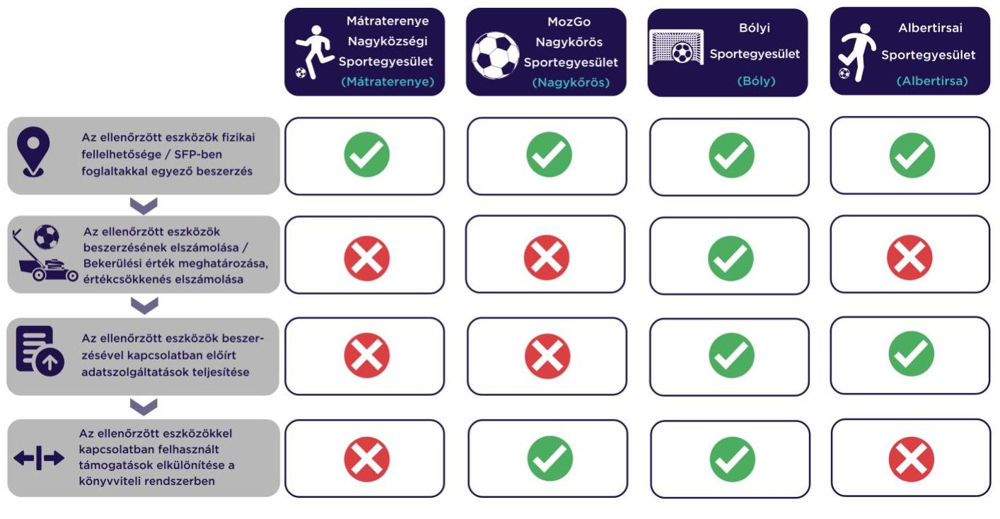

# JELENTÉS 

## Sportegyesületek eszközbeszerzésre kapott támogatás felhasználása szabályszerűségének ellenőrzése

Mátraterenye Nagyközségi Sportegyesület, MozGo Nagykőrös Sportegyesület, Bólyi Sportegyesület, Albertirsai Sportegyesület

2023.

---

# JELENTÉS 

## Sportegyesületek eszközbeszerzésre kapott támogatás felhasználása szabályszerűségének ellenőrzése

Mátraterenye Nagyközségi Sportegyesület, MozGo Nagykőrös Sportegyesület, Bólyi Sportegyesület, Albertirsai Sportegyesület

2023.

---

# ELLENŐRZÉSI IGAZGATÓSÁG: 

## ÁLLAMHÁZTARTÁSON KÍVÜLI SZERVEZETEKET ELLENŐRZŐ IGAZGATÓSÁG

## ELLENŐRZÉSI IGAZGATÓ:

## KLINGA LÁSZLÓ igazgató

## ELLENŐRZÉSVEZETŐ:

## KAKAS SÁNDOR ellenőrzésvezető

SALAMIN VIKTOR ellenőrzésvezető

IKTATÓSZÁM: EL-3870-091/2023.
TÉMASZÁM: 2638.
ELLENŐRZÉS-AZONOSÍTÓ SZÁM: V1027

---

# TARTALOMJEGYZÉK 

- AZ ELLENŐRZÉS ALAPADATAI ..... 5
- AZ ELLENŐRZÖTT SZERVEZETEK ..... 6
- ÖSSZEFOGLALÁS ..... 7
- AZ ELLENŐRZÉS FÓKUSZKÉRDÉSE ..... 9
- MEGÁLLAPÍTÁSOK ..... 10
- JAVASLATOK ..... 12
- MELLÉKLETEK ..... 13
I. sz. melléklet: Értelmező szótár ..... 13
II. sz. melléklet: Az ellenőrzött szervezetek jegyzéke ..... 14
- FÜGGELÉK: ÉSZREVÉTELEK ..... 15
- RÖVIDÍTÉSEK JEGYZÉKE ..... 16

---

.

---

# AZ ELLENŐRZÉS ALAPADATAI 

## AZ ELLENŐRZÉS CÉLJA

Annak ellenőrzése, hogy az ellenőrzött sportegyesületeknél a $\mathrm{TAO}^{1}$ támogatásból megvalósult kiválasztott eszközbeszerzések szabályszerűen történtek-e.

## AZ ELLENŐRZÉS TÍPUSA

Szabályszerűségi ellenőrzés.

## AZ ELLENŐRZÖTT IDŐSZAK

A kiválasztott sportfejlesztési támogatás felhasználásáról szóló döntéstől a helyszíni ellenőrzés napjáig tartó időszak.

## AZ ELLENŐRZÉS TÁRGYA

A sportegyesületeknél a TAO támogatásból megvalósult kiválasztott eszközbeszerzések ellenőrzése.

## AZ ELLENŐRZÉS JOGALAPJA

Az ellenőrzés jogalapját az ÁSZ tv. ${ }^{2} 1 . \S$ (3), valamint az 5. § (3) bekezdése képezte.

## AZ ELLENŐRZÉS MÓDSZERE

Az ellenőrzést az ellenőrzési program szempontjai, az ellenőrzött időszakban hatályos jogszabályok, előírások, az ellenőrzés általános szakmai szabályai, az ellenőrzésre irányadó ÁSZ ${ }^{3}$ módszertanok figyelembevételével végezte az ÁSZ.

Az ellenőrzési kérdések megválaszolásához szükséges bizonyítékok megszerzése az ellenőrzött szervezet által rendelkezésre bocsátott dokumentumokra, adatokra alapozva kérdésfeltevés (információkérés), helyszíni szemle, interjú, mintavételezés útján történt. A helyszíni szemle során a sportfejlesztési program alapján beszerzett eszközök közül legalább 3 - legnagyobb értékű - eszköz került kiválasztásra. Az ellenőrzésvezető a helyszíni ellenőrzés során további eszközök ellenőrzéséről is dönthetett.

Az ellenőrzési bizonyítékként felhasználható adatforrások közé tartoznak egyrészt az ellenőrzéshez kért dokumentumok, adatforrások, másrészt adatforrás lehet még minden - az ellenőrzés folyamán - feltárt, az ellenőrzés szempontjából információkat tartalmazó dokumentum.

Az ellenőrzés lefolytatásához az ellenőrzött szervezet a tanúsítványok kitöltésével, valamint az ÁSZ által kért dokumentumok, adatok, információk megküldésével és az ellenőrzés során szolgáltat adatokat.

---

# AZ ELLENŐRZÖTT SZERVEZETEK 

## MÁTRATERENYE NAGYKÖZSÉGI SPORTEGYESÜLET

Az ellenőrzés a labdarúgás sportágat érintő SFP-46688/2021/MLSZ számú, 2021. május 8-án határozattal jóváhagyott sportfejlesztési program megvalósítására eszközbeszerzés jogcímen kapott TAO támogatásból 2021-2022. években megvalósult eszközbeszerzések elszámolásának szabályszerűségére és a helyszíni ellenőrzés során a kiválasztott, beszerzett eszközök fizikai szemrevételezésére irányult.

Az ellenőrzött SFP-46688/2021/MLSZ számú sportfejlesztési program keretében 3 eszközt szerzett be az ellenőrzés megkezdéséig. A beszerzett eszközök beszerzési árából a támogatott összeg 1390 E Ft, ebből a helyszíni ellenőrzés keretében valamennyi eszköz szemrevételezésre került.

## MOZGO NAGYKÖRÖS SPORTEGYESÜLET

Az ellenőrzés a labdarúgás sportágat érintő SFP-51896/2021/MLSZ számú, 2021. május 14-én határozattal jóváhagyott sportfejlesztési program megvalósítására eszközbeszerzés jogcímen kapott TAO támogatásból 2021-2022. években megvalósult eszközbeszerzések elszámolásának szabályszerűségére és a helyszíni ellenőrzés során a kiválasztott, beszerzett eszközök fizikai szemrevételezésére irányult.

Az ellenőrzött SFP-051896/2021/MVSZL számú sportfejlesztési program keretében 6 eszközt szerzett be az ellenőrzés megkezdéséig. A beszerzett eszközök beszerzési árából a támogatott összeg 14493 E Ft, ebből a helyszíni ellenőrzés keretében valamennyi eszköz szemrevételezésre került.

## BÓLYI SPORTEGYESÜLET

Az ellenőrzés a labdarúgás sportágat érintő SFP-45583/2021/MLSZ számú, 2021. május 10-én határozattal jóváhagyott sportfejlesztési program megvalósítására eszközbeszerzés jogcímen kapott TAO támogatásból 2021-2022. években megvalósult eszközbeszerzések elszámolásának szabályszerűségére és a helyszíni ellenőrzés során a kiválasztott, beszerzett eszközök fizikai szemrevételezésére irányult.

Az ellenőrzött SFP-45583/2021/MLSZ számú sportfejlesztési program keretében az ellenőrzött 4 db eszközkategóriából összesen 44 eszközt szerzett be az ellenőrzés megkezdéséig. A beszerzett eszközök beszerzési árából a támogatott összeg 2577 E Ft, ebből a helyszíni ellenőrzés keretében valamennyi eszköz szemrevételezésre került.

## AlbertIRSAI SPORTEGYESÜLET

Az ellenőrzés a labdarúgás sportág SFP-44114/2021/MLSZ számú, 2021. május 13-án határozattal jóváhagyott, majd 2022. augusztus 13-i kérelemnek megfelelően meghosszabbított (hosszabbítás engedélyezési határideje: 2023. június 30.) sportfejlesztési program megvalósítására eszközbeszerzés jogcímen kapott TAO támogatásból 2021-2022. években megvalósult eszközbeszerzések elszámolásának szabályszerűségére és a helyszíni ellenőrzés során a beszerzett eszközök fizikai szemrevételezésére irányult.

Az ellenőrzött a SFP-44114/2021/MLSZ számú sportfejlesztési program keretében 5 tárgyi eszközt szerzett be az ellenőrzés megkezdéséig. A beszerzett eszközök beszerzési árából a támogatott összeg 1201 E Ft volt, ebből a helyszíni ellenőrzés keretében - egy, dokumentáltan a telephelyen kívül használt eszköz kivételével - valamennyi eszköz szemrevételezésre került.

---

# ÖSSZEFOGLALÁS 

A Sportegyesület ${ }_{3}$-nál ${ }^{4}$ az ellenőrzött eszközbeszerzésre kapott támogatások felhasználása szabályszerűen valósult meg. A Sportegyesület ${ }_{1,2,4}$-nél ${ }^{5}$ az eszközbeszerzésre kapott támogatásokat eszközbeszerzésre fordították, de a támogatások, illetve a beszerzett eszközök számviteli nyilvántartása, elszámolása és a vonatkozó adatszolgáltatási kötelezettségek tekintetében szabálytalanságokat tárt fel az ellenőrzés.

A Sportegyesület ${ }_{1}$ a Számv. tv. ${ }^{6}$-ben és a Civil tv. ${ }^{7}$-ben foglalt előírások ellenére könyvvezetési és beszámolási kötelezettségének nem tett eleget. A könyvvezetési kötelezettség teljesítésének hiányában a 2022. évben a Sportegyesület ${ }_{1}$ esetében a tárgyi eszköz beszerzések elszámolása, a bekerülési érték meghatározása, az értékcsökkenés elszámolása, a támogatások és azok felhasználásának elkülönítése nem történt meg. Az ÁSZ a közpénzek kezelésével kapcsolatos jogszabályellenes állapot és a feltárt súlyos hiányosságok megszüntetésére felhívást küldött a Sportegyesület ${ }_{1}$ elnöke részére, melyben a hiányosságok megszüntetésére tett intézkedések igazolására szolgáló dokumentumok megküldését kérte. A Sportegyesület ${ }_{1}$ elnöke az ÁSZ felhívására nem reagált, a kért dokumentumokat nem küldte meg, a szabálytalanságok megszüntetését nem igazolta. A feltárt szabálytalanságok felvetik a pénzeszközök kezelésére vonatkozó szabályok súlyos megsértését és a támogatások nem szabályszerű, céltól eltérő felhasználásának lehetőségét. Ennek okán a feltárt szabálytalanságokról az ÁSZ tájékoztatást küldött az MLSZ ${ }^{8}$, mint támogató felé, aki a kifizetett és elszámolt támogatásokkal kapcsolatban jogosult átfogó ellenőrzést lefolytatni.

Az ÁSZ tv. 31/A. § (1) bekezdés b) pontja értelmében amennyiben a számvevőszéki ellenőrzés a pénzeszközök kezelésére vonatkozó szabályok súlyos megsértésével történő károkozást, illetve ennek veszélyét állapítja meg, a kár megelőzése, illetve enyhítése érdekében az ÁSZ elnöke az illetékes hatósághoz, illetve szervezethez fordulhat az államháztartás valamelyik alrendszeréből nyújtott támogatások folyósításának felfüggesztése érdekében. A Sportegyesület ${ }_{1}$ által kapott TAO támogatás a Tao tv. ${ }^{9}$ 22/C. § szerinti látványcsapatsportok támogatásának adókedvezménye, amely során az adózó a TAO támogatást a Sportegyesület ${ }_{1}$ önálló fizetési számlájára közvetlenül utalta át, és a Tao tv. 23. § (4) bekezdés szerint az adókedvezményt adóvisszatartás formájában vette igénybe. Tekintettel arra, hogy az adózó közvetlenül a Sportegyesület ${ }_{1}$ fizetési számlájára utalta a TAO támogatást, a fenti esetben nincs lehetőség az ÁSZ tv. 31/A. § (1) bekezdés b) pontja szerinti vagyonmegóvási intézkedés alkalmazására, hiszen a TAO támogatás közvetlen átutalása lehetetlenné teszi a folyósítás felfüggesztését, a jogintézmény használhatóságát. Az ÁSZ az azonosított joghézag megszüntetésére irányuló jelzéssel élt a Honvédelmi Minisztérium felé.

A Sportegyesület ${ }_{1-4}$ az SFP ${ }_{1-4}{ }^{10}$-ben meghatározott támogatások felhasználásával az $\mathrm{SFP}_{1-4}$-ben szereplő eszközöket vásárolta meg. Az eszközök a nyilvántartással összhangban a helyszíni szemrevételezés során - egy, dokumentáltan a telephelyen kívül használt eszköz kivételével - fellelhetőek voltak.

A bekerülési érték meghatározása Sportegyesület ${ }_{2}$-nél, valamint az értékcsökkenés elszámolása a Sportegyesület ${ }_{2,4}$-nél nem volt szabályszerű, mivel nem felelt meg a Számv. tv.-ben és belső szabályzatban foglaltaknak.

---

Az előírt elszámolási, adatszolgáltatási kötelezettségét a Sportegyesület ${ }_{3,4}$ a 107/2011. Korm. rendeletben ${ }^{11}$ előírtaknak megfelelően teljesítette.

A Sportegyesület ${ }_{1,2}$ a 107/2011. Korm. rendeletben előírtakkal ellentétben teljeskörűen nem teljesítette adatszolgáltatási kötelezettségét, mivel a támogató részére előrehaladási jelentést nem készítettek.

Az ellenőrzött eszközökkel kapcsolatos támogatások felhasználásának könyvvitelben való elkülönítése a Sportegyesület ${ }_{2,3}$-nál a jogszabályoknak megfelelően történt. A Sportegyesület ${ }_{4}$-nél a Civil tv., valamint a 107/2011. Korm. rendeletben előírtakkal ellentétben az ellenőrzött eszközökre kapott támogatások felhasználását a könyvviteli rendszerében nem különítette el.

# AZ ELLENŐRZÉS FŐBB TAPASZTALATAINAK ÖSZEGZÉSE SPORTEGYESÜLETENKÉNT 

---

# AZ ELLENŐRZÉS FÓKUSZKÉRDÉSE 

1. Szabályszerü volt-e a Sportegyesületek eszközbeszerzésre kapott támogatásának felhasználása?

---

# 1. Szabályszerú volt-e a Sportegyesületek eszközbeszerzésre kapott támogatásának felhasználása? 

Összegző megállapítás A Sportegyesület ${ }_{3}$-nál az ellenőrzött eszközbeszerzésre kapott támogatások felhasználása szabályszerűen valósult meg. A Sportegyesület ${ }_{1,2,4}$-nél az eszközbeszerzésre kapott támogatásokat eszközbeszerzésre fordították, de a támogatások, illetve a beszerzett eszközök számviteli nyilvántartása, elszámolása és a vonatkozó adatszolgáltatási kötelezettségek tekintetében szabálytalanságokat tárt fel az ellenőrzés.

Az ellenőrzött eszközök fizikai fellelhetősége, SFP ${ }_{1-4}$-ben foglaltakkal egyező tartalma
A támogatásból beszerzett ellenőrzött eszközök a Sportegyesület ${ }_{1-4}$-nél a helyszíni szemrevételezés során - egy, dokumentáltan a telephelyen kívül használt eszköz kivételével - fizikailag fellelhetőek voltak. A helyszíni szemle során az ellenőrzött támogatásból beszerzett eszközök leltári szám, az eszköz típusa, megnevezése, illetve gyári száma alapján beazonosíthatóak voltak.
A Sportegyesület ${ }_{1-4}$ az $\mathrm{SFP}_{1-4}$-ben meghatározott támogatásokat az $\mathrm{SFP}_{1-4}$-ben jóváhagyott eszközök beszerzésére fordította.

Az ellenőrzött eszközök beszerzésének elszámolása, a bekerülési érték és az értékcsökkenés meghatározása

A Sportegyesület ${ }_{1}$ a Számv. tv. 159. §-ban foglaltak ellenére a 2022. évben nem vezetett a kezelésében, használatában, tulajdonában lévő eszközökről és azok forrásairól, a gazdasági múveletekről könyvviteli nyilvántartást, a Számv. tv. 12. § (1) bekezdésében foglaltak ellenére könyvvezetési kötelezettségének nem tett eleget, a Civil tv. 28. § (1) bekezdésében foglaltak ellenére nem készített beszámolót a szervezet működéséről, vagyoni, pénzügyi és jövedelmi helyezéről. A Sportegyesület ${ }_{1}$ a könyvvezetés hiányában nem felelt meg a Számv. tv. 26. § (1) bekezdésében foglaltaknak, mivel az ellenőrzött eszközökről egyedi nyilvántartást nem vezetett, a Számv. tv. 47. § (1)-(4), (7) bekezdéseiben előírtak ellenére az ellenőrzött tárgyi eszközök tekintetében a bekerülési érték meghatározása nem történt meg. A támogatásból beszerzett három tárgyi eszköz vonatkozásában a Számv. tv. 80. § (1) bekezdésében foglaltaknak ellenére értékesökkenés nem került elszámolásra.

A Sportegyesület ${ }_{3,4}$ az ellenőrzött eszközbeszerzéseket a Számv. tv.-ben előírtak szerint számolta el. Az ellenőrzött eszközök beszerzései és elszámolásai a Számv. tv.-ben előírtaknak megfelelő, szabályszerű bizonylattal alátámasztottak voltak.

A Sportegyesület ${ }_{1}$ a tárgyi eszközök beszerzését elszámolta az MLSZ, mint támogató felé, az elszámolás azonban nem felelt meg a 107/2011. (VI.30.) Korm. rendelet 11. § (4) bekezdés, illetve a Számv. tv. 165. §

---

(1) bekezdés előírásainak, mivel az elszámolásban szereplő egy tétel elszámolása számlával nem volt alátámasztott.

A Sportegyesület ${ }_{2}$ a 2021. évben beszerzett tárgyi eszközök beszerzését a Számv. tv.-ben előírtak szerint számolta el, a 2022. évben azonban a beszerzett eszközök elszámolása nem felelt meg a Számv. tv. 159. § (1) bekezdésében foglaltaknak, mivel a számviteli nyilvántartásában nem mutatta ki a tárgyi eszközöket.
A Sportegyesület ${ }_{3}$-nál az ellenőrzött eszközök bekerülési értékének megállapítása, az értékcsökkenés elszámolása a Számv. tv.-ben előírtak szerint történt.
A Sportegyesület ${ }_{2}$-nél az ellenőrzött tárgyi eszközök bekerülési értékének megállapítása a Számv. tv.-ben előírtak szerint történt. Négy tárgyi eszköz esetében az értékcsökkenés elszámolása 2021. évben megfelelt a Számv. tv.-ben előírtaknak, 2022. évben azonban három tárgyi eszköz esetében a Számv. tv. 80. $\$ (2) bekezdésében előírtak ellenére nem került elszámolásra értékcsökkenés.
A Sportegyesület ${ }_{4}$-nél a beszerzett eszközök bekerülési értékének megállapítása a Számv. tv.-ben előírtak szerint történt. A Sportegyesület ${ }_{4}$-nél 2021. évben egy ellenőrzött tárgyi eszköz esetében az értékcsökkenés alkalmazott módszere és összegének elszámolása nem felelt meg a Számv. tv. 14. § (4) bekezdés előírása alapján a Számviteli politikában rögzített értékelési szabálynak. A szabályzat a számítástechnikai eszközök elhasználódási idejét 2 évben, leírási kulcsát $50 \%$-ban határozta meg, a nyilvántartás alapján azonban a leírás idejét 3 évben, a leírási kulcsot $33 \%$-ban rögzítették.

# Az ellenőrzött eszközökkel kapcsolatos előírt adatszolgáltatások teljesítése 

Az $\mathrm{SFP}_{3-4}$ vonatkozásában a 107/2011. Korm. rendeletben előírt elszámolási és adatszolgáltatási kötelezettségének a Sportegyesület ${ }_{3-4}$ eleget tett, az előrehaladási jelentések, záró elszámolások beküldésre kerültek az MLSZ felé. Az SFP ${ }_{1-2}$ vonatkozásában a 107/2011. Korm. rendelet 11.§ (2) bekezdésében előírt tájékoztatási kötelezettségének a Sportegyesület ${ }_{1-2}$ nem tett eleget, a támogatások felhasználásáról szóló előrehaladási jelentések nem kerültek beküldésre az MLSZ felé.

## Az ellenőrzött eszközökkel kapcsolatban felhasznált támogatások elkülönítése a könyvviteli rendszerben

A Sportegyesület ${ }_{2,3}$ a 107/2011. Korm. rendeletben, illetve a Civil tv.-ben foglaltakkal összhangban a támogatásból beszerzett ellenőrzött eszközöket a könyvviteli rendszerében elkülönítetten nyilvántartotta. A Sportegyesület ${ }_{1,4}$ a Civil tv. 20. § (4) bekezdésében foglaltak ellenére nem vezetett elkülönített nyilvántartást a támogatásokról és azok felhasználásáról, melyek alapján támogatásonként megállapítható és ellenőrizhető a kapott támogatás felhasználása.

---

# JAVASLATOK 

Az ÁSZ tv. 33. § (1) bekezdésében foglaltak értelmében az ellenőrzött szervezet vezetője köteles a jelentésben foglalt megállapításokhoz kapcsolódó intézkedési tervet összeállítani és azt a jelentés kézhezvételétől számított 30 napon belül az ÁSZ részére megküldeni. Amennyiben az ellenőrzött szervezet vezetője nem küldi meg határidőben az intézkedési tervet, vagy továbbra sem elfogadható intézkedési tervet küld, az Állami Számvevőszék elnöke az ÁSZ tv. 33. § (3) bekezdése a) és b) pontjaiban foglaltakat érvényesítheti.

## A MÁTRATERENYE NAGYKÖZSÉGI SPORTEGYESÜLET ELNÖKE RÉSZÉRE

1. Gondoskodjon a könyvviteli nyilvántartás vezetéséről, valamint tegyen eleget könyvvezetési kötelezettségének a Számv. tv.-ben elöírtak szerint.
2. Gondoskodjon a Sportegyesület müködéséről, vagyoni, pénzügyi és jövedelmi helyzetéről szóló beszámoló elkészítéséről a Civil tv.-ben elöírtak szerint.

## A MOZGO NAGYKÖRÖS SPORTEGYESÜLET ELNÖKE RÉSZÉRE

1. Gondoskodjon a tárgyi eszközök számviteli nyilvántartásban történő kimutatásáról a Számv. tv.-ben elöírtak szerint.
2. Gondoskodjon a tárgyi eszközök esetében az értékcsökkenés elszámolásáról a Számv. tv.-ben elöírtak szerint.

## AZ ALBERTIRSAI SPORTEGYESÜLET ELNÖKE RÉSZÉRE

1. Gondoskodjon a támogatásokról és azok felhasználásáról elkülönített nyilvántartás vezetéséről a Civil tv.-ben elöírtak szerint.

---

# MELLÉKLETEK 

## I. SZ. MELLÉKLET: ÉRTELMEZŐ SZÓTÁR

TAO támogatás
kiválasztott eszköz
sportfejlesztési program
sportegyesület
látvány-csapatsport támogatása: az adóévben visszafizetési kötelezettség nélkül nyújtott támogatás, juttatás, véglegesen átadott pénzeszköz és térítés nélkül átadott eszköz könyv szerinti értéke, az adóévben térítés nélkül nyújtott szolgáltatás bekerülési értéke az e törvényben meghatározott jogcímeken (Tao tv. 4.§ 44. pont)
az ÁSZ által ellenőrzésre kiválasztott tárgyi eszköz, forgóeszköz
a támogatás igénybevételére jogosult szervezet által készített, a sportpolitikáért felelős miniszter, illetve az országos sportági szakszövetség által jóváhagyott, a látvány-csapatsport támogatás igénybevételének feltételét képező, tervezett támogatással érintett sportfejlesztési program (Tao. tv. 22/C. § (3e) bekezdés)
a sportegyesület olyan egyesület, amelynek alaptevékenysége a sporttevékenység szervezése, valamint a sporttevékenység feltételeinek megteremtése (Sport tv. ${ }^{12}$ 16. § (1) bekezdése, Civil tv., Ptk. ${ }^{13}$ )

---

II. SZ. MELLÉKLET: AZ ELLENŐRZÖTT SZERVEZETEK JEGYZÉKE

|  SSZ. | SPOATEGYESÜLET MÉGNEVEZÉSE | SZÉKHELY  |
| --- | --- | --- |
|  1. | Mátraterenye Nagyközségi Sportegyesület | Mátraterenye  |
|  2. | MozGo Nagykórös Sportegyesület | Nagykórös  |
|  3. | Bólyi Sportegyesület | Bóly  |
|  4. | Albertirsai Sportegyesület | Albertirsa  |

---

# FÜGGELÉK: ÉSZREVÉTELEK 

A jelentéstervezetet a Számvevőszék 15 napos észrevételezésre megküldte az ellenőrzött szervezet vezetőjének az ÁSZ tv. 29. §* (1) bekezdése elöírásának megfelelően.

A Mátraterenye Nagyközségi Sportegyesület elnöke, a MozGo Nagykörös Sportegyesület, valamint a Bólyi Sportegyesület elnökei a jelentéstervezetre nem tettek észrevételt. Az Albertirsai Sportegyesület elnöke a jelentéstervezetre észrevételt tett. A függelék tartalmazza az Albertirsai Sportegyesület elnökének észrevételét, illetve az el nem fogadott észrevétel elutasításának indoklását.

## Az Albertirsai Sportegyesület elnökének észrevétele:

„A jelentéstervezetben szereplő kijelentéssel ellentétben a könyvelést elkiülönítetten végezzük, mert munkaszámra könyvelünk. Ezt a tényt a korábbiakban beküldött és szemlézett dokumentumok támasztják alá."

## Az észrevétellel érintett megállapítás:

„A Sportegyesület, a Civil tv. 20. § (4) bekezdésében foglaltak ellenére nem vezetett elkiülönített nyilvántartást a támogatásokról és azok felhasználásáról, melyek alapján támogatásonként megállapítható és ellenórizhető a kapott támogatás felhasználása."

## El nem fogadás indoklása:

Az ÁSZ az elkülönítési kötelezettséggel kapcsolatos megállapítását fenntartja, mivel a beküldött 2021. és 2022. évi főkönyvi kivonat alapján a TAO támogatás felhasználásának egyértelmű elkülönítése nem valósult meg. A beküldött tárgyi eszköz nyilvántartó lapon különböző munkaszámok szerepelnek (Notebook munkaszám 011, gőzmosógép és hőszivattyús szárítógép esetében munkaszám 012), így a támogatás felhasználásának egyértelmű elkülönített nyilvántartása nem igazolt. Továbbá az elnök által 2023. július 11-én kiállított, a bekért adatokra vonatkozó teljességi és hitelességi nyilatkozat alapján a TAO támogatás elszámolásának tételes elkülönített kimutatására vonatkozó dokumentumot nem küldött az ÁSZ részére.

[^0]
[^0]:    * 29. § (1) Az Állami Számvevőszék az ellenőrzési megállapításait megküldi az ellenőrzött szervezet vezetőjének vagy az általa megbízott személynek, és annak, akinek személyes felelősségét állapította meg.
    (2) Az ellenőrzött szervezet vezetője és a felelősként megjelölt személy az ellenőrzés megállapításaira tizenöt napon belül írásban észrevételt tehet.
    (3) Az Állami Számvevőszék az észrevételre a beérkezésétől számított harminc napon belül írásban válaszol. A figyelembe nem vett észrevételeket köteles a jelentésben feltüntetni, és megindokolni, hogy azokat miért nem fogadta el.

---

# RÖVIDÍTÉSEK JEGYZÉKE 

${ }^{1}$ TAO
${ }^{2}$ ÁSZ tv.
${ }^{3}$ ÁSZ
${ }^{4}$ Sportegyesület ${ }_{3}$
${ }^{5}$ Sportegyesület ${ }_{1,2,4}$
${ }^{6}$ Számv. tv.
${ }^{7}$ Civil tv.
${ }^{8}$ MLSZ
${ }^{9}$ Tao tv.
${ }^{10} \mathrm{SFP}_{1-4}$
${ }^{11}$ 107/2011. Korm. rendelet
${ }^{12}$ Sport tv.
${ }^{13}$ Ptk.

Társasági adó
2011. évi LXVI. törvény az Állami Számvevőszékről

Állami Számvevőszék
${ }_{1}$ Bólyi Sportegyesület (Bólyi SE)
${ }_{1}$ Mátraterenye Nagyközségi Sportegyesület (Mátraterenye SE)
${ }_{2}$ MozGo Nagykörös Sportegyesület (Nagykörös SE)
${ }_{4}$ Albertirsai Sportegyesület (Albertirsai SE)
2000. évi C. törvény a számvitelről
2011. évi CLXXV. törvény az egyesülési jogról, a közhasznú jogállásról, valamint a civil szervezetek múködéséről és támogatásáról
Magyar Labdarúgó Szövetség
1996. évi LXXXI. törvény a társasági adóról és az osztalékadóról
${ }_{1}$ SFP-46688/2021/MLSZ számú sportfejlesztési program
${ }_{2}$ SFP- 51896/2021/MLSZ számú sportfejlesztési program
${ }_{3}$ SFP-45583/2021/MLSZ számú sportfejlesztési program
${ }_{4}$ SFP-44114/2021/MLSZ számú sportfejlesztési program
107/2011. (VI. 30.) Korm. rendelet a látvány-csapatsport támogatását biztosító támogatási igazolás kiállításáról, felhasználásáról, a támogatás elszámolásának és ellenőrzésének, valamint visszafizetésének szabályairól
2004. évi I. törvény a sportról
2013. évi V. törvény a Polgári Törvénykönyvről

---

1052 Budapest, Apáczai Csere János u. 10. | 1364 Budapest 4., Pf. 54
www.asz.hu | szamvevoszek@asz.hu
telefon: +36 14849100