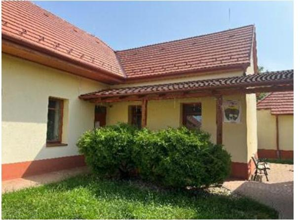
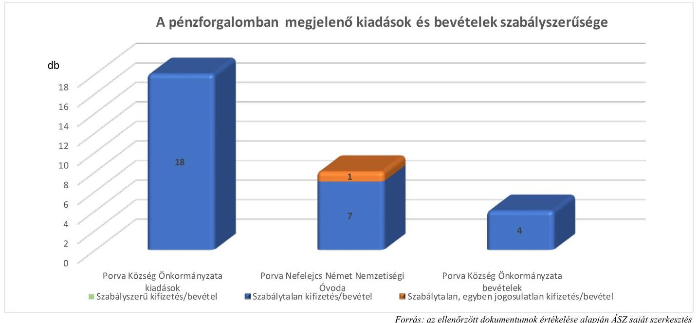

# JELENTÉS 

## Az önkormányzatok gazdálkodásának célvizsgálata

Az önkormányzatok ellenőrzése - a pénzforgalomban megjelenő kiadások teljesítésének és elszámolásának megfelelősége

A pénzforgalomban megjelenő vagyonhasznosítási bevételek beszedésének és elszámolásának megfelelősége

Porva Községi Önkormányzat

2023.

---

# JELENTÉS 

## Az önkormányzatok gazdálkodásának célvizsgálata

Az önkormányzatok ellenőrzése - a pénzforgalomban megjelenő kiadások teljesítésének és elszámolásának megfelelősége

A pénzforgalomban megjelenő vagyonhasznosítási bevételek beszedésének és elszámolásának megfelelősége

Porva Községi Önkormányzat

2023.

---

# ELLENŐRZÉSI IGAZGATÓSÁG: 

## ÁLLAMHÁZTARTÁS HELYI SZINTJÉT ELLENŐRZŐ IGAZGATÓSÁG

ELLENŐRZÉSI IGAZGATÓ:
KISGERGELY ISTVÁN igazgató

ELLENŐRZÉSVEZETŐ:
$\square$ LAJTERNÉ HUDÁK MAGDOLNA ellenőrzésvezető

IKTATÓSZÁM: EL-3928-007/2023.
TÉMASZÁM: 2658
ELLENŐRZÉS-AZONOSÍTÓ SZÁM: V1002005

---

# TARTALOMJEGYZÉK 

AZ ELLENŐRZÉS ALAPADATAI ..... 5
AZ ELLENŐRZÖTT SZERVEZETEK ..... 7
ÖSSZEFOGLALÁS ..... 9
AZ ELLENŐRZÉS FÓKUSZKÉRDÉSEI ..... 11
MEGÁLLAPÍTÁSOK ..... 12
JAVASLATOK ..... 23
MELLÉKLETEK ..... 25
I. sz. melléklet: Az ellenőrzött szervezetek jegyzéke ..... 25
II. sz. melléklet: Összefoglaló táblázat az ellenőrzött szervezetek gazdálkodási jogköreinek gyakorlásáról ellenőrzött gazdasági eseményenként ..... 26
III. sz. melléklet: Porva Község Önkormányzata és a Porvai Nefelejes Német Nemzetiségi Óvoda esetében ellenőrzött, késedelmesen könyvelt gazdasági események ..... 30
IV. sz. melléklet: Ellenőrzési kritériumok ..... 31
FÜGGELÉK: ÉSZREVÉTELEK ..... 32
RÖVIDÍTÉSEK JEGYZÉKE ..... 33

---

.

---

# AZ ELLENŐRZÉS ALAPADATAI 

## AZ ELLENŐRZÉS CÉLJA

Az ellenőrzés célja annak értékelése, hogy az Önkormányzatnál ${ }^{1}$ és az Intézménynél ${ }^{2}$ a pénzforgalomban megjelenő kiadások teljesítése és elszámolása, továbbá az Önkormányzatnál a pénzforgalomban megjelenő vagyonhasznosítási bevételek beszedése és elszámolása megfelelő volt-e, azok az Önkormányzat, illetve az Intézmény közfeladat-ellátásához kapcsolódtak-e.

## AZ ELLENŐRZÉS TÍPUSA

Megfelelőségi ellenőrzés.

## AZ ELLENŐRZÖTT IDŐSZAK

Az ellenőrzött időszak a 2022. év és a 2023. év, az ellenőrzés megállapításainak az ÁSZ tv. ${ }^{3} 29 . \S$ (1) bekezdése szerinti megküldése napjáig.

## AZ ELLENŐRZÉS TÁRGYA

Az Önkormányzat és az Intézmény pénzforgalmában megjelenő kiadások teljesítésének és elszámolásának, továbbá az Önkormányzat pénzforgalmában megjelenő vagyonhasznosítási bevételek megalapozottságának és elszámolásának, azok közfeladat-ellátás céljára történő felhasználásának a megfelelősége. Az ellenőrzés kiemelten fókuszált a kiadások jogosságának, szabályszerűségének értékelésére, a költségvetési források közfeladat-ellátás érdekében történő felhasználására, végrehajtására, figyelemmel a kontrollok gyakorlati alkalmazására is.

## AZ ELLENŐRZÉS JOGALAPJA

Az ellenőrzés jogalapját az ÁSZ tv. 1. § (3) bekezdése, és 5. § (2)-(3), (6) bekezdései képezték.

## AZ ELLENŐRZÉS MÓDSZERE

Az ellenőrzést a nemzetközi standardokat irányadónak tekintve az ellenőrzési program szempontjai, az ellenőrzési időszakban hatályos jogszabályok, az ellenőrzés szakmai szabályok és módszertanok figyelembevételével végezte az ÁSZ ${ }^{4}$.

Az ellenőrzési kérdések megválaszolásához szükséges bizonyítékok megszerzése az ellenőrzött szervezetek által rendelkezésre bocsátott dokumentumokra és adatokra, valamint az ellenőrzést támogató

---

szervezetektől ${ }^{5}$ kapott adatokra alapozva, továbbá megfigyelés, szemle (szemrevételezés), kérdésfeltevés (információkérés), valamint elemző eljárás útján történt.

Az ellenőrzés során bizonyítékként felhasználható adatforrások közé tartoztak egyrészt az ellenőrzéshez kért dokumentumok, adatforrások, másrészt adatforrás volt még a közhiteles nyilvántartásból (Magyar Államkincstár nyilvántartásai, Önkormányzati rendellettár) származó, az ellenőrzés szempontjából információkat tartalmazó dokumentum.

Az ellenőrzés lefolytatásához az ellenőrzött szervezetek az ÁSZ által kért dokumentumok, adatok, információk megküldésével az ellenőrzés során szolgáltattak adatokat. A rendelkezésre bocsátott adatok, információk kontrolljára helyszíni ellenőrzés keretében is sor került.

Az ellenőrzés során az Önkormányzatnál 18 kiadási és négy bevételi, az Intézménynél nyolc kiadási gazdasági eseményt vizsgált az ÁSZ. A pénzforgalomban megjelenő kiadások teljesítése és a vagyonhasznosítási bevételek megalapozottsága megfelelőségének ellenőrzése során a működés, gazdálkodás kockázatos területeinek meghatározását követően az ellenőrzött szervezetekre vonatkozó főkönyvi adatbázisokból irányított mintavételi eljárások alapján történt a mintatételek kiválasztása. A lényeges és kockázatos tételek beazonosítására egyedi kockázatértékelés alapján került sor. A tények feltárása és azok összegzése során a megállapítások az ellenőrzött mintatételekre vonatkozóan kerültek megfogalmazásra.

Az ellenőrzés kiemelten kezelte a kifizetések és a vagyonhasznosítási bevételek közfeladat ellátáshoz való közvetlen kapcsolódásának, kötelezettségvállalás szerinti teljesülésének, jogosságának és szabályszerűségének értékelését, figyelemmel a kontrollok gyakorlati múködésére is.

Az ellenőrzés kiterjedt minden olyan körülményre és adatra, amely az ÁSZ jogszabályban meghatározott feladatainak teljesítéséhez, valamint a program végrehajtása folyamán felmerült újabb összefüggések feltárásához szükséges volt.

---

# AZ ELLENŐRZÖTT SZERVEZETEK

Porva község a Közép-Dunántúlon, Veszprém vármegyében a zirci járásban található. A község területe 28,13 km², melyből 27,67 km² külterület. A település lakónépessége 2022. január 01-jén a KSH⁵ adatai szerint 463 fő volt. A munkanélküliségi ráta az NFSZ⁷ 2023. június 20-án közzétett tájékoztatója szerint 1,6% volt.

A település polgármestere⁸ a 2006. évi önkormányzati választások óta látta el tisztségét, a Képviselő-testületnek⁹ a polgármesteren kívül négy fő képviselő tagja volt. Az Önkormányzat működésével kapcsolatos feladatokat a Bakonybéli Közös Önkormányzati Hivatal látta el, a Hivatalt¹⁰ az ellenőrzött időszakban – 2017. június 1-jétől – a jegyző¹¹ vezette.

Az Önkormányzat fenntartásában az ellenőrzött időszakban egy költségvetési szerv működött, a 2013. július 1-jén alapított, óvodai nevelést ellátó Intézmény, amelynek gazdálkodási feladatait – alapító okirata szerint – a Hivatal látta el.

Az Önkormányzat egészségügyi ellátási feladatait a Zirci Járás Önkormányzati Társulás, a szilárd hulladékkezelési feladatait az Észak-Balatoni Térség Regionális Települési Szilárdhulladék kezelési Önkormányzati Társulás útján látta el. A belső ellenőrzési feladatokról külső szolgáltatóval kötött megbízási szerződés keretében gondoskodtak.

Az Önkormányzat 2022. évi konszolidált beszámolójának főbb adatait az 1. táblázat mutatja be:

|  1. táblázat | adatok M Ft-ban  |
| --- | --- |
|  **MEGNEVEZÉS** | **2022. ÉVI KÖNSZOLIDÁLT BESZÁMOLÓ**  |
|  Költségvetési bevétel | 254,8  |
|  Ebből: önkormányzati feladatok működési támogatása | 53,0  |
|  felhalmozási célú támogatások államháztartáson belülről | 135,3  |
|  Költségvetési kiadás | 211,8  |
|  Ebből: ellátottak pénzbeli juttatásai | 1,3  |
|  dologi kiadások | 43,8  |
|  beruházások, felújítások | 86,6  |

*Forrás: Az Önkormányzat 2022. évi konszolidált beszámolóján alapján ÁSZ saját szerkesztés*

Az Önkormányzat 2022. évi költségvetési beszámolója szerint a 2022. évben a települési önkormányzatoknak jóváhagyott rendkívüli támogatásokból nem részesült, a települési önkormányzatok szociális tüzelőanyag vásárláshoz kapcsolódó támogatásaiból 2022. évben 0,7 M Ft összegű bevétele származott. Közfoglalkoztatási programhoz kapcsolódóan a 2022. évben az Önkormányzat 2022. évi költségvetési beszámolója szerint 2,6 M Ft támogatásban részesült. Az Önkormányzat a 2022. évben a Magyar Falu Program¹² keretében kommunális eszköz beszerzésre 6,4 M Ft, önkormányzati temetők

---

infrastrukturális fejlesztésére 3,3 M Ft vissza nem térítendő pályázati támogatást nyert el. A 2022. évben Területfejlesztési Operatív Program ${ }^{13}$ I. ütemének keretében 50,0 M Ft-ot, Vidékfejlesztési Program: ${ }^{14}$ keretében 75,6 M Ft támogatásban részesült az Önkormányzat. A 2023. évben a Vidékfejlesztési Program: ${ }^{15}$ keretében a bakonyi települések megújítására, a közösségi élettér és szolgáltatások fejlesztésére 3,0 M Ft támogatásban részesültek.

---

# ÖSSZEFOGLALÁS 

A településeken az önkormányzati gazdálkodás sokrétű feladatot jelent. A tevékenység összetettsége, a megfelelő képzettségű, létszámú humán-erőforrás hiánya a gazdálkodás területén magas szintű kockázatokat eredményezhet. Az ellenőrzés hozzájárul az Önkormányzat szabályszerű és felelős gazdálkodásához, a közpénzek szabályos, cél szerinti felhasználásához, a közvagyon védelméhez. Porva Község Önkormányzata az ellenőrzésre az ÁSZ által végzett kockázatelemzés alapján került kijelölésre.

Az Önkormányzat és az Intézmény pénzforgalmában megjelenő ellenőrzött kiadások teljesítése és elszámolása nem felelt meg az Áht. ${ }^{16}$-ban és Ávr. ${ }^{17}$-ben, valamint a Gazdálkodási szabályzat ${ }^{18}$-ban és a Gazdálkodási szabályzat ${ }^{19}$-ban előírtaknak. Az Önkormányzat és az Intézmény fizetési számlájáról és pénztárából a kiadási előirányzatok terhére teljesített kifizetések nem voltak szabályszerűek, mivel a közfeladatellátáshoz kapcsolódó előzetes kötelezettségvállalást igénylő 23 esetből kilenc esetben 4973,7 E Ft kifizetést érintően - az Ávr.-ben foglaltak ellenére nem, vagy nem megfelelően vállaltak írásban kötelezettséget. A kötelezettségvállalások pénzügyi ellenjegyzése 20 gazdasági esemény, összesen 14 128,5 E Ft összegű kifizetés esetében nem felelt meg az Ávr. előírásainak. Az Ávr.-ben és a Gazdálkodási szabályzat ${ }_{1,2}$-ban foglaltak ellenére az ellenőrzött gazdasági események 57,8\%-ánál, összesen 8381,8 E Ft összegű kifizetésnél elmaradt, vagy nem megfelelően végezték el a teljesítésigazolást, így nem ellenőrizték, hogy a kifizetések az arra jogosultak részére, a megfelelő összegben történtek-e, illetve, hogy az ellenszolgáltatást teljesítették-e. Az ellenőrzés hiányosságokat tárt fel az Önkormányzatnál a személyi juttatások kifizetésénél, a szolgáltatások, termékek megrendeléseinél, a kiküldetési költségek elszámolásánál, az eszközök beszerzéseinél és értékesítésénél. Az Önkormányzatnál és az Intézménynél az ellenőrzött gazdasági események - egy kivételével - a közfeladatellátáshoz kapcsolódtak.

Az Önkormányzat pénzforgalmában megjelenő ellenőrzött vagyonhasznosítási bevételekre vonatkozó döntéseket - egy kivételével - az arra jogosult hozta meg, egy esetben azonban a döntés nem volt megalapozott. A bevételek beszedése és elszámolása nem felelt meg a jogszabályi előírásoknak, mivel nem végezték el a Gazdálkodási szabályzat ${ }_{1}$ által előírt teljesítésigazolást, valamint az ellenőrzött gazdasági események vonatkozásában a tárgyi eszköz kartonok vezetése nem volt szabályszerű és a vagyonkataszteri nyilvántartás nem felelt meg az Mötv. ${ }^{20}$ előírásainak.

Az Önkormányzat és az Intézmény kötelezettségvállalás nyilvántartása nem felelt meg az Ávr.-ben foglalt előírásoknak, a feltárt hiányosságok miatt nem volt alkalmas a kötelezettségvállalás időpontjában a szabad előirányzat megállapítására. A jogszabályi előírásokkal ellentétes gyakorlat miatt fennállt a jogosulatlan kifizetések kockázata.

---

A pénzforgalomban megjelenő kifizetések és bevételek szabályszerűségét ellenőrzött szervezetenként az 1. ábra mutatja be.
1. ábra

Az Önkormányzatnál és az Intézménynél a vagyonvédelem nem volt biztosított, a helyszíni ellenőrzés során az eszközöket bemutatták, azok az üzembe helyezési jegyzőkönyv szerinti azonosító szám alapján beazonosíthatók voltak, azonban az eszközök leltári számot nem tartalmaztak. A beszerzett eszközök csoportos nyilvántartásba vétele nem felelt meg az Áhsz. előírásainak, mert azok nem azonos beszerzési árhoz tartozó, nem azonos paraméterekkel rendelkező tárgyi eszközök voltak. Az Önkormányzat tárgyi eszközökről vezetett nyilvántartása nem felelt meg a Számv. tv. ${ }^{21}$-ben és az Áhsz. 14. mellékletében foglaltaknak, mert az egyedi nyilvántartó kartonok nem álltak rendelkezésre, illetve a 2022. évi értékesítés miatti kivezetések csak a 2023. évben, az ÁSZ helyszíni ellenőrzés ideje alatt történtek meg.

Az Önkormányzatnál az Áht. előírásainak megfelelően gondoskodtak a belső ellenőrzés kialakításáról. A belső ellenőrzés 2022. évben az Önkormányzatot érintően egy, az Önkormányzat beruházási tevékenységére vonatkozó szabályszerűségi ellenőrzést végzett, amelynek - ÁSZ ellenőrzésének fókuszterületeit érintő megállapításai az ÁSZ megállapításaival összhangban voltak. A 2023. évi belső ellenőrzési terv 2023. II. félévében az Önkormányzatot érintően a befektetett pénzügyi eszközök mérlegérték megállapításának vizsgálatát tartalmazta. A belső ellenőrzés az ellenőrzött időszakban részben töltötte be a Bkr. ${ }^{22}$-ben meghatározott feladatát, mert az ellenőrzések csekély száma miatt nem járult hozzá maradéktalanul a szabályszerű működéséhez, a hiányosságok feltárásához.

Az ÁSZ az ellenőrzés során feltárt hiányosságok felszámolása, a szabályszerű működés feltételeinek megteremtése érdekében a polgármesternek öt, a jegyzőnek kilenc és az intézményvezetőnek kettő javaslatot tett.

---

# AZ ELLENŐRZÉS FÓKUSZKÉRDÉSEI 

1.- Az Önkormányzat pénzforgalmában megjelenő kiadások teljesitése és elszámolása megfelelően, az Önkormányzat feladatellátásához kapcsolódóan valósult-e meg?
2.- Az Önkormányzat pénzforgalmában megjelenő vagyonhasznosítási bevételekkel kapcsolatos döntés megalapozott volt-e, a bevételek beszedése és elszámolása megfelelően, az Önkormányzat feladatellátásához kapcsolódóan valósult-e meg?
3.- Az Intézmény pénzforgalmában megjelenő kiadások teljesitése és elszámolása megfelelően, az Intézmény feladatellátásához kapcsolódóan valósult-e meg?

---

# 1. Az Önkormányzat pénzforgalmában megjelenő kiadások teljesítése és elszámolása megfelelően, az Önkormányzat feladatellátásához kapcsolódóan valósult-e meg? 

Összegző megállapítás Az Önkormányzatnál az ellenőrzött gazdasági események során a költségvetési kiadások felhasználása az önkormányzati feladatellátáshoz kapcsolódott. Az ellenőrzött gazdasági események tekintetében a pénzforgalomban megjelenő kiadások teljesítése és elszámolása nem volt megfelelő.
1.1. számú megállapítás Az ellenőrzött kiadások közfeladat ellátásához kapcsolódtak.

Az Önkormányzatnál ellenőrzött 18 gazdasági eseményhez kapcsolódó, összesen 10 958,8 E Ft összértékủ kiadás az Mötv. előírásaival összhangban az önkormányzati kötelező, valamint önként vállalt feladatok ellátása érdekében merült fel.
1.2. számú megállapítás

A pénzforgalomban megjelenő ellenőrzött kiadások teljesítése nem felelt meg az előírásoknak.

Az ellenőrzött, előzetes írásbeli kötelezettségvállalást igénylő 18 gazdasági eseményből egy esetben (156,2 E Ft összegű kifizetésnél) az Ávr. 52. § (1) bekezdés c) pontjában foglaltak ellenére az Önkormányzat nem rendelkezett írásbeli kötelezettségvállalással, öt esetben (1557,6 E Ft összegű kifizetésnél) a kötelezettségvállalás dokumentuma nem felelt meg az Áht. és az Ávr. előírásainak.

- Nem rendelkeztek írásbeli kötelezettségvállalással az ONK_KIAD_01 gazdasági esemény vonatkozásában.
- Az ONK_KIAD_05 és az ONK_KIAD_14 gazdasági események esetében a megrendelés nem tartalmazta a kötelezettségvállalás összegét. Az ONK_KIAD_05 gazdasági eseménynél a megrendelésről hiányzott az egységár, az ONK_KIAD_14 gazdasági eseménynél a megrendelt mennyiség nem szerepelt a kötelezettségvállalás dokumentumán. Az ONK_KIAD_12 gazdasági eseményhez tartozó megbízási szerződésből az Ávr. 50. § (1) bekezdés b) pontjában foglaltak ellenére nem volt megállapítható a 2023. évi kötelezettségvállalás összege.
- Az ONK_KIAD_09 és ONK_KIAD_11 gazdasági események esetében a belföldi kiküldetésekhez alapot szolgáltató megbízási szerződések nem feleltek meg az Ávr. 51. § (2) bekezdésében előírtaknak, mivel a szerződésekben foglalt általános jelleggel meghatározott feladatok a munkavállalók munkaköri leírásaiban szerepeltek, így megbízási díj a munkaköri leírás szerint előírt feladatokra nem lett volna fizethető. Az ONK_KIAD_09 és az ONK_KIAD_11 gazdasági események esetében a hivatali dolgozók belföldi kiküldetését az Ávr. 52. § (1) bekezdés a) pontjában foglaltak és a Kiküldetési szabályzat ${ }^{23} 2$. pontjának „A kiküldetés engedélyezésére vonatkozó hatáskörök" c) alpontjában foglaltak ellenére a jegyző helyett a polgármester rendelte el.

---

A Gazdálkodási szabályzat: 3.2. pontja az előzetes írásbeli kötelezettségvállalást nem igénylő kifizetések tekintetében is előírta a pénzügyi ellenjegyzés kötelezettségét az utalványrendeleten, vagy a számviteli alapbizonylaton, pénztári bizonylaton. Az Ávr. 55. § (1) bekezdésében előírtak, valamint a Gazdálkodási szabályzat: 3.2. pontjában foglaltak ellenére a pénzügyi ellenjegyzést 12 esetben nem végezték el, ezáltal összesen 10 372,0 E Ft összegű kifizetés vonatkozásában az Áht. 37. § (1) és (1a) bekezdésének előírását megsértve nem győződtek meg a szabad előirányzat rendelkezésre állásáról. Négy esetben a pénzügyi ellenjegyzés nem volt megfelelő, két gazdasági esemény vonatkozásában az az előírások szerint történt.

- Írásos kötelezettségvállalás hiányában nem került sor a pénzügyi ellenjegyzésre a Cafetéria szabályzat ${ }^{24}$ alapján kifizetett SZÉP-kártya juttatás (ONK_KIAD_01) gazdasági eseménynél.
- Nem végezték el a pénzügyi ellenjegyzést az ONK_KIAD_02, ONK_KIAD_03, ONK_KIAD_05, ONK_KIAD_07, ONK_KIAD_08, ONK_KIAD_09, ONK_KIAD_14, ONK_KIAD_15, ONK_KIAD_16, ONK_KIAD_17 és ONK_KIAD_POT_01 kifizetések esetében, mert a kötelezettségvállalási dokumentumokon a pénzügyi ellenjegyzés ténye, valamint a pénzügyi ellenjegyző dátummal ellátott aláírása nem szerepelt.
- Nem megfelelően végezték el a pénzügyi ellenjegyzést az ONK_KIAD_06, ONK_KIAD_10, ONK_KIAD_11 és ONK_KIAD_12 gazdasági eseménynél, mivel hiányzott a pénzügyi ellenjegyzés dátuma.
Az Önkormányzat a Gazdálkodási szabályzat: 3.3. pontjában a kiadások (és bevételek) teljes körére előírta a teljesítésigazolás kötelezettségét. Az Áht. 38. § (1) bekezdése, az Ávr. 57. § (1) bekezdése és a Gazdálkodási szabályzat: 3.3. pontjának előírása ellenére a teljesítésigazolás öt esetben nem történt meg, kilenc esetben nem megfelelően végezték el, ezáltal 5066,8 E Ft kifizetését megelőzően nem ellenőrizték, hogy a kifizetések az arra jogosultak részére, a kötelezettségvállalásnak megfelelő összegben történtek-e, illetve, hogy az ellenszolgáltatást az Önkormányzat részére ténylegesen teljesítették-e. Négy gazdasági esemény vonatkozásában a teljesítés igazolása az előírások szerint történt.
- Öt esetben (ONK_KIAD_01, ONK_KIAD_02, ONK_KIAD_03, ONK_KIAD_06 és ONK_KIAD_17) a gazdasági eseményeknél a teljesítés igazolás dokumentuma nem állt rendelkezésre annak ellenére, hogy a Gazdálkodási szabályzat: 3.3. pontja a teljesítésigazolás elvégzését az Áht. 36§-(1) bekezdése szerinti egyéb fizetési kötelezettségekre is előírta.
- Kilenc esetben a teljesítésigazolás nem volt megfelelő. Ebből két esetben (ONK_KIAD_05 és az ONK_KIAD_12) a kötelezettségvállalás dokumentuma az Ávr. 50. § (1) bekezdés b) pontjában foglaltak ellenére nem tartalmazta az egységárat (ONK_KIAD_05), az összeghez kapcsolódó arányszámot (ONK_KIAD_12), amely alapján az összegszerűség ellenőrizhető lett volna, ennek hiányában a teljesítést igazoló nem tudott meggyőződni arról, hogy a kifizetések a megfelelő összegben történtek-e meg. Egy esetben (az ONK_KIAD_13) az Ávr. 57. § (3) bekezdésében foglaltak ellenére a teljesítésigazolás dokumentuma nem tartalmazta a teljesítés tényére történő utalást és a dátumot. Három esetben (ONK_KIAD_09, ONK_KIAD_10 és ONK_KIAD_11) a kiküldetési költségek elszámolásának teljesítés igazolása nem felelt meg az Ávr. 57. § (1) bekezdése és a Kiküldetési szabályzat rendelkezése előírásainak, mert a kiküldetés elrendelése nem tartalmazott a 2022-2023. évi kifizetések összegének ellenőrzéséhez megfelelő adatot, ezért a teljesítésigazolás ezekben az esetekben formális volt. Egy esetben (ONK_KIAD_14) a kötelezettségvállalás nem tartalmazta a mennyiséget, így a teljesítés igazolás formális volt. Egy esetben (ONK_KIAD_16) nem volt szabályszerű a teljesítés igazolása, mert nem tartalmazta a kötelezettségvállalásban szereplő tényleges mennyiség átvételének igazolását. Egy esetben

---

(ONK_KIAD_POT_01) a teljesítésigazolás formális volt, mivel annak ellenére igazolták a teljesítést, hogy a teljesítésigazolás dokumentumán szereplő, és az Önkormányzat által kifizetett összeg bruttó 42,0 E Fttal magasabb volt a kötelezettségvállalásban feltüntetettnél.
Az Ávr. 58. § (1) bekezdésében foglaltak ellenére az érvényesítés az ellenőrzött 18 gazdasági esemény - összesen 10 958,8 E Ft összegű kifizetés - egyikénél sem történt meg, mert az utalványrendeleteken az érvényesítés a kifizetést követően történt, így az érvényesítő a kifizetést megelőzően nem ellenőrizte az összegszerűséget, a fedezet meglétét és azt, hogy a megelőző ügymenetben az Áht., Ávr. és az Áhsz. előírásait, a belső szabályzatokban foglaltakat betartották-e.
Az utalványozást az ellenőrzött 18 gazdasági esemény egyikénél sem szabályszerűen végezték, mivel a kifizetés megelőzte az utalványozást. A kifizetések 2022-ben, valamint 2023. I. negyedévében valósultak meg, azonban az utalványozók aláírása csak ezt követően, 2023. május és június hónapokban történt meg, így nem érvényesült az Áht. 38. § (1) bekezdésében foglalt azon rendelkezés, hogy kiadási előirányzatok terhére kifizetést elrendelni csak utalványozás alapján lehet.
(Az ellenőrzött önkormányzati kiadások gazdasági eseményeit a II. számú melléklet 1. táblázata tartalmazza.)
1.3. számú megállapítás

A gazdálkodás szabályozottsága nem volt teljeskörű és a kötelezettségvállalás nyilvántartása nem felelt meg az Áhsz. előírásainak.

Az Önkormányzat rendelkezett a Számv. tv.-ben és az Áhsz.-ben előírt Számviteli politika; ${ }^{25}$-val. A jegyző elkészítette a Számv. tv. 161. § (1) bekezdésében előírt Számlarend; ${ }^{26}$-et, valamint az Áht. 10. § (5) bekezdésében meghatározott Gazdálkodási szabályzat ${ }_{1}$-ot. A Számlarend ${ }_{1}$ nem volt megfelelő, mert a Számv. tv. 161. § (2) bekezdése d) pontjának előírása ellenére nem tartalmazta a bizonylati rendet.

- A Gazdálkodási szabályzat ${ }_{1}$ az Ávr. előírásaival összhangban előírta, hogy a 200,0 E Ft-ot el nem érő kifizetés teljesítéséhez előzetes írásbeli kötelezettségvállalás nem szükséges. A Gazdálkodási szabályzat ${ }_{1}$ az előzetes kötelezettségvállalást nem igénylő esetekben is előírta a pénzügyi ellenjegyzést az utalványrendeleten, azonban ez nem felelt meg az Ávr. 55. § (1) bekezdésében foglaltaknak, amely szerint a pénzügyi ellenjegyzést a kötelezettségvállalás dokumentumán kell elvégezni. Továbbá a Gazdálkodási szabályzat ${ }_{1}$ 3.2. pontjában nevesített „ellenjegyzö szövegrész" nem szerepelt az utalványrendelet nyomtatványán.
- A Számviteli politika ${ }_{1}$ 7. pontjában az Áhsz. 1. § (1) bekezdés 4. pontjától eltérően került szabályozásra a kis értékủ tárgyi eszközök minősítése, mivel az éven belüli elhasználódást dologi kiadásként történő elszámolással írták elő.
A polgármester az Ávr.-ben foglalt előírásokat betartva adott felhatalmazást a kötelezettségvállalásra, szabályszerűen kijelölte a teljesítés igazolókat és az utalványozókat. A gazdasági vezető a jogszabályi előírásoknak megfelelően kijelölte a pénzügyi ellenjegyzésre és az érvényesítésre jogosult személyeket. A jogkörök gyakorlására jogosult személyekről és aláírásmintájukról az Önkormányzat az Ávr.-ben előírt nyilvántartást vezette.
A kötelezettségvállalásokról vezetett nyilvántartás nem felelt meg az Áhsz. 14. melléklet II. pontjában foglalt tartalmi követelményeknek, így nem volt alkalmas az Áht. 37. § (1) bekezdés a) pontjában foglaltak szerint a kötelezettségvállalás időpontjában a szabad előirányzat megállapítására.
- A nyilvántartás beazonosítható módon nem tartalmazta a kötelezettségvállalást tanúsító dokumentum megnevezését, keltét, a pénzügyi ellenjegyzésre vonatkozó adatokat, a kötelezettségvállalás, más fizetési

---

kötelezettség évek szerinti megoszlását, a költségvetési évben a pénzügyi teljesítési határidőket dátum szerint, a kötelezettségvállalás módosulásainak adatait, az utalványozás dokumentumának azonosításához szükséges adatokat.
Az Önkormányzat rendelkezett a Számv. tv.-ben előírt Pénzkezelési szabályzat ${ }^{27}$-tal. Az Ávr.-ben foglaltak alapján a beszerzési szabályzatot, az anyag- és eszközgazdálkodási szabályzatot, kiküldetési szabályzatot, reprezentációs szabályzatot és a gépjármủ üzemeltetésre vonatkozó szabályozást elkészítették.
1.4. számú megállapítás

A tárgyi eszközök nyilvántartása nem felelt meg a jogszabályi és belső előírásoknak. A kiadások számviteli elszámolása három esetben a Számv. tv. előírásaitól eltérően történt. Kilenc esetben a gazdasági események könyvekben történő rögzítése késedelmesen történt.

Az Önkormányzat rendelkezett a polgármester és a Hivatal gazdasági vezetője által aláírt, 2022. évre vonatkozó éves költségvetési beszámolóval. Az Önkormányzat a 2022. és 2023. évekre vonatkozó költségvetési rendeletei mellékleteként az Ávr. szerinti likviditási terveket elkészítette.
Az ellenőrzött kiadások közül három esetben a tárgyi eszközök részletező nyilvántartásba történő felvétele nem felelt meg az Áhsz. 14. számú melléklete VII. Tárgyi eszközök nyilvántartása 1. és 5. pontjában meghatározottaknak. Az ellenőrzött gazdasági események keretében beszerzett eszközöket a helyszíni ellenőrzés során bemutatták, azok az üzembe helyezési jegyzőkönyv szerinti azonosító szám alapján beazonosíthatók voltak, azonban azok egyedi leltári számot nem tartalmaztak. A három gazdasági esemény során beszerzett eszközök összevont nyilvántartásba vétele nem felelt meg az Áhsz. 20. § (2) bekezdésében foglaltaknak, mert azok nem azonos beszerzési árhoz tartozó, nem azonos paraméterekkel rendelkező tárgyi eszközök voltak. A csoportosan nyilvántartott 17 eszközből 11 bekerülési értéke nem érte el a 200,0 E Ft-ot, ezért a Számviteli politika 7. pontja szerint kis értékủ eszköznek minősültek, ennek ellenére a „Nagy értékü eszköz egyedi nyilvántartó lap"-on szerepeltek. A 11 kisértékủ tárgyi eszköz értékcsökkenésének elszámolása nem a Számv. tv. 80. § (2) bekezdésében foglaltak szerint történt, mivel azokat a használatbavételkor értékcsökkenési leírásként egy összegben nem számolták el.

- Az ONK_KIAD_07 és az ONK_KIAD_08 gazdasági esemény, a Magyar Falu Program keretében beszerzett nyolc kertészeti eszközt tartalmazott, amelyek közül kettő (fünyíró, áramfejlesztő) bekerülési értéke egyenként nem érte el a 200,0 E Ft-ot.
- Az ONK_KIAD_POT_01 (informatikai eszközök) gazdasági esemény kilenc eszköz beszerzését tartalmazta, amelyek mindegyike $200,0 \mathrm{E} \mathrm{Ft}$ alatti volt. A számlán szereplő eszközöket és munkadíjat, illetve a kapcsolódó beszerelési anyagokat ugyanazon a kartonon mutatták ki, amely nem felelt meg az Áhsz. 20. § (2) bekezdésében foglaltaknak, mert azok nem azonos beszerzési árhoz tartozó, nem azonos paraméterekkel rendelkező tárgyi eszközök voltak.
- A 2023. évben értékesített játszótéri eszközök (79,0 E Ft) és a 2022. évben eladott fünyíró traktor (970,0 E Ft) (ONK_BEV_1 és az ONK_BEV_POT_1) nem szerepeltek a 2022. évi eszköznyilvántartásban. A két 2022. év során eladott ingatlan (ONK_BEV_2 és az ONK_BEV_3) nyilvántartási értéke - 1927,9 E Ft - 2022. év végén is szerepelt a tárgyi eszköz és az ingatlanvagyon kataszteri nyilvántartásban. A négy gazdasági esemény tekintetében a főkönyvi könyvelés és az analitikus nyilvántartások közötti egyeztetés a Számv. tv. 69. § (2) bekezdésében foglalt előírások ellenére nem valósult meg, így a 2022. évi tárgyi eszköz állomány tekintetében a Számv. tv. 161. § (3) bekezdésében

---

foglaltaknak - miszerint az analitikus nyilvántartásoknak szoros kapcsolatban kell lenniük a főkönyvi könyveléssel - sem tettek eleget. A 2022. évben jelentkező 2,0 M Ft összegű eltérés jelentős összegű hibának minősült, mivel a Számviteli politika; 10. pontja a jelentős összegű hibát a Számv. tv. 3. §-ában foglaltnál szigorúbb feltételek szerint határozta meg. A Számviteli politika; jelentős összegű hibaként a költségvetési év mérlegfőösszegének 2\%-át elérő, vagy - ha a mérlegfőösszeg 2\%-a meghaladja az egymillió forintot - az egymillió forintot írta elő.
A pénzeszközök mérlegsorai vonatkozásában a leltár adatai a főkönyvi kivonat és a mérleg adataival megegyeztek.
A kiadások számviteli elszámolása három esetben (ONK_KIAD_09, ONK_KIAD_10 és az ONK_KIAD_11) nem felelt meg a Számv. tv. 165. § (2) bekezdésében előírtaknak.

- Az ONK_KIAD_09, az ONK_KIAD_10 és az ONK_KIAD_11 gazdasági események számviteli elszámolása nem volt megfelelő, mert a kiküldetési rendelvények kitöltése nem az Szja tv. 3. számú melléklet II. fejezet 4. pontjában meghatározottak szerint történt. Az ONK_KIAD_09, ONK_KIAD_10 gazdasági eseményeknél az élelmezési költségtérítés oszlopban tüntették fel az amortizációs költséget, az ONK_KIAD_11 kifizetésnél az elszámolt személygépkocsi futásteljesítmény ( 5104 km ) nem egyezett meg a részletes kiküldetési napok szerint elszámolt futásteljesítménnyel ( 4951 km ), így 5671 Ft többletköltség került kifizetésre a dolgozó részére.
Az ellenőrzött kiadási gazdasági események közül kilenc esetben a Számv. tv. 165. § (3) bekezdés a) pontjában előírtak ellenére nem biztosították a pénzeszközöket érintő gazdasági műveletek, események bizonylati adatainak a könyvekben történő késedelem nélküli rögzítését. A késedelem befolyásolta az államháztartás információs rendszerébe teljesített havi adatszolgáltatások adattartamát, mert így az adatszolgáltatások nem valós adatokon alapultak.
(A késedelmesen rögzített gazdasági eseményeket részletesen a III. számú melléklet mutatja be.)
1.5. számú megállapítás

Az Önkormányzatnál a pénzkezelés során a jogszabályi és belső előírásoknak megfelelően jártak el.

A helyszíni ellenőrzés időpontjában a pénztárban lévő ellenőrzött összeg megegyezett a pénztárjelentés szerinti záró egyenleggel.
A pénztáros, a pénztáros-helyettes és a pénztár ellenőr rendelkezett a Pénzkezelési szabályzat: által előírt, a pénztári feladatok ellátására vonatkozó, jegyző által aláírt megbízással, valamint anyagi felelősség vállalást tartalmazó nyilatkozattal.
A 2022. évre vonatkozóan a fizetési számla és a házipénztár nyitó- és záróegyenlegét tartalmazó számlakivonatok, illetve pénztárjelentések szerinti nyitó és záró egyenlegek és a főkönyvi kivonat adatai, valamint a banki és házipénztári nyitó és záró egyenlegek közötti egyezőség fennállt.
1.6. számú megállapítás

Az Önkormányzatnál a belső ellenőrzés részben töltötte be a Bkr. előírása szerinti feladatát.

Az Önkormányzatnál a belső ellenőrzést működtették, a belső ellenőrzési feladatokat megbízási szerződéssel látták el. Az ellenőrzött időszakban a belső ellenőrzés az ellenőrzések csekély száma miatt részben töltötte be a Bkr. 21. §-ában meghatározott feladatát, az Önkormányzatnál mind a 2022. mind a 2023. években csupán egy-egy ellenőrzésre került sor. A belső ellenőrzés által az Önkormányzatnál a 2022. évben végrehajtott egy, a beruházási tevékenységet érintő ellenőrzés során tett - az ÁSZ ellenőrzésének

---

fókuszterületeit (nyilvántartások vezetése, gazdálkodási jogkörök gyakorlása) érintő - megállapításai az ÁSZ megállapításaival összhangban voltak. A belső ellenőri jelentés megállapításaira intézkedési terv 2023. június 15 -én készült, ezért az abban foglaltak az ÁSZ ellenőrzés lefolytatásáig nem hasznosultak. A 2023. évi belső ellenőrzési terv 2023. II. félévében az Önkormányzatot érintően a befektetett pénzügyi eszközök mérlegérték megállapításának vizsgálatát tartalmazta, amely ellenőrzés az ÁSZ helyszíni ellenőrzésének időpontjáig nem valósult meg.

# 2. Az Önkormányzat pénzforgalmában megjelenő vagyonhasznosítási bevételekkel kapcsolatos döntés megalapozott volt-e, a bevételek beszedése és elszámolása megfelelően, az Önkormányzat feladatellátásához kapcsolódóan valósult-e meg? 

Összegző megállapítás Az ellenőrzött bevételekre vonatkozó döntéseket három esetben az arra jogosult hozta meg, azonban a döntések előkészítése nem volt megfelelő, a vagyonhasznosítási bevételek beszedése és elszámolása nem felelt meg a jogszabályi előírásoknak.

Az ellenőrzött négy bevételi gazdasági esemény (ONK_BEV_01, ONK_BEV_02, ONK_BEV_03 és az ONK_BEV_POT_1) a Porva 215/19. és 215/33. alatt található - a Vagyonrendelet ${ }^{28}$ szerint forgalomképes - ingatlanok, továbbá játszótéri eszközök és egy fűnyíró traktor értékesítéséhez kapcsolódott, összesen 7335,8 E Ft összegben.
Az Mötv., valamint a Vagyonrendelet előírásainak megfelelően az értékesítésekről három esetben (ONK_BEV_02, ONK_BEV_03 és ONK_BEV_POT_1) a Képviselő-testület döntött. Egy esetben (ONK_BEV_01 játszótéri eszköz értékesítése) az értékesítésről - Képviselő-testületi felhatalmazás nélkül - az Mötv. 41. § (3) bekezdésében, valamint a Vagyonrendelet 14. § (1) bekezdésében előírtak ellenére a polgármester döntött.
Egy 6099,6 E Ft összegben történt ingatlanértékesítés során (ONK_BEV_03) az Önkormányzat az Nvtv. 11. § (16) bekezdésében, valamint a Vagyonrendelet 14. § (1) bekezdésében előírtak ellenére a versenyeztetési kötelezettséget nem teljesítette. A másik ellenőrzött ingatlan esetében (ONK_BEV_02) a pályázati kiírás, a versenyeztetés megvalósult.
A két ingatlan eladásáról az Áfa tv. 159. § (1) bekezdésében előírtak ellenére számlát nem állítottak ki (ONK_BEV_02 és ONK_BEV_03). A tárgyi eszközök értékesítésére irányuló gazdasági eseményekről (ONK_BEV_01 és ONK_BEV_POT_1) a számlák kiállítása megtörtént.
Az Mötv. 110. § (1) bekezdése, valamint 147/1992. (XI. 6.) Korm. rendelet ${ }^{29}$ 4. § (1) bekezdésében előírtak ellenére, az ellenőrzött két értékesített ingatlant (ONK_BEV_02 és ONK_BEV_03) a vagyonkataszterből az értékesítéstől számított 90 napon belül nem vezették ki, a jegyző nem gondoskodott a vagyonkataszteri nyilvántartás folyamatos vezetéséről, a 2022. évi beszámoló vagyonkimutatása nem felelt meg az Áhsz. 30. § (4) bekezdésében előírtaknak. A nyilvántartások rendezésére 2023-ban, az ÁSZ helyszíni ellenőrzésének ideje alatt került sor.

---

Az Önkormányzat az Áhsz. 14. melléklet VII. pontjában foglaltak ellenére a tárgyi eszközök nyilvántartásának vezetésére vonatkozó kötelezettségét nem szabályszerűen teljesítette. Kettő esetben (ONK_BEV_01 és ONK_BEV_POT_1) az egyedi nyilvántartó kartonok nem álltak rendelkezésre, kettő esetben (ONK_BEV_02 és ONK_BEV_3) az értékesítés miatti kivezetések nem történtek meg. Az értékesítések (ONK_BEV_02 és ONK_BEV_3) esetén az Áhsz. 25. § (9a) bekezdés c) pontjában előírtak ellenére az értékesítésből származó bevétel és a könyv szerinti érték különbözetének (összesen 5856,7 E Ft) elszámolása nem történt meg, figyelemmel arra, hogy az értékesítéskor a bevétel meghaladta a könyv szerinti értéket.

- Az ONK_BEV_2 gazdasági esemény esetében a könyv szerinti érték 1255,0 E Ft, az eladási ár 1685,0 E Ft volt. Az ONK_BEV_3 gazdasági esemény esetében a könyv szerinti érték 672,9 E Ft, az eladási ár 6099,6 E Ft volt.
A Gazdálkodási szabályzat ${ }_{1}$ a bevételek teljes körére vonatkozóan előírta a teljesítésigazolás szükségességét. Az ellenőrzött vagyonhasznosítási bevételek (ONK_BEV_01, ONK_BEV_02, ONK_BEV_03 és az ONK_BEV_POT_1) esetében az Önkormányzat nem tett eleget a Gazdálkodási szabályzat ${ }_{1}$ 3.3. pontjában foglaltaknak, mivel a készpénzforgalom során a számlán nem rögzítették a teljesítés igazolását, valamint a fizetési számlaforgalom során nem alkalmazták a Teljesítésigazolás nyomtatványt.
Egy esetben (ONK_BEV_POT_1) a bevételi pénztárbizonylaton a Gazdálkodási szabályzat ${ }_{1}$ és a Pénzkezelési szabályzat ${ }_{1}$ előírása ellenére a vevő aláírása nem szerepelt.
A pénzügyileg teljesített bevételek Áht.-ban előírt célhoz kötött felhasználása, közfeladatellátáshoz kapcsolódása biztosított volt, a bevételeket a 2022. évi önkormányzati költségvetési rendelet tartalmazta.
Az ellenőrzött bevételi gazdasági események közül két esetben a Számv. tv. 165. § (3) bekezdés a) pontjában előírtak ellenére nem biztosították a pénzeszközöket érintő gazdasági műveletek, események bizonylati adatainak a könyvekben történő késedelem nélküli rögzítését. A késedelem az ONK_BEV_01 gazdasági esemény vonatkozásában befolyásolta az államháztartás információs rendszerébe teljesített havi adatszolgáltatás adattartamát, mert így az adatszolgáltatás nem valós adatokon alapult.
(Az ellenőrzött bevételi gazdasági eseményeket a II. számú melléklet 2. táblázata tartalmazza, a késedelmesen rögzített gazdasági eseményeket részletesen a III. számú melléklet mutatja be.)

---

# 3. Az Intézmény pénzforgalmában megjelenő kiadások teljesítése és elszámolása megfelelően, az Intézmény feladatellátásához kapcsolódóan valósult-e meg? 

## Összegző megállapítás

Az Intézménynél az ellenőrzött kiadások - egy kivételével az intézményi feladatellátáshoz kapcsolódtak, azonban a pénzforgalomban megjelenő kiadások teljesítése és elszámolása nem volt megfelelő, a nyilvántartások vezetése nem volt szabályszerű.
3.1. számú megállapítás

Az ellenőrzött kiadások - egy kivételével - a közfeladat ellátásához kapcsolódtak.

Az Intézménynél a nyolc ellenőrzött, összesen 3537,1 E Ft összértékủ kifizetésből egy (INT_KIAD_02) az Mötv. 111. $\$ (2) bekezdésében foglaltak ellenére nem az intézményi feladatellátáshoz kapcsolódott.

- Egy előzetes kötelezettségvállalást nem igénylő kifizetés (INT_KIAD_02) - 50,0 E Ft értékű közbeszerzési szakvélemény készítésére vonatkozó gazdasági esemény - nem az intézményi feladatellátáshoz kapcsolódott, az a Nemzetiségi Önkormányzat ${ }^{50}$ által került megrendelésre, azonban az 50,0 E Ft értékű, Nemzetiségi Önkormányzat nevére szóló számla 2022. évben - szabálytalanul - az Intézmény bankszámlájáról került kiegyenlítésre. A kifizetési bizonylatok az Intézményvezető által kerültek aláírásra, aki egyben a Nemzetiségi Önkormányzat vezetője is volt. Az óvodavezető 2023. június 21-én kelt nyilatkozata szerint a Nemzetiségi Önkormányzat megtéríti az 50,0 E Ft-ot az Intézmény részére, amely egyéb múködési bevételként fog jelentkezni 2023. évre vonatkozóan, a Nemzetiségi Önkormányzat a megfelelő rovaton, kiadásként könyveli le a tételt. Az 50,0 E Ft átutalása 2023. július 7-én megtörtént.
3.2. számú megállapítás

A pénzforgalomban megjelenő kiadások teljesítése nem felelt meg a jogszabályokban és a belső szabályzatban foglalt előírásoknak.

Az ellenőrzött időszakban az Intézmény fizetési számlájáról és házi pénztárából teljesített előzetes írásbeli kötelezettségvállalást igénylő öt gazdasági eseményből az Ávr. 52. § (1) bekezdés c) pontjában foglaltak ellenére egy esetben - 156,2 E Ft összegű kifizetésnél - nem volt írásbeli kötelezettségvállalás, további kettő esetben - 3103,6 E Ft értékben - a kötelezettségvállalás nem volt megfelelő.

- Nem rendelkeztek írásbeli kötelezettségvállalással az INT_KIAD_01 gazdasági esemény vonatkozásában.
- Az INT_KIAD_03 gazdasági esemény vonatkozásában az Ávr. 50. § (1) bekezdés b) pontjában foglaltak ellenére a szerződés nem tartalmazta a szerződéses összeget, így a kötelezettségvállalás értéke nem volt megállapítható.
- Az INT_KIAD_04 gazdasági eseménynél a Kiküldetési szabályzat 2. pontjában foglaltak ellenére a kiküldetés elrendelője nem az intézményvezető, hanem a polgármester volt, valamint a Kiküldetési szabályzat 3. pontjában előírtak ellenére nem került meghatározásra az igénybe vehető közlekedési eszköz.
A pénzügyi ellenjegyzés az intézményi közfeladatot érintő három esetben - 3259,9 E Ft összértékben nem volt szabályszerű, mert nem az Áht. 37. § (1) bekezdésében és az Ávr. 53/A. § előírásának megfelelően végezték, így a kötelezettségvállalást megelőzően nem vizsgálták, hogy a kifizetések várható időpontjában a költségvetési fedezet rendelkezésre állt-e, illetve, hogy a kötelezettségvállalás nem

---

sértette-e a gazdálkodásra vonatkozó szabályokat. Egy esetben a pénzügyi ellenjegyzés nem az előírások szerint történt meg.

- Írásos kötelezettségvállalás hiányában nem került sor a pénzügyi ellenjegyzésre a Cafetéria szabályzat ${ }_{2}{ }^{31}$ alapján kifizetett SZÉP-kártya juttatás (INT_KIAD_01) esetében.
- Két esetben (INT_KIAD_03, INT_KIAD_04) a kötelezettségvállalás dokumentumán nem szerepelt a pénzügyi ellenjegyző dátummal ellátott aláírása, egy esetben (INT_KIAD_07) hiányzott a pénzügyi ellenjegyzés dátuma.
A teljesítés igazolást öt esetben (3315,0 E Ft összértékben) nem szabályszerűen végezték el az Áht. 38. $\int(1)$ bekezdése és az Ávr. 57. $\$ (1),(3)$ bekezdéseinek előírásai ellenére.
- Egy esetben (INT_KIAD_01) a teljesítés igazolás nem történt meg, egy esetben (INT_KIAD_03) a kötelezettségvállalás dokumentuma nem tartalmazta a szerződéses összeg nagyságát, így a teljesítés igazolás dokumentumában szereplő összegszerűség nem volt igazolható.
- Az INT_KIAD_04 gazdasági esemény, kiküldetési költség elszámolása esetében a kötelezettségvállalás dokumentumában szereplő értéket ( 300,0 E Ft) a kifizetett költségtérítés ( 300,5 E Ft) meghaladta, az Ávr. 57. $\int(1)$ bekezdés ellenére a teljesítésigazoló az összegszerűség eltérését nem kifogásolta.
- Az INT_KIAD_06 gazdasági esemény teljesítés igazolására szolgáló dokumentuma (jelenléti ív) nem tartalmazta a vezető aláírását, a jogosság ezáltal nem volt igazolt.
- Az INT_KIAD_02 gazdasági eseménynél a teljesítés igazoló annak ellenére igazolta a teljesítés jogosságát, hogy a bizonylat nem az Intézmény közfeladatához kapcsolódott.
Az Ávr. 58. $\int(1)$ bekezdésében foglaltak ellenére az érvényesítés az ellenőrzött gazdasági események egyikénél sem történt meg - összesen 3537,1 E Ft összegű kifizetés, mert az utalványrendeleteken az érvényesítő aláírása nem a kifizetést megelőzően történt - hanem 2023. május és június hónapokban -, így az érvényesítő nem ellenőrizte az összegszerűséget, a fedezet meglétét és azt, hogy a megelőző ügymenetben az Áht., Ávr. és az Áhsz. előírásait, a belső szabályzatokban foglaltakat betartották-e.
Az utalványozást az ellenőrzött gazdasági események egyikénél sem végezték szabályszerűen, mivel a kifizetés megelőzte az utalványozást. A kifizetések 2022-ben valósultak meg, azonban az utalványozók aláírása csak ezt követően, 2023. május és június hónapokban történt meg, így nem érvényesült az Áht. 38. $\int(1)$ bekezdésében foglalt azon rendelkezés, hogy kiadási előirányzatok terhére kifizetést elrendelni csak utalványozás alapján lehet.
(Az ellenőrzött intézményi gazdasági eseményeket a II. számú melléklet 3. táblázata tartalmazza.)
3.3. számú megállapítás

A gazdálkodás szabályozottsága nem volt teljeskörű, a nyilvántartások vezetése nem felelt meg a jogszabályi és belső előírásoknak.

Az Intézmény és a Hivatal 2022. november 2-ától rendelkeztek az Ávr. szerinti munkamegosztást és a felelősségvállalás rendjét rögzítő munkamegosztási megállapodással.
Az Intézmény az ellenőrzött időszakban rendelkezett a Számv. tv. és az Áhsz. által előírt az arra jogosult intézményvezető által kiadott Számviteli politiká ${ }_{2}{ }^{32}$-val. A Számv. tv., valamint az Áhsz. előírásai alapján elkészítették a Számlarend ${ }_{2}{ }^{33}$-et, azonban a Számv.tv. 161. § (2) bekezdése d) pontjának előírása ellenére a Számlarend ${ }_{2}$ nem tartalmazta a számlarendben foglaltakat alátámasztó bizonylati rendet. Az Intézmény elkészítette a gazdálkodás részletes rendjét meghatározó Gazdálkodási szabályzat ${ }_{2}$-át.

---

- A Gazdálkodási szabályzat ${ }_{2}$, rendelkezett a 200,0 E Ft-ot el nem érő kifizetések rendjéről, amely szerint ezekben az esetekben az előzetes írásbeli kötelezettségvállalást nem rendelték el, azonban a teljesítés igazolást ezen kifizetések esetében is előírták. A Gazdálkodási szabályzat ${ }_{2}$ az előzetes írásbeli kötelezettségvállalást nem igénylő esetekben is előírta a pénzügyi ellenjegyzést az utalványrendeleten, azonban ez ellentétes volt az Ávr. 55. § (1) bekezdésében foglaltakkal, amely szerint a pénzügyi ellenjegyzést a kötelezettségvállalás dokumentumán kell elvégezni.
Az Ávr.-ben foglaltak alapján az anyag- és eszközgazdálkodási szabályzatot, kiküldetési szabályzatot, reprezentációs szabályzatot és gépjármú üzemeltetésre vonatkozó szabályozást a jegyző elkészítette, amelyek hatályát az Intézményre kiterjesztette.
Az Ávr.-ben foglalt előírásokat betartva az intézményvezető felhatalmazást adott a kötelezettségvállalásra, illetve kijelölte a teljesítés igazolókat és az utalványozókat. Az Intézmény egy közalkalmazottjánál a felhatalmazáskor (2020. január 26-ától) - a kötelezettségvállalásra, teljesítésigazolásra, utalványozásra való jogosultság tekintetében - a Kjt. ${ }^{34} 41 . \S$ (2) bekezdés b) pontja szerint összeférhetetlenség alakult ki, mivel a közalkalmazott 2019. májusától ügyvezetői tisztséget látott el egy, az Önkormányzat 100\%-os tulajdonában álló, az Intézmény részére karbantartási munkákat végző gazdasági társaságnál. A közalkalmazott a Kjt. 44 § (1) bekezdésének előírása ellenére az összeférhetetlenség írásbeli bejelentését elmulasztotta, illetve 2020. december 1-jén nem valós tartalmú nyilatkozatot tett arra vonatkozóan, hogy vele szemben összeférhetetlenségi ok nem áll fenn. A Kjt. 44. § (3) bekezdése szerint az Intézmény, mint munkáltató sem szólította fel a közalkalmazottat az összeférhetetlenség megszüntetésére.
A pénzügyi ellenjegyzésre és érvényesítésre jogosultakat a gazdasági vezető az Ávr.-ben foglaltak alapján szabályszerűen kijelölte. Az Ávr. 60 § (3) bekezdésében és a Gazdálkodási szabályzat ${ }_{2}$ 4. pontjában előírtak ellenére az Intézmény nem szabályszerűen vezette a gazdálkodási jogkörök gyakorlására jogosultak aláírás mintáit tartalmazó nyilvántartást, mert az nem tartalmazta az összes aláírásra jogosultat.
- Egy közalkalmazott 2020. január 26-án kapott kötelezettségvállalásra, teljesítés igazolásra és utalványozásra megbízást, de a nevét és aláírás mintáját a nyilvántartás nem tartalmazta.
A kötelezettségvállalásokról az előírt nyilvántartás vezették, azonban az nem felelt meg az Áhsz. 14. melléklet II. pontjában foglalt tartalmi követelményeknek, így nem volt alkalmas az Áht. 37. § (1) bekezdés a) pontjában foglaltak szerint a kötelezettségvállalás időpontjában a szabad előirányzat megállapítására.
- A nyilvántartás beazonosítható módon nem tartalmazta a kötelezettségvállalást tanúsító dokumentum megnevezését, keltét, a pénzügyi ellenjegyzésre vonatkozó adatokat, a kötelezettségvállalás, más fizetési kötelezettség évek szerinti megoszlását, a költségvetési évben a pénzügyi teljesítési határidőket dátum szerint, a kötelezettségvállalás módosulásainak adatait, az utalványozás dokumentumának azonosításához szükséges adatokat.
3.4. számú megállapítás

A számviteli elszámolások egy kivételével megfelelőek voltak. A gazdasági események könyvekben történő rögzítése négy esetben néhány napos késedelemmel történt, azonban ez nem befolyásolta az adatszolgáltatások alátámasztottságát.

Az Intézmény rendelkezett az intézményvezető és a Hivatal gazdasági vezetője által aláírt, 2022. évre vonatkozó éves költségvetési beszámolóval.

---

Az Intézmény házipénztárából és a fizetési számlájáról teljesített kifizetések számviteli elszámolása az ellenőrzött nyolc esetből hét esetben szabályszerű volt. Egy esetben (INT_KIAD_02) az adott tétel nem az Intézmény, hanem a Nemzetiségi Önkormányzat érdekében merült fel, ezért annak számviteli elszámolása nem volt megfelelő.
Négy esetben a Számv. tv. 165 § (3) bekezdés a) pontjában előírtak ellenére nem biztosították a pénzeszközöket érintő gazdasági műveletek, események bizonylati adatainak a könyvekben történő késedelem nélküli rögzítését. A késedelem nem volt jelentős (négy, illetve nyolc nap), azonban ezzel a könyvviteli zárlat tekintetében az Áhsz. 53. § (3) bekezdésének nem tettek eleget.
(A késedelmesen rögzített gazdasági események tételes bemutatását a III. számú melléklet tartalmazza.)
3.5. számú megállapítás

Az Intézménynél a pénzkezelés során betartották az előírásokat.
A helyszíni ellenőrzés során a pénztárban lévő ellenőrzött összeg megegyezett a pénztárjelentés szerinti záró egyenleggel.
A pénztáros, a pénztáros-helyettes és a pénztár ellenőr rendelkezett a pénztári feladatok ellátására vonatkozó, jegyző által aláírt megbízással, valamint anyagi felelősség vállalást tartalmazó nyilatkozattal.
Az Intézmény rendelkezett a Számv. tv.-ben előírt Pénzkezelési szabályzat ${ }^{35}$-tal, amely tartalmazta a pénzforgalom (készpénzben, illetve bankszámlán történő) lebonyolításának rendjéről, a pénzkezelés személyi és tárgyi feltételeiről, felelősségi szabályairól szóló előírásokat. A pénzkezelési szabályzatban meghatározott, a pénztárosi-, illetve a pénztárhelyettesi feladatokat ellátó személyek munkaköri leírással, felelősségi nyilatkozattal, megbízással rendelkeztek.
A 2022. évre vonatkozó fizetési számla és a házipénztár nyitó- és záróegyenlegét tartalmazó számlakivonatok, illetve pénztárjelentések szerinti nyitó és záró egyenlegek és a főkönyvi kivonat adatai, valamint a banki és házipénztári nyitó és záró egyenlegek közötti egyezősége a 2022. évben az Intézmény vonatkozásában fennállt.

---

# JAVASLATOK 

Az ÁSZ tv. 33. § (1) bekezdésében foglaltak értelmében az ellenőrzött szervezet vezetője köteles a jelentésben foglalt megállapításokhoz kapcsolódó intézkedési tervet összeállítani és azt a jelentés kézhezvételétől számított 30 napon belül az ÁSZ részére megküldeni. Amennyiben az ellenőrzött szervezet vezetője nem küldi meg határidőben az intézkedési tervet, vagy továbbra sem elfogadható intézkedési tervet küld, az Állami Számvevőszék elnöke az ÁSZ tv. 33. § (3) bekezdése a) és b) pontjaiban foglaltakat érvényesítheti.

## PORVA KÖZSÉGI ÖNKORMÁNYZAT POLGÁRMESTERE RÉSZÉRE

1. Intézkedjen az Állami Számvevőszék nyilvánosságra hozott jelentésének a kézhez vételt követő 30 napon belül a Képviselő-testület elé terjesztéséről. A jelentést a napirend tárgyalásáról szóló jegyzőkönyvvel együtt tájékoztatásul küldje meg a Kormányhivatal részére is.
2. Tegyen intézkedéseket az Áht. 37. § (1) és 38. § (1) bekezdésében foglalt kontrolltevékenységek kiépítésére és megfelelő müködtetésére, amelyek megelőzik a jelentésben leírt, az Ávr. 52. §-ában, 57. §-ában, valamint 59. §-ában foglalt kötelezettségvállalási, teljesítésigazolási és utalványozási jogkörök gyakorlásával összefüggő szabálytalanságok ismételt előfordulását.
3. Intézkedjen az Önkormányzat vagyonának hasznosítását megelőzően - az Nvtv. 11. § (16) bekezdésében, valamint a Vagyonrendeletben elöírtak alapján - a döntéselőkészítés folyamatában a versenyeztetési kötelezettség vizsgálatáról, illetve a végrehajtás során a szükséges versenyeztetési eljárás lefolytatásáról.
4. Biztosítsa, hogy az önkormányzati döntéseket az Mötv. 41. § (3) bekezdésében, valamint a Vagyonrendeletben elöírtak alapján az arra jogosult hozza meg.
5. Biztosítsa, hogy értékesítés, vagyonhasznosítás esetében az Áfa tv. 159. § (1) bekezdése szerinti számla kibocsátásra kerüljön.

## BAKONYBÉLI KÖZÖS ÖNKORMÁNYZATI HIVATAL JEGYZŐJE RÉSZÉRE

1. Tegyen intézkedéseket az Önkormányzat és az Intézmény vonatkozásában az Áht. 37. § (1) és 38. § (1) bekezdésében foglalt kontrolltevékenységek kiépítésére és megfelelő müködtetésére, amelyek megelőzik a jelentésben leírt, az Ávr. 53/A. §-ában, 55. §-ában, valamint 58. §-ában foglalt pénzügyi ellenjegyzési és érvényesítési jogkörök gyakorlásával összefüggő szabálytalanságok ismételt előfordulását.
2. Intézkedjen a Bkr. 8. § (2) bekezdésében foglaltakra tekintettel olyan kontrolltevékenységek kialakításáról, amelyek biztosítják, hogy a Számv.tv. 165. § (3) bekezdés a) pontjában foglaltak szerint a pénzeszközöket érintő gazdasági müveletek, események bizonylatai adatainak a könyvekben történő rögzítése késedelem nélkül megtörténjen az Önkormányzat és az Intézmény esetében.

---

3. A Mötv. 81. § (3) bekezdés c) pontjában foglalt feladatkörében eljárva intézkedjen a Számv.tv. 161. § (2) bekezdés d) pontja előirása szerint a számlarend mellékleteként a bizonylati rend elkészitéséről.
4. Intézkedjen az Önkormányzat és az Intézmény gazdálkodási szabályzatának aktualizálásáról, abban az Ávr. 53.§ (2) bekezdésében foglaltaknak megfelelően rögzítse az előzetes írásbeli kötelezettségvállalást nem igénylő kifizetések rendjét.
5. Intézkedjen az Önkormányzatnál az Áhsz. 45. § (3) bekezdésében meghatározott, az Áhsz. 14. számú mellékletének VII. pontjában részletezett tartalmú tárgyi eszköz nyilvántartás vezetéséről.
6. Intézkedjen, hogy az Mötv. 110. § (1) bekezdése, valamint 147/1992. (XI. 6.) Korm. rendelet előírásai alapján a vagyonkataszteri nyilvántartás folyamatos vezetése biztosított legyen.
7. Intézkedjen az Ávr. 60. § (3) bekezdésének előírása szerint az Intézmény vonatkozásában a kötelezettségvállalásra, pénzügyi ellenjegyzésre, teljesítés igazolására, érvényesítésre, utalványozásra jogosult személyekről és aláírás-mintájukról naprakész nyilvántartás vezetéséről.
8. Biztosítsa, hogy megbízási jogviszony esetében a szerződés az Ávr. 51. § (2) bekezdésében foglaltaknak megfelelően kerüljön megkötésre.
9. Intézkedjen a Bkr. 8. § (2) bekezdésében foglaltakra tekintettel olyan kontrolltevékenységek kialakításáról, amelyek biztosítják, hogy a Számv.tv. 165. § (3) bekezdés a) pontjában foglaltak szerint a pénzeszközöket érintő gazdasági múveletek, események bizonylatai adatainak a könyvekben történő rögzítése késedelem nélkül megtörténjen az Önkormányzat esetében.

# PORVAI NEFELEJCS NÉMET NEMZETISÉGI ÓVODA VEZETŐJE RÉSZÉRE 

1. Tegyen intézkedéseket az Áht. 37. § (1) és 38. § (1) bekezdésében foglalt kontrolltevékenységek kiépítésére és megfelelő müködtetésére, amelyek megelőzik a jelentésben leírt, az Ávr. 52. §-ában, 57. §-ában, valamint 59. §-ában foglalt kötelezettségvállalási, teljesítésigazolási és utalványozási jogkörök gyakorlásával összefüggő szabálytalanságok ismételt előfordulását.
2. Intézkedjen a Kjt. 44. § (3) bekezdése alapján a közalkalmazott írásbeli felszólítására, az összeférhetetlenség megszüntetésére.

---

# MELLÉKLETEK 

I. SZ. MELLÉKLET: AZ ELLENŐRZÖTT SZERVEZETEK JEGYZÉKE

## MEGSEVEZÉS

Porva Községi Önkormányzat
Bakonybéli Közös Önkormányzati Hivatal
Porvai Nefelejes Német Nemzetiségi Óvoda

---

# II. SZ. MELLÉKLET: ÖSSZEFOGLALÓ TÁBLÁZAT AZ ELLENŐRZÖTT SZERVEZETEK GAZDÁLKODÁSI JOGKÖREINEK GYAKORLÁSÁRÓL ELLENŐRZÖTT GAZDASÁGI ESEMÉNYENKÉNT

1. táblázat

## PORVA KÖZSÉGI ÖNKORMÁNYZAT - KIADÁSI TÉTELEK

|  Ssz. | Mintatétel azonosítószáma | Gazdasági esemény |  |  |  | Gazdálkodási jogkörök gyakorlása |  |  |  |  |   |
| --- | --- | --- | --- | --- | --- | --- | --- | --- | --- | --- | --- |
|   |  | Tárgya | Dátuma | Kifizetés módja | Összége
(Ft) | Kötelezettségvállalás | Pénzügyi ellenjegyzés | Teljesítésigazolás | Érvényesítés | Utatványozás | Közfeladat ellátás  |
|  1. | ONK_KIAD_01 | SZÉP kártya juttatás | 2022.04.06 | bank | 156250 | Nincs dokumentum | Nincs dokumentum | Nincs dokumentum | Nem megfelelő dokumentum | Nem | I  |
|  2. | ONK_KIAD_02 | Jutalom adózót terhelő TB és adó levonások | 2022.01.31 | bank | 117250 | Megfelelő dokumentum | Nem megfelelő dokumentum | Nincs dokumentum | Nem megfelelő dokumentum | Nem | I  |
|  3. | ONK_KIAD_03 | Jutalom fizetése | 2022.12.05 | bank | 200000 | Megfelelő dokumentum | Nem
megfelelő
dokumentum | Nincs
dokumentum | Nem
megfelelő
dokumentum | Nem
megfelelő
dokumentum | I  |
|  4. | ONK_KIAD_05 | Vendéglő és Vendégház Készpénzfizetési számla | 2022.10.13 | pénztár | 1021429 | Nem megfelelő dokumentum | Nem
megfelelő
dokumentum | Nem
megfelelő
dokumentum | Nem
megfelelő
dokumentum | Nem
megfelelő
dokumentum | I  |
|  5. | ONK_KIAD_06 | Létfenntartási támogatás | 2022.06.30 | bank | 300000 | Megfelelő dokumentum | Nem
megfelelő
dokumentum | Nincs dokumentum | Nem
megfelelő
dokumentum | Nem
megfelelő
dokumentum | I  |
|  6. | ONK_KIAD_07 | Támogatási okirat szerinti eszközök beszerzése | 2022.05.30 | bank | 1501531 | Megfelelő dokumentum | Nem
megfelelő
dokumentum | Megfelelő dokumentum | Nem
megfelelő
dokumentum | Nem
megfelelő
dokumentum | I  |
|  7. | ONK_KIAD_08 | Támogatási okirat szerinti eszközök beszerzése | 2022.09.20 | bank | 3551166 | Megfelelő dokumentum | Nem
megfelelő
dokumentum | Megfelelő dokumentum | Nem
megfelelő
dokumentum | Nem
megfelelő
dokumentum | I  |
|  8. | ONK_KIAD_09 | Kiküldetési költség elszámolása | 2022.10.04 | bank | 32870 | Nem megfelelő dokumentum | Nem
megfelelő
dokumentum | Nem
megfelelő
dokumentum | Nem
megfelelő
dokumentum | Nem
megfelelő
dokumentum | I  |
|  9. | ONK_KIAD_10 | 2022. 12. havi kiküldetés utólagos elszámolása | 2023.01.09 | bank | 33060 | Megfelelő dokumentum | Nem
megfelelő
dokumentum | Nem
megfelelő
dokumentum | Nem
megfelelő
dokumentum | Nem
megfelelő
dokumentum | I  |
|  10. | ONK_KIAD_11 | Kiküldetési költség elszámolása | 2022.12.05 | bank | 189160 | Nem megfelelő dokumentum | Nem
megfelelő
dokumentum | Nem
megfelelő
dokumentum | Nem
megfelelő
dokumentum | Nem
megfelelő
dokumentum | I  |
|  11. | ONK_KIAD_12 | 2023. 03. havi megbízási díj utólagos elszámolása | 2023.03.02 | bank | 64529 | Nem megfelelő dokumentum | Nem
megfelelő
dokumentum | Nem
megfelelő
dokumentum | Nem
megfelelő
dokumentum | Nem
megfelelő
dokumentum | I  |

---

|  Ssz. | Mintatétel azonosító száma | Gazdasági esemény |  |  |  | Gazdálkodási jogkörök gyakorlása |  |  |  |  |  |   |
| --- | --- | --- | --- | --- | --- | --- | --- | --- | --- | --- | --- | --- |
|   |  | Tárgya | Dátuma | Kifizetés módja | Összege (Ft) | Kötelezettségvállalás | Pénzügyi ellenjegyzés | Teljesítésigazalás | Érvényesítés | Utalványozás | Közfeladat ellátás | Számviteli elutasodás  |
|  12. | ONK_KIAD_13 | Hosszabb időtartamú közfogl. Személyi juttatás, támogatott rész. (munkabér) | 2022.02.02 | bank | 230000 | Megfelelő dokumentum | Megfelelő dokumentum | Nem megfelelő dokumentum | Nem megfelelő dokumentum | Nem | 1 | 1  |
|  13. | ONK_KIAD_14 | ANDRA-2020-10 számú szla kiegy. | 2022.02.25 | bank | 249600 | Nem megfelelő dokumentum | Nem megfelelő dokumentum | Nem megfelelő dokumentum | Nem megfelelő dokumentum | Nem | 1 | 1  |
|  14. | ONK_KIAD_15 | SEASA8061808 számla | 2022.11.25 | bank | 797500 | Megfelelő dokumentum | Nem megfelelő dokumentum | Megfelelő dokumentum | Nem megfelelő dokumentum | Nem | 1 | 1  |
|  15. | ONK_KIAD_16 | Zirci Erzsébet Kórház Rendelőintézet | 2023.03.20 | bank | 227205 | Megfelelő dokumentum | Nem megfelelő dokumentum | Nem megfelelő dokumentum | Nem megfelelő dokumentum | Nem | 1 | 1  |
|  16. | ONK_KIAD_17 | Polgármesteri jutalom | 2022.12.14 | bank | 1491262 | Megfelelő dokumentum | Megfelelő dokumentum | Nincs dokumentum | Nem megfelelő dokumentum | Nem | 1 | 1  |
|  17. | ONK_KIAD_POT_ 01 | Slycomp Kft. 3 db asztali számítógép kompletten | 2022.01.04 | bank | 754193 | Megfelelő dokumentum | Nem megfelelő dokumentum | Nem megfelelő dokumentum | Nem megfelelő dokumentum | Nem | 1 | 1  |
|  18. | ONK_KIAD_POT_ 02 | MOL Nyrt. | 2023.01.18 | bank | 41754 | Megfelelő dokumentum | Megfelelő dokumentum | Megfelelő dokumentum | Nem megfelelő dokumentum | Nem | 1 | 1  |
|   |  |  |  |  |  | Összesen: 10958759 |  |  |  |  |  |   |
|  Porva Község Önkormányzata kiadási tételek összesen (db): |  |  |  | Megfelelő dokumentum: |  | 12 | 2 | 4 | 0 | 0 | 18 | 15  |
|   |  |  |  | Nem megfelelő dokumentum: |  | 5 | 15 | 9 | 18 | 18 | 0 | 3  |
|   |  |  |  | Nincs dokumentum: |  | 1 | 1 | 5 | 0 | 0 | 0 | 0  |
|   |  |  |  | Nem releváns: |  | 0 | 0 | 0 | - | - | - | -  |
|   |  |  |  | Kiadási tételek összesen: |  | 18 | 18 | 18 | 18 | 18 | 18 | 18  |

Forrás: ASZ adatgöjtés

---

# 2. táblázat

## PORVA KÖZSÉGI ÖNKORMÁNYZAT - BEVÉTELI TÉTELEK

|  Ssz. | Mintatétel azonosító száma | Gazdasági esemény |  |  |  | Gazdálkodási jogkörök gyakorlása |  |  |  |  |  |   |
| --- | --- | --- | --- | --- | --- | --- | --- | --- | --- | --- | --- | --- |
|   |  | Tárgya | Dátuma | Kilizetés módja | Összege
(Ft) | Kötelezettségvállalás | Pénzügyi ellenjegyzés | Teljesítésigazolás | Érvényesítés | Uralványozás | Közfeladat ellátás | Számviteli elszámolás  |
|  1. | ONK_BEV_01 | Egyéb tárgyi eszközök értékesítése teljesítése | 2023.01.23 | bank | 79000 | Megfelelő dokumentum | Megfelelő dokumentum | Nincs dokumentum | Megfelelő dokumentum | Megfelelő dokumentum | I | I  |
|  2. | ONK_BEV_02 | Ingatlanok értékesítése teljesítése, részlet | 2022.12.07 | bank | 187222 | Megfelelő dokumentum | Megfelelő dokumentum | Nincs dokumentum | Megfelelő dokumentum | Megfelelő dokumentum | I | I  |
|  3. | ONK_BEV_03 | Ingatlanok értékesítése teljesítése | 2022.06.15 | bank | 6099600 | Megfelelő dokumentum | Megfelelő dokumentum | Nincs dokumentum | Megfelelő dokumentum | Megfelelő dokumentum | I | I  |
|  4. | ONK_BEV_POT _1 | Egyéb tárgyi eszközök értékesítése teljesítése | 2022.06.01 | pénztár | 970000 | Megfelelő dokumentum | Megfelelő dokumentum | Nincs dokumentum | Megfelelő dokumentum | Megfelelő dokumentum | I | I  |
|   |  |  | Összesen: | 7335822 |  |  |  |  |  |  |  |   |
|  Porva Község Önkormányzata bevételi tételek összesen (db): |  |  | Megfelelő dokumentum: |  | 4 | 0 | 0 | 4 | 4 | 4 | 4 | 4  |
|   |  |  | Nem megfelelő dokumentum: |  | 0 | 0 | 0 | 0 | 0 | 0 | 0 | 0  |
|   |  |  | Nincs dokumentum: |  | 0 | 0 | 4 | 0 | 0 | 0 | 0 | 0  |
|   |  |  | Nem releváns: |  | 0 | 4 | 0 | - | - | - | - | -  |
|   |  |  | Bevételek összesen: |  | 4 | 4 | 4 | 4 | 4 | 4 | 4 | 4  |

---

# 3. táblázat

## PORVAI NEFELEJCS NÉMET NEMZETISÉGI ÓVODA

|  Ssz. | Mintatétel azonosító száma | Tárgya | Gazdasági esemény |  |  |  | Gazdálkodási jogkörök gyakorlása |  |  |  |  |   |
| --- | --- | --- | --- | --- | --- | --- | --- | --- | --- | --- | --- | --- |
|   |  |  | Dátuma | Kilizetés módja | Összege
(Ft) | Kötelezettségvállalás | Pénzügyi ellenjegyzés | Teljesítésigazolás | Érvényesítés | Utalványozás | Közfeladat ellátás | Számviteli elszámolás  |
|  1. | INT_KIAD_01 | SZÉP kártya juttatás | 2022.04.06 | bank | 156250 | Nincs dokumentum | Nincs dokumentum | Nincs dokumentum | Nem megfelelő dokumentum | Nem megfelelő dokumentum | I | I  |
|  2. | INT_KIAD_02 | Felelős akkreditált szaktanácsadói szakvélemény elkészítése | 2022.05.13 | bank | 50000 | Nem megfelelő dokumentum | Nem megfelelő dokumentum | Nem megfelelő dokumentum | Nem megfelelő dokumentum | Nem | N | N  |
|  3. | INT_KIAD_03 | Óvoda épület és zöldterület karbantartás szerződés szerint 2022. évre | 2022.12.19 | bank | 2803150 | Nem megfelelő dokumentum | Nem megfelelő dokumentum | Nem megfelelő dokumentum | Nem megfelelő dokumentum | Nem | I | I  |
|  4. | INT_KIAD_04 | 2022 novemberi kiküldetés továbbképzésre | 2022.12.14 | bank | 300465 | Nem megfelelő dokumentum | Nem megfelelő dokumentum | Nem megfelelő dokumentum | Nem megfelelő dokumentum | Nem | I | I  |
|  5. | INT_KIAD_06 | Közlekedési költségtérítés 2022 júliusára (havi autóbuszbérlet) | 2022.08.02 | bank | 5110 | Megfelelő dokumentum | Megfelelő dokumentum | Nem megfelelő dokumentum | Nem megfelelő dokumentum | Nem | I | I  |
|  6. | INT_KIAD_07 | Megbízási díj 2022 novemberére | 2022.12.02 | bank | 181610 | Megfelelő dokumentum | Nem megfelelő dokumentum | Megfelelő dokumentum | Nem megfelelő dokumentum | Nem | I | I  |
|  7. | INT_KIAD_08 | Irodaszerek vásárlása | 2022.09.01 | bank | 23594 | Nem releváns | Megfelelő dokumentum | Megfelelő dokumentum | Nem megfelelő dokumentum | Nem | I | I  |
|  8. | INT_KIAD_09 | Óvodai étkészlet vásárlás | 2022.07.29 | pénztár | 16874 | Nem releváns | Megfelelő dokumentum | Megfelelő dokumentum | Nem megfelelő dokumentum | Nem | I | I  |
|   |  |  |  | Összesen 3537053 |  |  |  |  |  |  |  |   |
|   | Porvai Nefelejes Német Nemzetiségi Óvoda kiadási tételek összesen (db): |  |  | Megfelelő dokumentum: |  | 2 | 3 | 3 | 0 | 0 | 7 | 7  |
|   |  |  |  | Nem megfelelő dokumentum: |  | 3 | 4 | 4 | 8 | 8 | 1 | 1  |
|   |  |  |  | Nincs dokumentum: |  | 1 | 1 | 1 | 0 | 0 | 0 | 0  |
|   |  |  |  | Nem releváns: |  | 2 | 0 | 0 | 0 | 0 | 0 | 0  |
|   |  |  |  | Bevételek összesen: |  | 8 | 8 | 8 | 8 | 8 | 8 | 8  |

---

III. SZ. MELLÉKLET: PORVA KÖZSÉG ÖNKORMÁNYZATA ÉS A PORVAI NEFELEJCS NÉMET NEMZETISÉGI ÓVODA ESETÉBEN ELLENŐRZÖTT, KÉSEDELMESEN KÖNYVELT GAZDASÁGI ESEMÉNYEK

|  Sorszám | Gazdasági esemény azonosítója | Gazdasági esemény tárgya | Pénzény teljesítés időpontja | Összége (FI) | Rögzítés (egyzékélyi határideje | Tényleges rögzítés (kínnyvelés) időpontja  |
| --- | --- | --- | --- | --- | --- | --- |
|  1. | ONK_KIAD_02 | Jutalom adózót terhelő TB és adó levonások | 2022.01.31 | 117250 | 2022.02.15. | 2022.04.13  |
|  2. | ONK_KIAD_03 | Jutalom fizetése | 2022.12.05 | 200000 | 2023.01.15. | 2023.01.19  |
|  3. | ONK_KIAD_11 | Kiküldetési költség elszámolása | 2022.12.05 | 189160 | 2023.01.15. | 2023.01.23  |
|  4. | ONK_KIAD_13 | Hosszabb időtartamú közfogl. Személyi juttatás, Munkabér | 2022.02.02 | 230000 | 2022.03.15. | 2022.04.13  |
|  5. | ONK_KIAD_14 | ANDRA-2020-10 számú szla kiegy. | 2022.02.25 | 249600 | 2022.03.15. | 2022.05.05  |
|  6. | ONK_KIAD_15 | SEASA8061808 számla kiegy. | 2022.11.25 | 797500 | 2022.12.15. | 2022.12.16  |
|  7. | ONK_KIAD_17 | Polgármesteri jutalom | 2022.12.14 | 1491262 | 2023.01.15. | 2023.01.19  |
|  8. | ONK_KIAD_POT_01 | Slycomp Kft. 3 db asztali számítógép kompletten | 2022.01.04 | 754193 | 2022.02.15. | 2022.04.21  |
|  9. | ONK_KIAD_POT_02 | MOL Nyrt. számla | 2023.01.20 | 41754 | 2023.02.15. | 2023.04.12  |
|  10. | ONK_BEV_01 | Egyéb tárgyi eszközök értékesítése teljesítése | 2023.01.23 | 79000 | 2023.02.15 | 2023.04.04  |
|  11. | ONK_BEV_02 | Ingatlanok értékesítése teljesítése | 2022.12.07 | 187222 | 2023.01.15 | 2023.01.23  |
|  12. | INT_KIAD_01 | SZÉP kártya juttatás | 2022.04.06 | 156250 | 2022.05.15. | 2022.05.19  |
|  13. | INT_KIAD_03 | Óvoda épület és zöldterület karbantartás szerződés szerint 2022. évre | 2022.12.19 | 2803150 | 2023.01.15. | 2023.01.23  |
|  14. | INT_KIAD_04 | 2022 novemberi kiküldetés továbbképzésre | 2022.12.14 | 300465 | 2023.01.15. | 2023.01.23  |
|  15. | INT_KIAD_07 | Megbízási díj 2022 novemberére | 2022.12.02 | 181610 | 2023.01.15. | 2023.01.19  |
|   |  | Összesen: |  | 7778416 |  |   |

---

# IV. SZ. MELLÉKLET: ELLENŐRZÉSI KRITÉRIUMOK 

## FOKUSZKÉRDÉS

1. Az Önkormányzat pénzforgalmában megjelenő kiadások teljesítése és elszámolása megfelelően, az Önkormányzat feladatellátásához kapcsolódóan valósult-e meg?

## ELLENŐRZÉSI KRITÉRIUMOK

Áht., Ávr., Áhsz., Számv. tv., Mötv., 38/2013. (IX.19.) NGM rendelet, az ellenőrzött szervezet belső szabályozása/eljárásrendje a gazdálkodási jogkörök gyakorlására vonatkozóan, számviteli politika, számlarend, támogatói okirat, támogatási szerződés, bizonylati rend (dokumentációs részletszabályok a nyilvántartások vezetéséhez), belső szabályozás az önkormányzati saját és/vagy külső forrás igénybevételével megvalósuló beruházások/feladatok teljesítéséhez, a támogató szervezetnek a támogatás felhasználására vonatkozóan kialakított feltételrendszere, pénzkezelési szabályzat.
3. Az Intézmény pénzforgalmában megjelenő kiadások teljesítése és elszámolása megfelelően, az Intézmény feladatellátásához kapcsolódóan valósult-e meg?

Alaptörvény, Nvtv., Áht., Mötv., Számv. tv., Áfa tv., Ávr., Áhsz., 147/1992.(XI. 6.) Korm. rendelet, Bkr., az ellenőrzött szervezet költségvetési rendelete, vagyongazdálkodással, hasznosítással kapcsolatos rendeletei, belső szabályozása/eljárásrendje, a képviselőtestület szervezeti és müködési szabályzata, költségvetési rendelet, a gazdálkodási jogkörök gyakorlására vonatkozóan, számviteli politika, számlarend, vagyonhasznosítással kapcsolatos szerződés, (dokumentációs részletszabályok a nyilvántartások vezetéséhez), pénzkezelési szabályzat.
Áht., Ávr., Áhsz., Számv. tv., Mötv., 38/2013. (IX.19.) NGM rendelet, munkamegosztási megállapodás, az ellenőrzött szervezet belső szabályozása/eljárásrendje a gazdálkodási jogkörök gyakorlására vonatkozóan, számviteli politika, számlarend, támogatói okirat, támogatási szerződés, bizonylati rend (dokumentációs részletszabályok a nyilvántartások vezetéséhez), belső szabályozás a saját és/vagy külső forrás igénybevételével megvalósuló beruházások/feladatok teljesítéséhez, a támogató szervezetnek a támogatás felhasználására vonatkozóan kialakított feltételrendszere, pénzkezelési szabályzat.

---

# FÜGGELÉK: ÉSZREVÉTELEK 

A jelentéstervezetet a Számvevőszék 15 napos észrevételezésre megküldte az ellenőrzött szervezetek vezetőinek az ÁSZ tv. 29. §* (1) bekezdése előirásának megfelelően.

Az ellenőrzött szervezetek a jelentéstervezet megállapításaira észrevételt nem tettek.

[^0]
[^0]:    * 29. § (1) Az Állami Számvevőszék az ellenőrzési megállapításait megküldi az ellenőrzött szervezet vezetőjének vagy az általa megbízott személynek, és annak, akinek személyes felelősségét állapította meg.
    (2) Az ellenőrzött szervezet vezetője és a felelősként megjelölt személy az ellenőrzés megállapításaira tizenöt napon belül írásban észrevételt tehet.
    (3) Az Állami Számvevőszék az észrevételre a beérkezésétől számított harminc napon belül írásban válaszol. A figyelembe nem vett észrevételeket köteles a jelentésben feltüntetni, és megindokolni, hogy azokat miért nem fogadta el.

---

# RÖVIDÍTÉSEK JEGYZÉKE 

${ }^{1}$ Önkormányzat
${ }^{2}$ Intézmény
${ }^{3}$ ÁSZ tv.
${ }^{4}$ ÁSZ
${ }^{5}$ ellenőrzést támogató szervezetek
${ }^{6}$ KSH
${ }^{7}$ NFSZ
${ }^{8}$ polgármester
${ }^{9}$ Képviselő-testület
${ }^{10}$ Hivatal
${ }^{11}$ jegyző
${ }^{12}$ Magyar Falu Program
${ }^{13}$ Területfejlesztési Operatív Program
${ }^{14}$ Vidékfejlesztési Program ${ }_{1}$
${ }^{15}$ Vidékfejlesztési Program ${ }_{2}$
${ }^{16}$ Áht.
${ }^{17}$ Ávr.
${ }^{18}$ Gazdálkodási szabályzat ${ }_{1}$
${ }^{19}$ Gazdálkodási szabályzat ${ }_{2}$
${ }^{20}$ Mötv.
${ }^{21}$ Számv. tv.
${ }^{22}$ Bkr.
${ }^{23}$ Kiküldetési szabályzat
${ }^{24}$ Cafetéria szabályzat ${ }_{1}$
${ }^{25}$ Számviteli politika ${ }_{1}$
${ }^{26}$ Számlarend ${ }_{1}$
${ }^{27}$ Pénzkezelési szabályzat ${ }_{1}$
${ }^{28}$ Vagyonrendelet

Porva Község Önkormányzat
Porvai Nefelejes Német Nemzetiségi Óvoda
az Állami Számvevőszékről szóló 2011. évi LXVI. törvény
Állami Számvevőszék
Veszprém Vármegyei Kormányhivatal, NAV Veszprém Vármegyei Adó- és Vámigazgatóság, Veszprém Vármegyei Rendőr-Főkapitányság
Központi Statisztikai Hivatal
Nemzeti Foglalkoztatási Szolgálat
Porva Község polgármestere
Porva Község Önkormányzatának Képviselő-testülete
Bakonybéli Közös Önkormányzati Hivatal
Bakonybéli Közös Önkormányzati Hivatal jegyzője
MFP-KOEB/2022., elnyert összeg: 6,4 M Ft
MFP-ÖTIF/2022., elnyert összeg: 3,3 M Ft
Terület- és Településfejlesztési Operatív Program (TOP) 2.1.3, elnyert összeg: 50,0 M Ft
Vidékfejlesztési Program: Külterületi helyi közutak fejlesztése, elnyert összeg: 151,2 M Ft
VP6-19.2.1.-1-813-17., elnyert összeg: 2,99 M Ft
az államháztartásról szóló 2011. évi CXCV. törvény)
az államháztartásról szóló törvény végrehajtásáról szóló 368/2011. (XII. 31.) Korm. rendelet
Porva Község Önkormányzata Operatív gazdálkodási jogkörök gyakorlásáról szóló szabályzat, amelyet a jegyző és a polgármester együttesen adtak ki 2020. november 2-án,
Porvai Nefelejes Német Nemzetiségi Óvoda Operatív gazdálkodási jogkörök szabályzata, 2020. január 26-án az intézményvezető adta ki (hatályos: 2020. január 1-jétől)
Magyarország helyi önkormányzatairól szóló 2011. évi CLXXXIX. törvény
a számvitelről szóló 2000. évi C. törvény
a költségvetési szervek belső kontrollrendszeréről és belső ellenőrzéséről szóló 370/2011. (XII. 31.) Korm. rendelet
Bakonybéli Közös Önkormányzati Hivatal - Belföldi és külföldi kiküldetések elrendelésével és lebonyolításával, elszámolásával kapcsolatos szabályzat (hatályos: 2020. január 26-i aláírással, azonban a 6. pont záró rendelkezése 2017. január 1-jét tartalmazott)
Cafetéria juttatási szabályzat, Porva Községi Önkormányzat, (hatályos. 2022. január 1-jétől)
Porva Község Önkormányzata számviteli politikája 2021. január 26-án a jegyző adta ki, egy alkalommal került módosításra, 2022. november 2-ával (hatályos: 2021. január 1-jétől)
Porva Község Önkormányzat számlarendje, 2021. január 26-án a jegyző adta ki, egy alkalommal került módosításra, 2022. november 2-ával.
Porva Község Önkormányzat Pénzkezelési szabályzata, 2020. január 26-án a jegyző adta ki, egy alkalommal került módosításra, 2022. november 2-ával (hatályos: 2020. január 1-jétől)

Porva Község Önkormányzat Porva Község Önkormányzat Képviselő-testületének 3/2021. (IV. 20.) önkormányzati rendelete az önkormányzat tulajdonában álló nemzeti vagyonról, és a vagyongazdálkodás szabályairól

---

| 29 147/1992. (XI. 6.) Korm. rendelet | 147/1992. (XI. 6.) Korm. rendelet - az önkormányzatok tulajdonában lévő ingatlanvagyon nyilvántartási és adatszolgáltatási rendjéről |
| :--: | :--: |
| ${ }^{30}$ Nemzetiségi Önkormányzat | Porvai Német Nemzetiségi Önkormányzat |
| ${ }^{31}$ Cafetéria szabályzat ${ }_{2}$ | Cafeteria Szabályzat - Porva Nefelejcs Német Nemzetiségi Óvodával közalkalmazotti jogviszonyban álló közalkalmazottak béren kívüli juttatási rendszeréről (hatályos: 2022. január 1. és 2022. december 31. között) |
| ${ }^{32}$ Számviteli politika $_{2}$ | Porvai Nefelejes Német Nemzetiségi Óvoda számviteli politikája 2020. január 26-án az intézményvezető adta ki, egy alkalommal került módosításra, 2022. november 2-ával (hatályos: 2020. január 1-jétől) |
| ${ }^{33}$ Számlarend $_{2}$ | Porvai Nefelejcs Német Nemzetiségi Óvoda Számlarendje, 2020. január 26-án az intézményvezető adta ki (hatályos: 2020. január 1-jétől) |
| ${ }^{34} \mathrm{Kjt}$. | a közalkalmazottak jogállásáról szóló 1992. évi XXXIII. törvény |
| ${ }^{35}$ Pénzkezelési Szabályzat ${ }_{2}$ | Porvai Nefelejcs Német Nemzetiségi Óvoda Gazdálkodási Szabályzata (hatályos: 2020. január 1-jétől) |

---

1052 Budapest, Apáczai Csere János u. 10. | 1364 Budapest 4., Pf. 54
www.asz.hu | szamvevoszek@asz.hu
telefon: +36 14849100