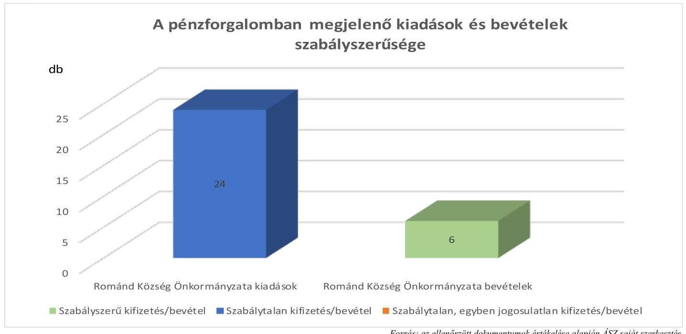

# JELENTÉS 

## Az önkormányzatok gazdálkodásának célvizsgálata

Az önkormányzatok ellenőrzése - a pénzforgalomban megjelenő kiadások teljesítésének és elszámolásának megfelelősége

A pénzforgalomban megjelenő vagyonhasznosítási bevételek beszedésének és elszámolásának megfelelősége

Románd Község Önkormányzata

2023. 

23053
www.asz.hu

---

# JELENTÉS 

## Az önkormányzatok gazdálkodásának célvizsgálata

Az önkormányzatok ellenőrzése - a pénzforgalomban megjelenő kiadások teljesítésének és elszámolásának megfelelősége

A pénzforgalomban megjelenő vagyonhasznosítási bevételek beszedésének és elszámolásának megfelelősége

Románd Község Önkormányzata

2023.

---

# ELLENŐRZÉSI IGAZGATÓSÁG: 

## ÁLLAMHÁZTARTÁS HELYI SZINTJÉT ELLENŐRZŐ IGAZGATÓSÁG

ELLENŐRZÉSI IGAZGATÓ:
KISGERGELY ISTVÁN igazgató

ELLENŐRZÉSVEZETŐ:
$\square$ LAJTERNÉ HUDÁK MAGDOLNA ellenőrzésvezető

IKTATÓSZÁM: EL-3929-006/2023.
TÉMASZÁM: 2658
ELLENŐRZÉS-AZONOSÍTÓ SZÁM: V1002006

---

# TARTALOMJEGYZÉK 

- AZ ELLENŐRZÉS ALAPADATAI ..... 5
- AZ ELLENŐRZÖTT SZERVEZETEK ..... 7
- ÖSSZEFOGLALÁS ..... 9
- AZ ELLENŐRZÉS FÓKUSZTERÜLETEI/FÓKUSZKÉRDÉSEI ..... 11
MEGÁLLAPÍTÁSOK ..... 12
JAVASLATOK ..... 19
MELLÉKLETEK ..... 21
I. sz. melléklet: Az ellenőrzött szervezetek jegyzéke ..... 21
II. sz. melléklet: Összefoglaló táblázat az ellenőrzött szervezetek gazdálkodási jogköreinek gyakorlásáról ellenőrzött gazdasági eseményenként ..... 22
III. sz. melléklet: Románd Község Önkormányzatánál ellenőrzött, késedelmesen könyvelt gazdasági események ..... 27
IV. sz. melléklet: Ellenőrzési kritériumok ..... 28
FÜGGELÉK: ÉSZREVÉTELEK ..... 29
RÖVIDÍTÉSEK JEGYZÉKE ..... 30

---

.

---

# AZ ELLENŐRZÉS ALAPADATAI 

## AZ ELLENŐRZÉS CÉLJA

Az ellenőrzés célja annak értékelése, hogy az Önkormányzatnál ${ }^{1}$ a pénzforgalomban megjelenő kiadások teljesítése és elszámolása, továbbá a pénzforgalomban megjelenő vagyonhasznosítási bevételek beszedése és elszámolása megfelelő volt-e, azok az Önkormányzat közfeladat-ellátásához kapcsolódtak-e.

## AZ ELLENŐRZÉS TÍPUSA

Megfelelőségi ellenőrzés.

## AZ ELLENŐRZÖTT IDŐSZAK

Az ellenőrzött időszak a 2022. év és a 2023. év, az ellenőrzés megállapításainak az ÁSZ tv. ${ }^{2}$ 29. § (1) bekezdése szerinti megküldése napjáig.

## AZ ELLENŐRZÉS TÁRGYA

Az Önkormányzat pénzforgalmában megjelenő kiadások teljesítésének és elszámolásának, továbbá a pénzforgalomban megjelenő vagyonhasznosítási bevételek megalapozottságának és elszámolásának, azok közfeladat-ellátás céljára történő felhasználásának a megfelelősége. Az ellenőrzés kiemelten fókuszált a kiadások jogosságának, szabályszerűségének értékelésére, a költségvetési források közfeladat-ellátás érdekében történő felhasználására, végrehajtására, figyelemmel a kontrollok gyakorlati alkalmazására is.

## AZ ELLENŐRZÉS JOGALAPJA

Az ellenőrzés jogalapját az ÁSZ tv. 1. § (3) bekezdése, és 5. § (2)-(3), (6) bekezdései képezték.

## AZ ELLENŐRZÉS MÓDSZERE

Az ellenőrzést a nemzetközi standardokat irányadónak tekintve az ellenőrzési program szempontjai, az ellenőrzési időszakban hatályos jogszabályok, az ellenőrzés szakmai szabályok és módszertanok figyelembevételével végezte az ÁSZ ${ }^{3}$.

Az ellenőrzési kérdések megválaszolásához szükséges bizonyítékok megszerzése az ellenőrzött szervezetek által rendelkezésre bocsátott dokumentumokra és adatokra, valamint az ellenőrzést támogató szervezetektől ${ }^{4}$ kapott adatokra alapozva, továbbá megfigyelés, szemle (szemrevételezés), kérdésfeltevés (információkérés), valamint elemző eljárás útján történt.

---

Az ellenőrzés során bizonyítékként felhasználható adatforrások közé tartoztak egyrészt az ellenőrzéshez kért dokumentumok, adatforrások, másrészt adatforrás volt még a közhiteles nyilvántartásból (Magyar Államkincstár nyilvántartásai, Önkormányzati rendellettár) származó, az ellenőrzés szempontjából információkat tartalmazó dokumentum.

Az ellenőrzés lefolytatásához az ellenőrzött szervezetek az ÁSZ által kért dokumentumok, adatok, információk megküldésével az ellenőrzés során szolgáltattak adatokat. A rendelkezésre bocsátott adatok, információk kontrolljára helyszíni ellenőrzés keretében is sor került.

A pénzforgalomban megjelenő kiadások teljesítése és a vagyonhasznosítási bevételek megalapozottsága megfelelőségének ellenőrzése során a működés, gazdálkodás kockázatos területeinek meghatározását követően az ellenőrzött szervezetekre vonatkozó főkönyvi adatbázisokból irányított mintavételi eljárások alapján történt a mintatételek kiválasztása. A lényeges és kockázatos tételek beazonosítására egyedi kockázatértékelés alapján került sor. Az ellenőrzés során az Önkormányzatnál 24 kiadási és hat bevételi gazdasági eseményt vizsgáltunk. A tények feltárása és azok összegzése során a megállapítások az ellenőrzött mintatételekre vonatkozóan kerültek megfogalmazásra.

Az ellenőrzés kiemelten kezelte a kifizetések és a vagyonhasznosítási bevételek közfeladat ellátáshoz való közvetlen kapcsolódásának, kötelezettségvállalás szerinti teljesülésének, jogosságának és szabályszerűségének értékelését, figyelemmel a kontrollok gyakorlati múködésére is.

Az ellenőrzés kiterjedt minden olyan körülményre és adatra, amely az ÁSZ jogszabályban meghatározott feladatainak teljesítéséhez, valamint a program végrehajtása folyamán felmerült újabb összefüggések feltárásához szükséges volt.

---

# AZ ELLENŐRZÖTT SZERVEZETEK 

Románd község Győr-Moson-Sopron vármegyében, a Pannonhalmi járásban található. A község területe 985 hektár, melyből 930 hektár külterület. A település lakónépessége 2023. január 1-jén 323 fő volt a $\mathrm{BM}^{36}$ adatai szerint. A relatív munkanélküliségi ráta az NFSZ ${ }^{7}$ 2023. augusztus 20-án közzétett tájékoztatója szerint $0,5 \%$ volt.

A település polgármestere ${ }^{8}$ a 2014. évi önkormányzati választások óta látta el feladatát, a képviselő-testületnek ${ }^{9}$ a polgármesteren kívül négy képviselő tagja volt.

Az Önkormányzat müködésével kapcsolatos feladatokat a Tápszentmiklósi Közös Önkormányzati Hivatal látta el kilenc fővel. A Hivatalt ${ }^{10}$ az ellenőrzött időszakban a jegyző ${ }_{1-3}{ }^{11}$-k vezették. A Hivatal SZMSZ ${ }^{12}$-e szerint a Hivatal egységes szervezet volt, gazdasági szervezettel nem rendelkezett.

Az Önkormányzat fenntartásában költségvetési szerv nem működött az ellenőrzött időszakban. A településen egy háziorvosi és egy gyermekorvosi rendelés és védőnői szolgálat múködött.

Az Önkormányzat társulás útján ellátott feladatai az alábbiak voltak:

- szociális étkeztetés (Pannonhalma Többcélú Kistérségi Társulás).
- hulladékkezelés, hulladékgazdálkodás (Győr Nagytérségi Hulladékgazdálkodási Önkormányzati Társulás).
- napközi otthonos óvodai ellátás (Bakonyszentlászló, Bakonygyirót, Fenyőfő és Románd Önkormányzat Intézményfenntartó Társulása).
Az Önkormányzat 2022. évi költségvetési beszámolójának főbb adatait az 1. táblázat mutatja be.
1. táblázat adatok M Ft-ban

MEGNÉVEZÉS
2022. ÉVI ÖNKORMÁNYZATI BESZÁMOLO

## Költségvetési bevétel

Ebből: önkormányzati feladatok múködési támogatása
hosszabb időtartamú közfoglalkoztatás támogatása
felhalmozási célú támogatások államháztartáson belülről
Költségvetési kiadás
135,7
Forrás: Az Önkormányzat 2022. évi konszolidált költségvetési beszámolója alapján ÁSZ saját szerkesztés

Az Önkormányzat 2022. évi költségvetési beszámolója szerint 2022. évben a települési önkormányzatoknak jóváhagyott rendkívüli támogatásokból, valamint a települési önkormányzatok szociális tüzelőanyag vásárláshoz kapcsolódó támogatásaiból nem részesült. A költségvetési bevételei és költségvetési kiadásai közötti különbözetet a 2021. évi pénzmaradványból finanszírozta.

---

Hosszabb időtartamú közfoglalkoztatási programhoz kapcsolódóan a 2022. évben az Önkormányzat 2022. évi költségvetési beszámolója szerint 1,0 M Ft működési célú támogatásban részesült, amelyből visszafizetési kötelezettsége nem keletkezett.

Az Önkormányzat az ellenőrzött időszakban a Magyar Falu Program ${ }^{13}$ keretében kommunális eszköz beszerzésre 14,9 M Ft vissza nem térítendő pályázati támogatást nyert el.

---

# ÖSSZEFOGLALÁS 

A településeken az önkormányzati gazdálkodás sokrétű feladatot jelent. A tevékenység összetettsége, a megfelelő képzettségű, létszámú humán-erőforrás hiánya a gazdálkodás területén magas szintű kockázatokat eredményezhet. Az ellenőrzés hozzájárul az Önkormányzat szabályszerű és felelős gazdálkodásához, a közpénzek szabályos, cél szerinti felhasználásához, a közvagyon védelméhez. Az ÁSZ által végzett kockázatelemzés alapján került ellenőrzésre kiválasztásra Románd Község Önkormányzata.

Az ellenőrzött 24 kiadási gazdasági esemény teljesítése és elszámolása nem felelt meg a jogszabályi előírásoknak. Az Önkormányzat fizetési számlájáról és pénztárából teljesített kifizetések nem voltak szabályszerűek, mivel az előzetes írásbeli kötelezettségvállalást igénylő 23 gazdasági eseményből hét esetben - 2073,0 E Ft kifizetést érintően - az Ávr. ${ }^{14}$-ben foglaltak ellenére nem, vagy nem megfelelően vállaltak kötelezettséget. Az Ávr. előírásai ellenére az írásbeli kötelezettségvállalást igénylő 23 esetben nem végezték el a pénzügyi ellenjegyzést.

Az Ávr.-ben és a gazdálkodási szabályzatban ${ }^{15}$ foglaltaktól eltérően az ellenőrzött 24 kiadási gazdasági esemény $66,7 \%$-ánál, 16 esetben elmaradt, vagy nem megfelelő dokumentumok alapján végezték el a teljesítésigazolást, így nem ellenőrizték, hogy a kifizetések az arra jogosultak részére, a megfelelő összegben történtek-e, illetve, hogy az ellenszolgáltatást az ellenőrzött szervezet részére teljesítették-e.

Az Ávr. előírása ellenére a kötelezettségvállalás kettő esetben, a teljesítésigazolás öt esetben és az utalványozás 21 esetben a jogosultak eredeti aláírása helyett aláírásbélyegzővel történt, melynek használata, kezelése nem került szabályozásra, mindezek miatt fennállt a jogosulatlan kötelezettségvállalás és kifizetés kockázata. Az Önkormányzat a kötelezettségvállalásra, pénzügyi ellenjegyzésre, teljesítés igazolására, utalványozásra jogosult személyek aláírásmintáiról rendelkezésre bocsátott nyilvántartásban ugyancsak aláírásbélyegzőket jelenített meg a jogosultak eredeti aláírása helyett.

Az Önkormányzatnál az ellenőrzött kiadási gazdasági események a kötelező, illetve az önként vállalt feladatellátáshoz kapcsolódtak.

Az ellenőrzött vagyonhasznosítással kapcsolatos bevételekre vonatkozó döntéseket az arra jogosult hozta meg. A vagyonhasznosítási döntéseket a vagyonrendelet ${ }^{16}$-ben foglaltak szerint a Képviselő-testület hozta meg, a bevételek beszedése és elszámolása megfelelt az Ávr. és az Áhsz. ${ }^{17}$ előírásainak.

---

A pénzforgalomban megjelenő kiadásokkal és bevételekkel kapcsolatos gazdasági események szabályszerűségét az 1. ábra mutatja be.
1. ábra

A gazdálkodás részletes rendjét meghatározó szabályzatok közül az Önkormányzat a Számv. tv. ${ }^{18}$-ben foglaltak ellenére nem rendelkezett bizonylati renddel, és az Ávr.-ben foglaltak ellenére nem rendelkezett a belföldi és külföldi kiküldetések rendjének szabályozásával. Az előzetes írásbeli kötelezettségvállalást nem igénylő kifizetések rendjét a gazdálkodási szabályzatban ellentmondásosan rögzítették, mivel 100,0 E Ft értékhatárt állapítottak meg az írásbeli kötelezettségvállalást igénylő beszerzésekre és 50,0 E Ft értékhatárt az írásbeli kötelezettségvállalást nem igénylő esetek bizonylatolására. Az Önkormányzatnál a gazdálkodási jogkörök gyakorlói aláírás mintáit tartalmazó nyilvántartást nem az Ávr.-ben előírtaknak megfelelően vezették, mivel az nem tartalmazta a gazdálkodási jogkörök gyakorlásának kezdő időpontját. A pénztáros helyettese nem rendelkezett megbízással és anyagi felelősségvállalási nyilatkozattal.

Az Önkormányzatnál az ellenőrzött gazdasági események keretében beszerzett eszközök az év végi leltárban szerepeltek, a helyszíni ellenőrzés során az eszközöket bemutatták. Az Önkormányzat a Számv. tv. és az Áhsz. előírásainak megfelelően a tárgyi eszközökről analitikus nyilvántartást vezetett.

A belső ellenőrzés az ellenőrzött időszakban részben töltötte be a Bkr. ${ }^{19}$-ben meghatározott feladatát. Az Önkormányzat a 2022-2023. évekre belső ellenőrzési tervet nem bocsájtott az ÁSZ ellenőrzés rendelkezésére. A megküldött belső ellenőri jelentés alapján a 2022. évben végzett, pénzkezelést érintő ellenőrzés csak a pénzkezelés szabályozottságára és a pénztárrovancs elvégzésére irányult, a gazdálkodási jogkörök gyakorlására nem terjedt ki, ezért a gazdálkodási részterületre irányultsága miatt nem volt alkalmas a rendszerszintű hiányosságok feltárására. A belső ellenőr a pénztáros és a pénztárellenőr megbízásaira és felelősségvállalási nyilatkozataira vonatkozó megállapításai nem voltak összhangban az ÁSZ megállapításaival, mivel a belső ellenőr megállapításai az Önkormányzattól kapott hiányos adatszolgáltatáson alapultak. A 2023. évi ellenőrzésiprogram alapján 2023. II-III. negyedévére tervezett ellenőrzés az adatvédelmi tisztviselő megbízásának ellenőrzésére vonatkozott, az ÁSZ ellenőrzés szempontjából nem volt releváns.

Az ÁSZ az ellenőrzés során feltárt hiányosságok felszámolása, a szabályszerű múködés feltételeinek megteremtése érdekében a polgármesternek kettő, a jegyzö ${ }_{2}$-nek hét javaslatot tett.

---

# AZ ELLENŐRZÉS FÓKUSZTERÜLETEI/FÓKUSZKÉRDÉSEI 

1.- Az Önkormányzat pénzforgalmában megjelenő kiadások teljesitése és elszámolása megfelelően, az Önkormányzat feladatellátásához kapcsolódóan valósult-e meg?
2.- Az Önkormányzat pénzforgalmában megjelenő vagyonhasznosítási bevételekkel kapcsolatos döntés megalapozott volt-e, a bevételek beszedése és elszámolása megfelelően, az Önkormányzat feladatellátásához kapcsolódóan valósult-e meg?

---

# 1. Az Önkormányzat pénzforgalmában megjelenő kiadások teljesítése és elszámolása megfelelően, az Önkormányzat feladatellátásához kapcsolódóan valósult-e meg? 

Összegző megállapítás Az Önkormányzatnál a közpénzfelhasználás az önkormányzati feladatellátáshoz kapcsolódott, azonban az ellenőrzött gazdasági események tekintetében a pénzforgalomban megjelenő ellenőrzött kiadások teljesítése és elszámolása nem volt megfelelő.
1.1. számú megállapítás Az ellenőrzött kiadások közfeladatok ellátásához kapcsolódtak.

Az Önkormányzatnál ellenőrzött 24 gazdasági esemény, összesen 73 765,6 E Ft értékű kiadás - az Önkormányzat képviselő-testülete szervezeti és működési szabályzatáról szóló 10/2019. (XI. 21.) számú önkormányzati rendelet 4. számú mellékletében felsorolt - az Önkormányzat alaptevékenységeinek ellátásához kapcsolódott, a kiadások az Mötv. ${ }^{20}$ előírásaival összhangban, a törvényben meghatározott kötelező, valamint önként vállalt feladatok ellátása érdekében merültek fel.
1.2. számú megállapítás A pénzforgalomban megjelenő kiadások esetében a gazdálkodási jogkörök gyakorlása nem felelt meg a jogszabályi előírásoknak.

Az Önkormányzatnál az előzetes írásbeli kötelezettségvállalást igénylő 23 gazdasági eseményből öt esetben (1297,4 E Ft összegű kifizetésnél) az Ávr. 52. § (1) bekezdés c) pontjában foglaltak ellenére nem rendelkeztek írásbeli kötelezettségvállalással. További két esetben 775,6 E Ft összegben a kötelezettségvállalás nem volt megfelelő. 16 gazdasági eseménynél rendelkeztek az Ávr. szerinti kötelezettségvállalási dokumentummal. Egy esetben a gazdálkodási szabályzat II. fejezetében foglaltak alapján nem volt szükséges előzetes írásbeli kötelezettségvállalás.
Az Önkormányzatnál a kötelezettségvállalás, a teljesítésigazolás és utalványozás - Ávr. 52. § (1) bekezdés c) pontja, az Ávr. 57. § (3) bekezdése, valamint az Ávr. 59. § (3) bekezdés g) pontjában foglaltak ellenére a jogosultak eredeti aláírása helyett 21 gazdasági eseményt érintően aláírásbélyegző használatával történt, ezáltal az Önkormányzatnál fennállt a jogosulatlan kötelezettségvállalás és kifizetés kockázata. A jogszabályok egyértelműen kimondják a jognyilatkozatokon az aláírások szükségességét, és amennyiben nem személyesen történik az aláírás, úgy az elektronikus aláírás szabályait is szigorúan meghatározzák.
Az Önkormányzatnál az Ávr. 60. § (3) bekezdés előírása ellenére a kötelezettségvállalásra, pénzügyi ellenjegyzésre, teljesítés igazolására, utalványozásra jogosult személyek aláírásmintáiról rendelkezésre bocsátott nyilvántartásban szintén aláírásbélyegzők alkalmazására került sor a jogosultak eredeti aláírása helyett.

---

- Az ONK_KIAD_09, ONK_KIAD_10, ONK_KIAD_11, ONK_KIAD_POT_01, ONK_KIAD_POT_02 gazdasági eseményeknél nem rendelkeztek a kötelezettségvállalás dokumentumával.
- Az Áht. ${ }^{21}$ 37. § (1) bekezdésében, valamint az Ávr. 52. § (1) bekezdés c) pont előírása ellenére az ellenőrzött 24 gazdasági eseményből kettő esetben (ONK_KIAD_08, ONK_KIAD_16) a kötelezettségvállaló eredeti aláírása helyett aláírásbélyegző lenyomat szerepelt a kötelezettségvállalás dokumentumán. Az Ávr. 57. § (3) bekezdés előírása ellenére öt esetben (ONK_KIAD_08, ONK_KIAD_10, ONK_KIAD_11, ONK_KIAD_13 ONK_KIAD_16) a teljesítés igazoló eredeti aláírása helyett szerepelt aláírásbélyegző lenyomat. Az Ávr. 57. § (5) bekezdésében foglaltak alapján elektronikusan rendelkezésre álló okirat esetében van lehetőség azok elektronikus aláírására, ekkor azonban legalább fokozott biztonságú elektronikus aláírás alkalmazható, amely feltételeknek a névbélyegző nem felelt meg. Az Ávr. 59. § (3) bekezdés g) pontja előírása ellenére 21 esetben (ONK_KIAD_01, ONK_KIAD_02, ONK_KIAD_03, ONK_KIAD_04, ONK_KIAD_06, ONK_KIAD_07, ONK_KIAD_08, ONK_KIAD_09, ONK_KIAD_10, ONK_KIAD_11, ONK_KIAD_12, ONK_KIAD_13, ONK_KIAD_14, ONK_KIAD_16, ONK_KIAD_17, ONK_KIAD_18, ONK_KIAD_19, ONK_KIAD_21, ONK_KIAD_22, ONK_KIAD_23, ONK_KIAD_POT_01) az utalványozó eredeti aláírása helyett szerepelt aláírásbélyegző lenyomat.
- Az Önkormányzat a 335/2005. (XII. 29.) Korm. rendelet ${ }^{22}$ 54. §-ában foglaltak ellenére nem rendelkezett sem az aláírásbélyegzők tárolására, használatára vonatkozó szabályozással, sem pedig aláírásbélyegzők nyilvántartásával, így nem volt ismert, hogy az aláírásbélyegzőket mikor és ki használhatta.
Az Ávr. 55. § (1) bekezdésében előírtak ellenére 23 esetben nem végezték el a pénzügyi ellenjegyzést, ezáltal összesen 73 670,0 E Ft összegű kifizetés vonatkozásában az Áht. 37. § (1) bekezdésének, valamint az Ávr. 53/A. § (1) bekezdésének előírását megsértve nem győződtek meg a szabad előirányzat rendelkezésre állásáról.
- Írásos kötelezettségvállalás hiányában nem került sor a pénzügyi ellenjegyzésre az ONK_KIAD_09, ONK_KIAD_10, ONK_KIAD_11, ONK_KIAD_POT_01, ONK_KIAD_POT_02 gazdasági eseményeknél.
- Nem szerepelt a pénzügyi ellenjegyzés az ONK_KIAD_01, ONK_KIAD_02, ONK_KIAD_03, ONK_KIAD_04, ONK_KIAD_05, ONK_KIAD_06, ONK_KIAD_08, ONK_KIAD_12, ONK_KIAD_13, ONK_KIAD_14, ONK_KIAD_15, ONK_KIAD_16, ONK_KIAD_17, ONK_KIAD_18, ONK_KIAD_19, ONK_KIAD_21, ONK_KIAD_22, ONK_KIAD_23 gazdasági eseményekhez kapcsolódó kötelezettségvállalási dokumentumokon.
Az Önkormányzatnál ellenőrzött 24 gazdasági eseményből egy (ONK_KIAD_07) esetben a teljesítésigazolást az Ávr. 57. § (3) bekezdésében foglaltak alapján, a gazdasági esemény értékének nagyságára tekintettel nem kellett elvégezni. Tíz esetben (2466,4 E Ft összértékben) a teljesítésigazolást az Áht. 38. § (1) bekezdés és az Ávr. 57. § (1) bekezdés előírása ellenére nem végezték el, hat esetben (2133,0 E Ft összértékben) a teljesítés igazolást nem megfelelően végezték el. Összességében a vizsgált gazdasági események 66,7\%-ában, 4599,4 E Ft közpénz elköltését megelőzően nem ellenőrizték, hogy a kifizetések az arra jogosultak részére, a kötelezettségvállalásnak megfelelő összegben történtek-e, illetve, hogy az ellenszolgáltatást az Önkormányzat részére ténylegesen teljesítették-e. Ezekben az esetekben fennállt a jogosulatlan kifizetés kockázata.
- A teljesítésigazolás dokumentuma nem állt rendelkezésre az ONK_KIAD_01, ONK_KIAD_02, ONK_KIAD_03, ONK_KIAD_04, ONK_KIAD_05, ONK_KIAD_06, ONK_KIAD_09, ONK_KIAD_14, ONK_KIAD_15, és ONK_KIAD_POT_02 gazdasági eseményeknél.

---

- A teljesítésigazolást nem megfelelően végezték el hat esetben. Ebből három esetben (ONK_KIAD_10, ONK_KIAD_11, ONK_KIAD_POT_01) a kötelezettségvállalási dokumentum hiányában a teljesítésigazolást nem lehetett elvégezni. Három esetben (ONK_KIAD_08, ONK_KIAD_13, ONK_KIAD_16) a teljesítésigazolást a polgármester aláírásbélyegzőjével végezték eredeti aláírás helyett, így szabályszerű aláírás hiányában a teljesítésigazolás nem felelt meg az Ávr. 57. § (3) bekezdés előírásainak.
Az ellenőrzött 24 gazdasági esemény esetében az érvényesítést nem az Ávr. 58. § (1) bekezdése előírásai szerint végezték el, az érvényesítő nem ellenőrizte az összegszerűséget, a fedezet meglétét és azt, hogy a megelőző ügymenetben az Áht., Ávr. és az Áhsz. előírásait, a belső szabályzatokban foglaltakat betartották-e.
- Az ellenőrzött gazdasági események közül öt esetben (ONK_KIAD_09, ONK_KIAD_10, ONK_KIAD_11, ONK_KIAD_POT_01, ONK_KIAD_POT_02) és 1297,4 E Ft összegben az érvényesítés formális volt, mivel az ellenőrzés elvégzéséhez a kötelezettségvállalási dokumentumok nem álltak rendelkezésre.
- Az ellenőrzött gazdasági események közül 18 esetben (ONK_KIAD_01, ONK_KIAD_02, ONK_KIAD_03, ONK_KIAD_04, ONK_KIAD_05, ONK_KIAD_06, ONK_KIAD_08, ONK_KIAD_12, ONK_KIAD_13, ONK_KIAD_14, ONK_KIAD_15, ONK_KIAD_16, ONK_KIAD_17, ONK_KIAD_18, ONK_KIAD_19, ONK_KIAD_21, ONK_KIAD_22, ONK_KIAD_23), 72 372,2 E Ft összegben az érvényesítő nem észrevételezte, hogy a kötelezettségvállalások pénzügyi ellenjegyzését nem végezték el.
- Az ONK_KIAD_07 gazdasági esemény során az érvényesítés aláírásbélyegző használatával történt.

A 24 ellenőrzött gazdasági eseményből csak három felelt meg az utalványozási előírásoknak. Az Áht. 38. $\$ \mathbf{( 1 )}$ bekezdésének előírása ellenére nem történt meg az utalványozás 21 esetben, 73 070,6 E Ft összegben (ONK_KIAD_01, ONK_KIAD_02, ONK_KIAD_03, ONK_KIAD_04, ONK_KIAD_06, ONK_KIAD_07, ONK_KIAD_08, ONK_KIAD_09, ONK_KIAD_10, ONK_KIAD_11, ONK_KIAD_12, ONK_KIAD_13, ONK_KIAD_14, ONK_KIAD_16, ONK_KIAD_17, ONK_KIAD_18, ONK_KIAD_19, ONK_KIAD_21, ONK_KIAD_22, ONK_KIAD_23, ONK_KIAD_POT_01), mert az Ávr. 59. § (3) bekezdés g) pont előírása ellenére az utalványrendeleten az utalványozó eredeti aláírása helyett az utalványozásra jogosult aláírás bélyegzőjének lenyomata szerepelt. (Az Önkormányzatnál ellenőrzött kiadási gazdasági eseményeket a II. számú melléklet 1. táblázata tartalmazza.)
1.3. számú megállapítás

A gazdálkodással kapcsolatos szabályozottság az ellenőrzött időszakban nem volt teljeskörű, valamint a gazdálkodási szabályzat az írásbeli kötelezettségvállalást nem igénylő beszerzések tekintetében ellentmondásos szabályozást tartalmazott. A gazdálkodási jogkörökhöz kapcsolódó nyilvántartás nem felelt meg az előírásoknak.

Az Önkormányzat rendelkezett a Számv. tv.-ben és az Áhsz.-ben előírt számviteli politikával ${ }^{23}$, valamint számlarenddel ${ }^{24}$, amely azonban a Számv. tv. 161. § (2) bekezdés d) pont előírása ellenére nem tartalmazta a bizonylati rendet.
Az Önkormányzat rendelkezett az Áht.-ban és az Ávr.-ben előírt, a gazdálkodás részletes rendjét meghatározó gazdálkodási szabályzattal. A gazdálkodási szabályzat II. fejezetében az Ávr. 53. § (1) bekezdés a) pontjában szereplő értékhatárnál alacsonyabb összegben határozták meg az írásbeli kötelezettségvállalás összeghatárát, azonban az Ávr. 53. § (2) bekezdés előírása ellenére az előzetes írásbeli kötelezettségvállalást nem igénylő kifizetések bizonylatolásának értékhatárát és rendjét a gazdálkodási szabályzatban ellentmondásosan rögzítették.

---

- A gazdálkodási szabályzat II. fejezetének ötödik bekezdésében rögzítésre került, hogy 100,0 E Ft-ot el nem érő kifizetéseknél nem szükséges írásban kötelezettséget vállalni, azonban a kilencedik bekezdésben a nem írásban vállalt kötelezettségvállalások vonatkozásában az 50,0 E Ft-ot el nem érő esetekben határozták meg az alkalmazandó dokumentumokat.
Az Ávr.-ben foglalt előírások szerint a polgármester felhatalmazást adott a kötelezettségvállalásra és utalványozásra. A pénzügyi ellenjegyzésre és az érvényesítésre jogosultakat az Ávr. előírásai szerint a jegyző szabályszerűen jelölte ki. Az Önkormányzatnál a gazdálkodási jogkörök gyakorlására jogosult szermélyeket és aláírás mintájukat tartalmazó nyilvántartást nem az Ávr. 60. § (3) bekezdésében előírtaknak megfelelően vezették.
- A gazdálkodási szabályzat 8-11. sz. mellékleteire utaló nyilvántartás nem tartalmazta az adott jogkör gyakorlás hatályát (kezdő időpontját), nem szerepelt benne a 2021. szeptember 13-ig érvényes felhatalmazással rendelkező alpolgármester aláírásmintája. A nyilvántartás a kötelezettségvállaló, utalványozó és a szakmai teljesítésigazoló vonatkozásában aláírás bélyegzők lenyomatait, és nem eredeti aláírásokat tartalmazott.
Az Önkormányzat rendelkezett a Számv. tv.-ben előírt pénzkezelési szabályzattal ${ }^{25}$. Az Ávr.-ben foglaltak alapján az Önkormányzat elkészítette a működéséhez kapcsolódó, a költségvetési szerv előirányzatait terhelő pénzügyi kihatással bíró, jogszabályban nem szabályozott kérdések rendezésére a beszerzési szabályzatát, reprezentációs szabályzatát és a gépjármű üzemeltetésre vonatkozó szabályozását. Az Ávr. 13. $\$ (2) bekezdés c) pontjában foglaltak ellenére a polgármester belső szabályzatban nem rendelkezett a belföldi és külföldi kiküldetések elrendelésével és lebonyolításával, elszámolásával kapcsolatos kérdésekről. Az Önkormányzat kötelezettségvállalásokról vezetett nyilvántartása megfelelt az Áhsz. 14. melléklet II. pontjában foglaltaknak.
Az Önkormányzat 2022. és 2023. évekre vonatkozóan az Ávr. szerinti likviditási terveket elkészítette.
1.4. számú megállapítás

Az ellenőrzött gazdasági események számviteli elszámolása három esetben nem volt megfelelő, tíz esetben a gazdasági események könyvekben történő rögzítése késedelmesen történt.

Az Önkormányzat rendelkezett a polgármester és az Áhsz. 31. § (3) bekezdése szerinti gazdasági vezetői feladatokkal megbízott személy által aláírt, a 2022. évre vonatkozó éves költségvetési beszámolóval.
Az ellenőrzött gazdasági események keretében beszerzett eszközöket a Számv. tv.-ben foglaltak alapján az év végi zárást alátámasztó leltárban kimutatták, a helyszíni ellenőrzés során az eszközök fellelhetők voltak. Az Önkormányzat a tárgyi eszközökről analitikus nyilvántartást vezetett.
2022. évben a Számv. tv. és az Áhsz. előírásainak megfelelően fennállt az egyezőség az Önkormányzat pénztára nyitó és záró készpénzállományának egyenlege és a Forintpénztár főkönyvi számlán nyilvántartott nyitó és záró egyenlege között, valamint a fizetési számlakivonatok szerinti nyitó és záró egyenlegek és a fizetési számláknak megfelelő főkönyvi számokon nyilvántartott nyitó és záró egyenlegek között.
Az ellenőrzött gazdasági események közül három esetben (ONK_KIAD_05, ONK_KIAD_12 és ONK_KIAD_13), 1125,0 E Ft összegben a számviteli elszámolás nem felelt meg az Áhsz. 39. §, 45. § és a 38/2013. (IX. 19.) NGM rendelet ${ }^{26}$ előírásainak, mert nem a megfelelő főkönyvi számlára, valamint nem az egységes rovatrend szerinti nyilvántartási számlára történt a gazdasági esemény rögzítése. 21 esetben a gazdasági események számviteli elszámolása megfelelt a jogszabályi előírásoknak.

---

- Az ONK_KIAD_05 gazdasági esemény esetében az anyakönyvvezetőnek a hivatali munkaidőn túli házasságkötésért kifizetett díjat tévesen a K1103 számú "Céljuttatás, projektprémium" rovaton és a 0511033 számú főkönyvi számlán számolták el, a K123 számú "Egyéb külső személyi juttatások" rovat, valamint a 051233 számú főkönyvi számla helyett.
- Az ONK_KIAD_12 és ONK_KIAD_13 gazdasági események esetében a projektmenedzsment díjat és a turisztikai térkép szerkesztés és felújítás díját tévesen a K337 számú "Egyéb szolgáltatások" rovaton és a 053373 számú főkönyvi számlán számolták el a K336 számú "Szakmai tevékenységet segítő szolgáltatások" rovat, valamint a 053363 számú főkönyvi számla helyett.
A 24 ellenőrzött kiadási gazdasági esemény közül tíz esetben a Számv. tv. 165. § (3) bekezdés a) pontjában előírtak ellenére nem biztosították a pénzeszközöket érintő gazdasági műveletek, események bizonylati adatainak a könyvekben történő késedelem nélküli rögzítését. A gazdasági események rögzítése általában 0,5-2,0 havi késedelemmel, egy esetben az ONK_KIAD_03 gazdasági eseménynél csaknem öt hónapos késedelemmel történt. A késedelem befolyásolta az államháztartás információs rendszerébe teljesített havi adatszolgáltatások adattartamát, mert így az adatszolgáltatások nem valós adatokon alapultak.
(A késedelmesen rögzített gazdasági eseményeket részletesen a III. számú melléklet mutatja be.)
1.5. számú megállapítás Az Önkormányzatnál az ellenőrzött időszakban a pénzkezelés személyi feltételeiről, felelősségi szabályairól nem rendelkeztek egyértelműen.

A helyszíni ellenőrzés keretében került sor az Önkormányzatnál működtetett házipénztár pénztárrovancsának elvégzésére. Az ellenőrzés időpontjában a pénztárban lévő ellenőrzött összeg megegyezett a pénztárjelentés szerinti záró adat, valamint az utolsó pénztárzárás és a megszámlálás közötti időszakban keletkezett bizonylatok összevont egyenlegével.
A pénztáros és a pénztárellenőr rendelkezett a pénztári feladatok ellátására vonatkozó polgármester által aláírt megbízással, valamint anyagi felelősség vállalást tartalmazó nyilatkozattal. A pénzkezelési szabályzat 26. pontjában foglaltak ellenére az ellenőrzött időszakban nem rendelkeztek a pénztáros helyettesének megbízásával és anyagi felelősségvállalási nyilatkozatával, így a Számv. tv. 14. § (8) bekezdésében foglaltak ellenére nem rendelkeztek egyértelműen a pénzkezelés személyi és tárgyi feltételeiről, felelősségi szabályairól.
1.6. számú megállapítás Az Önkormányzatnál a belső ellenőrzés nem tárta fel a rendszerszintű hiányosságokat.

Az Önkormányzatnál a jegyző3 az ellenőrzött időszakban megbízási szerződések alapján külső szakértővel gondoskodott a belső ellenőrzés működtetéséről. Az Önkormányzat a 2022-2023. évekre belső ellenőrzési tervet nem, csak ellenőrzési programokat bocsájtott az ÁSZ ellenőrzés rendelkezésére. Ezek alapján a belső ellenőrzés mind a 2022. mind a 2023. évre vonatkozóan egy-egy ellenőrzést végzett.
A belső ellenőrzés részben töltötte be a Bkr. 21. § (1)-(4) bekezdéseiben meghatározott feladatát, mert a 2022. évben végrehajtott, készpénzkezelésre vonatkozó ellenőrzés csak a pénzkezelés szabályozottságára és pénztárrovancs elvégzésére irányult, a gazdálkodási jogkörök gyakorlására nem terjedt ki, ezért nem volt alkalmas arra, hogy a bevételek és a kiadások teljesítése során rendszerszinten jelentkező hiányosságokat beazonosítsa és javaslatot tegyen ezek kijavítására. A belső ellenőr a pénztáros és a pénztárellenőr megbízására és felelősségvállalási nyilatkozatára vonatkozó megállapításai nem voltak összhangban az ÁSZ

---

megállapításaival, mivel a belső ellenőr megállapításai az Önkormányzattól kapott hiányos adatszolgáltatáson alapultak.

- A belső ellenőr 2022. december 28-án kelt jelentésének megállapítása szerint a pénztáros, a pénztár helyettes, valamint a pénztár ellenőr nem rendelkezett a feladat ellátására történő megbízással, valamint felelősségvállalási nyilatkozattal. A jelentésben foglaltakkal a polgármester és a jegyző; 2023. március31-én egyetértettek, észrevételt nem tettek. A 2023. április 4-én kelt intézkedési terv tartalmazta a Pénzkezelési szabályzat vonatkozásában rögzített feladatellátásra történő megbízás és felelősségvállalási nyilatkozatról szóló intézkedést. Az intézkedési terv szerinti dokumentumok ÁSZ általi kérését követően, 2023. augusztus 16-án az Önkormányzat adminisztrációs hibára hivatkozva telefonon tájékoztatta a belső ellenőrt a pénztáros 2022. évi és a pénztárellenőr 2018. évi dokumentumainak meglétéről és az intézkedési terv javításáról.

A 2023. évi ellenőrzés az adatvédelmi tisztviselő megbízásának ellenőrzésére vonatkozott, az ÁSZ ellenőrzés szempontjából nem volt releváns. A pénzforgalomban megjelenő kiadások és bevételek teljesítése során a 2022. és 2023. évre vonatkozóan a rendszerszintű hiányosságokat a belső ellenőrzés nem tárta fel.

# 2. Az Önkormányzat pénzforgalmában megjelenő vagyonhasznosítási bevételekkel kapcsolatos döntés megalapozott volt-e, a bevételek beszedése és elszámolása megfelelően, az Önkormányzat feladatellátásához kapcsolódóan valósult-e meg? 

Összegző megállapítás Az ellenőrzött vagyonhasznosítással kapcsolatos bevételekre vonatkozó döntések alátámasztottak voltak, azokat az arra jogosult hozta meg, a bevételek beszedése és elszámolása szabályszerű volt.

Az ellenőrzött hat bevételi gazdasági esemény mindegyike az önkormányzati feladatok ellátáshoz kapcsolódott.
Az Önkormányzat megalkotta vagyonrendeletét, amelyben meghatározta a vagyonhasznosítás kereteit, a döntési jogosultságokat.
Az ellenőrzött vagyonhasznosítási döntéseket szabályszerűen, a vagyonrendeletben foglaltak szerint a képviselő-testület hozta meg. A lakásbérleti díjak beszedésére irányuló két gazdasági esemény (ONK_BEV_01, ONK_BEV_02,) valamint a házasságkötő terem bérbeadására irányuló két gazdasági esemény (ONK_BEV_POT_02, ONK_BEV_POT_03) esetében külön előterjesztés nem készült, de a képviselő-testületi ülésen a polgármester a környező településeken végzett ártájékozódás alapján tett javaslatot a bérleti díjakra, amelyet a Képviselő-testület a 48/2022. ((VII. 20.), valamint 51/2022. (VII.20.) Kt. határozataival hagyott jóvá. Az ONK_BEV_POT_01 sírhely megváltására irányuló gazdasági eseménynél a bérleti díj összegét a köztemetőkről és a temetkezés rendjéről szóló 1/2018. (I. 30.) önkormányzati rendelet módosításáról szóló 8/2022. (VIII.29.) önkormányzati rendelet 1. számú melléklete alapján szabályszerűen állapították meg. Az ONK_BEV_POT_04 falugondnoki busz értékesítési árának meghatározásával a Képviselő-testület a 3/2023. (I. 26.) számú határozatával a polgármestert bízta meg.

---

Az ellenőrzött bevételi gazdasági eseményeknél az érvényesítés és utalványozás az Ávr.-nek, a főkönyvi számlákra való elszámolás az Áhsz.-nek megfelelően történt.
(Az ellenőrzött bevételi gazdasági eseményeket a II. számú melléklet 2. táblázata tartalmazza.)
A hat ellenőrzött bevételi gazdasági esemény közül három esetben (ONK_BEV_POT_01, ONK_BEV_POT_02, ONK_BEV_POT_03) a Számv. tv. 165. § (3) bekezdés a) pontjában előírtak ellenére nem biztosították a pénzeszközöket érintő gazdasági műveletek, események bizonylati adatainak a könyvekben történő késedelem nélküli rögzítését, az néhány napos, illetve az ONK_BEV_POT_02, 15,0 E Ft összértékű gazdasági eseménynél 52 napos késedelemmel történt. A bevételi tétel csekély értéke miatt a késedelem érdemben nem befolyásolta az államháztartás információs rendszerébe teljesített havi adatszolgáltatások adattartamát.
(A késedelmesen rögzített gazdasági eseményeket részletesen a III. számú melléklet mutatja be.)

---

# JAVASLATOK 

Az ÁSZ tv. 33. § (1) bekezdésében foglaltak értelmében az ellenőrzött szervezet vezetője köteles a jelentésben foglalt megállapításokhoz kapcsolódó intézkedési tervet összeállítani és azt a jelentés kézhezvételétől számított 30 napon belül az ÁSZ részére megküldeni. Amennyiben az ellenőrzött szervezet vezetője nem küldi meg határidőben az intézkedési tervet, vagy továbbra sem elfogadható intézkedési tervet küld, az Állami Számvevőszék elnöke az ÁSZ tv. 33. § (3) bekezdése a) és b) pontjaiban foglaltakat érvényesítheti.

## ROMÁND KÖZSÉG ÖNKORMÁNYZATÁNAK POLGÁRMESTERE RÉSZÉRE

1. Gondoskodjon az Állami Számvevőszék nyilvánosságra hozott jelentésének, és az arra készült intézkedési tervnek a kézhezvételt követő 30 napon belül a képviselő-testület elé terjesztéséről. A napirend tárgyalásáról szóló jegyzőkönyvvel együtt tájékoztatásul a jelentést küldje meg a Kormányhivatalnak is.
2. Tegyen intézkedéseket az Áht. 37. § (1) és 38. § (1) bekezdésében foglalt kontrolltevékenységek kiépítésére és megfelelő müködtetésére, amelyek megelőzik a jelentésben leírt, az Ávr. 52. §-ában, 57. §-ában, valamint 59. §-ában foglalt kötelezettségvállalási, teljesítésigazolási és utalványozási jogkörök gyakorlásával összefüggő szabálytalanságok ismételt előfordulását.

## TÁPSZENTMIKLÓSI KÖZÖS ÖNKORMÁNYZATI HIVATAL JEGYZŐJE RÉSZÉRE

1. Tegyen intézkedéseket az Áht. 37. § (1) és 38. § (1) bekezdésében foglalt kontrolltevékenységek kiépítésére és megfelelő müködtetésére, amelyek megelőzik a jelentésben leírt, az Ávr. 53/A. §-ában, 55. §-ában, valamint 58. §-ában foglalt pénzügyi ellenjegyzési és érvényesítési jogkörök gyakorlásával összefüggő szabálytalanságok ismételt előfordulását.
2. Intézkedjen a Számv.tv. 161. § (2) bekezdés d) pontja elöírása szerint a számlarend mellékleteként a bizonylati rend, valamint az Ávr. 13. § (2) bekezdés c) pontjában foglalt belföldi és külföldi kiküldetések rendjéről szóló szabályzat elkészítéséről.
3. Intézkedjen az Önkormányzat gazdálkodási szabályzatának aktualizálásáról, abban az Ávr. 53.§ (2) bekezdésében foglaltaknak megfelelően rögzítse az előzetes írásbeli kötelezettségvállalást nem igénylő kifizetések rendjét.

---

4. Intézkedjen az Ávr. 60. § (3) bekezdésének előirása szerint az Önkormányzat vonatkozásában a kötelezettségvállalásra, pénzügyi ellenjegyzésre, teljesités igazolására, érvényesitésre, utalványozásra jogosult személyekről és aláírás-mintájukról naprakész nyilvántartás vezetéséről.
5. A Bkr. 8. § (2) bekezdés d) pontjában foglalt feladatkörében olyan kontrolltevékenységeket alakítson ki, amelyek biztositják az Áhsz. 39. §, 45. § és a 38/2013. (IX. 19.) NGM rendelet elöírásai alapján a gazdasági események tartalmának megfelelő számviteli nyilvántartást.
6. A Bkr. 6. § (1) bekezdés b) pontjában foglalt feladatkörében gondoskodjon olyan kontrollkörnyezet kialakításáról, amelyben a pénzkezelést érintően a Számv.tv. 14. § (8) bekezdésében foglaltaknak megfelelően egyértelmüen meghatározottak a pénzkezelés személyi és tárgyi feltételei, felelősségi szabályai.
7. Intézkedjen a Bkr. 8. § (2) bekezdésében foglaltakra tekintettel olyan kontrolltevékenységek kialakításáról, amelyek biztositják, hogy a Számv.tv. 165. § (3) bekezdés a) pontjában foglaltak szerint a pénzeszközöket érintő gazdasági müveletek, események bizonylatai adatainak a könyvekben történő rögzítése késedelem nélkül megtörténjen az Önkormányzat esetében.

---

# MELLÉKLETEK 

I. SZ. MELLÉKLET: AZ ELLENŐRZÖTT SZERVEZETEK JEGYZÉKE

## MEGSEVEZÉS

Románd Község Önkormányzata
Tápszentmiklósi Közös Önkormányzati Hivatal

---

# II. SZ. MELLÉKLET: ÖSSZEFOGLALÓ TÁBLÁZAT AZ ELLENŐRZÖTT SZERVEZETEK GAZDÁLKODÁSI JOGKÖREINEK GYAKORLÁSÁRÓL ELLENŐRZÖTT GAZDASÁGI ESEMÉNYENKÉNT

1. táblázat

## ROMÁND KÖZSÉG ÖNKORMÁNYZATA - KIADÁSI TÉTELEK

|  SZ. | Mintatétel azonosító száma | Gazdasági esemény |  |  |  | Gazdálkodási jogkörök gyakorlása |  |  |  |  |  |   |
| --- | --- | --- | --- | --- | --- | --- | --- | --- | --- | --- | --- | --- |
|   |  | Tárgya | Dátuma | Kilizetés módja | Összege
(PI) | Kötelezettségvállalás | Pénzügyi ellenjegyzés | Teljesítésigazítás | Érvényesítés | Uralványozás | Közfeladat ellátás | Számviteli elszámolás  |
|  1. | ONK_KIAD_01 | 2021.12. havi
közfoglalkoztatottí munkabér | 2022.01.03 | bank | 85000 | Megfelelő dokumentum | Nem megfelelő dokumentum | Nincs dokumentum | Nem megfelelő dokumentum | Nem
megfelelő
dokumentum | I | I  |
|  2. | ONK_KIAD_02 | 2022.01. havi
közfoglalkoztatottí munkabér | 2022.02.03 | bank | 100000 | Megfelelő dokumentum | Nem
megfelelő
dokumentum | Nincs dokumentum | Nem
megfelelő
dokumentum | Nem
megfelelő
dokumentum | I | I  |
|  3. | ONK_KIAD_03 | 2022.08. havi
közfoglalkoztatottí munkabér | 2022.09.02 | bank | 100000 | Megfelelő dokumentum | Nem
megfelelő
dokumentum | Nincs dokumentum | Nem
megfelelő
dokumentum | Nem
megfelelő
dokumentum | I | I  |
|  4. | ONK_KIAD_04 | 2022.11. havi
közfoglalkoztatottí munkabér | 2022.12.02 | bank | 86364 | Megfelelő dokumentum | Nem
megfelelő
dokumentum | Nincs dokumentum | Nem
megfelelő
dokumentum | Nem
megfelelő
dokumentum | I | I  |
|  5. | ONK_KIAD_05 | Anyakönyvvezetői szolgáltatási díj | 2023.03.31 | pénztár | 30000 | Megfelelő dokumentum | Nem
megfelelő
dokumentum | Nincs dokumentum | Nem
megfelelő
dokumentum | Megfelelő dokumentum | I | N  |
|  6. | ONK_KIAD_06 | Polgármester jutalma és 2022.06. havi illetménye | 2022.07.04 | bank | 1040000 | Megfelelő dokumentum | Nem
megfelelő
dokumentum | Nincs dokumentum | Nem
megfelelő
dokumentum | Nem
megfelelő
dokumentum | I | I  |
|  7. | ONK_KIAD_07 | Üléshuzat a falubuszba | 2023.03.07 | bank | 96000 | Nem releváns | Nem releváns | Nem releváns | Nem
megfelelő
dokumentum | Nem
megfelelő
dokumentum | I | I  |
|  8. | ONK_KIAD_08 | Kazán beépítéshez kapcsolódó anyagok | 2023.02.07 | bank | 118444 | Nem megfelelő dokumentum | Nem
megfelelő
dokumentum | Nem
megfelelő
dokumentum | Nem
megfelelő
dokumentum | Nem
megfelelő
dokumentum | I | I  |
|  9. | ONK_KIAD_09 | Orvosi szolgálati lakás önkormányzatra jutó 2022.06-12 havi része | 2022.12.21 | bank | 140000 | Nincs dokumentum | Nincs dokumentum | Nincs dokumentum | Nem
megfelelő
dokumentum | Nem
megfelelő
dokumentum | I | I  |
|  10. | ONK_KIAD_10 | Közvetített szolgáltatás | 2023.03.09 | bank | 317441 | Nincs dokumentum | Nincs dokumentum | Nem
megfelelő
dokumentum | Nem
megfelelő
dokumentum | Nem
megfelelő
dokumentum | I | I  |
|  11. | ONK_KIAD_11 | NJA303 frsz. gépjármú CASCO biztosítási díja | 2022.10.13 | bank | 240836 | Nincs dokumentum | Nincs dokumentum | Nem
megfelelő
dokumentum | Nem
megfelelő
dokumentum | Nem
megfelelő
dokumentum | I | I  |

---

|  Ssz. | Mintatétel azonosító száma | Gazdasági esemény |  |  |  | Gazdálkodási jogkörök gyakorlása |  |  |  |  |  |   |
| --- | --- | --- | --- | --- | --- | --- | --- | --- | --- | --- | --- | --- |
|   |  | Tárgya | Dátuma | Kifizetés módja | Összége (Ft) | Kötelezettségvállalás | Pénzügyi ellenjegyzés | Teljesítésigazolás | Érvényesítés | Utalványozás | Közfeladat ellátás | Számviteli éjszármolás  |
|  12. | ONK_KIAD_12 | MFP-UHK/2021. pályázat projektmenedzsment díj részlet | 2022.08.30 | bank | 595000 | Megfelelő dokumentum | Nem megfelelő dokumentum | Megfelelő dokumentum | Nem megfelelő dokumentum | Nem megfelelő dokumentum | I | N  |
|  13. | ONK_KIAD_13 | Turisztikai térkép szerkesztése és felújítása | 2022.12.20 | bank | 500000 | Megfelelő dokumentum | Nem megfelelő dokumentum | Nem megfelelő dokumentum | Nem megfelelő dokumentum | Nem megfelelő dokumentum | I | N  |
|  14. | ONK_KIAD_14 | Óvoda-, iskolakezdési támogatás 2022 | 2022.08.30 | pénztár | 220000 | Megfelelő dokumentum | Nem megfelelő dokumentum | Nincs dokumentum | Nem megfelelő dokumentum | Nem megfelelő dokumentum | I | I  |
|  15. | ONK_KIAD_15 | Nyugdíjasok támogatása 2022 | 2022.11.05 | pénztár | 365000 | Megfelelő dokumentum | Nem megfelelő dokumentum | Nincs dokumentum | Nem megfelelő dokumentum | Megfelelő dokumentum | I | I  |
|  16. | ONK_KIAD_16 | Édesség, mogyoró vásárlás karácsonyi csomaghoz | 2022.12.01 | bank | 657194 | Nem megfelelő dokumentum | Nem megfelelő dokumentum | Nem megfelelő dokumentum | Nem megfelelő dokumentum | Nem megfelelő dokumentum | I | I  |
|  17. | ONK_KIAD_17 | SOLIS 50RX Syncro fülkés traktor beszerzése | 2022.07.18 | bank | 7800000 | Megfelelő dokumentum | Nem megfelelő dokumentum | Megfelelő dokumentum | Nem megfelelő dokumentum | Nem megfelelő dokumentum | I | I  |
|  18. | ONK_KIAD_18 | BTL-200 tolólap, WC-8H függesztett, hidraulikus behúzású ágapritó/ágdaráló,ST AREX DM 180 fűnyíró adapter kardán-tengelfyel ,Aardenburg Beta M 1650 padkasza beszerzése | 2022.08.22 | bank | 3650000 | Megfelelő dokumentum | Nem megfelelő dokumentum | Megfelelő dokumentum | Nem megfelelő dokumentum | Nem megfelelő dokumentum | I | I  |
|  19. | ONK_KIAD_19 | Toyota Proace Verso kisbusz beszerzése | 2022.12.01 | bank | $\begin{gathered} 11110 \ 021 \end{gathered}$ | Megfelelő dokumentum | Nem
megfelelő
dokumentum | Megfelelő dokumentum | Nem
megfelelő
dokumentum | Nem
megfelelő
dokumentum | I | I  |
|  20. | ONK_KIAD_21 | 325/1 és 323/1 hrsz-ü szilárd burkolatú utak vadvédő kerítéseinek kialakítása | 2022.07.20 | bank | 2484300 | Megfelelő dokumentum | Nem
megfelelő
dokumentum | Megfelelő dokumentum | Nem
megfelelő
dokumentum | Nem
megfelelő
dokumentum | I | I  |
|  21. | ONK_KIAD_22 | 324 hrsz-ü szilárd burkolatú út (útépítés) | 2022.07.20 | bank | $\begin{gathered} 14173 \ 461 \end{gathered}$ | Megfelelő dokumentum | Nem
megfelelő
dokumentum | Megfelelő dokumentum | Nem
megfelelő
dokumentum | Nem
megfelelő
dokumentum | I | I  |
|  22. | ONK_KIAD_23 | Alkotmány utca burkolat (felújítás), 45, 87 hrsz. | 2022.08.26 | bank | $\begin{gathered} 29257 \ 444 \end{gathered}$ | Megfelelő dokumentum | Nem
megfelelő
dokumentum | Megfelelő dokumentum | Nem
megfelelő
dokumentum | Nem
megfelelő
dokumentum | I | I  |

---

|  Ssz. | Mintatétel azonosító száma | Gazdasági esemény |  |  |  | Gazdálkodási jogkörök gyakorlása |  |  |  |  |  |   |
| --- | --- | --- | --- | --- | --- | --- | --- | --- | --- | --- | --- | --- |
|   |  | Tárgya | Dátuma | Kifizetés módja | Össz | Össz | Kőtelezettségvállalás | Pénzügyi ellenjegyzés | Teljesítésigazolás | Érvényesítés | Utalványozás | Közfeladat  |
|  23. | ONK_KIAD_PO T_01 | Sörpad garnitúra beszerzése | 2022.04.22 | bank | 299134 | Nincs dokumentum | Nincs dokumentum | Nem megfelelő dokumentum | Nem megfelelő dokumentum | Nem megfelelő dokumentum | I | I  |
|  24. | ONK_KIAD_PO T_02 | Előleg felvétel és elszámolás nyugdíjások támogatása 2022 kifizetésére | 2022.11.03 | pénztár | 300000 | Nincs dokumentum | Nincs dokumentum | Nincs dokumentum | Nem megfelelő dokumentum | Megfelelő dokumentum | I | I  |
|   |  |  | Összesen: | 73765639 |  |  |  |  |  |  |  |   |
|   |  |  | Megfelelő dokumentum: |  |  | 16 | 0 | 7 | 0 | 3 | 24 | 21  |
|   |  |  | Nem megfelelő dokumentum: |  |  | 2 | 18 | 6 | 24 | 21 | 0 | 3  |
|  Románd Község Önkormányzata kiadási tételek |  |  | Nincs dokumentum: |  |  | 5 | 5 | 10 | 0 | 0 | 0 | 0  |
|   |  |  |  |  |  | 1 | 1 | 1 | - | - | - | -  |
|   |  |  | Kiadási tételek összesen: |  |  | 24 | 24 | 24 | 24 | 24 | 24 | 24  |

---

### 2. táblázat

### **ROMÁND KÖZSÉG ÖNKORMÁNYZATA – BEVÉTELI TÉTELEK**

|  Ssz. | Mintatétel azonosító/száma | Tárgya | Gazdasági esemény |  |  |  | Gazdálkodási jogkörök gyakorlása |  |  |  |  |   |
| --- | --- | --- | --- | --- | --- | --- | --- | --- | --- | --- | --- | --- |
|   |  |  | Dátuma | Kifizetés módja | Összege (FI) | Kötelezettségvállalás | Pénzügyi ellenjegyzés | Teljesítés-igazolás | Érvényesítés | Utalványozás | Közfeledatvállás | Számvitelé/elszámolás  |
|  1. | ONK_BEV_01 | Önkormányzati ingatlan bérbeadás | 2022.12.08 | pénztár | 100 000 | Megfelelő dokumentum | Nem releváns | Nem releváns | Megfelelő dokumentum | Megfelelő dokumentum | I | I  |
|  2. | ONK_BEV_02 | Önkormányzati ingatlan bérbeadás | 2023.01.12 | pénztár | 50 000 | Megfelelő dokumentum | Nem releváns | Nem releváns | Megfelelő dokumentum | Megfelelő dokumentum | I | I  |
|  3. | ONK_BEV_POT_01 | Sírhely megváltás ellenértéke | 2022.10.06 | pénztár | 30 000 | Nem releváns | Nem releváns | Nem releváns | Megfelelő dokumentum | Megfelelő dokumentum | I | I  |
|  4. | ONK_BEV_POT_02 | Házasságkötő terem bérbeadása | 2023.01.24 | pénztár | 15 000 | Nem releváns | Nem releváns | Nem releváns | Megfelelő dokumentum | Megfelelő dokumentum | I | I  |
|  5. | ONK_BEV_POT_03 | Házasságkötő terem bérbeadása | 2022.10.25 | pénztár | 15 000 | Nem releváns | Nem releváns | Nem releváns | Megfelelő dokumentum | Megfelelő dokumentum | I | I  |
|  6. | ONK_BEV_POT_04 | Régi falugondnoki busz értékesítése | 2023.05.12 | bank | 7 500 000 | Megfelelő dokumentum | Nem releváns | Nem releváns | Megfelelő dokumentum | Megfelelő dokumentum | I | I  |
|   |  |  |  | Összesen: 7 710 000 |  |  |  |  |  |  |  |   |
|   |  |  |  | Megfelelő dokumentum: |  | 3 | 0 | 0 | 6 | 6 | 6 | 6  |
|   |  |  |  | Nem megfelelő dokumentum: |  | 0 | 0 | 0 | 0 | 0 | 0 | 0  |
|   | Románd Község Önkormányzata bevételi tételek összesen (db): |  |  | Nincs dokumentum: |  | 0 | 0 | 0 | 0 | 0 | 0 | 0  |
|   |  |  |  | Nem releváns: |  | 3 | 6 | 6 | - | - | - | -  |
|   |  |  |  | Bevételek összesen: |  | 6 | 6 | 6 | 6 | 6 | 6 | 6  |

*Forrás: ÁSZ adatgyűjtés*

---

# 3 dokumentumok értékelése 

Nem megfelelő dokumentum: ha rendelkezésre áll dokumentum, de azt a gazdálkodási jogkör gyakorlók aláírással, dátummal nem látták el/ vagy ha aláírással ellátták, azonban a gazdálkodási jogkörrel kapcsolatos ellenőrzési feladatok elvégzéséhez szükséges háttérdokumentumok nem állnak rendelkezésre, és ezért nem megállapítható, hogy azt elvégezték-e/ vagy a háttér dokumentumokból az állapítható meg, hogy az ellenőrzési feladatot ténylegesen nem végezték el, mert a kifizetés nem a jogosultnak, nem megfelelő összegben történt, vagy az ellenszolgáltatás nem történt meg. Nem megfelelő a dokumentum akkor sem, ha aláírással ellátták, de azt nem az arra jogosult írta alá.

Nem releváns: az adott gazdasági eseménynél jogszabályi előírás, vagy belső szabályzat szerint nem kell az adott gazdálkodási jogkört gyakorolni (pl. 200 eFt alatti tételek esetében nem kell írásbeli kötelezettségvállalás, ha egyébként azt belső szabályzat sem írja elő.)

---

III. SZ. MELLÉKLET: ROMÁND KÖZSÉG ÖNKORMÁNYZATÁNÁL ELLENŐRZŐTT, KÉSEDELMESEN KÖNYVELT GAZDASÁGI ESEMÉNYEK

|  Sorszám | Gazdasági esemény azonosítója | Gazdasági esemény tárgya | Pénzügyi feljebtés időpontja | Összegi (Ft) | Hozzítás (mezőfok) határideje | Tényleget rögzítés (kényvelés) időpontja  |
| --- | --- | --- | --- | --- | --- | --- |
|  1. | ONK_KIAD_01 | közfoglalkoztatás 12. havi bruttó munkabére | 2022.01.03. | 85000 | 2022.02.15. | 2022.03.31  |
|  2. | ONK_KIAD_02 | közfoglalkoztatás 01. havi bruttó munkabére | 2022.02.03. | 100000 | 2022.03.15. | 2022.04.07  |
|  3. | ONK_KIAD_03 | közfoglalkoztatás 08. havi bruttó munkabére | 2022.09.02 | 100000 | 2022.10.15. | 2023.03.06  |
|  4. | ONK_KIAD_04 | közfoglalkoztatás 11. havi bruttó munkabére | 2022.12.02. | 86364 | 2023.01.15. | 2023.01.18  |
|  5. | ONK_KIAD_05 | Anyakönyvvezetői szolgáltatási díj | 2023.03.31 | 30000 | 2023.03.31. | 2023.04.05  |
|  6. | ONK_KIAD_08 | Kazán beépítéshez kapcsolódó anyagok | 2023.02.07 | 118444 | 2023.03.15. | 2023.03.27.  |
|  7. | ONK_KIAD_13 | Turisztikai térkép szerkesztése és felújítása | 2022.12.20 | 500000 | 2023.01.15. | 2023.01.17  |
|  8. | ONK_KIAD_14 | Óvoda-, iskolakezdési támogatás | 2022.08.30 | 220000 | 2022.08.30 | 2022.09.12  |
|  9. | ONK_KIAD_15 | Nyugdíjasok támogatása | 2022.11.05 | 365000 | 2022.11.05 | 2022.12.08  |
|  10. | ONK_KIAD_19 | Toyota Proace Verso kisbusz beszerzése | 2022.12.01 | 11110021 | 2023.01.15. | 2023.01.26  |
|  11. | ONK_BEV_POT_01 | Sírhely megváltás ellenértéke | 2022.11.10 | 30000 | 2022.11.10 | 2022.11.15  |
|  12. | ONK_BEV_POT_02 | Házasságkötő terem bérbeadása | 2023.01.24 | 15000 | 2023.01.24 | 2023.03.21  |
|  13. | ONK_BEV_POT_03 | Házasságkötő terem bérbeadása | 2022.10.25 | 15000 | 2022.10.25 | 2022.11.15  |
|   |  | Összesen: | 12774829 |  |  |   |

---

# IV. SZ. MELLÉKLET: ELLENŐRZÉSI KRITÉRIUMOK 

## FOKUSZKERDÉS

1. Az Önkormányzat pénzforgalmában megjelenő kiadások teljesítése és elszámolása megfelelően, az Önkormányzat feladatellátásához kapcsolódóan valósult-e meg?

## ELLENŐRZÉSI KRITÉRIUMOK

Áht., Ávr., Áhsz., Számv. tv., Mötv., 38/2013. (IX.19.) NGM rendelet, az ellenőrzött szervezet belső szabályozása/eljárásrendje a gazdálkodási jogkörök gyakorlására vonatkozóan, számviteli politika, számlarend, támogatói okirat, támogatási szerződés, bizonylati rend (dokumentációs részletszabályok a nyilvántartások vezetéséhez), belső szabályozás az önkormányzati saját és/vagy külső forrás igénybevételével megvalósuló beruházások/feladatok teljesítéséhez, a támogató szervezetnek a támogatás felhasználására vonatkozóan kialakított feltételrendszere, pénzkezelési szabályzat.
Alaptörvény, Nvtv., Áht., Mötv., Számv. tv., Áfa tv., Ávr., Áhsz., 147/1992.(XI. 6.) Korm. rendelet, Bkr., az ellenőrzött szervezet költségvetési rendelete, vagyongazdálkodással, hasznosítással kapcsolatos rendeletei, belső szabályozása/eljárásrendje, a képviselőtestület szervezeti és múködési szabályzata, költségvetési rendelet, a gazdálkodási jogkörök gyakorlására vonatkozóan, számviteli politika, számlarend, vagyonhasznosítással kapcsolatos szerződés, (dokumentációs részletszabályok a nyilvántartások vezetéséhez), pénzkezelési szabályzat.

---

# FÜGGELÉK: ÉSZREVÉTELEK 

A jelentéstervezetet a Számvevőszék 15 napos észrevételezésre megküldte az ellenőrzött szervezetek vezetőinek az ÁSZ tv. 29. §* (1) bekezdése előírásának megfelelően.

Az ellenőrzött szervezetek a jelentéstervezet megállapításaira észrevételt nem tettek.

[^0]
[^0]:    * 29. § (1) Az Állami Számvevőszék az ellenőrzési megállapításait megküldi az ellenőrzött szervezet vezetőjének vagy az általa megbízott személynek, és annak, akinek személyes felelősségét állapította meg.
    (2) Az ellenőrzött szervezet vezetője és a felelősként megjelölt személy az ellenőrzés megállapításaira tizenöt napon belül írásban észrevételt tehet.
    (3) Az Állami Számvevőszék az észrevételre a beérkezésétől számított harminc napon belül írásban válaszol. A figyelembe nem vett észrevételeket köteles a jelentésben feltüntetni, és megindokolni, hogy azokat miért nem fogadta el.

---

# RÖVIDÍTÉSEK JEGYZÉKE 

${ }^{1}$ Önkormányzat
${ }^{2}$ ÁSZ tv.
${ }^{3}$ ÁSZ
${ }^{4}$ ellenőrzést támogató szervezetek
${ }^{5}$ BM
${ }^{6}$ KSH
${ }^{7}$ NFSZ
${ }^{8}$ polgármester
${ }^{9}$ képviselő-testület
${ }^{10}$ Hivatal
${ }^{11}$ jegyző $1-3$
${ }^{12}$ Hivatal SZMSZ ${ }_{1-2}$
${ }^{13}$ Magyar Falu Program
${ }^{14}$ Ávr.
${ }^{15}$ gazdálkodási szabályzat
${ }^{16}$ vagyonrendelet
${ }^{17}$ Áhsz.
${ }^{18}$ Számv. tv.
${ }^{19}$ Bkr.
${ }^{20}$ Mótv
${ }^{21}$ Áht.
${ }^{22}$ 335/2005. (XII. 29.) Korm. rendelet
${ }^{23}$ számviteli politika
${ }^{24}$ számlarend
${ }^{25}$ pénzkezelési szabályzat
${ }^{26}$ 38/2013. (IX. 19.) NGM rendelet

Románd Község Önkormányzata
az Állami Számvevőszékről szóló 2011. évi LXVI. törvény
Állami Számvevőszék
Magyar Államkincstár, Nemzeti Adó- és Vámhivatal, Győr-Moson-Sopron Vármegyei Kormányhivatal, Győr-Moson-Sopron Vármegyei Rendőr-Főkapitányság Belügyminisztérium
Központi Statisztikai Hivatal
Nemzeti Foglalkoztatási Szolgálat
Románd Község Önkormányzatának polgármestere
Románd Község Önkormányzatának Képviselő-testülete
Tápszentmiklósi Közös Önkormányzati Hivatal
Tápszentmiklósi Közös Önkormányzati Hivatal jegyző; 2013.02.01 - 2022.04.30
Tápszentmiklósi Közös Önkormányzati Hivatal jegyző; 2022.05.02 - 2022.07.31
Tápszentmiklósi Közös Önkormányzati Hivatal jegyző; 2022.10.01-től
Tápszentmiklósi Közös Önkormányzati Hivatal Szervezeti és Müködési Szabályzata ${ }_{1}$ hatályos: 2017.11.01 - 2023.02.14.
Tápszentmiklósi Közös Önkormányzati Hivatal Szervezeti és Müködési Szabályzata2 hatályos: 2023.02.15-től
MFP-KOEB/2022., elnyert összeg: 14,9 M Ft
az államháztartásról szóló törvény végrehajtásáról szóló 368/2011. (XII. 31.) Korm. rendelet
Tápszentmiklósi Közös Önkormányzati Hivatal Gazdálkodási szabályzat (hatályos: 2019. október 24-től)
az Önkormányzat vagyonáról, a vagyontárgyak feletti tulajdonosi jogok gyakorlásáról szóló, Románd Község Önkormányzat Képviselő-testületének 4/2013. (III.29.) önkormányzati rendelete az 5/2014. (VI.30.) rendelettel módosítva egységes szerkezetben (hatályos: 2013. március 30 -tól)
az államháztartás számviteléről szóló 4/2013. (I. 11.) Korm. rendelet
a számvitelről szóló 2000 . évi C. törvény
a költségvetési szervek belső kontrollrendszeréről és belső ellenőrzéséről szóló 370/2011. (XII. 31.) Korm. rendelet
Magyarország helyi önkormányzatairól szóló 2011. évi CLXXXIX. törvény
az államháztartásról szóló 2011. évi CXCV. törvény
335/2005. (XII. 29.) Korm. rendelet - a közfeladatot ellátó szervek iratkezelésének általános követelményeiről
Tápszentmiklósi Közös Önkormányzati Hivatal Számviteli politikája (hatályos: 2020. január 1. napjától)
Tápszentmiklósi Közös Önkormányzati Hivatal Számlarendje, (hatályos 2018.01.01. napjától)
Tápszentmiklósi Közös Önkormányzati Hivatal Pénzkezelési szabályzata (hatályos: 2018. január 1-től)
az államháztartásban felmerülő egyes gyakoribb gazdasági események kötelező elszámolási módjáról szóló 38/2013. (IX. 19.) NGM rendelet

---

1052 Budapest, Apáczai Csere János u. 10. | 1364 Budapest 4., Pf. 54
www.asz.hu | szamvevoszek@asz.hu
telefon: +36 14849100