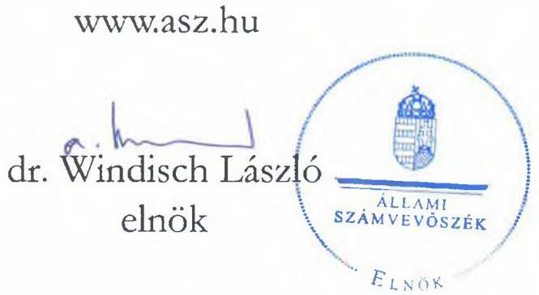
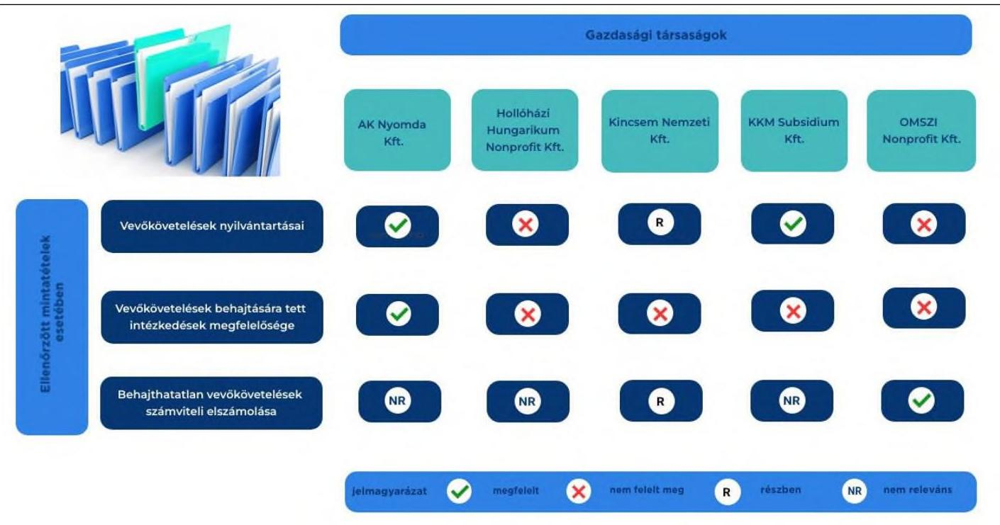
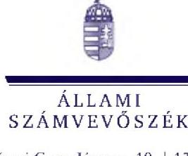

# JELENTÉS 

## Követeléskezelés ellenőrzése

A többségi állami tulajdonban lévő gazdasági társaságok vevőkövetelés-állomány kezelésének célzott ellenőrzése

2023.

---

# JELENTÉS 

## Követeléskezelés ellenőrzése

A többségi állami tulajdonban lévő gazdasági társaságok vevőkövetelés-állomány kezelésének célzott ellenőrzése

2023.

23054

---

# ELLENŐRZÉSI IGAZGATÓSÁG: 

ÁLLAMI VAGYONGAZDÁLKODÁST ELLENŐRZŐ IGAZGATÓSÁG

ELLENŐRZÉSI IGAZGATÓ:
HERCZEGH ZSOLT ellenőrzési igazgató

ELLENŐRZÉSVEZETŐ:
Jelentéseink az interneten a www.asz.hu címen olvashatók.

PENCZ MÁRIA ellenőrzésvezető

IKTATÓSZÁM: EL-3913-002/2023
TÉMASZÁM: 2698
ELLENŐRZÉS-AZONOSÍTÓ SZÁM: V-1042

---

# TARTALOMJEGYZÉK 

- AZ ELLENŐRZÉS ALAPADATAI ..... 5
- AZ ELLENŐRZÖTT SZERVEZETEK ..... 7
- ÖSSZEFOGLALÁS ..... 8
- AZ ELLENŐRZÉS FÓKUSZKÉRDÉSEI ..... 10
- MEGÁLLAPÍTÁSOK ..... 11
- JAVASLATOK ..... 14
- MELLÉKLETEK ..... 16
I. sz. melléklet: Értelmező szótár ..... 16
II. sz. melléklet: Az ellenőrzött szervezetek jegyzéke ..... 18
III. sz. melléklet: Ellenőrzési kritériumok ..... 19
- FÜGGELÉK: ÉSZREVÉTELEK ..... 20
- RÖVIDÍTÉSEK JEGYZÉKE ..... 21

---

.

---

# AZ ELLENŐRZÉS ALAPADATAI 

## AZ ELLENŐRZÉS CÉLJA

Az ellenőrzés célja annak vizsgálata volt, hogy a többségi állami tulajdonban lévő gazdasági társaságok vevőkövetelés-állományára vonatkozó nyilvántartásai megfeleltek-e a jogszabályokban és a belső szabályzatokban előírt követelményeknek. Az ellenőrzés célja továbbá annak megállapítása volt, hogy az ellenőrzött szervezetek intézkedtek-e a vevőkövetelések behajtása érdekében, továbbá, a behajthatatlan vevőkövetelések számviteli elszámolása megfelelt-e a jogszabályi előírásoknak.

## AZ ELLENŐRZÉS TÍPUSA

Megfelelőségi ellenőrzés.

## AZ ELLENŐRZÖTT IDŐSZAK

2022. január 1-jétől 2023. július 12-ig.

## AZ ELLENŐRZÉS TÁRGYA

Az ellenőrzés tárgya a többségi állami tulajdonban lévő gazdasági társaságok vevőkövetelés-állományának célzott ellenőrzése volt. Az ellenőrzés kiterjedt a vevőkövetelések nyilvántartásai megfelelőségének ellenőrzésére, a vevőkövetelések behajtása érdekében tett intézkedésekre, továbbá a behajthatatlan vevőkövetelések számviteli elszámolásának értékelésére.

Az ellenőrzés kiterjedt minden olyan körülményre és adatra, amely az Állami Számvevőszék (továbbiakban: ÁSZ ${ }^{1}$ ) jogszabályban meghatározott feladatainak teljesítéséhez, valamint a program végrehajtása folyamán felmerült újabb összefüggések feltárásához volt szükséges.

## AZ ELLENŐRZÉS JOGALAPJA

Az ellenőrzés jogszabályi alapját az ÁSZ tv. ${ }^{2} 1. §$ (3) bekezdésének és az 5. § (4) bekezdés b) pontjának előírásai képezték.

## AZ ELLENŐRZÉS MÓDSZERE

Az ellenőrzés végrehajtása a nemzetközi standardokat irányadónak tekintve az ellenőrzési program szempontjai, az ellenőrzött időszakban hatályos jogszabályok, az ellenőrzés szakmai szabályok és módszertanok figyelembevételével történt.

---

Az ellenőrzési kérdések megválaszolásához szükséges bizonyítékok megszerzése az ellenőrzött szervezet által rendelkezésre bocsátott dokumentumokra és adatokra alapozva a következő ellenőrzési eljárások alkalmazásával történt: megfigyelés, szemle (szemrevételezés), kérdésfeltevés (információkérés), mintavételezés, valamint interjú. Az ellenőrzés lefolytatásához az ellenőrzött szervezetek az ÁSZ által kért dokumentumok rendelkezésre bocsátásával, valamint a helyszínen elhangzott kérdésekre adott válaszokkal szolgáltattak adatot, információt.

Az ÁSZ a vevőkövetelésekről vezetett Számv. tv. szerinti nyilvántartások vezetésének, a követelésállomány kezelésének, valamint a behajthatatlan követelések elszámolásának értékelését mintavételi eljárással kiválasztott öt tétel alapján ellenőrizte. Amennyiben valamely sokaság elemszáma kisebb volt, mint az előírt mintaelemszám, az adott területet tételes ellenőrzés alapján értékeltük. A tények feltárása és azok összegzése során a megállapítások az ellenőrzött mintatételekre vonatkozóan kerültek megfogalmazásra.

A vevőkövetelések nyilvántartását a 2022. december 31-i állapotnak megfelelően értékelte az ÁSZ. Az értékelés a Számv. tv-nek való megfelelésre, a követelések bizonylatokkal való alátámasztottságára és vevők által történő elismerésére terjedt ki.

Az ellenőrzés célszerűségi szempontok értékelésére is kiterjedt. Az ellenőrzés elvárható intézkedésnek tekintett minden olyan, a követelések behajtása szempontjából fennálló lehetséges intézkedést, amelyek kötelező alkalmazására ugyan nincs jogszabályi előírás, ugyanakkor hozzájárulnak a követelések behajtásához és a felelős gazdálkodás körében alkalmazásuk elvárható.

Az ellenőrzés kitért minden olyan körülményre, amely a program végrehajtása kapcsán felmerült és az ellenőrzés céljaival összhangban volt.

---

# AZ ELLENŐRZÖTT SZERVEZETEK 

Az ellenőrzés során öt állami tulajdonban lévő gazdasági társaság esetében került sor a kiválasztott mintatételeken keresztül a vevőkövetelésük nyilvántartása megfelelőségének, a követelésállományuk kezelésének, valamint a behajthatatlan vevőkövetelések számviteli elszámolásának vizsgálatára az ellenőrzött időszakra vonatkozóan.
AZ AK NYOMDA KFT. ${ }^{3}$ a Magyar Állam kizárólagos tulajdonában álló gazdasági társaság, fő feladata könyvgyártás, valamint kis- és közepes példányszámú ragasztott könyvek, brossúrák, szórólapok, prospektusok készítése. A társasági részesedés feletti tulajdonosi jogokat a 2022. évben az IM${ }^{4}$ gyakorolta, 2023.01.01-től az MNV Zrt. ${ }^{5}$ lett a tulajdonosi joggyakorló. A társaság mérlegfőösszege a 2022. évi számviteli törvény szerinti beszámoló alapján 269183 ezer Ft volt, a követelések összege 8778 ezer Ft, ebből a vevőkövetelések 6639 ezer Ft-ot tettek ki.
A HOLLÓHÁZI HUNGARIKUM NONPROFIT KFT. ${ }^{6}$ a Magyar Állam kizárólagos tulajdonában álló gazdasági társaság, fő feladata a múzeum működtetése, valamint a porcelángyártáshoz kapcsolódó ingatlanok feletti tulajdonosi jogok gyakorlása. A gazdasági társaság feletti tulajdonosi jogokat az 1/2022. (V. 26.) GFM rendelet ${ }^{7}$ alapján 2022.10.06-tól a KIM${ }^{8}$ gyakorolta, azt megelőzően az MNV Zrt. volt a tulajdonosi joggyakorló. A társaság mérlegfőösszege a 2022. évi számviteli törvény szerinti beszámoló alapján 380961 ezer Ft volt, a követelések összege 26640 ezer Ft, ebből a vevőkövetelések 25769 ezer Ft-ot tettek ki.
A KINCSEM NEMZETI KFT. ${ }^{9}$ a Magyar Állam kizárólagos tulajdonában álló gazdasági társaság, fő tevékenysége a lóversenyeztetés. A tulajdonosi jogokat az 2022. május 27-től az 1/2022. (V. 26.) GFM rendelet alapján a HM${ }^{10}$ gyakorolta, ezt megelőzően az MNV Zrt. volt a tulajdonosi joggyakorló. A társaság mérlegfőösszege a 2022. évi számviteli törvény szerinti beszámoló alapján 27783725 ezer Ft volt, a követelések összege 308954 ezer Ft, ebből a vevőkövetelések 192549 ezer Ft-ot tettek ki.
A KKM SUBSIDIUM KFT. ${ }^{11}$ a Magyar Állam kizárólagos tulajdonában álló gazdasági társaság, amelynek tulajdonosi jogait az 2022.05.26-ig az 1/2018. (VI. 25.) NVTNM rendelet alapján, ezt követően az 1/2022. (V. 26.) GFM rendelet alapján a KKM${ }^{12}$ gyakorolta. Fő feladata a minisztérium részére operatív, logisztikai, szállítmányozási, személyszállítási, létesítménygazdálkodási, egyéb kiegészítő szolgáltatási feladatok ellátása, valamint a Budapest Liszt Ferenc Nemzetközi Repülőtéren található Kormányváró üzemeltetése a kormányzati igazgatásról szóló 2018. évi CXXV. törvényben ${ }^{13}$, valamint az állami vezetői juttatásokról szóló 275/2015. (IX. 21.) Korm. rendeletben ${ }^{14}$ foglalt juttatások, szolgáltatások biztosítása érdekében. A társaság mérlegfőösszege a 2022. évi számviteli törvény szerinti beszámoló alapján 2049928 ezer Ft volt, a követelések összege 141694 ezer Ft, ebből a vevőkövetelések 63308 ezer Ft-ot tettek ki.
AZ OMSZI NONPROFIT KFT. ${ }^{15}$ a Magyar Állam kizárólagos tulajdonában álló egyszemélyes társaság, amely felett a tulajdonosi jogokat 2022. május 26-ig az 1/2018. (VI. 25.) NVTNM rendelet alapján az EMMI, azt követően az 1/2022. (V. 26.) GFM rendelet alapján a BM${ }^{16}$ gyakorolta. Fő tevékenysége három nyugdíjas otthonban elsősorban olyan idős, nyugdíjas pedagógusok, művészek és művészeti dolgozók, továbbá közeli hozzátartozóik elhelyezése és ellátása, akik szociálisan rászorultak és ápolási igényük a napi négy órát meghaladta. A társaság mérlegfőösszege a 2022. évi számviteli törvény szerinti beszámoló alapján 2669231 ezer Ft volt, a követelések összege 52186 ezer Ft, ebből a vevőkövetelések 39030 ezer Ft-ot tettek ki.

---

# ÖSSZEFOGLALÁS 

A Magyar Államnak az állami tulajdonú gazdasági társaságokban lévő részesedései a nemzeti vagyon, ezen belül az állami vagyon részét képezik. E részesedések értékére, ezáltal az állami vagyon értékének megőrzésére, növelésére alapvető befolyást gyakorol az állami tulajdonban álló gazdasági társaságok gazdálkodási tevékenysége.

Az állami tulajdonú gazdasági társaságok jellemzően közfeladatot látnak el. A közfeladatok ellátásához a forrásokat a gazdasági társaságok alapvetően a saját tevékenységükből származó bevételeikkel biztosítják, így e bevételek beszedésével kapcsolatos intézkedéseiknek, döntéseiknek kiemelt jelentőségük van a közfeladatok megfelelő színvonalú ellátása érdekében.

Az ellenőrzés a jogszabályban foglalt, felelős gazdálkodás kritériumának vizsgálata keretében értékelte, hogy a gazdasági társaságok - az erőforrásaikhoz, körülményeikhez, a követelésállományuk sajátosságaihoz mérten - megtették-e az elvárható intézkedéseket a követeléseik behajtása érdekében.
AZ ELLENŐRZÉS MEGÁLLAPÍTOTTA, hogy a kiválasztott vevőköveteléseket az AK Nyomda Kft. és a KKM Subsidium Kft. a jogszabályi előírásoknak megfelelően tartotta nyilván. A Kincsem Nemzeti Kft. vevőkövetelésekre vonatkozó nyilvántartása részben volt megfelelő, mivel abban a jogszabályi előírás ellenére szerepelt egy olyan követelés, amelyet a vevő nem igazolt vissza. A Hollóházi Hungarikum Nonprofit Kft. és az OMSZI Nonprofit Kft. nyilvántartásai olyan követelést is tartalmaztak, amelyek nem feleltek meg a jogszabályi előírásoknak.
A felelős gazdálkodás elvének megfelelő követeléskezelés legalapvetőbb eleme a szabályszerű analitikus nyilvántartás vezetése, amely alátámasztottan, pontosan, naprakészen és teljeskörűen tartalmazza a vevőkövetelések állományát. A megfelelő nyilvántartások lehetőséget adnak a követelésállomány nyomon követésére, valamint a követeléskezelés legeredményesebb módszerének kiválasztására.
AZ ELLENŐRZÉS MEGÁLLAPÍTOTTA, hogy az AK Nyomda Kft. az ellenőrzött vevőkövetelések behajtása érdekében a felelős gazdálkodás szempontjainak figyelembevételével intézkedett. A Hollóházi Hungarikum Nonprofit Kft. és a KKM Subsidium Kft. az ellenőrzött öt tétel esetében nem tette meg az elvárható intézkedéseket, a Kincsem Nemzeti Kft. az ellenőrzött öt tételből négy esetben, az OMSZI Nonprofit Kft. öt tételből három esetben nem intézkedett a követelések behajtása érdekében.
A gazdasági társaságok állami vagyonnal való felelős gazdálkodása jogszabályban előírt kötelezettség. A megfelelő követeléskezelési, illetve követelés-érvényesítési intézkedések következetes alkalmazása hozzájárul a gazdasági társaságok vagyonvesztése elkerüléséhez, ezáltal a közfeladatok ellátásához szükséges források biztosításához. Ennek keretrendszerét biztosítja a folyamatok és felelősségi körök belső szabályozásban való rögzítése, amely hozzájárul az intézkedések átláthatóságához és támogatja azok következetes és eredményes alkalmazását.
AZ ELLENŐRZÉS MEGÁLLAPÍTOTTA továbbá, hogy az OMSZI Nonprofit Kft-nél a behajthatatlan követelések elszámolása megfelelt a jogszabályi előírásoknak, a Kincsem Nemzeti Kft. a kiválasztott öt követelés közül egy vevő felé fennálló követelés esetében nem a jogszabályi előírásoknak megfelelően számolta el a behajthatatlan követelését. Az AK Nyomda Kft., a Hollóházi Hungarikum Nonprofit Kft. és a KKM Subsidium Kft. 2022. évben nem számolt el behajthatatlan követelést.

---

A felelős gazdálkodás része az állami vagyon körébe tartozó társasági részesedés értékének megőrzése. A behajthatatlan követelések leírása miatt keletkező veszteségek a társaság saját tőkéjének, ezáltal a részesedésben megtestesülő állami vagyonnak a csökkenését eredményezik. Emiatt kiemelt jelentőségű, hogy a követelések behajthatatlanként való leírása kizárólag indokolt esetben, megalapozottan, a jogszabályi előírások betartásával történjen.
JÓ GYAKORLATKÉNT azonosította az ellenőrzés, hogy a Kincsem Nemzeti Kft. egy meghatározott vevői kör követeléseinek kezelésére speciális informatikai elszámoló rendszert alakított ki. E rendszer biztosította a vevőkövetelések nyomon követését mind a Kincsem Kft., mind a vevői számára. A rendszer a vevői kör részére online módon hozzáférhető volt, lehetővé tette egy adott társasággal szemben fennálló követelések és kötelezettségek adatainak összevetését, a követelések beszámítással való rendezését, ezáltal hozzájárult a követelések eredményes kezeléséhez.

A vizsgált tételek esetében az ellenőrzött szervezetek által nyilvántartott követelések megfelelőségét, a követelések behajtása érdekében tett intézkedéseket, valamint a behajthatatlan követelések számviteli elszámolásának megfelelőségét az alábbi ábra szemlélteti:
1. ábra

A KÖVETELÉSEK NYILVÁNTARTÁSÁNAK ÉS A BEHAJTHATATLAN KÖVETELÉSEK ELSZÁMOLÁSÁNAK SZABÁLYSZERŰSÉGE, VALAMINT A VEVŐKÖVETELÉSEK BEHAJTÁSÁRA TETT INTÉZKEDÉSEK MEGFELELŐSÉGE

Forrás: ÁSZ saját szerkesztés

---

# AZ ELLENŐRZÉS FÓKUSZKÉRDÉSEI 

1.     - A vevőkövetelések nyilvántartásai megfeleltek-e a jogszabályokban, illetve a belső szabályzatokban előírt követelményeknek?
2.     - Az ellenőrzött szervezetek intézkedtek-e a vevőkövetelések behajtása érdekében?
3.     - A behajthatatlan vevőkövetelések számviteli elszámolása
 megfelelt-e a jogszabályi előírásoknak?

---

# MEGÁLLAPÍTÁSOK 

## 1. A vevőkövetelések nyilvántartásai megfeleltek-e a jogszabályokban, illetve a belső szabályzatokban előírt követelményeknek?

Összegző megállapítás

A vevőkövetelések nyilvántartása az AK Nyomda Kft. és a KKM Subsidium Kft. esetében megfelelt, a Kincsem Nemzeti Kft. esetében részben felelt meg, a Hollóházi Hungarikum Nonprofit Kft. és az OMSZI Nonprofit Kft. esetében nem felelt meg a jogszabályi előírásoknak.

Az ellenőrzött szervezetek a Számv. tv. ${ }^{17}$ előírásaival összhangban elkészítették számviteli politikájukat, értékelési szabályzatukat, valamint számlarendjüket.
AZ AK NYOMDA KFT. a vevőkövetelések nyilvántartásával és elszámolásával kapcsolatos szabályokat a Számv. tv. rendelkezéseivel összhangban a számviteli politikában és az értékelési szabályzatban rögzítette. Számlarendje a vevőkövetelések vonatkozásában azonban nem felelt meg a Számv. tv. 161. § (2) bekezdés b) pontjában előírtaknak, mivel nem tartalmazta a számla értéke növekedésének, csökkenésének jogcímeit, a számlát érintő gazdasági eseményeket, azok más számlákkal való kapcsolatát. Az AK Nyomda Kft. az ellenőrzött öt vevőkövetelést a Számv. tv. előírásainak, valamint a számviteli politikájában, értékelési szabályzatában és számlarendjében előírtaknak megfelelően tartotta nyilván.
A HOLLÓHÁZI HUNGARIKUM NONPROFIT KFT. esetében a vevőkövetelések nyilvántartásával és elszámolásával kapcsolatos szabályok, előírások a számviteli politikában, az értékelési szabályzatban és a számlarendben kerültek meghatározásra, azok összhangban voltak a Számv. tv. rendelkezéseivel. A Hollóházi Hungarikum Nonprofit Kft. vevőkövetelés nyilvántartása a kiválasztott öt tételből három esetben nem felelt meg a Számv. tv. 165. § (2) bekezdésében foglaltaknak, mivel nyilvántartásában bizonylatokkal nem alátámasztott vevőköveteléseket is szerepeltetett.
A KINCSEM NEMZETI KFT. a Számv. tv. előírásainak megfelelően a vevőkövetelések nyilvántartásával és elszámolásával kapcsolatos szabályokat a számviteli politikában, az értékelési szabályzatban és a számlarendben rögzítette. A Kincsem Nemzeti Kft. esetében az ellenőrzött vevőkövetelések nyilvántartásban való szerepeltetése részben felelt meg a Számv. tv. 29. § (2) bekezdésében foglaltaknak, mivel nyilvántartásában a kiválasztott öt tételből egy esetben a vevő által el nem ismert követelést szerepeltetett.
A KKM SUBSIDIUM KFT. a vevőkövetelések nyilvántartásával és elszámolásával kapcsolatos szabályokat a Számv. tv. előírásaival összhangban a számviteli politikában és az értékelési szabályzatban rögzítette. Számlarendje a vevőkövetelések vonatkozásában nem felelt meg a Számv. tv. 161. § (2) bekezdés b-c) pontjaiban előírtaknak, mivel nem tartalmazta a számla értéke növekedésének, csökkenésének jogcímeit, a számlát érintő gazdasági eseményeket, azok más számlákkal való kapcsolatát, a főkönyvi számla és az analitikus nyilvántartás kapcsolatát. A KKM Subsidium Kft. az ellenőrzött öt

---

vevőkövetelést a Számv. tv. előírásainak, valamint a számviteli politikájában és értékelési szabályzatában előírtaknak megfelelően tartotta nyilván.
AZ OMSZI NONPROFIT KFT. a vevőkövetelések nyilvántartásával és elszámolásával kapcsolatos szabályokat számviteli politikájában, értékelési szabályzatában és számlarendjében rögzítette. Az OMSZI Nonprofit Kft. vevőköveteléseinek nyilvántartásainak vezetése nem felelt meg a Számv. tv. 165. § (1) bekezdése előírásainak, mivel a 2022.12.31-i nyitott vevőköveteléseket tartalmazó analitikus nyilvántartása a kiválasztott öt mintatételből három esetben olyan vevőkövetelést tartalmazott, amelyet a vevők 2022. év során dokumentáltan kiegyenlítettek, azaz a követelések elszámolásának folyamatához kapcsolódóan nem történt meg minden esetben a bizonylatok nyilvántartásokban történő rögzítése.

# 2. Az ellenőrzött szervezetek intézkedtek-e a vevőkövetelések behajtása érdekében? 

Összegző megállapítás Az AK Nyomda Kft. az ellenőrzött vevőkövetelések behajtása érdekében intézkedett, a Hollóházi Hungarikum Nonprofit Kft., a Kincsem Nemzeti Kft., a KKM Subsidium Kft. és az OMSZI Nonprofit Kft. nem tettek meg minden elvárható intézkedést a követelések behajtása érdekében.

Az ellenőrzött gazdasági társaságok a lejárt fizetési határidejű vevőkövetelések behajtására vonatkozó tevékenységet belső szabályzataikban nem szabályozták.
AZ AK NYOMDA KFT.-NEK az ellenőrzött időszakban egy lejárt esedékességű követelése volt. Az AK Nyomda Kft. megtette az elvárható intézkedést a vevőkövetelése behajtása érdekében, mivel a követelés lejáratát követő felszólítás után a követelés kiegyenlítése megtörtént.
A HOLLÓHÁZI HUNGARIKUM NONPROFIT KFT. nyilvántartásában szereplő követelések behajtása érdekében nem tett meg minden elvárható intézkedést. A kiválasztott öt tételből három esetben nem intézkedett a követelések behajtása érdekében. A vevő által elismert két követelés esetében a társaság kezdeményezte a követelések beruházási szállítói számlákba való beszámítással történő rendezését, azonban az nem történt meg, ennek ellenére a követelések behajtása érdekében további intézkedéseket nem tett.
A KINCSEM NEMZETI KFT. ügyvezetője nyilatkozott a társaságnál alkalmazott követeléskezelési eljárásokról, azonban a kiválasztott öt tételből négy lejárt követelés esetében a nyilatkozatban szerepeltetett intézkedéseket nem tette meg a követelések behajtása érdekében, mivel a követelés harminc napot meghaladó lejárata esetén nem küldött fizetési felszólítást a vevőnek, illetve egyéb intézkedést sem tett.
A KKM SUBSIDIUM KFT. a vevőkövetelések behajtása érdekében az ellenőrzött tételek egyikében sem intézkedett.
AZ OMSZI NONPROFIT KFT. a kiválasztott öt tételből két esetben megtette az elvárható intézkedéseket a lejárt határidejű vevőkövetelések behajtása érdekében, mivel egy követelés esetében fizetési felszólítást küldött, egy esetben hagyatéki eljárás során érvényesítette a követelést. Három esetben a követelések behajtása érdekében nem intézkedett.

---

# 3. A behajthatatlan vevőkövetelések számviteli elszámolása megfelelt-e a jogszabályi előírásoknak? 

Összegző megállapítás Az ellenőrzött behajthatatlan követelések elszámolása az OMSZI Nonprofit Kft-nél megfelelt a Számv. tv. előírásainak, a Kincsem Nemzeti Kft-nél egy vevő felé fennálló követelés kivételével szabályszerű volt.

Az ellenőrzött gazdasági társaságok belső szabályzataikban a Számv. tv. előírásaival összhangban szabályozták a behajthatatlan követelések elszámolását.
Az AK Nyomda Kft., a Hollóházi Hungarikum Nonprofit Kft. és a KKM Subsidium Kft. a 2022. évben nem számolt el behajthatatlan követelést.
Az OMSZI Nonprofit Kft. kiválasztott behajthatatlannak minősített követelései megfeleltek a Számv. tv. előírásainak, mivel azok az elszámolás időpontjában elévült vevőkövetelések voltak.
A Kincsem Kft. behajthatatlannak minősített vevőköveteléseinek elszámolása egy vevővel szemben fennálló követelés kivételével megfelelt a Számv. tv. előírásainak. Egy esetben behajthatatlanság címén vezetett ki követelést a könyveiből úgy, hogy az nem felelt meg a Számv. tv. 3. § (4) bekezdés 10. pontjában foglalt feltételek egyikének sem, így nem minősült behajthatatlan követelésnek.

---

# JAVASLATOK 

Az ÁSZ tv. 33. § (1) bekezdésében foglaltak értelmében az ellenőrzött szervezet vezetője köteles a jelentésben foglalt megállapításokhoz kapcsolódó intézkedési tervet összeállítani és azt a jelentés kézhezvételétől számított 30 napon belül az ÁSZ részére megküldeni. Amennyiben az ellenőrzött szervezet vezetője nem küldi meg határidőben az intézkedési tervet, vagy továbbra sem elfogadható intézkedési tervet küld, az Állami Számvevőszék elnöke az ÁSZ tv. 33. § (3) bekezdése a) és b) pontjaiban foglaltakat érvényesítheti.

## AZ AK NYOMDA KORLÁTOLT FELELŐSSÉGŰ TÁRSASÁG ÜGYVEZETŐJE RÉSZÉRE

1. Tegyen intézkedéseket annak érdekében, hogy a számlarend a Számv. tv. 161. § (2) bekezdés b) pontjában előírtak szerint tartalmazza a főkönyvi számla értéke növekedésének, csökkenésének jogcímeit, a főkönyvi számlát érintő gazdasági eseményeket, azok más számlákkal való kapcsolatát.

## A HOLLÓHÁZI HUNGARIKUM NONPROFIT KORLÁTOLT FELELŐSSÉGŰ TÁRSASÁG ÜGYVEZETŐJE RÉSZÉRE

1. Tegyen intézkedéseket a kontrolltevékenységek megfelelő működtetésére, amellyel megelőzik a jelentésben leírt, lejárt követelések behajtásának ismételt elmaradását.
2. Tegyen intézkedéseket a kontrolltevékenységek megfelelő működtetésére, amellyel biztosítják, hogy a vevőkövetelések nyilvántartásában a Számv. tv. 165. § (2) bekezdésében előírtakkal összhangban bizonylatokkal alátámasztott követelések kerüljenek csak bejegyzésre.

## A KINCSEM NEMZETI LÓVERSENY ÉS LOVAS STRATÉGIAI KORLÁTOLT FELELŐSSÉGŰ TÁRSASÁG ÜGYVEZETŐJE RÉSZÉRE

1. Tegyen intézkedéseket a kontrolltevékenységek megfelelő működtetésére, amellyel megelőzik a jelentésben leírt, lejárt követelések behajtásának elmaradását, illetve a követelések behajthatatlanná minősítésével összefüggő szabálytalanságok ismételt előfordulását.
2. Tegyen intézkedéseket a kontrolltevékenységek megfelelő működtetésére, amellyel biztosítják, hogy a vevőkövetelések nyilvántartásában a Számv. tv. 29. § (2) bekezdésében előírtakkal összhangban a vevők által elismert követelések szerepeljenek.

---

# A KKM SUBSIDIUM KORLÁTOLT FELELŐSSÉGŰ TÁRSASÁG ÜGYVEZETŐJE RÉSZÉRE 

1. Tegyen intézkedéseket, hogy a számlarend a Számv. tv. 161. § (2) bekezdés b-c) pontjaiban előírtak szerint tartalmazza a számla értéke növekedésének, csökkenésének jogcímeit, a számlát érintő gazdasági eseményeket, azok más számlákkal való kapcsolatát, a főkönyvi számla és az analitikus nyilvántartás kapcsolatát.
2. Tegyen intézkedéseket a kontrolltevékenységek megfelelő működtetésére, amellyel megelőzik a jelentésben leírt, lejárt követelések behajtásának ismételt elmaradását.

## AZ OMSZI INTÉZMÉNYFENNTARTÓ KÖZHASZNÚ NONPROFIT KORLÁTOLT FELELŐSSÉGŰ TÁRSASÁG ÜGYVEZETŐJE RÉSZÉRE

1. Tegyen intézkedéseket a kontrolltevékenységek megfelelő működtetésére, amellyel megelőzik a jelentésben leírt, lejárt követelések behajtásának ismételt elmaradását.
2. Tegyen intézkedéseket a kontrolltevékenységek megfelelő működtetésére, amellyel biztosítják, hogy a Számv. tv. 165. § (1) bekezdésében előírtaknak megfelelően a vevőkövetelések nyilvántartásában a követelések elszámolásának folyamatához kapcsolódó számviteli bizonylatok rögzítésre kerüljenek.

---

# MELLÉKLETEK 

## I. SZ. MELLÉKLET: ÉRTELMEZŐ SZÓTÁR

behajthatatlan követelés
gazdasági társaság
hitelezési veszteség
köztulajdonban álló gazdasági társaság
követelés behajtása érdekében megtett elvárható intézkedés
többségi állami tulajdon

Az a követelés,
a) amelyre az adós ellen vezetett végrehajtás során nincs fedezet, vagy a talált fedezet a követelést csak részben fedezi (amennyiben a végrehajtás közvetlenül nem vezetett eredményre és a végrehajtást szüneteltetik, az óvatosság elvéből következően a behajthatatlanság - nemleges foglalási jegyzőkönyv alapján vélelmezhető),
b) amelyet a hitelező a csődeljárás, a felszámolási eljárás, az önkormányzatok adósságrendezési eljárása során egyezségi megállapodás keretében elengedett, c) amelyre a felszámoló által adott írásbeli igazolás (nyilatkozat) szerint nincs fedezet,
d) amelyre a felszámolás, az adósságrendezési eljárás befejezésekor a vagyonfelosztási javaslat szerinti értékben átvett eszköz nem nyújt fedezetet, e) amelyet eredményesen nem lehet érvényesíteni, amelynél a fizetési meghagyásos eljárással, a végrehajtással kapcsolatos költségek nincsenek arányban a követelés várhatóan behajtható összegével (a fizetési meghagyásos eljárás, a végrehajtás veszteséget eredményez vagy növeli a veszteséget), amelynél az adós nem lelhető fel, mert a megadott címen nem található és a felkutatása ,,igazoltan" nem járt eredménnyel,
f) amelyet bíróság előtt érvényesíteni nem lehet,
g) amely a hatályos jogszabályok alapján elévült,

A behajthatatlanság tényét és mértékét bizonyítani kell.
(Forrás: Számv.tv. 3. § (4) bekezdés 10. pont)
A gazdasági társaságok üzletszerű közös gazdasági tevékenység folytatására, a tagok vagyoni hozzájárulásával létrehozott, jogi személyiséggel rendelkező vállalkozások, amelyekben a tagok a nyereségből közösen részesednek, és a veszteséget közösen viselik.
(Forrás: Ptk. 3:88. § (1) bekezdése)
A behajthatatlan követelés mérlegkészítési időpontjáig elszámolt összege. (Forrás: Számv.tv. 65. § (7) bekezdés)
Az a gazdasági társaság, amelyben a Magyar Állam, helyi önkormányzat, a helyi önkormányzat jogi személyiséggel rendelkező társulása, többcélú kistérségi társulás, fejlesztési tanács, nemzetiségi önkormányzat, nemzetiségi önkormányzat jogi személyiségű társulása, költségvetési szerv vagy közalapítvány külön-külön vagy együttesen számítva többségi befolyással rendelkezik.
(Forrás: Taktv. ${ }^{18}$ 1. § a) pont)
A követelés behajtása érdekében megtett, jogszabályban nem előírt intézkedés. Ilyen például a fizetési felszólítás, ügyvédi felszólítás vevőnek történő megküldése, végrehajtási eljárás, felszámolási eljárás kezdeményezése, követelés értékesítése, engedményezése, egyéb intézkedések. Amennyiben a gazdasági társaság vezetője nyilatkozott a lejárt követelések kezelésének gyakorlatára vonatkozóan, akkor a nyilatkozatban felsorolt intézkedések.
Az állam tulajdonában lévő tagsági jogviszonyt megtestesítő értékpapír, illetve az államot megillető egyéb társasági részesedés, amennyiben a társaságban a Magyar Állam a szavazatok több mint 50\%-ával vagy meghatározó befolyással rendelkezik.
(Forrás: Vtv. ${ }^{19} 1 . \S$ (2) bekezdés c) pont)

---

többségi befolyás
vevőkövetelés

Az olyan kapcsolat, amelynek révén a befolyással rendelkező egy jogi személyben a szavazatok több mint ötven százalékával - közvetlenül vagy a jogi személyben szavazati joggal rendelkező más jogi
 személy (köztes vállalkozás) szavazati jogán keresztül – rendelkezik, azzal, hogy a közvetett módon való rendelkezés meghatározása során a jogi személyben szavazati joggal rendelkező más jogi személyt (köztes vállalkozást) megillető szavazati hányadot meg kell szorozni a befolyással rendelkezőnek a köztes vállalkozásban, illetve vállalkozásokban fennálló szavazati hányadával, ha azonban a köztes vállalkozásban fennálló szavazatainak hányada az ötven százalékot meghaladja, akkor azt egy egészként kell figyelembe venni. A befolyás számításánál nem kell figyelembe venni a huszonöt százalékot el nem érő közvetett befolyást.
(Forrás: Taktv. 1. § b) pont)
Áruszállításból és szolgáltatásból származó minden olyan követelés, amely a vállalkozó által teljesített – a vevő által elismert – termékértékesítésből, szolgáltatásnyújtásból származik.
(Forrás: Számv. tv. 29. § (2) bekezdés)

---

II. SZ. MELLÉKLET: AZ ELLENŐRZÖTT SZERVEZETEK JEGYZÉKE

# SORSZÁM   ELLENŐRZÖTT SZERVEZET MEGNEVEZÉSE 

1. AK Nyomda Korlátolt Felelősségű Társaság
2. Hollóházi Hungarikum Nonprofit Korlátolt Felelősségű Társaság
3. Kincsem Nemzeti Löverseny és Lovas Stratégiai Korlátolt Felelősségű Társaság
4. KKM Subsidium Korlátolt Felelősségű Társaság
5. OMSZI Intézményfenntartó Közhasznú Nonprofit Korlátolt Felelősségű Társaság

---

# III. SZ. MELLÉKLET: ELLENŐRZÉSI KRITÉRIUMOK 

## FOKUSZKÉRDÉS

1. A vevőkövetelések nyilvántartásai megfelelnek-e a jogszabályokban, illetve a belső szabályzatokban előírt követelményeknek?
2. Az ellenőrzött szervezetek intézkedtek-e a vevőkövetelések behajtása érdekében?
3. A behajthatatlan vevőkövetelések számviteli elszámolása megfelelt-e a jogszabályi előírásoknak?

## ÉLLENŐRZÉSI KRITÉRIUMOK

Számv. tv. 12. § (1) bek., 29. § (2)-(4). bek., 55. §, 65. § (1) bek., 69. § (1)-(2). bek., 159. §, 161. §, 165. §, az előzőekben felsorolt jogszabályoknak megfelelő belső szabályzatok.
Ptk. ${ }^{20}$ 6:130. §, 6:155. §, 6:193. § 6:201. §, 6:48. §, 6:49. § 6:52. §, 2009. évi L. tv. ${ }^{21}$, Cstv. ${ }^{22}$ 22. § (1) bek. b) pont, 24. § (1) bek., 27. § (2) bek. a) pont, 28. § (2) bek. f) pont, az előzőekben felsorolt jogszabályoknak megfelelő belső szabályzatok, ellenőrzés részére adott nyilatkozat a követelések kezeléséről.
Ptk. 6:22. § (1) bek., Számv. tv. 3. § (4) bek. 10. pont, 12. § (1) bek., 65. § (7) bek., 159. §, Ctv. ${ }^{23} 62. §$ (2) bek. a)-b) pont, Cstv. 46. § (8) bek., az előzőekben felsorolt jogszabályoknak megfelelő belső szabályzatok.

---

# FÜGGELÉK: ÉSZREVÉTELEK 

A jelentéstervezetet a Számvevőszék 15 napos észrevételezésre megküldte az ellenőrzött szervezet vezetőjének az ÁSZ tv. 29. § (1) bekezdése előírásának megfelelően.

Az ellenőrzött szervezetek a jelentéstervezet megállapításait érintő észrevételt nem tettek.

[^0]
[^0]:    * 29. § (1) Az Állami Számvevőszék az ellenőrzési megállapításait megküldi az ellenőrzött szervezet vezetőjének vagy az általa megbízott személynek, és annak, akinek személyes felelősségét állapította meg.
    (2) Az ellenőrzött szervezet vezetője és a felelősként megjelölt személy az ellenőrzés megállapításaira tizenöt napon belül írásban észrevételt tehet.
    (3) Az Állami Számvevőszék az észrevételre a beérkezésétől számított harminc napon belül írásban válaszol. A figyelembe nem vett észrevételeket köteles a jelentésben feltüntetni, és megindokolni, hogy azokat miért nem fogadta el.

---

# RÖVIDÍTÉSEK JEGYZÉKE 

${ }^{1}$ ÁSZ
${ }^{2}$ ÁSZ tv.
${ }^{3}$ AK Nyomda Kft.
${ }^{4}$ IM
${ }^{5}$ MNV Zrt.
${ }^{6}$ Hollóházi Hungarikum Nonprofit Kft
${ }^{7} 1 / 2022$. (V. 26.) GFM rendelet
${ }^{8}$ KIM
${ }^{9}$ Kincsem Nemzeti Kft.
${ }^{10} \mathrm{HM}$
${ }^{11}$ KKM Subsidium Kft.
${ }^{12}$ KKM
${ }^{13}$ 2018. évi CXXV. törvény
${ }^{14}$ 275/2015. (IX. 21.) Korm. rendelet
${ }^{15}$ OMSZI Nonprofit Kft.
${ }^{16}$ BM
${ }^{17}$ Számv. tv.
${ }^{18}$ Taktv.
${ }^{19}$ Vtv.
${ }^{20}$ Ptk.
${ }^{21}$ 2009. évi L. tv.
${ }^{22}$ Cstv.
${ }^{23} \mathrm{Ctv}$.

Állami Számvevőszék
2011. évi LXVI. törvény - az Állami Számvevőszékről (hatályos 2011.07.01-től)

AK Nyomda Korlátolt Felelősségű Társaság
Igazságügyi Minisztérium
Magyar Nemzeti Vagyonkezelő Zártkörűen működő Részvénytársaság
Hollóházi Hungarikum Nonprofit Korlátolt Felelősségű Társaság
1/2022. (V. 26.) GFM rendelet az egyes állami tulajdonban álló gazdasági társaságok felett az államot megillető tulajdonosi jogok és kötelezettségek összességét gyakorló személyek kijelöléséről
Kulturális és Innovációs Minisztérium
Kincsem Nemzeti Löverseny és Lovas Stratégiai Korlátolt Felelősségű Társaság
Honvédelmi Minisztérium
KKM Subsidium Korlátolt Felelősségű Társaság
Külgazdasági és Külügyminisztérium
2018. évi CXXV. törvény a kormányzati igazgatásról

275/2015. (IX. 21.) Korm. rendelet az állami vezetői juttatásokról
OMSZI Intézményfenntartó Közhasznú Nonprofit Korlátolt Felelősségű Társaság
Belügyminisztérium
2000. évi C. törvény - a számvitelről
2009. évi CXXII. törvény - a köztulajdonban álló gazdasági társaságok takarékosabb működéséről
2007. évi CVI. törvény - az állami vagyonról
2013. évi V. törvény - a Polgári Törvénykönyvről
2009. évi L. törvény - a fizetési meghagyásos eljárásról
1991. évi XLIX. törvény - a csődeljárásról és a felszámolási eljárásról
2006. évi V. törvény - a cégnyilvánosságról, a bírósági cégeljárásról és a végelszámolásról

---

1052 Budapest, Apáczai Csere János u. 10. | 1364 Budapest 4., Pf. 54
www.asz.hu | szamvevoszek@asz.hu
telefon: +3614849100
