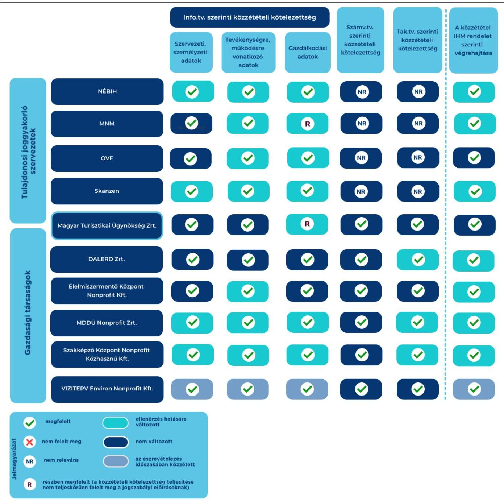
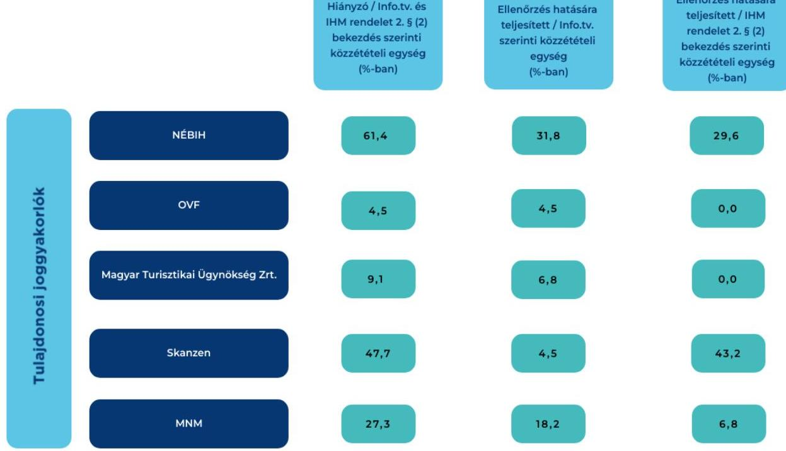
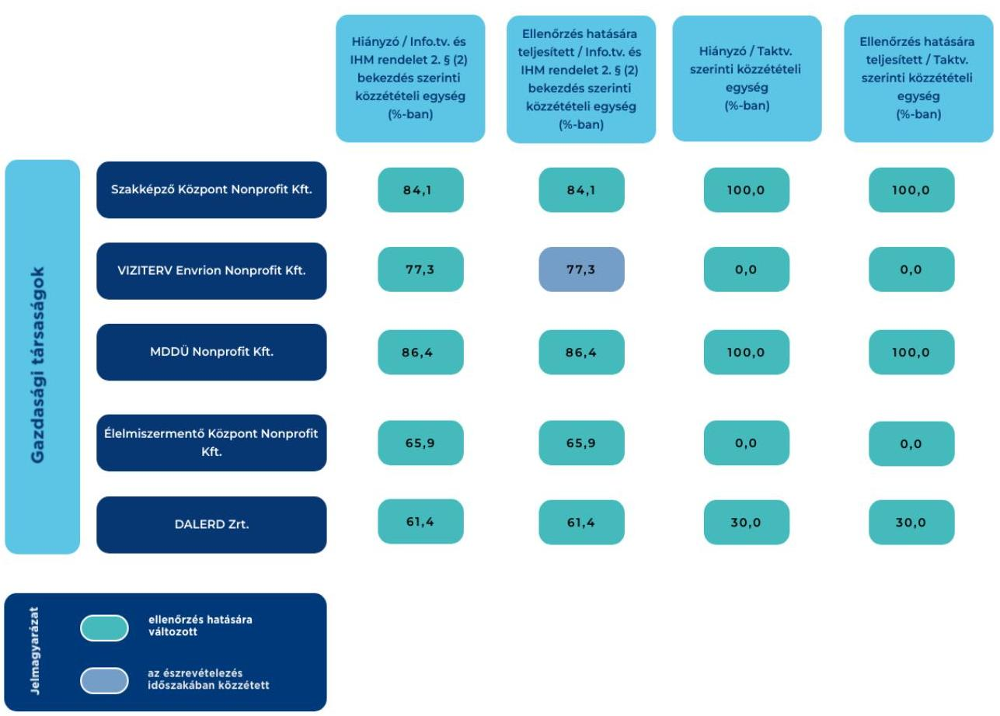

# JELENTÉS 

## Közzétételi kötelezettség ellenőrzése

Az állami vagyon feletti tulajdonosi joggyakorló szervezetek és az állami tulajdonban álló gazdasági társaságok elektronikus közzétételi kötelezettsége teljesítésének célzott ellenőrzése

2023.

---

# JELENTÉS 

## Közzétételi kötelezettség ellenőrzése

Az állami vagyon feletti tulajdonosi joggyakorló szervezetek és az állami tulajdonban álló gazdasági társaságok elektronikus közzétételi kötelezettsége teljesítésének célzott ellenőrzése

2023.

---

# ELLENŐRZÉSI IGAZGATÓSÁG: 

ÁLLAMI VAGYONGAZDÁLKODÁST ELLENŐRZŐ IGAZGATÓSÁG

## ELLENŐRZÉSI IGAZGATÓ:

HERCZEGH ZSOLT ellenőrzési igazgató

## ELLENŐRZÉSVEZETŐ:

Jelentéseink az interneten a www.asz.hu címen olvashatók.

PENCZ MÁRIA ellenőrzésvezető

IKTATÓSZÁM: EL-3912-002/2023
TÉMASZÁM: 2697
ELLENŐRZÉS-AZONOSÍTÓ SZÁM: V-1041

---

# TARTALOMJEGYZÉK 

- AZ ELLENŐRZÉS ALAPADATAI ..... 5
- AZ ELLENŐRZÖTT SZERVEZETEK ..... 7
- ÖSSZEFOGLALÁS ..... 9
- AZ ELLENŐRZÉS FÓKUSZKÉRDÉSE ..... 11
- MEGÁLLAPÍTÁSOK ..... 12
- JAVASLATOK ..... 15
- MELLÉKLETEK ..... 16
I. sz. melléklet: Értelmező szótár ..... 16
II. sz. melléklet: Az ellenőrzött szervezetek jegyzéke ..... 17
III. sz. melléklet: Ellenőrzési kritériumok ..... 18
- FÜGGELÉK: ÉSZREVÉTELEK ..... 19
- RÖVIDÍTÉSEK JEGYZÉKE ..... 20

---

.

---

# AZ ELLENŐRZÉS ALAPADATAI 

## AZ ELLENŐRZÉS CÉLJA

Az ellenőrzés célja annak értékelése volt, hogy az ellenőrzésre kiválasztott állami vagyon feletti tulajdonosi joggyakorló szervezetek és a közfeladatot ellátó, állami tulajdonban álló gazdasági társaságok eleget tettek-e elektronikus közzétételi kötelezettségeiknek.

## AZ ELLENŐRZÉS TÍPUSA

Megfelelőségi ellenőrzés.

## AZ ELLENŐRZÖTT IDŐSZAK

Az ellenőrzött időszak 2022. év, a beszámoló tekintetében a 2022. évi beszámoló közzétételi kötelezettség teljesítése.

## AZ ELLENŐRZÉS TÁRGYA

Az ellenőrzés tárgya az állami vagyon feletti tulajdonosi joggyakorló szervezetek Info.tv. ${ }^{1}$ és IHM rendelet szerinti, valamint az állami tulajdonban álló gazdasági társaságok Info.tv., Taktv., ${ }^{2}$ Számv.tv. ${ }^{3}$ és IHM rendelet szerinti elektronikus közzétételi kötelezettségeinek teljesítése volt.

Az ellenőrzés kiterjedt minden olyan körülményre és adatra, amely az ÁSZ ${ }^{4}$ jogszabályban meghatározott feladatainak teljesítéséhez, valamint a program végrehajtása folyamán felmerült újabb összefüggések feltárásához volt szükséges.

## AZ ELLENŐRZÉS JOGALAPJA

Az ellenőrzés jogszabályi alapját az ÁSZ tv. ${ }^{5} 1 . \int$ (3) bekezdés előírása képezte.

## AZ ELLENŐRZÉS MÓDSZERE

Az ellenőrzést a nemzetközi standardokat irányadónak tekintve az ellenőrzési program szempontjai, az ellenőrzött időszakban hatályos jogszabályok, valamint az ellenőrzés szakmai szabályok és módszertanok figyelembevételével végezte az ÁSZ.

Az ellenőrzési kérdések megválaszolásához szükséges bizonyítékok megszerzése a következő ellenőrzési eljárások alkalmazásával történt: megfigyelés, szemle (szemrevételezés), kérdésfeltevés (információkérés), valamint elemző eljárás.

---

Az ellenőrzési bizonyítékként felhasználható adatforrások közé tartoztak egyrészt az ellenőrzött szervezetek által elektronikusan közzétett adatok, dokumentumok, adatforrások, másrészt adatforrás volt még minden - az ellenőrzés folyamán - az ÁSZ által kért dokumentum, adat, információ.

Mintavételi eljárás alkalmazására nem került sor. A közzétételi kötelezettséget az ellenőrzés megkezdésének napján ellenőriztük.

---

# AZ ELLENŐRZÖTT SZERVEZETEK 

Az ÁSZ az elektronikus közzétételi kötelezettséget a NÉBIH ${ }^{6}$, az MNM ${ }^{7}$, a Magyar Turisztikai Ügynökség Zrt. ${ }^{8}$, az $\mathrm{OVF}^{9}$, és a SKANZEN ${ }^{10}$ tulajdonosi joggyakorló szervezeteknél, valamint a DALERD Zrt. ${ }^{11}$, Élelmiszermentő Központ Nonprofit Kft. ${ }^{12}$, az MDDÜ Nonprofit Zrt. ${ }^{13}$, a Szakképző Központ Nonprofit Kft. ${ }^{14}$, a Magyar Turisztikai Ügynökség Zrt. ${ }^{15}$ és a VIZITERV Environ Nonprofit Kft. ${ }^{16}$ közfeladatot ellátó állami tulajdonú gazdasági társaságok esetében ellenőrizte. A Magyar Turisztikai Ügynökség Zrt. közzétételi kötelezettségének teljesítését az ÁSZ tulajdonosi joggyakorlóként és gazdasági társaságként egyaránt ellenőrizte.

Az állami vagyon feletti tulajdonosi joggyakorló szervezetek esetében az általuk a saját honlapjukon, illetve az Info.tv 33. § (3) bekezdésében meghatározott honlapon, vagy a Központi Információs Közadatnyilvántartás felületén közzétett adatokat, információkat, míg az állami tulajdonban álló gazdasági társaságok esetében az Info.tv 33. § (3) bekezdésében meghatározott honlapon, valamint a céginformációs szolgálat honlapján közzétett adatokat, információkat ellenőriztük.

A NÉBIH a 22/2012. (II. 29.) Korm. rendelet ${ }^{17}$ alapján az élelmiszerlánc-felügyeletért felelős miniszter irányítása alá tartozó, központi hivatalként működő központi költségvetési szerv. Országos hatáskörben felügyeli az élelmiszerlánc-biztonsági szabályok betartását, küzd az élelmiszerhamisítások és a feketegazdaság ellen. A NÉBIH a 383/2016 (XII.2) Korm. rendelet ${ }^{18}$, valamint a NÉBIH SZMSZ ${ }^{19}$-e alapján tulajdonosi jogokat gyakorolt az Élelmiszerlánc-biztonsági Centrum Nonprofit Kft. és Élelmiszermentő Központ Nonprofit Kft. részesedései felett.

AZ OVF a 223/2014. (IX. 4.) Korm. rendelet ${ }^{20}$ alapján a Kormány vízügyi igazgatási szerve, önállóan működő és gazdálkodó központi költségvetési szerv, feladatait a belügyminiszter irányítása alatt végzi. Főbb feladatai a vízvédelemmel, a vízkészlet-gazdálkodási tevékenységgel, az egyes európai uniós források felhasználásával megvalósuló kormányzati fejlesztésekkel, a vízügyi nyilvántartások és informatikai rendszerek üzemeltetésével kapcsolatos tevékenységek ellátása. Az OVF 2022. május 26-ig az 1/2018. (VI. 25.) NVTNM rendelet ${ }^{21}$, azt követően az 1/2022. (V. 26.) GFM rendelet ${ }^{22}$ alapján gyakorolta a tulajdonosi jogokat a VIZITERV Environ Nonprofit Kft. és a VIZITERV Export Kft. részesedései felett.

A MAGYAR TURISZTIKAI ÜGYNÖKSÉG ZRT. a Magyar Állam kizárólagos tulajdonában álló gazdasági társaság, fő feladata a turizmusfejlesztés irányítása és stratégiájának meghatározása, továbbá a magyarországi turizmusmarketing koordinálása. 2022. május 26-ig az 1/2018. (VI. 25.) NVTNM rendelet, azt követően az 1/2022. (V. 26.) GFM rendelet alapján az MDDÜ Nonprofit Zrt. és további hat társaság részesedése felett gyakorolt tulajdonosi jogokat.

AZ MNM központi költségvetési szerv, fő tevékenysége múzeumi tevékenység, közfeladata kulturális örökségvédelem, a nemzeti kultúra erősítése a közgyűjtemény és emlékezetpolitika ágazatokban. Az MNM 2022. május 26-ig az 1/2018. (VI. 25.) NVTNM rendelet, azt követően az 1/2022. (V. 26.) GFM rendelet alapján a Nemzeti Múzeum Kft. részesedései felett gyakorolt tulajdonosi jogokat.

---

A SKANZEN központi költségvetési szerv, feladata az örökségvédelem, a gyűjtőkörébe tartozó kulturális javak, információk gyűjtése, az ismeretátadás, tudományos munka. A Skanzen 2022. május 26-ig az 1/2018. (VI. 25.) NVTNM rendelet, azt követően az 1/2022. (V. 26.) GFM rendelet alapján a Skanzenért Nonprofit Korlátolt Felelősségű Társaság részesedései felett gyakorolt tulajdonosi jogokat.

AZ MDDŰ NONPROFIT ZRT. a Magyar Állam tulajdonában álló egyszemélyes gazdasági társaság, fő tevékenysége PR, kommunikáció. A társaság részesedései felett a tulajdonosi jogokat a Magyar Turisztikai Ügynökség Zrt. gyakorolta.

A SZAKKÉPZŐ KÖZPONT NONPROFIT KFT. a Magyar Állam tulajdonában álló egyszemélyes gazdasági társaság, fő tevékenysége középfokú szakmai gyakorlati oktatás. A társaság részesedései felett a tulajdonosi jogokat 2022. május 26-ig az 1/2018. (VI. 25.) NVTNM rendelet, azt követően az 1/2022. (V. 26.) GFM rendelet alapján az Érdi Szakképzési Centrum gyakorolta.

AZ ÉLELMISZERMENTŐ KÖZPONT NONPROFIT KFT. a Magyar Állam tulajdonában álló egyszemélyes gazdasági társaság, fő tevékenysége adatfeldolgozás, web-hoszting szolgáltatás. A társaság részesedései felett a tulajdonosi jogokat a NÉBIH gyakorolta.

A VIZITERV ENVIRON NONPROFIT KFT. a Magyar Állam tulajdonában álló egyszemélyes gazdasági társaság, fő tevékenysége vízügyi mérnöki tevékenység, műszaki tanácsadás. A társaság részesedései feletti tulajdonosi joggyakorló az OVF volt.

A DALERD ZRT. a Magyar Állam tulajdonában álló egyszemélyes gazdasági társaság, fő tevékenysége erdészeti, egyéb erdőgazdálkodási tevékenység. A társaság részesedései feletti tulajdonosi jogokat az Agrárminisztérium gyakorolta.

---

# ÖSSZEFOGLALÁS 

A tulajdonosi joggyakorlók és a közfeladatot ellátó, állami tulajdonban álló gazdasági társaságok esetében a közérdekú adatok elektronikus közzététele alapvető fontosságú a közélet müködésének átláthatósága szempontjából. Ebbe a körbe tartoznak az Info.tv.-ben előírt szervezeti és személyzeti adatok, a tevékenységre és müködésre, valamint a gazdálkodásra vonatkozó adatok, továbbá a köztulajdonban álló gazdasági társaságok esetében a Számv.tv. szerinti beszámoló, valamint a Taktv.ben előírt vezető tisztségviselőkre, vezető állású munkavállalókra, felügyelőbizottsági tagokra vonatkozó közzétételek. Az ellenőrzött szervezetek tevékenységének, müködésének és gazdálkodásának átláthatóságát biztosítja az $\mathbf{I H M}^{23}$ rendeletben foglalt, a szervezet szempontjából nem releváns adatok közzététele, valamint a "Közérdekú adatokra" hivatkozás nyitó oldalon történő megjelenítése.

Jelen ellenőrzés keretében olyan öt tulajdonosi joggyakorló szervezet és hat gazdasági társaság elektronikus közzétételi kötelezettségének teljesítését értékelte az ÁSZ, amelyeknél a közzétételi kötelezettségeik teljesítésében hiányosságot tapasztalt. Az ÁSZ ellenőrzése arra terjedt ki, hogy az ellenőrzés hatására javult-e a szervezetek közzétételi kötelezettségének teljesítése.

Az ellenőrzés eredményeképpen az ellenőrzött szervezetek a közzététel igazolására irányuló, kiküldött kérdőív átvételét követően részben, vagy egészben pótolták a hiányzó dokumentumok/adatok/ információk honlapjaikon történő közzétételét.

AZ ELLENŐRZÖTT TULAJDONOSI JOGGYAKORLÓ SZERVEZETEK közül a NÉBIH, OVF és a Skanzen teljesítették az Info.tv. szerinti közzétételi kötelezettségeiket. Az MNM és a Magyar Turisztikai Ügynökség Zrt. a jogszabályi előírások ellenére a rábízott vagyonra vonatkozó beszámolóikat a gazdálkodási adatok között honlapjaikon nem tették közzé. A közzététel IHM rendelet szerinti végrehajtása valamennyi tulajdonosi joggyakorló esetében megfelelő volt, mivel az ellenőrzés folyamán honlapjaikon jelezték, ha valamely közzétételi kötelezettség alá eső adat a szervezetük szempontjából nem releváns.

AZ ELLENŐRZÖTT GAZDASÁGI TÁRSASÁGOK teljesítették az Info.tv., a Számv.tv. és Taktv. szerinti közzétételi kötelezettségeiket. A közzététel IHM rendelet szerinti végrehajtása az ellenőrzött gazdasági társaságoknál megfelelő volt, mivel az ellenőrzés folyamán honlapjaikon jelezték, ha valamely közzétételi kötelezettség alá eső adat a szervezetük szempontjából nem releváns.

A VIZITERV Environ Nonprofit Kft. az Info.tv. és az IHM rendelet szerinti közzétételi kötelezettségének a jelentéstervezet megküldését követően, az észrevételezés időszakában eleget tett, ezzel a jelentéstervezet megállapítása az ellenőrzés során hasznosult.

---

Az ellenőrzőtt szervezetek közzétételi kötelezettségeinek teljesítését, valamint az ellenőrzés hasznosulását az alábbi táblázat mutatja be:

1. ábra

# AZ ELLENŐRZŐTT SZERVEZETEK KÖZZÉTÉTELI KÖTELEZETTSÉGEIK TELJESÍTÉSE AZ ELLENŐRZÉS HATÁSÁRA 

Forrás: ÁSZ saját szerkesztés

---

# AZ ELLENŐRZÉS FÓKUSZKÉRDÉSE 

1. Az ellenőrzött szervezetek a jogszabályokban előírt elektronikus közzétételi kötelezettségüket teljesítették-e?

---

# 1. Az ellenőrzött szervezetek a jogszabályokban előírt elektronikus közzétételi kötelezettségüket teljesítették-e? 

## Összegző megállapítás A tíz ellenőrzött szervezet közül nyolc teljeskörűen teljesítette elektronikus közzétételi kötelezettségeit.

Az ellenőrzött tulajdonosi joggyakorló szervezetek esetében az Info.tv. szerinti közzétételi kötelezettség teljesítése - az MNM és a Magyar Turisztikai Ügynökség Zrt. rábízott vagyonáról szóló költségvetési beszámolója közzétételének kivételével - megfelelő volt. Valamennyi gazdasági társaság teljesítette az Info.tv., a Számv.tv. és a Taktv. szerinti közzétételi kötelezettségét. A közzététel igazolására szolgáló, jelen ellenőrzés által kiküldött kérdőív átvételét követően valamennyi szervezet a hiányzó adatok/dokumentumok/információk közzétételét részben vagy egészben pótolta, ezáltal az ellenőrzés hasznosult az ellenőrzés időszakában. Az ellenőrzött szervezetek közzététele megfelelt az IHM rendeletben foglaltaknak.
Az ellenőrzés hatására a közzétételi kötelezettség teljesítése az ellenőrzött tíz szervezetből nyolc szervezet esetében jelentősen javult, azok teljeskörűen eleget tettek közzétételi kötelezettségüknek. Két szervezet részben teljesítette közzétételi kötelezettségét.
A VIZITERV Environ Nonprofit Kft. az Info.tv. és az IHM rendelet szerinti közzétételi kötelezettségét a jelentéstervezet megküldését követően, az észrevételezés időszakában teljesítette, ezzel a jelentéstervezet megállapítása az ellenőrzés során hasznosult.

AZ ELLENŐRZŐTT TULAJDONOSI JOGGYAKORLÓ szervezetek esetében az ellenőrzés megkezdésének napján mindösszesen hatvanhat egység közzététele hiányzott, amelyek közzétételét az ellenőrzés hatására - két részegység kivételével - pótoltak.
A NÉBIH, az OVF és a Skanzen teljesítették az Info.tv. szerinti közzétételi kötelezettségeiket. Az MNM és a Magyar Turisztikai Ügynökség Zrt. az Info.tv. 1. melléklete III. Gazdálkodási adatok 1. pontjában előírtak ellenére a gazdálkodási adatok közül „a közfeladatot ellátó szerv éves költségvetése, számviteli törvény szerint beszámolója vagy éves költségvetés beszámolója" egységből a rábízott vagyonra vonatkozó beszámolóikat a honlapjaikon nem tüntették fel.
Valamennyi tulajdonosi joggyakorló szervezet eleget tett az IHM rendeletben foglaltaknak, mivel a közérdekủ adataikat a nyitó oldalon, jól látható helyen tették közzé, és az ellenőrzés folyamán a szervezetük számára nem releváns közzétételi egységek honlapjaikon történő közzétételét pótolták.

---

Az ellenőrzött tulajdonosi joggyakorló szervezetek ellenőrzés hatására történő közzétételi kötelezettségeik teljesítését a 2. ábra tartalmazza:
2. ábra

# AZ ELLENŐRZÖTT TULAJDONOSI JOGGYAKORLÓ SZERVEZETEK KÖZZÉTÉTELI KÖTELEZETTSÉGEIK TELJESÍTÉSE AZ ELLENŐRZÉS HATÁSÁRA 

Forrás: ÁSZ saját szerkesztés
AZ ELLENŐRZÖTT GAZDASÁGI TÁRSASÁGOK teljesítették az Info.tv., a Számv.tv. és a Taktv. szerinti közzétételi kötelezettségeiket. A közzététel IHM rendelet szerinti végrehajtása az ellenőrzés megkezdésének napján egyetlen gazdasági társaság esetében sem volt megfelelő, mivel a szervezetük számára nem releváns adatokat honlapjaikon nem tüntették fel. Az ellenőrzés során ezen adatok közzététele megtörtént, így az ellenőrzés e vonatkozásban is hasznosult.
A VIZITERV Environ Nonprofit Kft. az Info.tv. és az IHM rendelet szerinti közzétételi kötelezettségének a jelentéstervezet megküldését követően, az észrevételezés időszakában eleget tett, ezzel a jelentéstervezet megállapítása az ellenőrzés során hasznosult.
Az ellenőrzött gazdasági társaságoknál az ellenőrzés megkezdésének napján száznyolcvannyolc egység közzététele hiányzott, az ellenőrzés hatására az ellenőrzött szervezetek pótolták a hiányzó egységek közzétételét.

---

Az ellenőrzött gazdasági társaságok ellenőrzés hatására történő közzétételi kötelezettségeik teljesítését a 3. ábra tartalmazza:
3. ábra

# AZ ELLENŐRZÖTT GAZDASÁGI TÁRSASÁGOK KÖZZÉTÉTELI KÖTELEZETTSÉGEIK TELJESÍTÉSE AZ ELLENŐRZÉS HATÁSÁRA 

Forrás: ÁSZ saját szerkestés

---

# JAVASLATOK 

Az ÁSZ tv. 33. § (1) bekezdésében foglaltak értelmében az ellenőrzött szervezet vezetője köteles a jelentésben foglalt megállapításokhoz kapcsolódó intézkedési tervet összeállítani és azt a jelentés kézhezvételétől számított 30 napon belül az ÁSZ részére megküldeni. Amennyiben az ellenőrzött szervezet vezetője nem küldi meg határidőben az intézkedési tervet, vagy továbbra sem elfogadható intézkedési tervet küld, az Állami Számvevőszék elnöke az ÁSZ tv. 33. § (3) bekezdése a) és b) pontjaiban foglaltakat érvényesítheti.

## A MAGYAR NEMZETI MÚZEUM FŐIGAZGATÓJA RÉSZÉRE

1. 

Tegyen intézkedéseket az Info tv. 37. § (1) bekezdésében és az 1. melléklet III/1. pontjában foglaltak szerint a rábízott vagyon tekintetében elkészítésre kerülő éves költségvetési beszámoló honlapon történő közzététele biztosítása érdekében.

## A MAGYAR TURISZTIKAI ÜGYNÖKSÉG ZRT. VEZÉRIGAZGATÓJA RÉSZÉRE

1. 

Tegyen intézkedéseket az Info tv. 37. § (1) bekezdésében és az 1. melléklet III/1. pontjában foglaltak szerint a rábízott vagyon tekintetében elkészítésre kerülő éves költségvetési beszámoló honlapon történő közzététele biztosítása érdekében.

---

# MELLÉKLETEK 

## I. SZ. MELLÉKLET: ÉRTELMEZŐ SZÓTÁR

a szervezet szempontjából nem releváns adat
közzététel
közzétételi egység
tulajdonosi joggyakorló

Az adott szerv vonatkozásában értelmezhetetlen közzétételi egységeket is fel kell tüntetni, de a pontos tájékoztatás érdekében jelezni kell, hogy az adott közérdekủ adat a szervnél nem áll rendelkezésre.
(IHM rendelet 2. $\S$ (2) bekezdés)
Az Info.tv. alapján kötelezően közzéteendő közérdekủ adatokat internetes honlapon, digitális formában, bárki számára, személyazonosítás nélkül, korlátozástól mentesen, kinyomtatható és részleteiben is adatvesztés és torzulás nélkül kimásolható módon, a betekintés, a letöltés, a nyomtatás, a kimásolás és a hálózati adatátvitel szempontjából is díjmentesen kell hozzáférhetővé tenni.
(Info.tv. 33. § (1) bekezdése)
A közzétételi listák szerinti adatok közzétételének szerkezetét és az összefüggő tárgyú közzétett adatokat egybefoglaló tartalmi egységek. (IHM rendelet 1. § (2) bekezdés)
Aki a nemzeti vagyon felett az államot vagy a helyi önkormányzatot megillető tulajdonosi jogok és kötelezettségek összességének gyakorlására jogosult. (Nvtv. ${ }^{24}$ 3. § (1) bekezdés 17. pontja)

---

# II. SZ. MELLÉKLET: AZ ELLENŐRZÖTT SZERVEZETEK JEGYZÉKE 

## ELLENŐRZÖTT TULAJDONOM JOGEYAKORLÓ SZERVEZET MEGNEVEZÉSE

Nemzeti Élelmiszerlánc-biztonsági Hivatal
Országos Vízügyi Főigazgatóság
Magyar Turisztikai Ügynökség Zártkörűen Működő Részvénytársaság
Magyar Nemzeti Múzeum
Szabadtéri Néprajzi Múzeum
MDDÜ Magyar Divat \& Design Ügynökség Nonprofit Zártkörűen Müködő Részvénytársaság
Szakképző Központ Nonprofit Közhasznú Korlátolt Felelősségű Társaság
Élelmiszermentő Központ Nonprofit Korlátolt Felelősségű Társaság
VIZITERV Environ Környezetvédelmi és Vízügyi Tervező, Tanácsadó és Szolgáltató Nonprofit Korlátolt Felelősségű Társaság
DALERD Délalföldi Erdészeti Zártkörűen Müködő Részvénytársaság
Magyar Turisztikai Ügynökség Zártkörűen Müködő Részvénytársaság

---

# FOKUSZKÉRDÉS 

1. Az ellenőrzött szervezetek a jogszabályokban előírt elektronikus közzétételi kötelezettségüket teljesítették-e?
1.1. Az állami vagyon feletti tulajdonosi joggyakorló szervezetek eleget tettek-e az Info.tv. szerinti / vagy a Központi Információs Kózadat-nyilvántartás elektronikus felületén közzétételi kötelezettségeiknek?
1.2. Az állami tulajdonban álló, közfeladatot ellátó gazdasági társaságok eleget tettek-e az Info.tv., a Taktv. és a Számv.tv. szerinti közzétételi kötelezettségeiknek?

## ELLENÖRZÉSI KRITÉRIUMOK

Info.tv. 33. $\$ 2$ (2) bek. c) pont és a (3) bek., 37. $\$$ (1)-(3) bek., 37. $\$$ (4a) bek., 37/C. $\$$, 1. melléklet, 499/2022. (XII. 8.) Korm. rendelet ${ }^{25}$ 5. $\$$ (2)-(3) bek., 18/2005. (XII. 27.) IHM rend. 2. $\$$ (2)-(3) bek.

Számv.tv. 154. § (7) bekezdés, Ctv. ${ }^{26}$ 18. § (1) bekezdés, 11/2009. (IV. 28.) IRM-MeHVM-PM együttes rendelet ${ }^{27}$ 3. § (1) bekezdés, Taktv. 2. §, Info.tv., 33. § (3) bek., 37. § (1)-(3) bek., 1. melléklet

---

# FÜGGELÉK: ÉSZREVÉTELEK 

A jelentéstervezetet a Számvevőszék 15 napos észrevételezésre megküldte az ellenőrzött szervezetek vezetőinek az ÁSZ tv. 29. §* (1) bekezdése előírásának megfelelően.
Az ellenőrzött szervezetek - a VIZITERV Environ Nonprofit Kft. kivételével - a jelentéstervezet megállapításait érintő észrevételt nem tettek.
A VIZITERV Environ Nonprofit Kft. a számvevőszéki jelentés megállapításait nem vitatta.

[^0]
[^0]:    * 29. § (1) Az Állami Számvevőszék az ellenőrzési megállapításait megküldi az ellenőrzött szervezet vezetőjének vagy az általa megbízott személynek, és annak, akinek személyes felelősségét állapította meg.
    (2) Az ellenőrzött szervezet vezetője és a felelősként megjelölt személy az ellenőrzés megállapításaira tizenöt napon belül írásban észrevételt tehet.
    (3) Az Állami Számvevőszék az észrevételre a beérkezésétől számított harminc napon belül írásban válaszol. A figyelembe nem vett észrevételeket köteles a jelentésben feltüntetni, és megindokolni, hogy azokat miért nem fogadta el.

---

# RÖVIDÍTÉSEK JEGYZÉKE 

${ }^{1}$ Info.tv.
${ }^{2}$ Taktv.
${ }^{3}$ Számv.tv.
${ }^{4}$ ÁSZ
${ }^{5}$ ÁSZ tv.
${ }^{6}$ NÉBIH
${ }^{7}$ MNM
${ }^{8}$ Magyar Turisztikai Ügynökség Zrt.
${ }^{9}$ OVF
${ }^{10}$ Skanzen
${ }^{11}$ DALERD Zrt.
${ }^{12}$ Élelmiszermentő Központ Nonprofit Kft.
${ }^{13}$ MDDÜ Nonprofit Zrt.
${ }^{14}$ Szakképző Központ Nonprofit Kft.
${ }^{15}$ Magyar Turisztikai Ügynökség Zrt.
${ }^{16}$ VIZITERV Environ Nonprofit Kft.
${ }^{17}$ 22/2012. (II. 29.) Korm. rendelet
${ }^{18}$ 383/2016. (XII. 2.) Korm. rendelet -
${ }^{19}$ NÉBIH SZMSZ
${ }^{20}$ 223/2014. (IX. 4.) Korm. rendelet
${ }^{21}$ 1/2018. (VI. 25.) NVTNM rendelet
${ }^{22}$ 1/2022. (V. 26.) GFM rendelet
${ }^{23}$ IHM rendelet
${ }^{24}$ Nvtv.
${ }^{25}$ 499/2022. (XII. 8.) Korm. rendelet
${ }^{26}$ Ctv.
${ }^{27}$ 11/2009. (IV. 28.)
IRM-MeHVM-PM együttes rendelet
2011. évi CXII. törvény - az információs önrendelkezési jogról és az információszabadságról
2009. évi CXXII. törvény - a köztulajdonban álló gazdasági társaságok takarékosabb müködéséről
2000. évi C. törvény - a számvitelről

Állami Számvevőszék
2011. évi LXVI. törvény - az Állami Számvevőszékről

Nemzeti Élelmiszerlánc-biztonsági Hivatal
Magyar Nemzeti Múzeum
Magyar Turisztikai Ügynökség Zártkörűen Müködő Részvénytársaság
Országos Vízügyi Főigazgatóság
Szabadtéri Néprajzi Múzeum
DALERD Délalföldi Erdészeti Zártkörűen Müködő Részvénytársaság
Élelmiszermentő Központ Nonprofit Korlátolt Felelősségű Társaság
MDDÜ Magyar Divat \& Design Ügynökség Nonprofit Zártkörűen Müködő Részvénytársaság
Szakképző Központ Nonprofit Közhasznú Korlátolt Felelősségű Társaság
Magyar Turisztikai Ügynökség Zártkörűen Müködő Részvénytársaság
VIZITERV Environ Környezetvédelmi és Vízügyi Tervező, Tanácsadó és Szolgáltató Nonprofit Korlátolt Felelősségű Társaság
a Nemzeti Élelmiszerlánc-biztonsági Hivatalról
a földművelésügyi hatósági és igazgatási feladatokat ellátó szervek kijelöléséről
6/2022. (VIII. 31.) AM utasítás - a Nemzeti Élelmiszerlánc-biztonsági
Hivatal Szervezeti és Müködési Szabályzatáról
223/2014. (IX. 4.) Korm. rendelet - a vízügyi igazgatási és a vízügyi, valamint a vízvédelmi hatósági feladatokat ellátó szervek kijelöléséről
1/2018. (VI. 25.) NVTNM rendelet - az egyes állami tulajdonban álló gazdasági társaságok felett az államot megillető tulajdonosi jogok és kötelezettségek összességét gyakorló személyek kijelöléséről
az egyes állami tulajdonban álló gazdasági társaságok felett az államot megillető tulajdonosi jogok és kötelezettségek összességét gyakorló személyek kijelöléséről
18/2005. (XII. 27.) IHM rendelet - a közzétételi listákon szereplő adatok közzétételéhez szükséges közzétételi mintákról
2011. évi CXCVI. törvény - a nemzeti vagyonról

499/2022. (XII. 8.) Korm. rendelet - a Központi Információs Közadat-nyilvántartás részletszabályairól
2006. V. törvény - a cégnyilvánosságról, a bírósági cégeljárásról és a végelszámolásról 11/2009. (IV. 28.) IRM-MeHVM-PM együttes rendelet - a számviteli törvény szerinti beszámoló elektronikus úton történő letétbe helyezéséről és közzétételéről

---

1052 Budapest, Apáczai Csere János u. 10. | 1364 Budapest 4., Pf. 54
www.asz.hu | szamvevoszek@asz.hu
telefon: +36 14849100