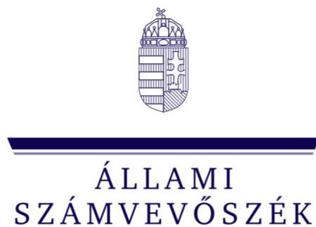
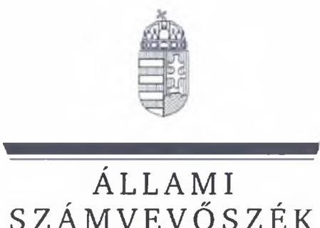
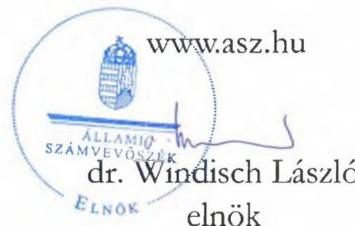
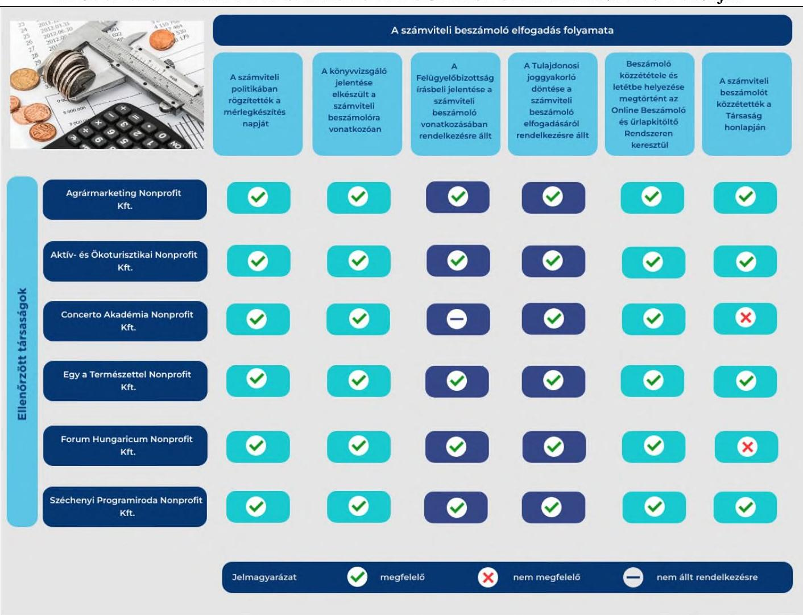

# JELENTÉS 

Az állami (többségi) tulajdonú gazdasági társaságoknál a 2022. évi számviteli beszámoló elfogadás folyamatába épített
kontrolltevékenységek célzott ellenőrzése
2023.

23056
www.asz.hu

---

# JELENTÉS 

Az állami (többségi) tulajdonú gazdasági társaságoknál a 2022. évi számviteli beszámoló elfogadás folyamatába épített
kontrolltevékenységek célzott ellenőrzése
2023.

23056

---

# ELLENŐRZÉSI IGAZGATÓSÁG: 

ÁLLAMI VAGYONGAZDÁLKODÁST ELLENŐRZŐ IGAZGATÓSÁG

## ELLENŐRZÉSI IGAZGATÓ:

HERCZEGH ZSOLT ellenőrzési igazgató

## ELLENŐRZÉSVEZETŐ:

Jelentéseink az interneten a www.asz.hu címen olvashatók.

DABISNÉ NYIKOS MELINDA ellenőrzésvezető

IKTATÓSZÁM: EL-3898-002/2023
TÉMASZÁM: 2695
ELLENŐRZÉS-AZONOSÍTÓ SZÁM: V1039

---

# TARTALOMJEGYZÉK 

- AZ ELLENŐRZÉS ALAPADATAI ..... 5
- AZ ELLENŐRZÖTT SZERVEZET ..... 7
- ÖSSZEFOGLALÁS ..... 10
- AZ ELLENŐRZÉS FÓKUSZKÉRDÉSEI ..... 13
- MEGÁLLAPÍTÁSOK ..... 14
- JAVASLATOK ..... 22
- MELLÉKLETEK ..... 23
I. sz. melléklet: Értelmező szótár ..... 23
II. sz. melléklet: Az ellenőrzött szervezetek jegyzéke ..... 25
III. sz. melléklet: Ellenőrzési kritériumok ..... 26
- FÜGGELÉK: ÉSZREVÉTELEK ..... 27
- RÖVIDÍTÉSEK JEGYZÉKE ..... 28

---

.

---

# AZ ELLENŐRZÉS ALAPADATAI 

## AZ ELLENŐRZÉS CÉLJA

Az ellenőrzés célja annak értékelése volt, hogy az állami (többségi) tulajdonú gazdasági társaságok kialakítottak, és működtettek-e kontrollokat a 2022. évi számviteli beszámoló elfogadása során, illetve a működtetett kontrollok hozzájárultak-e a 2022. évi számviteli beszámoló elfogadásának előírás szerinti megvalósításához.

## AZ ELLENŐRZÉS TÍPUSA

Megfelelőségi ellenőrzés.

## AZ ELLENŐRZÖTT IDŐSZAK

2022. év, valamint a 2023. január 1.-május 31. közötti időszak.

## AZ ELLENŐRZÉS TÁRGYA

Az állami (többségi) tulajdonú gazdasági társaságoknál a 2022. évi számviteli beszámoló elfogadása során kialakított és működtett kontrollok. Az ÁSZ ${ }^{1}$ ellenőrzése az állami (többségi) tulajdonban lévő gazdasági társaságok által, a 2022. évi számviteli beszámoló elfogadás folyamatába épített kontrolltevékenységének értékelésére terjedt ki a könyvviteli zárást követő és a közzététel, letétbe helyezés közötti időszakra vonatkozóan.

Az ellenőrzés kiterjedt minden olyan körülményre és adatra, amely az ÁSZ jogszabályban meghatározott feladatainak teljesítéséhez, valamint a program végrehajtása folyamán felmerült újabb összefüggések feltárásához szükséges.

Az ellenőrzés nem terjedt ki a számviteli beszámoló könyvviteli zárlathoz kapcsolódó folyamatok ellenőrzésére, valamint a tulajdonosi joggyakorló döntéseinek ellenőrzésére a tulajdonosi joggyakorlónál.

## AZ ELLENŐRZÉS JOGALAPJA

Az ellenőrzés jogszabályi alapját az ÁSZ tv. ${ }^{2} 1 . \int$ (3) bekezdés és 5. $\int$ (4) bekezdés előírásai képezték.

## AZ ELLENŐRZÉS MÓDSZERE

Az ellenőrzés végrehajtása a nemzetközi standardokat irányadónak tekintve az ellenőrzési program szempontjai, az ellenőrzött időszakban hatályos jogszabályok, az ellenőrzés szakmai szabályok és a jelen ellenőrzésre irányadó ÁSZ módszertan figyelembevételével történt.

---

Az ellenőrzési kérdések megválaszolásához szükséges bizonyítékok megszerzése az ellenőrzött szervezetek által rendelkezésre bocsátott dokumentumokra és adatokra alapozva, továbbá megfigyelés, szemle, kérdésfeltevés (információkérés), valamint elemző eljárás útján valósult meg.

Az ellenőrzési bizonyítékként felhasználható adatforrások közé tartoztak egyrészt az ellenőrzéshez kért dokumentumok, adatforrások, másrészt adatforrás lehetett még minden - az ellenőrzés folyamán - feltárt, az ellenőrzés szempontjából információkat tartalmazó dokumentum. Az ellenőrzés lefolytatásához az ellenőrzött szervezet az ÁSZ által kért dokumentumok, adatok, információk megküldésével és az ellenőrzés során szolgáltatott adatokkal járult hozzá.

A számviteli beszámoló elfogadás folyamatába épített kontrolloknak biztosítania kellett a számviteli beszámoló elkészítésétől a számviteli beszámoló közzétételéig, letétbe helyezéséig a szabályszerűség, valamint azon belül az időszerűség és a dokumentáltság követelményeinek való megfelelést.

A számviteli beszámoló elkészítésétől a számviteli beszámoló elfogadása, illetve az ezt követő közzététele, letétbe helyezése tekintetében szabályszerű volt a beszámoló elfogadás folyamata, megfelelőek voltak a kontrollok, ha a jogszabályokban, illetve belső irányítási eszközökben meghatározott előírásoknak megfelelően járt el a gazdasági társaság.

A gazdasági társaság által kialakított és működtetett kontrollok akkor biztosították a számviteli beszámoló elfogadás folyamatának időszerűségét, ha a számviteli beszámoló elfogadására a jogszabályban meghatározott időn belül került sor. A jogszabályban meghatározott időn a számviteli beszámoló közzétételének, letétbe helyezésének határidejét értette az ellenőrzés.

A gazdasági társaság által kialakított és működtetett kontrollok akkor biztosították megfelelően a számviteli beszámoló elfogadás folyamatának dokumentáltságát, ha a számviteli beszámoló elkészítése és a számviteli beszámoló közzététele, letétbe helyezési időszaka között, a számviteli beszámoló elfogadás folyamataihoz kapcsolódó, a jogszabályban, illetve a gazdasági társaság belső irányító eszközeiben meghatározott dokumentumok a jogszabályban és a szabályozó eszközökben meghatározott időn belül elkészültek.

Az ellenőrzés során mintavételre nem került sor.

---

# AZ ELLENŐRZÖTT SZERVEZET 

## Agrármarketing Centrum Nonprofit Korlátolt Felelősségü Társaság

Az Agrármarketing Centrum Nonprofit Kft-t ${ }^{3}$ egyszemélyes nonprofit korlátolt felelősségű társaság, a tulajdonosi jogok gyakorlója 2018.06.26-tól az Agrárminisztérium. Az Agrármarketing Centrum Nonprofit Kft. fő tevékenysége konferencia, kereskedelmi bemutató szervezése, továbbá az Agrármarketing Centrum Nonprofit Kft. önállóan látja el a közösségi agrármarketing tevékenységgel kapcsolatos feladatokat az Agrárminisztérium irányítása alatt, és aktív szerepet tölt be a magyar agrárium és élelmiszergazdaság versenyképességének és üzleti eredményeinek javításában. Az agrármarketing tevékenységéhez kapcsolódó állami feladatokat közfeladatként látja el, és tudatosan kívánja segíteni a kis- és középvállalkozások, termelők piaci marketingtevékenységét, versenyképességét. Az Agrármarketing Centrum Nonprofit Kft. a Taktv. ${ }^{4}$ 7/J. § (1) bekezdésben meghatározott mutatóértékek alapján a 2022. évben nem tartozott a Gbkr. ${ }^{5}$ hatálya alá, azonban a Taktv. 7/J. § (2) rendelkezése értelmében, az Alapító okirata alapján belső kontrollrendszert működtetett.

Az Agrármarketing Centrum Nonprofit Kft. 2022. évi beszámolója alapján a mérlegfőösszege 3805 M Ft, a saját tőke összege 344,9 M Ft volt. Az értékesítés nettó árbevétele 95,4 M Ft, az egyéb bevételek összege 1 955,5 M Ft volt. Az átlagos statisztikai létszám 2022-ben 34 fő volt.

## AKTíV- ÉS ÖKOTURISZTIKAI FEJLESZTÉSI KÖZPONT NONPROFIT KORLÁTOLT FELELŐSSÉGŰ TÁRSASÁG

Az Aktív- és Ökoturisztikai Nonprofit Kft. ${ }^{6}$ a Magyar Állam tulajdonában álló egyszemélyes nonprofit korlátolt felelősségű társaság. Tulajdonosi joggyakorlója 2022.05.26-ig Révész Máriusz aktív Magyarországért felelős kormánybiztos volt, 2022.05.27-étől a tulajdonosi jogokat a Miniszterelnökség gyakorolja. Az Aktív- és Ökoturisztikai Nonprofit Kft. stratégiai célja, hogy közreműködésével növekedjen a természetjáró, a természetet óvó, környezettudatos emberek száma, célja továbbá a szabadidő aktív eltöltésének népszerűsítése, a hazai természeti és épített értékek megismertetése, az egészséges, élménygazdag élet elérhetővé tétele. Az Aktív- és Ökoturisztikai Nonprofit Kft. nem tartozott a Taktv. 7/J. § (1) bekezdésben meghatározott mutatóértékek alapján a 2022. évben a Gbkr. hatálya alá. A Taktv. 7/J. § (2) rendelkezése szerint az Aktív- és Ökoturisztikai Nonprofit Kft. ügyvezetője 2023.06.16-án vezetői nyilatkozatban kezdeményezte a belső kontrollrendszer működtetésének jóváhagyását, amit a Felügyelőbizottság a tulajdonosi joggyakorló részére elfogadásra javasolt.

Az Aktív- és Ökoturisztikai Nonprofit Kft. 2022. évi beszámolója alapján a mérlegfőösszege 7 261,3 M Ft, a saját tőke összege 24,2 M Ft volt. Az értékesítés nettó árbevétele 14,6 M Ft, az egyéb bevételek összege 2 418,7 M Ft volt. Az átlagos statisztikai létszám 2022-ben 46 fő volt.

## Concerto AkadÉmia Nonprofit KorLÁtolt FeleLŐssÉGŰ TÁrsasÁG

A Concerto Akadémia Nonprofit Kft. ${ }^{7}$ egyszemélyes nonprofit korlátolt felelősségű társaság, a tulajdonosi jogok gyakorlója 2022.05.27-étől a Kulturális és Innovációs Minisztérium, ezt megelőzően pedig az Emberi Erőforrások Minisztériuma volt. A Concerto Akadémia Nonprofit Kft. a tevékenységét a Civil.tv. ${ }^{8}$ alapján közhasznú jogállású nonprofit társaságként folytatja, fő tevékenysége: előadó-művészet, a társadalom kulturális célú - ezen belül is komolyzenei élet területén jelentkező - szükségleteinek kielégítése a 2008. évi XCIX. tv. ${ }^{9}$ előírásával összhangban. A Concerto Akadémia Nonprofit Kft. célja továbbá, hogy közhasznú társasági formában a Concerto Akadémia Budapest Szimfonikus Zenekar művészi hagyományainak megfelelően a magyar zeneművészet értékeit az ország egész területén és külföldön is a legmagasabb szinten

---

képviselje. A Concerto Akadémia Nonprofit Kft. nem tartozott a 2022. évben a Taktv. 7/J. § (1), valamint a Taktv. 7/J. $\int$ (2) bekezdése alapján a Gbkr. hatálya alá. A Concerto Akadémia Nonprofit Kft. ügyvezetője 2023.05.02-án kelt vezetői nyilatkozat értelmében a Gbkr. szerinti belső kontrollrendszer megfeleléséről gondoskodott.

A Concerto Akadémia Nonprofit Kft. 2022. évi beszámolója alapján a mérlegfőösszege 1 377,7 M Ft, a saját tőke összege 6 M Ft volt. Az értékesítés nettó árbevétele 155,1 M Ft, az egyéb bevételek összege 1734,3 M Ft volt. Az átlagos statisztikai létszám 2022-ben 104 fő volt.

# EGY A TERMÉSZETTEL NONPROFIT KORLÁTOLT FELELŐSSÉGŰ TÁRSASÁG 

Az Egy a Természettel Nonprofit Kft. ${ }^{10}$ egyszemélyes nonprofit korlátolt felelősségű társaság, tulajdonosi joggyakorlója 2022.05.26-ig az Innovációs és Technológiai Minisztérium volt, 2022.05.27-től a Technológiai és Ipari Minisztérium, majd 2022.09.01-től a Miniszterelnöki Kabinetiroda lett. Az Egy a Természettel Nonprofit Kft. fő feladata 2022-ben, a 2021. évi Egy a Természettel Vadászati és Természeti Világkiállítás eseményeinek és eredményeinek lezárása, utókommunikációja, archiválása és értékmegőrzése volt. Az Egy a Természettel Nonprofit Kft. nem tartozott a Taktv. 7/J. § (1) bekezdése, valamint a Gbkr. hatálya alá, továbbá nem alkalmazta a Taktv. 7/J. § (2) bekezdését.

Az Egy a Természettel Nonprofit Kft. 2022. évi beszámolója alapján a mérlegfőösszege 3 959,9 M Ft, a saját tőke összege 1205,2 M Ft volt. Az értékesítés nettó árbevétele 63,6 M Ft, az egyéb bevételek összege 2 875,9 M Ft volt. Az átlagos statisztikai létszám 2022-ben 26 fő volt.

## Forum Hungaricum Nonprofit Korlátolt Felelősségü TÁrsasÁG

A Forum Hungaricum Nonprofit Kft. ${ }^{11}$ egyszemélyes nonprofit korlátolt felelősségű társaság, a tulajdonosi jogkör gyakorlója 2022.05.27-től a Kulturális és Innovációs Minisztérium, ezt megelőzően pedig az Emberi Erőforrások Minisztériuma volt. A Forum Hungaricum Nonprofit Kft. 2022. évben végzett alapcél szerinti és közhasznú tevékenysége a Magyar Nemzeti Digitális Archívum adatbázis gyarapítása, fejlesztése, valamint nemzeti aggregátori szerepkörben az Európai Digitális Könyvtár irányába történő adatexport, továbbá az Országos Digitalizációs Közfoglalkoztatási programban történő közfoglalkoztatási tevékenység volt. A Forum Hungaricum Nonprofit Kft. célja az ózdi intézményeiben, a Digitális Erőműben és a Nemzeti Filmtörténeti Élményparkban a látogatói szám növelése és az intézmények kihasználtságának javítása kulturális és oktatási rendezvények szervezésével, befogadásával. A Forum Hungaricum Nonprofit Kft-nél a Taktv-ben előírt, a tárgyévet megelőző két üzleti évben meghatározott mutatóértékek közül legalább kettő meghaladta a meghatározott határértéket, így a 2022. üzleti évben a Taktv. 7/J.§ (1) bekezdésének előírása alapján belső kontrollrendszer működtetett, a Gbkr. hatálya alá tartozott.

A Forum Hungaricum Nonprofit Kft. 2022. évi beszámolója alapján a mérlegfőösszege 2 703,3 M Ft, a saját tőke összege 5,3 M Ft volt. Az értékesítés nettó árbevétele 28,5 M Ft, az egyéb bevételek összege 877,5 M Ft volt. Az átlagos statisztikai létszám 2022-ben 174 fő volt.

---

# SzÉCHENYi PROGRAMIRODA TANÁCSADÓ És SZOLGÁltATÓ NONPROFIT KORLÁTOLT FELELŐSSÉGŰ TÁRSASÁG 

A Széchenyi Programiroda Nonprofit Kft. ${ }^{12}$ egyszemélyes nonprofit korlátolt felelősségű társaság, a tulajdonosi jogok gyakorlója a Miniszterelnökség. A Széchenyi Programiroda Kft. a társadalom és az egyén közös érdekeinek kielégítésére irányuló társadalomtudományi, humán kutatás, fejlesztés közhasznú cél szerinti tevékenységet folytat alaptevékenységként. A Széchenyi Programiroda Nonprofit-nél a Taktv-ben előírt, a tárgyévet megelőző két üzleti évben meghatározott mutatóértékek közül legalább kettő meghaladta a meghatározott határértéket, így a 2022. üzleti évben a Taktv. 7/J.§ (1) bekezdésének előírásai alapján a Széchenyi Programiroda Kft. belső kontrollrendszert működtetett, a Gbkr. hatálya alá tartozott.

A Széchenyi Programiroda Kft. 2022. évi beszámolója alapján a mérlegfőösszege 9 184,7 M Ft, a saját tőke összege 664,1 M Ft volt. Az értékesítés nettó árbevétele 90,7 M Ft, az egyéb bevételek összege 4 545,3 M Ft volt. Az átlagos statisztikai létszám 2022-ben 310 fő volt.

---

# ÖSSZEFOGLALÁS 

Az éves számviteli beszámoló célja, hogy a gazdálkodó vagyoni, pénzügyi és jövedelmi helyzetéről megbízható és valós képet adjon. A beszámoló nem csak a külső piaci szereplőknek, a cégvezetésnek, a partnereknek, hanem a tulajdonosi joggyakorlóknak és az állampolgároknak is tájékoztatást nyújt. Ebből kifolyólag a vállalkozás éves múködéséről, vagyoni, pénzügyi, jövedelmi helyzetéről készített jelentés vonatkozásában kialakított kontrolloknak kiemelkedő szerepe van.

A gazdasági társaságoknak az éves számviteli beszámoló elfogadásának folyamata során szükséges kialakítaniuk és múködtetniük kontrollokat a jogszabályi előírásokból eredő feladatok végrehajtása érdekében, azért, hogy a megfelelő dokumentáltság, valamint az időszerűség feltételeit biztosítani tudják. A társaságok folyamatai azonban a tulajdonosi joggyakorló elvárásai alapján különböző egyedi követelményeket is tartalmazhatnak a jogszabályi előírásokon felül, amelyekre a vonatkozó kontrollokat a belső szabályozásaikban van lehetőségük meghatározni, rögzíteni (pl. belső határidők, felelősök kijelölése, feladatok meghatározása, munkatervek kialakítása stb.), melyek elősegítik a társaságok múködésének szabályszerűségét, valamint feladatellátását.

Az ÁSZ az ellenőrzése során a következő megállapításokat tette:

- A 2022. évi számviteli beszámolót az ellenőrzött társaságok a Céginformációs és az Elektronikus Cégeljárásban Közremúködő Szolgálat útján 2023.05.31-ig minden esetben közzítették, letétbe helyezték.
- Az Egy a Természettel Nonprofit Kft., valamint a Széchenyi Programiroda Nonprofit Kft. kialakított és múködtetett kontrollokat a beszámoló elfogadás támogatására, melyek alkalmasak voltak a legfőbb szerv 2022. évi beszámolóra vonatkozó döntéshozatalának alátámasztására, a működtetett kontrollok hozzájárultak a 2022. évi számviteli beszámoló elfogadás folyamatának előírás szerinti megvalósításához.
- Az Agrármarketing Centrum Nonprofit Kft., az Aktív- és Ökoturisztikai Nonprofit Kft., a Concerto Akadémia Nonprofit Kft., valamint a Forum Hungaricum Kft. kialakított és működtetett kontrollokat a beszámoló elfogadás támogatására, melyek alkalmasak voltak a legfőbb szerv 2022. évi beszámolóra vonatkozó döntéshozatalának alátámasztására, a működtetett kontrollok - az alábbi hiányosságok mellett - hozzájárultak a 2022. évi számviteli beszámoló elfogadás folyamatának előírás szerinti megvalósításához.
- Az Agrármarketing Centrum Nonprofit Kft. a 2022. évi számviteli beszámoló kötelező véleményezését - amelyet az Irányelvben ${ }^{13}$ foglaltak ellenére a Stratégiai ellenőrzési tervében rögzített a belső ellenőrzés konkrét feladataként - nem végezte el, belső ellenőrzési terve nem tartalmazta kötelező feladatként a számviteli beszámoló véleményezését.
- Az Aktív- és Ökoturisztikai Nonprofit Kft. a Belső ellenőrzési alapszabályában foglaltak ellenére a 2022. évi számviteli beszámoló vizsgálatát nem végezte el.

---

- A Forum Hungaricum Nonprofit Kft. 2022. évi számviteli beszámolóját nem tette közzé honlapján.
- A Concerto Akadémia Nonprofit Kft. 2022. évi számviteli beszámoló elfogadáskor nem állt rendelkezésre a Felügyelőbizottság jelentése, továbbá a 2022. évi számviteli beszámolóját nem tette közzé honlapján.

1. ábra

A 2022. ÉVI SZÁMVITELI BESZÁMOLÓ ELFOGADÁS FOLYAMATÁNAK FŐ PONTJAI*

*Az ellenőrzés nem terjedt ki a tulajdonosi joggyakorló döntéseinek ellenőrzésére a tulajdonosi joggyakorlónál. Az ellenőrzött társaságoknál a Felügyelőbizottság jelentése, valamint a Tulajdonosi joggyakorló döntése esetében a dokumentumok rendelkezésre állásának ténye került rögzitésre.

Forrás: ÁSZ saját szerkesztés
Az ÁSZ előremutató gyakorlatként értékelte, hogy az ellenőrzött társaságok közül többen olyan, a számviteli beszámoló vizsgálatára vonatkozó kontrollokat is kialakítottak, amelyre nem lettek volna kötelezettek a jogszabályi rendelkezések alapján. Azonban az ellenőrzés feltárta, hogy a gyakorlati megvalósítás néhány esetben elmaradt, így a kontrollok valódi céljukat nem töltötték be.

---

Az ÁSZ ellenőrzés egyes pozitív megállapításai, feltárt jó gyakorlatok:

- Az Aktív- és Ökoturisztikai Nonprofit Kft. a könyvvizsgáló negyedéves vezetői levelei alapján év közben rendezte a könyvvezetése során feltárt hiányosságokat.
- Az Aktív- és Ökoturisztikai Nonprofit Kft. ügyvezetője Ügyvezetői körlevélben rendelkezett a 2022. év számviteli beszámoló összeállításának rendjéről, amelynek mellékletét képezte a beszámoló ellenőrzéséhez kapcsolódó ellenőrzési nyomvonal. Az ellenőrzési nyomvonal támogatta a feladatok időben történő elvégzését a számviteli beszámoló elfogadás tekintetében.
- A Széchenyi Programiroda Nonprofit Kft. Alapító okiratában részletesen meghatározásra kerültek a feladatok, valamint a döntéshozatalok folyamatai, ezáltal támogatta az éves számviteli beszámoló elfogadás folyamatát, valamint a legfőbb szerv 2022. évi számviteli beszámolóra vonatkozó döntéshozatalát.
- Az Agrármarketing Centrum Nonprofit Kft., a Forum Hungaricum Nonprofit Kft., az Egy a Természettel Nonprofit Kft., valamint a Széchenyi Programiroda Nonprofit Kft. Felügyelőbizottsági munkatervében szerepeltette a 2022. évi számviteli beszámolóval kapcsolatos feladatát, ezzel támogatva az éves számviteli beszámoló elfogadás folyamatát, valamint a legfőbb szerv 2022. évi beszámolóra vonatkozó döntéshozatalát.

---

# AZ ELLENŐRZÉS FÓKUSZKÉRDÉSEI 

I. A gazdasági társaságnál kialakítottak-e kontrollokat, amelyek alkalmasak voltak az éves számviteli beszámoló elfogadás támogatására, a legföbb szerv 2022. évi beszámolóra vonatkozó döntéshozatalának alátámasztására, és a gazdasági társaságnál müködtetett kontrollok hozzájárultak-e a 2022. évi számviteli beszámoló elfogadásának elöírás szerinti megvalósításához?

---

# 1. Agrármarketing Centrum Nonprofit Kft. 

Összegző megállapítás Az Agrármarketing Centrum Nonprofit Kft. kialakított és múködtetett kontrollokat az éves számviteli beszámoló elfogadás támogatására és a legföbb szerv 2022. évi beszámolóra vonatkozó döntéshozatalának alátámasztására. Az Agrármarketing Centrum Nonprofit Kft-nél múködtetett kontrollok - a számviteli beszámoló belső szabályozója szerinti éves véleményezése kivételével - hozzájárultak a 2022. évi számviteli beszámoló elfogadásának előirás szerinti megvalósításához.

Az Agrármarketing Centrum Nonprofit Kft. a 2022. évi beszámoló elfogadás folyamata során az Alapító okirat, az SZMSZ ${ }_{1}^{14}$, a Felügyelőbizottsági ügyrend, a Felügyelőbizottsági munkaterv, a Számviteli politika, és a Stratégiai ellenőrzési terv alapján alakított ki, és múködtetett - a számviteli beszámoló belső szabályozója szerinti éves véleményezése kivételével - kontrollokat, amelyek támogatták a 2022. évi számviteli beszámolási kötelezettség teljesítését a Ptk. ${ }^{15}$, a Taktv., a Gbkr., a Számv. tv. ${ }^{16}$, valamint az Info tv. ${ }^{17}$ rendelkezéseinek megfelelően.
Az Agrármarketing Centrum Nonprofit Kft. Alapító okirata, valamint SZMSZ ${ }_{1}$-e tartalmazta a beszámoló elfogadáshoz is kapcsolódó belső szabályokat a Ptk. rendelkezéseivel összhangban. Az Agrármarketing Centrum Nonprofit Kft. részére az Alapító okiratban és az SZMSZ ${ }_{1}$-ben rögzítetteken felül a beszámolási feladatokról és a tájékoztatási kötelezettségekről a tulajdonosi joggyakorló nem határozott meg külön elvárásokat. Az Agrármarketing Centrum Nonprofit Kft. Számviteli politikájában meghatározásra kerültek a beszámolókészítésre vonatkozó szabályok, amely alapján az Agrármarketing Centrum Nonprofit Kft. eleget tett beszámolókészítési kötelezettségének.
Az Agrármarketing Centrum Nonprofit Kft. a könyvvizsgálóval a Ptk., valamint az Alapító okirat rendelkezéseivel összhangban szerződéssel rendelkezett. A könyvvizsgáló a 2022. évi számviteli beszámolóról szóló jelentését a Ptk. rendelkezései alapján elkészítette. A Ptk. rendelkezései alapján a könyvvizsgáló a 2022. évi egyszerűsített éves beszámoló tartalmát, elfogadását tárgyaló Felügyelőbizottsági ülésen jelen volt.
Az Agrármarketing Centrum Nonprofit Kft-nél a Taktv., valamint az Alapító okirat előírásainak megfelelően, három tagból álló Felügyelőbizottság került létrehozásra. A Ptk., az Alapító okirat, és az SZMSZ ${ }_{1}$ rendelkezései alapján a Felügyelőbizottságra vonatkozó múködési szabályok kialakításra kerültek, a Felügyelőbizottság annak megfelelően járt el a 2022. évi számviteli beszámolási kötelezettséggel kapcsolatos feladatteljesítés során. A Felügyelőbizottság a Ptk. rendelkezésének megfelelően, a tulajdonosi joggyakorló által jóváhagyott ügyrenddel rendelkezett, továbbá munkatervet is készített. A Felügyelőbizottság a 2022. évi egyszerűsített éves beszámolót megtárgyalta, a Ptk. rendelkezései alapján a Felügyelőbizottsági jelentése elkészült, az a tulajdonosi joggyakorló rendelkezésére állt.

---

Az Agrármarketing Centrum Nonprofit Kft. rendelkezett a Ptk., valamint az Alapító okirat előírásai alapján a 2022. évi számviteli beszámoló jóváhagyásáról szóló, a tulajdonosi joggyakorló által kiállított határozattal.
A 2022. évi számviteli beszámolót az Agrármarketing Centrum Nonprofit Kft. határidőben a Céginformációs és az Elektronikus Cégeljárásban Közreműködő Szolgálat részére elektronikus úton közzétételre benyújtotta, letétbe helyezte, amely alapján eleget tett a Számv. tv. szerinti kötelezettségének. A számviteli beszámoló az Info tv. rendelkezése szerint az Agrármarketing Centrum Nonprofit Kft. honlapjára is feltöltésre került.
Az Agrármarketing Centrum Nonprofit Kft. a Gbkr. és az SZMSZ ${ }_{1}$ rendelkezései alapján biztosította a belső ellenőrzési tevékenység ellátását. Az Agrármarketing Centrum Nonprofit Kft. az SZMSZ ${ }_{1}$ előírása szerinti, a Felügyelőbizottság által határozattal elfogadott 2023. évi belső ellenőrzési terve elkészült, amelynek összeállításához felhasználásra került a 2022. évben készített kockázatelemzés eredménye. Az Agrármarketing Centrum Nonprofit Kft. belső ellenőrzési terve nem tartalmazta a Stratégiai ellenőrzési terv IX. fejezetének b) pontja ellenére, az éves beszámoló véleményezésére irányuló kötelező feladatot, a 2022. évi számviteli beszámoló véleményezését a belső ellenőrzés nem végezte el. Az Agrármarketing Centrum Nonprofit Kft. Stratégiai ellenőrzési terve az éves beszámolóra vonatkozó konkrét belső ellenőrzési feladatot fogalmazott meg, azonban a köztulajdonban álló gazdasági társaságok részére a belső kontrollrendszer kialakításához és működtetéséhez kiadott Irányelv 5.5. fejezete szerint a Stratégiai ellenőrzési terv nem konkrét ellenőrzési feladatokat, hanem a belső ellenőrzés átfogó céljaira, a folyamatok kockázataira és a belső ellenőrzés fejlesztésének irányaira, prioritásaira vonatkozó összegzést tartalmazhat.

# 2. Aktív- és Ökoturisztikai Nonprofit Kft. 

Összegző megállapítás Az Aktív- és Ökoturisztikai Nonprofit Kft. kialakított és múködtetett kontrollokat az éves számviteli beszámoló elfogadás támogatására és a legfőbb szerv 2022. évi beszámolóra vonatkozó döntéshozatalának alátámasztására. Az Aktív- és Ökoturisztikai Nonprofit Kft-nél múködtetett kontrollok - a beszámolóra vonatkozó belső szabályozója szerinti vizsgálat kivételével - hozzájárultak a 2022. évi számviteli beszámoló elfogadásának előírás szerinti megvalósításához.

Az Aktív- és Ökoturisztikai Nonprofit Kft. a 2022. évi beszámoló elfogadás folyamata során az Alapító okirat, az SZMSZ2 ${ }^{18}$, a Számviteli politika, az Ügyvezetői körlevél, a Felügyelőbizottsági ügyrend, és a Belső ellenőrzési alapszabály alapján alakított ki, és működtetett kontrollokat - a beszámolóra vonatkozó belső szabályozója szerinti vizsgálat kivételével -, amelyek támogatták a 2022. évi számviteli beszámolási kötelezettség teljesítését a Ptk., a Számv. tv., valamint az Info tv. rendelkezéseinek megfelelően.
Az Aktív- és Ökoturisztikai Nonprofit Kft. ügyvezetője Ügyvezetői körlevélben rendelkezett a 2022. év számviteli beszámoló összeállításának rendjéről, amelynek mellékletét képezte a beszámoló ellenőrzéséhez kapcsolódó ellenőrzési nyomvonal. Az Aktív- és Ökoturisztikai Nonprofit Kft. a nyomvonalban meghatározottak szerint járt el. Az Aktív- és Ökoturisztikai Nonprofit Kft. Számviteli politikája

---

rendelkezett a beszámolás rendjéről és módjáról, amely alapján az Aktív- és Ökoturisztikai Nonprofit Kft. eleget tett beszámolókészítési kötelezettségének.
Az Aktív- és Ökoturisztikai Nonprofit Kft. a könyvvizsgálóval a Ptk., valamint az Alapító okirat előírásainak megfelelően szerződéssel rendelkezett. Az Aktív- és Ökoturisztikai Nonprofit Kft. a könyvvizsgáló negyedéves vezetői levelei alapján év közben rendezte a könyvvezetése során feltárt hiányosságokat. A könyvvizsgáló a Ptk. rendelkezései alapján elkészítette könyvvizsgálói jelentését a 2022. évi számviteli beszámoló vonatkozásában.
Az Aktív- és Ökoturisztikai Nonprofit Kft-nél az Alapító okirat rendelkezése alapján Felügyelőbizottság működött, a Felügyelőbizottság a tulajdonosi joggyakorló által jóváhagyott ügyrenddel rendelkezett. A Felügyelőbizottság határozata a Ptk. rendelkezése alapján a számviteli beszámoló tekintetében elkészült.
Az Aktív- és Ökoturisztikai Nonprofit Kft-nél a Ptk., valamint az Alapító okirat előírásai szerint rendelkezésre állt a tulajdonosi joggyakorló döntése a számviteli beszámoló jóváhagyásáról.
A Számv. tv. jogszabályi előírásaiknak megfelelően az Aktív- és Ökoturisztikai Nonprofit Kft. a 2022. évi számviteli beszámolót határidőben a Céginformációs és az Elektronikus Cégeljárásban Közreműködő Szolgálat részére elektronikus úton közzétételre benyújtotta, letétbe helyezte, továbbá az Info tv. rendelkezéseinek megfelelően a honlapján is közzétette.
Az Aktív- és Ökoturisztikai Nonprofit Kft. Belső ellenőrzési alapszabályának 4. oldala a beszámoló vizsgálatára vonatkozóan feladatot fogalmazott meg, azonban a belső ellenőrzés a 2022. évi éves számviteli beszámoló vizsgálatát nem végezte el. Továbbá nem állt rendelkezésre a Belső ellenőrzési vezető feladatai fejezet b) pontja szerinti kockázatelemzés a 2022. évi éves beszámoló vonatkozásban.

# 3. Concerto Akadémia Nonprofit Kft. 

Összegző megállapítás A Concerto Akadémia Nonprofit Kft. kialakított és múködtetett kontrollokat az éves számviteli beszámoló elfogadás támogatására és a legfőbb szerv 2022. évi beszámolóra vonatkozó döntéshozatalának alátámasztására. A Concerto Akadémia Nonprofit Kft-nél múködtetett kontrollok - a számviteli beszámoló honlapon való közzététele kivételével - hozzájárultak a 2022. évi számviteli beszámoló elfogadásának előírás szerinti megvalósításához, azonban a Concerto Akadémia Nonprofit Kft. 2022. évi számviteli beszámolójának elfogadásakor a Felügyelőbizottság jelentése nem állt rendelkezésre.

A Concerto Akadémia Nonprofit Kft. a 2022. évi beszámoló elfogadás folyamata során az Alapító okirat, az $\mathrm{SZMSZ}_{3}{ }^{\mathrm{IS}}$, a Számviteli politika, a Felügyelőbizottsági ügyrend, a tulajdonosi joggyakorló előírásai a számviteli beszámoló benyújtására vonatkozó feladatok határidejére vonatkozóan, valamint a Belső ellenőrzési alapszabály alapján alakított ki, és múködtetett - a számviteli beszámoló honlapon való közzététele kivételével - kontrollokat, amelyek támogatták a 2022. évi számviteli beszámoló elfogadásának előírás szerinti megvalósítását a Ptk., valamint a Számv. tv. rendelkezéseinek megfelelően. A Concerto

---

Akadémia Nonprofit Kft. 2022. évi számviteli beszámolójának elfogadásakor a Ptk. 3:120. § (2) bekezdés szerinti Felügyelőbizottsági jelentés nem állt rendelkezésre.
A Concerto Akadémia Nonprofit Kft. Számviteli politikája rendelkezett az általános, beszámolási kötelezettséggel összefüggő döntésekről - a mérlegkészítés időpontja, közzététel -, amely alapján a Concerto Akadémia Nonprofit Kft. eleget tett beszámolókészítési kötelezettségének.
A Concerto Akadémia Nonprofit Kft. a Ptk. és az Alapító okirat rendelkezéseinek megfelelően könyvvizsgálói szerződéssel rendelkezett. A könyvvizsgáló a Ptk. rendelkezései alapján elkészítette a 2022. évi számviteli beszámoló felülvizsgálatáról szóló könyvvizsgálói jelentését.
A Concerto Akadémia Nonprofit Kft-nél az Alapító okirat rendelkezései alapján, három tagú Felügyelőbizottság került létrehozásra. A Felügyelőbizottság a Ptk. rendelkezései szerint, a tulajdonosi joggyakorló által jóváhagyott ügyrenddel rendelkezett. A Felügyelőbizottság tagjainak és elnökének megválasztása, visszahívása, ügyrendjének elfogadása a Ptk., valamint az Alapító okirat rendelkezései alapján a tulajdonosi joggyakorló hatáskörébe tartozott. A Felügyelőbizottság elnöke 2023.03.13-i nappal lemondott tisztségéről, amely 2023.05.12. napján szűnt meg. Az Alapító okirat, valamint az Alapítói határozat rendelkezése alapján az új Felügyelőbizottsági elnök és tag kinevezésére 2023.06.13. napjával, határozatlan időre került sor. A Concerto Akadémia Nonprofit Kft. a tulajdonosi joggyakorló által meghatározott, a számviteli beszámoló benyújtására vonatkozó feladatok határidejére vonatkozó előírásai alapján, 2023.04.26-án előzetes egyeztetésre megküldte 2022. évi számviteli beszámolóját a tulajdonosi joggyakorló részére. A tulajdonosi joggyakorló 2023.05.15-én megküldött levélében kérte a Concerto Akadémia Nonprofit Kft-től az eredeti, aláírt beszámolónak és mellékleteinek, valamint a könyvvizsgálói vélemény papír alapú változatának megküldését, továbbá rögzítette, hogy a Felügyelőbizottság beszámoló elfogadását javasló határozatának csatolásától eltekint. A Concerto Akadémia Nonprofit Kft. 2022. évi számviteli beszámolóját, közhasznúsági mellékletét és a könyvvizsgálói véleményt a tulajdonosi joggyakorló részére határidőben megküldte. A tulajdonosi joggyakorló a 2022. évi számviteli beszámolót 2023.05.23-án kizárólagos döntési jogosultságánál fogva, a könyvvizsgálói jelentés alapján fogadta el, mivel a Concerto Akadémia Nonprofit Kft. 2022. évi beszámolójának elfogadása során a Ptk. 3:120. § (2) bekezdés szerinti Felügyelőbizottsági jelentés nem állt rendelkezésre.
A jóváhagyott 2022. évi számviteli beszámolót a Concerto Akadémia Nonprofit Kft. a Számv. tv-nek megfelelően a Céginformációs és az Elektronikus Cégeljárásban Közreműködő Szolgálat részére elektronikus úton határidőben közzétételre, letétbe helyezésre benyújtotta. Azonban a Concerto Akadémia Nonprofit Kft. az Info tv. 33.§ (1) bekezdése, valamint az Alapító okirat 15. fejezetének 15.2 pontja ellenére a 2022. évi számviteli beszámolóját a honlapján nem tette közzé.
A Concerto Akadémia Nonprofit Kft. SZMSZ-e, valamint a Belső ellenőrzési alapszabálya alapján belső ellenőrzést működtetett.

---

# 4. Egy a Természettel Nonprofit Kft. 

| Összegző megállapítás | Az Egy a Természettel Nonprofit Kft. kialakított és múködtetett kontrollokat az éves számviteli beszámoló elfogadás támogatására, és a tulajdonosi joggyakorló 2022. évi beszámolóra vonatkozó döntéshozatalának alátámasztására, a múködtetett kontrollok hozzájárultak a 2022. évi számviteli beszámoló elfogadásának előirás szerinti megvalósításához. |
| :--: | :--: |

Az Egy a Természettel Nonprofit Kft. a 2022. évi beszámoló elfogadás folyamata során az Alapító okirat, az SZMSZ ${ }^{20}$, a Számviteli politika, valamint a Felügyelőbizottsági ügyrend és a Felügyelőbizottsági munkaterv alapján alakított ki és múködtetett kontrollokat, amelyek támogatták a 2022. évi számviteli beszámolási kötelezettség teljesítését a Ptk., a Számv. tv., valamint az Info tv. rendelkezéseinek megfelelően.
Az Egy a Természettel Nonprofit Kft. a Számviteli politikájában rendelkezett a beszámolás módjáról és rendjéről - mérlegkészítés időpontja, közzététel -, amely alapján az Egy a Természettel Nonprofit Kft. eleget tett beszámolókészítési kötelezettségének. Az SZMSZ előírásainak megfelelően az Egy a Természettel Nonprofit Kft. ügyvezetője a 2022. évi számviteli beszámolót a Felügyelőbizottság elé terjesztette.
Az Egy a Természettel Nonprofit Kft. a Ptk. rendelkezéseinek megfelelően az ellenőrzött időszakra vonatkozó könyvvizsgálati szerződéssel rendelkezett. A könyvvizsgáló jelentése a 2022. évi számviteli beszámoló tekintetében a Ptk., valamint az Alapító okirat előírásai alapján rendelkezésre állt.
Az Egy a Természettel Nonprofit Kft-nél az Alapító okirat előírásainak megfelelően, három tagú Felügyelőbizottság került létrehozásra. A Felügyelőbizottság az ügyrendjét a Ptk. és az Alapító okirat rendelkezéseinek megfelelően maga állapította meg, az Egy a Természettel Nonprofit Kft. rendelkezett az ügyrend tulajdonosi joggyakorló általi jóváhagyásával. A számviteli beszámolóval kapcsolatban a Felügyelőbizottság ügyrendje az Alapító okiratnak megfelelően szabályozta azt, hogy a Felügyelőbizottság köteles megvizsgálni a tulajdonosi joggyakorló elé terjesztett valamennyi fontosabb üzletpolitikai jelentést, és rögzítette, hogy a számviteli beszámolóról és az adózott eredmény felhasználásáról a tulajdonosi joggyakorló kizárólag a Felügyelőbizottság írásbeli jelentésének birtokában dönthet. A Felügyelőbizottság az ügyrendben foglalt rendelkezéseknek megfelelően, a 2023. évre vonatkozóan elfogadott munkatervvel rendelkezett, melyben a második negyedévre ütemezésre került a 2022. évi beszámoló véleményezése. A könyvvizsgáló részvételével megtartott Felügyelőbizottsági ülésen a Felügyelőbizottság elvégezte az Egy a Természettel Nonprofit Kft. 2022. évi számviteli beszámolójának vizsgálatát, valamint a Ptk., és az Alapító okirat rendelkezései alapján elkészítette Felügyelőbizottsági jelentését.
Az Egy a Természettel Nonprofit Kft-nél rendelkezésre állt a Ptk. előírásai alapján a 2022. évi számviteli beszámoló tulajdonosi joggyakorló részéről történő jóváhagyása. Az Egy a Természettel Nonprofit Kft. a számviteli beszámolóját a Számv. tv. és a Számviteli politika rendelkezéseivel összhangban, a Céginformációs és az Elektronikus Cégeljárásban Közreműködő Szolgálat útján határidőben közzétette, letétbe helyezte. Az Egy a Természettel Nonprofit Kft. az Info tv. rendelkezéseinek megfelelően a 2022. évi számviteli beszámoló honlapon való közzétételét az e-beszámoló oldalra mutató hivatkozással teljesítette.

---

# 5. Forum Hungaricum Nonprofit Kft. 

Összegző megállapítás A Forum Hungaricum Nonprofit Kft. kialakított és múködtetett kontrollokat az éves számviteli beszámoló elfogadás támogatására és a legföbb szerv 2022. évi beszámolóra vonatkozó döntéshozatalának alátámasztására. A Forum Hungaricum Nonprofit Kft-nél múködtetett kontrollok - a számviteli beszámoló honlapon való közzététele kivételével - hozzájárultak a 2022. évi számviteli beszámoló elfogadásának előírás szerinti megvalósításához.

A Forum Hungaricum Nonprofit Kft. a 2022. évi beszámoló elfogadás folyamata során az Alapító okirat, az SZMSZ ${ }_{5}{ }^{21}$, a Számviteli politika, a tulajdonosi joggyakorló előírásai a beszámolási feladatok és a tájékoztatási kötelezettségek vonatkozásában, valamint a Felügyelőbizottsági ügyrend, a Felügyelőbizottsági munkaterv, és a Belső ellenőrzési alapszabály alapján alakított ki és múködtetett kontrollokat, amelyek támogatták - a számviteli beszámoló honlapon való közzététele kivételével - a 2022. évi számviteli beszámolási kötelezettség teljesítését a Ptk., a Taktv., a Gbkr., valamint a Számv. tv. rendelkezéseinek megfelelően.
A Forum Hungaricum Nonprofit Kft. a Számviteli politikájában rendelkezett a beszámolás módjáról és rendjéről - mérlegkészítés időpontja -, amely alapján a Forum Hungaricum Nonprofit Kft. eleget tett beszámolókészítési kötelezettségének. A Forum Hungaricum Nonprofit Kft. SZMSZ ${ }_{5}$-ének megfelelően, az ügyvezető gondoskodott a Forum Hungaricum Nonprofit Kft. éves beszámolójának elkészítéséről és határidőre történő benyújtásáról. Az ügyvezető által összeállított, aláírt 2022. évi éves számviteli beszámoló a Számv. tv. és a Civil tv. rendelkezéseinek megfelelően tartalmazta a mérleget, eredménykimutatást, kiegészítő mellékletet, valamint a közhasznúsági mellékletet.
A tulajdonosi joggyakorló a Forum Hungaricum Nonprofit Kft. 2022. évi számviteli beszámolójának, a közhasznúsági mellékletnek, az ezeket alátámasztó főkönyvi kivonatnak, a 2022. évi üzleti tervtől való eltérés számszaki bemutatásának előzetes egyeztetését kérte a Forum Hungaricum Nonprofit Kft-től. A Forum Hungaricum Nonprofit Kft. a tulajdonosi joggyakorló részére az adatszolgáltatást határidőben teljesítette.
A Forum Hungaricum Nonprofit Kft. könyvvizsgálójának kijelölése a Ptk., az Alapító okirat, a Felügyelőbizottság ügyrendjének előírásai szerint történt, a könyvvizsgáló feladatai az Alapító okiratban rögzítésre kerültek, a Forum Hungaricum Nonprofit Kft. a könyvvizsgálóval a Ptk. rendelkezéseinek megfelelően szerződéssel rendelkezett. A könyvvizsgáló a Ptk., valamint az Alapító okirat rendelkezései alapján elkészítette könyvvizsgálói jelentését. A könyvvizsgáló jelentése a számviteli beszámoló tárgyalásakor a Felügyelőbizottsági ülésen rendelkezésre állt.
A Forum Hungaricum Nonprofit Kft-nél a Ptk., az Alapító okirat, valamint a Taktv. rendelkezései alapján, három tagból álló Felügyelőbizottság került létrehozásra. A Ptk. és az Alapító okirat rendelkezései alapján a Felügyelőbizottság az ügyrendjét maga állapította meg, a Forum Hungaricum Nonprofit Kft. rendelkezett az ügyrend tulajdonosi joggyakorló általi jóváhagyásával. Az ügyrendnek megfelelően a Felügyelőbizottság munkatervvel rendelkezett, melyben szerepelt a Forum Hungaricum Nonprofit Kft. 2022. évi gazdálkodásának megtárgyalása. A Ptk. rendelkezései alapján a Felügyelőbizottság elkészítette jelentését a 2022. évi éves számviteli beszámoló vonatkozásában. A Felügyelőbizottság az eredmény

---

felosztására irányuló javaslatot a tulajdonosi joggyakorló részére az Alapító okiratnak megfelelően nem véleményezte, tekintettel arra, hogy a Forum Hungaricum Nonprofit Kft. gazdálkodása során elért eredményét nem osztja fel, azt a létesítő okiratában meghatározott közhasznú tevékenységére fordítja.
A tulajdonosi joggyakorló döntése a 2022. évi éves számviteli beszámoló elfogadásáról a Forum Hungaricum Nonprofit Kft. rendelkezésére állt.
A Forum Hungaricum Nonprofit Kft. a Számv. tv. alapján a 2022. évi éves számviteli beszámoló jóváhagyását követően eleget tett letétbe helyezési és közzétételi kötelezettségének, a 2022. évi számviteli beszámolójának elektronikus példányát a szükséges mellékletekkel együtt a Céginformációs és az Elektronikus Cégeljárásban Közreműködő Szolgálat részére határidőben megküldte. Azonban a Forum Hungaricum Nonprofit Kft. az Info. tv. 33.§ (1) bekezdése ellenére a honlapján nem tette közzé a 2022. évi számviteli beszámolóját.
A Forum Hungaricum Nonprofit Kft. ügyvezetője a Taktv., a Gbkr., az Alapító okirat szerinti kötelezettségének eleget téve gondoskodott a Forum Hungaricum Nonprofit Kft-nél függetlenül múködő belső ellenőrzésről. A belső ellenőr elkészítette a Gbkr. rendelkezéseinek megfelelően a Forum Hungaricum Nonprofit Kft. Belső ellenőrzési alapszabályát, valamint Belső ellenőrzési kézikönyvét. A Belső ellenőrzési alapszabályt a Felügyelőbizottság határozattal hagyta jóvá, amely megfelelt a Gbkr. és a Felügyelőbizottság ügyrendjében foglaltaknak. A Belső ellenőrzési kézikönyvet az ügyvezető ügyvezetői utasítással adta ki a Gbkr. előírásainak megfelelően. A belső ellenőr által összeállított, és a Felügyelőbizottság határozatával jóváhagyott 2023. évi éves ellenőrzési munkatervét kockázatelemzéssel alapozta meg, amely megfelelt a Gbkr. rendelkezéseinek. A kockázatelemzés alapján nem volt indokolt a számviteli beszámoló elfogadási folyamatának ellenőrzése.

# 6. Széchenyi Programiroda Nonprofit Kft. 

Összegző megállapítás

A Széchenyi Programiroda Nonprofit Kft. kialakított és múködtetett kontrollokat az éves számviteli beszámoló elfogadás támogatására, és a tulajdonosi joggyakorló 2022. évi beszámolóra vonatkozó döntéshozatalának alátámasztására, a múködtetett kontrollok hozzájárultak a 2022. évi számviteli beszámoló elfogadásának előirás szerinti megvalósításához.

A Széchenyi Programiroda Nonprofit Kft. a 2022. évi beszámoló elfogadás folyamata során az Alapító okirat, az SZMSZ ${ }_{6}{ }^{22}$, a Számviteli politika, valamint a Felügyelőbizottsági ügyrend, a Felügyelőbizottsági munkaterv, és a Belső ellenőrzési szabályzat alapján alakított ki, és működtetett kontrollokat, amelyek támogatták a 2022. évi számviteli beszámolási kötelezettség teljesítését a Ptk., a Taktv., a Gbkr., valamint a Számv. tv. és az Info tv. rendelkezéseinek megfelelően.
A Széchenyi Programiroda Nonprofit Kft. Számviteli politikájában rendelkezett a beszámolás módjáról és rendjéről - mérlegkészítés időpontja -, amely alapján eleget tett beszámolókészítési kötelezettségének, továbbá Alapító okirat előírása alapján a közhasznú tevékenységről szóló melléklete is elkészítésre került.
A Széchenyi Programiroda Nonprofit Kft. a könyvvizsgálóval a Ptk. és az Alapító okirat előírásainak megfelelően szerződéssel rendelkezett, a Ptk. rendelkezései alapján a könyvvizsgáló elkészítette

---

könyvvizsgálói jelentését. Az Alapító okiratban és a könyvvizsgálói szerződésben előírtak szerint, a Felügyelőbizottság a könyvvizsgálót a számviteli beszámolót tárgyaló Felügyelőbizottság ülésre meghívta. A Széchenyi Programiroda Nonprofit Kft-nél a Ptk., az Alapító okirat, az SZMSZ6, valamint a Taktv. rendelkezései alapján, három fős Felügyelőbizottság működött. Az Alapító okirat rendelkezése szerint, a Felügyelőbizottság ügyrendjét a Felügyelőbizottság maga állította össze, a Széchenyi Programiroda Nonprofit Kft. rendelkezett az ügyrend tulajdonosi joggyakorló általi jóváhagyásával. A Felügyelőbizottság ügyrendje alapján a Felügyelőbizottság a 2023. év vonatkozásában munkatervvel rendelkezett. A Felügyelőbizottság a Ptk., valamint a Felügyelőbizottsági munkatervnek megfelelően jelentést készített az ügyvezető által előterjesztett éves számviteli beszámolóról és az alapító részére készített pozitív adózott eredmény felosztásáról szóló javaslatról, valamint arról, hogy megvizsgálta a 2022. évre szóló üzleti jelentést és a közhasznúsági mellékletet. A Felügyelőbizottság határozatával javasolta a 2022. üzleti évről összeállított éves számviteli beszámolót az üzleti jelentéssel, valamint a közhasznúsági melléklettel együtt a tulajdonosi joggyakorló elé terjeszteni jóváhagyás céljából. Az ügyvezető az Alapító okirat szerinti, a hatáskörébe sorolt feladatnak eleget tett, határidőben elkészítette előterjesztését a tulajdonosi joggyakorló részére a 2022. évi éves számviteli beszámoló jóváhagyásáról.
A tulajdonosi joggyakorló a Felügyelőbizottság jelentése birtokában a Ptk. rendelkezései alapján alapítói határozataiban hagyta jóvá a Széchenyi Programiroda Nonprofit Kft. 2022. évi éves számviteli beszámolóját és adózott eredményének eredménytartalékba helyezését. A tulajdonosi joggyakorló jóváhagyása a 2022. évi éves számviteli beszámoló elfogadásáról a Széchenyi Programiroda Nonprofit Kft. rendelkezésére állt.
A Széchenyi Programiroda Nonprofit Kft. az éves számviteli beszámolójának elektronikus példányát a Számv. tv-nek megfelelően a szükséges mellékletekkel együtt a Céginformációs és az Elektronikus Cégeljárásban Közreműködő Szolgálat részére határidőben közzétételre megküldte, letétbe helyezte, valamint az Info tv. rendelkezéseinek megfelelően a számviteli beszámolóját a saját internetes honlapján is közzétette.
A Taktv., a Gbkr., valamint az SZMSZ6 előírásainak megfelelően az ügyvezető gondoskodott a Széchenyi Programiroda Nonprofit Kft-nél függetlenül működő belső ellenőrzés kialakításáról, amely a Gbkr-nek megfelelő, a Felügyelőbizottság által jóváhagyott Belső ellenőrzési szabályzattal rendelkezett. A Széchenyi Programiroda Nonprofit Kft. SZMSZ6-e alapján a belső ellenőr funkcionális tevékenységet látott el, a belső ellenőrzés tevékenysége kiterjedt a szervezet minden tevékenységére, a bizonyosságot adó tevékenysége körében ellátandó feladata szerint elemeznie, vizsgálnia kellett a rendelkezésre álló erőforrásokkal való gazdálkodást, a vagyon megóvását és gyarapítását, valamint az elszámolások megfelelőségét, a beszámolók valódiságát. A Széchenyi Programiroda Nonprofit Kft. belső ellenőre kockázatelemzését a Belső ellenőrzési szabályzatnak, valamint a Gbkr-nek megfelelően elvégezte, a beszámoló valódiságát a kockázatelemzés eredménye alapján nem vonta ellenőrzés alá.

---

# JAVASLATOK 

Az ÁSZ tv. 33. § (1) bekezdésében foglaltak értelmében az ellenőrzött szervezet vezetője köteles a jelentésben foglalt megállapításokhoz kapcsolódó intézkedési tervet összeállítani és azt a jelentés kézhezvételétől számított 30 napon belül az ÁSZ részére megküldeni. Amennyiben az ellenőrzött szervezet vezetője nem küldi meg határidőben az intézkedési tervet, vagy továbbra sem elfogadható intézkedési tervet küld, az Állami Számvevőszék elnöke az ÁSZ tv. 33. § (3) bekezdése a) és b) pontjaiban foglaltakat érvényesítheti.

## AGRÁRMARKETING CENTRUM NONPROFIT KFT.

1. Intézkedjen a belső ellenőrzés számára szabályozási szinten kötelezően előírt számviteli beszámolóra vonatkozó feladat tekintetében az Irányelv, a szabályozás és a gyakorlat közötti összhang megteremtéséről.

## CONCERTO AKADÉMIA NONPROFIT KFT.

1. Alakítson ki kontrollt annak biztositására, hogy az elkészülésre kerülő számviteli beszámolók a társaság honlapján közzétételre kerüljenek.

## FORUM HUNGARICUM NONPROFIT KFT.

1. Alakítson ki kontrollt annak biztositására, hogy az elkészülésre kerülő számviteli beszámolók a társaság honlapján közzétételre kerüljenek.

---

# MELLÉKLETEK 

## I. SZ. MELLÉKLET: ÉRTELMEZŐ SZÓTÁR

állami vagyon

A Vtv. ${ }^{23}$ alkalmazásában állami vagyonnak minősül:
a) az állam tulajdonában lévő dolog, valamint dolog módjára hasznosítható természeti erő;
b) az a) pont hatálya alá tartozó mindazon vagyon, amely vonatkozásában törvény az állam kizárólagos tulajdonjogát nevesíti;
c) az állam tulajdonában lévő tagsági jogviszonyt megtestesítő értékpapír, illetve az államot megillető egyéb társasági részesedés;
d) az államot megillető olyan immateriális, vagyoni értékkel rendelkező jogosultság, amelyet jogszabály vagyoni értékủ jogként nevesít;
e) az állam tulajdonában álló a befektetési vállalkozásokról és az árutőzsdei szolgáltatókról, valamint az általuk végezhető tevékenységek szabályairól szóló 2007. évi CXXXVIII. törvény szerinti pénzügyi eszköz;
f) azon országgyűlési képviselőről, aki más, Alaptörvényben nevesített közjogi tisztséget is betöltve közfeladatot lát el, e közfeladata ellátása körében vagy ezzel összefüggésben, költségvetési forrásból készített, szerzői vagy szomszédos jogi védelmet élvező műhöz vagy teljesítményhez, különösen kép-, illetve hangfelvételhez kapcsolódó, felhasználási szerződés útján vagy a szerzői jogról szóló törvény alapján megszerzett felhasználási engedély, illetve vagyoni jog.
Forrás: Vtv. 1. § (2) bekezdése (2022.07.28-ától hatályos fogalom)
tulajdonosi joggyakorló
gazdasági társaság
köztulajdonban álló gazdasági társaság

Aki a nemzeti vagyon felett az államot vagy a helyi önkormányzatot megillető tulajdonosi jogok és kötelezettségek összességének gyakorlására jogosult.
Forrás: Nvtv. ${ }^{24}$ 3. § (1) bekezdés 17. pontja
A gazdasági társaságok üzletszerű közös gazdasági tevékenység folytatására, a tagok vagyoni hozzájárulásával létrehozott, jogi személyiséggel rendelkező vállalkozások, amelyekben a tagok a nyereségből közösen részesednek, és a veszteséget közösen viselik.
Forrás: Ptk. 3:88. § (1) bekezdése
Az a gazdasági társaság, amelyben a Magyar Állam, helyi önkormányzat, a helyi önkormányzat jogi személyiséggel rendelkező társulása, többcélú kistérségi társulás, fejlesztési tanács, nemzetiségi önkormányzat, nemzetiségi önkormányzat jogi személyiségủ társulása, költségvetési szerv vagy közalapítvány külön-külön vagy együttesen számítva többségi befolyással rendelkezik
Forrás: Taktv. 1. § a) pont

---

többségi befolyás
számviteli beszámoló

Az olyan kapcsolat, amelynek révén a befolyással rendelkező egy jogi személyben a szavazatok több mint ötven százalékával - közvetlenül vagy a jogi személyben szavazati joggal rendelkező más jogi személy (köztes vállalkozás) szavazati jogán keresztül - rendelkezik, azzal, hogy a közvetett módon való rendelkezés meghatározása során a jogi személyben szavazati joggal rendelkező más jogi személyt (köztes vállalkozást) megillető szavazati hányadot meg kell szorozni a befolyással rendelkezőnek a köztes vállalkozásban, illetve vállalkozásokban fennálló szavazati hányadával, ha azonban a köztes vállalkozásban fennálló szavazatainak hányada az ötven százalékot meghaladja, akkor azt egy egészként kell figyelembe venni. A befolyás számításánál nem kell figyelembe venni a huszonöt százalékot el nem érő közvetett befolyást

Forrás: Taktv. 1. § b) pont
A számviteli beszámoló célja, hogy megbízható és valós összképet adjon a gazdálkodó vagyonáról, annak összetételéről (eszközeiről és forrásairól), pénzügyi helyzetéről és tevékenysége eredményéről.
Forrás: Számv. tv. 4. § (2) bekezdése

---

II. SZ. MELLÉKLET: AZ ELLENŐRZÖTT SZERVEZETEK JEGYZÉKE

| ELLENŐRZÖTT SZERVEZET NEVE | TULAJDONOSI JOGGYAKORLÓ |
| :-- | :-- |
| 1. Agrármarketing Centrum Nonprofit Kft. | Agrárminisztérium |
| 2. Aktív- és Ökoturisztikai Nonprofit Kft. | Miniszterelnökség |
| 3. Concerto Akadémia Nonprofit Kft. | Kulturális és Innovációs Minisztérium |
| 4. Egy a Természettel Nonprofit Kft. | Miniszterelnöki Kabinetiroda |
| 5. Forum Hungaricum Nonprofit Kft. | Kulturális és Innovációs Minisztérium |
| 6. Széchenyi Programiroda Nonprofit Kft. | Miniszterelnökség |

---

# III. SZ. MELLÉKLET: ELLENŐRZÉSI KRITÉRIUMOK 

## FOKUSZKÉRDÉS

1. A gazdasági társaságnál kialakítottak-e kontrollokat, amelyek alkalmasak voltak az éves számviteli beszámoló elfogadás támogatására, a legfőbb szerv 2022. évi beszámolóra vonatkozó döntéshozatalának alátámasztására, és a gazdasági társaságnál múködtetett kontrollok hozzájárultak-e a 2022. évi számviteli beszámoló elfogadásának előírás szerinti megvalósításához?

## ELLENŐRZÉSI KRITÉRIUMOK

Ptk. 3:26.§, 3:27.§, 3:109.§, 3:120.§, 3:122.§, 3:129.§, 3:130.§,3:131.§, 3:194.§
Taktv. 1.§, 4.§, 7/J.§,
Gbkr*. 9.§, 12.§, 13.§, 14.§, 15.§, 19.§
Számv. tv. 4. §, 8-10. §, 14.§, 17.§, 19.§ (1), 96.§ (1), 153.§, 154.§, 154/B.§ 155.§, 156.§, Info tv. 33.§ (1)

Tulajdonosi joggyakorló előírásai, irányelvei
Irányelv*,
Kézikönyv ${ }^{25 *}$
*(ahol releváns)

A fentiekben meghatározott jogszabályokkal kapcsolatban kiadott belső szabályozók.

---

# FÜGGELÉK: ÉSZREVÉTELEK 

A jelentéstervezetet a Számvevőszék 15 napos észrevételezésre megküldte az ellenőrzött szervezet vezetőjének az ÁSZ tv. 29. §* (1) bekezdése előírásának megfelelően.

A jelentéstervezetre az ellenőrzött szervezetek az Agrármarketing Centrum Nonprofit Kft. kivételével észrevételt nem tettek. Az Agrármarketing Centrum Nonprofit Kft. észrevétele a jelentéstervezet megállapításait nem érintette.

[^0]
[^0]:    * 29. § (1) Az Állami Számvevőszék az ellenőrzési megállapításait megküldi az ellenőrzött szervezet vezetőjének vagy az általa megbízott személynek, és annak, akinek személyes felelősségét állapította meg.
    (2) Az ellenőrzött szervezet vezetője és a felelősként megjelölt személy az ellenőrzés megállapításaira tizenöt napon belül írásban észrevételt tehet.
    (3) Az Állami Számvevőszék az észrevételre a beérkezésétől számított harminc napon belül írásban válaszol. A figyelembe nem vett észrevételeket köteles a jelentésben feltüntetni, és megindokolni, hogy azokat miért nem fogadta el.

---

# RÖVIDÍTÉSEK JEGYZÉKE 

${ }^{1}$ ÁSZ
${ }^{2}$ ÁSZ tv.
${ }^{3}$ Agrármarketing Centrum Nonprofit Kft.
${ }^{4}$ Taktv.
${ }^{5}$ Gbkr.
${ }^{6}$ Aktív- és Ökoturisztikai Nonprofit Kft.
${ }^{7}$ Concerto Akadémia Nonprofit Kft.
${ }^{8}$ Civil tv.
${ }^{9}$ 2008. évi XCIX. tv.
${ }^{10}$ Egy a Természettel Nonprofit Kft.
${ }^{11}$ Forum Hungaricum Nonprofit Kft.
${ }^{12}$ Széchenyi Programiroda Nonprofit Kft.
${ }^{13}$ Irányelv
${ }^{14} \mathrm{SZMSZ}_{1}$
${ }^{15}$ Ptk.
${ }^{16}$ Számv. tv.
${ }^{17}$ Info tv.
${ }^{18} \mathrm{SZMSZ}_{2}$
${ }^{19} \mathrm{SZMSZ}_{3}$
${ }^{20} \mathrm{SZMSZ}_{4}$
${ }^{21} \mathrm{SZMSZ}_{5}$
${ }^{22} \mathrm{SZMSZ}_{6}$
${ }^{23}$ Vtv.
${ }^{24}$ Nvtv.
${ }^{25}$ Kézikönyv

Állami Számvevőszék
2011. évi LXVI. törvény az Állami Számvevőszékről

Agrármarketing Centrum Nonprofit Korlátolt Felelősségű Társaság
2009. évi CXXII. törvény a köztulajdonban álló gazdasági társaságok takarékosabb müködéséről
339/2019. (XII.23.) Korm. rendelet - a köztulajdonban álló gazdasági társaságok belső kontrollrendszeréről
Aktív- és Ökoturisztikai Fejlesztési Központ Nonprofit Korlátolt Felelősségű Társaság
Concerto Akadémia Nonprofit Korlátolt Felelősségű Társaság
2011. évi CLXXV. törvény az egyesülési jogról, a közhasznú jogállásról, valamint a civil szervezetek müködéséről és támogatásáról
2008. évi XCIX. törvény az előadó-művészeti szervezetek támogatásáról és sajátos foglalkoztatási szabályairól
Egy a Természettel Nonprofit Korlátolt Felelősségű Társaság
Forum Hungaricum Nonprofit Korlátolt Felelősségű Társaság
Széchenyi Programiroda Tanácsadó és Szolgáltató Nonprofit Korlátolt Felelősségű Társaság
Irányelv a köztulajdonban álló gazdasági társaságok részére a belső kontrollrendszer kialakításához és müködtetéséhez
Agrármarketing Centrum Nonprofit Kft. 2023.04.01-től hatályos Szervezeti és Müködési Szabályzata
2013. évi V. törvény a Polgári törvénykönyvről
2000. évi C. törvény a számvitelről
2011. évi CXII. törvény - az információs önrendelkezési jogról és az információszabadságról
Aktív- és Ökoturisztikai Nonprofit Kft. 2022.09.01-től hatályos Szervezeti és Müködési Szabályzata
Concerto Akadémia Nonprofit Kft. 2020.08.25-től hatályos Szervezeti és Müködési Szabályzata
Egy a Természettel Nonprofit Kft. 2021.02.25-től hatályos Szervezeti és Müködési Szabályzata
Forum Hungaricum Nonprofit Kft. 2022.01.01-től hatályos Szervezeti és Müködési Szabályzata
Széchenyi Programiroda Nonprofit Kft. 2021.11.11-től hatályos Szervezeti és Müködési Szabályzata
2007. évi CVI. törvény az állami vagyonról
2011. évi CXCVI. törvény a nemzeti vagyonról

Kézikönyv a köztulajdonban álló gazdasági társaságok részére

---

1052 Budapest, Apáczai Csere János u. 10. | 1364 Budapest 4., Pf. 54
www.asz.hu | szamvevoszek@asz.hu
telefon: +36 14849100