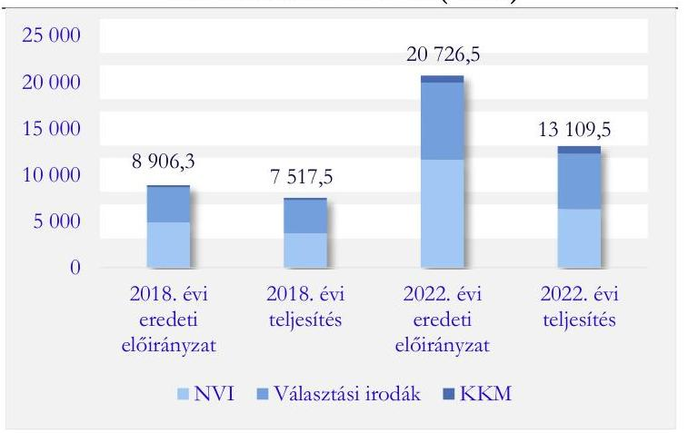
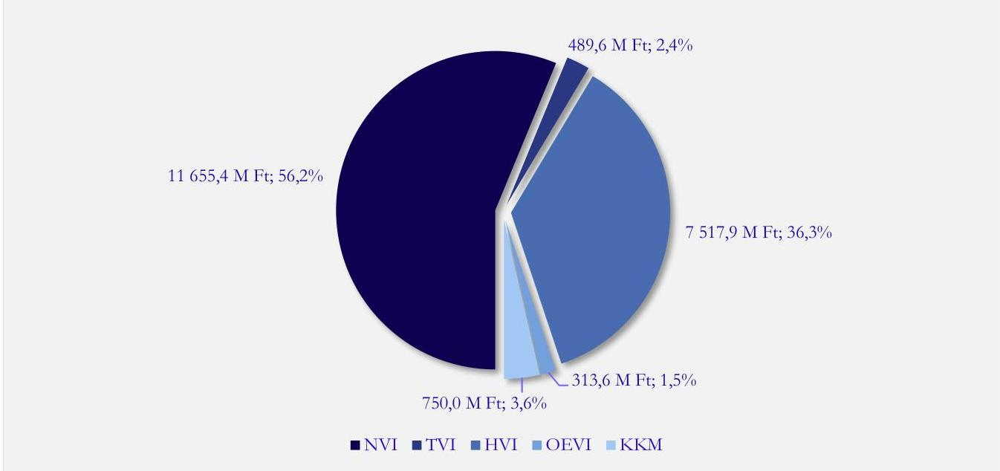
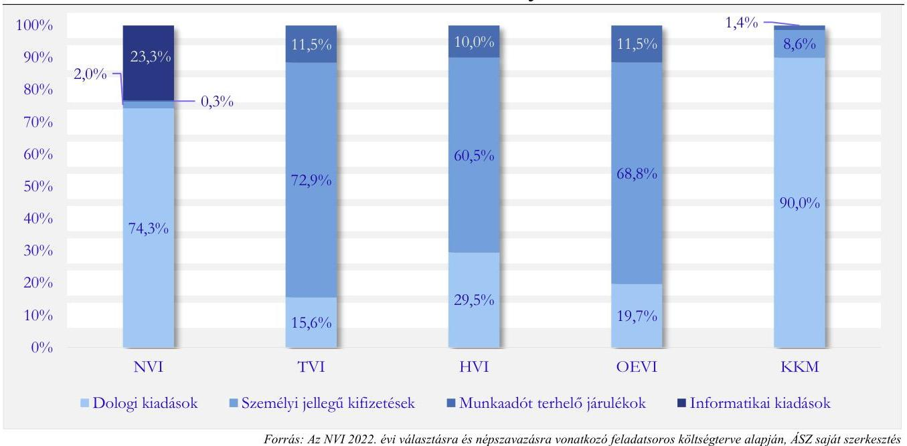
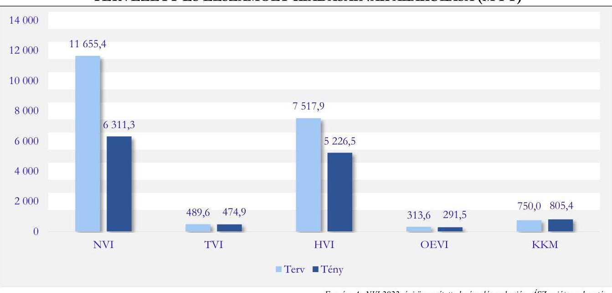

# JELENTÉS 

A közös eljárásban lebonyolított 2022. évi országgyúlési képviselő-választásra és országos népszavazásra fordított pénzeszközök felhasználásának ellenőrzése

2023.

---

# JELENTÉS 

A közös eljárásban lebonyolított 2022. évi országgyúlési képviselő-választásra és országos népszavazásra fordított pénzeszközök felhasználásának ellenőrzése

2023.

---

# ELLENŐRZÉSI IGAZGATÓSÁG: 

## ÁLLAMHÁZTARTÁSON KÍVÜLI SZERVEZETEKET ELLENŐRZŐ IGAZGATÓSÁG

## ELLENŐRZÉSI IGAZGATÓ:

## KLINGA LÁSZLÓ igazgató

## ELLENŐRZÉSVEZETŐ:

Jelentéseink az interneten a www.asz.hu címen olvashatók.

BÉCSI ANDREA ellenőrzésvezető

IKTATÓSZÁM: EL-3838-002/2023
TÉMASZÁM: 2664
ELLENŐRZÉS-AZONOSÍTÓ SZÁM: V1008

---

# TARTALOMJEGYZÉK 

- AZ ELLENŐRZÉS ALAPADATAI ..... 5
- AZ ELLENŐRZÉS HATÓKÖRE ÉS TERÜLETE ..... 7
- ÖSSZEFOGLALÁS ..... 9
- AZ ELLENŐRZÉS FÓKUSZKÉRDÉSEI ..... 12
- MEGÁLLAPÍTÁSOK ..... 13
- JAVASLATOK ..... 22
- MELLÉKLETEK ..... 23
I. sz. melléklet: Értelmező szótár ..... 23
II. sz. melléklet: Az ellenőrzött szervezetek jegyzéke ..... 24
- FÜGGELÉK: ÉSZREVÉTELEK ..... 26
- RÖVIDÍTÉSEK JEGYZÉKE ..... 29

---

.

---

# AZ ELLENŐRZÉS ALAPADATAI 

## AZ ELLENŐRZÉS CÉLJA

Az ellenőrzés célja annak megállapítása, hogy a közös eljárásban lebonyolított 2022. évi országgyűlési képviselő-választás és országos népszavazás során igénybe vett pénzeszközök felhasználása szabályszerű volte. Az ellenőrzés során vizsgáltuk, hogy a közös eljárásban lebonyolított 2022. évi országgyűlési képviselőválasztásra és országos népszavazásra a központi költségvetésből biztosított források tervezése, elosztása, felhasználása, elszámolása és ellenőrzése a jogszabályban előírtaknak megfelelően történt-e.

## AZ ELLENŐRZÉS TÍPUSA

Szabályszerüségi ellenőrzés.

## AZ ELLENŐRZŐTT IDŐSZAK

A közös eljárásban lebonyolított 2022. évi országgyűlési képviselő-választásra és országos népszavazásra jóváhagyott költségvetési előirányzat rendelkezésre állásától a választást és a népszavazást követő elszámolási időszak végéig tartó időszak.

## AZ ELLENŐRZÉS TÁRGYA

A közös eljárásban lebonyolított 2022. évi országgyűlési képviselő-választásra és országos népszavazásra fordított pénzeszközök tervezése, a finanszírozási források elosztása, felhasználása, elszámolása és annak ellenőrzése.

## AZ ELLENŐRZÉS JOGALAPJA

Az ellenőrzés jogszabályi alapját az ÁSZ tv. ${ }^{1}$ 5. § (2)-(3) bekezdései, valamint a Ve. ${ }^{2}$ 12. § előírásai képezték.

## AZ ELLENŐRZÉS MÓDSZERE

Az ellenőrzést a nemzetközi standardokat irányadónak tekintve az ellenőrzési program szempontjai, az ellenőrzött időszakban hatályos jogszabályok, az ellenőrzés szakmai szabályok és módszertanok figyelembevételével végezte az ÁSZ ${ }^{3}$.

Az ellenőrzési kérdések megválaszolásához szükséges bizonyítékok megszerzése az ellenőrzött szervezet által rendelkezésre bocsátott dokumentumokra és adatokra alapozva, továbbá kérdésfeltevés (információkérés) és mintavételezés útján történt.

---

Az ellenőrzési bizonyítékként felhasználható adatforrások közé tartoztak egyrészt az ellenőrzési programban felsorolt adatforrások, másrészt adatforrás volt még minden - az ellenőrzés folyamán - feltárt, az ellenőrzés szempontjából információkat tartalmazó dokumentum.

Az ellenőrzés lefolytatásához az ellenőrzött szervezet a tanúsítványok kitöltésével, valamint az ÁSZ által kért dokumentumok, információk megküldésével szolgáltatott adatot.

A gazdálkodási jogkörök gyakorlásának, illetve a kiadások könyvviteli elszámolásának szabályszerűségét véletlen mintavételi eljárással kiválasztott tételek alapján ellenőrizte az ÁSZ. Amennyiben valamely sokaság elemszáma kisebb volt, mint az előírt mintaelemszám, a sokaságot tételesen ellenőriztük. A mintatételek értékelése $95 \%$-os megbízhatósági szint mellett került kivetítésre a teljes sokaságra. Ha az ellenőrzés eredményeképpen a szabályszerűség százalékosan elérte a $90 \%$-ot, akkor a gazdálkodási jogkörök gyakorlása, a kiadások könyvviteli elszámolása „szabályszerű", ez alatt „nem szabályszerű" lett a minősítés.

---

# AZ ELLENŐRZÉS HATÓKÖRE ÉS TERÜLETE 

Magyarország köztársasági elnöke 2022. január 11-én a közös eljárásban lebonyolított 2022. évi országgyűlési képviselők általános választását és a Kormány által kezdeményezett országos népszavazást 2022. április 3. napjára tűzte ki. Az Nsztv. ${ }^{4}$ és a Ve. 2021. november 20-án hatályba lépett módosítása lehetővé tette, hogy az országgyűlési képviselők általános választása és az országos népszavazás egy napon, közös eljárásban, egyúttal költséghatékonyabban kerüljön lebonyolításra.

A Ve. alapján a választások előkészítésével és lebonyolításával kapcsolatos állami feladatok végrehajtásának költségeit, valamint a választási szervek tevékenységével összefüggő egyéb költségeket - az Országgyűlés által megállapított mértékben - a központi költségvetésből kell biztosítani. E pénzeszközök felhasználásáról az Állami Számvevőszéknek tájékoztatnia kell az Országgyűlést.

Az $\mathrm{NVI}^{5}$ elnöke az Országgyűlés részére készített, a 2022. évi országgyűlési képviselő-választásról és országos népszavazásról szóló 2022. április 28-án kelt beszámolója szerint a választás és a népszavazás lebonyolításában 1264 helyi választási iroda, 97 országgyűlési egyéni választókerületi választási iroda, 146 külképviseleti választási iroda, 19 vármegyei területi választási iroda és a Fővárosi Választási Iroda, valamint a Nemzeti Választási Iroda vett részt.

Az NVI adatai alapján a választás és a népszavazás névjegyzékében összesen 8215304 választópolgár szerepelt. A választáson összesen 5717182 választópolgár vett részt, melyből belföldön 5341472 fő, levélben 318083 fő, külképviseleteken 57627 fő szavazott.

Az NVI-t az Országgyűlés 2013. május 24-én alapította. Az NVI a Ve.-ben foglaltak alapján autonóm államigazgatási szerv, amely független, csak a törvénynek van alárendelve, feladatkörében nem utasítható, a feladatát más szervektől elkülönülten, befolyástól mentesen látja el. Az NVI fejezeti jogosítványokkal felruházott központi költségvetési szerv, amelynek költségvetése az Országgyűlés költségvetési fejezetén belül önálló címet képez. Az NVI-t az elnök vezeti, akit a miniszterelnök javaslatára a köztársasági elnök kilenc évre nevez ki. Jelenlegi elnöke 2020. szeptember 15-től tölti be tisztségét.

A választási irodák - $\mathrm{TVI}^{6}, \mathrm{OEVI}^{7}$ és $\mathrm{HVI}^{8}$ - a választás és a népszavazás előkészítésével, szervezésével, lebonyolításával, a választópolgárok tájékoztatásával, a választási feladatok kezelésével és a választások technikai feltételeinek biztosításával összefüggő feladatokat ellátó választási szervek.

A TVI ellenőrzi és irányítja az OEVI és a HVI tevékenységét, felügyeli az informatikai rendszerek használatát, továbbá megteszi a szükséges intézkedéseket a hiányzó adatok pótlása, a hibás adatok kijavítása érdekében. A TVI minden vármegyében és a fővárosban működik, vezetője a vármegyei önkormányzat jegyzője, illetve a fővárosi önkormányzat főjegyzője.

Minden országgyűlési egyéni választókerületi székhelyen egy-egy OEVI működik, vezetője a székhelytelepülés jegyzője. Minden településen önálló HVI működik, a közös önkormányzati hivatalhoz tartozó településeken a HVI feladatait a közös HVI látja el. A HVI vezetője a polgármesteri, illetve közös önkormányzati hivatal jegyzője. Azokon a településeken, ahol a HVI-n kívül OEVI is működik, a jegyző ellátja az OEVI vezetői és a HVI vezetői feladatokat is.

Magyarország külképviseletein KÜVI ${ }^{9}$ működik. A KÜVI a külképviseleti szavazást bonyolítja le, a szavazatszámlálás kivételével ellátja a szavazatszámláló bizottság számára megállapított feladatokat.

---

A 2022. évi országgyűlési képviselő-választásra és országos népszavazásra fordított pénzeszközök felhasználásának ellenőrzése vonatkozásában ellenőrzött szervnek minősült az NVI, a KKM ${ }^{10}$, mint a választás és a népszavazás lebonyolításában résztvevő - a külképviseleti szavazást koordináló - egyéb szerv, a 20 TVI (19 vármegyei és a fővárosi), valamint a választópolgárok száma szerinti rétegzéssel kiválasztott 10 OEVI és 40 HVI. Az ellenőrzött szervezetek jegyzékét a II. számú melléklet tartalmazza.

Az NVI és a választási irodák -TVI, OEVI és HVI - általános feladatait a Ve., míg a választással és a népszavazással kapcsolatos pénzügyi feladatok ellátásának részletszabályait a Pvr. ${ }^{11}$ tartalmazza. Az NVI a választások lebonyolításával összefüggő központi feladatokat látja el, irányítja a választási irodák szakmai tevékenységét, elkészíti a választás pénzügyi feladat- és költségtervét, gondoskodik a pénzügyi lebonyolításáról, a választások lebonyolításához szükséges tárgyi és technikai feltételek megteremtéséről, a szükséges közbeszerzési eljárások lefolytatásáról, a termékek, szolgáltatások beszerzéséről is. Gondoskodik továbbá a választások lebonyolításához szükséges informatikai rendszer kialakításáról és biztonságos működtetéséről, valamint a választás központi logisztikai feladatainak ellátásáról.

A Pvr. rögzíti, hogy a választás és a népszavazás lebonyolításában érintett szervezetek vezetői felelősek a választás és a népszavazás pénzügyi tervezéséért, lebonyolításáért, elszámolásáért, a pénzeszközök szabályszerű felhasználásáért és ellenőrzéséért, továbbá gyakorolják a választás és a népszavazás pénzeszközei feletti kötelezettségvállalási jogot és gondoskodnak a választás és a népszavazás céljára szolgáló pénzeszközök elkülönített számviteli kezeléséről.

Az NVI a 2021 novemberében készült pénzügyi feladat- és költségtervében a választás és a népszavazás lebonyolítására összesen 20 726,5 M Ft-ot tervezett, ebből a választást és a népszavazást követően elkészített elszámolása alapján összesen 13 109,5 M Ft-ot használt fel.

---

# ÖSSZEFOGLALÁS 

Az ÁSZ törvényi kötelezettsége alapján ellenőrizte a választás és a népszavazás előkészítésével és lebonyolításával kapcsolatos feladatok végrehajtására fordított pénzeszközök felhasználását az NVI-nél, az ellenőrzésre kiválasztott választási irodáknál, valamint a külképviseleti szavazás lebonyolítását végző KKM-nél.

A választás és a népszavazás pénzügyi előkészitése az NVI-nél, a KKM-nél és egy kivétellel minden ellenőrzött választási irodánál szabályszerűen történt.

Az ellenőrzött választási szervek - egy helyi választási irodát kivéve - szabályszerűen elvégezték a választás és a népszavazás lebonyolításához kapcsolódó pénzügyi tervezési feladatokat. Az NVI a választás és népszavazás előkészítésének keretében szabályszerűen gondoskodott az informatikai rendszer kialakításáról. Az NVI által a választás és a népszavazás lebonyolítására tervezett 20 726,5 M Ft-ból 11 655,4 M Ft a központi kiadásokra, 8 321,1 M Ft a választási irodák kiadásaira, 750,0 M Ft a külképviseleti szavazás lebonyolítására lett kalkulálva.

Az NVI által tervezett kiadások fedezetét az Országgyűlés és a Kormány az NVI részére a megfelelő összegben biztosította. Ebből az NVI a választási irodák részére támogatási előlegként a Pvr. által meghatározott határidőben és normatívák alapján összesen 5 446,3 M Ft-ot utalt át, valamint a KKM részére a külképviseleti szavazás költségeinek fedezetéül a jogszabály alapján kötött Megállapodás ${ }^{12}$ szerint előirányzat-átadással 718,1 M Ftot bocsátott rendelkezésre.

A választáshoz és a népszavazáshoz rendelkezésre álló pénzeszközök felhasználása, kezelése - a gazdálkodási jogkörök gyakorlásában feltárt hiányosságok okán egy választási irodát kivéve szabályszerű volt.

A mintavételes ellenőrzés alapján az ellenőrzött választási szervek egy HVI kivételével a választás és a népszavazás lebonyolítására felhasznált pénzeszközeik tekintetében a gazdálkodási jogkörgyakorlással kapcsolatos feladataikat szabályszerűen végezték. Egy HVI azonban az ellenőrzött mintatételek többségénél a kötelezettségvállalással és a teljesítésigazolással kapcsolatos jogokat nem gyakorolta szabályszerűen. A kiadások könyvviteli elszámolása minden ellenőrzött által szabályszerűen történt.

A választási irodák és a KKM a Pvr.-ben előírt elszámolási kötelezettségüknek eleget tettek. A Pvr. által biztosított, utólagosan
igényelhető jogcímen egy területi választási iroda kivételével minden ellenőrzött választási iroda, valamint a KKM is nyújtott be többletkiadásra vonatkozó igényt. Az NVI az elszámolásokat elfogadta és a többletkiadások fedezetét a jogszabály által előírt határidőben az igénylők részére biztosította. Az NVI az elszámolások elfogadását követően határidőben elkészítette a választás és a népszavazás összesített elszámolását. Az elszámolás szerinti ténylegesen felhasznált pénzeszközök a 2021 novemberében tervezett

A választáshoz és a népszavazáshoz felhasznált pénzeszközök elszámolása a választási szerveknél szabályszerű volt.

---

költségek alatt maradtak, a tervhez képest $36,8 \%$-kal, azaz 7617,0 M Ft-tal kevesebb forrás került felhasználásra. Az 1. ábrán látható, hogy az NVI-nél 5344,1 M Ft, a választási irodáknál összesen 2328,2 M Ft megtakarítás keletkezett.

A tényleges költségek kizárólag a KKM által lebonyolított külképviseleti szavazásnál haladták meg a tervezetteket, melynek legfőbb oka a koronavírus járvány okozta plusz költségek voltak.

Jogszabály által előírt ellenőrzési kötelezettségüknek az ellenőrzött választási szervek 3 helyi választási iroda kivételével eleget

## A választásra és a népszavazásra felhasznált pénzeszközök ellenörzése három helyi választási irodát kivéve szabályszerü volt.

tettek.
Ennek során az NVI ellenőrizte a TVI-k és a KKM elszámolásának megalapozottságát és a támogatások rendeltetésszerű felhasználását, a TVI-k ellenőrizték a részükre megállapított támogatás felhasználását, valamint az illetékességi területükhöz tartozó OEVI-k/HVI-k elszámolását. Az OEVI-k és a HVI-k - a 3 helyi választási iroda kivételével - elvégezték a részükre biztosított támogatás felhasználásának ellenőrzésével összefüggő feladataikat.

Az ellenőrzés rávilágított arra, hogy a választás és a népszavazás 1 fő választópolgárra jutó költsége nagy mértékben függött a szavazás jellegétől is. Más költsége volt a magyarországi lakcímmel nem rendelkező, határon túlról, levélben szavazó választópolgárok szavazatainak, illetve más a magyarországi lakcímmel rendelkező választópolgárok belföldön, továbbá külképviseleteken történő szavazásának.

A TVI-k, OEVI-k és HVI-k által felhasznált 5 992,9 M Ft-ot alapul véve, a belföldön leadott szavazatok 1 választópolgárra jutó költsége 1122 Ft volt. A levélben szavazás lebonyolítása 1351,4 M Ft-ot tett ki, az 1 levélszavazatra jutó költség 4249 Ft volt. A 97 országban összesen 146 külképviseleten lebonyolított szavazás összes költsége 805,4 M Ft volt, így a külképviseleteken leadott 1 szavazatra jutó költség 13976 Ft volt, mely több mint háromszorosa a levélszavazatokénak.

A szavazás lebonyolításának költségei az egyes külképviseleteken is különbözőképpen alakultak, a felmerült összes költség 0,2 M Ft 136,0 M Ft között mozgott. A költségeket főként az adott külképviseleten regisztrált választópolgárok száma és a belföldről kiutazó KÜVI vezető, tagok kiutazásának módja, körülményei határozták meg. Ebből fakadóan az 1 leadott szavazatra jutó költségek az egyes külképviseletek között is eltérő képet mutatnak, a fajlagos költségek 403 Ft és 6223996 Ft között alakultak. A legalacsonyabb költsége főként azokban az országokban múködő külképviseleteken leadott szavazatoknak volt, mely országokba a kiutazás hivatali gépjárművel történt. A legmagasabb összköltsége a Kínában múködő külképviseleteken leadott szavazatoknak volt, 3 KÜVI-nél összesen 249,9 M Ft költség keletkezett, mely 70 leadott szavazat érdekében merült fel. Így a Kínában leadott szavazatok 1 főre jutó költsége 2,8 M Ft és 6,2 M Ft között mozgott. Ezen felül a sanghaji külképviseleti szavazásra további 55,3 M Ft lett fordítva, azonban a szavazás a koronavírus miatt elrendelt kijárási tilalom okán meghiúsult. A külképviseletek több mint felénél a regisztrált választópolgárok száma a 100 főt nem érte el, az 1 főre jutó legmagasabb költségek is ezeknél a külképviseleteknél jelentkeztek.

---

A légi úton elérhető országok külképviseletein lebonyolított szavazás költségeit megnövelte, hogy a 2/2022. (III. 10.) KKM utasítás ${ }^{13}$ értelmében a belföldről kiutazó KÜVI vezetőknek és tagoknak elsősorban a turistaosztálynál magasabb árfekvésű „business" osztályú repülőjegyet kellett biztosítani.

A 2022. évi választás és a népszavazás tényleges költségeit a 2018. évi országgyűlési választásokéval összehasonlítva 2022-ben 74,4 \%-kal magasabb költség volt megfigyelhető. A költségek emelkedését többek között az is indokolja, hogy 2022-ben az országgyűlési képviselő-választás kiegészült egy népszavazással, melyet a koronavírus járványból fakadó pandémiás időszakban kellett előkészíteni és lebonyolítani.

A 2018-ban és 2022-ben elszámolt költségeken belül a nagyságrendileg legnagyobb emelkedés az NVI-nél a dologi kiadásokon belül a levélben szavazás jogcímnél tapasztalható, a 2018. évi 366,1 M Ft a 2022. évi választásra és a népszavazásra 1 351,4 M Ft-ra emelkedett.

A külképviseleti szavazást 2018-ban 118 KÜVI bonyolította, szemben a 2022. évi 146 külképviselettel. A 2022. évi külképviseleti szavazás költsége több mint háromszorosa lett a 2018. évi választás költségének, 251,7 M Ft-ról 805,4 M Ft-ra emelkedett, melyet a KÜVI-k számának növekedésén kívül a koronavírus miatti többletköltségek is okoztak.

Azokon a településeken, ahol a HVI-n
2. ábra

A 2022. ÉVI ORSZÁGGYÜLÉSI KÉPVISELŐ-VÁLASZTÁS ÉS ORSZÁGOS NÉPSZAVAZÁS TERVEZETT ÉS TÉNYLEGES KIADÁSA (M FT)

Forrás: Az NVI 2018. és 2022. évi összesitett elszámolások alapján, ÁSZ saját szerkesztés
kívül OEVI is működik, mind a HVI és mind az OEVI tekintetében a választás és a népszavazás előkészítése, elszámolása, a gazdálkodási feladatok ellátása is ugyanazon illetékes szervezet keretein belül, ugyanazon személy, a jegyző irányítása alatt történt. Az ellenőrzés rávilágított arra, hogy az OEVI vezető részére a Pvr.-ben előírt egyes feladatokat a jegyző rendszerszinten HVI vezető minőségében kellett, hogy elvégezze. Az NVI az OEVI feladatok ellátásának fedezetét minden esetben a székhelytelepülésen működő HVI-k részére megállapított támogatás összegénél vette figyelembe, a támogatói okirat kiállítása is minden esetben a HVI-k részére történt. Az NVI a HVI és az OEVI feladatokra nyújtott támogatások összegét is egyben, a Pvr. előírásainak megfelelően a polgármesteri, önkormányzati hivatalok folyószámlájára utalta. A kapott támogatással a HVI-k számoltak el oly módon, hogy az OEVI feladatokat is ellátó hivatalok az elszámolásukat az OEVI feladatok végrehajtására elszámolt összegekkel együtt készítették el. Az NVI ennek megfelelően az elszámolásokat elfogadó okiratokat is szintén egyben, a HVI-k részére állította ki. Ugyanakkor, a Pvr. mind a HVI-k, mind az OEVI-k tekintetében előírta a fenti feladatok elvégzését.

Ugyanakkor az ellenőrzési tapasztalatok azt mutatják, hogy a választási irodáknál a támogatás-felhasználás ellenőrzésének rendszere eltért a támogatások kezelésének fenti gyakorlatától, mivel a hivatalok jegyzői a támogatások felhasználásának ellenőrzéséhez kapcsolódóan előírt kötelezettségeiket a Pvr.-nek megfelelve HVI vezetői és OEVI vezetői minőségükben is elvégezték.

---

# AZ ELLENŐRZÉS FÓKUSZKÉRDÉSEI 

1.     - A közös eljárásban lebonyolított 2022. évi országgyúlési képviselöválasztás és országos népszavazás pénzügyi előkészitése szabályszerűen történt-e?
2.     - A közös eljárásban lebonyolított 2022. évi országgyúlési képviselöválasztásra és országos népszavazásra a központi költségvetésből biztosított finanszírozási források elosztása, az előirányzatok kezelése szabályszerű volt-e?
3.     - A közös eljárásban lebonyolított 2022. évi országgyúlési képviselöválasztáshoz és országos népszavazáshoz rendelkezésre álló pénzeszközök kezelése, felhasználása szabályszerű volt-e?
4.     - A közös eljárásban lebonyolított 2022. évi országgyúlési képviselöválasztáshoz és országos népszavazáshoz felhasznált pénzeszközök elszámolása szabályszerűen történt-e?
5.     - A közös eljárásban lebonyolított 2022. évi országgyúlési képviselöválasztásnál és országos népszavazásnál felhasznált pénzeszközök ellenőrzése szabályszerűen történt-e?

---

# MEGÁLLAPÍTÁSOK 

## 1. A közös eljárásban lebonyolított 2022. évi országgyúlési képviselő-választás és országos népszavazás pénzügyi előkészítése szabályszerűen történt-e?

Összegző megállapítás

A közös eljárásban lebonyolított 2022. évi országgyúlési képviselő-választás és országos népszavazás pénzügyi előkészítése az NVI-nél, a KKM-nél, valamint az ellenőrzött választási irodáknál - egy kivételével - szabályszerűen történt.

Az NVI és az ellenőrzött választási irodák - az Ercsi HVI kivételével - a Pvr.-ben előírtak szerint a választás és a népszavazás pénzügyi tervezési feladatait elvégezték, melynek keretében összeállították a pénzügyi feladat- és költségtervet. A tervezés során minden esetben a Pvr. 1. mellékletében meghatározott tételeket és normatívákat vették alapul. Az OEVI feladatok ellátására tervezett kiadások az OEVI-k székhelytelepülésein múködő HVI-k pénzügyi tervében lettek figyelembe véve.
Az Ercsi HVI a Pvr. 1. § (2) bekezdés a) pontjában foglaltak ellenére nem gondoskodott a választás és a népszavazás pénzügyi tervezéséről, tekintettel arra, hogy az NVI elnöke által kiadott 2/2022. (I. 31.) számú elnöki utasítás ${ }^{14}$ 2.1. pontjában előírt költségtervet nem készített.
Az NVI a választásra és a népszavazásra vonatkozó 2021 novemberében készített feladatsoros költségtervében központi kiadásokra $11655,4 \mathrm{M} \mathrm{Ft}$, a választási irodák kiadásaira összesen $8321,1 \mathrm{M} \mathrm{Ft}$, a külképviseleti szavazás lebonyolítására előzetesen $750,0 \mathrm{M}$ Ft tervezett. A költségtervben tervezett kiadások megoszlását a 3. ábra szemlélteti:
3. ábra

A 2022. ÉVI ORSZÁGGYŰLÉSI KÉPVISELŐ-VÁLASZTÁS ÉS ORSZÁGOS NÉPSZAVAZÁS TERVEZETT KIADÁSAINAK MEGOSZLÁSA

---

Az NVI és a KKM tekintetében a dologi kiadások, míg a választási irodák esetében a normatívák alapján kalkulált személyi jellegű kifizetések képezték a tervezett kiadások nagyobb hányadát. A választás és a népszavazás informatikai rendszerének kialakításával és biztonságos működtetésével összefüggő kiadások is központi szinten, a Ve.-ben foglaltaknak megfelelően az NVI-nél kerültek tervezésre, mindezeket a 4. ábra mutatja be:
4. ábra

A 2022. ÉVI ORSZÁGGYŰLÉSI KÉPVISELŐ-VÁLASZTÁS ÉS ORSZÁGOS NÉPSZAVAZÁS TERVEZETT KIADÁSAINAK MEGOSZLÁSA JOGCÍMCSOPORTONKÉNT

A KKM a választás és a népszavazás külképviseleteken történő lebonyolításának részletes költségtervét a Pvr. és a belső szabályzatainak megfelelően 2022 januárban elkészítette, a speciális feladatokat a KKM a 2/2022. (III. 10.) KKM utasításban határozta meg. A költségterv összeállítása során a KKM figyelembe vette a Pvr. 1. mellékletében meghatározott normatívákat, valamint a kiküldetési költségek tekintetében a korábbi évek adatait. A költségterv alapján az NVI elnöke a Pvr. előírásai szerinti Megállapodást a KKMmel a Pvr.-ben előírt határidőben, 2022. január 20-án megkötötte. A KKM a választás és a népszavazás 146 külképviseleten történő lebonyolítására 718,1 M Ft-ot tervezett.
Az NVI elnöke a választás és a népszavazás szabályszerű előkészítése és lebonyolítása érdekében kiadta a fejezeti kezelésű előirányzat felhasználásának szabályait meghatározó 8/2015. (XII. 9.) NVI utasítást ${ }^{15}$, melyet az állambáztartásért felelős miniszter egyetértésével az Áht. ${ }^{16}$-ben és az Ávr. ${ }^{17}$-ben foglaltaknak megfelelően alakított ki.
A választás és a népszavazás előkészítésének keretén belül központilag lebonyolított beszerzések, szolgáltatásvásárlások, beruházások esetében az NVI a Kbt. ${ }^{18}$ vonatkozó előírásait betartotta. Az NVI egyes informatikai beszerzések tekintetében rendelkezett a Kbt. 9. § (1) bekezdés b) pontjára és a 492/2015. (XII. 30.) Korm. rendeletre ${ }^{19}$ tekintettel az Országgyűlés Nemzetbiztonsági bizottságának közbeszerzési eljárás alóli mentesítésével. Azon beszerzések esetében, amelyekre a mentesítés nem vonatkozott, az NVI a közbeszerzési eljárást a Kbt. előírásainak megfelelően lefolytatta. A közbeszerzési eljárás eredményeként a megkötött szerződéseket a nyertes ajánlattevőkkel, a közbeszerzési eljárásban közölt végleges feltételeknek, szerződéstervezeteknek és ajánlatok tartalmának megfelelően kötötte meg.

---

Az NVI a választás és a népszavazás előkészítése és lebonyolítása során a választás informatikai rendszerének kialakításáról is gondoskodott a Ve. előírásainak és a 3/2022. (I. 11.) IM rendeletben ${ }^{20}$ foglaltaknak megfelelően.
A választás és a népszavazás informatikai előkészítésére az NVI 2 002,9 M Ft-ot fordított. Az informatikai fejlesztések keretében a tervezettek szerint megvalósult többek között a választási pénzügyi-logisztikai, a kommunikációs, a gazdálkodási rendszer funkcionális továbbfejlesztése, a választások hivatalos honlapjának választásokra tekintettel történő továbbfejlesztése, valamint a választást támogató informatikai rendszerekben kezelt adatok, nyújtott szolgáltatások informatikai biztonságának kiemelt biztosítása. Az NVI-nél megvalósult informatikai fejlesztések (például: a választási nyilvántartásokat kezelő informatikai rendszer továbbfejlesztése, licenszek, eszközök beszerzése, a Választási Tájékoztató Rendszer alkalmazásfejlesztése) nem csak a 2022. évi választást és népszavazást szolgálták, hanem támogatják a jövőben esedékes választások, népszavazások lebonyolítását is.

# 2. A közös eljárásban lebonyolított 2022. évi országgyúlési képviselő-választásra és országos népszavazásra a központi költségvetésből biztosított finanszírozási források elosztása, az előirányzatok kezelése szabályszerű volt-e? 

Összegző megállapítás A közös eljárásban lebonyolított 2022. évi országgyúlési képviselő-választásra és országos népszavazásra a központi költségvetésből biztosított finanszírozási források elosztása, az előirányzatok kezelése szabályszerű volt.

A választás és a népszavazás lebonyolításának pénzügyi fedezete a központi költségvetésből a pénzügyi feladat- és költségtervben szereplő összegben az NVI rendelkezésére állt.
A választás és a népszavazás előkészítése és lebonyolítása során a választási irodáknál felmerülő költségek pénzügyi fedezetét az NVI a Pvr. 1. mellékletében előírraknak megfelelően állapította meg. A pénzügyi fedezet összegéről az NVI 2022. február 21-jén a Pvr.-ben foglaltaknak megfelelően támogatói okiratban értesítette a választási irodákat. Az OEVI-ket érintő támogatási összegek az OEVI-k székhelytelepülésén működő HVI-k támogatói okirataiban lettek figyelembe véve.
A támogatói okiratokban szereplő támogatási összegeket az NVI a Pvr.-ben foglalt határidők betartásával két részletben, támogatási előlegként folyósította a választási irodák feladatait ellátó illetékes fővárosi, vármegyei önkormányzat, települési önkormányzat polgármesteri, közös önkormányzat hivatalának fizetési számlájára. A dologi és ellátási kiadások normatíváinak összegét 2022. március 1-jén, míg a személyi juttatások és munkáltatót terhelő fizetési kötelezettségek normatíváinak összegét 2022. március 21-én utalta át az NVI a választási irodák részére. A választási irodák támogatási előlegként összesen 5 446,3 M Ft-ot kaptak az NVI-től. Az OEVI feladatok ellátásához szükséges támogatást az NVI az OEVI székhelytelepülésén működő HVI részére biztosította.
Az NVI a KKM részére a feladatainak végrehajtásához szükséges pénzügyi fedezetet a Megállapodásban rögzítetteknek megfelelően előirányzat-átadással biztosította a Pvr.-ben, valamint a 2/2022. (III. 10.) KKM utasításban foglaltak szerint. A 718,1 M Ft összegű előirányzat-átadásról az Ávr.,

---

az Áhsz. ${ }^{21}$ és a 8/2015. (XII. 9.) NVI utasításban foglaltak, valamint a Megállapodásban rögzítetteknek megfelelően az NVI elnöke 2022. január 28-án intézkedett.

# 3. A közös eljárásban lebonyolított 2022. évi országgyúlési képviselő-választáshoz és országos népszavazáshoz rendelkezésre álló pénzeszközök kezelése, felhasználása szabályszerű volt-e? 

Összegző megállapítás

A közös eljárásban lebonyolított 2022. évi országgyúlési képviselő-választáshoz és országos népszavazáshoz rendelkezésre álló támogatások felhasználása, a pénzeszközök kezelése az NVI-nél, a KKM-nél, valamint - a gazdálkodási jogkörök gyakorlásában feltárt hiányosságok okán - egy helyi választási irodát kivéve az ellenőrzött választási irodáknál szabályszerű volt. A támogatás elkülönített számviteli nyilvántartása az ellenőrzött szervezeteknél - három választási irodát kivéve - a jogszabályi előírásoknak megfelelt.

Az NVI elnöke az Ávr.-ben foglaltaknak eleget téve a 7/2020. (VII. 24.) NVI utasításban ${ }^{22}$ szabályozta a tervezéssel, gazdálkodással - így különösen a kötelezettségvállalás, pénzügyi ellenjegyzés, teljesítésigazolás, érvényesítés, utalványozás gyakorlásának módjával, eljárási és dokumentációs részletszabályaival, valamint az ezeket végző személyek kijelölésének rendjével -, az ellenőrzési, adatszolgáltatási és beszámolási feladatok teljesítésével kapcsolatos belső előírásokat, feltételeket. Az NVI az Ávr.-ben foglaltaknak megfelelően naprakész nyilvántartást vezetett a kötelezettségvállalásra és teljesítésigazolásra jogosult személyekről és aláírás-mintájukról, illetve a 7/2020. (VII. 24.) NVI utasításban szabályozta a gazdálkodási jogkörökre vonatkozóan az összeférhetetlenséget.
Az ellenőrzött választási irodák az Ávr. és a Pvr. előírásainak megfelelően a választással és a népszavazással összefüggésben belső szabályzataikban meghatározták a kötelezettségvállalás, a pénzügyi ellenjegyzés, a teljesítésigazolás, az érvényesítés és az utalványozás rendjét. A kötelezettségvállalásra és teljesítésigazolásra jogosult személyekről - az Ercsi HVI kivételével - az Ávr.-ben előírtaknak megfelelően vezettek nyilvántartást. A gazdálkodási jogkörök gyakorlására vonatkozóan az ellenőrzött választási irodák szabályozták az Ávr. szerinti összeférhetetlenséget.
Az Ercsi HVI az Ávr. 60. § (3) bekezdésében foglaltak ellenére nem rendelkezett a kötelezettségvállalási és a teljesítésigazolási jogkörök gyakorlására jogosult személyek aláírásmintáját tartalmazó nyilvántartással. A KKM a 2/2022. (III. 10.) KKM utasításban, a 17/2019. (X. 25.) KKM KÁT utasításban ${ }^{23}$ és a 8/2021. (IV. 30.) KKM KÁT utasításban ${ }^{24}$ az Ávr. és a Pvr. előírásaival összhangban szabályozta a választással és a népszavazással összefüggésben a kötelezettségvállalás, a pénzügyi ellenjegyzés, a teljesítésigazolás, az érvényesítés és az utalványozás rendjét. Az Ávr.-ben foglaltaknak megfelelően vezetett a kötelezettségvállalásra és a teljesítésigazolásra jogosult személyek aláírásmintájáról nyilvántartást, valamint a 2/2022. (III. 10.) KKM utasításban és a 17/2019. (X. 25.) KKM KÁT utasításban foglaltak biztosították az Ávr.-ben előírt összeférhetetlenségi kritériumok megvalósulását is.

---

Az NVI a Pvr.-ben foglaltaknak megfelelően gondoskodott a választás és a népszavazás céljára szolgáló pénzeszközök elkülönített számviteli kezeléséről. Az NVI elnöke a pénzeszközök elkülönített számviteli kezelését a Számviteli Politikában szabályozta, az elkülönített nyilvántartást az elszámolás során alkalmazandó COFOG kód és a TEA kódok használatával valósította meg.
A KKM és az ellenőrzött választási irodák - a Hódmezővásárhelyi, az Ercsi és a Kaposmérői HVI-ket kivéve - a Pvr. előírásainak megfelelően gondoskodtak a választás és a népszavazás céljára szolgáló pénzeszközök elkülönített számviteli kezeléséről. A Hódmezővásárhelyi, az Ercsi és a Kaposmérői HVIk a Pvr. 1. § (2) bekezdés d) pontjában előírtak ellenére nem valósították meg maradéktalanul a számviteli elkülönítést, mivel a választáshoz és a népszavazáshoz kapcsolódó egyes tételek nem az előírt COFOG kódra kerültek könyvelésre, illetve más célból felmerült költségek elszámolásához tévesen a választás és népszavazás kapcsán előírt COFOG kódot alkalmazták.
Az NVI-nél a mintatételek ellenőrzése alapján a gazdálkodási jogkörök gyakorlása, a kiadások könyviteli elszámolása szabályszerű volt. A kötelezettségvállalás és a teljesítésigazolás az Áht., az Ávr. és a belső előírásoknak megfelelően, a kiadások könyvviteli elszámolása az Áhsz. és a Számv. tv. ${ }^{25}$ előírásai szerint történt.
Az ellenőrzött választási irodáknál - az Ercsi HVI kivételével - a mintavételes ellenőrzés alapján a választás és a népszavazás előkészítésére és lebonyolítására felhasznált pénzeszközök vonatkozásában a gazdálkodási jogkörök gyakorlása és a kiadások könyvviteli elszámolása - az ellenőrzés során feltárt, alábbiakban részletezett hiányosságok ellenére - szabályszerű volt. Az ellenőrzött mintatételek többségénél a kötelezettségvállalás és a teljesítésigazolás az Áht., az Ávr. és a belső előírásoknak megfelelően, a kiadások könyvviteli elszámolása az Áhsz. és a Számv. tv. előírásai szerint történt. Beazonosított hibák:

- A Heves Vármegyei TVI-nél egy esetben (6. mintatétel), a Csornai HVI-nél egy esetben (41. mintatétel) és a Pásztói HVI-nél egy esetben (3. mintatétel), valamint a Csongrád-Csanád vármegye 03. számú OEVI-nél négy esetben (1-4. mintatétel) az Ávr. 57. § (3)-(4) bekezdésében foglaltak ellenére a teljesítésigazolás nem az arra jogosultak által történt.
- A Vas Vármegyei TVI-nél egy esetben (47. mintatétel), a Hódmezővásárhelyi HVI-nél egy esetben (36. mintatétel), a Kunbajai HVI-nél öt esetben (5-7., 11. és 14. mintatétel), valamint a Kaposmérői HVI-nél hat esetben (1-4., 11. és 34. mintatétel) az ellenőrzés a könyvviteli elszámolásokban tárt fel hibát, az érintett tételek nem az Áhsz. 15. számú melléklete szerint előírt rovatrend szerint, illetve nem az Áhsz. 16. számú melléklet szerint megfelelő főkönyvi számlán kerültek elszámolásra.
Az Ercsi HVI-nél elvégzett tételes ellenőrzés feltárta, hogy egy esetben (1. mintatétel) történt szabályszerűen az ellenőrzött gazdálkodási jogkörök gyakorlása, harminchárom esetben (2-34. mintatétel) nem felelt meg az Ávr. 52. § (1) és az 57. § (3) bekezdésében foglaltaknak, mert a kötelezettségvállalást és a teljesítésigazolást végző személy ezen jogkörök gyakorlására vonatkozóan felhatalmazással nem rendelkezett. Az Ercsi HVI-nél a kiadások könyvviteli elszámolása minden ellenőrzött mintatétel esetében megfelelt az Áhsz. és a Számv. tv. előírásainak.
A KKM tekintetében ellenőrzött mintatételek a KKM központi kiadásait és a külképviseleteken felmerült kiadásokat is érintették, a gazdálkodási jogkörök gyakorlása minden esetben az Áht., az Ávr., a Pvr. és a belső szabályozásokban előírraknak megfelelően, szabályszerűen történt. A választásra és a népszavazásra fordított kiadások könyvviteli elszámolását a KKM a Számv. tv., az Áhsz. és a Pvr. előírásainak megfelelően, szabályszerűen hajtotta végre.

---

# 4. A közös eljárásban lebonyolított 2022. évi országgyúlési képviselő-választáshoz és országos népszavazáshoz felhasznált pénzeszközök elszámolása szabályszerűen történt-e? 

Összegző megállapítás A közös eljárásban lebonyolított 2022. évi országgyúlési képviselő-választáshoz és országos népszavazáshoz felhasznált pénzeszközök elszámolása az NVI-nél, a KKM-nél és a választási irodáknál szabályszerúen történt.

Az NVI elnöke a Pvr.-ben előírtaknak megfelelően utasításban meghatározta a választáshoz és a népszavazáshoz kapcsolódóan a pénzügyi elszámolás módját és részletszabályait. Az NVI elnökének a 2/2022. (I. 31.) számú elnöki utasításában a költségvetés tervezésének módja, a kötelezettségvállalások rendje és az elszámolás formája egyaránt rögzítésre került.
Az ellenőrzött HVI-k a feladattípusú pénzügyi elszámolásaikat a Pvr. és a 2/2022. (I. 31.) számú elnöki utasítás által előírt tartalommal - a Diósviszlói, a Békéssámsoni, a Csömöri és a Kunbajai HVI által a Pvr. 7. § (1) bekezdésben foglalt határidőn túl - szabályszerűen elkészítették, azokat a VÁKIR/VPIR ${ }^{26}$ rendszerben rögzítették. Az ellenőrzött OEVI-k által kapott támogatásokkal a székhelytelepüléseiken múködő HVI-k számoltak el.
A TVI-k a Pvr. által előírt elszámolásaikat, valamint a saját és az illetékességi területeikhez tartozó HVI-k/OEVI-k elszámolásai alapján elkészített összesített elszámolásaikat a Pvr. és a 2/2022. (I. 31.) számú elnöki utasítás szerinti tartalommal, a Pvr. által előírt határidőben állították össze és rögzítették a VÁKIR/VPIR rendszerben.
Egy kivételével minden ellenőrzött választási iroda a kapott támogatási előlegnél magasabb összeget használt fel a választás és a népszavazás lebonyolítására. Ezen többletkiadások érvényesítését a Pvr. 5. § (2) bekezdés a) pontja és a Pvr. 1. melléklete szerint utólagosan igényelhető jogcímeken az ellenőrzött választási irodák az elszámolásaikban kezdeményezték az NVI felé. Utólagos forrásigény a választási irodák részéről leginkább szavazófülkék beszerzésére, a koronavírus elleni védekezés költségeire, valamint a választási bizottság tagjainak távolléti díjaival összefüggésben merült fel.
A KKM az előírt elszámolást megfelelő tartalommal és a Pvr. szerinti határidőben 2022. május 23-án elkészítette és rögzítette az NVI elszámolási rendszerébe, a szükséges módosításokat követően az elszámolás 2022. június 7 -én lett véglegezte. A KKM elszámolása alapján a tényleges kiadások szintén meghaladták az erre a célra kapott előirányzatot.
A választási irodák és a KKM által felterjesztett elszámolásokat az NVI elnöke a Pvr. szerinti határidőben elfogadta, az elfogadásról a választásban résztvevő szerveket írásban értesítette. Az elszámolásokban érvényesített többletkiadások fedezetét minden érintett választási szerv részére az NVI a Pvr. szerinti határidőben biztosította:

- Az NVI elnöke a választási irodák elszámolásait, s ezzel együtt a többlettámogatási igényeket a Pvr.-ben foglalt határidőben - 2022. május 27-ig - elfogadta, a többlettámogatások összegét szintén a Pvr. szerinti határidőben az NVI a választási irodák részére átutalta. A választási irodáknak a többlettámogatási igények alapján az NVI összesen 550,4 M Ft-ot utalt ki.
- A KKM végleges elszámolása szerint az NVI által rendelkezésére bocsátott 718,1 M Ft összegű előirányzat teljes összegét felhasználta, ezen felül további $87,3 \mathrm{M}$ Ft kiadása keletkezett. Az NVI

---

elnöke a KKM elszámolásának elfogadásáról 2022. június 17-én döntött, a többletkiadás összegével megegyező előirányzat-átadásról a Pvr. szerinti határidőben, 2022. június 28-án gondoskodott.
A 20 TVI közül egy - a Fővárosi Választási Iroda - nem használta fel teljes egészében az NVI által rendelkezésére bocsátott támogatás összegét, melyet a Pvr.-ben előírtaknak megfelelő határidőben az NVI részére visszafizetett.
Az NVI a választási szervek elszámolásai alapján a Pvr. szerinti határidőben - az elszámolások elfogadását követően húsz napon belül - 2022. július 5-én elkészítette a választás és a népszavazás lebonyolítására felhasznált pénzeszközökre vonatkozó összesített elszámolást.
A választásra és a népszavazásra ténylegesen felhasznált pénzeszközök a felmerült többletköltségek ellenére az eredetileg tervezett költségek alatt maradtak, a tervezettnél $36,8 \%$-kal kevesebb került a központi költségvetésből erre a célra felhasználásra.
A választás és a népszavazás kiadásaira tervezett és tényleges költségek alakulását az 5. ábra mutatja be:
5. ábra

A 2022. ÉVI ORSZÁGGYŰLÉSI KÉPVISELŐ-VÁLASZTÁS ÉS ORSZÁGOS NÉPSZAVAZÁS TERVEZETT ÉS ELSZÁMOLT KIADÁSAINAK ALAKULÁSA (M FT)

A legnagyobb különbség a tervezett és tényleges kiadások között az NVI-nél és a HVI-knél volt tapasztalható, a „Dologi kiadások" jogcímcsoporton belül.
Az NVI esetében a tényleges dologi kiadások 53,8 \%-kal lettek alacsonyabbak a tervezett költségekhez képest. Ezen belül a tervezett és tényleges kiadások közötti legnagyobb eltérést a „Plakátok, nyomtatványok, kiadványok, szakmai anyagok, levélben szavażáshoz kapcsolódó kiadások" jogcímen elszámolt kiadások mutattak, tekintettel arra, hogy a levélben szavazás tényleges költsége 2 139,2 M Ft-tal lett kevesebb, valamint 700,8 M Ft-tal maradt el a tervezettől a határon túliak tájékoztatásának tényleges postaköltsége. Továbbá, az egyéb választással kapcsolatos kiadása jogcímen belül az NVI által eredetileg tervezésre került vészhelyzeti működés biztosítására képzett $1000,0 \mathrm{M}$ Ft tartalék sem került felhasználásra.
A HVI-knél összességében 64,0 \%-kal alacsonyabban teljesültek a tényleges dologi kiadások a tervezett költségekhez képest. A dologi kiadásokon belül a legnagyobb mértékben a szavazókörönkénti dologi

---

kiadások maradtak el a tervezett kiadásokhoz képest, összesen 135,9 M Ft-tal, valamint a szavazófülkék beszerzésére utólagosan igényelhető támogatás kerete, - melyet az NVI előzetes igényfelmérés alapján a 2/2022. (I. 31.) számú elnöki utasításban a koronavírus elleni védekezés, valamint a szavazóhelyiségek biztonságos berendezése érdekében biztosított a HVI-knek - 16,2 \%-ban lett kihasználva. Ez 1 055,6 M Ft-os megtakarítást eredményezett a központi költségvetésnek.
A külképviseleti szavazás tényleges költségei 87,3 M Ft-tal, 12,2 \%-kal haladták meg a KKM pénzügyi tervében szereplő költségeket. A legnagyobb mértékben a kiküldetések kiadásai, így az utazási- és szállás költségek tértek el a tervezetthez képest, összesen 109,5 M Ft-tal, 25,5 \%-kal kerültek többe. Mindezeket az 1. táblázat mutatja be:

1. táblázat

A KKM-NÉL A TERVEZETT ÉS TÉNYLEGES KIADÁSOK ALAKULÁSA (M FT)

| JOGCIM | TERVEZETT KÖLTSÉG   (PÉNZÜGYI TERV) | TÉNYLEGES KÖLTSÉG   (ÉLSZÁMOLÁS) | ELTÉRÉS |
| :-- | :--: | :--: | :--: |
| ÖSSZES KÖLTSÉG   -ebből: | 718,1 | 805,4 | 87,3 |
| Foglalkoztatottak egyéb személyi juttatásai   (tiszteletdíjak, napidíjak) | 59,5 | 35,9 | $-23,6$ |
| Kiküldetések kiadásai (utazási- és   szállásköltségek, oltási költségek, egyéb   költségek) | 428,9 | 538,4 | 109,5 |
| Egyéb költségek (egyéb személyi jellegű   kifizetése, bérleti díjak, reklám és   propaganda költségek, egyéb költségek) | 229,8 | 197,9 | $-31,8$ |
| Nem tervezett költségek (informatikai,   kommunikációs szolgáltatások, adók, díjak) |  | 33,2 | 33,2 |

Az NVI összesített elszámolása alapján a rendelkezésre bocsátott forrásból a választás és a népszavazás lebonyolítására felhasznált összegen felül az NVI a központi költségvetés részére két részletben összesen 5 635,8 M Ft-ot fizetett vissza. Az elszámolást követően az NVI-nél fel nem használt forrásként 1 978,9 M Ft volt nyilvántartva.
2. táblázat

A VÁLASZTÁSRA ÉS A NÉPSZAVAZÁSRA BIZTOSÍTOTT ELŐIRÁNYZAT ALAKULÁSÁRÓL (M FT)

| MEGNEVEZÉS | ÖSSZEG |
| :-- | --: |
| 2022. évi választás és népszavazás eredeti előirányzata | $\mathbf{2 0} \mathbf{7 2 6 , 5}$ |
| Központi költségvetés részére visszafizetett összeg (utalás költségével   együtt) | $-5638,0$ |
| 2022. évi választás és népszavazás kiadása összesen | $-13109,5$ |
| Fel nem használt elöirányzat összege | $\mathbf{1 9 7 8 , 9}$ |

---

# 5. A közös eljárásban lebonyolított 2022. évi országgyűlési képviselő-választásnál és országos népszavazásnál felhasznált pénzeszközök ellenőrzése szabályszerűen történt-e? 

| Összegző megállapítás | A közös eljárásban lebonyolított 2022. évi országgyűlési |
| :-- | :-- |
|  | képviselő-választásnál és országos népszavazásnál |
|  | felhasznált pénzeszközök ellenőrzése az NVI-nél és az |
|  | ellenőrzött választási irodáknál - három kivételével - |
|  | szabályszerűen történt. |

Az NVI a Pvr. 8. $\int(3)$ és (5) bekezdésében foglaltaknak megfelelően az elszámolások elfogadását megelőzően ellenőrizte a KKM és a TVI-k elszámolásának megalapozottságát és a támogatások rendeltetésszerú felhasználását.
Az összes TVI vezetője a Pvr. 8. $\int$ (1) bekezdésében előírtaknak megfelelően adott megbízást a TVI tagjainak a választási iroda részére megállapított támogatás felhasználásának ellenőrzésére. Továbbá, minden TVI a Pvr. 8. $\int$ (2) bekezdésében foglalt határidőben elvégezte az illetékességi területéhez tartozó HVI-k/OEVI-k elszámolásának ellenőrzését.
Az ellenőrzött HVI-k közül a Diósviszlói, a Békéssámsoni, az Ercsi és a Nagykanizsai HVI vezetője a Pvr. 8. $\int$ (1) bekezdésében foglaltak ellenére nem adott a választási iroda tagjainak megbízást az iroda részére megállapított támogatás felhasználásának ellenőrzésére. Ezen választási irodák közül a Nagykanizsai HVI vezetőjének OEVI vezetői minőségében kiállított megbízása alapján az OEVI tag által lefolytatott ellenőrzés a HVI részére megállapított támogatás felhasználására is kiterjedt. A többi ellenőrzött választási iroda a támogatások felhasználásának ellenőrzése tekintetében a Pvr. előírásainak megfelelően járt el.

---

# JAVASLATOK 

Az ÁSZ tv. 33. § (1) bekezdésében foglaltak értelmében az ellenőrzött szervezet vezetője köteles a jelentésben foglalt megállapításokhoz kapcsolódó intézkedési tervet összeállítani és azt a jelentés kézhezvételétől számított 30 napon belül az ÁSZ részére megküldeni. Amennyiben az ellenőrzött szervezet vezetője nem küldi meg határidőben az intézkedési tervet, vagy továbbra sem elfogadható intézkedési tervet küld, az Állami Számvevőszék elnöke az ÁSZ tv. 33. § (3) bekezdése a) és b) pontjaiban foglaltakat érvényesítheti.

## ERCSI HELYI VÁLASZTÁSI IRODA VEZETŐJE RÉSZÉRE

1. Gondoskodjon arról, hogy az Ercsi Helyi Választási Iroda az Ávr. 60. § (3) bekezdésében elöirtaknak megfelelően a kötelezettségvállalásra és teljesítésigazolására jogosult személyekről és aláírásmintájukról naprakész nyilvántartást vezessen.

---

# MELLÉKLETEK 

## I. SZ. MELLÉKLET: ÉRTELMEZŐ SZÓTÁR

választási informatikai rendszer
külképviselet
COFOG kód

TEA kódok
választási szerv
választási iroda

Az NVI4 a Ve. 76. § (1) bekezdés a) és c)-g) pontjában foglalt feladatainak végrehajtása érdekében biztosítja:
a) a nemzeti adatvagyon körébe tartozó, a Ve. 76. § (3) bekezdése szerinti nyilvántartások elektronikus adatfeldolgozását végző,
b) a választási szervek közötti kommunikációt, valamint a választási pénzügyi, logisztikai feladatokat támogató,
c) a választópolgárok számára a központi névjegyzékkel, valamint a szavazóköri névjegyzékkel kapcsolatos kérelmek elektronikus benyújtását és elbírálását biztosító,
d) a választások hivatalos honlapjának - beleértve a választási tájékoztató rendszert - múködését biztosító,
e) egyes választási iratok digitalizálását, a választási eredmények, előzetes adatok konzisztenciáját, adatmonitorozását, valamint a katasztrófahelyzet elhárítása érdekében üzemeltetett,
f) az a) és b) pont szerinti informatikai rendszerek központi felhasználókezelését és a felhasználók központi azonosítását végző informatikai rendszert, ideértve ezen informatikai rendszerek biztonságos kommunikációját biztosító informatikai hálózatot, továbbá az a)-f) pont szerinti informatikai rendszerekkel biztonságos hálózati kapcsolatban lévő számítógépes munkaállomásokat (a továbbiakban együtt: választási informatikai rendszer). (forrás: 17/2013. (VII. 17.) KIM rendelet)
Magyarországnak a Kormány döntése alapján létrehozott, külföldön múködő diplomáciai és konzuli képviselete (forrás: Ve. 3. § (1) bekezdés 6. pontja)
A kormányzati kiadások funkciók szerinti osztályozása a Classification of the Functions of Government (COFOG). A kormányzati kiadások funkciók szerinti osztályozása 10 fő kategóriába besorolva tartalmazza a kormányzat szektor (államháztartás és a kormányzatba sorolt vállalatok és nonprofit intézmények) kiadásait. (KSH) A COFOG a kormányzati kiadások elemzésének fontos eszköze, és különösen hasznos nemzetközi összehasonlításokban. (az Európai Unió-beli nemzeti és regionális számlák európai rendszeréről szóló az Európai Parlament és a Tanács 549/2013/EU Rendeletének (2013. május 21.) 22.16. pontja)
Tervezési Alapegység, a költségvetés tervezése, végrehajtása és beszámolása során kiemelt jelentőséggel bíró feladatok, projektek, egyes választástípusok szerinti elkülönített nyilvántartási kódja. (forrás: 7/2020. (VII. 24.) NVI utasítás)
A Ve. 3. § (1) bekezdés 15. pontjában meghatározottak szerint a választási bizottság és a választási iroda.
A Ve. 52. § (1) bekezdésében foglaltak alapján a Nemzeti Választási Iroda, a területi választási iroda, az országgyúlési egyéni választókerületi választási iroda, a helyi választási iroda és a külképviseleti választási iroda.

---

# II. SZ. MELLÉKLET: AZ ELLENŐRZÖTT SZERVEZETEK JEGYZÉKE 

| SORSZÁM | ELLENŐRZÖTT VÁLASZTÁSI SZERV | ELLETÉKES SZERVEZET |
| :--: | :--: | :--: |
| Központi szervek |  |  |
| 1. | Nemzeti Választási Iroda |  |
| 2. | Külgazdasági és Külügyminisztérium |  |
| Területi választási irodák |  |  |
| 3. | Fővárosi Választási Iroda | Budapest Főváros Főpolgármesteri Hivatal |
| 4. | Baranya Vármegyei TVI | Baranya Vármegyei Önkormányzati Hivatal |
| 5. | Bács-Kiskun Vármegyei TVI | Bács-Kiskun Vármegyei Önkormányzati Hivatal |
| 6. | Békés Vármegyei TVI | Békés Vármegyei Önkormányzati Hivatal |
| 7. | Borsod-Abaúj-Zemplén Vármegyei TVI | Borsod-Abaúj-Zemplén Vármegyei Önkormányzati Hivatal |
| 8. | Csongrád-Csanád Vármegyei TVI | Csongrád-Csanád Vármegyei Önkormányzati Hivatal |
| 9 . | Fejér Vármegyei TVI | Fejér Vármegyei Önkormányzati Hivatal |
| 10. | Győr-Moson-Sopron Vármegyei TVI | Győr-Moson-Sopron Vármegyei Önkormányzati Hivatal |
| 11. | Hajdú-Bihar Vármegyei TVI | Hajdú-Bihar Vármegyei Önkormányzati Hivatal |
| 12. | Heves Vármegyei TVI | Heves Vármegyei Önkormányzati Hivatal |
| 13. | Jász-Nagykun-Szolnok Vármegyei TVI | Jász-Nagykun-Szolnok Vármegyei Önkormányzati Hivatal |
| 14. | Komárom-Esztergom Vármegyei TVI | Komárom-Esztergom Vármegyei Önkormányzati Hivatal |
| 15. | Nógrád Vármegyei TVI | Nógrád Vármegyei Önkormányzati Hivatal |
| 16. | Pest Vármegyei TVI | Pest Vármegyei Önkormányzati Hivatal |
| 17. | Somogy Vármegyei TVI | Somogy Vármegyei Önkormányzati Hivatal |
| 18. | Szabolcs-Szatmár-Bereg Vármegyei TVI | Szabolcs-Szatmár-Bereg Vármegyei Önkormányzati Hivatal |
| 19. | Tolna Vármegyei TVI | Tolna Vármegyei Önkormányzati Hivatal |
| 20. | Vas Vármegyei TVI | Vas Vármegyei Önkormányzati Hivatal |
| 21. | Veszprém Vármegyei TVI | Veszprém Vármegyei Önkormányzati Hivatal |
| 22. | Zala Vármegyei TVI | Zala Vármegyei Önkormányzati Hivatal |
| Országgyúlési egyéni választókerületi választási irodák |  |  |
| 23. | Budapest 07. számú OEVI | Budapest Főváros XIII. Kerületi Polgármesteri Hivatal |
| 24. | Csongrád-Csanád vármegye 03. számú OEVI | Szentesi Közös Önkormányzati Hivatal |
| 25. | Győr-Moson-Sopron vármegye 05. számú OEVI | Mosonmagyaróvári Polgármesteri Hivatal |
| 26. | Hajdú-Bihar vármegye 06. számú OEVI | Hajdúbőszörményi Polgármesteri Hivatal |
| 27. | Heves vármegye 01. számú OEVI | Eger Megyei Jogú Város Polgármesteri Hivatal |
| 28. | Jász-Nagykun-Szolnok vármegye 03. számú OEVI | Karcagi Polgármesteri Hivatal |
| 29. | Komárom-Esztergom vármegye 03. számú OEVI | Komáromi Polgármesteri Hivatal |
| 30. | Nógrád vármegye 02. számú OEVI | Balassagyarmati Közös Önkormányzati Hivatal |
| 31. | Pest vármegye 05. számú OEVI | Dunakeszi Polgármesteri Hivatal |
| 32. | Szabolcs-Szatmár-Bereg vármegye 03. számú OEVI | Kisvárdai Polgármesteri Hivatal |

---

| SORSZÁM | ELLENÖRZÖTT VÁLASZTÁSI SZERV | ILLETEKES SZERVEZET |
| :--: | :--: | :--: |
| Helyi választási irodák |  |  |
| 33. | Budapest XVIII. Kerületi Helyi Választási Iroda | Budapest Főváros XVIII. kerület PestszentlőrincPestszentimrei Polgármesteri Hivatal |
| 34. | Budapest VIII. Kerületi Helyi Választási Iroda | Budapest Főváros VIII. kerület Józsefvárosi Polgármesteri Hivatal |
| 35. | Komlói Helyi Választási Iroda | Komlói Közös Önkormányzati Hivatal |
| 36. | Diósviszlói Helyi Választási Iroda | Diósviszlói Közös Önkormányzati Hivatal |
| 37. | Kecskeméti Helyi Választási Iroda | Kecskemét Megyei Jogú Város Polgármesteri Hivatala |
| 38. | Kunbajai Helyi Választási Iroda | Kunbajai Közös Önkormányzati Hivatal |
| 39. | Békéscsabai Helyi Választási Iroda | Békéscsaba Megyei Jogú Város Polgármesteri Hivatala |
| 40. | Békéssámsoni Helyi Választási Iroda | Békéssámsoni Polgármesteri Hivatal |
| 41. | Özdi Helyi Választási Iroda | Özdi Polgármesteri Hivatal |
| 42. | Edelényi Helyi Választási Iroda | Edelényi Közös Önkormányzati Hivatal |
| 43. | Hódmezővásárhelyi Helyi Választási Iroda | Hódmezővásárhely Megyei Jogú Város Polgármesteri Hivatala |
| 44. | Sándorfalvi Helyi Választási Iroda | Sándorfalvi Közös Önkormányzati Hivatal |
| 45. | Dunaújvárosi Helyi Választási Iroda | Dunaújváros Megyei Jogú Város Polgármesteri Hivatala |
| 46. | Ercsi Helyi Választási Iroda | Ercsi Polgármesteri Hivatal |
| 47. | Soproni Helyi Választási Iroda | Sopron Megyei Jogú Város Polgármesteri Hivatala |
| 48. | Csornai Helyi Választási Iroda | Csornai Polgármesteri Hivatal |
| 49. | Hajdúszoboszlói Helyi Választási Iroda | Hajdúszoboszlói Polgármesteri Hivatal |
| 50. | Derecskei Helyi Választási Iroda | Derecskei Közös Önkormányzati Hivatal |
| 51. | Gyöngyösi Helyi Választási Iroda | Gyöngyösi Közös Önkormányzati Hivatal |
| 52. | Füzesabonyi Helyi Választási Iroda | Füzesabonyi Polgármesteri Hivatal |
| 53. | Jászberényi Helyi Választási Iroda | Jászberényi Polgármesteri Hivatal |
| 54. | Kunszentmártoni Helyi Választási Iroda | Kunszentmártoni Közös Önkormányzati Hivatal |
| 55. | Esztergomi Helyi Választási Iroda | Esztergomi Közös Önkormányzati Hivatal |
| 56. | Kisbéri Helyi Választási Iroda | Kisbéri Közös Önkormányzati Hivatal |
| 57. | Salgótarjáni Helyi Választási Iroda | Salgótarján Megyei Jogú Város Polgármesteri Hivatala |
| 58. | Pásztói Helyi Választási Iroda | Pásztói Polgármesteri Hivatal |
| 59. | Érdi Helyi Választási Iroda | Érd Megyei Jogú Város Polgármesteri Hivatala |
| 60. | Csömöri Helyi Választási Iroda | Csömöri Polgármesteri Hivatal |
| 61. | Siófoki Helyi Választási Iroda | Siófoki Közös Önkormányzati Hivatal |
| 62. | Kaposmérői Helyi Választási Iroda | Kaposmérői Közös Önkormányzati Hivatal |
| 63. | Mátészalkai Helyi Választási Iroda | Mátészalkai Polgármesteri Hivatal |
| 64. | Nagykállói Helyi Választási Iroda | Nagykállói Polgármesteri Hivatal |
| 65. | Dombóvári Helyi Választási Iroda | Dombóvári Közös Önkormányzati Hivatal |
| 66. | Dunaföldvári Helyi Választási Iroda | Dunaföldvári Polgármesteri Hivatal |
| 67. | Sárvári Helyi Választási Iroda | Sárvári Közös Önkormányzati Hivatal |
| 68. | Szentgotthárdi Helyi Választási Iroda | Szentgotthárdi Közös Önkormányzati Hivatal |
| 69. | Pápai Helyi Választási Iroda | Pápai Polgármesteri Hivatal |
| 70. | Zirci Helyi Választási Iroda | Zirci Közös Önkormányzati Hivatal |
| 71. | Nagykanizsai Helyi Választási Iroda | Nagykanizsa Megyei Jogú Város Polgármesteri Hivatala |
| 72. | Lenti Helyi Választási Iroda | Lenti Polgármesteri Hivatal |

---

# FÜGGELÉK: ÉSZREVÉTELEK 

A jelentéstervezetet a Számvevőszék 15 napos észrevételezésre megküldte az ellenőrzött szervezet vezetőjének az ÁSZ tv. 29. §* (1) bekezdése előírásának megfelelően.

A jelentéstervezet megállapításaira 72 ellenőrzött szervezet közül 65 választási iroda vezetője nem tett észrevételt. 6 ellenőrzött szervezet vezetője - a Nemzeti Választási Iroda elnöke, a Külgazdasági és Külügyminisztérium közigazgatási államtitkára, a Fővárosi Választási Iroda vezetője, Jász-Nagykun-Szolnok Vármegyei Területi Választási Iroda vezetője, a Heves vármegye 01. számú Országgyúlési Egyéni Választókerületi Választási Iroda vezetője és a Salgótarjáni Helyi Választási Iroda vezetője - nemleges észrevételt tett.
A Nagykanizsai Helyi Választási Iroda vezetője a jelentéstervezetre észrevételt tett.
A függelék tartalmazza a Nagykanizsai Helyi Választási Iroda vezetőjének észrevételét, illetve a részben el nem fogadott észrevétel indoklását.

## A Nagykanizsai Helyi Választási Iroda vezetőjének észrevétele:

„A közös eljárásban lebonyolított országgyúlési képviselő-választás és országos népszavazás költségeinek normatíváiról, tételeiről, elszámolási és belső ellenőrzési rendjéről szóló 2/2022. (I. 11.) IM rendelet (a továbbiakban: Pvr.) 8. § (1) bekezdése szerint: „A HVI vezetője, az OEVI vezetője és a TVI vezetője a választási iroda részére megállapított támogatás felhasználásának ellenőrzésére a választási iroda tagjainak ad megbízást."

Nagykanizsa OEVK székhely, ahol - amint arra az ellenőrzési jelentéstervezet is rámutat (11. oldal) - mind a HVI és mind az OEVI tekintetében a választás és a népszavazás előkészitése, elszámolása, a gazdálkodási feladatok ellátása is ugyanazon illetékes szervezet keretein belül, ugyanazon személy, a jegyző irányítása alatt történt.

A Pvr. 8. § (1) bekezdése a HVI, az OEVI és a TVI vezetője számára előírja a választási iroda részére megállapított támogatás felhasználásának ellenőrzésére megbizás adását.

A Pvr. azonban a fentieken kívül ugyanígy valamennyi választási irodatípus (HVI, OEVI, TVI) vonatkozásában előírja a választások pénzügyi tervezését, az iroda tagjai személyi juttatásaira vonatkozó javaslat felterjesztését, a feladattípusú pénzügyi elszámolást, tanúsítvány készitését (1. § (2) bekezdése, 4. § (2)-(3) bekezdése, 7. § (1)(2) bekezdése) stb.

Azonban ezen feladatok végrehajtása az OEVK székhelyen nem külön HVI és külön OEVI szinten történik. Az ellenőrzési jelentéstervezet rögzíti is (11. oldal), hogy az NVI az OEVI feladatok ellátásának fedezetét minden

[^0]
[^0]:    * 29. § (1) Az Állami Számvevőszék az ellenőrzési megállapításait megküldi az ellenőrzött szervezet vezetőjének vagy az általa megbízott személynek, és annak, akinek személyes felelősségét állapította meg.
    (2) Az ellenőrzött szervezet vezetője és a felelősként megjelölt személy az ellenőrzés megállapításaira tizenöt napon belül írásban észrevételt tehet.
    (3) Az Állami Számvevőszék az észrevételre a beérkezésétől számított harminc napon belül írásban válaszol. A figyelembe nem vett észrevételeket köteles a jelentésben feltüntetni, és megindokolni, hogy azokat miért nem fogadta el.

---

esetben a székhelytelepülésen müködő HVI-k részére megállapított támogatás összegénél vette figyelembe, a támogatói okirat kiállítása is minden esetben a HVI-k részére történt. A HVI és OEVI feladatokra nyújtott támogatások összegét is egyben utalták ki. A kapott támogatásról egy elszámolás készült, az elszámolás elfogadásáról az NVI egy okiratot állított ki.

A jelentéstervezetben felsoroltakon kívül még megemlíthető, hogy pénzügyi tervből, a személyi juttatásokra vonatkozóan a TVI-hez felterjesztett javaslatból, valamint az elszámoláshoz készített tanúsítványból sem készült külön HVI és külön OEVI vonatkozású dokumentum. Ugyanakkor a Pvr. ezen feladatok elvégzésénél is valamennyi választási irodatípust felsorolja.

Az ellenőrzési jelentés a következő megállapítást tartalmazza: „Az ellenőrzés rávilágított arra, hogy az OEVI vezető részére a Pvr.-ben előírt egyes feladatokat a jegyző rendszerszinten HVI vezető minőségben kellett, hogy elvégezze. "

A fenti megállapítás egyértelműen rámutat, hogy a Pvr. azon rendelkezései, melyek az egyes feladatoknál valamennyi választási irodatípust felsorolják nem értelmezhetők és hajthatók végre úgy, hogy az OEVK székhelyen a feladatokat mind HVI, mind OEVI szinten is el kell végezni.

Álláspontom szerint ez a megállapítás nemcsak a fent felsorolt feladatokra (támogatás kiutalása, pénzügyi tervezés, elszámolás stb.) igaz, hanem a választási iroda tagjának a támogatás felhasználásának ellenőrzésére adott megbizására is.

Az viszont vitatható, hogy a fenti feladatokat „rendszerszinten HVI vezető minőségben" kellene ellátni az OEVK székhelyen, hiszen az OEVI feladatellátása szélesebb körű a HVI- nél, és a támogatás, továbbá az elszámolás is magában foglalja a OEVK szinten jelentkező többletfeladatokat.

Az ellenőrzési jelentéstervezet 11. oldalának utolsó bekezdése a következő megállapítást tartalmazza: „Ugyanakkor az ellenőrzési tapasztalatok azt mutatják, hogy a választási irodáknál a támogatás-felhasználás ellenőrzésének rendszere eltért a támogatások kezelésének fenti gyakorlatától, mivel a hivatalok jegyzői a támogatások felhasználásának ellenőrzéséhez kapcsolódóan előírt kötelezettségeiket a Pvr.-nek megfelelően HVI vezetői és OEVI vezetői minőségükben is elvégezték."

Az ellenőrzési feladatok ellátására a Pvr. 8. § (1) bekezdése alapján a 2/30-65/2022. iktatószámon 2022. március 02-án OEVI vezetőként adtam megbízást a választási iroda tagjának (a polgármesteri hivatal revizorának), tekintettel arra, hogy sem a Pvr. 8. §-a, sem a Pvr. 6. § (4) bekezdése alapján kiadott 2/2022. (I.31.) számú NVI elnöki utasítás nem tartalmaz arra vonatkozó rendelkezést, hogy (a HVI-re és az OEVI-re vonatkozó egységes pénzügyi tervvel és elszámolással ellentétben) az ellenőrzési feladatokra HVI és OEVI vezetőként külön-külön kell megbízást adni, az ellenőrzések elvégzését HVI és OEVI szinten külön-külön kell teljesíteni és erről külön-külön kell ellenőrzési jelentést készíteni.

A megbízást OEVI vezetőként adtam, tekintettel arra, hogy az OEVI feladatellátása szélesebb körű a HVI-nél, a 3/2022. (I.11.) IM rendelet alapján az magába foglalja a HVI számára meghatározott feladatokat is.

Az országgyűlési képviselők általános választásán és az azzal közös eljárásban lebonyolított országos népszavazáson a választási irodák hatáskörébe tartozó feladatok végrehajtásának részletes szabályairól, a választási és népszavazási eredmény országosan összesített adatai körének megállapításáról, a fővárosi és megyei kormányhivatal választásokkal összefüggő informatikai feladatai ellátásának részletes szabályairól, valamint a közös eljárásban használandó nyomtatványokról szóló 3/2022. (I. 11.) IM rendelet 15. §-a, a 16. §-

---

a, valamint a 17. §-a szerint ugyanis az OEVI az IM rendelet 9. §-ában, 10. §-ában, 11. §-ában a HVI számára megállapított, valamint a Ve.-ben és az Nsztv.-ben foglalt feladatokat is ellátja.
Az ellenőrzési feladatok ellátására adott megbizás alapján a választási iroda tagja 2022. március 23-án ellenőrzési programot, 2022. április 26-án pedig ellenőrzési jelentést készített.
A dokumentumok tartalmából egyértelmüen megállapítható, hogy a megbizás, az ellenőrzési program, és az ellenőrzési jelentés is mind a HVI, mind az OEVI feladatellátására megállapított támogatás felhasználásának ellenőrzésére vonatkozott, így a Pvr. 8. § (1) bekezdése szerint kiállított megbizás alapján a jogszabály által elöirt ellenőrzési kötelezettségünknek a HVI és az OEVI feladatellátás tekintetében is eleget tettünk, elvégeztük a részünkre biztositott támogatás felhasználásának ellenőrzésével összefüggő feladatainkat, a választásra és a népszavazásra felhasznált pénzeszközök ellenőrzése szabályszerüen megtörtént."

# Az észrevétellel érintett megállapítás: 

„Az ellenőrzött HVI-k közül a Diósviszlói, a Békéssámsoni, az Ercsi és a Nagykanizsai HVI vezetője a Pvr. 8. § (1) bekezdésében foglaltak ellenére nem adott a választási iroda tagjainak megbizást az iroda részére megállapított támogatás felhasználásának ellenőrzésére."

## A részben el nem fogadott észrevétel indoklása:

A Pvr. 8. $\int(1)$ bekezdésében foglaltak alapján a HVI vezetője, az OEVI vezetője és a TVI vezetője a választási iroda részére megállapított támogatás felhasználásának ellenőrzésére a választási iroda tagjainak ad megbízást. A Pvr. 8. $\int(1)$ bekezdése nem tartalmaz vagylagosságot, az ellenőrzést mind a HVI, mind az OEVI feladatokra a Nemzeti Választási Iroda által rendelkezésre bocsátott támogatás felhasználására vonatkozóan el kell végezni. Ezt a feladatot az ellenőrzést végző személy az adott választási iroda vezetőjének megbízása alapján kell, hogy ellássa. Tekintettel arra, hogy a HVI vezetője a HVI által kapott támogatás felhasználásának ellenőrzésére megbízást nem adott ki, az ÁSZ az ellenőrzésre szóló megbízás kiadásával kapcsolatos megállapítását fenntartja.
Az OEVI vezetőként OEVI tag részére kiadott 2/30-65/2022. számú megbízás a választási iroda részére megállapított támogatás ellenőrzésére vonatkozott. A megbízás értelmében az ellenőrzésre megbízott OEVI tag kizárólag az OEVI által kapott támogatás felhasználásának ellenőrzésére kapott felhatalmazást. Az ellenőrzésről szóló jelentés alapján azonban megállapítást nyert, hogy az ellenőrzés érintette a HVI feladatokra felhasznált pénzeszközöket is. E tényt az ÁSZ a számvevőszéki jelentésben rögzítette és az összegző megállapítás megtételénél is figyelembe vette.

---

# RÖVIDÍTÉSEK JEGYZÉKE 

${ }^{1}$ ÁSZ tv.
${ }^{2}$ Vc.
${ }^{3}$ ÁSZ
${ }^{4}$ Nsztv.
${ }^{5}$ NVI
${ }^{6}$ TVI
${ }^{7}$ OEVI
${ }^{8}$ HVI
${ }^{9}$ KÜVI
${ }^{10}$ KKM
${ }^{11}$ Pvr.
${ }^{12}$ Megállapodás
${ }^{13}$ 2/2022. (III. 10.) KKM utasítás
${ }^{14}$ 2/2022. (I. 31.) számú elnöki utasítás
${ }^{15}$ 8/2015. (XII. 9.) NVI utasítás
${ }^{16}$ Áht.
${ }^{17}$ Ávr.
${ }^{18} \mathrm{Kbt}$.
${ }^{19}$ 492/2015. (XII. 30.) Korm. rendelet
${ }^{20}$ 3/2022. (I. 11.) IM rendelet
${ }^{21}$ Áhsz.
${ }^{22}$ 7/2020. (VII. 24.) NVI utasítás
${ }^{23}$ 17/2019. (X. 25.) KKM KÁT utasítás
${ }^{24}$ 8/2021. (IV. 30.) KKM KÁT utasítás
${ }^{25}$ Számv. tv.
${ }^{26}$ VÁKIR/VPIR
az Állami Számvevőszékről szóló 2011. évi LXVI. törvény
a választási eljárásról szóló 2013. évi XXXVI. törvény
Állami Számvevőszék
a népszavazás kezdeményezéséről, az európai polgári kezdeményezésről, valamint a népszavazási eljárásról szóló 2013. évi CCXXXVIII. törvény
Nemzeti Választási Iroda
Területi Választási Iroda
Országgyúlési Egyéni Választókerületi Választási Iroda
Helyi Választási Iroda
Külképviseleti Választási Iroda
Külgazdasági és Külügyminisztérium
a közös eljárásban lebonyolított országgyúlési képviselő-választás és országos népszavazás költségeinek normatíváiról, tételeiről, elszámolási és belső ellenőrzési rendjéről szóló 2/2022. (I.11.) IM rendelet
Az NVI és a KKM között 2022. január 20-án megkötött megállapodás a választás és a népszavazás külképviseleteken történő lebonyolításával kapcsolatos pénzügyi fedezet biztosítására.
a Magyarország külképviseletein közös eljárásban lefolytatandó 2022. évi országgyúlési képviselő-választás és országos népszavazás pénzügyi tervezésének, lebonyolításának, elszámolásának rendjéről, valamint a külképviseleteken lefolytatandó választás lebonyolításának speciális feladatairól
a közös eljárásban lebonyolított országgyúlési képviselő-választás és országos népszavazás költségeinek normatíváiról, tételeiről, elszámolási és belső ellenőrzési rendjéről szóló 2/2022. (I.11.) IM rendeletben foglalt feladatok végrehajtásával kapcsolatos teendőkről szóló 2/2022. (I. 31.) számú elnöki utasítás
a Nemzeti Választási Iroda fejezeti kezelésű előirányzatai felhasználásának szabályzatáról szóló 8/2015. (XII. 9.) NVI utasítás
az állambáztartásról szóló 2011. évi CXCV. törvény
az állambáztartásról szóló törvény végrehajtásáról szóló 368/2011. (XII. 31.) Korm. rendelet
a közbeszerzésekről szóló 2015. évi CXLIII. törvény
a minősített beszerzések Országgyúlés általi mentesítésének kezdeményezésére vonatkozó feltételekről és eljárásról, valamint az ilyen beszerzések megvalósításakor az ajánlatkérő által érvényesítendő követelményekről szóló 492/2015. (XII. 30.) Korm. rendelet
az országgyúlési képviselők általános választásán és az azzal közös eljárásban lebonyolított országos népszavazáson a választási irodák hatáskörébe tartozó feladatok végrehajtásának részletes szabályairól, a választási és népszavazási eredmény országosan összesített adatai körének megállapításáról, a fővárosi és megyei kormányhivatal választásokkal összefüggő informatikai feladatai ellátásának részletes szabályairól, valamint a közös eljárásban használandó nyomtatványokról szóló 3/2022. (I.11.) IM rendelet
az állambáztartás számviteléről szóló 4/2013. (I. 11.) Korm. rendelet
a Nemzeti Választási Iroda gazdálkodási szabályzatáról szóló 7/2020. (VII. 24.) NVI utasítás
a Külgazdasági és Külügyminisztérium közigazgatási államtitkárának a külképviseletek gazdálkodási rendjéről szóló 17/2019. (X 25.) KKM KÁT utasítás
a Külgazdasági és Külügyminisztérium közigazgatási államtitkárának a Külgazdasági és Külügyminisztérium Gazdálkodási Keretszabályzatáról szóló 8/2021. (IV 30.) KKM KÁT utasítás
a számvitelről szóló 2000. évi C. törvény
A Választási Kommunikációs és Információs Rendszernek a Választási Pénzügyi Információs Rendszer modulja

---

1052 Budapest, Apáczai Csere János u. 10. | 1364 Budapest 4., Pf. 54
www.asz.hu | szamvevoszek@asz.hu
telefon: +36 14849100