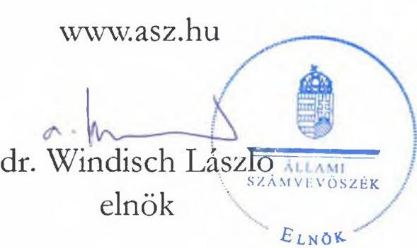

# JELENTÉS 

Állami tulajdonú vagyonelemekhez kapcsolódó lényeges kötelezettségek ellenőrzése

Az MNV Zrt. tulajdonosi joggyakorlásába és közvetlen kezelése alá tartozó egyes idegen helyen tárolt állami tulajdonú vagyonelemek tároló szervezet általi megőrzésének és a vagyonelemhez kapcsolódó adatszolgáltatás teljesítésének célzott ellenőrzése
2023.

23058
www.asz.hu

---

# JELENTÉS 

## Állami tulajdonú vagyonelemekhez kapcsolódó lényeges kötelezettségek ellenőrzése

Az MNV Zrt. tulajdonosi joggyakorlásába és közvetlen kezelése alá tartozó egyes idegen helyen tárolt állami tulajdonú vagyonelemek tároló szervezet általi megőrzésének és a vagyonelemhez kapcsolódó adatszolgáltatás teljesítésének célzott ellenőrzése
2023.

23058

---

# ELLENŐRZÉSI IGAZGATÓSÁG: 

ÁLLAMI VAGYONGAZDÁLKODÁST ELLENŐRZŐ IGAZGATÓSÁG

## ELLENŐRZÉSI IGAZGATÓ:

HERCZEGH ZSOLT ellenőrzési igazgató

## ELLENŐRZÉSVEZETŐ:

Jelentéseink az interneten a www.asz.hu címen olvashatók.

VEREBESNÉ SZABÓ ERZSÉBET ellenőrzésvezető

IKTATÓSZÁM: EL-3871-002/2023
TÉMASZÁM: 2681
ELLENŐRZÉS-AZONOSÍTÓ SZÁM: V1025

---

# TARTALOMJEGYZÉK 

- AZ ELLENŐRZÉS ALAPADATAI ..... 5
- AZ ELLENŐRZÉS HATÓKÖRE ÉS TERÜLETE ..... 7
- ÖSSZEFOGLALÁS ..... 8
- AZ ELLENŐRZÉS FÓKUSZKÉRDÉSEI ..... 9
MEGÁLLAPÍTÁSOK ..... 10
JAVASLATOK ..... 12
MELLÉKLETEK ..... 13
I. sz. melléklet: Értelmező szótár ..... 13
II. sz. melléklet: Az ellenőrzött szervezetek jegyzéke ..... 14
III. sz. melléklet: Ellenőrzési kritériumok ..... 15
FÜGGELÉK: ÉSZREVÉTELEK ..... 16
RÖVIDÍTÉSEK JEGYZÉKE ..... 17

---

.

---

# AZ ELLENŐRZÉS ALAPADATAI 

## AZ ELLENŐRZÉS CÉLJA

Az ellenőrzés célja annak értékelése volt, hogy az MNV Zrt. ${ }^{1}$ tulajdonosi joggyakorlásába és közvetlen kezelése alá tartozó egyes idegen helyen tárolt állami tulajdonú vagyonelemek megőrzését a vagyonelemet birtokló (tároló) szervezet biztosította-e, a vagyonelemhez kapcsolódó adatszolgáltatást, nyilatkozatot az MNV Zrt. felé megtette-e, a nyilvántartott adatok eltérése és/vagy a vagyontárgy hiánya esetén tett-e intézkedéseket.

## AZ ELLENŐRZÉS TÍPUSA

Megfelelőségi ellenőrzés

## AZ ELLENŐRZŐTT IDŐSZAK

2021. január 1-2023. június 30.

## AZ ELLENŐRZÉS TÁRGYA

Az MNV Zrt. tulajdonosi joggyakorlásába és közvetlen kezelése alá tartozó egyes idegen helyen tárolt állami tulajdonú vagyonelemek megőrzése és a vagyonelemhez kapcsolódó adatszolgáltatás, nyilatkozattétel, a nyilvántartott adatok eltérése és/vagy a vagyontárgy hiánya esetén tett intézkedések.

Az ellenőrzés kiterjedt minden olyan körülményre és adatra, amely az ÁSZ ${ }^{2}$ jogszabályban meghatározott feladatainak teljesítéséhez, valamint a program végrehajtása folyamán felmerült újabb összefüggések feltárásához szükséges.

## AZ ELLENŐRZÉS JOGALAPJA

Az ellenőrzés jogszabályi alapját az ÁSZ tv. ${ }^{3} 1 . \int(3)$ bekezdése és $5 . \int(4)$ bekezdés a) pontja képezték.

## AZ ELLENŐRZÉS MÓDSZERE

Az ellenőrzés végrehajtása a nemzetközi standardokat irányadónak tekintve az ellenőrzési program szempontjai, az ellenőrzött időszakban hatályos jogszabályok, az ellenőrzés szakmai szabályok és módszertanok figyelembevételével történt.

Az ellenőrzési kérdések megválaszolásához szükséges bizonyítékok megszerzése az ellenőrzött szervezet által rendelkezésre bocsátott dokumentumokra és adatokra alapozva, továbbá szemle (szemrevételezés), kérdésfeltevés (információkérés), valamint interjú útján történt.

---

Az ellenőrzési bizonyítékként felhasználható adatforrások közé tartoztak az ellenőrzési program részletes szempontjainál felsorolt adatforrások, valamint minden egyéb - az ellenőrzés folyamán feltárt, az ellenőrzés szempontjából információt tartalmazó - dokumentum.

Az ellenőrzés az ellenőrzött szervezet vezetőjével/képviselőivel lefolytatott interjúval indult, majd ezt követően kerültek meghatározásra az ellenőrzéshez felhasználandó, további bekérendő adatok, dokumentumok.

Az összefüggő tények vizsgálata céljából az ÁSZ ellenőrzést támogató szervezetként megkereste az MNV Zrt.-t és a Várkapitányság Nonprofit Zrt. ${ }^{4}$-t.

---

# AZ ELLENŐRZÉS HATÓKÖRE ÉS TERÜLETE 

Az állam tulajdonában álló dolgok az állami vagyon részét képezik. Az állami tulajdon esetén a tulajdonosi jogok és kötelezettségek összességének gyakorlása tulajdonosi joggyakorló szervezetek útján történik. A tulajdonosi joggyakorló feladata, hogy biztosítsa az állami vagyon rendeltetésének megfelelő, hatékony, költségtakarékos, értékmegőrző, értéknövelő felhasználását, illetve közvetett hasznosítását, valamint az állami vagyon gyarapítását.

Az állami vagyonnal a tulajdonosi joggyakorló maga gazdálkodik, szerződés alapján hasznosításra átengedi, vagy vagyonkezelésbe, haszonélvezetbe adja, illetőleg egyoldalú nyilatkozatával központi költségvetési szerv használatába adja. Az állami vagyon hasznosítására kötött szerződések elsődleges célja az állami vagyon hatékony működtetése, állagának védelme, értékének megőrzése, illetve gyarapítása, az állami és közfeladatok ellátásának elősegítése.

Az állami vagyon használóját a használati jog alapítására kötött szerződés szerinti, valamint a tulajdonosi joggyakorlók beszámolókészítési kötelezettségének megalapozottsága érdekében a tulajdonosi joggyakorló által előírt írásbeli adatszolgáltatási kötelezettség terheli. Az adatszolgáltatás részletes tartalmát, formáját a tulajdonosi joggyakorló vagyonnyilvántartási szabályzatban határozza meg.

A rábízott állami vagyon felett az államot megillető tulajdonosi jogok és kötelezettségek összességét tulajdonosi joggyakorlóként - ha törvény vagy miniszteri rendelet eltérően nem rendelkezik - az MNV Zrt. gyakorolja. Az MNV Zrt. nyilvántartja a tulajdonosi joggyakorlása alatt álló állami vagyont, annak értékét és változásait, továbbá a tulajdonosi joggyakorlása alá tartozó állami vagyont közvetlenül vagy polgári jogi szerződések útján hasznosítja.

Az ÁSZ ellenőrzése az MNV Zrt. tulajdonosi joggyakorlásába és közvetlen kezelése alá tartozó egyes idegen helyen tárolt állami tulajdonú vagyonelemek nyilvántartására, megőrzésére, az átvett vagyonelemekről történő adatszolgáltatásnak, nyilatkozatnak az MNV Zrt. felé történő teljesítésére, valamint a nyilvántartott adatokban felmerülő eltérés és/vagy a vagyontárgy hiánya esetén tett intézkedésekre terjedt ki.

Az MNV Zrt. nyilvántartása szerint az idegen helyen tárolt vagyonelemek között szerepeltek - többek között - jelentős kulturális értéket képviselő műtárgyak, értékes informatikai eszközök, gépek, berendezések, járművek. Az ÁSZ négy, kockázati alapon kiválasztott állami tulajdonú vagyontárgyhoz kapcsolódó kötelezettségek teljesítését ellenőrizte azoknál a szervezeteknél, amelyek az MNV Zrt. nyilvántartása szerint a vagyontárgyak tárolói/használói voltak. Az ellenőrzés

- a NÖF Nonprofit Kft. ${ }^{5}$-nél egy olajfestményhez,
- a Nemzeti Útdíjfizetési Szolgáltató Zrt. ${ }^{6}$-nél egy informatikai eszközhöz,
- a PRIV-DAT Kft. ${ }^{7}$-nél egy személygépkocsihoz,
- a Magyar Lovas Szövetség ${ }^{7}$-nél egy munkagéphez
kapcsolódó, a fentiekben részletezett lényeges kötelezettségek teljesítésére terjedt ki.

---

# ÖSSZEFOGLALÁS 

Az állami vagyonhoz tartozó, idegen helyen tárolt ingóságok állagának védelme, megőrzése és a vagyonelemet bármely jogcímen birtokló szervezet - tulajdonosi joggyakorló által előírt adatszolgáltatási kötelezettségének pontos és határidőre történő teljesítése a vagyongazdálkodás fontos pillére. Kiemelkedő szerepe van a tulajdonosi joggyakorló beszámolókészítési kötelezettségének megalapozott teljesítésében, amely információkkal szolgál az állami vagyonnal kapcsolatos döntések meghozatalához.

Az ÁSZ ellenőrzése feltárta, hogy az ellenőrzött vagyontárgyakat birtokló szervezetek több alkalommal is változtak, azonban a vagyontárgyak megőrzése az ellenőrzött időszakban folyamatosan biztosított volt. Valamennyi vagyonelem fellelhető volt az ellenőrzés időszakában a használójánál (az MNV Zrt.-nél, illetőleg az általa kijelölt vagy vele szerződéses jogviszonyban álló szervezetnél). Az MNV Zrt. nyilvántartása ugyanakkor három vagyonelem tekintetében téves adatokat tartalmazott a tároló szervezetre vonatkozóan. Az MNV Zrt. az észrevételezés időszakában jelezte, hogy intézkedést tett nyilvántartásának pontosítása érdekében.

A NÖF Nonprofit Kft., a Nemzeti Útdíjfizetési Szolgáltató Zrt. és a PRIV-DAT Kft. a jogszabályi előírásoknak megfelelően teljesítették a vagyontárgyakhoz kapcsolódó adatszolgáltatási/nyilatkozattételi kötelezettségeiket.

A Magyar Lovas Szövetség jogszabályi előírás ellenére nem teljesítette a használatában lévő vagyontárgyhoz kapcsolódó adatszolgáltatási kötelezettségét.

---

# AZ ELLENŐRZÉS FÓKUSZKÉRDÉSEI 

1.- Az ellenőrzött szervezet az MNV Zrt. tulajdonosi joggyakorlásába és közvetlen kezelése alá tartozó idegen helyen tárolt állami tulajdonú vagyonelemmel összefüggő lényeges kötelezettségeit teljesítette-e?

---

# MEGÁLLAPÍTÁSOK 

## 1. Az ellenőrzött szervezet az MNV Zrt. tulajdonosi joggyakorlásába és közvetlen kezelése alá tartozó idegen helyen tárolt állami tulajdonú vagyonelemmel összefüggő lényeges kötelezettségeit teljesítette-e?

Összegző megállapítás A NÖF Nonprofit Kft., a Nemzeti Útdíjfizetési Szolgáltató Zrt. és a PRIV-DAT Kft. teljesítették a vagyontárgyakhoz kapcsolódó lényeges kötelezettségeiket. A Magyar Lovas Szövetség a használatába adott vagyontárgy megőrzéséről gondoskodott, azonban az MNV Zrt. által előírt adatszolgáltatási kötelezettségét a 2021. évi költségvetési beszámolót alátámasztó leltárhoz kapcsolódóan nem teljesítette, a 2022. évi költségvetési beszámolót alátámasztó leltárhoz kapcsolódóan pedig csak részben teljesítette.

Az ellenőrzött szervezetek az Nvtv. ${ }^{9}$ és a Vtv. vhr. ${ }^{10}$ előírásainak megfelelve - a Magyar Lovas Szövetség kivételével - teljesítették a vagyontárgyakhoz kapcsolódó lényeges kötelezettségeiket.
A NÖF Nonprofit Kft. az MNV Zrt. által a 2021. évi költségvetési beszámolót alátámasztó leltározás elvégzése érdekében az olajfestményhez kapcsolódóan 2022. április 26-án küldött tárolási nyilatkozat és adatszolgáltatás megtételére vonatkozó felhívásra a tulajdonosi joggyakorló által megjelölt határidőn belül válaszolt, jelezte az MNV Zrt. felé, hogy a vagyontárgy nem nála lelhető fel. A vagyontárgyhoz kapcsolódóan az ellenőrzött időszakban a NÖF Nonprofit Kft.-nek további kötelezettsége nem merült fel.
Az olajfestmény a 2021. és 2022. évi leltározás időszakában és a kapcsolódó ellenőrzési cselekmények időpontjában is az MNV Zrt-vel kötött szerződés alapján a Várkapitányság Nonprofit Zrt. vagyonkezelésében állt, leltározása megtörtént, a vagyonelem az ellenőrzés során fellelhető volt.
A Nemzeti Útdíjfizetési Szolgáltató Zrt. az MNV Zrt. által a 2021. évi költségvetési beszámolót alátámasztó leltározás elvégzése érdekében az informatikai eszközhöz kapcsolódóan 2022. március 8-án küldött tárolási nyilatkozat és adatszolgáltatás megtételére vonatkozó felhívásra írásban válaszolt, jelezte az MNV Zrt. felé, hogy a vagyontárgy nem nála lelhető fel. A vagyontárgyhoz kapcsolódóan az ellenőrzött időszakban a Nemzeti Útdíjfizetési Szolgáltató Zrt.-nek további kötelezettsége nem merült fel.
Az informatikai eszköz a 2021. és 2022. évi leltározás időszakában és a kapcsolódó ellenőrzési cselekmények időpontjában a NÉBIH ${ }^{11}$ használatában állt, leltározása megtörtént, a vagyonelem az ellenőrzés során fellelhető volt.
A PRIV-DAT Kft. az MNV Zrt. által a 2021. évi költségvetési beszámolót alátámasztó leltározás elvégzése érdekében 2022. március 4-én küldött tárolási nyilatkozat és adatszolgáltatás megtételére vonatkozó felhívásra a tulajdonosi joggyakorló által megjelölt határidőn belül válaszolt, a személygépkocsi

---

tekintetében jelezte az MNV Zrt. felé, hogy a vagyontárgy nem nála lelhető fel. A vagyontárgyhoz kapcsolódóan az ellenőrzött időszakban a PRIV-DAT Kft.-nek további kötelezettsége nem merült fel.
A személygépkocsi az MNV Zrt., mint ellenőrzést támogató szervezet által szolgáltatott dokumentumok alapján a kapcsolódó ellenőrzési cselekmények időpontjában használaton kívül volt, az MNV Zrt. értékesítésre jelölte ki, a vagyonelem a 2021. és 2022. évi leltározás időszakában és az ellenőrzés során nála fellelhető volt.
A Magyar Lovas Szövetség közfeladat ellátása érdekében az MNV Zrt.-vel ingyenes használati megállapodással rendelkezett több ingó vagyontárgyra, köztük a munkagépre vonatkozóan.
A munkagépet az ellenőrzött szervezet nyilvántartotta, megőrizte, székhelyén az eszköz az ellenőrzés időpontjában működőképes állapotban fellelhető volt.
Az MNV Zrt. Vagyonnyilvántartási szabályzatában ${ }^{12}$ rögzítettek szerint mind a 2021., mind a 2022. évi költségvetési beszámolót alátámasztó leltár összeállításának időszakában megkereste a Magyar Lovas Szövetséget azzal, hogy a nála tárolt, az MNV Zrt. közvetlen kezelésű rábízott vagyonának részét képező eszközök leltározását végezze el, és annak megtörténtét a leltárelemeket tartalmazó táblázat kitöltésével, valamint a tárolási nyilatkozat cégszerűen aláírt példányának megküldésével egyidejűleg a tulajdonosi joggyakorló részére a felhívásban meghatározott határidőn belül igazolja vissza. A megkereséshez az MNV Zrt. mellékletként csatolta az általa nyilvántartott, a mérleg fordulónapján a Magyar Lovas Szövetség birtokában és használatában álló ingó eszközök listáját, továbbá a tárolási nyilatkozatmintát.
A Magyar Lovas Szövetség az MNV Zrt. 2022. március 4-én kelt felhívására nem válaszolt, a 2021. december 31-i fordulónapra vonatkozó leltározáshoz kapcsolódó adatszolgáltatást az ingyenes használati megállapodás 5.15. a) pontjában és 11.2-11.3. pontjaiban, az MNV Zrt. Vagyonnyilvántartási szabályzatának I.6. pontjában és III. pontjában, valamint a Vtv. vhr. 14. § (1) bekezdésében foglaltak ellenére nem teljesítette.
Az MNV Zrt. által a 2022. december 31-i fordulónapra vonatkozó leltározás elvégzése érdekében 2023. február 21. napján küldött megkeresésre a Magyar Lovas Szövetség nem reagált, ezért az MNV Zrt. 2023. március 30-án ismételt felszólítást küldött az idegen helyen tárolt eszközök leltárának visszaigazolására és a tárolási nyilatkozat egyidejű megküldésére 2023. április 9-i póthatáridő tűzése mellett. A Magyar Lovas Szövetség 2023. április 11-én kelt válaszlevelével együttesen megküldte az ingóságok leltári adatszolgáltatását, melyben a munkagép meglévő eszközként visszaigazolásra került, kitöltött, cégszerűen aláírt tárolási nyilatkozat azonban a válaszleveléhez nem került csatolásra. 2023. április 18-án az MNV Zrt. ismételten felszólította a Magyar Lovas Szövetséget a tárolási nyilatkozat megküldésére, melyre az ellenőrzött szervezet nem válaszolt. A kitöltött, cégszerűen aláírt tárolási nyilatkozatot az ingyenes használati megállapodás 5.15. a) pontjában és 11.2-11.3. pontjaiban, az MNV Zrt. Vagyonnyilvántartási szabályzatának I.6. pontjában és III. pontjában, valamint a Vtv. vhr. 14. § (1) bekezdésében foglaltak ellenére nem küldte meg a tulajdonosi joggyakorló részére.

---

# JAVASLATOK 

Az ÁSZ tv. 33. § (1) bekezdésében foglaltak értelmében az ellenőrzött szervezet vezetője köteles a jelentésben foglalt megállapításokhoz kapcsolódó intézkedési tervet összeállítani és azt a jelentés kézhezvételétől számított 30 napon belül az ÁSZ részére megküldeni. Amennyiben az ellenőrzött szervezet vezetője nem küldi meg határidőben az intézkedési tervet, vagy továbbra sem elfogadható intézkedési tervet küld, az Állami Számvevőszék elnöke az ÁSZ tv. 33. § (3) bekezdése a) és b) pontjaiban foglaltakat érvényesítheti.

## A MAGYAR LOVAS SZÖVETSÉG ELNÖKÉNEK

1. 

Tegyen intézkedéseket a kontrolltevékenységek megfelelő müködtetésére, amelyek biztositják az MNV Zrt. tulajdonosi joggyakorlásába és közvetlen kezelése alá tartozó, a Magyar Lovas Szövetség használatában lévő vagyontárgyakkal kapcsolatosan az MNV Zrt-vel kötött ingyenes használati megállapodás 5.15. a) pontjában és 11.2-11.3. pontjaiban, az MNV Zrt. Vagyonnyilvántartási szabályzatának I.6. pontjában és III. pontjában, valamint a Vtv. vhr. 14. § (1) bekezdésében foglaltakon alapuló adatszolgáltatási kötelezettség jövőbeni szabályszerü teljesitését.

---

# MELLÉKLETEK 

## I. SZ. MELLÉKLET: ÉRTELMEZŐ SZÓTÁR

állami vagyon
tulajdonosi joggyakorló
állami vagyon használója
a mérleg alátámasztása leltárral
beszámoló készítési kötelezettség
a) az állam tulajdonában lévő dolog, valamint dolog módjára hasznosítható természeti erő;
b) az a) pont hatálya alá tartozó mindazon vagyon, amely vonatkozásában törvény az állam kizárólagos tulajdonjogát nevesíti;
c) az állam tulajdonában lévő tagsági jogviszonyt megtestesítő értékpapír, illetve az államot megillető egyéb társasági részesedés;
d) az államot megillető olyan immateriális, vagyoni értékkel rendelkező jogosultság, amelyet jogszabály vagyoni értékủ jogként nevesít;
e) az állam tulajdonában álló a befektetési vállalkozásokról és az árutőzsdei szolgáltatókról, valamint az általuk végezhető tevékenységek szabályairól szóló 2007. évi CXXXVIII. törvény szerinti pénzügyi eszköz;
f) azon országgyűlési képviselőről, aki más, Alaptörvényben nevesített közjogi tisztséget is betöltve közfeladatot lát el, e közfeladata ellátása körében vagy ezzel összefüggésben, költségvetési forrásból készített, szerzői vagy szomszédos jogi védelmet élvező műböz vagy teljesítményhez, különösen kép-, illetve hangfelvételhez kapcsolódó, felhasználási szerződés útján vagy a szerzői jogról szóló törvény alapján megszerzett felhasználási engedély, illetve vagyoni jog.
(Vtv. ${ }^{13} 1 . \S$ (2) bekezdése)
Aki a nemzeti vagyon felett az államot vagy a helyi önkormányzatot megillető tulajdonosi jogok és kötelezettségek összességének gyakorlására jogosult. (Nvtv. 3. § (1) bekezdés 17. pontja)
Az a természetes vagy jogi személy, jogi személyiséggel nem rendelkező szervezet, aki, vagy amely törvény vagy szerződés alapján, bármely jogcímen (bérlet, haszonbérlet, használat stb.) állami vagyont birtokol, használ, szedi annak hasznait, hasznosít, ide nem értve a haszonélvezőt, a b) pont szerinti vagyonkezelőt és a tulajdonosi jogok gyakorlóját.
(Vtv. vhr. 1. § (7) bekezdés a) pont)
Az éves költségvetési beszámoló elkészítéséhez, a mérleg tételeinek alátámasztásához olyan leltárt kell összeállítani és megőrizni, amely tételesen, ellenőrizhető módon tartalmazza a mérlegben szereplő eszközöket és forrásokat.
(Áhsz. ${ }^{14} 22 . \S$ (1) bekezdése)
A költségvetési év kezdetétől a mérleg fordulónapjáig terjedő időszakról a könyvek zárását követően bizonylatokkal, szabályszerű könyvvezetéssel, e rendelet szabályai szerint folyamatosan vezetett részletező nyilvántartásokkal, a könyvviteli zárlat során készített főkönyvi kivonattal, valamint leltárral alátámasztott éves költségvetési beszámolót kell készíteni. (Áhsz. 5. § (1) és 7. § (1) bekezdése alapján)

---

# II. SZ. MELLÉKLET: AZ ELLENŐRZÖTT SZERVEZETEK JEGYZÉKE 

## ELLENŐRZÖTT SZERVEZET NEVE

NÖF Nemzeti Örökségvédelmi Fejlesztési Nonprofit Korlátolt Felelősségű Társaság
Nemzeti Útdíjfizetési Szolgáltató Zártkörűen Müködő Részvénytársaság
PRIV-DAT Dokumentum Archiváló és Tároló Korlátolt Felelősségű Társaság
Magyar Lovassport Szövetség

---

# III. SZ. MELLÉKLET: ELLENŐRZÉSI KRITÉRIUMOK 

## FOKUSZKÉRDÉS

1. Az ellenőrzött szervezet az MNV Zrt. tulajdonosi joggyakorlására és közvetlen kezelése alá tartozó idegen helyen tárolt állami tulajdonú vagyonelemmel összefüggő lényeges kötelezettségeit teljesítette-e?

## ELLENÖRZÉSI KRITÉRIUMOK

Nvtv. 7. § (1)-(2) bekezdése, Vtv. vhr. 14. § (1), (3), (6) bekezdése,
az MNV Zrt. Vagyonnyilvántartási Szabályzatának I.6. pontja és III. pontja,
az MNV Zrt.-vel kötött használati megállapodás

---

# FÜGGELÉK: ÉSZREVÉTELEK 

A jelentéstervezetet a Számvevőszék 15 napos észrevételezésre megküldte az ellenőrzött szervezet vezetőjének az ÁSZ tv. 29. §* (1) bekezdése előírásának megfelelően.

A jelentéstervezetre az ellenőrzött szervezetek nem tettek észrevételt.

[^0]
[^0]:    * 29. § (1) Az Állami Számvevőszék az ellenőrzési megállapításait megküldi az ellenőrzött szervezet vezetőjének vagy az általa megbízott személynek, és annak, akinek személyes felelősségét állapította meg.
    (2) Az ellenőrzött szervezet vezetője és a felelősként megjelölt személy az ellenőrzés megállapításaira tizenöt napon belül írásban észrevételt tehet.
    (3) Az Állami Számvevőszék az észrevételre a beérkezésétől számított harminc napon belül írásban válaszol. A figyelembe nem vett észrevételeket köteles a jelentésben feltüntetni, és megindokolni, hogy azokat miért nem fogadta el.

---

# RÖVIDÍTÉSEK JEGYZÉKE 

${ }^{1}$ MNV Zrt.
${ }^{2}$ ÁSZ
${ }^{3}$ ÁSZ tv.
${ }^{4}$ Várkapitányság Nonprofit Zrt.
${ }^{5}$ NÖF Nonprofit Kft.
${ }^{6}$ Nemzeti Útdíjfizetési Szolgáltató Zrt.
${ }^{7}$ PRIV-DAT Kft.
${ }^{8}$ Magyar Lovas Szövetség
${ }^{9}$ Nvtv.
${ }^{10}$ Vtv. vhr.
${ }^{11}$ NÉBIH
${ }^{12}$ az MNV Zrt. Vagyonnyilvántartási szabályzata
${ }^{13}$ Vtv.
${ }^{14}$ Áhsz.

Magyar Nemzeti Vagyonkezelő Zártkörűen Működő Részvénytársaság
Állami Számvevőszék
2011. évi LXVI. törvény az Állami Számvevőszékről
Várkapitányság Integrált Területfejlesztési Központ Nonprofit Zártkörűen
Működő Részvénytársaság
NÖF Nemzeti Örökségvédelmi Fejlesztési Nonprofit Korlátolt Felelősségű
Társaság
Nemzeti Útdíjfizetési Szolgáltató Zártkörűen működő Részvénytársaság
PRIV-DAT Dokumentum Archiváló és Tároló Korlátolt Felelősségű Társaság
Magyar Lovassport Szövetség
2011. évi CXCVI. törvény a nemzeti vagyonról
254/2007. (X. 4.) Korm. rendelet az állami vagyonnal való gazdálkodásról
Nemzeti Élelmiszerlánc-biztonsági Hivatal
az MNV Zrt. 9/2021. számú szabályzata az MNV Zrt. tulajdonosi
joggyakorlásába tartozó vagyont érintő Vagyonnyilvántartási Szabályzatáról, különös tekintettel a vagyonkezeléssel összefüggő adatszolgáltatásokra (2021. április 21.)
2007. évi CVI. törvény az állami vagyonról
4/2013. (I. 11.) Korm. rendelet az államháztartás számviteléről

---

1052 Budapest, Apáczai Csere János u. 10. | 1364 Budapest 4., Pf. 54
www.asz.hu | szamvevoszek@asz.hu
telefon: +36 14849100