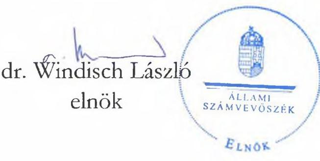
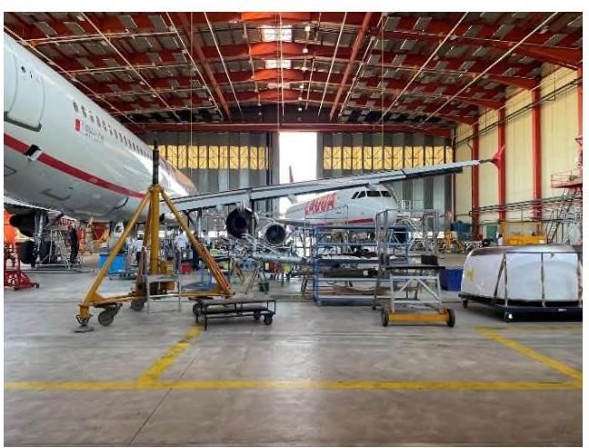
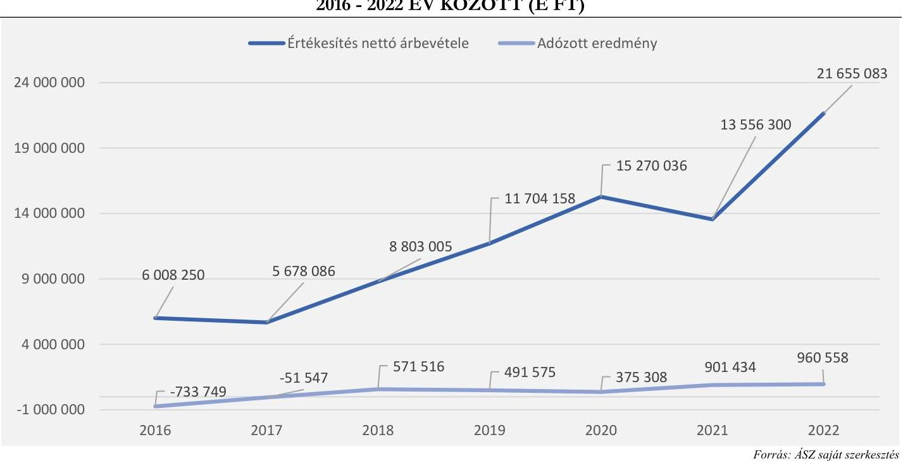
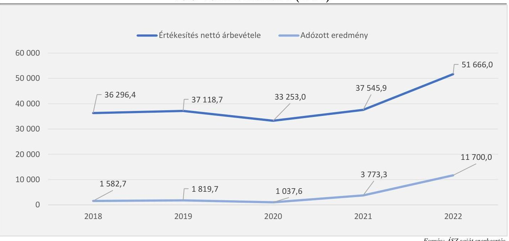
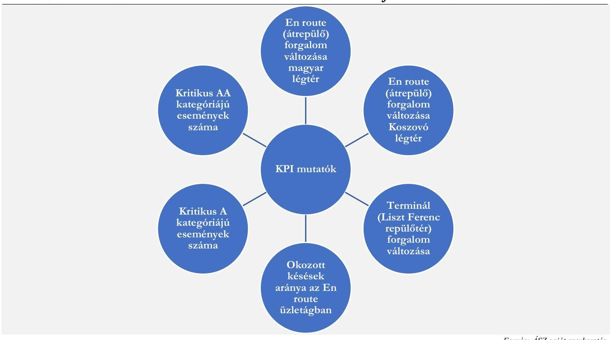

# JELENTÉS 

## Az állami tulajdonú gazdasági társaságok kontrolling rendszerének célzott ellenőrzése

2023.

---

# JELENTÉS 

## Az állami tulajdonú gazdasági társaságok kontrolling rendszerének célzott ellenőrzése

2023.

23059
www.asz.hu
dr. Windisch László

---

# ELLENŐRZÉSI IGAZGATÓSÁG: 

ÁLLAMI VAGYONGAZDÁLKODÁST ELLENŐRZŐ IGAZGATÓSÁG

## ELLENŐRZÉSI IGAZGATÓ:

HERCZEGH ZSOLT ellenőrzési igazgató

## ELLENŐRZÉSYEZETŐ:

Jelentéseink az interneten a www.asz.hu címen olvashatók.

DABISNÉ NYIKOS MELINDA ellenőrzésvezető

IKTATÓSZÁM: EL-3899-002/2023
TÉMASZÁM: 2694
ELLENŐRZÉS-AZONOSÍTÓ SZÁM: V1038

---

# TARTALOMJEGYZÉK 

- AZ ELLENŐRZÉS ALAPADATAI ..... 5
- AZ ELLENŐRZÖTT SZERVEZET ..... 7
- ÖSSZEFOGLALÁS ..... 10
- AZ ELLENŐRZÉS FÓKUSZKÉRDÉSEI ..... 12
- MEGÁLLAPÍTÁSOK ..... 13
- MELLÉKLETEK ..... 19
I. sz. melléklet: Értelmező szótár ..... 19
II. sz. melléklet: Az ellenőrzött szervezetek jegyzéke ..... 20
III. sz. melléklet: Ellenőrzési kritériumok ..... 21
- FÜGGELÉK: ÉSZREVÉTELEK ..... 22
- RÖVIDÍTÉSEK JEGYZÉKE ..... 23

---

.

---

# AZ ELLENŐRZÉS ALAPADATAI 

## AZ ELLENŐRZÉS CÉLJA

Az ellenőrzés célja annak értékelése volt, hogy az állami tulajdonú gazdasági társaság kontrolling rendszere támogatta-e a vezetői döntéshozatalt. Az ellenőrzés további célja volt a kontrollig tevékenység keretében megvalósuló esetleges jó gyakorlatok feltérképezése.

## AZ ELLENŐRZÉS TÍPUSA

Megfelelőségi ellenőrzés

## AZ ELLENŐRZÖTT IDŐSZAK

Az ellenőrzött időszak 2022.01.01-jétől az ellenőrzés megkezdéséig (az Aeroplex Közép-Európai Légijármú Műszaki Központ Kft. esetében 2023.08.07-ig, a HungaroControl Magyar Légiforgalmi Szolgálat Zrt. esetében 2023.07.28-ig) tartó időszak.

## AZ ELLENŐRZÉS TÁRGYA

Az ÁSZ ${ }^{1}$ ellenőrzése az állami tulajdonban lévő gazdasági társaságok kontrolling rendszerének értékelésére terjedt ki, a tekintetben, hogy a gazdasági társaság kontrolling rendszere támogatta-e a vezetői döntéshozatalt. A köztulajdonban álló gazdasági társaság első számú vezetője felelős a belső kontrollrendszer keretében a gazdasági társaság múködésében érvényesülő információs és kommunikációs rendszer, valamint nyomon követési rendszer (monitoring) kialakításáért, működtetéséért és fejlesztéséért. A belső kontrollrendszer ezen pilléreit támogatja a gazdasági társaság által, a belső irányító eszközeivel kialakított kontrolling rendszere, mely alatt a vezetői információs rendszert, mint döntéstámogató rendszert értette az ellenőrzés.

Az ellenőrzés kiterjedt minden olyan körülményre és adatra, amely az ÁSZ jogszabályban meghatározott feladatainak teljesítéséhez, valamint a program végrehajtása folyamán felmerült újabb összefüggések feltárásához volt szükséges.

## AZ ELLENŐRZÉS JOGALAPJA

Az ellenőrzés jogszabályi alapját az ÁSZ tv. ${ }^{2} 1 . \S$ (3) bekezdés és az 5. § (4) bekezdés előírásai képezték.

---

# AZ ELLENŐRZÉS MÓDSZERE 

Az ellenőrzés végrehajtása a nemzetközi standardokat irányadónak tekintve az ellenőrzési program szempontjai, az ellenőrzött időszakban hatályos jogszabályok, az ellenőrzés szakmai szabályok és a jelen ellenőrzésre irányadó ÁSZ módszertan figyelembevételével történt.

Az ellenőrzési kérdések megválaszolásához szükséges bizonyítékok megszerzése az ellenőrzött szervezetek által rendelkezésre bocsátott dokumentumokra és adatokra alapozva, továbbá megfigyelés, szemle, kérdésfeltevés (információkérés), valamint elemző eljárás útján valósult meg.

Az ellenőrzési bizonyítékként felhasználható adatforrások közé tartoztak egyrészt az ellenőrzéshez kért dokumentumok, adatforrások, másrészt adatforrás volt még minden - az ellenőrzés folyamán - feltárt, az ellenőrzés szempontjából információkat tartalmazó dokumentum.

Az ellenőrzés során mintavételre nem került sor.

---

# AZ ELLENŐRZÖTT SZERVEZET 

## AEROPLEX KÖZÉP-EURÓPAI LÉGIJÁRMŰ MŰSZAKI KÖZPONT Kft.

Az Aeroplex Kft. ${ }^{3}$ 1992-ben alakult. 2022.07.01. napjától az N7 Holding Nemzeti Védelmi Ipari Innovációs Zrt. tulajdonában álló egyszemélyes korlátolt felelősségű társaság. 2022.07.01. előtt az ellenőrzött időszakban az államot megillető tulajdonosi jogokat a Nemzeti Védelmi Ipari Innovációs Zrt. (későbbi N7 Holding Nemzeti Védelmi Ipari Innovációs Zrt.) gyakorolta.

Az Aeroplex Kft. a 2022., és a 2023. években a Taktv. ${ }^{4}$ 7/J. § (1) bekezdésének előírása alapján belső kontrollrendszert működtetett, a Gbkr. ${ }^{5}$ hatálya alá tartozott. Az Aeroplex Kft. átlagos statisztikai létszáma 2022-ben 659 fő volt. Az Aeroplex Kft. a polgári utasszállító repülőgépek karbantartására szakosodott repülőgépes $\mathrm{MRO}^{6}$ szervezet. Az Aeroplex Kft. több nemzetközi hatósági jogosítással, többek között európai EASA $^{7}$, amerikai $\mathrm{FAA}^{8}$, angol, bermudai, egyesült arab emirátusi, kanadai, katari, dél-koreai, egyiptomi, izraeli, kazah, ukrán, magyar katonai hatósági engedélyekkel rendelkezik.

Az Aeroplex Kft. tevékenysége a következő hat fő tevékenység köré szerveződött az ellenőrzött időszakban:

- hangárkarbantartási tevékenység: a személyszállító repülőgépek kötelező karbantartása;
- berendezés javítás: a repülőgép üzemidőhöz kötődő berendezéseinek javítása;
- forgalmi karbantartás: a repülőgépek indítása, fogadása, és fordítása a menetrendszerű működés során;
- légitársasági támogatás: mérnökszolgálati, karbantartás tervezési, és logisztikai feladatokat foglalja magába a tevékenység szerződött tartalmát adó repülőgépflotta zavartalan működése érdekében;
- egyéb szolgáltatások: ad hoc munkák, valamint az eszközök, szerszámok és kiszolgáló berendezések kölcsönbe, illetve a létesítmények bérbe adása, oktatások tartása;
- anyageladás: a megrendelők részére történő alkatrész és berendezés értékesítések.

Az Aeroplex Kft. 2016-ban a döntéstámogató rendszereiket tekintve teljes céget átfogó reorganizációt hajtott végre, a kontrolling rendszerét kiterjesztette a termelő területekre, bevezette a LEAN döntéstámogató rendszert a folyamatok optimalizálására.

---

Az Aeroplex Kft. reorganizációt követő értékesítés nettó árbevételének és adózott eredményének alakulását az alábbi ábra szemlélteti:

*Forrás: ÁSZ saját szerkesztés*

## **HungaroControl Magyar Légiforgalmi Szolgálat Zrt.**

A HungaroControl Zrt9-t a Magyar Állam 2006.11.22-én zártkörűen működő részvénytársasági formában, egyszemélyes gazdasági társaságként alapította. 2022.02.15. napja előtt, az ellenőrzött időszakban az alapítói és részvényesi jogok gyakorlója az Innovációs és Technológiai Minisztérium volt. A HungaroControl Zrt. tulajdonosa 2022.02.15. napjától az N7 Holding Nemzeti Védelmi Ipari Innovációs Zrt. lett, amely 2022.05.30. napjáig Nemzeti Védelmi Ipari Innovációs Zrt. néven működött. A HungaroControl Zrt. a 2022., és a 2023. években a Taktv. 7/J. § (1) bekezdésének előírása alapján belső kontrollrendszert működtetett, a Gbkr. hatálya alá tartozott. A HungaroControl Zrt. átlagos statisztikai létszáma 2022-ben 723,5 fő volt.

A légiközlekedésről szóló törvény10 rögzíti, hogy a légiközlekedés biztonsága érdekében a magyar légtérben légiforgalmi szolgálatot kell fenntartani, mely közfeladat ellátására került megalapításra a HungaroControl Zrt. A légiforgalmi szolgáltatás keretében a HungaroControl Zrt. főtevékenységként végzi a Magyarország légterében átrepülő forgalom irányítását, a Budapest/Liszt Ferenc repülőtér érkező-induló forgalmának kiszolgálását, a Koszovó felett kijelölt légtérben - KFOR szektor11 - egyes léginavigációs szolgálatok nyújtását és egyéb kapcsolódó tevékenységek ellátását, valamint ezek mellett egyéb piaci alapon működő kiegészítő szolgáltatásokat is nyújt (például vidéki repülőtereken a repüléstájékoztató és légiforgalmi irányítási tevékenység ellátása; oktatás; tanácsadás).

---

Az elmúlt 5 év számviteli beszámoló adatai alapján a HungaroControl Zrt. nyereségen működött, az értékesítés nettó árbevételének és adózott eredményének alakulását az alábbi ábra szemlélteti:
2. ábra

# ÉRTÉKESÍTÉS NETTÓ ÁRBEVÉTELE ÉS AZ ADÓZOTT EREDMÉNY ALAKULÁSA 2018 - 2022 ÉV KÖZÖTT (M FT) 

---

# ÖSSZEFOGLALÁS 

A kontrolling rendszer, mint vezetői döntéstámogató rendszer kiemelt szerepet tölt be egy gazdasági társaság életében, mivel a tervezést, ellenőrzést, információellátást hangolja össze egy irányítási rendszer formájában. A kontrolling rendszer keretében meghatározott szervezeti célok, tervek a szervezet teljesítmény mérésének és értékelésének alapja, a meghozott döntések hatásainak nyomon követésének az eszköze. Egy jól múködő kontrolling rendszer keretében a gazdasági társaság vezetője/vezetői időben képesek beavatkozni a tervtől való eltérés korrigálása érdekében; a bevétel, költség, és eredmény adatok folyamatos visszamérésével, vezetői jelentések készítésével pedig a döntések megalapozásához nyújt támogatást.

Az ellenőrzés megállapította, hogy az Aeroplex Kft., valamint a HungaroControl Zrt. kontrolling rendszere támogatta a vezetői döntéshozatalt. A kontrolling rendszer múködése biztosította az Aeroplex Kft., valamint a HungaroControl Zrt. tevékenységének és a célok megvalósításának nyomon követését, döntések alátámasztását.

Az ellenőrzés során feltárt, a kontrolling rendszer múködésére vonatkozó, a Gbkr. előírásainak megfelelő megállapítások és jó gyakorlatok:

- Az Aeroplex Kft., valamint a HungaroControl Zrt. a kontrolling rendszer kialakítása során figyelembe vette a múködési és iparági sajátosságokat, belső adottságokat és a külső környezeti tényezőket. A kontrolling rendszer múködése összhangban volt a belső szabályozó eszközökkel.
- Az Aeroplex Kft., valamint a HungaroControl Zrt. kontrolling területének feladatai szabályozásra kerültek.
- A HungaroControl Zrt. a kontrolling feladatok szerint elkülönült szervezeti egységeket hozott létre, a feladatokat belső szabályzatokban rögzítette.
- Az Aeroplex Kft., valamint a HungaroControl Zrt. kontrollinggal kapcsolatos belső szabályozó eszközeiben a felelősségvállalási rendszer szabályozásra került.
- Az Aeroplex Kft., valamint a HungaroControl Zrt. vállalati stratégiával, operatív üzleti tervvel rendelkezett, melyben meghatározásra kerültek a társaságok rövid-, és hosszú távú céljai.
- A HungaroControl Zrt. a stratégiai tervezés során Sounding board ${ }^{12}$-okat alakított, amelybe bármely szervezeti egység delegálhatott tagokat, így megvalósulhatott a széleskörű információgyűjtés. Az ötletbörzék alkalmasak voltak arra, hogy a különböző területek validálhassák az ötleteiket.
- A HungaroControl Zrt. az üzleti tervezés operatív tervezési lépéseinek meghatározására tervezési/ütemezési táblát készített, amelyben a konkrét tervezési lépések mellett feltüntette az elvégzendő tevékenységek időtartamát, a kezdés-, és befejezés időpontjával együtt.
- A HungaroControl Zrt. az üzleti tervében bemutatta a beruházások megvalósítását kockáztató tényezőket, hatásokat, valamint elkészítette a beruházási terv időbeli ütemezését is, amely elősegítette a beruházásokra történő felkészülés tervezését és végrehajtását.
- A HungaroControl Zrt. az önköltségszámítás során kalkulációs sémákat dolgozott ki, melyek elősegítették az egységes szempontok szerinti kalkulációk készítését.
- Az Aeroplex Kft., valamint a HungaroControl Zrt. részéről a stratégiai, operatív, üzleti tervek teljesülésének nyomon követése megtörtént. A folyamatos adatszolgáltatás (napi, heti, havi, negyedéves, éves riportok) múködtetése biztosította az állandó visszajelzést a döntéshozók számára a tervszámok alakulásáról.

---

- Az Aeroplex Kft., valamint a HungaroControl Zrt. KPI ${ }^{13}$-okat, valamint érzékenységi mutatókat alkalmazott. A mutatók visszamérése megtörtént. A visszamérésekről, értékelésekről riportok készültek.
- Az Aeroplex Kft. a döntési igény tárgyától függően használt döntéstámogató rendszereket.
- Az Aeroplex Kft-nél, valamint a HungaroControl Zrt-nél teljesítménykövetelmények kerültek meghatározásra a prémiumhoz kapcsolódóan, melyet teljesítményértékelés keretében mértek vissza.
- Az Aeroplex Kft. valamint a HungaroControl Zrt. a kontrolling rendszer müködtetését szolgáló informatikai rendszerekkel rendelkezett.

---

# AZ ELLENŐRZÉS FÓKUSZKÉRDÉSEI 

Az állami tulajdonú gazdasági társaság kontrolling rendszere támogatta-e a vezetői döntéshozatalt?

---

# 1. Aeroplex Kft. 

## Összegző megállapítás

Az állami tulajdonú gazdasági társaság kontrolling rendszere támogatta a vezetői döntéshozatalt. A kontrolling rendszer múködése biztosította az állami tulajdonú gazdasági társaság tevékenységének és a célok megvalósításának nyomon követését, döntések alátámasztását.

Az Aeroplex Kft. kontrolling rendszerének múködése több belső szabályozóban - Alapító okirat ${ }_{\mathrm{A} 1}{ }^{14}$, $\mathrm{SZMSZ}_{\mathrm{A} 1}{ }^{15}$. Tervezési szabályzat ${ }_{\mathrm{A} 1}{ }^{16}$, a tulajdonosi joggyakorló/tulajdonos által meghatározott tervezési irányelvek, premisszák ${ }_{\mathrm{A} 1-2}{ }^{17}$, Javadalmazási szabályzat ${ }_{\mathrm{A} 1}{ }^{18}$, Önköltségszámítási szabályzat ${ }_{\mathrm{A} 1}{ }^{19}$ - került szabályozásra, amelyek tartalmazták a kontrolling területhez kapcsolódó feladatok rögzítését.
Az Aeroplex Kft. SZMSZ ${ }_{\mathrm{A} 1}$-ében meghatározásra kerültek a kontrolling feladatok szervezeti szintű besorolásai. Az Aeroplex Kft. az SZMSZ ${ }_{\mathrm{A} 1}$-nek megfelelően, a pénzügyi igazgatóság által, a gazdasági igazgatón és a stratégiai tanácsadón keresztül látta el a kontrolling rendszer múködtetését. Az Aeroplex Kft. az SZMSZ ${ }_{\mathrm{A} 1}$-ben rögzített kontrolling feladatokat - havi, negyedéves és éves vezetői jelentések készítése; a társaság éves költségvetésének elkészítése és felülvizsgálata; negyedéves és év végi pénzügyi jelentések készítése; pénzügyi modellek és tervek elkészítése; a folyamatban lévő és várható munkaprogramok közvetlen munkaóra és anyagszükségletének tervezése - elvégezte.
Az Aeroplex Kft. a Számv. tv. ${ }^{20}$ előírásainak megfelelően rendelkezett Önköltségszámítási szabályzattal ${ }_{\mathrm{A} 1}$, az abban foglaltaknak megfelelően járt el a költségszerkezet kialakítása során. Az Aeroplex Kft. a költségek csoportosításával, felosztásával biztosította a költségek tevékenység jellege szerinti tervezését, valamint a kapcsolódó vezetői döntések alátámasztását.
Az Aeroplex Kft. Tervezési szabályzata ${ }_{\mathrm{A} 1}$ tartalmazta a stratégiai tervezésre vonatkozó szabályokat. Az Aeroplex Kft. a stratégiai tervet elkészítette, amely a Tervezési szabályzatnak ${ }_{\mathrm{A} 1}$ megfelelően magába foglalta a rövid-, közép-, és hosszútávú növekedési terveket, stratégia célokat, irányokat, intézkedéseket. Az Aeroplex Kft. ügyvezető által jóváhagyott stratégiai tervet a tulajdonos részére megküldte, valamint prezentálta.
Az Aeroplex Kft. Tervezési szabályzata ${ }_{\mathrm{A} 1}$ tartalmazta az üzleti terv ${ }_{\mathrm{A} 1-2}{ }^{21}$ készítésére vonatkozó szabályokat. Az Aeroplex Kft. az üzleti tervét ${ }_{\mathrm{A} 1-2}$ a Tervezési szabályzatnak ${ }_{\mathrm{A} 1}$, valamint a tulajdonosi joggyakorló/tulajdonos által meghatározott tervezési irányelveknek, premisszáknak ${ }_{\mathrm{A} 1-2}$ megfelelően készítette el, azt a Tervezési szabályzat ${ }_{\mathrm{A} 1}$ rendelkezései szerint az ügyvezető a Felügyelőbizottság elé terjesztette. Az Aeroplex Kft. az Alapító okirat ${ }_{\mathrm{A} 1}$ rendelkezéseinek megfelelően rendelkezett az üzleti terv ${ }_{\mathrm{A} 1-2}$ tulajdonosi joggyakorló/tulajdonos általi jóváhagyással. Az üzleti terv ${ }_{\mathrm{A} 1-2}$ a Tervezési szabályzatnak ${ }_{\mathrm{A} 1}$ megfelelően tartalmazta a célokat és az eredményességi (KPI) mutatókat. Az Aeroplex Kft. a Tervezési szabályzatban ${ }_{\mathrm{A} 1}$ rögzített operatív tervezés rendelkezései alapján elvégezte a mérleg és eredménykimutatás tervezését. Az Aeroplex Kft. rendelkezett az Alapító okiratban ${ }_{\mathrm{A} 1}$, továbbá a tervezési irányelvben meghatározott, az üzleti terv ${ }_{\mathrm{A} 1-2}$ részeként elkészített beszerzési tervekkel. Az Alapító okiratban ${ }_{\mathrm{A} 1}$ rögzítésre kerültek a beszerzésekkel kapcsolatos döntési hatáskörök, az üzleti terv ${ }_{\mathrm{A} 1-2}$ részeként

---

elkészített beszerzési tervek az Alapító okiratban ${ }_{A 1}$ meghatározottak szerint lettek összeállítva. Az Aeroplex Kft. a tervezési irányelvben, premisszákban ${ }_{\mathrm{A} 1-2}$ meghatározott likviditási terveket elkészítette.
Az Aeroplex Kft. az operatív tevékenységek keretében megvalósuló eseti és folyamatos nyomon követést a Gbkr., valamint a Tervezési szabályzat ${ }_{A 1}$ rendelkezéseinek megfelelően látta el. Az Aeroplex Kft. negyedéves, havi, heti, napi és adott esetben ad hoc kontrolling adatszolgáltatások keretében biztosította a gazdasági társaság tevékenységének, valamint a célok megvalósításának nyomon követését.
1. táblázat

# AZ AEROPLEX KFT. KONTROLLING ADATSZOLGÁLTATÁSAINAK FAJTÁI 

## BELSO ADATSZOLGÁLTATÁSOK GYAKORISÁGA

Napi jelentés:

- $\mathrm{DPR}^{22}$ karbantartások napi projekt riportja

Heti jelentés:

- Likviditási előrejelzés 15 hétre előre

Havi jelentés:

- Beszámoló (eredménykimutatás, mérleg)
- Részletes fedezet (árbevétel, ráfordítás, fedezet, naturáliák), költségviselők (projektek) szerint.
- Költséghelyi költségkimutatás (DFR ${ }^{23}$ adatok)

## KÜLSO ADATSZOLGÁLTATÁSOK GYAKORISÁGA

Heti jelentés

- Kiemelt események

Havi jelentés:

- $\mathrm{GAT}^{24}$ (eredménykimutatás, mérleg, cashflow, KPI-ok, kiemelt költségek, beruházások, létszámadatok, események) magyarázatokkal
Negyedéves jelentés:
- Review prezentációk

Éves jelentés:

- Üzleti terv
- Beszerzési terv
- Éves beszámoló, kiegészítő melléklet, üzleti jelentés

Forrás: ÁSZ saját szerkesztés
Az üzleti tervben ${ }_{\mathrm{A} 1-2}$ meghatározott KPI-ok visszamérésre kerültek az Aeroplex Kft. részéről, amellyel az Aeroplex Kft. teljesítette az üzleti tervhez ${ }_{\mathrm{A} 1-2}$ kapcsolódó teljesítménykövetelmények visszamérését. Az Aeroplex Kft. a vagyoni, pénzügyi, jövedelmi helyzet értékelésére, nyomon követésére az árbevétel, EBIT $^{25}$, EBIT margin, EBITDA $^{26}$, EBITDA margin, adózott eredmény, $\mathrm{ROS}^{27}, \mathrm{ROE}^{28}$ mutatókat alkalmazta, továbbá a GAT jelentések alapján további KPI mutatókat, azaz kulcsmutatókat is visszamért. 2. táblázat

AZ AEROPLEX KFT. GAT JELENTÉSEK ALAPJÁN MÉRT KPI MUTATÓI

| 2022 | 2023 |
| :--: | :--: |
| - Munkaóra kapacitás-kihasználás   - Elfogadott átfutási idő túllépésnek indexe   - Hangárkihasználtság aránya   - Ügyfélreklamációk száma (db/7000) | - Vevői reklamációk (db/7000)   - Hangárkapacitás kihasználtság   - ROS   - ROE   - Belépők száma   - Kilépők száma |

---

Az Aeroplex Kft. az üzleti tervezése ${ }_{\mathrm{A} 1-2}$ során meghatározott érzékenységi mutatókat nyomon követte. 3. táblázat

# AZ AEROPLEX KFT. 2022-2023. ÉVI ÜZLETI TERVEZÉS SORÁN ALKALMAZOTT ÉRZÉKENYSÉGI MUTATÓI 

| TÖKEÁTTÉTELI MUTATÓK | LIIVIDITÁSI MUTATÓK | JÖVÉDELMEZŐSÉGI ÉS HATÉKONYSÁGI MUTATÓK | VAGYONI HELYZET ELEMZÉSE |
| :--: | :--: | :--: | :--: |
| - Eladósodottsági mutató   - Kötelezettségek aránya   - Müködő tőke | - Likviditási ráta   - Likviditási gyorsráta vagy savpróba | - Eszközarányos nyereség   - Sajáttőke-arányos nyereség   - Készletek forgási sebessége   - Vevő forgási sebesség   - Átlagos beszedési idő   - Szállítók forgási sebessége   - Szállítók átlagos forgási ideje | - Saját tőke arány   - Adósságállomány aránya   - Tőkeerősségi mutató   - Tőkenövekmény   - EBITDA |

Forrás: ÁSZ saját szerkesztés
Az Aeroplex Kft. müködésének jellegéből adódóan, a legfontosabb termelési tényezőt a képzett szakemberállomány jelentette, így a tervezési irányoknak, premisszáknak ${ }_{\mathrm{A} 1-2}$ megfelelően az üzleti tervében ${ }_{\mathrm{A} 1-2}$ rögzítette a humán erőforrás terület tekintetében a létszámváltozásokkal, létszámbővítéssel kapcsolatos terveket. Az Aeroplex Kft. a szakemberállomány megtartásához motivációs és megtartási csomagot alakított ki, a létszám alakulásának nyomon követését az Aeroplex Kft. a riportálási feladatai során ellátta.
Az Aeroplex Kft. Javadalmazási szabályzatának ${ }_{\mathrm{A} 1}$ megfelelően a prémiumhoz kapcsolódó teljesítménykövetelmények meghatározásra kerültek az üzleti tervben ${ }_{\mathrm{A} 1-2}$. A teljesítmény értékelése visszamérésre került.

## 2. HungaroControl Zrt.

Összegző megállapítás Az állami tulajdonú gazdasági társaság kontrolling rendszere támogatta a vezetői döntéshozatalt. A kontrolling rendszer müködése biztosította az állami tulajdonú gazdasági társaság tevékenységének és a célok megvalósításának nyomon követését, döntések alátámasztását.

A HungaroControl Zrt. kontrolling rendszerének müködése több belső szabályozóban - Alapszabály ${ }_{\mathrm{HCl}-}$ ${ }_{5}{ }^{29}$, SZMSZ $_{\mathrm{HCl}-4}{ }^{30}$. Csoportszintú szabályzat ${ }_{\mathrm{HCl}-6}{ }^{31}$, a tulajdonosi joggyakorló/tulajdonos által meghatározott premissza levelek ${ }_{\mathrm{HCl}-2}{ }^{32}$, Tervezési tájékoztatók ${ }_{\mathrm{HCl}-2}{ }^{33}$, Döntési tábla ${ }_{\mathrm{HCl}-3}{ }^{34}$, Javadalmazási szabályzat ${ }_{\mathrm{HCl}-3}{ }^{35}$, prémium kiírással kapcsolatos előterjesztés ${ }_{\mathrm{HCl}-2}{ }^{36}$, Önköltségszámítási szabályzat ${ }_{\mathrm{HCl}-2}{ }^{37}$,

---

Befektetési szabályzat ${ }_{\text {HC1-2 }}{ }^{38}$ - került szabályozásra, amelyek tartalmazták a kontrolling területhez kapcsolódó feladatok rögzítését.
A HungaroControl Zrt. kontrolling területe a magyar légtér igénybevételéért fizetendő díjak vonatkozásában az uniós és hazai rendeletek ${ }^{39}$ alapján specifikus feladatokat is ellátott, a vonatkozó tervezési, valamint az útvonalhasználati díjhoz kapcsolódó feladatai az SZMSZ ${ }_{\text {HC1-4 }}$-ben, valamint a Csoport szintű szabályzatban ${ }_{\text {HC1-6 }}$ kerültek rögzítésre. A HungaroControl Zrt. az uniós és hazai rendeletek alapján az útvonalhasználati díjakat - En route ${ }^{40}$, TNC ${ }^{41}$, KFOR szektor - az ellenőrzött időszak vonatkozásában meghatározta, az $\mathrm{RP}^{42}$ ciklusra vonatkozó teljesítménytervét elkészítette, továbbá rendelkezett az Európai Bizottság elfogadó határozatával ${ }^{43}$.
A HungaroControl Zrt. SZMSZ ${ }_{\text {HC1-4 }}$-ében, valamint Csoport szintű szabályzatában ${ }_{\text {HC1-6 }}$ meghatározásra kerültek a kontrolling feladatok szervezeti szintű besorolásai. A HungaroControl Zrt. az SZMSZ ${ }_{\text {HC1-4 }}$-nek, valamint a Csoport szintű szabályzatnak ${ }_{\text {HC1-6 }}$ megfelelően, a Kontrolling és Nemzetközi Pénzügyek Osztályán keresztül látta el a kontrolling rendszer működtetését. A humánerőforrás kontrollinggal kapcsolatos feladatokat a HR kontrolling és bérszámfejtési csoport, a likviditás, befektetés tervezéssel kapcsolatos kontrolling feladatokat a Treasury csoport, az $\mathrm{EU}^{44}$-s támogatásokkal kapcsolatos kontrolling feladatokat az EU támogatásokkal foglalkozó terület, a nemzetközi stratégia koordinációját pedig a Single Sky csoport végezte.
A HungaroControl Zrt. a Számv. tv. előírásainak megfelelően rendelkezett Önköltségszámítási szabályzattal ${ }_{\text {HC1-2, az abban foglaltaknak megfelelően járt el a költségszerkezet kialakítása során. A }}$ HungaroControl Zrt. megkülönböztette az Önköltségszámítási szabályzatnak ${ }_{\text {HC1-2 }}$ megfelelően, hogy az adott költség a főtevékenység - léginavigációs szolgáltatások - vagy az egyéb tevékenysége során végzett termék- és szolgáltatás értékesítés során keletkezett. Az Önköltségszámítási szabályzatnak ${ }_{\text {HC1-2, }}$, valamint a Csoport szintű szabályzatnak ${ }_{1-6}$ megfelelő elő-, közbeeső-, és utókalkulációs feladatokat a kontrolling terület ellátta, mellyel biztosította a vezetői döntések alátámasztását.
A HungaroControl Zrt. Alapszabálya ${ }_{\text {HC1-5, }}$ SZMSZ $_{\text {HC1-4 }}$-e, Csoport szintű szabályzata ${ }_{\text {HC1-6 }}$ tartalmazta a vállalati stratégiával kapcsolatos rendelkezéseket. A HungaroControl Zrt. belső szabályzatainak megfelelően készítette el a 2021-2025. év közötti vállalati stratégiáját. A HungaroControl Zrt. a bizonytalan működési környezetre tekintettel az ellenőrzött időszakban gondoskodott a vállalati stratégia felülvizsgálatáról, és ennek következtében elkészítette a 2023-2027. évekre vonatkozó vállalati stratégiáját, amely tartalmazta az elérni kívánt célokat, feladatokat, valamint azok teljesítésének időbeli ütemezését. A HungaroControl Zrt. rendelkezett a vállalati stratégia Igazgatósági, valamint Felügyelőbizottsági jóváhagyó határozatával, továbbá az Alapszabálynak ${ }_{\text {HC1-5 }}$ megfelelően a tulajdonos elfogadó határozatával. A HungaroControl Zrt. a vállalati stratégiáját, a projektek haladását a Csoport szintű szabályzatának ${ }_{\text {HC1-6 }}$ megfelelően folyamatosan visszamérte.
Az üzleti terv ${ }_{\text {HC1-2 }}{ }^{45}$ összeállításával kapcsolatos feladatokat a Csoport szintű szabályzat ${ }_{\text {HC1-6, a }}$ a Tervezési tájékoztatók ${ }_{\text {HC1-2, a }}$ a tulajdonos által megküldött premissza levelek ${ }_{\text {HC1-2 }}$ tartalmazták. A HungaroControl Zrt. a szabályozóknak megfelelően készítette el üzleti tervét ${ }_{\text {HC1-2, amely }}$ tartalmazta a mérleg, eredménykimutatás, beszerzési, és közbeszerzési terveket. A HungaroControl Zrt. rendelkezett az üzleti terv ${ }_{\text {HC1-2 }}$ Igazgatósági, valamint Felügyelőbizottsági jóváhagyásával, valamint az Alapszabálynak ${ }_{\text {HC1-5 }}$ megfelelő tulajdonos általi jóváhagyással.
A Csoport szintű szabályzatban ${ }_{\text {HC1-6 }}$ meghatározott keretgazdálkodási feladatokat a HungaroControl Zrt. ellátta.

---

A HungaroControl Zrt. az Alapszabállyal ${ }_{\text {HC1-5 }}$, valamint az SZMSZ ${ }_{\text {HC1-4 }}$-szel összhangban Döntési táblát ${ }_{\text {HC1-3 }}$ alakított ki, melynek célja az volt, hogy a vezérigazgató a HungaroControl Zrt. operatív munkájával összefüggésben a hatáskörébe tartozó egyes feladatokat, jogokat és kötelezettségeket a HungaroControl Zrt. meghatározott munkavállalóira átruházott. A HungaroControl Zrt. munkavállalói a Döntési táblában ${ }_{\text {HC1-3 }}$ rögzített jogosultságukat az SZMSZ ${ }_{\text {HC1-4-ben }}$ meghatározott feladatkörükkel összefüggésben gyakorolhatták. A HungaroControl Zrt. döntési folyamatai megfeleltek a kontrolling terület feladatai tekintetében az Alapszabály ${ }_{\text {HC1-5, az }}$ SZMSZ $_{\text {HC1-4, }}$ valamint a Döntési tábla ${ }_{\text {HC1-3 }}$ rendelkezéseinek.
A HungaroControl Zrt. a Gbkr., SZMSZ $_{\text {HC1-4, }}$ Befektetési szabályzat ${ }_{\text {HC1-2 }}$ rendelkezéseinek megfelelően nyomon követte, visszamérte a stratégiai terv, üzleti terv ${ }_{\text {HC1-2 }}$ alakulását. A jelentéskészítés megfelelt a Ptk. ${ }^{46}$ és az Alapszabályban ${ }_{\text {HC1-5 }}$ foglalt előírásoknak, a HungaroControl Zrt. rendelkezett a negyedéves Igazgatósági jelentésekkel és azok Felügyelőbizottsági elfogadó határozatával.
4. táblázat

A HUNGAROCONTROL ZRT. KONTROLLING ADATSZOLGÁLTATÁSAINAK FAJTÁI

# BELSŐ ADATSZOLGÁLTATÁSOK GYAKORISÁGA 

Napi jelentés:

- Likviditási jelentés
- Forgalmi jelentés

Heti jelentés:

- Likviditási jelentés

Havi jelentés:

- Vezetői dashboard/Menedzsment jelentés
- (gyorsjelentés)
- Likviditással, befektetéssel és fedezeti ügyletekkel kapcsolatos pénzügyi jelentés
Negyedéves jelentés:
- Likviditással, befektetéssel és fedezeti ügyletekkel kapcsolatos pénzügyi jelentés
- Igazgatósági jelentés

Heti jelentés:

- Vállalati stratégia haladási jelentés tulajdonos felé

Havi jelentés:

- GAT adatszolgáltatás

Éves jelentés:

- Éves beszámoló, kiegészítő melléklet, üzleti jelentés
Egyéb adatszolgáltatás:
- $\mathrm{MNB}^{47}$ adatszolgáltatás
- $\mathrm{KSH}^{48}$ adatszolgáltatás

A HungaroControl Zrt. a teljesítménytervben meghatározott KPI-okat visszamérte, a terv-tény eltérés adatok a jelentésekben kimutatásra kerültek. A HungaroControl Zrt. az adózás előtti eredményhez és a likviditás szintjéhez kapcsolódó mutatók alakulását, valamint az eredményesség nyomon követése érdekében a tőkeköltség alakulását is monitorozta.

---

# 3. ábra 

A HUNGAROCONTROL ZRT. ÁLTAL ALKALMAZOTT TELJESÍTMÉNYTERVI KPI MUTATÓK

Forrás: ÁSZ saját szerkesztés
A HungaroControl Zrt-nél a vezetők prémiumfeladatainak kitűzése során mutatószámok, valamint feladatok teljesítései kerültek meghatározásra az Alapszabály ${ }_{\mathrm{HCl}-5}$, Javadalmazási szabályzat ${ }_{\mathrm{HCl}-3}$, valamint a prémium kiírással kapcsolatos előterjesztések ${ }_{\mathrm{HCl}-2}$ rendelkezéseinek megfelelően. A prémiumhoz kapcsolódó feladatok teljesülését, valamint a meghatározott mutatókat a HungaroControl Zrt. visszamérte.

---

# MELLÉKLETEK 

## I. SZ. MELLÉKLET: ÉRTELMEZŐ SZÓTÁR

gazdasági társaság
kontrolling rendszer
döntéstámogató rendszer

A gazdasági társaságok üzletszerű közös gazdasági tevékenység folytatására, a tagok vagyoni hozzájárulásával létrehozott, jogi személyiséggel rendelkező vállalkozások, amelyekben a tagok a nyereségből közösen részesednek, és a veszteséget közösen viselik.
(Ptk. 3:88. § (1) bekezdése)
A gazdasági társaság vezetői döntéstámogató rendszere, olyan vezetői információs rendszer, amely a tervezést, ellenőrzést, információellátást hangolja össze egy irányítási rendszer formájában.
Olyan vállalatszervezési-, irányítási módszer, amelynek célja, hogy a munka irányítása és megszervezése az adott cég teljesítményének javítását szolgálja.

---

II. SZ. MELLÉKLET: AZ ELLENŐRZÖTT SZERVEZETEK JEGYZÉKE

| ELLENŐRZÖTT SZERVEZET NEVE | TULAJDONOS |
| :-- | :-- |
| Aeroplex Kft. | N7 Holding Nemzeti Védelmi Ipari Innovációs   Zártkörűen Működő Részvénytársaság |
| HungaroControl Zrt. | N7 Holding Nemzeti Védelmi Ipari Innovációs   Zártkörűen Működő Részvénytársaság |

---

# III. SZ. MELLÉKLET: ELLENŐRZÉSI KRITÉRIUMOK 

## FOKUSZKÉRDÉS

1. Az állami tulajdonú gazdasági társaság kontrolling rendszere támogatta-e a vezetői döntéshozatalt?

## ELLENŐRZÉSI KRITÉRIUMOK

Gbkr. 3. § (1) d)-e), 7. § (1), 8. §
Taktv. 7/J. § (1)
Számv. tv. 9. § (1), 14. § (5)
Ptk. 3:284. §*
IRÁNYELV a köztulajdonban álló gazdasági társaságok részére a belső kontrollrendszer kialakításához és müködtetéséhez
KÉZIKÖNYV a köztulajdonban álló gazdasági társaságok részére
a társaság kontrolling rendszerére vonatkozó belső szabályozói, irányítási eszközei,
uniós és hazai rendeletek*
*amennyiben releváns

---

# FÜGGELÉK: ÉSZREVÉTELEK 

A jelentéstervezetet a Számvevőszék 15 napos észrevételezésre megküldte az ellenőrzött szervezet vezetőjének az ÁSZ tv. 29. §* (1) bekezdése előírásának megfelelően.

Az ellenőrzött szervezetek vezetői a jelentéstervezet megállapításaira észrevételt nem tettek.

[^0]
[^0]:    * 29. § (1) Az Állami Számvevőszék az ellenőrzési megállapításait megküldi az ellenőrzött szervezet vezetőjének vagy az általa megbízott személynek, és annak, akinek személyes felelősségét állapította meg.
    (2) Az ellenőrzött szervezet vezetője és a felelősként megjelölt személy az ellenőrzés megállapításaira tizenöt napon belül írásban észrevételt tehet.
    (3) Az Állami Számvevőszék az észrevételre a beérkezésétől számított harminc napon belül írásban válaszol. A figyelembe nem vett észrevételeket köteles a jelentésben feltüntetni, és megindokolni, hogy azokat miért nem fogadta el.

---

# RÖVIDÍTÉSEK JEGYZÉKE 

${ }^{1}$ ÁSZ
${ }^{2}$ ÁSZ tv.
${ }^{3}$ Aeroplex Kft.
${ }^{4}$ Taktv.
${ }^{5}$ Gbkr.
${ }^{6}$ MRO
${ }^{7}$ EASA
${ }^{8}$ FAA
${ }^{9}$ HungaroControl Zrt.
${ }^{10}$ légiközlekedésről szóló törvény
${ }^{11}$ KFOR szektor
${ }^{12}$ Sounding board
${ }^{13} \mathrm{KPI}$
${ }^{14}$ Alapító okirat A1
${ }^{15} \mathrm{SZMSZ}_{\mathrm{A} 1}$
${ }^{16}$ Tervezési szabályzat A1
${ }^{17}$ Tervezési irányelvek, premisszákA1-2
${ }^{18}$ Javadalmazási szabályzat ${ }_{\text {A1 }}$
${ }^{19}$ Önköltségszámítási szabályzat ${ }_{\text {A1 }}$
${ }^{20}$ Számv. tv.
${ }^{21}$ üzleti terv ${ }_{\text {A1-2 }}$
${ }^{22}$ DPR
${ }^{23}$ DFR
${ }^{24}$ GAT
${ }^{25}$ EBIT
${ }^{26}$ EBITDA
${ }^{27}$ ROS
${ }^{28}$ ROE
${ }^{29}$ Alapszabály ${ }_{\text {HC1-5 }}$
${ }^{30} \mathrm{SZMSZ}_{\text {HC1-4 }}$

Állami Számvevőszék
2011. évi LXVI. törvény az Állami Számvevőszékről

AEROPLEX Közép-Európai Légijármú Műszaki Központ Kft.
2009. évi CXXII. törvény a köztulajdonban álló gazdasági társaságok takarékosabb müködéséről
339/2019. (XII.23.) Korm. rendelet - a köztulajdonban álló gazdasági társaságok belső kontrollrendszeréről
Maintenance, Repair \& Overhaul
Európai Unió Repülésbiztonsági Ügynöksége
USA Szövetségi Légiközlekedési Hivatala
HungaroControl Magyar Légiforgalmi Szolgálat Zrt.
1995. évi XCVII. törvény a légiközlekedésről

Koszovó feletti légtér irányítása
ötletbörze
Key Performance Indicator
Aeroplex Kft. Alapító okirata 2022.05.24-től módosításokkal egységes szerkezetben
Aeroplex Kft. 2021.05.03-tól hatályos Szervezeti és Müködési Szabályzata
Aeroplex Kft. 2014.04.01-től érvényes Tervezési szabályzata
Aeroplex Kft. részére Tervezési irányelvek, premisszák ${ }_{\text {A1: }}$ az Innovációs és
Technológiai Minisztérium által kiadott Tájékoztatás a 2022. évi Üzleti Terv elkészítése során alkalmazandó tervezési irányelvekről, Tervezési irányelvek, premisszák ${ }_{\text {A2: }}$ Tájékoztatás a 2023. évi Üzleti Terv elkészítése során alkalmazandó tervezési irányelvekről
Aeroplex Kft. 2019.12 hónaptól hatályos Javadalmazási szabályzata
Aeroplex Kft. 2014.01.01-től hatályos Önköltségszámítási szabályzata
2000. évi C. törvény a számvitelről

Aeroplex Kft. üzleti tervei: üzleti terv ${ }_{\text {A1: }}$ az Aeroplex Kft. 2022. évi üzleti terve, üzleti terv ${ }_{\text {A2: }}$ az Aeroplex Kft. 2023. évi üzleti terve
Daily project riport
Daily flex riport
Gazdasági Adattárház
earnings before interest and taxes
earnings before interest, taxes, depreciation and amortization
return on sales
return on equity
HungaroControl Zrt. Alapszabálya változásokkal egységes szerkezetbe foglalva hatályos Alapszabály ${ }_{\text {HC1 }}$ hatályos: 2021.12.22-től 2022.05.04-ig, Alapszabály ${ }_{\text {HC2 }}$ hatályos: 2022.05.05-től 2022.08.22-ig, AlapszabályHC3 hatályos: 2022.08.23-tól 2022.12.31-ig, AlapszabályHC4 hatályos: 2023.01.01-től, AlapszabályHC5 hatályos: 2023.01.01-től

HungaroControl Zrt. Szervezeti és Müködési Szabályzata: SZMSZ ${ }_{\text {HC1 }}$ hatályos 2022.01.01-től, SZMSZ ${ }_{\text {HC2 }}$ hatályos 2022.04.19-től, SZMSZ ${ }_{\text {HC3 }}$ hatályos 2022.06.15től, SZMSZ ${ }_{\text {HC4 }}$ hatályos 2023.01.09-től

---

${ }^{31}$ Csoportszintű szabályzat ${ }_{\mathrm{HC} 1-6}$
${ }^{32}$ Tervezési irányelvek, premissza levél ${ }_{\mathrm{HC} 1-2}$
${ }^{33}$ Tervezési tájékoztató ${ }_{\mathrm{HC} 1-2}$
${ }^{34}$ Döntési tábla ${ }_{\mathrm{HC} 1-3}$
${ }^{35}$ Javadalmazási szabályzat ${ }_{\mathrm{HC} 1-3}$
${ }^{36}$ prémium kiírással kapcsolatos előterjesztés ${ }_{\text {HC1-2 }}$
${ }^{37}$ Önköltségszámítási szabályzat ${ }_{\mathrm{HC} 1-2}$
${ }^{38}$ Befektetési szabályzat ${ }_{\mathrm{HC} 1-2}$
${ }^{39}$ uniós és hazai rendeletek
${ }^{40}$ En route
${ }^{41}$ TNC
${ }^{42}$ RP3-as ciklus

HungaroControl Zrt. belső szabályzata a csoportszintủ szervezeti egységekről: Csoportszintű szabályzat ${ }_{\mathrm{HC} 1}$ hatályos: 2022.01.01-től-2022.04.18-ig, Csoportszintű szabályzat ${ }_{\mathrm{HC} 2}$ hatályos: 2022.04.19-től 2022.06.14-ig, Csoportszintủ szabályzat ${ }_{\mathrm{HC} 3}$ hatályos: 2022.06.15-től 2022.07.24-ig, Csoportszintủ szabályzat ${ }_{\mathrm{HC} 4}$ hatályos: 2022.07.25-től 2022.12.08-ig, Csoportszintủ szabályzat ${ }_{\mathrm{HC} 5}$ hatályos: 2022.12.09-től 2023.01.08-ig, Csoportszintủ szabályzat ${ }_{\mathrm{HC} 6}$ hatályos: 2023.01.09-től

HungaroControl Zrt. részére Tervezési irányelvek, premissza levél ${ }_{\mathrm{HC} 1}$ Innovációs és Technológiai Minisztérium által kiadott Tájékoztatás a 2022. évi Üzleti Terv elkészítése során alkalmazandó tervezési irányelvekről, premissza levél ${ }_{\mathrm{HC} 2}$ Tájékoztatás a 2023. évi Üzleti Terv elkészítése során alkalmazandó tervezési irányelvekről
HungaroControl Zrt. belső iránymutatás: Tervezési tájékoztató ${ }_{\text {HC1 }}$ : Kontrolling és Nemzetközi Pénzügyek osztály Tájékoztató a 2022-es éves, és a 2022-2026. évi középtávú üzleti tervezés folyamatáról, Tervezési tájékoztató ${ }_{\text {HC2 }}$ : Kontrolling és Nemzetközi Pénzügyek osztály Tájékoztató a 2023-es éves, és a 2023-2027. évi középtávú üzleti tervezés folyamatáról
HungaroControl Zrt. belső szabályzata - Döntési tábla ${ }_{\text {HC1 }}$ : hatályos 2021.04.09-től, Döntési tábla ${ }_{\text {HC2 }}$ : hatályos 2022.11.06-tól, Döntési tábla ${ }_{\text {HC3 }}$ : hatályos 2023.02.20-tól
HungaroControl Zrt. belső szabályzata: Javadalmazási szabályzat ${ }_{\text {HC1 }}$ : HungaroControl Zrt. Javadalmazási szabályzat a Tulajdonos 26/2021. (XI.03) sz. alapítói határozatával elfogadott, hatályos: 2021.11.03-től 2022.04.19-ig, Javadalmazási szabályzat ${ }_{\text {HC2 }}$ : HungaroControl Zrt. Javadalmazási szabályzata a Tulajdonos 19/2022. (IV.20) sz. tulajdonosi határozatával elfogadott, hatályos: 2022.04.20-tól 2023.07.04-ig, Javadalmazási szabályzat ${ }_{\text {HC3 }}$ : HungaroControl Zrt. Javadalmazási szabályzata a Tulajdonos 74/2023. (VII.05) sz. tulajdonosi határozatával elfogadott, hatályos: 2023.07.05-től
HungaroControl Zrt. prémium kiírással kapcsolatos előterjesztés ${ }_{\text {HC1 }}$ Előterjesztés a HungaroControl Zrt. prémium kiírással kapcsolatos előterjesztés ${ }_{\text {HC1 }}$ Előterjesztés a HungaroControl Zrt. vezérigazgatója részére, valamint Igazgatósága részére a vezetői értekezleten kívüli dönéshozatalra A „Döntés az Mt. 208. § (1) bekezdésének hatálya alá eső helyettesek és a - jogi és compliance igazgató és az adatvédelmi tisztviselő kivételével - az Mt.208. § (2) bekezdés hatálya alá tartozó vezetők 2022. évi prémiumfeladatainak kitűzéséről" tárgyában, prémium kiírással kapcsolatos előterjesztés ${ }_{\text {HC2 }}$ Előterjesztés A HungaroControl Zrt. vezérigazgatója, valamint Igazgatósága részére a vezetői értekezleten kívüli döntéshozatalra A „Döntés az Mt. 208. § (1) bekezdésének hatálya alá eső helyettesek és az Mt. 208. § (2) bekezdés hatálya alá tartozó vezetők 2023. évi prémiumfeladatainak kitűzéséről" tárgyában
HungaroControl Zrt. belső szabályzata: Önköltségszámítási szabályzat ${ }_{\mathrm{HC} 1}$ (8.kiadás) hatályos: 2020.02.25-től 2023.05.13-ig, HungaroControl Zrt. Önköltségszámítási szabályzat ${ }_{\mathrm{HC} 2}$ (9.kiadás) hatályos: 2023.05.14-től
HungaroControl Zrt. belső szabályzata: Befektetési szabályzata ${ }_{\text {HC1 }}$ (12. kiadás) hatályos: 2020.05.31-től 2023.05.13-ig, HungaroControl Zrt. Befektetési szabályzata ${ }_{\mathrm{HC} 2}$ (13. kiadás) hatályos: 2020.05.14-től
84/2011. (XII. 29.) NFM rendelet a magyar légtér igénybevételéért fizetendő díjról; A BIZOTTSÁG 2020. november 3-i (EU) 2020/1627 VÉGREHAJTÁSI RENDELETE az egységes európai égbolt teljesítmény- és díjszámítási rendszerének harmadik referenciaidőszakára (2020 2024) vonatkozó, a Covid19-világjárvány miatti rendkívüli intézkedésekről; A BIZOTTSÁG (EU) 2019/317 VEGREHAJTÁSI RENDELETE (2019. február 11.) az egységes európai égboltra vonatkozó teljesítmény- és díjszámítási rendszer létrehozásáról, valamint a 390/2013/EU és a 391/2013/EU végrehajtási rendelet hatályon kívül helyezéséről
Magyarország felett átrepülő forgalom irányítása
Terminálirányítás
az egységes európai égbolt teljesítmény- és díjszámítási rendszerének harmadik referenciaidőszaka (2020-2024)

---

${ }^{43}$ Európai Bizottság határozata
${ }^{44} \mathrm{EU}$
${ }^{45}$ üzleti $\operatorname{terv}_{\mathrm{HC} 1-2}$
${ }^{46}$ Ptk.
${ }^{47}$ MNB
${ }^{48} \mathrm{KSH}$

A BIZOTTSÁG 2022. április 13-i (EU) 2022/775 HATÁROZATA az 549/2004/EK európai parlamenti és tanácsi rendelet értelmében Magyarország által benyújtott teljesítményterv-tervezetben foglalt teljesítménycélok és a harmadik referencia-időszakra vonatkozó uniós szintű teljesítménycélok közötti összhangról
Európai Unió
HungaroControl Zrt. üzleti tervei: Üzleti terv ${ }_{\text {HC1 }}$ : a HungaroControl Zrt. 2022. évi éves és 2022-2026. évi középtávú terve, Üzleti terv ${ }_{\text {HC2 }}$ : a HungaroControl Zrt. 2023. évi éves és 2023-2027. évi középtávú terve
2013. évi V. törvény a Polgári Törvénykönyvről
Magyar Nemzeti Bank
Központi Statisztikai Hivatal

---

1052 Budapest, Apáczai Csere János u. 10. | 1364 Budapest 4., Pf. 54
www.asz.hu | szamvevoszek@asz.hu
telefon: +36 14849100