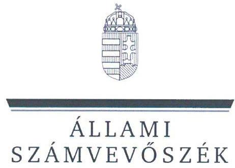
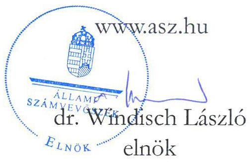
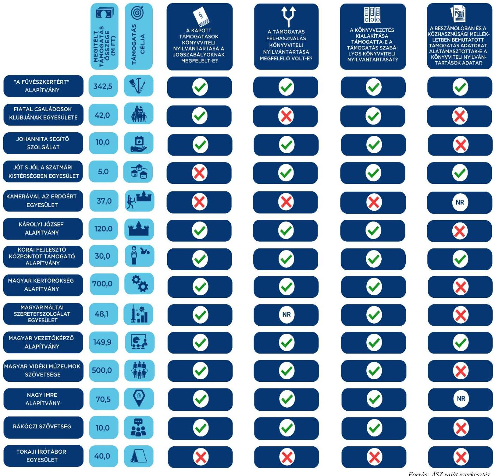

ÁLLAMI
SZÁMVEVŐSZÉK

# JELENTÉS 

Egyesületek és alapítványok államháztartásból kapott támogatásai könyvviteli nyilvántartásának ellenőrzése
2023.

23060
www.asz.hu

---

ÁLLAMI
SZÁMVEVŐSZÉK

# JELENTÉS 

## Egyesületek és alapítványok államháztartásból kapott támogatásai könyvviteli nyilvántartásának ellenőrzése

2023. 

23060

---

# ELLENŐRZÉSI IGAZGATÓSÁG: 

## ÁLLAMHÁZTARTÁSON KÍVÜLI SZERVEZETEKET ELLENŐRZŐ IGAZGATÓSÁG

## ELLENŐRZÉSI IGAZGATÓ:

## KLINGA LÁSZLÓ igazgató

## ELLENŐRZÉSVEZETŐ:

Jelentéseink az interneten a www.asz.hu címen olvashatók.

## SOLYMÁR ÁGNES ellenőrzésvezető

IKTATÓSZÁM: EL-3963-004/2023.
TÉMASZÁM: 2693
ELLENŐRZÉS-AZONOSÍTÓ SZÁM: V1037

---

# TARTALOMJEGYZÉK 

- AZ ELLENŐRZÉS ALAPADATAI ..... 5
- AZ ELLENŐRZÖTT SZERVEZETEK ..... 6
- ÖSSZEFOGLALÁS ..... 14
- AZ ELLENŐRZÉS FÓKUSZKÉRDÉSE ..... 16
- MEGÁLLAPÍTÁSOK ..... 17
- MELLÉKLETEK ..... 34
I. sz. melléklet: Értelmező szótár ..... 34
II. sz. melléklet: Az ellenőrzött szervezetek jegyzéke ..... 37
III. sz. melléklet: Ellenőrzési kritériumok ..... 38
- FÜGGELÉK: ÉSZREVÉTELEK ..... 39
- RÖVIDÍTÉSEK JEGYZÉKE ..... 40

---

.

---

# AZ ELLENŐRZÉS ALAPADATAI 

## AZ ELLENŐRZÉS CÉLJA

Az ellenőrzés célja annak ellenőrzése volt, hogy az ellenőrzött egyesületnél, alapítványnál a kiválasztott, államháztartási forrásból származó támogatás könyvviteli nyilvántartása szabályszerűen történt-e.

## AZ ELLENŐRZÉS TÍPUSA

Szabályszerűségi ellenőrzés.

## AZ ELLENŐRZÖTT IDŐSZAK

Az ellenőrzésre kiválasztott államháztartási támogatásra vonatkozó támogatási döntéstől / szerződéskötéstől 2023.06.14-ig, a helyszíni ellenőrzésről szóló értesítés keltéig tartó időszak.

## AZ ELLENŐRZÉS TÁRGYA

Az egyesületnél, illetve alapítványnál az ellenőrzésre kiválasztott államháztartási forrásból kapott támogatás könyvviteli nyilvántartását, ennek keretében a támogatásból származó bevétel-, valamint a támogatás felhasználás nyilvántartására vonatkozó jogszabályi előírások betartását ellenőriztük.

## AZ ELLENŐRZÉS JOGALAPJA

Az ellenőrzés jogalapját az ÁSZ tv. ${ }^{1} 1 . \int(3)$, valamint az 5. $\int(3)$ bekezdés előírásai képezték.

## AZ ELLENŐRZÉS MÓDSZERE

Az ellenőrzést az ellenőrzési program szempontjai, az ellenőrzött időszakban hatályos jogszabályok, előírások, az ellenőrzés általános szakmai szabályai, az ellenőrzésre irányadó ÁSZ ${ }^{2}$ ellenőrzési módszertan figyelembevételével végezte az ÁSZ. Az ellenőrzési kérdések megválaszolásához szükséges bizonyítékok megszerzése az ellenőrzött egyesület, alapítvány által rendelkezésre bocsátott dokumentumokra és adatokra alapozva, továbbá kérdésfeltevés (információkérés) útján történt. Az ellenőrzési bizonyítékként felhasznált adatforrások közé tartoztak egyrészt az ellenőrzéshez kért dokumentumok, adatforrások, másrészt minden az ellenőrzés folyamán feltárt, az ellenőrzés szempontjából információkat tartalmazó dokumentum.
Az ellenőrzés lefolytatásához az ellenőrzött szervezet a tanúsítvány kitöltésével, valamint az ÁSZ által kért dokumentumok, adatok, információk megküldésével szolgáltatott adatokat.

---

# AZ ELLENŐRZÖTT SZERVEZETEK 

Az ellenőrzésre 14 civil szervezet esetében került sor, melyek közül nyolc egyesületi, hat pedig alapítványi formában működött. Működéséről, vagyoni, pénzügyi és jövedelmi helyzetéről két egyesület és egy alapítvány Számv. tv. szerinti éves beszámolót, tíz ellenőrzött egyszerűsített éves beszámolót, egy egyesület pedig egyszerűsített beszámolót készített. A beszámolót 13 szervezet kettős könyvvezetéssel, egy szervezet pedig egyszeres könyvvitellel támasztotta alá. A 14 ellenőrzött szervezetből nyolc rendelkezett közhasznú jogállással. A Közbef. tv. ${ }^{3}$ előírása szerint tevékenysége és a 2022. évi számviteli beszámoló mérlegfőösszege alapján – mivel mérlegfőösszegük elérte a 20 millió forintot – 14 szervezet a közélet befolyásolására alkalmas tevékenységet végző szervezetnek minősült.
Az ellenőrzött szervezetek 2022. évi számviteli beszámolóik szerint mindösszesen 89 871,7 M Ft vagyonnal gazdálkodtak, tevékenységükhöz 35 442,9 M Ft támogatást számoltak el bevételként. A legnagyobb szervezet 77 961,6 M Ft, a legkisebb 51,2 M Ft értékű eszközállománnyal rendelkezett.
A hat alapítványnál és nyolc egyesületnél összesen 1 605,6 M Ft összegű támogatás számviteli nyilvántartásának ellenőrzésére került sor.

## "A FÜVÉSZKERTÉRT" ALAPÍTVÁNY

Az alapítványt 2005-ben egy magánszemély alapította. Alapító okirat szerinti célja többek között a „Füvészkert széleskörű (egyetemen kivüli, azaz nem egyetemi) oktató és ismeretterjesztő tevékenységének fejlesztése, támogatása, a Botanikus Kertnek, mint kulturális és természeti örökség egységes egészként történő megörzése messzemenő segítség nyújtás abban, hogy az ELTE Füvészkertje a Botanikus Kertek Nemzetközi Szervezetének a botanikus kertek számára előírt feladatait teljesítse" volt. Az alapítvány az ellenőrzött időszakban közhasznú jogállású szervezetként működött, irányítását 2023.02.14-től héttagú (azt megelőzően öttagú) kuratórium végezte. Az alapító a működés és gazdálkodás ellenőrzésére háromtagú felügyelőbizottságot hozott létre. Az alapítvány könyvvizsgálatra nem volt kötelezett, 2022. évre egyszerűsített éves beszámolót készített.

## AZ ELLENŐRZÖTT, ÁLLAMHÁZTARTÁSI FORRÁSBÓL KAPOTT TÁMOGATÁS BEMUTATÁSA

Támogatott szervezet megnevezése, "A Füvészkertért" Alapítvány, Budapest
székhelytelepülése
Támogatási program célja
Támogató megnevezése
Támogatás időtartama
Támogatási összeg
Támogatás típusa
A pénzügyi elszámolás határideje
Elszámolás a támogató szervezet felé

„ELTE Füvészkert (Huzella Kert) felújítása"
Miniszterelnökség, kezelő Bethlen Gábor Alapkezelő Zrt.
2021.12.01. - 2023.12.31.

342508080 Ft
vissza nem térítendő
2024.01.30.

Az ellenőrzött időszakban az alapítványnak nem volt a támogató szervezet felé elszámolási kötelezettsége.

---

# FIATAL CSALÁDOSOK KLUBJÁNAK EGYESÜLETE 

Az egyesületet 2014-ben hozták létre. Alapvető célja a „család, a bárátság, a gyermekszületés értékeinek bemutatása, népszerűsítése, a családok széleskörű támogatása, családvédelmi tevékenység, kiemelten a nők, asszonyok, családalapítás előtt állók összefogása, támogatása", a „fiatal családosok segítése abban, hogy véleményüket, tapasztalataikat és igényeiket a XXI. század kívánalmai szerinti társadalom felé kifejezzék, a családok egymást segítő, önszerveződő közöségeinek kialakítása" és segítése, „a családbarát civil érdekképviselet erősítése" volt. A közhasznú jogállással nem rendelkező egyesület legfőbb döntéshozó szerve a közgyűlés, ügyvezető szerve a három tagból álló elnökség volt. Az ellenőrzési feladatokat háromtagú felügyelőbizottság látta el. Az egyesület az ellenőrzött időszakban könyvvizsgálatra nem volt kötelezett, 2022. évre egyszerűsített éves beszámolót készített.

## AZ ELLENŐRZÖTT, ÁLLAMHÁZTARTÁSI FORRÁSBÓL KAPOTT TÁMOGATÁS BEMUTATÁSA

Támogatott szervezet megnevezése, Fiatal Családosok Klubjának Egyesülete, Székesfehérvár székhelytelepülése
Támogatási program célja A FICSAK által szervezett aktivitások és szolgáltatások támogatása
Támogató megnevezése Miniszterelnökség képviseletében a Tempus Közalapítvány - feladat jogutódja a Kulturális és Innovációs Minisztérium
Támogatás időtartama 2022.05.01. - 2023.04.30.
Támogatási összeg 42000000 Ft
Támogatás típusa vissza nem térítendő
A pénzügyi elszámolás határideje 2023.06.29.
Elszámolás a támogató szervezet felé Az egyesület az elszámolást az előírt határidőn belül benyújtotta, annak elbírálásáról a támogató szervezet az ellenőrzött időszakban tájékoztatást nem adott

## JOHANNITA SEGÍTŐ SZOLGÁLAT

Az egyesületet 1989-ben a Jeruzsálemi Ispotályos Lovagrend Magyar Tagozata hozta létre. Hivatása a „gyengék, elesettek, magányosak, szellemi- és testi rászorultak keresztény szellemben való erkölcsi és anyagi támogatása" volt, a „betegápolás, a szegénygondozás, szellemi képzés és a kulturális öntudat előmozdítása révén". Az egyesület hangsúlyt fektetett az ifjúság nevelésére, oktatására és az elsősegélynyújtás oktatására. A közhasznú jogállású egyesület ügyvezetési feladatait öttagú elnökség látta el. A működés és gazdálkodás ellenőrzésére három főből álló felügyelő szervet hoztak létre. Az egyesületnek az ellenőrzött időszakban könyvvizsgálati kötelezettsége nem volt, 2022. évre egyszerűsített éves beszámolót készített.

## AZ ELLENŐRZÖTT, ÁLLAMHÁZTARTÁSI FORRÁSBÓL KAPOTT TÁMOGATÁS BEMUTATÁSA

Támogatott szervezet megnevezése, Johannita Segítő Szolgálat, Budapest székhelytelepülése
Támogatási program célja A Szolgálat programjainak támogatása
Támogató megnevezése
Bethlen Gábor Alap - Bethlen Gábor Alapkezelő Zrt
Támogatás időtartama
2022.01.01. - 2022.12.31.
Támogatási összeg
10000000 Ft
Támogatás típusa
vissza nem térítendő
A pénzügyi elszámolás határideje
2023.01.30.

Elszámolás a támogató szervezet felé
Az egyesület az elszámolást az elszámolási határidő ellenére az ellenőrzési időszakban nem nyújtotta be.

---

# Jót S Jól a Szatmári Kistérségben Egyesület 

Az egyesületet 2007-ben, határozatlan időre alapították. Az egyesület célja többek között „egy olyan lokalitásra alapozott jóléti rendszer megvalósítására törekszik szociális szolgáltatások szervezésével, mely elősegíti és ösztönzi az emberi képességek kibontakozódását, az esélyegyenlőség megvalósulását és az életminőség javulását, egy biztonságot nyújtó szociális és természeti környezet védelmében". A közhasznú jogállású egyesület döntéshozó szerve a közgyűlés, ügyvezető szerve a négy tagból álló elnökség volt. A működés és gazdálkodás ellenőrzésére háromtagú felügyelőbizottságot hoztak létre. Az egyesület az ellenőrzött időszakban egyszerűsített éves beszámolót készített. A 2021-es üzleti évre könyvvizsgálati kötelezettsége nem volt, a 2022. évi egyszerűsített éves beszámoló vonatkozásában a jogszabályi előírások változása miatt már kötelezett volt könyvvizsgálatra, ennek ellenére a beszámolót könyvvizsgáló nem vizsgálta felül.

## AZ ELLENŐRZÖTT, ÁLLAMHÁZTARTÁSI FORRÁSBÓL KAPOTT TÁMOGATÁS BEMUTATÁSA

Támogatott szervezet megnevezése, Jót s Jól a Szatmári Kistérségben Egyesület, Géberjén székhelytelepülése
Támogatási program célja
Támogató megnevezése
Támogatás időtartama
Támogatási összeg
Támogatás típusa
A pénzügyi elszámolás határideje
Elszámolás a támogató szervezet felé

Vidéki életközösségek támogatása a „civil közösségi tevékenységek és feltételeinek támogatása" alprogram alapján.
Miniszterelnökség képviseletében a Bethlen Gábor Alapkezelő Nonprofit Zrt.
2021.01.01. - 2022.12.31.

5000000 Ft
vissza nem térítendő
2023.02.28.

Az egyesület az elszámolást határidőben benyújtotta, annak elbírálásáról a támogató szervezet az ellenőrzött időszakban tájékoztatást nem adott.

## KAMERÁVAL AZ ERDŐÉRT EGYESÜLET

Az egyesületet 2015. évben hozták létre. Célja „a környezet védelme, különös tekintettel a természetvédelmi értékekre, az erdőkre és a vizek védelmére. Az erdő és az ember szorosabb kapcsolatának megteremtése (rekreáció), szabadidő hasznos eltöltése, ökoturizmus elősegítése. Védett állat- és növényfajok megismertetése, megóvása. A magyar erdőkben található kilátók, pihenőhelyek, turistautak, tanösvények, történelmi emlékhelyek megismertetése. A civil társadalom területén eredményes társadalmi felelősségvállalás népszerűsítése. A civil társadalmi tevékenységek ifjúsággal való megismertetése, ezek közül is kiemelten az önkéntesség. A civil társadalom területén az önkéntes munka, valamint a mentálhigiénés oktatás népszerűsítése" volt. A közhasznú jogállással nem rendelkező egyesület legfőbb döntéshozó szerve a közgyűlés, operatív irányító szerve a három tagból álló elnökség volt. A működés és gazdálkodás ellenőrzését háromtagú felügyelőbizottság végezte. Az egyesület az ellenőrzött időszakban egyszerűsített éves beszámolót készített, könyvvizsgálatra nem volt kötelezett.

---

# AZ ELLENŐRZÖTT, ÁLLAMHÁZTARTÁSI FORRÁSBÓL KAPOTT TÁMOGATÁS BEMUTATÁSA 

| Támogatott szervezet megnevezése,   székhelytelepülése | Kamerával az Erdőért Egyesület, Budapest |
| :-- | :-- |
| Támogatási program célja | „Kastélytúra Ugron Zsolnával" |
| Támogató megnevezése | Miniszterelnökség - kezelő szervként a Bethlen Gábor Alapkezelő Nonprofit Zrt. |
| Támogatás időtartama | 2021.12.01. - 2023.03.31. |
| Támogatási összeg | 37000000 Ft |
| Támogatás típusa | vissza nem térítendő |
| A pénzügyi elszámolás határideje | 2023.04.30. |
| Elszámolás a támogató szervezet felé | Az egyesület az elszámolást határidőben benyújtotta, annak elbírálásáról a támogató   szervezet az ellenőrzött időszakban tájékoztatást nem adott. |

## KÁROLYI JÓZSEF ALAPÍTVÁNY

Az alapítványt 1994-ben vették nyilvántartásba. Célját képezte Magyarország európai és nemzetközi felzárkózásának elősegítése, képének ápolása egy nyitott Európa keretében, Károlyi József gondolatai szellemében; a fehérvárcsurgói Károlyi kastélyegyüttes műemléki helyreállítása és kulturális találkozó központtá alakítása. A közhasznú jogállású alapítvány ügyvezető szerve a háromtagú kuratórium volt. A működés és gazdálkodás ellenőrzésére háromtagú felügyelőbizottságot hoztak létre. Az alapítvány az ellenőrzött időszakban egyszerűsített éves beszámolót készített, könyvvizsgálatra nem volt kötelezett.

## AZ ELLENŐRZÖTT, ÁLLAMHÁZTARTÁSI FORRÁSBÓL KAPOTT TÁMOGATÁS BEMUTATÁSA

Támogatott szervezet megnevezése, Károlyi József Alapítvány, Fehérvárcsurgó székhelytelepülése
Támogatási program célja
Támogató megnevezése
Támogatás időtartama
Támogatási összeg
Támogatás típusa
A pénzügyi elszámolás határideje
Elszámolás a támogató szervezet felé

A fehérvárcsurgói Károlyi-kastély és Károly József Alapítvány folyamatban lévő kiemelt programjainak megvalósítása és hosszú távú céljainak elérése
Miniszterelnökség - kezelő szervként a Bethlen Gábor Alapkezelő Nonprofit Zrt.
2021.12.01. - 2022.12.31.

120000000 Ft
vissza nem térítendő
2023.01.30.

Az alapítvány az elszámolást határidőben benyújtotta, annak elbírálásáról a támogató szervezet az ellenőrzött időszakban tájékoztatást nem adott.

## Korai Fejlesztő Központot Támogató Alapítvány

Az alapítványt 2017. március 03-án négy magánszemély alapította határozatlan időtartamra. Céljaként került meghatározásra többek között a „0-6 éves korú, megszokottól eltérő fejlődésmenetű gyermekek életminőségének javítása korai fejlesztés segítségével; 5. életévüket betöltött, súlyosan mozgássérült, autista gyermekek fejlesztő nevelés biztosítása; fejlesztő iskola létrehozása; gyógypedagógiai óvoda működtetése". A közhasznú jogállású alapítvány ügyvezető szerve a hat főből álló kuratórium volt. Az alapítvány képviseletét a kuratórium elnöke önállóan látta el, akadályoztatása esetén a képviseletre két kurátor együttesen volt jogosult. A működés és gazdálkodás ellenőrzésére az alapítók háromtagú felügyelőbizottságot hoztak létre.
 Az alapítvány könyvvizsgálatra kötelezett szervezet, 2022. évi egyszerűsített éves beszámolóját könyvvizsgáló felülvizsgálta.

---

# AZ ELLENŐRZÖTT, ÁLLAMHÁZTARTÁSI FORRÁSBÓL KAPOTT TÁMOGATÁS BEMUTATÁSA 

Támogatott szervezet megnevezése, Korai Fejlesztő Központot Támogató Alapítvány, Budapest székhelytelepülése
Támogatási program célja
„0-3 éves korú eltérő fejlődésű csecsemők és kisgyermekek komplex diagnosztikai vizsgálata, mint a Budapest Korai Fejlesztő Központba forduló családok támogatásának kiindulópontja"
Támogató megnevezése
Miniszterelnökség képviseletében a Tempus Közalapítvány - feladat jogutódja Kulturális és Innovációs Minisztérium
Támogatás időtartama
2022.04.01. - 2023.07.31.
Támogatási összeg
30000000 Ft
Támogatás típusa
vissza nem térítendő
A pénzügyi elszámolás határideje
2023.09.30.
Elszámolás a támogató szervezet felé
Az ellenőrzött időszakban az alapítványnak nem volt a támogató szervezet felé elszámolási kötelezettsége.

## MAGYAR KERTŐRÖKSÉG ALAPÍTVÁNY

Az alapítványt 2021. évben alapították. Céljai között került meghatározásra „a magyar kultúra, különös tekintettel a kertkultúrára, a magyar történeti kertörökség keretein belüli örökség és a hozzákapcsolódó részének, táji örökség kutatása, megóvása, fejlesztése, közreműködés a fenntarthatóságának biztosítása érdekében; a magyar - Kárpát-medencében található - kertekkel kapcsolatos fejlesztésekkel, beruházásokkal, valamint a magyar történeti kertekkel összefüggésben megvalósult fejlesztések, beruházások fenntartásával, üzemeltetésével kapcsolatosan a szakmai szempontok maradéktalan érvényesítése." A közhasznú jogállással nem rendelkező alapítvány ügyvezető szerve a kilenetagú kuratórium volt, az ellenőrzési feladatokat háromtagú felügyelőbizottság látta el. Az alapítvány könyvvizsgálatra nem volt kötelezett, 2022. évre a Számv. tv. szerinti éves beszámolót készített.

## AZ ELLENŐRZÖTT, ÁLLAMHÁZTARTÁSI FORRÁSBÓL KAPOTT TÁMOGATÁS BEMUTATÁSA

Támogatott szervezet megnevezése, MAGYAR KERTŐRÖKSÉG Alapítvány, Budapest székhelytelepülése
Támogatási program célja
Támogató megnevezése
Támogatás időtartama
Támogatási összeg
Támogatás típusa
A pénzügyi elszámolás határideje
Elszámolás a támogató szervezet felé
Működési és közérdekű szakmai tevékenység ellátása
Építési és Beruházási Minisztérium
2022.09.15. - 2023.06.30.
700000000 Ft
vissza nem térítendő
2023.08.31.

Az ellenőrzött időszakban az alapítványnak nem volt a támogató szervezet felé elszámolási kötelezettsége.

## MAGYAR MÁLTAI SZERETETSZOLGÁLAT EGYESÜLET

Az egyesületet 1989. 02. 01-én vették nyilvántartásba. „Feladata, hogy segítséget nyújtson a szükségben lévőknek, betegeknek, öregeknek, fogyatékkal élőknek, hátrányos helyzetűeknek, hajléktalanoknak, szegregált közösségeknek, menekülteknek, zarándokoknak, valamint katasztrófák és háborús események áldozatainak, ezért a társadalom és az egyén közös érdekeinek kielégítésére irányuló tevékenységet fejt ki olyan személyek összefogásával, akik a római katolikus vallás és a Máltai Rend szellemében önkéntesen együttműködnek e feladatok teljesítésében". A közhasznú jogállású egyesület legfőbb döntéshozó szerve az országos küldöttgyűlés volt. Az egyesületnél a felügyelőbizottság jogszabályban meghatározott feladatainak ellátását, a gazdálkodás és az alapszabály szerinti működés ellenőrzését három főből

---

álló felügyelő szerv végezte. Az egyesület az ellenőrzött időszakban kötelezett volt könyvvizsgálatra, 2022. évi Számv. tv. szerinti éves beszámolóját könyvvizsgáló felülvizsgálta.

# AZ ELLENŐRZÖTT, ÁLLAMHÁZTARTÁSI FORRÁSRÓL KAPOTT TÁMOGATÁS BEMUTATÁSA 

Támogatott szervezet megnevezése, Magyar Máltai Szeretetszolgálat Egyesület, Budapest
székhelytelepülése
Támogatási program célja Az egészségügyi válsághelyzettel összefüggésben, a 2021. 11. 01. - 2021. 12. 31. közötti időszakban felmerült, a járványügyi helyzetből adódó többletköltségek utólagos megtérítése
Támogató megnevezése Emberi Erőforrások Minisztériuma - a feladat tekintetében jogutódja a Belügyminisztérium
Támogatás időtartama 2021.11.01. - 2022. 12.31.
Támogatási összeg 48146305 Ft
Támogatás típusa vissza nem térítendő
A pénzügyi elszámolás határideje 2023.02.28.
Elszámolás a támogató szervezet felé Az egyesület az elszámolást határidőben benyújtotta. A támogató szervezet jogutódja az elszámolás elfogadásáról tájékoztatta az egyesületet.

## MAGYAR VEZETŐKÉPZŐ ALAPÍTVÁNY

A zárt alapítványt 2020-ban egy magánszemély alapította. Céljaként került meghatározásra, hogy „elősegítse a keresztény szemléletű oktatási tevékenység megvalósulását, közreműködjön a keresztény tudatú gazdasági és egyéb képzések kialakításában, működtetésében, megvalósításában, közreműködjön nemzetközi oktatási és képzési programok megvalósításában Magyarországon". A közhasznú jogállású alapítvány felügyelőbizottság létrehozására nem volt kötelezett, ügyvezetését a kurátor végezte. Az alapítvány az ellenőrzött időszakban könyvvizsgálatra nem volt kötelezett, 2022. évre egyszerűsített éves beszámolót készített.

## AZ ELLENŐRZÖTT, ÁLLAMHÁZTARTÁSI FORRÁSRÓL KAPOTT TÁMOGATÁS BEMUTATÁSA

Támogatott szervezet megnevezése, Magyar Vezetőképző Alapítvány, Budapest
székhelytelepülése
Támogatási program célja Nemzetközi üzleti képzés létrehozásának előkészítése Magyarországon, Morus Vezetőképző Akadémia vezetői képzéseinek megvalósítása
Támogató megnevezése Miniszterelnökség kezelő szervként a Bethlen Gábor Alapkezelő Nonprofit Zrt.
Támogatás időtartama 2021.09.01. - 2022.12.31.
Támogatási összeg 149925037 Ft
Támogatás típusa vissza nem térítendő
A pénzügyi elszámolás határideje 2023.01.30.
Elszámolás a támogató szervezet felé Az alapítvány az elszámolást határidőben benyújtotta, annak elbírálásáról a támogató szervezet az ellenőrzött időszakban tájékoztatást nem adott.

---

# MAGYAR VIDÉKI MÚZEUMOK SZÖVETSÉGE 

Az egyesületet 2004-ben alapították. Céljaként határozták meg, hogy „a magyar múzeumok ügyét, társadalmi elismerését szolgálja a magyar múzeumügy fenntartása, ápolása és megújítása érdekében". A közhasznú jogállással nem rendelkező egyesület legfőbb döntéshozó szerve a közgyűlés volt, melyet a tagok összessége alkot, ügyintéző és képviseleti szerve a hattagú elnökség volt. Működését és gazdálkodását háromtagú felügyelőbizottság ellenőrizte. Az egyesület az ellenőrzött időszakban könyvvizsgálatra nem volt kötelezett, 2022. évre egyszerűsített éves beszámolót készített.

## AZ ELLENŐRZÖTT, ÁLLAMHÁZTARTÁSI FORRÁSBÓL KAPOTT TÁMOGATÁS BEMUTATÁSA

Támogatott szervezet megnevezése, Magyar Vidéki Múzeumok Szövetsége, Kecskemét székhelytelepülése
Támogatási program célja a „Háború és a gazdasági változások hatása a vidéki múzeumok megújulásának időszakára” témájú konferencia megrendezésére
Támogató megnevezése Nemzeti Kulturális Alap - Emberi Erőforrás Támogatáskezelő
Támogatás időtartama 2022.09.15. - 2022.12.30.
Támogatási összeg 500000 Ft
Támogatás típusa vissza nem térítendő
A pénzügyi elszámolás határideje 2023.01.16.
Elszámolás a támogató
Az egyesület az elszámolást határidőben benyújtotta. A támogató szervezet az szervezet felé elszámolás elfogadásáról tájékoztatta az egyesületet.

## NAGY IMRE ALAPÍTVÁNY

Az alapítványt 1990-ben egy magánszemély hozta létre. Alapító okiratban meghatározott célja „Nagy Imre emlékének megörzése Nagy Imre emlékszoba létesítésével; Nagy Imre tudományos és politikai munkái kiadásának elősegítésével; díjak, jutalom odaítélésével, hazai és külföldi írók, újságírók, politikusok, tudósok, kutatók és művészek részére, akik Nagy Imre szellemében tevékenykednek díjak, jutalom odaítélése". A közhasznú jogállással nem rendelkező alapítvány kezelője és legfőbb döntéshozó szerve a nyolcetagú kuratórium volt. Képviseletére külön-külön, önállóan, és teljeskörűen az elnök és egy, az alapító okiratban kijelölt kuratóriumi tag volt jogosult. Az alapítvány felügyelőbizottság létrehozására nem volt kötelezett. Az ellenőrzött időszakban a jogszabályi előírások alapján könyvvizsgálati kötelezettsége nem volt, 2022. évre egyszerűsített éves beszámolót készített.

## AZ ELLENŐRZÖTT, ÁLLAMHÁZTARTÁSI FORRÁSBÓL KAPOTT TÁMOGATÁS BEMUTATÁSA

Támogatott szervezet megnevezése, Nagy Imre Alapítvány, Budapest székhelytelepülése
Támogatási program célja
Támogató megnevezése
Támogatás időtartama
Támogatási összeg
Támogatás típusa
A pénzügyi elszámolás határideje
Elszámolás a támogató
szervezet felé
Nagy Imre Emlékház és Kutatóközpont működése, valamint a Nagy Imre Társaság 2022. évi működésének támogatására ( $45,5 \mathrm{M} \mathrm{Ft}$ ), Nagy Imre Emlékház állandó kiállítás technikai feltételeinek javítása, interaktív asztalok korszerűsítése ( 25 M Ft )

Magyar Tudományos Akadémia
2022.01.01. - 2022.12.31.

70500000 Ft
vissza nem térítendő
2023.02.28.

Az alapítvány az elszámolást határidőben benyújtotta, annak elbírálásáról a támogató szervezet az ellenőrzött időszakban tájékoztatást nem adott.

---

# RÁKÓCZI SZÖVETSÉG 

Az egyesület 1989-ben alakult. Céljai között szerepelt, hogy „folyamatosan tájékoztassa a hazai és a nemzetközi közvéleményt a Kárpát-medencei magyarság, különösen a felvidéki (Szlovákia) és a kárpátaljai (Ukrajna) magyarság életének eseményeiről és ébren tartsa az érdeklődést a kisebbségi magyarság sorsa iránt; segítse a Kárpát-medencei magyarság oktatási, kulturális és közművelődési tevékenységét, valamint ösztöndíjat adományozzon; érdekvédelmet és jogi tanácsadó szolgáltatást nyújtson a Kárpát-medencében a szülőföldjükről kitelepített, vagy menekülni kényszerült magyar embereknek és mindazoknak, akik magyarságuk miatt jogsérelemet szenvedtek". Az egyesület ügyvezető szerve a kilenctagú elnökség volt, működését és gazdálkodását öttagú felügyelőbizottság ellenőrizte. Az egyesület az ellenőrzött időszakban kötelezett volt könyvvizsgálatra, 2022. évi Számv. tv. szerinti éves beszámolóját könyvvizsgáló felülvizsgálta.

| AZ ELLENŐRZÖTT, ÁLLAMHÁZTARTÁSI FORRÁSBÓL KAPOTT TÁMOGATÁS BEMUTATÁSA |  |
| :--: | :--: |
| Támogatott szervezet   székhelytelepülése | megnevezése, Rákóczi Szövetség, Budapest |
| Támogatási program célja | „Középiskolás Vezetői Fórum" elnevezésű program megvalósítása |
| Támogató megnevezése | Miniszterelnöki Kabinetiroda |
| Támogatás időtartama | 2022.02.01. - 2022.04.30. |
| Támogatási összeg | 10000000 Ft |
| Támogatás típusa | vissza nem térítendő |
| A pénzügyi elszámolás határideje | 2022.06.30. |
| Elszámolás a támogató   szervezet felé | Az egyesület az elszámolást határidőben benyújtotta. A támogató szervezet az elszámolás elfogadásáról tájékoztatta az egyesületet. |

## TOKAJI ÍRÓTÁBOR EGYESÜLET

Az egyesület 2020-ban jött létre hajdúböszörményi székhellyel. „Célja, állandó fórumot teremtsen az egyetemes magyar irodalom számára", továbbá „Az Egyesület céljai közé tartozik, a határon túli, hátrányos helyzetű írók támogatása, nyári táboroztatása". A közhasznú jogállással nem rendelkező egyesület legfőbb döntéshozó szerve a közgyűlés, ügyvezető szerve a három főből álló elnökség volt. Az egyesület ügyeinek vitelére, harmadik személyekkel szembeni képviseletére ügyvezető titkárt bíztak meg. Felügyelőbizottság létrehozására az egyesület nem volt kötelezett. Könyvvizsgálati kötelezettsége az ellenőrzött időszakban nem volt. Az egyesület a 2022. évi gazdálkodásáról egyszerűsített beszámolót készített, melyet egyszeres könyvvezetéssel támasztott alá.

| AZ ELLENŐRZÖTT, ÁLLAMHÁZTARTÁSI FORRÁSBÓL KAPOTT TÁMOGATÁS BEMUTATÁSA |  |
| :--: | :--: |
| Támogatott szervezet   székhelytelepülése | megnevezése, Tokaji Írótábor Egyesület, Hajdúböszörmény |
| Támogatási program célja | Az 50. alkalommal megrendezésre kerülő Tokaji Írótábor megvalósítása |
| Támogató megnevezése | Nemzeti Kulturális Alap - Emberi Erőforrás Támogatáskezelő |
| Támogatás időtartama | 2022.06.22. - 2022.10.07. |
| Támogatási összeg | 40000000 Ft |
| Támogatás típusa | vissza nem térítendő |
| A pénzügyi elszámolás határideje | 2022.10.24. |
| Elszámolás a támogató szervezet felé | Az egyesület az elszámolást határidőben benyújtotta. A támogató szervezet az elszámolás elfogadásáról tájékoztatta az egyesületet. |

---

# ÖSSZEFOGLALÁS 

Az ellenőrzött 14 civil szervezetből 12 szervezet könyvvezetési rendszerének kialakítása megfelelően támogatta az államháztartásból származó ellenőrzött támogatások szabályszerű könyvviteli nyilvántartását, biztosította a közpénzek felhasználásának ellenőrizhetőségét. Az ellenőrzés két szervezetnél tárta fel azt a hibát, hogy könyvvezetési rendszerét nem a vonatkozó jogszabályok előírásai szerint alakította ki, ezáltal a közpénz felhasználás ellenőrizhetőségét nem biztosította.

11 ellenőrzött szervezet az államháztartási forrásból kapott támogatást megfelelően, a jogszabályi előírások szerint, elkülönítve tartotta nyilván. Egy szervezet a fejlesztési célra kapott támogatás elszámolásakor nem vette figyelembe a számvitelről szóló törvény időbeli elhatárolásra vonatkozó előírásait, a fejlesztési célra, visszafizetési kötelezettség nélkül kapott támogatást a passzív időbeli elhatárolások között nem mutatta ki. Az időbeli elhatárolás alkalmazásának hiányában a költséggel nem ellentételezett, bevételként elszámolt támogatás torzította a szervezet tárgyévi eredményét. További két ellenőrzött szervezet a törvényi előírásokat megsértve nem az előírt részletezésben mutatta ki az államháztartási forrásból kapott támogatást.

Az államháztartási forrásból kapott támogatás felhasználását 10 szervezet a könyvviteli rendszerében a jogszabályi előírások szerint tartotta nyilván. Egy szervezet esetében az ellenőrzésre kijelölt támogatás lehetővé tette a támogatás folyósítását megelőző év beszámolóval lezárt időszakában felmerült költségek elszámolását, emiatt a támogatás felhasználás könyvviteli nyilvántartása jogszabályi előírásoknak való megfelelése nem került értékelésre. Két szervezet a jogszabályok előírásai ellenére az államháztartási forrásból kapott támogatás felhasználásáról nem vezetett olyan számviteli nyilvántartást, amelynek alapján megállapítható és ellenőrizhető a kapott támogatás felhasználása. Egy szervezet a támogatás felhasználásának elszámolásakor nem alkalmazta következetesen az elkülönített nyilvántartás érdekében a könyvviteli nyilvántartási rendszerében kialakított munkaszámos elkülönítést.

Az ellenőrzött 14 szervezet közül két szervezetnek jogszabályi előírás hiányában nem volt a támogatás felhasználására vonatkozóan a 2022. évi beszámolóban tájékoztatási kötelezettsége. Négy szervezet közpénzfelhasználásra vonatkozó tájékoztatása megfelelt a jogszabályi előírásoknak. Nyolc szervezet nem megfelelően tájékoztatta a közvéleményt az ellenőrzött támogatás felhasználásáról, mert nem biztosította a közpénzek felhasználására vonatkozó gazdálkodása nyilvánosságát, ezáltal sérült a közpénzkezelés Alaptörvényben ${ }^{4}$ rögzített
 átláthatóságának elve. Közülük egy szervezet a törvényi előírás ellenére az egyszerűsített éves beszámoló részeként nem készített kiegészítő mellékletet, a közhasznúsági melléklet pedig nem felelt meg a törvényi előírásainak. További két szervezet esetében nem a törvények előírásai szerint tartalmazta a kiegészítő melléklet az államháztartási forrásból kapott támogatás felhasználásának bemutatását. További két szervezet a Számv. tv. ${ }^{5}$ szerinti éves beszámoló kiegészítő mellékletének elkészítése során nem tett eleget a jogszabályok támogatás felhasználás bemutatására vonatkozó előírásainak. További három civil szervezet közhasznúsági melléklete nem felelt meg a jogszabályi előírásoknak. Az ellenőrzési megállapításokhoz kapcsolódóan, a feltárt hiányosságok megszüntetésére 10 szervezet vezetőjének, összesen 17 javaslatot tettünk.

A fentiekben bemutatott megállapítások ellenőrzött szervezetenkénti megjelenését az 1. ábra szemlélteti.

---

# FŐBB ELLENŐRZÉSI TAPASZTALATOK 

---

# AZ ELLENŐRZÉS FÓKUSZKÉRDÉSE 

1- Szabályszerű volt-e az egyesület/alapítvány államháztartási forrásból kapott támogatásának könyvviteli nyilvántartása?

---

# 1. "A Füvészkertért" Alapítvány 

## Összegző megállapítás "A Füvészkertért" Alapítvány államháztartási forrásból kapott támogatásának könyvviteli nyilvántartása szabályszerű volt.

## A kapott támogatás könyvviteli nyilvántartása

Az alapítvány könyvvezetési rendszerében a (főkönyvi és analitikus nyilvántartások) az államháztartási forrásból kapott, bevételként elszámolt támogatást - főkönyvi számla alábontásával, alszámla használatával és munkaszám alkalmazásával - az Eszkr. ${ }^{6}$-ben és a Civil tv. ${ }^{7}$-ben előírtak szerint, elkülönítetten mutatta ki.

## A támogatás felhasználásának könyvviteli nyilvántartása

Az alapítvány az Eszkr.-ben és a Civil tv.-ben előírtakat betartva könyvvezetési rendszerében munkaszám használatával - az államháztartási forrásból, az alapcél szerinti tevékenysége költségei, ráfordításai ellentételezésére visszafizetési kötelezettség nélkül kapott támogatás felhasználását elkülönítetten tartotta nyilván, továbbá a felhasználás számviteli nyilvántartása során figyelembe vette a támogatói okirat előírásait.

A szervezet könyvvezetésének kialakítása, keretrendszere a támogatás könyvviteli nyilvántartásának szabályossága tükrében

Az alapítvány könyvvezetési, nyilvántartási rendszerét az Eszkr., és a Civil tv. előírásai szerint alakította ki, biztosítva ezzel az az alapcél szerinti tevékenysége költségei, ráfordításai ellentételezésére visszafizetési kötelezettség nélkül kapott támogatás és annak felhasználása elkülönített kimutatását.

A szervezet számviteli beszámolójában, közhasznúsági mellékletében a támogatással kapcsolatban bemutatott adatok könyvviteli nyilvántartásban elszámolt adatokkal történő alátámasztottsága

A közhasznú jogállású alapítvány könyvvezetését és nyilvántartását az Eszkr.-ben és a Civil tv. rögzített előírások szerint alakította ki, biztosította a 2022. évi egyszerűsített éves beszámoló kiegészítő mellékletében a Civil tv.-ben előírtaknak megfelelően bemutatott adatok alátámasztását.

---

# 2. Fiatal Családosok Klubjának Egyesülete 

Összegző megállapítás A Fiatal Családosok Klubjának Egyesülete az államháztartási forrásból kapott támogatás könyvviteli nyilvántartási rendszerét szabályszerűen kialakította, de 2022-ben az ellenőrzött támogatás felhasználását nem a jogszabályi előírások szerint tartotta nyilván. A 2022. évi közhasznúsági mellékletben a cél szerint juttatásokat nem a jogszabályi előírásoknak megfelelően mutatta be.

## A kapott támogatás könyvviteli nyilvántartása

Az egyesület könyvvezetési rendszerében a (főkönyvi és analitikus nyilvántartások) az államháztartási forrásból kapott, bevételként elszámolt támogatást - főkönyvi számla alábontásával, alszámla használatával és munkaszám alkalmazásával - az Eszkr.-ben és a Civil tv.-ben előírtak szerint, elkülönítetten mutatta ki.

## A támogatás felhasználásának könyvviteli nyilvántartása

Az egyesület a számviteli nyilvántartási rendszerében az „EG-00007-001/2022 és Tempus22" munkaszámot alkalmazta az ellenőrzött, az alapcél szerinti tevékenysége költségei, ráfordításai ellentételezésére kapott támogatás felhasználásának nyilvántartására. Az egyesület 2022. évben a Civil tv. 20. § (4) bekezdés előírása ellenére az államháztartási forrásból kapott támogatás felhasználásáról nem vezetett olyan számviteli nyilvántartást, amelynek alapján megállapítható és ellenőrizhető a kapott támogatás felhasználása, mivel a támogatás elkülönítésére szolgáló munkaszámot a támogató felé történt elszámolásban feltüntetett hat tétel, összesen 753130 Ft esetében nem alkalmazta.

## A szervezet könyvvezetésének kialakítása, keretrendszere a támogatás könyvviteli nyilvántartásának szabályossága tükrében

Az egyesület könyvvezetési, nyilvántartási rendszerét az Eszkr. és a Civil tv. előírásai szerint alakította ki, biztosítva ezzel az alapcél szerinti tevékenysége költségei, ráfordításai ellentételezésére visszafizetési kötelezettség nélkül kapott támogatás és annak felhasználása elkülönített kimutatásának lehetőségét.

A szervezet számviteli beszámolójában, közhasznúsági mellékletében a támogatással kapcsolatban bemutatott adatok könyvviteli nyilvántartásban elszámolt adatokkal történő alátámasztottsága

A 2022. évre vonatkozó közhasznúsági melléklet 5. pontjában a Civil tv. 29. § (7) bekezdése előírása szerinti cél szerinti juttatások kimutatása az ellenőrzött támogatás teljes összegét tartalmazta. Az egyesület 2022. évben nem használta fel a támogatás teljes összegét, továbbá a szervezet működésével kapcsolatban felmerült költségek nem minősülnek a Civil tv. 2. § 4. pontjában meghatározott cél szerinti juttatásnak, nem képeztek a civil szervezet által, az alaptevékenysége keretében nyújtott pénzbeli vagy nem pénzbeli szolgáltatást. Az egyesület nem közhasznú jogállású szervezet, 2022. évre egyszerűsített éves beszámolót készített, ezáltal részére sem a Civil tv. sem a Számv. tv. nem határoz meg előírást a támogatási program keretében végleges jelleggel felhasznált összegek kiegészítő mellékletben történő bemutatására vonatkozóan.

---

# 3. Johannita Segítő Szolgálat 

| Összegző megállapítás | A Johannita Segítő Szolgálat államháztartási forrásból kapott   támogatásának könyvviteli nyilvántartása szabályszerű volt.   A 2022. évi egyszerűsített éves beszámoló kiegészítő   mellékletét nem a jogszabályi előírásoknak megfelelően   készítette el. |
| :-- | :-- |

## A kapott támogatás könyvviteli nyilvántartása

Az egyesület könyvvezetési rendszerében a (főkönyvi és analitikus nyilvántartások) az elkülönített állami pénzalapból, mint államháztartási forrásból kapott, bevételként elszámolt támogatást - főkönyvi számla alábontásával, alszámla használatával - az Eszkr.-ben és a Civil tv. -ben előírtak szerint, elkülönítetten mutatta ki.

## A támogatás felhasználásának könyvviteli nyilvántartása

Az egyesület az Eszkr.-ben és a Civil tv.-ben előírtakat betartva könyvvezetési rendszerében - munkaszám használatával - az államháztartási forrásból kapott támogatás felhasználását elkülönítetten tartotta nyilván, továbbá a felhasználás számviteli nyilvántartása során figyelembe vette a támogatói okirat előírásait.

A szervezet könyvvezetésének kialakítása, keretrendszere a támogatás könyvviteli nyilvántartásának szabályossága tükrében

Az egyesület könyvvezetési, nyilvántartási rendszerét az Eszkr., és a Civil tv. előírásai szerint alakította ki, biztosítva ezzel az alapcél szerinti tevékenysége költségei, ráfordításai ellentételezésére visszafizetési kötelezettség nélkül kapott támogatás és annak felhasználása elkülönített kimutatásának lehetőségét.

A szervezet számviteli beszámolójában, közhasznúsági mellékletében a támogatással kapcsolatban bemutatott adatok könyvviteli nyilvántartásban elszámolt adatokkal történő alátámasztottsága

A közhasznú egyesület 2022. évi egyszerűsített éves beszámolójának kiegészítő melléklete a Civil tv. 29. § (4) bekezdés előírása ellenére nem tartalmazta a támogatási program keretében végleges jelleggel felhasznált összeg bemutatását.

---

# 4. Jót s Jól a Szatmári Kistérségben Egyesület 

Összegző megállapítás A Jót s Jól a Szatmári Kistérségben Egyesület az államháztartási forrásból kapott támogatás könyvviteli nyilvántartását szabályszerűen kialakította. Az ellenőrzött támogatást 2022-ben bevételként nem a jogszabályi előírások szerint számolta el.

## A kapott támogatás könyvviteli nyilvántartása

Az egyesület könyvvezetési rendszerében a (főkönyvi és analitikus nyilvántartások) az államháztartási forrásból kapott, bevételként elszámolt támogatást - főkönyvi számla alábontásával, alszámla használatával és munkaszám alkalmazásával - az Eszkr.-ben és a Civil tv. -ben előírtak szerint, elkülönítetten mutatta ki. A fejlesztési célra kapott támogatás (5 M Ft) 2022-ben bevételként számolta el, azt halasztott bevételként a Számv. tv. 45. § (1) bekezdés a) pont előírása ellenére a passzív időbeli elhatárolások között nem mutatta ki. Az időbeli elhatárolás hiánya miatt - a fejlesztési célú támogatásnak nem a jogszabályi előírások szerinti elszámolásával - sérült a Számv. tv. 15. § (7) bekezdése szerinti összemérés elve és a Számv. tv. 16. § (2) bekezdése szerinti időbeli elhatárolás elve.

## A támogatás felhasználásának könyvviteli nyilvántartása

Az egyesület az Eszkr.-ben és a Civil tv.-ben előírtakat betartva könyvvezetési rendszerében - munkaszám használatával - az államháztartási forrásból kapott vissza nem térítendő támogatás felhasználását elkülönítetten tartotta nyilván, továbbá a felhasználás számviteli nyilvántartása során figyelembe vette a támogatói okirat előírásait.

A szervezet könyvvezetésének kialakítása, keretrendszere a támogatás könyvviteli nyilvántartásának szabályossága tükrében

Az egyesület könyvvezetési, nyilvántartási rendszerét az Eszkr., és a Civil tv. előírásai szerint alakította ki, biztosítva ezzel a támogatási program keretében visszafizetési kötelezettség nélkül kapott fejlesztési célú támogatás és annak felhasználása elkülönített kimutatását.

A szervezet számviteli beszámolójában, közhasznúsági mellékletében a támogatással kapcsolatban bemutatott adatok könyvviteli nyilvántartásban elszámolt adatokkal történő alátámasztottsága

A közhasznú jogállású egyesület könyvvezetését és nyilvántartását az Eszkr.-ben és a Civil tv. rögzített előírások szerint alakította ki, biztosította a 2022. évi egyszerűsített éves beszámoló kiegészítő mellékletében a Civil tv.-ben előírtaknak megfelelően bemutatott adatok alátámasztását.

---

# 5. Kamerával az Erdőért Egyesület 

Összegző megállapítás A Kamerával az Erdőért Egyesület 2021-2022-ben könyvvezetési, nyilvántartási rendszerét nem a jogszabályi előírások szerint alakította ki. Az államháztartási forrásból kapott támogatásának könyvviteli nyilvántartása nem volt szabályszerű.

## A kapott támogatás könyvviteli nyilvántartása

Az egyesület könyvvezetési rendszerében a (főkönyvi és analitikus nyilvántartások) 2021-ben a bevételként elszámolt támogatás kimutatása során nem tartott be a Civil tv. 20. § (3) bekezdés előírásait, mivel az államháztartási forrásból kapott támogatást nem az előírt részletezésben mutatta ki, mert nyilvántartásában nem részletezte, hogy az ellenőrzött támogatás a központi költségvetésből kapott támogatás volt.

## A támogatás felhasználásának könyvviteli nyilvántartása

Az egyesület 2022-ben az Eszkr. 14. § (1) bekezdése és a Civil tv. 20. § (4) bekezdése előírása ellenére az államháztartási forrásból kapott támogatás felhasználásáról nem vezetett olyan elkülönített számviteli nyilvántartást, amelynek alapján megállapítható és ellenőrizhető a kapott támogatás felhasználása.

## A szervezet könyvvezetésének kialakítása, keretrendszere a támogatás könyvviteli nyilvántartásának szabályossága tükrében

Az egyesület az Eszkr. 14. § (1) bekezdése előírásai ellenére a könyvvezetési, nyilvántartási rendszerének kialakítása során 2021-ben nem vette figyelembe a Civil tv. 20. § (3) bekezdése alapcél szerinti tevékenysége tekintetében a bevételek elkülönített kimutatására, valamint 2022-ben a Civil tv. 20. § (4) bekezdése elkülönített számviteli nyilvántartás vezetésére vonatkozó előírásait, mert az egyesület nem alakította ki az alapcél szerinti tevékenysége bevételei valamint költségei, ráfordításai ellentételezésére visszafizetési kötelezettség nélkül kapott támogatás felhasználásának elkülönített nyilvántartása lehetőségét.

A szervezet számviteli beszámolójában, közhasznúsági mellékletében a támogatással kapcsolatban bemutatott adatok könyvviteli nyilvántartásban elszámolt adatokkal történő alátámasztottsága

Az egyesület nem közhasznú jogállású szervezet, egyszerűsített éves beszámolót készített, ezáltal részére sem a Civil tv. sem a Számv. tv. nem határoz meg előírást a támogatási program keretében végleges jelleggel felhasznált összegek kiegészítő mellékletben történő bemutatására vonatkozóan.

---

# 6. Károlyi József Alapítvány 

Összegző megállapítás A Károlyi József Alapítvány államháztartási forrásból kapott támogatásának könyvviteli nyilvántartása szabályszerű volt. A 2022. évi egyszerűsített éves beszámoló részeként kiegészítő mellékletet nem készített, a közhasznúsági melléklet nem felelt meg a jogszabályi előírásoknak.

## A kapott támogatás könyvviteli nyilvántartása

Az alapítvány könyvvezetési rendszerében a (főkönyv/analitikus nyilvántartások) az államháztartási forrásból kapott, bevételként elszámolt támogatást - főkönyvi számla alábontásával, alszámla használatával - az Eszkr.-ben és a Civil tv. -ben előírtak szerint, elkülönítetten mutatta ki.

## A támogatás felhasználásának könyvviteli nyilvántartása

Az alapítvány az Eszkr.-ben és a Civil tv.-ben előírtakat betartva könyvvezetési rendszerében - főkönyvi számlák alábontásával, alszámlák használatával - az államháztartási forrásból kapott támogatás felhasználását elkülönítetten tartotta nyilván, továbbá a felhasználás számviteli nyilvántartása során figyelembe vette a támogatói okirat előírásait.

A szervezet könyvvezetésének kialakítása, keretrendszere a támogatás könyvviteli nyilvántartásának szabályossága tükrében

Az alapítvány könyvvezetési, nyilvántartási rendszerét az Eszkr., és a Civil tv. előírásai
 szerint alakította ki, biztosítva ezzel az alapcél szerinti tevékenysége költségeinek, ráfordításainak ellentételezésére visszafizetési kötelezettség nélkül kapott támogatás és annak felhasználása elkülönített kimutatásának lehetőségét.

A szervezet számviteli beszámolójában, közhasznúsági mellékletében a támogatással kapcsolatban bemutatott adatok könyvviteli nyilvántartásban elszámolt adatokkal történő alátámasztottsága

A közhasznú jogállású alapítvány a 2022. évi egyszerűsített éves beszámolójának részeként az Eszkr. 7. § (6) bekezdés, valamint a Civil tv. 29. § (2) bekezdés c) pont előírásai ellenére kiegészítő mellékletet nem készített. Az alapítvány a 2022. év vonatkozásában a Civil tv. 29. § (4) bekezdése előírása ellenére az ellenőrzött támogatási program keretében végleges jelleggel felhasznált összeget nem mutatta be. A 2022. évre vonatkozó közhasznúsági melléklet 5. pontjában a Civil tv. 29. § (7) bekezdése előírásai szerinti cél szerinti juttatások kimutatása az ellenőrzött támogatásból megvalósult eszköz 2022. évi értékcsökkenésének összegét tartalmazta. Az ellenőrzött támogatásból a fejlesztéshez kapcsolódó amortizáció költségei nem minősülnek a Civil tv. 2. § 4. pontjában meghatározott cél szerinti juttatásnak, nem képeztek a civil szervezet által, az alaptevékenysége keretében nyújtott pénzbeli vagy nem pénzbeli szolgáltatást.

---

# 7. Korai Fejlesztő Központot Támogató Alapítvány 

## Összegző megállapítás A Korai Fejlesztő Központot Támogató Alapítvány államháztartási forrásból kapott támogatásának könyvviteli nyilvántartása szabályszerű volt.

## A kapott támogatás könyvviteli nyilvántartása

Az alapítvány könyvvezetési rendszerében a (főkönyvi és analitikus nyilvántartások) az államháztartási forrásból kapott, előlegként elszámolt támogatást - főkönyvi számlák alábontásával, alszámlák használatával, az alszámlák támogatói okirat iktatószámát és összegét tartalmazó megnevezésével - az Eszkr.-ben és a Civil tv.-ben előírtak szerint, elkülönítetten mutatta ki.

## A támogatás felhasználásának könyvviteli nyilvántartása

Az alapítvány az Eszkr.-ben és a Civil tv.-ben előírtakat betartva könyvvezetési rendszerében - főkönyvi számla alábontásával, alszámla használatával, az alszámla támogatói okirat iktatószámát tartalmazó megnevezésével - az államháztartási forrásból kapott támogatás felhasználását elkülönítetten tartotta nyilván, továbbá a felhasználás számviteli nyilvántartása során figyelembe vette a támogatói okirat előírásait.

A szervezet könyvvezetésének kialakítása, keretrendszere a támogatás könyvviteli nyilvántartásának szabályossága tükrében

Az alapítvány könyvvezetési, nyilvántartási rendszerét az Eszkr., és a Civil tv. előírásai szerint alakította ki, biztosítva ezzel az alapcél szerinti tevékenysége költségeinek, ráfordításainak ellentételezésére visszafizetési kötelezettség nélkül kapott támogatás és annak felhasználása elkülönített kimutatását.
A szervezet számviteli beszámolójában, közhasznúsági mellékletében a támogatással kapcsolatban bemutatott adatok könyvviteli nyilvántartásban elszámolt adatokkal történő alátámasztottsága

A közhasznú jogállású alapítvány könyvvezetését és nyilvántartását az Eszkr.-ben és a Civil tv. rögzített előírások szerint alakította ki, biztosította a 2022. évi egyszerűsített éves beszámoló kiegészítő mellékletében a Civil tv.-ben előírtaknak megfelelően bemutatott adatok alátámasztását.

---

# 8. MAGYAR KERTÖRÖKSÉG Alapítvány 

## Összegző megállapítás

A MAGYAR KERTÖRÖKSÉG Alapítvány államháztartási forrásból kapott támogatásának könyvviteli nyilvántartása szabályszerű volt. A 2022. évi Számv. tv. szerinti éves beszámoló kiegészítő mellékletét nem a jogszabályi előírásoknak megfelelően készítette el.

## A kapott támogatás könyvviteli nyilvántartása

Az alapítvány könyvvezetési rendszerében a (főkönyvi és analitikus nyilvántartások) az államháztartási forrásból kapott, előlegként elszámolt támogatást - főkönyvi számla alábontásával, alszámla használatával és finanszírozási kód alkalmazásával - az Eszkr.-ben és a Civil tv.-ben előírtak szerint, elkülönítetten mutatta ki.

## A támogatás felhasználásának könyvviteli nyilvántartása

Az alapítvány az Eszkr.-ben és a Civil tv.-ben előírtakat betartva könyvvezetési rendszerében finanszírozási kód használatával - az államháztartási forrásból kapott támogatás felhasználását elkülönítetten tartotta nyilván, továbbá a felhasználás számviteli nyilvántartása során figyelembe vette a támogatói okirat előírásait.

A szervezet könyvvezetésének kialakítása, keretrendszere a támogatás könyvviteli nyilvántartásának szabályossága tükrében

Az alapítvány könyvvezetési, nyilvántartási rendszerét az Eszkr., és a Civil tv. előírásai szerint alakította ki, biztosítva ezzel az alapcél szerinti tevékenysége költségeinek, ráfordításainak ellentételezésére visszafizetési kötelezettség nélkül kapott támogatás és annak felhasználása elkülönített kimutatásának lehetőségét.

A szervezet számviteli beszámolójában, közhasznúsági mellékletében a támogatással kapcsolatban bemutatott adatok könyvviteli nyilvántartásban elszámolt adatokkal történő alátámasztottsága

A közhasznú jogállással nem rendelkező alapítvány 2022. évi Számv. tv. szerinti éves beszámolójának kiegészítő melléklete a Számv. tv. 93. § (3) bekezdésének előírásai ellenére nem tartalmazta a támogatási program keretében végleges jelleggel kapott összegek támogatásonkénti, valamint annak felhasználása bemutatását jogcímenkénti összegben.

---

# 9. Magyar Máltai Szeretetszolgálat Egyesület 

## Összegző megállapítás

A Magyar Máltai Szeretetszolgálat Egyesület államháztartási forrásból kapott támogatásának könyvviteli nyilvántartása szabályszerű volt. A 2022. évi Számv. tv. szerinti éves beszámoló kiegészítő mellékletét nem a jogszabályi előírásoknak megfelelően készítette el.

## A kapott támogatás könyvviteli nyilvántartása

Az egyesület könyvvezetési rendszerében a (főkönyvi és analitikus nyilvántartások) az államháztartási forrásból kapott, bevételként elszámolt támogatást - főkönyvi számla alábontásával, alszámla használatával és forráskód alkalmazásával - az Eszkr.-ben és a Civil tv. -ben előírtak szerint, elkülönítetten mutatta ki.

## A támogatás felhasználásának könyvviteli nyilvántartása

Az egyesület részére az ellenőrzés tárgyát képző támogatást az egészségügyi válsághelyzettel összefüggésben 2021. 11. 01. - 2021. 12. 31. közötti időszakban felmerült járványügyi helyzetből adódó többletköltségek utólagos megtérítése céljából folyósították 2022. 05. 31. napján. Az Eszkr.-ben és a Civil tv.-ben előírt elkülönített nyilvántartására vonatkozó kötelezettség a Ptk. ${ }^{8}$ kötelemre és szerződésre vonatkozó előírásaiból következően a támogatói okirat 2022. 05. 24-én történt aláírását követően felmerült támogatás felhasználáskor vált volna szükségessé, tekintettel arra, hogy a támogatás pénzügyi teljesítésére a 2021. évi Számv. tv. szerinti éves beszámoló elfogadását követően került sor, így az elkülönített nyilvántartást nem értékeltük.

A szervezet könyvvezetésének kialakítása, keretrendszere a támogatás könyvviteli nyilvántartásának szabályossága tükrében

Az egyesület könyvvezetési, nyilvántartási rendszerének az Eszkr. és a Civil tv. előírásai szerinti kialakítása biztosította a kapott támogatás előírások szerinti kimutatásának lehetőségét.

A szervezet számviteli beszámolójában, közhasznúsági mellékletében a támogatással kapcsolatban bemutatott adatok könyvviteli nyilvántartásban elszámolt adatokkal történő alátámasztottsága

A közhasznú jogállású egyesület a 2022. évi Számv. tv. szerinti éves beszámolójának kiegészítő mellékletében a Civil tv. 29. § (4) bekezdésében előírtak ellenére nem mutatta be a központi költségvetési forrásból kapott, és végleges jelleggel felhasznált támogatást. A Számv. tv. 93. § (3) bekezdésének előírásai ellenére a kiegészítő melléklet nem tartalmazta a támogatási program keretében végleges jelleggel kapott, folyósított, illetve elszámolt összegeket támogatásonként, a kapott összeget, annak felhasználását (jogcímenként és évenként), a rendelkezésre álló összeg megbontásban.

---

# 10. Magyar Vezetőképző Alapítvány 

## Összegző megállapítás A Magyar Vezetőképző Alapítvány államháztartási forrásból kapott támogatásának könyvviteli nyilvántartása szabályszerű volt.

## A kapott támogatás könyvviteli nyilvántartása

Az alapítvány könyvvezetési rendszerében a (főkönyvi és analitikus nyilvántartások) az államháztartási forrásból kapott, előlegként elszámolt támogatást - főkönyvi számla alábontásával, alszámla használatával -az Eszkr.-ben és a Civil tv. -ben előírtak szerint, elkülönítetten mutatta ki.

## A támogatás felhasználásának könyvviteli nyilvántartása

Az alapítvány Eszkr.-ben és a Civil tv.-ben előírtakat betartva könyvvezetési rendszerében - munkaszám használatával - az államháztartási forrásból kapott támogatás felhasználását elkülönítetten tartotta nyilván, továbbá a felhasználás számviteli nyilvántartása során figyelembe vette a támogatói okirat előírásait.

## A szervezet könyvvezetésének kialakítása, keretrendszere a támogatás könyvviteli nyilvántartásának szabályossága tükrében

Az alapítvány könyvvezetési, nyilvántartási rendszerét az Eszkr., és a Civil tv. előírásai szerint alakította ki, biztosítva ezzel az alapcél szerinti tevékenysége költségeinek, ráfordításainak ellentételezésére visszafizetési kötelezettség nélkül kapott támogatás és annak felhasználása elkülönített kimutatását.

A szervezet számviteli beszámolójában, közhasznúsági mellékletében a támogatással kapcsolatban bemutatott adatok könyvviteli nyilvántartásban elszámolt adatokkal történő alátámasztottsága

A közhasznú jogállású alapítvány könyvvezetését és nyilvántartását az Eszkr.-ben és a Civil tv. rögzített előírások szerint alakította ki, biztosította a 2022. évi egyszerűsített éves beszámoló kiegészítő mellékletében a Civil tv.-ben előírtaknak megfelelően bemutatott adatok alátámasztását.

---

# 11. Magyar Vidéki Múzeumok Szövetsége 

## Összegző megállapítás

A Magyar Vidéki Múzeumok Szövetsége államháztartási forrásból kapott támogatásának könyvviteli nyilvántartása szabályszerű volt. A 2022. évi közhasznúsági melléklet tartalma nem felelt meg a jogszabályi előírásoknak.

## A kapott támogatás könyvviteli nyilvántartása

Az egyesület könyvvezetési rendszerében a (főkönyvi és analitikus nyilvántartások) az államháztartási forrásból kapott, bevételként elszámolt támogatást - főkönyvi számla alábontásával, alszámla használatával - az Eszkr.-ben és a Civil tv. -ben előírtak szerint, elkülönítetten mutatta ki.

## A támogatás felhasználásának könyvviteli nyilvántartása

Az egyesület az Eszkr.-ben és a Civil tv.-ben előírtakat betartva könyvvezetési rendszerében - főkönyvi számla alábontásával, alszámla használatával - az államháztartási forrásból kapott támogatás felhasználását elkülönítetten tartotta nyilván, továbbá a felhasználás számviteli nyilvántartása során figyelembe vette a támogatói okirat előírásait.

A szervezet könyvvezetésének kialakítása, keretrendszere a támogatás könyvviteli nyilvántartásának szabályossága tükrében

Az egyesület könyvvezetési, nyilvántartási rendszerét az Eszkr., és a Civil tv. előírásai szerint alakította ki, biztosítva ezzel az alapcél szerinti tevékenysége költségeinek, ráfordításainak ellentételezésére visszafizetési kötelezettség nélkül kapott támogatás és annak felhasználása elkülönített kimutatását.
A szervezet számviteli beszámolójában, közhasznúsági mellékletében a támogatással kapcsolatban bemutatott adatok könyvviteli nyilvántartásban elszámolt adatokkal történő alátámasztottsága

Az egyesület 2022. évi közhasznúsági melléklete nem felelt meg a Civil vhr. ${ }^{9}$ 12. § (1) bekezdése előírásainak, mivel nem tartalmazta a Civil vhr. mellékletében előírt, „2. Tárgyévben végzett alapcél szerinti és közhasznú tevékenységek bemutatása"-t. Az egyesület nem közhasznú jogállású szervezet, egyszerűsített éves beszámolót készített, ezáltal részére sem a Civil tv. sem a Számv. tv. nem határoz meg előírást a támogatási program keretében végleges jelleggel felhasznált összegek kiegészítő mellékletben történő bemutatására vonatkozóan.

---

# 12. Nagy Imre Alapítvány 

## Összegző megállapítás A Nagy Imre Alapítvány államháztartási forrásból kapott támogatásának könyvviteli nyilvántartása szabályszerű volt.

## A kapott támogatás könyvviteli nyilvántartása

Az alapítvány könyvvezetési rendszerében a (főkönyvi és analitikus nyilvántartások) az államháztartási forrásból kapott, bevételként elszámolt támogatást - főkönyvi számla alábontásával, alszámla használatával, továbbá projektkódok és gyűjtőkódok alkalmazásával - az Eszkr.-ben és a Civil tv. -ben előírtak szerint, elkülönítetten mutatta ki.

## A támogatás felhasználásának könyvviteli nyilvántartása

Az alapítvány az Eszkr.-ben és a Civil tv.-ben előírtakat betartva könyvvezetési rendszerében - projektkódok és gyűjtőkódok használatával - az államháztartási forrásból kapott támogatás felhasználását elkülönítetten tartotta nyilván, továbbá a felhasználás számviteli nyilvántartása során figyelembe vette a támogatói okirat előírásait.

A szervezet könyvvezetésének kialakítása, keretrendszere a támogatás könyvviteli nyilvántartásának szabályossága tükrében

Az alapítvány könyvvezetési, nyilvántartási rendszerét az Eszkr., és a Civil tv. előírásai szerint alakította ki, biztosítva ezzel a támogatási program keretében visszafizetési kötelezettség nélkül kapott támogatás és annak felhasználása elkülönített kimutatását.

A szervezet számviteli beszámolójában, közhasznúsági mellékletében a támogatással kapcsolatban bemutatott adatok könyvviteli nyilvántartásban elszámolt adatokkal történő alátámasztottsága

Az alapítvány nem közhasznú jogállású szervezet, egyszerűsített éves beszámolót készített, ezáltal részére sem a Civil tv. sem a Számv. tv. nem határoz meg előírást a támogatási program keretében végleges jelleggel felhasznált összegek kiegészítő mellékletben történő bemutatására vonatkozóan.

---

# 13. Rákóczi Szövetség 

## Összegző megállapítás

A Rákóczi Szövetség államháztartási forrásból kapott támogatásának könyvviteli nyilvántartása szabályszerű volt. A 2022. évi Számv. tv. szerinti éves beszámoló kiegészítő mellékletét nem a jogszabályi előírásoknak megfelelően készítette el.

## A kapott támogatás könyvviteli nyilvántartása

Az egyesület könyvvezetési rendszerében a (főkönyvi és analitikus nyilvántartások) az államháztartási forrásból kapott, bevételként elszámolt támogatást - főkönyvi számla alábontásával, alszámla használatával, továbbá egyedi témaszám és költséghely alkalmazásával - az Eszkr.-ben
 és a Civil tv.-ben előírtak szerint, elkülönítetten mutatta ki.

## A támogatás felhasználásának könyvviteli nyilvántartása

Az egyesület az Eszkr.-ben és a Civil tv.-ben előírtakat betartva könyvvezetési rendszerében – egyedi témaszám és költséghely használatával – az államháztartási forrásból kapott támogatás felhasználását elkülönítetten tartotta nyilván, továbbá a felhasználás számviteli nyilvántartása során figyelembe vette a támogatói okirat előírásait.

A szervezet könyvvezetésének kialakítása, keretrendszere a támogatás könyvviteli nyilvántartásának szabályossága tükrében

Az egyesület könyvvezetési, nyilvántartási rendszerét az Eszkr. és a Civil tv. előírásai szerint alakította ki, biztosítva ezzel a támogatási programkeretében visszafizetési kötelezettség nélkül kapott támogatás és annak felhasználása elkülönített kimutatásának lehetőségét.

A szervezet számviteli beszámolójában, közhasznúsági mellékletében a támogatással kapcsolatban bemutatott adatok könyvviteli nyilvántartásban elszámolt adatokkal történő alátámasztottsága

A közhasznú jogállású egyesület a 2022. évi Számv. tv. szerinti éves beszámolójának kiegészítő mellékletében a Civil tv. 29. § (4) bekezdésében előírtak ellenére nem mutatta be a központi költségvetési forrásból kapott, és végleges jelleggel felhasznált támogatást. A Számv. tv. 93. § (3) bekezdésének előírásai ellenére a kiegészítő melléklet nem tartalmazta a támogatási program keretében végleges jelleggel kapott, folyósított, illetve elszámolt összegeket támogatásonként, a kapott összeget, annak felhasználását (jogcímenként és évenként), a rendelkezésre álló összeg megbontásban.

---

# 14. Tokaji Írótábor Egyesület 

Összegző megállapítás

A Tokaji Írótábor Egyesület könyvvezetési, nyilvántartási rendszerét 2022-ben nem a jogszabályi előírások szerint alakította ki. Az államháztartási forrásból kapott támogatás könyvviteli nyilvántartása 2022-ben nem volt szabályszerű. A 2022. évi közhasznúsági melléklet nem tartalmazta a cél szerinti juttatások bemutatását.

## A kapott támogatás könyvviteli nyilvántartása

Az egyesület könyvvezetési rendszerében (főkönyvi és analitikus nyilvántartások) a bevételként elszámolt támogatás kimutatása során 2022-ben nem tartotta be a Civil tv. 20. § (3) bekezdés előírásait, az államháztartási forrásból kapott támogatást nem az előírt részletezésben mutatta ki. A nyilvántartásában támogató szervezetenkénti megjelölést alkalmazott, ezért nyilvántartásában nem azonosítható a jogszabályban meghatározott részletezés, miszerint az ellenőrzött támogatás elkülönített állami pénzalapból kapott támogatás volt.

## A támogatás felhasználásának könyvviteli nyilvántartása

Az egyesület 2022-ben az Eszkr. 14. § (1) bekezdés és a Civil tv. 20. § (4) bekezdés előírása ellenére az államháztartási forrásból kapott támogatás felhasználásáról nem vezetett olyan elkülönített számviteli nyilvántartást, amelynek alapján megállapítható és ellenőrizhető a kapott támogatás felhasználása.

## A szervezet könyvvezetésének kialakítása, keretrendszere a támogatás könyvviteli nyilvántartásának szabályossága tükrében

Az egyesület könyvvezetési, nyilvántartási rendszerét 2022-ben nem az Eszkr. és a Civil tv. előírásai szerint alakította ki. Az egyesület az Eszkr. 14. § (1) bekezdés előírásai ellenére a könyvvezetési, nyilvántartási rendszerének kialakítása során nem vette figyelembe a Civil tv. 20. § (3) bekezdés alapcél szerinti tevékenysége tekintetében a bevételek elkülönített kimutatására, valamint a Civil tv. 20. § (4) bekezdés elkülönített számviteli nyilvántartás vezetésére vonatkozó előírásait, az egyesület nem alakította ki az alapcél szerinti tevékenysége bevételei valamint költségei, ráfordításai ellentételezésére visszafizetési kötelezettség nélkül kapott támogatás felhasználásának elkülönített nyilvántartása lehetőségét.

A szervezet számviteli beszámolójában, közhasznúsági mellékletében a támogatással kapcsolatban bemutatott adatok könyvviteli nyilvántartásban elszámolt adatokkal történő alátámasztottsága

Az egyesület 2022. évi közhasznúsági melléklete a Civil tv. 29. § (7) bekezdés előírásai ellenére nem tartalmazta az ellenőrzött támogatás felhasználásából következő, a közhasznúsági melléklet 2. pontjában leírt tevékenység – 50. Tokaji Írótábor rendezvény – megvalósítása során keletkezett cél szerinti juttatások kimutatását.
A közhasznú jogállással nem rendelkező egyesület a jogszabályi előírásoknak megfelelően 2022. évre egyszerűsített beszámolót készített, egyszeres könyvvitelt vezetett. Az egyszerűsített beszámolót készítő szervezet számára sem a Civil tv., sem a Számv. tv., sem az Eszkr. nem határoz meg előírást a támogatási program keretében végleges jelleggel felhasznált összegek bemutatására vonatkozóan.

---

# JAVASLATOK 

Az ÁSZ tv. 33. § (1) bekezdésében foglaltak értelmében az ellenőrzött szervezet vezetője köteles a jelentésben foglalt megállapításokhoz kapcsolódó intézkedési tervet összeállítani és azt a jelentés kézhezvételétől számított 30 napon belül az ÁSZ részére megküldeni. Amennyiben az ellenőrzött szervezet vezetője nem küldi meg határidőben az intézkedési tervet, vagy továbbra sem elfogadható intézkedési tervet küld, az Állami Számvevőszék elnöke az ÁSZ tv. 33. § (3) bekezdés a) és b) pontjaiban foglaltakat érvényesítheti.

## FIATAL CSALÁDOSOK KLUBJÁNAK EGYESÜLETE ELNÖKE

1. Az egyesület az alapcél szerinti tevékenysége költségei, ráfordításai ellentételezésére kapott támogatásokról a Civil tv. 20. § (4) bekezdésében előírásnak megfelelően olyan elkülönített számviteli nyilvántartást vezessen, amelynek alapján támogatásonként megállapítható és ellenőrizhető a kapott támogatás felhasználása.
2. A közhasznúsági melléklet Civil tv. 29. § (7) bekezdés szerinti közhasznú cél szerinti juttatás kimutatása a Civil tv. 2. § 4. pontban meghatározottak szerint, a civil szervezet által alaptevékenysége keretében nyújtott pénzbeli vagy nem pénzbeli szolgáltatást tartalmazza.

## JOHANNITA SEGÍTŐ SZOLGÁLAT ELNÖKE

1. Az egyesület működéséről, vagyoni, pénzügyi és jövedelmi helyzetéről szóló beszámolójának részeként elkészítésre kerülő kiegészítő melléklet feleljen meg a vele szemben támasztott tartalmi követelményeknek, különös tekintettel a Civil tv. 29. § (4) bekezdésében foglaltakra.

## KAMERÁVAL AZ ERDŐÉRT EGYESÜLET ELNÖKE

1. Az egyesület a Civil tv. 20. § (3) bekezdésében rögzítettek szerint vezessen elkülönített számviteli nyilvántartást az államháztartási forrásból kapott támogatásokról és adományokról.
2. Az egyesület az alapcél szerinti tevékenysége költségei, ráfordításai ellentételezésére kapott támogatásokról a Civil tv. 20. § (4) bekezdésében előírásnak megfelelően olyan elkülönített számviteli nyilvántartást vezessen, amelynek alapján támogatásonként megállapítható és ellenőrizhető a kapott támogatás felhasználása.

---

# KÁROLYI JÓZSEF ALAPÍTVÁNY KURATÓRIUMI ELNÖKE 

1. Az alapítvány működéséről, vagyoni, pénzügyi és jövedelmi helyzetéről szóló beszámoló valamennyi, jogszabályban meghatározott része készüljön el, különös tekintettel az Eszkr. 7. § (6) bekezdésében, valamint a Civil tv. 29. § (2) bekezdés c) pontban meghatározott kiegészítő mellékletre.
2. Az alapítvány működéséről, vagyoni, pénzügyi és jövedelmi helyzetéről szóló beszámolójának részeként elkészítésre kerülő kiegészítő melléklet feleljen meg a vele szemben támasztott tartalmi követelményeknek, különös tekintettel a Civil tv. 29. § (4) bekezdésében foglaltakra.
3. A közhasznúsági melléklet Civil tv. 29. § (7) bekezdés szerinti közhasznú cél szerinti juttatás kimutatása a Civil tv. 2. § 4. pontban meghatározottak szerint, a civil szervezet által alaptevékenysége keretében nyújtott pénzbeli vagy nem pénzbeli szolgáltatást tartalmazza.

## MAGYAR KERTÖRÖKSÉG ALAPÍTVÁNY KURATÓRIUMI ELNÖKE

1. Az alapítvány működéséről, vagyoni, pénzügyi és jövedelmi helyzetéről szóló beszámolójának részeként elkészítésre kerülő kiegészítő melléklet feleljen meg a vele szemben támasztott tartalmi követelményeknek, különös tekintettel a Számv. tv. 93. § (3) bekezdésében foglaltakra.

## JÓT S JÓL A SZATMÁRI KISTÉRSÉGBEN EGYESÜLET ELNÖKE

1. Az egyesület működéséről, vagyoni, pénzügyi és jövedelmi helyzetéről szóló beszámoló mérlegében a Számv. tv. 45. § (1) bekezdés a) pont előírásainak megfelelően a passzív időbeli elhatárolások között halasztott bevételként kerüljön kimutatásra az egyéb bevételként elszámolt, a fejlesztési célra visszafizetési kötelezettség nélkül kapott, pénzügyileg rendezett támogatás véglegesen átvett pénzeszköz összege.

## MAGYAR MÁLTAI SZERETETSZOLGÁLAT EGYESÜLET ELNÖKE

1. Az egyesület működéséről, vagyoni, pénzügyi és jövedelmi helyzetéről szóló beszámolójának részeként elkészítésre kerülő kiegészítő melléklet feleljen meg a vele szemben támasztott tartalmi követelményeknek, különös tekintettel a Civil tv. 29. § (4) bekezdésében foglaltakra.
2. Az egyesület működéséről, vagyoni, pénzügyi és jövedelmi helyzetéről szóló beszámolójának részeként elkészítésre kerülő kiegészítő melléklet feleljen meg a vele szemben támasztott tartalmi követelményeknek, különös tekintettel a Számv. tv. 93. § (3) bekezdésében foglaltakra.

---

# MAGYAR VIDÉKI MÚZEUMOK SZÖVETSÉGE ELNÖKE 

1. Az egyesület a beszámolójának jóváhagyásával egyidejűleg elkészítésre kerülő közhasznúsági mellékletet a Civil vhr. 12. § (1) bekezdés előírásainak megfelelően úgy készítse el, hogy abban a közhasznúsági melléklet minta szerinti valamennyi kötelező tartalmi elemre vonatkozó információ rögzítésre kerüljön.

## RÁKÓCZI SZÖVETSÉG ELNÖKE

1. Az egyesület számviteli törvény szerinti beszámolójának részeként elkészítésre kerülő kiegészítő melléklet feleljen meg a vele szemben támasztott tartalmi követelményeknek, különös tekintettel a Számv. tv. 93. § (3) bekezdésében és a Civil tv. 29. § (4) bekezdésében foglaltakra.

## TOKAJI ÍRÓTÁBOR EGYESÜLET ÜGYVEZETŐ TITKÁRA

1. Az egyesület a nyilvántartási rendszerét úgy alakítsa ki (részletezze), hogy az alkalmas legyen a Civil tv. 20. § (3) bekezdésében meghatározott elkülönítésre vonatkozó követelmények teljesítésére, majd az alapcél szerinti tevékenysége bevételei tekintetében a hivatkozott jogszabályi előírásnak megfelelően, az államháztartási forrásból kapott támogatásokról és adományokról elkülönített számviteli nyilvántartást vezessen.
2. Az egyesület a nyilvántartási rendszerét úgy alakítsa ki (részletezze), hogy az alkalmas legyen a Civil tv. 20. § (4) bekezdésében meghatározott elkülönítésre vonatkozó követelmények teljesítésére, majd az alapcél szerinti tevékenysége költségei, ráfordításai ellentételezésére kapott támogatásokról a hivatkozott jogszabályi előírásnak megfelelően olyan elkülönített számviteli nyilvántartást vezessen, amelynek alapján támogatásonként megállapítható és ellenőrizhető a kapott támogatás felhasználása.
3. A közhasznúsági melléklet Civil tv. 29. § (7) bekezdés szerinti közhasznú cél szerinti juttatás kimutatása a Civil tv. 2. § 4. pontban meghatározottak szerint, a civil szervezet által alaptevékenysége keretében nyújtott pénzbeli vagy nem pénzbeli szolgáltatást tartalmazza.

---

# MELLÉKLETEK 

- I. SZ. MELLÉKLET: ÉRTELMEZŐ SZÓTÁR
egyesület
alapítvány
közélet befolyásolására alkalmas tevékenységet végző civil szervezetek
közfeladat
civil szervezet
közhasznú szervezet
közhasznú tevékenység
közcélú tevékenység
adomány

Az egyesület a tagok közös, tartós, alapszabályban meghatározott céljának folyamatos megvalósítására létesített, nyilvántartott tagsággal rendelkező jogi személy. (Ptk. 3:63. § (1) bekezdés)
A Számv. tv. alkalmazásában egyéb szervezet (Számv. tv. 3. § 4.a) pont)
Az alapítvány az alapító által az alapító okiratban meghatározott tartós cél folyamatos megvalósítására létrehozott jogi személy. Az alapító az alapító okiratban meghatározza az alapítványnak juttatott vagyont és az alapítvány szervezetét. (Ptk. 3:378. §)
A Számv. tv. alkalmazásában egyéb szervezet (Számv. tv. 3. § 4.a) pont)
A közélet befolyásolására alkalmas tevékenységet végző civil szervezetek átláthatóságáról szóló 2021. évi XLIX. törvény 1. § (2) bekezdésében meghatározott kivételekkel – azon egyesületek és alapítványok, amelyek tárgyévi mérlegfőösszege eléri a 20 millió forintot. (2021. évi XLIX. törvény 1. § (1) bekezdés)
A jogszabályban meghatározott állami vagy önkormányzati feladat. A közfeladat ellátásban államháztartáson kívüli szervezet jogszabályban meghatározott rendben közreműködhet. (Áht. 103/A § (1)–(2) bekezdés)
A civil társaság; a Magyarországon nyilvántartásba vett egyesület a párt, a szakszervezet és a kölcsönös biztosító egyesület kivételével; az alapítvány közalapítvány és a pártalapítvány kivételével. (Civil tv. 2. § 6. pont)
Közhasznú szervezetté minősíthető a Magyarországon nyilvántartásba vett közhasznú tevékenységet végző szervezet, amely a társadalom és az egyén közös szükségleteinek kielégítéséhez megfelelő erőforrásokkal rendelkezik, továbbá amelynek megfelelő társadalmi támogatottsága kimutatható, és amely:
a) civil szervezet (ide nem értve a civil társaságot), vagy
b) olyan egyéb szervezet, amelyre vonatkozóan a közhasznú jogállás megszerzését törvény lehetővé teszi. (Civil tv. 32. § (1) bekezdés)
Minden olyan tevékenység, amely a létesítő okiratban megjelölt közfeladat teljesítését közvetlenül vagy közvetve szolgálja, ezzel hozzájárulva a társadalom és az egyén közös szükségleteinek kielégítéséhez;
(Civil tv. 2. § 20. pont)
személyek csoportja által, valamely a csoportnál tágabb közösség érdekében – más, e közösségbe nem tartozó személyek érdekeinek sérelme nélkül – végzett tevékenység. (Civil tv. 2. § 16. pont)
a civil szervezetnek – létesítő okiratban rögzített céljaira ellenszolgáltatás nélkül juttatott eszköz,
 illetve nyújtott szolgáltatás; (Civil tv. 2. § 1. pont)

---

gazdálkodó tevékenység
gazdasági-vállalkozási tevékenység
könyvvizsgálati kötelezettség
támogatás
támogatási döntés
feladatfinanszírozást szolgáló költségvetési támogatás
azon tevékenységek összessége, amelyek a civil szervezet vagyoni, pénzügyi, jövedelmi helyzetére kiható gazdasági eseményt eredményeznek; (Civil tv. 2. § 10. pont)
a jövedelem- és vagyonszerzésre irányuló vagy azt eredményező, üzletszerűen végzett gazdasági tevékenység, kivéve
a) az adomány (ajándék) elfogadását,
b) a létesítő okiratban meghatározott cél szerinti tevékenységet (ideértve a közhasznú tevékenységet is),
c) a pénzeszközök betétbe, értékpapírba, társasági részesedésbe történő elhelyezését,
d) az ingatlan megszerzését, használatának átengedését és átruházását; (Civil tv. 2. § 11. pont)
a civil szervezet akkor kötelezett könyvvizsgálatra, ha az éves (éves szintre átszámított) bevétele az üzleti évet megelőző két üzleti év átlagában meghaladja a 300 millió forintot, vagy azt más jogszabály kötelezővé teszi, továbbá, ha ezek egyike sem áll fenn, akkor a civil szervezet is dönthet arról, hogy a beszámoló felülvizsgálatával könyvvizsgálót bíz meg; (Eszkr. 16. § (1) bekezdés alapján)
céljellegű juttatás, mely kizárólag arra a célra használható fel, amelyre a támogató azt rendelkezésre bocsátotta, amely cél megvalósítását a támogatási szerződés, okirat vagy éppen jogszabály kikötötte. Támogatásként értelmezzük valamennyi, a civil szervezetnek államháztartási forrásból nyújtott támogatást - ideértve a központi költségvetésből kapott támogatást, az elkülönített állami pénzalapokból kapott támogatást, a helyi önkormányzatoktól, kisebbségi önkormányzatoktól, önkormányzati társulástól kapott támogatást -, továbbá az Európai Unió költségvetéséből, külföldi állam államháztartásából, nemzetközi szervezettől, vagy nemzetközi szerződés rendelkezése alapján kapott támogatást, valamint más civil szervezettől kapott támogatást. A gyűjtő fogalom alatt egyaránt értjük a civil szervezetnek nyújtott feladatfinanszírozást szolgáló költségvetési támogatást, a civil szervezetek normatív támogatását, valamint a civil szervezetek egyszerűsített támogatását is.
az államháztartás alrendszereiből, az európai uniós forrásokból, a nemzetközi megállapodás alapján finanszírozott egyéb programokból, a 100%-os állami tulajdonban álló szervezet által létrehozott alapítványtól származó, egyedi döntés alapján nyújtott, pályázati úton vagy pályázati rendszeren kívül az államháztartáson kívüli természetes személyek, jogi személyek és jogi személyiséggel nem rendelkező egyéb szervezetek számára odaítélt, természetben vagy pénzben juttatott támogatásokban részesülő személy, valamint az e személy részére juttatandó konkrét támogatási összeg meghatározása; (2007. évi CLXXXI. törvény 1. § (1) bekezdése és 2. § (1) bekezdése alapján)
valamely közfeladat államháztartáson kívüli szervezet által történő ellátását, valamint e feladat ellátásához közvetlenül kapcsolódó, arányos működési költségeket finanszírozó költségvetési támogatás; (Civil tv. 2. § 8. pont)

---

civil szervezetek normatív támogatása
civil szervezetek egyszerűsített támogatása
cél szerinti juttatás
a Nemzeti Együttműködési Alap terhére történő kifizetés, mely a civil szervezetek által gyűjtött és a számviteli beszámolóban feltüntetett adományok értéke után járó tíz százalékos normatív kiegészítés, amelyet a civil szervezet a működési költségeinek fedezésére fordít; (Civil tv. 2. § 8a. pont alapján)
a Nemzeti Együttműködési Alap terhére történő kifizetés a helyi vagy területi hatókörű civil szervezetek számára, mely egyszerűsített formában, jogosultsági alapon nyújtott támogatás, amelyet a civil szervezet alapcél szerinti közösségteremtő, a hatókörébe tartozó közösség érdekében végzett tevékenységéhez kapcsolódó költségeinek fedezésére fordít; (Civil tv. 2. § 8b. pont alapján)
a civil (közhasznú) szervezet által (közhasznú) alaptevékenysége keretében nyújtott pénzbeli vagy nem pénzbeli szolgáltatás; (Civil tv. 2. § 4. pont)

---

II. SZ. MELLÉKLET: AZ ELLENŐRZÖTT SZERVEZETEK JEGYZÉKE

| SORSZÁM | SZERVEZETEK MEGNEVEZÉSE | SZÉKHELY |
| :--: | :--: | :--: |
| 1. | „A Füvészkertért" Alapítvány | Budapest |
| 2. | Fiatal Családosok Klubjának Egyesülete | Székesfehérvár |
| 3. | Johannita Segítő Szolgálat | Budapest |
| 4. | Jót s Jól a Szatmári Kistérségben Egyesület | Géberjén |
| 5. | Kamerával az Erdőért Egyesület | Budapest |
| 6. | Károlyi József Alapítvány | Fehérvárcsurgó |
| 7. | Korai Fejlesztő Központot Támogató Alapítvány | Budapest |
| 8. | MAGYAR KERTÖRÖKSÉG Alapítvány | Budapest |
| 9. | Magyar Máltai Szeretetszolgálat Egyesület | Budapest |
| 10. | Magyar Vezetőképző Alapítvány | Budapest |
| 11. | Magyar Vidéki Múzeumok Szövetsége | Kecskemét |
| 12. | Nagy Imre Alapítvány | Budapest |
| 13. | Rákóczi Szövetség | Budapest |
| 14. | Tokaji Írótábor Egyesület | Hajdúböszörmény |

---

# III. SZ. MELLÉKLET: ELLENŐRZÉSI KRITÉRIUMOK 

| POKUSZTERÜLET/FOKUSZKÉRDÉS | ELLENŐRZÉSI KRITÉRIUMOK |
| :--: | :--: |
| 1. Szabályszerű volt-e az egyesület/alapítvány államháztartási forrásból kapott támogatásának könyvviteli nyilvántartása? | Eszkr. 7. § (1) - (8) bekezdés |
|  | Eszkr. 8. § (1) - (3) bekezdés |
|  | Eszkr. 9. § (1) - (2) és (4)-(5) bekezdés |
|  | Eszkr. 12. § (6) bekezdés |
|  | Eszkr. 13. § (3) bekezdés |
|  | Eszkr. 14. § (1) bekezdés |
|  | Eszkr. 16. § (1) bekezdés |
|  | Eszkr. 22. § (1) bekezdés |
|  | Civil tv. 2. § 4. pont |
|  | Civil tv. 20. § (1) - (4) bekezdés |
|  | Civil tv. 27. § (2) bekezdés |
|  | Civil tv. 28. § (1) - (3) bekezdés |
|  | Civil tv. 29. § (1) - (7) bekezdés |
|  | Civil tv. 30. § (6) bekezdés |
|  | Civil vhr. 12. § (1) és (3) bekezdés |
|  | Számv. tv. 15. § (7) bekezdés |
|  | Számv. tv. 16. § (2) bekezdés |
|  | Számv. tv. 33. § (7) bekezdés |
|  | Számv. tv. 44. § (2) bekezdés |
|  | Számv. tv. 45. § (1) bekezdés a) pont |
|  | Számv. tv. 77. § (2) bekezdés d) pont |
|  | Számv. tv. 93. § (3) bekezdés |
|  | Számv. tv. 165. § (1) bekezdés |
|  | Számv. tv. 165. § (3) bekezdés a) pont |

---

# FÜGGELÉK: ÉSZREVÉTELEK 

A jelentéstervezetet a Számvevőszék 15 napos észrevételezésre megküldte az ellenőrzött szervezet vezetőjének az ÁSZ tv. 29. § (1) bekezdése előírásának megfelelően.

Az észrevételezésre megküldött jelentéstervezet megállapításaira az ellenőrzött szervezetek vezetői nem tettek észrevételt.

[^0]
[^0]:    * 29. § (1) Az Állami Számvevőszék az ellenőrzési megállapításait megküldi az ellenőrzött szervezet vezetőjének vagy az általa megbízott személynek, és annak, akinek személyes felelősségét állapította meg.
    (2) Az ellenőrzött szervezet vezetője és a felelősként megjelölt személy az ellenőrzés megállapításaira tizenöt napon belül írásban észrevételt tehet.
    (3) Az Állami Számvevőszék az észrevételre a beérkezésétől számított harminc napon belül írásban válaszol. A figyelembe nem vett észrevételeket köteles a jelentésben feltüntetni, és megindokolni, hogy azokat miért nem fogadta el.

---

# RÖVIDÍTÉSEK JEGYZÉKE 

${ }^{1}$ ÁSZ tv.
${ }^{2}$ ÁSZ
${ }^{3}$ Közbef. tv.
${ }^{4}$ Alaptörvény
${ }^{5}$ Számv. tv.
${ }^{6}$ Eszkr.
${ }^{7}$ Civil tv.
${ }^{8}$ Ptk.
${ }^{9}$ Civil vhr.
${ }^{10}$ Áht.
2011. évi LXVI. törvény az Állami Számvevőszékről

Állami Számvevőszék
2021. évi XLIX. törvény a közélet befolyásolására alkalmas tevékenységet végző civil szervezetek átláthatóságáról
Magyarország Alaptörvénye
2000. évi C. tv. a számvitelről

479/2016. (XII.28.) Korm. rendelet a számviteli törvény szerinti egyes egyéb szervezetek beszámoló készítési és könyvvezetési kötelezettségének sajátosságairól
2011. évi CLXXV. törvény az egyesülési jogról, a közhasznú jogállásról, valamint a civil szervezetek működéséről és támogatásáról
2013. évi V. törvény a polgári törvénykönyvről

350/2011. (XII. 30.) Korm. rendelet a civil szervezetek gazdálkodása, az adománygyűjtés és a közhasznúság egyes kérdéseiről
2011. évi CXCV. törvény az államháztartásról

---

1052 Budapest, Apáczai Csere János u. 10. | 1364 Budapest 4., Pf. 54
www.asz.hu | szamvevoszek@asz.hu
telefon: +36 1 4849100

