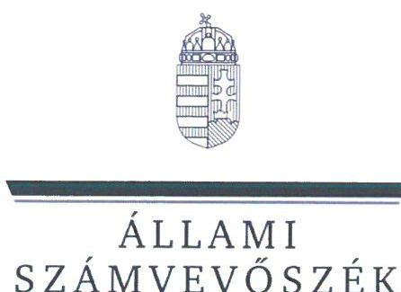
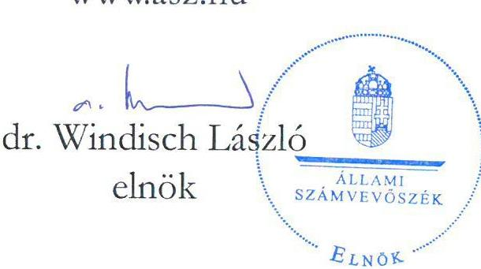
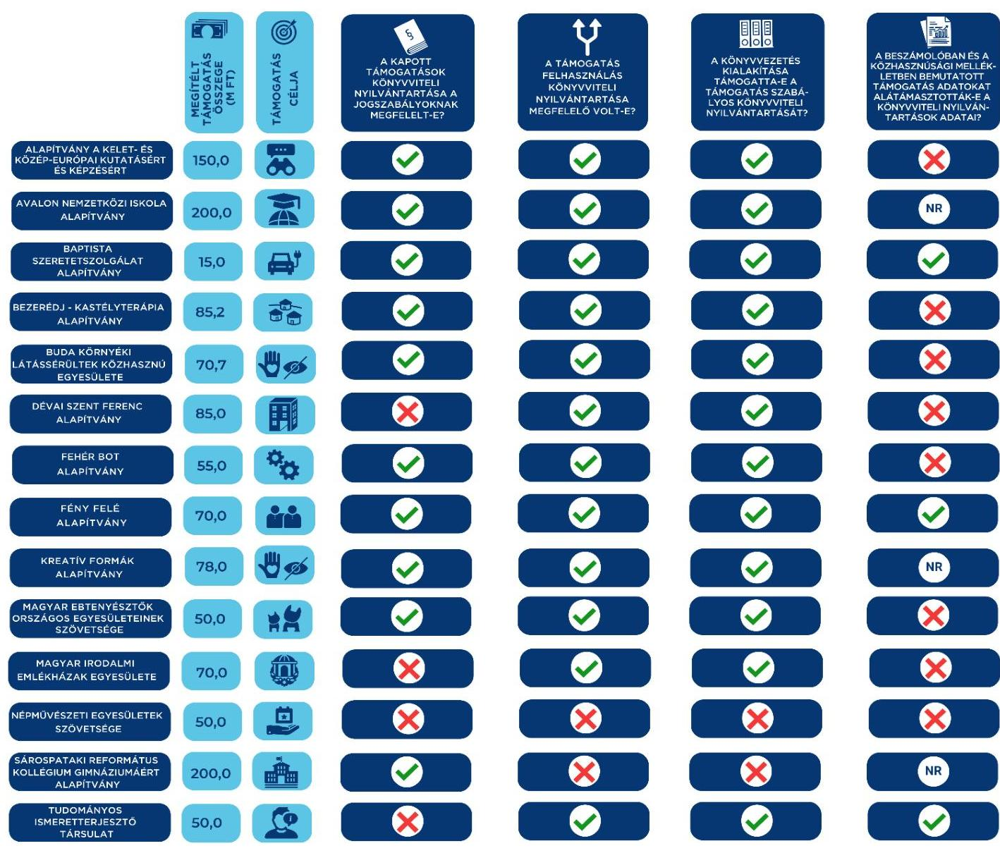

ÁLLAMI
SZÁMVEVŐSZÉK

# JELENTÉS 

Egyesületek és alapítványok államháztartásból kapott támogatásai könyvviteli nyilvántartásának ellenőrzése
2023.

23061
www.asz.hu

---

ÁLLAMI
SZÁMVEVŐSZÉK

# JELENTÉS 

## Egyesületek és alapítványok államháztartásból kapott támogatásai könyvviteli nyilvántartásának ellenőrzése

2023.

23061
www.asz.hu

---

# ELLENŐRZÉSI IGAZGATÓSÁG: 

## ÁLLAMHÁZTARTÁSON KÍVÜLI SZERVEZETEKET ELLENŐRZŐ IGAZGATÓSÁG

## ELLENŐRZÉSI IGAZGATÓ:

## KLINGA LÁSZLÓ igazgató

## ELLENŐRZÉSVEZETŐ:

Jelentéseink az interneten a www.asz.hu címen olvashatók.

## SOLYMÁR ÁGNES ellenőrzésvezető

IKTATÓSZÁM: EL-3963-005/2023.
TÉMASZÁM: 2693
ELLENŐRZÉS-AZONOSÍTÓ SZÁM: V1037

---

# TARTALOMJEGYZÉK 

- AZ ELLENŐRZÉS ALAPADATAI ..... 5
- AZ ELLENŐRZÖTT SZERVEZETEK ..... 6
- ÖSSZEFOGLALÁS ..... 14
- AZ ELLENŐRZÉS FÓKUSZKÉRDÉSE ..... 16
- MEGÁLLAPÍTÁSOK ..... 17
- JAVASLATOK ..... 31
- MELLÉKLETEK ..... 35
I. sz. melléklet: Értelmező szótár ..... 35
II. sz. melléklet: Az ellenőrzött szervezetek jegyzéke ..... 38
III. sz. melléklet: Ellenőrzési kritériumok ..... 39
- FÜGGELÉK: ÉSZREVÉTELEK ..... 40
- RÖVIDÍTÉSEK JEGYZÉKE ..... 41

---

.

---

# AZ ELLENŐRZÉS ALAPADATAI 

## AZ ELLENŐRZÉS CÉLJA

Az ellenőrzés célja annak ellenőrzése volt, hogy az ellenőrzött egyesületnél, alapítványnál a kiválasztott, államháztartási forrásból származó támogatás könyvviteli nyilvántartása szabályszerűen történt-e.

## AZ ELLENŐRZÉS TÍPUSA

Szabályszerűségi ellenőrzés.

## AZ ELLENŐRZÖTT IDŐSZAK

Az ellenőrzésre kiválasztott államháztartási támogatásra vonatkozó támogatási döntéstől / szerződéskötéstől 2023. 07. 18-ig, a helyszíni ellenőrzésről szóló értesítés keltéig tartó időszak.

## AZ ELLENŐRZÉS TÁRGYA

Az egyesületnél, illetve alapítványnál az ellenőrzésre kiválasztott államháztartási forrásból kapott támogatás könyvviteli nyilvántartását, ennek keretében a támogatásból származó bevétel-, valamint a támogatás felhasználás nyilvántartására vonatkozó jogszabályi előírások betartását ellenőriztük.

## AZ ELLENŐRZÉS JOGALAPJA

Az ellenőrzés jogalapját az ÁSZ tv. ${ }^{1} 1 . \int(3)$, valamint az 5. $\int(3)$ bekezdés előírásai képezték.

## AZ ELLENŐRZÉS MÓDSZERE

Az ellenőrzést az ellenőrzési program szempontjai, az ellenőrzött időszakban hatályos jogszabályok, előírások, az ellenőrzés általános szakmai szabályai, az ellenőrzésre irányadó ÁSZ ${ }^{2}$ ellenőrzési módszertan figyelembevételével végezte az ÁSZ. Az ellenőrzési kérdések megválaszolásához szükséges bizonyítékok megszerzése az ellenőrzött egyesület, alapítvány által rendelkezésre bocsátott dokumentumokra és adatokra alapozva, továbbá kérdésfeltevés (információkérés) útján történt. Az ellenőrzési bizonyítékként felhasznált adatforrások közé tartoztak egyrészt az ellenőrzéshez kért dokumentumok, adatforrások, másrészt minden az ellenőrzés folyamán - feltárt, az ellenőrzés szempontjából információkat tartalmazó dokumentum.
Az ellenőrzés lefolytatásához az ellenőrzött szervezet a tanúsítvány kitöltésével, valamint az ÁSZ által kért dokumentumok, adatok, információk megküldésével szolgáltatott adatokat.

---

# AZ ELLENŐRZÖTT SZERVEZETEK 

Az ellenőrzésre 14 civil szervezet esetében került sor, melyek közül öt egyesületi, kilenc pedig alapítványi formában működött. Működéséről, vagyoni, pénzügyi és jövedelmi helyzetéről valamennyi ellenőrzött szervezet egyszerűsített éves beszámolót készített, melyet kettős könyvvezetéssel támasztott alá. A 14 ellenőrzött szervezetből tíz rendelkezett közhasznú jogállással. A Közbef. tv. ${ }^{3}$ előírása szerint tevékenysége és a 2022. évi számviteli beszámoló mérlegfőösszege alapján - mivel mérlegfőösszegük elérte a 20 millió forintot -, 13 ellenőrzött a közélet befolyásolására alkalmas tevékenységet végző civil szervezetnek minősült.
Az ellenőrzött szervezetek 2022. évi számviteli beszámolóik szerint mindösszesen 10 805,6 M Ft vagyonnal gazdálkodtak, tevékenységükhöz 2 829,0 M Ft támogatást számoltak el bevételként. A legnagyobb szervezet 3661,4 M Ft, a legkisebb 12,1 M Ft értékű eszköz állománnyal rendelkezett.
A kilenc alapítványnál és öt egyesületnél összesen 1 228,9 M Ft összegű támogatás számviteli nyilvántartásának ellenőrzésére került sor.

## ALAPÍTVÁNY A KELET- ÉS KÖZÉP-EURÓPAI KUTATÁSÉRT ÉS KÉPZÉSÉRT

Az alapítványt 2009-ben egy magánszemély alapította. Alapító okirat szerinti célja „a humán tudományterületeken ... és a művészetekben ... felhalmozott tudás továbbadása, bárminemű publikálása, illetve az ezirányú kutatások támogatása, szervezése és lebonyolítása" volt. Az alapítvány az ellenőrzött időszakban közhasznú jogállású szervezetként működött, irányítását az öttagú kuratórium végezte. Az alapító a működés és gazdálkodás ellenőrzésére háromtagú felügyelőbizottságot hozott létre. Az alapítvány könyvvizsgálatra nem volt kötelezett, 2021-2022. évekre egyszerűsített éves beszámolót készített.

## AZ ELLENŐRZÖTT, ÁLLAMHÁZTARTÁSI FORRÁSBÓL KAPOTT TÁMOGATÁS BEMUTATÁSA

Támogatott szervezet megnevezése, Alapítvány a Kelet- és Közép-európai Kutatásért és Képzésért, Budapest székhelytelepülése
Támogatási program célja
„Alapítvány a Kelet- és Közép-európai Kutatásért és Képzésért 2021. évi működése"
Támogató megnevezése
Támogatás időtartama
Támogatás folyósítása, összege
Támogatás típusa
A pénzügyi elszámolás határideje
Elszámolás a támogató szervezet felé

Miniszterelnökség - kezelő szervként a Bethlen Gábor Alapkezelő Nonprofit Zrt.
2021.01.01. - 2021.12.31.
2021.03.19., 150000000 Ft
egyösszegben támogatási előlegként folyósított, vissza nem térítendő
2023.01.31.

Az alapítvány az elszámolást határidőben benyújtotta, annak elbírálásáról a támogató szervezet az ellenőrzött időszakban tájékoztatást nem adott.

---

# AVALON NEMZETKÖZI ISKOLA ALAPÍTVÁNY 

Az alapítványt az AVALON CENTER Korlátolt Felelősségű Társaság alapította 2019-ben. Alapító okiratában meghatározott célja „Miskolc és régiójának, oktatási spektruma bővítése céljából nemzetközi köznevelési intézményt alapít és tart fenn. Az óvodai nevelés és az iskolai oktatás-nevelés keretein belül elősegíti és támogatja a magyar és a Magyarországon tartózkodó külföldi állampolgárok, köznevelésben történő részvételét" volt. A nyitott, határozatlan időtartamra létrehozott, közhasznú jogállással nem rendelkező alapítvány ügyvezető szerve a három tagból álló kuratórium volt. Az ellenőrzési feladatok ellátására az alapító háromtagú felügyelőbizottságot hozott létre. Az alapítvány az ellenőrzött időszakban könyvvizsgálatra nem volt kötelezett, 2021-2022. évekre egyszerűsített éves beszámolót készített.

## AZ ELLENŐRZÖTT, ÁLLAMHÁZTARTÁSI FORRÁSBÓL KAPOTT TÁMOGATÁS BEMUTATÁSA

Támogatott szervezet megnevezése, Avalon Nemzetközi Iskola Alapítvány, Miskolc székhelytelepülése
Támogatási program célja
Támogató megnevezése
Támogatás időtartama
Támogatás folyósítása, összege
Támogatás típusa
A pénzügyi elszámolás határideje
Elszámolás a támogató szervezet felé

## BAPTISTA SZERETETSZOLGÁLAT ALAPÍTVÁNY

Az alapítvány 1996-ban a Fejér Megyei Bíróságon került bejegyzésre. Alapítója Szenczy Sándor baptista lelkész volt. Az alapítvány célja - az alapító okirat tanúsága szerint - a rászorulók hazánkban és a környező országokban segítése volt. A Baptista Szeretetszolgálat az ellenőrzött időszakban az egyik legnagyobb magyarországi közhasznú jogállású segélyszervezet volt, több ezer főállású munkatárssal és több száz önkéntessel dolgozott. Az alapítvány kezelőszerve a nyolctagú kuratórium volt, a működés és a gazdálkodás ellenőrzésére az alapító három főből álló felügyelőbizottságot hozott létre. Az alapítvány 2022. évi egyszerűsített éves beszámolóját a jogszabályi előírásoknak eleget téve könyvvizsgáló felülvizsgálta.

## AZ ELLENŐRZÖTT, ÁLLAMHÁZTARTÁSI FORRÁSBÓL KAPOTT TÁMOGATÁS BEMUTATÁSA

Támogatott szervezet megnevezése, Baptista Szeretetszolgálat Alapítvány, Budapest székhelytelepülése
Támogatási program célja
Támogató megnevezése
Támogatás időtartama
Támogatás folyósítása, összege
Támogatás típusa
A pénzügyi elszámolás határideje
Elszámolás a támogató szervezet felé

„Egy darab elektromos gépjármű beszerzését, amelyet karitatív célokra fordít"
Innovációs és Technológiai Minisztérium - a feladat jogutódja Energiaügyi Minisztérium
2021.11.15. - 2023.03.31.
2022.01.20., 15000000 Ft
egyösszegben támogatási előlegként folyósított, vissza nem térítendő
2023.05.31.

Az alapítvány az elszámolást határidőben benyújtotta. A támogató szervezet feladatának jogutódja az elszámolás elfogadásáról tájékoztatta az alapítványt.

---

# BEZERÉDJ-KASTÉLYTERÁPIA ALAPÍTVÁNY 

Az alapítványt 2001-ben vették nyilvántartásba. Az egyesület célja a „városi, megyei, illetve regionális program kialakítása, amely magában foglalja a drogprobléma teljes ívét a primér prevenciótól az ártalomcsökkentésig. Ebben rendszeres preventív, segítő tevékenység kialakítása. ... A rehabilitáció és a reszocializáció elősegítése. A Bezerédj-kastély (Szędres, Hidja puszta) felújítása, állagának megóvása és folyamatos karbantartása a rehabilitációs foglalkoztatás keretein belül is. Otthont nyújtó ellátás biztosítása. Rászoruló családok tagjai életkörülményeinek, szociális helyzetének, egészségi-, illetve mentális állapotának javítása. Szenvedélybeteg, illetve magatartási zavarokkal küzdő fiatalok egészséges értékrendjének a kialakítása, nevelésük, képzésük biztosítása" volt. A közhasznú jogállású alapítvány ügyvezető szerve és kezelője a háromtagú kuratórium volt. A működés és gazdálkodás ellenőrzésére háromtagú felügyelőbizottságot hoztak létre. Az alapítvány az ellenőrzött időszakban könyvvizsgálatra nem volt kötelezett, 2022. évre egyszerűsített éves beszámolót készített.

## AZ ELLENŐRZÖTT, ÁLLAMHÁZTARTÁSI FORRÁSBÓL KAPOTT TÁMOGATÁS BEMUTATÁSA

Támogatott szervezet megnevezése, Bezerédj-Kastélyterápia Alapítvány, Pécs székhelytelepülése
Támogatási program célja
"Speciális gyermekotthoni ellátás"
Támogató megnevezése
Támogatás időtartama
Támogatás folyósítása, összege
Támogatás típusa
A pénzügyi elszámolás határideje
Elszámolás a támogató szervezet felé

Slachta Margit Nemzeti Szociálpolitikai Intézet az Emberi Erőforrások Minisztériuma képviseletében- a feladat jogutódja a Belügyminisztérium 2022.01.01. - 2022. 12.31.
2022.04.13., 85190116 Ft
egyösszegben támogatási előlegként folyósított, vissza nem térítendő
2023.01.31.

Az alapítvány az elszámolást határidőben benyújtotta. A támogató szervezet az elszámolás elfogadásáról tájékoztatta az alapítványt.

## BUDA-KÖRNYÉKI LÁTÁSSÉRÜLTEK KÖZHASZNÚ EGYESÜLETE

Az egyesületet 2005. évben hozták létre. Céljaként került meghatározásra „a vak és gyengén látó ... emberek szociális biztonságának, sokoldalú rehabilitációjának, aktív, önrendelkezésen alapuló, önálló életvitelének, emberi közösségekbe való beilleszkedésének, emberi és állampolgári jogaik, érvényesülésének elősegítése, fogyatékosságukból eredő sajátos szükségleteik kielégítésének előmozdítása, meghatározott érdekeik képviselete, védelme, érvényesítése". A közhasznú jogállású egyesület legfőbb döntéshozó szerve a közgyűlés, operatív irányító szerve a három tagból álló elnökség volt. A működés és gazdálkodás ellenőrzését háromtagú felügyelőbizottság végezte. Az egyesület a 2022. év vonatkozásában egyszerűsített éves beszámolót készített, könyvvizsgálatra nem volt kötelezett.

## AZ ELLENŐRZÖTT, ÁLLAMHÁZTARTÁSI FORRÁSBÓL KAPOTT TÁMOGATÁS BEMUTATÁSA

Támogatott szervezet megnevezése, Buda-környéki Látássérültek közhasznú Egyesülete, Budaörs székhelytelepülése
Támogatási program célja
"Elemi rehabilitációs szolgáltatás biztosítása látássérült személyek számára"
Támogató megnevezése
Támogatás időtartama
Támogatás folyósítása, összege
Támogatás típusa
A pénzügyi elszámolás határideje
Elszámolás a támogató szervezet felé
"Elemi rehabilitációs szolgáltatás biztosítása látássérült személyek számára"
Slachta Margit Nemzeti Szociálpolitikai Intézet az Emberi Erőforrások Minisztériuma képviseletében- a feladat jogutódja a Belügyminisztérium
2022.04.01. - 2023.03.31.
2022.04.13., 70741935 Ft
egyösszegben támogatási előlegként folyósított, vissza nem térítendő
2023.04.30.

Az egyesület az elszámolást határidőben benyújtotta, annak elbírálásáról a támogató szervezet az ellenőrzött időszakban tájékoztatást nem adott.

---

# DÉVAI SZENT FERENC ALAPÍTVÁNY 

Az alapítványt 2002-ben hozták létre. Céljaként határozták meg az erdélyi ferencesek által fenntartott gyermekvédelmi intézmények, iskolák, óvodák, napköziotthonok támogatását, továbbá segítség nyújtását a határokon innen és túl a magyar nemzetiségű hátrányos helyzetű gyermekek ellátásában, pályaválasztásában, szakmai képzésében, munkahelyteremtésben,  fecskeházak kialakításában; kiadványok szerkesztését, valamint családok számára felvilágosítás nyújtását. A közhasznú jogállású alapítvány ügyvezető szerve a héttagú kuratórium volt. A működés és gazdálkodás ellenőrzésére háromtagú felügyelőbizottságot hoztak létre. Az alapítvány 2022. évi egyszerűsített éves beszámolóját a jogszabályi előírásoknak megfelelve könyvvizsgáló felülvizsgálta.

## AZ ELLENŐRZÖTT, ÁLLAMHÁZTARTÁSI FORRÁSBÓL KAPOTT TÁMOGATÁS BEMUTATÁSA

Támogatott szervezet megnevezése, Dévai Szent Ferenc Alapítvány, Budapest székhelytelepülése

Támogatási program célja
„A szervezet szakmai feladatellátásához és zavartalan működéséhez szükséges ingatlan bővítésének támogatása"
Támogató megnevezése
Támogatás időtartama
Támogatás folyósítása, összege
Támogatás típusa
A pénzügyi elszámolás határideje
Elszámolás a támogató szervezet felé

Miniszterelnökség - kezelő szervként a Bethlen Gábor Alapkezelő Nonprofit Zrt.
2021.12.20. - 2022.04.15.
2021.12.30., 85000000 Ft
egyösszegben támogatási előlegként folyósított, vissza nem térítendő
2022.05.15.

Az alapítvány az elszámolást határidőben benyújtotta, annak elbírálásáról a támogató szervezet az ellenőrzött időszakban tájékoztatást nem adott.

## FEHÉR BOT ALAPÍTVÁNY

Az alapítvány 1996-ban alakult, alapító okirata szerinti célja a „vakok és gyengén látók, illetőleg más fogyatékos személyek társadalmi integrációjának, esélyegyenlőségének elősegítése, valamint rehabilitációjának és művelődésének támogatása". A közhasznú jogállású alapítvány ügyvezető szerve az öt főből álló kuratórium volt. A működést és gazdálkodást háromtagú felügyelőbizottság ellenőrizte. Az alapítvány az ellenőrzött időszakban könyvvizsgálatra nem volt kötelezett, 2022. évre egyszerűsített éves beszámolót készített.

## AZ ELLENŐRZÖTT, ÁLLAMHÁZTARTÁSI FORRÁSBÓL KAPOTT TÁMOGATÁS BEMUTATÁSA

Támogatott szervezet megnevezése, Fehér Bot Alapítvány, Hajdúdorog székhelytelepülése
Támogatási program célja „Elemi rehabilitációs szolgáltatás működtetésével összefüggő kiadások finanszírozása"
Támogató megnevezése
Emberi Erőforrások Minisztériuma képviseletében a Nemzeti Szociálpolitikai Intézet feladat jogutódja Kulturális és Innovációs Minisztérium
Támogatás időtartama 2021.04.01. - 2022.03.31. (I. ütem)
Támogatás folyósítása, összege 2021.05.17., 55000000 Ft
Támogatás típusa
A pénzügyi elszámolás határideje
Elszámolás a támogató szervezet felé
egyösszegben támogatási előlegként folyósított, vissza nem térítendő
I. ütem: 2022.04.30.

Az alapítvány az ellenőrzött I. ütem elszámolását határidőben benyújtotta, azt a támogató szervezet elfogadta.

---

# FÉNY FELÉ ALAPÍTVÁNY 

Az alapítványt 1993. évben alapította három magánszemély. Célul tűzték ki „a Debrecen Megyei Jogú Város Önkormányzata által fenntartott Debrecen Megyei Jogú Város Fogyatékosokat Ellátó Intézményeiben elhelyezett gondozottak, fogyatékkal élő személyek ápolásának, gondozásának személyi és tárgyi feltételeinek javítását". A közhasznú jogállású alapítvány ügyvezető

 szerve az öttagú kuratórium volt, a felügyelőbizottság jogszabályban meghatározott feladatainak ellátását, a gazdálkodás és az alapszabály szerinti működés ellenőrzését háromtagú felügyelő szerv végezte. Az alapítvány könyvvizsgálatra nem volt kötelezett, 2022. évre egyszerűsített éves beszámolót készített.

## AZ ELLENŐRZÖTT, ÁLLAMHÁZTARTÁSI FORRÁSRÓL KAPOTT TÁMOGATÁS BEMUTATÁSA

Támogatott szervezet megnevezése, Fény Felé Alapítvány, Debrecen székhelytelepülése
Támogatási program célja
„2022. évre a meghatározott munkaképességű munkavállalók rehabilitációs foglalkoztatásához nyújtható egyéni támogatás"
Támogató megnevezése
Budapest Főváros Kormányhivatala - a fejezeti kezelésű előirányzat kezelő szerve
Támogatás időtartama
2022.01.01. - 2022.12.31.
Támogatás folyósítása, összege
benyújtott igénylések alapján havonta, összesen 69960000 Ft
Támogatás típusa
havonta folyósított, a záró elszámolásban elfogadott összeg, vissza nem térítendő
A pénzügyi elszámolás határideje
2023.03.01.
Elszámolás a támogató szervezet felé
Az alapítvány az elszámolást határidőben benyújtotta. A támogató szervezet az elszámolás elfogadásáról tájékoztatta az alapítványt.

## KREATÍV FORMÁK ALAPÍTVÁNY

A nyílt alapítványt 2007-ben vették nyilvántartásba. Céljaként határozták meg a látássérültek és fogyatékkal élők, valamint hátrányos helyzetűek életvitelének segítését, javítását és rehabilitációjukat, képzésüket egy létesítendő oktatási intézmény keretében; a cél megvalósítása érdekében alternatív pedagógiai módszerek kidolgozását, a technikai eszközök fejlesztését és a célokhoz tartozó tudományos kutatást; továbbá a környezeti nevelést és a támogatott sérültek részére magán-munkaerő közvetítést. A közhasznú jogállású alapítvány felügyelőbizottság létrehozására nem volt kötelezett, vagyonának kezelője és ügyvezető szerve a három főből álló kuratórium volt. Az alapítvány könyvvizsgálatra nem volt kötelezett, 2022. évre egyszerűsített éves beszámolót készített.

## AZ ELLENŐRZÖTT, ÁLLAMHÁZTARTÁSI FORRÁSRÓL KAPOTT TÁMOGATÁS BEMUTATÁSA

Támogatott szervezet megnevezése, Kreatív Formák Alapítvány, Szeged székhelytelepülése
Támogatási program célja
„Elemi rehabilitációs szolgáltatás biztosítása látássérült személyek számára"
Támogató megnevezése
Slachta Margit Nemzeti Szociálpolitikai Intézet az Emberi Erőforrások Minisztériuma képviseletében - a feladat jogutódja a Belügyminisztérium
Támogatás időtartama
2023.04.01. - 2024. 03.31.
Támogatás folyósítása, összege
2023.05.15., 78000000 Ft
Támogatás típusa
egyösszegben támogatási előlegként folyósított, vissza nem térítendő
A pénzügyi elszámolás határideje
2024.04.30.
Elszámolás a támogató szervezet felé
Az alapítványnak ellenőrzött időszakban nem volt a támogató szervezet felé elszámolási kötelezettsége.

---

# MAGYAR EBTENYÉSZTŐK ORSZÁGOS EGYESÜLETEINEK SZÖVETSÉGE 

Az egyesület jogelődjét 1899-ben alapították. Alapszabályban meghatározott célja „az FCI (Federation Cynologique Internationale ...) előírásai vagy a mindenkori, Magyarország törvényei szerint elismert ... és el nem ismert fajtájú kutyákat ... tartó és tenyésztő természetes személy tagsággal is rendelkező, célja és tevékenysége szerint kynológiával foglalkozó egyesületek tömörítése, azok saját tagsága és a Szövetség jogi személy tagjainak tagsága útján is a kynológia támogatása". A közhasznú jogállással nem rendelkező egyesület legfőbb szerve a közgyűlés, ügyvezető szerve a héttagú elnökség volt. Működését és gazdálkodását öttagú felügyelőbizottság ellenőrizte. Az egyesület 2022. évi egyszerűsített éves beszámolóját a jogszabályi előírásoknak megfelelve könyvvizsgáló felülvizsgálta.

## AZ ELLENŐRZÖTT, ÁLLAMHÁZTARTÁSI FORRÁSBÓL KAPOTT TÁMOGATÁS BEMUTATÁSA

Támogatott szervezet megnevezése, Magyar Ebtenyésztők Országos Egyesületeinek Szövetsége, Budapest székhelytelepülése
Támogatási program célja „A magyar ebfajták génmegőrzését szolgáló genetikai vizsgálatok elvégeztetése és az ebfajták népszerűsítésével kapcsolatos feladatok ellátása"
Támogató megnevezése
Agrárminisztérium
Támogatás időtartama
2022.02.01. - 2023.03.31.
Támogatás folyósítása, összege
2022.04.21., 50000000 Ft
Támogatás típusa
egyösszegben támogatási előlegként folyósított, vissza nem térítendő
A pénzügyi elszámolás határideje
2023.04.30.
Elszámolás a támogató szervezet felé
Az egyesület az elszámolást határidőben benyújtotta, annak elbírálásáról a támogató szervezet az ellenőrzött időszakban tájékoztatást nem adott.

## MAGYAR IRODALMI EMLEKHÁZAK EGYESÜLETE

Az egyesületet 2008-ban alapították. Céljaként határozták meg „a Magyarországon létező irodalmi emlékbázisokat működtető jogi és természetes személyek érdekeinek képviseletét". A közhasznú jogállással nem rendelkező egyesület legfőbb döntéshozó szerve a közgyűlés, ügyvezető szerve az öttagú elnökség volt. Működését és gazdálkodását háromtagú felügyelőbizottság ellenőrizte. Az egyesület az ellenőrzött időszakban könyvvizsgálatra nem volt kötelezett, 2022. évre egyszerűsített éves beszámolót készített.

## AZ ELLENŐRZÖTT, ÁLLAMHÁZTARTÁSI FORRÁSBÓL KAPOTT TÁMOGATÁS BEMUTATÁSA

Támogatott szervezet megnevezése, Magyar Irodalmi Emlékházak Egyesülete, Budapest székhelytelepülése
Támogatási program célja „Petőfi személyéhez, illetve a reformkorhoz kapcsolódó irodalmi emlékbázisok szakmai és infrastrukturális megújítása projektek szakmai támogatására, koordinálására"
Támogató megnevezése
Nemzeti Kulturális Alap - Emberi Erőforrás Támogatáskezelő, jogutódja: Nemzeti Kulturális Támogatáskezelő
Támogatás időtartama
2022.01.01. - 2023.11.30.
Támogatás folyósítása, összege
2022.04.13. 42000000 Ft, 2022.12.22. 28000000 Ft, összesen 70000000 Ft
Támogatás típusa
két részletben folyósított, vissza nem térítendő
A pénzügyi elszámolás határideje
2024.01.29.
Elszámolás a támogató szervezet felé
Az egyesületnek az ellenőrzött időszakban nem volt a támogató szervezet felé elszámolási kötelezettsége.

---

# NÉPMŰVÉSZETI EGYESÜLETEK SZÖVETSÉGE 

Az egyesület 1982-ben jött létre. Alapszabályban meghatározott célja a „nemzeti tárgykultúra értékeire épített szakmai és esztétikai szempontból egyaránt  hiteles kézműves, népművészeti, népi iparművészeti, iparművészeti tevékenység szolgálata és képviselete. A magyar népi kultúra hagyományos értékeinek tovább éltetése, a minőség megőrzése. Az alkotók, az alkotások és a szakterületen működő szervezetek, közösségek, műhelyek szakmai, gazdasági érdekképviselete". A közhasznú jogállású egyesület kezelője és legfőbb szerve a küldöttgyűlés, ügyvezető szerve az öttagú elnökség volt. A felügyelőbizottság jogszabályban meghatározott feladatainak ellátását, a gazdálkodás és a működés ellenőrzését a küldöttgyűlés által választott háromtagú ellenőrző bizottság végezte. Az egyesületnek az ellenőrzött időszakban a jogszabályi előírások alapján könyvvizsgálati kötelezettsége nem volt, 2021-2022 évekre egyszerűsített éves beszámolót készített.

## AZ ELLENŐRZÖTT, ÁLLAMHÁZTARTÁSI FORRÁSBÓL KAPOTT TÁMOGATÁS BEMUTATÁSA

Támogatott szervezet megnevezése, Népművészeti Egyesületek Szövetsége, Budapest
székhelytelepülése
Támogatási program célja
Támogató megnevezése
Támogatás időtartama
Támogatás folyósítása, összege
Támogatás típusa
A pénzügyi elszámolás határideje
Elszámolás a támogató szervezet felé

## „35. Mesterségek Ünnepe" projekt megvalósítása"

Magyar Turisztikai Ügynökség a Turisztikai fejlesztési célelőirányzat tekintetében rendelkezésre bocsátott összeg kezelő szerve - Miniszterelnöki Kabinetiroda

2021.04.01. - 2021.09.30.

2021.08.02., 50000000 Ft
egyösszegben támogatási előlegként folyósított, vissza nem térítendő
2021.10.31.

Az egyesület az elszámolást határidőben benyújtotta. A támogató szervezet az elszámolás elfogadásáról tájékoztatta az egyesületet.

## SÁROSPATAKI REFORMÁTUS KOLLÉGIUM GIMNÁZIUMÁÉRT ALAPÍTVÁNY

Az alapítványt 1996-ban alapította a Sárospataki Református Kollégium. Alapításának célja a „Sárospataki Református Kollégium Gimnáziuma birtokának és hagyományainak megfelelő színvonalú, szakmai - oktatási és lelki nevelési feladatok minél színvonalasabb megvalósulásának támogatása" volt. A közhasznú jogállással nem rendelkező alapítvány vagyonának kezelője és legfőbb döntéshozó szerve a három főből álló kuratórium volt, működését és gazdálkodását háromtagú felügyelőbizottság ellenőrizte Az alapítvány az ellenőrzött időszakban könyvvizsgálatra nem volt kötelezett, 2021-2022. évekre egyszerűsített éves beszámolót készített.

## AZ ELLENŐRZÖTT, ÁLLAMHÁZTARTÁSI FORRÁSBÓL KAPOTT TÁMOGATÁS BEMUTATÁSA

Támogatott szervezet megnevezése, Sárospataki Református Kollégium Gimnáziumáért Alapítvány, Sárospatak székhelytelepülése
Támogatási program célja
„Védett iskolakert területen álló műemlék tornacsarnok épület felújítása"
Támogató megnevezése
Pénzügyminisztérium
Támogatás időtartama
2021.07.01. - 2022.12.30.

Támogatás folyósítása, összege
2021.12.29., 200000000 Ft
Támogatás típusa
egyösszegben támogatási előlegként folyósított, vissza nem térítendő
A pénzügyi elszámolás határideje
2023.02.28.

Elszámolás a támogató szervezet felé
Az alapítvány az elszámolást határidőben benyújtotta, annak elbírálásáról a támogató szervezet az ellenőrzött időszakban tájékoztatást nem adott.

---

# TUDOMÁNYOS ISMERETTERJESZTŐ TÁRSULAT 

Az egyesület 1990-ben került bejegyzésre. Az alapszabályban rögzítették, hogy jogutódként, eszmei örökösként folytatja és megújítja az 1841-ben alapított Királyi Magyar Természettudományi Társulat és az 1901-ben alakult Társadalomtudományi Társaság, valamint az 1953-ban létrejött TIT értékes hagyományait. Alapvető céljaként került meghatározásra, hogy „tagyegyesületei segítségével változatos (formális, nem formális és informális) ismeretátadási formákkal és módszerekkel kielégítse a természet- és társadalomtudományok, valamint a mindennapi kultúrához tartozó ismeretek iránt érdeklődők igényeit; segítse hatékonyan a bázis tehetségnevelést, teremtsen új tehetségfeltáró és tehetséggondozó formákat; nyújtson segítséget a magyar nyelvi kultúra ápolásában és az idegen nyelvek minél szélesebb körű elsajátításában; kapcsolódjék be az egyre nagyobb jelentőségre szert tevő szakmai át- és továbbképzésbe; írásos és élőszavas formákkal tegye lehetővé a tudományok művelői és az iránta érdeklődők tájékozódását, elmélyült ismeretszerzést, és teremtsen részükre intézményes formákat az önművelésre, az értelmiségi szerep betöltésére, a közéletben való részvételre. A Társulat különös gondot fordítson arra, hogy folyóiratai (Élet és Tudomány, Természet Világa, Valóság) gazdagítsák a tudományos közművelődést". A közhasznú jogállású egyesület legfőbb szerve a tagegyesületek képviselőiből álló közgyűlés, ügyintéző szerve a közgyűlés által választott elnökség volt. A közgyűlés az alapszabály szerinti működés ellenőrzésére háromtagú felügyelő-, ellenőrző- és számvizsgáló bizottságot hozott létre. Az egyesületnek könyvvizsgálati kötelezettsége nem volt, a 2022. évre egyszerűsített éves beszámolót készített.

## AZ ELLENŐRZÖTT, ÁLLAMHÁZTARTÁSI FORRÁSBÓL KAPOTT TÁMOGATÁS BEMUTATÁSA

Támogatott szervezet megnevezése, Tudományos Ismeretterjesztő Társulat, Budapest székhelytelepülése
Támogatási program célja „A TIT tudományos folyóiratainak megjelenítése, ismeretterjesztő tevékenység szélesítése, kapcsolódó technológiai korszerűsítés."
Támogató megnevezése Innovációs és Technológiai Minisztérium - a feladat jogutódja az elszámolás időpontjában Technológiai és Ipari Minisztérium
Támogatás időtartama 2021.05.01. - 2022.06.30.
Támogatás folyósítása, összege 2021.07.08., 50000000 Ft
Támogatás típusa
A pénzügyi elszámolás határideje
2022.08.29.

Elszámolás a támogató szervezet felé Az egyesület az elszámolást határidőben benyújtotta. A támogató szervezet jogutódja az elszámolás elfogadásáról tájékoztatta az egyesületet.

---

# ÖSSZEFOGLALÁS 

Az ellenőrzött 14 civil szervezetből 12 szervezet könyvvezetési rendszerének kialakítása megfelelően támogatta az államháztartásból származó ellenőrzött támogatások szabályszerű könyvviteli nyilvántartását, biztosította a közpénzek felhasználásának ellenőrizhetőségét. Az ellenőrzés két szervezetnél tárta fel azt a hibát, hogy könyvvezetési rendszerét nem a vonatkozó jogszabályi előírások szerint alakította ki, ezáltal a közpénz felhasználás ellenőrizhetőségét nem biztosította.

Tíz ellenőrzött szervezet az államháztartási forrásból kapott támogatást megfelelően, a jogszabályok előírásai szerint, elkülönítve tartotta nyilván, közülük kilenc szervezetnél megfelelő volt a könyvvezetési rendszer kialakítása. Két szervezet a fejlesztési célra kapott támogatás elszámolásakor nem vette figyelembe a számvitelről szóló törvény időbeli elhatárolásra vonatkozó előírásait, a fejlesztési célra, visszafizetési kötelezettség nélkül kapott támogatást a passzív időbeli elhatárolások között nem mutatta ki, a könyvvezetési rendszer kialakítása mindkét szervezetnél megfelelő volt. Az időbeli elhatárolás alkalmazásának hiányában a költséggel nem ellentételezett, bevételként elszámolt támogatás torzította a szervezet tárgyévi eredményét. Ezáltal sérült a számvitelről szóló törvényben meghatározott összemérés elve. Három ellenőrzött szervezet a törvényi előírást megsértve nem az előírt részletezésben mutatta ki az államháztartási forrásból kapott támogatást, közülük kettőnél volt megfelelő a könyvvezetési rendszer kialakítása.

Az államháztartási forrásból kapott támogatás felhasználását 12 szervezet a könyvviteli rendszerében a jogszabályok előírásai szerint tartotta nyilván. Két szervezet a jogszabályok előírásai ellenére az államháztartási forrásból kapott támogatás felhasználásáról nem vezetett olyan számviteli nyilvántartást, amelynek alapján megállapítható és ellenőrizhető a kapott támogatás felhasználása.

Az ellenőrzött 14 szervezet közül egy szervezet 2023-ban használta fel a támogatást, két szervezetnek pedig jogszabályi előírás hiányában nem volt az ellenőrzött támogatás vonatkozásában a 2022. évi beszámolóban tájékoztatási kötelezettsége. Három szervezet közpénzfelhasználásra vonatkozó tájékoztatása megfelelt a jogszabályi előírásoknak. Nyolc szervezet nem megfelelően tájékoztatta a közvéleményt az ellenőrzött támogatás felhasználásáról, mert nem biztosította a közpénzek felhasználására vonatkozó gazdálkodásának nyilvánosságát, ezáltal sérült a közpénzkezelés Alaptörvényben ${ }^{4}$ rögzített átláthatóságának elve. Közülük három szervezet a törvényi előírás ellenére az egyszerűsített éves beszámoló részeként nem készített kiegészítő mellékletet, a közhasznúsági melléklet pedig nem felelt meg a törvényi előírásoknak. A kiegészítő melléklet hiánya miatt a három szervezet nem rendelkezett a törvény szerinti beszámolóval. Három szervezet esetében nem a vonatkozó jogszabály előírásai szerint tartalmazta a kiegészítő melléklet az államháztartási forrásból kapott támogatás felhasználásának bemutatását, ezen belül két szervezet esetében a közhasznúsági melléklet nem az előírások szerint tartalmazta az ellenőrzött államháztartási támogatás felhasználásához kapcsolódó célszerű juttatás bemutatását. További két civil szervezet a közhasznúsági mellékletet nem a törvényi előírások szerint készítette el. Az ellenőrzési megállapításokhoz kapcsolódóan, a feltárt hiányosságok megszüntetésére 10 szervezet vezetőjének, összesen 22 javaslatot tettünk.

A fentiekben bemutatott megállapítások ellenőrzött szervezetenkénti megjelenését az 1. ábra szemlélteti.

---

# 1. ábra 

Forrás: ÁSZ saját szerkesztés

---

# AZ ELLENŐRZÉS FÓKUSZKÉRDÉSE 

1-
 Szabályszerű volt-e az egyesület/alapítvány államháztartási forrásból kapott támogatásának könyvviteli nyilvántartása?

---

# 1. Alapítvány a Kelet- és Közép-európai Kutatásért és Képzésért 

| Összegző megállapítás | Az Alapítvány a Kelet- és Közép-európai Kutatásért és |
| :-- | :-- |
|  | Képzésért szervezet államháztartási forrásból kapott |
|  | támogatásának könyvviteli nyilvántartása szabályszerű volt. |
|  | A 2021. évi egyszerűsített éves beszámoló részeként |
|  | kiegészítő mellékletet nem készített, a közhasznúsági |
|  | melléklet nem felelt meg a jogszabályi előírásoknak. |

## A kapott támogatás könyvviteli nyilvántartása

Az alapítvány könyvvezetési rendszerében (főkönyvi és analitikus nyilvántartások) az államháztartási forrásból támogatási előlegként kapott támogatást - főkönyvi számla alábontásával, alszámla használatával - az Eszkr. ${ }^{5}$-ben és a Civil tv. ${ }^{6}$-ben előírtak szerint, elkülönítetten mutatta ki.

## A támogatás felhasználásának könyvviteli nyilvántartása

Az alapítvány az Eszkr.-ben és a Civil tv.-ben előírtakat betartva könyvvezetési rendszerében - a főkönyvi számlák alábontásával, alszámlák használatával - az államháztartási forrásból, az alapcél szerinti tevékenysége költségei, ráfordításai ellentételezésére visszafizetési kötelezettség nélkül kapott támogatás felhasználását elkülönítetten tartotta nyilván, továbbá a felhasználás számviteli nyilvántartása során figyelembe vette a támogatói okirat előírásait.
A szervezet könyvvezetésének kialakítása, keretrendszere a támogatás könyvviteli nyilvántartásának szabályossága tükrében
Az alapítvány könyvvezetési, nyilvántartási rendszerét az Eszkr. és a Civil tv. előírásai szerint alakította ki, biztosítva ezzel az alapcél szerinti tevékenysége költségei, ráfordításai ellentételezésére visszafizetési kötelezettség nélkül kapott támogatás és annak felhasználása elkülönített kimutatásának lehetőségét.
A szervezet számviteli beszámolójában, közhasznúsági mellékletében a támogatással kapcsolatban bemutatott adatok könyvviteli nyilvántartásban elszámolt adatokkal történő alátámasztottsága
A közhasznú jogállású alapítvány a 2021. évi egyszerűsített éves beszámolójának részeként az Eszkr. 7. § (6) bekezdés, valamint a Civil tv. 29. § (2) bekezdés c) pont előírásai ellenére kiegészítő mellékletet nem készített. A kiegészítő melléklet hiányában az alapítvány a 2021. év vonatkozásában a Civil tv. 29. § (4) bekezdése előírása ellenére az ellenőrzött támogatási program keretében végleges jelleggel felhasznált összeget nem mutatta be. Az alapítvány 2021. évi közhasznúsági melléklete a Civil tv. 29. § (7) bekezdése előírásai ellenére nem tartalmazta az ellenőrzött támogatás felhasználásából következő, a közhasznúsági melléklet 2. és 3. pontjaiban leírt tevékenység - ismeretterjesztő- és oktatási célú kiadványok megjelentetése, eljuttatása az érdeklődő közönséghez - megvalósítása során keletkezett cél szerinti juttatások kimutatását.

---

# 2. Avalon Nemzetközi Iskola Alapítvány 

## Összegző megállapítás Az Avalon Nemzetközi Iskola Alapítvány államháztartási forrásból kapott támogatásának könyvviteli nyilvántartása szabályszerű volt.

## A kapott támogatás könyvviteli nyilvántartása

Az alapítvány könyvvezetési rendszerében (főkönyvi és analitikus nyilvántartások) az államháztartási forrásból támogatási előlegként kapott támogatást - főkönyvi számla alábontásával, alszámla használatával - az Eszkr.-ben és a Civil tv.-ben előírtak szerint, elkülönítetten mutatta ki.

## A támogatás felhasználásának könyvviteli nyilvántartása

Az alapítvány az Eszkr.-ben és a Civil tv.-ben előírtakat betartva könyvvezetési rendszerében - a főkönyvi számlák alábontásával, alszámlák használatával, valamint munkaszám alkalmazásával - az államháztartási forrásból, az alapcél szerinti tevékenysége költségei, ráfordításai ellentételezésére visszafizetési kötelezettség nélkül kapott támogatás felhasználását elkülönítetten tartotta nyilván, továbbá a felhasználás számviteli nyilvántartása során figyelembe vette a támogatói okirat előírásait.

## A szervezet könyvvezetésének kialakítása, keretrendszere a támogatás könyvviteli nyilvántartásának szabályossága tükrében

Az alapítvány könyvvezetési, nyilvántartási rendszerét az Eszkr. és a Civil tv. előírásai szerint alakította ki, biztosítva ezzel az alapcél szerinti tevékenysége költségei, ráfordításai ellentételezésére visszafizetési kötelezettség nélkül kapott támogatás és annak felhasználása elkülönített kimutatását.

A szervezet számviteli beszámolójában, közhasznúsági mellékletében a támogatással kapcsolatban bemutatott adatok könyvviteli nyilvántartásban elszámolt adatokkal történő alátámasztottsága

Az alapítvány nem közhasznú jogállású szervezet, egyszerűsített éves beszámolót készített, ezáltal részére sem a Civil tv. sem a Számv. tv. nem határoz meg előírást a támogatási program keretében végleges jelleggel felhasznált összegek kiegészítő mellékletben történő bemutatására vonatkozóan.

---

# 3. Baptista Szeretetszolgálat Alapítvány 

## Összegző megállapítás A Baptista Szeretetszolgálat Alapítvány államháztartási forrásból kapott támogatásának könyvviteli nyilvántartása szabályszerű volt.

## A kapott támogatás könyvviteli nyilvántartása

Az alapítvány könyvvezetési rendszerében (főkönyvi és analitikus nyilvántartások) az államháztartási forrásból támogatási előlegként kapott támogatást - munkaszám használatával - az Eszkr.-ben és a Civil tv.-ben előírtak szerint, elkülönítetten mutatta ki.

## A támogatás felhasználásának könyvviteli nyilvántartása

Az alapítvány az Eszkr.-ben és a Civil tv.-ben előírtakat betartva könyvvezetési rendszerében - munkaszám használatával - az államháztartási forrásból kapott támogatás felhasználását elkülönítetten tartotta nyilván, továbbá a felhasználás számviteli nyilvántartása során figyelembe vette a támogatói okirat előírásait.

A szervezet könyvvezetésének kialakítása, keretrendszere a támogatás könyvviteli nyilvántartásának szabályossága tükrében

Az alapítvány könyvvezetési, nyilvántartási rendszerét az Eszkr. és a Civil tv. előírásai szerint alakította ki, biztosítva ezzel az alapcél szerinti tevékenysége költségei, ráfordításai ellentételezésére visszafizetési kötelezettség nélkül kapott támogatás és annak felhasználása elkülönített kimutatását.

A szervezet számviteli beszámolójában, közhasznúsági mellékletében a támogatással kapcsolatban bemutatott adatok könyvviteli nyilvántartásban elszámolt adatokkal történő alátámasztottsága

A közhasznú jogállású alapítvány a könyvvezetését és nyilvántartását az Eszkr.-ben és a Civil tv.-ben rögzített előírások szerint alakította ki, biztosította a 2022. évi egyszerűsített éves beszámoló kiegészítő mellékletében a Civil tv.-ben előírtaknak megfelelően bemutatott adatok alátámasztását.

---

# 4. Bezerédj-Kastélyterápia Alapítvány 

Összegző megállapítás A Bezerédj-Kastélyterápia Alapítvány államháztartási forrásból kapott támogatásának könyvviteli nyilvántartása szabályszerű volt. A 2022. évi egyszerűsített éves beszámoló részeként kiegészítő mellékletet nem készített, a 2022. évi közhasznúsági melléklet nem felelt meg a jogszabályi előírásoknak.

## A kapott támogatás könyvviteli nyilvántartása

Az alapítvány könyvvezetési rendszerében (főkönyvi és analitikus nyilvántartások) az államháztartási forrásból támogatási előlegként kapott támogatást - főkönyvi számla alábontásával, alszámla használatával, valamint munkaszám alkalmazásával - az Eszkr.-ben és a Civil tv.-ben előírtak szerint, elkülönítetten mutatta ki.

## A támogatás felhasználásának könyvviteli nyilvántartása

Az alapítvány az Eszkr.-ben és a Civil tv.-ben előírtakat betartva könyvvezetési rendszerében - munkaszám használatával - az államháztartási forrásból kapott vissza nem térítendő támogatás felhasználását elkülönítetten tartotta nyilván, továbbá a felhasználás számviteli nyilvántartása során figyelembe vette a támogatói okirat előírásait.

A szervezet könyvvezetésének kialakítása, keretrendszere a támogatás könyvviteli nyilvántartásának szabályossága tükrében

Az alapítvány a könyvvezetési, nyilvántartási rendszerét az Eszkr. és a Civil tv. előírásai szerint alakította ki, biztosítva ezzel az alapcél szerinti tevékenysége költségei, ráfordításai ellentételezésére visszafizetési kötelezettség nélkül kapott támogatás és annak felhasználása elkülönített kimutatásának lehetőségét.

A szervezet számviteli beszámolójában, közhasznúsági mellékletében a támogatással kapcsolatban bemutatott adatok könyvviteli nyilvántartásban elszámolt adatokkal történő alátámasztottsága

A közhasznú jogállású alapítvány a 2022. évi egyszerűsített éves beszámolójának részeként az Eszkr. 7. § (6) bekezdés, valamint a Civil tv. 29. § (2) bekezdés c) pont előírásai ellenére kiegészítő mellékletet nem készített. A kiegészítő melléklet hiányában az alapítvány a 2022. év vonatkozásában a Civil tv. 29. § (4) bekezdése előírása ellenére az ellenőrzött támogatási program keretében végleges jelleggel felhasznált összeget nem mutatta be. Az alapítvány 2022. évi közhasznúsági melléklete a Civil tv. 29. § (6)(7) bekezdései előírása ellenére nem tartalmazta a szervezet által végzett közhasznú tevékenységeket, ezen tevékenységek fő célcsoportjait és eredményeit, valamint a közhasznú cél szerinti juttatások kimutatását, a vezető tisztségviselőknek nyújtott juttatások összegét és a juttatásban részesülő vezető tisztségek felsorolását.

---

# 5. Buda-környéki Látássérültek közhasznú Egyesülete 

Összegző megállapítás A Buda-környéki Látássérültek közhasznú Egyesülete államháztartási forrásból kapott támogatásának könyvviteli nyilvántartása szabályszerű volt. A 2022. évi egyszerűsített éves beszámoló részeként készített kiegészítő melléklet, valamint a 2022. évi közhasznúsági melléklet nem felelt meg a jogszabályi előírásoknak.

## A kapott támogatás könyvviteli nyilvántartása

Az egyesület könyvvezetési rendszerében (főkönyvi és analitikus nyilvántartások) az államháztartási forrásból támogatási előlegként kapott támogatást - főkönyvi számla alábontásával, alszámla használatával, valamint munkaszám alkalmazásával - az Eszkr.-ben és a Civil tv.-ben előírtak szerint, elkülönítetten mutatta ki.

## A támogatás felhasználásának könyvviteli nyilvántartása

Az egyesület az Eszkr.-ben és a Civil tv.-ben előírtakat betartva könyvvezetési rendszerében - a főkönyvi számlák alábontásával, alszámlák használatával, valamint munkaszám alkalmazásával - az államháztartási forrásból, az alapcél szerinti tevékenysége költségei, ráfordításai ellentételezésére visszafizetési kötelezettség nélkül kapott támogatás felhasználását elkülönítetten tartotta nyilván, továbbá a felhasználás számviteli nyilvántartása során figyelembe vette a támogatási szerződés előírásait.

## A szervezet könyvvezetésének kialakítása, keretrendszere a támogatás könyvviteli nyilvántartásának szabályossága tükrében

Az egyesület a könyvvezetési, nyilvántartási rendszerét az Eszkr. és a Civil tv. előírásai szerint alakította ki, biztosítva ezzel az alapcél szerinti tevékenysége költségei, ráfordításai ellentételezésére visszafizetési kötelezettség nélkül kapott támogatás és annak felhasználása elkülönített kimutatásának lehetőségét.

A szervezet számviteli beszámolójában, közhasznúsági mellékletében a támogatással kapcsolatban bemutatott adatok könyvviteli nyilvántartásban elszámolt adatokkal történő alátámasztottsága

A közhasznú jogállású egyesület 2022. évi egyszerűsített éves beszámolójának kiegészítő melléklete a Civil tv. 29. § (4) bekezdés előírása ellenére nem tartalmazta a támogatási program keretében végleges jelleggel felhasznált összeg bemutatását. Az egyesület 2022. évi közhasznúsági melléklete a Civil tv. 29. (7) bekezdése előírásai ellenére nem tartalmazta az ellenőrzött támogatás felhasználásából következő, a 490/2020. Korm. rendelet ${ }^{7}$ alapján látássérültek számára nyújtott rehabilitációs szolgáltatás megvalósítása során keletkezett cél szerinti juttatások kimutatását.

---

# 6. Dévai Szent Ferenc Alapítvány 

Összegző megállapítás A Dévai Szent Ferenc Alapítvány az államháztartási forrásból kapott támogatás könyvviteli nyilvántartását szabályszerűen kialakította. Az ellenőrzött szervezet a támogatást 2021. évben nem a jogszabályi előírásnak megfelelő részletezésben mutatta ki. A 2022. évi egyszerűsített éves beszámoló kiegészítő mellékletét nem a jogszabályi előírásoknak megfelelően készítette el.

## A kapott támogatás könyvviteli nyilvántartása

Az alapítvány könyvvezetési rendszerében (főkönyvi és analitikus nyilvántartások) az államháztartási forrásból támogatási előlegként kapott támogatás kimutatása során 2021. évben nem tartotta be a Civil tv. 20. § (3) bekezdés előírásait, mert nyilvántartásában nem részletezte, hogy az ellenőrzött támogatás a központi költségvetésből kapott támogatás volt.

## A támogatás felhasználásának könyvviteli nyilvántartása

Az alapítvány az Eszkr.-ben és a Civil tv.-ben előírtakat betartva könyvvezetési rendszerében - munkaszám használatával - az államháztartási forrásból, az alapcél szerinti tevékenysége költségei, ráfordításai ellentételezésére visszafizetési kötelezettség nélkül kapott támogatás felhasználását elkülönítetten tartotta nyilván, továbbá a felhasználás számviteli nyilvántartása során figyelembe vette a támogatói okirat előírásait.

A szervezet könyvvvezetésének kialakítása, keretrendszere a támogatás könyvviteli nyilvántartásának szabályossága tükrében

Az alapítvány könyvvezetési, nyilvántartási rendszerét az Eszkr. és a Civil tv. előírásai szerint alakította ki, biztosítva ezzel az alapcél szerinti tevékenysége költségei, ráfordításai ellentételezésére visszafizetési kötelezettség nélkül kapott támogatás és annak felhasználása elkülönített kimutatásának lehetőségét.

A szervezet számviteli beszámolójában, közhasznúsági mellékletében a támogatással kapcsolatban bemutatott adatok könyvviteli nyilvántartásban elszámolt adatokkal történő alátámasztottsága

A közhasznú jogállású alapítvány 2022. évi egyszerűsített éves beszámolójának kiegészítő melléklete a Civil tv. 29. § (4) bekezdés előírása ellenére nem tartalmazta a támogatási program keretében végleges jelleggel felhasznált összeg bemutatását.

---

# 7. Fehér Bot Alapítvány 

Összegző megállapítás A Fehér Bot Alapítvány államháztartási forrásból kapott támogatásának könyvviteli nyilvántartása szabályszerű volt. A 2022. évi egyszerűsített éves beszámoló részeként készített kiegészítő melléklet, valamint a 2022. évi közhasznúsági melléklet nem felelt meg a jogszabályi
 előírásoknak.

## A kapott támogatás könyvviteli nyilvántartása

Az alapítvány könyvvezetési rendszerében (főkönyvi és analitikus nyilvántartások) az államháztartási forrásból támogatási előlegként kapott támogatást - főkönyvi számlák alábontásával, alszámlák használatával - az Eszkr.-ben és a Civil tv.-ben előírtak szerint, elkülönítetten mutatta ki.

## A támogatás felhasználásának könyvviteli nyilvántartása

Az alapítvány az Eszkr.-ben és a Civil tv.-ben előírtakat betartva könyvvezetési rendszerében - munkaszámok alkalmazásával - az államháztartási forrásból, az alapcél szerinti tevékenysége költségei, ráfordításai ellentételezésére visszafizetési kötelezettség nélkül kapott támogatás felhasználását elkülönítetten tartotta nyilván, továbbá a felhasználás számviteli nyilvántartása során figyelembe vette a támogatási szerződés előírásait.

A szervezet könyvvezetésének kialakítása, keretrendszere a támogatás könyvviteli nyilvántartásának szabályossága tükrében

Az alapítvány könyvvezetési, nyilvántartási rendszerét az Eszkr. és a Civil tv. előírásai szerint alakította ki, biztosítva ezzel az alapcél szerinti tevékenysége költségei, ráfordításai ellentételezésére visszafizetési kötelezettség nélkül kapott támogatás és annak felhasználása elkülönített kimutatását.

A szervezet számviteli beszámolójában, közhasznúsági mellékletében a támogatással kapcsolatban bemutatott adatok könyvviteli nyilvántartásban elszámolt adatokkal történő alátámasztottsága

A közhasznú jogállású alapítvány 2022. évi egyszerűsített éves beszámolójának kiegészítő melléklete a Civil tv. 29. § (4) bekezdés előírása ellenére nem tartalmazta a támogatási program keretében végleges jelleggel felhasznált összeg bemutatását. Az alapítvány 2022. évi közhasznúsági melléklete a Civil tv. 29. § (7) bekezdése előírásai ellenére nem tartalmazta az ellenőrzött támogatás felhasználásából következő, a 490/2020. Korm. rendelet alapján látássérültek számára nyújtott rehabilitációs szolgáltatás megvalósítása során keletkezett cél szerinti juttatások kimutatását.

---

# 8. Fény Felé Alapítvány 

## Összegző megállapítás A Fény Felé Alapítvány államháztartási forrásból kapott támogatásának könyvviteli nyilvántartása szabályszerű volt.

## A kapott támogatás könyvviteli nyilvántartása

Az alapítvány könyvvezetési rendszerében (főkönyvi és analitikus nyilvántartások) az államháztartási forrásból kapott támogatást - főkönyvi számla alábontásával, alszámla használatával - az Eszkr.-ben és a Civil tv.-ben előírtak szerint, elkülönítetten mutatta ki.

## A támogatás felhasználásának könyvviteli nyilvántartása

Az alapítvány az Eszkr.-ben és a Civil tv.-ben előírtakat betartva könyvvezetési rendszerében - munkaszámok alkalmazásával - az államháztartási forrásból, az alapcél szerinti tevékenysége költségei, ráfordításai ellentételezésére visszafizetési kötelezettség nélkül kapott támogatás felhasználását elkülönítetten tartotta nyilván, továbbá a felhasználás számviteli nyilvántartása során figyelembe vette a támogatási szerződés előírásait.

A szervezet könyvvezetésének kialakítása, keretrendszere a támogatás könyvviteli nyilvántartásának szabályossága tükrében

Az alapítvány könyvvezetési, nyilvántartási rendszerét az Eszkr. és a Civil tv. előírásai szerint alakította ki, biztosítva ezzel az alapcél szerinti tevékenysége költségei, ráfordításai ellentételezésére visszafizetési kötelezettség nélkül kapott támogatás és annak felhasználása elkülönített kimutatását.

A szervezet számviteli beszámolójában, közhasznúsági mellékletében a támogatással kapcsolatban bemutatott adatok könyvviteli nyilvántartásban elszámolt adatokkal történő alátámasztottsága

A közhasznú jogállású alapítvány a könyvvezetését és nyilvántartását az Eszkr.-ben és a Civil tv.-ben rögzített előírások szerint alakította ki, biztosította a 2022. évi egyszerűsített éves beszámoló kiegészítő mellékletében a Civil tv.-ben előírtaknak megfelelően bemutatott adatok alátámasztását.

---

# 9. Kreatív Formák Alapítvány 

## Összegző megállapítás A Kreatív Formák Alapítvány államháztartási forrásból kapott támogatásának könyvviteli nyilvántartása szabályszerű volt.

## A kapott támogatás könyvviteli nyilvántartása

Az alapítvány könyvvezetési rendszerében (főkönyvi és analitikus nyilvántartások) az államháztartási forrásból támogatási előlegként kapott támogatást - főkönyvi számla alábontásával, alszámla használatával és munkaszám alkalmazásával - az Eszkr.-ben és a Civil tv.-ben előírtak szerint, elkülönítetten mutatta ki.

## A támogatás felhasználásának könyvviteli nyilvántartása

Az alapítvány az Eszkr.-ben és a Civil tv.-ben előírtakat betartva könyvvezetési rendszerében - munkaszám alkalmazásával - az államháztartási forrásból, az alapcél szerinti tevékenysége költségei, ráfordításai ellentételezésére visszafizetési kötelezettség nélkül kapott támogatás felhasználását elkülönítetten tartotta nyilván, továbbá a felhasználás számviteli nyilvántartása során figyelembe vette a támogatási szerződés előírásait.

A szervezet könyvvezetésének kialakítása, keretrendszere a támogatás könyvviteli nyilvántartásának szabályossága tükrében

Az alapítvány könyvvezetési, nyilvántartási rendszerét az Eszkr. és a Civil tv. előírásai szerint alakította ki, biztosítva ezzel az alapcél szerinti tevékenysége költségei, ráfordításai ellentételezésére visszafizetési kötelezettség nélkül kapott támogatás és annak felhasználása elkülönített kimutatását.

A szervezet számviteli beszámolójában, közhasznúsági mellékletében a támogatással kapcsolatban bemutatott adatok könyvviteli nyilvántartásban elszámolt adatokkal történő alátámasztottsága

A közhasznú jogállású alapítvány az ellenőrzött támogatást 2023. évben használta fel, arról az ellenőrzött időszakban beszámolási kötelezettsége nem keletkezett.

---

# 10. Magyar Ebtenyésztők Országos Egyesületeinek Szövetsége 

| Összegző megállapítás | A Magyar Ebtenyésztők Országos Egyesületeinek |
| :-- | :-- |
|  | Szövetsége államháztartási forrásból kapott támogatásának |
|  | könyvviteli nyilvántartása szabályszerű volt. A 2022. évi |
|  | közhasznúsági melléklet nem felelt meg a jogszabályi |
|  | előírásoknak. |

## A kapott támogatás könyvviteli nyilvántartása

Az egyesület könyvvezetési rendszerében (főkönyvi és analitikus nyilvántartások) az államháztartási forrásból támogatási előlegként kapott támogatást - főkönyvi számla alábontásával, alszámla használatával, valamint munkaszám alkalmazásával - az Eszkr.-ben és a Civil tv.-ben előírtak szerint, elkülönítetten mutatta ki.

## A támogatás felhasználásának könyvviteli nyilvántartása

Az egyesület az Eszkr.-ben és a Civil tv.-ben előírtakat betartva könyvvezetési rendszerében - munkaszám használatával - az államháztartási forrásból, az alapcél szerinti tevékenysége költségei, ráfordításai ellentételezésére visszafizetési kötelezettség nélkül kapott támogatás felhasználását elkülönítetten tartotta nyilván, továbbá a felhasználás számviteli nyilvántartása során figyelembe vette a támogatói okirat előírásait.

A szervezet könyvvezetésének kialakítása, keretrendszere a támogatás könyvviteli nyilvántartásának szabályossága tükrében

Az egyesület könyvvezetési, nyilvántartási rendszerét az Eszkr. és a Civil tv. előírásai szerint alakította ki, biztosítva ezzel az alapcél szerinti tevékenysége költségei, ráfordításai ellentételezésére visszafizetési kötelezettség nélkül kapott támogatás és annak felhasználása elkülönített kimutatásának lehetőségét.

A szervezet számviteli beszámolójában, közhasznúsági mellékletében a támogatással kapcsolatban bemutatott adatok könyvviteli nyilvántartásban elszámolt adatokkal történő alátámasztottsága

Az egyesület 2021. évi közhasznúsági melléklete a Civil tv. 29. § (7) bekezdése előírásai ellenére nem tartalmazta az ellenőrzött támogatás felhasználásából következő, a közhasznúsági melléklet 2. pontjában leírt tevékenységnek - a támogatás elszámolásban 6. Tanösvény költségek ( $6,9 \mathrm{MFt}$ ) felhasználásával történt - megvalósítása során keletkezett cél szerinti juttatások kimutatását. Az egyesület nem közhasznú jogállású szervezet, egyszerűsített éves beszámolót készített, ezáltal részére sem a Civil tv. sem a Számv. tv. nem határoz meg előírást a támogatási program keretében végleges jelleggel felhasznált összegek kiegészítő mellékletben történő bemutatására vonatkozóan.

---

# 11. Magyar Irodalmi Emlékházak Egyesülete 

Összegző megállapítás

A Magyar Irodalmi Emlékházak Egyesülete könyvviteli, nyilvántartási rendszerét a jogszabályi előírásoknak megfelelően alakította ki, azonban a kapott támogatást 2022. évben nem a jogszabályi előírások szerint vette nyilvántartásba. A 2022. évi közhasznúsági melléklet nem felelt meg a jogszabályi előírásoknak.

## A kapott támogatás könyvviteli nyilvántartása

Az ellenőrzött költségvetési támogatás bevételként történő könyvviteli elszámolása 2022. évben nem felelt meg a vonatkozó jogszabályi előírásnak, mivel az egyesület központi költségvetésből kapott támogatásként mutatta ki a Támogatói okirat ${ }^{8}$ szerint folyósított támogatást, melyet a Civil tv. 20. § (3) bekezdésében meghatározottak szerint, az elkülönített állami pénzalapokból kapott támogatásként kellett volna kimutatnia. A támogatás fejlesztési célra kapott részösszegét ( $5,0 \mathrm{MFt}$ ) halasztott bevételként a Számv. tv. 45. § (1) bekezdés a) pont előírása ellenére 2022. évben a passzív időbeli elhatárolások között nem mutatta ki. Az időbeli elhatárolás hiánya miatt - a fejlesztési célú támogatásnak nem a jogszabályi előírások szerinti elszámolásával - sérült Számv. tv. 15. § (7) bekezdése szerinti összemérés elve és a Számv. tv. 16. § (2) bekezdése szerinti időbeli elhatárolás elve.

## A támogatás felhasználásának könyvviteli nyilvántartása

Az egyesület az Eszkr.-ben és a Civil tv.-ben előírtakat betartva könyvvezetési rendszerében - főkönyvi számla alábontásával, alszámla használatával - az államháztartási forrásból kapott támogatás felhasználását elkülönítetten tartotta nyilván, továbbá a felhasználás számviteli nyilvántartása során figyelembe vette a támogatói okirat előírásait.

## A szervezet könyvvezetésének kialakítása, keretrendszere a támogatás könyvviteli nyilvántartásának szabályossága tükrében

Az egyesület könyvvezetési, nyilvántartási rendszerét az Eszkr és a Civil tv. előírásai szerint alakította ki, biztosítva ezzel az alapcél szerinti tevékenysége költségei, ráfordításai ellentételezésére visszafizetési kötelezettség nélkül kapott támogatás és annak felhasználása elkülönített kimutatásának lehetőségét.

A szervezet számviteli beszámolójában, közhasznúsági mellékletében a támogatással kapcsolatban bemutatott adatok könyvviteli nyilvántartásban elszámolt adatokkal történő alátámasztottsága

Az egyesület 2022. évi közhasznúsági melléklete a Civil tv. 29. § (6)-(7) bekezdései előírása ellenére nem tartalmazta a szervezet által végzett közhasznú tevékenységeket, ezen tevékenységek fő célcsoportjait és eredményeit, valamint a közhasznú cél szerinti juttatások kimutatását, a vezető tisztségviselőknek nyújtott juttatások összegét és a juttatásban részesülő vezető tisztségek felsorolását. Az egyesület nem közhasznú jogállású szervezet, egyszerűsített éves beszámolót készített, ezáltal részére sem a Civil tv. sem a Számv. tv. nem határoz meg előírást a támogatási program keretében végleges jelleggel felhasznált összegek kiegészítő mellékletben történő bemutatására vonatkozóan.

---

# 12. Népművészeti Egyesületek Szövetsége 

## Összegző megállapítás

A Népművészeti Egyesületek Szövetsége államháztartási forrásból kapott támogatásának könyvviteli nyilvántartása a 2021. évben nem volt szabályszerű. A 2021. évi egyszerűsített éves beszámoló részeként kiegészítő mellékletet nem készített, a 2021. évi közhasznúsági melléklet nem felelt meg a jogszabályi előírásoknak.

## A kapott támogatás könyvviteli nyilvántartása

A 2021. évben az államháztartási forrásból támogatási előlegként kapott, ellenőrzött költségvetési támogatás könyvviteli elszámolása nem felelt meg a vonatkozó jogszabályi előírásnak, mivel az egyesület elkülönített állami pénzalapokból kapott támogatásként mutatta ki a Támogatói okirat ${ }^{9}$ szerint a 2021. évi Kvtv. ${ }^{10}$-ben meghatározott Gazdaság újraindítását szolgáló miniszterelnöki kabineti fejezeti kezelésű előirányzatok terhére folyósított támogatást, melyet a Civil tv. 20. § (3) bekezdésében meghatározottak szerint, központi költségvetésből kapott támogatásként kellett volna kimutatnia.

## A támogatás felhasználásának könyvviteli nyilvántartása

Az egyesület az Eszkr. 14. § (1) bekezdés és a Civil tv. 20. § (4) bekezdés előírása ellenére az államháztartási forrásból kapott támogatás felhasználásáról 2021. évben nem vezetett olyan számviteli nyilvántartást, amelynek alapján megállapítható és ellenőrizhető a kapott támogatás felhasználása.

## A szervezet könyvvezetésének kialakítása, keretrendszere a támogatás könyvviteli nyilvántartásának szabályossága tükrében

Az egyesület az Eszkr. 14. § (1) bekezdése előírásai ellenére a könyvvezetési, nyilvántartási rendszerének kialakítása során nem vette figyelembe a Civil tv. 20. § (4) bekezdése elkülönített számviteli nyilvántartás vezetésére vonatkozó előírásait. Az egyesület nem alakította ki az alapcél szerinti tevékenysége költségei, ráfordításai ellentételezésére visszafizetési kötelezettség nélkül kapott támogatás felhasználásának elkülönített nyilvántartása lehetőségét. Az alkalmazott „1212" költséghely a „35. Mesterségek ünnepe" felmerült költségek gyűjtésére szolgált, nem biztosította a támogatás felhasználás jogszabályi előírásoknak megfelelő elkülönített kimutatását, mert a hivatkozott költséghelyen egyidejűleg több különböző támogatás felhasználását is nyilvántartották.

A szervezet számviteli beszámolójában, közhasznúsági mellékletében a támogatással kapcsolatban bemutatott adatok könyvviteli nyilvántartásban elszámolt adatokkal történő alátámasztottsága

Az egyesület a 2021. évi egyszerűsített éves beszámolójának részeként az Eszkr. 7. § (6) bekezdés, valamint a Civil tv. 29. § (2) bekezdés c) pont előírásai ellenére kiegészítő mellékletet nem készített. Az egyesület 2021. évi közhasznúsági melléklete a Civil tv. 29. § (7) bekezdése előírásai ellenére nem tartalmazta az ellenőrzött támogatás felhasználásából következő, a közhasznúsági melléklet 3.1. pontjában leírt tevékenység - 35. Mesterségek Ünnepe - megvalósítása
 során keletkezett cél szerinti juttatások kimutatását.

---

# 13. Sárospataki Református Kollégium Gimnáziumáért Alapítvány 

## Összegző megállapítás A Sárospataki Református Kollégium Gimnáziumáért Alapítvány államháztartási forrásból kapott támogatása felhasználásának 2022. évi könyvviteli nyilvántartása nem volt szabályszerű.

## A kapott támogatás könyvviteli nyilvántartása

Az alapítvány könyvvezetési rendszerében (főkönyvi és analitikus nyilvántartások) az államháztartási forrásból támogatási előlegként kapott támogatást - a főkönyvi számla alábontásával, alszámla alkalmazásával - az Eszkr.-ben és a Civil tv.-ben előírtak szerint, elkülönítetten mutatta ki.

## A támogatás felhasználásának könyvviteli nyilvántartása

Az alapítvány az Eszkr. 14. § (1) bekezdés és a Civil tv. 20. § (4) bekezdés előírása ellenére az államháztartási forrásból kapott támogatás felhasználásáról 2022. évben nem vezetett olyan számviteli nyilvántartást, amelynek alapján megállapítható és ellenőrizhető a kapott támogatás felhasználása.

## A szervezet könyvvezetésének kialakítása, keretrendszere a támogatás könyvviteli nyilvántartásának szabályossága tükrében

Az alapítvány az Eszkr. 14. § (1) bekezdése előírásai ellenére a könyvvezetési, nyilvántartási rendszerének kialakítása során 2022. évben nem vette figyelembe a Civil tv. 20. § (4) bekezdése elkülönített számviteli nyilvántartás vezetésére vonatkozó előírásait. Az alapítvány nem alakította ki a fejlesztési célra visszafizetési kötelezettség nélkül kapott támogatás felhasználásának elkülönített nyilvántartása lehetőségét. Az alkalmazott „28" költséghely a műemléki tornateremhez kapcsolódó beruházás és a felmerült költségek gyűjtésére szolgált, nem biztosította a támogatás felhasználás jogszabályi előírásoknak megfelelő elkülönített kimutatását, mert a hivatkozott költséghelyen egyidejűleg több különböző forrásnak a megjelölt beruházás céljára történő felhasználását is nyilvántartották.

A szervezet számviteli beszámolójában, közhasznúsági mellékletében a támogatással kapcsolatban bemutatott adatok könyvviteli nyilvántartásban elszámolt adatokkal történő alátámasztottsága

Az alapítvány nem közhasznú jogállású szervezet, egyszerűsített éves beszámolót készített, ezáltal részére sem a Civil tv. sem a Számv. tv. nem határoz meg előírást a támogatási program keretében végleges jelleggel felhasznált összegek kiegészítő mellékletben történő bemutatására vonatkozóan.

---

# 14. Tudományos Ismeretterjesztő Társulat 

| Összegző megállapítás | A Tudományos Ismeretterjesztő Társulat könyvviteli, nyilvántartási rendszerét a jogszabályi előírásoknak megfelelően alakította ki, azonban a kapott támogatást nem a jogszabályi előírások szerint vette nyilvántartásba 2022. évben. |
| :--: | :--: |

## A kapott támogatás könyvviteli nyilvántartása

Az egyesület könyvvezetési rendszerében (főkönyvi és analitikus nyilvántartások) az államháztartási forrásból támogatási előlegként kapott támogatást - munkaszám alkalmazásával - az Eszkr.-ben és a Civil tv.-ben előírtak szerint, elkülönítetten mutatta ki. A támogatás fejlesztési célra kapott részösszegét (2022-ben 12,5 M Ft) halasztott bevételként a Számv. tv. 45. § (1) bekezdés a) pont előírása ellenére 2022. évben a passzív időbeli elhatárolások között nem mutatta ki. Az időbeli elhatárolás hiánya miatt - a fejlesztési célú támogatásnak nem a jogszabályi előírások szerinti elszámolásával - sérült Számv. tv. 15. § (7) bekezdése szerinti összemérés elve és a Számv. tv. 16. § (2) bekezdése szerinti időbeli elhatárolás elve.

## A támogatás felhasználásának könyvviteli nyilvántartása

Az egyesület az Eszkr.-ben és a Civil tv.-ben előírtakat betartva könyvvezetési rendszerében - munkaszám alkalmazásával - az államháztartási forrásból kapott támogatás felhasználását elkülönítetten tartotta nyilván, továbbá a felhasználás számviteli nyilvántartása során figyelembe vette a támogatói okirat előírásait.
A szervezet könyvvezetésének kialakítása, keretrendszere a támogatás könyvviteli nyilvántartásának szabályossága tükrében

Az egyesület könyvvezetési, nyilvántartási rendszerét az Eszkr. és a Civil tv. előírásai szerint alakította ki, biztosítva ezzel a támogatási program keretében visszafizetési kötelezettség nélkül kapott támogatás és annak felhasználása elkülönített kimutatását.
A szervezet számviteli beszámolójában, közhasznúsági mellékletében a támogatással kapcsolatban bemutatott adatok könyvviteli nyilvántartásban elszámolt adatokkal történő alátámasztottsága

A közhasznú jogállású egyesület a könyvvezetését és nyilvántartását az Eszkr.-ben és a Civil tv.-ben rögzített előírások szerint alakította ki, biztosította a 2022. évi egyszerűsített éves beszámoló kiegészítő mellékletében a Civil tv.-ben előírtaknak megfelelően bemutatott adatok alátámasztását.

---

# JAVASLATOK 

Az ÁSZ tv. 33. § (1) bekezdésében foglaltak értelmében az ellenőrzött szervezet vezetője köteles a jelentésben foglalt megállapításokhoz kapcsolódó intézkedési tervet összeállítani és azt a jelentés kézhezvételétől számított 30 napon belül az ÁSZ részére megküldeni. Amennyiben az ellenőrzött szervezet vezetője nem küldi meg határidőben az intézkedési tervet, vagy továbbra sem elfogadható intézkedési tervet küld, az Állami Számvevőszék elnöke az ÁSZ tv. 33. § (3) bekezdése a) és b) pontjaiban foglaltakat érvényesítheti.

## AlAPÍTVÁNY A KELET- ÉS KÖZÉP-EURÓPAI KUTATÁSÉRT ÉS KÉPZÉSÉRT KURATÓRIUMI ELNÖKE

1. Az alapítvány működéséről, vagyoni, pénzügyi és jövedelmi helyzetéről szóló beszámoló valamennyi, jogszabályban meghatározott része készüljön el, különös tekintettel az Eszkr. 7. § (6) bekezdésében, valamint a Civil tv. 29. § (2) bekezdés c) pontban meghatározott kiegészítő melléklet.
2. Az alapítvány működéséről, vagyoni, pénzügyi és jövedelmi helyzetéről szóló beszámolójának részeként elkészítésre kerülő kiegészítő melléklet feleljen meg a vele szemben támasztott tartalmi követelményeknek, különös tekintettel a Civil tv. 29. § (4) bekezdésében foglaltakra.
3. Az elkészülő közhasznúsági melléklet Civil tv. 29. § (7) bekezdés szerinti közhasznú cél szerinti juttatás kimutatása a civil szervezet által alaptevékenysége keretében nyújtott pénzbeli vagy nem pénzbeli szolgáltatást tartalmazza.

## BEZERÉDJ-KASTÉLYTERÁPIA ALAPÍTVÁNY KURATÓRIUMI ELNÖKE

1. Az alapítvány működéséről, vagyoni, pénzügyi és jövedelmi helyzetéről szóló beszámoló valamennyi, jogszabályban meghatározott része készüljön el, különös tekintettel az Eszkr. 7. § (6) bekezdésében, valamint a Civil tv. 29. § (2) bekezdés c) pontban meghatározott kiegészítő melléklet.
2. Az alapítvány működéséről, vagyoni, pénzügyi és jövedelmi helyzetéről szóló beszámolójának részeként elkészítésre kerülő kiegészítő melléklet feleljen meg a vele szemben támasztott tartalmi követelményeknek, különös tekintettel a Civil tv. 29. § (4) bekezdésében foglaltakra.
3. Az elkészítésre kerülő közhasznúsági melléklet feleljen meg a vele szemben támasztott tartalmi követelményeknek, különös tekintettel a Civil tv. 29. § (6)-(7) bekezdéseiben foglaltakra.

---

# BUDA-KÖRNYÉKI LÁTÁSSÉRÜLTEK KÖZHASZNÚ EGYESÜLETE ELNÖKE 

1. Az egyesület működéséről, vagyoni, pénzügyi és jövedelmi helyzetéről szóló beszámolójának részeként elkészítésre kerülő kiegészítő melléklet feleljen meg a vele szemben támasztott tartalmi követelményeknek, különös tekintettel a Civil tv. 29. § (4) bekezdésében foglaltakra.
2. Az elkészítésre kerülő közhasznúsági melléklet Civil tv. 29. § (7) bekezdés szerinti közhasznú cél szerinti juttatás kimutatása a civil szervezet által alaptevékenysége keretében nyújtott pénzbeli vagy nem pénzbeli szolgáltatást tartalmazza.

## DÉVAI SZENT FERENC ALAPÍTVÁNY KURATÓRIUMI ELNÖKE

1. Az alapítvány a Civil tv. 20. § (3) bekezdésében rögzítettek szerint vezessen elkülönített számviteli nyilvántartást az államháztartási forrásból kapott támogatásokról és adományokról.
2. Az alapítvány működéséről, vagyoni, pénzügyi és jövedelmi helyzetéről szóló beszámolójának részeként elkészítésre kerülő kiegészítő melléklet feleljen meg a vele szemben támasztott tartalmi követelményeknek, különös tekintettel a Civil tv. 29. § (4) bekezdésében foglaltakra.

## FEHÉR BOT ALAPÍTVÁNY KURATÓRIUMI ELNÖKE

1. Az alapítvány működéséről, vagyoni, pénzügyi és jövedelmi helyzetéről szóló beszámolójának részeként elkészítésre kerülő kiegészítő melléklet feleljen meg a vele szemben támasztott tartalmi követelményeknek, különös tekintettel a Civil tv. 29. § (4) bekezdésében foglaltakra.
2. Az elkészítésre kerülő közhasznúsági melléklet Civil tv. 29. § (7) bekezdés szerinti közhasznú cél szerinti juttatás kimutatása a civil szervezet által alaptevékenysége keretében nyújtott pénzbeli vagy nem pénzbeli szolgáltatást tartalmazza.

---

# MAGYAR EBTENYÉSZTŐK ORSZÁGOS EGYESÜLETEINEK SZÖVETSÉGE ELNÖKE 

1. Az elkészítésre kerülő közhasznúsági melléklet Civil tv. 29. § (7) bekezdés szerinti közhasznú cél szerinti juttatás kimutatása a civil szervezet által alaptevékenysége keretében nyújtott pénzbeli vagy nem pénzbeli szolgáltatást tartalmazza.

## MAGYAR IRODALMI EMLÉKHÁZAK EGYESÜLETE ELNÖKE

1. Az egyesület a Civil tv. 20. § (3) bekezdésében rögzítettek szerint vezessen elkülönített számviteli nyilvántartást az államháztartási forrásból kapott támogatásokról és adományokról.
2. Az egyesület működéséről, vagyoni, pénzügyi és jövedelmi helyzetéről szóló beszámoló mérlegében a Számv. tv. 45. § (1) bekezdés a) pont előírásainak megfelelően a passzív időbeli elhatárolások között halasztott bevételként kerüljön kimutatásra az egyéb bevételként elszámolt, a fejlesztési célra visszafizetési kötelezettség nélkül kapott, pénzügyileg rendezett támogatás véglegesen átvett pénzeszköz összege.
3. Az elkészítésre kerülő közhasznúsági melléklet feleljen meg a vele szemben támasztott tartalmi követelményeknek, különös tekintettel a Civil tv. 29. § (6)-(7) bekezdéseiben foglaltakra.

---

# NÉPMŰVÉSZETI EGYESÜLETEK SZÖVETSÉGE ELNÖKE 

1. Az egyesület a Civil tv. 20. § (3) bekezdésében rögzítettek szerint vezessen elkülönített számviteli nyilvántartást az államháztartási forrásból kapott támogatásokról és adományokról.
2. Az egyesület a nyilvántartási rendszerét úgy alakítsa ki (részletezze), hogy az alkalmas legyen a Civil tv. 20. § (4) bekezdésében meghatározott elkülönítésre vonatkozó követelmények teljesítésére, majd az alapcél szerinti tevékenysége költségei, ráfordításai ellentételezésére kapott támogatásokról a hivatkozott jogszabályi előírásnak megfelelve olyan elkülönített számviteli nyilvántartást vezessen, amelynek alapján támogatásonként megállapítható és ellenőrizhető a kapott támogatás felhasználása.
3. Az egyesület működéséről, vagyoni, pénzügyi és jövedelmi helyzetéről szóló beszámoló valamennyi, jogszabályban meghatározott része elkészüljön, különös tekintettel az Eszkr. 7. § (6) bekezdésében, valamint a Civil tv. 29. § (2) bekezdés c) pontban meghatározott kiegészítő melléklet.
4. Az elkészítésre kerülő közhasznúsági melléklet feleljen meg a vele szemben támasztott tartalmi követelményeknek, különös tekintettel a Civil tv. 29. § (7) bekezdésében foglaltakra.

## SÁROSPATAKI REFORMÁTUS KOLLÉGIUM GIMNÁZIUMÁÉRT ALAPÍTVÁNY KURATÓRIUM ELNÖKE

1. Az alapítvány a nyilvántartási rendszerét úgy alakítsa ki (részletezze), hogy az alkalmas legyen a Civil tv. 20. § (4) bekezdésében meghatározott elkülönítésre vonatkozó követelmények teljesítésére, majd az alapcél szerinti tevékenysége költségei, ráfordításai ellentételezésére kapott támogatásokról a hivatkozott jogszabályi előírásnak megfelelve olyan elkülönített számviteli nyilvántartást vezessen, amelynek alapján támogatásonként megállapítható és ellenőrizhető a kapott támogatás felhasználása.

## TUDOMÁNYOS ISMERETTERJESZTŐ TÁRSULAT ELNÖKE

1. Az egyesület működéséről, vagyoni, pénzügyi és jövedelmi helyzetéről szóló beszámoló mérlegében a Számv. tv. 45. § (1) bekezdés a) pont előírásainak megfelelően a passzív időbeli elhatárolások között halasztott bevételként kerüljön kimutatásra az egyéb bevételként elszámolt, a fejlesztési célra visszafizetési kötelezettség nélkül kapott, pénzügyileg rendezett támogatás véglegesen átvett pénzeszköz összege.

---

# MELLÉKLETEK 

- I. SZ. MELLÉKLET: ÉRTELMEZŐ SZÓTÁR
egyesület
alapítvány
közfeladat
civil szervezet
közhasznú szervezet
közhasznú tevékenység
közcélú tevékenység
adomány
gazdálkodó tevékenység
gazdasági-vállalkozási tevékenység

Az egyesület a tagok közös, tartós, alapszabályban meghatározott céljának folyamatos megvalósítására létesített, nyilvántartott tagsággal rendelkező jogi személy. (Ptk. 3:63. § (1) bekezdés)
A Számv. tv. alkalmazásában egyéb szervezet (Számv. tv. 3. § 4.a) pont)
Az alapítvány az alapító által az alapító okiratban meghatározott tartós cél folyamatos megvalósítására létrehozott jogi személy. Az alapító az alapító okiratban meghatározza az alapítványnak juttatott vagyont és az alapítvány szervezetét. (Ptk. 3:378. §)
A Számv. tv. alkalmazásában egyéb szervezet (Számv. tv. 3. § 4.a) pont)
A jogszabályban meghatározott állami vagy önkormányzati feladat. A közfeladat ellátásban államháztartáson kívüli szervezet jogszabályban meghatározott rendben közreműködhet. (Áht.113/A § (1)-(2) bekezdés)
A civil társaság; a Magyarországon nyilvántartásba vett egyesület a párt, a szakszervezet és a kölcsönös biztosító egyesület kivételével; az alapítvány közalapítvány és a pártalapítvány kivételével. (Civil tv. 2. §6. pont)
Közhasznú szervezetté minősíthető a Magyarországon nyilvántartásba vett közhasznú tevékenységet végző szervezet, amely a társadalom és az egyén közös szükségleteinek kielégítéséhez megfelelő erőforrásokkal rendelkezik, továbbá amelynek megfelelő társadalmi támogatottsága kimutatható, és amely:
a) civil szervezet (ide nem értve a civil társaságot), vagy
b) olyan egyéb szervezet, amelyre vonatkozóan a

 közhasznú jogállás megszerzését törvény lehetővé teszi. (Civil tv. 32. § (1) bekezdés)
Minden olyan tevékenység, amely a létesítő okiratban megjelölt közfeladat teljesítését közvetlenül vagy közvetve szolgálja, ezzel hozzájárulva a társadalom és az egyén közös szükségleteinek kielégítéséhez; (Civil tv. 2. § 20. pont)
személyek csoportja által, valamely a csoportnál tágabb közösség érdekében - más, e közösségbe nem tartozó személyek érdekeinek sérelme nélkül - végzett tevékenység. (Civil tv. 2. § 16. pont)
a civil szervezetnek - létesítő okiratban rögzített céljaira - ellenszolgáltatás nélkül juttatott eszköz, illetve nyújtott szolgáltatás; (Civil tv. 2. § 1. pont)
azon tevékenységek összessége, amelyek a civil szervezet vagyoni, pénzügyi, jövedelmi helyzetére kiható gazdasági eseményt eredményeznek; (Civil tv. 2. § 10. pont)
a jövedelem- és vagyonszerzésre irányuló vagy azt eredményező, üzletszerűen végzett gazdasági tevékenység, kivéve
a) az adomány (ajándék) elfogadását,
b) a létesítő okiratban meghatározott cél szerinti tevékenységet (ideértve a közhasznú tevékenységet is),

---

könyvvizsgálati kötelezettség
közélet befolyásolására alkalmas szervezet
támogatás
támogatási döntés
feladatfinanszírozást szolgáló költségvetési támogatás
c) a pénzeszközök betétbe, értékpapírba, társasági részesedésbe történő elhelyezését,
d) az ingatlan megszerzését, használatának átengedését és átruházását; (Civil tv. 2. § 11. pont)
a civil szervezet akkor kötelezett könyvvizsgálatra, ha az éves (éves szintre átszámított) bevétele az üzleti évet megelőző két üzleti év átlagában meghaladja a 300 millió forintot, vagy azt más jogszabály kötelezővé teszi, továbbá, ha ezek egyike sem áll fenn, akkor a civil szervezet is dönthet arról, hogy a beszámoló felülvizsgálatával könyvvizsgálót bíz meg; (Eszkr. 16. § (1) bekezdés alapján)

A Közbef. tv. 1. § (1) bekezdése alapján a közélet befolyásolására alkalmas tevékenységet végző civil szervezet: minden egyesület, alapítvány, akinek a tárgyévi mérlegfőösszege eléri a 20 millió Ft-ot. (Közbef. tv. 1. § (1) bekezdés alapján)
céljellegű juttatás, mely kizárólag arra a célra használható fel, amelyre a támogató azt rendelkezésre bocsátotta, amely cél megvalósítását a támogatási szerződés, okirat vagy éppen jogszabály kikötötte. Támogatásként értelmezzük valamennyi, a civil szervezetnek államháztartási forrásból nyújtott támogatást - ideértve a központi költségvetésből kapott támogatást, az elkülönített állami pénzalapokból kapott támogatást, a helyi önkormányzatoktól, kisebbségi önkormányzatoktól, önkormányzati társulástól kapott támogatást -, továbbá az Európai Unió költségvetéséből, külföldi állam államháztartásából, nemzetközi szervezettől, vagy nemzetközi szerződés rendelkezése alapján kapott támogatást, valamint más civil szervezettől kapott támogatást. A gyűjtő fogalom alatt egyaránt értjük a civil szervezetnek nyújtott feladatfinanszírozást szolgáló költségvetési támogatást, a civil szervezetek normatív támogatását, valamint a civil szervezetek egyszerűsített támogatását is.
az államháztartás alrendszereiből, az európai uniós forrásokból, a nemzetközi megállapodás alapján finanszírozott egyéb programokból, a 100%-os állami tulajdonban álló szervezet által létrehozott alapítványtól származó, egyedi döntés alapján nyújtott, pályázati úton vagy pályázati rendszeren kívül az államháztartáson kívüli természetes személyek, jogi személyek és jogi személyiséggel nem rendelkező egyéb szervezetek számára odaítélt, természetben vagy pénzben juttatott támogatásokban részesülő személy, valamint az e személy részére juttatandó konkrét támogatási összeg meghatározása; (2007. évi CLXXXI. törvény 1. § (1) bekezdése és 2. § (1) bekezdése alapján)
valamely közfeladat államháztartáson kívüli szervezet által történő ellátását, valamint e feladat ellátásához közvetlenül kapcsolódó, arányos működési költségeket finanszírozó költségvetési támogatás; (Civil tv. 2. § 8. pont)

---

civil szervezetek normatív támogatása
civil szervezetek egyszerűsített támogatása
cél szerinti juttatás
a Nemzeti Együttműködési Alap terhére történő kifizetés, mely a civil szervezetek által gyűjtött és a számviteli beszámolóban feltüntetett adományok értéke után járó tíz százalékos normatív kiegészítés, amelyet a civil szervezet a működési költségeinek fedezésére fordít; (Civil tv. 2. § 8. a. pont alapján)
a Nemzeti Együttműködési Alap terhére történő kifizetés a helyi vagy területi hatókörű civil szervezetek számára, mely egyszerűsített formában, jogosultsági alapon nyújtott támogatás, amelyet a civil szervezet alapcél szerinti közösségteremtő, a hatókörébe tartozó közösség érdekében végzett tevékenységéhez kapcsolódó költségeinek fedezésére fordít; (Civil tv. 2. § 8. b. pont alapján)
a civil (közhasznú) szervezet által (közhasznú) alaptevékenysége keretében nyújtott pénzbeli vagy nem pénzbeli szolgáltatás; (Civil tv. 2. § 4. pont)

---

II. SZ. MELLÉKLET: AZ ELLENŐRZÖTT SZERVEZETEK JEGYZÉKE

| SORSZÁM | SZERVEZETEK MEGNEVEZÉSE | SZÉKHELY |
| :--: | :--: | :--: |
| 1. | Alapítvány a Kelet- és Közép-európai Kutatásért és Képzésért | Budapest |
| 2. | Avalon Nemzetközi Iskola Alapítvány | Miskolc |
| 3. | Baptista Szeretetszolgálat Alapítvány | Budapest |
| 4. | Bezerédj-Kastélyterápia Alapítvány | Pécs |
| 5. | Buda-környéki Látássérültek közhasznú Egyesülete | Budaörs |
| 6. | Dévai Szent Ferenc Alapítvány | Budapest |
| 7. | Fehér Bot Alapítvány | Hajdúdorog |
| 8. | Fény Felé Alapítvány | Debrecen |
| 9. | Kreatív Formák Alapítvány | Szeged |
| 10. | Magyar Ebtenyésztők Országos Egyesületeinek Szövetsége | Budapest |
| 11. | Magyar Irodalmi Emlékházak Egyesülete | Budapest |
| 12. | Népművészeti Egyesületek Szövetsége | Budapest |
| 13. | Sárospataki Református Kollégium Gimnáziumáért Alapítvány | Sárospatak |
| 14. | Tudományos Ismeretterjesztő Társulat | Budapest |

---

# III. SZ. MELLÉKLET: ELLENŐRZÉSI KRITÉRIUMOK 

| FOKUSZTERÜLET/FOKUSZKÉRDÉS | ELLENŐRZÉSI KRITÉRIUMOK |
| :--: | :--: |
| 1. Szabályszerű volt-e az egyesület/alapítvány állambáztartási forrásból kapott támogatásának könyvviteli nyilvántartása? | Eszkr. 7. § (1) - (8) bekezdés   Eszkr. 8. § (1) - (3) bekezdés   Eszkr. 9. § (1) - (2) és (4)-(5) bekezdés   Eszkr. 12. § (6) bekezdés   Eszkr. 13. § (3) bekezdés   Eszkr. 14. § (1) bekezdés   Eszkr. 16. § (1) bekezdés   Eszkr. 22. § (1) bekezdés   Civil tv. 2. § 4. pont   Civil tv. 20. § (1)-(4) bekezdés   Civil tv. 27. § (2) bekezdés   Civil tv. 28. § (1)-(3) bekezdés   Civil tv. 29. § (1)-(7) bekezdés   Civil tv. 30. § (6) bekezdés   Civil vhr. 12. § (1) és (3) bekezdés   Számv. tv. 15. § (7) bekezdés   Számv. tv. 16. § (2) bekezdés   Számv. tv. 33. § (7) bekezdés   Számv. tv. 44. § (2) bekezdés   Számv. tv. 45. § (1) bekezdés a) pont   Számv. tv. 77. § (2) bekezdés d) pont   Számv. tv. 93. § (3) bekezdés   Számv. tv. 165. § (1) bekezdés   Számv. tv. 165. § (3) bekezdés a) pont |

---

# FÜGGELÉK: ÉSZREVÉTELEK 

A jelentéstervezetet a Számvevőszék 15 napos észrevételezésre megküldte az ellenőrzött szervezet vezetőjének az ÁSZ tv. 29. § (1) bekezdése előírásának megfelelően.

Az észrevételezésre megküldött jelentéstervezetre az ellenőrzött szervezetek vezetői nem tettek észrevételt.

[^0]
[^0]:    * 29. § (1) Az Állami Számvevőszék az ellenőrzési megállapításait megküldi az ellenőrzött szervezet vezetőjének vagy az általa megbízott személynek, és annak, akinek személyes felelősségét állapította meg.
    (2) Az ellenőrzött szervezet vezetője és a felelősként megjelölt személy az ellenőrzés megállapításaira tizenöt napon belül írásban észrevételt tehet.
    (3) Az Állami Számvevőszék az észrevételre a beérkezésétől számított harminc napon belül írásban válaszol. A figyelembe nem vett észrevételeket köteles a jelentésben feltüntetni, és megindokolni, hogy azokat miért nem fogadta el.

---

# RÖVIDÍTÉSEK JEGYZÉKE 

${ }^{1}$ ÁSZ tv.
${ }^{2}$ ÁSZ
${ }^{3}$ Közbef. tv.
${ }^{4}$ Alaptörvény
${ }^{5}$ Eszkr.
${ }^{6}$ Civil tv.
${ }^{7}$ 490/2020 Korm. rendelet
${ }^{8}$ Támogatói okirat
${ }^{9}$ Támogatói okirat
${ }^{10}$ 2021. évi Kvtv.
${ }^{11}$ Áht.
${ }^{12}$ Civil vhr.
2011. évi LXVI. törvény az Állami Számvevőszékről

Állami Számvevőszék
2021. évi XLIX. törvény a közélet befolyásolására alkalmas tevékenységet végző civil szervezetek átláthatóságáról
Magyarország Alaptörvénye
479/2016. (XII.28.) Korm. rendelet a számviteli törvény szerinti egyes egyéb szervezetek beszámoló készítési és könyvvezetési kötelezettségének sajátosságairól
2011. évi CLXXV. törvény az egyesülési jogról, a közhasznú jogállásról, valamint a civil szervezetek működéséről és támogatásáról
490/2020. (XI. 11.) Korm. rendelet a látássérült személyek számára biztosított elemi rehabilitációs szolgáltatásról
Az Emberi Erőforrás Támogatáskezelő által a 690133/00002 azonosító szám alatt nyilvántartásba vett pályázati cél támogatására a Nemzeti Kulturális Alap 082093 „Közművelődés- egész életre kiterjedő tanulás-amatőr művészek" kormányzati funkció terhére folyósított támogatásról kiadott támogatói okirat
A Magyar Turisztikai Ügynökség által az Iktatószám: TP/21/000228-3/2021. kötelezettségvállalási azonosítóval jelölt, 2021. július 22-én kelt Támogatói okirat 2020. évi XC. törvény Magyarország 2021. évi központi költségvetéséről
2011. évi CXCV törvény az államháztartásról

350/2011. (XII. 30.) Korm.rendelet a civil szervezetek gazdálkodása, az adománygyűjtés és a közhasznúság egyes kérdéseiről

---

1052 Budapest, Apáczai Csere János u. 10. | 1364 Budapest 4., Pf. 54
www.asz.hu | szamvevoszek@asz.hu
telefon: +36 14849100

