# JELENTÉS 

## A Nemzeti Földügyi Központ ellenőrzése

A Földbirtok-politikai irányelvek érvényesülésének ellenőrzése

2024.

---

# JELENTÉS 

## A Nemzeti Földügyi Központ ellenőrzése

A Földbirtok-politikai irányelvek érvényesülésének ellenőrzése

2024.

---

# ELLENŐRZÉSI IGAZGATÓSÁG: 

ÁLLAMI VAGYONGAZDÁLKODÁST ELLENŐRZŐ IGAZGATÓSÁG

ELLENŐRZÉSI IGAZGATÓ:
HERCZEGH ZSOLT ellenőrzési igazgató

ELLENŐRZÉSVEZETŐ:
Jelentéseink az interneten a www.asz.hu címen olvashatók.

PENCZ MÁRIA ellenőrzésvezető

IKTATÓSZÁM: EL-3892-002/2024
TÉMASZÁM: 2692
ELLENŐRZÉS-AZONOSÍTÓ SZÁM: V-1036

---

# TARTALOMJEGYZÉK 

AZ ELLENŐRZÉS ALAPADATAI ..... 5
AZ ELLENŐRZÉS HATÓKÖRE ÉS TERÜLETE ..... 7
ÖSSZEFOGLALÁS ..... 8
AZ ELLENŐRZÉS FÓKUSZKÉRDÉSEI ..... 10
MEGÁLLAPÍTÁSOK ..... 11
JAVASLATOK ..... 16
MELLÉKLETEK ..... 17
I. sz. melléklet: Értelmező szótár ..... 17
II. sz. melléklet: Az ellenőrzött szervezetek jegyzéke ..... 18
III. sz. melléklet: Ellenőrzési kritériumok ..... 19
FÜGGELÉK: ÉSZREVÉTELEK ..... 21
RÖVIDÍTÉSEK JEGYZÉKE ..... 43

---

.

---

# AZ ELLENŐRZÉS ALAPADATAI 

## AZ ELLENŐRZÉS CÉLJA

Az ellenőrzés célja annak értékelése volt, hogy az $\mathrm{NFK}^{1}$ tevékenysége szabályszerű volt-e és biztosította-e a földbirtok-politikai irányelvek érvényesülését.

## AZ ELLENŐRZÉS TÍPUSA

Megfelelőségi ellenőrzés

## AZ ELLENŐRZÖTT IDŐSZAK

2022. január 1-jétől 2023.06.30-ig tartó időszak.

## AZ ELLENŐRZÉS TÁRGYA

Az ellenőrzés tárgya az Nfatv.2-ben rögzített földbirtok-politikai irányelvek érvényesülése volt az NFK tevékenységének (tervezési, földrészlet vásárlási és hasznosítási) egyes folyamataiban.

Az ellenőrzés kiterjedt minden olyan körülményre és adatra, amely az ÁSZ3 jogszabályban meghatározott feladatainak teljesítéséhez, valamint a program végrehajtása folyamán felmerült újabb összefüggések feltárásához volt szükséges.

## AZ ELLENŐRZÉS JOGALAPJA

Az ellenőrzés jogszabályi alapját az ÁSZ tv.4 1. § (3) bekezdésének, valamint 5. § (4) bekezdés a) pontjának, továbbá az Nfatv. 14. § (1) bekezdés előírásai képezték.

## AZ ELLENŐRZÉS MÓDSZERE

Az ellenőrzés végrehajtása a nemzetközi standardokat irányadónak tekintve az ellenőrzési program szempontjai, az ellenőrzött időszakban hatályos jogszabályok, az ellenőrzés szakmai szabályok és módszertanok figyelembevételével történt.

Az ellenőrzési kérdések megválaszolásához szükséges bizonyítékok megszerzése az ellenőrzött szervezet által rendelkezésre bocsátott dokumentumokra és adatokra alapozva, továbbá megfigyelés, szemle, kérdésfelvetés (információkérés), mintavételezés, interjú, valamint elemző eljárás útján történt.

Az ellenőrzés lefolytatásához az ellenőrzött szervezet a tanúsítványok kitöltésével, az ÁSZ által kért dokumentumok, információk megküldésével, valamint a helyszínen elhangzott kérdésekre adott válaszokkal szolgáltatott adatot, információt.

---

Az ellenőrzési bizonyítékként felhasználható adatforrások közé tartoztak az adatbekérő levelekre megküldött, illetve az ellenőrzés folyamán feltárt, az ellenőrzés szempontjából releváns információt tartalmazó dokumentumok.

Az ÁSZ a földbirtok-politikai irányelvek érvényesülését az NFK által a földrészletek hasznosítása (haszonbérbe adás, vagyonkezelésbe adás, értékesítés, csere), vásárlása során kialakított belső folyamatainak kiértékelése és a kockázatok feltárása tekintetében véletlenszerű mintavételi eljárással kiválasztott három-három mintatétel alapján ellenőrizte. Amennyiben valamely sokaság elemszáma kisebb volt, mint az előírt három mintaelemszám, a sokaságot az ÁSZ tételesen ellenőrizte. A mintatételek kiválasztásához az NFK tanúsítványokon szolgáltatott adatokat. A nem művelt, vagy méretük és kialakításuk miatt gazdaságosan nem művelhető területek megvételét, illetve hasznosítását elemző eljárás módszerével értékeltük, amelyhez a szükséges adatbázisokat szintén az NFK által tanúsítványon szolgáltatott adatok képezték.

Az ellenőrzés által feltárt kockázatok alapján a földrészletek értékesítésével, valamint a haszonbérleti szerződésekkel kapcsolatosan újabb húsz-húsz minta, a telekmegosztással érintett földterületek vonatkozásában a földterületek cseréje és értékesítése mintavételi csoportból további kilenc minta leválogatására került sor. A tények feltárása és azok összegzése során a megállapítások az ellenőrzött mintatételekre vonatkozóan kerültek megfogalmazásra.

Az ellenőrzés kitért minden olyan körülményre, amely a program végrehajtása kapcsán felmerült és az ellenőrzés céljaival összhangban volt.

---

# AZ ELLENŐRZÉS HATÓKÖRE ÉS TERÜLETE

Az NFA5 felett a Magyar Állam nevében a tulajdonosi jogokat és kötelezettségeket az agrárpolitikáért felelős miniszter az NFK útján gyakorolja. Az NFA-ba tartoznak többek között az állam tulajdonában lévő termőföldek, mező-, erdőgazdasági művelés alatt álló belterületi földek.

Az NFK a Nemzeti Földalapkezelő Szervezet jogutódja, az agrárpolitikáért felelős miniszter irányítása alatt álló központi költségvetési szerv, feladata az NFA-ba tartozó földrészletek hasznosítása az Nfatv.-ben meghatározott céloknak, valamint az ott felsorolt földbirtok-politikai irányelveknek megfelelően, továbbá a földeken fennálló osztatlan közös tulajdon felszámolásának elősegítése.

Az NFK elnöke dönt az Nfatv.-ben foglaltak figyelembe vételével az NFA-ba tartozó földrészletek hasznosításával és a földrészletek megszerzésével kapcsolatos kérdésekben. Felelős továbbá az NFA-ba tartozó földrészletek naprakész nyilvántartásáért, törvényes, szakszerű, hatékony és gazdaságos hasznosításáért. Az NFA-ba tartozó földrészletek hasznosításának részletes szabályait az Nfatv.-ben tartalmazza.

Az NFK tulajdonjog változással nem járó hasznosítási formái a 2022. évben a vagyonkezelésbe adás, haszonbérbe adás, valamint egyéb módon (például csere útján) történő hasznosítás volt. A vagyonelemek tulajdonjog változással nem járó hasznosításának legnagyobb arányát, 86,6%-át 2022. évben a vagyonkezelt területek tették ki, a haszonbérlettel érintett területek aránya 9% volt. Az NFK a 2022. évben 492 darab, mindösszesen 1 460 227 hektár területet magába foglaló vagyonkezelői szerződéssel rendelkezett, amelyek túlnyomórészt erdőgazdaságok, nemzeti park igazgatóságok, illetve olyan vagyonkezelők használatában voltak, amelyek az Nfatv.-szerinti körben díjmentes vagyonkezelési szerződéssel rendelkeztek.

A földterületek hasznosításából az NFA-nak a 2022. évben 12 905,6 MFt bevétele származott. Az NFA bevételeinek 67,8%-át a kincstári vagyon részét képező, NFA-ba tartozó vagyonelemek értékesítéséből származó bevétel képezte.

Az NFA bevételeinek hasznosítási mód szerinti megoszlását hasznosított terület, illetve keletkezett bevétel szerint az 1. számú ábra tartalmazza.

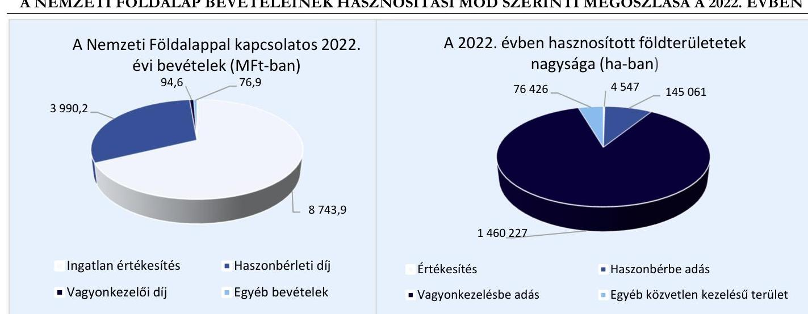

*1. ábra*

**A NEMZETI FÖLDALAP BEVÉTELEINEK HASZNOSÍTÁSI MÓD SZERINTI MEGOSZLÁSA A 2022. ÉVBEN**

*Forrás: Zárszámadás XLIV. A Nemzeti Földalappal kapcsolatos bevételek és kiadások fejezet; NFK által megküldött dokumentumok, nyilatkozatok adatai alapján ÁSZ szerkesztés*

---

# ÖSSZEFOGLALÁS 

A természeti erőforrások megőrzése, az azokkal való fenntartható gazdálkodás, a mezőgazdaság és a vidék fejlesztése kiemelt nemzeti érdek. Az Országgyűlés az állam tulajdonában lévő termőföldvagyonnal való ésszerű, a földbirtok-politikai céloknak megfelelő gazdálkodás érdekében létrehozta az NFA-t.

A földvagyonnal való felelős és rendeltetésszerű gazdálkodás alapvető és a földbirtok-politikai irányelvek érvényesülését biztosító folyamatok szempontjából nélkülözhetetlen elemei a megfelelő szabályozottság és tervezés, valamint a megbízható vagyonnyilvántartás.

Ezért az ÁSZ értékelte az NFK állami földvagyon hasznosításával kapcsolatos tervezési tevékenységét, a vagyonnyilvántartási rendszer jogszabályoknak és belső szabályzatoknak való megfelelőségét, továbbá a vagyonhasznosításra irányuló folyamatokat és azok földbirtokpolitikai irányelvekkel való összhangját.

Az ellenőrzött mintatételek vonatkozásában az ellenőrzés megállapította, hogy az NFK földterületek hasznosítására hozott döntései és megvételére irányuló intézkedései összhangban voltak a földbirtok-politikai irányelvekkel. A tulajdonosi joggyakorlói tevékenysége - a feltárt hiányosságok miatt - összességében nem volt szabályszerű. Az NFK tevékenysége tekintetében az alábbi hiányosságokat tárta fel az ellenőrzés:

- A FÖLDRÉSZLETEK HASZNOSÍTÁSÁVAL KAPCSOLATOS ÉVES TERVVEL a 2022. évre vonatkozóan az NFK a jogszabályi előírás ellenére nem rendelkezett. Ezáltal a földrészletek átlátható és tervszerű hasznosítása nem volt biztosított.
Az éves terv hiánya a gazdálkodás kiszámíthatóságára, megalapozottságára, a gazdálkodási tevékenység nyomon követésére, utólagos értékelésére vonatkozóan kockázatot jelent.
A FÖLDRÉSZLETEK HASZNOSÍTÁSI FOLYAMATAINAK SZABÁLYOZOTTSÁGA nem volt teljeskörű, mert az NFK ellenőrzési nyomvonalai nem a teljes szervezetre vonatkozóan tartalmazták a földrészletek hasznosításával és beszerzésével kapcsolatos működési folyamatokat. Az NFK az észrevételezés időszakában arra vonatkozóan nyújtott tájékoztatást, hogy az ellenértékes földfelajánlás ellenőrzési nyomvonala elkészült.
Az NFK Vagyonnyilvántartási szabályzata nem a hatályos jogszabályi előírásoknak megfelelően tartalmazta a jogszabályban előírt, vagyonnyilvántartásra vonatkozó részletszabályokat. A szabályozási hiányosságok a vagyonhasznosítás végrehajtási folyamataiban hibákat keletkeztettek.
Az NFA-ba tartozó földterületekkel való gazdálkodási folyamatok és az ahhoz kapcsolódó felelősségi körök belső szabályozásban való rögzítésének hiánya a felelős gazdálkodásra, a földrészletek hasznosítási és a földterületek megvételére irányuló folyamatok átláthatóságára, illetve azok következetes és szabályszerű végrehajtására vonatkozóan kockázatot jelent.
- A VAGYONNYILVÁNTARTÁSI RENDSZER kereteinek kialakítása megfelelő volt. Az ellenőrzött mintatételek tekintetében a rendszerben rögzített adatok megbízhatósága részben volt biztosított. Négy esetben az NFK belső szabályozása ellenére hatósági határozat nélkül módosította a vagyonnyilvántartásában a földterület erdővé történő művelési ág besorolását. Két mintatétel esetében a telekmegosztással létrejött ingatlan a vagyonnyilvántartásában nem szerepelt. Hét esetben pedig a gazdasági esemény nem a valós tartalmának megfelelően került rögzítésre a vagyonnyilvántartási rendszerbe, mivel a szerződésben foglaltakkal ellentétben az értékesítés ellenérték nélküliként került rögzítésre.
A szabályszerűen vezetett, megbízható vagyonnyilvántartás hiánya kockázatot jelent a földek átlátható, célszerű hasznosítására, az osztatlan közös tulajdon megszüntetésére irányuló intézkedések megalapozottságára, eredményességére és ezen keresztül a földbirtokpolitikai irányelvek érvényesülésére.

---

- A FÖLDRÉSZLETEK HASZNOSÍTÁSA az ellenőrzött mintatételek esetében nem volt szabályszerű, az alábbi hiányosságok miatt:
- Tizenhárom ellenőrzött mintatételből tizenegy esetében a haszonbérleti díjak mértékének felülvizsgálata a jogszabályi előírások alapján a szerződésben rögzítettek ellenére nem történt meg, az NFK nem érvényesítette a jogszabályi előírások szerinti haszonbérleti díj minimum értékét.
- Tizenkét ellenőrzött mintatételből tíz esetében a hasznosítási szerződés megkötésére vonatkozó, jogszabályban előírt - szerződéses partnert érintő - feltételek vizsgálatát igazoló dokumentumokat az NFK nem tudta teljeskörűen az ellenőrzés rendelkezésére bocsátani. Az NFK az észrevételezés időszakában arra vonatkozóan nyújtott tájékoztatást, hogy a jelenleg megkötött ügyvédi megbízási szerződések már tartalmazzák az Nfatv. 19. § (1) bekezdésében foglalt kizáró feltételek dokumentált módon történő vizsgálatát, ezzel a jelentéstervezet megállapítása az ellenőrzés során hasznosult.
- Tizenegy ellenőrzött mintatételből tíz esetében a belső szabályozással ellentétben felsővezetői döntés nélkül alkalmazták szerződéskötéskor az egyszerűsített statisztikai értékmeghatározást forgalmi értékbecslésként. Továbbá az értékbecslések dokumentumai a jogszabályi előírás ellenére nyolc esetben nem tartalmazták a döntések megalapozásához szükséges érvényességi időt.
- Az ellenőrzött tizenegy mintatételből öt esetében egyidejűleg volt hatályban ugyanazon földterületre vonatkozóan földhasználati és vagyonkezelési szerződés.
A földterületek hasznosítására irányuló folyamatokban jelentkező szabálytalanságok kockázatot jelentenek a földterületekkel való átlátható, ésszerű, földbirtok-politikai irányelveknek megfelelő gazdálkodás tekintetében.

A földterületek megvételére irányuló folyamatok elősegítették a földterületek földbirtok-politikai irányelveknek megfelelő hasznosítását.

---

# AZ ELLENŐRZÉS FÓKUSZKÉRDÉSEI 

1.- Az NFK által készített éves terv összhangban volt-e a Nemzeti Földalapba tartozó földrészletek hasznosításával kapcsolatos középtávú stratégiai tervvel és a földbirtok-politikai irányelvekkel, az éves terv teljesítését az NFK nyomon követte-e?
2.- A vagyonnyilvántartási rendszer a jogszabályoknak és a belső szabályzatoknak megfelelően került-e kialakításra, az biztosította-e a benne szereplő adatok megbízhatóságát?
3.- A földrészletek hasznosítására történő kijelölés, a hasznosításra irányuló döntések, a hasznosítási folyamatok végrehajtása, az árak kialakítása, a szerződések megkötése összhangban volt-e az éves tervben, a jogszabályi és a belső előírásokban foglaltakkal?
4.- A földterületek megvételére irányuló folyamatok, valamint az erre vonatkozó döntések - beleértve a földeken fennálló osztatlan közös tulajdon felszámolására irányuló folyamatokat - megfelelőek voltak-e, a megtett intézkedések összhangban voltak-e a földbirtok-politikai irányelvekkel?

---

# MEGÁLLAPÍTÁSOK 

## 1. Az NFK által készített éves terv összhangban volt-e a Nemzeti Földalapba tartozó földrészletek hasznosításával kapcsolatos középtávú stratégiai tervvel és a földbirtok-politikai irányelvekkel, az éves terv teljesítését az NFK nyomon követte-e?

Összegző megállapítás Az NFK az Nfatv.-ben előírt, a földrészletek hasznosításával kapcsolatos éves tervvel nem rendelkezett, tervezés hiányában az NFA-ba tartozó földrészletek átlátható és tervszerű hasznosítása nem volt biztosított. Az éves terv készítésének, elfogadásának folyamatait és teljesítésének nyomon követését a Bkr.7 előírása ellenére nem alakította ki.

AZ NFK nem készítette el az Nfatv. 8. § (1) bekezdés c) pontjában meghatározott, az NFA-ba tartozó földrészletek hasznosításával kapcsolatos éves tervet, így a földrészletek hasznosítását a 2022. évben hasznosítási módonként részletezett, tervadatokat tartalmazó éves tervvel nem alapozta meg.
Az NFA-ba tartozó földrészletek hasznosításával kapcsolatos éves terv összeállítására vonatkozóan az NFK SZMSZ8
 }_{1,2}-e tartalmazott rendelkezést, amely szerint annak összeállítása a vagyongazdálkodási elnökhelyettes feladatát képezte. Az NFK a Bkr. 6. § (2) bekezdése ellenére nem szabályozta a földrészletek hasznosítására vonatkozó éves terv készítésének és elfogadásának folyamatait, továbbá a Bkr. 6. § (1) bekezdés b) pontja ellenére nem határozta meg a tervkészítés folyamatához kapcsolódó feladat- és hatásköröket.
Az NFK elnöke a Bkr. 6. § (2a) bekezdése ellenére írásban nem jelölte ki az éves terv készítésének és elfogadásának folyamatában részt vevő szervezeti egységeket, továbbá a Bkr. 6. § (3) bekezdés ellenére az NFK ellenőrzési nyomvonalai nem tartalmazták a földrészletek hasznosításával kapcsolatos éves terv készítésének folyamatait.
Az NFK elnöke a Bkr. 10. § előírása ellenére nem alakította ki a földrészletek hasznosításával kapcsolatos éves terv céljainak megvalósítását nyomon követő rendszert.
A földrészletek hasznosításával kapcsolatos éves terv hiányában annak teljesítésének nyomon követése, valamint a középtávú stratégiai tervvel történő összhangja nem volt értékelhető.

---

# 2. A vagyonnyilvántartási rendszer a jogszabályoknak és a belső szabályzatoknak megfelelően került-e kialakításra, az biztosította-e a benne szereplő adatok megbízhatóságát? 

Összegző megállapítás A vagyonnyilvántartási rendszert az NFK a jogszabályoknak és a belső szabályzatoknak megfelelően alakította ki. Az ellenőrzött mintatételek vonatkozásában a vagyonnyilvántartási rendszer nem biztosította a benne szereplő adatok megbízhatóságát.

A vagyonnyilvántartási rendszert az NFK az Nfatv. és a 11/2011. (II. 22.) Korm. rend. ${ }^{9}$ előírásainak megfelelően alakította ki, az alkalmas volt a benne szereplő adatok visszakeresésére, a feladatok ellátásához kapcsolódó, az egyes folyamatokra vonatkozó információk kinyerésére, valamint az adatok ellenőrizhetőségének biztosítására.
Az NFK a vagyonnyilvántartással kapcsolatos feladatokat, azok felelőseit SZMSZ ${ }_{1,2}$-ében szabályozta.
A vagyonnyilvántartás vezetésének szabályait az NFK a 11/2011. (II. 22.) Korm. rendeletben foglaltaknak megfelelően Vagyonnyilvántartási szabályzatában határozta meg. A Vagyonnyilvántartási szabályzat rendelkezései azonban nem voltak összhangban a jogszabályi előírásokkal, mivel a Vagyonnyilvántartási szabályzat nem a hatályos jogszabályi előírásoknak megfelelően tartalmazta az Nfatv. 17. §-ban szereplő tartalmi elemekre vonatkozó részletszabályokat.
Az NFK vagyonnyilvántartási rendszerének megbízhatósága mintatételek ellenőrzésén keresztül került értékelésre.

Az ellenőrzés a mintatételek ellenőrzése során az alábbi hiányosságokat tárta fel:

- hét esetben az adásvételi szerződések szerint az ellenérték fejében történt értékesítés a vagyonnyilvántartási rendszerben „értékesítés-ingyenes" gazdasági jogcímként került rögzítésre, így a vagyonnyilvántartásban a 11/2011. (II. 22.) Korm. rendelet 5. § c) pontjában és a Vagyonnyilvántartási szabályzat 5.5.3. c) pontjában foglaltakkal ellentétben a gazdasági esemény nem a valós tartalmának megfelelően került rögzítésre;
- kettő csere mintatétel esetében a vagyonnyilvántartás az egyidejűleg végrehajtott telekmegosztás és csere esetében az Nvtv. 7. § (2) bekezdésében foglaltakkal ellentétben nem biztosította az átláthatóságot, mivel a telekmegosztás során a csere alapja nem nyomonkövethető;
- négy haszonbérbe adásra irányuló mintatétel esetén az NFK a 11/2011. (II. 22.) Korm. rendelet 7. §-a alapján a részletes szabályok meghatározását tartalmazó Vagyonnyilvántartási szabályzat 8.1. pontjában előírtak ellenére az erdő művelési ág átminősítéséről szóló hatósági határozat nélkül módosította a vagyonnyilvántartásában a földterület besorolását.

---

# 3. A földrészletek hasznosítására történő kijelölés, a hasznosításra irányuló döntések, a hasznosítási folyamatok végrehajtása, az árak kialakítása, a szerződések megkötése összhangban volt-e az éves tervben, a jogszabályi és a belső előírásokban foglaltakkal? 

Összegző megállapítás A földrészletek hasznosítására irányuló döntések összhangban voltak a földbirtok-politikai irányelvekkel. A hasznosítási folyamatok végrehajtása, a szerződések megkötése nem felelt meg a jogszabályokban és a belső előírásokban foglaltaknak.

Az NFK a földrészletek hasznosítására irányuló döntéseket az SZMSZ ${ }_{1,2}$ előírásainak megfelelően hozta meg, azok összhangban voltak az Nfatv.-ben foglalt földbirtok-politikai irányelvekkel.
A minták ellenőrzése során az ellenőrzés megállapította, hogy tíz mintatétel esetében - két értékesítés, két vagyonkezelésbe adás, három haszonbérbe adás és három csere - az Nfatv. 19. § 1) bekezdés feltételeinek vizsgálatát igazoló dokumentummal az NFK nem teljeskörűen rendelkezett, így nem igazolta a jogszabályi előírások betartását.
Az NFK az észrevételezés időszakában arra vonatkozóan nyújtott tájékoztatást, hogy a jelenleg megkötött ügyvédi megbízási szerződések már tartalmazzák az Nfatv. 19. § (1) bekezdésében foglalt kizáró feltételek dokumentált módon történő vizsgálatát, ezzel a jelentéstervezet megállapítása az ellenőrzés során hasznosult.
A hasznosítási folyamatok végrehajtása és a szerződések megkötése a feltárt hiányosságokra tekintettel nem volt összhangban a jogszabályi és a belső előírásokban foglaltakkal.
A földrészletek értékesítésének végrehajtási folyamatában az ellenőrzés az alábbi hiányosságokat állapította meg:

- tizenegy mintatétel volt érintett egyszerűsített statisztikai értékmeghatározással, amelyből tíz esetében az NFK nem a 9/2019. (X. 01.) NFK utasítás ${ }^{10}$ IV. fejezetében foglalt előírások szerint járt el, mivel a földterület értékesítése esetén felsővezetői döntés nélkül az egyszerűsített statisztikai értékmeghatározást fogadta el a szerződéskötéskor forgalmi értékbecslésnek. Az értékmeghatározások továbbá nyolc mintatétel esetén nem tartalmazták az Nfatv.vhr. 4. § (2) bekezdésében előírt, a döntések megalapozásához szükséges érvényességi időt.
A földrészletek haszonbérbe adására és a földcserékre vonatkozó végrehajtási folyamatok vizsgálata során az ellenőrzés az alábbi hiányosságokat tárta fel:
- tizenhárom haszonbérleti szerződés módosítására vonatkozó mintatételből tizenegy minta esetében a 2022. év előtt megkötött és 2022. évben módosított haszonbérleti szerződések vonatkozásában az Nfatv.vhr. 36. § (1) bekezdése alapján a szerződések 3.6. pontjában rögzített előírásokkal ellentétben a haszonbérleti díj mértékének felülvizsgálata nem történt meg, így az NFK nem érvényesítette az Nfatv. 18. § (7) bekezdésében előírt haszonbérleti díj minimum értékét, emiatt nem érvényesült az Nvtv. ${ }^{11}$ 7. § (1) bekezdése szerinti felelős gazdálkodás;

---

- a tizenegy erdő művelési ágba történő átsorolással érintett haszonbérleti szerződésből öt haszonbérbe adásra vonatkozó minta esetében megtörtént a földterületek erdő művelési ágba történő átsorolása, azonban - a haszonbérleti szerződés módosításáig - nem került sor a földterületekre vonatkozóan a haszonbérleti szerződések módosítására, így ugyanazon földterületekre vonatkozóan egyidőben a haszonbérleti és vagyonkezelési szerződések is hatályban voltak, emiatt nem érvényesült az Nvtv. 7. § (1) bekezdés szerinti felelős gazdálkodás, és a (2) bekezdés szerinti rendeltetésnek megfelelő és átlátható működtetés.

# Az NFA-ba tartozó földterületek hasznosításának 

szabályozottságával kapcsolatosan az ellenőrzés az alábbi hiányosságokat tárta fel:

- az egyes szervezeti egységek ellenőrzési nyomvonalai nem tartalmazták a teljes haszonbérbe adás és a földcsere teljes működési folyamatát, így azok nem feleltek meg a Bkr. 6. § (3) bekezdés előírásainak;
- a Bkr. 6. § (1) bekezdés előírása ellenére az NFK nem rendelkezett a haszonbérbe adással kapcsolatosan a kérelemre vagy egyéb úton induló szerződésmódosítások eljárásrendjével.
A földterületek hasznosítása tekintetében az NFK hozzájárult az Nfatv. 15. § 3. bekezdés o) pontjában foglalt földbirtok-politikai irányelv érvényesítéséhez, mivel mint állami kezdeményező - az osztatlan közös tulajdonú földterületek megszüntetésével - elősegítette a nem művelt, vagy méretük és kialakításuk miatt gazdaságosan nem művelhető földterületek hasznosítását.
Az NFK nem rendelkezett Nemzeti Erdőtelepítési Programmal az ellenőrzött időszakban, annak hiányában az Nfatv. 15. § (3) bekezdés e) pontjában előírt „Nemzeti Erdőtelepítési Programban foglaltak, végrehajtásának támogatása" földbirtok-politikai irányelvet a földrészletek hasznosítása során nem tudta érvényesíteni.

## 4. A földterületek megvételére irányuló folyamatok, valamint az erre vonatkozó döntések - beleértve a földeken fennálló osztatlan közös tulajdon felszámolására irányuló folyamatokat megfelelőek voltak-e, a megtett intézkedések összhangban voltak-e a földbirtok-politikai irányelvekkel?

Összegző megállapítás A földterületek megvételére és az osztatlan közös tulajdon felszámolására irányuló folyamatok, az erre vonatkozó döntések, valamint a megtett intézkedések elősegítették a földterületek földbirtok-politikai irányelveknek megfelelő hasznosítását.

Az NFK az SZMSZ ${ }_{1,2}$-ben szabályozta a földrészletek megvásárlására, valamint az osztatlan közös tulajdon megszüntetésére irányuló vásárlások folyamataiban érintett szervezeti egységek feladatait, és a kapcsolódó munkaköröket.
Az NFK a Bkr. 6. § (1) bekezdés előírása ellenére nem rendelkezett a földterületek megvételére - az ingyenes földrészletek vásárlásához, az ellenérték fejében történő földfelajánlásokhoz és az osztatlan közös tulajdon megszüntetéséhez - irányuló folyamatokat részletező szabályozással. Az elővásárlási jog

---

gyakorlásáról szóló eljárásrend és az SZMSZ ${ }_{1,2}$ közötti összhang nem volt biztosított a szervezeti egységek megnevezése és a feladatok meghatározása tekintetében, így nem valósult meg a Bkr. 6. § (1) bekezdés b) pontjában előírt, egyértelmű felelősségi, hatásköri viszonyok és feladatok kialakítása. A földterületek megvételével kapcsolatos ellenőrzési nyomvonalak a Bkr. 6. § (3) bekezdés előírása ellenére nem tartalmazták a teljes folyamatot, mivel a nyomvonalak nem terjedtek ki a folyamatban részvevő összes szervezeti egységre. Az NFK az észrevételezés időszakában arra vonatkozóan nyújtott tájékoztatást, hogy az ellenértékes földfelajánlás ellenőrzési nyomvonala elkészült.
Az ellenőrzött tíz mintatétel alapján a földrészletek megvásárlására, valamint az osztatlan közös tulajdon megszüntetésére irányuló vásárlások esetén a döntés-előkészítő folyamatok megfeleltek az NFK SZMSZ ${ }_{1,2}$-ében foglaltaknak, a döntésekre az Nfatv. rendelkezéseinek megfelelően került sor, azok dokumentumokkal alátámasztottak voltak. A földrészletek beszerzésére az Nfatv. előírásaival összhangban került sor, az NFK földterületek beszerzésével kapcsolatos tevékenységei összhangban voltak a földbirtok-politikai irányelvekkel.
Az NFK saját döntése alapján adásvételi, illetve csere szerződések útján történő földrészletek megszerzésének célja döntően a nemzetgazdasági szempontból kiemelt beruházás megvalósítása miatti birtokösszevonási célú földrészlet szerzés, továbbá az osztatlan közös tulajdon megszüntetése volt, ami összhangban volt az Nfatv.-ben foglalt földbirtok-politikai irányelvvel.

---

# JAVASLATOK 

Az ÁSZ tv. 33. § (1) bekezdésében foglaltak értelmében az ellenőrzött szervezet vezetője köteles a jelentésben foglalt megállapításokhoz kapcsolódó intézkedési tervet összeállítani és azt a jelentés kézhezvételétől számított 30 napon belül az ÁSZ részére megküldeni. Amennyiben az ellenőrzött szervezet vezetője nem küldi meg határidőben az intézkedési tervet, vagy továbbra sem elfogadható intézkedési tervet küld, az Állami Számvevőszék elnöke az ÁSZ tv. 33. § (3) bekezdés a) és b) pontjaiban foglaltakat érvényesítheti.

## A NEMZETI FÖLDÜGYI KÖZPONT ELNÖKE RÉSZÉRE

1. Tegyen intézkedést annak érdekében, hogy az NFK az Nfatv. 8. § (1) bekezdés c) pontjában meghatározott, a Nemzeti Földalapba tartozó földrészletek hasznosításával kapcsolatos éves tervet elkészítse.
2. Tegyen intézkedést annak érdekében, hogy az NFK az Nfatv. 8. § (1) bekezdés c) pontjában meghatározott, a Nemzeti Földalapba tartozó földrészletek hasznosításával kapcsolatos éves terv készítésének folyamatait a Bkr. 6. § (2) bekezdésében foglaltak szerint kialakítsa, határozza meg a Bkr. 6. § (1) bekezdés b) pontjában előírtak szerint a kapcsolódó feladat- és hatásköröket, és jelölje ki a Bkr. 6. § (2a) bekezdésében előírtak szerint az éves terv készítésének és elfogadásának folyamatában részt vevő szervezeti egységeket, készítse el a Bkr. 6. § (3) bekezdése szerint az éves terv ellenőrzési nyomvonalát, alakítsa ki a Bkr. 10. §-ban foglaltak szerint a földrészletek hasznosításával kapcsolatos éves terv céljainak megvalósítását nyomon követő rendszert.
3. Tegyen intézkedést annak érdekében, hogy a Vagyonnyilvántartási szabályzat a hatályos jogszabályi előírásoknak megfelelően tartalmazza az Nfatv. 17. § szerinti tartalmi elemekre vonatkozó részletszabályokat.
4. Tegyen intézkedéseket a kontrolltevékenységek megfelelő működtetésére annak érdekében, hogy a földrészletek haszonbérbeadása során az Nfatv.vhr. 36. § (1) bekezdésével összhangban a haszonbérleti szerződésekben rögzített, a haszonbérleti díjak kétévenkénti felülvizsgálatára kerüljön sor. Tegyen intézkedést annak érdekében, hogy a felülvizsgálat
 eredménye alapján az Nfatv. 18. § (7) bekezdésében előírtak szerinti haszonbérleti díj minimum értéke és a földrészlet piaci értéke figyelembevételével a haszonbérleti díjak összegének megváltoztatása érdekében kezdeményezze a haszonbérleti szerződések módosítását.
5. Tegyen intézkedést annak érdekében, hogy a földrészletek megvételére irányuló folyamatokra vonatkozó eljárásrendjei, valamint a haszonbérbe adással kapcsolatosan a kérelemre vagy egyéb módon induló szerződésmódosítások eljárásrendjei a Bkr. 6. § (1) bekezdésében előírtak szerint kerüljenek szabályozásra, az ellenőrzési nyomvonalak a Bkr. 6. § (3) bekezdésében előírtak szerint a földrészletek megvételére irányuló folyamatokra, valamint a haszonbérbe adásra és földcserékre vonatkozóan az NFK teljes szervezetére vonatkozzanak és tartalmazzák teljeskörűen a működési folyamatokat.
6. Tegyen intézkedéseket a kontrolltevékenységek megfelelő működtetésére annak érdekében, hogy a földterület értékesítése esetén az egyszerűsített statisztikai értékmeghatározás forgalmi értékbecslésként való felhasználására csak felsővezetői döntés mellett kerüljön sor, valamint az értékbecslések tartalmazzák az Nfatv.vhr. 4. § (2) bekezdésében előírt érvényességi időt.

---

# MELLÉKLETEK 

## I. SZ. MELLÉKLET: ÉRTELMEZŐ SZÓTÁR

Csereszerződés:

Éves terv
Földbirtok-politikai irányelvek:

Földcsere:

Földrészlet:

Haszonbérlet:

Hasznosítás:

Osztatlan közös tulajdonú ingatlan:

Olyan polgári jogi jogviszony, amelyben a szerződő felek dolgok tulajdonjogának, más jogoknak vagy követeléseknek kölcsönös átruházására vállalnak kötelezettséget, az adásvétel szabályait kell megfelelően alkalmazni. Ebben az esetben mindegyik fél eladó a saját szolgáltatása és vevő a másik fél szolgáltatása tekintetében. (Ptk. 6:234. §)
Az NFK által készített, a Nemzeti Földalapba tartozó földrészletek hasznosításával kapcsolatos éves terv. (Nfatv. 8. § (1) bekezdés c) pontja, 6. § c) pont)
A Nemzeti Földalapba tartozó földrészletek hasznosítása során alkalmazandó elvek, melyeket az Nfatv. 15. § (2)-(3) bekezdései írnak elő.
Az NFK a Nemzeti Földalapba tartozó földrészleteket többek között cserével hasznosítja. (Nfatv. 18. § (1) bekezdés)
A föld tulajdonjogát csere jogcímén akkor lehet megszerezni, ha a csereszerződésben a felek a föld tulajdonjogának kölcsönös átruházására vállalnak kötelezettséget. (Földforg.tv. ${ }^{12}$ 12. § (1) bekezdés)
A Nemzeti Földalapba tartozó terület. Az állam tulajdonában lévő azon terület, mely az ingatlan nyilvántartásban:
a) szántó, szőlő, gyümölcsös, kert, rét, legelő (gyep), nádas, erdő, fásított terület vagy halastó művelési ágban nyilvántartott terület;
b) művelés alól kivett területként nyilvántartott olyan terület (ide nem értve az Állami terület I; Állami terület II; és Állami terület III. megnevezésű művelés alóli kivett területet), amelyre az Országos Erdőállomány Adattárban erdőként nyilvántartott terület jogi jelleg ténye van feljegyezve, és az Országos Erdőállomány Adattárban foglaltak szerint elsődleges gazdasági rendeltetésű erdőnek minősül;
c) művelés alól kivett területként nyilvántartott olyan terület, amely a Nemzeti Földalapba tartozó földrészlet mező-, erdőgazdasági tevékenységét szolgálja, vagy ahhoz szükséges;
d) művelés alól kivett, honvédelmi célra feleslegessé nyilvánított területként nyilvántartott földrészlet;
e) 2020.07.01-től a termőföld védelméről szóló törvényben állandó jellegű növényházként meghatározott és az ingatlan-nyilvántartásban ekként nyilvántartott művelés alól kivett földrészlet;
f) 2022.01.01.-től a művelés alól kivett területként nyilvántartott belvízelvezető csatorna, állandó jellegű öntözőcsatorna (rizstelep elárasztó és lecsapoló főcsatornái), valamint egyéb árok. (Nfatv. 1. § (1) bekezdés, 1. § (2a) bekezdés)
Haszonbérleti szerződés alapján a haszonbérlő hasznot hajtó dolog időleges használatára vagy hasznot hajtó jog gyakorlására és hasznainak szedésére jogosult, és köteles ennek fejében haszonbért fizetni.
(2) A haszonbérleti szerződést írásba kell foglalni. (Ptk. 6:349. §)
A hasznosítás fogalmán a Nemzeti Földalapba tartozó földrészletnek - a közös tulajdonban álló földrészlet esetében az állam tulajdoni hányadának, illetve az ennek megfelelő területnek - az Nfatv.-ben meghatározott tulajdonosi jogok gyakorlója által a törvényben meghatározott módon, jogcímen történő átadását, átengedését kell érteni. (Nfatv. 1. § (2b) bekezdés)
Olyan ingatlan, melynek több tulajdonosa van és amelynek minden része a tulajdonosok tulajdoni hányadának arányában oszlik meg a tulajdonosok között. Amennyiben a tulajdoni hányadok nem határozhatóak meg egyértelműen, úgy azokon egyenlően osztoznak a tulajdonosok. Maga a tulajdonjog oszlik meg, a tulajdonosok az ingatlan felett eszmei hányaddal rendelkeznek. (Ptk. 5:73. §)

---

II. SZ. MELLÉKLET: AZ ELLENŐRZÖTT SZERVEZETEK JEGYZÉKE

# ADOSZÁM 

## ELLENŐRZÖTT SZERVEZET MEGNEVEZÉSE

15840369-2-42 Nemzeti Földügyi Központ

---

# FOKUSZKÉRDÉS 

## ELLENŐRZÉSI KRITÉRIUMOK

1. Az NFK által készített éves terv összhangban volt-e a Nemzeti Földalapba tartozó földrészletek hasznosításával kapcsolatos középtávú stratégiai tervvel és a földbirtok-politikai irányelvekkel, az éves terv teljesítését az NFK nyomon követte-e?
1.1. Az éves terv készítésének és elfogadásának folyamatai, a kapcsolódó feladat- és hatáskörök kialakításra kerültek-e, azok megfeleltek-e a jogszabályoknak és a belső előírásoknak?
1.2. Az éves terv középtávú stratégiai tervvel, továbbá a földbirtokpolitikai irányelvekkel való összhangja biztosított volt-e?
1.3. Az éves terv teljesülésének nyomon követése biztosított volt-e, értékelték-e annak végrehajtását?

Áht. ${ }^{13} 7 . \S$ (1) bek. 10. § (5) bek. Bkr. 6. § (1)-(2), (2a), (3) bek.
Nfatv. 7. § (1) bek. a) pont; 7. § (2) bek.; 8. § (1) bek. c) pont, a jogszabályoknak megfeleltethető belső szabályzatok

Nfatv. 6. § c)-d) pontok; 8. § (1) bek. a) és c) pontok 15. § (3) bek.

Bkr. 3. § e); 6. § (1)-(2), (2a), (3) bek, 10. §, a jogszabályoknak megfeleltethető belső szabályzatok

## 2. A vagyonnyilvántartási rendszer a jogszabályoknak és a belső szabályzatoknak megfelelően került-e kialakításra, az biztosította-e a benne szereplő adatok megbízhatóságát?

2.1. A földrészletek nyilvántartása megfelelt-e a jogszabályi és a belső előírásokban foglaltaknak?
2.2. Az NFK belső szabályzatai tartalmaztak-e a vagyonelemek, kapcsolódó szerződések nyilvántartására, az adatok biztonságos tárolására vonatkozó előírást?
2.3. A földrészletek nyilvántartási rendszere megfelelően szolgálta-e a feladatok ellátását, biztosította-e az egyes folyamatokhoz szükséges információkat?

Nfatv. 2. §, 7. § (1) bek. j) pont, 17.§, 11/2011. (II. 22.) Korm. rend., a földrészletek nyilvántartására vonatkozó belső előírások

Nfatv. 17. §, 11/2011. (II. 22.) Korm. rend., Ibtv. ${ }^{14}$ 7-13. §, Ibtv.vhr. ${ }^{15}$ 1-3. §, 6. §, 1-4. melléklet

Nfatv. 7. § (1) bek. j) pont 15. § (2)- (3) bek., Bkr. 6. § (1)-(2) (2a) (3) bek., 9. § (1) bek., a földrészletek nyilvántartására vonatkozó belső előírások
3. A földrészletek hasznosítására történő kijelölés, a hasznosításra irányuló döntések, a hasznosítási folyamatok végrehajtása, az árak kialakítása, a szerződések megkötése összhangban volt-e az éves tervben, a jogszabályi és a belső előírásokban foglaltakkal?
3.1. A földrészletek hasznosítására vonatkozó kiválasztási szempontok, a kapcsolódó döntési folyamatok összhangban voltak-e a földbirtok-politikai irányelvekkel és az éves tervvel?
3.2. A földrészletek hasznosítása során a pályáztatás és árverés folyamata, a folyamatok során alkalmazott kontrollok, a megkötött szerződések, a földrészletek értékének meghatározása, a változások vagyonnyilvántartáson való átvezetése összhangban volt-e a jogszabályi és a belső előírásokkal?
3.2.1. A földrészletek értékesítése során a pályáztatás és árverés folyamata, az alkalmazott kontrollok, a földrészletek értékének meghatározása, az adásvételi szerződések megkötése, a változások vagyonnyilvántartáson való átvezetése összhangban volt-e a jogszabályi és a belső előírásokkal?

Nfatv. 7. § (1) bek. k) pont, 15. §, 18. § (2) bek., Bkr. 6. § (1)-(2), (2a), (3) bek.

NFK belső előírásai, Éves terv

Nvtv. 7. § (1)-(2) bek., 13. § (2) bek. Nfatv. 2. §, 3. § (1) bek., 17. §, 18. § (1)-(2). bek., 19. §, 21. §, (3a) bek, (5) bek, 22. § (1) bek. b) pont, 22/A.§ a) pont, 23/A.§, 26. §, 29/A. §, Erdőtv. ${ }^{16}$ 8. § (5) és (6) bek. Földforgalmi tv. 1. § (1) bek., 2. § (4) bek., (6) bek., 18. §, 21. § (1c) bek., (3a) bek., (6)-(9) bek., 41. §, 43. § (1)-(3) bek., Ptk. 6:215. §, Nfatv.vhr. 3. § (1)-(6) bek., (8) bek., 4. § (2) bek, (2a)-(2i) bek., 4/B. §, II. IV-V fejezetek, 11/2011. (II. 22.) Korm. rend., Bkr. 6. § (1)-(2), (2a), (3) bek.
NFK belső előírásai

---

3.2.2. A földrészletek haszonbérbe adása során a pályáztatás folyamata, az alkalmazott kontrollok, a haszonbérleti díj értékének meghatározása, a haszonbérleti szerződések megkötése, illetve a változások vagyonnyilvántartáson való átvezetése összhangban volt-e a jogszabályi és a belső előírásokkal?
3.2.3. A vagyonkezelési szerződések megkötése, az alkalmazott kontrollok, illetve a változások vagyonnyilvántartáson való átvezetése összhangban volt-e a jogszabályi és a belső előírásokkal?
3.2.4. A csereszerződések megkötése, az alkalmazott kontrollok, illetve a változások vagyonnyilvántartáson való átvezetése összhangban volt-e a jogszabályi és a belső előírásokkal?
Nvtv. 7. § (1)-(2) bek., Nfatv. 2. §, 3. § (1) bek.,17. §, 18. § (1)(3) és (8) bek., 19. §, 21. § (3) bek., (5) bek., 26. §, 29/A. §,

Ptk. 6:349. §, Nfatv.vhr., II. és V fejezetek, Földforgalmi tv. 2. § (6) bek., 40. §55. §, 58. §-59. §, 11/2011. (II. 22.) Korm. rend., Bkr. 6. § (1)-(2), (2a), (3) bek.

NFK belső előírásai
Nvtv. 7. § (1)-(2) bek. 11. §, Nfatv. 2. §, 17. §, 18. § (1) bek., 19. §, 19/A. §-20. §, 21. § (3c) bek., (3d). bek., (4) bek., (6) bek., 21/A. §-23. §, Nfatv.vhr. 3. § (1)-(5) és (8) bek., 39. §-43/B §, 48/A. § ,11/2011. (II. 22.) Korm. rend., Bkr. 6. § (1)-(2), (2a), (3) bek.

NFK belső előírásai
Nvtv. 13. § (2) bek. Nfatv. 2. §., 17. §, 18. § (1), (2), (3) bek., 19. §, 21. § (6) bek., Erdőtv. 8. § (5) és (6) bek., 57/A. § a) pont, Földforgalmi tv. 12-13. §, 36. §, Nfatv.vhr. 3. § (1)-(6) bek., (8) bek., 4. § (2) bek., 14. § (2) bek, (2a)-(2i) bek, 4/B. §,44. §-46. §, 11/2011. (II. 22.) Korm. rend., Bkr. 6. § (1)-(2), (2a), (3) bek. NFK belső előírásai

Nfatv. 15. § (3) bek. o) pont
3.3. A nem művelt, vagy méretük és kialakításuk miatt gazdaságosan nem művelhető területek hasznosításával kapcsolatos tevékenység során érvényesültek-e a földbirtok politikai irányelvek?
4. A földterületek megvételére irányuló folyamatok, valamint az erre vonatkozó döntések - beleértve a földeken fennálló osztatlan közös tulajdon felszámolására irányuló folyamatokat, - megfelelőek voltak-e, a megtett intézkedések összhangban voltak-e a földbirtok-politikai irányelvekkel?
4.1. A földvásárlásokkal kapcsolatos döntéselőkészítési és döntési folyamatok - beleértve a földeken fennálló osztatlan közös tulajdon felszámolására irányuló folyamatokat - megalapozottak voltak-e, a döntéselőkészítési, döntési, végrehajtási folyamatok és az alkalmazott kontrollok, illetve a változások vagyonnyilvántartáson való átvezetése összhangban voltak-e a jogszabályi és a belső előírásokkal?
4.2. A Nemzeti Erdőtelepítési Programmal kapcsolatos, továbbá a földpiac élénkítése érdekében tett intézkedések összhangban voltak-e a földbirtok-politikai irányelvekkel?
4.3. A nem művelt, vagy méretük és kialakításuk miatt gazdaságosan nem művelhető területek beszerzésével kapcsolatos tevékenységek összhangban voltak-e a földbirtokpolitikai irányelvekkel?

Nfatv. 17. §, 24. §, 24/A. §, 25. § Erdőtv. 28/E. § (1) bek, 57/A. § a) pont, Foktftv. ${ }^{17}$, Foktftv.vhr. ${ }^{18}$, Ptk. 6:215. §, 11/2011. (II. 22.) Korm. rend., NFK belső előírásai

Nfatv. 15. § (3) bek. e), g) pontok, Erdőtv. 28/E. § (1) bek, 57/A. § a) pont, NFK belső előírásai

Nfatv. 15. § (3) bek. o) pont, Bkr. 6. § (1)- (2), (2a), (3) bek.

---

# FÜGGELÉK: ÉSZREVÉTELEK 

A jelentéstervezetet
 a Számvevőszék 15 napos észrevételezésre megküldte az ellenőrzött szervezet vezetőjének az ÁSZ tv. 29. § (1) bekezdése előírásának megfelelően.

A jelentéstervezet megállapításaira az NFK észrevételt tett. Az ÁSZ tv. 29. § (3) bekezdésével összhangban az ÁSZ a Függelékben feltünteti a megállapításokkal kapcsolatban tett, el nem fogadott észrevételeket, illetve az el nem fogadott észrevételek indoklását.

[^0]
[^0]:    * 29. § (1) Az Állami Számvevőszék az ellenőrzési megállapításait megküldi az ellenőrzött szervezet vezetőjének vagy az általa megbízott személynek, és annak, akinek személyes felelősségét állapította meg.
    (2) Az ellenőrzött szervezet vezetője és a felelősként megjelölt személy az ellenőrzés megállapításaira tizenöt napon belül írásban észrevételt tehet.
    (3) Az Állami Számvevőszék az észrevételre a beérkezésétől számított harminc napon belül írásban válaszol. A figyelembe nem vett észrevételeket köteles a jelentésben feltüntetni, és megindokolni, hogy azokat miért nem fogadta el.

---

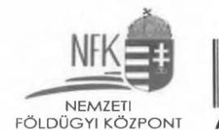

Ügyiratszám: NFK-004282/001/2024
Ügyintéző: Kovács Lajos
Telefon: 0617952055

Herczegh Zsolt
Ellenőrzési Igazgató részére

Állami Számvevőszék
Állami Vagyongazdálkodást
Ellenőrző Igazgatóság

1052 Budapest
Apáczai Csere János utca 10.

Tárgy: Észrevétel az EL-3888-068/2024. számú számvevőszéki jelentéstervezetre

Tisztelt Igazgató Úr!

A Nemzeti Földügyi Központ (NFK) 2024.01.09-én vette kézhez az Állami Számvevőszéknek a „Nemzeti Földügyi Központ ellenőrzése, A Földbirtok-politikai irányelvek érvényesülésének ellenőrzése" című, EL-3888-068/2024. számú számvevőszéki jelentéstervezetét, melyre a törvényes határidőn belül, írásban az alábbi észrevételt teszi az ÁSZ törvény 29. § (2) bekezdése alapján:

Jelentéstervezet „Összefoglalás” fejezet:

Az Összefoglalás fejezet „Földrészletek hasznosításával kapcsolatos éves tervvel” elnevezésű bekezdésében arra a megállapításra, hogy a „2022. évre vonatkozóan az NFK a jogszabályi előírás ellenére nem rendelkezett. Ezáltal a földrészletek átlátható és tervszerű hasznosítása nem volt biztosított, az éves terv hiánya a gazdálkodás kiszámíthatóságára, megalapozottságára, a gazdálkodási tevékenység nyomon követésére, utólagos értékelésére vonatkozóan kockázatot jelentett.” az alábbi észrevételt tesszük.

A 2023. augusztus 23. napján folytatott helyszíni ellenőrzés alkalmával átadott kérdéssor 1-5. kérdései kapcsán az Állami Számvevőszék részére Nyilatkozat került kiadásra a kérdéskörben, melyet továbbra is kérünk figyelembe venni az ÁSZ ellenőrzés vezetőjétől a jelentéstervezetben kifejtett megállapításai során a következők szerint.

---

A Nemzeti Földalapba tartozó földrészletek hasznosításával kapcsolatos éves terv a tárgyévi költségvetési terv szerves részét képezi.

A 2022. évi tárgyévi költségvetés tervezést megelőzően 2022-2024. évre vonatkozóan középtávú tervezés került előkészítésre. A tervezést követően az XLIV. A Nemzeti Földalappal kapcsolatos bevételek és kiadások tárgyévi tervszámai - mely tartalmazza a földrészletek hasznosításával kapcsolatos éves tervet - szöveges indoklással is alátámasztva megküldésre kerülnek az Agrárminisztérium, mint az irányító szerv részére. Amennyiben módosítás indokolt az éves terv ismételten megküldésre kerül az Agrárminisztérium részére jóváhagyásra, melynek Pénzügyminisztérium általi elfogadását is követően a költségvetési törvényben elfogadásra kerül (2021. évi XC. törvény Magyarország 2022. évi központi költségvetéséről).

A fentiek alátámasztására 2023. július 13-ai adatszolgáltatásban feltöltésre kerültek a 3, 4, 5 és 7. mappákba a Tervezés, Éves Terv, Birtokpolitikai Tanácsülések, valamint az Éves terv elkészítési monitoring, beszámolót igazoló dokumentumok, melyeket ismételten kérünk figyelembe venni.
Az előzőekhez kapcsolódóan megjegyezzük, hogy álláspontunk szerint a „Megállapítások" fejezet 1. pontjának „Összegző megállapításaiban" foglaltakra az NFA-ba tartozó földrészletek hasznosításával kapcsolatos éves tervet a XLIV. A Nemzeti Földalappal kapcsolatos bevételek és kiadások 2022. évi tervszámai tartalmazták, melyek nyomon követése a „Nemzeti Földalap Várható bevételek - kiadások" havi jelentéseiben is megjelent.

A földrészletek hasznosításával kapcsolatos éves terv vonatkozásában a megállapításokat kérjük módosítani, aszerint, hogy az intézkedési terv javaslatban (1. pont) megfogalmazottak helyett a költségvetési tervezésen túl külön, részletes éves terv elkészítésére szükséges intézkedési tervet készíteni.

# 8. oldal: 

„Földrészletek hasznosítási folyamatainak szabályozottsága" elnevezésű bekezdésében arra megállapításra, hogy az NFK ellenőrzési nyomvonalai nem a teljes szervezetre vonatkozóan tartalmazták a működési folyamatokat, meg kívánjuk jegyezni, hogy a földrészletek hasznosításával kapcsolatos belső szabályozásokat eljárásonként külön-külön utasítások tartalmazzák, amelyekben az ellenőrzési nyomvonalak végigvezethetőek.

Nem tartjuk megalapozottnak azon állítást, amely szerint az NFK tulajdonosi joggyakorlási körébe tartozó földterületekkel való gazdálkodási folyamatok és az ahhoz kapcsolódó felelősségi körök belső szabályozásban való rögzítése hiányos lenne, eljárásrendjeink minden esetben konkrétan tartalmazzák az eljárás során hozott döntések menetét és a döntés meghozatalára jogosult személyt.

## 8 - 9. oldal:

- A VAGYONNYILVÁNTARTÁSI RENDSZER... A szabályszerűen vezetett, megbízható vagyon-nyilvántartás hiánya kockázatot jelentett a földek átlátható,

---

# NFK 

NEMZETI
FÖLDÜGYI KÖZPONT
célszerű hasznosítására, az osztatlan közös megszüntetésére irányuló intézkedések megalapozottságára, eredményességére és ezen keresztül a földbirtok-politikai irányelvek érvényesülésére.

Észrevételemben előadom, hogy az ellenőrzés során nem került bizonyításra, hogy a nyilvántartás vezetése hogyan hatott, illetve mely indokok miatt hatott negatívan a hasznosítási eljárásokra, és a földbirtok-politikai irányelvek érvényesülésére.

A vagyon-nyilvántartási rendszer helyszíni bemutatása során kifejtésre és bemutatásra került a hasznosítási eljárásokat megelőző ellenőrzési eljárás menete. Minden hasznosítási eljárás tervezése során egyeztetésre kerül a közhiteles ingatlan-nyilvántartási adatok és az Avatar adatok egyezősége a vagyonelem adatok tekintetében. Az NFK a hatósági nyilvántartásban foglaltakat tekinti irányadónak a jogszabályi rendelkezések alapján és a nyilvántartását haladéktalanul hozzáigazítja a hatósági nyilvántartásban szereplő adatokhoz, jogokhoz, tényekhez.

Minden hasznosítási eljárás tervezési szakaszában megbízható és naprakész vagyonnyilvántartási adatokat tartalmaz az Avatar szakrendszer a fentiekre tekintettel, a változás vezetés folyamatos, az negatív hatással nem lehet a hasznosítási folyamatokra. A kockázatok kiszűrése pedig (amely abból, a korábban kifejtett problémából adódhat, hogy nem kap Szervezetünk határozatot egy-egy változás átvezetéséről az ingatlanügyi hatáságtól) a közhiteles ingatlan-nyilvántartásból történő közvetlen adatkinyerés miatt teljes mértékben megszűnik.

## 9. oldal, 4. francia bekezdés, 2. albekezdés:

„A földrészletek hasznosítása az ellenőrzött mintatételek esetében nem volt szabályszerű, az alábbi hiányosságok miatt: ... Tizenkettő ellenőrzött mintatételből tíz esetében a hasznosítási szerződés megkötésére vonatkozó, jogszabályban előírt - szerződéses partnert érintő feltételek vizsgálatát igazoló dokumentumokat az NFK nem tudta teljeskörűen az ellenőrzés rendelkezésére bocsátani."
A fenti megállapítás érinti a „Javaslatok" 4. pontját (16. oldal)
„... Egyben intézkedjen arról, hogy a földrészletek hasznosítására irányuló szerződések esetén az Nfatv. 19. § (1) bekezdésében előírt szerződéskötést kizáró feltételek vizsgálata dokumentáltan megtörténjen."

A javaslat ÁSZ ellenőrzés során történő felmerülést követően megkötött ügyvédi megbízási szerződések már tartalmazzák azt, hogy a megbízott a szerződéskötés előtt köteles - többek között - ellenőrizni azt is, hogy a szerződő partner vonatkozásában az Nfatv. 19. § (1) bekezdésében foglalt kizáró feltételek nem állnak fenn. A feltételek vizsgálatának elvégzését igazoló dokumentumokat köteles beszerezni és azokat az ügylet anyagához csatolni. Ezen kikötést a korábban hatályba lépett ügyvédi szerződések ügyvédei is, mint megbízói utasítást, megkapták.

---

# Jelentéstervezet „Megállapítások" fejezet: 

## 2. számú megállapítás:

(12. oldal)

- Összegzö megállapítás: Az ellenőrzött mintatételek vonatkozásában a vagyonnyilvántartási rendszer nem biztosította a benne szereplő adatok megbízhatóságát.
- Az ellenőrzés a mintatételek ellenőrzése során az alábbi hiányosságokat tárta fel: négy haszonbérbe adásra irányuló mintatétel esetén az NFK az 11/2011. (II. 22.) Korm. rendelet 7. §-a alapján a részletes szabályok meghatározását tartalmazó Vagyon-nyilvántartási szabályzat 8.1. pontjában előírtak ellenére az erdő művelési ág átminősítéséről szóló ingatlanügyi hatósági határozat nélkül módosította a vagyonnyilvántartásban a földterület besorolását.

Kapcsolódóen: „Összefoglalás" rész 8. oldal: A VAGYONNYILVÁNTARTÁSI RENDSZER kereteinek kialakítása megfelelő volt. Az ellenőrzött mintatételek tekintetében a rendszerben rögzített adatok megbízhatósága részben volt biztosított, mivel négy esetben az NFK a jogszabályi előírás ellenére ingatlanügyi határozat nélkül módosította a vagyonnyilvántartásában a földterület erdővé történő művelési ág besorolását.

Észrevételemben előadom, hogy a Nemzeti Földalap vagyonnyilvántartásának szabályairól szóló 11/2011. (II. 22.) Korm. rendelet 1. §. (1) bekezdésében került rögzítésre, hogy ,,A Nemzeti Földügyi Központ (a továbbiakban: NFK) a Nemzeti Földalapról szóló 2010. évi LXXXVII. törvény (a továbbiakban: Nfatv.) 1. §-ában meghatározott földrészletekről, és az Nfatv. 3. § (3) bekezdésében meghatározott ingatlanokról vagyonnyilvántartást (a továbbiakban: nyilvántartás) vezet, amelynek alapjául az ingatlannyilvántartás, a földhasználati nyilvántartás, az Országos Erdőállomány Adattár adatállománya, a Természetvédelmi Információs Rendszer, valamint a régészeti lelőhelyek és a műemléki területek tekintetében a kulturális örökség védelméért felelős miniszter által vezetett nyilvántartás szolgál". A (3) bekezdése alapján: „Ha a nyilvántartásban szereplő adatok, jogok, tények és az (1) bekezdésben meghatározott hatósági nyilvántartásokba bejegyzett adat, tény, jog között eltérés van, az NFK a hatósági nyilvántartásban foglaltakat tekinti irányadónak és a nyilvántartást haladéktalanul hozzáigazítja a hatósági nyilvántartásban szereplő adatokhoz, jogokhoz, tényekhez".

Az SZMSZ-ben és az ügyrendben a fenti jogszabályhellyel összhangban rögzített feladata a vagyon-nyilvántartás szakterületnek a Nemzeti Földalapba tartozó földrészletek/alrészletek és kapcsolódó vagyoni értékű jogok tekintetében a vagyon-nyilvántartás adatállományának egyeztetése a közhiteles ingatlan-nyilvántartással.

---

# NFK 

NEMZETI
FÖLDÜGYI KÖZPONT
„Az ingatlan-nyilvántartásról" szóló 1997. évi CXLI. törvény különösen ide vonatkozó rendelkezéseit a 48. § és 49. §-ai rögzítik, melyek a széljegyzés és a határozathozatal vonatkozásában tartalmaznak jogszabályi előírásokat.

A 49. §. (3) alapján: „A kérelemnek helyt adó határozat a tulajdoni lap másolatával is közölhető (egyszerűsített határozat). Az egyszerűsített határozat tulajdonilapmásolatként nem használható".

A 49. § (5) alapján: „A határozat tartalmának megfelelő változást az ingatlanügyi hatóság - kézbesítés előtt - haladéktalanul bejegyzi, illetőleg feljegyzi a tulajdoni lapra, illetve átvezeti az állami ingatlan-nyilvántartási térképi adatbázisban, ha az annak tartalmát is érinti".

A változásról az ingatlanügyi hatóság határozatot hoz, melyet közöl az érintett felekkel. Problémát az okozhatja, hogy az ingatlan-nyilvántartásban eszközölt változások átvezetésekor nem minden esetben érkezik meg Szervezetünkhöz a változásról szóló határozat. Az ingatlanokat érintő változások kiszűrésének módja, hogy a közhiteles ingatlan-nyilvántartás adataival egyezteti Szervezetünk a saját nyilvántartását, az adatok eltérésének esetén pedig a fent rögzített jogszabályok szerint jár el, a hatósági nyilvántartásban foglaltakat tekinti irányadónak és a nyilvántartását hozzáigazítja a hatósági nyilvántartásban szereplő adatokhoz, jogokhoz, tényekhez.

A vagyon-nyilvántartás szakterület a jogszabályok szerint jár el azokban az esetekben, amikor a közhiteles ingatlan-nyilvántartás adataihoz igazítja nyilvántartási adatait - részére megküldött határozat hiányában is. A hatóság a tulajdoni lap másolatával is közölheti (egyszerűsített határozat) a változást, melyet amennyiben a közhiteles ingatlan-nyilvántartásból közvetlenül nyer ki Szervezetünk, ez esetben is köteles a változás átvezetésére.

Az ingatlanügyi hatóság minden változást és döntést határozatban hoz meg, amely a közhiteles ingatlan-nyilvántartásba a határozat számával kerül bevezetésre. A változás élő annak ellenére, hogy magát az erről szóló határozatot megküldi-e Szervezetünk részére a hatóság, ill. megkapja-e Szervezetünk. A változás átvezetésére saját nyilvántartásaiban Szervezetünk köteles.

Szervezetünk a vagyonelem változásokat az Avatar szakrendszer, a vagyonelemek adatainak nyilvántartására kialakított részében rögzíti minden esetben kizárólag akkor, ha az már a közhiteles ingatlan-nyilvántartásban átvezetésre került. Az átvezetés során az ingatlanügyi hatósági bejegyző határozat száma is rögzítésre kerül.
„Az erdőről, az erdő védelméről és az erdőgazdálkodásról" szóló 2009. évi XXXVII. törvény 6. § (1) rendelkezik arról, hogy erdőnek minősül az Adattárban:
a) erdőrészletként, vagy
b) szabad rendelkezésű erdőként nyilvántartott terület.

A jogszabály szerint erdőnek minősülő ingatlanok (egyéb) adatait - erdőrészlet azonosító, erdőgazdálkodó rendeltetés stb. - Szervezetünk az erdő alrészletek nyilvántartására kialakított részében rögzíti az Avatar szakrendszerben.

---

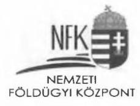

Az Avatar szakrendszer helyszíni bemutatása során a fent előadottakra kitértünk, bemutatásra kerültek
 a kért adatok, illetőleg a fenti eljárások gyakorlata szóban is kifejtésre került.
2. számú megállapítás:
(12. oldal)

- Összegzö megállapítás: Az ellenőrzött mintatételek vonatkozásában a vagyonnyilvántartási rendszer nem biztosította a benne szereplő adatok megbízhatóságát.
- Az ellenőrzés a mintatételek ellenőrzése során az alábbi hiányosságokat tárta fel:
kettő csere mintatétel esetében a telekmegosztással létrejött ingatlanok az NFK vagyonnyilvántartásában nem szerepeltek, az NFK a 11/2011. (II. 22.) Korm. rendelet 2. §-a és a Vagyon-nyilvántartási szabályzat 5.5. pontja ellenére a vagyonnyilvántartást nem a földrészletek helyrajzi száma szerint vezette.

Kapcsolódóan: „Összefoglalás" rész 8. oldal: A VAGYONNYILVÁNTARTÁSI RENDSZER... Két mintatétel esetében a telekmegosztással létrejött ingatlan a jogszabályi és a belső szabályzat ellenére a vagyonnyilvántartásában nem szerepelt.

Észrevételemben előadom, hogy „A Nemzeti Földalap vagyonnyilvántartásának szabályairól" szóló 11/2011. (II. 22.) Korm. rendelet 1. § (1) bekezdése alapján az NFK-nak a Nemzeti Földalapról szóló 2010. évi LXXXVII. törvény 1. §-ában meghatározott földrészletekről, és az Nfatv. 3. § (3) bekezdésében meghatározott ingatlanokról kell vagyonnyilvántartást vezetnie, amelynek alapjául az ingatlan-nyilvántartás ... szolgál.

Az NFK nyilvántartási rendszerében a közhiteles ingatlan-nyilvántartásban bejegyzett változásokat kell lekövetni és rögzíteni, tehát a tulajdoni lap bejegyzéseivel egyezően tartalmazzák a változásvezetést a nyilvántartások.

Telekalakítással - telekmegosztással - egybekötött csere esetében - a csere megvalósulása érdekében és a csere jogügylettel egyidejűleg történik a telekmegosztás, nem azt megelőzően. A telekalakítással vegyes földcsere szerződés tartalmazza, hogy az illetékes ingatlanügyi hatóság végleges határozatával engedélyezte a telekalakítást záradékolt változási vázrajz és telekalakítási dokumentáció szerint. A telekalakítási engedély és a hozzá tartozó dokumentáció az engedélyező határozat véglegessé válásától számított 1 évig hatályos. (Tehát a telekalakítás lefolytatását a csereügylet meghiúsulása esetén is kérelmezhetné Szervezetünk az érvényességi időn belül.)

A csereügylet illetve a telekalakítás átvezetésével az ingatlan-nyilvántartásból a változás előtti ingatlan törlésre kerül. Az NFK nyilvántartásában a földrészlet földhivatali állapotát megszűnt-re változtatja, kötelezően jelöli a megszűnés okát (jelen esetben: megosztás), a megszűnés dátumát és a megszűnés határozatszámát. A földrészlet adatoknál rögzíti a kialakuló új ingatlanok helyrajzi szám listáját, a határozatszámot, szerződésszámot, a cserével érintett ingatlanra vonatkozó megjegyzést.

A földhivatal rögzíti a kialakult új ingatlanok az ingatlan-nyilvántartásról szóló 1997. évi CXLI. törvény végrehajtásáról szóló 109/1999. (XII. 29.) FVM rendelet 1. pontjában - A

---

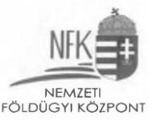
tulajdoni lap részei - meghatározott adatait. Az NFK nyilvántartásában a hatósági határozat alapján a Nemzeti Földalapba tartozó ingatlanokat rögzíti az Avatar szakrendszer, a vagyonelemek adatainak nyilvántartására kialakított részében. A csereügylet tárgyát képező újonnan kialakuló telekmegosztással létrejött ingatlan nem kerül be a Nemzeti Földalapba.

A közhiteles ingatlan-nyilvántartás nem tartalmazza a Magyar Állam tulajdonjogának bejegyzését és az NFK tulajdonosi joggyakorlásának bejegyzését az újonnan létrejövő csereingatlan esetében, melyre tekintettel helytelen eljárás lenne, amennyiben bevezetnénk az ingatlant a közhiteles ingatlan-nyilvántartás adataitól eltérően az NFK nyilvántartásaiba.

A szerződéses csereügylet adatai, lépései a szerződéses nyilvántartás részben megtalálhatóak. A megosztással érintett eredeti ingatlan adatai, megszűnésének oka, az eredeti ingatlanból létrejövő új ingatlanok helyrajzi számai rögzítésre kerülnek az eredeti (megszünt) vagyonelem adatainál a megfelelő mezőben. A Nemzeti Földalapba tartozó új ingatlanok jogszabályban előírt valamennyi adata megtalálható a vagyon-nyilvántartásban, minden egyes földrészlet helyrajzi szám szerint kerül vezetésre.
2. számú megállapítás:
(12. oldal)

- Összegzö megállapítás: Az ellenőrzött mintatételek vonatkozásában a vagyonnyilvántartási rendszer nem biztosította a benne szereplő adatok megbízhatóságát.
- Az ellenőrzés a mintatételek ellenőrzése során az alábbi hiányosságokat tárta fel:
hét esetben az adásvételi szerződések szerint az ellenérték fejében történt értékesítés a vagyon-nyilvántartási rendszerben „értékesítés-ingyenes" gazdasági jogcímként került rögzítésre, így a vagyonnyilvántartásban a 11/2011. (II. 22.) Korm. rendelet 5. § c) pontjában és a Vagyon-nyilvántartási szabályzat 5.5.3. c) pontjában foglaltakkal ellentétben a gazdasági esemény nem a valós tartalmának megfelelően került rögzítésre.

Kapcsolódóan: „Összefoglalás" rész 8. oldal: A VAGYONNYILVÁNTARTÁSI RENDSZER... Hét esetben pedig a gazdasági esemény nem a valós tartalmának megfelelően került rögzítésre a vagyon-nyilvántartási rendszerben, mivel a szerződésben foglaltakkal ellentétben az értékesítés ellenérték nélküliként került rögzítésre.

Észrevételemben előadom, hogy a 11/2011. (II. 22.) Korm. rendelet 5. § c) pontja valamint a Vagyon-nyilvántartási Szabályzat 5.5.3. c) pontja alapján a hasznosításhoz kapcsolódó gazdasági információkat, így különösen: melioráció, értéknövelő beruházás tényét, annak értékét kell rögzíteni a szakrendszerben. Viszont a megállapítás második részében hivatkozott „értékesítés- ingyenes" gazdasági jogcím rögzítése kerül kifogásolásra, mert nem a valós tartalom szerint került rögzítésre tekintve, hogy ellenérték fejében történt értékesítés jogügyletről van szó.

A megállapításban keveredik három típusú adat, melyek rögzítési metodikája eltérő.

---

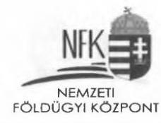

Egy hasznosítási eljárás/döntés előkészítése során szolgál fontos információval az, hogy értéknövelő beruházással érintett ingatlanról van-e szó, jelentősége elszámolási kötelezettség fennállása esetén lehet.

Egy értékesített vagyonelem esetében a „Tulajdonjog változás jogcímét" a tulajdonjog-változások adatoknál kell rögzíteni az Avatarban, ez tartalmazza a vagyonelem kikerülésének „valós tartalmát", jelen példa esetében a tulajdonjog változás jogcíme az ellenérték fejében történő értékesítés - a jogcím rögzítése a hatósági bejegyzéssel egyezően történik meg.

A „Gazdasági jogcím" az adott tulajdoni hányad szerinti bekerülés jogcímétől függően kerül rögzítésre a kikerülés oldalon a mérleg helyessége érdekében. (A bekerülés oldalon nyilvántartott földrészlet kivezetés során ugyanonnan kell, hogy kikerüljön, a tulajdonjog változás iránya is minden esetben rögzítésre kerül.)

Megállapítható, hogy a szakrendszer helyesen tartalmazza a jogcímeket az arra kialakított megfelelő mezőkben. Ez valamennyi vagyonelem esetében egységesen és következetesen van vezetve.
2. számú megállapítás:
(12. oldal)

- A Vagyon-nyilvántartási szabályzat rendelkezései nem voltak összhangban a jogszabályi előírásokkal, mivel a Vagyon-nyilvántartási szabályzat nem a hatályos jogszabályi előírásoknak megfelelően tartalmazta az Nfatv. 17. §-ában szereplő tartalmi elemekre vonatkozó részletszabályokat.
Kapcsolódóan: „Javaslatok" fejezet 3. pontja (16. oldal):
- Tegyen intézkedést annak érdekében, hogy a Vagyon-nyilvántartási szabályzat a hatályos jogszabályi előírásoknak megfelelően tartalmazza az Nfatv. 17. § szerinti tartalmi elemekre vonatkozó részletszabályokat.

Észrevételemben előadom, hogy a Nemzeti Földalap vagyonnyilvántartásának szabályairól szóló 11/2011. (II.22.) Korm. rendelet 7. §-a tartalmazza, hogy a vagyonnyilvántartás vezetésének részletes szabályait az NFK - az agrárpolitikáért felelős miniszter által jóváhagyott - szabályzatban határozza meg. Korábban a szabályzat tervezet a felügyeleti szerv véleményezési szakaszában állt. 2023 év végén Szervezetünk által ismételten felterjesztésre került a szabályzat tervezet jóváhagyás céljából a felügyeleti szerv részére, mely jelenleg is ebben a szakaszban áll.
Megjegyezzük, hogy az érvényben lévő szabályzat alapján is teljesül a belső szabályozás elsődleges célja, hogy a szervezeti sajátosságok figyelembevételével kerüljenek részletesen meghatározásra a jogszabályokban rögzített feladatok, hogy azokból egyértelműen megállapítható legyen a feladatok végrehajtásának szabályszerűsége. A jelenlegi ellenőrzés megállapította, hogy az NFK a jogszabályoknak és a belső szabályzatoknak megfelelően alakította ki vagyon-nyilvántartási rendszerét, tehát a nyilvántartási rendszer tartalmaz minden elvárt és előírt adatot - az Nfatv. 17. §-ában előírt tartalmi elemeket is, melyek

---

# 3. számú megállapítás: 

Az NFK földrészlet hasznosítására irányuló döntései:
Álláspontunk szerint a hasznosítási folyamatok végrehajtása, a szerződések megkötése maradéktalanul megfelelt az irányadó jogszabályi rendelkezéseknek. A belső eljárásrend 7.5. pontja rögzíti, hogy az eljáró ügyvéd a szerződéskötést megelőzően a 2010. évi LXXXVII. tv. (Nfatv.) 19. § (1) bekezdése alapján köteles ellenőrizni, hogy a szerződő fél az adózás rendjéről szóló 2017. évi CL. törvény 7. § 34. pontja szerinti, hatvan napnál régebben lejárt esedékességű köztartozással rendelkezik-e, illetve önkormányzati adósságrendezési eljárás alatt áll-e.

## A földrészletek értékesítésének végrehajtása:

Arra a megállapításra, miszerint a belső szabályozással ellentétben felsővezetői döntés nélkül alkalmaztunk szerződéskötéshez egyszerűsített statisztikai értékmeghatározást forgalmi értékbecslésként, megjegyezzük, hogy a szerződéskötés feltételét képező értékbecslési szakvélemények megrendeléséről a belső eljárásrend szerint minden esetben felsővezetői döntés született. (ún. előzetes elnökhelyettesi döntés) A döntések így szóltak: „Amennyiben a fentiek alapján a kérelmezett földrészlet értékesítésével kapcsolatos, döntés-előkészítési eljárás folytatásával Tisztelt Elnökhelyettes Asszony egyetért, (egyéb jogszabályi feltételek megvalósulása esetén - opcionális, hogy szükséges-e hatósági/miniszteri megkeresés - ), úgy a Vagyonhasznosítási Osztály gondoskodik az értékbecslés megrendeléséről." (vagy ha általánosságban kerül megfogalmazásra, „a Vagyonhasznosítási Osztály gondoskodik az eljárás folytatásáról", ami előzőekkel egyező tartalmú döntésnek tekinthető figyelemmel arra, hogy a belső eljárásrend is kimondja: támogató előzetes elnökhelyettesi döntést követően kezdeményezzük az értékbecslési szakvélemény megrendelését.)

A 262/2010. (XI.17.) Korm. rend. 2019. VII. 1. napjától hatályos 4. § (2b) bekezdése egyértelműen rögzíti, hogy nem kötelező helyszíni szemle lefolytatása a kizárólag szántó, rét, legelő alrészletet tartalmazó földrészlet értékesítését megalapozó értékbecslés elkészítéséhez, ha a földrészletben a Magyar Állam tulajdonrésze nem haladja meg a 10 hektárt. Kizárólag ezen feltételeknek megfelelő ingatlanok esetében készültek statisztikai értékmeghatározások. (40/2021. (IX.30.) NFK utasítás 5.5. pontja)

A jogszabályok a belső eljárásrendeknél magasabb szinten kötik Szervezetünket, ezért arról a tárgyról külön felsővezetői döntés meghozatalát nem tartjuk indokoltnak, amelyet jogszabály kifejezetten előír. Jelen esetben az eljárás folytatását jóváhagyó előzetes elnökhelyettesi döntés alapján szükségtelen újabb felsővezetői döntést hozni arról, amit jogszabály rögzít, tehát hogy készülhet az eljárásban statisztikai értékmeghatározás. Kérjük ezen megállapítás felülvizsgálatát.

Földrészletek haszonbérbe adása és földcsere: (egyúttal visszautalás az ÖsszefoglalásFöldrészletek hasznosítása részre is)

---

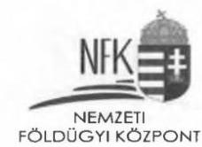

A haszonbérleti díjak mértékének felülvizsgálata vonatkozásában tett alap megállapítással egyetértünk. Azonban hiányoljuk annak kifejtését, hogy Szervezetünk az ellenőrzés során tájékoztatta az Állami Számvevőszék ellenőrzést végző munkatársait arról a tényről, hogy a haszonbérleti díjak kétévenkénti felülvizsgálata nem kötelezettség, hanem jogosultság.

Ennek alkalmazásával összefüggésben Szervezetünk 2020. évben az Agrárminisztériumhoz, mint irányító szervhez fordult iránymutatásért, melyre vonatkozóan a korábban a vizsgálat során átadott FgF/389/2020. iktatószámú válaszában az Agrárminisztérium is kiemelte, nem következik a hatályos jogi szabályozásból, hogy az NFK-t a fennálló haszonbérleti szerződések díjtételeinek vonatkozásában általános felülvizsgálati kötelezettség terhelné.

Tájékoztatjuk továbbá a Tisztelt Állami Számvevőszéket arról, hogy Szervezetünk 2023. decemberében „Állásfoglalás és iránymutatás kérése a Nemzeti Földalapba tartozó földrészletek haszonbérleti díjtételeinek a felülvizsgálatával kapcsolatban" tárgyú ismételt megkereséssel élt az irányító szerv felé.

Az értékbecslések megrendelésekor az egyszerűsített/helyszíni szemlés típusok a 262/2010. (XI. 17.) Korm. rendelet (2) alapján lettek meghatározva.
Az értékbecslési tevékenységet érintő, 9/2019. (X.01.) NFK utasítás jelenleg átdolgozás alatt van, melyet a jelenlegi, nem végleges állapotában csatolunk a Tisztelt Állami Számvevőszék részére. ( „2024_Tervezett NFK utasítás az értékbecslési tevékenységről" elnevezésű dokumentum)
Az értékbecslési szakvélemények (egyszerűsített értékmeghatározások és helyszíni szemlés értékbecslés egyaránt) érvényességi ideje 180 nap. Az egyszerűsített értékmeghatározások a 2022. év előtt úgy kerültek Szervezetünkhöz, hogy csak az értékmeghatározás rész került nyomtatásra és megküldésre a megbízott értékbecslő partnerek által, mivel a leíró metodikai rész minden egyszerűsített anyagnál pontosan ugyanolyan. Ezen metodika alapján készül az összes egyszerűsített értékbecslés. ( „Betétlap jogszabályok" elnevezésű dokumentum) 2022-ben az értékbecslő cég változtatott a mintán, ekkor a 180 napos érvényesség átkerült a fedőlapra. Ekkor a betétlapot is módosították („Módszertan AVATAR" elnevezésű dokumentum) 2023. januárjától már csak elektronikus formában kerülnek megküldésre Szervezetünk részére az értékbecslési szakvélemények.

# 14. oldal teteje: 

"Az NFA-ba tartozó földterületek hasznosításának szabályozottságával kapcsolatosan az ellenőrzés az alábbi hiányosságokat tárta fel:

- az egyes szervezeti egységek ellenőrzési útvonalai

 nem tartalmazták a teljes haszonbérbe adás és a földcsere teljes működési folyamatát, így azok nem feleltek meg a Bkr. 6. § (3) bekezdés előírásainak;"

A Bkr. 6. § (3) bekezdése alapján: "A költségvetési szerv vezetője köteles elkészíteni és rendszeresen aktualizálni a költségvetési szerv ellenőrzési nyomvonalát, amely a költségvetési szerv működési folyamatainak szöveges, táblázatokkal vagy folyamatábrákkal szemléltetett

---

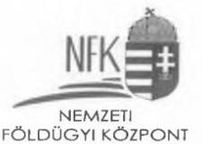
leírása, amely tartalmazza különösen a felelősségi és információs szinteket és kapcsolatokat, irányítási és ellenőrzési folyamatokat, lehetővé téve azok nyomon követését és utólagos ellenőrzését."

Az ÁSZ munkatársainak átadott, a csere eljárásrendet érintő ellenőrzési nyomvonal, meglátásunk alapján megfelel ezen kitételeknek, hiszen tartalmazta a működési folyamat leírását, az folyamatábrákkal szemléltetett, egyúttal szerepelnek benne a felelősségi és információs szintek, valamint azok kapcsolatai.

A földcserével kapcsolatos belső szabályozást külön utasítás tartalmazza, amelyben az ellenőrzési nyomvonal végigvezethető.

Meglátásunk alapján az átadott ellenőrzési nyomvonal átlátható és minden szinten szolgálja a folyamatok nyomon követését és azok utólagos ellenőrzését.

# Fentiekre vonatkozóan a Javaslatok 5. pontja is tesz említést. 

A „Megállapítások" fejezet 3. pontjának „Összegző megállapításaira" hivatkozva miszerint „Az NFK nem rendelkezett Nemzeti Erdőtelepítési Programmal (14. oldal) az ellenőrzött időszakban, annak hiányában az Nfatv. 15. § (3) bekezdés e) pontjában előírt „Nemzeti Erdőtelepítési Programban foglaltak végrehajtásának támogatása" földbirtokpolitikai irányelvet a földrészletek hasznosítása során nem tudta érvényesíteni" megjegyezzük, hogy a 2023. szeptember 14. napján folytatott helyszíni ellenőrzés alkalmával kelt Nyilatkozatban 1. a.) pontjában foglaltak taglalják e Programmal kapcsolatos jogszabályi hivatkozásokat, valamint azt a folyamatleírást mely alapján az NFK eljár.

## 4. számú megállapítás:

(14. oldal alja)
„... Az NFK a Bkr. 6. § (1) bekezdés előírása ellenére nem rendelkezett a földterületek megvételére - az ingyenes földrészletek vásárlásához, az ellenérték fejében történő földfelajánlásokhoz és az osztatlan közös tulajdon megszüntetéséhez - irányuló folyamatokat részletező szabályozással. Az elővásárlási jog gyakorlásáról szóló eljárásrend és az SZMSZ közötti összhang nem volt biztosított a szervezeti egységek megnevezése és a feladatok meghatározása tekintetében, így nem valósult meg a Bkr. 6. § (1) bekezdés b) pontjában előírt, egyértelmű felelősségi, hatásköri viszonyok és feladatok kialakítása. A földterületek megvételével kapcsolatos ellenőrzési nyomvonalak a Bkr. 6.§ (3) bekezdés előírása ellenére nem tartalmazták a teljes folyamatot, mivel a nyomvonalak nem terjedtek ki a folyamatban résztvevő összes szervezeti egységre. ..."

A fent idézett bekezdésekkel kapcsolatban meg kívánjuk jegyezni, hogy az NFK-nál folyamatban van a Nemzeti Földügyi Központ elővásárlási jog gyakorlásával összefüggő szabályairól szóló 14/2018. (IV. 3.) számú Elnöki utasítás felülvizsgálata, valamint az alábbi utasítások elkészítése és a hozzájuk tartozó ellenőrzési nyomvonalak kialakítása:

- ingyenes földfelajánlások eljárásrendje
- ellenértékes földfelajánlások eljárásrendje

---

- önkormányzati tulajdonba adás (ingyenes / ellenértékes) eljárásrendje
- $\quad$ telekmegosztással járó csereügyeletek eljárásrendje
- ingyenes egyházi tulajdonba adás eljárásrendje.

Fenti megállapítás érinti az „Összefoglalás" 2. francia bekezdés (8. oldal)
„A földrészletek hasznosítási folyamatainak szabályozottsága nem volt teljeskörű, mert az NFK ellenőrzési nyomvonalai nem a teljes szervezetre vonatkozóan tartalmazták a földrészletek hasznosításával és beszerzésével kapcsolatos működési folyamatokat. ... Az NFA-ba tartozó földterületekkel való gazdálkodási folyamatok és az ahhoz kapcsolódó felelősségi körök belső szabályozásba való rögzítésének hiánya a felelős gazdálkodásra, a földrészletek hasznosítására és a földterületek megvételére irányuló folyamatok átláthatóságára, illetve azok következetes és szabályszerű végrehajtására vonatkozóan kockázatot jelentett."

Továbbá érinti a: „Javaslatok" 5. pont (17. oldal)
„Tegyen intézkedést annak érdekében, hogy a földrészletek megvételére irányuló folyamatokra vonatkozó eljárásrendjei, valamint a haszonbérbe adással kapcsolatosan a kérelemre vagy egyéb módon induló szerződésmódosítások eljárásrendjei a Bkr. 6. § (1) bekezdésében előírtak szerint kerüljenek szabályozásra, az ellenőrzési nyomvonalak a Bkr. 6.§ (3) bekezdésében előírtak szerint a földrészletek megvételére irányuló folyamatokra, valamint a haszonbérbeadásra és a földcserékre vonatkozóan az NFK teljes szervezetére vonatkozzanak és tartalmazzák teljeskörűen a működési folyamatokat."
(14. oldal alja és 15. oldal teteje)
"A földterületek megvételével kapcsolatos ellenőrzési nyomvonalak a Bkr. 6. § (3) bekezdés előírása ellenére nem tartalmazták a teljes folyamatot, mivel a nyomvonalak nem terjedtek ki a folyamatban résztvevő összes szervezeti egységre."

Az ÁSZ munkatársai helyszíni ellenőrzésük alkalmával felhívták Szervezetünk figyelmét arra, hogy meglátásuk alapján az ellenértékes földfelajánlással kapcsolatos ellenőrzési nyomvonal nem felel meg minden tekintetben a (3) bekezdésben foglaltaknak, amellyel kapcsolatos visszajelzést követően Szervezetünk a szükséges intézkedéseket megtette a nyomvonal aktualizálásának érdekében (csatolva).

Fentiekre vonatkozóan a Javaslatok 5. pontja is tesz említést.

---

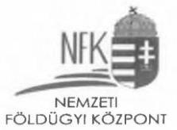

Kérem a Tisztelt Igazgató Urat, hogy a fentiekben előadottakat mérlegelve, valamint a csatoltan megküldött dokumentumokat áttekintve - annak érdekében, hogy a végleges jelentésben csak szakmailag teljesen megalapozott megállapítások maradjanak - az észrevételeket a végleges jelentés összeállításánál szíveskedjenek figyelembe venni az ÁSZ törvény 29. § (3) bekezdése alapján.

Budapest, 2024. január 23.
Melléklet: DVD az alátámasztó dokumentumokról
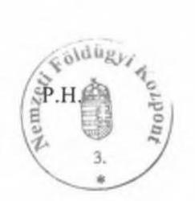

Tisztelettel:
Süle Krisztián
a Nemzeti Földügyi Központ
elnöke jogkörében eljáró
általános elnökhelyettes

---

# Függelék: Észrevételek

## 1

### Egzresztés: 011-0001212361/2019

**Tervezően és működtetően elmaradazatra**

**ASSORT BÁZISVÁREK KONKÉSZŐDÁBA**

---

**Süle** | **Digitálisan** | **Kriszti** | **Kriszti** | **2024.01.21** | **12:48:28** | **+37'59'**

---

**Kriszti** | **2024.01.21** | **12:48:28** | **+37'59'**

---

**Süle** | **Digitálisan** | **Kriszti** | **2024.01.21** | **12:48:28** | **+37'59'**

---

**Kriszti** | **2024.01.21** | **12:48:28** | **+37'59'**

---

**Süle** | **Digitálisan** | **Kriszti** | **2024.01.21** | **12:48:28** | **+37'59'**

---

**Kriszti** | **2024.01.21** | **12:48:28** | **+37'59'**

---

**Süle** | **Digitálisan** | **Kriszti** | **2024.01.21** | **12:48:28** | **+37'59'**

---

**Kriszti** | **2024.01.21** | **12:48:28** | **+37'59'**

---

**Süle** | **Digitálisan** | **Kriszti** | **2024.01.21** | **12:48:28** | **+37'59'**

---

**Kriszti** | **2024.01.21** | **12:48:28** | **+37'59'**

---

**Süle** | **Digitálisan** | **Kriszti** | **2024.01.21** | **12:48:28** | **+37'59'**

---

**Süle** | **Digitálisan** | **Kriszti** | **2024.01.21** | **12:48:28** | **+37'59'**

---

**Süle** | **Digitálisan** | **Kriszti** | **2024.01.21** | **12:48:28** | **+37'59'**

---

**Süle** | **Digitálisan** | **Kriszti** | **2024.01.21** | **12:48:28** | **+37'59'**

---

**Süle** | **Digitálisan** | **Kriszti** | **2024.01.21** | **12:48:28** | **+37'59'**

---

**Süle** | **Digitálisan** | **Kriszti** | **2024.01.21** | **12:48:28** | **+37'59'**

---

**Süle** | **Digitálisan** | **Kriszti** | **2024.01.21** | **12:48:28** | **+37'59'**

---

**Süle** | **Digitálisan** | **Kriszti** | **2024.01.21** | **12:48:28** | **+37'59'**

---

**Süle** | **Digitálisan** | **Kriszti** | **2024.01.21** | **12:48:28** | **+37'59'**

---

**Süle** | **Digitálisan** | **Kriszti** | **2024.01.21** | **12:48:28** | **+37'59'**

---

**Süle** | **Digitálisan** | **Kriszti** | **2024.01.21** | **12:48:28** | **+37'59'**

---

**Süle** | **Digitálisan** | **Kriszti** | **2024.01.21** | **12:48:28** | **+37'59'**

---

**Süle** | **Digitálisan** | **Kriszti** | **2024.01.21** | **12:48:28** | **+37'59'**

---

**Süle** | **Digitálisan** | **Kriszti** | **2024.01.21** | **12:48:28** | **+37'59'**

---

**Süle** | **Digitálisan** | **Kriszti** | **2024.01.21** | **12:48:28** | **+37'59'**

---

**Süle** | **Digitálisan** | **Kriszti** | **2024.01.21** | **12:48:28** | **+37'59'**

---

**Süle** | **Digitálisan** | **Kriszti** | **2024.01.21** | **12:48:28** | **+37'59'**

---

**Süle** | **Digitálisan** | **Kriszti** | **2024.01.21** | **12:48:28** | **+37'59'**

---

**Süle** | **Digitálisan** | **Kriszti** | **2024.01.21** | **12:48:28** | **+37'59'**

---

**Süle** | **Digitálisan** | **Kriszti** | **2024.01.21** | **12:48:28** | **+37'59'**

---

**Süle** | **Digitálisan** | **Kriszti** | **2024.01.21** | **12:48:28** | **+37'59'**

---

**Süle** | **Digitálisan** | **Kriszti** | **2024.01.21** | **12:48:28** | **+37'59'**

---

**Süle** | **Digitálisan** | **Kriszti** | **2024.01.21** | **12:48:28** | **+37'59'**

---

**Süle** | **Digitálisan** | **Kriszti** | **2024.01.21** | **12:48:28** | **+37'59'**

---

**Süle** | **Digitálisan** | **Kriszti** | **2024.01.21** | **12:48:28** | **+37'59'**

---

**Süle** | **Digitálisan** | **Kriszti** | **2024.01.21** | **12:48:28** | **+37'59'**

---

**Süle** | **Digitálisan** | **Kriszti** | **2024.01.21** | **12:48:28** | **+37'59'**

---

**Süle** | **Digitálisan** | **Kriszti** | **2024.01.21** | **12:48:28** | **+37'59'**

---

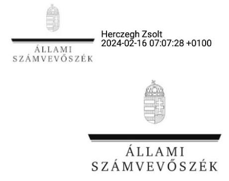

ÁLLAMI VAGYONGAZDÁLKODÁST ELLENŐRZŐ IGAZGATÓSÁG

Ikt. szám: EL-3888-068/2024.
Ügyintéző: Pencz Mária
Telefonszám: +36 88591862

# Süle Krisztián 

elnök
Nemzeti Földügyi Központ

## Budapest

Tárgy: Válaszlevél ellenőrzéssel kapcsolatos észrevételek kezeléséről

## Tisztelt Elnök Úr!

„A Földbirtok-politikai irányelvek érvényesülésének ellenőrzése" című ellenőrzéssel kapcsolatos, 2024. január 23-i keltezésű észrevételét köszönettel megkaptam.

Az Állami Számvevőszék észrevételekre vonatkozó álláspontjáról az alábbi tájékoztatást adom:

1. Az észrevétel 1-2. oldala a jelentéstervezet a Nemzeti Földalapról szóló 2010. évi LXXXVII. törvény (a továbbiakban Nfatv.). szerinti éves terv hiányához kapcsolódó 1. sz. megállapításhoz, az Összefoglalás rész 5. sz. bekezdéséhez, valamint a jelentéstervezet 1. sz. és 2. sz. javaslataihoz kapcsolódik.
Az észrevételben foglaltak szerint az éves terv a tárgyévi költségvetési terv részét képezi. Ezzel összefüggésben kifejtésre kerül, hogy a „XLIV. A Nemzeti Földalappal kapcsolatos bevételek és kiadások" fejezet tárgyévi tervszámai tartalmazzák a földrészletek hasznosításával kapcsolatos éves tervet is, amely szöveges indoklással együtt megküldésre kerül az Agrárminisztérium, mint irányító szerv részére.
Tájékoztatom Elnök urat, hogy az ellenőrzés álláspontja szerint a költségvetés számszaki tervezése és szöveges indoklása nem feleltethető meg az Nfatv. 8. § (1) bekezdés c) pontjában foglaltaknak, mivel a költségvetés tervezéséből nem derül ki, hogy az NFK az ellenőrzött időszakra vonatkozóan mely földterületek hasznosítását tervezi és milyen módon. A mindenkori központi költségvetésről szóló törvény szerinti bevételi előirányzatok nem tartalmaznak olyan mélységű részletezést, mint amit az Nfatv. 18. § (1) bekezdése a Nemzeti Földügyi Központ (továbbiakban: NFK) részére előír, s amelyet az éves terv elkészítésénél figyelembe kell venni. A költségvetés tervezés számszaki és szöveges indoklása az Nfatv. szerinti éves tervnek azért sem felel meg, mert a költségvetés tervezés célja eltérő, az csak a költségvetési vetülete az Nfatv. szerinti éves tervnek.

---

Továbbá rögzíteni szükséges azt is, hogy a földrészletek hasznosításával kapcsolatos éves terv jóváhagyási folyamata eltér a költségvetési terv jóváhagyási folyamatától, így ez is azt támasztja alá, hogy a két terv nem azonos, nem vitatva azt, hogy a földrészletek hasznosításával kapcsolatos éves terv a költségvetési terv elkészítéséhez hozzájárul.
Mindezek alapján az észrevétel megerősíti az Állami Számvevőszék (a továbbiakban: ÁSZ) által megfogalmazott, az éves terv hiányára vonatkozó megállapítást.
Tájékoztatom Elnök urat, hogy az észrevétel mellékleteként megküldött dokumentumokat értékeltük, és az alapján a jelentéstervezet 1. sz. megállapítását és a jelentéstervezet 1. sz. és 2. sz. javaslatait továbbra is fenntartjuk.
2. Az észrevétel 2. sz. oldal 6. bekezdése a jelentéstervezet 3. sz. megállapításának a földterületek hasznosításának szabályozottságával kapcsolatos megállapításra és az Összefoglalás rész 6. sz. bekezdésére vonatkozik.
Az észrevétel a földcsere ellenőrzési nyomvonalával kapcsolatban rögzíti, hogy az NFK csere eljárásrenddel rendelkezik, amely álláspontjuk szerint megfeleltethető az ellenőrzési nyomvonalnak, hiszen tartalmazza a működési folyamatok leírását, valamint a felelősségi és információs szinteket, azok kapcsolatait.
Tájékoztatom Elnök urat, hogy a Földcsere eljárási rendje az NFK szervezeteire vonatkozóan tartalmazza ugyan a földcserékre vonatkozó teljes folyamat szabályozását, azonban a Speciális Vagyongazdálkodási Osztály ellenőrzési nyomvonala „szerződéskötési folyamat megindítása" feladattal véget ér. A Földcsere eljárásrendje 5.2-7.5. pontjai a szerződéskötési folyamat megindítását követően is tartalmaz elvégzendő feladatokat, amely feladatokat az ellenőrzési nyomvonal nem tartalmazza. A földcserék eljárásrendje a Bkr. előírásával összhangban szabályozásra került, azonban az ellenőrzési nyomvonal a Speciális Vagyongazdálkodási Osztály feladatain kívül a földcserével kapcsolatos, a szerződéskötésre átadást követő működési folyamatokat, azok táblázatokkal vagy folyamatábrákkal
 szemléltetett leírását nem tartalmazza, így az ellenőrzési nyomvonal nem felel meg a Bkr. 6. § (3) bekezdés előírásának.
Mindezek alapján az észrevételben foglaltak megerősítik, hogy az NFK teljes szervezetére vonatkozó működési folyamatot tartalmazó ellenőrzési nyomvonalak nem készültek, illetve hiányosak, így a jelentéstervezet megállapítása helytálló.
Az észrevétel mellékleteként megküldött dokumentumokat értékeltük, és azok alapján a jelentéstervezet 3. sz. megállapításának a földcsere ellenőrzési nyomvonalára vonatkozó részét továbbra is fenntartjuk.
3. Az észrevétel 2-3. sz. és 4-5. sz. oldalai a jelentéstervezet erdő művelési ágra történő átminősítésével kapcsolatos 2. sz. megállapítására és Összefoglalás rész 7. sz. bekezdésére vonatkoznak.
Az észrevétel részletesen bemutatja a vonatkozó jogszabályi előírásokat és az NFK gyakorlatát a vagyonnyilvántartásban szereplő adatok korrigálására vonatkozóan. E körben kifejti, hogy "A vagyonnyilvántartás szakterület a jogszabályok szerint jár el azokban az esetekben, amikor a közhiteles ingatlannyilvántartás adataihoz igazítja nyilvántartási adatait". Továbbá rögzíti, hogy a vagyonnyilvántartás megbízhatóságát érintő kockázat "a közhiteles ingatlannyilvántartásból történő közvetlen adatkinyerés miatt teljes mértékben megszűnik".
Tájékoztatom Elnök urat, hogy az észrevétellel ellentétben az ellenőrzés megállapítása az NFK belső szabályozásban foglaltak be nem tartására irányult, nem pedig a vagyonnyilvántartás jogszabályi előírásokkal való összhangjának hiányára.

---

Az NFK a 11/2011. (II. 22.) Korm. rendelet 7. §-a előírásának megfelelően a részletszabályokat a Vagyonnyilvántartási szabályzatában rögzítette, amelynek 8.1. pontja szerint a vagyonnyilvántartás módosítása hatósági határozat alapján történik és ez biztosítja az ingatlannyilvántartással egyező adattartalmat.

Az ellenőrzés során átadott dokumentumok értékelését követően megállapítást nyert, hogy több esetben a vagyonnyilvántartásban végrehajtott módosításhoz az NFK nem rendelkezett hatósági határozattal az erdő művelési ágra történő átminősítésről.
Mindezek alapján az észrevétel megerősíti az ÁSZ által megfogalmazott, a vagyonnyilvántartás megbízhatóságából eredő kockázatra vonatkozó következtetést.
Ugyanakkor tájékoztatom Elnök urat, hogy az észrevétellel összefüggésben a jelentéstervezet összefoglalás fejezetének 8. bekezdése pontosításra kerül az alábbiak szerint: „Az ellenőrzött mintatételek tekintetében a rendszerben rögzített adatok megbízhatósága részben volt biztosított, mivel négy esetben az NFK belső szabályozása ellenére hatósági határozat nélkül módosította a vagyonnyilvántartásában a földterület erdővé történő művelési ág besorolását."
4. Az észrevétel 6-7. sz. oldalai a jelentéstervezet telekmegosztással egybekötött csere esetén a vagyonnyilvántartással kapcsolatos 2. sz. megállapítására és az Összefoglalás rész 7. bekezdésére vonatkoznak.

Az észrevétel részletesen bemutatja a vagyonnyilvántartás jogszabályi alapját, valamint az NFK gyakorlatát a vagyonnyilvántartásban szereplő adatok bejegyzésére vonatkozóan, amely szerint az NFK nyilvántartásai a tulajdoni lap bejegyzéseivel egyezően tartalmazzák a változásokat. E körben kifejtésre kerül, hogy „A közhiteles ingatlannyilvántartás nem tartalmazza a Magyar Állam tulajdonjogának bejegyzését és az NFK tulajdonosi joggyakorlásának bejegyzését az újonnan létrejövő csereingatlan esetében, melyre tekintettel belső eljárás lenne, amennyiben bevezetnénk az ingatlant a közhiteles ingatlannyilvántartás adataitól eltérően az NFK nyilvántartásaiba." „A csereügylet tárgyát képező újonnan kialakuló telekmegosztással létrejött ingatlan nem kerül be a Nemzeti Földalapba."
Az észrevételben foglaltak szerint a csereügylet tárgyát képező, újonnan kialakuló, telekmegosztással létrejött ingatlan nem került be a Nemzeti Földalapba, így a csere alapját képező földrészlet nem szerepelt a vagyonnyilvántartásban.
Tájékoztatom Elnök urat, hogy az ellenőrzés álláspontja szerint a telekmegosztás a Magyar Állam tulajdonában lévő területek helyrajzi számának és területének módosítását jelenti, nem pedig a tulajdonjog változását, a telekmegosztás előtti és a telekmegosztás utáni terület nagysága összességében azonos és a Magyar Állam tulajdonjogát képezi.
A telekmegosztással létrejött ingatlanok esetében a megosztás eredményeként létrejött területek bejegyzése a vagyonnyilvántartásban elmaradt. Az ellenőrzés álláspontja, hogy a vagyonmozgásoknak követhetőnek kell lenniük, a vagyonnyilvántartás vezetése során érvényesülnie kell az átláthatóságnak. Az NFK vagyonnyilvántartásában a cserével érintett földrészlet nem került bejegyzésre, így a vagyonnyilvántartás e tekintetben nem biztosította az átláthatóságot.
Mindezek alapján, az észrevétel megerősíti az ÁSZ megállapítását. Ugyanakkor tájékoztatom Elnök urat, hogy az észrevétel mellékleteként megküldött dokumentumokat értékeltük, és az alapján a jelentéstervezet 2. sz. megállapítását az alábbiak szerint módosítjuk:

---

„két csere mintatétel esetében a vagyonnyilvántartás az egyidejűleg végrehajtott telekmegosztás és csere esetében az Nctv. 7. § (2) bekezdésében foglaltakkal ellentétben nem biztosította az átláthatóságot, mivel a telekmegosztás során a csere alapja nem nyomonkövethető."
Az összegző megállapítás az alábbiak szerint módosításra került:
„Két mintatétel esetében a telekmegosztással létrejött ingatlan a vagyonnyilvántartásában nem szerepelt."
5. Az észrevétel 7-8. sz. oldala a jelentéstervezet vagyonnyilvántartásba rögzítendő gazdasági információkra vonatkozó 2. sz. megállapítására vonatkozik.
Az észrevételben részletezésre került az NFK gyakorlata a vagyonnyilvántartásba rögzítendő gazdasági információkat illetően.
A csatolt döntések és adásvételi szerződések szerint az értékesítés ellenérték fejében történt, azonban a 11/2011. (II. 22.) Korm. rendelet 5. § c) pontjában és a Vagyonnyilvántartási szabályzat 5.5.3. c) pontjában foglaltakkal ellentétben a vagyonnyilvántartás a hasznosításhoz kapcsolódó gazdasági információkat nem a valós gazdasági esemény tartalmának megfelelően tartalmazza.
Az ellenőrzés rendelkezésére álló Vagyonnyilvántartó rendszer felhasználói kézikönyvben foglaltak szerint a gazdasági jogcímhez főkönyvi szám tartozik, a tulajdonjog változásoknál rögzített tétel automatikusan átkerül a gazdasági események közé.
A vagyonnyilvántartásban a tulajdonjog változása "fül" tartalmazta az "értékesítés ingyenes" gazdasági jogcímet az ellenérték fejében történő értékesítésekre vonatkozóan.
Az állami vagyonnal való átlátható gazdálkodás biztosítása érdekében a vagyonnyilvántartó rendszerben egyértelmű adatok rögzítése szükséges. A nem valós tartalomnak megfelelő információk rögzítésével nem biztosított a vagyonnyilvántartás átláthatósága.
Tájékoztatom Elnök urat, hogy az észrevétel mellékleteként megküldött dokumentumokat értékeltük, és megállapítottuk, hogy az ellenőrzés rendelkezésére álló dokumentumok alapján az ÁSZ megállapítása helytálló.
6. Az észrevétel 8. sz. oldala a jelentéstervezet 2. sz. megállapításának a vagyonnyilvántartási szabályzattal kapcsolatos megállapítására, valamint a jelentéstervezet 3. sz. javaslatára vonatkozik.
Az észrevétel arra vonatkozóan tartalmaz tájékoztatást, hogy a vagyonnyilvántartási szabályzat módosítása felterjesztésre került jóváhagyás céljából a felügyeleti szerv részére. Mindazonáltal az NFK szerint a jelenlegi szabályzat is figyelembe veszi a szervezet sajátosságait és összhangban áll a jogszabályi és belső szabályzatokkal, amelyet - álláspontja szerint - az ellenőrzés is megállapított.
Tájékoztatom Elnök urat, hogy az ellenőrzés megállapítása nem az informatikai rendszer kialakítására, hanem annak szabályozottságra vonatkozik. Az ellenőrzött időszakban a 2017. december 18-tól hatályos, a földművelésügyi miniszter által jóváhagyott szabályzat volt hatályban, amely nem volt összhangban az Nfatv. 2020. július 1-i módosításával, így például:

- a szabályzat 5.1. pontja nincs összhangban az Nfatv. 17. § (1) bekezdésében foglaltakkal, mivel nem tartalmazza a vevők és a csereszerződést kötő felek adatait;
- a szabályzat 5.5.1. pont utolsó bekezdésében rögzített elkülönített nyilvántartás vezetési kötelezettség az Nfatv. 17. § (3) bekezdésének hatályon kívül helyezésével törlésre került;
- a Nemzeti Eszközkezelő Zrt. 2020. november 31-én törlésre került a cégnyilvántartásból. Az Nfatv. 1. § (2c) bekezdésének a gazdasági társasággal kapcsolatos előírása 2020. augusztus 13-

---

tól törlésre került, azonban a szabályzat 5.4.5. pontja változatlanul tartalmaz a gazdasági társasággal kapcsolatosan rendelkezést.
A vagyonnyilvántartási szabályzat módosításának jóváhagyására irányuló tájékoztatást köszönjük, az megerősíti az ÁSZ vonatkozó megállapítását és az ÁSZ által megfogalmazott javaslat szerinti intézkedések szükségességét.
7. Az észrevétel 3. sz. és 9. sz. oldalai a jelentéstervezet 3. sz. megállapításának az Nfatv. 19. § (1) bekezdésében foglalt kizáró feltételek vizsgálatára irányuló megállapítását, az Összefoglalás 8. sz. bekezdését, valamint a jelentéstervezet 4. sz. javaslatát érintik.
Az észrevételben foglaltak alapján az NFK álláspontja, hogy a hasznosítási folyamatok végrehajtása, a szerződések megkötése maradéktalanul megfelel az irányadó jogszabályi rendelkezéseknek, valamint a belső eljárásrend 7.5. pontjában foglaltaknak, amely szerint a szerződéskötést megelőzően az eljáró ügyvéd köteles ellenőrizni az Nfatv. 19. § (1) bekezdésében foglaltakat.
Tájékoztatom Elnök urat, hogy az ellenőrzés álláspontja szerint az Nfatv. 19. § (1) bekezdésében rögzítettek betartása az NFK felelősségi körébe tartozik, az NFK köteles ezen szabályok betartásáról gondoskodni. Ugyan az Nfatv. 19. § (1) bekezdésében rögzítettek betartására igénybe vehető külső jogi (ügyvédi) segítség, azonban ezen szabályok betartásának kötelezettségét ügyvédi megbízási szerződéssel nem lehet átruházni, tekintettel arra, hogy ezen szabályok betartását az Nfatv. az NFK vonatkozásában írja elő.
Tájékoztatom Elnök urat, hogy az észrevétel mellékleteként megküldött dokumentumokat értékeltük, és megállapítottuk, hogy az észrevételben leírtak dokumentumokkal nem kerültek alátámasztásra, az NFK nem bizonyította Nfatv. 19. § (1) bekezdésében foglalt kizáró feltételek vizsgálatát, ezért az ÁSZ megállapítása helytálló.
Az újonnan megkötött ügyvédi megbízási szerződések módosítására irányuló tájékoztatását köszönjük, az megerősíti az ÁSZ vonatkozó megállapítását. Intézkedésük figyelembevételével a jelentéstervezet 4. számú javaslatának az Nfatv. 19. § (1) bekezdésében foglalt kizáró feltételek vizsgálatára irányuló része törlésre került, a jelentés összefoglaló része és a 3. számú megállapítás kiegészítésre került az alábbiak szerint:
„Az NFK az észrevételezés időszakában arra vonatkozóan nyújtott tájékoztatást, hogy a jelenleg megkötött ügyvédi megbízási szerződések már tartalmazzák az Nfatv. 19. § (1) bekezdésében foglalt kizáró feltételek dokumentált módon történő vizsgálatát, ezzel a jelentéstervezet megállapítása az ellenőrzés során alaptalanul került."
8. Az észrevétel 9.-10. sz. oldalai a jelentéstervezet 3. sz. megállapításának az egyszerűsített statisztikai értékmeghatározás alkalmazhatóságára, valamint a döntések megalapozásához szükséges érvényességi időre irányuló megállapítását, az Összefoglalás 8. sz. bekezdését és a jelentéstervezet 6. sz. javaslatát érintik.

Az észrevétel részletesen tartalmazza az NFK egyszerűsített statisztikai értékmeghatározásra vonatkozó gyakorlatát, továbbá az irányadó jogszabályi előírásokat. Az észrevételben foglaltak alapján "A jogszabályok a belső eljárásrendeknél magasabb szinten kötik Szervezetünket, ezért arról a tárgyról külön felsővezetői döntés meghozatalát nem tartjuk indokoltnak, amelyet jogszabály kifejezetten előír. Jelen esetben az eljárás folytatását jóváhagyó előzetes elnökhelyettesi döntés alapján szükségtelen újabb felsővezetői döntést hozni arról, amit jogszabály rögzít, tehát hogy készülhet az eljárásban statisztikai értékmeghatározás."
Tájékoztatom Elnök urat, hogy az NFK belső szabályzata az egyszerűsített értékmeghatározás felhasználása tekintetében a 262/2010 (XI.17.) Korm. rendeletben meghatározottnál szigorúbb feltételeket ír elő, mivel ezen eljárás alkalmazását felsővezetői döntéshez köti. Az ellenőrzés

---

megállapítása nem általános jelleggel az értékbecslés megrendelésére vonatkozó felsővezetői döntések hiányára, hanem az egyszerűsített statisztikai értékbecslés típusának alkalmazhatóságára irányuló felsővezetői döntések hiányára vonatkozik.
Az észrevétel nem kifogásolja az ÁSZ azon megállapítását, amely szerint az értékmeghatározások nem tartalmazták a döntések megalapozásához szükséges érvényességi időt, csak magyarázatot ad a hiányosságra.
Tájékoztatom Elnök urat, hogy az észrevétel mellékleteként megküldött dokumentumokat értékeltük, ez alapján a jelentéstervezet megállapítása helytálló.
9. Az észrevétel 10. sz. oldala a jelentéstervezet 3. sz. megállapításának a haszonbérleti díjak felülvizsgálatára irányuló megállapítását és az Összefoglalás 8. sz. bekezdését érinti.
Az észrevételben foglaltak a megállapítást nem vitatják, ugyanakkor az észrevétel szerint a haszonbérleti díjak kétévenkénti felülvizsgálata az NFK-nak nem kötelezettsége, hanem jogosultsága.
Tájékoztatom Elnök urat, hogy az ellenőrzés álláspontja szerint amennyiben a haszonbérleti szerződések felülvizsgálatára vagy új szerződések kötésére kerül sor, úgy az NFK-nak érvényesítenie kell - legalább - az Nfatv. 18. § (7) bekezdésében foglalt minimum értéket.
Ezt megerősítik az ellenőrzés során átadott haszonbérleti szerződések (3.6. pont), amelyek a kétévenkénti felülvizsgálatot nem jogként, hanem kötelezettségként írták elő.
Tájékoztatom Elnök urat, hogy az észrevétel mellékleteként megküldött dokumentumot értékeltük, és megállapítottuk, hogy a jelentéstervezet megállapítása helytálló.
10. Az észrevétel 11. sz. oldala a jelentéstervezet 3. sz. megállapításának a Nemzeti
 Erdőtelepítési Program hiányára irányuló megállapítását érinti.
Az észrevétel egy, a helyszíni ellenőrzés során tett nyilatkozatra történő utalást tartalmaz, amely szerint abban „taglalják e Programmal kapcsolatos jogszabályi hivatkozásokat, valamint azt a folyamatleírást, mely alapján az NFK eljár.”
Tájékoztatom Elnök urat, hogy a Nemzeti Erdőtelepítési Program dokumentumai a helyszíni ellenőrzés során nem kerültek átadásra az ellenőrzés részére, Elnök úr által tett nyilatkozat szerint az NFK ezen dokumentumokkal nem rendelkezik.
Az észrevételben foglaltak az ellenőrzési megállapítás módosítását nem indokolják.
11. Az észrevétel 11. sz. oldala a jelentéstervezet 4. sz. megállapításának a földterületek megvételére irányuló folyamatokat részletező szabályozás hiányára irányuló megállapítását, valamint az Összefoglalás 8. sz. bekezdését érinti.
Az észrevételben az NFK arról nyújtott tájékoztatást, hogy folyamatban van az elővásárlási jog gyakorlásával összefüggő 14/2018. (IV. 3.) számú Elnöki utasítás felülvizsgálata, valamint több utasítás elkészítése a hozzájuk tartozó ellenőrzési nyomvonalakkal együtt.

Az észrevétel mellékleteként megküldésre került az ellenértékes földfelajánlásra vonatkozó nyomvonal tervezet, amely intézkedés következtében a jelentéstervezet összefoglaló része és a 4. számú megállapítás az alábbiakkal kerül kiegészítésre:
„Az NFK az észrevételezés időszakában arra vonatkozóan nyújtott tájékoztatást, hogy az ellenértékes földfelajánlás ellenőrzési nyomvonala elkészült.”

---

Tájékoztatom Elnök urat, hogy az észrevétel mellékleteként megküldött dokumentumot értékeltük, a tájékoztatást és a hiányosság megszüntetésére megtett lépéseket köszönjük. Az észrevétel megerősíti az ÁSZ megállapítását.
Tájékoztatom Elnök urat, hogy a számvevőszéki jelentésben a figyelembe nem vett észrevételt szerepeltetjük az elutasítás indokának feltüntetésével.
Budapest, időbélyegző szerint

Tisztelettel:
az Állami Számvevőszék elnöke nevében:
Herczegh Zsolt
ellenőrzési igazgató, kiadmányozó
Állami Számvevőszék
Állami vagyongazdálkodást ellenőrző igazgatóság

---

# RÖVIDÍTÉSEK JEGYZÉKE 

${ }^{1}$ NFK
${ }^{2}$ Nfatv.
${ }^{3}$ ÁSZ
${ }^{4}$ ÁSZ tv.
${ }^{5}$ NFA
${ }^{6}$ Nfatv.vhr.
${ }^{7}$ Bkr.
${ }^{8} \mathrm{SZMSZ}_{1,2}$

## ${ }^{9} 11 / 2011$. (II. 22.) Korm. rendelet

${ }^{10}$ 9/2019. (X. 01.) NFK utasítás
${ }^{11}$ Nvtv.
${ }^{12}$ Földforg.tv.
${ }^{13}$ Áht.
${ }^{14}$ Ibtv.
${ }^{15}$ Ibtv.vhr.
${ }^{16}$ Erdőtv.
${ }^{17}$ Foktftv.
${ }^{18}$ Foktftv.vhr.

Nemzeti Földügyi Központ
2010. évi LXXXVII. törvény - a Nemzeti Földalapról

Állami Számvevőszék
2011. évi LXVI. törvény - az Állami Számvevőszékről

Nemzeti Földalap
262/2010. (XI.17.) Korm. rendelet - a Nemzeti Földalapba tartozó földrészletek hasznosításának részletes szabályairól
370/2011. (XII. 31.) Korm. rendelet - a költségvetési szervek belső kontrollrendszeréről és belső ellenőrzéséről
A Nemzeti Földügyi Központ Szervezeti és Működési Szabályzata ${ }_{1}$ :
2/2020. (VIII. 31.) NFK utasítás a Nemzeti Földügyi Központ Szervezeti és Működési Szabályzatáról
A Nemzeti Földügyi Központ Szervezeti és Működési Szabályzata ${ }_{2}$ :
1/2022. (III. 30.) NFK utasítás a Nemzeti Földügyi Központ Szervezeti és Működési Szabályzatáról
11/2011. (II. 22.) Korm. rendelet - a Nemzeti Földalap vagyonnyilvántartásának szabályairól
a Nemzeti Földügyi Központ elnökének a Nemzeti Földügyi Központ értékbecslési tevékenységének eljárási rendjéről szóló 9/2019. (X. 01.) NFK utasítása 2011. évi CXCVI. törvény - a nemzeti vagyonról
2013. évi CXXII. törvény a mező- és erdőgazdasági földek forgalmáról
2011. évi CXCV. törvény - az államháztartásról
2013. évi L. törvény - az állami és önkormányzati szervek elektronikus információbiztonságáról
41/2015. (VII. 15.) BM rendelet - az állami és önkormányzati szervek elektronikus információbiztonságáról szóló 2013. évi L. törvényben meghatározott technológiai biztonsági, valamint a biztonságos információs eszközökre, termékekre, továbbá a biztonsági osztályba és biztonsági szintbe sorolásra vonatkozó követelményekről
2009. évi XXXVII. tv. - az erdőről, az erdő védelméről és az erdőgazdálkodásról
2020. évi LXXI. törvény - a földeken fennálló osztatlan közös tulajdon felszámolásáról és a földnek minősülő ingatlanok jogosultjai adatainak ingatlannyilvántartási rendezéséről
647/2020. (XII. 23.) Korm. rendelet - a földeken fennálló osztatlan közös tulajdon felszámolásának részletes szabályairól

---

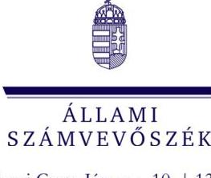

1052 Budapest, Apáczai Csere János u. 10. | 1364 Budapest 4., Pf. 54
www.asz.hu | szamvevoszek@asz.hu
telefon: +36 14849100

