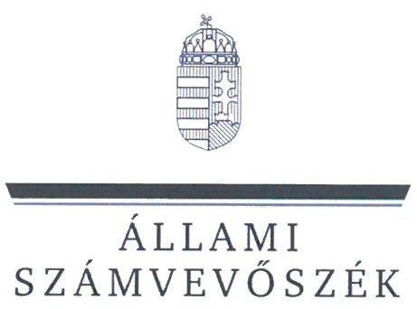
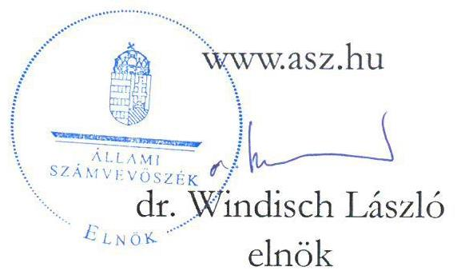
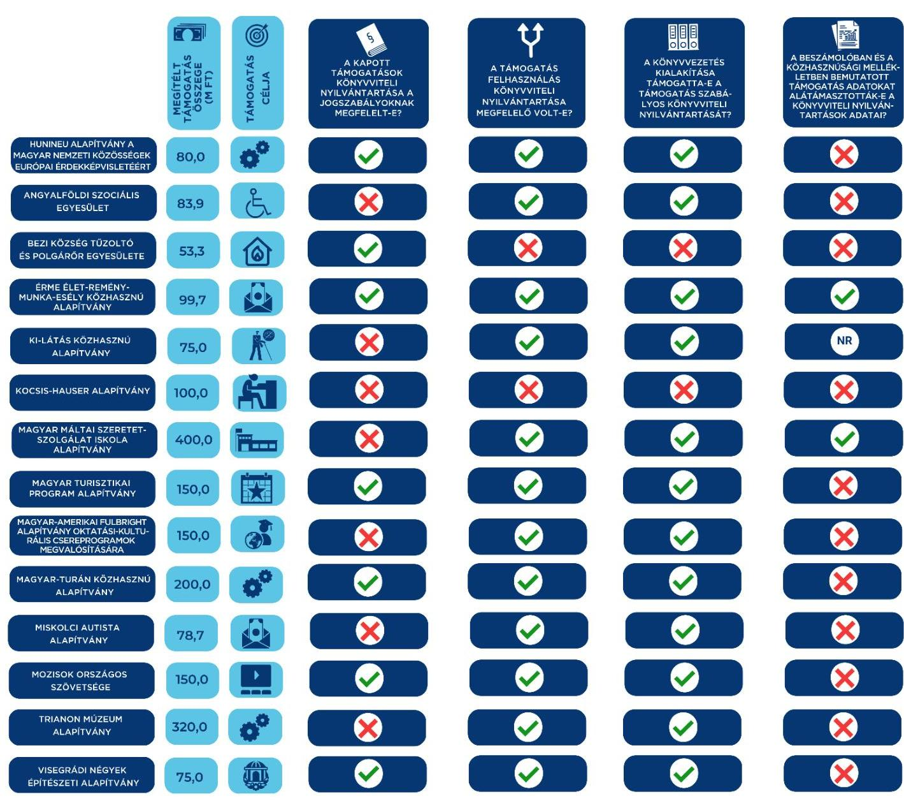

ÁLLAMI
SZÁMVEVŐSZÉK

# JELENTÉS 

Egyesületek és alapítványok államháztartásból kapott támogatásai könyvviteli nyilvántartásának ellenőrzése
2023.

23063
www.asz.hu

---

ÁLLAMI
SZÁMVEVŐSZÉK

# JELENTÉS 

## Egyesületek és alapítványok államháztartásból kapott támogatásai könyvviteli nyilvántartásának ellenőrzése

2023. 

23063

---

# ELLENŐRZÉSI IGAZGATÓSÁG: 

## ÁLLAMHÁZTARTÁSON KÍVÜLI SZERVEZETEKET ELLENŐRZŐ IGAZGATÓSÁG

## ELLENŐRZÉSI IGAZGATÓ:

## KLINGA LÁSZLÓ igazgató

## ELLENŐRZÉSVEZETŐ:

Jelentéseink az interneten a www.asz.hu címen olvashatók.

BÉCSI ANDREA ellenőrzésvezető

IKTATÓSZÁM: EL-3963-009/2023.
TÉMASZÁM: 2693

ELLENŐRZÉS-AZONOSÍTÓ SZÁM: V1037

---

# TARTALOMJEGYZÉK 

- AZ ELLENŐRZÉS ALAPADATAI ..... 5
- AZ ELLENŐRZÖTT SZERVEZETEK ..... 6
- ÖSSZEFOGLALÁS ..... 16
- AZ ELLENŐRZÉS FÓKUSZKÉRDÉSE ..... 18
- MEGÁLLAPÍTÁSOK ..... 19
- JAVASLATOK ..... 33
- MELLÉKLETEK ..... 36
I. sz. melléklet: Értelmező szótár ..... 36
II. sz. melléklet: Az ellenőrzött szervezetek jegyzéke ..... 39
III. sz. melléklet: Ellenőrzési kritériumok ..... 40
- FÜGGELÉK: ÉSZREVÉTELEK ..... 41
- RÖVIDÍTÉSEK JEGYZÉKE ..... 42

---

.

---

# AZ ELLENŐRZÉS ALAPADATAI 

## AZ ELLENŐRZÉS CÉLJA

Az ellenőrzés célja annak ellenőrzése volt, hogy az ellenőrzött egyesületnél, alapítványnál a kiválasztott, államháztartási forrásból származó támogatás könyvviteli nyilvántartása szabályszerűen történt-e.

## AZ ELLENŐRZÉS TÍPUSA

Szabályszerűségi ellenőrzés.

## AZ ELLENŐRZÖTT IDŐSZAK

Az ellenőrzésre kiválasztott államháztartási támogatásra vonatkozó támogatási döntéstől / szerződéskötéstől 2023. 07. 18-ig, a helyszíni ellenőrzésről szóló értesítés keltéig tartó időszak.

## AZ ELLENŐRZÉS TÁRGYA

Az egyesületnél, illetve alapítványnál az ellenőrzésre kiválasztott államháztartási forrásból kapott támogatás könyvviteli nyilvántartását, ennek keretében a támogatásból származó bevétel-, valamint a támogatás felhasználás nyilvántartására vonatkozó jogszabályi előírások betartását ellenőriztük.

## AZ ELLENŐRZÉS JOGALAPJA

Az ellenőrzés jogalapját az ÁSZ tv. ${ }^{1} 1 . \int(3)$, valamint az 5. $\int(3)$ bekezdés előírásai képezték.

## AZ ELLENŐRZÉS MÓDSZERE

Az ellenőrzést az ellenőrzési program szempontjai, az ellenőrzött időszakban hatályos jogszabályok, előírások, az ellenőrzés általános szakmai szabályai, az ellenőrzésre irányadó ÁSZ ${ }^{2}$ ellenőrzési módszertan figyelembevételével végezte az ÁSZ. Az ellenőrzési kérdések megválaszolásához szükséges bizonyítékok megszerzése az ellenőrzött egyesület, alapítvány által rendelkezésre bocsátott dokumentumokra és adatokra alapozva, továbbá kérdésfeltevés (információkérés) útján történt. Az ellenőrzési bizonyítékként felhasznált adatforrások közé tartoztak egyrészt az ellenőrzéshez kért dokumentumok, adatforrások, másrészt minden az ellenőrzés folyamán - feltárt, az ellenőrzés szempontjából információkat tartalmazó dokumentum.
Az ellenőrzés lefolytatásához az ellenőrzött szervezet a tanúsítvány kitöltésével, valamint az ÁSZ által kért dokumentumok, adatok, információk megküldésével szolgáltatott adatokat.

---

# AZ ELLENŐRZÖTT SZERVEZETEK 

Az ellenőrzésre 14 civil szervezet esetében került sor, melyek közül három egyesületi, 11 pedig alapítványi formában működött. Működéséről, vagyoni, pénzügyi és jövedelmi helyzetéről 12 ellenőrzött szervezet egyszerűsített éves beszámolót készített, melyet kettős könyvvezetéssel támasztott alá. Két szervezet egyszeres könyvvitellel alátámasztott egyszerűsített beszámolót készített. A 14 ellenőrzött szervezetből nyolc rendelkezett közhasznú jogállással. A Közbef. tv. ${ }^{3}$ előírása szerint tevékenysége és a 2022. évi számviteli beszámoló mérlegfőösszege alapján - mivel mérlegfőösszegük elérte a 20 millió forintot -, 13 ellenőrzött a közélet befolyásolására alkalmas tevékenységet végző civil szervezetnek minősült.

Az ellenőrzött szervezetek 2022. évi számviteli beszámolóik szerint mindösszesen 5564,2 M Ft vagyonnal gazdálkodtak, tevékenységükhöz 5233,0 M Ft támogatást számoltak el bevételként. A legnagyobb szervezet 2385,4 M Ft, a legkisebb 2,4 M Ft értékű eszköz állománnyal rendelkezett.
A 11 alapítványnál és három egyesületnél összesen 2 015,6 M Ft összegű támogatás számviteli nyilvántartásának ellenőrzésére került sor.

## HUNINEU ALAPÍTVÁNY A MAGYAR NEMZETI KÖZÖSSÉGEK EURÓPAI ÉRDEKKÉPVISELETÉÉRT

Az alapítvány 2008. évben, az akkori magyarországi parlamenti pártok által határozatlan időre létrehozott szervezet. Alapító okiratban meghatározott célja „a hazai és a nemzetközi közvélemény magyar nemzeti közösségi kérdésekkel kapcsolatos ismereteinek elmélyítése, a nemzeti közösségek jogainak európai politikai kultúrán belüli kiterjesztésének támogatása és a nemzeti közösségeknek az európai folyamatokba történő bekapcsolódásának elősegítése". Az alapítványi célok megvalósítása érdekében állandó brüsszeli irodát működtetett. Az alapítvány az ellenőrzött időszakban közhasznú jogállással nem rendelkezett. Vagyonának kezelője és legfőbb döntést hozó szerve 2023.04.18-tól a 22 tagú kuratórium volt. Az alapítvány és a brüsszeli iroda folyamatos működését, valamint a kuratórium munkáját segítő, ügyintéző, titkársági, szervezési pénzügyi, gazdálkodási és technikai feladatokat is ellátó szervezeti egység a héttagú igazgatóság volt. Az igazgatóság elnökének és társelnökének munkáját az alapítvány ügyvezetője segítette. Az alapítók felügyelőbizottságot nem hoztak lére, a jogszabályi előírások alapján az alapítvány felügyelőbizottság létrehozására nem volt kötelezett. Az alapítvány könyvvizsgálatra nem volt kötelezett, 2022. évre egyszerűsített éves beszámolót készített.

## AZ ELLENŐRZÖTT, ÁLLAMHÁZTARTÁSI FORRÁSBÓL KAPOTT TÁMOGATÁS BEMUTATÁSA

Támogatott szervezet megnevezése, „Az alapítvány tevékenységének alapcélja szerinti támogatás és működési támogatás"
székhelytelepülése
Támogatási program célja
Támogató megnevezése
Támogatott tevékenység időtartama, felhasználás végső időpontja
Támogatás folyósítása, összege
Támogatás típusa
A pénzügyi elszámolás határideje
Elszámolás a támogató szervezet felé

HUNINEU Alapítvány a Magyar Nemzeti Közösségek Európai Érdekképviseletéért, Budapest
„Az alapítvány tevékenységének alapcélja szerinti támogatás és működési támogatás"
Országgyűlés Hivatala
2022.12.01. - 2023.11.30., 2023.11.30.
2022.12.09., 80000000 Ft
egyösszegben támogatási előlegként folyósított, vissza nem térítendő
2024.01.31., de havonta minden hó 20 -ig részbeszámolót kell készítenie

Az alapítvány a részbeszámolókat határidőben benyújtotta, melyek elfogadásáról a támogató tájékoztatta az alapítványt.

---

# ANGYALFÖLDI SZOCIÁLIS EGYESÜLET 

Az egyesületet 1996. évben alapította 25 magánszemély. Alapszabályban, a tevékenységi köröknek megfelelően meghatározott célja „a nehéz szociális helyzetben levő személyek anyagi, társadalmi gondjainak enyhítése. A helyi szociális háló működésében rejlő anyagi és egyéb segítő erő felhasználásával a szegénység, a szociális elesettség mértékének csökkentése" volt. A közhasznú jogállással rendelkező egyesület legfőbb döntéshozó szerve a közgyűlés, ügyvezető szerve az öttagú elnökség volt. Az egyesület törvényes, teljes jogkörrel rendelkező képviselője az elnök volt. Az ellenőrzési feladatok ellátására az alapítók háromtagú felügyelőbizottságot hoztak létre. Az egyesület az ellenőrzött időszakban kötelezett volt könyvvizsgálatra, 2022. évi egyszerűsített éves beszámolóját könyvvizsgáló felülvizsgálta.

## AZ ELLENŐRZÖTT, ÁLLAMHÁZTARTÁSI FORRÁSRÓL KAPOTT TÁMOGATÁS BEMUTATÁSA

Támogatott szervezet megnevezése, székhelytelepülése

Támogatási program célja

Támogató megnevezése

Támogatott tevékenység időtartama, felhasználás végső időpontja

Támogatás folyósítása, összege

Támogatás típusa

A pénzügyi elszámolás határideje

Elszámolás a támogató szervezet felé

Angyalföldi Szociális Egyesület, Budapest
„Megváltozott munkaképességű munkavállalók rehabilitációs foglalkoztatásának költségvetési támogatása (2022. évi pályázat)"

Budapest Főváros Kormányhivatala - a fejezeti kezelésű előirányzat kezelő szerve

2022.01.01. - 2022.12.31., 2023.01.20.
benyújtott igénylések alapján havonta, összesen 83952000 Ft
havonta folyósított, a záró elszámolásban elfogadott összeg vissza nem térítendő
záró elszámolás: 2023.03.01.
Az egyesület az elszámolást határidőben benyújtotta. A támogatás folyósításával és ellenőrzésével kapcsolatos feladatokat ellátó Kincstár az elszámolás elfogadásáról tájékoztatta az egyesületet.

## BEZI KÖZSÉG TŰZOLTÓ ÉS POLGÁRŐR EGYESÜLETE

Az egyesületet 1993-ban alapították. Alapszabályban meghatározott célja „a Törvény 33. § (1) bekezdése szerinti tűzmegelőzési, tűzoltási és műszaki mentési feladatok ellátása (szaktevékenység); a szaktevékenységet kiegészítő egyéb (például ismeretterjesztési) feladatok ellátása; és szaktevékenység és a kiegészítő tevékenység ellátása érdekében a tagok tevékenységének szervezése" volt. A közhasznú jogállással nem rendelkező egyesület legfőbb döntéshozó szerve a közgyűlés, ügyvezető és képviseleti szerve a négytagú elnökség volt. A felügyelőbizottság jogszabályban meghatározott feladatainak ellátására, a gazdálkodás és az alapszabály szerinti működés ellenőrzésére háromtagú „Ellenőrző Bizottság"-ot hoztak létre. Az egyesület az ellenőrzött időszakban könyvvizsgálatra nem volt kötelezett, 2021-2022. évekre egyszerűsített beszámolót készített.

---

# AZ ELLENŐRZÖTT, ÁLLAMHÁZTARTÁSI FORRÁSBÓL KAPOTT TÁMOGATÁS BEMUTATÁSA 

Támogatott szervezet megnevezése, székhelytelepülése

Támogatási program célja

Támogató megnevezése

Támogatott tevékenység időtartama, felhasználás végső időpontja

Támogatás folyósítása, összege
Támogatás típusa
A pénzügyi elszámolás határideje

Elszámolás a támogató szervezet felé

Bezi Község Tűzoltó és Polgárőr Egyesülete, Bezi
„A szervezet tevékenységéhez szükséges tűzoltózertár építésének támogatása"
Miniszterelnökség - kezelő szervként a Bethlen Gábor Alapkezelő Közhasznú Nonprofit Zrt.

2021.04.15. - 2022.12.31. 2022.12.31.

2021.05.10., 53274033 Ft
egyösszegben támogatási előlegként folyósított, vissza nem térítendő
2023.01.30.

Az egyesület az elszámolást határidőben benyújtotta, annak elbírálásáról a támogató szervezet az ellenőrzött időszakban tájékoztatást nem adott.

## „ÉRME" ÉLET-REMÉNY-MUNKA-ESÉLY KÖZHASZNÚ ALAPÍTVÁNY

Az alapítványt 2012-ben alapította három magánszemély. Célja a „kézműves mesterségek (kosárfonás, rongyszőnyeg készítés, seprűkötés, mézeskalács készítés) végleges megszünésének megakadályozása. Ezen mesterségek továbbvitele az önkénteseken, munkanélküliekon, sérült munkavállalókon keresztül"; a „Békés-Rehab Integrált Szociális Intézmény működési feltételeinek biztosítása"; az „otthoni szakápolás létrehozása"; „integrált foglalkoztatás létrehozása" volt. A közhasznú jogállású alapítvány döntéshozó, képviselő és általános ügyvivő szerve a három főből álló kuratórium volt. A működés és gazdálkodás ellenőrzésére háromtagú felügyelőbizottságot hoztak létre. Az alapítvány az ellenőrzött időszakban könyvvizsgálatra nem volt kötelezett, 2022. évre egyszerűsített éves beszámolót készített.

## AZ ELLENŐRZÖTT, ÁLLAMHÁZTARTÁSI FORRÁSBÓL KAPOTT TÁMOGATÁS BEMUTATÁSA

Támogatott szervezet megnevezése, „ÉRME" Élet-Remény-Munka-Esély Közhasznú Alapítvány, Békés székhelytelepülése

Támogatási program célja

Támogató megnevezése
Támogatott tevékenység időtartama, felhasználás végső időpontja

Támogatás folyósítása, összege
Támogatás típusa
A pénzügyi elszámolás határideje

Elszámolás a támogató szervezet felé

„Támogatás a megváltozott munkaképességű munkavállaló után fizetendő bérköltség, valamint a megváltozott munkaképességű személy rehabilitációs foglalkoztatásának a megváltozott munkaképességből fakadó többletköltségei finanszírozásához"
Budapest Főváros Kormányhivatala - a fejezeti kezelésű előirányzat kezelő szerve

2022.01.01. - 2022. 12.31., 2023.01.20.
benyújtott igénylések alapján havonta, összesen 99693000 Ft
havonta folyósított, a záró elszámolásban elfogadott összeg vissza nem térítendő
2023.03.01.

Az alapítvány az elszámolást határidőben benyújtotta. A támogatás folyósításával és ellenőrzésével kapcsolatos feladatokat ellátó Kincstár az elszámolás elfogadásáról tájékoztatta az alapítványt.

---

# KI-LÁTÁS KÖZHASZNÚ ALAPÍTVÁNY 

A nyílt alapítványt az Első Kaposvári Lions Club Közhasznú Egyesület alapította 2007. évben. Alapító okiratában meghatározott célja a „Hátrányos helyzetű csoportok életminőségének javítása, esélyegyenlőség erősítése, szolgáltatásokhoz való egyenlő hozzáférés segítése. Fogyatékos és megváltozott munkaképességű személyek habilitációja, rehabilitációja" volt. Az alapító a közhasznú jogállású alapítvány „legfőbb, általános ügydöntő, ügyintéző, képviselő és kezelő szerveként" az öttagú kuratóriumot bízta meg, a működés és gazdálkodás ellenőrzésére háromtagú felügyelőbizottság hozott létre. Az alapítvány az ellenőrzött időszakban könyvvizsgálatra nem volt kötelezett, 2021- 2022. évekre egyszerűsített éves beszámolót készített.

| AZ ELLENŐRZÖTT, ÁLLAMHÁZTARTÁSI FORRÁSRÓL KAPOTT TÁMOGATÁS BEMUTATÁSA |  |
| :--: | :--: |
| Támogatott szervezet megnevezése, székhelytelepülése | Ki-Látás Közhasznú Alapítvány, Kaposvár |
| Támogatási program célja | „Elemi rehabilitációs szolgáltatás biztosítása látássérült személyek számára" |
| Támogató megnevezése | Slachta Margit Nemzeti Szociálpolitikai Intézet az Emberi Erőforrások Minisztériuma képviseletében - a feladat jogutódja a Belügyminisztérium |
| Támogatott tevékenység időtartama, felhasználás végső időpontja | 2023.04.01. - 2024.03.31., 2024.04.15. |
| Támogatás folyósítása, összege | 2023. 05.15., 75000000 Ft |
| Támogatás típusa | egyösszegben folyósított, vissza nem térítendő |
| A pénzügyi elszámolás határideje | 2024.04.30. |
| Elszámolás a támogató szervezet felé | Az alapítványnak ellenőrzött időszakban nem volt a támogató szervezet felé elszámolási kötelezettsége. |

## Kocsis-Hauser Alapítvány

Az alapítványt 1989-ben két magánszemély hozta létre. Alapító okiratban meghatározott célja a „Néptánc, fafaragás, tűzzsonglőrködés, festészet, grafika, szobrászat, zeneművészet, verselés, balettművészet és egyéb kulturális-művészeti ágakban kiemelkedő tehetségű fiatalok anyagi támogatása pályázat útján". A közhasznú jogállással nem rendelkező alapítvány ügyvezető szerve a hattagú kuratórium volt. A jogszabályi előírások alapján az alapítvány felügyelőbizottság létrehozására nem volt kötelezett. Az alapítvány az ellenőrzött időszakban könyvvizsgálatra nem volt kötelezett, 2021-2022. évekre egyszerűsített beszámolót készített.

---

# AZ ELLENŐRZÖTT, ÁLLAMHÁZTARTÁSI FORRÁSRÓL KAPOTT TÁMOGATÁS BEMUTATÁSA 

Támogatott szervezet megnevezése, székhelytelepülése

Támogatási program célja

Támogató megnevezése

Támogatott tevékenység időtartama, felhasználás végső időpontja

Támogatás folyósítása, összege
Támogatás típusa
A pénzügyi elszámolás határideje

Elszámolás a támogató szervezet felé

Kocsis-Hauser Alapítvány, Mátészalka
„Kocsis Zoltán zongoraművész hagyatékának ápolása, a magyar komolyzenei élet számára fiatal művészek felfedezése és támogatása"

Miniszterelnökség - kezelő szervként a Bethlen Gábor Alapkezelő Közhasznú Nonprofit Zrt.

2021.09.01. - 2022.12.31., 2022.12.31.

2021.10.01., 100000000 Ft
egyösszegben támogatási előlegként folyósított, vissza nem térítendő
2023.01.30.

Az alapítvány az elszámolást az előírt határidő lejártát követően nyújtotta be, annak elbírálásáról a támogató szervezet az ellenőrzött

 időszakban tájékoztatást nem adott.

## MAGYAR MÁLTAI SZERETETSZOLGÁLAT ISKOLA ALAPÍTVÁNY

Az alapítványt a Magyar Máltai Szeretetszolgálat Egyesület alapította 2001-ben. Alapító okirata szerinti célja a „0-24 éves korú gyermekek, fiatalok számára magas színvonalú nevelő-oktató munka biztosítására óvodai, alapfokú, középfokú és szakképesítő középfokú oktatási intézmények - óvodák, iskolák, kollégiumok fenntartása"; a „24. életévet betöltött, általános iskolai végzettséggel nem rendelkező felnőttek részére felzárkóztató, kompetenciafejlesztő foglalkoztatások biztosítása, munkaerő-piacon való sikeres részvétel támogatása". A közhasznú jogállású alapítvány ügyvezető szerve az öt főből álló kuratórium volt. Működését és gazdálkodását háromtagú felügyelőbizottság ellenőrizte. Az alapítvány az ellenőrzött időszakban kötelezett volt könyvvizsgálatra, 2021-2022. évi egyszerűsített éves beszámolóit könyvvizsgáló felülvizsgálta.

## AZ ELLENŐRZÖTT, ÁLLAMHÁZTARTÁSI FORRÁSRÓL KAPOTT TÁMOGATÁS BEMUTATÁSA

Támogatott szervezet megnevezése, székhelytelepülése

Támogatási program célja
Támogató megnevezése
Támogatott tevékenység időtartama, felhasználás végső időpontja

Támogatás folyósítása, összege
Támogatás típusa
A pénzügyi elszámolás határideje
Elszámolás a támogató szervezet felé

Magyar Máltai Szeretetszolgálat Iskola Alapítvány, Budapest
„Szakképesítőiskolák szakmai működtetése és infrastrukturális fejlesztése"
Miniszterelnökség - kezelő szervként a Bethlen Gábor Alapkezelő Közhasznú Nonprofit Zrt.

2021.01.01. - 2023.06.30., 2023.06.30.

2021.12.01., 400000000 Ft
egyösszegben támogatási előlegként folyósított, vissza nem térítendő
2023.07.31.

Az alapítványnak ellenőrzött időszakban nem volt a támogató szervezet felé elszámolási kötelezettsége.

---

# Magyar Fesztivál, Rendezvény, Kulturális és Turisztikai Program Alapítvány 

Az alapítványt 2021-ben három társaság alapította. Alapító okiratban meghatározott célja „a hazai kulturális és turisztikai jelentőségű rendezvények, fesztiválok, konferenciák, egyedi programok és nemzetközi sportesemények megvalósulását és fejlődését szolgáló feltételek elősegítése, az ökoaszisztéma támogatása". A közhasznú jogállással nem rendelkező alapítvány vagyonának kezelésére és az alapítvány irányítására az alapítók 11 természetes személyből álló kuratóriumot neveztek ki. A jogszabályi előírások alapján az alapítvány felügyelőbizottság létrehozására nem volt kötelezett. Az alapítvány 2022. évre egyszerűsített éves beszámolót készített, könyvvizsgálatra nem volt kötelezett.

| AZ ELLENŐRZÖTT, ÁLLAMHÁZTARTÁSI FORRÁSRÓL KAPOTT TÁMOGATÁS BEMUTATÁSA |  |
| :--: | :--: |
| Támogatott szervezet megnevezése, székhelytelepülése | Magyar Fesztivál, Rendezvény, Kulturális és Turisztikai Program Alapítvány, Budapest |
| Támogatási program célja | A „Magyar Fesztivál, Rendezvény, Kulturális és Turisztikai Program Alapítvány szervezési, rendezvényadatbázis építési és kutatási tevékenységének" megvalósítása |
| Támogató megnevezése | Magyar Turisztikai Ügynökség Zrt. - a Turisztikai fejlesztési célelőirányzat tekintetében rendelkezésre bocsátott összeg kezelő szerve |
| Támogatott tevékenység időtartama, felhasználás végső időpontja | 2022.01.01. - 2022.12.31., 2023.01.31. |
| Támogatás folyósítása, összege | 2022.04.15., 150000000 Ft |
| Támogatás típusa | egyösszegben támogatási előlegként folyósított, vissza nem térítendő |
| A pénzügyi elszámolás határideje | 2023.01.31. |
| Elszámolás a támogató szervezet felé | Az alapítvány az elszámolást határidőben benyújtotta. A támogató szervezet az elszámolás elfogadásáról tájékoztatta az alapítványt. |

## Magyar-Amerikai Fulbright Közhasznú Alapítvány Oktatási-Kulturális Csereprogramok Megvalósítására

Az alapítványt 2014-ben alapította az Amerikai Egyesült Államok Nagykövetsége és az Innovációs és Technológiai Minisztérium (jogutódja a Technológiai és Ipari Minisztérium). Céljaként határozták meg a magyar-amerikai oktatási, kutatási, kulturális csereprogramok és egyéb kapcsolódó tevékenységek támogatását. A közhasznú jogállású alapítvány ügyvezető szerve a tíz főből álló kuratórium volt. Az alapítók a működés és gazdálkodás ellenőrzésére háromtagú felügyelőbizottságot hoztak létre. Az alapítvány az ellenőrzött időszakban kötelezett volt könyvvizsgálatra, a 2021-2022. évi egyszerűsített éves beszámolóját könyvvizsgáló felülvizsgálta.

| AZ ELLENŐRZÖTT, ÁLLAMHÁZTARTÁSI FORRÁSRÓL KAPOTT TÁMOGATÁS BEMUTATÁSA |  |
| :--: | :--: |
| Támogatott szervezet megnevezése, székhelytelepülése | Magyar-Amerikai Fulbright Közhasznú Alapítvány Oktatási-kulturális csereprogramok megvalósítására, Budapest |
| Támogatási program célja | „Magyar-amerikai oktatási és kulturális csereprogramok 2021. évi lebonyolítása (ösztöndíj, tandíj, utazási költségek, működési költségek)" |
| Támogató megnevezése | Innovációs és Technológiai Minisztérium - a feladat jogutódja a Kulturális és Innovációs Minisztérium |
| Támogatott tevékenység időtartama, felhasználás végső időpontja | 2021.03.01. - 2022. 02.28., 2022.03.31. |
| Támogatás folyósítása, összege | 2021. 06.24., 150000000 Ft |
| Támogatás típusa | egyösszegben támogatási előlegként folyósított, vissza nem térítendő |
| A pénzügyi elszámolás határideje | 2022.12.20. |
| Elszámolás a támogató szervezet felé | Az alapítvány a támogatás 2021. évi felhasználásáról az elszámolást határidőben benyújtotta, annak elbírálásáról a támogató szervezet jogutódja az ellenőrzött időszakban tájékoztatást nem adott. |

---

# MAGYAR-TURÁN KÖZHASZNÚ ALAPÍTVÁNY 

Az alapítványt 2009-ben alapította egy magánszemély. Alapító okirat szerinti célja többek között „a Magyar Őstörténet tudományos kutatása, a magyar hagyomány, kultúra ápolása, a Kárpát-medencei, határon túli magyarság segítése, támogatása; a magyar hagyományt, kultúrát saját tevékenységével, illetve magánszemélyek vagy más szervezetek, hasonló jellegű tevékenységének támogatása révén ápolja, megőrizze" volt. A közhasznú jogállású alapítvány ügyvezető szerve a háromtagú kuratórium volt. Működését és gazdálkodását a három főből álló felügyelőbizottság ellenőrizte. Az alapítvány könyvvizsgálatra kötelezett, 2021-2022. évi egyszerűsített éves beszámolóit a jogszabályi előírásoknak megfelelve könyvvizsgáló felülvizsgálta.

## AZ ELLENŐRZÖTT, ÁLLAMHÁZTARTÁSI FORRÁSBÓL KAPOTT TÁMOGATÁS BEMUTATÁSA

Támogatott szervezet megnevezése, székhelytelepülése

Támogatási program célja
Támogató megnevezése
Támogatott tevékenység időtartama, felhasználás végső időpontja

Támogatás folyósítása, összege
Támogatás típusa
A pénzügyi elszámolás határideje
Elszámolás a támogató szervezet felé

Magyar-Turán Közhasznú Alapítvány, Budapest
„Szakmai feladat teljesítése során felmerülő költségekre"
Emberi Erőforrások Minisztériuma - a feladat jogutódja Kulturális és Innovációs Minisztérium
2021.01.01. - 2021.12.31., 2022.01.30.
2021.04.01., 200000000 Ft
egyösszegben támogatási előlegként folyósított, vissza nem térítendő
2022.03.01.

Az alapítvány az elszámolást határidőben benyújtotta. A támogató szervezet jogutódja az elszámolás elfogadásáról tájékoztatta az alapítványt.

## MISKOLCI AUTISTA ALAPÍTVÁNY

Az alapítványt 1992-ben hozták létre. Céljaként határozták meg többek között: „az autista gyermekek, felnőttek társadalmi szocializációját, életvezetését elősegíteni. A fogyatékos és más fogyatékos (autisták) gyermekek és felnőttek társadalmi szocializációját, életvezetését elősegíteni". A közhasznú jogállással rendelkező alapítvány legfőbb döntéshozó és ügyvezető szerve a háromtagú kuratórium volt, az ellenőrzési feladatokat háromtagú felügyelőbizottság végezte. 2022. évre egyszerűsített éves beszámolót készített, a jogszabályi előírások szerint kötelezett volt könyvvizsgálatra, ennek ellenére a beszámolót könyvvizsgáló nem vizsgálta felül.

---

# AZ ELLENŐRZÖTT, ÁLLAMHÁZTARTÁSI FORRÁSRÓL KAPOTT TÁMOGATÁS BEMUTATÁSA 

Támogatott szervezet megnevezése, székhelytelepülése

Támogatási program célja

Támogató megnevezése
Támogatott tevékenység időtartama, felhasználás végső időpontja

Támogatás folyósítása, összege
Támogatás típusa
A pénzügyi elszámolás határideje

Elszámolás a támogató szervezet felé

Miskolci Autista Alapítvány, Miskolc
„Támogatás a megváltozott munkaképességű munkavállaló után fizetendő bérköltség, valamint a megváltozott munkaképességű személy rehabilitációs foglalkoztatásának a megváltozott munkaképességből fakadó többletköltségei finanszírozásához"
Budapest Főváros Kormányhivatala - a fejezeti kezelésű előirányzat kezelő szerve
2022.01.01. - 2022.12.31., 2023.01.20.
benyújtott igénylések alapján havonta, összesen 78705000 Ft
havonta folyósított, a záró elszámolásban elfogadott összeg vissza nem térítendő
2023.03.01.

Az alapítvány az elszámolást határidőben benyújtotta. A támogatás folyósításával és ellenőrzésével kapcsolatos feladatokat ellátó Kincstár az elszámolás elfogadásáról tájékoztatta az alapítványt.

## MOZISOK ORSZÁGOS SZÖVETSÉGE

Az egyesület 1992-ben jött létre. Alapszabályban meghatározott céljai között szerepelt „a moziüzemeltetők képviselete és védelme; közreműködik a moziba járó közönség kulturális igényeinek megismerésében és azok kielégítésében; támogatja és összehangolja a filmterjesztéssel összefüggő szakmai, oktatási-továbbképzési feladatokat; támogatja a moziüzemeltetés műszaki, technikai színvonalának fejlesztését". A közhasznú jogállással nem rendelkező egyesület legfőbb testületi szerve a közgyűlés, általános hatáskörű vezető szerve a héttagú ügyvezető elnökség volt. A felügyelőbizottság jogszabályban meghatározott feladatainak ellátását, a gazdálkodás és a működés ellenőrzését a háromtagú „Pénzügyi Ellenőrző Bizottság" végezte. Az egyesületnek az ellenőrzött időszakban a jogszabályi előírások alapján könyvvizsgálati kötelezettsége nem volt, 2022 évre egyszerűsített éves beszámolót készített.

---

# AZ ELLENŐRZÖTT, ÁLLAMHÁZTARTÁSI FORRÁSRÓL KAPOTT TÁMOGATÁS BEMUTATÁSA 

Támogatott szervezet megnevezése, székhelytelepülése

Támogatási program célja

Támogató megnevezése

Támogatott tevékenység időtartama, felhasználás végső időpontja

Támogatás folyósítása, összege

Támogatás típusa

A pénzügyi elszámolás határideje
Elszámolás a támogató szervezet felé

Mozisok Országos Szövetsége, Budapest
„Nézzünk még több magyar filmet a mozikban!" című rendezvénysorozat
Nemzeti Filmintézet Közhasznú Nonprofit Zrt.
(forrás: 2022. évi Kvtv. ${ }^{5}$ XLVII.fejezet Gazdaság-újraindítási Alap, 1. cím Központi kezelésű előirányzatok, 2. számú jogcímcsoportban meghatározott támogatás; felhasználás szabályozása: a Filmtv. ${ }^{6}$ II. fejezet 2. címben meghatározottak)

2022.03.22. - 2023.05.31., 2023.05.31.

2022.06.23. 135000000 Ft , pénzügyi és záró beszámoló elfogadását követően folyósítandó 15000000 Ft ., összesen 150000000 Ft
két részletben - a támogatási szerződés hatályba lépését követő 15 napon belül, és a pénzügyi/záró beszámoló elfogadását követően - folyósításra kerülő, vissza nem térítendő
2023.08.31.

Az egyesület az elszámolást a határidő lejártát megelőzően, az ellenőrzött időszakban benyújtotta.

## Trianon Múzeum Alapítvány

Az alapítványt 2001-ben alapította egy magánszemély. Célja a „Trianon Múzeum megalakítása és működtetése, valamint ezzel kapcsolatos egyéb tevékenységek támogatása" volt. A közhasznú jogállású alapítvány vagyonának kezelését a hét természetes személyből álló kuratórium végezte. Az alapítvány felügyelőbizottság létrehozására nem volt kötelezett. Az alapítvány könyvvizsgálatra kötelezett volt, 2022. évi egyszerűsített éves beszámolóját a jogszabályi előírásoknak megfelelve könyvvizsgáló felülvizsgálta.

## AZ ELLENŐRZÖTT, ÁLLAMHÁZTARTÁSI FORRÁSRÓL KAPOTT TÁMOGATÁS BEMUTATÁSA

Támogatott szervezet megnevezése, székhelytelepülése
Támogatási program célja
Támogató megnevezése
Támogatott tevékenység időtartama, felhasználás végső időpontja
Támogatás folyósítása, összege
Támogatás típusa
A pénzügyi elszámolás határideje
Elszámolás a támogató szervezet felé

Trianon Múzeum Alapítvány, Várpalota
„2022. évi működési költségek és szakmai programok támogatása"
Emberi Erőforrások Minisztériuma - feladat jogutódja Kulturális és Innovációs Minisztérium
2022.01.01. - 2022.12.30., 2023.01.31.

2022.03.11., 320000000 Ft
egyösszegben támogatási előlegként folyósított, vissza nem térítendő
2023.03.01.

Az alapítvány az elszámolást határidőben benyújtotta, annak elbírálásáról a támogató szervezet az ellenőrzött időszakban tájékoztatást nem adott.

---

# VISEGRÁDI NÉGYEK ÉPÍTÉSZETI ALAPÍTVÁNY 

Az alapítványt 2015-ben hozta létre négy magánszemély. Az alapítvány céljaként határozták meg „összhangban az ULA, a Nemzetközi Építészszövetségének, a Visegrádi Csoport (Visegrad Fund), az Európai Unió Tanácsának és az Európai Építészek Tanácsának deklarációival és ajánlásaival -, hogy szorgalmazza a civil szakmai szervezetek és az épített környezetért tenni akaró szakemberek összefogását, javaslataival hozzájáruljon az együttműködő nemzetek építészetének minőségi alakításához, folyamatos formálásához és céljainak megvalósításához. Az Alapítvány feladata az épített és természeti környezet minőségének javítása, az építészeti kultúrák egymás közti társadalmi elismertségének szélesítése, és a vizuális kultúra színvonalának emelése. E feladatköröket kiegészíti a környezettudatos gondolkodás kialakítása, valamint a tagországok Európai Uniós csatlakozása során megnőtt építési-beruházási feladatok magas színvonalú megvalósulásának elősegítése, különös tekintettel azok közös geopolitikai adottságaikra". A közhasznú jogállással nem rendelkező alapítvány legfőbb döntéshozó, képviselő és ügyvezető szerve a háromtagú kuratórium volt. A jogszabályi előírások alapján felügyelőbizottság létrehozására nem volt kötelezett. Az alapítványnak könyvvizsgálati kötelezettsége nem volt, a 2022. évre egyszerűsített éves beszámolót készített.

| AZ ELLENŐRZÖTT, ÁLLAMHÁZTARTÁSI FORRÁSBÓL KAPOTT TÁMOGATÁS BEMUTATÁSA |  |
| :--: | :--: |
| Támogatott szervezet megnevezése, székhelytelepülése | Visegrádi Négyek Építészeti Alapítvány, Budapest |
| Támogatási program célja | „Klebelzberg Emlékbázis működtetése és nemzetközi kulturális központtá történő kiépítése" |
| Támogató megnevezése | Emberi Erőforrások Minisztériuma - feladat jogutódja Kulturális és Innovációs Minisztérium |
| Támogatott tevékenység időtartama, felhasználás végső időpontja | 2022.04.15. - 2023.04.15., 2023.05.14. |
| Támogatás folyósítása, összege | 2022.05.15., 75000000 Ft |
| Támogatás típusa | egyösszegben támogatási előlegként folyósított, vissza nem térítendő |
| A pénzügyi elszámolás határideje | 2023.06.13. |
| Elszámolás a támogató szervezet felé | Az alapítvány az elszámolást határidőben benyújtotta. A támogató szervezet jogutódja az elszámolás elfogadásáról tájékoztatta az alapítványt. |

---

# ÖSSZEFOGLALÁS 

Az ellenőrzött 14 civil szervezetből 12 szervezet könyvvezetési rendszerének kialakítása megfelelően támogatta az államháztartásból származó ellenőrzött támogatások szabályszerű könyvviteli nyilvántartását, biztosította a közpénzek felhasználásának ellenőrizhetőségét. Az ellenőrzés két szervezetnél tárta fel azt a hiányosságot, hogy könyvvezetési rendszerét nem a vonatkozó jogszabályi előírások
 szerint alakította ki, ezáltal a közpénz felhasználás ellenőrizhetőségét nem biztosította.

Hét ellenőrzött szervezet az államháztartási forrásból kapott támogatást megfelelően, a jogszabályi előírások szerint, elkülönítve tartotta nyilván, közülük hat szervezetnél volt megfelelő a könyvvezetési rendszer kialakítása. Hét ellenőrzött szervezet a törvényi előírás ellenére nem az előírt részletezésben mutatta ki az államháztartási forrásból kapott támogatást, közülük hat szervezetnél volt megfelelő a könyvvezetési rendszer kialakítása.

Az államháztartási forrásból kapott támogatás felhasználását 12 szervezet a könyvviteli rendszerében a jogszabályi előírások szerint tartotta nyilván. Két szervezet a jogszabályok előírásai ellenére az államháztartási forrásból kapott támogatás felhasználásáról nem vezetett olyan számviteli nyilvántartást, amelynek alapján megállapítható és ellenőrizhető a kapott támogatás felhasználása, esetükben a könyvvezetési rendszer kialakítása sem volt szabályszerű.

Az ellenőrzött 14 szervezet közül egy szervezet 2023-ban használta fel a támogatást, ezért nem volt az ellenőrzött támogatás vonatkozásában lezárt évi beszámolóhoz kapcsolódóan tájékoztatási kötelezettsége. Két szervezet közpénzfelhasználásra vonatkozó tájékoztatása megfelelt a jogszabályi előírásoknak. 11 szervezet nem megfelelően tájékoztatta a közvéleményt az ellenőrzött támogatás felhasználásáról, mert nem biztosította a közpénzek felhasználására vonatkozó gazdálkodása nyilvánosságát, ezáltal sérült a közpénzkezelés Alaptörvényben ${ }^{7}$ rögzített átláthatóságának elve. Közülük egy szervezet a törvényi előírás ellenére az egyszerűsített éves beszámoló részeként nem készített kiegészítő mellékletet, erre tekintettel az ellenőrzött az egyszerűsített éves beszámolóját nem a jogszabályban előírtak szerint állította össze. Egy szervezet pedig nem az előírtak szerint készítette el a kiegészítő mellékletét, e két utóbbi ellenőrzött esetében a közhasznúsági mellékletek sem feleltek meg a jogszabály előírásainak. Három szervezetnél a kiegészítő melléklet nem a törvényi előírás szerint tartalmazta az államháztartási forrásból kapott támogatás felhasználásának bemutatását, közülük egy szervezet esetében a közhasznúsági melléklet nem az előírások szerint tartalmazta az ellenőrzött államháztartási támogatás felhasználásához kapcsolódó célszerinti juttatás bemutatását. További hat civil szervezet a közhasznúsági mellékletet nem a törvényi előírás szerint készítette el, közülük egy szervezet beszámolóját a jogszabályi előírás ellenére könyvvizsgáló nem auditálta.

Az ellenőrzési megállapításokhoz kapcsolódóan, a feltárt hiányosságok megszüntetésére 13 szervezet vezetőjének, összesen 23 javaslatot tettünk.

A fentiekben bemutatott megállapítások ellenőrzött szervezetenkénti megjelenését az 1. ábra szemlélteti.

---

# 1. ábra 

FŐBB ELLENŐRZÉSI TAPASZTALATOK

---

# AZ ELLENŐRZÉS FÓKUSZKÉRDÉSE 

1- Szabályszerű volt-e az egyesület/alapítvány államháztartási forrásból kapott támogatásának könyvviteli nyilvántartása?

---

# 1. HUNINEU Alapítvány a Magyar Nemzeti Közösségek Európai Érdekképviseletéért 

Összegző megállapítás A HUNINEU Alapítvány a Magyar Nemzeti Közösségek Európai Érdekképviseletéért az államháztartási forrásból kapott támogatásának könyvviteli nyilvántartása szabályszerű volt. A 2022. évi közhasznúsági melléklet nem felelt meg a jogszabályi előírásoknak.

## A kapott támogatás könyvviteli nyilvántartása

Az alapítvány könyvvezetési rendszerében (főkönyvi és analitikus nyilvántartások) az alapcél szerinti tevékenysége költségei, ráfordításai ellentételezésére államháztartási forrásból kapott támogatást főkönyvi számla alábontásával, alszámla használatával - a Civil tv. ${ }^{9}$-ben előírtak szerint mutatta ki.

## A támogatás felhasználásának könyvviteli nyilvántartása

Az alapítvány a könyvvezetési rendszerében az államháztartási forrásból, az alapcél szerinti tevékenysége költségei, ráfordításai ellentételezésére visszafizetési kötelezettség nélkül kapott támogatás felhasználását a Számv. tv. ${ }^{9}$-ben előírtakat betartva tartotta nyilván.
A szervezet könyvvezetésének kialakítása, keretrendszere a támogatás könyvviteli nyilvántartásának szabályossága tükrében

Az alapítvány működését kizárólag az alapcél szerinti tevékenysége költségei, ráfordításai ellentételezésére visszafizetési kötelezettség nélkül kapott támogatás finanszírozza, melyhez kapcsolódó könyvvezetési, nyilvántartási rendszerét a Számv. tv. előírásai szerint alakította ki.
A szervezet számviteli beszámolójában, közhasznúsági mellékletében a támogatással kapcsolatban bemutatott adatok könyvviteli nyilvántartásban elszámolt adatokkal történő alátámasztottsága

A 2022. évre vonatkozó közhasznúsági melléklet 5. pontjában a Civil tv. 29. § (7) bekezdése előírásai szerinti közhasznú cél szerinti juttatások kimutatása az ellenőrzött, feladatellátáshoz kapcsolódó támogatás teljes összegét tartalmazta. Az ellenőrzött támogatásból az alapítvány működésével kapcsolatban felmerült költségek nem minősülnek a Civil tv. 2. § 4. pontjában meghatározott cél szerinti juttatásnak, nem képeztek a civil szervezet által, az alaptevékenysége keretében nyújtott pénzbeli vagy nem pénzbeli szolgáltatást. Az alapítvány nem közhasznú jogállású szervezet, egyszerűsített éves beszámolót készített, ezáltal részére sem a Civil tv., sem a Számv. tv. nem határoz meg előírást a támogatási program keretében végleges jelleggel felhasznált összegek kiegészítő mellékletben történő bemutatására vonatkozóan.

---

# 2. Angyalföldi Szociális Egyesület 

Összegző megállapítás Az Angyalföldi Szociális Egyesület az államháztartási forrásból kapott támogatás könyvviteli nyilvántartását szabályszerűen kialakította. Az ellenőrzött támogatást a 2022. évben nem a jogszabályi előírások szerint tartotta nyilván. A 2022. évi egyszerűsített éves beszámoló kiegészítő mellékletét nem a jogszabályi előírásoknak megfelelően készítette el.

## A kapott támogatás könyvviteli nyilvántartása

Az egyesület könyvvezetési rendszerében (főkönyvi és analitikus nyilvántartások) az alapcél szerinti tevékenysége költségei, ráfordításai ellentételezésére államháztartási forrásból kapott támogatás kimutatása során a 2022. évben nem tartotta be a Civil tv. 20. § (3) bekezdése előírásait, mivel nyilvántartásában nem részletezte, hogy az ellenőrzött támogatás a központi költségvetésből kapott támogatás volt.

## A támogatás felhasználásának könyvviteli nyilvántartása

Az egyesület az Eszkr. ${ }^{10}$-ben és a Civil tv.-ben előírtakat betartva könyvvezetési rendszerében - a főkönyvi számlák alábontásával, alszámlák használatával - az államháztartási forrásból, az alapcél szerinti tevékenysége költségei, ráfordításai ellentételezésére visszafizetési kötelezettség nélkül kapott támogatás felhasználását elkülönítetten tartotta nyilván. A felhasználás számviteli nyilvántartása során figyelembe vette a támogatói szerződés előírásait.
A szervezet könyvvezetésének kialakítása, keretrendszere a támogatás könyvviteli nyilvántartásának szabályossága tükrében

Az egyesület könyvvezetési, nyilvántartási rendszerét az Eszkr. és a Civil tv. előírásai szerint alakította ki, biztosítva ezzel az alapcél szerinti tevékenysége költségei, ráfordításai ellentételezésére visszafizetési kötelezettség nélkül kapott támogatás és annak felhasználása elkülönített kimutatásának lehetőségét.
A szervezet számviteli beszámolójában, közhasznúsági mellékletében a támogatással kapcsolatban bemutatott adatok könyvviteli nyilvántartásban elszámolt adatokkal történő alátámasztottsága

A közhasznú jogállású egyesület 2022. évi egyszerűsített éves beszámolójának kiegészítő melléklete a Civil tv. 29. § (4) bekezdése előírása ellenére nem tartalmazta a támogatási program keretében végleges jelleggel felhasznált összeg bemutatását.

---

# 3. Bezi Község Tűzoltó és Polgárőr Egyesülete 

Összegző megállapítás

Bezi Község Tűzoltó és Polgárőr Egyesülete könyvvezetési, nyilvántartási rendszerét a 2022. évben nem a jogszabályi előírások szerint alakította ki. Az államháztartási forrásból kapott támogatás felhasználásának könyvviteli nyilvántartása nem volt szabályszerű. A 2022. évi közhasznúsági melléklet nem felelt meg a jogszabályi előírásoknak.

## A kapott támogatás könyvviteli nyilvántartása

Az egyesület könyvvezetési rendszerében (főkönyvi és analitikus nyilvántartások) az alapcél szerinti tevékenysége költségei, ráfordításai ellentételezésére államháztartási forrásból kapott támogatást - a támogatást jelölő azonosító alkalmazásával - a Civil tv.-ben előírtak szerint, elkülönítetten mutatta ki.

## A támogatás felhasználásának könyvviteli nyilvántartása

Az egyesület az Eszkr. 14. § (1) bekezdése és a Civil tv. 20. § (4) bekezdése előírása ellenére az államháztartási forrásból kapott támogatás felhasználásáról a 2022. évben nem vezetett olyan számviteli nyilvántartást, amelynek alapján megállapítható és ellenőrizhető a kapott támogatás felhasználása.

## A szervezet könyvvezetésének kialakítása, keretrendszere a támogatás könyvviteli nyilvántartásának szabályossága tükrében

Az egyesület a 2022. évben nem alakította ki az alapcél szerinti tevékenysége költségei, ráfordításai ellentételezésére visszafizetési kötelezettség nélkül kapott támogatás felhasználásának elkülönített nyilvántartása lehetőségét. Az egyesület az Eszkr. 14. § (1) bekezdése előírásai ellenére a könyvvezetési, nyilvántartási rendszerének kialakítása során nem vette figyelembe a Civil tv. 20. § (4) bekezdése elkülönített számviteli nyilvántartás vezetésére vonatkozó előírásait.
A szervezet számviteli beszámolójában, közhasznúsági mellékletében a támogatással kapcsolatban bemutatott adatok könyvviteli nyilvántartásban elszámolt adatokkal történő alátámasztottsága

A 2022. évre vonatkozó közhasznúsági melléklet 5. pontjában a Civil tv. 29. § (7) bekezdése előírásai szerinti közhasznú cél szerinti juttatások kimutatása az ellenőrzött támogatás teljes összegét tartalmazta. Azonban az ellenőrzött, a „szervezet tevékenységéhez szükséges tűzoltószertár építésének támogatása" céljából kapott támogatás cél szerinti felhasználása nem minősül a Civil tv. 2. § 4. pontjában meghatározott cél szerinti juttatásnak, nem képezte a civil szervezet által, az alaptevékenysége keretében nyújtott pénzbeli vagy nem pénzbeli szolgáltatást. Az egyesület nem közhasznú jogállású szervezet, egyszerűsített beszámolót készített, ezáltal részére sem a Civil tv., sem a Számv. tv. nem határoz meg előírást a támogatási program keretében végleges jelleggel felhasznált összegek kiegészítő mellékletben történő bemutatására vonatkozóan.

---

# 4. „ÉRME" Élet-Remény-Munka-Esély Közhasznú Alapítvány 

## Összegző megállapítás Az „ÉRME" Élet-Remény-Munka-Esély Közhasznú Alapítvány államháztartási forrásból kapott támogatás könyvviteli nyilvántartása szabályszerű volt.

## A kapott támogatás könyvviteli nyilvántartása

Az alapítvány könyvvezetési rendszerében (főkönyvi és analitikus nyilvántartások) az alapcél szerinti tevékenysége költségei, ráfordításai ellentételezésére államháztartási forrásból kapott támogatást főkönyvi számla alábontásával, alszámla használatával - a Civil tv.-ben előírtak szerint mutatta ki.

## A támogatás felhasználásának könyvviteli nyilvántartása

Az alapítvány az Eszkr.-ben és a Civil tv.-ben előírtakat betartva könyvvezetési rendszerében munkaszám használatával - az államháztartási forrásból kapott vissza nem térítendő támogatás felhasználását elkülönítetten tartotta nyilván. A felhasználás számviteli nyilvántartása során betartotta a támogatói szerződés előírásait.
A szervezet könyvvezetésének kialakítása, keretrendszere a támogatás könyvviteli nyilvántartásának szabályossága tükrében

Az alapítvány a könyvvezetési, nyilvántartási rendszerét az Eszkr. és a Civil tv. előírásai szerint alakította ki, biztosítva ezzel az alapcél szerinti tevékenysége költségei, ráfordításai ellentételezésére visszafizetési kötelezettség nélkül kapott támogatás és annak felhasználása elkülönített kimutatásának lehetőségét.
A szervezet számviteli beszámolójában, közhasznúsági mellékletében a támogatással kapcsolatban bemutatott adatok könyvviteli nyilvántartásban elszámolt adatokkal történő alátámasztottsága

A közhasznú jogállású alapítvány a könyvvezetését és nyilvántartását az Eszkr.-ben és a Civil tv.-ben rögzített előírások szerint alakította ki, biztosította a 2022. évi egyszerűsített éves beszámoló kiegészítő mellékletében a Civil tv.-ben előírtaknak megfelelően bemutatott adatok alátámasztását.

---

# 5. Ki-Látás Közhasznú Alapítvány 

## Összegző megállapítás

A Ki-Látás Közhasznú Alapítvány az államháztartási forrásból kapott támogatás könyvviteli nyilvántartását szabályszerűen kialakította. Az ellenőrzött támogatást a 2023. évben nem a jogszabályi előírások szerint tartotta nyilván.

## A kapott támogatás könyvviteli nyilvántartása

Az alapítvány könyvvezetési rendszerében (főkönyvi és analitikus nyilvántartások) az alapcél szerinti tevékenysége költségei, ráfordításai ellentételezésére államháztartási forrásból kapott támogatás kimutatása során a 2023. évben nem tartotta be a Civil tv. 20. § (3) bekezdése előírásait, mivel nyilvántartásában nem részletezte, hogy az ellenőrzött támogatás a központi költségvetésből kapott támogatás volt.

## A támogatás felhasználásának könyvviteli nyilvántartása

Az alapítvány az Eszkr.-ben és a Civil tv.-ben előírtakat betartva könyvvezetési rendszerében - a főkönyvi számlák alábontásával, alszámlák használatával, valamint munkaszám alkalmazásával - az államháztartási forrásból, az alapcél szerinti tevékenysége költségei, ráfordításai ellentételezésére visszafizetési kötelezettség nélkül kapott támogatás felhasználását elkülönítetten tartotta nyilván. A felhasználás számviteli nyilvántartása során figyelembe vette a támogatási szerződés előírásait.
A szervezet könyvvezetésének kialakítása, keretrendszere a támogatás könyvviteli nyilvántartásának szabályossága tükrében

Az alapítvány a könyvvezetési, nyilvántartási rendszerét az Eszkr. és a Civil tv. előírásai szerint alakította ki, biztosítva ezzel az alapcél szerinti tevékenysége költségei, ráfordításai ellentételezésére visszafizetési kötelezettség nélkül kapott támogatás és annak felhasználása elkülönített kimutatásának lehetőségét.
A szervezet számviteli beszámolójában, közhasznúsági mellékletében a támogatással kapcsolatban bemutatott adatok könyvviteli nyilvántartásban elszámolt adatokkal történő alátámasztottsága

A közhasznú jogállású alapítvány az ellenőrzött támogatást a 2023. évben használta fel, arról az ellenőrzött időszakban beszámolási kötelezettsége nem keletkezett.

---

# 6. Kocsis-Hauser Alapítvány 

Összegző megállapítás A Kocsis-Hauser Alapítványnál az államháztartási
 forrásból kapott támogatás könyvviteli nyilvántartása a 2021. és a 2022. évben nem volt szabályszerű. A 2022. évi közhasznúsági mellékletet nem a jogszabályi előírásoknak megfelelően készítette el.

## A kapott támogatás könyvviteli nyilvántartása

Az alapítvány könyvvezetési rendszerében (főkönyvi és analitikus nyilvántartások) az alapcél szerinti tevékenysége költségei, ráfordításai ellentételezésére államháztartási forrásból kapott támogatás kimutatása során a 2021. évben nem tartotta be a Civil tv. 20. § (3) bekezdése előírásait, mivel nyilvántartásában nem részletezte, hogy az ellenőrzött támogatás a központi költségvetésből kapott támogatás volt.

## A támogatás felhasználásának könyvviteli nyilvántartása

Az alapítvány az Eszkr. 14. § (1) bekezdése és a Civil tv. 20. § (4) bekezdése előírása ellenére az alapcél szerinti tevékenysége költségei, ráfordításai ellentételezésére visszafizetési kötelezettség nélkül államháztartási forrásból kapott támogatás felhasználásáról a 2022. évben nem vezetett olyan elkülönített számviteli nyilvántartást, amelynek alapján megállapítható és ellenőrizhető a kapott támogatás felhasználása.

## A szervezet könyvvezetésének kialakítása, keretrendszere a támogatás könyvviteli nyilvántartásának szabályossága tükrében

Az alapítvány az Eszkr. 14. § (1) bekezdése előírásai ellenére a 2021. és a 2022. évben a könyvvezetési, nyilvántartási rendszerének kialakítása során nem vette figyelembe a Civil tv. 20. § (3) bekezdése, valamint a Civil tv. 20. § (4) bekezdése elkülönített számviteli nyilvántartás vezetésére vonatkozó előírásait. Az alapítvány nem alakította ki az alapcél szerinti tevékenysége költségei, ráfordításai ellentételezésére visszafizetési kötelezettség nélkül kapott támogatás és annak felhasználása elkülönített nyilvántartása lehetőségét.

A szervezet számviteli beszámolójában, közhasznúsági mellékletében a támogatással kapcsolatban bemutatott adatok könyvviteli nyilvántartásban elszámolt adatokkal történő alátámasztottsága

Az alapítvány 2022. évi közhasznúsági melléklete a Civil tv. 29. § (7) bekezdése előírásai ellenére nem tartalmazta az ellenőrzött támogatás felhasználásából következő, a közhasznúsági melléklet 2. pontjában leírt tevékenység - kiemelkedő tehetségű fiatalok támogatása, alkotásaik értékelése - megvalósítása során keletkezett cél szerinti juttatások kimutatását. Az alapítvány nem közhasznú jogállású szervezet, egyszerűsített beszámolót készített, ezáltal részére sem a Civil tv., sem a Számv. tv. nem határoz meg előírást a támogatási program keretében végleges jelleggel felhasznált összegek kiegészítő mellékletben történő bemutatására vonatkozóan.

---

# 7. Magyar Máltai Szeretetszolgálat Iskola Alapítvány 

## Összegző megállapítás

A Magyar Máltai Szeretetszolgálat Iskola Alapítvány az államháztartási forrásból kapott támogatás könyvviteli nyilvántartását szabályszerűen kialakította. Az ellenőrzött támogatást a 2021. és a 2022. évben nem a jogszabályi előírások szerint tartotta nyilván.

## A kapott támogatás könyvviteli nyilvántartása

Az alapítvány könyvvezetési rendszerében (főkönyvi és analitikus nyilvántartások) az alapcél szerinti tevékenysége költségei, ráfordításai ellentételezésére államháztartási forrásból kapott támogatás kimutatása során a 2021. és a 2022. évben nem tartotta be a Civil tv. 20. § (3) bekezdése előírásait, mivel nyilvántartásában nem részletezte, hogy az ellenőrzött támogatás a központi költségvetésből kapott támogatás volt.

## A támogatás felhasználásának könyvviteli nyilvántartása

Az alapítvány az Eszkr.-ben és a Civil tv.-ben előírtakat betartva könyvvezetési rendszerében munkaszámok alkalmazásával - az államháztartási forrásból, visszafizetési kötelezettség nélkül kapott támogatás felhasználását elkülönítetten tartotta nyilván, továbbá a felhasználás számviteli nyilvántartása során figyelembe vette a támogatói okirat előírásait.
A szervezet könyvvezetésének kialakítása, keretrendszere a támogatás könyvviteli nyilvántartásának szabályossága tükrében

Az alapítvány könyvvezetési, nyilvántartási rendszerét az Eszkr. és a Civil tv. előírásai szerint alakította ki, biztosítva ezzel az alapcél szerinti tevékenysége költségei, ráfordításai ellentételezésére visszafizetési kötelezettség nélkül kapott támogatás és annak felhasználása elkülönített kimutatásának lehetőségét.
A szervezet számviteli beszámolójában, közhasznúsági mellékletében a támogatással kapcsolatban bemutatott adatok könyvviteli nyilvántartásban elszámolt adatokkal történő alátámasztottsága

A közhasznú jogállású alapítvány a könyvvezetését és nyilvántartását az Eszkr.-ben és a Civil tv.-ben rögzített előírások szerint alakította ki, biztosította a 2022. évi egyszerűsített éves beszámoló kiegészítő mellékletében a Civil tv.-ben előírtaknak megfelelően bemutatott adatok alátámasztását.

---

# 8. Magyar Fesztivál, Rendezvény, Kulturális és Turisztikai Program Alapítvány 

Összegző megállapítás A Magyar Fesztivál, Rendezvény, Kulturális és Turisztikai Program Alapítvány államháztartási forrásból kapott támogatásának könyvviteli nyilvántartása szabályszerű volt. A 2022. évi közhasznúsági mellékletet nem a jogszabályi előírásoknak megfelelően készítette el.

## A kapott támogatás könyvviteli nyilvántartása

Az alapítvány könyvvezetési rendszerében (főkönyvi és analitikus nyilvántartások) az alapcél szerinti tevékenysége költségei, ráfordításai ellentételezésére államháztartási forrásból kapott támogatást főkönyvi számla alábontásával, alszámla használatával - a Civil tv.-ben előírtak szerint, elkülönítetten mutatta ki.

## A támogatás felhasználásának könyvviteli nyilvántartása

Az alapítvány az Eszkr.-ben és a Civil tv.-ben előírtakat betartva könyvvezetési rendszerében munkaszámok alkalmazásával - az államháztartási forrásból, az alapcél szerinti tevékenysége költségei, ráfordításai ellentételezésére visszafizetési kötelezettség nélkül kapott támogatás felhasználását elkülönítetten tartotta nyilván, továbbá a felhasználás számviteli nyilvántartása során figyelembe vette a támogatói okirat előírásait.
A szervezet könyvvezetésének kialakítása, keretrendszere a támogatás könyvviteli nyilvántartásának szabályossága tükrében

Az alapítvány könyvvezetési, nyilvántartási rendszerét az Eszkr. és a Civil tv. előírásai szerint alakította ki, biztosítva ezzel az alapcél szerinti tevékenysége költségei, ráfordításai ellentételezésére visszafizetési kötelezettség nélkül kapott támogatás és annak felhasználása elkülönített kimutatásának lehetőségét.
A szervezet számviteli beszámolójában, közhasznúsági mellékletében a támogatással kapcsolatban bemutatott adatok könyvviteli nyilvántartásban elszámolt adatokkal történő alátámasztottsága

Az alapítvány 2022. évi közhasznúsági melléklete a Civil tv. 29. § (7) bekezdése előírásai ellenére nem tartalmazta az ellenőrzött támogatás felhasználásából következő, a közhasznúsági melléklet 2. és 3. pontjaiban leírt tevékenység - konferencia, találkozók, továbbképzések - megvalósítása során keletkezett cél szerinti juttatások kimutatását. Az alapítvány nem közhasznú jogállású szervezet, egyszerűsített éves beszámolót készített, ezáltal részére sem a Civil tv., sem a Számv. tv. nem határoz meg előírást a támogatási program keretében végleges jelleggel felhasznált összegek kiegészítő mellékletben történő bemutatására vonatkozóan.

---

# 9. Magyar-Amerikai Fulbright Közhasznú Alapítvány Oktatásikulturális csereprogramok megvalósítására 

Összegző megállapítás A Magyar-Amerikai Fulbright Közhasznú Alapítvány Oktatási-kulturális csereprogramok megvalósítására az államháztartási forrásból kapott támogatásának könyvviteli nyilvántartását szabályszerűen alakította ki. A támogatást a 2021. évben nem a jogszabályi előírások szerint tartotta nyilván. A 2021. évi beszámoló részeként elkészített kiegészítő melléklet, valamint a 2021. évi közhasznúsági melléklet nem felelt meg a jogszabályi előírásoknak.

## A kapott támogatás könyvviteli nyilvántartása

Az alapítvány könyvvezetési rendszerében (főkönyvi és analitikus nyilvántartások) az alapcél szerinti tevékenysége költségei, ráfordításai ellentételezésére államháztartási forrásból kapott támogatás kimutatása során a 2021. évben nem tartotta be a Civil tv. 20. § (3) bekezdése előírásait, mivel nyilvántartásában az ellenőrzött támogatás egyéb szervezettől (forrásból) kapott támogatásként és nem központi költségvetésből kapott támogatásként került kimutatásra.

## A támogatás felhasználásának könyvviteli nyilvántartása

Az alapítvány az Eszkr.-ben és a Civil tv.-ben előírtakat betartva könyvvezetési rendszerében - projekt kódok alkalmazásával - az államháztartási forrásból, az alapcél szerinti tevékenysége költségei, ráfordításai ellentételezésére visszafizetési kötelezettség nélkül kapott támogatás felhasználását elkülönítetten tartotta nyilván, továbbá a felhasználás számviteli nyilvántartása során figyelembe vette a támogatói okirat előírásait.

## A szervezet könyvvezetésének kialakítása, keretrendszere a támogatás könyvviteli nyilvántartásának szabályossága tükrében

Az alapítvány könyvvezetési, nyilvántartási rendszerét az Eszkr. és a Civil tv. előírásai szerint alakította ki, biztosítva ezzel az alapcél szerinti tevékenysége költségei, ráfordításai ellentételezésére visszafizetési kötelezettség nélkül kapott támogatás és annak felhasználása elkülönített kimutatásának lehetőségét.
A szervezet számviteli beszámolójában, közhasznúsági mellékletében a támogatással kapcsolatban bemutatott adatok könyvviteli nyilvántartásban elszámolt adatokkal történő alátámasztottsága

A közhasznú jogállású alapítvány a Civil tv. 29. § (4) bekezdése előírása ellenére a 2021. évi egyszerűsített éves beszámoló kiegészítő mellékletében nem mutatta be a támogatási program keretében végleges jelleggel felhasznált összeget. Az alapítvány 2021. évi közhasznúsági melléklete a Civil tv. 29. § (7) bekezdése előírásai ellenére nem tartalmazta az ellenőrzött támogatás felhasználásából következő, a közhasznúsági melléklet 2. pontjában leírt tevékenység - rendezvények szervezése, ösztöndíj juttatása - megvalósítása során keletkezett cél szerinti juttatások kimutatását.

---

# 10. Magyar-Turán Közhasznú Alapítvány 

## Összegző megállapítás

A Magyar-Turán Közhasznú Alapítvány az államháztartási forrásból kapott támogatásának könyvviteli nyilvántartása szabályszerű volt. A 2021. évi beszámoló részeként elkészített kiegészítő melléklet nem felelt meg a jogszabályi előírásoknak.

## A kapott támogatás könyvviteli nyilvántartása

Az alapítvány könyvvezetési rendszerében (főkönyvi és analitikus nyilvántartások) az alapcél szerinti tevékenysége költségei, ráfordításai ellentételezésére államháztartási forrásból kapott támogatást főkönyvi számla alábontásával, alszámla használatával, valamint munkaszám alkalmazásával - a Civil tv.-ben előírtak szerint, elkülönítetten mutatta ki.

## A támogatás felhasználásának könyvviteli nyilvántartása

Az alapítvány az Eszkr.-ben és a Civil tv.-ben előírtakat betartva könyvvezetési rendszerében munkaszám használatával - az államháztartási forrásból, az alapcél szerinti tevékenysége költségei, ráfordításai ellentételezésére visszafizetési kötelezettség nélkül kapott támogatás felhasználását elkülönítetten tartotta nyilván, továbbá a felhasználás számviteli nyilvántartása során figyelembe vette a támogatói okirat előírásait.
A szervezet könyvvezetésének kialakítása, keretrendszere a támogatás könyvviteli nyilvántartásának szabályossága tükrében

Az alapítvány könyvvezetési, nyilvántartási rendszerét az Eszkr. és a Civil tv. előírásai szerint alakította ki, biztosítva ezzel az alapcél szerinti tevékenysége költségei, ráfordításai ellentételezésére visszafizetési kötelezettség nélkül kapott támogatás és annak felhasználása elkülönített kimutatásának lehetőségét.
A szervezet számviteli beszámolójában, közhasznúsági mellékletében a támogatással kapcsolatban bemutatott adatok könyvviteli nyilvántartásban elszámolt adatokkal történő alátámasztottsága

A közhasznú jogállású alapítvány a Civil tv. 29. § (4) bekezdése előírása ellenére a 2021. évi egyszerűsített éves beszámoló kiegészítő mellékletében nem mutatta be az ellenőrzött támogatási program keretében végleges jelleggel felhasznált összeget.

---

# 11. Miskolci Autista Alapítvány 

Összegző megállapítás A Miskolci Autista Alapítvány könyvviteli, nyilvántartási rendszerét a jogszabályi előírásoknak megfelelően alakította ki. A kapott támogatást a 2022. évben nem a jogszabályi előírások szerint vette nyilvántartásba. A 2022. évi beszámoló részeként elkészített kiegészítő melléklet nem felelt meg a jogszabályi előírásoknak.

## A kapott támogatás könyvviteli nyilvántartása

Az alapítvány a könyvvezetési rendszerében (főkönyvi és analitikus nyilvántartások) az alapcél szerinti tevékenysége költségei, ráfordításai ellentételezésére államháztartási forrásból kapott támogatás kimutatása során a 2022. évben nem tartotta be a Civil tv. 20. § (3) bekezdése előírásait, mivel nyilvántartásában nem részletezte, hogy az ellenőrzött támogatás a központi költségvetésből kapott támogatás volt.

## A támogatás felhasználásának könyvviteli nyilvántartása

Az alapítvány az Eszkr.-ben és a Civil tv.-ben előírtakat betartva könyvvezetési rendszerében - főkönyvi számla alábontásával, alszámla használatával - az államháztartási forrásból kapott támogatás felhasználását elkülönítetten tartotta nyilván. A felhasználás számviteli nyilvántartása során figyelembe vette a támogatási szerződés előírásait.

A szervezet könyvvezetésének kialakítása, keretrendszere a támogatás könyvviteli nyilvántartásának szabályossága tükrében

Az alapítvány könyvvezetési, nyilvántartási rendszerét az Eszkr. és a Civil tv. előírásai szerint alakította ki, biztosítva ezzel az alapcél szerinti tevékenysége költségei, ráfordításai ellentételezésére visszafizetési kötelezettség nélkül kapott támogatás és annak felhasználása elkülönített kimutatásának lehetőségét.
A szervezet számviteli beszámolójában, közhasznúsági mellékletében a támogatással kapcsolatban bemutatott adatok könyvviteli nyilvántartásban elszámolt adatokkal történő alátámasztottsága

A közhasznú jogállású alapítvány a Civil tv. 29. § (4) bekezdése előírása ellenére a 2022. évi egyszerűsített éves beszámoló kiegészítő mellékletében nem mutatta be az ellenőrzött támogatási program keretében végleges jelleggel felhasznált összeget. Az alapítvány esetében az Eszkr. 16. § (1) és 61. § (1)bekezdése előírásai alapján a 2022. üzleti évről készített beszámoló vonatkozásában már fennállt a kötelező könyvvizsgálati kötelezettsége, de 2022. évi egyszerűsített éves beszámolóját az Eszkr. 16. § (1) bekezdése előírásai
 ellenére könyvvizsgáló nem vizsgálta felül.

---

# 12. Mozisok Országos Szövetsége 

## Összegző megállapítás

A Mozisok Országos Szövetsége államháztartási forrásból kapott támogatásának könyvviteli nyilvántartása szabályszerű volt. A 2022. évi közhasznúsági melléklet nem felelt meg a jogszabályi előírásoknak.

## A kapott támogatás könyvviteli nyilvántartása

Az egyesület könyvvezetési rendszerében (főkönyvi és analitikus nyilvántartások) az alapcél szerinti tevékenysége költségei, ráfordításai ellentételezésére államháztartási forrásból kapott támogatást munkaszám használatával - a Civil tv.-ben előírtak szerint, elkülönítetten mutatta ki.

## A támogatás felhasználásának könyvviteli nyilvántartása

Az egyesület az Eszkr.-ben és a Civil tv.-ben előírtakat betartva könyvvezetési rendszerében - munkaszám alkalmazásával - az ellenőrzött támogatás felhasználását elkülönítetten tartotta nyilván. A felhasználás számviteli nyilvántartása során figyelembe vette a támogatási szerződés előírásait.
A szervezet könyvvezetésének kialakítása, keretrendszere a támogatás könyvviteli nyilvántartásának szabályossága tükrében

Az egyesület könyvvezetési, nyilvántartási rendszerét az Eszkr. és a Civil tv. előírásai szerint alakította ki, biztosítva ezzel a támogatási program keretében visszafizetési kötelezettség nélkül kapott támogatás és annak felhasználása elkülönített kimutatása lehetőségét.
A szervezet számviteli beszámolójában, közhasznúsági mellékletében a támogatással kapcsolatban bemutatott adatok könyvviteli nyilvántartásban elszámolt adatokkal történő alátámasztottsága

Az egyesület 2022. évi közhasznúsági melléklete a Civil tv. 29. § (7) bekezdése előírásai ellenére nem tartalmazta az ellenőrzött támogatás felhasználásából következő, a közhasznúsági melléklet 2. pontjában leírt tevékenység - közreműködés fórumok, konferenciák, hazai és külföldi tapasztalatcserék szervezésében - megvalósítása során keletkezett cél szerinti juttatások kimutatását. Az egyesület nem közhasznú jogállású szervezet, egyszerűsített éves beszámolót készített, ezáltal részére sem a Civil tv., sem a Számv. tv. nem határoz meg előírást a támogatási program keretében végleges jelleggel felhasznált összegek kiegészítő mellékletben történő bemutatására vonatkozóan.

---

# 13. Trianon Múzeum Alapítvány 

## Összegző megállapítás

A Trianon Múzeum Alapítvány az államháztartási forrásból kapott támogatás könyvviteli nyilvántartását szabályszerűen kialakította. Az ellenőrzött támogatást a 2022. évben nem a jogszabályi előírások szerint tartotta nyilván. A 2022. évi egyszerűsített éves beszámoló részeként kiegészítő mellékletet nem készített.

## A kapott támogatás könyvviteli nyilvántartása

Az alapítvány a könyvvezetési rendszerében (főkönyvi és analitikus nyilvántartások) az alapcél szerinti tevékenysége költségei, ráfordításai ellentételezésére államháztartási forrásból kapott támogatás kimutatása során a 2022. évben nem tartotta be a Civil tv. 20. § (3) bekezdése előírásait, mivel nyilvántartásában nem részletezte, hogy az ellenőrzött támogatás a központi költségvetésből kapott támogatás volt.

## A támogatás felhasználásának könyvviteli nyilvántartása

Az alapítvány az Eszkr.-ben és a Civil tv.-ben előírtakat betartva könyvvezetési rendszerében - a főkönyvi számlák alábontásával, alszámlák alkalmazásával - az államháztartási forrásból kapott támogatás felhasználását elkülönítetten tartotta nyilván, továbbá a felhasználás számviteli nyilvántartása során figyelembe vette a támogatói okirat előírásait.
A szervezet könyvvezetésének kialakítása, keretrendszere a támogatás könyvviteli nyilvántartásának szabályossága tükrében

Az alapítvány könyvvezetési, nyilvántartási rendszerét az Eszkr. és a Civil tv. előírásai szerint alakította ki, biztosítva ezzel a támogatási program keretében visszafizetési kötelezettség nélkül kapott támogatás és annak felhasználása elkülönített kimutatása lehetőségét.
A szervezet számviteli beszámolójában, közhasznúsági mellékletében a támogatással kapcsolatban bemutatott adatok könyvviteli nyilvántartásban elszámolt adatokkal történő alátámasztottsága

A közhasznú jogállású alapítvány a 2022. évi egyszerűsített éves beszámolójának részeként az Eszkr. 7. § (6) bekezdése, valamint a Civil tv. 29. § (2) bekezdés c) pont előírásai ellenére kiegészítő mellékletet nem készített. A kiegészítő melléklet hiányában az alapítvány a 2022. év vonatkozásában a Civil tv. 29. § (4) bekezdése előírása ellenére az ellenőrzött támogatási program keretében végleges jelleggel felhasznált összeget nem mutatta be.

---

# 14. Visegrádi Négyek Építészeti Alapítvány 

## Összegző megállapítás

A Visegrádi Négyek Építészeti Alapítvány államháztartási forrásból kapott támogatásának könyvviteli nyilvántartása szabályszerű volt. A 2022. évi egyszerűsített éves beszámoló részét képező kiegészítő melléklet és a 2022. évi közhasznúsági melléklet nem felelt meg a jogszabályi előírásoknak.

## A kapott támogatás könyvviteli nyilvántartása

Az alapítvány könyvvezetési rendszerében (főkönyvi és analitikus nyilvántartások) az alapcél szerinti tevékenysége költségei, ráfordításai ellentételezésére államháztartási forrásból kapott támogatást főkönyvi számla alábontásával, alszámla használatával -a Civil tv.-ben előírtak szerint, elkülönítetten mutatta ki.

## A támogatás felhasználásának könyvviteli nyilvántartása

Az alapítvány az Eszkr.-ben és a Civil tv.-ben előírtakat betartva könyvvezetési rendszerében - projektszám alkalmazásával - az államháztartási forrásból kapott támogatás felhasználását elkülönítetten tartotta nyilván, továbbá a felhasználás számviteli nyilvántartása során figyelembe vette a támogatói okirat előírásait.
A szervezet könyvvezetésének kialakítása, keretrendszere a támogatás könyvviteli nyilvántartásának szabályossága tükrében

Az alapítvány könyvvezetési, nyilvántartási rendszerét az Eszkr. és a Civil tv. előírásai szerint alakította ki, biztosítva ezzel a támogatási program keretében visszafizetési kötelezettség nélkül kapott támogatás és annak felhasználása elkülönített kimutatása lehetőségét.
A szervezet számviteli beszámolójában, közhasznúsági mellékletében a támogatással kapcsolatban bemutatott adatok könyvviteli nyilvántartásban elszámolt adatokkal történő alátámasztottsága

Az alapítvány 2022. évi közhasznúsági melléklete a Civil tv. 29. § (7) bekezdése előírásai ellenére nem tartalmazta az ellenőrzött támogatás felhasználásából következő, a közhasznúsági melléklet 2. pontjában leírt tevékenység - előadások, rendezvények szervezése - megvalósítása során keletkezett cél szerinti juttatások kimutatását. Az alapítvány nem közhasznú jogállású szervezet, ezáltal részére sem a Civil tv., sem a Számv. tv. nem határoz meg előírást a támogatási program keretében végleges jelleggel felhasznált összegek kiegészítő mellékletben történő bemutatására vonatkozóan.

---

# JAVASLATOK 

Az ÁSZ tv. 33. § (1) bekezdésében foglaltak értelmében az ellenőrzött szervezet vezetője köteles a jelentésben foglalt megállapításokhoz kapcsolódó intézkedési tervet összeállítani és azt a jelentés kézhezvételétől számított 30 napon belül az ÁSZ részére megküldeni. Amennyiben az ellenőrzött szervezet vezetője nem küldi meg határidőben az intézkedési tervet, vagy továbbra sem elfogadható intézkedési tervet küld, az Állami Számvevőszék elnöke az ÁSZ tv. 33. § (3) bekezdés a) és b) pontjaiban foglaltakat érvényesítheti.

## HUNINEU ALAPÍTVÁNY A MAGYAR NEMZETI KÖZÖSSÉGEK EURÓPAI ÉRDEKKÉPVISELETÉÉRT KURATÓRIUMI ELNÖKE

1. A közhasznúsági melléklet Civil tv. 29. § (7) bekezdés szerinti közhasznú cél szerinti juttatás kimutatása a Civil tv. 2. § 4. pontban meghatározottak szerint, a civil szervezet által alaptevékenysége keretében nyújtott pénzbeli vagy nem pénzbeli szolgáltatást tartalmazza.

## ANGYALFÖLDI SZOCIÁLIS EGYESÜLET ELNÖKE

1. Az egyesület a Civil tv. 20. § (3) bekezdésében rögzítettek szerint vezessen elkülönített számviteli nyilvántartást az államháztartási forrásból kapott támogatásokról és adományokról.
2. Az egyesület működéséről, vagyoni, pénzügyi és jövedelmi helyzetéről szóló beszámolójának részeként elkészítésre kerülő kiegészítő melléklet feleljen meg a vele szemben támasztott tartalmi követelményeknek, különös tekintettel a Civil tv. 29. § (4) bekezdésében foglaltakra.

## BEZI KÖZSÉG TŰZOLTÓ ÉS POLGÁRŐR EGYESÜLETE ELNÖKE

1. Az egyesület a nyilvántartási rendszerét úgy alakítsa ki (részletezze), hogy az alkalmas legyen a Civil tv. 20. § (4) bekezdésében meghatározott elkülönítésre vonatkozó követelmények teljesítésére, majd az alapcél szerinti tevékenysége költségei, ráfordításai ellentételezésére kapott támogatásokról a hivatkozott jogszabályi előírásnak megfelelve olyan elkülönített számviteli nyilvántartást vezessen, amelynek alapján támogatásonként megállapítható és ellenőrizhető a kapott támogatás felhasználása.
2. A közhasznúsági melléklet Civil tv. 29. § (7) bekezdés szerinti közhasznú cél szerinti juttatás kimutatása a Civil tv. 2. § 4. pontban meghatározottak szerint, a civil szervezet által alaptevékenysége keretében nyújtott pénzbeli vagy nem pénzbeli szolgáltatást tartalmazza.

## KI-LÁTÁS KÖZHASZNÚ ALAPÍTVÁNY KURATÓRIUMI ELNÖKE

1. Az alapítvány a Civil tv. 20. § (3) bekezdésében rögzítettek szerint vezessen elkülönített számviteli nyilvántartást az államháztartási forrásból kapott támogatásokról és adományokról.

---

# KOCSIS-HAUSER ALAPÍTVÁNY KURATÓRIUMI ELNÖKE 

1. Az alapítvány a Civil tv. 20. § (3) bekezdésében rögzítettek szerint vezessen elkülönített számviteli nyilvántartást az államháztartási forrásból kapott támogatásokról és adományokról.
2. Az alapítvány a nyilvántartási rendszerét úgy alakítsa ki (részletezze), hogy az alkalmas legyen a Civil tv. 20. § (4) bekezdésében meghatározott elkülönítésre vonatkozó követelmények teljesítésére, majd az alapcél szerinti tevékenysége költségei, ráfordításai ellentételezésére kapott támogatásokról a hivatkozott jogszabályi előírásnak megfelelve olyan elkülönített számviteli nyilvántartást vezessen, amelynek alapján támogatásonként megállapítható és ellenőrizhető a kapott támogatás felhasználása.
3. A közhasznúsági melléklet Civil tv. 29. § (7) bekezdés szerinti közhasznú cél szerinti juttatás kimutatása a Civil tv. 2. § 4. pontban meghatározottak szerint, a civil szervezet által alaptevékenysége keretében nyújtott pénzbeli vagy nem pénzbeli szolgáltatást tartalmazza.

## MAGYAR MÁLTAI SZERETETSZOLGÁLAT ISKOLA ALAPÍTVÁNY KURATÓRIUMI ELNÖKE

1. Az egyesület a Civil tv. 20. § (3) bekezdésében rögzítettek szerint vezessen elkülönített számviteli nyilvántartást az államháztartási forrásból kapott támogatásokról és adományokról.

## MAGYAR FESZTIVÁL, RENDEZVÉNY, KULTURÁLIS ÉS TURISZTIKAI PROGRAM ALAPÍTVÁNY KURATÓRIUMI ELNÖKE

1. Az elkészítésre kerülő közhasznúsági melléklet feleljen meg a vele szemben támasztott tartalmi követelményeknek, különös tekintettel a Civil tv. 29. § (7) bekezdésében foglaltakra.

## MAGYAR-AMERIKAI FULBRIGHT KÖZHASZNÚ ALAPÍTVÁNY OKTATÁSI-KULTURÁLIS CSEREPROGRAMOK MEGVALÓSÍTÁSÁRA KURATÓRIUMI ELNÖKE

1. Az alapítvány a Civil tv. 20. § (3) bekezdésében rögzítettek szerint vezessen elkülönített számviteli nyilvántartást az államháztartási forrásból kapott támogatásokról és adományokról.
2. Az alapítvány működéséről, vagyoni, pénzügyi és jövedelmi helyzetéről szóló beszámolójának részeként elkészítésre kerülő kiegészítő melléklet feleljen meg a vele szemben támasztott tartalmi követelményeknek, különös tekintettel a Civil tv. 29. § (4) bekezdésében foglaltakra.
3. Az elkészítésre kerülő közhasznúsági melléklet feleljen meg a vele szemben támasztott tartalmi követelményeknek, különös tekintettel a Civil tv. 29. § (7) bekezdésében foglaltakra.

---

# MAGYAR-TURÁN KÖZHASZNÚ ALAPÍTVÁNY KURATÓRIUMI ELNÖKE 

1. Az alapítvány működéséről, vagyoni, pénzügyi és jövedelmi helyzetéről szóló beszámolójának részeként elkészítésre kerülő kiegészítő melléklet feleljen meg a vele szemben támasztott tartalmi követelményeknek, különös tekintettel a Civil tv. 29. § (4) bekezdésében foglaltakra.

## MISKOLCI AUTISTA ALAPÍTVÁNY KURATÓRIUMI ELNÖKE

1. Az alapítvány a Civil tv. 20. § (3) bekezdésében rögzítettek szerint vezessen elkülönített számviteli nyilvántartást az államháztartási forrásból kapott támogatásokról és adományokról.
2. Az alapítvány működéséről, vagyoni, pénzügyi és jövedelmi helyzetéről szóló beszámolójának részeként elkészítésre kerülő kiegészítő melléklet feleljen meg a vele szemben támasztott tartalmi követelményeknek, különös tekintettel a Civil tv. 29. § (4) bekezdésében foglaltakra.
3. Amennyiben az alapítvány éves (éves szintre átszámított) bevétele az üzleti évet megelőző két üzleti év átlagában meghaladja a 300 millió forintot, az Eszkr. 16. § (1) bekezdés előírásainak megfelelően tegyen eleget a kötelező könyvvizsgálati kötelezettségnek.

## MOZISOK ORSZÁGOS SZÖVETSÉGE ELNÖKE

1. Az elkészítésre kerülő közhasznúsági melléklet feleljen meg a vele szemben támasztott tartalmi követelményeknek, különös tekintettel a Civil tv. 29. § (7) bekezdésében foglaltakra.

## TRIANON MÚZEUM ALAPÍTVÁNY KURATÓRIUMI ELNÖKE

1. Az alapítvány a Civil tv. 20. § (3) bekezdésében rögzítettek szerint vezessen elkülönített számviteli nyilvántartást az államháztartási forrásból kapott támogatásokról és adományokról.
2. Az alapítvány működéséről, vagyoni, pénzügyi és jövedelmi helyzetéről szóló beszámoló valamennyi, jogszabályban meghatározott része készüljön el, különös tekintettel az Eszkr. 7. § (6) bekezdésében, valamint a Civil tv. 29. § (2) bekezdés c) pontban meghatározott kiegészítő mellékletre.
3. Az alapítvány működéséről, vagyoni, pénzügyi és jövedelmi helyzetéről szóló beszámolójának részeként elkészítésre kerülő kiegészítő melléklet feleljen meg a vele szemben támasztott tartalmi követelményeknek, különös tekintettel a Civil tv. 29. § (4) bekezdésében foglaltakra.

## VISEGRÁDI NÉGYEK ÉPÍTÉSZETI ALAPÍTVÁNY KURATÓRIUMI ELNÖKE

1. Az elkészítésre kerülő közhasznúsági melléklet feleljen meg a
 vele szemben támasztott tartalmi követelményeknek, különös tekintettel a Civil tv. 29. § (7) bekezdésében foglaltakra.

---

# MELLÉKLETEK 

- I. SZ. MELLÉKLET: ÉRTELMEZŐ SZÓTÁR
egyesület
alapítvány
közfeladat
civil szervezet
közhasznú szervezet
közhasznú tevékenység
közcélú tevékenység
adomány
gazdálkodó tevékenység

Az egyesület a tagok közös, tartós, alapszabályban meghatározott céljának folyamatos megvalósítására létesített, nyilvántartott tagsággal rendelkező jogi személy. (Ptk. 3:63. § (1) bekezdés)
A Számv. tv. alkalmazásában egyéb szervezet (Számv. tv. 3. § 4.a) pont)
Az alapítvány az alapító által az alapító okiratban meghatározott tartós cél folyamatos megvalósítására létrehozott jogi személy. Az alapító az alapító okiratban meghatározza az alapítványnak juttatott vagyont és az alapítvány szervezetét. (Ptk. 3:378. §)
A Számv. tv. alkalmazásában egyéb szervezet (Számv. tv. 3. § 4.a) pont)
A jogszabályban meghatározott állami vagy önkormányzati feladat. A közfeladat ellátásban államháztartáson kívüli szervezet jogszabályban meghatározott rendben közreműködhet. (Áht.113/A § (1)-(2) bekezdés)
A civil társaság; a Magyarországon nyilvántartásba vett egyesület a párt, a szakszervezet és a kölcsönös biztosító egyesület kivételével; az alapítvány közalapítvány és a pártalapítvány kivételével. (Civil tv. 2. § 6. pont)
Közhasznú szervezetté minősíthető a Magyarországon nyilvántartásba vett közhasznú tevékenységet végző szervezet, amely a társadalom és az egyén közös szükségleteinek kielégítéséhez megfelelő erőforrásokkal rendelkezik, továbbá amelynek megfelelő társadalmi támogatottsága kimutatható, és amely:
a) civil szervezet (ide nem értve a civil társaságot), vagy
b) olyan egyéb szervezet, amelyre vonatkozóan a közhasznú jogállás megszerzését törvény lehetővé teszi. (Civil tv. 32. § (1) bekezdés)
Minden olyan tevékenység, amely a létesítő okiratban megjelölt közfeladat teljesítését közvetlenül vagy közvetve szolgálja, ezzel hozzájárulva a társadalom és az egyén közös szükségleteinek kielégítéséhez; (Civil tv. 2. § 20. pont)
személyek csoportja által, valamely a csoportnál tágabb közösség érdekében - más, e közösségbe nem tartozó személyek érdekeinek sérelme nélkül - végzett tevékenység. (Civil tv. 2. § 16. pont)
a civil szervezetnek - létesítő okiratban rögzített céljaira ellenszolgáltatás nélkül juttatott eszköz, illetve nyújtott szolgáltatás; (Civil tv. 2. § 1. pont)
azon tevékenységek összessége, amelyek a civil szervezet vagyoni, pénzügyi, jövedelmi helyzetére kiható gazdasági eseményt eredményeznek; (Civil tv. 2. § 10. pont)

---

gazdasági-vállalkozási tevékenység
könyvvizsgálati kötelezettség
közélet befolyásolására alkalmas szervezet
támogatás
támogatási döntés
a jövedelem- és vagyonszerzésre irányuló vagy azt eredményező, üzletszerűen végzett gazdasági tevékenység, kivéve
a) az adomány (ajándék) elfogadását,
b) a létesítő okiratban meghatározott cél szerinti tevékenységet (ideértve a közhasznú tevékenységet is),
c) a pénzeszközök betétbe, értékpapírba, társasági részesedésbe történő elhelyezését,
d) az ingatlan megszerzését, használatának átengedését és átruházását; (Civil tv. 2. § 11. pont)
a civil szervezet akkor kötelezett könyvvizsgálatra, ha az éves (éves szintre átszámított) bevétele az üzleti évet megelőző két üzleti év átlagában meghaladja a 300 millió forintot, vagy azt más jogszabály kötelezővé teszi, továbbá, ha ezek egyike sem áll fenn, akkor a civil szervezet is dönthet arról, hogy a beszámoló felülvizsgálatával könyvvizsgálót bíz meg; (Eszkr. 16. § (1) bekezdés alapján)

A Közbef. tv. 1. § (1) bekezdése alapján a közélet befolyásolására alkalmas tevékenységet végző civil szervezet: minden egyesület, alapítvány, akinek a tárgyévi mérlegfőösszege eléri a 20 millió Ft-ot. (Közbef. tv. 1. § (1) bekezdése alapján)
céljellegű juttatás, mely kizárólag arra a célra használható fel, amelyre a támogató azt rendelkezésre bocsátotta, amely cél megvalósítását a támogatási szerződés, okirat vagy éppen jogszabály kikötötte. Támogatásként értelmezzük valamennyi, a civil szervezetnek államháztartási forrásból nyújtott támogatást - ideértve a központi költségvetésből kapott támogatást, az elkülönített állami pénzalapokból kapott támogatást, a helyi önkormányzatoktól, kisebbségi önkormányzatoktól, önkormányzati társulástól kapott támogatást -, továbbá az Európai Unió költségvetéséből, külföldi állam államháztartásából, nemzetközi szervezettől, vagy nemzetközi szerződés rendelkezése alapján kapott támogatást, valamint más civil szervezettől kapott támogatást. A gyűjtő fogalom alatt egyaránt értjük a civil szervezetnek nyújtott feladatfinanszírozást szolgáló költségvetési támogatást, a civil szervezetek normatív támogatását, valamint a civil szervezetek egyszerűsített támogatását is.
az államháztartás alrendszereiből, az európai uniós forrásokból, a nemzetközi megállapodás alapján finanszírozott egyéb programokból, a 100%-os állami tulajdonban álló szervezet által létrehozott alapítványtól származó, egyedi döntés alapján nyújtott, pályázati úton vagy pályázati rendszeren kívül az államháztartáson kívüli természetes személyek, jogi személyek és jogi személyiséggel nem rendelkező egyéb szervezetek számára odaítélt, természetben vagy pénzben juttatott támogatásokban részesülő személy, valamint az e személy részére juttatandó konkrét támogatási összeg meghatározása; (2007. évi CLXXXI. törvény 1. § (1) bekezdése és 2. § (1) bekezdése alapján)

---

feladatfinanszírozást szolgáló költségvetési támogatás
civil szervezetek normatív támogatása
civil szervezetek egyszerűsített támogatása
cél szerinti juttatás
valamely közfeladat államháztartáson kívüli szervezet által történő ellátását, valamint e feladat ellátásához közvetlenül kapcsolódó, arányos működési költségeket finanszírozó költségvetési támogatás; (Civil tv. 2. § 8. pont)
a Nemzeti Együttműködési Alap terhére történő kifizetés, mely a civil szervezetek által gyűjtött és a számviteli beszámolóban feltüntetett adományok értéke után járó tíz százalékos normatív kiegészítés, amelyet a civil szervezet a működési költségeinek fedezésére fordít; (Civil tv. 2. § 8a. pont alapján)
a Nemzeti Együttműködési Alap terhére történő kifizetés a helyi vagy területi hatókörű civil szervezetek számára, mely egyszerűsített formában, jogosultsági alapon nyújtott támogatás, amelyet a civil szervezet alapcél szerinti közösségteremtő, a hatókörébe tartozó közösség érdekében végzett tevékenységéhez kapcsolódó költségeinek fedezésére fordít; (Civil tv. 2. § 8b. pont alapján)
a civil (közhasznú) szervezet által (közhasznú) alaptevékenysége keretében nyújtott pénzbeli vagy nem pénzbeli szolgáltatás; (Civil tv. 2. § 4. pont)

---

II. SZ. MELLÉKLET: AZ ELLENŐRZÖTT SZERVEZETEK JEGYZÉKE

| SORSZÁM | SZERVEZETEK MEGNEVEZÉSE | SZÉKHELY |
| :--: | :--: | :--: |
| 1. | HUNINEU Alapítvány a Magyar Nemzeti Közösségek Európai Érdekképviseletéért | Budapest |
| 2. | Angyalföldi Szociális Egyesület | Budapest |
| 3. | Bezi Község Tűzoltó és Polgárőr Egyesülete | Bezi |
| 4. | „ÉRME" Élet-Remény-Munka-Esély Közhasznú Alapítvány | Békés |
| 5. | Ki-Látás Közhasznú Alapítvány | Kaposvár |
| 6. | Kocsis-Hauser Alapítvány | Mátészalka |
| 7. | Magyar Máltai Szeretetszolgálat Iskola Alapítvány | Budapest |
| 8. | Magyar Fesztivál, Rendezvény, Kulturális és Turisztikai Program Alapítvány | Budapest |
| 9. | Magyar-Amerikai Fulbright Alapítvány Oktatási-kulturális csereprogramok megvalósítására | Budapest |
| 10. | Magyar-Turán Közhasznú Alapítvány | Budapest |
| 11. | Miskolci Autista Alapítvány | Miskolc |
| 12. | Mozisok Országos Szövetsége | Budapest |
| 13. | Trianon Múzeum Alapítvány | Várpalota |
| 14. | Visegrádi Négyek Építészeti Alapítvány | Budapest |

---

# III. SZ. MELLÉKLET: ELLENŐRZÉSI KRITÉRIUMOK 

## FOKUSZTERÜLET/FOKUSZKÉRDÉS

1. Szabályszerű volt-e az egyesület/alapítvány államháztartási forrásból kapott támogatásának könyvviteli nyilvántartása?

## ELLENŐRZÉSI KRITÉRIUMOK

Eszkr. 7. § (1)-(8) bekezdés
Eszkr. 8. § (1)-(3) bekezdés
Eszkr. 9. § (1)-(2) és (4)-(5) bekezdés
Eszkr. 12. § (6) bekezdés
Eszkr. 13. § (3) bekezdés
Eszkr. 14. § (1) bekezdés
Eszkr. 16. § (1) bekezdés
Eszkr. 22. § (1) bekezdés
Civil tv. 2. § 4. pont
Civil tv. 20. § (1)-(4) bekezdés
Civil tv. 27. § (2) bekezdés
Civil tv. 28. § (1)-(3) bekezdés
Civil tv. 29. § (1)-(7) bekezdés
Civil tv. 30. § (6) bekezdés
Civil vhr. $^{12}$ 12. § (1) és (3) bekezdés
Számv. tv. 15. § (7) bekezdés
Számv. tv. 16. § (2) bekezdés
Számv. tv. 33. § (7) bekezdés
Számv. tv. 44. § (2) bekezdés
Számv. tv. 45. § (1) bekezdés a) pont
Számv. tv. 77. § (2) bekezdés d) pont
Számv. tv. 93. § (3) bekezdés
Számv. tv. 165. § (1) bekezdés
Számv. tv. 165. § (3) bekezdés a) pont

---

# FÜGGELÉK: ÉSZREVÉTELEK 

A jelentéstervezetet a Számvevőszék 15 napos észrevételezésre megküldte az ellenőrzött szervezet vezetőjének az ÁSZ tv. 29. § (1) bekezdése előírásának megfelelően.

Az észrevételezésre megküldött jelentéstervezet megállapításait az Angyalföldi Szociális Egyesület, a Bezi Község Tűzoltó és Polgárőr Egyesülete és a Miskolci Autista Alapítvány képviselője észrevételében nem vitatta, a többi ellenőrzött szervezet vezetője nem tett észrevételt.

[^0]
[^0]:    * 29. § (1) Az Állami Számvevőszék az ellenőrzési megállapításait megküldi az ellenőrzött szervezet vezetőjének vagy az általa megbízott személynek, és annak, akinek személyes felelősségét állapította meg.
    (2) Az ellenőrzött szervezet vezetője és a felelősként megjelölt személy az ellenőrzés megállapításaira tizenöt napon belül írásban észrevételt tehet.
    (3) Az Állami Számvevőszék az észrevételre a beérkezésétől számított harminc napon belül írásban válaszol. A figyelembe nem vett észrevételeket köteles a jelentésben feltüntetni, és megindokolni, hogy azokat miért nem fogadta el.

---

# RÖVIDÍTÉSEK JEGYZÉKE 

$^{1}$ ÁSZ tv.
$^{2}$ ÁSZ
$^{3}$ Közbef. tv.
$^{4}$ Tvt.
$^{5}$ 2022. évi Kvtv.
$^{6}$ Film tv.
$^{7}$ Alaptörvény
$^{8}$ Civil tv.
$^{9}$ Számv. tv.
$^{10}$ Eszkr.
$^{11}$ Áht.
$^{12}$ Civil vhr.
2011. évi LXVI. törvény az Állami Számvevőszékről

Állami Számvevőszék
2021. évi XLIX. törvény a közélet befolyásolására alkalmas tevékenységet végző civil szervezetek átláthatóságáról
1996. évi XXXI. törvény a tűz elleni védekezésről, a műszaki mentésről és a tűzoltóságról
2021. évi XC. törvény Magyarország 2022. évi központi költségvetéséről
2004. évi II. törvény a mozgóképről

Magyarország Alaptörvénye
2011. évi CLXXV. törvény az egyesülési jogról, a közhasznú jogállásról, valamint a civil szervezetek működéséről és támogatásáról
2000. évi C. törvény a számvitelről

479/2016. (XII.28.) Korm. rendelet a számviteli törvény szerinti egyes egyéb szervezetek beszámoló készítési és könyvvezetési kötelezettségének sajátosságairól
2011. évi CXCV törvény az államháztartásról

350/2011. (XII. 30.) Korm.rendelet a civil szervezetek gazdálkodása, az adománygyűjtés és a közhasznúság egyes kérdéseiről

---

1052 Budapest, Apáczai Csere János u. 10. | 1364 Budapest 4., Pf. 54
www.asz.hu | szamvevoszek@asz.hu
telefon: +36 14849100
