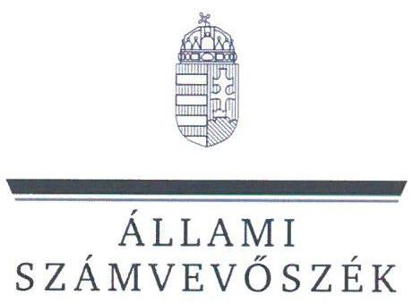
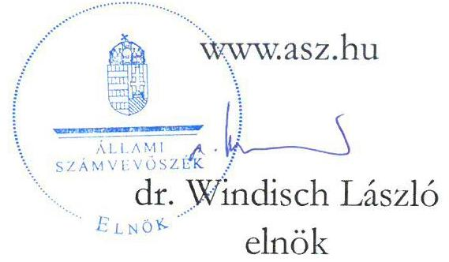

ÁLLAMI
SZÁMVEVŐSZÉK

# JELENTÉS 

Egyesületek és alapítványok államháztartásból kapott támogatásai könyvviteli nyilvántartásának ellenőrzése
2023.

23064
www.asz.hu

---

ÁLLAMI
SZÁMVEVÔSZÉK

# JELENTÉS 

## Egyesületek és alapítványok államháztartásból kapott támogatásai könyvviteli nyilvántartásának ellenőrzése

2023. 

23064

---

# ELLENŐRZÉSI IGAZGATÓSÁG: 

## ÁLLAMHÁZTARTÁSON KÍVÜLI SZERVEZETEKET ELLENŐRZŐ IGAZGATÓSÁG

## ELLENŐRZÉSI IGAZGATÓ:

## KLINGA LÁSZLÓ igazgató

## ELLENŐRZÉSVEZETŐ:

Jelentéseink az interneten a www.asz.hu címen olvashatók.

BÉCSI ANDREA ellenőrzésvezető

IKTATÓSZÁM: EL-3963-010/2023.
TÉMASZÁM: 2693
ELLENŐRZÉS-AZONOSÍTÓ SZÁM: V1037

---

# TARTALOMJEGYZÉK 

- AZ ELLENŐRZÉS ALAPADATAI ..... 5
- AZ ELLENŐRZÖTT SZERVEZETEK ..... 6
- ÖSSZEFOGLALÁS ..... 14
- AZ ELLENŐRZÉS FÓKUSZKÉRDÉSE ..... 16
- MEGÁLLAPÍTÁSOK ..... 17
- JAVASLATOK ..... 29
- MELLÉKLETEK ..... 33
I. sz. melléklet: Értelmező szótár ..... 33
II. sz. melléklet: Az ellenőrzött szervezetek jegyzéke ..... 36
III. sz. melléklet: Ellenőrzési kritériumok ..... 37
- FÜGGELÉK: ÉSZREVÉTELEK ..... 38
- RÓVIDÍTÉSEK JEGYZÉKE ..... 39

---

.

---

# AZ ELLENŐRZÉS ALAPADATAI 

## AZ ELLENŐRZÉS CÉLJA

Az ellenőrzés célja annak ellenőrzése volt, hogy az ellenőrzött egyesületnél, alapítványnál a kiválasztott, államháztartási forrásból származó támogatás könyvviteli nyilvántartása szabályszerűen történt-e.

## AZ ELLENŐRZÉS TÍPUSA

Szabályszerűségi ellenőrzés.

## AZ ELLENŐRZÖTT IDŐSZAK

Az ellenőrzésre kiválasztott államháztartási támogatásra vonatkozó támogatási döntéstől / szerződéskötéstől 2023. 07. 18-ig, a helyszíni ellenőrzésről szóló értesítés keltéig tartó időszak.

## AZ ELLENŐRZÉS TÁRGYA

Az egyesületnél, illetve alapítványnál az ellenőrzésre kiválasztott államháztartási forrásból kapott támogatás könyvviteli nyilvántartását, ennek keretében a támogatásból származó bevétel-, valamint a támogatás felhasználás nyilvántartására vonatkozó jogszabályi előírások betartását ellenőriztük.

## AZ ELLENŐRZÉS JOGALAPJA

Az ellenőrzés jogalapját az ÁSZ tv. ${ }^{1} 1 . \int(3)$, valamint az 5. $\int(3)$ bekezdés előírásai képezték.

## AZ ELLENŐRZÉS MÓDSZERE

Az ellenőrzést az ellenőrzési program szempontjai, az ellenőrzött időszakban hatályos jogszabályok, előírások, az ellenőrzés általános szakmai szabályai, az ellenőrzésre irányadó ÁSZ ${ }^{2}$ ellenőrzési módszertan figyelembevételével végezte az ÁSZ. Az ellenőrzési kérdések megválaszolásához szükséges bizonyítékok megszerzése az ellenőrzött egyesület, alapítvány által rendelkezésre bocsátott dokumentumokra és adatokra alapozva, továbbá kérdésfeltevés (információkérés) útján történt. Az ellenőrzési bizonyítékként felhasznált adatforrások közé tartoztak egyrészt az ellenőrzéshez kért dokumentumok, adatforrások, másrészt minden az ellenőrzés folyamán - feltárt, az ellenőrzés szempontjából információkat tartalmazó dokumentum.
Az ellenőrzés lefolytatásához az ellenőrzött szervezet a tanúsítvány kitöltésével, valamint az ÁSZ által kért dokumentumok, adatok, információk megküldésével szolgáltatott adatokat.

---

# AZ ELLENŐRZÖTT SZERVEZETEK 

Az ellenőrzésre 12 civil szervezet esetében került sor, melyek közül három egyesületi, kilenc pedig alapítványi formában működött. Működéséről, vagyoni, pénzügyi és jövedelmi helyzetéről valamennyi ellenőrzött szervezet egyszerűsített éves beszámolót készített, melyet kettős könyvvezetéssel támasztott alá. A 12 ellenőrzött szervezetből 10 rendelkezett közhasznú jogállással. A Közbef. tv. ${ }^{3}$ előírása szerint tevékenysége és a 2022. évi számviteli beszámoló mérlegfőösszege alapján - mivel mérlegfőösszegük elérte a 20 millió forintot -, a 12 ellenőrzött a közélet befolyásolására alkalmas tevékenységet végző civil szervezetnek minősült.

Az ellenőrzött szervezetek 2022. évi számviteli beszámolójuk szerint mindösszesen 3 725,9 M Ft vagyonnal gazdálkodtak, tevékenységükhöz 2 658,8 M Ft támogatást számoltak el bevételként. A legnagyobb szervezet $752,0 \mathrm{MFt}$, a legkisebb $24,0 \mathrm{MFt}$ értékű eszköz állománnyal rendelkezett.

A kilenc alapítványnál és három egyesületnél összesen 2394,2 M Ft összegű támogatás számviteli nyilvántartásának ellenőrzésére került sor.

## ANYANYELVÁPOLÓK SZÖVETSÉGE

Az egyesületet 1989-ben hozták létre. Az egyesület „,éljának és tevékenységének meghatározásában a nyelvelmélet felismeréseiböl, a nyelvtudomány eredményeiböl, a nyelv és társadalom összefüggéseiböl indul ki. Nyelv és gondolkodás, nyelv és magatartás, nyelv és múvelődés három lényeges összefüggés, melyek szem előtt tartása jelentős tényező szövetségünk mindennapi tevékenységében. A gondolkodás felgyorsulása és kiterjedése együtt jár a nyelv eszköz- és formavilágának gazdagodásával, differenciálódásával, s meghatározza a nyelvmüvelés irányát, összetevöit; a tudat gazdagodása kibat a magatartás pallérozására; készségének kiterjedése és finomodása együtt jár a nyelvi eszközök gyarapodásával, használatuk árnyalásával, a tudatba épülésük mélységével és tartósságával". Az egyesület az ellenőrzött időszakban közhasznú jogállással rendelkező szervezetként működött. Legfőbb döntéshozó szerve a közgyűlés volt, ügyvezetését a háromtagú elnökség látta el. A működés és gazdálkodás ellenőrzésére háromtagú felügyelőbizottságot hoztak lére. Az egyesület könyvvizsgálatra nem volt kötelezett, 2021-2022. évekre egyszerűsített éves beszámolót készített.

## AZ ELLENŐRZÖTT, ALLAMHAZTARTÁSI FORRÁSRÓL KAPOTT TÁMOGATÁS REMUTATÁSA

Támogatott szervezet megnevezése, székhelytelepülése

Támogatási program célja

Támogató megnevezése

Támogatott tevékenység időtartama, felhasználás végső időpontja

Támogatás folyósítása, összege
Támogatás típusa
A pénzügyi elszámolás határideje

Elszámolás a támogató szervezet felé

Anyanyelvápolók Szövetsége, Budapest
„Anyanyelvápolók Szövetsége szakmai feladatainak ellátásához és müködési költségük támogatásához" forrás biztosítása
Emberi Erőforrások Minisztériuma - a feladat jogutódja a Belügyminisztérium
2021.03.01. - 2022.04.30., 2022.04.30.
2021.05.31.; 100000000 Ft
egy összegben, támogatási előlegként folyósított, vissza nem térítendő
2022.05.31.

Az egyesület az elszámolást határidőben benyújtotta, annak elbírálásáról a támogató szervezet jogutódja az ellenőrzött időszakban tájékoztatást nem adott.

---

# EGYEDÜLÁlló SZÜLÖK Klubja AlapítVÁNY 

Az alapítványt 2005. évben alapította egy magánszemély. Az alapítvány „fő célja és tevékenysége az egyedülálló, gyermeküket egyedül nevelő szülők támogatása, elsősorban egy létrehozandó internetes portálon keresztül történő tanácsadással, segitségnyújtással. Az alapitvány további célja az ennek érdekében történő családsegités, oktatás, ismeretterjesztés, kulturális tevékenység, gyermek- és ifjúságvédelem, illetve érdekképviselet, a bátrányos belyzetü csoportok társadalmi esélyegyenlőségének elöségitése, továbbá az emberi jogok védelmé" volt. A közhasznú jogállással rendelkező alapítvány vagyonát az alapító által létrehozott háromtagú kuratórium kezelte. Az alapítvány a jogszabályi előírások alapján felügyelőbizottság létrehozására nem volt kötelezett. A jogszabályi előírások szerint az ellenőrzött időszakban az alapítvány könyvvizsgálatra nem volt kötelezett, azonban az alapítvány kuratóriuma a beszámolóinak könyvvizsgálóval történő felülvizsgálatáról döntött. Az alapítvány 2022. évi egyszerűsített éves beszámolóját könyvvizsgáló felülvizsgálta.

| AZ ELLENŐRZÖTT, ALLÁNHÁZTÁKTÁSI FORRÁSBÓL KAPOTT TÁMOGATÁS REMUTATÁSA |  |
| :--: | :--: |
| Támogatott szervezet megnevezése, székhelytelepülése | Egyedülálló Szülők Klubja Alapítvány, Alsómocsolád |
| Támogatási program célja | „A pesti Egyszülös Központ szakmai programjainak és közösségi tevékenységének támogatása" |
| Támogató megnevezése | Miniszterelnökség képviseletében a Tempus Közalapítvány, mint lebonyolító szervezet |
| Támogatott tevékenység időtartama, felhasználás végső időpontja | 2022.03.01. - 2023.06.30., 2023.07.30. |
| Támogatás folyósítása, összege | 2022.03.07.; 120000000 Ft |
| Támogatás típusa | egy összegben, támogatási előlegként folyósított, vissza nem térítendő |
| A pénzügyi elszámolás határideje | 2023.08.29. |
| Elszámolás a támogató szervezet felé | Az alapítványnak az ellenőrzött időszakban nem volt a támogató szervezet felé elszámolási kötelezettsége. |

## "GÉZENGÚZ AlAPÍTVÁNY A SZÜLETÉSI KÁrosULTAKÉrt"

Az alapítványt 1990-ben alapította egy magánszemély. Alapító okiratban meghatározott célja volt többek között a „,mozgássérült csecsemök, kisgyermekek komplex rehabilitációs kezelése, prevenciöja, fejlesztése uszodai foglalkozások, játékos tornagyakorlatok és egyéb technikák segítségével a szülök aktív közremüködését is felhasználva". A közhasznú jogállású alapítvány ügyvezető szerve a hét természetes személyből álló kuratórium volt. Az alapítvány működését és gazdálkodását háromtagú felügyelőbizottság ellenőrizte. Az alapítvány az ellenőrzött időszakban kötelezett volt könyvvizsgálatra, 2021-2022. évekre egyszerűsített éves beszámolót készített, melyeket könyvvizsgáló felülvizsgált.

---

# AZ ELLENŐRZÖTT, ÁLLAMHÁZTARTÁSI FORRÁSBOL KAPOTT TÁMOGATÁS BEMUTATÁSA 

Támogatott szervezet megnevezése, „A Gézengúz Modell „betegszállitási", család ellátási tevékenységének megvalósitása székhelytelepülése
"Gézengúz Alapítvány a Születési Károsultakért", Budapest
Támogatási program célja
Támogató megnevezése
Támogatott tevékenység időtartama, felhasználás végső időpontja
Támogatás folyósítása, összege
Támogatás típusa
A pénzügyi elszámolás határideje
"Gézengúz Modell „betegszállitási", család ellátási tevékenységének megvalósitása (szakmai feladat)"
Emberi Erőforrások Minisztériuma - a feladat jogutódja a Belügyminisztérium
2021.01.01. - 2021.12.31., 2022.01.30.
2021.04.23.; 100000000 Ft
egy összegben, támogatási előlegként folyósított, vissza nem térítendő
2022.03.01.

Elszámolás a támogató szervezet felé
Az alapítvány az elszámolást határidőben benyújtotta, annak elbírálásáról a támogató szervezet (illetve a feladatellátás tekintetében annak jogutódja) az ellenőrzött időszakban tájékoztatást nem adott.

## GÓZON GYULA KAMARASZÍNHÁZ ALAPÍTVÁNY

Az alapítványt 2002-ben alapította 16 magánszemély. Az alapítvány létrehozásának célja „a Budapest XVII. kerület XV. utca 23. szám alatti - Budapest Főváros XVII. kerület Önkormányzata tulajdonát képező - épület felújításának, szinházként történő müködtetésének és szinházi produkciök létrehozásának támogatása" volt. A közhasznú jogállású alapítvány ügyvivő szerve a három főből álló kuratórium volt. A működés és gazdálkodás ellenőrzésére háromtagú felügyelőbizottságot hoztak létre. Az alapítvány az ellenőrzött időszakban könyvvizsgálatra nem volt kötelezett, 2021-2022. évekre egyszerűsített éves beszámolót készített.

## AZ ELLENŐRZÖTT, ÁLLAMHÁZTARTÁSI FORRÁSBOL KAPOTT TÁMOGATÁS BEMUTATÁSA

Támogatott szervezet megnevezése, székhelytelepülése
Támogatási program célja
Támogató megnevezése
Támogatott tevékenység időtartama, felhasználás végső időpontja
Támogatás folyósítása, összege
Támogatás típusa
A pénzügyi elszámolás határideje
Elszámolás a támogató szervezet felé

Gózon Gyula Kamaraszínház Alapítvány, Budapest
„A Gózon Gyula Kamaraszinház épületének felújítása"
Emberi Erőforrás Támogatáskezelő - Nemzeti Kulturális Alap, jogutódja a Nemzeti Kulturális Támogatáskezelő
2021.06.02. - 2023.12.01., 2023.01.14.
2021.07.09.; 300000000 Ft
egy összegben folyósított, vissza nem térítendő
2024.01.30.

Az alapítványnak az ellenőrzött időszakban nem volt a támogató szervezet felé elszámolási kötelezettsége.

## HUNGAROKULT KULTURÁLIS ÉS ZENEI EGYESÜLET

Az egyesületet 2020-ban hozták létre. Alapszabályban meghatározott célja a „magyar kulturális és zenei örökség elemeinek megörzése és széles körü bemutatása. A magyar müvészetek megjelenitése hagyományos és újszerü formában belés külföldön, továbbá nemzetközi együttmüködések keretében. A magyar és egyetemes zenei kultúra, mint a nemzeti hagyomány fontos részének ápolása, és ezen bagyományok beépülésének elösegitése az általános értékrendbe" volt. A közhasznú jogállással nem rendelkező egyesület döntéshozó szerve a közgyűlés volt, ügyvezetését az egyesület ügyvezetője látta el.

---

Az egyesület az ellenőrzött időszakban felügyelőbizottság létrehozására nem volt kötelezett. Az egyesület az ellenőrzött időszakban könyvvizsgálatra nem volt kötelezett, 2021-2022. évekre egyszerűsített éves beszámolót készített.

# AZ ELLENÖRZÖTT, ALLAMHÁZTARTÁSI FORRÁSBÓL KAPOTT TÁMOGATÁS BEMUTATÁSA 

Támogatott szervezet megnevezése, székhelytelepülése

Támogatási program célja
Támogató megnevezése
Támogatott tevékenység időtartama, felhasználás végső időpontja

Támogatás folyósítása, összege
Támogatás típusa
A pénzügyi elszámolás határideje
Elszámolás a támogató szervezet felé

Hungarokult Kulturális és Zenei Egyesület, Budapest
„A Cziifira György-emlékév 2021-2022. évi megyalósitása"
Miniszterelnökség - kezelő szervként a Bethlen Gábor Alapkezelő Közhasznú Nonprofit Zrt.

2021.02.01. - 2022.12.31., 2022.12.31.

2021.05.06.; 399800100 Ft
egy összegben, támogatási előlegként folyósított, vissza nem térítendő
2023.01.30.

Az egyesület az elszámolást határidőben benyújtotta, annak elbírálásáról a támogató szervezet az ellenőrzött időszakban tájékoztatást nem adott.

## "KORASZÜLÖTTMENTŐ ÉS GYERMEKINTENZÍV" ALAPÍTVÁNY

Az alapítványt 2010-ben egy magánszemély hozta lére. Alapító okiratban meghatározott célja „a születés után súlyos, vagy életveszélyben lévő újszülötttek mentése és szállitása, mint állami speciális mentési és szállitási feladat ellátása, illetve megvalósitásának a segitése, az újszülöttek, csecsemök, gyermekek kórbázi intenziv ellátásával és szállitásával, gyógykezelésével, illetve rehabilitációjával kapcsolatos teendök ellátása, illetve támogatása a Zala Megyei Kórbáz ... ellátási területére kiterjedően, különös tekintettel a Kórbáz Csecsemő- és Gyermekosztályára" volt. Az alapító a közhasznú jogállású alapítvány vagyonának kezelésére héttagú kuratóriumot, a működés és gazdálkodás ellenőrzésére háromtagú felügyelőbizottságot hozott létre. Az alapítvány az ellenőrzött időszakban könyvvizsgálatra nem volt kötelezett, 2021-2022. évekre egyszerűsített éves beszámolót készített.

## AZ ELLENÖRZÖTT, ALLAMHÁZTARTÁSI FORRÁSBÓL KAPOTT TÁMOGATÁS BEMUTATÁSA

Támogatott szervezet megnevezése, székhelytelepülése

Támogatási program célja

Támogató megnevezése
Támogatott tevékenység időtartama, felhasználás végső időpontja
Támogatás folyósítása, összege
Támogatás típusa
A pénzügyi elszámolás határideje
Elszámolás a támogató szervezet felé

"Koraszülöttmentő és Gyermekintenzív" Alapítvány, Zalaegerszeg
Új, neonatológiai intenzív transzport feladatok ellátására alkalmas haszongépjármú legyártatása, felszerelése inkubátorokkal, lélegeztető géppel és egy második transzport inkubátor elhelyezésének kialakítása a neonatológiai rohamkocsiba.
Innovációs és Technológiai Minisztérium - a feladat jogutódja Energiaügyi Minisztérium
2021.12.01. - 2022.11.30., 2022.12.31.

2021.12.23.; 102000000 Ft
egy összegben, támogatási előlegként folyósított, vissza nem térítendő
2023.01.31.

Az alapítvány az elszámolást határidőben benyújtotta. A támogató szervezet az elszámolás elfogadásáról tájékoztatta az alapítványt.

---

# MaGyar NEMZETI MÚZEUM AlAPítVÁNY 

Az alapítványt 1991-ben hozta létre két szervezet, az alapítói jogokat 1997. december 15-étől kizárólag a Magyar Nemzeti Múzeum gyakorolja. Alapító okiratban meghatározott célja a Magyar Nemzeti Múzeum mint „Alapitó törvényben meghatározott feladatainak ellátásához kapcsolódó kulturális örökségvédelmi, tudományos, közmüvelödési és múzeumpedagógiai eredményeinek, alkotásainak gondozása, ilyen kulturális örökségvédelmi, tudományos, közmüvelödési és múzeumpedagógiai programok önálló szervezése, eredmények, alkotások önálló létrehozása" volt. A közhasznú jogállással nem rendelkező alapítvány ügyvezető szerve a háromtagú kuratórium volt. A jogszabályi előírások alapján az alapítvány felügyelőbizottság létrehozására nem volt kötelezett. Az ellenőrzött időszakban az alapítvány könyvvizsgálatra nem volt kötelezett, 2021. és 2022. évre egyszerűsített éves beszámolót készített.

## AZ ELLENŐRZÖTT, ÁLLAMHÁZTARTÁSI FORRÁSBÓL KAPOTT TÁMOGATÁS BEMÚTÁTÁSA

Támogatott szervezet megnevezése, székhelytelepülése

Támogatási program célja

Támogató megnevezése

Támogatott tevékenység időtartama, felhasználás végső időpontja

Támogatás folyósítása, összege
Támogatás típusa
A pénzügyi elszámolás határideje

Elszámolás a támogató szervezet felé

Magyar Nemzeti Múzeum Alapítvány, Budapest
„Az Esztergomi Vármúzeum Erények, falképcsoport restaurálása"
Miniszterelnökség - kezelő szervként a Lechner Tudásközpont Nonprofit Kft., 2023.01.01-étől a feladat ellátója az Építésügyi és Közlekedési Minisztérium
2021.06.01. - 2022.12.31., 2023.03.01.
2021.12.01.; 100000000 Ft
egy összegben, támogatási előlegként folyósított, vissza nem térítendő 2023.03.31.

Az alapítvány az elszámolást vis maior, energia takarékosságból következő, megvalósítást hátráltató okokra hivatkozva a pénzügyi elszámolási határidő lejárta ellenére nem nyújtotta be az Építésügyi és Közlekedési Minisztériumhoz, ugyanezen okok miatt kezdeményezte a felhasználási és elszámolási határidő módosítását, melyre az ellenőrzött időszakban nem kapott választ.

## MaGyar-Francia Ifjúsági Alapítvány

Az alapítványt 1992-ben alapította a művelődési és közoktatási miniszter. Alapító okiratban meghatározott célja „a francia nyelv és kultúra, ezen keresztül az európai gondolat széleskörü társadalmi bázisokra épülő magyarországi népszerüsitése, a francia mint idegen nyelv oktatási szinvonalának emelése, valamint a két nép ifjúságának kölcsönös, minél jobb megismerése" volt. Az alapítvány közfeladatot ellátva általános iskolai, gimnáziumi és szakközépiskolai nevelés-oktatási, felnőttoktatási, valamint pedagógiai-szakmai szolgáltatást végzett. A közhasznú jogállású alapítvány legfőbb döntéshozó szerve a kilenctagú kuratórium volt. A müködés és gazdálkodás ellenőrzésére háromtagú felügyelőbizottságot hoztak létre. Az alapítvány az ellenőrzött időszakban a jogszabályi előírások alapján könyvvizsgálatra nem lett volna kötelezett, azonban a 2022. évi egyszerűsített éves beszámolóját könyvvizsgáló felülvizsgálta.

---

# AZ ELLENÖRZÖTT, ALLAMHAZTARTÁSI FORRÁSRÓL KAPOTT TÁMOGATÁS BEMUTATÁSA 

Támogatott szervezet megnevezése, székhelytelepülése

Támogatási program célja

Támogató megnevezése

Támogatott tevékenység időtartama, felhasználás végső időpontja

Támogatás folyósitása, összege
Támogatás típusa
A pénzügyi elszámolás határideje

Elszámolás a támogató szervezet felé

Magyar-Francia Ifjúsági Alapítvány, Budapest
„Francia anyanyelvi tanárok foglalkoztatása Magyarországon, részükere szakmai továbbképzések szervczęe, intézmények pedagógiai programjainak támogatása"
Emberi Erőforrások Minisztériuma - a feladat jogutódja Belügyminisztérium
2022.01.10. - 2022.12.31., 2022.12.31.
2023.05.06.; 52600000 Ft
egy összegben, támogatási előlegként folyósított, vissza nem térítendő
2023.04.01.

Az alapítvány az elszámolást határidőben benyújtotta, annak elbírálásáról a támogató szervezet jogutódja az ellenőrzött időszakban tájékoztatást nem adott.

## OMNIS ALAPÍTVÁNY

Az alapítványt 2005-ben egy jogi személy hozta létre. Alapító okiratban meghatározott célja volt a „Rászorulók szociális gondozása, ellátása; rászorulók, hátrányos belyzetü csoportok, társadalmi esélyegyenlöségének elösesitése, érdekek érvényesitésének segitése. Közös kapcsolatok kialakítása, információk biztositása a megyében müködő civil szervezetek számára; Kistérségi szociálpolitika kialakítása." A közhasznú jogállású alapítvány döntéshozó, ügyintéző és kezelő szerve a háromtagú kuratórium volt. Müködését és gazdálkodását a három főből álló felügyelőbizottság ellenőrizte. Az alapítvány az ellenőrzött időszakban könyvvizsgálatra nem volt kötelezett, 2022. évre egyszerúsített éves beszámolót készített.

## AZ ELLENÖRZÖTT, ALLAMHAZTARTÁSI FORRÁSRÓL KAPOTT TÁMOGATÁS BEMUTATÁSA

Támogatott szervezet megnevezése, székhelytelepülése

Támogatási program célja

Támogató megnevezése
Támogatott tevékenység időtartama, felhasználás végső időpontja

Támogatás folyósitása, összege
Támogatás típusa
A pénzügyi elszámolás határideje

Elszámolás a támogató szervezet felé

OMNIS Alapítvány, Nyíregyháza
„A megváltozott munkaképességü munkavállaló után fizetendő bérköltség, valamint a megváltozott munkaképességü személy rehabilitációs foglalkoztatásának a megváltozott munkaképességböl fakadó többletköltségei finanszirozásához" támogatás biztosítása
Budapest Főváros Kormányhivatala - a fejezeti kezelésű előirányzat kezelő szerve
2022.01.01. - 2022.12.31., 2023.01.20.
havonta folyósított; 80454000 Ft
vissza nem térítendő
2023.03.01.

Az alapítvány az elszámolást határidőben benyújtotta. A támogatás folyósításával és ellenőrzésével kapcsolatos feladatokat ellátó Kincstár az elszámolás elfogadásáról tájékoztatta az alapítványt.

---

# ÖSVÉNY ESÉLYNÖVELŐ ALAPÍTVÁNY 

Az alapítványt 1999-ben hozta létre egy magánszemély. Müködésének céljaként az alapító okiratban a „Füzesgyarmat településen éló emberek életesélyeinek növelését" határozták meg. A közhasznú jogállású alapítvány ügyvezető szerve a háromtagú kuratórium volt, az ellenőrzési feladatokat háromtagú felügyelőbizottság végezte. Az alapítvány 2022. évre egyszerűsített éves beszámolót készített, a jogszabályi előírások szerint kötelezett volt könyvvizsgálatra, azonban a beszámolót a jogszabály előírása ellenére könyvvizsgáló nem vizsgálta felül.

## AZ ELLENŐRZÖTT, ÁLLAMDÁZTARTÁSI FORRÁSBÓL KAPOTT TÁMOGATÁS REMUTATÁSA

Támogatott szervezet megnevezése, Székhelytelepülése

Támogatási program célja

Támogató megnevezése
Támogatott tevékenység időtartama, felhasználás végső időpontja

Támogatás folyósítása, összege
Támogatás típusa
A pénzügyi elszámolás határideje

Elszámolás a támogató szervezet felé

Ösvény Esélynövelő Alapítvány, Füzesgyarmat „A megváltozott munkaképességö munkavállaló után fizetendő bérköltség, valamint a megváltozott munkaképességö személy rehabilitációs foglalkoztatásának a megváltozott munkaképességböl fakadó többletköltségei finanszirozásához" forrás biztosítása
Budapest Főváros Kormányhivatala - a fejezeti kezelésű előirányzat kezelő̉ szerve
2022.01.01. - 2022.12.31., 2023.01.20.
havonta folyósított; 867504000 Ft
vissza nem térítendő
2023.03.01.

Az alapítvány az elszámolást határidőben benyújtotta. A támogatás folyósításával és ellenőrzésével kapcsolatos feladatokat ellátó Kincstár az elszámolás elfogadásáról tájékoztatta az alapítványt.

## SZabad WALDORF NEVELÉSÉRT ALAPÍTVÁNY

Az alapítványt 1994-ben két magánszemély és egy gazdasági társaság hozta létre. Az alapító okiratban célként határozták meg, hogy az „alapítvány segíti kiülönös tekintettel a Solymár Nagyközzség és körzete (beleértve Budapestet is) területén müködő és kialakuló Waldorf intézményeket és szülöi közzösségeket, pedagógiai céljaik elérésében és ezzel nevelés, oktatás, képességfejlesztés, ismeretterjesztés és kulturális tevékenységet folytat". A közhasznú jogállású alapítvány kezelő szerve a háromtagú kuratórium volt. A müködés és gazdálkodás ellenőrzése céljából háromtagú felügyelőbizottságot hoztak létre. Az alapítvány az ellenőrzött időszakban a jogszabályi előírások alapján kötelezett volt könyvvizsgálatra, a 2022 évi egyszerűsített éves beszámolóját könyvvizsgáló felülvizsgálta.

---

# AZ ELLENÖRZÖTT, ALLAMHAZTARTÁSI FORRÁSBÓL KAPOTT TÁMOGATÁS BEMUTATÁSA 

Támogatott szervezet megnevezése, Székhelytelepülése Szabad Waldorf Nevelésért Alapítvány, Solymár
Támogatási program célja Az Alapítvány fenntartásában működő Fészek Waldorf Általános Iskola, Gimnázium és Alapfokú Művészeti Iskola megújitásának előkészítése
Támogató megnevezése Emberi Erőforrások Minisztériuma - a feladat jogutódja a Kulturális és Innovációs Minisztérium
Támogatott tevékenység időtartama, 2022.05.01. - 2023.04.15., 2023.05.15.; módosítás alatt: 2022.05.01. 2023.08.31.
Támogatás folyósítása, összege 2022.05.20.; 116878000 Ft
Támogatás típusa egy összegben, támogatási előlegként folyósított, vissza nem térítendő
A pénzügyi elszámolás határideje 2023.06.14. módosítás alatt, kérelmezett új határidő: 2023.09.30
Elszámolás a támogató szervezet felé Az alapítvány kezdeményezte a támogatott időszak és a pénzügyi elszámolási határidő módosítását. A kérelem elbírálásáról, a határidők módosításáról az ellenőrzött időszakban az alapítvány nem kapott értesítést.

## VAKOK ÉS GYENGÉNLÁTÓK HEVES MEGYEI EGYESÜLETE

Az egyesületet 2005-ben vették nyilvántartásba. Az egyesület célja, hogy „ellássa tagjai egyéni és kollektív érdekevédelmét, ezen belül módot nyújtson tagjainak érdekeik kiffejezésére, lebetöséget teremtsen azok érvényesitésére és ellássa érdekeképviseletïket." A közhasznú jogállású egyesület legfőbb szerve a közgyűlés, ügyintéző testületi szerve az öttagú elnökség volt. A közgyűlés az egyesület tevékenységének ellenőrzésére háromtagú felügyelőbizottságot hozott létre. Az egyesületnek könyvvizsgálati kötelezettsége nem volt, a 2022. évre egyszerűsített éves beszámolót készített.

## AZ ELLENÖRZÖTT, ALLAMHAZTARTÁSI FORRÁSBÓL KAPOTT TÁMOGATÁS BEMUTATÁSA

Támogatott szervezet megnevezése, Székhelytelepülése

Támogatási program célja

Támogató megnevezése

Támogatott tevékenység időtartama, felhasználás végső időpontja

Támogatás folyósítása, összege
Támogatás típusa
A pénzügyi elszámolás határideje

Elszámolás a támogató szervezet felé

Vakok és Gyengénlátók Heves Megyei Egyesülete, Eger
Térítésmentes elemi rehabilitációs szolgáltatás létesítése, bővítése és múködésének biztosítása - a meglévő elemi rehabilitációs központok eszközparkjának bővítése, új elemi rehabilitációs szolgáltató pontok létrehozása, szakemberek bevonása, képzése
Emberi Erőforrások Minisztériuma képviseletében a Slachta Margit Nemzeti Szociálpolitikai Intézet - a feladat jogutódja a Belügyminisztérium
2022.04.01. - 2023.03.31., 2023.04.15.
2022.04.13.; 55000000 Ft
egy összegben folyósított, vissza nem térítendő
2023.04.30.

Az egyesület az elszámolást határidőben benyújtotta, annak elbírálásáról a támogató szervezet jogutódja az ellenőrzött időszakban tájékoztatást nem adott.

---

# ÖSSZEFOGLALÁS 

Az ellenőrzött 12 civil szervezetből 10 szervezet könyvvezetési rendszerének kialakítása megfelelően támogatta az államháztartásból származó ellenőrzött támogatások szabályszerű könyvviteli nyilvántartását, biztosította a közpénzek felhasználásának ellenőrizhetőségét. Az ellenőrzés kettő szervezetnél tárta fel azt a hiányosságot, hogy könyvvezetési rendszerét nem a vonatkozó jogszabályok előírásai szerint alakította ki, ezáltal a közpénz felhasználás ellenőrizhetőségét nem biztosította.

Három ellenőrzött szervezet az államháztartási forrásból kapott támogatást megfelelően, a jogszabályi előírások szerint, elkülönítve tartotta nyilván, közülük két szervezetnél volt megfelelő a könyvvezetési rendszer kialakítása. Hét ellenőrzött szervezet a jogszabályi előírást megsértve nem az előírt részletezésben mutatta ki az államháztartási forrásból kapott támogatást, ezek mindegyikénél a könyvvezetési rendszer kialakítása megfelelő volt. További kettő szervezetnél a kapott támogatás nyilvántartásba vételekor nem érvényesült a bruttó elszámolás elve, mivel a fejlesztési célra kapott támogatást úgy mutatta ki halasztott bevételként, hogy azt korábban bevételként nem számolta el.

Az államháztartási forrásból kapott támogatás felhasználását 10 szervezet a könyvviteli rendszerében a jogszabályi előírások szerint tartotta nyilván. Egy szervezet a jogszabályok előírásai ellenére az államháztartási forrásból kapott támogatás felhasználásáról nem vezetett olyan számviteli nyilvántartást, amelynek alapján megállapítható és ellenőrizhető a kapott támogatás felhasználása, esetükben a könyvvezetési rendszer kialakítása sem volt szabályszerű. Egy szervezet a szabályszerűen kialakított könyvvezetési rendszerében a munkaszámos elkülönítést nem alkalmazta teljeskörűen, ezáltal a támogatás felhasználásának jogszabályban előírt elkülönítése nem valósult meg.

Az ellenőrzött 12 szervezet közül egy szervezetnek jogszabályi előírás hiányában nem volt az ellenőrzött támogatás vonatkozásában a beszámolóban tájékoztatási kötelezettsége. Egy szervezet közpénzfelhasználásra vonatkozó tájékoztatása megfelelt a jogszabályi előírásoknak. 10 szervezet nem megfelelően tájékoztatta a közvéleményt az ellenőrzött támogatás felhasználásáról, mert nem biztosította a közpénzek felhasználására vonatkozó gazdálkodása nyilvánosságát, ezáltal sérült a közpénzkezelés Alaptörvényben ${ }^{4}$ rögzített átláthatóságának elve. Közülük kettő szervezet a törvényi előírás ellenére az egyszerűsített éves beszámoló részeként nem készített kiegészítő mellékletet, erre tekintettel az ellenőrzöttek az egyszerűsített éves beszámolót nem a jogszabályban előírtak szerint állították össze. Egy szervezet könyvvezetése nem támasztotta alá a kiegészítő melléklet adatait, e három utóbbi szervezet közül kettő esetében a közhasznúsági mellékletek sem feleltek meg a törvényi előírásoknak. Öt szervezetnél a kiegészítő melléklet nem a jogszabályi előírások szerint tartalmazta az államháztartási forrásból kapott támogatás felhasználásának bemutatását, közülük egy szervezet beszámolóját a jogszabályi előírás ellenére könyvvizsgáló nem auditálta, további egy szervezet esetében a közhasznúsági melléklet nem az előírások szerint tartalmazta az ellenőrzött államháztartási támogatás felhasználásához kapcsolódó célszerinti juttatás bemutatását. További egy civil szervezet a közhasznúsági mellékletet nem a jogszabályi előírások szerint készítette el.

Az ellenőrzési megállapításokhoz kapcsolódóan, a feltárt hiányosságok megszüntetésére 11 szervezet vezetőjének, összesen 25 javaslatot tettünk.

A fentiekben bemutatott megállapítások ellenőrzött szervezetenkénti megjelenését az 1. ábra szemlélteti.

---

# *Osszefoglalás*

*1. ábra*

## **FŐBB ELLENŐRZÉSI TAPASZTALATOK**

|  **Altybiztos** | **Altybiztos** | **Altybiztos** | **Altybiztos**  |
| --- | --- | --- | --- |
|  100,0 | 100,0 | 100,0 | 100,0  |
|  120,0 | 120,0 | 120,0 | 120,0  |
|  100,0 | 100,0 | 100,0 | 100,0  |
|  300,0 | 300,0 | 300,0 | 300,0  |
|  399,8 | 399,8 | 399,8 | 399,8  |
|  102,0 | 102,0 | 102,0 | 102,0  |
|  100,0 | 100,0 | 100,0 | 100,0  |
|  52,6 | 52,6 | 52,6 | 52,6  |
|  80,5 | 80,5 | 80,5 | 80,5  |
|  867,5 | 867,5 | 867,5 | 867,5  |
|  116,9 | 116,9 | 116,9 | 116,9  |
|  55,0 | 55,0 | 55,0 | 55,0  |

*Forrás: ASZ saját szerkesztés*

---

# AZ ELLENŐRZÉS FÓKUSZKÉRDÉSE 

1- Szabályszerü volt-e az egyesület/alapítvány államháztartási forrásból kapott támogatásának könyvviteli nyilvántartása?

---

# 1. Anyanyelvápolók Szövetsége 

| Összegző megállapítás | Az Anyanyelvápolók Szövetsége könyvvezetési, |
| :-- | :-- |
| nyilvántartási rendszerét a jogszabályi elöírások szerint |  |
| alakította ki. A 2021. és a 2022. évi beszámolók részeként a |  |
| kiegészítő mellékletek és a 2021. és a 2022. évi közhasznúsági |  |
| mellékletek nem feleltek meg a jogszabályi előírásoknak. |  |

## A kapott támogatás könyvviteli nyilvántartása

Az egyesület könyvvezetési rendszerében (főkönyvi és analitikus nyilvántartások) az alapcél szerinti tevékenysége költségei, ráfordításai ellentételezésére államháztartási forrásból kapott támogatást főkönyvi számla alábontásával, alszámla használatával és munkaszám alkalmazásával - a Civil tv. ${ }^{5}$-ben előírtak szerint, elkülönítetten mutatta ki.

## A támogatás felhasználásának könyvviteli nyilvántartása

Az egyesület az Eszkr. ${ }^{6}$-ben és a Civil tv.-ben előírtakat betartva könyvvezetési rendszerében munkaszám használatával - az államháztartási forrásból, az alapcél szerinti tevékenysége költségei, ráfordításai ellentételezésére visszafizetési kötelezettség nélkül kapott támogatás felhasználását elkülönítetten tartotta nyilván. A támogatás felhasználásának számviteli nyilvántartása során figyelembe vette a támogatói okirat előírásait.
A szervezet könyvvezetésének kialakítása, keretrendszere a támogatás könyvviteli nyilvántartásának szabályossága tükrében

Az egyesület könyvvezetési, nyilvántartási rendszerét az Eszkr. és a Civil tv. előírásai szerint alakította ki, biztosítva ezzel az alapcél szerinti tevékenysége költségei, ráfordításai ellentételezésére visszafizetési kötelezettség nélkül kapott támogatás és annak felhasználása elkülönített kimutatásának lehetőségét.
A szervezet számviteli beszámolójában, közhasznúsági mellékletében a támogatással kapcsolatban bemutatott adatok könyvviteli nyilvántartásban elszámolt adatokkal történő alátámasztottsága

A közhasznú jogállású egyesület 2021-2022. évi egyszerűsített éves beszámolóinak kiegészítő melléklete a Civil tv. 29. § (4) bekezdés előírása ellenére nem tartalmazta a támogatási program keretében végleges jelleggel felhasznált összeg bemutatását. Az egyesület 2021-2022. évi közhasznúsági mellékletei a Civil tv. 29. § (7) bekezdése előírásai ellenére nem tartalmazták az ellenőrzött támogatás felhasználásából következő, a közhasznúsági melléklet 2. pontjában leírt tevékenység (jelenléti rendezvények: szépkiejtési, nyelvművelő, retorikai és helyesírási versenyek, nevelési-oktatási és kulturális programok) megvalósítása során keletkezett cél szerinti juttatások kimutatását.

---

# 2. Egyedülálló Szülők Klubja Alapítvány 

## Összegző megállapítás Az Egyedülálló Szülők Klubja Alapítvány államháztartási forrásból kapott támogatásának könyvviteli nyilvántartása szabályszerű volt.

## A kapott támogatás könyvviteli nyilvántartása

Az alapítvány könyvvezetési rendszerében (főkönyvi és analitikus nyilvántartások) az alapcél szerinti tevékenysége költségei, ráfordításai ellentételezésére államháztartási forrásból kapott támogatást főkönyvi számla alábontásával, alszámla használatával és munkaszám alkalmazásával - a Civil tv.-ben előírtak szerint, elkülönítetten mutatta ki.

## A támogatás felhasználásának könyvviteli nyilvántartása

Az alapítvány az Eszkr.-ben és a Civil tv.-ben előírtakat betartva könyvvezetési rendszerében - munkaszám használatával - az államháztartási forrásból, az alapcél szerinti tevékenysége költségei, ráfordításai ellentételezésére visszafizetési kötelezettség nélkül kapott támogatás felhasználását elkülönítetten tartotta nyilván. A támogatás felhasználásának számviteli nyilvántartása során figyelembe vette a támogatói okirat előírásait.
A szervezet könyvvezetésének kialakítása, keretrendszere a támogatás könyvviteli nyilvántartásának szabályossága tükrében

Az alapítvány könyvvezetési, nyilvántartási rendszerét az Eszkr. és a Civil tv. előírásai szerint alakította ki, biztosítva ezzel az alapcél szerinti tevékenysége költségei, ráfordításai ellentételezésére visszafizetési kötelezettség nélkül kapott támogatás és annak felhasználása elkülönített kimutatását.
A szervezet számviteli beszámolójában, közhasznúsági mellékletében a támogatással kapcsolatban bemutatott adatok könyvviteli nyilvántartásban elszámolt adatokkal történő alátámasztottsága

A közhasznú jogállású alapítvány a könyvvezetését és nyilvántartását az Eszkr.-ben és a Civil tv.-ben rögzített előírások szerint alakította ki, biztosította a 2022. évi egyszerűsített éves beszámoló kiegészítő mellékletében a Civil tv.-ben előírtaknak megfelelően bemutatott adatok alátámasztását.

---

# 3. "Gézengúz Alapítvány a Születési Károsultakért" 

## Összegző megállapítás

A "Gézengúz Alapítvány a Születési Károsultakért" könyvvezetési, nyilvántartási rendszerét a 2021. évben nem a jogszabályi előírások szerint alakította ki. Az államháztartási forrásból kapott támogatás felhasználásának könyvviteli nyilvántartása a 2021. évben nem volt szabályszerű. A 2021. évi közhasznúsági melléklet nem felelt meg a jogszabályi előírásoknak.

## A kapott támogatás könyvviteli nyilvántartása

Az alapítvány könyvvezetési rendszerében (főkönyvi és analitikus nyilvántartások) az alapcél szerinti tevékenysége költségei, ráfordításai ellentételezésére államháztartási forrásból kapott támogatást főkönyvi számla alábontásával, alszámla használatával - a Civil tv.-ben előírtak szerint, elkülönítetten mutatta ki.

## A támogatás felhasználásának könyvviteli nyilvántartása

Az alapítvány az Eszkr. 14. § (1) bekezdés és a Civil tv. 20. § (4) bekezdés előírása ellenére az államháztartási forrásból kapott támogatás felhasználásáról a 2021. évben nem vezetett olyan számviteli nyilvántartást, amelynek alapján megállapítható és ellenőrizhető a kapott támogatás felhasználása, mert könyvvezetési rendszerében a támogatás felhasználását nem különítette el.
A szervezet könyvvezetésének kialakítása, keretrendszere a támogatás könyvviteli nyilvántartásának szabályossága tükrében

Az alapítvány a 2021. évben könyvvezetési, nyilvántartási rendszerének kialakítása során nem az Eszkr. 14. § (1) bekezdésében és a Civil tv. 20. § (4) bekezdésében előírtak szerint járt el, tekintettel arra, hogy nem teremtette meg az alapcél szerinti tevékenysége költségei, ráfordításai ellentételezésére visszafizetési kötelezettség nélkül kapott támogatás felhasználásának elkülönített nyilvántartásának lehetőségét.
A szervezet számviteli beszámolójában, közhasznúsági mellékletében a támogatással kapcsolatban bemutatott adatok könyvviteli nyilvántartásban elszámolt adatokkal történő alátámasztottsága

A 2021. évi közhasznúsági melléklet a Civil tv. 29. § (7) bekezdése előírásai ellenére nem tartalmazta az ellenőrzött támogatás felhasználásából következő, a közhasznúsági melléklet 3.5. pontjában leírt valamennyi tevékenység - kora gyermekkori intervenciós diagnosztikai és terápiás ellátás, családút menedzsment - megvalósítása során keletkezett cél szerinti juttatás kimutatását. A közhasznú jogállású alapítvány a 2021. évi egyszerűsített éves beszámoló kiegészítő mellékletében az ellenőrzött támogatási program keretében végleges jelleggel felhasznált összeg Civil tv. 29. § (4) bekezdése által előírt bemutatását a számviteli nyilvántartási rendszer adatai - a Civil tv. 20. § (4) bekezdésében előírt elkülönített számviteli nyilvántartás vezetésének hiányában - nem támasztották alá.

---

# 4. Gózon Gyula Kamaraszínház Alapítvány 

Összegző megállapítás

A Gózon Gyula Kamaraszínház Alapítvány a 2021. évben az államháztartási forrásból fejlesztési célra kapott támogatást könyvviteli nyilvántartási rendszerében nem a jogszabályi előírások szerint mutatta ki. A 2021. és a 2022. évi egyszerűsített éves beszámolók részeként kiegészítő mellékletet nem készített, a 2021. és a 2022. évi közhasznúsági mellékletek nem feleltek meg a jogszabályi előírásoknak.

## A kapott támogatás könyvviteli nyilvántartása

Az alapítvány a 2021. évben könyvvezetési rendszerében (főkönyvi és analitikus nyilvántartások) a fejlesztési célra - visszafizetési kötelezettség nélkül - kapott támogatás összegét a Számv. tv. ${ }^{7} 45 . \S$ (1) bekezdés a) pontja előírása ellenére úgy mutatta ki a passzív időbeli elhatárolások között halasztott bevételként, hogy az összeget bevételként nem számolta el. A támogatás 2021. évi elszámolásakor nem tett eleget a Civil tv. 20. § (3) bekezdése előírásának, mert a fejlesztési célra államháztartási forrásból kapott támogatást elkülönített állami pénzalapból kapott támogatásként nem mutatta ki. Az alapítvány a támogatás nyilvántartásba vételekor nem vette figyelembe a Számv. tv. 15. § (9) bekezdésében előírt bruttó elszámolás elvét.

## A támogatás felhasználásának könyvviteli nyilvántartása

Az ellenőrzött fejlesztési célú támogatás összegéből a $\mathrm{Kbt}^{8}$.-ben előírt, előleg biztosítása célú felhasználás történt a 2021. évben, melyet az alapítvány a Számv. tv. előírásainak megfelelően követelésként, beruházásokra adott előlegként tartott nyilván.
A szervezet könyvvezetésének kialakítása, keretrendszere a támogatás könyvviteli nyilvántartásának szabályossága tükrében

Az alapítvány a könyvvezetési, nyilvántartási rendszerét a Számv. tv. előírásai szerint alakította ki. Ugyanakkor az Eszkr. 14. § (1) bekezdése előírásai ellenére a könyvvezetési, nyilvántartási rendszerének kialakítása során a 2021. évben nem vette figyelembe a Civil tv. 20. § (3) bekezdése - a bevételek kötelezö részletezésben történő kimutatására vonatkozó - előírásait.
A szervezet számviteli beszámolójában, közhasznúsági mellékletében a támogatással kapcsolatban bemutatott adatok könyvviteli nyilvántartásban elszámolt adatokkal történő alátámasztottsága

A közhasznú jogállású alapítvány a 2021. és a 2022. évi egyszerűsített éves beszámolójának részeként az Eszkr. 7. § (6) bekezdése, valamint a Civil tv. 29. § (2) bekezdés c) pontja előírásai ellenére kiegészítő mellékletet nem készített. Az alapítvány a 2021. és a 2022. évi közhasznúsági mellékletei nem feleltek meg a Civil vhr. ${ }^{9}$ 12. § (1) bekezdése előírásának, mivel nem tartalmazták a szervezet azonosító adatait és a tárgyévben végzett alapcél szerinti és közhasznú tevékenységek bemutatását, továbbá a Civil tv. 29. § (6) bekezdésében előírtak ellenére nem mutatták be a szervezet által végzett közhasznú tevékenységeket, ezen tevékenységek fő célcsoportjait és eredményeit.

---

# 5. Hungarokult Kulturális és Zenei Egyesület 

Összegző megállapítás A Hungarokult Kulturális és Zenei Egyesület könyvvezetési, nyilvántartási rendszerét a jogszabályi előírások szerint alakította ki. Az ellenőrzött támogatást a 2021. és a 2022. évben nem a jogszabályi előírások tartotta nyilván. A 2021. és a 2022. évi közhasznúsági mellékletek nem feleltek meg a jogszabályi előírásoknak.

## A kapott támogatás könyvviteli nyilvántartása

Az egyesület a 2021. és a 2022. évben könyvvezetési rendszerében (főkönyvi és analitikus nyilvántartások) az ellenőrzött támogatás kimutatása során nem tartotta be a vonatkozó jogszabály előírásait, mivel az államháztartási forrásból kapott támogatást nem az előírt részletezésben mutatta ki. A Civil tv. 20. § (3) bekezdés előírása ellenére a 2021. évben nem részletezte, hogy az a központi költségvetésből kapott támogatás volt, a 2022. évben pedig a számviteli nyilvántartásában központi költségvetésből kapott támogatás helyett elkülönített állami pénzalapból kapott támogatásként mutatta ki.

## A támogatás felhasználásának könyvviteli nyilvántartása

Az egyesület az Eszkr.-ben és a Civil tv.-ben előírtakat betartva könyvvezetési rendszerében - költséghely alkalmazásával - az államháztartási forrásból, az alapcél szerinti tevékenysége költségei, ráfordításai ellentételezésére visszafizetési kötelezettség nélkül kapott támogatás felhasználását elkülönítetten tartotta nyilván. A támogatás felhasználásának számviteli nyilvántartása során figyelembe vette a támogatási szerződés előírásait.
A szervezet könyvvezetésének kialakítása, keretrendszere a támogatás könyvviteli nyilvántartásának szabályossága tükrében

Az egyesület a könyvvezetési, nyilvántartási rendszerét az Eszkr. és a Civil tv. előírásai szerint alakította ki, biztosítva ezzel az alapcél szerinti tevékenysége költségei, ráfordításai ellentételezésére visszafizetési kötelezettség nélkül kapott támogatás és annak felhasználása elkülönített kimutatásának lehetőségét.
A szervezet számviteli beszámolójában, közhasznúsági mellékletében a támogatással kapcsolatban bemutatott adatok könyvviteli nyilvántartásban elszámolt adatokkal történő alátámasztottsága

A 2021. és a 2022. évi közhasznúsági mellékletek nem feleltek meg a Civil vhr. 12. § (1) bekezdése előírásának, mivel nem tartalmazták a szervezet azonosító adatait és a tárgyévben végzett alapcél szerinti és közhasznú tevékenységek bemutatását. Az egyesület nem közhasznú jogállású szervezet, a 2021. és a 2022. évben egyszerűsített éves beszámolót készített, ezáltal részére sem a Civil tv., sem a Számv. tv. nem határoz meg előírást a támogatási program keretében végleges jelleggel felhasznált összegek kiegészítő mellékletben történő bemutatására vonatkozóan.

---

# 6. "Koraszülöttmentő és Gyermekintenzív" Alapítvány 

| Összegző megállapítás | A "Koraszülöttmentő és Gyermekintenzív" Alapítvány könyvvezetési, nyilvántartási rendszerét a jogszabályi előírások szerint alakította ki. Az ellenőrzött támogatást a 2021. és a 2022. évben nem a jogszabályi előírások szerint tartotta nyilván. A 2021. és a 2022. évi beszámolók részeként a kiegészítő mellékletet nem a jogszabályi előírásoknak megfelelően készítette el. |
| :--: | :--: |

## A kapott támogatás könyvviteli nyilvántartása

Az alapítvány a 2021. és a 2022. évben könyvvezetési rendszerében (főkönyvi és analitikus nyilvántartások) az államháztartási forrásból kapott támogatás kimutatása során nem tartotta be a Civil tv. 20. § (3) bekezdése előírásait, mert nyilvántartásában nem részletezte, hogy az ellenőrzött támogatás központi költségvetésből kapott támogatás volt.

## A támogatás felhasználásának könyvviteli nyilvántartása

Az alapítvány az Eszkr.-ben és a Civil tv.-ben előírtakat betartva könyvvezetési rendszerében - egyedi azonosító alkalmazásával - az államháztartási forrásból, visszafizetési kötelezettség nélkül kapott támogatás felhasználását elkülönítetten tartotta nyilván. A támogatás felhasználásának számviteli nyilvántartása során figyelembe vette a támogatói okirat előírásait.
A szervezet könyvvezetésének kialakítása, keretrendszere a támogatás könyvviteli nyilvántartásának szabályossága tükrében

Az alapítvány könyvvezetési, nyilvántartási rendszerét az Eszkr. és a Civil tv. előírásai szerint alakította ki, biztosítva ezzel az alapcél szerinti tevékenysége keretében megvalósuló fejlesztés céljára visszafizetési kötelezettség nélkül kapott támogatás és annak felhasználása elkülönített kimutatásának lehetőségét.
A szervezet számviteli beszámolójában, közhasznúsági mellékletében a támogatással kapcsolatban bemutatott adatok könyvviteli nyilvántartásban elszámolt adatokkal történő alátámasztottsága

A közhasznú jogállású alapítvány a Civil tv. 29. § (4) bekezdés előírása ellenére a 2021. évi, valamint a 2022. évi egyszerűsített éves beszámoló kiegészítő mellékletében nem mutatta be a támogatási program keretében végleges jelleggel felhasznált összeget.

---

# 7. Magyar Nemzeti Múzeum Alapítvány 

## Összegző megállapítás

A Magyar Nemzeti Múzeum Alapítvány könyvvezetési, nyilvántartási rendszerét a jogszabályi előírások szerint alakította ki. Az ellenőrzött támogatást a 2021. és a 2022. évben nem a jogszabályi előírások szerint tartotta nyilván.

## A kapott támogatás könyvviteli nyilvántartása

Az alapítvány a 2021. és a 2022. évben könyvvezetési rendszerében (főkönyvi és analitikus nyilvántartások) az államháztartási forrásból kapott támogatás kimutatása során nem tartotta be a Civil tv. 20. § (3) bekezdés előírásait, mert az ellenőrzött támogatást a nyilvántartásában központi költségvetésből kapott támogatás helyett egyéb kapott támogatásként mutatta ki.

## A támogatás felhasználásának könyvviteli nyilvántartása

Az alapítvány az Eszkr.-ben és a Civil tv.-ben előírtakat betartva könyvvezetési rendszerében - főkönyvi számla alábontásával, alszámla használatával - az államháztartási forrásból visszafizetési kötelezettség nélkül kapott támogatás felhasználását elkülönítetten tartotta nyilván. A támogatás felhasználásának számviteli nyilvántartása során figyelembe vette a támogatási szerződés előírásait.
A szervezet könyvvezetésének kialakítása, keretrendszere a támogatás könyvviteli nyilvántartásának szabályossága tükrében

Az alapítvány könyvvezetési, nyilvántartási rendszerét az Eszkr. és a Civil tv. előírásai szerint alakította ki, biztosítva ezzel az államháztartási forrásból visszafizetési kötelezettség nélkül kapott támogatás és annak felhasználása elkülönített kimutatásának lehetőségét.
A szervezet számviteli beszámolójában, közhasznúsági mellékletében a támogatással kapcsolatban bemutatott adatok könyvviteli nyilvántartásban elszámolt adatokkal történő alátámasztottsága

Az alapítvány nem közhasznú jogállású szervezet, a 2021. és a 2022. évben egyszerűsített éves beszámolót készített, ezáltal részére sem a Civil tv., sem a Számv. tv. nem határoz meg előírást a támogatási program keretében végleges jelleggel felhasznált összegek kiegészítő mellékletben történő bemutatására vonatkozóan.

---

# 8. Magyar-Francia Ifjúsági Alapítvány 

Összegző megállapítás A Magyar-Francia Ifjúsági Alapítvány könyvvezetési, nyilvántartási rendszerét a jogszabályi előírások szerint alakította ki. A 2022. évben az ellenőrzött támogatást nem a jogszabályi előírások szerint tartotta nyilván. A 2022. évi beszámoló részeként elkészített kiegészítő melléklet nem felelt meg a jogszabályi előírásoknak.

## A kapott támogatás könyvviteli nyilvántartása

Az alapítvány könyvvezetési rendszerében (főkönyvi és analitikus nyilvántartások) az államháztartási forrásból kapott támogatás kimutatása során a 2022. évben nem tartotta be a Civil tv. 20. § (3) bekezdés előírásait, mivel nyilvántartásában nem részletezte, hogy az ellenőrzött támogatás központi költségvetésből kapott támogatás volt.

## A támogatás felhasználásának könyvviteli nyilvántartása

Az alapítvány a 2022. évben könyvvezetési rendszerében az államháztartási forrásból az alapcél szerinti tevékenysége költségei, ráfordításai ellentételezésére visszafizetési kötelezettség nélkül kapott támogatás felhasználásának elkülönített nyilvántartására munkaszámos megjelölést alkalmazott. Ugyanakkor az ellenőrzött támogatásra meghatározott munkaszámot nem minden, az ellenőrzött támogatás felhasználásról a támogató szervezet felé benyújtott elszámolásban feltüntetett tétel elszámolásakor ( $33,4 \mathrm{MFt}$ ) alkalmazta, ezáltal az alapítvány nyilvántartása a 2022. évben nem felelt meg az Eszkr. 14. § (1) bekezdésében és a Civil tv. 20. § (4) bekezdésében foglalt előírásoknak. Az alapítvány a Támogatói okirat ${ }^{10}$ 6.5.ba) pontjában meghatározott pénzügyi elszámolás kötelező tartalmi elemei közül a számlák, bizonylatok meghatározott szövegű záradékolási kötelezettségének a támogató szervezettel történt elszámolásban benyújtott dokumentumok közül hét esetében nem tett eleget ( $1,3 \mathrm{MFt}$ ).
A szervezet könyvvezetésének kialakítása, keretrendszere a támogatás könyvviteli nyilvántartásának szabályossága tükrében

Az alapítvány könyvvezetési, nyilvántartási rendszerét az Eszkr. és a Civil tv. előírásai szerint alakította ki, biztosítva ezzel az alapcél szerinti tevékenysége költségei, ráfordításai ellentételezésére visszafizetési kötelezettség nélkül kapott támogatás és annak felhasználása elkülönített kimutatásának lehetőségét.
A szervezet számviteli beszámolójában, közhasznúsági mellékletében a támogatással kapcsolatban bemutatott adatok könyvviteli nyilvántartásban elszámolt adatokkal történő alátámasztottsága

A közhasznú jogállású alapítvány a 2022. évi egyszerűsített éves beszámoló kiegészítő mellékletében a Civil tv. 29. § (4) bekezdés előírása ellenére az ellenőrzött támogatási program keretében végleges jelleggel felhasznált összeget összevontan, nem támogatásonként mutatta be.

---

# 9. OMNIS Alapítvány 

Összegző megállapítás A OMNIS Alapítvány könyvvezetési, nyilvántartási rendszerét a jogszabályi előírások szerint alakította ki. Az ellenőrzött támogatást a 2022. évben nem a jogszabályi előírások szerint számolta el. A 2022. évi beszámoló részeként kiegészítő mellékletet nem készített.

## A kapott támogatás könyvviteli nyilvántartása

Az alapítvány könyvvezetési rendszerében (főkönyvi és analitikus nyilvántartások) az államháztartási forrásból kapott támogatás kimutatása során a 2022. évben nem tartotta be a Civil tv. 20. § (3) bekezdése előírását, mivel az államháztartási forrásból kapott támogatást nem az előírt részletezésben mutatta ki. Nyilvántartásában nem részletezte, hogy az ellenőrzött támogatás a központi költségvetésből kapott támogatás volt.

## A támogatás felhasználásának könyvviteli nyilvántartása

Az alapítvány az Eszkr.-ben és a Civil tv.-ben előírtakat betartva könyvvezetési rendszerében munkaszám használatával - az államháztartási forrásból, az alapcél szerinti tevékenysége költségei, ráfordításai ellentételezésére visszafizetési kötelezettség nélkül kapott támogatás felhasználását elkülönítetten tartotta nyilván. A támogatás felhasználásának számviteli nyilvántartása során figyelembe vette a támogatási szerződés előírásait.
A szervezet könyvvezetésének kialakítása, keretrendszere a támogatás könyvviteli nyilvántartásának szabályossága tükrében

Az alapítvány könyvvezetési, nyilvántartási rendszerét az Eszkr. és a Civil tv. előírásai szerint alakította ki, biztosítva ezzel az alapcél szerinti tevékenysége költségei, ráfordításai ellentételezésére visszafizetési kötelezettség nélkül kapott támogatás és annak felhasználása elkülönített kimutatásának lehetőségét.
A szervezet számviteli beszámolójában, közhasznúsági mellékletében a támogatással kapcsolatban bemutatott adatok könyvviteli nyilvántartásban elszámolt adatokkal történő alátámasztottsága

A közhasznú jogállású alapítvány a 2022. évi egyszerűsített éves beszámolójának részeként az Eszkr. 7. § (6) bekezdés, valamint a Civil tv. 29. § (2) bekezdés c) pont előírásai ellenére kiegészítő mellékletet nem készített.

---

# 10. Ösvény Esélynövelő Alapítvány 

Összegző megállapítás Az Ösvény Esélynövelő Alapítvány könyvviteli, nyilvántartási rendszerét a jogszabályi előírásoknak megfelelően alakította ki. Az ellenőrzött támogatást a 2022. évben nem a jogszabályi előírások szerint számolta el. A 2022. évi beszámoló nem felelt meg a jogszabályi előírásoknak.

## A kapott támogatás könyvviteli nyilvántartása

Az alapítvány könyvvezetési rendszerében (főkönyvi és analitikus nyilvántartások) az államháztartási forrásból kapott támogatás kimutatása során a 2022. évben nem tartotta be a Civil tv. 20. § (3) bekezdése előírásait, mivel az államháztartási forrásból kapott támogatást nem az előírt részletezésben mutatta ki. Nyilvántartásában nem részletezte, hogy az ellenőrzött támogatás a központi költségvetésből kapott támogatás volt.

## A támogatás felhasználásának könyvviteli nyilvántartása

Az alapítvány az Eszkr.-ben és a Civil tv.-ben előírtakat betartva könyvvezetési rendszerében munkaszám használatával - az államháztartási forrásból kapott támogatás felhasználását elkülönítetten tartotta nyilván.
A szervezet könyvvezetésének kialakítása, keretrendszere a támogatás könyvviteli nyilvántartásának szabályossága tükrében

Az alapítvány könyvvezetési, nyilvántartási rendszerét az Eszkr. és a Civil tv. előírásai szerint alakította ki, biztosítva ezzel az alapcél szerinti tevékenysége költségei, ráfordításai ellentételezésére visszafizetési kötelezettség nélkül kapott támogatás és annak felhasználása elkülönített kimutatásának lehetőségét.
A szervezet számviteli beszámolójában, közhasznúsági mellékletében a támogatással kapcsolatban bemutatott adatok könyvviteli nyilvántartásban elszámolt adatokkal történő alátámasztottsága

Az alapítvány a 2022. évi egyszerűsített éves beszámolóját az Eszkr. 16. § (1) bekezdés előírásai ellenére könyvvizsgáló nem vizsgálta felül. A közhasznú jogállású alapítvány a Civil tv. 29. § (4) bekezdés előírása ellenére a 2022. évi egyszerűsített éves beszámoló kiegészítő mellékletében nem mutatta be az ellenőrzött támogatási program keretében végleges jelleggel felhasznált összeget.

---

# 11. Szabad Waldorf Nevelésért Alapítvány 

Összegző megállapítás A Szabad Waldorf Nevelésért Alapítvány könyvviteli, nyilvántartási rendszerét a jogszabályi előírásoknak megfelelően alakította ki. Az ellenőrzött támogatást a 2022. évben nem a jogszabályi előírások szerint számolta el. A 2022. évi beszámoló részeként elkészített kiegészítő melléklet nem felelt meg a jogszabályi előírásoknak.

## A kapott támogatás könyvviteli nyilvántartása

Az alapítvány könyvvezetési rendszerében (főkönyvi és analitikus nyilvántartások) a 2022. évben fejlesztési célra visszafizetési kötelezettség nélkül kapott támogatás összegét a bankszámlán történt jóváírással egyidőben a passzív időbeli elhatárolások között, halasztott bevételként mutatta ki oly módon, hogy azt a Számv. tv. 45. § (1) bekezdés a) pontja előírása ellenére korábban bevételként nem számolta el. A fejlesztési célra kapott támogatás nem megfelelő nyilvántartásba vételével nem teljesült a Számv. tv. 15. § (9) bekezdésében rögzített bruttó elszámolás elve.

## A támogatás felhasználásának könyvviteli nyilvántartása

Az alapítvány az Eszkr.-ben és a Civil tv.-ben előírtakat betartva könyvvezetési rendszerében - főkönyvi számla alábontásával, alszámla használatával - az ellenőrzött támogatás felhasználását elkülönítetten tartotta nyilván. A támogatás felhasználásának számviteli nyilvántartása során figyelembe vette a támogatási szerződés előírásait.
A szervezet könyvvezetésének kialakítása, keretrendszere a támogatás könyvviteli nyilvántartásának szabályossága tükrében

Az alapítvány könyvvezetési, nyilvántartási rendszerét az Eszkr. és a Civil tv. előírásai szerint alakította ki, biztosítva ezzel a támogatási program keretében visszafizetési kötelezettség nélkül kapott támogatás és annak felhasználása elkülönített kimutatása lehetőségét.
A szervezet számviteli beszámolójában, közhasznúsági mellékletében a támogatással kapcsolatban bemutatott adatok könyvviteli nyilvántartásban elszámolt adatokkal történő alátámasztottsága

A közhasznú jogállású alapítvány a Civil tv. 29. § (4) bekezdés előírása ellenére a 2022. évi egyszerűsített éves beszámoló kiegészítő mellékletében nem mutatta be az ellenőrzött támogatási program keretében végleges jelleggel felhasznált összeget.

---

# 12. Vakok és Gyengénlátók Heves Megyei Egyesülete 

| Összegző megállapítás | A Vakok és Gyengénlátók Heves Megyei Egyesülete könyvviteli, nyilvántartási rendszerét a jogszabályi előírásoknak megfelelően alakította ki. A kapott támogatást a 2022. évben nem a jogszabályi előírások szerint vette nyilvántartásba. A 2022. évi egyszerűsített éves beszámoló részét képező kiegészítő melléklet nem felelt meg a jogszabályi előírásoknak. |
| :--: | :--: |

## A kapott támogatás könyvviteli nyilvántartása

Az egyesület könyvvezetési rendszerében (főkönyvi és analitikus nyilvántartások) az államháztartási forrásból kapott támogatás 2022. évi kimutatása során nem tartotta be a Civil tv. 20. § (3) bekezdése előírásait, mivel nyilvántartásában nem részletezte, hogy az ellenőrzött támogatás központi költségvetésből kapott támogatás volt.

## A támogatás felhasználásának könyvviteli nyilvántartása

Az egyesület az Eszkr.-ben és a Civil tv.-ben előírtakat betartva könyvvezetési rendszerében - munkaszám alkalmazásával - az államháztartási forrásból kapott támogatás felhasználását elkülönítetten tartotta nyilván. A támogatás felhasználásának számviteli nyilvántartása során figyelembe vette a támogatói okirat előírásait.

A szervezet könyvvezetésének kialakítása, keretrendszere a támogatás könyvviteli nyilvántartásának szabályossága tükrében

Az egyesület könyvvezetési, nyilvántartási rendszerét az Eszkr. és a Civil tv. előírásai szerint alakította ki, biztosítva ezzel a támogatási program keretében visszafizetési kötelezettség nélkül kapott támogatás és annak felhasználása elkülönített kimutatása lehetőségét.

A szervezet számviteli beszámolójában, közhasznúsági mellékletében a támogatással kapcsolatban bemutatott adatok könyvviteli nyilvántartásban elszámolt adatokkal történő alátámasztottsága

A közhasznú jogállású egyesület a Civil tv. 29. § (4) bekezdés előírása ellenére a 2022. évi egyszerűsített éves beszámoló kiegészítő mellékletében nem mutatta be az ellenőrzött támogatási program keretében végleges jelleggel felhasznált összeget.

---

# JAVASLATOK 

Az ÁSZ tv. 33. § (1) bekezdésében foglaltak értelmében az ellenőrzött szervezet vezetője köteles a jelentésben foglalt megállapításokhoz kapcsolódó intézkedési tervet összeállítani és azt a jelentés kézhezvételétől számított 30 napon belül az ÁSZ részére megküldeni. Amennyiben az ellenőrzött szervezet vezetője nem küldi meg határidőben az intézkedési tervet, vagy továbbra sem elfogadható intézkedési tervet küld, az Állami Számvevőszék elnöke az ÁSZ tv. 33. § (3) bekezdése a) és b) pontjaiban foglaltakat érvényesítheti.

## ANYANYELVÁPOLÓK SZÖVETSÉGE ELNÖKE

1. Az egyesület müködéséről, vagyoni, pénzügyi és jövedelmi helyzetéről szóló beszámolójának részeként elkészitésre kerülő kiegészitő melléklet feleljen meg a vele szemben támasztott tartalmi követelményeknek, különös tekintettel a Civil tv. 29. § (4) bekezdésében foglaltakra.
2. Az elkészitésre kerülő közhasznúsági melléklet feleljen meg a vele szemben támasztott tartalmi követelményeknek, különös tekintettel a Civil tv. 29. § (7) bekezdésében foglaltakra.

## "GÉZENGÚZ ALAPÍTVÁNY A SZÜLETÉSI KÁROSULTAKÉRT" KURATÓRIUMI ELNÖKE

1. Az alapítvány a nyilvántartási rendszerét úgy alakítsa ki (részletezze), hogy az alkalmas legyen a Civil tv. 20. § (4) bekezdésében meghatározott elkülönitésre vonatkozó követelmények teljesitésére, majd az alapcél szerinti tevékenysége költségei, ráfordításai ellentételezésére kapott támogatásokról a hivatkozott jogszabályi előírásnak megfelelve olyan elkülönített számviteli nyilvántartást vezessen, amelynek alapján támogatásonként megállapítható és ellenőrizhető a kapott támogatás felhasználása.
2. Az elkészitésre kerülő közhasznúsági melléklet feleljen meg a vele szemben támasztott tartalmi követelményeknek, különös tekintettel a Civil tv. 29. § (7) bekezdésében foglaltakra.

---

# GÓZON GYULA KAMARASZÍNHÁZ ALAPÍTVÁNY KURATÓRIUMI ELNÖKE 

1. Az alapítvány a nyilvántartási rendszerét úgy alakítsa ki (részletezze), hogy az alkalmas legyen a Civil tv. 20. § (3) bekezdésében meghatározott, a bevételek kimutatására vonatkozó követelmények teljesítésére, majd az alapcél szerinti tevékenysége költségei, ráfordításai ellentételezésére visszafizetési kötelezettség nélkül, államháztartási forrásból kapott támogatást, adományt a hivatkozott jogszabályi előírásnak megfelelő részletezésben mutassa ki.
2. Az alapítvány müködéséről, vagyoni, pénzügyi és jövedelmi helyzetéről szóló beszámoló valamennyi, jogszabályban meghatározott része készüljön el, különös tekintettel az Eszkr. 7. § (6) bekezdésében, valamint a Civil tv. 29. § (2) bekezdés c) pontban meghatározott kiegészítő mellékletre.
3. Az elkészítésre kerülő közhasznúsági melléklet feleljen meg a vele szemben támasztott tartalmi követelményeknek, különös tekintettel a Civil tv. 29. § (6) bekezdésében foglaltakra.

## HUNGAROKULT KULTURÁLIS ÉS ZENEI EGYESÜLET ELNÖKE

1. Az egyesület a Civil tv. 20. § (3) bekezdésében rögzítettek szerint vezessen elkülönített számviteli nyilvántartást az államháztartási forrásból kapott támogatásokról és adományokról.
2. Az elkészítésre kerülő közhasznúsági melléklet feleljen meg a vele szemben támasztott tartalmi követelményeknek, különös tekintettel a Civil vhr. 12. § (1) bekezdésében foglaltakra.

## "KORASZÜLÖTTMENTÖ ÉS GYERMEKINTENZÍV" ALAPÍTVÁNY KURATÓRIUMI ELNÖKE

1. Az alapítvány a Civil tv. 20. § (3) bekezdésében rögzítettek szerint vezessen elkülönített számviteli nyilvántartást az államháztartási forrásból kapott támogatásokról és adományokról.
2. Az alapítvány müködéséről, vagyoni, pénzügyi és jövedelmi helyzetéről szóló beszámolójának részeként elkészítésre kerülő kiegészítő melléklet feleljen meg a vele szemben támasztott tartalmi követelményeknek, különös tekintettel a Civil tv. 29. § (4) bekezdésében foglaltakra.

---

# MAGYAR NEMZETI MÚZEUM ALAPÍTVÁNY KURATÓRIUM ELNÖKE 

1. Az alapítvány a Civil tv. 20. § (3) bekezdésében rögzítettek szerint vezessen elkülönített számviteli nyilvántartást az államháztartási forrásból kapott támogatásokról és adományokról.

## MAGYAR-FRANCIA IFJÚSÁGI ALAPÍTVÁNY KURATÓRIUMI ELNÖKE

1. Az alapítvány a Civil tv. 20. § (3) bekezdésében rögzítettek szerint vezessen elkülönített számviteli nyilvántartást az államháztartási forrásból kapott támogatásokról és adományokról.
2. Az alapítvány a Civil tv. 20. § (4) bekezdésében előírtak szerint az alapcél szerinti (közhasznú) tevékenysége költségei, ráfordításai ellentételezésére kapott támogatásokról vezessen olyan elkülönített számviteli nyilvántartást, amely alapján támogatásonként megállapítható és ellenőrizhető a kapott támogatás felhasználása.
3. Az alapítvány a kapott támogatás felhasználásához kapcsolódóan a könyvviteli nyilvántartásban vétel és a pénzügyi elszámolás során tartsa be a támogatói okirat/támogatási szerződés vonatkozó előírásait, különös tekintettel a felhasználást alátámasztó eredeti számla/dokumentum előírás szerinti záradékolására.
4. Az alapítvány müködéséről, vagyoni, pénzügyi és jövedelmi helyzetéről szóló beszámolójának részeként elkészítésre kerülő kiegészítő melléklet feleljen meg a vele szemben támasztott tartalmi követelményeknek, különös tekintettel a Civil tv. 29. § (4) bekezdésében foglaltakra.

## OMNIS ALAPÍTVÁNY KURATÓRIUMI ELNÖKE

1. Az alapítvány a Civil tv. 20. § (3) bekezdésében rögzítettek szerint vezessen elkülönített számviteli nyilvántartást az államháztartási forrásból kapott támogatásokról és adományokról.
2. Az alapítvány müködéséről, vagyoni, pénzügyi és jövedelmi helyzetéről szóló beszámoló valamennyi, jogszabályban meghatározott része készüljön el, különös tekintettel az Eszkr. 7. § (6) bekezdésében, valamint a Civil tv. 29. § (2) bekezdés c) pontban meghatározott kiegészítő mellékletre.

---

# ÖSVÉNY ESÉLYNÖVELŐ ALAPÍTVÁNY KURATÓRIUMI ELNÖKE 

1. Az alapítvány a Civil tv. 20. § (3) bekezdésében rögzítettek szerint vezessen elkülönített számviteli nyilvántartást az államháztartási forrásból kapott támogatásokról és adományokról.
2. Az alapítvány müködéséről, vagyoni, pénzügyi és jövedelmi helyzetéről szóló beszámolójának részeként elkészítésre kerülő kiegészítő melléklet feleljen meg a vele szemben támasztott tartalmi követelményeknek, különös tekintettel a Civil tv. 29. § (4) bekezdésében foglaltakra.
3. Amennyiben az alapítvány az éves (éves szintre átszámított) bevétele az üzleti évet megelőző két üzleti év átlagában meghaladja a 300 M Ft-ot, az Eszkr. 16. § (1) bekezdése előírásának megfelelően tegyen eleget a kötelező könyvvizsgálati kötelezettségnek.

## SZABAD WALDORF NEVELÉSÉRT ALAPÍTVÁNY KURATÓRIUMI ELNÖKE

1. Az alapítvány a Számv. tv. előírásainak megfelelően, a számviteli alapelvek figyelembevételével számolja el a kapott támogatásokat. Így különösen a fejlesztési célra - visszafizetési kötelezettség nélkül - kapott, pénzügyileg rendezett támogatás véglegesen átvett pénzeszköz összege a Számv. tv. 45. § (1) bekezdése előírásainak figyelembevételével halasztott bevételként akkor kerüljön kimutatásra, ha azt egyéb bevételként elszámolta.
2. Az alapítvány müködéséről, vagyoni, pénzügyi és jövedelmi helyzetéről szóló beszámolójának részeként elkészítésre kerülő kiegészítő melléklet feleljen meg a vele szemben támasztott tartalmi követelményeknek, különös tekintettel a Civil tv. 29. § (4) bekezdésében foglaltakra.

## VAKOK ÉS GYENGÉNLÁTÓK HEVES MEGYEI EGYESÜLETE ELNÖKE

1. Az egyesület a Civil tv. 20. § (3) bekezdésében rögzítettek szerint vezessen elkülönített számviteli nyilvántartást az államháztartási forrásból kapott támogatásokról és adományokról.
2. Az egyesület müködéséről, vagyoni, pénzügyi és jövedelmi helyzetéről szóló beszámolójának részeként elkészítésre kerülő kiegészítő melléklet feleljen meg a vele szemben támasztott tartalmi követelményeknek, különös tekintettel a Civil tv. 29. § (4) bekezdésében foglaltakra.

---

# MELLÉKLETEK 

- I. SZ. MELLÉKLET: ÉRTELMEZŐ SZÓTÁR
egyesület
alapítvány
közfeladat
civil szervezet
közhasznú szervezet
közhasznú tevékenység
közcélú tevékenység
adomány
gazdálkodó tevékenység

Az egyesület a tagok közös, tartós, alapszabályban meghatározott céljának folyamatos megvalósítására létesített, nyilvántartott tagsággal rendelkező jogi személy. (Ptk. 3:63. § (1) bekezdés)
A Számv. tv. alkalmazásában egyéb szervezet (Számv. tv. 3. § 4.a) pont)
Az alapítvány az alapító által az alapító okiratban meghatározott tartós cél folyamatos megvalósítására létrehozott jogi személy. Az alapító az alapító okiratban meghatározza az alapítványnak juttatott vagyont és az alapítvány szervezetét. (Ptk. 3:378. §)
A Számv. tv. alkalmazásában egyéb szervezet (Számv. tv. 3. § 4.a) pont)
A jogszabályban meghatározott állami vagy önkormányzati feladat. A közfeladat ellátásban államháztartáson kívüli szervezet jogszabályban meghatározott rendben közremúködhet. (Áht 113/A § (1)-(2) bekezdés)
A civil társaság; a Magyarországon nyilvántartásba vett egyesület a párt, a szakszervezet és a kölcsönös biztosító egyesület kivételével; az alapítvány közalapítvány és a pártalapítvány kivételével. (Civil tv. 2. § 6. pont)
Közhasznú szervezetté minősíthető a Magyarországon nyilvántartásba vett közhasznú tevékenységet végző szervezet, amely a társadalom és az egyén közös szükségleteinek kielégítéséhez megfelelő erőforrásokkal rendelkezik, továbbá amelynek megfelelő társadalmi támogatottsága kimutatható, és amely:
a) civil szervezet (ide nem értve a civil társaságot), vagy
b) olyan egyéb szervezet, amelyre vonatkozóan a közhasznú jogállás megszerzését törvény lehetővé teszi. (Civil tv. 32. § (1) bekezdés)
Minden olyan tevékenység, amely a létesítő okiratban megjelölt közfeladat teljesítését közvetlenül vagy közvetve szolgálja, ezzel hozzájárulva a társadalom és az egyén közös szükségleteinek kielégítéséhez; (Civil tv. 2. § 20. pont)
személyek csoportja által, valamely a csoportnál tágabb közösség érdekében - más, e közösségbe nem tartozó személyek érdekeinek sérelme nélkül - végzett tevékenység. (Civil tv. 2. § 16. pont)
a civil szervezetnek - létesítő okiratban rögzített céljaira ellenszolgáltatás nélkül juttatott eszköz, illetve nyújtott szolgáltatás; (Civil tv. 2. § 1. pont)
azon tevékenységek összessége, amelyek a civil szervezet vagyoni, pénzügyi, jövedelmi helyzetére kiható gazdasági eseményt eredményeznek; (Civil tv. 2. § 10. pont)

---

gazdasági-vállalkozási tevékenység
könyvvizsgálati kötelezettség
támogatás
támogatási döntés
a jövedelem- és vagyonszerzésre irányuló vagy azt eredményező, üzletszerűen végzett gazdasági tevékenység, kivéve
a) az adomány (ajándék) elfogadását,
b) a létesítő okiratban meghatározott cél szerinti tevékenységet (ideértve a közhasznú tevékenységet is),
c) a pénzeszközök betétbe, értékpapírba, társasági részesedésbe történő elhelyezését,
d) az ingatlan megszerzését, használatának átengedését és átruházását; (Civil tv. 2. $\int 11$. pont)
a civil szervezet akkor kötelezett könyvvizsgálatra, ha az éves (éves szintre átszámított) bevétele az üzleti évet megelőző két üzleti év átlagában meghaladja a 300 millió forintot, vagy azt más jogszabály kötelezővé teszi, továbbá, ha ezek egyike sem áll fenn, akkor a civil szervezet is dönthet arról, hogy a beszámoló felülvizsgálatával könyvvizsgálót bíz meg; (Eszkr. 16. $\int(1)$ bekezdés alapján)
céljellegű juttatás, mely kizárólag arra a célra használható fel, amelyre a támogató azt rendelkezésre bocsátotta, amely cél megvalósítását a támogatási szerződés, okirat vagy éppen jogszabály kikötötte. Támogatásként értelmezzük valamennyi, a civil szervezetnek államháztartási forrásból nyújtott támogatást - ideértve a központi költségvetésből kapott támogatást, az elkülönített állami pénzalapokból kapott támogatást, a helyi önkormányzatoktól, kisebbségi önkormányzatoktól, önkormányzati társulástól kapott támogatást -, továbbá az Európai Unió költségvetéséből, külföldi állam államháztartásából, nemzetközi szervezettől, vagy nemzetközi szerződés rendelkezése alapján kapott támogatást, valamint más civil szervezettől kapott támogatást. A gyűjtő fogalom alatt egyaránt értjük a civil szervezetnek nyújtott feladatfinanszírozást szolgáló költségvetési támogatást, a civil szervezetek normatív támogatását, valamint a civil szervezetek egyszerűsített támogatását is.
az államháztartás alrendszereiből, az európai uniós forrásokból, a nemzetközi megállapodás alapján finanszírozott egyéb programokból, a 100\%-os állami tulajdonban álló szervezet által létrehozott alapítványtól származó, egyedi döntés alapján nyújtott, pályázati úton vagy pályázati rendszeren kívül az államháztartáson kívüli természetes személyek, jogi személyek és jogi személyiséggel nem rendelkező egyéb szervezetek számára odaítélt, természetben vagy pénzben juttatott támogatásokban részesülő személy, valamint az e személy részére juttatandó konkrét támogatási összeg meghatározása; (2007. évi CLXXXI. törvény 1. § (1) bekezdése és 2. $\int(1)$ bekezdése alapján)

---

feladatfinanszírozást szolgáló költségvetési támogatás
civil szervezetek normatív támogatása
civil szervezetek egyszerűsített támogatása
cél szerinti juttatás
valamely közfeladat államháztartáson kívüli szervezet által történő ellátását, valamint e feladat ellátásához közvetlenül kapcsolódó, arányos múködési költségeket finanszírozó költségvetési támogatás; (Civil tv. 2. § 8. pont)
a Nemzeti Együttmúködési Alap terhére történő kifizetés, mely a civil szervezetek által gyűjtött és a számviteli beszámolóban feltüntetett adományok értéke után járó tíz százalékos normatív kiegészítés, amelyet a civil szervezet a múködési költségeinek fedezésére fordít; (Civil tv. 2. § 8a. pont alapján)
a Nemzeti Együttmúködési Alap terhére történő kifizetés a helyi vagy területi hatókörű civil szervezetek számára, mely egyszerűsített formában, jogosultsági alapon nyújtott támogatás, amelyet a civil szervezet alapcél szerinti közösségteremtő, a hatókörébe tartozó közösség érdekében végzett tevékenységéhez kapcsolódó költségeinek fedezésére fordít; (Civil tv. 2. §8b. pont alapján)
a civil (közhasznú) szervezet által (közhasznú) alaptevékenysége keretében nyújtott pénzbeli vagy nem pénzbeli szolgáltatás;
(Civil tv. 2. §4. pont)

---

II. SZ. MELLÉKLET: AZ ELLENŐRZÖTT SZERVEZETEK JEGYZÉKE

| SORSZÁM | SZERVEZETEK MEGNEVEZÉSE | SZÉKHELY |
| :--: | :--: | :--: |
| 1. | Anyanyelvápolók Szövetsége | Budapest |
| 2. | Egyedülálló Szülők Klubja Alapítvány | Alsómocsolád |
| 3. | Gézengúz Alapítvány a Születési Károsultakért | Budapest |
| 4. | Gózon Gyula Kamaraszínház Alapítvány | Budapest |
| 5. | Hungarokult Kulturális és Zenei Egyesület | Budapest |
| 6. | "Koraszülöttmentő és Gyermekintenzív" Alapítvány | Zalaegerszeg |
| 7. | Magyar Nemzeti Múzeum Alapítvány | Budapest |
| 8 . | Magyar-Francia Ifjúsági Alapítvány | Budapest |
| 9 . | OMNIS Alapítvány | Nyíregyháza |
| 10. | Ösvény Esélynövelő Alapítvány | Füzesgyarmat |
| 11. | Szabad Waldorf Nevelésért Alapítvány | Solymár |
| 12. | Vakok és Gyengénlátók Heves Megyei Egyesülete | Eger |

---

# III. SZ. MELLÉKLET: ELLENŐRZÉSI KRITÉRIUMOK 

## FOKUSZTERÜLET/FOKUSZKÉRDÉS

1. Szabályszerú volt-e az egyesület/alapítvány állambáztartási forrásból kapott támogatásának könyvviteli nyilvántartása?

## ELLENŐRZÉSI KRITÉRIUMOK

Eszkr. 7. $\$ (1)-(8)$ bekezdés
Eszkr. 8. $\$ (1)-(3)$ bekezdés
Eszkr. 9. $\$ (1)-(2)$ és (4)-(5) bekezdés
Eszkr. 12. $\$ (6)$ bekezdés
Eszkr. 13. $\$ (3)$ bekezdés
Eszkr. 14. $\$ (1) bekezdés
Eszkr. 16. $\$ (1) bekezdés
Eszkr. 22. $\$ (1)$ bekezdés
Civil tv. 2. $\$ 4$. pont
Civil tv. 20. $\$ (1)-(4)$ bekezdés
Civil tv. 27. $\$ (2) bekezdés
Civil tv. 28. $\$ (1)-(3)$ bekezdés
Civil tv. 29. $\$ (1)-(7)$ bekezdés
Civil tv. 30. $\$ (6)$ bekezdés
Civil vhr. 12. $\$ (1)$ és (3) bekezdés
Számv. tv. 15. $\$ (7) bekezdés
Számv. tv. 16. $\$ (2) bekezdés
Számv. tv. 33. $\$ (7) bekezdés
Számv. tv. 44. $\$$ (2) bekezdés
Számv. tv. 45. $\$$ (1) bekezdés a) pont
Számv. tv. 77. $\$$ (2) bekezdés d) pont
Számv. tv. 93. $\$$ (3) bekezdés
Számv. tv. 165. $\$$ (1) bekezdés
Számv. tv. 165. $\$$ (3) bekezdés a) pont

---

# FÜGGELÉK: ÉSZREVÉTELEK 

A jelentéstervezetet a Számvevőszék 15 napos észrevételezésre megküldte az ellenőrzött szervezet vezetőjének az ÁSZ tv. 29. §* (1) bekezdése előírásának megfelelően.

Az észrevételezésre megküldött jelentéstervezet megállapításait a Magyar Nemzeti Múzeum Alapítvány és a Magyar-Francia Ifjúsági Alapítvány képviselője észrevételében nem vitatta, a többi ellenőrzött szervezet vezetője nem tett észrevételt.

[^0]
[^0]:    * 29. § (1) Az Állami Számvevőszék az ellenőrzési megállapításait megküldi az ellenőrzött szervezet vezetőjének vagy az általa megbízott személynek, és annak, akinek személyes felelősségét állapította meg.
    (2) Az ellenőrzött szervezet vezetője és a felelősként megjelölt személy az ellenőrzés megállapításaira tizenöt napon belül írásban észrevételt tehet.
    (3) Az Állami Számvevőszék az észrevételre a beérkezésétől számított harminc napon belül írásban válaszol. A figyelembe nem vett észrevételeket köteles a jelentésben feltüntetni, és megindokolni, hogy azokat miért nem fogadta el.

---

# RÖVIDÍTÉSEK JEGYZÉKE 

${ }^{1}$ ÁSZ tv.
${ }^{2}$ ÁSZ
${ }^{3}$ Közbef. tv.
${ }^{4}$ Alaptörvény
${ }^{5}$ Civil tv.
${ }^{6}$ Eszkr.
${ }^{7}$ Számv. tv.
${ }^{8}$ Kbt.
${ }^{9}$ Civil vhr.
${ }^{10}$ Támogatói okirat
${ }^{11}$ Áht.
2011. évi LXVI. törvény az Állami Számvevőszékről

Állami Számvevőszék
2021. évi XLIX. törvény a közélet befolyásolására alkalmas tevékenységet végző civil szervezetek átláthatóságáról
Magyarország Alaptörvénye
2011. évi CLXXV. törvény az egyesülési jogról, a közhasznú jogállásról, valamint a civil szervezetek müködéséről és támogatásáról
479/2016. (XII.28.) Korm. rendelet a számviteli törvény szerinti egyes egyéb szervezetek beszámoló készítési és könyvvezetési kötelezettségének sajátosságairól 2000. évi C. törvény a számvitelről
2015. évi CXLIII. törvény a közbeszerzésekről
350/2011. (XII. 30.) Korm. rendelet a civil szervezetek gazdálkodása, az adománygyűjtés és a közhasznúság egyes kérdéseiről
A Magyar-Francia Ifjúsági Alapítvány VIII/2836-1/2022/KOZNEVINT iktatószámú, az Emberi Erőforrások Minisztériumával kötött Támogatói okirata 2011. évi CXCV törvény az államháztartásról

---

1052 Budapest, Apáczai Csere János u. 10. | 1364 Budapest 4., Pf. 54
www.asz.hu | szamvevoszek@asz.hu
telefon: +36 14849100