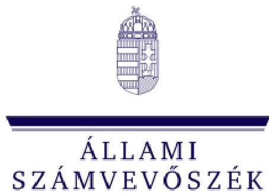
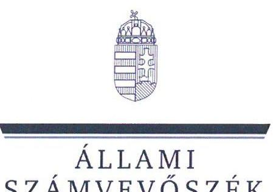
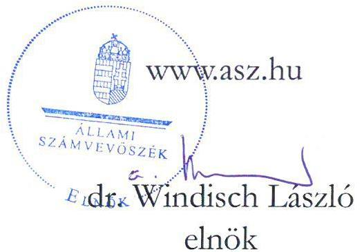
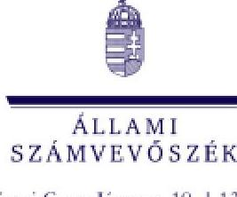

ÁLLAMI
SZÁMVEVŐSZÉK

# JELENTÉS 

Egyesületek és alapítványok államháztartásból kapott támogatásai könyvviteli nyilvántartásának ellenőrzése
2024.

---

ÁLLAMI
SZÁMVEVŐSZÉK

# JELENTÉS 

## Egyesületek és alapítványok államháztartásból kapott támogatásai könyvviteli nyilvántartásának ellenőrzése

2024. 

23065

---

# ELLENŐRZÉSI IGAZGATÓSÁG: 

## ÁLLAMHÁZTARTÁSON KÍVÜLI SZERVEZETEKET ELLENŐRZŐ IGAZGATÓSÁG

## ELLENŐRZÉSI IGAZGATÓ:

## KLINGA LÁSZLÓ igazgató

## ELLENŐRZÉSVEZETŐ:

Jelentéseink az interneten a www.asz.hu címen olvashatók.

BÉCSI ANDREA ellenőrzésvezető

IKTATÓSZÁM: EL-3963-011/2023.
TÉMASZÁM: 2693

ELLENŐRZÉS-AZONOSÍTÓ SZÁM: V1037

---

# TARTALOMJEGYZÉK 

■ AZ ELLENŐRZÉS ALAPADATAI ..... 5
■ AZ ELLENŐRZÖTT SZERVEZETEK ..... 6
■ ÖSSZEFOGLALÁS ..... 14
■ AZ ELLENŐRZÉS FÓKUSZKÉRDÉSE ..... 16
■ MEGÁLLAPÍTÁSOK ..... 17
■ JAVASLATOK ..... 29
■ MELLÉKLETEK ..... 33
I. sz. melléklet: Értelmező szótár ..... 33
II. sz. melléklet: Az ellenőrzött szervezetek jegyzéke ..... 36
III. sz. melléklet: Ellenőrzési kritériumok ..... 37
■ FÜGGELÉK: ÉSZREVÉTELEK ..... 38
■ RÖVIDÍTÉSEK JEGYZÉKE ..... 39

---

.

---

# AZ ELLENŐRZÉS ALAPADATAI 

## AZ ELLENŐRZÉS CÉLJA

Az ellenőrzés célja annak ellenőrzése volt, hogy az ellenőrzött egyesületnél, alapítványnál a kiválasztott, államháztartási forrásból származó támogatás könyvviteli nyilvántartása szabályszerűen történt-e.

## AZ ELLENŐRZÉS TÍPUSA

Szabályszerűségi ellenőrzés.

## AZ ELLENŐRZÖTT IDŐSZAK

Az ellenőrzésre kiválasztott államháztartási támogatásra vonatkozó támogatási döntéstől / szerződéskötéstől 2023. 07. 18-ig, a helyszíni ellenőrzésről szóló értesítés keltéig tartó időszak.

## AZ ELLENŐRZÉS TÁRGYA

Az egyesületnél, illetve alapítványnál az ellenőrzésre kiválasztott államháztartási forrásból kapott támogatás könyvviteli nyilvántartását, ennek keretében a támogatásból származó bevétel-, valamint a támogatás felhasználás nyilvántartására vonatkozó jogszabályi előírások betartását ellenőriztük.

## AZ ELLENŐRZÉS JOGALAPJA

Az ellenőrzés jogalapját az ÁSZ tv. ${ }^{1} 1 . \int(3)$, valamint az 5. $\int(3)$ bekezdés előírásai képezték.

## AZ ELLENŐRZÉS MÓDSZERE

Az ellenőrzést az ellenőrzési program szempontjai, az ellenőrzött időszakban hatályos jogszabályok, előírások, az ellenőrzés általános szakmai szabályai, az ellenőrzésre irányadó ÁSZ ${ }^{2}$ ellenőrzési módszertan figyelembevételével végezte az ÁSZ. Az ellenőrzési kérdések megválaszolásához szükséges bizonyítékok megszerzése az ellenőrzött egyesület, alapítvány által rendelkezésre bocsátott dokumentumokra és adatokra alapozva, továbbá kérdésfeltevés (információkérés) útján történt. Az ellenőrzési bizonyítékként felhasznált adatforrások közé tartoztak egyrészt az ellenőrzéshez kért dokumentumok, adatforrások, másrészt minden az ellenőrzés folyamán feltárt, az ellenőrzés szempontjából információkat tartalmazó dokumentum.
Az ellenőrzés lefolytatásához az ellenőrzött szervezet a tanúsítvány kitöltésével, valamint az ÁSZ által kért dokumentumok, adatok, információk megküldésével szolgáltatott adatokat.

---

# AZ ELLENŐRZÖTT SZERVEZETEK 

Az ellenőrzésre 12 civil szervezet esetében került sor, melyek közül négy egyesületi, nyolc pedig alapítványi formában működött. Működéséről, vagyoni, pénzügyi és jövedelmi helyzetéről valamennyi ellenőrzött szervezet egyszerűsített éves beszámolót készített, melyet kettős könyvvezetéssel támasztott alá. Az ellenőrzött szervezetek közül hét rendelkezett közhasznú jogállással. A Közbef. tv. ${ }^{5}$ előírása szerint tevékenysége és a 2022. évi számviteli beszámoló mérlegfőösszege alapján - mivel mérlegfőösszegük elérte a 20 millió forintot -, 11 ellenőrzött a közélet befolyásolására alkalmas tevékenységet végző civil szervezetnek minősült.

Az ellenőrzött szervezetek a 2022. évi számviteli beszámolóik szerint mindösszesen 9 518,3 M Ft vagyonnal gazdálkodtak, tevékenységükhöz 1633,4 M Ft támogatást számoltak el bevételként. A legnagyobb szervezet 2774,1 M Ft, a legkisebb 13,7 M Ft értékű eszköz állománnyal rendelkezett.

A nyolc alapítványnál és négy egyesületnél összesen 3289,6 M Ft összegű támogatás számviteli nyilvántartásának ellenőrzésére került sor.

## ANTALL JÓZSEF POLITIKA- ÉS TÁRSADALOMTUDOMÁNYI TUDÁSKÖZPONT ALAPÍTVÁNY

A nyílt alapítványt 2009-ben hozta létre az MAAC Korlátolt Felelősségű Társaság. Az alapítvány „egy pártoktól és ideológiáktól független think-tank szervezet, amely elsődleges céljának tekinti az antalli hagyományban testet öltött szellemiség ápolását, az oktatás, kutatás, kiadás hármas eszközrendszerén keresztül a magyar és nemzetközi - különösen a Közép-Kelet-Európai - tudományos és közéletet foglalkoztató kérdések, folyamatok megfogalmazását, tudományos értékű, objektív, interdiszciplináris feldolgozását és a közösség javára történő közzétételét". Az alapítvány ügyvezető szerve a hattagú kuratórium, munkaszervezete az önálló jogi személyiséggel nem rendelkező Tudásközpont volt, az ellenőrzésre háromtagú felügyelőbizottságot hoztak létre. A közhasznú jogállású alapítvány az ellenőrzött időszakban kötelezett volt könyvvizsgálatra, a 2021. és a 2022. évi egyszerűsített éves beszámolóit könyvvizsgáló felülvizsgálta.

## AZ ELLENŐRZÖTT, ÁLLAMHÁZTARTÁSI FORRÁSBÓL KAPOTT TÁMOGATÁS BEMUTATÁSA

Támogatott szervezet megnevezése, „Antall József Politika- és Társadalomtudományi Tudásközpont székhelytelepülése

Támogatási program célja
Támogató megnevezése
Támogatott tevékenység időtartama, felhasználás végső időpontja

Támogatás folyósítása, összege
Támogatás típusa
A pénzügyi elszámolás határideje
Elszámolás a támogató szervezet felé

Alapítvány, Budapest
„Antall József Politika- és Társadalomtudományi Tudásközpont Alapítvány (Antall József Tudásközpont) 2021. évi működése"
Miniszterelnökség - kezelő szervként a Bethlen Gábor Alapkezelő Közhasznú Nonprofit Zrt.

2021.01.01. - 2022.12.31.; 2022.12.31.

2021.03.12.; 724200000 Ft
egy összegben, támogatási előlegként folyósított, vissza nem térítendő
2023.01.30.

Az alapítvány az elszámolást az ellenőrzött időszakon túl nyújtotta be a támogató felé.

---

# EVANGÉLIKUS DIÁKOTTHONI ALAPÍTVÁNY 

Az alapítványt a Magyarországi Evangélikus Egyház hozta létre 1993-ban. Alapító okiratban meghatározott célja „az evangélikus gimnáziumok, felsőoktatási intézmények és kollégiumok, valamint egyéb oktatási intézményekhez kapcsolódó diákotthonban lévő, elsősorban szegény sorsú, és hátrányos helyzetű diákok támogatása, testi-lelki-szellemi fejlesztésük, társadalmi esélyegyenlőségüknek elősegítése; egészségmegőrzésük, betegségmegelőzésük biztosítása által is, továbbá a diákotthoni oktatási és nevelési célú berendezések, felszerelések, könyvek stb. beszerzése, felszerelése és karbantartása és az ebből nyújtandó anyagi támogatás" volt. A közhasznú jogállással nem rendelkező alapítvány ügyvezető szerve a háromtagú kuratórium volt, felügyelőbizottság létrehozására nem volt kötelezett. Az alapítvány az ellenőrzött időszakban könyvvizsgálatra nem volt kötelezett, a 2021. és a 2022. évekre egyszerűsített éves beszámolót készített.

## AZ ELLENŐRZÖTT, ÁLLAMHÁZTARTÁSI FORRÁSRÓL KAPOTT TÁMOGATÁS BEMUTATÁSA

Támogatott szervezet megnevezése, székhelytelepülése
Támogatási program célja
Támogató megnevezése
Támogatott tevékenység időtartama, felhasználás végső időpontja
Támogatás folyósítása, összege
Támogatás típusa
A pénzügyi elszámolás határideje
Elszámolás a támogató szervezet felé

Evangélikus Diákotthoni Alapítvány, Budapest
„Az új felsőoktatási kollégium épületének befejezéséhez nyújtott támogatás"
Miniszterelnökség - kezelő szervként a Bethlen Gábor Alapkezelő Közhasznú Nonprofit Zrt.

2021.12.15. - 2022.12.31.; 2022.12.31.

2021.12.31; 311000000 Ft
egyösszegben támogatási előlegként folyósított, vissza nem térítendő
2023.01.30.

Az alapítvány az elszámolást határidőben benyújtotta, annak elbírálásáról a támogató szervezet az ellenőrzött időszakban tájékoztatást nem adott.

## HAYDNEUM-MAGYAR RÉGIZENEI KÖZPONT ALAPÍTVÁNY

Az alapítványt 2021. évben vették nyilvántartásba, alapítója Magyarország Kormánya volt. Az alapítvány célja az alapító okirat szerint „a magyar régizenei élet színvonalának és nemzetközi elismertségének emelése, különös tekintettel a Magyarországhoz köthető régizenei kincs gondozására, valamint belföldi- és nemzetközi kulturális kapcsolatok fejlesztésére és magas szintre emelésére. Az Alapítvány Joseph Haydn és az Esterházy hercegi család zenei-szellemi hagyatékának gondozásán túl feladatának tekinti a kor méltatlanul elfeledett zeneszerzőinek újra felfedezését és népszerűsítését is, megkülönböztetett figyelmet szentelve a magyar kulturális vonatkozású zeneszerzőknek" volt. A közhasznú jogállású alapítvány ügyvezető szerve és vagyonának kezelője a háromtagú kuratórium volt. Az alapító az ügyvezetés ellenőrzésére háromtagú felügyelőbizottságot hozott létre. Az alapítvány az ellenőrzött időszakban az alapító okiratában foglaltak alapján kötelezett volt könyvvizsgálatra, a 2021. évi egyszerűsített beszámolóját könyvvizsgáló felülvizsgálta.

---

# AZ ELLENŐRZÖTT, ÁLLAMHÁZTARTÁSI FORRÁSRÓL KAPOTT TÁMOGATÁS BEMUTATÁSA 

Támogatott szervezet megnevezése, székhelytelepülése

Támogatási program célja

Támogató megnevezése

Támogatott tevékenység időtartama, felhasználás végső időpontja

Támogatás folyósítása, összege
Támogatás típusa
A pénzügyi elszámolás határideje

Elszámolás a támogató szervezet felé

HAYDNEUM-Magyar Régizenei Központ Alapítvány, Budapest
„HAYDNEUM-Magyar Régizenei Központ Alapítvány 2021. évi szakmai feladatellátásának támogatása"
Miniszterelnökség - lebonyolító szervként a Lechner Tudásközpont Nonprofit Kft.

2021.07.13. - 2021.12.31.; 2022.03.30.

2021.12.01; 189505247 Ft
egy összegben, támogatási előlegként folyósított, vissza nem térítendő
2022.03.31.

Az alapítvány az elszámolást határidőben benyújtotta, annak elbírálásáról a támogató szervezet az ellenőrzött időszakban tájékoztatást nem adott.

## KÁRPÁT-MEDENCEI MAGYAROKÉRT EGYESÜLET

Az egyesületet 1992-ben alapították 12 alapító taggal. Az egyesület „érdekvédelmi, érdekképviseleti szervezet", céljai között szerepelt többek között „Magyarország kulturális életének és közéletének színesítése, a közművelődés elősegítése, demokratikus gondolkodás, demokratikus eszmerendszerek népszerűsítése"; a „helyi népi hagyományok feltámasztása, ápolása, kulturális örökség megóvása, műemlékvédelem, természetvédelem". Az egyesület közhasznú jogállású szervezetként működött, döntéshozó szerve a közgyűlés, ügyvezető szerve a háromtagú elnökség volt. A működés és gazdálkodás ellenőrzésére háromtagú felügyelőbizottságot hoztak létre. Az egyesület az ellenőrzött időszakban a jogszabályi előírások alapján könyvvizsgálatra nem volt kötelezett, azonban a 2022. évi egyszerűsített éves beszámoló könyvvizsgálóval történő ellenőrzéséről döntöttek.

## AZ ELLENŐRZÖTT, ÁLLAMHÁZTARTÁSI FORRÁSRÓL KAPOTT TÁMOGATÁS BEMUTATÁSA

Támogatott szervezet megnevezése, székhelytelepülése

Támogatási program célja
Támogató megnevezése
Támogatott tevékenység időtartama, felhasználás végső időpontja

Támogatás folyósítása, összege
Támogatás típusa
A pénzügyi elszámolás határideje

Elszámolás a támogató szervezet felé

Kárpát-medencei Magyarokért Egyesület, Jánd
Klímaadaptációs előkészítő projekt „a Felső-tiszai vízkészletek hasznosítása érdekében"
Energiaügyi Minisztérium
2022.12.01. - 2025.07.31.; 2025.08.31.

2022.12.22.; 1190000000 Ft
egy összegben, támogatási előlegként folyósított, vissza nem térítendő
záró elszámolás határideje: 2025.09.29.
Az ellenőrzött időszakban az egyesületnek nem volt a támogató szervezet felé elszámolási kötelezettsége.

---

# Kis Virtuózok ALAPÍTVÁNY 

Az alapítványt két magánszemély alapította 2014. évben. Az alapítvány főtevékenysége: kulturális, információs és kommunikációs tevékenység, célja „a világ bármely pontján élő, kiemelkedő - elsősorban klasszikus zenei tehetséggel rendelkező személyek felkutatása, valamint - anyagi és szociális helyzetük alapján - támogatása". A közhasznú jogállású alapítvány ügyvezető szerve a kilenctagú kuratórium volt, képviseletét önálló jogosultsággal a kuratórium elnöke és alelnöke látta el. Az alapítvány felügyelőbizottság létrehozására nem volt kötelezett, az alapítók a működés és gazdálkodás ellenőrzésével az alapító okiratban egy főből álló felügyelőbizottságot bíztak meg. Az alapítvány az ellenőrzött időszakban kötelezett volt könyvvizsgálatra, a 2021. és a 2022. évi egyszerűsített éves beszámolóit könyvvizsgáló felülvizsgálta.

| AZ ELLENŐRZÖTT, ÁLLAMHÁZTARTÁSI FORRÁSRÓL KAPOTT TÁMOGATÁS BEMUTATÁSA |  |
| :-- | :-- |
| Támogatott szervezet megnevezése,   székhelytelepülése | Kis Virtuózok Alapítvány, Solymár |
| Támogatási program célja | „Virtuózok V4+Horvátország klasszikus zenei tehetségkutató és edukációs   program megvalósítására" |
| Támogató megnevezése | Nemzeti Kulturális Alap - Emberi Erőforrás Támogatáskezelő |
| Támogatott tevékenység időtartama,   felhasználás végső időpontja | 2021.03.01. - 2021.12.31.; 2022.02.13. |
| Támogatás folyósítása, összege | 2021.06.30; 150 000 000 Ft |
| Támogatás típusa | egy összegben folyósított, vissza nem térítendő |
| A pénzügyi elszámolás határideje | 2022.06.30. |
| Elszámolás a támogató szervezet felé | Az alapítvány az elszámolást határidőben benyújtotta, annak elbírálásáról   a támogató szervezet az ellenőrzött időszakban tájékoztatást nem adott. |

## MAGYAR SPORTÚJSÁGÍRÓK SZÖVETSÉGE

Az egyesületet 1993-ban hozták létre. Alapszabályban meghatározott célja többek között, hogy „Tevékenységével az egyetemes magyar sportot szolgálja, elősegíti a magyar sportsikerek minél színvonalasabb és hatékonyabb bemutatását, dokumentálását, elismerését". A közhasznú jogállással nem rendelkező egyesület legfőbb döntéshozó szerve a közgyűlés, ügyvezető szerve a héttagú elnökség volt. A gazdálkodás és pénzkezelés ellenőrzésére, a felügyelő bizottság funkcióját ellátó három tagú ellenőrző bizottságot választottak. Az egyesület a 2021. és a 2022. évekre egyszerűsített éves beszámolót készített, könyvvizsgálatra nem volt kötelezett.

| AZ ELLENŐRZÖTT, ÁLLAMHÁZTARTÁSI FORRÁSRÓL KAPOTT TÁMOGATÁS BEMUTATÁSA |  |
| :--: | :--: |
| Támogatott szervezet megnevezése,   székhelytelepülése | Magyar Sportújságírók Szövetsége, Budapest |
| Támogatási program célja | A „Magyar Sportújságírók Szövetsége programjainak megvalósítása" |
| Támogató megnevezése | Emberi Erőforrások Minisztériuma - a feladat jogutódja a Honvédelmi   Minisztérium |
| Támogatott tevékenység időtartama,   felhasználás végső időpontja | 2021.12.15. - 2022.12.31.; 2023.01.30. |
| Támogatás folyósítása, összege | 2021.12.30; 100 000 000 Ft |
| Támogatás típusa | egy összegben, támogatási előlegként folyósított, vissza nem térítendő |
| A pénzügyi elszámolás határideje | 2023.02.28. |
| Elszámolás a támogató szervezet felé | Az egyesület az elszámolást határidőben benyújtotta, annak elbírálásáról   a támogató szervezet az ellenőrzött időszakban tájékoztatást nem adott. |

---

# MŰVÉSZETEK A
 VIDÉKFEJLESZTÉSÉRT ALAPÍTVÁNY

Az alapítványt 2014-ben egy magánszemély alapította. Céljaként határozták meg „a kistelepüléseken megvalósuló alkotóművészeti és más kulturális tevékenység" támogatását. A közhasznú jogállással nem rendelkező alapítvány ügyvezető szerve a három főből álló kuratórium volt, felügyelőbizottság létrehozására nem volt kötelezett. Az alapítvány az ellenőrzött időszakban könyvvizsgálatra nem volt kötelezett, a 2021. és a 2022. évre egyszerűsített éves beszámolót készített.

## AZ ELLENŐRZÖTT, ÁLLAMHÁZTARTÁSI FORRÁSBÓL KAPOTT TÁMOGATÁS BEMUTATÁSA

Támogatott szervezet megnevezése, székhelytelepülése
Támogatási program célja
Támogató megnevezése
Támogatott tevékenység időtartama, felhasználás végső időpontja
Támogatás folyósítása, összege
Támogatás típusa
A pénzügyi elszámolás határideje
Elszámolás a támogató szervezet felé

Művészetek a Vidékfejlesztésért Alapítvány, Vigántpetend
„Kerekdomb Vesztrivál és Örvényesbegy Piknik megrendezése 2021-ben" megvalósításához
A Turisztikai Fejlesztési Célelőirányzat kezelőjeként a Magyar Turisztikai Ügynökség
2021.05.01. - 2021.10.31.; 2021.11.30.
2021.12.15.; 60000000 Ft
egy összegben, utófinanszírozott, vissza nem térítendő
2021.12.08.

Az alapítvány a program számlákkal igazolt megvalósításáról az elszámolást benyújtotta, annak elfogadását követően került sor a támogatás folyósítására.

## NEMZETI ORVOSBIOLÓGIAI ALAPÍTVÁNY

Az alapítványt SZEGEDI ORVOSBIOLÓGIAI KUTATÁSOK JÓVŐJÉÉRT ALAPÍTVÁNY néven alapította 2013-ban egy magánszemély. Alapító okirat szerinti célja többek között „hogy elősegítse, hogy Magyarországnak ismét orvosi vagy egyéb területen odaítélt Nobel-díjas kutatója legyen". A közhasznú jogállású alapítvány legfőbb ügydöntő, ügyintéző, képviselő és kezelő szerve a 12 főből álló kuratórium volt. Működését és gazdálkodását a háromtagú felügyelőbizottság ellenőrizte. Az alapítvány a 2021. és a 2022. évekre egyszerűsített éves beszámolót készített, a 2022. évi beszámolót a jogszabályi előírások ellenére könyvvizsgáló nem ellenőrizte.

## AZ ELLENŐRZÖTT, ÁLLAMHÁZTARTÁSI FORRÁSBÓL KAPOTT TÁMOGATÁS BEMUTATÁSA

Támogatott szervezet megnevezése, székhelytelepülése
Támogatási program célja
Támogató megnevezése
Támogatott tevékenység időtartama, felhasználás végső időpontja
Támogatás folyósítása, összege
Támogatás típusa
A pénzügyi elszámolás határideje
Elszámolás a támogató szervezet felé

NEMZETI ORVOSBIOLÓGIAI ALAPÍTVÁNY, Szeged
„a 2021. évi Szegedi Tudós Akadémia Program működési költségeire"
Innovációs és Technológiai Minisztériuma - a feladat jogutódja Kulturális és Innovációs Minisztérium
2021.07.01. - 2022.06.30.; 2022.07.31.
2021.08.24; 250000000 Ft
egy összegben, támogatási előlegként folyósított, vissza nem térítendő
2022.08.29.

Az alapítvány az elszámolást határidőben benyújtotta. A támogató szervezet jogutódja az elszámolás elfogadásáról tájékoztatta az alapítványt.

---

# OKOS DOBOZ KÖZHASZNÚ ALAPÍTVÁNY

Az alapítványt „Egyszervolt" - a Magyar Gyermekkultúráért Közhasznú Alapítvány néven 2002-ben hozta létre egy gazdasági társaság. Alapító okiratban meghatározott célja többek között a „magyar gyermekkultúra ápolása, az egészséges életmódra nevelés, egy kulturális értékekben is gazdag tudásanyag közvetítésével az Internet lehetőségeit is kamatoztatva, az óvodásoknak és a kisiskolásoknak". A közhasznú jogállással rendelkező alapítvány ügyvezető szerve a háromtagú kuratórium volt, felügyelőbizottság létrehozására nem volt kötelezett. Az alapítvány a 2021. és a 2022. évekre egyszerűsített éves beszámolót készített, a jogszabályi előírások szerint nem volt könyvvizsgálatra kötelezett.

| AZ ELLENŐRZÖTT, ÁLLAMHÁZTARTÁSI FORRÁSRÓL KAPOTT TÁMOGATÁS BEMUTATÁSA |  |
| :--: | :--: |
| Támogatott szervezet megnevezése, székhelytelepülése | OKOS DOBOZ KÖZHASZNÚ ALAPÍTVÁNY, Budapest |
| Támogatási program célja | „Okos Doboz digitális interaktív oktatási eszköz fejlesztésének támogatása" |
| Támogató megnevezése | Bethlen Gábor Alapkezelő Közhasznú Nonprofit Zrt. |
| Támogatott tevékenység időtartama, felhasználás végső időpontja | 2021.03.01. - 2022.02.28.; 2022.02.28. |
| Támogatás folyósítása, összege | 2021.04.08; 50000000 Ft |
| Támogatás típusa | egy összegben, támogatási előlegként folyósított, vissza nem térítendő |
| A pénzügyi elszámolás határideje | 2022.03.30. |
|  | Az alapítvány az elszámolást határidőben benyújtotta, a támogató szervezet annak elfogadásáról az ellenőrzött időszakban tájékoztatást nem adott. |

## TOTEM ALKOTÓ MŰHELY

Az egyesületet 1997-ben hozták létre. Alapszabályban meghatározott célja: „Elősegíteni, hogy a tagok részesüljenek a szükséges rehabilitációs szolgáltatásban, megkapjanak minden lehetőséget ahhoz, hogy csökkenjenek a fogyatékossággal járó nehézségeik, ennek alapján mind teljesebb emberi életet élhessenek, konstruktív szerepet töltsenek be a társadalomban és másokkal egyenlően vegyenek részt a közösségi életben, annak minden területén." A közhasznú jogállással nem rendelkező egyesület legfőbb testületi szerve a közgyűlés volt, az egyesület önálló képviseletét az ügyvezető látta el. Az egyesület felügyelőbizottság létrehozására és beszámolójának könyvvizsgálóval történő felülvizsgálatára nem volt kötelezett. A 2021. és a 2022. évre egyszerűsített éves beszámolót készített.

---

# AZ ELLENŐRZÖTT, ÁLLAMHÁZTARTÁSI FORRÁSRÓL KAPOTT TÁMOGATÁS BEMUTATÁSA

Támogatott szervezet megnevezése, székhelytelepülése

Támogatási program célja
Támogató megnevezése
Támogatott tevékenység időtartama, felhasználás végső időpontja

Támogatás folyósítása, összege
Támogatás típusa
A pénzügyi elszámolás határideje
Elszámolás a támogató szervezet felé

TOTEM ALKOTÓ MŰHELY, Szeged
"Elemi rehabilitációs szolgáltatás biztosítása látásérült személyek számára"
Slachta Margit Nemzeti Szociálpolitikai Intézet az Emberi Erőforrások Minisztériuma képviseletében - a feladat jogutódja a Belügyminisztérium
2021.04.01-2022.03.31.; 2022.04.15.
2021.05.13; 55000000 Ft
egy összegben, támogatási előlegként folyósított, vissza nem térítendő
2022.04.30.

Az egyesület az elszámolást határidőben benyújtotta, melynek elfogadásáról a támogató szervezet tájékoztatta az ellenőrzöttet.

## UNIVERITAS AZ EMBERÉRT ALAPÍTVÁNY

Az alapítványt 2017-ben hozta létre egy magánszemély. Az alapítvány célja többek között „a környezettudatos és egészséges életmód népszerűsítése. Az alapítvány a környezetvédelem fontosságának tudatosítása mellett, részt vesz a lakott és épített környezet, valamint az örökölt kulturális hagyományok értékeinek védelmében. Az alapítvány támogatni kívánja a történeti, történelmi kutatásokat, a helyi értékek feltárását, rendszerezését." A közhasznú jogállással nem rendelkező alapítvány vagyonának kezelője és legfőbb döntéshozó szerve a háromtagú kuratórium volt. Az alapító a kezelő szerv ellenőrzésére, a felügyelőbizottság feladatainak ellátására háromtagú felügyelő szervet hozott létre. Az alapítványnak könyvvizsgálati kötelezettsége nem volt, a 2022. évre egyszerűsített éves beszámolót készített.

## AZ ELLENŐRZÖTT, ÁLLAMHÁZTARTÁSI FORRÁSRÓL KAPOTT TÁMOGATÁS BEMUTATÁSA

Támogatott szervezet megnevezése, székhelytelepülése

Támogatási program célja
Támogató megnevezése
Támogatott tevékenység időtartama, felhasználás végső időpontja

Támogatás folyósítása, összege
Támogatás típusa
A pénzügyi elszámolás határideje
Elszámolás a támogató szervezet felé

UNIVERITAS az Emberért Alapítvány, Budapest
„'Ne élj üvegházban!'-program 2. kampány"
Technológiai és Ipari Minisztérium - a feladat jogutódja az Energiaügyi Minisztérium
2022.10.01. - 2023.10.31.; 2023.11.30.
2022.11.24.; 140000000 Ft
egy összegben, támogatási előlegként folyósított, vissza nem térítendő
2023.12.31.

Az alapítványnak az ellenőrzött időszakban nem volt elszámolási kötelezettsége.

---

# VESZPRÉM MEGYEI ÉRTELMI FOGYATÉKOSSÁGGAL ÉLŐK ÉS SEGÍTŐIK ORSZÁGOS ÉRDEKVÉDELMI SZÖVETSÉGE KÖZHASZNÚ EGYESÜLETE TAPOLCA

Az egyesületet 2003-ban hozták létre. Az egyesület alapszabályban meghatározott célja többek közt „elősegíteni a fogyatékos emberek öntevékenységének, önrendelkezésének lehetőségeit, az önmagukért érzett felelősség egyidejű kialakításával". A közhasznú jogállással rendelkező egyesület legfőbb döntéshozó szerve a közgyűlés, ügyvezető, végrehajtó és ügyintéző szerve az öttagú elnökség volt. A közgyűlés háromtagú felügyelőbizottságot hozott létre. Az egyesületnek könyvvizsgálati kötelezettsége nem volt, a 2022. évre egyszerűsített éves beszámolót készített.

| AZ ELLENŐRZÖTT, ÁLLAMHÁZTARTÁSI FORRÁSRÓL KAPOTT TÁMOGATÁS BEMUTATÁSA |  |
| :--: | :--: |
| Támogatott szervezet megnevezése, székhelytelepülése | Veszprém Megyei ÉRTELMI FOGYATÉKOSSÁGGAL ÉLŐK ÉS SEGÍTŐIK ORSZÁGOS ÉRDEKVÉDELMI SZÖVETSÉGE Közhasznú Egyesülete TAPOLCA, Tapolca |
| Támogatási program célja | „2022. évre a megváltozott munkaképességű munkavállalók rehabilitációs foglalkoztatásához nyújtható egyéni támogatás" |
| Támogató megnevezése | Budapest Főváros Kormányhivatala - a fejezeti kezelésű előirányzat kezelő szerve |
| Támogatott tevékenység időtartama, felhasználás végső időpontja | 2022.01.01. - 2022.12.31.; 2023.01.20. |
| Támogatás folyósítása, összege | benyújtott igénylések alapján havonta, összesen 69900000 Ft |
| Támogatás típusa | havonta folyósított, a záró elszámolásban elfogadott összeg vissza nem térítendő |
| A pénzügyi elszámolás határideje | 2023.02.28 |
| Elszámolás a támogató szervezet felé | Az egyesület az elszámolást határidőben benyújtotta. A támogatás folyósításával és ellenőrzésével kapcsolatos feladatokat ellátó Kincstár 0,9 M Ft visszafizetési kötelezettséget írt elő. |

---

# ÖSSZEFOGLALÁS

Az ellenőrzött 12 civil szervezetből 10 szervezet könyvvezetési rendszerének kialakítása megfelelően támogatta az államháztartásból származó ellenőrzött támogatások szabályszerű könyvviteli nyilvántartását, biztosította a közpénzek felhasználásának ellenőrizhetőségét. Az ellenőrzés két szervezetnél tárta fel azt a hiányosságot, hogy könyvvezetési rendszerét nem a vonatkozó jogszabályi előírások szerint alakította ki, ezáltal a közpénz felhasználás ellenőrizhetőségét nem biztosította.

Négy ellenőrzött szervezet az államháztartási forrásból kapott támogatást megfelelően, a jogszabályi előírások szerint, elkülönítve tartotta nyilván, közülük három szervezetnél volt megfelelő a könyvvezetési rendszer kialakítása. Hét ellenőrzött szervezet a törvényi előírás ellenére nem az előírt részletezésben mutatta ki az államháztartási forrásból kapott támogatást, közülük hat szervezetnél volt megfelelő a könyvvezetési rendszer kialakítása. Egy szervezet, a megfelelően kialakított könyvvezetési rendszerében a számára támogatási előlegként folyósított támogatást nem megfelelően a követelések között szerepeltette.

Az államháztartási forrásból kapott támogatás felhasználását nyolc szervezet a könyvviteli rendszerében a jogszabályi előírások szerint tartotta nyilván. Három szervezet a jogszabályok előírásai ellenére az államháztartási forrásból kapott támogatás felhasználásáról nem vezetett olyan számviteli nyilvántartást, amelynek alapján megállapítható és ellenőrizhető a kapott támogatás felhasználása, közülük egy szervezetnél a könyvvezetési rendszer kialakítása sem volt szabályszerű. Egy szervezet nem tartotta be a támogatói szerződés kapott támogatás felhasználása nyilvántartásához kapcsolódó bizonylatok záradékolására vonatkozó előírásait.

Az ellenőrzött 12 szervezet közül két szervezet közpénzfelhasználásra vonatkozó tájékoztatása megfelelt a jogszabályi előírásoknak, egy szervezet pedig a jogszabályban előírt határidőn túl készítette el beszámolóját. Kilenc szervezet nem megfelelően tájékoztatta a közvéleményt az ellenőrzött támogatás felhasználásáról, mert nem biztosította a közpénzek felhasználására vonatkozó gazdálkodása nyilvánosságát, ezáltal sérült a közpénzkezelés Alaptörvényben ${ }^{4}$ rögzített átláthatóságának elve. Közülük öt szervezet a törvényi előírás ellenére az egyszerűsített éves beszámoló részeként nem készített kiegészítő mellékletet, erre tekintettel az ellenőrzöttek az egyszerűsített éves beszámolójukat nem a jogszabályban előírtak szerint állították össze. Ezen belül négy szervezetnél a közhasznúsági melléklet sem felelt meg a jogszabályi előírásoknak. Három szervezetnél a kiegészítő melléklet nem a törvényi előírás szerint tartalmazta az államháztartási forrásból kapott támogatás felhasználásának bemutatását, közülük két szervezet esetében a közhasznúsági melléklet nem az előírások szerint tartalmazta az ellenőrzött államháztartási támogatás felhasználásához kapcsolódó célszerinti juttatás bemutatását, és egy szervezet beszámolóját könyvvizsgáló nem auditálta. További egy civil szervezet a közhasznúsági mellékletet szintén nem a törvényi előírás szerint készítette el.

Az ellenőrzési megállapításokhoz kapcsolódóan, a feltárt hiányosságok megszüntetésére valamennyi szervezet vezetőjének, összesen 29 javaslatot tettünk.

A fentiekben bemutatott megállapítások ellenőrzött szervezetenkénti megjelenését az 1. ábra szemlélteti.

---

# *Összefoglalás*

*1. ábra*

## **FŐBB ELLENŐRZÉSI TAPASZTALATOK**

|  TAPASZTALATOK |  |  |  |  |  |  |  |  |  |  |  |  |  |  |  |  |  |  |  |  |  |  |  |  |  |  |  |  |  |  |  |  |  |  |  |  |  |  |  |  |  |  |  |  |  |  |  |  |  |  |  |  |  |  |  |  |  |  |  |  |  |  |  |  |  |  |  |  |  |  |  |  |  |  |  |  |  |  |  |  |  |  |  |  |  |  |  |  |  |  |  |

  |  |  |  |  |  |  |  |  | 

---

# AZ ELLENŐRZÉS FÓKUSZKÉRDÉSE 

- Szabályszerű volt-e az egyesület/alapítvány államháztartási forrásból kapott támogatásának könyvviteli nyilvántartása?

---

# 1. Antall József Politika- és Társadalomtudományi Tudásközpont Alapítvány 

Összegző megállapítás Az Antall József Politika- és Társadalomtudományi Tudásközpont Alapítvány államháztartási forrásból kapott támogatásának könyvviteli nyilvántartása a 2021. évben nem volt szabályszerű. A 2021. és a 2022. évi egyszerűsített éves beszámolók kiegészítő mellékletei, illetve a 2021. és a 2022. évi közhasznúsági mellékletek nem feleltek meg a jogszabályi előírásoknak.

## A kapott támogatás könyvviteli nyilvántartása

Az alapítvány könyvvezetési rendszerében (főkönyvi és analitikus nyilvántartások) az államháztartási forrásból kapott támogatást - főkönyvi számla alábontásával, alszámla használatával és munkaszám alkalmazásával - a Civil tv. ${ }^{5}$-ben előírtak szerint, elkülönítetten mutatta ki.

## A támogatás felhasználásának könyvviteli nyilvántartása

Az alapítvány 2021. és 2022. évben könyvvezetési rendszerében az államháztartási forrásból az alapcél szerinti tevékenysége költségei, ráfordításai ellentételezésére visszafizetési kötelezettség nélkül kapott támogatás felhasználásának elkülönített nyilvántartására munkaszámos megjelölést alkalmazott. Ugyanakkor az ellenőrzött támogatáshoz kapcsolt „200 Miniszterelnökség" munkaszámot a 2021. évben nem csak az ellenőrzött támogatás felhasználásának nyilvántartására alkalmazta, ezáltal az alapítvány nyilvántartása nem felelt meg az Eszkr. ${ }^{6}$ 14. § (1) bekezdésében és a Civil tv. 20. § (4) bekezdésében foglalt előírásoknak.
A szervezet könyvvezetésének kialakítása, keretrendszere a támogatás könyvviteli nyilvántartásának szabályossága tükrében
Az alapítvány a 2021. évben az Eszkr. 14. § (1) bekezdése előírásai ellenére a könyvvezetési, nyilvántartási rendszerének kialakítása során nem vette figyelembe a Civil tv. 20. § (4) bekezdése elkülönített számviteli nyilvántartás vezetésére vonatkozó előírásait. Az alapítvány nem alakította ki az alapcél szerinti tevékenysége költségei, ráfordításai ellentételezésére visszafizetési kötelezettség nélkül kapott támogatás felhasználásának elkülönített nyilvántartása lehetőségét. Az alkalmazott „200 Miniszterelnökség" munkaszám/költséghely a támogató szervezettől kapott valamennyi támogatás gyűjtésére szolgált, nem biztosította a támogatásonkénti felhasználás jogszabályi előírásoknak megfelelő elkülönített kimutatását.
A szervezet számviteli beszámolójában, közhasznúsági mellékletében a támogatással kapcsolatban bemutatott adatok könyvviteli nyilvántartásban elszámolt adatokkal történő alátámasztottsága
A közhasznú jogállású alapítvány 2021. és 2022. évi egyszerűsített éves beszámolóinak kiegészítő mellékleteiben a Civil tv. 29. § (4) bekezdés előírása ellenére nem mutatta be az ellenőrzött támogatási program keretében végleges jelleggel felhasznált összegeket. Az alapítvány 2021. és 2022. évi közhasznúsági mellékletei a Civil tv. 29. § (7) bekezdése előírásai ellenére nem tartalmazták az ellenőrzött támogatás felhasználásából következő, a közhasznúsági melléklet 2. és 3.5. pontjában leírt tevékenység célcsoportként egyetemi hallgatók részére konferenciák, előadás-sorozatok és kerekasztal beszélgetések, online rendezvények - megvalósítása során keletkezett cél szerinti juttatások kimutatását.

---

# 2. Evangélikus Diákotthoni Alapítvány 

Összegző megállapítás

Az Evangélikus Diákotthoni Alapítvány az államháztartási forrásból kapott támogatás könyvviteli nyilvántartását szabályszerűen kialakította. A támogatást a 2021. évben nem a jogszabályi előírások szerint vette nyilvántartásba. A 2021. és a 2022. évi egyszerűsített éves beszámolói részeként kiegészítő mellékletet nem készített, a 2021. és a 2022. évi közhasznúsági mellékletek nem feleltek meg a jogszabályi előírásoknak.

## A kapott támogatás könyvviteli nyilvántartása

Az alapítvány könyvvezetési rendszerében (főkönyvi és analitikus nyilvántartások) a kapott támogatás kimutatása során a 2021. évben nem tartotta be a Civil tv. előírásait. Nyilvántartásában az ellenőrzött támogatást és a személyi jövedelemadó meghatározott részének az adózó rendelkezése szerint kiutalt összegét egy főkönyvi számlán mutatta ki, ezáltal nem tett eleget a Civil tv. 20. § (1) bekezdése szerint a bevételek elkülönített kimutatására vonatkozó kötelezettségnek. A Civil tv. 20. § (3) bekezdése előírása ellenére nem részletezte, hogy az ellenőrzött támogatás a központi költségvetésből kapott támogatás volt.

## A támogatás felhasználásának könyvviteli nyilvántartása

Az alapítvány az Eszkr.-ben és a Civil tv.-ben előírtakat betartva könyvvezetési rendszerében munkaszám használatával - az államháztartási forrásból, fejlesztési célra visszafizetési kötelezettség nélkül kapott támogatás felhasználását elkülönítetten tartotta nyilván. A felhasználás számviteli nyilvántartása során figyelembe vette a támogatói okirat előírásait.
A szervezet könyvvezetésének kialakítása, keretrendszere a támogatás könyvviteli nyilvántartásának szabályossága tükrében

Az alapítvány könyvvezetési, nyilvántartási rendszerét az Eszkr. és a Civil tv. előírásai szerint alakította ki, biztosítva ezzel az alapcél szerinti tevékenysége költségei, ráfordításai ellentételezésére visszafizetési kötelezettség nélkül kapott támogatás és annak felhasználása elkülönített kimutatását.
A szervezet számviteli beszámolójában, közhasznúsági mellékletében a támogatással kapcsolatban bemutatott adatok könyvviteli nyilvántartásban elszámolt adatokkal történő alátámasztottsága

Az alapítvány a 2021. és a 2022. évi egyszerűsített éves beszámolójának részeként az Eszkr. 7. § (6) bekezdés, valamint a Civil tv. 29. § (2) bekezdés c) pont előírásai ellenére kiegészítő mellékletet nem készített. Az alapítvány 2021. és 2022. évi közhasznúsági mellékletei nem feleltek meg a Civil vhr. ${ }^{7}$ 12. § (1) bekezdése előírásának, mivel nem tartalmazták a szervezet azonosító adatait és a tárgyévben végzett alapcél szerinti és közhasznú tevékenységek bemutatását, továbbá a Civil tv. 29. § (6) bekezdésében előírtak ellenére nem mutatták be a szervezet által végzett közhasznú tevékenységeket, ezen tevékenységek fő célcsoportjait és eredményeit.

---

# 3. HAYDNEUM-Magyar Régizenei Központ Alapítvány 

## Összegző megállapítás

A HAYDNEUM-Magyar Régizenei Központ Alapítvány államháztartási forrásból kapott támogatásának könyvviteli nyilvántartása szabályszerű volt. Az alapítvány nem tartotta be a támogatási szerződés záradékolásra vonatkozó előírását.

## A kapott támogatás könyvviteli nyilvántartása

Az alapítvány könyvvezetési rendszerében (főkönyvi és analitikus nyilvántartások) az államháztartási forrásból kapott támogatást - főkönyvi számla alábontásával, alszámla használatával és munkaszám alkalmazásával - a Civil tv.-ben előírtak szerint, elkülönítetten mutatta ki.

## A támogatás felhasználásának könyvviteli nyilvántartása

Az alapítvány az Eszkr.-ben és a Civil tv.-ben előírtakat betartva könyvvezetési rendszerében munkaszám használatával - az államháztartási forrásból, alapcél szerinti tevékenysége költségei, ráfordításai ellentételezésére visszafizetési kötelezettség nélkül kapott támogatás felhasználását elkülönítetten tartotta nyilván. A felhasználás számviteli nyilvántartása és elszámolása során nem vette figyelembe a Támogatási szerződés ${ }^{8}$ IV. Beszámoló 21. e) pontja előírásait, az eredeti bizonylatokon nem tüntette fel „a támogatási szerződés iktatószámát és azt, hogy a bizonylaton szereplő összeg a jelen központi költségvetési támogatási szerződés terhére került elszámolásra."
A szervezet könyvvezetésének kialakítása, keretrendszere a támogatás könyvviteli nyilvántartásának szabályossága tükrében

Az alapítvány könyvvezetési, nyilvántartási rendszerét az Eszkr. és a Civil tv. előírásai szerint alakította ki, biztosítva ezzel az alapcél szerinti tevékenysége költségei, ráfordításai ellentételezésére visszafizetési kötelezettség nélkül kapott támogatás és annak felhasználása elkülönített kimutatását.
A szervezet számviteli beszámolójában, közhasznúsági mellékletében a támogatással kapcsolatban bemutatott adatok könyvviteli nyilvántartásban elszámolt adatokkal történő alátámasztottsága

A közhasznú jogállású alapítvány a könyvvezetését és nyilvántartását az Eszkr.-ben és a Civil tv.-ben rögzített előírások szerint alakította ki, biztosította a 2022. évi egyszerűsített éves beszámoló kiegészítő mellékletében a Civil tv.-ben előírtaknak megfelelően bemutatott adatok alátámasztását.

---

# 4. Kárpát-medencei Magyarokért Egyesület 

## Összegző megállapítás

A Kárpát-medencei Magyarokért Egyesület államháztartási forrásból kapott támogatásának könyvviteli nyilvántartása szabályszerű volt. A 2022. évi egyszerűsített éves beszámolót nem a jogszabály által előírt határidőben készítette el.

## A kapott támogatás könyvviteli nyilvántartása

Az egyesület könyvvezetési rendszerében (főkönyvi és analitikus nyilvántartások) az alapcél szerinti tevékenysége költségei, ráfordításai ellentételezésére államháztartási forrásból kapott támogatást főkönyvi számla alábontásával, alszámla használatával - a Civil tv.-ben előírtak szerint, elkülönítetten mutatta ki.

## A támogatás felhasználásának könyvviteli nyilvántartása

Az egyesület az Eszkr.-ben és a Civil tv.-ben előírtakat betartva könyvvezetési rendszerében - főkönyvi számlák alábontásával, alszámlák használatával - az államháztartási forrásból kapott vissza nem térítendő támogatás felhasználását elkülönítetten tartotta nyilván. A felhasználás számviteli nyilvántartása során betartotta a támogatói szerződés előírásait.
A szervezet könyvvezetésének kialakítása, keretrendszere a támogatás könyvviteli nyilvántartásának szabályossága tükrében

Az egyesület a könyvvezetési, nyilvántartási rendszerét az Eszkr. és a Civil tv. előírásai szerint alakította ki, biztosítva ezzel az alapcél szerinti tevékenysége költségei, ráfordításai ellentételezésére visszafizetési kötelezettség nélkül kapott támogatás és annak felhasználása elkülönített kimutatásának lehetőségét.
A szervezet számviteli beszámolójában, közhasznúsági mellékletében a támogatással kapcsolatban bemutatott adatok könyvviteli nyilvántartásban elszámolt adatokkal történő alátámasztottsága

A közhasznú jogállású egyesület a 2022. évi egyszerűsített éves beszámolóját a Civil tv. 30. § (1) bekezdésében - a jóváhagyásra jogosult testület által elfogadott beszámoló letétbe helyezésére és közzétételére vonatkozóan - előírt határidőt követően készítette el. Az egyesület az ellenőrzött támogatás felhasználását a 2023. évben kezdte meg, a 2022. évi egyszerűsített éves beszámoló kiegészítő mellékletében a támogatás végleges felhasználása vonatkozásában bemutatási kötelezettsége nem volt.

---

# 5. Kis Virtuózok Alapítvány 

Összegző megállapítás

A Kis Virtuózok Alapítvány az államháztartási forrásból kapott támogatás könyvviteli nyilvántartását szabályszerűen kialakította. Az ellenőrzött támogatást bevételként a 2021. évben nem a jogszabályi előírások szerint számolta el. A 2021. évi egyszerűsített éves beszámoló kiegészítő melléklete és a 2021. évi közhasznúsági melléklet nem felelt meg a jogszabályi előírásoknak.

## A kapott támogatás könyvviteli nyilvántartása

Az alapítvány könyvvezetési rendszerében (főkönyvi és analitikus nyilvántartások) elszámolt támogatás kimutatása során a 2021. évben nem tartotta be a Civil tv. előírásait. Nyilvántartásában egy számlán tartotta nyilván az ellenőrzött elkülönített állami pénzalapból folyósított támogatást, a központi költségvetésből folyósított támogatást és a személyi jövedelemadó meghatározott részének az adózó rendelkezése szerint kiutalt összegét, ezáltal nem tett eleget a Civil tv. 20. § (1) bekezdése szerinti - a bevételek elkülönített kimutatására vonatkozó - kötelezettségének, továbbá a Civil tv. 20. § (3) bekezdése előírása ellenére nem részletezte, hogy az ellenőrzött támogatás elkülönített állami pénzalapból kapott támogatás volt.

## A támogatás felhasználásának könyvviteli nyilvántartása

Az alapítvány a 2021. évben könyvvezetési rendszerében az államháztartási forrásból az alapcél szerinti tevékenysége költségei, ráfordításai ellentételezésére visszafizetési kötelezettség nélkül kapott támogatás felhasználásának elkülönített nyilvántartására költséghelykódot alkalmazott. Ugyanakkor az ellenőrzött támogatásra meghatározott költséghelykódot nem minden, az ellenőrzött támogatás felhasználásáról a támogató szervezet felé benyújtott elszámolásban feltüntetett tétel elszámolásakor (5 db tétel, 3,7 MFt) alkalmazta, ezáltal a kapott támogatás felhasználása támogatásonként nem volt megállapítható. Erre tekintettel az alapítvány nyilvántartása a 2021. évben nem felelt meg az Eszkr. 14. § (1) bekezdésében és a Civil tv. 20. § (4) bekezdésében foglalt előírásoknak.

## A szervezet könyvvezetésének kialakítása, keretrendszere a támogatás könyvviteli nyilvántartásának szabályossága tükrében

Az alapítvány a könyvvezetési, nyilvántartási rendszerét az Eszkr. és a Civil tv. előírásai szerint alakította ki, biztosítva ezzel az alapcél szerinti tevékenysége költségei, ráfordításai ellentételezésére visszafizetési kötelezettség nélkül kapott támogatás és annak felhasználása elkülönített kimutatásának lehetőségét.
A szervezet számviteli beszámolójában, közhasznúsági mellékletében a támogatással kapcsolatban bemutatott adatok könyvviteli nyilvántartásban elszámolt adatokkal történő alátámasztottsága
A közhasznú jogállású alapítvány a 2021. évi egyszerűsített éves beszámoló kiegészítő mellékletében a Civil tv. 29. § (4) bekezdés előírása ellenére nem mutatta be az ellenőrzött támogatási program keretében végleges jelleggel felhasznált összeget. Az alapítvány 2021. évi közhasznúsági melléklete a Civil tv. 29. § (7) bekezdése előírásai ellenére nem tartalmazta az ellenőrzött támogatás felhasználásából következő, a közhasznúsági melléklet 3.5. pontjában leírt közhasznú tevékenység - Visegrádi Virtuózok V4+Horvátország produkció, hazai és nemzetközi koncertek - megvalósítása során keletkezett

 cél szerinti juttatások kimutatását.

---

# 6. Magyar Sportújságírók Szövetsége 

## Összegző megállapítás

A Magyar Sportújságírók Szövetsége az államháztartási forrásból kapott támogatást nem a jogszabályi előírások szerint tartotta nyilván. A 2021. és a 2022. évi egyszerűsített éves beszámolói részeként kiegészítő mellékletet nem készített, a 2022. évi közhasznúsági melléklet nem felelt meg a jogszabályi előírásoknak.

## A kapott támogatás könyvviteli nyilvántartása

Az egyesület könyvvezetési rendszerében (főkönyvi és analitikus nyilvántartások) a 2021. évben nem tartotta be az államháztartási forrásból költségei, ráfordításai ellentételezésére visszafizetési kötelezettség nélkül kapott támogatás elkülönített kimutatására vonatkozó jogszabályi előírásokat. Nyilvántartásában az ellenőrzött támogatást és az alapcél szerinti tevékenységéhez gazdálkodó szervezetektől kapott adományt ugyanazon főkönyvi számlán mutatta ki, ezáltal nem tett eleget a Civil tv. 20. § (1) bekezdése, a bevételek elkülönített kimutatására vonatkozó előírásainak. Továbbá, a Civil tv. 20. § (3) bekezdése előírása ellenére nem részletezte, hogy az ellenőrzött támogatás a központi költségvetésből kapott támogatás volt.

## A támogatás felhasználásának könyvviteli nyilvántartása

Az egyesület a számviteli nyilvántartási rendszerében az „1" munkaszámot alkalmazta az alapcél szerinti tevékenysége költségei, ráfordításai ellentételezésére kapott támogatás felhasználásának nyilvántartására. Az egyesület a 2022. évben a Civil tv. 20. § (4) bekezdés előírása ellenére az államháztartási forrásból kapott támogatás felhasználásáról nem vezetett olyan számviteli nyilvántartást, amelynek alapján megállapítható és ellenőrizhető a kapott támogatás felhasználása, mivel a támogatás elkülönítésére szolgáló munkaszámot a támogató felé történt elszámolásban feltüntetett hat tétel, összesen 3,7 M Ft esetében nem alkalmazta.

## A szervezet könyvvezetésének kialakítása, keretrendszere a támogatás könyvviteli nyilvántartásának szabályossága tükrében

Az egyesület az Eszkr. 14. § (1) bekezdése előírásai ellenére a könyvvezetési, nyilvántartási rendszerének kialakítása során nem vette figyelembe a Civil tv. 20. § (1) és (3) bekezdéseinek a bevétel elkülönített nyilvántartás részletezésére vonatkozó előírásait. Ugyanakkor a nyilvántartás kialakításakor a Civil tv. előírásai szerint biztosította az alapcél szerinti tevékenysége költségei, ráfordításai ellentételezésére visszafizetési kötelezettség nélkül kapott támogatás felhasználása elkülönített kimutatásának lehetőségét.
A szervezet számviteli beszámolójában, közhasznúsági mellékletében a támogatással kapcsolatban bemutatott adatok könyvviteli nyilvántartásban elszámolt adatokkal történő alátámasztottsága

Az egyesület a 2021. és a 2022. évi egyszerűsített éves beszámolójának részeként az Eszkr. 7. § (6) bekezdés, valamint a Civil tv. 29. § (2) bekezdés c) pont előírásai ellenére kiegészítő mellékletet nem készített. Az egyesület 2022. évi közhasznúsági melléklete a Civil tv. 29. § (7) bekezdése előírásai ellenére nem tartalmazta az ellenőrzött támogatás felhasználásából következő, a közhasznúsági melléklet 2. és 3. pontjaiban leírt tevékenység - díjazás, segélyezés, képzés - megvalósítása során keletkezett cél szerinti juttatások kimutatását.

---

# 7. Művészetek a Vidékfejlesztésért Alapítvány 

## Összegző megállapítás

A Művészetek a Vidékfejlesztésért Alapítvány az államháztartási forrásból kapott támogatás könyvviteli nyilvántartását szabályszerűen alakította ki. A támogatást a 2021. évben nem a jogszabályi előírások szerint vette nyilvántartásba. A 2021. évi közhasznúsági melléklet nem felelt meg a jogszabályi előírásoknak.

## A kapott támogatás könyvviteli nyilvántartása

Az alapítvány könyvvezetési rendszerében (főkönyvi és analitikus nyilvántartások) a kapott támogatás kimutatása során a 2021. évben nem tartotta be a Civil tv. 20. § (3) bekezdése előírásait, mivel az államháztartási forrásból kapott támogatást nem az előírt részletezésben mutatta ki. Nyilvántartásában nem részletezte, hogy az ellenőrzött támogatás a központi költségvetésből kapott támogatás volt.

## A támogatás felhasználásának könyvviteli nyilvántartása

Az alapítvány az Eszkr.-ben és a Civil tv.-ben előírtakat betartva könyvvezetési rendszerében - projekt kódok alkalmazásával - az államháztartási forrásból, az alapcél szerinti tevékenysége költségei, ráfordításai ellentételezésére visszafizetési kötelezettség nélkül kapott támogatás felhasználását elkülönítetten tartotta nyilván, továbbá a felhasználás számviteli nyilvántartása során figyelembe vette a támogatói okirat előírásait.

## A szervezet könyvvezetésének kialakítása, keretrendszere a támogatás könyvviteli nyilvántartásának szabályossága tükrében

Az alapítvány könyvvezetési, nyilvántartási rendszerét az Eszkr. és a Civil tv. előírásai szerint alakította ki, biztosítva ezzel az alapcél szerinti tevékenysége költségei, ráfordításai ellentételezésére visszafizetési kötelezettség nélkül kapott támogatás és annak felhasználása elkülönített kimutatásának lehetőségét.
A szervezet számviteli beszámolójában, közhasznúsági mellékletében a támogatással kapcsolatban bemutatott adatok könyvviteli nyilvántartásban elszámolt adatokkal történő alátámasztottsága

A 2021. évi közhasznúsági melléklet a Civil tv. 29. § (7) bekezdése előírásai ellenére nem tartalmazta az ellenőrzött támogatás felhasználásából következő, a közhasznúsági melléklet 2. és 3.5 pontjában leírt tevékenység - rendezvények szervezése, Kerekdomb Fesztivál, Örvényeshegy Piknik megrendezése megvalósítása során keletkezett cél szerinti juttatások kimutatását. Az alapítvány nem közhasznú jogállású szervezet, egyszerűsített éves beszámolót készített, ezáltal részére sem a Civil tv. sem a Számv. tv. ${ }^{9}$ nem határozott meg előírást a támogatási program keretében végleges jelleggel felhasznált összegek kiegészítő mellékletben történő bemutatására vonatkozóan.

---

# 8. NEMZETI ORVOSBIOLÓGIAI ALAPÍTVÁNY 

## Összegző megállapítás

A NEMZETI ORVOSBIOLÓGIAI ALAPÍTVÁNY az államháztartási forrásból kapott támogatás könyvviteli nyilvántartását szabályszerűen alakította ki. A támogatást a 2021. évben és a 2022. évben nem a jogszabályi előírások szerint tartotta nyilván. A 2021. és a 2022. évi egyszerűsített éves beszámoló részeként elkészített kiegészítő melléklet nem felelt meg a jogszabályi előírásoknak.

## A kapott támogatás könyvviteli nyilvántartása

Az alapítvány könyvvezetési rendszerében (főkönyvi és analitikus nyilvántartások) az államháztartási forrásból kapott támogatást - főkönyvi számla alábontásával, alszámla használatával - a Civil tv.-ben előírtak szerint, elkülönítetten mutatta ki. Ugyanakkor a 2021. évben és a 2022. évben nem tartotta be a Civil tv. 20. § (3) bekezdése előírásait, mivel az államháztartási forrásból kapott támogatást nem az előírt részletezésben mutatta ki. Nyilvántartásaiban nem részletezte, hogy az ellenőrzött támogatás a központi költségvetésből kapott támogatás volt.

## A támogatás felhasználásának könyvviteli nyilvántartása

Az alapítvány az Eszkr.-ben és a Civil tv.-ben előírtakat betartva könyvvezetési rendszerében munkaszám használatával - az államháztartási forrásból, az alapcél szerinti tevékenysége költségei, ráfordításai ellentételezésére visszafizetési kötelezettség nélkül kapott támogatás felhasználását elkülönítetten tartotta nyilván, továbbá a felhasználás számviteli nyilvántartása során figyelembe vette a támogatói okirat előírásait.

## A szervezet könyvvezetésének kialakítása, keretrendszere a támogatás könyvviteli nyilvántartásának szabályossága tükrében

Az alapítvány könyvvezetési, nyilvántartási rendszerét az Eszkr. és a Civil tv. előírásai szerint alakította ki, biztosítva ezzel az alapcél szerinti tevékenysége költségei, ráfordításai ellentételezésére visszafizetési kötelezettség nélkül kapott támogatás és annak felhasználása elkülönített kimutatásának lehetőségét.
A szervezet számviteli beszámolójában, közhasznúsági mellékletében a támogatással kapcsolatban bemutatott adatok könyvviteli nyilvántartásban elszámolt adatokkal történő alátámasztottsága

Az alapítvány 2022. évi egyszerűsített éves beszámolóját az Eszkr. 16. § (1) bekezdés előírásai ellenére könyvvizsgáló nem vizsgálta felül. A közhasznú jogállású alapítvány a Civil tv. 29. § (4) bekezdése előírása ellenére a 2021. és a 2022. évi egyszerűsített éves beszámolók kiegészítő mellékleteiben nem mutatta be az ellenőrzött támogatási program keretében végleges jelleggel felhasznált összeget.

---

# 9. OKOS DOBOZ KÖZHASZNÚ ALAPÍTVÁNY 

## Összegző megállapítás

Az OKOS DOBOZ KÖZHASZNÚ ALAPÍTVÁNY az államháztartási forrásból kapott támogatást szabályszerűen tartotta nyilván. A 2022. évi egyszerűsített éves beszámoló részeként nem készített kiegészítő mellékletet.

## A kapott támogatás könyvviteli nyilvántartása

Az alapítvány könyvvezetési rendszerében (főkönyvi és analitikus nyilvántartások) az államháztartási forrásból kapott támogatást - főkönyvi számla alábontásával, alszámla használatával - a Civil tv.-ben előírtak szerint, elkülönítetten mutatta ki.

## A támogatás felhasználásának könyvviteli nyilvántartása

Az alapítvány az Eszkr.-ben és a Civil tv.-ben előírtakat betartva könyvvezetési rendszerében munkaszám (kötésszám) alkalmazásával - az államháztartási forrásból kapott támogatás felhasználását elkülönítetten tartotta nyilván. A felhasználás számviteli nyilvántartása során figyelembe vette a támogatói okirat előírásait.

A szervezet könyvvezetésének kialakítása, keretrendszere a támogatás könyvviteli nyilvántartásának szabályossága tükrében

Az alapítvány könyvvezetési, nyilvántartási rendszerét az Eszkr. és a Civil tv. előírásai szerint alakította ki, biztosítva ezzel az alapcél szerinti tevékenysége költségei, ráfordításai ellentételezésére visszafizetési kötelezettség nélkül kapott támogatás és annak felhasználása elkülönített kimutatásának lehetőségét.
A szervezet számviteli beszámolójában, közhasznúsági mellékletében a támogatással kapcsolatban bemutatott adatok könyvviteli nyilvántartásban elszámolt adatokkal történő alátámasztottsága

A közhasznú jogállású alapítvány a könyvvezetését és nyilvántartását az Eszkr.-ben és a Civil tv.-ben rögzített előírások szerint alakította ki, biztosította a 2021. évi egyszerűsített éves beszámoló kiegészítő mellékletében a Civil tv.-ben előírtaknak megfelelően bemutatott adatok alátámasztását.
A közhasznú jogállású alapítvány a 2022. évi egyszerűsített éves beszámolójának részeként az Eszkr. 7. § (6) bekezdése, valamint a Civil tv. 29. § (2) bekezdés c) pont előírásai ellenére kiegészítő mellékletet nem készített.

---

# 10. TOTEM ALKOTÓ MŰHELY 

## Összegző megállapítás

A TOTEM ALKOTÓ MŰHELY az államháztartási forrásból kapott támogatás könyvviteli nyilvántartását szabályszerűen kialakította. Az ellenőrzött támogatást a 2021. évben nem a jogszabályi előírások szerint vette nyilvántartásba. A 2021. és a 2022. évi egyszerűsített éves beszámoló részeként kiegészítő mellékletet nem készített, valamint a 2021. évi és a 2022. évi közhasznúsági mellékletek nem feleltek meg a jogszabályi előírásoknak.

## A kapott támogatás könyvviteli nyilvántartása

Az egyesület a könyvvezetési rendszerében (főkönyvi és analitikus nyilvántartások) a kapott támogatás kimutatása során a 2021. évben nem tartotta be a Civil tv. 20. § (3) bekezdése előírásait, mivel az államháztartási forrásból kapott támogatást nem az előírt részletezésben mutatta ki. Nyilvántartásában nem részletezte, hogy az ellenőrzött támogatás a központi költségvetésből kapott támogatás volt.

## A támogatás felhasználásának könyvviteli nyilvántartása

Az egyesület az Eszkr.-ben és a Civil tv.-ben előírtakat betartva könyvvezetési rendszerében - a főkönyvi számlák alábontásával, alszámlák alkalmazásával - az államháztartási forrásból kapott támogatás felhasználását elkülönítetten tartotta nyilván, továbbá a felhasználás számviteli nyilvántartása során figyelembe vette a támogatói okirat előírásait.
A szervezet könyvvezetésének kialakítása, keretrendszere a támogatás könyvviteli nyilvántartásának szabályossága tükrében

Az egyesület könyvvezetési, nyilvántartási rendszerét az Eszkr. és a Civil tv. előírásai szerint alakította ki, biztosítva ezzel a támogatási program keretében visszafizetési kötelezettség nélkül kapott támogatás és annak felhasználása elkülönített kimutatása lehetőségét.
A szervezet számviteli beszámolójában, közhasznúsági mellékletében a támogatással kapcsolatban bemutatott adatok könyvviteli nyilvántartásban elszámolt adatokkal történő alátámasztottsága

Az egyesület a 2021. és a 2022. évi egyszerűsített éves beszámolójának részeként az Eszkr. 7. § (6) bekezdése, valamint a Civil tv. 29. § (2) bekezdés c) pont előírásai ellenére kiegészítő mellékletet nem készített. A 2021. évi és 2022. évi közhasznúsági mellékletek 5. pontjában a Civil tv. 29. § (7) bekezdése előírásai szerinti közhasznú cél szerinti juttatások kimutatása az ellenőrzött, feladatellátáshoz kapcsolódó támogatás felhasználás teljes összegét tartalmazta. Az ellenőrzött támogatásból az egyesület működésével kapcsolatban felmerült költségek nem minősülnek a Civil tv. 2. § 4. pontjában meghatározott cél szerinti juttatásnak, nem képeztek a civil szervezet által, az alaptevékenysége keretében nyújtott pénzbeli vagy nem pénzbeli szolgáltatást.

---

# 11. UNIVERITAS az Emberért Alapítvány 

Összegző megállapítás Az UNIVERITAS az Emberért Alapítvány könyvviteli, nyilvántartási rendszerét a jogszabályi előírásoknak megfelelően alakította ki. A kapott támogatást a 2022. évben nem a jogszabályi előírások szerint vette nyilvántartásba. A 2022. évi egyszerűsített éves beszámoló részeként nem készített kiegészítő mellékletet. A 2022. évi közhasznúsági melléklet nem felelt meg a jogszabályi előírásoknak.

## A kapott támogatás könyvviteli nyilvántartása

Az alapítvány a 2022. évben könyvvezetési rendszerében (főkönyvi
 és analitikus nyilvántartások) az államháztartási forrásból kapott támogatást - főkönyvi számla alábontásával, alszámla használatával negatív egyenlegű követelésként mutatta ki abban az összegben, melyet a 2022. évben nem használt fel. A gazdasági esemény követeléskénti, Számv. tv. 29. § (6) bekezdés szerinti meghatározása nem felelt meg a Számv. tv. 16. § (1) bekezdésében rögzített egyedi értékelés elvének, mert a támogatás teljes összegben jóváírásra került az alapítvány bankszámláján. A gazdasági eseményt a Számv. tv. 16. § (3) bekezdés figyelembevételével, a tényleges gazdasági tartalma szerint, a teljes folyósított összegben kötelezettségként kellett volna kimutatni.

## A támogatás felhasználásának könyvviteli nyilvántartása

Az alapítvány az Eszkr.-ben és a Civil tv.-ben előírtakat betartva könyvvezetési rendszerében - főkönyvi számla alábontásával, alszámla alkalmazásával - az államháztartási forrásból kapott támogatás felhasználását elkülönítetten tartotta nyilván, továbbá a felhasználás számviteli nyilvántartása során figyelembe vette a támogatói okirat előírásait.
A szervezet könyvvezetésének kialakítása, keretrendszere a támogatás könyvviteli nyilvántartásának szabályossága tükrében

Az alapítvány könyvvezetési, nyilvántartási rendszerét az Eszkr. és a Civil tv. előírásai szerint alakította ki, biztosítva ezzel a támogatási program keretében visszafizetési kötelezettség nélkül kapott támogatás és annak felhasználása elkülönített kimutatása lehetőségét.
A szervezet számviteli beszámolójában, közhasznúsági mellékletében a támogatással kapcsolatban bemutatott adatok könyvviteli nyilvántartásban elszámolt adatokkal történő alátámasztottsága

Az alapítvány a 2022. évi egyszerűsített éves beszámolójának részeként az Eszkr. 7. § (6) bekezdése, valamint a Civil tv. 29. § (2) bekezdés c) pont előírásai ellenére kiegészítő mellékletet nem készített. A 2022. évi közhasznúsági mellékletet. 5. pontjában a Civil tv. 29. § (7) bekezdése előírásai szerinti közhasznú cél szerinti juttatások kimutatása az ellenőrzött támogatás felhasználás teljes összegét tartalmazta. Az ellenőrzött támogatásból bérmunka címen elszámolt költségek nem minősültek a Civil tv. 2. § 4. pontjában meghatározott cél szerinti juttatásnak, nem képeztek a civil szervezet által, az alaptevékenysége keretében nyújtott pénzbeli vagy nem pénzbeli szolgáltatást.

---

# 12. Veszprém Megyei Értelmi Fogyatékossággal Élők és Segítőik Országos Érdekképviseleti Szövetsége Közhasznú Egyesülete Tapolca 

Összegző megállapítás A Veszprém Megyei Értelmi Fogyatékossággal Élők és Segítőik Országos Érdekképviseleti Szövetsége Közhasznú Egyesülete Tapolca az államháztartási forrásból kapott támogatás könyvviteli nyilvántartását szabályszerűen kialakította. Az ellenőrzött támogatást a 2022. évben nem a jogszabályi előírások szerint vette nyilvántartásba.

## A kapott támogatás könyvviteli nyilvántartása

Az alapítvány a 2022. évben könyvvezetési rendszerében (főkönyvi és analitikus nyilvántartások) az ellenőrzött támogatás kimutatása során nem tartotta be a vonatkozó jogszabály előírásait, mivel az államháztartási forrásból kapott támogatást nem az előírt részletezésben mutatta ki. A Civil tv. 20. § (3) bekezdés előírása ellenére a kapott támogatást a számviteli nyilvántartásában központi költségvetésből kapott támogatás helyett elkülönített pénzalapból kapott támogatásként mutatta ki.

## A támogatás felhasználásának könyvviteli nyilvántartása

Az alapítvány az Eszkr.-ben és a Civil tv.-ben előírtakat betartva könyvvezetési rendszerében - a főkönyvi számlák alábontásával, alszámlák alkalmazásával - az államháztartási forrásból kapott támogatás felhasználását elkülönítetten tartotta nyilván, továbbá a felhasználás számviteli nyilvántartása során figyelembe vette a támogatási szerződés előírásait.
A szervezet könyvvezetésének kialakítása, keretrendszere a támogatás könyvviteli nyilvántartásának szabályossága tükrében

Az alapítvány könyvvezetési, nyilvántartási rendszerét az Eszkr. és a Civil tv. előírásai szerint alakította ki, biztosítva ezzel a támogatási program keretében visszafizetési kötelezettség nélkül kapott támogatás és annak felhasználása elkülönített kimutatása lehetőségét.
A szervezet számviteli beszámolójában, közhasznúsági mellékletében a támogatással kapcsolatban bemutatott adatok könyvviteli nyilvántartásban elszámolt adatokkal történő alátámasztottsága

A közhasznú jogállású alapítvány a könyvvezetését és nyilvántartását az Eszkr.-ben és a Civil tv.-ben rögzített előírások szerint alakította ki, biztosította a 2022. évi egyszerűsített éves beszámoló kiegészítő mellékletében a Civil tv.-ben előírtaknak megfelelően bemutatott adatok alátámasztását.

---

# JAVASLATOK 

Az ÁSZ tv. 33. § (1) bekezdésében foglaltak értelmében az ellenőrzött szervezet vezetője köteles a jelentésben foglalt megállapításokhoz kapcsolódó intézkedési tervet összeállítani és azt a jelentés kézhezvételétől számított 30 napon belül az ÁSZ részére megküldeni. Amennyiben az ellenőrzött szervezet vezetője nem küldi meg határidőben az intézkedési tervet, vagy továbbra sem elfogadható intézkedési tervet küld, az Állami Számvevőszék elnöke az ÁSZ tv. 33. § (3) bekezdés a) és b) pontjaiban foglaltakat érvényesítheti.

## Antall József Politika- és Társadalomtudományi Tudásközpont Alapítvány Kuratóriumi Elnöke

1. Az alapítvány a nyilvántartási rendszerét úgy alakítsa ki (részletezze), hogy az alkalmas legyen a Civil tv. 20. § (4) bekezdésében meghatározott elkülönítésre vonatkozó követelmények teljesítésére, majd az alapcél szerinti tevékenysége költségei, ráfordításai ellentételezésére kapott támogatásokról a hivatkozott jogszabályi előírásnak megfelelve olyan elkülönített számviteli nyilvántartást vezessen, amelynek alapján támogatásonként megállapítható és ellenőrizhető a kapott támogatás felhasználása.
2. Az egyesület működéséről, vagyoni, pénzügyi és jövedelmi helyzetéről szóló beszámolójának részeként elkészítésre kerülő kiegészítő melléklet feleljen meg a vele szemben támasztott tartalmi követelményeknek, különös tekintettel a Civil tv. 29. § (4) bekezdésében foglaltakra.
3. Az elkészítésre kerülő közhasznúsági melléklet feleljen meg a vele szemben támasztott tartalmi követelményeknek, különös tekintettel a Civil tv. 29. § (7) bekezdésében foglaltakra.

## Evangélikus Diákotthoni Alapítvány Kuratóriumi Elnöke

1. Az alapítvány a Civil tv. 20. § (1) és (3) bekezdésében rögzítettek szerint vezessen elkülönített számviteli nyilvántartást az államháztartási forrásból kapott támogatásokról és adományokról.
2. Az egyesület működéséről, vagyoni, pénzügyi és jövedelmi helyzetéről szóló beszámoló valamennyi, jogszabályban meghatározott része készüljön el, különös tekintettel az Eszkr. 7. § (6) bekezdésében, valamint a Civil tv. 29. § (2) bekezdés c) pontban meghatározott kiegészítő mellékletre.
3. Az elkészítésre kerülő közhasznúsági melléklet feleljen meg a vele szemben támasztott tartalmi követelményeknek, különös tekintettel a Civil tv. 29. § (7) bekezdésében foglaltakra.

## HaydnEUM-Magyar Régizenei Központ Alapítvány Kuratóriumi Elnöke

1. Az alapítvány maradéktalanul tartsa be az államháztartási forrásból kapott támogatás vonatkozásában a támogatói okiratban / támogatási szerződésben előírt kötelezettségeket, különös tekintettel a támogatás felhasználását igazoló bizonylatok záradékolására.

---

# Kárpát-Medencei Magyarokért Egyesület Elnöke 

1. Fordítson kiemelt figyelmet arra, hogy az egyesület működéséről, vagyoni, pénzügyi és jövedelmi helyzetéről szóló beszámoló elkészítésére és közzétételére a Civil tv. 30. § (1) bekezdésében előírt határidő betartásával kerüljön sor.

## Kis Virtuózok Alapítvány Kuratóriumi Elnöke

1. Az alapítvány a Civil tv. 20. § (1) és (3) bekezdésében rögzítettek szerint vezessen elkülönített számviteli nyilvántartást az államháztartási forrásból kapott támogatásokról és adományokról.
2. Az alapítvány az alapcél szerinti tevékenysége költségei, ráfordításai ellentételezésére kapott támogatásokról a Civil tv. 20. § (4) bekezdésében előírásnak megfelelve olyan elkülönített számviteli nyilvántartást vezessen, amelynek alapján támogatásonként megállapítható és ellenőrizhető a kapott támogatás felhasználása.
3. Az alapítvány működéséről, vagyoni, pénzügyi és jövedelmi helyzetéről szóló beszámolójának részeként elkészítésre kerülő kiegészítő melléklet feleljen meg a vele szemben támasztott tartalmi követelményeknek, különös tekintettel a Civil tv. 29. § (4) bekezdésében foglaltakra.
4. Az elkészítésre kerülő közhasznúsági melléklet feleljen meg a vele szemben támasztott tartalmi követelményeknek, különös tekintettel a Civil tv. 29. § (7) bekezdésében foglaltakra.

## Magyar Sportújságírók Szövetsége Elnöke

1. Az egyesület a Civil tv. 20. § (1) és (3) bekezdésében rögzítettek szerint vezessen elkülönített számviteli nyilvántartást az államháztartási forrásból kapott támogatásokról és adományokról.
2. Az egyesület a nyilvántartási rendszerét úgy alakítsa ki (részletezze), hogy az alkalmas legyen a Civil tv. 20. § (1) és (3) bekezdéseiben meghatározott elkülönítésre vonatkozó követelmények teljesítésére, majd a rögzítettek szerint vezessen elkülönített számviteli nyilvántartást az államháztartási forrásból kapott támogatásokról és adományokról.
3. Az egyesület működéséről, vagyoni, pénzügyi és jövedelmi helyzetéről szóló beszámoló valamennyi, jogszabályban meghatározott része készüljön el, különös tekintettel az Eszkr. 7. § (6) bekezdésében, valamint a Civil tv. 29. § (2) bekezdés c) pontban meghatározott kiegészítő mellékletre.
4. Az elkészítésre kerülő közhasznúsági melléklet feleljen meg a vele szemben támasztott tartalmi követelményeknek, különös tekintettel a Civil tv. 29. § (7) bekezdésében foglaltakra.

---

# Művészetek a Vidékfejlesztésért Alapítvány Kuratóriumi Elnöke 

1. Az alapítvány a Civil tv. 20. § (3) bekezdésében rögzítettek szerint vezessen elkülönített számviteli nyilvántartást az államháztartási forrásból kapott támogatásokról és adományokról.
2. Az elkészítésre kerülő közhasznúsági melléklet feleljen meg a vele szemben támasztott tartalmi követelményeknek, különös tekintettel a Civil tv. 29. § (7) bekezdésében foglaltakra.

## Nemzeti Orvosbiológiai Alapítvány Kuratóriumi Elnöke

1. Az alapítvány a Civil tv. 20. § (3) bekezdésében rögzítettek szerint vezessen elkülönített számviteli nyilvántartást az államháztartási forrásból kapott támogatásokról és adományokról.
2. Amennyiben az alapítvány éves (éves szintre átszámított) bevétele az üzleti évet megelőző két üzleti év átlagában meghaladja a 300 millió forintot, az Eszkr. 16. § (1) bekezdés előírásainak megfelelően tegyen eleget a kötelező könyvvizsgálati kötelezettségnek.
3. Az alapítvány működéséről, vagyoni, pénzügyi és jövedelmi helyzetéről szóló beszámolójának részeként elkészítésre kerülő kiegészítő melléklet feleljen meg a vele szemben támasztott tartalmi követelményeknek, különös tekintettel a Civil tv. 29. § (4) bekezdésében foglaltakra.

## Okos Doboz Közhasznú Alapítvány Kuratóriumi Elnöke

1. Az alapítvány működéséről, vagyoni, pénzügyi és jövedelmi helyzetéről szóló beszámoló valamennyi, jogszabályban meghatározott része készüljön el, különös tekintettel az Eszkr. 7. § (6) bekezdésében, valamint a Civil tv. 29. § (2) bekezdés c) pontban meghatározott kiegészítő mellékletre.

## Totem Alkotó Műhely Elnöke

1. Az alapítvány a Civil tv. 20. § (3) bekezdésében rögzítettek szerint vezessen elkülönített számviteli nyilvántartást az államháztartási forrásból kapott támogatásokról és adományokról.
2. Az egyesület működéséről, vagyoni, pénzügyi és jövedelmi helyzetéről szóló beszámoló valamennyi, jogszabályban meghatározott része készüljön el, különös tekintettel az Eszkr. 7. § (6) bekezdésében, valamint a Civil tv. 29. § (2) bekezdés c) pontban meghatározott kiegészítő mellékletre.
3. A közhasznúsági melléklet Civil tv. 29. § (7) bekezdés szerinti közhasznú cél szerinti juttatás kimutatása a Civil tv. 2. § 4. pontban meghatározottak szerint, a civil szervezet által alaptevékenysége keretében nyújtott pénzbeli vagy nem pénzbeli szolgáltatást tartalmazza.

---

# Universitas az Emberért Alapítvány Kuratóriumi Elnöke 

1. Az alapítvány működéséről, vagyoni, pénzügyi és jövedelmi helyzetéről szóló beszámoló mérlegében a Számv. tv. 42. § (1) bekezdés előírásainak megfelelően a kötelezettségek között kerüljön kimutatásra a támogatási szerződés / támogatói okirat alapján az államháztartási forrásból, visszafizetési kötelezettség nélkül kapott támogatás támogatási előlegként folyósított összege, a támogatással történő szerződés szerinti elszámolás támogató szervezet általi elfogadásáig / amíg a támogató szervezet az alapítvány kötelezettségét elismeri.
2. Az alapítvány működéséről, vagyoni, pénzügyi és jövedelmi helyzetéről szóló beszámoló valamennyi, jogszabályban meghatározott része készüljön el, különös tekintettel az Eszkr. 7. § (6) bekezdésében, valamint a Civil tv. 29. § (2) bekezdés c) pontban meghatározott kiegészítő mellékletre.
3. A közhasznúsági melléklet Civil tv. 29. § (7) bekezdés szerinti közhasznú cél szerinti juttatás kimutatása a Civil tv. 2. § 4. pontban meghatározottak szerint, a civil szervezet által alaptevékenysége keretében nyújtott pénzbeli vagy nem pénzbeli szolgáltatást tartalmazza.

## Veszprém Megyei Értelmi Fogyatékossággal Élők és Segítőik Országos Érdekképviseleti Szövetsége Közhasznú Egyesülete Tapolca Elnöke

1. Az alapítvány a Civil tv. 20. § (3) bekezdésében rögzítettek szerint vezessen elkülönített számviteli nyilvántartást az
 államháztartási forrásból kapott támogatásokról és adományokról.

---

# MELLÉKLETEK 

## I. SZ. MELLÉKLET: ÉRTELMEZŐ SZÓTÁR

egyesület
alapítvány
közfeladat
civil szervezet
közhasznú szervezet
közhasznú tevékenység
közcélú tevékenység
adomány
gazdálkodó tevékenység

Az egyesület a tagok közös, tartós, alapszabályban meghatározott céljának folyamatos megvalósítására létesített, nyilvántartott tagsággal rendelkező jogi személy. (Ptk. 3:63. § (1) bekezdés)
A Számv. tv. alkalmazásában egyéb szervezet (Számv. tv. 3. § 4.a) pont)
Az alapítvány az alapító által az alapító okiratban meghatározott tartós cél folyamatos megvalósítására létrehozott jogi személy. Az alapító az alapító okiratban meghatározza az alapítványnak juttatott vagyont és az alapítvány szervezetét. (Ptk. 3:378. §)
A Számv. tv. alkalmazásában egyéb szervezet (Számv. tv. 3. § 4.a) pont)
A jogszabályban meghatározott állami vagy önkormányzati feladat. A közfeladat ellátásban államháztartáson kívüli szervezet jogszabályban meghatározott rendben közreműködhet. (Áht. 103/A § (1)-(2) bekezdés)
A civil társaság; a Magyarországon nyilvántartásba vett egyesület a párt, a szakszervezet és a kölcsönös biztosító egyesület kivételével; az alapítvány közalapítvány és a pártalapítvány kivételével. (Civil tv. 2. § 6. pont)
Közhasznú szervezetté minősíthető a Magyarországon nyilvántartásba vett közhasznú tevékenységet végző szervezet, amely a társadalom és az egyén közös szükségleteinek kielégítéséhez megfelelő erőforrásokkal rendelkezik, továbbá amelynek megfelelő társadalmi támogatottsága kimutatható, és amely: a) civil szervezet (ide nem értve a civil társaságot), vagy
b) olyan egyéb szervezet, amelyre vonatkozóan a közhasznú jogállás megszerzését törvény lehetővé teszi. (Civil tv. 32. § (1) bekezdés)
Minden olyan tevékenység, amely a létesítő okiratban megjelölt közfeladat teljesítését közvetlenül vagy közvetve szolgálja, ezzel hozzájárulva a társadalom és az egyén közös szükségleteinek kielégítéséhez; (Civil tv. 2. § 20. pont)
személyek csoportja által, valamely a csoportnál tágabb közösség érdekében más, e közösségbe nem tartozó személyek érdekeinek sérelme nélkül végzett tevékenység. (Civil tv. 2. § 16. pont)
a civil szervezetnek - létesítő okiratban rögzített céljaira - ellenszolgáltatás nélkül juttatott eszköz, illetve nyújtott szolgáltatás; (Civil tv. 2. § 1. pont)
azon tevékenységek összessége, amelyek a civil szervezet vagyoni, pénzügyi, jövedelmi helyzetére kiható gazdasági eseményt eredményeznek; (Civil tv. 2. § 10. pont)

---

gazdasági-vállalkozási tevékenység
könyvvizsgálati kötelezettség
támogatás
támogatási döntés
feladatfinanszírozást szolgáló költségvetési támogatás
a jövedelem- és vagyonszerzésre irányuló vagy azt eredményező, üzletszerűen végzett gazdasági tevékenység, kivéve
a) az adomány (ajándék) elfogadását,
b) a létesítő okiratban meghatározott cél szerinti tevékenységet (ideértve a közhasznú tevékenységet is),
c) a pénzeszközök betétbe, értékpapírba, társasági részesedésbe történő elhelyezését,
d) az ingatlan megszerzését, használatának átengedését és átruházását; (Civil tv. 2. § 11. pont)
a civil szervezet akkor kötelezett könyvvizsgálatra, ha az éves (éves szintre átszámított) bevétele az üzleti évet megelőző két üzleti év átlagában meghaladja a 300 millió forintot, vagy azt más jogszabály kötelezővé teszi, továbbá, ha ezek egyike sem áll fenn, akkor a civil szervezet is dönthet arról, hogy a beszámoló felülvizsgálatával könyvvizsgálót bíz meg; (Eszkr. 16. § (1) bekezdés alapján)
céljellegű juttatás, mely kizárólag arra a célra használható fel, amelyre a támogató azt rendelkezésre bocsátotta, amely cél megvalósítását a támogatási szerződés, okirat vagy éppen jogszabály kikötötte. Támogatásként értelmezzük valamennyi, a civil szervezetnek államháztartási forrásból nyújtott támogatást - ideértve a központi költségvetésből kapott támogatást, az elkülönített állami pénzalapokból kapott támogatást, a helyi önkormányzatoktól, kisebbségi önkormányzatoktól, önkormányzati társulástól kapott támogatást -, továbbá az Európai Unió költségvetéséből, külföldi állam államháztartásából, nemzetközi szervezettől, vagy nemzetközi szerződés rendelkezése alapján kapott támogatást, valamint más civil szervezettől kapott támogatást. A gyűjtő fogalom alatt egyaránt értjük a civil szervezetnek nyújtott feladatfinanszírozást szolgáló költségvetési támogatást, a civil szervezetek normatív támogatását, valamint a civil szervezetek egyszerűsített támogatását is.
az államháztartás alrendszereiből, az európai uniós forrásokból, a nemzetközi megállapodás alapján finanszírozott egyéb programokból, a 100%-os állami tulajdonban álló szervezet által létrehozott alapítványtól származó, egyedi döntés alapján nyújtott, pályázati úton vagy pályázati rendszeren kívül az államháztartáson kívüli természetes személyek, jogi személyek és jogi személyiséggel nem rendelkező egyéb szervezetek számára odaítélt, természetben vagy pénzben juttatott támogatásokban részesülő személy, valamint az e személy részére juttatandó konkrét támogatási összeg meghatározása; (2007. évi CLXXXI. törvény 1. § (1) bekezdése és 2. § (1) bekezdése alapján)
valamely közfeladat államháztartáson kívüli szervezet által történő ellátását, valamint e feladat ellátásához közvetlenül kapcsolódó, arányos működési költségeket finanszírozó költségvetési támogatás; (Civil tv. 2. § 8. pont)

---

civil szervezetek normatív támogatása
civil szervezetek egyszerűsített támogatása
cél szerinti juttatás
a Nemzeti Együttműködési Alap terhére történő kifizetés, mely a civil szervezetek által gyűjtött és a számviteli beszámolóban feltüntetett adományok értéke után járó tíz százalékos normatív kiegészítés, amelyet a civil szervezet a működési költségeinek fedezésére fordít; (Civil tv. 2. § 8a. pont alapján)
a Nemzeti Együttműködési Alap terhére történő kifizetés a helyi vagy területi hatókörű civil szervezetek számára, mely egyszerűsített formában, jogosultsági alapon nyújtott támogatás, amelyet a civil szervezet alapcél szerinti közösségteremtő, a hatókörébe tartozó közösség érdekében végzett tevékenységéhez kapcsolódó költségeinek fedezésére fordít; (Civil tv. 2. § 8b. pont alapján)
a civil (közhasznú) szervezet által (közhasznú) alaptevékenysége keretében nyújtott pénzbeli vagy nem pénzbeli szolgáltatás; (Civil tv. 2. § 4. pont)

---

II. SZ. MELLÉKLET: AZ ELLENŐRZÖTT SZERVEZETEK JEGYZÉKE

| SORSZÁM | SZERVEZETEK MEGNEVEZÉSE | SZÉKHELY |
| :--: | :--: | :--: |
| 1. | Antall József Politika- és Társadalomtudományi Tudásközpont Alapítvány | Budapest |
| 2. | Evangélikus Diákotthoni Alapítvány | Budapest |
| 3. | HAYDNEUM-Magyar Régizenei Központ Alapítvány | Budapest |
| 4. | Kárpát-medencei Magyarokért Egyesület | Jánd |
| 5. | Kis Virtuózok Alapítvány | Solymár |
| 6. | Magyar Sportújságírók Szövetsége | Budapest |
| 7. | Művészetek a Vidékfejlesztésért Alapítvány | Vigántpetend |
| 8. | NEMZETI ORVOSBIOLÓGIAI ALAPÍTVÁNY | Szeged |
| 9. | OKOS DOBOZ KÖZHASZNÚ ALAPÍTVÁNY | Budapest |
| 10. | TOTEM ALKOTÓ MÚHELY | Szeged |
| 11. | UNIVERITAS az Emberért Alapítvány | Budapest |
| 12. | Veszprém Megyei Értelmi Fogyatékossággal Élők és Segítőik Országos Érdekképviseleti Szövetsége Közhasznú Egyesülete Tapolca | Tapolca |

---

# III. SZ. MELLÉKLET: ELLENŐRZÉSI KRITÉRIUMOK 

| FOKUSZTERÜLET/FOKUSZKÉRDÉS | ELLENŐRZÉSI KRITÉRIUMOK |
| :--: | :--: |
| 1. Szabályszerű volt-e az egyesület/alapítvány állambáztartási forrásból kapott támogatásának könyvviteli nyilvántartása? | Eszkr. 7. § (1)-(8) bekezdés   Eszkr. 8. § (1)-(3) bekezdés   Eszkr. 9. § (1)-(2) és (4)-(5) bekezdés   Eszkr. 12. § (6) bekezdés   Eszkr. 13. § (3) bekezdés   Eszkr. 14. § (1) bekezdés   Eszkr. 16. § (1) bekezdés   Eszkr. 22. § (1) bekezdés   Civil tv. 2. § 4. pont   Civil tv. 20. § (1)-(4) bekezdés   Civil tv. 27. § (2) bekezdés   Civil tv. 28. § (1)-(3) bekezdés   Civil tv. 29. § (1)-(7) bekezdés   Civil tv. 30. § (6) bekezdés   Civil vhr. 12. § (1) és (3) bekezdés   Számv. tv. 15. § (7) bekezdés   Számv. tv. 16. § (2) bekezdés   Számv. tv. 33. § (7) bekezdés   Számv. tv. 44. § (2) bekezdés   Számv. tv. 45. § (1) bekezdés a) pont   Számv. tv. 77. § (2) bekezdés d) pont   Számv. tv. 93. § (3) bekezdés   Számv. tv. 165. § (1) bekezdés   Számv. tv. 165. § (3) bekezdés a) pont |

---

# FÜGGELÉK: ÉSZREVÉTELEK 

A jelentéstervezetet a Számvevőszék 15 napos észrevételezésre megküldte az ellenőrzött szervezet vezetőjének az ÁSZ tv. 29. § (1) bekezdése előírásának megfelelően.

Az észrevételezésre megküldött jelentéstervezet megállapításait a NEMZETI ORVOSBIOLÓGIAI ALAPÍTVÁNY és az OKOS DOBOZ KÖZHASZNÚ ALAPÍTVÁNY képviselője észrevételében nem vitatta, a HAYDNEUM-Magyar Régizenei Központ Alapítvány pontosító észrevételt küldött. Az Evangélikus Diákotthoni Alapítvány a jelentéstervezet megállapításaira határidőben észrevételt nem tett. A többi ellenőrzött szervezet vezetője a jelentéstervezet megállapításaira nem tett észrevételt.

[^0]
[^0]:    * 29. § (1) Az Állami Számvevőszék az ellenőrzési megállapításait megküldi az ellenőrzött szervezet vezetőjének vagy az általa megbízott személynek, és annak, akinek személyes felelősségét állapította meg.
    (2) Az ellenőrzött szervezet vezetője és a felelősként megjelölt személy az ellenőrzés megállapításaira tizenöt napon belül írásban észrevételt tehet.
    (3) Az Állami Számvevőszék az észrevételre a beérkezésétől számított harminc napon belül írásban válaszol. A figyelembe nem vett észrevételeket köteles a jelentésben feltüntetni, és megindokolni, hogy azokat miért nem fogadta el.

---

# RÖVIDÍTÉSEK JEGYZÉKE 

${ }^{1}$ ÁSZ tv.
${ }^{2}$ ÁSZ
${ }^{3}$ Közbef. tv.
${ }^{4}$ Alaptörvény
${ }^{5}$ Civil tv.
${ }^{6}$ Eszkr.
${ }^{7}$ Civil vhr.
${ }^{8}$ Támogatási szerződés
${ }^{9}$ Számv. tv.
${ }^{10}$ Áht.
2011. évi LXVI. törvény az Állami Számvevőszékről

Állami Számvevőszék
2021. évi XLIX. törvény a közélet befolyásolására alkalmas tevékenységet végző civil szervezetek átláthatóságáról
Magyarország Alaptörvénye
2011. évi CLXXV. törvény az egyesülési jogról, a közhasznú jogállásról, valamint a civil szervezetek működéséről és támogatásáról
479/2016. (XII.28.) Korm. rendelet a számviteli törvény szerinti egyes egyéb szervezetek beszámoló készítési és könyvvezetési kötelezettségének sajátosságairól 350/2011. (XII. 30.) Korm. rendelet a civil szervezetek gazdálkodása, az adománygyűjtés és a közhasznúság egyes kérdéseiről
A HAYDNEUM-Magyar Régizenei Központ Alapítvány Lechner Tudásközpont Nonprofit Kft.-vel 2021. november 29.-én az LTK-548/2021 iktatószámon kötött támogatási szerződés
2000. évi C. törvény a számvitelről
2011. évi CXCV. törvény az államháztartásról

---

1052 Budapest, Apáczai Csere János u. 10. | 1364 Budapest 4., Pf. 54
www.asz.hu | szamvevoszek@asz.hu
telefon: +36 1 484 9100
