# ÁLLAMI   SZÁMVEVÔSZÉK 

## ÖSSZEFOGLALÓ JELENTÉS

## A közélet befolyásolására alkalmas tevékenységet végző civil szervezetek értékelése

2023.

---

# ÁLLAMI   SZÁMVEVÔSZÉK 

## ÖSSZEFOGLALÓ JELENTÉS

## A közélet befolyásolására alkalmas tevékenységet végző civil szervezetek értékelése

2023. 

23066
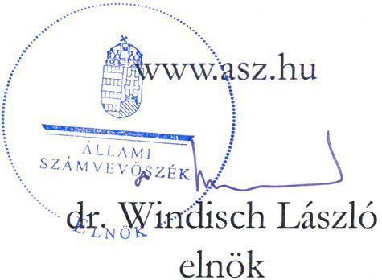

---

# ELLENŐRZÉSI IGAZGATÓSÁG: 

## ÁLLAMHÁZTARTÁSON KÍVÜLI SZERVEZETEKET ELLENŐRZŐ IGAZGATÓSÁG

ELLENŐRZÉSI IGAZGATÓ:
KLINGA LÁSZLÓ igazgató

ELLENŐRZÉSVEZETŐ:
Jelentéseink az interneten a www.asz.hu címen olvashatók.

BÉCSI ANDREA ellenőrzésvezető

IKTATÓSZÁM EL-3963-012/2023.
TÉMASZÁM: 2693
ELLENŐRZÉS-AZONOSÍTÓ SZÁM: V1037

---

# TARTALOMJEGYZÉK 

■ BEVEZETÉS ..... 5
■ AZ ÉRTÉKELÉS HATÓKÖRE ÉS MÓDSZERE ..... 6
■ AZ ÉRTÉKELÉS TERÜLETE ..... 13
■ ÉRTÉKELÉS ..... 14
■ KÖVETKEZTETÉS ..... 21
■ MELLÉKLETEK ..... 23
I. sz. melléklet: Értelmező szótár ..... 23
II. sz. melléklet: Az ellenőrzött szervezetek jegyzéke ..... 26
■ RÖVIDÍTÉSEK JEGYZÉKE ..... 29

---

.

---

# BEVEZETÉS 

Az ÁSZ ${ }^{1}$ az ÁSZ tv. ${ }^{2} 5 . \int$ (11) bekezdés e) pontjában foglaltak alapján törvényességi szempontból ellenőrzi a Közbef. tv. ${ }^{3}$ szerinti egyesületet és alapítványt. Az ÁSZ a Közbef. tv. hatálya alá tartozó egyesületekről és alapítványokról évente összefoglaló jelentést tesz közzé.

Az ÁSZ korábbi, 2022. évben közzétett összefoglaló jelentésében a 2022. év tekintetében azt értékelte, hogy a közélet befolyásolására alkalmas tevékenységet végző civil szervezetek hogyan alakították ki gazdálkodásuk jogszabályok által előírt kötelező gazdálkodási, számviteli szabályozási kereteit.

Jelen összefoglaló jelentés az ÁSZ által a 2023. évben a civil szervezetek körében lefolytatott az „Egyesületek és alapitványok állambáztartási forrásból kapott támogatásai könyvviteli nyilvántartásának ellenörzése" című ellenőrzés megállapításain alapul, amely ellenőrzések eredményeit az ÁSZ külön jelentései is tartalmazzák.

Az ÁSZ tv. 1. § (3) és 5. § (3) bekezdéseinek előírásai alapján lefolytatott ellenőrzések során az ÁSZ a civil szervezeteknél az államháztartási forrásból kapott egyes támogatások könyvviteli nyilvántartását, ennek keretében a támogatásból származó bevétel-, valamint a támogatás felhasználás nyilvántartására vonatkozó jogszabályi előírások betartását ellenőrizte. Az ellenőrzött időszak a 2022. év volt, beleértve a 2022. évi számviteli beszámoló vonatkozásában a közzétételig terjedő időszakot is. Jelen összefoglaló jelentésben az ÁSZ az ellenőrzés során a közélet befolyásolására alkalmas tevékenységet végző civil szervezetek tekintetében megszerzett ellenőrzési tapasztalatokat összegzi és értékeli.

---

# AZ ÉRTÉKELÉS HATÓKÖRE ÉS MÓDSZERE 

A közélet befolyásolására alkalmas tevékenységet végző civil szervezetek körét a Közbef. tv. határozza meg. A közélet befolyásolására alkalmas tevékenységet végző civil szervezetek a Civil tv. ${ }^{4}$ szerinti, Magyarországon nyilvántartásba vett egyesületek, valamint alapítványok, amelyek tárgyévi mérlegfőösszege eléri a 20 M Ft -ot. A közalapítványok, pártalapítványok, pártok, szakszervezetek és kölcsönös biztosító egyesületek, a vallási közösségek, sportegyesületek, valamint a nemzetiségi egyesületek és alapítványok nem tartoznak a közélet befolyásolására alkalmas civil szervezetek közé és nem terjed ki rájuk a Közbef. tv. hatálya.

A civil szervezetekre vonatkozó adatokkal Magyarországon több, egymástól független szervezet is rendelkezik.

Az $\mathrm{OBH}^{5}$ a Cnytv. ${ }^{6}$ és a Civil tv. előírásai alapján - a szervezet székhelye szerint illetékes törvényszéki nyilvántartásba vétel okán - elektronikus nyilvántartást vezet a civil és a bejegyzésre kötelezett szervezetekről. Az OBH a honlapján (www.birosag.hu) a civil szervezetekre vonatkozóan, közhiteles adatokat tartalmazó, nyilvános, mindenki által elérhető felületet is múködtet.

A $\mathrm{KSH}^{7}$ a statisztikai számjel képzéséhez külön erre a célra létrehozott elektronikus rendszer útján információt kap a civil szervezetek alapadatairól az OBH-tól, a NAV ${ }^{8}$-tól és a Kincstár ${ }^{9}$-tól. A hivatalos statisztikai tevékenység ellátása céljából a KSH az Stt. ${ }^{10}$-ben rögzítetteknek megfelelően nyilvános statisztikai információkat gyűjt és hoz nyilvánosságra. A KSH részére jogszabály közhiteles nyilvántartás vezetését nem írja elő.

A 2022. évi mérlegfőösszeg alapján a közélet befolyásolására alkalmas tevékenységet végzőnek minősülő civil szervezetek körének meghatározásához az ÁSZ adatigényléssel fordult az OBH-hoz és a KSH-hoz. A civil szervezetek KSH részére teljesítendő adatszolgáltatási kötelezettségét a 388/2017. (XII. 13.) Korm. rendelet ${ }^{11}$ írja elő. A teljesítendő statisztikai jelentés a főbb mérlegtételeket is tartalmazza, köztük a mérlegfőösszeget is, mely szükséges a Közbef. tv. hatálya alá tartozó civil szervezetek körének meghatározásához.

## Jelen összefoglaló jelentésben érintett szervezetek meghatározása

Az OBH ÁSZ részére teljesített adatszolgáltatása a Cnytv.-ben meghatározott és a külön törvényekben bírósági nyilvántartásba vételre kötelezett szervezetekről vezetett nyilvántartás alapján a 2022.12.31-én működő civil szervezeteket tartalmazta.

Az OBH adatbázisából első lépésben kiszűrésre kerültek a Civil tv. alapján a civil szervezetek közé nem tartozó alapítványnak számító közalapítványok és pártalapítványok, illetve a civil szervezetek közé nem tartozó egyesületnek minősülő pártok, szakszervezetek és kölcsönös biztosítók. Így a nyilvántartás 67706 civil szervezetet tartalmazott, melyből 22328 alapítvány és 45378 egyesület volt. A Közbef. tv.-ben rögzített tevékenységet végző szervezetek (vallási közösségek, sportegyesületek, nemzetiségi egyesületek és alapítványok) kiszűrését követően 61239 civil szervezet esetében kellett megvizsgálni második lépésben, hogy melyek azok a szervezetek, amelyek 2022. évi mérlegfőösszege elérte a Közbef. tv.-ben előírt 20 M Ft-os értékhatárt. Ehhez a KSH adatbázisa szolgáltatta az információt. A KSH adatbázisában a 61239 civil szervezet közül 29648 szervezet mérlegadatai álltak rendelkezésre. Ebből 3671 civil szervezet 2022. évi mérlegfőösszege érte el a jogszabály által előírt 20 M Ft -os határt és ez alapján a közélet befolyásolására alkalmas tevékenységet végző civil szervezetnek minősült. A közélet befolyásolására alkalmas tevékenységet végző civil szervezetek száma az az előző évi összefoglaló jelentésben szereplő 3252 civil szervezethez képest 12,9 \%-kal emelkedett.

---

# 1. ábra: A 2022. évben múködő civil szervezetek száma 

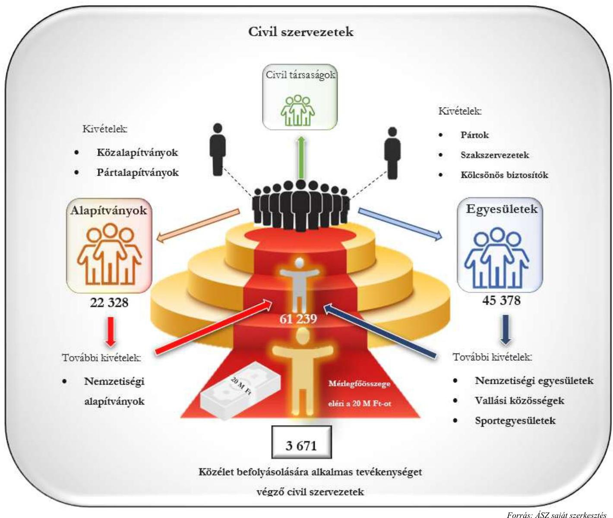

A végzett tevékenysége alapján - a Közbef. tv. által meghatározott mérlegfőösszeget figyelmen kívül hagyva - potenciálisan közélet befolyásolására alkalmas tevékenységet végző és a KSH adatbázisában beszámolóadattal rendelkező 29648 civil szervezet 2022. évi összesített mérlegfőösszege 3889327 M Ft volt, melyből a 12267 alapítványé 3344363 M Ft , míg a 17381 egyesületé 544964 M Ft volt.

---

# 2. ábra: Tevékenységük alapján közélet befolyásolására alkalmas alapítványok és egyesületek adatai 

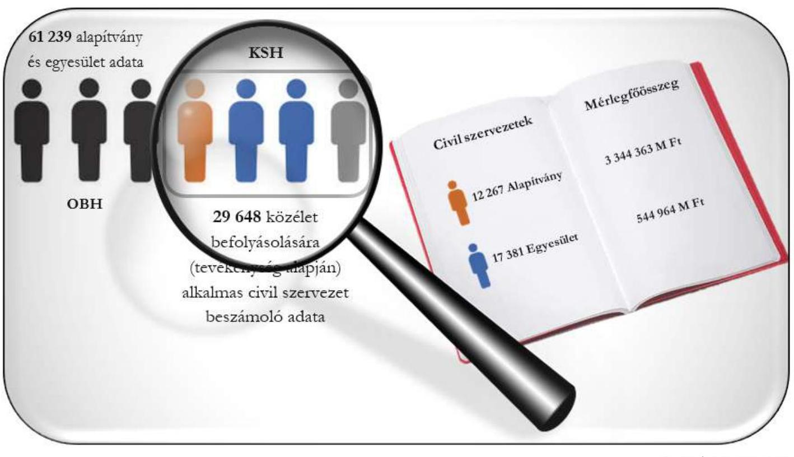

Fornás: ASZ saját szerkezés
Az OBH szűrt nyilvántartása szerinti, a KSH adatszolgáltatással kiegészített adatbázis alapján a 2022. évben közélet befolyásolására alkalmas tevékenységet végző 3671 civil szervezetből 1729 alapítvány és 1942 egyesület volt. Ezek összesített mérlegfőösszeg adata 3809849 M Ft volt, mely az összes, KSH felé adatot szolgáltató civil szervezet közé tartozó alapítvány és egyesület mérlegfőösszegének 97,7 \%-át tette ki. A KSH nyilvántartása alapján a civil szervezetek vagyona jelentős mértékben a közélet befolyásolására alkalmas tevékenységet végző civil szervezeteknél található, így e szervezetek vagyonuk alapján is meghatározók az adatszolgáltatók teljes sokaságán belül.

---

# 3. ábra: Közélet befolyásolására alkalmas tevékenységet végző civil szervezetek számának és vagyonának megoszlása a 2022. évben 

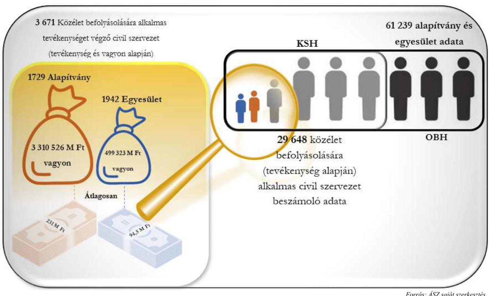

A közélet befolyásolására alkalmas tevékenységet végző 3671 civil szervezet 2022. évi beszámoló adatai alapján a mérlegfőösszeg (vagyon) területi eloszlásában egyenlőtlen arányok voltak megfigyelhetők. A közélet befolyásolására alkalmas civil szervezetek összvagyonának jelentős része Budapestre ( $72,0 \%$ ) koncentrálódott, és mindössze a vagyon $28,0 \%$-a oszlott meg a 19 vármegye között. A 2022. évi beszámolóadatok alapján közélet befolyásolására alkalmas civil szervezetek összvagyona a Közép-magyarországi régióban összpontosult.

---

# 4. ábra: A 2022. évben közélet befolyásolására alkalmas tevékenységet végző civil szervezetek vagyonmegoszlása (Mrd Ft) 

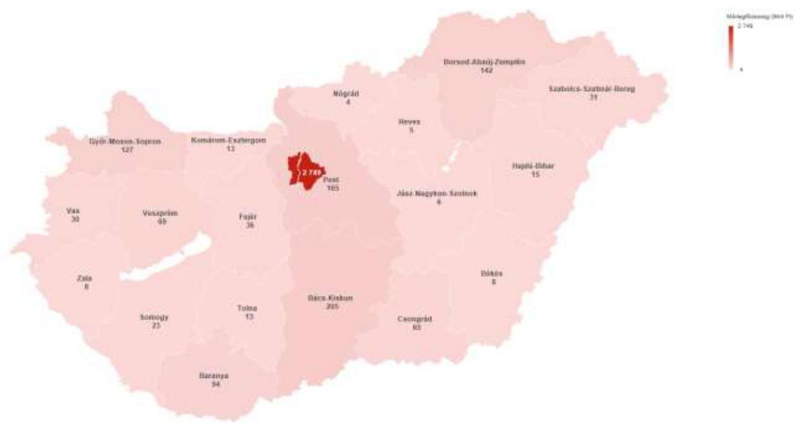

Forrás: ÁSZ saját szerkesztés
A közélet befolyásolása szempontjából a civil szervezetek vagyona mellett meghatározó tényező a kapott támogatások nagysága. A 2022. évi tevékenységükről a KSH felé adatszolgáltatást teljesítő szervezetek összesen 1483 316,9 M Ft központi támogatást, 102 814,1 M Ft önkormányzati támogatást, 148 514,6 M Ft belföldi magántámogatást és $342025,7 \mathrm{M}$ Ft külföldi támogatást kaptak, melyből a közélet befolyásolására alkalmas tevékenységet végző 3671 civil szervezet 300381,5 M Ft központi, 6415,7 M Ft önkormányzati, 100 022,2 M Ft belföldi magán és 97 199,3 M Ft külföldi támogatásban részesült.

## 1. táblázat

A KÖZÉLET BEFOLYÁSOLÁSÁRA ALKALMAS TEVÉKENYSÉGET VÉGZŐ CIVIL SZERVEZETEK FÖBB TÁMOGATÁSAI (M FT)

|  | KÖZPONTI   TÁMOGATÁs | ÖNKORMÁNYZATI   TÁMOGATÁs | BELFÖLDI   MAGÁNTÁMOGATÁs | KÜLFÖLDI   TÁMOGATÁs | ÖSSZESEN |
| :--: | :--: | :--: | :--: | :--: | :--: |
| Összes szervezet | 1483 316,9 | 102 814,1 | 148514,6 | 342 025,7 | 2076 671,3 |
| Ebből: Közélet befolyásolására alkalmas tevékenységet végző civil szervezetek | 300381,5 | 6 415,7 | 100 022,2 | 97 199,3 | 504 018,7 |
| Arány | 20,3\% | 6,2\% | 67,3\% | 28,4\% | 24,3\% |

A támogatások forrás szerinti megoszlása alapján nominálisan a legnagyobb támogatás a közélet befolyásolására alkalmas tevékenységet végző civil szervezeteknél központi forrásból származott, azonban arányait tekintve az összes szervezetet érintő belföldi magántámogatás $67,3 \%$-a, a külföldi támogatások 28,4 \%-a közélet befolyásolására alkalmas civil szervezeteket célozta a 2022. évben. A 3671 közélet befolyásolására

---

alkalmas tevékenységet végző szervezetből 501 civil szervezet (272 alapítvány és 229 egyesület) részesült külföldi támogatásban, összesen 97 199,3 M Ft-ban. Ezek közül 18 szervezet (12 alapítvány és 6 egyesület) a 2022. évben 500,0 MFt-nál magasabb összegű támogatást kapott külföldről. A 2022. évi központi és önkormányzati támogatások együttesen a közélet befolyásolására alkalmas civil szervezetek támogatásainak $60,9 \%$-át tették ki, míg a belföldi magántámogatások és a külföldi támogatások a $39,1 \%$-át.

# Beszámolók közzététele és a statisztikai adatszolgáltatás teljesítése 

Az OBH által nyilvántartott civil szervezetek közé tartozó 22328 alapítványból és 45378 egyesületből 6001 alapítvány ( $26,9 \%$ ) és 13205 egyesület ( $29,1 \%$ ) nem helyezte letétbe a 2022. évi beszámolóját. Ez az arány a közélet befolyásolására alkalmas tevékenységet végző alapítványok esetében 3,8\%, míg az egyesületek esetében $3,5 \%$ volt.

Az OBH-tól és a KSH-tól kapott adatszolgáltatások felülvizsgálata alapján az ÁSZ megállapította, hogy egyik szervezet adatbázisa sem tartalmazza teljeskörűen azokat az adatokat, amelyek alapján azonosítható a Közbef. tv. hatálya alá tartozónak minősülő civil szervezetek teljes köre.

Az OBH és a KSH által az ÁSZ-nak megküldött adatbázisok összehasonlítása alapján az ÁSZ megállapította, hogy a 2022. év tekintetében a KSH felé nem minden civil szervezet teljesítette a 388/2017. (XII. 13.) Korm. rendelet által előírt adatszolgáltatási kötelezettségét. A KSH adatbázisa nem tartalmazta minden civil szervezetre vonatkozóan az érintett szervezetek körének meghatározásához szükséges mérlegfőösszeget.

A KSH nyilvántartása alapján kizárólag tevékenységüket tekintve (a mérlegfőösszeget nem figyelembe véve) a Közbef. tv. alapján potenciálisan közélet befolyásolására alkalmas tevékenységet végző civil szervezetek közé tartozó alapítványok 44,2 \%-a és egyesületek 53,3 \%-a, összesen 31591 civil szervezet a 2022. évi beszámolója adatairól nem szolgáltatott adatot a KSH felé.

## 5. ábra: A 2022. évben tevékenység alapján közélet befolyásolására alkalmas civil szervezetek hiányzó beszámoló adatainak száma

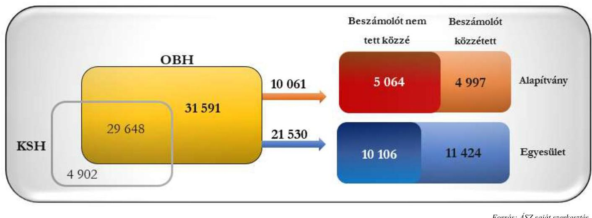

A 31591 civil szervezetből 10061 alapítvány és 21530 egyesület 2022. évi mérlegfőösszege nem ismert, így ezen alapítványok és egyesületek esetében - azok számossága miatt - a nyilvántartásokban rögzített mérlegfőösszegek felhasználásával nem meghatározható, hogy a törvényi előírások alapján mérlegfőösszegük elérte-e a Közbef. tv.-ben rögzített 20 M Ft-ot, azaz közélet befolyásolására alkalmas tevékenységet végző civil szervezeteknek minősülnek-e. Ezen alapítványok 49,7 \%-a és ezen egyesületek 53,1 \%-a statisztikai

---

adatszolgáltatási kötelezettségét a KSH felé nem teljesítette, azonban a 2022. évben beszámolót közzé tett. Az OBH-nál bejegyzett, KSH adatszolgáltatást nem teljesített civil szervezetek közül összesen 15170 szervezet (5 064 alapítvány és 10106 egyesület) a 2022. évre vonatkozóan számviteli beszámolót nem tett közzé.

Azon 25976 civil szervezet közül - melyek mérlegfőösszege nem érte el a Közbef. tv.-ben meghatározott 20 M Ft-ot, tehát mérlegfőösszegük alapján nem minősülnek közélet befolyásolására alkalmas tevékenységet végző civil szervezetnek - 11951 olyan szervezet volt, melynek mérlegfőösszege (vagyona) az 1 M Ft-ot sem érte el. Az 1 M Ft mérlegfőösszeg alatti szervezetek közül 17 civil szervezetnek a 2022. évi bevétele szervezetenként a 100 M Ft-ot is meghaladta, illetve 204 civil szervezet összesen 604,4 M Ft külföldi támogatásban részesült. Továbbá, 147 civil szervezet közül, melynek mérlegfőösszege 19,0 M és 20 M Ft között volt (Közbef. tv.-ben rögzített határérték alatti szervezetek), 20 civil szervezet összesen 743,6 M Ft-os központi támogatásban és 103,8 M Ft belföldi magántámogatásban részesült. Ezen szervezetek esetében fennáll annak a lehetősége, hogy a mérlegfőösszegük (vagyon) alapján - bár a Közbef. tv. alapján nem minősülnek közélet befolyásolására alkalmas tevékenységet végző szervezetnek - a civil szervezetek egy része a kapott támogatások éven belüli felhasználásával a 2022. évben a közéletre hatással volt.

# Szabályozási környezet bemutatása 

A közélet befolyásolására alkalmas tevékenységet végző civil szervezetek törvényes gazdálkodására vonatkozó előírásokat a Ptk. ${ }^{12}$ jogi személyre vonatkozó általános szabályai, valamint az egyesületekre és alapítványokra vonatkozó rendelkezései írják elő. A gazdálkodás tekintetében a szervezetre jellemző, jogszabályokban nem szabályozott előírásokat az alapító(k) által megalkotott létesítő okiratok rögzítik. A civil szervezet számviteli szabályozására, továbbá a számviteli nyilvántartásokra és a beszámolási kötelezettség teljesítésére vonatkozó előírásai a Számv. tv. ${ }^{13}$-en alapulnak. A közélet befolyásolására alkalmas tevékenységet végző civil szervezetek a Számv. tv. szempontjából egyéb szervezeteknek minősülnek, így az Eszkr. ${ }^{14}$ hatálya alá tartoznak, beszámolási kötelezettségüknek az Eszkr. előírásai szerint kell eleget tenniük. Ugyanakkor a beszámolási kötelezettségük vonatkozásában a Civil tv. is határoz meg előírásokat, melyek érvényre juttatásához figyelemmel kell lenniük a Civil vhr. ${ }^{15}$ előírásaira is.

A civil szervezetek könyvvezetési és nyilvántartási kötelezettségét a Számv. tv. mellett az Eszkr. és a Civil tv. is szabályozza. Amennyiben egységes rendszerben kívánjuk kezelni ezeket az előírásokat, szabályozási anomáliát jelent, hogy az Eszkr. 14. § (2) bekezdése előírása szerint a kiegészítő mellékéletben tájékoztató adatként be kell mutatni a Civil tv. 2. $\$ 15$. pont szerinti költségvetési támogatásként kapott összeget, azonban a Civil tv. hivatkozott pontja a 2020.07.01-jén hatályát vesztette. A támogatásokkal kapcsolatban fontos megjegyezni, hogy a támogató szervezetek a támogatási szerződésekben / támogatói okiratokban a folyósítás feltételei között előírják azt, ha a támogatás összegét a záró beszámoló elfogadásáig előlegként folyósítják.

A támogatásokkal kapcsolatban a jogszabályok mellett a támogatási szerződések / támogatói okiratok is tartalmaznak a támogatás felhasználásának nyilvántartására vonatkozó előírásokat, továbbá a támogatás felhasználását alátámasztó, annak elszámolásakor figyelembe vett számlák záradékolására vonatkozó előírásokat.

---

# AZ ÉRTÉKELÉS TERÜLETE 

Jelen összefoglaló jelentés 98, a Közbef. tv. szerint a közélet befolyásolására alkalmas tevékenységet végző civil szervezetnek minősülő civil szervezetre vonatkozó, az ÁSZ „Egyesületek és alapítványok állambáztartásból kapott támogatásai könyvviteli nyilvántartásának ellenörzése" című ellenőrzése során megtett megállapításokat foglalja össze és az érintett szervezetek ellenőrzésének eredményét értékeli.

A 98 szervezetből 57 alapítványi és 41 egyesületi formában működött, közülük összesen 68 rendelkezett közhasznú jogállással. Működéséről, vagyoni, pénzügyi és jövedelmi helyzetéről nyolc ellenőrzött szervezet a Számv. tv. szerinti éves beszámolót, 87 ellenőrzött szervezet egyszerűsített éves beszámolót készített, melyeket kettős könyvvezetéssel támasztottak alá. Három ellenőrzött szervezet egyszeres könyvvezetéssel alátámasztott, egyszerűsített beszámolót készített. Az ellenőrzött szervezetek a 2022. évi beszámolóik összesített mérlegfőösszege alapján összesen 277 336,0 M Ft vagyonnal gazdálkodtak, tevékenységük finanszírozásához, szakmai programok megvalósításához az eredménykimutatások / eredménylevezetések adatai alapján összesen 105 883,1 M Ft támogatást kaptak.

A 98 ellenőrzött szervezetnél összesen 14 711,9 M Ft összegű államháztartási forrásból kapott támogatás számviteli nyilvántartásának ellenőrzésére került sor. Az ellenőrzött támogatás 40 M Ft kivételével vissza nem térítendő támogatás volt. Az ellenőrzött államháztartási forrásból kapott támogatásból 1 676,2 M Ft támogatás kizárólag beruházási, fejlesztési célt szolgált. További 1 356,0 M Ft támogatást az alapcél szerinti (közhasznú) tevékenység költségei, ráfordításai ellentételezésére kapott támogatás részeként a szervezetek szintén beruházási, fejlesztési célra használhattak fel. Az ellenőrzött támogatási összegből a civil szervezetek a támogatók részére az ellenőrzött időszakban összesen 49,2 M Ft fel nem használt támogatást utaltak vissza. A támogatások felhasználásáról benyújtott záró beszámolók és pénzügyi elszámolások ellenőrzése alapján mindösszesen 1,8 M Ft támogatás visszafizetésének elrendelésére került sor az ellenőrzött időszakban.

## 6. ábra: Ellenőrzött szervezetek összetétele és föbb adatai

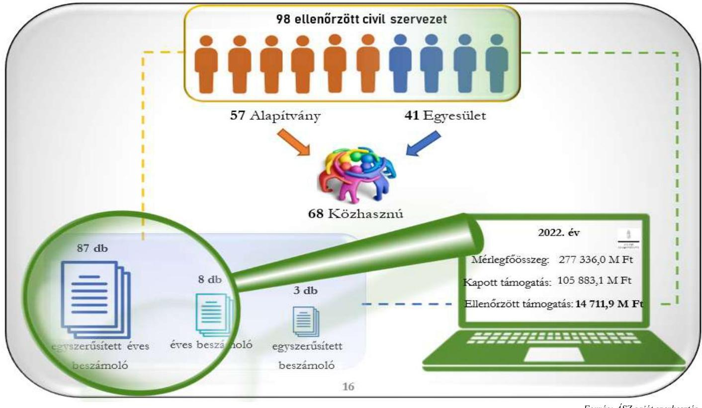

---

# ÉRTÉKELÉS 

Az ellenőrzés során minden ellenőrzött szervezetnél egy-egy államháztartási forrásból kapott támogatás könyvviteli nyilvántartásának ellenőrzésére került sor. Ezeket a támogatásokat a civil szervezetek a 2022. évben vagy azt megelőzően kapták, és a 2022. évben részben vagy egészben használták fel. Ahol nem történt a 2022. évben felhasználás, azon civil szervezetek vonatkozásában jelen összefoglaló jelentésben a kapott támogatás nyilvántartásba vételét értékeltük.

## A kapott támogatások nyilvántartása, elszámolása

A támogatási szerződések / támogatói okiratok szerint 86 civil szervezet részére az elszámolási kötelezettséggel járó, vissza nem térítendő támogatás teljes összege, egyösszegben, - az Ávr. ${ }^{16}$ 87. $\int(1)$ bekezdésben meghatározottak figyelembevételével - támogatási előlegként került folyósításra. Ezen támogatásokat az érintett civil szervezetek 83,7 \%-a, 72 szervezet a Számv. tv. 42-43. § előírásai ellenére az ellenőrzött időszakban nem, vagy csak részben tartotta nyilván kötelezettségként. Ezen szervezeteknél ezért a 2022. évi beszámoló - a Számv. tv. 18. § előírása ellenére - nem mutatott megbízható és valós képet a szervezet vagyoni, pénzügyi helyzetéről, mivel az elszámolási kötelezettséggel kapott támogatás összege a mérleg forrás oldalán a kötelezettségek között nem került bemutatásra. Azon 12 szervezet közül, mely a támogatást, annak a bankszámlán történő jóváírásakor bevételként számolhatta el - tehát részükre a támogató támogatásként és nem támogatási előlegként folyósította a támogatást -, 11 a jogszabályi előírásoknak megfelelően elszámolta a bevételt. Közülük két szervezet a támogatás teljes összegét a 2022. évben nem használta fel, a fel nem használt összeget a Számv. tv. előírásainak megfelelően halasztott bevételként mutatta ki. Egy szervezet a kapott támogatást - az Eszkr. 13. § (3) bekezdése előírása ellenére - bevételként nem számolta el, a könyvviteli rendszerében a passzív időbeli elhatárolások között azonnal halasztott bevételként mutatta ki, ezáltal sérült a Számv. tv. 15. § (9) bekezdése szerinti bruttó elszámolás elve.

## 7. ábra: Az ellenőrzött szervezetek bevételei nyilvántartásának értékelése

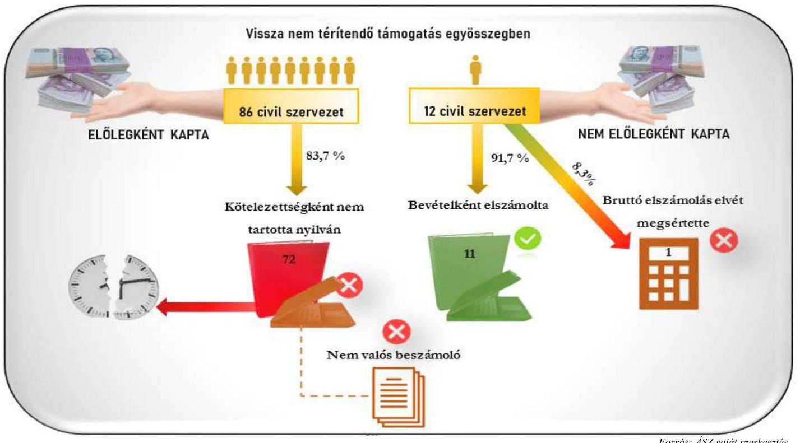

---

# A könyvviteli, nyilvántartási rendszer kialakítása az ellenőrzött támogatások tükrében 

Az államháztartásból származó támogatások szabályszerű könyvviteli nyilvántartását a könyvvezetési rendszer megfelelő kialakítása támogatja. Megfelelőnek akkor minősül a nyilvántartás, ha a kapott támogatás a nyilvántartásban elkülönül a civil szervezet alapcél szerinti tevékenysége egyéb bevételeitől (például, de nem kizárólagosan a személyi jövedelemadó meghatározott részének az adózó rendelkezése szerint kiutalt összegétől, a kapott adománytól, stb.). Továbbá, a megfelelő nyilvántartáshoz szükséges az is, hogy abból megállapítható legyen, hogy az államháztartási forrásból kapott támogatás a központi költségvetésből-, elkülönített állami pénzalapokból-, vagy helyi önkormányzatoktól, kisebbségi önkormányzatoktól, önkormányzati társulástól kapott támogatás volt. A támogatás felhasználása tekintetében a civil szervezet könyvviteli nyilvántartása akkor biztosítja a közpénzek felhasználásának ellenőrizhetőségét, amennyiben az alapcél szerinti (közhasznú) tevékenysége költségei, ráfordításai ellentételezésére kapott támogatásokról ideértve az alapcél szerinti (közhasznú) tevékenysége keretében megvalósuló fejlesztés céljára kapott támogatást is - olyan elkülönített számviteli nyilvántartást vezet, amelynek alapján támogatásonként megállapítható és ellenőrizhető a kapott támogatás felhasználása. Ez az előírás könyvvezetési formától független, az egyszeres könyvvitelt vezető civil szervezeteknek is ki kell alakítaniuk a támogatás felhasználásának elkülönített könyvviteli nyilvántartását.

Az ellenőrzött civil szervezetek közül 91 szervezet könyvviteli nyilvántartási rendszerének kialakítása megfelelt a Számv. tv. 161/A. § (1)-(2) bekezdés, az Eszkr. 9. § (9)-(10) bekezdés, a Civil tv. 20. § (1)(4) bekezdése előírásainak. Hét civil szervezet esetében a könyvviteli nyilvántartási rendszer kialakítása nem volt megfelelő. Öt szervezet - a Civil tv. 20. § (1)-(4) bekezdése előírása ellenére - a támogatási bevételek és a támogatás felhasználás elkülönített számviteli nyilvántartásának keretrendszerét nem alakította ki, két szervezet - a Civil tv. 20. § (4) bekezdés előírása ellenére - az államháztartási forrásból kapott támogatás felhasználásának elkülönített számviteli nyilvántartása kereteinek kialakításáról nem gondoskodott.

A könyvvezetési rendszer megfelelő kialakítása mellett is előfordulhat, hogy a gyakorlatban nem szabályszerű könyvvezetés a támogatás, vagy a felhasználás jogszabályi előírásoknak meg nem felelő elszámolását eredményezi. A jó könyvviteli nyilvántartás alapja a jogszabályi előírásoknak megfelelően kialakított szabályozási keretrendszer, de a szabályszerű nyilvántartáshoz szükséges a keretrendszer helyes gyakorlati alkalmazása is.

## A kapott támogatások elkülönített bemutatása

A nem megfelelően kialakított könyvviteli nyilvántartással rendelkező hét ellenőrzött szervezet közül egy civil szervezet a támogatások elkülönített bemutatásának nyilvántartási rendszerét nem alakította ki, így a kapott támogatást bevételként szabályszerűen nem tudta elszámolni, ezért esetében a kapott támogatás bevételi nyilvántartása nem felelt meg a Civil tv. 20. $\$ (1)-(3) bekezdése előírásainak. Négy civil szervezet a könyvvezetési rendszer kialakítása során a támogatási bevételeken belül az államháztartási forrásból kapott támogatások elkülönített kimutatását nem biztosította. E szervezetek a támogatási bevétel elszámolása során nem tudták kimutatni, hogy a bevételt a központi költségvetésből vagy elkülönített állami pénzalapból kapták, esetükben a támogatási bevétel nyilvántartása ezért nem felelt meg a Civil tv. 20. § (3) bekezdése előírásainak. Két civil szervezet könyvvezetési nyilvántartási rendszerének kialakítása a támogatás felhasználás vonatkozásában nem felelt meg a jogszabályi előírásoknak. Esetükben a támogatási bevétel elkülönített bemutatásának szabályozása és a nyilvántartása megfelelt a jogszabályi előírásoknak.

A könyvviteli nyilvántartásukat szabályszerűen kialakított civil szervezetek közül négy szervezet a nyilvántartási rendszerében a Civil tv. 20. $\$ (1)-(2) bekezdés előírása ellenére nem különítette el az

---

államháztartási forrásból kapott támogatást az alapcél szerinti tevékenysége egyéb bevételeitől. További 19 civil szervezet az államháztartási forrásból kapott támogatásra vonatkozóan - a Civil tv. 20. § (3) bekezdés előírása ellenére - nem mutatta ki, hogy azt a központi költségvetésből vagy elkülönített pénzalapból kapta. 66 szervezetnél a támogatás elkülönített számviteli nyilvántartása megfelelt a jogszabályi előírásoknak. Két civil szervezet esetében pedig - mely az előlegként kapott támogatást könyveiben a jogszabályi előírásoknak megfelelően kötelezettségként tartotta nyilván - bevétel elszámolására még nem került sor, tekintettel arra, hogy a támogatás terhére felhasználás még nem történt.

# 8. ábra: A támogatás elszámolás szabályszerűsége 

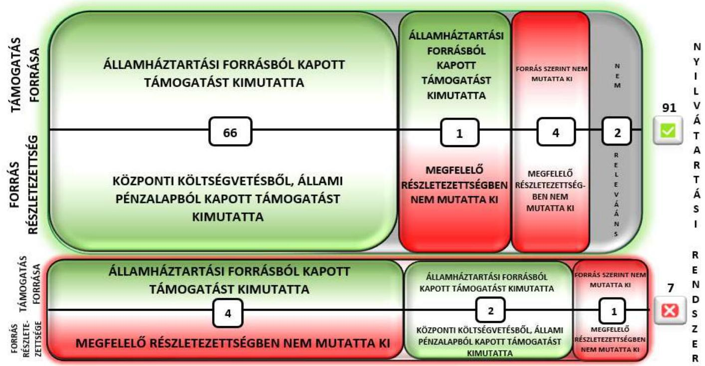

Forrás: ÁSZ saját szerkezéses

## A támogatások felhasználásának elkülönített nyilvántartása

Azon hét civil szervezetből, amelyek könyvviteli nyilvántartásukat nem a jogszabályi előírásoknak megfelelően alakították ki, hat esetében az államháztartási forrásból kapott támogatás felhasználásának nyilvántartása nem felelt meg a Civil tv. 20. § (4) bekezdése előírásainak, támogatásonként nem volt megállapítható és ellenőrizhető a kapott támogatás felhasználása. Egy szervezet esetében a támogatás felhasználása még nem kezdődött meg, csupán előleg kifizetésére került sor, mely a könyvviteli rendszerben a Számv. tv. 29. § (1) bekezdés előírásainak megfelelően a követelések között került elszámolásra.

Azon civil szervezetek közül, amelyek a jogszabályi előírásoknak megfelelően alakították ki nyilvántartási rendszerüket, négy civil szervezet - a Civil tv. 20. § (4) bekezdés előírása ellenére - nem mutatta ki elkülönítetten az államháztartási forrásból kapott támogatás felhasználását, mert a nyilvántartásra alkalmazott munkaszámot, projektszámot, elkülönített főkönyvi számlát nem megfelelően alkalmazta.

Amennyiben a civil szervezet az államháztartási forrásból kapott támogatás felhasználását nem megfelelően tartaja nyilván, akkor nem biztosítja a támogatás felhasználásának ellenőrizhetőségét, fennáll a számviteli bizonylatok többszöri elszámolásának kockázata. Továbbá, nem valósul meg a beszámoló nyilvántartással történő alátámasztottsága, illetve a kiegészítő melléklet (és a közhasznúsági melléklet) adatszolgáltatása nem alátámasztott.

---

# 9. ábra: A támogatás felhasználás nyilvántartásának szabályszerűsége 

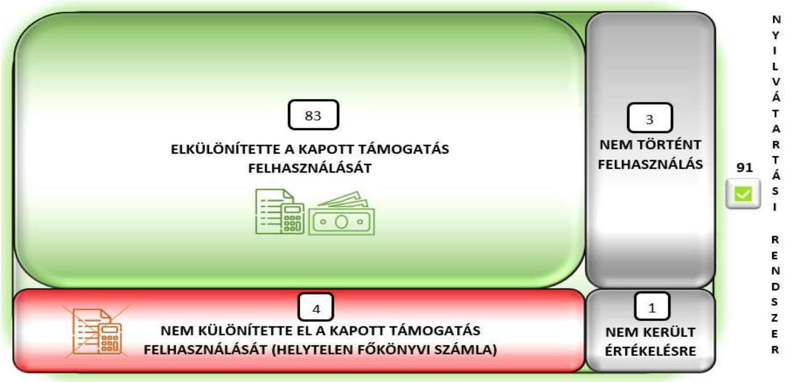

A jogszabályi előírásoknak megfelelően kialakított nyilvántartási rendszerben 83 civil szervezet elkülönített számviteli nyilvántartást vezetett az államháztartási forrásból kapott támogatás felhasználásáról. Az államháztartási forrásból kapott támogatás megfelelő, a jogszabályi előírások szerinti, elkülönített nyilvántartásának az eszköze - mely összefügg a könyvvezetési rendszer kialakításával -, az elkülönített főkönyvi számlák alkalmazása, melyre 26 szervezetnél került sor, vagy az adott támogatáshoz munkaszám, projektszám stb. azonosító hozzárendelése, mely eszközt 57 szervezet alkalmazott. A támogatás felhasználásáról elkülönített számviteli nyilvántartást vezetők közül nyolc civil szervezet továbbutalási céllal kapott támogatást, melyek nyilvántartása szabályszerű volt. Az ellenőrzött szervezetek 83,8 \%-a az államháztartási forrásból kapott támogatás felhasználásáról olyan számviteli nyilvántartást vezetett, amelynek alapján megállapítható és ellenőrizhető volt a kapott támogatás felhasználása. Három civil szervezet esetében az ellenőrzött időszakban még nem kezdődött meg a támogatás felhasználása. További egy szervezetnél az ÁSZ az elkülönített nyilvántartást nem értékelte, mivel a civil szervezet részére 2022. évben utólag térítette meg a támogató a 2021.11.01. - 2021.12.31. közötti időszak járványügyi többletköltségeit.

---

# 10. ábra: A támogatás felhasználás nyilvántartásának szabályszerűsége 

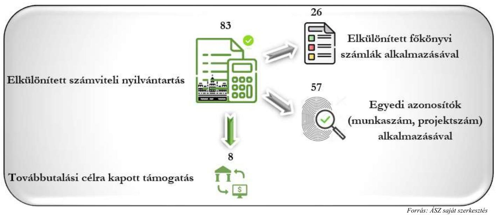

A civil szervezetek számviteli beszámolója és közhasznúsági melléklete az ellenőrzött támogatások tükrében

## a) Számviteli beszámoló

A bizonylatok záradékolására vonatkozó kötelezettségek a támogatás szabályszerű felhasználásához és elszámolásához szükségesek, biztosítják, hogy a bizonylatok kizárólag az adott támogatásnál kerüljenek elszámolásra. A támogatási szerződések / támogatói okiratok nyilvántartásra, záradékolásra vonatkozó előírásai is támogatják a jogszabályi előírásoknak megfelelő könyvvezetést. Két ellenőrzött szervezet a támogatási szerződésben, illetve a támogatói okiratban előírt záradékolási kötelezettségének nem tett eleget.

Az ellenőrzött szervezetek a közpénzek felhasználásáról, az alapcél szerinti (közhasznú) tevékenységükről akkor tájékoztatják megfelelően és teljeskörűen a közvéleményt, ha határidőben és a jogszabályi előírásoknak megfelelően készítik el a megbízható, az ellenőrizhetőséget biztosító adatokkal alátámasztott beszámolójukat. A civil szervezetek a beszámoló nyilvánosságra hozatalán keresztül biztosítják az Alaptörvény ${ }^{37}$ 39. cikk (2) bekezdésében rögzített átláthatóság és a közpénzekkel való elszámoltathatóság elveinek érvényesülését.

A szabályszerű könyvvezetés alapozza meg a megfelelő beszámolást, amely a közbizalom erősítésének eszköze. Ennek keretében a pontos, minden előírt információt és kötelező tartalmi elemet - egyszerűsített beszámoló kivételével a beszámolási kötelezettség részeként a kiegészítő mellékletet is - magában foglaló beszámolót és közhasznúsági mellékletet szükséges készítenie minden civil szervezetnek, melyre vonatkozóan a Számv. tv. mellett a Civil tv. és az Eszkr. határoz meg előírásokat. A beszámolási kötelezettségre vonatkozóan a jogszabályok előírják annak határidőben történő letétbe helyezését és közzétételét is. A beszámoló készítése során a civil szervezeteknek formai és tartalmi szempontokat is figyelembe kell venniük, melynek keretében többek között ügyelniük kell a beszámolók adatainak pontosságára, megbízhatóságára, valódiságára. A beszámoló elfogadásához a jóváhagyásra jogosult testület részére - annál a szervezetnél, ahol felügyelőbizottság múködik - rendelkezésre kell állnia a felügyelő bizottság véleményének, valamint - a könyvvizsgálatra kötelezett civil szervezeteknél - a könyvvizsgálói véleménynek. A beszámolót a civil szervezetnek a jogszabályban előírt határidőre közzé kell tennie. A Civil tv-ben előírt határidőben - az adott üzleti év mérlegfordulóapját követő ötödik hónap utolsó napáig - 59 civil szervezet eleget tett a beszámolója letétbe helyezési és közzétételi

---

kötelezettségének. A fennmaradó 39 szervezet a Civil tv. 30. $\$ 5$ ) bekezdésében meghatározott - az eredeti határidőtől számított egy év - pótlási határidőn belül helyezte letétbe és tette közzé beszámolóját.

Az ellenőrzött szervezetek közül három civil szervezet az Eszkr. előírásának megfelelő, egyszeres könyvvitellel alátámasztott, egyszerűsített beszámolót készített. A kettős könyvvitellel alátámasztott egyszerűsített éves beszámolót, vagy a Számv. tv. szerinti éves beszámolót készítő civil szervezetek beszámolójuk részeként kötelesek kiegészítő mellékletet készíteni. A 95 kettős könyvvitelt vezető civil szervezet közül kilenc a Civil tv. 29. $\$ (2) bekezdés c) pontja előírása ellenére beszámolója részeként a kiegészítő mellékletet nem készítette el. Esetükben a 2022. évi beszámoló nem felelt meg a Civil tv. 29. § (2) bekezdés és az Eszkr. 22. § (1) bekezdés beszámoló tartalmára vonatkozó előírásainak. Ezen szervezetek nem rendelkeztek a jogszabályi előírás szerinti tartalmú beszámolóval, így nem a jogszabályi előírásoknak megfelelően teljesítették beszámolási kötelezettségüket. Kiegészítő melléklet hiányában ezek a szervezetek beszámolójukban nem jelenítették meg azokat a Civil tv.-ben, Eszkr.-ben és a Számv. tv.-ben előírt további információkat, amelyek a mérlegben és az eredménykimutatásban szerepeltetetteken túl - szükségesek a beszámolóban a szervezet gazdálkodásáról a megbízható és valós összkép bemutatásához.

A közhasznú jogállással rendelkező civil szervezetek beszámolójának kiegészítő mellékletében a Civil tv. előírása alapján támogatásonként be kell mutatni a támogatási program keretében végleges jelleggel felhasznált összegeket. A 63 közhasznú jogállással rendelkező és kiegészítő mellékletet készítő civil szervezet közül 25 bemutatta a támogatási program keretében véglegesen felhasznált összegeket. Kilenc civil szervezet esetében az ellenőrzött támogatásból a beszámolóval lezárt 2022. évben nem történt felhasználás, így a 2022. évi beszámoló kiegészítő mellékletében ezeknek a civil szervezeteknek a Civil tv. előírása alapján bemutatási kötelezettsége nem keletkezett. A fennmaradó 29 civil szervezet nem tett eleget a Civil tv. 29. § (4) bekezdése előírásának, így a 2022. évi beszámolójuk nem tartalmazott a közpénzfelhasználására vonatkozóan tájékoztatást. E 29 közhasznú jogállással rendelkező civil szervezet nem biztosította a közpénzek felhasználásának nyilvánosságát.

# b) Közhasznúsági melléklet 

A Civil tv. előírása szerint valamennyi civil szervezet köteles a beszámolójával egyidejűleg közhasznúsági mellékletet is készíteni, melynek tartalmi követelményeit a hivatkozott jogszabályok mellett a Civil. vhr. határozza meg. A 2022. év vonatkozásában valamennyi ellenőrzött szervezet készített közhasznúsági mellékletet, azonban hat civil szervezet a közhasznúsági melléklet készítése során nem tartotta be a Civil vhr. 12. § (1) bekezdése előírását. Ezen szervezetek a közhasznúsági mellékletet nem a jogszabályi előírás szerinti tartalommal készítették el, mivel abban nem rögzítették a civil szervezet azonosító adatait, valamint az alapcél szerinti és a közhasznú tevékenységeket, továbbá azok eredményének bemutatását. További 14 civil szervezet a Civil tv. 29. § (7) bekezdése előírása ellenére nem mutatta be az ellenőrzött támogatás felhasználásából következő, a tevékenysége megvalósítása során nyújtott cél szerinti juttatásokat. További nyolc civil szervezet esetében a támogatás felhasználásából következő cél szerinti juttatás bemutatása nem felelt meg a Civil tv. 2. § 4. pontjában meghatározottaknak. Esetükben a közhasznúsági mellékletben bemutatott cél szerinti juttatás részben vagy egészben nem minősült az alaptevékenység keretében nyújtott pénzbeli, vagy nem pénzbeli szolgáltatásnak. Összességében az ellenőrzött civil szervezetek 33,7\%-a nem készített a jogszabályi előírásoknak megfelelő közhasznúsági mellékletet, nem, illetve nem megfelelően tájékoztatta a közvéleményt az alapcél szerinti (közhasznú) tevékenységéről.

---

# **c) Könyvvizsgálat**

Az Eszkr. előírása szerint a 2022. év vonatkozásában a könyvvizsgálati kötelezettség azokat a szervezeteket érintette, amelyek éves (éves szintre átszámított) bevétele az üzleti évet megelőző két üzleti év átlagában meghaladta a 300 millió forintot. A civil szervezet továbbá dönthetett arról, hogy a beszámolója felülvizsgálatával könyvvizsgálót bíz meg. Az ellenőrzött szervezetek közül 46 volt könyvvizsgálatra kötelezett, azonban 4 civil szervezet a beszámolóját az Eszkr. 16. § (1) bekezdés előírása ellenére könyvvizsgálóval nem vizsgáltatta felül. Esetükben elmaradt a közvélemény tájékoztatása arról, hogy a 2022. évi beszámolóban közzé tett adatok megbízható és valós képet mutatnak-e a szervezet gazdálkodásáról.

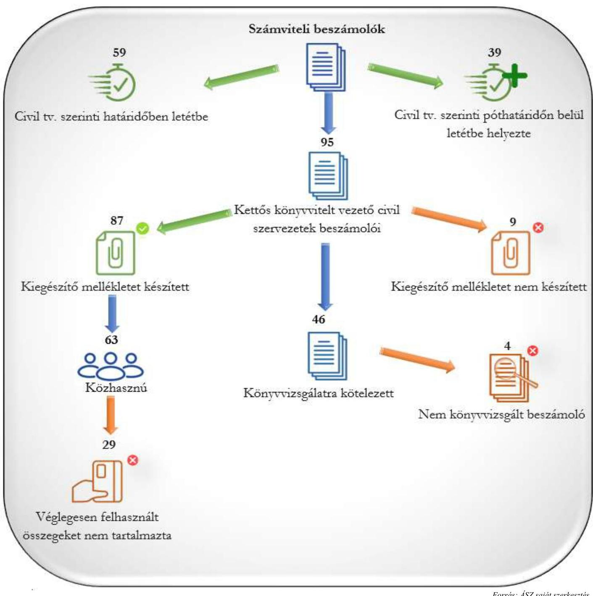

# **11. ábra: A számviteli beszámolók értékelése**

*Forrás: ÁSZ saját szerkeztés*

---

# KÖVETKEZTETÉS 

Jelen összefoglaló jelentésben bemutatott, a Közbef. tv. alapján a közélet befolyásolására alkalmas civil szervezetnek minősülő egyesületek és alapítványok kiválasztott államháztartási forrásból származó támogatásai könyvviteli nyilvántartása szabályszerűségének ellenőrzése eredményeképpen megállapítható, hogy az ellenőrzött szervezetek számos alkalommal nem kaptak értesítést a támogató szervezetektől a támogatások felhasználására vonatkozó záró beszámolóik elfogadásáról. Az ÁSZ által ellenőrzött támogatás felhasználásáról az ellenőrzött időszakban 65 szervezet készített záró beszámolót, melynek elfogadásáról - az ellenőrzött szervezetek adatszolgáltatása alapján - 25 szervezet részére küldött tájékoztatást a támogató/lebonyolító szervezet. A záró beszámolók elfogadásáról az elszámolást benyújtó civil szervezetek 61,5 \%-a nem kapott értesítést a támogató/lebonyolító szervezettől. Amennyiben a támogatás folyósítására a támogatói okirat/támogatási szerződés alapján a „záró beszámoló elfogadását megelőzöen" támogatási előlegként került sor, és a támogató szervezet a záró beszámoló elfogadásáról írásbeli értesítést nem adott ki, a támogatás szabályszerű könyvviteli nyilvántartása esetén a civil szervezet beszámolójának mérlegében - akár több üzleti évre kiterjedően - olyan kötelezettség kerül bemutatásra, amely által sérül a Számv. tv. $15 \S$ (3) bekezdése szerinti valódiság elve.

Az ÁSZ 22062. számú, „ÖSSZEFOGLALÓ JELENTÉS - Civil szervezetek értékelése - A közelet befolyásolására alkalmas tevékenységet végzö civil szervezetek értékelése" című jelentésében előrevetítette, hogy az „ÁSZ a jövőben az önteszt megújitását és szabályzatokra vonatkozóan ajánlások közzétételét tervezi a bonlapján, amit a civil szervezetek felhasználhatnak szabályozási környezetük kialakítása, illetve naprakészen tartása során. Az ÁSZ ezzel is segíteni kívánja a civil szervezetek szabályszerü müködési kereteinek kialakítását.". Az ÁSZ 2023. év májusában közzétette a civil szervezetek törvényes gazdálkodását támogató öntesztjét, melyben már nem csak a szabályozási környezet jogszabályi előírásoknak megfelelő kialakítását, hanem a gazdálkodás szabályszerűségét is elősegítő kérdéseket fogalmazott meg. Az önteszt kitöltésével, a civil szervezet típusának és szervezeti jellemzőinek megfelelő kérdések megválaszolásával a civil szervezetek ellenőrizni, értékelni tudják az általuk kialakított és alkalmazott gyakorlatot és egyben iránymutatást is kapnak a sajátosságaiknak megfelelő, a jogszabályi előírásokon alapuló szabályszerű gazdálkodáshoz.

Az ÁSZ az önteszt mellett, tanácsadói tevékenysége keretében az ellenőrzési tapasztalatait szakmai tudásmegosztó napokon, konzultáció keretében ismerteti a civil szervezetek vezetőivel, gazdasági szakembereivel. A jó gyakorlatok bemutatásával segíteni kívánja a civil szervezetek nyilvántartási, gazdálkodási, beszámolási és szabályozási rendszerét érintő, az ellenőrzések során feltárt hiányosságok megszüntetését, a szabályszerű gazdálkodást.

Az ÁSZ a 2022. évben közzétett, 22062. számú összefoglaló jelentésben foglaltak szerint „A közelet befolyásolására alkalmas civil szervezetek kiválasztása során az OBH nyilvántartása, a számviteli beszámolók közzétételének elmulasztása, a nem megbérható adatokat tartalmazó számviteli beszámolók közzététele körében szerzett tapasztalatai alapján az ÁSZ levélben ad tájékoztatást az OBH elnökének." Az ellenőrzött közélet befolyásolására alkalmas tevékenységet végző egyesületek és alapítványok a számviteli beszámolókra vonatkozó közzétételi kötelezettségüknek eleget tettek, azonban a beszámolóik adattartalma nem minden esetben felelt meg a jogszabályi előírásoknak. Az ellenőrzés eredménye alapján a számviteli beszámoló tartalmi megfelelősége és közzétételi határidejének betartása, továbbá a civil szervezetek által a beszámolóval egyidejűleg elkészítendő közhasznúsági melléklet jogszabályi előírásoknak való megfelelősége körében szerzett tapasztalatairól az ÁSZ a 2023. évben is írásbeli tájékoztatást ad az OBH elnökének.

---

Az ÁSZ 22062. számú, „ÖSSZEFOGLALÓ JELENTÉS - Civil szervezetek értékelése - A közeélet befolyásolására alkalmas tevékenységet végzö civil szervezetek értékelése" című jelentése alapján kezdeményezte a Közbef. tv. módosítását arra tekintettel, hogy a közélet befolyásolására alkalmas tevékenységet végző szervezetek objektív meghatározása ne a szervezetek összes vagyonát mutató mérlegfőösszeg, hanem a kettős könyvvitelt vezető szervezeteknél az egyéb bevétel, egyszeres könyvvezetésű szervezeteknél a pénzügyileg rendezett bevétel alapján történjen. Az ÁSZ Közbef. tv. módosítására irányuló javaslata jelen összefoglaló jelentés készítéséig nem hasznosult, azonban az ÁSZ továbbra is fenntartja a jogszabály módosítására vonatkozó korábbi javaslatát. A civil szervezetek által kapott és éven belül felhasznált, egyéb bevételként elszámolt támogatások (beleértve a külföldről kapott támogatásokat is) - melyek a mérlegfőösszeget nem feltétlenül módosítják - a közéletre hatással lehetnek.

---

# MELLÉKLETEK 

## I. SZ. MELLÉKLET: ÉRTELMEZŐ SZÓTÁR

adomány
alapítvány
cél szerinti juttatás
civil szervezet
civil szervezetek egyszerúsített támogatása
civil szervezetek normatív támogatása
egyesület
feladatfinanszírozást szolgáló költségvetési támogatás
gazdálkodó tevékenység
a civil szervezetnek - létesítő okiratban rögzített céljaira ellenszolgáltatás nélkül juttatott eszköz, illetve nyújtott szolgáltatás; (Civil tv. 2. $\int 1$. pont)
Az alapítvány az alapító által az alapító okiratban meghatározott tartós cél folyamatos megvalósítására létrehozott jogi személy. Az alapító az alapító okiratban meghatározza az alapítványnak juttatott vagyont és az alapítvány szervezetét. (Ptk. 3:378. §)
A Számv. tv. alkalmazásában egyéb szervezet (Számv. tv. 3. § 4.a) pont)
a civil (közhasznú) szervezet által (közhasznú) alaptevékenysége keretében nyújtott pénzbeli vagy nem pénzbeli szolgáltatás; (Civil tv. 2. § 4. pont)
A civil társaság; a Magyarországon nyilvántartásba vett egyesület a párt, a szakszervezet és a kölcsönös biztosító egyesület kivételével; az alapítvány közalapítvány és a pártalapítvány kivételével. (Civil tv. 2. § 6. pont)
a Nemzeti Együttműködési Alap terhére történő kifizetés a helyi vagy területi hatókörű civil szervezetek számára, mely egyszerűsített formában, jogosultsági alapon nyújtott támogatás, amelyet a civil szervezet alapcél szerinti közösségteremtő, a hatókörébe tartozó közösség érdekében végzett tevékenységéhez kapcsolódó költségeinek fedezésére fordít; (Civil tv. 2. § 8b. pont alapján)
a Nemzeti Együttműködési Alap terhére történő kifizetés, mely a civil szervezetek által gyűjtött és a számviteli beszámolóban feltüntetett adományok értéke után járó tíz százalékos normatív kiegészítés, amelyet a civil szervezet a múködési költségeinek fedezésére fordít; (Civil tv. 2. § 8a. pont alapján)
Az egyesület a tagok közös, tartós, alapszabályban meghatározott céljának folyamatos megvalósítására létesített, nyilvántartott tagsággal rendelkező jogi személy. (Ptk. 3:63. § (1) bekezdés)
A Számv. tv. alkalmazásában egyéb szervezet (Számv. tv. 3. § 4.a) pont)
valamely közfeladat államháztartáson kívüli szervezet által történő ellátását, valamint e feladat ellátásához közvetlenül kapcsolódó, arányos múködési költségeket finanszírozó költségvetési támogatás; (Civil tv. 2. § 8. pont)
azon tevékenységek összessége, amelyek a civil szervezet vagyoni, pénzügyi, jövedelmi helyzetére kiható gazdasági eseményt eredményeznek; (Civil tv. 2. § 10. pont)

---

gazdasági-vállalkozási tevékenység
könyvvizsgálati kötelezettség
közcélú tevékenység
közélet befolyásolására alkalmas tevékenységet végző civil szervezetek
közfeladat
közhasznú szervezet
közhasznú tevékenység
lebonyolító szervezet
a jövedelem- és vagyonszerzésre irányuló vagy azt eredményező, üzletszerűen végzett gazdasági tevékenység, kivéve
a) az adomány (ajándék) elfogadását,
b) a létesítő okiratban meghatározott cél szerinti tevékenységet (ideértve a közhasznú tevékenységet is),
c) a pénzeszközök betétbe, értékpapírba, társasági részesedésbe történő elhelyezését,
d) az ingatlan megszerzését, használatának átengedését és átruházását; (Civil tv. 2. § 11. pont)
a civil szervezet akkor kötelezett könyvvizsgálatra, ha az éves (éves szintre átszámított) bevétele az üzleti évet megelőző két üzleti év átlagában meghaladja a 300 millió forintot, vagy azt más jogszabály kötelezővé teszi, továbbá, ha ezek egyike sem áll fenn, akkor a civil szervezet is dönthet arról, hogy a beszámoló felülvizsgálatával könyvvizsgálót bíz meg; (Eszkr. 16. § (1) bekezdés alapján)
személyek csoportja által, valamely a csoportnál tágabb közösség érdekében - más, e közösségbe nem tartozó személyek érdekeinek sérelme nélkül - végzett tevékenység. (Civil tv. 2. § 16. pont)
A közélet befolyásolására alkalmas tevékenységet végző civil szervezetek átláthatóságáról szóló 2021. évi XLIX. törvény 1. § (2) bekezdésében meghatározott kivételekkel - azon egyesületek és alapítványok, amelyek tárgyévi mérlegfőösszege eléri a 20 millió forintot. (2021. évi XLIX. törvény 1. § (1) bekezdés)

A jogszabályban meghatározott állami vagy önkormányzati feladat. A közfeladat ellátásban államháztartáson kívüli szervezet jogszabályban meghatározott rendben közremüködhet. (Áht.183/A § (1)-(2) bekezdés)
Közhasznú szervezetté minősíthető a Magyarországon nyilvántartásba vett közhasznú tevékenységet végző szervezet, amely a társadalom és az egyén közös szükségleteinek kielégítéséhez megfelelő erőforrásokkal rendelkezik, továbbá amelynek megfelelő társadalmi támogatottsága kimutatható, és amely:
a) civil szervezet (ide nem értve a civil társaságot), vagy
b) olyan egyéb szervezet, amelyre vonatkozóan a közhasznú jogállás megszerzését törvény lehetővé teszi. (Civil tv. 32. § (1) bekezdés)
Minden olyan tevékenység, amely a létesítő okiratban megjelölt közfeladat teljesítését közvetlenül vagy közvetve szolgálja, ezzel hozzájárulva a társadalom és az egyén közös szükségleteinek kielégítéséhez;
(Civil tv. 2. § 20. pont)
a költségvetési támogatásokkal kapcsolatos feladatok ellátásával megbízott szervezet

---

támogatás
támogató
záradékolás
céljellegủ juttatás, mely kizárólag arra a célra használható fel, amelyre a támogató azt rendelkezésre bocsátotta, amely cél megvalósítását a támogatási szerződés, okirat vagy éppen jogszabály kikötötte. Támogatásként értelmezzük valamennyi, a civil szervezetnek államháztartási forrásból nyújtott támogatást - ideértve a központi költségvetésből kapott támogatást, az elkülönített állami pénzalapokból kapott támogatást, a helyi önkormányzatoktól, kisebbségi önkormányzatoktól, önkormányzati társulástól kapott támogatást -, továbbá az Európai Unió költségvetéséből, külföldi állam államháztartásából, nemzetközi szervezettől, vagy nemzetközi szerződés rendelkezése alapján kapott támogatást, valamint más civil szervezettől kapott támogatást. A gyűjtő fogalom alatt egyaránt értjük a civil szervezetnek nyújtott feladatfinanszírozást szolgáló költségvetési támogatást, a civil szervezetek normatív támogatását, valamint a civil szervezetek egyszerúsített támogatását is.
támogatási jogviszonyban a kötelezettségvállalási jogkört gyakorló személy/szervezet
A támogatáshoz elszámolni kívánt költségeket igazoló, eredeti számviteli bizonylatokon a támogatási szerződésben/támogatói okiratban előírt adatok feltüntetése.

---

II. SZ. MELLÉKLET: AZ ELLENŐRZÖTT SZERVEZETEK JEGYZÉKE

| SORSZÁM | SZERVEZETEK MEGNEVEZÉSE | SZÉKHELY |
| :--: | :--: | :--: |
| 1. | "Bajba jutott állatokért" Alapítvány | Tiszafüred |
| 2. | "Koraszülöttmentő és Gyermekintenzív" Alapítvány | Zalaegerszeg |
| 3. | "Szimbiózis" A Harmónikus Együtt-Létért Alapítvány | Miskolc |
| 4. | "A Füvészkertért" Alapítvány | Budapest |
| 5. | "ÉRME" Élet-Remény-Munka-Esély Közhasznú Alapítvány | Békés |
| 6. | "Kortárs Balettért" Alapítvány | Szeged |
| 7. | "Magyar Bocuse D'OR Akadémia" Egyesület | Budapest |
| 8 . | Alapítvány a Polgári Józsefvárosért | Budapest |
| 9 . | Angyalföldi Szociális Egyesület | Budapest |
| 10. | Antall József Politika- és Társadalomtudományi Tudásközpont Alapítvány | Budapest |
| 11. | Anyanyelvápolók Szövetsége | Budapest |
| 12. | Autisták Országos Szövetsége | Budapest |
| 13. | Avalon Nemzetközi Iskola Alapítvány | Miskolc |
| 14. | Az Értelmi Fogyatékosok Fejlődését Szolgáló Magyar Down Alapítvány | Budapest |
| 15. | Baptista Szeretetszolgálat Alapítvány | Budapest |
| 16. | Bezerédj-Kastélyterápia Alapítvány | Pécs |
| 17. | Bezi Község Tűzoltó és Polgárőr Egyesülete | Bezi |
| 18. | Buda-környéki Látássérültek közhasznú Egyesülete | Budaörs |
| 19. | Civil út Alapítvány | Budaörs |
| 20. | Dévai Szent Ferenc Alapítvány | Budapest |
| 21. | Dobogókőért Közhasznú Alapítvány | Dobogókő |
| 22. | Egyedülálló Szülők Klubja Alapítvány | Alsómocsolád |
| 23. | Értelmi Fogyatékossággal Élők és Segítőik Országos Érdekvédelmi Szövetsége | Budapest |
| 24. | ESZI Intézményfenntartó és Múködtető Alapítvány | Paks |
| 25. | Evangélikus Diákotthoni Alapítvány | Budapest |
| 26. | Fehér Bot Alapítvány | Hajdúdorog |
| 27. | Fény Felé Alapítvány | Debrecen |
| 28. | Fiatal Családosok Klubjának Egyesülete | Székesfehérvár |
| 29. | Gózon Gyula Kamaraszínház Alapítvány | Budapest |
| 30. | Három Királyfi, Három Királylány Alapítvány | Budapest |
| 31. | Hierotheosz Egyesület | Máriapócs |
| 32. | Hungarokult Kulturális és Zenei Egyesület | Budapest |
| 33. | HUNINEU Alapítvány a Magyar Nemzeti Közösségek Európai Érdekképviseletéért | Budapest |

---

| SORZÁM | SZERVEZETEK MEGNEVEZÉSE | SZÉKHELY |
| :--: | :--: | :--: |
| 34. | Iosephinum Fejlesztéséért Alapítvány | Piliscsaba |
| 35. | Johannita Segítő Szolgálat | Budapest |
| 36. | Jót s Jól a Szatmári Kistérségben Egyesület | Géberjén |
| 37. | Jövőnk Energiája Térségfejlesztési Alapítvány | Paks |
| 38. | Kamerával az Erdőért Egyesület | Budapest |
| 39. | Károlyi József Alapítvány | Fehérvárcsurgó |
| 40. | Kárpát-medencei Magyarokért Egyesület | Jánd |
| 41. | Kárpát-medencei Művészeti Népfőiskola Alapítvány | Kápolnásnyék |
| 42. | Kocsis-Hauser Alapítvány | Mátészalka |
| 43. | Kommentár Alapítvány | Balatonszepezd |
| 44. | Korai Fejlesztő Központot Támogató Alapítvány | Budapest |
| 45. | Kozma István Magyar Birkózó Akadémia Alapítvány | Budapest |
| 46. | Lakiteleki Auti Alapítvány | Tiszakécske |
| 47. | Magyar Ebtenyésztők Országos Egyesületeinek Szövetsége | Budapest |
| 48. | Magyar Fesztivál, Rendezvény, Kulturális és Turisztikai Program Alapítvány | Budapest |
| 49. | Magyar Irodalmi Emlékházak Egyesülete | Budapest |
| 50. | MAGYAR KERTŐRŐKSÉG Alapítvány | Budapest |
| 51. | Magyar Lelki Elsősegély Telefonszolgálatok Szövetsége | Békéscsaba |
| 52. | Magyar Máltai Szeretetszolgálat Egyesület | Budapest |
| 53. | Magyar Máltai Szeretetszolgálat Iskola Alapítvány | Budapest |
| 54. | Magyar Nemzeti Múzeum Alapítvány | Budapest |
| 55. | Magyar Ökumenikus Segélyszervezet | Budapest |
| 56. | Magyar Sportújságírók Szövetsége | Budapest |
| 57. | Magyar Tehetségsegítő Szervezetek Szövetsége | Budapest |
| 58. | Magyar Turisztikai Szövetség Alapítvány | Budapest |
| 59. | Magyar Vakok és Gyengénlátók Országos Szövetsége | Budapest |
| 60. | Magyar Vasúti Egyesület | Budapest |
| 61. | Magyar Vezetőképző Alapítvány | Budapest |
| 62. | Magyar Vidéki Múzeumok Szövetsége | Kecskemét |
| 63. | Magyar Vöröskereszt | Budapest |
| 64. | Magyar-Amerikai Fulbright Alapítvány Oktatási-kulturális csereprogramok megvalósítására | Budapest |
| 65. | Magyar-Francia Ifjúsági Alapítvány | Budapest |
| 66. | Mécses Szolgáló Közösség Egyesülete | Mezőberény |
| 67. | Millenáris Tudományos Kulturális Alapítvány | Budapest |
| 68. | Miskolci Autista Alapítvány | Miskolc |
| 69. | Mozgáskorlátozottak Egyesületeinek Országos Szövetsége | Budapest |
| 70. | Mozgáskorlátozottak Somogy Megyei Egyesülete | Kaposvár |

---

| SORSZÁM | SZERVEZETEK MEGNEVEZÉSE | SZERHELY |
| :--: | :--: | :--: |
| 71. | Mozisok Országos Szövetsége | Budapest |
| 72. | Nagy Imre Alapítvány | Budapest |
| 73. | Nagycsaládosok Országos Egyesülete | Budapest |
| 74. | NEM ADOM FEL Alapítvány | Budapest |
| 75. | NEMZETI ORVOSBIOLÓGIAI ALAPÍTVÁNY | Szeged |
| 76. | Nemzetközi Gyermekmentő Szolgálat Magyar Egyesület | Budapest |
| 77. | Népfőiskola Alapítvány | Lakitelek |
| 78. | Neumann Iskola Alapítvány | Eger |
| 79. | OMNIS Alapítvány | Nyíregyháza |
| 80. | Ösvény Esélynövelő Alapítvány | Füzesgyarmat |
| 81. | Rákóczi Szövetség | Budapest |
| 82. | Sárospataki Református Kollégium Gimnáziumáért Alapítvány | Sárospatak |
| 83. | Siketek és Nagyothallók Országos Szövetsége | Budapest |
| 84. | Szabad Waldorf Nevelésért Alapítvány | Solymár |
| 85. | Szent Lázár Alapítvány | Békés |
| 86. | TEHETSÉGES „MÁS FOGYATÉKOSOKÉRT" Oktatási Alapítvány | Budapest |
| 87. | Tokaji Írótábor Egyesület | Hajdúböszörmény |
| 88. | TOTEM ALKOTÓ MŰHELY | Szeged |
| 89. | Trianon Múzeum Alapítvány | Várpalota |
| 90. | Tudományos Ismeretterjesztő Társulat | Budapest |
| 91. | UNIVERITAS az Emberért Alapítvány | Budapest |
| 92. | Vakok és Gyengénlátók Heves Megyei Egyesülete | Eger |
| 93. | Vakok és Gyengénlátók Közép-Magyarországi Regionális Egyesülete | Budapest |
| 94. | Veszprém Megyei ÉRTELMI FOGYATÉKOSSÁGGAL ÉLŐK ÉS SEGÍTÓIK ORSZÁGOS ÉRDEKVÉDELMI SZÖVETSÉGE Közhasznú Egyesülete TAPOLCA | Tapolca |
| 95. | Visegrádi Négyek Építészeti Alapítvány | Budapest |
| 96. | Wacław Felczak Alapítvány | Budapest |
| 97. | Zala Vidékőrző és Kulturális Egyesület | Zalaszentgrót |
| 98. | Zöld Követ Egyesület | Balatonkenese |

---

# RÖVIDÍTÉSEK JEGYZÉKE 

${ }^{1}$ ÁSZ
${ }^{2}$ ÁSZ tv.
${ }^{3}$ Közbef. tv.
${ }^{4}$ Civil tv.
${ }^{5} \mathrm{OBH}$
${ }^{6}$ Cnytv.
${ }^{7}$ KSH
${ }^{8}$ NAV
${ }^{9}$ Kincstár
${ }^{10}$ Stt.
${ }^{11}$ 388/2017. (XII. 13.) Korm. rendelet
${ }^{12}$ Ptk.
${ }^{13}$ Számv. tv.
${ }^{14}$ Eszkr.
${ }^{15}$ Civil vhr.
${ }^{16}$ Ávr.
${ }^{17}$ Alaptörvény
${ }^{18}$ Áht.

Állami Számvevőszék
2011. évi LXVI. törvény az Állami Számvevőszékről szóló
2021. évi XLIX. törvény a közélet befolyásolására alkalmas tevékenységet végző szervezetek átláthatóságáról
2011. évi CLXXV. törvény az egyesülési jogról, a közhasznú jogállásról, valamint a civil szervezetek müködéséről és támogatásáról
Országos Bírósági Hivatal
2011. évi CLXXXI. törvény a civil szervezetek bírósági nyilvántartásáról és az ezzel összefüggő eljárási szabályokról
Központi Statisztikai Hivatal
Nemzeti Adó- és Vámhivatal
Magyar Államkincstár
2016. évi CLV. törvény a hivatalos statisztikáról

388/2017. (XII. 13.) Korm. rendelet az Országos Statisztikai Adatfelvételi Program kötelező adatszolgáltatásairól
2013. évi V. törvény a Polgári Törvénykönyvről
2000. évi C. törvény a számvitelről
a számviteli törvény szerinti egyes egyéb szervezetek beszámoló készítési és könyvvezetési kötelezettségének sajátosságairól szóló 479/2016. (XII. 28.) Korm. rendelet
350/2011. (XII. 30.) Korm. rendelet a civil szervezetek gazdálkodása, az adománygyűjtés és a közhasznúság egyes kérdéseiről
368/2011. (XII. 31.) Korm. rendelet az államháztartásról szóló törvény végrehajtásáról
Magyarország Alaptörvénye
2011. évi CXCV. törvény az államháztartásról

---

1052 Budapest, Apáczai Csere János u. 10. | 1364 Budapest 4., Pf. 54
www.asz.hu | szamvevoszek@asz.hu
telefon: +36 14849100