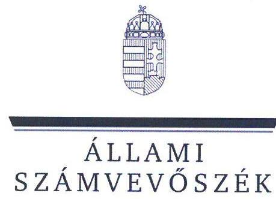
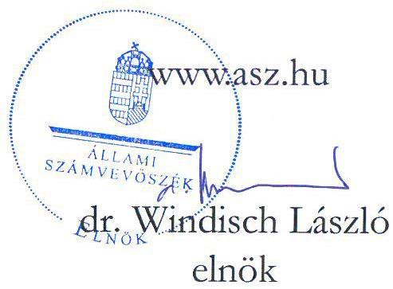
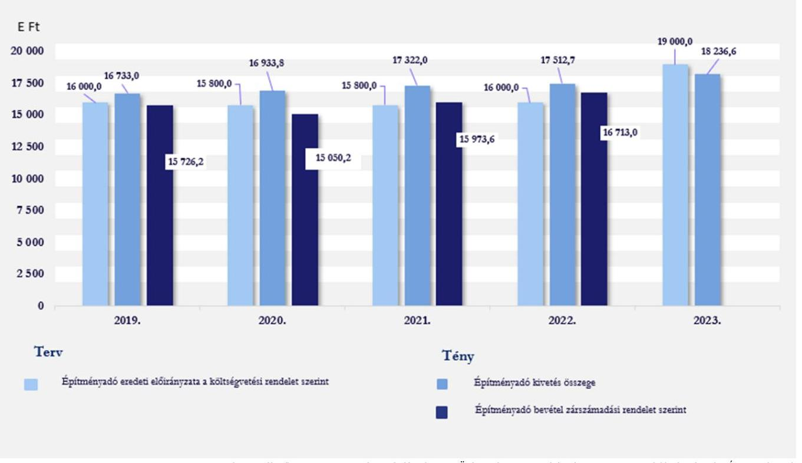
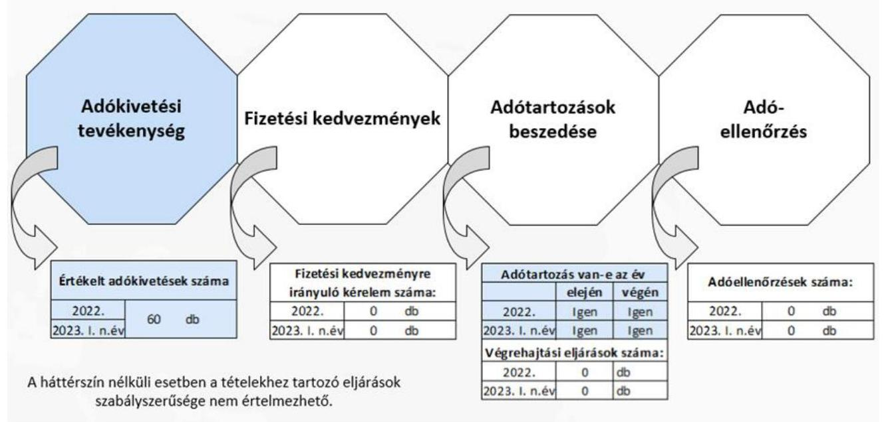
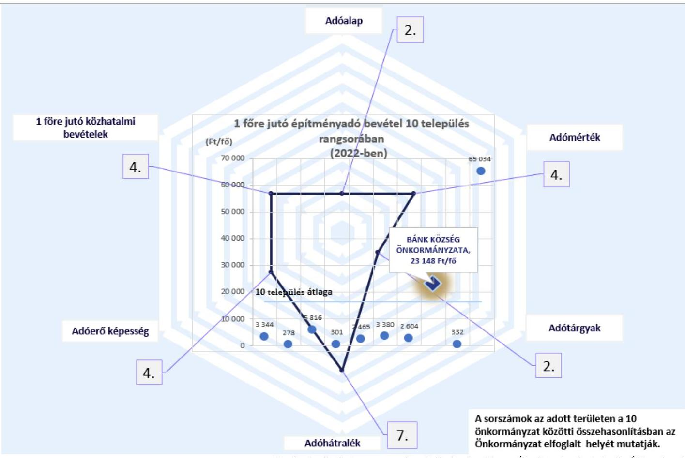

# JELENTÉS 

## Az önkormányzatok helyi adóztatási tevékenységének ellenőrzése Építményadóztatás

Bánk Község Önkormányzata

2023.

---

ÁLLAMI
SZÁMVEVŐSZÉK

# JELENTÉS 

## Az önkormányzatok helyi adóztatási tevékenységének ellenőrzése Építményadóztatás

Bánk Község Önkormányzata

2023.

23067

---

# ELLENŐRZÉSI IGAZGATÓSÁG: 

## ÁLLAMHÁZTARTÁS HELYI SZINTJÉT ELLENŐRZŐ IGAZGATÓSÁG

ELLENŐRZÉSI IGAZGATÓ:
KISGERGELY ISTVÁN igazgató

ELLENŐRZÉSVEZETŐ:
Jelentéseink az interneten a www.asz.hu címen olvashatók.

BŐRŐCZ IMRE ellenőrzésvezető

IKTATÓSZÁM: EL-3839-004/2023.
TÉMASZÁM: 2672.
ELLENŐRZÉS-AZONOSÍTÓ SZÁM: V-1016

---

# TARTALOMJEGYZÉK 

- AZ ELLENŐRZÉS ALAPADATAI ..... 5
- AZ ELLENŐRZÖTT SZERVEZET ..... 7
- ÖSSZEFOGLALÁS ..... 8
- AZ ELLENŐRZÉS FÓKUSZKÉRDÉSEI ..... 10
- MEGÁLLAPÍTÁSOK ..... 11
- JAVASLATOK ..... 18
- MELLÉKLETEK ..... 19
I. sz. melléklet: Értelmező szótár ..... 19
II. sz. melléklet: Az ellenőrzött szervezetek jegyzéke ..... 21
III. sz. melléklet: Ellenőrzési kritériumok ..... 22
IV. sz. melléklet: Az országban hasonló állandó lakosságszámú 10 település összehasonlítása az építményadóra vonatkozóan ..... 23
- FÜGGELÉK: ÉSZREVÉTELEK ..... 24
- RÖVIDÍTÉSEK JEGYZÉKE ..... 25

---

.

---

# AZ ELLENŐRZÉS ALAPADATAI 

## AZ ELLENŐRZÉS CÉLJA

Az ellenőrzés célja annak értékelése volt, hogy a Bánk Község Önkormányzata által bevezetett építményadót érintő önkormányzati döntések, helyi szabályozások a vonatkozó törvényekkel összhangban álltak-e. Az önkormányzati építményadó bevételek változása hogyan befolyásolta a helyi adópolitikai célok megvalósulását, a helyi adóztatás eredményét. A Borsosberényi Közös Önkormányzati Hivatal jegyzője építményadóztatással összefüggő feladatainak teljesítése és kapcsolódó hatásköreinek gyakorlása megfelelő volt-e, eredménye az ellenőrzött időszakban javult-e.

## AZ ELLENŐRZÉS TÍPUSA

Megfelelőségi ellenőrzés.

## AZ ELLENŐRZÖTT IDŐSZAK

Az 1. és 2. fókuszkérdések tekintetében a 2019. év - mint bázisév - és a 2023. év március 31. napjáig tartó időszak. A 3. és 4. fókuszkérdések tekintetében a 2022. év és a 2023. év március 31. napjáig tartó időszak.

## AZ ELLENŐRZÉS TÁRGYA

Az Önkormányzat építményadóztatással kapcsolatos tevékenységének ellátása. Az ÁSZ ellenőrzése kiterjedt a helyi adórendelet megalkotására, az adóztatással összefüggő helyi szabályozásokra és az önkormányzati adóhatósági tevékenység esetében az adóigazgatási feladatok közül az adók kivetésének megfelelőségére, a végrehajtás, valamint az adóellenőrzés elmaradásának megállapítására. Kiterjedt továbbá az ellenőrzés az építményadóztatás igazgatási feladatai ellátásának Önkormányzat által biztosított feltételeiben történt változtatás bemutatására, valamint a belső kontrollok egyes elemeinek kiépítésére és működtetésére. Az ellenőrzött időszak vonatkozásában, az építmény adónemhez kapcsolódó fizetési kedvezmény kérelem hiányában e terület értékelésére nem került sor.

Az ellenőrzés kiterjedt minden olyan körülményre és adatra, amely az ÁSZ jogszabályban meghatározott feladatainak teljesítéséhez, valamint az ellenőrzési program végrehajtása folyamán felmerült újabb összefüggések feltárásához szükséges volt.

## AZ ELLENŐRZÉS JOGALAPJA

Az ellenőrzés jogszabályi alapját az ÁSZ tv. 4. § (8) bekezdése előírásai képezték.

---

# AZ ELLENŐRZÉS MÓDSZERE 

Az ellenőrzést az Alaptörvény 43. cikk (1) bekezdésében meghatározott törvényességi, célszerűségi szempontok, valamint az ellenőrzési program szempontjai, az ellenőrzött időszakban hatályos jogszabályok, előírások, az ellenőrzés általános szakmai szabályai, az ellenőrzésre irányadó ÁSZ módszertanok figyelembevételével végezte az ÁSZ. Az ellenőrzési kérdések megválaszolásához szükséges bizonyítékok megszerzése az ellenőrzött szervezet által rendelkezésre bocsátott dokumentumokra, adatokra alapozva kérdésfeltevés (információkérés), helyszíni szemle, interjú útján történt. Az adókivetések szabályszerűségét az ellenőrzés során végzett kockázatalapú kiválasztás lehetőségét fenntartva - egyszerű véletlen mintavételi eljárással kiválasztott tételek alapján ellenőrizte az ÁSZ. Az építményadó kivetések értékelése a 2022-2023. években 30-30 db mintatétel ellenőrzésével történt.

Az ellenőrzés az egyes területek szabályszerűségének, megfelelőségének értékelését a III. sz. mellékletben megjelölt kritériumok alapján végezte el.

Az ÁSZ értékelte, viszonyította az Önkormányzat építményadóval kapcsolatos egyes adatait, mutatószámait más hasonló településekhez. Olyan települések egyes adataival végzett összehasonlítást az ÁSZ, amelyek szintén bevezették az építményadót és közel azonos lélekszámúak (a népességszám esetében a csoportképzés alapja Bánk 2022. január 1-jei állandó lakosságának száma +/-1 %-os eltérés figyelembevételével került megállapításra). A fenti feltételeknek az Önkormányzattal együtt Magyarországon 10 település felelt meg.

Ellenőrzési bizonyítékként felhasználható adatforrások közé tartoztak egyrészt az ellenőrzési programban felsorolt adatforrások, másrészt az ellenőrzés folyamán feltárt, az ellenőrzés szempontjából információt tartalmazó dokumentum.

---

# AZ ELLENŐRZÖTT SZERVEZET 

Az Alaptörvény 31. cikk (1) bekezdése értelmében Magyarországon a helyi közügyek intézése és a helyi közhatalom gyakorlása érdekében helyi önkormányzatok működnek.

A 2023. január 1-én 720 fő állandó lakosú Bánk Nógrád vármegyében, a rétsági járásban található település. A 2023. évi adatok szerint az építményadóval érintett adótárgyak száma 559, az adóalanyok száma 1079 volt. Az ellenőrzött időszakban a községet a polgármesterrel együtt 5 fős képviselő-testület irányította. A közös Hivatal látta el az Önkormányzat, valamint további két önkormányzat működésével kapcsolatos feladatokat, amelyek közül csak az Önkormányzat vezetett be építményadót. A közös Hivatal nem tagolódott önálló belső szervezeti egységekre, a 2022. évben összesen 12 fő köztisztviselőt alkalmaztak a hivatali feladatok ellátására. A közös Hivatalhoz tartozó önkormányzatok állandó lakosainak száma 2023. január 1-jén összesen 2406 fő volt. Az ellenőrzött időszakban a polgármester személye 2019. október 13-án változott. A jelenlegi jegyző 2022. április 19-e óta van hivatalban, a feladatkörébe tartozik az adóigazgatási tevékenység belső szabályainak meghatározása. Az Önkormányzat tekintetében az adóigazgatási feladatokat a közös Hivatal Bánki Kirendeltségén dolgozó, egy fő adóigazgatási munkakört betöltő köztisztviselő végezte.

A helyi önkormányzat a helyi közügyek intézése körében a törvény keretei között dönt a helyi adók fajtájáról és mértékéről. Ezzel összhangban a Mötv. rögzíti, hogy a helyi adóval kapcsolatos feladatok ellátása a helyi önkormányzatok feladata. A Hatásköri tv., valamint a Htv. értelmében a helyi adók bevezetéséről a települési önkormányzat képviselő-testülete dönt rendelettel. Rögzíti továbbá, hogy az önkormányzatok adómegállapítási joga kiterjed az adó bevezetésére, a már bevezetett adó hatályon kívül helyezésére, illetőleg módosítására, az adó mértékének a törvényi keretek közötti megállapítására, a törvényben meghatározott mentességeken, kedvezményeken túli további mentességek, kedvezmények biztosítására, valamint a Htv., az Art., az Air. keretei között az adózás részletes szabályainak meghatározására. A Hatásköri tv. és az Air. előírja, hogy adóügyekben elsőfokú hatósági jogkörben a település jegyzője, mint önkormányzati adóhatóság jár el.

A képviselő-testület a helyi adók közül az építményadó mellett a magánszemélyek kommunális adóját, az idegenforgalmi adót és a helyi iparűzési adót vezette be. Az Önkormányzat helyi adóból származó bevételei közül a költségvetési bevételeken belül a 2019-2020. években a helyi iparűzési adó, a 2021-2022. években az építményadó bevétel aránya volt a meghatározóbb. Az Önkormányzat építményadóból származó költségvetési bevétele a 2019-2022. években összesen 63 463,0 E Ft volt, a legmagasabb összegű bevétele a 2022. évben volt. A képviselő-testület a helyi adók közül az építményadót az 1992. évben vezette be, az építményadó mértéke a 2023. évben változott, 650 Ft/m²-ről 800 Ft/m²-re emelkedett.

Az ellenőrzött időszakban az Önkormányzatnak hosszú és rövid lejáratú, továbbá likviditási célú hitele, kölcsöne nem volt, 90 napon túl lejárt kötelezettséggel nem rendelkezett. Az időszakok végi likviditási gyorsráta - a 2021. év kivételével - 100% feletti volt, vagyis a rendelkezésre álló pénzeszközök a kötelezettségek fedezetére elegendők voltak, az Önkormányzat likviditása biztosított volt.

---

# ÖSSZEFOGLALÁS 

Az ÁSZ ellenőrzési tevékenysége keretében általános hatáskörrel ellenőrzi a helyi önkormányzatok adóztatási tevékenységét. Az adóbevételek képezik az önkormányzatok saját bevételének jelentős részét. A helyi adók önkormányzati gazdálkodásban betöltött fontos szerepét jelzi, hogy a 2019. évben a helyi önkormányzatok összes költségvetési bevételének 34,5%-át, a 2020. évben 32,5%-át, a 2021. évben 31,1%-át és a 2022. évben 31,6%-át a helyi adóbevételek jelentették. A helyi iparűzési adó a helyi adók között, az abból származó adóbevétel szempontjából a legmeghatározóbb volt, melyet az ÁSZ 2022-ben ellenőrzött. Ezt követi a sorban az építményadó, amelyet az önkormányzatok közel egyharmada vezetett be. Ez indokolta az önkormányzatok építményadóztatással kapcsolatos tevékenységének ellenőrzését, mely az Önkormányzat ellenőrzésére is kiterjedt.

A 2019-2023. években az Önkormányzat a helyi adórendeletében a jogszabályban foglaltól eltérő fogalmak alkalmazásából eredően a törvényi értelmező rendelkezéseket leszűkítve nem minden helyben előforduló adótárgyra határozott meg adómértéket. A reklámhordozókra bevezetett építményadó kötelezettséget hatályon kívül helyező jogszabályi előírás ellenére a helyi adórendeletben a reklámhordozókra vonatkozó előírást a 2020. július 15. és 2023. augusztus 11. közötti időszakban nem helyezték hatályon kívül, így az más jogszabállyal ellentétes szabályozást tartalmazott. Az Önkormányzat helyi adó rendeletében a jogszabályi előírás alapján nem mentesítette az építményadó alanyát az adatbejelentési kötelezettség alól, amennyiben az adóalanyt adófizetési kötelezettség az építményadó vonatkozásában nem terhelte.

A képviselő-testület a jogszabályban előírtaknak nem tett eleget, mivel a jegyző beszámoltatása útján az adóztatást nem ellenőrizte.

A jegyző az ellenőrzött időszakban a jogszabályi előírásoknak megfelelően az építményadóztatást érintő belső szabályokat alapvetően kialakította. Ugyanakkor az adóigazgatási tevékenységekre vonatkozó ellenőrzési nyomvonalakat a jogszabályi előírás ellenére nem tartalmazta belső szabályozás.

Az önkormányzati adóhatóság a 2019-2020. években az éves költségvetésben tervezett építményadó bevételeket a 2019. évben 98,3%-ban, a 2020. évben 95,3%-ban szedte be. Az Önkormányzat a 2019-2023. éves költségvetési rendeleteiben a jogszabályban foglaltaknak megfelelően az építményadó bevételre az eredeti előirányzatokat megtervezte.

A közös Hivatal a jogszabályi előírás ellenére az ellenőrzött időszakban az éves költségvetési beszámolóiban kormányzati funkció szerint az adóigazgatási tevékenységgel összefüggő kiadási adatokat és a kapcsolódó átlagos statisztikai létszámadatokat nem szerepeltette. A közös Hivatal adatszolgáltatása alapján a helyi adóbevételekhez viszonyítottan az adóigazgatási működési kiadás 8,5%-os költséghányadot jelentett.

Az önkormányzati adóhatóság a jogszabályi előírás ellenére a határozathozatalra vonatkozó ügyintézési határidő betartásáról a 2022. évben nem teljeskörűen gondoskodott. Az építményadó összegének meghatározása, az ellenőrzött kivetési határozatok tartalma, kiadmányozása, közlésének módja megfelelt a jogszabály előírásainak.

Az ellenőrzött időszakban az önkormányzati adóhatóság a jogszabály előírása ellenére végrehajtási eljárást nem indított. A jogszabályi kötelezettségek teljesítésének előmozdítása érdekében az önkormányzati adóhatóság adóellenőrzést nem végzett. Ezáltal a végrehajtási eljárások és az adóellenőrzések nem járultak hozzá az adóigazgatási tevékenység bevételekben mérhető eredményének javításához.

---

A jegyző kialakította és működtette a belső ellenőrzést a jogszabály előírása szerint. Az éves ellenőrzési tervekbe tervezett ellenőrzésként nem került be az elvégzett kockázatelemzés során magas kockázatúnak minősített adóztatási tevékenység. A belső ellenőrzés és külső ellenőrzési szervezet a helyi adóztatási tevékenységet a 2022-2023. években nem ellenőrizte.

Az önkormányzati adóhatóság a jogszabályban foglalt lehetőséggel élve a 2022-2023. években megkereste az ingatlanügyi hatóságot az építményadó kivetések ellenőrzése céljából történő adatszolgáltatás érdekében. Az ingatlanügyi hatóság adatszolgáltatása alapján a jegyző az adatbejelentési kötelezettség teljesítésére hívta fel az adózókat.

---

# AZ ELLENŐRZÉS FÓKUSZKÉRDÉSEI 

1. Az önkormányzat építményadóval kapcsolatos rendelete és az önkormányzati adóhatóság tevékenysége támogatta-e az adóbevételek beszedését, a településfejlesztési és az adópolitikai célkitűzések megvalósítását?
2. Az építményadóztatás igazgatási feladatai ellátásának önkormányzat által biztosított feltételeiben és adóhatósági gyakorlatában történt-e változtatás?
3. Az önkormányzati adóhatóság megfelelően látta-e el az építményadóval kapcsolatos egyes adóhatósági tevékenységeit?
4. Az építményadóztatás egyes adóhatósági tevékenységeinek megfelelő ellátását a belső kontrollrendszer egyes elemeinek kiépítése és működtetése elősegítette-e?

---

# MEGÁLLAPÍTÁSOK 

## 1. Az önkormányzat építményadóval kapcsolatos rendelete

 és az önkormányzati adóhatóság tevékenysége támogatta-e az adóbevételek beszedését, a településfejlesztési és az adópolitikai célkitűzések megvalósítását?

| Összegző megállapítás | Az Önkormányzat helyi adó rendelete a Htv. előírásainak   nem felelt meg, mivel nem minden helyben előforduló   adótárgyra határozott meg adómértéket, továbbá a   reklámhordozókra vonatkozóan a Htv. előírásával ellentétes   szabályozást tartalmazott a 2020. július 15. és a   2023. augusztus 11. közötti időszakban. A 2019-2020. években   az adóbeszedések eredménye nem biztosította   a   költségvetésben tervezett építményadó bevételek elérését. |
| :--: | :--: |

A helyi adórendelet tartalmazta a Htv. felhatalmazása alapján az építményadózás szabályait. Az építményadó adóalapját a Htv.-ben foglaltaknak megfelelően az építmény $\mathrm{m}^{2}$-ben számított hasznos alapterületében határozták meg.
Az Önkormányzat a helyi adó rendeletében az Art. 2. melléklet II/A/4. pontja alapján nem mentesítette az építményadó alanyát az adatbejelentési kötelezettség alól, amennyiben az adóalanyt adófizetési kötelezettség az építményadó vonatkozásában nem terhelte.
Adómértéket a Htv. 11. § (1) bekezdésében foglaltak ellenére nem állapított meg az Önkormányzat az illetékességi területén lévő minden építményre. Az építményadó-tárgyak körét a Htv. konkrétan rögzíti, attól való eltérést a települési adórendelet nem fogalmazhat meg. A helyi adórendelet 2. § (2) bekezdés a) pontjában a lakóházra és üdülőre állapított meg adómértéket. A Htv. 52. § 8. pontja viszont a lakás fogalmat rögzítette, amely magában foglalja a 1993. évi LXXVIII. törvény ${ }^{17}$ 91/A. §-a 1-6. pontjában foglaltak alapján ilyennek minősülő és az ingatlan-nyilvántartásban lakóház, lakóépület, lakás, kastély, villa, udvarház megnevezéssel nyilvántartott ingatlant. A helyi adórendelet 2. § (2) bekezdés a) pontjában foglalt rendelkezés nem minden a lakás fogalmába tartozó adótárgyra határozott meg adómértéket, így a helyi adórendelet az adótárgyak körét a Htv. 52. § (8) pontjában foglaltak ellenére leszűkítette. Azon adótárgyak esetében, ahol adómértéket a helyi adórendelet nem rögzít (ilyennek minősülnek a lakásnak minősülő épületek közül azok, amelyek nem lakóházak, illetve bizonyos nem lakás céljára szolgáló épületek, a nem az adóalany által használt mezőgazdasági épületek, a vállalkozó tulajdonában álló ingatlanok egy része), az építményadó-kötelezettség a településen - a Htv. keretszabályait konkretizáló rendeleti előírás hiányában - ténylegesen nem állt fenn.

A reklámhordozókra a képviselő-testület által bevezetett építményadó kötelezettséget a 2020. évi LXXVI. törvény ${ }^{18} 4 . \S$ (1) bekezdése 1. pontja hatályon kívül helyezte 2020. július 15. napjától. A képviselő-testület a helyi adórendeletben 2023. augusztus 11. napjától helyezte hatályon kívül a

---

reklámhordozók adókötelezettségére vonatkozó rendelkezést. Így volt olyan időszak, amikor az önkormányzati rendelet más jogszabállyal ellentétes szabályozást tartalmazott, ez pedig nem felelt meg az Alaptörvény 32. cikk (3) bekezdésében foglaltaknak. Az önkormányzati adóhatóság a 2020-2022. években nem vetett ki építményadót a reklámhordozókra.
Az ÁSZ a helyi adórendelettel kapcsolatos megállapításairól a törvényességi felügyeleti jogkört gyakorló területileg illetékes Kormányhivatalt ${ }^{19}$ tájékoztatja.
A képviselő-testület nem tett eleget a Hatásköri tv. 138. § (3) bekezdés g) pontjában előírtaknak, mivel a jegyző beszámoltatása útján az adóztatást nem ellenőrizte.
Az építményadó köteles építmények m²-ben számított hasznos alapterületének változása hatással volt az építményadó kivetésének összegére. Az összesített adóalap az ellenőrzött időszakban egyes éveiben folyamatosan emelkedett, a 2019. évi $30689,9 \mathrm{~m}^{2}$-ről a 2020. évben $30882,9 \mathrm{~m}^{2}$-re 0,6 %-kal, a 2020. évi adathoz képest a 2021. évben 3,1 %-kal $31853,2 \mathrm{~m}^{2}$-re, a 2021. évi adathoz képest a 2022. évben 1,1 %-kal $32214,7 \mathrm{~m}^{2}$-re, illetve az előző évhez képest a 2023. évben 0,3 %-kal $32224,7 \mathrm{~m}^{2}$-re.

1. ábra

Az építményadó költségvetési előirányzatai, adókivetései (2019-2023.), valamint a költségvetési bevételi adatai (2019-2022.)

Forrás: Az ellenőrzött szervezet adatszolgáltatása, az Önkormányzati rendeletek Nemzeti Jogszabálytár alapján ÁSZ szerkesztés
Az építményadó eredeti előirányzatát az Önkormányzat a 2019-2023. éves költségvetési rendeleteiben megtervezte. Az 1. ábra azt mutatja, hogy az építményadó eredeti előirányzata a 2019. évben 98,3 %-ban, a 2020. évben 95,3 %-ban, a 2021. évben 101,1 %-ban, a 2022. évben 104,5 %-ban teljesült.
Az építményadó bevétel a 2023. I. negyedévében a zárási összesítő alapján 9 877,4 E Ft-ra teljesült, amely az eredeti előirányzat 52,0 %-a volt, tekintettel az Art. 3. mellékletben meghatározottakra, miszerint az

---

adózó az építményadót a naptári évben félévenként, március hónap tizenötödik napjáig, valamint szeptember hónap tizenötödik napjáig fizeti meg.
Az Önkormányzat a 2020. évi költségvetési rendeletében az építményadó bevétel eredeti előirányzatát nem módosította. Az Önkormányzat az építményadó bevétel eredeti előirányzatát az év végén a teljesítéshez közeli összegre módosította, a 2019. évi költségvetési rendeletében 16000 E Ft-ról 15750 E Ft-ra csökkentette, míg a 2021. évi költségvetési rendeletében 15800 E Ft-ról 15985 E Ft-ra, a 2022. évi költségvetési rendeletében 16000 E Ft-ról 16525 E Ft-ra növelte.
Az építményadó előíráshoz képest a 2019-2022. években az építményadó bevételek összege elmaradt, amelynek mértéke a 2019. évben 6,0 %, a 2020. évben 11,1 %, a 2021. évben 7,8 %, a 2022. évben 4,6 % volt.

Az építményadó tartozások összege a 2019-2022. években folyamatosan nőtt a 2019. évről a 2023. évre 23,3 %-kal (2019. január 1-én 7 739,3 E Ft, 2023. március 31-én esedékes 9 544,4 E Ft volt), a hátralékos adózók száma pedig 40 %-kal növekedett (2019. január 1-jén 60 fő, 2023. január 1-jén 84 fő volt). Az ellenőrzött időszakban méltányosság vagy elévülés jogcímen építményadó előírást nem töröltek. Az országban hasonló állandó lakosságszámú 10 település összehasonlításában az Önkormányzat egy főre jutó építményadó bevétele - 23148,0 Ft - a második volt. Az Önkormányzat építményadóval kapcsolatos egyes adatai, mutatószámai hasonló településekkel történő összehasonlítását a IV. sz. melléklet mutatja be.
Anyagi érdekelttségi rendszert az Önkormányzat az ügykörébe tartozó adók hatékony beszedésének elősegítése érdekében nem működtetett.
Az Önkormányzat helyi adópolitikai céljai a 2019-2024. évekre vonatkozó gazdasági programjában kerültek meghatározásra, a pénzügyi és adópolitikai célok között az egyértelmű és kiszámítható szabályozást, a vagyonarányos adóztatást, a helyi adóztatás nyilvánosságának fokozását, a jogkövető magatartás és az adómorál javítását jelölték meg. A célok között nem határozták meg az építményadó meghatározott kiadásokra történő felhasználásának kötöttségét. Az ellenőrzött időszakban nem volt olyan pályázati vagy fejlesztési cél, amelyben a beruházási célok forrásaként az építményadó bevételt nevesítették volna.

---

# 2. Az építményadóztatás igazgatási feladatai ellátásának önkormányzat által biztosított feltételeiben és adóhatósági gyakorlatában történt-e változtatás? 

Összegző megállapítás Az építményadóztatás igazgatási feladatai ellátásának önkormányzat által biztosított feltételei és adóhatósági gyakorlata az ellenőrzött időszakban nem változott. A 15/2019. (XII. 7.) PM rendeletben foglaltak ellenére a közös Hivatal az éves költségvetési beszámolóiban az adóigazgatási tevékenységgel összefüggő kiadásokat és a kapcsolódó átlagos statisztikai létszámokat kormányzati funkció szerint nem mutatta ki.

Az adóigazgatási feladatellátás személyi, informatikai feltételeit a közös Hivatal az ellenőrzött időszakban változatlanul biztosította. Az Önkormányzat adóigazgatással kapcsolatos feladatait felsőfokú végzettséggel rendelkező adóügyi előadó a közös Hivatal Bánki Kirendeltségén látta el.
Az adózókkal való kapcsolattartást, az információs kapcsolatokat kiépítették, gyakorlatát kialakították, amely az ellenőrzött időszakban nem változott. A helyi adókkal kapcsolatos rendszeresített bevallási, adatbejelentési, bejelentkezési nyomtatványokat az Önkormányzat honlapján közzétették, valamint az E-önkormányzat portálon keresztül biztosították az adóügyekkel kapcsolatos elektronikus ügyintézéshez szükséges szolgáltatásokat. Az ellenőrzött időszakban megtartott közmeghallgatások során a polgármester a 2019. évben adott tájékoztatást az adóztatás, adóbevételek témakörében.
A postai és kommunikációs költségek a helyi adóztatást érintően nem kerültek kimutatásra, valamennyi postaköltség az egyéb szolgáltatások kiadási előirányzat terhére került kifizetésre. A kormányzati funkció (011220 Adó-, vám- és jövedéki igazgatás) szerint az Áht. 4. § (4) bekezdésében, továbbá a 15/2019. (XII. 7.) PM rendelet 3. § (1) és a 6. § (2) bekezdéseiben, valamint az 1. és 2. számú mellékletben előírtak ellenére a közös Hivatal az éves költségvetési beszámolóiban az adóigazgatási tevékenységgel összefüggő kiadásokat és a kapcsolódó átlagos statisztikai létszámokat nem mutatta ki.
Az adóigazgatási feladatellátásra fordított összes működési kiadás összege a 2022. évben 6 237,0 E Ft volt, az adóigazgatási tevékenységéhez kapcsolódó három önkormányzat helyi adóbevétele összesen 73 348,7 E Ft volt, amelyből az Önkormányzat helyi adóbevétele 38 988,5 E Ft volt. A közös Hivatal esetében 1000 Ft adóbevételre 85,0 Ft adóigazgatási működési kiadást fordítottak, ami 8,5 %-os költséghányadot jelent a beszedett adókhoz viszonyítva.

---

# 3. Az önkormányzati adóhatóság megfelelően látta-e el az építményadóval kapcsolatos egyes adóhatósági tevékenységeit? 

Összegző megállapítás Az önkormányzati adóhatóság az építményadóval kapcsolatos adóhatósági tevékenységeit nem megfelelően látta el, mivel a 2022. évben az Air. szerinti határozathozatal idejére vonatkozó ügyintézési határidőt a kivetési határozatok 6,7 %-ánál nem tartotta be, továbbá végrehajtási eljárást nem indított. Az önkormányzati adóhatóság adóellenőrzést az építményadóval kapcsolatban nem végzett.

Az építményadóztatással kapcsolatos önkormányzati adóigazgatási feladatok számvevőszéki ellenőrzés megállapításainak tartalmát befolyásoló egyes adatainak alakulását mutatja be a 2. ábra.
2. ábra

Az adóigazgatási feladatok számvevőszéki ellenőrzés megállapításainak tartalmát befolyásoló egyes adatainak alakulása

Forrás: Az ellenőrzött szervezet adatszolgáltatása alapján ÁSZ szerkesztés
Az építményadó kivetéséről határozattal döntött minden mintatétel esetében az önkormányzati adóhatóság. Az Air.-ben foglaltaknak megfelelően a kivetési határozatok tartalmazták az önkormányzati adóhatóság, az adózó és az ügy azonosításához szükséges adatokat, az adóhatóság döntését, a jogorvoslat igénybevételével kapcsolatos tájékoztatást, a határozat indokolását, a döntéshozatal helyét és idejét, a hatáskör gyakorlójának nevét, hivatali beosztását, valamint a döntés kiadmányozójának a nevét. Az adózók adatbejelentésében szereplő adatok alapul vételével döntött az önkormányzati adóhatóság az adó alapjáról és a helyi adórendelet előírásait betartva a fizetendő építményadó összegéről. A Htv.-ben foglaltaknak megfelelően az adókötelezettséget érintő változást követő év első napjától kötelezte az önkormányzati adóhatóság az építményadó megfizetésére az adózókat.

---

A kivetési határozatok kiadmányozása és az adózókkal történő közlése az Air. előírásainak, valamint a belső szabályozásnak megfelelően történt.
A határozathozatal idejére előírt ügyintézési határidőt a 2022. évben az önkormányzati adóhatóság az adóigazgatási tevékenysége során az Air. 50. § (2) bekezdésében előírtak ellenére két kivetési határozat - a határozatok 6,7 %-a - tekintetében (a késedelem mértéke a 136/2. hrsz esetében 99 nap és a 654. hrsz esetében 107 nap) nem tartotta be.
Az építményadó tartozások beszedése érdekében a jegyző a 2022-2023. években az Avt. 30. § (1) bekezdésében foglaltak ellenére nem intézkedett. A végrehajtási intézkedések 2022. január 1-jét követő megindításának hiányában a hátralék a 2022. év végén az éves teljesített adóbevételhez viszonyítva 67,6 % volt. Az önkormányzati adóhatóság a tartozások megfizetésére az adósokat nem hívta fel. Az önkormányzati adóhatóság által nyilvántartott esedékes építményadó tartozás összege 2022. december 31-én 11 298,1 E Ft, 2023. március 31-én 9 544,4 E Ft volt.
Adóellenőrzést az önkormányzati adóhatóság az ellenőrzött időszakban az adótörvényekben és más jogszabályokban előírt kötelezettségek teljesítésének előmozdítása érdekében nem végzett.

# 4. Az építményadóztatás egyes adóhatósági tevékenységeinek megfelelő ellátását a belső kontrollrendszer egyes elemeinek kiépítése és működtetése
 elősegítette-e? 

Összegző megállapítás A belső kontrollrendszer egyes elemeinek kiépítése és működtetése nem volt megfelelő, mivel a jegyző az építményadóztatást érintő belső szabályozások kialakítása körében az ellenőrzési nyomvonal esetében nem határozta meg az adóigazgatási folyamatokra vonatkozó előírásokat. A belső ellenőrzés és a külső ellenőrzést végző szervezet a helyi adóztatási tevékenységet nem ellenőrizte.

AZ ADÓIGAZGATÁSI FELADATOK ELLÁTÁSÁNAK SZABÁLYAIT a 2022-2023. években a belső szabályzatokban a jogszabályi előírásoknak megfelelően rögzítették. A Hivatali SZMSZ ${ }^{20}$ megfelelt az Ávr. ${ }^{21}$-nek, mert tartalmazta a szervezeti felépítést és a működés rendjét, a szervezeti egységek megnevezését, a költségvetési szerv szervezeti ábráját.
A KIADMÁNYOZÁS RENDJÉT a jegyző a hatáskörébe tartozó adóigazgatási ügyekben az Mötv.-ben foglaltaknak megfelelően szabályozta.
A KÖLTSÉGVETÉSI SZERV ELLENŐRZÉSI NYOMVONALÁT a jegyző - az ellenőrzött időszakra vonatkozóan - elkészítette, azonban a Bkr. ${ }^{22}$ 6. § (3) bekezdésében foglaltak ellenére nem terjedt ki az adóigazgatás folyamataira.
A LAKOSSÁGOT TÁJÉKOZTATTA a jegyző a Hatásköri tv.-nek megfelelően az adójogszabályok előírásairól, valamint a Htv. előírásainak megfelelően az önkormányzat honlapján közzétette az adórendelet módosításokkal egységes szerkezetbe foglalt szövegét, valamint a rendszeresített bevallási, adatbejelentési, bejelentkezési nyomtatványokat és az elérhetőségi információkat. Az Önkormányzat, illetve a képviselő-testület a Htv., illetve a Hatásköri tv. előírásainak eleget téve a zárszámadási rendeleteiben a lakosságot a helyi adókból származó bevételek összegéről tájékoztatta.

---

A BELSŐ ELLENŐRZÉSI TEVÉKENYSÉG kialakításáról és működtetéséről az Áht. ${ }^{23}$-ben foglaltaknak megfelelően a jegyző gondoskodott.
A Bkr. előírásainak megfelelve a 2022. és a 2023. évekre vonatkozóan a képviselő-testület által elfogadott éves ellenőrzési tervekkel rendelkezett az ellenőrzött szervezet. Az éves ellenőrzési terveket megalapozó kockázatelemzés alapján mindkét évben magas kockázatú tevékenységként szerepelt az adócsoport munkájának ellenőrzése, az adózás rendje. Az éves ellenőrzési tervekbe tervezett ellenőrzésként nem került be az adóztatási tevékenység, annak ellenére, hogy a Bkr. 31. § (3) bekezdésében foglaltak szerint az elvégzett kockázatelemzés során magas kockázatúnak minősített területekre az éves ellenőrzési terv készítése során kiemelt figyelmet kell fordítani, és a lehető legrövidebb időn belül ellenőrizni kell.
A helyi adóztatási tevékenységet a belső ellenőrzés nem ellenőrizte, nem értékelte az önkormányzati adóhatóság működésének jogszabályoknak és szabályzatoknak való megfelelését.
Külső ellenőrzést végző szervezet által végzett ellenőrzés nem került lefolytatásra az ellenőrzött időszakban.
AZ INGATLANÜGYI HATÓSÁGOT ${ }^{24}$ az önkormányzati adóhatóság az Art.-ban foglalt lehetőséggel élve a 2022-2023. években megkereste az építményadó megállapítása (kivetése), ellenőrzése céljából történő adatszolgáltatás érdekében. Az ingatlanügyi hatóság adatszolgáltatása alapján a jegyző a 2022. évben 17 esetben, a 2023. évben egy esetben felszólította az érintett adózókat az adatbejelentési kötelezettség teljesítésére.
AZ ÉPÍTÉSÜGYI HATÓSÁG ${ }^{25}$ az Art. előírása alapján szolgáltatott adatot az önkormányzati adóhatóság részére. Az építésügyi hatóság adatszolgáltatása alapján az önkormányzati adóhatóság a 2022. évben három esetben hívta fel az adóalanyok figyelmét az adatbejelentési kötelezettségük megtételére.

---

# JAVASLATOK 

Az ÁSZ tv. 33. § (1) bekezdésében foglaltak értelmében az ellenőrzött szervezet vezetője köteles a jelentésben foglalt megállapításokhoz kapcsolódó intézkedési tervet összeállítani és azt a jelentés kézhezvételétől számított 30 napon belül az ÁSZ részére megküldeni. Amennyiben az ellenőrzött szervezet vezetője nem küldi meg határidőben az intézkedési tervet, vagy továbbra sem elfogadható intézkedési tervet küld, az Állami Számvevőszék elnöke az ÁSZ tv. 33. § (3) bekezdése a) és b) pontjaiban foglaltakat érvényesítheti.

## BÁNK KÖZSÉG ÖNKORMÁNYZATA POLGÁRMESTERE RÉSZÉRE

1. Intézkedjen az Állami Számvevőszék jelentésének ÁSZ általi nyilvánosságra hozatalát követően haladéktalanul a képviselő-testület elé terjesztéséről. A jelentést a napirend tárgyalásáról szóló jegyzőkönyvvel együtt tájékoztatásul küldje meg a Kormányhivatal részére is.

## BORSOSBERÉNYI KÖZÖS ÖNKORMÁNYZATI HIVATAL JEGYZŐJE RÉSZÉRE

1. Számoljon be az adóztatási tevékenységről a képviselő-testületnek, annak érdekében, hogy a képviselőtestület a Hatásköri tv. 138. § (3) bekezdés g) pontjában előírt, a jegyző beszámoltatása útján történő adóztatás ellenőrzési kötelezettségének eleget tudjon tenni.
2. Intézkedjen az Áht. 4. § (4) bekezdésében és a 15/2019. (XII. 7.) PM rendelet 3. § (1) bekezdésében, valamint az 1. mellékletben előírtak alapján az adóigazgatási tevékenységgel összefüggő kiadásoknak és a 15/2019. (XII. 7.) PM rendelet 6. § (2) bekezdésében és a 2. mellékletben előírtak alapján az átlagos statisztikai létszámadatoknak az arra kijelölt kormányzati funkcióra történő kimutatása érdekében.
3. Alakítson ki kontrollokat annak érdekében, hogy a jövőben biztosított legyen az Air. 50. § (2) bekezdésében előírt, a határozathozatal idejére vonatkozó ügyintézési határidő betartása.
4. Az adótartozások tekintetében az Avt. 30. § (1) bekezdése alapján az adótartozás végrehajtásához való jogát következetesen érvényesítse, az arra irányuló szükséges intézkedéseket tegye meg.
5. Intézkedjen, hogy a Bkr. 6. § (3) bekezdésében foglaltaknak megfelelően az ellenőrzési nyomvonalra vonatkozó belső szabályozás az önkormányzati adóigazgatást érintő ellenőrzési nyomvonalat tartalmazza.
6. Intézkedjen, hogy a Bkr. 31. § (3) bekezdésében foglaltak alapján az éves ellenőrzési terv készítése során a magas kockázatúnak minősített területek ellenőrzése a lehető legrövidebb időn belül megtörténjen.

---

# MELLÉKLETEK 

## I. SZ. MELLÉKLET: ÉRTELMEZŐ SZÓTÁR

adóellenőrzés
adóhatóság
adóhatósági ellenőrzés
adótartozás
adózó
építmény
építményadó
építményadó adóalanya
épület
épületrész
fizetési kedvezmény

Adóellenőrzés keretében az adóhatóság az adózó adómegállapítási, adatbejelentési, bevallási kötelezettsége teljesítését adónként, támogatásonként és időszakonként vagy meghatározott időszakra több adó és támogatás tekintetében is vizsgálja. (Forrás: Air. 90. § (1) bekezdés)
Az önkormányzat jegyzője, mint önkormányzati adóhatóság. (Forrás: Air. 22. § b) pont)
Az adóhatóság az adótörvényekben és más jogszabályokban előírt kötelezettségek teljesítésének vagy megsértésének megállapítása, a kötelezettségek teljesítésének előmozdítása érdekében ellenőrzést folytat. (Forrás: Air. 86. §)
Az esedékességkor meg nem fizetett adó és a jogosulatlanul igénybe vett költségvetési támogatás. (Forrás: Art. 7. §6. pont)
Az a személy, akinek vagy amelynek adókötelezettségét adót, költségvetési támogatást megállapító törvény, e törvény, az adózás rendjéről szóló 2017. évi CL. törvény (a továbbiakban: Art.) vagy önkormányzati rendelet előírja. (Forrás: Air. 11. § (1) bekezdés)
Építési tevékenységgel létrehozott, illetve késztermékként az építési helyszínre szállított, - rendeltetésére, szerkezeti megoldására, anyagára, készültségi fokára és kiterjedésére tekintet nélkül - minden olyan helyhez kötött műszaki alkotás, amely a terepszint, a víz vagy az azok alatti talaj, illetve azok feletti légtér megváltoztatásával, beépítésével jön létre, az építmény az épület és műtárgy gyűjtőfogalma. (Forrás: az épített környezet alakításáról és védelméről szóló 1997. évi LXXVIII. törvény 2. § 8. pontja)
Az önkormányzat illetékességi területén lévő építmények közül a lakás és a nem lakás céljára szolgáló épület, épületrész (a továbbiakban együtt: építmény) után fizetendő, az önkormányzat költségvetése javára megállapított adó. (Forrás: Htv. 11. § (1) bekezdés)
Az adó alanya - a Htv. 3. §-a alapján az a magánszemély, jogi személy, egyéb szervezet, a magánszemélyek jogi személyiséggel nem rendelkező személyi egyesülése - aki a naptári év (a továbbiakban: év) első napján az építmény tulajdonosa. Több tulajdonos esetén a tulajdonosok tulajdoni hányadaik arányában adóalanyok. Amennyiben az építményt az ingatlan-nyilvántartásba bejegyzett vagyoni értékű jog terheli, az annak gyakorlására jogosult az adó alanya. (A tulajdonos, a vagyoni értékű jog jogosultja a továbbiakban együtt: tulajdonos). Társasház, -garázs és -üdülő esetén a tulajdonosok önálló adóalanyok, a közös használatú helyiségek után az adó alanya az említett közösség. (Forrás: Htv. 12. §(1),(3) bekezdés)
Az épített környezet alakításáról és védelméről szóló törvény szerinti olyan építmény vagy annak azon része, amely a környező külső tértől szerkezeti elemekkel részben vagy egészben mesterségesen kialakított, elválasztott teret alkot és ezzel az állandó vagy időszakos tartózkodás, illetve használat feltételeit biztosítja, ideértve az olyan önálló létesítményt is, amely részben vagy teljes belmagasságával a környező csatlakozó terepszint alatt van; (Forrás: a Htv. 52. § 5. pontja)

Az épület önálló rendeltetésű, a szabadból vagy az épület közös közlekedőjéből nyíló önálló bejárattal ellátott helyisége vagy helyiség-csoportja, amely azzal felel meg lakásnak, üdülőnek, kereskedelmi egységnek, egyéb nem lakás céljára szolgáló épületnek, hogy az ingatlan-nyilvántartásban önálló ingatlanként nem szerepel. (Forrás: Htv. 52. § 6. pontja)
A fizetési halasztás, részletfizetés, valamint az adómérséklés. (Forrás: Art. 198.-201. §)

---

hasznos alapterület
információs és kommunikációs rendszer
kontrollkörnyezet
kontrolltevékenységek
nyomon követési rendszer (monitoring)
önkormányzat
önkormányzati hivatal

A teljes alapterületnek olyan része, ahol a belmagasság - a padlószint (járófelület) és az afelett levő épületszerkezet (födém, tetőszerkezet) vagy álmennyezet közti távolság legalább $1,90 \mathrm{~m}$. A teljes alapterületbe a lakáshoz, üdülőhöz tartozó kiegészítő helyiségek, melléképületek, melléképületrészek kivételével valamennyi helyiség összegzett alapterülete, valamint a többszintes lakrészek belső lépcsőjének egy szinten számított vízszintes vetülete is beletartozik. Az építményhez tartozó fedett és három oldalról zárt külső tartózkodók (lodzsa, fedett és oldalt zárt erkélyek), és a fedett terasz, tornác alapterületének $50 \%$-a tartozik a teljes alapterületbe. A lakások esetében a pinceszinten (a csatlakozó terepszint alatt) kialakított helyiségek alapterületének 70\%-át kell a teljes alapterületbe számítani. (Forrás: Htv. 52. § 9. pontja)
A költségvetési szerv vezetője által kialakított információtovábbítási csatornák rendszere, amelyben biztosított, hogy a megfelelő információk a megfelelő időben eljussanak az illetékes szervezethez, szervezeti egységhez, illetve személyhez. (Forrás: Bkr. 9. § (1) bekezdés)
A költségvetési szerv vezetője által kialakított olyan elvek, eljárások, belső szabályzatok összessége, amelyben világos a szervezeti struktúra, a folyamatok átláthatók, egyértelműek a felelősségi, hatásköri viszonyok és feladatok, meghatározottak, ismertek és elfogadottak az etikai elvárások a szervezet minden szintjén, átlátható a humánerőforrás-kezelés, biztosított a szervezeti célok és értékek irányában való elkötelezettség fejlesztése és elősegítése. (Forrás: Bkr. 6. § (1) bekezdés)
A költségvetési szerv vezetője által kialakított eljárások, amelyek biztosítják a kockázatok kezelését, hozzájárulnak a szervezet céljainak eléréséhez, és erősítik a szervezet integritását. (Forrás: Bkr. 8. § (1) bekezdés)
A költségvetési szerv vezetője által kialakított nyomon követési mechanizmusok rendszere, mely az operatív tevékenységek keretében megvalósuló folyamatos és eseti nyomon követésből, valamint az operatív tevékenységektől függetlenül működő belső ellenőrzésből állhat. (Forrás: Bkr. 10. §)
A helyi önkormányzat jogi személy. Az önkormányzati feladatok ellátását a képviselőtestület és szervei biztosítják. A képviselő-testület szervei: a polgármester, a főpolgármester, a (vár)megyei közgyűlés elnöke, a képviselő-testület bizottságai, a részönkormányzat testülete, a polgármesteri hivatal, a (vár)megyei önkormányzati hivatal, a közös önkormányzati hivatal, a jegyző, továbbá a társulás. A képviselő-testület a feladatkörébe tartozó közszolgáltatások ellátására - jogszabályban meghatározottak szerint - költségvetési szervet, a Polgári perrendtartásról szóló 2016. évi CXXX. törvény szerinti gazdálkodó szervezetet (a továbbiakban: gazdálkodó szervezet), nonprofit szervezetet és egyéb szervezetet (a továbbiakban együtt: intézmény) alapíthat, továbbá szerződést köthet természetes és jogi személlyel vagy jogi személyiséggel nem rendelkező szervezettel. (Forrás: Mötv. 41. § (1), (2), (6) bekezdései)
Az ellenőrzési programban önkormányzati hivatalként értelmezzük a polgármesteri hivatalt, a főpolgármesteri hivatalt, a (vár)megyei önkormányzati hivatalt és a közös önkormányzati hivatalt. (Forrás: Áht. 1. § 18. pont).

---

II. SZ. MELLÉKLET: AZ ELLENŐRZÖTT SZERVEZETEK JEGYZÉKE

# AZ ELLENŐRZÖTT SZERVEZET MEGNEVEZÉSE 

Bánk Község Önkormányzata
Borsosberényi Közös Önkormányzati Hivatal

---

# III. SZ. MELLÉKLET: ELLENŐRZÉSI KRITÉRIUMOK 

## FOKUSZKÉRDÉS

1. Az önkormányzat építményadóval kapcsolatos rendelete és az önkormányzati adóhatóság tevékenysége támogatta-e az adóbevételek
 beszédését, a településfejlesztési és az adópolitikai célkitűzések megvalósítását?
2. Az építményadóztatás igazgatási feladatai ellátásának önkormányzat által biztosított feltételeiben és adóhatósági gyakorlatában történt-e változtatás?
3. Az önkormányzati adóhatóság megfelelően látta-e el az építményadóval kapcsolatos egyes adóhatósági tevékenységeit?
4. Az építményadóztatás egyes adóhatósági tevékenységeinek megfelelő ellátását a belső kontrollrendszer egyes elemeinek kiépítése és működtetése elősegítette-e?

## ELLENŐRZÉSI KRITÉRIUMOK

Alaptörvény 32. cikk (3) bekezdés;
Htv. 1. § 1. bekezdés; 6. § c) pont, 11. § (1) bekezdés, 11/A. §, 13. §, 15. § a) pont, 16. § a) pont, 42/B. § (3) bekezdés, 45. §, 52. § 8. pont;
Hatásköri tv. 138. § (3) bekezdés a) és g) pont;
Mötv. 42. § (1) pont; 47. § (1) bekezdés, 50. §, 51. § bekezdés;
1993. évi LXXVIII. törvény 91/A. §-a 1-6. pontja;
2020. évi LXXVI. törvény 4. § (1) bekezdés 1) pont;

Art. 202. § (1) bekezdés, 2. melléklet II/A/4. pont, 3. melléklet II/A/4. pont;
Avt. 30. § (1) bekezdés;
15/2019. (XII. 7.) PM rendelet 3. § (1) bekezdés, 1. számú melléklet;
Mötv. 54. §;
Htv. 12. § (1)-(2) bekezdés;
Air. 50. § (2) bekezdés, 72. §, 73. § (1) bekezdés a) - d) pont, 76.-78. §, 86. §, 88. §;
Art. 141. § (2), 221. § (1) bekezdés a) pont;
Avt. 30. § (1) bekezdés;
A helyi adókról szóló 11/2015. (XI.24.) számú önkormányzati rendelet;
A kiadmányozás rendjének szabályozásáról szóló 3/2020. (X. 1.) számú jegyzői utasítás II. fejezet;

Ávr. 13. § (1) bekezdés e) pont, g) pont, (5) bekezdés;
Áht. 10. § (1) bekezdés;
Hatásköri tv. 138. § (3) bekezdés h) pont, 140. § (2) bekezdés i.) pont;
Htv. 8. § (1) bekezdés;
Mötv. 81. § (3) bekezdés j) pont;
Bkr. 3. § a), d) - e) pont, 6. § (3) bekezdés, 22. § (1) bekezdés b) pont, 31. § (3) bekezdés;
Art. 83. § (2) bekezdés, 86. § (1)-(2) bekezdés;

---

# IV. SZ. MELLÉKLET: AZ ORSZÁGBAN HASONLÓ ÁLLANDÓ LAKOSSÁGSZÁMÚ 10 TELEPÜLÉS ÖSSZEHASONLÍTÁSA AZ ÉPÍTMÉNYADÓRA VONATKOZÓAN 

A fajlagos mutató 2022. évi összegét és arra ható egyes tényezőket, továbbá a más önkormányzatokhoz viszonyított rangsoraiban elfoglalt helyezéseket a 3. ábra mutatja.
3. ábra

A 718-730 FŐ ÁLLANDÓ LAKOSSÁGSZÁMÚ, ÉPÍTMÉNYADÓT BEVEZETŐ 10 ÖNKORMÁNYZAT 2022. ÉVI ADATAINAK ÖSSZEHASONLÍTÁSA

Forrás: Az ellenőrzött szervezet adatszolgáltatása és a Magyar Államkincstár adatai alapján ÁSZ szerkesztés
A 10 önkormányzatból hét önkormányzat esetében az egy főre jutó építményadóbevétel emelkedő tendenciát mutatott a 2019. évről a 2022. évre. Az Önkormányzat esetében az egy főre vetített adatok minimális, 1,6%-os (356,5 Ft/fő) építményadóbevétel emelkedést mutattak. Valamennyi összehasonlított önkormányzatot figyelembe véve átlagosan 11,3%-kal növekedett az egy főre jutó építményadóbevétel. A 10 település közül hét mutatott ki adóhátralékot. Az Önkormányzat rendelkezett 2022. december 31-én a legtöbb adóhátralékkal (11 298,1 E Ft), ami az éves teljesített adóbevételének 67,6%-a volt.

A 2022. évben az Önkormányzat esetében az építményadó alapja (32 214,7 m²) a második, míg az építményadó mértéke (650 Ft/m²) a negyedik volt a csoportban. Az Önkormányzat 633 adótárggyal rendelkezett, amellyel a rangsorban a második helyet foglalta el. Az építményadó mértéke 31,9 Ft/m²-rel volt alacsonyabb az átlagnál.

Az Önkormányzat adóerő képessége 10 település iparűzési adóerő képessége átlagához viszonyítva 2 769,2 E Ft-tal több volt. Az Önkormányzat közhatalmi bevételein belül az építményadó bevétel volt a legmeghatározóbb, az egy főre jutó közhatalmi bevétel a negyedik volt a csoportban.

---

# FÜGGELÉK: ÉSZREVÉTELEK 

A jelentéstervezetet a Számvevőszék 15 napos észrevételezésre megküldte az ellenőrzött szervezetek vezetőinek az ÁSZ tv. 29. § (1) bekezdése előírásának megfelelően.

A jelentéstervezet megállapításaira az ellenőrzött szervezetek vezetői észrevételt nem tettek.

[^0]
[^0]:    * 29. § (1) Az Állami Számvevőszék az ellenőrzési megállapításait megküldi az ellenőrzött szervezet vezetőjének vagy az általa megbízott személynek, és annak, akinek személyes felelősségét állapította meg.
    (2) Az ellenőrzött szervezet vezetője és a felelősként megjelölt személy az ellenőrzés megállapításaira tizenöt napon belül írásban észrevételt tehet.
    (3) Az Állami Számvevőszék az észrevételre a beérkezésétől számított harminc napon belül írásban válaszol. A figyelembe nem vett észrevételeket köteles a jelentésben feltüntetni, és megindokolni, hogy azokat miért nem fogadta el.

---

# RÖVIDÍTÉSEK JEGYZÉKE 

${ }^{1}$ Önkormányzat
${ }^{2}$ ÁSZ
${ }^{3}$ helyi adórendelet
${ }^{4}$ ÁSZ tv.
${ }^{5}$ Alaptörvény
${ }^{6} 10$ település
${ }^{7}$ polgármester
${ }^{8}$ képviselő-testület
${ }^{9}$ közös Hivatal
${ }^{10}$ jegyző
${ }^{11}$ Mötv.
${ }^{12}$ Hatásköri tv.
${ }^{13}$ Htv.
${ }^{14}$ Art.
${ }^{15}$ Air.
${ }^{16}$ önkormányzati adóhatóság
${ }^{17}$ 1993. évi LXXVIII. törvény
${ }^{18}$ 2020. évi LXXVI. törvény
${ }^{19}$ Kormányhivatal
${ }^{20}$ Hivatali SZMSZ
${ }^{21}$ Ávr.
${ }^{22}$ Bkr.
${ }^{23}$ Áht.
${ }^{24}$ Ingatlanügyi hatóság
${ }^{25}$ Építésügyi hatóság

Bánk Község Önkormányzata
Állami Számvevőszék
11/2015. (XI.24.) számú önkormányzati rendelet a helyi adókról
2011. évi LXVI. törvény az Állami Számvevőszékről

Magyarország Alaptörvénye
Bánk Község Önkormányzata
Feketeerdő Község Önkormányzata
Kisfalud Község Önkormányzata
Gamás Község Önkormányzata
Alsónyék Község Önkormányzata
Bakonyjákó Község Önkormányzata
Garabonc Község Önkormányzata
Királd Község Önkormányzata
Sajópálfala Község Önkormányzata
Balatonakali Község Önkormányzata
Bánk Község Önkormányzatának polgármestere
Bánk Község Önkormányzatának Képviselő-testülete
Borsosberényi Közös Önkormányzati Hivatal
Borsosberényi Közös Önkormányzati Hivatal jegyzője
2011. évi CLXXXIX. törvény Magyarország helyi önkormányzatairól
1991. évi XX. törvény a helyi önkormányzatok és szerveik, a köztársasági
megbízottak, valamint egyes centrális alárendeltségű szervek feladat- és hatásköreiről
1990. évi C. törvény a helyi adókról
2017. évi CL. törvény az adózás rendjéről
2017. évi CLL törvény az adóigazgatási rendtartásról

Borsosberényi Közös Önkormányzati Hivatal jegyzője
1993. évi LXXVIII. törvény a lakások és helyiségek bérletére, valamint az elidegenítésükre vonatkozó egyes szabályokról
2020. évi LXXVI. törvény Magyarország 2021. évi központi költségvetésének megalapozásáról
Nógrád Vármegyei Kormányhivatal
Borsosberényi Közös Önkormányzati Hivatal Szervezeti és Működési Szabályzata
368/2011. (XII. 31.) Korm. rendelet az államháztartásról szóló törvény végrehajtásáról
370/2011. (XII. 31.) Korm. rendelet a költségvetési szervek belső kontrollrendszeréről és belső ellenőrzéséről
2011. évi CXCV. törvény az államháztartásról

Kormányhivatal Földhivatali Főosztály
Kormányhivatal Építésügyi és Örökségvédelmi Főosztály

---

1052 Budapest, Apáczai Csere János u. 10. | 1364 Budapest 4., Pf. 54
www.asz.hu | szamvevoszek@asz.hu
telefon: +36 14849100

