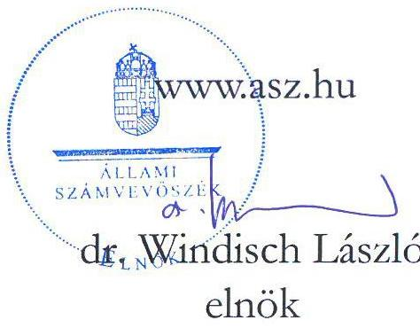
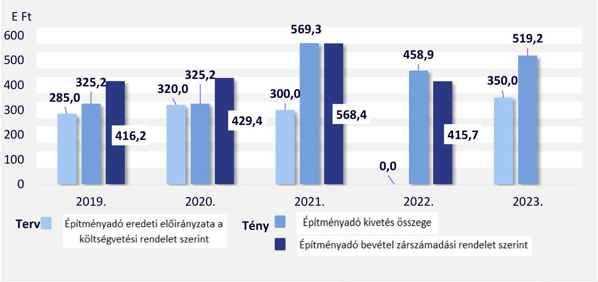
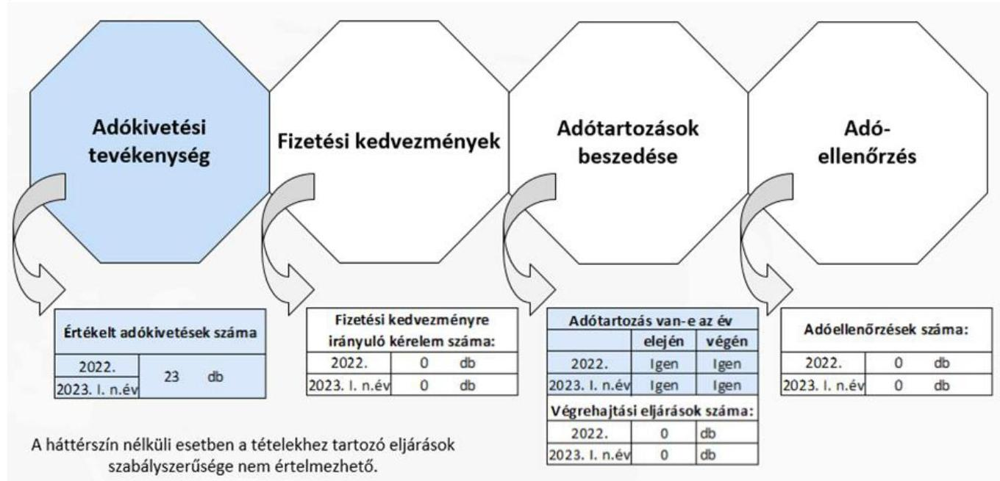
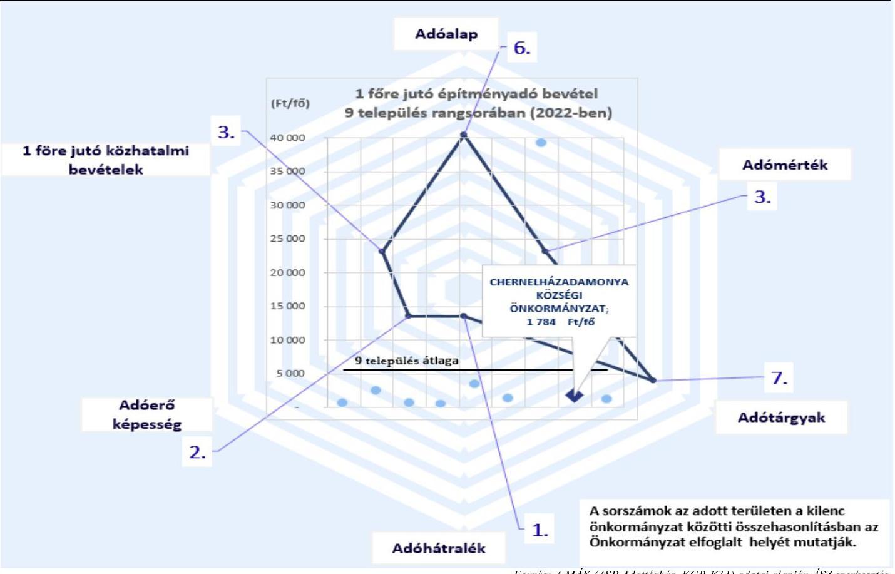

# JELENTÉS 

## Az önkormányzatok helyi adóztatási tevékenységének ellenőrzése Építményadóztatás

Chernelházadamonya Községi Önkormányzat

2023.

---

# JELENTÉS 

## Az önkormányzatok helyi adóztatási tevékenységének ellenőrzése Építményadóztatás

Chernelházadamonya Községi Önkormányzat

2023.

23068

---

# ELLENŐRZÉSI IGAZGATÓSÁG: 

## ÁLLAMHÁZTARTÁS HELYI SZINTJÉT ELLENŐRZŐ IGAZGATÓSÁG

ELLENŐRZÉSI IGAZGATÓ:
KISGERGELY ISTVÁN igazgató

ELLENŐRZÉSVEZETŐ:
Jelentéseink az interneten a www.asz.hu címen olvashatók.

BŐRŐCZ IMRE ellenőrzésvezető

IKTATÓSZÁM: EL-3839-005/2023.
TÉMASZÁM: 2672.
ELLENŐRZÉS-AZONOSÍTÓ SZÁM: V-1016

---

# TARTALOMJEGYZÉK 

- AZ ELLENŐRZÉS ALAPADATAI ..... 5
- AZ ELLENŐRZÖTT SZERVEZET ..... 7
- ÖSSZEFOGLALÁS ..... 8
- AZ ELLENŐRZÉS FÓKUSZKÉRDÉSEI ..... 10
- MEGÁLLAPÍTÁSOK ..... 11
- JAVASLATOK ..... 18
- MELLÉKLETEK ..... 19
I. sz. melléklet: Értelmező szótár ..... 19
II. sz. melléklet: Az ellenőrzött szervezetek jegyzéke ..... 21
III. sz. melléklet: Ellenőrzési kritériumok ..... 22
IV. sz. melléklet: Az országban hasonló állandó lakosságszámú kilenc település összehasonlítása az építményadóra vonatkozóan ..... 23
- FÜGGELÉK: ÉSZREVÉTELEK ..... 24
- RÖVIDÍTÉSEK JEGYZÉKE ..... 25

---

.

---

# AZ ELLENŐRZÉS ALAPADATAI 

## AZ ELLENŐRZÉS CÉLJA

Az ellenőrzés célja annak értékelése volt, hogy a Chernelházadamonya Községi Önkormányzat által bevezetett építményadót érintő önkormányzati döntések, helyi szabályozások a vonatkozó törvényekkel összhangban álltak-e. Az önkormányzati építményadó bevételek változása hogyan befolyásolta a helyi adópolitikai célok megvalósulását, a helyi adóztatás eredményét. A Bői Közös Önkormányzati Hivatal jegyzője építményadóztatással összefüggő feladatainak teljesítése és kapcsolódó hatásköreinek gyakorlása megfelelő volt-e, eredménye az ellenőrzött időszakban javult-e.

## AZ ELLENŐRZÉS TÍPUSA

Megfelelőségi ellenőrzés.

## AZ ELLENŐRZÖTT IDŐSZAK

Az 1. és 2. fókuszkérdések tekintetében a 2019. év - mint bázisév - és a 2023. év március 31. napjáig tartó időszak. A 3. és 4. fókuszkérdések tekintetében a 2022. év és a 2023. év március 31. napjáig tartó időszak.

## AZ ELLENŐRZÉS TÁRGYA

Az Önkormányzat ${ }^{1}$ építményadóztatással kapcsolatos tevékenységének ellátása. Az ÁSZ ${ }^{2}$ ellenőrzése kiterjedt a helyi adórendelet ${ }^{3}$ megalkotására, az adóztatással összefüggő helyi szabályozásokra és az önkormányzati adóhatósági tevékenység esetében az adóigazgatási feladatok közül az adók kivetésének megfelelőségére, a végrehajtás, valamint az adóellenőrzés elmaradásának megállapítására. Kiterjedt továbbá az ellenőrzés az építményadóztatás igazgatási feladatai ellátásának Önkormányzat által biztosított feltételeiben történt változtatás bemutatására, valamint a belső kontrollok egyes elemeinek kiépítésére és működtetésére. Az ellenőrzött időszak vonatkozásában, az építmény adónemhez kapcsolódó fizetési kedvezmény kérelem hiányában e terület értékelésére az ellenőrzés nem került sor.
Az ellenőrzés kiterjedt minden olyan körülményre és adatra, amely az ÁSZ jogszabályban meghatározott feladatainak teljesítéséhez, valamint az ellenőrzési program végrehajtása folyamán felmerült újabb összefüggések feltárásához szükséges volt.

## AZ ELLENŐRZÉS JOGALAPJA

Az ellenőrzés jogszabályi alapját az ÁSZ tv4. 5. § (8) bekezdése előírásai képezték.

---

# AZ ELLENŐRZÉS MÓDSZERE 

Az ellenőrzést az Alaptörvény ${ }^{5}$ 43. cikk (1) bekezdésében meghatározott törvényességi, célszerűségi szempontok, valamint az ellenőrzési program szempontjai, az ellenőrzött időszakban hatályos jogszabályok, előírások, az ellenőrzés általános szakmai szabályai, az ellenőrzésre irányadó ÁSZ módszertanok figyelembevételével végezte az ÁSZ. Az ellenőrzési kérdések megválaszolásához szükséges bizonyítékok megszerzése az ellenőrzött szervezet által rendelkezésre bocsátott dokumentumokra, adatokra alapozva kérdésfeltevés (információkérés), helyszíni szemle, interjú útján történt. Az adókivetések egyes dokumentumait - 23 mintatételt - tételesen ellenőriztük.
Az ellenőrzés az egyes területek szabályszerűségének, megfelelőségének értékelését a III. sz. mellékletben megjelölt kritériumok alapján végezte el.
Az ÁSZ értékelte, viszonyította az Önkormányzat építményadóval kapcsolatos egyes adatait, mutatószámait más hasonló településekhez. Olyan települések egyes adataival végzett összehasonlítást az ÁSZ, amelyek szintén bevezették az építményadót és közel azonos lélekszámúak (a népességszám esetében a csoportképzés alapja Chernelházadamonya 2022. január 1-jei állandó lakosságának száma, +/- $5 \%$-os eltérés figyelembevételével került megállapításra). A fenti feltételeknek az Önkormányzattal együtt Magyarországon kilenc önkormányzat ${ }^{6}$ felelt meg.
Ellenőrzési bizonyítékként felhasználható adatforrások közé tartoztak egyrészt az ellenőrzési programban felsorolt adatforrások, másrészt az ellenőrzés folyamán feltárt, az ellenőrzés szempontjából információt tartalmazó dokumentum.

---

# AZ ELLENŐRZÖTT SZERVEZET 

Az Alaptörvény 31. cikk (1) bekezdése értelmében Magyarországon a helyi közügyek intézése és a helyi közhatalom gyakorlása érdekében helyi önkormányzatok működnek.

A 2023. január 1-én 242 fő állandó lakosú Chernelházadamonya Vas vármegyében, a Sárvári járásban található zsáktelepülés. A 2023. évi adatok szerint az építményadóval érintett adótárgyak száma 16, az adóalanyok száma 19 volt. Az ellenőrzött időszakban a községet a polgármesterrel ${ }^{7}$ együtt öt fős képviselőtestület ${ }^{8}$ irányította. A közös Hivatal ${ }^{9}$ látta el az Önkormányzat, valamint további kilenc önkormányzat működésével kapcsolatos feladatokat, amelyek közül hét önkormányzat vezetett be építményadót. A közös Hivatalhoz tartozó önkormányzatok állandó lakosainak száma 2023. január 1-jén összesen 4114 fő volt. A közös Hivatal nem tagolódott önálló belső szervezeti egységekre, a 2022. évben összesen 16 fő köztisztviselőt alkalmaztak a hivatali feladatok ellátására. Az ellenőrzött időszakban a társadalmi megbízatású polgármester személye nem változott. A jelenlegi jegyző ${ }^{10}$ 2023. június 1-je óta van hivatalban, a feladatkörébe tartozik az adóigazgatási tevékenység belső szabályainak meghatározása. Az Önkormányzat tekintetében az adóigazgatási feladatokat a közös Hivatalban dolgozó, egy fő adóigazgatási munkakört betöltő köztisztviselő végezte.

A helyi önkormányzat a helyi közügyek intézése körében a törvény keretei között dönt a helyi adók fajtájáról és mértékéről. Ezzel összhangban a Mötv. ${ }^{11}$ rögzíti, hogy a helyi adóval kapcsolatos feladatok ellátása a helyi önkormányzatok feladata. A Hatásköri tv. ${ }^{12}$, valamint a Htv. ${ }^{13}$ értelmében a helyi adók bevezetéséről a települési önkormányzat képviselő-testülete dönt rendelettel. Rögzíti továbbá, hogy az önkormányzatok adómegállapítási joga kiterjed az adó bevezetésére, a már bevezetett adó hatályon kívül helyezésére, illetőleg módosítására, az adó mértékének a törvényi keretek közötti megállapítására, a törvényben meghatározott mentességeken, kedvezményeken túli további mentességek, kedvezmények biztosítására, valamint a Htv., az Art. ${ }^{14}$, az Air. ${ }^{15}$ keretei között az adózás részletes szabályainak meghatározására. A Hatásköri tv. és az Air. előírja, hogy adóügyekben elsőfokú hatósági jogkörben a település jegyzője, mint önkormányzati adóhatóság jár el.

A képviselő-testület a helyi adók közül az építményadó mellett a telekadót és a helyi iparűzési adót vezette be. Az Önkormányzat helyi adóból származó bevételei közül a teljes költségvetési bevételeken belül a helyi iparűzési adó bevétel aránya volt a meghatározó. Az Önkormányzat építményadóból származó költségvetési bevétele a 2019-2022. években összesen 1 829,7 E Ft volt, a legmagasabb összegű bevétele a 2021. évben volt. A képviselő-testület a helyi adók közül az építményadót az 1996. évben vezette be, az építményadó mértéke annak bevezetése óta nem változott, $400 \mathrm{Ft} / \mathrm{m}^{2}$ volt.

Az ellenőrzött időszakban az Önkormányzatnak hosszú és rövid lejáratú, továbbá likviditási célú hitele, kölcsöne nem volt, 90 napon túl lejárt kötelezettséggel nem rendelkezett. Az időszakok végi likviditási gyorsráta minden esetben $100 \%$ feletti volt, vagyis a rendelkezésre álló pénzeszközök a kötelezettségek fedezetére elegendők voltak, az Önkormányzat likviditása biztosított volt.

---

# ÖSSZEFOGLALÁS 

Az ÁSZ ellenőrzési tevékenysége keretében általános hatáskörrel ellenőrzi a helyi önkormányzatok adóztatási tevékenységét. Az adóbevételek képezik az önkormányzatok saját bevételének jelentős részét. A helyi adók önkormányzati gazdálkodásban betöltött fontos szerepét jelzi, hogy a 2019. évben a helyi önkormányzatok összes költségvetési bevételének 34,5\%-át, a 2020. évben 32,5\%-át, a 2021. évben 31,1\%-át és a 2022. évben $31,6 \%$-át a helyi adóbevételek jelentették. A helyi iparűzési adó a helyi adók között, az abból származó adóbevétel szempontjából a legmeghatározóbb volt, melyet az ÁSZ 2022-ben ellenőrzött. Ezt követi a sorban az építményadó, amelyet az önkormányzatok közel egyharmada vezetett be. Ez indokolta az önkormányzatok építményadóztatással kapcsolatos tevékenységének ellenőrzését.

A 2019-2023. években a jogszabályi előírásokat betartva a képviselő-testület a helyi adórendeletben döntött az építményadó mértékéről.

Az építményadó adóalapját a jogszabályi előírástól eltérően a helyi adórendelet nem az építmény $\mathrm{m}^{5}$-ben számított hasznos alapterületében, hanem az építmény alapterületében határozta meg. Az adókivetések során azonban az építmények $\mathrm{m}^{5}$-ben számított hasznos alapterületének mértékét vették figyelembe az adatbejelentések alapján. A reklámhordozókra bevezetett építményadó kötelezettséget hatályon kívül helyező jogszabályi előírás ellenére a helyi adórendeletben a reklámhordozókra vonatkozó előírást a 2020. július 15. és 2020. november 27. közötti időszakban nem helyezték hatályon kívül, így az más jogszabállyal ellentétes szabályozást tartalmazott. Az Önkormányzat helyi adó rendeletében a jogszabályi előírás alapján nem mentesítette az építményadó alanyát az adatbejelentési kötelezettség alól, amennyiben az adóalanyt adófizetési kötelezettség az építményadó vonatkozásában nem terhelte.

A jegyző az ellenőrzött időszakban a jogszabályi előírásoknak megfelelően az építményadóztatást érintő belső szabályokat kialakította. A jegyző az adóigazgatási tevékenységekre vonatkozó ellenőrzési nyomvonalakat a helyszíni ellenőrzés időtartama alatt, 2023. július 1-jével hatályba léptette.

Az önkormányzati adóhatóság ${ }^{16}$ ellenőrzött tevékenysége hozzájárult a vizsgált években az éves költségvetésben tervezett építményadó bevételek beszedéséhez. Így 2019-2021. években, az éves költségvetésben tervezett bevételek teljesültek, bár azok alultervezése volt jellemző. Az Önkormányzat 2022. évi költségvetési rendeletében a jogszabályi előírások ellenére építményadó bevételre eredeti előirányzatot nem tervezett. A 2023. évi költségvetési rendeletében az Önkormányzat tervezett építményadó bevételre eredeti előirányzatot.

A közös Hivatal a jogszabályi előírások ellenére az ellenőrzött időszakban az éves költségvetési beszámolóiban kormányzati funkció szerint az adóigazgatási tevékenységgel összefüggő kiadási adatokat és a kapcsolódó átlagos statisztikai létszámadatokat nem szerepeltette.

A közös Hivatal adatszolgáltatása alapján a helyi adóbevételekhez viszonyítottan az adóigazgatási feladatok ellátásához kapcsolódó költséghányad közel 10\%-os volt.

Az önkormányzati adóhatóság a jogszabályi előírások ellenére az ellenőrzött időszakban a további intézkedést igénylő kivetési határozatok megőrzéséről, valamint a jogszabályi előírások ellenére az ügyintézési határidő betartásáról nem teljeskörűen gondoskodott. Az építményadó összegének meghatározása, az ellenőrzött kivetési határozatok tartalma, kiadmányozása, közlésének módja megfelelt a jogszabályi előírásoknak. Az adótartozás végrehajtásához való jog alapján el nem évült építményadó hátralékot a jogszabályi előírások ellenére a 2019. évben törölték.

---

Az ellenőrzött időszakban az önkormányzati adóhatóság a jogszabályi előírások ellenére végrehajtási eljárást nem indított. A jogszabályi kötelezettségek teljesítésének előmozdítása érdekében az önkormányzati adóhatóság adóellenőrzést nem végzett. Ezáltal a végrehajtási eljárások és az adóellenőrzések nem járultak hozzá az adóigazgatási tevékenység bevételekben mérhető eredményének javításához.

Az önkormányzat belső ellenőrzése és külső ellenőrzést végző szervezet a helyi adóztatási tevékenységet az ellenőrzött időszakban nem ellenőrizte.

Az önkormányzati adóhatóság a jogszabályi előírásokban foglalt lehetőséggel élve megkereste az ingatlanügyi hatóságot az építményadó megállapítása (kivetése), ellenőrzése céljából történő adatszolgáltatás érdekében. Az ingatlanügyi hatóság adatszolgáltatása alapján a jegyző a 2022. évben adatbejelentési kötelezettség teljesítésére hívta fel az adózókat.

---

# AZ ELLENŐRZÉS FÓKUSZKÉRDÉSEI 

1. Az önkormányzat építményadóval kapcsolatos rendelete és az önkormányzati adóhatóság tevékenysége támogatta-e az adóbevételek beszedését, a településfejlesztési és az adópolitikai célkitüzések megvalósitását?
2. Az építményadóztatás igazgatási feladatai ellátásának önkormányzat által biztositott feltételeiben és adóhatósági gyakorlatában történt-e változtatás?
3. Az önkormányzati adóhatóság megfelelően látta-e el az építményadóval kapcsolatos egyes adóhatósági tevékenységeit?
4. Az építményadóztatás egyes adóhatósági tevékenységeinek megfelelő ellátását a belső kontrollrendszer egyes elemeinek kiépítése és müködtetése elősegítette-e?

---

# MEGÁLLAPÍTÁSOK 

## 1. Az önkormányzat építményadóval kapcsolatos rendelete és az önkormányzati adóhatóság tevékenysége támogatta-e az adóbevételek beszedését, a településfejlesztési és az adópolitikai célkitűzések megvalósítását?

Összegző megállapítás Az Önkormányzat helyi adó rendelete a Htv. előírásainak nem felelt meg, mivel az építményadó alapját nem az építmény $\mathrm{m}^{2}$-ben számított hasznos alapterületében határozták meg, továbbá a reklámhordozókra vonatkozóan a Htv. előírásával ellentétes szabályozást tartalmazott a 2020. július 15. és a 2020. november 27. közötti időszakban. A 2019-2021. években az eredeti előirányzatok alultervezésével, a 2022. évben az eredeti előirányzat tervezésének hiányával állt összefüggésben, hogy az adóztatás eredménye a terv szintjét meghaladó építményadó bevételi teljesítés volt.

A HELYI ADÓRENDELET tartalmazta a Htv. felhatalmazása alapján az építményadózás szabályait. AZ ÉPÍTMÉNYADÓ ADÓALAPJÁT a Htv. 15. § a) pontjában foglaltak ellenére nem az építmény $\mathrm{m}^{2}$-ben számított hasznos alapterületében határozták meg, hanem az építmény alapterületét rögzítették adóalapként. A MÁK ${ }^{17}$ honlapján a Htv. előírásának megfelelő hasznos alapterület került feltüntetésre az építményadó alapjaként és az adózók az adatbejelentési nyomtatványon is a hasznos alapterület nagyságáról nyilatkoztak.
Az Önkormányzat helyi adó rendeletében az Art. 2. melléklet II/A/4. pontja alapján nem mentesítette az építményadó alanyát az adatbejelentési kötelezettség alól, amennyiben az adóalanyt adófizetési kötelezettség az építményadó vonatkozásában nem terhelte.
ADÓMENTESSÉGET biztosítottak a helyi adó rendeletben a Htv.-ben foglaltakon túl minden lakásra, melyben ténylegesen életvitelszerűen laknak, továbbá azokhoz kapcsolódó valamennyi nem lakás céljára szolgáló épületre. Az adómentesség nem terjedt ki az adótárgyra, ha az adóalany vállalkozó és ez az adótárgy üzleti célt szolgált.
A REKLÁMHORDOZÓKRA a képviselő-testület által bevezetett építményadó kötelezettséget a 2020. évi LXXVI. törvény ${ }^{18} 4 . \S$ (1) bekezdése 1. pontja hatályon kívül helyezte 2020. július 15. napjától. A képviselő-testület a helyi adórendeletben 2020. november 27. napjától helyezte hatályon kívül a reklámhordozók adókötelezettségére vonatkozó rendelkezést. Így volt olyan időszak, amikor az önkormányzati rendelet más jogszabállyal ellentétes szabályozást tartalmazott, ez pedig nem felelt meg az Alaptörvény 32. cikk (3) bekezdésében foglaltaknak. Az önkormányzati adóhatóság a 2020. évben nem vetett ki építményadót a reklámhordozókra.

---

Az ÁSZ a helyi adórendelettel kapcsolatos megállapításairól a törvényességi felügyeleti jogkört gyakorló területileg illetékes Kormányhivatalt ${ }^{19}$ tájékoztatja.
A közzétételi kötelezettségnek a jegyző a Htv.-ben foglaltaknak megfelelően eleget tett, az önkormányzat honlapjáról a hatályos helyi adórendelet, valamint a helyi adókkal kapcsolatos rendszeresített nyomtatványok elérhetőek voltak. A képviselő-testület a jegyző beszámoltatása útján ellenőrizte az adóztatási tevékenységet, eleget téve a Hatásköri tv. előírásának.

# AZ ÉPÍTMÉNYADÓ KÖTELES ÉPÍTMÉNYEK m²-BEN SZÁMÍTOTT HASZNOS 

ALAPTERÜLETÉNEK változása hatással volt a kivetett építményadó összegére. Az összesített adóalap a 2019-2020. évek adataiban 813,0 m²-ről, a 2021. évben 1 825,0 m²-re (124,5 \%-kal) emelkedett, ugyanakkor a 2021. évi adathoz képest a 2022. évben 29,8 \%-kal (543 m²-rel), a 2023. évben 19,2 \%-kal ( $351 \mathrm{~m}^{2}$-rel) csökkent.
Az építményadó alap 2021. évi jelentős mértékű 124,5 \%-os növekedésének okai a következők voltak:

- Az ingatlanügyi hatóság adatszolgáltatása alapján a 2021. évben az önkormányzati adóhatóság felhívásának hatására az adózók eleget tettek adatbejelentési kötelezettségüknek.
- Az egyes adótárgyakra vonatkozó adómentességre való jogosultság (lakás, melyben ténylegesen életvitelszerűen laknak) megszűnése.
A bejelentett építményadó köteles építmények $\mathrm{m}^{2}$-ben számított hasznos alapterületének 2022-2023. években bekövetkezett csökkenését elsősorban az egyes adótárgyakra vonatkozó adómentességre való jogosultság (lakás, melyben ténylegesen életvitelszerủen laknak) igénybevétele okozta.

1. ábra

AZ ÉPÍTMÉNYADÓ KÖLTSÉGVETÉSI ELŐIRÁNYZATAI, ADÓKIVETÉSEI (2019-2023.), VALAMINT A KÖLTSÉGVETÉSI BEVÉTELI ADATAI (2019-2022.)

Forrás: Az ellenőrzött szervezet adatszolgáltatása, az Önkormányzati rendeletek Nemzeti Jogszabálytár alapján ÁSZ szerkesztés
AZ ÉPÍTMÉNYADÓ EREDETI ELŐIRÁNYZATÁT az Önkormányzat a 2019-2021. és a 2023. éves költségvetési rendeleteiben megtervezte. A 2022. évi költségvetési rendeletben az építményadó bevételre eredeti előirányzatot nem tervezett, a vagyoni típusú adók teljes eredeti előirányzata - 460 E Ft - a telekadó soron került megtervezésre. Ez nem felelt meg az Áht. ${ }^{20} 4 . \S$ (2) bekezdésében a bevételekre előírt közgazdasági megalapozottsági követelménynek, valamint a valódiság, továbbá a teljesség és a

---

részletezettség tervezésre vonatkozó szakmai elveknek. Az 1. ábra azt mutatja, hogy az építményadó eredeti előirányzata a 2019. évben 146,0 \%-ban, a 2020. évben 134,2 \%-ban, a 2021. évben kiemelkedően, 189,5 \%-ban teljesült, tekintettel arra, hogy az Önkormányzat az építményadó bevételeit alultervezte (az éves kivetések mértékéhez viszonyítva is).
Az Önkormányzat a 2020-2021. években költségvetési rendeleteiben az építményadó bevétel eredeti előirányzatát a túlteljesítés ellenére nem módosította. A 2021. évi bevétel a bejelentett építményadó köteles építmények $\mathrm{m}^{2}$-ben számított hasznos alapterületének emelkedése miatt kiugró összegű, 568,4 E Ft volt az ellenőrzött időszak egyéb éveihez képest.
Az építményadó bevétel a 2023. I. negyedévében az időközi költségvetési jelentés alapján 171,4 E Ft-ra teljesült, amely az eredeti előirányzat 49,0 \%-a volt, tekintettel az Art. 3. mellékletben meghatározottakra, miszerint az adózó az építményadót a naptári évben félévenként, március hónap tizenötödik napjáig, valamint szeptember hónap tizenötödik napjáig fizeti meg.
AZ ÉPÍTMÉNYADÓ ELŐÍRÁSA a 2019. és a 2020. években 325,2 E Ft volt. A 2019. évi építményadó előírás az építményadó összegéhez viszonyítottan 128,0 \%-ban, a 2020. évben $132 \%$-ban teljesült. A 2021. és a 2022. években az építményadó bevételek összege elmaradt az építményadó előírásához képest, az elmaradás összege a 2021. évben 0,9 E Ft, a 2022. évben pedig 43,2 E Ft volt.
AZ ÉPÍTMÉNYADÓ TARTOZÁSOK összege az ellenőrzött időszakban ötödére csökkent (2019. január 1-jén 484,8 E Ft, 2023. március 31-én 98,4 E Ft volt). A 2019. évben az év elején nyilvántartott építményadó tartozás összege egy ingatlan 12 évre vonatkozó építményadó hátralékából keletkezett. Az ingatlantulajdonos tartózkodási helyének felderítésére irányuló önkormányzati adóhatósági intézkedések sikertelenek voltak. Az önkormányzati adóhatóság - feljegyzése alapján az adóalany személyében bekövetkezett változásra hivatkozással - a 2008. évtől felhalmozott hátralék teljes összegét a 2019. évben törölte, annak ellenére, hogy az Avt. ${ }^{21} 19 . \S$ (1) bekezdése alapján a 2015-2018. évi adótartozások végrehajtáshoz való jog nem évült el.
AZ ORSZÁGBAN HASONLÓ ÁLLANDÓ LAKOSSÁGSZÁMÚ KILENC TELEPÜLÉS ÖSSZEHASONLÍTÁSÁBAN az Önkormányzat egy főre jutó építményadó bevétele - 1784 Ft - a negyedik volt. Az Önkormányzat építményadóval kapcsolatos egyes adatai, mutatószámai hasonló településekkel történő összehasonlítását a IV. sz. melléklet mutatja be.
ANYAGI ÉRDEKELTSÉGI RENDSZERT az Önkormányzat az ügykörébe tartozó adók hatékony beszedésének elősegítése érdekében nem múködtetett.

---

# 2. Az építményadóztatás igazgatási feladatai ellátásának önkormányzat által biztosított feltételeiben és adóhatósági gyakorlatában történt-e változtatás? 

Összegző megállapítás Az építményadóztatás igazgatási feladatai ellátásának önkormányzat által biztosított feltételei és adóhatósági gyakorlata az ellenőrzött időszakban nem változott. A 15/2019. (XII. 7.) PM rendeletben ${ }^{22}$ foglaltak ellenére a közös Hivatal az éves költségvetési beszámolóiban az adóigazgatási tevékenységgel összefüggő kiadásokat és a kapcsolódó átlagos statisztikai létszámokat kormányzati funkció szerint nem mutatta ki.

AZ ADÓIGAZGATÁSI FELADATELLÁTÁS személyi, informatikai feltételeit a közös Hivatal az ellenőrzött időszakban változatlanul biztosította. Az Önkormányzat adóigazgatással kapcsolatos feladatait felsőfokú végzettséggel rendelkező adóügyi előadó a közös Hivatalban látta el.
AZ ADÓZÓKKAL VALÓ KAPCSOLATTARTÁST és az információs kapcsolatokat kiépítették, a gyakorlatot kialakították, amely az ellenőrzött időszakban nem változott. A helyi adókkal kapcsolatos rendszeresített bevallási, adatbejelentési, bejelentkezési nyomtatványokat az Önkormányzat honlapján közzétették, valamint az E-önkormányzat portálon keresztül biztosították az adóügyekkel kapcsolatos elektronikus ügyintézéshez szükséges szolgáltatásokat. A közmeghallgatásokon rendszerint kitértek az adóztatás, adóbevételek témakörére.
A POSTAI ÉS KOMMUNIKÁCIÓS KÖLTSÉGEK a helyi adóztatással kapcsolatban a 2019. évhez viszonyítva 45,0 E Ft-ról a 2022. évre 160,0 E Ft-ra növekedtek, a postai díjak emelkedése miatt.
A KORMÁNYZATI FUNKCIÓ (011220 Adó-, vám- és jövedéki igazgatás) szerint az Áht. 4. § (4) bekezdésében, továbbá a 15/2019. (XII. 7.) PM rendelet 3. § (1) és a 6. § (2) bekezdéseiben, valamint az 1. és 2. mellékletben előírtak ellenére a közös Hivatal az éves költségvetési beszámolóiban az adóigazgatási tevékenységgel összefüggő kiadásokat és a kapcsolódó átlagos statisztikai létszámokat nem mutatta ki.
A közös Hivatal adatszolgáltatása alapján a 2022. évben a teljes adóigazgatási feladatellátásra fordított összes múködési kiadás összege 12 789,9 E Ft volt, az adóigazgatási tevékenységéhez kapcsolódó 10 önkormányzat helyi adóbevétele összesen 129 944,5 E Ft volt, amelyből az Önkormányzat helyi adóbevétele 7 226,4 E Ft volt. A közös Hivatal esetében 1,0 E Ft adóbevételre 98,4 Ft adóigazgatási múködési kiadás jutott, ami közel 10\%-os költséghányadot jelent a beszedett adókhoz viszonyítva.

---

# 3. Az önkormányzati adóhatóság megfelelően látta-e el az építményadóval kapcsolatos egyes adóhatósági tevékenységeit? 

| Összegző megállapítás | Az önkormányzati adóhatóság az építményadóval   kapcsolatos adóhatósági tevékenységeit nem megfelelően   látta el, mivel az Ltv. ${ }^{23}$ elöírásai ellenére a jegyző nem   gondoskodott a kivetési határozatok 26,1 \%-ának   megőrzéséről, az Air. szerinti határozathozatal idejére   vonatkozó ügyintézési határidőt a kivetési határozatok   17,4 \%-ánál nem tartotta be, továbbá végrehajtási eljárást   nem indított. Az önkormányzati adóhatóság adóellenőrzést   az építményadóval kapcsolatban nem végzett. |
| :--: | :--: |

Az építményadóztatással kapcsolatos önkormányzati adóigazgatási feladatok számvevőszéki ellenőrzés megállapításainak tartalmát befolyásoló egyes adatainak alakulását mutatja be a 2. ábra.
2. ábra

AZ ADÓIGAZGATÁSI FELADATOK SZÁMVEVŐSZÉKI ELLENŐRZÉS MEGÁLLAPÍTÁSAINAK TARTALMÁT BEFOLYÁSOLÓ EGYES ADATOK ALAKULÁSA

Fornás: Az ellenörzött szervezet adatszolgáltatása alapján ÁSZ szerkesztés
ÖSSZESEN 23 ÉPÍTMÉNYADÓ KIVETÉSI DOKUMENTUMAI alapján a 2022-2023. évekre vonatkozóan az ÁSZ ellenőrzés megállapította, hogy a Ltv. 9. § (1) bekezdés e) pontjában előírtak ellenére (29/1. hrsz, 51. hrsz, 80/2. hrsz, 91. hrsz, 123. hrsz, 138. hrsz) további intézkedést igénylő hat kivetési határozat - a határozatok 26,1\%-a - megőrzéséről a jegyző nem gondoskodott, ezért az Air. 73. § (1) bekezdésének, valamint a 76. § (1) bekezdésének való megfelelőséget nem tudta az ÁSZ ellenőrizni.
AZ ÉPÍTMÉNYADÓ KIVETÉSÉRŐL HATÁROZATTAL DÖNTÖTT a jegyző, 17 esetben kivetési határozatok 73,9 \%-a - az Air. előírásainak megfelelően. Az Air.-ban foglaltaknak megfelelően a kivetési határozatok tartalmazták az önkormányzati adóhatóság, az adózó és az ügy azonosításához szükséges adatokat, az adóhatóság döntését, a jogorvoslat igénybevételével kapcsolatos tájékoztatást, a

---

határozat indokolását, a döntéshozatal helyét és idejét, a hatáskör gyakorlójának nevét, hivatali beosztását, valamint a döntés kiadmányozójának a nevét. Az adózók adatbejelentésében szereplő adatok alapul vételével döntött az önkormányzati adóhatóság az adó alapjáról és a a helyi adórendelet előírásait betartva a fizetendő építményadó összegéről. A Htv.-ben foglaltaknak megfelelően az adókötelezettséget érintő változást követő év első napjától kötelezte az önkormányzati adóhatóság az építményadó megfizetésére az adózókat.
A KIVETÉSI HATÁROZATOK KIADMÁNYOZÁSA és az adózókkal történő közlése az Air. előírásainak, valamint a belső szabályozásnak megfelelően történt.
A HATÁROZATHOZATAL IDEJÉRE ELŐÍRT ÜGYINTÉZÉSI HATÁRIDŐT az ellenőrzött időszakban az önkormányzati adóhatóság az adóigazgatási tevékenysége során az Air. 50. § (2) bekezdésében előírtak ellenére négy kivetési határozat - a határozatok 17,4\%-a - tekintetében (a késedelem mértéke a 15. hrsz. esetében 62 nap, a 124. hrsz. esetében 40 nap, a 66. hrsz. és a 91. hrsz. esetében 88 nap) nem tartotta be.
AZ ÉPÍTMÉNYADÓ TARTOZÁSOK BESZEDÉSE érdekében a jegyző az ellenőrzött időszakban az Avt. 30. § (1) bekezdésében foglaltak ellenére nem intézkedett, végrehajtási intézkedések megindítására a hátralékos adóalanyokkal szemben a fennálló adótartozások ellenére nem került sor. Az önkormányzati adóhatóság a tartozások megfizetésére az adósokat nem hívta fel. Az önkormányzati adóhatóság által nyilvántartott esedékes építményadó tartozás összege 2022. december 31-én 44,1 E Ft, 2023. március 31én 98,4 E Ft volt.
ADÓELLENŐRZÉST az önkormányzati adóhatóság az ellenőrzött időszakban az adótörvényekben és más jogszabályokban előírt kötelezettségek teljesítésének előmozdítása érdekében nem végzett.

# 4. Az építményadóztatás egyes adóhatósági tevékenységeinek megfelelő ellátását a belső kontrollrendszer egyes elemeinek kiépítése és múködtetése elősegítette-e? 

Összegző megállapítás A belső kontrollrendszer egyes elemeinek kiépítése és múködtetése nem volt megfelelő, mivel a jegyző az építményadóztatást érintő belső szabályozások kialakítása körében az ellenőrzési nyomvonal esetében az ellenőrzött időszakot követően határozta meg az adóigazgatási folyamatokra vonatkozó előírásokat. A belső ellenőrzés és a külső ellenőrzést végző szervezet a helyi adóztatási tevékenységet nem ellenőrizte.

AZ ADÓIGAZGATÁSI FELADATOK ELLÁTÁSÁNAK SZABÁLYAIT a 2022-2023. években a belső szabályzatokban a jogszabályi előírásoknak megfelelően rögzítették. A Hivatali SZMSZ ${ }^{24}$ az Ávr. ${ }^{25}$ 13. § (1) bekezdés e) pont előírása ellenére a szervezeti ábrát nem tartalmazta.

A KIADMÁNYOZÁS RENDJÉT a jegyző a hatáskörébe tartozó adóigazgatási ügyekben az Mötv.-ben foglaltaknak megfelelően szabályozta.

---

A KÖLTSÉGVETÉSI SZERV ELLENŐRZÉSI NYOMVONALÁT a jegyző a költségvetési szerv adóigazgatási folyamataira vonatkozóan - az ellenőrzött időszakon túl, 2023. július 01. napjával - a Bkr. ${ }^{26}$ ben foglaltak alapján elkészítette.
A LAKOSSÁGOT TÁJÉKOZTATTA a jegyző a Hatásköri tv.-nek megfelelően az adójogszabályok előírásairól, valamint a Htv. előírásainak megfelelően az önkormányzat honlapján közzétette az adórendelet módosításokkal egységes szerkezetbe foglalt szövegét, valamint a rendszeresített bevallási, adatbejelentési, bejelentkezési nyomtatványokat és az elérhetőségi információkat. Az Önkormányzat, illetve a képviselő-testület a Htv., illetve a Hatásköri tv. előírásainak eleget téve a zárszámadási rendeleteiben tájékoztatta a lakosságot a helyi adókból származó bevételek összegéről.
A BELSŐ ELLENŐRZÉSI TEVÉKENYSÉG kialakításáról és múködtetéséről a jegyző gondoskodott az Áht. alapján. Az Önkormányzat belső ellenőrzési feladatait külső szolgáltató látta el. A jegyző a Bkr. 15. § (3) bekezdésben foglaltak ellenére 2023. július 31. napjáig belső ellenőrzési vezetőt nem nevezett ki. A számvevőszéki ellenőrzés során tett jegyzői nyilatkozat szerint a belső ellenőrzési vezetői feladatokat a jegyző látta el, amely ellentétes a Bkr. 2. § 4. pontjában foglaltakkal, miszerint ha a költségvetési szervnél egyetlen fő látja el a belső ellenőrzést, akkor a belső ellenőrzést ellátó személy a belső ellenőrzési vezető.
A Bkr. előírásainak megfelelve a 2022. és a 2023. évekre vonatkozóan a képviselő-testület által elfogadott éves ellenőrzési tervekkel rendelkezett az ellenőrzött szervezet. Az éves ellenőrzési terveket megalapozó kockázatelemzés nem tartalmazta az adóztatási tevékenységgel kapcsolatos kockázatok felmérését és értékelését, ezzel megsértve a Bkr. 29. § (1) bekezdésében foglaltakat, mivel figyelmen kívül hagyták az államháztartásért felelős miniszter által közzétett módszertani útmutatóban előírtakat, amely szerint a kockázatelemzésnek ki kell terjednie az összes tevékenységben lévő kockázatok felmérésére, értékelésére. A helyi adóztatási tevékenységet a belső ellenőrzés nem ellenőrizte, nem értékelte az önkormányzati adóhatóság múködésének jogszabályoknak és szabályzatoknak való megfelelését.
KÜLSŐ ELLENŐRZÉST VÉGZŐ SZERVEZET által végzett ellenőrzés nem került lefolytatásra az ellenőrzött időszakban.
AZ INGATLANÜGYI HATÓSÁGOT ${ }^{27}$ az önkormányzati adóhatóság az Art.-ban foglalt lehetőséggel élve a 2022-2023. években megkereste az építményadó megállapítása (kivetése), ellenőrzése céljából történő adatszolgáltatás érdekében. Az ingatlanügyi hatóság adatszolgáltatása alapján a jegyző a 2022. évben 24 esetben felszólította az érintett adózókat az adatbejelentési kötelezettség teljesítésére.
AZ ÉPÍTÉSÜGYI HATÓSÁG ${ }^{28}$ az Art. előírása alapján a 2023. évben szolgáltatott adatot (használatbavétel tudomásulvételéről szóló hatósági bizonyítványt, véglegessé vált használatbavételi engedélyt, véglegessé vált fennmaradási engedélyt) az önkormányzati adóhatóság részére. Az építésügyi hatóság által szolgáltatott adatok és az adózás alá bejelentett építmények adatainak egyeztetésére az ellenőrzött időszakban még nem került sor.

---

# JAVASLATOK 

Az ÁSZ tv. 33. § (1) bekezdésében foglaltak értelmében az ellenőrzött szervezet vezetője köteles a jelentésben foglalt megállapításokhoz kapcsolódó intézkedési tervet összeállítani és azt a jelentés kézhezvételétől számított 30 napon belül az ÁSZ részére megküldeni. Amennyiben az ellenőrzött szervezet vezetője nem küldi meg határidőben az intézkedési tervet, vagy továbbra sem elfogadható intézkedési tervet küld, az Állami Számvevőszék elnöke az ÁSZ tv. 33. § (3) bekezdése a) és b) pontjaiban foglaltakat érvényesítheti.

## CHERNELHÁZADAMONYA KÖZSÉGI ÖNKORMÁNYZAT POLGÁRMESTERE RÉSZÉRE

1. Intézkedjen az Állami Számvevőszék jelentésének ÁSZ általi nyilvánosságra hozatalát követően haladéktalanul a képviselő-testület elé terjesztéséről. A jelentést a napirend tárgyalásáról szóló jegyzőkönyvvel együtt tájékoztatásul küldje meg a Kormányhivatal részére is.

## BŐI KÖZÖS ÖNKORMÁNYZATI HIVATAL JEGYZŐJE RÉSZÉRE

1. Az adótartozások tekintetében az Avt. 30. § (1) bekezdése alapján az adótartozás végrehajtásához való jogát következetesen érvényesítse, az arra irányuló szükséges intézkedéseket tegye meg.
2. Intézkedjen az Áht. 4. § (4) bekezdésében és a 15/2019. (XII. 7.) PM rendelet 3. § (1) bekezdésében, valamint az 1. mellékletben elöirtak alapján az adóigazgatási tevékenységgel összefüggő kiadásoknak és a 15/2019. (XII. 7.) PM rendelet 6. § (2) bekezdésében és a 2. mellékletben elöirtak alapján az átlagos statisztikai létszámadatoknak az arra kijelölt kormányzati funkcióra történő kimutatása érdekében.
3. Alakítson ki kontrollt annak érdekében, hogy a jövőben biztositott legyen az Air. 50. § (2) bekezdésében elöirt, a határozathozatal idejére vonatkozó ügyintézési határidő betartása.
4. Alakítson ki kontrollt annak érdekében, hogy az Ltv. 9. § (1) bekezdés e) pontjában elöirtaknak megfelelően a még folyamatban lévő ügyek iratainak megőrzése biztositott legyen.

---

# MELLÉKLETEK 

## I. SZ. MELLÉKLET: ÉRTELMEZŐ SZÓTÁR

adóellenőrzés
adóhatóság
adóhatósági ellenőrzés
adótartozás
adózó
építmény
építményadó
építményadó adóalanya
épület
épületrész
fizetési kedvezmény

Adóellenőrzés keretében az adóhatóság az adózó adómegállapítási, adatbejelentési, bevallási kötelezettsége teljesítését adónként, támogatásonként és időszakonként vagy meghatározott időszakra több adó és támogatás tekintetében is vizsgálja. (Forrás: Air. 90. § (1) bekezdés)
Az önkormányzat jegyzője, mint önkormányzati adóhatóság. (Forrás: Air. 22. § b) pont)
Az adóhatóság az adótörvényekben és más jogszabályokban előírt kötelezettségek teljesítésének vagy megsértésének megállapítása, a kötelezettségek teljesítésének előmozdítása érdekében ellenőrzést folytat. (Forrás: Air. 86. §)
Az esedékességkor meg nem fizetett adó és a jogosulatlanul igénybe vett költségvetési támogatás. (Forrás: Art. 7. §6. pont)
Az a személy, akinek vagy amelynek adókötelezettségét adót, költségvetési támogatást megállapító törvény, e törvény, az adózás rendjéről szóló 2017. évi CL. törvény (a továbbiakban: Art.) vagy önkormányzati rendelet előírja. (Forrás: Air. 11. § (1) bekezdés)
Építési tevékenységgel létrehozott, illetve késztermékként az építési helyszínre szállított, - rendeltetésére, szerkezeti megoldására, anyagára, készültségi fokára és kiterjedésére tekintet nélkül - minden olyan helyhez kötött műszaki alkotás, amely a terepszint, a víz vagy az azok alatti talaj, illetve azok feletti légtér megváltoztatásával, beépítésével jön létre, az építmény az épület és mütárgy gyűjtőfogalma. (Forrás: az épített környezet alakításáról és védelméről szóló 1997. évi LXXVIII. törvény 2. § 8. pontja)
Az önkormányzat illetékességi területén lévő építmények közül a lakás és a nem lakás céljára szolgáló épület, épületrész (a továbbiakban együtt: építmény) után fizetendő, az önkormányzat költségvetése javára megállapított adó. (Forrás: Htv. 11. § (1) bekezdés)
Az adó alanya - a Htv. 3. §-a alapján az a magánszemély, jogi személy, egyéb szervezet, a magánszemélyek jogi személyiséggel nem rendelkező személyi egyesülése - aki a naptári év (a továbbiakban: év) első napján az építmény tulajdonosa. Több tulajdonos esetén a tulajdonosok tulajdoni hányadaik arányában adóalanyok. Amennyiben az építményt az ingatlan-nyilvántartásba bejegyzett vagyoni értékủ jog terheli, az annak gyakorlására jogosult az adó alanya. (A tulajdonos, a vagyoni értékủ jog jogosítottja a továbbiakban együtt: tulajdonos). Társasház, -garázs és -üdülő esetén a tulajdonosok önálló adóalanyok, a közös használatú helyiségek után az adó alanya az említett közösség. (Forrás: Htv. 12. § (1), (3) bekezdés)
Az épített környezet alakításáról és védelméről szóló törvény szerinti olyan építmény vagy annak azon része, amely a környező külső tértől szerkezeti elemekkel részben vagy egészben mesterségesen kialakított, elválasztott teret alkot és ezzel az állandó vagy időszakos tartózkodás, illetve használat feltételeit biztosítja, ideértve az olyan önálló létesítményt is, amely részben vagy teljes belmagasságával a környező csatlakozó terepszint alatt van; (Forrás: a Htv. 52. § 5. pontja)
Az épület önálló rendeltetésű, a szabadból vagy az épület közös közlekedőjéből nyíló önálló bejárattal ellátott helyisége vagy helyiség-csoportja, amely azzal felel meg lakásnak, üdülőnek, kereskedelmi egységnek, egyéb nem lakás céljára szolgáló épületnek, hogy az ingatlan-nyilvántartásban önálló ingatlanként nem szerepel. (Forrás: Htv. 52. § 6. pontja)
A fizetési halasztás, részletfizetés, valamint az adómérséklés. (Forrás: Art. 198.-201. §)

---

hasznos alapterület
információs és kommunikációs rendszer
kontrollkörnyezet
kontrolltevékenységek
nyomon követési rendszer (monitoring)
önkormányzat
önkormányzati hivatal

A teljes alapterületnek olyan része, ahol a belmagasság - a padlószint (járófelület) és az afelett levő épületszerkezet (födém, tetőszerkezet) vagy álmennyezet közti távolság legalább $1,90 \mathrm{~m}$. A teljes alapterületbe a lakáshoz, üdülőhöz tartozó kiegészítő helyiségek, melléképületek, melléképületrészek kivételével valamennyi helyiség összegzett alapterülete, valamint a többszintes lakrészek belső lépcsőjének egy szinten számított vízszintes vetülete is beletartozik. Az építményhez tartozó fedett és három oldalról zárt külső tartózkodók (lodzsa, fedett és oldalt zárt erkélyek), és a fedett terasz, tornác alapterületének $50 \%$-a tartozik a teljes alapterületbe. A lakások esetében a pinceszinten (a csatlakozó terepszint alatt) kialakított helyiségek alapterületének 70\%-át kell a teljes alapterületbe számítani. (Forrás: Htv. 52. § 9. pontja)
A költségvetési szerv vezetője által kialakított információtovábbítási csatornák rendszere, amelyben biztosított, hogy a megfelelő információk a megfelelő időben eljussanak az illetékes szervezethez, szervezeti egységhez, illetve személyhez. (Forrás: Bkr. 9. § (1) bekezdés)
A költségvetési szerv vezetője által kialakított olyan elvek, eljárások, belső szabályzatok összessége, amelyben világos a szervezeti struktúra, a folyamatok átláthatók, egyértelműek a felelősségi, hatásköri viszonyok és feladatok, meghatározottak, ismertek és elfogadottak az etikai elvárások a szervezet minden szintjén, átlátható a humánerőforrás-kezelés, biztosított a szervezeti célok és értékek irányában való elkötelezettség fejlesztése és elősegítése. (Forrás: Bkr. 6. § (1) bekezdés)
A költségvetési szerv vezetője által kialakított eljárások, amelyek biztosítják a kockázatok kezelését, hozzájárulnak a szervezet céljainak eléréséhez, és erősítik a szervezet integritását. (Forrás: Bkr. 8. § (1) bekezdés)
A költségvetési szerv vezetője által kialakított nyomon követési mechanizmusok rendszere, mely az operatív tevékenységek keretében megvalósuló folyamatos és eseti nyomon követésből, valamint az operatív tevékenységektől függetlenül múködő belső ellenőrzésből állhat. (Forrás: Bkr. 10. §)
A helyi önkormányzat jogi személy. Az önkormányzati feladatok ellátását a képviselőtestület és szervei biztosítják. A képviselő-testület szervei: a polgármester, a főpolgármester, a (vár)megyei közgyűlés elnöke, a képviselő-testület bizottságai, a részönkormányzat testülete, a polgármesteri hivatal, a (vár)megyei önkormányzati hivatal, a közös önkormányzati hivatal, a jegyző, továbbá a társulás. A képviselő-testület a feladatkörébe tartozó közszolgáltatások ellátására - jogszabályban meghatározottak szerint - költségvetési szervet, a Polgári perrendtartásról szóló 2016. évi CXXX. törvény szerinti gazdálkodó szervezetet (a továbbiakban: gazdálkodó szervezet), nonprofit szervezetet és egyéb szervezetet (a továbbiakban együtt: intézmény) alapíthat, továbbá szerződést köthet természetes és jogi személlyel vagy jogi személyiséggel nem rendelkező szervezettel. (Forrás: Mótv. 41. § (1), (2), (6) bekezdései)
Az ellenőrzési programban önkormányzati hivatalként értelmezzük a polgármesteri hivatalt, a főpolgármesteri hivatalt, a (vár)megyei önkormányzati hivatalt és a közös önkormányzati hivatalt. (Forrás: Áht. 1. § 18. pont).

---

II. SZ. MELLÉKLET: AZ ELLENŐRZÖTT SZERVEZETEK JEGYZÉKE

# AZ ELLENŐRZÖTT SZERVEZET MEGNEVEZÉSE 

Chernelházadamonya Községi Önkormányzat
Bői Közös Önkormányzati Hivatal

---

# III. SZ. MELLÉKLET: ELLENŐRZÉSI KRITÉRIUMOK 

## FOKUSZKÉRDÉS

1. Az önkormányzat építményadóval kapcsolatos rendelete és az önkormányzati adóhatóság tevékenysége támogatta-e az adóbevételek beszedését, a településfejlesztési és az adópolitikai célkitűzések megvalósítását?
2. Az építményadóztatás igazgatási feladatai ellátásának önkormányzat által biztosított feltételeiben és adóhatósági gyakorlatában történt-e változtatás?
3. Az önkormányzati adóhatóság megfelelően látta-e el az építményadóval kapcsolatos egyes adóhatósági tevékenységeit?
4. Az építményadóztatás egyes adóhatósági tevékenységeinek megfelelő ellátását a belső kontrollrendszer egyes elemeinek kiépítése és müködtetése elősegítette-e?

## ELLENŐRZÉSI KRITÉRIUMOK

Alaptörvény 32. cikk (3) bekezdés;
Htv. 1. $\$ \S$ (1) bekezdés; 6. $\$ \mathrm{c}$ ) pont, 11/A. $\S, 13 . \S, 15 . \S$ a) pont, 16. $\S$ a) pont; 42/B. $\$ (3)$ bekezdés; 45. $\S$;

Hatásköri tv. 138. § (3) bekezdés a) és g) pont;
Mötv. 42. § (1) pont; 47. § (1) bekezdés, 50. §, 51. § (2) bekezdés;
Áht. 4. § (2) bekezdés;
2020. évi LXXVI. törvény 4. § (1) bekezdés 1) pont;

Art. 202. § (1) bekezdés, 2. melléklet II/A/4. pont, 3. melléklet II/A/4. pont;
Avt. 19. § (1) bekezdés, 30. § (1) bekezdés;
15/2019. (XII. 7.) PM rendelet 3. § (1) bekezdés, 6. § (2) bekezdése, 1. melléklet; 2. melléklet;

Áht. 4. §. (4) bekezdés;
Htv. 12. § (1)-(2) bekezdés;
Air. 50. § (2) bekezdés, 72. §, 73. § (1) bekezdés, 76.-78. §, 86. §, 88. §;
Art. 141. § (2), 221. § (1) bekezdés a) pont;
Avt. 30. § (1) bekezdés;
Ltv. 9. § (1) bekezdés e) pont;
A helyi adókról szóló 9/2015. (IX.4.) számú önkormányzati rendelet 2-4. §;
A kiadmányozás rendjének szabályozásáról szóló 2/2018. (V. 28.) számú jegyzői utasítás I. fejezet, IV. fejezet 1-2. pont;
Ávr. 13. § (1) bekezdés e) pont, g) pont, (5) bekezdés;
Áht. 10. § (1) bekezdés, 70. §;
Hatásköri tv. 138. § (3) bekezdés h) pont, 140. § (2) bekezdés i) pont;
Htv. 8. § (1) bekezdés;
Mötv. 81. § (3) bekezdés j) pont;
Bkr. 2. § 4. pont, 3. § a), d) - e) pont, 6.§ (3) bekezdés, 15. § (3) bekezdés, 16. § (7) bekezdés, 22. § (1) bekezdés b) pont, (2) bekezdés b) pont; 29. § (1) bekezdés;

Art. 83. § (2) bekezdés, 86. § (1)-(2) bekezdés;

---

# IV. SZ. MELLÉKLET: AZ ORSZÁGBAN HASONLÓ ÁLLANDÓ LAKOSSÁGSZÁMÚ KILENC TELEPÜLÉS ÖSSZEHASONLÍTÁSA AZ ÉPÍTMÉNYADÓRA VONATKOZÓAN 

A fajlagos mutató 2022. évi összegét és arra ható egyes tényezőket, továbbá a más önkormányzatokhoz viszonyított rangsoraiban elfoglalt helyezéseket a 3. ábra mutatja.
3. ábra

A 221-245 FŐ ÁLLANDÓ LAKOSSÁGSZÁMÚ, ÉPÍTMÉNYADÓT BEVEZETŐ KILENC ÖNKORMÁNYZAT 2022. ÉVI ADATAINAK ÖSSZEHASONLÍTÁSA

Forrás: A MÁK (ASP Adaptárkáz, KGR-K11) adatai alapján ÁSZ szerkesztés

Nyolc önkormányzat esetében az egy főre jutó építményadóbevétel csökkenő tendenciát mutatott a 2019. évről a 2022. évre. Az Önkormányzat esetében az egy főre vetített adatok minimális $11,7 \%$-os ( $236 \mathrm{Ft} /$ fő) építményadóbevétel csökkenést mutattak. Valamennyi összehasonlított önkormányzatot figyelembe véve átlagosan $14,0 \%$-kal csökkent az egy főre jutó építményadóbevétel.

A kilenc önkormányzat közül az Önkormányzat rendelkezett a legkevesebb adóhátralékkal (44,1 E Ft) 2022. december 31-én, ami az éves teljesített adóbevételének 10,6\%-a volt.

A 2022. évben az Önkormányzat esetében az építményadó alapja ( $1282 \mathrm{~m}^{2}$ ) két és félszerese volt a legkisebb építményadó alappal ( $504 \mathrm{~m}^{2}$ ) rendelkező önkormányzaténak. Az építményadó mértéke ( $400 \mathrm{Ft} / \mathrm{m}^{2}$ ) $13,3 \mathrm{Ft} / \mathrm{m}^{2}$-rel volt több a kilenc önkormányzat adómérték maximumokra vonatkozó átlagánál. Az Önkormányzat adótárgyainak száma alacsony volt (a 2022. évben 15 db ), mivel az építményadó fizetési kötelezettség nem vonatkozott azon lakásokra, amelyekben ténylegesen életvitelszerűen laktak.

Az Önkormányzat adóerő képessége hat település - három önkormányzat nem rendelkezett helyi iparűzési adó rendelettel - iparűzési adóerő képessége átlagához viszonyítva 2 744,1 E Ft-tal több volt. Az Önkormányzat közhatalmi bevételein belül a helyi iparűzési adóbevétel volt a meghatározóbb, az egy főre jutó közhatalmi bevétel csak két önkormányzatnál volt kedvezőbb.

---

# FÜGGELÉK: ÉSZREVÉTELEK 

A jelentéstervezetet a Számvevőszék 15 napos észrevételezésre megküldte az ellenőrzött szervezetek vezetőinek az ÁSZ tv. 29. §* (1) bekezdése előirásának megfelelően.

A jelentéstervezet megállapításaira az ellenőrzött szervezetek vezetői nem tettek észrevételt.

[^0]
[^0]:    * 29. § (1) Az Állami Számvevőszék az ellenőrzési megállapításait megküldi az ellenőrzött szervezet vezetőjének vagy az általa megbízott személynek, és annak, akinek személyes felelősségét állapította meg.
    (2) Az ellenőrzött szervezet vezetője és a felelősként megjelölt személy az ellenőrzés megállapításaira tizenöt napon belül írásban észrevételt tehet.
    (3) Az Állami Számvevőszék az észrevételre a beérkezésétől számított harminc napon belül írásban válaszol. A figyelembe nem vett észrevételeket köteles a jelentésben feltüntetni, és megindokolni, hogy azokat miért nem fogadta el.

---

# RÖVIDÍTÉSEK JEGYZÉKE 

${ }^{1}$ Önkormányzat ${ }^{2}$ ÁSZ ${ }^{3}$ helyi adórendelet ${ }^{4}$ ÁSZ tv. ${ }^{5}$ Alaptörvény ${ }^{6}$ kilenc önkormányzat

${ }^{7}$ polgármester ${ }^{8}$ képviselő-testület ${ }^{9}$ közös Hivatal ${ }^{10}$ jegyző ${ }^{11}$ Mötv. ${ }^{12}$ Hatásköri tv. ${ }^{13}$ Htv. ${ }^{14}$ Art. ${ }^{15}$ Air. ${ }^{16}$ önkormányzati adóhatóság ${ }^{17}$ MÁK ${ }^{18}$ 2020. évi LXXVI. törvény ${ }^{19}$ Kormányhivatal ${ }^{20}$ Áht. ${ }^{21}$ Avt. ${ }^{22}$ 15/2019. (XII. 7.) PM rendelet ${ }^{23}$ Ltv. ${ }^{24}$ Hivatali SZMSZ ${ }^{25}$ Ávr. ${ }^{26}$ Bkr. ${ }^{27}$ Ingatlanügyi Hatóság ${ }^{28}$ Építésügyi Hatóság

Chernelházadamonya Községi Önkormányzat
Állami Számvevőszék
9/2015. (IX.4.) számú önkormányzati rendelet a helyi adókról
2011. évi LXVI. törvény az Állami Számvevőszékről

Magyarország Alaptörvénye
Chernelházadamonya Községi Önkormányzat, Feked Község Önkormányzat, Bisse Községi Önkormányzat, Somogyviszló Községi Önkormányzat, Teleki Község Önkormányzata, Kisgyalán Községi Önkormányzat, Borgáta Község Önkormányzata, Márkháza Község Önkormányzata, Zsédeny Község Önkormányzata
Chernelházadamonya Községi Önkormányzat polgármestere
Chernelházadamonya Községi Önkormányzat Képviselő-testülete
Bői Közös Önkormányzati Hivatal
Bői Közös Önkormányzati Hivatal jegyzője
2011. évi CLXXXIX. törvény Magyarország helyi önkormányzatairól
1991. évi XX. törvény a helyi önkormányzatok és szerveik, a köztársasági megbízottak, valamint egyes centrális alárendeltségủ szervek feladat- és hatásköreiről
1990. évi C. törvény a helyi adókról
2017. évi CL. törvény az adózás rendjéről
2017. évi CLI. törvény az adójgazgatási rendtartásról

Bői Közös Önkormányzati Hivatal jegyzője
Magyar Államkincstár
2020. évi LXXVI. törvény Magyarország 2021. évi központi költségvetésének megalapozásáról
Vas Vármegyei Kormányhivatal
2011. évi CXCV. törvény az államháztartásról
2017. évi CLIII. törvényaz adóhatóság által foganatosítandó végrehajtási eljárásokról
15/2019. (XII. 7.) PM rendelet a kormányzati funkciók és államháztartási szakágazatok osztályozási rendjéről
1995. évi LXVI. törvény a köziratokról, a közlevéltárakról és a magánlevéltári anyag védelméről
Bői Közös Önkormányzati Hivatal Szervezeti és Müködési Szabályzata
368/2011. (XII. 31.) Korm. rendelet az államháztartásról szóló törvény végrehajtásáról
370/2011. (XII. 31.) Korm. rendelet a költségvetési szervek belső kontrollrendszeréről és belső ellenőrzéséről
Kormányhivatal Földhivatali Főosztály
Kormányhivatal Építésügyi és Örökségvédelmi Főosztály

---

1052 Budapest, Apáczai Csere János u. 10. | 1364 Budapest 4., Pf. 54
www.asz.hu | szamvevoszek@asz.hu
telefon: +36 14849100