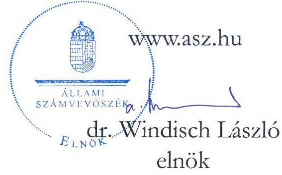
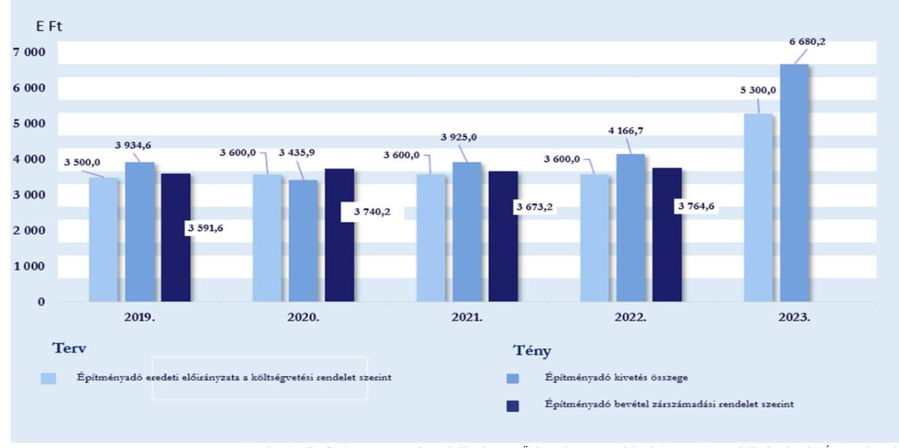
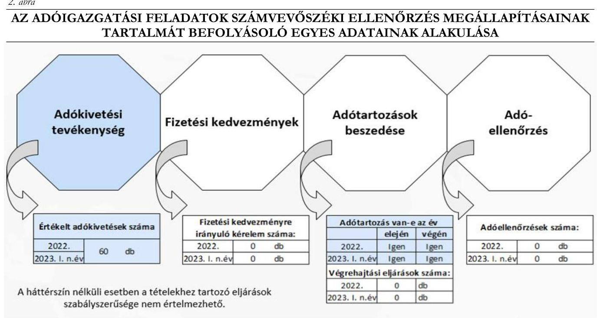
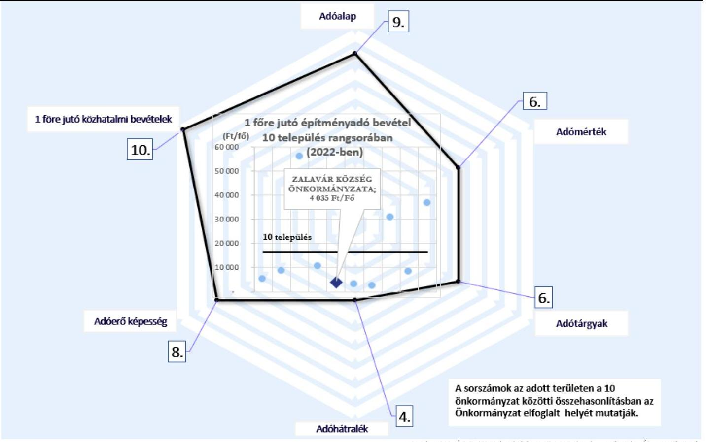

# JELENTÉS 

## Az önkormányzatok helyi adóztatási tevékenységének ellenőrzése Építményadóztatás

Zalavár Község Önkormányzata

2023.

---

# JELENTÉS 

## Az önkormányzatok helyi adóztatási tevékenységének ellenőrzése Építményadóztatás

Zalavár Község Önkormányzata

2023.

23069

---

# ELLENŐRZÉSI IGAZGATÓSÁG: 

## ÁLLAMHÁZTARTÁS HELYI SZINTJÉT ELLENŐRZŐ IGAZGATÓSÁG

ELLENŐRZÉSI IGAZGATÓ:
KISGERGELY ISTVÁN igazgató

ELLENŐRZÉSVEZETŐ:
Jelentéseink az interneten a www.asz.hu címen olvashatók.

BŐRŐCZ IMRE ellenőrzésvezető

IKTATÓSZÁM: EL-3839-006/2023.
TÉMASZÁM: 2672
ELLENŐRZÉS-AZONOSÍTÓ SZÁM: V-1016

---

# TARTALOMJEGYZÉK 

- AZ ELLENŐRZÉS ALAPADATAI ..... 5
- AZ ELLENŐRZÖTT SZERVEZET ..... 7
- ÖSSZEFOGLALÁS ..... 8
- AZ ELLENŐRZÉS FÓKUSZKÉRDÉSEI ..... 9
- MEGÁLLAPÍTÁSOK ..... 10
- JAVASLATOK ..... 17
- MELLÉKLETEK ..... 18
I. sz. melléklet: Értelmező szótár ..... 18
II. sz. melléklet: Az ellenőrzött szervezetek jegyzéke ..... 20
III. sz. melléklet: Ellenőrzési kritériumok ..... 21
IV. sz. melléklet: Az országban hasonló állandó lakósságszámú 10 település összehasonlítása az építményadóra vonatkozóan ..... 22
- FÜGGELÉK: ÉSZREVÉTELEK ..... 23
- RÓVIDÍTÉSEK JEGYZÉKE ..... 24

---

.

---

# AZ ELLENŐRZÉS ALAPADATAI 

## AZ ELLENŐRZÉS CÉLJA

Az ellenőrzés célja annak értékelése volt, hogy a Zalavár Község Önkormányzata által bevezetett építményadót érintő önkormányzati döntések, helyi szabályozások a vonatkozó törvényekkel összhangban álltak-e. Az önkormányzati építményadó bevételek változása hogyan befolyásolta a helyi adópolitikai célok megvalósulását, a helyi adóztatás eredményét. Az Alsópáhoki Közös Önkormányzati Hivatal jegyzője ${ }^{1}$ építményadóztatással összefüggő feladatainak teljesítése és kapcsolódó hatásköreinek gyakorlása megfelelő volt-e, eredménye az ellenőrzött időszakban javult-e.

## AZ ELLENŐRZÉS TÍPUSA

Megfelelőségi ellenőrzés.

## AZ ELLENŐRZÖTT IDŐSZAK

Az 1. és 2. fókuszkérdések tekintetében a 2019. év - mint bázisév - és a 2023. év március 31. napjáig tartó időszak. A 3. és 4. fókuszkérdések tekintetében a 2022. év és a 2023. év március 31. napjáig tartó időszak.

## AZ ELLENŐRZÉS TÁRGYA

Az Önkormányzat ${ }^{2}$ építményadóztatással kapcsolatos tevékenységének ellátása. Az ÁSZ ${ }^{3}$ ellenőrzése kiterjedt a helyi adórendelet ${ }^{4}$ megalkotására, az adóztatással összefüggő helyi szabályozásokra és az önkormányzati adóhatósági tevékenység esetében az adóigazgatási feladatok közül az adók kivetésének megfelelőségére, a végrehajtás, valamint az adóellenőrzés elmaradásának megállapítására. Kiterjedt továbbá az ellenőrzés az építményadóztatás igazgatási feladatai ellátásának Önkormányzat által biztosított feltételeiben történt változtatás bemutatására, valamint a belső kontrollrendszer egyes elemeinek kiépítésére és működtetésére. Az ellenőrzött időszak vonatkozásában, az építmény adónemhez kapcsolódó fizetési kedvezmény kérelem hiányában e terület értékelésére nem került sor.

Az ellenőrzés kiterjedt minden olyan körülményre és adatra, amely az ÁSZ jogszabályban meghatározott feladatainak teljesítéséhez, valamint az ellenőrzési program végrehajtása folyamán felmerült újabb összefüggések feltárásához szükséges volt.

## AZ ELLENŐRZÉS JOGALAPJA

Az ellenőrzés jogszabályi alapját az ÁSZ tv ${ }^{5}$. 5. § (8) bekezdése előírásai képezték.

---

# AZ ELLENŐRZÉS MÓDSZERE 

Az ellenőrzést az Alaptörvény ${ }^{6}$ 43. cikk (1) bekezdésében meghatározott törvényességi, célszerűségi szempontok, valamint az ellenőrzési program szempontjai, az ellenőrzött időszakban hatályos jogszabályok, előírások, az ellenőrzés általános szakmai szabályai, az ellenőrzésre irányadó ÁSZ módszertanok figyelembevételével végezte az ÁSZ. Az ellenőrzési kérdések megválaszolásához szükséges bizonyítékok megszerzése az ellenőrzött szervezet által rendelkezésre bocsátott dokumentumokra, adatokra alapozva kérdésfeltevés (információkérés), helyszíni szemle, interjú, mintavételezés útján történt. Az adókivetések szabályszerűségét egyszerű véletlen mintavételi eljárással kiválasztott tételek alapján ellenőrizte az ÁSZ. A mintatételek értékelése egyedileg történt, amelyekre vonatkozóan kerültek a megállapítások megtételre. Az építményadó kivetések értékelése a 2022-2023. években 30-30 db mintatétel ellenőrzésével történt.

Az ellenőrzés az egyes területek szabályszerűségének, megfelelőségének értékelését a III. sz. mellékletben megjelölt kritériumok alapján végezte el.

Az ÁSZ értékelte, viszonyította az Önkormányzat építményadóval kapcsolatos egyes adatait, mutatószámait más hasonló településekhez. Olyan települések egyes adataival végzett összehasonlítást az ÁSZ, amelyek szintén bevezették az építményadót és közel azonos lélekszámúak (a népességszám esetében a csoportképzés alapja Zalavár 2022. január 1-jei állandó lakosságának száma $+/-3 \%$-os eltérés figyelembevételével került megállapításra). A fenti feltételeknek az Önkormányzattal együtt Magyarországon 10 önkormányzat' felelt meg.

Ellenőrzési bizonyítékként felhasználható adatforrások közé tartoztak egyrészt az ellenőrzési programban felsorolt adatforrások, másrészt az ellenőrzés folyamán feltárt, az ellenőrzés szempontjából információt tartalmazó dokumentum.

---

# AZ ELLENŐRZÖTT SZERVEZET 

Az Alaptörvény 31. cikk (1) bekezdése értelmében Magyarországon a helyi közügyek intézése és a helyi közhatalom gyakorlása érdekében helyi önkormányzatok működnek.

A 2023. január 1-én 956 fő állandó lakosú Zalavár a Nyugat-dunántúli Régióban, Zala vármegyében, a Keszthelyi járásban található település. A 2023. évi adatok szerint az építményadóval érintett adótárgyak száma 52 darab, az adóalanyok száma 57 fő volt. Az ellenőrzött időszakban a községet a polgármesterrel ${ }^{8}$ együtt öt fős képviselő-testület ${ }^{9}$ irányította. Az Önkormányzat jelenlegi polgármestere 2019. október 13-ától tölti be tisztségét. A közös Hivatal ${ }^{10}$ látta el az Önkormányzat, valamint Alsópáhok Község Önkormányzata működésével kapcsolatos feladatokat, mindkét önkormányzat vezetett be építményadót. A közös Hivatalhoz tartozó önkormányzatok állandó lakosainak száma 2023. január 1-jén összesen 2551 fő volt. A közös Hivatal nem tagolódott önálló belső szervezeti egységekre, a 2022. évben összesen 10 fő köztisztviselőt alkalmaztak a hivatali feladatok ellátására. A jegyző 2020. január 6-án került kinevezésre, a feladatkörébe tartozott az adóigazgatás belső szabályainak meghatározása. Az adóigazgatási feladatokat a közös Hivatal Zalavári Kirendeltségén egy fő adóigazgatási munkakört betöltő hivatali dolgozó végezte.

A helyi önkormányzat a helyi közügyek intézése körében a törvény keretei között dönt a helyi adók fajtájáról és mértékéről. Ezzel összhangban a Mötv. ${ }^{11}$ rögzíti, hogy a helyi adóval kapcsolatos feladatok ellátása a helyi önkormányzatok feladata. A Hatásköri tv. ${ }^{12}$, valamint a Htv. ${ }^{13}$ értelmében a helyi adók bevezetéséről a települési önkormányzat képviselő-testülete dönt rendelettel. Rögzíti továbbá, hogy az önkormányzatok adómegállapítási joga kiterjed az adó bevezetésére, a már bevezetett adó hatályon kívül helyezésére, illetőleg módosítására, az adó mértékének a törvényi keretek közötti megállapítására, a törvényben meghatározott mentességeken, kedvezményeken túli további mentességek, kedvezmények biztosítására, valamint a Htv., az Art. ${ }^{14}$, az Air. ${ }^{15}$ keretei között az adózás részletes szabályainak meghatározására. A Hatásköri tv. és az Air. előírja, hogy adóügyekben elsőfokú hatósági jogkörben a település jegyzője, mint önkormányzati adóhatóság jár el.

A képviselő-testület a helyi adók közül az építményadó mellett magánszemélyek kommunális adóját, idegenforgalmi adót és helyi iparűzési adót vezetett be. Az Önkormányzat építményadóból származó költségvetési bevétele a 2019-2022. években összesen 14 769,6 E Ft volt, legmagasabb összegű bevétele a 2022. évben volt. A képviselő-testület a helyi adók közül az építményadót az 1999. évben vezette be, az építményadó mértéke 2023. január 1. napjával változott $600 \mathrm{Ft} / \mathrm{m}^{2}$-ről $1000 \mathrm{Ft} / \mathrm{m}^{2}$-re. Idegenforgalmi adóbevétele a 2021. és a 2022. években nem volt.

Az ellenőrzött időszakban az Önkormányzatnak hosszú és rövid lejáratú, továbbá likviditási célú hitele, kölcsöne nem volt, 90 napon túl lejárt kötelezettséggel nem rendelkezett. Az időszakok végi likviditási gyorsráta minden esetben $100 \%$ feletti volt, vagyis a rendelkezésre álló pénzeszközök a kötelezettségek fedezetére elegendők voltak, az Önkormányzat likviditása biztosított volt.

---

# ÖSSZEFOGLALÁS 

Az ÁSZ ellenőrzési tevékenysége keretében általános hatáskörrel ellenőrzi a helyi önkormányzatok adóztatási tevékenységét. Az adóbevételek képezik az önkormányzatok saját bevételének jelentős részét. A helyi adók önkormányzati gazdálkodásban betöltött fontos szerepét jelzi, hogy a 2019. évben a helyi önkormányzatok összes költségvetési bevételének 34,5\%-át, 2020. évben 32,5\%-át, 2021. évben 31,1\%-át és a 2022. évben $31,6 \%$-át a helyi adóbevételek jelentették. A helyi iparűzési adó a helyi adók között, az abból származó adóbevétel szempontjából a legmeghatározóbb volt, melyet az ÁSZ 2022-ben ellenőrzött. Ezt követi a sorban az építményadó, amelyet az önkormányzatok közel egyharmada vezetett be. Ez indokolta az önkormányzatok építményadóztatással kapcsolatos tevékenységének ellenőrzését.

A 2023. január 1-től hatályos helyi adórendelet kihirdetésére vonatkozó, jogszabályi előírásban meghatározott határidőt a jegyző nem tartotta be. A 2019-2023. években a jogszabályban foglalt előírásokat betartva a képviselő-testület a helyi adórendeletben döntött az építményadó mértékéről és az építményadó adóalapját az építmény $\mathrm{m}^{2}$-ben számított hasznos alapterületében határozta meg.

A Képviselő-testület a helyi adórendeletben a jogszabályban foglalt előírásokkal ellentétesen állapítottak meg az építményadó tekintetében konkrét összegű adómértéket, valamint a vállalkozó adóalanyok számára adómentességet. Az Önkormányzat helyi adórendeletében nem mentesítette az építményadó alanyát adófizetési kötelezettség alól, amennyiben az adóalanyt adófizetési kötelezettségét nem terhelte.

A jegyző az ellenőrzött időszakban a jogszabály előírásainak megfelelően az építményadóztatást érintő belső szabályokat - az ellenőrzési nyomvonalak részbeni szabálytalansága mellett - kialakította.

Az önkormányzati adóhatóság ${ }^{16}$ az ellenőrzött időszakban az éves költségvetésben tervezett építményadó bevételeket beszedte. Az építményadó tartozások összege csökkent, 2019. január 1-jén 2 094,7 E Ft, 2023. január 1-jén 1 001,6 E Ft volt. Az építményadó bevételhez képest a 2022. december 31-én nyilvántartott adóhátralékok összegének aránya meghaladta az adóbevételek egynegyedét.

A közös Hivatal az ellenőrzött időszakban az éves költségvetési beszámolóiban kormányzati funkció szerint az adóigazgatási tevékenységgel összefüggő kiadási adatokat és a kapcsolódó átlagos statisztikai létszámadatokat szerepeltette. A közös Hivatal adatszolgáltatása alapján a helyi adóbevételekhez viszonyítottan az adóigazgatási feladatok ellátásához kapcsolódó költséghányad 5,2 \%-os volt.

Az önkormányzati adóhatóság a jogszabályi előírás ellenére a további intézkedést igénylő kivetési határozatok megőrzéséről, a határozatok szabályszerű közléséről nem teljeskörűen gondoskodott, valamint a 2023. évben a jogszabályi és a belső szabályozásban foglalt előírásoknak a kivetési határozatok kiadmányozása során nem tett eleget.

Az ellenőrzött időszakban az önkormányzati adóhatóság a jogszabály előírása ellenére végrehajtási eljárást nem indított, valamint a jogszabályi kötelezettségek teljesítésének előmozdítása érdekében adóellenőrzést nem végzett. Ezáltal a végrehajtási eljárások és az adóellenőrzések nem járultak hozzá az adóigazgatási tevékenység bevételekben mérhető eredményének javulásához.

A jegyző kialakította és müködtette a belső ellenőrzést a jogszabály előírása szerint. A belső ellenőrzés a helyi adóztatási tevékenységet az ellenőrzött időszakban nem ellenőrizte.

Az építményadó köteles építmények adóalapja a 2019. évről a 2022. évre 5,7\%-kal emelkedett. A jegyző az ingatlanügyi hatóságtól a 2023. évben kért és kapott adatokat nem hasznosította az ellenőrzött időszak végéig.

---

# AZ ELLENŐRZÉS FÓKUSZKÉRDÉSEI 

1.- Az önkormányzat építményadóval kapcsolatos rendelete és az önkormányzati adóhatóság tevékenysége támogatta-e az adóbevételek beszedését, a településfejlesztési és az adópolitikai célkitüzések megvalósitását?
2.- Az építményadóztatás igazgatási feladatai ellátásának önkormányzat által biztosított feltételeiben és adóhatósági gyakorlatában történt-e változtatás?
3.- Az önkormányzati adóhatóság megfelelően látta-e el az építményadóval kapcsolatos egyes adóhatósági tevékenységeit?
4.- Az építményadóztatás egyes adóhatósági tevékenységeinek megfelelő ellátását a belső kontrollrendszer egyes elemeinek kiépítése és müködtetése elősegítette-e?

---

# MEGÁLLAPÍTÁSOK 

## 1. Az önkormányzat építményadóval kapcsolatos rendelete és az önkormányzati adóhatóság tevékenysége támogatta-e az adóbevételek beszedését, a településfejlesztési és az adópolitikai célkitűzések megvalósítását?

Összegző megállapítás Az Önkormányzat helyi adórendeletében az életvitelszerűen lakott lakásingatlanra vonatkozó adómentességre és az egyösszegű, kedvezményes adómértékre vonatkozó előírások nem feleltek meg a Htv.-ben foglaltaknak. Az önkormányzati adóhatóság a 2019-2022. években a költségvetésben tervezett építményadó bevételeket beszedte.

A HELYI ADÓRENDELET tartalmazza a Htv. felhatalmazása alapján az építmény adózás szabályait. A HELYI ADÓRENDELET MÓDOSÍTÁSA során a jegyző nem tartotta be a rendelet kihirdetésére vonatkozóan a Gst. ${ }^{17}$ 32. §-ában előírtakat, mivel a fizetési kötelezettség terhét növelő rendelet kihirdetése (2022. december 2.) és a hatálybalépése (2023. január 1.) között nem telt el 30 nap.

AZ ÉPÍTMÉNYADÓ ADÓALAPJÁT a Htv. előírásának megfelelően az építmény $\mathrm{m}^{2}$-ben számított hasznos alapterületében határozták meg.
Az Önkormányzat helyi adórendeletében az Art. 2. melléklet II/A/4. pontja alapján, nem mentesítette az építményadó alanyát adófizetési kötelezettség alól, amennyiben az adóalanyt adófizetési kötelezettségét nem terhelte.
ADÓMENTESSÉGET az Önkormányzat a Htv. 7. § e) pontjában foglaltak ellenére állapított meg az a helyi adórendelete 4. §-ában, amely szerint az Önkormányzat mentesítette az építményadó alól a magánszemély által életvitelszerűen lakott lakásingatlant és a hozzá tartozó garázst, mivel ezzel a vállalkozó adóalany (tulajdonos vagy vagyoni értékű jog jogosítottja) olyan üzleti célt szolgáló lakóingatlanát (a hozzá tartozó garázzsal) is mentesítette az építményadó alól, amelyben valamely magánszemély bármely jogcímen életvitelszerűen lakik. A Htv. 7. § e) pontja a vállalkozó üzleti célt szolgáló épülete, épületrésze után tiltja a Htv. 6. § d) pontjának alkalmazását, vagyis az adómentesség vagy kedvezmény adását. A helyi adórendelet 5. §-a szerint az életvitelszerűen lakottnak minősül az az ingatlan, ha abban a magánszemély évente legalább 300 napot ténylegesen ott lakik, amelyet az adózó a lakcímnyilvántartás adataival és nyilatkozatával igazol. Ezen rendeleti előírás nem felelt meg a Kúria ${ }^{18}$ a Köf.5.048/2015/3. számú határozatban ${ }^{19}$ megállapítottaknak, amely szerint az építményadó esetében az érintett önkormányzat nincs tekintettel az adófizetési kötelezettségben érvényesítendő jogegyenlőségre akkor, ha a vagyontömeg értékén és az adóalany teherbíró képességén túli szempontokat is értékel, így az adófizetési kötelezettséget az adóalany igazgatási szempontú lakhatásától teszi függővé.
AZ ADÓMÉRTÉKET a helyi adórendelet 6/A. §-a az Önkormányzat illetékességi területén több lakóingatlannal rendelkezők adóalanyok számára egyösszegű, kedvezményes összegben állapította meg, a további ingatlanonként fizetendő adó mértéke 2022. december 31. napjáig 6,5 E Ft/év, 2023. január 1-től 10,0 E Ft/év. A Htv. 6. §-ában foglaltak alapján az Önkormányzat a törvény keretei között megállapíthatja

---

az adó helyben alkalmazandó adóalapját, az adóalapra vetített - a törvényi maximumra figyelemmel kialakított - adómértéket, illetve a magánszemélyek esetében adómentességet vagy - az adófizetési kötelezettséget csökkentő - adókedvezményt biztosíthat. A Htv. 7. § b) bekezdésében előírtak alapján az egyes adótárgyak utáni adókötelezettség megállapítása esetében konkrét adóösszeget - egy fix, rögzített adóösszeg éves megfizetésének a lehetőségét - a helyi adórendelet nem tartalmazhat.
Az ÁSZ a helyi adórendelettel kapcsolatos megállapításairól a törvényességi felügyeleti jogkört gyakorló területileg illetékes Kormányhivatalt ${ }^{20}$ tájékoztatja.
A közzétételi kötelezettségnek a jegyző a Htv.-ben foglaltaknak megfelelően eleget tett, az önkormányzat honlapjáról a hatályos helyi adórendelet, valamint a helyi adókkal kapcsolatos MÁK ${ }^{21}$ által rendszeresített nyomtatványok elérhetőek voltak. A képviselő-testület a jegyző beszámoltatása útján ellenőrizte az adóztatási tevékenységet, eleget téve a Hatásköri tv. előírásának. A MÁK felé előírt adatszolgáltatásról a jegyző a Htv. 42/B § (1) bekezdésben rögzítettek ellenére az előírt határidőn túl gondoskodott.
ANYAGI ÉRDEKELTSÉGI RENDSZERT az Önkormányzat az ügykörébe tartozó adók hatékony beszedésének elősegítése érdekében nem múködtetett.
AZ ÉPÍTMÉNYADÓ KÖTELES ÉPÍTMÉNYEK m²-BEN SZÁMÍTOTT HASZNOS ALAPTERÜLETÉNEK változása hatással volt a kivetett építményadóbevételek nagyságának alakulására. Az összesített adóalap a 2019. évi 7 004,0 m² -es szintről 2022. évre $7401,0 \mathrm{~m}^{2}$-re emelkedett, ugyanakkor a 2022. évi adathoz képest a 2023. évben 2,0 \%-kal ( $149 \mathrm{~m}^{2}$-rel) csökkent.

1. ábra

AZ ÉPÍTMÉNYADÓ KÖLTSÉGVETÉSI ELŐIRÁNYZATAI, ADÓKIVETÉSEI (2019-2023.), VALAMINT A KÖLTSÉGVETÉSI BEVÉTELI ADATAI (2019-2022.)

Forrás: Az ellenőrzött szervezet adatszolgáltatása, az Önkormányzati rendeletek Nemzeti Jogszabálytár alapján ÁSZ szerkesztés
AZ ÉPÍTMÉNYADÓ EREDETI ELŐIRÁNYZATÁT az Önkormányzat az éves költségvetési rendeleteiben megtervezte. Az 1. ábra azt mutatja, hogy az építményadó eredeti előirányzata a 2019. évben 102,6 \%-ban, a 2020. évben 103,9 \%-ban, a 2021. évben 102,0 \%-ban, valamint a 2022. évben 104,6 \%-ban teljesült, tekintettel az Önkormányzat megalapozott költségvetési tervezésére és a viszonylag kedvező adófizetői morálra.

---

AZ ÉPÍTMÉNYADÓ ELŐÍRÁS összegét az építményadó bevételek összege a 2020. évben haladta meg. A tárgyévben ugyanis korábbi években kivetett, de meg nem fizetett adó is befolyt (a 2020. január 1jén nyilvántartott, 1 777,6 E Ft építményadó tartozás összege év végére 553,6 E Ft összeggel csökkent).
A 2019., a 2021. és a 2022. években az építményadó bevételek összege $-8,7 \%$-kal, $6,4 \%$-kal, $9,7 \%$-kal - elmaradt az építményadó előírásához képest. Az építményadó bevételek azonban ezekben az években is átlagosan $90 \%$ felett teljesültek az előírásokhoz képest.
AZ ÉPÍTMÉNYADÓ TARTOZÁSOK összege az ellenőrzött időszakban kevesebb mint felére (2019. január 1-jén 2 094,7 E Ft, 2023. január 1-jén 1 001,6 E Ft volt), a hátralékos adózók száma pedig kevesebb mint harmadára csökkent (2019. január 1-jén 34 fő, 2023. január 1-jén 10 fő volt). Az ellenőrzött időszakban méltányosság vagy elévülés jogcímen építményadó előírást nem töröltek.
AZ ORSZÁGBAN HASONLÓ ÁLLANDÓ LAKOSSÁGSZÁMÚ 10 TELEPÜLÉS ÖSSZEHASONLÍTÁSÁBAN az Önkormányzat az egy főre jutó építményadó bevétele - 4035 Ft - a nyolcadik volt a 2022. évben. Az Önkormányzat építményadóval kapcsolatos egyes adatai, mutatószámai hasonló településekkel történő összehasonlítását a IV. sz. melléklet mutatja be.
AZ ADÓPOLITIKAI CÉLOK az Önkormányzat a 2019-2024. évekre vonatkozó gazdasági programjában kerültek meghatározásra: az adótartozások behajtásának hatékonyabbá tételét, a takarékos, átgondolt gazdálkodást, a pályázatok önerejének biztosítását a költségvetésben és a pályázati lehetőségek kihasználását jelölték meg célként. Az ellenőrzött időszakban nem volt olyan pályázati vagy fejlesztési cél, amelyben a beruházási célok forrásaként az építményadó bevételt nevesítették volna.

# 2. Az építményadóztatás igazgatási feladatai ellátásának önkormányzat által biztosított feltételeiben és adóhatósági gyakorlatában történt-e változtatás? 

Összegző megállapítás

Az Önkormányzat az építményadóztatás igazgatási feladatai ellátásának feltételeit biztosította, az adóhatósági gyakorlat az ellenőrzött időszakban nem változott. A 15/2019. (XII. 7.) PM rendelet ${ }^{22}$ foglaltak alapján a közös Hivatal az éves költségvetési beszámolóiban az adóigazgatási tevékenységgel összefüggő kiadásokat és a kapcsolódó átlagos statisztikai létszámokat kormányzati funkció szerint kimutatta.

AZ ADÓIGAZGATÁSI FELADATELLÁTÁS személyi, informatikai feltételeit a közös Hivatal az ellenőrzött időszakban biztosította. Az Önkormányzatot érintően a közös Hivatal állományán belül az adóigazgatással kapcsolatos feladatokat az ellenőrzött időszakban egy fő látta el, akinek személye többször változott. A 2022. évtől belépő egy fő felsőfokú végzettséggel rendelkező adóügyi munkatárs egyben szociális köztisztviselői munkakört is betöltött.
AZ ADÓZÓKKAL VALÓ KAPCSOLATTARTÁS érdekében a helyi adókkal kapcsolatos rendszeresített bevallási, adatbejelentési, bejelentkezési nyomtatványokat az Önkormányzat honlapján közzétették, valamint az E-önkormányzat portálon keresztül biztosították az adóügyekkel kapcsolatos elektronikus ügyintézéshez szükséges szolgáltatásokat. Az adózók részére a jogszerű adókötelezettség

---

teljesítése érdekében papír alapon, illetve elektronikus úton is nyújtottak tájékoztatást. A 2019. évi és a 2022. évi közmeghallgatások kitértek az adóbevételek bemutatására.

A POSTAI ÉS KOMMUNIKÁCIÓS KÖLTSÉGEK a helyi adóztatással kapcsolatban a 2019. évhez viszonyítva 52,9 E Ft-ról a 2022. évre 161,3 E Ft-ra növekedtek, a postai díjak emelkedése miatt.
A KORMÁNYZATI FUNKCIÓ (011220 Adó-, vám- és jövedéki igazgatás) szerint, az Áht. ${ }^{23}$ és a 15/2019. (XII. 7.) PM rendeletben előírása alapján a közös Hivatal az éves költségvetési beszámolóiban az adóigazgatási tevékenységgel összefüggő kiadásokat és a kapcsolódó átlagos statisztikai létszámadatokat kimutatta.

Az adóigazgatási feladatellátásra fordított összes múködési kiadás összege a 2022. évben 7 806,5 E Ft volt, az adóigazgatási tevékenységéhez kapcsolódó két önkormányzat helyi adóbevétele összesen 148 762,9 E Ft volt, amelyből az Önkormányzat helyi adóbevétele 14 091,6 E Ft volt. A közös Hivatal esetében 1,0 E Ft adóbevételre 52,5 Ft adóigazgatási múködési kiadás jutott, ami 5,2 \%-os költséghányadot jelent a beszedett adókhoz viszonyítva.

# 3. Az önkormányzati adóhatóság megfelelően látta-e el az építményadóval kapcsolatos egyes adóhatósági tevékenységeit? 

Összegző megállapítás Az önkormányzati adóhatóság építményadóval kapcsolatos adóhatósági tevékenységeit nem megfelelően látta el, mivel az Ltv. ${ }^{24}$ előírásai ellenére a 2022. évben a jegyző nem gondoskodott a kivetési határozatok 13,3\%-ának megőrzéséről, a határozatok 16,7\%-ánál az Air. szerinti szabályszerű közléséről, a 2023. évben a kivetési határozatok a 335/2005. (XII. 29.) Korm. rendelet és a Hivatal Ügyrendje ${ }^{25}$ szerinti szabályszerű kiadmányozásáról, továbbá végrehajtási eljárást nem indított. Az önkormányzati adóhatóság adóellenőrzést az építményadóval kapcsolatban nem végzett.

Az építményadóztatással kapcsolatos önkormányzati adóigazgatási feladatok számvevőszéki ellenőrzés megállapításainak tartalmát befolyásoló egyes adatok alakulását mutatja be a 2. ábra.

---

# AZ ÉPÍTMÉNYADÓ KIVETÉSÉRŐL HATÁROZATTAL DÖNTÖTT az önkormányzati adóhatóság. 

A 30 mintatétel értékelésének eredményeként az ellenőrzött adókivetések $30 \%$-a ( 9 mintatétel) nem volt megfelelő a 2022. évben, az alábbiak miatt:

- Az önkormányzati adóhatóság négy mintatétel esetében (6., 17., 26., 30. sorszámú minta) a Ltv. 9. $\$ (1) bekezdés e) pontjában előírtak ellenére a bejelentések dokumentumai, a határozatok és azok közlését igazoló dokumentumok megőrzéséről nem gondoskodott az Art. 48.§ (1) bekezdése, az Air. 76. $\$ (1) bekezdése, valamint az Air. 73. $\$ (1) bekezdésének való megfelelőséget nem tudta az ÁSZ ellenőrizni;
- Az önkormányzati adóhatóság a döntés adózóval történő közlését öt mintatétel esetében (1., 5., 9., 13., 22. sorszámú minta) nem igazolta, ezzel nem tett eleget az Air. 76. § (1) bekezdésében foglaltaknak.
A 30 mintatétel értékelésének eredményeként az ellenőrzött adókivetések 100\%-a nem volt megfelelő a 2023. évben, mivel a kivetési határozatokat a 335/2005. (XII. 29.) Korm. rendelet 52. § (1) bekezdésében, valamint a Hivatal Ügyrendje a kiadmányozás rendjéről szóló II. fejezetében foglaltak ellenére nem a jegyző által kiadmányozással megbízott kirendeltség vezető írta alá.
AZ ÉPÍTMÉNYADÓ TARTOZÁSOK BESZEDÉSE érdekében a jegyző az ellenőrzött időszakban az Avt. ${ }^{26}$ 30. § (1) bekezdésében foglaltak ellenére nem intézkedett, végrehajtási intézkedések megindítására a hátralékos adóalanyokkal szemben a fennálló adótartozások ellenére nem került sor. Az önkormányzati adóhatóság a tartozások megfizetésére az adósokat nem hívta fel. Az önkormányzati adóhatóság által nyilvántartott építményadó tartozás összege 2022. január 1-jén 936,4 E Ft, 2022. december 31-én 1001,6 E Ft volt.
ADÓELLENŐRZÉST az önkormányzati adóhatóság az ellenőrzött időszakban az adótörvényekben és más jogszabályokban előírt kötelezettségek teljesítésének előmozdítása érdekében nem végzett.

---

# 4. Az építményadóztatás egyes adóhatósági tevékenységeinek megfelelő ellátását a belső kontrollrendszer egyes elemeinek kiépítése és múködtetése elősegítette-e? 

## Összegző megállapítás

A belső kontrollrendszer egyes elemeinek kiépítése és múködtetése nem volt megfelelő, mivel az ellenőrzési nyomvonal nem felelt meg a Bkr. ${ }^{27}$ előírásainak. A belső ellenőrzés a helyi adóztatási tevékenységet nem ellenőrizte.

AZ ADÓIGAZGATÁSI FELADATOK ELLÁTÁSÁNAK SZABÁLYAIT a 2022-2023. években a belső szabályzatokban a jogszabályi előírásoknak megfelelően rögzítették. A Hivatali SZMSZ ${ }^{28}$ megfelel az Ávr. -nek, mert tartalmazta a szervezeti felépítést és a múködés rendjét, a szervezeti egységek megnevezését, a költségvetési szerv szervezeti ábráját.
A KIADMÁNYOZÁS RENDJÉT a jegyző a hatáskörébe tartozó adóigazgatási ügyekben az Mötv.-ben foglaltaknak megfelelően szabályozta.
A KÖLTSÉGVETÉSI SZERV ELLENŐRZÉSI NYOMVONALA a Bkr. 6. § (3) bekezdésében foglaltak ellenére nem tartalmazta a felelősségi és információs szinteket és kapcsolatokat, ezzel nem tették lehetővé az irányítási és ellenőrzési folyamatok nyomon követését és utólagos ellenőrzését.
A LAKOSSÁGOT TÁJÉKOZTATTA a jegyző a Hatásköri tv.-nek megfelelően az adójogszabályok előírásairól, valamint a Htv. előírásainak megfelelően az önkormányzat honlapján közzétette az adórendelet módosításokkal egységes szerkezetbe foglalt szövegét, valamint a rendszeresített bevallási, adatbejelentési, bejelentkezési nyomtatványokat és az elérhetőségi információkat. Az Önkormányzat, illetve a képviselő-testület a Htv., illetve a Hatásköri tv. előírásainak eleget téve a zárszámadási rendeleteiben a lakosságot a helyi adókból származó bevételek összegéről tájékoztatta.
A BELSŐ ELLENŐRZÉSI TEVÉKENYSÉG kialakításáról és múködtetéséről a jegyző gondoskodott az Áht. alapján.
A Bkr. előírásainak megfelelve a 2022. és a 2023. évekre vonatkozóan a képviselő-testület által elfogadott éves ellenőrzési tervekkel rendelkezett az ellenőrzött szervezet. Az éves ellenőrzési terveket megalapozó kockázatelemzés nem tartalmazta az adóztatási tevékenységgel kapcsolatos kockázatok felmérését és értékelését a Bkr. 29. § (1) bekezdésében foglaltak ellenére, mivel figyelmen kívül hagyták az államháztartásért felelős miniszter által közzétett módszertani útmutatóban előírtakat, amely szerint a kockázatelemzésnek ki kell terjednie az összes tevékenységben lévő kockázatok felmérésére, értékelésére. A helyi adóztatási tevékenységet a belső ellenőrzés nem ellenőrizte, nem értékelte az önkormányzati adóhatóság múködésének jogszabályoknak és szabályzatoknak való megfelelését.
KÜLSŐ ELLENŐRZÉST VÉGZŐ SZERVEZET által végzett ellenőrzés nem került lefolytatásra az ellenőrzött időszakban.
A Kormányhivatal a 2022. december 31-éig hatályos 86/2019. (IV. 23.) Korm. rendelet ${ }^{29}$ szerint összeállított országos hatósági 2023. évi ellenőrzési tervben foglaltak alapján a 2023. március 9. napjával kezdte meg az önkormányzati adóhatóság adóügyi tevékenységénének hatósági ellenőrzését, amely az ellenőrzött időszakban folyamatban volt.

---

AZ INGATLANÜGYI HATÓSÁGOT ${ }^{30}$ az önkormányzati adóhatóság az Art.-ban foglalt lehetőséggel élve a 2023. évben megkereste az építményadó megállapítása (kivetése), ellenőrzése céljából történő adatszolgáltatás érdekében. A jegyző az ingatlanügyi hatóságtól kapott adatokat, azonban azokat nem vetette össze az építményadó nyilvántartás adataival, az ingatlanügyi hatóság adatszolgáltatása alapján intézkedést az ellenőrzött időszak végéig nem tett.
AZ ÉPÍTÉSÜGYI HATÓSÁGTÓL ${ }^{31}$ a 2022-2023. években az Art. szerinti adatszolgáltatást (használatbavétel tudomásulvételéről szóló hatósági bizonyítványt, véglegessé vált használatbavételi engedélyt, véglegessé vált fennmaradási engedélyt) az Önkormányzat nem kapott.

---

# JAVASLATOK 

Az ÁSZ tv. 33. § (1) bekezdésében foglaltak értelmében az ellenőrzött szervezet vezetője köteles a jelentésben foglalt megállapításokhoz kapcsolódó intézkedési tervet összeállítani és azt a jelentés kézhezvételétől számított 30 napon belül az ÁSZ részére megküldeni. Amennyiben az ellenőrzött szervezet vezetője nem küldi meg határidőben az intézkedési tervet, vagy továbbra sem elfogadható intézkedési tervet küld, az Állami Számvevőszék elnöke az ÁSZ tv. 33. § (3) bekezdése a) és b) pontjaiban foglaltakat érvényesítheti.

## ZALAVÁR KÖZSÉG ÖNKORMÁNYZATÁNAK POLGÁRMESTERÉNEK

1. Intézkedjen az Állami Számvevőszék jelentésének ÁSZ általi nyilvánosságra hozatalát követően haladéktalanul a képviselő-testület elé terjesztéséről. A jelentést a napirend tárgyalásáról szóló jegyzőkönyvvel együtt tájékoztatásul küldje meg a Kormányhivatal részére is.

## ALSÓPÁHOKI KÖZÖS ÖNKORMÁNYZATI HIVATAL JEGYZŐJÉNEK

1. Intézkedjen annak érdekében, hogy a 2023. évi építményadó adóalanyai tekintetében kivetett építményadóra vonatkozó határozatok arra jogosult általi kiadmányozására a Hivatal Ügyrendje II. fejezetében foglaltaknak megfelelően kerüljön sor.
2. Alakítson ki kontrollokat annak biztositására, hogy az Air. 76. § (1) bekezdésének megfelelve történjen a kivetési határozatok közlése.
3. Alakítson ki kontrollokat annak biztositására, hogy az Ltv. 9. § (1) bekezdés e) pontjában elöírtaknak megfelelően a még folyamatban lévő ügyek iratainak megőrzése biztositott legyen.
4. Az adótartozások tekintetében az Avt. 30.§ (1) bekezdése alapján az adótartozás végrehajtásához való jogát következetesen érvényesítse, az arra irányuló szükséges intézkedéseket tegye meg.
5. Intézkedjen, hogy a Bkr. 6. § (3) bekezdésében foglaltaknak megfelelően az önkormányzat adóigazgatást érintő ellenőrzési nyomvonala tartalmazza a felelősségi és információs szinteket és kapcsolatokat.
6. Alakítson ki kontrollokat annak biztositására, hogy az Art. 83. §-a alapján az ingatlanügyi hatóságtól kapott adatok építményadó nyilvántartás adataival történő összevetésre és eltérések feltárása esetén a szükséges intézkedések megtételére kerüljön sor.

---

# MELLÉKLETEK 

## I. SZ. MELLÉKLET: ÉRTELMEZŐ SZÓTÁR

adóellenőrzés
adóhatóság
adóhatósági ellenőrzés
adótartozás
adózó
építmény
építményadó
építményadó adóalanya
épület
épületrész
fizetési kedvezmény

Adóellenőrzés keretében az adóhatóság az adózó adómegállapítási, adatbejelentési, bevallási kötelezettsége teljesítését adónként, támogatásonként és időszakonként vagy meghatározott időszakra több adó és támogatás tekintetében is vizsgálja. (Forrás: Air. 90. § (1) bekezdés)
Az önkormányzat jegyzője, mint önkormányzati adóhatóság. (Forrás: Air. 22. § b) pont)
Az adóhatóság az adótörvényekben és más jogszabályokban előírt kötelezettségek teljesítésének vagy megsértésének megállapítása, a kötelezettségek teljesítésének előmozdítása érdekében ellenőrzést folytat. (Forrás: Air. 86. §)
Az esedékességkor meg nem fizetett adó és a jogosulatlanul igénybe vett költségvetési támogatás. (Forrás: Art. 7. §6. pont)
Az a személy, akinek vagy amelynek adókötelezettségét adót, költségvetési támogatást megállapító törvény, e törvény, az adózás rendjéről szóló 2017. évi CL. törvény (a továbbiakban: Art.) vagy önkormányzati rendelet előírja. (Forrás: Air. 11. § (1) bekezdés)
Építési tevékenységgel létrehozott, illetve késztermékként az építési helyszínre szállított, - rendeltetésére, szerkezeti megoldására, anyagára, készültségi fokára és kiterjedésére tekintet nélkül - minden olyan helyhez kötött műszaki alkotás, amely a terepszint, a víz vagy az azok alatti talaj, illetve azok feletti légtér megváltoztatásával, beépítésével jön létre, az építmény az épület és mütárgy gyűitőfogalma. (Forrás: az épített környezet alakításáról és védelméről szóló 1997. évi LXXVIII. törvény 2. § 8. pontja)
Az önkormányzat illetékességi területén lévő építmények közül a lakás és a nem lakás céljára szolgáló épület, épületrész (a továbbiakban együtt: építmény) után fizetendő, az önkormányzat költségvetése javára megállapított adó. (Forrás: Htv. 11. § (1) bekezdés)
Az adó alanya - a Htv. 3. §-a alapján az a magánszemély, jogi személy, egyéb szervezet, a magánszemélyek jogi személyiséggel nem rendelkező személyi egyesülése - aki a naptári év (a továbbiakban: év) első napján az építmény tulajdonosa. Több tulajdonos esetén a tulajdonosok tulajdoni hányadaik arányában adóalanyok. Amennyiben az építményt az ingatlan-nyilvántartásba bejegyzett vagyoni értékủ jog terheli, az annak gyakorlására jogosult az adó alanya. (A tulajdonos, a vagyoni értékủ jog jogosítottja a továbbiakban együtt: tulajdonos). Társasház, -garázs és -üdülő esetén a tulajdonosok önálló adóalanyok, a közös használatú helyiségek után az adó alanya az említett közösség. (Forrás: Htv. 12. § (1), (3) bekezdés)
Az épített környezet alakításáról és védelméről szóló törvény szerinti olyan építmény vagy annak azon része, amely a környező külső tértől szerkezeti elemekkel részben vagy egészben mesterségesen kialakított, elválasztott teret alkot és ezzel az állandó vagy időszakos tartózkodás, illetve használat feltételeit biztosítja, ideértve az olyan önálló létesítményt is, amely részben vagy teljes belmagasságával a környező csatlakozó terepszint alatt van; (Forrás: a Htv. 52. § 5. pontja)
Az épület önálló rendeltetésű, a szabadból vagy az épület közös közlekedőjéből nyíló önálló bejárattal ellátott helyisége vagy helyiség-csoportja, amely azzal felel meg lakásnak, üdülőnek, kereskedelmi egységnek, egyéb nem lakás céljára szolgáló épületnek, hogy az ingatlan-nyilvántartásban önálló ingatlanként nem szerepel. (Forrás: Htv. 52. §6. pontja)
A fizetési halasztás, részletfizetés, valamint az adómérséklés. (Forrás: Art. 198.-201. §)

---

hasznos alapterület
információs és kommunikációs rendszer
kontrollkörnyezet
kontrolltevékenységek
nyomon követési rendszer (monitoring)
önkormányzat
önkormányzati hivatal

A teljes alapterületnek olyan része, ahol a belmagasság - a padlószint (járófelület) és az afelett levő épületszerkezet (födém, tetőszerkezet) vagy álmennyezet közti távolság legalább $1,90 \mathrm{~m}$. A teljes alapterületbe a lakáshoz, üdülőhöz tartozó kiegészítő helyiségek, melléképületek, melléképületrészek kivételével valamennyi helyiség összegzett alapterülete, valamint a többszintes lakrészek belső lépcsőjének egy szinten számított vízszintes vetülete is beletartozik. Az építményhez tartozó fedett és három oldalról zárt külső tartózkodók (lodzsa, fedett és oldalt zárt erkélyek), és a fedett terasz, tornác alapterületének $50 \%$-a tartozik a teljes alapterületbe. A lakások esetében a pinceszinten (a csatlakozó terepszint alatt) kialakított helyiségek alapterületének $70 \%$-át kell a teljes alapterületbe számítani. (Forrás: Htv. 52. § 9. pontja)
A költségvetési szerv vezetője által kialakított információtovábbítási csatornák rendszere, amelyben biztosított, hogy a megfelelő információk a megfelelő időben eljussanak az illetékes szervezethez, szervezeti egységhez, illetve személyhez. (Forrás: Bkr. 9. § (1) bekezdés)
A költségvetési szerv vezetője által kialakított olyan elvek, eljárások, belső szabályzatok összessége, amelyben világos a szervezeti struktúra, a folyamatok átláthatók, egyértelműek a felelősségi, hatásköri viszonyok és feladatok, meghatározottak, ismertek és elfogadottak az etikai elvárások a szervezet minden szintjén, átlátható a humánerőforrás-kezelés, biztosított a szervezeti célok és értékek irányában való elkötelezettség fejlesztése és elősegítése. (Forrás: Bkr. 6. § (1) bekezdés)
A költségvetési szerv vezetője által kialakított eljárások, amelyek biztosítják a kockázatok kezelését, hozzájárulnak a szervezet céljainak eléréséhez, és erősítik a szervezet integritását. (Forrás: Bkr. 8. § (1) bekezdés)
A költségvetési szerv vezetője által kialakított nyomon követési mechanizmusok rendszere, mely az operatív tevékenységek keretében megvalósuló folyamatos és eseti nyomon követésből, valamint az operatív tevékenységektől függetlenül működő belső ellenőrzésből állhat. (Forrás: Bkr. 10. §)
A helyi önkormányzat jogi személy. Az önkormányzati feladatok ellátását a képviselőtestület és szervei biztosítják. A képviselő-testület szervei: a polgármester, a főpolgármester, a (vár)megyei közgyűlés elnöke, a képviselő-testület bizottságai, a részönkormányzat testülete, a polgármesteri hivatal, a (vár)megyei önkormányzati hivatal, a közös önkormányzati hivatal, a jegyző, továbbá a társulás. A képviselő-testület a feladatkörébe tartozó közszolgáltatások ellátására - jogszabályban meghatározottak szerint - költségvetési szervet, a Polgári perrendtartásról szóló 2016. évi CXXX. törvény szerinti gazdálkodó szervezetet (a továbbiakban: gazdálkodó szervezet), nonprofit szervezetet és egyéb szervezetet (a továbbiakban együtt: intézmény) alapíthat, továbbá szerződést köthet természetes és jogi személlyel vagy jogi személyiséggel nem rendelkező szervezettel. (Forrás: Mötv. 41. § (1), (2), (6) bekezdései)
Az ellenőrzési programban önkormányzati hivatalként értelmezzük a polgármesteri hivatalt, a főpolgármesteri hivatalt, a (vár)megyei önkormányzati hivatalt és a közös önkormányzati hivatalt. (Forrás: Áht. 1. § 18. pont).

---

II. SZ. MELLÉKLET: AZ ELLENŐRZÖTT SZERVEZETEK JEGYZÉKE

# AZ ELLENŐRZÖTT SZERVEZET MEGNEVEZÉSE 

Zalavár Község Önkormányzata
Alsópáhoki Közös Önkormányzati Hivatal

---

# FOKUSZKÉRDÉS 

1. Az önkormányzat építményadóval kapcsolatos rendelete és az önkormányzati adóhatóság tevékenysége támogatta-e az adóbevételek beszedését, a településfejlesztési és az adópolitikai célkitűzések megvalósítását?
2. Az építményadóztatás igazgatási feladatai ellátásának önkormányzat által biztosított feltételeiben és adóhatósági gyakorlatában történt-e változtatás?
3. Az önkormányzati adóhatóság megfelelően látta-e el az építményadóval kapcsolatos egyes adóhatósági tevékenységeit?
4. Az építményadóztatás egyes adóhatósági tevékenységeinek megfelelő ellátását a belső kontrollrendszer egyes elemeinek kiépítése és múködtetése elősegítette-e?

## ELLENŐRZÉSI KRITÉRIUMOK

Htv. 1. § (1) bekezdés, 6. § c) pont, 11/A. $\S, 13 . \S$, 16. § a) pont, 42/B. § (1) és (3) bekezdés, 45. §;

Hatásköri tv. 138. § (3) bekezdés a) pont;
Mötv. 42. § (1) pont, 47. § (1) bekezdés, 50. §, 51. § (2) bekezdés;

Art. 141. § (7) bekezdés, 2. melléklet II/A/4. pontja;
Avt. 19. § (1) bekezdés, 30. § (1) bekezdés;
Kúria a Köf.5.048/2015/3. számú határozat;
15/2019. (XII. 7.) PM. rendelet 3. § (1) bekezdés,

1. melléklet;

Htv. 12. § (1)-(2) bekezdés;
Air. 50. § (2) bekezdés, 72. §,
73.§ (1) bekezdés a) - d) pont, 76.-78. §, 86. §;

Art. 48. § (1), 141. § (2) bekezdés,
221. § (1) bekezdés a) pont;

Avt. 30. § (1) bekezdés
Eüsztv. ${ }^{32}$ 14. § (1) bekezdés, 15. § (1) bekezdés;
Ltv. 9. § (1) bekezdés e) pont;
A helyi adókról szóló 9/2015. (IX.4.) számú önkormányzati rendelet 2-4. §;
A kiadmányozás rendjének szabályozásáról szóló 2/2018. (V. 28.) számú jegyzői utasítás I. fejezet, IV. fejezet 1-2. pont
Ávr. 13. § (1) bekezdés e) pont, g) pont, (5) bekezdés;
Áht. 10. § (1) bekezdés, 70. § (1) bekezdés;
Hatásköri tv. 138. § (3) bekezdés h) pont, 140. § (2) bekezdés i) pont;

Htv. 8. § (1) bekezdés;
Mötv. 81. § (3) bekezdés j) pont;
Bkr. 3. § a), d) - e) pont, 6.§ (3) bekezdés, 16. § (7) bekezdés, 22. § (1) bekezdés b) pont, (2) bekezdés b) pont, 29. § (1) bekezdés;

Art. 83. § (2) bekezdés, 86. § (1)-(2) bekezdés;
86/2019. (IV. 23.) Korm. rendelet 30. § (2) bekezdés;

---

# IV. SZ. MELLÉKLET: AZ ORSZÁGBAN HASONLÓ ÁLLANDÓ LAKÓSSÁGSZÁMÚ 10 TELEPÜLÉS ÖSSZEHASONLÍTÁSA AZ ÉPÍTMÉNYADÓRA VONATKOZÓAN 

A fajlagos mutató 2022. évi összegét és arra ható egyes tényezőket, továbbá a más önkormányzatokhoz viszonyított rangsoraiban elfoglalt helyezéseket a 3. ábra mutatja.
3. ábra

A 921-958 FŐ ÁLLANDÓ LAKOSSÁGSZÁMÚ, ÉPÍTMÉNYADÓT BEVEZETŐ 10 ÖNKORMÁNYZAT 2022. ÉVI ADATAINAK ÖSSZEHASONLÍTÁSA

A 10 önkormányzatból kilenc esetében az egy főre jutó építményadóbevétel növekvő tendenciát mutatott a 2019. évről 2022. évre vonatkozóan. Valamennyi összehasonlított önkormányzatot figyelembe véve átlagosan $21,1 \%$-kal emelkedett az egy főre jutó építményadóbevétel. Az Önkormányzat esetében az adatok 4,5 \%-os építményadóbevétel-emelkedést mutattak egy főre vetítve. A 10 önkormányzat közül az Önkormányzat rendelkezett a negyedik legkevesebb adóhátralékkal (1 001,6 E Ft) 2022. december 31-én, ugyanakkor az adóhátralék összege az építményadó bevételhez viszonyítottan $26,6 \%$-os, amely a harmadik legmagasabb arányú.
2022. évben az Önkormányzat esetében az építményadó alapja ( 7401 m 2 ) a kilencedik, míg az építményadó mértéke ( $600 \mathrm{Ft} / \mathrm{m}^{2}$ ) a hatodik volt. Az Önkormányzat 53 adótárggyal rendelkezett, amellyel a rangsorban a hatodik helyet foglalta el. Az építményadó mértéke $41 \mathrm{Ft} / \mathrm{m}^{2}$-rel volt több az átlagnál.

Az Önkormányzat adóerő képessége 10 település iparűzési adóerő képessége átlagához viszonyítva 15 903,1 E Ft-tal kevesebb volt. Az Önkormányzat közhatalmi bevételein belül a helyi iparűzési adóbevétel volt a meghatározóbb, az egy főre jutó közhatalmi bevétel a településen volt a legkedvezőtlenebb.

---

# FÜGGELÉK: ÉSZREVÉTELEK 

A jelentéstervezetet a Számvevőszék 15 napos észrevételezésre megküldte az ellenőrzött szervezetek vezetőinek az ÁSZ tv. 29. §* (1) bekezdése előírásának megfelelően.

A jelentéstervezet megállapításaira az ellenőrzött szervezetek vezetői nem tettek észrevételt.

[^0]
[^0]:    * 29. § (1) Az Állami Számvevőszék az ellenőrzési megállapításait megküldi az ellenőrzött szervezet vezetőjének vagy az általa megbízott személynek, és annak, akinek személyes felelősségét állapította meg.
    (2) Az ellenőrzött szervezet vezetője és a felelősként megjelölt személy az ellenőrzés megállapításaira tizenöt napon belül írásban észrevételt tehet.
    (3) Az Állami Számvevőszék az észrevételre a beérkezésétől számított harminc napon belül írásban válaszol. A figyelembe nem vett észrevételeket köteles a jelentésben feltüntetni, és megindokolni, hogy azokat miért nem fogadta el.

---

# RÖVIDÍTÉSEK JEGYZÉKE 

${ }^{1}$ jegyző
${ }^{2}$ Önkormányzat
${ }^{3}$ ÁSZ
${ }^{4}$ helyi adórendelet
${ }^{5}$ ÁSZ tv.
${ }^{6}$ Alaptörvény
${ }^{7} 10$ önkormányzat
${ }^{8}$ polgármester
${ }^{9}$ képviselő-testület
${ }^{10}$ közös Hivatal
${ }^{11}$ Mötv.
${ }^{12}$ Hatásköri tv.
${ }^{13}$ Htv.
${ }^{14}$ Art.
${ }^{15}$ Air.
${ }^{16}$ önkormányzati adóhatóság
${ }^{17}$ Gst.
${ }^{18}$ Kúria
${ }^{19}$ Köf.5.048/2015/3. számú határozat
${ }^{20}$ Kormányhivatal
${ }^{21}$ MÁK
${ }^{22}$ 15/2019. (XII. 7.) PM rendelet
${ }^{23}$ Áht.
${ }^{24}$ Ltv.
${ }^{25}$ Hivatal Ügyrendje
${ }^{26}$ Ávt.
${ }^{27}$ Bkr.
${ }^{28}$ Hivatali SZMSZ
${ }^{29}$ 86/2019. (IV. 23.) Korm. rendelet
${ }^{30}$ Ingatlanügyi hatóság
${ }^{31}$ Építésügyi hatóság
${ }^{32}$ Eüsztv.

Alsópáhoki Közös Önkormányzati Hivatal jegyzője
Zalavár Község Önkormányzata
Állami Számvevőszék
20/2011. (XII. 16.) számú önkormányzati rendelet a helyi adókról
2011. évi LXVI. törvény az Állami Számvevőszékről

Magyarország Alaptörvénye
Újrónafő Község Önkormányzata, Fertőhomok Község, Önkormányzata, Szigliget Község Önkormányzata, Csót Község Önkormányzata, Zalavár Község Önkormányzata, Újudvar Község Önkormányzata, Rátkai Német Nemzetiségi Települési Önkormányzat, Zichyújfalu Község Önkormányzat, Tiszaug Község Önkormányzata, Badacsonytördemic Község Önkormányzata
Zalavár Község Önkormányzatának polgármestere
Zalavár Község Önkormányzatának Képviselő-testülete
Alsópáhoki Közös Önkormányzati Hivatal
2011. évi CLXXXIX. törvény Magyarország helyi önkormányzatairól
1991. évi XX. törvény a helyi önkormányzatok és szerveik, a köztársasági megbízottak, valamint egyes centrális alárendeltségủ szervek feladat- és hatásköreiről
1990. évi C. törvény a helyi adókról
2017. évi CL. törvény az adózás rendjéről
2017. évi CLI. törvény az adóigazgatási rendtartásról

Alsópáhoki Közös Önkormányzati Hivatal jegyzője
2011. évi CXCIV. törvény Magyarország gazdasági stabilitásáról

Magyarország legfelsőbb bírósági szerve
A Kúria Önkormányzati Tanácsának Köf.5.048/2015/3. számú határozata az építményadó törvényességi felülvizsgálata tárgyában
Zala Vármegyei Kormányhivatal
Magyar Államkinestár
15/2019. (XII. 7.) PM rendelet a kormányzati funkciók és államháztartási szakágazatok osztályozási rendjéről
2011. évi CXCV. törvény az államháztartásról
1995. évi LXVI. törvény a köziratokról, a közlevéltárakról és a magánlevéltári anyag védelméről
Alsópáhoki Közös Önkormányzati Hivatal Ügyrend
2017. évi CLIII. törvényaz adóhatóság által foganatosítandó végrehajtási eljárásokról
370/2011. (XII. 31.) Korm. rendelet a költségvetési szervek belső kontrollrendszeréről és belső ellenőrzéséről
Alsópáhoki Közös Önkormányzati Hivatal Szervezeti és Müködési Szabályzata
A fővárosi és megyei kormányhivatalokról, valamint a járási (fővárosi kerületi) hivatalokról
Kormányhivatal Földhivatali Főosztály
Kormányhivatal Építésügyi és Örökségvédelmi Főosztály
2015. évi CCXXII. törvény az elektronikus ügyintézés és a bizalmi szolgáltatások általános szabályairól

---

1052 Budapest, Apáczai Csere János u. 10. | 1364 Budapest 4., Pf. 54
www.asz.hu | szamvevoszek@asz.hu
telefon: +36 14849100