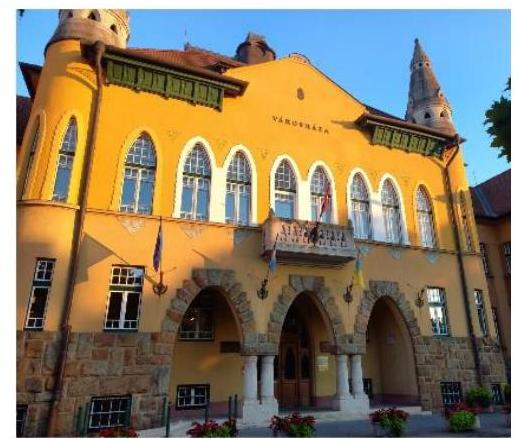
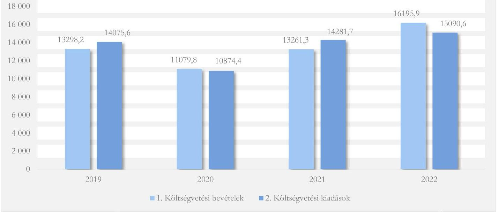
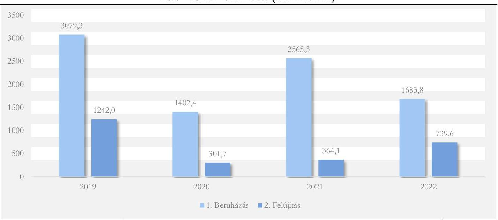
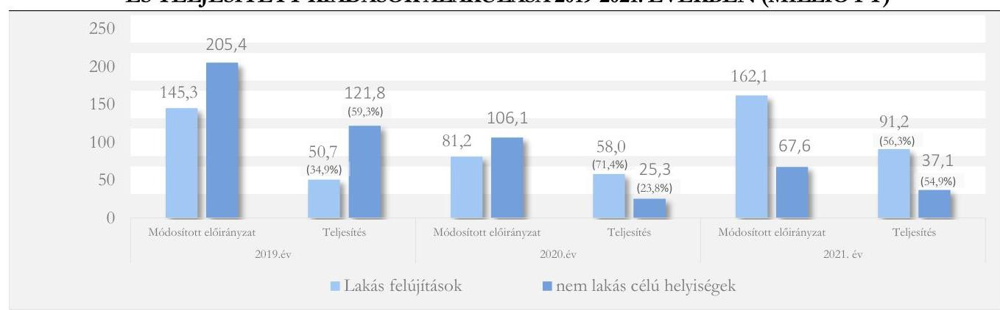

# JELENTÉS 

## Az önkormányzatok és központi költségvetési szervek ingatlanhasznosítási tevékenységének ellenőrzése

Budafok-Tétény Budapest XXII. kerület Önkormányzata

2024.

---

# JELENTÉS 

## Az önkormányzatok és központi költségvetési szervek ingatlanhasznosítási tevékenységének ellenőrzése

Budafok-Tétény Budapest XXII. kerület Önkormányzata

2024.

---

# ELLENŐRZÉSI IGAZGATÓSÁG: 

## ÁLLAMHÁZTARTÁS HELYI SZINTJÉT ELLENŐRZŐ IGAZGATÓSÁG

ELLENŐRZÉSI IGAZGATÓ:
KISGERGELY ISTVÁN igazgató

ELLENŐRZÉSVEZETŐ:
Jelentéseink az interneten a www.asz.hu címen olvashatók.

SZEIBEL GÁBORNÉ ellenőrzésvezető

IKTATÓSZÁM: EL-3711-007/2023.
TÉMASZÁM: 2648
ELLENŐRZÉS-AZONOSÍTÓ SZÁM: V0992

---

# TARTALOMJEGYZÉK 

■ AZ ELLENŐRZÉS ALAPADATAI ..... 5
■ AZ ELLENŐRZÖTT SZERVEZET ..... 7
■ ÖSSZEFOGLALÁS ..... 10
■ AZ ELLENŐRZÉS FÓKUSZKÉRDÉSEI ..... 12
■ MEGÁLLAPÍTÁSOK ..... 13
JAVASLATOK ..... 25
MELLÉKLETEK ..... 27
I. sz. melléklet: Értelmező szótár ..... 27
II. sz. melléklet: Az ellenőrzött szervezetek jegyzéke ..... 30
III. sz. melléklet: Ellenőrzési kritériumok ..... 31
IV. sz. melléklet: Az önkormányzat konszolidált mérlegadatai a 2019-2022. években ..... 33
V. sz. melléklet: Az önkormányzat konszolidált kiadási és bevételi adatai a 2019 - 2022. években ..... 34
VI. sz. melléklet: Az ingatlanok bérbeadással történő hasznosításával kapcsolatos mintatételek eltéréseinek részletezése ..... 35
VII. sz. melléklet: Kimutatás a mintatételek IVK, a részletező nyilvántartás és az Ingatlanügyi Hatóság nyilvántartása közötti eltérésekről ..... 36
FÜGGELÉK: ÉSZREVÉTELEK ..... 38
RÖVIDÍTÉSEK JEGYZÉKE ..... 50

---

.

---

# AZ ELLENŐRZÉS ALAPADATAI 

## AZ ELLENŐRZÉS CÉLJA

Az ellenőrzés célja a nemzeti vagyonnal gazdálkodó önkormányzat ingatlangazdálkodási, ingatlanhasznosítási tevékenységének értékelése volt. Az ellenőrzés kiterjedt arra, hogy az önkormányzat az ingatlangazdálkodási feladata ellátása során figyelemmel volt-e a vagyon értékének megőrzésére, állagának fenntartására, állományának gyarapítására.

## AZ ELLENŐRZÉS TÍPUSA

Megfelelőségi ellenőrzés.

## AZ ELLENŐRZÖTT IDŐSZAK

A 2019-2022. évek. A nyilvántartások ellenőrzése tekintetében a 2021. év.

## AZ ELLENŐRZÉS TÁRGYA

Az ellenőrzés tárgyát az Épít.tv. ${ }^{1} 2 . \int 8$. pontjában foglaltak szerinti építmények, a $2 . \int 10$. pontjában foglaltak szerinti épületek és a $2 . \int 21$. pont szerinti telkek, továbbá a Földtv. ${ }^{2}$ hatálya alá tartozó földterületek, valamint a 147/1992. (XI. 6.) Korm. rendelet ${ }^{3}$ 4. számú melléklete szerinti külterületi ingatlanok képezték.

Az ellenőrzés hatóköre kiterjedt arra, hogy az ellenőrzött szervezet a közfeladatok ellátását biztosító ingatlanokkal kapcsolatos gazdálkodás, hasznosítás területén, a jogszabályi előírások figyelembevételével gondoskodott-e az ingatlanvagyon megfelelő használatáról és hasznosításáról, értékének és állagának védelméről, állományának gyarapításáról. Az ellenőrzés azokat a szerződéseket vette figyelembe, amelyek a 2019-2022. években hatályosak voltak.

Az ÁSZ ${ }^{4}$ a megfelelőségi ellenőrzés keretében az ingatlanvagyonnal kapcsolatos intézkedések végrehajtásának, az azokkal összefüggő gazdasági események elszámolásának megfelelőségét, valamint a nemzeti vagyonba tartozó ingatlanok nyilvántartásának szabályszerűségét is ellenőrizte. A nemzeti vagyonba tartozó ingatlanokkal kapcsolatos gazdálkodási, hasznosítási tevékenységben érintett, kockázatelemzés alapján kiválasztott szervezet ezen feladatellátását támogató belső kontrollrendszere keretében a kontrollkörnyezet részeként a belső szabályozás kialakítása, továbbá a monitoring rendszer kialakítása és működtetése részeként a belső ellenőrzés, valamint az ingatlanokkal kapcsolatos gazdálkodási, hasznosítási tevékenységbe épített kontrolltevékenységek kerültek ellenőrzésre.

Az ingatlangazdálkodási tevékenység ellenőrzése az önkormányzat esetében az ingatlanok vagyonkezelésbe adására, ingyenes átvételére és átadására, hasznosítására (bérbe-, használatba adására), az ingatlan tulajdonjogának adásvétel keretében történő megszerzésére és értékesítésére, a beruházások, felújítások megvalósítására és az ingatlanok nyilvántartására irányult.

---

Az ellenőrzés kiterjedt minden olyan körülményre és adatra, amely az ÁSZ jogszabályban meghatározott feladatainak teljesítéséhez, valamint a program végrehajtása folyamán felmerült újabb összefüggések feltárásához szükséges volt.

# AZ ELLENŐRZÉS JOGALAPJA 

Az ellenőrzés jogszabályi alapját az ÁSZ tv. ${ }^{5} 1 . \int(3)$ bekezdése, 5. $\int(3)$ bekezdése és (4) bekezdés a) pontja képezték.

## AZ ELLENŐRZÉS MÓDSZERE

Az ellenőrzést az Alaptörvény 43. cikk (1) bekezdésében meghatározott törvényességi, célszerűségi szempontok, valamint a nemzetközi standardokat irányadónak tekintve az ellenőrzési program szempontjai, az ellenőrzött időszakban hatályos jogszabályok, az ellenőrzés szakmai szabályok és módszertanok figyelembevételével hajtotta végre az ÁSZ.

Az ellenőrzési bizonyítékként felhasználható adatforrások közé tartoztak egyrészt az ellenőrzéshez kért dokumentumok, adatforrások, másrészt adatforrás volt még minden - az ellenőrzés folyamán - feltárt, az ellenőrzés szempontjából információkat tartalmazó dokumentum.

Az ellenőrzés lefolytatásához az ellenőrzött szervezet a tanúsítványok kitöltésével, valamint az ÁSZ által kért dokumentumok, adatok, információk megküldésével és a helyszíni ellenőrzés során - interjú keretében szolgáltatott adatokat.

Az ingatlangazdálkodási, ingatlanhasznosítási tevékenység vonatkozásában az ellenőrzési kérdések megválaszolásához szükséges bizonyítékok megszerzése az ellenőrzött szervezet által rendelkezésre bocsátott dokumentumokra, adatokra alapozva, továbbá megfigyelés, helyszíni szemle (szemrevételezés), mintavételi eljárás, kérdésfeltevés (információkérés), interjú, helyszínen végzett ellenőrzés, valamint elemző eljárás alkalmazásával történt.

Az ingatlangazdálkodási, ingatlanhasznosítási tevékenységek, folyamatok tekintetében a belső kontrollrendszer egyes részeinek kialakítását és működtetését évente értékeltük.

A mintatételek köre az ellenőrzött területhez tartozó legnagyobb értékű elemekből állt, továbbá a mintavételi eljárás rétegzett és egyszerű véletlen mintavétellel, illetve kockázati alapú mintavételezéssel is kiegészült.

A tények feltárása és azok összegzése során a megállapítások az ellenőrzött mintatételekre vonatkozóan kerültek megfogalmazásra. Az ellenőrzésre kiválasztott mintatételek száma az ellenőrzött időszakra vonatkozóan az értékesítéseknél 38, az értéknövelő beruházások, felújítások, vásárlások körében 34, az ingatlanhasznosítás szabályszerűségének értékelésekor 36, a 2021. évi nyilvántartások egyeztetésénél 30 volt. Tételesen került ellenőrzésre a vagyonkezelésbe adásnál kettő, az ingyenes átadásnál négy, az ingyenes átvételnél kilenc mintatétel.

Az ÁSZ a törvényességi és célszerűségi szempontok, valamint az előre meghatározott ellenőrzési programja alapján végrehajtott ellenőrzésének megállapításait a „Megállapítások" fejezet tartalmazza. Az ellenőrzési kritériumokat a III. számú mellékletben ismertetjük.

---

# AZ ELLENŐRZÖTT SZERVEZET 

Budapest XXII. kerülete 1950-ben jött létre, Budafok város, Nagytétény és Budatétény községek egyesítésével. A kerület lakosságszáma 2022. december 31 -én 55726 fő volt.

Az Önkormányzat ${ }^{6}$ Képviselő-testület ${ }^{7}$-ét az ellenőrzött időszakban 17 fő alkotta, a 2022. december 31-ei állapot szerint a munkáját hat állandó bizottság - a Gazdasági, Vállalkozás- és Turizmusfejlesztési-; a Pénzügyi és Átláthatósági-; a Városfejlesztési és -üzemeltetési-; a Környezet- és Közrendvédelmi-; az Oktatási, Kulturális és Testvérvárosi-; a Szociális, Egészségügyi, Esélyegyenlőségi és Sportbizottság - segítette. Az Önkormányzat mellett nyolc helyi nemzetiségi önkormányzat - Bolgár-, Görög-, Lengyel-, Német-, Örmény- és Ukrán Nemzetiségi Önkormányzat, valamint Horvát- és Roma Önkormányzat - múködött.

Az ellenőrzött időszakban az önkormányzati feladatokat hét intézmény - Egyesített Bölcsőde, Egyesített Óvoda, Gyermekjóléti Központ, Szociális Szolgálat, Védőnői Szolgálat, Klauzál Gábor Művelődési Központ, Intézmények Gazdasági Irodája - látta el. Az önkormányzati feladatellátásban az önkormányzat tulajdonában lévő Dél-budai Egészségügyi Szolgálat Közhasznú Nonprofit Kft. (általános járóbeteg-ellátás), a Budafoki Dohnányi Ernő Szimfonikus Zenekar Közhasznú Nonprofit Kft. (előadó-művészet) és a Budafok-Tétényért Városfejlesztő Kft. (mérnöki tevékenység, műszaki tanácsadás) vett részt. Szervezeti átalakítással, feladatellátással kapcsolatos változás a 2019-2022. években nem történt.

A polgármester ${ }^{8} 2014$ óta látja el Budapest XXII. kerületének polgármesteri feladatait. Az ellenőrzött időszakban hivatalban lévő jegyző 2011 óta töltötte be a tisztséget, az ellenőrzés lefolytatása során a jegyző ${ }^{9}$ személyében változás történt, 2023. április 17-től új jegyző vezeti a Polgármesteri Hivatalt ${ }^{10}$.

Az Önkormányzat költségvetési kiadásainak összege a 2019. évi 14 075,5 millió Ft-ról a 2022. évre 7,2\%kal, 15 090,6 millió Ft-ra emelkedett, a költségvetési bevételek összege a 2019. évi 13 298,2 millió Ft-ról a 2022. évre $21,8 \%$-kal, 16 195,9 millió Ft-ra nőtt (1. ábra). A finanszírozási kiadások a 2019. évben 3 038,6 millió Ft, míg a 2022. évben 27 199,3 millió Ft összegben (ebből 27 000,0 millió Ft betétlekötés) teljesültek. A finanszírozási bevételek összege a 2019. évben 8779,6 millió Ft, melyből az előző évi költségvetési maradvány igénybevételének összege 3 707,5 millió Ft volt; a 2022. évben 29 400,0 millió Ft volt, amelyből 23000 millió Ft lekötött betétek megszüntetése, 6 176,1 millió Ft előző évi költségvetési maradvány igénybevétele volt. Az Önkormányzatnak az ingatlanok értékesítéséből a 2019-2022. években összesen 2 794,2 millió Ft bevétele származott.

---

1. ábra

KÖLTSÉGVETÉSI KIADÁSOK ÉS BEVÉTELEK KONSZOLIDÁLT ÖSSZEGE A 2019 - 2022. ÉVEKBEN (MILLIÓ FT)

A beruházások és felújítások a 2019. évhez képest jelentősen visszaestek (2. ábra), a beruházások összege a 2022. évre $45,3 \%$-kal, a felújítások összege $40,5 \%$-kal csökkent. A 2022. évi beruházások a 2021. évihez viszonyítva közel $35 \%$-kal estek vissza, míg a 2022. évi felújítások összege a 2021. évihez képest megduplázódott.
2. ábra

# BERUHÁZÁSI, FELÚJÍTÁSI CÉLÚ KIADÁSOK KONSZOLIDÁLT ÖSSZEGE A 2019 - 2022. ÉVEKBEN (MILLIÓ FT) 

Forrás: Az Önkormányzat 2019-2021. évi költségvetési beszámolói; a 2022. év a KGR K11 és a zárszámadási rendelet, alapján, ÁSZ saját szerkesztés
Útépítésre a 2019. évben 1684,6 millió Ft-ot, a 2020. évben 918,8 millió Ft-ot, a 2021. évben 880,5 millió Ft-ot és a 2022. évben 555,0 millió Ft-ot fizettek ki. A 2019. évben a Hajó utca Duna parti sétány környezetének fejlesztésére 449,0 millió Ft-ot, a Budafoki Művészeti és Helytörténeti Galériára a 2020. évben 172,9 millió Ft-ot fordítottak. A Terv utcai bölcsőde építése 694,1 millió Ft, az Elágazás park I. üteme

---

166,6 millió Ft kiadást jelentett a 2021. évben. Az Önkormányzat az ellenőrzött időszakban 5 612,9 millió Ft összegben részesült energetikai, korszerűsítési, illetve ingatlanfejlesztési, beruházási pályázati támogatásban. A pályázati források több, mint fele a fővárosi kerületi belterületi szilárd burkolat nélküli utak szilárd burkolattal történő ellátásához kapcsolódott. Az ellenőrzött négy év során ingatlanok vásárlására 448,8 millió Ft-ot költöttek, fejlesztési célra a saját gazdasági társaságok részére összesen 700,8 millió Ft támogatást nyújtottak, továbbá összesen 714,4 millió Ft-ot fizettek ki út-, támfal-, járda- és lépcsőfelújításra.

A 2019-2022. években az Önkormányzat vagyonán belül a tárgyi eszközök aránya valamennyi évben elérte a $82,0 \%$-ot. A tárgyi eszközöket meghatározóan az ingatlanok és vagyoni értékủ jogok képviselték, amelyek aránya a tárgyi eszközökön belül 96,4-98,5\% között alakult. Az ingatlanok és vagyoni értékủ jogok 2019. évi mérlegben kimutatott értéke 48464,2 millió Ft volt, amelyet viszonyítási alapnak tekintve folyamatos, évről-évre történő bővülés során - a 2022. évre az értékük 6,3\%-kal 51530,7 millió Ft-ra emelkedett, melynek $87,2 \%$-át a törzsvagyon - út, híd, járda, alul- és felüljárók, intézmények ingatlanjai képezte 44931,2 millió Ft értékben. A mérlegen kívüli tételként kezelt, vagyonkezelésbe adott önkormányzati vagyon - például iskolák, Káldor Adolf Szakrendelő - értéke 2022. év végén 4 952,6 millió Ft volt.

# TÁRGYI ESZKÖZÖK KONSZOLIDÁLT MÉRLEG SZERINTI ALAKULÁSA A 2019 - 2022. ÉVEKBEN (MILLIÓ FT) 

| TÁRGYI ESZKÖZÖK | 2019. | 2020. | 2021. | 2022. |
| :--: | :--: | :--: | :--: | :--: |
| A/II/1 Ingatlanok és a kapcsolódó vagyoni értékú jogok | 48464,2 | 49576,8 | 49799,4 | 51530,7 |
| Ingatlanok és vagyoni értékú jogok a tárgyi eszközök arányában | $98,2 \%$ | $98,3 \%$ | $96,4 \%$ | $98,5 \%$ |
| A/II/2 Gépek, berendezések, felszerelések, jármúvek | 322,2 | 277,2 | 259,4 | 278,8 |
| A/II/4 Beruházások, felújítások | 562,5 | 602,2 | 1625,8 | 497,0 |
| Tárgyi eszközök összesen | 49348,8 | 50456,2 | 51684,7 | 52306,4 |
| ESZKÖZÖK ÖSSZESEN | 59941,8 | 61267,1 | 61685,7 | 63822,4 |

Forrás: 2019-2021.évekre a MAK ${ }^{12}$ által az ASZ részére megküldött adatbázisok; továbbá a 2022. évi zárszámadási rendelets
Az Önkormányzat 2022. évi alaptevékenységének teljes maradványa 3306,0 millió Ft volt, amelyből 1 960,9 millió Ft kötelezettségvállalással nem terhelt - szabad - maradvány volt.

A könyvvizsgálattal kapcsolatos feladatokat a 2016. évtől megbízás alapján ugyanaz a gazdasági társaság látta el.

Az ellenőrzött időszakban az önkormányzati tulajdonú belterületek nagysága a 2019. év eleji 4264 493,0 m²-ről 2022. év végére minimális mértékben 4258 738,0 m²-re csökkent; a külterületek nagysága a 2019. év eleji $734667 \mathrm{~m}^{2}$-ről 2022. év végére $27,2 \%$-kal $934515,0 \mathrm{~m}^{2}$-re nőtt. A belterületek összterületen belüli aránya 2019. év elejétől 2022. év végéig 82,0-85,3\% között alakult.

---

# ÖSSZEFOGLALÁS 

Az ÁSZ általános hatáskörrel végzi az önkormányzati vagyonnal való felelős gazdálkodás ellenőrzését. Az önkormányzatok vagyona az önkormányzati feladatok és célok ellátását szolgálja, ideértve a lakosság közszolgáltatásokkal való ellátását, és az ezekhez szükséges infrastruktúra biztosítását. Az önkormányzati vagyonba tartozó ingatlanok jelentős anyagi értéket képviselő vagyonelemek, amelyek esetében kiemelten fontos a nemzeti vagyonnal való felelős gazdálkodás követelményeinek érvényesítése. Mindezek alapján került sor az Önkormányzat ingatlangazdálkodási tevékenységének ellenőrzésére.

Az Önkormányzatnál az ingatlanvagyon értékesítése, az önkormányzati tulajdonú ingatlanok tulajdonjogának ingyenes átruházása szabályszerűen történt.

Az ingatlanok vagyonkezelésbe adásához kapcsolódó tevékenységek ellátása egy esetben megfelelt a jogszabályi előírásoknak, egy további esetben azonban nem rendelkeztek az illetékes miniszter hozzájárulásával a vagyonkezelési jog létesítéséhez.

Az ingatlanhasznosítás területén ellenőrzött 36 gazdasági esemény közül egy esetben nem került sor a szerződésben előírt megállapodás megkötésére, további hat esetben a bérleti díjak megállapítása nem felelt meg a jogszabályi előírásoknak és a belső szabályozásoknak, 29 esetben szabályszerű volt.

Az ellenőrzött 34 ingatlanvásárlással, -beruházással, -felújítással kapcsolatos intézkedés végrehajtása, elszámolása szabályszerű volt, amellett, hogy a kötelezettségvállalásokról vezetett nyilvántartás az Áhsz. ${ }^{13}$ 14. melléklet előírása ellenére a pénzügyi ellenjegyzésre vonatkozó adatot nem tartalmazta.

Az ingatlanok térítésmentes átvétele szabályszerű volt, azonban a kilenc ellenőrzött átvétel közül egy esetben, az Ipartestület ${ }^{14}$ által az Önkormányzat részére visszaajándékozott - haszonélvezeti joggal terhelt ingatlan esetében az átvételt követően az önkormányzati támogatásból megvalósított felújítás eredményeként az ingatlanon jelentkező értéknövekedés az Önkormányzat könyveiben, mérlegében nem jelent meg. Az épületfelújítással, -beruházással kapcsolatos együttműködési megállapodásban vállalt kötelezettségek esetében nem tartották be az Ávr. ${ }^{15}$ kötelezettségvállalások nyilvántartására, valamint az Áht. ${ }^{16}$ költségvetési tervezésre vonatkozó előírásait.

Az Önkormányzat az ingatlanok tekintetében karbantartási tervekkel nem rendelkezett, továbbá a Képviselő-testület felé nem készített olyan tartalmú előterjesztéseket, melyek bemutatták volna, hogy a beruházások, felújítások, karbantartások elmaradása a vagyongazdálkodásra milyen kihatással jár. Az Ehat. tv. ${ }^{17}$ ben foglaltak ellenére az EMIT ${ }^{18}$ teljesítéséről éves jelentés az ellenőrzött időszakban nem készült.

Az Önkormányzat tulajdonában lévő ingatlanok nyilvántartásával kapcsolatos feladatok ellátása a 30 mintatétel ellenőrzése alapján nem felelt meg a jogszabályi előírásoknak.

Az Önkormányzat a kizárólagos tulajdonában lévő gazdasági társaságának szabályszerűen vagyonkezelésbe adott Káldor Adolf Szakorvosi Rendelő értékét az Áhsz.-ben előírtak ellenére tévesen államháztartáson belül vagyonkezelésbe adott eszközként mutatta ki, emiatt a költségvetési beszámoló mérlege jelentős összegű hibát tartalmazott. A Káldor Adolf Szakorvosi Rendelő értéke - az Önkormányzat 2019. évi 48 464,2 millió Ft-os ingatlanvagyonából - 1 199,1 millió Ft értéket jelentett. Ezen túl a Káldor Adolf Szakorvosi Rendelő telke az Áhsz. szerinti tárgyi eszközök részletező nyilvántartásában helytelenül forgalomképes vagyonként szerepelt, míg a Vagyonrendelettel ${ }^{19}$ egyező IVK ${ }^{20}$-ban helyesen korlátozottan forgalomképes vagyonként került besorolásra.

---

Az uszoda szolgáltatási koncesszió keretében való üzemeltetésre átadásának nyilvántartásokban történő átvezetése nem felelt meg a számlarendben előírtaknak. Az uszoda szerződés ${ }^{21}$-ben az üzemeltetésre átadott berendezési tárgyakat nem tüntették fel, ami kockázatot jelent az Nvtv. ${ }^{22}$-ben foglalt, a nemzeti vagyon megőrzésére vonatkozó előírás maradéktalan érvényesülésére.

Az Önkormányzat a Számv. tv. ${ }^{23}$ és az Áhsz. előírásai ellenére az ingatlanállomány legalább három évente történő mennyiségi leltárfelvételét nem végezte el, az ingatlanok térinformatikai felmérését követően csak a változásokról rendelkezett negyedévente kimutatással.

A 147/1992. (XI. 6.) Korm. rendeletben foglaltak ellenére az IVK és az Ingatlanügyi Hatóság ${ }^{24}$ nyilvántartása az ingatlan jellegére vonatkozó részletező adatok tekintetében az ellenőrzött 153 mintatétel $11,1 \%$-a esetében eltérést mutatott.

Az Önkormányzatnál az ingatlangazdálkodási, -hasznosítási tevékenységek, folyamatok tekintetében a belső kontrollrendszer kialakítása megfelelő volt. Az Önkormányzat az önkormányzati vagyonnal történő gazdálkodás szabályait meghatározta a $\mathrm{Htv}^{25}$. előírása alapján, az ingatlangazdálkodási, -hasznosítási tevékenysége végrehajtásához kapcsolódó szabályzatokkal, tervekkel rendelkezett. A számlatükör ugyanakkor nem volt összhangban az Áhsz. mellékletében foglalt egységes számlakerettel, valamint a kötelezettségvállalási szabályzat ${ }_{1.3}{ }^{26}$ átláthatósági nyilatkozatra vonatkozó rendelkezése nem felelt meg az Ávr.ben előírtaknak.

A kontrolltevékenységek müködtetése az ingatlangazdálkodás területén - az ellenőrzés során feltárt hiányosságok miatt - nem volt megfelelő.

A belső ellenőrzés a 2019-2022. évek között öt ingatlangazdálkodást érintő ellenőrzést hajtott végre, az ellenőrzési jelentések tartalma alapján a Bkr. ${ }^{27}$ előírásának megfelelően intézkedési tervek készültek.

A polgármester részére kettő, a jegyző részére 14 javaslatot fogalmaztunk meg az ellenőrzés során feltárt hiányosságok megszüntetése, valamint az ingatlangazdálkodási és -hasznosítási tevékenység jogszabályokban foglalt alapelveknek való megfelelősége érdekében.

Az ellenőrzött szervezet vezetője az ÁSZ tv. 29. § (2) bekezdés szerinti, a jelentéstervezet megállapításaira tett észrevételében arról tájékoztatta az ÁSZ-t, hogy intézkedéseket tett a hiányosságok megszüntetésére a vagyonkezelői jog létesítéséhez szükséges miniszteri hozzájárulás elmaradásával, a bérleti díjak hiányos szabályozásával, illetve azok nem megfelelő megállapításával, az elmaradt mennyiségi leltárfelvétellel, a gazdasági esemény számlán, valamint könyvviteli nyilvántartásban való nem megfelelő megjelölésével, az EMIT-ek teljesítéséről szóló éves jelentések nem teljesítésével kapcsolatos megállapítások alapján. Intézkedett továbbá a mobil jégpálya múködtetésére és hasznosítására vonatkozó külön megállapodás megkötésére az arra vonatkozó javaslat szerint. Ezen túl intézkedés megtételét tervezi a karbantartási terv elkészítésére vonatkozóan. Az ellenőrzés folyamatában megtett intézkedések hozzájárulhatnak a jelentés megállapításainak hasznosulásához. A jelentéstervezet megállapításainak észrevételezése időszakában az Önkormányzat az uszoda szerződés ${ }_{2}$ közzétételére vonatkozó kötelezettségének eleget tett, a hiányosságot megszüntette, ezáltal az ellenőrzés megállapítása az ellenőrzés folyamatában hasznosult.

---

# AZ ELLENŐRZÉS FÓKUSZKÉRDÉSEI 

1.     - A nemzeti vagyonba tartozó ingatlanokkal való gazdálkodással, hasznosítással kapcsolatos intézkedések végrehajtása, illetve azok elszámolása megfelelő volt-e?
2.     - A nemzeti vagyonba tartozó ingatlanok nyilvántartásával kapcsolatos feladatok ellátása szabályszerű volt-e?
3.     - A nemzeti vagyont használó szervezetnél az ingatlangazdálkodási, ingatlanhasznosítási tevékenységek, folyamatok tekintetében a belső kontrollrendszer kialakítása és müködtetése megfelelően történt-e?

---

# MEGÁLLAPÍTÁSOK 

## 1. A nemzeti vagyonba tartozó ingatlanokkal való gazdálkodással, hasznosítással kapcsolatos intézkedések végrehajtása, illetve azok elszámolása megfelelő volt-e?

| Összegző megállapítás | Az Önkormányzatnál a nemzeti vagyonba tartozó   ingatlanokkal való gazdálkodással, hasznosítással   kapcsolatos intézkedések végrehajtása és elszámolása nem   minden területen volt megfelelő. Az ingatlanok   vagyonkezelésbe adása nem felelt meg teljeskörűen a   jogszabályi előírásoknak, az ingatlanok bérbeadással történő   hasznosítása nem volt szabályszerű. Az   ingatlannyilvántartások közötti összhang nem minden   esetben volt biztosított, a mérleg jelentős összegű hibát   tartalmazott. Az Nvtv. felelős vagyongazdálkodásra, az   ingatlanvagyon értékének, állagának megőrzésére vonatkozó   előírásai nem érvényesültek teljeskörűen. |
| :--: | :--: |
| 1.1. számú megállapítás | Az Önkormányzat tulajdonában lévő védetté nyilvánított régészeti   lelőhely vonatkozásában az Mötv. ${ }^{29}$-ben és a vagyonkezelési   szerződésben előírtak ellenére az Önkormányzat nem rendelkezett az   illetékes miniszter hozzájárulásával a vagyonkezelői jog létesítéséhez. |

Az Önkormányzat az ellenőrzött időszakban egy orvosi szakrendelőt és egy régészeti lelőhelyként nyilvántartott területet adott vagyonkezelésbe.
Az ingatlanok vagyonkezelésbe adásakor az Mötv.-ben, az Nvtv.-ben és a Vagyonrendeletben foglalt előírásoknak megfelelően a vagyonkezelői jog létesítésére vonatkozó döntéseket a Képviselő-testület hozta meg, a vagyonkezelési szerződéseket a hatáskörrel rendelkező polgármester kötötte meg.
Az ingatlanok ingyenes vagyonkezelésbe adása kizárólag közfeladat ellátása, illetve a lakosság közszolgáltatásokkal való ellátásához szükséges infrastruktúra biztosítása (egészségügyi ellátás, gépjárművek parkolása) céljából történt az Nvtv.-ben előírtaknak megfelelően. Az Önkormányzat a vonatkozó vagyonkezelési szerződésekben az Mötv.-ben és a Vagyonrendeletben előírtakkal összhangban rögzítette a vagyonkezelés ellenőrzésének részletes szabályait, valamint az Nvtv.-ben és az Mötv.ben előírtaknak megfelelően a visszapótlási kötelezettség elengedését.
Az Önkormányzat tulajdonában lévő, védetté nyilvánított régészeti lelőhely vonatkozásában (2. mintatétel) az Mötv. 109. § (5) bekezdésben és a vagyonkezelési szerződés 7.6. pontjában előírtak ellenére nem rendelkeztek az illetékes miniszter ${ }^{29}$ hozzájárulásával a vagyonkezelői jog létesítéséhez.

---

1.2. számú megállapítás

Az Önkormányzatnál az ellenőrzött időszakban az ingatlanok értékesítése szabályszerűen történt.

Az ingatlanok értékesítésére vonatkozó döntést az arra hatáskörrel rendelkező Képviselő-testület, az Önkormányzat erre felhatalmazott bizottsága, illetve a polgármester hozta meg, az Mötv.-ben, valamint a Vagyonrendeletben és az Elidegenítési rendelet ${ }^{30}$-ben előírt szabályozásnak megfelelően. A kihirdetett veszélyhelyzetek időszakában a jogszabályi felhatalmazások (40/2020. (III. 11.) Korm. rendelet ${ }^{31}, 478 / 2020$. (X. 13.) Korm. rendelet ${ }^{32}$, 2011. évi CXXVIII. törvény ${ }^{33} 46 . \S$ (4) bekezdése) alapján a Képviselő-testület hatáskörét a polgármester gyakorolta, amelyről a Képviselő-testület felé tájékoztatást adott.
Az ingatlanok értékesítése az Nvtv. előírása szerint minden mintatétel esetében természetes személy vagy átláthatósági nyilatkozattal rendelkező szervezet részére történt. Az ingatlanok értékesítésére 30 esetben (1-3., 5-8., 10-18., 22-29., 31-34., 37-38. mintatételek) az Nvtv.-ben, a Vagyonrendeletben és az Elidegenítési rendeletben előírtaknak megfelelően versenyeztetés (árverés) útján, értékbecslés alapján került sor. Az Önkormányzat az ingatlanok árverését a Vagyonrendeletben előírtaknak megfelelően - a Polgármesteri Hivatalban történt felhívás közzétételével - meghirdette, az ingatlanokat a legmagasabb vételi ajánlatot tevőnek a becsült értéken, vagy afölött értékesítette.
Versenyeztetés mellőzésére nyolc mintatételnél (4, 9., 19-21., 30., 35-36. mintatételek) az Mötv.-ben és a Lakástv. ${ }^{34}$-ben, valamint a Vagyonrendeletben meghatározott esetekben - az Önkormányzat tulajdonában levő ingatlan cseréje, bérlőnek elővásárlási jog alapján lakás, illetve egyéb helyiség értékesítés, kötött vevős értékesítés, telekrendezés - került sor.
A Vagyonrendeletben előírtaknak megfelelően az ingatlanok értékét ingatlanérték meghatározó szakvéleménnyel, telekrendezés esetében adó-és értékbizonyítvánnyal alátámasztották.
Az ingatlanok értékesítésekor az Nvtv.-ben előírtaknak megfelelően biztosították az állam minden más jogosultat megelőző elővásárlási jogának érvényesítését, amellyel az állam egyik ingatlan esetében sem élt.
Az ingatlanok ellenértéke a szerződés szerinti értékben folyt be. A határidőn túli befizetéseknél a vevők a szerződésben rögzített késedelmi kamatot megfizették.
1.3. számú megállapítás

A nemzeti vagyon körébe tartozó ingatlanok ingyenes - térítés nélküli átadása az Önkormányzatnál az ellenőrzött időszakban szabályszerűen történt.

Önkormányzati tulajdonú ingatlanok tulajdonjogának ingyenes átruházására az ellenőrzött időszakban valamennyi esetben az Mötv.-ben előírt feladatellátás elősegítése - szennyvízelvezetés, közvilágítás biztosítása, óvodai nevelés - érdekében került sor.
Az Önkormányzat a nemzeti vagyon körébe tartozó ingatlanok ingyenes átadása során az Mötv.-ben, az Nvtv.-ben, a Vagyonrendeletben foglalt előírásokat betartotta. Az ingatlanok tulajdonjogának ingyenes átruházására az Mötv. által előírt szervezetek (más helyi önkormányzat, egyházi jogi személy) részére került sor, a döntéseket az Mötv.-ben és a Vagyonrendeletben előírtaknak megfelelően a Képviselőtestület hozta meg minősített többséggel.

---

1.4. számú megállapítás

Az Önkormányzat közfeladatai ellátásának céljára - MNV Zrt. ${ }^{35}$-től, valamint gazdasági társaságtól átvett ingatlanok tulajdonjogának térítés nélküli átvételénél az Mötv. előírásai szerint jártak el. A döntésről hozott képviselő-testületi határozatokban megjelölték az Mötv.-ben meghatározott közfeladatokat (közcélú parkoló kialakítása, közparkok és egyéb közterületek kialakítása és fenntartása). Az MNV Zrt.-vel kötött szerződésben rögzítették az Nvtv.-ben előírtak szerint a juttatott vagyon állagmegóvására, az átvett ingatlan 15 éven belüli elidegenítési tilalmára vonatkozó rendelkezéseket.
Az Önkormányzat a térítésmentesen átvett ingatlanok bekerülési értékét a Számv. tv. és az Áhsz. előírásának megfelelően határozta meg és az állományba vétel időpontjában ismert piaci értéken vette nyilvántartásba.
Az ajándékozási szerződés alapján - az Ipartestülettől - történt térítésmentes átvételnél (7. mintatétel) az ajándékozás elfogadására vonatkozó döntést a veszélyhelyzetre figyelemmel a 478/2020. (X. 13.) Korm. rendelet, valamint a 2011. évi CXXVIII. törvény előírásainak megfelelően a polgármester hozta meg.
1.5. számú megállapítás

Az Önkormányzatnál az ingatlanok bérbeadással történő hasznosítása nem volt szabályszerű, mert a bérleti díjak megállapítása során nem minden esetben tartották be a jogszabályok és az önkormányzati rendeletek előírásait.

Bérbeadásra az ellenőrzött időszakban bérlakások, üzlethelyiségek és egyéb ingatlanok (így például garázs, telek) körében került sor. Az ellenőrzött időszakban első ízben hasznosításra került ingatlanok (hat ingatlan) - a Vagyonrendeletben, illetve a Bérbeadási rendelet ${ }_{1.2}$-ben foglaltak figyelembevételével, az Mötv. és az Nvtv. versenyeztetésre vonatkozó szabályainak megfelelően kerültek bérbeadásra.
Az ingatlanok hasznosításának időtartamát az Nvtv. előírásának megfelelve állapították meg. Az Nvtv. előírásainak megfelelően a szerződések tartalmazták a bérlők vállalását arra vonatkozóan, hogy az előírt adatszolgáltatási kötelezettségeket teljesítik, az átengedett önkormányzati vagyont a szerződési előírásoknak és a tulajdonosi rendelkezéseknek, valamint a meghatározott hasznosítási célnak megfelelően használják.
Az ellenőrzött időszakban megkötött, illetve módosított bérleti szerződések esetében a díjbeszedések elrendelésének döntési folyamata és a gazdálkodási jogkörök gyakorlása a belső szabályok - a Vagyonrendelet, a kötelezettségvállalási szabályzat ${ }_{1.3}$, a polgármesteri kiadmányozási szabályzat ${ }_{1.4}{ }^{36}$ - előírásainak betartásával történt.
Két esetben (8. és 27. mintatételek) az Önkormányzat a 609/2020. (XII. 18.) ${ }^{37}$ Korm. rendelet 1. § (2) bekezdés, illetve a 27/2021. (I. 29.) Korm. rendelet ${ }^{38}$ 4. § 43. pont ellenére a tulajdonában lévő ingatlanokra kötött bérleti szerződések szerinti bérleti díjat megemelte a kihirdetett veszélyhelyzet időszakában, illetve az annak megszűnését követő kilencven napban.
Az Önkormányzat a bérbeadásból származó bevételei költségvetési-, illetve pénzügyi számvitel szerinti elszámolása során - egy eset kivételével - érvényesítette a Számv. tv., az Áhsz. és a 38/2013. (IX. 19.) NGM rendelet ${ }^{39}$ előírásait.

---

Egy esetben (10. mintatétel) előfordult, hogy a Számv. tv. 167. § (1) bekezdés e) pontja ellenére a kiállított számla nem a megtörtént gazdasági esemény megjelölését tartalmazta, mert az alapbizonylatként szolgáló haszonbérleti szerződés tárgyával (halgazdálkodási jog haszonbérleti jogának alhaszonbérletbe adása), a valós gazdasági eseménnyel nem volt összhangban a kiállított számlán szereplő gazdasági múvelet leírása (telek bérleti díj). Emiatt a számla alapján a számviteli (könyvviteli) nyilvántartásba történő bejegyzés nem felelt meg a Számv. tv. 165. § (2) bekezdése szerinti követelményeknek.
Az önkormányzati ingatlanvagyon bérbeadásáról szóló döntési hatásköröket a Vagyonrendelet előírásának megfelelően a Képviselő-testület, az Önkormányzat erre kijelölt bizottsága, továbbá a polgármester gyakorolta. Az Önkormányzat nem szabályozta a bérleti díjat azon ingatlanok vonatkozásában, ahol egy hrsz. ${ }^{40}$ alatt egymástól elválaszthatatlanul több, lakás- és nem lakáscélú ingatlanrész volt nyilvántartva. A hiányos szabályozás következtében az Önkormányzat egy ingatlan (családi ház kerttel és melléképületekkel) esetében (4. mintatétel) a $886 \mathrm{~m}^{2}$-es telken fekvő ingatlanelemek bérleti díját csak az ingatlanon található $111 \mathrm{~m}^{2}$-es lakóház hasznos alapterülete alapján állapította meg. A szerződés szerint a bérlő piaci alapú bérleti díjat volt köteles fizetni, azonban az Önkormányzat által a lakóházra vonatkozóan megállapított lakbér - szerződés szerint és kiszámlázott - összege kisebb volt a Lakbérrendelet ${ }^{41}$ 11. $\mathbb{S}$ (1) bekezdésében fennálló körülmény figyelembevételével kalkulált, a Lakbérrendelet 1. melléklet b) Piaci alapú bérleti díjak pontjában szereplő előírt díjtételnél. Ez utóbbi következtében a lakóház esetében - a 2019-2022. években - az Önkormányzatnál 564,5 E Ft bevétel kiesés keletkezett.
Két esetben a szociális alapú bérleti díjra való jogosultság megállapítása nem volt alátámasztott a Bérbeadási rendelet, ${ }^{42}$ 12. $\mathbb{S}$-ában foglaltak ellenére (5. és 6. mintatételek). Az ingatlanok bérbeadással történő hasznosítására irányuló, mintatételekkel kapcsolatos hiányosságok részletezését a VI. sz. melléklet tartalmazza.
A Képviselő-testület a 2019. évben döntött mobil jégpálya létesítéséről, és az erre vonatkozó együttmúködési megállapodás megkötéséről. A döntés szerint a részben $\mathrm{TAO}^{43}$-támogatásból megvalósuló mobil jégpálya létesítéséhez és használatához szükséges területet (ingyenes földhasználati jogot), a pályázati önrészt, valamint a beruházás megvalósulásához a közmúvek kialakítását biztosította az Önkormányzat. A megépült mobil jégpálya nem képezte az Önkormányzat tulajdonát.
Az Önkormányzat és a jéghoki klub ${ }^{44}$ között 2019. július 4-én létrejött együttműködési megállapodás 6. pontjában rögzítettek ellenére az Önkormányzat és a jéghoki klub között nem készült külön megállapodás a sportlétesítmény működtetésére és hasznosítására, az önkormányzati közfeladat körébe illeszkedő sportcélú tevékenység céljára történő használatára. Az együttműködési megállapodás 6.3. pontja szerint a jéghoki klubot az általános üzemeltetési kötelezettség, míg az Önkormányzatot a közcélú igénybevételhez kapcsolódó költségek viselése terhelte. Az Önkormányzat által - a jégsátor üzemeltetési költségeinek alakulásáról - készített kimutatás szerint az együttműködési megállapodás 6.3. pontjában rögzítettek ellenére - külön megállapodás hiányában - a közüzemi költségek az Önkormányzat részéről tovább számlázásra kerültek a jéghoki klub részére. A jéghoki klub részéről a pénzügyi teljesítés megtörtént.
1.6. számú megállapítás

Az Önkormányzatnál az ingatlan vásárlással, beruházással, felújítással kapcsolatos intézkedések végrehajtása, elszámolása szabályszerű volt.

Az ingatlanokhoz kapcsolódó beruházások és felújítások során a Kbt. ${ }^{45}$-ben foglaltaknak megfelelően az Önkormányzat a közbeszerzési értékhatárt elérő esetekben lefolytatta a közbeszerzési eljárásokat. A szerződéseket valamennyi esetben a Kbt. előírásai szerint a nyertes ajánlattevővel írásban kötötte

---

meg az Önkormányzat. Az elektronikus közbeszerzési szabályzat ${ }_{1-3}{ }^{46}$ előírásának megfelelően elkészített éves közbeszerzési tervek tartalmazták a 2019-2022. évekre tervezett beszerzéseket.
A Kbt. hatálya alá nem tartozó beszerzésekre szabályosan, a beszerzési szabályzat ${ }^{47}$ előírásai szerint több ajánlat bekérésével - került sor.
A visszterhes szerződésekkel kapcsolatosan a kötelezettségvállalást és a pénzügyi ellenjegyzést az Áht. és az Ávr. előírásainak megfelelően az arra jogosult személyek szabályszerűen tették meg.
A kötelezettségvállalásokról vezetett nyilvántartás az Áhsz. 14. melléklet II. 4. a) és f) pontja szerinti pénzügyi ellenjegyzésre vonatkozó adatok kivételével valamennyi előírt elemet tartalmazott.
Az érvényesítésre és az utalványozásra az Áht. és az Ávr. előírásainak megfelelően került sor.
A 2011. évi CXXVIII. törvény alapján a 40/2020. (III. 11.) Korm. rendelet, a 478/2020. (XI. 3). Korm. rendelet és a 27/2021. (I. 29.) Korm. rendelet szerinti veszélyhelyzet ideje alatt a beruházásokkal, felújításokkal, vásárlásokkal kapcsolatosan a polgármester több döntést is hozott a Képviselő-testület feladat- és hatáskörében eljárva, amelyekről a Képviselő-testületet tájékoztatta, azokat a Képviselő-testület tudomásul vette.
Ingatlanok vásárlása esetén a Vagyonrendeletben, illetve a kerületi építési szabályzat ${ }^{48}$-ban foglaltaknak megfelelően jártak el.
A Vagyonrendeletben foglaltaknak megfelelően a forgalmi érték meghatározása forgalmi értékbecslés vagy a jegyző által kiállított adó- és értékbizonyítvány alapján történt.
A 223629 hrsz.-ú, $694 \mathrm{~m}^{2}$ területű, „kivett pártház" ingatlant az Önkormányzat a 2004. évben az Ipartestületnek ajándékozta. Az Önkormányzat és az Ipartestület között több peres eljárásra került sor az ellenőrzött időszakot megelőzően. Peren kívüli egyezség keretében az ingatlant 2021. január 5-ei nappal az Ipartestület az Önkormányzatnak visszaajándékozta. Az ajándékozási szerződés megkötésére vonatkozó döntést - a veszélyhelyzet idején a 478/2020. (XI. 3.) Korm. rendelet figyelembevételével szabályszerűen a polgármester hozta meg.
Az ajándékozási szerződés alapján a szerződő felek szándéka a 2004. július 08-án kötött ajándékozási szerződés előtti állapot helyreállítása volt azzal a kitétellel, hogy az értéknövelő felújítás értékét - amelyet a peres eljárás során a Kúria felülvizsgálati eljárásában kirendelt igazságügyi szakértő $35000,0 \mathbf{E F t}$ értékben határozott meg - az Önkormányzat megtéríti az Ipartestület számára. Ezt a feltételt az Önkormányzat teljesítette. A peren kívüli egyezség következtében az ingatlant az Ipartestület kizárólagos tulajdonában lévő ipartestületi gt. ${ }^{49}$ 2020. október 16. napjától 30 éves időtartamra szóló haszonélvezeti joga terheli. Az ipartestületi gt.-t 2020. szeptember 22-én alapította az Ipartestület. Az ajándékozási szerződés 4.1. pontjában rögzítésre került, hogy az ingatlan használatára, hasznosítására a haszonélvezeti joggal rendelkező ipartestületi gt. a jogosult. Ennek következtében az Önkormányzat az ingatlanra vonatkozó tulajdonosi jogait hosszútávon csak korlátozottan érvényesítheti.
A 2020. október 29-ei értékbecslés alapján az ingatlan piaci forgalmi értéke 104 800,0 E Ft volt. Az értékbecslés a 30 évre szóló haszonélvezeti jog miatti jelentős - 97 509,7 E Ft-os - csökkenés figyelembevételével az ingatlan végső piaci értékét $7290,3 \mathbf{E F t}$ értékben határozta meg. Az Önkormányzat az ingatlant az állományba vétel időpontjában ismert csökkentett piaci értéken vette nyilvántartásba a Számv. tv. 50. § (4) bekezdésében előírtaknak megfelelően a 2021. évben.
Az ajándékozási szerződéssel egyidejűleg a polgármester háromoldalú együttműködési megállapodást kötött az Ipartestülettel és az ipartestületi gt.-vel, többek között az épület építési, átépítési, felújítási és

---

beruházási munkálataival kapcsolatban, mely szerint „a megállapodás mellékletében rögzített épitési, átépitési, felújítási és beruházási munkálatokat együttmüködésben, 2021. 2022. és 2023. években teljes mértékben elvégzik úgy, hogy az épitési munkákat az Önkormányzat megrendeli és azok elvégzését a Kft. biztositja...", továbbá a felújítási munkák ellenértékét az Önkormányzat kifizeti.
Az együttműködési megállapodás szerinti előzetes kötelezettségvállalás kalkulált összegét a 2021. és 2022. évi kötelezettségvállalások nyilvántartása az Ávr. 56. § (1) bekezdésében foglaltak ellenére, továbbá az Önkormányzat 2021. és 2022. évi eredeti költségvetése a költségvetési rendelet ${ }_{3-4}{ }^{50}$ alapján az Áht. 4. $\mathbb{S}$-ában foglaltak ellenére nem tartalmazta.
Az Önkormányzat a saját tulajdonába került ingatlanon 2021-2022. években elvégzett felújítások, valamint beruházások ellenértékét (összesen 134000 E Ft-ot) vissza nem térítendő támogatás formájában biztosította az Ipartestület számára. A 2021. évi támogatásról szóló döntést a veszélyhelyzet ideje alatt - a 478/2020. (XI. 3.) Korm. rendelet figyelembevételével - a polgármester hozta meg a Képviselő-testület feladat- és hatáskörében eljárva, amelyről tájékoztatta a Képviselőtestületet. Az Ipartestület 2022. évi támogatásáról a Képviselő-testület döntött.
A 2022. évi támogatási szerződésben rendelkeztek arról, hogy az Ipartestület a felújítást saját beruházásban valósítja meg, a beruházás az Ipartestület tulajdonát képezi és az Ipartestület könyveiben szerepel azzal, hogy az ingatlan használatának megszűnésekor a felújításból eredően az Önkormányzattal szemben semminemű igényt nem támaszt a Ptk. szerinti jogalap nélküli gazdagodás szabályai alapján.
Ennek következtében a 2021-ben 54000,0 E Ft, 2022-ben 84000,0 E Ft államháztartáson kívülre felhalmozási célú támogatásként átadott pénzeszközből megvalósított felújítás eredményeként az ingatlanon jelentkező értéknövekedés az Önkormányzat könyveiben, mérlegében nem jelent meg. Az épület az Önkormányzat könyveiben a 2022. év végén 7013,3 E Ft értéken szerepelt.
1.7. számú megállapítás

Az Önkormányzat az Nvtv. rendelkezése ellenére nem gondoskodott teljeskörűen az ingatlanvagyon értékének, állagának védelméről, mivel az ingatlanokra vonatkozó karbantartási tervvel nem rendelkezett, a Képviselő-testület számára nem készített arra vonatkozó előterjesztéseket, melyek bemutatták volna, hogy a beruházások, felújítások, karbantartások elmaradása a vagyonra milyen kihatással jár. Az Ehat. tv. előírásának ellenére az EMIT teljesítéséről éves jelentéseket nem készített.

Az Önkormányzat a tulajdonában és vagyonkezelésében lévő ingatlanok állagmegóvása érdekében minden évben végzett karbantartási, felújítási feladatokat. A beruházások, felújítások szükségességével, indokával kapcsolatban műszaki terveket készített. Az Nvtv. 7. § (1)-(2) bekezdésében foglalt előírások nem érvényesültek teljeskörűen, mivel karbantartási terveket nem készítettek, annak ellenére, hogy az Önkormányzat ingatlanállományának nagyságrendje ezt indokolta volna.
Az ingatlanok karbantartására fordított kiadások összege az ellenőrzött időszakban nem érte el az ingatlanok mérleg szerinti nettó értékének $1 \%$-át sem. Az ingatlanok felújítására fordított kiadások összege az ellenőrzött időszakban egyre csökkent, az ingatlanok mérleg szerinti nettó értékének $2 \%$-át sem érte el, holott az Önkormányzat minden évben jelentős szabad pénzmaradvánnyal (2019-ben 2271,1 millió Ft, 2020-ban 1392,6 millió Ft, 2021-ben 3958,7 millió Ft, 2022-ben 1960,9 millió Ft) rendelkezett.

---

A beruházások, felújítások kiadásai az ellenőrzött időszak mindegyik évében a módosított előirányzat alatt teljesültek, ezen belül a tervezett előirányzatnál jelentősen kevesebb összeget (a módosított előirányzat kevesebb, mint $60 \%$-át) fordították lakás- és nem lakás célú ingatlanok felújítására is. A lakások és nem lakás célú helyiségek felújítására tervezett előirányzatok és teljesített kiadások 2019-2021. évi alakulását a 3. ábra mutatja be.

# 3. ábra 

LAKÁSOK ÉS NEM LAKÁS CÉLÚ HELYISÉGEK FELÚJÍTÁSÁRA TERVEZETT ELŐIRÁNYZATOK ÉS TELJESÍTETT KIADÁSOK ALAKULÁSA 2019-2021. ÉVEKBEN (MILLIÓ FT)

Forrás: Az Önkormányzat 2019-2021. évi zárszámadási rendeleteinek 7. számú melléklete, ÁSZ szerkesztés
A zárszámadási rendelet ${ }_{1-3}$-ben, valamint a kapcsolódó előterjesztésekben és az Mötv.-ben előírtak alapján készített, a Polgármesteri Hivatal tevékenységéről szóló jegyzői beszámolókban tájékoztatták a Képviselő-testületet a megvalósult beruházásokról, felújításokról, a karbantartási és üzemeltetési kiadásokról, köztük az üres ingatlanok állagmegórzésével, karbantartásával kapcsolatos feladatok végrehajtásáról. Az Nvtv. 7. § (1) bekezdésében előírt, a nemzeti vagyonnal való felelős módon való gazdálkodás, valamint a 7. $\$ (2) bekezdésében foglalt, a nemzeti vagyon értékének és állagának védelmére vonatkozó követelményeket azonban nem érvényesítették teljeskörűen, mert a Képviselő-testület felé nem készítettek olyan tartalmú előterjesztéseket, melyek bemutatták volna, hogy a beruházások, felújítások, karbantartások elmaradása a vagyongazdálkodásra milyen kihatással jár.
Az Önkormányzat az Nvtv. előírásának megfelelően elkészítette a közép- és hosszú távú vagyongazdálkodási tervet ${ }^{51}$, amelyet a 2019. és a 2021. évben felülvizsgált. Az egyes vagyoncsoportokra vonatkozó részletes terveket koncepciókban - vagyongazdálkodási- ${ }^{52}$, telekingatlangazdálkodási- ${ }^{53}$, garázs- ${ }^{54}$, lakás ${ }_{1-2}{ }^{55}$, helyiséggazdálkodási koncepció ${ }^{56}$ - határozták meg.
Az Önkormányzat által készített koncepciók a következőket tartalmazták:

- a telekingatlan-gazdálkodási koncepció elemezte az állományt, hasznosítási javaslatokat ismertetett;
- a lakáskoncepció ${ }_{2}$ ismertette és elemezte az önkormányzati bérlakásállomány összetételét; hasznosítási, értékesítési alapelvek keretében célokat tartalmazott.
A 2019-2021. évi zárszámadási rendelet ${ }_{1-3}{ }^{57}$ tartalmazott a helyiség-, a lakás- és telekingatlan-gazdálkodásra vonatkozó beszámolót. Az ingatlanok értékmegőrzése, értéknövelése érdekében az Önkormányzat élt a felújítási, beruházási pályázatokon történő részvétel lehetőségével, a jegyző előterjesztéseket készített a Képviselő-testület felé ingatlanfejlesztési, beruházási pályázatokon történő részvételre.
Intézkedések történtek az ingatlanportfólió racionalizálása érdekében is, melyről a Képviselő-testület felé évente beszámoltak. Az ingatlangazdálkodás során a fenntarthatósági és a környezetvédelmi követelményeket a helyi sajátosságok figyelembevételével a Képviselő-testület felé benyújtott

---

koncepciókban, stratégiákban, hozzájuk kapcsolódó előterjesztésekben határozták meg. A bennük megfogalmazott célok végrehajtása érdekében tett előrehaladásról és további teendőkről a Képviselőtestület felé évente beszámoltak. A 2022. évben a Képviselő-testület határozatban döntött 69 ingatlan lakásállományból való kivonásáról, az üresen álló lakások vonatkozásában értékesítési, hasznosítási javaslatokat fogalmaztak meg.
Az Önkormányzat az Mötv. előírásának megfelelően gazdasági program ${ }_{1,2}{ }^{58}$-mal rendelkezett.
Az ingatlangazdálkodással és -hasznosítással összefüggésben az ellenőrzött időszakon belül intézményi EMIT-eket külső szakértők bevonásával a 2022. évben készítettek. Az ellenőrzött évek vonatkozásában EMIT-ek teljesítéséről szóló jelentéseket az Önkormányzat nem készített az Ehat. tv. 11/A. $\S$ b) pontjában előírtak ellenére.

# 2. A nemzeti vagyonba tartozó ingatlanok nyilvántartásával kapcsolatos feladatok ellátása szabályszerű volt-e? 

Összegző megállapítás Az ingatlanok nyilvántartásával kapcsolatos feladatok ellátása nem felelt meg a jogszabályi előírásoknak. Az államháztartáson kívülre vagyonkezelésbe adott eszközök nyilvántartásánál a Számv. tv. és az Áhsz. előírásait nem tartották be. Az IVK és az Ingatlanügyi Hatóság nyilvántartásai az ingatlan jellegére vonatkozó részletező adatai nem minden esetben mutattak egyezőséget. A Számv. tv. előírásának ellenére a legalább három évenkénti mennyiségi leltározási kötelezettségnek nem tettek eleget.

A Számv. tv. 15. $\int$ (3) bekezdésében foglaltak ellenére az Önkormányzat 2019-2022. évi költségvetési beszámolója nem mutatott megbízható és valós képet az Önkormányzat vagyoni helyzetéről és annak változásáról a - 4. mintatétel szerinti - Káldor Adolf Szakorvosi Rendelő számviteli nyilvántartásával kapcsolatos, az alábbiakban részletezett szabálytalanságok miatt. A Káldor Adolf Szakorvosi Rendelőt az Önkormányzat a kizárólagos tulajdonú gazdasági társaságának adta vagyonkezelésbe a 2019. évben. Annak ellenére, hogy az önkormányzati tulajdonú gazdasági társaság az Áht. alapján nem államháztartáson belüli szervezet, az ingatlan értékét az Áhsz. 16. mellékletében előírtakkal ellentétben 2019. október 1-jétől nem a „182 Koncesszióba, vagyonkezelésbe adott ingatlanok" között, hanem a „011. Államháztartáson belüli vagyonkezelésbe adott eszközök" között tartották nyilván. Ennek következtében az államháztartáson kívülre vagyonkezelésbe adott fenti eszközök - Dél-Budai Orvosi Szakrendelơ" (Káldor utca 3-7., hrsz: 223560), melynek nettó értéke 1199090,3 E Ft, és azzal együtt az épülethez tartozó „kerékpártároló", melynek nettó értéke 37,2 E Ft - az Áhsz. 11. $\$ (11) bekezdésében előírtak ellenére a mérlegben nem kerültek kimutatásra, így sérült a Számv. tv. 15. § (2) bekezdésében előírt teljesség elve. A mérlegen kívüli tételek elszámolására szolgáló számviteli nyilvántartási számlán tévesen nyilvántartott eszközök mérlegben való kimutatásának elmaradása miatt bekövetkezett hiba értéke - az Áhsz. 1. § (1) bekezdés 3. pontja és a számviteli politika, ${ }^{59}$ 4.3. pontja alapján - a jelentős összegű hiba határát (százmillió Ft) meghaladta, ezáltal a Számv. tv. 16. $\$ (4) bekezdésében előírt lényegesség elve is sérült.

---

A zárszámadási rendelet ${ }_{1-3}$ előterjesztéseihez kapcsolódó független könyvvizsgálói jelentések szerint a 2019-2021. években az összevont (konszolidált) beszámoló megbízható és valós képet mutatott az Önkormányzat adott év december 31-én fennálló vagyoni és pénzügyi helyzetéről.
A Hajós Alfréd Tanuszodát (7. mintatétel) szolgáltatási koncesszió keretében hasznosította az Önkormányzat. Az ellenőrzött időszakban az Önkormányzat tulajdonában álló 232002/34. hrsz.-ú ingatlanon fennálló tanuszoda komplett, mindenre kiterjedő üzemeltetésére két szerződés volt hatályban. Az uszoda-szerződés ${ }_{1}{ }^{60}$ az aláírástól számított 5 évig, azaz 2015. szeptember 10-től 2020. szeptember 9-ig volt hatályos. Az uszoda-szerződés ${ }_{2}$-t 2020. szeptember 1-től számított 5 éves időtartamra, azaz 2025. augusztus 31-ig kötötték. Ezáltal a 2022. szeptember 1-2022. szeptember 9. közötti időszakra két szerződés volt hatályban. Mindkét esetben hirdetmény közzétételével induló nyílt közbeszerzési eljárást folytattak le, amelyeket ugyanazzal az egyedüli ajánlattevővel kötöttek meg. Mindkét uszoda-szerződés az Nvtv. 11. $\int$ (13) bekezdéssel összhangban a koncessziós díj ingyenességét rögzítette.
Az uszoda-szerződések II. 1. pontja arról rendelkezik, hogy a szerződések 1. melléklete részletesen tartalmazza az üzemeltetésre átadott ingatlan helyiségeit és berendezési tárgyait. A szerződések 1. mellékletében a helyiségek szerepeltek, a berendezési tárgyakat azonban a mellékletek nem tartalmazták. Az üzemeltető elvégezte az általa üzemeltetésre átvett eszközök - beleértve a berendezési tárgyakat - leltározását minden évben, két alkalommal pedig selejtezésre is sor került, azonban az átvétel időpontjára vonatkozó nyilvántartás hiányában nem igazolható valamennyi átvett berendezési tárgy rendelkezésre állása, amely kockázatot jelentett az Nvtv. 7. § (2) bekezdésében foglalt, a nemzeti vagyon megőrzésére vonatkozó előírás maradéktalan érvényesülésére.
A Hajós Alfréd Tanuszoda szolgáltatási koncessziójához kapcsolódóan az üzemeltetésre átadott uszodát az Önkormányzat nem a megfelelő - a számlatükrében arra kialakított - részletező főkönyvi számlán (üzemeltetésre átadott ingatlanok) mutatta ki (2022. év végi bruttó érték 621 920,1 E Ft, nettó érték 407 072,8 E Ft, az elszámolt értékcsökkenés 214 847,3 E Ft volt), ez azonban a beszámoló megfelelőségét nem befolyásolta.
Hiányosság volt továbbá, hogy az Info. tv. ${ }^{61}$ 33. $\int$ (3) bekezdésében és 37. $\int$ (1) bekezdésében foglaltak ellenére az 1. melléklet III/4. pontja szerinti uszoda-szerződés ${ }_{2}$ adatait az Önkormányzat nem tette közzé a honlapján. A jelentéstervezet megállapításainak észrevételezése időszakában az Önkormányzat a szerződés közzétételére vonatkozó kötelezettségének eleget tett, a hiányosságot megszüntette, ezáltal az ellenőrzés megállapítása az ellenőrzés folyamatában hasznosult.
Az Önkormányzat a részletező nyilvántartásokat - a 4. és 7. mintatétel kivételével - az Áhsz. előírásainak megfelelően vezette. Az ingatlanokat az egyedi tárgyi eszköz nyilvántartó lapokon a megfelelő főkönyvi számlák alkalmazásával az Nvtv. előírása alapján besorolták a törzsvagyonba vagy az üzleti vagyonba. A törzsvagyon elkülönített nyilvántartása az elszámolásokban az Mötv., az Áhsz. és a Számv. tv. szerint történt.
Az Mötv., valamint a 147/1992. (XI. 6.) Korm. rendelet előírásának megfelelően az IVK vezetési kötelezettségének az Önkormányzat eleget tett. Az IVK minden mintatétel esetében tartalmazta az ingatlan törzsvagyon és egyéb vagyon szerinti besorolásra vonatkozó adatát, a számviteli nyilvántartás szerinti bruttó értéket, továbbá valamennyi esetben rögzítésre került a becsült érték is. A Káldor Adolf Szakorvosi Rendelő épület telkének Nvtv. szerinti besorolása eltért az Áhsz. 14. melléklet VII. 1. p) pontja szerinti tárgyi eszközök részletező nyilvántartásában és a Vagyonrendelettel egyező IVK-ban. A 2022. évi tárgyi eszközök analitikus nyilvántartásában a 12. számlacsoportban a földterületek között helytelenül forgalomképes vagyonként, a 2022. évi IVK „Ingatlanok" lapján és a

---

Vagyonrendelet 4. §-a alapján pedig korlátozottan fogalomképes vagyonként szerepeltették az Nvtv. 5. § (6) bekezdésének előírásaival összhangban. Ezáltal az Önkormányzat a számviteli politika ${ }_{2}$ 3.4.3. pontjában előírt egyezőséget nem biztosította.

Az IVK, valamint a földhivatali nyilvántartások egyezősége nem volt biztosított, a 147/1992. (XI. 6.) Korm. rendelet 1. § (2) bekezdésében foglaltak ellenére 17 mintatétel esetében az IVK 2022. évi záró betétlapjainak részletező adatai eltértek az Ingatlanügyi Hatóság 2023. május 10-ei állapotú ingatlan-nyilvántartásának azonos tartalmú adataitól. Az eltérések részletezését mintatételenként a jelentés VII. sz. melléklete mutatja be.
A 2019-2022. évek költségvetési beszámolói 15/A. űrlapján, az ingatlanok főkönyvben és tárgyi eszköz analitikában kimutatott nettó és bruttó értékének egyezőségét az Önkormányzat biztosította. Az egyezőség biztosítása az IVK nyilvántartással korrekciós tényezők figyelembevételével történt, mely korrekciós tényezők jelentős része a Fővárosi Önkormányzat tulajdonát képező közművagyonon (közvilágítás, távhő, víziközművek) az Önkormányzat által végzett beruházásokhoz kapcsolódott. A közművagyonon végrehajtott önkormányzati beruházásokat az Önkormányzat az IVK-ban nem tudta rögzíteni, mivel az alapközművek a Fővárosi Önkormányzat tulajdonában vannak, így idegen eszközön végzett beruházásnak minősültek.
Az Önkormányzat az ellenőrzött években az ingatlanokra vonatkozóan a leltárkészítési kötelezettségét kizárólag az IVK, a részletező (analitikus) nyilvántartás és a főkönyvi nyilvántartás adatainak egyeztetésével végezte el. A nyilvántartás vezetéséhez a teljes ingatlanállomány számbavétele - az Önkormányzat nyilatkozata alapján - 10 éve történt meg. Az ingatlanokat térinformatikai rendszerek alkalmazásával negyedévente felmérte. A leltározási szabályzat ${ }_{1-2}{ }^{62}$-ben rögzítettek alapján a térinformatikai felmérést követően csak a változásokról kért, illetve kapott az Önkormányzat negyedéves kimutatást. Az Önkormányzat az alkalmazott leltározási gyakorlatával az Áhsz. 22. § (2) bekezdésében és a Számv. tv. 69. § (3) bekezdésében foglaltak ellenére nem végezte el az ingatlanok esetében a legalább három évente történő mennyiségi leltárfelvételt, ami kockázatot jelentett a nemzeti vagyon Nvtv. 7. § (2) bekezdésben előírtak szerinti megőrzésére. A leltározási szabályzat ${ }_{1-2}$, illetve a leltározási utasítások nem rendelkeztek az ingatlanállomány leltározása esetén a mennyiségi leltárfelvétel végrehajtásáért felelős személyekről, a leltározás időtartamáról, a leltárkülönbözetek kimutatásának gyakoriságáról, a kimutatott leltári különbözetek rendezésének módjáról, gyakoriságáról, számviteli nyilvántartásokban történő elszámolásának határidejéről.
Az egyeztetéssel történő leltározások során az értékelési feladatokat a Számv. tv. és az Áhsz. előírásainak megfelelően elvégezték.
Az Önkormányzat a zárszámadási rendelet ${ }_{3}$-ben, 2021-ben nem biztosította a vagyonkimutatás és a főkönyvi nyilvántartásban kimutatott befejezetlen ingatlan beruházások állományának egyezőségét az Áhsz. 30. § (2) bekezdés rendelkezése ellenére, mivel a vagyonkimutatásban helytelenül befejezetlen ingatlanberuházásként került kimutatásra 2064,0 E Ft értékủ, a főkönyvi nyilvántartásban számítástechnikai eszközök, gépek és képzőművészeti alkotások beszerzéséhez kapcsolódó, befejezetlen beruházásként kimutatott vagyonelem. 2022-ben a zárszámadási rendelet ${ }_{4}$-ben a beruházásokat megfelelő megbontásban mutatták ki.

---

# 3. A nemzeti vagyont használó szervezetnél az ingatlangazdálkodási, ingatlanhasznosítási tevékenységek, folyamatok tekintetében a belső kontrollrendszer kialakítása és müködtetése megfelelően történt-e? 

| Összegző megállapítás | Az Önkormányzatnál az ingatlangazdálkodási, ingatlanhasznosítási tevékenységek, folyamatok tekintetében a belső kontrollrendszer kialakítása megfelelően történt. A kontrolltevékenységek müködtetése az ingatlangazdálkodás területén - az ellenőrzés során feltárt hiányosságok előfordulása miatt - nem volt megfelelő. |
| :--: | :--: |

Az Mötv. előírásainak megfelelően az Önkormányzat rendelkezett a működésének részletes szabályait tartalmazó önkormányzati $\mathrm{SzMSz}{ }^{63}$-szel. A Polgármesteri Hivatal szervezetével, feladataival kapcsolatos szabályokat a hivatali $\mathrm{SzMSz}_{1-7}{ }^{64}$-ben, illetve az egyes szakterületek - ennek körében például a vagyongazdálkodás - feladatait, felelőseit is részletesen szabályozó hivatali ügyrend ${ }^{65}$-ben rögzítették az Áht. és Ávr. előírásainak megfelelően.
Az Önkormányzat és a Polgármesteri Hivatal a Számv. tv. és az Áhsz. előírásaival összhangban rendelkezett számviteli politiká ${ }_{1-2}$-val és annak keretében elkészítendő számviteli szabályzatokkal, továbbá - az Áht. és az Ávr. előírásaival összhangban - rendelkezett a gazdálkodás részletes rendjét meghatározó szabályzatokkal, így többek közt az operatív gazdálkodással kapcsolatos eljárásrendet tartalmazó kötelezettségvállalási szabályzat ${ }_{1-3}$-tal, illetve az elektronikus aláírás rendjét is tartalmazó jegyzői kiadmányozási szabályzat ${ }_{1-2}{ }^{66}$-tal és elektronikus ügyintézési szabályzat ${ }^{67}$-tal.
A szabályozás összességében megfelelő volt, azonban az ellenőrzött időszakban hatályos, a Polgármesteri Hivatalra is kiterjesztett számlarend ${ }^{68}$ részét képező számlatükör tartalma - az Áhsz. 51. § (1) bekezdésében foglaltak ellenére - nem volt összhangban az Áhsz. 16. mellékletében foglalt egységes számlakerettel. Az ellenőrzött időszakban a 38/2013. (IX. 19.) NGM rendeletben bekövetkezett változások átvezetését a számlarend nem tartalmazta.
A kötelezettségvállalási szabályzat ${ }_{1-3}$ I.3.3. pontjában a visszterhes szerződések kötelező kellékét képező átláthatósági nyilatkozat meglétével kapcsolatban azt rögzítették, hogy amennyiben a nyilatkozat nincs a szerződésben, úgy a kifizetéshez a kötelezettségvállalási szabályzat ${ }_{1-3} 21$. sz. melléklet szerinti átláthatósági nyilatkozat szükséges. Ez ellentétes az Ávr. 50. § (1a) bekezdés előírásával, amely szerint a nyilatkozatot a visszterhes szerződésnek, adott megbízásnak, megrendelésnek kellett tartalmaznia.
A Htv.-ben előírtak alapján az önkormányzati vagyonnal történő gazdálkodás részletes rendjét - többek között a tulajdonosi jogok gyakorlását, a versenyeztetés, elidegenítés, vagyonkezelésbe adás szabályait - a Képviselő-testület által elfogadott Vagyonrendeletben rögzítették. Az ingatlanvagyon bérbeadására vonatkozó szabályokat, eljárásrendet - a Vagyonrendelet mellett - a Bérbeadási rendelet ${ }_{1-2}$, illetve a Lakbérrendelet tartalmazta. A beszerzések lebonyolításával kapcsolatos szabályokat önálló szabályzatokban részletezték az Ávr. előírásaival összhangban.

---

Az ingatlangazdálkodási, -hasznosítási tevékenységek, folyamatok tekintetében azonban a kontrolltevékenységek múködtetése az ellenőrzés során feltárt - a jelentés 1., 2. és 3. pontjában ismertetett - hiányosságok miatt nem volt megfelelő.
Az Önkormányzat az ingatlangazdálkodással kapcsolatos folyamataira vonatkozó ellenőrzési nyomvonalakat a Bkr. előírása alapján elkészítette. A belső ellenőrzési tevékenység az ellenőrzött időszakban a Bkr. előírása alapján kiterjedt az Önkormányzat vagyongazdálkodási tevékenysége ellenőrzésére is. A belső ellenőrzés kockázatelemzés alapján, az ellenőrzött időszak mindegyik évében végzett ingatlangazdálkodásra irányuló ellenőrzést. Ennek megfelelően 2019-ben az útfelújítások és az intézményi karbantartások kerültek ellenőrzésre. Az ingatlangazdálkodáshoz kapcsolódó belső ellenőrzés tárgya 2020. évben az önkormányzati tulajdonú lakások bérleti díjának beszedése, hátralékkezelése, továbbá egy intézménynél megvalósított beruházás lebonyolítása volt. A 2022. évben a vagyonvédelem, adatbiztonság fizikai védelmi rendszerét ellenőrizték.
A Bkr. előírása szerint az elvégzett ellenőrzésekről ellenőrzési jelentések készültek, melyekben a belső ellenőr javaslatokat fogalmazott meg a beruházási és karbantartási feladatok elkülönítésével, ezek előkészítési szakaszban történő egyeztetésével, illetve a beszerzési szabályok betartásával kapcsolatban. Az ellenőrzöttek az ellenőrzési megállapítások, javaslatok alapján az intézkedési terveket minden esetben elkészítették, melyek jegyzői jóváhagyása, illetve az intézkedések végrehajtásának nyomon követése megtörtént.

---

# JAVASLATOK 

Az ÁSZ tv. 33. § (1) bekezdésében foglaltak értelmében az ellenőrzött szervezet vezetője köteles a jelentésben foglalt megállapításokhoz kapcsolódó intézkedési tervet összeállítani és azt a jelentés kézhezvételétől számított 30 napon belül az ÁSZ részére megküldeni. Amennyiben az ellenőrzött szervezet vezetője nem küldi meg határidőben az intézkedési tervet, vagy továbbra sem elfogadható intézkedési tervet küld, az Állami Számvevőszék elnöke az ÁSZ tv. 33. § (3) bekezdése a) és b) pontjaiban foglaltakat érvényesítheti.

## A POLGÁRMESTER RÉSZÉRE

1. Intézkedjen a nyilvános jelentés kézhezvételét követő 30 napon belül az Állami Számvevőszék jelentésének a Képviselő-testület elé terjesztéséről. A napirend tárgyalásáról szóló jegyzőkönyvvel együtt a jelentést tájékoztatásul küldje meg a Kormányhivatal számára is.
2. Az Áht. 4. §-ában foglaltaknak megfelelően az éves költségvetési tervezés során vegyék figyelembe a szerződésekből, együttmüködési megállapodásokból jogszerüen eredő kötelezettségeket és biztosítsák a megfelelő jogcímen a szükséges előirányzatot. Az Ávr. 56. § (1) bekezdésében előírtak érvényesítése érdekében gondoskodjanak az előzetes és végleges kötelezettségvállalások haladéktalan nyilvántartásba vételéről.

## A JEGYZŐ RÉSZÉRE

1. Intézkedjen a már létrejött és a jövőben megkötendő szerződések esetében az Mötv. 109. § (5) bekezdésében és a vagyonkezelési szerződés 7.6. pontjában előírtak betartása érdekében az Önkormányzat tulajdonában lévő, védett régészeti emlékek tekintetében a vagyonkezelői jog létesítéséhez az illetékes miniszter hozzájárulásának megkéréséről.
2. Intézkedjen a veszélyhelyzet időszakában hatályos 609/2020. (XII. 18.) Korm. rendelet 1. § (2) bekezdésében, illetve a 27/2021. (I. 29.) Korm. rendelet 4. § 43. pontjában előírtak ellenére megemelt lakás-, illetve helyiségbérleti díjak bérlők részére történő kompenzálásáról.
3. Tegyen intézkedéseket azon kontrolltevékenységek kiépítésére és megfelelő müködtetésére, amelyek megelőzik a jelentésben leírt, a számviteli bizonylat kiállításával és a könyvviteli nyilvántartásba történő bejegyzéssel összefüggő szabálytalanságok előfordulását a Számv. tv. 165. § (2) bekezdésében, illetve a Számv. tv. 167. § (1) bekezdés e) pontjában foglalt előírások maradéktalan betartatása érdekében.
4. Végezze el a piaci alapú lakásbérleti szerződésekben meghatározott bérleti díjak felülvizsgálatát, valamint azon szerződések módosítását, melyek esetében a Lakbérrendelet 1. számú mellékletében elrendelt díjtételektől eltérő lakbér került megállapításra, egyúttal végezze el visszamenőlegesen a bérleti díjak korrekcióját és intézkedjen az el nem évült lakbérkülönbözet behajtására.
5. Intézkedjen a Bérbeadási rendelet 2 12. §-a alapján a szociális alapú lakbért fizetők jogosultságának és a jogosultág megszerzésére vonatkozó döntés dokumentáltságának felülvizsgálatáról.

---

6. 

Intézkedjen a mobil jégpályához kapcsolódó 2019. július 4-én létrejött együttműködési megállapodás 6. pontja szerinti, a sportlétesítmény müködtetésére és hasznosítására, az önkormányzati közfeladat körébe illeszkedő sportcélú tevékenység céljára történő használatára vonatkozó külön megállapodás megkötéséről.
7. Intézkedjen az Áhsz. 14. melléklet II.4. a) és f) pontja szerinti pénzügyi ellenjegyzésre vonatkozó adatok kötelezettségvállalási nyilvántartásban való felvezetéséről a nyitott és a jövőbeni kötelezettségvállalások vonatkozásában.
8. Intézkedjen az Ehat. tv. 11/A. § b) pontjában előírtak alapján valamennyi önkormányzati tulajdonban lévő, közfeladat ellátását szolgáló épület vonatkozásában az EMIT teljesítéséről szóló éves jelentés elkészítéséről.
9. Káldor Adolf Szakorvosi Rendelő esetében
a.) a Számv. tv. 15. § (2) bekezdésében előírt teljesség elvének, a 16. § (4) bekezdésében előírt lényegesség elvének érvényesítése érdekében intézkedjen az Áhsz. 1. § (1) bekezdés 3. pontja és a számviteli politika 4.3. pontja szerinti jelentős összegű hiba előfordulása miatt a számviteli nyilvántartások és a számviteli beszámoló Áhsz. 9. § (2) bekezdés szerinti korrekciójának, helyesbítésének végrehajtásról az államháztartáson kívüli szervezet részére vagyonkezelésbe adott ingatlanok és egyéb eszközök elszámolása tekintetében, az Áhsz. 11. § (11) bekezdésében előírtak betartásával;
b.) intézkedjen a Vagyonrendelet, a részletező nyilvántartás (eszköz-analitika) és az IVK közötti egyezőség megteremtéséről, figyelemmel az Áhsz. 14. melléklet VII. 1. p) pontja szerinti besorolás megfelelő nyilvántartására, biztosítsa az Önkormányzat a számviteli politika 3.4.3. pontja szerinti egyezőséget.
10. a.) Intézkedjen a jelenleg hatályos uszoda-szerződész-sel kapcsolatban az üzemeltetésre átadott ingatlanok részletező nyilvántartásban, főkönyvi könyvelésben történő átvezetéséről a számlarendben kialakított fókönyvi számla alábontások alapján.
11. Intézkedjen a 147/1992. (XI. 6.) Korm. rendelet 1. § (2) bekezdésében előírtaknak megfelelően az IVK ingatlan adatlapjának, valamint a földre, az épületre, a közmüre és egyéb építményre vonatkozó betétlapjainak és az Ingatlanügyi hatóság ingatlan-nyilvántartása közötti egyezőség megteremtéséről.
12. Intézkedjen a Számv. tv. 69. § (3) bekezdésében foglaltaknak megfelelően a mennyiségi leltározás legalább 3 évenkénti elvégzéséről.
13. Intézkedjen az Önkormányzat és a Polgármesteri Hivatal számlarendjének módosításáról, hogy az megfeleljen az Áhsz. 51. § (1) bekezdése rendelkezésének és összhangban legyen, az Áhsz. 16. melléklete és a 38/2013. (IX. 19.) NGM rendelet elöirásaival.
14. Intézkedjen a kötelezettségvállalási szabályzat ${ }_{3}$ módosításáról az átláthatósági nyilatkozat Ávr. 50. § (1a) bekezdésének való megfelelősége érdekében.

---

# MELLÉKLETEK 

## I. SZ. MELLÉKLET: ÉRTELMEZŐ SZÓTÁR

beruházás
építmény
épület
felújítás
forgalomképtelen nemzeti vagyon

A tárgyi eszköz beszerzése, létesítése, saját vállalkozásban történő előállítása, a beszerzett tárgyi eszköz üzembe helyezése, rendeltetésszerü használatbavétele érdekében az üzembe helyezésig, a rendeltetésszerü használatbavételig végzett tevékenység (szállítás, vámkezelés, közvetítés, alapozás, üzembe helyezés, továbbá mindaz a tevékenység, amely a tárgyi eszköz beszerzéséhez hozzákapcsolható, ideértve a tervezést, az előkészítést, a lebonyolítást, a hiteligénybevételt, a biztosítást is); beruházás a meglévő tárgyi eszköz bővítését, rendeltetésének megváltoztatását, átalakítását, élettartamának, teljesítőképességének közvetlen növelését eredményező tevékenység is, az előbbiekben felsorolt, e tevékenységhez hozzákapcsolható egyéb tevékenységekkel együtt. (Forrás: Számv. tv. 3. § (4) bek. 7. pont)
Építési tevékenységgel létrehozott, illetve késztermékként az építési helyszínre szállított, - rendeltetésére, szerkezeti megoldására, anyagára, készültségi fokára és kiterjedésére tekintet nélkül - minden olyan helyhez kötött műszaki alkotás, amely a terepszint, a víz vagy az azok alatti talaj, illetve azok feletti légtér megváltoztatásával, beépítésével jön létre, az építmény az épület és műtárgy gyűitőfogalma. (Forrás: Épít.tv. 2. § 8. pontja)
jellemzően emberi tartózkodás céljára szolgáló építmény, amely szerkezeteivel részben vagy egészben teret, helyiséget vagy ezek együttesét zárja körül meghatározott rendeltetés vagy rendeltetésével összefüggő tevékenység, avagy rendszeres munkavégzés, illetve tárolás céljából (Forrás: Épít.tv. 2. § 10. pontja)
Az elhasználódott tárgyi eszköz eredeti állaga (kapacitása, pontossága) helyreállítását szolgáló, időszakonként visszatérő olyan tevékenység, amely mindenképpen azzal jár, hogy az adott eszköz élettartama megnövekszik, eredeti múszaki állapota, teljesítőképessége megközelítően vagy teljesen visszaáll, az előállított termékek minősége vagy az adott eszköz használata jelentősen javul és így a felújítás pótlólagos ráfordításából a jövőben gazdasági előnyök származnak; felújítás a korszerűsítés is, ha az a korszerü technika alkalmazásával a tárgyi eszköz egyes részeinek az eredetitől eltérő megoldásával vagy kicserélésével a tárgyi eszköz üzembiztonságát, teljesítőképességét, használhatóságát vagy gazdaságosságát növeli; a tárgyi eszközt akkor kell felújítani, amikor a folyamatosan, rendszeresen elvégzett karbantartás mellett a tárgyi eszköz oly mértékben elhasználódott (szerkezeti elemei elöregedtek), amely elhasználódottság már a rendeltetésszerü használatot veszélyezteti; nem felújítás az elmaradt és felhalmozódó karbantartás egyidőben való elvégzése, függetlenül a költségek nagyságától. (Forrás: Számv. tv. 3. § (4) bek. 8. pont)
Az a nemzeti vagyon, amely törvényben meghatározott kivétellel nem idegeníthető el -, vagyonkezelői jog, kizárólagos gazdasági tevékenységhez kapcsolódó működtetési jog, jogszabályon alapuló, továbbá az ingatlanra közérdekből jogszabályban feljogosított szervek javára alapított használati jog, vezetékjog vagy ugyanezen okokból alapított szolgalom, továbbá a helyi önkormányzat javára alapított vezetékjog kivételével - nem terhelhető meg, biztosítékul nem adható, azon osztott tulajdon nem létesíthető. (Forrás: Netv. 3. $\int(1)$ bekezdés 3. pont)

---

hasznosítás
ingatlangazdálkodás

IVK szakrendszer
karbantartás

KGR K11
korlátozottan forgalomképes vagyon
külterület
nemzeti vagyon

A tulajdonosi joggyakorló vagy a nemzeti vagyon használója által a nemzeti vagyon birtoklásának, használatának, hasznok szedése jogának bármely - a tulajdonjog átruházását nem eredményező - jogcímen történő átengedése, ide nem értve a vagyonkezelésbe adást, valamint a haszonélvezeti jog alapítását (Forrás: Netv. 3. § (1) bek. 4. pont)
Egy szervezet ingatlanvagyonának teljes körű kezelését, a vele valógazdálkodást jelenti. Magában foglalja a bérlemény- és területgazdálkodást, bérbeadást, a bérleti díjak kezelését; az infrastrukturális szolgáltatások biztosítását, a kapcsolódó jogi, számviteli és pénzügyek kezelését, biztosítási ügyek intézését. Tartalmazza továbbá a karbantartási, javítási és fenntartási munkák elvégzéséről való gondoskodást. (Forrás: Bácsné Bába Éva [2020]:
Ingatlangazdálkodás prezentáció, Debreceni Egyetem,
https://old.elearning.unideb.hu/pluginfile.php//437201/mod ressource/content/1/1_ $\%$ C3\%A9tes\%C3\%ADtm\%C3\%A9ny 3.pdf letöltve: 2023.02.01.)
Ingatlanvagyon-kataszter szakrendszer nyilvántartja a 147/1992. (XI. 6.) Korm. rendelet 1. számú melléklete szerinti adatlapokat. A program biztosítja a kataszteri adat és betétlapokon belüli kitöltöttség ellenőrzését, a kataszteri betétlapokon belüli összefüggések ellenőrzését, valamint helyrajzi számonként a kataszteri betétlapok közötti összefüggések ellenőrzését. (Forrás: https://archiv.ipmonitoring.hu/resources/docs/asp-integracios-folyamatok-20180411v2.pdf letöltve: 2023.02.01.)
A használatban lévő tárgyi eszköz folyamatos, zavartalan, biztonságos üzemeltetését szolgáló javítási, karbantartási tevékenység, ideértve a tervszerű megelőző karbantartást, a hosszabb időszakonként, de rendszeresen visszatérő nagyjavítást, és mindazon javítási, karbantartási tevékenységet, amelyet a rendeltetésszerű használat érdekében el kell végezni, amely a folyamatos elhasználódás rendszeres helyreállítását eredményezi. (Forrás: Számv. tv. 3. § (4) bek. 9. pont)
Az államháztartás információs rendszere keretében működtetett számviteli adatgyűjtő rendszer, amely az államháztartás egészének aktuális vagyoni és pénzügyi helyzetéről gyűjt adatokat a pénzügyi kormányzat számára. (Forrás: https://www.allamkincstar.gov.hu/nem-lakossagi-ugyck/Kuzponti intezmenyck/kgr-11-allambaztartasi-szamviteli-adatszolgaltatasok)
Az Nvtv. 3. § (6) pontja szerint: korlátozottan forgalomképes vagyon: az 1. § (2) bekezdés a) pontja hatálya alá és nemzetgazdasági szempontból kiemelt jelentőségű nemzeti vagyonba nem tartozó azon nemzeti vagyon, amelyről törvényben, illetve - a helyi önkormányzat tulajdonában álló vagyon esetében törvényben vagy a helyi önkormányzat rendeletében meghatározott feltételek szerint lehet rendelkezni. (Forrás: Netv. 3. § (6) pontja)
A település közigazgatási területének belterületnek nem minősülő, elsősorban mezőgazdasági, erdőművelési, illetőleg különleges (pl. bánya, vízmeder, hulladéktelep) célra szolgáló része. (Forrás: 147/1992. (XI. 6.) Korm. rendelet 4.számú melléklet)

A nemzeti vagyonba tartozik:
a) az állam vagy a helyi önkormányzat kizárólagos tulajdonában álló dolgok,
b) az a) pont hatálya alá nem tartozó, az állam vagy a helyi önkormányzat tulajdonában lévő dolog,
c) az állam vagy a helyi önkormányzat tulajdonában lévő pénzügyi eszközök, továbbá az államot vagy a helyi önkormányzatot megillető társasági részesedések,
d) az államot vagy a helyi önkormányzatot megillető bármely vagyoni értékkel rendelkező jogosultság, amelyet jogszabály vagyoni értékủ jogként nevesít,
e) Magyarország határa által körbezárt terület feletti légtér,

---

nemzeti vagyongazdálkodás feladata
önkormányzati törzsvagyon
telek
üzleti vagyon
vagyonkezelő az önkormányzati tulajdonú vagyon tekintetében
f) az üvegházhatású gázok kibocsátási egységeinek kereskedelméről szóló törvény szerinti kibocsátási egység és légiközlekedési kibocsátási egység, valamint az ENSZ Éghajlat-változási Keretegyezménye és annak Kiotói Jegyzőkönyv végrehajtási keretrendszeréről szóló törvény szerinti kiotói egység,
g) állami vagy helyi önkormányzati fenntartású közgyűjtemény (muzeális intézmény, levéltár, közgyűjteményként működő kép- és hangarchívum, valamint könyvtár) saját gyűjteményében nyilvántartott kulturális javak körébe tartozó dolog, kivéve, ha a dolog más tulajdonában áll,
h) a régészeti lelet,
i) a nemzeti adatvagyon körébe tartozó állami nyilvántartások fokozottabb védelméről szóló törvény szerinti nemzeti adatvagyon. (Forrás: Nvtv. 1. § (2) bekezdése)
A nemzeti vagyon megőrzése, értékének és állagának védelme, rendeltetésének megfelelő, az állam, az önkormányzat mindenkori teherbíró képességéhez igazodó, elsődlegesen a közfeladatok ellátásához és a mindenkori társadalmi szükségletek kielégítéséhez szükséges, egységes elveken alapuló, átlátható, hatékony és költségtakarékos működtetése, a, hasznosítása, gyarapítása, továbbá az állam vagy a helyi önkormányzat feladatának ellátása szempontjából feleslegessé váló vagyontárgyak elidegenítése, azzal, hogy a nemzeti vagyon megőrzése érdekében végzett bontás vagy átalakítás nem minősül az állag védelmi kötelezettség megszegésének. A kiemelt kulturális örökségvédelmi és természetvédelmi szempontok - kulturális és természeti értékek jóvő nemzedékek számára való megőrzése érdekében történő - érvényesítésének nem akadálya a vagyon értékváltozása. (Forrás: Nvtv. 7. § (2) bek.)
A helyi önkormányzat tulajdonában álló nemzeti vagyon külön része, amely közvetlenül a kötelező önkormányzati feladatkör ellátását vagy hatáskör gyakorlását szolgálja, és amelyet
a) e törvény kizárólagos önkormányzati tulajdonban álló vagyonnak minősít,
b) törvény vagy a helyi önkormányzat rendelete nemzetgazdasági szempontból kiemelt jelentőségű nemzeti vagyonnak minősít (az a) és b) pont a továbbiakban együtt: forgalomképtelen törzsvagyon),
c) törvény vagy a helyi önkormányzat rendelete korlátozottan forgalomképes vagyonelemként állapít meg (Forrás: Nvtv. 5. § (2) bekezdés)
egy helyrajzi számon nyilvántartásba vett földterület. (Forrás: Épít tv. 2. § 21.pont)
a nemzeti vagyon azon része, amely nem tartozik az állami vagyon esetén a kincstári vagyonba vagy a kivezetésre szánt állami vagyonba, az önkormányzati vagyon esetén a törzsvagyonba (Forrás: Nvtv. 3. § (1) bek. 18. pont)
Vagyonkezelő a helyi önkormányzat tulajdonában álló nemzeti vagyon tekintetében:
ba) állam, helyi önkormányzat, nemzetiségi önkormányzat, helyi vagy nemzetiségi önkormányzati társulás, valamint ezek fenntartása vagy irányítása alá tartozó intézmény,
bb) költségvetési szerv,
bc) köztestület,
bd) a ba) alpontban meghatározott személyek együtt vagy külön-külön 100\%-os tulajdonában álló gazdálkodó szervezet,
be) a bd) alpont szerinti gazdálkodó szervezet $100 \%$-os tulajdonában álló gazdálkodó szervezet (Forrás: Nvtv. 3. § (1) bek. 19. pont b) alpont).

---

II. SZ. MELLÉKLET: AZ ELLENŐRZÖTT SZERVEZETEK JEGYZÉKE

# MEGNEVEZÉS 

Budafok-Tétény Budapest XXII. kerület Önkormányzata
Budafok-Tétény Budapest XXII. kerületi Polgármesteri Hivatal

---

## FOKUSZTERÜLET/FOKUSZKÉRDÉS

1. A nemzeti vagyonba tartozó ingatlanokkal való gazdálkodással, hasznosítással kapcsolatos intézkedések végrehajtása, illetve azok elszámolása megfelelő volt-e?

## ELLENŐRZÉSI KRITÉRIUMOK

Mötv. 41. § (4) bek., 42. § 16. pont, 65. §, 107. §, 108. § (2), (3), (4) és (5) bek., 108/A.§ (1)-(2) bek., 108/B. §., 109. § (1), (2), (4)-(6) bek.

Nvtv. 1. § (1) bek., 3. § (1) bek. 19. pont b) alpont ba-be) alpont, c) alpont, 5. § (1)-(7) bek., 6.§ (1) bek., 6.§ (3) bek., 2021. V. 14-től (3c) bek., (5) bek., 7. § (1)-(2) bekezdés, 11. § (1), (10),(11) bek. a), b) és c) pont, és (13) bek. (16)(17) bek., 9. § (1) bek., 11. § (13),(16) bek., 13. § (2) bek., (4) bek. a) pont (hatályos 2019.07.16-tól), (5) bek., 14.§ (1) bek., 14. § (2) és (5) bek., 18. § (1) bek., 29. § (3) bek.
Lakástv.3., 4., 20., 34., 36. és 58. §
Számv. tv. 165. § (1)-(2) bek., 166. § (3) bek., 167. § (1) bek. c)-e) pontok, (2) bek., 53. § (1)-(3) bekezdés,
Ehat. tv. 9/A fejezet 11/A. §. a) és b) pont,
Kbt. 4. § (1) bek., 15. §, 131. § (1) bek.,
Áht. 36. §, 37. § (1) bek., 38.§,
2011. évi CXXVIII. törvény 46. § (4) bekezdése, Áht. 4. §, 36. §, 37. § (1) bek., 38. §,
2019. évi LXXI. törvény 5.§ (3) bek. c) pont.
2020. évi XC. törvény 5. § (3) bek. b) pont.
2021. évi XC. törvény 5. § (3) bek. b) pont.

Ávr. 50. § (1) bek a), b), c) és d) pontok, 50. § (1a) bek. és a)-d) pontok, 52. §, (6) és (9) bek., 52.§., 55. § és 55. § (2) bek. a) pont és (4) bek., 56. § (1)-(2) bek. és (6) bek., 57. § (1) és (2), (3)-(6) bek., 58. § (3) és (6) bek., 59. § (1)-(3) bek., 60. § (3) bek.,
Bkr. 4. § a)-b) pontjai,
Áhsz. 13. § (8) bek., 14. § (12) bek., 25. § (3) bek., 41. § (1) bek b) és c) pont, 43. § (1) és (4) bek., 45. § (3) bek., 14. melléklet II., VII.1. 1a), d), n) és p) pont, 15. melléklet B402. rovatra vonatkozó előírása,
38/2013. (IX. 19.) NGM rendelet XII. fejezet B) Szolgáltatás nyújtás elszámolása 3. és 4. pont, 40/2020. (III. 11.) Korm. rendelet, 478/2020. (X. 13.) Korm. rendelet, 609/2020. (XII. 18.) Korm. rendelet, 1.§ (2) bek., 27/2021. (I. 29.) Korm. rendelet 4. § 43. pont,
Vagyonrendelet 4. §.,7. §, 8. §, 11. § (3) bekezdés a), b), c) pontja, 2. sz. melléklet,
Elidegenítési rendelet 5. § (2) bekezdése, 12. § (1) bekezdése,
Bérbeadási rendelet ${ }_{1-2} 12 . \S$,
Lakbérrendelet 11. § (1) bek., 1. sz. melléklet, elektronikus közbeszerzési szabályzat ${ }_{1-3}$, beszerzési szabályzat, kerületi építési szabályzat,
a mobil jégpályához kapcsolódó 2019. július 4-én létrejött együttműködési megállapodás 6.3 pontja.

---

## FOKUSZTERÜLET/FOKUSZKERDÉS

2. A nemzeti vagyonba tartozó ingatlanok nyilvántartásával kapcsolatos feladatok ellátása szabályszerű volt-e?
3. A nemzeti vagyont használó szervezetnél az ingatlangazdálkodási, ingatlanhasznosítási tevékenységek, folyamatok tekintetében a belső kontrollrendszer kialakítása és müködtetése megfelelően történt-e?

## ELLENÖRZÉSI KRITÉRÜMÖK

Info. tv. 33. § (3) bek. és 37. § (1) bek.,
Számv. tv. 15. § (2) bek., 16. § (4) bek., 26. § (1)-(2) bek., 52. § (2) bek., 46. § (3)-(4) bek., 69. § (1) és (3)-(4) bek, 161/A. $\S$ (2) bek.,165. $\S$ (1)-(2) bek., 166. $\S$ (1) bek.,
Nvtv. 5. § (1)-(6) bek., 7. § (1)-(2)bek,
Mötv. 110. § (1) és (2) bek.
Áhsz. 11. § (11) bek., 20. § (1) bek., 21. § (1)-(2) bek., 22. § (1)-(2) bek., 45. § (3) bek., 53. § (8) bek. b) pont, 14. melléklet VII. 1. e, d, e, f, g, p pont, 3.a, 4.a pontok, IX. 12. pontok, 1. § (1) bek., 9. § (2) bek.,
147/1992. (XI. 6.) Korm. rendelet 1.§ (1)-(3) bek., 2. számú melléklet,

## Vagyonrendelet,

polgármesteri kiadmányozási szabályzat ${ }_{1-4}$, számviteli politika $_{2}$ 3.4.3. pont, 4.3. pont.
Mötv. 53. § (1) bek., 110. § (1) bek.,
Számv. tv. 14. § (3), (5) bek. a), b) és c) pont, Számv. tv. 161. § (4) bek.,

Áht. 10. § (5) bek.,
Htv. 138. § (1) bek. i) pont,
Áhsz. 50. § (1), (3)-(4) bek., 51. § (1)-(2) bek., 14. melléklet II. 4. a)-h) pont, VII. pont, 16. melléklet,

Ávr. 10/A. §, 13. § (2) bek a) pont, 13. § (2) bek. b) pont, 13. § (3b) bek. a) pont., 50. § (1a) pont,
38/2013. (IX. 19.) NGM rendelet 1. sz. melléklet III. Csökkenések D) fejezet,
Bkr. 6. § (3) bek., 21. § (1), 45. § (1)-(4) bek., 46. §,
Áhsz. 50. § (1), (3)-(4) bek., 51. § (2) bek., 14. melléklet VII. pont, kötelezettségvállalási szabályzat ${ }_{1-3}$ I.3.3. pontjában

---

IV. SZ. MELLÉKLET: AZ ÖNKORMÁNYZAT KONSZOLIDÁLT MÉRLEGADATAI A 2019-2022. ÉVEKBEN

1. táblázat

# AZ ÖNKORMÁNYZAT KONSZOLIDÁLT MÉRLEGADATAI A 2019-2022. ÉVEKBEN (EZER FT) 

| MEGNEVEZÉS | 2019. ÉV | 2020. ÉV | 2021. ÉV | 2022. ÉV | $\begin{gathered} \text { VÁLTOZÁS \% } \\ 2022 / 2019 \end{gathered}$ | $\begin{gathered} \text { VÁLTOZÁS } \% \\ 2022 / 2021 \end{gathered}$ |
| :--: | :--: | :--: | :--: | :--: | :--: | :--: |
| A/I Immateriális javak | 50923,7 | 26327,2 | 22304,8 | 9772,9 | 19,2\% | 43,8\% |
| A/II Tárgyi eszközök | 49348 819,7 | 50456 239,1 | 51684 652,2 | 52306 428,0 | 106,0\% | 101,2\% |
| A/III Befektetett pénzügyi eszközök | 1357 350,0 | 27210,0 | 27210,0 | 27210,0 | 2,0\% | 100,0\% |
| A) NEMZETI VAGYONBA TARTOZÓ BEFEKTETETT ESZKÖZÖK | 50757 093,3 | 50509 776,3 | 51734 167,0 | 52343 410,9 | 103,1\% | 101,2\% |
| B/I Készletek | 1604,3 | 1274,5 | 3643,9 | 2700,9 | 168,4\% | 74,1\% |
| B/II Értékpapírok | 665 000,0 | 1995 140,0 | 0,0 | 0,0 | - |  |
| B) NEMZETI VAGYONBA TARTOZÓ | 666 604,3 | 1996 414,5 | 3643,9 | 2700,9 | 0,4\% | 74,1\% |
| FORGÓESZKÖZÖK |  |  |  |  |  |  |
| C/I Lekötött bankbetétek | 0,0 | 0,0 | 0,0 | 4000 000,0 | - | - |
| C/II Pénztárak, csekkek, betétkönyvek | 180,9 | 127,9 | 176,8 | 192,0 | 106,2\% | 108,6\% |
| C/III-IV. Forintszámlák, devizaszámlák | 5669 205,3 | 6135 924,3 | 7255 733,8 | 4191 550,5 | 73,9\% | 57,8\% |
| C) PÉNZESZKÖZÖK | 5669 386,2 | 6136 052,1 | 7255 910,6 | 8191 742,5 | 144,5\% | 112,9\% |
| D/I Költségvetési évben esedékes követelések | 313 421,2 | 468 612,7 | 229 056,8 | 329 213,9 | 105,0\% | 143,7\% |
| D/II Költségvetési évet követően esedékes követelések | 2471 925,7 | 2447 578,3 | 2460 820,3 | 2886 202,2 | 116,8\% | 117,3\% |
| D/III Követelés jellegű sajátos elszámolások | 62851,3 | 65775,9 | 19220,0 | 17570,5 | 28,0\% | 91,4\% |
| D) KÖVETELÉSEK | 2848 198,1 | 2981 966,9 | 2709 097,1 | 3232 986,6 | 113,5\% | 119,3\% |
| E) EGYÉB SAJÁTOS   ELSZÁMOLÁSOK | $-15111,9$ | $-373680,9$ | $-23289,2$ | 37 987,9 | $-251,4 \%$ | $-163,1 \%$ |
| F) AKTÍV IDŐBELI ELHATÁROLÁSOK | 15614,2 | 16538,9 | 6149,2 | 13553,2 | 86,8\% | 220,4\% |
| ESZKÖZÖK ÖSSZESEN | 59941 784,3 | 61267 067,9 | 61685 678,6 | 63822 382,1 | 106,5\% | 103,5\% |
| G/I-III Nemzeti vagyon és egyéb eszközök induláskori értéke és változásaí | 59537 742,1 | 59537 742,1 | 59472 771,1 | 59438 138,1 | 99,8\% | 99,9\% |
| G/IV Felhalmozott eredmény | $-5052729,7$ | $-4763819,0$ | $-4575632,0$ | $-4111022,4$ | 81,4\% | 89,8\% |
| G/VI Mérleg szerinti eredmény | 288 910,7 | 188 187,1 | 464 609,5 | 1669 022,8 | 577,7\% | 359,2\% |
| G/ SAJÁT TÖKE | 54773 923,1 | 54962 110,2 | 55361 748,6 | 56996 138,5 | 104,1\% | 103,0\% |
| H/I Költségvetési évben esedékes kötelezettségek | 164 403,6 | 406 994,8 | 3501,2 | 54329,2 | 33,0\% | 1551,7\% |
| H/II Költségvetési évet követően esedékes kötelezettségek | 72 110,8 | 116 767,6 | 191 386,5 | 246 680,9 | 342,1\% | 128,9\% |
| H/III Kötelezettség jellegű sajátos elszámolások | 795 082,0 | 980 450,0 | 1061 854,6 | 907 963,6 | 114,2\% | 85,5\% |
| H) KÖTELEZETTSÉGEK | 1031 596,5 | 1504 212,4 | 1256 742,4 | 1208 973,7 | 117,2\% | 96,2\% |
| J) PASSZÍV IDŐBELI ELHATÁROLÁSOK | 4136 264,7 | 4800 745,4 | 5067 187,6 | 5617 269,9 | 135,8\% | 110,9\% |
| FORRÁSOK ÖSSZESEN | 59941 784,3 | 61267 067,9 | 61685 678,6 | 63822 382,1 | 106,5\% | 103,5\% |

Forrás: 2019-2021. 'MÁK által az ÁSZ részére megküldött adatbázisok, 2022. év: KGR K11 alapján

---

# V. SZ. MELLÉKLET: AZ ÖNKORMÁNYZAT KONSZOLIDÁLT KIADÁSI ÉS BEVÉTELI ADATAI A 2019 - 2022. ÉVEKBEN

## 2. táblázat

## AZ ÖNKORMÁNYZAT KONSZOLIDÁLT KIADÁSI ÉS BEVÉTELI ADATAI A 2019 - 2022. ÉVEKBEN (EZER FT)

|  MEGNEVEZÉS | 2019. EV |  | 2020. EV |  | 2021. EV |  | 2022. EV |  | VÁET
(\%) | VÁET
(\%)  |
| --- | --- | --- | --- | --- | --- | --- | --- | --- | --- | --- |
|   | LEGJETI
ELORÁNYZAT | TELEGÉES | LEGJETI
ELORÁNYZAT | TELEGÉES | LEGJETI
ELORÁNYZAT | TELEGÉES | LEGJETI
ELORÁNYZAT | TELEGÉES | 2022./
2019
TELL | 2022./
2021
TELL  |
|   |  |  |  |  |  |  |  |  |  | TE  |
|  Személyi juttatások | 3462314,0 | 3534298,9 | 3659779,0 | 3689833,5 | 3859767,0 | 3854914,4 | 4757138 | 4749572,4 | 134,4\% | 123,2\%  |
|  Munkaadókat terhelő járulékok és szockó | 782265,0 | 729961,1 | 765961,0 | 675259,7 | 697600,0 | 645196,9 | 723910 | 700049,4 | 95,9\% | 108,5\%  |
|  Dologi kiadások | 3426120,0 | 4152157,0 | 4124057,0 | 3322621,0 | 4014019,0 | 4828555,1 | 5172121 | 4834260,8 | 116,4\% | 100,1\%  |
|  Ellátottak pénzbeli juttatása | 119500,0 | 76329,5 | 77500,0 | 73566,3 | 109500,0 | 62131,0 | 110013 | 66058,4 | 86,5\% | 106,3\%  |
|  Egyéb működési célú kiadások | 1080729,5 | 848319,4 | 1114645,0 | 959237,5 | 2862780,3 | 1800434,1 | 2563180 | 2141256,6 | 252,4\% | 118,9\%  |
|  Beruházások | 684942,0 | 3079304,6 | 1864939,0 | 1402396,8 | 1221073,0 | 2565276,2 | 2072855 | 1683755,0 | 54,7\% | 65,6\%  |
|  Felújítások | 808253,0 | 1241969,7 | 328852,0 | 301671,0 | 209147,0 | 364100,9 | 935955 | 739547,7 | 59,5\% | 203,1\%  |
|  Egyéb felhalmozási célú kiadások | 88000,0 | 413162,1 | 69530,0 | 449769,2 | 49500,0 | 161103,5 | 120478 | 176131,9 | 42,6\% | 109,3\%  |
|  KÖLTSÉGVETÉSI KIADÁSOK | 10452123,5 | 14075502,3 | 12005263,0 | 10874355,1 | 13023386,3 | 14281712,0 | 16455650 | 15090632,2 | 107,2\% | 105,7\%  |
|  FINANSZÍROZÁS I KIADÁSOK | 0 | 3038585,5 | 7211 | 1572110,8 | 114695 | 171614,8 | 116620 | 27199268,4 | 895,1\% | 15849,0\%  |
|  ÖSSZES KIADÁS | 10452123,5 | 17114087,8 | 12077374 | 12446465,9 | 13138081,3 | 14453326,8 | 16572270 | 42289900,6 | 247,1\% | 292,6\%  |
|  Működési célú támogatások ÁHT- n belülről | 2097776,5 | 2753286,4 | 2244000,9 | 2574355,3 | 3285373,4 | 3662227,9 | 3785715 | 4545121,4 | 165,1\% | 124,1\%  |
|  Felhalmozási célú támogatások ÁHTn belülről | 0,0 | 2006994,9 | 0,0 | 1178513,5 | 180000,0 | 1357705,9 | 301000 | 1044541,2 | 52,0\% | 76,9\%  |
|  Közbatalmi bevételek | 6338456,0 | 6811901,7 | 6764894,0 | 5654273,7 | 5482748,0 | 6239499,4 | 6369912 | 7321221,8 | 107,5\% | 117,3\%  |
|  Múködési bevételek | 1077195,0 | 1441168,3 | 1260480,0 | 1221094,6 | 1298895,0 | 1352991,0 | 1363379 | 1802707,9 | 125,1\% | 133,2\%  |
|  Felhalmozási bevételek | 619962,0 | 267325,1 | 700556,0 | 429845,2 | 895925,0 | 639058,0 | 1362947 | 1466940,3 | 548,7\% | 229,5\%  |
|  Múködési célú átvett pénzeszközök | 0,0 | 14584,5 | 10000,0 | 10415,7 | 0,0 | 3809,3 | 0 | 2331,4 | 16,0\% | 61,2\%  |
|  Felhalmozási célú átvett pénzeszközök | 1000,0 | 2934,7 | 0,0 | 11335,4 | 0,0 | 6023,0 | 0 | 13069,3 | 445,3\% | 217,0\%  |
|  KÖLTSÉGVETÉSI BEVÉTELEK | 10134389,5 | 13298195,7 | 10979930,9 | 11079833,4 | 11142941,4 | 13261314,4 | 13182953 | 16195933,2 | 121,8\% | 122,1\%  |
|  FINANSZÍROZÁS I BEVÉTELEK | 317734 | 8779582,7 | 1097443 | 6566049,4 | 1995140 | 7368097,1 | 3389317 | 29400006,6 | 334,9\% | 399,0\%  |
|  ÖSSZES
BEVÉTEL | 10452123,5 | 22077778,4 | 12077373,9 | 17645882,8 | 13182081,4 | 20629411,5 | 16572270 | 45595939,8 | 206,5\% | 221,0\%  |

Forrás: 2019-2021. 'MÁK által az ÁSZ részére megküldött adatbázisok, 2022. év: KGR K11; továbbá 2019-2022. évi zárszámodási rendeletek alapján (a zárszámodási rendeletek tizedesjegy nélkül tartalmazzák az adatokat)

---

# VI. SZ. MELLÉKLET: AZ INGATLANOK BÉRBEADÁSSAL TÖRTÉNŐ HASZNOSÍTÁSÁVAL KAPCSOLATOS MINTATÉTELEK ELTÉRÉSEINEK RÉSZLETEZÉSE 

## MINTATÉTEL

4. mintatétel
5. mintatétel
6. mintatétel
7. mintatétel
8. mintatétel
10. mintatétel

## ElítéÉs

A 231087 hrsz. alatti ingatlan esetében egymástól elválaszthatatlanul több, lakás- és nem lakáscélú ingatlanrész van nyilvántartva. Az Önkormányzat által a lakóházra vonatkozóan megállapított piaci alapú lakbér szerződés szerinti és kiszámlázott összege kisebb volt a Lakbérrendelet 1. mellékletében előírt díjtételnél.

A bérlő a rendelkezésre álló adatok alapján a 2018-tól szociális alapú lakásbérleti díjat fizetett. A 2019-2020. évekre a szociális alapon lakásbérlők jogosultságát az illetékes SZEB ${ }^{48}$ határozattal felülvizsgálta, azonban a bérlő a 2019. évi SZEB-határozat melléklete szerinti listában (2019. április 1-jétől szociális lakbérfizetésre jogosultak) nem szerepelt.

A bérlő a 2020. július 13-án kelt bérleti szerződés módosítása szerint 2020. június 1-től szociális alapú bérleti díjat fizetett. A benyújtott igénybejelentés dokumentumai szerinti jogosultság megszerzését alátámasztó döntési dokumentum azonban nem állt rendelkezésre.

A bérlővel 1998-ban határozatlan időre kötött, az ellenőrzött években hatályban lévő lakásbérleti szerződéséhez kapcsolódó pénzforgalmi adatok alapján kimutatható volt, hogy a kihirdetett veszélyhelyzet időszakában a lakbér összegét megemelték. Az Önkormányzat a 160/2021. (V. 13.) számú képviselő-testületi határozat alapján a bérlakások esetében a 2020. december 31-én érvényes díjak és a 2021. január 1-je után megállapított díjak közti különbözetet - tekintettel a veszélyhelyzet időszakára központilag előírt lakbéremelési tilalomra - a 2021. június hóra kiszámlázott bérleti díjban beszámítással érvényesítette. A rendelkezésre álló adatok alapján a 2021. novembertől esedékes lakbér ismét megemelésre került.

Az Önkormányzat ingatlanhoz kapcsolódó vagyoni értékủ jogát (halgazdasági jog) adta alhaszonbérletbe. Ezzel szemben a kiállított számla szerint a gazdasági esemény megnevezése „telek bérleti díj" volt. A kiállított számla nem a Számv. tv. 167. § (1) bekezdés e) pontja szerint rögzítendő valós gazdasági eseményt tükrözte, ezért e számla alapján a könyvekbe történt bejegyzés, illetve az elszámolás nem volt szabályszerű, nem felelt meg a Számv. tv. 165. § (2) bekezdése szerinti követelményeknek.

Az ellenőrzött időszakban fennálló hatályos szerződéshez kapcsolódó pénzforgalmi adatok alapján az ellenőrzött években, áprilisi fordulónappal a bérleti díjat az Önkormányzat megemelte.

---

# - VII. SZ. MELLÉKLET: KIMUTATÁS A MINTATÉTELEK IVK, A RÉSZLETEZŐ NYILVÁNTARTÁS ÉS AZ INGATLANÜGYI HATÓSÁG NYILVÁNTARTÁSA KÖZÖTTI ELTÉRÉSEKRŐL 

| MINTATÉTEL | HRSZ | IVK ÉS RÉSZLETEZŐ NYILVÁNTARTÁS SZERINTI TARTALOM | INGATLANÜGYI HATÓSÁG SZERINTI TARTALOM | EltÉRÉs |
| :--: | :--: | :--: | :--: | :--: |
| Hasznosítás   6. mintatétel | 224778 | Művelés alól kivett üzemi terület/telek, a tulajdonos önkormányzat és más által beépített,   Lakóépület és idegen üzemi épület | kivett,   belter-i üzemi terület   Budapest XXII.   Nagytétényi út 48-50. | Az Ingatlanügyi Hatóságnál a hrsz.-en nyilvántartott, ingatlan „kivett /üzemi terület" leírásaal, míg az IVK adatai szerint „kivett / üzemi terület, lakóépület és idegen üzemi épület" szerepelt azzal a többletadattal, hogy az ingatlanon lévő önkormányzati tulajdonú bérlakásokat önálló albetén számon vezették be a nyilvántartásba. |
| Hasznosítás   9. mintatétel | 236781 | Müvelés alól kivett egyéb terület/telek,   más tulaj által beépített telephely (egyéb nagy- és kiskereskedelmi épületek) | kivett,   zártkerti (kül) telephely | Az ingatlan részletező nyilvántartása szerinti rendeltetése „termőföld", míg az Ingatlanügyi Hatóság és az IVK nyilvántartása szerint „kivett /telephely" leírásaal szerepelt. |
| Hasznosítás   10. mintatétel | $\begin{aligned} & \text { 232040/4 } \\ & \text { 232044/4 } \\ & \text { 232043 } \end{aligned}$ | Kivett Duna folyam   vízilétesítmények területei/   Hárosi-Duna,   és kivett boltág | kivett,   belter-i Duna folyam   kivett,   belter-i Duna folyam   kivett,   belter-i boltág | Az Ingatlanügyi Hatóságnál és az IVK-ban a 232040/4 és 232044/4 hrsz. alatt nyilvántartott ingatlanok (kivett/Duna-folyam) vonatkozásában az Ábsz. 14. melléklet VII. A tárgyi eszközök nyilvántartása 1. pontja alatt meghatározott értékbeni és egyéb releváns adatokat a részletező nyilvántartásba nem jegyezték be. |
| Hasznosítás   31. mintatétel | 223557 | Müvelés alól kivett egyéb terület/telek, a tulajdonos önkormányzat által beépített, Lakóház és üzemi ép. (irodaházak, Borpincék, bortárolók, üvegházak, gombapincék) | kivett,   belter-i   üzem | Az Ingatlanügyi Hatóság nyilvántartásában „kivett/üzem" szerepelt. Az IVK szerint az ingatlan „múvelés alól kivett egyéb terület/üzemi épület", azonban további betétlapokon - az eszköz-analitikával összhangban - nem lakáscélú épületre, illetve helyiségre és egyéb építményre vonatkozó adatokat is szerepelhettek. |
| Vásárlás, beruházás, felújítás   1. mintatétel | 222633 | Kivett sporttelep (I)   Müvelés alól kivett egyéb terület - a tulajdonos önkormányzat által beépített: Földterület (F)   4 db (B)   7 db (L) - mind lakás, külön albetéten a Gárdor utcában | kivett sporttelep, edzőközpont 1222 Bp . XXII. Ker. Gádor utca 15. és kivett sporttelep, edzőközpont 1222 Bp . XXII. Ker. Promontor utca 97 . | Az Ingatlanügyi Hatóság nyilvántartásban (és az e hitzles tulajdoni lapon) „kivett sporttelep edzőközpont" szerepelt. Az eszköz-analitikában és az IVK-ban „Gundel villa" összesen 7 lakással, „bontandó lakások" megjegyzéssel volt kimutatva külön albetéteken, melyet Ingatlanügyi Hatóság nyilvántartása nem tartalmazott.   (felújítás keretében két fürdőszoba kialakításra a 2019. évben bruttó 4.290,4 E Ft-ot fizettek ki). A részletező-nyilvántartás alapján a 7 lakás könyv szerinti értéke 53.193,8 E Ft volt. |
| Vásárlás, beruházás, felújítás   17. mintatétel | 232015/27 | Kivett közterület (I)   Egyéb művelés alól kivett terület - a tulajdonos önkormányzat által beépített: Földterület (F)   Közlekedési terület 3 db (U) | kivett közterület | Az Ingatlanügyi Hatóság nyilvántartása nem tartalmazta az irányítószámot, az utca nevét, közterület jellegét. A részletező-nyilvántartás és IVK U lap alapján Pikó utca. |
| Vásárlás, beruházás, felújítás   17. mintatétel | 232015/115 | Kivett közterület (I)   Egyéb művelés alól kivett terület - a tulajdonos önkormányzat által beépített: Földterület (F) - Compó utca   Közlekedési terület 3 db (U) | kivett közterület -   Amur utca | Az eszköz-analitikában Compó utca, míg az az Ingatlanügyi Hatóság nyilvántartásában 1220, Amur utca szerepelt. Az IVK-ban az U lapon Compó utca volt kimutatva. |
| Vásárlás, beruházás, felújítás   21. mintatétel | 228470/5 | Kivett közút (I)   Egyéb művelés alól kivett terület beépítetlen: Földterület (F)   Közlekedési terület 1 db (U) | kivett közút | Az Ingatlanügyi Hatóság nyilvántartása nem tartalmazta az irányítószámot, az utca nevét, közterület jellegét. Az eszköz-analitikában és IVK U lapon Kő utca volt. |
| Vásárlás, beruházás, felújítás   21. mintatétel | 228472/1 | Kivett közút és közterület (I)   Egyéb művelés alól kivett terület - a tulajdonos önkormányzat által beépített: Földterület (F)   Közlekedési terület 2 db (U) | 2 soron van:   kivett közút   kivett közterület | Az Ingatlanügyi Hatóság nyilvántartása nem tartalmazta az irányítószámot, az utca nevét, közterület jellegét. Az eszköz-analitikában és IVK U lapon Kő utca volt. |
| Vásárlás, beruházás, felújítás   21. mintatétel | 228473/4 | Kivett közút és közterület (I)   Müvelés alól kivett egyéb terület beépítetlen: Földterület (F)   Közlekedési terület 1 db (U) | 2 soron van:   kivett közút   kivett közterület | Az Ingatlanügyi Hatóság nyilvántartása nem tartalmazta az irányítószámot, az utca nevét, közterület jellegét. Az eszköz-analitikában és IVK U lapon Kő utca volt. |

---

|  MINTATÉTEL | HRSZ | IVK ÉS RÉSZLETEZŐ
NYILVÁNTARTÁS SZERINTI
TARTALOM | INGATLANÜGYI
HATÓSÁG
SZERINTI
TARTALOM | ELTÉRÉS  |
| --- | --- | --- | --- | --- |
|  Vásárlás,
beruházás,
felújítás
21. mintatétel | 228476/10 | Kivett saját használatú út (I)
Egyéb művelés alól kivett terület - a
tulajdonos önkormányzat által
beépített: Földterület (F)
Kölekezdési terület 1 db (U) | kivett saját használatú út | Az Ingatlanügyi Hatóság nyilvántartása nem
tartalmazta az irányítószámot, az utca nevét, közterület
jellegét. A részletező-nyilvántartás alapján Kő utca,
IVK U lap alapján Aszály utca - Kő utca - Park utca
volt.  |
|  Vásárlás,
beruházás,
felújítás
21. mintatétel | 228471/2 | Kivett közterület (I)
Egyéb művelés alól kivett terület - a
tulajdonos önkormányzat által
beépített: Földterület (F) Kötő utca
Kölekezdési terület 2 db (U) | kivett közterület -
Táró utca | Az eszköz-analitikában és az IVK U lapon Kötő utca,
míg, az Ingatlanügyi Hatóság nyilvántartásában 1223
Táró utca szerepelt.  |
|  Vásárlás,
beruházás,
felújítás
27. mintatétel | 234441/2 | Belterületi kiszolgáló és lakóutak (I)
Kapisztrán utca
Művelés alól kivett egyéb terület:
Földterület (F)
Kölekezdési terület (U) | kivett közterület -
Pattantyús utca | Az IVK F lapján a beépítettség és a forgalomképesség
nem volt kitöltve (de az I lap tartalmazta). Az IVK I
lapon az ingatlan megnevezésében önkormányzati
közút volt. Az Ingatlanügyi Hatósági nyilvántartásban
Pattantyús utca volt. Az IVK I lapon és az eszköz-
analitikában Kapisztrán utca szerepelt.  |
|  Vásárlás,
beruházás,
felújítás
30. mintatétel | 229204/9 | Kivett közterület (I)
egyéb művelés alól kivett terület - a
tulajdonos önkormányzat által
beépített:
Földterület (F)
Kölekezdési terület 2 db (U) - út
(Bibic köz), a másik nincs nevesítve
"Névtelen utca" | kivett közterület 1220
Térey Pál utca | Az Ingatlanügyi Hatóság nyilvántartása tartalmazta:
1220 Térey Pál utca. Az eszköz-analitikában az F lap
"névtelen utca", míg az U lapon volt "Névtelen utca"
és Bibic köz. Az IVK U és I lapja csak Bibic közt
tartalmazott.  |
|  Vásárlás,
beruházás,
felújítás
30. mintatétel | 229204/23 | Kivett közterület (I)
Egyéb művelés alól kivett terület - a
tulajdonos önkormányzat által
beépített: Földterület (F)
Kölekezdési terület 2 db (U) - út
(Bibic köz), a másik nincs nevesítve
"Névtelen utca" | kivett közterület 1220
Pelikán Imre utca | Az Ingatlanügyi Hatóság nyilvántartása tartalmazta:
1220 Pelikán Imre utca. Az eszköz-analitikában az F
lap "névtelen utca", míg az U és I lap alapján volt
"Névtelen" utca és Bibic köz. Az IVK U lapon pedig
csak Bibic köz szerepelt.  |
|  Vásárlás,
beruházás,
felújítás
30. mintatétel | 229204/16 | Kivett közterület (I)
Egyéb művelés alól kivett terület - a
tulajdonos önkormányzat által
beépített: Földterület (F)
Kölekezdési terület 2 db (U) - út
(Bibic köz), a másik nincs nevesítve
"Névtelen utca" | kivett közút | Az IVK U és I lapja Bibic közt tartalmazott. Az
Ingatlanügyi Hatóság nyilvántartása nem tartalmazott
irányítószámot, utcát, közterületet (melyeket az
részletező-nyilvántartás sem tartalmazott).  |
|  Nyilvántartás
29. mintatétel | 224736/3 | művelés alól kivett egyéb terület
(egyéb építési telek) | kivett üzemi épület | Ingatlanügyi Hatóság nyilvántartása Szalontai utcát
tartalmazott, a kartonon Szél utca szerepelt.  |

Forrás: Az Önkormányzat és az Ingatlanügyi Hatóság adatszolgáltatása alapján.

---

# FÜGGELÉK: ÉSZREVÉTELEK 

A jelentéstervezetet a Számvevőszék 15 napos észrevételezésre megküldte az ellenőrzött szervezet vezetőjének az ÁSZ tv. 29. §* (1) bekezdése előírásának megfelelően.

A jelentéstervezet megállapításaira az Önkormányzat polgármestere észrevételt tett. Az ÁSZtv. 29. § (3) bekezdésével összhangban az Állami Számvevőszék a Függelékben feltünteti a megállapításokkal kapcsolatban tett, el nem fogadott észrevételeket, és megindokolja, hogy azokat miért nem fogadta el.

[^0]
[^0]:    * 29. § (1) Az Állami Számvevőszék az ellenőrzési megállapításait megküldi az ellenőrzött szervezet vezetőjének vagy az általa megbízott személynek, és annak, akinek személyes felelősségét állapította meg.
    (2) Az ellenőrzött szervezet vezetője és a felelősként megjelölt személy az ellenőrzés megállapításaira tizenöt napon belül írásban észrevételt tehet.
    (3) Az Állami Számvevőszék az észrevételre a beérkezésétől számított harminc napon belül írásban válaszol. A figyelembe nem vett észrevételeket köteles a jelentésben feltüntetni, és megindokolni, hogy azokat miért nem fogadta el.

---

# 2 

Budafok-Tétény Budapest XXII. kerület Önkormányzata POLGÁRMESTER
1221 Budapest, Városház tér 11. $\cdot$ Levelezési cím: 1775 Budafok 1 Pf.: 109. Telefon: 229-2617
Kisváros a nagyvárosban
E-mail: polgarmester@bp22.hu $\cdot$ www.budafokteteny.hu
Ikt.sz: BP22/17969-14/2023.
Üi: Sályi László irodavezető

## Állami Számvevőszék

## Kisgergely István igazgató úr

## részére

## Székhelyén

## Tisztelt Igazgató Úr!

Az EL-3787-183/2023. számú „Az önkormányzatok és központi költségvetési szervek ingatlanhasznosítási tevékenységének ellenőrzése - Budafok-Tétény Budapest XXII. kerület Önkormányzata" című számvevőszéki jelentéstervezet tartalmával kapcsolatban az alábbi észrevételeket teszem.

Az Állami Számvevőszék „Az önkormányzatok és központi költségvetési szervek ingatlanhasznosítási tevékenységének ellenőrzése" tárgyában lefolytatott ellenőrzéshez kapcsolódó jelentésében az ellenőrzött szervezet bemutatásánál Önkormányzatunk gazdálkodásáról azt a megállapítást tette, hogy „a beruházások és felújítások a 2019. évhez képest jelentősen $-45,3 \%$-kal illetve $40,5 \%$-kal -visszaestek.

Budafok -Tétény Budapest XXII. kerületi Önkormányzat
beruházási kiadások teljesítése
ezer Ft-ban

| Feladat megnevezése |  | 2018 | 2019 | 2020 | 2021 | 2022 |
| :--: | :--: | :--: | :--: | :--: | :--: | :--: |
| 1 | 2 | 3 | 4 | 5 | 6 | 7 |
|  | Kisegítő mezőgazdasági szolgáltatások   összesen | 81660 | 75446 | 23456 | 195777 | 89333 |
|  | Szennyvízcsatorna tervezés és építés | 318 | 13519 | 6172 | 5870 | 555 |
|  | Felszíni vizelvezetési feladatok | 30391 |  |  |  | 43181 |
|  | Vízvezeték építés |  | 3729 |  | 1268 | 72 |
|  | Elektromos vezetékek kiépítése | 10387 | 14618 | 9274 | 22225 | 3950 |
|  | Útépítések | 253240 | 1684574 | 918812 | 880506 | 555048 |
|  | Járda építések | 10110 | 69451 | 17507 | 43603 |  |
|  | Út-, támfal- és lépcsőfelújítások | 8090 |  |  |  | 98910 |
|  | Parkolók | 0 | 32844 | 5921 |  |  |
|  | Útfenntartási kiadások | 12398 | 24262 | 51418 | 210358 | 171188 |
|  | Intézményekben tervezett beruházások | 26773 | 51260 | 6768 | 3529 | 17520 |
|  | Egyéb városüzemeltetési feladatok |  |  | 26220 | 68752 | 19538 |
| 1 | Városüzemeltetés feladatok összesen | 433367 | 1969703 | 1065548 | 1431888 | 999295 |
| 2 | Önkormányzati igazgatás | 3656 | 268 |  | 18664 |  |
| 3 | Kerületi feladatok | 58486 | 770 | 6929 | 1327 | 5987 |
| 4 | Kulturális feladatok | 62 | 950 |  |  | 567 |
| 5 | Egészségügyi és szociális feladatok |  |  | 291 | 1497 |  |
| 6 | Kártalanítás, utcamegnyitás | 35803 | 45172 | 11226 |  |  |
| 7 | Ingatlanok vásárlása | 70200 | 270016 | 25008 | 76661 | 77064 |
| 8 | Vagyongazdálkodási feladatok | 127950 | 114090 | 34874 | 768877 | 215030 |

---

| 9 | Köszolgáltatás fejlesztési feladatok | 1438 |  |  | 406 | 3776 |
| :--: | :--: | :--: | :--: | :--: | :--: | :--: |
| 10 | Főépítészi, városrendezési feladatok | 46179 | 190 |  | 11681 | 3710 |
| 11 | Egyéb pályázatok |  | 0 | 19408 | 106605 | 243567 |
| 12 | Kösterület-felügyeleti feladatok |  | 4203 | 1889 |  |  |
| 13 | Hajó utca - Duna parti sétány környezetének fejlesztése | 1987 | 449034 | 1003 |  |  |
| 14 | Szent István tér komplex fejlesztése | 186692 |  |  |  |  |
| 15 | Memento Szmolenszkért emlékmü | 67167 | 41447 |  |  |  |
| 16 | Budafoki Müvészeti és Helytörténeti Galéria |  | 75711 | 172854 | 65420 |  |
| 17 | Járványügyi veszélyhelyzet |  |  | 914 |  |  |
| A. | Önkormányzati beruházások összesen | 1032987 | 2971554 | 1339944 | 2483026 | 1548996 |
| B. | Intézmények tervezett beruházásai | 94009 | 107750 | 62452 | 82250 | 134759 |
|  | BERUHÁZÁSI KIADÁSOK ÖSSZESEN (A+B) | 1126996 | 3079304 | 1402396 | 2565276 | 1683755 |
|  | Útépítésekre kapott támogatás nettó összege | - | 1658346 | 356476 | 352756 | 138189 |

A beruházási kiadások 2022. évben csökkentést mutatnak 2019. évhez képest. A beruházási kiadások alakulását jelentősen befolyásolja az elnyert támogatások összege.
2019. évben útépítési pályázaton 1658346 e Ft felhalmozási támogatást nyertünk, amely a korábbi és a következő évekhez képest jelentősen növelte a tárgyévi beruházások teljesítését, ebben az évben 1482715 e Ft kifizetés teljesült a támogatás terhére a beruházási kiadások soron.

A jelentés tartalmazza, hogy a 2022. évi beruházások a 2021. évi beruházásokhoz képest 35\%kal estek vissza. A visszaesés oka, hogy a 2021. évben kezdődött meg a Terv utcai bölcsőde építése, amelyhez kapcsolódóan tárgyévben 694139 ezer forint beruházási kiadás teljesült.
2022. évben az Önkormányzatnak nem volt az útépítésekhez és a bölcsőde építéséhez hasonlóan nagyértékủ beruházása.

Budafok -Tétény Budapest, XXII. kerületi Önkormányzat
felújlási kiadások teljesitése
ezer Ft-ban

| Feladat megnevezése | 2018 | 2019 | 2020 | 2021 | 2022 |
| :--: | :--: | :--: | :--: | :--: | :--: |
|  | I | 1 |  |  | 1 |
| Kisegtő mezőgazdasági szolgáltatások | 139562 | 226291 | 2835 | 441 |  |
| Felszíni vizekezetési feladatok összesen | 787 |  |  |  |  |
| Járda felújítások | 73905 | 174628 | 5329 | 15334 |  |
| Út-, támfal- és lépcsőfelújlások | 159451 | 11725 | 1706 | 5532 | 499992 |
| Parkolók összesen | 11965 |  |  |  |  |
| Ütlenntartási kiadások | 0 | 7186 | 45581 | 1443 |  |
| Intézményekben tervezett felújlások | 105574 | 353258 | 63537 | 146733 | 8465 |
| Dél-budai Egészségügyi Szolgálat | 437381 | 264637 |  | 7885 |  |
| Városüzemeltetési feladatok | 928705 | 1037925 | 116990 | 177368 | 508457 |
| Lakás felújlások | 28138 | 50713 | 57957 | 91244 | 56121 |
| Nem lakás célú helyiségek felújítása | 111368 | 121753 | 25277 | 39157 | 55817 |
| Kuitinyi Ágoston Program (Barlanglakás felújítása pályázat) | 750 |  |  |  |  |
| Balatonokati üdüllikázak csentje |  | 31194 | 34832 |  |  |
| Vagyongazdálkodási feladatok tervezett kiadásai összesen | 140256 | 203660 | 118088 | 130401 | 111938 |
| Önkormányzati igazgatás |  |  | 223 | 32487 | 6081 |
| Kerületi feladatok | 29864 | 385 | 14671 |  |  |
| Egészségügyi és szociális feladatok | 37362 |  |  |  |  |
| Egyéb pályázatok |  |  | 31075 | 23167 | 29245 |
| Dél-budai Egészségügyi Szolgálat |  |  |  |  | 83223 |
| Önkormányzati felújítések összesen | 1136187 | 1241870 | 283825 | 363423 | 738844 |
| Intézmények által elvégzett felújítések | 13355 |  | 18646 | 878 | 604 |
| FELÜJÍTÁSI KIADÁSOK ÖSSZESEN (A+B) | 1149542 | 1241970 | 301671 | 364101 | 739548 |

---

A jelentésben foglaltak szerint a 2022. évben a felújítási kiadások megduplázódtak a 2021. évi teljesítési adatokhoz képest, amelynek oka, hogy az Önkormányzat 2021. év végén útfelújításokra és görpark kialakítására összesen 600 millió forint támogatásban részesült, amelyből 500 millió forintot útfelújításra fordítottunk. Ez az összeg 2022. évben került kifizetésre.

# Az ellenőrzött időszakban két világméretű válsághelyzet is hatással volt az Önkormányzat gazdálkodására. 

A Kormány a 40/2020. (III.11.) Korm. rendeletében az élet- és vagyonbiztonságot veszélyeztető tömeges megbetegedést okozó humánjárvány következményeinek elhárítása, a magyar állampolgárok egészségének és életének megóvása érdekében Magyarország egész területére veszélyhelyzetet hirdetett ki. A Budafok-Tétény Budapest XXII. kerület Önkormányzata Képviselő-testületének a koronavírus-járvány kapcsán kialakult helyzetben Magyarország kiemelten a XXII. kerület - polgárainak védelme érdekében elengedhetetlen intézkedések megtételéhez szükséges forrás biztosítása miatt a költségvetési előirányzatok módosítását hajtotta végre, amelynek eredményeként az eredeti költségvetésben megtervezett feladatokat áttekintve, a céltartalékon belül müködési és felhalmozási, beruházási tartalékot képzett. A kiadások számbavételénél arra törekedtünk, hogy a munkahelyeket megőrizzük, szolgáltatásaink mennyiségét és színvonalát továbbra is biztosítsuk, és a járványügyi vészhelyzetben is stabil müködést garantáljunk. A beruházások tervezésénél mérlegeltük, hogy a már megkezdett, folyamatban lévő beruházások leállítása mekkora költséggel járna, a folyamatban lévő beruházásaink megvalósítására az éves költségvetésben biztosítottunk fedezetet. Az új beruházásokra érkezett javaslatokra feladattípusonként képeztünk előirányzati sort a költségvetésben, amelyekre megvalósítás esetén tartalékból került átcsoportosításra a szükséges fedezet.

A koronavírus okozta járványhelyzet és a nyomában kialakuló válsághelyzet megoldására a Kormány gazdaságvédelmi akciótervet jelentett be, amely szerint az önkormányzatok kötelesek a beszedett gépjárműadót a védekezési alapba befizetni. A gépjárműadó elvonás 190 millió forintos adóbevétel kiesést vont maga után az Önkormányzat 2020. évi költségvetésében.

A 2021. évi költségvetés összeállítását jelentősen befolyásolta a Fővárosi Önkormányzat Közgyűlésének a Fővárosi Önkormányzatot és a kerületi önkormányzatokat osztottan megillető bevételek 2021. évi megosztásáról szóló 2/2021. (I.29.) Főv. Kgy. rendelete, amely alapján a megelőző évhez képest $20 \%$-kal - közel egymilliárd forinttal - csökkent az Önkormányzat iparüzési adó bevétele.

A 2021-2022. években kicsúcsosodott az energiaválság az európai piacokon, amelyre az Önkormányzatnak fel kellett készülnie. A földgáz közüzemi szerződéseink 2022. évben lejártak, új beszerzési eljárást kellett lefolytatnunk, amelynek eredményeként az új szerződésben piaci alapú árakra szerződtünk le. Az euro árfolyam és a fosszilis energiahordozók piaci árára a kiszámíthatatlanság és a nagyfokú ingadozás volt jellemző, ezért a közüzemi költségeink kiegyenlítésére a költségvetésben a céltartalékok között Közüzemi és működési kiadások tartaléka soron plusz fedezetet képeztünk.

## Az ellenőrzési jelentés megállapítások fejezetének 1. pontjához tett észrevétel:

A jelentés „Megállapítások 1. „A nemzeti vagyonba tartozó ingatlanokkal való gazdálkodással, hasznositással kapcsolatos intézkedések végrehajtása, illetve azok elszámolása megfelelö volt-e?" 1.5 pontja tartalmazza, hogy az „egy esetben előfordult, hogy a Számv. tv. 167. § (1) bekezdés e) pontja ellenére kiállított számla nem a megtörtént gazdasági esemény

---

megjelölését tartalmazta, mert az alapbizonylatként szolgáló haszonbérleti szerződés tárgyával (halgazdálkodási jog haszonbérleti jogának alhaszonbérletbe adása), a valós gazdasági eseménnyel nem volt összhangban a kiállított számlán szereplő gazdasági mủvelet leírása (telek bérleti dij)". A gazdasági szakrendszerben módosítottuk a szerződéshez kapcsolódó szerződéskategóriát.

# Az ellenőrzési jelentés megállapítások fejezetének 2 pontjához tett észrevétel: 

A jelentés „Megállapítások 2. „A nemzeti vagyonba tartozó ingatlanok nyilvántartásával kapcsolatos feladatok ellátása szabályszerü volt-e? " tartalmazza, hogy az Önkormányzat az Áhsz. 22. § (2) bekezdése és a Számv. tv. 69. § (3) bekezdése szerinti ingatlanok esetében legalább háromévente történő mennyiségi leltárfelvételt nem végezte el.
Az Önkormányzat digitális földmérési alaptérkép állományát szerződés alapján a Digikom Kft. állítja elő. A 2010. november óta hatályos szerződés 2.4 pontja alapján a helyszíni felméréseket a kerület összes önkormányzati tulajdonban lévő összes közterületére vonatkozóan a cég 18 hónapos gyakorisággal végzi. A tényleges mennyiségi felmérések megtörténtek, a felmérések elvégzésének igazolásai a kinyomtatott szelvények. A szelvényeket eddig a kft. örizte, csak a felmérés alapján megállapított változásokat közölte negyedéves gyakorisággal az Önkormányzattal, amely alapján módosítottuk az IVK-t a valós helyzetre. 2023. évtől már megkapjuk ezeket a bizonylatokat, amelyek a mennyiségi felvétel leltárívei lesznek a 2023. évi leltárutatasításban foglaltak szerint.

A Dél-Budai Tankerületi Központ vagyonkezelésébe adott ingatlanokat a Vagyonkezelési Szerződésben rögzítettek szerint a Dél-Budai Tankerületi Központ tartja nyilván. A vagyonkezelésbe vett ingó- és ingatlan eszközök leltározását is a Dél-Budai Tankerületi Központ végzi. Az Önkormányzat részére teljeskörű leltárt legutóbb 2021. december 31. fordulónapra vonatkozóan küldte meg. 2022. évben szeptember 30-i fordulónappal készített leltár eredményeként a változásokról tájékoztatta az Önkormányzatot. A Dél-Budai Tankerületi Központ rendszeresen, negyedévente vagyonkimutatást küld az Önkormányzat részére.

A bérbeadói feladatokat ellátó szakiroda munkatársai bérleményellenőrzéseket végeznek az új bérleti jogviszony létesítése, meglévő bérleti jogviszony módosítása, illetve jogszabályi kötelezettség esetén a jogszabályban meghatározott rendszerességgel. A bérleményellenőrzések során fényképfelvételek készülnek a fütésről, műszaki állapotról, felszereltségről, a közüzemi órák aktuális állapotáról és szöveges jegyzőkönyvet vesznek fel, amely 2023. évben az éves mennyiségi leltározás alátámasztásául szolgál.

## Az ellenőrzési jelentés megállapítások fejezetének 1.1 pontjához tett észrevétel:

„Nem rendelkeztünk az illetékes miniszter hozzájárulásával vagyonkezelöi jog alapitásához"
Bár a vagyonkezelői jog ingatlan-nyilvántartási bejegyzése már megtörtént, de elfogadva a jelentés megállapítását, a jogszabályi kötelezettségnek eleget tettünk és kezdeményeztük a kulturális és innovációs miniszter hozzájárulását a vagyonkezelői jog alapításához.

## Az ellenőrzési jelentés megállapítások fejezetének 1.5. pontjához tett észrevétel

„a bérleti dijak megállapitása során nem minden esetben tartottuk be a jogszabályok rendelkezéseit"

---

A lakás (8. mintatétel) új bérleti dijának megállapítása komfortfokozat változás miatt vált szükségessé, mivel 2021. októberben, $100 \%$-os önkormányzati beruházásban elkészült házközponti fütés miatt a lakás összkomfortos komfortfokozatú lett.

A számvevőszéki vizsgálat iratbekérési szakaszában az iratok (4. mintatétel) összeállításakor magunk is észleltük és haladéktalanul korrigáltuk a számítási hibát. A bérlakás használatáért 2019. január 1.- 2022. május 31. közötti időszakra vonatkozó bérletidíj-különbözetet, 623.280 Ft összeget a Bérlő 2023. június 07. napján kelt (mellékletben csatolt) megállapodás szerint rendezte.
A jelentés megállapítása szerint „az Önkormányzat nem szabályozta a bérleti díjat azon ingatlanok vonatkozásában, ahol egy hrsz. alatt egymástól elválaszthatatlanul több, lakás- és nem lakáscélú ingatlanrész volt nyilvántartva". Budafok-Tétény Budapest XXII. kerület Önkormányzata Képviselő-testületének az Önkormányzat tulajdonában álló lakások bérének megállapításáról szóló 21/2015. (XI.16.) önkormányzati rendelete 2023. január 1. napjától hatályos módosítása szerint a közös udvar kizárólagosan használt, elkerített részének használata: $250 \mathrm{Ft} / \mathrm{m}^{2} / \mathrm{hó}$, de legfeljebb $10.000 \mathrm{Ft} / \mathrm{hó}$.

# Az ellenőrzési jelentés megállapítások fejezetének 1.7. pontjához tett észrevétel 

„karbantartási terv hiánya, EMIT éves jelentések nem készültek"
A Képviselő-testület 2023. szeptember 15-i hatállyal a Polgármesteri Hivatalban feladatátcsoportosításról döntött, mellyel a párhuzamos feladatellátás megszüntetésre került, egy szervezeti egységbe, a Vagyongazdálkodási Irodára került valamennyi önkormányzati ingatlan karbantartás, felújítása. A karbantartási tervről szóló előterjesztésben bemutatjuk a képviselő-testületnek, hogy a karbantartások, felújítások elmaradása milyen kihatással van vagyongazdálkodásra. Az új struktúrában, a feladatok áttekintését követően javaslatot készítünk a képviselő-testületnek időszakos karbantartási terv elfogadására. Az önkormányzati tulajdonban lévő, közfeladat ellátását szolgáló épület vonatkozásában az EMIT teljesítéséről szóló éves jelentések pótlólagos elkészítéséről intézkedtünk.

## Az ellenőrzési jelentés megállapítások fejezetének 2. pontjához tett észrevétel:

„A nemzeti vagyonba tartozó ingatlanok nyilvántartásával kapcsolatos feladatok ellátása szabályszerű volt-e?"

## Hajós Alfréd Tanuszoda koncesszió:

Ahogyan azt a Jelentés is említi, a Hajós Alfréd Tanuszodára vonatkozóan a vizsgálati időszakban hatályos mindkettő szolgáltatási koncessziós szerződést ugyanazon, egyedüli ajánlattevővel kötötte Önkormányzatunk. A szerződések a berendezési tárgyak tekintetében teljességgel azonos tartalommal rendelkeznek és a tárgyak leltározása, selejtezése előírásszerű megtörténte, mintegy folyamatossága biztosítani tudta az átvett berendezési tárgyak rendelkezésre állásának igazolását. A mellékletkénti csatolás elmaradása álláspontunk szerint egy adminisztrációs hiba, de a rendszeres leltárt - így az érintett leltári tételek változásának kimutatását - a felek a szerződés mellékleteként kezelik, így kétségkívül nyomon követhető ezen tárgyak rendelkezésre állása.

A Jelentés megállapítása nyomán az uszoda szerződést a
https://budafokteteny.hu/onkormanyzat/kozadatok linken, a Gazdálkodási adatok IV.
Közzétételi egység Koncessziók címsorába feltöltöttük.

---

A közérdekủ adatok nyilvánosságának biztosítása és a transzparencia előírásai teljeskörűen érvényesültek akkor, amikor a vonatkozó jogszabályok szerint nem csupán szerződéses adatok, hanem mindazokon túl magának a megkötött szerződésnek a közreadása is megtörtént az Elektronikus Közbeszerzési Rendszer felületén, ahol jelenleg is elérhető az alábbi linken:
https://ekr.gov.hu/ekr-szerzodestar/hu/szerzodes/689743
A Jegyző részére megfogalmazott javaslatok 6. pontjához tett észrevétel:
A Pesterzsébeti Hockey Club és az Önkormányzat között 2023. június 13 -án - a Képviselőtestület 85/2023. (V.18.) határozatában foglaltak alapján - közfeladatellátási megállapodás jött létre, a 2019. július 4-én kötött Együttműködési megállapodásban előirányzott közcélú igénybevételt részletező tartalommal.

Kérem szíves intézkedését fentiek figyelembevételével, a számvevőszéki jelentésben megfogalmazott ellenőrzési megállapítások felülvizsgálata érdekében.

Kelt: Budapest, időbélyeg szerint

Üdvözlettel:

Karsay Ferenc
polgármester
dr. Répás
Judit
100234 -100234 -10100

---

# Karsay Ferenc 

polgármester
Budafok-Tétény Budapest XXII. kerület Önkormányzata

## Budapest

Tárgy: Válaszlevél ellenőrzéssel kapcsolatos észrevételek kezeléséről

## Tisztelt Polgármester Úr!

„Az önkormányzatok és központi költségvetési szervvek ingatlanbaszrositási tevékenységének ellenörzéss Budafok-Tétény Budapest XXII. kerïlet Önkormányzata" címủ ellenőrzéssel kapcsolatos, 2023. október 30-i keltezésű észrevételét köszönettel megkaptam.

Az Állami Számvevőszék (továbbiakban: ÁSZ) észrevételekre vonatkozó álláspontjáról az alábbi tájékoztatást adom:

1. A jelentéstervezet „Az ellenörzött szervezet" címủ fejezetében lévő elemző rész azt tartalmazza, hogy „A beruházások és felújítások a 2019. évhez képest jelentésen visszaestek (3. ábra), a beruházások összege a 2022. évre 45,3\%-kal, a felújitások összege 40,5\%-kal csökkent. A 2022. évi beruházások a 2021. évibez viszonyitva közel 35\%-kal estek vissza, még a 2022. évi felújitások összege a 2021. évibez képest megduplázódott."
Köszönettel vettem Polgármester úr arra vonatkozó tájékoztatását, hogy a beruházások és a felújítások milyen okokból - az elnyert beruházási, felújítási támogatások időbeli alakulása, valamint a koronavírus járvány és az energiaválság hatásai - változtak így az ellenőrzőtt időszak éveiben. Az Önkormányzat által végrehajtott beruházások, felújítások éves bontásban szerepelnek a jelentéstervezet „Az ellenörzött szervezet" fejezetében, a tájékoztatásában szereplő adatok megegyeznek a jelentéstervezetben szereplő adatokkal,

---

azokat Polgármester úr nem kifogásolta. Ezért a jelentéstervezet „Az ellenöreött szervezet" fejezetében szereplő elemző részt nem módosítottuk.
2. A jelentéstervezet 1.5. számú megállapítás pontjában szerepel, hogy az Önkormányzatnál egy esetben előfordult, hogy a kiállított számla nem a megtörtént gazdasági esemény megjelölését tartalmazta, ezért a számviteli (könyvviteli) nyilvántartásba történő bejegyzés nem felelt meg a Számv. tv. szerinti követelményeknek.
Polgármester úr észrevételében a megállapítást nem kifogásolta. Köszönöm a jelentés megállapításában szereplő hiányosság megszüntetésére - a megállapítás megismerését követően - tett intézkedéséről adott tájékoztatását, miszerint a gazdasági szakrendszerben a szerződéshez kapcsolódó szerződéskategóriát módosították.
Tájékoztatom Polgármester urat, hogy a jelentés Összefoglalás fejezetében szerepeltetjük az intézkedés megtételére vonatkozó tájékoztatását. Jelzem továbbá, hogy az ÁSZ a jelentésben foglalt megállapításokhoz kapcsolódó intézkedések elfogadhatóságát az intézkedési terv megküldését követően értékeli, továbbá az intézkedési tervben foglaltak megvalósítását utóellenőrzés keretében ellenőrizheti az Állami Számvevőszékről szóló 2011. évi LXVI. törvény (továbbiakban: ÁSZ tv.) 33. § előírásai alapján.
3. A jelentéstervezet 2. pontja tartalmazza azt a megállapítást, hogy az Önkormányzat az alkalmazott leltározási gyakorlatával a Számv. tv. és az Áhsz. rendelkezései ellenére nem teljesítette az ingatlanok esetében a legalább három évente történő mennyiségi leltárfelvételt.
Polgármester úr észrevételében tájékoztatást adott arról, hogy az ingatlanok 2023. évi mennyiségi felvétellel történő leltározása érdekében az Önkormányzat a térinformatikai rendszerrel történő felmérések és a bérleményellenőrzések tekintetében milyen intézkedéseket tett. A Dél-Budai Tankerületi Központ vagyonkezelésébe adott ingatlanok leltározása tekintetében adott tájékoztatása alapján, miszerint 2022. évben a szeptember 30-i nappal készített leltár eredményeként a változásokról kapott tájékoztatást az Önkormányzat, a jelentéstervezet megállapításának módosítása nem indokolt.
Tájékoztatom Polgármester urat, hogy a jelentés Összefoglalás fejezetében szerepeltetjük az intézkedés megtételére vonatkozó tájékoztatását. Jelzem továbbá, hogy az ÁSZ a jelentésben foglalt megállapításokhoz kapcsolódó intézkedések elfogadhatóságát az intézkedési terv megküldését követően értékeli, továbbá az intézkedési tervben foglaltak megvalósítását utóellenőrzés keretében ellenőrizheti az ÁSZ tv. 33. § előírásai alapján.
4. A jelentéstervezet 1.1. pontjában szerepel az a megállapítás, hogy az Önkormányzat a védetté nyilvánított régészeti lelőhely vonatkozásában az Mótv.-ben és a vagyonkezelési szerződésében előírtak ellenére nem rendelkezett az illetékes miniszter hozzájárulásával a vagyonkezelői jog létesítéséhez.
Polgármester úr a jelentéstervezet megállapítását nem kifogásolta. Köszönöm arra vonatkozó tájékoztatását, hogy az Önkormányzat kezdeményezte a miniszteri hozzájárulást a vagyonkezelői jog alapításához.
Tájékoztatom Polgármester urat, hogy a jelentés Összefoglalás fejezetében szerepeltetjük az intézkedés megtételére vonatkozó tájékoztatását. Jelzem továbbá, hogy az ÁSZ a jelentésben foglalt megállapításokhoz kapcsolódó intézkedések elfogadhatóságát az intézkedési terv megküldését követően értékeli, továbbá az intézkedési tervben foglaltak megvalósítását utóellenőrzés keretében ellenőrizheti az ÁSZ tv. 33. § előírásai alapján.

---

5. A jelentéstervezet 1.5. számú megállapítás pontja tartalmazza, hogy két esetben a jogszabályi előírás ellenére az Önkormányzat a bérleti díjat megemelte a kihirdetett veszélyhelyzet időszakában, illetve annak megszűnését követő kilencven napban.
Polgármester úr észrevételében jelezte, hogy az egyik ingatlan tekintetében a komfortfokozat változás miatt vált szükségessé az új bérleti díj megállapítása 2021. októberben.

A 609/2020. (XII. 18.) Korm. rendelet 1. § (2) bekezdése kimondja, hogy a veszélyhelyzet megszűnését követő kilencvenedik napig a nemzeti vagyonról szóló törvény rendelkezéseitől eltérően az állam vagy helyi önkormányzat tulajdonában lévő lakás tekintetében fennálló lakásbérleti szerződés, illetve az állami vagy önkormányzati tulajdonú helyiség tekintetében fennálló bérleti szerződés tartalma nem módosítható úgy, hogy az a bérleti díj megemelését eredményezze. Tekintettel a rendelkezésre az Önkormányzat a veszélyhelyzet időszakában és az azt követő 90 napban nem emelhette meg a bérleti díjat amiatt sem, hogy a lakás komfortfokozata változott. Ezért a jelentéstervezet megállapítását nem módosítottuk.
6. A jelentéstervezet 1.5. számú megállapítás pontja tartalmazza, hogy egy ingatlan esetében az Önkormányzat által a lakóházra vonatkozóan megállapított lakbér - szerződés szerinti és kiszámlázott - összege kisebb volt a Lakbérrendeletben előírt díjtételnél. Emiatt a 20192022. években az Önkormányzatnál 564,5 E Ft bevétel kiesés keletkezett.

Köszönettel vettem Polgármester úr arra vonatkozó tájékoztatását, hogy az ellenőrzés adatbekérési szakaszában, az iratok összeállításakor a hiányosságot észlelték, annak megszüntetésére intézkedtek, és a bérleti díj különbözetet a bérlő a 2023. júniusi megállapodás alapján megfizette. Az észrevételben jelezte, hogy a megállapodást mellékletként csatolja, azonban melléklet nem került megküldésre az ÁSZ részére, ezért a megállapítást nem módosítottuk.
Tájékoztatom Polgármester urat, hogy a jelentés Összefoglalás fejezetében szerepeltetjük az intézkedés megtételére vonatkozó tájékoztatását. Jelzem továbbá, hogy az ÁSZ a jelentésben foglalt megállapításokhoz kapcsolódó intézkedések elfogadhatóságát az intézkedési terv megküldését követően értékeli, továbbá az intézkedési tervben foglaltak megvalósítását utóellenőrzés keretében ellenőrizheti az ÁSZ tv. 33. § előírásai alapján.
7. A jelentéstervezet 1.5. számú megállapítás része tartalmazza, hogy az Önkormányzat nem szabályozta a bérleti díjat azon ingatlanok vonatkozásában, ahol egy hrsz. alatt egymástól elválaszthatatlanul több, lakás- és nem lakáscélú ingatlanrész volt nyilvántartva.
Köszönöm Polgármester úr arra vonatkozó tájékoztatását, miszerint a lakások bérleti díjának megállapítására vonatkozó szabályozás 2023. január 1-jétől kiegészült a közös udvar kizárólagosan használt, elkerített részének használatára vonatkozó díj meghatározásával. Tájékoztatom Polgármester urat, hogy a jelentés Összefoglalás fejezetében szerepeltetjük az intézkedés megtételére vonatkozó tájékoztatását. Jelzem továbbá, hogy az ÁSZ a jelentésben foglalt megállapításokhoz kapcsolódó intézkedések elfogadhatóságát az intézkedési terv megküldését követően értékeli, továbbá az intézkedési tervben foglaltak megvalósítását utóellenőrzés keretében ellenőrizheti az ÁSZ tv. 33. § előírásai alapján.
8. A jelentéstervezet 1.7. számú megállapítások része tartalmazza, hogy az Önkormányzat karbantartási terveket nem készített az ingatlanokra vonatkozóan, továbbá nem készített EMIT jelentéseket az ellenőrzött időszakban.
Polgármester úr tájékoztatása szerint az Önkormányzat a szervezeti struktúra 2023. szeptember 15-i átalakítását követően tervezi, hogy a képviselő-testületnek javaslatot tesz

---

karbantartási terv elfogadására, továbbá, hogy intézkedtek az EMIT-ek pótlólagos elkészítéséről.
Tájékoztatom Polgármester urat, hogy a jelentés Összefoglalás fejezetében szerepeltetjük az intézkedés megtételére vonatkozó tájékoztatását. Jelzem továbbá, hogy az ÁSZ a jelentésben foglalt megállapításokhoz kapcsolódó intézkedések elfogadhatóságát az intézkedési terv megküldését követően értékeli, továbbá az intézkedési tervben foglaltuk megvalósítását utóellenőrzés keretében ellenőrizheti az ÁSZ tv. 33. § előírásai alapján.
9. A jelentéstervezet 2. pontjában szerepel az a megállapítás, hogy az uszoda-szerződések II.1. pontja rendelkezése ellenére a szerződések 1. mellékletei a berendezési tárgyakat nem tartalmazták. Az üzemeltető elvégezte az általa üzemeltetésre átvett eszközök - beleértve a berendezési tárgyakat - leltározását minden évben, két alkalommal pedig selejtezésre is sor került, azonban az átvétel időpontjára vonatkozó nyilvántartás hiányában nem igazolható valamennyi átvett berendezési tárgy rendelkezésre állása, amely kockázatot jelentett az Nvtv.-ben foglalt, a nemzeti vagyon megőrzésére vonatkozó előírás maradéktalan érvényesülésére.
Polgármester úr észrevételében azt fogalmazta meg, hogy a szerződések a berendezési tárgyak tekintetében teljességgel azonos tartalommal rendelkeznek és a tárgyak leltározása, selejtezése előírásszerű megtörténte, mintegy folyamatossága biztosítani tudta az átvett berendezési tárgyak rendelkezésre állásának igazolását. A mellékletkénti csatolás elmaradása az Önkormányzat álláspontja szerint egy adminisztrációs hiba, de a rendszeres leltárt - így az érintett leltári tételek változásának kimutatását - a felek a szerződés mellékleteként kezelik, így kétségkívül nyomon követhető ezen tárgyak rendelkezésre állása.
Az észrevétel nem vitatja a jelentéstervezet azon megállapítását, hogy a szerződések 1. számú melléklete a berendezési tárgyakat nem tartalmazta a szerződések II. 1. pontjában foglaltak ellenére. A berendezési tárgyak köre tehát a szerződés megkötésekor nem került rögzítésre, ezért a vagyonmegőrzésre kockázatot jelent, hogy az első leltározás időpontjában mindazon berendezési tárgyak rendelkezésre álltak-e, amelyek az üzemeltetésre átadás napján az átadott ingatlanban voltak. Emiatt a jelentés megállapítása helytálló, módosítása nem indokolt.
10. A jelentéstervezet 2. pontjában megállapításra került, hogy az Info. tv. rendelkezése ellenére az uszoda-szerződés ${ }_{2}$ adatait az Önkormányzat nem tette közzé a honlapján.
Köszönöm Polgármester úr arra vonatkozó tájékoztatását, hogy a jelentéstervezet megállapításai alapján az uszoda-szerződés ${ }_{2}$ adatait az Önkormányzat a honlapján közzétette.
Az ÁSZ elvégezte a szerződésre vonatkozó közzétételi kötelezettség teljesítésének ellenőrzését és megállapította, hogy az uszoda-szerződés ${ }_{2}$ adatai közzétételre kerültek az Önkormányzat honlapján. Ennek megfelelően a jelentéstervezet Összegfoglalás fejezetében és a 2. pontjában szereplő megállapítást a következők szerint kiegészítettük: „A jelentéstervezet megállapításainak észrevétetezésé idöszakában az Önkormányzat a szerzödés közzétételére vonatkozó kötelezettségének eleget tett, a biányosságot megszüntette, ezáltal az ellenörzés megállapítása az ellenörzés folyamatában baszusult." Töröltük továbbá a jelentéstervezet összegző megállapításai közül és 2. Összegző megállapításból a vonatkozó mondatot („A hatályos uszoda-szerzödés ${ }_{2}$ adatait az Info. tv.i-ben elö̈rtak ellenére az Önkormányzat a honlapján nem tette közzé.") és a jegyző számára megfogalmazott 10. javaslat b) pontját (,... a szerzödés adatainak Info. tv. 33. § (3) bekezdése és 37. § (1) bekezdése szerinti közzétételéről").

---

11. A jegyző számára megfogalmazott 6 . javaslatban intézkedésre hívtuk fel a jegyzőt a mobil jégpályához kapcsolódó 2019. július 4-én létrejött együttműködési megállapodás 6. pontja szerinti, a sportlétesítmény működtetésére és hasznosítására, az önkormányzati közfeladat körébe illeszkedő sportcélú tevékenység céljára történő használatára vonatkozó külön megállapodás megkötésére.
Polgármester úr arra vonatkozó tájékoztatását köszönöm, hogy 2023. június 13-án közfeladatellátási megállapodás jött létre a 2019. július 4-én kötött Együttműködési megállapodásban előirányzott közcélú igénybevételt részletező tartalommal.
Tájékoztatom Polgármester urat, hogy a jelentés Összefoglalás fejezetében szerepeltetjük az intézkedés megtételére vonatkozó tájékoztatását. Jelzem továbbá, hogy az ÁSZ a jelentésben foglalt megállapításokhoz kapcsolódó intézkedések elfogadhatóságát az intézkedési terv megküldését követően értékeli, továbbá az intézkedési tervben foglaltak megvalósítását utóellenőrzés keretében ellenőrizheti az ÁSZ tv. 33. § előírásai alapján.

Tájékoztatom Polgármester urat, hogy a számvevőszéki jelentésben az észrevételeit az elutasítás indokának feltüntetésével szerepeltetjük.

Budapest, időbélyegző szerint

Tisztelettel:
az Állami Számvevőszék elnöke nevében:

Kisgergely István
igazgató, kiadmányozó
Állami Számvevőszék
Államháztartás helyi szintjét ellenőrző igazgatóság

---

# RÖVIDÍTÉSEK JEGYZÉKE 

${ }^{1}$ Épít.tv.
${ }^{2}$ Földtv.
${ }^{3}$ 147/1992. (XI. 6.) Korm. rendelet
${ }^{4}$ ÁSZ
${ }^{5}$ ÁSZ tv.
${ }^{6}$ Önkormányzat
${ }^{7}$ Képviselő-testület
${ }^{8}$ polgármester
${ }^{9}$ jegyző
${ }^{10}$ Polgármesteri Hivatal
${ }^{11}$ KGR K11
${ }^{12}$ MÁK
${ }^{13}$ Áhsz.
${ }^{14}$ Ipartestület
${ }^{15}$ Ávr.
${ }^{16}$ Áht.
${ }^{17}$ Ehat. tv.
${ }^{18}$ EMIT
${ }^{19}$ Vagyonrendelet
${ }^{20}$ IVK
${ }^{21}$ uszoda szerződés2
${ }^{22}$ Nvtv.
${ }^{23}$ Számv. tv.
${ }^{24}$ Ingatlanügyi Hatóság
${ }^{25}$ Htv.
${ }^{26}$ kötelezettségvállalási szabályzat ${ }_{1-3}$
${ }^{27}$ Bkr.
${ }^{28}$ Mótv.
${ }^{29}$ illetékes miniszter
${ }^{30}$ Elidegenítési rendelet
1997. évi LXXVIII. törvény az épített környezet alakításáról és védelméről
2013. évi CXXII. törvény a mező- és erdőgazdasági földek forgalmáról

147/1992. (XI. 6.) Korm. rendelet az önkormányzatok tulajdonában lévő ingatlanvagyon nyilvántartási és adatszolgáltatási rendjéről
Állami Számvevőszék
2011. évi LXVI. törvény az Állami Számvevőszékről

Budafok-Tétény Budapest XXII. kerület Önkormányzata
Budafok-Tétény Budapest XXII. kerület Önkormányzata Képviselő-testülete
Budafok-Tétény Budapest XXII. kerületi Önkormányzat polgármestere
Budafok-Tétény Budapest XXII. kerületi Polgármesteri Hivatal jegyzője
Budafok-Tétény Budapest XXII. kerületi Polgármesteri Hivatal
A MÁK által működtett számviteli adatgyűjtő rendszer
Magyar Államkincstár
4/2013. (I. 11.) Korm. rendelet az államháztartás számviteléről
Budafok-Tétény Általános Ipartestület, Vállalkozók Szövetsége
368/2011. (XII. 31.) Korm. rendelet az államháztartásról szóló törvény végrehajtásáról
2011. évi CXCV. törvény az államháztartásról
2015. évi LVII. törvény az energiahatékonyságról

Ehat. tv. által előírt ötévente esedékes energiamegtakarítási intézkedési terv
Budafok-Tétény Budapest XXII. kerület Önkormányzata Képviselő-testületének többször módosított 7/2012. (III. 05.) számú rendelete az Önkormányzat vagyonáról, a vagyontárgyak feletti tulajdonosi jogok gyakorlásáról, hatályos 2012.03.06-tól ingatlanvagyon-kataszter
Az Önkormányzat és Hófehér Fóka Oktatási és Szolgáltató Bt. között 2020. augusztus 28-án kelt, 2020. szeptember 1-től öt éves időtartamra a Hajós Alfréd Uszoda üzemeltetése tárgyában kötött koncessziós szerződés
2011. évi CXCVI. törvény a nemzeti vagyonról
2000. évi C. törvény a számvitelről
Budapest Főváros Kormányhivatalának Földhivatali Főosztálya
1991. évi XX. törvény a helyi önkormányzatok és szerveik, a köztársasági megbízottak, valamint egyes centrális alárendeltségủ szervek feladat- és hatásköreiről
Budafok-Tétény Budapest XXII. kerület Polgármesteri Hivatal - a kötelezettségvállalás, bevételi előírás, ellenjegyzés, teljesítés igazolása, érvényesítés, utalványozás gyakorlásának módjáról, eljárási és dokumentációs részletszabályairól valamint ezeket végző személyek kijelölésének rendjéről:

1. módosított 15/2018. számú polgármesteri-jegyzői együttes intézkedés, hatályos 2018.07.09-tól -2019.02.18-ig,
2. többször módosított 2/2019. számú polgármesteri-jegyzői együttes intézkedés, hatályos 2019.02.19-tól-2021.09.19-ig,
3. többször módosított 24/2021. számú polgármesteri-jegyzői együttes intézkedés, hatályos 2021.09.20-tól
370/2011. (XII. 31.) Korm. rendelet - a költségvetési szervek belső kontrollrendszeréről és belső ellenőrzéséről
2011. évi CLXXXIX. törvény Magyarország helyi önkormányzatairól
a 94/2018. (V. 22.) Korm. rendelet alapján 2018. május 22-étől 2022. május 24-éig a Miniszterelnökséget vezető miniszter, a 182/2022. V. 24.) Korm. rendelet alapján 2022. május 25-étől az építési és közlekedési miniszter
Budafok-Tétény Budapest XXII. kerület Önkormányzata Képviselő-testületének módosított 12/2017. (V. 08.) számú rendelete az Önkormányzat tulajdonában álló

---

${ }^{31}$ 40/2020. (III. 11.) Korm. rendelet
${ }^{32}$ 478/2020. (XI. 3). Korm. rendelet
${ }^{33}$ 2011. évi CXXVIII. törvény
${ }^{34}$ Lakástv.
${ }^{35}$ MNV Zrt.
${ }^{36}$ polgármesteri kiadmányozási szabályzat ${ }_{1-4}$
${ }^{37}$ 609/2020. (XII. 18.) Korm. rendelet
${ }^{38}$ 27/2021. (I. 29.) Korm. rendelet
${ }^{39}$ 38/2013. (IX. 19.) NGM rendelet
${ }^{40}$ hrsz.
${ }^{41}$ Lakbérrendelet
${ }^{42}$ Bérbeadási rendelet ${ }_{1-2}$
${ }^{43}$ TAO
${ }^{44}$ jéghoki klub
${ }^{45} \mathrm{Kbt}$.
${ }^{46}$ elektronikus közbeszerzési szabályzat ${ }_{1-3}$
${ }^{47}$ beszerzési szabályzat
lakások és nem lakás célú helyiségek elidegenítésének szabályairól, hatályos 2017.07.01től
40/2020. (III. 11.) Korm. rendelet - veszélyhelyzet kihirdetéséről, hatálytalan 2020.06.18-tól
478/2020. (XI. 3). Korm. rendelet a veszélyhelyzet kihirdetéséről, hatálytalan 2021.02.08-tól
2011. évi CXXVIII. törvény a katasztrófavédelemről és a hozzá kapcsolódó egyes törvények módosításáról
1993. évi LXXVIII. törvény a lakások és helyiségek bérletére, valamint az elidegenítésükre vonatkozó egyes szabályokról
Magyar Nemzeti Vagyonkezelő Zrt.
A polgármester hatáskörébe tartozó ügyek kiadmányozási rendjéről

1. 14/2018. számú polgármesteri intézkedés, hatályos 2018.06.26-2019.02.19,
2. 4/2019. számú polgármesteri intézkedés, hatályos 2019.02.20-2020.01.28.,
3. 3/2020. számú polgármesteri intézkedés, hatályos 2020.01.29-2021.02.02,
4. 2/2021. számú polgármesteri intézkedés, hatályos 2021.02.03-tól
609/2020. (XII. 18.) Korm. rendelet a veszélyhelyzet ideje alatt az állami és önkormányzati bérleti szerződésekre vonatkozó eltérő szabályokról, hatálytalan 2021.12.01-től
27/2021. (I. 29.) Korm. rendelet a veszélyhelyzet kihirdetéséről és a veszélyhelyzeti intézkedések hatálybalépéséről, hatálytalan 2022.06.01-től
38/2013. (IX. 19.) NGM rendelet - az állambáztartásban felmerülő egyes gyakoribb gazdasági események kötelező elszámolási módjáról
helyrajzi szám
Budafok-Tétény Budapest XXII. kerület Önkormányzata Képviselő-testületének többször módosított 21/2015. (IX. 16.) számú rendelete az Önkormányzat tulajdonában álló lakások bérének megállapításáról, hatályos 2016.01.01-től
Budafok-Tétény Budapest XXII. kerület Önkormányzata Képviselő-testületének többször módosított
5. 24/2013. (IX. 05.) számú rendelete az Önkormányzat tulajdonában álló lakások és nem lakás célú helyiségek bérbeadásának feltételeiről, hatályos 2020.12.31-ig,
6. 22/2020. (XII. 18.) számú rendelete az Önkormányzat tulajdonában álló lakások és nem lakás céljára szolgáló helyiségek bérbeadásának feltételeiről, hatályos 2021.01.01től
társasági adó
Pesterzsébeti Hockey Club
2015. évi CXLIII. törvény a közbeszerzésekről
7. Budafok-Tétény Budapest XXII. kerület Önkormányzatának elektronikus közbeszerzési és koncessziós beszerzési eljárásaira vonatkozó, Budafok-Tétény Budapest XXII. kerület Önkormányzata Képviselő-testületének 52/2018. (III. 22.) határozatával elfogadott szabályzata, hatályos 2018.03.22.-től 2019.11.27-ig (illetve az új szabályzat hatályba lépésekor folyamatban lévő közbeszerzésekre),
8. Budafok-Tétény Budapest XXII. kerület Önkormányzatának elektronikus közbeszerzési és koncessziós beszerzési eljárásaira vonatkozó, Budafok-Tétény Budapest XXII. kerület Önkormányzata Képviselő-testületének 207/2019. (XI. 28.) határozatával elfogadott szabályzata, hatályos 2019.11.28-tól 2022.05.22-ig (illetve az új szabályzat hatályba lépésekor folyamatban lévő közbeszerzésekre),
9. Budafok-Tétény Budapest XXII. kerület Önkormányzatának elektronikus közbeszerzési és koncessziós beszerzési eljárásaira vonatkozó, Budafok-Tétény Budapest XXII. kerület Önkormányzata Képviselő-testületének 887/2022. (V. 26.) határozatával elfogadott szabályzata, hatályos 2022.05.26-tól
Többször módosított 19/2017. számú polgármesteri - jegyzői együttes intézkedés Budafok-Tétény Budapest, XXII. kerület Önkormányzata és Polgármesteri Hivatala beszerzési szabályzatáról, hatályos 2017.09 11-től

---

${ }^{48}$ kerületi építési szabályzat
${ }^{49}$ ipartestületi gt.
${ }^{50}$ költségvetési rendelet ${ }_{1-4}$
${ }^{51}$ vagyongazdálkodási terv
${ }^{52}$ vagyongazdálkodási koncepció
${ }^{53}$ telekingatlan-gazdálkodási koncepció
${ }^{54}$ garázskoncepció
${ }^{55}$ lakáskoncepció ${ }_{1-2}$
${ }^{56}$ helyiség-gazdálkodási koncepció
${ }^{57}$ zárszámadási rendelet ${ }_{1-4}$
${ }^{58}$ gazdasági program
${ }^{59}$ számviteli politika ${ }_{1-2}$

Budafok-Tétény Budapest XXII. kerület Építési szabályzatának kiadásáról szóló Budafok-Tétény Budapest XXII. kerület Önkormányzata Képviselő-testületének 10/2018. (V.03.) határozatával elfogadott, többször módosított szabályzata, hatályos 2018.06.02-től

Ipartestület22 IMMO Szolgáltató Kft.

1. Budafok-Tétény Budapest XXII. kerület Önkormányzata Képviselő-testületének többször módosított 2/2019. (II. 25.) számú rendelete Budafok-Tétény Budapest XXII. kerület Önkormányzata 2019. évi költségvetéséről,
2. Budafok-Tétény Budapest XXII. kerület Önkormányzata Képviselő-testületének többször módosított 2/2020. (II. 24.) számú rendelete Budafok-Tétény Budapest XXII. kerület Önkormányzata 2020. évi költségvetéséről,
3. Budafok-Tétény Budapest XXII. kerület Önkormányzata Képviselő-testületének többször módosított 2/2021. (II. 11.) számú rendelete Budafok-Tétény Budapest XXII. kerület Önkormányzata 2021. évi költségvetéséről,
4. Budafok-Tétény Budapest XXII. kerület Önkormányzata Képviselő-testületének többször módosított 2/2022. (II. 25.) számú rendelete Budafok-Tétény Budapest XXII. kerület Önkormányzata 2022. évi költségvetéséről

Budafok-Tétény Budapest XXII. kerület Önkormányzata Képviselő-testületének 172/2014. (IX. 11.) számú határozatával elfogadott, az Önkormányzat többször felülvizsgált és változatlan tartalommal elfogadott közép- és hosszú távú vagyongazdálkodási terve
Budafok-Tétény Budapest XXII. kerület Önkormányzata Képviselő-testületének 74/2012. (04. 19.) számú határozatával elfogadott, az Önkormányzat vagyongazdálkodási koncepciója
Budafok-Tétény Budapest XXII. kerület Önkormányzata Képviselő-testületének 22/2019. (III. 28.) számú határozatával elfogadott telekingatlan-gazdálkodási koncepciója
Budafok-Tétény Budapest XXII. kerület Önkormányzata Képviselő-testületének 87/2014. (IV. 17.) számú határozatával elfogadott garázskoncepciója

1. Budafok-Tétény Budapest XXII. kerület Önkormányzata Képviselő-testületének 242/2015. (XI. 12.) számú határozatával elfogadott lakáskoncepciója
2. Budafok-Tétény Budapest XXII. kerület Önkormányzata Képviselő-testületének 243/2020. (X. 15.) számú határozatával elfogadott 2021-2025. évek lakáskoncepciója

Budafok-Tétény Budapest XXII. kerület Önkormányzata Képviselő-testületének 235/2016. (XII. 08.) számú határozatával elfogadott helyiséggazdálkodási koncepciója

1. Budafok-Tétény Budapest XXII. kerület Önkormányzata Képviselő-testületének többször módosított 13/2020. (VII. 9.) számú rendelete az Önkormányzat 2019. évi zárszámadásáról,
2. Budafok-Tétény Budapest XXII. kerület Önkormányzata Képviselő-testületének többször módosított 13/2021. (V. 14.) számú rendelete az Önkormányzat 2020. évi zárszámadásáról,
3. Budafok-Tétény Budapest XXII. kerület Önkormányzata Képviselő-testületének többször módosított 9/2022. (V. 27.) számú rendelete az Önkormányzat 2021. évi zárszámadásáról
4. Budafok-Tétény Budapest XXII. kerület Önkormányzata Képviselő-testületének többször módosított 14/2023. (V. 22.) számú rendelete az Önkormányzat 2022. évi zárszámadásáról

Budafok-Tétény Budapest XXII. kerület Önkormányzata Képviselő-testületének

1. 42/2015. (III. 05.) számú határozatával elfogadott, az Önkormányzat 2015-2020 közötti időszakra vonatkozó gazdasági programja,
2. 353/2020. (XII. 14.) számú határozatával elfogadott, az Önkormányzat 2021-2025 közötti időszakra vonatkozó gazdasági programja
3. Többször módosított 50/2014. számú polgármesteri-jegyzői együttes intézkedés a Számviteli politikáról, hatályos: 2014.11.01-től 2021.11.21-ig,
4. Módosított 26/2021. számú polgármesteri-jegyzői együttes intézkedés a Számviteli politikáról, hatályos 2021.11.22-től

---

${ }^{60}$ uszoda-szerződés ${ }_{1}$

61 Info tv.
${ }^{62}$ leltározási szabályzat ${ }_{1-2}$
${ }^{63}$ önkormányzati SzMSz
${ }^{64}$ hivatali SzMSz ${ }_{1-7}$

65 hivatali ügyrend
${ }^{66}$ jegyzői kiadmányozási szabályzat ${ }_{1-2}$
${ }^{67}$ elektronikus ügyintézési szabályzat
${ }^{68}$ számlarend
${ }^{69}$ SZEB

Az Önkormányzat és Hófehér Fóka Oktatási és Szolgáltató Bt. között 2015. szeptember 10-én kelt, 2015. szeptember 10-től öt éves időtartamra a Hajós Alfréd Uszoda üzemeltetése tárgyában kötött koncessziós szerződés.
2011. évi CXII. törvény az információs önrendelkezési jogról és az információszabadságról

1. 16/2018. számú polgármesteri-jegyzői együttes intézkedés az Eszközök és források leltárkészítési és leltározási szabályzatáról, hatályos 2018.08.10-től 2021.07.29-ig,
2. 18/2021. számú polgármesteri-jegyzői együttes intézkedés az Eszközök és Források Leltárkészítési és leltározási szabályzatáról, hatályos 2021. 07.30-tól
Budafok-Tétény Budapest XXII. kerület Önkormányzata Képviselő-testületének többször módosított 10/2015. (IV. 20.) számú rendelete a Képviselő-testület Szervezeti és Müködési Szabályzatáról, hatályos 2015.04.30-tól; az 56. § és 66. § 2015.11.01-től)
3. Budafok-Tétény Budapest XXII. kerület Önkormányzata Képviselő-testületének 40/2015. (III. 05.) számú határozata a Budafok-Tétény Budapest XXII. kerületi Polgármesteri Hivatal Szervezeti és Müködési Szabályzatáról, hatályos 2015.04.01-től 2020.11.30-ig,
4. BP22/62895-1/2020. számú Budafok-Tétény Budapest XXII. kerületi Polgármesteri Hivatal Szervezeti és Müködési Szabályzata, hatályos 2020.12.01-től 2021.01.25-ig,
5. BP22/2786-1/2021. Budafok-Tétény Budapest XXII. kerületi Polgármesteri Hivatal Szervezeti és Müködési Szabályzata, hatályos 2021.01.26-tól 2021.10.05-ig,
6. BP22/2786-2/2021. számú Budafok-Tétény Budapest XXII. kerületi Polgármesteri Hivatal Szervezeti és Müködési Szabályzata, hatályos 2021.10.06-tól 2021.12.31-ig,
7. BP22/2786-3/2021. számú Budafok-Tétény Budapest XXII. kerületi Polgármesteri Hivatal Szervezeti és Müködési Szabályzata hatályos 2022.01.01-től 2022.03.02-ig,
8. BP22/5325-1/2022. számú Budafok-Tétény Budapest XXII. kerületi Polgármesteri Hivatal Szervezeti és Müködési Szabályzata, hatályos: 2022.03.03-tól 2022.07.19-ig,
9. BP22/5325-3/2022. számú Budafok-Tétény Budapest XXII. kerületi Polgármesteri Hivatal Szervezeti és Müködési Szabályzata, hatályos 2022.07.20-tól
Többször módosított 8/2015. számú polgármesteri-jegyzői együttes intézkedés Budafok-Tétény Budapest XXII. kerületi Polgármesteri Hivatal Ügyrendjéről, hatályos 2015.04.15-től
10. módosított 13/2018. számú jegyzői intézkedés a jegyzői hatáskörbe tartozó ügyek kiadmányozási rendjéről, hatályos 2018.07.27-től 2019.02.24-ig,
11. 3/2019. számú jegyzői intézkedés a jegyzői hatáskörbe tartozó ügyek kiadmányozási rendjéről, hatályos 2019.02.25-től
25/2019. számú polgármesteri-jegyzői együttes intézkedés a Budafok-Tétény Budapest XXII. kerület Önkormányzata és Budafok-Tétény Budapest XXII. kerületi Polgármesteri Hivatal Elektronikus ügyintézési Szabályzatáról, hatályos 2019.08.16-tól
Többször módosított 47/2014. számú polgármesteri-jegyzői együttes intézkedés a Számlarendről, hatályos 2014.11.01-től
Budafok-Tétény Budapest XXII. kerület Önkormányzatának Szociális és Egészségügyi Bizottsága

---

1052 Budapest, Apáczai Csere János u. 10. | 1364 Budapest 4., Pf. 54
www.asz.hu | szamvevoszek@asz.hu
telefon: +36 14849100