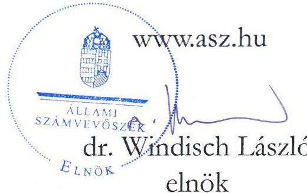
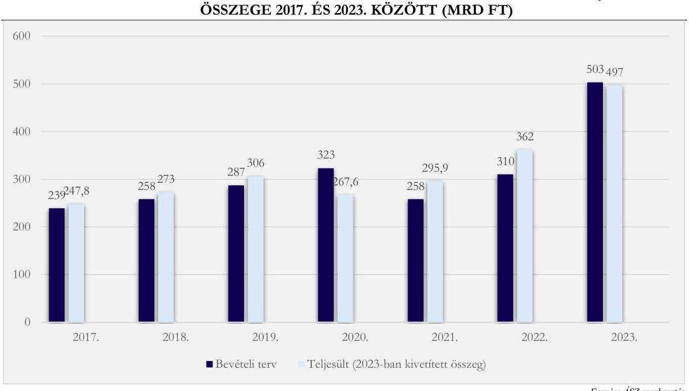

# JELENTÉS 

A Fővárosi Önkormányzatot és a kerületi önkormányzatokat osztottan megillető bevételek
2023. évi megosztásáról szóló önkormányzati rendelet felülvizsgálata

2023.

---

# JELENTÉS 

## A Fővárosi Önkormányzatot és a kerületi önkormányzatokat osztottan megillető bevételek 2023. évi megosztásáról szóló önkormányzati rendelet felülvizsgálata

2023. 

23071

---

# ELLENŐRZÉSI IGAZGATÓSÁG: 

## ÁLLAMHÁZTARTÁS HELYI SZINTJÉT ELLENŐRZŐ IGAZGATÓSÁG

## ELLENŐRZÉSI IGAZGATÓ:

KISGERGELY ISTVÁN ellenőrzési igazgató

## ELLENŐRZÉSVEZETŐ:

Jelentéseink az interneten a www.asz.hu címen olvashatók.

BŐRŐCZ IMRE ellenőrzésvezető
KANYÓ LÓRÁNT ISTVÁN megbízott ellenőrzésvezető

IKTATÓSZÁM: EL-3937-003/2023
TÉMASZÁM: 2708.
ELLENŐRZÉS-AZONOSÍTÓ SZÁM: V1052

---

# TARTALOMJEGYZÉK 

AZ ELLENŐRZÉS ALAPADATAI ..... 5
AZ ELLENŐRZÉS HATÓKÖRE ÉS TERÜLETE ..... 7
ÖSSZEFOGLALÁS ..... 9
AZ ELLENŐRZÉS FÓKUSZKÉRDÉSEI ..... 10
MEGÁLLAPÍTÁSOK ..... 11
JAVASLATOK ..... 22
MELLÉKLETEK ..... 23
I. sz. melléklet: Értelmező szótár ..... 23
II. sz. melléklet: Az ellenőrzött szervezetek jegyzéke ..... 25
III. sz. melléklet: Ellenőrzési kritériumok ..... 26
FÜGGELÉK: ÉSZREVÉTELEK ..... 27
RÖVIDÍTÉSEK JEGYZÉKE ..... 28

---

.

---

# AZ ELLENŐRZÉS ALAPADATAI 

## AZ ELLENŐRZÉS CÉLJA

A Fővárosi Önkormányzatot ${ }^{1}$ és a kerületi önkormányzatokat ${ }^{2}$ osztottan megillető bevételek 2023. évi megosztásának, és a helyi adóztatással kapcsolatos kiadások megállapítása, elszámolása szabályszerűségének ellenőrzése.

## AZ ELLENŐRZÉS TÍPUSA

Megfelelőségi ellenőrzés.

## AZ ELLENŐRZÖTT IDŐSZAK

2022. október 1-jétől 2023. szeptember 30-ig tartó időszak.

## AZ ELLENŐRZÉS TÁRGYA

A Forrásmegosztási rendelet ${ }^{3}$ törvényessége, a megosztandó helyi adóbevételek és azok tervezése, a helyi adóztatással kapcsolatos kiadások megállapítása, elszámolása, a Fővárosi Önkormányzat és a kerületi önkormányzatok számára utalt bevétel, valamint az, hogy a Fővárosi Önkormányzat vagy valamely kerületi önkormányzat jogosulatlanul jutott-e forráshoz, avagy a jogszerű mértékű forráshoz képest alacsonyabb összegben részesült-e. Ezen túlmenően a Forrásmegosztási törvény ${ }^{4}$ ÁSZ ${ }^{5}$-ra vonatkozó rendelkezésének végrehajtása keretében az ÁSZ-nak évente kell vizsgálnia a Forrásmegosztási rendelet törvényességét.

Az ellenőrzés kiterjedt minden olyan körülményre és adatra, amely az ÁSZ jogszabályban meghatározott feladatainak teljesítéséhez, valamint a program végrehajtása folyamán felmerült újabb összefüggések feltárásához szükséges volt.

## AZ ELLENŐRZÉS JOGALAPJA

Az ellenőrzés jogszabályi alapját a Forrásmegosztási törvény 6. §-a, valamint az ÁSZ tv. ${ }^{6}$ 1. § (3) bekezdése, 3. $\S$ (1) bekezdése és a 33. $\S$ (7) bekezdése képezték.

## AZ ELLENŐRZÉS MÓDSZERE

Az ellenőrzést a nemzetközi standardokat irányadónak tekintve az ellenőrzési program szempontjai, az ellenőrzött időszakban hatályos jogszabályok, az ellenőrzés szakmai szabályok és módszertanok figyelembevételével végezte az ÁSZ.

---

Az ellenőrzési kérdések megválaszolásához szükséges bizonyítékok megszerzése az ellenőrzött szervezet által rendelkezésre bocsátott dokumentumokra és adatokra alapozva, továbbá megfigyelés, szemle (szemrevételezés), kérdésfeltevés (információkérés), valamint elemző eljárás útján történt. Az ellenőrzési bizonyítékként felhasználható adatforrások közé tartoztak egyrészt az ellenőrzéshez kért dokumentumok, adatforrások, másrészt adatforrás volt még minden - az ellenőrzés folyamán - feltárt, az ellenőrzés szempontjából információkat tartalmazó dokumentum.

Az ellenőrzés lefolytatásához az ellenőrzött szervezet a tanúsítványok kitöltésével, valamint az ÁSZ által kért dokumentumok, adatok, információ megküldésével és az ellenőrzés során szolgáltatott adatokat.

---

# AZ ELLENŐRZÉS HATÓKÖRE ÉS TERÜLETE 

## A Fővárosi ÖNKORMÁNYZAT 2023. ÉVRE VONATKOZÓ FORRÁSMEGOSZTÁSI RENDELETE ÉS ANNAK VÉGREHAJTÁSA*

A Fővárosi Önkormányzatot és a kerületi önkormányzatokat osztottan megillető egyes bevételek körét és a részesedési arányokat a Forrásmegosztási törvény határozza meg. A Fővárosi Közgyűlés* által megállapított iparűzési adó és - a Margit-szigeten kívül eső fővárosi területekre - megállapított helyi idegenforgalmi adóból származó bevételből, valamint a Fővárosi Közgyűlés által kivetett helyi adóhoz kapcsolódóan kiszabott késedelmi pótlékból és bírságból származó bevételekből a Forrásmegosztási törvény előírása szerint a

2023. évben a Fővárosi Önkormányzat részesedése 54\%, a kerületi önkormányzatok együttes részesedése 46\%. A kerületi önkormányzatok a bevételből való részesedésük arányában - a pótlékból és bírságból ${ }^{8}$ származó bevételek legfeljebb $50 \%$-áig terjedő mértékben - kötelesek hozzájárulni a Fővárosi Önkormányzati Adóhatóság ${ }^{9}$ helyi adóztatással kapcsolatban felmerülő kiadásaihoz.

A Htv. ${ }^{10}$ előírásai szerint a Fővárosi Önkormányzat Budapest teljes területére a helyi iparűzési adó, továbbá az általa közvetlenül igazgatott területen (Margit-szigeten) a többi helyi adó bevezetésére (és működtetésére) jogosult. A kerületi önkormányzat az építményadót, a telekadót, a magánszemély kommunális adóját és az idegenforgalmi adót vezetheti be illetékességi területén. A kerületi önkormányzat képviselő-testülete azonban az általa bevezethető helyi adó bevezetését - az adott adóévre vonatkozó előzetes beleegyezése alapján - átengedheti a Fővárosi Önkormányzat részére. Ez utóbbi lehetőséggel a 2023. évre, kizárólag az idegenforgalmi adóra vonatkozóan öt fővárosi kerület, a XVII., XVIII., XX., XXI., XXII. kerületek önkormányzati képviselő-testülete élt (a XXIII. kerületi önkormányzat 2023. évtől kezdődően nem adta át az idegenforgalmi adó bevezetésének jogát a Fővárosi Önkormányzatnak).

A Forrásmegosztási rendelet a célja szerint a 2023-as évre a fővárosi önkormányzatot és a fővárosi kerületi önkormányzatokat osztottan megillető bevételek (azaz a helyi iparűzési adó és a kerületek által átengedett idegenforgalmi adó, továbbá a pótlék és bírság) összegét, megosztását és az adóbevételek beszedésével összefüggően felmerült kiadások elszámolásának rendjét tartalmazó önkormányzati szabályozás.

A Forrásmegosztási rendeletben meghatározott bevételi tervszámokat és kiadási tervszámot, valamint a 2023. szeptember 30-ig befolyt tényleges bevételt az 1. táblázat mutatja be.

A Fővárosi Önkormányzat adóhatósága az adózók által az adóbeszedési számlára 2023-ban ténylegesen megfizetett iparűzési adót és - az érintett önkormányzati körben - idegenforgalmi adót és a pótlékot, bírságot utalja át a Fővárosi Önkormányzat és a kerületi önkormányzatok számára.

[^0]
[^0]:    * A kép forrása: saját kép

---

1. táblázat

# A FORRÁSMEGOSZTÁSI RENDELETBEN MEGOSZTANDÓ BEVÉTELEK 2023. ÉVI TERVEZETT ÖSSZEGEI ÉS 2023. JANUÁR-SZEPTEMBER HAVI TELJESÜLÉSÜK

|  MEGOSZTANDÓ BEVÉTEL/KIADÁS | MEGOSZTANDÓ FORRÁS TERVEZETT ÖSSZEGE (100\%) (EZER ÍT) | FÓVÁROS TERVEZETT RÉSZÉSEDÉSE (54\%) (EZER ÍT) | KERÜLETEK TERVEZETT RÉSZÉSEDÉSE (46\%) (EZER ÍT) | $\begin{gathered} 2023.01-09 . \ \text { HAVI } \ \text { TELJESÜLES } \ \text { (EZER ÍT) } \end{gathered}$ | $\begin{gathered} 2023.01-09 . \ \text { HAVI } \ \text { TELJESÜLES } \%-\mathrm{A} (\%) \end{gathered}$  |
| --- | --- | --- | --- | --- | --- |
|  Helyi iparűzési adó | 503000 000,0 | 271620 000,0 | 231380 000,0 | 466781 350,0 | 92,8  |
|  A kerületek által bevezetésre átengedett idegenforgalmi adó | 15632,0 | 8441,0 | 7191,0 | 12066,0 | 77,2  |
|  Kivetett adókhoz kapcsolódó pótlék, bírság | 1400 000,0 | 756 000,0 | 644 000,0 | 1707 746,0 | 122,0  |
|  Megosztandó bevételek összesen | 504415 632,0 | 272384 441,0 | 232031 191,0 | 468501 161,0 | 92,9  |
|  Helyi adók beszedésével összefüggő kiadások | 700 000,0 | 378 000,0 | 322 000,0 | - |   |

---

# ÖSSZEFOGLALÁS 

A Forrásmegosztási törvény az ÁSZ feladatává teszi, hogy a forrásmegosztást szabályozó Forrásmegosztási rendeletet és a forrásmegosztást ellenőrizze. A Fővárosi Önkormányzatot és a kerületi önkormányzatokat a Fővárosi Közgyűlés által megállapított iparűzési adóból, továbbá - a Margit-szigeten kívül eső fővárosi területekre - megállapított helyi idegenforgalmi adóból, valamint a helyi adóhoz kapcsolódóan kiszabott késedelmi pótlékból és bírságból származó bevételek a Forrásmegosztási törvény előírása szerint a 2023. évben osztottan illetik meg. A 2023. évi tervek szerint megosztandó 504400 000,0 ezer forintból a Fővárosi Önkormányzat részesedése 54\%, a kerületi önkormányzatok együttes részesedése 46\%. Az adóztatással összefüggő kiadásokat - legfeljebb a pótlék és bírságbevételek 50\%-ának mértékéig - a Fővárosi önkormányzat és a kerületi önkormányzatok a részesedésük arányában viselik.

Az ÁSZ megállapította, hogy a Fővárosi Önkormányzat 2023. évi forrásmegosztási rendeletalkotási folyamata szabályozott volt és e szabályoknak megfelelően történt. A Forrásmegosztási rendelet egyes előírásai azonban néhány vonatkozásban magasabb szintű jogszabályba ütköznek.

A forrásmegosztás bevételi tervszámai megalapozottak voltak. A forrásmegosztás és annak pénzügyi elszámolása megfelelt a Forrásmegosztási rendeletben foglaltaknak, azonban a Forrásmegosztási rendelet 4. §-ának (2) bekezdése nem szabályozta megfelelően a 2023. január hónapban befolyt idegenforgalmi adóbevétel megosztását és pénzügyi elszámolását, így annak kezelése ellentétes volt a magasabb szintű jogszabályi előírásokkal.

A forrásmegosztásnál figyelembe vett, a Fővárosi Önkormányzati Adóhatóság működtetésével összefüggő, helyi adózással kapcsolatos kiadások megállapítása a Forrásmegosztási rendelettervezet elkészítéséig megalapozott volt, a Forrásmegosztási rendelet a Fővárosi Közgyűlés elé terjesztéskor, illetve az elfogadásakor azonban már nem volt megalapozott, mert nem vették figyelembe a 2022. decemberi tényadatokat. A 2023. évi kiadási előlegek elszámolása szabályszerű volt. A 2022. év során elszámolt kiadási előlegek és a ténylegesen elszámolható kiadások összevetése 2023-ban megtörtént, a megállapított különbözet elszámolása az egyes kerületi önkormányzatokkal szabályszerű volt.

A Forrásmegosztási rendelet lehetővé teszi előleg igénylését. 2023. szeptember 30-ig a XIX. kerületi önkormányzat két, a Fővárosi Önkormányzat 93 alkalommal kért előleget az adószámlára befolyt adóból, a többi kerületi önkormányzat csak a Forrásmegosztási törvényben rögzített havi utalás útján részesült a bevételből.

A Forrásmegosztási rendelet magasabb szintű jogszabályba ütközése miatt a XXIII. kerületi önkormányzat 2023. február 10-én nem részesült a 2022-ben beszedett, de 2023. januárban befizetett idegenforgalmi adóból, a XVII., XVIII., XX., XXI., XXII. kerületi önkormányzatok pedig 2023. február 10-én több idegenforgalmi adóbevételhez jutottak.

Az Állami Számvevőszék „A Fővárosi Önkormányzatot és a kerületi önkormányzatokat osztottan megillető bevételek. 2022. évi megosztásáról szóló önkormányzati rendelet felülvizsgálata" című 22071. számú jelentés javaslataira tett intézkedések ellenőrzése során megállapítást nyert, hogy három javaslat hasznosult, egy javaslat pedig részben hasznosult.

---

# AZ ELLENŐRZÉS FÓKUSZKÉRDÉSEI 

1.     - A Fővárosi Önkormányzat 2023. évi forrásmegosztási rendeletalkotási folyamata szabályozott és szabályszerű volt-e?
2.     - A forrásmegosztás bevételi tervszámai megalapozottak voltak-e, a forrásmegosztás szabályszerű volt-e?
3.     - A forrásmegosztásnál figyelembe vett, a Fővárosi Önkormányzat Adóhatósága működtetésével összefüggő, helyi adózással kapcsolatos kiadások megállapítása és elszámolása szabályszerű volt-e?
4.     - Szükséges-e korrekciót érvényesíteni a 2024. évi forrásmegosztás során?
5.     - Az ÁSZ korábbi ellenőrzése során tett javaslatok hasznosultak-e?

---

# 1. A Fővárosi Önkormányzat 2023. évi forrásmegosztási rendeletalkotási folyamata szabályozott és szabályszerű volt-e? 

Összegző megállapítás A Fővárosi Önkormányzat 2023. évi forrásmegosztási rendeletalkotási folyamata szabályozott volt és e szabályoknak megfelelően történt. A Forrásmegosztási rendelet egyes előírásai ugyanakkor nem állnak összhangban a magasabb szintű jogszabályokkal.
1.1. számú megállapítás

A forrásmegosztási rendeletalkotási feladatokról a belső szabályzatok, folyamatleírások és munkaköri leírások rendelkeztek, az abban foglaltakat a Forrásmegosztási rendelet megalkotása során betartották és a kontrolltevékenységek működését biztosították.

A forrásmegosztási rendeletalkotási feladatokról - az Áht. ${ }^{11}$ előírásaival összhangban - rendelkezett a Főpolgármesteri Hivatal ${ }^{12}$ belső szabályzataiban, folyamatleírásaiban és a munkaköri leírásokban.
A Főpolgármesteri Hivatal SZMSZ ${ }^{13}$-e, a forrásmegosztás kapcsán feladatkörrel bíró önálló szervezeti egységek - a Költségvetési Tervezési és Felügyeleti Főosztály, valamint az Adó Főosztály - ellenőrzött időszakban hatályos ügyrendjei, ellenőrzési nyomvonalai, továbbá a forrásmegosztási rendeletalkotás folyamatában érintett munkatársak munkaköri leírásai tartalmazták a Forrásmegosztási rendelet előkészítésével kapcsolatos feladatokat, folyamatleírásokat. Az érintett szervezeti egységek ellenőrzési nyomvonalai rögzítették a Forrásmegosztási rendelettervezet előkészítéséhez kapcsolódó tevékenységek kontrollpontjait, a szervezeti egységek vezetőinek ellenőrzési
 feladatait. A rendelettervezet előkészítésével kapcsolatos feladatokat a belső szabályzatokban, munkaköri leírásokban foglaltak szerint végezték el, a rendeletalkotás során a gyakorlat a szabályozással összhangban volt, az önálló szervezeti egységek ügyrendjeiben, ellenőrzési nyomvonalaiban, valamint a munkatársak munkaköri leírásában rögzített kontrolltevékenységek működését biztosították.
A Fővárosi Önkormányzat a Forrásmegosztási rendelet megalkotásának folyamata során a Forrásmegosztási törvényben foglalt véleményeztetési és rendeletalkotási határidőket betartotta (a Fővárosi Közgyűlés a Forrásmegosztási rendeletet 2023. január 25-i ülésén megtárgyalta és elfogadta, melynek kihirdetése a Fővárosi Közlöny 2023. január 30-i számában megtörtént, az 2023. január 31-én hatályba lépett).
A Forrásmegosztási törvény által biztosított véleményezési jogával tizennégy kerületi önkormányzat élt. Tizenegy kerületi önkormányzat képviselő-testülete módosítási javaslatot nem fogalmazott meg, a rendelettervezet elfogadásáról, illetve annak tudomásul vételéről döntött. A XXII. kerületi önkormányzat ugyan túlzottnak tartotta a bevételi előirányzatot, de ezzel a kiegészítéssel együtt elfogadásra javasolta a rendelettervezetet. A XII. kerületi önkormányzat képviselő-testületének pénzügyi bizottsága - a felelős döntés érdekében - a bevételi előirányzat szakmai indokolásra vonatkozó

---

előterjesztői kiegészítésre tett javaslatot. A XIII. kerületi önkormányzat nem fogadta el a rendelettervezetet, álláspontja szerint a fővárosi kerületek közötti bevételmegosztás elavult, korszerűtlen, így az észrevétel a Forrásmegosztási törvényre vonatkozott.
A Fővárosi Önkormányzat a Htv. előírásával összhangban rendelkezett a XVII., XVIII., XX., XXI., XXII. kerületi önkormányzat képviselő-testülete beleegyező határozatával, amelyek az idegenforgalmi adó beszedésének jogát a 2023. évre átengedték a Fővárosi Önkormányzat részére. A XXIII. kerületi önkormányzat képviselő-testülete - a 2022. évtől eltérően - nem adta beleegyezését ahhoz, hogy az idegenforgalmi adót a XXIII. kerület illetékeségi területén a Fővárosi Önkormányzat a 2023. évben működtesse.
1.2. számú megállapítás

A 2023. évi Forrásmegosztási rendelet egyes rendelkezései nem állnak összhangban a magasabb szintű jogszabályokkal.

Az Alaptörvény ${ }^{14}$ 32. cikkének (1) bekezdése f) és h) pont, valamint az Mötv ${ }^{15}$. 106. §-a (1) bekezdésének a) pontja értelmében a Htv. keretei között gyakorolt önkormányzati adómegállapítási jogból származó bevétel saját bevétel, ami a 48/2001. (XI. 22.) AB határozatban kifejtettekre ${ }^{2}$ is tekintettel, különös alkotmányossági védelmet élvez.
A Forrásmegosztási rendelet 4. §-ának (1)-(2) bekezdése és 2. melléklete alapján ugyanakkor a Fővárosi Önkormányzathoz megfizetett 2023-ban befolyó idegenforgalmi adóból nem részesültek azok a kerületi önkormányzatok, amelyek 2023. évben saját maguk vezették be az idegenforgalmi adót. Az Art. ${ }^{16}$ 2. számú melléklet II/A/3. pontja és 3. számú melléklet II/A/3. pontja alapján az adóalany által 2022. december hónapban megfizetett idegenforgalmi adót az adóbeszedésre kötelezettnek január hónap 15. napjáig kell bevallani és megfizetni.
A Forrásmegosztási rendelet 4. §-ának (1) és (2) bekezdése, valamint 2. melléklete alkalmazása azzal a hatással járt, hogy az idegenforgalmi adót 2023-ban saját maga bevezető XXIII. kerületi önkormányzat nem részesült a szállásadók által 2022. december 31-ig beszedett, de csak 2023-ban befizetett idegenforgalmi adóbevételből annak ellenére, hogy 2022. december 31-ig adómegállapítási jogát átengedte a Fővárosi Önkormányzatnak, így az ezen időszakra vonatkozó idegenforgalmi adókötelezettségből származó bevétel - a Forrásmegosztási törvényben rögzített arányok szerint - megilleti a XXIII. kerületi önkormányzatot. A Forrásmegosztási rendelet nincs összhangban az Alaptörvény 32. cikk (1) bekezdés f) és h) pontjában, az Mötv. 106. § (1) bekezdés a) pontjában és - az ott rögzített felhatalmazáson történő túlterjeszkedés miatt - a Htv. 1. §-a (3) bekezdésében foglaltakkal, mert elvont a XXIII. kerületi önkormányzattól az őt megillető, alkotmányossági védelmet élvező saját bevétel egy részét.
A Forrásmegosztási rendelet alábbi rendelkezései nem állnak összhangban a Forrásmegosztási törvény és a $\mathrm{Jat}^{17}$. egyes rendelkezéseivel:

[^0]
[^0]:    ${ }^{2}$ Az Alkotmánybíróság döntése rámutat a saját bevételek jelentőségére, céljára: (az Alkotmány) „önkormányzati alapjogként szabályozza és biztosítja az önkormányzatok számára az önkormányzati tulajdon tekintetében a tulajdonost megillető jogosítványok gyakorlását, a vállalkozáshoz való jogot és a helyi adók megállapításának jogát, az Alkotmány által védett hatásköröket is biztosítja az önkormányzatok számára abban, hogy a feladataik ellátásához olyan saját bevételi forrásokkal rendelkezzenek, amelyek megállapítása, mértékének meghatározása az önkormányzati autonómia körébe tartozik."

---

- A Forrásmegosztási rendelet 3. §-ának (3) bekezdése - többek között - azt rögzíti, hogy az egyes kerületekre vonatkozó kiadásviselés megoszlási arányszámát és az alapján kalkulált viselni tervezett kiadás összegét a Forrásmegosztási rendelet 1. mellékletének 5. oszlopa tartalmazza. Ugyanakkor ez utóbbi rendelkezés (a bekezdés utolsó mondata) nincs összhangban a Forrásmegosztási törvény 2. §-ának (5) bekezdésével, mely szerint kiadási előlegként a tárgyévet megelőző év költségvetési rendeletének végrehajtásáról szóló fővárosi önkormányzati rendeletben elfogadott adóbeszedéssel kapcsolatos kiadásokat kell figyelembe venni. Utóbbi adat azonban nem állt rendelkezésre a Forrásmegosztási rendelet megalkotásakor, az 1. melléklet 5. oszlopa adata tehát legfeljebb csak egy hozzávetőleges számadat (tervadat) lehet, amelyre a Forrásmegosztási rendelet 3. §-ának (3) bekezdése nem utal.
- A Forrásmegosztási rendelet 5. §-ának (2) bekezdése tévesen - a Forrásmegosztási törvény 2. §-ának (2) és (6) bekezdésében foglaltakkal szemben - a 2022. évi és nem a 2023. évi pótlék és bírságbevételek 50%-ában írja elő a kiadások érvényesíthetőségének felső korlátját.
- A Forrásmegosztási rendelet 5. §-ának (3) és (4) bekezdései a befolyt bevétel kerületeket megillető részének a kerületekhez történő utalási határnapját, rendjét szabályozza. A Forrásmegosztási törvényhez képest a rendeleti szabályozás abban mutat eltérést, hogy mind az iparűzési adóra, mind az idegenforgalmi adóra és a pótlékra, bírságra is kimondja, hogy a június hónapban befolyt adóbevételt úgy kell utalni a kerületek számára, hogy az június 30-ig, a december hónapban befolyt adóbevételt pedig úgy kell utalni a kerületek számára, hogy az december 31-ig megérkezzen az önkormányzatokhoz. Ez végrehajthatatlan rendelkezés, mert például a június 30-a vagy december 31-e utolsó percében a Fővárosi Önkormányzat adóbeszedési számlájára érkezett adózói befizetés továbbutalása lehetetlen. A kialakított gyakorlat az, hogy az utalás napján délelőtt 10 óráig beérkezett júniusi, illetve decemberi bevételeket elutalják a kerületek számára, a 10 óra után beérkezett bevételeket azonban csak a következő hónapban beérkezett bevételekkel utalják tovább, a következő hónapot követő hónap 10-ik napjáig. A Forrásmegosztási rendelet tehát pontatlan és figyelmen kívül hagyja a Jat. 2. §-ának (4) bekezdésének d) pontját - miszerint a jogszabálynak meg kell felelnie a jogalkotás szakmai követelményeinek - és a Jat. 2. §-a (5) bekezdésének a) pontját, amely kimondja, hogy a jogszabályok megalkotásakor biztosítani kell, hogy a jogszabály ne tartalmazzon indokolatlanul olyan rendelkezést, amely a szabályozási cél eléréséhez nem feltétlenül szükséges.
- A Forrásmegosztási rendelet 6. §-a a befolyt bevételek terhére a kerületeknek kifizethető előlegek folyósításának szabályait tartalmazza, s visszautal a Forrásmegosztási rendelet 5. § (3) bekezdésére, mely több, az egyes önkormányzatoknak teljesítendő utalási határnapot is tartalmaz. A rendelkezés nem áll összhangban a Jat. 2. §-ának (1) bekezdésével, mely szerint a jogszabálynak a címzettek számára egyértelműen értelmezhető szabályozási tartalommal kell rendelkeznie, ugyanis nem tartalmaz arra vonatkozó eljárási szabályt, hogy az önkormányzat által felvett előleg összegét melyik soron következő utalás összegébe kell beszámítani. A gyakorlatban az előleggel való elszámolás a következő havi utalásban valósult meg.

---

# 2. A forrásmegosztás bevételi tervszámai megalapozottak voltak-e, a forrásmegosztás szabályszerű volt-e? 

| Összegző megállapítás | A forrásmegosztás bevételi tervszámai megalapozottak   voltak. A forrásmegosztás és annak pénzügyi elszámolása   megfelelt a Forrásmegosztási rendeletben foglaltaknak,   azonban a Forrásmegosztási rendelet magasabb szintű   jogszabályba ütközése miatt a 2023. január hónapban befolyt   idegenforgalmi adóbevétel megosztása és pénzügyi   elszámolása nem volt szabályszerű. |
| :-- | :-- |

2.1. számú megállapítás

A forrásmegosztás bevételi tervszámai megalapozottak voltak.
A Forrásmegosztási törvény alapján megosztandó adóbevétel, pótlék, bírság bevételi tervszámai megállapításakor a Fővárosi Önkormányzat figyelembe vette a bevételre hatást gyakorló valamennyi lényeges körülményt, melyet számításokkal alátámasztott. Az 1. ábra szerint a megosztandó bevételeket 99,7%-ban meghatározó iparűzési adó teljesülése 2023-ban várhatóan 1,2%-kal tér el a tervezett összegtől.

---

2.2. számú megállapítás

A Fővárosi Önkormányzatot és a kerületi önkormányzatokat együttesen megillető és megosztott bevételek kerületenkénti megállapítása - az idegenforgalmi adóbevétel kivételével - megfelelt a Forrásmegosztási törvény előírásainak.

A megosztandó bevételek körének meghatározása szabályszerűen, a Forrásmegosztási törvény 2. §-ára figyelemmel történt meg. A Fővárosi Önkormányzatot és a kerületi önkormányzatokat megillető, illetve az egyes kerületeket megillető bevételhányad meghatározására szolgáló arányszámok a Forrásmegosztási törvényben rögzítetteknek megfeleltek, az egyes önkormányzatokat megillető bevételt ezen arányszámok alapján határozták meg.
A rendeletben rögzített forrásmegosztás nem volt figyelemmel arra, hogy a 2023-ban befolyó idegenforgalmi adóbevétel egy része - azaz a 2022. december 31-éig terjedő időszakra vonatkozóan beszedett adó - tekintetében nem öt, hanem hat kerület engedte át a főváros részére az idegenforgalmi adó beszedését. Ezért az idegenforgalmi adó Forrásmegosztási rendeletben rögzített megosztása az 1.2 pontban kifejtettek szerint nem állt összhangban a magasabb szintű jogszabályokkal.
2.3. számú megállapítás

A forrásmegosztás pénzügyi elszámolása megfelelt a Forrásmegosztási rendeletben foglaltaknak, azonban a Forrásmegosztási rendelet 4. §-ának (2) bekezdése helytelen megfogalmazása miatt a 2023. január hónapban befolyt idegenforgalmi adóbevétel pénzügyi elszámolása nem volt szabályszerű. A befolyt, megosztható bevételek terhére az önkormányzatoknak folyósított előlegek folyósítása és elszámolása a 2023. évi forrásmegosztási rendeletnek megfelelően, szabályszerűen történt.

A Fővárosi Önkormányzat által megállapított helyi adó, valamint a kapcsolódó pótlék és bírság kapcsán 2023. január 1-je és 2023. szeptember 30-a között befolyt bevételek megosztása során a pénzügyi elszámolás megfelelt a Forrásmegosztási rendeletnek. A 2023. január hónapban befolyt idegenforgalmi adóbevétel elszámolása azonban nem volt szabályszerű, mert a Forrásmegosztási rendelet az 1. fókuszkérdésnél bemutatottak miatt magasabb szintű jogszabályba ütközött.
A 2023. év január-szeptember hónapjaiban befolyt megosztandó bevételek előírt részarányának az átutalása - a XXIII. kerületi önkormányzat számára 2023. február 10-éig utalandó idegenforgalmi adórészétől eltekintve - a Forrásmegosztási törvényben, illetve a 2023. évi forrásmegosztási rendeletben rögzített határidőkben megtörtént.
A Fővárosi Önkormányzat a 2023. évi Forrásmegosztási rendeletnek megfelelően, a 2022. évi zárszámadási rendelet ${ }^{18}$ hatálybalépését követő havi, a 2023. június 9-i utalásban érvényesítette a kerületi önkormányzatok felé egyszeri jelleggel a helyi adóból származó bevételek beszedésével kapcsolatban felmerült 2023. évi kiadási előleget, valamint a 2022. évi kiadási előleg korrekciójának összegét.
A Fővárosi Önkormányzatot, illetve a kerületi önkormányzatokat a Fővárosi Önkormányzat helyi adó beszedési számláira befolyt, azaz megosztandó helyi adóbevételek, valamint a kapcsolódó pótlék- és bírságbevételek 2023. január 1. és 2023. szeptember 30. közötti összegét és megoszlását az alábbi 2. táblázat mutatja be.

---

# 2. táblázat 

A 2023. ÉVI MEGOSZTANDÓ BEVÉTELEK ÖSSZEGE ÉS MEGOSZLÁSA (EZER FT)

| MEGOSZTANDÓ BEVÉTEL 2023.1-9. HÓNAP | MEGOSZTANDÓ FORRÁS ÖSSZEGE $(100 \%)$ | FÓVÁROS RÉSZESEDÉSE $(54 \%)$ | KERÜLETEK RÉSZESEDÉSE $(46 \%)$ |
| :--: | :--: | :--: | :--: |
| Helyi iparűzési adó | 466781 350,2 | 252061 929,1 | 214719 421,1 |
| A kerületi önkormányzatok által átengedett idegenforgalmi adó
 | 12 065,6 | 6515,4 | 5550,2 |
| Kivetett adókhoz kapcsolódó pótlék, bírság | 1 707 745,6 | 922 182,6 | 785 563,0 |
| Megosztandó bevételek összesen | 468 501 161,5 | 252 990 627,2 | 215 510 534,3 |
| 2023. évi kiadási előleg összege | - | - | 321 379,5 |
| 2022. évi kiadási előleg korrekció összege | - | - | 104 098,5 |
| Kerületi önkormányzatoktól levonandó, Fővárosi Önkormányzat részére jóváirandó összeg | - | - | 425 478,0 |
| Kerületi önkormányzatok részére teljesítendő utalás összege | - | - | 215 085 056,2 |

A 2023. január 1. és 2023. szeptember 30. közötti időszakban két önkormányzat, a Fővárosi Önkormányzat, valamint a XIX. kerületi önkormányzat élt előleg igénylésének a lehetőségével.
A XIX. kerületi önkormányzat összesen két alkalommal, 2023. március 23. napján 1 200 000,0 ezer Ft, 2023. szeptember 28. napján 800 000,0 ezer Ft összegben igényelt előleget. A Fővárosi Önkormányzat a 2023. január 1. és 2022. szeptember 30. közötti időszakban 93 alkalommal, összesen 241 740 000,0 ezer Ft összegben élt az előleg igénylés lehetőségével. A Fővárosi Önkormányzat által igénybe vett előlegek összegei 100 000,0 ezer Ft és 55 000 000,0 ezer Ft között alakultak. A folyósított előleg elszámolása valamennyi esetben a tárgyhavi adórész utalása alkalmával megtörtént. A Forrásmegosztási törvény nem rendelkezik az előleg jogintézményéről, a Forrásmegosztási rendelet pedig nem korlátozza az előleg-igénylések számát. Az előleget nem kért kerületi önkormányzatok a Forrásmegosztási rendelet szerint csak havonta egyszer a tárgyhót követő hó 10-éig jutottak a megosztott helyi adóbevételhez.

---

# 3. A forrásmegosztásnál figyelembe vett, a Fővárosi Önkormányzat Adóhatósága működtetésével összefüggő, helyi adózással kapcsolatos kiadások megállapítása és elszámolása szabályszerű volt-e? 

Összegző megállapítás A Fővárosi Önkormányzati Adóhatóság működtetésével összefüggő, helyi adózással kapcsolatos kiadások megállapítása nem volt megalapozott, mert nem vették figyelembe a 2022. decemberi tényadatokat. A 2023. évi kiadási előlegek elszámolása szabályszerű volt. A 2022. év során elszámolt kiadási előlegek és a ténylegesen elszámolható kiadások összevetése 2023-ban megtörtént, a megállapított különbözet elszámolása a kerületi önkormányzatokkal szabályszerű volt.
3.1. számú megállapítás

A Forrásmegosztási rendeletben a 2023. évi előlegként meghatározott működtetési kiadás összege nem volt megalapozott.

A Forrásmegosztási törvény 2. § (4) bekezdése értelmében a fővárosi önkormányzati helyi adóztatással kapcsolatos kiadásokat a megosztott bevételből részesülők viselik részesedésük arányában. Kiadásként a Fővárosi Önkormányzatnál a beszedéssel - a Fővárosi Önkormányzati Adóhatóság működtetésével összefüggően felmerült kiadásokat kellett figyelembe venni. Az érvényesíthető kiadásnak ugyanakkor - a Forrásmegosztási törvény alapján - felső korlátja van, ami a helyi adóhoz kapcsolódóan kiszabott pótlékból és bírságból származó bevételek legfeljebb 50%-a lehet.
3.2. számú megállapítás

A Forrásmegosztási rendelet előkészítése során - a 2023. évi költségvetési rendeletben jóváhagyott - a Fővárosi Önkormányzati Adóhatóság működtetésével összefüggő kiadásként 1 241 610,1 ezer Ft adóbeszedéssel kapcsolatos működési kiadással számoltak. A helyi adókhoz kapcsolódóan befolyt késedelmi pótlék és bírság 2022. évi várható teljesítéseként 1 400 000,0 ezer Ft összeget prognosztizálták, és ebből az összegből képezték a Forrásmegosztási rendeletben szereplő 2023. évi kiadási előleg összegét (322 000,0 ezer Ft).

A Főpolgármesteri Hivatal a Forrásmegosztási rendelet tervezetét 2022. december 19-én megküldte a kerületi önkormányzatoknak. Ebben az időpontban az 1-11. havi, befolyt pótlékból és bírságból származó bevétel tényadata állt rendelkezésre a Főpolgármesteri Hivatalnál, amely 1 293 453 691,0 Ft teljesítést mutatott. Ennek évesített összege alátámasztotta (meghaladta) a 2023. évi forrásmegosztás tervezése során prognosztizált 1 400 000,0 ezer Ft pótlék, bírság összeget. Ezért a Forrásmegosztási rendelet-tervezetben a 2023. évi előlegként meghatározott működtetési kiadás összege a forrásmegosztási rendelet-tervezet elkészítéséig, 2022. december 19-ig megalapozott volt.
A 2022. évi 12. havi helyi adókhoz kapcsolódóan befolyt pótlékból és bírságból származó bevételek teljesülés adatai 2023. január 18-án rendelkezésre álltak a Főpolgármesteri Hivatalnál, melyek alapján ismert volt, hogy a 2022-ben a helyi adókhoz kapcsolódóan befolyt késedelmi pótlékból és bírságból

---

származó bevétel 1 397 302 343,0 Ft összegben teljesült, azaz elmaradt a tervezett 1 400 000 000,0 Ft-tól. A kisebb összeg miatt az érvényesíthető kiadás maximuma is kisebb, 698 651 171,5 Ft, melyből a kerületek viselnek 321 379 539,0 Ft-ot. A kiadások tervezett összege tehát meghaladta a kiadási maximum összegét, ezért a Forrásmegosztási rendelet Fővárosi Közgyűlés elé terjesztése (2023. január 24.) és elfogadása (2023. január 25.) napján rendelkezésre álló teljesülési adatok és könyvviteli nyilvántartások már nem támasztották alá a Forrásmegosztási rendelet-tervezetben szereplő 2023. évi kiadási előleg összegét.
3.3. számú megállapítás A 2023-ban elszámolt kiadási előlegek megosztása, érvényesítése szabályszerű volt.

A 2023. évi kiadási előlegek érvényesítésekor (2023. június 9-én) figyelemmel voltak a Forrásmegosztási törvényben előírtakra, a szükséges pénzügyi korrekciókat elvégezték és a Forrásmegosztási rendeletben szereplő 322 000 000,0 Ft tervezett összeg helyett a jogszerűen elszámolható összeget, 321 379 539,0 Ft-ot érvényesítettek a kerületek felé, amely nem haladta meg a helyi adókhoz kapcsolódóan kiszabott késedelmi pótlékból és bírságból származó bevételek 50%-át.
A 2023. évi kiadási előlegnek a fővárosi önkormányzat és a kerületi önkormányzatok közötti megosztásánál a Forrásmegosztási törvényben előírt arányt betartották és a jogszabályban rögzített arányszámoknak megfelelően osztották azt meg a fővárosi önkormányzat és a kerületi önkormányzatok között.
A 2023. évi kiadási előleget - a Forrásmegosztási törvény előírásainak megfelelően - egy összegben, a 2022. évi zárszámadási rendelet hatályba lépését követő havi utalásban, 2023. június 9-án érvényesítették a kerületi önkormányzatok felé.
3.4. számú megállapítás

A Fővárosi Önkormányzati Adóhatóság működtetésével összefüggő 2023. évi elszámolt kiadási előlegét a 2022. évi költségvetési beszámolóval egyező főkönyvi kivonat és az analitikus nyilvántartások alátámasztották.

A Fővárosi Önkormányzati Adóhatóság működtetésével kapcsolatban elszámolt és jóváhagyott 1 361 214,0 ezer Ft kiadást a Főpolgármesteri Hivatal - az Áhsz. $^{19}$ 5. § (1) bekezdése előírásainak megfelelően készített - a Fővárosi Önkormányzat 2022. évi beszámolója adataival egyező főkönyvi kivonatai és az analitikus nyilvántartások alátámasztották. A Fővárosi Önkormányzat e kiadást a kerületi önkormányzatok felé - a Forrásmegosztási törvény 2. § (6) bekezdésében előírtak értelmében teljes összegben nem érvényesíthette, mivel a megosztható kiadás összege legfeljebb a pótlékokból és bírságokból származó bevétel 50%-a lehetett.
A Fővárosi Önkormányzat adóbeszedéssel kapcsolatos, 2022. évi, 2023. évi kiadási előleget megalapozó kiadásait a 3. táblázat mutatja be.
Az adónyilvántartásra használt HAIR számítógépes program használati díja csak 2023. július 31-ig merült fel, mert a Fővárosi Önkormányzat átállt a Magyar Államkincstár által fejlesztett és üzemeltetett számítógépes programrendszer használatára, melynek hatására a 2023. évi tényleges informatikai kiadások kisebbek lehetnek.

---

# A FŐVÁROSI ÖNKORMÁNYZAT ADÓBESZEDÉSSEL KAPCSOLATOS 2022. ÉVI KÖLTSÉGEI (EZER FT) 

| KIEMELT   ELŐIRÁNYZAT   /KÖLTSÉGVETÉSI   CÍM MEGNEVEZÉSE,   SZÁMA | ADÓÜGYI   FELADATOKAT   VÉGZŐK   ÉRDEKELTSÉGI   ALAPJA | ADÓ   FŐOSZTÁLY   KIADÁSAI | ADÓIGAZGATÁSI   FELADATOKRA | HAIR   ÜZEMELTETÉSI   KIADÁSOK | TELJESÍTÉS   ÖSSZESEN |
| :--: | :--: | :--: | :--: | :--: | :--: |
|  | 711402 | 712403 | 712503 | 713901 |  |
| Személyi juttatások | 65 430,0 | 777 007,0 | 0,0 | 0,0 | 842 437,0 |
| Munkaadókat terhelő járulékok és szociális hozzájárulási adó | 8506,0 | 109 243,0 | 0,0 | 0,0 | 117 749,0 |
| Dologi kiadások (ÁFÁ-val) | 0,0 | 331,0 | 37 802,0 | 362 895,0 | 401 028,0 |
| Mindösszesen működési kiadások | 73 936,0 | 886 581,0 | 37 802,0 | 362 895,0 | 1 361 214,0 |

Forrás: 2022. évi zárszámadási rendelet
3.5. számú megállapítás

A 2022. év során elszámolt kiadási előlegek és a ténylegesen elszámolható kiadások összevetése 2023-ban megtörtént, a megállapított különbözet elszámolása az egyes kerületekkel szabályszerű volt.

A 2022. év során elszámolt kiadási előlegek és a ténylegesen elszámolható kiadások összevetése 2023-ban megtörtént, a megállapított különbözet elszámolása az egyes kerületekkel szabályszerű volt, azt 2023 júniusában a Fővárosi Önkormányzat érvényesítette a kerületi önkormányzatok számára járó bevételbe való betudással.
A 2023. évben felmerült kiadásokat a 4. táblázat mutatja be.

## 4. táblázat

## A KERÜLETI ÖNKORMÁNYZATOKTÓL LEVONT KIADÁSI ELŐLEGEK ÉS A TÉNYLEGESEN ELSZÁMOLHATÓ KIADÁSOK ÖSSZEVETÉSE (EZER FT)

2022. költségvetési évben a kerületektől levont előleg 217 281,0
összege
2022. évi tényleges kiadás kerületi önkormányzatokra jutó
összege
2022. évi kiadási előleg és a ténylegesen elszámolható
kiadás különbözete
2023. évi kiadási előleg
2023. évi iparűzési adó korrekció összesen
321 379,5
104 098,5
321 379,5
425 478,0
Forrás: ÁSZ

---

# 4. Szükséges-e korrekciót érvényesíteni a 2024. évi forrásmegosztás során? 

Összegző megállapítás A Forrásmegosztási rendelet az 1. fókuszkérdésben bemutatott tartalma miatt a XXIII. kerületi önkormányzat 2023. február 10-én nem részesült a 2022. decemberben beszedett és 2023. januárban befizetett idegenforgalmi adóból, a XVII., XVIII., XX., XXI., XXII. kerületi önkormányzatok pedig 2023. február 10-én több idegenforgalmi adóbevételhez jutottak, amit a 2024. évi forrásmegosztás során korrigálni szükséges.

A 2022. évre vonatkozó, 2023-ban bevallott és megfizetett idegenforgalmi adó 16 904 886,0 Ft volt. Ebből 15 425 552,0 Ft a Fővárosi Önkormányzatot kizárólagosan megillető bevétel, 1 479 334,0 Ft pedig a Fővárosi Önkormányzatot és az idegenforgalmi adómegállapítást átengedő kerületeket osztottan megillető bevétel, melyből az idegenforgalmi adót bevezető önkormányzatokra 680 493,64 Ft jutott. A Forrásmegosztási törvény melléklete szerint a XXIII. kerületi önkormányzatot megillető részarány alapján az idegenforgalmi adóbevezetést átengedő kerületek közötti megosztási arányszám 0,0579256131. Ezért a XXIII. kerületi önkormányzatot január hónapban 39 418,0 Ft illette volna meg, amelyet a többi önkormányzat kapott.
Az 5. táblázat utolsó oszlopa tartalmazza azt, hogy az egyes kerületi önkormányzatok bevételi pozíciója milyen irányban és mennyivel tért el a jogszerű állapothoz képest.
5. táblázat

A 2022. DECEMBER 31-IG FENNÁLLÓ KÖTELEZETTSÉGRE 2023. JANUÁR HÓNAPBAN BEVALLOTT ÉS MEGFIZETETT IDEGENFORGALMI ADÓBEVÉTEL MEGOSZTÁSA KAPCSÁN KIMUTATOTT ELTÉRÉS (FORINT)

| IDEGENFORGALMI ADÓ BESZEDÉSÉNEK JOGÁT ÁTENGEDŐ KERÜLETI ÖNKORMÁNYZATOK | 2023 JANUÁRJÁBAN A FORRÁSMEGOSZTÁSI RENDELET ALAPJÁN MEGOSZTANDÓ A BEVALLÁSOKAT ALAPUL VEVŐ IDEGENFORGALMI ADÓBEVÉTEL | AZ ÁLLAMI   SZÁMVEVŐSZÉK   MEGÁLLAPÍTÁSA SZERINT   JÁRÓ IDEGENFORGALMI   ADÓBEVÉTEL | ELTÉRÉS |
| :--: | :--: | :--: | :--: |
| XVII. kerületi önkormányzat | 139 753,34 | 131 658,04 | 8 095,3 |
| XVIII. kerületi önkormányzat | 194 441,93 | 183 178,76 | 11 263,17 |
| XX. kerületi önkormányzat | 105 757,84 | 99 631,75 | 6 126,09 |
| XXI. kerületi önkormányzat | 144 071,20 | 135 725,79 | 8 345,41 |
| XXII. kerületi önkormányzat | 96 469,30 | 90 881,17 | 5 588,13 |
| XXIII. kerületi önkormányzat | - | 39 418,01 | -39 418,01 |
| Összesen | 680 493,64 | 680 493,64 | 0,0 |

---

# 5. Az ÁSZ korábbi ellenőrzése során tett javaslatok hasznosultak-e? 

## Összegző megállapítás Az ÁSZ korábbi ellenőrzése során tett javaslatok közül három javaslat hasznosult, egy javaslat pedig részben hasznosult.

Az ÁSZ a 2022. évben „A Fővárosi Önkormányzatot és a kerületi önkormányzatokat osztottan megillető bevételek. 2022.
 évi megosztásáról szóló önkormányzati rendelet felülvizsgálata" című 22071. számú jelentésében négy javaslatot fogalmazott meg a Fővárosi Önkormányzat felé, melynek megvalósítására a Főpolgármesteri Hivatal Főjegyzője intézkedési tervet fogalmazott meg.
A Forrásmegosztási rendeletben meghatározták, hogy mit kell befolyt bevételnek tekinteni. A Forrásmegosztási rendelet nem rendelkezik ugyan a késedelmi pótlékból és bírságból származó bevételek számítása során a vetítési alap meghatározásáról, de azt úgy alkották meg, hogy erre nincs szükség.
A Forrásmegosztási rendeletet úgy alkották meg, hogy a befolyt bevételre vonatkozó rendelkezése nem utal olyan rendelkezésre, amely nem bevételt szabályoz.
Megtörtént az Adó Főosztály ügyrendjének a Főpolgármesteri Hivatal szervezeti változásával összhangban történő aktualizálása.
A Forrásmegosztási rendelet rendelkezett a befolyt bevételek terhére a kerületeknek kifizethető előlegek folyósításának szabályairól. Hiányos azonban a szabályozás abban a tekintetben, hogy nem tartalmaz arra vonatkozó eljárási szabályt, hogy az előleget felvevő önkormányzat által felvett előleg összegét melyik soron következő utalás összegébe kell betudni. A Forrásmegosztási rendeletben az erre vonatkozó szabály azért nem elegendő, mivel az több utalási dátumról, részletről is rendelkezik, így nem egyértelmű, hogy melyik „átutaláshoz" rendeli az előleg levonását.

---

# JAVASLATOK 

Az ÁSZ tv. 33. § (1) bekezdésében foglaltak értelmében az ellenőrzött szervezet vezetője köteles a jelentésben foglalt megállapításokhoz kapcsolódó intézkedési tervet összeállítani és azt a jelentés kézhezvételétől számított 30 napon belül az ÁSZ részére megküldeni. Amennyiben az ellenőrzött szervezet vezetője nem küldi meg határidőben az intézkedési tervet, vagy továbbra sem elfogadható intézkedési tervet küld, az Állami Számvevőszék elnöke az ÁSZ tv. 33. § (3) bekezdése a) és b) pontjaiban foglaltakat érvényesítheti.

## BUDAPEST FŐVÁROS FŐPOLGÁRMESTERE RÉSZÉRE

1. A 2024. évre vonatkozó, a Fővárosi Önkormányzatot és a kerületi önkormányzatokat osztottan megillető bevételek megosztásáról szóló rendeletét a Budapest Főváros Főjegyzője számára írt javaslatokra figyelemmel terjessze a Fővárosi Önkormányzat Közgyűlése elé.

## BUDAPEST FŐVÁROS FŐJEGYZŐJE RÉSZÉRE

1. A 2024. évre vonatkozó, a Fővárosi Önkormányzatot és a kerületi önkormányzatokat osztottan megillető bevételek megosztásáról szóló rendeletét az alábbiak szerint készítse elő:
a) a jelentés 4. pontja szerinti korrekcióra tartalmazzon rendelkezést;
b) a Forrásmegosztási rendelet 4. § (2) bekezdésének megfelelő normatartalom előkészítése során legyen figyelemmel arra, hogy a 2024. évben a Fővárosi Önkormányzathoz befolyó idegenforgalmi adó a 2023. december 31-ig fennálló idegenforgalmi adókötelezettségre is vonatkozhat, továbbá arra, hogy az idegenforgalmi adóbevezetési jogát esetlegesen újonnan átengedő kerületi önkormányzat csak a 2024-től fennálló idegenforgalmi adókötelezettségből származó bevételre jogosult;
c) a Forrásmegosztási rendelet 3. §-a (3) bekezdésének megfelelő normatartalom előkészítése során biztosítsa, hogy az összhangban álljon a Forrásmegosztási törvény 2. §-ának (5) bekezdésével;
d) a Forrásmegosztási rendelet 5. §-a (2) bekezdésének megfelelő normatartalom előkészítése során a rendelet szövegét úgy fogalmazza meg, hogy a rendelkezés ne legyen ellentétes a Forrásmegosztási törvény 2. §-ának (2) és (6) bekezdésével;
e) a Forrásmegosztási rendelet 5. §-a (3)-(4) bekezdéseinek megfelelő normatartalom előkészítése során legyen figyelemmel arra, hogy a Fővárosi Önkormányzat és a kerületi önkormányzatok számára történő, tárgyév június 30-ai és december 31-ei utalás a gyakorlatban hogyan történik meg;
f) a Forrásmegosztási rendelet 6. §-ának megfelelő normatartalom előkészítése során a szabályozás tartalmazza azt is, hogy az önkormányzat által igényelt előleg összegét melyik utalás összegébe kell beszámítani.

---

# MELLÉKLETEK 

## I. SZ. MELLÉKLET: ÉRTELMEZŐ SZÓTÁR

Fővárosi Önkormányzat által kivetett helyi adóhoz kapcsolódóan kiszabott pótlék és bírság
helyi adóztatással kapcsolatos kiadás
idegenforgalmi adó
helyi iparűzési adó
kiadási előleg

A fővárost és a kerületeket osztottan illetik meg a Fővárosi önkormányzat közgyűlésének rendelete alapján kivetett helyi iparűzési adóhoz és az idegenforgalmi adómegállapítást átengedő keretek helyett megállapított idegenforgalmi adóhoz kapcsolódóan kiszabott pótlékból és bírságból származó bevételek. (Forrás: A Forrásmegosztási törvény 2. § (2) bekezdése alapján meghatározott fogalom.)
A Fővárosi önkormányzati helyi adóztatással kapcsolatos - a tárgyévre vonatkozóan a fővárosi önkormányzatot és a kerületi önkormányzatokat osztottan megillető bevételek (az iparűzési adóból, az idegenforgalmi adómegállapítást átengedő kerületek helyett megállapított idegenforgalmi adóból befolyt adóbevétel, illetve ezen helyi adókhoz kapcsolódóan kiszabott pótlék- és bírságbevétel) beszedésével összefüggően felmerült - kiadás. E kiadásokat a Forrásmegosztási törvény 2. § (1) bekezdés a) pontja szerinti bevételből részesülők viselik részesedésük arányában. Kiadásként a fővárosi önkormányzatnál a beszedéssel - a Fővárosi Önkormányzat Adóhatósága működtetésével - összefüggően felmerült működtetési kiadásokat kell figyelembe venni. A Forrásmegosztási törvény 2. § (1) bekezdés a) pontja és a (4) bekezdés szerint figyelembe vehető kiadásokat a (2) bekezdésben felsorolt bevételek legfeljebb 50%-áig terjedő mértékben lehet érvényesíteni. (Forrás: A Forrásmegosztási törvény 2. § (4), (6) bekezdése alapján meghatározott fogalom.)
A Htv. szerint bevezetett helyi adó. Az idegenforgalmi adót a kerületi önkormányzat helyett a Fővárosi Önkormányzat rendeletével akkor jogosult bevezetni, ha ahhoz az adott adóév tekintetében az érintett kerület önkormányzatának képviselő-testülete előzetes beleegyezését adja. A fővárosi önkormányzat által közvetlenül igazgatott terület tekintetében az idegenforgalmi adó bevezetésére a fővárosi önkormányzat jogosult, az ebből származó bevétel nem tárgya a forrásmegosztásnak. (Forrás: Htv. 1. §-a és a III. fejezet Kommunális jellegű adók 2. pontja alapján meghatározott fogalom.)
A Htv. felhatalmazása alapján a Budapest Főváros Önkormányzatának Közgyűlése rendeletével kivetett helyi adónem. A Fővárosi Önkormányzat illetékességi területén vállalkozói tevékenységet (iparűzési tevékenységet) végző vállalkozó helyi iparűzési adót köteles fizetni. Adóköteles iparűzési tevékenységnek tekintendő e törvény alapján a vállalkozó e minőségben végzett nyereség-, illetőleg jövedelemszerzésre irányuló tevékenysége.
(Forrás: Htv. 1. § (2) bekezdése, valamint a 35. § és 36. § alapján meghatározott fogalom.)
A tárgyévet megelőző év költségvetési rendeletének végrehajtásáról szóló Fővárosi Önkormányzati rendeletben elfogadott adóbeszedéssel kapcsolatos kiadásokat kell előlegként figyelembe venni a tárgyévben, melynek levonását a rendelet hatályba lépését követő havi utalásban kell a kerületi önkormányzatok felé érvényesíteni. Az előleg és a tárgyévi tényleges kiadások különbözetét a tárgyévi költségvetési rendelet végrehajtásáról szóló rendelet hatályba lépését követő havi utalásban kell elszámolni. (Forrás: A Forrásmegosztási törvény 2. § (5) bekezdése alapján meghatározott fogalom.)

---

részesedés
részesedési arányok
tárgyév
vetítési alap

A forrásmegosztásba bevont bevételekből a Fővárosi Önkormányzatot és a kerületi önkormányzatokat megillető részesedés arányszáma. A Fővárosi Önkormányzatot és a kerületi önkormányzatokat a Forrásmegosztási tv. 3. § alapján osztottan megillető bevételekből a Fővárosi Önkormányzatot 54,0%, a kerületi önkormányzatokat együttesen 46,0% részesedés illeti meg. (Forrás: A 2023. évi Forrásmegosztási rendelet 1. §-a alapján meghatározott fogalom.)
A kerületi önkormányzatokat megillető források egyes kerületek közötti megosztásának aránya, amelyet a Forrásmegosztási törvény 1. melléklete tartalmaz. (Forrás: A Forrásmegosztási törvény 4. § (1) bekezdése alapján meghatározott fogalom.)
Azon gazdasági év, amelyhez tartozó megosztandó bevételeknek a Fővárosi Önkormányzat és a kerületi önkormányzatok közötti megosztását a Forrásmegosztási rendelet határozza meg. (Forrás: A Forrásmegosztási tv. 1. §-a alapján meghatározott fogalom.)
Az a viszonyítási alap, amely megmutatja, hogy a helyi adóztatás kiadásait a tárgyévi forrásmegosztási rendeletben tervezett, illetve az előző évben befolyt, késedelmi pótlékból és bírságból származó bevételekhez viszonyítva kell érvényesíteni. (Forrás: ÁSZ szerkesztés)

---

# II. SZ. MELLÉKLET: AZ ELLENŐRZÖTT SZERVEZETEK JEGYZÉKE 

## AZ ELLENŐRZÖTT SZERVEZETEK NEVE, CÍME

Budapest Főváros Önkormányzata (1052 Budapest, Városház utca 9-11.)
Budapest Főváros Főpolgármesteri Hivatal (1052 Budapest, Városház utca 9-11.)

---

## FOKUSZTERÜLET/FOKUSZKÉRDÉS

1. A Fővárosi Önkormányzat 2023. évi forrásmegosztási rendeletalkotási folyamata szabályozott és szabályszerű volt-e?
2. A forrásmegosztás bevételi tervszámai megalapozottak voltak-e, a forrásmegosztás szabályszerű volt-e?
3. A forrásmegosztásnál figyelembe vett, a Fővárosi Önkormányzat Adóhatósága működtetésével összefüggő, helyi adózással kapcsolatos kiadások megállapítása és elszámolása szabályszerű volt-e?
4. Szükséges-e korrekciót érvényesíteni a 2024. évi forrásmegosztás során?
5. Az ÁSZ korábbi ellenőrzése során tett javaslatok hasznosultak-e?

## ELLENŐRZÉSI KRITÉRIUMOK

Alaptörvény 32. cikk (1) f);
Áht. 69. §;
Bkr. $^{20}$ 3. § a) és c) pont, 6. § (1)-(2) bekezdései, 8. § (1)-(3) bekezdés;
Kttv. $^{2175}$ § (1) bekezdés d) és f) pontok;
Htv. 1. § (3) bekezdés;
Munka tv. $^{2246}$ § (1) bekezdés d) pont;
Mötv. $^{23106}$ § (1) a) pont;
Forrásmegosztási törvény 1. §, 2. § (1) bekezdés b) pont, 5. § (1) bekezdés, 7. §.

Főjegyzői utasítások (SZMSZ, ügyrendek, utasítások, munkaköri leírások), az érintett főosztályok, osztályok folyamatleírásai, ellenőrzési nyomvonala.
Áht. 4. § (1) bekezdése;
Ávr. $^{24}$ 145. § (5) bekezdés d) és e) pontjai
Htv. 1. § (3) bekezdés;
Forrásmegosztási törvény 1. §, 2. § (1)-(2), 3-4 §, 7. §, 1 melléklet;
Forrásmegosztási rendelet
2023. évi költségvetési rendelet $^{25}$ és módosításai

A forrásmegosztás bevételi tervszámai megalapozottságára vonatkozó előírások.
Áhsz. 5. § (1) bekezdése;
Áht. 4. § (1);
Forrásmegosztási törvény 1. §, 2. § (1)-(2), (4)-(6) bekezdései, 7. §, 1. számú melléklet;
Forrásmegosztási rendelet
Forrásmegosztási törvény 6. § (1)-(2);
Forrásmegosztási rendelet
ÁSZ tv. 33. § (7) bekezdés;
Az ÁSZ 22071 sorszámon 2022. december 20-án megjelent jelentésében tett javaslatok alapján készített intézkedési terv.

---

# FÜGGELÉK: ÉSZREVÉTELEK 

A jelentéstervezetet a Számvevőszék 15 napos észrevételezésre megküldte az ellenőrzött szervezet vezetőjének az ÁSZ tv. 29. § (1) bekezdése előírásának megfelelően.

Az ellenőrzött szervezetek vezetői a jelentéstervezet megállapításaira nem tettek észrevételt.

[^0]
[^0]:    § 29. § (1) Az Állami Számvevőszék az ellenőrzési megállapításait megküldi az ellenőrzött szervezet vezetőjének vagy az általa megbízott személynek, és annak, akinek személyes felelősségét állapította meg.
    (2) Az ellenőrzött szervezet vezetője és a felelősként megjelölt személy az ellenőrzés megállapításaira tizenöt napon belül írásban észrevételt tehet.
    (3) Az Állami Számvevőszék az észrevételre a beérkezésétől számított harminc napon belül írásban válaszol. A figyelembe nem vett észrevételeket köteles a jelentésben feltüntetni, és megindokolni, hogy azokat miért nem fogadta el.

---

# RÖVIDÍTÉSEK JEGYZÉKE 

$^{1}$ Fővárosi Önkormányzat
$^{2}$ kerületi önkormányzat(ok)
$^{3}$ Forrásmegosztási rendelet
$^{4}$ Forrásmegosztási törvény
$^{5}$ ÁSZ
$^{6}$ Ász tv.
$^{7}$ Fővárosi Közgyűlés
$^{8}$ pótlék, bírság
$^{9}$ Fővárosi Önkormányzati Adóhatóság
$^{10}$ Htv.
$^{11}$ Áht.
$^{12}$ Főpolgármesteri Hivatal
$^{13}$ SZMSZ
$^{14}$ Alaptörvény
$^{15}$ Mötv.
$^{16}$ Art.
$^{17}$ Jat.
$^{18}$ 2022. évi zárszámadási rendelet
$^{19}$ Áhsz.
$^{20}$ Bkr.
$^{21}$ Kttv.
$^{22}$ Munka tv.
$^{23}$ Mötv.
$^{24}$ Ávr.
$^{25}$ 2023. évi költségvetési rendelet

Budapest Főváros Önkormányzata
Budapest Főváros I-XXIII. kerületeinek önkormányzata(i)
Budapest Főváros Önkormányzata Közgyűlésének a Fővárosi Önkormányzatot és a kerületi önkormányzatokat osztottan megillető bevételek 2023. évi megosztásáról szóló 2/2023. (I. 30.) önkormányzati rendelete (hatályos: 2023. február 1-től)
A fővárosi önkormányzat és a kerületi önkormányzatok közötti forrásmegosztásról szóló 2006. évi CXXXIII. törvény

Állami Számvevőszék
Az Állami Számvevőszékről szóló 2011. évi LXVI. törvény
Budapest Főváros Önkormányzata Közgyűlése
A fővárosi önkormányzat közgyűlésének rendelete alapján kivetett helyi adóhoz kapcsolódóan kiszabott pótlékból és bírságból származó bevétel
Budapest Főváros Főpolgármesteri Hivatal Adó Főosztálya
A helyi adókról szóló 1990. évi C. törvény
Az államháztartásról szóló 2011. évi CXCV. törvény
Budapest Főváros Főpolgármesteri Hivatal
Szervezeti és Működési Szabályzat
Magyarország Alaptörvénye
Magyarország helyi önkormányzatairól szóló 2011. évi CLXXXIX. törvény
Az adózás rendjéről szóló törvény 2017. évi CXXX. törvény
A jogalkotásról szóló 2010. évi CXXX. törvény
Budapest Főváros Önkormányzata Közgyűlésének a Budapest Főváros Önkormányzata 2022. évi összevont költségvetéséről szóló 43/2021. (XII. 22.) önkormányzati rendelet végrehajtásáról
 szóló 13/2023. (V. 30.) önkormányzati rendelete
Az államháztartás számviteléről szóló 4/2013. (I. 11.) Korm. rendelet
A költségvetési szervek belső kontrollrendszeréről és belső ellenőrzéséről szóló 370/2011. (XII. 31.) Korm. rendelet
A közszolgálati tisztviselőkről szóló 2011. évi CXCIX. törvény
A munka törvénykönyvéről szóló 2012. évi I. törvény
Magyarország helyi önkormányzatairól szóló 2011. évi CLXXXIX. törvény
Az államháztartásról szóló törvény végrehajtásáról szóló 368/2011. (XII. 31.) Korm. rendelet
Budapest Főváros Önkormányzata Közgyűlésének Budapest Főváros Önkormányzata 2023. évi összevont költségvetéséről szóló 46/2022. (XII. 22.) önkormányzati rendelete

---

1052 Budapest, Apáczai Csere János u. 10. | 1364 Budapest 4., Pf. 54
www.asz.hu | szamvevoszek@asz.hu
telefon: +36 1 4849100
