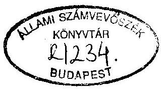
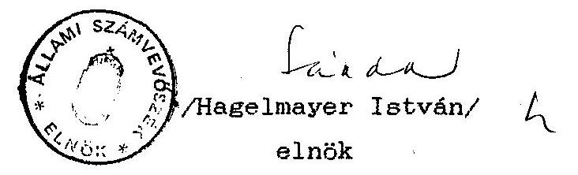

# Állami Számvevőszék

## JELENTÉS

a Munkáspárt 1992-1993. évi gazdálkodása törvényességének ellenőrzéséről

---

A vizsgálatot vezette:
dr. Elek János
osztályvezető főtanácsos
A vizsgálatot végezték:
Hoffmann István
dr. Dotterweith Antal
számvevő
számvevő tanácsos

---

# ÁLLAMI SZÁMVEVŐSZÉK

IV. Vagyonellenőrzési Igazgatóság
$\mathrm{V}-1012-11 / 1994$.

## JELENTÉS

## a Munkáspárt 1992-1993. évi gazdálkodása törvényességének ellenőrzéséről

A pártok működéséről és gazdálkodásáról szóló - többször módosított - 1989. évi XXXIII. törvény (továbbiakban: párttörvény) 10. § (1) bekezdése, valamint az Állami Számvevőszékről szóló 1989. évi XXXVIII. törvény 5. §-a alapján a pártok gazdálkodása törvényességének ellenőrzésére az Állami Számvevőszék (továbbiakban: ASz) jogosult. A törvény felhatalmazása alapján az ASz 1994. II. félévi munkatervében rögzített ütemezésnek megfelelően a Munkáspárt gazdálkodása törvényességének ellenőrzését végezte el.

Az ellenőrzés célja annak megállapítása volt, hogy a Párt működéséhez szabályszerűen igénybevehető forrásokat használt-e fel, a párttörvényben előírt gazdálkodó tevékenységet folytatott-e, valamint betartotta-e a gazdálkodással összefüggő pénzügyi-számviteli szabályokat.

A vizsgálati jelentés a Párt Budapest II. és XI. kerületi, Békés megyei Koordinációs Bizottság, Komárom-Esztergom megyei Koordinációs Bizottság, valamint az Országos Központban végzett vizsgálatok jelentései alapján készült.

---

Az ellenőrzött időszak az 1992. január 1. - 1992. december 31-ig, valamint 1993. január 1. - 1993. december 31-ig tartó gazdasági év volt. A helyszíni ellenőrzések 1994. augusztus 22. - szeptember 23.

Az ellenőrzés módszere szúrópróbaszerű vizsgálat volt, a helyszíneken rendelkezésre bocsátott iratok, dokumentumok alapján.

# II.

## Az ellenőrzés megállapításai

1. A Párt 1992. és 1993. évi gazdálkodásáról közzétett éves beszámolókhoz kapcsolódó adatszolgáltatások vizsgálata

A Központ a közzétett éves beszámolókhoz számítógépes feldolgozása alapján készült főkönyvi kivonattal és számlasoros listákkal, a párttörvény 1. sz. melléklete egyes sorai kitöltését biztosító főkönyvi számlákkal kapcsolódik.

A területi koordinációs bizottságok évente egyszer készítenek adatszolgáltatást a saját és a hozzájuk tartozó alapszervezetek gazdálkodásáról, amelyek alapján országos bevételi és kiadási főösszesítőt állítanak össze, ezen összesítő adatai kerülnek kontirozást követően az egyes évek gépi főkönyvi kivonatába.

---

# 1.1. A közzétett beszámolók fontossága és teljessége

A pártok működéséről és gazdálkodásáról szóló, többször módosított 1989. évi XXXIII. tv. (a továbbiakban: párttörvény) 9. § (1) bekezdése értelmében a pártok kötelesek minden év április 30-ig az előző évi gazdálkodásukról szóló beszámolót a Magyar Közlönyben - a törvény 1. sz. mellékletében meghatározott minta szerint - közzétenni. E kötelezettségének a Munkáspárt eleget tett (1. és 2. sz. melléklet).

A Párt gazdálkodásáról közzétett beszámolók részleteikben és főösszegükben egyaránt pontatlanok. A pontatlanságok elsősorban a bevételek és kiadások halmozódásának nem teljeskörű kiszűréséből adódnak. A beszámolók - egyes adatszolgáltatások hiányos volta miatt - nem teljeskörűek.

A számviteli törvény előírja a pártok számára is az olyan számviteli rendszer kialakítását, amely alapján megbízható és valós kép alakítható ki a szervezet egészének vagyoni, jövedelmi, pénzügyi helyzetéről. Ezt az információtartalmat azonban a párttörvényben előírt beszámoló nem tükrözi. A pártoknak ezért gondoskodniuk kell a számviteli törvényben előírtak és a párttörvény által megkövetelt beszámoló tartalmának összehangolásáról, a beszámoló valóságtartalmának ellenőrzését elősegítő számítási anyag készítéséről.

### 1.2. A beszámolók bevételi oldalát érintő megállapítások

A Párt tagdíj bevételeit nem tartalmazza teljeskörűen és pontosan sem az 1992. sem az 1993. évről készült beszámoló.

---

Az ellenőrzés megállapítása szerint a Komárom-Esztergom megyei Koordinációs Bizottság 1992. évet illetően csak 14 alapszervezet tagdíjbevételét jelentette az akkor meglévő 23 alapszervezet összesen adata helyett, 1993. évet illetően pedig tagdíjbevételi adatot egyáltalán nem közölt. A Budapest XI. kerületi Koordinációs Bizottság pedig azt a helytelen gyakorlatot követte, hogy adatszolgáltatásában az alapszervezetekhez ténylegesen befolyt tagdíjbevétel összegénél 70%-kal magasabb összeget tüntetett fel. Az 1992. évi beszámoló tagdíjak során szerepeltetett összeget az is torzítja, hogy az alapszervezetek által beszedett tagdíjból csekkben a központ bankszámlájára utalt összegeket is tartalmazza. A 20, illetve 30%-nyi felutalt összegek ki nem szűrése halmozódást okoz. A Békés megyei Koordinációs Bizottság 1993. évi adatszolgáltatásához képest az ellenőrzés által megállapított tagdíjbevétel 7.147 Ft-tal több.

Az állami költségvetésből származó támogatás összege az ellenőrzés megállapítása szerint pontos, az ellenőrzés azonban jelzi, hogy az 1992. évi beszámolóban e soron szerepel az Országos Választási Iroda részéről átutalt 30 E Ft, e célra szolgáló külön adatsor hiányában.

Az egyéb hozzájárulások címen kimutatott összegek pontatlanok, 1993. évet illetően alapvetően azért, mert a megyei és a kerületi Koordinációs Bizottságok által egyéb bevételként jelentett összesen 2.812 E Ft összeg helytelenül az adományok között szerepel, rossz kontirozás következtében. Az ellenőrzés megállapítása szerint a Békés-megyei Koordinációs Bizottság adatszolgáltatásában 16,9 E Ft-tal több adomány szerepel, mint az alapszervezetek adatszolgáltatá-

---

sainak összesítésével megállapított összeg. A hozzájárulások összege teljessége nem állapítható meg, mivel az alapszervezetek egy részének adatait nem tartalmazza a központ főkönyvi kivonata.

Az egyéb hozzájárulások összegének belső megoszlása (jogi személyektől, jogi személynek nem minősülő gazdasági társaságtól, magánszemélyektől) azért is pontatlan, mert jogi személytől származó adomány szerepel a magánszemélyektől származó adomány soron is. Továbbá egyéb hozzájárulásnak nem tekinthető kamatbevételek is szerepelnek ilyen címen (pl. Vas-megye és Szeged 1992. évi adatszolgáltatásában).

Az egyéb bevétel adat az adományok részben helytelen kontirozásán túlmenően azért is pontatlan, mert:

- a megyei, fővárosi kerületi Koordinációs Bizottságok adatszolgáltatásai halmozódásokat tartalmaznak (Bp. II. kerületi Koordinációs Bizottság, Békés megyei Koordinációs Bizottság), amelyeket nem szűrtek ki;
- a megyei, fővárosi kerületi adatszolgáltatások nem minden esetben teljeskörűek;
- a "Szeged" jelzésű 1992. évi adatszolgáltatásban OTP kamat helytelenül jogi személytől származó hozzájárulásként szerepel;
- a központ propagandatárgy értékesítéséből származó mintegy 110 E Ft összegű bevételt nem árbevételként rögzítették a vizsgált időszakban;
- a Párt az 1993. évi gazdálkodásra vonatkozó beszámoló Magyar Közlönyben közzétételre leadását követően önrevíziót hajtott végre, aminek eredményeképpen az egyéb bevétel 5 E Ft-tal növekszik.

---

# 1.3. A beszámolók kiadási oldalát érintő megállapítások

A beszámolók kiadási oldala a bevételi oldalnál már említett adatszolgáltatási hiányosságok miatt nem tekinthető teljeskörűnek.

Az éves beszámolók pontatlanságát eredményezi a megyei, fővárosi kerületi beszámolók kiadási oldalán tapasztalható halmozódások ki nem szűrése.

A halmozódások alapvető oka, hogy a megyei, fővárosi és párton belüli egyéb szervezeti egységek részére különféle címeken juttatott összegek a központban azonnal költségként lettek elszámolva, a Koordinációs Bizottságok beszámolóiban is szerepel azonban a juttatott összegek felhasználása a különféle jogcímeknél. A halmozódás pontos mértékének megállapítására már nincs lehetőség, így az ellenőrzés a működési kiadások, valamint a politikai tevékenység kiadásai sorainak helyességét nem tudta vizsgálni.

A támogatás egyéb szervezeteknek 1992. évi 360 E Ft-os adata a Marxista Ifjúsági Szövetségnek a központ által juttatott 130 E Ft-os támogatás és a megyei, kerületi szervezetek által különféle szervezeteknek juttatott 230 E Ft támogatás együttes összege, azonban a MISZ párton belüli nem jogi személy szervezet. Az 1993. évi 753 E Ft összeg az ellenőrzés szerint pontatlan, egyrészt mert az Egyszerű Emberek Fóruma párton belüli nem jogi személy szervezeti egység, másrészt mert az 5639. sz. főkönyvi számla összesen adatából 10 E Ft, továbbá az 563733 sz. főkönyvi számla

---

5 E Ft-os összege teljes egészében egyéb szervezetnek juttatott támogatás, ezek azonban nem szerepelnek a beszámoló ezen sora összesen rovatában.

A vállalkozások alapítására fordított összegek 1992. évi 2 M Ft-os adata egyazemélyes Kft alapítása és alaptőke emeléséből adódik, az ellenőrzés megállapítása szerint a vizsgált szervezeti egységeknél 1993. évben vállalkozásokat nem alapítottak.

Az eszközbeszerzés sor 1992. évi adatát az ellenőrzés kifogásolja, mivel a Budapest VII. kerületi Koordinációs Bizottság adatszolgáltatásából megállapíthatóan szövegszerkesztő gépet vásárolt 57,5 E Ft értékben, ez azonban nem szerepel ezen a soron, az egyéb költségek között szerepeltetik az összeget. Az 1993. évre szerepeltetett 822 E Ft is pontatlan. A Budapest I. kerületi Koordinációs Bizottság 1993. évben fénymásolót vásárolt 140,8 E Ft nettó értékben, ez azonban a központ által készített főkönyvi kivonatában nem eszközbeszerzés, hanem a költségek között szerepel. A központ főkönyvi kivonatából készült adat valójában eszközváltás, mivel a tárgyi eszközök állománynövekedése és az eszközkivezetés különbségét mutatja.

Az 1993. éves beszámoló kiadási adatait a Párt önrevíziója is módosítja, melynek eredményeképpen a kiadások főösszege 1.775 E Ft-tal növekszik.

---

# 2. A Párt 1992-1993. éves beszámolóinak megalapozottságát érintő könyvvizsgálati megállapítások

2.1. A Munkáspárt Központja 1991. szeptember 1-től könyvvitelét számítógépes adatfeldolgozás keretében szervezte meg, újonnan kialakított számlarend alapján, áttérve az egyszeres könyvvitelről a kettős könyvvitelre. A könyvvezetés rendszere a számvitelről szóló 1991. évi XVIII. törvényben, valamint azt követő módosításokban foglalt előírásoknak megfelel. A választott könyvvezetés rendszerének alkalmazása azonban - a Párt egészét tekintve - nem egységes. A Párt szervezeti egységei ugyanis egyszeres könyvvitelt vezetnek. A Szervezeti és Működési Szabályzat ugyan rögzíti, hogy az alapszervezetek, koordinációs bizottságok és központi szervek jogi személyek - tehát önállóan dönthetnek -, de ez változatlanul ellentétes a Párt Gazdálkodási és Vagyonkezelési Szabályzatában foglaltakkal.

A Gazdálkodási és Vagyonkezelési Szabályzat azt tartalmazza ugyanis, hogy az alapszervezetek, koordinációs bizottságok nem önálló jogi személyek, gazdálkodásuk a központi gazdálkodás része.

Az egységesség hiánya következtében nem érvényesül kellőképpen a számviteli törvény 14. § (1) bekezdésében foglalt azon követelmény, amely a számviteli alapelveket írja elő, nevezetesen: a teljesség elve /15. § (2) bekezdés/ és a következetesség elve /15. § (5) bekezdés/.

Előbbi ellentmondásra vezethető vissza, hogy az alapszervezetek által összegyűjtött tagdíjak egy részét a Központ a

---

9-es számlaosztályban központi bizottsági bevételként, továbbá az alapszervezetek összesített bevételeiben egyaránt lekönyveli, halmozódást okozva ezzel. Hasonlóan halmozódást eredményez a kiadásokban az a gyakorlat, hogy a Központi Bizottság részéről az alapszervezeteknek nyújtott támogatást a központi számvitel a Központ költségeként lekönyveli. Ezeket a kiadásokat a központi számvitelnek elszámolásra kiadott előlegként kellett volna kezelnie, illetve lekönyvelnie.
2.2. Az ellenőrzés megállapította, hogy a Párt pénzeszközeit érintő gazdasági eseményeket nem folyamatosan, a történés időpontjában, hanem általában havonta összevontan és egy tételben (egyetlen bizonylatszámon) könyveli le. Pl. 1993. január 29-i keltezéssel könyveltek le 34 db pénztárbevételi bizonylatot 24.920 Ft összegben, január 4-29-ig terjedő időszakra, egy bizonylat szám alatt. Ez a gyakorlat sérti a számvitelről szóló törvény 12. § (1), valamint a 83. § (2) bekezdésében foglaltakat, amelyek a folyamatos könyvvezetést, illetve a gazdasági műveletek (események) folyamatát tükröző összes bizonylat adatainak rögzítését írják elő.
2.3. Az ellenőrzés megállapította, hogy a könyvelés gyakorlata több esetben eltér a kialakított számlarendben foglaltaktól, azaz: egyes számlákra könyvelt tételek nem fedik a számla elnevezést, több esetben pedig hibásan kontiroznak.

A számlarend alkalmazása túlbonyolított, illetve tagolt, mivel hasonló költségnemekre több számlát is nyitottak.

---

2.4. A Párt Központja 1992. és 1993. évben egyaránt két bankszámlán bonyolította le pénzforgalmát, szervezeti egységeinek többsége szintén bankszámlát vezet.
2.5. Az állami költségvetési támogatás minden alkalommal bankszámlára érkezett, amelyeket a kapcsolódó főkönyvi számlán is rögzítettek.

A halmozódásokon túlmenően a közzétett éves beszámoló mindkét évben - nem tekinthető teljeskörűnek, mivel több alapszervezet éves bevételi, kiadási adata hiányzik belőle. A számviteli törvényben foglaltaknak eleget téve
 a számlák technikai lezárását, az egyeztető, összesítő könyvelési munkát elvégezték, az éves beszámoló alátámasztását szolgáló főkönyvi kivonatot pedig elkészítették.
2.6. A személyi jövedelemadó bevallásának és befizetési kötelezettségének a Párt mindkét évben eleget tett. Ugyancsak rendbenlévőnek találta az ellenőrzés a társadalombiztosítással kapcsolatos nyilvántartásokat és elszámolásokat.
3. Az analitikus nyilvántartások, a bizonylati elv és bizonylati fegyelem ellenőrzése
3.1. A Párt Központja - a számvitelről szóló törvényben foglaltaknak megfelelően - vezeti a tárgyi eszközök nyilvántartását, SzJA köteles kifizetések és elszámolásra kiadott előlegek nyilvántartását, TB bevallás és befizetés, valamint a szállítók követelését mutató nyilvántartást.

---

3.2. A Párt szigorú számadású nyomtatványként kezeli a pénztárbizonylatokat, a készpénz csekkfüzetet, valamint a vásárolt értékpapírokat.
3.3. A bizonylati rend és fegyelem - előző ASz ellenőrzés óta alapvetően javult.

A Párt számvitele - a számviteli törvény 83. §. (1) bekezdésében foglaltaknak eleget téve - minden gazdasági műveletről, eseményről, amely az eszközök, illetve az eszközök forrásainak állományát vagy összetételét megváltoztatja az ellenőrzés megállapításainak tanúsága szerint - bizonylatot állított ki, megfelelő dokumentációval alátámasztottan.
3.4. A külföldi utaztatások ügymenete és elszámoltatási gyakorlata a hatályos előírásoknak, jogszabályoknak eleget tesz.

Költségtérítések, napidíjak címén általában üzemanyag vásárlást számoltak el kiküldetési rendelevény vagy menetlevél alapján, az érvényben lévő üzemanyag normatíva alkalmazásával.
4. A Párt bevételeinek és gazdálkodó tevékenységének ellenőrzése
4.1. A Párt gazdálkodási bevételhez csak a párttörvény által engedélyezett jelvény árusításából, kisrészt fénymásolási tevékenységéből jutott.

A Párt jelenleg egy Kft-t működtet, amelynek profilja a "Szabadság" című újság szerkesztése és kiadása. Tiltott

---

gazdasági társaságban a Párt részesedést - a vizsgált időszakban - nem szerzett.

A Párt az 1989. évi XXXIV. tv. 41. § (6) bekezdésében előírt adatszolgáltatási kötelezettségének, miszerint minden jelöltnek, pártnak az 1994. évi választásokra fordított állami és más pénzeszközök, anyagi támogatások mértékét és a felhasználás módját - országos összesítésben is - a sajtóban nyilvánosságra kell hozni, folyó év végéig kíván eleget tenni.

# III. 

## Összefoglalás, javaslatok

A Párt gazdálkodásának bizonylati rendje és fegyelme - a megelőző ASz ellenőrzés óta - összességében véve jelentősen javult, minden gazdasági műveletről, eseményről - az ellenőrzés megállapításai szerint - bizonylatot állított ki, amelyeket megfelelő dokumentációval támasztott alá. Ugyanakkor az ASz ellenőrzése a korábbi ellenőrzése során kifogásoltakhoz képest ismétlődő hibákat is tapasztalt. A közzétett éves beszámolók pontatlanok, a bevételi és kiadási oldalon tapasztalt halmozódások ki nem szűrése és részben a hiányos belső adatszolgáltatás következtében. A halmozódások pontos mértékének megállapítására a Pártnak az adott körülmények között visszamenőleg már nincs lehetősége.

---

Javaslom, hogy a Párt a Szervezeti és Működési Szabályzatában foglaltakat hozza összhangba a Gazdálkodási és Vagyonkezelési Szabályzatában leírtakkal, és felhívom, hogy gondoskodjanak az ismétlődően tapasztalt hibák és hiányosságok megszüntetéséről.

Budapest, 1995. január

Melléklet: 2 db
