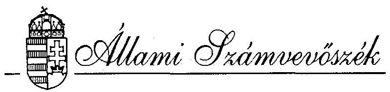
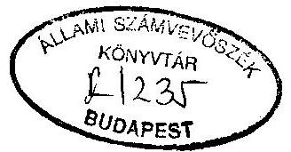
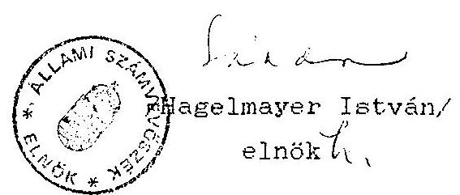
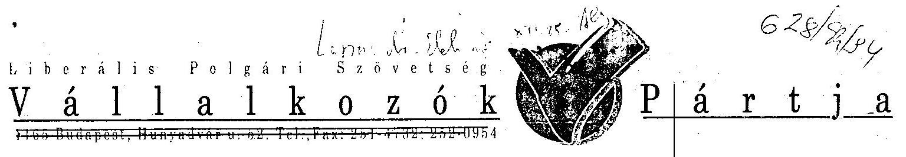
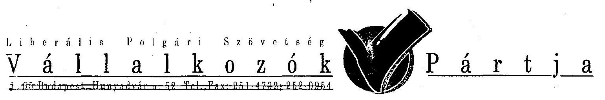
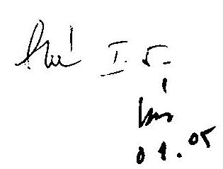
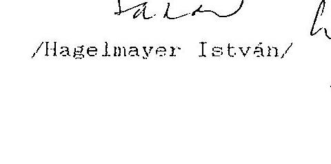

#  

## JELENTÉS

a Liberális Polgári Szövetség Vállalkozók Pártja
1992-1993. évi gazdálkodása törvényességének ellenôrzéséről

---

A vizsgálatot vezette:
dr. Elek János
osztályvezetô fötandcsos
A vizsgálatot végezték:
Berzétey Attiláné
számvevô tandcsos
dr. Szávai Tamás
számvevô tandcsos

---

# ALLAMI SZAMVEVOSZEK 

IV. Vagyonellenőrzési Igazgatóság
$\mathrm{V}-1010-16 / 1994$.

## J E L E N T E S

a Liberális Polgári Szövetség Vállalkozók Pártja
1992-1993. évi gazdálkodása törvényességének ellenőrzéséröl
I.

A vizsgálat célja, módszere, időszaka, körülményei

A pártok működéséről és gazdálkodásáról szóló - többször módosított - 1989. évi XXXIII. törvény (továbbiakban párttörvény) 10. 8. (1) bekezdése, valamint az Állami Számvevõszékről szóló 1989. évi XXXVIII. törvény 5. 8. alapján a pártok gazdálkodása törvényességének ellenőrzésére az Állami Számvevőszék (továbbiakban: ASz) jogosult. A törvènvi felhatalmazás alapján az ASz második félévi ellenőrzési tervének megfelelően vizsgálta a Liberális Polgári Szövetség Vállalkozók Pártja 1092. Bakáts tér 2. (a továbbiakban: párt) gazdálkodása törvényességét.

Az ellenőrzés célja annak megállapítása volt, hogy a párt müködéséhez szabályszerűen igénybevehető forrásokat használt-e fel, a párttörvényben engedélyezett gazdálkodó tevékenységet folytatott-e, valamint betartotta-e a gazdálkodással összefüggő pénzü-gyi-számviteli szabályokat.

---

Az ellenőrzés 1992. január 1-től 1993. december 31-ig terjedő, beszámolóval lezárt idõszakra, valamint a folyó év gazdálkodására terjedt ki. A folyó évi vizsgálat részeként az ellenőrzés kitért az 1994. évi választásokra kapott külön költségvetési támogatási kerettel való elszámolásra is. A helyszíni ellenőrzés 1994. augusztus 22-töl szeptember 23-ig tartott.

Az ellenőrzés módszere szúrópróbaszerú vizsgálat volt. A jelentés megállapításai egyrészt a párt országos központjában rendelkezésre bocsátott iratok, dokumentumok alapján, másrészt a párt egyes helyi (Tatabánya), illetőleg megyei (Bács-Kiskun, és Komá-rom-Esztergom megyei Koordinációs Bizottságok) szervezeteinél lefolytatott helyszíni ellenőrzés tapasztalatain alapulnak. Az ellenőrzés a párt tabi helyi szervezetének gazdálkodására vonatkozó dokumentumokat - többször! felszólítás ellenére - ellenőrizni nem tudta.

A párt gazdálkodása törvényességének ellenőrzése figyelembe vette a Magyar Közlöny 1991. évi 28. számában közzétett ASZ általános ellenőrzési program szempontjait is.

Az ellenőrzés végrehajtása során figyelemmel kellett lenni arra, hogy az 1992. január elsején életbe lépett számviteli törvény hatálya kiterjed a pártokra is. Továbbá, a párttörvényt módosító 1992. évi LXXXI. törvény megváltoztatta az előző évi gazdálkodásról a Magyar Közlönyben közzéteendő beszámoló tartalmát.

Az Állami Számvevőszék a párt gazdálkodásának törvényességét ezuttal másodizben vizsgálta. Az előző helyszíni vizsgálat 1992. j
únius 29-én zárult le, a párt Bp. XIV. kerület Lumumba utcai

---

székhelyén. Időközben a párt új székházat kapott, így 1994. közepéig a XVI. ker. Hunyadvár u. 52. sz. alatt müködött. Az 1994. évi választásokon elért eredménye következtében a párt állami költségvetési támogatást 1994. II. félévtől nem kap. A Demokrata Koalícióval közös székház eladása folyamatban van, a párt központja onnan az általa 1993-ban alapított Kft által bérelt lakásba költözött (1092. Bp. Bakáts tér 2.). Alkalmazottaiknak köztük a párt gazdasági ügyeiért felelős ügyvezetõ alelnökének is - felmondtak, ez utóbbi felmondási ideje 1994. dec. 31-én jár le. A párt Hunyadvár utcai, illetőleg Bakáts téri címváltozását nem jelentette be a Fővárosi Bíróságon.

# II. 

## A párt gaz álkodásáról szólo 1992-1993. évi beszámolók ellenőrzésének tapasztalatai

A párttörvény 9. 8. (1) bekezdése értelmében a pártok kötelesek az elôző évi gazdálkodásukról szóló beszámolót a törvényben meghatározott formában a Magyar Közlönyben közzétenni. A közzététel végsõ határideje az 1992. gazdasági évtől kezdödően a tárgyévet követő év április 30-a. A párt az 1992. évi pénzügyi zárómérlegét (1. sz. melléklet) 1993. május 4-én, míg az 1993. évi pénzügyi zárómérlegét (2. sz. melléklet) 1994. május 4-én tette közzé a Magyar Közlönyben.

A közzétett beszámolók nem feleltek meg a számviteli törvényben 1992. évtől érvényes módon konkrétan megfogalmazott számviteli alapelveknek, ennek következtében föösszegükben és részleteikben

---

nem a tényleges állapotot tükrözik. Az ellenôrzés tapasztalata szerint a beszámolók tartalmát illetően a következõ számviteli alapelvek nem teljesültek:

- A TELJESSEG ELVET sérti, hogy a beszámolók nem tartalmazzák a párt valamennyi helyi, regionális szervezetének gazdálkodási adatait. Egyes regionális szervezetek, illetve helyi szervezetek egyáltalán nem adtak számot éves gazdálkodási adataikról, tagdij és egyéb bevételeikrõl, kiadásaikról, önálló bank- és pénztárforgalmukról és a kapott ellátmánnyokkal sem számoltak el. Az ellenôrzés olyan, a párt nevére szóló 1993. évi kiadási számlákat is talált, melyeket a könyvelésben nem rögzítettek.
- A VALCDISAG ELVET sérti, hogy a beszámolók egyes sorai nem felelnek meg a tényleges állapotnak, valamint némely könyvelési tétel esetében hiányzott a megfelelô bizonylati alátámasztás. Egyes közzétett kiadási tételek az országos közponṭnál vezetett könyvelésben kimutatott összeguél alacsonyabbak. Igy például az 1993. évben vállalkozás alapítására fordított öszzeg a beszámolóban 630 E Ft, a könyvelés adatai szerint 650 E Ft. Elmulasztották a könyvelés helyességét fôkönyvi kivonat, illetve mérleg összeállításával ellenőrizni. Az eszközök és források állományát leltárral nem ellenőrizték.
- A VILAGOSSAG ELVET sérti, hogy a könyvvezetés külsõ személy számára nem áttekinthetõ, a kapcsolat az analitikus ny:lvántartások, a fôkönyvi könyvelés és a beszámoló adatai között nem kimutatható.

---

A helyi szervezetek és megyei koordinációs bizottságok részére a Központ által előírt éves beszámolási forma nem volt alkalmas arra, hogy a helyi szervezetek valamennyi gazdálkodási adatát tartalmazzák, az egymás közötti pénzforgalomból adódó halmozódást kiszúrjék, és a folyamatba épített ellenőrzést biztosítsák. E beszámolók nem tértek ki a szervezetek nyitó és záró banki készpénzállományára. A helyi szervezetek birtokában lévő eszközök leltározását nem írták elő.

A beszámolókban tagdíjként szerepeltetett bevételek könyvelési dokumentummal nem alátámasztottak, így az összeg helyességén túlmenően az sem állapítható meg, hogy azok valóban tagdíjakból származtak-e.

Az állami költségvetésből származó 1992. évi $12,6 \mathrm{M}$ Ft és 1993. évi $15,3 \mathrm{M}$ Ft támogatást a beszámolók helyes összegben tartalmazzák.

# III. 

Az 1992-1993. évi beszámolók megalapozottságát alátámasztó könyvvizsgálati megállapítások

## 1. A könyvvezetés rendje

A Fárt a számviteli törvényben rögzített lehetőóégek közül az egyszeres könyvvitelt választotta. Könyvelését bérelt számítógépes programok felhasználásával végzi 1992. januárjától. Figyelmen kívül hagyták az 1992. .január 1-jétől hatályos, a

---

számvitelről szóló 1991. évi XVIII. törvénynek a gazdálkodási rend kialakítására vonatkozó előírásait. A bérelt számítógépes program alkalmazásával a folyamatos könyvvezetést végzõ szakember foglalkoztatását szükségtelennek ítélték. Az ellenőrzés által a könyvvezetésben feltárt hiányosságok nagy része a 10/1993. (IV. 9.) PM sz. rendeletben elöirt képesítéssel rendelkező szakember hiányára vezethető vissza.

Nem szabályozták egyértelmüen a helyi szervezetek, valamint a megyei Koordinációs Bizottságok jogállását és az ebből eredő könyvvezetési kötelezettséget.
$=$ A számviteli törvény elöírja a pártok számára is az olyan számviteli rendszer kialakítását, amely alapján megbízható és valós kép alakíthatć ki a szervezet egészének vagyoni, jövedelmi, pénzügyi helyzetéről. Ezt az információtartalmat azonban a párttörvényben elöírt beszámoló nem tükrözi. A pártoknak ezért gondoskodniuk kell a számviteli törvényben elöírtak és a párttörvény által megkövetelt beszámoló tartalmának összehangolásáról, a beszámoló valóságitartalmának ellenőrzését elösegítő számítási anyag készítéséről. Ilyen számítási anyag nem állt rendelkezésre.
$=$ Az 1992. május 30-án tartott VI. Kongresszus alapszabálymódosító határozatáig a helyi szervezetek jogi személynek minősültek, így önálló könyvvezetési kötelezettségük volt. A kongresszus az alapszabályt módosította, továbbra is biztosította az önálló gazdálkodás jogát, önálló jogi személyiség nélkül. Müködési rendszerükön azonban - az új helyzetnek megfelelően - nem változtattak.

---

= A Párt nem rendelkezik Szervezeti és Müködési Szabályzattal. Nem szervezték meg a helyi szervezetek és a megyei koordinációs bizottságok pénzkezelési, nyilvántartási, adatszolgáltatási rendjét. Nem követelték meg e szervezetek bevételi, kiadási, bank- és pénztárbizonylatainak központi, teljes és naprakész könyvelését. A területi szervezetek többsége 1992. évtől önálló könyvelést nem vezetett, ugyanakkor egyetlen szervezet sem továbbította alapbizonylatait a központi könyvvezető hely részére. Ezáltal ezen alapbizonylatok könyvelése nem történt meg. Nem teljesült a számviteli törvény 80. §. (1) bekezdésében megfogalmazott követelmény, ugyanis a könyvviteli nyilvántartás nem elégíti ki azt az igényt, hogy az eszközökben és a forrásokban bekövetkezett változásokat a valóságnak megfelelően, teljeskörűen, folyamatosan, áttekinthetően, zárt rendszerben mutassa ki.

A párt központja két OTP elszámolási számlával rendelkezik; az egyiket Kecskeméten, a másikat Budapesten vezetik. A központi számlákon kívül a párt legalább 11 megyei szervezetének van önálló bank-, illetőleg OTP számlája. Devizaszámlával a párt egyik évben sem rendelkezett.

Zárlatot egyik ében sem végeztek, a könyvelés éves adatairól összesített és hitelesített kimutatást, főkönyvi kivonatot nem tudtak bemutatni. Mivel az alkalmazott számítógépes program nem zárja ki a gazdasági év lezárását követő utólagos módosítást - adatbevitelt -, nem ellenőrizhető, hogy a gazdasági események rögzítése a tényleges teljesítés időszakában történt-e.Igy az 1992. és 1993. évről 1994. augusztus és

---

szeptember hónapban készített számítógépes kimutatások adatai - a beszámoló alapját képező hitelesített eredeti nyílvántartások hiányában - nem voltak ellenőrizhetők.

Szakismeret hiányában a bérelt számítógépes könyvelési rendszerben lévő lehetőségeket nem tudták kellő módon kihasználni. Tgy pl. a rendszer tartalmazza a személyi jövedelemadó nyilvántartásával, bevallásával kapcsolatban jogszabályok által elöirt valamennyi kimutatást, nyomtatványt, azonban azok felhasználására nem került sor.
2. Az analitikus nyilvántartások és a bizonylati rend ellenőrzése
2.1. A párt az általa kiolakított eajátos, számitógépes könyvelési programon kívül nem rendelkezik olyan kiegészitő és analitikus nyilvántartásokkal, amelyek segitségével eszközeiben és forrásaiban bekövetkezett változásokat valósághüen követni lehetne. Ezek hiányában a számítógépben rögzített adatokból - mivel sem 1992, sem 1993. évben rendszeres zárlatot nem készítettek - nem állapítható meg

- az álló és tartós fogyóeszközeinek egyedenkénti mennyisége és értéke;
- a személyi jövedelemadó alapjául szolgáló, jogcímenként kifizetett jövedelmek és a levont adóelólegek teljeskörü személyenkénti összege;
- a társadalombiztosítást megilletó járulékok alapja és összege;
- a szállitók követelése.

---

# 2.2. A bizonylati elv és a bizonylati fegyelem érvényesülése 

A párt nem rendelkezik bizonylati szabályzattal, nem rögzítették a házipénztár forgalmára, kezelésére vonatkozó szabályokat. Az utalványozás gyakorlására jogosult személyek körét elnökségi ülésen határozták meg, megegyezően a banki aláírás-bejelentő lapokon szerepelő személyekkel. A banki aláírás-bejelentőt azonban nem módosították, azon már gyakorlatilag utalványozásra jogosulatlan személy is található.

A vizsgált időszakban végrehajtott pénztárzárlatot igazoló dokumentumot bemutatni nem tudtak. Az egyes idöszakokban házipénztárban lévő pénzmennyiség megállapíthatatlan, mivel a számítógépes pénzforgalmi nyilvántartás alkalmazása során egyszer sem készült zárlat a napi készpénz mennyiségéről.

Az ellenőrzés rendelkezésére álltak mindkét vizsgált évről a kiadási és bevételi pénztárbizonylatok alapbizonylatokkal (számlák, útirendelvények stb), továbbá elkülönítve az átutalási megbizások és bizonylataik a budapesti és a kecskeméti OTP számlákról, idősorrendben. 1993. évben a bankszámlák forgalmának kivonatait és alapbizonylatait a pénztári forgalom bizonylatai közé idōrendben beillesztve gyüjtötték egybe, ami az ellenőrzést nehezebbé tette. Fentieken túl rendelkezésre álltak a banki egyenlegközlő lapok, valamint 1992. és 1993. évrōl az ellenőrzés számára 1994. augusztus hóban havi bontásban készült számítógépes bank-számla-kivonatok és idōszaki pénztárjelentések. Az összesítések és az alapbizonylatok szúrópróbaszerũ-összevetése ar-

---

ra mutatott, hogy 1992. évre vonatkozóan valamennyi bizonylat könyvelése megtörtént, míg az 1993. évi bizonylatok között akadtak a párt nevére szóló és a pénztári forgalomban kiadásként nem könyvelt számlák.

Az utólag készült összesítésekröl nem állapítható meg a könyvelés dátuma, a kiadási pénztárbizonylatok, valamint a hozzájuk tartozó bizonylat (számla) kelte pedig gyakran megegyezik. A kiküldetési rendelvényeken a kifizetés kelte, továbbá a kiküldetés ideje, a kiküldetés és az átvétel igazolásának dátuma gyakran azonos. Ez arra mutat, hogy a bevételeket és a kiadásokat nem azok pénzügyi realizálása idején könyvelték, hanem utólag, "kampányszerüen".

Az ellenörzés megállapításai szerint az 1992. és 1993. években minden esetben kiadási és bevételi pénztárbizonylatok, illetőleg az azokhoz csatolt alapbizonylatok alapján könyveltek. Alaki és tartalmi szempontból néhány esetben mind az alapbizonylatok, mind a pénztárbizonylatok kiállítása kifogásolható.

Igy pl.
A számlákat készpénzben, a házipénztárból egyenlítik ki. Ennek során rendszeresen elöfordul, hogy a kiadási pénztárbizonylatokon a pénz átvevője helyén a párt ügyvezető alelnöke ír alá, a mellékelt számlán azonban az átvevővel nem íratják alá az összeg átvételének elismerését

A kifizetett számlákon a teljesítés általában nincs igazolva. Az eszközbeszerzések - mivel eszköznyilvántartás

---

nincs - ellenőrizhetetlenek. A vevők, illetőleg szállítók követelésének, tartozásának nyilvántartása hiányában elöfordult az ellenőrzés által feltárt kétszeres kifizetés:
$=$ A kiadási pénztárbizonylatok, valamint a párt januári és márciusi pénztárforgalmának könyvelési adatairól készült pénztárkivonat alapján is megállapítható volt, hogy egy 55625 Ft összegű számlát a párt házipénztárából kétszer egyenlítettek ki. Eszrevételünk valódiságának ellenőrzése céljából - az Allami Számvevöszékről szóló 1989. évi XXXVIII. tv. 21. §. (3) bekezdésében foglaltaknak megfelelően nyilatkoztattuk a számlát kiállító kft- t a Liberális Polgári Szövetség Vállalkozók Pártja részére kiállított és kiegyenlített számlákról. A kft nyilatkozata szerint a szóban forgó számlát részükre a párt csak egyszer egyenlítette ki. A könyvelési bizonylatok, valamint a Kft nyilatkozata alapján bizonyított tény, hogy az ügyvezető alelnök a számla kiegyenlítésére 55.625 Ft-ot kétszer vett fel a házipénztárból.

Az összeget az ügyvezető alelnök 1994. szeptember 26.-án a párt XIV. kerületi OTP-nél vezetett 25923. sz. elszámolási számlájára visszafizette, így a pártnak okozott anyagi hátrányt megtérítette.

Az ellenőrzés megállapította, hogy általában a bérjellegủ kifizetések, valamint utazási költségtérítések esetében egy kiadási pénztárbizonylaton több személy részére kifizetett

---

összeget adnak ki, a pénztárbizonylatot azonban átvevôként csak egy személy írja alá. Igy nem bizonyított, hogy a felsorolt személyek a részükre átvett összeget valóban átvet-ték-e. Egyes esetekben nem a párt nevére kiállított számlákat is kifizették.

Egy esetben 390 Ft kiadási összeggel vettek figyelembe egy 390 db tégláról szóló - számlának egyáltalán nem tekinthetõ - azállitólevelet.
2.3. A párt nem határozta meg a szigorú számadási kötelezettség alá vont nyomtatványok körét, azckröl nyilvántartást nem vezetett. A területi szerveik által használt nyomtatványokat nem határozták meg, azokról információval nem rendelkeztck. A be tóli és kizáási pénzárbizonylattömbök felhasználatlan lapjainak érvénytelenítéséröl nem gondoskodtak.
2.4. A párt a vizsgált két évben saját gépjármũ üzemi célú használatára rendszeresen utazási költségtérítést fizetett két alkalmazottjának. Ennek mikéntjét a munkaszerzödésekben rögzítették. Ezenkívül a párt elnökségi ülésein, egyéb hivatalos összejövetelein megjelent tagok részére egyedileg kiállított utazási rendelvényekre is fizettek ki költségtérítést. E kifizetéseknél általában betartották a gépjármüvek üzemanyag-felhasználásának elszámolásáról rendelkező 60/1992. (VI. 1.) sz. Kormányrendelet elöírásait. A bizonylatok alaki és tartalmi vonatkozásában azonban már számos szabálytalanságot észlelt az ellenőrzés.

---

Igy például:
= Hiányzik a kiküldetési rendelvényeken az utazás elrendelése, a feladat meghatározása, a teljesités igazolása.
= A kiadási pénztárbizonylat, az utazás elrendelésének, az utazás teljesitésének és igazolásának dátuma valamennyi helyen egy és ugyanaz.
= A rendelvény szabálytalan kitöltése miatt pl. nem lehet teljes bizonyossággal megállapítani azt, hogy az azon elszámolt utiköltségtérítést nem kétszer számolták-e el, mivel ugyanazon idópontra kiállított másik rendelvényen is elszámoltak és kifizettek ugyanazon személynek ugyanarra az útvonalra költségtérítést.
2.5. Az adózásra, illetőleg járulékfizetésre vonatkozó jogszabályok betartása

A párt a vizsgált két évben nem vezetett olyan nyilvántartásokat, amelyek alkalmasak lennének a személyi jövedelemado, a társadalombiztosítási, nyugdij- és egészségbiztosítási járulék, valamint a munkaadói és munkáltatói járulék alapjának, összegének megállapítására, illetőleg ezek alapján a iötelezettség megállapítása és teljesítése teljeskörüen ellenörizhető lenne.

Bérnyilvántartó lapokat csak a párt alkalmazottairól vezettek, azonban ezeket sem óvenként sem személyenként nem összesítették, a munkabéren kivüli kifizetéseket - megbizásí-, szakértői-, tiszteletdijakat nem tartották nyilván. A kifizetéseket bérkifizetési jegyzék nélkül eszközölték, utalványozás és ellenőrzés nélkül.

---

A megkötött szerzödésekböl azok megfogalmazása miatt nem lehet megnyugtató módon megállapítani minden esetben, hogy megbízási jogviszonyról, vállalkozási szerződésről van-e szó, a kifizetett szakértői és tiszteletdijak elnevezésüknek megielelõ tartalommal bírnak-e.

A párt a vizsgált 2 évben a következõ bér- bérjellegũ és egyéb (személyi jövedelemadó, illetőleg társadalombiztosítási járulék vonzatú) kifizetéseket eszközölte (Ft-ban):

|  | 1992. | 1993. |
| :-- | --: | --: |
| Munkabér | $1.194 .171,00$ | $1.805 .000,00$ |
| Gépkocsi költségtérítés | $1.113 .222,70$ | $883.370,00$ |
| Szakértöi díj | $755.000,00$ | $2.979 .100,00$ |
| Tiszteletdij | $581.000,00$ | $1.130 .000,00$ |
| Összesen: | $3.643 .393,00$ | $6.797 .470,00$ |

Ugyanakkor befizetési kötelezettségeit az alábbiak szerint teljesítette (Ft-ban):

|  | 1992. | 1993. |
| :-- | :--: | :--: |
| Személyi-jövedelemadó | 82.243 | - |
| Társadalombiztosítás | 427.010 | - |
| Munkaadói járulék | 13.230 | - |
| Összesen: | 522.483 | - |

A párt adóbevallási kötelezettségét nem teljesítette, így az adóhatóság nem kapott információt a személyenkénti, összevonćs alá tartozó kifizetésekről. Nem állapítható meg a géphoosi költségtérítések összevonandó jövedelmet képezõ

---

bevétel-aránya. Nem állították ki a munkáltatótól származó jövedelemrő́l és az adóelölegek levonásáról elöirt adatlapokat, hiányoznak a magányszemélyek nyilatkozatai az összevonandó jövedelmekröl, illetőleg arról, hogy önadózó vagy a munkáltatóját bízza meg az adó elszámolásával.

A párt a társadalombiztosítási járulékok 1992. évre vonatkozó havi összesített elszámolását elkészítette, azonban azon csak a párt föállású alkalmazottainak kifizetett munkabért terhelő járulékok szerepelnek. Befizetési kötelezettségét nem teljesítette. 1993. évre vonatkozóan sem bevallási, sem befizetési kötelezettségének nem tett eleget.

A párt nem vezeti a havi egészségbiztosítási és nyugdíjjárulék alapját és összeget tartalmazó, a társadalombiztosításról szóló 89/1990. (V. 1.) MT rendeletnek a 48/1992. (III. 13.) Korm. rendelet 71. 8. (20) bekezdésében megállapított VI. számú melléklete szerinti járulékelszámolási nyilvántartó lapot, amely alapján a dolgozók részére az év március 31. napjáig igazolást kellene kiadni.
2.6. A párt belso̊ ellenőrzésének müködése a vizsgált idõszakban nem volt rendszeres és hatékony, mindössze az 1992. július 14-én megtartott ellenőrzésről készült jegyzökönyvet tudták bemutatni, abban azonban az I. félévi házipénztári forgalom tételes ellenőrzése során a 2.2. pontban részletezett kettős kifizetést nem észrevételezték.

---

# IV. 

## A párt bevételeinek és gazdálkodási tevékenységének ellenörzése

1. A párt lözpontja 1992-1993. években döntöen az állami költségvetési támogatásból és lekötött pénzeszközeinek kamataiból gazdálkodott. A párt müködéséhez biztositott költségvetési támogatás havi összegének $20 \%$-át - az alapszabály, illetöleg az elnökségi határozat szerint - minden hónapban taglétszám arányosan felosztották a megyei Koordinációs Bizottságok között. A seg,ci Koordinációs Bizottságok ebből a támogatásból, valamint a helyi csoportok által beszedett tagdijak 20\%-ából gazdálkodtak. A helyi csoportok bevételi forrását a beszedett tagdijak $30 \%$-a mellett asetleges adominyok képezhetik.

Az 1992. május 27-i közgyülés által módosított alapszabály szexánt a megyei Koordinációs Bizottságok és a helyi csoportok nem önálló jogi személyek, azonban bevételeikkcl és kiadásaikkal önállóan gazdálkodnak. A helyszínen ellenőrzött megyei Koordinációs Bizottságok és helyi szervezetek önálló elszámolási számlával rendelkeznek.
2. A párt területi szervezetei által a beszámolókhoz beküldött adatlapokon több esetben "egyéb bevételt" is feltüntettek. Ezekröl nem lehetett megállapítani, hogy milyen eredetűek. A Központ által adott nyilatkozat szerint bevételszerzö vállalkozó tevékenységet nem végeztek, a párttörvényben felsorolt tiltott pénzforrásokat nem fogadtak el, tárgyi adományt nem kaptak, vállalatot nem alapitottak, pénzeszközeiket értékpapírba nem fektették.

---

3. A párt Központja 1993. évben a párttörvény 6. 8. (3) bekezdésében megengedett egyszemélyes Kft-t alapított VP Kft. néven 1 M Ft törzstőkével, amely gazdasági táraság az 1993. évet eredmény nélkül zárta, így abból a pártnak bevétele nem származott. A Kft-be fektetett pártvagyonról könyvviteli nyilvántartást nem vezettek.

Hivatalosan még a párt tulajdonát képezi a felszámolási eljárás alatt lévő 1990. évben alapított Magánerő Kft, amelynek összes iratait a felszámolást végzõ vette át. A Kft-be befektetett pártvagyonról, illetőleg a Kft-vel szemben fennálló egyéb követelésekről a párt nem vezetett megfelelő nyilvántartást.
V.

A folyó évi gazdálkodás és a korábbi ASz jelentésben foglalt felhívásra tett intézkedések

1. Az 1994. évi gazdasági eseményeket a vizsgálat idôpontjáig nem könyvelték. Az 1994. évi bizonylatokat rendezetlen, ömlesztett és ellenôrizhetetlen formában tárolták. A könyvelés, valamint a pénztárnapló és egyéb analitikus nyilvántartás hiányában sem a párt 1994. évi gazdálkodásáról, sem pedig banki és pénztári pénzforgalmáról nem áll rendelkezésre információ.
2. A párt a vizsgálat idejéig nem tett eleget az 1994. évi választások lebonyolításához kapott állami és más pénzeszközök elszámolásával kapcsolatos kötelezettségének.

---

3. Az ellenôrzés megállapította, hogy a párt nem tett eleget az elözö, 1992. évi ASz ellenôrzés által elöírt kötelezettségeinek:

- Nem jelentette meg a Magyar Közlönyben a párt 1991. évi gazdálkodásáról készült helyesbített pénzügyi zárómérlegét.
- Nem intézkedett a számviteli bizonylati fegyelem maradéktalan betartása, a hiányzó szabályzatok elkészítése, a belsö ellenőrzés hatékony müködtetése iránt.
- Az érdekelteknek szóló felszólító levél elküldésén túl nem tette meg a szükséges intézkedéseket a volt pártelnököt terhelő 45 E irt elszámolási eltérés rendezésére.

VI.

# Osszefoglalás 

Az ASz a párt gazdálkodása törvényességének ellenőrzése során a jelentésben részletezett, alább összefoglalt törvénysértéseket állapította meg:

1. Nem tettek eleget az elözö 1992. évi ASz ellenőrzés által elöirt kötelezettségeknek (a jelentés V/3. pontja).
2. Figyelmen kivül hagyták a számvitelről szóló 1991. évi XVIII. tv. előirásait 15. 8. (2), (3), (4) bek. 80-86. 8-okat; (a jelentés II, III/1; 2.1; 2.2; 2.3; 2.4. pontja).

---

3. Nem tettek eleget az adózás rendjéről szóló 1990. évi XCI. törvényben elöirt nyilvántartási és adóbefizetési kötelezettségnek (a jelentés III/2.5. pontja):
4. Elmulasztották a társadalombiztosításról szóló 1975. évi törvény által elöirt a járulékbefizetési, továbbá a 89/1990. (V.1.) MT rendeletben meghatározott elszámolási és adatszolgáltatási kötelezettségek teljesítését (a jelentés III/2.5. ponja).

A párt a vizsgálat idejéig székhelyének többszöri megváltoztatását a bíróságon nem jelentette be. Jelenleg nincs önálló ügyintéző és képviseleti szerve, a könyvvezetés folyamatosságáért felelős, a párt képviseletére jogosult személy is felmondás alatt áll.

Fentiek miatt a pártok müködéséről és gazdálkodásáról szóló 1989. évi XXXIII. törvény 10. 8. (4) bekezdésében foglaltak szerinti, törvényes állapot helyreállítására irányuló felhívás helyett a bírósági eljárás megindítását kezdeményezem, valamint a szükséges intézkedések megtétele céljából a társadalombiztosítást és az Adó- és Pénzügyi Ellenőrzési Hivatalt, valamint a Legfőbb Ugyészséget tájékoztatom.

Budapest, 1995. január

Melléklet: 2 db

---

1092 Budapest, Bakáts tér 2., fsz. 1.
tel. 218.-3548, 217-8887

Állami Számvevőszék
Hagelmayer István
elnök úr

1383 Budapest
PF 432

Tisztelt Elnök Úr!

Áttanulmányoztam az 1994. december 16-án részemre kézbesített a Liberális Polgári Szövetség Vállalkozók Pártjának 1992 - 1993 évi gazdálkodási tevékenységről készült V-1010-10/1994 számú Állami Számvevőszéki Jelentést.

Közlöm, hogy a Jelentésben foglalt, a Párt gazdasági működésével kapcsolatos szabálytalanságok megszüntetésére és kijavítására, a mulasztások pótlására köteleztem a közvetlenül felelős illetékes Csíkós Csaba ügyvezető alelnököt.

Figyelemmel fenti intézkedésemre, megeztiðkötő semitőlni, a méltó, hogy szívkötödjék, mellőzni, az álátásban helyezti, a módon, a hájtás, kezdeményeztið, arra való tekintettel, hogy a Párt rövid időn belül a törvényes állapot helyreállítása érdekében intézkedni fog.

Kérem a közöltek szíves tudomásulvételét és elfogadását.

Tisztelettel:

Ewaek Péter
elnök
LPSZVP

melléklet: Csíkós Csaba ügyvezető alelnökötő, intézett levél másolata

---

1092 Budapest Bakáts tér 2. fsz 1.
tel. $218 .-3548,217-8887$

Csikós Csaba úr
ügyvezető alelnök
Gödöllő
Szabó Pál u.2.
$298 / \mathrm{lj}$
1994. december 22.

Kedves Alelnök Úr,

Áttanulmányoztam az Állami Számvevőszék 1994. december 16-án kézhez vett V-1O1O-1O/1994 számu jelentését, amely a párt 1992, 1993 évi gazdálkodási tevékenységének ellenőrzési megállapításait tartalmazza.

A vizsgálat eredménye a párt számára fölöttébb sajnálatos, és tőlem ez azonnali intézkedéseket követel.

Ennek megfelelően azonnali hatállyal elrendelem a párt gazdasági ügyeinek és adminisztrációs rendjének teljes rendbe tételét. Az ezzel kapcsolatos feladatokat az Állami Számvevőszék vizsgálati jelentése meghatározza.

Megtett intézkedéseidről január első napjaiban, amikor visszatérek külföldről személyes tájékoztatást kérek tőled és annak megfelelően döntünk a további teendőkről.

Üdvözlettel:
Zwack Péter
elnök

---

Budapest, 1995. január 5. $\mathrm{V}-1010-15 / 1994-95$.

# Z W A C K PÆTER úr   a Liberális Polgári Szövetség   Vállalkozók Párt.ja elnöke 

Budapest

Tisztelt Elnök Ur!

Megköszönöm válaszlevelét, amelyet pártjának 1992-93. évi gazdálkodása törvényességének vizsgálatáról készült V-101-10/94. számú jelentésünk kapcsán küldött.

A Liberális Polgári Szövetség Vállalkozók Pártjánál tapasztalt, a jelentésünkben rögzített szabálytalanságok megszüntetésére tett intézkedését értékelve, sajnálattal tájékoztatom, hogy az Allami Számvevöszék nem tekinthet el attól a kötelezettségétöl. hogy a Magyar Köztársaság Legföbb Ugyészének Javaslatot tegyen a Liberális Polgári Szövetség Vállalkozók Pártja elleni eljárás megindítására.

Onök a jelentésünk tartalmát érdemben befolyásoló észrevételeket nem tettek, ezért azt ímmár - mint ön előtt is ismeretes - az Allami Számvevőszékről szóló 1989. évi XXXVIII. törvény 18. § (1) bekezdése szerint nyilvánoságra kell hoznunk. Továbbá, az Allami Számvevőszéket a bírósági eljárás indítványozására a pár-

---

tok müködéséről és gazdálkodásáról szóló 1989. évi XXXIII. törvény 10. § (4) bekezdésében. továbbá az egyesülési jogról szóló 1989. évi II. törvény 14. § (2) bekezdésében elöirtak kötelezik.

Kérem tájékoztatásom szíves tudomásulvételét.

Tisztelettel:

---

# KÖZLÖNY 

A. Liberális Polgári Szüvetség
Vállalkozók Pártja
1992. évl gazdálkodásáról szólo beszámoló
Ezer Ft
BEVETELEK

1. Tagúijak ..... 419
2. Állami költségvetésbőı származó támogatás ..... 12600
3. Képvisclócsoportnak nyújtott támogatás
4. Egyéb hozzájárulások, adományok
4.1. Jogi személyektól (belföldiektól) ..... 73
4.2. Nem jogi szcmélyiségủ gazd. társasá- goktól
4.3. Magánszomélyektól (belföldiektól) ..... 120
5. Suját vállalat és kft. nyercségéból
6. Egyéb bevétel ..... 245
Összes bevetel ..... 13457
KIADÁSOK
7. Támogatás az országgyúlési csop. részére
8. Támogatás egyéb szcrvezctcknck ..... 208
9. Vállalkozás alapitására
10. Múködési kiadások ..... 7507
11. Eszközbeszerzés ..... 1133
12. Politikai tevékenység kiadása ..... 1550
13. Egyéb kiadások ..... 1326
Összes kiadás ..... 11724
Csikós Csaba s. k., Dr. Kupcsok Lajos s. k.,

---

# KOZLEMENYEK: HIRDETIMENYEK 

A Liberdlis Polgári Szövetség Vállalkozók Pártja 1993. évi pénzügyi zárómérlege
ezer Ft
Bevételek

1. Tagdijak 220
2. Állami költségvetésböl 15300
3. Képviselơ-csoportnak nyújtott támogatás
4. Egyéb hozzájárulások 40
5. Saját kft. nyereségébơl
6. Egyéb bevételek 150

Összes bevétel 15710

## Kiadások

1. Támogatás az országgyúlési csoport részére
2. Támogatás egyéb szervezeteknek 155
3. Vállalkozás alapítására 630
4. Mükơdési kiadások 8160
5. Eszközbeszerzés 1550
6. Politikai tevékenység kiadása 3215
7. Egyéb kiadások 1980

Összes kiadás 15690

## Csikós Czaba s. k.,   Ggvesetơ alelnok

Helyeabllás: A Magyar Közlöny 1994. évi 40. számában megjelent, az európai nem menetrend szerinti légjáratok kereskedelmi jogairól szóló 1956. évl Egyezményhez történt csatlakozás kihirdetéséról kiadott 56/1994. (IV. 16.) Korm. rendelet2. Cikke, 2. pontja a) alponjának helyes szövege a következö:
,a) kizárólag légi árufuvarozásra,"
(Kézirethiba)