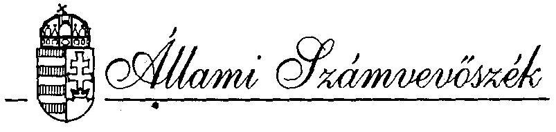
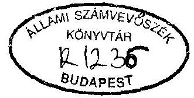
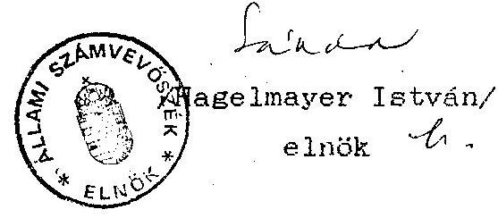

# JELENTÉS 

az Agrárszövetség 1992-1993. évi gazdálkodása
törvényességének ellenőrzéséről

---

A vizsgálatot vezette:
dr. Elek János
osztályvezető főtanácsos
A vizsgálatot végezték:
Écsy Lajosné
számvevő
Tóth István
számvevő tanácsos

---

# ALLAMI SZAMVEVOSZEK 

$\mathrm{V}-1011-14 / 1994$

## J E L E N T E S

## az Agrárszövetség 1992-1994. évi gazdálkodása törvényességének ellenôrzéaérôl

I .

A vizsgálat célja, módszere, idôszaka, körülményei

A pártok müködésérôl és gazdálkodásáról szóló - többször módosított - 1989. évi XXXIII. tv. (továbbiakban: párttörvény) 10. 8. (1) bekezdése, valamint az Allami Számvevõszékrõl szóló - többször módosított - 1989. évi XXXVIII. tv. 5. 8-a alapján a pártok gazdálkodása törvényességének ellenôrzésére az Allami Számvevôszék jogosult. A törvényi felhatalmazás alapján az ellenôrzési tervben rögzített ütemezésnek megfelelôen került sor az Agrárszövetség (továbbiakban: Párt) gazdálkodása törvényességének ellenôrzésére.

Az ellenôrzés célja annak megállapítása volt, hogy a Párt müködéséhez szabályszerűen igénybevehetô forrásokat használt-e fel, a párttörvényben elôirt gazdálkodó tevékenységet folytatott-e, valamint betartotta-e a gazdálkodással összefüggõ pénzügyi-számviteli szabályokat.

---

A jelentés a Párt Országos Központjában, valamint a Heves és Zala megyei irodákban lefolytatott vizsgálatok - a képviseletre jogosult vezetöknek átadott és általuk nem észrevételezett - jelentései alapján készült.

Az ellenőrzött időszak az 1992. január 1. - 1994. május 30-ig terjedt. A helyszíni ellenőrzések 1994. augusztus 22. - szeptember 23. között történtek.

Az ellenőrzés módszere szúrópróbaszerú vizsgálat volt, a helyszíneken rendelkezésre bocsátott íratok, dokumentumok alapján, figyelemmel a Magyar Közlöny 1991. évi 28. számában közzétett vizsgálati programra.

# II. 

## Az ellenőrzés megállapításai

## A gazdasági beszámolók pontossága és teljeskörüsége

## 1. Altalános megállapítások

A párt az 1992. évi pénzügyi zárómérlegét (továbbiakban: beszámoló) 1993. június 16-án, a Magyar Közlöny 78. számában, az 1993. évi beszámolóját 1994. május 20-án a Magyar Közlöny 55. számában jelentette meg (1. és 2. sz. melléklet). A beszámolókat a párttörvény 1. sz. mellékletében előírt formában és tartalommal, de a 9. 8. (1) bekezdésében megjelölt határidőn túl hozták nyilvánosságra.

---

A közzétett beszámolók a Központ és az önálló jogi személyiséggel rendelkező megyei irodák gazdálkodásának összesített adatait tartalmazzák. Az éves beszámolók elkészítéséhez kidolgozott összesítő kimutatások áttekinthetően tükrözik a Központ és a megyei irodák részletes és összesített adatait. A Központ 1993. évi beszámolójában azonban néhány esetben nem megfelelő könyvelés miatt - pontatlanság tapasztalható.

Az ellenőrzés megállapította, hogy az éves beszámolók tarta'mát illetően a párt a számvitelről szóló 1991. évi XVIII. törvény (a továbbiakban: Szt) legfontosabb - a 15. 8-ban megfogalmazott - elveinek egységes érvényesülését - a kifogásolt eseteket kivéve - biztosította.
2. Az 1992. és 1993. évi beszámolókhoz kapcsolódó részletes megállapítások
2.1. Az 1992. évi beszámoló ellenőrzése során észrevétel nem merült fel. A beszámoló összesített adatai részleteiben és föösszegeiben pontosak és teljeskörüek, megfelelően tükrözik a Központ és a megyei irodák tényleges pénzügyi helyzetét.
2.2. Az 1993. évi beszámoló egyes sorain azonban helytelen adatokat tüntettek fel. A beszámoló bevételi részében a Magyarország Szövetkezeti és Agrárpárttól származó hozzájárulásként 1.991.591 Ft szerepel. Ez az összeg azonban nem felel meg az Agrárszövetségnek a párttól származó összes bevételének, mivel ez csak a pártnak a könyvelés lezárásának idöpontjában a folyószámlán lévő pénzállománya. A Heves Me-

---

gyei Iroda könyvelési adatai szerint az Agrárszövetségnek a Magyarországí Szövetkezeti és Agrárpárttól származó bevétele ténylegesen $2.234 .463,63 \mathrm{Ft}$ volt.

Fentiek miatt ugyancsak nem pontos a beszámoló bevételi részének 6. Egyéb bevétel sora. Tévesen ugyanis itt szerepel a fenti sorból hiányzó bevétel.

Az 1993. évi beszámolóban kimutatott kiadások rész- és föösszege - a jelentés 1.2.1./b. pontjában részletezett helytelen könyvelések miatt - 741.240 Ft-tal több a tényleges kiadásoknál.
III.

# Az Párt könyvvitelének és gazdálkodásának szabályszerűsége 

## 1. Könyvvezetés

### 1.1. Alta k'nos megállapítások

A Párt központja és megyei irodái a vizsgált idôszakban az Szt. elöírásainak megfelelően - az egyszeres könyvvitel rendszerében, naplófôkönyv vezetésével tettek eleget könyvviteli nyilvántartási kötelezettségüknek. Az Irodák elszámolási rendjét az Országos Központ körlevélben szabályozta és ennek megfelelően a megyei irodák elszámolási kötelezettségüknek maradéktalanul eleget tettek.

---

A Központban azonban a naplófôkönyv mellett, az Szt. 80 §-ában elôirt kiegészitő és analitikus nyilvántartásokat nem vezetik a követelésekrôl, tartozásokról és a devizafelhasználásokról. A tárgyi eszközök, valamint a személyi jövedelemadó, társadalombiztosítási tartozások nyilvántartásai pedig hiányosak.

Az ellenôrzött megyei Irodákban a szükséges analitikus nyilvántartásokat megfelelően vezetik.

A Párt számviteli politikája kialakításának hiányában nem határozták meg a beszámoló elkészítésekor és a könyvvezetésnél érvényesítendõ számviteli alapelveket, a gazdasági müveletek rögzítésének és a könyvviteli zárlat elvégzésének idõpontját, az eszközök értékelésének és a leltározásnak a szabályait.

# 1.2. Részletes megállapítások 

1.2.1. 1993-ban a követelések és tartozások esetenkénti helytelen könyvelése, valamint az analitikus nyilvántartások hiánya miatt a Központ naplófôkönyvének adataiból a tény. leges követelések és tartozások forgalma és évvégi állománya nem állapítható meg. Az elöfordult fôbb könyvelési szabálytalanságok az alábbiak:

- 64.500 Ft összegu munkabér elôleg kifizetését a követelések helyett a tartozások között könyvelték el. 30.000 Ft uzemanyag elszámolási elôleget és visszafizetését az egyéb költségekre könyvelték;

---

- Munkabérböl levont - 1993. február 9-én és április 13-án átutalt - 572.350 Ft személyi jövedelemadót és gyermektartásdijat a tartozások csökkenése helyett az egyéb költségekre könyvelték. Emiatt a ténylegesnél összesen 572.350 Ft-tal több kiadást mutattak ki a naplófökönyvben, mivel a fenti öszzeg a munkabérek között is elszámolásra került.
- Tévedésböl kétszer átutalt 971.696 Ft összegu társadalombiztosítási tartozást - amely 1994-ben került visszafizetésre -, nem a követelések növekedése címén könyvelték el, hanem 868.890 Ft-ot a közterhek költségei között, 102.806 Ft-tal pedig a tartozásokat csökkentették.
- 700.000 Ft összegu - saját alapítású Kft-töl felvett - hitelt, a kötelezettségek növekedése helyett egyéb költség csökkenéseként könyvelték el.

A fenti négy pontban részletezett szabálytalan könyvelés miatt 1993. év végén a naplófökönyv összesített adatai 741.240 Ft-tal több költséget, 971.696 Ft-tal kevesebb követelést és 230.456 Ft-tal kevesebb tartozást mutatnak.

Az ellenőrzött megyei irodákban az adatok rögzítésének gyakorlata megfelel a számviteli törvény elöírásainak. A gazdasági eseményeket megtörténtük sorrendjében folyamatosan rögzítették a naplófökönyvben. A naplófökönyv bevételi és kiadási adatainak és a hozzá kapcsolódó analitikus nyilvántartásoknak a részletezettsége olyan, hogy az alapján az adatszolgáltatás ellenőrizhető.

---

1.2.2. A Párt az évenkénti költségvetési támogatásából devizaként igényelhetō $8 \%$-os keretbōl 1992-ben 256.682 Ft és 1993-ban pedig 310.017 Ft értékũ valutát használt fel.

A devizaforgalom nyilvántartásával, elszámolásával és bizonylatolásával kapcsolatban megsértették az Szt. 83. 8-ában elöirtakat, mert a naplófôkönyvben csak a valuták ellenértékének átutalását könyvelték el. A kiutazók részére kifizetett útielölegeket és azok elszámolását sem a naplófôkönyvben, sem analitikus nyilvántartásban nem rögzítették.

A külföldi utazások bizonylatai - a jelentés II./2.6. sz. pontjában megállapítottak szerint - nem felelnek meg az Szt. elöírásainak.
1.2.3. A pártnak személyi jövedelemadó, társadalombiztosítási járulék, nyugdíj- és egészségbiztosítási járulék, valamint munkaadói és munkáltatói járulék levonási, bevallási és befizetési kötelezettségei vannak.

A naplófôkönyvben, illetve az analitikában vezetett havi összesített adatok - a havi és éves bevallásokkal egyezően - maradéktalanul kiegyenlítésre kerültek.

A külföldi kiküldetésekkel kapcsolatosan kifizetett napidíjak után azonban 1993-ban nem tett eleget a Központ személyi jövedelemadó levonási, bevallási és befizetési kötelezettségének. Ezzel jelentös adóbevétel kiesést okozott.

---

2. Az analitikus nyilvántartások, a bizonylati rend és az egyéb elszámolási szabályok ellenőrzése
2.1. Az Országos Központban hétféle analitikus nyilvántartást vezettek a vizsgált idôszakban.

Nem vezettek analitikus nyilvántartást az elszámolásra kiadott elólegekről, az adott kölcsönökröl, munkabérelólegekröl, valamint a személyijövedelem-adó köteles kifizetések teljes köréről.

A vezetett analitikus nyilvántartások többsége sem fogadható azonban el maradéktalanul. Csupán a szobaleltárak és a költségnem analitikák tekinthetők teljeskörünek.

A hiányosságok az alábbiak:

- A bérelőjegyzési kartonok esetében gyakori a számviteli elöirásoknak nem megfelelö, ceruzás bejegyzés.
- A szállitói követelés nyilvántartásból nem állapítható meg minden esetben a kifizetés ténye és idópontja.
- Az állóeszközök egyedi nyilvántartása a hiányos adattartalom miatt nem minden esetben alkalmas az egyeztetésre, egyes eszközök pedig hiányoznak a nyilvántartásból.
- A TB köteles kifizetések egyedi nyilvántartása a nem teljeskörü vezetés miatt nem alkalmas a kötelezettség megállapítására.
- A szigorú számadású nyomtatványok nyilvántartása a késõbb részletezett okok miatt nem alkalmas a szigorú számadásra.

---

Az ellenőrzött megyei irodák analitikus nyilvántartásokat vezetnek.

Az analitikus nyilvántartások tartalma a tényleges adatokkal megegyezik.
2.2. Az Agrárszövetség házipénztári pénzkezelési szabályzata a szigorú számadású nyomtatványok körét az alábbiakban határozata meg:

Készpénz felvételi utalvány
Elszámolási utalvány
Bevételi pénztárbizonylat
Kiadási pénztárbizonylat
Napi pénztárjelentés

A Szabályzatban meghatározott, a Központban használt szigorú számadású nyomtatványokról a Központ pénztárosa készít nyilvántartást. A nyilvántartás vezetésére a pénztáros egy hitelesités nélküli, számozatlan lapokat tartalmazó spirálfüzetet használ. A nyilvántartás csak a beszerzés idôpontját, a nyilvántartott bizonylattömbök számozását és megnevezését tartalmazza. A nyilvántartásból nem állapítható meg az egyes bizonylattömbök használatbavételének és a használat befejezésének idôpontja. A használatba vevõ aláírását is többnyire több bizonylattömbre vonatkozóan összevontan tartalmazza a nyilvántartás.

Igy nem állapítható meg az esetleges párhuzamos felhasználás és az, hogy a bizonylatokat milyen sorrendben használták fel.

---

Mindezek miatt a nyilvántartás nem felel meg a szigorú számadás követelményeinek.

Az ellenőrzött megyei irodák szigorú számadású bizonylatként kezelik a kiadási és a bevételi pénztárbizonylatokat, valamint a készpénz-felvételi csekket. A szigorú számadású bizonylatok nyilvántartása formailag is megfelel a szigorú számadás követelményeinek.
2.3. A Párt házipénztárára vonatkozó rendelkezéseket a házipénztári pénzkezelési szabályzat tartalmazza. A Szabályzat a pénztári kifizetések nyilvántartására napi pénztárjelentés használatát írja elő. A zárlati pénzkészletet pedig 120 E Ft-ban határozza meg. A Központ pénztárosa azonban a jelentést idôszaki pénztárjelentésként kezelte és havonta zárta le. Az ellenôrzött megyei irodákban pénztárkönyvet nem vezetnek a pénztári eseményeket közvetlenül a naplófôkönyvben rögzítik.

A szabályzat a pénztáros feladatként elöírja az elszámolásra kiadott elôlegek határidős nyilvántartásának kötelezcttségét. Ennek ellenére a Központban az elólegekröl nem készült a vizsgált idôszakban analitikus nyilvántartás.
2.4. A pénztárbizonylatok kiállítását általában a bizonylati fegyelem betartásával végzik. A szúrópróbaszerú ellenôrzés során a Központban azonban elöfordult olyan eset, amikor a kifizetésröl utólag állítottak ki kiadási pénztárbizonylatot.

---

Ez az eset megkérdõjelezi a pénztári nyilvántartások hitelességét.

Az ellenõrött megyei irodáknál általános hiba, hogy a kiadási pénztárbizonylatokon felvételre jogosultként nem a pénzt ténylegesen felvevõ nevét tüntették fel, hanem a kifizetés alapjául szolgáló számlát kiállító szervezet vagy személy nevét.
2.5. A magántulajdonú gépjármũvek hivatalos célú használatáért és a hivatali gépkocsi használatáért általában a 6/1991. (V.16.) KHVM rendelet, illetve a 60/1992. (IV.1.) sz. Korm. rendelet, valamint az 1991. évi XC tv. elõírásaiban elöir-tak szerint számoltak el költségtérítést. A Központ néhány dolgozójának azonban az elöírásoktól eltérően kilométer átalány kifizetésére is sor került, többségében olyan személyeknek, akik eseti kilométertérítésben is részesültek.
2.6. A hivatalos külföldi kiküldetések teljesítésével kapcsolatos költségek elszámolását az Agrárszövetség Szervezeti Müködési Szabályzatának mellékletében a 30/1992. (II. 13.) Korm. rendelet elöírásainak megfelelően szabályozták.

A megfelelő szabályozás ellenére a vizsgált idõszakban egyetlen egy olyan esettel sem találkozott az ellenőrzés, amikor a kiküldetés elrendelése, bizonylatolása és elszámolása megfelelő lett volna.

A vizsgált idõszakban 12 kiutazás történt, de az ellenőrzés egyetlen esetben sem találkozott szabályosan elrendelt ki-

---

küldetési rendelvènnyel. Az esetek többségében egyáltalán nem került sor kiküldetési rendelvenny kiállítására. Kiküldetési rendelvenny és az elszámolás alapjául szolgáló dokumentumok hiányában a kifizetett napidijak jogossága nem állapítható meg.

A föbb hiányosságok a következök:

- Az ellenörzés egyetlen kiutazással kapcsolatban sem talált olyan dokumentumot - meghívó, feljegyzés, jegyzökönyv, program, beszámoló - amiböl a külföldi utazások hivatalos jellege megállapítható lenne.
- Bár a szabályzat elöírja, hogy az ellátottság mértékétöl függöen változó napidijra jogosultak a kiutazók, a 12 utazás közül egyetlen esetben találkozott az ellenörzés az ellátottság mértékére való utalással. Igy nem állapítható meg, hogy jogosan fizették-e ki a 11 esetben a maximális napidijat.
- 1992. és 1993. években a kiutazásokkal kapcsolatban közlekedéssel kapcsolatos üzemanyagköltség elszámolásra valutában nem került sor. Ebben az időszakban repülöjegy vagy vonatjegy forintban történő megvásárlását sem tapasztalta az ellenörzés. Fentiek miatt az esetek többségében az utazás módja, az igénybevett közlekedési eszköz nem állapítható meg. A 11 kiutazás közül egy esetben találkozott az ellenőrzés forintért rendelt autóbusz utazással, egy esetben pedig utazásszervező által történt utazással. Az 1992. évi ukrajnai, az 1993. évi romániai

---

és ukrajnai utazásokkal összefüggésben gépkocsi használat és üzemanyag felhasználás került forintban elszámolásra belföldi kiküldetési rendelvény, illetve menetlevél alapján.

- Egyetlen esetben sem állapítható meg pontosan a külföldi tartózkodás idötartama. Ugyanis még azokban az esetekben sem tartották be a 30/1992. (II. 13.) sz. Korm. rendelet elöírásait, amikor kiküldetési rendelvény részbeni kitöltése megtörtént. Az indulást és érkezést ugyanis nem a rendelet 8. 8-a szerint vették figyelembe.

Fentiekre való tekintettel megállapítható, hogy a 30/1992. (II. 13.) Korm. rendelet elöírásait rendszeresen megszegték.

# 2.7. Egyéb megállapítások 

A naplófőkönyvi adatok alapján a pénztári kiadások és bevételek alapbizonylatai könnyen, gyorsan visszakereshetők. Ugyanez nem mondható el a Központnál a banki pénzmozgásokról, mivel a bankkivonatokhoz csak az átutalási megbízásokat csatolták, és az alapbizonylatokat külön gyüjtötték, azokon utalás nincs a banki bizonylatokra ezért azok visszakeresése nehézkes.

A bankszámlák nyitó- és záróegyenlegének könyvelt adata megegyezik a vonatkozó bankkivonattal.

A bizonylatok tárolása biztonságosnak tekinthetö.

---

# IV. 

## A Párt bevételeinek és gazdálkodó tevékenységének vizsgálata

1. A Párt 1993-1994-ben a párttörvény által engedélyezett gazdálkodó tevékenységek közül az alábbiakkal élt:

- 1993. május 24 -én bérbeadta az AGROSPED Kft-nek az általa 1993. május 25 -én megvásárolt CZK 701 forgalmi rendszámú gépkocsit.
- 1993. szeptember 24-én a tulajdonában lévő irodahelyiségek egy részét a KERAVILL Rt-nek bérbe adta.
- 1993-ban az Agrárszövetség emblémájával ellátott pólókat értékesitett.
- 1994. június 15-én a tulajdonában lévő két ingatlant az OTP Rt-nek eladta.

1994-ben a Magyarországí Vidék címen propagandaanyagot. értékesitett.

Az ezekböl származó bevételeket a könyvelésben megfelelően nyilvántartják. Az 1993. évi bevételeket az éves mérlegben is szerepeltecik.

Az ellenőrzött idõszakban a Párt nem folytatott a párttörvény által tiltott gazdálkodó tevékenységet, értékpapírt nem vásárolt. A Párt a vizsgált idõszakban tárgyi, illetve a

---

párttörvényben tiltott módon adományt nem kapott. Megtakarított pénzét elkülönített bankszámlára helyezte el.
3. Az Agrárszövetség 1993. augusztusában egyszemélyes Kft-t alapított. A Kft végelszámolással történő megszüntetése jelenleg folyamatban van. A Kft jövedelméból a Pártnak a vizsgált idôszakban bevétele nem volt.

A Párt Rt-t, vállalatot nem alapított, más társaságban részesedést nem szerzett.

# V. 

## Összefoglalás

Javaslat a szükséges intézkedések megtételére

Az ellenôrzés a vizsgálat során a Párt központjában több esetben könyvviteli, nyilvántartási, bizonylatolási és egyéb hiányosságot állapított meg. Ezek a hiányosságok az 1993. évi gazdálkodásról a beszámoló pontatlanságát is eredményezték.

A jelentés II/2.2; III/1.1; III/1.2; III/2.1; 2.2; 2.3; 2.4; 2.6; 2.7. pontjaiban megállapított szabálytalanságokra való tekintettel a párttörvény 10. 8. (4) bekezdésében kapott felhatalmazás alapján felhívom a Párt elnökét, hogy:

- A Párt 1993. évi gazdálkodásáról a pénzügyi beszámolót ismételten készíttesse el és a Magyar Közlönyben tegye közzé.

---

- A Párt könyvviteli és számviteli gyakorlatát szabályozza úgy, hogy az feleljen meg a számvitelröl szólo 1991. évi XVIII. törény elöírásainak. Intézkedjen a szükséges analitikus nyilvántartások elöírásszerũ vezetésére.
- Az ideiglenes külföldi kiküldetést teljesitők költségtérítéséről szólo 30/1992. évi (II. 13.) Korm. rendelet, valamint a Párt belsõ szabályzatának elöírásait maradéktalanul tartassa be.
- Intézkedjen annak érdekében, hogy az ideiglenes külföldi kiküldetést teljesítöl napidija után a magánszemélyek jövedelemadójáról szólo 1991. évi XC törvény 4. 8-a elöírásai szerinti adóbevallásnak a Párt 1993. január 1-ig visszamenőleg tegyen eleget.

Budapest, 1995. január

Melléklet: 2 db