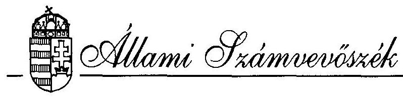
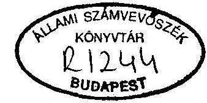
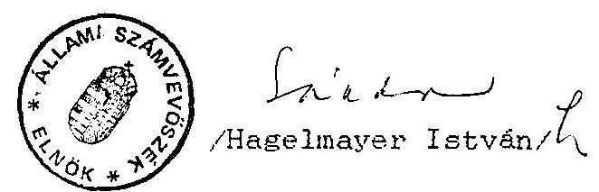

# JELENTÉS 

a Kereszténydemokrata Néppárt 1992-1993. évi gazdálkodása törvényességének ellenőrzéséről

---

A vizsgálatot vezette:
dr. Elek János
osztályvezető főtanácsos
A vizsgálatot végezték:
Écsy Lajosné
számvevő
Tóth István
számvevő tanácsos

---

# ÁLLAMI SZÁMVEVŐSZÉK 

$\mathrm{V}-1018-11 / 1994-95$.
Témaszám: 245 .

## JELENTÉS

a Kereszténydemokrata Néppárt 1992-1993. évi gazdálkodása törvényességének ellenőrzéséről

## I.

A vizsgálat célja, módszere, időszaka, körülményei

A pártok működéséről és gazdálkodásáról szóló - többször módosított - 1989. évi XXXIII. tv. (továbbiakban: párttörvény) 10. § (1) bekezdése, valamint az Állami Számvevőszékről szóló - többször módosított - 1989. évi XXXVIII. tv. 5. §-a alapján a pártok gazdálkodása törvényességének ellenőrzésére az Állami Számvevőszék jogosult. A törvényi felhatalmazás alapján az ellenőrzési tervben rögzített ütemezésnek megfelelően került sor a Kereszténydemokrata Néppárt (továbbiakban: Párt) gazdálkodása törvényességének ellenőrzésére.

Az ellenőrzés célja - a törvényi felhatalmazások alapján - kizárólag annak megállapítására irányult, hogy a Párt működéséhez szabályszerűen igénybevehető forrásokat használt-e fel, a párttörvényben előírt gazdálkodó tevékenységet folytatott-e, valamint betartotta-e a gazdálkodással összefüggő pénzügyi-számviteli szabályokat.

---

A jelentés a párt Országos Központjában lefolytatott vizsgálat, a képviseletre jogosult vezetőnek átadott és a párt elnöke által nem észrevételezett - jelentése alapján készült.

Az ellenőrzött időszak az 1992. január 1. - 1994. szeptember 30-ig terjedt. A helyszíni ellenőrzés 1994. október 24. - december 2-ig tartott.

Az ellenőrzés módszere szúrópróbaszerű vizsgálat volt, a helyszínen rendelkezésre bocsátott iratok, dokumentumok alapján, figyelemmel a Magyar Közlöny 1991. évi 28. számában közzétett vizsgálati programra.

# Az ellenőrzés megállapításai 

## II.

Az éves beszámolók pontossága és teljessége

## 1. Általános megállapítások

A párt az 1992. évi beszámolóját 1993. május 28-án, a Magyar Közlöny 68. számában, az 1993. évi beszámolóját 1994. április 29-én a Magyar Közlöny 45. számában jelentette meg (1. és 2. sz. melléklet). A beszámolókat a párttörvény 1. sz. mellékletében előírt formában és tartalommal, de az 1992. évi beszámolót a 9. § (1) bekezdésében megjelölt határidőn túl hozták nyilvánosságra.

---

A közzétett beszámolók a központ és az önálló jogi személyiséggel nem rendelkező megyei koordinációs irodák (továbbiakban: koordinációs szervezetek) gazdálkodásának összesített adatait tartalmazzák.

Az éves beszámolók tartalmát illetően több esetben megsértették a számvitelről szóló 1991. évi XVIII. törvény (továbbiakban: Szt) 15. §-ában megfogalmazott számviteli alapelvek közül a teljesség elvét és a valódiság elvét. Emellett helytelen könyvelések miatt tartalmi pontatlanságok is tapasztalhatók.

Az 1992. évi beszámoló valódiságtartalma és szabályszerűsége több tekintetben nem felel meg az előírásoknak, mert bizonylatokkal és könyveléssel való alátámasztása nem teljeskörű.

Az 1993. évi beszámoló ellenőrzésénél két esetben állapított meg az ellenőrzés a Szt előírásait sértő hiányosságot.
2. Az 1992. és 1993. évi beszámolókhoz kapcsolódó részletes megállapítások
2.1. Az 1992. évi beszámoló ellenőrzésének megállapításai
2.1.1. A beszámoló bevételi oldalán a különböző jogcímeken kimutatott bevételek egy része tartalmaz pontatlanságból, a teljesség hiányából, illetve szabálytalan elszámolásból származó eltéréseket. A megállapított hibák, hiányosságok az alábbiak:

---

a. Az I. Bevételek 2./b. soron feltüntetett 1.600.000 Ft összegű költségvetési támogatás nem a pártot illető támogatás. Fenti összeg az 1991. február 13-án, társadalmi szervezetként bejegyzett, önálló jogi személyként működő Ifjúsági Kereszténydemokrata Unió (továbbiakban: IKU) részére, de a párt bankszámlájára került átutalásra, mivel az IKU önálló bankszámlával nem rendelkezett. A párt az IKU-t illető bevételt helytelenül a saját bevételei között mutatta ki a könyvelésében és a beszámolójában egyaránt.
b. A 4.1.2. soron 1.126.691 Ft összegű külföldi - jogi személyektől származó - adomány szerepel. Ebből az összegből 25.200 Ft belföldi magánszemélyek adománya volt. Ugyanakkor összesen 411.167 Ft összegű különböző külföldi jogi és magánszemélyek adományát belföldi magánszemélyek adományaként mutatták ki, illetve 27.877 Ft összegű külföldi adományt nem bevételként, hanem költségtérítésként számoltak el. Fentiek miatt a beszámolóban 413.844 Ft-tal kevesebb külföldi adomány szerepel.

További észrevétel, hogy a beszámolóban feltüntetett összesen 1.077.673 Ft összegű külföldi jogi személyektől származó nevesített hozzájárulás a könyvelési adatok alapján nem ellenőrizhető.
c. A 4.3.1. soron belföldi magánszemélyek adományaként kimutatott 2.582.384 Ft az előző pontban részletezett pontatlanságok miatt 385.967 Ft-tal több a tényleges adatoknál. A helyes összeg 2.196.417 Ft.

---

2.1.2. A beszámoló kiadási oldalának 2. és 4. soraiban, valamint a kiadások összesített adataiban a bevételeknél leírtakhoz hasonló okokra visszavezethető hibákat, hiányosságokat állapított meg az ellenőrzés. Ezek az alábbiak:
a. A kiadások II/2. Támogatás egyéb szervezeteknek soron kimutatott 5.607.569 Ft-ból a beszámoló összeállításához készített számítási anyag szerint - az IKU részére nyújtott támogatás 2.488.817 Ft volt. Ebből az összegből 1.988.817 Ft-ot "IKU költségek" és 500.000 Ft-ot "IKU támogatás" címen jelöltek meg. A 2.488.817 Ft-ot megfelelő könyvelési alátámasztás nélkül tüntették fel egyéb szervezet támogatásaként a beszámolóban (ennek részletezését a jelentés II./1.2/a. sz. pontja tartalmazza).

A fenti összeg nemcsak a párt által nyújtott támogatás volt, hanem az IKU részére, a párt számlájára átutalt költségvetési támogatás felhasználása is, melyet a párt kiadásai között a beszámolóban szabálytalanul megjelenítettek, miként a költségvetési támogatás is a párt bevételei között elszámolásra került.

A párt által az IKU részére nyújtott támogatás tényleges összege áttekinthető és teljeskörű könyvelés hiányában nem állapítható meg. A könyvelésben mindössze 500.000 Ft összegű saját támogatást könyveltek el az IKU részére, a fennmaradó 1.988.817 Ft a könyvelésben a költségek között nem szerepel. Ezért a párt által egyéb szervezeteknek nyújtott támogatás beszámolóban kimutatott 5.607.569 Ft összege nem fogadható el.

---

b. A kiadások II./4. Működési kiadások során közölt 86.875.288 Ft 770.895 Ft-tal kevesebb a könyvelésben ilyen címen elkönyvelt kiadásoknál. Az eltérés oka nem állapítható meg.
2.2. Az 1993. évi beszámoló ellenőrzésének megállapításai
2.2.1. A beszámoló bevételi oldalán a különböző jogcímeken kimutatott adatok - egy kivételével - teljeskörűen és pontosan tartalmazzák a párt 1993. évi bevételeit.

A beszámoló I/6.2. soron szereplő a párt gazdálkodó tevékenységéből származó 11.659 eFt összegű bevétel azonban nem tartalmazza teljeskörűen a párt ilyen jogcímen befolyt 1993. évi bevételeit. A hiba oka, hogy az 1992-ben kiszámlázott, és 1993-ban befolyt 7.204 eFt összegű terembérleti díjat a fenti bevételi soron figyelmen kívül hagyták.
2.2.2. A beszámoló kiadási oldalán szereplő tételek közül a II/8. Egyéb kiadások soron szereplő 28.667 eFt összegű kiadás összegéből 3.883 eFt könyvelési alátámasztását az ellenőrzés nem tudta megállapítani. A fenti összeget "1992. évről módosítás" címén vették figyelembe a beszámolóban.

---

# III. 

## A könyvvezetés szabályszerűsége

## 1. Könyvvezetés

### 1.1. Általános megállapítások

A párt a vizsgált időszakban a kettős könyvvitel rendszerében - valamennyi szervezeti egységére kiterjedően - tett eleget könyvviteli nyilvántartási kötelezettségének. A párt számviteli politikáját teljeskörűen csak 1993-1994-ben alakították ki:

1992-ben a könyvvezetés több tekintetben nem felelt meg az Szt 15. §-ában előírt számviteli alapelveknek. A könyvvezetés több ponton áttekinthetetlen, a könyvvitelben rögzített adatok alapjául szolgáló bizonylatok jelentős része nem felel meg az Szt előírásainak, a könyvelési adatok egy része nem a tényleges állapotot tükrözi. Így a könyvvezetés nem felel meg a világosság és valódiság elvének.

A gazdasági vezetés 1993. évi személyi változásait követően tényleges fejlődés tapasztalható a gazdasági munka szervezettségében és a könyvviteli munka gyakorlati végrehajtásában.

A megfelelő színvonalú számviteli politikát írásban rögzítették. Ennek során elkészítették a számlarendet, amely tartalmazza:

---

- a számlatükröt, a főkönyvi számlák tartalmát;
- az éves pénzügyi terv és a beszámoló elkészítésének módjait;
- a könyvvezetés és analitikus nyilvántartások vezetésének szabályait, a kettő kapcsolatát;
- a könyvviteli ellenőrzési feladatokat;
- a költségelszámolás szabályait;
- a leltárkészítés módszereit;
- a könyvviteli zárlat időpontját.

# 1.2. Részletes megállapítások 

a. Az IKU részére folyósított 1992. évi állami költségvetési támogatásnak és felhasználásának elszámolásával kapcsolatban az ellenőrzés az alábbi szabálytalan könyveléseket állapította meg:

- Az IKU teljes pénzforgalmát szabálytalanul a párt ügyvitelében bonyolították. Így a párt könyvelésében bevételként elszámolták az IKU 1.600.000 Ft összegű költségvetési támogatását, kiadásait pedig az év folyamán a párt kiadásai között könyvelték el. A párt költségelszámolásában az IKU költségeit nem különítették el és külön nyilvántartást sem vezettek ezekről a költségekről. Emiatt nem állapítható meg, hogy az IKU-t terhelő költségnemenkénti kiadásokról készített vegyes könyvelési bizonylatokon feltüntetett 2.488.817 Ft a tényleges adatokat tartalmazza-e. Ezzel az összeggel ugyanis a párt költségeit csökkentették, és a 3. számlaosztályban "IKU rendező számla" néven, az I

---

tartozásaként könyvelték el a fenti összeget, melyet 500.000 Ft összegű, a párt által nyújtott támogatás összegével csökkentettek.

Összefoglalva megállapítható, hogy 1992. év végén az IKU bevételeit a párt bevételei között mutatták ki. Kiadásait is elsődlegesen a párt költségszámláira könyvelték, év végén azonban "IKU kiadás" címén 2.488.817 Ft-tal csökkentették a költségszámlákat. A szabálytalan könyvelések alapján azonban nem állapítható meg, hogy ténylegesen mennyi volt az IKU-t terhelő 1992. évi kiadások összege, illetve milyen összegű támogatást nyújtott a párt az IKU részére.

Az IKU önálló jogi személyiségű társadalmi szervezet, így bevételei és kiadásai a párt könyvelésében nem szerepelhetnek. A párt bankszámlájára beérkezett költségvetési támogatást továbbítani kellett volna az IKU részére és a könyvelésben átfutó számlán kellett volna elszámolni.
b. Az 1992. évi különféle elszámolási számlák könyvelési adatai áttekinthetetlenek és pontatlanok, amely részben az alkalmazott gépi adatfeldolgozási rendszer program hibáinak, részben helytelen könyveléseknek, elszámolási és bizonylatolási hibáknak a következménye. Így például:

- 1992-ben a helyi szervezetek elszámolási számláinak és a különféle egyéb elszámolási számláknak az év záró egyenlege nem a valóságos helyzetet tükrözte.

---

1993. II. félévében az új gazdasági vezetés önrevízió során tételes felülvizsgálattal megállapította, hogy a könyvelési adatok a ténylegesnél 774.515 Ft-tal több követelést tartalmaznak. A megállapított eltéréseket 1993-ban helyesbítettek.

- Az 1992. évi külföldi kiküldetésekkel kapcsolatos elszámolási számlákon a deviza pénztárszámlán és a külföldi kiküldetési költségek főkönyvi számlán történt könyvelések jelentős részénél a csatolt bizonylatok alapján nem állapítható meg a könyvelés jogcíme. Így például 1992. december 31-én a fenti számlák egymásközötti forgalmát érintő jelentős mennyiségű helyesbítő tétel került lekönyvelésre, a szabálytalanul kiállított bizonylatokról azonban nem állapítható meg a helyesbítés jogcíme.
c. Az 1992. évi könyvelésben egyes bevételi tételeket nem a megfelelő főkönyvi számlára könyveltek. Emiatt az éves beszámoló egyes sorain feltüntetett adatok - a I./2.1.1./b. pontban részletezettek szerint - nem megfelelő tartalmúak.

2. Az analitikus nyilvántartások, a bizonylatrend és az egyéb elszámolási szabályok ellenőrzése az Országos Központnál
2.1. Az Országos Központban tíz fajtájú, a főkönyvi számlákhoz kapcsolódó analitikus nyilvántartást vezettek a vizsgált időszakban.

---

A vezetett analitikus nyilvántartások az előírásoknak többségében megfelelnek. A "Külföldi ideiglenes kiküldetéssel kapcsolatos deviza- és valutaellátmányok kiadása" c. nyilvántartást azonban nem megfelelően vezetik. Abban ugyanis az egyes valuta, illetve deviza viszonylatokat nem különítik el egymástól. Hiányosság továbbá, hogy nem a teljes ellátmányt, hanem az elszámolásra adott - a napidíjak nélküli - költségelőlegeket tartják nyilván. Ezen túl a nyilvántartás nem tartalmazza az elszámolás előírt határidejét. Ezért gyakran előfordul a 30/1992. (II. 13.) Korm. rendeletben illetve a
 saját belső szabályzatban előírt határidőn túli elszámolás.
2.2. A párt házipénztári pénzkezelési szabályzatában meghatározták a szigorú számadású nyomtatványok körét, melyekről a Központ pénztárosa teljeskörű nyilvántartást vezet. A nyilvántartás megfelel a szigorú számadás követelményének.
2.3. A párt házipénztárára vonatkozó rendelkezéseket a házipénztári pénzkezelési szabályzat tartalmazza. A Szabályzat a pénztári kifizetések nyilvántartására időszaki pénztárjelentés használatát írja elő. A gyakorlat megfelel az előírásoknak.

A szabályzat a pénztáros feladatként előírja az elszámolásra kiadott előlegek határidős nyilvántartásának kötelezettségét. A nyilvántartást a pénztáros vezeti. Ennek ellenére sem érvényesül maradéktalanul a szabályzatban előírt határidőre való elszámoltatás.

---

2.4. A pénztárbizonylatok kiállítása 1992. január 1. - 1993. május 15. közötti időszakban többségében nem felelt meg a bizonylati fegyelem előírásainak. (Szt. 83-85. S.)

Főbb hiányosságok a következők:

- Elszámolási előleg, bér kifizetések történtek úgy, hogy a kiadási pénztárbizonylat mellől hiányzik a kifizetés alapjául szolgáló alapbizonylat.
- A kiadási pénztárbizonylatokról a vizsgált esetek 90%-ában hiányzik az utalványozás.
- 1992-ben összesen 728.929 Ft összegű külföldi adomány befizetési bizonylatáról hiányzik az adományozók megnevezése. Az ellenőrzés felhívására a befizetők a befizetett összegek eredetéről, az adományozók név szerinti megnevezésével írásbeli nyilatkozatot adtak.
- Számviteli előírásoknak nem megfelelő alapbizonylat alapján állítottak ki kiadási pénztárbizonylatot 350.000 Ft-ról személyszállítás címén. A csatolt külső számla mennyiségi adatainak és a szolgáltatás megrendelésének hiányában nem állapítható meg a kifizetés jogossága.
- Nagy összegű kiadások történtek a számlák csatolása nélkül összesen 274.310,90 Ft került kifizetésre költség számlák/kampány címén úgy, hogy a bizonylathoz a számlákat nem csatolták, a kiadást nem utalványozták.

---

- A bankátutalással teljesített bérkifizetések kivételével a bérkifizetéseket nem utalványozták.
- Ügyvédi megbízási díj címén, havi rendszerességgel történt 80.000 Ft összegű kifizetések alapbizonylatok hiányosak, illetve előfordult alapbizonylat nélküli kifizetés is. Az ügyvédi számláról esetenként hiányzik a számla sorszáma, adószáma, a teljesítés igazolása. A megbízási szerződést az ellenőrzésnek bemutatni nem tudták.
- Más szervezet nevére kiállított számlákat fogadtak be és fizettek ki.
Pl: - A párt pénzkezelési szabályzatának figyelmen kívül hagyásával 1992-ben arra nem jogosult személyek által történt utalványozásra fizettek ki az IKU részére elszámolási pénzeket, és az IKU nevére kiállított, az IKU-t terhelő számla ellenértékeket.
- 1994-ben 3.288.806 Ft értékben fizettek ki olyan számlákat, amelyek a Hunnia-Pac Kft nevére voltak kiállítva.
A fenti összeget a Hunnia-Pac Kft-től - 1994. március 22-én - felvett 4 M Ft hitel ellenében hiteltörlesztésként elszámolták.

1993. május 15. után a bizonylati fegyelem, az utalványozási gyakorlat - a bérutalványozás kivételével - megfelel az előírásoknak.

---

2.5. A magántulajdonú gépjárművek hivatalos célú használatáért és a hivatali gépkocsi használatáért a 6/1991. (V. 16.) KHVM rendelet, illetve a 60/1992. (IV. 1.) Korm. rendelet, valamint az 1991. évi XC. tv. előírásaiban előírtak szerint számoltak el költségtérítést.
2.6. A hivatalos külföldi kiküldetések teljesítésével kapcsolatos költségek elszámolását a párt Szervezeti Működési Szabályzatának mellékletében a 30/1992. (II. 13.) Korm. rendelet előírásainak megfelelően szabályozták.

A megfelelő szabályozás ellenére a vizsgált időszakban egyetlen egy olyan esettel sem találkozott az ellenőrzés, amikor a kiküldetés elrendelése, bizonylatolása és elszámolása megfelelő lett volna. A vizsgált időszakban az ellenőrzés egyetlen esetben sem találkozott szabályosan elrendelt kiküldetési rendelvénnyel. Az esetek többségében utólag a könyvelés által került sor kiküldetési rendelvény kiállítására. Kiküldetési rendelvény és az elszámolás alapjául szolgáló dokumentumok hiányában a kifizetett napidíjak jogossága nem állapítható meg.

A főbb hiányosságok a következők:

- Az ellenőrzés egyetlen kiutazással kapcsolatban sem talált olyan dokumentumot - meghívó, feljegyzés, jegyzőkönyv, program, beszámoló - amiből a külföldi utazások hivatalos jellege megállapítható lenne.

---

- Bár a szabályzat előírja, hogy az ellátottság mértékétől függően változó napidíjra jogosultak a kiutazók, teljes ellátás esetén pedig napidíj nem adható. Több esetben az utazások mintegy 20%-ánál tapasztalta az ellenőrzés, hogy teljes ellátás esetén is sor került napidíj, illetve elszámolásra nem kötelezett ellátmány kiadására.
- A kiküldetéshez használt utazási jegyekkel (repülőjegy, vonatjegy, buszjegy) az esetek 50%-ában nem számoltak el. A jegyeket nem csatolták az elszámolás bizonylatokhoz. Ez a gyakorlat visszaélésre ad alkalmat. A le nem adott jegy ugyanis később elszámolási előleggel való elszámolás során becsatolható, ami kétszeres kifizetést eredményez. Ilyen kétszeres kifizetésre talált példát az ellenőrzés 1991-ből fennálló 34.644,90 Ft elszámolási tartozásnak 1993. december 28-i rendezésénél. A költségelszámolás során ugyanis 30.080 Ft értékben olyan repülőjegyet csatoltak be, melyet a párt 1992. december 21-én átutalással már kifizetett. Ily módon a 30.080 Ft kétszer került a párt által kifizetésre.
- Elszámolásra felvett Ft utiköltség előleggel szemben valuta befizetést fogadtak el a jegy, illetve bizonylat leadása nélkül.
- Ugyanazon úton résztvevőknek eltérő kiküldetési időre fizettek napidíjat.
- A kiküldetés teljesítése után a 30/1992. (II. 13.) Korm. rendeletben előírt valutaelszámolási határidőt több esetben nem tartották be. A vizsgált esetekben több hónapos késéssel, illetve egy éven túl történt meg az elszámolás.

---

- Egyetlen esetben sem állapítható meg pontosan a külföldi tartózkodás időtartama. Ugyanis még azokban az esetekben sem tartották be a 30/1992. (II. 13.) Korm. rendelet előírásait, amikor a kiküldetési rendelvény részbeni kitöltése megtörtént. Az indulást és érkezést ugyanis nem a rendelet 8. §-a szerint vették figyelembe, illetve az esetek 95%-ában egyáltalán nem tüntették fel.

Fentiekre való tekintettel megállapítható, hogy a 30/1992. (II. 13.) Korm. rendelet előírásait rendszeresen megszegték.

# 2.7. Egyéb megállapítások 

- A pénztári kiadások és a bevételek alapbizonylatok a könyvviteli adatok alapján nehézkesen, az analitikus nyilvántartások és a pénztárjelentés alapján könnyen és gyorsan visszakereshetők.
- A bankszámlák nyitó- és záróegyenlegeinek könyvei értéke megegyezik a vonatkozó bankkivonattal.
- A bizonylatok tárolása biztonságosnak tekinthető.

---

# IV. 

## A párt bevételeinek és gazdálkodó tevékenységének vizsgálata

1. A párt 1992-1994-ben a párttörvény által engedélyezett gazdálkodó tevékenységek közül az alábbiakkal élt:

- A párt 1991. november 1-én tulajdonba kapott irodahelyiségeinek jelentős részét bérbeadással hasznosította.
- A pártot szimbolizáló jelvényeket, pólókat értékesített.
- Átmenetileg felesleges pénzeszközeit kamatozó betétszámlákra helyezte.

Az ezekből származó bevételeket a könyvelésben megfelelően nyilvántartották. A bevételeket az éves beszámolókban is szerepeltették.
2. Az ellenőrzött időszakban a párt a párttörvény által tiltott gazdálkodó tevékenységet nem folytatott, a párttörvényben tiltott módon adományt nem kapott.
3. A párt gazdasági tevékenység céljára 1991-ben egyezményes kft-t alapított. A pártnak a kft gazdasági eredményéből bevétele a vizsgált időszakban nem származott.

A párt részvénytársaságot, vállalatot nem alapított, más társaságban részesedést nem szerzett.

---

4. A gazdálkodó tevékenységet alátámasztó dokumentumokat az ellenőrzés rendelkezésére bocsátották.

# Összefoglalás 

## Javaslat a szükséges intézkedések megtételére

Az ellenőrzés a vizsgálat során az éves beszámolók tartalmi hibáit és pontatlanságait, továbbá 1992-ben a számviteli rendszer kialakításánál és a könyvvezetés, valamint a bizonylati fegyelem betartásánál a számviteli törvényben előírtak nagymértékű figyelmen kívül hagyását állapította meg.

1993-ban a számviteli munka területén a törvényes rend helyreállítása túlnyomórészt megtörtént.

A külföldi kiküldetési költségek elszámolásánál és kifizetésénél a vizsgált időszakban rendszeresen megsértették a 30/1992. (II. 13.) Korményrendelet előírásait.

A jelentés II./2.1. 2.2., III./1.2/a, 2.4., 2.6. pontjaiban megállapított szabálytalanságokra való tekintettel a párttörvény 10. § (4) bekezdésében kapott felhatalmazás alapján felhívom a párt elnökét, hogy:

- A párt 1992. és 1993. évi gazdálkodásáról a pénzügyi beszámolókat ismételten köszöntesse el és a Magyar Közlönyben tegye közzé.

---

- Az IKU-t terhelő kiadások szabálytalan könyvelését vizsgáltassa felül és állapítsák meg, hogy mennyi volt az IKU-t terhelő 1992. évi tényleges kiadások, illetve az IKU-t terhelő tartozások összege.
- Intézkedjen annak érdekében, hogy az ideiglenes külföldi kiküldetési költségek elszámolásánál és bizonylatolásánál a 30/1992. (II. 13.) Korm. rendelet előírásai maradéktalanul érvényesüljenek.
- A jelentés III. fejezet 2.4. pontja 5. francia bekezdésében szereplő 274.310,90 Ft bizonylat nélküli kifizetéssel és a III. fejezet 2.6. pontja 4. francia bekezdésében szereplő kétszeresen kifizetésre került 30.080 Ft értékű repülőjeggyel kapcsolatban a személyi felelősség megállapítása érdekében hatáskörében tegye meg a szükséges intézkedéseket.

Budapest, 1995. február

Melléklet: 2 db

---

Bartossé dr. Gráczer Mártát, Bennárik Pólné dr. Tánczos Mártát, dr. Csordás Csillát, dr. Fedorné dr. Utasi Erzsébetet, dr. Fekete Margitot, dr. Hum Ferencet, dr. Kolmár Jánost, dr. Kaszás Józsefet, dr. Kovács Judit Csillát, dr. Nagy Edit Magdolnát, dr. Papné dr. Nagy Ildikót, dr. Péter Edit Erzsébetet, dr. Polyesz Erikát, dr. Riba Gézát,
Sinkóné dr. Vörös Mária Évát, dr. Solt Péter Pált, dr. Szabó Ildikót, dr. Tóth Barbalics Istvánt és Voss Évát
1993. június 1-jei halállal bíróvá kinevezem.

Göncz Árpád s. k., a Köztársaság elnöke

## V. rész

## KÖZLEMÉNYEK: HIRDETMÉNYEK

A Kereszténydemokrata Néppárt 1992. évi pénzügyi beszámolója

## Forintban

## 1. BEVÉTELEK

1. Tagdíjak

4118300
2. Állami költségvetésből származó támogatás
a) Pénzügyminisztérium székház felújítás
b) állami költségvetésből az Ifjúsági Kereszténydemokrata Unió számára
3. Képviselői csoportnak nyújtott állami támogatás
4. Egyéb hozzájárulások, adományok
4.1. Jogi személyektől
4.1.1. Belföldiektől (az 500000 Ft feletti hozzájárulás nevesítve)
4.1.2. Külföldiektől (az 1100000 Ft feletti hozzájárulás nevesítve)
Ebből:
Holland Kereszténydemokrata Párt:
963797
EDU:
113876
4.2. Jogi személynek nem minősülő gazdasági társaságtól
4.3. Magánszemélyektől
4.3.1. Belföldiektől (az 500000 Ft feletti hozzájárulás nevesítve)
4.3.2. Külföldiektől (az 100000 Ft feletti hozzájárulás nevesítve)
5. A párt által alapított vállalatok és kft. nyereségéből származó bevétel
6. Egyéb bevétel
6.1. A párt propagandatevékenységéből 1021564
6.2. Gazdálkodó tevékenységéből 3351984
6.3. Egyéb bevétel: kamat árfolyamnyereség
2383994
Bevétel összesen
120821127

## II. KIADÁSOK

1. Támogatás a párt országgyűlési csoportja számára
2. Támogatás egyéb szervezeteknek 5607569
3. Vállalkozások alapítására fordított összeg
4. Működési kiadások
86875288
5. Eszközbeszerzések
7566485
6. Politikai tevékenység kiadása
7370452
7. Egyéb (székház felújítás)
3475541
Kiadások összesen
110895335

## III. ELSZÁMOLÁS AZ 1992. ÉVRŐL

I. Bevételek
120821127
II. Kiadások
110895335
Többlet a gazdasági évben
9925792
Előző évi pénzmaradvány
6664196
Halmozott többlet 1992. december 31-én
16589988
Dr. Surján László s. k., Tolnay Kornélné s. k., elnök
Dr. Pintér Péter Pál s. k., PSt elnök

A Kelet Népe Párt 1992. évi pénzbevételeiről és kiadásairól szóló beszámoló

Forintban
A bankbetét összege 1992. január 1-jén
Készpénzkészlet
Összes pénzkészlet
793897
4638
798535

---

# 2. sz. melléklet a V-1018-11/1994-95. sz. jelentéshez

## ZÁRÓJEGYZŐKÖNYV

A párt által alapított vállalat és kft. nyereségéből származó bevétel
Egyéb bevétel ..... 22555
Összes bevétel a gazdasági évben ..... 300825
Kiadások
Támogatás a párt országgyűlési csoportja számára
Támogatás egyéb szervezeteknek ..... 3745
Vállalkozások alapítására fordított összegek ..... 1000
Működési kiadások ..... 155306
Eszközbeszerzés ..... 38959
Politikai tevékenység kiadása ..... 25975
Egyéb kiadások ..... 30031
Összes kiadás a gazdasági évben ..... 255016
Maradvány ..... 45809
Wekler Ferenc s. k., pártgazgató
A Kereszténydemokrata Néppárt 1993. évi pénzügyi zárómérlege
Ezer forint
I. Bevételek
Tagdíjak ..... 4206
Állami költségvetésből származó támogatás ..... 99703
Székház felújításra nyújtott állami támogatás ..... 28200
Egyéb hozzájárulások, adományok
4.1. Jogi személyektől ..... 359
4.1.1. Belföldiektől (az 500000 Ft feletti hozzájárulás)
4.1.2. Külföldiektől (az 100000 Ft feletti hozzájárulás)
-CHR DEMOCKRATISCH APPEL ..... 232
1994/45. szám
MAGYAR
4.2. Jogi személynek nem minősülő gazdasági társaságtól
4.2.1. Belföldiektől (az 500000 Ft feletti hozzájárulás)
4.2.2. Külföldiektől (az 100000 Ft feletti hozzájárulás)
4.3. Magánszemélyektől ..... 212
4.3.1. Belföldiektől (az 500000 Ft feletti hozzájárulás)
4.3.2. Külföldiektől (az 100000 Ft feletti hozzájárulás)
5. A párt által alapított vállalat és korlátolt felelősségű társaság nyereségéből származó bevétel
6. Egyéb bevétel ..... 15707
6.1. A párt propagandatevékenységéből ..... 424
6.2. A párt gazdálkodó tevékenységéből ..... 11655
6.3. Egyéb bevétel: kamat árl. diff. ..... 3624
Összes bevétel a gazdasági évben ..... 150304
II. Kiadások

1. Támogatás a párt
 országgyűlési csoportja számára
2. Támogatás egyéb szervezeteknek ..... 2520
3. Vállalkozások alapítására fordított összegek
4. Működési kiadások ..... 67044
5. Eszközbeszerzés ..... 2519
6. Politikai tevékenység kiadása ..... 19396
7. Székház felújítási költségei ..... 30971
8. Egyéb kiadások ..... 28667
Összes kiadás a gazdasági évben ..... 151117
III. Elszámolás az 1993. évről
I. Bevételek ..... 150304
II. Kiadások ..... 151117
Hiány a gazdasági évben ..... 813
Előző évi pénzmaradvány ..... 16590
Halmozott többlet 1993. december 31-én ..... 15777
Dr. Surján László s. k., Harsányi Lázlóné s. k., elnök
Dy. Pintér Péter Pál s. k., PED elnök

---

# Kereszténydemokrata Néppárt 

## Ügyvezető elnök

Dr. Hágelmayer István úrnak az Állami Számvevőszék elnöke BUDAPEST

Tárgy: Az Állami Számvevőszék jelentése a KDNP 1992-93. évi gazdálkodásáról Hiv.szám:V 1018-9/95.

Tisztelt Elnök Úr!

A tárgyban intézkedési javaslatait elfogadom.

1. Intézkedem a párt 1992. és 1993. évi gazdálkodásáról szóló pénzügyi beszámolók helyesbítéséről és a Magyar Közlönyben ismételt közzétételéről. A módosított pénzügyi beszámolóban figyelembe vesszük a jelentés megállapításait.
2. Intézkedem az IKU-t terhelő kiadásoknak a párt könyveléséből történő kivezetéséről.
3. Utasítottam a Párt pénzügyi és számviteli osztályának vezetőjét, hogy a külföldi kiküldetési költségek elszámolásánál a 30/1992/ü.13/Korm. rendelet előírásait tartsa be és csak szabályszerű elszámolásokat fogadjon el.
4. A jelentés 2.4. pontjának 5. francia bekezdésében szereplő 274.310,90 Ft kifizetéssel kapcsolatban és a III. fejezet 2.6. pontjának 4. francia bekezdésében szereplő 30.080, Ft értékű repülőjegy elszámolása ügyében a pontos tényállás megállapítására adtam utasítást és indokolt esetben a párt Fegyelmi és Etikai Bizottságának eljárását fogom kezdeményezni. Alapszabályunk értelmében e bizottság határozata alapján fogok eljárni, és szükség esetén az érintett személyek felelősségre vonását, ill. a megállapított esetleges kár megtérítését kezdeményezem.
Az eljárás befejezése után az eredményről az Elnök urat tájékoztatom.

Budapest, 1995. február 12.
Tisztelettel
Dr. Fuzessy Tibor
ügyvezető elnök
1126. Budapest, Nagy Jenő utca 5.; 1536. Budapest, Pf. 431. Telefon: 1553-367, 1750-333; Fax: 2016-455
