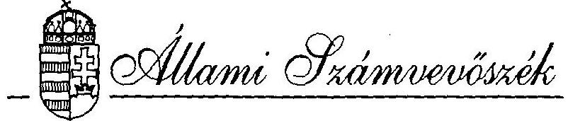
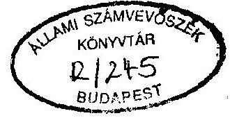
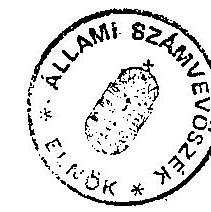

#  

## JELENTÉS

a Magyar Demokrata Fórum 1992-1993. évi gazdálkodása törvényességének ellenôrzésérôl

---

A vizsgálatot vezette:
dr. Elek János
osztályvezető főtandcsos
A vizsgálatot végezték:
Hoffmann István
számvevö
dr. Dotterweich Antal
számvevö tandcsos

---

# ALLAMI SZAMVEVOSZEK 

V-1019-11/1994-95.
Tsz. 246 .

## J E L E N T E S

a Magyar Demokrata Fórum 1992-1993. évi gazdálkodása törvényességének ellenôrzésérôl

## I.

A vizsgálat célja, idôszaka, módszere és körülményei

A pártok müködésérôl és gazdálkodásáról szólo - többször módositott - 1989. évi XXXIII. törvény (továbbiakban: párttörvény) 10. §. (1) bekezdése, valamint az Állami Számvevõszékrõl szólo 1989. évi XXXVIII. törvény 5. §-a alapján a pártok gazdálkodása törvényességének ellenôrzésére az Állami Számvevõszék (továbbiakban: ASz) jogosult. A törvény felhatalmazása alapján az ASz 1994. II. félévi ellenôrzési tervében rögzített ütemezésnek megfelelôen elvégezte a Magyar Demokrata Fórum (a továbbiakban párt) gazdálkodása törvényességének ellenôrzését.

Az ellenôrzés célja - a törvényi felhatalmazások alapján - kizárólag annak megállapítására irányult, hogy a párt müködéséhez szabályszerűen igénybevehetô forrásokat használt-e fel, a párttörvényben elôírt gazdálkodó tevékenységet folytatott-e, valamint betartotta-e a gazdálkodással összefüggõ pénzügyi-számviteli szabályokat.

---

A vizsgálati jelentés a párt Budapest III. és X. kerületi szervestetei, Komárom-Esztergom megyei iroda, Dorog. Komárom és Tát-i szervestek. Pest megyei iroda, Göd, ceglédi szervezetek, valamint az Országos Hivatalban végzett vizsgálatok jelentései alapján készült.

Az ellenőrzött idöszak a lezárt 1992. és 1993. gazdasági év, valamint az 1994. év vizsgálatig eltelt hónapjai voltak.

A helyszini ellenőrzések 1994. november 1. - december 1. közötti idöszakban történtek.

Az ellenőrzés módszere szúrópróbaszerủ vizsgálat volt, a helyszíneken rendelkezésre bocsátott iratok, dokumentumok alapján.

# II. 

## Az ellenőrzés megállapításai

1. A párt 1992. és 1993. évi gazdálkodásáról közzétett éves beszámolókhoz kapcsolódó adatszolgáltatások vizsgálata

A párt megfelelően szervezte meg mindkét vizsgált év éves beszámolójának elkészitését. Mindkét évben forgatókönyv készült, amely idöbeli ütemezéssel rögzíti az érintett szervezeti egységek feladatait. Az Országos Hivatal Fökönyvelósége a helyi szervezetek beszámolói elkészitésének segítése éra szervezetek rendelkezésére, amelyhez kitöltési útmutatót is

---

mellékeltek az egységes értelmezés biztosítása érdekében. A munka során felmerülõ problémák tisztázása érdekében a Fökönyvelőség gazdasági tájékoztatókat szervezett a megyei irodáknál, a megyei irodák feladatává tették a beszámolók elkészítésének útmutatásokkal, eligazításokkal történõ segítését.

Az Országos Hivatal fökönyvelősége a Hivatal gazdálkodásáról készített beszámolót. A beszámolóhoz számítógépes feldolgozás alapján készült fökönyvi kivonat és fökönyvi számlák kapcsolódnak. Szükség esetén a fökönyvi számlákból kézi kigyüjtéssel állították elõ a párttörvény 1. sz. melléklete egyes soraihoz kapcsolódó adatokat. A kézi kigyüjtések rendelkezésre állnak.

A helyi szervezetek és a megyei irodák saját beszámolójukat az általuk vezetett naplófőkönyvek alapján, a központilag megküldött nyomtatványok felhasználásával készítették el. A Számitástechnikai Osztály a leadott beszámolók alapján készítette el ezek ellenőrzését követően az országos összesítőt.

A párt által a Magyar Közlönyben megjelentetett beszámolók tehát az Országos Hivatal beszámolója és a szervezetek adataiból készült országos összesítõ adatának egyesítésével készültek.

# 1.1. A közzétett beszámolók pontossága és teljeskörüsége 

A párttörvény 9. 8 (1) bekezdése értelmében a pártck kötelezek minden év április 30 -ig az elõzõ évi gazdálkodásukról

---

szóló beszámolót a Magyar Közlönyben - a törvény 1. sz. mellékletében meghatározott minta szerint - közzétenni.

A. párt 1992. évi gazdálkodásáról készített beszámolóját (1. sz. melléklet) a párttörvény 9. § (1) bekezdéséhez kapcsolódó módosítás elötti 1. sz. melléklete szerkezetében tette közzé. Figyelemmel arra, hogy a hivatkozott bekezdést módosító 1992. évi LXXXI. törvény kihirdetését követő 8. napon lépett hatályba, tehát 1993. január 5-én, így ezt az ellenőrzés nem kifogásolja. Az 1993. évi gazdálkodásról készített beszámolót (2. sz. melléklet) 1994. április 22-én, tehát határidőn belül küldték meg közzététel céljából.

A párt gazdálkodásáról közzétett éves beszámolók tartalmazzák valamennyi önálló gazóálkodásra jogosult szervezet adatát. A nem gazdálkodó szervezetek is eleget tettek adatszolgáltatási kötelezettségüknek, így az adatszolgáltatások teljesörüségét biztosították.

A közzétett beszámolók azonban nem pontosak, elsősorban a szervezetek beszámolóiban elöforduló pontatlanságok, helytelen adatok, halmozódások ki nem szürése következtében. A helyi szervezetek a kitöltési útmutató ellenére nem értelmezték minden esetben egyeégesen a beszámoló egyes sorainak tartalmát. Kisebb pontatlanságok az Országos Hivatal beszámolojában is tapasztalhatók.

---

# 1.2. A beszámolók bevételi oldalát érintő megállapítások 

A párt tagdij bevételét illetően pontatlan az 1992. és az 1993. évről készült beszámoló is. Az ellenőrzés megállapítása szerint a Göd Városi Szervezet 1992. évi tagdijbevétele 11.880 Ft, a beszámolójában szerepeltetett 10.000 Ft összeggel szemben. Az Országos Hivatal esetében tagdijként szerepel 1992. évben 500 Ft hírlap elöfizetési dij is. A Budapest III. kerületi szervezet 1993-ban 232.355 Ft-ot jelentett, az ellenőrzés megállapítása szerint a szervezet tagdijbevétele 242.055 Ft volt. Az Országos Hivatal esetében 5.336 Ft tagdij a "hozzájárulások magánszemélytől" bevételi soron szerepel. További problémát okoz, hogy 1993-ban a szervezetek országos összesítōjének április 20-i adata tagdij címen 9.181.402 Ft, az április 22-i adat 9.237.522 Ft, ennek figyelembevételére azonban már nem volt lehetöség, a párt beszámolója a korábbi adatot tartalmazza.

Az állami költségvetési támogatás összege az ellenőrzés megállapítása szerint egyezik a nyilvántartások adataival. Jelezni szükséges, hogy az 1992. évi 245.050 E Ft összesen adatból 90 E Ft az országos Választási Iroda részéről átutalt összeg, 41.260 E Ft a székház felújítási keretböl származik, 203.700 E Ft a párttörvény rendelkezései alapján kapott összeg. Az 1993. évi összesen 296.793 E Ft-ból 41.260 E Ft a felújítási keret, 255.533 E Ft a párttörvény alapján utalt összeg.

Az egyéb hozzájárulások címen kimutatott összegek mindkét évben pontatlanok. Ennek oka1 a következók:

---

- 1992. évben a Budapest, III. kerületi szervezet jogi személyektől származó hozzájárulásként szerepeltetett 85.640 Ft-ot, az összeg valójában egyéb bevétel.
- 1992. évben a Cegléd városi szervezet a magánszemélyektől származó hozzájárulások soron tüntet fel 10.000 Ft összeget, pedig az visszavételezett pénzösszeg. Nem szerepel azonban e soron 200 USD forint értéke, amely valóban magánszemélytől származó hozzájárulás.
- 1993. évben a Göd városi szervezet helytelenül 69.250 Ft-ot jelentett, a helyes összeg 49.000 Ft , továbbí probléma, hogy az összeget a rovatot tovább bontó alrovatok egyikén sem szerepeltették. A beszámolót később javitó megfelelő információ hiányában magánszemélytől származó hozzájárulás alrovatba írta be, az ellenörzés megállapítása szerint azonban az összeg a Lakitelek Alapítványtól, tehát jogi személytől származik.
- 1993. évben a Budapest, III. kerületi szervezet egyéb bevételek közt tüntetett fel 91.907 Ft magánszemélyektól származó hozzájárulást.
- 1993. évben a Pest megyei iroda beszámolójában 28.000 Ft jogi személyektől származó és 3.5 E Ft magánszemélyektól származó hozzájárulás szerepel. Az ellenörzés megállapítása szerint ezek valójában más társadalmi szervezete: részére nyújtott hozzájárulások, tehát a kiadások köze tartoznak.

---

- Jelentkezik az a probléma is, hogy a szervezetek adatai a beszámoló leadását követöen is módosultak, ezek figyelembevételére értelemszerüen nem volt lehetöség.
- Az Országos Hivatal 1993. évi magánszemélytöl származó hozzájárulás adata pontatlan, az e soron feltüntetett összeg az ellenörzés megállapítása szerint tagdijat és Casco kártérítési összeget is tartalmaz.
- A párttörvény 9. §(2) bekezdésének elöírása szerint "A pénzügyi kimutatásban az egy naptári év alatt adott 500.000 Ft-ot meghaladó hozzájárulásokat, illetve a 100.000 Ft-nak megfelelő értéket meghaladó külföldröi származó hozzájárulásokat - a hozzájárulást adó megnevezésével és az összeg megjelölésével - külön kell feltüntetni". Ezen elöírásnak a párt nem mindenben tett eleget, a szervezeteknek megküldött beszámoló nyomtatványok "Részletezett adatok" c. adatlapja csak az 500.000 Ft feletti belföldi és a 100.000 Ft feletti külföldi hozzájárulások részletezését írja elö, következésképp az ezen összeg alatti hozzájárulások összesítésére adományozók szerint nincs lehetöség. Az ellenörzés megállapítása szerint a Lakitelek Alapítvány 1993. évben a Göd városi szervezet részére 49.000 Ft, a Eomárom-Esztergom megyei iroda részére 25.000 Ft hozzájárulást nyújtott. Az elözöekben leírtak miatt a Magyar Közlönyben megjelent Lakitelek Alapítványtól származó 1.244.876 Ft adat pontatlan, csak az Országos Hivatal részére nyújtott hozzájárulás összege.

---

A propaganda tevékenységbōl származó bevétel 1992. évi Gsszege pontatlan, a Budapest X. kerületi szervezet 4.160 Ft összegben tett szert propaganda tevékenységbōl származó bevételre, ez azonban a beszámolóban helytelenül az Országos Hivataltól származó támogatás soron szerepel.

Az egyéb bevétel adat mindkét vizsgált év beszámolójában pontatlan, a következök miatt:

- Komárom-Esztergom megyei iroda 1992. évi beszámolójában szereplö 30.000 Ft "szervezeteknek 1991-ben kölcsönadott Gsszeg" nem tényleges bevétel, csak pártszervezetek kōzötti pénzmozgás, ki nem szürése halmozódást okozott az éves beszámolóban:
- a Budapest X. kerületi szervezet esetében az 1992. évi beszámolóban 19.200 Ft nem tényleges bevétel, mert az elözö évi elszámolásra kiadott összegböl történt bevételezés:
- mindkét évben az Országos Hivatalban lévő KLIX étel, ita1 automaták ürítéséből származó összegeket nettć módon. költségcsökkentő tételként könyvelték, igy nem szerepelnek az egyéb bevételek között:
- az 1993. évi beszámoló 5.300 .894 Ft Gsszegéhez tartozó "bankszámlák forgalmi jutaléka" elnevezés pontatlan. az Seszegben a helyi szervezetek ingó értékesítési bevétele is szerepel:

---

- a Budapest X. kerületi szervezet 1993. évi beszámolójában szereplő 6.2 E Ft költség visszafizetés nem tényleges bevétel:
- a Budapest III. kerületi és a Göd városi szervezet 1993. évi beszámolójában a bankkamatok összege nem szerepel:
- az 1992. évi beszámolót illetően a párt a Magyar Közlöny 1993. évi 82. számában adatmódosítást tett közzé, amely részletezi az egyéb bevételeket jogcímenként. A jogcímek között szerepel "elölegből felhasználva" cím és 77.952.559 Ft összeg. Az ellenőrzés megállapítása szerint ez a számított adat azt az összeget jelöli, amelynek megfelelő Országos Hivatali kiadást finanszírozott az elöleg. A számviteli nyilvántartások szerint 1992. évben a befolyt elöleg összege 761.600 .000 Ft volt.

# 1.2. A beszámolók kiadási oldalát érinó megállapítások 

Az 1992. évi gazdálkodásról készített beszámoló egyes kiadási sorai tartalmának értékelését a korábbi vizsgálatoknál jelzett értelmezési problémák nehezítik.

A párttörvény 1. sz. mellékletéhez kitöltési útmutató nem készült, ennek következtében pártonként eltérő tartalmúak a kiadási sorok. Erre figyelemmel az ellenőrzés csak a jogszabályokkal egyértelmúen ellentétes eljárásokat kifogásolja.

Igy jelezni szükséges, hogy a már említett automata ürítést az Országos Hivatal költségosökkentő tételként számolta el.

---

ami ellentétes a számvitelről szóló 1991. évi XVIII. törvèny (a továbbiakban: számviteli törvény) 15. \# (10) bekezdésében meghatározott bruttó elszámolás elvével. Az Országos Hivatalnál 1992. májusában két alapbizonylat esetében 1.150 Ft és 5.837 Ft összege nézve nem a párt. hanem a Fórum Alapítvány a költségviselö, így helyesen az összegeket a kiadások "hozzájárulások juttatása" címe alatt kellett volna szerepeltetni.

A különféle egyéb költségek között mutatták ki tárgyi eszköz beszerzéseket a következök szerint:

- szoftver beszerzés
- intézményi müszaki eszköz beszerzés
- irodai berendezések beszerzése
- jármú beszerzés

Összesen:
$255.000 \mathrm{Ft}$
$9.039 .701 \mathrm{Ft}$
$2.670 .597 \mathrm{Ft}$
$12.682 .623 \mathrm{Ft}$
$24.647 .921 \mathrm{Ft}$

A jelzett beszerzések teljes értékének az adott év költségei között történő kimutatása ellentétes a számviteli törvény előírásaival.

A Komárom városi szervezet 1992-ben a propaganda költségek kőzött szerepeltet 2 E Ft összeget. Ez az ellenörzés megállapítása szerint más szervezet részére történt készpénz átadás. igy valójában nem tényleges kiadás. A Komárom-Esztergom megyei iroda és a Pest megyei iroda 1992. évi kiadásai részletezö nyilvántartások, mellékszámitások hiányában nem voltak egyeztethetőek.

---

Az 1993. évi gazdálkodásról készített beszámoló esetében is csak az egyértelmüen helytelen gyakorlatot jelzi az ellenörzés, igy:

- az Országos Hivatal esetében a "támogatás más társadalmi szervezetek részére" adat pontatlan, egyrészt mert kivonással állapították meg, és nem a megfelelő főkönyvi számlák adatai összegzésével, másrészt mert az ellenőrzés megállapítása szerint 1993. október 15-én a párt az Ifjúsági Demokrata Fórum helyett fizetett 15 E ATS összegü tagdijat, ezt azonban helytelenül igénybe vett szolgáltatásként és nem társadalmi szervezetnek nyújtott hozzájárulásként kontírozták. Az automata ürítés 1993-ban is költségcsökkentő tételként lett kontirozva:
- a Budapest III. kerületi és a Göd városi szervezet beszámolójában a bankköltség nem szerepel;
- a Budapest X. kerületi szervezet a párt belso elöírásaival ellentétesen 2 E Ft alatti beszerzéseket is eszközbeszerzésként számolt el, ez helyesen müködési költség lenne;
- a Budapest III. kerületi szervezet esetében 8,1 E Ft összeg nem támogatás más társadalmi szervezet részére. hanem müködési költség:
- a Komárom-Esztergom megyei iroda és a Pest megyei iroda 1993. évi kiadásai részletezõ nyilvántartások, mellékszámítások hiányában nem voltak egyeztethetöek.

---

2. A párt 1992. és 1993. éves beszámolóinak megalapozottságát érintő könyvvizsgálati megállapítások

A párt Országos Hivatala a könyvvezetést külső cégek - betéti társaságok - igénybevételével oldotta meg. A könyvvezetés a kettős könyvvitel rendszerben történik, kontírozás, majd ezt követő számítógépes feldolgozás révén. Hiányosság, hogy a párt nem készített számlarendet, az ilyen elnevezéssel átadott dokumentum valójában számlatükör.

A választott könyvvezetés rendszere a párt egészét tekintve nem egységes. A helyi szervezetek, megyei irodák ugyanis egyszeres könyvvitelt vezetnek, csak az évente egyszeri adatszolgaltatási kötelezettség teljesítésével kapcsolódnak a párt beszámolójához. az egységesség hiánya következtében nem érvényesül kellőképpen a számviteli törvényben elöírt teljesség és következetesség elve.

A gazdasági eseményeket idōrendben rögzíti a fōkönyvi könyvelés, kontírozási hibák elvétve fordulnak elō.

A helyi szervezetek könyvvezetéssel kapcsolatos hibái a beszámoló bevételi és kiadási oldalával kapcsolatos megállapítások során már ismertetésre kerültek.
3. Analitikus nyilvántartások és a bizonylati rend ellenőrzése

A párt a számviteli törvényben kötelezōen elöirt analitikus nyilvántartásokat - amelyek a bekövetkezett változásokat a valóságnak megfelelően, folyamatosan, áttekinthetően mutatóák - vezeti.

---

A szigorú számadási kötelezettség alá tartozó nyomtatványok körét kijelölték, felhasználásának módját és nyilvántartásának feltételeit meghatározták. Fentieket "Gazdálkodási Szabályzat" rögzíti, megfelelő részletezettséggel. A "Gazdálkodási Szabályzat" rögzíti továbbá a

- gépjármũ-üzemeltetés rendjét;
- devizakezelés ügymenetét;
- és a pénzügyi ellenőrzés rendjét.

A szükséges szabályzatokkal rendelkeznek, így a "Házipénztár Szabályzat"-tal is, mely a pénz- és az értékkezelés rendjét tartalmazza.
3.1. Bizonylati elv és bizonylati rend érvényesülésének ellenőrzése

A házipénztár forgalmi és kezelési szabályait, valamint az utalványozásra jogosult személyek kijelölését rögzítették. illetve meghatározták.

A pénztárbizonylatok kiállítása az Országos Hivatal esetében alaki-, tartalmi szempontból egyaránt szabályos, az utalványozó, az ellenőr és a pénzfelvevõ vagy befizetõ aláírását tartalmazza. A bizonylati rendet az Országos Hivatalban 1992. és 1993. éveket illetően kéthavi bizonylat. 1994-ben pedig a május havi bizonylatok alapján tekintette át az ellenőrzés. A helyi szervezetek közül a Pest megyei iroda esetében 1992. évben a kiadási pénztárbizonylatokhoz nem minden esetben kapcsolódott megfelelő alapbizonylat.

---

3.2. A költségtérítések gyakorlatát vizsgálva az ellenôrzés megállapította, hogy a párt a:

- hivatali gépjármũ hivatali-,
- saját gépjármũ hivatali célú
használatával kapcsolatos hatályos jogszabályi rendelkezéseket - egy-egy kivételtôl eltekintve - betartotta. A gépjármũ üzemanyag-elszámolásánál általában az útvonal-nyilvántartás alapján történõ norma szerinti elszámolást alkalmazták és elvétve térítettek üzemanyagszámla alapján költséget 1992. évben.

3.3. Utólagos elszámolásra kiadott elõlegek nyilvántartása és elszámolása

A párt az elszámolásra kiadott elõlegek felvételének. visszafizetésének és elszámolásának rendjét külön leszabályozta. A kiadott elõlegekről nyilvántartást vezet, egyezõen a vonatkozó fôkőnyvi számlával.

A kiadott összegekkel a jogosultak mindkét évben elszámoltak, a fôkönyvi számlán elszámolatlan felvét az év végén nem volt.
3.4. Külföldi hivatalos célú utazások deviza-elszámolási gyakorlata

A külföldi kiutazások ügyvitele szabályozott, a hatályos rendelkezéseknek megfelel. A külföldi kiutazásokban résztvevôket a Pért mindkét évben elszámoltatta, a valuta átvé-

---

telét és mozgását dokumentálták, felvétei és kiadási bizonylat, valamint külföldi kiküldetési utasitás és költségelszámolás nyomtatvány alkalmazásával.

Néhány esetben elöfordult, hogy szállásköltséget számla csatolása nélkül számoltak el, ezzel megsértve a 30/1992. (II. 13.) sz. Korm. rend. 3. 8 (5) bekezdésében foglaltakat.

Az ellenőrzés megállapította, hogy a párt a magánszemélyek jövedelemadójáról szóló, többször módosított 1991. évi XC. törvényben foglalt azon elöírásnak nem tett eleget, amely szerint a külföldi kiutazó napidijának 30\%-át meghaladó részt összjövedelméhez hozzá kell adni. Ezt a párt saját alkalmazásában lévő - és a külföldi utazás során napidijban részesülő - munkavállalóival kapcsolatosan 1993. évben elmulasztotta. Ez által az Adóhivatallal szemben személyi jövedelemadó tartozása keletkezett.
3.5. A párt a személyi jövedelemadó, munkavállalói és munkaadói járulék, a társadalombiztosítási járulék (nyugdij- és egészségbiztosítási járulék) fizetési kötelezettségéről mindkét évben analitikus nyilvántartást vezetett. A bérkifizetési jegyzékekhez megbízási jogviszony esetén minden esetben csatolták a megbízási szerzödéseket. Az alkalmazottakkal minden esetben szerződést kötöttek.

A személyi jövedelemadóról vezetett nyilvántartás szabályszerű, adóelöleget minden esetben vontak, illetve elszámoltak. A párt mindkét évben teljesítette az Adóhivatal felé

---

személyi jövedelemadó és munkavállalói járulék bevallási és az elöző pontban említett kivétellel befizetési kötelezettségét.

Teljesítette továbbá mindkét évben társadalombiztosítási járulék bevallási és befizetési kötelezettségét.
4. A párt bevételeinek és gazdálkodó tevékenységének ellenőrsése

Az ellenőrzés részére átadott nyilatkozatok és a helyszini vizsgálati tapasztalatok alapján megállapítható, hogy a párt a párttörvény 6. 8 (1) bekezdésében engedélyezett gazdálkodó tevékenységet folytatott. A gazdálkodó tevékenységből származó bevételek propaganda anyag árusításából, tulajdonban álló ingóságok és egy ingatlan értékesítéséből származtak.

Az ingatlan értékesítéssel kapcsolatban a rendelkezésre bocsátott dokumentumok alapján az állapítható meg, hogy a Budapest. V. ker. Váci u. 38. sz. alatti ingatlan adás-vétele tárgyában az MDF és a FIDESZ, mint eladók és a Magyar Külkereskedelmi Bank Ft. mint vevö közötti ingatlan adás-vételi elöszerzödés aláírása történt meg 1992. szeptember 23-án. Az elösszerzödés alapján a bank 761.600 .000 Ft elöleget utalt át az MIF részére 1992. szeptember 30-án. 1993. január 11-án került sor az ingatlan adásvételi szerzödés aláírására, a egyidejüleg a párt Országos Hivatala számlát állított ki a bank felé. A még fizetendő 70.720 E Ft összeget a bank 1993 . március 31-én egyenlítette ki.

---

A párt a vizsgált idôszakban egy korlátolt felelôsségũ társaságot alapított, ennek adózott nyereségébôl bevételre nem tett szert.

A párt Országos Hivatala és vizsgált helyi szervezetei tiltott vagyoni hozzájárulást nem fogadtak el, vállalatot nem alapítottak, a párttörvényben tiltott gazdasági társasági formákban részesedést nem szereztek, részvényt nem vásároltak.

# III. 

## Összefoglalás

felhívás a törvényes állapot helyreállítására

A párt gazdálkodásának rendjét kellő részletezettségũ belsö szabályzatokban rögzítette, hiányosság azonban, hogy a számviteli törvény 79. § (1) bekezdésében elôirt számlarend készítési kötelezettséget nem teljesítette.

A korábbi ASz vizsgálatban javasolt egységes értelmezést segitő kitöltési útmutatót az éves beszámolóhoz elkészítették, azonban a gyakorlatban ennek ellenére nem volt egységes az egyes sorok tartalmának értelmezése, több esetben nem szürték ki a halmozo-dásokat, továbbá a szervezetek az alapbizonylatoktól eltérő pontatlan adatokat is közöltek.

Az Országos Hivatalban pedig helytelen adatsorokat eredményezo kontirozási pontatlanságok fordultak elõ és nem érvényesült követke-etesen a bruttó elszámolás cive.

---

Hiányosság, hogy a belsó adatszolgáltatási rendszer nem teszi lehetővé a hozzájárulások adományozók szerinti pontos összesitését, mivel a szervezetek részére csak az 500 E Ft feletti belföldi és a 100 E Ft feletti külföldi hozzájárulások nevesítését írja elő adományozónként. Ezzel a párt nem tartotta be a párttörvény 9. 8. (2) bekezdésében foglaltakat. Megsértette a párt a magánszemélyek jövedelemadójáról szóló 1991. évi XC. törvény 9. 8 (2) bek. rendelkezését, mivel a devizaellátmányok $30 \%$-át meghaladó részét nem adták hozzá a magánszemélyek összjóvedelméhez, ezáltal adótartozás keletkezett.

A vizsgálat megállapításai alapján a párttörvény 10. 8 (4) bekezdésében kapott felhatalmazás alapján felhívom a párt elnökét, hogy:

1. Gondoskodjon a számlarend elkészittetéséröi.
2. Rendelje el a személyi jövedelemadó-hiany rendezése érdekében szükséges intézkedéseket.
3. Intézkedjen az éves beszámolóhoz kapcsolódó adatszolgáltatási rendszer olyan módosítása érdekében, amely biztositja a hozzájárulások adományozók szerinti pontos összesitését.

Budapest, 1995. február

(Hagelmayer István/ 4.

Melléklet: 2 db

---

# III. rész HATAROZATOK 

## A Köztársasági Elnök határozatai

## A Köztársaság Elnökének 45/1993. (IV. 20.) KE határozata

közigazgatási államtitkár kinevezéséról
A miniszterelnök javaslatára
dr. Kemény Attilát a Környezetvédelmi és Területfejlesztési Minisztérium
közigazgatási államtitkárává
1993. április 15-i hatállyal
kinevezem.

Göncz Árpád s. k., a Köztársaság elnöke

Ellenjegyzem:
Dr. Antall József s. k.; miniszterelnök

## A Köztársaság Elnökének 46/1993. (IV. 20.) KE határozata

egyetemi tanárok felmentéséról
A múvelődési és közoktatási miniszter elöterjesztésére - nyugállományba vonulására tekintettel - az Eötvös Loránd Tudományegyetemrol
dr. Nagy Kázmér egyetemi tanár 1993. december 30. napjával,
dr. Kirschner Béla egyetemi tanárt,
dr. Köte Sándor egyetemi tanárt és
dr. Vág Otto egyetemi tanár 1993. december 31. napjával
e tisztsegc alól felmentem.
Göncz Árpád s. k.,
a Köztársaság elnöke
Ellenjegyzem:
Dr. Mád Ferenc s. k., múvelődési és közoktatási miniszter

## V. rész

## KÖZLEMÉNYEK, HIRDETMÉNYEK

A Magyar Demokrata Fórum 1992. évi pénzügyi zárómérlege

Forintban
A) Tényleges bevételek:

1. Tagdijak 10206368
2. Állami költségvetésból származó támogatás
2.1. Alapösszeg 245050000
2.2. Frakció szakértói dij
1., 2. Összesen:
255256368
3. Egyéb hozzájárulások
3.1. Jogi személyektól 34371531

- ebből 500000 Ft feleltil hozzájárulás belföldicktól
- Befor Kft. 12700000
- Deák Ferenc Alapítvány 6410600
- Lakitclek Alapítvány 5324000
- Euro-Hungária Alapítvány 1500000
- cbből 100000 Ft feletti értéknek megfcleló osszeg külföldicktól
- Európa Mozgalom Magyar Tanácsa 194871
3.2. Jogi személynek nem minősüló gazdasági társaságoktól 842992
- ebből 500000 Ft feleltil hozzájárulás belföldicktól
- ebből 100000 Ft feleltil ćrtćknek megfcleló osszeg külföldicktól
3.3. Magánszemélyektól 1518831
- ebből 500000 Ft feleltil hozzájárulás belföldicktól
- ebből 100000 Ft feleltil értéknek megfcleló osszeg külföldicktól
- Yvelte Altmann Cherbourg 265750

3. Összesen:
36733354
4. A párt propagandalevćkenységéből 1570820
5. A pári gazdálkodó tevćkenységéból 244561

---

6. A párt által alapított vállalat és korlátolt fclclösségủ társaság nyercségéből származó bevétel
7. Egyéb bevétel

136481150
ÖSSZES BEVÉTEL:
430286253

## B) Tényleges kiadások

1. Hozzájárulások juttatása
1.1. A párt országgyúlési csoportja számára
1.2. A párt helyi szervczctei számára*
1.3. A párt által fenntartolt vagy támogatott intézmények számára
1845317
1.4. Más társadalmi szervezctek számára 10729380
1.5. Külföldi intézmények, szervezetck, személyek számára

3163905

1. Összesen:
2. Személyzeti költségek
2.1. Munkabérek
42825935
2.2. Költségtérítések, napidljak 29716568
2.3. Társadalombiztosítási hozzájárulások
27931921
2.4. Szociális és egyéb támogatások 1395580
3. Összesen:
101870004
4. Általános költségek
3.1. Adók, illetékek 19039978
3.2. Épületek fenntartása, karbantartása, közüzemi díjai
23674323
3.3. Helyiségck bérlete 6555381
3.4. Adminisztrációs és postaköltségek 11468200
3.5. Különféle cgyéb' költségck 87004328
5. Összesen:
147742210
6. Sajtó és propagandaköltségek 62733672
7. Választásokkal kapcsolatos költségck 18164928
8. Egyéb tevékenységgel kapcsolatos költségck
$\begin{array}{r}\text { 86684304 } \\ \text { 167582904 }\end{array}$
9. 5., 6. Összesen:

167582904
ÖSSZES KIADÁS:
432933720

[^0]C) Tényleges pénzügyi helyzet 1992. december 31-én

| Összes bevétel: | 430286253 |
| :--: | :--: |
| Összes kiadás: | 432933720 |
| Hiány 1992-ben | $-2647467$ |
| Halmozott többlet 1991. ćvből | 72644643 |
| Halmozott többlet 1992. decembcr 31-én | 69997176 |
| Módosított pénzmaradvány 1992. december 31-én | 69997176 |
| Für Lajos s. k., ügyvezető clnők | Kollár K. Attila s. k., gazdasági igazgató |

## Pályázati felhívás

## Iparí Formatervezési Nívódij

és Iparí Formatervezési Miniszterelnöki Különdíj elnyerésére

Az ipari és kereskedelmi miniszter és az Országos Múszaki Fejlesztési Bizottság clnöke az innovativ vállalkozói magatartás sokoldalú kibontakoztatása érdekében nyilvános pályázatot hirdet

## Iparí Formatervezési Nívódij

és Iparí Formatervezési Miniszterelnöki Különdíj elnyerésére az 1993. évben.

A pályázat tárgyát képező termékcsoportok:

- gépek és berendezések, szerszámok,
- közlekedési és szállitási eszközök,
- háztartási gépek, berendezések, eszközök,
- müszerek, híradástechnikai berendezések,
- városi mobiliák, vizuális tájékoztató eszközök,
- közszükségleti iparcikkck, csomagolóeszközök és csomagolás,
- ruházati termékek, alapanyagok és kellékek,
- sport és szabadidő eszközei,
- bútorok, lakberendezések, lakásfelszerelések,
- épületszerclvények,
- szilikátipari késztermékek (üveg, porcelán, kerámia),
- menedzserek eszközei,
- oktatási eszközök,
- játékok.

[^0]:    * A párt helyi szervczcteinek támogatása 72838778 Ft összcgö volt, clynck felhasználását a kiadások egyes tételei tartalmazzák.

---

# Szám MAGYAR KÖZLÖNY 

## V. TESZ

## KÖZLEMÉNYEK, HIRDETMÉNYEK

A Magyar Demokrata Fórum 1993. évi pénzügyi zárómérlege

## Forint

## Bevételek

1. Tagdijak

9181402
2. Állami költségvetésből származó támogatás

296793000
3. Képviselơl csoportnak nyújtott támogatás
4. Egyéb hozzájárulások, adományok
4.1. Jogi személyektól
4.1.1. Belföldiektól (az 500000 Ft fe letti hozzájárulás nevesitve)

- Deák Ferenc Alapítvány

564600

- Lakitelek Alapítvány
1244876
- Batthyány Lajos Alapítvány

512655
4.1.2. Külföldiektól (a 100000 Ft fe letti hozzájárulás nevesitve)
4.2. Jogi személyeknek nem minősülő gazdasági társaságoktól
4.2.1. Belföldiektól (az 50000 Ft fe letti hozzájárulás nevesitve)
4.2.2. Külföldiektól (a 100000 Ft fe letti hozzájárulás nevesitve)
4.3. Magánszemélyektól
4.3.1. Belföldiektól (az 500000 Ft fe letti hozzájárulás nevesitve)
4.3.2. Külföldiektól (a 100000 Ft fe letti hozzájárulás nevesitve)

5. A párt által alapított vállalat és kft. nyereségéből származó bevétel
6. Egyéb bevételek
952150120
6.1. Káresemények bevétele
1673928
6.2. Kamatbevétel pénzintézetektől 110075150
6.3. Késedelmi kamat, pártrendezvény bevétel
451548
6.4. Bankszámlák forgalmi jutaléka
5300894
6.5. A párt propagandatevékenységéből 1818600
6.6. Tulajdonban álló ingatlan és ingók hasznosítása és elidegenítése
832830000

Összes bevétel
1266728933

---

## Kiadások

1. Támogatás a párt országgyúlési csoportjai számára
2. Támogatás egyeb szervezeteknek
3. Vállalkozások alapítására fordított ösz. szegek
4. Müködési kiadások
5. Eszközbeszerzés
6. Politikai tevékenység kiadása
7. Egyéb kiadások
7.1. Bankköltség
7.2. Birság, késedelmi kamat
7.3. Arfolyamveszteség, pénzügyi korrekció
7.4. Számla kezelési költség

Összes kiadás

Lezzák Sándor s. k., Ggyvezető einők

## A Szabad Demokraták Szövetsége 1993. évi pénzügyi zárómérlege

## Ezer forint

## Bevételek

1. Tagdijak
2. Állami költségvetésböl származó támogatás
3. Képviselơi csoportnak nyújtott állami támogatás
4. Egyéb hozzájárulások, adományok 4.1. Jogi személyektól
4.1.1. Belföldiektól (az 500000 Ft fe letti hozzájárulás nevesitve)
4.1.2. Külföldiektól (a 100000 Ft fe letti hozzájárulás nevesitve)
4.2. Jogi személynek nem minősülő gazdasági társaságtól
4.2.1. Belföldiektól (az 500000 Ft fe letti hozzájárulás nevesitve)
4.2.2. Külföldiektól (a 100000 Ft fe letti hozzájárulás nevesitve)
4.3. Magánszemélyektól
4.3.1. Belföldiektól (az 500000 Ft fe letti hozzájárulás nevesitve)
4.3.2. Külföldiektól (a 100000 Ft fe letti hozzájárulás nevesitve)
5. A párt által alapított vállalat és kft. nyereségéből származó bevétel
6. Egyéb bevétel

Összes bevétel a gazdasági évben

## Kiadások

1. Támogatás a párt országgyúlési csoportja számára
2. Támogatás egyéb szervezeteknek 374
3. Vállalkozások alapítására fordított öszszegek
4. Müködési kiadások
5. Eszközbeszerzés
6. Politikai tevékenység kiadása
7. Egyéb kiadások
Összes kiadás a gazdasági évben
Maradvány

## Wekler Ferenc s. k.,   pártigazgató

A Kereszténydemokrata Néppárt 1993. évi pénzügyi zárómérlege

## I. Bevételek

1. Tagdijak
2. Állami költségvetésból származó tȧmogatás
3. Székház felújításra nyújtott állami támogatás
4. Egyéb hozzájárulások, adományok
4.1. Jogi személyektól
4.1.1. Belföldiektól (az 500000 Ft feletti hozzájárulás)
4.1.2. Külföldiektól (a 100000 Ft feletti hozzájárulás) -CHR DEMOCKRATISCH APPEL