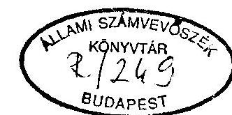
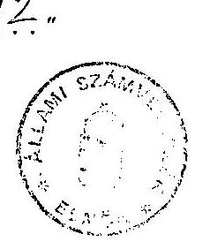

# Sllami Számverösxék 

## JELENTÉS

a Fiatal Demokraták Szövetsége 1992-1993. évi gazdálkodása törvényességének ellenôrzésérôl

---

A vizsgálatot vezette:
dr. Elek János
osztályvezető főtanácsos
A vizsgálatot végezték:
Berzétey Attiláné
számvevö tanácsos
dr. Szávai Tamás
számvevö tanácsos

---

# J E L E N T É S 

a Fiatal Demokraták Szövetsége 1992-1993. évi gazdálkodása tör vényességének ellenörzéséröl

1. 

A VIZSGÁLAT CÉLJA, MÓDSZERE, IDŐSZAKA, KÖRÜLMÉNYEI

A pártok működéséröl és gazdálkodásáról szóló - többször módosított - 1989. évi XXXIII. törvény (továbbiakban párttörvény) 10. §. (1) bekezdése, valamint az Állami Számvevőszékről szóló 1989. évi XXXVIII. törvény 5. §. alapján a pártok gazdálkodása törvényességének ellenőrzésére az Állami Számvevőszék (továbbiakban: ÁSZ) jogosult. A törvènỵi felhatalmazás alapján az ÁSZ második fèlèvi ellenőrzési tervének megfelelően vizsgálta a Fiatal Demokraták Szövetsége (a továbbiakban: párt) gazdálkodása törvényességét.

Az ellenőrzés célja annak megállapítása volt, hogy a párt müködéséhez szabályszerűen igénybevehető forrásokat használt-e fel, a párttörvényben engedélyezett gazdálkodó tevékenységet folytatott-e, valamint betartotta-e a gazdálkodással összefüggő pénzü-gyi-számviteli szabályokat.

Az Állami Számvevőszék a párt gazdálkodásának törvényességét ezúttal harmadizben vizsgálta. Az előző két ellenőrzés alapvetően rendezett gazdálkodásról adott számot.

---

Az ellenörzés 1992. január 1-től 1993. december 31-ig terjedő, beszámolóval lezárt időszakra, valamint a folyó I. félév egyes bevételeire terjedt ki. A folyó évi vizsgálat részeként az ellenőrzés kitért az 1994. évi választásokra kapott külön költségvetési támogatási kerettel való elszámolásra is. A helyszíni ellenőrzés 1994. október 24-töl december 8-ig tartott.

A jelentés megállapításai a párt országos központjában rendelkezésre bocsátott iratok, dokumentumok alapján lefolytatott helyszíni ellenőrzés tapasztalatain alapulnak. A helyszíni vizsgálatokat követően az Állami Számvevőszék lehetőséget biztosított a párt részére és a hiányzó adatok, iratok pótlására, nyilatkozatok megtételére az azt követően elkészült részjelentés szakmai egyeztetésére, amely időigényes folyamat volt. A párt részére több alkalom adódott a hiányzó dokumentumok bemutatására. Erre azonban - különösen a névtelen adományok tekintetében - csak részben került sor. A jelentés véglegesítése az ÁSZ rendelkezésére álló, illetve általa megismert dokumentumok alapján az 1995. március 27-ei ÁSZ Elnöki Értekezlet döntéseire, valamint a párt elnökének az ÁSZ-ról szóló törvény értelmében egyeztetésre megküldött jelentéssel kapcsolatban tett észrevételeire figyelemmel történt.

A párt gazdálkodása törvényességének ellenőrzése a Magyar Közlöny 1991. évi 28. számában közzétett ÁSZ általános ellenőrzési program szempontjai alapján történt.

Az ellenőrzés végrehajtása során figyelemmel kellett lenni a vizsgált időszakban bekövetkezett jogszabályi változásokra, különös tekintettel arra, hogy az 1992. január elsején életbe lépett számviteli törvény hatálya kiterjed a pártokra is. Továbbá, a párttörvényt módosító 1992. évi LXXXI. törvény megváltoztatta az előző évi gazdálkodásról a Magyar Közlönyben közzéteendő beszámoló tartalmát.

---

# A PÁRT GAZDÁLKODÁSÁRÓL SZÓLÓ 1992-1993. ÉVI BESZÁMOLÓK ELLENÖRZÉSÉNEK TAPASZTALATAI 

## 1. Általános megállapítások

A párttörvény 9. §. (1) bekezdése értelmében a pártok kötelesek az előző évi gazdálkodásukról szóló beszámolót a törvényben meghatározott formában a Magyar Közlönyben közzétenni. A közzététel végső határideje az 1992. gazdasági évtől kezdődően a tárgyévet követő év április 30-a. A párt az 1992. évi pénzügyi zárómérlegét (1. sz. melléklet) 1993. május 4-én, míg az 1993. évi pénzügyi zárómérlegét (2. sz. melléklet) 1994. április 29-én tette közzé a Magyar Közlönyben.

A közzétett beszámolók nem fele1tek meg a számviteli törvényben 1992. évtől érvényes módon konkrétan megfogalmazott számviteli alapelveknek, ennek következtében föösszegükben és részleteikben nem a tény leges állapotot tükrözik. Az ellenőrzés tapasztalata szerint a beszámolók tartalmát illetően a következő számviteli alapelvek nem teljesültek:

- A TELJESSÉG ELVÉT sérti, hogy a beszámolók nem tartalmazzák a párt helyi és megyei szervezeteinek valamennyi, tárgyévi gazdálkodásra vonatkozó adatát. Egyes szervezetek bizony1ataikat csak a beszámoló összeállítását követöen küldték meg feldolgozásra. A kiadások nem tartalmazzák a területi szervezeteknek azon kiadásait, ame lyet nem a központból kapott támogatásból, vagy saját tagdijbevételből, hanem egyéb bevételeikböl fedeztek. A bevételek között a pártnak juttatott egyes külföldi adományok nem szerepelnek.

---

- A VALÓDISÁG ELVÉT sérti, hogy a beszámolók egyes sorai nem felelnek meg a tényleges állapotnak, valamint némely könyvelési tétel esetében hiányzott a megfelelö bizonylati alátámasztás. A területi szervezeteknek juttatott támogatást a támogatási céloknak megfelelően - végleges kiadásként könyvelték. Így nem vették figyelembe a tényleges kiadások mértékét, szerkezetét, illetve - a támogatás és a kiadások egyenlegeként mutatkozó - pénzmaradvány, illetve hitel összegét. A beszámolók 5. Eszközbeszerzés során csak a központ által végrehajtott beszerzéseket tüntették fel. A saját tulajdonú ingatlanok felújítását nem tartották nyilván, ez értékkel az ingatlanok könyv szerinti értékét nem növelték.
- A KÖVETKEZETESSÉG ELVÉT sérti, hogy nem határozták meg a beszámolók egyes sorainak tartalmát, valamint azon fökönyvi számláknak tartalmát, melynek megnevezéséből a tartalom egyértelmüen nem megállapítható.
- A BRUTTÓ ELSZÁMOLÁS ELVÉT sérti, hogy esetenként a párt és saját kft-je között mindkét irányból fennálló hiteleket, valamint a kft részéről nyújtott szolgáltatásokat és a párt részéről a végleges tőkeátadást nem külön-külön, hanem egymással szemben kompenzációként számolták el a könyvvitelben.

A közzétett beszámolókban hibás adatokat közöltek azáltal, hogy azok alapvetően csak a Központ könyvviteli adataira épültek. A vidéki szervezeteknél csak a saját bevételt vették számításba. A helyi szerveknek adott támogatásokat tényleges kiadásként kezeltték, és ezt a juttatás jogcíme szerinti kiadási soron tüntették fel a beszámolókban.

---

Az adott támogatás valójában csak be 1 só pénzmozgásnak minósúi. és csak akkor válik tényleges kiadássá, ha azt a támogatott helyi szervezet elkölti. Ezáltal a kiadások mértéke torzult. Ugyanis e gyakorlat következtében a kiadás lehetett több is, vagy kevesebb a kapott éves ellátmánynál, attól függően, hogy az adott helyi szervezet annál kevesebbet, vagy előző évi pénzmaradványának felhasználásával többet költött a beszámolási időszakban.

A kialakított rendszerben nem volt biztosított, hogy a helyi szervezet csak arra a kiadási jogcímre használhatná fel a kapott támogatást, amire azt a központ adta.

A párt nem tudta megfelelően rendezni a szervezeti egységek egymás közötti egyéb pénzmozgásait sem, ugyanis azokat bevételként állította be a beszámolóba.

A beszámolóval kapcsolatban tapasztalt hiányosságokért nem marasztalható el minden esetben a párt. Ennek a más pártoknál is kifogásolt helyzetnek az az alapvető oka, hogy az éves beszámolóra vonatkozóan nem egyértelmü, szakmailag vitatható a párttörvényben a szabályozás, amelyet megerősített a számviteli törvény végrehajtására készített kormányrendelet. A szabályozással olyan ellentmondás keletkezett a párttörvényben elóirt beszámolási forma, és a számviteli törvényben foglalt szabályok alkalmazása között, amely a gyakorlatban szakmailag nem oldható fel. Erre figyelemmel a tett észrevételek alapvetően olyan hiányosságokra irányultak, amelyek elkerülhetők lettek volna, ha a párt kialakítja a megfelelő számviteli rendjét, és a beszámoló sorainak valamint a számviteli kategóriák közötti összhangot.

---

2 Készlztes megállapítások

# 2.1. Az 1992. évi beszámoló ellenőrzése 

### 2.1.1. A bevételekkel kapcsolatos megállapítások

A beszámolóban az 1. Tagdíjak során feltüntetett 515 E Ft összeg nyilvántartással nem alátámasztott. A központ fökönyvi számláján évközben 500 Ft , azaz ötszáz Ft tagdijbevételt könyveltek, majd év végén bizonylatok nélküli vegyes tételként ezt 514.800 Ft-tal növelték. A két tétel kerekített összege 515 E Ft. A vidéki szervezetek könyvelési alrendszerében 329.077 Ft befizetett tagdijat tartottak nyilván.

A beszámoló 4.1.1. Egyéb hozzájárulások, adományok be1földiektől során 931 E Ft bevétel szerepel. Ebből a Központi Ifjúsági Alapból származó 35 E Ft bevételt - tekintettel arra, hogy az Ifjúsági Alap költségvetési támogatásban részesült - párttörvény 4. §. (2) bek. értelmében tiltott bevételnek minösül.

A beszámoló 4.1.2. Egyéb hozzájárulás külföldiektől során 1.001 E Ft bevételt mutattak ki. Ebből az Általános Érték forgalmi Banknál vezetett devizaszámlára 1992. március 2-án befizetett 77.848 Ft értékủ valuta esetében -amely a párt észrevétele szerint a párt által kiküldött személyek utólagos befizetéséből származnak - a befizető személye, s a befizetés jogcíme nem dokumentált, ezért az a 4. §. (3) bek. szerinti névtelen adománynak minősül.

A beszámoló nem tüntette fel a Német Szövetségi Köztársaságban müködő Liberale Freunde-től ajándékba kapott telefon - és számítástechnikai berendezések értékét, me1y 82.397 DEM, illetve ennek megfelelő 4.359 .625 Ft volt.

---

A beszámoló 6. Egyéb bevétel során 31.170 E Ft szerepel. A kimutatott összegböl két tételből álló 22.565 Ft nem tekinthető bevételnek, a párton belüli pénzmozgásnak minősül.

Az egyéb bevételek között felsorolt Egyéb rendkívüli bevételek számlán szereplő, az Általános Értékforgalmi Banknál vezetett devizaszámlára 1992. szeptember 29-én befizetett 47.490 Ft értékủ 3.330 SEK, és 60.307 Ft értékủ 1.284 NLG valuta esetében - amely a párt észrevétele szerint a párt által kiküldött személyek utólagos befizetéséból származnak - az ellenőrzéskor a csatolt bizonylatokból a befizető személye és a befizetés jogcíme nem volt dokumentált. A párt a befizetők személyére vonatkozó dokumentumokat az észrevételezésre biztosított időszakban utólag csatolta.

Az egyéb bevételek között szerepel 700.000 Ft kamatbevétel egy betéti társaságtól. A hitelnyújtást már az előző ÁSZ vizsgálat is feltárta. E vizsgálat megállapítása szerint ".. a hitelnyújtás ellentétes a párttörvény 6. §. (4) bekezdésének, valamint a pénzintézetekről és a pénzintézeti tevékenységről szóló 1991. évi LXIX. tv. 8. §. (1) bekezdése előírásaival". A párttörvény 10. §. (4) bekezdése első mondatában említett felhívást az előző vizsgálat nem tartotta indokoltnak, miután a hitelnyújtás már megszűnt, eseti tevékenység volt.

Az egyéb bevételek között szerepel a beszámolóban a Győr-Sopron megyei FIDESZ Területi Koordinációs Iroda (továbbiakban: Területi Koordinációs Iroda) bankszámlájára 1992. december 4-23. között bevételezett 141.359 Ft, amely a párt észrevétele szerint 8 tételben befizetett Sportrendezvény nevezési díja - az ellenőrzés befizetési alapbizonylatot nem talált.

---

Az észrevételezésre biztosított időszakban utólag csatolt 24.150 Ft értékủ befizetési alapbizonylat figyelembevételével, továbbra sem dokumentált 117.209 Ft bevétel, me1y a párttörvény 4. §. (3.) bekezdés szerinti névtelen adománynak minösül.

A bevételek között nem szerepel az a 638.400 E Ft, me1yet a párt a Bp. V. Váci utca 38. sz. alatti ingatlana értékesítése céljából kötött elöszerződés alapján elölegként kapott. A számviteli törvény értelmében az előleg nem minősül bevéte1nek. A megfelelő szabályozás hiányában a párt törvény a beszámoló bevételi sorainak tartalmára nem ad külön útmutatást, valamint a számviteli törvény szabályai nem alkalmazhatóak a párttörvénybe elöírt beszámoló elkészítésére. Ezért nem kifogásolható, hogy a párt az ingatlanértékesítés bevételét a végleges adás-vételi szerzödés megkötése és a végleges pénzügyi rendezés idejében 1993. évben tüntette fel beszámolójában.

# 2.1.2. A kiadásokkal kapcsolatos megállapítások 

Az 1992. évi beszámolóban feltüntetett kiadásokat illetően - az 1. Általános megállapítások cím alatt felsoroltakon túl - ki kell térni a következökre.

A 2. Támogatás egyéb szervezeteknek soron a beszámolóban 8.952 E Ft kiadás szerepel. Ez nem tartalmazza az

- 1992. április 2-án kelt támogatási megállapodás alapján a Demokratikus Politikai Kultúráért Alapítvány részére nyújtott 16.700 E Ft támogatást, valamint;

---

- 1992. augusztus 15-én kelt támogatási megállapodás alapján a Demokratikus Ezredfordulóért Alapítvány részére nyújtott 10.000 E Ft támogatást.

A nevezett tételek, mint későbbi rendezésre váró kifizetések a könyvvitelben még 1994. évben is elszámolási számlákon találhatók.

A beszámoló 3. Vállalkozások alapítására fordított összegek elnevezésủ során kiadási összeg nem szerepel. A tárgyévben a párt 17.000 E Ft-ot adott át végleges jellegge1 az általa alapított kft. részére. A párttörvény a beszámoló egyes sorainak tartalmára nem ad részletes előirást és a végleges pénzátadás nem járt törzstőke emeléssel. Nem kifogásolható ezért, hogy a párt a beszámolójának ezen a sora kiadási tételt nem tüntetett fel. A nem egyértelmú jogi szabályozás következtében a párt a számára végleges kiadást jelentő 17.000 E Ft pénzátadást sem a szóbanforgó 3. Vállalkozások alapítására fordított összegek, sem pedig a 7. Egyéb kiadások között nem tüntette fel, s ennek eredményeként a gazdasági évben eszközölt összes kiadásokat csökkentették.

A saját kft részére átadott 17.000 Ft könyvite1i rendezése nem a számvite1i törvény bruttó elszámolási elve alapján történt, mert azzal a kft-nek a párttal szembeni adósságát csökkentették.

# 2.2. Az 1993. évi beszámoló ellenőrzése 

### 2.2.1. A bevételekkel kapcsolatos megállapítások

A beszámolóban az 1. Tagdíjak soron kimutatott 653 E Ft tagdijbevétel a vidéki szervezetek könyvelési adataival nem megfelelően alátámasztott.

---

A 4. ingatlanértékesités bevétele soron feltüntetett 697.680 E Ft a Bp. V. Váci u. 38. sz. ingatlan 1993. január 11-én kelt adásvételi szerződésében megállapított összeget tartalmazza.

Az 5. Egyéb hozzájárulások, adományok összesítő soron kimutatott 214 E Ft összeg megegyezik a könyvvitelben rögzítettel. Eltérést az ellenőrzés az 5.1. és 5.2. alpontok könyvelésénél tapasztalt. A Csepeli Önkormányzattól pályázatra kapott 35 E Ft-ot és a Tatabányai Sportszövetség pályázatára kapott 10 E Ft-ot ugyanis tévedésböl magánszemélyektől származó adományként könyvelték. Így helyesen az 5.1. Belföldi jogi személyektöl soron 96 E Ft-ot, és az 5.2. Magánszemélyektöl soron 118 E Ft-ot kellett volna feltüntetni.

A beszámoló 7. Egyéb bevétel során 81.350 E Ft szerepel. A kimutatott összegből 8 tételből álló 139.364 Ft nem tekinthető egyéb bevételnek, mert az párton belüli pénzmozgásnak minösül.

A Budapest XIX. Ady Endre út 91. fsz. alatti bérelt ingatlanának egyes helyiségeit a párt bérbe adta egy vállalkozónak. Ebből származó bevétel 1993. évben 124.500 Ft volt. A Hajdú-Bihar Megyei Területi Koordinációs Iroda a Debrecen Poroszlay u. 197. sz. alatti bérleményének egyes helyiségeit szintén bérbe adta egy gimnáziumnak. Az éves bevétel 10.500 Ft volt.

A párttörvény 6 §. (1) bek. b. pontja a párt számára csak a tulajdonában álló ingatlan dí ellenében történő hasznosítását engedélyezi, az összesen 135.000 Ft értékủ bevételt tiltott gazdálkodásból származónak kell tekinteni.

---

# 2.2.2. A kiadásokkal kapcsolatos megállapítások 

Az 1. Általános megállapítások pontban felsoroltakon túlmenően a következő részletezés szükséges.

A beszámoló 2. Támogatások egyéb szervezeteknek soron 43.690 E Ft-ot tüntettek fel. Ez az összeg azonban nem tartalmazza a vidéki és budapesti szervezetek által nyújtott támogatásokat A beszámolóban bemutatott összeg eltér a 864. sz. Alapítványi támogatások elnevezésủ fôkōnyvi számlán kimutatott 48.457 E Ft összegtől.

A beszámoló 3. Vállalkozások alapítására fordított összeg címszónál 149.000 E Ft szerepel. Ez az összeg megegyezik a párt egyszemélyes kft-jének - a bíróságnál bejegyzett törzstőkéjének emelésével. Az ellenőrzés azt kifogásolja, hogy az eseményt a párt számviteli nyilvántartásában nem a 16. Részesedések fôkōnyvi számlán rögzítették.

## III.

AZ 1992. ÉS 1993. ÉVI BESZÁMOLÓK MEGALAPOZOTTSÁGÁT ALÁTÁMASZTÓ KÖNYVVITELI MEGÁLLAPÍTÁSOK

## 1. A könyvvezetés rendje

A párt alapszabálya értelmében a könyvvezetést a gazdasági igazgató felügyeli. A párt fôkōnyvelöje egyben annak a kft-nek az ügyvezető igazgatója, ame1y megbízási szerződés alapján végzi a könyvelési feladatokat.

---

A párt az 1992. január 1-jétől hatályos számviteli törvényben rögzített lehetöségek közül a már korábban alkalmazott gyakorlatnak megfelelően - a kettős könyvvitelt választotta.

A párt számviteli rendjének kialakításánál több eltérő szempont és követelmény egyidejü érvényesülését kellett elérni.
= Egyrészt a párttörvény a számviteli törvénytől eltérő beszámoló formát ír elő, amely a választók tájékoztatását szolgálja. E beszámolóban alkalmazott bevételi és kiadási tételék tartalmára vonatkozóan nincs törvényi előírás. A számviteli rendnek mindkét törvény előírásának meg kell felelni.
= Másrészt a párt a többszáz, három szinten (központ, megyei vagy választókerület, helyi szervezet) müködő pénzkezelést végző szervezeti egység gazdálkodását központilag egy könyvvezető helyen könyveli. Erre a csak a pártokra je1lemző megoldásra jelenleg nincs kidolgozott módszertani ajánlás.
= Harmadrészt a párt éves költségvetéséhez, valamint annak végrehajtásáról készülő költségvetési beszámolóhoz megfelelő belsö információs rendszer kialakítása szükséges.

A felsorolt követelmények egyidejü maradéktalan érvényesítését a számviteli rend folyamatos fejlesztése mellett a vizsgálat idöpontjáig még nem sikerült elérni.

A párt számlarendet nem készített, csak számlatükröt. Több olyan számla is kijelölésre került, mely a párt sajátos jellegéből adódóan nem használható. A szállítóknak adott előlegek számlát nem alkalmazták, az adott előleget az elszámolási számla egyéb tartalmú tételével összekeverten könyvelték.

---

Ugyanakkor olyan számlákat is alkalmaztak, melyek a számlatükörben nem szerepeltek. A számlarendben a 2 Készletek számlaosztály számláit is kijelölték, ennek ellenére az esetenként ellenértékért értékesített propaganda anyagot nem vették készletre.

Nem megfelelő az eljárás hogy a 0 . számlaosztály nem került kijelölésre, mert ily módon nem tartják nyilván a párt részére ingyenesen juttatott ingatlanokat.

Azon számlák tartalmát, melyek tartalma a számla megnevezéséből egyértelműen nem következik, külön nem határozták meg. Így a könyveléskor esetenként eltérő az azonos tételek megitélése.

A párt nem határozta meg a fókönyvi számlák és az analitikus nyilvántartások kapcsolatát, az egyeztetés, ellenőrzés módját és idejét.

Kidolgozásra vár továbbá a helyi sajátosságoknak megfelelően:

- a tárgyi eszközök esetében a felújítás és karbantartás fogalmának elkülönítése;
- a befektetett eszközök és forgóeszközök elkülönítése (az alkalmazott 20 E Ft felett és alatt gyakorlat ugyanis az új számviteli törvénynek már nem felel meg);
- egyes fókönyvi könyvelési sajátosságaik szerint pl. elszámolási, átvezetési számlák, időbeli elhatárolások alkalmazása;
- az értékcsökkenés kezelése;

---

- egyes speciális könyvelési tételek könyvelésének egységes számla kijelölési (kontirozási) szabályozása;
- a bizonylat kiállításánál az egyes könyvelési tételek tartalmának egységes fogalmi meghatározása; stb.

A gazdasági események rögzitésére két teljesen önálló külön könyvelési rendszert alakítottak ki. Az egyik, amely a beszámolási rendszer alapja, a párt központja, míg a másik a pénzügyileg nem önálló területi Koordinációs Tanácsok, Irodák, választókörzetek, valamint az ellátmányos formában a megyei irodákhoz kapcsolódó helyi szervezetek eseményeit rögziti.

A két könyvelési rendszernek a számviteli törvénynek megfelelö összekapcsolását (pl. egységes fökönyvi kivonat) nem sikerült megoldani. A két rendszer közös adatainak egyeztetésére, a halmozódások kiszűrésére, ellenőrzésére írásban rögzített szabályozást nem készítettek.

A jelentés II. 1. pontjában említett a teljességre és a valódiságra vonatkozó számviteli elveknek a megsértésével kapcsolatos megállapítások többsége a megfelelően zárt egységes könyvelési rendszer és az egyeztetés hiányából adódik. Egységes számviteli rend hiányában a párt belsö pénzügyi információs rendszere is részekre tagolt.

A párt a parlamenti pártok országgyülési képviselöi csoportja (frakció) részére juttatott állami támogatást könyvvitelében megfelelő módon elkülönítetten tartotta nyilván és azokat az éves beszámolóban is külön feltüntették. A parlamenti frakciót megillető állami támogatás célirányos felhasználásának bonyolításával a párt egy betéti társaságot és egy saját alapítású alapítványt bízott meg.

---

2. Az analitikus nyilvántartások és a bizonylati elv érvényesülésének ellenörzése

# 2.1. Analitikus nyilvántartások 

### 2.1.1. Eszköznyilvántartás

Az eszközök nyilvántartási rendje a számviteli törvényben foglaltak érvényesülése érdekében változtatást igényel.

Az eszközöknél a befektetett eszköz, illetve forgóeszköz kategóriába sorolásnál nem azok tartóssága, hanem értéke a meghatározó. Az alkalmazott helytelen gyakorlat szerint a 20 E Ft feletti eszközöket minösitik befektetett eszköznek. A 20 E Ft alatti értékủ eszközökröl folyamatos mennyiségi nyilvántartás nem készül. Az idöszakos leltárak e nyilvántartást nem pótolhatják, mert nem garantálják valamennyi évközi eszközmozgás folyamatos figyelemmel kísérését.

A 20 E Ft feletti eszközök közül, csak a központ által beszerzettekröl készült egyedi nyilvántartás, mely további tartalmi kiegészitésre szorul. A megyei szervezetek által beszerzett ilyen eszközökröl nyilvántartás nem készül. A leltárok nem alkalmasak az évközi mozgások figyelemmel kisérésére. Ezek az eszközbeszerzéseket azonnal költségként számolják el,nem kerülnek be a számviteli nyilvántartási rendbe és az éves beszámolóba. A helyi csoportok által vásárolt eszközökre sem a nyilvántartási, sem pedig a leltározási kötelezettséget nem írtak elő.

Az eszközöket a számviteli törvénnyel ellentétben nem nettó, hanem az általános forgalmi adóval növelt bruttó értéken tartották nyilván.

---

A magyar államtól ellenérték nélkül kapott ingatlanokat a számviteli törvény 77. §-ából adódóan - a 0 -ás (nullás) számlaosztályban nem tartották nyilván, értéküket a végrehajtott felújításokkal nem növelték. Az ingatlanoknál a szükséges alapinformációkat mint pl. mũszaki adatok, épület leltár, zálogjog stb. a nyilvántartások nem tartalmazzák.

A pénzért árult propaganda anyagokról készletnyilvántartás nem készült.

# 2.1.2. Elszámolásra kiadott elölegek 

A Központi Hivatal, a területi szervezeti egységek nem tartják be a párt saját pénzügyi szabályzatának elöírásait.

- Az elszámolási előleg kifizetésekor a kiadási pénztár bizonylatokhoz nem csatolnak olyan bizonylatot, amelyböl kiderülne az előleg cél szerinti rendeltetése, a kiadási pénztárbizonylatokon jogcímként csak "elszámolásra" megjelölés szerepel.
- Nem tartják be az elszámolási kötelezettség határidejét. Emiatt a párt Elszámolási előlegek számláján az év végi záróegyenleg 1992. évben 2.755.535,40 Ft; 1993. évben 5.755.430,10 Ft volt. A párt az esetenkénti levélbeni felszólításon túl nem tett meg mindent a tartozások elszámoltatása érdekében.

A vidéki szervezetek (Területi Koordinációs Tanácsok, Területi Koordinációs Irodák és helyi szervezetek) által kiadott előlegekről analitikus nyilvántartást bemutatni nem tudtak.

---

A kiadott előlegek elszámoltatása hiányos, az elszámoláskor csak bevételi pénztárbizonylatot töltenek ki, a kiadás jogcímét igazoló számlák nélkül, így a felhasználás jogcíme nem ismeretes. A Központi Hivatal nem tudja követni területi szervezeti egységeinél az elszámolásra kiadott előlegek rendeltetés szerinti felhasználását és elszámolását.

# 2.1.3. Szigorú számadású bizonylatok 

A párt pénzügyi szabályzatában rendelkezik a szigorú számadási kötelezettség alá vont bizonylatok nyilvántartásáról. Mind a Központi Hivatalban, mind a területi irodákban vezetik a készpénzfelvételi utalvány tömbök, csekkfüzetek, házipénztári kiadási és bevételi bizonylatok, valamit napi pénztárjelentések, a belföldi utazási rendelvények felhasználásának adatait. Külön analitikus nyilvántartást vezetnek az ideiglenes külföldi kiküldetésekröl, valamint a FIDESZ által használt hivatali gépkocsik menetleveleiröl is. A Központi Hivatali bizonylatok számszerinti felsorolása teljes, azonban esetenként azok felhasználására vonatkozó rovatok hiányosan kitöltöttek. Ez a megállapítás vonatkozik a menetlevelek, a bel- és külföldi kiküldetési rendelvények nyilvántartására is.

### 2.1.4. Külföldi kiküldetések

A párt szabályzatban rögzítette az ideiglenes külföldi kiküldetések lebonyolításának és elszámolásának rendjét. A szabályzatot 1990. november 1-én fogadták el, és még a már hatályon kívül lévő 9/1986. (VII. 8.) ÁBMH rendelkezés alapulvételével készült. A vizsgált időszakban ettől függetlenül az 1992. február 13-ától hatályos 30/1992. (II. 13.) Korm. rendeletben foglaltaknak megfelelően jár-

---

nak el a külföldi kiküldetést teljesitök devizaellátmányának megállapításában és elszámolásában azonban az idézett rendelet alkalmazásának formáját - a 7. §-ban elöirtaknak megfelelően - nem foglalták írásba, sem szabályzatba, sem munkaszerzödésbe. A gyakorlatban a rendelet 3. §-a szerinti elszámolásos devizae llátmány rendszerét alkalmazzák, ehhez megfelelő analitikus nyilvántartást vezetnek.

A nyilvántartásból megállapítható, hogy a külföldi kiküldetést teljesitők gyakran nem tartják be az idézett rendelet 9. §. (3) bekezdésében elszámolásra elöirt 8 napon belül1 határidő1. 1992. évi utazás költségeiről 2 fő 50-50 USD-ről nem számolt el. Az utazások dokumentálás1 rendje szabályozott. A bizonylatok kitöltése formailag és tartalmilag esetenként hiányos.

Tartalmi szempontból kifogásolható, az is, hogy a kiküldetési rendelvényeket általában hiányosan, az engedélyezés, igazolás és elszámolás dátuma nélkül töltik ki.

# 2.1.5. Szállítók és vevök 

A szállítók analitikus nyilvántartását folyamatosan vezették. A szállítók számláin általában hiányzik a teljesítés igazolása, a kifizetés engedélyezése. Nem mindig egyértelmü a számla tartalma (a gazdasági müvelet megnevezése).

A vevök részére kiállitott számlákról 1992. évben külön nyilvántartás nem készült. A külön dossziéban lefüzött számlákról nem derül ki minden eseten egyértelmüen, hogy azokat kiegyenlítették-e és ha igen, mikor és milyen módon.

---

# 2.1.6. Gépjármú üzemeltetés 

A párt a vizsgált két évben a gépkocsik üzemeltetésére és használatára vonatkozóan szabályzatban, hivatalvezetői leiratban, illetőleg az Országos Választmány határozatban rögzítette a hívatali gépkocsik hívatali célú használatának, a saját gépjármú üzemi célú használatának rendszerét, az utazási költségtérítésben részesíthetők körét, valamint az elszámolás rendjét.

A hivatali gépkocsik hivatali célú használatát menetlevéllel és számlákkal bizonylatolták, a saját gépkocsi hivatalos célú használatára belföldi kiküldetési rende1vény nyomtatványt alkalmaztak. A kifizetéseknél betartották a gépjármüvek üzemanyag-felhasználásának elszámolásáról rendelkező 60/1992. (VI. 1.) sz. Kormányrendelet elöírásait.

A bizonylatok alakilag és tartalmilag esetenként szabálytalanok. Gyakran hiányzik a kiküldetési rendel vényeken a kiküldetés helye, az utazás elrendelése, a feladat meghatározása, a gépkocsi típusa, a teljesités igazolása, nem szerepel rajta a kiadási pénztárbizonylatok száma, dátum általában csak egy található a pénztári kifizetés dátuma.

### 2.1.7. A párt és a saját kft. pénzügyi kapcsolatainak nyilvántartása

A vizsgált időszakban igen nagy összegű, élénk, kétirányú pénzforgalom bonyolódott a párt és az általa alapított kft között. E pénzmozgások megfelelő nyilvántartását és a számviteli törvényben elöírt számviteli bizonylatokkal történő tételes dokumentálását elmulasztották.

---

Az egyes pénzátadások banki és pénztári bizonylatain a gazdasági müvelet tartalmának egyértelmü meghatározása az esetek többségében elmaradt. A pénztári és banki bizonylatokon és a könyvelésben feltüntetett megnevezések mint például: szerződés szerint, kp. átadási, kp. befizetés megállapodás szerint, pü-i elszámolás, átvezetés, összevezetés, stb. - a csatolt bizonylatok hiányában - nem alkalmasak az egyes tételek beazonosítására, a gazdasági müveletek tartalmának meghatározására, a követelések és kötelezettségek idöszaki állományának áttekintésére.

Időnként a követelések és kötelezettségek állományának egy részét bizonylat nélküli vegyes könyvelési tételként összevezették, mellyel megsértették a számviteli alapelveket.

A bemutatott kétoldalú szerződések, megállapodások stb. nem voltak alkalmasak az egyes pénzügyi müveletek beazonosítására, azért az ÁSZ munkatársai kérésére "analitikát" készítettek. Az utólag bemutatott kétoldalú szerződések és megállapodások valamint az "analitika" nem pótolják az eredeti tételes könyvelés bizonylatait, és emellett nem minden könyvelési tételt támasztanak alá egyértelmüen.

# 2.1.8. Adott elölegek analitikus nyilvántartása 

Az adott szállítási előlegekről külön főkönyvi számlát nem vezettek. A saját kft esetében az előlegeket olyan elszámolási számlára könyvelték, me1yen teljesen más jellegü tételek találhatók.

---

Az adott szállítói előlegekről egyedi nyilvántartási, melyböl kitünnek a szerződés azonosító adatai, a pénzügyi teljesités ideje, az előleg összege, a megszünés idópontja, stb. nem vezettek. Nyilvántartás hiányában az elszámolások egyeztetése csak külön kétoldalú megállapodások keretében volt megoldható.
2.2. A bizonylati elv és a bizonylati fegyelem érvényesülése

# 2.2.1. Kötelezettségvállalás, utalványozás 

A gazdálkodással összefüggő jogosultságokat alapszabályban, szervezeti és müködési szabályzatban, illetőleg a gazdálkodási szabályzatokban írásba foglaltak szerint lehet gyakorolni.

A párt e jogosultságokat 3 szinten rögzítette:

- Rendelkezik pénzügyi szabályzattal (1990-ben és 1992. október l-én aláirt), amelyben részletezi a pénzeszközök feletti rendelkezés és utalványozás szabályait, a házipénztár forgalmára, kezelésére vonatkozó szabályokat mind a területi szervezetek, mind a Központi Hivatal vonatkozásában.
- Az Országos Választmány által elfogadott képviseleti és aláírási jogosultsági szabályzat tartalmazza a FIDESZ szervezeti müködésével kapcsolatos ügyekben a hivatalvezető, a pénzügyi osztályvezető és a jogtanácsos aláírási jogosultságát. A három személy csak a Vagyonkezelő Bizottság határozati jóváhagyásával gyakorolhatja együttes - aláírási jogát akkor, ha az esetenkénti vagy tartós kötelezettségvállalás 1 évre számított értéke az 1.000 .000 Ft -ot meghaladja.

---

- Mind a hivatalvezető, mind a pénzügyi osztályvezető munkaszerzödésében, illetve a munkaköri leírásában is a fentiek szerinti korlátozással rögzítették utalványozási, illetőleg kötelezettségvállalási jogukat, a pénzügyi osztályvezető jogköre csak a költségvetés végrehajtása keretében, 50.000 Ft értékhatárig terjed.

A fenti szabályzatok illetőleg a munkaköri leírások tartalma az utalványozási és kötelezettségvállalási jog gyakorlásában nem egyértelmü, nincs összhangban egymással. Az alkalmazottak nem tartják be következetesen a párt belsö, saját szabályzatainak elöírásait. A házipénztárból történt kifizetések esetén értékhatártól függetlenül általában a pénzügyi osztályvezető utalványoz. A nagyösszegü, valamint tartós kötelezettségvállalást jelentő szerződéseket is általában a pénzügyi osztályvezető és a hívatalvezető írta alá, amely kötelezettségvállalások meghaladták az azt aláírók szabályzatban rögzített jogosultságát.

A vagyonkezelöi tevékenység körébe sorolható hitelfelvételek, betételhelyezések, egyéb szerződéskötések el rendeléséről az ellenőrzés részére nem mutattak be hiteles dokumentumot (vezetőtestületi határozat, vagyonkezelő bizottsági felhatalmazás).

A Párt Számvizsgáló Bizottságnak az Országos Választmány részére készült tájékoztatója is megállapítja, hogy "a hitelfelvételről szóló egyes döntések operatív szinten születtek, az Országos Elnökség kihagyásával".

A párt folyószámlái felett rendelkezési jogosultsággal bíró személyeket a banki aláírásnyilvántartó lapokon nem a párt aláírási jogosultságát meghatározó szabályzatokban lefektetettek szerint jelentették be.

---

A párt gazdasági ügyekben korlátozás nélküli, önálló képviselettel rendelkezőként jegyeztetett be a bírósági nyilvántartásba olyan személyeket, akik a párt hatályos Alapszabályának elöírásai szerint ilyen jogosultsággal nem rendelkezhetnek. A bírósági nyilvántartásba ugyan csak választott testületi tagot lehet képviselöként bejelenteni. A gazdasági ügyekben gyakorolt kötelezettségvállalási és aláírási jogosultság a bírósági nyilvántartásba vételtöl független, e jogosultságokat csakis az Alapszabályban, illetőleg a párt vonatkozó gazdalkodási szabályzataiban foglaltak szerint lehet gyakorolni.

Az Országos Elnökség által kinevezett gazdasági igazgató - munkaköri leírásában foglalt átruházott jogkörben - egy személyben gyakorolhatja a vagyonkezeléssel és a tulajdonosi joggyakorlással összefüggő jogokat, és felelős a költségvetés végrehajtásáért.

A párt 1993. évben hatályos alapszabálya a 48. § (3) bek. szerint "Az Elnökség képviseleti, illetve aláírási jogkörét - az ügyek meghatározott csoportjára nézve - a Szövetséggel munkaviszonyban, illetve munkavégzésre irányuló egyéb jogviszonyban álló személyekre oly módon ruházhatja át, hogy a meghatalmazottak ketten együtt járhatnak el, illetve képviselhetik a Szövetséget...". Az 51. § f./ pontja szerint az elnök "a Szövetség gazdasági igazgatójával és központi hivatalának vezetőjével szemben gyakorolja a munkáltatói jogokat".

Az alapszabályban foglaltak szerint az Elnökség nem hozhat az Alapszabály 48. §. (3). bekezdésében foglaltakkal ellentétes határozatot. Az Elnökség szóban forgó jogkörét csak az Alapszabály egyidejú módosításával lehet az elnökre átruházni.

---

E szerint a gazdasági igazgató nem kaphatott volna a munkaköri leírásban felhatalmazást az elnöktöl arra, hogy egy személyben gyakoroljon vagyonkezeléssel és tulajdonosi joggyakorlásal összefüggö jogokat (egyszemélyben írjon alá szerzödéseket, megállapodásokat), mert ez az Alapszabály 48. §.(1.) bek. j./ pontja, valamint a 48. §. (3.) bek. alapján nem lehetséges ("a meghatalmazottak ketten együtt járhatnak el").
2.2.2. Bizonylatolás

A számviteli törvény 83. § (1) és (2) bek. elöírása szerint minden gazdasági müveletröl, eseményröl "... bizonylatot kell kiállítani," a könyvviteli nyilvántartásokba csak szabályszerűen kiállított bizonylat alapján szabad adatokat bejegyezni. Ezt az elöirást több esetben nem tartották be.

A Békés Megyei Területi Koordinációs Iroda által 1992. október 3-án gépkocsi értékesítés címén bevételezett 60.000 Ft alapbizonylattal alá nem támasztott. Az adásvételi szerződést nem csatolták.

Kifizetést teljesítettek nem a párt nevére kiállított, nem eredeti, hanem fénymásolt számlák alapján.

A párt által alapított kft az eredeti számlák alapján lekönyvelte a szervizköltsségeket, majd "továbbszámlázta" a párt felé, mint "pénzügyi teljesítést nem igény lő" tételeket.

A kft-vel kötött, gépkocsi- és eszközhasználatra valamint ingatlanhasznosításra vonatkozó szerződésekkel összefüggésben számos, a kft által a párt nevére kiállított szám-

---

Lát fogadtak be, ezek többnyire "továbbszámlázott" költségeket tartalmaztak, amely számlákat a párt részéről senki sem igazolt, e tételeket költségként lekönyvelték, pénzügyi teljesités nem történt, ezen összegeket a kft-FIDESZ elszámolások során "ellentételezték" a megállapodások részeként.

A közvetlen, pénzmozgást nem érintő, úgynevezett "vegyes" tételeket bizonylat nélkül könyvelték. Vegyes bizonylatok hiányában az egyes könyvelési tételek jogossága, jogcíme, és összegszerűsége nem állapítható meg.
3. Az adózásra, illetőleg járulékfizetésre vonatkozó jogszabályok betartása

A párt által a vizsgált két évben vezetett nyílvántartások alkalmasak a személyi jövedelemadó, a társadalombiztosítási, nyugdíj- és egészségbiztosítási járulék, valamint a munkaadói és munkáltatói járulék alapjának, összegének megállapítására. A nyilvántartások alapján a befizetési kötelezettség megállapítása és teljesítése teljeskörűen ellenörizhető. Vezették a bérnyilvántartó és adónyilvántartó lapokat, valamint a munkabéren kívüli és eseti kifizetéseket. A bérkifizetési jegyzékeken az utalványozás és ellenőrzés megtörtént. Az Országos Választmány tagjai - határozat alapján - havi fix összegű költségtérítést kaptak, amely után a személyi jövedelemadót levonták. A munkáltatótól származó jövedelemről és az adóelölegek levonásáról előírt adatlapokat kitöltötték, a magánszemélyeket nyilatkoztatták.

Személyi jövedelemadó bevallási és befizetési kötelezettségét a párt mindkét évben teljesítette. Elkészítette a társadalombiztosítási járulékok havi összesített elszámolásait, befizetési kötelezettségének eleget tett.

---

A párt vezeti a havi egészségbiztosítási és nyugdijjárulék alapját és összegét tartalmazó járulékelszámolási nyilvántartó lapot, a dolgozók részére az igazolásokat kiadták.

Hiányosság, hogy az eseti megbizási szerződéseken a munka elvégzésének igazolása hiányzott, továbbá "megbizási szerzödésnek" nevezték a vállalkozás keretében végzett munkáról kötött szerződéseket is, emiatt a számla alapján kifizetett dijakat esetenként "megbizási dijként" könyvelték.

A párt 1993. évre "megbizási szerzödést" kötött az általa alapitott, Tudomány a Politikáért Alapitvánnyal, amelyben a parlamenti frakció által foglalkoztatott szakértők dijazására keretösszeget bocsát rendelkezésre, amely összegből az Alapítvány az SzJA törvény 7. §. (1). 30. pont a/ bekezdés 2. alpontjára való hivatkozással, a szakértők megbizási dijait személyi jövedelemadó mentesen fizette ki. Figyelmen kivül hagyták, hogy az alapítvány nem teljesíthet adómentes kifizetést a szerződés alapján átadott összegből. A pártnak ugyanis a párttörvény értelmében nincs olyan adófizetési terhe, mely alapján bármilyen adófizetési kötelezettséggel összefüggö kedvezményt érvényesíthetne.
IV.

# Az 1994. ÉVI GAZDÁLKODÁS ELLENÖRZÉSE 

1. Az 1994. I. félévi bevételek ellenörzése

A vizsgálat az 1994. I. félévi központi bevételeket mintavételes kiválasztással ellenőrizte. A 12 db 10.000 Ft-os összesen 120.000 Ft névértékủ külföldi szemé1ytől 1994. január hónapban ajándékba kapott kárpótlási jegy a helyszini vizsgálat idópontjáig (1994. december 8.) számviteli nyilvántartásokban nem szerepelt.

---

A Budapest XIX. ker. Ady Endre út 91. fsz. alatti bére1t ingatlan bérbeadásából további 55.500 Ft értékủ tiltott gazdálkodásból származó bevétel származott.

A párt pénzügyi lehetőségeinek bővítése céljából 1994. január 28-án megállapodást kötött kft-jével. Ennek értelmében a kft kötvényeket bocsátott ki, amelyre a párt garanciát vállalt. A kft a párt által vállalt garancia biztosítására 339.000 E Ft összegủ óvadékot nyújtott be a párt javára, me1y összeget több részletben - félév alatt - megfizetett a pártnak.

# 2. A választási támogatások elszámolása 

Az 1989. évi XXXIV. tv. 41. §. (6) bekezdésében elóirt adatszo1gáltatási kötelezettség szerint minden jelöltnek, pártnak az 1994. évi választásokra fordított állami és más pénzeszközök, anyagi támogatások mértékét és a felhasználás módját országos összesítésben is - a sajtóban nyilvánosságra kell hozni. A párt Országos Elnöksége úgy határozott, hogy a Magyar Közlönyben a többi párttal közösen számol majd e1 kampányköltségeivel. A képviselöi választási kampányra kapott központi támogatásról a Pénzügyminisztérium részére megküldte az elszámolást.

## V.

## A PÁRT BEVÉTELSZERZŐ GAZDÁLKODÓ TEVÉKENYSÉGÉNEK ELLENÖRZÉSE

A párttörvény 4. §-a részletesen körü1határolja a pártok vagyonának megengedett forrásait, míg a 6. §-a a párt engedélyezett bevételszerző gazdálkodó tevékenységét határozza meg.

---

1. A párt bevételszerzö gazdálkodó tevékenysége (párttörvény 6. §.)

A párt politikai céljainak és tevékenységének megismertetése érdekében a párttörvényben engedélyezett módon kiadványokat jelentetett meg és terjesztett, a pártot szimbolizáló jelvényeket, zászlókat, egyéb tárgyakat értékesített, tulajdonában álló ingókat és ingatlanokat dij ellenében hasznosított és elidegenített.

A költségvetés finanszirozása érdekében a párt saját vagyonának hasznosítása céljából Vagyonkezelő Bizottságot hozott létre. A bizottság feladatköréről, jogosítványairól és képviseletéről a vizsgálat részére be1só szabályzatot, vagy határozatot, nem mutattak be. A tájékoztatás szóbeli és írásbeli nyilatkozat formájában valósult meg. Eszerint a vagyongazdálkodás irányítása 1993. májusáig az Országos Választmány hatáskörébe tartozott, ezt követően az Országos Elnökség, illetőleg a tulajdonosi joggyakorlással és vagyonkezeléssel kapcsolatos operativ jogokat és kötelezettségeket - e1nöki felhatalmazás alapján - a gazdasági igazgató gyakorolja.

Az rendelkezésre boçsátott dokumentumok szerint a vagyonkezelő tevékenység alapvetően a saját tulajdonú ingatlanok bérbeadására és érṭ́kesítésére, valamint a szabad, vagy hitelben kapott pénzeszközöknek a saját kft-én kẹresztụ́l tơrténő eredményt biztosító forgatására irányult.

A megállapodások közül említést érdemel az 1992. október 7-én, a saját kft-vel kötöt: "Befektetési keretmegállapodás" arról, hogy a part a szerzödésben meghatározott keret erejéig pénzt bocsát a kft rendelkezésére a célból, hogy abból a kft a párt javára értékpapírokba történő, rövid lejáratú befektetéseket eszközöl jön. A megállapodás szerint az egyes befekte-

---

téseknek legalább évi $23 \%$-os mértékü kamathozamot kell biztosítaniuk a párt részére, és a realizált befektetésekröl a kft negyedévente köteles elszámolni.

A realizált befektetésekröl sem negyedéves, sem évvégi, sem pedig a megbizás lezártával készített végelszámolást az ellenörzés részére bemutatni nem tudtak. A párt könyvvitelében bizonylat nélküli vegyes feladási tételként 1992. évben 15.495 .707 Ft, 1993. évben 65.474 .899 Ft, összesen 80.970 .606 Ft kamatbevételt könyveltek a kft-töl. A bevételnek a pénzforgalmi adatok között nincs nyoma.

A Befektetési Keretmegállapodás nem egyértelmũen írja körül a végzett tevékenység jellegét, a megvizsgált dokumentumokból nem állapítható meg a teljesités módja. Az ellenörzés a párt számviteli nyilvántartásalban nem látta nyomát, hogy a párt értékpapírral rendelkezett. Formai hibaként emlitendó, hogy a Befektetési Keretmegállapodásban a párt nem kötötte ki a részvényvásárlási tilalmat.

A párt gazdálkodása szorítkozó jelen ellenörzés - az ÁSZ hatásköri korlátai miatt - nem lehetett tárgya ennek ellenőrzése, hogy a kft a rendelkezésére bocsátott pénzeszközt a párttörvényben foglalt korlátok alkalmazásával valóban a kitüzött célra használta-e fel, és emellett betartotta-e az adózásra vonatkozó jogszabályokat.

Ugyancsak a költségvetés érdekében folytatott vagyongazdálkodás keretébe sorolhatók azok a szerződések is, ame lyeket a párt zömmel az általa alapított kft-vel kötött. Pl:
= 1990. augusztus 1-én eszközök határozatlan idötartamra történő ingyenes használatba adásáról. A párt gazdálkodására szorítkozó jelen ellenőrzés nem vizsgálhatta, hogy ezen át-

---

adott eszközöket a kft saját forrásból, vagy a pártta1 véglegesen átadott pénzeszközökböl vásárolta és ezek után a kft az áfát visszaigényelte-e, és ez mennyiben felel meg az érvényes adójogszabályoknak. Ilyen ingyenes eszköz használatba adásra többször is sor került.
= A párt Andrássy út 105. sz. alatti ingatlanának kft álta1i hasznosításáról.

E szerződések a számviteli dokumentumok alapján a pártnak számszerüsíthető bevételt nem hoztak.

A tiltott gazdálkodásból származó bevételeket a jelentés II./2.2.1. és IV./1. pontjai tartalmazzák.
2. A párt egyéb bevételei (párttörvény 4. §.)

A párt az előző, 1-es pontban említett bevételszerző gazdálkodó tevékenységen túli - több esetben a párttörvény által tiltott - bevételeket is realizált, amelyeket részleteiben e jelentés II/2.1.1.; II/2.2.1.; és IV/1. pontjai tárgyalják.
VI.

A párt be1sö e1lenőrzésének müködése

Az alapszabályban rögzitetteknek megfelelően a párt pénzügyeinek, vagyonkezelési tevékenységének folyamatos ellenőrzése a Számvizsgáló Bizottság feladata. Az 1993-as gazdálkodásról szóló beszámoló ellenőrzésével összefüggésben az Országos Választmány részére készült tájékoztatóban a bizottság e1nöke összefoglalja az elvégzett feladatokat, és kifogásolja, hogy szabályozatlan a hitelek, hitelkeretek engedélyezése, felvétele, a bizottság véleményét a párt gazdasági ügyeit érintő jelentő́s döntések elött nem kérték ki.

---

A napirendi pontokat felsoroló jegyzökönyvek szerint a Számvizsgáló Bizottság 1992-ben havi rendszerességgel ülésezett, ülésein megtárgyalta: a párt belsö számvite1i rendszerének müködéséröl; a fơkönyvi könyvelésröl; az 1991. évi költségvetésről; a Területi Koordinációs Irodák és Területi Koordinációs Tanácsok pénzforgalmáról készült vizsgálati jelentéseit, észrevételeit. A Bizottság 1993. éves tevékenységéről az ÁSZ nem kapott dokumentumot, vagy szóbeli tájékoztatást.

A folyamatba épített ellenörzést nem szabályozták, a feladatokat, ellenörzési pontokat nem jelölték meg a végrehajtó személyt, vagy munkakört nem rögzitették. Az 1993. évtöl a havi bérkifizetések alkalmával a megyei szervezetek adminisztrátoraival egyeztették a havi pénzügyi elszámolásokat.

# VII. 

## ÖSSZEFOGLALÁS

A párt gazdálkodásának rendjét csak részben szabályozta. Egységes számvite1i rendjét nem sikerült kialakítania, a számviteli törvény 79. §. (1.) bekezdésében elöírt számlarend készítési kötelezettségét nem teljesítette. E hiányosságok következtében a Magyar Közlönyben közzétett 1992. és 1993. évi gazdálkodásról szóló beszámolók nem adnak hü képet a párt bevételeiröl és kiadásairól. A beszámoló összegállítása során nem teljesültek a számviteli alapelvek közül a teljesség, valódiság, következetesség valamint a bruttó elszámolás elve.

A beszámolóból kimaradt a német Liberale Freunde szervezettől a jándékba kapott eszközök 82.397 DEM, illetve ennek megfelelő 4.359.625 Ft értéke.

---

A párt tiltott bevételböl, névtelen adományból és tiltott gazdálkodásból származó bevétele 1992. és 1994. I. félève között eltelt időszakba összesen 420.557 Ft volt az alábbi részletezés szerint:

- A párttörvény 4. §. (2.) bekezdése szerinti tiltott bevétel: a jelentés II./2.1.1. pontja szerint
$35.000 \mathrm{Ft}$
- A párttörvény 4. §. (3.) bekezdése szerinti névtelen adomány: a jelentés II./2.1.1. pontja szerint: (77.848 Ft, és 117.209 Ft ; ) összesen:
$195.057 \mathrm{Ft}$
- A párttörvény 6. §. (1.) bekezdés b./ pontja értelmében tiltott gazdálkodás: a jelentés II. 2.2.1. pontja szerint 135.000 Ft , és a IV. 1. pontja szerint 55.500 Ft , mely összesen:
$190.500 \mathrm{Ft}$

VIII.

FELHÍVÁS A TÖRVÉNYES ÁLLAPOT HELYREÁLLÍTÁSÁRA

A vizsgálat megállapításai alapján a párttörvény 10. §. (4.) bekezdésében kapott felhatalmazás alapján az Állami Számvevőszék felhívja a párt elnökét, hogy:

1. Az ellenőrzési megállapítások figyelembevételével készítsék el és tegyék közzé a párt módosított 1992. és 1993. évi pénzügyi zárómérlegeit, illetve beszámolóját.
2. A számviteli rendben (számviteli politika) feltárt hiányosságokat küszöböljék ki és az új szabályozást vegyék figyelembe az 1995. évi gazdasági események rögzítésénél. Ezen belül alakítsák ki a központ és a helyi szervezetek egységes, egymáshoz kapcsolódó a tényleges állapotot rögzítő halmozódásmentes, zárt könyvelési rendszerét.

---

3. A Be1sõ szabályzatok pontosítását hajtsák végre, így korszerűsítsék az új jogszabályoknak megfelelően a külföldi kiküldetések szabályzatát; és pontosítsák az Alapszabályt, valamint az egyéb be1sõ szabályzatokat: az utalványozás és kötelezettségvállalási jogosítványokat illetően.
4. Szüntessék meg a bizonylat nélküli könyvelési gyakorlatot.
5. Szüntessék be a II./2.2.1. és a IV./1. pontban jelzett tiltott gazdálkodó tevékenységét.
6. A párttörvény 6. §. (5.) bekezdése, valamint 4. §. (4.) bekezdése értelmében a VII. pontban összegzett tiltott bevételből, névtelen adományból és a tiltott gazdálkodásból származó 420.557 Ft bevételnek megfelelő összeget a jelentés kézhezvételétől számított 15 napon belül fizessék be az állami költségvetésbe.

A párttörvény 4. §. (4) bekezdése utolsó mondta értelmében további szankcióként a párt költségvetési támogatása az elfogadott vagyoni hozzájárulást kitevő összegge1 420.557 Ft, azaz négyszázhúszezer-ötszázötvenhét Ft-tal csökkenteni kell. Erre az ÁSZ a szükséges kezdeményezést megteszi.

Figyelemmel arra, hogy a jelentés a párt és a saját kft-je között több olyan pénzügyi kapcsolatot tàrt fel, melynek a kft részéről adóvonzata is van, ezért az ÁSZ a párt által alapított kft-t érintő adóhatósági vizsgálatok elvégzésére az Adóés Pénzügyi Ellenőrzési Hivatalt felkéri.

Budapest, 1995. április "12."

'Hagelmayer István/ $h$

---

# FIATAL DEMOKRATÁK SZÖVETSÉGE Orbán Viktor   elnök 

H-1062 Budapest, Lendvay u. 28. Tel: (36-1) 269-5353
Fax: (36-1) 269-5343
dr. Hágelmayer István Úr
az Állami Számvevôszék Elnôke
részére
Budapest

| ALLAMI SZAMVEVOSZEK   2. K. $10^{2} 10^{2}$ |
| :--: |
| ERKEZETT: 1995-04-12 |
| IKTATOSZAM: V-1024/1/23/1994-95 |
| MELLEKLET: - 08 |
|  |

Tisztelt Elnők Úrl

Az Állami Számvevôszék jelentését a Fiatal Demokraták Szôvetsége 1992-93. évi gazdálkodása törvényességének ellenôrzésérôl kézhez kaptam. Engedje meg, hogy a jelentésben foglalt fontosabb észrevételekkel kapcsolatos véleményemet röviden összefoglaljam.
1., Az Állami Számvevôszék a párt korábbi óvekben folytatott gazdálkodását az elôzô két vizsgálat során rendezettnek minôsítette. A párt az 1992. és 1993. évi gazdálkodását is a korábbi szellemben folytatta, amelyet a jogszabályi rendezetlenségek nehezítettek. Mint Elnők Úrnak az Alkotmányügyi és Igazságügyi Bizottsághoz intézett 1995. március 3-i levele is tanúskodik róla, a szabályozás nem egyértelmũ és vitatható. A párt, mint azt a vizsgálat is tanúsította eligazodott az egymásnak ellentmondó szabályok között.
2., A jelentés szakmai megközelítése és formai elkészítése eltért a korábbi jelentésektơl, illetve a kôzel azonos idôben elvégzett két másik párt (MDF és KDNP) vizsgálati jelentésétơ. Ennek indokai a jelentésbơl nem derulnek ki.

---

3., Az ÁSZ az 1991. évi vizsgálatában azt, a Fidesz által folytatott gyakorlatot, miszerint a párt a vidéki irodái részére folyósított pénzösszegeket szerepeltette a pénzügyi beszámolójában, elfogadta. Ennek megfelelơ̋en történt az 1992. és 1993. évi beszámoló elkészítése is. A jelentés részét képező felhívás 1. pontját a Fidesz ennek megfelelően értelmezi, a beszámolókat az ezenkívül megállapított hiányosságokkal módosítja.
4., A jelentés által törvényesnek és szabályszerűnek minősített részterületekhez kapcsolódó szabályzatokat (pl.: külföldi kiküldetésről szólo) a párt az általa követett helyes gyakorlathoz igazítja.
5., A jelentés igazolja azt, az általunk mindig is helyesnek tartott eljárást, amelyet a Váci u. 38. szám alatti ingatlan értékesítésének számviteli elszámolásában alkalmaztunk.
6., A jelentés a párt és egyetlen egyszemélyes kft-je közötti gazdasági kapcsolatokat nem kifogásolja. Az ebben a kapcsolatban történt gazdasági döntések, miként a párt többi jelentő́s gazdasági döntése a szükséges testületi döntéseken alapul, munkatársaink azok alapján jártak el.
7., A jelentés foglalkozik a párt Alapszabályának értelmezésével és az értelmezésből következtetéseket von le az egyes munkatársak aláírási jogosultságára vonatkozóan. Úgy gondolom, hogy az Alapszabály értelmezése a Fidesz, illetve erre illetékes bizottságának a feladata.
Egyébiránt egy nemrégiben lefolytatott sajtohelyreigazítási per során a még nem jogerős elsôfokú ítélet, tehát a bírósági értelmezés a Fidesz által kialakított gyakorlatot nem kifogásolta.

---

8., Nem órtek egyet az ÁSZ azon észrevételével, amely a parlamenti frakcióhoz kapcsolódó szakértői munkák díjazása során folytatott gyakorlatunkat szabályellonesnek minősíti. A pártot a szakértői anyagokkal kiszolgáló alapítvány olszámolása megfelel a nemzetközi és hazai gyakorlatnak, az adórendszer támogatja ezt a megoldási módot. Ennek a jelentésben idézett jogszabályi rész sem mond ellent.
9., A jelentés felhívás fejezetének utolsó bekezdésében szereplő, a FICO Kft-t érintó adóhatósági vizsgálatotot a Fidesz, mint a pártokhoz kapcsolódó gazdálkodó szervezetok általános vizsgálatának részét képező lépést támogatja. Valamennyi párt egyszemélyes társasága vagy vállalata esetén indokoltnak tartunk és támogatunk ilyen vizsgálatot.

Végczetül szeretném megragadni az alkalmat arra, hogy megköszönjem az Állami Számvevőszék munkáját. Örömmel vettük, hogy a vizsgálat vezetője eleget tett a Fidesz Elnoksége meghívásának és elnokségi ülésen fejtette ki véleményét, illetve válaszolt a feltett kérdésekre. Bízom abban, hogy az 1995. április 4-én, az ÁSZ és Fidesz munkatársainak részvételével megtartott megbeszélésről felvett emlékeztetőben szereplő pontokban az ÁSZ a megbeszélésen elhangzottak, illetve a munkatársaim által megküldött pótlólagos dokumentáció szerint módosítja a jelentését.

A Fidesz a korábbi egyeztetések során (személyes és írásbeli) képviselt szakmai álláspontját és a fentiekben az általam leírtakat fenntartva veszi tudomásul az Állami Számvevőszék jelentését.

Budapest, 1995. április 10.

---

Budapest, 1995. április 13. $\mathrm{V}-1020-22 / 1994-95$.
dr. O R B Á N VIKTOR úr
a Fiatal Demokraták Szövetsége
e1nöke

# B_U_D_A_P_E_S_T 

Tisztelt E1nök Úr!

Köszönettel megkaptam a Fiatal Demokraták Szövetsége 1992-1993. évi gazdá1kodása törvényességének e11enőrzésérő1 készült, és az Á11ami Számvevőszékről szóló törvény értelmében E1nők Úrnak egyeztetésre megkü1dött jelentéssel kapcsolatos észrevételeit.

Köszönettel vettem visszajelzését abban, hogy örömmel vették munkatársaim segitőkészségét a jelentéssel kapcsolatos véleményük kialakításához. Ezt az az Ön által is említett lehetőség is biztosította, amely szerint a jelentéssel kapcsolatos konkrét észrevételeiket a párt 1995. április 4-i e1nökségi ülésén, illetve azt követő ügyintézői szintű megbeszélésen is ismertették az Á1lami Számvevőszék munkatársaival.

A közvetlen egyeztetés eredményeként egyetértés alakult ki a je1entés egyes bekezdéseinek szövegszerủ pontositásában, valamint abban, hogy térjen ki a jelentés a beszámolókészítésre vonatkozó jogszabályi ellentmondásokra, ame1yek hozzájárultak az e területen tapasztalt hiányosságokhoz. Tájékoztatom Elnök Urat, hogy a pontositásokat és kiegészítéseket ame1yek nem érdemi minösités megváltoztatására irányultak munkatársaim az emlékeztetőben fog1altak szerint hozzájárulásommal átvezették. További változtatásoknak nem láttam indokát.

---

A személyes egyeztetésen túlmenően további lehetősége volt a pártnak, hogy a jelentéssel kapcsolatos eltérő véleményüket, további észrevételüket közvetlenül levélben hozzám eljuttassák, illetve a névtelen adományokra vonatkozó dokumentumokat pótlólag becsatol ják.

A hozzám írásban eljuttatott véleményükre az alábbiakban szeretnék röviden reagálni.

Ön elôtt is ismert, hogy az Állami Számvevőszék ellenőrzéseit a Magyar Közlönyben is megjelentetett ellenőrzési program szempontjai szerint végzi. Erre figyelemmel a jelentések fö szerkezete - éves beszámoló, könyvvezetési rend, gazdálkodás - valamennyi párt esetében adott és egységes. Természetesen a jelentések további belsö tagozódását, írásbeli mennyiségét, a pártra jellemző, a vizsgálat során tapasztalt megállapítások teszik egyedivé. Az eltérések tehát nem eltérő szakmai megitélésből következnek. Meggyőződésem, hogy munkatársaim valamennyi párt vizsgálatakor egységes szakmai elv alapján járnak el. Ennek megfelelően nem látom megalapozottnak a levele 2. pontjában jelzett aggodalmát.

Az Ön által a levelének 3. pontjában említett vizsgálat a párt 1991. évi gazdálkodása törvényességének ellenőrzésére terjedt ki, ame1ynek időpontjában nem volt hatályban az új számviteli törvény. Így abban szereplő alapelveknek megfelelő gyakorlatot abban az időszakban nem lehetett számon kérni. A jelentés már akkor jelezte hiányosságokat, azonban azért nem tartalmazott további intézkedéseket, javaslatot, mert - ahogy a jelentés 7. old. 4. bekezdése is tartalmazza - az új számviteli törvény 1992. január 1-jével lépett hatályba, ame1y új elveket és szabályokat határozott meg, és ezekre a pártnak figyelemmel kellett lennie. A törvény betartása esetén a mostani jelentésben ismét kifogásolt hiba elkerülhetővé válhatott volna.

---

Levelének 7. pontjában jelzi, hogy a párt alapszabályának értelmezésével kapcsolatban bírósági per van folyamatban, amelynek nem jogerős elsőfokú itélete a FIDESZ által kialakított gyakorlatot nem befolyásolja. Az Állami Számvevőszék nem ismeri mire vonatkozik ez az itélet. Mindössze az Önök alapszabálya és a követett gyakorlat közötti különbséget rögzítettük.

Tekintettel arra, hogy a párt parlamenti frakciójához kapcsolódó szakértői munkákkal kapcsolatos gyakorlatuk megitélését illetően eltérő álláspont alakult ki, indokoltnak tartom az Adó- és Pénzügyi Ellenőrzési Hivatal megkeresését ez ügyben.

Levelének 9. pontjában tett felvetésének megfelelően tájékoztatom az Adó- és Pénzügyi Ellenőrzési Hivatalt, hogy indokoltnak tartanák valamennyi párt egyszemélyes társasága vagy vállalata adóellenőrzési vizsgálatát.

Tájékoztatom Elnők urat arról is, hogy a párt főkönyvelője által munkatársam részére 1995. április 10 -én eljuttatott dokumentumok alapján igazoltnak tekinthető a külföldi kiküldetési költségekből származó összesen 107.797 Ft összegű befizetés. Sajnálattal kell megállapítanom, hogy a sportrendezvények nevezési díjából származó 141.359 Ft bevételből mindössze 24.150 Ft összegre nézve csatoltak be alapbizonylatot, így csak ez összegre vonatkozóan tekinthetünk el a párttörvényben előirt szankció alkalmazásától.

A fentieknek megfelelően a jelentés törvényességi felhívásában az állami költségvetésbe befizetendő összeg a dokumentumokkal igazolt összesen 131.947 Ft összeggel csökken, így az 420.557 Ft-ra változik.

---

Az előzőek alapján véglegesített jelentést - amely a nyilvánosság elé kerül - szíves tájékoztatásul mellékelten megküldöm.

Tisztelettel:
/Hagelmayer István/ ${ }^{2}$

Melléklet: 1 db

---

# A Fiatal Demokraták Szüvetsége 1992. évi beszámolója 

Ezer Ft-ban

## BEVÉTELEK

1. Tagdijak ..... 515
2. Állami költségvetésbol származó támogatas ..... 112800
3. Képvisclơi csoportnak nyújtott állami tá. mogatáa ..... 21164
4. Egyéb hozzájárulások, adományok
4.1. Jogi személycktól
4.1.1. Belföldickıól ..... 931
4.1.2. Külföldicktól ..... 1001
Comission of the European Communitics Delegation in Budapest ..... 876
4.2. Jogi személynck nem minósüló gaz- dasági társaságtól
4.2.1. Belföldicktól
4.2.2. Külföldicktól
4.3. Magánszemélycktól
4.3.1. Belföldicktól ..... 44
4.3.2. Külföldicktól
5. A párt által alapitott vállalat és korlátolt felclősségú társaság nyereségéból szár- mazó bevétel
6. Egyéb bevétel ..... 31170
Összes bevetcl a gazdasá gl évben ..... 167625
KLADÁSOK
7. Támogatás a párt országgyúlési csoportja számára ..... 20983
8. Támogatás egyéb szervczcicknck ..... 8952
9. Vállalkozások alapitására forditott ösz- szegok
10. Müködési kiadások ..... 96841
11. Eszközbeszerzés ..... 3938
12. Politikai tevckenység kiadása ..... 67033
13. Egyéb kiadások ..... 34579
Összes kiadás a gazdasági évben ..... 232326
Jánosi Andren s. k., Gansperger Gyulo s. k., hivalalvezets fókonnyvelo

---

2. sz. melléklet a V-1020-20/1994-95. sz. jelentéshez
1994/45.szám
MAGYAR KÖZLÖNY
1569
A Fiatal Demokraták Szövetsége
1993. évi pénzügyi zárómérlege
Ezer forint
Bevetelek

1. Tagdijak ..... 653
2. Állami költségvetés ..... 137680
Alaptámogatás ..... 107700
Felújitási támogatás ..... 29980
3. Képviselöi csoportnak nyújtott állami tá- bogatás ..... 21444
4. Ingatlanértékesítés bevétele ..... 697680
5. Egyéb hozzájárulások, adományok ..... 214
5.1. Belföldi jogi személyektól ..... 51
5.2. Magánszemélyektól ..... 163
6. A párt által alapított vállalat és kft. nyere- segéből származó bevétel
7. Egyéb bevétel ..... 81350
Összes bevétel a gazdasági évben ..... 939021
Kladások
8. Támógatás a párt országgyulési csoportja számára ..... 29447
9. Támógatás egyéb szervezeteknek ..... 43690
10. Vállalkozások alapítására fordított ösz- szeg ..... 149000
11. Müködési kiadások ..... 214257
12. Eszközbeszerzés ..... 60950
13. Politikai tevékenység kiadásai ..... 138366
14. Egyéb kiadások ..... 39278
Összes kiadás a gazdasági ċvben ..... 674988
Többlet a gazdasági ċvben ..... 264033
Dr. Simicska Lajos s. k., Gansperger Gyula s. k., gazdasagi igazgató ..... 10600 yvel?