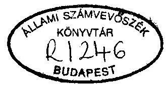
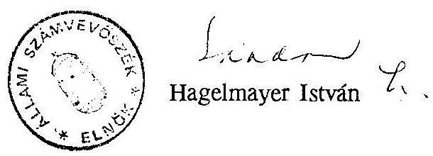
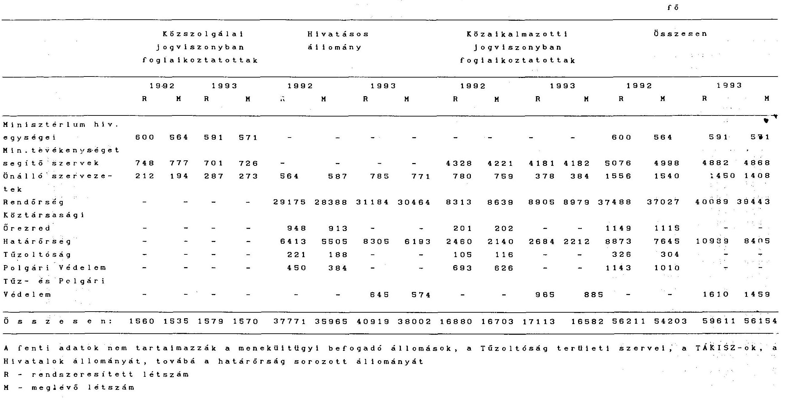
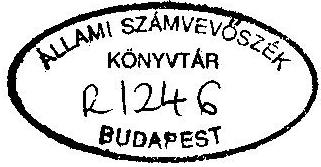
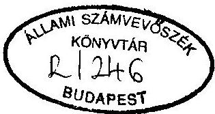
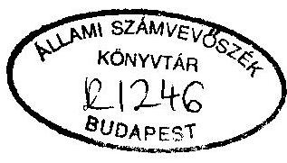

# Sillami Számvevőszék

## JELENTÉS

a Belügyminisztérium fejezet pénzügyi-gazdasági ellenőrzéséről

---

Az ellenőrzést végezték:

Bacskai József
Bakos Emil
Belovai Sándorné
Bodonyi Miklós
Fogarasi Miklós
dr. Gálik Jenő
Gömöri József
Maklári Ferencné
Révész János
Számely Kornél
Temesváry Miklós
dr. Tóth Kálmánné
Az ellenőrzést vezette:
Hudik Zoltán
számvevő
külső szakértő
számvevő
számvevő tanácsos
számvevő tanácsos
számvevő tanácsos
számvevő tanácsos
számvevő tanácsos
számvevő tanácsos
számvevő
számvevő
számvevő
számvevő főtanácsos

---

# JELENTÉS 

## a Belügyminisztérium fejezet pénzügyi-gazdasági ellenőrzéséről

A Belügyminisztérium jelenlegi feladatstruktúrája lényegében az 1990. évi országgyűlési választásokat megelőző két évben alakult ki. Ebben az időszakban került a BM-hez az önkormányzati (korábban tanácsi), településfejlesztési, lakásgazdálkodási, valamint a választások lebonyolításával összefüggő területek irányítása, felügyelete, menekültügyi feladatok ellátása, leváltak az állambiztonsági szervek, majd 1990-ben az Országos Rendőr-főkapitányság és a rendőri apparátus, továbbá átadták a területfejlesztési feladatok egy részét a Környezetvédelmi Minisztériumnak. A BM és szerveinek működését részben a politikai, részben a gazdasági környezetben végbement változások határozták meg. Ebben a helyzetben stabil struktúra nem alakult ki. A hatályos definíciók szerint a rendőrség fegyveres rendvédelmi szerv, a határőrség - a fegyveres erők részeként - határvédelmi, határőrizeti és határrendészeti feladatokat ellátó szerv. (A továbbiakban: rendészeti szervek).

A tárcához tartozó országos hatáskörű szervekkel (rendőrség, határőrség, tűz- és polgári védelem), az országot behálózó szervezetekkel (Területi államháztartási és közigazgatási információs szolgálatok, Köztársasági megbízotti hivatalok), a sokrétű ellátási feladatot végző intézményrendszerrel (Központi Gazdasági Főigazgatóság, Adatfeldolgozó Hivatal, Menekültügyi Hivatal stb.) és nem utolsósorban a tárcánál foglalkoztatott közel 80 ezer fős létszámmal ez a központi költségvetés egyik legnagyobb fejezete.

---

A Belügyminisztérium fejezet részére az 1992. és 1993. években az állami költségvetésről szóló törvények 272,2 Mrd Ft, illetve 326,8 Mrd Ft kiadási előirányzatot biztosítottak. 1994-ben ez az összeg 368,3 Mrd Ft volt. A tárca költségvetés két jelentős - de gazdálkodás irányítás szempontjából eltérő - összetevője a központi költségvetés önálló és a felügyelet alá tartozó szerveinek előirányzatai, illetve a helyi önkormányzatok állami támogatása. (Az önkormányzati vagyon nem szerepel a fejezet vagyonnyilvántartásaiban, mérlegében.)

A fejezethez egy elkülönített állami pénzalap tartozik, a Menekülteket Támogató Alap (1993-ig Letelepedési Alap). Az Alap központi költségvetésből származó bevétele az utóbbi években 1 Mrd Ft. 1992-93. években az önkormányzatok támogatása nélkül a fejezet 51,5 Mrd Ft, illetve 62,4 Mrd Ft kiadási előirányzattal rendelkezett. Az 1994. évi 71,7 Mrd Ft 15%-kal haladta meg az előző évi és 39%-kal az 1992. évi jóváhagyott előirányzatot. A tárca támogatás nélküli bevételi előirányzata 2,1 Mrd Ft-ot, illetve 4,8 Mrd Ft-ot tett ki.

Az ellenőrzés a változó körülményekre és a feladatok nagyságrendjére tekintettel elsősorban a fejezetszintű gazdálkodás megítélésére koncentrált, ehhez áttekintette és értékelte a minisztérium és a jelentősebb szervezetek (a Központi Igazgatás, a Gazdasági Igazgatóság és háttérintézményei, a Rendőrség, a Határőrség, a Menekültügyi Hivatal és a fejezeti kezelésű előirányzatok, amelyek az önkormányzatok támogatását már nem tartalmazó költségvetésben mintegy 70%-os részarányt képviselnek) 1992-93. évi működését törvényességi, célszerűségi és eredményességi szempontból. A vizsgálat egyben figyelemmel kísérte a korábbi számvevőszéki (zárszámadás, éves költségvetés, Alap, egyéb központi beruházások, ellenőrzési tevékenység) ellenőrzések alapján hozott intézkedések érvényesülését.

A fejezeti gazdálkodással, központi igazgatással kapcsolatos következtetéseket, javaslatokat és főbb megállapításokat a jelentés, a rendőrség, a határőrség gazdálkodásával, valamint a fejezet ingatlan- és lakásgazdálkodásával összefüggő részletesebb megállapításokat pedig az 1-3. sz. függelék tartalmazza. A rövidített szervezeti megnevezésekben a csatolt rövidítési jegyzék segíti az eligazodást. Az összesített létszámadatokat és pénzforgalmi kiadásokat a mellékelt táblázatok szemléltetik.

---

# I. 

## ÖSSZEFOGLALÓ MEGÁLLAPÍTÁSOK, KÖVETKEZTETÉSEK ÉS JAVASLATOK

Az 1980-as évek végétől bekövetkezett feladat- és szervezeti változások eredményeként tisztult a tárca közigazgatásban betöltött szerepe. Ugyanakkor a közigazgatás korszerűsítésével összefüggésben 1992. évben kitűzött feladatok végrehajtásában elmaradás tapasztalható. Késik a minisztériumok belső felépítésének, alapvető szervezeti-működési elveinek szabályozása, az államtitkárok jogállásának - a minisztériumok irányításában betöltött szerepének - pontosítása. A közigazgatás korszerűsítéséről rendelkező kormányhatározatok alapján a tárca kidolgozta a minisztériumokra és háttérintézményeikre vonatkozó elképzeléseit, de a koordináció eredménytelensége következtében a végrehajtás ajánlásokra korlátozódott. A közigazgatási rendszer folyamatos átalakításának szükségessége nem vonható kétségbe, de megfelelő jogi kereteket igényel. (A közigazgatás korszerűsítés jogszabályi hátterét 1994. augusztus 31-ével módosította a kormányzat.)

A BM fejezet korábbi zárt gazdálkodási és információs rendszere - az általános érvényű rendelkezések alkalmazásával - nyitottabbá vált. A minisztérium teljes polgáriasításának hangsúlyozása és az általánostól eltérő szabályozási lehetőség figyelmen kívül hagyása azonban mind a felügyeleti, irányítási tevékenységben, mind a fejezet gazdálkodásában számos ellentmondáshoz vezetett. Ezek elsősorban a rendészeti igazgatás minisztériumon belüli helyzetével kapcsolatosak és a rendészeti szervek (rendőrség, határőrség, stb.) - a költségvetési gazdálkodás általános szabályai szerint ismeretlen - ún. középirányító szintű gazdálkodási funkciójával összefüggésben jelentkeznek.

A megfelelő szakmai felügyelet érdekében ki kell alakítani a minisztériumban a rendészeti igazgatás helyes arányait. Ehhez nem nélkülözhető a törvényi háttér (rendőrségi, határőrségi, köztisztviselői, közalkalmazotti, szolgálati törvények), ami teljeskörűen még nem áll rendelkezésre. Hasonlóan rendezést igényel a fejezethez tartozó országos hatáskörű szervek hierarchikus felépítésének, működésének és a költségvetési gazdálkodás jogi, hatásköri összhangjának megteremtése, indokolt esetben a rendészeti szervek gazdálkodásának általánostól eltérő - államháztartási törvény felhatalmazásán alapuló - kormányszintű szabályozásával. (Ez a helyszíni ellenőrzés megállapításainak figyelembevételével megkezdődött.)

---

A tárcánál a feladatok részletes felülvizsgálatára, a szervezeti egységek működésének elemzésére, fejlesztési koncepciók rögzítésére az ellenőrzött időszakban nem került sor. Ezek következményeként a struktúra változtatások sem voltak minden esetben megalapozottak. Számos esetben a gazdálkodásban érintett szervezetek többszöri átalakítása után a korábbi állapot állt vissza. A heterogén feladatösszevonások eredményeként ez évben létrehozott Központi Gazdasági Főigazgatóság funkcionálásának gazdasági racionalitása vitatható, az elméletileg felszabaduló források kimutatható formában - megtakarítás, átcsoportosítás - nem jelentkeztek. (A fejezetszintű költségvetési gazdálkodásért felelős Közgazdasági Főosztály időközben megkezdte a feltárt hiányosságok felszámolását.)

A költségvetési gazdálkodásban 1991-től gyakorlattá vált a kiadások és bevételek címrend szerinti tervezése, szigorodtak a fejezetek közötti és fejezeten belüli átcsoportosítások lehetőségei. Ugyanakkor az államháztartási törvény a feladatok és szervezetek címbe (alcímbe) sorolásához nem határozott meg rendező elveket. Ezzel szabad teret biztosított a költségvetési struktúra alakításának (beleértve a célszerűtlen átrendezéseket is), ami különösen a túlzottan heterogén összetételű tárcák fejezetgazdálkodási gondjait növelte. A BM fejezet évente változó címrendjében a feladatrendszer és pénzügyi források között a kívánatos összhang nem alakult ki. Egyes címbeli megjelenítések - nem önálló költségvetési szervek esetében, vagy gazdasági apparátus hiányában - nem felelnek meg az előírásoknak.

A fejezet rendészeti szerveinek (rendőrség, határőrség stb.) költségvetési gazdálkodása is cím szinten valósult meg. Ezáltal a fejezeti hatáskörök részben alacsonyabb (ún. középirányító) szintre kerültek, de fennállt a tárca központi, operatív beavatkozási lehetőségein keresztül az intézményi jogok korlátozása is. A törvényes feladat- és finanszírozási rendszer megvalósítása igényli, de elhúzódó probléma, hogy a hivatásos önkormányzati tűzoltóság pénzellátása elkülönüljön a Tűzoltóság költségvetési címtől. (A módosító indítvány az 1994. évi költségvetés tárgyalásakor nem került elfogadásra.)

A központi költségvetés tervezése lényegében továbbra is a bázis szemléleten alapult, így a tárca esetében sem hozott érdemleges változást a feladatok és pénzforrások összhangjában. A nulla bázisú (1992. évi) tervezési kísérlet közel kétszeres támogatás igény meghatározásával járt, amire az államháztartás nem rendelkezett fedezettel. Továbbra is működött az alkumechanizmus. Emellett egyes új feladatok törvényi, jogszabályi megjelenését nem követte a költségvetési támogatás biztosítása (pl. a honvédelmi és igazgatásrendészeti törvény költségki-

---

tásai, a közbiztonság fejlesztésének kormányszinten meghatározott feladatai), ami az előkészítés költségvetési megalapozottságának hiányára is utal.

A pénzügyi források relatív szűkösségét a tárca központi kezelésbe vont pénzeszközökkel, többlet bevételekkel át tudta hidalni, így kényszerű feladatcsökkentésekre gyakorlatilag nem került sor. A központosítási törekvések azonban nem minden esetben voltak összhangban az államháztartási törvény pénzforgalmi szemléletével (előirányzatok visszatartása, köztartozások finanszírozási módja stb.). Az ún. középirányító szervek is végeztek a költségvetési címeken belül központosításokat, ami a hatályos szabályozás szerint sérti az alárendeltek önálló gazdálkodási jogát. Ezért az egységesítési követelményekhez mérten kezdeményezni kell az előírások módosítását.

A rendelkezésre álló és igényelt pénzeszközök közötti differencia sajátosan nem feladat elmaradásokban, hanem a működés és a feladat végrehajtás minőségi mutatóiban éreztette hatását. Ennek magyarázata, hogy a rendészeti szervek szolgálati tevékenységének - a korszerűségi foktól függően - nagyságrendileg eltérő forrásszükséglete lehet. Ehhez társult, hogy az adott szolgálati ág vezetése a rendőrséggel, határőrséggel stb. szemben támasztott társadalmi elvárásokat a gazdálkodásra miként képezte le. Ilyen alapokon a fejezet két reprezentáns címe a rendőrség és határőrség (előirányzataik összege meghaladja a fejezet önkormányzatok támogatása nélküli költségvetésének 60%-át) eltérő gazdálkodási gyakorlata ellenére, egyaránt feszültségterhessé vált.

A rendőrség - az utóbbi évek növekvő társadalmi igénye miatt - erőforrásait meghaladó mértékű és ütemű fejlesztéseket szorgalmazott. Ez esetenként együtt járt a költségvetési gazdálkodás szabályainak figyelmen kívül hagyásával, mindezek következményeként a likviditási zavarai állandósultak. A szabályszerű gazdálkodás, az eladósodás visszafogása érdekében a hatásköri és felelősségi viszonyok egységes szabályozása szükséges, továbbá nem nélkülözhető a fejlesztési projektek (rendőrőrs program, bevetésirányítási rendszer stb.) felülvizsgálata, a párhuzamosságok kiszűrése sem. (A rendőrség gazdasági vezetése a helyszíni ellenőrzés megállapítását figyelembe véve intézkedett a kötelezettségvállalások szigorítására, a pénzügyi források keretei által behatárolt fejlesztési koncepciók átdolgozására.)

A fejezet működési kiadásainak már 68%-át érte el ez évben a bér és tb előirányzatok együttes összege, ezzel a gazdálkodási struktúra meghatározó elemét képezi. A tárca alkalmazásában köztisztviselői, közalkalmazotti és hivatásos

---

állományúak egyaránt megtalálhatók. A köztisztviselők létszáma minimális (3%), a hivatásos állományúak 66%-ot képviselnek a központilag nyilvántartott rendszeresített létszámon belül. A különféle állománycsoportok eltérő illetményrendszere (bevezetési ideje), előmeneteli rendszere és gazdasági háttere nem kellően összehangolt, ami számos ellentmondásos helyzet forrása (átjárhatóság korlátai, hivatásos és közalkalmazotti illetmények együttfutásának kezelése egy szervezeten belül, a szolgálati alárendeltségű, de önálló költségvetési szervek bérgazdálkodásában a gazdálkodási szabadság, vagy a szolgálati kötöttségek érvényesülése stb.). Ezek sürgetik a szolgálati törvény megalkotását, de adott esetben a köztisztviselők, közalkalmazottak jogállásáról szóló törvények korrekcióját is igényelhetik.

Többször felvetődött a hivatásos állomány ténylegesen indokolt beosztásokra történő korlátozása, amit az egyes besorolási anomáliák is indokolnak. Ettől azonban a bérgazdálkodási gondok lényeges javulása nem várható, mert jogszerű végrehajtás mellett egy adott szervezetnél az ellátandó feladat szintje lehet a besorolás alapja. Az másodlagos a bérgazdálkodás szempontjából, hogy az ennek megfelelő erkölcsi-anyagi elismerést a hivatásos, vagy éppen a köztisztviselői jogviszony biztosítja.

A minisztérium hivatali szervezeteinél az ellenőrzött időszak adatai a béralap túltervezésére utaltak. Az ebből eredeztethető tartalékok átcsoportosításával a központi gazdálkodás gondjait igyekeztek szűkíteni. A fejezet szinten jóváhagyott jutalom összegeket évközi módosításokkal lényegesen emelték. A jutalmazási keretek átlagosan a béralap 3-5%-át jelentették, de az igazgatási címnél meghaladta az átlagost (államtitkári keretek elérték a béralap felhasználás 12%-át). Ezen túl az előírásoktól eltérően dologi (bérjellegű) kiadások között számoltak el miniszteri jutalmakat (1992-93. években összesen 229 M Ft-ot).

Új elemként jelentkezett a költségvetési gazdálkodásban a külső források - önkormányzatok és egyéb jogi, természetes személyek
 (főként rendőri feladatokat segítő) támogatásának igénybevétele szerződések, megállapodások alapján. Az így finanszírozott státuszok, vagy a használatba vett eszközök, ingatlanok a helyi problémák kezelésében segítséget és nem végleges megoldást nyújtanak. A felmerülő járulékos kiadásokra (kiképzési, üzemeltetési, fenntartási, stb. költségekre) tekintettel ez a támogatási forma nem illeszkedik a költségvetési gazdálkodás rendjébe. A támogatásforma teljeskörű áttekintést, mérlegelést és annak függvényében jogszabályi rendezést igényel.

---

A tárca eszközgazdálkodását a tárgyi eszköz és készletbeszerzések rendkívül széles skálája (ügyviteli-, rendőri-, haditechnika, stb.), valamint a magas ráfordítási költségek (rendőrségi címen 4 Mrd Ft, határőrség címen közel 2 Mrd Ft) jellemezték. A minisztérium koordinálásával bonyolították le a tárgyi eszköz beszerzésekre előírt versenytárgyalásokat és a központi beszerzéseket, továbbá 1992. II. félévétől önálló külkereskedelmi tevékenységet is folytattak. A központi beszerzések pénzügyi fedezete azonban nem volt központosított, azzal a fejezet címei, alcímei rendelkeztek.

A versenyeztetés eredményeként létrejött keretszerződések és a központi beszerzésre kötelezett termékek széles köre, a fejezetirányítás és szakszolgálatok ütközőpontjaivá váltak. Ezek, leszámítva a szubjektív tényezőket, alapvetően a fejezeti gazdálkodás és a szolgálati ág felelősségi köreinek költségvetési gazdálkodás különböző szintjein történő érvényesülésével hozhatók összefüggésbe. A "gazdaságos" döntést fejezet szinten hozták, a szolgálati követelmény támasztása és a szolgálat ellátásának felelőssége a középirányítói szinten maradt. A feltárt jelenségekből (a kedvezőtlen szerződéskötésekből, elhúzódó beszerzésekből, a tendereztetés, vagy a központi beszerzések megkerüléséből) a bíráló, lebonyolító és felhasználói oldalról egyaránt levonhatók a sajátrészű következtetések. Összességében pedig felülvizsgálatot igényel a központi és önálló gazdálkodás megfelelő arányainak, jogosítványainak elosztása.

Erőteljesen növekedtek a tárca készletbeszerzés, szolgáltatás kiadásai, általában az ár- és díjemelések következtében, emellett az egyes költségvetési címek esetében más-más tényezők hatására. A minisztérium háttérintézményeinél az útlevélforgalom növekedésének volt kiemelkedő szerepe. A rendőrségnél a létszámnövelés, az eszköz és ingatlan gyarapodás mind jelentős, befolyásoló tényezőnek számított. (A likviditási zavarok kialakulásához az is hozzájárult, hogy a rendőrség költségvetési terveiben a létszámfejlesztés egyéb ellátási vonzatával és az átvett ingatlanok ráfordításaival nem számoltak, mivel közvetlenül ezekre nem kaptak előirányzatot.)

A határőrség készletbeszerzéseiben a hivatásos és sorköteles állomány élelmezési, ruházati ellátása a meghatározó, ezért a többletkiadásokat főként az állomány tervezettől eltérő alakulása okozta. Külön figyelmet érdemel, hogy a távközlési szolgáltatásokat valamennyi szolgálati ág ez ideig is nagymértékben vette igénybe, a folyamatban lévő fejlesztések eredményeként ezek ugrásszerűen növekedtek, amit a bázis tervezésnél nem kellő súllyal kezeltek. Ezt tovább bonyolították a híradástechnikai szakszolgálat szervezeti besorolásának (BM, illetve ORFK) anomáliái. Ellentmondásos és szubjektivitásoktól sem mentes a gépjármű javító szolgáltatás helyzete, mivel a BM központi javítóbázisa kihasználatlan, a rendőri szervek javító kapacitásai túlterheltek. A megoldást célszerűbb a tárcán belül megtalálni.

A BM ingatlanállományának, továbbá a gazdálkodás egyes elemeinek nyilvántartási és számviteli adatai általában eltérést mutattak, ezek rendezése tárca szinten az érintett műszaki és költségvetési szakterületek (MFO, KGFO) között szorosabb együttműködést igényel. Az ingatlanfenntartással kapcsolatos kiadásokról fejezetszintű kimutatással nem rendelkeztek (az előirányzatok elkülönített kezelése a költségvetésben sem volt előírás - PM tervezési irányelvek), ezáltal a konkrét elemzésre nem nyílt lehetőség. Az ingatlanhasználattal, felújításokkal összefüggő előirányzatok elosztásánál a címek önállósága érvényesült. Az ingatlangazdálkodás területén elsősorban a nyilvántartási, számviteli hiányosságokat kell megszüntetni. A keretek ingatlanérték arányos elosztása mellett célszerű a szükségletek elbírálásával, rangsorolásával a központi gazdálkodás beleszólását erősíteni. Az ingatlanértékesítésekkel összefüggésben kifogásolható volt, hogy a teljesítésekről - a kormányhatározatok szerinti végrehajtás értékelésére alkalmas - elszámolás, kimutatás nem készült.

A kormányzati beruházás előirányzatok jelentősebb részét a határőrség, tűzoltóság intézményi beruházásaira fordították és fejezeti kezelésű intézményi beruházásként a rendőrség fejlesztéseit finanszírozták. Behatárolta a lehetőségeket, hogy a kormányzati, intézményi beruházások ráfordításai a fejezet összkiadásainak alig 2-3%-át tették ki. A határőrség és tűzoltóság beruházásai a tervezettől - nagyobb, illetve kisebb mértékben - eltérően valósultak meg. Ez a tervezés megalapozottságát kérdőjelezte meg még akkor is, ha ezzel valós szükségleteket elégítettek ki. A tűzoltósági beruházások utóellenőrzése megállapította, hogy a tárca megfelelő intézkedési tervet készített, annak szabályozással kapcsolatos feladatait végrehajtották, a lebonyolítási tevékenység fejezeti kezelésbe vétele azonban elhúzódott.

A rendőrségi - egyben fejezeti - beruházások között a legtöbb gond a központi székház létesítésénél jelentkezik. A Kormány 1992. évben tudomásul vette, hogy a beruházás - a meglévő épületek értékesítésére tekintettel - a központi költségvetést nem terheli, ugyanakkor az üzembehelyezés, gépbeszerzés, hírellátás stb. tervezett kiadásai az 1994. évi számítások szerint meghaladják a 6 Mrd Ft-ot. (1994. szeptemberében hozott kormányhatározat ezek fedezetére egyrészt 1997. évtől költségvetési többlettámogatást biztosított, másrészt hozzájárult ingatlan értékesítésből származó összegek felhasználásához.) A létesítés körülményeinek alapos

---

átgondolása szükséges a tárca részéről, a megvalósítás helyzetéről készítendő jelentések (legkorábban 1995. 06. 01.) a Kormány megkülönböztetett figyelmét igénylik.

A lakásgazdálkodással kapcsolatos elszámolások költségvetési és számviteli előírásoknak megfelelő rendezését sürgetik a lakásépítés, lakástámogatás előirányzatok felhasználásánál, átcsoportosításánál tapasztalt anomáliák. Ebben közre játszott, hogy a tárca az elkülönített pénzeszközöket - a törvényi változást figyelmen kívül hagyva - 1993-ban is lakásépítési alapként kezelte.

A lakásellátásra vonatkozó belügyminiszteri rendelkezéssel indokolatlanul terjesztették ki a tárca civil szervezeteire (ezek között a polgáriasított minisztériumra) a szolgálati lakáshoz jutás lehetőségét, mivel ezzel a kapcsolódó jogszabályok értelmezésében a fegyveres szervekkel munkaviszonyban állók lakáshelyzetét kívánták megoldani. Más polgári intézményekhez képest kedvezőbb helyzetet teremtettek, ugyanakkor a hivatásos állomány megtartásában (ORFK, HÖR) fontos szerepe lenne a szolgálati lakás biztosításának. A hivatkozott tárcaszintű rendelkezés ad lehetőséget szolgálati lakás juttatására állami vezetői tisztséget betöltők és nem BM szolgálati jogviszonnyal rendelkezők esetében is. A felsőszintű állami vezetők lakásellátását célszerűbb lenne kiemelten, központilag kezelni, a többször vitatott jogosultság mértékét egységes rendező elvekkel szabályozni.

Az ellenőrzött időszak alatt került sor a fejezetnél a kettős könyvvitelre történt átállásra, egyben az új számviteli törvény előírásait is végre kellett hajtani. A rendészeti szervek korábbi lényegesen egyszerűbb számviteléhez képest és az intézményrendszer összetettségére tekintettel ez igen magas szakmai követelményt támasztott. Emellett kellő jártasságú szakemberekkel korlátozott számban rendelkezett a tárca, ezen külső szerv bevonása (vagyonértékeléshez) sem tudott sokat javítani. Így a valós értéktől eltérő vagyonnal, az áttérés számos más fogyatékosságával indult a fejezetnél a pénzforgalmi szemléletű kettős könyvviteli rendszer. Következésképpen az éves beszámolók, a pénzforgalmi jelentés, kiemelten a fejezet vagyonát tükröző éves mérlegek - tartalmi minősítés alapján - több ponton nem tettek eleget a törvényi elvárásoknak, alapelvi követelményeknek. (Megállapításaink alapján a tárca azonnal munkaprogramba foglalta a beszámolók tartalmi hitelességének biztosítására irányuló intézkedéseit, a végrehajtás felügyeleti jellegű számviteli szakellenőrzésének növekvő szerepvállalását. Ennek eredménye a következő évek beszámolóiban realizálódhat.)

---

Az operatív feladatok végrehajtása mellett célszerű a kormányprogrammal összhangban a számviteli és beszámolási rendre vonatkozó - a tárca sajátosságokat kifejező - korszerűsítési javaslat kidolgozása. Az irányítást eredményesen kiszolgáló számviteli információs rendszer kialakítása érdekében a szervezeti és technikai feltételek biztosításával kell elérni a számviteli szakterület ellenőrzésének hatékony, zárt rendszerű működését. Továbbá gondoskodni kell, hogy a címeknél, az önálló költségvetési szerveknél végrehajtásra kerüljön a fejezeti számlarend lebontása, a bizonylati rend tartalmi és formai szabályozása, az egységes cikkszámrendszer kialakítása.

A tárca kezelésében lévő elkülönített állami pénzalapból finanszírozott szakmai célkitűzés, a menekültek támogatása az elvárásoknak megfelelően valósult meg. Az előírásszerű költségvetési gazdálkodás azonban - döntően a végrehajtás szabályozásának hiánya és a nem megfelelő személyi feltételek miatt - nem érvényesült. Az alapkezelő szervezet az egymást érő (számvevőszéki, tárcaszintű) ellenőrzések hatására, szándékában pozitív folyamatokat indított el (személycserék, főkönyvi és egységes cikkszámrendszer kialakítása stb.), de ezek egyelőre nem hozták a várt eredményt.

Az alap felhasználás gazdasági megalapozottságára vonatkozóan - az utóvizsgálat alapvető megállapításaként - továbbra is fennáll, hogy a genfi konvencióhoz történt csatlakozással járó kötelezettségek és a gazdasági teherbírás behatárolt lehetőségei a humanitárius segítségnyújtás ésszerűbb kialakítását igényli. Ezt a kormányszinten meghatározott stratégia, koncepció alapozhatja meg. A költségvetési források gazdaságos felhasználását és annak ellenőrzését a menekült ellátás normarendszerének kidolgozása teremtheti meg, a feladat, hatáskör és felelősség egységét az érintett intézmények fejezeti költségvetésen belüli egyértelmű prezentációja biztosíthatja. (Cím, intézmény, Alap - költségvetési előirányzatok - tervezés, finanszírozás, beszámolás.)

Megkülönböztetett figyelmet kívánnak az Alapból finanszírozott, szabálytalan kivitelezésű, nagyösszegű felújítás (debreceni Esze Tamás laktanya) következményei, mivel a kivitelezői tartozás nagyságrendje elérte az éves támogatás egynegyedét. Megoldást kell keresni az épülethasznosítás elmaradásának, az Alap likviditási gondjainak kezelésére.

A BM fejezet pénzügyi-gazdasági ellenőrzése során feltártak - a költségvetési gazdálkodás szabályainak, illetve a számviteli előírásoknak a be nem tartása -

---

esetenként felvetik a személyes felelősség kérdését, amit a tárcánál, illetve intézményeinél teljeskörűen tisztázni kell. Ennek során természetesen nem hagyhatók figyelmen kívül az időközben megtörtént felelősségrevonások.

Mindezek alapján - a jelentésben és a függelékekben részletezett megállapítások hasznosításra ajánlása mellett - a következőket javasoljuk

# a Kormány hatáskörébe tartozóan: 

- A törvényjavaslatok benyújtását, a határozatok meghozatalát - a tapasztaltaknál következetesebben - kell megelőznie a pénzügyi kihatások teljeskörű felmérésének, a forrásbiztosítás reális számbavételének.
- A rendészeti igazgatás helyzetének rendezése sürgeti a határőrségről, valamint a hivatásos állomány szolgálati viszonyáról szóló törvényalkotó munka előkészítését.
- A felsőszintű állami vezetők lakásellátásának jogszabályi rendezését indokolt napirendre tűzni, ehhez felhasználhatók a belügyi tárca egységes rendezőelveket előtérbe helyező elgondolásai.
- A központi költségvetés erőforrásainak racionális felhasználása indokolja, hogy kidolgozásra kerüljön a Magyar Köztársaság menekültügyi stratégiája. Ezzel összhangban célszerű rendeleti úton szabályozni a menekültek ellátását, a Menekülteket Támogató Alap felhasználását.

## a Belügyminisztérium hatáskörébe tartozóan:

- Meg kell teremteni a rendészeti szervek szakmai hierarchiájának és a költségvetési gazdálkodás jogszerűségének összhangját, indokolt esetben kezdeményezni szükséges - az államháztartási törvény felhatalmazása alapján - az érintett szervek gazdálkodásának, nyilvántartásának eltérő szabályozásait. (A kialakult gazdálkodási rendszerben már felmerülhet a rendőrségi cím fejezeti gazdálkodási jogosultsággal történő felruházása is.)
- A hivatásos állomány szolgálati viszonyáról szóló törvényjavaslat előkészítésével párhuzamosan indokolt felülvizsgálni a köztisztviselők és közalkalmazottak jogviszonyáról szóló törvények végrehajtási tapasztalatait és ennek alapján kezdeményezni a szükséges korrekciókat. A rendészeti igazgatás megfelelő szakmai felügyelete érdekében biztosítani kell a személyi, tárgyi feltételeket,

---

ehhez célszerű a minisztériumban - a köztisztviselői, közalkalmazotti és hivatásos szolgálati jogviszonyban megszerzett jogok megőrzésével - a foglalkoztatási elvek egységes szabályozása.

- A költségvetési gazdálkodás szabályszerűségének biztosítása érdekében a feltárt hiányosságok felszámolására hozott operatív intézkedéseket következetes végrehajtásnak kell követni, a központi igazgatás önálló intézményi gazdálkodásának szervezeti feltételei megteremtésével, az alapító okiratok rendezésével a gazdálkodási szabályzat aktualizálásával, az informatikai rendszer megbízható kialakításával, a számviteli rendszer és a vagyonnyilvántartás hibáinak, hiányosságainak megszüntetésével. Minden olyan esetben, ahol felvetődik a személyes felelősség is, annak tisztázása szükséges.
- Az önkormányzatoktól és más jogi természetes személyektől származó adományok, támogatások igénybevételi módját, a költségvetési gazdálkodásra gyakorolt hatását teljeskörűen indokolt felülvizsgálni, ennek eredményétől függően szükséges a szabályozási hátterét rendezni.
- A tárca költségvetési gazdálkodásáért felelős szervezete szakmailag segítse az 1994. évtől önálló gazdálkodást folytató Menekültügyi
 és Migrációs Hivatalt az analitikus nyilvántartások teljeskörű kialakításában, az ENSZ és egyéb támogatások számviteli és információs rendszerbe integrálásában, az alapfelhasználásban érintett más tárcákkal fennálló kapcsolatában.
- A tárca ingatlan- és lakásgazdálkodásának belső szabályozását célszerű kiterjeszteni az ingatlanokkal kapcsolatos elhelyezési, kezelési, karbantartási feladatokra, a lakások kezelésbe-, használatba-, bérletbe vételének (adásának) módozataira, valamint ezek nyilvántartási, adategyeztetési kötelezettségeire. A szabályozási folyamat keretében indokolt felülvizsgálni a lakásellátásról szóló belügyminiszteri rendelet szolgálati lakás biztosításával kapcsolatos rendelkezéseit.

---

# II. 

## A VIZSGÁLAT FŐBB MEGÁLLAPÍTÁSAI

## 1. A feladatok, a szervezeti rendszer és a gazdálkodási feltételek összhangja

A szervezeti és irányítási rendszerben a lényegi változtatásokat már a vizsgált időszakot megelőző években megkezdték. A tárcához kerültek a klasszikus közigazgatási feladatok, kivált az állambiztonsági szervezet, a rendészeti szervek önálló költségvetési címet képeztek.

### 1.1. A feladatokban, szervezetben bekövetkezett változások, a szervezetkialakítás célszerűsége

Az alapvető szervezeti változásokat követően a belügyminiszter feladat és hatáskörét - kormányzati munkában való részvétel, általános közigazgatási feladatok, a rendőri tevékenység, továbbá a nem rendőri szakigazgatási, rendészeti tevékenység irányítása, stb. - a 39/1990 (IX.15.) Kormányrendeletben szabályozták. Ugyanakkor a minisztérium szervezeti átalakítását már korábban elrendelték (53/1990 (VII.19.) BM utasítás). Ez az átszervezés nagyobb részt a politikai változásokkal - a feladatmódosulásokkal csak kisebb mértékben - hozható összefüggésbe. Az új struktúra kiépítését nem előzte meg olyan elemzés, amellyel a rendszer működési előnye, gazdaságossága alátámasztható. Ekkor még nem volt végleges elgondolás a minisztérium szervezetére és belső működésére, mindössze a hivatali szervek elnevezése, vezetőik jogállása került meghatározásra. (A "feladatorientált szervezetrendszer" kialakításának igényét a 14/1991 (V.3.) BM utasítás fogalmazta meg.)

Az 1991 évi átszervezéssel nőtt a hivatali szervezeteket irányító helyettes államtitkári besorolású vezetők száma (önkormányzati-, közjogi-, illetve gazdasági helyettes államtitkárok és Rendészeti Hivatal vezetője). A Rendészeti Hivatal közvetlenül miniszteri irányítás alá került, a politikai államtitkár direkt irányítása alá konkrét szakmai területet szerveztek (Menekültügyi Hivatal), figyelmen kívül hagyva az 1990 évi XXXIII. tv.-be foglalt elveket. A minisztérium szervezetébe sorolták a korábban szolgálatként működő Adatfeldolgozó Hivatalt, ennek szakmai indoklása elmaradt. Eltérő elképzelések tükröződtek a Jogi Képviseleti Önálló Osztály (majd Főosztály) feladatait illetően a gazdasági, majd a közjogi helyettes államtitkár alárendeltségébe helyezésében. (A BM szervezetek 5 M Ft feletti kötelezettségvállalással járó

---

polgári-jogi szerződéskötéseinél betöltött véleményezési szerepe megosztotta a döntési felelősséget a gazdasági és a közjogi helyettes államtitkárok között.)

A BM szervezete a vizsgált időszakban is többször módosult, rövid előterjesztések alapján miniszteri jóváhagyással. A legfontosabb változások alapvetően a rendészeti igazgatás területét, valamint a gazdálkodás irányítási, végrehajtási struktúráját érintették:

- A Rendészeti Hivatalt megszüntették, feladatai jelentős részét a miniszter közvetlen alárendeltségébe tartozó Rendészeti Főosztály vette át. Ezzel a korábban kifogásolható hatékonyságú szervezet helyett a tárca közigazgatási feladatain belül kedvezőbb feltételekhez jutott a rendészeti igazgatás. A struktúra azonban továbbra sem mentes az anomáliáktól, mivel a minisztériumi szervezetet többségében az ORFK-tól, HÓR Országos Parancsnokságától vezényelt hivatásos állományúakból hozták létre. (A főosztályvezető feladatait tábornoki rendfokozattal, ORFK helyettesi besorolással látta el.) Az ellentmondásos helyzet forrása egyrészt a BM teljes polgáriasítása, másrészt a munkajogi tisztázatlanság (a hivatásos szolgálati és közszolgálati jogviszony közötti átjárás jelenleg nem biztosított). Az 1994. évben hatályba lépett rendőrségi törvény a berendelés intézményét bevezeti ugyan, de megfelelő megoldást a szolgálati törvény megalkotása eredményezhet.
- A Rendészeti Hivatal megszűnésekor a BM Híradástechnikai Szolgálat, a Rendészeti Szervek Kiképző Központja és a Bűnügyi Szakértői Intézet az ORFK alárendeltségébe került, a BM közvetlen szervek szám szerinti csökkentésének indokával. A feladat átcsoportosítást alátámasztó szakmai elgondolást, koncepciót a vizsgálat számára nem tudtak bemutatni. A BM Híradástechnikai Szolgálat feladatköre azóta rendezetlen (jóváhagyott SZMSZ nélkül funkcionál). Az ORFK szervezetébe történt integrálódást követően is maradtak központi, vagy más szervezeteket érintő feladatai. Így a rendőrség alaptevékenységének kiszolgálásához viszonyított arányeltolódás elsősorban a fejezeten belül kisebb költségvetési forrással rendelkező szervezeteket (TPVOP, TÁKISZOK-ok) érintette hátrányosan.
- A tűzvédelem és a polgári védelem országos parancsnokságai - a szakirányítást megkérdőjelező módon - az önkormányzati helyettes államtitkár közvetlen alárendeltségében működtek, 1993 évben került sor a szervezeti egyesítésükre. Egyidejűleg megszüntették a minisztérium hivatali szervezeteként funkcionáló Védelmi Főosztályt, majd a BM-re háruló honvédelmi igazgatási feladatok

---

ellátására Védelmi Irodát alakítottak. Az új szervezet és feladata a minisztérium SZMSZ-ében csak késedelemmel került felvételre.

- 1993 évben a korábbi gazdasági helyettes államtitkári elnevezés költségvetési-műszaki helyettes államtitkárrá változott és új közgazdasági helyettes államtitkári beosztást létesítettek, alárendeltségébe új szervezetként hozták létre (3 fő rendszeresített létszámmal!) a Közgazdasági Főosztályt (a volt Közgazdasági Főosztály neve Költségvetési Főosztályra változott). Az átszervezéssel együtt járt, hogy az új helyettes államtitkár alárendeltségébe soroltak az előzőleg az önkormányzati helyettes államtitkárhoz tartozó szervezeti egységeket. Így ez utóbbinak átmenetileg egy önkormányzati főosztálya maradt, ezen kívül ellátta a lakás- és helyiségigazgatás szakmai felügyeletét. 1994 márciusában a költségvetési-műszaki helyettes államtitkári beosztás megszüntetése, a Közgazdasági-, valamint a Költségvetési Főosztály összevonása lényegében az 1993 év elején meglévő állapothoz történt visszatérést jelentette, ami az átalakítások célszerűségét kétségessé tette. Meg kell azonban állapítani, hogy a közgazdasági helyettes államtitkár feladatkörének kiszélesedésével gyakorlatilag a BM gazdasági vezetőjévé vált, mely lehetőséget adhat a költségvetési gazdálkodás korábbinál magasabb szintű végrehajtására.

Az eltelt időszakban a BM szervezetének egészére, ezen belül a gazdálkodással összefüggő feladatokat végrehajtó szervezeti egységekre vonatkozó fejlesztési-korszerűsítési elemzés, koncepció nem készült, ezért a vizsgált időszakban végrehajtott átszervezések sem tekinthetők tervszerűnek.

# 1.2. Szervezeti, működési, gazdálkodási rend szabályozottsága 

A miniszter, az államtitkárok és a helyettes államtitkárok közötti munkamegosztás korszerűsítésével, a minisztériumok belső felépítésével és működésével, irányítási viszonyainak javításával összefüggő javaslatok kidolgozásának egyik fő felelőse (az 1026/1992 (V.12.) Kormányhatározat szerint) a belügyminiszter. A kidolgozó munka folyamatban van, a vizsgálat részére bemutatott dokumentumokból megállapítható volt, hogy a minisztériumok számára ajánlott szervezeti modell elveiben a Belügyminisztérium 1991-ben kialakított szervezetével egyezik. (A javaslat a közigazgatási államtitkárok számára került megküldésre.) A miniszter, az államtitkárok és a helyettes államtitkárok közötti munkamegosztás korszerűsítésére is folyt előkészítő munka, melynek eredményeként már 1993-ban kidolgozták a Kormány

---

tagjainak, az államtitkároknak és a helyettes államtitkárok jogállására vonatkozó törvény tervezetét, ezt azonban nem terjesztették az Országgyűlés elé.

A BM az átfogó feladatain túl a saját ágazati területén több jelentős szervezeti és működési korszerűsítést hajtott végre.

A minisztériumi szervek, valamint az önálló belügyi szervek működését kívánta elősegíteni a 16/1991 (BK.8.) BM utasítással kiadott "Hatásköri Lista", mely részletesen meghatározta a minisztérium, az önálló belügyi szervek, valamint az egyéb szervezetek vezetőinek személyzeti és szervezési hatáskörét. A személyzeti hatáskörök esetében az egyes vezetők jogkörének megállapítása megfelelt a jogszabályoknak, a szervezési hatáskörök meghatározása kellő részletességgel történt. Az utasítás rögzítette, hogy a "szervezési adatokat tartalmazó táblázat a szerv működésének alapvető okmánya, rendeltetése az adott szerv felépítésének meghatározása". A költségvetési szervek alapító okiratának kiadása nem egyértelműen rendezett, ezzel hozható összefüggésbe, hogy számos esetben késve, vagy egyáltalán nem készült alapító okirat.

A költségvetési szervek számára tételes jogi norma nem írja elő SZMSZ elkészítését, így annak részletes tartalma sem meghatározott. A jogszabályok néhány esetben hivatkoznak ugyan a költségvetési szervek SZMSZ-ében rögzítendő feladatokra, azonban ezek perifériális területet (pl. vállalkozási tevékenységet) érintenek. Ebből eredően a minisztériumon belüli szervezetalakítás irányai és korlátai, továbbá a minisztérium - mint költségvetési szervezet - belső működésének szabályozási rendje sincs jogszabályokban meghatározva. A belügyi tárca az átalakított szervezeteire vonatkozó SZMSZ-szel csak 1991 decemberében a saját maga által megjelölt határidőt is túllépve készült el (a 37/1991(BK.25.) BM utasítás mellékleteként jelent meg). Az utasítás rendelkezett a főosztályok ügyrendjének és a munkaköri leírásoknak, a minisztérium gazdálkodási szabályzatának, munkaügyi szabályzatának elkészítéséről, valamint a minisztérium Hatásköri listájának módosításáról is.

A gazdálkodással összefüggő területek - hatásköri lista alapján jogosult vezető által jóváhagyott - átszervezéseinél jogszerűtlenség nem volt tapasztalható. Általános tapasztalat azonban, hogy a szervezeti változásokról szóló előterjesztések szerint az adott szervek vezetői állapodtak meg a számukra célszerűnek látszó módosításokban és ezt az illetékes vezető jóváhagyta. Egy-egy egység működése ezáltal áttekinthetőbb lett, de a tárca működési rend összefüggéseinek áttekintése a feladatok oldaláról éreztette hiányát. Ezt igazolták a Közgazdasági-Költségvetési Főosztály átszervezése, továbbá a BM Gazdasági Igazgatóság, valamint az ORFK Gazdasági Hivatal közötti átcsoportosítások is (16-76/1992, 16-19/1992, 16-63/1993 sz. előterjesztések alapján).

A Belügyminisztérium SZMSZ-e - annak ellenére, hogy a szervezet kialakításának koncepcióját a vizsgálat során bemutatni nem tudták - a feladatokat, valamint az alapvető működési elveket, szabályozókat tartalmazta. Az egyes főosztályok ügyrendjével, a munkatársak munkaköri leírásaival együtt - a tapasztalt anomáliák mellett is - lényegében lehetővé tette a minisztérium funkcióinak ellátását.

- SZMSZ-ben rögzített miniszteri feladatok között szerepel az ORFK Biztonsági Főosztályával kapcsolatos jogkörök gyakorlása, amit a miniszter saját utasításában (12/1991 BM. ut.) állapított meg azt követően, hogy a szervezet az ORFK irányítása alá került. Indokolt volt az ORFK szervezetébe történt átcsoportosítás, mivel titkos eszközöket és módszereket a titkosszolgálaton kívül a rendőrség alkalmazhat (1990 évi X. tv.). Így azonban a BM hivatali szervezetébe és a miniszter irányítása alá tartozó egyéb szervekre irányuló biztonsági tevékenység közvetlen felügyelete egy minisztérium által felügyelt szervhez került.
- A politikai államtitkár fő feladataként az SZMSZ - az 1990 évi XXXIII. tv-vel összhangban - a miniszter országgyűlési képviseletének elősegítését és a miniszternek az Országgyűlés ülésein történő helyettesítését határozta meg. Ugyanakkor nem állapította meg egyértelműen a politikai államtitkárnak a közigazgatási államtitkárhoz, valamint a hivatali szervezethez való viszonyát, de lehetővé tette, hogy "feladatai ellátása körében bármely szervtől információt kérjen". Ezzel (továbbá szakmai szervezetek alárendeltségébe szervezésével) a törvényben megfogalmazott politikai és szakmai funkció elválasztása bizonytalanná vált.

A közigazgatási államtitkár feladatai alapvetően az 1990 évi XXXIII. tv. figyelembevételével kerültek meghatározásra. A hivatali apparátus egy része azonban nem állt a közvetlen irányítása alatt, nem valósulhatott meg teljeskörűen a törvényben meghatározott hivatalt irányító szerepe. A helyettes államtitkárok feladatainak meghatározására is a kettősség jellemző, ugyanis feladataik meghatározása összhangban van a törvényi előírásokkal, ugyanakkor a helyettes államtitkárok irányítását nem kizárólag a közigazgatási államtitkár végzi. ("Eljár a miniszter és a közigazgatási államtitkár által hatáskörébe utalt ügyekben".)

---

A gazdasági helyettes államtitkár alárendeltségéhez tartozó minisztériumi szervezetek a Közgazdasági Főosztály és a Műszaki Főosztály SZMSZ-ben meghatározott tevékenységét a feladatok centralizálása jellemezte. A centralizálás azonban az önálló belügyi szervektől történő hatás és jogkörök elvonását, ezáltal a felelősség megosztását jelentette. Különösen észlelhető ez az országos hatáskörű szervezetek esetében, figyelembe véve, hogy ezen szervezetek költségvetési gazdálkodása a meglévő hierarchikusan tagolt szakmai szervekhez kötődik, így sok tekintetben nem felel meg az Áht és annak végrehajtására kiadott kormányrendeletek előírásainak. Halaszthatatlan feladatként jelentkezik a gazdálkodás szervezeti feltételeinek és teljes struktúrájának áttekintése (a Belügyminisztérium érintett főosztályaitól az önálló
 szervezetek hierarchiájában még gazdálkodási feladatokat ellátó szervekig kiterjedően).

Költségvetési szempontból rendezetlennek tekinthető a minisztérium átalakításával újjászervezett ORFK és a Tűzoltóság Országos Parancsnoksága, valamint a honvédelmi tárcától átkerült Polgári Védelem Országos Parancsnoksága szervezeti, közjogi helye, státusza. Az országos parancsnokságokat ugyanis nem minősítették önálló költségvetési szervnek, így az a sajátos helyzet alakult ki, hogy működési kiadásaik a felügyeletük alá tartozó gazdasági, vagy ellátó igazgatóságok mint költségvetési szervek költségvetésében összegződnek, szervezetileg azonban nyilvánvalóan nem tartoznak az igazgatóságok állományába. (Helyes megoldásként a HÖR OP említhető, ahol maga a költségvetési szerv és gazdasági főigazgatósága belső szervezeti egység.) Továbbá kifogásolható, hogy a Tűzoltóság és a Polgári Védelem Országos Parancsnokságok összevonását a címrend sem 1993-ban, sem az 1994. évi költségvetésben nem követte! (A 85/1993 (VI.1.) Korm. számú rendelet a költségvetési vonatkozásokról nem intézkedett, az összevonás gazdasági előkészítetlensége közrejátszott az 1994. évi költségvetési törvényjavaslat módosításának elmaradásában.

A fejezet további gyűjtő címe a BM Gazdasági Igazgatóság, 1994-től Központi Gazdasági Főigazgatóság (KGFI) helyzete azonban alapvetően eltér a rendészeti szervekéétől, mert szakmai felügyeletet nem gyakorolt a címbe tartozó szervek felett. A feladatkörében heterogén, több esetben kényszermegoldással felduzzadt szervezet nem felel meg sem az Áht címbe sorolási feltételt szabályozó előírásnak, sem a gazdasági racionalitásnak. A KGFI és a hozzá tartozó szervek csak keretszerűen szabályozott kapcsolati rendje nehezen áttekinthető, számos manipulációra lehetőséget adó állapotot hozott létre. Arra vonatkozó számítások nem állnak rendel-

---

kezésre, hogy a párhuzamos - gazdasági, szolgáltató stb. - tevékenységek megszüntetésével indokolt összevonások milyen megtakarítást eredményeztek és a felszabaduló forrásokat a fejezet milyen feladatokra csoportosította át.

# 1.3. Fejezeti szintű költségvetési gazdálkodás és középirányító szintek működésének szabályozása 

A felsőbb szintű jogszabályi változásokhoz igazodva a tárca - miniszteri utasítás formájában - rendszeresen szabályozta a fejezet gazdálkodási rendjét (9/1992, 9/1993 és 3/1994 BM utasításokkal kiadott Gazdálkodási Szabályzatban). A magasabb rendű jogforrásokkal többnyire konzisztens előírások az eljárási szabályokat, hatásköröket, gazdálkodási és informális kapcsolatokat összességében kellő részletességgel határozták meg. Ugyanakkor előfordultak gazdálkodási jogokat sértő megoldások, hibás besorolások, továbbá jogszabályokkal ellentétes pénzellátási rendszert állandósítottak, illetve nem tértek ki egyes lényeges hatásköri, irányítási kérdésekre. (Meg kell jegyezni, hogy a feltárt hibák felszámolására a legfontosabb tárca intézkedések megtörténtek.)

A szabályzatok rendelkeztek a fejezethez tartozó intézmények gazdálkodási jogkör szerinti besorolásáról. Helyteleníthető, hogy önálló költségvetési szervi besorolást a szükséges feltételekkel nem rendelkező egyes intézmények is kaptak (a minisztérium és az Adatfeldolgozó Hivatal esetében ennek rendezését a tárca 1993. évre tervezte, a Menekültügyi Hivatal 1994-től kapott önálló besorolást).

A fejezet a gazdálkodásért felelős szerv (Költségvetési Főosztály) körébe tartozó pénzellátási tevékenység és a fejezeti kezelésű előirányzatok pénzforgalmi és nyilvántartási rendszerét (mint adminisztratív végrehajtási feladatot) a háttérintézménynek nevezett, de valójában - a bér és fenntartási költségeit tekintve - más szervezeti egységhez (Központi Gazdasági Igazgatóság) tartozó szervhez (SZANYUH) telepítették a fejezet pénzellátási számlája feletti "technikai" rendelkezési joggal együtt. Tekintve, hogy a fejezeti bankszámla fölött csak a minisztérium rendelkezhet, a gazdálkodási szabályzatokban megengedett gyakorlat nem felelt meg a jogszabályi elveknek.

A gazdálkodási szabályzatok lehetővé tették, hogy a költségvetési szervek dologi kiadásai között (1992-ben állóeszközbeszerzés, létesítés címén is) megtervezett gépkocsi és számítástechnikai beszerzési előirányzatokat fejezeti szinten - a pénzellátásra vonatkozó szabályokkal ellentétesen - a havi időarányos támogatási összegekből visszatartsák. Ugyanakkor nem alkalmazták a fejezet által központilag kezelt előirányzatokra vonatkozó, pénzellátási terv készítését előíró törvényi rendelkezést (1992. évi XCI. tv. 54. § (2) bek.). Az intézmények az éves

---

költségvetésükben egyébként jóváhagyott összegekhez külön elbírálás alapján, időben hónapokkal később jutottak hozzá.

A BM fejezethez tartozó országos szervek, a rendőrség, a határőrség, a tűz- és polgári védelem szakmai hierarchiájával, irányítási rendjével szemben a költségvetési gazdálkodás jog- és hatásköri rendszere, illeszkedése a fejezet gazdálkodásába az elmúlt években rendezetlen volt. Az Áht és a költségvetési gazdálkodásra vonatkozó más hatályos jogszabályok a fejezet felügyeletét ellátó szerv és a költségvetési szervek között elhelyezkedő középirányítói szintről, az irányítási hatáskörök megfelelő megosztásáról nem rendelkeztek. A Kormány nem élt az Áht 124. § (2) d./ pontjában kapott, a rendészeti szervek gazdálkodásának és nyilvántartásának - az általánostól eltérő - szabályozási lehetőségével. E miatt az országos és területi parancsnokságok szakmai döntési és utasítási (parancskiadási) jogköréhez semmiféle gazdálkodási jogosítvány nem kapcsolódott. A helyzetet jogi ellentmondások is bonyolították.

A hierarchikus viszonyok, az országos parancsnokok felelősségi rendje bizonyos gazdálkodási jogosítványok meglétét feltételezi. Pl. a rendőrség irányításával kapcsolatos feladatokról szóló 1054/1990 (III.23.) Mt. határozat az országos rendőrfőkapitány hatáskörébe utalta ugyan a rendőrség részére megállapított költségvetési keretekkel való gazdálkodást, de ez nem konzisztens a magasabb rendű jogszabályokkal. A hatásköri rendezetlenség még feltűnőbb az ORFK és a TPVOP területén, ahol a szakmai irányítástól elkülönült gazdasági szervezetek felett gazdálkodási jogokat az országos főkapitány, illetve parancsnok "de jure" nem gyakorolhat. A vizsgálat időszakában megjelent rendőrségről szóló 1994. évi XLIV. tv. ezt a problémát csak részben oldotta fel, ugyanis nem határozta meg a megyei rendőrfőkapitányságok költségvetési jogállását.

Az ellenőrzött időszakban gyakorlatilag mégis funkcionált a középirányítói rendszer anélkül, hogy a BM és a középirányító szervek azt szabályozták volna. A gazdálkodásra vonatkozó érdemi döntések az egyes címek vezetőinek szintjén történtek, a BM utólagos, formális jóváhagyásával, esetenként anélkül. Sajátosságként kimutatható, hogy különösen a rendészeti, középirányító szervek tekintetében a fejezeti hatáskörök kerültek alacsonyabb szintre, ugyanakkor bizonyos gazdálkodási részkérdésekben korlátozta a tárca az intézményi jogokat, fenntartva magának az operatív beavatkozás, befolyásolás lehetőségét.

A Gazdálkodási Szabályzat mellett kiadásra kerültek a hatályos állami és belső szabályozásokat tartalmazó listák, mintegy 20 jogszabályt, (törvény, kormány, illetve miniszteri rendelet) valamint több mint 100 belső utasítást, intézkedést tartalmaz-

---

tak. Ez utóbbiak a gazdálkodó szervezetek számára hasznosak, de mennyiségük az ésszerű dereguláció érdekében indokol egy alapos felülvizsgálatot. Ezen túl a tárca körirat formában évente intézkedett az aktuális követelményekről, illetőleg hasznos tájékoztatást adott a fontosabb jogszabályi változásokról. A köriratok rendszerint tovább bővítették a gazdálkodási szabályzatokban foglalt korlátozásokat, pontosítottak egyes kötelezettségeket. (TB járulék visszatartás, intézmények kötelező tartalékolása, stb.).

Az intézményi gazdálkodást segítő szándékkal a tárca (a SZANYUH által készített) mintaszabályzatokat is kiadott, ami általában megfelelő keret előírásokat tartalmazott egyes gazdálkodási területek megszervezéséhez és szabályszerű működéséhez. A heterogén intézményi struktúra miatt szükségszerűen általános jellegű szabályok helyi viszonyokhoz igazításában azonban kedvezőtlenek a tapasztalatok. Az önálló költségvetési szervek a központilag kiadott szabályzatokat kiegészítés, pontosítás nélkül vezették be.

A BM-ben az informatikai rendszerek kiépítése már a - közigazgatási informatikai struktúra összehangolt fejlesztését előíró - 1026/1992 (V.12.) Korm. határozat megjelenése előtt megkezdődött. (Adatfeldolgozó Hivatalban, a SZANYUH-ban, a Személyzeti és Munkaügyi Főosztályon, Igazgatási Főosztályon.) E rendszerek azonban a saját megfogalmazásuk (BM Informatikai Stratégiai Terve) szerint sem tudnak ügyintézői szintig megfelelő támogatást biztosítani és a központi koordinálási igyekezet ellenére egyes területek fejlesztésében koncepciós ütközések figyelhetők meg. A tárca szintű tervek megvalósítását nehezítette, hogy az informatikai ügyekben eljáró, döntést hozó szerv nem diszponál az ilyen célú pénzügyi források felett, mivel az informatikai fejlesztéseket szolgáló előirányzatok - 1039/1993 (V.21.) Korm. határozatban előírt - elkülönített tervezése sem valósult meg a minisztériumnál.

Az intézmények pénzügyi helyzetének és a költségvetés végrehajtásának figyelemmel kísérésére 1993-tól bevezetett gyorsjelentési rendszer a tendenciák megítélésére, feszültségpontok feltárására alkalmas. A különböző pontatlanságok az intézményi beszámolók ellenőrzésében, az év végi adatfeldolgozási folyamatban hatottak a megbízhatóság ellen.

A tárca ingatlan és lakásgazdálkodása részletesebb, egyértelmű szabályozást igényel. E téren a fejezet szintű adatok nyilvántartását, központi adatbázis működtetését a vizsgált időszakban egyetlen belügyi szervezet sem kapta feladatul (1994. márciussában módosított SZMSZ a Műszaki Főosztály feladatává tette). Nem rendelkeztek

---

az ingatlanokkal kapcsolatos tevékenységek belső szabályozásával, amely átfogná az intézmények, szervezetek feladatát, az elhelyezési tevékenységet, kezelést és karbantartást, kezelésbe-, használatba-, bérletbe vételt, illetve adást, elidegenítést, valamint a kapcsolódó nyilvántartási, adategyeztetési feladatokat. Folyamatban volt pl. az Elhelyezési Szabályzat koordinálása, de célszerű megteremteni a működtetés, fenntartás fejezeti szinten szükséges kezelhetőségének, elemzésének feltételeit is.

A tárca lakásellátásra vonatkozó szabályozásában (1/1991 (I.25.) BM rend. és 3/1994 (II.3.) BM rend.) ellentmondásos helyzetet idézett elő a minisztérium "polgáriasítása". Az irányadó rendelkezések a fegyveres szervekkel munkaviszonyban állók (hivatásosak és nem hivatásosak) lakáshelyzetének megoldását szándékozták szolgálati lakásokkal biztosítani. A belügyi rendelkezések azonban a szolgálati lakás biztosítását kiterjesztették a minisztériumra és a felügyelete alá tartozó más "civil" szervezetre is, ezzel eltértek a polgári tárcák lehetőségétől, az általános gyakorlattól.

A BM közvetlenül is érintett a felsőszintű állami vezetők lakásellátásának egyes területein. Az ügyintézések szabályozási háttere rendezést igényel. A tárca 1992. szeptemberében összeállított elképzelései ehhez megfelelő alapot nyújthatnak. Szándékuk szerint az állami vezetők lakásügyeit központilag, egységes rendszerben, azonos rendezőelvek alapján, kiemelten kell kezelni és ennek feltételrendszerét mind jogi, mind lakás és pénzügyi oldalról meg kell teremteni. Az alapelveket jogalkotói munka nem realizálta.

# 2. A költségvetés tervezési és finanszírozási rendszere 

A költségvetési gazdálkodásban 1991-től meghatározó jellegű a címrend szerinti tervezés. A BM fejezet évről évre módosított címrendi tagozódása azonban nem igazodott teljes mértékben az előírásokhoz (Áht 20. §). A szervezeti változásokkal és a Parlament prezentációs igényével indokolt címrendi megjelenítést az érintett szervezetek gazdálkodási jogosítványainak rendezése nem minden esetben előzte meg. Ezek egy része a minisztérium folyamatos átszervezésével, esetenként a szervezeti feltételek hiányával hozhatók összefüggésbe.

A Belügyminisztérium hivatali szervezeteit magába foglaló Központi Igazgatás címen (1992-ben alcím) évente jelentős tartalmi változtatásokat eszközöltek, de az 1994. évi költségvetéssel bezárólag sem jutott szabályszerű állapotba. A saját

---

gazdasági szervezet hiánya egyrészt jogszabályokba ütköző (4/1991 (II.3.) PM rendelet 3. §, 137/1993 (X.12.) Korm.rendelet 6. §), másrészt torzított, alacsonyabb költségszintű működtetés látszatát keltette más minisztériumokkal szemben. 1991-92. években a címben megjelenített minisztérium és további négy ellátó (szolgáltató) szervezet közül önálló gazdálkodási jogosítvánnyal csak a Gazdasági Igazgatóság rendelkezett. 1993-94. évek költségvetésében a cím már csak a minisztériumi apparátus működtetésével kapcsolatos előirányzatokat tartalmazta, de fennmaradt az önálló intézményi gazdálkodás (és a kapcsolódó adatszolgáltatás) hiánya.

A minisztérium hivatali tevékenységét segítő szervek költségvetésben történő megjelenítése jelentősen eltérő, egyesek címként, alcímként is megjelenítésre kerültek. A költségvetésben önálló címként, alcímként nem szereplő szervek működéséhez a Gazdasági Igazgatóság címről kerültek az előirányzatok biztosításra. (Pl. BM Kiadó, Rendészeti Szemle Szerkesztősége, Számviteli és Nyugdíjmegállapító Hivatal, Központi Beszerzési Iroda, Beruházási Iroda.)

A fejezet más címeinél, alcímeinél is előfordult, hogy nem önálló költségvetési szerveket jelöltek. (1994. évi költségvetésben PV parancsnokságok, Vagyonátadó és Vagyonellenőrző Bizottságok, Lakásfenntartó és Kezelő Szervezet, Bűnügyi Szakértői Kutató Intézet.) A tárca költségtakarékos megoldást választott, amikor egy-egy címhez nem állított fel pénzügyi, gazdasági apparátust. Nem kerülhető el azonban a szervek érvényes jogszabályok szerinti besorolása (önálló, részben önálló költségvetési szerv), valamint költségvetési megjelenítése (Áht 20. §, 88.
 §, 137/1993 (X.12.) Korm. rendelet 6. §).

Az elmúlt években a címrendben végrehajtott változtatások elsősorban az egyes szervezetek helyének, kapcsolódásának átminősítésével függtek össze, a feladatrendszer és az erőforrások összevetését reálisan biztosító megoldások hátrányára. A fejezet szintjén, az egyes címek között, vagy egyes címeken belül végzett szolgáltatások, centralizált beszerzések sok esetben elmaradó ellentételezése az igénybevevőket indokolatlanul mentesítette a költségek viselésétől és struktúrájában torz költségviszonyokat eredményezett.

A Központi Beszerző Iroda és a különböző javító bázisok költségének átterhelése az igénybevevőre többnyire elmaradt, vagy az anyagköltségre korlátozódott.

A Híradástechnikai Szolgálat évente változó címrendi besorolása (igazgatás, Gazdasági Igazgatóság, rendőrség) ellenére közös jellemző, hogy a BM távközlő rendszerének működtetés és fejlesztési ráfordításai (1992-ben pl. 1,2 Mrd Ft)

---

ennél a szervezetnél jelennek meg, az egyes belügyi szervek egymástól nagyságrendekkel eltérő igénybevétele ellenére.

A BM fejezethez tartozó rendészeti szervek - rendőrség, határőrség, tűzoltóság, polgári védelem - éves költségvetésének tervezése, végrehajtása, előirányzatok módosítása, a pénzellátás és az adatszolgáltatás cím szinten valósult meg (hasonlóan az éves költségvetési törvényekben fejezeti hatáskörrel felruházott címet alkotó országos szervezetekhez). Ezzel az ún. középirányító a gazdálkodás általános szabályai szerint túlzott önállósággal rendelkezett egyrészt a fejezeti gazdálkodás hátrányára, másrészt (ugyanúgy az önálló költségvetési szervek gazdálkodásába történő beleszólással)

A cím szinten, alcím bontásban összesített éves intézményi költségvetések és beszámolók nagyrészt elfedték az egyes, önálló gazdálkodási jogosítvánnyal rendelkező költségvetési szervek pénzügyi helyzetére, a címen belüli átcsoportosításokra, centralizált megoldásokra, beavatkozásokra vonatkozó, fejezeti irányításhoz szükséges információkat.

Reális igény a rendészeti szervek hierarchikus berendezkedését, sajátos feladatait tekintve - a polgári szervektől eltérő - beleszólási lehetőség biztosítása az önálló költségvetési szervek gazdálkodásába. Éppen ezért kifogásolható ennek jogi rendezésének, a hatásköri és felelősségi rendszer tisztázásának hiánya, ami számos előírásoktól eltérő megoldás forrásává is vált.

Az 1991. évi XX. ún. hatásköri törvény hatályba lépése óta húzódik a hivatásos önkormányzati tűzoltóság finanszírozásának leválasztása a BM TOP pénzellátási rendjéről, ami a cím belső tartalmát is megváltoztatja. A tűzoltás önkormányzati feladattá válása óta fennálló törvényellenes állapot megszüntetésére történtek kísérletek, az 1994. évi költségvetési törvényjavaslat benyújtott módosító indítványa azonban nem kapott kellő támogatást.

A központi költségvetés tervezését - az évente megszabott tervezési irányelvek kötöttségei között - lényegében a bázis szemlélet jellemezte. Eltérő lehetőségekkel és hangsúllyal, de továbbra is működött az alkumechanizmus. Ilyen feltételek között az előirányzatok tervezése fejezeti és intézményi szinten mechanikussá vált. A BM fejezetnél is a szokásos módon, bázis alapon tervezett éves költségvetések a feladatok és a pénzforrások összhangjának hiányában nem okoztak érdemleges változást. A "0" bázisú tervezésre tett 1992. évi kísérlet a támogatási igény mintegy megduplázódását jelezte; aminek nem volt az államháztartásban reális forrása.

---

A bázis előirányzatok levezetése (az évközi tartós és átmeneti hatású módosítások figyelembe vétele) többnyire megalapozottan és szabályszerűen történt. Egyes szerkezeti változásként jelzett módosításoknak a támogatási előirányzat bázisába történt beépítése azonban vitatható. Ez azt is jelentette, hogy kivontak összegeket a támogatási többletek felosztására irányuló döntési mechanizmusból.

A határőrség, tűzoltóság és polgári védelem 1992-ben fejezeti bevételekből finanszírozott bér és dologi automatizmusok támogatással történő 1993. évi kiváltása szerkezeti változásként jelent meg, ugyanakkor a fejezet támogatási előirányzatát 825 M Ft-tal megemelte. (Az automatizmus tervezését a PM tiltotta le. A bér, dologi automatizmust határőr ingatlan értékesítésből finanszírozták volna, ennek letiltását követte a tárca és a PM ez irányú megegyezése.)

A fejlesztési többletek a kormányzati és a parlamenti alkumechanizmusban a tárca igényeihez képest lényegesen csökkentek és belső összetételükben is eltértek az eredeti javaslatoktól. Ezzel együtt a belügyi feladatok prioritásának következtében az éves költségvetési és pótköltségvetési törvényekben biztosított költségvetési támogatás az 1992. évi 52 Mrd Ft eredeti előirányzati szintjéről 1994-re közel 70 Mrd Ft-ra nőtt.

A bérfejlesztésekhez kapcsolódó többletek a rendeltetésüknek megfelelően - a fejlesztési növekmények esetenként attól eltérően - működési, üzemeltetési célok szerint kerültek felosztásra. Meg kell azonban jegyezni, hogy a BM hivatali szervezet miniszter által engedélyezett létszámának 1991-1993. évi adatai az eredeti béralap előirányzatok túltervezésére, illetve központi tartalékolásra utalnak. A várható, illetve már meglévő megtakarításokból mindhárom évben jelentős címek (alcímek) közötti átcsoportosításra került sor a létszámok minimális átcsoportosításával egyidejűleg, mely szintén a béralap túltervezését, illetve tartalékok költségvetés tervezéskori beállítását mutatja.

A fejezeten belül az egyes címek, költségvetési szervek éves előirányzatai jellemzően számos szervezeti változás és a magasabb szinten elrendelt módosítások következményeként alakultak. A tárca által központilag megadott sarok számokon belül az egyes költségelemek ténye számaihoz igazodó, belső szerkezetet módosító változtatásra viszonylag ritkán fordítottak figyelmet. A saját bevételek prognosztizálásánál az általánosan tapasztalható alátervezést folytatták.

Az anyagi források relatív szűkössége, a Parlament, illetve a Kormány által elrendelt támogatás csökkentések még nem okoztak olyan pénzügyi helyzetet a tárca

---

szintjén, hogy kényszerű feladatcsökkentést, szelekciót hajtson végre. (Meg kell jegyezni, hogy a BM fejezet klasszikus állami feladatokat lát el, ezek szükségszerűsége eleve korlátot szab a feladatcsökkentéseknek.) Az elégséges fedezetet többnyire központilag elért többlet bevételekkel biztosították. Így jártak el azokban az esetekben is, amikor új, vagy bővülő - jogszabályokban elrendelt - feladatokat nem követte a támogatás növekedése. Ez utóbbiak az előkészítés költségvetési megalapozásának hiányosságaival is összefüggtek.

A támogatások 1992. évi csökkentése a fejezetet 2 Mrd Ft-tal érintette, amelyet a tárca lineárisan, illetőleg a működőképesség figyelembevételével terített szét az intézmények között. A kieső költségvetési forrás nagy részét azonban - az intézményeken felül - központilag realizált 1,6 Mrd Ft többlet bevétel és az 1,2 Mrd Ft előző évi pénzmaradvány részbeni igénybevételével visszapótolták:

A központi igazgatás OGY határozattal elrendelt 1992. évi 179,6 M Ft-os előirányzat csökkentését teljes egészében ellensúlyozták bevétel átcsoportosítással, ami így közömbösítette a döntés célját.

A reális igények felmérésének hiányosságaira utal, hogy a határőr akciószázadok létrehozására 1992-ben kormányhatározattal biztosított 512 M Ft közel 40%-át (194,5 M Ft-ot) dologi kiadások helyett állóeszközbeszerzési és felújítási célokra csoportosítottak át.

Az 1993. év végén - a költségvetés általános tartalékából köztisztviselői végkielégítésre juttatott 22 M Ft-nak megközelítőleg a fele (10 M Ft) a későbbi pontosítások következtében fejezeti szinten megmaradt és a felhasznált összeg nem egyezett meg a vonatkozó kormányhatározat szerinti pótelőirányzatokkal. (A tárca a feladatellmaradás miatti különbözet elvonását utólag kezdeményezte.)

Az intézményi költségvetések jóváhagyására, visszaigazolására rendszerint a jogszabályokban meghatározott határidőt lényegesen meghaladó időpontban került sor. A döntések tapasztalt mértékű elhúzódását a fejezet nagysága és összetettsége, a többlépcsős (államtitkári, miniszteri értekezlet) tárgyalási menet sem indokolta.

A jóváhagyott előirányzatok fejezeti szintű módosításának hatásköri rendje - a rendészeti címeken és a KGFI címen belül átcsoportosítások kivételével - tisztázott volt és néhány eset leszámításával annak megfelelően történt. Címek, intézmények közötti szervezeti, vagy feladat változás alkalmával az érintett szervezeteknek jegyzőkönyvi formában kellett az előirányzatok átadásáról megállapodniuk. Az előirányzatok módosítására csomagban, negyedéves gyakorisággal, követő jelleggel került sor. Az utolsó negyedévi módosítások engedélyezései minden évben a következő év januárjára (1994-ben februárra) húzódtak át, ami - a pénzellátási

---

összefüggésekre is tekintettel - szabályellenes és a felügyeleti irányítás szerepét is kérdésessé teszi. Az évenként 2,5-3,0 Mrd Ft kihatású felügyeleti szervi módosítások nagyobb naprakészséget és fokozottabb figyelmet igényelnének. A módosítások indokoltságát megalapozó iratok tartalmi és számszaki hiányosságai miatt a módosítások szükségessége utólag teljeskörűen nem volt ellenőrizhető.

Az alcímek közötti átcsoportosításokat esetenként nem erősítették meg fejezeti jóváhagyások. Az alcímen belüli előirányzatok intézmények közötti átcsoportosítását saját hatáskörben végezték. A HÓR OP az alcímén belüli módosításokról nyilvántartást nem vezetett, a tűzoltóság és polgári védelem sem rendelkezett módosítást elrendelő iratokkal. Mindezek kérdésessé tették a zárszámadás módosított előirányzat adatait. Kifogásolható továbbá a polgári védelem megyei szervezeteinek besorolása is, mivel részben önálló státuszuk miatt alcímként meg sem jelenhettek volna.

Az időszakosan jelentkezett működési likviditási zavarokon a tárca korlátozó beavatkozással, költségvetési források rendeltetéstől eltérő felhasználásával is igyekezett enyhíteni. Ezek nem tekinthetők minden esetben szabályszerűnek.

A belügyi szervek egymás közötti szolgáltatásainak kiegyenlítésével - 1992-ben kiterjedten, 1993-ban már csak esetenként - alkalmazták a számlázás helyett a keretátadás (címirányzatmódosítás) módszerét. (Pl. Gazdasági Igazgatóságnál nyomdatechnikai anyagellátásban, illetve a rendőrségi gépjármű beszerzésben.) A keretátadásos rendszer magában hordozza az ÁFA rendszer kikerülésének lehetőségét.

1992-ben a rendőrség technikai korszerűsítésére megítélt 1,2 Mrd Ft-os beszerzési előirányzatból év közben 340 M Ft-ot működési költségek finanszírozására használtak fel. Ezzel és a költségvetés általános tartalékából kapott 748 M Ft többlet támogatással együtt sem tudták azonban csökkenteni az év végi 1 Mrd Ft-hoz közelítő adósságállományt. Az adósságokat a rendőrség 1993-ban is maga előtt görgette azzal a különbséggel, hogy többségük köztartozások (adó, tb járulék) helyett szállítói követelésre változott, jelentős részben belügyi szervek felé.

A gazdálkodás biztonságát szolgálta az egyes címeken belül 1-3% mértékű tartalékok képzése (a középirányítói szintek, KMB hivatalok, TÁKISZ-ok címeinél). Ilyen szinten tartalékok képzését jogszabályok nem tették lehetővé. Az alcímhez tartozó intézmények éves költségvetéseinek összege következésképpen nem egyezett a költségvetési törvényekben alcímre megállapított összegekkel.

---

Az 1991-ben még ágazati és célfeladatok elnevezéssel, 866,6 M Ft összegben elfogadott fejezeti kezelésű előirányzat az 1993. évi költségvetési törvény szerint 1,4 Mrd Ft-ra nőtt. Az egyes évek költségvetési törvényjavaslatának fejezeti indoklásában részletezett jogcímek többsége állandósult (utazási bérletek vásárlása, korengedményes nyugdíjak kiegészítése, tűzoltó kivonulások térítése, sportegyesületek támogatása stb.), az összegszerűen nagyobb tételek viszont cserélődtek (útlevélcsere, gépkocsi beszerzés stb.) Az eredeti előirányzatok - az időszak egészében a hatályos jogszabályokkal ellentétesen működtetett konstrukció eredményeként - év közben számottevően nőttek és a tervezettnél lényegesen szélesebb körben és rendeltetéssel kerültek felhasználásra. (A forrásbővülés mértéke 1991-ben 2,3 Mrd Ft, 1992-ben az előző évi pénzmaradvány igénybevételével együtt 3,6 Mrd Ft, 1993-ban pedig 651 M Ft volt, a támogatási összegeken felül).

A források között jelentős, de tendenciájában csökkenő összegeket jelentettek a kamatbevételek, amelyek a pénzellátásban felszabaduló pénzeszközök és a fejezeti szintre centralizált bevételek lekötéséből származtak (1991-ben 492 M Ft, 1992-ben 172 M Ft, 1993-ban 122 M Ft). A kamatokból elért bevételek teljes összege az elszámolásokban meg sem jelent, mert a személyi ösztönzésre szolgáló (egyébként etikailag kifogásolható) jutalékokat - a bruttó elszámolás elvét sértő módon - átfutó tételként könyvelték.

Rendszeresen szabálytalanul bevételként számolták el a társadalombiztosítási járulék előirányzatok fejezeti szintű maradványát (1991-93 években időrendben 111,2 M Ft, 743,5 M Ft és 322,6 MFt). A maradvány a BM és a TB Főigazgatóság közötti átalányelszámolásos rendszer következménye, erre a hivatásos állomány szolgálati viszonyára vonatkozó előírások (1971. évi 10. tvr.) adtak elvi alapot. Figyelemmel a TB új rendszerére, valamint a szolgálati törvény várható korszerűsítésére, mindenképpen indokolt a sajátos bevételi forrást biztosító módszer felülvizsgálata.

A központilag képződött és a fejezet szintjén is érzékelhető nagyságrendűvé vált források gazdálkodási tartalékot is jelentettek a fejezeti irányításban, adott esetben a támogatási előirányzatok csökkentését is ellensúlyozták. A fejezeti kezelésű előirányzatok
 felhasználásának célrendszere csak részben volt szabályozott, illetőleg ismert. Ebben a körben a teljesített kiadások szabály- és rendeltetésszerűsége ellenőrzési eszközökkel megítélhető volt, kifogásolható esetek nem fordultak elő. Az utazási bérletek - igénybevevőktől független - fejezeti szintű elszámolási megoldását viszont indokolt felülvizsgálni.

---

A fejezet a negyedéves pénzellátási terveinek összeállításánál nem vette figyelembe - a költségvetési szerveket törvényesen megillető - havi időarányos támogatásból visszatartott összegeket. Ezzel indokolatlanul terhelte az állami forgóalapot.

A tárca 1993 februárjától először a köztartozásokban felgyülemlett adósságok felszámolására, majd a fejezeti szintű elszámolásra hivatkozva az intézmények tb járulék előirányzatának fedezetét is visszatartotta (kivételt képezett az a néhány szervezet, amely közvetlen kapcsolatban állt a társadalombiztosítással). Hasonló módon járt el az SZJA kiegyenlítésénél is. Mivel a kiadások és a támogatásból származó bevételek intézményi megjelenítésére alkalmazott pénzforgalom nélküli támogatás és köztartozás kiegyenlítés kategóriákat a költségvetési jog nem ismeri, ez a gyakorlat nincs szinkronban az Áht pénzforgalmi szemléletével.

A fejezeti kezelésű előirányzatok fedezetét szinte a felhasználás ütemezésétől függetlenül, havi időarányos részletekben igényelték. A felújítások támogatását az intézmények egész évre szóló ütemezése alapján igényelte (és utalta tovább) a tárca, ami nem felel meg a teljesítmény szerinti finanszírozás elvének. Az egyes koncentráltan jelentkező, nagyösszegű kiadásokra (egyenruhapénz, gépkocsi beszerzés) kért támogatás előrehozásoknál figyelmen kívül hagyták a fejezeti számlán lévő (illetve befektetett) saját pénzeszközöket.

A középirányító szervek is végeztek címen belüli központosítást, így a beszerzési előirányzatoknak csak a töredéke (10-30%-a) jutott el a havi pénzellátás keretében az intézményekhez, sértve az önálló gazdálkodási jogukat. Az egységesítési követelmények és a központi akarat érvényesülésével, az időben és térben változó szükségletekkel ez a gyakorlat részben indokolható. Az indokoltság mértékéhez igazodóan azonban a szabályozás módosítását kell kezdeményezni.

A Gazdasági Igazgatóság címhez tartozó - csak deklaráltan önálló költségvetési szervek és az ilyen státusszal sem rendelkező - szervezetek gazdálkodásban a KGFI döntő befolyással rendelkezett. Valamennyi szervezet egy bankszámlán lebonyolódó teljes pénzforgalma miatt év közben pénzellátási problémák nem jelentkeztek. A költségvetési keretek esetleges túllépése esetén pénzeszköz átadással teremtettek pótlólagos forrást. (Pl. az 1993 évi zárszámadás keretében, amikor számviteli úton rendezték a bevételek és kiadások összhangját.) A szervezetek egy része bankszámla egyenleg nélkül zárta az 1993 évet, ugyanakkor indokolatlanul magas házipénztári (Ft és valuta) egyenlegek mutatkoztak.

---

Az ORFK meglepő módon fejezeti pénzellátási számlával rendelkezik. Praktikus, mert így a különböző rendőri szerveket megillető támogatások nem keverednek a pénzellátást végző középirányító szerv gazdálkodási pénzeszközeivel (mint a HÖR OP és TPVOP esetében). Jogsértő viszont, mert pénzellátási számlája csak a fejezet felügyeletét ellátó szervnek lehet. Ezzel figyelmen kívül maradt a bankszámlavezetés rendjével kapcsolatos (1994 évtől alkalmazandó) előírás is. (140/1993 (X.12.) Korm. rend. 46. § (1) bek.)

Az adott konstrukciók mellett a teljesítés szerinti támogatásigény háttérbe szorulása, mind fejezeti, mind középirányítói szinten az átmeneti forrástöbbletek központosítása a szabad pénzeszközök befektetési lehetőségével, az ezáltal elérhető bevételek igényével is magyarázható. A pénzlekötéseknél esetenként nem a kellő gondossággal, előírások figyelmen kívül hagyásával jártak el, így az eredmények mellett veszteségek is előfordultak. 1992 évben szabálytalanul, 1993-ban körültekintés nélkül történt pénzkihelyezések 500 M Ft, (Magánvállalkozói Bank, Ybl Bank) illetve 86 M Ft (Lupis Brókerház) veszteséget okoztak a fejezetnek. Mindkét esetben elrendelték a fegyelmi vizsgálatokat, de a felelősség érvényesítésére csak az utóbbi esetben került sor. A Lupis Brókercégnél történt lekötésekben az ORFK is érintett volt. Esetükben veszteség nem jelentkezett, de az eljárási módra, ellenőrzés hiányosságaira tekintettel a felelősségrevonás megtörtént.

# 3. A költségvetés végrehajtása 

### 3.1. A költségvetési gazdálkodás átfogó áttekintése

A jóváhagyott költségvetési előirányzatok évközi módosításával 1992-ben a kiadási előirányzatok 9,3 Mrd Ft-tal, a bevételi előirányzatok 9,1 Mrd Ft-tal növekedtek. 1993-ban ezek az összegek 8,4 Mrd Ft, illetve 4,9 Mrd Ft-ot jelentettek. Az előirányzat módosításokat a többletfeladatok mellett a bevételi előirányzatok óvatos tervezése, magasabb összegű realizálása okozta mind a két vizsgált évben. Az éves költségvetési törvények a fejezethez tartozó kiadási előirányzatok forint értékeit egyrészt a címrend, másrészt a kiemelt előirányzatcsoportok változásai miatt igen nagy különbséggel határozták meg. A rendelkezésre álló előirányzatokon belül a működési kiadások teszik ki a fejezet önkormányzatok támogatása nélkül számított összes kiadási előirányzat értékének 92-93%-át. A működési kiadásokon kívüli

---

kiadások - a felújítások, kormányzati beruházások, egyéb támogatások - a fejezet kiadási előirányzatainak 7-8%-át jelentik.

A tényleges teljesítési adatok alapján 1992-1993-ban a béralap és tb vonzata együtt az összkiadások 55%-át, összegszerűen 32,4-39,1 Mrd Ft-ot, a dologi kiadások 30%-át, azaz 17,7-21,4 Mrd Ft-ot, a működési kiadások 85%-át, 50,2-60,4 Mrd Ft-ot tettek ki. A felhalmozási és tőke jellegű kiadások az előirányzatokhoz képest 1992-ben 27%-kal növekedtek, 1993-ban 16%-kal csökkentek, összegükben ugyanakkor közel azonos nagyságot- 6,2-6,6 Mrd Ft-ot képviseltek. Arányuk a kiadások vonatkozásában az 1992 évi 10,5%-ról 9,4%-ra csökkent. A támogatások, elvonások, egyéb kiadások lényegében változatlanok 4,6-4,3%-ot jelentettek a különböző években, amely összegszerűen 2,5-3 Mrd Ft volt.

Az összesített adatok általánosságban mutatják a tárca gazdálkodásának struktúráját, azonban a fejezeti gazdálkodásban az ún. középirányító szinteknél egymástól lényegesen eltérő költségvetési szerkezetek és folyamatok jelentkeztek. (Az 1993 évi jóváhagyott előirányzatok vonatkozásában a működési kiadások és a felhalmozási kiadások a rendőrségnél 98%, illetve 2%-ot tettek ki, a határőrségnél 89%, illetve 11%-ot). Ebből adódóan és részben a központosítás pufferoló hatásaként a tárca gazdálkodási mozgástere a számadatokhoz képest lényegesen nagyobb volt. (Pl. a tb járulék pénzforgalom nélküli elszámolása a rendőrségnél). Meg kell jegyezni, hogy ez hasznosnak mutatkozott az olyan feladatok megoldásánál, amihez a költségvetési támogatás nem volt biztosított. A vizsgált középirányító szervezetek (rendőrség, határőrség) esetében az eltérő gazdálkodási struktúra mellett a gazdálkodási szemléletmód is nagy mértékben különböző.

A fejezethez tartozó legnagyobb címnél - a rendőrségnél - állandósultak a likviditási zavarok, ami a dologi előirányzatok közel tizedrészét kitevő és egyre halmozódó adósságállományban nyilvánult meg. (1991-ről 1992-re mintegy 0,8 Mrd Ft, 1992-ről 1993-ra 1 Mrd Ft, 1993-ról 1994 évre 0,8 Mrd Ft, melyet kiegészítenek a könyvelésben nem kimutatható (latens) tartozások. Ezekkel együtt a tartozások végösszege 1994-re 1,5-2 Mrd Ft-ra becsülhető). A kialakult helyzet oka, hogy a forrásokkal nem arányos társadalmi elvárásoknak kívántak megfelelni. Ennek "érdekében" előfordult esetenként a költségvetési fegyelem tudatos megsértése, az Áht előírásaitól eltérő előirányzatmódosítás, valamint a kötelezettségvállalás szabályainak be nem tartása. A probléma kezelésére tett tárca intézkedések a gazdálkodási szemlélet fennmaradása miatt nem jártak kellő eredménnyel.

---

A határőrség jóváhagyott működési előirányzata az 1992 évi 5,7 Mrd Ft-ról 1994-re - a szervezeti változások figyelembevételével - 10,3 Mrd Ft-ra emelkedett. A kiadások között a bér és tb járulék a hivatásos határőrizetre történő áttérés vonzataként az 1992 évi 2,7 Mrd Ft-ról 5,7 Mrd Ft-ra nőtt. A feladatokból és a szervezeti felépítésből adódóan ezek az összegek a határőrség személyi állománya, továbbá az idegenrendészeti eljárás alá vont személyek ellátási kötelezettsége miatt kötöttek, így a gazdálkodási lehetőségek ezen a téren igen szűkek. A felhalmozási és tőke jellegű kiadások, bár számszerinti értékük 1992-93-ban kétszeresére emelkedett (0,5-1 Mrd Ft), változatlanul 10-11%-ot képviseltek a határőrség költségvetésében. Ennél a kiadási nemnél "csak" látens likviditási zavarok merültek fel, mivel a szűkös kereteket tudomásul véve inkább feladat minimalizálásokat végeztek, ennek következményeként az ellátás színvonalában visszaesések tapasztalhatók.

# 3.2. Létszám- és bérgazdálkodás 

A tárca rendkívül széles feladatkörét köztisztviselőkkel, közalkalmazottakkal, hivatásos és sorállománnyal látja el. A fejezet költségvetésében a béralap és tb előirányzat együttes összege 1992-ben 32.769 M Ft, 1993-ban 37.413 M Ft volt. 1994 évre ez az összeg 44.553 M Ft, amely a működési kiadások 68%-át(!), az összkiadások 62%-át jelenti. Ez a magas arány a fejezet gazdálkodási lehetőségeit lényegesen behatárolja. Növeli a tárca bérgazdálkodási gondjait a köztisztviselők, közalkalmazotti jogviszonyban állók és a hivatásos állományúak esetében törvényi szinten még nem szabályozott, így nem kellően összehangolt illetmény előmeneteli rendszer ellentmondásokkal terhelt gyakorlata.

## Rendszeresített és tényleges létszámok alakulása

A BM és alárendelt szervei rendszeresített létszáma 56,2-59,6 ezer fő, meglévő létszáma 54,2-56,1 ezer fő volt. Ennek megfelelően a feltöltöttség 95% körül mozgott. Az összlétszámon belül 66%-ot képviselt a hivatásos állomány (36-38 ezer fő), 31%-ot (16,5 ezer fő) a közalkalmazotti állomány, míg a köztisztviselői állomány mindössze 3%-ot (1,5 ezer fő) jelentett. (Ezek csak a BM központi nyilvántartási rendszerébe vont adatok, így nem tartalmazzák a sorállomány, TÁKISZ-ok, KMB hivatalok, a területi tűzoltóság és a menekülteket befogadó állomások adatait. Ezekkel együtt a tárca alkalmazásában közel 80.000 fő tevékenykedett).

---

A meglévő létszám legnagyobb hányada 39443 fő (70%) a rendőrség állományában foglalkoztatták. Ezt követi a határőrség 8405 fővel (15%), míg a minisztérium tevékenységét segítő szervekhez 4868 főt (9%) tartozott. A minisztérium hivatali egységei 1%-ot képviseltek (571 fő), ez a köztisztviselői állomány 36%-át jelentette. A fel nem sorolt egyéb szervek - Polgári Védelem, Tűzoltóság központi szervei, Köztársasági Őrezred, stb. - 2857 főt (5%) foglalkoztattak.

A vezetők aránya a hivatásos állománynál 6,8%, a közalkalmazotti, köztisztviselői állománynál 1,5% volt, mely 1993-ban a rendőrségnél és a határőrségnél végrehajtott átszervezések, új szervezeti struktúrák megjelenése miatt 10%-kal (433 fővel) nőtt, elérte a 3300 főt.

A kiáramlás állománycsoportonként eltérően alakult, amely összértékében a különböző években 7% körüli volt. A hivatásos állománynál százalék értékben az átlag alatt maradt (5,5%), de összlétszámukat tekintve a kiáramlás volumenében mégis jelentős. A köztisztviselők és közalkalmazottak távozása 1993-ban haladta meg erőteljesebben az átlagot (10,5%, illetve 9,4%), jellemzően a közös megegyezéssel, valamint a határozott idejű kinevezés lejártával történt a kiválásuk.

A személyi mozgás az 1992 évi létszámfejlesztések hatására meghaladta a 25%-ot, mely 1993-ban 18%-ra mérséklődött. A hivatásos állományon belül - a belső változásokat is figyelembe véve (áthelyezés, átcsoportosítás) - egyes területi egységeknél a létszámmozgás meghaladta a 30%-ot is. Kiemelkedő létszámmozgás volt a határőrségnél, ahol 1992-ben 37,8%-ot ért el ez az érték a hivatásos állomány 51%-os létszámnövekedése hatására. Számszerűen közel azonos, de összlétszámához viszonyított arányában (százalékosan) kisebb, 10,6% volt a rendőrség hivatásos állományának létszám emelkedése, a szolgálatból kiváltak (1680 fő) pótlásával együttesen 3959 fő felvételét kellett végrehajtani.

A kiválási okokat tekintve a hivatásos állomány esetében nem kívánatos tendenciák és arányok mutatkoztak. A pályát elhagyni kényszerülők 26, illetve 28%-a egészségügyi okból távozott (megrokkant), a felső korhatárt elérő nyugállományba vonult hivatásosok közel négyszeresét tették ki (541 fő).
 A hivatásos állomány vonzásának stagnálása hatására jobb megélhetést, magasabb életszínvonal elérését remélve kérelmére, vagy lemondással vált meg az egyenruhától a távozók 33%-a (668, illetve 686 fő). Ezt a folyamatot erősíti, hogy a hivatásos állományúak részére egyre kevesebb lakást tudnak biztosítani, a meglévő lakásállományt a bérlők részére értékesítik, új lakásokat a bevételekből csak korlátozottan tudtak építeni.

---

A szolgálati lakás nélküli hivatásos állomány munkaerőgazdálkodás szempontjából instabilnak minősíthető. Az illetmény önmagában nem jelent megfelelő elkötelezettséget, annak relatív csökkenése a munkaerő mozgásra közvetlenül és érezhetően hat. (Emellett a vizsgált években nemcsak hivatásos állományúak részére utaltak ki szolgálati lakásokat.)

Új elemként jelentkezett a rendőrség létszámgazdálkodásában a külső források - az önkormányzatok és egyéb jogi, természetes személyek támogatásának - igénybevétele. A támogatási összegek a fenntartás és működtetés (kiképzés) kiadásait általában csak részben biztosítják. Ezen túl az önkormányzati célkitűzések - a nagyobb rendőri jelenlét az adott területeken - a szolgálati feladatoknak alárendelten valósulhatnak meg. Mindezek gazdálkodási anomáliákat okoztak, amelyek a helyzet jogszabályi rendezését sürgetik.

A vizsgált szervezeteken belül az alaptevékenységet és a kiszolgáló tevékenységet ellátók aránya igen nagy szóródást mutat. A rendőrség hivatásos állományának 89%-a, a teljes állomány 68%-a az alaptevékenységgel kapcsolatos feladatot lát el, úgy ez az érték a határőrségnél 61%, illetve 39% volt. A Központi Igazgatás címen az alaptevékenységi feladatokat ellátó szervezeti egységek rendszeresített létszáma (1993-ban 307 fő) 52%-ot tesz ki, ami részben az eltérő gazdálkodási feltételek következménye. Egyes önálló költségvetési szervek megfelelő infrastruktúrális szervezettel ma sem rendelkeznek, azt a minisztérium és egyéb szervei látják el. Ugyanakkor a minisztérium állományában a rendészeti igazgatás területén rendszeresített létszám - a vezényeltekkel együtt - arányait tekintve a 10%-ot sem érte el (1993-ban 42 fő). A BM létszám és bérgazdálkodási lehetőségét szélesítette az ún. mozgóstátusz rendszere, ennek keretében az alárendelt szervezetektől vezényléssel töltöttek be a rendészeti igazgatásban minisztériumi munkaköröket. 1991-ben a minisztériumban a hivatásos állományúak szolgálati viszonyát megszüntették, ezután ez már szükségszerű megoldás volt. Vitatható technikai megoldásként a vezényeltek költségeit az adott rendészeti szerv költségvetéséből finanszírozták. Emellett sor került közalkalmazottak vezénylésére is.

A szervezeti összevonásokkal 1994-től működő Központi Gazdasági Főigazgatóság alapfeladata (a minisztérium mint igazgatási szerv ellátása) lényegesen tágabb értelmezést kapott, tömörítve magában a nem klasszikus költségvetési feladatokat is (üdülők, sportlétesítmények, gyermekintézmények mellett a Szabadságharcos Alapítvány támogatásaként a mátyásföldi épületgondnokság fenntartását a bér és tb

---

kiadásaival együtt). Ezek a költségvetés szerkezetében aggregátumok, így az állami költségvetés jóváhagyásakor rejtve maradnak.

A tárcánál szolgálatot teljesítő sorállomány létszáma a hivatásos határőrizetre történő áttérés következtében folyamatosan csökken. (1989-ben 14 ezer főt kitevő állománycsoport 1994 évben mintegy 7 ezer fő.) Alkalmazásukat elsősorban a határvadász századokban, különféle kiszolgáló, őrzésvédelmi feladatokban továbbra is szükségesnek tartották. Így a csökkenés mértéke a tervezett alatt marad, ami az átmeneti időszakban, az ún. akciószázadok létesítésénél növeli a határőrség ellátási gondjait.

# Hivatásos állomány illetményrendszere 

A hivatásos állományúak jogviszonyát a többször módosított 1971. évi 10. törvényerejű rendelet (tvr.) szabályozza, (átdolgozása húzódik, a törvényi előkészítés szakaszában van). A tvr. felhatalmazása alapján a belügyminiszter 19/1987 BM utasításával meghatározta a hivatásos és korábban polgári alkalmazottak járandóságainak szabályait. Ezek időközben részben használhatatlanná váltak, illetőleg magasabb szintű jogszabállyal ütköztek. Egyrészt a polgári alkalmazottakra vonatkozó kitételeket a közalkalmazottak jogállásáról szóló 1992. évi XXXIII. törvény hatálybalépésével nem lehetett alkalmazni. (Az utasítás egyes rendelkezéseit hatálytalanító 14/1992. (XII.29.) BM rendeletet csak féléves késéssel adták ki. Másrészt az Áht végrehajtásáról kiadott 137/1993. (X.12.) sz. kormányrendelet - mivel nem éltek az eltérő szabályozás lehetőségével - a létszám és bérgazdálkodás terén teljes szabadságot biztosít az önálló költségvetési szerveknek. Ezzel ellentmondásba került a fegyveres erők, fegyveres testületek hivatásos állományának szolgálati viszonyáról szóló tvr. (25. §). rendelkezésével.

A szolgálati jogviszony újraszabályozásának késése vezetett a bérgazdálkodás területein (illetményemelés, pótlékrendszer, jubileumi jutalom, stb.) tapasztalt eltérésekhez. Az önálló országos hatáskörű szervek különböző gazdálkodási prioritásaik miatt - az egységes tárca szintű szabályozás ellenére - eltérő bérezési gyakorlatot folytattak. Összességében a hivatásos állomány illetményrendszere figyelembe vette a teljesítményt, tapasztalatot, életkort, iskolai végzettséget, de előfordult 65%-os beosztási illetménykülönbség is (Csongrád, Vas megyei RFK). A szabályozástól eltérően a rendőrség az alapilletmények viszonylag alacsony szinten tartása mellett igen szerteágazó, a béralap 10%-nak felhasználását jelentő pótlékrendszert vezetett be. Az önálló költségvetési gazdálkodást folytató szervek gazdál-

---

kodási jogosítványainak kiszélesítése a központi koordinációt hátrányos helyzetbe hozta. A 137/1993. (X.12.) Korm. rendelet (38. §) előírta ugyan az érintett szervek közötti egyeztetést, de ezek koordinált realizálása még nem valósult meg.

A rendőrség hivatásos állományának havi illetményét 1990-óta 6 alkalommal, összesen 160%-kal emelték (a tiszteké 180%, tiszthelyetteseké 157%). Ez a vizsgált években a dologi előirányzatok javára történt saját hatáskörű béralap csökkentés, valamint az 1991-ben a saját költségvetés terhére vállalt mintegy 1000 fős létszámfejlesztés nélkül elvileg magasabb is lehetett volna. Így a tiszteknél 48.597 Ft, a tiszthelyetteseknél 29.982 Ft besorolási illetmény alakult ki.

A határőrség bérgazdálkodását nem terhelték ilyen belső megfontolások, ezért a tisztek 197%-os bérfejlesztése 50.068 Ft, a tiszthelyettesek 165%-os bérfejlesztése 32.464 Ft havi bruttó illetményt eredményezett. A közel azonos nagyságú illetményeket a határőrség évek óta halmozódó illetmény lemaradása ellenére a rendőrség béralapcsökkentő intézkedései következtében érhették el.

Figyelembe véve, hogy a vizsgált időszakban a nemzetgazdasági átlagkeresetek - a KSH által hivatalosan közzétett adatok szerint - 102%-kal emelkedtek, a kormányzat a lehetőségeihez mérten kiemelten kezelte a hivatásos állomány bérét. Ez azonban csak az átlagot tekintve jelent kedvező pozíciót. A tiszthelyettesek illetménye tartósan közel 40%-kal elmarad a tiszti illetményektől, 1990-ben nem érte el, 1994-re csak kismértékben haladta meg a nemzetgazdasági átlagot. A helyzet kedvezőtlenebb a családok jövedelmét tekintve, mivel a szolgálati sajátosságok miatt az átlagnál nagyobb az egykeresős családtípus. Ezért a létminimum értékének közelében sokan élnek, ami a befolyásolhatóság forrása lehet. (Ennek kiszürésére pl. a határőrségnél alakított csoport felületes "tüneti kezelésnek" tekinthető.)

# Közalkalmazottak illetményrendszere 

A közalkalmazottak jogállásáról szóló törvény hatálybalépésével a korábbi polgári állomány minősítés és annak tárca által szabályzott előmeneteli rendszere megszűnt. A törvény előírásai szerinti kollektív szerződéseket elkészítették, azok tartalmilag alapvetően megfelelnek a követelményeknek, költségvetési fedezetük biztosított volt. A törvény illetménykiegészítésre vonatkozó előírásait a kollektív szerződések nem vették figyelembe, mivel az érintett intézmények bevételei nem vállalkozási tevékenységből származtak. (Erre a 137/1993. (X.12.) Korm. rendelet 17. § (2) bek. adott lehetőséget.) A belső szabályozás féléves késése átmenetileg hátráltatta a törvény érvényesülését.

---

A törvény kedvező hatásként értékelhető, hogy a régiónként és szervezetenként eltérő béreket közelítette, ugyanakkor a teljesítményt nem kellően ösztönzi. A fegyveres szerveknél a törvény hatályba lépésével a korábbi relatívan jobb fizetési helyzet folyamatosan csökkent, az átlagos közalkalmazotti bérezéshez közelített, ezáltal tendenciájában elmaradt az azonos szolgálatnál dolgozó hivatásos állomány bérfejlesztésétől.

A közalkalmazotti törvény lehetőséget adott az előmeneteli normák alapján meghatározható minimál bérnél magasabb összegek beállítására - szemben a köztisztviselő törvény előírásaival. Ennek következményeként nehezebb az "átjárás" nemcsak a kategóriák között, hanem a közalkalmazotti rendszeren belül is.

A közalkalmazottak (polgári állomány) bérfejlesztése az elmúlt négy évben a rendőrségnél 117%-os, a határőrségnél 115%-os volt, ezek összegszerűen 1994 évre 21.060 Ft/hó, illetve 19.965 Ft/hó bruttó átlagilletményt eredményeztek. Az átlagok ilyen alakulásában szerepet játszott az is, hogy a rendőrség az 1994. évi bérfejlesztése során egyes konvertálható szaktudást igénylő beosztásokban dolgozók illetményét a megtartás, elismerés érdekében 3-7.000 Ft-tal megemelték. Emellett új belső minimálbéreket állapítottak meg, ezzel eltértek a közalkalmazotti törvény szellemétől.

# Köztisztviselők illetményrendszere 

Köztisztviselők jogállásáról szóló 1992. évi XXIII. törvény szabályait - az illetményrendszer 1995 évre előirányzott beállását kivéve - 1992-től alkalmazzák. (Az illetményrendszerben foglalt mérték elérése a központi igazgatás vonatkozásában mintegy 30 M Ft-ot igényel.)

A besorolások forráshiány miatt változó illetményalappal történtek. A vizsgált években az igazgatás címen biztosítva volt ez az összeg, azonban a rendőrség és határőrség fejlesztése miatt 1994-re már "elkopott". A magasabb állami vezetők járandóságaikat 15.000 Ft-os illetményalappal, a főosztályvezetők, főosztályvezető-helyettesek, osztályvezetők 18.000 Ft-os, az ez alatti beosztást betöltők beosztástól, szervezettől függetlenül változó illetményalappal kerültek besorolásra.

A törvény következetes alkalmazása szempontjából tárca szinten átmeneti zavart okozott az előzőkön kívül az is, hogy a közalkalmazottak és a köztisztviselők illetményrendszerének bevezetése nem egy időben történt. Tartós problémaként

---

mutatkozik azonban az, hogy a kellően össze nem hangolt szabályozás miatt a teljesítmény ösztönzésére, a felelősség elismerésére a közalkalmazotti jogviszonyban állóknál is kevesebb a lehetőség. A hasonló beosztású, de eltérő jogviszonyú álláshelyeken előfordul a köztisztviselőket hátrányosan érintő elmaradás.

# Sorállomány illetményrendszere 

A sorállomány a természetbeni ellátáson (étkezés, szállás, ruházat stb.) felül illetményre jogosult. Ennek mértékét és szabályait 23/1991. (BK 12) BM utasítás rögzíti, amely hatálybalépése óta több alkalommal módosításra került. Az alapelveket tekintve a Magyar Honvédség állományában szolgálatot teljesítő hadköteles állomány ellátási szintjét és ellátási módszerét tűzte ki célul, azonban egyrészt a kellő koordináció hiányában, másrészt az eltérő költségvetési pozíciókból, gazdálkodási prioritásokból adódóan általában követő jellegű. Az illetményrendszer - összhangban a szervezeti sajátosságokkal - pótdíj vonatkozásában több elemet tartalmaz (pl. határőr pótdíj, járőrparancsnoki pótdíj, őrsellátó pótdíj stb.). Ennek hatására a honvédségtől eltérő gyakorlatot folytatnak. Az illetményeket az elmúlt négy évben mindössze 60%-kal emelték, így 1994 évben a sorállományú határőrök illetménye 1.600 Ft-ot tett ki.

## Egyéb járandóságok

A különböző állománycsoportok és szervezetek miatt a tárcánál az egyéb járandóságok körének széles skálája alakult ki. Ezek közül kiemelést érdemelnek a jutalom, a ruházati illetmény, a kamatbevételi jutalék, valamint a személyi gépjármű használat egyes esetei.

A jutalom összege fejezeti szinten a jóváhagyott előirányzat vonatkozásában a béralap mintegy 3%-át tette ki. Összegszerűen ez 1992-93 években 746,6 és 765,5 M Ft-ot jelentett. Az évközi módosítások hatására az eredeti előirányzatok 1992-ben 237%-kal (nagyobbrészt a 13. havi illetmény jutalom tételen történő elszámolás következtében), 1993-ban 47%-kal emelkedtek. A felhasználás ezeket is mindkét évben meghaladta (2.855 M Ft, illetve 1.286 M Ft). Ezzel összességében az éves béralap közel 5%-át tette ki. Költségvetési címenként további jelentős eltérések mutathatók ki. Így az igazgatás címben az államtitkári és helyettes államtitkári jutalmazási keretek 1992-ben meghaladták a cím béralap felhasználásának 12%-át, 1993-ban 7%-át. A főosztályvezetők jutalmazási kerete a béralap felhasználás 10%-át, illetve 5%-át képezték ezen időszakban. Ezeken felül a cím béralapja helyett a dologi

---

előirányzatok (bérjellegű kiadások) között kerültek elszámolásra a belügyminiszter által adott jutalmak. Ezek 1992-ben 129 M Ft, 1993-ban 100 M Ft.
 körüli összegek voltak. (A jutalmazottak között 1993-ban 281 fő nem tartozott a fejezet állományához.)

A hivatásos állomány az 1971. évi 10. tvr. alapján egyenruházatra jogosult. A természetbeni ellátás helyett az érintettek ruházati illetményt, készpénzt kapnak, amelyből kötelesek az előírt ruházati anyagokat beszerezni. Ez a hatályos rendelkezések szerint személyi jövedelemadó-mentességet élvez. Alapellátásként a határőrségnél 1992-ben 77.345 Ft-ot, 1993-ban 83.625 Ft-ot, 1994-ben 99.113 Ft-ot fizettek. Utánpótlásra 27.300 Ft-ot, 30.000 Ft-ot, illetve 33.000 Ft-ot biztosítottak. Meg kell jegyezni, hogy az összegek kifizetése a szervezetek likviditási problémái miatt esetenként elhúzódtak. Ebben közrejátszott még a határőrségnél, hogy nincs próbaidő és az érintett állománynál magasabb a fluktuáció. A rendőrállomány is hasonló ellátásban részesült, ugyanakkor a különböző beosztásokban igen eltérő a ruházati előírás (egyenruhás, vegyes ruhás, polgári ruhás) és az egyenruha mindennapos viselete csak az alaptevékenységet ellátókra jellemző (eltérően a határőröktől, katonáktól).

A pénzellátás során felhasználható pénzeszközök és a fejezeti szintre centralizált bevételek lekötéséből 1991-ben 492 M Ft, 1992-ben 172 M Ft, 1993-ban 122 M Ft kamatbevételre tett szert a minisztérium. Belső szabályozás alapján a kamatbevétel 1%-át személyi ösztönzésre fordították. A kamatbevételi jutalék címén így elkülönített és felhasznált összegek 1992-ben 1,8 M Ft-ot, 1993-ban 348 E Ft-ot tettek ki a minisztérium szintjén, mely nem tartalmazza a címeknél jelentkező bevételekből származó jutalékokat. Az ösztönzésből a 38/1989. BM utasítás alapján a bevétel elérésében a közreműködő dolgozók részesülhettek, amely kör a gyakorlatban kiszélesedett. A szervezetek közötti és a személy szerinti kifizetésre a gazdasági helyettes államtitkár intézkedett. (Az önálló címek pénzkihelyezéséből származó jutalékok kifizetése a cím vezetői döntöttek.) Az így kifizetett jutalékok összege személyre szólóan általában 1 havi illetménynek megfelelő összeg volt. Ezt az etikailag kifogásolható jutalmazási gyakorlatot 1993 év második felétől megszüntették.

A személyi használatú gépjárműveket a vizsgált időszakban csak a BM államtitkáraihoz és helyettes államtitkáraihoz rendeltek. Ettől egy esetben tértek el, amikor egy főosztályvezető is rendelkezett ilyen gépjárművel. Ezt a BM belső ellenőrzésének

---

megállapításai alapján 1993-ban megvonták, az érintettel szemben káreljárást folytattak le.

A gépjárművek típusai és forgalmi értéke 1991 óta többször módosult. Általában a cserét évenként hajtották vége. A kezdeti 300 E Ft értékű VAZ 2107 típusú személygépjárművek helyett ma már Ford Scorpiók kerültek a célra rendszeresítésre, mintegy 3,6 M Ft egyedi értékben. A fenntartási és üzemeltetési költségeik a vonatkozó szabályok alapján a szervezetet terhelik. (Pl. a Menekültügyi Hivatalnál ezen gépjármű beszerzési és üzemeltetési költsége az éves költségvetés dologi előirányzatának közel egyharmadát teszi ki.) A személyi jövedelemadóról szóló 1991. évi XC. törvény rendelkezései szerint az így biztosított gépjárművek értékének 20%-a adóköteles jövedelem. Az állami vezetők vonatkozásában a Pénzügyminisztérium illetékes főosztálya tájékoztatójában kivételt tett (az adóteher munkáltatói átvállalásával), ez azonban a mentesség törvényes rendezését nem helyettesítheti.

# 3.3. Eszközbeszerzések, szolgáltatások 

A fejezethez sorolt költségvetési szervek és alaptevékenységeik sokrétűségéből adódik, hogy a tárgyi eszköz- és készletbeszerzések összetétele, mennyisége széles skálán mozog. A hagyományos hivatali eszközigény mellett a fejezet szükségleteinek és pénzügyi fedezeteinek nagyságrendjét a rendészeti igazgatás szakterületeinek (rendőrség, határőrség, tűzvédelem stb.) eszközigénye határozza meg.
Pl. a készletbeszerzések kiadásai a minisztérium, vagy a TÁKISZ-ok működési
költségvetésében 100 M Ft körüli összegeket tettek ki, a rendőrségi cím esetében
(ORFK, megyei rendőr főkapitányságok együtt) meghaladták a 4 Mrd Ft-ot, a
határőrség címnél közelíti a 2 Mrd Ft-ot. Még nyilvánvalóbb az eltérés a
nagyértékű tárgyi eszközök terén, figyelemmel a rendőrség, határőrség, stb.
alaptevékenységeire.
Pl. a készletbeszerzések kiadásai a minisztérium, vagy a TÁKISZ-ok működési költségvetésében 100 M Ft körüli összegeket tettek ki, a rendőrségi cím esetében (ORFK, megyei rendőr főkapitányságok együtt) meghaladták a 4 Mrd Ft-ot, a határőrség címnél közelíti a 2 Mrd Ft-ot. Még nyilvánvalóbb az eltérés a nagyértékű tárgyi eszközök terén, figyelemmel a rendőrség, határőrség, stb. alaptevékenységeire.

A költségvetési szervek beszerzései különböző módon - kötelezően központilag, keretszerződések alapján közvetlen beszerzéssel és/vagy helyileg - valósulhattak meg. A központi beszerzések koordinálója, bonyolítója minisztériumi szervezet (MFO, KBI). A központi beszerzések pénzügyi fedezete azonban nem központosított, azzal a fejezet címei, alcímei rendelkeztek. A beszerzések igénybejelentés, illetve polgárjogi szerződésen alapuló megbízások alapján történtek. A központi és helyi beszerzések összhangja azonban nem alakult ki, a célszerűség és gazdaságosság sem találkozott minden esetben, főként a nagyobb költségvetéssel rendelkező címek

---

(rendőrség, határőrség) eltérő érdekeltségére visszavezethetően. Ennek egyik kedvezőtlen megnyilvánulása, hogy a KBI felé szinte állandósult (havi bontásban mintegy 200-300 M Ft nagyságú) a rendőrség tartozása, ami a fizetési fegyelem megsértése mellett a beszerzési kör más zavarainak is forrása.

A kötelezően előírt központi beszerzésű termékek köre igen széles, ugyanakkor szűkíti az önálló gazdálkodás kereteit, a döntési mozgáskört. Különösen a rendőrség és határőrség szolgálati feladatainak ellátásában teremtett függőséget, hogy a használatban lévő eszközeinek többsége központosított beszerzésű.

Központi beszerzésű termékek: fegyverzeti eszközök, lőszerek, robbanóeszközök, pirotechnikai anyagok, biztonságtechnikai, valamint rejtjeltechnikai eszközök, anyagok. Megjegyzendő, hogy az egyes termékcsoportokon belüli konkrét típusigények a rendőri, határőri stb. szolgálatoknál általában nem fedik egymást.

Az országos hatáskörű szervezeteket magukba foglaló költségvetési címek - a fejezeti központosításon túl - saját beszerzéseiket tovább központosították az alárendeltek felé. A két jelentősebb szervezetnél ennek irányultsága eltérően alakult, a gazdálkodási tapasztalatokra alapozva a rendőrség a központosítást erősítette, a határőrség a helyi szervek önállóságát növelte. Tekintettel a szükségletek minőségi és mennyiségi növekedésére, a piaci viszonyokra, valamint a beszerzési források korlátaira, egyre jobban előtérbe kerül a valódi gazdaságosság kérdése, a központosítás helyes arányainak kialakítása. (A központi beszerzések árában jelentkező megtakarítást a járulékos költségekkel korrigálva célszerű értékelni, ilyen értelmű döntést megalapozó gazdasági számítással a vizsgálat nem találkozott.)

A központi beszerzések átmeneti bizonytalanságát tükrözte, hogy a KBI a feladatát a rendőrség leválását követően 1991. májusáig az ORFK kötelékében látta el. A minisztériumi szervezethez történt visszaszervezését követően fokozódtak a fejezeti és az ún. középirányítói központosítás érdekellentétei.

A tárgyi eszköz beszerzéseknél előírt versenytárgyalásokat fejezeti szinten koordinálták. A versenytárgyalások nyerteseivel a minisztérium köt meghatározott időtartamra szóló keretszerződéseket. (1990: POLICE tender személygépkocsi-park öt év alatti teljes cseréjére; 1992-93: számítástechnikai tender általános iroda- majd információtechnológiai eszközökre; 1993: terepjáró gépkocsi tender és vízijármű tender - ez utóbbi 1995-ig szóló keretszerződéssel.) Különösen a nagyértékű tárgyi eszköz beszerzéseknél indokolt a versenytárgyalási kötelezettség betartása, amit pl. a tendereztetés előtt beszerzett vízijárművek példája is alátámaszt. (ORFK beszerzés:

---

CRANCHI START katalógus szerint tengeri sporthajó 3,4 M Ft; HOVAN-HUTTLE MK1 légpárnás hajó 5 M Ft és 3 éve használaton kívül A versenyeztetés eredményessége érdekében azonban le kell vonni a következtetéseket mind tenderkiíró és szerződéskötő, mind a megrendelő-felhasználó oldaláról. A felhasználói érdekeknek jobban kell érvényesülni a követelmények (nem kizárólag technikai paraméterek!) meghatározásában.

#### Abstract

A POLICE tender keretszerződése 1995-ig szól, de már 1992-től kedvezőtlen lett az egyik tendergyőztes (FORD) eladói magatartása, viszont előnyösebbek lettek a hazai piaci viszonyok (forgalmazás, gyártás, szervizhálózat). 1993-tól már nem vásároltak FORD gépkocsikat, részben a rosszabb útviszonyok közötti használhatatlansága miatt. A személy- és terepjáró gépkocsi tenderek mellett előfordult, hogy az ORFK saját tesztelésű gépjárműveket szerzett be (SAAB, OPEL CAMPO), titokvédelmi követelményekre hivatkozással kerülték el a versenyeztetést az 1993. évi autóbusz vásárlásánál.

A GI és ORFK szerződéskötése alapján a korszerű automata ujjlenyomat-azonosító rendszer (PRINTAK ORION) beszerzése 7,2 M Ft többletkiadással járt a valuta árfolyamváltozás miatt, az amerikai céggel német márkában történt ármegállapítás következtében.

A nagyértékű tárgyi eszköz beszerzések gyakorlatában számos konfliktus közvetett forrása, hogy a tendereztető, bíráló és szerződéskötő (a minisztérium) helyzeténél fogva elsődlegesen a fejezeti gazdálkodás szempontjait igyekezett érvényesíteni. A felhasználói érdek képviseltette magát a bíráló bizottságon belül, de a szolgálati felelősség és a követelmény-támasztás a költségvetési gazdálkodás alacsonyabb szintjén (középirányítóként) kapcsolódott a rendszerbe. Ez különösen éreztette hatását a számítástechnikai informatikai eszközbeszerzéseknél, fejlesztéseknél, mivel ezeknél a gazdaságos eszközbeszerzés is fontos, de a hangsúly a komplett rendszer működési eredményességére tolódott.

A BM számítástechnikai tenderei mellett az ORFK a Számítógépes Rendőrkapitánysági Ügyviteli és Ügyfeldolgozó rendszerének kialakításához külön tenderfelhívást tett, amely a BM tender győztesein kívül további 11 céget érintett. A gazdálkodás szabályait tekintve figyelmen kívül hagyták a keretszerződéseket, ugyanakkor már nem egyszerű eszközbeszerzésről, hanem ügyviteli (mintakapitánysági) rendszer pályáztatásáról volt szó. Ez esetben és a hasonlóan számítógépes támogatású bevetés-irányítási program megvalósításánál a projektek, beruházások szabályszerű kezelése, továbbá a fejlesztési prioritások eldöntése az elsődleges.

---

Minisztériumi szinten kialakították az önálló külkereskedelem és marketing tevékenység infrastruktúrális feltételeit (a KBI szervezetében), 1992. II. félévében már 737,4 M Ft beszerzést realizáltak. Így a megbízó belügyi szervek felé az import beszerzések végrehajtásáért külön költségek, jutalékok stb. nem kerültek felszámolásra. A megbízó szervektől külkereskedelmi előleget kértek be, melyek alkalmanként lekötésre kerültek. A kamatbevételek felhasználásáról (1993-ban 7 MFt) a KBI döntött (saját tevékenységét elősegítő eszközbeszerzésre fordította). Tekintettel arra, hogy a lekötött pénzek forrásai tulajdonképpen a megbízók költségvetési előirányzatai, indokolt a kamatbevételek felhasználásánál ezt is figyelembe venni.

A rendőrség saját bevételei jelentősebb fejlesztést, eszközbeszerzés finanszírozását nem tették lehetővé, azok a központi költségvetési támogatás terhére történtek. Ugyanakkor a fejlesztési koncepciót a nemzetközi színvonalhoz igazodás és a leküzdendő bűnözés emelkedő technikai szintjével való versenyfutás motiválják. A megoldandó feladatok tükrében természetesen nem lehet statikusan szemlélni az elért felszereltségi, ellátottsági szintet, de megállapítható volt, hogy a technikai fejlesztés erőltetett üteme meghaladta a rendőrség meglévő szervezési és képzettségi adottságát. Ezáltal esetenként a fejlesztés a szükséges ráfordításokat meghaladó költségeket emésztett fel. A nagy volumenű számítástechnikai eszköz- és gépjármű beszerzések vitathatatlanul korszerűsítést jelentettek, de a vizsgálat megítélése szerint ezek meghaladták a kihasználhatóság tényleges lehetőségét. (Visszafogottabb eszközbeszerzés - hatékony rendszerszervező munka és szolgálatszervezés mellett - enyhítette volna a likviditási gondokat, a gyakorlatban elért eredmények lényeges elmaradása nélkül.)

A rendőrség 1993. évi fejlesztési többletigénye több mint kétszerese volt a jóváhagyott nagyságrendnek (közel háromszorosan haladta meg az 1992. évi tervezett előirányzatot) összesen 3,045 Mrd Ft volt. A rendőrség informatikai fejlesztésének középtávú (5 éves) költségkihatását 8,85 Mrd Ft-ra becsülték 1992-ben.

Előzőekkel egyidejűleg azonban fennállnak olyan megoldatlan igények, mint a fedezet hiányában elhúzódó fegyverzeti és védőeszköz-fejlesztések és gépjármű-amortizációs cserék, stb. A költségvetés sajátosan kezelte az ún. önkormányzati alapítványi ajándékokat (számítástechnikai eszközök, gépjárművek stb.), melyek ugyan beépültek a következő év bevételi tervébe, de ellátási, üzemeltetési feltételeket, amortizációs hányadot ezekhez nem biztosított.

---

A rendőrségi gépjárművek (5646) átlagosan 10%-a javítás, selejtezés, vagy kivonás állapotában van. 1993-ban 1980 db-os amortizációs csereszükséglettel szemben 316 gépjármű beszerzésére került sor.

A határőrség "fegyelmezettebben" vette tudomásul a költségvetési korlátokat az eszközbeszerzéseinél. Ennek következtében viszont a technikai színvonal vált kritikussá. A szolgálati gépjárművek 1993. évi amortizációs csere-szükségletét alapul véve a teljes állomány közel 10%-ánál
 maradt el a beszerzés. A legsúlyosabb a helyzet a terepjáró tehergépjárműveknél. (Az amortizálódott 80 gépjárműből mindössze 20 gépjármű cseréje valósult meg.) A kormányhatározat alapján felállított határvadász századok felszereltsége (harcijármű, fegyverzet) is korszerűsítést igényel, a honvédség által biztosított eszközök ellenértéke sem került még teljes egészében kifizetésre (a fennálló tartozás 127 M Ft). A híradástechnika, számítástechnika finanszírozása részben a határőrség működési költségvetéséből, részben kormány beruházás keretében (ÁFI) történt. Ezzel együtt a megoldandó feladatok ismeretében látható, hogy azokat a határőrség gazdálkodási keretein belül finanszírozni nem képes.

Nagyértékű tárgyi eszköz beszerzések módosított előirányzata 1992-ben 569,7 M Ft-ot, 1993-ban 446 M Ft-ot tett ki. A teljesítés 1992-ben 70,3%-os 1993-ban 91%-os volt. (1992 évi alacsony teljesítésben az Ybl Banknál bentmaradt összegnek volt elsődleges szerepe.) A híradástechnika és számítástechnika ÁFI támogatásai 1992-ben 424 M Ft-ot, 1993-ban 327 M Ft-ot tettek ki.

A minisztérium Gazdasági Igazgatóságának készletbeszerzését összegszerűségben és volumenben egyaránt erőteljes növekedés jellemezte (1992: 363,6 M Ft, 1993: 659 M Ft). Ebben jelentős részt képviselt - az útlevélforgalom nagymértékű növekedése következtében - az Adatfeldolgozó Hivatal részére eszközölt nyomtatvány beszerzések (1993: 320 M Ft!). A raktári készletek alakulását általános csökkenés jellemezte, jelentősebb elfekvő készlet a nyomdai alap és segédanyagoknál volt (3,4 M Ft értékben). Kifogásolás alá esett, hogy elmaradt az elfekvő gépjármű alkatrészek 1993 év végi selejtezése. (A gazdálkodási szabályok módosítására hivatkozással ez 1994 évre húzódott.) Leltározásnál, selejtezésnél szúrópróbaszerűen végzett vizsgálat hiányosságot nem tapasztalt.

Nagyobb mennyiségű inkurrens eszköz (gázálarc) kedvező értékesítésére nyílt lehetőség a Polgári Védelem készleteiből (az "öbölválság" következtében), a realizált árbevétel 1.098,1 M Ft volt. A befolyt összeget a BM központilag kezelte, így a bevételből a Polgári Védelem mindössze 317,2 M Ft-tal részesedett, amit kis mértékű eszközpótlás mellett szolgálati lakásvásárlásra, épületfelújításra fordítottak. A bevétel

---

nagyobb hányadát (816 M Ft) a határőrség és tűzoltóság 1992 évi - központi támogatással nem ellensúlyozott - bér és dologi automatizmusa finanszírozására fordították.

A Gazdasági Igazgatóság és háttérintézményei szolgáltatásokra fordított kiadásainál összességében 76,3%-os növekedés volt kimutatható. (1992: 340 M Ft, 1993: 705 M Ft). Ebben az áremelkedéseken túl, ismét az útlevélforgalom növekedésének volt meghatározó szerepe, ami a postai szolgáltatások költségeinek 340%-os emelkedésében jelentkezett 1993-ban. A közműdíj és szállítások költségnövekedése kis mértékben meghaladta az átlagos értéket. A távhő,- gőz,- gáz,- villamosenergia szolgáltatások mérsékeltebb emelkedéséből következtethető, hogy a felhasználási mutatók lényegében nem változtak.

A készletbeszerzések, szolgáltatások összetevői, arányai lényegesen eltérőek a fejezeten belül, de még az egyes rendészeti szervek vonatkozásában is. A rendőrségi szervek többsége az állomány részére saját konyhát, büfét működtetett, az egészségügyi ellátás központosított, egyaránt jelentős az üzemanyag, irodaszer, nyomtatvány, vegyszer, gyógyszer stb. felhasználás. A létszám emelés, eszközbővülés, ingatlangyarapodás, állatállomány növelés, mind a készletbeszerzés, szolgáltatás előirányzatai folyamatos növekedését eredményezte. Az 1992-93 évi nagyarányú létszámfejlesztések (együtt 3500 fő) ellátási vetületével (kiképzés, felszerelés, elhelyezés, lakás stb.) nem számoltak, a rendőrség ezekre közvetlenül előirányzatot nem kapott. A létszám fejlesztések gyakorlati végrehajtásánál a béralap felhasználásnál a feltöltöttség függvényében még bizonyos mozgástér jelentkezett, de a személyhez kötődő dologi kiadások (fegyverzet, ruházat) egy összegben jelentkeztek. Ez utóbbiak figyelmen kívül hagyása is közre játszott a túlköltekezés bekövetkezésében.

A készletekkel és szolgáltatásokkal összefüggésben az 1992 évre jóváhagyott eredeti dologi előirányzatok elmaradtak az 1991 évi tényleges felhasználástól. Az 1991 év végi tartozás 0,8-0,9 Mrd Ft-ot tett ki, az 1992 évi dologi túlfelhasználás további likviditási zavarokat okozott. Előfordult, hogy a hivatásos állomány felszerelését zárolt "M" készletből történt átcsoportosítással oldották meg.

A megnövekedett ingatlanállománnyal (pl. rendőrőrs program keretében átvett épületekkel) kapcsolatos távhő-, gáz-, villamos energia és közmű szolgáltatások költség növekedését csak az előirányzatok teljesítés adatai tükrözték, a tervezéskor a költségvetés visszaosztásakor ezekkel nem számoltak. A bázistervezésre tekintettel nem vették figyelembe a távközlési szolgáltatások díjtétel növekedéseit. Az idegen-

---

rendészet keretében hazájukba visszaszállítandó külföldiekre fordított kiadások a szállítás költségnövekedését eredményezte. A bűntetőeljárás garanciális szabályai miatt a helyszíni nyomkeresés, rögzítés költségei, valamint a szakértői díjak többszörösükre emelkedtek megjegyezve, hogy ezek néhány száz milliós nagyságrendet kitevő összege az igazságügyi tárca bevételeként jelenik meg a központi költségvetésben.

A határőrség készletbeszerzési költségeinek több mint felét a személyi - hivatásos és sorozott - állomány élelmezési és ruházati ellátására fordított kiadások tették ki. (1993 évben élelmezésre 681 M Ft, ruházatra: 563 M Ft). Az ellátás élelmezési normán, illetve a ruházat esetében alapellátási és utánpótlási normákon alapul. Az élelmiszer normák növelése az áremelkedések alatt maradt, ami minőségi visszesést jelentett az ellátásban. Nagyobb gond a ruházati ellátásban jelentkezett, a hivatásos határőrizetre történt átállás anyagi fedezete hiányában az alapellátást az állomány egy részének nem tudták időben biztosítani. A sorállomány csökkenése nem a tervezettek szerint alakult (akciószázadok felállítása), a többletkiadásokkal a visszaosztott költségvetés nem számolt, ezért a hadiruházat szinten tartása érdekében néhány nem alapvető cikk beszerzését átmenetileg szüneteltetni kellett. Megfontolandó, hogy a HÓR ruházati ellátása továbbra is a fejezet központi beszerzése alá tartozzon, mivel az ellátást 98%-ban a honvédség ruházati ellátó központja biztosítja.

A határőrség költségvetési kereteket messzemenőkig figyelembe vevő gazdálkodási politikája eredményeként visszafogott felhasználás mutatkozott különösen a tűzelő-, hajtó- és kenőanyag ellátásban, valamint a távhő-, gáz- és villamosenergia szolgáltatások terén. A szűkre szabott üzemanyag felhasználás következtében az alaptevékenységi feladatok sérülnek, pl. csökken a gépjárművel történő határellenőrzések hatékonysága. A szolgáltatások között ezideig a díjtétel növekedést közelítően emelkedtek a távközlési szolgáltatások költségei, de a FEP-eket érintő számítógépes hálózat fejlesztés - a bérelt vezetékes és mikrohullámú vonalakra tekintettel - a kiadások ugrásszerű növekedését vetíti előre. Sajátos elvet követ, hogy a határőrség bérleti díjat fizet a FEP-eken használt helyiségekért, mivel azok a vámés pénzügyőrség kezelésében vannak. Ugyanakkor a határőrség költségvetését terhelő beruházások (pl. útlevélkezelő fülkék) térítés nélkül kerültek a vám- és pénzügyőrség kezelésébe.

A költségvetési szervek központi és saját javítóműhelyeiktől szolgáltatásokat rendelhettek meg, de a szolgáltatások terén is volt központosítási előírás. 1990-ig a rendőrség - még a BM keretein belül - a szolgáltatások igénybevétele szempontjából

---

az alapfeladatok ellátásához szükséges valamennyi infrastruktúrával rendelkezett. A leválást követően fennmaradó kapacitások mellett hamarosan felfuttatásra került a rendőrségnek átadott javító, karbantartó, raktározó bázisok többsége, ami az infrastruktúra aránytalan kapacitás eloszlását eredményezte. A BM központi gépkocsijavító műhely kapacitás felesleggel rendelkezik (1200 db/év kapacitás helyett a teljesítés 300 db/év) és pályázat útján társaságalapító üzleti partnert keres (pl. NISSAN Hungária Rt) gazdaságos működése érdekében. Ezzel szemben a BRFK és Pest-megye javító kapacitásai túlterheltek, a kapacitás bővítésére megoldást keresnek. Ez esetben nem lehet megelégedni az egyedi, gazdaságosnak látszó megoldásokkal (versenyeztetés lefolytatásával), a problémákat célszerű együttesen kezelni. A határőrségről általánosságban elmondható, hogy rendelkezik a szükséges javító kapacitásokkal. Esetükben az alapanyag és alkatrészellátás okozott gondot.

# 3.4. Ingatlangazdálkodás 

A BM és szervei - a vizsgálat számára készített ingatlankataszter alapján - 1992. január 1-jén összesen 1049 objektummal és 1921 ha földterülettel, ezeken 3544 db épülettel rendelkeztek. Bruttó nyilvántartási értékük 77,7 Mrd Ft volt, 1993 év végére kisebb csökkenéssel 77,3 Mrd Ft-ra változott. A fejezet ingatlanvagyonának számviteli adatai ettől jelentős eltérést mutattak, a két év alatt vagyon növekedés történt, a mérleg és mellékletei alapján a bruttó ingatlanállomány 1993 év végén 84,7 Mrd Ft. Mivel pontatlanságok mind a számviteli, mind az ingatlanregiszter nyilvántartásokban fellelhetők voltak, megállapítható, a BM ingatlan állományadatai nem a teljes valóságot tükrözték. (A Belügyminisztériumnak, mint intézménynek a mérleg adatok szerint nincs ingatlanvagyona!)

A fejezet ingatlanállományából darabszám alapján a rendőrség részesedése a legnagyobb (37,5%), majd követi a határőrség (27,4%). Az ingatlanértékek szempontjából a határőrség jobban elmaradt (Rendőrség: 29,1 Mrd Ft, Határőrség 13,7 Mrd Ft), viszont - alapterületben és darabszámban - a legnagyobb földterülettel (1018 ha, 1800 db) rendelkeznek (a vizsgálat rendelkezésére bocsátott 1992. január 1. állapotot rögzítő tanúsítvány adatok szerint).

[^0]
[^0]:    Az ORFK és BRFK irodaépületei mintegy 4 Mrd Ft értéket képviselnek, a megyei főkapitányságok ingatlanértéke 6,2 Mrd Ft (főkapitányságokra jutó átlagérték 324,7 M Ft), városi kapitányságok átlagos ingatlanértéke 61,6 M Ft között mozog.

---

# Ingatlanokkal összefüggő működési költségek 

A fejezet címeinek, alcímeinek mindegyike tartalmazta kisebb-nagyobb mértékben az ingatlan fenntartással, épület üzemeltetéssel stb. felmerült kiadásokat. Ezek előirányzatai azonban többségében más feladatok előirányzataival összevontan jelentek meg a költségvetésben, mivel elkülönített kezelésükre fejezeti szinten nem volt előírás (PM tervezési irányelvek). Mindössze néhány intézmény alaptevékenysége kapcsolódott közvetlenül az ingatlanfenntartáshoz, ezek együttes kiadási előirányzatai nem érték el a fejezet összes címei kiadási előirányzatainak 1%-át.

Kormány Kiemelt Objektumok Igazgatósága, Sportlétesítmények Fenntartási Igazgatósága, Lakásfenntartó és Kezelő Szervezet, stb. alcímeken együttesen 1992-ben 110,4 M Ft, 1993-ban 318,5 M Ft, 1994-ben 475 M Ft összegű kiadások jelentek meg, évente más összetételben és többnyire az intézmények béralap, tb járulék előirányzataival összevontan.

Az éves költségvetési törvényekben meghatározott előirányzatokon belül az ingatlanhasználattal összefüggő kiadási (bevételi) előirányzatokat lényegében az önálló költségvetési szervek határozták meg. Ezt a fejezet tudomásul vette, jóváhagyta, az ingatlangazdálkodás fejezetszíntű áttekintésére elegendőnek tartották a címek szintjén készített költségvetési és beszámolási összesítéseket. Az ingatlanokkal kapcsolatos ráfordítások, bevételek tervezési előirányzatai és teljesítésének adatairól fejezet szintű nyilvántartással nem rendelkeztek. (A nyilvántartásra a helyszíni vizsgálatokat követően intézkedtek.) Az ingatlanok működési, fenntartási, stb. kiadásai (bevételei) az önálló költségvetési szervek főkönyvi számlakivonatai, illetve analitikus nyilvántartásai alapján állapíthatók meg. A fejezet szintű analitika hiánya, valamint a tárca használatában lévő ingatlanok nyilvántartási pontatlanságai nehezítették, illetve ellehetetlenítették az ingatlanfenntartási kiadások konkrét elemzését. (A nagyobb részt ingatlangazdálkodással összefüggő előirányzatok és teljesítési adatok kerültek áttekintésre.)

Az ingatlanok működését biztosító távhő-, gőz-, gáz és elektromos szolgáltatások költségei 1993-ban már meghaladták az 1 Mrd Ft-ot. A teljesítések meghaladták ugyan az eredeti előirányzatokat, de az évközi (14-19%) emelésekkel módosított előirányzatok alatt maradtak. A közműdíjra elszámolt kiadások közelítették a 300 M Ft-ot. A teljesítés 1993-ban 8,2%-kal a módosított előirányzatot is meghaladta.

A bérleti díjakra fordított kiadások 1993-ra közelítették az 500 M Ft-ot, a teljesítés 51,7%-kal haladta meg az előző évit. 1992-ben fejezet szinten 4,2%-os túllépés

---

történt, ami nagyrészt a központi Gazdasági Igazgatóság szabálytalan - előirányzat átcsoportosítás nélküli - kiadási többlet elszámolása (45,3 M Ft) miatt következett be. A bérleti díj kiadások közel fele a rendőrségnél jelentkezett, jelentős és növekvő ráfordítások mutathatók ki még a határőrségnél (1992: 41,4 M Ft; 1993: 85 M Ft).

A rendőrség a BM kezelésében lévő ingatlanok mellett közel 1300 db - más szervek (főként önkormányzatok) tulajdonában, kezelésében lévő
 - ingatlant használ, mintegy 86%-ban körzeti megbízotti (kmb) irodák céljaira. Ezeknek közel 40%-a térítésmentesen került a rendőrség használatába, az ilyen ingatlanok nyilvántartási értékével a rendőrség nem is számolt. Következésképpen nem volt megállapítható az önkormányzatok részéről térítésmentesen használatba adott ingatlanok összértéke sem. A nem BM kezelésű ingatlanok (mintegy 740 db) használatáért fizetett térítési (bérleti) díjak összege 1993-ban 239 M Ft-ot tett ki. A vizsgálat rendelkezésére bocsátott bérleti díj adatok egyrészt aránytalanságot mutattak az ingatlanok számszerű összehasonlításával, másrészt eltértek a pénzforgalmi kimutatások adataitól. Az éves beszámolók pénzforgalmi adatait és a helyiségbérleti díj kimutatásokat is az önálló költségvetési szervek adatösszesítésével állították elő, az eltérés az adategyeztetés hiányára utal.

A működési célú dologi kiadási előirányzatból az 1992-93 évekre épület, építmény vásárlására, létesítésére meghatározott összegekhez (76,5, illetve 95,5 M Ft-hoz) képest több, mint háromszorosára módosított előirányzatot (305,5, illetve 309,3 M Ft-ot) jelentősen, 48,1, illetve 12,6%-kal túllépték. Az előirányzat - fejezeti szinten jellemző - alultervezéséhez hozzájárult, hogy egyes szerveknél egyáltalán nem szerepelt előirányzat (pl. rendőrség), átcsoportosítással a teljesítéssel azonos értékre módosított előirányzatot állapított meg, továbbá az alacsonyan megállapított előirányzatokat módosítás figyelmen kívül hagyásával túllépte (határőrség), valamint előirányzat nélkül számolt el teljesítést (BM GI).

# Ingatlanfelújítás 

A tárgyi eszközök felújítására - fejezet részére - meghatározott költségvetési előirányzatok összegei a vizsgált időszakban közelítették a 2 Mrd Ft-ot (1994-ben már 2,3 Mrd Ft). Az előirányzatok 89-90%-át fordították épület és építmény felújításokra, a kisebb hányad maradt gép, berendezés, jármű, stb. felújítására.

Fejezeti szinten a felújítási feladatokat nem rangsorolták, a felújítási keretek elosztásának alapja általában a címek által használt tárgyi eszközök, ingatlanok

---

értékaránya volt. A fejezetszintű beleszólást a tárca - a címek önállóságára hivatkozással - nem kezdeményezte, de nem vitatta, hogy kedvezőbb személyi feltételek esetén ellenőrzéssel javíthatnák a felújítási tevékenység hatékonyságát.

Az önálló költségvetési szervek ingatlanfelújítási ráfordításaikat 1993-tól - a módosító jogszabálynak (67/1993 (V.5.) Korm.rend.) megfelelően - a tárgyi eszközállomány növekedéseként külön sorban is kimutatták. Az ingatlanállományt növelő felújítási érték azonban 36,3 M Ft-tal meghaladta az ingatlanfelújítás 1.750,8 M Ft összegű teljesítését. Ennek tisztázása BM feladata, a számviteli és analitikus nyilvántartások további ellenőrzését és szabályozását igényli.

A pénzforgalmi kimutatásokban szerepeltetni kell azokat a felújítási kiadásokat is, melyeket a más szervezetek tulajdonában, kezelésében lévő ingatlanokon eszközöltek. Ezeket esetenként helytelenül saját ingatlanállományt növelő tényezőként is elszámolták. Ilyen esetekben csak vagyonértékű jog keletkezhetett, ez a mérlegben az immateriális javak között mutatható ki.

A központi igazgatás ingatlanainak felújítására két címen is tervezett és számolt el kiadásokat a Belügyminisztérium, ami átcsoportosítási forrás lehetőséget teremtett az Áht előírásaitól eltérő módon.

Erre azáltal nyílt lehetőség, hogy a minisztériumi ingatlanokat a Gazdasági Igazgatóság a mérlegében vagyonként kimutatta, emellett a kezelésében lévő ingatlanok felújítására (tárgyi eszköz felújítására) az éves költségvetési törvények a két intézménynél külön is meghatároztak felújítási előirányzatokat.

Felújításra tervezett előirányzatokból néhány esetben ingatlanvásárlásokat is finanszíroztak (pl. HÓR Pécsi, illetve Kiskunhalasi Igazgatóság). Az előirányzatok céltól eltérő felhasználása, a felújítási előirányzatok ilyen átcsoportosítása szintén nem felelt meg az Áht (24. § (3) bek.) előírásainak.

# Ingatlanértékesítés 

Ingatlangazdálkodással összefüggő bevételek épület, építmény értékesítésből, valamint helyiség bérbeadásból származtak. Az előirányzatok tervezési, módosítási és teljesítési adatai nem a megalapozottságra utaltak. Az ingatlan értékesítések 1992 évi alultervezésének, illetve 1993 évi felültervezésének megítélésénél azonban figyelembe kell venni a - minisztériumok kezelésében, használatában lévő ingatlanok zárolásáról, valamint a kormányengedélyhez kötött értékesítésről szóló - kormány-

---

határozatok kihatását, az előirányzatok teljesítésének függő viszonyát. (1992-ben 55,2 M Ft, 1993-ban 76,7 M Ft teljesítést számoltak el.)

Helyiségbérleti díjból származó bevételeket mindkét évben alátervezték, az eredeti előirányzatok mintegy háromszorosára emelt évközi módosításokkal beállt összegeket teljesítették (1992: 144,9 M Ft; 1993: 426 M Ft).

A tárca többször kért és kapott kormányfelmentést az ingatlanértékesítési tilalom alól (3377/1991 (IX.11.) Korm. hat.; 3272/1992 (VI.26.) Korm. hat.; 3292/1992 (VII.1.) Korm. hat.; 3404/1992 (I.3.) Korm. hat.). Előfordult, hogy az adott kormányhatározatban felsorolt ingatlanok csak nagyvonalúan kerültek rögzítésre területi behatárolásokkal, vagy az ingatlannyilvántartási érték nem szerepelt.

Az egyes kormányhatározatokban foglalt ingatlanértékesítésekről kimutatás, a teljesítésekről elszámolás nem készült, ami a vizsgált időszak éveiben az adott kormányhatározat végrehajtásának áttekintését, értékelését lehetővé tenné. Az ingatlanok kezelésbe vételéről, értékesítéséről, cseréjéről összevontan, éves szinten rendelkeztek adatokkal.

Az ingatlanértékesítések gondjaihoz hozzájárult a belső szabályozás (pl. Gazdálkodási Szabályzat - ügyrendi feladatok) ellentmondásossága, továbbá a nagytömegű ingatlanértékesítésre a szervezet felkészületlensége. (Ez utóbbi feltételek 1993 II. félévétől tekinthetők rendezettnek.)

A legtöbb probléma a határőrség használatából kikerülő - a 3377/1991 (IX.11.) Korm. hat.-tal és a 3372/1992 (VI.26.) Korm. hat.-tal mentesített - ingatlanok értékesítésénél mutatkozott. Ezek közül kiemelhető az ingatlanok meghirdetett és szerződéses eladási árkülönbözete (könyv szerinti érték - becsült forgalmi érték), ami a BM-et hozta hátrányos helyzetbe.

125 mentesített ingatlanból 88 volt határőrségi, értékesítésüket a HÓR OP kezdte bonyolítani, ami 1992-tól már a Gazdálkodás Szabályzatba is ütközött. A megbízás dokumentuma nem volt előtalálható.

Szabálytalan megállapodásokra, adás-vételi szerződésekre került sor. A jogszerűtlenségek korrigálása megkezdődött az értékesítés illetékes minisztériumi szervezethez (MFO) kerülését követően. (A határőrségnél felelősségrevonásokat eszközöltek.)

---

# 3.5. Kormányzati beruházások 

Az éves költségvetési törvények a fejezet kormányzati beruházásaira az összkiadások 2-3%-a körüli összegeket határoztak meg (1992: 1,5 Mrd Ft, 1993: 1,2 Mrd Ft, 1994: 2 Mrd Ft). A kormányzati beruházások mintegy háromnegyedét intézményi beruházásokra fordították. A Lakástámogatás és Lakásépítés előirányzatokon meghatározott összegek a fejezet kiadási főösszegének csak ezrelékében kifejezhető részét képezték.

Kormányzati, intézményi beruházások előirányzatait a törvények csak 3 fejezeti címre írták elő (határőrség, tűzoltóság és fejezeti kezelés címekre). Az 1994 évi intézményi beruházási előirányzatokat a tűzoltóság és fejezetkezelési címeknél megosztották nevesített és egyéb intézményi beruházásokra.

Lakástámogatási előirányzat a fejezet 1992 évi költségvetésének 30 (cím és alcím) tételéből 11 tételen jelent meg összesen 205,0 M Ft értékkel. Az 1993 évi költségvetésének 34 tételéből 12 tételén összesen 257,0 M Ft, az 1994 évi költségvetés 33 tételéből 13 tételen összesen 450,0 M Ft lakástámogatási előirányzat került meghatározásra.

Lakásépítési előirányzatként 1992-ben és 1994-ben csak fejezeti kezelésű előirányzatot határoztak meg 200,0 M Ft, illetve 50,0 M Ft értékben (1993-ban kiemelt lakásépítési előirányzatot a költségvetési törvényben nem szerepeltettek).

## Intézményi beruházások

Az előző évi maradványokkal, évközi módosításokkal, átcsoportosításokkal növelt intézményi beruházás előirányzatokon az 1992 évi teljesítés (1.340,1 M Ft) után pénzmaradvány (7,6 M Ft) keletkezett, az 1993 évi teljesítéssel (1.314 M Ft) - a szabályozás által meg nem engedett módon - 23,7 M Ft összegű túllépés történt.

Az intézményi beruházások éves előirányzataiból átlagosan a határőrség 30,1%-kal, a tűzoltóság 26,7%-kal részesedett, fejezeti kezelésben maradt az előirányzatok 43,1%-a. Ez utóbbi azonban szinte teljes egészében rendőrségi beruházások célját szolgálta.

A határőrség intézményi beruházásaként információs rendszer kiépítését, híradástechnikai eszközök, járművek beszerzését irányozták elő. Kormányközi megállapodás (USA) alapján térítésmentesen átvett számítástechnikai eszközök felhasználásával indult a forgalomellenőrző pontok informatikai hálózat kiépítése.

---

1992-ben 35 új beruházást indítottak, melyek egyenkénti értéke 100 M Ft alatti. Ebből 5 beruházás befejezése elmaradt, áthúzódott a következő évre. 1993 évben 27 új beruházást határoztak meg, és további 11 beruházást előirányzat nélküli teljesítéssel (egyes beruházásoknál az év során keletkező maradványok terhére). 1994 évre áthúzódott az 1992 évben indítottakból 2 (1,1 M Ft értékkel), az 1993 évben indítottak 4 munka (2,4 M Ft értékkel).

A beruházások teljesítése mindkét évben a kormányhatározatok útján emelt módosított előirányzatok alatt maradt (1992: 423,9 M Ft - 96,2%-os teljesítés; 1993: 325,2 M Ft - 98,8%-os teljesítés). Ugyanakkor megállapítható volt, hogy az előirányzaton belül az egyes beruházások teljesítése nagy mértékben eltért a tervezettől, csak az értékeltérések előjelei kompenzálták egymást. Az eltérések számossága a körültekintő tervezés hiányára is utal. Kifogásolható volt továbbá a beruházások besorolása, a vizsgálat megítélése szerint a teljesített beruházások többsége (pl. 1992-ben 96,9%-a) építési beruházás volt. (A határőrség az 1992 évi 35 beruházásból 19 db-ot sorolt az építési beruházások közé.)

A tűzoltóság intézményi beruházásaira jóváhagyott költségvetési juttatást saját forrásból - 1992-ben 489,8 M Ft-ra, 1993-ban 665 M Ft-ra - jelentős mértékben növelték. (1992-ben előző évi pénzmaradvány felhasználásával 40%-os mértékben, 1993-ban 121%-os volt az előirányzat növelés!)

Az 1992 évi módosított előirányzatot nagyobb részt építési beruházásokra fordították. A korábbi években elkezdett két tűzoltólaktanya (Székesfehérvár és Bp. XXI. ker.), valamint javítóműhely és szertár beruházás (Szombathely) befejeződött, az átadásuk megtörtént. Az előirányzat fennmaradó részét - ugyanúgy mint az 1993 évre előirányzott teljes összeget - speciális járműbeszerzésre használták fel. Ezzel 1993-ban elmaradt az 50 M Ft értékben tervezett tűzoltólaktanyák, szerállások, tömlőmosók és szárítók létesítése. Ez megkérdőjelezi a tervezés megalapozottságát még akkor is, ha a szükségletek mindkét felhasználást alá tudják támasztani.

Az "egyéb központi beruházásokra előirányzott pénzeszközök felhasználása" témában 1991 évben végzett számvevőszéki vizsgálat az 1988-91 évi tűzoltósági beruházási tevékenységet több szempontból kifogásolta.

Szabályozatlan volt a beruházási tevékenység, nem volt megfelelő az előkészítés, egyes beruházásokat teljeskörű kiviteli terv nélkül és a szükséges pénzügyi fedezet hiányával kezdték el, a megvalósítások elhúzódtak, többletköltséget okoztak.

---

Utóvizsgálat keretei között megállapítható volt, hogy a tárca a hiányosságok felszámolására alkalmas intézkedési tervet készített, ami elsősorban a beruházások egységes szabályozását, a beruházások figyelemmel kísérését tűzte céljául. A beruházási rend újraszabályozásának eleget tettek. (BM Építési Szabályzat 13/1993 BM utasítással lépett hatályba, továbbá irányadók a 3/1994 BM utasítással kiadott módosított Gazdálkodási Szabályzat kapcsolódó előírásai.) Időközben a tűzoltóság és a polgári védelem parancsnokságai összevonásra kerültek (TPVOP), ennek figyelembevételével a szükséges újabb szabályozási feladatokra az intézkedések kiadásra kerültek.

Lényeges eleme volt még a beruházási tevékenység javítását célzó tárca intézkedéseknek, hogy a tűzoltósági feladatok lebonyolítására minisztériumi szervezet - a BM Beruházási Iroda - kapjon megbízást. Ez viszont nem teljesült, mivel a tűzoltóság az 1992-93 években a beruházásait - az előzőkben jelzett főbb paraméterekkel továbbra is saját hatáskörben bonyolította le. (Az utóvizsgálat tapasztalatait figyelembe véve a tárca jelezte, hogy a tűzoltósági beruházásokat a fejezet szinten fogják tervezni, illetve jóváhagyni.)

A fejezeti kezelésű intézményi beruházások eredeti előirányzatait az évközi módosítások 1992 évben (pénzmaradvány, átcsoportosítások, egyéb forrás) 467,9 M Ft-ra növelték, 1993-ban (döntően a lakásépítési előirányzatra történt átcsoportosítással) 294,2 M Ft-ra csökkentették. A módosított előirányzatokkal szemben - a vizsgálat rendelkezésére bocsátott tanúsítványok szerint - 1992 évben 8,5 M Ft-tal, 1993-ban 24,3 M Ft-tal nagyobb összegű teljesítést számoltak el.

Az előirányzatok egészét rendőrségi fejlesztési célokra határozták meg, ezzel szemben a fejezeti kezelésű intézményi beruházások között szerepeltették a Kormány Kiemelt Objektumok Igazgatóság előirányzat nélkül elszámolt teljesítését (1992-ben 14,1 M Ft-ot, 1993-ban 24,7 M Ft-ot). Tulajdonképpen az előirányzat nélkül elszámolt teljesítésekkel hozható összefüggésbe a fejezeti kezelésű intézményi beruházásoknál
 - következésképpen a fejezet intézményi beruházás összesítésénél a módosított előirányzatokhoz mérten magasabb teljesítés.

A tárcavélemény szerint nem az intézményi beruházási keretet lépték túl, hivatkozva arra, hogy a PM felé történt beszámolás csak a folyó évi költségvetési támogatás felhasználás kimutatását igényli. Ezzel szemben a vizsgálat az állami jogszabályok szem előtt tartásával az átcsoportosítások szabályszerű végrehajtását kifogásolta (pl. a saját hatáskörű módosításoknál).

---

A befejeződtek a vizsgált időszakot megelőző időben elkezdett rendőrségi beruházások (pl. Komlói rendőrkapitányság, Őzdi rendőrkapitányság és városi bíróság épülete), városi rendőrkapitányságok részére ingatlanvásárlásokat eszközöltek. 1993-ra alapvetően a folyamatban lévő beruházásokkal, minimális mértékben új beruházások előkészítésével számoltak. 1994-re jelentősen emelkedett a költségvetési támogatás összege, meghaladta a 800 M Ft-ot, amit a rendőrőrs program, kapitányság bővítés, átalakítás, és nem utolsósorban rendőrségi központi székház létesítésével kapcsolatos igények között próbálnak elosztani.

Az egyes beruházásokkal összefüggésben előfordult, hogy esetenként megváltoztatták a beruházási alapokmányt (ORFK igénymódosítása szerint), meghiúsult beruházás adatait az éves beszámoló nem tartalmazta (pl. debreceni ingatlanvásárlás). Az áttekintett dokumentumok néhány esetben a kivitelezés túlzottan magas költségére utaltak (Bp. III., Tímár u. irodaház, Balassagyarmati rendőrkapitányság), illetve megállapítható volt a versenyeztetési előírásoktól történt eltérés. (Bp. Rendőr-tiszthelyettesképző Kollégium épület rekonstrukciója, debreceni menekülteket befogadó állomás létesítése). A kirívó eseteket a BM ellenőrző, felügyeleti szervei vizsgálták, a szükségesnek tartott intézkedéseket megtették.

Sajátosan alakult a rendőrségi központi székház létesítése, amit meglévő épületek értékesítésével kívántak megoldani. Terveztetési, értékesítési versenytárgyalást alátámasztó iratot nem tudtak a vizsgálat számára bemutatni, viszont a Kormány jóváhagyásával rendelkeztek (3404/1992 (IX.3.) Korm. hat.). A Kormány ezúttal azt is tudomásul vette, hogy a beruházás külön költségvetési forrásokat nem igényel. Ezzel szemben már jól látható volt, hogy a költségvetést terhelik a székház üzembehelyezésének (technológiai jellegű és gépi beszerzések, hírellátási rendszer, stb.) költségei (1995-98 évekre tervezett összege 6,3 Mrd Ft), valamint a járulékos építéskivitelezési munkák, az átadásra kerülő ingatlanokból a kihelyezésekkel összefüggő kiadások. (A részletes megállapításokat az 1. sz. Függelék tartalmazza.)

# Lakásépítés, lakástámogatás 

A fejezet lakásépítési kormányzati beruházásaira jóváhagyott előirányzatot 1992-ben pénzmaradvánnyal, valamint saját és egyéb forrásból 341,8 M Ft-ra növelték. 1993-ban fejezeti hatáskörben történt 131,6 M Ft átcsoportosítással hoztak létre módosított előirányzatot (mivel ez évben lakásépítésre nem volt kiemelt előirányzat).

---

Az 1992 évi teljesítéssel mindössze 0,8 M Ft megtakarítás jelentkezett a módosított előirányzattal szemben. 1993 évben - a vizsgálat rendelkezésére bocsátott tanúsítványok szerint - 40,7 M Ft összegű teljesítést mutattak ki. A fel nem használt összegek lakástámogatási előirányzatokra történt átcsoportosítása már ellentmondásossá vált.

A tanúsítványok teljesítés adatai szerint keletkezett pénzmaradványt 6,1 M Ft-tal meghaladó összegű átcsoportosítás történt, ami a lakásépítési előirányzat túllépését jelenti. A tárca álláspontja szerint a "lakásépítési keretből" csak 34,1 M Ft került felhasználásra és az így megmaradt összegek átcsoportosítása már nem eredményez túllépést.

A zavaros átcsoportosítások azzal is összefüggésbe hozhatók, hogy a lakásalapra vonatkozó - az új törvényi előírásoknak (Áht) már nem megfelelő - BM szintű szabályozás hatálytalanítása indokolatlanul 1994 júniusáig elhúzódott.

A vizsgált időszakra áthúzódó lakásépítések ráfordításai megközelítőleg az előirányzatok szerint alakultak, kismértékű volt a túllépés. A nagyobb összegű elmaradás az újonnan indított lakásépítéseknél jelentkezett.

Az 1993-94 évek költségvetéseiben a lakásépítés és lakástámogatás előirányzatokon szolgálati lakás vásárlásra is terveztek, illetve felhasználtak összegeket (pl. olyan indoklással, hogy lakásépítési keretekből lakásberuházások finanszírozhatók, így a lakásvásárlás is ebbe a kategóriába sorolható). A hatályos rendelkezések szerint a szolgálati lakás és ingatlan beszerzések megvalósítására szolgáló forrásokat a lakásbeszerzést megengedő előirányzatoknál (így működési, vagy nem kiemelt intézményi előirányzatokon) kell szerepeltetni és ezekre lehet szabályszerűen átcsoportosítani.

A vizsgált időszakban a lakástámogatási előirányzatoknál számottevő növekedés nem volt kimutatható (1992: 205 M Ft; 1993: 257 M Ft), a jelentősebb előirányzat emelés 1994 évben történt (450 M Ft). Az intézmények, illetve költségvetési címek lakástámogatási előirányzataik éves felhasználásáról - bár nem egységes felsorolásban - elszámolásokat készítettek, viszont fejezet szinten összesítés nem készült. A reprezentációként kiválasztott költségvetési címek (rendőrség, határőrség, BM, Gazdasági Igazgatóság) szúrópróbaszerű ellenőrzése hozta felszínre, hogy a kimutatott lakástámogatási keret a költségvetés éves juttatásán túl - annak mértékét meghaladóan - más forrásokkal is rendelkezett (pénzmaradvány, átcsoportosítások,

---

saját bevételek). Ez tette lehetővé, hogy évente több mint félmilliárd Ft kifizetést eszközöltek a lakástámogatási keretből (1992: 676,9 M Ft; 1993: 505 M Ft).

Megállapítható volt, hogy az elkülönített pénzeszközöket 1993-ban továbbra is lakásépítési alapként kezelték annak ellenére, hogy a törvényes rendelkezések megváltoztak. Keveredtek a régi és új szabályozás elemei, mivel az új Gazdálkodási Szabályzat is élőn tartotta egy ideig a lakásalapot (2/1991 (I.25.) BM rendelet 1994 júniusában került hatálytalanításra). Ezzel is összefügghet, hogy a lakástámogatást bővítő módosítások nem előírásszerűen kerültek elszámolásra. Mielőbb ki kell alakítani a lakásgazdálkodással kapcsolatos elszámolások költségvetési gazdálkodás törvényi szabályozásának, számviteli előírásoknak megfelelő rendjét.

# 3.6. Számviteli rend és bizonylati fegyelem 

A fejezeti vagyonérték, annak valódisága a tárca tevékenységének heterogenitásából és az eszközállomány nagyságrendjéből eredően - a számviteli törvény alapelvi követelménye mellett - különös jelentőséggel bír a költségvetési gazdálkodás, a vagyonérték működtetésének valós igényeivel összefüggésben. A fejezetnél - a kettős könyvvitelre való áttérést megelőző (1990 évi) vagyonértékelés elvégzésére külső szerv - a SALDÓ Könyvvizsgáló és Vagyonértékelő Kft. - kapott megbízást. A vagyonfelmérés eredményeként megállapított érték adta a fejezet induló vagyonát. Ez a valós értéktől eltérő nagyságot képezett, részben az előkészítés, a feldolgozás módjából, az ellenőrzés hiányából, részben a tárgyi eszközök és immateriális javak nem teljeskörű felméréséből eredően. (Ingatlanok, szolgálati lakások, bérlőkijelölési jog vagyoni értéke, stb.)

A vagyon részét képező készletek egységes értékelése az önálló költségvetési szervek által helyileg kialakított cikktörzsek eltérése miatt nem valósulhatott meg. (Költségvetési intézményenként eltérő cikktörzs kialakítás önmagában nem ütközik a számviteli törvény előírásaival.) Ennek hiányában az éves költségvetési gazdálkodás során a készletek naturális összetételének elemzési lehetősége, így a készletek - intézményi kört meghaladó - gazdálkodási alapjai nem biztosítottak (rendőrség, határőrség).

Az 1991 évi költségvetési beszámoló mérleget nem tartalmazott, mivel azok a szervek egy részénél a rovat-tétel rendes könyvelésből, analitikákból, más részénél a sok hibával működő kettős könyvvitelből állt össze.

---

A fejezet rendező mérlege - 1992 évi nyitó mérleg - egy mennyiségileg nem teljeskörűen felmért, nem szabályszerűen értékelt vagyonra épült, emellett előfordultak az átrendezéssel járó eseti hibák is (az átrendezés előtti és az átrendezés utáni eszközállomány érték eltérése, eszköz minősítés - tárgyi eszköz, forgóeszköz elmulasztása, a használatban lévő készletek mérlegbe állítása). A rendező mérleg elkészítésével (1992. VI.30.) a fejezetnél gyakorlatilag megtörtént az új számviteli rendszerre történő áttérés. A pénzforgalmi szemléletű kettős könyvvitel a rendszerbeli hibáival és fogyatékosságaival együtt működni kezdett.

A vagyon valós értéktől eltérő nagyságrendje kihat a gazdálkodás körülményeire. A felmérésre nem került vagyon finanszírozási oldalról forrás felhasználást jelent, ugyanakkor az 1992 évről 1993 évre kimutatott vagyon növekedés - a bizonylatolás intézményeknél alkalmazott módjából eredően - tartalmazott olyan tételeket, amelyek mögött nem volt naturális eszközgyarapodás. A gazdálkodás finanszírozási feltételeit a valóságos igényektől eltérően befolyásolta a beruházási, felújítási, fenntartási költségvetési kiadások - számviteli fogalmi, értelmezési zavarokból, bizonylatolási gyakorlatból eredő - eltérő megjelenítése a vagyonban és a pénzforgalmi jelentés teljesítési adataiban.

A számviteli és információs rendszer kialakításával egy időben a fejezetszintű irányító szerv elkészítette a belső számviteli szabályzatokat (Számlarend, Leltározási Szabályzat, Pénzkezelési Szabályzat, Ügyiratkezelési Szabályzat). Ezek az operatív számviteli munkavégzésre keretszabályként kiinduló alapot teremtettek. Azonban e szabályzatok kiadása - ellentétben a módosított 179/1991 (XII.30.) Korm. rendeletben rögzítettekkel - 1994 évig nem miniszteri utasítás formájában történt, hanem a Közgazdasági Főosztály irányítása alatt működő háttérintézmény (SZANYUH) adta ki. A szabályzatok a költségvetési gazdálkodási folyamatok számviteli összefüggéseit tekintve nem teljeskörűen, a tartalmában sajátos, de a tárcán belül egységesen követendő eljárások kialakítása nélkül, részleges aktualizálás mellett készültek el. A fejezet szakirányító szerve már a helyszíni ellenőrzések tapasztalataira alapozva intézkedett a kiadott szabályzatok tartalmi kiegészítésére, valamint a feltárt hiányok pótlására.

Fejezeti szinten nem készült aktualizált selejtezési és kártérítési szabályzat. Nem került meghatározásra - alapító okirat hiányában - a vállalkozás keretében végezhető tevékenységek köre. Ebből eredően a tartalmában vállalkozási tevékenységnek minősülő munkavégzés szabályozására sem készült önköltségszámítási szabályzat. A Számlarend és Leltározási Szabályzat több témakörben kiegészítést igényel. (Pl. a rendelkezési- és bérlőkijelölési jogosultság vagyoni

---

értékű jogként való értelmezése; bérelt ingatlanon végzett beruházás, felújítás elszámolása, vagyonba történő megjelenítése; lakásingatlanok, önkormányzati tulajdonba került szolgálati lakások, ingatlanok leltározása, egyeztetve a saját ingatlanregiszter és a földhivatali ingatlan nyilvántartás adattartalmával).

A szabályozás - mint az irányítás egyik alapvető eleme - csak akkor működhet hatékonyan, ha a szabályozott területek részéről a visszacsatolás is biztosított a fejezeti szintű korrekciók elvégzéséhez. Ennek az információáramlások meglévő rendszere csak részlegesen tudott megfelelni. A havonkénti adatszolgáltatás (gyors jelentés) valódi adattartama a kialakított számviteli rend és bizonylati fegyelem tapasztalt hiányosságai alapján megkérdőjelezhető. A fejezet szinten érintett szervezet (SZANYUH) jogosítványainak hiánya jelentett korlátot az SZMSZ-ben meghatározott szakirányítási feladat ellátásában. A megbízhatóbb számviteli adatszolgáltatás érdekében a vizsgálat időszakában módosították a fejezetnél alkalmazott főkönyvi programot, amely a havi pénzforgalmi jelentést a Kormányrendeletben előírt szerkezetben és formátumban állítja elő.

A hatékony és ésszerű gazdálkodás gyakorlata ellen hatott, hogy a vizsgált országos hatáskörű szervek sem rendelkeztek megfelelő gazdasági információs rendszerrel. Az alárendeltektől esetenként kért jelentésekből, költségvetési (éves és féléves) beszámolók útján nyert információkból az ellenőrzésre és egyeztetésre csak korlátozottan nyílt lehetőség. A távadatfeldolgozás eszközei csak az alaptevékenységgel kapcsolatos információk közvetítését szolgálták ki. Az így működő számviteli információs rendszer - a zártsága miatt és a pénzügyi folyamatok feldolgozási nehézségéből eredően - a felső vezetés számára nem, vagy csak pontatlanul biztosította a döntésekhez szükséges információkat. Ezért a költségvetés tervezésekor sem tudta a számvitel megfelelően alátámasztva bemutatni a tényleges, pótló és értékmegőrző beruházási, illetve felújítási szükségleteket.

1994-ig a fejezeti bankszámlák forgalmáról analitikus nyilvántartás készült, de a főkönyvi könyvelés rendszerébe nem került be. A fejezeti kezelésű pénzeszközök pedig keveredtek a SZANYUH költségvetési elszámolási számlán lévő pénzeszközökkel.

A fejezet cím és alcímrendje az ezzel összefüggő "háttérintézmények" kapcsolódásának tartalma alapvetően meghatározza a számviteli és információs rendszer kiépítésének feltételét, az éves beszámoltatás rendjét. Ebben a megközelítésben sajátos helyet foglalt el a Központi Beszerzési Iroda (KBI). Fejezeten belüli tevé-

---

kenységét tekintve lényegében "rendszeridegen", mivel rendhagyó módon gazdálkodik a költségvetésből, mint eredeti forrásból származó pénzeszközökkel. Szervezeti hovatartozása, beszámoltatásának módja, gazdálkodásának formája számviteli szempontból is rendezetlen. 1992 és 1993 évben eltérő elv alapján került meghatározásra a KBI forgóeszközeinek értéke, amely a fejezeti éves beszámolóban jelentkező számszaki kihatása mellett nem biztosította az összehasonlíthatóság alapelvének érvényesülését. (A KBI által készített főkönyvi kivonat nem támasztotta alá - a SZANYUH módosítása következtében - a fejezeti
 mérlegben szereplő értékeket.)

A minisztériumban az ellenőrzés alá vont időszak alatt részben finanszírozási nehézségek áthidalására, részben egyéb okokból eredően olyan döntések születtek, amelyek számviteli lerendezése nem zárt rendszerben valósult meg. Az alkalmazás gyakorisága miatt kiemelést indokol az ún. pénzforgalom nélküli támogatás. A finanszírozás sajátos módja speciális számviteli megoldásokat igényelt, amely a fejezeti számlarend számla összefüggéseivel és a törvény szellemével nem egyeztethető össze. A számviteli alapelvek megsértése mellett a rendezetlenségből eredő kihatások a címek, alcímek szintjén továbbra is éreztetik hatásukat. A gazdasági vezetés részéről nincs rendszeres intézkedés az átfutó tételek tartalmi rendezésére. A bevételek és kiadások több esetben nem annál a költségvetési szervnél jelentek meg, ahol ténylegesen felmerültek.

Az intézmények használatában lévő tárgyi eszközök - az alkalmazott számviteli megoldások rossz gyakorlatából, valamint a gazdasági vezetés elhúzódó döntéséből eredően - nem teljeskörűen jelennek meg a vagyon részeként (rendőrség, határőrség; ajándék címén kapott vagyontárgyak, társszervekkel közösen használt tárgyi eszközök, stb.). A főkönyvi kivonat több esetben nem támasztotta alá az éves beszámoló részét képező mérleget.

A számvitel nem tudta lekövetni az előirányzat-módosításokat, döntően abból adódóan, hogy a költségvetési szakterület folyamatosan nem bizonylatolta a számviteli feldolgozás részére azokat. Az éves beszámoló összeállításakor (1992. év) alapvető számviteli összefüggések nem teljesültek. (Pénzmaradvány elszámolás és főkönyvi számla, mérleg, tőkeváltozás és főkönyvi számla kapcsolat.)

A számviteli rendszerrel összefüggő címszintű szabályozás nem funkcionált kielégítő módon, az országos hatáskörű szervek (címek) a saját számviteli rendjük kialakításához nem készítették el - az egységes fejezeti Számlarend alapján - a sajátosságaikat is figyelembe vevő intézményi számlatükröt. (A határőrség a helyszíni vizsgálatot

---

követően - a fejezet intézményei számára is mintaértékkel bíró módon - dolgozta ki a számlarendjét és határozta meg számviteli politikáját.) Nincs egységesen szabályozva a készlet és eszközmozgások folyamata, az analitikus nyilvántartások főkönyvi feladásának rendje, az analitikus nyilvántartás és a raktári nyilvántartás egyeztetésének gyakorisága. A szigorú számadású nyomtatványok használata eltérő, mivel belső utasításban nincs szabályozva.

A szerveknél nem, vagy nem felhasználható informatív adatokat nyújtva működött a folyószámla nyilvántartás. A szállítói követelések előírása a pénzügyi teljesítéssel egy időben valósult meg. Azonban a szállítói számlák a szerv funkcionális osztályain "elfekszenek", több esetben akkor kerültek a pénzügyi teljesítést végrehajtókhoz, amikor már a fizetési határidő lejárt. Nincs naprakész vevőnyilvántartás, ennek hiányában a bevételek, valamint a követelések nem összevethetőek. A kintlévőségek behajtása, likviditás figyelemmel kísérése ebből eredően nem megoldott.

Általában nem szabályozott a beruházások teljesítményértékének meghatározási rendje. A gyakorlatban a fejlesztésre szánt pénzügyi keretek nem az egyes programokra, hanem funkcionális osztályokra kerültek jóváhagyásra. A teljesítés során a számviteli feldolgozásnál nem rögzítették, hogy az adott beszerzés mely fejlesztési program keretében történt. Ezért a számvitel nem tud információt adni, hogy egy-egy programot, célelöirányzatot, fejlesztést milyen kiadás terhel. A beruházás szabályos számviteli aktiválását, a beruházás teljesítményértékének teljeskörű kimutatását a kialakított rendszer akadályozza (rendőrség, határőrség). A központi beszerzések és az analitikus nyilvántartások rendje, az eszközváltozások bizonylatolása nem biztosította a tárgyi eszköz egyedi értékének kialakításakor (pl. rendőrségi gépjármű; beépített alkatrész, tartozék, stb.) a funkció ellátását megteremtő leltárfelvételi egység meghatározását.

# 3.7. Pénzügyi-gazdasági ellenőrzés rendszere 

A fejezet pénzügyi-gazdasági ellenőrzése a gazdálkodáshoz hasonlóan szervezetenként igen eltérő elemeket tartalmaz. A Belügyminisztériumban az átalakítást követően az 1979. évi II. tv.-en alapuló jogszabályokban meghatározott - a szerv vezetőjének (vagy helyettesének) alárendelt - független pénzügyi-gazdasági ellenőrző szervezet csak az 1991. évtől működött. A rendkívül széles feladat- és intézményrendszer felügyeleti ellenőrzésének végrehajtására 1991. évben jóváhagyott 19, majd 1992-ben 24 álláshely került jóváhagyásra a minisztérium Költségvetési

---

Ellenőrzési Főosztályán (KEFO). Ebből a tényleges revizori létszám 15 fő volt, ami a helyszíni vizsgálatok idejéig nem változott. A rendelkezésre álló létszám a fejezet irányítása alá tartozó szervezetek széles skálájára tekintettel (országos hatáskörű szervezetek, KMB Hivatalok, TÁKISZ-ok, oktatási, egészségügyi intézmények, stb.) a jogszabályokban deklarált gyakoriságú és mélységű felügyeleti ellenőrzéseknek korlátokat szab.

A KEFO közvetlen hatáskörébe tartozó költségvetési címek és intézmények (1994-től 17 cím, 45 intézmény) átfogó ellenőrzésének adatai (két év alatt 22 szervnél végrehajtott, 1994-re tervezett 11 átfogó vizsgálat) elvileg feltételezik a 4 évenkénti gyakoriság megvalósítását. Ezek a vizsgálatok azonban a szűk kapacitás miatt nem kellő mélységűek, mivel nem érintik valamennyi önállóan gazdálkodó költségvetési szervet. Továbbá szűkíti a felügyeleti költségvetési ellenőrzések kapacitását, hogy a KEFO állományának számos célvizsgálat lefolytatása is feladatát képezi.

1991. évben egy költségvetési ellenőrzésre átlagosan 35 nap, az 1992-93. évekre 19 nap jutott. Az elmúlt 3 évben végzett 54 vizsgálatból mindössze 6 esetben volt helyszíni realizálás.

Sajátos megoldás még az intézkedési lehetőség szinte teljes kizárásával az az ellenőrzési gyakorlat, miszerint a BM Központi Gazdasági Főigazgatóság végzi az egyébként ellátási körébe utalt - igénybejelentésre kötelezett - négy minisztériumi főosztály pénzügyi-gazdasági ellenőrzését.

A felügyeleti jellegű ellenőrzések értelmezését bonyolította a tárca költségvetési gazdálkodásának struktúrális sajátossága, mint az ún. középirányító szintek beépülése. Ez magával hozott az ellenőrzés területén olyan eseteket, amikor önálló költségvetési szerv felügyeleti ellenőrzést folytatott - az alárendeltségébe tartozó önálló költségvetési szervnél. Erre a rendészeti szervekre (rendőrség, határőrség, stb.) vonatkozóan még jogszabályi hivatkozás is található (az 58/1988. (XII.24.) PM sz. rendelet a fegyveres erők és fegyveres testületek fejezetszintű költségvetési ellenőrzési rendszerét szabályozza). Azonban a költségvetés szerkezetében időközben bekövetkezett változások hatására már nem képeznek külön fejezetet, csupán címet. Fejezeti jogosítványokkal nem rendelkező szervezet a jelenlegi szabályozás terminológiája szerint nem felügyeleti, hanem belső ellenőrzést végez. (Ez tartalmilag is lényeges eltéréseket jelent.)

A rendőrségnél a legfelsőbb vezető közvetlen irányítása alatt álló pénzügyi-gazdasági ellenőrző szervezet a vizsgált időszakban nem funkcionált. A rendőrség

---

gazdálkodását irányító gazdasági-informatikai főigazgató az egyes alcímek ellenőrzését az alárendelt - gazdasági feladatok ellátásáért felelős - főosztályi szervezetbe sorolt Ellenőrzési Osztály tevékenységén keresztül, közvetett módon látta el. Az objektív és független ellenőrzés a szervezettől - annak néhány fős létszámától - így nem volt elvárható. A határőrségnél az országos parancsnok közvetlen felügyelete alatt 1992-óta működik ellenőrzési szervezet, ennek 5 fős állománya a feladatok ellátására szintén nem elegendő. A BM fejezet felügyeleti ellenőrzése így megosztott, az ellenőrző szervezetek irányítása nem egységes, létszámuk a feladat ellátásával nem arányos.

A tárca irányítása alá tartozó költségvetési intézményekben foglalkoztatott függetlenített belső ellenőrök száma a vizsgálat időpontjában 73 fő volt 84%-os feltöltöttség mellett. Az állományon belül 68%-ot képviselt a felsőfokú, 32%-ot a középfokú végzettséggel rendelkezők száma. A rendészeti szerveknél a belső ellenőrzés megszervezése igen eltérő megoldásokat mutatott, melynek oka, hogy a belső ellenőrzés rendszerét, mechanizmusát, területeit és módszerét átfogó belső szabályozást sem fejezet, sem cím szinten nem készítettek.

A rendőrség szerveinél meghatározóan a belső ellenőri szervezetek nem a szervezet vezetőjének, hanem a gazdasági vezetés különböző szintjeinek alárendelve működik, magában hordozva a "kényesnek" ítélt gazdasági műveletek vizsgálati korlátozásának lehetőségét. Következésképpen az ellenőrzés általános céljainak elérése a konkrét feladat végrehajtása során a rendőrségen belül nem tekinthető biztosítottnak.

A vezetői ellenőrzések a folyamatok áttekintésén és az időszakos célirányos ellenőrzésén keresztül részben megvalósultak, hatékonyságuk a hierarchizált döntési rendszer sajátosságai miatt megkérdőjelezhetőek. A munkafolyamatba épített ellenőrzés elméletileg minden szervezeti elemnél megvalósul, amit döntően a munkaköri leírások támasztottak alá. Ez azonban a társadalmi tulajdon védelme mellett a gazdálkodás racionalizálásában előrelépést nem jelentett.

A költségvetési ellenőrzésben a komplexitás hiánya, a feladatok és hatáskörök széttagoltsága tükröződik, ehhez hozzájárul az ellenőrzési kapacitások és információk megosztottsága. Az ellenőrzés többszintű, egymásra épülő rendszere nem fedi le teljesen a fejezet gazdálkodását, a feladatok komplex összefüggéseit értékelő, elemző tevékenység háttérbe szorul.

---

# 4. Menekülteket Támogató (korábban Letelepedési) Alap utóellenőrzése 

### 4.1. Alapfelhasználás és a kezelő szervezet működésének szabályozottsága

Az Alap kezelésének és felhasználásának gyakorlatában kerültek felszínre a menekültügyet támogató rendszer szabályozási hiányosságai (differenciált támogatás hiánya, információs rendszer szervezetlensége, számviteli nyilvántartás, ellenőrzés rendezetlensége). Ezek még elnézhetők voltak az Alap működésének kezdeti szakaszában, amikor a szabályozás a feladat újszerűségéből, tapasztalatok hiányából, szakmai sajátosságokból eredően és a menekültügy változásának folyamatában - a koncepcionális szabályozás helyett az éppen aktuális feladatokra összpontosítva - történt.

Az államháztartásról szóló törvény (Áht. 125. § (1) bek.) szerint 1993. évtől csak törvénnyel létrehozott, elkülönített állami pénzalap működhet. Ez a menekültügy támogatási rendszerének korszerűsítési igénye mellett szükségessé tette a - 49/1988. (VI.28.) MT. rendelettel létrehozott - Letelepedési Alap törvényi szintű újraszabályozását. A korábbi Letelepedési Alap elnevezés az 1993. évi XXVI. tv. (1993. (III.9.) alapján Menekülteket Támogató Alapra módosult, annak jogai, kötelezettségei mint jogutódra szálltak át. A törvény a támogatásban részesítettek körének változásából eredően meghatározta, hogy az Alap felhasználása szempontjából ki tekinthető menekültnek. A menekült jogi fogalma az 1989. évi 15. tvr.-el kihirdetett 1951. évi Genfi Egyezmény hatálya alá tartozó személyekre korlátozódik. Az Alap tényleges felhasználása az Egyezmény hatálya alá tartozó kört meghaladó mértékű. Így a pénzügyi erőforrás felhasználás kiterjed a nemzetközileg elfogadott, magyar hagyományokat követő, humanitárius elvek alapján ideiglenesen befogadottakra is. Ez utóbbi a volt jugoszláviai menekülteket, a jogrendszerünkben eddig nem alkalmazott "ideiglenes menedékesek" körét jelenti.

A finanszírozási nehézségeket teremtő korábbi rendelkezés helyébe a gyakorlati végrehajtást rugalmasabban és ezzel a szakmai cél megvalósítását jobban szolgáló szabályozásra került sor azáltal, hogy az intézmények részéről teljesített szolgáltatás ellenértékének utólagos elszámolása mellett lehetőség van - szükség esetén - a kiadások fedezetének megelőlegezésére is. A törvény 4. § (4) bekezdése felhatalmazza a Kormányt, hogy az Alap kezelésével, illetőleg a menekültek ellátásával összefüggő szabályokat rendeletben állapítsa meg. A végrehajtási rendelet tervezete elkészült, de többszöri kormányegyeztetés után nem került elfogadásra. Az Alap kezelésével, az elszámolással, a törvényi szabályozás indokolt kereteit meghaladó, többnyire eljárási, a téma tárcaközi összefüggéseit is érintő pénzügyi-technikai jellegű szabályozás hiánya a gyakorlati végrehajtásban az Alap előírásszerű és takarékos felhasználását nagy mértékben akadályozza. Ilyenek az ellátási normatívák, a Menekültügyi és Migrációs Hivatal (továbbiakban Hivatal) és az érintett tárcák alapfelhasználással kapcsolatos fő feladatai, az Alap terhére teljesített kiadások visszaigénylésének rendje, a menekülteket befogadó állomások SZMSZ-ének formai és tartalmi hiányosságai.

A menekültügyi feladatok irányításának korszerűsítése érdekében a 43/1993. (III.3.) Korm. sz. rendelet intézkedett a Hivatal létrehozásáról. Ezzel egy időben került sor a Menekültügyek Címzetes Államtitkára Titkárságának felállítására is. A Hivatal önálló gazdálkodási jogkörű költségvetési szerv, mely költségvetése a BM fejezetben elkülönítetten meghatározott.

A menekülteket befogadó állomásokról szóló 64/1989. (VI.30.) MT rendeletet két ízben - a Hivatal létrehozásáról szóló Korm. rendelet, illetve a Menekülteket Támogató Alapról szóló törvény által - módosították. A rendelet új 3. § (2) bekezdése értelmében a befogadó állomások állami irányítását a belügyminiszter - a kormányrendelet kihirdetése napjától - a Hivatal közreműködésével látja el. A hivatkozott
 módosítást megelőzően az irányítási jogkör a belügyminisztert – jogszabályban megnevezett közreműködő szerv nélkül – közvetlenül illette meg. Úgyszintén a Menekülteket Támogató Alapról szóló törvény értelmében „az Alappal a belügyminiszter rendelkezik, az Alap kezelője a Menekültügyi és Migrációs Hivatal”.

Sem a Hivatal létrehozásáról szóló kormányrendelet, sem a Belügyminisztérium Szervezeti és Működési Szabályzata – úgyszintén az előbbiekben hivatkozott jogszabályok – nem hatalmazták fel a menekültügyekért felelős címzetes államtitkárt konkrétan az Alap felhasználására, illetve a befogadó állomások irányítására vonatkozó jogkörrel. A kormányrendelet a Hivatal belügyminiszteri irányítását ruházta át a címzetes államtitkárra. Ennek eredményeként egyrészről megbomlott a magyar menekültügy jogi szabályozásának eddigi rendszere, másrészről a hivatal a menekültek ellátását szolgáló intézményrendszer irányítása, illetve az Alap kezelése során gyakorlatilag felügyelet nélkül maradt. Ennek következtében többek között a különféle pénzügyi-gazdasági jellegű ellenőrzések megállapításai kapcsán

---

sem állt a menekültügyekért felelős címzetes államtitkár rendelkezésére – a főigazgató felé történő kezdeményezésén túl – közvetlen intézkedést lehetővé tevő jogkör.

1994. április 1-jétől a Hivatal önálló költségvetési szervvé vált, szervezeti és létszámtáblázatának módosítását a belügyminiszter elfogadta. A gazdálkodás személyi feltételei azonban nem biztosítottak. A gazdasági szervezet kialakítása – mely az Alap felhasználás kezelését, ellenőrzését hivatott ellátni – 1993 végéig nem történt meg, a helyszíni vizsgálat idején folyamatban volt. Az Alap 1993. évi beszámolójának összeállítását nem a Hivatal állománya, hanem külső munkatársak végezték, mivel nem állt rendelkezésre a megfelelő számú és képzettségű gazdasági apparátus.

A Hivatal jóváhagyott alapító okirattal nem rendelkezik. Szervezeti és Működési Szabályzata (továbbiakban: SZMSZ) 1993. november 5-én elkészült. Annak rendelkezése értelmében valamennyi befogadó állomásnak saját SZMSZ-t és Ügyrendet kellett készíteni, melyek részlegesen, nem teljeskörű aktualizálás mellett állnak rendelkezésre. A befogadó állomások önálló költségvetési szervek, a gazdasági vezetők nagy részének a feladat ellátásához nincs megfelelő végzettsége.

Az Alap pénzeszközeinek felhasználásáról, az átmenetileg szabad pénzeszközök, felhalmozott tartalékok hasznosításáról szabályzat nem rendelkezik. Az évenkénti záró bankszámla egyenlegek nagyságrendje, mint átmenetileg szabad pénzeszközök, valamint a gyakorlati végrehajtás során tapasztalt eljárások (SASAKAWA Béke Alapítvány meghatározott célra érkező adományának felhasználása) egyaránt indokolják a szabályozás ez irányú kiszélesítését.

# 4.2. Alap gazdálkodása 

A költségvetési tervezés során – mérlegelve a befogadó állomások igényét – a támogatás összege a 3 befogadó állomás és a Hivatalban kezelt Alap között oszlott meg. A jogcímenként részletezett intézményi költségvetéseket a Hivatal főigazgatója hagyja jóvá. A finanszírozás és feladat teljesítésének összhangját az állomások igazgatói teremtik meg a helyi igények és a pénzügyi lehetőségek közelítésével. A visszajelzések szerint a menekültek részéről panasz nem érkezett.

1988 és 1993. évek között a menekültek ellátására biztosított költségvetési támogatás és az egyéb rendelkezésre álló pénzeszközök (bevételek és kiadások) növekedtek,

---

függetlenül az ellátott menekültek számától. Ebben szerepe volt az infláció emelkedésének, nagy összegű beruházásoknak (Debreceni Esze Tamás Laktanya átalakítás). A kezdeti menekültáradattal szemben 1992. évtől a menekültek száma lényegesen lecsökkent (1991. év: 25400 fő, 1993. év: 10766 fő).

A növekvő költségvetési támogatás részét képezte 1992-1994. éveket érintően a Debreceni Menekült Állomás tervezett kialakításának költségigénye. Az 1055/1991. (XI.26.) Korm. határozat a szovjet csapatkivonás kapcsán megüresedett Debrecen, Sámson úti „Esze Tamás” laktanya hasznosításaként hozzájárult ahhoz, hogy ott rendőri, rendészeti, menekültügyi feladatokat lássanak el és e célra a laktanya térítésmentesen a BM részére kerüljön átadásra. A kormányhatározat előterjesztése szerint a laktanya újrahasznosítását „ún. menekültügyi befogadó állomás létesítésére az esetleges kelet-európai migrációt segítő felkészülés és kezelése érdekében” a BM Menekültügyi Hivatal igényelte. A felújítás kedvezőtlen – a BM fejezeti ellenőrzésével feltárt több súlyos szabálytalanságot (szerződéskötés és kivitelezés) tartalmazó – körülményei miatt a munkálatokat 1993. október 19-től felfüggesztették. A felújítás az 1992-94. években 957 M Ft-jába került az Alapnak (ÁFA-val együtt), melyen felül berendezésekre a Hajdúszoboszlói Befogadó Állomás 1993-ban mintegy 25 M Ft-ot fordított, ebből 6,7 M Ft-ot az ENSZ támogatásra számoltak el. A tervezettnél nagyobb felhasználás állandó likviditási gondokat okozott, ami a kivitelező pénzügyi követelésének ütemezése miatt (3070/1994 Korm. hat.) kihatott 1994. évre is. Ugyanakkor az elkészült épületek hasznosítására nincs igény, a menekültek alacsony létszámára tekintettel. (A befogadó állomások kihasználtsága 1993. és 1994. évben átlagosan 50%-os!) Az épületek más célokra történő hasznosítására lépéseket tettek. Igények is érkeztek elsősorban külső szervek részéről, a felújítás költségeinek Alapba való visszatérítésére azonban az érdeklődőknek fedezete nincs, ezért gyakorlatilag a megtérülés mértéke és ideje bizonytalan. A szabálytalanságok és visszaélések miatt történtek felelősségrevonások, azonban a teljeskörű tisztázást nehezítette a jogi szabályozás ellentmondásaiból eredő hatásköri bizonytalanság (43/1993. (II.3.) Korm. rendelet 64/1989. (VI.30.) Mt. rendelet).

Az 1993. évről készült beszámoló alapján a központi költségvetésből származó 1 Mrd Ft bevétel az egyéb forrásokkal együtt $1.568,1 \mathrm{M} \mathrm{Ft}$ kiadást biztosított, mint módosított előirányzat. A tényleges teljesítés $1.470,9 \mathrm{M}$ Ft-ot tett ki. A felhasználási jogcímek szerinti bontásában a befogadó állomások legnagyobb arányt képező

---

(közel 50%) fenntartási költségeit követően meghatározó nagyságrendűek az egyéb kiadás, valamint a lakástámogatás céljából kifizetett összegek. Az egyéb kiadás döntő hányada a Debreceni Befogadó Állomás tervezett felújításának költségvetést terhelő kihatása (1992. évtől). Utólag megkérdőjelezhető a tervezés megalapozottsága, de a végkövetkeztetésnél figyelembe kell venni a menekültügy alakulásának bizonytalansági tényezőit is. Az egészségügyi ellátás, valamint a bölcsődei és óvodai elhelyezés támogatásának aránya növekvő tendenciájú. Az Alap felhasználás ez irányú várható eltolódása következtében a megalapozottabb tervezést, az ellenőrizhetőbb végrehajtást jól szolgálná a szociális juttatásokra kidolgozandó normarendszer.

A menekültügy támogatásának forrását jelentő pénzeszközök kezelése, illetve elszámolása – az adományozók igényeire is figyelemmel – több számlán történik. (Alap számla: költségvetési támogatás; ENSZ számla: ENSZ támogatás elkülönített nyilvántartási kötelezettség mellett; BM letéti számla: adományok utalása, SASAKAWA alapítvány; Befogadó Állomások számlái: saját pénzkészletek). Ez elsősorban az éves költségvetési beszámoló szabályszerű elkészítését nehezíti (pénzmaradvány elszámolás), ezen túl – az egyidejű áttekintés hiánya miatt – akadályozza a körülmények által egyébként is behatárolt lehetőségeken belül a források ésszerű kezelését, adott esetben az átmenetileg szabad pénzeszköz kihelyezését. (1994. 01. 01-től az ENSZ számláról közvetlen kifizetések nem történnek, minden esetben az Alap pénzforgalmába kerül ez a pénzeszköz is.)

Az előirányzatok különböző jogcímekre történő felosztásának gazdasági megalapozottsága érdekében az elbírálás szempontjai, az adományok felhasználásának aktualizált rendje és lebonyolítása a jövő feladatának részeként, részben szabályozási, részben ellenőrzési céllal rendezést és intézkedéseket igényel.

A menekültügyben érintett tárcák, melyeknek feladata az országos szintű szakirányítás, (Művelődési és Közoktatási Minisztérium, Népjóléti Minisztérium) kiadásaikat érdemben nem bírálják el megfelelően a mai napig sem annak érdekében, hogy az Alapból történő visszaigénylés megnyugtató, illetve a kifizetés ellenőrizhető legyen. A Hivatal és a minisztériumok között az együttműködés módjának és feltételeinek részletes szabályozása rendeleti szinten nem megoldott.

A menekültek a helyi KBM Hivatalok által – annak véleményével – felterjesztett lakásvásárlási és építési, felújítási kérelmeit a Menekültügyi Hivatalban bírálják el. Erre vonatkozóan csak felszínesen ad támpontot egy állami tárcaközi bizottsági

---

útmutató (219-70/16/89. sz.): Az elbírálásoknak egységes napi gyakorlathoz igazodó rendszere nincs. A kérelmek indoklása eltérő, jövedelem kimutatást csak saját bevallás alapján rögzítenek.

1991. évben a SASAKAWA BÉKE ALAPÍTVÁNY egészségügyi felszerelések beszerzéséhez, kórházi ellátás javításához 1 M USD összeggel járult hozzá. Ennek felhasználása részben az adományozó és a menekültügy céljának megfelelően, de az indokolttól elmaradó gondossággal eljárva realizálódott pl. kórházak műszer beszerzéseinél, „Pándy Kálmán Alapítvány” részére történő átutalásnál, Szekszárdi Református Egyház meghiúsult ingatlan vásárlásánál, valamint a Népjóléti Minisztérium pályázati felhívásának elmaradása következtében.

# 4.3. Alap zárszámadása, alapkezelés ellenőrzése 

Az éves beszámolók összeállításának a számviteli alapelvek érvényesülését biztosító teljeskörű, zárt rendszere a gyakorlati végrehajtás során még nem megoldott. Az analitikus nyilvántartások a beszámolókat tartalmi szempontból nem teljes körűen és naprakész állapotban támasztják alá (lakáshitel kölcsön, jogcímenkénti alap felhasználás).

A mérlegadatok és a tényleges beszerzési adatok a helyszíni vizsgálat idején eltérést mutattak a Hajdúszoboszlói Befogadó Állomás mérlegében a Debreceni Sámson úti laktanya beszerzéseit illetően. A beszerzéseket az előírtaknak megfelelő leltárral, annak kiértékelésével alátámasztani nem tudták. E témakörrel összefüggésben a főigazgató fegyelmi eljárás keretében vizsgálatot rendelt el, melynek tapasztalata alapján az eszközök leltára és a leltárkiértékelés nyilvántartása – az ÁSZ vizsgálatát követően – rendelkezésre állt, a mérleg adattal megegyezett, a dokumentumok elkészítésének időpontja azonban rögzítést nem nyert. Ez a hiányosság megkérdőjelezi az előírásszerű végrehajtást.

Az 1993. évi beszámoló a központi költségvetésből kapott költségvetési támogatást teljes egészében tartalmazta. Nem mondható el ugyanez az államháztartáson kívüli pénzbevételekre. Az ENSZ számláról került közvetlenül kifizetésre 275 M Ft, a SASAKAWA Béke Alapítványtól kapott és felhasznált összeget nagyrészt az OTP számláról fizették ki, 64,5 M Ft-ot. Fentiek nélkül szerepelnek a bevételek és felhasználások összegei a beszámoló jogcímenkénti bontásában is.

---

Bizonylatolási, költségvetés-gazdálkodási és egyben ellenőrzési anomáliát is teremtett az Alapról szóló törvény végrehajtási rendelkezéseinek hiánya. A menekültek ellátásában résztvevő intézmények kiadásainak visszaigénylése a Művelődési és Közoktatási Minisztérium, valamint a Népjóléti Minisztérium útján történt. A feladat teljesítését nem az MKM és az NM végezte, hanem a felügyeletük alá tartozó oktatási és egészségügyi intézmények. Az eredeti számla nem az Alap nevére és címére került kiállításra. Az Alap elszámolásában azonban a kiadás szolgáltatásként jelent meg. Amíg nincs a végrehajtás szabályozva, a több tárcát érintő alapfelhasználás gyakorlata a költségvetési gazdálkodás általános előírásaival ütközik (fejezetek közötti pénzeszköz átadás). Az 1992. IV. negyedévi egészségügyi költségek az Alap leterheltsége miatt 1994-ben kerültek átutalásra 47,5 M Ft összegben. Az 1993-ról áthúzódó, eddig ki nem fizetett egészségügyi költségek összege 100 M Ft. Az 1993. évi oktatási költségek (siklósi, mohácsi menekült iskoláknak) utalása az önkormányzatok részére írásos megállapodás hiányában nem történt meg (MKM-en keresztül 15 M Ft).

A BM fejezet felügyeleti jellegű ellenőrzése az Alap gazdálkodását költségvetési, átfogó és célvizsgálat formájában fedte le. Elsősorban törvényességi, szabályszerűségi szempontból ellenőrizték a rendelkezésre álló források felhasználását, megállapították az Alap pénzeszközeinek mérsékelt, megfontolt gazdálkodást nélkülöző elköltését. Megállapításaik lényegében szinkronban voltak az ÁSZ által (korábban és jelenleg) feltárt hiányosságokkal.

Az Alap belső ellenőrzési rendszere részben személyi feltételek, részben a gazdálkodás rendjével összefüggő szabályozási hiányosságokból (munkafolyamatba épített ellenőrzések), – mint meghatározó körülményekből – eredően nem tudta megfelelő módon elősegíteni az Alap szabályszerű és hatékony felhasználását. A Hivatalnak és a befogadó állomásoknak nem is volt belső ellenőre, így a pénzeszközök felhasználását csak a gazdasági apparátus dolgozói esetenként ellenőrizték a befogadó állomásokon, illetve tanácsokat adtak az ottani gazdasági vezetők részére a hiányosságok megszüntetésére (pl. számlamásolatok hitelesítése).

A végrehajtott személycserék (hivatali vezetőváltások), a főigazgatói intézkedések a belső ellenőrök kinevezésére és nem utolsósorban a felelősségre vonások olyan meghatározó elemek, amelyek hozzájárultak a gazdálkodás szabályszerűvé válásához. A Hivatal a külső és saját hatáskörben elrendelt ellenőrzések
 által feltárt

---

hiányosságok megszüntetésének folyamatában él. Az eddigi intézkedések, a pénzügyi folyamatok nyilvántartási és feldolgozási rendszerében a törvényi elvárásokhoz közelítő eljárás első lépései. A menekültügy támogatásának célszerű, gazdálkodási szempontból szabályszerű forrás felhasználása a személyi feltételek biztosítása mellett, az alapfelhasználás végrehajtás rendelkezéseinek megalkotását igényli.

Budapest, 1995. február

---

# A V-32-99/1993-1995 sz. jelentésben alkalmazott rövidítések 

A BM hivatali szervei:
KGFO - Közgazdasági Főosztály (1994 előtt Költségvetési Főosztály)
MFO - Műszaki Főosztály
KEFO - Költségvetési Ellenőrzési Főosztály
KFO - Közigazgatásfejlesztési Főosztály
RFO - Rendészeti Főosztály (1992-előtt Rendészeti Hivatal)

## Minisztériumi szervezetek

GI - Gazdasági Igazgatóság, 1994-től Központi Gazdasági Főigazgatóság (KGFI)
BMKK - BM Központi Kórház és intézményei
SZANYUH - Számviteli és Nyugdíjmegállapító Hivatal
KBI - Központi Beszerzési Iroda
Önálló Belügyi Szervek
ORFK - Országos Rendőr-főkapitányság
HÖR - Határőrség
HÖROP - Határőrség Országos Parancsnokság
MMH - Menekültügyi és Migrációs Hivatal (1994-től)
Korábban: Menekültügyi Hivatal
TOP - Tűzoltóság Országos Parancsnokság (1993-ig)
85/1993 (VI.1.) Korm. rend.
PVOP - Polgári Védelem Országos Parancsnokság (1993-ig)
85/1993 (VI. 1.) Korm. rend.
TPVOP - Tűz és Polgári Védelmi Országos Parancsnokság (1993-tól) 85/1993 (VI.1.) Korm. rend.
TÁKISZ - Területi Államháztartási és Közigazgatási Információs Szolgálat

## Az ORFK szervei

BFI - Bűnügyi Főigazgatóság (1991-től)
BFO - Biztonsági Főosztály (1991-től)
BRFK - Budapest Rendőr-főkapitányság
MRFK - Megyei Rendőr-főkapitányság
GFI - Gazdasági és Informatikai Főigazgatóság
HSZ - Híradástechnikai Szolgálat (1991-től)
BSZKI - Bűnügyi Szakértői és Kutató Intézet (1993-tól)
KBFI - Közbiztonsági Főigazgatóság (1991)
KÖ - Köztársasági Őrezred (165/1992 (XII.17.) Korm.rend.
Korábban: Kormányőrség

## Egyéb rövidítések

HÖRIG - Határőr Igazgatóság (A HÖR területi szerve)
KMBH - Köztársasági Megbízottak Hivatala
kmb - körzeti megbízott

---

TÁBLÁZATOK

---

Belügyminisztérium fejezet
összlétszáma
1992-1993 években
(december 31-i állapotnak megfelelően)
fő

---

|  Belügyminisztérium |  | 2. sz. melléklet |   |
| --- | --- | --- | --- |
|  (fejezet, cím) |  | V-32/99/1993-95 sz. jelentéshez |   |

# Pénzforgalmi kiadások alakulása 1992-1994

|   |  | M Ft-ban |   |
| --- | --- | --- | --- |
|  Megnevezés | 1992 | 1993 | 1994*  |
|  Folyó kiadások |  |  |   |
|  - eredeti előirányzat | 46,265 | 54,196 | 65,255  |
|  - módosított előirányzat | 51,000 | 60,427 | 69,937  |
|  - teljesítés | 50,214 | 60,446 | 33,225  |
|  Felhalmozási és tőke jellegű kiadások |  |  |   |
|  - eredeti előirányzat | 4,905 | 7,865 | 6,011  |
|  - módosított előirányzat | 7,437 | 7,392 | 6,213  |
|  - teljesítés | 6,232 | 6,656 | 2,306  |
|  Támogatások, elvonások és egyéb kiadások |  |  |   |
|  - eredeti előirányzat | 370 | 375 | 502  |
|  - módosított előirányzat | 2,328 | 3,034 | 538  |
|  - teljesítés | 2,503 | 3,078 | 933  |
|  Kiadások összesen
(Kiegyenlítő, függő és átfutó tételek nélkül) |  |  |   |
|  - eredeti előirányzat | 51,540 | 62,437 | 71,768  |
|  - módosított előirányzat | 60,829 | 70,891 | 76,688  |
|  - teljesítés | 59,010 | 70,218 | 36,467  |
|  Felhalmozási és tőke jellegű kiadások ÁFA finanszírozásban | - | - | -  |
|  Felhalmozás és összes kiadásból (%) |  |  |   |
|  - eredeti előirányzat | 9,52 | 12,60 | 8,34  |
|  - módosított előirányzat | 12,23 | 10,43 | 8,10  |
|  - teljesítés | 10,56 | 9,48 | 6,32  |

*Az 1994 évi teljesítési adatok a 94. I. féléves beszámoló adatait tartalmazza.

---

BELÜGYMINISZTÉRIUM
(fejezet, cím)
3. sz. melléklet a
V-32/99/1993-95 sz. jelentéshez

Pénzforgalmi bevételek alakulása 1992-1994

| Megnevezés | 1992 | 1993 | 1994* |
| :--: | :--: | :--: | :--: |
| Költségvetési támogatás |  |  |  |
| - eredeti előirányzat | 49,376 | 57,576 | 66,735 |
| - módosított előirányzat | 49,617 | 61,143 | 71,205 |
| - teljesítés | 49,617 | 61,143 | 37,665 |
| Saját bevétel |  |  |  |
| - eredeti előirányzat | 1,250 | 3,584 | 3,672 |
| - módosított előirányzat | 4,845 | 4,814 | 3,724 |
| - teljesítés | 4,847 | 4,583 | 1,186 |
| Saját bevétel teljesítés alapján |  |  |  |
| - alaptevékenység bevételei | 1,304 | 1,963 | 1,132 |
| - intézményi tevékenység bev. | 2,397 | 2,156 | 999 |
| - kamatbevétel | 727 | 330 | 98 |
| Egyéb bevétel |  |  |  |
| - nagyértékű tárgyi eszköz értékesítés bevétele | 138 | 145 | 154 |
| - készletek, tartalékok ért. |  |  |  |
| - értékpapírok értékesítése |  |  |  |
| - államháztartáson belüli felhalmozási célú bevétel |  | 290 | 240 |
| - államháztartáson kívüli felhalmozás célú bevétel | 1 | 13 |  |
| - támogatás visszatérülések |  |  |  |
| - pénzmaradvány, előző évi érdekeltsegi alap igénybevétel | 21 | 1,060 |  |
| - egyéb | 259 |  |  |
| Bevételek összesen (kiegyenlítő, függő és átfutó tételek nélkül) |  |  |  |
| - eredeti előirányzat | 51,540 | 62,437 | 71,768 |
| - módosított előirányzat | 60,829 | 70,926 | 76,688 |
| - teljesítés | 60,769 | 70,926 | 41,713 |
| Beruházási juttatás (ÁFI kezelésben) |  |  |  |
| - eredeti előirányzat |  |  |  |
| - módosított előirányzat |  |  |  |
| - teljesítés |  |  |  |
| * Az 1994 évi teljesítési adatok a 94. I. félévi beszámoló adatait tartalmazza |  |  |  |

---

BELÜGYMINISZTÉRIUM (fejezet, cím)

A fenntartási (működési) kiadások összetétele

4. sz. melléklet V-32/99/1993-95 sz. jelentéshez

M Ft-ban

|  Megnevezés | 1992 |  | 1993 |  | 1994  |
| --- | --- | --- | --- | --- | --- |
|   | eredeti előirányzat | teljesítés | eredeti előirányzat | teljesítés | eredeti előirányzat  |
|  Fenntartási kiadások összesen: | 46,265 | 50,212 | 54,196 | 60,445 | 65,255  |
|  - Béralap | 23,110 | 22,500 | 26,183 | 27,049 | 31,119  |
|  - TB járulék | 9,659 | 9,951 | 11,230 | 12,104 | 13,434  |
|  - Bérjellegű kiadások | 939 | 1,926 | 1,435 | 2,385 | 2,431  |
|  - Egyéb fenntartási kiadások* | 12,557 | 15,835 | 15,348 | 18,907 | 13,271  |

* A működési kiadásokon belül a személyi állományra, technikai eszközök, ingatlanállomány fenntartására fordított összegekről a kialakított számviteli rend adatot szolgáltatni nem tud

---

# 1. sz. Függelék   a V-32/99/1993-95 sz. jelentéshez 

RENDŐRSÉG
PÉNZÜGYI-GAZDASÁGI ELLENŐRZÉSÉNEK
megállapításai

1995. február

---

# A RENDŐRSÉG PÉNZÜGYI-GAZDASÁGI ELLENŐRZÉSÉNEK MEGÁLLAPÍTÁSAI 

A Magyar Köztársaság Rendörsége a többször módosított 39/1974 (XI.1.) Mt. rendelet szerint fegyveres testület. Az Országgyűlés által 1994. március 29-én elfogadott 1994. évi XXXIV. törvény 3. §. megfogalmazásában a Rendőrség állami, fegyveres rendvédelmi szerv. A rendőrség központi országos hatáskörű szerve - a középirányítás deregulációjáról szóló 1990. évi XXII. törvény alapján - a Belügyminisztériumtól szervezetileg elkülönült Országos Rendőr-főkapitányság (ORFK). Területi szervei a rendőr főkapitányságok, helyi szervei a rendőrkapitányságok. Ez utóbbiak alárendeltségében rendőrőrsök, állomások működnek.

A rendőrség a vizsgált években az állami költségvetés szerkezeti rendjében a BM fejezeten belül önálló címként szerepelt. A feladatok megoldására az Országgyűlés 26,3 Mrd Ft (1992), 32,3 Mrd Ft (1993), illetve 39,9 Mrd Ft (1994) kiadási, továbbá ugyanezen időszakban 0,5, 1,5, illetve 1,8 Mrd Ft bevételi előirányzatot hagyott jóvá. A felsorolt kiadási előirányzatok a fejezet - önkormányzatok támogatása nélküli összes előirányzatainak mintegy 50%-át képezték, ezen belül a területi és helyi szervek részesedése 60%-ra tehető.

## 1. A működés szervezeti feltételei és szabályozottsága

A vizsgált időszakot megelőző években (az 1980-as évek végén hazai és nemzetközi vizsgálatokkal, felmérésekkel alátámasztottan) megállapítható volt, hogy a rendőrség jogi, legitimizációs problémákkal küzdött, szervezeti felépítését, anyagi-technikai ellátottságát tekintve nem felelt meg a korszerű bűnüldözés követelményeinek. Ebben a helyzetben került sor a rendőrség átszervezésére az 1990. évi XXII. törvény alapján, mivel az módosította az állam és közbiztonságról szóló 1974. évi 17. tvr. megfelelő rendelkezéseit.

A többször módosított 1974. évi 17. tvr. alapján a rendőrség munkáját az országos rendőrfőkapitány irányítja, a belügyminiszter a rendőrséget jogszabályok és az állami irányítás egyéb eszközeivel irányítja, ellenőrzi. A belügyminiszter és az

---

országos rendőrfőkapitány feladatkörének szétválasztásáról, elhatárolásáról az 1054/1990 (III.23.) Mt. határozat (majd 1994-ben a rendőrségi törvény) intézkedett.

A jogszabályok értelmében a testület felett más szerveknek - így az önkormányzatoknak - sincs irányítási jogosultsága még akkor sem, ha a közbiztonság helyi feladatairól történő gondoskodást törvény utalja az önkormányzatok hatáskörébe. A feladatokhoz szükséges jogi és anyagi-technikai eszközök azonban nem is állnak az önkormányzatok rendelkezésére. A belügyminiszter normatív irányításának rendezése, továbbá az egyes hatósági jogköröket tisztázó ágazati jogszabályok megjelenése teremtette meg a rendőrség átszervezésének feltételeit.

Az átszervezéseket elsősorban a BM szervezetéből történt kiválás diktálta (apparátus csökkentése, ne legyen a minisztériumban hivatásos állományú), emellett szükségessé tették kormányszinten elhatározott feladatbővülések, illetve átcsoportosítások. (Pl. a kötelező gépjármű felelősségbiztosítás új rendjével és a külképviseletek biztosításával járó többlet feladatok, illetve a polgári titkosszolgálatok különválása.)

Az átszervezések célszerűségét nagyban gátolta az, hogy a rendőrségről szóló törvényt csak 1994-ben fogadta el az Országgyűlés, a gazdálkodás területére vonatkozó, az Áht végrehajtásáról rendelkező kormányrendeletek pedig szintén késedelmesen és hiányosan jelentek meg. A rendőrségre, mint fegyveres szervre érvényes, indokolt eltéréseket - a gazdálkodás teljes keresztmetszetében - nem kezdeményezték, így nem rendezte a Kormány.

A rendőrség átszervezése kapcsán - a nem megfelelő előkészítő munka miatt - előfordult, hogy a párhuzamos tevékenységek nem szűntek meg, rövid időszakon belül a megváltoztatott struktúrát az eredetihez hasonló szervezetté alakították, illetve pl. nem gondoskodtak az egységes, az első számú vezető alárendeltségében tevékenykedő ellenőrzési szervezet létrehozásáról.
Pl. ilyen az Informatikai Főigazgatóság létrehozása, majd - 3 hónapon belüli - összevonása a Gazdasági Főosztállyal és a Gazdasági Hivatallal 1992-ben.

1991-ben 4 megyét érintően (Fejér, Győr-Moson-Sopron, Komárom-Esztergom, Pest) az Útellenőrző Alosztályokat megszüntették a rendőrfőkapitányságokon, és ezen egységek az Autópálya Rendőrség szervezetébe integrálódtak. 1992-ben az eredeti helyzetet állították vissza a Közlekedési Főosztály szervezetének korszerűsítésére hivatkozva.

---

Sajátos növekményt
 jelentett a vizsgált időszakban az önkormányzati státuszok megjelenése. Az 1990. évi XL. törvény 8. (1) bekezdése szerint a közbiztonság helyi feladatairól az önkormányzat köteles gondoskodni. A jelenlegi jogrendben ez csak úgy lehetséges, hogy az önkormányzatok szerződést kötöttek a rendőrséggel a pénzügyi, anyagi-technikai támogatások tárgyában. A megállapodásokkal, szerződésekkel helyi, átmeneti problémák megoldhatók, de az ilyen támogatások illeszkedése a költségvetési gazdálkodás rendjébe - különösen a járulékos feladatokat tekintve - nem végiggondolt, az egyértelmű jogi rendezés hiányzik.

Az átszervezések időszakában a minisztérium is és az ORFK (nemzetközi közreműködéssel) is vizsgálta, kereste az eredményes működés feltételeit. E téren látható volt, hogy hiányzott az összhang. A BM nem rendelkezett a rendőrségi gazdálkodásra irányuló hosszabb távú koncepcióval, az ORFK siettetve (erőforrásait meghaladóan) törekedett kialakítani fejlesztési, szervezési elképzeléseit. A gazdálkodás jelenlegi szabályozottságánál jelentős átfedések vannak (BM Közgazdasági Főosztály, Műszaki Főosztály, valamint ORFK Gazdasági Főosztály tevékenységében), továbbá a jogosultságok elhatárolásának pontatlanságai is nehezítik az eligazodást, konfliktusok forrása.

A BM illetékes főosztályai - az SZMSZ szerint - maguk is irányítják, szervezik és adott esetben ellenőrzik a tevékenységi körükbe tartozó feladatok végrehajtását.

Az ORFK Gazdasági Főosztálya, a 25-691/1992 sz. jóváhagyott Ügyrend szerint olyan funkcionális szerv, amely gazdálkodik a rendőrség részére biztosított költségvetési kerettel. Szervezi, szakmailag irányítja és ellenőrzi a közgazdasági és pénzügyi, az anyagi-technikai, a híradástechnikai, az építés-elhelyezési és a lakásügyi szakterületek tevékenységét.

Az ellentmondás abból is adódik, hogy a felsőszintű gazdálkodási jogszabályok az ORFK-hoz hasonló középirányító szerv hatáskörére, jogosultságára még utalást sem tartalmaznak, ugyanakkor a BM belső szabályozása is csak keret jellegű. A megoldást az jelentheti, hogy - az államháztartásról szóló törvény értelmében - a Kormány kiadja a fegyveres szervek gazdálkodására vonatkozó rendeletét. Az ebben egyértelműen megfogalmazható, gazdálkodással összefüggő hatáskörök és feladatok tisztázása után nyílik lehetőség a gazdálkodó szervek célszerű kialakítására. Ennél figyelembe vehető, hogy a helyszíni vizsgálat megállapítása szerint már minden

---

olyan pénzügyi-anyagi-technikai szervezet kiépült az ORFK-nál, ami az önálló - adott esetben fejezeti, jogosítványokat feltételező - gazdálkodásnak megfelel.

A rendőrség gazdálkodásának - a szervezeti felépítésre is ható - sarkalatos pontja az egyes szinteken tapasztalható központosítási törekvés. Az igények, valamint a megvalósításra rendelkezésre álló pénzügyi lehetőségek közötti feszültség minden esetben - az éves intézkedésben rögzített módon - a központosítás irányába hatott.

Az ORFK különválásakor időszakosan nagyobb hatalom összpontosult a megyei tagozatnál, ami gazdasági területen is érződött. Egyes megyék (pl. Pest, Szolnok) nem indokolatlanul, de erőforrásaikhoz képest túlfejlődtek, működési, fenntartási erőforrásaikkal nem tudták követni. Ezt az elosztásnál - többlet erőforrás hiánya miatt - korrigálni nem tudták. Ugyanakkor a helyzet a centralizálás erősítését alapozta meg.

A BM gazdálkodó szervei, továbbá az ORFK Gazdasági és Informatikai Főigazgatósága is meghatározta azon termékek, gazdasági tevékenységek körét, amelyek piackutatása, beszerzése, finanszírozása az adott szerv feladatát képezte. A végrehajtó szervek (megyei rendőrfőkapitányságok és alárendelt szervei) feladata az igények benyújtására, az elosztásra korlátozódott. Ennek megfelelően alakult a gazdálkodó szervek struktúrája is. 1991-ben a megyei főkapitányságokon Gazdasági Hivatalok megalakítását rendelte el a 12/1991 sz. országos rendőrfőkapitányi intézkedés. (A hivatalok felépítéséről úgy rendelkezett, hogy legalább 2 egységet, közgazdasági és műszaki osztályt tartalmaznia kellett, vezetőjük illetménykategóriája nem érhette el a főkapitány helyettesét.) Ezen intézkedés hatására a megyékben különféle szervezeti rendet alakítottak ki, ami a szakirányítás és az ellenőrzés feladatait nagy mértékben nehezítette. Az ezt követően megjelent szervezési irányelvek nagyrészt az ajánlások, javaslatok szintjén maradtak. A centralizált gazdálkodási rend a megyei gazdálkodó szervezetek felépítésénél is érzékelhető. Ezt tükrözi az is, hogy a rendszeresített státuszok mellett csak a nagyobb helyi szerveknél (rendőrkapitányságokon) létesítettek 1-2 fős függetlenített gazdálkodó apparátust.

Az ORFK a vizsgált években számottevő státuszfejlesztésre kapott lehetőséget, amit elsősorban a végrehajtó állomány növelésére fordítottak. Mindezek ellenére az 1 rendőrre jutó lakosok száma - 1993 év végén a létszámfejlesztések után: 397 fő - továbbra is meghaladja egyes európai országokét. Ugyanakkor fennáll az is, hogy az ORFK központi szerveinél, valamint háttérintézményeinél a létszámot nagyobb mértékben növelték.

---

Az egy rendőrre jutó lakosok száma Ausztriában 252 fő, Belgiumban 272 fő, Svájcban 336 fő, Dániában 386 fő.

# 2. Létszám- és bérgazdálkodás 

A rendőrség létszám- és bérgazdálkodását az alapelvek vonatkozásában az egységesség, a konkrét végrehajtás területén a heterogén lehetőségek jellemezték. Az egységesség, a törvényi és belső szabályozás, a költségvetési béralap és társadalombiztosítási járulék tervezésében és teljesítésében érvényesült. Az eltérések az állománytábla "helyi sajátosságokhoz" igazodó (bűnözési fertőzöttség, terület, feladat nagysága, stb.) kialakításában, a jutalmazás, anyagi ösztönzés (pl. nyomozási pótlék), a bérmaradvány felhasználás terén, a bérfejlesztési súlypontok kezelésében mutatkoztak.

A rendőrség rendszeresített létszáma 1990 óta a kezdeti 33914 főről 1994-re 40089 főre emelkedett, amely 18%-os növekményt jelent. E 6175 fős növekmény meghatározó hányada (5707 fő) a vizsgált években mutatkozott. Az összlétszámon belül a kimagaslóan - mintegy 20%-kal - a hivatásos állomány létszáma emelkedett, amely létszáma az 1990. évi 25919 főről 31184 főre nőtt (ezen belül a vizsgált években az emelkedés 4641 fő volt).

A szolgálati áganként vizsgálva az igazgatás-rendészet létszáma 1990-hez képest lényegesen nem változott. A legnagyobb szolgálati ágnál a közlekedés, közbiztonság szolgálatnál 1990 óta 22%-os létszámfejlesztés történt. A legdinamikusabban növekvő szolgálati ág a bűnügyi szolgálat, amely létszáma 1990-hez képest 42%-os növekedést mutatott. Az itt szolgálatot teljesítő hivatásosak száma 1992-ben 6813 fő, 1993-ban 6991 fő volt. Egyéb - máshova nem sorolható - szolgálatoknál a vizsgált években 3304 fő, illetve 3481 fő dolgozott. Ide tartoznak a szakszolgálatokat kiszolgáló szervezetek, így a pénzügyi-gazdasági szervezeteken kívül pl. a Híradástechnikai Szolgálat állománya is.

A polgári (közalkalmazotti) állomány rendszeresített létszáma a fenti időszakban 11%-kal haladta meg az 1990. évi értéket. 1990. évi 7995 fős állományi létszám a vizsgálat időpontjában 8905 főre növekedett. (A vizsgált években a létszámnövekedés 1066 fő volt.)

A meglévő létszámok a rendszeresített létszámoknál jobban emelkedtek, elérték a 22%-ot is. Ennek oka a rendőri tevékenység egyre növekvő társadalmi igényén és

---

kedvezőbb megítélésén túl a munkanélküliségtől tartó, biztos egzisztenciát kereső egyéni magatartásban kereshető. 1990 évben 24893 fő hivatásos és 7458 polgári állomány volt alkalmazásban a rendőrségnél, míg ez a létszám ma már 30464 hivatásosra és 8979 polgári (közalkalmazotti) állományra duzzadt.

A vizsgált években - a szolgálatból kiváltak pótlásával - 3959, illetve 2860 fő hivatásos állományú és 1424, 1351 fő polgári (közalkalmazotti állományú) dolgozót vettek fel. Ugyanakkor jelentős volt a kilépők száma is, amely 1680, 1843 hivatásos állományú és 1047, illetve 817 közalkalmazott távozását jelentette. A főbb okokat tekintve a hivatásos állománynál első helyen állt a saját kérelemre történő kiválás, amely 1992-ben 616 fő, 1993-ban 858 fő kiválását jelentette. A pályát elhagyni kényszerülők közel egyharmada (488, illetve 496 fő) egészségügyi okból lépett ki a hivatásos állományból, az elhalálozások száma 50-55 fő volt. Fegyelmileg 214-214 fő távozott a testületből, míg felső korhatár elérésével mindössze 122, illetve 133 fő vált meg az egyenruhától. Összességében a hivatásos állományból kilépők aránya 5% körül alakult, amely kedvezőnek mondható, nem állítható ez azonban a közalkalmazotti állományról, ahol ez az érték 9% körüli volt.

A hivatásos állomány egynegyede az utóbbi 2 évben került felvételre, így a rendőrség hivatásos állományánál érzékelhető a tapasztalatlanság és a szaktudás hiánya. A különféle 1, illetve 2 éves alapképzésben még nem részesült 5000 főt meghaladó létszám megfelelő szintű képzése - a folyamatos létszámfejlesztések következményeként - még hosszabb távra tolódik. Szembe kell nézni azzal is, hogy a szakiskola - noha nem ad konvertálható tudást - belső szabályozás alapján nem térítésmentes, a beiskolázottak utazás- szállás- élelmezés és oktatás költségei jelentős (esetenként megoldhatatlan) anyagi terheket jelentenek a pályakezdő állomány és családtagjai részére. Az utánpótlást kedvezőtlenül befolyásoló tényezők közül a legnagyobb jelentőségű, hogy a rendőrség egyre kevesebb szolgálati lakást tud biztosítani. (A meglévő lakásállományt a bérlők részére értékesítik, új lakásokat a bevételből csak korlátozottan tudnak építeni.) A szolgálati lakás nélküli hivatásos állomány munkaerőgazdálkodás szempontjából instabilnak minősíthető. Csupán az illetmény nem jelent megfelelő elkötelezettséget, annak viszonylagos csökkenése is a munkaerő mozgásra közvetlenül és érezhetően hat.

A szolgálatot teljesítő hivatásos állomány leterheltsége megyénként eltérő. A szakállomány létszámának kialakítása a helyi prioritások figyelembevételével történt, amelyet igazolt az egy hivatásos létszámhelyre jutó közterület biztosítások, baleseti helyszínelések, eredményesen befejezett nyomozások értékének megyénként kimu-

---

tatott szóródása. A megyei rendőrkapitányok rendőri munkával kapcsolatos egyéni elképzeléseik meghatározó jellegűek a területi rendőri munka végrehajtásában. A rendőri tevékenységen belül a prioritások eltérő jellege a rendőrség egységes fellépésének, egységes képének, megítélése ellen hat. Országos szintű elvárások általában csak kampányszerűen érvényesültek. Az állomány területi elosztása és a bűnügyi fertőzöttség, baleseti helyszínelések száma és egyéb mutatók között nincs minden esetben azonosítható szoros kapcsolat.

A tervezett kiadási előirányzatoknak 1994-ben közel 70%-át a béralap (48%) és a társadalombiztosítás (21%) teszi ki, 1992-93-ban ez az arány 72%, illetve 67% volt.

1992-ben a rendőrség részére jóváhagyott 13.271 M Ft béralap és 5.706 M Ft tb járulék előirányzatokat év közben a 3290/1992 sz. Korm. határozattal megemelték (277 M Ft-tal a béralap, 121 M Ft-tal a tb járulék előirányzatot). Ez mintegy 10%-os illetményemelést jelentett a hivatásos állománynál. Ugyancsak kormányzati előirányzat módosításként jelentkezett az oktatási és egészségügyi bérpolitikai intézkedés, amely a rendőrség számára további 5,7 M Ft béralap előirányzat, illetve 2,5 M Ft tb járulék előirányzat emelést jelentett. A tb járulék emelkedése kapcsán 133,7 M Ft-ot biztosított a Kormány.

Fejezeti hatáskörben az 1992-ben bekövetkezett szervezeti változások hatásaként 123,9 M Ft béralap és 53,6 M Ft tb járulék előirányzat csökkenés következett be.

Saját hatáskörben az előző évi pénzmaradvány terhére 19,6 M Ft-ot használtak fel a béralapban. Emellett évközben 1.047,7 M Ft béralap és 125,4 M Ft tb járulék előirányzatot csoportosítottak át a dologi és egyéb kiadások finanszírozására. Ez a hivatásos állományra vetítve 37 eFt/fő éves bérmegvonást jelentett, amelyre az Áht-ról szóló 1992. évi XXXVIII. tv. 24. § alapján nem lett volna lehetőség.

Az előirányzat csökkentés következményeként a rendőrség nem rendelkezett megfelelő béralap tartalékkal, hogy az előre nem tervezett "szabadságátalányt" kifizesse dolgozói számára. Ehhez a minisztérium - szintén a rendelkezésektől eltérően - nem pótelőirányzatot biztosított, hanem következő évi költségvetés terhére nyújtott előleget 500 M Ft összegben. A kifizetés december hónapban történt, a rendőrség pénzügyi vezetése viszont úgy döntött, hogy a tb járulék következő évben jelentkező kifizetése miatt az erre nyújtott fedezetet az év végén más folyó kötelezettségeinek rendezésére fordítja.

---

A szerveknél mutatkozó akut likviditási problémák miatt a fizetési kötelezettség teljesítése érdekében
 az év közepétől a tb járulék fedezetét nem utalták be a pénzellátás részeként, hanem azt központilag - havi egy összegben - utalták át a BM Számviteli és Nyugdíjmegállapító Hivatal részére.

1993-ban a rendőrség 15,1 Mrd Ft béralap, 6 Mrd Ft tb járulék előirányzattal kezdte az évet, bérautomatizmust nem tervezhetett. A Kormány évközi bérfejlesztést - 146 M Ft bér és 64,3 M Ft tb járulék előirányzatot - biztosított, ez éves szinten 1,8%-ot jelentett. Fejezetek közti átcsoportosítással a béralap 3,6 M Ft-tal, a tb járulék előirányzat 1,6 M Ft-tal csökkent. A fejezet címeken belüli átcsoportosítások 3,8 M Ft-tal a béralapot, 1,6 M Ft-tal a tb járulékot csökkentették, a háztartási tüzelőolaj országos ellenőrzése kapcsán 12,9 M Ft béralap és 5,5 M Ft tb járulék pótelőirányzatot biztosított. Saját hatáskörben többlet bevételből 13,6 M Ft-tal a béralapot és 4,2 M Ft-tal a tb járulékot megemelték. Az előző évi pénzmaradványból 60,8 M Ft-ot béralap emelésre fordítottak.

1993 év végén finanszírozási szempontból hasonló nehéz helyzet állt elő, mint az előző évben. Béralap és tb járulék előirányzat átcsoportosításra ezúttal nem került sor, azonban ezek bankszámlán lévő pénzügyi fedezetét használták fel dologi és egyéb előirányzatok finanszírozására. Ennek hatására a módosított előirányzathoz képest a felhasználás 657,7 M Ft-tal elmaradt. A tb járulék előirányzat maradvány 1993-ban 82,8 M Ft volt. Ezeken túl a szabadság átalány előző évi szabályos forrás biztosítása (500 M Ft pótelőirányzat) esetén - továbbá figyelembe véve, hogy e helyett az előlegezett összeget 1993-ban ki tudták gazdálkodni - a személyi állomány jövedelmi helyzete javítható lett volna. Így azonban mindezek az előző évihez hasonló jövedelem elmaradást okoztak. (1993-ban a tb járulék a rendőrség szintű központi kezelésére nem került sor, annak módszerét a fejezet vette át.)

A külső finanszírozási lehetőséget a rendőrség központi gazdasági szervezete a személyi jövedelemadó visszatartásával pótolta, (a 13. havi illetmény visszatartásának gyakorlata mellett) így az alárendelt szervezetek mozgástere még inkább leszűkült, a dologi és egyéb fejlesztési előirányzatok nem havonként egyenlő összegű jelentkezése miatt a szervek fizetőképessége tartósan megrendült, gyakran már néhány ezer forint összegű számla kiegyenlítését is a központ segítségével tudták megoldani.

1990 év második felétől - az Országos Rendőr-főkapitányság megalakításától - az állomány több esetben részesült bérfejlesztésben. Legjelentősebb mértékű az 1990-

---

ben végrehajtott 25,5% a tervezhető bérautomatizmusból eredő emelkedés volt. 1993-ban végeredményben a hivatásos állomány 31.370 Ft, (ezen belül a tisztek 42.867 Ft, a tiszthelyettes 26.913 Ft), a közalkalmazotti (polgári) állomány 20.563 Ft átlagbérrel rendelkezett.

1994-ben a Kormány 3017/1994 sz. határozata alapján bérfejlesztésre 1.500 M Ft-ot biztosított (1.041,6 M Ft bér, 458,3 M Ft tb járulék). Az országos rendőrfőkapitány 2/1994 sz. intézkedése alapján a tiszthelyettesek és zászlósok beosztási illetményét 15.500 Ft-ra, a tisztekét 19.000 Ft-ra, a közalkalmazotti állományét 11.500 Ft-ra kellett minimálisan felemelni. Tiszthelyetteseknél ez 4987 főt, tiszteknél 1521 főt érintett. (A közalkalmazottaknál a vizsgálat időpontjában még nem volt adat.) A fentieken kívül a szervek eredményességi és terhelési mutatók alapján differenciáltan 3.350 Ft/hó/fő beosztási illetmény emelésben részesültek, amely az alapilletményekre vetítve a tiszthelyetteseknél 11,6%-ot, a tiszteknél 7,1%-ot jelent.

A közalkalmazotti "minimálbér" megállapításánál éltek a törvényadta és forrás lehetőségeikkel, a közalkalmazotti és költségvetési törvény előírásai alapján számítható minimálbért meghaladó összeg beállításával. Maga a közalkalmazotti törvény adott lehetőséget a liberálisabb kezelésre, szemben a köztisztviselői törvény szigorúbb bérgazdálkodási előírásaival. Ugyanakkor a közalkalmazottak közül 86 főt (mérnökök, közgazdászok, speciális végzettségű szakemberek, stb. megtartása érdekében) 3-7000 Ft/hó/fő összegű fizetésemelésben részesítettek, ami már nincs szinkronban a közalkalmazotti törvény szándékával.

Az illetményemelés során a vezetők részére (ORFK osztályvezetői szint felett) 80 M Ft béralapot különítettek el, amely az érintett kb. 350 fő alapilletménynél 24,7, beosztási illetménynél 35% illetmény emelkedést jelentett. Ennek, valamint az előző évek hasonló differenciálásának hatására a beosztási illetmény vonatkozásában a szélső értékek különbsége meghaladja a 100 Ft-ot. A béremelést követően a tiszteknél 48.597 Ft, tiszthelyetteseknél 29.982 Ft, közalkalmazottaknál 21.060 Ft átlag illetmény alakult ki.

Az átlagbéreket a vizsgált években évi 79, illetve 98 Ft egyéb bérjellegű kifizetés egészítette ki, 1994-ben is hasonló összegű kifizetés várható. Az átlagbérek összességében (hivatásos és közalkalmazotti állomány együtt) a vizsgált években 25.011 Ft, illetve 29.031 Ft-ot jelentettek, az átlagjövedelmek 29.850 Ft-ot, illetve 35.657 Ft-ot tettek ki.

---

A Központi Statisztikai Hivatal tájékoztatása szerint az átlagbérek 1992-ben 22.277 Ft-ot, 1993-ban 27.178 Ft-ot tettek ki az év utolsó hónapjában. A létminimum összege ezen időszakban az átlagos (2 felnőtt, 2 gyerek) családban 39.066 Ft, illetve 47.858 Ft volt.

# 3. Eszközgazdálkodás 

A rendőrség eszközigénye széles skálát ölel fel. Szakáganként megkülönböztethető általános és speciális eszközszükséglet. Ilyen értelemben általánosnak tekinthető pl. a gépjármű, a ruházat, a fegyver, a híradástechnikai eszköz. Speciális eszközök a bűnüldözés, bűnmegelőzés terén alkalmazott műszerek, védőfelszerelések, kiképzési eszközök.

A rendőrség dologi kiadásaira 1992-ben 6,7 Mrd Ft-ot (a teljes kiadási előirányzat 25%-át), felújításra 560 M Ft-ot (2%), 1993-ban 9,9 Mrd Ft-ot (31%), illetve 560 M Ft-ot (2%) állapított meg az Országgyűlés. 1994-re ugyanezen előirányzatokon 12,9 Mrd Ft (32%), illetve 736 M Ft (2%) szerepel a költségvetésről szóló törvényben.

A teljesítés mindkét évben jelentősen meghaladta a jóváhagyott előirányzatokat, amelyre az évközi módosítások teremtettek lehetőséget. 1992-ben 9,5 Mrd Ft-ot használtak fel, amely összeg a teljesített kiadások 34%-át képezte (szemben a tervezett 25%-kal), 1993-ban mintegy 1 Mrd Ft-tal többet használtak fel a költségvetési törvény előirányzataihoz viszonyítva.

A felhasznált összegek növekedése arra vezethető vissza, hogy a rendőrség önálló címként történő gazdálkodása során nem volt reális lehetőség a korábbi évek tényszámait használni, továbbá nem történt meg a bázisadatok korrekt elemzése, valamint jelentősen nőtt a többletfeladatok száma, a létszámfejlesztés mértéke. Mindezek mellett automatizmusok számbavételére sem volt mód.

A felsorolt tényezők hatására a rendőrség tartozása, adósságállománya évről-évre nőtt, a költségvetési szervek likviditási problémái állandósultak.

A rendőri alaptevékenység elvégzéséhez, a teljesség igénye nélkül központi és helyi szinten szükség van a rendőrállomány és eszközei elhelyezését szolgáló ingatlanokra, berendezésekre, járművekre, hírösszeköttetésre, védelmi és kényszerítő eszközökre, adatállományok gyűjtésére, továbbítására, a felderítés speciális eszközeire, stb. A dologi kiadások előirányzata a felsorolt eszközök és szolgáltatások rendőr-szakmai igénybevétel mutatóin keresztül tervezhető, végrehajtása, fel-

---

használása azok figyelembevételével ítélhető meg. A BM 1990 évi átszervezését követő "decentralizációs hullám" ellenére a rendőrség beszerzési, javítási és ellátási funkciói központosítottak maradtak, amely egyértelműen a takarékos pénzfelhasználás céljával magyarázható.

A rendőrség anyagi-technikai színvonalában az előző évtizedben jelentős fejlődés nem következett be. Szintentartás céljából központilag minimális, világszínvonaltól elmaradó technika került beszerzésre részben a hazai ipartól, részben a KGST országoktól. A fejlesztések elmaradása következtében a rendőrség technikai eszközei a kilencvenes évekre elöregedtek, elavultak.

Az alkalmazottak étkeztetéséhez saját konyhát, büfét működtettek a rendőri szervek. A korábbi években a rendőrség alapvetően természetben, részleges költségtérítéssel biztosította az étkeztetést, 1994 évtől étkezési utalványt ad munkatársainak.

A rendőrség bűnügyi szolgálata (mikrocentrum, nyomrögzítők) jelentős mennyiségű vegyszert használ fel.

A rendőrség egészségügyi ellátása BM szinten központosított, üzemorvosi szolgálathoz gyógyszert és diagnosztikai segédanyagot szerez be, valamint előirányzatot ad át a BM központi kórház javára.

A dologi kiadások között egyre jelentősebb helyet foglal el a tüzelő, hajtó és kenőanyag felhasználás, mint a szervezet mozgékonyságát jelentősen befolyásoló tényező. A rendőrség épületállományának fűtése a szilárd tüzelőanyagokkal, olaj, illetve gázüzemű fűtőeszközökkel helyi szinten, valamint távszolgáltatás igénybevételével történik.

A rendőrség alaptevékenysége ellátásához jelentős mértékben vesz igénybe irodaszereket és nyomtatványokat. A nyomtatványok egy részét a BM központilag szerzi be, amelyet a rendőrség megvásárol, másrészt saját maga is állít elő nyomtatványokat a megyei szervek részére. A számítástechnikai fejlesztés eredményeként bizonyos nyomtatványokat megszüntettek. A papírfogyasztás viszont megnövekedett a hibajavítás, adatszolgáltatás számítástechnikai lehetőségei miatt. Az egyszerűbb nyomtatvány igények gyors kielégítése érdekében több megyében nyomdagépet vásároltak, amelyek működtetése másfél év alatt a beruházott összeget kitermelve hasznot is eredményezett.

---

A rendőrségnek - mint fegyveres szervezetnek - 1992-94 között jelentősen megnövekedtek az egyenruhára és védőruhára fordított kiadásai, amelyek felhasználási módját szabályzatban rögzítették.

Az alkalmazott eszközök javítását, karbantartó anyag beszerzését (gépjármű, írógép, számítógép, fegyver) alapvetően saját hatáskörben látja el a rendőrség, helyiségeinek takarítását saját állományában lévő takarító személyzettel végezteti.

A szolgálati állatok (kutya, ló) állategészségügyi ellátásához szükséges anyagok, szolgáltatások beszerzését szintén saját hatáskörben végzik. Az állatállomány növekedés (méntelep vásárlás) az egyéb készletbeszerzés előirányzatainak folyamatos növekedéséhez vezetett. A méntelep vásárlásának és fenntartásának rendőr-szakmai célszerűsége megkérdőjelezhető.

A megnövekedett ingatlanállomány pl. önkormányzatoktól az őrsprogram keretében átvett épületek rendőrőrssé, illetve kapitánysággá történő átalakítása, átvétele a távhő, gáz, villamosenergia, közműszolgáltatások költségeinek hosszútávú emelkedéséhez vezetett(nek). Az éves előirányzatok teljesítése ezt a növekedést visszatükrözi. (Ugyanakkor a tervezéskor, a költségvetés visszaosztásakor ezen kötelezettségekkel nem számoltak.)

A szállítási költségek növekedéséhez, az anyag, árú és reprezentációnak nem minősülő személyszállítási szolgáltatásokon kívül az idegenrendészet keretében Magyarországról hazájukba hazaszállítandó külföldiek szállítási költségei is hozzájárultak.

A központi beszerzésű javak szervekhez történő leszállítása kapcsolatba hozható a beszerzett eszközökkel, anyagkészletekkel, amely elvileg növeli azok értékét. A központi beszerzések árában megjelenő megtakarítás hatékonyságát a szállításra fordított kiadásokkal (gépkocsivezető bérköltsége, gépkocsi üzemeltetés, amortizáció, stb.) korrigálva lehetne megállapítani. Ilyen értelmű, döntést megalapozó gazdasági számítással a vizsgálat nem találkozott.

A rendőrség távközlési szolgáltatásokra fordított előirányzatai a bekövetkezett árváltozások és a növekvő igénybevétel miatt folyamatosan emelkedtek. A tervezéskor ezekkel az emelkedésekkel nem számoltak.

A Rendőrségi cím szinten 1994-ig a Híradástechnikai Szolgálat által biztosított, városok közötti vonal-bérleti díjak közvetlenül nem a rendőrséget, hanem a BM

---

költségvetését terhelték. A közcélú távbeszélő szolgáltatások díjairól szóló 30/1993 (XI.23.) KHVM rendelet alapján az 1994 január 1-jét követő árváltozások a Rendőrség cím távközlési szolgáltatások kiadásait - a nagyfogyasztói díjkedvezmény figyelembevételével (a fejezeti szolgáltatásokkal együtt) - 6-700 M Ft-tal növelik.

A rendőrség mintegy 5646 db járművel rendelkezik, ezen belül 3602 db személygépkocsi, 329 db terepjáró személygépkocsi, 196 db tehergépkocsi, 778 db motorkerékpár áll rendelkezésre. A gépjárművek amortizációja 20%/év mértékű. A gépkocsi elhasználódása biztonságos működtetése 150 ezer km-hez kötődik. Ezen adatok figyelembe vételével a gépjárműpark 25-30%-át kellene évente lecserélni. A járműpark 10%-a általában javítás, selejtezés, kivonás állapotában van. 1993-ban 980 db amortizációs csereszükséggel szemben csak 316 db gépjárművet szereztek be. A leszállított mennyiség egy részének kifizetése 1994-re húzódott át, növelve az eladósodást. Hasonló folyamat játszódott le 1991 és 1992 év végén is. A leszállított gépjárművek egy részét végül a rendőrség térítésmentesen vette át a BM-től.

1993 év végére a gépkocsik 61%-a nyugati gyártmányú típusra cserélődött. A fajlagos üzemeltetési költségek területén csökkenés nem következett be. A
 rendőrségnél egy gépjármű km 1993-ban átlagosan 9,71 Ft-ba került. (Az igénybevételtől és összetételtől függően ez az összeg 5,17 Ft-tól - 16,17 Ft-ig szóródott.)

Pest-megyében 1993-ban pl. 323 db gépkocsiból 61 db teljesítette futásnormáját, 25 db gépkocsi pedig 200 ezer km feletti teljesítménnyel rendelkezett. Az éves futás teljesítmény $35424 \mathrm{~km} /$ év volt. Az üzemanyag költség $257.112 \mathrm{Ft} / \mathrm{gk} /$ év volt. Az adatokból következően a rendőrségi gépkocsik átlagosan a számviteli amortizációt megelőzően a futás szempontjából elöregednek. 1993-ban Pest-megye 28 db új gépkocsihoz jutott. A lehetőségek tehát jóval elmaradnak a műszaki és számviteli előírásoktól.

A speciális gépjárművek (páncélozott járművek, tömegoszlató járművek, csapatszállító gépjárművek, autóbuszok, vízi, légi járművek) cseréje is évek óta elhúzódott. Megállapítható volt az is, hogy az új gépjárművek beszerzésénél nem számoltak a szükségszerű híradástechnikai kiadásokkal sem, amelyek többlet felhasználást eredményeztek.

A rendőri szerveknél a gyakorlati munka elemzése során vetődött fel, hogy a rendszeresített katonai standard fegyverek (R78M, PA63M, AK, stb.) nem megfelelőek. 1991-ben kisebb mennyiségben JERIKO 941 és UZI MINI SMG géppisztoly került beszerzésre, amelyek paraméterei inkább alkalmasak a rendőrség számára.

---

(Az új lőfegyverek rendszeresítése azonban megfelelő gyakoriságú lőgyakorlatot igényel.) 1992-93-ban a fegyverzeti és védőeszköz fejlesztés és csere pénzügyi fedezet hiányában meghiúsult. Az alapos és körültekintő teszteléseket követően a jövőbeni fegyver beszerzés a magyar gyártmányok irányába tolódott el (FÉG).

A tervezhető, éves kiadások mellett a beszámolók rendkívüli, egyedi feladatokra való hivatkozást tartalmaznak. Célszerű lenne tételesen felsorolni azokat a feladatokat, feladatcsoportokat, amelyeket ilyen módon a jövőben figyelembe kell venni a tervezés időszakában.

A Rendőrség cím 1994-ben a gazdálkodás terén kritikus helyzetbe került az eladósodás következtében, néhány területen ellentmondásba kerültek a költségvetési gazdálkodás azon alapelvével, amely szerint valamennyi kiadásukat csak a jóváhagyott és elért bevételeikkel fedezhetik.

Az ORFK Gazdasági és Informatikai Főigazgatóság a rendőrség cím működéséhez szükséges alapellátás biztosítása érdekében intézkedést hozott, amelyek magukba foglalták pl.
— likviditási tervek készítését,

- a helyi beszerzések leállítását,
- a központi megrendelések és elosztás kizárólagos szerepének hangsúlyozását, valamint tartalékok képzését.

A takarékossági intézkedésekkel szemben a rendőrségi gépjárműbeszerzés, informatikai fejlesztés, bevetésirányítás rendszerfejlesztés, méntelep fenntartás, stb. egy-egy résztevékenysége ellentmond a szakmai feladat és a lehető legkisebb ráfordítás hatékonysági igényének.

A költségvetési szervek elszámolásainál egyik alapelvként a pénzforgalmi szemlélet a rendőrségnél érvényesült, vagyis a naptári évben bekövetkezett pénzmozgásokat az adott évre elszámolják. Nem megfelelően jártak el ugyanakkor a tekintetben, hogy a kiadásokat nem arra használták fel, mint amire megtervezték (1993 évi fejlesztési többletkiadások, tb terhére történt finanszírozások, stb.).

# 4. Fejlesztések 

A rendőrség a technikai eszközellátás és fejlesztés terén 1996-ig érvényes koncepciókkal rendelkezik. A koncepciók összehangolása más, fejezeten kívüli

---

szervekkel - egy-egy részterületet (pl. fegyverzet) kivéve - nem történt meg. A fejlesztések alapvetően a központi költségvetési támogatás terhére valósulhattak meg. A rövid és középtávú fejlesztési elképzelések a rendőrőrsök, állomások rendszerének teljes kiépítését, az ehhez szükséges létszámbővítést, anyagi-technikai színvonal korszerűsítését illetően a tényleges megvalósításhoz képest lassúbb ütemmel számoltak.

A rendőrségi fejlesztési koncepciókat és igények felmerülését a nemzetközi színvonalhoz való igazodás, a leküzdendő bűnözés technikai szintjéhez való megfelelés motiválta.

A rendőrség 1993 évi fejlesztési többletigénye több mint kétszerese volt a ténylegesen jóváhagyott nagyságrendnek és közel háromszorosan haladta meg az 1992 évi tervezett előirányzatot, összegszerűen 3.045 Mrd Ft volt.

A rendőrség bűnüldöző munkájának hatékonysága alapvetően a bűnelkövetés és a rendőrségi beavatkozás között eltelt idő függvénye. Az idő lerövidítésében a zavarmentes információ, a hírközlés, térbeli helyváltoztatás gyorsasága, a rendőr-szakmai képzettség szintje játszik kiemelkedő szerepet.

Megállapítható volt, hogy a technikai fejlesztés a rendőrség jelenlegi szervezési és képzettségi szintje mellett, bizonyos esetekben a minimális szükséges ráfordításokat meghaladó kiadásokat emésztett fel azzal, hogy nagy teljesítményű járműveket szereztek be a bűnüldözéshez, közrendvédelemhez, valamint az autópálya rendőrséghez. A rendőrségi beavatkozás gyorsasága nemcsak a teljesítmény, vagy komfortérzet függvénye. A megkülönböztethető jelzés (fény, hang) alkalmazása, szolgálatszervezés, irányítás inkább biztosítja azt, mint a motortérfogat, vagy a teljesítmény által determinált felső sebességhatár. A gépjárműcsere növelte a korszerűség színvonalát, ugyanakkor a későbbi években esedékessé váló amortizációs cserékre már nem rendelkeznek elegendő pénzügyi fedezettel. A számítógépes, informatikai fejlesztéseknél a gépbeszerzések általában megelőzték a rendszerszervező munkát. Az utóbbi évek hardware lehetőségei mellett ez nem hibás eszközválasztást jelentett, sokkal inkább a kihasználhatóság mértékét befolyásolta kedvezőtlenül. Nem vitatható, hogy a számítástechnika a rendőri szolgálat hatékony eszköze lehet, de ehhez a személyi állománynak is megfelelő színvonalú képzettséget kell elérnie.

A rendőrség informatikai fejlesztését 1992-ben építés átalakítások nélkül országosan 5,6 Mrd Ft-ra, híradástechnikai vonzatát 1,6 Mrd Ft-ra, létszám és bér szükségletét

---

0,8 Mrd Ft-ra becsülték. Az információi egységesítésére, adat átvitelének gyorsítására, adminisztrációja megkönnyítésére nyilvános versenytárgyalást hirdettek 150 rendőrkapitányság 5 év alatt megvalósítandó számítógépes, ügyviteli és ügyfeldolgozó rendszerének létrehozására. A rendszer megvásárlásával kapcsolatos tárgyalások 1994-re húzódtak át, célfedezet hiányában jelentősen megterhelve az éves költségvetést.

A jelenlegi nagyvárosi ügyeleti szolgálatokat korszerű, nagy teljesítményű, számítógéppel támogatott bevetési központokkal kívánják kiváltani. E központok távadatátviteli és rádiókommunikációs rendszerre épülő, autonóm informatikai és erőforrás elosztó komplexumok, amelyek esélyt jelentenének az egyre agresszívabb tendenciájú bűnözéssel szembeni eredményes fellépésre. A rendszer alapvető rendőri felhasználása mellett össz belügyi érdekű alkalmazására is lehetőséget nyújtana (pl. tűzrendészeti, polgárvédelmi, mentő, stb.), lehetővé téve a különböző szakirányultságú szervezetek tevékenységének szükség szerinti összehangolását.

Az 1992-ben elindított bevetésirányítási beruházás hosszabb távon nemcsak a BM egésze érdekeit szolgálhatja. Célszerűnek látszik az erre fordított és fordítható összegeket más fejezetekhez tartozó szervezetek (mentők, titkosszolgálatok, vámszervek) fejlesztéseivel összehangolva, forrásaikkal kiegészíteni a központi költségvetési kiadások párhuzamos célokra történő felhasználásának elkerülése érdekében.

A rendőrség egyik legnagyobb fejlesztése a Bp. III. kerületi Bevetési-Irányítási Központ mintarendszere (I. fázis) intézményi finanszírozás szintjén valósul meg annak ellenére, hogy várható kiadás elérheti a közel 1 Mrd Ft-ot. A hátralévő többi fázis a rádiókommunikációs rendszer függvényében több (5-7) Mrd Ft összeget is felemészthet.

Az informatikai, bevetésirányítási fejlesztések együttes összegét 1992-ben 11 Mrd Ft-ra becsülték, a megvalósítást 3-5 évre tervezték. Az 1992 évi igény 1 Mrd Ft, a következő évi 6,5 Mrd Ft volt, 1994-re 3 Mrd Ft szükséges előirányzatot becsültek.

[^0]
[^0]:    A bevetésirányítás híradó rendszere kiválasztásakor a rendőrség 15-20 évre előre döntött. A bevetésirányítás rendszer jósága, az információ áramlás zavarmentes biztosításától, az alkalmazott frekvenciáktól, azok telítettségétől függ. A 2 m-es frekvencia sáv már a beruházás indításakor is zsúfolt volt, a szabad frekvenciák száma minimális mértéket ért el. A 2 m-es frekvencia sávban a szükségletek kielégítése a meglévő hálózatok és frekvenciák átcsoportosításával, átrendezésével lehetséges. Ennek módját és költségeit, az átrendezés feltétel rendszerét nem vizsgálták. A rendszer országos kiterjesztéséhez a szükséges frekvencia készlet nem áll rendelkezésre.

---

A III. kerületi Bevetés-Irányítási Központ beruházás éves ütemezéssel, megvalósítandó műszaki tartalommal, finanszírozási források megjelölésével, közreműködő szervezetek meghatározásával kidolgozott alapokmánnyal nem rendelkezik. A fejlesztés szakmai, gazdasági döntése csak részben rekonstruálható.

A beruházási határidő tisztázatlansága, a határidő csúszás, a devizában megkötött szállítási szerződéseknél, a Ft leértékelésekben, az árfolyam változásokon keresztül a beruházás főösszegének emelkedéséhez vezetett. A beruházás előirányzatának megalapozottságát megítélni - mivel alapokmánnyal nem rendelkeztek - jelen helyzetben nem lehet. A feladat műszaki és pénzügyi előkészítése, a beruházás folyamatos bővülése, céljainak változása miatt nem tekinthető megfelelőnek. A vizsgálat a fejlesztést indokló, közvetlenül a szakmai célokat és annak elérése esetén szükségszerűen bekövetkező szervezeti változásokat tartalmazó írásos anyaggal nem találkozott. A műszaki megoldásokra gazdasági számítások nem készültek. A vizsgált időszakban a folyamatban lévő beruházások, fejlesztések pénzügyi szükségletének a meglévő, várható előirányzatokkal való összevetését, ütemezését nem készítették el.

A beruházás szakmai lebonyolításának, szervezeti kereteit létrehozták. A versenytárgyalásokra vonatkozó előírást formailag betartották. A célszerű megvalósítással igyekeztek a veszteségforrásokat minimalizálni (Kamaraerdő átjátszó állomás). A jövőbeni veszteségeket elkerülő megvalósítás érdekében célszerű írásban rögzíteni és megerősíteni a lebonyolító szervezet jogosítványait, a műszaki üzembehelyezést követően is, a rendszer teljeskörű bevezetéséig.

A beruházás engedélyeztetése, a szerződéskötés döntési szintjei rendezetlen állapotot mutatnak. A szerződéses tartalom beruházási alapokmánnyal való összevetésére - utóbbi hiányában - jelenleg nincs mód. A pénzügyi keret feletti rendelkezési jog a számlaellenőrzés folyamata, a bizonylati fegyelem zavarokat mutat.

A kialakítás, az üzembehelyezés stádiumában lévő bevetés-irányítási rendszer I. fázisának hasznosítása, hasznosíthatósága, a meglévő adatbázisok és programok összehangolása, koordinálása, távadat átvitele ma már nemcsak technikai és pénzkérdés, hanem rendőr-szakmai, szervezési probléma. Ezeket nem a próbák során, hanem a beruházás tervezésénél, legkésőbb a megvalósítás folyamatának indításánál kellett volna kidolgozni. A hatásköröket és felelősségi szinteket a feladatok végrehajtása előtt szükséges tisztázni és rögzíteni.

---

A rendőrség tevékenységének jövőbeni erősítése nem az anyagi eszközök ráfordításainak növelésén keresztül, hanem a rendelkezésre bocsátott erőforrások hatékonyság kihasználtságának fokozása révén érvényesíthető (ügyeleti rendszer, váltás szervezése, központi apparátus tevékenysége áttekintése, stb.)

A fejlesztési kiadásoknál általában megállapítható, hogy a jelentős eszközöket lekötő beruházásoknál, beszerzéseknél az érvényben lévő pénzügyi, eszközgazdálkodási, számviteli előírások egy részét nem tartották be. Az ügyrendek, a felelősségi és hatáskörök elkülönítése, a munkaköri leírások kidolgozása nem történt meg.

# 5. Beruházások 

A Rendörség cím kormányzati beruházásait a fejezeti kezelésű intézményi beruházások között tervezték. 1992. évre az előző időszakban megkezdett 100 M Ft-ot meghaladó beruházások (komlói rendőrkapitányság, ózdi rendőrkapitányság és városi bíróság), illetve egy 100,0 M Ft alatti beruházás (Kamaraerdő URH objektum) megvalósításával számoltak. További új rendőrkapitányságok közül 3 db nagyberuházás (Cegléd, Székesfehérvár, Záhony) 1 db 100,0 M Ft (Kalocsai gőzkazán) beruházás megvalósítását tervezték és intézményi célra ingatlanok vásárlásával számoltak. 1993. évre az előző évben kezdett rendőrkapitányságok létesítésének folytatását irányozták elő (207,1 M Ft ráfordítással) új beruházásoknak csak előkészítő munkáival számoltak (4,3 M Ft). 1994-re jelentős költségvetési támogatásnövekedéssel számolva rendőrőrsök létesítése mellett 7 db kapitányság (bővítés, átalakítás) megvalósítása, ingatlanvásárlás szerepel a tervben. További feladatként határozták meg az újonnan létesített rendőrségi és tűzoltósági székházzal kapcsolatos járulékos beruházásokat (a XIII. ker. Tűzoltóparancsnokság), valamint a határőrség battonyai kirendeltségének létrehozását.

[^0]
[^0]:    A fejezeti kezelésű intézményi beruházásokra az éves költségvetési törvények évente 350, 343,0 és 833,1 M Ft-ot határoztak meg. Az eredeti előirányzatokat az év során módosították. 1992-ben előző évi pénzmaradvány 55,8 M Ft-tal, átcsoportosítás 36,8 M Ft-tal, egyéb forrás 25,8 M Ft-tal növelte az eredeti előirányzatot 467,9 M Ft-ra. 1993-ban előző évi pénzmaradvány 6, átcsoportosítás 76,8 M Ft-tal emelte, 131,6 MFt átcsoportosítás a lakásépítési előirányzatra csökkentette az eredeti előirányzatot, így a módosított előirányzat 294,2 M Ft-ot tett ki. Az 1994 évi eredeti előirányzatot a 64,0 M Ft-os átcsoportosítás 897,1 M Ft-ra növelte meg.

---

Három beruházás befejeződött, a Komlói rendőrkapitányság 14,8 M Ft, Ózdi rendőrkapitányság és városi bíróság épülete 60,0 M Ft és a Kamaraerdei URH objektum 45 M Ft. Folyamatban van
 4 városi rendőrkapitányság létesítése (ceglédi 86,7 M Ft, székesfehérvári 104,4 M Ft, kalocsai 16,7 M Ft és záhonyi).

Az év folyamán 5 db ingatlant vásároltak városi rendőrkapitányságok részére (Nyíregyháza, Bátonyterenye, Balassagyarmat, Pásztó) mintegy 150 M Ft összértékben.

Az egyes beruházási alapokmányok változtak az ORFK évközben felmerült igényei szerint. Nem teljesült a debreceni ingatlanvásárlás, valamint a Kormány Kiemelt Objektumainak Igazgatóság beruházása, mert a kivitelező a munka hosszú szüneteltetése után jelentette be a meghiúsulást, majd elszámolt. Ez utóbbi munkát az Igazgatóság saját kivitelezésben folytatta és fejezi be. A felszabadult pénzeszközöket további (balassagyarmati, 64,9 M Ft, mezőtúri 32,5 M Ft, a szárszói 22,8 M Ft) ingatlan és más beruházásoknál vásárlásokra használták fel. Megállapítható volt, hogy az évre tervezett, de meghiúsult egyes beruházások adatait az éves beszámoló nem tartalmazza (pl. debreceni ingatlan).

Az egyes beruházásokkal kapcsolatban - ide értve a felújítási előirányzat terhére megvalósuló rekonstrukciós munkákat is - található volt az iratok között, melyek az egyes kivitelezések magas összegére, illetve a versenyeztetéssel kapcsolatos előírásoktól eltérő munkavégzésre utaltak.

Viszonylag magas összegű kivitelezésre utaló munkák közül említhető pl. a Budapest III., Tímár u. 11. irodaház megvalósítása, amely 9 M Ft-os kezdő előirányzattal szemben 100 M Ft-ot haladta meg a teljesítés. A Balassagyarmati RK létesítése, aminek során 77 M Ft-ért vásárolt ingatlan épületének rekonstrukciójára a fogdarész kialakítása nélkül 180 M Ft-ot határoztak meg. Ez a 257 M Ft-os összeg többszörösen haladja meg a 109 városi rendőrkapitányság átlagos 62 M Ft-os értékét. Ide sorolható a tervezett Rendőr- és Tűzoltó Igazgatási Központ létesítése, amelynek megvalósítási összege 10 Mrd Ft-os nagyságrendű.

A kivitelezés versenyeztetésének szabályaitól eltérő módon végezték a munkát pl. a Budapest Rendőrtiszthelyettes-képző Iskola (Budapest X., Kerepesi út 47-49.) kollégium épületének rekonstrukciós munkálatainál, ahol a munka sürgősségére hivatkozással nem tartották meg az előírásokat.

---

A megállapodásokra tett BM észrevétel szerint a beruházásoknál a jövőben körültekintőbb előkészítéssel igyekeznek az előirányzat és a tényleges ráfordítás közötti különbségeket megszüntetni.

# 6. Új rendőrségi központi székház létesítése 

### 6.1. Ingatlanértékesítés versenyeztetésének hiánya

Az Országos Rendőr-főkapitányság, a Budapesti Rendőr-főkapitányság és a Tűzoltóság Országos Parancsnokság (ORFK-BRFK-TOP) közös központi székházának létesítésével kapcsolatosan áttekintett iratok arra utaltak, hogy az 1970-es évek második felében felmerült egy új ORFK irodaház építésének igénye, amely pénzügyi okok miatt nem valósulhatott meg. 1991. évben ismét előtérbe került a rendőrségi központi irodaház létesítésének igénye.

Az ORFK és BRFK központi szervei - a kiszolgáló szerveket nem számítva - 8 db épületben működnek. A kialakult elképzelés szerint a meglévő központi épületek értékesítésének fejében kívánták az új irodaház létesítését megoldani. Elhelyezési gondjaira hivatkozva csatlakozott ehhez a TOP is. Az ORFK részéről a csereügylet teljeskörű biztonságát látták a Postabank és Takarékpénztár Rt. ajánlatában, szemben azokkal a külföldi vállalkozókkal, akik csak egy-két épület megvételét szorgalmazták.

A fentiek alapján - valamint arra is tekintettel, hogy az értékesítés versenytárgyalásával összefüggő iratanyagot az ellenőrzésnek rendelkezésre bocsátani nem tudtak - megállapítható, hogy az 1987. évi 19. tvr-ben, illetve végrehajtására kiadott 36/1988. (VIII.16.) PM rendeletben előírt kötelező versenytárgyalás figyelmen kívül hagyásával fogadták el a Postabank és Takarékpénztár Rt. ajánlatát az állami ingatlanok értékesítésére. Helyette megszerezték a Kormány jóváhagyását.

### 6.2. Az ingatlanértékesítés engedélyeztetése

A BM az új rendőrségi székház létesítésének ügyét kormányülésre terjesztette. Először több ingatlanértékesítések között szerepelt az előterjesztésben 1992. VI. 21-i kormányülésen, a Kormány határozatával a székház ügyében újabb előterjesztést igényelt. A Kormány 1992. IX. 3-i ülésen hozott 3404/1992. határozatával a székház létesítéséhez az alábbiak szerint járult hozzá.

---

- Egyetértett azzal, hogy a Postabank és Takarékpénztár Rt. 5850 M Ft értékben ± 10 % eltérés mellett, a Bp. XIII., Teve u. 6. sz. alatt felépíti a műszaki terveknek megfelelő Rendőr- és Tűzoltóigazgatási Központot.
- Tudomásul vette, hogy a központ megépítését követően az állami tulajdonban és a BM kezelésében lévő (a-k. pontokban felsorolt 11 db objektum) ingatlanokat az elkészült új székházért a belügyminiszter a Postabank és Takarékpénztár Rt-vel elcserélheti.
- Az Alkotmánybíróság új épület-ingatlanba költözése, illetve elhelyezése után az általa használt XIII., Váci út 71. sz. épülete továbbra is az állam tulajdonában marad, a BM kezelői jogát kell bejegyezni azzal, hogy köteles azt a Rendőr- és Tűzoltóigazgatási Központ használatába adni.
- Tudomásul vette, hogy a beruházás külön költségvetési forrásokat nem igényel.
6.3. Kormányhatározatban engedélyezett elcserélhető ingatlanok

A 3404/1992. kormányhatározat a következő állami ingatlanok elcserélését és tulajdonjogának Postabank és Takarékpénztár Rt. nevére történő bejegyezését engedélyezte az újonnan felépített székházépület rendőrségnek történő átadásával.
a./ Somlói út 51.
ORFK székház
b./ Erzsébet tér 9-10.
(Deák F. u. 16-18.)
c./ Andrássy út 12.
d./ Andrássy út 93.
e./ Timár u. 11.
f./ Podmaniczky u. 45.
g./ Izabella u. 61.
h./ Izabella u. 62-64.
i./ Fót
j./ Mártonhegyi u. 18.
k./ Alsóhegy u. 16-18.

BRFK központi épület
BRFK irodaépület
BRFK irodaépület
kerületi rendőrkapitányság
ORFK irodaépület
BRFK irodaépület
BM TOP székház
volt munkásőrbázis
BRFK és BM Jóléti Intézmények
Rendőrtiszti Főiskola
6.4. Rendőr-Tűzoltó központi székház építésére az ORFK, valamint a Postabank és Takarékpénztár Rt. között létrejött szerződés

A BM helyettes államtitkár 7-2/27/1/92. számon 1992. szeptember 21-ével a székház ügyintézésére az ORFK-nak adott megbízást. Az ORFK, valamint a Postabank és

---

Takarékpénztár Rt. közötti szerződés 1992. november 11-ével aláírása került a BM helyettes államtitkár ellenjegyzésével.

A szerződés tartalmából kiemelt egyes kérdések:
A Postabank és Takarékpénztár Rt. vállalja, hogy az ORFK-val egyetértésben kiválasztott beruházó, illetőleg építőipari fővállalkozó útján megépítteti a Bp. XIII., Teve u. 6. állami tulajdonú, BM kezelésében lévő 2922 tulajonlapon felvett 27815/5 hrsz-ú 8192 m²-es ingatlanon, valamint a 2923 tulajonlapon felvett 27815/6 hrsz-ú ingatlan egy részén, összesen 10500-11000 m² területen egy 65 ezer bruttó m² alapterületű, 3 db egymástól részben elkülönülő épületben, a szerződés mellékletében részletezett kapacitással kialakításra kerülő Országos Rendőr- és Tűzoltóigazgatási központot teljes gépészettel (beleértve az ügyelet, a tanácsterem és a számítás, valamint híradástechnikai helyiségek teljes, illetve az építmény torony részénél részleges légkondicionálását, elektromos és számítógépes hálózatával, ide nem értve magukat a számítógépeket, telefoniát, - beleértve a telefonközpontot és a teljes kábelezést - az antennarendszert, helikopter leszállópályát).

A Postabank és Takarékpénztár Rt. a fenti beruházás megvalósításához 5850 M Ft-ot biztosít, amely összeget a beruházás végső költségei - beleértve e szerződés megkötése előtt az ORFK által már vállalt kötelezettségeket is - indokolt esetben legfeljebb 10 %-kal haladhatják meg. A szerződés megkötésekor érvényeshez képest bekövetkező árfolyam-mozgás terhét a Postabank vállalja.

A Postabank tudomásul veszi az építés előmunkálatát, elfogadja a Lakótervvel kötött ORFK megállapodást, vezető tervezőnek dr. Finta Józsefet és az alvállalkozó tervezési tanácsadás megállapodást ezen szerződések költségeinek (66,1 MFt + ÁFA) kifizetését vállalja. Az ORFK nem vállal további ilyen kötelezettséget.

A felépülő épület tulajdonjoga a Postabankot illeti, amíg a csereszerződés megkötésre nem kerül. Az ORFK vállalja a kormányhatározat alapján az ingatlanok átadását, ezekre vonatkozó engedélyek beszerzését. A Postabank tulajdonjoga bejegyzéséhez hozzájárul az új épületbe költözésre átadást követő 90 napon belül. A Postabank az ingatlanok tulajdonbaadását elfogadja. Az ingatlanértékesítésekre előszerződések köthetők, amelyeket a Postabank és ORFK együttesen ír alá. Ebből származó bevétel a Postabankot illeti meg. E szerződés aláírását követő 60 napon belül a Postabank - az ORFK egyetértésével - meghívásos versenytárgyalás alapján választják ki a generálkivitelezőt. A beruházás végső határideje 1995. szeptember 1.

---

A kivitelezővel garantált rögzített árakon kötik a szerződést, amelytől csak a megrendelő által, az építési tartalomnak megfelelő módosítása miatt lehet eltérni.

Amennyiben ezen összegen belül vállalkozót nem sikerül találni, az épülettel kapcsolatos feltételeket a szerződők újra tárgyalják. Amennyiben az újratárgyalás eredménytelen (az építés meghiúsul), az addigi költségeket a Postabank viseli, a tervek az ORFK tulajdonát képezik.

Az ORFK e szerződés aláírását követő egy héten belül szállítja azokat a terveket, amelyek felhasználásával a beruházói és generálkivitelező tender résztvevőinek köre kiválasztható. Vállalja az építési terület kezelői jogának megszerzésével, az építési engedély kezdeményezési eljárást, az építési telken lévő épületnek 1993. június 1-jéig a kiürítését, a kijelölésre kerülő vállalkozónak rendelkezésére bocsátását.

A Postabank vállalja a csereingatlanok legmagasabb áron történő értékesítését, amennyiben az ebből származó bevétel meghaladja az építési költség kamattal növelt értékét, a többlet 50 %-a az ORFK-t illeti.

A szerződés mellékletében szereplő tájékoztató adatok szerint az újonnan épülő székház 19 szintes, illetőleg a tetőszinten helikopter leszállóhely kerül kialakításra. Ebből 3 pinceszint, földszint és 15 emelet (toronyrész). Az épület teljes bruttó szintterülete 65 ezer m².
6.5. A székházépítéssel összefüggő, járulékos beruházások, egyéb költségek

A központi székház létesítéséhez ki kellett helyezni az építési területen a XIII., Teve u. 6. sz. alatt elhelyezett szerveket, a XIII. ker. Rendőrkapitányságot és a XIII. kerületi Tűzoltóságot. (Meg kell jegyezni, hogy bauxitbetonos, leromlott állagú épületekben voltak elhelyezve.) Emellett a cserére felajánlott ingatlanokba elhelyezett szervek áthelyezését - amelyek nem kerülnek az új székházba elhelyezésre - megfelelő épületekben biztosítani kell. Ezek költségeit a BM fejezeten belül kell viselni. Erre vonatkozó iratanyagokból megállapíthatók voltak az alábbiak.

A Fővárosi Tűzoltóparancsnokság (FTP) és az ORFK 1993. április 19-én megbízási szerződést kötött a beruházás lebonyolítására. A szerződés tárgya:
a.) új tűzoltólaktanya, raktárépület és járulékos létesítményeinek a Bp. XIII., Zsinór u. 8-12. sz. alatti beruházás lebonyolítása;

---

b.) az ORFK által bérelt a XIII., Reitter F. u. 132. sz. ingatlanon ideiglenes laktanya kialakítás lebonyolítása.

Az a.) pont alatti építkezés 256 MFt + 25 % ÁFA, a bontás 20 MFt + 25 % ÁFA, a b.) pont alatt a meglévő épület átalakítása 14 M Ft + 25 % ÁFA és 2 szerállás építése 12 M Ft + 25 % ÁFA.

Az FTP vállalja az építkezés lebonyolítását a Ptk. X. fejezet I. szakaszában foglaltak szerinti teljesítését. Az ORFK vállalja az ideiglenes elhelyezés ingatlanának bérbevételét, a végleges laktanya földterületének megvásárlását. A beruházások pénzügyi fedezete feletti rendelkezési jogot átengedi, az előzmények iratanyagát az FTP-nek átadja.

A versenytárgyalásos beruházásoknál elért megtakarítások, valamint az esetleges késedelmes megvalósítás miatti kötbér bevétel 60 %-a az FTP-t, az ORFK-t 40 % illeti meg. A pénzügyi elszámolást az FTP a műszaki átadást követő 60 napon belül átnyújtja az ORFK-nak. Az ORFK főigazgatója 1993. május 5-én véleményeltérési nyilatkozatot adott. Eszerint az ORFK a 256 M Ft helyett csak 230 M Ft-ot fogad el, így a teljes összeg 302 M Ft helyett 276 M Ft-ra + 25 % ÁFA-ra módosul. A versenytárgyalásoknál elért megtakarításból és kötbérből származó bevétel 40 %-a legyen az FTP-nek és 60 %-a az ORFK-t illeti.

Az iratanyagból az tűnik ki, hogy a XIII. ker. Tűzoltóság 1994-1996. években történő megépítésére a 3 évre együtt 287,5 M Ft-ot terveztek, amely nem tartalmazza más saját forrásból történt telekvásárlás és bontási munkáinak költségét.

A másik ilyen járulékos beruházás a BRFK (XII. ker. Mártonhegyi úti) kutyatelepének kitelepítése Dunakeszire,
 amit a telep lakókörnyezetre gyakorolt zavaró hatása is indokol. Az építésre 1995-1996. évre együtt 250 M Ft ráfordítást terveztek. Mindkét munkát a BM beruházási keretéből kívánják finanszírozni.

# 6.6. A székházberuházás lebonyolítójának kijelölése 

A Postabank és Takarékpénztár Rt. székházában 1993. március 23-án tartott megbeszélésről készített emlékeztető szerint a Postabank Rt., mint a Rendőrség-, Tűzoltóigazgatási Központi székház létesítmény építtetője, az általa többségi

---

tulajdonban létrehozott egy új, jogi személyiségű társaságot, a Postabank Invest Kft-t. A Postabank Invest Kft. kapott tőlük megbízást a beruházói teendők ellátására.
6.7. A leendő épületbe elhelyezésre tervezett szervek elhelyezési problémái

A tűzoltóságból és polgári védelemből 1993. június 1-jei hatállyal integrált Tűzvédelmi és Polgári Védelem Országos Parancsnokság (TPVOP) 3O-1379/1994. január 28-i keltezéssel értesítette az ORFK-t, hogy az új székházban biztosított elhelyezési terület részükre kevés. Szakmai szempontból kifogásolták továbbá, hogy az elhelyezési terv a szorosan összetartozó, munkájukban szorosan összefüggő egységek szétválasztását eredményezi.

Az ORFK 3/9/1994. február 28-ával válaszolt a TPVOP-nak. A TPVOP igénye az új székház tervezésével, megvalósításával kapcsolatban több problémát vet fel. Így a jogerős építési engedéllyel rendelkező épületegyüttes egyik szárnyát egy szinttel ( $720 \mathrm{~m}^{2}$-rel) meg kellene növelni, továbbá az 5-6. emeletének igénylése miatt az oda tervezett BRFK bünügyi technikai egységet el kellene hagyni, majd az áttervezett épületszárnyra módosított építési engedélyt kell szerezni. Az eredményhirdetési stádiumban lévő tender miatt kényes és több szempontból megfontolandó az építési engedély módosítása. Az elhelyezési igény jogosságát nem vitatja, de a fszt. +7 emeleti kialakítással elfoglalandó $5500 \mathrm{~m}^{2}$ összalapterület hozzávetőlegesen kétszerese az Izabella u. 62/64. sz. alatti épület $2801 \mathrm{~m}^{2}$ bruttó területének. Ez azt jelenti, hogy a kb. 200-220 M Ft-ra becsült Izabella u-i épülettel szemben 600-650 M Ft megvalósítási értékű új épületszárnyat kellene építeniük. Ezeket mérlegelve kényszerű álláspontra jutottak, hogy az ORFK-BRFK székház megépítésénél a TPVOP elhelyezését ilyen nagyságrendű igény mellett nem tudják figyelembe venni.

Ebben az esetben is lehetővé teszik a tervezett Bevetési Irányítási Központban a kért 2 fős tűzoltósági ügyeleti munkahely kialakítását, valamint a tűzoltósági ügyeletekkel történő számítógépes összeköttetés biztosítását.

Ez gyakorlatilag azt jelenti, hogy az ORFK nem biztosítja a TPVOP elhelyezési igényét az új székházban. E döntés ellentétben áll a székházépítést engedélyező 3404/1992. (IX.3.) kormányhatározattal, amely Rendőr- és Tűzoltóigazgatási Központ létrehozására adott engedélyt.

---

Az ORFK 3/9/1994. február 28-i keltezéssel a TPVOP ügyet állásfoglalásra megküldte a BM Műszaki Főosztálynak. Hangsúlyozta a többoldalú problémát. Az új elhelyezés alapján - a székházban a TPVOP nem kerül elhelyezésre - a felszabaduló alapterület egy részén a BRFK teljesértékű Bűnügyi Technikai Osztályát alakítanák ki, míg az eredetileg TOP-nak szánt épületszárny alsó négy szintjét - kb. $2700 \mathrm{~m}^{2}$ bruttó alapterület - pedig a BM, ORFK, vagy a BRFK szervek elhelyezésére használnák fel. A beruházás ellenértékét jelentő ingatlanok közül kieső VI., Izabella u. 62/64. sz. épület értékét (kb. 200-220 M Ft), ugyanakkor a Postabank felé más ingatlan átadásával, vagy pénzelszámolással, esetleg átutalással pótolni kell.

Az Izabella u-i ingatlan szerepel tételesen az engedélyező kormányhatározatban. Fentieken túlmenően az Izabella u-i ingatlan cserealapból kihagyása sérti a kormányhatározat előírását. Ennek feldolgozására is intézkedni szükséges.
6.8. Az új székházban elhelyezésre kerülő szervek tervezete
— Országos Rendőr-főkapitányság
Személyügyi Főosztály
Fegyelmi Osztály
ORFK Hivatala (7 részterület)
Közbiztonsági Főigazgatóság (5 főosztály, ill. részleg)
Bűnügyi Főigazgatóság (3 főosztály, ill. részleg)
Ügyeleti Osztály
Gazdasági és Informatikai Főigazgatóság (5 főosztály, ill. részleg)
ORFK összesen: 606 fő 18050 bruttó $\mathrm{m}^{2}$

- Budapesti Rendőr-főkapitányság

BRFK Hivatala (8 osztály, ill. részleg)
Bűnügyi Szolgálat
Közrendvédelmi Szolgálat
Rendészeti Szolgálat (4 osztály)
Anyagi, Pénzügyi Szolgálat (3 osztály)
Központi Ügyeleti Osztály
Bűnügyi Technikai Osztály (részleges, vagy teljes)
Bűnügyi Helyszínelő Csoport
BRFK összesen: 976 fő 20100 bruttó $\mathrm{m}^{2}$

---

— BM TPVOP (BM TOP)
Eredeti biztosított elhelyezési
létszám összesen: 102 fő 4800 bruttó $\mathrm{m}^{2}$
—Közös használatú helyiségek: konyha, étterem, büfé, tanácsterem, oktatótermek, körzeti orvosi rendelő, kondicionáló, épületgondnokság helyiségei (iroda, műhely, raktár), épületőrség, telefonközpont, Bevetés Irányítási Központ, Számítógép központ, pisztolylőtér, gk. parkoló, gk. vizsgáló, gépészeti és elektromos helyiségcsoport.
Közös használat összesen: 372 fő 11450 bruttó $\mathrm{m}^{2}$

|  | Létszám |  | Bruttó alapterület |  |
| :-- | :--: | :--: | :--: | :--: |
|  | fő | $\%$ | fő | $\%$ |
| ORFK | 606 | 29,5 | 18050 | 27,6 |
| BRFK | 976 | 47,5 | 20100 | 30,7 |
| BM TOP | 102 | 5,0 | 4800 | 7,3 |
| közös | 372 | 18,0 | 11450 | 34,4 |
| Együtt: | 2056 | $(100 \%)$ | 65400 | $(100 \%)$ |

6.9. Kivitelező kiválasztása

Az új székház kivitelező kiválasztására alkalmas tervdokumentációja elkészült. A kivitelező kiválasztására kétfordulós, meghívásos, nemzetközi versenytárgyalást írtak ki 1993-ban. Az ajánlattevők által túlságosan magas bekerülési költségek miatt a bíráló bizottság a pályázatot sikertelennek minősítette. A beérkező pályázók előminősítése megtörtént. A bíráló bizottság 13 építőipari szervezetet (ebből 7 magyar, 6 külföldi) ítélt alkalmasnak a székház kivitelezésére. 1993. december 15-én a tervdokumentáció és az ajánlati felhívás részbeni módosításával újból ajánlattételre szólította fel a kivitelező szervezeteket. A 13 kivitelező 1994. február 28-án adhatta le pályázatát a II. fordulóban.

A Postabank Invest Kft-hez beérkezett 8 db ajánlat. Első értékelés alapján azt állapították meg, hogy „öt magyarvállalat” közös ajánlata, valamint bizonyos változtatások után esetleg a Skanska Pomerleau cégek ajánlatai is elfogadható költségszinten helyezkednek el a BRFK szerint.

A pályázóknak kötelezően előírták, hogy árajánlatukat három változatban készítsék el. Az I. kategória a tervezettnek megfelelő magas műszaki és minőségi színvonallal, a II. kategória szerint Nirosta helyett alumínium burkolatot, csökkentett gránitfelületeket, szerényebb álmennyezetet, gépészeti és elektromos szerkezetet, részben szerényebb belső burkolatot kellett tervezni. A III. kategóriában elmarad a helikopterpálya és a hozzávezető híd. Mindegyik kategóriában el kellett különíteni a nettó építési költséget és az építéshez kapcsolódó külön kezelhető költségeket.
6.10. Kivitelezés költségeire a pályázat második fordulójában beérkezett árajánlatok

A beérkezett 8 db pályázat I., II., III. kategória nettó építési költségei mindegyike meghaladta a szerződésben, kormányhatározatban megjelölt 5,85 Mrd Ft-os költségösszeget. A legmagasabb költséget ajánlotta az Ilbau, akinek kategóriánként 9,9, 9,2, 9,1 Mrd Ft volt a nettó építési költségjavaslata, emellett a járulékos költségvonzata (10-15 M Ft-os különbözettel) egységesen 0,9 Mrd Ft volt. Legalacsonyabb ajánlatot adott HÁÉV-ALBA-ZÁÉV-KÖZÉV-MAGYAR ÉP. Rt. (5 vállalat közös ajánlata), akiknek kategóriánként 7,8, 6,6, ill. 6,3 Mrd Ft volt az ajánlatuk és az elkülöníthető költség 0,6 és 0,5 Mrd Ft körül alakult. A SKANSKA cég ajánlatai 8,1, 7,6, ill. 7,4 Mrd Ft, a külön kezelhető költségnek egységesen 478 M Ft-ot jelöltek meg. A POMERLEAU cég árajánlatai 8,3, 7,7, ill. 7,5 Mrd Ft-ra szóltak, az elkülöníthető költségeket egységesen 409 M Ft-ban határozták meg. Az előírt költségösszeg megtartásáért külön tárgyalásokat kell folytatni a vállalkozás eredményessége, a székház felépítése érdekében.
6.11. A székház üzembehelyezésekor szükséges költségelőirányzatok tervezete

A székház üzembehelyezéséhez az építéskivitelezési kiadásokon felül szükséges pénzösszeg tervezetét elkészítették. Számoltak technológiai jellegű beszerzésekkel (0,6 Mrd Ft), hírellátási munkák költségeivel (1,7 Mrd Ft), egyéb gépi berendezés beszerzésével (2,8 Mrd Ft), 1995-98. években tervezett ráfordítások tervezett összege 6,3 Mrd Ft, amelyből az ÁFA 1,3 Mrd Ft. A bruttó kiadási terv 1995-ben 1,0, 1996-ban 2,5, 1997-ben 1,8, ill. 1998-ban 1,1 Mrd Ft rögzített. A Kormány 3404/1992 számú határozata szerint ezek a kiadások külön forrásként nem terhelik a költségvetést. A Kormány 2090/1994 (IX.29.) sz. határozata a beruházással kapcsolatosan 1977-től már 3,61 Mrd Ft költségvetési többlettámogatás biztosításáról szól, továbbá kiköti, hogy a BM kezelésébe adott ingatlan értékesítéséből (3404/1992 és 3233/1994 Korm. határozatok) befolyó ellenérték teljes összegét az új Országos Rendőrségi, Tűz- és Polgári Védelmi Központ megvalósításának finanszírozására kell fordítani.

---

6.12. A székház létesítéssel kapcsolatos következtetések

A székházlétesítés folyamatában még nincs kijelölt generálkivitelező. A kivitelezésre pályázók árajánlatának mindegyike meghaladja az 5,85 Mrd Ft keretösszeget, amelyet egyébként már az előkészítés (tervezés, bontás, stb.) költségei terhelnek. A legalacsonyabb árajánlat az eddig figyelembe vett költségcsökkentő tényezők mellett 6,8 Mrd Ft. Csökkentési lehetőségként az építési igények szűkítése és további egyezkedéssel a kedvezőbb megállapodás elérése marad.

A Rendőrség és Tűzoltóigazgatási Központ induló elképzeléséből a Tűzoltóság elhelyezése kimaradt (csak rendőri székház), ami a kormányhatározatoknak ellentmond. Ugyancsak ellentétes a kormányhatározatokkal és a Postabankkal kötött szerződéssel a cserealapként szereplő Tűzoltóközpont épületének kiesése. E kérdéscsoportok rendezése szükséges.

A költségvetést terheli az átadásokra kerülő ingatlanokból eddig tervezett kihelyezések (XIII. ker. Tűzoltóság, BRFK kutyatelep) összege, ez a 487 M Ft-ot meghaladta. További kihelyezési kiadásokkal lehet számolni. Már az is látható, hogy szintén a költségvetést terhelik a székház üzembehelyezésének kiadásai. Mindezek arra hívják fel a figyelmet, hogy a beruházás kivitelezése alapos átgondolást igényel. A megvalósítás helyzetéről évente készítendő jelentések a Kormány folyamatos kontrollját hangsúlyozzák.

Budapest, 1995. február

---

# 2. sz. Függelék   a V-32/99/1993-95 sz. jelentéshez 

## HATÁRŐRSÉG   PÉNZÜGYI-GAZDASÁGI ELLENŐRZÉSÉNEK   megállapításai

1995. február

---

# A HATÁRŐRSÉG PÉNZÜGYI-GAZDASÁGI ELLENŐRZÉSÉNEK MEGÁLLAPÍTÁSAI 

A határőrség a belügyminiszter irányítása alá tartozó szervezet, a Magyar Köztársaság fegyveres erőinek része. Az Alkotmány - figyelemmel a honvédelemről szóló 1993. évi CX. törvény szerinti módosítására - a HŐR részére kettős feladatot határoz meg. Egyrészt fegyveres konfliktus, háború esetén a katonai funkciót, másrészt a hagyományos rendészeti feladatot (államhatár őrzése, határforgalom ellenőrzése, határrend fenntartása) rögzíti. E tevékenységekhez a HŐR központi szervvel, Határőrség Országos Parancsnokság (HŐROPK), területi szervekkel, határőr igazgatóságokkal, valamint helyi szervekkel, kirendeltségekkel rendelkezik.

A BM költségvetési fejezeten belül a HŐR önálló címet alkot. Az Országgyűlés a HŐR részére 4,8 Mrd Ft (1991), 6,1 Mrd Ft (1992), 8,1 Mrd Ft (1993), valamint 10,8 Mrd Ft (1994) kiadási előirányzatot állapított meg. Ugyanezen években a bevételi előirányzat kiadásokhoz viszonyított mértéke az 1991. évi 1%-ról (49 M Ft) 1994-re mintegy 5%-ra (500 M Ft) emelkedett.

## 1. Működés szervezeti feltételei és szabályozottsága

A politikai környezet változása, továbbá a határőrizettel összefüggő, azzal kapcsolatba hozható nemzetközi szerződések mind teljesebb körű érvényesítésének szándéka 1989-ben a Minisztertanács részéről alapvető változtatásokat indított el a HŐR feladata és struktúrája terén. Erről rendelkezett a 3141/1989 MT határozat, amelyben szerepelt az elektromos jelzőrendszer megszüntetése, az ebből adódó szakmai következmények, a határforgalom ellenőrzésének korszerűsítése. Tervezték továbbá a forgalomellenőrző pontok (FEP) sorállományú útlevél kezelőinek felváltását hivatásos állománnyal. Lényeges pontja volt a jelzett MT határozatnak az, hogy a Magyar Köztársaság államhatáráról, annak rendjéről, őrizetéről és átlépésének szabályairól szóló törvénytervezet elkészítését az illetékes tárcák (BM, HM, IM, PM) feladatává tette.

---

A korábbi időszakban a HŐR feladatait az alapvető 40/1974 (XI.1.) MT rendelet mellett az 1976. évi I. (honvédelmi) tv., a külföldiek magyarországi tartózkodásáról szóló 1982. évi 19. tvr., a 39/1974. évi MT rendelet határozta meg.

A határőrségről szóló
 törvényjavaslat elveit az MT 1989-ben elfogadta, a 2046/1989. Mt. határozat szerinti határidőre (1990) a tervezetet a HÓR elkészítette, annak naprakészségét azóta is biztosítják, a javaslat azonban a vizsgálat befejeztéig nem került az Országgyűlés elé.

A professzionális határőrség kialakítását célzó kormányzati intézkedéseket már az évtized elején részben módosítani, részben bővíteni kellett, a határaink mentén kialakult helyzetre, az itt jelentkező bűnözés - ezen belül a gazdasági bűnözés, csempészés - számottevő emelkedése, valamint a belpolitikai változás miatt. A határátkelőhelyeken, továbbá a zöldhatáron mind teljesebb mértékben hivatásos állomány teljesít szolgálatot, ami az új menekültügyi és idegenrendészeti feladatok oldaláról indokolt. A sorozott állomány tervezett mértékű csökkentésére azonban nem kerülhetett sor, mivel a Köztársaság honvédelmi alapelveiről intézkedő 3065/1991. sz. Kormányhatározat a belügyminiszter, valamint a honvédelmi miniszter feladatává tette sajátos jogállású, kettős rendeltetésű határvédelmi katonai alakulatok megalakítását a HÓR szervezeti rendjében. A 3208/1992. sz. Kormányhatározat e tárgyban - a belügyminiszter, valamint a honvédelmi miniszter együttes felelősségét kiemelve - mind az alkalmazás, mind a kiadások finanszírozását illetően további célokat jelölt meg olyan körülmények között, amikor a déli határszakaszon már megalakítottak alegységeket.

A HÓR helyét, szerepét tekintve a 3141/1989. Kormányhatározatot követő vita a HM és a BM között alapvetően a szervezet hovatartozásáról, esetleges megosztásáról szólt.

A lehetséges alternatívák szerint; a HÓR a BM irányításával, gyakorlatilag a korábbi rend szerint működik (BM álláspont), a határőrizet, a határvédelem, valamint az ide kapcsolódó erő, eszköz a HM szervezetébe, a határforgalom ellenőrzés a BM struktúrájába tartozik (HM álláspont), a HÓR önálló, független szervezet.

A 3065/1991., valamint a 3208/1992. Kormányhatározatok szerint a döntéshozó a BM álláspontját fogadta el azzal, hogy a HM (az 1993-ban elfogadott honvédelmi törvényben szabályozott módon) a kiképzés és az alkalmazás követelményrendszerének kidolgozásában, ellenőrzésében kapott feladatot. A döntéshez szükséges

---

gazdasági számítás, az egyes alternatívákhoz kapcsolódó költségvetési kiadások becslése azonban elnagyolt volt.

A határvadász alakulatok felállítása felveti a probléma újragondolásának szükségességét, egyrészt pénzügyi-anyagi nézőpontból azért, hogy a kiképzés, anyagitechnikai ellátás terén jelentkeznek-e olyan kiadások, amelyek egységes rendszerbe integrálva megtakaríthatók, másrészt szakmai nézőpontból, az ország fegyveres védelmének egységes irányítása érdekében.

Adott esetben a Kormányhatározat pontosabb megfogalmazása is segíthet a megfelelő döntés meghozatalában. A 3208/1992. sz. Kormányhatározat olyan alegységek létrehozását rendeli el, amelyek békeidőszakban alkalmasak határrendészeti tevékenységre, az államhatárok azonnali lezárására, határvédelmi feladatok ellátására is.

Azzal, hogy a határozat nem rögzíti azon erők szervezettségét (reguláris, irreguláris), nagyságát, amelyek ellen a fenti célokat el kell érni az élőerő, valamint az anyagi-technikai ellátás, fejlesztés terén tág - csak a mindenkori költségvetési helyzet által korlátozott - lehetőségeket biztosít.

A HÓR-nél a végrehajtott szervezeti változások szükségesek voltak, a szervezet alkalmazkodott a külső körülményekhez tekintettel arra, hogy a korábbi években sem a végrehajtó tagozatban, sem az országos parancsnokságon nem kerültek szembe a szakmai oldal tapasztalt mértékű változásaival, a menekültügyi és idegenrendészeti tevékenység ilyen mérvű növekedésével. Ugyanakkor az 1992-ban életbe lépett új rendet leíró SZMSZ-t a vizsgálat befejezéséig nem hagyták jóvá.

A HÓR gazdálkodás irányítását végző szervek struktúrája összhangban van a szakmai munka szervezeti rendjével. Ennek megfelelően a HÓROPK-n - középirányító szervként - létrehozták a Gazdasági Főigazgatóságot, területi végrehajtó szerveket képeznek az igazgatóságok gazdasági szervei, a helyi feladatokat, a kirendeltségek és az alegységek gazdálkodói látják el.

A költségvetési szervek gazdálkodását érintő jogszabályokban a középirányító szerv nem szerepel. Nyilvánvaló azonban, hogy az országos hatáskörű szervek - egyebek mellett a HÓROPK - részére más előírásokban biztosított szakmai jogosultságok mellett, szükséges meghatározni a gazdálkodással összefüggő előírásokat is. E célt

---

szolgálhatja - az Áht felhatalmazása alapján - a megfelelő Kormányrendelet megalkotása.

A hazai és nemzetközi tapasztalatok azt mutatják, hogy a szervezeten belül a minimalizált (2-3 szintes) vezetési rend tekinthető hatékonynak az információk áramlása szempontjából. A Gazdasági Főigazgatóságon azonban - a titkárságként működő főigazgatói vezetésen kívül - 4 szint (főigazgató, főosztályvezető, osztályvezető, alosztályvezető) különböztethető meg. A hierarchikus vezetési rend sajátosságait is figyelembe véve célszerű csökkenteni a szintek számát.

Az államháztartásról szóló törvény, a végrehajtásra megjelent kormányrendeletek, valamint a BM Gazdálkodási Szabályzatára alapozva az országos parancsnok 22/1994. sz. parancsával kiadta a HÓR Gazdálkodási Szabályzatát. A dokumentum megfelelő módon szabályozza a gazdálkodó szervek feladatát, felelősségét. Az éves költségvetési tervezés, a beszámolás időszakában a gazdálkodás irányításának operatívabb eszközeivel (országos parancsnoki parancs, intézkedés, főigazgatói intézkedés) élnek, amelyekkel együtt a gazdálkodás belső szabályozottsága egységes és koherens.

# 2. Létszám és bérgazdálkodás 

A határőrség létszám struktúrája, szervezete a vizsgált időszakban jelentős átalakításon ment keresztül, mely folyamat a vonatkozó törvényi szabályok hiányos, olykor pontatlan megfogalmazása miatt nyugvópontra nem került ma sem.

A határőrség rendszeresített létszáma 1990 óta a 19164 fős létszámról (5185 főfoglalkozású státusz és 13319 hadköteles állomány) 18325 főre (10989 főfoglalkozású státusz, 7336 hadköteles állomány) csökkent. A csökkenést elsősorban az 1991-ben megszüntetésre került 660 építő műszaki és 89 egyéb kiegészítő (pl. sport) beosztást betöltő sorállomány teszi ki.

Az összlétszám kereteken belül jelentős átstruktúrálódás következett be. A hivatásos határőrizetre történő áttérés kapcsán 1991-ben 711, 1992-ben 2977, 1993-ban 2212 sorállományú státusz került átcsoportosításra, melyet egyéb létszámcsoportosítások csak igen csekély mértékben érintettek.

---

A vizsgált években a legdinamikusabban a hivatásos állomány létszáma növekedett, mely a fenti időszakban 116%-os növekedést mutatott. Az 1991 év végi 3842 fő rendszeresített létszám a vizsgálat időpontjában 8305 főre növekedett.

A szervezet átalakítás a közalkalmazotti állományt (28%) csak másodlagosan érintette, amely arányaiban mégis jelentős volt. (Az 1992 évi 2054 fő státusz a vizsgálat időpontjában 2684 főre emelkedett.)

A sorállomány létszáma 1991 év végi 12525 főről 7336 főre csökkent, amely csökkenés mértéke a hivatásos határőrizetre történő áttérés ütemezésétől - a délszláv határszakaszon kialakult helyzet kapcsán létrehozott akciószázadok (később határvadász század) megalakításával - eltért. A fentiek figyelembevételével az átalakítás után - melyet várhatóan 1994. december 31-én fejeznek be - a létszám 6700 főre szűkül.

A meglévő létszámok a rendszeresített létszámokhoz képest kevésbé emelkedtek, melyek elsődleges oka a költségvetési létszámok és a rendszeresített létszámok eltéréséből fakad.

1993-ban a BM - a költségvetési létszámtól eltérve - a középtávú szervezési koncepció miniszteri jóváhagyásának alapadattá történő emelésével állapította meg a keretlétszámokat, amelyet a határőrség - noha annak feltételei teljeskörűen nem voltak meg - a szervezeteinek állománytáblás módosításai során igyekezett figyelembe venni. A státuszok feltöltését így kizárólag a béralap hiánya akadályozta meg. Az ellentmondásos létszámkeretekből származó feszültséget a BM 1993 év végi ellenőrzését követően elrendelt "Munkaköri Jegyzék"-ekkel próbálták feloldani, amelyek a költségvetési létszámnak megfelelően készültek. 1990-től, de különösen 1994-től minden felvétel esetében az Országos Parancsnokság illetékes szervei döntenek, amely így megfelelő garanciát nyújt a költségvetési létszámok betartására.

A vizsgált években a hivatásos állomány meglévő létszáma 5505-6193 főt, a közalkalmazottaknál 2140-2212 főt tett ki, ugyanakkor a sorállomány tényleges létszáma 9233 főről 7900 főre csökkent. A fentiek figyelembevételével a hivatásos állomány feltöltöttsége 85-74,5%, a közalkalmazottak 87-82%-ot mutatott. A szolgálatból kiváltak pótlására 1967, illetve 696 hivatásos, 373 és 256 fő közalkalmazott felvételét kellett végrehajtani. A fluktuáció összértékében 4% körül mozgott, amely a fejezethez tartozó szervek között az egyik legalacsonyabb érték. Különösen kedvező volt ez a hivatásos állománynál, ahol ennek mértéke a 3%-ot sem haladta

---

meg évente. A közalkalmazottaknál tapasztalt 9,3, illetve 5,6%-os értékek az államigazgatás területén szintén átlagosnak mondhatóak.

A kiválások főbb okait tekintve a hivatásos állománynál első helyen áll a saját kérelemre történő kiválás, amely 1992-ben 66 fő (43%), 1993-ban 88 fő (47%) távozását jelentette. A pályát elhagyni kényszerülők 35, illetve 18,5%-a (54, illetve 33 fő) egészségügyi okból lépett ki a hivatásos állományból, az elhalálozások 4-8 főt jelentettek a különböző években. Felső korhatár elérésével mindössze 3, illetve 13 fő ment nyugdíjállományba.

Tartósan üres (6 hónapot meghaladó betöltetlen) álláshelyet 1992-ben 1134-et, 1993-ban 956-ot tartottak nyilván, melyben meghatározó jelleggel bírt a fizikai, illetve ügyintézői állománycsoport.

A hivatásos állomány közel fele az utóbbi két évben került felvételre, így a határőrség hivatásos állományánál érzékelhető a tapasztalatlanság és a szaktudás hiánya. A különféle központi képzésben még nem részesült 2000 főt meghaladó létszám megfelelő szintű képzése viszonylag szűk iskolai kapacitás (400 fő/év) miatt a jelenlegi képzési rendben 5-6 évet jelent, melyet több iskola működtetésével kívánnak lerövidíteni. A képzést nehezíti, hogy a szakképzetlen állomány fele rendelkezik érettségivel, közel 10%-uk a beosztásukhoz szükséges állami iskolai végzettséget sem tud igazolni.

Az utánpótlást kedvezőtlenül befolyásolja, hogy a határőrség - hasonlóan más fegyveres testületekhez - egyre kevesebb szolgálati lakást tud biztosítani, s ezért az utánpótlás bázisa leszűkült a határszakaszt jól ismerő, már helyi egzisztenciával rendelkező állományra. A szolgálati lakás nélküli hivatásos állomány munkaerőgazdálkodás szempontjából instabilnak mondható, mivel önmagában az illetmény nem jelent megfelelő elkötelezettséget, annak viszonylagos csökkenése is a munkaerő mozgásra közvetlenül hat.

A tervezett kiadási előirányzatok 56%-át 1994-ben a béralap (4,1 Mrd Ft), illetve a tb járulék (1,6 Mrd Ft) teszi ki, 1992-93-ban ez az arány 48, illetve 47% volt.

1992-ben a Határőrség 2.061,4 M Ft béralap előirányzattal és 701,9 M Ft tb járulék előirányzattal kezdte meg a működését, amely mindössze 11,9 M Ft, illetve 5,2 M Ft fejlesztési többletet tartalmazott.

---

A felügyeleti szerv központi bevételi forrásai terhére azonban az elmaradt bér és dologi automatizmust pótolta, amely 205,8 M Ft béralap, 90,6 M Ft tb járulék növekmény jelentett. Ez 10%-os éves illetmény és béremelést tett lehetővé. 1993-ban ez az összeg - a Pénzügyminisztérium jóváhagyásával és az Országgyűlés tájékoztatása mellett ugyan, de - a költségvetési alapelvektől idegen módon beépült a bázisba.

A felügyeleti szerv ezenkívül központi bérfejlesztésre 20,1 M Ft béralapot és 8,8 M Ft tb járulék előirányzatot biztosított, amely az előzőek szerint szintén az 1993 évi béralap részét képezte. Kormányzati hatáskörben közúti határátkelőhelyek megnyitására 11,9 M Ft béralap és 5,2 M Ft tb járulék előirányzat emelkedés volt. Ezt 1,3 M Ft-tal, illetve 0,5 M Ft-tal kiegészítette az egészségügyi és oktatási dolgozók központi bérpolitikai intézkedése. A Kormány 3290/1992. számú határozatába foglaltak végrehajtására 57 M Ft béralap és 25 M Ft tb járulék előirányzatot biztosított. (Éves kihatása 190 M Ft béralap és 82 M Ft tb járulék.)

Fentieken kívül 21,5 M Ft tb járulék emelkedést okozott a járulék összegének 1%-os emelkedése.

Saját hatáskörben 56,5 M Ft-tal emelték meg a béralap előirányzatot, amely forrása az 1991 évi pénzmaradvány összege volt.

Így 2.414,1 M Ft béralap és 853,6 M Ft tb járulék előirányzattal gazdálkodhatott 1992-ben a határőrség.

Az előirányzatok 2.241,1 M
 Ft-tal, illetve 849 M Ft-tal teljesültek.
1993-ban a költségvetés nem tartalmazott fejlesztési többletet. A szintrehozásokkal 2.684,1 M Ft és $995,8 \mathrm{M}$ Ft béralappal és tb járulékkal kezdte meg működését.

Az Országgyűlés a pótköltségvetésről szóló 1993. évi LXXII. tv. alapján a béralap előirányzatot $548,3 \mathrm{M}$ Ft-tal, a tb járulék előirányzatot $241,3 \mathrm{M}$ Ft-tal megemelte, amely illetményemelést nem tett lehetővé, mindössze az 1992. utolsó negyedévében, illetőleg 1993-ban a professzionális határőrizetre történő áttérés kapcsán felvett hivatásos állomány bérét tartalmazta.

A Kormány központi bérpolitikai intézkedése kapcsán 25,3 M Ft béralap és 11,1 M Ft tb járulék előirányzatot biztosított, ami az éves béralap 1%-át jelentette. Emellett a Kormány 3310. sz. határozata alapján a Bácsalmás és Bajmok közötti ideiglenes

---

határátkelőhely létesítésére és működtetésére 1,2 M Ft béralapot és 0,6 M Ft tb járulékot, a 3423. sz. Korm.határozat végrehajtására - amely további határátkelőhely létesítését rendeli el - 8,8 M Ft béralapot és 4,1 M Ft tb járulékot biztosított.

Szervezeti változások hatásaként a felügyeleti szerv 0,3 M Ft béralap és 0,2 M Ft tb járulék csökkentést hajtott végre. Saját hatáskörben 21,8 M Ft-tal egészítették ki a béralapot és 8,4 M Ft-tal a tb járulékot. Ennek forrása az 1992. évi pénzmaradvány volt, ugyanakkor az 1992. évi béralap maradványból 3,8 M Ft, a tb járulékra 147,4 M Ft dologi előirányzatra került jóváhagyásra.

A fentiek hatására a módosított béralap előirányzat 3.288,8 M Ft-ra, a tb járulék 1.261 M Ft-ra emelkedett. Ezzel szemben a tényleges pénzügyi teljesítés 3.398,5 M Ft, illetve 1.377,1 M Ft-ot tett ki, amely 109,6 M Ft, illetve 116 M Ft túllépést jelentett az egyes előirányzatokon. Fedezete a nagyértékű tárgyieszköz beszerzésre, felújításra biztosított pénzeszközök maradványa volt, amely indokolt feladatok elhagyását jelentette.

A béralap túllépést a Magyar Honvédség egyoldalú, a sorállományt és sorköteles hallgatói állományt érintő illetményemelései okozták, amelyre a határőrség nem rendelkezett kellő fedezettel, ugyanakkor az eltérő ellátási szint fenttartása sorköteles állomány vonatkozásában nem tartható.

1990 óta a határőrség állománya több esetben részesült bérfejlesztésben. A legjelentősebb mértékű az 1990-ben végrehajtott tervezhető bérautomatizmusból eredő emelkedés volt, amely hivatásos állománynál 16,9, a polgári állománynál 13% illetményemelkedést jelentett. A kormányzat terven felül további 20-25%-os differenciált béremelést biztosított szeptember hónaptól. 1991-92 években az illetmény emelkedés 20, illetve 25%-os mértékű volt, míg 1993-ban a közalkalmazottaknál lényegében nem, a hivatásos állománynál 10%-ot el nem érő béremelésre nyílt lehetőség. 1993-ban ennek megfelelően tiszteknél az Országos Parancsnokságon 57.822 Ft, a határőr igazgatóságokon 44.308 Ft, tiszthelyetteseknél 26.013 Ft, illetve 27.512 Ft bruttó átlagilletmény alakult ki. A közalkalmazottaknál ezek az értékek 24.732 Ft, illetve 19.965 Ft-ot mutattak.

1994-ben a Kormány 3017/1994. sz. határozata alapján március 1-jei hatállyal a hivatásos állománynál átlagosan 16%-os illetmény emelkedést biztosított, melyből a parancsnokságon és az igazgatóságokon szolgálatot teljesítő vezetői állomány 34,7%-os illetmény emelkedésben részesült. E jelentős mértékű emelkedést a

---

rendőrségi vezetők illetményéhez viszonyított lemaradásuk tette indokolttá. A közalkalmazotti állomány illetményemelésben továbbra sem részesült.

# 3. Eszközgazdálkodás 

Az országos parancsnok a HÓR éves alaptevékenységi feladatait a megelőző év decemberében kiadott parancsaiban határozta meg, amelyek a gazdálkodási követelmények előírásakor nem tartalmazhattak jóváhagyott kiadási előirányzatokat. A címen jóváhagyott előirányzatok felosztására és végrehajtására a tárgyévben kiadott intézkedések szerint rendelkezett az országos parancsnok (9/1992, 6/1993). A tervszámokra alapozott szakmai feladatmeghatározás, valamint az ezeknél kisebb mértékű költségvetési támogatás között feszülő ellentmondásból a feladatok egy részének elmaradása következett (felújítások, amortizálódott eszközök cseréje).

A rendelkezésre álló pénzeszközök költségvetési címen belüli megosztása során 1992-ben jelentős mértékű központosítás, 1993-ban ennek oldása tapasztalható, a gazdálkodó szervek nagyobb önállóságot kaptak előirányzataik felhasználására.

Kiemelten szigorú, de adott esetben gazdaságtalan szabályozást léptettek életbe 1992-ben azzal, hogy - a pénzeszközök szűkösségére hivatkozva - a raktári készleteket korlátozták, továbbá megszüntették a negyedéves, éves beszerzési tervet. A havi tervezés nem tette lehetővé a szezonális beszerzési lehetőségek kihasználását.

Az előbbiek értelmében a HÓR tevékenységének eredményességét, hatékonyságát a költségvetés nagysága határozta meg a szakmai döntések elsődlegessége helyett.

Az éves költségvetési törvények alapján a HÓR részére 2,3 Mrd Ft (1992), 3,2 Mrd Ft (1993), illetve 3,5 Mrd Ft (1994) állt rendelkezésre a dologi kiadásokra. A teljesítés - az évközi módosításokat követően - ettől 5-20%-kal magasabb értékeket mutat, amely összegszerűen 2,7 Mrd Ft-ot (1992), illetve 3,4 Mrd Ft-ot (1993) jelent. A dologi kiadásokra felhasznált pénzeszközök a teljesített kiadások 46,2%-át (1992), illetve 38,1%-át (1993) képezték. Az 1994. évi előirányzatok esetében az arány már csak 33,7%. A jelzett aránycsökkenés az általános költségvetési pozícióromlás mellett az állománykategóriák közötti változásokkal (hivatásos állomány létszámának növekedése) is összefüggésbe hozható. A kedvezőtlen tendencia folytatódása az eszközállomány állagának további romlásával, végső soron vagyonvesztéshez vezethet. Ugyancsak rontja a gazdálkodás helyzetét a raktári készletek

---

nagyobb mértékű fogyasztásából adódó - százmilliós nagyságrendre becsülhető - csökkenés, ugyanakkor az inkurrencia miatt a felesleges készletek is halmozódtak.

A "nagyfogyasztói" előnyök érvényesítése érdekében a BM keretszerződéseket köt meghatározott forgalmazói körben és éves intézkedések rögzítik azon termékeket, amelyek e rendszerben szerezhetők be. A megoldás több területen előnyös lehet a felhasználó számára (számítástechnika, híradástechnika), mechanikus alkalmazásával azonban olyan körben is kötelező (bútor, irodaszer), ahol nem mutatható ki a megrendelő előnye, a kedvező ár, esetenként kifejezetten hátrányos a helyi beszerzéssel szemben.

A határőrség készletgazdálkodása a személyi állományt érintő közvetlen kiadásokból (élelmezés és ruházat, stb.), valamint a technikai eszköz és ingatlanállomány fenntartási és üzemeltetési kiadásaiból (hajtó-, és kenőanyag, technikai anyagok, alkatrészek) tevődik össze.

A készletbeszerzésre fordított kiadások 1992-ben 1,7 Mrd Ft-ot, 1993-ban 2,0 Mrd Ft-ot tettek ki. Ezek 70,4%-a, illetve 63%-a a 3. alcímen (Határőr igazgatóságok) jelentek meg, ahol a készletbeszerzések mintegy 40-44%-a élelmiszer, 22-25%-a a tüzelő-, hajtó- és kenőanyag volt. A fennmaradó mintegy 580-700 M Ft fordítható más készletbeszerzésre, amely igazgatóságonként átlagosan 50 M Ft-ot tett ki.

A személyi állomány élelmezési ellátását a 9/1992. sz. és a 9/1993. sz. BM utasítás alapján kiemelt feladatként kezelték. Ennek megfelelően az élelmezési tétel tervezése megalapozott volt, előirányzat túllépés nem történt.

Az 1992. évi előirányzat 601,1 M Ft, a felhasználás 569,0 M Ft (94,7%), az 1993. évi előirányzat 739,8 M Ft, felhasználás 681,6 M Ft (92%) volt. 1994-re 692,6 M Ft kiadást hagytak jóvá. A határvadász századok megalakítása, valamint az élelmezési normák emelése miatt az 1993. évi előirányzat 23%-kal magasabb az előző évinél.

A 27/1991. sz. BM utasítás 8. szakaszában kapott felhatalmazás alapján, annak rendelkezéseit figyelembe véve a Határőrség Országos Parancsnoka kiadta az 58/1991. sz. intézkedését az élelmezési normákról és az étkezési díjakról, amelyben a térítésmentes élelmezési ellátásra jogosult állománykategóriákat is rögzítette.

---

Az alkalmazott térítésmentes élelmezési normák két részből állnak. Alapnormából, amely minden térítésmentes ellátásban részesülőnek jár, valamint pótlékokból, melyek a nehezebb szolgálat ellátást, nagyobb fizikai terhelést (pl. határvadász század, sorállományú járőrszolgálat, katasztrófa elhárítás) kompenzálják.

Az alapnormák 1991-1993 között, évi 11-13%-os növekedés mellett 110 Ft/fő/nap értékről 160 Ft/fő/nap-ra emelkedtek. A pótlékok növekedési üteme hasonló értéket mutatott, 1993-ban azonban emelést nem tudtak finanszírozni, értéke 9-32 Ft/fő/nap maradt.

Az 1993. augusztus 1-jén életbe lépett ÁFA törvény változása miatt szükségessé vált az élelmezési normák módosítása. Azonban nem az étkezési normákat növelték, hanem a sorállomány részére hátrányos módon az érvényes élelmiszer normába "építették" az ÁFA-t, ezért a 151 Ft-os nettó norma 145,45 Ft-ra csökkent. Az élelmezési ellátás egyenletes színvonalát akadályozta az is, hogy az utasítások visszamenőleges hatállyal jelentek meg. Pl.: Az 1993. január 1-jétől érvényes normákról szóló intézkedés 1993. január 29-én került aláírásra. Ezért 1993. januárban az 1992. évi normák alapján történt az élelmezés, az intézkedés megjelenése után a januári különbözetet a későbbi hónapokban felhasználtak.

Ennek ellenpéldája az 1993. augusztus 30-án aláírt értesítés, amely visszamenőleg augusztus 1-jétől csökkentette a normákat, amikor már a felhasználások megtörténtek. Emiatt az év hátralévő részében kellett kigazdálkodni az augusztusi "túllépést", tovább csökkentve az élelmezésre fordítható alacsony pénzügyi kereteket.

A déli határvidéken történt események miatt Kiskunhalason vezényelt honvédségi állományt élelmeztek 1992. január és augusztus között. Az MH által térített összeget bevételként kezelték, az élelmezési előirányzatra nem csoportosították át, így e keret csökkent.

A gazdálkodó szerveknek lehetőségük van a kiegészítő gazdálkodásra (pl. állattartás), mely normajavítást tesz lehetővé. A kisegítő gazdálkodásból történő norma feletti felhasználás 1991-ben 5,32, 1992-ben 5,30, 1993-ban 6,03 Ft/fő/nap volt. Az élelmezési normák növekedési üteme lényegesen alacsonyabb az éves áremelkedések üteménél, így az élelmezésben minőségi (nem mennyiségi) visszaesés következett be.

A Budapesti Határforgalmi Igazgatóságon a személyi állomány élelmezésének technikai megvalósítása eltérő. Az igazgatóság a Légiforgalmi és Repülőtéri-

---

Igazgatóság (LRI) kezelésében lévő ingatlanon van, saját konyhával nem rendelkezik. Az igazgatóság tagjainak élelmezését - a sorállományt is beleértve - térítés ellenében a PANNONIA Hotels Rt. Ferihegyi Igazgatósága látja el. Ennek megfelelően az élelmezés költségei is jóval magasabbak a saját konyhával rendelkező objektumokhoz képest. 1993-ban, amikor a határőrségi szinten az alapnorma nyersanyag költsége 151 Ft, az alapnorma 160 Ft/fő/nap volt, az igazgatóságon ez az összeg 60%-kal magasabb, 256 Ft/fő/nap értéket mutatott. Az élelmezési normánál a határőrségi szinthez képest két eltérés állapítható meg:

- a 151 Ft-os nyersanyagnormával szemben ez a szerződés 6,50 Ft-tal alacsonyabb, 145,5 Ft-os nyersanyagnormával számol. Az alacsonyabb érték - a nagyobb tömegű beszerzés árkedvezménye révén - nem jelenti a napi étkezés színvonalának csökkenését;
- a másik eltérés az ebéd költség normájának különbsége; az alap norma szerint ez 67,95 Ft, míg az igazgatóságon ez csak 55,42 Ft. Ennek oka, hogy a PANNONIA Rt. szolgáltatja a repülőtér minden szervezetének az ebédet, így a sorállománynak is. A "gyengébb" ebédet a bőségesebb reggeli (37,75 helyett 43,75), valamint a valamivel magasabb vacsoranorma (45,30 helyett 46,28) kompenzálja. A saját konyha létesítésének százmilliós nagyságrendre becsült összege miatt megállapítható, hogy az igazgatóság állományának étkeztetése - a magasabb fajlagos költségek mellett is - célszerű formában történik.

A Budapesti Határforgalmi Igazgatóság élelmezési kiadásait, a számviteli törvény előírásait betartva az intézményi költségvetési beszámolóban a szolgáltatások, vásárolt élelmezés (33. sor) tételen tartják nyilván.

Az élelmezési gépekkel, felszerelésekkel történő ellátásban - helyesen - a megszüntetett alegységek eszközeinek átcsoportosítása szerepelt első helyen. A HÓR OPK illetékes osztályán beszerzésre csak akkor adtak engedélyt, ha ez a lehetőség kimerült. A helyzetből adódóan az igazgatóságok ellátottsági szintje változó. (A szúrópróbaszerű ellenőrzés szerint a nagykanizsai igazgatóság alegységeinél megfelelő, a kiskunhalasi, nyírbátori és zalaegerszegi igazgatóság alegységeinél kevésbé jó volt az ellátottság.)

A ruházati gazdálkodás alapellátási és utánpótlási normákon alapul. Alapellátási norma a hivatásos állományra vonatkozik, azon ruházati cikkek
 összességét jelenti, amellyel felszerelés után a hivatásos határőrnek rendelkeznie kell. Az utánpótlási

---

norma a hivatásos és sorállomány elhasználódott ruházatának pótlására szolgál. A ruházati ellátás évi előirányzata 314,3 M Ft (1992), 451,1 M Ft (1993), illetve 535 M Ft (1994) volt. A felhasználás 418,6 M Ft (33%-os növekmény), 561,3 M Ft (25%) értékben alakult. A jelentős kiadási többlet okai abban foglalhatók össze, hogy a hivatásos határőrizetre történő átállás miatt megnőtt a ht. alapellátás, ugyanakkor a sorállomány létszáma a határvadász századok megalakulása miatt nem csökkent a várt létszámban. Emellett jelentősen nőtt a ruházati termékek ára.

Az 1991 évben kötött HM-BM megállapodás a határőrség ruházati ellátását az MH Ruházati Ellátó Központhoz (MH REK), illetve a BM Központi Beszerzési Irodához sorolja. Az ellátás mintegy 98%-át az MH REK végzi, a BM KBI az ágyfelszerelést és a speciális ruházati anyagokat biztosítja. A BM 9/1992 sz. Gazdálkodási Szabályzat valamennyi ruházati anyagot központi beszerzésbe utalja. Mivel mind a gazdasági környezet, mind a BM funkciója jelentősen megváltozott, célszerű a hatáskörök leadása a BM-től a határőrséghez. Ezért a helyszíni vizsgálat időszakában Határőrség és Magyar Honvédség új ruházati megállapodást készített elő, amely azóta aláírásra került. Így rugalmasabb szerződések köthetők az MH REK-kel, amely az egyenruházati termékeket gyártó vállalatokkal megrendelőként áll kapcsolatban.

A normák karbantartását a BM végzi tárcaközi egyeztetéssel. Módosításuk nem alkalmazkodik a költségvetési tervkészítéshez, utólag követi azt, így az árnövekedést a költségvetésben nem veszik figyelembe (a dologi automatizmusok hiánya miatt).

A ht. állomány alapellátási normájának értéke az 1992 évi 77.300 Ft/fő-ről 1994-re 98.000 Ft/fő-re növekedett (25%), az utánpótlási normánál 21%-os emelkedés adódott (29.300-33.000 Ft). A sorállomány utánpótlási normája alig 10%-kal növekedett (27.400-30.100 Ft).

A hivatásos határőrizetre való átállás során az alapellátást (a nagyszámú felvételek, a költségvetés helyzete miatt) 1992 utolsó negyedévében és 1993-ban az állomány egy részének nem tudták időben biztosítani, a következő év költségvetése terhére oldották meg. 1993-ban, költségvetési okok miatt az új felszerelők esetenként több hónapos késéssel kapták meg az alapellátási illetményt, a gyakorlóruházattal történő ellátásuk - ideiglenes jelleggel - a sorállományú készlet terhére valósult meg. E helyzet oka, hogy a BM a létszámbővítés engedélyezésével egy időben nem biztosította a pénzügyi fedezetet.

A hivatásos állomány ruházati alapellátását, utánpótlását készpénzben biztosítják, az ellátás az MH REK-en keresztül a Katonai Ruházati Boltok rendszerében történik.

---

A helyszíni ellenőrzések során nem merült fel kifogás az ellátással kapcsolatban, nem megoldott azonban az eső elleni védelem, valamint a megfelelő téli kabát.

A sorállomány ruházati utánpótlásának tervezése a tárgyévi norma és árak alapján történik a megadott tervezési létszámnak megfelelően. Az utólagos normakarbantartás miatt az igazgatóságok keretei és a cím költségvetése között jelentkező összeget a HÖROPK központosított pénzeszközként kezeli, amellyel az árnövekedéseket, soronkívüli feladatokat finanszírozzák.

A sorozott állomány ruházati ellátása az MH REK és BM KBI rendszerében az éves megrendelés alapján biztosított. Az igazgatóságok ellátása maximális, vagy azt megközelítő szintre történik, mert a bevonuló állományt a kiképzés helyén látják el alapfelszereléssel és kiegészítő cikkekkel, az alegységek feltöltöttsége ezért minimális szinten áll.

Az ellátást az utóbbi években jelentősen befolyásolta a hivatásos határőrizetre való átállás, az akciószázadok felállítása. 1990-től az átállás ütemének megfelelően csökkentették a megrendeléseket, az átálló igazgatóságok készleteit átcsoportosították, majd az akciószázadok felállítása után újra létre kellett hozniuk. A sorállomány létszámának csökkentése a tervezettől eltért. Pótrendelésekkel kellett az új készleteket létrehozni. Nehezítette az ellátást a fenti okok mellett az "Öböl-válság és a Délszláv helyzet" miatt szükséges nagylétszámú állománymozgás és ezzel együtt a rendszeres anyagátcsoportosítás.

Az 1992 évi visszaigazolt költségvetés ezekkel a többletkiadásokkal nem számolt, ezért a hadiruházat megfelelő szintentartása érdekében szüneteltetni kellett néhány nem alapvető cikk beszerzését.

A HÖR pénzügyi-anyagi vezetésének a kiegészítő cikkeket (sportfelszerelés, csőgallér) érintő intézkedése szükségszerű volt, ezzel azonban ellentmondásba kerültek a sorállomány teljes ellátását előíró BM és országos parancsnoki rendelkezésekkel.

Az 1993-as évben a szüneteltetett cikkek pótlásra kerültek. Mindezen nehézségek mellett az alapvető cikkekből az ellátás színvonala nem romlott. Ezt a felhasználást szigorító intézkedésekkel és a használati idő meghosszabbításával érték el. Az utóbbi intézkedés kockázatos lehet, mivel a beszerzések elmaradása miatt több ruházati anyag egyszerre válhat használhatatlanná, aminek a pótlása jelentős erőforrást

---

igényel. Megkezdődött az akciószázadok ellátása új típusú hadiruházattal, amely a költségvetési lehetőség függvényében tovább folytatódik.

Hosszú távon ez a tendencia ellátási zavarok nélkül nem folytatható. A feladatrendszerben bekövetkezett változások, a határvadász századok alkalmazási körülményei szükségessé teszik a normák honvédségi szintre emelését, a pénzügyi lehetőségek és a beszerzési árak közötti eltérés tovább nem növelhető.

Az állomány által okozott kár megtérülése, a bürokratikus, korszerűtlen káreljárási rend miatt nehézkes. A kártérítés alacsony összegének nincs visszatartó ereje, az eljárási rendbe be kell vonni a helyi önkormányzatokat (a sorállomány csak leszerelése után kötelezhető kártérítésre), ami a megtérülési időt jelentősen növeli, adott esetben erre nem is kerül sor.

Az igazgatóságokon végzett szúrópróbaszerű ellenőrzések azt mutatták, hogy néhány esetet kivéve (amikor az új felszerelő hivatásos állomány késve kapta meg ruházati járandóságát) a ruházati ellátás kiegyensúlyozott.

A tüzelő-, hajtó-, és kenőanyagokra fordított kiadások a készletbeszerzésnek 1992-ben 20%-át (334,2 M Ft), 1993-ban 15,4%-át (301,7 M Ft) tették ki, az 1994 évi előirányzat mintegy 19% (371,2 M Ft). A felhasználás 1992-ben mutatott kismértékű növekményt (339 M Ft).

Az éves gazdálkodási intézkedések külön rendelkeztek az energiával való takarékoskodásról. Ennek megfelelően az igazgatóságok vezetői is megtették saját hatáskörben intézkedéseiket, amelyek közül néhány nem tekinthető megalapozottnak.

E kategóriába tartozik, amikor az épület szerkezetétől függetlenül csak a külső hőmérséklet alapján rendelkeztek a fűtőkészülék beállításáról, vagy a gépjármű igénybevételi szabályainak - céltól független - szigorítása.

Fűtőanyagok beszerzésére 1992-ben mintegy 128 M Ft, 1993-ban 117,7 M Ft-ot fordítottak, ez mintegy 8%-os csökkenésnek felel meg. Ennek oka elsősorban az őrsök megszüntetése, hivatásos határőrizetre való áttérés. A felújított épületekben ahol kirendeltségek, akciószázadok kerültek elhelyezésre a gazdaságosabb központi fűtés a jellemző.

---

Az 1994 évi fűtőanyag előirányzat 157,3 M Ft. A tervezett növekedés oka az energiahordozók áremelése, másrészt az újonnan kialakított határvadász körletek átadása. A fűtőanyagok takarékos felhasználására a határőrség több intézkedést adott ki, amelyek hatékonyságát rontja az elavult, elhasználódott kazán és egyéb fűtőeszköz-park, melyek cseréjét a pénzhiány nem teszi lehetővé.

A hajtó- és kenőanyag felhasználás a tűzelő-, hajtó és kenőanyag tétel mintegy kétharmadát teszi ki, összegszerűen 1994 évre 214 M Ft-ot terveztek. A kenőanyagot 1992-ben az igazgatóságok központi ellátásként kapták, 1993-ban azonban már saját költségvetésük terhére maguk szerezték be.

Az üzemanyag ellátás rendje szabályozott, amely szerint alapvetően a költségvetési szerv székhelyén, természetbeni ellátással történik. Szabadforgalmi üzemanyag kutaknál DUNA Bank hitelkártya átadásával történik az üzemanyag beszerzés.

Az üzemanyag felhasználás és beszerzés területén az elmúlt két évben feszültségek alakultak ki azzal, hogy a tartalékkészletek felélése kezdődött meg.

1992-ben a beszerzés 211 M Ft, míg a felhasználás 194,4 M Ft volt. 1993-ban a beszerzés már csak 184 M Ft-ra, a felhasználás 23,5 M Ft-tal magasabb, 207,5 M Ft-ra adódott.

A "visszafogott" üzemeltetésre kiadott keretek sok esetben az előirányzott km teljesítést nem tették lehetővé. Ez abból adódott, hogy a kereteket az egyes gépkocsi típusokra meghatározott alapnorma alapján tervezték. Az alapnormán belüli üzemeltetés azonban a magas km telítettségű, elhasználódott járművek esetében nem valósítható meg. Ugyanúgy nem tarthatók a normák nehéz üzemeltetési körülmények között, pl. az MH-tól átvett 30 db D-944 típusú harcjármű (PSZH) esetében. A jelzett problémák miatt előfordult, hogy az előírt hosszúságú határszakasznál kisebb távolságot tudtak a határőrök gépjárművel bejárni.

A bútorzattal való ellátás helyzete a dologi kiadásokra fordítható összegek arányának csökkentésével romlott, mivel elsősorban az állomány ellátását biztosító kiadásokra, valamint az objektumok működését biztosító közüzemi szolgáltatások fedezésére koncentráltak.

Az új határőrizeti rendre való áttéréskor 1991-ben a HÖR valamennyi tervezett új kirendeltségének irodabútor szükségleteit beszerezték és az igazgatóság készletébe történő bevételezés után raktárban tárolták.

---

1992-ig felállításra került határőrizeti, valamint határforgalmi kirendeltségek ellátását a tárolt anyagokkal biztosították.

1992-1993 években az igazgatóságok szerveinél történő nagyarányú létszámnövekedés miatt felmerült bútorigények kielégítését a költségvetés nem biztosította. Ezért egyrészt "zárolt bútorok" kiadása vált szükségessé, másrészt a HÖROPK 24 M Ft értékű központi beszerzést eszközölt, amellyel azonban az éves igény csak 70%-ának kielégítésére nyílt mód.

Az 1993 évi beszerzéseknél kiugróan magas a győri igazgatóság részére biztosított anyagok értéke. Ennek oka az igazgatóságnál 1993-ban felállított csornai iskola és a mosonmagyaróvári akciószázadok bútor-berendezéssel történő ellátása.

1992-ben a bútor, berendezés beszerzés belföldi kereskedelemből szabadon, a felmerült minőségi igényekkel összhangban, gazdaságos beszerzési forrásokból történt. Az 1993-ban elrendelt pályáztatás előnye a tendergyőztestől történő beszerzés kötelező jellegének a cím gazdálkodása szempontjából nem mutatható ki.

A nyírbátori igazgatóságon végrehajtott étkezde felújítás során pl. a tendergyőztes - minőségileg kevésbé megfelelő termékei - és a helyi áruház ajánlata között mintegy 0,5 M Ft többlet adódott a kötelezően kijelölt forgalmazó részéről, az összességében 1,9 M Ft nagyságú megrendelés esetén.

Egyes alegységeknél olyan helyzet alakult ki, hogy a sorállomány részére a megfelelő mennyiségű és minőségű bútorzatot nem tudták biztosítani. Az ellenőrzés tapasztalatai azt mutatták, hogy a területileg kisebb objektumokban adódott a gyengébb színvonalú ellátás.

Az állategészségügyi ellátásra fordított kiadások a szolgálati lovak és kutyák beszerzését és tartását fedezik. A lovakat a HÖR országos parancsnoka által kijelölt bizottság, a kutyákat az ORFK Szolgálati Állatfelügyelőség (SZÁF) szerzi be. A szolgálati lovak vételára 1992-ben 70.000 és 170.000 Ft között változott, 1993-ban szolgálati lóbeszerzés nem történt.

A kutyák beszerzési ára 1992-ben 27.000 és 35.000 Ft között változott. 1993-ban kábítószer kereső kutyák révén új kutyafajták is megvételre kerültek. (Labrador, német juhász, spániel 17-50 E Ft közötti beszerzési áron.)

---

A hivatásos határőrizetre való átállással megváltoztak a szolgálati állatokkal támasztott követelmények, mások lettek a körülmények. Jelentősen csökkent az alegységek száma, illetve az alegységeken szolgálatot teljesítő járőrök létszáma. A feleslegessé vált szolgálati állatok egy részét utánpótlási igények kielégítésére más igazgatóságokhoz helyezték át, a feleslegessé vált kutyákat az ORFK Kutyavezető-képző Iskolán keresztül értékesítették. A hivatásos határőrizeti rendszerre való átállással megkezdődött a hivatásos kutyavezetők képzése, amely új problémát vetett fel és plusz kiadásokat okozott. Egyik oldalon a megszűnt őrsök miatt jelentkezett a szolgálati kutya felesleg, másik oldalon viszont egy relatív kutyahiány.

1992-től új feladatként jelentkezett a kábítószer kereső kutyák rendszerbeállítása. Az elmúlt két év során 40 db kábítószer kereső kutya került kiképzésre, amely programban az idei évben várhatóan 29 db kutya kiképzése fejeződik be. Ezen kutyák kiképzési költsége jóval magasabb a járőrkutyákénál, amely jelentősen terheli 1994 évi költségvetést.

A felszámolt
 örsök miatt a kutyák mellett nagy létszámban váltak feleslegessé lovak is. Elviekben felmerült a lovak hivatásos kirendeltségeken történő alkalmazása, azonban erre vonatkozólag vezetői döntés csak 1992-ben született. E helyzetből a lovak bevonása után a Kiskunhalasi Lovasiskolán átmenetileg zsúfoltság adódott, mivel a rendszeresített 84 ló helyett 120-130 lovat tartottak. A hivatásos állománnyal feltöltött kirendeltségeken 1992-től bevezetett lovas járőrözés azt a megoldást igényelte, hogy a lovakat bértartás formájában magánszemélyeknél helyezték el. Ennek költsége - tekintve hogy 1 járőr 2 lovas személyt jelent - 30 EFt/2 ló/hó értékre adódik.

A szolgálati állatok használatból való kivonása, selejtezése, értékesítése szintén központilag, bizottság révén történt. A bizottság munkájában nem vehet részt a beszerzésben érintett bizottság tagja, illetve külső, független szakembereket jelölnek a bizottságokba.

A szolgálati célra alkalmatlanná vált lovak és kutyák koruktól, küllemüktől, fajtájuktól, erőállapotuktól, egészségügyi állapotuktól függően kerültek selejtezésre vagy értékesítésre. A leselejtezett lovak döntő többségét, árajánlatok bekérése után vágóhídon értékesítették.

---

és 6.000 Ft közötti áron, az értékesítésre kerülő kutyákat pedig általában 5.000 és 15.000 Ft közötti áron értékesítették.

A lovasiskolán esetenként tartott állami mének, továbbá a magántulajdonban lévő 2 ló a nagy hagyományokkal rendelkező sportclub eredményesebb munkáját segíti elő, továbbá sikeres szakmai munka esetén bevételhez juttatja a HÓR-t.

A gyógyszer-vegyszer termékek az árak folyamatos emelkedése miatt egyre nehezebben szerezhetők be. A jóváhagyott előirányzat mintegy kétszeresének felhasználásával is néhány igazgatóságon megkezdődött a készletek felélése. Az ellenőrzés időszakában az orvosi rendelők, gyengélkedők az alapvető gyógyszerekkel rendelkeztek, de pl. a járőrök sebkötöző csomagjának szavatossági ideje lejárt. Néhány igazgatóságon az orvosi műszerek, berendezések és az egészségügyi technikai eszközök felújítása, beszerzése nem tekinthető tervszerűnek.

A kiskunhalasi mentőgépkocsi technikai állapota több esetben gátolta a szakmai, kiképzési feladatok pontos végrehajtását.

A vegyiárú beszerzés területén a tendergyőztes szállító cég mosópora kétségtelenül több célra alkalmas mint a korábban használt. Ugyanakkor a mintegy ötszörös ár ( $750 \mathrm{Ft} / \mathrm{kg}$ ) arra figyelmeztet, hogy csak a speciális területen szükséges alkalmazni.

Az irodaszer-nyomtatványra felhasznált összegek (1992-ben 27,1 M Ft, 1993-ban $31,5 \mathrm{M} \mathrm{Ft}$ ) jelentős része az idegenrendészeti tevékenységgel összefüggő - jogszabályokban elrendelt - nyomtatvány igényével hozható összefüggésbe.

Könyv, folyóirat és napilap beszerzésre igazgatóságonként mintegy 450 E Ft-ot fordítottak, amely pénzek számottevő része a hivatalos lapok, közlönyök árait fedezte.

A kisértékű tárgyi eszköz beszerzés tételhez tartozó eszközök igen széles területet fognak át, a vizsgálat azonban azt mutatta, hogy mintegy 75%-át a fegyverzeti és híradástechnikai anyagok képezték. Ezen körbe tartozik - a testület sajátosságainak megfelelően - a néhány forint értékű fotótechnikai anyag éppúgy, mint az 1 M Ft értékű páncéltörő rakéta. Az ellátást érintően a szakmai feladatokat veszélyezteti az egyes típusokból (B-32, BZT) tapasztalható jelentős mértékű (54%, 64%) lőszerhiány, valamint a golyóálló mellény és sisak hiánya a határvadász alakulatoknál.

---

A szolgáltatásokra fordított pénzeszközök 1992-ben 613 M Ft-ot (a dologi kiadások 22,6%-a) 1993-ban 721,6 M Ft-ot (21,1%) tettek ki. Az e célra felhasznált pénzeszközök jelentős hányada - 1992-ben 66%, 1993-ban 62%-a - távhő-, gőz-, és villamosenergia-, postai és különféle egyéb szolgáltatásokra történt.

A szolgálatatásokra fordított pénzösszegek 1992-ben 25,7%-kal (125 M Ft), 1993-ban 17,7%-kal (108 M Ft) nőttek az előző évhez képest. A megemelt tarifák, valamint az objektumok számának csökkenése miatt szinten maradt a távhő-, gőz és villamosenergia (152,3 M Ft, illetve 154,4 M Ft) kiadás. Az elektromos energia számlakiegyenlítésének módja nem volt egységes, a helyszíni vizsgálat időszakában a gazdasági főigazgató elrendelte a számlák bemutatását követő kiegyenlítést.

A helyiségbérleti díjakra 1992-ben 61,4 M Ft, 1993-ban 85 M Ft-ot fordítottak. Ezen belül a FEP-ek objektumai egy 1964 évi MT határozat alapján a Vám- és Pénzügyőrség Országos Parancsnokság kezelésében vannak, amelynek használatáért a határőrség bérleti díjat fizet. Következetlen a megoldás abból a szempontból, hogy a FEP-en a határőrség költségvetését terhelő beruházások (pl. útlevélkezelő fülkék) térítés nélkül a kezelő vagyonát növelték, amely szerv ugyanakkor bérleti díjat is szed.

A nagyértékű tárgyi eszköz beszerzési tervei az igazgatóságok és a HÖROPK igényei alapján készülnek. A jóváhagyott költségvetési előirányzat ismeretében dönt a HÖROPK, hogy a várható feladatok függvényében mely eszközök beszerzését engedélyezi.

Az eszközök beszerzése - az előírásoktól függően - a KBI-n keresztül, közvetlenül a tendergyőztestől, vagy bármely gazdálkodó egységtől történhet. Finanszírozása a HÖROPK döntése alapján a működési költségvetés Parancsnokság alcímről, vagy az igazgatóság terhére történik.

Abban az esetben, ha a nagyértékű tárgyi eszköz beszerzés az igazgatóság működési költségvetéséből a HÖROPK-n keresztül történik (KBI-t beleértve), akkor a szakosztály dönt, hogy a beszerzésre tervezett eszköz (pl. gépjármű) árát leutalja az igazgatóságnak, amely az eszköz átvételekor fizet a KBI-nek, vagy a költségvetési előirányzat leutalásakor az árat visszatartja, és az eszköz átvételekor rendezi a számlát.

---

Nagyértékű tárgyi eszköz beszerzésre 1992-ben 562,3 M Ft-ot irányoztak elő a teljesítés a módosított előirányzathoz (569,7 M Ft) viszonyítva 70,3%, 399,5 M Ft volt.

Az alacsony teljesítés elsődleges oka az Übi Banknál bentragadt 312 M Ft és annak kamatainak elmaradása, melyből a dologi kiadásokat 139 M Ft terhelte.

1993-ban a jóváhagyott előirányzat 356 M Ft, a módosított 446 M Ft, a teljesítés 406,3 M Ft (a módosított előirányzat 91%-a) volt. A tervezettnél alacsonyabb felhasználás egyik oka, hogy Zalaegerszegen "folyamatosan a dologi kiadások terhére kellett a béralapi kifizetéseket biztosítani". Az így felhasznált 24,8 M Ft kiadással figyelmen kívül hagyták az Áht előírásait, miszerint minden előirányzat csak a tervezett felhasználási célokra fordítható.

Gépjárműbeszerzés kizárólag a KBI-n keresztül a BM Műszaki Főosztály által kiírt tenderek győzteseitől történhetett. A határőrség számára létfontosságú tehergépjárművekre azonban nem történt tender kiírás. 1993-ban a HÓR a RÁBA-tól 20 db H-9 típusú gépjárművet kapott kipróbálásra, amely esetben a versenytárgyalás mellőzését a helyettes államtitkár engedélyezte (a Jogi Képviseleti Főosztály egyetértésével). Terepjáró személygépkocsikra kiírt pályázat során a HÓR számára - a műszaki paraméterek és az ár figyelembevételével - megfelelő típus (Mitsubishi) helyett más cégek nyertek (Fiat, OPEL). A szakmai követelményeket a jelenleg rendszeresített Lada Niva 5 ajtós változata elégítheti ki, amelynek ára mintegy harmada a fenti típusoknak.

A HÓR 1993. december 31-én 2624 db járművel rendelkezett, ezen belül a gépjárművek mintegy harmadát a közúti és terepjáró személygépkocsik képezték.

Gépkocsi vásárlásra 1992-ben 250 M Ft-ot irányoztak elő, a teljesítés 203,1 M Ft (81%) volt, 1993-ban az előirányzattal (331 M Ft) szemben a teljesítés 213,5 M Ft volt, amely a módosított előirányzat (409,1 M Ft) 52%-ra adódott. Ennek következménye, hogy a határőrségnek a nyilvántartási jegyzékhez viszonyítva mintegy 200 db járműve hiányzik, amelynek bekerülési költsége közel 530 M Ft. A gépjárművek elhasználódását tekintve megállapítható, hogy a közúti tehergépkocsik 69%-a, a terepjáró személygépkocsik 63%-a amortizálódott. Jól mutatja ezen irányzat erősödését, hogy a javítóanyag felhasználás - országos szinten - 17%-kal növekedett. A használatból kivont gépjárműveket az igazgató engedélyével, a parancsnokság hozzájárulásával értékesítik.

---

A HÖR 1992-ben 82 db járművet selejtezett, mintegy 4 M Ft értékben, 1993-ban 65 db járművet 2,6 M Ft értékben, amely eljárás során a szűrőpróbaszerű ellenőrzés jogszabálysértést nem tapasztalt.

Megállapítható volt továbbá, hogy a határvadász századok fegyverzete - néhány eszköz kivételével - korszerűtlen, elavult. A páncélozott szállító harcjárművek (PSZH) többsége 20-25 éves, nem rendszeres járőrszolgálat céljára készült. A HÖROPK bevonásával a BM ezen eszközök korszerűsítése érdekében tárgyalásokat folytatott Kínában, amelyek nem vezettek eredményre. Jelenleg Oroszországgal folytatnak tárgyalásokat - a kínaihoz hasonlóan - államadósság fejében történő haditechnika szállításáról.

Mindezek mellett a jelenlegi határvadász alakulatok a rendészeti feladatok ellátására, jelenlétével a lakosság megnyugtatására alkalmasak.

A határőrség beruházásai elsősorban a híradástechnikai, számítástechnikai terület fejlesztését szolgálják. A rendelkezésre álló és felhasznált pénzeszközök részben kormányzati beruházás keretében az Állami Fejlesztési Intézettől (ÁFI), részben a HÖR működési költségvetéséből származtak.

Intézményi beruházásokra az ÁFI-n keresztül 400 M Ft (1992), illetve 300,0 M Ft (1993) állt rendelkezésre, 1994-re 366,9 M Ft-ot irányoztak elő, amit kormányhatározat alapján (3423/1993) 382,9 M Ft-ra növeltek.

Ezen összegek a számítógépes határforgalom ellenőrzési rendszer kiépítését célzó, magyar-amerikai megállapodáson nyugvó több éves fejlesztési program (tervezett 1 Mrd Ft) részeként szerepeltek.

A teljesítés 424 M Ft (1992), valamint 327 M Ft-ra (1993) adódott. A különbségek az előző évről áthúzódó teljesítésekkel magyarázhatók.

A HÓR működési költségvetésében 170 M Ft (1992), 100 M Ft (1993) állt rendelkezésre ugyanezen fejlesztési célra, amelynek teljesítése során 1992-ben 91,2%-os (155,1 M Ft), 1993-ban 100%-os felhasználás mutatkozott.

1992-ben az évi befejezéssel 35 db beruházást indítottak, amelyek egyenkénti értéke a 100 M Ft érték alatt maradt. Ezek közül 15 M Ft beruházás befejezése a következő évre húzódott át, mintegy 77 M Ft előirányzattal. Építési beruházások közé 19 db beruházást soroltak, amelyek az információs hálózat rendszerében elsősorban különböző helyiségek közötti összeköttetés megvalósítására - kábelháló-

---

zat-építés és telepítés kivitelezését és tervezését jelentették, továbbá 110 db útlevélkezelői fülke létesítését tartalmazták.

E feladat azonban napjainkban sem tekinthető befejezettnek, mivel egy adott vonalon hiába van többszáz km-es modern összeköttetés, ha 20-30 km-es szakaszon alacsony áteresztőképességű légvezeték üzemel.

További 1 beruházást (Krone rendező, 31,1 M Ft) berendezési beruházás, 15 db-ot pedig egyéb beruházás kategóriába soroltak. Az egyéb beruházások tartalma 11 új FEP létesítéséhez kábelépítést, telefax telepítést (7 M Ft), továbbá 5,2 M Ft értékben számítógép beszerzést jelentett.

A vizsgálat során megállapítható volt, hogy az egyes beruházásoknál a tervezett előirányzatoktól a teljesítés során mindkét irányba eltértek. Az építési beruházások között előfordult 256%-kal magasabb kiadás a tervezetthez képest (Szentgotthárd), valamint 20%-os teljesítés is (Miskolc-Hidasnémeti). Az eltérések a megalapozott tervezés hiányára utalnak.

A híradástechnika területén az is tapasztalható volt, hogy a jelentős erőfeszítésekkel modernizált eszközpark üzemeltetésére az igazgatóság egy része nem rendelkezett pénzügyi fedezettel (Győr, Zalaegerszeg, Kiskunhalas).

Az intézményi beruházás keretén belül 1993-ra jóváhagyták a beruházások csúszása miatt 1992-ben keletkezett 16,1 M Ft pénzügyi maradvány felhasználását. A működési költségvetésből e körben keletkezett mintegy 14 M Ft 1992 évi pénzmaradvány oka a Gold-Star (GSX) telefonközpontok esetében jogi problémákra, egyéb esetben az építési késedelmekre vezethető vissza.

Az 1993 évi intézményi beruházások száma 38 volt, amelyből 27 új beruházásként szerepelt. A feladatok összetétele az előző évihez hasonlóan alakult (összeköttetés kiépítése, 63 db útlevélkezelői fülke építése). 1994-ben ugyancsak informatikai hálózatrendszer fejlesztésére 33 beruházás megvalósítását tervezték.

A számítástechnika alkalmazása a HÓR-nél két területen, az alaptevékenységgel összefüggő, valamint a gazdálkodással kapcsolatos nyilvántartás területén történt.

A működési költségvetésből az 1992 évi előirányzat 90 M Ft, a felhasználás 85,2 M Ft (95%) volt,
 1993-ban 403,3 M Ft-ot irányoztak elő, a módosítást ( $64,0 \mathrm{MFt}$ ) követően a teljesítés 75,6 M Ft-ra ( $118 \%$ ) adódott.

---

ÁFI beruházásból 1992-ben a számítástechnikai területet érintő előirányzat 100 M Ft, a teljesítés 103,5 M Ft volt, a különbözetet az ÁFI híradástechnikai keretéből finanszírozták.

A FEP-ek, valamint az igazgatóságok, illetve a HÖROPK közötti összeköttetés kiépítésére 1992-ben 64 db saját beszerzésű és 135 db kormányzati megállapodás alapján kapott PC számítógép, valamint egy központi IBM számítógép telepítése történt meg. 1993-ban 55 saját beszerzésű gép üzembeállítására került sor. Szoftverbeszerzésre 1992-93-ban mintegy 3 M Ft-ot fordítottak. (Ez a külföldről származó gépek szoftverigényét nem tartalmazta.)

Budapest, 1995. február

---

# 3. sz. Függelék   a V-32/99/1993-95 sz. jelentéshez 

INGATLANGAZDÁLKODÁS ÉS LAKÁSGAZDÁLKODÁS ellenőrzésének megállapításai

1995. február

---

# BM INGATLAN ÉS LAKÁSGAZDÁLKODÁSA 

Az ingatlan és lakásgazdálkodás vizsgálatához a tárca tanúsítványokon történő adatszolgáltatásra lett felkérve. A részletes vizsgálati megállapítások adott esetben hivatkoznak az egyes tanúsítványokra, melynek értelmezését segíti a Függelékhez csatolt "Tanúsítvány címjegyzék".

## I.   BM INGATLANGAZDÁLKODÁSA

A jogszabályok (1991. évi XVIII. tv., a 179/1991. (XII.30.) Korm. rendelet) előírásai a gazdálkodás befektetett tárgyi eszközei közé sorolják az ingatlanokat. Az ingatlanoknak - mint befektetett tárgyi eszközöknek - két jellemző sajátosságára is tekintettel volt az ellenőrzés.

- Az ingatlanoknak egyik főbb sajátossága, - amely megkülönbözteti más befektetett tárgyi eszközöktől - hogy az ország összes ingatlanának adatairól, az ingatlanokhoz kapcsolódó jogokról és jogi szempontból jelentős tényekről, a földhivatalok jogszabályokban (1987. évi I. tv., 26/1987. (VII.30.) Mtr., az 1972. évi 31. tvr., 27/1972. (XII.31.) MÉM rendelet) előírt nyilvántartást vezetnek.
- Az ingatlanoknak másik főbb sajátossága, illetve jelentősége, hogy a költségvetési szervek vagyonának döntő hányadát az ingatlanok képezik. Ezzel is összefüggésbe hozható, hogy a költségvetési szervek (nem termelő szféra) ingatlanairól a 8/1991. (III.6.) és ezt módosító 22/1991. (XI.27.) PM rendeletek alapján a Kincstári Vagyonkezelő Szervezet (KVSZ) ingatlankatasztert vezet a fejezetek előírt éves jelentései alapján.

Az éves költségvetésről szóló törvényekben meghatározott költségvetési előirányzatok az ingatlanokkal kapcsolatos kiadásokat és bevételeket külön nem határolják el, együtt kezelik a többi befektetett tárgyi eszközökével.

---

A tárgyi eszközök felújítása kiemelt előirányzat, amelyet az elszámolásokban működési kiadásként kezelnek.

A tárgyi eszközök beszerzéseinek, létesítéseinek - azaz a beruházásoknak - egy részét kormányzati beruházásként elkülönítik. Erre tekintettel a költségvetési törvények előirányzataiban az ingatlanokkal összefüggő tételek a tárgyi eszközök működési, felújítási, kormányzati beruházási kiadási előirányzatok között és működési bevételek előirányzataiban egyaránt szerepelnek.

# 1. Ingatlanállomány nyilvántartása 

A fejezet vagyonaként a mérlegében kimutatott ingatlan értékek az utóbbi években növekedtek. Az 1992. január 1-jei 74,1 Mrd Ft-ról év végére 78,3 Mrd Ft-ra és 1993. december 31-ig 81,0 Mrd Ft-ra növekedett az ingatlanérték. E két év alatt együtt 9,3%-os 6,9 Mrd Ft, ezen belül 1992-ben 4,1 Mrd Ft (105,5%), 1993-ban 2,7 Mrd Ft (103,5%) volt a növekedés. Az időszakra megállapítható növekedés ellenére a fejezet vagyonán belül az ingatlanérték részaránya az 1992. évi 77,8%-ról 67,4%-ra csökkent. Ez azt is jelenti, hogy 1993-ban a fejezet összes vagyonértéke jobban növekedett, mint az ingatlanvagyon.

A fejezet kimutatott összes vagyona (eszközök összesen) 1992. január 1-jei 96,0 Mrd Ft-ról év végére 4,9%-kal 100,7 Mrd Ft-ra, majd 1993. év végére 19,3%-kal 120,1 Mrd Ft-ra, a két évben együtt 25,1%-kal, 24,1 Mrd Ft-tal emelkedett.

A fejezet mérlegében szereplő ingatlan értékadatokat alátámasztották az éves beszámolók egy-egy mellékletét képező kimutatásokban - az "Immateriális javak és tárgyi eszközök állományának alakulása" c. táblákon - szereplő ingatlanok bruttó érték és értékcsökkenési adatok.

E szerint 1992-ben az év eleji bruttó ingatlanérték 75,4, az évközi növekedés 8,0, a csökkenés 2,6, az összevont bruttó érték év végén 80,8 Mrd Ft volt. Az év eleji állomány értékcsökkenése 1,3, évközi növekedése 1,4, a csökkenése 0,2, az elszámolt értékcsökkenés évre együtt 2,5 Mrd Ft volt. Így a bruttó érték és az értékcsökkenés különbsége, a nettó ingatlanérték - a mérleggel egyezően - 78,3 Mrd Ft. 1993-ban az év eleji bruttó ingatlanérték 80,8 az évközi növekedés 8,1, a csökkenés 4,2, az összevont bruttó érték az év végén 84,7 Mrd Ft volt. Az év eleji ingatlanállomány értékcsökkenése 2,5, évközi növekedése 1,4, a csökkenése 0,2, az elszámolt érték-

---

csökkenés évre együtt 3,7 Mrd Ft volt. Így a bruttó érték és az értékcsökkenés különbsége, a nettó érték - az 1993. évi mérleggel egyezően - 81,0 Mrd Ft volt.

Az immateriális javak és tárgyi eszközök állományának alakulása c. kimutatásban szereplő ingatlanérték adatokat az ingatlanregiszter adatai nem támasztották alá. A kettős (számviteli és ingatlanregiszter) nyilvántartás adatai között jelentős az eltérés, annak ellenére, hogy mindkettő alapja a SALDÓ által 1990-91. években készített "teljeskörű" vagyonleltár adata és mindkét területen az ingatlan adatokat számítógépes nyilvántartás (adatbázis) biztosította, valamint összeállításuk azonos rendszer szerint készült, az országos szervek összesítették a hozzájuk tartozó önálló költségvetési szervek jelentéseinek adatait és ezek további összesítésével készült el a fejezeti szintű kimutatás.

Az ingatlanvagyon kataszter készítését elrendelő 8/1991. (III.6.) PM rendelet végrehajtására a BM (Műszaki Főosztály és SZANYUH) 4004/54/1991. számon 1991. augusztus 9. keltezéssel megállapodást kötött a TERRAX svéd-magyar Kft-vel (Bp. Budai L. u. 18.). Megállapodás szerint a Kft az általa kifejlesztett "Ingatlanvagyon-kataszter IBM PC/AT számítógépen" c. szoftvert átengedi és korlátlan számú másolat készítését lehetővé teszi. A szoftver a rendeletben meghatározott ingatlanvagyon kataszteri adatokat gyűjti, központi és lokális kataszterbe szervezi, a feldolgozott állományból paraméterekből listákat készít. A copy-right ellenértéke 1092,9 EFt, számítástechnikai szolgáltatás további nyújtásáért a BM 1992. első felében 3 részletben 520,0 EFt-ot fizetett a Kft-nek.

A felhasználói programot üzemeltető költségvetési szervek részére a BM összevont eligazítást 1991. szeptember 11-én tartott (4004/54/1991. IX.3. körlevél). A számítógépes feldolgozással készült ingatlankimutatási táblázatokat 73-4017/1992. IV.10-i keltezéssel küldték a Kincstári Vagyonkezelő Szervezetnek.

Az ingatlanvagyon-katasztert a BM SZMSZ-ében a 37/1991. BM utasítás 39.§ (4) bekezdésében foglalt előírás alapján vezeti. Az ingatlanregiszter gépi nyilvántartás jelenlegi rendszere legfeljebb a 22/1991 (IX. 27.) PM rendelettel módosított 8/1991. (III.6.) PM rendelet alapján a Kincstári Vagyonkezelő Szervezet részére küldendő adatszolgáltatásnak képes eleget tenni, más rendszerű feldolgozásra nem volt alkalmas. Az ingatlankataszter további feldolgozhatóságához szükséges új program készítésére az ellenőrzés ideje alatt intézkedés történt, az új program kidolgozását megkezdték. A BM és szervei ingatlanállományának évenkénti éves (dec. 31-i) áttekinthető összesített adatai nem álltak rendelkezésre. Az ingatlanállomány összes-

---

sített adatait az Állami Számvevőszék kérésére állították össze, kombinált gépi és manuális feldolgozással.

A jelenleg kialakított számítógépes rendszer tartalmazza az ingatlanvagyon törzsállományát. Ehhez a változásokat az önálló költségvetési szerveknek - az országos szerveik útján - jelenteniük kell a BM központi ingatlan nyilvántartásához. A változásokkal módosítják központilag az ingatlan törzsnyilvántartását, amelyet egyedileg visszaigazolnak. A központi nyilvántartásban szereplő éves adatokból egységes visszaigazolás az önálló költségvetési szervekhez nem történik meg.

Az ellenőrzés megfontolandónak tartja az évenkénti december 31-i állapot szerinti teljes ingatlanállomány feldolgozásának és egyeztetésének rendszerbe állítását. Ehhez a december 31-i gépi ingatlanállományt le kell listázni. Egy példányát az érintett önálló költségvetési szervek részére egyeztetés céljából meg kell küldeni. A központi nyilvántartási adatokat tartalmazó táblát az önálló költségvetési szervek egyeztessék saját nyilvántartásukban szereplő adatokkal, valamint - az egyforma megbízható adatközlés biztosítása érdekében - a számviteli nyilvántartás adataival. Az önálló költségvetési szervek az általuk végzett egyeztetés során tapasztalt eltéréseket közöljék a BM ingatlanállomány adatfeldolgozó részlegével, amelyik intézkedik a helyes nyilvántartásba vételre. A megállapításokra adott BM észrevétel szerint a fenti ügyekben a szükséges intézkedéseket a hiányosság felszámolására megteszik.

A BM ingatlanállomány kettős nyilvántartására tekintettel az adategyezőséget a számviteli szervezet részére is el kell rendelni. E tekintetben alapvetőnek látszik a helyes leltározási utasítás, illetve az érvényben levő leltározási szabályzat megfelelő módosítása is.

A BM és szervezetei részére az ellenőrzött időszakban 3 leltározási szabályzat volt érvényben:

- BM 907/1991. utasítással hatályba lépett "Leltározási Szabályzat 1991.". A BM Leltározási Szabályzata a 42/1989. (XII. 5.) PM rendelettel módosított 13/1985. (IV. 20.) PM rendeletre épült, amelyet a 3/1992. (III.4.) PM rendelet hatályon kívül helyezett.
- 72-968/92. (IX.18.) BM Közgazdasági Főosztály körlevelével - a BM Leltározási Szabályzat végleges megjelenéséig - a leltározás főbb irányelveit szabályozta.

---

- 3/1994. (BK.4.) BM utasítással (1994. ápr. 1-jével) Gazdálkodási Szabályzat 43. pontjában előírta a Számviteli és Nyugdíjmegállapító Hivatal által kiadott "BM Leltározási Szabályzat 1992." kötelező alkalmazását.

Az utóbbi két leltározási szabályzat hatályos jogszabályokra épül (az 1991. évi XVIII. tv. a számvitelről és ehhez kapcsolódó 179/1991. (XII.30.) Korm. r. a költségvetés alapján gazdálkodó szervek beszámolási és könyvvezetési kötelezettségéről).

Ellentmondás tapasztalható az ingatlan leltározásának meghatározásában. A 4.1. pont rögzíti többek között, hogy "Az ingatlanokat (földterület, telek, épületek, egyéb építmények, stb.) 5 évenként az időszak utolsó évében mennyiségi felvétellel kell leltározni. A 3. pontban pedig az szerepel, hogy a BM irányítása alá tartozó kettős könyvvitelt vezető, önálló költségvetési szervek az eszközökről és az azok állományában bekövetkezett változásokról folyamatosan részletező nyilvántartást vezetnek, ezek az éves mérleg alátámasztásául leltárként elfogadhatók. Nem hívja fel a figyelmet arra, hogy az ingatlanokat évente egyeztessék az önálló költségvetési szerv által vezetett ingatlanregiszter kimutatásaival, továbbá öt évenként a földhivatali ingatlannyilvántartással, a kiváltott érvényes telekkönyvi kivonat adataival. (A földhivatali tulajdoni lap a bejegyzett adatok, tulajdonos, kezelő, stb. jogokat hitelt érdemlően igazolja.)

Arra tekintettel, hogy a leltározás az önálló költségvetési szerv vagyonának megállapításának eszköze, a költségvetési szervek vagyonának nagyobbik hányada az ingatlan állomány, azért körültekintőbb leltározást kíván, mint ahogyan a leltározási szabályzat tartalmazza.

Ugyancsak hiányolható a leltározási szabályzatból a lakásingatlanok megfelelő leltárba vételének előírása, különösen az önkormányzati tulajdonba került BM szolgálati lakások leltározása tekintetében. Az önkormányzati tulajdonhoz kerülésével továbbra is megmaradt a BM-nek a lakások bérlőkijelölő joga, amely igen jelentős, Mrd Ft-os értéket képvisel ez a vagyonértékű jog. A hiányos leltározási szabályzat is hozzájárult ahhoz, hogy az 1990. évi leltározásból és mérlegből kimaradt ezen érték számbavétele, és azóta sem került be a BM és szervei mérlegeibe. Ezért a BM és adott szerveinek éves mérlegei nem tesznek eleget a számviteli törvényben meghatározott teljesség követelményeinek. A leltárra vonatkozó megállapításokra adott BM észrevétel szerint a szükséges intézkedéseket a hiányosságok megszüntetésére megteszik.

---

A BM ingatlanregiszteréből összeállított BM és szervezetei kezelésében levő ingatlanok bruttó nyilvántartási értékének 1992. január 1-jei állománya 77,7 Mrd Ft, ez 2,3 Mrd Ft-tal magasabb, mint a számviteli kimutatásban (beszámolóban) szereplő 75,4 Mrd Ft érték.

Az 1992. év folyamán a BM és szervezetei kezelésébe került ingatlanok bruttó értéke 2,4 Mrd Ft az ingatlanregiszter alapján (II/13. sz. tanúsítvány). A számviteli nyilvántartásban ennek több, mint háromszorosa, 8,0 Mrd Ft szerepel évi gyarapodásként.

Év közben
 történt ingatlancsökkenés az ingatlanregiszteri adatok szerint 1,3 Mrd Ft (II/14. sz. tanúsítvány), a számviteli adat szerint ennek kétszerese 2,6 Mrd Ft. Az évközi - eltérően kimutatott - mozgások következtében az 1992. december 31-i ingatlanállomány bruttó értéke az ingatlanregiszter szerint 78,8 Mrd Ft, a számvitelben kimutatott érték ezzel szemben 2,0 Mrd Ft-tal több, 80,8 Mrd Ft.

Az 1993. év folyamán bekövetkezett állományváltozási adatok tekintetében is megállapíthatók az ingatlanregiszter és a számvitel közötti eltérések. Az ingatlanregiszter szerinti évközi növekedés 0,7 Mrd Ft, csökkenés 2,2 Mrd Ft, amiből következően 1,3 Mrd Ft-tal csökkent az éves állomány, év végére 77,3 Mrd Ft-ra alakult. Ezzel szemben a számviteli adatok 8,1 Mrd Ft növekedést és 4,2 Mrd Ft-os csökkenést mutattak ki, az évi 3,9 Mrd Ft-os növekedésével az ingatlanállomány év végén 84,7 Mrd Ft, 7,4 Mrd Ft-tal több, mint az ingatlanregiszter szerint.

Az ellenőrzés során áttekintett iratanyagok között található körlevél, amely felhívja az önálló költségvetési szervek figyelmét, hogy a számviteli nyilvántartásban szereplő értékadatokkal (pl. épületek bruttó, nettó értéke, tárgyévi felújítás összege stb.) meg kell egyeznie a számítógépes ingatlanvagyon-kataszteri nyilvántartás erre vonatkozó értékadatainak (73-789/1993. IV.5. sz. körlevél).

A próba szerinti ellenőrzésekor kitűnt, hogy az ingatlanregiszteri adatokat az önálló költségvetési szervek nem egyeztették a számviteli nyilvántartási adatokkal. Megállapítható volt az is, hogy az ingatlanregiszter szerinti felsorolásban számos ingatlan mellett értéket nem tüntettek fel, anélkül összegezték, ugyanakkor nem tartalmazza minden BM szervezet ingatlanait.

PI.: a Műszaki Főosztály 73-4030/1992. (IX.23.) körlevelében megkísérelte a TÁKISZ-ok és a Köztársasági Megbízotti Hivatalok és szerveik által bármilyen

---

jogcímen használt önállóan telekkönyvezett ingatlanok felvételét és ezekről tájékoztatást kért. A TÁKISZ-ok a tájékoztatást elkészítették, a KMBH ingatlanokról a tájékoztatás kérés leállításra került. Nem szerepelnek a regiszterben a Polgári Védelem ingatlanai, vagyonértékbecslést a SALDÓ Kft. 1993. II. felében végezte és 1994. év elején készítette el. Továbbá az újonnan beszerzett ingatlanok egy része nem szerepelt a regiszterben (pl. határőrség, Jóléti Igazgatóság, illetve a Gazdasági Igazgatóság egyes ingatlanai).

A számvitelben elszámolt ingatlanértékeknek önálló költségvetési szervnél próba szerinti ellenőrzés során megállapítható volt, hogy a számviteli nyilvántartásból is kimaradtak egyes ingatlanok. Például az 1992. január 1-jei ingatlanállományból, a Budapesti Rendőr-főkapitányság ingatlanállományából kimaradt 3 db ingatlan, amelyet a SALDÓ Kft. pótfelvétel során értékelt, ezért később kerülhetett be a számviteli nyilvántartásba. A 3 ingatlan együttes értéke 296,6 M Ft.

A számvitelben kimutatott ingatlanérték növekedésében az is közrejátszott, hogy a más szerv kezelésében levő ingatlanokon végzett felújítási értékével növelték saját ingatlanértéküket szabálytalanul (pl.: Gazdasági Igazgatóság, Budapest Rendőrfőkapitányság).

A tapasztalt hiányosságok alapján mind a kétféle nyilvántartás adatának pontossága, így a BM ingatlan állományadatának helyessége is megkérdőjelezhető.

Az ingatlanregiszter adatok szerint a BM és szervei 1992. január 1-jén összesen 1049 db objektummal és 1921 ha földterülettel rendelkeztek, amelyen 3544 db épület állt, ezek együttes értéke 77,7 Mrd Ft volt. A BM és szervei ingatlanállományából az ingatlanok 395 darabszámával és 29,1 Mrd Ft-os értékével a legnagyobb arányt a rendőrség használatában levő ingatlanok jelentik 37,5-37,6%-kal. A határőrség használatában levő ingatlan darabszám (287 db), illetve érték (13,7 Mrd Ft) tekintetében 27,4, illetve 17,7%-ot képviselt. A teleknagyság (1018 ha) és épület darabszáma (1,8 ezer db) tekintetében a legnagyobb arányt a határőrség használatában lévő ingatlanok jelentik 51-53%-kal. A rendőrség használatában lévő ingatlanok teleknagyság (605 ha) és épület darabszám (1,2 ezer db) tekintetében 31,3-35%-os arányt képvisel.

Az ingatlan darabszám tekintetében jelentős még a polgári védelem és tűzoltóság 184 db, a BM Gazdasági Igazgatóság 57 db, Jóléti Intézmények 44 db, és a Kormány Kiemelt Objektumok Igazgatóság 17 db ingatlana. Az ingatlan értékek nagyság-

---

rendje a sorrendet megváltoztatja, a Gazdasági Igazgatóság ingatlanértéke 11,8 Mrd Ft, a Jóléti Igazgatóságoké 7,5 Mrd Ft, a Kormány Kiemelt Objektumok Igazgatóságé 6,5 Mrd Ft, és végül a polgári védelem és tűzoltóság ingatlanértéke 2,8 Mrd Ft.

Az ellenőrzés rendelkezésére bocsátott kimutatások szerint a BM és szervezetei kezelésében lévő ingatlan állományból 395 db objektum (összesen 604,9 ha földterület 1242 db épülettel) és az 1990/91. évi vagyonértékelés alapján számított 29,1 Mrd Ft nyilvántartási értékű volt a rendőrség ingatlanállománya 1992. január 1-jén. Az adatokból kitűnik, hogy 152 rendőrkapitányság (ebből 21 főkapitányság) a rendőrségi ingatlanállományi értéknek 66,4%-át, 19,3 Mrd Ft-ot képviselt. Az egyes rendőrfőkapitányságok elhelyezését szolgáló ingatlanok átlagos értéke 128,1 M Ft, de az értékadat jelentősen szóródik attól függően is eltérést lehet megállapítani, hogy országos, fővárosi, megyei főkapitányságok, vagy városi, kerületi rendőrkapitányságok nyertek ott elhelyezést.

Az ORFK irodaépületei (kp-i garázs, raktáringatlanok nélkül) 4 helyen együttesen 1,3 Mrd Ft-ot, a BRFK ingatlanai ennek kétszeresét 2,7 Mrd Ft nyilvántartási értéket képviselnek.

A BRFK elhelyezésére szolgáló (kp-i javítóbázis, anyagraktár, javítóműhely, kutyatelep, legénységi szálló, Rendőri Ezred, oktatási és kiképzőközpont ingatlanai nélkül) 9 db budapesti irodaházat foglal magába a 2,7 Mrd Ft-os érték.

A 19 megyei rendőrfőkapitányság elhelyezését összesen 6,2 Mrd Ft nyilvántartási értékű BM kezelésű ingatlan szolgálja. Egy főkapitányság elhelyezésére átlagosan 324,7 MFt ingatlanérték jut. Ebből 9 főkapitányság ingatlanértéke egyenként 300 MFt alatti, 10 főkapitányság egyenkénti ingatlanértéke haladta meg a 300 M Ft-ot. A megyei főkapitányságok közül legalacsonyabb ingatlanértékű Fejér, Tolna, illetve Nógrád megyei (sorrendben 124,2 MFt, 126,1 MFt, ill. 217,3 MFt értékkel). Magas ingatlanértékű a Baranya megyei, ahol 3 helyen szereplő pécsi ingatlan összértéke 832,4 M Ft, a Bács-Kiskun megyei Kecskeméten 660,0 M Ft, Vas megyei Szombathelyen 413,3 M Ft. Megjegyzendő, hogy négy megyében (Bács, Heves, Szabolcs és Vas megye) a megyei és a városi kapitányság közös ingatlanban nyert elhelyezést.

109 városi kapitányság a BM és szervezetei kezelésében lévő ingatlanokból 6,7 Mrd Ft nyilvántartási értékű ingatlant használ. Egy kapitányságra átlagosan 61,6

---

MFt értékű ingatlan jut. Közülük 64 kapitányság által használt ingatlan egyenkénti értéke 50 M Ft alatti, 32 kapitányság 50-100 M Ft közötti ingatlan értékkel rendelkezik, 9 kapitányságnál 100-200 M Ft közötti az ingatlanérték és 4 kapitányság elhelyezését szolgáló ingatlanérték haladja meg egyenként a 200 MFt-ot.

A városi kapitányságok közül legalacsonyabb ingatlanértéke az edelényi (16,4 M Ft), a csongrádi (5,9 MFt), a sárbogárdi (17,1 MFt) a hatvani (15,0 MFt), a törökszentmiklósi (5,3 MFt), a pásztói (18,8 MFt), a nagykátai (7,1 MFt), a nyírbátori (11,6 MFt), a dombóvári (14,5 MFt) és a várpalotai (7,2 MFt) városi rendőrkapitányságoknak van. A városi rendőrkapitányságok közül legmagasabb értékű ingatlanokkal rendelkeznek: Miskolc (445,6 MFt), Szeged (366,5 MFt), Győr (227,3 M Ft) és Siófok (219,1 MFt) városi rendőrkapitányság. Ez utóbbi városi kapitányságok egyenkénti ingatlan értékei meghaladják Fejér, Tolna, Nógrád megyei főkapitányságok elhelyezési ingatlanértékeit.

A Budapest kerületi rendőrkapitányságok (22 db) ingatlanértékei együttesen 2,5 Mrd Ft-ot képviselnek. Egyenkénti, átlagos értékük 114,8 M Ft. A kerületi rendőrkapitánysági ingatlanok közül 9 kapitányság ingatlanértéke egyenként 100 M Ft alatti, 12 kapitányságé meghaladja a 100 M Ft-ot. Közülük a XV.; a XI.; a IX. kerületi rendőrkapitányság ingatlanértéke a legalacsonyabb nyilvántartási érték. Magas az értéke a XIV., és III. kerületi rendőrkapitányság (221,8 illetve 195,3 M Ft), továbbá az egy ingatlanon elhelyezett VI-VII. kerületi rendőrkapitányság (együtt 368,6 MFt) ingatlanának.

A földhivatali ingatlannyilvántartás tulajdonlapjairól megállapítható volt, hogy a vagyonmérleget készítő szervezet nem bejegyzett kezelője, a vagyonmérlegében elszámolt valamennyi ingatlannak. Az ellenőrzés folyamán áttekintett 189 db tulajdonlap azt igazolta, hogy az ingatlan kezelőjének csupán 37%-ában van bejegyezve a vagyonmérleget összeállító szervezet. Az ingatlanok többségénél 52%-ánál a BM, vagy a minisztérium egyik részlege, a további 11% tulajdonlapon egyéb más szervezet került bejegyzésre kezelőként.

A tulajdonlapok nem támasztották alá, nem bizonyították a készítő szervezet vagyonmérlegében szereplő valamennyi ingatlan tulajdoni, illetve kezelői jogát.

Az áttekintett 6 rendőrfőkapitányság 189 db tulajdonlapjainak 43%-ában a BM, 9%-ában a BM valamelyik minisztériumi egysége (BM Anyagi és Technikai Csoportfőnökség vagy ennek Építési és Elhelyezési Osztálya, BM Tanulmányi és Módszertani

---

Csoportfőnökség, BM Terv és Pénzügyi Csoportfőnökség. Jogügyi Osztálya stb.) ezek együtt 52%-ban, tehát a BM az ingatlan kezelője. A tulajdonlapokon további 15%-ban a BM megyei rendőrfőkapitánysága és 22%-ban csupán az illetékes megyei rendőrfőkapitányság megnevezést jegyezték be az ingatlan kezelőjeként. A tulajdonlapok fennmaradó 11%-án egyéb más szervek (Munkásőrség OP, MSZMP, Medicor Művek, IKV, tanács, stb.) vannak ingatlan kezelőként bejegyezve.

A tulajdonlapok többségén - az áttekintett 189 db tulajdonlap 52%-ában - az állami ingatlan kezelőjeként a Belügyminisztérium került bejegyzésre. Ezzel szemben kirívó jelenség, hogy a Belügyminisztériumnak, mint intézménynek az éves vagyonmérlegeiben ingatlanvagyon nem szerepel, a számvitelben elszámoltak szerint a BM-nek ingatlanvagyona nincs.

Azok az épületek, amelyekben maga a minisztérium és szervezeti egységei nyertek elhelyezést - a költségvetési törvényekben külön a 17. címen szereplő - BM Gazdasági Igazgatósága (BM GI) ingatlan kimutatásaiban szerepelnek. A BM GI nyilvántartásában szereplő ingatlanok száma nem öleli fel azokat az ingatlanokat, amelyek tulajdonlapjain kezelőként a BM került bejegyzésre.

# 2. Költségvetési előirányzatok 

Az egyes évi költségvetési törvényekben a kiemelt kiadási előirányzatoknak csupán kis hányada írta elő tételesen a kizárólag ingatlanokkal kapcsolatos (kezelési, fenntartási, fejlesztési stb.) pénzeszközöket. A törvényekben meghatározott egyes kiadási előirányzatok többségén belül az ingatlanhasználattal összefüggő kiadási (bevételi) előirányzatokat a költségvetési szervek pénzügyi tervezési rendjében lényegében az önálló költségvetési szerv (nem a fejezet) határozta meg, amit a fejezet tudomásul vett és jóváhagyott.

Az ingatlanok karbantartása, kezelése és felújítása az önálló költségvetési szervezet saját jogkörébe tartozik. Önállóan dönti el a rendelkezésre bocsátott keretekből milyen összegeket fordít a tárgyi eszközökre, köztük az ingatlanok üzemeltetésére, ingatlangazdálkodásra. A BM ingatlanokkal összefüggő tevékenységének fejezet szintű áttekintésére a BM elegendőnek tartotta a címek szintjén elkészített költségvetési és beszámolási összesítést. Az ingatlanokkal kapcsolatos tevékenység részletes költségvetési előirányzatairól és ráfordításairól a Belügyminisztérium

---

fejezet szintű nyilvántartással nem rendelkezik. (Erre vonatkozó jogszabály előírást nem tartalmaz.)

Az éves költségvetés tervjavaslat elkészítéséhez, a tervezési irányelvekkel (PM által) kiadott formanyomtatványokon meghatározott egyes tervezési tételek (sorok) többségénél az ingatlanokkal összefüggő feladatok előirányzatainak más feladatok előirányzataival összevont javaslat megállapítását írták elő.

Ezért az így tervezett és kimutatott tételekből nem állapíthatók meg a kizárólag ingatlanokkal összefüggő előirányzatok, ráfordítások és bevételek. Például ilyen tételek az ingatlanok fenntartásával, üzemeltetésével, felújításával és beruházásaival foglalkozók béralapja és tb. járuléka, a dologi kiadásokból a bérjellegű kiadások, a készletbeszerzésből az ingatlanok működéséhez felhasznált tüzelő-, hajtó- és kenőanyag, a kisértékű tárgyi eszközök készletbeszerzése, a szolgáltatások közül a bérleti díjak, épület-, építménykarbantartási ráfordítások, a felhalmozási kiadásokból a
 vásárolt telek, földterület értéke stb. Ezen tételekből az ingatlanokkal összefüggő ráfordítások és bevételek tervezési előirányzatai és teljesítésének adatai az önálló költségvetési szerveknél találhatók a főkönyvi számlakivonatok, illetve az analitikus nyilvántartásai alapján állapíthatók meg.

Az ellenőrzés megállapításaira tett észrevétele szerint ezen tételek egyértelműbb kimutatására a fejezet a szükséges intézkedéseket megteszi.

Vitatható annak célszerűsége, hogy a pénzügyi tervezésnél meghatározottak szerint a telek- és földvásárlásra fordított kiadást nem az épület, építmény vásárlásával együtt, hanem az immateriális javak beszerzésével összevontan kellett kimutatni. (PM kiadvány a költségvetési szervek részére készített "Kitöltési Útmutató" 1993. január 29-31. oldal O3 űrlap Felhalmozási és tőke jellegű kiadások Ol-O4 sorok.)

A költségvetési szervek éves beszámolójában szereplő kizárólag (illetve nagyobb részében) ingatlanműködéssel összefüggő kiadási tételek előirányzatai és teljesítési adatai alakulásának fontosabb jellemzői a következők.

- Az ingatlanok működését biztosító távhő-, gőz-, gáz és elektromos szolgáltatás kiadásaira 1992. évre 957,0 MFt-ot, 1993-ra az előző évinél 1,5%-kal többet, 971,6 MFt terveztek. Az eredeti előirányzatot az év során 1992-ben 14,3%-kal, 1993-ban 19%-kal növelték. A kiadás teljesítése mindkét évben meghaladta az eredeti előirányzatot (109,6%, illetve 113%-kal), de a módosított előirányzat alatt

---

maradt (teljesítés a módosított előirányzathoz képest 96%, 95%). Az 1993. évi 1098 M Ft-os teljesítés 4,7%-kal haladta meg az 1992. évit.

- Ugyancsak az ingatlanok működését biztosító közműdíjra 1992-ben 223,4 MFt-ot terveztek, 1993-ban 276,4 MFt-ot, 23,7%-kal többet mint az előző évben. Az eredeti előirányzatot évközben felemelték (1992-ben 16,7%-kal, 1993-ban 1%-kal), a teljesítés 1992-ben 249,1 M Ft, az eredeti előirányzatot meghaladta, és a módosított előirányzat alatt maradt. Az 1993-ban elszámolt teljesítés a módosított előirányzatot 22,9 M Ft-tal, 8,2%-kal túllépte.
- Bérleti díjakra 1992-re 267,4 M Ft-ot, 1993-ra 325,3 M Ft-ot, 57,9 M Ft-tal, 21,7%-kal többet állapítottak meg, mint az előző évre. Az eredeti előirányzatokat évközben jelentősen megnövelték (17,5, 54%-kal), a teljesítést 1992-ben 4,2%-kal túllépték, 1993-ban a 497 M Ft-os teljesítés a módosított előirányzaton belül maradt. Az 1993 évi teljesítés 51,6%-kal volt több, mint az előző évi. Az 1992. évi helyiségbérlet előirányzatának fejezetszintű túllépéséhez jelentősen hozzájárult a BM KGI előirányzat túllépése. A BM KGI eredetileg bérleményekre 10,0 M Ft kiadást irányzott elő és az 1991. évi CIV. tv. rendelkezésétől eltérően - előirányzat átcsoportosítás nélkül - 55,3 M Ft teljesítést számolt el. Az előirányzatot 45,3 M Ft-tal szabálytalanul teljesítette, túllépte. Fejezeten belül helyiségbérletre a Rendőrség fizetett legnagyobb összeget. 1992-ben 165,8 M Ft, 1993-ban 211,4 M Ft bérleti díjat fizetett, amely összegek a fejezet összes teljesített bérleti díj kiadásainak 50,7, illetve 42,5%-át képezte. Ugyancsak jelentős volt a Határőrségnél kifizetett bérleti díj összege (1992-ben 41,4, 1993-ban 85,0 M Ft bérleti díjfizetést mutatott ki).

A jelentős számú BM kezelésben levő ingatlanok mellett a rendőrség számos más szervezet kezelésében, tulajdonában álló ingatlanokat is használ. Az 1992. és 1993. években - a kapott tanúsítvány szerint - összesen 1293 db nem BM kezelésű ingatlan, ingatlanrész került az ország különböző területein a rendőrség használatába. Ebből a Budapesti Rendőr-főkapitányság (BRFK) használatában 193 db (15%), a megyei rendőrfőkapitányságoknál (MRFK-ok) együtt 1082 db (83,7%) ingatlanrész volt található. Az egyes MRFK-ok egymástól eltérő számú, 19 és 95 db közötti nem BM rendelkezésű ingatlant (ingatlanrészt) használtak. (Például a 19 db-ot a Tolna MRFK, a 95 db-ot a Borsod MRFK használt.)

A rendőrség raktározás, gépkocsitárolás, rendőrőrs iroda, lőtér, stb. céljából vette igénybe ezeket a helyiségeket, de a legtöbb igénybevétel körzeti megbízott (kmb)

---

irodahelyiségeként szolgált. Az összes igénybevett (1293 db) helyiség 85,8%-a, 1110 db kmb iroda rendeltetésű.

A használatába került nem BM kezelésű ingatlanok, ingatlanrészek egy hányadát, 39,4%-át a rendőrség térítésmentesen kapta. A térítésmentesen használt helyiségek - az 510 db ingatlanrész - többsége, 91,4%-a (466 db) körzeti megbízott iroda. Ezeket a helyi önkormányzatok, polgármesteri hivatalok, illetve ingatlankezelő szerveik térítésmentesen bocsátották a rendőrség használatába.

A térítésmentes ingatlanhasználati arány igen eltérő az egyes MRFK-ok között. Egyes MRFK-ok nem BM kezelésű ingatlanrészek többségét térítésmentesen használták. Például a Békés MRFK használatában levő 47 helyiségből 46 db térítésmentes. A Csongrád MRFK 71 db ingatlanából 88%-a, 63 db, a Vas MRFK 54 db ingatlanából 83%-a, 45 db helyiség használatáért nem fizettek térítési díjat (bérleti díjat). Ezzel szemben más MRFK-ok a használatba került nem BM kezelésű ingatlanrészek többségét térítési díj fizetése ellenében használták. Például: Somogy MRFK és a Tolna MRFK valamennyi használatában levő (nem BM kezelésű) helyiségért bérleti díjat fizetett. A Bács MRFK használatában álló 80 db ingatlanból 78 db után, a Győr MRFK 42-ből 36 után fizetett térítési díjat. A Pest MRFK-nak 49-ből csak 1, a Veszprém MRFK-nak 65-ből csak 8 db helyiség használata volt térítésmentes.

A rendőrség által használt összes nem BM kezelésű ingatlan(rész) 15%-a, 193 egység a BRFK használatában volt. Ennek 92%-a (178 db) után térítésdíjat fizetett, csupán 8%-os (15 db) ingatlanrész használata volt térítésmentes. Az önkormányzatoktól térítésmentesen a rendőrség használatába adott ingatlanok nyilvántartási értékével a rendőrség nem számol. Ezeknek értékeit a tanúsítványok nem tartalmazzák. Nem volt megállapítható az az érték, amellyel a rendőrség tevékenységét az ingatlanok térítésmentes használatba adásával az önkormányzatok segítik.

A rendőrség által 1992. és 1993. évben használt nem BM kezelésű ingatlanrészek többsége (783 db), 60,6%-ának használatáért térítési (bérleti) díjat fizetett. A fizetett térítési díj összege 1992-ben a 748 db bérlemény után 169,2 M Ft volt. 1993-ban 738 db bérlemény után 239,2 M Ft bérleti díj kifizetését mutatta ki, amely 41,4%-kal magasabb, mint az előző évben fizetett összeg. A kifizetés növekedése elsősorban a bérleti díj emelkedése miatt következett be.

---

A bérleti díj nagysága nincs arányban a bérelt ingatlanok számával. A BRFK bérli 1992. és 1993. évben egyaránt az összes bérelt ingatlanrészek 24%-át, a bérleti díjösszegből kimutatott ráeső rész viszont 1992-ben 72%, 1993-ban 62% volt. Kiemelkedően magas bérleti díj összeget mutatott ki a BRFK két bérleménytételnél.

A Bp. XV., Károlyi S. u. 117. sz. 25150 m2-es gépjárműtelep bérlemény (a Volánspec RT-től) bérleti díja 1992-ben 20,0 M Ft, 1993-ban 27,0 M Ft volt. A másik igen magas összegű tétel az Eravis szálloda RT-nél kimutatott szállásdíj összege 1992-ben 58,5 M Ft, 1993-ban 73,9 M Ft volt. E két tételen elszámolt összeg a bérleti díjaknak 64,4, illetve 68,5%-át adja.

Igen jelentős eltérések voltak megállapíthatók a pénzforgalmi kimutatásokban és a tanúsítványban szereplő helyiségbérleti díjösszegek adatai között.

Az ORFK-tól kapott tanúsítvány 1992-93. évben nem tartalmazza a Rendőri Ezrednél ingatlan igénybevételéért fizetett térítést. Ezzel szemben a Rendőri Ezred 1992. évi beszámolójának pénzforgalmi kimutatásában helyiségbérleti díj kifizetésének eredeti előirányzata 410 EFt, módosított előirányzat és a teljesítés egyaránt 303 EFt volt.

A Rendőrkapitányságok címen az eredeti előirányzat 84,6, a módosított előirányzat és a teljesítés 156,2 M Ft volt. Ezzel szemben a tanúsítvány 168,2 M Ft-ot tüntetett fel, amely 12 M Ft-tal haladja meg a pénzforgalmi kimutatás adatát. Az ORFK pénzforgalmi kimutatásában eredeti előirányzat 51,3, módosított előirányzat és teljesítés 9,3 M Ft volt, a tanúsítvány 414 EFt, azaz 8,9 M Ft-tal kevesebb ingatlan bérleti díj kifizetéséről adott számot.

A Köztársasági Őrezred helyiségbérleti díjra eredetileg 700 EFt-ot tervezett, a módosított előirányzat és teljesítés 644 EFt-ot, a tanúsítvány 82 EFt-tal kevesebb, 561,7 EFt térítési díjról adott számot.

A kapott tájékoztatás szerint a rendőrség ingatlan bérleti díjáról készített kimutatást a felügyelete alá tartozó önálló költségvetési szervek állították össze. Hasonlóképpen készültek a rendőrség éves beszámolójában szereplő pénzforgalmi adatok. Az önálló költségvetési szervek által összeállított beszámolók pénzforgalmi adatainak összesítésével készítették a rendőrség összesen adatait. Ebből következően a rendőrség önálló költségvetési szervei nem egyeztették különböző adatközléseiket.

---

- Épület, építmény vásárlás, létesítés fejezetszintű előirányzata 1992-ben 76,5 M Ft, 1993-ban 95,5 M Ft-ot, 24%-kal többet tett ki, mint az előző évben. Évközben az eredeti előirányzatot jelentősen, 3-4 szeresére megemelték (305,5, illetve 309,3 M Ft-ra), a teljesítés a módosított előirányzatot túllépte. A túllépés 1992-ben 146,8 M Ft (48,1%), 1993-ban 39 M Ft (12,6%). Az 1992. évi épület, építmény vásárlás, létesítés kiadási előirányzatának fejezetszintű túllépéséhez hozzájárult a BM KGI szabálytalansága. A BM KGI ilyen előirányzattal nem számolt. Az 1991. évi CIV. tv-ben előírt átcsoportosítási eljárást nem folytatta le, ennek figyelmen kívül hagyásával 163,0 M Ft teljesítést mutatott ki. Előirányzat módosítás nélküli túlteljesítés, túllépés, amit az éves költségvetési törvény tiltott. A BM KGI 1993. évre sem tervezett épület, építmény vásárlás, létesítés előirányzatot, az év során 156,9 M Ft-ra, a teljesítéssel azonos összegben állapította meg módosított előirányzatát. A Rendőrség 1992-re, sem 1993-ra eredetileg nem tervezett épület, építmény beszerzést, létesítést. Mindkét évben évközben a teljesítéssel azonos összeggel, 41,6, illetve 93,2 M Ft módosított előirányzatot állapított meg. A Határőrség mindkét évben rendelkezett eredeti előirányzattal épület, építmény beszerzésre, létesítésre, de törvényben előírt átcsoportosítási eljárás figyelmen kívül hagyásával az előirányzatokat törvényi tiltás (1991. évi CIV. tv.) ellenére mindkét évben túllépte. (Eredeti előirányzat 18,3, illetve 12,0 M Ft volt, évközi módosítás 12,4, illetve 0,4 M Ft-ra határozta meg, a teljesítés 31,1, illetve 35,2 M Ft volt.)
- Egyéb (föld és immateriális) javak vásárlása, felhalmozása tervezési tétel nem kizárólagosan ingatlanokkal összefüggő kiadásokat tartalmaz, föld-, telekvásárlást is magában foglal az immateriális javak mellett. Az 1992. évi 52,3 M Ft eredeti előirányzattal szemben 1993-ra csaknem 20-szorosát, 1052,0 M Ft-ot írtak elő. Az eredeti előirányzatot az év során mindkét évben megemelték, 1992-ben 2,4-szeresére 126,8 M Ft-ra, 1993-ban 55,2%-kal 1632,6 M Ft-ra. A módosított előirányzatot mindkét évben túllépték. A túllépés 1992-ben 22,6 M Ft (17,8%), 1993-ban 12,8 M Ft (0,8%). Az előirányzat túllépését jogszabály tiltotta. A két év fejezetszintű kiadásai közötti nagy különbség a Rendőrségi címnél belépő nagy változás hatása, ahol az 1993. évi teljesítés 1,4 Mrd Ft-tal nagyobb az előző évinél. Az egyéb javak vásárlása, felhalmozása - a Rendőrségen belül - az ORFK és intézményei állatállományának megalapozásával is összefüggésbe hozható.

---

# 3. Ingatlanfelújítás 

Az ellenőrzés időszakára vonatkozó költségvetési törvényekben a fejezet részére meghatározott felújítási előirányzatok összegei az évek során emelkedtek (1992: 1,5 Mrd, 1993: 2,0 Mrd, 1994: 2,3 Mrd Ft).

Az 1994. évi címrendben a tárgyi eszközök felújításának előirányzatai 13 címen jelentek meg. Közülük két cím, a Rendőrség és a Határőrség részére előirányzott összeg a teljes fejezeti felújításnak több mint
 felét képezi.

Fejezeti szinten nem állapították meg a felújításra szoruló tárgyi eszközök, épületek közötti sürgősségi sorrendet a munkák elvégeztetésére, az ilyen célra felhasználható keretet a címek által használt tárgyi eszközök, ingatlanok értékarányában osztották fel. A címekre történt megosztási arányok mechanikus felosztást tükröznek, bár a BM álláspontja szerint az e célra fordítható eszközök nagyságát a címek - önállóságukból eredően - maguk határozták meg. A fejezet címeinek többségénél 12 címen 1992-93. években mindkét évben azonos összegeket, 5 címnél pedig mindhárom évre azonos összegű előirányzatot határoztak meg a tárgyi eszközök felújítására. (Pl. BM igazgatásnál 148,2 M Ft, Polgári Védelemnél 100,0 M Ft, Országos Személyiadat és Lakcímnyilvántartó Hivatalnak 5,0 M Ft, BM Kórháznak 50,0 M Ft, Kormány Kiemelt Objektumok Igazgatóságának 10,0 M Ft jelent meg, mindhárom évi költségvetési törvényben, felújítási előirányzatként.)

Az eredeti felújítási előirányzatot évközben 1992-ben 23,8%-kal 1903,9 MFt-ra, 1993-ban 12,6%-kal (2295,1 MFt-ra) növelték meg. (Megjegyzendő, hogy 1993-ban a pótköltségvetéssel a felújítási előirányzatot 340 MFt-tal emelték meg, amely önmagában 16,7%-os emelést jelentett). A módosított felújítási előirányzatot 1992-ben 85,8%-ra (1632,8 MFt-ra) teljesítették, 1993-ban 1894,2 MFt, 84,1%-os volt a tárgyi eszközök felújításának teljesítése.

Az éves pénzforgalmi kimutatásokból megállapíthatóan az 1992-93. években az összes tárgyi eszköz felújítási előirányzatának 89-90%-át épület és építmény felújítására határozták meg, a gép, berendezés, valamint a járművek felújítására együtt az előirányzatnak 10-11%-át szánták. Az évközben eszközölt előirányzat emelésekkel módosított előirányzatban ez az arány megváltozott, a gép, berendezés, valamint a járművek felújítására fordítható előirányzat csökkent.

---

A módosított felújítási előirányzatból 94,9-99,1%-ot (1806,8, illetve 2160,7 MFt-ot) határozták meg az épület és építmény felújítások kiadására. Az épület, építmény felújításokra fordított (teljesített) pénzeszközök összege az 1992. évi 1566,1 M Ft-ról 1993. évre 11,8%-kal 1750,8 M Ft-ra emelkedett. A módosított előirányzatot nem használták fel 1992-ben 86,7%-ra (1566,1 M Ft-ra), 1993-ban 81,0%-ra (1750,8 M Ft-ra) teljesítették.

A számvitelről szóló 1991. évi XVIII. tv. 35 §-a alapján a tárgyi eszközök értékét növeli az eredeti állag helyreállítását szolgáló felújítási munka. Ezzel szemben az elszámolást szabályozó, a költségvetés alapján gazdálkodó szervek beszámolási és könyvvezetését előíró 179/1991. (XII.30.) Korm. r. 30. §-a a tárgyi eszköz bruttó értékállomány növekedésének tényezői között nem emelte ki a felújítást. Ebben a meghatározásban a beszerzés, létesítés és a térítésmentes átvétel mellett az átsorolás, valamint egyéb növekedés az állománynövelő tényező. Az önálló költségvetési szervek az ingatlanfelújítási ráfordításokat az egyéb növekedéseknél számolták el. Ezért a felújítás hatása a BM 1992. évi elszámolt ingatlanállományában nem mutatható ki. Az éves beszámoló nem mutatott ki olyan adatot, hogy 1992. évben teljesített 1566,1 MFt értékű ingatlan felújítás milyen mértékben járult hozzá a fejezet ingatlanállományának értéknöveléséhez.

A tárgyi eszközállományt növelő tényezők között a felújítás kimutatásának előírására csak 1993-ban került sor, a 179/1991. (XII.30.) Korm. rendeletet módosító 67/1993. (V.5.) Korm.rendelet 17. §-ában. Eszerint a tárgyi eszközök állománynövekedés tényezői: a beszerzés, létesítés, térítésmentes átvétel, felújítás, egyéb növekedés. Az 1993. évi beszámoló a módosítás előírása szerint készült, a tárgyi eszközállományt növelő felújítás összegét kimutatta.
"Az immateriális javak és tárgyi eszközök állományának alakulása" c. kimutatás szerint 1993-ban az ingatlanállományt növelő felújítás értéke 1787,1 MFt volt, a tárgyi eszközfelújítási összeg 93,3%-át képezte. (Gép, berendezés, felszerelés és járművekre együtt 6,7%, 127,4 MFt volt az elszámolt felújítási érték.) Ellentmondás volt megállapítható abban, hogy az 1993. évi ingatlanállományt növelő felújítási érték 36,3 MFt-tal meghaladta az ingatlan felújítás 1993. évi kiadásainak, a teljesítésnek 1750,8 M Ft-os értékét. Nagyobb forintértékkel növekedett felújítás miatt az ingatlanok értéke, mint amennyit a felújításra fordítottak. Az ellenőrzés nem kapott az eltérés okára magyarázatot, ennek tisztázása az önálló költségvetési szervek számviteli és analitikus nyilvántartásának további ellenőrzése útján lehetséges.

---

A próba szerint az önálló költségvetési szerveknél végzett ellenőrzés a fenti ellentmondás tisztázásában nem vezetett eredményre, azonban az elszámolás ellenőrzése újabb anomáliát tárt fel, amely a mérleggel szemben támasztott követelménynek, a valódiság elvének nem tesz eleget.

Azokon az ingatlanokon végzett felújítás munkálatainak kiadásait is elszámolták a mérlegben ingatlanállomány értéket növelő tényezőként, amely ingatlanok (épületek, építmények) más szerv (költségvetési v. vállalkozás) tulajdonában, kezelésében vannak és a BM önállóan gazdálkodó költségvetési szervei csupán bérleti díj fejében, vagy térítésmentesen használják (BM Gazdasági Igazgatóság, BRFK). Megállapítható volt, hogy a felújítás elszámolását ilyen részletességgel jogszabályok nem határozták meg, az önálló költségvetési szerv saját szabályzattal nem rendelkezik, az alkalmazott BM számlakeret ennek előírására, egységes alkalmazására nem tért ki.

Az anomália abból is fakad, hogy a pénzforgalmi kimutatásban a felújítások teljesítéseként kimutatott érték azokat a kiadásokat is kell, hogy tartalmazza, amely nem saját tulajdonban (kezelésben) levő ingatlanok felújítására fordított az önálló költségvetési szerv. A mérleg ingatlanérték kimutatása pedig azok a tárgyi eszközt jelentő ingatlanokat tartalmazhatja, amelyek az önálló költségvetési szerv saját tulajdonában, kezelésében vannak. Az 1991. évi XVIII. tv. 35. §-ban meghatározottak szerint tárgyi eszközértéket, azaz ingatlanértéket növeli az eredeti állag helyreállítását szolgáló felújítási munka értéke. A bérelt, térítésmentesen használt ingatlanon az önálló költségvetési szerv által végeztetett - eredeti állag helyreállítását szolgáló - felújítási munka értéke a bérbeadó, térítésmentes használatába adó szerv tulajdonában (kezelésében) álló ingatlan (épület) értékét növeli, nem pedig a felújítást végző önálló költségvetési szerv (tulajdonú, kezelésű) ingatlanainak értékét. Az önálló költségvetési szerv más szervezet tulajdonában, kezelésében levő épületen végzett felújítással az épület tulajdonjogát (kezelőjogát) nem szerezte meg. Az ilyen épületen - a felújításra fordított összeg erejéig - vagyonértékű joga keletkezhetett. A vagyonértékű jog kimutatható a mérlegben az immateriális javak között.

A BM központi igazgatási cím felújításának elszámolásából további ellentmondások kerültek felszínre. Az 1992-1994. évekre a költségvetési törvények a fejezet kiadási előirányzatai között a BM Központi Igazgatási címnek évenként egységesen 148,2-148,2 MFt felújítási előirányzatokat határoztak meg. A BM központi igazgatási címnek - annak ellenére, hogy a földhivatali nyilvántartások szerint az ingatlanok többségénél a BM kezelés került bejegyzésre - mérlegében elszámoltak

---

szerint nincs ingatlana. Azokat az ingatlanokat, amelyekben a minisztérium nyert elhelyezést a BM Központi Gazdasági Igazgatóság (BM KGI) kezeli, mérlegében vagyonként a befektetett tárgyi eszközök között kimutatta. A BM KGI-nek a kezelésében levő ingatlanok felújítására, (tárgyi eszközök felújítására) az éves költségvetési törvények külön is meghatároztak felújítási előirányzatokat, évenként: 222,2 M Ft, 216,3 M Ft (ez utóbbihoz az 1993 évi LXII. tv. további 190 M Ft pótelőirányzatot is biztosított), illetve 223,4 M Ft. Eszerint a központi igazgatás ingatlanainak felújítására két címen tervezett és számolt el kiadásokat a Belügyminisztérium.

Ezt támasztják alá a költségvetési beszámolókban szereplő adatok. Az 1992. évi éves beszámoló szöveges része indoklást nem tartalmazott, csak adatszerű tényként közölte, hogy a központi igazgatási alcímnél a felújítás módosított előirányzata 148,2 MFt, a felújítási kiadás 253,6 M Ft, a túllépés 105,4 M Ft. A BM KGI alcímre vonatkozóan közlik, hogy felújításra 222,2 MFt volt a jóváhagyott keret. A 405,3 MFt módosított előirányzattal szembeni felhasználás 120,9 M Ft, amely 29,8%-os teljesítést mutat. Az elmaradásra magyarázatot nem adott. A 284,4 MFt megtakarítást a dologi kiadásoknál jelentkező fedezethiány pótlására használták fel. Ez utóbbira megállapítható, hogy nem tett eleget az 1991. évi CIV. tv-ben az előirányzott átcsoportosításra vonatkozó előírásnak. A két helyen történt felújítás tervezést és átcsoportosítást az 1993. évi adatok is tükrözik. (Különösen akkor, ha a kimutatott előirányzat módosításnál az 1993. évi pótköltségvetésben a BM KGI-nek juttatott 190,0 M Ft-ot is figyelembe vesszük. A BM KGI 1993. évi törvényben meghatározott felújítás előirányzata 406,3 M Ft, teljesítés 145 M Ft, átcsoportosítása 161,3 M Ft volt.)

A kétszeres tervezés biztosította a fejezet részére a felújítási előirányzatról más, például dologi előirányzatra történő átcsoportosítás forrását. Ez viszont ellentétben áll az Áht 24. § (3) bek. előírásaival.

A felújítás kettős elszámolásának mértéke az ellenőrzés során nem volt megállapítható, de összefüggésben van a BM kezelésű ingatlanok földhivatali nyilvántartás bejegyzés, a kezelő és használó, valamint az évi költségvetési beszámolókban, "sajátként" elszámolt ingatlan vagyoni elszámolások belső szabályozás hiányosságaival, megfelelő rendezettség hiányával.

A próba szerint ellenőrzött határőrségi ingatlan-felújításokra a következők voltak megállapíthatók. A BM Határőrség Országos Parancsnokság 1993. évi költségvetési

---

előirányzata felújításra 500,0 MFt volt. Felújítási terve szerint ingatlanfelújítási munkára 469,5 MFt-tal, bútor-beszerzésre 25,0 MFt-tal és közműfejlesztési hozzájárulásra 5,0 MFt-tal számolt.

A jóváhagyott ingatlan felújítási tervében a Pécsi Igazgatóság Sellye területén 18,0 MFt-ért ingatlanvásárlás, Kiskunhalasi Igazgatóság Bácsbokodon 7,5 MFt-os, Bácsalmáson 15,5 MFt-os, Mórahalmon 12,5 MFt-os ingatlanvásárlás szerepelt. Az erről szóló 1993. évi felújítási beszámoló jelentést 4-2/4-54/1994. (I.25.) szerint Sellyén a Hők épületet és 3 db szolgálati lakást megvásárolták. Az épületek felújítása elkészült (16.pont), Bácsbokod, ingatlanvásárlás megtörtént. A kivitelezés a BM Beruházási Iroda lebonyolításában történik, a készültségi foka 15%-os (25.pont). Mórahalom: ingatlanvásárlás megtörtént, az épület felújítása elkészült.

Az államháztartásról szóló tv. 24. § (3) bek. szerint az előirányzatok csak az adott célra használhatók fel. Az ingatlan vásárlások nem sorolhatók a felújítási tevékenység közé. A költségvetési törvényben felújítási előirányzatként meghatározott összegből történt ingatlan vásárlások figyelmen kívül hagyták a törvényi előirásokat. A fejezet észrevétele szerint a felújítási keretből történő ingatlanvásárlások szigorúbb ellenőrzéssel felszámolhatók.

# 4. Ingatlanértékesítés 

- A fejezet költségvetésében épület, építmény értékesítésből származó bevételre 1992-ben mindössze 0,9 M Ft-ot irányoztak elő. 1993. évre az előző évinek több mint 100-szorosát, 106 M Ft-ot. Évközi módosítással az 1992. évi előirányzatot 55,2 M Ft-ra módosították, amellyel azonos teljesítést számoltak el, a bevételt alultervezték. Az 1993. évi eredeti előirányzatot 76,7 M Ft-ra csökkentették, amellyel azonos teljesítést számoltak el, a tervezett értékesítést nem teljesítették.
- Az ingatlangazdálkodással összefüggő bevételt jelentett még a helyiség bérleti díj. Helyiség bérbeadásból nyert bevételre 1992-ben 48,2 M Ft, 1993-ban ennek háromszorosa 144,9 M Ft volt az előirányzat. Az eredeti előirányzatot mindkét évben felemelték. A módosított előirányzat 1992-ben 166,8 M Ft, az eredeti előirányzatnak 3,5-szerese, 1993-ban nem egészen háromszorosa (294,4%). Az elszámolt teljesítés mindkét évben megegyezett a módosított előirányzattal. A bérbeadásból származó bevételt mindkét évben meglehetősen alátervezték.

---

Az ellenőrzött időszakban 1993. január 1-jéig, az Aht hatálybalépését követő éves költségvetési törvény megjelenéséig érvényben volt a minisztériumok kezelésében, valamint használatában levő ingatlanok felméréséről és zárolásáról szóló 3303/1990. (VIII.16.) kormányhatározat. A minisztériumok, országos hatáskörű szervek és az azok alá rendelt intézmények a vagyonzárlat alatt a pénzügyminiszter előzetes véleményének figyelembe vételével, a Kormány engedélyével idegeníthetik el ingatlanaik kezelői vagy tulajdonjogát (3457/1990. november 22. kormányhatározat).

Ezen időszak alatt a BM többször kért és kapott kormányfelmentést az ingatlanértékesítési tilalom alól. Például:

- 3377/1991. (IX.11.) Kormányhatározat összesen 23 db 957,4
 M Ft (+ 3 db érték nélkül) felsorolt ingatlan értékesítését tette lehetővé, melyek közül 13 db (11 db 29,1 M Ft + 3 db érték nélkül) a határőrség használatában, a többi rendőrségi, illetve egyéb használatú ingatlanok. Megállapítható, hogy a Kormányhatározatban felsorolt egyes ingatlanok nagyvonalúan kerültek rögzítésre (pl.: Bp. II., Józsefhegyi út-Szeréna u.-Csejtei u. által határolt terület, vagy "A megszűnt határsávok területe", Ady-liget, határőrezred területe, stb. A rendelet előírta, hogy a belügyminiszter gondoskodjon az említett ingatlanok hasznosításáról. A határőr ingatlanok hasznosításából származó teljes bevétele BM-et illeti és azt teljes egészében a határőrség átszervezése kapcsán felmerült feladatok ellátására kell fordítani. Az egyéb ingatlanok hasznosításából keletkező bevétel 70%-a a BM-ot, 30%-a a központi költségvetést illeti meg, amelyet a BM és szervei anyagi-technikai és lakás ellátásának javítására, fejlesztésére kell fordítani.
- 3272/1992. (VI.26.) Kormányhatározat összesen 102 db ingatlan értékesítését engedélyezte a BM részére. (Ebből 95 db-nak nyilvántartási értéke 4,7 Mrd, és 7 db ingatlan nyilvántartási érték nélkül szerepelt.) Az ingatlanok I. csoportjában 78 db ingatlan ( $2096,6 \mathrm{M} \mathrm{Ft}+4$ ingatlanérték) 75 határőrségi őrs és lakások (2054,4 M Ft + 3 ingatlanérték), illetve 3 db egyéb (gyermekintézmény, nővérszálló, üdülőterület) ingatlanok szerepelnek. A határőr ingatlanok felsorolásában szerepel 48 db üres őrs (ebből üres lakással 32 db , lakott lakással 1 db ) és 24 db működő őrs (ebből lakással 10 db ). A II. csoportban 14 db rendőrségi ingatlan, $178,6 \mathrm{M} \mathrm{Ft}+3$ ingatlanérték, a III. csoportban gazdasági együttműködésben és vállalkozásban hasznosítható egy ingatlan (Hévíz, Park u. 3. szanatórium $56,3 \mathrm{M} \mathrm{Ft}$ ), a IV. csoportban központi rendőrségi épület megvalósításához szükséges ingatlanok ( 9 db ) $2341,4 \mathrm{M}$ Ft értékben szerepelnek. A

---

határozat előírta, hogy a belügyminiszter gondoskodjon a melléklet I-III. részében említett ingatlanok hasznosításáról. Az I-II. részben lévő ingatlanok hasznosításából keletkező bevételek 50%-a a BM-ot illeti meg. A IV. részben szereplő ingatlanok vonatkozásában adott elvi felmentés nem jogosítja fel a BM-ot a felsorolt ingatlanok tényleges elidegenítésére. A BM külön előterjesztésben tegyen javaslatot az adott ingatlanok elidegenítésére, illetve cseréjére, valamint a központi rendőrségi épület felépítésére.

- 3292/1992. (VII.1.) Kormányhatározat hozzájárult, hogy a BM kezelésében levő felsorolt 9 db ingatlan tetőterét személyi tulajdont eredményező lakás építése céljára ( 18 db lakás alakítható ki) tartós bérletre, illetve tulajdonba adja. A beépített tetőterek értékesítéséből keletkező bevétel 50%-a a költségvetést, 50%-a a BM-et illeti meg.
- 3404/1992. (IX.3.) Kormányhatározat az Országos Rendőr- és Tűzoltóigazgatási Központ létrehozásáról határozott. Egyetért azzal, hogy a Postabank és Takarékpénztár Rt. 5850 M Ft + 10%-os eltérés mellett a Bp. XIII., Teve u. 6. sz. alatt felépíti a műszaki terveknek megfelelő központi épületet. Tudomásul veszi, hogy a beruházás külön költségvetési forrásokat nem igényel. Az igazgatási központ megépítését követően az állam tulajdonában és a BM kezelésében lévő felsorolt 11 db ingatlant a belügyminiszter a Postabank és Takarékpénztár Rt-vel elcserélheti. A 3272/1992. (VI.26.) Korm. hat. IV. részében felsorolt 9 db ingatlant kiegészíti 2 db ingatlannal, és hozzájárul, hogy az új központ megépítését követően a felsorolt ingatlanokra az ingatlan nyilvántartásban a Postabank és Takarékpénztár Rt tulajdonjoga, míg a Teve u. 6. sz. alatt megépülő új központra a Magyar Állam tulajdonjoga és a BM kezelójoga kerüljön bejegyzésre.

A kormányhatározatokban szereplő ingatlanok nyilvántartási értékei a 4/1991. (II. 13.) PM rendelettel előírt vagyonértékelés végrehajtására BM megrendelés alapján a Saldó Kft által 1990-91. években becsült ingatlanértékek. Az egyes kormányhatározatokban foglalt ingatlanértékesítések teljesítéséről kimutatás nem volt található a teljesítésekről elszámolás nem készült. Nem volt megállapítható az ellenőrzés ideje alatt, hogy az egyes kormányhatározat végrehajtásának helyzete 1991-ben, 1992-ben, 1993-ban hogyan alakult, miként teljesült.

A BM és szervei Gazdálkodási Szabályzatának (9/1992. BM utasítás 1992. március 18.) előírásai szerint a nem lakáscélú ingatlanok elidegenítése - a használó

---

egyetértésével - a BM Műszaki Főosztály hatáskörébe tartozik. Ezzel szemben a BM Műszaki Főosztály ügyrendjében (1992. február 18.) leírtak szerint az Ingatlan- és Lakásgazdálkodási Osztály ingatlan elidegenítéssel akkor foglalkozik, ha erre vonatkozóan javaslat, kérelem, vagy panasz érkezik. Ezeket felülvizsgálja, dönt, illetve döntési javaslatot elkészíti és jóváhagyást követően végrehajtja. Ebből következően ha ilyen javaslat, kérelem, vagy panasz nem érkezik, az osztály ingatlanértékesítéssel nem foglalkozik.

A főosztály eseti ügyeket látott el, rendszeres ingatlanértékesítési tevékenységet saját hatáskörében nem végzett. Erre nem volt felkészülve. Különösen olyan nagy mennyiségű ingatlanértékesítési feladat - mint a kormányengedélyekben szerepelt saját hatáskörű ellátásának feltételeivel nem rendelkezett. Az engedélyezési eljárások ideje alatt nem, csak a második nagyobb tömegű értékesítést engedélyező 3272/1992. (június 26.) Korm. határozat megjelenését követően egy évvel később (1993. II. felében) volt a saját hatáskörű értékesítésre felkészülés kimutatható. Megállapítható volt, hogy az ingatlanértékesítés gyakorlati végrehajtása során nem tartották meg a BM Gazdálkodási Szabályzatának előírásait.

A 3377/1991. (IX.11.), valamint a 3372/1992. (VI.26.) kormányhatározatokban a BM összesen 125 db ingatlan értékesítési tilalom alól kapott mentesítést. Ebből 88 db , az értékesíthető objektumok 70%-a határőrségi használatú volt, amelyek értékesítésére a Határőrség Országos Parancsnoksága kapott megbízást.

Írásos megbízás az ellenőrzés során nem volt található. Azonban a "Volt határőr laktanyák adás-vétele" tárgyában 1993. május 20-i keltezésű belügyminiszterhez szóló interpellációra adott válaszban - amelynek írásos anyaga rendelkezésre állt - ez szerepel. ("A kormányengedély birtokában kapott a BM Határőrség, mint önálló költségvetési cím felhatalmazást arra, hogy a használatban lévő feleslegessé vált állami tulajdonú BM kezelésű ingatlanokat értékesítse.") Az az intézkedés, amely az ingatlan használóját bízta meg a feleslegessé vált ingatlanok értékesítésével a BM Gazdálkodási Szabályzatában foglaltaknak ellentmondó volt.

A 23 db BM objektum értékesítésének 1991. IX. 11-i kormány-engedélyezést követően található volt intézkedési iratanyag. A BM Műszaki Főosztály 1991. IX. 25-i kelttel az ingatlanértékesítés engedélyezéséről tájékoztatta a Határőrség Országos Parancsnokságát és kérte, hogy az engedélyezett ingatlanok közül a hozzájuk tartozó 11 db objektum értékesítésére a pályázat kiírását készítsék el és jóváhagyásra terjesszék fel IX. 30-ig a főosztályhoz. Javasolta, hogy a jóváhagyás után a pályázat

---

megjelentetése a Magyar Nemzetben két ütemben történjen. A pályázatkiírás engedélyeztetésével kapcsolatban iratanyag nem volt található az ellenőrzés során. A 3272/1992. (VII. 26.) Korm. határozattal adott engedélyt követően a BM Műszaki Főosztály 1992. július 13-i kelttel ismét tájékoztatta a Határőrség Országos Parancsnokságot (az engedélyezett ingatlanok jegyzékét csatolta). Közölte, hogy az ingatlanok tényleges elidegenítésére, hasznosítására az államtitkár részére előterjesztést kell készíteni, amelyhez az elképzelésről, javaslatról tájékoztatást kér. Felhívta a figyelmet, hogy az elidegenítést csak a helyettes államtitkár döntése után lehet lebonyolítani. Az iratok között nem állt rendelkezésre a határőrségtől válasz. Választ csak akkor kapott, amikor a BM Műszaki Főosztály 73-28/1993. sz. 1993. január 6-i keltezéssel tájékoztatót kért január 17-ig a hasznosításra kijelölt ingatlanaik értékesítési eredményeiről, előrehaladottságáról. Ellentmondásnak látszik, hogy a BM Műszaki Főosztály itt már az értékesítési eredményről kért tájékoztatót, pedig csaknem másfél évvel korábban az 1991. IX. 25-i levélben kért jóváhagyásra felterjesztést sem kapta meg a határőrségtől.

Megállapítható, hogy a határőrség engedélyt kapott a feleslegessé vált ingatlanok értékesítésére, de ennek írásos dokumentációját a minisztérium nem tudta az ellenőrzés rendelkezésre bocsátani.

Az iratanyagokból kitűnik, hogy a határőrség 1991. decemberében nyilvános pályázatot hirdetett ingatlanainak eladására, az 1992. január 21-én megtartott nyilvános elbíráláson felvett jegyzőkönyv tanúsága szerint a pályáztatás eredménytelen volt. Ezt követően 1992. február 3-ával az ingatlanok értékesítésének lebonyolítására megállapodott egy magánszeméllyel, a "Gordius Ingatlanforgalmi Irodával". A "Gordius" közreműködésével - az eseti értékesítések mellett - újabb pályázatot írtak ki 1992 novemberében a határőrség mintegy 80 db , összesen 2 Mrd Ft értékű ingatlanainak értékesítésére. Az eredményhirdetés szerint 19 pályázat érkezett, amelyből 8 db-ot fogadtak el. Ezt követően eseti értékesítések történtek. A "Gordius" és határőrség közötti megállapodás jogszerűtlen volt, hasonlóképpen az adás-vételi szerződések jogszabálysértőek voltak. Az ingatlanok nyilvántartási értéken kerültek meghirdetésre, az eladásuk pedig a vevő által hozott ingatlanforgalmi érték becsléseken történt. Közülük egy ingatlannal, a sződligeti határőrs ingatlan értékesítésével összefüggésben országgyűlésen interpellációt intéztek a belügyminiszterhez. Az ingatlanértékesítés során elkövetett jogsértéseket és a felelősöket a BM főosztályai közreműködésével feltárták.

---

A határőrség hatásköréből elvonták az értékesítési jogot, a semmis szerződéseket felmondták, felelősségrevonásokat eszközöltek. A feladatot, illetve ennek rendezését a BM Műszaki Főosztálynak kellett intézni. A BM Műszaki Főosztály 1993. II. felében intézkedésével az értékesíthető ingatlanokra forgalmi értékbecsléseket készítettek, a már elkezdett eladási jogszerűtlenség megszüntetésére új szerződéseket kötöttek ( 5 vevő kivételével) szükség szerint az új forgalmi értékbecslések árainak figyelembe vételével. A határőr ingatlanok további értékesítésének lebonyolítására nyilvános pályázatot hirdetett. A pályázatra 26 db pályamunka érkezett 1993. október 11-én. A pályázatot bizottság értékelte döntésük alapján a pályázat nyertes Főber Kft. Nemzetközi Ingatlanfejlesztő és Mérnöki Társaság. A Főber és a BM Műszaki Főosztály között megállapodás történt és újabb pályázatot hirdettek meg az ingatlanok értékesítésére. A pályázatok elbírálásai 1994. április második felében történtek. Megállapítható volt, hogy a határőri ingatlanok ( 125 db ) közül 17 db ingatlan került értékesítésre 112,6 M Ft értékben, amelynek könyv szerinti értéke 432,4 Ft, forgalmi értéke 170,3 M Ft volt. Közülük 5 ingatlan vevőjével kötött szerződést a BM módosítani kívánja, de a vevők erre nem voltak hajlandók. Egyezség hiányában a BM bírósági útra tereli követelésének érvényesítését.

# II.   BM LAKÁSGAZDÁLKODÁSA 

A BM és szervei szolgálati lakásának állománya 1992. január 1-jei állapot szerint 15,5 ezer db lakás. A BM rendelkezésű lakásoknak 92,7%-a 14,4 ezer db lakás önkormányzati tulajdonú, amelyek bérlőkijelölési jogával a BM, illetve meghatározott szervezete rendelkezik.

A BM rendelkezésű lakások nagy hányada BM beruházásokból, BM-tanács közös beruházásaiból létesült, amely létesítések teljes felépítési költsége a BM költségvetését terhelték. A korábbi rendelkezések szerint a BM lakásokat használatbavételekor a helyi tanácsok kezelésébe kellett adni. Az önkormányzatokról szóló tv., illetve az 1991. évi XXXIII. tv. előírásai alapján önkormányzati tulajdonba kerültek a BM rendelkezésű állami lakások.

Az 1991-ig hatályban levő "Elhelyezési szakutasítás" szerint az olyan állami tulajdont képező ingatlant, amelyet teljes egészében, vagy túlnyomó részben a számadótest használ a BM kezelésébe kell venni. Kivétel ez alól a rendőri körzeti

---

megbízott elhelyezésére szolgáló épület, továbbá lakóépület, amelyet a tanács kezelésébe kell adni. Az ingatlanok BM kezelői jogának más állami szerv javára történő átadása előzetes megállapodás alapján jöhetett létre. Kivétel volt ez alól a lakóépület (BM szolgálati lakások) kezelésének átadása, amelynél állami tulajdonban álló ingatlanokról szóló 9/1969. (II.9.) Korm. r. és a 6/1970. (IV. 8.) ÉVM-MÉM-PM sz. vhr. szerint kellett eljárni.

# 1. A lakásállomány nyilvántartása 

Az ellenőrzés során megállapítható volt, hogy a BM-nek és szerveinek éves
 beszámolói nem tartalmazzák a BM rendelkezésű lakások - 1992. január 1-jei állapot szerinti - 92,7%-ának, az önkormányzati lakásoknak, a BM-et megillető értékét. Ezt az értéket a BM és szervei nem állapították meg. Ennek nagyságrendje - lakásonként csupán 50 ezer Ft fiktív értéken számolva is - meghaladja az 5,0 Mrd Ft-ot. Ezeket a vagyoni értékű jogokat - jogszabályi előírás szerint - a mérlegben befektetett eszközökként az immateriális javak között, forrását pedig saját tőkeként kell kimutatni. (A tárca ezirányú intézkedés szükségességét elismerte.)

A megállapításra adott BM észrevétel szerint intézkednek az önkormányzati tulajdonú, de BM rendelkezésű lakások értéken való kimutatására.

A fejezet és önkormányzati lakásokkal rendelkező önálló költségvetési szervei a szolgálati lakásokhoz füződő vagyoni értékű jogok Ft összegét az 1992. évi és az 1993. évi éves beszámolóikban - szereplő mérlegekben és mellékletében - elmulasztották kimutatni. Mérlegeik nem tettek eleget a számviteli törvényben és a 179/1991. (XII.30.) Korm. rendeletben előírt mérleggel szemben támasztott teljesség és valódiság elveinek. A vagyonértékelés a BM és szervei kezelésében lévő ingatlanokra terjedt ki. Az önkormányzatok tulajdonában, illetve kezelésében a BM és szervezetei használatában lévő ingatlanokra már nem készítettek vagyonértékelést.

Az anomália összefüggésbe hozható a szabályok gyakori változásaival. A 4/1991. (II. 13.) PM rendelet alapján a BM-nek és szerveinek a kettős könyvvitel vezetésére 1991. december 31-ig kellett áttérniük. Az áttérést megelőzően vagyonértékelést kellett készíteni. A BM a Saldó Kft-vel elkészítette 1990-91. években a vagyonfelmérő leltárt és értékelését. Az akkor érvényben levő mérleg nem ismerte az immateriális javakat. A 3/1992. (III.4.) PM rendelettel előírt 1992. január 1-jei rendezőmérlegbe átfordítással nem kerülhetett az immateriális javak értéke, mert ezt az 1991. december 31-i mérleg nem tartalmazta.

---

Az immateriális javak értékét, köztük a BM rendelkezésű önkormányzati lakáshoz fűződő értéket 1992. január 1-jével kellett volna megállapítania a BM-nek és az 1991. évi XVIII. tv. előírásai alapján az 1992. január 1-jei mérlegben és mellékletében kimutatni. A BM ezt elmulasztotta.

Az 1994. január 1-jei állapot szerint a BM és szervezetei összesen 12,8 ezer db BM rendelkezésű lakást tartottak nyilván, amely közel fele-fele arányban oszlott meg Budapest és vidék között (Bp. 6,1, vidék 6,7 ezer db lakás). A BM rendelkezésű lakásállomány az utóbbi években jelentősen csökkent, az 1992. január 1-jei 15,5 ezer db-hoz képest 17,2%-os csökkenés tapasztalható. Ezen belül vidéken nagyobb volt a csökkenés (18,8%), mint Budapesten (14,4%). Az ellenőrzött időszakra a lakásállomány csökkenésének növekedő üteme jellemző. Az év eleji adathoz képest a csökkenés 1992-ben 6%-os, 1993-ban 12,2%-os volt az év végén. Az év közbeni lakásállományi növekedést a csökkenésszámok meghaladták. Az időszakban (1992. és 1993. év) a lakások száma csak 1497 db-bal növekedett a 4174 db csökkenéssel szemben. A csökkenés alapvetően a szolgálati jelleg törlése, elidegenítés és önkormányzati, vagy más szerveknek történt átadás következménye.

Építés és vásárlás útján 415 db-bal, önkormányzatoktól és más szervektől átvett 831 db-bal, egyéb szolgálati jellegűnek minősítéssel 251 db-bal növekedett a lakásállomány a két év alatt. Ugyanakkor bontás és egyéb megsemmisülés 14 db, elidegenítés (eladás) 953 db, önkormányzatnak és más szervnek átadva 742 db, illetve további szolgálati jelleg egyéb törlése miatt 2465 db, együtt 4174 db lakással csökkent az állomány. Budapesten a lakásállomány növelés nagyobb volt, mint vidéken (Budapesten 1199 db, vidéken 298 db), ugyanígy a csökkenés is nagyobb volt (Budapesten 2321 db, vidéken 1853 db).

A fejezet 1994. évi költségvetési törvényben előírt 18 címe közül BM rendelkezésű lakás csak 10 költségvetési cím kimutatásában szerepelt. Közülük 4 címnek a lakásmennyisége meghatározó, náluk található a fejezet BM rendelkezésű lakásainak 99,3%-a. A legtöbb lakás, a BM rendelkezésű lakások 63,1%-a a rendőrség rendelkezésében áll, ez 8115 db lakás, amelyből budapesti 3945, vidéki 4170 db. 20%-ot képvisel a határőrség 2625 db lakása (bp-i 333, vidéki 2292). A BM Gazdasági Igazgatóság kimutatásában 1697 db budapesti lakás (13,2%), a Tűzoltóságéban (2,6%) összesen 306 db lakás (ebből budapesti 90, vidéki 216 db). A további 6 cím kimutatásában csupán néhány BM rendelkezésű lakás szerepel (0,7%), valamint 7 cím (1., 9., 11., 12., 13., 22. és 23. címek) tanúsítványa szerint nincs BM rendelkezésű lakásuk.

---

A BM rendelkezésű 1994. január 1-jei lakásállománynak 88,1%-a, 11324 db lakás önkormányzati tulajdonban (IKV stb. kezelésben), további 0,7%-a, 84 db pedig egyéb szervek (HM) kezelésében van és csupán 11,2%-a, 1441 db lakás BM kezelésű. A budapesti lakások tekintetében saját kezelésben lévő lakások aránya alacsonyabb, mint vidéken (8,0 illetve 14,1%).

A BM lakásállományt bemutató nyilvántartások között, azok adataiban több ellentmondás volt megállapítható. Nem voltak összhangban az egyes mennyiségi kimutatások, megkérdőjelezhetők a lakásérték adatok.

#### Abstract

A BM rendelkezésű lakásokat bemutató 3. sz. tanúsítvány szerint 1993. december 31-i (1994. január 1-jei) időpontban 1441 db lakás a BM kezelésű. A 9. sz. tanúsítvány szerint 1625 db lakás BM kezelésű, a két lakáskezelési adat között 184 db lakás más szerv rendelkezésében van (pl.: IMBV, Nemzetbiztonsági Hivatal, stb.). Azonban a BM kezelésű, más szerv rendelkezésében álló lakások adatait bemutató 10. sz. tanúsítvány szerint 344 db lakás felett rendelkezik más, nem BM szervezet. Ez 160 db lakással több, mint a 9. és 3. sz. tanúsítvány különbségéből adódóan lehetne, bár nem tartalmazza a BM kezelésében levő, de a Szabadságharcos Alapítvány rendelkezésében álló 98 db lakást.

A BM rendelkezésű, de más szervezet kezelésében levő lakások száma 1993. december 31-i (1994. január 1-jei) időpontban a 3. sz. tanúsítvány adata szerint 11408 db lakás, a 11. sz. tanúsítvány szerint pedig 11341 db lakás. A két tanúsítvány adata közötti eltérés 67 db lakás.

A BM és szervezeteinek kezelésében lévő lakások értéke 1993. december 31-i állapotra adott tanúsítvány szerint összesen 2,2 MrdFt. Ennek és az 1626 db átlagosan 2 szobás lakás hányadosaként számított egy lakásra jutó nyilvántartási értéke 1,9 M Ft, amely elfogadhatónak látszik. Kétséges az ország 19 megyéjében lévő 947 db BM kezelésű szolgálati lakásnak a tanúsított 0,8 M Ft együttes értéke és a budapesti 678 db lakásnak kimutatott 2157,8 M Ft értéke. Ezekre számított egy lakásra jutó nyilvántartási érték vidéken nem éri el az egyezer Ft-ot (845 Ft), ezzel szemben Budapesten a vidékinek csaknem negyvenszerese (3787,0%-a), 3,2 M Ft az egy lakásra jutó nyilvántartási érték.

A részletes ellenőrzés során megállapítható volt, hogy a BM kezelésű lakások tanúsított értékadata - tartalmát tekintve - nem a valóságos helyzetet tükrözi. A lakásértékekről készített kimutatásból kitűnik, hogy az 1625 db lakás többsége, 1143 db lakás érték nélküli, és csak 482 db lakás értékét tartalmazza a 2,2 Mrd Ft.

A megyék összesített adata 0,8 M Ft az csak egy, a Hévíz, Vörösmarty u. 71. sz. alatti 5,5 szobás lakásnak 1990-ben megállapított értéke, a többi 946 db lakásnál érték nem szerepelt.

---

Budapesten az I., a XVII., a XVIII., a XIX. és a XXI. kerületben nem szerepeltek lakások. Az V., VII. és a XVI. kerületben vannak lakások (együtt 100 db), de nyilvántartási értékük nincs. A többi kerületnél kimutatott lakásoknak vannak mennyiségi és értékadatai is. Közülük egyes kerületben a kimutatott lakásértékek megdöbbentő adatok.

A XIII. kerületben összesen 2 db lakás szerepel, egyiknek (a Margit szigeti 3 szobásnak) nincs értéke, a másiknak, a Garam u. 19. sz. alatti 3 szobás lakásnak 1990-ben megállapított értékeként 172,5 M Ft-ot közöltek. A IV. kerületi 4 db lakás közül 3 db lakásnál nem mutattak ki nyilvántartási értéket, egy lakásnak, a Fóti út 52. sz. alatti egy db 2 szobás lakásnak 1993-ban megállapított nyilvántartási értékként 37,8 M Ft szerepel. A VI. kerületben lévő 14 db lakás közül 3 lakásnál nyilvántartási érték nem szerepel, a 11 db lakás kimutatott együttes értéke 229,9 M Ft, amelyből egy lakásra valószínűtlen nagyságú 20,9 M Ft jut. A II. kerületi összesen kimutatott 60 db lakásból 37-nek értéket nem tüntettek fel, a 23 db lakáshoz összesen 297,6 M Ft-ot közöltek, ebből az egy lakásra jutó érték a 10 M Ft-ot meghaladja (10,3 M Ft). Hasonló ehhez a XII. kerületben lévő lakásokról szóló kimutatás is. A XII. kerületben összesen 57 db lakást mutattak ki, amelyek közül 13 db lakásnál nyilvántartási érték nem szerepel. A 44 db lakáshoz kimutatott érték együttes összege 395,4 M Ft, amelyből egy lakásra jutó érték 9,0 M Ft.

A kimutatások (9-11. sz. tanúsítványok) alapján megállapítható volt, hogy egyes belügyi szervek az egyes lakások értékeit nyilvántartják, más belügyi szervek nem tartják nyilván a lakásonkénti értékeket. Néhány belügyi szervnél - pl. Határőrségnél, Kormány Kiemelt Objektumok Igazgatóságnál - a lakás értéke az objektum együttes nyilvántartási értékében szerepel.

A saját kezelésben levő lakásokhoz hasonlóan nem szerepelnek értékkel - előzőekben már tárgyalt - BM rendelkezésű, de más szervezet (önkormányzat) tulajdonában, kezelésében levő lakások - mint immateriális javak - egyedi értékei. Így a mérleg előírt adatainak analitikus nyilvántartását nem teremtették meg.

A lakásadatokat lényegében a kettős könyvvitel bevezetése előtt állapot szerint, kizárólag mennyiségileg tartották nyilván. Nem volt található olyan belső szabályozás, amely a lakások értékének egységes nyilvántartását, vezetését szabályozta volna.

A BM és szervei lakásállományára, lakásgazdálkodására vonatkozó, az ellenőrzéshez megkért adatai fejezet szinten nem álltak rendelkezésre. Az önálló költségvetési szervek elemi lakásnyilvántartási adatainak feldolgozása, az országos

---

szerveknél végzett összesítése, ezt követően fejezet szinten az összesítés manuális munkával, kézi feldolgozással készült. A BM 1993. évben a lakásadatok számítógépen történő feldolgozásához házilagosan készített programot. Az elkészült program - hasonlóan az ingatlanregiszter számítógépes programjához - az önálló költségvetési szerveknél kialakított elemi lakásadatok valamennyiét magába foglaló adatbázisból a szükséges adatok különböző feldolgozására nem alkalmas. A jelenlegi lakásadat nyilvántartás nem biztosítja a nemzeti vagyont képező BM lakásvagyon megfelelő védelmét.

# 2. Lakáselosztás szabályszerűsége 

A belügyi rendelkezésű lakásokra vonatkozó főbb szabályokat az 1/1991. (I.25.) BM rendelet írta elő. A BM rendelet a lakások elosztásáról és lakásbérletekről szóló 1/1971. (II.8.) Korm. rendeleten, valamint a lakásépítési hozzájárulásról és a lakáshasználatba vételi díjról, továbbá a kedvezményekről szóló 2/1971. (II.8.) Korm. rendeleten alapult, aminek következtében magában hordja azokat az ellentmondásokat, amelyeket a kormányrendeletek tartalmaztak.

A BM rendelet hatáskörét az 1/1971 (II.8.) kormányrendelet 36.§-ában a 35.§ d.) pontjában és a 7.§-ában meghatározott lakásokra terjesztette ki. A kormányrendeletek ezen szakaszai kizárólag a fegyveres erökre, fegyveres
 testületekre és rendészeti szervekre vonatkoznak, összhangban a fegyveres erők és a fegyveres testületek hivatásos állományának szolgálati viszonyáról szóló 1971. évi 10. tvr-ben foglaltakkal, amely tvr. az ilyen szolgálati jogviszonyt folytatók járandóságaként írta elő a lakás biztosítását. Az 1/1991. (I.25.) BM rendelet kiterjesztette a lakásellátást azokra a BM szervekre is – bár a tvr. és Korm. rendelet erre felhatalmazást nem adott – amelyek nem tartoznak fenti szervezetek közé.

A Kormányrendelet végrehajtására kiadott 1/1971. (II.8.) ÉVM rendelet 12.§-a szerint a korm. r. alkalmazásában fegyveres testület: a honvédség, határőrség és a polgári védelem katonai szerve, a rendőrség és a büntetésvégrehajtási testületek, továbbá a vám- és pénzügyőrség és az állami tűzoltóság. Tehát a minisztérium és háttérintézményei nem tartoznak ebbe a kategóriába.

A BM 1992. évi fejezetszintű költségvetési beszámolójában szereplő kimutatás alapján besorolható testületi és nem testületi szervek 62 ezer fő összes állományi létszámából 84,3%-a testület, 15,7%-a nem testületi szerv dolgozója.

---

Nem vitatható, hogy a minisztérium 1992-ben bekövetkezett polgáriasításáig hivatásos állományúakkal is rendelkezett, továbbá az új lakástörvény valóban felhatalmazta a minisztert a köztisztviselői, közalkalmazotti jogviszonyban állók lakáshelyzetének megoldására is. Azonban a korábbi kormányrendelet és az új lakástörvény (1993. évi LXXVIII. tv.) 87. §-ának értelmezhetősége szerint a "civil" minisztérium alá tartozó testületi (fegyveres) szervekkel munkaviszonyban állók (ezek között a nem hivatásos állományúak ma már közalkalmazottak, ill. köztisztviselők) lakáshelyzetének megoldását kívánja a "BM rendelkezésű" szolgálati lakásokkal biztosítani, nem pedig a BM és civil szervezeteinek alkalmazásában állókét. Ezzel szemben a tv. felhatalmazás alapján kiadott 3/1994. (II.3.) BM rendelet – a korábbi 1/1991. (I.25.) BM rendeletben foglaltakhoz hasonlóan – a szolgálati lakásbiztosítást kiterjesztette a polgáriasított minisztérium és felügyeletéhez tartozó "civil" szervezetekre is, aminek következtében ellentmondásba került a többi civil minisztériumokkal és hozzájuk tartozó civil szervezetekkel. E jogszabály ilyen megalkotását segítette az 1993. évi LXXVIII. tv. 87. §-ában megfogalmazottak többféle értelmezhetősége.

A nyilvántartott lakásigénylők száma az utóbbi években évente 200 fővel növekedett (6. sz. tanúsítvány). A január 1-jei állapot szerint 1992-ben 5,7 ezer, 1993-ban 5,9 ezer, 1994-ben 6,1 ezer fő volt a lakásigénylők száma. Közülük Budapesten nagyobb az igénylők aránya, mint vidéken. Az összes lakásigénylők közül – mind a három évben – a budapesti igénylők aránya 60-61%-ot, a vidéki lakásigénylőké 39-40%-ot képez. A belügyi lakásigénylők közül a BM egyes szervei tekintetében a legnagyobb arányt, 73-76%-ot a rendőrségi igénylők jelentették. A határőrség lakásigénylői 11-12%-ot, a BM GI-hez tartozó szervek lakásigénylői 10-14%-ot, a többi BM szervek lakásigénylői csak 1,8-2,5%-ot jelentettek az egyes évek összes lakásigénylői közül.

A Műszaki Főosztály 1991 decemberében az ORFK, HŐR, Köztársasági Őrezred, PV, TOP, és BM GI szervektől lakáshelyzet jelentést és lakásigénylési kimutatást kért. A BM szervek 1992 januárjában megküldték a kért iratokat. A főosztály ezek adatainak figyelembe vételével készítette el a budapesti lakáselosztási terveit.

A belügyi rendelkezésű lakásokról szóló 1/1991. (I.25.) BM rendelet meghatározza a belügyminiszter irányítása alatt álló szervek közötti elosztás rendjét. Eszerint a budapesti éves lakáselosztási javaslatot a Belügyi Érdekegyeztető Tanáccsal (BÉT) történt egyeztetés után a miniszterhez kell előterjeszteni döntésre. Az egyes megyék területén évente felhasználható lakásokat az adott megye területén működő

---

BM lakásügyi szervek vezetői (parancsnokai) együttesen osztják el (2., 3. §.). Az 1992. évi fővárosi lakáselosztási javaslatot a helyettes államtitkár 1992. április 29-én feljegyzéssel terjesztette a miniszterhez. Az előterjesztés 6 keretgazda és 9 elsőfokú lakásügyi szerv közötti lakáselosztási javaslatot tartalmazott. E szerveknél nyilvántartott I-II. kategóriás lakásigénylő 2528 fő, 302 db lakás került elosztásra; ebből 32 db használt lakást a fővárosi önkormányzat lakásügyi szervének szanálási pótlás címen vissza kellett adni. A miniszter kisebb módosításokkal hagyta jóvá a lakáselosztási javaslatot. (Köztársasági Őrezrednek 6 db helyett 10 db, Határőrségnek 12 db helyett 15 db, az ORFK-nak 22 db helyett 21 db, a BRFK-nak 190 db helyett 184 db lakás juttatást határozott meg a módosítással.)

Az 1993. évi fővárosi lakáselosztási javaslatot a helyettes államtitkár 1992. december 21-én készített feljegyzéssel terjesztette a miniszterhez. Az előterjesztés a BM központi költségvetési keretből az OTP Ingatlan Rt-től a főváros különböző területein vásárolt 56 db lakás és a BM GI a Rippl Rónai utcában felújítással kialakított 8 db lakás, valamint a miniszteri tartalékból felszabadított 4 db lakás együtt 68 db lakás elosztására tett javaslatot. A javaslat a rendőrségnek 35 db, határőrségnek 10 db, polgári védelemnek és tűzoltóságnak 5-5 db, a központi szervek 11 db (Adatfeldolgozó Hivatal, a Közgazdasági Főosztály és a Műszaki Főosztály, valamint a GI részére 1-1 db, a kórház 3 db, a Jóléti Igazgatóság 2 db) lakás juttatását, valamint 2 db tartalékba tartását kezdeményezte.

A lakások cím szerinti, valamint a gépkocsi tárolók szervek közötti elosztását – a lakásaránnyal megfelelően – javasolta, hogy a BM GI végezze el. A lakáselosztáshoz a közigazgatási államtitkár 73-5545/3-1993. (január 7.) feljegyzése külön szempontokat tartalmazott.

Például: a személy szerinti elosztás során az illetékes lakásbizottság és érdekképviseleti szerv előzetes véleményét ki kell kérni, a lakásrendelet méltányosság gyakorlására a minisztert jogosítja fel, a miniszter jogkörének egy részét átadta a gazdasági helyettes államtitkárnak, a Budapesten személyi tulajdonú lakással rendelkező csak méltányos eljárás eredményeként és hatszoros használatbavételi díj egyösszegű megfizetése ellenében kaphat szolgálati lakást, ha a magántulajdonú lakást elidegenítette. A miniszter a fővárosi lakáselosztást fentiekkel együtt jóváhagyta.

Az iratokból megállapítható volt, hogy az 1992. évi fővárosi belügyi szolgálati lakás elosztási javaslatot a BÉT 1992. április 23-i ülésén tárgyalta. Az eltérő álláspontok miatt, a belügyi szervek közül a rendőrség igénye magasabb arányú teljesítésének

---

ügyében sem a munkavállalói, sem a munkáltatói oldal nem jutott konszenzusra. Felhatalmazást adott arra, hogy BÉT állásfoglalás nélkül szülessen miniszteri döntés e kérdésben. Az 1993. évi fővárosi belügyi szolgálati lakáselosztásra vonatkozó iratok között rendelkezésre álló előterjesztés azt támasztotta alá, hogy az elosztható lakásszám ugyan nem indokolta a BÉT előzetes egyeztetését, de megsértette az 1/1991. (I.25.) BM rendelet 2. §-ban előírtakat.

Az újonnan beszerzett és létesített lakásokból a felszabadult, megüresedett lakásokkal együtt 1992. évben 1171 db, 1993-ban 697 db lakás került kiutalásra. Ez a lakásmennyiség a lakásigénylőknek 1992-ben 20,7%-át, 1993-ban – jóval kisebb arányt – 11,9%-át jelentette. Jelentős különbség állapítható meg a budapesti és vidéki lakásjuttatás között. Budapesten a kiutalt 530 és 221 db lakással az igénylők 15,3, illetve 6,2%-át juttatta lakáshoz, vidéken a kiutalt 641 és 476 lakással az igénylők 29,4, illetve 20,5%-át juttatta lakáshoz.

Az összes lakáskiutalásból 1992-ben a rendőrség 69,3, a határőrség 20,5 és a BM GI 8,3%-kal részesült. Az 1993. évi lakáskiutalásból a rendőrség 62,7, a határőrség 27,5, a BM GI 5,2%-ban részesült. A lakáskiutalással az 1992. és 1993. évi lakásigénylők a rendőrségnél 19,8 és 10,0%-a, a határőrségnél 38,5 és 27%-a, a BM GI-nél 12,2, illetve 5,7%-a jutott lakáshoz.

Az ellenőrzött időszakban a BM és szervei rendelkezés alatt álló szolgálati lakásoknak (11,4-14,4 ezer db) alaprendeltetésű használatát tekintve a BM és szerveinek alkalmazásában állók csupán kétharmadát lakták, a többi 4,5-4,8 ezer lakás nem rendeltetés szerint használt, illetve olyan személyek lakták, akik nem állnak munkaviszonyban a BM szerveivel.

Az egyes évek szerint az év elején belügyi dolgozó használatában 1992. évben 10,5 ezer, 1993-ban 9,5 ezer, 1994-ben 8,1 ezer lakás, a szolgálati lakásoknak, az évek rendjében 67,6, 65,0 és 62,7%-a volt. Nem állnak belügyi alkalmazásban a lakások 30,4, 32,9, illetve 35,0%-át lakók. Ezekből belügyi nyugdíjasok a lakások 23,3, 25,0, illetve 26,5%-ot lakják. Az egyéb lakáshasználókból rosszhiszeműnek minősített lakáshasználók a belügyi lakások 2%-át lakják. A nem lakásként használt, illetve üresen álló lakás a szolgálati lakásoknak évente 2%-át adta.

A belügyi szerveknél alkalmazásban állók lakták a BM és szervei kezelésében álló lakásoknak 62,7, 68,7 és 69,3%-át. A lakások 14,8, 12,0 és 14,2%-át a belügyi szerveknél alkalmazásban nem állók lakták, közülük 9,5, 8,0, illetve 6,9%-ot nyugdíjasok, továbbá az egyéb használók, akik közül a rosszhiszemű lakónak minősítettek a lakások 1,1, 0,8, illetve 0,6%-át lakták. Üres és nem lakásnak használt szolgálati lakások 22,5, 19,3 és 16,5%-a volt a BM és szervei

---

kezelésében, amelyek többségét a határőrség átszervezés következtében megüresedett lakások jelentik.

A BM Műszaki Főosztály 1992-ben és 1993-ban egyaránt két-két önálló költségvetési szervénél ellenőrizte a lakásügyek intézését. Az ellenőrzések a belügyi rendelkezésű lakásokról, illetve a munkáltatói támogatásokról szóló BM rendeletek előírásainak megtartására terjedtek ki. (1/1991. (I.25.), illetve 2/1991. (I.25.) BM rendeletek). Az ellenőrzések lakásigénylések nyilvántartása, besorolása, lakásbizottságok összetétele, lakások személy szerinti elosztása, a visszamaradó lakások felhasználása, kiutalások, bérlőkijelölések, határozatok, használatbavételi díjak, jogcímnélküli használók, szolgálati jelleg megszüntetése, bérleti jogviszonyról lemondás, térítések megállapítása, megelőlegezése, munkáltatói kölcsönök igénylése, odaítélése kérdéscsoportokat érintették. Az egyes szerveknél az alábbi főbb megállapítások voltak kiemelhetők:

- 1992 szeptemberében a Köztársasági Őrezred lakásügyei intézését ellenőrizték. Az ellenőrzés megállapításai között szerepeltek: lakásügyek intézésében helyi szabályozottság hiánya, a személyügyi szervek tájékoztatásának hiánya, az iratkezelés hiányossága (érkeztetés nincs feltüntetve), két lakáshoz juttatás nem szerepelt a lakásbizottság előtt, hatáskör túllépés (méltányosságból részletfizetést engedélyezett, amely a miniszter jogköre), a szolgálati jelleg megszüntetésénél néhány esetben helytelen joghely alkalmazása, a munkaadói támogatás felmondásakor nem kezdeményeztek végrehajtást, ha az adós nem fizetett.
- 1992 decemberében a rendőrfőkapitányság lakásügyeinek intézését ellenőrizték. Tapasztalataik alapján tett főbb megállapítások: személyzeti információ (áthelyezés, leszerelés) hiánya, nem rögzítették a kiutaló határozaton, hogy bérlői jogviszony megszüntetésekor a bérlő milyen elhelyezésre (lakásbiztosításra) tarthat igényt.
- 1993. márciusában – a Költségvetési Főosztály átfogó ellenőrzéséhez kapcsolódóan – a Gazdasági Igazgatóság lakásügyeinek főbb vizsgálati tapasztalatai: a lakásügyiratokban a vezetői (osztályvezetőtől kezdődően) lakásügyeit elkülönítetten kezelték, a döntéselőkészítés nem megfelelő, a lakásbizottság javaslatát követően bírálták el a jogszerűséget, teljesíthetőséget, a gondnoki lakásszerződésekben – a jogcím nélküli előírás figyelmen kívül hagyásával – kikötötték, hogy a szolgálati viszony megszűnésével nem tarthat igényt elhelyezésre. A megüresedett lakásokról külön nyilvántartást nem vezettek, a lakásokkal rendelkezők

---

figyelmét nem hívták fel az üresen tartás megszüntetésére, a lakáscseréket akkor is jóváhagyták, ha értékes lakás került ki a belügyi lakáskeretből, a személyügyi szervektől nem megfelelő a tájékoztatás, a szolgálati jelleg megszüntetést nem határozatban közölte, az iratok csatolása nem megfelelő.

- 1993 szeptemberében a határőrségnél ellenőrizték a lakásügyek intézését. A megállapítások között szerepelt: a bizottsági döntéseket nem vezetik fel a lakásigénylőlapra, egy kiutalás bizottsági döntés nélkül történt, a kiutaló határozat nem rendelkezik az előző lakás leadási kötelezettségről, saját hatáskörben döntött 3 méltányossági ügyben, amely miniszteri hatáskörbe tartozik, jogcím nélküli lakáshasználat kimutatás pontatlan, több évtizedes rendezetlen
 ügyekben sincs a lakáshasználati jogcím megállapítva, személyügyi szervektől hiányos a tájékoztatás, a szolgálati jelleg megszüntető határozatban a szolgálati lakásra vonatkozó kötelezettséget írták elő, a lakásbérleti jogviszonyról lemondás ügyeket az előírásoktól eltérően intézik (nem a lakásbizottság fogadja el, a hozott döntés nem jogszerű, a megállapodásban foglalt teljesítés feltételei nem biztosítottak), a munkáltatói támogatás elbírálása a kérelem beadási idejéhez képest több év elteltével történik.

Az ellenőrzések során a tapasztalt hiányosságok felszámolására felhívták az ügyintézők figyelmét. Intézkedést kértek az ellenőrzött szerv vezetőjétől.

# 3. Felsőszintű állami (belügyi) vezetők lakásellátása 

A BM Műszaki Főosztály 1991 novemberében készített feljegyzést a felsőszintű állami vezetők lakásügyeinek intézéséről, amely áttekintést ad az ügyben érvényesített korábbi eljárásokról.

A Minisztertanács állásfoglalása szerint 1979-ben a miniszterek és miniszteri beosztásban lévők lakásügyében az Mt elnöke, az országos hatáskörű szervek vezetői lakásügyében az Mt illetékes elnökhelyettese, az államtitkárok lakásügyeiben az illetékes miniszter volt jogosult dönteni az érvényes jogszabályok és rendelkezések érvényesítésével. E döntési jogköröket az Mt elnöke jóváhagyásával 1983-ban módosították, mert az utóbbi években a szolgálati lakások juttatásával problémák merültek fel. A módosítás szerint az államtitkárok, miniszterhelyettesek és országos hatáskörű szervek vezetőinek lakásügyében az Mt elnökhelyettes dönt. Az 1986-ban tárgyban hozott Mt határozat fentiek közé sorolta az MSZMP KB és KEB tagjainak lakáskiutalási ügyét. A lakásügyek végrehajtásáért a Főv.Tan.VB. Lakásügyi Főosztályt tette felelőssé. Ezek figyelembevételével BM miniszterhelyettes utasítása alapján kidolgozták a BM vezetők lakásügyei intézésének rendszerét, amely nem került jóváhagyásra és bevezetésre. Az Mt titkárság 1988-ban körlevelében adott tájékoztatást az elnöki döntésről, hogy az országos szervek vezetői lakásügyében a döntést az államtitkárok hatáskörébe adta. A felsőszintű vezetők lakásellátásának végrehajtásával a Főv.Tan.VB. Lakásügyi Főosztályon kívül a FIK, a DTEI és egyéb szervek is foglalkoztak. A szolgálati lakással rendelkező szervek saját lakásaikból mind állami, mind pártvezetők részére juttattak lakásokat.

A köztársasági elnöki, a miniszterelnöki rezidencia, a Kormány és a belügyi vendégházak kezelését a BM egyik címeként megjelenő Kormány Kiemelt Objektumok Igazgatóság látta el. A belügyi kezelésbe került szolgálati lakásokból - az 1/1991. (I.25.) BM rendelet alapján - a belügyminiszter biztosított közjogi méltóságoknak, országos szerv vezetőinek lakást az 1992-1993. években is.

A belügyi lakásrendelet nem ismer vezetői lakáskategóriákat, de a gyakorlatban érvényesült, hogy a belügyi vezetők részére is külön osztottak lakásokat. Például az 1992. évi lakáselosztásban szereplő Budapest XII., Városmajor u. 43. lakóépületben levő lakások elosztására 1991. decemberében külön körlevél arra hívta fel a figyelmet, hogy ez saját beruházásban egyedi, színvonalas kivitelezéssel készült 24 db lakás 12 db garázzsal, amelyek odaítélésére külön tegyenek javaslatot osztályvezetők, illetve ennél magasabb beosztásban levő személyekre a keretgazdák, szervezeti vezetők. A lakások is ennek megfelelően vezetők részére kerültek kiutalásra, köztük két lakás más, nem BM-hez tartozó szervezet (NBH) dolgozói részére.

A belügyi lakásrendelet egyes szakaszai, illetve ezek kombinációi lehetővé tették, hogy a BM szolgálati lakásait más, nem belügyhöz tartozó szervezet állományában levők és egyéb személyeknek használatba adják. A belügyi rendelkezésű lakásokról szóló 1/1991. (I.25.) BM rendelet az általános belügyi lakásügy intézésétől eltérő rendelkezései:

- 2. § (3) A lakáselosztási javaslatban a közérdekű célokra, szanálásokra és az évközbeni rendkívüli igények kielégítésére külön lakáskeretet kell előirányozni, legfeljebb az évi elosztható lakások 5%-áig (BM központi tartalékkeret), amelynek kezelője a lakás kiutalásáig a BM illetékes főosztálya.

---

- 2. § (5) Az éves lakáselosztási javaslat jóváhagyása után a BM rendelkezése alá kerülő esetleges újabb lakásokat a miniszter osztja el.
- 24. § (1) Szolgálati lakás bérlőjéül meghatározott időre az illetékes főosztály engedélyével nem BM szerv dolgozója is kijelölhető, ha az adott lakásba a BM átmenetileg nem tud igényjogosult bérlőt jelölni.
- 28. § (1) A beosztásuk szerint belügyminiszteri kinevezési jogkörbe tartozó személyek lakásügyeiben a miniszter dönt.
- 30. § (2) A másodfokú lakásügyi szerv jár el, ha a lakáskiutalás az elsőfokú lakásügyi szerv, vagy a keretgazda nem miniszteri kinevezési jogkörbe tartozó vezetője, illetve a kiutaló határozat aláírására feljogosított más személy részére történik.
- 84. § A miniszter, amennyiben a szolgálati vagy munkáltatói érdek, illetve a rendkívüli méltányosság megkívánja a IV. (jogosultság) VI. (lakásigény kielégítése), VII. (szolgálati lakásokra vonatkozó rendelkezések), IX. (lakás-használatbavételi díj megfizetése) fejezet rendelkezéseitől eltérést engedélyezhet.

A belügyi lakásrendeletben biztosított lehetőségek mellett, egyéb más ingatlanokban lévő szolgálati lakások belügyi és nem belügyi vezetők lakáshoz juttatására is történtek előterjesztések. A lakásügyek iratanyagai között található volt pl. 1992. novemberében készült két, miniszter részére készített feljegyzés, előterjesztés, amelyek elképzeléseket tartalmaztak egyes személyeknek szolgálati lakásjuttatására.

- A minisztérium kezelésében levő megüresedett villalakások felhasználására, illetve a felsorolt közjogi méltóságok és kormányzati tisztségviselők lakásproblémájának megoldására tett konkrét javaslatokat. A feljegyzés tartalmazta Országgyűlés elnöke, tárca nélküli miniszter, az Alkotmánybíróság elnöke, a Legfelsőbb Bíróság elnöke, pénzügyminiszter részére tett utca, házszám, lakásnagyság megjelölésével szolgálati lakás juttatás javaslatot.
- A kapott felhatalmazás alapján vezetői lakásproblémák megoldására az OTP Ingatlan Rt-tól 4 db szolgálati lakást vásároltak, amelyek odaítélését az országos rendőrfőkapitány, a pénzügyminiszter, BM költségvetési főosztályvezető, az ORFK parancsnok helyettese részére javasolták a lakások megjelölésével.

---

Ezekben a feljegyzésekben szereplő személyi javaslatok a jóváhagyás során a lakás kiutalás és a bérleti szerződés megkötéséig, de azt követően is változhattak. Ezen lakások sorsának teljes körű áttekintésére az iratok nagy száma és különböző helyeken történő tárolása miatt az ellenőrzésnek rendelkezésre állónál több idő szükséges.

A budapesti lakások (méltányossági) kiutalását és szerződéskötéseit a BM GI intézi, a lakásügyi iratok többsége itt található (Budapest XIV., Mogyoródi út). A lakásügyi iratok kisebb része az ún. (méltányossági) ügyek iratanyagának egy példánya a BM Igazgatási Főosztály felügyelete alá tartozó BM Központi Irattárban tárolt (Budapest V., Roosevelt tér). A BM Központi Irattárában levő lakásügyi iratanyagot névre szólóan egyes személyek lakásügyi iratanyagait külön dossziéban tárolják. A kereken 60 db névre, több ezer lap iratanyag található. Ezeknek próba szerinti átnézése alapján a következők voltak megállapíthatók.

- Az ügyek mindegyike egy vagy több kérdésben méltányossági döntést igényelt. A méltányossági ügyekben többnyire a gazdasági ügyekért felelős miniszterhelyettes, államtitkár rendelkezése (jóváhagyása) szerepelt. Méltányosság a lakásszabályokban valamilyen kizáró feltétel alóli mentesítést jelentett. Pl. nem belügyi dolgozó, nem rendelkezik az előírt szolgálati idővel. Budapesten már rendelkezik egy lakással, a rendelkezésre álló lakás meghaladja az együtt költözők előírt maximált lakásigényét (személyenként félszoba + félszoba), lakáshasználatba vételi díj mérséklése, törlése stb, egy vagy több feltétel előírása alól felmentés szolgálati vagy munkáltatói érdekből.
- Az ügyek egy része 1990. előtti lakásjuttatásokat, kisebb hányada 1990. óta indított lakásügyeket foglalt magában. 1990-ig a BM Külügyi Osztálya, ezt követően a BM Kormány Kiemelt Objektumok Igazgatóság adta ki a kiutalásokat, kötötte a szerződéseket, illetve a lakással rendelkező szervezet, BM GI, mint lakáskezelő szervezet.
- Az egyes lakásügyek iratanyaga hiányos, gyakran hiányzik a kérelem, a javaslat, kiutalás vagy szerződés. Ez többnyire az 1990. év előtt kezdődő ügyekre jellemző, de az 1990. évet követő ügyek iratanyagából is előfordult, hogy hiányoztak egyes iratok.

---

- Az iratanyagokból kitűnt, hogy az 1990. év elején a BM önkormányzati kezelésbe adta a lakásokat, a bérlőknek az önkormányzat lakáskezelő szervével új szerződést kellett kötnie. Még 1990. augusztusában a BM visszavette az önkormányzatoktól a lakások kezelését.

Az iratanyagokból egy-egy konkrét lakásügy áttekintése alapján a következők voltak megállapíthatók.

- Nem belügyi állami vezető 1990. elején szolgálati lakást igényelt a Varázs utcában arra az időre, amíg magánerős lakásépítését befejezi. Részére kiutalták a 4 és félszobás 151 m²-es lakást meghatározott időre, 1993. december 31-ig. A lakást 1993. év közepén kiürítette és a BM rendelkezésére bocsátotta. A BM 1994. januárjában a lakás karbahelyezését végezte. A lakásért a bérlő lakáshasználatba vételi díjat nem fizetett és nem is kapott a lakás leadásakor visszatérítést.
- Belügyi vezető régi lakását értékesítve 1990. elején önerős 2 szoba +2 félszobás lakást vásárolt, amelyhez tanácsi és OTP hitel mellett 650.000. Ft-os munkáltatói támogatást kapott, öt év utáni törlesztés kezdéssel. Mintegy fél év múlva, 1990. augusztusában, 15 éves szolgálati viszony betöltésének indokával a támogatásból 60.000 .-Ft engedményt kapott, majd féléven belül 1991. márciusában 20 évi szolgálati idő betöltésének indokával ismét 60.000 .-Ft engedményt kapott. A támogatást még nem kezdte el törleszteni, adóssága egy év alatt 120.000 .-Ft-tal csökkent. A BM vásárolt lakásokat, köztük 2 db lakást 40,0 M Ft-ért, amelyből az egyik lakást 1992. decemberében kiutalták számára. Az öt fős családjával 5 szobás, 164 m²-es összkomfortos lakást, határozott időre vásárolt lakásának elidegenítéséig kapta. Méltányosságból kétszeres használatbavételi díjat kell fizetni az elidegenítéskor, akkor hitelezőit is ki kell egyenlíteni. Garázst is kiutaltak számára, de szolgálati gépkocsit tart, ezért használatbavételi díjat, sem bérleti díjat nem kell utána fizetnie.
- Belügyi vezető szövetkezeti lakását leányára íratta 1990. év elején és a BM-től két fő részére szolgálati lakást igényelt. Határozatlan időre kiutaltak részére 3 és félszoba hallos, 103 m²-es összkomfortos lakást, háromszoros használatbavételi díj fizetésre kötelezték. Garázst is kapott, szolgálati gépkocsi használata miatt a garázsért használatbavételi díjat nem kellett fizetni.

---

- Belügyi vezető jóhiszemű jogcím nélkül lakott (4 fővel) 1991. novemberében szolgálati lakást igényelt. Részére 1992. májusában 3 szobás, 85 m² lakást, meghatározott időre utaltak ki. Ezt megelőzően vásárolt egy lakást, amit bérbeadott és egy másik lakott lakást feleségével közösen ajándékba kapott. E két lakás tulajdonjoga 1992. márciusában került nevére bejegyezve. Erről felettesét nem tájékoztatta, ezért fegyelmit kapott. A bérlő kiköltözését követő lakásfelújítás befejezésével saját tulajdonú lakásába kell költöznie.
- Volt belügyi vezető 5 szobás, 208 m²-es szolgálati lakásban lakik harmadmagával 1 és garázshasználattal. Felajánlotta 1992. júniusában a belügynek a lakás átadását, ha leánya részére 1+ félszobás, a bérlő és felesége részére pedig 3-4 szobás lakást ad érte a BM. A BM egy 1+ félszobás önkormányzati BM rendelkezési jogú lakást kiutalt a lányának 1992. júliusában, a bérlő részére pedig 3,5 szobás 87 m²-es öröklakást vásárolt 7,4 M Ft-ért, amit a bérlő és felesége rendelkezésére bocsátott. A bérlő a lakást kiürítve 1992. augusztus végéig a BM rendelkezésére bocsátotta. A leadott és a kapott lakást egyenértékűnek ítélték és lakáshasználatba vételi díjat, illetve térítést nem kellett fizetni. A BM biztosított részére másik garázst, a bérlő szolgálati jelleg törlését kéri, mert a lakást megvásárolná. A BM a lakás szolgálati jellegét törölte, kezelésre az önkormányzatnak átadta. A bérlő lakásvásárlása esetén, ha egy összegben fizet, 792.000 Ft-ot kell fizetnie az önkormányzatnak. Ebből az összegből az értékesítési költségek levonása után 70%-ot kb. 500.000 Ft-ot a BM-nek az önkormányzat átutal. Ez a lakásjuttatás a 7,4 M Ft-ért vásárolt értékből 2 éven
 belül visszatérült félmillió forint figyelembevételével 6,9 M Ft-ba került a BM-nek.

A BM Műszaki Főosztály 1992. szeptemberében "Elgondolás"-t készített a felsőszintű állami vezetők lakásügyeinek intézéséről. Az elgondolás abból indult ki, hogy az állami vezetők lakásügyeit központilag, egységes rendszerben, azonos rendezőelvek alapján kiemelten kell kezelni és ennek feltételrendszerét mind jogi, mind lakás és pénzügyi oldalról meg kell teremteni. Az állami vezetők lakásügyét két kategóriába osztotta.

Az I. kategóriába a legfelsőbb közjogi méltóságok, köztársasági elnök, miniszterelnök, házelnök, alkotmánybírósági elnök lakásügyeit, a II. kategóriába a miniszterek, államtitkárok és egyéb külön meghatározott szervek vezetői lakás-

---

-ügyeit sorolta. Tisztségük betöltésének ideje alatt kötelező az állami életben betöltött tisztséghez méltó lakókörnyezet, lakás elfoglalása, amit az állam biztosít (kiépített hírközlés, személyi védelem, stb.).

A működtetéshez szükséges induló vagyonként a meglévő, a különféle szervek ilyen célra használt ingatlanaiból közös alapot és költségvetési finanszírozásból lakásalapot kellene képezni. Az ide költözők leadott lakásait a kezelő szerv hasznosítaná, a bevétel a lakásalap egyik forrása lenne. A tisztség megszűntével a tisztségviselő visszaköltözne előző lakásába, vagy a kezelő másik lakást biztosít részére. Kezelőként a Miniszterelnöki Hivatalt, a BM-et és a DTEI-t tartja lehetségesnek.

Az "Elgondolás" alapján kormányintézkedés, jogszabály nem készült. A felsőszintű állami vezetők lakásügyeinek egységes intézésének jogszabályi rendezéséről a BM Műszaki Főosztálynak tudomása nincs, azért az ellenőrzés rendelkezésére bocsátani ilyen nem tudott.

# 4. Lakásépítés 

A fejezet lakásépítési kormányzati beruházásainak megvalósítására 1992. évben 200,0 M Ft-os költségvetési előirányzat felhasználásával Pécsett 9 db lakás, Budapesten a XII., Városmajor u. 43. sz. alatt 24 db lakás, valamint a Fővárosi Önkormányzattal közös beruházásban a XV., Sódergödör lakótelepen 102 db , a XX., Szentlőrinczi úti lakótelepen 198 db lakás megvalósítását tervezték. Az 1993. évre lakásépítésre költségvetési törvényben kiemelten nem számoltak. 1994. évi lakásépítésre a költségvetési juttatás $50,0 \mathrm{M}$ Ft, amely 13 új lakás létesítését teszi lehetővé.

Az éves költségvetési törvényekben lakásépítésekre meghatározott előirányzatokat az év során módosították. Az 1992. évre meghatározott eredeti előirányzat 20,0 M Ft-ját az előző évi 32,3 M Ft pénzmaradvánnyal, saját forrásból $93,0 \mathrm{M}$ Ft-tal és egyéb forrásból $16,5 \mathrm{M}$ Ft-tal megnövelték, a módosított előirányzat így 341,8 M Ft lett. Az 1993. évre a költségvetés a fejezet lakásépítéseire kiemelt előirányzatot nem határozott meg. Fejezeti hatáskörben az intézményi beruházás előirányzatból 131,6 M Ft-ot lakásépítésre átcsoportosítottak, ez képezte az 1993. évi módosított előirányzatot. Az 1994. évre lakásépítésre a törvényben meghatározott 50 M Ft-os előirányzata az ellenőrzés ideje alatt nem került módosításra.

Az 1992. évi 341,8 M Ft módosított előirányzattal szemben 341,0 M Ft teljesítést számoltak el, amely szerint 0,8 M Ft megtakarítás keletkezett. Az 1993. évi

---

lakásépítési előirányzatra az intézményi beruházásból átcsoportosított $131,6 \mathrm{M} \mathrm{Ft}$ (módosított) előirányzattal szemben $40,7 \mathrm{M} \mathrm{Ft}$ felhasználást mutattak ki, az elmaradt lakásépítés következtében $90,9 \mathrm{M}$ Ft pénzmaradvány keletkezett. Meglepő, de innen 97,0 M Ft-ot lakástámogatási előirányzatra átcsoportosítottak, ennek következtében a lakásépítési előirányzatnál 6,1 M Ft túllépés mutatható ki. E zavaros átcsoportosítások összefüggenek azzal, hogy az Áht a lakásalapot megszüntette, azonban a BM a 2/1991 (I.25.) BM rendelet lakásalapra vonatkozó előírásait nem hatálytalanította. E BM rendelet a törvényi előírásokkal szembeni ellentétes előírásokat tartalmaz, a belügyi lakásalapot továbbra is fenntartotta. Ugyanakkor a 2/1991 (I.25.) BM rendelet előírásai ellentétbe kerültek a 3/1994 (II.3.) BM rendelet előírásaival is. (A kifogásolt 2/1991 (I.25.) BM rendeletet a 13/1994 (VI.3.) BM rendelet hatályon kívül helyezte.)

Az egyes lakásépítések teljesítései a következőképpen alakultak.
Az 1992. évben 100 M Ft-nál nagyobb költségű 2 db beruházás volt folyamatban az 1991-1992. években történő összesen 322 db lakás megvalósítására, amelyek együttes előirányzata $853,8 \mathrm{M}$ Ft. Az egyik a Budapest XV., Sódergödör ltp-n 116 db lakás, 277,6 M Ft-os előirányzattal, a másik a Budapest, XX., Szentlőrinczi úton 206 db lakás létesítése 576,2 M Ft előirányzattal. Az 1991. december 31-ig a Sódergödöri beruházásra 219,5 M Ft, a Szentlőrinczi beruházásra 337,5 M Ft együtt 557,0 M Ft ráfordítást mutattak ki. Az 1992. évben együtt 296,7 M Ft előirányzattal szemben 1,1 M Ft-tal több, 297,8 M Ft ráfordítást számoltak el, valamint 1993. évben előirányzat nélkül 0,4 M Ft ráfordítást mutattak ki az előirányzatot 1,5 M Ft-tal lépték túl a 2 db 100 M Ft-ot meghaladó beruházásnál.

Az 1992. évben 100 M Ft értéket meg nem haladó 1 db folyamatban lévő beruházás volt a Budapest XII., Városmajor u-ban - 1988-92. években összesen - 81,9 M Ft-ot előirányzattal 24 db lakás megvalósítására. Az 1988-ban kezdődő építkezésre 1991. december 31-ig 58,0 M Ft ráfordítást számoltak el. Az 1992. évi előirányzatot 24,5 M Ft-ban állapították meg. Ezzel a beruházás 0,6 M Ft-tal haladta meg az eredeti előirányzatot. Az 1992. évre az előirányzattal azonos összegben 24,5 M Ft ráfordítást számoltak el.

Az ellenőrzött időszakban három új lakásépítési beruházást indítottak, 1992-93. évi megvalósítással összesen 114,4 M Ft előirányzattal. Az egyik beruházás a Budapest II., Budakeszi út 49/b alatt 3 db lakás létesítésére 47 M Ft-os előirányzattal, ebből 1992. évre 2 M Ft-ot, 1993. évre 45 M Ft-ot irányoztak elő.

---

Az 1992-es ráfordítás megegyezett az előirányzattal, 1993. évre ráfordítást nem számoltak el, a teljesítést elmaradt. A másik új beruházás a Budapest, II., Budakeszi út 49/c, alatt 5 db lakás létesítése $50,8 \mathrm{M}$ Ft-os előirányzattal. Ennek előkészítésére már 1991-ben 1,5 M Ft-ot fordítottak, 1992-re 8,5 M Ft előirányzatot állapítottak meg, ezzel azonos összegű ráfordítást számoltak el. 1993-ra 40,8 M Ft előirányzatot határoztak meg, amellyel szemben 34,1 M Ft teljesítést számoltak el (6,7 M Ft megtakarítás).

A harmadik újonnan indított lakásberuházásként a Budapest XV., Sódergödör ltp-nél épített lakásokhoz a közösségi helyiség került átadásra, amelynek kiegyenlítésére 16,6 M Ft előirányzatot határoztak meg. 1992-ben előirányzat nélkül 7,3 M Ft ráfordítást számoltak el, 1993-ban 16,6 M Ft előirányzattal szemben 6,2 M Ft ráfordítást mutattak ki. A 16,6 M Ft előirányzattal szemben a két évben elszámolt ráfordítás 13,5 M Ft, amely az előirányzathoz képest 3,1 M Ft-os megtakarítást jelentett. A lakásépítési előirányzat terhére előkészítés, hiánypótlás, szolgálati lakásvásárlás címén összes kiadásként 39,3 M Ft előirányzatot állapítottak meg, ebből 1992. évre 10,1 M Ft előirányzatot határoztak meg, amellyel szemben 0,9 M Ft felhasználást számoltak el. 1993-ra 29,2 M Ft előirányzatot határoztak meg, vele szemben ráfordítást nem mutattak ki. Az 1994. évre 50,0 M Ft előirányzatot lakásvásárlásra határozták meg. Vitatható annak szabályszerűsége, hogy lakásépítési költségvetési előirányzat terhére lakásvásárlást eszközölnek. Az érvényes jogszabályok konkrét lakásépítésre vonatkozó előirányzat felhasználást rögzítettek, ezért ez kérhető számon.

# 5. Lakástámogatás 

Lakástámogatási (kormányzati beruházási) előirányzatok 1992-1994. években összesen 912 MFt értéket képviseltek. Az 1994. évi előirányzat több, mint kétszerese az 1992. évinek (205, 257, 450,0 MFt). A munkavállalók lakásgondjának önerős megoldását jobban segíti a növekvő támogatási előirányzatból nyújtható munkáltatói támogatás. Az 1994. évi címrend szerint a fejezet 8 címén jelentek meg lakástámogatási előirányzatok. Ennek több mint 50%-a az 5. Rendőrség címen, illetve alcímein szerepelt ( $105,154,300,0 \mathrm{M}$ Ft). Jelentősebb összegeket írtak elő a költségvetések lakástámogatásra a Határőrség ( $18,0, 18,0, 40,0 \mathrm{M}$ Ft), Tűzoltóság (évenként 31,0 M Ft), a Gazdasági Igazgatóság (25,0, 25,0, 50,0 M Ft), illetve a TÁKISZ-ok kiadási előirányzatai között (évente 13 M Ft ). Nagyságrenddel kevesebb lakástámogatási előirányzata a Köztársasági Megbízottak Hivatala (évenként 3,0 M

---

Ft), a Polgári Védelem (3,0, 6,0, 6,0 M Ft), illetve Fejezet kezelésében (évenként 7,0 M Ft) fejezeti címeknek.

Az intézmények, illetve a költségvetési címek a rendelkezésre bocsátott lakástámogatási előirányzatai összegének éves felhasználásáról a költségvetésből elkülönített elszámolást készítettek. A munkáltatói támogatás felhasználásának eredményéről számot adtak. Ezekről az elszámolásokról fejezet szinten összesítés nem készült. A rendelkezésre bocsátott elszámolások az elkülönített pénzeszközöket - a korábbiakban kialakított gyakorlat szerint - 1993-ban továbbra is lakásépítési alapként kezelték az Áht 125. §-ában előírt feltétel teljesítésének mellőzésével. Belső utasítás a lakásépítési alap számla megszüntetésére nem készült. Elmulasztották hatályon kívül helyezni a 2/1991. (I.25.) BM rendeletet, amely a belügyi szerveknél a törvényi előírás ellenére továbbra is fenntartotta a lakásalapot. A lakástámogatási előirányzat elszámolására az 1994. április 1-jével hatályba léptetett 3/1994. (BK.4.) utasítással kiadott Belügyminisztérium és szervei Gazdálkodási Szabályzatának 31/a pontja tartalmaz rendelkezéseket. Továbbra is érvényben tartja mellékletében a 2/1991 (I.25.) BM rendeletet. (Ez utóbbi rendeletet a 13/1994. (VI.3.) BM rendelet helyezte hatályon kívül.) Ez az előírás sem határolta el a munkavállalók önerős lakásmegoldásának elősegítéséhez nyújtott kölcsönöktől a szolgálati lakásbeszerzéseket, ezeket azonos kategóriaként kezeli. Indokolatlanul fenntartottak kiadási adatot, mint pl. a lakás használatbavételi díj átvállalást és lakásigénylési kategóriákat. E tekintetben a Gazdálkodási Szabályzat nincs teljes összhangban a lakások és helyiségek bérletéről szóló 3/1994. (II.3.) BM rendelet előírásaival, amely már nem ismer lakás használatbavételi díjat és lakásigénylési kategóriát (szemben e jogszabály megjelenésével hatályon kívül helyezett korábbi lakásszabályzattal, az 1/1991. (I.25.) BM rendelettel).

A rendelkezésre álló lakástámogatást elszámoló jelentések közül az előirányzat felhasználásának próba szerinti ellenőrzésére kiválasztva 3 költségvetési cím, a rendőrség, határőrség és gazdasági igazgatóság jelentését, amely részére az 1992. és 1993. évi költségvetési törvényekben biztosított lakástámogatási előirányzat együttes összege 337,0 M Ft (évi rendben 144 és 193,0 M Ft), a fejezet részére biztosított összes lakástámogatási előirányzatnak 72,9%-át képezi (1992-ben 70,2%, 1993-ban 75,1%).

A jelentések nem egységes felsorolásban számolnak el a bevételekről és kiadásokról, a megnevezések nem határolják el egyértelműen, hogy a hozzátartozó adat munkál-

---

tatói támogatás, kölcsön, amely visszatérítési kötelezettséggel jár, vagy a megszerzett ingatlan, lakás, a szolgálati lakásértéket növelte.

A három szervezetnél együtt az 1993. évi költségvetési juttatás 193,0 M Ft, 34%-kal több, mint az előző évben volt. A költségvetési éves juttatás azonban a lakástámogatási keret kimutatott összes forrásának kisebbik hányadát jelentette (1992-ben 19%-ot, 1993-ban 34%-ot), nagyobb része más csatornából származott (előző évi pénzmaradvány, átcsoportosítás más előirányzatról, saját bevételi források).

A lakástámogatási forrást elsősorban a fejezeten belüli saját hatáskörű átcsoportosítással (más cím, más előirányzat csoportjának terhére) 1992-ben 272,1 MFt-tal növelték meg. Az 1993. évben a saját hatáskörű átcsoportosítás mértéke kisebb, 22,9 M Ft volt, az előző évi értéknek csak 8,4%-át érte el. Az átcsoportosítás a lakástámogatás forrásának 1992-ben 35%-át, 1993-ban pedig 4%-át képezte.

Az előző évi pénzmaradvány 1992-ben 96,2 M Ft, 1993-ban 91,0 M Ft, a saját bevétel pedig 252,6 MFt, illetve 263,6 MFt volt. E két tételből, a pénzmaradványból és saját bevételből származó pénzeszközök a lakástámogatás forrásának 45,6, illetve 62,2%-át adták. A saját bevételek nagyobb hányada a bérkijelölési, használatbavételi díjak megelőlegezése, lakásépítési, lakásvásárlási
 és lakásfelújítási munkáltatói kölcsönök törlesztésének befizetéseiből 1992-ben 113,7 M Ft (45%), 1993-ban 148,9 M Ft (56,5%) származott. A saját bevétel másik jelentősebb része - 1992-ben 30,9%-a (78,0 M Ft), 1993-ban 27,7% (72,9 M Ft) - a fejezeti kezelésű lakások elidegenítése, kezelői jogának átadása és szolgálati jelleg törlése után fizetett bevételekből származott. A források további hányada (24,1, illetve 15,8%-a) a pénzintézetek által fizetett kamatokból, önkormányzati támogatásból és egyéb bevételekből adódott.

A lakástámogatási keretből évente több, mint félmilliárd Ft kifizetést eszközöltek (1992-ben 676,9 M Ft, 1993-ban 505 M Ft felhasználás volt). A lakástámogatás eredeti rendeltetése szerint, a munkavállalók saját erős lakásépítéséhez, lakásvásárlásához, lakásfelújításhoz nyújtott munkáltatói támogatás évi 275,8 M Ft, illetve 321,5 M Ft volt, az összes évi kiadásnak 1992-ben 40,7%-át, 1993-ban 63,7%-át képezte. A kimutatás szerint 1992-ben 1475, 1993-ban 1603 munkavállaló sajáterős lakástámogatását segítették elő. Az egy főre jutó támogatás - a lakások létesítési, vásárlási értékeihez képest - alacsony, 1992-ben 187 eFt, 1993-ban 200,5 eFt volt. Ezek az átlagértékek magukba foglalják az alacsonyabb összegű lakásfelújítás

---

és a magasabb összegű építési vásárlási támogatásokat, a magasabb budapesti, illetve vidéki alacsonyabb összegű juttatásokat.

A lakásépítéshez, -vásárláshoz átlagosan 411-412 eFt munkáltatói támogatást fizettek, Budapesten 446, illetve 483 eFt-ot, vidéken 260-263 eFt-ot juttattak a igénylő munkavállalóknak.

A lakásfelújításhoz egy főre jutó támogatás 107-112 eFt volt, Budapesten 121,4, illetve 130,7 eFt-ot, vidéken 93,5, illetve 99,9 eFt-ot juttattak ilyen célra. Eltérés állapítható meg a támogatás tekintetében az egyes címek között is. (Pl. legmagasabb támogatási összeget a KGI jelentés mutatta ki a társasházi lakás vásárlásához, létesítéséhez 1992-ben Budapesten 658,8, vidéken 1993-ban 711,3 eFt támogatást nyújtott).

Jelentősek voltak azok az összegek is, amelyeket a lakástámogatási keretből 1992-ben 95,5 M Ft-ot, 1993-ban 87,3 M Ft-ot fizettek a szolgálati lakásokat a BM részére rendelkezésére bocsátó (visszaadó) bérlők részére. Ennek aránya az összes kifizetésből 14,1, illetve 17,3% volt.

A rendelkezésre álló elszámolásokból az is kitűnik, hogy a lakástámogatási keretből szolgálati lakásokat, ingatlanokat vásároltak. 1992-ben 259 M Ft-ot, 1993-ban 33,1 M Ft-ot fordítottak ilyen célra. Megállapítható, hogy a lakástámogatás céleloőirányzatának egy részét - jogszabályi tiltás figyelmen kívül hagyásával - más feladat ellátására fordították. A szolgálati lakás, ingatlanvásárlásnak, beszerzésnek nem a lakástámogatási előirányzat a forrása. Az érvényes jogszabályok szerint a lakás, ingatlan-beszerzéseket dologi kiadásaiban, illetve az intézményi beruházásoknál kell megtervezni és felhasználásával elszámolni. A felmerült szolgálati lakás, ingatlan beszerzések, vásárlások igényének megvalósítására átcsoportosítással biztosított pénzügyi forrásokat - az 1991. évi XCI. tv. 46. §-ban előírtak figyelembevételével - arra az előirányzatra kell átcsoportosítani, amely előirányzat nem zárja ki a szolgálati lakás, ingatlan beszerzését, létesítését (pl. nem kiemelt intézményi beruházás).

Budapest, 1995 február

---

# TANÚSÍTVÁNY CIMJEGYZÉK   a BM ingatlan- és lakásgazdálkodási adatairól 

1.) A BM és szervezetei ingatlanokra, épületekre, lakásokra fordított kiadásai*
2.) BM és szervezetei ingatlan hasznosításból származó bevételei*
3.) BM rendelkezésű lakásállomány alakulása
4.) BM rendelkezésű lakások száma megyénként
5.) BM és szervezeteinek éves lakásgazdálkodása
6.) BM és szervezetei dolgozóinak lakásigénylése és lakáskiutalások
7.) BM rendelkezésű lakáshasználat jogcímenként
8.) BM lakásgazdálkodási pénzügyi keretének alakulása*
9.) BM kezelésű lakások nyilvántartási értéke
10.) BM kezelésű lakásokból más szervezet rendelkezésében álló lakások nyilvántartási értéke
11.) BM rendelkezésű, nem saját kezelésű lakások nyilvántartási értéke
12.) BM kezelésében lévő ingatlan állománya
13.) BM és szervezeteinek az 1992 és 1993 évben kezelésébe került ingatlanok
14.) A BM szervezeteinek kezeléséből 1992 és 1993 évben átadott, elidegenített ingatlanok
15.) BM és szervezetei használatában lévő, más szervezet kezelésében (tulajdonában) álló ingatlanok (épületek)
16.) BM és szervezetei kezelésében lévő, más szervezet használatába adott ingatlanok
17.) BM és szervezetei épületfelújítási kiadásainak alakulása*
18.) BM és szervezetei intézményi beruházásainak alakulása
19.) BM és szervezetei lakásberuházásának adatai

Megjegyzés: A *-gal jelölt tanúsítványokhoz a BM nem szolgáltatott adatot
