# 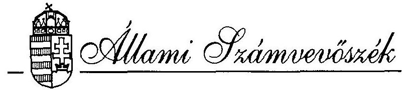

## JELENTÉS

az Állami Vagyonügynökség költségvetési cím pénzügyi-gazdasági ellenőrzéséről
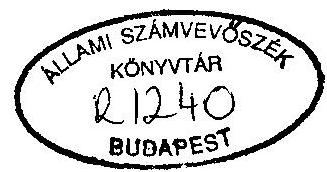

---

Az ellenőrzést vezette:
Nagy Ákosné
számvevő főtanácsos

Az ellenőrzést végezték:
Bánkné Simon Judit
Holé Sándorné dr.
Surányi Tamás
dr. Horváth Gyula
számvevő
számvevő tanácsos
számvevő tanácsos
külső szakértő

---

# ÁLLAMI SZÁMVEVŐSZÉK

V-10-36/1994/95.
Témaszám: 229.

## JELENTÉS

## az Állami Vagyonügynökség költségvetési cím pénzügyi-gazdasági ellenőrzéséről

A privatizációs folyamat koordinálásával, szakszerű irányításával összefüggő állami feladatrendszer ellátására, a hozzá tartozó állami vagyon tekintetében az állam tulajdonosi jogainak gyakorlására az Országgyűlés az 1990. évi VII. törvénnyel jogi személyiséggel rendelkező költségvetési szervként létrehozta az Állami Vagyonügynökséget (ÁVÜ). A szervezet jogállása, felügyelete, hatásköre, stb. jelentősen módosult az 1990. évi LIII. törvény elfogadásával, illetve az újraszabályozást nyert az 1992. évi LIV. törvényben.

A költségvetési törvények az ÁVÜ-t a központi költségvetés szerkezetében 16. cím alatt a Miniszterelnökség fejezethez sorolták és fejezeti jogosítvánnyal ruházták fel. Az ÁVÜ 1. alcím alatti működési költségvetése az 1991. évi 237,9 M Ft-ról 1994-re 1.800 M Ft-ra emelkedett. Kiadásai 1991-ben 254,3 M Ft-ra, 1992-ben 632,8 M Ft-ra, 1993-ban 1.397,9 M Ft-ra teljesültek. A forrásstruktúrában bekövetkezett változás folytán az ÁVÜ 1992-ben részben ( $358,6 \mathrm{M} \mathrm{Ft}$ ), 1993 -tól szinte teljes mértékben ( 1.350 M Ft ) privatizációs bevételekből fedezte kiadásait. A központi költségvetésből 1991-ben 235,9 M Ft, 1992-ben 247,6 M Ft, 1993-ban 1,7 M Ft támogatásban részesült. Az intézményi saját bevétel ugyanezen években 2,7-39,2 M Ft között realizálódott.
A foglalkoztatottak átlagos állományi létszáma a vizsgált időszakban 118 főről 368 főre nőtt.

Az ellenőrzés célja annak értékelése volt, hogy az ÁVÜ szakmai feladatai ellátásához a szükséges működési feltételekkel rendelkezett-e, szervezete igazodott-e a feladatváltozásokhoz és célszerűen kiépített-e, költségvetési gazdálkodásában a törvényes-

---

ségi és célszerűségi szempontokat érvényesítették-e, továbbá hogyan és milyen eredménnyel hasznosították az Állami Számvevőszék korábbi ellenőrzéseinek az intézményi működéssel kapcsolatos megállapításait.

Az ellenőrzés az 1991-94. I. félév közötti időszak fejezeti, intézményi költségvetési gazdálkodására irányult. Az ellenőrzés nem terjedt ki az ÁVÜ privatizációs, vagyonkezelési, -hasznosítási, -védelmi, stb. tevékenységére, melyet az ÁSZ évente ellenőrzött, s az erről szóló jelentéseit - a törvényi előírásoknak megfelelő módon és időben - az Országgyűléshez benyújtotta.

# I.

Részletes megállapítások

## 1. A feladatok, a szervezeti rendszer összhangja és szabályozottsága

A gazdasági környezet változása, a privatizáció előrehaladásával felszínre kerülő megoldandó feladatok, s az ezekkel összefüggő új privatizációs módszerek bevezetése, alkalmazása következtében folyamatosan módosultak az ÁVÜ-vel szemben támasztott szakmai követelmények és gazdálkodási feltételek. E tendenciák kifejezésre jutottak az ÁVÜ tevékenységére, működésére, szervezetére vonatkozó, illetve ehhez kapcsolódó jogszabályi háttér módosulásában is.

Az ÁVÜ felügyeletére vonatkozó jogszabályi változtatások lényegesen szabadabb teret engedtek a kormányzati gazdaságpolitikai törekvéseknek. Ugyanakkor az ÁVÜ költségvetési gazdálkodásával kapcsolatos információs folyamat az országgyűlési kontrollt tekintve áttételessé vált.

Az 1990. évi VII. tv. az ÁVÜ-t, mint jogi személyiséggel rendelkező költségvetési szervet, az Országgyűlés felügyelete alá rendelte.
Az 1990. évi LIII. tv. e felügyeleti jogosítványt a Kormányhoz telepítette át. Az 1992. évi LIV. tv. alapján az ÁVÜ az állam tulajdonosi jogait - a Kormány gazdaságpolitikai döntéseinek érvényesítésével - mint költségvetési szerv gyakorolja, amelyet a privatizációért felelős miniszter irányít. Gazdálkodásához a költségvetési törvények fejezeti jogosítványokat is biztosítottak.

Az ÁVÜ költségvetési gazdálkodását a jogszabályok több kivétellel, illetve az általánostól eltérő módon, és részben hiányosan, pontatlanul szabályozták, ami a

---

gazdálkodásban, működésben tapasztalt ellentmondásoknak, hiányosságoknak egyik forrása.
Az ÁVÜ költségvetési gazdálkodási formájához nem illeszkedtek minden tekintetben az irányítási szintek, hatáskörök.

Az ÁVÜ szervezetét ügyvezető igazgató vezeti a hatályos jogszabályok, a vagyonpolitikai irányelvek és az Igazgató Tanács (IT) döntésének keretei között.

A Vagyonügynökség szervezetének költségvetésétől el kell különíteni a privatizációs tevékenységgel összefüggő bevételeket és kiadásokat (1992. évi LIV. tv. 14. §). E törvényi követelményt az ÁVÜ a gazdálkodási feladatok egymástól független szervezeti egységekhez rendelésével oldotta meg.

A privatizációval összefüggő gazdálkodási tevékenységet a Szervezési, Informatikai és Vagyonnyilvántartási Igazgatóság végzi, a működési költségvetés a Költségvetési és Gazdálkodási Igazgatósághoz tartozik.

Az ÁVÜ tevékenységét meghatározó törvények nem rögzítették azonban teljes körben egyértelműen pontosan az intézményi költségvetésből, illetve a privatizációs bevételek terhére végrehajtandó szakmai feladatok kritériumait. Ezt a hiányosságot az éves költségvetési törvények, vagyonpolitikai irányelvek, illetve az ÁVÜ belső szabályzatai sem kompenzálták.

Az 1992. évi LIV. tv. 67. § (2) bekezdése rögzíti, hogy az ÁVÜ a vagyonértékesítést közvetlenül, vagy más szervezet közreműködésével végzi a kapcsolódó differenciálási feltételek meghatározása nélkül.

Az 1991. évi CXL. tv. 26. § a privatizációval összefüggő közvetlen és közvetett kiadásokra - azok fogalmi meghatározása nélkül - az ÁVÜ intézményi költségvetésétől elkülönítetten biztosított fedezetet a privatizációs bevételek terhére. Ugyanakkor ezen jogszabályhelyre hivatkozva adtak kormányhatáskörben pótelőirányzatot az intézményi költségvetéshez.

A szabályozás hiányosságát az ÁSZ korábbi, 1991. évi vizsgálata is megállapította. A két alcím közötti költségelhatárolást késedelmesen - 1993. közepétől - szabályozták részben pontatlanul, a működési kiadásokat tekintve indirekt módon.

A 10/1993. sz. ügyvezető igazgatói utasítás - két eset kivételével - nem rendelkezett a privatizáció terhére elszámolható konkrét tevékenységekről.

Az ÁVÜ feladat- és szervezetrendszerének alakulását 1993-ig a nagymértékű mobilitás jellemezte. A folyamatos és nagyszámú szervezeti módosítást csak részben

---

indukálta a közgazdasági és jogszabályi környezet változása, számos esetben azok a belső munkamegosztás átrendezésére irányultak. A sorozatos átszervezések ellenére sem valósult meg az intézményi feladat- és szervezetrendszer célszerű összhangja. Ezt jelzi a túltagolttá vált struktúra, valamint az, hogy néhány szervezeti egység feladatában párhuzamosságok, átfedések voltak tapasztalhatók.

A szervezetre vonatkozó IT döntések előkészítése hiányosan volt dokumentált, ami akadályozta azok indokoltságának, szakmai alátámasztottságának megítélését.

A szervezeti egységek száma az 1991. évi 16 -ról 1994. I. félévig 26 egységre bővült.
A hatályos SZMSZ szerint - többek között - az új privatizációs technikák, módszerek alkalmazásában, a tapasztalatok értékelésében a Közgazdasági Igazgatóság és az Alkalmazott Módszertani Önálló Iroda, a nemzetközi kapcsolattartással összefüggő adminisztrációs feladatok ellátásában a Nemzetközi Kapcsolatok Igazgatósága, illetve a Költségvetési és Gazdálkodási Igazgatóság feladatkörében mutatkoztak átfedések, párhuzamosságok.

A Pénzügyi és Gazdálkodási Igazgatóság létszámnövekedése (az 1991. évi 12 főről 1994-re 24 főre) a feladatbővülés által indokoltat meghaladta, melyhez hozzájárult e szervezeti egység tevékenységébe nem illeszkedő ügyintézők foglalkoztatása (pl. protokoll ügyintéző, tolmács) is.

Az ÁVÜ feladatának, jogszabályi környezetének változásai, a gyakori átszervezések nehezítették a tevékenység szabályozását. A belső regulációban meghatározóan 1993-tól érzékelhető javuló tendencia ellenére a működés, a gazdálkodási rend szabályozottsága még nem kielégítő. Ez az alapvető, átfogó szabályzatok hiányában, illetve késedelmes jóváhagyásában, a meglévő szabályzatok hiányosságaiban nyilvánult meg. Különösen kifogásolható volt a Szervezeti és Működési Szabályzat (SZMSZ) jóváhagyásának rendkívül hosszú idejű késedelme.

Az 1990-ben létrehozott ÁVÜ Szervezeti és Működési Szabályzatát a Kormány 1041/1993. (VI.9.) határozatával hagyta jóvá. Addig az ÁVÜ - többször módosított - ideiglenes Szervezeti és Működési Szabályzat alapján működött. (A kormányhatározat alapját képező hiteles dokumentum az ÁVÜ-nél nem állt rendelkezésre.)

Az SZMSZ-ek csak a szervezet és működés főbb kereteit határozták meg, továbbá az ÁVÜ feladataiban és szervezetében végrehajtott jelentős változások is indokolták a részletes szabályozást. Az ideiglenes SZMSZ kiadásakor az adminisztratív igazgató kezdeményezte az egyes igazgatóságok, irodák feladatait, működését rögzítő ügyrendi szabályozást. Ügyrendeket azonban nem készítettek.
A munkaköri leírások korszerűsítése esetenként elmaradt.

---

A gazdasági, pénzügyi folyamatokat nem szabályozták teljeskörűen, csak a gazdálkodás egyes részterületeire készültek szabályzatok. A számlarend túl általános, nem foglalja össze a gazdálkodás szabályait kifejező számviteli rendszert, nem tekinthető ezért a számviteli politikát kifejező normagyűjteménynek.
A költségvetési gazdálkodás szabályozottsága esetileg a hatályos SZMSZ követelményeit sem elégítette ki.

Az SZMSZ 7. fejezet 133. pontja az utalványozási jogkör gyakorlására ügyvezetői igazgatói utasítással kiadott utalványozási szabályzatot ír elő. Ez azonban a költségvetési gazdálkodás terén nem készült el.

Az intézményi működéshez kapcsolódó fejezeti jogkörök gyakorlása szabályozásának - illetve az ezzel összefüggő hatásköri szabályok karbantartásának - elmulasztása is hozzájárult ahhoz, hogy a privatizációért felelős miniszternek a költségvetési gazdálkodás irányításában az 1993. évi CXI. tv. 43. § (1)-(2) bekezdésében meghatározott jogosítványai nem érvényesültek maradéktalanul.

A hivatkozott jogszabályhely szerint az ÁVÜ cím fölött a tervezési, előirányzatmódosítási, beszámolási, információszolgáltatási, ellenőrzési kötelezettséget és jogot a Kormány kijelölt tagja gyakorolja.
Ugyanakkor a korábban kiadott 139/1993. (X.12.) Kormányrendelet 2. § (1) bekezdés k. és l. pontja szerint a költségvetési fejezet meghatározott előirányzatainak tervezéséért, a felhasználásáról való elszámolásáért, a fejezethez tartozó feladat felügyeletéért és pénzellátásért felelős felügyeleti szerv az ÁVÜ tekintetében a Kormány, a felügyeleti szerv vezetője az ÁVÜ ügyvezető igazgatója. Az ÁVÜ az 1993. évi CXI. tv. hatálybalépését követően változatlanul a kormányrendelet szerint járt el.

A fejezeti, intézményi gazdálkodással kapcsolatos döntéselőkészítés és részben a döntéshozatali hatáskör meghatározóan egy személyhez, a pénzügyi és gazdálkodási igazgatóhoz - az ügyvezetés szintjénél alacsonyabban - összpontosult. A privatizációs feladatok ellátásával szemben a költségvetési gazdálkodás szervezése, irányítása, felső szintű vezetői ellenőrzése jelentős mértékben háttérbe szorult.
A döntési szintek eltolódása célszerűtlen a költségvetési gazdálkodás belső információs rendszerének hatékony működése szempontjából is. A döntési szintekhez igazodó információs rendszer nem nyújtott időben, kellő mélységű tájékoztatást az ÁVÜ ügyvezetése számára az intézményi működésben kialakult gazdálkodási feszültségekről, valamint az ezekhez kapcsolódó intézkedésekről. Nem érvényesült ezért megfelelően az ügyvezetés irányító, koordináló, ellenőrző tevékenysége ezen a területen.

---

# 2. A költségvetési tervezés és finanszírozási rendszer

Az ÁVÜ feladataiban, szervezetében, működési körülményeiben, finanszírozási forrásaiban bekövetkezett jelentős változások folytán módosult a költségvetési tervezés és gazdálkodás mozgástere.
A vizsgált években a működést szolgáló költségvetési keretek erőteljesen növekedtek. A feladatok ellátásának igazgatási költsége a privatizációs bevételek egyre nagyobb hányadát tette ki.

Jellemzően a költségvetés eredeti kiadási előirányzata 1991-1994. között 7,6szeresére ( $237,8 \mathrm{M} \mathrm{Ft}$-ról $1,800 \mathrm{M} \mathrm{Ft}$-ra) emelkedett.

Az ÁVÜ szervezetét finanszírozó források több ízben változtak, támogatása átmenetileg többcsatornás volt (1. sz. melléklet).

A működési kiadásokat 1990-1991-ben alapvetően költségvetési támogatásból fedezték.
1992-ben - a központi költségvetésből kapott támogatás mellett - a Kormány a pótelőirányzatokat a privatizációs bevételek terhére engedélyezte.
1993-1994-ben a költségvetési törvények és a vagyonpolitikai irányelvek az igazgatási kiadások fedezetét teljes egészében a privatizációs bevételek terhére biztosították.

Az ÁVÜ megszervezésének és eredményes működésének lehetőségét jelentős mértékben segítette a PHARE program, illetőleg az USAID által juttatott támogatás, amely részben tárgyi eszközök beszerzését fedezte, másrészt szakértők, stb. bevonását biztosította.
2.1 A költségvetési tervezés nem teremtette meg a feladatok és a hozzájuk rendelt pénzügyi keretek összhangját.
A működés feltételeit biztosító kiemelt előirányzatok (eredeti) mértékének és arányainak megállapításánál nem mérlegelték a reális igényeket, így azok nem voltak kellően megalapozottak. Prioritást biztosítottak - az 1994. évi költségvetés kivételével - a béralap folyamatos emelésének a dologi kiadási előirányzat irreálisan alacsony szintje mellett. Ez különösen az 1991. évi jóváhagyott költségvetésben volt szembetűnő.

Az 1991. évi költségvetési törvény eredetileg mindössze $31,1 \mathrm{M}$ Ft előirányzatot rögzített a dologi kiadások fedezetére. Ez csak mintegy 70%-át tette ki az előző, töredék évi tényleges kiadásnak, s ugyanakkor az 1991. évi teljesítés $85,9 \mathrm{M} \mathrm{Ft}$ volt.

---

A bázis szemléletű és kötött előirányzatú költségvetési tervezési
 rendszer gyakorlata mellett ez hosszabb távra behatárolta a gazdálkodás mozgásterét. A gazdálkodási feszültségeket fokozta, hogy a későbbiekben, az 1992. évi pótelőirányzati igények megalapozásánál és azok felhasználásánál nem törekedett az ÁVÜ a bér-, illetve dologi előirányzatok helyes arányainak kialakítására.

Az ÁVÜ szervezetével, működésével kapcsolatos költségvetési előirányzatokat 1993-ban kialakultnak tekintették. Az 1994. évi költségvetés készítésekor ezért csak a vagyonvédelmi feladatokkal, valamint az új privatizációs technikák bevezetésével felmerülő dologi kiadások fedezetére állítottak be fejlesztési többletként 450 M Ft-ot. Ezzel a költségvetési előirányzat 1.800 M Ft-ra emelkedett, s ugyanakkor a béralap, illetve dologi kiadási előirányzatok egyensúlya is helyreállt.

Az ÁVÜ a vizsgált időszakban saját intézményi bevételt nem tervezett annak ellenére, hogy 1993-1994. évi költségvetés készítésének időszakában az ingatlan bérleti szerződések alapján a várható bevétel jelentős része meghatározható lett volna.

Az intézményi saját bevételek 1992-ben 24,8 M Ft-ot, 1993-ban 39,2 M Ft-ot, míg 1994. I. félévben 20 M Ft-ot tettek ki.

A szerkezeti változásokat, szintrehozásokat, az automatizmusok érvényesítését megfelelően dokumentálták és - az 1993. évi bázis előirányzat kialakításának kivételével - szabályszerűen hajtották végre.

Az 1993. évi előirányzat kidolgozása során feltárt szabálytalanságok, hiányosságok részben az 1992. évi szervezetfejlesztésre és költözködésre kapott évközi kormányzati hatáskörű előirányzat-módosításokkal, részben az 1993. évi fejlesztési többletek meghatározásával függtek össze.

A Kormányhoz benyújtott pótelőirányzatra vonatkozó előterjesztések döntéselőkészítésének, szövegezésének hibái, hiányosságai miatt az azt elfogadó kormányhatározatok is pontatlanok voltak. A többletkiadások fedezetére vonatkozóan ugyanis elmulasztották a kiemelt előirányzatok rögzítését, ezért a 3406/1992. Kormányhatározat nem felelt meg az Áht. 24. § (1) bekezdése előírásainak. Az ÁVÜ kihasználta ezt és az előterjesztéstől eltérő módon alakította ki költségvetési kereteit.

1992-ben két alkalommal összesen 358,6 M Ft pótelőirányzatot nyújtott a Kormány az ÁVÜ részére. A 3064/1992. Kormányhatározat a szervezetfejlesz-

---

téshez éves szinten 295 M Ft kiadási előirányzatot határozott meg, amelyből 60 M Ft-ot egyszeri kiadásként, épületfelújításra és beruházásra nyújtott. Az 1993. évi költségvetés bázis előirányzatának kialakításánál az 1992-ben kapott 60 M Ft egyszeri, céljellegű pótelőirányzatot is beépítették, így a bázis előirányzatot 348,5 M Ft-tal növelték. Ugyanakkor a 3406/1992. Kormányhatározat csak 39 M Ft beruházási keret maradványt ismert el a működési többlet kiadások fedezeteként. Az egyszeri pótelőirányzatból 10 M Ft felújítási és 11 M Ft beruházási keretet ezért szabálytalanul vették állandó bázisként figyelembe.

A költségvetési tervezés során érvényesített fejlesztési többleteket, felújításokat esetenként nem dokumentálták megfelelően, vagy/és mértékük az indokoltat meghaladta, illetve szükségtelen volt.

Az 1993. évi költségvetésben szervezetfejlesztés címen tervezett és jóváhagyott 728 M Ft többletelőirányzatot - melynek több mint felét a béralap növelése képezte - nem munkálták ki megfelelően. A többletigényt alátámasztó dokumentum a PM-ben sem állt rendelkezésre.

1994-ben az új privatizációs technikák bevezetésével, a vagyonvédelmi feladatokkal indokolt és elfogadott 450 M Ft dologi jellegű fejlesztési többlet 25 M Ft "étterem felújítási" keretet is tartalmazott gépekre és berendezésekre. Ezek beszerzése nem volt szükséges, és az ÁVÜ nyilatkozata szerint 1994-ben erre nem is kerül sor. A tervezett 97 M Ft felújítási előirányzat ugyanakkor a tetőfödém szigetelésre 31 M Ft-ot - az indokoltnál 20 M Ft-tal magasabb összeget - tartalmazott. (Az éves költségvetés elfogadását követően ezt az összeget az étterem felújítására fordították.)
2.2. Az előirányzat-módosításokat - az 1992. évi kormányzati hatáskörű jelentős összegű pótelőirányzat kivételével - meghatározóan saját hatáskörben hajtották végre. A módosítások mértékére és irányára jellemző, hogy a módosított kiadási előirányzat rendszeresen meghaladta az eredetit.

1991-ben 6,9\%-kal, 1992-ben 134,3\%-kal, 1993-ban 3,7\%-kal volt magasabb a módosított kiadási előirányzat az eredetinél.

A saját hatáskörben végrehajtott előirányzat-módosításokat a teljesítési adatok ismeretében végezték szakmai indoklás nélkül. Ezek egy része törvénysértő volt. Az előirányzat-módosítások a dologi kiadások fedezetének utólagos rendezését célozták, forrásuk döntő részét a béralap, TB járulék, a felújítási előirányzat, illetve az intézményi saját bevételek, kisebb mértékben az előző évi pénzmaradvány képezte.

---

Az 1992. évi saját hatáskörű előirányzat-módosításokat 1993. február 22-én, az 1993. éviekét 1994. február 28-án hajtották végre, s ezzel megsértették az Áht. 98. § (3) bekezdését.
1993. február 22-án az 1992. évi dologi kiadások fedezetére 4.953 E Ft-ot csoportosítottak át saját hatáskörben a béralap és a társadalombiztosítási járulék terhére.
1994. február 28-án az 1993. évi dologi kiadások fedezetére a béralap és társadalombiztosítási járulék, valamint a felújítási előirányzatok terhére módosították az előirányzatot 61.448 E Ft összegben.
Mindkét esetben megsértették az Áht. 24. § (3) bekezdését.
2.3. Az ÁVÜ rendelkezésére álló források az egyes években összességében megfelelő fedezetet nyújtottak - 1993-tól a reáliszmál nagyobb - működési kiadásokra. A pénzgazdálkodás ugyanakkor a vizsgált időszak egészét tekintve nem volt kiegyensúlyozott, a finanszírozás különböző okokból a tényleges szükséglettől eltért.
1992-ben pénzügyi feszültséget váltott ki, hogy a pénzellátás - a havi egyenlő ütemű folyósítás miatt - nem igazodott a szervezetfejlesztés és a költözés egyenlőtlenül jelentkező kiadásaihoz, attól elmaradt.
Az ÁVÜ igényeinek nem megfelelő pénzellátás következtében keletkezett fizetési késedelmek kártérítési és késedelmi kamátfizetési kötelezettséget okoztak. Ez azonban csak kis mértékben volt oka a mintegy 40 M Ft kötelezettség áttolódásának 1993. évre. A valóságos ok a dologi és bérarányok nem megfelelő kialakítása volt.

1993-ban a pénzellátás egyenlőtlenségét és a pénzbőséget a pénzellátási terv megalapozatlansága okozta.
A túlfinanszírozás folytán és a pénzellátás tervezésénél figyelembe nem vett saját bevételek miatt a második félévben változó mértékű, jelentős szabad pénzeszköz halmozódott fel. A működési költségvetési előirányzatból szükségtelenül lehívott összegekből - a jogszabály adta lehetőségeket kihasználva - 30 napos lejáratú kincstárjegyeket vásároltak. Ennek révén kiadási keretüket további 6.429 E Ft kamatbevétellel növelték (2. sz. melléklet).
1993. június 1-jén módosított pénzellátási terv az eredetit - melyben az új székház tervezett felújításához igazodóan az engedélyezett 1.350 M Ft keret nagyobb részét, 792 M Ft-ot az első félévben kívánták lehívni - lényegesen megváltoztatta. A folyósítás nagyobbik részét átütemezték a második félévre, a tervezett felújítási munkák elhúzódásával és a tervezett jutalomfizetés időpontja megváltoztatásának indokával. (Például az augusztus havi igényt 80 M Ft-ról

---

169 M Ft-ra emelték. A lehívott összeget azonban a jutalomfizetés további halasztása miatt nem vették igénybe.)

A pénzellátási tervek jóváhagyása szabályszerű volt, kivétel 1993-ban a pénzellátási terv évközi módosítása, mely - a 140/1993. (X.12.) Korm. rendelet hatálybalépését megelőzően már - ügyvezetői igazgatói szinten történt.
2.4. A pénzmaradványok mértéke az ÁVÜ-nél nem volt jelentős, azok általában a fel nem használt béralapból és társadalombiztosítási járulékból képződtek.

Az elszámolt maradvány 1990. év végén 17,5 M Ft, 1991-ben 2,4 M Ft, 1992-ben 2,3 M Ft, 1993-ban 2,4 M Ft volt.

Az éves beszámolók a maradványokat minden esetben tartalmazták, elszámolásuk megfelelt az előírásoknak. Felhasználásukhoz a Pénzügyminisztérium hozzájárult. Pénzmaradvány elvonásra a 3490/1992. Korm. rendelet alapján csak 1992-ben került sor.
A jóváhagyott pénzmaradványt rendszeresen igénybe vették és 1991. év kivételével javadalmazásra (és járulékra) fordították.

1991-ben a 17,5 M Ft pénzmaradványt felújításra (8,7 M Ft) és ÁFA fizetésre (8,5 M Ft) vették igénybe.

# 3. A költségvetés végrehajtása 

A költségvetés végrehajtását a feladatellátás személyi és tárgyi feltételeinek maximális elérésére irányuló törekvés és azt igény szerint biztosító költségvetési keretek dinamikus növekedése határozta meg.

Az ÁVÜ bevételei (3. sz. mellékletek) a vizsgált években az eredeti előirányzatot meghaladó mértékben teljesültek. Ebben az elért, de nem tervezett saját bevételek döntő szerepet játszottak. Kivétel volt az 1992. év a jelentős összegű pótelőirányzat juttatás miatt.

A bevételek az 1991. évi 256,7 M Ft-ról 1992-ben 635 M Ft-ra, 1993-ban 1.400,4 M Ft-ra emelkedtek, míg 1994. I. félévében 1.017,3 M Ft-ot tettek ki. 1991-1993. között a saját bevételek 14,5-szeresükre nőttek, 1994. I. félévében megközelítették a 20 M Ft-ot.

---

Az intézményi kiadások (4. sz. mellékletek) a módosított bevételi előirányzat keretei között teljesültek. A gazdálkodást a rendelkezésre álló források szinte teljes mértékű igénybevétele jellemezte.

A kiadások teljesítése az 1991. évi 254,3 M Ft-ról 1992-ben 632,8 M Ft-ra, 1993-ban 1.397,9 M Ft-ra növekedett, 1994. I. félévében 874,9 M Ft-ot ért el.

A kiadások szerkezetében - a költségvetési előirányzatoknak megfelelően - a legmagasabb részarányt a vizsgált időszak egészében a béralap és az ehhez kapcsolódó TB járulék képezte.

A béralap és a TB járulék 1991-1993. között mintegy 6-szorosára nőtt. Az összes kiadáson belül 1993-ra a béralap részaránya 49,2\%-ot, míg a TB járulék 22,1\%-ot ért el.

A szolgáltatásokra fordított kiadások aránya ugyanakkor 2\%-kal bővült, 1994. I. félévében 12,8\% volt. Ebben a tendenciában meghatározó volt a székhelyváltozással összefüggő üzemeltetési többletkiadás, továbbá az infláció. A készletbeszerzések növekedése az átlagosnál alacsonyabb szintű (mintegy 3-szoros) volt, részarányuk egyenlőtlen fejlődés mellett 3-7\% között változott.

A felhalmozási és tőke jellegű kiadások részaránya 1991-1993. között mintegy 7-8\%-ot képviselt, míg 1994. I. félévében 16\%-ra bővült a tárgyi eszközök és immateriális javak jelentős fejlesztése következtében.

# 3.1. Létszám- és bérgazdálkodás 

Az ÁVÜ tervezett állományi átlaglétszáma 1991-1994. között 137 főről 400 főre - közel háromszorosára emelkedett. A ténylegesen foglalkoztatottak átlagos létszáma - ennél nagyobb ütemben, 3,1-szeresére - az 1991. évi 118 főről 368 főre nőtt. Az átlaglétszám valamennyi állománycsoportban tapasztalt növekedése a feladat-, illetve szervezetfejlesztéssel volt kapcsolatos (5. sz. melléklet).

A létszámelőirányzatok azonban nem illeszkedtek folyamatosan és minden vonatkozásban megfelelően az intézményi feladatokhoz, tervezésük az egyes években nem volt kellően megalapozott.
A szabályozás - előzőekben már jelzett hiányosságai miatt - nem zárta ki teljeskörűen az átjárhatóságot az igazgatási és a közvetlenül a privatizációs kiadások körébe tartozó feladatellátás között. Ezáltal nem volt egyértelműen meghatározható az intézményi szakmai feladatok valós létszámszükséglete.

---

A létszámelőirányzatokat ugyanakkor nem megfelelően támasztották alá, összetételük csak részben tükrözte az intézményi szervezet változását.

A létszámfejlesztéseket nem a szervezeti egységek, munkaköri csoportok szerinti részletezettséggel építették fel.
1993-ban az ügyintézők és az ügyviteli alkalmazottak állománycsoportja közötti - az utóbbi javára történő - előirányzat átrendezés csak részben függött össze a létrehozott új szervezeti egységek igényével, melyet a teljesítési adatok is igazolnak.

# A tényleges átlaglétszám folyamatosan a tervezett alatt maradt. 

A tényleges átlagos állományi létszám az előirányzathoz képest 1991-ben 86,1\%, 1992-ben 91,7\%, 1993-ban 88,8\%, 1994. I. félévében 92\% volt. (Az ügyintézői létszám 1992-1993-ban átlagosan 28-46 fővel maradt el a tervezettől.)

Az üres álláshelyek képződésében jelentős szerepet játszott - elsősorban az ügyintézői állományt érintő - nagymértékű fluktuáció is (6. sz. melléklet). Ennek főbb okait a kilépők a túlterheltségben, a szakmai, erkölcsi elismerés, a határozott vezetői koncepció hiányában és a szakmai döntések hátterének átláthatatlanságában jelölték meg (ÁVÜ felmérés).

Végkielégítésre 1992-1994. I. félév között nem terveztek előirányzatot, ilyen címen csak 1993-ban teljesítettek kifizetést, 1.002 E Ft összegben.

Az intézményi létszámgazdálkodást nem segítette a foglalkoztatás késedelmes, illetve hiányos szabályozása.

A közalkalmazottak jogállásáról szóló 1992. évi XXXIII. tv. (KJT) végrehajtására kiadott 3/1993. (VI.8.) tárcanélküli miniszteri rendelet közel egy éves késéssel lépett hatályba.
A vezetői és az ügyintézői állomány képesítési feltételeit nem határozták meg.
Az 1992. évi LIV. tv. összeférhetetlenségre vonatkozó 11. § 1. pontjában foglaltak végrehajtásának, ellenőrzésének garanciáját jogi szabályozás külön nem biztosította. Az összeférhetetlenségi szabály alá tartozók - összeférhetetlenségi időszak alatt - újonnan létesített munka-, tagsági, vagy egyéb munkavégzésre irányuló jogviszonyáról az ÁVÜ-nek törvényi előírás hiányában nincs - s így a vizsgálatnak nem volt meg az ellenőrzéshez szükséges - információja.

Az alkalmazásoknál nem tartották be maradéktalanul a vonatkozó törvényi előírásokat. A magasabb vezető beosztású dolgozók kinevezése előzetes pályázati kiírás hiányában történt, ellentétben a KJT 23. § 3. bekezdésében foglaltakkal.

---

A KJT végrehajtási rendeletét követően - amelyben meghatározták a magasabb vezetői beosztások körét - igazgatói munkakörben 4 főt új felvétellel, 6 főt belső átcsoportosítás útján neveztek ki pályázati kiírás mellőzésével.

Az ÁVÜ foglalkoztatáspolitikájában kifogásolható, hogy nem éltek a határozott idejű alkalmazás lehetőségével annak ellenére, hogy erre az IT 1993. I. 20-án kelt E-3/9. sz. határozatában felhívta a vezetés figyelmét.

A béralap előirányzat és felhasználás - különösen 1992. és 1993. években erőteljesen, a létszámemelkedést lényegesen meghaladó ütemben növekedett (7. sz. melléklet).

A tervezett béralap 1991. évi 137,6 M Ft-ról 1994. évre 707 M Ft-ra (414\%-kal) nőtt. A bérkiadások 1991-1993. évek viszonylatában - a módosított előirányzatok 93,5-99,8\% közötti felhasználásával - 118,3 M Ft-ról 687,3 M Ft-ra emelkedtek.

A létszám- és bérgazdálkodás nem volt kellően összehangolt, fokozatosan elszakadt egymástól. A béralapot nem kellő megalapozottsággal, különösen 1992-től - a szervezett állományi létszámhoz képest - túlzott mértékben állapították meg. A tervezett létszám és összetételének változása által indokolt mértéket meghaladó bérelőirányzat növelést a javadalmazási rendszer sem alapozta meg.

1992-ben a szervezetfejlesztéshez adott pótelőirányzatokban a kiemelt előirányzatok rögzítésének - előzőekben jelzett - elmulasztása megadta a lehetőséget ahhoz, hogy az ÁVÜ saját hatáskörben az előterjesztésnél 43 M Ft-tal magasabb, éves szinten 152 M Ft összegű béralap növekménnyel kalkuláljon.

A 3064/1992. sz. Kormányhatározat külön nem rögzítette a bérelőirányzat növelésének mértékét, a döntés azonban az előterjesztett - éves szinten 164 főre 109 M Ft béralap - pótigény szerint született.

Az 1993. évi béralaphoz a szintrehozás összegét szabálytalanul állapították meg.

Az e címen beállított $35,6 \mathrm{M}$ Ft-os összeg meghatározásánál nem vették figyelembe, hogy előző évben szervezetfejlesztésre a Kormányhatározat 10 hónapra biztosított pótelőirányzatot, így szintrehozásként csak további két havi összeget lehetett volna számolni.

A fejlesztési igények között ugyanekkor további 99 fő álláshely létesítésével és 395 M Ft többlet béralap szükséglettel számoltak.

---

Tovább növelte a rendelkezésre álló béralapot, hogy a központi bérpolitikai keret terhére 1993-1994. években 1.198 E - 2.054 E Ft összegű pótelőirányzatot realizálhattak, kormányzati hatáskörű előirányzat módosítással. Ez a juttatás a magas bérek miatt indokolatlan volt, azokat nem is fordították célirányosan béremelésre.
1993. évben a központi bérpolitikai terv elosztását a Munkaügyi Minisztérium vezényelte.

Az aránytalanul magas béralap előirányzat egyrészt az 1991-1993. években évközi (az Áht. hatálybalépését követően törvénysértő) előirányzat átcsoportosításokra, másrészt jelentős béremelésekre nyújtott fedezetet, s ugyanakkor a pénzmaradvány számottevő részét képezte.

A túlzott mértékű, részben szabálytalan módon képzett bértömeg biztosított lehetőséget arra, hogy 1993-ban a KJT-ben, illetve a közalkalmazotti szabályzatban foglaltak alapján gyakorlatilag "0" bázisú tervezést valósítottak meg, a jóváhagyott béralap előirányzat keretei között alakították ki és alkalmazták a speciális javadalmazási rendszert.

Az ÁVÜ tevékenységének sajátosságaira, a követelményekre figyelemmel az 1992. évi LIV. tv-ben biztosított javadalmazási rendszert késéssel határozták meg, s az a feladatellátás tekintetében nem volt kellően hatékony és ösztönző. Ez a szabályozás nem korlátozta a bértömeggazdálkodás keretei közötti követelmény nélküli jutalmazást.

Az IT az ÁVÜ által előterjesztett javadalmazási rendszert 1993. januárjában elfogadta. A bérrendszerbe beépítették a KJT valamennyi, a dolgozókra kedvező elemét (illetménykiegészités, vezetői pótlék, 13. havi jutalom). Az intézményi munkaviszonyt az ÁVÜ-nél töltött idő alapján - két és minden további ott töltött év után 1-1 havi jutalommal - preferálták.

A végzett munka jellegének elismerésére (vezetői, tranzakciós; érdemi; ügyviteli kategóriákban) a javadalmazási rendszer befogadta az alapbérre vetített jutalomszorzók korábban alkalmazott gyakorlatát. (E címen 1991-1994. években 36,9 M Ft, 40,6 M Ft, 122,2 M Ft és 150 M Ft jutalmat terveztek.) A növekvő összeg ellenére azonban differenciáló szerepe nem volt jelentős.

A privatizációval kapcsolatos konkrét szakmai feladatok teljesítésének ösztönzése rendkívül alacsony szintű. E célra 1993-ban 2,5 M Ft-ot fizettek ki, ami a tényleges évi jutalom összegének $1 \%$-át sem érte el.

---

Az IT javadalmazási rendszerének hiányosságai megmutatkoztak abban is, hogy nem határozták meg egyértelműen a jutalomalap tervezésének és felhasználásának kritériumait.
Az IT megfogalmazta a magasabb alapilletmények szükségességét, arra azonban nem tért ki, hogy jövedelem összetételben a jutalom aránya milyen mértékben változzon.

Hiányolható, hogy az IT csak formálisan, nem kellő mélységben és összefüggéseiben, értékelte a javadalmazási rendszer működését.

Az IT a javadalmazási rendszer végrehajtásáról szóló beszámolót 1993. XII. 1-jén, a 101,2 M Ft összegű jutalomfizetés előtt tárgyalta.

A javadalmazási rendszer bevezetésével egyidejűleg a korábbi központosított bértömeggazdálkodást részben decentralizálták, ami célszerű intézkedés volt. Nem igazodott azonban a decentralizáltan meghatározott bérgazdálkodáshoz, annak végrehajtási gyakorlata. Azonos szervezeti létszám mellett 1993. és 1994. évi - a mintavételül választott júniusi - adatok szerint a teljes béralap mindössze 56,3\%-57\%-a volt igazgatóságokra lebontva, a fennmaradó rész nagyobb hányada a központi jutalomkeretet képezte.

A bérszerkezetben - részben összefüggésben az alkalmazott javadalmazással folyamatosan nőttek a jutalmazásra, majd az illetménykiegészítésre szolgáló összegek és arányuk. Ehhez hozzájárult, hogy az eredetileg tervezett jutalomösszegek jelentős mértékben kiegészültek az üres álláshelyek miatt felszabaduló béralappal.

A "szabadfelhasználású" jutalom összege a vizsgált években $36,9 \mathrm{M} \mathrm{Ft}, 69,5 \mathrm{M}$ Ft, 265,9 M Ft. (1994. I. félévben 61 M Ft) volt.
1991. és 1994. I. félév közti időszakban a dolgozók átlagjövedelme közel kétszeresére, 78,2 E Ft/hóról 148,2 E Ft/hóra nőtt. A legjelentősebb jövedelemnövekmény (+81,5\%) 1992-ről 1993-ra volt regisztrálható; kisebb mértékű változás (+14\%) realizálódott 1991-1992. évek között. Az 1 főre jutó átlagjövedelem 1994. I. félévére 8\%-kal csökkent, amely visszavezethető egyrészt arra, hogy az álláshelyek betöltöttsége az előző évinél kedvezőbben alakult, másrészt, hogy a jutalom előirányzatot időarányostól alacsonyabb szinten - 81\%-os mértékben használták fel (8. sz. melléklet).

---

# 3.2. Az eszközgazdálkodás 

Az intézményi eszközállományt lényegében a vizsgált időszakban hozták létre. A folyamatos és jelentős mértékű eszközgyarapodás, a hatékony gazdálkodás követelménye indokolta volna az intézményi szintű rendszerszemléletű szabályozást. Ennek hiánya is közrejátszott az eszközgazdálkodásban tapasztalt szélsőségekben, a célszerű megoldások mellett az indokolatlan, illetve ésszerűtlen költésekben.

Az immateriális javak és a nagyértékű tárgyi eszközök 412 M Ft-os állomány gyarapodásában a saját források (273 M Ft) mellett számottevő volt PHARE és az USAID forrásból származó növekedés (139 M Ft). A gépek, berendezések elhasználódási mértéke - kivéve a számítástechnikai eszközöket - alacsony (9. és 10. sz. mellékletek).

Az immateriális javak (bruttó értéke 23,6 MFt) 100\%-a szoftver, beszerzésük a számítógépes rendszerek kialakításával párhuzamosan történt. Ezen belül jelentős tétel az 1994-ben vásárolt 10,4 M Ft értékű Novell vírusvédelmi rendszer.

Az ingatlanok könyvszerinti bruttó értéke (146 M Ft) nem tükrözi a valós tulajdonosi, kezelői viszonyokat, hanem a bérelt székházon végzett felújítások értékét tartalmazza.

A Budapest, V. Vigadó u. 6. sz. alatti ingatlan kezelői jogát 1993-ban jegyezte be a Földhivatal az ÁVÜ javára. Az ingatlan könyvszerinti értéke - az Ipari és Kereskedelmi Minisztérium, mint előző kezelő átirata alapján - "0", ezért az ÁVÜ is "0" értéken tartja nyilván.

A Budapest, XIII. Pozsonyi út 56. sz. alatti székház a HUNGALU Rt. tulajdonában van, aki 1992-ben adta az épületet az ÁVÜ használatába. A szerződés alapján az ingatlant használó viseli a felújítással kapcsolatos költségeket is.

Az idegen ingatlanon végzett felújítás könyvszerinti elszámolására a számviteli törvény, illetve és a 179/1991. (XII.30.) Kormányrendelet nem tér ki. Így az ÁVÜ a szakirodalomban szereplő eljárást alkalmazta, ugyanakkor a javasolt módszertől eltérően a bérleti szerződésben nem rögzítették - a számviteli elszámolás alátámasztásához - a jogviszony megszűnése utáni kötelezettségeket.

Az ÁVÜ fokozatosan vette igénybe a részére újonnan kijelölt székházat, melynek kihasználtsága nem megfelelő. A használaton kívüli terület (42 szoba; 9\%) hasznosításáról a vizsgált időszakban nem intézkedtek.

---

A gépek, berendezések állományának bruttó értéke (212 M Ft) a vizsgált időszakban 203 M Ft-tal emelkedett, a saját forrásból történő beszerzés aránya 36\%. Az állománycsoporton belül meghatározó hányadot képviselnek a számítástechnikai és ügyviteltechnikai eszközök. Beszerzésük célszerűen, az igényeken alapuló tervek figyelembevételével történt, finanszírozásuk 85 M Ft értékben, 80% arányban USAID és PHARE forrásból valósult meg.

A számítógép ellátottság a feladatvégzés igényéhez igazodó (90\%). A számítógépek azonban - beszerzési idejük függvényében - különböző fejlettségi szintet képviselnek, egy részük erkölcsileg elavult.

Az egyéb eszközök és berendezések állományának saját forrásból származó növelése alapvetően a szervezetfejlesztéshez és az új székház berendezéséhez kapcsolódott. Az irodabútorok és az egyéb ügyviteltechnikai eszközök beszerzése a szervezeti egységek szükségleteihez, illetve a pénzügyi forrás lehetőségeihez igazodott. A rendelkezésre álló költségvetési források azonban esetenként nem késztettek takarékos, rangsoroló beszerzésre, hanem módot adtak - az intézmény átmeneti jellegét is tekintve - túlzó igények kielégítésére.

Például az 1993-ban vásárolt művirágok értéke 2,2 M Ft+ÁFA, az 1994-ben beszerzett tornaszerek értéke 1,4 M Ft+ÁFA.

A járművek állományának bruttó értéke dinamikusan - 5,0 M Ft-ról 35,6 M Ft-ra emelkedett, döntően a személygépkocsi beszerzésekkel összefüggésben. A személygépjárműpark évről-évre bővült és cserélődött.

A személygépkocsi állomány 1990. XII. 31. - 1994. VI. 30. között 8 db-ról 31 db-ra nőtt. A vizsgált időszakban 34 db autó beszerzésére és 11 db autó értékesítésére került sor.

A hatékonyság, célszerűség követelménye a gépjárműgazdálkodásban nem érvényesült. A beszerzések az intézmény reális igényét meghaladták, ami összefüggött a célszerűtlen személygépkocsi használati renddel is.

Az intézmény tulajdonában lévő gépjárműveket "személyhez rendelt" (22 db), vagy kulcsos gépkocsiként (8 db) üzemeltették.

Az ügyvezető igazgatóhelyettesek és az igazgatók (magasabb vezető beosztású dolgozók) részére 1990-től kezdődően "személyhez rendelt" elnevezéssel gépkocsi

---

igénybevételt biztosítottak. E jogosultságot intézményi keretek között nem szabályozták.

A személyhez rendelt gépkocsihasználat abban tért el az állami vezetők részére megállapított személyi használatú gépkocsi jogosultság szabályaitól, hogy esetében a magánhasználatra térítési kötelezettséget írtak elő. (1993-ig nem, ez évtől - az SZJA szabályozás változásával - a munkahely és a lakóhely közötti gépkocsi használat is magánhasználatnak minősült.)

A vizsgálat idején hatályos 8/1993. sz. Ügyvezető igazgatói utasítás a "személyhez rendelt" gépkocsi kategóriába sorolta az ügyvezető igazgatónak a többször módosított 1077/1987. (X.31.) MT határozat alapján engedélyezett személyi használatú gépkocsit is.

A "személyhez rendelt" gépkocsik kihasználtsága alacsony volt.
A próbaszerű értékelés szerint 1993-ban a mintavételül választott 18 db személyhez rendelt gépkocsiból 8 db nem érte el átlagosan a havi $1.000 \mathrm{~km}-\mathrm{t}$, míg 1994-ben 16 db gépkocsiból a futott km-ek alapján 5 db maradt a fenti érték alatt.

Az intézményi szükségletet meghaladó gépkocsi beszerzéssel az ÁVÜ feleslegesen kötött le költségvetési forrásokat, továbbá jelentős számú személygépkocsi értékesítésekor pazarló módon járt el. A bemutatott bizonylatok alapján 10 db autó értékesítése - műszaki állapotukra tekintettel - indokolatlan volt és az eladási árat több esetben a piaci érték alatt állapították meg. Kifogásolható ugyanakkor az is, hogy két dolgozó részére a gépkocsi vételárának részletekben történő kiegyenlítését engedélyezték (11. sz. melléklet).

A magánszemélyek - elsősorban dolgozók - részére értékesített autók 45,5\%-a 1-2 éves, $45,5 \%$-a 3-4 éves volt; a futott km egy autó kivételével 90 E km alatt - ebből 4 autónál 30 E km alatt - volt; az autókra fordított javítási költség egy kivételével - nem volt jelentős.
A 11 db személygépkocsi értékesítését 9 esetben a márkakereskedők által végzett értékbecslés előzte meg, de az ÁVÜ által meghatározott eladási ár 5 esetben $10-27 \%$-kal a felbecsült forgalmi érték alatt maradt.

Az ellenőrzött években a felújítási előirányzatok rendeltetése az ÁVÜ céljainak megfelelő székház kialakítása, renoválása volt. A rendelkezésre álló forrásokból 1992-1994. I. félév között 146 M Ft-ot használtak fel. (A régi székház felújítására 1990-1991-ben 29 M Ft-ot költöttek.)

---

1994. június 30-ig az új irodaépület területének $42 \%$-át, ezen belül az irodák $70 \%$-át újították fel.

A felújítások éves pénzügyi előirányzatának tervezését előzetes műszaki felmérésen alapuló költségvetések nem támasztották alá. A munkák ütemezése - az 1993. évet kivéve - igazodott az elfogadott felújítási keretekhez.

1993-ban az eredetileg jóváhagyott 97 M Ft-tal szemben a felújítás 56,2 M Ft-ban realizálódott, 40,8 M Ft-ot - szabálytalanul - dologi kiadások fedezeteként csoportosítottak át.

Az ÁVÜ a kivitelezői szerződéskötés során elmulasztotta a költségvetési források kímélését, illetve hatékony felhasználását szolgáló jogszabályi kötelezettség érvényesítését, így megsértette a versenytárgyalás szabályait tartalmazó 1987. évi 19. tvr., valamint a versenytárgyalás-kiírási kötelezettségről szóló 36/1988. (VIII.16.) PM rendelet 1. § (1) bek. (a) pontját. (A jogszabályhely szerint versenytárgyalás útján kell megkötni a szerződést, ha az ellenszolgáltatás teljesítése egészben, vagy részben állami költségvetési forrásból történik, és összege meghaladja a 10 M Ft-ot.)

Az ÁVÜ a kivitelezők zártkörű megkeresése útján kért árajánlatokat két nagyon leromlott állapotú irodahelyiség felújítására, mivel az azonnali intézkedés igénye miatt az új székház épület teljes felmérésére nem volt mód. A három ajánlattevő közül (egy kisszövetkezet és két kft.) az ÁVÜ dolgozóiból álló zsűri a MODULOR Építőipari és Tervező Kisszövetkezetet választotta a munkák elvégzésére a legkedvezőbb egységár és vállalási határidő miatt. (Az ÁVÜ zsűri döntését - az ellenőrzésnek átadott, illetve az egyeztetés folyamán benyújtott, részben eltérő tartalmú - két jegyzőkönyv /12. sz. mellékletek/ tanúsága szerint az ajánlattevők jelenléte nélkül hozta meg.)

A MODULOR Kisszövetkezet (majd Kft.) árajánlata azonban csak két szoba átalakítási munkáira vonatkozott (1.222 E Ft+ÁFA értékben). Ennek ellenére az 1992. április 23-án megkötött keretszerződés az irodaház "A" épületének felújítási munkáira, az 1993. szeptember 14-én aláírt módosítás a "B" épület felújítási munkáira vonatkozik minden évben aszerint ütemezve, amilyen mértékben a költségvetés felújítás címén erre fedezetet nyújt (13. sz. mellékletek). (Megjegyezzük, hogy a módosítás 1992. március 23-ai keltezésre és nem április 23-ára hivatkozik.) A MODULOR Kisszövetkezet (majd Kft.) által végzett felújítási munkák értéke 1992-ben 15,7 M Ft+ÁFA, 1993-ban 26,1 M Ft+ÁFA, 1994. I. félévben 45,0 M Ft+ÁFA volt.

Az ÁVÜ a jelentős összegű felújítást saját bonyolításban végezte, nem foglalkoztatott azonban ehhez megfelelő képesítéssel rendelkező szakembert.

---

A felújítás lebonyolításának dokumentumai (költségvetés, szerződés, egyszerűsített műszaki átadás-átvételi jegyzőkönyv, számla), a bemutatott bizonylatok alapján, formailag megfelelnek a jogszabályi követelményeknek.

# 3.3. A székházba átköltözés kiadásai 

A Kormány 1992. február 27-i 3072/1992. sz. határozata engedélyezte, hogy az ÁVÜ a HUNGALU Rt. tulajdonában lévő, a Budapest, XIII. Pozsonyi út 56. sz. alatt álló, irodaházba költözzön. A hivatkozott határozat szerint az ÁVÜ-nek fedeznie kellett a költözés igazolt költségeit a HUNGALU Rt. szervezeti egységei számára (14. sz. melléklet).

A költözéssel kapcsolatos többletkiadások fedezetére a Kormány 1992. augusztus 28-i 3406/1992. sz. határozatával 95,1 M Ft pótelőirányzatot hagyott jóvá, amelyből az előterjesztésben - az ÁVÜ és a HUNGALU Rt. szervezeti egységei között április hóban megkötött megállapodások összegeinek figyelembevételével - 87,7 M Ft volt a külső gazdálkodó szervek költöztetésének fedezete.

A költözéssel kapcsolatban ténylegesen felmerült kiadások összege 93 M Ft volt. A pótelőirányzat és a tényleges kiadás 2,1 M Ft-os különbözete egyéb működési kiadás fedezetét jelentette (15. sz. melléklet).

Az ÁVÜ nem járt el minden vonatkozásban körültekintően a költözés igazolt költségei elismerésénél. Ehhez hozzájárult az is, hogy a vonatkozó kormányhatározat nem írt elő elszámolási kötelezettséget, s az ÁVÜ sem volt érdekelt e kiadások megtakarításában.

Az ÁVÜ a HUNGALUKER Kft. által bemutatott számlákat költözési költségként ismerte el, holott a hivatkozott számlák nem voltak alkalmasak a megállapodásban foglalt felújítási munkák beazonosítására. A Kft. által küldött kártérítési elszámolás, valamint a benyújtott számlája készítésének időpontja 1993. január 28., azonos az ÁVÜ részéről kiállított 40 M Ft átutalásáról intézkedő átutalási megbízás kiállításának időpontjával (16. sz. mellékletek). Ugyanakkor az ÁVÜ-nek több mint 150 db számlát kellett volna felülvizsgálni a kiadások indokoltságának megítéléséhez.

A Kft. részére teljesített költségtérítések végösszege a megállapodásban foglaltat nem haladta meg, de jogcímeiben attól eltért. Az ÁVÜ a megállapodásban foglalt 18,4 M Ft összegtől eltérően 23,3 M Ft számítástechnikai eszközbeszerzést finanszírozott meg. Ezen kívül 1,5 M Ft - a megállapodásban nem szereplő és korábban elutasított - egyéb eszközbeszerzést is elfogadott és kifizetett a

---

költözés indokolt költségeként (17-18. sz. mellékletek).

# 3.4. Egyéb működési kiadások 

Belföldi kiküldetéssel kapcsolatos kiadások trendje növekvő volt, összege nem jelentős (1991.: 272 E Ft, 1992.: 352 E Ft, 1993.: 358 E Ft, 1994. I. félév: 6 E Ft). A próbaszerűen ellenőrzött költségelszámolások a jogszabályi előírásoknak, valamint az ügyvezetői igazgatói utasításnak megfeleltek. Kifogásolható volt ugyanakkor, hogy 1991-ben és 1992-ben konkrét privatizációhoz kapcsolódó utazásokat is a működési költségek között számoltak el.

A külföldi kiküldetéssel kapcsolatos kiadások összege évenként hullámzott (1991.: 4,4 M Ft, 1992.: 7,9 M Ft, 1993.: 4,3 M Ft, 1994. I. félév: 3,9 M Ft). Az ellenőrzés több, pénzügyi, bizonylati fegyelmet sértő szabálytalanságot tárt fel. Így a devizapénztár előlegelszámolási gyakorlata nem felelt meg a követelményeknek, a személyes elszámolási kötelezettség nem volt biztosított. Az előleggel való elszámolás gyakran meghaladta a jogszabályban előírt időtartamot, az utazásra felvett előlegek összege - sok esetben - lényegesen meghaladta az indokolt mértéket.

Nem fordítottak kellő figyelmet a külföldi kiküldetések tapasztalatainak hasznosítására, holott a V-65-42/1991. sz. ÁSZ jelentés is kifogásolta az írásban rögzített beszámoltatás hiányát.

A reprezentációs kiadások folyamatosan emelkedtek - 1991.: 433 E Ft, 1992.: 1.153 E Ft, 1993.: 1.563 E Ft, 1994. I. félév: 937 E Ft - melyet a személyi keretre jogosult dolgozók körének bővülése, továbbá a személyi keret indokolt emelése okozott. A kiadások elszámolása az előírásoknak megfelelően, az engedélyezett mérték figyelembevételével történt.

A lakásvásárlásra (építésre) fordított pénzeszközök emelkedtek. A bővülő költségvetési forrásokat a visszatérített kölcsöntörlesztések is növelték (19. sz. melléklet). Lakásvásárlási támogatásra 1991-1994. I. félév között eredetileg 3,0 M - 1,0 M 8,0 M - 8,0 M Ft állt rendelkezésre, mely összegeket saját forrásból - 1992-ben szervezetfejlesztésre kért kormányzati pótelőirányzatból is - kiegészítették.

A kiadások (az OTP részére átutalt összegek) - az 1993. évi többlet felhasználás kivételével - a módosított előirányzaton belül realizálódtak.

---

Az 1993. évi teljesített kiadás 11.000 E Ft volt, amely 142 E Ft-tal haladta meg a módosított előirányzat összegét. A különbözetet fedezetét 1991-1992. évben a Lakásalap számlára szabálytalanul, kamatbevételként elszámolt összeg képezte.

Az intézményi lakásépítési támogatásokat a jogszabályi előírásnak megfelelően szabályozták, és az abban foglaltak szerint dokumentálták. A kölcsön lejáratát viszont nem igazították az intézmény működésének várható időtartamához.
Az intézmény jelzálog jogát igazoló - ingatlannyilvántartásba történő - bejegyzések legtöbb esetben hiányoztak.

A munkavállalók részére a vizsgált időszakban fizetett költségtérítések (ebéd, bérlet, utazási költség) 1992-ben a munkaruha juttatással bővültek. Az e jogcímen teljesített kiadások erőteljes növekedésében a juttatás összegének évenkénti jelentős emelése is szerepet játszott.

1992-ben a főállású érdemi dolgozók évi 60 E Ft/fő, az ügyintézők 20 E Ft/fő, 1993-ban 80 E Ft/fő, illetve 40 E Ft/fő, 1994-ben 95 E Ft/fő, illetve 48 E Ft/fő munkaruha juttatásban részesültek.

A juttatások ilyen mértékű emelésére a költségvetési források fedezetet biztosítottak, a KJT - mely nem korlátozza a munkaruha juttatás címen adható összeget - pedig lehetőséget adott.

A 2/1992. és a 2/1993. sz. ügyvezetői igazgatói utasításokban a munkaruha vásárlásokra célszerűtlenül előleget, az előleg elszámolásra indokolatlanul hosszú időt (2-6 hónapot) biztosítottak.

Többször előfordult, hogy elszámolástechnikai okok miatt a próbaidő letelte előtt juttattak a dolgozók részére munkaruha vásárlásra előleget, melyet a szabályozásuk megengedett.

Célszerűbb lett volna azonban a bemutatott számlák alapján történő utólagos térítés, ezáltal a tényleges kifizetés - a gyakorlattal ellentétben - csak a jogosultságot követően jelentkezhetett volna.

# 4. A számviteli és bizonylati rend 

Az ÁVÜ számviteli és bizonylati rendjét a Számviteli törvény rendelkezéseire és iránymutatására tekintettel alakították ki.

A számlarend csak a szintetikus könyveléshez elengedhetetlen minimumot képviseli.

---

Például nem tartalmazza számla, alszámla mélységig a főkönyvi számlákon elszámolt gazdasági események tartalmi és formai követelményeit, a vagyont érintő szabályokat, a költségek elszámolásának aktuális szabályozását. Nem rendelkezik tételesen az analitika rendszeréről, a számvitel technikai kivitelezéséről, stb.

A főkönyvi könyvelés célszerűen tagolt analitikára támaszkodik.
A működési és szakmai tevékenységhez kapcsolódó kiadások elhatárolását a két alcím költségvetési különválása és az elkülönült számviteli rendszerek elvileg automatikusan biztosítják. Ennek ellenére nem zárható ki - és a szúrópróbaszerű ellenőrzés ilyen eseteket feltárt - vezetői döntéseken alapuló költség-átterhelések előfordulása, figyelemmel a szabályozás jelzett hiányosságaira is (pl. a kül- és belföldi kiküldetések, szakértői szolgáltatások).

A vagyonvédelmet jól szolgálta az eszközökről számítógéppel vezetett, egyedi nyilvántartási rendszer. Az év végi mérleg összeállítása előtt 1990-ben és 1993-ban a nyilvántartásokat leltározással ellenőrizték, 1992. év végén a számviteli törvény 42. §-ára hivatkozva leltározást nem végeztek.

A törvénynek a költségvetési gazdálkodó szervezetekre vonatkozó szabályozását tartalmazó 179/1991. számú Kormányrendelet 25. § (3) bekezdése a leltárnak részletező nyilvántartásokkal való megengedett helyettesítését feltételekhez köti: megfelelően biztosított vagyonvédelem és az eszközökről folyamatosan vezetett, részletező érték és mennyiségi nyilvántartás létét írja elő.

Tekintettel az 1992. évi költözésre az 1992. évi leltározás elhagyása indokolatlan volt, amit alátámaszt az 1993. év végi, a követelményeknek megfelelő módon előkészített és lebonyolított leltározás során feltárt - az eszközállományhoz mérten jelentős eszközhiány.

1993-ban a tárgyi eszközök körében 472 E Ft hiányt mutattak ki.
A leltárfelvételről készített kiértékelő jelentés és az ennek alapján megtörtént intézkedések, így a hiányok okainak felderítésére irányuló kísérlet (rendőrségi feljelentés), a hiányok leírásának engedélyezése, stb. az intézményi vagyon biztonságos kezelésére utal. A leltározás eredményeinek átvezetése az egyedi kartonokon ugyancsak megtörtént.

A vizsgált időszakban az értéken nyilvántartott eszközök körében nem, az érték nélkül nyilvántartott készletek körében 1993-ban selejteztek. E selejtezés a dokumentumok

---

alapján a belső szabályoknak megfelelt. Kifogásolható azonban, hogy 1994-ben történt meg a selejtezett eszközök hulladékként való elszállítása.

A költségvetési beszámolók, mérlegek adatai a könyvelésen alapulnak. A főkönyvi kivonatok és az éves mérlegek vonatkozó számai megegyeznek.
Az 1991. évi záró és 1992. évi nyitó (rendező) mérlegben helytelenül számolták el a vásárolt kötvények visszaváltott ellenértékét, melyet az 1992. évi zárómérlegben korrigáltak.

# 5. A költségvetési gazdálkodás belső ellenőrzése 

A belső ellenőrzés mindhárom ága (a függetlenített, a vezetői, a munkafolyamatba épített ellenőrzés) hiányosan funkcionált, nem képezett egymásra épülő egységes rendszert.
A függetlenített költségvetési belső ellenőrzés irányítási, szervezeti, személyi feltételeit az ÁVÜ működése alatt nem biztosították megfelelően. A megbízásos alapon működő belső ellenőrzés színvonala nem volt megfelelő, irányítása nem volt célszerű.

1993-ig a költségvetési gazdálkodás területén - a szervezeti, személyi feltételek hiányában - a gazdasági igazgató adott megbízást külső szakértőknek a mérlegbeszámolók valódiságának ellenőrzésére, valamint néhány időszerű témavizsgálatra. Az összesen hat vizsgálat mélysége, szakmai megalapozottsága többnyire nem volt kielégítő. A jelentések nem mutattak rá a gazdálkodás lényegi hibáira, hiányosságaira, s általában nem tartalmaztak jól hasznosítható javaslatot.

A függetlenített belső ellenőrzés szervezeti, személyi feltételeinek megteremtésére figyelemmel az ÁSZ által javasoltakra - hozott intézkedés nem volt még kellően hatékony, illetve eredményes.

Az Ellenőrzési Igazgatóság szervezeti keretei között 1994-ben létrehozták a Belső Ellenőrzési Irodát, melynek 1994. évre vonatkozó téma javaslatai aktuálisak, szakmailag megalapozottak voltak.

A foglalkoztatott egy főállású és két négyórás revizor munkaidejének jelentős részét azonban a privatizációs területhez fűződő aktuális vizsgálatok kötötték le.

A függetlenített belső ellenőrzés így nem volt az irányítás hatékony eszköze, nem szolgáltatott kellő mélységű információkat az intézményi gazdálkodási döntések megalapozásához, illetve ezek végrehajtásáról az ügyvezetés részére. A gyors

---

visszacsatolást korlátozta, hogy a belső ellenőrzés szervezeti hierarchiába sorolása nem igazodott a döntési szintekhez, nem teremtették meg függetlenségét.

A vezetői és munkafolyamatba épített ellenőrzés hatékonyságát rontották a gazdálkodási jogkörök előzőekben jelzett meghatározásának, valamint a gazdálkodási szabályzatok hiányosságai. A munkafolyamatba épített ellenőrzést a pénzügyi folyamatokban nem érvényesítették maradéktalanul, illetve annak ténye nem volt dokumentált.

# II.   Következtetések, javaslatok 

A privatizáció előrehaladásával folyamatosan módosult az ÁVÜ tevékenységére, szervezetére, működésére vonatkozó, illetve az ahhoz kapcsolódó jogszabályi háttér.

A jogi szabályozás pontatlanságai, hiányosságai miatt nem volt kellően körülhatárolt a feladatrendszer, s az ehhez igazodó szervezeti struktúra, valamint a finanszírozás és a gazdálkodás módja. Mindezek gátolták a feladat- és szervezetrendszer célszerű összhangjának megteremtését - amelyet a sorozatos átszervezések sem biztosítottak - továbbá a rendelkezésre álló anyagi eszközök gazdaságos, hatékony felhasználását.

Az ÁVÜ költségvetési gazdálkodását a jogszabályok több kivétellel határozták meg. Az ÁVÜ-re vonatkozó törvényi és adott kormányzati felügyeleti rendben nem érvényesült megfelelően az Országgyűlés és a Pénzügyminisztérium kontrollja az ÁVÜ intézményi gazdálkodása felett. A működés kereteit érintő döntéseit a Kormány érdemi, szakmai kontroll nélkül, az ÁVÜ előterjesztése alapján hozta. Mindezek együttes hatására az ÁVÜ gazdálkodásának lehetőségei jelentősen eltértek a központi költségvetési szervekétől.

A vizsgált években a privatizáció ütemének lassulása mellett a szervezet életgörbéje eltolódott, a feladatellátás költségigényessége növekedett, a működés a privatizációs bevételek egyre nagyobb hányadát kötötte le.

A működés, a gazdálkodási rend szabályozottsága nem volt kielégítő, bár az utóbbinál 1993-tól javuló tendencia tapasztalható. Az intézményi működéshez

---

kapcsolódó fejezeti jogkörök gyakorlási módja, szabályozásának hiányosságai 1994-ben a törvényi előírások megsértéséhez, hatásköri túllépéshez is vezettek. A döntési szintek célszerűtlen eltolódása miatt a költségvetési gazdálkodás belső információs rendszere nem nyújtott kellő tájékoztatást az ÁVÜ ügyvezetése számára az intézményi működés feszültségeiről és a kapcsolatos intézkedésekről, gátolva ezzel annak irányító, ellenőrző tevékenységét.

A költségvetési tervezés nem teremtette meg a feladatok és a hozzájuk rendelt pénzügyi keretek összhangját. A tervezéskor (1994-ig) és a pótelőirányzati igények kidolgozásánál prioritást biztosítottak a béralap folyamatos emelésének, a dologi kiadási előirányzatok irreálisan alacsony szintje mellett. A saját bevételeket figyelmen kívül hagyták. A költségvetés egyensúlyát 1994. évre vonatkozóan a dologi jellegű fejlesztési többlet révén állították helyre. A megalapozatlan tervezés gazdálkodási feszültségek forrásává vált, amelyeket évközben - esetenként törvényt sértő módon - saját hatáskörű előirányzat-módosításokkal, belső átcsoportosításokkal oldottak fel.

A pénzgazdálkodás egyes években nem volt kiegyensúlyozott, a finanszírozás eltért a tényleges szükséglettől. Ebben szerepet játszott az 1993. évi pénzellátási terv megalapozatlansága is, amelynek évközi módosítása a jogszabályi előírást sértette.

A pénzmaradványok képződése nem volt jelentős, általában a béralapból és a TB járulékból tevődtek össze, s a gazdálkodás folyamán - 1991. év kivételével javadalmazásra fordították.

A költségvetési gazdálkodást nem a költségvetési előirányzatok keretei között hajtották végre. Az előirányzatok és azok felhasználása közötti összhangot utólagos módosítással teremtették meg, az Áht. hatálybalépését követően törvénysértő módon.

A feladatellátás személyi és tárgyi feltételeinek maximális biztosítására irányuló törekvések miatt a költségvetési keretek dinamikusan nőttek. A túlfinanszírozás nem késztette az ÁVÜ-t a rendelkezésére álló erőforrások hatékony felhasználására, a kiadásokat rangsoroló, takarékos gazdálkodásra.

A kiadások szerkezetében a legmagasabb részarányt - a vizsgált időszak egészében - a béralap és az ehhez kapcsolódó TB járulék képezte. A dologi kiadások

---

növekedésében meghatározó volt a székhely változással összefüggő üzemeltetési többletkiadás, továbbá az infláció.

A létszám- és bérgazdálkodás nem volt kellően összehangolt. A létszámelőirányzatok nem illeszkedtek megfelelően az intézményi feladatokhoz és a szervezet változásához. A tényleges átlaglétszám folyamatosan a tervezett alatt maradt. Az intézményi létszámgazdálkodás hatékonyságát rontotta a foglalkoztatás késedelmes és hiányos szabályozása. Az alkalmazások során nem érvényesítették maradéktalanul a KJT előírásait, ugyanis a magasabb vezető beosztású dolgozók kinevezése előzetes pályázati kiírás hiányában történt.
Az éves béralap előirányzatokat túltervezték, döntően a nagymértékű jutalmazás érdekében.
Az 1992. évi LIV. törvényben biztosított javadalmazási rendszert késéssel határozták meg, s az nem volt kellően hatékony és ösztönző. A szabályozás nem korlátozta a bértömeggazdálkodás keretei közötti követelmény nélküli jutalmazást, s nem tartalmazott a privatizációs folyamat gyorsítására, a vagyonvesztés mérséklésére irányuló ösztönző elemeket. A privatizációval összefüggő konkrét szakmai feladatok teljesítésének elismerése rendkívül alacsony szintű volt. A javadalmazási rendszer működésének hiányosságai a végrehajtásban is megnyilvánultak.
Hiányolható, hogy az IT nem értékelte kellő mélységben és összefüggéseiben e rendszer funkcionálását.

Az intézményi eszközállomány folyamatos, nagy mértékű gyarapodása jellemző. A túlfinanszírozás és a szabályozás hiányosságai a gazdálkodásban szélsőségekhez vezettek. A célszerű megoldások mellett indokolatlan, pazarló kiadások voltak tapasztalhatók (pl. személygépkocsi beszerzés és értékesítéskor, továbbá az egyéb eszközök, berendezések beszerzésénél).

A felújítások végzésekor a munkák ütemezése - 1993. év kivételével - igazodott a tervezett előirányzatokhoz. A kivitelezői szerződéskötéseknél megsértették a versenytárgyalásra vonatkozó tvr. előírásait.
A vizsgált egyéb működési kiadások körében a belföldi kiküldetések és a reprezentációs keretek költségelszámolása megfelelően szabályozott és szabályszerű volt. A külföldi kiküldetések esetében azonban több pénzügyi, bizonylati fegyelmet sértő szabálytalanság fordult elő.

---

Az új székházba költözés kiadásainak fedezetére - elszámolási kötelezettség előírása nélkül - nyújtott pótelőirányzat terhére külső gazdálkodó szervek részére indokolatlan kiadásokat is teljesített az ÁVÜ.

Az ÁVÜ számviteli és bizonylati rendjét a Számviteli törvénynek megfelelően alakították ki. A vagyonvédelmet jól szolgálta az eszközök számítógépes nyilvántartása. Kifogásolható azonban, hogy 1992-ben - a költözés után - nem leltároztak. A vizsgált időszak egészében a költségvetési gazdálkodás belső ellenőrzése nem volt az irányítás hatékony eszköze, nem nyújtott elegendő információkat a döntések megalapozásához, illetve azok végrehajtásáról az ügyvezetés részére.

Az ellenőrzés megállapításai alapján - figyelemmel a jelenleg folyamatban lévő új privatizációs törvényalkotási munkára - javasoljuk a

Kormány részére:
Az állam tulajdonában lévő vállalkozói vagyon értékesítésére vonatkozó törvényjavaslat vitájában hasznosítsa az ellenőrzés megállapításait az új privatizációs szervezet feladatának, elkülönített gazdálkodásának, az összeférhetetlenség, valamint az ellenőrzés szabályozásánál.

# PM részére: 

Tegyen javaslatot a bérelt ingatlanon végzett felújítás könyvviteli elszámolásának jogi szabályozására.

## ÁVÜ részére:

Vizsgálja meg hatáskörében - a feltárt tényállás alapján - a végrehajtott törvénysértő előirányzat átcsoportosításokkal, valamint a versenytárgyalás kiírási kötelezettség elmulasztásával kapcsolatosan a személyi felelősséget.

Budapest, 1995. február ${ }^{1}$
Melléklet: 36 lap
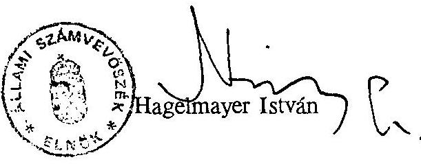

---

# 1. sz. melléklet 

Az ÁVÜ rendelkezésére álló források részletezése

|  |  |  |  |  | M Ft |
| :--: | :--: | :--: | :--: | :--: | :--: |
| Forrás | 1990. | 1991. | 1992. | 1993. | $\begin{gathered} 1994 \\ \text { I.f.év } \end{gathered}$ |
| Ktgv-i támogatás Atcsop. a priv. bev-ből Saját bevétel Év végi maradvány | $\begin{array}{r} 109.7 \\ - \\ 2.4 \\ - \end{array}$ | $\begin{array}{r} 235.9 \\ - \\ 6.8 \\ 17.5 \end{array}$ | $\begin{array}{r} 247.6 \\ 358.6 \\ 26.4 \\ 2.4 \end{array}$ | $\begin{array}{r} 1.7 \\ 1350.0 \\ 46.4 \\ 2.3 \end{array}$ | $\begin{array}{r} 1.5 \\ 994.0 \\ 21.8 \\ 2.4 \end{array}$ |
| Összesen | 112.1 | 260.2 | 635.0 | 1400.4 | 1019.7 |
| Kiegészítő források PHARE USAID | - | $\begin{array}{r} 46.2 \\ 12.3 \end{array}$ | $\begin{array}{r} 27.5 \\ 10.3 \end{array}$ | $\begin{array}{r} 121.5 \\ - \end{array}$ | - |
| Együtt | 112.1 | 318.7 | 672.8 | 1521.9 | 1019.7 |
| Források a privatizációs bevételek \%-ában | 16.0 | 1.0 | 0.9 | 1.95 | 2.4 |

---

# ÖSSZESÍTŐ KIMUTATÁS 

az 1990. március - 1994. június 30. közötti időszakban kihelyezett (lekötött, befektetett, alapítványba helyezett) vagyonrészekről

| Sorszám | Befektetés   helye | A kihelyezés   időpontja | A befektetés   időtartama | A kihelyezés feltételei   (kamat, lejárat, részesedés) | Kihelyezett érték   összege (Ft) |
| :--: | :--: | :--: | :--: | :--: | :--: |
|  | Citi Bank | kötvény | 1990. 08. 17. | 3+1 hó | 1.314 .445 90.11.16., 90.12.17. | 10.000 .000 |
|  | Citi Bank | kötvény | 1990. 08. 17. | $1+2,5$ hó | 891.111 90.09.17., 90.11.30. | 10.000 .000 |
|  | Citi Bank | kötvény | 1990. 11. 01. | 6 hét | 208.333 90.12.28. | 6.000 .000 |
|  | Citi Bank | kötvény | 1990. 11. 01. | 6 hét +6 hét | 384.222 91.02.01. | 14.000 .000 |
|  | Citi Bank | kötvény | 1991. 02. 12. | felbontás | 91.02.25. | 10.000 .000 |
|  |  |  |  | 2 hó | 1.137.500 91.04.18. | 20.000.000 |
|  | MNB | kincstárj. | 1993. 08. 09. | 30 nap | 1.292.000 93.09.08. | 98.708.000 |
|  |  |  | 1993. 09. 10. |  | 1.974.000 93.10.11. | 118.026.000 |
|  |  |  | 1993. 09. 24. |  | 550.500 93.10.25. | 29.449.500 |
|  |  |  | 1993. 10. 15. |  | 104.550 93.11.15. | 5.395.450 |
|  |  |  | 1993. 10. 21. |  | 1.761.000 93.11.22. | 92.239.000 |
|  |  |  | 1993. 10. 28. |  | 747.000 93.11.29. | 39.253.000 |
|  | MHB | alapítvány | 1990. 11. 02. |  |  | 10.000.000 |

z 1989. évi XXXVIII. számú törvény 24. § c./ pontja alapján kijelentem, hogy az összesítő kimutatásban elsorolt adatok teljesek és a vonatkozó okmányokkal mindenben megegyeznek.
elt: Budapest, 1994. szeptember 01.
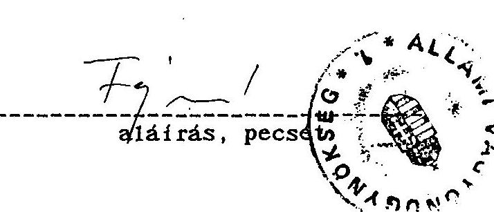

---

### 3. sz. melléklet

Bevételek alakulása 1990-1991. év

|  MEGNEVEZES | 1990. év |  |  |  |  | 1991. év |  |  |  |  |  |   |
| --- | --- | --- | --- | --- | --- | --- | --- | --- | --- | --- | --- | --- |
|   | eredet
előir. | előirányzat változás
irányító
szervi | módosított
talát hat.k.
pénzm. egyéb előir. | telj. | telj.
a mód.
% -ban | eredet
előir. | előirányzat változás
irányító szervi | módosított
talát hat.k.
pénzm. egyéb | telj. | telj.
a mód.
% -ban |  |   |
|  1. Saját bev. (működési
ár és díjbevétel) |  |  |  |  |  |  |  |  |  |  |  |   |
|  2. Költségvetési tám. | 126,2 |  | 126,2 | 109,7 | 86,9 | 237,9 | -2,0 |  | 2,7 | 2,7 | 2,7 | 100,0  |
|  3. Átvett pénzeszk. |  |  |  |  |  |  |  |  |  | 236,9 | 235,9 | 100,0  |
|  4. Előző évi pénzmar.
igénybevétele |  |  |  |  |  |  |  |  |  | 14,6 | 14,6 | 14,6  |
|  5. Egyéb bevétel
(6-(1+2+3+4) |  |  | 2,4 | 2,4 | 2,4 | 100,0 |  |  |  |  |  |   |
|  6. Bev. összesen | 126,2 |  | 2,4 | 128,6 | 112,1 | 87,2 | 237,9 | -2,0 | 3,5 | 17,3 | 256,7 | 256,7  |

Megjegyzés: Bevételek összesen: kiegyenlítő, függő, átfutó és letéti bevételek nélküli adat.

1. sor = 1990-1991-ben költségvetési beszámoló 2105 űrlap 4. sorának megfelelő
2. sor = 1990-1991-ben költségvetési beszámoló 2105 űrlap 14+15+16 sorának megfelelő
3. sor = 1990-1991-ben költségvetési beszámoló 2105 űrlap 17. sorának megfelelő

Kelt: Budapest, 1994. szeptember 01.

1990-ben a tárcafüzet szerint 16.449 e Ft gazdálkodási tartalék keletkezett, amelyről a központi költségvetés javára az ÁVÜ lemondott.

126.185 e Ft módosított el. 109.736 e Ft teljesítés

16.449 e Ft eltérés

1991-ben az eredeti előirányzat a felújítási előirányzatot is tartalmazza.

Aláírás, peccét

---

3/a. sz. melléklet

Bevételek alakulása 1992-1993. években

|  MEGNEVEZES | 1992. év |  |  |  |  |  | 1993. év |  |  |  |  |   |
| --- | --- | --- | --- | --- | --- | --- | --- | --- | --- | --- | --- | --- |
|   | Ere-
deti irányító szervi saját hatáskörü | Hődo- | Telj. | Telj. |  |  |  | előlányzat változás |  | Hődo- | Telj. | Telj.  |
|   |  |  |  |  |  |  |  |  |  |  |  |   |
|   |  |  |  |  |  |  |  |  |  |  |  |   |
|   |  |  |  |  |  |  |  |  |  |  |  |   |
|   |  |  |  |  |  |  |  |  |  |  |  |   |
|   |  |  |  |  |  |  |  |  |  |  |  |   |
|   |  |  |  |  |  |  |  |  |  |  |  |   |
|   |  |  |  |  |  |  |  |  |  |  |  |   |
|   |  |  |  |  |  |  |  |  |  |  |  |   |
|   |  |  |  |  |  |  |  |  |  |  |  |   |
|   |  |  |  |  |  |  |  |  |  |  |  |   |
|   |  |  |  |  |  |  |  |  |  |  |  |   |
|   |  |  |  |  |  |  |  |  |  |  |  |   |
|   |  |  |  |  |  |  |  |  |  |  |  |   |
|   |  |  |  |  |  |  |  |  |  |  |  |   |
|   |  |  |  |  |  |  |  |  |  |  |  |   |
|   |  |  |  |  |  |  |  |  |  |  |  |   |
|   |  |  |  |  |  |  |  |  |  |  |  |   |
|   |  |  |  |  |  |  |  |  |  |  |  |   |
|   |  |  |  |  |  |  |  |  |  |  |  |   |
|   |  |  |  |  |  |  |  |  |  |  |  |   |
|   |  |  |  |  |  |  |  |  |  |  |  |   |
|   |  |  |  |  |  |  |  |  |  |  |  |   |
|   |  |  |  |  |  |  |  |  |  |  |  |   |
|   |  |  |  |  |  |  |  |  |  |  |  |   |
|   |  |  |  |  |  |  |  |  |  |  |  |   |
|   |  |  |  |  |  |  |  |  |  |  |  |   |
|   |  |  |  |  |  |  |  |  |  |  |  |   |
|   |  |  |  |  |  |  |  |  |  |  |  |   |
|   |  |  |  |  |  |  |  |  |  |  |  |   |
|   |  |  |  |  |  |  |  |  |  |  |  |   |
|   |  |  |  |  |  |  |  |  |  |  |  |   |
|   |

---

3/b. sz. melléklet

Állami Vagyonügynökség.

Bevételek alakulása 1994. I. félévben

|  |  |  |  |  | M Ft-ban |  |
| :--: | :--: | :--: | :--: | :--: | :--: | :--: |
|  |  |  | 1994. I. félév |  |  |  |
| MEGNEVEZÉS: | Eredeti irányító szervi | előirányzat változás |  | Módosított | Telj. | Telj. |
|  |  |  | saját hatáskörű |  |  | \% |
|  |  |  |  |  |  |  |
|  |  |  | |  |  |  |
| 1. Saját bevételek működ,ár- és díjb. |  |  |  | 4,4 | 4,4 | 20,0 |
| 2. Költségv-i tár. |  | 3,0 |  |  | 3,0 | 1,5 |
| 3. Átvett pénzeszk. 1800,0 |  |  |  |  | 1800,0 | 994,0 |
| 4. Előző évi pénzm. igénybevétele |  |  |  |  |  |  |
| 5. Egyéb bevétel $(6-(1+2+3+4)$ |  |  |  |  |  | 1,8 |
| 6. Bevételek össz. 1800,0 |  | 3,0 |  | 4,4 | 1807,4 | 1017,3 |

Megjegyzés: Bevételek összesen: kiegyenlítő, függő, átfutó és letéti bevételek nélküli adat.

Kelt: Budapest, 1994. szeptember 01.
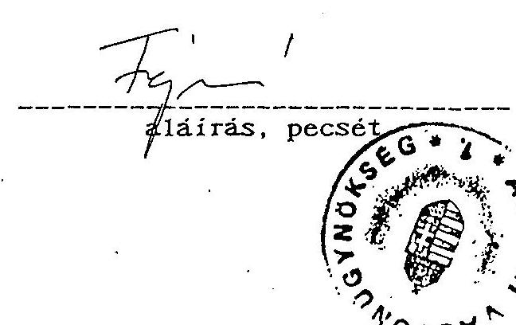

---

## 4. sz. melléklet

|  MEGNEVEZÉS | 1990. évi | 1991. évi | 1992. évi | előirányzat változás | 1992. évi teljesítés  |
| --- | --- | --- | --- | --- | --- |
|   | teljesítés | teljesítés |  |  |   |
|   |  |  |  | 1992. évi | 1991. évi  |
|   |  |  |  | 1992. évi | 1991. évi  |
|   |  |  |  | 1992. évi | 1991. évi  |
|   |  |  |  | 1992. évi | 1991. évi  |
|   |  |  |  | 1992. évi | 1991. évi  |
|   |  |  |  | 1992. évi | 1991. évi  |
|  1. | Béralap | 24,6 | 118,3 | 160,0 | 116,4  |
|  2. | Bérjellegű kiadás | 5,9 | 9,4 | 7,4 | 3,1  |
|   | Ebből: |  |  |  |   |
|   | 3/a -jutalom pénzmar-ból |  |  |  |   |
|   | 2/b -bef. kiküld. | 0,4 | 0,3 | 0,3 |   |
|   | 2/c -külf. kiküld. | 3,7 | 4,4 | 2,4 |   |
|   | 2/d -kereset és kieg. tér. | 0,1 | 1,0 | 1,7 |   |
|   | 2/e -reprezentáció | 1,1 | 0,4 | 1,0 |   |
|   | 2/f -végkielégítés |  |  |  |   |
|  3. | Készletbeszerzés | 6,5 | 15,7 | 9,0 | 0,5  |
|   | Ebből: |  |  |  |   |
|   | 3/a -tüzelő, hajtó és kenőanyag | 0,4 | 1,6 | 1,7 | 0,3  |
|   | 3/b -irodaszer, nyom. | 0,6 | 5,4 | 4,4 |   |
|   | 3/c -könyv, folyóirat | 0,6 | 1,3 | 1,0 |   |
|   | 3/d -munkaruha, védőr. |  |  |  |   |
|  4. | Szolgáltatás | 11,8 | 27,4 | 15,9 | 33,8  |
|   | Ebből: |  |  |  |   |
|   | 4/a -energia |  |  |  |   |
|   | 4/b -szállítás | 0,3 |  |  |   |
|   | 4/c -közműdíj |  |  |  |   |
|   | 4/d -postai szolgált. | 0,8 | 6,6 | 2,3 | 9,8  |
|   | 4/e -nagyért, tárgyi | 0,1 | 1,3 | 1,4 | 6,0  |
|  5. | Különféle kiad. és bef. Ebből: | 17,9 | 60,7 | 72,7 | 144,4  |
|   | 5/a -TB járulék | 10,0 | 50,1 | 68,0 | 52,1  |
|   | 5/b -vásárolt termékek |  |  |  |   |
|   | AFA-ja | 7,7 | 10,6 | 3,8 | 7,7  |
|  6. | Kamatfizetések |  |  |  |   |
|  7. | Felhalm. és tőkés kiad. Ebből: | 15,9 | 19,8 | 5,0 | 35,0  |
|   | 7/a -felújítás | 10,2 | 18,8 | 5,0 | 24,0  |
|   | 7/b -tárgyi eszk. föld és immat. javak felhalm. egyéb folyó átut. | 5,7 | 1,0 |  | 11,0  |
|  8. | Támogatások, elvonások | 26,0 | 3,0 | 1,0 | 1,0  |
|   | 8/a Ebből: átadott pénzek | 14,0 |  |  |   |
|   | 8/b ebből: alapítv. tám. | 10,0 |  |  |   |
|  9. | Pénzforg. nélküli kiad. |  |  |  |   |
|   | 9/a Ebből: tartalék |  |  |  |   |
|  10. | Működési célú hitel visszafizetés |  |  |  |   |
|  11. | Fejlesztési célú hitel visszafizetés |  |  |  |   |
|  12. | Kiadások összesen (kiegyenülő, függő, átfutó és letéti nélkül) | 108,6 | 254,3 | 271,0 | 348,7  |
|   | Megjegyzés: A tanuelltványt az 1992. 1993. és 1994. évi költségvetés. illetve az 1992. és 1993. évi beszámoló 65 űrlapja figyelembevételével kérjük kitölteni. |  |  |  |   |
|   | 11. sor=65/10 sor: 2. sor=65/20 sor: 2/a. sor=65/12 sor: 2/b. sor=65/13 sor: 2/c. sor=65/14 sor: 2/d. sor=65/17 sor: 2/a. sor=65/17 sor: 2/f. sor=65/18 sor: 3. sor=65/20 sor: 3/a. sor=65/23 sor: 3/b. sor=65/24 sor: 3/c. sor=65/26 sor: 3/d. sor=65/27 sor: 4. sor=65/36 sor: 4/a. sor=65/30 sor: 4/b. sor=65/31 sor: 4/c. sor=65/32 sor: 4/f. sor=65/33 sor: 5. sor=65/46 sor: 5/a. sor=65/39. sor: 5/b. sor=65/44 sor: 6. sor=65/48 sor: 7. sor=65/73 sor: 7/a. sor=65/72 sor: 7/b. sor=65/94. sor: 8. sor=65/108 sor: 8/b. sor=65/99. sor: 9. sor=65/113 sor: 9/a. sor=65/111 sor: 10. sor=65/114 sor: 11. sor=65/115. sor: 12. sor=116. sor=116. sor) |  |  |  |   |
|  Kelt: | Budapest, 1994. szeptember 01. |  |  |  |   |
|   | * 1990-ben a kötvények visszavásárlása 1991-re húzódott át. |  |  |  |   |
|   | ** Az 5/b. tartalmazza a tárgyi eszk., immateriális javak előzetes AFAját is. |  |  |  |   |
|   | ** 6. pont tartalmazza a lakásközlcsőnt és a kötvény vásárlást |  |  |  |   |

---

Állami Vagyonügynökség

Kiadások alakulása 1993. évben

|  MEGNEVEZÉS | 1993. évi előirányzat változás |  |  |  |  |  |  | 1993. évi teljesítés |  |  |   |
| --- | --- | --- | --- | --- | --- | --- | --- | --- | --- | --- | --- |
|   | EREDETI | IRÁNYÍTÓSZERVI |  | SAJÁT HATÁSKÖRBEH |  | MOD. TELJ. | a mód. | 1990. évi | 1991. évi | 1992. évi |   |
|   | ELŐIR. | OGY | Kormány | Felügy. | Ktgv. | Vállalk. | Egyéb | ELŐIR. | X-ában | telj. | telj.  |
|   |  |  |  | szerv | tartalékból |  |  |  | X-ában | X-ában | X-ában  |
|  1. Béralap | 202,0 | 1,2 |  |  | -19,2 | 689,0 | 687,3 | 99,8 | 2293,9 | 581,0 | 268,5  |
|  2. Bérjellegű kiadás | 35,0 |  |  |  | -13,4 | -21,6 | 21,6 | 100,0 | 366,1 | 229,8 | 116,1  |
|  Ebből: |  |  |  |  |  |  |  |  |  |  |   |
|  2/a -jutalom pénzmar-ból | 0,5 |  |  |  | -0,1 | 0,4 | 0,4 | 100,0 | 100,0 | 133,3 | 100,0  |
|  2/b -bélf. kiküld | 10,8 |  |  |  | -6,5 | 4,3 | 4,3 | 100,0 | 116,2 | 97,7 | 54,9  |
|  2/c -külf. kiküld | 9,9 |  |  |  | -2,0 | 7,9 | 7,9 | 100,0 | 7900,0 | 790,0 | 197,5  |
|  2/d -kereset és ktg. tér. | 9,9 |  |  |  | -0,3 | 1,6 | 1,6 | 100,0 | 145,5 | 400,0 | 133,3  |
|  2/e -reprezentáció | 1,9 |  |  |  | 1,0 | 1,0 | 1,0 | 100,0 |  |  |   |
|  2/f -végkielégítés |  |  |  |  | -1,0 | 43,7 | 43,7 | 100,0 | 672,3 | 278,3 | 96,0  |
|  3. Készletbeszerzés | 44,7 |  |  |  |  |  |  |  |  |  |   |
|  Ebből: |  |  |  |  |  |  |  |  |  |  |   |
|  3/a -tüzelő. hajtó és kenőanyag | 4,1 |  |  |  | -0,4 | 3,7 | 3,7 | 100,0 | 925,0 | 231,3 | 137,0  |
|  3/b -irodaszer, nyomt. | 9,8 |  |  |  | 3,4 | 13,2 | 13,2 | 100,0 | 2200,0 | 244,4 | 134,7 |
| 3/c -könyv. folyóirat | 3,7 | | | | -0,5 | 3,2 | 3,2 | 100,0 | 533,3 | 246,2 | 91,4 |
| 3/d -munkaruha. védőr. | 18,0 | | | | -1,6 | 16,4 | 16,4 | 100,0 | | | 153,4 |
| 4. Szolgáltatás | 95,6 | | | | 33,6 | 129,2 | 129,2 | 100,0 | 1094,9 | 471,5 | 165,6 |
| Ebből: | | | | | | | | | | | |
| 4/a -energia | 3,5 | | | | 2,0 | 5,5 | 5,5 | 100,0 | | 305,6 | 183,3 |
| 4/b -szállítás | 1,3 | | | | -0,1 | 1,2 | 1,2 | 100,0 | 400,0 | | 92,3 |
| 4/c -közműdíj | 0,5 | | | | -0,1 | 0,4 | 0,4 | 100,0 | | | 133,3 |
| 4/d -pustal szolgált. | 12,2 | | | | 19,9 | 37,1 | 37,1 | 100,0 | 4637,5 | 562,1 | 242,5 |
| 4/e -begyért. tárgyi | 21,7 | | | | 13,9 | 35,6 | 35,6 | 100,0 | 35000,0 | 2738,5 | 174,5 |
| 5. Különféle kiad. és bef. | 357,7 | | | | 55,7 | 413,4 | 412,6 | 99,8 | 2305,0 | 679,7 | 229,0 |
| Ebből: | | | | | | | | | | | |
| 5/a -TB járulék | 311,0 | 0,5 | | | -1,5 | 310,0 | 309,3 | 99,8 | 3093,0 | 617,4 | 306,2 |
| 5/b -vásárolt termékek | | | | | | | | | | | |
| AFA-ja | 45,0 | | | | 10,0 | 55,0 | 55,0 | 100,0 | 714,3 | 518,9 | 151,1 |
| 6. Kamatfizetések | | | | | | | | | | | |
| 7. Felhalm. és tőkén kiad. | 102,0 | | | | -4,1 | 92,3 | 92,3 | 100,0 | 580,5 | 466,2 | 189,9 |
| Ebből: | | | | | | | | | | | |
| 7/a -felújítás | 97,0 | | | | -40,8 | 56,2 | 56,2 | 100,0 | 551,0 | 298,9 | 181,9 |
| 7/b -tárgyi eszk. föld és immat. javak felhalm. egyéb folyó átut. | 5,0 | | | | 31,0 | 36,0 | 36,0 | 100,0 | 631,6 | 3600,0 | 206,9 |
| 8. Támogatások. elvonások | | | | | | | | | | | |
| 8/a Ebből: átadott pénzek | 8,0 | | | | -2,4 | 11,2 | 11,2 | 100,0 | 43,8 | 373,3 | 189,8 |
| 8/b Ebből: alapítv. tám. | | | | | 0,4 | 0,4 | 0,4 | 100,0 | | | |
| 9. Pénzforg. nélküli kiad. | | | | | | | | | | | |
| 9/a Ebből: tartalék | | | | | | | | | | | |
| 10. Működési célú hitel vf. | | | | | | | | | | | |
| 11. Fejlesztési célú hitel visszafizetés | | | | | | | | | | | |
| 12. Kiadások összesen (klegyenlítő.függő. átfutó és letéti nélkül) | 1350,0 | 1,7 | | | 48,7 | 1400,4 | 1397,9 | 99,8 | 1287,2 | 549,7 | 220,9 |

Megjegyzés: A tanusítványt az 1992. 1993. és 1994. évi költségvetés, illetve az 1992. és 1993. évi beszámoló 65 Grlapja figyelembe vételével kérjük kitölteni.

1. sor=65/10.sor: 2. sor=65/20.sor: 2/a. sor=65/12.sor: 2/b. sor=65/13.sor: 2/c. sor=65/14.sor: 2/d. sor=65/17.sor: 2/e. sor=65/17.sor: 2/f. sor=65/18.sor: 3. sor=65/29. sor: 3/a. sor=65/23.sor: 3/b. sor=65/24.sor: 3/c. sor=65/26.sor: 3/d. sor=65/27.sor: 4. sor=65/38. sor: 4/a. sor=65/30.sor: 4/b. sor=65/31 sor: 4/c. sor=65/33.sor: 4/d. sor=65/34. sor: 4/e. sor=65/36. sor: 4/f. sor=65/35. sor: 5. sor=65/46.sor: 5/a. sor=65/39. sor: 5/b. sor=65/44.sor: 6. sor=65/48.sor: 7. sor=65/73.sor: 7/a. sor=65/72.sor: 7/b. sor=65/54. sor: 8. sor=65/108.sor: 8/b. sor=65/99. sor: 9. sor=65/113.sor: 9/a. sor=65/111.sor: 10. sor=65/114.sor: 11. sor=65/115. sor: 12. sor=118. sor=116. sor:

* Az 5/b. tartalmazza a tárgyi eszk., immateriális javak előzetes AFA-ját is. * * 8. pont tartalmazza a lakáskölcsönt

Kelt: Bvörvst. 1994. szeptember 01.

---

### 4/b. sz. melléklet

| MEGNEVEZES | | 1994. I. félévi | előirányzat változás | | | | | | 1994. I. félévi teljesítés | | | | |
| --- | --- | --- | --- | --- | --- | --- | --- | --- | --- | --- | --- | --- | --- |
| | | EREDETI | IRÁNYÍTÓSZERVI | | SAJÁT HATÁSKÖRBÉN | | MOD. TELJ. | a mód. 1990. évi 1991. évi | | 1992. évi 1993. évi | | | |
| | | ELOIR. | OGY | Kormány | Felügy. | Ktgv. | Vállalk. | Egyéb ELOIR. | X-ában | | | | |
| | | | | | szerv | tartalékból | | | | X-ában | | X-ában | X-ában |
| 1. | Béralap | 707,0 | 2,1 | | | | 709,1 | 332,4 | 46,9 | 1351,2 | 281,0 | 129,8 | 48,4 |
| 2. | Bérjellegű kiadás | 35,0 | | | | | 35,0 | 14,8 | 42,3 | 250,8 | 157,4 | 79,6 | 68,5 |
| | Ebből: | | | | | | | | | | | | |
| 2/a | -jutalom pénzmar-ból | 0,5 | | | | | 0,5 | | | | | | |
| 2/b | -bélf. kiküld. | 10,8 | | | | | 10,8 | 3,9 | 36,1 | 105,4 | 88,6 | 49,4 | 90,7 |
| | 2/d -kereset és bég. tér. | 9,9 | | | | | 9,9 | 6,0 | 60,6 | 6000,0 | 600,0 | 100,0 | 79,9 |
| 2/a | -reprezentáció | 1,9 | | | | | 1,9 | 0,9 | 47,4 | 81,8 | 225,0 | 75,0 | 56,2 |
| 2/f | -végkialégítés | | | | | | | | | | | | |
| 3. | Készletbeszerzés | 114,3 | | | | | 114,3 | 47,2 | 41,3 | 726,2 | 300,6 | 103,7 | 108,0 |
| | Ebből: | | | | | | | | | | | | |
| 3/a | -tűzelő. hajtó és benőanyag | 7,1 | | | | | 7,1 | 2,2 | 31,0 | 560,0 | 137,5 | 81,5 | 59,5 |
| 3/b | -irodaszer. nyomt. | 16,6 | | | | | 16,6 | 13,9 | 106,5 | 2983,3 | 331,2 | 180,5 | 130,6 |
| 3/c | -könyv. folyóirat | 5,0 | | | | | 5,0 | 0,4 | 58,0 | 586,2 | 261,5 | 50,1 | 100,3 |
| 3/d | -munkaruha. védőr. | 26,0 | | | | | 26,0 | 19,6 | 75,4 | | | 183,2 | 119,5 |
| 4. | Szolgáltatás | 166,0 | | | | | 166,0 | 111,6 | 67,2 | 945,8 | 407,3 | 143,1 | 86,4 |
| | Ebből: | | | | | | | | | | | | |
| 4/a | -energia | 17,3 | | | | | 17,3 | 12,1 | 69,9 | | 672,2 | 403,3 | 220,0 |
| 4/b | -szállítás | 1,5 |
 |  |  |  | 1,5 | 0,7 | 46,2 | 233,3 |  | 53,8 | 50,3  |
|  4/c | -közműdíj | 1,5 |  |  |  |  | 1,5 | 1,0 | 66,7 |  |  | 531,3 | 250,0  |
|  4/d | -postai szolgált. | 42,2 |  |  |  |  | 42,2 | 25,1 | 59,5 | 3137,5 | 300,3 | 164,1 | 67,7  |
|  4/a | -nagyért. tárgyi | 46,7 |  |  |  |  | 46,7 | 33,4 | 71,5 | 33400,0 | 2569,2 | 163,7 | 93,8  |
|  5. | Különféle kiad. és bef. |  |  |  |  |  |  |  |  |  |  |  |   |
|   | Ebből: | 459,7 |  |  |  |  | 4,4 | 465,0 | 225,2 | 48,4 | 1258,1 | 371,0 | 125,0  |
|   | 5a -TB járulék | 311,0 |  |  |  |  | 311,0 | 154,7 | 49,6 | 1547,0 | 308,8 | 153,2 | 50,0  |
|   | 5b -vásárolt termékek |  |  |  |  |  |  |  |  |  |  |  |   |
|   | ÁFA-ja | 147,0 |  |  |  |  | 147,0 | 64,8 | 44,1 | 841,6 | 611,3 | 178,0 | 117,8  |
|  6. | Kamatfizetések |  |  |  |  |  | 0,1 |  |  |  |  |  |   |
|  7. | Felhalm. és tőkés kiad. |  |  |  |  |  |  |  |  |  |  |  |   |
|   | Ebből: | 310,0 |  |  |  |  | 310,0 | 139,6 | 45,0 | 878,0 | 705,0 | 267,2 | 151,2  |
|  7/a | -felújítás | 97,0 |  |  |  |  | 97,0 | 56,9 | 58,7 | 557,8 | 302,7 | 184,1 | 101,2  |
|  7/b | -tárgyi eszk. föld és immat. javak felhalm. |  |  |  |  |  |  |  |  |  |  |  |   |
|   | egyéb folyó átut. | 213,0 |  |  |  |  | 213,0 | 79,2 | 37,2 | 1389,5 | 7920,0 | 455,2 | 220,0  |
|  8. | Támogatások. elvonások | 8,0 |  |  |  |  | 8,0 | 11,5 | 143,8 | 44,2 | 383,3 | 194,9 | 102,7  |
|  8/a | Ebből: átadott pénzek |  |  |  |  |  |  |  |  |  |  |  |   |
|  8/b | Ebből: alapítv. tám. |  |  |  |  |  |  |  |  |  |  |  |   |
|  9. | Pénzforg. nélküli kiad. |  |  |  |  |  |  |  |  |  |  |  |   |
|  9/a | Ebből: tartalék |  |  |  |  |  |  |  |  |  |  |  |   |
|  10. | Működési célú hitel vf. |  |  |  |  |  |  |  |  |  |  |  |   |
|  11. | Fejlesztési célú hitel visszafizetés |  |  |  |  |  |  |  |  |  |  |  |   |
|  12. | Kiadások összesen (kiegyenlítő függő átfutó és letéti nélkül) | 1000,0 |  |  |  |  |  |  |  |  |  |  |   |
|   |  | 3,0 |  |  |  |  |  |  |  |  |  |  |   |
|   |  |  |  |  |  |  |  |  |  |  |  |  | 4,4  |
|   |  |  |  |  |  |  |  |  |  |  |  |  | 1807,4  |
|   |  |  |  |  |  |  |  |  |  |  |  |  | 874,9  |
|   |  |  |  |  |  |  |  |  |  |  |  |  | 48,4  |
|   |  |  |  |  |  |  |  |  |  |  |  |  | 805,6  |
|   |  |  |  |  |  |  |  |  |  |  |  |  | 344,0  |
|   |  |  |  |  |  |  |  |  |  |  |  |  | 138,3  |
|   |  |  |  |  |  |  |  |  |  |  |  |  | 62,6  |
|   |  |  |  |  |  |  |  |  |  |  |  |  | 1807,4  |
|   |  |  |  |  |  |  |  |  |  |  |  |  | 138,3  |
|   |  |  |  |  |  |  |  |  |  |  |  |  | 62,6  |
|   |  |  |  |  |  |  |  |  |  |  |  |  | 1807,4  |
|   |  |  |  |  |  |  |  |  |  |  |  |  | 138,3  |
|   |  |  |  |  |  |  |  |  |  |  |  |  | 62,6  |
|   |  |  |  |  |  |  |  |  |  |  |  |  | 1807,4  |
|   |  |  |  |  |  |  |  |  |  |  |  |  | 138,3  |
|   |  |  |  |  |  |  |  |  |  |  |  |  | 62,6  |
|   |  |  |  |  |  |  |  |  |  |  |  |  | 1807,4  |
|   |  |  |  |  |  |  |  |  |  |  |  |  | 138,3  |
|   |  |  |  |  |  |  |  |  |  |  |  |  | 62,6  |
|   |  |  |  |  |  |  |  |  |  |  |  |  | 1807,4  |
|   |  |  |  |  |  |  |  |  |  |  |  |  | 138,3  |
|   |  | 
 |  |  |  |  |  |  |  |  |  |  | 62,6  |
|   |  |  |  |  |  |  |  |  |  |  |  |  | 1807,4  |
|   |  |  |  |  |  |  |  |  |  |  |  |  | 138,3  |
|   |  |  |  |  |  |  |  |  |  |  |  |  | 62,6  |
|   |  |  |  |  |  |  |  |  |  |  |  |  | 1807,4  |
|   |  |  |  |  |  |  |  |  |  |  |  |  | 138,3  |
|   |  |  |  |  |  |  |  |  |  |  |  |  | 138,3  |
|   |  |  |  |  |  |  |  |  |  |  |  |  | 138,3  |
|   |  |  |  |  |  |  |  |  |  |  |  |  | 138,3  |
|   |  |  |  |  |  |  |  |  |  |  |  |  | 138,3  |
|   |  |  |  |  |  |  |  |  |  |  |  |  | 138,3  |
|   |  |  |  |  |  |  |  |  |  |  |  |  | 138,3  |
|   |  |  |  |  |  |  |  |  |  |  |  |  | 138,3  |
|   |  |  |  |  |  |  |  |  |  |  |  |  | 138,3  |
|   |  |  |  |  |  |  |  |  |  |  |  |  | 138,3  |
|   |  |  |  |  |  |  |  |  |  |  |  |  | 138,3  |
|   |  |  |  |  |  |  |  |  |  |  |  |  | 138,3  |
|   |  |  |  |  |  |  |  |  |  |  |  |  | 138,3  |
|   |  |  |  |  |  |  |  |  |  |  |  |  | 138,3  |
|   |  |  |  |  |  |  |  |  |  |  |  |  | 138,3  |
|   |  |  |  |  |  |  |  |  |  |  |  |  | 138,3  |
|   |  |  |  |  |  |  |  |  |  |  |  |  | 138,3  |
|   |  |  |  |  |  |  |  |  |  |  |  |  | 138,3  |
|   |  |  |  |  |  |  |  |  |  |  |  |  | 138,3  |
|   |  |  |  |  |  |  |  |  |  |  |  |  | 138,3  |
|   |  |  |  |  |  |  |  |  |  |  |  |  | 138,3  |
|   |  |  |  |  |  |  |  |  |  |  |  |  | 138,3  |
|   |  |  |  |  |  |  |  |  |  |  |  |  | 138,3  |
|   |  |  |  |  |  |  |  |  |  |  |  |  | 138,3  |
|   |  |  |  |  |  |  |  |  |  |  |  |  | 138,3  |
|   |  |  |  |  |  |  |  |  |  |  |  |  | 138,3  |
|   |  |  |  |  |  |  |  |  |  |  |  |  | 138,3  |
|   |  |  |  |  |  |  |  |  |  |  |  |  | 138,3  |
|   |  |  |  |  |  |  |  |  |  |  |  |  | 138,3  |
|   |  |  |  |  |  |  |  |  |  |  |  |  | 138,3  |
|   |  |  |  |  |  |  |  |  |  |  |  |  | 138,3  |

---

Állami Vagyonügynökség

Állományi létszám alakulása 1990-1994. I. félév

|  Megnevezés | 1990. |  | 1991. |  | 1992. |  |  | 1993. |  |  | 1994. I. fév |  |   |
| --- | --- | --- | --- | --- | --- | --- | --- | --- | --- | --- | --- | --- | --- |
|   | előir. | tény | előir. | tény | előir. | tény |  | előir. | tény |  | előir. | tény |   |
|  vezetők | 3 | 14 | 13 | 26 | 33 | 39 | 48 | 72 | 65 | 63 | 66 | 56 | 63  |
|  ügyintézők | 38 | 26 | 73 | 63 | 120 | 92 | 127 | 247 | 183 | 201 | 209 | 192 | 208  |
|  ügyv. alk. | 11 | 14 | 44 | 24 | 100 | 80 | 61 | 69 | 105 | 83 | 117 | 88 | 89  |
|  fizikai | 5 | 2 | 7 | 5 | 9 | 5 | 8 | 12 | 5 | 8 | 8 | 5 | 8  |
|  összesen: | x 57 | 56 | 137 | 118 | x 262 | 116 | 244 | 400. | 358 | 355 | 400 | 341 | 368  |

1t: Budapest, 1994. szeptember 01.

x 1990. és 1992. éves előirányzat a szervezetfejlesztéseket tartalmazza. (Módosított előirányzat)

32.

---

# Az Állami Vagyonügynökség munkaerőmozgása 1990-1994. I. félév között 

| Megnevezés |  | 1990. | 1991. | 1992. | 1993. | 1994.I.félév |
| :--: | :--: | :--: | :--: | :--: | :--: | :--: |
| Vezető | kilépés | 1 | 4 | 7 | 11 | 24 |
|  | belépés | 12 | 8 | 29 | 8 | 6 |
| Ügyintéző | kilépés | 1 | 15 | 26 | 56 | 23 |
|  | belépés | 58 | 54 | 117 | 82 | 17 |
| Ügyviteli alkalmazott | kilépés | 4 | 4 | 18 | 18 | 14 |
|  | belépés | 24 | 20 | 59 | 42 | 14 |
| Egyéb alkalmazott | kilépés | 4 | 0 | 1 | 1 | 1 |
|  | belépés | 12 | 4 | 3 | 4 | 2 |
| AVÜ összesen | kilépés | 10 | 23 | 52 | 86 | 62 |
|  | belépés | 106 | 86 | 208 | 136 | 39 |
| AVÜ tényleges átlaglétszáma |  | 56 | 128 | 244 | 355 | 364 |
| A fluktuáció (munkaerőváltás mértéke \%-ban |  | 207 | 85 | 107 | 63 | 28 |

---

# Bérkiadás alakulása 1990-1994. I. félév 

M Ft-ban

| Megnevezés | 1990. |  | 1991. |  | 1992. |  |  | 1993. |  |  | 1994. I. fév |  |
| :--: | :--: | :--: | :--: | :--: | :--: | :--: | :--: | :--: | :--: | :--: | :--: | :--: |
|  | elöl. mód. el telj. elöl. mód. el telj. elöl. mód. el telj. elöl. mód. el telj. elöl. mód. el telj. |
| 1. Teljes m. idős foglalk. bére |  |  |  | 107,5 | 182,7 | 169,4 | 517,2 | 395,9 | 394,2 | 530,0 | 532,1 | 256,5 |
| 2. Részmunkaidős foglalk. bére |  |  |  |  |  | 0,4 | 0,4 | 1,2 | 1,2 | 2,0 | 2,0 | 1,3 |
| 3. Nyugdíjasok bére |  |  |  | 4,6 | 4,6 | 6,4 | 10,2 | 13,0 | 13,0 | 13,0 | 13,0 | 7,5 |
| 4. Másod- és mellékfogl. bére |  |  |  |  |  |  |  |  |  |  |  |  |
| 5. Megbízási díj |  |  |  | 40,6 | 79,1 | 0,4 | 2 | 0,3 | 0,3 | 0,3 | 0,3 | 0,3 |
| 5.a Jutalám |  |  |  |  |  |  |  | 265,9 | 265,9 | 150,0 | 150,0 | 61,0 |
| 5. Összes állományi bér: |  |  |  | 152,7 | 266,4 | 246,1 | 695,0 | 676,3 | 674,6 | 695,3 | 697,4 | 326,6 |
| 7. Állományon kívüli bér: |  |  |  | 7,3 | 7,3 | 9,9 | 12,0 | 12,7 | 12,7 | 11,7 | 11,7 | 5,8 |
| 8. Béralap mindössz: | 24,8 | 24,6 | 137,6 | 120,7 | 118,3 | 160,0 | 273,7 | 256,0 | 707,0 | 689,0 | 687,3 | 707,0 |
| Kelt: Budapest, 1994. szeptember 01. |  |  |  |  |  |  |  |  |  |  |  |  |

1990-ben és 1991-ben a számvitel és a pénzügy a béralapot nem a fentiek szerint bontotta.
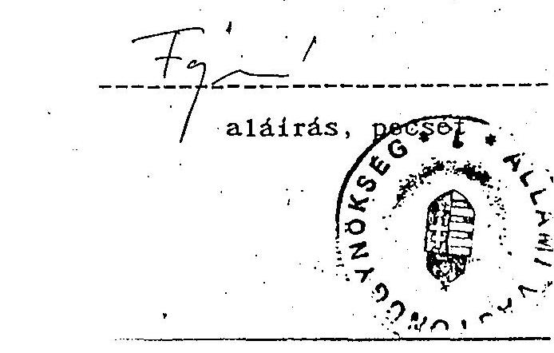

---

# Egy főre jutó havi intézményi átlagjövedelmek alakulása munkaköri csoportonként 1992-1994. I. félév közötti időszakban 

| Munkaköri csoportok | 1992. |  |  | 1993. |  |  | 1994. I. félév |  |  | Jöv. növekmény $\%$-a |
| :--: | :--: | :--: | :--: | :--: | :--: | :--: | :--: | :--: | :--: | :--: |
|  | Alapbér+bér-   jellegű pótlék | Jutalom | Összesen | Alapbér+bér-   jellegű pótlék | Jutalom | Összesen | Alapbér+bér-   jellegű pótlék | Jutalom | Összesen |  |
| Vezetők | 139,3 | 61,4 | 200,7 | 183,6 | 133,7 | 317,3 | 228,4 | 64,9 | 293,3 | 146 |
| Ügyintézők | 62,8 | 28,4 | 91,2 | 94,3 | 60,5 | 154,8 | 109,1 | 23,1 | 132,2 | 145 |
| Ügyviteliek és fizikaiak | 32,3 | 5,9 | 38,2 | 47,0 | 23,0 | 70,0 | 74,7 | 13,3 | 88,0 | 230 |
| Összesen | 63,8 | 25,2 | 89,0 | 97,8 | 63,7 | 161,5 | 120,5 | 27,7 | 148,2 | 167 |

## Megjegyzés

1993-1994. évekre készült jutalom adatok nem az e címen fizetett teljes összeget, hanem annak költség nélkül, "szabadon" felhasznált részét tartalmazzák.

---

# 9. sz. melléklet 

## Az eszközök állományának évenkénti növekedése

| Megnevezés | 1991. | 1992. | 1993. | 1994I.fév | Összesen |
| :--: | :--: | :--: | :--: | :--: | :--: |
| Immateriális javak | - | 2,3 | 3,1 | 17,4 | 22,8 |
| Ingatlan | - | 31,2 | 58,1 | 56,9 | 146, 2 |
| Gépek, berendezések | 23,4 | 22,6 | 72,0 | 85,6 | 203, 6 |
| Jármű | 0,8 | 7,6 | 24,0 | 7,4 | 39,8 |
| Összesen | 24, 2 | 63,7 | 157,2 | 167,3 | 412, 4 |

---

# Az eszközök állományának növekedése forrásonként 

| Megnevezés | 1991. | 1992. | 1993. | 1994I.fév | Összesen |
| :--: | :--: | :--: | :--: | :--: | :--: |
| Saját forrásból   - M Ft   - Aránya \% | 1,0 | 48,3 | 92,2 | 131,9 | 273,4 |
|  | 3 | 76 | 59 | 79 | 66 |
| Ajándék   - M Ft   - Aránya \% | 23,2 | 15,5 | 64,9 | 35,4 | 139,0 |
|  | 97 | 24 | 41 | 21 | 34 |
| Összesen | 24, 2 | 63,8 | 157,1 | 167,3 | 412,4 |

---

(adatok e Ft-ban)

|  Tipus | Rendszám | Beszerzési |  | Futott km. | Könyv szerinti nettó érték | AFA nélkül |  | AFA-val | Eladás | Részlettizetés  |
| --- | --- | --- | --- | --- | --- | --- | --- | --- | --- | --- |
|   |  | év | ár AFA nélkül |  |  | Javítási ktig. | Értékbecslés | Eladási ár | kelte | időtartama  |
|  LADA 1500 | AHS-754 | 1990 | 260 | 19583 | 130 | 8 | 240 | 210 | 1993 | $50 \% \mathrm{kp}+50 \% \mathrm{kp} 6$ havi részlet *  |
|  LADA 1500 | AHS-755 | 1990 | 260 | 44254 | 182 | 27 | 210 | 153 | 1992 | kp.  |
|  LADA 1500 | AHS-749 | 1990 | 260 | 30168 | 182 | 146 |  | 153 | 1992 | kp.  |
|  LADA 1500 | AL 56-94 | 1990 | 259 | 29970 | 130 | 72 |  | 210 | 1993 | $50 \% \mathrm{kp}+50 \% \mathrm{kp} 6$ havi részlet  |
|  LADA 1500 | AL 56-92 | 1990 | 258 | 22772 | 181 | 71 | 220 | 160 | 1992 | kp.  |
|  HONDA OVC | ARZ-921 | 1990 | 757 | 62444 | 227 | 327 | 550 | 560 | 1994 | kp.  |
|  HONDA OVC | ARZ-922 | 1990 | 757 | 88400 | 227 | 254 | 490 | 500 | 1994 | kp.  |
|  BNW 316 | AKL-745 | 1990 | 1168 | 60440 | 818 | 87 | 990 | 756 | 1992 | kp.  |
|  Mercedes | AL 50-87 | 1990 |  | 198782 |  | 336 | 700 | 630 | 1992 | kp.  |
|  VW Golf 1.6 | DEM-018 | 1993 | 1074 | 20260 | 859 | 103 | 835 | 835 | 1994 | kp.  |
|  $x x$ | VW Golf 1.4 | DEM-020 | 1993 | 899 | 48864 | 743 | 43 | 980 | 980 | 1994  |
|   | Toyota Carina | CXU-382 | 1993 | 1091 | 38084 | 892 | 28 | 1250 | 1250 | 1994  |
|   | VW Golf 1.6 | BMZ-097 | 1991 | 802 | 37266 | 361 | 727 | 310 | 350 | 1994  |

*1 $50 \% \mathrm{kp}+3$ havi részlet pénztár befizetés +10 . havi munkabérből 3 havi levonás $A$ xx -gal jelölt két gépkocsi 1994. 11.30. napján nem került elszállításra.

Budapest, 1994, november 4.

---

# Feljegyzés 

Fejesné Pécsi Éva részére

Tárgy: Az ÁVO székhelyváltoztatásával kapcsolatban meghatározott teendők végrehajtása

A feladatnak megfelelően zártkörű megkereséssel pályáztattunk azonnali munkakezdésre kivitelezőket a Pozsonyi úti székház irodáinak felújítására.

Felhívásunkra - valószínűleg a munka megkezdésére megjelölt rövid határidő miatt - válasz nem érkezett. Ezt követően más költségvetési szervek gazdasági igazgatóságait kértük segítségül a téma megoldásában, valamint a telefonkönyv alapján próbálkoztunk több kivitelezői ajánlatot beszerezni.

Végülis a különböző megkeresésekre 3 vállalattól érkezett ajánlat, melyek kiértékelését mellékelem.

Mivel az azonnali intézkedés igénye miatt az épület teljes felmérésére nem volt mód, ezért kiválasztottunk két olyan nagyon leromlott állapotú irodahelyiséget, amelyekben a felújítási munka jellemző lesz az egész épületre.

Javasolom, hogy a mellékletként csatolt értékelést bizottság vizsgálja felül.

Budapest, 1992. április 12.
V. 1
Virág Gyuláné

---

Egységárak kiértékelése az 1992. IV. 10-én leadott árajánlatok alapján

| Megnevezés | TIMPANON | MODULOR | POLARIS |
| :--: | :--: | :--: | :--: |
| Kőműves munkák |  |  |  |
| 1) Nyílásbontás válaszfalban nm | 552.60 | 513.60 | 646.10 |
| 2) Tok körülfalazása | 423.50 | 393.80 | 495.40 |
| 3) Vakolatjavítás menyezeten nm | 353.40 | 328.70 | 413.50 |
| 4) Ajtó elhelyezés $90 / 220$ | 9253.0 | 8608.0 | 10829.0 |
| Könnyűszerkezetek |  |  |  |
| 1) Gipszkartonfal bontása nm | 274.60 | 255.50 | 308.00 |
| 2) Gipszkartonfal építése nm | 5509.60 | 5065.40 | 6108.00 |
| Burkolatok |  |  |  |
| 1) PVC és szőnyegpadló burkolat bontása nm | 34.20 | 31.80 | 39.50 |
| 2) Szőnyegpadló burk. fektetése, aljzat csiszolásával és glettelésével nm | 3327.80 | 3095.50 | 3848.20 |
| Felületképzések |  |  |  |
| 1) Menyezet glettelése és $2 x$-i műanyag festése nm | 277.0 | 256.30 | 298.20 |
| 2) Tapétázás bontása nm | 116.10 | 108.00 | 125.60 |
| 3) Tapéta készítése a felület glettelésével nm | 705.00 | 645.90 | 751.50 |
| 4) Új ajtó felületkezelése beeresztéssel, simító tapaszolás-sal $2 x$-i alap és egyszeri fedő mázolással nm | 534.10 | 496.90 | 578.10 |
| Villanyszerelés | 540000.0 | 450000.0 | 580000.0 |

A fenti egységárak értékelése alapján a szerződéskötést a MODULOR Kft-vel javaslom megkötni. tekintettel arra, hogy a vállalási határidő a legkedvezőbb. 1992. április 17. (egy hét átfutási idő).

A másik két ajánlatot adó vállalási határidőként 1992. május 25-ét. ill. június 1-ét jelölte meg.

Budapest. 1992. április 10.

---

mely készült 1992. április 15 -én az Állami Vagyonügynökség /1133 Újpesti rakpart 31-33 sz./ székházában.

Tárgy: A
 székház felújítási munkáira kiírt pályázat általános feltételeinek értékelése.

Jelen vannak: Fejesné Pécsi Éva gazdasági vezető
Király Györgyné
Virág Gyuláné
Zsámbokrétzky Olivér

Jelenlévők a pályázati felhívásra beküldött ajánlatok feltételeinek teljesítését értékelve, az alábbi sorrendet állapították meg:
1/ Egységár ajánlat
Figyelemmel az április 10-én készült egységár értékelést a sorrendiség a következő

1/ Modulor Kisszövetkezet
2/ Timpanon Kft.
3/ Polaris Kft.
2/ A folyamatos felújítási munkálatok feltételeinek is szövetése alapján,
a/ készenléti állapot
1/ Modulor Kisszövetkezet
2/ Timpanon Kft.
3/ Polaris Kft./nem nyilatkozott/
b/ garancia
1/ Modulor Kisszövetkezet
2/ Timpanon Kft. /nem értékelhető/
3/ Polaris Kft. /nem nyilatkozott/

---

# c/ kötbér feltételek 

1/ Modulor Kisszövetkezet
2/ Timpanon Kft. /nyilatkozatában a kötbér nem szerepel/
3/ Polaris Kft. /nem nyilatkozott/
d/ fővállalkozói feladatok vállalása
1/ Modulor Kisszövetkezet
2/ Timpanon Kft. /nem vállalja/
3/ Polaris Kft. /nem nyilatkozott/

## 3/ Referencia munkák ismertetése

A Modulor Kisszövetkezet beküldött referencia munkái a feltételeknek megfelelnek, a Timpanon és a Polaris Kft. referencia munkáiról nem adtak ismertetést.

## Összefoglalva

Jelenlévők megállapították, hogy a Modulor Kisszövetkezet ajánlata a felhívásnak teljeskörűen megfelel.

A konkrét felújítási munkák igényének ismeretében egyedi szerződésben bízza meg az ÁVÜ a Modulor Kisszövetkezetet a felújítási munkák végzésére, egyúttal fenntartja magának a jogot, hogy más kivitelezőket is alkalmazzon.
Jelenlévők megállapodtak abban, hogy a folyamatos munkavégzés érdekében a Modulor Kisszövetkezettel keretszerződésen belül rögzítik a felújításra vonatkozó általános feltételeket.
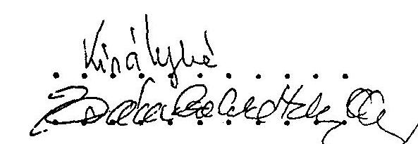

---

# JEGYZŐKÖNYV 

Felvéve 1992. április 15-én az Állami Vagyonügynökség (Budapest, 1133 Újpesti rakpart 31-33. alatti székházában.

Tárgy: Az Állami Vagyonügynökség felújítási keretének terhére végzendő munkák, költségeinek leszorítása érdekében versenyeztetett kivitelezői ajánlatok zsűrizése tárgyában.

Jelen vannak: Fejesné Pécsi Éva dr. (gazdasági vezető) mint zsűritagok: Király Györgyné Virág Gyuláné Zsámbokrétzky Olivér

Jelenlevők átvizsgálták az alábbi cégek, ajánlatait.
1.) TIMPANON Kft.
2.) POLARIS Kft.
3.) MODULOR Kft.

Megállapították, hogy egyértelműen a messze legalsóbb MODULATOR nevű céget bízzák meg a munkálatok elvégzésével. Ezt a választást támogatta az a legkevésbé elhanyagolható tény, hogy ez volt hajlandó a munkát azonnal elkezdeni, és a sürgősségre való tekintettel, akár hétvégeken is három műszakban dolgozni, sürgősségi felár nélkül.

Jelenlévők megállapították abban is, hogy sürgősség esetén, azonnali árfelhívásban dolgozó kivitelező bevonását lehetővé kell tenni.

Jelenlévők megállapodtak abban, hogy a kiválasztott kivitelező tudomására hozzák a következőket.

1.) Dolgozói reggel 8 óra előtt és 16 óra után csak abban az esetben tartózkodhatnak az épületben, amennyiben vezetőjük névsorukat, valamint az itt-tartózkodásuk kezdetét és végét írásban megadja a rendészet vezetőjének és kérelme tárgyában engedélyt kap.

---

2.) Az épületnek csak a számukra kijelölt területén tartózkodhatnak, azt el nem hagyhatják engedély nélkül.
3.) Az épület csak azon berendezéseit (pl. elektromos) használhatják, amit számukra kijelöltek.

Jelenlévők fentieket elolvasták, az abban foglaltakkal egyetértenek és egyetértésüket aláírásukkal igazolják.

Kmf.
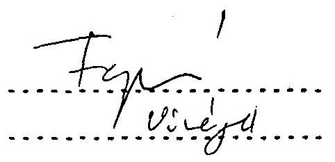
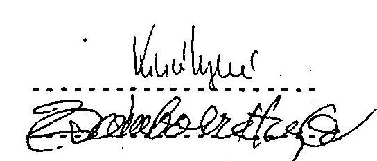

---

Keretszerződés
mely létrejött az Állami Vagyonügynökség (1136 Budapest. Pozsonyi út 56.) mint megbízó, valamint a MODULOR Építőipari és Tervező Kisszövetkezet. (2000 Szentendre. Előd u. 2.) mint vállalkozó között.

A szerződés célja az Állami Vagyonügynökség Pozsonyi úti irodaháza "A" épületének felújítási munkáival összefüggő feladatok, garanciák és szankciók meghatározása.

1) Megbízó megbízza. Vállalkozó elvállalja a Pozsonyi út 56. sz. alatti irodaház "A" épülete alábbi felújítási munkáinak 1992. április és 1994. december 31. közötti időszakban történő elvégzését:

- szobák felújítása (festés, mázolás, tapétázás, padlószőnyeg)
- új irodahelyiségek kialakítása (falak áthelyezése, parkettázás, ajtók felszerelése, stb.)
- konyhák kialakítása (falak húzása, vizesblokk létesítése. konyhabútor szállítása, beállítása)
- beépített szekrények felújítása, festése
- beépített szekrények készítése
- tárgyalók kialakítása
- étterem, büfé korszerűsítése
- Duna parti porta átépítése

2) Megbízó vállalja, hogy a konkrét munkák elvégzéséhez Vállalkozó részére biztosítja a munkafeltételeket.
3) Vállalkozó vállalja, hogy a Megbízó igényei szerint jó minőségben, a vállalt határidő betartásával végzi munkáját.
4) Ha Megbízó a végzett munka minőségével szemben kifogással él. közös megegyezés szerint a munka kijavításában, vagy újra végzésében állapodnak meg. Amennyiben a Megbízó és Vállalkozó között egyezség nem jön létre, úgy pártatlan szakértő. (vagy szakértők) döntése az irányadó.
5) Határidő be nem tartása esetén, ill. minőségi kifogás miatt bekövetkező határidő eltolódás miatt Megbízó kötbérezéssel élhet. Minden hét késedelemért a vállalkozási díj 5\%-ának visszatartására jogosult.
6) Megbízó az irodaház felújítási munkáit minden évben aszerint ütemezi, amilyen mértékben a költségvetés felújítás címén arra fedezetet nyújt.

---

7) Vállalkozó minden év január 10-ig köteles új árajánlatot adni a tárgyévben elvégzendő munkálatokra.
8) Felek továbbiakban az egyes munkák elvégzésére szerződést kötnek, melyben Vállalkozó részletezi az elvégzendő munkát. feltünteti azok egységárát, a munka elvégzésért, járó munkadíjat. a vállalás és teljesítés idejét - tekintettel jelen szerződésben foglaltakra - garanciák és szankciók nem szerepelnek.
9) Felek megállapodnak abban, hogy Vállalkozó esetenként alvállalkozót bízhat meg az egyes munkák elvégzésére Megbízó hozzájárulásával, akinek munkájáért sajátjaként felel.
10) Megbízó vállalja, hogy a műszaki átvétel után Vállalkozó által a szerződésben vállalt költségek és az elvégzett munka alapján kiállított számlán, feltüntetett összeget Vállalkozónak 8 napon belül átutalja.

Amennyiben Megbízó a számlán feltüntetett határidőre az átutalást nem teljesíti, Vállalkozó a mindenkori jegybanki kamat felszámításával élhet.
11) Súlyos szerződésszegés esetén Megbízó a szerződést 15, ill. 30 napra felmondhatja.

Fenti keretszerződésben rögzítetteket Felek magukra nézve kötelezőnek ismerik el.

Budapest 1992 Aprilia 23...
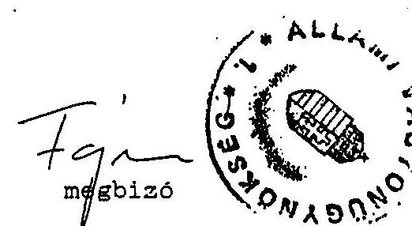

MODULOR
Építőipari és Tervező Kisszövetkezet 2000 Szentendre, Előd utca 2.

---

# Keretszerződés módosítás 

mely létrejött az Állami Vagyonügynökség (1133 Budapest, Pozsonyi út 56.) mint megbízó, valamint a MODULOR Építőipari és Tervező Kft. (2000 Szentendre, Előd u. 2.) mint vállalkozó között.

A szerződés módosítás célja az Állami Vagyonügynökség Pozsonyi úti irodaháza "A" épületének felújítási munkáival összefüggő feladatokra (1992. március 23-án) aláírt szerződés hatályának kiterjesztése az Irodaház komplexum "B" épületére.

1) Megbízó megbízza, Vállalkozó elvállalja a Pozsonyi út 56. sz. alatti irodaház "B" épület alábbi felújítási munkáinak 1993. október 1. és 1994. december 31. közötti időszakban történő elvégzését;

- szobák felújítása (festés, mázolás, tapétázás, padlószőnyeg)
- új irodahelyiségek kialakítása (falak áthelyezése, parkettázás, ajtók felszerelése, stb.)
- konyhák kialakítása (falak felhúzása, vizesblokk létesítése, konyhabútor szállítása, beállítása)
- beépített szekrények felújítása, festése
- beépített szekrények készítése
- tárgyalók kialakítása
- Pozsonyi úti porta korszerűsítése

2) Felek megállapodnak abban, hogy a "B" épület felújítási munkáinak elvégzésénél mindenben a "Keretszerződés"-ben foglaltakat tekintik irányadónak.

Budapest, 1993. szeptember 14.
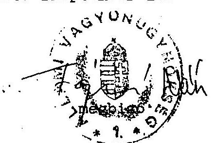
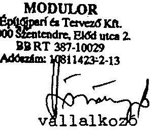

---

# A KORMÁNY 

## 3072/1992:

határozata

## az Állami Vagyonkezelő Rt elhelyezéséről

A Kormány az elhelyezésre irányuló javaslatok közül tudomásul veszi, hogy az Állami Vagyonkezelő Rt és az Állami Vagyonügynökség a HUNGALU Rt jelenlegi székházába költözik. Az Állami Vagyonügynökség helyiségeit a HUNGALU Rt foglalja el. A HUNGALU Rt további szervezeti egységei számára az AVÜ kedvezményes bérleti díj mellett megfelelő elhelyezést biztosít és fedezi a költözés igazolt költségeit.

Budapest, 1992. február 27.
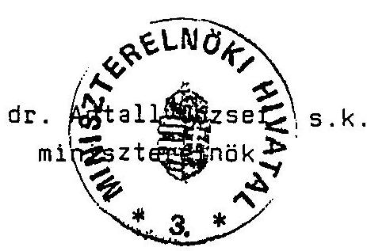

---

# A költözéssel kapcsolatban ténylegesen felmerült kiadások 

|  |  |  | M Ft-ban |
| :--: | :--: | :--: | :--: |
| Megnevezés | 1992. | 1993. | Összesen |
| HUNGALUKER Kft. | 1,4 | 41,5 | 42,9 |
| AIUTERY-FKI Kft. | 33,1 | - | 33,1 |
| HUNGALU Rt. | 8,4 | - | 8,4 |
| Emyeb | 8,6 | - | 8,6 |
| Összesen | 51,5 | 41,5 | 93,0 |

---

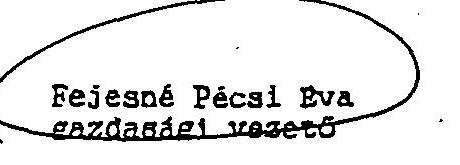

Tisztelt Fejesné asszony!

Tárgy: A HUNGALUKER Kft. kártérítési elszámolása

A HUNGALUKER Kft. Pozsonyi úti székházzal kapcsolatban tervezett kártérítési igénye 43.044 eFt-ban került elfogadásra.

Az e témában kötött megállapodásban (1-5. pontban) rögzített funkcióváltással kapcsolatos átalakítási és felújítási munkák tervezett összege 24,6 mFt. A tényleges teljesítés a tervezett összege alatt maradt 19.532 eFt-ban realizálódott.

A funkcióváltás költségei között saját kivitelezéssel végzett anyagfelhasználás raktárról, anyagbeszerzés, költöztetés, anyagmozgatás értékét 1.521 eFt-ban tartalmazza.

Az idegen kivitelezők által benyújtott számák a funkcióváltásból eredő átalakítás és felújítás anyag- és munkadíj számát, valamint az újonnan kialakított tárgyaló berendezés (bútor, függöny, virág és egyéb kellék) költségeit 18.014 eFt-ban tartalmazzák.

Az IBM számítógép tervezett költségét 18.444 eFt-ban állítottuk be, mellyel szemben a tényleges kártérítési igény 23.344 eFt volt, melynek kérjük az elfogadását a mellékelt dokumentumok alapján.

Pénzügyi rendezés céljából mellékelten megküldöm a 40 m Ft-ról kiállított számáinkat, valamint az elszámolásra vonatkozó összeállítót és számlemásolatokat.

Budapest, 1993. január 28.

A számok ellenőrzése megtörtént.
A jóváhagyott 43.044 eFt-al szemben a ténylegesen behívott és
kihívott számok összege 42.878.932.408
Burságyileg meg rendezésre van 1.475.752.408.
melyet várhatóan a Hungaluker KFT
rövidesen leszámhoz.

Üdvözlettel

---

A szállító (név, irányítószám, cím, telex, postafiók, bankszámla számé és megnevezése):

HUNGALUKER KFT
Bp.XIII., Pozsonyi u.56.
Bp.X.,Keresztúri u.39-41.
PFJ.szám: 201-00669
Adóig.szám: 10585845201

A vevő (név, irányítószám, cím, bankszámla száma és megnevezése):
ÁLLAMI VAGYONÜGYNÖKSÉG
1133 Budapest,
PF.:
PFJ.szám: 232-90148-3291
Adóig.szám:

Adóigazgatási azonosító szám:

| Megrendelés száma | Megrendelés kelte | A teljesítés időpontja | A számla kelte | A számla esedékessége | A számla sorszáma |
| :--: | :--: | :--: | :--: | :--: | :--: |
|  |  | 92,94,08-12,31 | 93,01,28, | 93.02.02. | 35435 |

A következők közül - amelyeknél van adat - az információt a betűre hivatkozva, azok sorrendjében, folyamatosan több sorban kell feljegyszni: a) Megrendelés ügyintézője; b) Szállítólevelek sorszáma; c) Szállítás módja; d) Szállító jármű száma; e) Feladás helye; f) Feladás időpontja; g) Csomagok darabszáma; h) Átvevő telephelye, raktára; i) A fizetés módja; j) Göngyöleg-visszaküldés határideje; k) Göngyölegvisszaküldés címe.

Fizetés módja: ÁTUTALÁS

1. Cikkazám; 2. ITJ-szám; 3. ETK-szám;
2. Az áru (szolgáltatás) szabványos megnevezése és egyéb ismertetőjele

| 5. Mennyiségi egység | 6. Mennyiség | 7. Egységár | 8. Számlaérték |
| :--: | :--: | :--: | :--: |

Az 1992.04.08-i megállapodás alapján kártérítési részösszeg
$40.000.000,--\mathrm{Ft}$
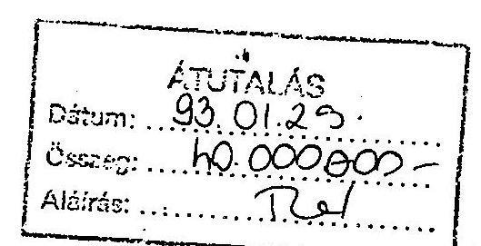

HUNGALUKER KFT
62.
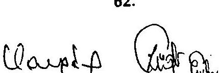
$01.29 / 19$
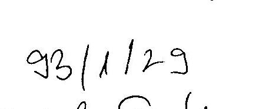

Átvétel ellismerése, egyéb
feljegyzések:

Szállító jelzőszáma
Számlaérkezés kelte
Érkező számla sorszáma
Tarmésbev. Göngyibev. Köszé- Kólas- nyilvántartás
miváltozás
Könyvelendő összeg
Főkönyvi Azamisszám Napló- hivatkozás
Az 1992.04.08-i megállapodás alapján kártérítési részösszeg
$40.000.000,--\mathrm{Ft}$
$01.29 / 19$

---

# 16/c. sz. melléklet 

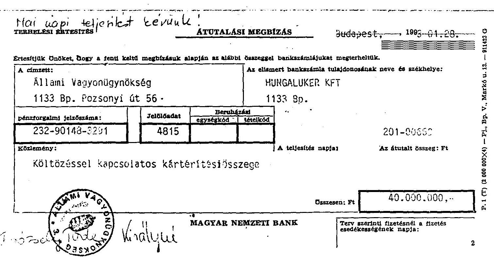

---

# 17. sz. melléklet 

## ÁLLAMI   VAGYONÜGYNÖKSÉG

HUNGALUKER KFT

## M E G Á L L A P O D Á S

amely létrejött egyrészről az ÁLLAMI VAGYONÜGYNÖKSÉG, mint a Budapest XIII. ker. Pozsonyi út 56 sz. alatti székház "A"-épületrészének használója (továbbiakban ÁVÜ), és a HUNGALUKER KFT, mint ugyanazon székház "B"-épületének bérlője (továbbiakban HUNGALUKER) között az alábbi feltételekkel:
I.
1./ ÁVÜ külön megállapodás szerinti mértékben biztosítja HUNGALUKER részére:

- munkavállalóinak a székház "A"-épület VIII. emeletén lévő munkahelyi étterem, és üzemi büfé használatát,
- a székház "A"-épületében található liftek használatát, különös tekintettel a napközbeni IV. emeletig,- ebédidőben a VIII. émeletig történő használatra, továbbá a teherlift szükség szerinti igénybevételét.
2./ ÁVÜ biztosítja HUNGALUKER részére a székház "A"-épület VIII. emeletén lévő reprezentációs étterem - előre egyeztetett módon történő - eseti igénybevételét, továbbá a a székház "A"-épületében található tárgyaló helyiségek használatát előzetes egyeztetés után, valamint a tárgyalók üzemeltetése továbbá a szobaszervíz ellátásához szükséges tálaló- és szervíz konyha területét.
3./ ÁVÜ biztosítja HUNGALUKER részére a székház "A"-épület alatti zárt északi 16 férőhelyes parkoló használatát.
4./ ÁVÜ vállalja, hogy a HUNGALUKER azon külföldi vendégeit, akik az "A"-épület portájára érkeznek, átirányítja az erre a célra kialakított fogadó területre.

---

II.
1./ HUNGALUKER biztosítja ÁVÜ ügyfeleinek szakszerű átirányítását, amennyiben azok a Pozsonyi úti portára érkeznek.
2./ ÁVÜ igénye szerint a HUNGALUKER biztosítja az ÁVÜ dolgozóinak a Pozsonyi úti porta használatát.
3./ HUNGALUKER biztosítja ÁvU részére a székház "B"-épületében található tárgyaló helyiségek előzetes egyeztetés utáni használatát.
4./ HUNGALUKER gondoskodik ÁvU részére érkező hírlap, és hírlap-jellegű küldemények portaszolgálat útján történő átvételéről.
5./ HUNGALUKER a székház "B"-épület földszintjén található telefonközpont - üzemeltetéséhez szükséges és jelenleg is használt - területét biztosítja.
III.
1./ ÁvU - tekintettel arra, hogy a számítógépterem felszámolása, valamint a "B"-épület földszintjének átalakítása hosszabb időt vesz igénybe, tudomásul veszi, hogy az "A"-épületben elfoglalt helyiségeket a HUNGALUKER a jelen megállapodáshoz 1.sz. mellékletként csatolt ütemterv szerint, legkésőbb 1992. december 31-ig hagyja el.
2./ Az ÁvU - összhangban a vonatkozó kormánydöntéssel - HUNGALUKER részére a kiköltözésével összefüggő, a helyiségek funkció változtatásával, továbbá a fizikai költözéssel kapcsolatos költségeket megtéríti. A költségtérítés alapja a tényköltségeket tartalmazó kivitelezői számla, melyeket HUNGALUKER ellenőrzés és összeszerelés után hetenként nyújt be ÁvU részére.
ÁvU a benyújtott számlák alapján a költségtérítés összegét a benyújtást követő nyolc napon belül köteles átutalni HUNGALUKER MHB 201-00669 sz. elszámolási betétszámlájára. A költségtérítés előzetesen kalkulált összegét a 2. sz. melléklet tartalmazza.

---

IV.
1./ Jelen megállapodást a felek hosszabb távú, mindkét fél számára kölcsönös előnyöket biztosító együttműködés reményében kötik, ezért a megállapodás időtartamául öt évi határozott időt kötnek ki. Ezen idő alatt a megállapodás módosítása csak közös megegyezéssel történhet. A felek e határozott időtartam alatt is bontó feltételként ismerik el azt, ha az ÁVÜ-nek az épületbeni működése megszűnik.

Ha e határozott időtartam lejárta előtt legalább hat hónappal valamelyik fél a megállapodás módosítását nem kezdeményezi, vagy azt írásban nem mondja fel, a megállapodás újabb öt évi időtartamra meghosszabbodik.
2./ Az I. és II. fejezetben meghatározott szolgáltatásokat a felek külön díj felszámolása nélkül biztosítják egymásnak, az ennek során felmerült költségeket a székház üzemeltetési költségeként ismerik el és ekként számolják el.

Budapest, 1992. április, 8
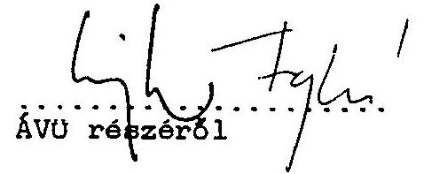
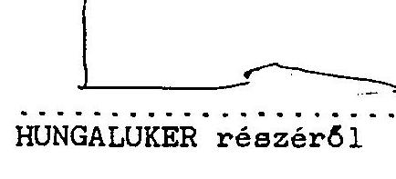

---

# 2.számú melléklet 

1./ A székház "B"-épületrész földszintjén található, jelenleg nyomda elhelyezésére szolgáló helyiségek funkció változtatása:

- terveztetés, engedélyeztetés,
- meglévő berendezés leszerelése,
- kivitelezés.

Várható bekerülési kts.: 11 000.-eFt.
2./ Pozsonyi úti külső - használaton kívüli - üzlethelyiségek megváltozott célú igénybevételének megfelelő szintű kialakítása:

- terveztetés, engedélyeztetés,
- kivitelezés.

Várható bekerülési kts.: 1 800.-eFt.
3./ A székház "B"-épületrészének földszintjén lévő könyvtár területének iroda funkciójú átalakítása:

- terveztetés, engedélyeztetés,
- kivitelezés.

Várható bekerülési kts.: 10 500.-eFt.
4./ A székház "B"-épületrészének földszintjén lévő porta protokoll funkció bővülésével összefüggő átalakítása:

- terveztetés, engedélyeztetés,
- kivitelezés.

Várható bekerülési kts.: 500.-eFt.
5./ A szoba kiürítésekkel kapcsolatos fizikai szállítási és anyagmozgatási munkák.

Várható bekerülési kts.: 800,-eFt.

---

6./ Az IBM 4361-es nagyszámítógép felszámolásával, a terület funkció változtatásával kapcsolatos munkálatok, - terveztetés, engedélyeztetés, - kiviteleztetés.

Várható bekerülési kts.: 18 444,-eFt.

Összes várható kts.: $43044,-$ eFt.

Budapest, 1992. április
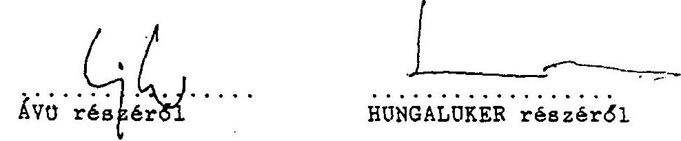

---

# A HUNGALUKER Kft. részére költözési költségtérítésként teljesített átutalások jogcím szerint 

M Ft-ban

| Megnevezés | Megállapodás   szerint | Tény |
| :-- | --: | --: |
| Feküjitási munkák | 24,6 | 18,0 |
| Számítástechnikai csere | 18,4 | 23,3 |
| Egyéb | - | 1,5 |
| Összesen | 43,0 | 42,8 |

---

# Az Állami Vagyonügynökség által átvállalt lakáskölcsönök és új támogatások összegei (1991-1994. I. félévben.) 

|  |  |  |  | E Ft-ban |
| :--: | :--: | :--: | :--: | :--: |
| 1991. | 649,1 | 2.271,8 | 2.920,9* | 3.000* |
| 1992. | 798,4 | $3.400,0$ | $4.198,4$ | 2.500 |
| 1993. | 394,7 | $11.400,0$ | $11.494,7$ | 11.000 |
| 1994.I félév | 294,4 | $9.750,0$ | $10.044,4$ | 4.000 |

* A különbség (79,1 E Ft) a Lakásalap számla év végi állományában szerepel.