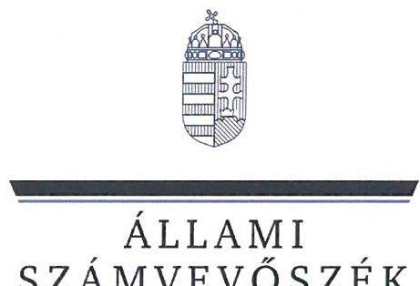
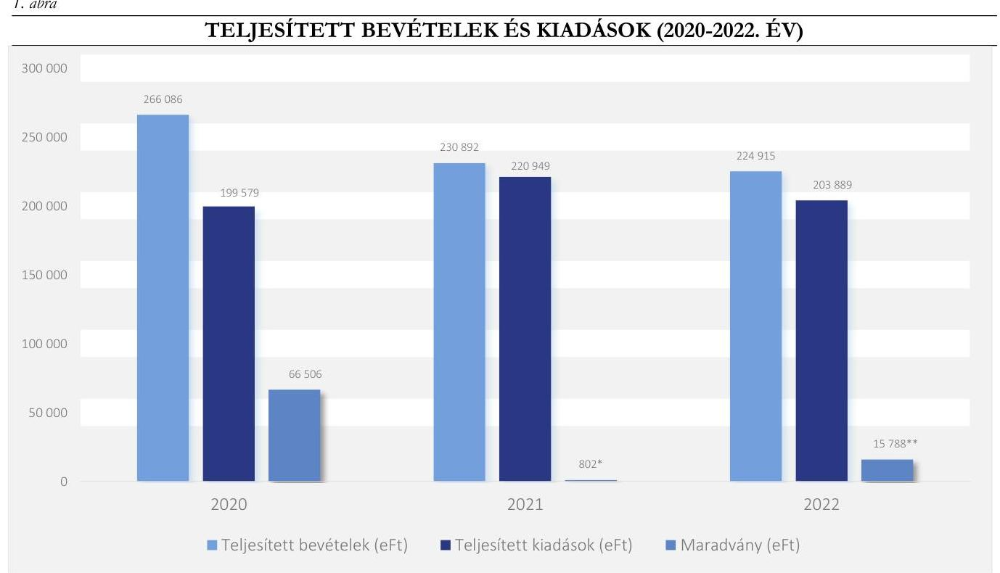

# JELENTÉS 

## Az országos nemzetiségi önkormányzatok ellenőrzése

Országos Ruszin Önkormányzat

2024.

---

ÁLLAMI
SZÁMVEVŐSZÉK

# JELENTÉS 

## Az országos nemzetiségi önkormányzatok ellenőrzése

Országos Ruszin Önkormányzat

2024.

---

# ELLENŐRZÉSI IGAZGATÓSÁG: 

## ÁLLAMHÁZTARTÁS HELYI SZINTJÉT ELLENŐRZŐ IGAZGATÓSÁG

ELLENŐRZÉSI IGAZGATÓ:
KISGERGELY ISTVÁN igazgató

ELLENŐRZÉSVEZETŐ:
$\square$ DR. LÁNG ÁGNES KRISZTINA ellenőrzésvezető

IKTATÓSZÁM: EL-3886-004/2023.
TÉMASZÁM: 2688.
ELLENŐRZÉS-AZONOSÍTÓ SZÁM: V103201

---

# TARTALOMJEGYZÉK 

AZ ELLENŐRZÉS ALAPADATAI ..... 5
AZ ELLENŐRZÖTT SZERVEZET ..... 8
ÖSSZEFOGLALÁS ..... 9
AZ ELLENŐRZÉS FÓKUSZTERÜLETEI/FÓKUSZKÉRDÉSEI ..... 11
MEGÁLLAPÍTÁSOK ..... 12
JAVASLATOK ..... 30
MELLÉKLETEK ..... 32
I. sz. melléklet: Értelmező szótár ..... 32
II. sz. melléklet: Az ellenőrzött szervezetek jegyzéke ..... 33
III. sz. melléklet: Ellenőrzési kritériumok ..... 34
IV. sz. melléklet: Az Önkormányzat konszolidált mérlegadatai a 2020-2022. években (ezer Ft) ..... 36
V. sz. melléklet: Az Önkormányzat kiadási és bevételi adatai a 2020-2022. években (ezer Ft) ..... 37
VI sz. melléklet: Kimutatás a 2022.-2023 I. negyedévben szabályszerűen elszámolt pályázatok adatairól ..... 38
FÜGGELÉK: ÉSZREVÉTELEK ..... 39
RÖVIDÍTÉSEK JEGYZÉKE ..... 44

---

.

---

# AZ ELLENŐRZÉS ALAPADATAI 

## AZ ELLENŐRZÉS CÉLJA

Ellenőrzés célja annak értékelése volt, hogy az Önkormányzat ${ }^{1}$ gazdálkodása, a gazdálkodással kapcsolatos szabályozása, az államháztartásból nyújtott költségvetési támogatások, illetve az államháztartásból meghatározott célra ingyenesen juttatott vagyon felhasználása a jogszabályi előírásoknak megfelelően történt- e, az Önkormányzat a nemzetiségek jogairól szóló törvényben előírt feladat- és hatásköröket ellátta- e.

Az ellenőrzés célja továbbá annak értékelése volt, hogy az Önkormányzat az intézmények fenntartójaként biztosította-e a szabályszerű, átlátható és elszámoltatható közpénzfelhasználás alapvető feltételeit; az irányítási jogok gyakorlása hozzájárult-e az intézmények szabályszerű gazdálkodásához és feladatellátásához.

## AZ ELLENŐRZÉS TÍPUSA

Megfelelőségi ellenőrzés.

## AZ ELLENŐRZŐTT IDŐSZAK

Az Önkormányzat működési és gazdálkodási feltételeinek kialakítását a 2020. és a 2022. évek vonatkozásában, a közfeladatai ellátását a 2020-2023. I. lezárt negyedév végéig ellenőriztük.

A pénzügyi- és vagyongazdálkodást a 2022. évre vonatozóan, a költségvetés tervezését, végrehajtását, a vagyonhasznosítás értékelését a 2022-2023. I. lezárt negyedév végéig, a vagyonelemek leltárral való alátámasztását a 2020-2022. évek tekintetében ellenőriztük.

Az Önkormányzat rendelkezésére álló források megoszlását, a teljesített bevételek és kiadások értékelését a 2022. évre, az államháztartás alrendszereiből kapott támogatások felhasználását, elszámolását a 2022-2023. I. lezárt negyedév vonatkozásában ellenőriztük.

A külső forrással (EU, hazai) támogatott feladatok/programok/beruházások megvalósítása szabályszerűségének ellenőrzött időszaka a 2022-2023. I. lezárt negyedév volt.

A belső ellenőrzés kialakítását és működtetését a 2022. évre, a belső ellenőrzés tervezését a belső és külső ellenőrzések gazdálkodásra vonatkozó megállapításaira tett intézkedések nyomon követését a 2020- 2022. évekre vonatkozóan ellenőriztük.

A korrupciós kockázatok kezelését, az összeférhetetlenségi és a képesítési követelmények érvényesülését, a feladat- és hatáskör, valamint a kapcsolódó felelősségi kör szabályozását a 2022. évre, a vagyonnyilatkozattételre vonatkozó előírások betartását a 2020-2023. I. lezárt negyedévre vonatkozóan ellenőriztük. A közzétételi kötelezettség teljesítését az ellenőrzés megkezdésének napján (2023. június 13-án) fennálló állapot szerint értékeltük.

---

# Az ellenőrzés tárgya 

Az ellenőrzés tárgya az Önkormányzat kötelező és önként vállalt közfeladatainak ellátása, a költségvetési támogatások cél szerinti felhasználása, a pénzügyi és vagyoni helyzete, pénzügyi és vagyongazdálkodása, a vagyonváltozást eredményező döntések szabályszerűsége, a belső kontrollrendszer egyes elemei kialakítása és múködtetése, továbbá a közzétételi kötelezettség teljesítése volt.

Az ellenőrzés kiterjedt minden olyan körülményre és adatra, amely az ÁSZ ${ }^{2}$ jogszabályban meghatározott feladatainak teljesítéséhez, valamint a program végrehajtása folyamán felmerült újabb összefüggések feltárásához szükséges volt.

## AZ ELLENŐRZÉS JOGALAPJA

Az ellenőrzés jogszabályi alapját az ÁSZ tv. ${ }^{3} 1 . \int(3)$ bekezdésének, az 5. $\int(2)-(3)$ és (6) bekezdéseinek előírásai képezték.

## AZ ELLENŐRZÉS MÓDSZERE

Az ellenőrzést az ellenőrzési program ellenőrzési kérdései, az ellenőrzött időszakban hatályos jogszabályok, az ellenőrzés szakmai szabályok és az ÁSZ módszertanok figyelembevételével végeztük.

A gazdálkodás hibáinak kijavítására, a közpénzekkel való felelős gazdálkodás segítésére irányuló javaslatok kidolgozásakor a hatályos jogszabályok voltak az irányadók.

Az ellenőrzési fókuszterületek megválaszolásához szükséges bizonyítékok megszerzése az ellenőrzött által rendelkezésre bocsátott dokumentumokra, adatokra alapozva megfigyelés, helyszíni szemle, interjú és jegyzőkönyvkészítés, mintavételezés útján, valamint elemző eljárással történt.

Az ellenőrzési bizonyítékként felhasználható adatforrások közé tartoztak egyrészt a szakmai program részletes szempontjainál felsorolt adatforrások, másrészt minden - az ellenőrzés folyamán feltárt, az ellenőrzés szempontjából releváns információt tartalmazó - dokumentum. Az ellenőrzés lefolytatásához az Önkormányzat tanúsítványok kitöltésével, az ÁSZ által kért dokumentumok megküldésével, valamint az interjúk során a feltett kérdésekre adott válaszokkal szolgáltatott adatokat. Az ellenőrzést az ÁSZ az Önkormányzat múködésével kapcsolatos feladatokat ellátó Hivatalban ${ }^{4}$ végezte. Az Önkormányzat és intézményei ellenőrzéssel érintett dokumentumait, tanúsítványait a Hivatal útján bocsátották az ellenőrzés rendelkezésére.

A pénzügyi és vagyongazdálkodás szabályozottságát az Önkormányzat határozatai, illetve az Önkormányzat - mint önálló éves költségvetési beszámolót készítő szervezet - és a Hivatal belső szabályozásai alapján értékeltük. A pénzügyi és vagyoni helyzet értékelése az Önkormányzat konszolidált éves beszámolójának adatai, a vagyonnyilvántartás alapján, továbbá a mérleg alátámasztottságának megítélésével történt. A leltározási, értékelési folyamat szabályszerűségére vonatkozó megállapításokat az Önkormányzat 2022. évi leltározási folyamatának ellenőrzése alapján tettük.

Az Önkormányzat vagyonváltozást eredményező döntéseinek és azok végrehajtásának ellenőrzésére tételes ellenőrzéssel került sor. Az éves költségvetés végrehajtásának ellenőrzése során a 2022-2023. I. lezárt negyedév végéig a múködési és felhalmozási kiadások értékelése mintavételi eljárás segítségével történt. Az

---

Önkormányzatnál a 30 db mintatételt véletlenszerűen, az intézményeknél a 10-10 db mintatételt kockázati alapon, a főkönyvi adatállományából választottuk.

Az Önkormányzat és intézményei által megvalósított feladatokhoz/programokhoz/beruházásokhoz biztosított pályázati támogatások elszámolását tételesen, illetve a 30 db legmagasabb összegű támogatás kiválasztásával történt mintavételezéssel ellenőriztük.

Az ellenőrzési kérdésekre adott válaszok alapján értékeltük az Önkormányzat által ellátott kötelező és önként vállalt közfeladatok ellátásának szabályszerűségét, a feladatellátás érdekében rendelkezésre bocsátott költségvetési támogatások cél szerinti felhasználását. Ellenőriztük az Önkormányzat pénzügyi gazdálkodási feladatainak ellátását, a vagyongazdálkodásának és a vagyonváltozást eredményező döntéseinek szabályszerűségét, valamint az ellenőrzött szervezet saját honlapján a kötelezően közzéteendő közérdekű adatok digitális formában történő hozzáférését, közzétételét. Az ellenőrzés az egyes területek szabályszerűségének, megfelelőségének értékelését a III. számú mellékletben megjelölt kritériumok alapján végezte el.

---

# AZ ELLENŐRZÖTT SZERVEZET 

Az Önkormányzat az 1999. évben alakult, feladat- és hatásköreit a nemzetiségi önkormányzat testülete, a 15 tagú Közgyűlés ${ }^{5}$ gyakorolta, amelyet, mint jogi személyt az Elnök ${ }^{6}$ képviselt. Az Önkormányzat Elnökét 2019. november 7 -én választották meg, aki az ezt megelőző időszakban is az elnöki feladatokat ellátta. Az Önkormányzat feladata az általa képviselt nemzetiség érdekeinek országos, illetve szükség szerint a területi, települési képviseletének és védelmének ellátása, valamint a nemzetiségi kulturális autonómia fejlesztése érdekében országos szintű nemzetiségi intézményhálózat fenntartása.

Az ellenőrzött időszakban a Közgyűlés egy bizottságot hozott létre, valamint egy tanácsnokot választott. A pénzügyi bizottság ${ }^{7}$ négy fővel alakult, melynek feladata a pénzügyi folyamatok figyelemmel kísérése, pénzügyi döntések megalapozottságának vizsgálata, véleményezése mellett, a vagyonnyilatkozatok nyilvántartása és ellenőrzése, valamint a méltatlansági és összeférhetetlenségi ügyek előkészítése volt.

Az Önkormányzat 2009. november 5-én hozta létre a Hivatalát, amely az Njtv ${ }^{8}$-ben foglaltak alapján az önkormányzat szerveként előkészítette és végrehajtotta annak határozatait, ellátta az Önkormányzat és intézményei gazdálkodásával kapcsolatos feladatokat.

Az Önkormányzat 2004. évben kettő költségvetési intézményt alapított. A Könyvtár ${ }^{9}$ közfeladata a ruszin nyelvű, vagy a nemzetiségre vonatkozó könyvek, dokumentumok, kiadványok gyűjtése, gyarapítása és nyilvános könyvtári feladatok ellátásának biztosítása volt. A Múzeum ${ }^{10}$ alaptevékenysége a ruszin nemzetiségi identitáshoz kötődő tárgyi és szellemi kultúra, kulturális értékek és javak megőrzése, gyűjtése, rendszerezése és mindenki számára hozzáférhetővé tétele volt. Az Önkormányzat a Tudományos Intézetét ${ }^{11} 2016$. május 1-jén a ruszin közösség szellemi, épített és tárgyi emlékeire, hagyományaira, kultúrájára, történelmére, nyelvére, intézményeire, társadalmi viszonyaira vonatkozó tudományos és kutató tevékenység ellátása céljából alapította. Az intézmények pénzügyi-gazdálkodási feladatait az ellenőrzött időszakban a Hivatal látta el.

Az Önkormányzat gazdálkodó és egyéb szervezetet 2020-2022 közötti években nem alapított, valamint társulást nem hozott létre és társuláshoz nem csatlakozott. Az Önkormányzat 2003. évben alapította meg a Ruszin Világ című folyóiratát, amely az ellenőrzött időszakban is megjelent.

Az Önkormányzat költségvetési kiadásainak összege a 2020. évi 199579 ezer Ft-ról a 2022. évre 2,2\%kal, 203889 ezer Ft-ra emelkedett, a költségvetési bevételek összege a 2020. évi 216162 ezer Ft-ról a 2022. évre $0,6 \%$-kal, 214972 ezer Ft-ra csökkent. Az Önkormányzat a költségvetési beszámolóját az ellenőrzött években könyvvizsgálóval auditáltatta.

---

# ÖSSZEFOGLALÁS 

Az Alaptörvény szerint a Magyarországon élő nemzetiségek államalkotó tényezők. Minden, valamely nemzetiséghez tartozó magyar állampolgárnak joga van önazonossága szabad vállalásához és megőrzéséhez. Az állam a nemzetiségi önkormányzatok müködéséhez, a médiaszolgáltatáshoz kapcsolódó jogaik érvényesítéséhez, valamint a kulturális önigazgatásuk érdekében alapított - oktatási, közművelődési, közgyűjteményi, tudományos - intézmények fenntartásához az éves költségvetési törvényekben nevesítetten költségvetési támogatást biztosított.

Az ellenőrzött időszakban az Önkormányzat müködése nem felelt meg a jogszabályi előírásoknak. A törvényes müködési feltételek kialakítása érdekében a Közgyűlés meghatározta a szervezeti és müködési szabályait, létrehozta a pénzügyi bizottságát. A Közgyűlés a jogszabály előírásai ellenére nem határozta meg a választott tanácsnoka által felügyelt feladatokat, továbbá nem tűzte napirendjére a ruszin nemzetiségi szószólónak a saját és az Országgyűlés nemzetiségekkel kapcsolatos tevékenységéről szóló tájékoztatóját. Az Önkormányzat vagyonleltárába - korlátozottan forgalomképes saját vagyontárgyként - olyan ingatlant vezettek fel, melynek tulajdon- és vagyonkezelői jogával nem rendelkeztek.

A Közgyűlés Hivatala nem szabályszerűen müködött, mert a Hivatalvezető ${ }^{12}$ a képesítési előírásoknak nem felelt meg, továbbá a Hivatalvezető a jogszabály rendelkezései és a betöltetlen állományi létszám ellenére kizárólag köztisztviselői kinevezéssel ellátható feladatokra megbízási és vállalkozási szerződéseket kötött.

Az Önkormányzat a Hivatala és a fenntartásában müködő három intézményének működtetéséről az ellenőrzött időszakban gondoskodott, amelyek közreműködtek a kötelező és önként vállalt közfeladatainak ellátásában. Az Önkormányzat az ellenőrzött időszakban az általa képviselt nemzetiségi közösséggel kapcsolatos érdekképviselet, érdekvédelem körében a jogszabály-véleményezési feladatát a jogszabályi előírás ellenére nem látta el, hanem azt az országos nemzetiségi önkormányzatok érdekvédelme, érdekképviselete céljából létrehozott társadalmi szervezet végezte. Az ellenőrzött időszakban a Ruszin Világ folyóiratának működtetéséhez szükséges forrást a Közgyűlés a költségvetési határozatokban biztosította. Az Önkormányzat a jogszabály előírása ellenére a rendelkezésére álló közszolgálati rádió és televízió műsoridő felhasználásának elveiről az ellenőrzött időszakban nem döntött.

Az Önkormányzat a gazdálkodásának belső kontrolljait minden tevékenységre vonatkozóan kialakította. Az ellenőrzött időszak költségvetési és zárszámadási határozatait - a kötelező és önként vállalt feladatok megbontásán kívül - a jogszabályokban foglalt előírásoknak megfelelő tartalommal és határidőben hagyta jóvá a Közgyűlés. A költségvetés végrehajtása során a kötelezettségvállalásokra a Közgyűlés által jóváhagyott kiadási előirányzatok mértékéig került sor. A belső kontrollok működtetése során jogszabályok előírásait nem tartották be maradéktalanul. A 2023. I. negyedévben a jogszabályi előírások ellenére az Önkormányzatnál az ellenőrzött tételek $3 \%$-ában, az intézményeknél a mintatételek $28 \%$-ában pénzügyi ellenjegyzés nélkül vállaltak kötelezettséget. Az Önkormányzat a 2022. évben a vagyonáról és a költségvetésének végrehajtásáról a zárszámadását elkészítette, a Közgyűlés jóváhagyta, az önként vállalt feladatok elkülönítésének hiányában, a jogszabályi előírásoknak maradéktalanul nem felelt meg.

Az Önkormányzat a 2020-2022. években a rendelkezésére álló forrásait a jogszabályi előírásoknak megfelelően a közfeladatainak ellátására fordította. A konszolidált éves beszámolók adatai szerint az ellenőrzött időszak valamennyi évében a teljesített összes bevétel meghaladta a teljesített összes kiadást. Az Önkormányzat bevételei 97,3\%-ban az államháztartáson belülről nyújtott támogatásokból származtak. Az ellenőrzött időszakban az Önkormányzat a támogatások teljes összegének felhasználásával elszámolt a támogatást nyújtók

---

felé, annak ellenére, hogy a teljesített kiadások összege a teljesített bevételek összegétől az ellenőrzött évek mindegyikében (a 2020. évben 25,0\%- kal, a 2021. évben 4,3\%- kal a 2022. évben 9,4\%-kal) elmaradt. Az államháztartás alrendszereiből kapott támogatások felhasználása, elszámolása során az Önkormányzat nem tartotta be a jogszabályi és a támogatói okiratokban foglalt előírásokat. A támogatói okiratban rögzített költségtervvel ellentétben, a 2020. évben a működési támogatásokból 2160 ezer Ft-ot, a 2022. évben 7490 ezer Ft-ot felhalmozási célra használt fel, azt az elszámolásában a működési kiadások között rögzítette és a költségtervtől való eltérést nem indokolta.

A külső forrás bevonásával teljesített programok kapcsán is több esetben előfordult, hogy a felhalmozási célú kiadásokat az jogszabályok rendelkezései ellenére a dologi kiadások, szolgáltatások között számolták el. Az így beszerzett eszközöket nem aktíválták és nem mutatták ki a számviteli mérleg eszköz oldalán. A támogatások elszámolásánál feltárt hibák miatt megsértették a teljesség, a tartalom elsődlegessége a formával szemben számviteli alapelveket. A számviteli elszámolásoknál feltárt a 2020. évben 6097 ezer Ft, a 2021. évben 10953 ezer Ft a 2022. évben 12340 ezer Ft megállapított hiba a jogszabályban és a belső szabályozásban meghatározott jelentős összegű hiba határát meghaladta, emiatt a 2020-2022. évi költségvetési beszámolók nem mutattak megbízható és valós képet az Önkormányzat vagyoni és pénzügyi helyzetéről és annak változásáról.

A Hivatal vezetője az ellenőrzött időszakban gondoskodott a belső ellenőrzés rendszerének kialakításáról és működtetéséről. A jogszabály előírása ellenére a belső ellenőrzés nem terjedt ki a költségvetési bevételek és kiadások tervezésének, teljesítésének, a bevételek felhasználásának ellenőrzésére. Mivel a belső ellenőr által készített kockázatelemzés és ebből adódóan a lefolytatott ellenőrzései sem érintették a költségvetési támogatások felhasználását, elszámolását, a belső ellenőrzés a számvevőszéki ellenőrzés során feltárt szabálytalanságok megelőzéséhez nem járult hozzá.

Az Önkormányzat az ellenőrzött időszakban az összeférhetetlenség megelőzésére vonatkozó jogszabályi előírásokat betartotta. A 2023. évben közzétételi kötelezettségének az Önkormányzat nem tett maradéktalanul eleget, elmaradt az önkormányzati döntések, jegyzőkönyvek és a nettó ötmillió forintot meghaladó szerződések közzététele.

Az ÁSZ az ellenőrzés során feltárt hiányosságok felszámolása, a szabályszerű múködés feltételeinek megteremtése érdekében a Közgyűlésnek négy, az Elnöknek öt, a Hivatalvezetőnek hat és a belső ellenőrnek egy javaslatot tett.

---

# AZ ELLENŐRZÉS FÓKUSZTERÜLETEI/FÓKUSZKÉRDÉSEI 

1. Az országos nemzetiségi önkormányzat törvényes müködési feltételeinek kialakítása.
2. Az országos nemzetiségi önkormányzat által ellátott kötelező és önként vállalt közfeladatok.
3. Az országos nemzetiségi önkormányzat pénzügyi- és vagyongazdálkodása.
4. A közfeladat ellátása érdekében az országos nemzetiségi önkormányzat rendelkezésére bocsátott költségvetési támogatások cél szerinti felhasználása.
5. A külső forrással (EU, hazai) támogatott feladatok/programok/beruházások megvalósításának szabályszerűsége.
6. A belső ellenőrzés kialakítása és müködtetése, külső ellenőrzések megállapításai, intézkedések.
7. Korrupciós kockázatok kezelése (vagyonnyilatkozatok, összeférhetetlenség, képesítési követelmény, felelősségi szabályok, közzétételi kötelezettség).

---

# 1. Az országos nemzetiségi önkormányzat törvényes múködési feltételeinek kialakítása. 

Összegző megállapítás

Az Önkormányzat a szervezeti kereteit kisebb hiányossággal kialakította. A Hivatal vezetője a Kttv. ${ }^{13}$-ben előírt képesítési követelményeknek nem felelt meg. Az Önkormányzat az önként és kötelezően ellátott feladatait az Áht. ${ }^{14}$ előírása ellenére nem bontotta meg. Az Önkormányzat a vagyonleltárában a tulajdonában nem álló ingatlant rögzített.
1.1. számú megállapítás

Az Önkormányzat az SZMSZ-ében az Njtv. előírásai ellenére nem rögzítette a megválasztott tanácsnoka által felügyelt feladatokat. A Hivatalvezető a Kttv. szerinti képesítési követelményeknek nem felelt meg.

A Közgyűlés az Njtv. előírásának megfelelően, át nem ruházható hatáskörében, minősített többséggel az SZMSZ ${ }_{1,2}{ }^{15}$ ben meghatározta az Önkormányzat törvényes múködésének feltételeit, továbbá annak részeként a szervezete és múködése részletes szabályait.
A Közgyűlés az Njtv. előírásának megfelelően, az alakuló ülését követő három hónapon belül, minősített többséggel elfogadta az Önkormányzat SZMSZ ${ }_{2}$-ét. Az SZMSZ ${ }_{2}$-ben az Njtv.-ben foglaltaknak megfelelően rögzítették a Közgyűlést megillető feladat- és hatásköröket, az átruházható és át nem ruházható hatásköröket, előírták az átruházott feladat- és hatáskörben hozott döntésekről a beszámolási kötelezettséget, továbbá az elnöki és elnökhelyettesi tisztség betöltésének módját. Az ellenőrzött időszakban a Közgyűlés az SZMSZ ${ }_{2}$-ben rögzített feladatait és hatásköreit szerveire (Elnök, Bizottság, Hivatal) nem ruházta át. Az SZMSZ ${ }_{2}$ az Njtv. szerint tartalmazta az Önkormányzatra, szerveire, azok jogállására vonatkozóan az adatokat, az ülések összehívására, tanácskozási rendjére, a döntéshozatali eljárásra vonatkozó rendelkezéseket, valamint a Hivatala múködésének részletes szabályait.
Az SZMSZ ${ }_{2}$-ben és a 2020-2023. évi költségvetési határozataiban az Önkormányzat meghatározta a Hivatalában az ellátandó feladatokhoz kapcsolódó engedélyezett létszámkeretet, mely szerint az ellenőrzött időszakban a Hivatalnál a vezetővel együtt hat fő foglalkoztatására volt lehetőség. A zárszámadási határozatok szerint a Hivatal a 2020-2021. években négy fő, a 2022. évben három fő állományi létszámmal múködött. A Hivatalvezető a Kttv. 8. § (2) bekezdésében rögzítettek és a betöltetlen állományi létszám ellenére a Hivatal feladatkörébe tartozó olyan feladat elvégzésére kötött megbízási, vállalkozói szerződéseket, melyek ellátására kizárólag köztisztviselői kinevezés volt adható.
A 2019. évben megtartott nemzetiségi önkormányzati képviselők választását követően a Közgyűlés az Njtv. előírása alapján a kötelezően létrehozandó pénzügyi bizottságon felül más állandó bizottságot nem hozott létre. A pénzügyi bizottság átruházott hatáskörrel nem rendelkezett, ellátta többek között az

---

Önkormányzatnál és intézményeinél a pénzügyi tervek, döntések, folyamatok véleményezését, értékelését, valamint a vagyonnyilatkozatok nyilvántartásával és ellenőrzésével, szükség esetén a méltatlansági és összeférhetetlenségi ügyekkel kapcsolatos feladatokat.
A Közgyűlés az egyházi-karitatív feladatokért felelős tanácsnoka által felügyelt feladatokat az Njtv. 77. § (3) bekezdésében foglaltak ellenére az SZMSZ ${ }_{2}$-ben nem határozta meg.
Az ellenőrzött időszakban a szószóló tanácskozási joggal részt vett a Közgyűlés ülésein, azonban az Njtv. 21/B. $\$ (5) bekezdésében foglaltak ellenére, az Elnök nem kezdeményezte a szószóló saját és az Országgyűlés nemzetiségekkel kapcsolatos tevékenységéről, döntéseiről szóló tájékoztatójának napirendre vételét.
A Hivatal jelenlegi vezetőjét a Közgyűlés 2016. augusztus 1-jén nevezte ki, a kinevezési okiratában rögzítették, hogy a közigazgatási szakvizsga letételének határideje 2019. július 31-e volt. A Hivatalvezető a Kttv. 129. $\$ (3) bekezdésében rögzítettek ellenére, a kinevezési okiratában is rögzített határidőig - és azt követően sem - a közigazgatási szakvizsgát nem teljesítette. Az Elnök az Njtv. 123. § (1) bekezdése és az SZMSZ 2. 90. pontjában rögzítettek ellenére nem tett javaslatot a Kttv. 129. § (2) bekezdésének megfelelő végzettséggel rendelkező hivatalvezető kinevezésére.
1.2. számú megállapítás

Az ellenőrzött időszakban az Önkormányzat a költségvetési és zárszámadási határozataiban a kötelezően és az önként ellátott feladatokat az Áht. előírása ellenére nem bontotta meg.

Az ellenőrzött 2020-2023. közötti időszakban az Önkormányzat költségvetési határozataiban a kötelező feladatok és a Hodinka Antal Díj adományozása, valamint a tanulmányi ösztöndíj, mint önként vállalt feladat az Áht. 23. $\$ \mathbf{( 2 )}$ bekezdés ab) pontjában, valamit a 26. $\$ \mathbf{( 1 )}$ bekezdésében foglaltak ellenére nem került megbontásra. Az SZMSZ ${ }_{2}$ tartalmazta az Önkormányzat által ellátott feladatokat, azonban az önként vállalt feladatok rögzítése a Ruszin Világ folyóirat kivételével elmaradt. Az ellenőrzött időszak költségvetési határozatainak 3. b) pontja szerint, az Önkormányzat valamennyi tervezett kiadása a kötelező közfeladatainak ellátását szolgálta.
Az Önkormányzat az ellenőrzött időszakban önként vállalt közfeladataként a kultúra és hagyományőrzés terén végzett tevékenység elismerése céljából díjat adományozott, továbbá a ruszin nemzetiséghez tartozó diákok számára tanulmányi ösztöndíj pályázatot múködtetett.
A 2019. évi önkormányzati választásokat követően megszűnt, Budapest XVIII. kerületi települési ruszin nemzetiségi önkormányzat vagyona az Njtv. 138. § (2) bekezdés előírásának megfelelően az Önkormányzat tulajdonába került. Az átadás és átvételi eljárás során az Önkormányzat folyamatban lévő feladatot nem vett át, a feladatellátás szükségessége a Budapest XVIII. kerületében élő ruszin nemzetiségi közösséggel kapcsolatosan a továbbiakban sem merült fel.
1.3. számú megállapítás

Az Önkormányzat az Njtv. előírásának megfelelően meghatározta a vagyonleltárában rögzített törzsvagyonának körét és a tulajdonát képező vagyon használatának, valamint a rendelkezésére bocsátott állami vagyon kezelésének, használatának szabályait. Az ellenőrzött időszakban a vagyonleltárában szereplő, de nem az Önkormányzat tulajdonát képező ingatlanvagyon rendezése érdekében az SZMSZ2 előírása ellenére az Elnök nem intézkedett.

A vagyongazdálkodási szabályzatban ${ }^{16}$ az Njtv. előírásának megfelelően meghatározták az Önkormányzat törzsvagyona körébe tartozó vagyonelemeket, azon belül a forgalomképtelen és

---

korlátozottan forgalomképes vagyontárgyakat. A Közgyűlés az SZMSZ ${ }_{2}$ és a vagyongazdálkodási szabályzat 2020. február 6-ai módosításával az Önkormányzat az Njtv. 92. § (4) c) pontjában rögzítettek ellenére a korlátozottan forgalomképes vagyontárgyai körét kiegészítette a tulajdonát nem képező, használatba nem kapott „Görögkatolikus Ruszín Közösségi Ház 4224 Debrecen, Felsöözssai utca 11. (Hrsz. 26678) szám alatt található épület"-tel. Az Önkormányzat számviteli nyilvántartásaiban a Számv. tv. ${ }^{17}$ előírásának megfelelően csak az ingatlanon végrehajtott beruházás értékét rögzítette.
Az SZMSZ ${ }_{2}$ szerint, a Közgyűlés felhatalmazta az Elnököt, hogy járjon el az ingatlan vagyonjogi helyzetének rendezése miatt egy háromoldalú (a telek tulajdonosa Debrecen Megyei Jogú Város Önkormányzata, valamint az ingatlan tartós - 99 évre bejegyezett - használója a Hajdúdorogi Görögkatolikus Főegyházmegye) megállapodás létrehozása érdekében. Az Elnök az SZMSZ ${ }_{2}$ 120. b) pontjában rögzített feladata és az Együttműködési megállapodásban ${ }^{18}$ szabott határidő lejárta ellenére, a közös beruházással létrehozott ingatlan vagyonjogi helyzetének rendezése, valamint a müködtetésre vonatkozó megállapodás megkötése érdekében nem intézkedett.
A Magyar Államtól térítésmentes juttatásként kapott Budapest, Gyarmat utca 85/b szám alatti ingatlant székhelyként közösen használta az Önkormányzat a Hivatallal, valamint a három intézményével (Múzeum, a Könyvtár és a Tudományos Intézet). Az intézményekkel kötött megállapodás szerint a székház működésével kapcsolatos költségeket, az adott év kiadási előirányzatainak figyelembevételével határozták meg, illetve osztották fel.

# 2. Az országos nemzetiségi önkormányzat által ellátott kötelező és önként vállalt közfeladatok. 

Összegző megállapítás Az Önkormányzat az ellenőrzött időszaban az általa képviselt nemzetiségi közösséggel kapcsolatos Njtv. előírása szerinti érdekképviselet, érdekvédelem keretében a jogszabályvéleményezési feladatát nem látta el, a rendelkezésére álló közszolgálati rádió és televízió műsoridő felhasználásának elveiről nem döntött. Az Njtv. alapján az Önkormányzat gondoskodott az intézményhálózatának müködtetéséről, törvényességi, gazdaságossági ellenőrzéséről.
2.1. számú megállapítás

Az ellenőrzött időszakban az Önkormányzat az általa képviselt nemzetiségi közösséggel kapcsolatos, az Njtv.-ben foglalt érdekképviselet, érdekvédelem keretében a jogszabály-véleményezési feladatát nem látta el.

Az Önkormányzat az általa képviselt nemzetiségi közösséggel kapcsolatos érdekképviselet, érdekvédelem keretében az Njtv. 117. § (2) c) és 118. § (1) a) pontjában foglalt előírások ellenére a jogszabály-véleményezési feladatát nem látta el, hanem azt az országos nemzetiségi önkormányzatok érdekvédelme, érdekképviselete céljából létrehozott társadalmi szervezet, az ONÖSZ ${ }^{19}$ végezte.
Az Önkormányzatot az ONÖSZ-ban az Elnök képviselte, aki eltekintve a veszélyhelyzet ideje alatti eltérő szabályozástól, nem rendelkezett a Közgyűlés által - az SZMSZ ${ }_{2}$-ben, vagy egyedi határozatban átruházott feladat- és hatáskörrel, ezáltal az Njtv. 119. § (1) bekezdése szerinti felhatalmazás hiányában

---

nem hozhatott önkormányzati feladat- és hatáskörben döntést az érdekképviselet, érdekvédelem körében. Az Elnök a veszélyhelyzet kihirdetéséről szóló 478/2020. (XI. 3.) Korm. rendelet, valamint a 27/2021. (I. 29.) Korm. rendelet szerinti időszak kivételével, a Közgyűlés feladat- és hatáskörét felhatalmazás hiányában, nem jogszerűen gyakorolta.
2.2. számú megállapítás

Az Önkormányzat a nemzetiségi kulturális autonómia fejlesztése érdekében az ellenőrzött időszakban országos szintű nemzetiségi intézményhálózatot működtetett, az Elnök az intézmények beszámolóit a költségvetési törvény előírásának megfelelően, a Miniszterelnökségnek benyújtotta.

Az Önkormányzat az ellenőrzött időszakban nem alapított intézményt, az SZMSZ ${ }_{2}$ szerint a korábban alapított három intézményének múködési feltételeit biztosította. Az intézményei feladatellátásának székhelyét az Önkormányzat a saját tulajdonú ingatlanában (székhelyén) biztosította. Az Önkormányzat, mint fenntartó az Áht.-ban foglaltaknak megfelelően ellátta az intézmények törvényességi, gazdaságossági és számviteli ellenőrzését. Az intézményvezetők a belső ellenőrzésről külső szolgáltató igénybevételével gondoskodtak.
Az Önkormányzat mindhárom költségvetési intézménye az ellenőrzött időszak alatt elkészítette az éves (részletes) szakmai és pénzügyi beszámolóját, melyet a Közgyűlés a törvényes határidőn belül elfogadott és a költségvetési törvény előírásának megfelelően, az Elnök a Miniszterelnökségnek továbbított.
2.3. számú megállapítás

Az ellenőrzött időszakban az Önkormányzat nemzetiségi médiumainak nyújtott támogatás felhasználása megfelelt a jogszabályi előírásoknak. Az Önkormányzat az Njtv-ben foglaltak ellenére a rendelkezésére álló közszolgálati rádió és televízió műsoridő felhasználásának elveiről nem döntött.

Az Önkormányzat az ellenőrzött időszak alatt a Ruszin Világ folyóiratot múködtette, melyhez a szükséges forrásokat a Közgyűlés minden évben a költségvetési határozataiban biztosította.
Az Önkormányzat a rendelkezésére álló közszolgálati rádió és televízió műsoridő felhasználásának elveiről az ellenőrzött időszakban az Njtv. 117. § (1) bekezdés d) pontjában foglaltak ellenére nem döntött.

---

# 3. Az országos nemzetiségi önkormányzat pénzügyi- és vagyongazdálkodása. 

Összegző megállapítás Az Önkormányzat pénzügyi- és vagyongazdálkodása az ellenőrzött időszakban nem felelt meg maradéktalanul a jogszabályi és a belső szabályozások előírásainak. Az Önkormányzat gazdálkodásának belső kontrolljait kialakította. A pénzügyi gazdálkodása a jogszabályi és a belső szabályzatokban rögzített előírásoknak a 2022-2023. I. negyedévben megfelelt, azonban a 2020-2022. évi költségvetések végrehajtása és az elkészített éves beszámolók az Áht. és az Áhsz. ${ }^{20}$, valamint a belső szabályzatok előírásainak teljeskörűen nem feleltek meg.
3.1. számú megállapítás Az Önkormányzat a gazdálkodásának belső kontrolljait kialakította.

A Hivatal vezetője a Bkr. ${ }^{21}$ előírásának megfelelően az Önkormányzat, a Hivatal, valamint az intézmények Belső kontroll szabályzata ${ }^{22}$ és a Gazdálkodási szabályzat ${ }^{23}$ keretében kialakította a költségvetés tervezésével és végrehajtásával, valamint a támogatások elszámolásával kapcsolatos folyamatok belső szabályozását, eljárásrendjét. A szabályzatok minden tevékenységre vonatkozóan biztosították a szervezeti célok elérését veszélyeztető kockázatok csökkentésére irányuló kontrollok kiépítését. Az Önkormányzat a gazdálkodási jogkörök - a kötelezettségvállalás, ellenjegyzés, teljesítésigazolása, érvényesítés, utalványozás - gyakorlásának szabályozását, a tervezéssel, gazdálkodással, a kötelezettségvállalás, teljesítés igazolás gyakorlásának módjával, eljárási és dokumentációs részletszabályaival, valamint az ezeket végző személyek kijelölésének rendjével kapcsolatos szabályait a Gazdálkodási szabályzatában rögzítette.
3.2. számú megállapítás

Az Önkormányzat 2022-2023. I. negyedévre vonatkozó költségvetési gazdálkodása - az önként vállalt feladatok megbontásának kivételével a jogszabályi és a belső szabályzatokban rögzített előírásoknak megfelelt.

Az Önkormányzat a 2022. évi költségvetését a 22/2022.(II.11.) számú, a 2023. évi költségvetést a 18/2023. (II.14.) számú közgyűlési határozattal az Áht. és az Ávr. ${ }^{24}$ előírása szerinti határidőben és - az önként vállalt feladatok elkülönítése kivételével - megfelelő tartalommal jóváhagyta.

A költségvetési és zárszámadási határozatok tartalma az Áht. előírásainak megfelelt, azonban az Áht. 23. § (2) bekezdés ab) pontjában, valamit a 26. § (1) bekezdésében foglaltak ellenére a kötelező feladatok és a tanulmányi ösztöndíj, mint önként vállalt feladat kiadásai nem kerültek megbontásra. Az Önkormányzatnál a 2022-2023. években az előirányzat nyilvántartások vezetése, az előirányzat módosítások, átcsoportosítások végrehajtása az Áht., az Ávr., valamint a számviteli politika ${ }^{25}$ és a Gazdálkodási szabályzat előírásainak megfelelően történt.
A 22/2022. (II.11.) számú önkormányzati határozattal 188805 ezer Ft-os költségvetési főösszeggel jóváhagyott 2022. évi költségvetésről szóló közgyűlési határozatot négy alkalommal módosították. A 62/2022. (IV.29.) számú határozattal a költségvetés bevételi-kiadási főösszege 212325 ezer Ft-ra növekedett, majd a 69/2022. (IX.08.) számú módosítással 222400 ezer Ft-ra emelkedett. A 80/2022.

---

(XI.24.) számú, továbbá - a zárszámadást megelőzően végrehajtott - 11/2023. (II.14.) számú határozatokkal a költségvetés bevételi-kiadási főösszegének előirányzata 224930 ezer Ft-ra módosult. A végrehajtott költségvetési határozat módosítások az év közben elnyert pályázati forrásból származó bevétel növekedés és a hozzá kapcsolódó kiadások előirányzatának módosításából adódtak.
3.3. számú megállapítás

A költségvetés végrehajtása során az Áht. és az Ávr., valamint a számviteli politika és a Gazdálkodási szabályzat előírásait maradéktalanul nem tartották be.

Az Önkormányzatnál a 2022-2023. I. negyedévben az ellenőrzött mintatételek esetében kötelezettségvállalásokra az Áht. előírásának megfelelően a módosított kiadási előirányzatok mértékéig került sor.
A kiadások elszámolása során az Ávr. előírásának megfelelően a kötelezettségvállalás dokumentuma rendelkezésre állt, a kötelezettségvállalást az Áht. és a Gazdálkodási szabályzat előírásának megfelelően az arra írásban felhatalmazott személy végezte. A kötelezettségvállalások nyilvántartásba vétele megtörtént, az Ávr. előírása szerinti összeférhetetlenségi követelményeket betartották.
A kötelezettségvállalások pénzügyi ellenjegyzésére az Ávr. és a Gazdálkodási szabályzat szerint a Hivatal gazdasági vezetője, illetve az általa írásban kijelölt személy volt jogosult. Az Önkormányzat által a 2023. évben bevezetett új integrált ügyviteli rendszer kötelezettség-vállalásokról vezetett nyilvántartása nem tette lehetővé a pénzügyi ellenjegyzés gyakorlásának rögzítését. A 2023. I negyedévi mintatételek értékelése során az Önkormányzatnál egy esetben (3. számú mintatétel), a Könyvtárnál és a Múzeumnál kettő-kettő esetben (4.-6. számú mintatételek, illetve a 8.-9. számú mintatételek) a Tudományos Intézetnél a 10. számú mintatétel esetében, valamint a Hivatalnál hat esetben (1,2,3,4,6,10. számú mintatételeknél) összesen 12 esetben az Áht. 37. § (1) bekezdése, valamint az Ávr. 55. § (1) bekezdésében rögzítettek ellenére a kötelezettségvállalás pénzügyi ellenjegyzése nem történt meg. Az Önkormányzatnál és a Könyvtárnál egy-egy esetben, a pénzkezelési szabályzatban ${ }^{26}$ rögzítettek ellenére, a pénztári kifizetésnél a pénztáros nem ellenőrizte a pénzt átvevő személy jogosultságát, a kifizetés kárt nem eredményezett.
3.4. számú megállapítás

A 2022. évi beszámolási és zárszámadási kötelezettség teljesítése szabályszerű volt, azonban az ellenőrzés által feltárt elszámolási hiányosságok az Önkormányzat 2022. évi beszámoló adataiban jelentős összegű hibát eredményeztek.

Az Önkormányzat a 2022. évi költségvetési beszámolóját a Hivatal az Áhsz. szerint előírt határidőben a Kincstár által működtetett elektronikus adatszolgáltató rendszerbe feltöltötte. Az Önkormányzat vagyonáról és a költségvetés végrehajtásáról az Áht. előírásainak megfelelően a számviteli jogszabályok szerinti éves költségvetési beszámolót és az elfogadott költségvetéssel összehasonlítható módon az év utolsó napján érvényes szervezeti, besorolási rendnek megfelelő zárszámadást elkészítette.
A 2022. évi költségvetési előirányzatok teljesítése és az Önkormányzat zárszámadási határozata, valamint a költségvetési beszámoló adatai között az egyezőség biztosított volt, azonban a költségvetési határozattal egyezően a zárszámadási határozatban sem kerültek megbontásra az Áht. 23. § (2) bekezdés ab) pontjában, valamit a 26. § (1) bekezdésében foglaltak ellenére a

---

kötelező feladatok és a Hodinka Antal Díj adományozása, valamint a tanulmányi ösztöndíj, mint önként vállalt feladat kiadásai.
Az Önkormányzat 2022. évi költségvetési beszámolóját az Elnök az Áht. előírásának megfelelően a Közgyűlés elé terjesztette, amelyet Közgyűlési határozattal jóváhagyott.
A zárszámadási határozattervezet előterjesztésekor az Áht. előírása szerinti mérlegeket a Közgyűlés részére tájékoztatásul bemutatták.
Az Önkormányzat államháztartáson belülről kapott működési és felhalmozási célú támogatásai felhasználásának (4.2 és 5.1 megállapítások) ellenőrzése a 2022. évi költségvetési beszámolót is érintő hibákat tárt fel. Az 5.1 pontban részletezett elszámolási hibák az Áhsz. 1. $\$ \mathbf{( 1 )}$ bekezdés 3. pontja és a számviteli politika 16. pontja alapján - a jelentős összegű hiba határát (mérlegfőösszeg 2\%-át) meghaladták, ezáltal a Számv.tv. 16. $\$ (3)-(4) bekezdéseiben előírt tartalom elsődlegessége a formával szemben alapelv sérült. E miatt az Önkormányzat 2022. évi költségvetési beszámolója a Számv.tv. 18. § ban foglaltak ellenére nem mutatott a vagyoni és pénzügyi helyzetről és annak változásáról megbízható és valós képet.
3.5. számú megállapítás Az Önkormányzat vagyongazdálkodása nem felelt meg a jogszabályi és a belső szabályozásban rögzített előírásoknak.

Az Önkormányzat a 2022. évi költségvetési év zárásával kapcsolatos feladatait az Áhsz. előírásainak és a belső szabályozásának megfelelően elvégezte, a mérleg fordulónapjára vonatkozóan a fökönyvi és az analitikus nyilvántartások egyeztetése megtörtént, az eltéréseket dokumentáltan rendezték.
Az Önkormányzat a 2022. évi beszámolójához kapcsolódó mérleg adatokat az Áhsz. előírásának megfelelően, mennyiségi felvétellel és egyeztetéssel végrehajtott - a leltározási szabályzatnak ${ }^{27}$ megfelelő - leltárral alátámasztották.

Az ellenőrzés, az államháztartáson belülről származó támogatásokhoz, pályázatokhoz kapcsolódó 4. 2 és az 5.1 számú megállapításainál az Önkormányzat vagyontárgyaival kapcsolatos - tárgyi eszközeit érintő - számviteli, elszámolási hibákat, hiányosságokat tárt fel. A feltárt hibák, hiányosságok a Számv. tv. 3. $\$ (3) bekezdésének 3. pontja, az Áhsz. 1. $\$ (1) bekezdés 3. pontja, valamint a számviteli politika 16. pontja szerint jelentős összegű hibát eredményeztek a tárgyi eszközök, készletekről vezetett nyilvántartásokban.
Az Önkormányzat vagyonhasznosításból származó bevétele a 2022. évben 600 ezer Ft volt, ami a Budapest Gyarmat utca 85/B. szám alatti székház egyik helyiségének folyamatos bérbeadásából keletkezett. Az ingatlan hasznosítására kötött bérleti szerződés az Njtv., az Áht., valamint a vagyongazdálkodási szabályzatban rögzített előírásoknak megfelelt.
Az Önkormányzat és az általa fenntartott intézmények - közfeladatainak ellátása érdekében és egyéb jogcímen - ingyenes vagyonjuttatásban az ellenőrzött időszaban nem részesültek.
3.6. számú megállapítás

A pénz- és vagyongazdálkodást támogató informatikai rendszerek kialakítása és használata az ellenőrzött időszakban szabályszerű volt.

Az Önkormányzat és a Hivatala, valamint az önkormányzati intézmények pénzügyi, ügyviteli, ügyintézési és egyéb alapvető feladatainak egységes, átlátható elvégzése érdekében - a 2021. december 31-ig használt DOKK program továbbfejlesztésének hiánya miatt - a Hivatal 2022. május 2-án szerződést kötött a GriffSoft Informatikai Zrt.-vel a Forrás_Net integrált ügyviteli rendszer bevezetésére. Az ellenőrzött

---

időszakban használt informatikai rendszerek az Njtv. előírásának megfelelően a Kincstár ${ }^{28}$ által működtetett állami informatikai rendszerrel összekapcsolhatók voltak.
A pénzügyi számviteli feladatok ellátásánál alkalmazott informatikai rendszerek múködtetésénél, a Bkr. előírásai szerint a belső kontrollok kialakítása megtörtént, az elkülönített nyilvántartások vezetése (egységkódok, pénzügyi kódok) megbízhatóan múködött.

# 4. A közfeladat ellátása érdekében az országos nemzetiségi önkormányzat rendelkezésére bocsátott költségvetési támogatások cél szerinti felhasználása. 

| Összegző megállapítás | A közfeladatai ellátása érdekében az Önkormányzat   rendelkezésére bocsátott költségvetési támogatások   felhasználása és elszámolása nem felelt meg az Njtv., az   Áht. és az Áhsz., valamint a belső szabályozások   előírásainak. |
| :-- | :-- |

4.1. számú megállapítás

Az Önkormányzat a 2020-2022. években a rendelkezésére álló forrásokat a közfeladatainak ellátására fordította, bevételei a közfeladatokra fordított kiadások teljesítését biztosították.

A Közgyűlés a 2022. évi költségvetéséről szóló 22/2022.(II.11.) számú határozatának 3. b pontja szerint, az Önkormányzat valamennyi tervezett kiadása a kötelező közfeladatainak ellátását szolgálta, annak ellenére, hogy az Njtv. 116. § (1) bekezdése c) pontja szerint a 2022. évben a „Hodinka Antal ösztöndíj" folyósítását önként vállalt feladatként teljesítette és a kifizetett ösztöndíjakat a központi költségvetésből biztosított múködési támogatások ${ }^{29}$ terhére elszámolta.
Az Önkormányzat az ellenőrzött 2022. évben az államháztartáson belülről kapott működési és felhalmozási célú 188632 ezer Ft ( $97,3 \%$ ) bevételein túl 5179 ezer Ft (2,7 \%) múködési bevételt realizált. Az Önkormányzatnál az ellenőrzött időszakban a közfeladat ellátás szervezeti kereteinek módosítását eredményező intézkedések nem történtek. Az Önkormányzat a 2022. évben a rendelkezésére álló forrásait a közfeladatai ellátásának finanszírozására fordította.
Az ellenőrzött időszakban az Önkormányzat teljesített bevételei és kiadásai az alábbiak szerint alakultak:

---

*4 2021. évi maradványból szabad: 776 ezer Ft
** 4 2022. évi maradványból szabad: 13548 ezer Ft
Az Önkormányzat 2020-2022. évi összevont (konszolidált) éves beszámolói szerint a teljesített összes bevételei (az előző évi maradvány igénybevételével) meghaladták a teljesített összes kiadásait. Az Önkormányzat bevételei 97,3 \%-ban az államháztartáson belülről kapott múködési és felhalmozási támogatásokból származtak (saját bevételei ingatlan hasznosításból, illetve továbbszámlázott szolgáltatásból keletkeztek). A teljesített kiadások (a 2020. évben 25,0\%- kal, a 2021. évben 4,3\%- kal a 2022. évben 9,4\%-kal) bevételektől elmaradó összege ellenére, az államháztartás alrendszerén belülről kapott - a teljesített kiadásoknál magasabb összegű - támogatásait az Önkormányzat felhasználta, azokkal minden évben elszámolt.
Az Önkormányzat és a Hivatala „közvetített szolgáltatásokat" végzett az Önkormányzat intézményeinek, melyeket tovább számláztak (a székhely ingatlan közüzemi költségei, a könyvvizsgálói díj, a gazdálkodási feladatok ellátásának szolgáltatási díja). Ezen feladatokkal kapcsolatos kiadások teljes összegének elszámolása megjelent a felmerülés helyén (Önkormányzat és a Hivatal), azaz a központi költségvetésből nyújtott támogatások elszámolásának számlaösszesítőjében, továbbá a támogatói okiratban előírtaknak megfelelően elszámolták az intézményi múködési támogatások ${ }^{30}$ terhére is.
4.2. számú megállapítás

Az Önkormányzat az államháztartás alrendszereiből kapott támogatások felhasználása, elszámolása során nem tartotta be a jogszabályi, illetve a támogatói okiratba foglalt előírásokat.

Az Önkormányzat a 2019-2022. években a központi költségvetésből, a múködéséhez, valamint az intézményei fenntartásához biztosított támogatásait, a támogatói okiratok szerint adott év január 1. december 31. között használhatta fel. A támogatások elszámolásához az Önkormányzat a saját és az általa fenntartott intézmények teljesített kiadásait is felhasználhatta.
A közfeladatainak ellátásához és egyéb célra kapott támogatások (bevételek és a felhasználásához kapcsolódó kiadások) elkülönített számviteli nyilvántartását az Önkormányzat biztosította. A

---

támogatások elszámolásának (számlaösszesítők alapján) ellenőrzése során, az alábbi szabálytalanságok fordultak elő:

1. A 2019. évi NEFO/17/1 számú a központi költségvetésből biztosított működési támogatások támogatói okiratával jóváhagyott 80800 ezer Ft támogatás 2019. évi elszámolásának a Hivatali kiadásokat részletező számlaösszesítő 96. sorában az egyéni vállalkozó 2020. december 31.-ei teljesítési idejű üzletviteli tanácsadás 500 ezer Ft-os számláját is a támogatás terhére elszámolták annak ellenére, hogy a számla pénzügyi rendezése 2020. január 10-én történt meg.
2. A GF/JSZF/45/4/2020 számú a központi költségvetésből biztosított működési támogatások támogatói okiratával jóváhagyott 80800 ezer Ft támogatás elszámolása számlaösszesítőjének 241-242. sorában a „szolgáltatások, kiadása" (dologi kiadások) között került elszámolásra, valamint a kiadási utalványrendelet szerint az 52 „Igénybe vett szolggáltatások, költségei" főkönyvi számlán rögzítésre a 2020. december 30-án az egyéni vállalkozók által elvégzett „egyéb befejezzö munkák" 1000 ezer Ft és „villanyszerelés" 1160 ezer Ft-os kifizetése. A vállalkozókkal kötött szerződések szerint a Budapest Gyarmat utca 85/B (székház) ingatlan felújítási munkáihoz kapcsolódó kifizetéseket a Számv. tv. 26. § (2) bekezdése, illetve Áhsz. 11. § (3) bekezdésében rögzítettek ellenére nem az ingatlan felújításával kapcsolatos kiadásként számolták el, nem aktiválták és év végén a mérlegben nem mutatták ki, megsértve ezzel a tartalom elsődlegessége a formával szemben számviteli alapelvet is.
3. A 2021. évi GF/JSZF/87/4/2021 számú a központi költségvetésből biztosított múködési támogatások támogatói okiratával jóváhagyott 80800 ezer Ft támogatás (Hivatali) elszámolásának 51. és 95 -ös sorában egyéni vállalkozó 5400 ezer Ft összegű egyéb üzletviteli tanácsadásának vállalkozói díját elszámolták a támogatás terhére. A Hivatal megbízta az egyéni vállalkozót „a Hivatal és a bozzárendelt költségvetési szervek, müködtetésével, a basználatában lévő vagyoni elemek, basználatával és védelmével összefüggö egyéb ügyviteli feladatok ellátásával tanácsadás keretében". A vállalkozó szerződését 2021. január 1- ei hatállyal módosították, melyben a megbízás díját havi 300 ezer Ft-ról 450 ezer Ft-ra emelték. (Az évi 5400 ezer Ft-os megbízási díjat a vállalkozó a 2021. évben két részletben számlázta ki.)
A támogatások terhére elszámolt szerződések alapján a vállalkozók által ténylegesen ellátott feladatok az alábbiak szerint alakultak:

- Az egyéni vállalkozó feladata (folyamatos munkavégzéssel) az önkormányzati vagyonnyilvántartás felfektetése és folyamatos vezetése, a tárgyi eszközök értékcsökkenésének elszámolása, aktiválása, a kartonok vezetése volt. A feladatai elvégzéséhez az önkormányzat számítógépes nyilvántartó programját használta, tényleges tanácsadást nem végzett.
- Az 1. pontban részletezett egyéni vállalkozó feladata volt a közgyűlési előterjesztések, határozati javaslatok előkészítése, tényleges tanácsadói tevékenységet nem végzett.
Az egyéni vállalkozók a Kttv. 8. § (2) bekezdésében rögzítettek ellenére, csak közszolgálati jogviszony keretében végezhető feladatokat láttak el.

4. A GF/JSZF/34/4/2022 számú a központi költségvetésből biztosított működési támogatások támogatói okiratával jóváhagyott 91300 ezer Ft támogatás elszámolásához az Önkormányzat és a Hivatal által teljesített kiadásokat is felhasználtak. Az Önkormányzati számlaösszesítő 134. sorában (készlet beszerzésként) elszámolt 1270 ezer Ft ügyviteli szoftver rendszer, a 250. sorában (szolgáltatási kiadásként) elszámolt 1140 ezer Ft stratégiai terv megírása, továbbá a Hivatali számlaösszesítő 45.

---

sorában (szolgáltatási kiadásként) elszámolt 1270 ezer Ft ügyviteli szoftver rendszer az Áhsz. 16. § (1) bekezdésében rögzítettek ellenére a dologi kiadások között került elszámolásra. Az így teljesített kifizetések szerinti immateriális javak (szellemi termékek) beszerzését a Számv. tv. 25. $\$ 6$ ) bekezdése, illetve az Áhsz. 11. $\$ 2$ ) bekezdésében rögzítettek ellenére nem aktiválták, az Önkormányzat 2022. év végi beszámolója szerint a mérlegben nem szerepeltették.
5. A GF/JSZF/35/4/2022 számú intézményi múködési támogatások támogatói okiratával jóváhagyott 54900 ezer Ft támogatás (Tudományos Intézet) elszámolásának 41. sorában (készlet beszerzésként) elszámolt 1270 ezer Ft ügyviteli szoftver rendszer, a 91. sorában (szolgáltatási kiadásként) elszámolt 5600 ezer Ft szakmai dokumentum megírása, az (Könyvtár) elszámolás 39. sorában (készlet beszerzésként) elszámolt 1270 ezer Ft ügyviteli szoftver rendszer, továbbá az (Múzeum) elszámolás 55. sorában (készlet beszerzésként) elszámolt 1270 ezer Ft ügyviteli szoftver rendszer helytelenül a dologi kiadások között került elszámolásra. Az immateriális javak (szellemi termékek) beszerzését a Számv. tv. 25. § (6) bekezdése, illetve az Áhsz. 11. § (2) bekezdésében rögzítettek ellenére nem aktiválták, a 2022. évi beszámolóban a mérleg eszköz oldalán nem mutatták ki.
Az ellenőrzött időszakban a központi költségvetésből biztosított múködési támogatások, valamint az intézményi múködési támogatásokhoz, az Önkormányzattal kötött támogatói okiratok III. 5 pontja szerint, a költségterv költségtételei közötti saját hatáskörű átcsoportosítás esetében is a támogatást kizárólag a szakmai programban részletezett célra lehetett felhasználni. A költségtételek közötti esetleges átcsoportosítás mértékét és szükségességét a támogatott az elszámolásában köteles volt részletezni. Az Önkormányzat a költségtervei a 2020. évben 500 ezer Ft, a 2021. évben 2540 ezer Ft összegben tartalmaztak felhalmozási (felújítás, beruházás) kiadásokat, a 2022. évben pedig nem tervezett ilyen kiadásokat.
Az 1-5 pontban részletezett elszámolási hibák, hiányosságok miatt, az Önkormányzat a 2020. évben 2160 ezer Ft, a 2022. évben 7490 ezer Ft felhalmozási kiadást a múködési kiadások között számolt el. A fentiek miatt az Önkormányzat az Áht. 53. §-ában rögzítettek, valamint a támogatói okirat III. 5. pontjában foglaltak ellenére, a 2020-2022. években a támogatással kapcsolatos beszámolási kötelezettségének nem megfelelő módon tett eleget.

---

# 5. A külső forrással (EU, hazai) támogatott feladatok/programok/beruházások megvalósításának szabályszerűsége. 

Összegző megállapítás

Az Önkormányzat a külső forrással, pályázati támogatással megvalósított feladatainak, beruházásainak elszámolása a 2022-2023. I. negyedévekben nem szabályszerűen történt. A kiadások elszámolása során megsértették az Áht. az Ávr. és az Áhsz. előírásait, a helytelen elszámolás az Önkormányzat konszolidált mérlegbeszámolóinak jelentős összegű hibáját eredményezte.
5.1. számú megállapítás

Az Önkormányzat által megvalósított feladatokhoz/programokhoz/beruházásokhoz igénybe vett külső forrás, pályázati támogatások igénybevétele során nem tartották be a Számv. tv., az Áhsz. és a belső szabályozások előírásait.

Az Önkormányzat a 2022-2023. I. negyedévben a közfeladatainak ellátásához kapcsolódó programjainak megvalósításához a Nemzetiségi kulturális kezdeményezések költségvetési támogatására kiírt pályázatokból, valamint a Helyi nemzetiségi önkormányzatok feladatalapú és múködési támogatása terhére négy - négy feladatához nyert támogatást. A támogatással megvalósult feladatokhoz, beruházásokhoz energiamegtakarítást is eredményező támogatás, a 2022. évben jóváhagyott „Ruszin intézményi és közösségi tereke energiaracionalizálásának támogatása" pályázathoz kapcsolódott.
A 2022. évben elszámolt támogatások az Önkormányzat működési és felhalmozási célú feladataihoz, beruházási kiadásaihoz kapcsolódtak, melyekhez az Áht. előírása szerinti támogatási szerződéssel rendelkeztek. A támogatások felhasználásához kapcsolódó kifizetések során az Áht., az Ávr. és a Gazdálkodási szabályzat előírásait betartották. A támogatások elszámolásához kapcsolódó záró elszámolásokat az Áht. és a támogatói okiratok előírásainak megfelelően határidőben elkészítették és benyújtották, melyeket a Miniszterelnökség kezelő szerveként eljáró közreműködő szervezet ${ }^{31}$ elfogadott. Azon pályázati támogatások részletes adatait, melyek ellenőrzése során hiányosságot nem tártunk fel a VI. számú melléklet tartalmazza.
A Helyi nemzetiségi önkormányzatok feladatalapú és múködési támogatása keretében a 2022. évben teljesített és elszámolt támogatásoknál feltárt szabálytalanságok a következők voltak:

- Az Önkormányzat a Budapest, Gyarmat utca 85/B. szám alatti székházának felújítása érdekében a 2019-2020. években három pályázaton nyert támogatást. A három támogatási szerződés összevonásával, a rendelkezésre álló összesen 32200 ezer Ft terhére „Magyarországi Ruszinok Háza kialakítása Budapesten" elnevezéssel az Önkormányzat közbeszerzési eljárást indított. Az eljárás végeredményeként a legkedvezőbb ajánlatot tevő társasággal 2020. június 23-án kötöttek kivitelezési szerződést a tervezési és a kivitelezési munkákra 32199 ezer Ft összegben. A kivitelezési szerződés szerint a vállalkozó egy előleg, két részszámla és egy végszámla benyújtására volt jogosult.

---

1 táblázat

# A KIFIZETETT SZÁMLÁK A TÁMOGATÁSI SZERZŐDÉSEK TERHÉRE ELSZÁMOLT ÖSSZEGÉNEK ALAKULÁSA 

| SSZ | KIFIZETETT SZÁMLA SZÁMA | SZÁmLA ÖSSZEGE (EFt) | NEMZ-E-19-0026. SZ.   TSZ:   TERHÉRE   ELSZÁMOLT   ÖSSZEG   (EFt) | NEMZ-E-20-0022. SZ. TSZ. TERHÉRE ELSZÁMOLT ÖSSZEG (EFt) | NEMZ-N-20-00128. SZ. TSZ. TERHÉRE ELSZÁMOLT ÖSSZEG (EFt) | TÁMOGATÁSOKNA   L ELSZÁMOLT ÖSSZEG (EFt): |
| :--: | :--: | :--: | :--: | :--: | :--: | :--: |
| 1. | SEASA   7289879 | 9660 | 9660 | 0 | 0 | 9660 |
| 2. | SEASA   7289880 | 6440 | 6440 | 0 | 0 | 6440 |
| 3. | SEASA   7289882 | 14490 | 900 | 9400 | 5799 | 16100 |
|  | Összesen: | 30589 | 17000 | 9400 | 5799 | 32199 |

Forrás: Az Önkormányzat által rendelkezésre bocsátott dokumentumok
A mindhárom támogatás elszámolásánál eltérő részösszegekkel benyújtott, SEASA 7289882 számú, bruttó 14490 ezer Ft összegű számlát a támogató szervezet a támogatás elszámolásánál elfogadta. Az Önkormányzat a támogatások elszámolásánál 1610 ezer Ft támogatást jogosulatlanul vett igénybe, mivel a számla részösszegekre bontásával összesen 16100 ezer Ft támogatás felhasználásával számolt el annak ellenére, hogy a bizonylat alapján a vállalkozónak kifizetett összeg 14490 ezer Ft volt.

- Az Önkormányzat NEMZ-N-19-0016 pályázati kódszámmal „A ruszin kózzösség számára kiemelt jelentőségü, ruszin nyelvtani kódex megírása és megszerkesztése" elnevezéssel 5000 ezer Ft, a NEMZ-N-20-0009 pályázati kódszámmal „A ruszin belységnevek szótárának elkészitése és kiadása" elnevezéssel 6100 ezer Ft és a NEMZ-N-20-0010 pályázati kódszámmal „A ruszin-magyar, magyar-ruszin szakszavak szótárának elkészitése és kiadása" elnevezéssel 5400 ezer Ft támogatásban részesült.
Az elkészült kiadványok, szellemi termékek bekerülési értékét a dologi kiadások között számolták el, a Számv. tv. 25. § (7) bekezdés b) pontja, illetve az Áhsz. 11. § (2) bekezdésében rögzítettek ellenére szellemi termékként aktiválásuk, illetve a 250-250 példányban elkészült szótárak készletre vétele a Számv. tv. 28. § (3) bekezdés d) pontja, illetve az Áhsz. 12. § (2) előirása ellenére nem történt meg.
- Az Önkormányzat NEMZ-N-19-0161 pályázati azonosítóval „A debreceni ruszin nemzetiségi közösség bitéletében jelentös szerepet betöltő fatemplom megépitése" megnevezéssel 25000 ezer Ft, valamint a NEMZ-N-20-0198 pályázati azonosítóval „A ruszin anyanyelvi bitélet szempontjából kiemelkedö jelentőségü Debrecen-Jözssin épitendő görögkatolikus fatemplom II. ütemének támogatása" megnevezéssel 25000 ezer Ft támogatásban részesült. A két támogatásból rendelkezésre álló forrás felhasználásával és a Hajdúdorogi Főegyházmegye hozzájárulásával az Önkormányzat 2020.július 28-án együttműködési megállapodást kötött - a Debrecen Megyei Jogú Város tulajdonában lévő ingatlanon - a projekt közös megvalósításának feltételeiről. A megállapodásban rögzítették, hogy „a megállapodás megszünésekor a Felek között elszámolásnak van belve, amelyet felek külön megállapodásban rendezznek. A megállapodásnak ki kell terjednie az épitmény tulajdonjogára, basználatára, valamint fenntartásának, müködésének költségeire."
Az „idegen ingatlanon végrebajtott" beruházás elkészült, 2022. november 7-én a Hajdú Bihar Megyei Kormányhivataltól használatbavételi engedélyt kapott.

---

Az Önkormányzat számviteli nyilvántartásaiban a kivitelezőnek kifizetett nettó összeg 39370 ezer Ft a 2021-2022. évi számviteli mérleg eszköz oldalán a beruházások között került kimutatásra, a mérleget alátámasztó leltárakkal egyezően.
A műszaki átadás-átvételi eljárás befejezése, valamint a használatbavételi engedély 2022. évi kiadása ellenére, az ingatlanon végrehajtott beruházáshoz kapcsolódó tulajdonviszonyok rendezése, illetve az ingatlan használatának, működtetésének költségeire vonatkozó megállapodás megkötésére vonatkozó írásbeli kezdeményezés nem történt, az ingatlant az Áhsz. 11. $\$ 1$ ) bekezdésének előirása ellenére a 2022. évben nem aktiválták.
2. táblázat

A 4-5 FÓKUSZTERÜLETEN A PÁLYÁZATI ELSZÁMOLÁSOK ELLENŐRZÉSE SORÁN FELTÁRT, AZ ÖNKORMÁNYZAT 2020-2022. ÉVI KONSZOLIDÁLT KÖLTSÉGVETÉSI BESZÁMOLÓJÁT BEFOLYÁSOLÓ TÉTELEK ÖSSZESÍTÉSE:

| MEONEVEZÉS | 2020. EV   (EZER Ft) | 2021. EV   (EZER Ft) | 2022. EV   (EZER Ft) |
| :--: | :--: | :--: | :--: |
| G. L. EV. egyéb befejező munkák (székház) | 1000 | - | - |
| Sz. B. EV. villanyszerelés (székház) | 1160 | - | - |
| Ruszin nyelvtani kódex megírása (43. mintatétel nettó összege) | 3937 | - | - |
| A ruszin helységnevek szótárának elkészítése és kiadása. (52. mintatétel nettó összege) | - | 5810 | - |
| A ruszin-magyar, magyar-ruszin szakszavak szótárának elkészítése és kiadása. (53. mintatétel nettó összege) | - | 5143 | - |
| Forrás_Net ügyviteli szoftver nettó összege (működési támogatások) | - | - | 5600 |
| Stratégiai terv (működési támogatások) | - | - | 1140 |
| Szakmai dokumentum elkészítése (működési támogatások) | - | - | 5600 |
| Összesen: | 6097 | 10953 | 12340 |
| Konszolidált mérlegfőösszeg: | 193353 | 184061 | 188946 |
| Konszolidált mérlegfőösszeg 2\%-a: | 3867 | 3681 | 3779 |

Forrás: Önkormányzat konszolidált mérlegbeszámolói, az ellenörzés során rendelkezésre bocsátott dokumentumok
A feltárt elszámolási hibák miatt az Áhsz. 11. §(1)-(3) bekezdéseiben előírtak ellenére a felsorolt tételek a mérlegben nem kerültek kimutatásra, így sérült a Számv.tv. 15. § (2) bekezdésében előírt a teljesség elve, továbbá a Számv. tv. 16. $\$ 1$ ) bekezdése szerint a tartalom elsődlegessége a formával szemben alapelv is. A dologi kiadásként elszámolt tételek mérlegben való kimutatásának elmaradása miatt bekövetkezett hiba értéke - az Áhsz. 1. § (1) bekezdés 3. pontja és a számviteli politika 16. pontja alapján - a jelentős összegű hiba határát (mérlegfőösszeg 2\%-át) meghaladta, emiatt a Számv.tv. 18. §-ban foglaltak ellenére a költségvetési beszámoló nem mutatott az Önkormányzat vagyoni, pénzügyi helyzetéről és annak változásáról megbízható és valós képet.

---

# 6. A belső ellenőrzés kialakítása és múködtetése, külső ellenőrzések megállapításai, intézkedések. 

Összegző megállapítás

A belső ellenőrzés rendszerének kialakítása és múködtetése szabályszerűen történt, a belső ellenőrzések javaslatait részben, a külső ellenőrzések megállapításait maradéktalanul hasznosították. A kockázatelemzések és ebből adódóan a lefolytatott belső ellenőrzések a Bkr. előirása ellenére a bevételek felhasználására, elszámolására nem terjedtek ki.
6.1. számú megállapítás

A belső ellenőrzés rendszerének kialakítása és működtetése szabályszerűen megtörtént. A belső ellenőr az ellenőrzési tervet megalapozó kockázatfelmérés során, a támogatások felhasználásának, elszámolásának kockázatait nem a támogatások önkormányzati gazdálkodásban betöltött szerepének megfelelően értékelte.

A Hivatal vezetője a Bkr. előírásának megfelelően gondoskodott az Önkormányzat és a Hivatal belső ellenőrzésének kialakításáról, 2019. január 1-től határozatlan időtartamra külső szolgáltatóval kötöttek szerződést, aki az Önkormányzat által fenntartott intézmények belső ellenőrzési feladatait is ellátta.
A belső ellenőrzést végző személy megfelelt az általános és a szakmai követelményeknek, a Bkr. előírása szerinti szervezeti és funkcionális függetlensége biztosított volt, az ellenőrzések során összeférhetetlenség nem állt fenn.
A belső ellenőrzési terveket a 2020-2023. években - egyeztetve az ellenőrzött szervezetek vezetőivel a belső ellenőr a korábbi évek ellenőrzési jelentéseinek megállapításai, a stratégiai ellenőrzési terv és a kockázatelemzések figyelembevételével állította össze. Az ellenőrzött szervezetek vezetői által jóváhagyott, a 2021-2023. évekre vonatkozó összefoglaló éves ellenőrzési terveket a Közgyűlés megtárgyalta és elfogadta.
A 2020-2022. években a Bkr. 21. § (1) bekezdésében és 21. § (2) bekezdés b) pontjában előírtak ellenére a belső ellenőrzés egyik évben sem terjedt ki a költségvetési bevételek és kiadások tervezésének, valamint a kiadások teljesítésének, a bevételek felhasználásának ellenőrzésére. Az éves ellenőrzési terveket megalapozó kockázatelemzések Önkormányzatra felállított (10 elemú) kockázatkezelési rangsora szerint a pénzügyi szabálytalanságok bekövetkezése, mint kockázati tényező a 2020-2022. években az első öt helyen szerepelt, azonban az Önkormányzat bevételeinek 97,3\%-át biztosító támogatások felhasználásának, elszámolásának ellenőrzése nem merült fel, mint kockázati tényező.
A 2020 - 2022. években az Önkormányzat és intézményeinél a belső ellenőr összesen 37 ellenőrzést folytatott le. A szabályszerűségi ellenőrzések az Önkormányzati képviselők, illetve a Hivatali foglalkoztatottak vagyonnyilatkozat tételi kötelezettségének teljesítésére, továbbá a Hivatal, a Könyvtár, a Tudományos Intézet és a Múzeum dolgozói munkaidő nyilvántartásának, valamint a gépkocsihasználat és a költségtérítések kifizetésének ellenőrzésére terjedtek ki. Az ellenőrzések eredményeként a belső ellenőr javaslatot tett a gépjármúhasználat igénylési rendjére, a Hivatalban a helyettesítések szabályozására, az irattári selejtezésre. A szabályszerűségi és pénzügyi ellenőrzések keretében az ellenőrzést végző belső ellenőr a debreceni fatemplom beruházás előkészítésének ellenőrzése során figyelemfelhívó javaslatokat

---

tett a beruházás szabályszerű végrehajtása érdekében. Javaslata azonban intézkedés hiányában nem hasznosult. A beruházást a befejezést követően nem aktiválták és írásbeli intézkedést nem tettek a 2022. évi használatbavételt követően sem a tulajdonviszonyok rendezése és az ingatlan üzemeltetésére vonatkozó három oldalú megállapodás (tulajdonos, használati joggal rendelkező és az Önkormányzat között) létrehozása érdekében.
A belső ellenőr a 2020-2022. években a kockázatelemzése alapján készített ellenőrzési tervben foglalt ellenőrzéseket elvégezte. A belső ellenőrzési jelentéseket és az éves összefoglaló jelentését a belső ellenőr, a Bkr. előírásának megfelelően az ellenőrzött években elkészítette, egyeztetés, véleményezés céljából minden esetben átadta az Elnöknek, illetve a költségvetési szervek vezetőjének. Az ellenőrzött intézmények vezetői a jelentésekben foglalt megállapításokkal, javaslatokkal egyet értettek, észrevételt nem tettek. Az összefoglaló éves ellenőrzési jelentéseket a 2020-2022. években, a zárszámadással egyidejűleg a Közgyűlés megtárgyalta és határozattal jóváhagyta.
6.2. számú megállapítás Az ellenőrzött szervezetek a külső ellenőrzések által tett megállapítások alapján tett javaslatokat hasznosították.

A 2022. évben külső ellenőrzést az Önkormányzatnál a Miniszterelnökség Egyházi és Nemzetiségi Kapcsolatokért Felelős Államtitkársága az általa a 2019-2021. években nyújtott támogatások elszámolása kapcsán végzett. Az elszámolásokkal kapcsolatban feltárt, a helyszíni jegyzőkönyvben rögzített hiányosságokat (számlaösszesítők hiányzó adatainak kitöltése, hiányzó indoklások, nyilatkozatok) már a helyszíni ellenőrzés során kijavították.
A Magyar Nemzeti Levéltár a 2022. évben az Önkormányzat iratkezelésének szabályszerűségét ellenőrizte. Az iratkezelést összességében megfelelőnek találta, intézkedési terv készítésének kötelezettségét nem írta elő.
6.3. számú megállapítás A belső ellenőrzés megállapításaira, javaslataira az ellenőrzöttek intézkedéseket tettek.

A belső ellenőrzés javaslatainak végrehajtása érdekében az Elnök és a Hivatal vezetője a belső ellenőrzési jelentések átvételét követően a Bkr. előírása szerinti határidőben - a belső ellenőr véleményének figyelembevételével - elkészítették az intézkedési terveket.
A 2020. évben a belső ellenőrzésnek nem voltak olyan megállapításai, javaslatai, amelyek az intézkedési terv elkészítését indokolták. A 2021. évben a Hivatal iratkezelési folyamatának ellenőrzése során tett intézkedést igénylő megállapítások esetében, a végrehajtott intézkedések nyomon követése a Bkr. előírásainak megfelelően megtörtént, az intézkedésekről vezetett nyilvántartásban a végrehajtott feladatot feltüntették. A 2022. évben intézkedést igénylő megállapítást az Önkormányzat gépjármú igénybevételének ellenőrzése és a Hivatal munkavállalóinak személyügyi ellenőrzése során tett a belső ellenőr.

---

# 7. Korrupciós kockázatok kezelése (vagyonnyilatkozatok, összeférhetetlenség, képesítési követelmény, felelősségi szabályok, közzétételi kötelezettség). 

Összegző megállapítás Az Önkormányzat az ellenőrzött időszakban az integritási és etikai szabályokat meghatározta, az összeférhetetlenségre vonatkozó jogszabályi előírásokat betartotta. A 2023. évben az Info. tv.-ben előírtak ellenére a közzétételi kötelezettségét az Önkormányzat maradéktalanul nem teljesítette.
7.1. számú megállapítás Az integritási és etikai, továbbá a korrupció megelőzését szolgáló szabályokat a Bkr. előírásainak megfelelően az Önkormányzat meghatározta. Az önkormányzati képviselők vagyonnyilatkozat tételi kötelezettségének elmulasztása esetén a szükséges intézkedéseket megtették.

Az Önkormányzat és költségvetési szervei, a Bkr. előírásának megfelelően belső szabályzatban rögzítették az integrált kockázatkezelési rendszer múködésével kapcsolatos szabályokat. Az Etikai kódex ${ }^{32}$, a Belső kontroll szabályzat, továbbá az Integrált kockázatkezelési szabályzat ${ }^{33}$ rögzítette az integritás szempontjából lényeges szabályokat (pl.: gazdálkodási jogkörök gyakorlása, összeférhetetlenség biztosítása, magatartás normák, ajándékok elfogadása).
A Vnytv. ${ }^{34}$ előírásának megfelelően, a vagyonnyilatkozattételre kötelezettek körét a Hivatal ügyrendjében, a vagyonnyilatkozat-tételi kötelezettséghez kapcsolódó szabályokat a vagyonnyilatkozatok kezelésével összefüggő feladatok végrehajtásáról szóló vagyonnyilatkozat kezelési szabályzatban ${ }^{35}$ rögzítették.
Az Njtv. 103. § (1) bekezdésében rögzített határidőben a 2019. évben négy fő, a 2021. évben egy fő önkormányzati képviselő nem teljesítette vagyonnyilatkozat tételi kötelezettségét. A mulasztások esetében az Njtv. 103. § (2) bekezdésében foglaltak szerint a szükséges intézkedéseket megtették, az érintett képviselők a vagyonnyilatkozat megtételéig nem részesültek képviselői juttatásban.
7.2. számú megállapítás

Az Önkormányzat és az általa alapított költségvetési szerveknél az összeférhetetlenségre vonatkozó jogszabályi előírásokat betartották. A Hivatalnál és az önkormányzati intézményeknél a feladatokat és hatásköröket, valamint kapcsolódó felelősségi köröket meghatározták.

Az Njtv. előírásának megfelelően az Önkormányzatnál és a fenntartott intézményeinél az összeférhetetlenségre vonatkozó előírásokat betartották. A gazdálkodási jogkörök gyakorlása során az összeférhetetlenség, az Áht. előírásának megfelelően nem állt fenn.
Az Áht. előírásának megfelelően a Hivatal és az intézmények szervezeti és múködési szabályzatában a nevesített munkakörökhöz tartozó feladat- és hatásköröket, a hatáskörök gyakorlásának módját, a helyettesítés rendjét és a kapcsolódó felelősségi szabályokat meghatározták.

---

7.3. számú megállapítás

Az Önkormányzat a 2023. évben nem tett eleget maradéktalanul az Info tv. 36 szerinti közzétételi kötelezettségének.

Az Önkormányzat az Info tv. előírásának megfelelően rendelkezett a költségvetési szerveire is hatályos adatvédelmi és adatbiztonsági szabályzattal ${ }^{37}$, valamint az ellenőrzött időszakra vonatkozóan a közérdekú adatok megismerését ${ }^{38}$ és a kötelezően közzéteendő adatok nyilvánosságra hozatalának rendjét is szabályozta.
Az Önkormányzat a közzétételi kötelezettségének az Info tv. 1. sz mellékletének I.-III. fejezetében meghatározott szervezeti, személyzeti adatok, költségvetési, zárszámadási határozatok vonatkozásában (a rusyn.hu honlapján) eleget tett. Az Info tv. 37. § (1) bekezdés előírásai ellenére az Önkormányzat közzétételi kötelezettségét nem teljesítette az 1. sz melléklet II. fejezet 8. pontjában rögzített, az Önkormányzat döntései, ülésének jegyzőkönyvei tekintetében.
Az Önkormányzat pénzeszközei felhasználásával, az államháztartáshoz tartozó vagyonnal történő gazdálkodásával összefüggő, az ötmillió forintot elérő szerződésekre vonatkozó adatainak közzétételét az Info tv. 37. § (1) bekezdésében és 33.§ (3) bekezdésében előírtak ellenére nem maradéktalanul teljesítette. Elmaradt a Croatica Kft-vel kötött "A ruszin belségnevek szótárának elkészitése és kiadása", valamint a „A ruszin-magyar, magyar-ruszin szakszavak szótárának elkészitése és kiadása" érdekében kötött (nettó ötmillió forintot meghaladó) szerződések közzététele.

---

# JAVASLATOK 

Az ÁSZ tv. 33. § (1) bekezdésében foglaltak értelmében az ellenőrzött szervezet vezetője köteles a jelentésben foglalt megállapításokhoz kapcsolódó intézkedési tervet összeállítani és azt a jelentés kézhezvételétől számított 30 napon belül az ÁSZ részére megküldeni. Amennyiben az ellenőrzött szervezet vezetője nem küldi meg határidőben az intézkedési tervet, vagy továbbra sem elfogadható intézkedési tervet küld, az Állami Számvevőszék elnöke az ÁSZ tv. 33. § (3) bekezdése a) és b) pontjaiban foglaltakat érvényesítheti.

## A KÖZGYÜLÉS RÉSZÉRE

1. Az Njtv. 77. § (3) bekezdésében elöírtaknak megfelelően a szervezeti és müködési szabályzatában határozza meg a választott tanácsnoka által ellátandó feladatokat.
2. Az Njtv. 21/B. § (5) bekezdésében foglaltaknak megfelelően a jövőben legalább évente egyszer tüzze napirendjére a nemzetiségi szószóló saját és az Országgyülés nemzetiségekkel kapcsolatban végzett tevékenységéről, döntéseiről szóló tájékoztatóját.
3. Az Njtv. 117. § (2) bekezdés c) pontjának és 118. § (1) bekezdése előirásait betartva, gondoskodjon a nemzetiségi közösséggel kapcsolatos érdekvédelmi, érdekképviseleti feladatainak a közgyülés, vagy átruházott hatáskörben a szervei (elnök, elnökhelyettes, bizottság, hivatal) által történő ellátásáról.
4. Az Njtv. 117. § (1) bekezdés d) pontja szerint, határozza meg a rendelkezésére álló közszolgálati rádió és televízió müsoridő felhasználásának alapelveit.

## AZ ELNÖK RÉSZÉRE

1. Intézkedjen a nyilvános jelentés kézhezvételét követő 30 napon belül az Állami Számvevőszék jelentésének a Közgyülés elé terjesztéséről. A jelentést a napirend tárgyalásáról szóló jegyzőkönyvvel együtt tájékoztatásul küldje meg a Kormányhivatal számára is.
2. Az Önkormányzat költségvetési és zárszámadási határozatainak Közgyülés elé terjesztése során, gondoskodjon az Áht. 23. § (2) bekezdés ab) pontjának megfelelően az önként vállalt feladatok elkülönítéséről.
3. Az $S Z M S Z_{2}$ 120. § b) pontjában rögzített feladatának eleget téve, gondoskodjon - a Debrecen Felsőjózsai utca 11. szám alatti ingatlan tulajdonosával, valamint a használati jog jogosultjával - a háromoldalú megállapodás megkötéséről, az Önkormányzat beruházásával létrehozott ingatlan tulajdon- és/vagy használati jogának, valamint müködtetési költségeinek rendezése érdekében.
4. A Hivatal törvényes müködtetése érdekében intézkedjen az Njtv. 123. § (1) bekezdésében, valamint a Kttv. 129. § (2) - (3) bekezdéseiben meghatározott képesítési előírásoknak megfelelő hivatalvezető kinevezésére.
5. Az Önkormányzat költségvetési beszámolójának előterjesztése során biztosítsa, hogy a Számv. tv. 18. § bekezdésének megfelelően a beszámoló adatai az Önkormányzat vagyoni helyzetéről megbízható és valós képet adjanak.

---

# A HivatalVEZETŐ RÉSZÉRE 

1. A Hivatal szabályszerű müködése érdekében intézkedjen a Kttv. 8. § (2) bekezdésének előírásainak megfelelően, hogy az olyan feladatok elvégzése, melyek ellátására kizárólag köztisztviselői kinevezés adható, vállalkozói, megbizási szerződést ne kössenek, a hatályban lévő jogszabálysértő szerződéseket szüntessék meg.
2. Tegyen intézkedéseket a kiépített kontrolltevékenységek müködtetésére, amelyek megelőzik az Ávr. 55. § (1) bekezdésében és a gazdálkodási szabályzat 1.2.2. pontjában foglalt kötelezettségvállalás pénzügyi ellenjegyzése gazdálkodási jogkör gyakorlásával, valamint a pénzkezelési szabályzat III. fejezet 3.3. pontjában szabályozott pénztári kifizetésekkel összefüggő szabálytalanságok ismételt előfordulását.
3. Intézkedjen, hogy az Önkormányzat és intézményeinek számviteli nyilvántartásait a Számv. tv. és az Áhsz. előírásainak maradéktalan betartásával vezessék. A befejezett ingatlan felújításokat a Számv. tv. 26. § (2) bekezdése, illetve az Áhsz. 11. § (3) bekezdésének megfelelően aktiválják és a vagyonmérlegben rögzítsék.
4. Biztosítsa a készlet beszerzésként elszámolt szellemi termékek, ügyviteli szoftver Számv. tv. 25. § (6) bekezdése, továbbá az Áhsz. 11. § (2) bekezdése szerinti elszámolását, mérlegben történő kimutatását.
5. Intézkedjen, hogy a támogatások elszámolásának előkészítése során tartsák be a támogatói okiratok előírásait, a támogatás terhére kizárólag olyan kifizetést számoljanak el, amelynek pénzügyi rendezése a támogatói okiratban rögzített időszakban megtörtént, továbbá szükség esetén kezdeményezzék a költségterv költségtételei közötti átcsoportosítások támogató általi jóváhagyását.
6. Gondoskodjon, az Info tv. 37. § (1) bekezdése és a 33. § (3) bekezdése szerint az Önkormányzat közzétételi kötelezettségének maradéktalan teljesítéséről.

## A BELSŐ ELLENŐR RÉSZÉRE

1. Vizsgálja felül az éves ellenőrzési terveket megalapozó kockázatelemzést annak érdekében, hogy a jövőben a belső ellenőrzés a Bkr. 21. § (1) bekezdésében és 21. § (2) bekezdés b) pontjában előírtaknak megfelelően terjedjen ki a költségvetési bevételek és kiadások tervezésének, valamint a kiadások teljesítésének, a bevételek (támogatások) felhasználásának ellenőrzésére is.

---

# MELLÉKLETEK 

## I. SZ. MELLÉKLET: ÉRTELMEZŐ SZÓTÁR

belső ellenőrzés
kockázat
kötelező közfeladat
nemzetiség
nemzetiségi önkormányzat
országos nemzetiségi önkormányzati hivatal
országos nemzetiségi önkormányzat elnöke
nemzetiségi szószóló

Független, tárgyilagos bizonyosságot adó és tanácsadó tevékenység, amelynek célja, hogy az ellenőrzött szervezet múködését fejlessze és eredményességét növelje, az ellenőrzött szervezet céljai elérése érdekében rendszerszemléletű megközelítéssel és módszeresen értékeli, illetve fejleszti az ellenőrzött szervezet irányítási és belső kontrollrendszerének hatékonyságát. (Bkr. 2. § b) pont)
A kockázat annak a valószínűségét jelenti, hogy egy vagy több esemény, vagy intézkedés nem kívánt módon befolyásolja a rendszer múködését, céljainak megvalósulását. (Forrás: Javaslatok a korrupciós kockázatok kezelésére Kockázatkezelési és ellenőrzési módszertan 35. oldal, ÁSZ)
A nemzetiségi önkormányzatoknak az Njtv. 117. § (2) bekezdésében meghatározott feladatok összessége.
Nemzetiség olyan - Magyarország területén legalább egy évszázada honos népcsoport, amely az állam lakossága körében számszerú kisebbségben van, a lakosság többi részétől saját nyelve, kultúrája és hagyományai különböztetik meg, egyben olyan összetartozás-tudatról tesz bizonyságot, amely mindezek megőrzésére, történelmileg kialakult közösségeik érdekeinek kifejezésére és védelmére irányul. (Nitv. 1. § (1) bekezdése)
A nemzetiségi önkormányzat a törvényben meghatározott nemzetiségi közszolgáltatási feladatokat ellátó, testületi formában múködő, jogi személyiséggel rendelkező, demokratikus választások útján az Njtv. alapján létrehozott szervezet, amely a nemzetiségi közösséget megillető jogosultságok érvényesítésére, a nemzetiségek érdekeinek védelmére és képviseletére, a feladat- és hatáskörébe tartozó nemzetiségi közügyek települési, területi vagy országos szinten történő önálló intézésére jön létre. (Nitv. 2. § 2. pontja)
Az országos nemzetiségi önkormányzat által alapított, annak gazdálkodásával kapcsolatos feladatait ellátó költségvetési szerve. (Njtv. 121-122. §)
Az országos nemzetiségi önkormányzat testületének tagjai közül megválasztott elnöke. (Njtv. 105. § (1) bek.)
A nemzetiségi szószólók a parlamenti képviselőknél szűkebb jogosítványokkal rendelkező személyek, akik a tizenhárom elismert magyarországi nemzetiségek közül azokat képviselik, amely nemzetiség országos nemzetiségi önkormányzata által állított nemzetiségi listára leadott szavazatok száma még a kedvezményes mandátumhoz szükséges kvótát sem érik el. A nemzetiségi szószólók szavazati joggal csak a nemzetiségeket képviselő bizottságban rendelkeznek, amely a nemzetiségi szószólókból és a nemzetiségi képviselőkből áll. (2011. évi CCIII. törvény 18.§, 2012. évi XXXVI. törvény 13.§, 22.§, 29-29/A. §)

---

II. SZ. MELLÉKLET: AZ ELLENŐRZÖTT SZERVEZETEK JEGYZÉKE

|  ADOSZÁM | ELLENŐRZÖTT SZERVEZETEK MEGNEVEZÉSE | ELLENŐRZÖTT CÍME  |
| --- | --- | --- |
|  $18165647-1-42$ | Országos Ruszin Önkormányzat | 1147 Budapest, Gyarmat utca 85/B  |
|  $15772196-1-42$ | Országos Ruszin Önkormányzat Hivatala | 1147 Budapest, Gyarmat utca 85/B  |
|  $15597937-1-42$ | Udvari István Magyarországi Ruszinok Könyvtára | 1147 Budapest, Gyarmat utca 85/B  |
|  $15597999-1-42$ | Fedinecz Atanáz Magyarországi Ruszinok Közérdekủ
Muzeális Gyűjteménye és Kiállítóhelye | 1147 Budapest, Gyarmat utca 85/B  |
|  $15834106-1-42$ | Hodinka Antal Ruszin Tudományos Intézet | 1147 Budapest, Gyarmat utca 85/B  |

---

# III. SZ. MELLÉKLET: ELLENŐRZÉSI KRITÉRIUMOK 

## FOKUSZTERÜLET/FOKUSZKÉRDÉS

1. Az országos nemzetiségi önkormányzat törvényes müködési feltételeinek kialakítása.
2. Az országos nemzetiségi önkormányzat által ellátott kötelező és önként vállalt közfeladatok.
3. Az országos nemzetiségi önkormányzat pénzügyi- és vagyongazdálkodása.

## ELLENÖRZÉSI KRITÉRIUMOK

Njtv. 25. § (5) és (8) bek., 37. § (2) bek., 77. § (1)-(3) bek, 88. $\S$ (1) bek., 88/A. §, 92. § (1)-(4) bek., 95. § (1)-(4) bek., 113. $\S \mathrm{c})-\mathrm{d})-\mathrm{e})$ pontjai, 116. § (4) bek., 117. § (1)-(3) bek.
Áht. 23. § (2) bek. ab) és bb) pont, 26. § (1) bek., 91. § (3) bek., 92. § (4) bek. d)-f) pont,
Ptk. 3:5. § a)-e) ponjai, 6:63. § (2) bek.
Kttv. 129. § (3) bek.
Njtv. 2. § 3. pont, 10. § (8) bek., 47. §, 56. § (1)-(3) bek., 79. $\$ (1) bek., 105. § (3) bek., 117. § (2) bek. a)-c)-d)-e) pontjai, (3) bek., 118. § (1) bek. a)-b)-c)-d) pontjai és (2) bek.,

Nktv. 5. § (9) bek., 50. § (10) bek., 84. § (9) bek. a)-d) pontjai
Áht. 9. §, 11. §, 48. § (1) bek. b) pont, 53. §, Ávr. 93. §, 2010. évi CLXXXV. tv. 97. § (2)-(3) bek. 1. sz. melléklet támogatások folyósítása évében hatályos Magyarország központi költségvetésről szóló törvény
Önkormányzat SZMSZ, Hivatal Ügyrend, Intézmények Alapító okiratai

Ávr. 13. § (2) bek. a) pont), 24. § (1)-(4) bek., 29. § (1) bek. 42. § 43/A. § (1)-(3) bek., 45. § (1)-(4) bek., 52. §, 53. §, 55. § (2) bek. g) pontja

Áhsz. 6. § (1) bek. f) pont, (2) bek., 9. §, 14. §, 22. § (1)-(3) bek, 30. § (1)-(4) bek., 31. § (1)-(3) bek., 32. § (1) bek., 37. § (1) bek.,

Bkr. 6. § (2) bek., 8. § (1)-(4) bek.,
Áht. 4.§-6.§, 6/C (2) bek. b) pont, 23. § (2) bek., 30. § (1)-(3) bek., 34. § (1)-(5) bek., 36. §, 37. § (1)-(4) bek., 38. §(1)-(3) bek., 45. § (1)-(7) bek., 61. § (1) bek., 69. § (1)-(2) bek., 86. § (5) bek., 87. §, 91. § (3) bek.,

Számv. tv. 14. § (4)-(5) bek., 69. § (1)-(2) bek.,
Njtv. 113. § c), 119. § (4) bek., 124. § (1)-(2) bek., 125.§ (1)(4) bek., 126. § (1)-(3) bek., 122. § (1)-(3) bek., 123. § (5) bek., 126. § (1)-(3) bek., 128. § (1)-(2) bek., 130. § (1)-(2) bek., 131. $\S, 132 . \S(1)-(2)$ bek., 135. $\S$,
számviteli politika, pénzkezelési szabályzat, leltározási szabályzat, gazdálkodási szabályzat, belső kontroll szabályzat, vagyongazdálkodási szabályzat, számlarend

---

4. A közfeladat ellátása érdekében az országos nemzetiségi önkormányzat rendelkezésére bocsátott költségvetési támogatások cél szerinti felhasználása.

Njtv. 22. § (2) bek., 26. § (1)-(2) bek., 78. § (1) bek., 114. § (1) bek. f) pontja, 117. § (1) bek. g) pontja, 127. §, 126. § (1)(3) bek. a) pont, 128. § (1)-(2) bek., 129. §, 132. § (1)-(2) bek., 134. $\S, 135 . \S$

Áht. 3/A. § (1)-(3) bek., 50. §, 51. § (1) - (5) bek. 53. §, 54. §, 57. § (1)-(7) bek., 83. § (1)-(6) bek., Áhsz. 6. § (2) bek.
Ávr. 83. § (1)-(4) bek., 91/A.§
Njtv. 114. § (1) bek. f) pontja, 128. § (1)-(2) bek., 129. §. Áht. 51. § (1)-(5) bek., 52. § (1)-(3) bek., 53. §, 53/A. § (1)-(6) bek., 54. § (1)-(2) bek., 57. § (1) bek.,

Áht. 70. § (1), (4) bek.,
Bkr. 13. § (1) bek., 14. § (1) bek., 15. § (1)-(3), (9)-(12) bekezdés, 17.§. (1), (4) bek., 18-19 §, 20. § (1), (3) bek., 21. § (1)-(2) bek., 22. § (1) bek. a)-b) és g) pont, (2) bek. b) pont, 28. § c) pont, 31. §, 39. § (1)-(2) bek., 45. § (1)-(4) bekezdés, 46. § (1)-(3) bek., 47. § (1)-(2) bek., 48. §, 50. § (1) bek., 55. § (1)-(6) bek.,

Bkr. 2. § m) pont, 6. § (1) bek. c) pont, 6. § (4) bek., 7. § (4) bek.
Vnytv. 3. § (1) bek., (2) bek. d) pont, 9. § (1) bek., 10. § (1)(3) bek.
Njtv. 103. § (1)-(7) bek., 104. § (6) bek., 106. § (1)-(12) bek., 107. § (1)-(4) bek.,

Ávr. 12. § (1) bek., 13. § (1) - (2) bek. a)-h) pont, 52. § (7), (7a) bek. b) pont, 55. § (3) bek., 58. § (4) bek., 60. § (1)-(2) bek.
Áht. 10. § (4) bek., 37. § (2) bek., 38. § (2) bek., 70. § (4)- 4a) bek.,

Infotv. 32. §, 33. § (3) bek. 35.§ (3) bek., 37/C. § (1)-(3) bek., 5. § (6) bek., 1. sz. mell.

305/2005. (XII.25.) Korm.rend. 3. §, 4. §

---

| MEGNEVEZES | 2020. EV | 2021. EV | 2022. EV | $\begin{gathered} \text { VÁLTOZÁS } \% \ 2022 / 2020 \end{gathered}$ | $\begin{gathered} \text { VÁLTOZÁS } \% \ 2022 / 2021 \end{gathered}$ |
| :--: | :--: | :--: | :--: | :--: | :--: |
| A/I Immateriális javak | - | - | - | - | - |
| A/II Tárgyi eszközök | 126786 | 174076 | 167920 | $132,44 \%$ | $96,46 \%$ |
| A/III Befektetett pénzügyi eszközök |  |  |  |  |  |
| A) NEMZETI VAGYONBA |  |  |  |  |  |
| TARTOZÓ BEFEKTETETT | 126786 | 174076 | 167920 | $132,44 \%$ | $96,46 \%$ |
| ESZKÖZÖK |  |  |  |  |  |
| B/I Készletek | - | - | - | - | - |
| B/II Értékpapírok | - | - | - | - | - |
| B) NEMZETI VAGYONBA | - | - | - | - | - |
| TARTOZÓ FORGÓESZKÖZÖK |  |  |  |  |  |
| C/I Lekötött bankbetétek | - | - | - | - | - |
| C/II Pénztárak, csekkek, betétkönyvek | 140 | 207 | 339 | $242,94 \%$ | $164,11 \%$ |
| C/III-IV. Forintszámlák, devizaszámlák | 60713 | 4997 | 15576 | $25,66 \%$ | $311,72 \%$ |
| C) PÉNZESZKÖZÖK | 60853 | 5204 | 15915 | $26,15 \%$ | $305,86 \%$ |
| D/I Költségvetési évben esedékes követelések | - | - | - | - | - |
| D/II Költségvetési évet követően esedékes követelések | - | - | - | - | - |
| D/III Követelés jellegű sajátos elszámolások | 2203 | 2280 | 2316 | $105,13 \%$ | $101,58 \%$ |
| D) KÖVETELÉSEK | 2203 | 2280 | 2316 | $105,13 \%$ | $101,58 \%$ |
| E) EGYÉB SAJÁTOS | 3456 | 2460 | 2795 | $80,88 \%$ | $113,61 \%$ |
| ELSZÁMOLÁSOK |  |  |  |  |  |
| F) AKTÍV IDŐBELI | 55 | 41 | - | - | - |
| ELHATÁROLÁSOK |  |  |  |  |  |
| ESZKÖZÖK ÖSSZESEN | 193353 | 184061 | 188946 | $97,72 \%$ | $102,65 \%$ |
| G/I-III Nemzeti vagyon és egyéb eszközök induláskori értéke és változásaí | 23272 | 23272 | 23272 | $100,00 \%$ | $100,00 \%$ |
| G/IV Felhalmozott eredmény | 26747 | 38581 | 27918 | $104,38 \%$ | $72,36 \%$ |
| G/VI Mérleg szerinti eredmény | 11834 | $-10662$ | 14113 | $119,26 \%$ | $-132,36 \%$ |
| G/ SAJÁT TÖKE | 61852 | 51190 | 65303 | $105,58 \%$ | $127,57 \%$ |
| H/I Költségvetési évben esedékes kötelezettségek | - | 25 | 240 |  | $944,88 \%$ |
| H/II Költségvetési évet követően esedékes kötelezettségek | 80 | 186 | - | - | - |
| H/III Kötelezettség jellegủ sajátos elszámolások | - | - | - |  |  |
| H) KÖTELEZETTSÉGEK | 80 | 211 | 240 | $299,60 \%$ | $113,74 \%$ |
| J) PASSZÍV IDŐBELI | 131421 | 132660 | 123403 | $93,90 \%$ | $93,02 \%$ |
| ELHATÁROLÁSOK |  |  |  |  |  |
| FORRÁSOK ÖSSZESEN | 193353 | 184061 | 188946 | $97,72 \%$ | $102,65 \%$ |

Forrás: 2020-2022. évi konszolidált beszámoló adatai alapján saját szerkesztés

---

V. SZ. MELLÉKLET: AZ ÖNKORMÁNYZAT KIADÁSI ÉS BEVÉTELI ADATAI A 2020-2022.ÉVEKBEN (EZER FT)

| MÉGNEVEZÉS | $\begin{gathered} 2020 . \text { ÉV } \\ \text { (TELJESTÉS) } \end{gathered}$ | $\begin{gathered} 2021 . \text { ÉV } \\ \text { (TELJESTÉS) } \end{gathered}$ | $\begin{gathered} 2022 . \text { ÉV } \\ \text { (TELJESTÉS) } \end{gathered}$ | $\begin{gathered} \text { VÁLT. (\%) } \\ 2022 / 2020 \text { TELJ. } \end{gathered}$ | $\begin{gathered} \text { VÁLT. (\%) } \\ 2022 / 2021 \text { TELJ. } \end{gathered}$ |
| :--: | :--: | :--: | :--: | :--: | :--: |
| Személyi juttatások | 70968 | 73166 | 89884 | 126,65\% | 122,85\% |
| Munkaadókat terhelő járulékok és szocho | 10797 | 10168 | 11088 | 102,70\% | 109,05\% |
| Dologi kiadások | 50150 | 65837 | 96700 | 192,82\% | 146,88\% |
| Egyéb múködési célú kiadások | 13041 | 307 | 5606 | 42,99\% | 1824,37\% |
| Beruházások | 43762 | 64319 | 611 | 1,40\% | 0,95\% |
| Felújítások | 10861 | 7152 | - | - | - |
| KÖLTSÉGVETÉSI KIADÁSOK | 199579 | 220949 | 203889 | 102,16\% | 92,28\% |
| FINANSZÍROZÁSI KIADÁSOK | 0 | 0 | 0 | - | - |
| ÖSSZES KIADÁS | 199579 | 220949 | 203889 | 102,16\% | 92,28\% |
| Múködési célú támogatások ÁHT-n belülről | 159479 | 135986 | 189340 | 118,72\% | 139,24\% |
| Felhalmozási célú támogatások ÁHT-n belülről | 49124 | 21200 | 10000 | 20,36\% | 47,17\% |
| Közhatalmi bevételek | - | - | - | - | - |
| Múködési bevételek | 7479 | 7195 | 15632 | 209,00\% | 217,27\% |
| Felhalmozási bevételek | 75 | - | - | - | - |
| Múködési célú átvett pénzeszközök | 5 | 5 | - | - | - |
| KÖLTSÉGVETÉSI BEVÉTELEK | 216162 | 164386 | 214972 | 99,45\% | 130,77\% |
| FINANSZÍROZÁSI BEVÉTELEK | 49923 | 66506 | 9943 | 19,92\% | 14,95\% |
| ÖSSZES BEVÉTEL | 266085 | 230892 | 224915 | 84,53\% | 97,41\% |

Forrás: 2020-2022. évi konszolidált beszámoló adatai alapján saját szerkesztés

---

# VI SZ. MELLÉKLET: KIMUTATÁS A 2022.-2023 I. NEGYEDÉVBEN SZABÁLYSZERŰEN ELSZÁMOLT PÁLYÁZATOK ADATAIRÓL

|  SOBSZÁM | PÁLYÁZAT AZONOSÍTÓ SZÁMA, MEGNEVEZÉS | ELSZÁMOLT ÖSSZEG
(EZER Ft)  |
| --- | --- | --- |
|  1. Nemzetiségi kulturális kezdeményezések költségvetési támogatása - pályázati kiírás keretében 2022. évben teljesített és elszámolt pályázatok: |  |   |
|  1. | NKUL-KP-1-2021/1-000012 azonosító számú pályázat „Ruszin Nemzeti Ünnep" | 1500.-  |
|  2. | NKUL-KP-1-2021/1-000720 azonosító számú pályázat „Ruszin Búcsú" | 1500.-  |
|  3. | NKUL-KP-1-2021/1-001122 azonosító számú pályázat „Ruszin Művészet Remekei" | 1500.-  |
|  4. | NKUL-KP-1-2022/2-000054 azonosító számú pályázat „Ruszin Nemzeti Ünnep" | 1500.-  |
|  5. | NKUL-KP-1-2022/2-000809 azonosító számú pályázat „Ruszin Búcsú" | 1500.-  |
|  6. | NKUL-KP-1-2022/2-000816 azonosító számú pályázat „Ruszin Művészet Remekei" | 1500.-  |
|  7. | NKUL-KP-1-2022/2-000822 azonosító számú pályázat „Hodinka Antal Emléknap" | 1500.-  |
|   | Összesen: | 10500.-  |
|  2. A Helyi nemzetiségi önkormányzatok feladatalapú és müködési támogatása - Egyéb pályázatok keretében a 2022. évben teljesített és elszámolt támogatások: |  |   |
|  1. | NEMZ-E-20-0023 azonosító számú pályázat „Az Önkormányzat és intézményei közfeladat ellátását segitő többfunksiós gépjármú beszerzése" | 9000.-  |
|  2. | NEMZ-N-20-0007 azonosító számú pályázat „A Fedinecz Atanáz Magyarországı Ruszinok Közérdekü Muzzális Gyöjteménye és Kiállitóbelye feladatkö̉re bővöléséből eredő többletkiadások" | 5200.-  |
|  3. | NEMZ-N-20-0008 azonosító számú pályázat „A Hodinka Antal Ruszin Tudományos Intézet bővitésével kapcsolatos kiadások" | 5600.-  |
|  4. | NEMZ-N-20-0011 azonosító számú pályázat „Az anyanyelvi bitéleti tevékenység keretében megralósuló bücsök, zarándoklatok szervezése" | 3500.-  |
|  5. | NEMZ-N-21-0179 azonosító számú pályázat „Jogviszonyváltást érintő kompenzáció biztosítása" | 797.-  |
|  6. | NEMZ-N-21-0193 „Fenntartott kulturális intézmények 2021. évi támogatása" | 382.-  |
|   | Összesen: | 24479.-  |

---

# FÜGGELÉK: ÉSZREVÉTELEK 

A jelentéstervezetet a Számvevőszék 15 napos észrevételezésre megküldte az ellenőrzött szervezet vezetőjének az ÁSZ tv. 29. §* (1) bekezdése elöirásának megfelelően.

A jelentéstervezet megállapításaira az Önkormányzat Elnöke és a Hivatal vezetője észrevételt tett. Az ÁSZ tv. 29. § (3) bekezdésével összhangban az Állami Számvevőszék a Függelékben feltünteti a megállapításokkal kapcsolatban tett, el nem fogadott észrevételeket, és megindokolja, hogy azokat miért nem fogadta el.

## KIVONAT

## Az Országos Ruszin Önkormányzat Elnöke és az Országos Ruszin Önkormányzat Hivatalának vezetője által a jelentéstervezetre tett észrevételeikről - és az arra adott válaszokról.

1. Az észrevétellel érintett megállapítás: A jelentéstervezet 1.1 számú megállapítása harmadik bekezdésének utolsó mondata: a Hivatalvezető a Kttv. 8. $\mathbb{S}$ (2) bekezdésében rögzítettek és a betöltetlen állományi létszám ellenére a Hivatal feladatkörébe tartozó olyan feladat elvégzésére kötött megbízási, vállalkozói szerződéseket, melyek ellátására kizárólag köztisztviselői kinevezés volt adható.

Észrevétel: A megállapítás tartalmához kapcsolódó észrevételben az Elnök és a Hivatalvezető kifogásolta, hogy az ellenőrzés során az ÁSZ figyelmen kívül hagyta a Kttv. 8. § (3) bekezdésében foglaltakat. Továbbá az észrevételük 4. pontjában is leírták, hogy a Hivatalvezető által kötött vállalkozói szerződések szabályszerűek voltak.

Az el nem fogadás indoka: A Kttv 8. § (1) bekezdése rendelkezik arról, hogy a közigazgatási szerv közhatalmi, irányítási, ellenőrzési és felügyeleti hatáskörének gyakorlásával közvetlenül összefüggő, valamint ügyviteli feladat ellátására kizárólag kormányzati szolgálati, illetve közszolgálati jogviszony létesíthető. A Kttv. 8. § (2) bekezdése rögzíti továbbá, hogy megbízási, vállalkozási, illetve munkaszerződés nem köthető olyan feladat elvégzésére, amelyre csak kormánytisztviselői, köztisztviselői kinevezés adható, valamint meghatározza, hogy egyéb feladat ellátására mely feltételek fennállása esetén köthető megbízási, illetve vállalkozási szerződés. A Hivatalvezető helyszíni ellenőrzés során tett nyilatkozata szerint az egyéni vállalkozói jogviszony keretében elvégzett feladatok köztisztviselő kinevezés keretében ellátandó feladatok voltak, ezért az észrevétel nem megalapozott.
2. Az észrevétellel érintett megállapítás: A jelentéstervezet 1.1. számú megállapításának hatodik bekezdésében rögzítésre került, hogy az ellenőrzött időszakban a nemzetiségi szószóló tanácskozási joggal részt vett a Közgyűlés ülésein, azonban az Njtv. 21/B. § (5) bekezdésében foglaltak ellenére, az

[^0]
[^0]:    * 29. § (1) Az Állami Számvevőszék az ellenőrzési megállapításait megküldi az ellenőrzött szervezet vezetőjének vagy az általa megbízott személynek, és annak, akinek személyes felelősségét állapította meg.
    (2) Az ellenőrzött szervezet vezetője és a felelősként megjelölt személy az ellenőrzés megállapításaira tizenöt napon belül írásban észrevételt tehet.
    (3) Az Állami Számvevőszék az észrevételre a beérkezésétől számított harminc napon belül írásban válaszol. A figyelembe nem vett észrevételeket köteles a jelentésben feltüntetni, és megindokolni, hogy azokat miért nem fogadta el.

---

Elnök nem kezdeményezte a szószóló saját és az Országgyűlés nemzetiségekkel kapcsolatos tevékenységéről, döntéseiről szóló tájékoztatójának napirendre vételét.
Észrevétel: A megállapításra vonatkozó észrevétel szerint nem sértették meg a törvénybe foglalt előírásokat, mivel a ruszin nemzetiségi szószóló egyik évben sem kezdeményezte a Közgyűlés keretében a tájékoztatás nyújtását.
Az el nem fogadás indoka: Az Njtv. 21/B. § (5) bekezdése alapján az országos nemzetiségi önkormányzatnak évente legalább egy alkalommal lehetőséget kell biztosítania a nemzetiségi képviselő és a nemzetiségi szószóló részére, hogy tájékoztatást nyújthasson az országos nemzetiségi önkormányzat közgyűlésének saját, és az Országgyűlés nemzetiségekkel kapcsolatos tevékenységéről, illetve döntéseiről. A fenti jogszabályhely egyértelműen rögzíti, hogy a nemzetiségi szószóló részére az országos nemzetiségi önkormányzatnak kell a tájékoztatási lehetőséget biztosítania.
A Közgyűlés a nemzetiségi szószóló saját és az Országgyűlési munkájával, a döntésekkel kapcsolatos tájékoztatását az Önkormányzat SZMSZ-ében rögzített tanácskozási rendje szerinti közgyűlési napirendre tűzésével tudta volna biztosítani. Az ellenőrzés megállapította, hogy a Közgyűlés az ellenőrzött időszak alatt nem tűzte napirendre a nemzetiségi szószóló tájékoztatását, ezáltal nem biztosította annak a lehetőséget, így a jelentés megállapítása helytálló.
3. Az észrevétellel érintett megállapítás: „A Közgyülés az SZMSZz és a vagyongazdálkodási szabályzat 2020. február 6-ai módosításával az Önkormányzat az Njtv. 92. § (4) c) pontjában rögzítettek ellenére a korlátozottan forgalomképes vagyontárgyai körét kiegészítette a tulajdonát nem képező, basználatba nem kapott „Görögkatolikus Ruszín Közösségi Há̇z 4224 Debrecen, Felsőjózzsai utca 11. (Hrsz. 26678) szám alatt található épület"-tel."
Észrevétel: Az ellenőrzött szervezetek vezetőinek megítélése szerint a Közgyűlés a jogszabályoknak megfelelően járt el, amikor a korlátozottan forgalomképes vagyontárgyai körét kiegészítette a debreceni épülettel, mivel annak kialakítása az Önkormányzat beruházásában valósult meg és ezért az a kizárólagos tulajdonát képezi.
Az el nem fogadás indoka: A megállapításban hivatkozott ingatlan tulajdoni lap másolata szerint az ingatlan jelenleg is $1 / 1$ tulajdoni arányban a Debrecen Megyei Jogú Város Önkormányzatának tulajdonában van, amelyet 2009. december 1-jei kezdettel a tulajdonos 99 év időtartamra térítésmentes használatba adta a Hajdúdorogi Metropolitai Egyház részére. A tulajdoni lap másolat az Országos Ruszin Önkormányzatra vonatkozóan bejegyzést nem tartalmaz, így az Önkormányzat az Njtv. 92. § (4) c) pontjában rögzítettek szerint a korlátozottan forgalomképes vagyontárgyai között nem szerepeltethette a tulajdonát nem képező ingatlant.
4. Az észrevétellel érintett megállapítás: „Az Önkormányzat a rendelkezésére álló közszolgálati rádió és televízió müsoridő felhasználásának elveiröl az ellenörzött idöszakban az Njtv. 117. § (1) bekezdés d) pontjában foglaltak. ellenére nem döntött."
Észrevétel: Az Elnök és a Hivatalvezető szerint helytelen az a megállapítás a jelentéstervezetben, hogy az Önkormányzat nem döntött a közszolgálati rádió és televízió müsoridő felhasználásának elveiről, mivel a közszolgálati rádió és televízió szolgáltatója az ellenőrzött időszakban nem bocsátott az önkormányzatok rendelkezésére müsoridőt.
Az el nem fogadás indoka: Az Njtv. 117. § (1) bekezdése rögzíti, hogy a Közgyűlés minősített többséggel dönt - át nem ruházható hatáskörben - a rendelkezésére álló közszolgálati rádió és televízió müsoridő felhasználásának elveiről. Az országos nemzetiségi önkormányzatok feladata az adott nemzetiségi érdekek védelme és képviselete a nemzetiségi önkormányzati feladat- és hatáskörének gyakorlásával. E jogok gyakorlását biztosítja többek között az Njtv. 44-49. §-ai, amelyek rögzítik, hogy a nemzetiségeknek joguk van az anyanyelvű információkhoz való szabad hozzáféréshez és továbbadáshoz, a tömegkommunikációs eszközök útján való anyanyelvű tájékozódáshoz és tájékoztatáshoz, az anyanyelvű médiaszolgáltatás és sajtótermékek eléréséhez és terjesztéséhez.
Az Njtv. fentebb hivatkozott szakaszai a médiaszolgáltatásokról és a tömegkommunikációról szóló 2010. évi CLXXXV. törvény 99. § (3) bekezdésével összhangban biztosítják a nemzetiségek országos

---

önkormányzatai számára a közszolgálati médiaszolgáltatónál rendelkezésükre álló műsoridő felhasználásának elvei önálló meghatározását, amely elveket - a műsorszám tartalma és a műsorszerkesztés kivételével - a közszolgálati médiaszolgáltató köteles figyelembe venni.
Az Önkormányzat a közszolgálati médiaszolgáltatónál rendelkezésükre álló műsoridő felhasználásának elveit nem határozta meg, nem tett eleget ezen törvényi kötelezettségének, ezáltal a közszolgálati médiaszolgáltató azt nem is vehette figyelembe, így a jelentés megállapítása helytálló.
5. Az észrevétellel érintett megállapítás: „A 2023. I negyedévi mintatételek értékelése során az Önkormányzatnál egy esetben (3. számú mintatétel), a Könyvtárnál és a Múzeumnál kettő-kettő esetben (4.-6. számú mintatételek, illetve a 8.-9. számú mintatételek) a Tudományos Intézetnél a 10. számú mintatétel esetében, valamint a Hivatalnál bat esetben (1,2,3,4,6,10. számú mintatételeknél) összesen 12 esetben az Abt. 37. § (1) bekezdése, valamint az Avv. 55. § (1) bekezdésében rögzítettek ellenére a kötelezettségvállalás pénzügyi ellenjegyzése nem történt meg."
Észrevétel: Az Elnök és a Hivatalvezető szerint, a jelentéstervezetben a 2023. I. negyedévi mintatételek értékelése során a kötelezettségvállalások pénzügyi ellenjegyzésére tett megállapítása helytelen volt, ugyanis a kötelezettségvállalás dokumentumán a pénzügyi ellenjegyzés megtörtént.
Az el nem fogadás indoka: A jelentéstervezet 3.3. számú megállapításában a 2023. I. negyedévi mintatételek vonatkozásában rögzítetteket az Önkormányzat által az adatszolgáltatás során az ÁSZ rendelkezésre bocsátott dokumentumok alátámasztották, mivel az érintett mintatételekhez kapcsolódó kötelezettségvállalások egyikén sem szerepelt a pénzügyi ellenjegyző dátummal ellátott aláírása. A helyszíni ellenőrzés során a gazdasági vezető szóbeli tájékoztatása szerint a 2023. január 1-jétől használatba vett Forrás_Net ügyviteli szoftver rendszer által előállított kiadási utalványrendeletek nem tartalmaztak a pénzügyi ellenjegyzésre vonatkozó előnyomatot, így - többek között - az előzetes írásbeli kötelezettségvállalást nem igénylő kifizetések esetében is ez volt az oka a pénzügyi ellenjegyzés hiányának.
6. Az észrevétellel érintett megállapítás: „....az egyéni vállalkozó 2020. december 31.-ei teljesítési idejű üzletviteli tanácsadás 500 ezer Ft-os számláját is a támogatás terhére elszámolták annak ellenére, hogy a számla pénzügyi rendezése 2020. január 10-én történt meg."

Észrevétel: Az ellenőrzött szervezetek vezetői észrevételezték, hogy a jelentéstervezet 4.2 megállapításával ellentétben, a pénzügyileg 2020. évben teljesített kifizetés összegét a 2019. évi múködési támogatás elszámolásában helyesen rögzítették, mivel a számlán szereplő „teljesítés dátuma" 2019.12.31. volt.

Az el nem fogadás indoka: Az adatszolgáltatás során a működéssel összefüggő támogatásokhoz beküldött támogatói okiratok 3. pontja rögzítette a támogatás felhasználásának időtartamát, (2019. január 1 - december 31.) továbbá azt is, hogy a pénzügyi teljesítésnek meg kell történni a felhasználás időtartama alatt. A 2020. január 10.-én kifizetett üzletviteli tanácsadás számla - az észrevétellel ellentétben - nem volt elszámolható a 2019. évi NEFO/28/1 Támogatói okirattal jóváhagyott 2019. évre vonatkozó 80.800 ezer Ft támogatás elszámolásában, ezért a jelentéstervezet megállapítása helytálló.
7. Az észrevétellel érintett megállapítás: „A vállalkozókkal kötött szerzödések szerint a Budapest Gyarmat utca 85/B (székbáz) ingatlan felújítási munkáiboz kapcsolódó kifizetéseket a Számv. tv. 26. § (2) bekezdése, illetve Absz. 11. § (3) bekezdésében rögzítettek ellenére nem az ingatlan felújitásával kapcsolatos kiadásként számolták el, nem aktiválták és év végén a mérlegben nem mutatták ki...."
Észrevétel: Az Elnök és Hivatalvezető észrevétele szerint a Budapest Gyarmat utca 85/B. szám alatti ingatlan felújításának befejező munkáinál az ellenőrzés a 4.2. számú megállapításban tévesen állapította meg, hogy a kifizetések a felújítási munkákhoz kapcsolódtak, megítélésük szerint azok karbantartásnak minősültek.
Az el nem fogadás indoka: A Budapest, Gyarmat utca 85/b. szám alatti ingatlan felújítására, átalakítására, az Önkormányzat a 2019-2020. években három pályázaton nyert támogatást és annak segítségével valósította meg a székházának átalakítását, felújítását. A felújítási munkákhoz kapcsolódóan

---

„Egyéb befejező villanyszerelési feladatokra" és „Egyéb befejező munkákra" kötött megbízási szerződést az Önkormányzat. Mindkét szerződésben rögzítették, hogy a megbízás tárgya a felújítási munkákhoz kapcsolódó befejező munkálatok (szerződések 1. pontja, megbízás tárgya). Így maguk a megbízási szerződések igazolták, hogy az annak keretében elvégzett feladatok a Számv. tv. 47. § (7) bekezdésében előírtaknak megfelelően, az ingatlan bekerülési értékének részeként tekintendők, így a felújítási munkák részeként az ingatlan bekerülési értékét növelték, így a jelentés megállapítása helytálló.
8. Az észrevétellel érintett megállapítás: a Budapest, Gyarmat utca 85/B. szám alatti székházának felújításához kapcsolódó 1. táblázat.
Észrevétel: Az ellenőrzött szervezetek vezetői kérték, hogy a SEASA 7289878 számú 1610 ezer Ft összegű előlegszámlát, amit a helyszíni egyeztetés során a rendelkezésre bocsátott, az ellenőrzés vegye figyelembe és törölje a megállapítását.

Az el nem fogadás indoka: A hivatkozott előlegszámla a NEMZ-E-19-0026. számú támogatási szerződés elszámolási összesítőjében már feltüntetésre került, a számlaösszesítő szerint a támogatás terhére elszámolt összeg nulla forint volt, továbbá a beküldött előlegszámla a támogatás terhére történő elszámolást tanúsító záradékolást sem tartalmazott. A fentiek miatt az ellenőrzés a NEMZ-E-20-0022 támogatás elszámolásánál az előlegszámlát nem vehette figyelembe, ezért a jelentéstervezet megállapítása helytálló.
9. Az észrevétellel érintett megállapítás: a Debrecen-Józsán épített görögkatolikus fatemplom beruházás elkészült, 2022. november 7-én a Hajdú Bihar Megyei Kormányhivataltól használatbavételi engedélyt kapott. A műszaki átadás-átvételi eljárás befejezése, valamint a használatbavételi engedély 2022. évi kiadása ellenére, az ingatlanon végrehajtott beruházáshoz kapcsolódó tulajdonviszonyok rendezése, illetve az ingatlan használatának, működtetésének költségeire vonatkozó megállapodás megkötésére vonatkozó írásbeli kezdeményezés nem történt, az ingatlant az Áhsz. 11. § (1) bekezdésének előírása ellenére a 2022. évben az ellenőrzött szervezet nem aktiválta.
Észrevétel: Az Elnök és Hivatalvezető észrevételükben jelezték, hogy az ellenőrzött Önkormányzat a vizsgált időszakon belül nem értesült a használatbavételi engedély kiadásáról, ezért nem intézkedett.

Az el nem fogadás indoka: a számvevőszéki ellenőrzés megállapította, hogy a 2021. évben befejezett beruházás eredményeként a Debreceni Fatemplomot az Önkormányzat tudomásával a közösség használatba vette. A Fatemplom látogathatóságáról a sajtóhírek megjelentek, valamint az Önkormányzat által kötött kivitelezési szerződés szerint a beruházás kötbér terhes befejezési határideje (2021. október 31.) lejárt, a kivitelező végszámlája kiegyenlítésre került, továbbá a 2022. évben kiadott használatbavételi engedély határozatáról - meghatalmazott útján - az Önkormányzat értesült. Amennyiben az építtető a meghatalmazottja útján járt el, annak esetleges mulasztása nem mentesítette az ingatlan használatára, működtetésére vonatkozó megállapodás megkötésének elmulasztásával kapcsolatban, figyelembe véve, hogy az Önkormányzatnak az épület tényleges használatbavételről tudomása volt, ezért a jelentéstervezet megállapítása helytálló.
10. Az észrevétellel érintett javaslat a belső ellenőr részére: „Vizsgálja felül az éves ellenörzési terveket megalapozó kockázatelemzést annak érdekében, bogy a jövőben a belső ellenörzés a Bkr. 21. § (1) bekezdésében és 21. § (2) bekezdés b) pontjában elötrtaknak megfelelően terjedjen ki a költségvetési bevételek és kiadások tervezésének, valamint a kiadások teljesitésének, a bevételek (támogatások) felhasználásának ellenörzésére is."
Észrevétel: Az Elnök és a Hivatalvezető szerint a belső ellenőrzés működtetésével kapcsolatban a belső ellenőrnek tett javaslat sérti a belső ellenőrzés függetlenségét. Észrevételük szerint az ÁSZ a belső ellenőr részére tett javaslata a Bkr. 21. § (1) bekezdéseben foglalt feladatok közül csak kiemelten a költségvetési bevételek és kiadások tervezésének, valamint a kiadások teljesítésének, a bevételek (támogatások) felhasználásának ellenőrzésére koncentrált.
Az el nem fogadás indoka: A számvevőszéki ellenőrzés kiemelten kezelte a költségvetési bevételek alakulását, illetve ezen bevételek felhasználását és elszámolását, mivel az Önkormányzat bevételei szinte

---

kizárólag ( $97,3 \%$-ban) költségvetési támogatásból származtak, amely indokolttá tette volna, hogy a kockázatelemzés kockázati tényezőként értékelje és ezáltal a belső ellenőrzés az ellenőrzését erre is kiterjessze. Amennyiben a belső ellenőr a kockázatelemzése során tárgyilagosan és külső befolyástól mentesen járt volna el, nem hagyhatta volna figyelmen kívül ezen fontos, meghatározó tényezőt. A jelen számvevőszéki ellenőrzéssel érintett valamennyi gazdálkodási évben - az ellenőrzött szervezet által sem vitatottan - a támogatások elszámolásához kapcsolódó kiadások elszámolt tételeinél, a mérlegben való kimutatás elmaradása miatt bekövetkezett hiba értéke a jelentős összegű hiba határát (mérlegfőösszeg $2 \%$-át) meghaladta, emiatt a 2020-2022. évi költségvetési beszámolók nem mutattak az Önkormányzat vagyoni, pénzügyi helyzetéről és annak változásáról megbízható és valós képet.
A belső ellenőrzés - a Bkr. előírásának megfelelő működése esetén - a beszámoló jelentős összegű hibájának feltárásában, illetve annak megelőzésében közreműködhetett volna. Mindezek alapján a jelentéstervezet megállapításai helytálló.
11. Észrevétel: Az Elnök és a Hivatalvezető az észrevételében megjegyezte, hogy a számvevőszéki jelentéstervezet nem tért ki arra, hogy a Miniszterelnökség által lefolytatott ellenőrzés nem tárta fel a támogatások felhasználásában az ÁSZ által vélt hibákat, kockázatokat és így a számvevőszéki ellenőrzés során feltárt szabálytalanságok megelőzéséhez nem járult hozzá.
Az el nem fogadás indoka: a lefolytatott számvevőszéki ellenőrzés nem terjedt ki sem a költségvetési támogatások elszámolásában közreműködő szervezetre, sem az általa lefolytatott ellenőrzések módszertanára, így az ellenőrzésről készült jelentés azokra vonatkozó megállapítást sem tartalmaz.

---

# RÖVIDÍTÉSEK JEGYZÉKE 

${ }^{1}$ Önkormányzat ${ }^{2}$ ÁSZ ${ }^{3}$ ÁSZ tv. ${ }^{4}$ Hivatal ${ }^{5}$ Közgyűlés ${ }^{6}$ Elnök ${ }^{7}$ pénzügyi bizottság ${ }^{8}$ Njtv. ${ }^{9}$ Könyvtár ${ }^{10}$ Múzeum ${ }^{11}$ Tudományos Intézet ${ }^{12}$ Hivatalvezető ${ }^{13}$ Kttv. ${ }^{14}$ Áht. ${ }^{15} \mathrm{SZMSZ}_{1 \mathrm{c} 2}$ ${ }^{16}$ vagyongazdálkodási szabályzat ${ }^{17}$ Számv. tv. ${ }^{18}$ Együttmüködési megállapodás ${ }^{19}$ ONÖSZ ${ }^{20}$ Áhsz. ${ }^{21}$ Bkr. ${ }^{22}$ Belső kontroll szabályzat ${ }^{23}$ Gazdálkodási szabályzat ${ }^{24}$ Ávr. ${ }^{25}$ számviteli politika ${ }^{26}$ pénzkezelési szabályzat ${ }^{27}$ leltározási szabályzat ${ }^{28}$ Kincstár ${ }^{29}$ központi költségvetésből biztosított müködési támogatások

Országos Ruszin Önkormányzat
Állami Számvevőszék
2011. évi LXVI. törvény az Állami Számvevőszékről (hatályos: 2011. július 1-jétől)

Országos Ruszin Önkormányzat Hivatala
Országos Ruszin Önkormányzat Közgyűlése
Országos Ruszin Önkormányzat Közgyűlésének Elnöke
Országos Ruszin Önkormányzat Közgyűlésének Pénzügyi Bizottsága
a nemzetiségek jogairól szóló 2011. évi CLXXIX. törvény (hatályos: 2011. december 20-tól)
Udvari István Magyarországi Ruszinok Könyvtára
Fedinecz Atanáz Magyarországi Ruszinok Közérdekủ Muzeális Gyűjteménye és Kiállítóhelye
Hodinka Antal Ruszin Tudományos Intézet
Országos Ruszin Önkormányzat Hivatalának vezetője
2011. évi CXCIX. törvény a közszolgálati tisztviselőkről (hatályos: 2012.március 1-jétől)
2011. évi CXCV. törvény az államháztartásról (hatályos: 2011. december 31-étől)

SZMSZ; 85/2014. (X. 28.) határozat az Országos Ruszin Önkormányzat Szervezeti és Müködési Szabályzatáról; SZMSZ ${ }_{2}$ 5/2020. (II. 06.) határozat az Országos Ruszin Önkormányzat Szervezeti és Müködési Szabályzatáról
Az Országos Ruszin Önkormányzat 48/2014. (IV.26.) számú határozata az Önkormányzat vagyongazdálkodásáról (hatályos: 2014. május 1-jétől)
2000. évi C. törvény a számviteltől (hatályos 2001. január 1-től)

A Hajdúdorogi Főegyházmegye, Debrecen Megyei Jogú Város Önkormányzata és az Országos Ruszin Önkormányzat a „Debreceni Fatemplom" beruházás lebonyolítására 2020. július 28-án létrejött együttmüködési megállapodása
Országos Nemzetiségi Önkormányzatok Szövetsége
4/2013. (I. 11.) Korm. rendelet az államháztartás számviteléről (hatályos: 2014.
január 1-jétől)
370/2011 (XII.12.31.) Korm. rendelet a költségvetési szervek belső kontrollrendszeréről és belső ellenőrzéséről (hatályos 2012. január 1-jétől)
Az Országos Ruszin Önkormányzat és költségvetési szervei belső kontrollrendszerének és integrált kockázatkezelési rendszerének müködéséről szóló szabályzat (hatályos: 2020. január 1-jétől)
Az Országos Ruszin Önkormányzat és költségvetési szervei Gazdálkodási szabályzata (hatályos: 2020. január 1-jétől)
368/2011. (XII. 31.) Korm. rendelet az államháztartásról szóló törvény végrehajtásáról (hatályos: 2012. január 1-jétől)
Az Országos Ruszin Önkormányzat és költségvetési szervei számviteli politikája (hatályos: 2020. január 1-jétől)
Az Országos Ruszin Önkormányzat és költségvetési szervei pénzkezelési szabályzata (hatályos: 2020. január 1-jétől)
Az Országos Ruszin Önkormányzat és költségvetési szervei leltárkészítési és leltározási szabályzata (hatályos: 2020. január 1-jétől)
Magyar Államkincstár
Az Országos nemzetiségi önkormányzat müködésével összefüggő kiadásokhoz és a nemzetiségi média feladatainak ellátásához - biztosított költségvetési támogatások

---

${ }^{30}$ intézményi múködési támogatások
${ }^{31}$ közremúködő szervezet
${ }^{32}$ Etikai kódex
${ }^{33}$ Integrált kockázatkezelési szabályzat
${ }^{34}$ Vnytv.
${ }^{35}$ vagyonnyilatkozat kezelési szabályzat
${ }^{36}$ Info tv.
${ }^{37}$ adatvédelmi és adatbiztonsági szabályzat
${ }^{38}$ közérdekú adatok megismerésének szabályzata

Az Országos nemzetiségi önkormányzat közfeladatai ellátása érdekében létrehozott nemzetiségi önkormányzati intézmények fenntartásához - biztosított költségvetési támogatások
Bethlen Gábor Alapkezelő Zrt.
Országos Ruszin Önkormányzat Etikai kódex (hatályos: 2020. január 1-jétől)
Országos Ruszin Önkormányzat Szervezeti Integritást sértő eseményekre vonatkozó bejelentések fogadásáról és kivizsgálásáról készült szabályzat (hatályos: 2020. január 1-jétől)
2007. évi CLII. törvény egyes vagyonnyilatkozat-tételi kötelezettségekről (hatályos: 2007. december 7-től)

Országos Ruszin Önkormányzat vagyonnyilatkozattételi és vagyonnyilatkozat kezelési szabályzata (hatályos: 2018. január 1-jétől)
2011. évi CXII. törvény az információs önrendelkezési jogról és az információszabadságról (hatályos: 2011. július 27-től)
Országos Ruszin Önkormányzat adatvédelmi és adatbiztonsági szabályzata (hatályos: 2020. január 1-jétől)

Országos Ruszin Önkormányzat közérdekú adatok megismerésére irányuló kérelmek intézésének, továbbá a kötelezően közzéteendő adatok nyilvánosságra hozatalának rendjéről szabályzat (hatályos: 2021. január 1-jétől)

---

1052 Budapest, Apáczai Csere János u. 10. | 1364 Budapest 4., Pf. 54
www.asz.hu | szamvevoszek@asz.hu
telefon: +36 14849100