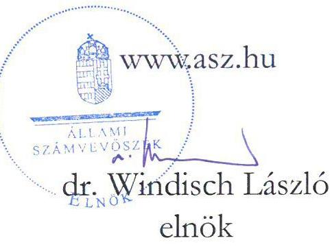
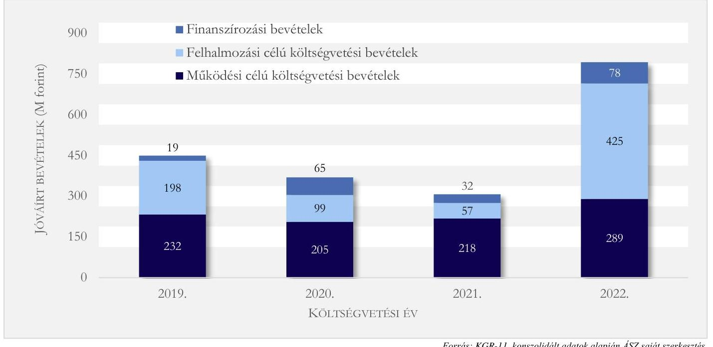
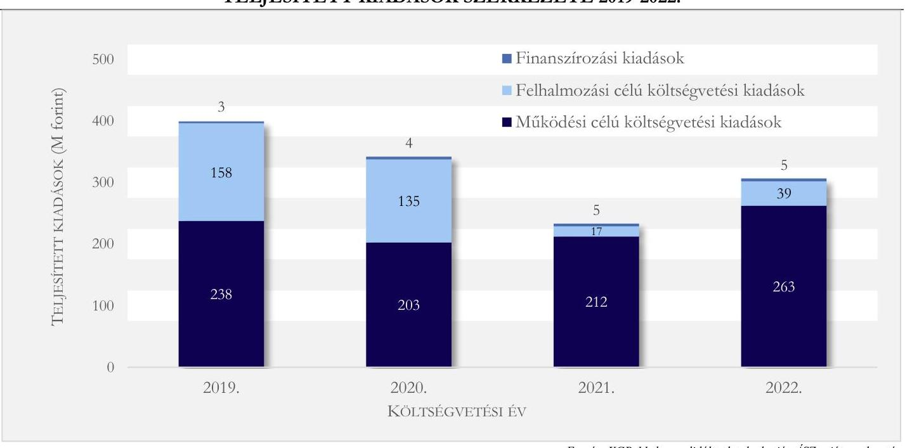
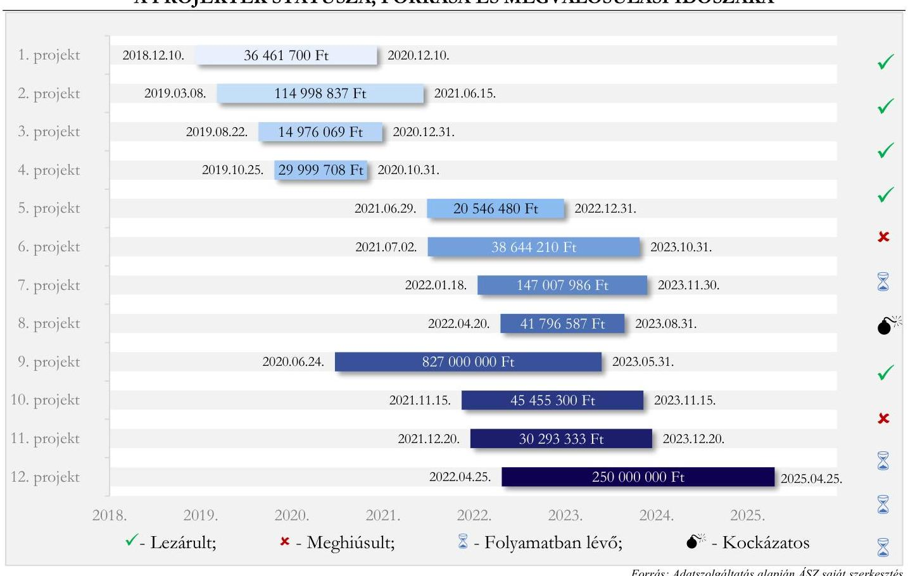

# JELENTÉS 

Zebegény Község Önkormányzata beruházásaihoz kapcsolódó tervezési szerződések beszerzési gyakorlatának célzott ellenőrzése

2024.

---

# JELENTÉS 

Zebegény Község Önkormányzata beruházásaihoz kapcsolódó tervezési szerződések beszerzési gyakorlatának célzott ellenőrzése

2024. 

24002

---

# ELLENŐRZÉSI IGAZGATÓSÁG: 

## ÁLLAMHÁZTARTÁS HELYI SZINTJÉT ELLENŐRZŐ IGAZGATÓSÁG

ELLENŐRZÉSI IGAZGATÓ:
KISGERGELY ISTVÁN igazgató

## ELLENŐRZÉSVEZETŐ:

Jelentéseink az interneten a www.asz.hu címen olvashatók.

DR. GÁL NÓRA ellenőrzésvezető

IKTATÓSZÁM: EL-3917-002/2024
TÉMASZÁM: 23.
ELLENŐRZÉS-AZONOSÍTÓ SZÁM: V1044

---

# TARTALOMJEGYZÉK 

AZ ELLENŐRZÉS ALAPADATAI ..... 5
AZ ELLENŐRZÖTT SZERVEZET ..... 7
ÖSSZEFOGLALÁS ..... 10
AZ ELLENŐRZÉS FÓKUSZKÉRDÉSE ..... 12
MEGÁLLAPÍTÁSOK ..... 13
JAVASLATOK ..... 21
MELLÉKLETEK ..... 22
I. sz. melléklet: Értelmező szótár ..... 22
II. sz. melléklet: Az ellenőrzött szervezetek jegyzéke ..... 24
III. sz. melléklet: Ellenőrzési kritériumok ..... 25
IV. sz. melléklet: Kimutatás a teljesített, pénzügyileg rendezett tervezői kötelezettségvállalásokról, és a hozzájuk kapcsolódó beruházási feladatokról ..... 26
V. sz. melléklet: Kimutatás a beruházások forrásáról és státuszáról ..... 27
VI. sz. melléklet: A kötelezettségvállalás mintatételek eltéréseinek részletezése ..... 28
FÜGGELÉK: ÉSZREVÉTELEK ..... 30
RÖVIDÍTÉSEK JEGYZÉKE ..... 31

---

.

---

# AZ ELLENŐRZÉS ALAPADATAI 

## AZ ELLENŐRZÉS CÉLJA

Az ellenőrzés célja annak értékelése volt, hogy Zebegény Község Önkormányzatának az ellenőrzésre kiválasztott beruházási projektjeihez kapcsolódó tervezési szerződésekre vonatkozó beszerzési gyakorlata megfelelő volt-e. Az ellenőrzés célja volt továbbá az Önkormányzat ${ }^{1}$ által megkötött tervezési szerződések, illetve a kapcsolódó beruházások viszonyának elemzése.

## AZ ELLENŐRZÉS TÍPUSA

Megfelelőségi ellenőrzés.

## AZ ELLENŐRZŐTT IDŐSZAK

2019-től 2023. I. félév végéig tartó időszak.

## AZ ELLENŐRZÉS TÁRGYA

Az ellenőrzés tárgya az önkormányzati beruházási projektek tervezési feladatainak végrehajtására vonatkozó beszerzési gyakorlat értékelése volt, továbbá a pénzügyileg rendezett tervezési szerződések és a kapcsolódó beruházások viszonyának elemzése a megvalósulás, illetve meghiúsulás - valamint az utóbbi okainak - figyelembevételével.

Az ellenőrzött időszak tervezői feladatokat tartalmazó 26 kötelezettségvállalása (IV. melléklet) összesen 15 beruházás végrehajtásához kapcsolódott, melyek közül 12 rendelkezett forrással (V. melléklet). A tervezői feladatokhoz kapcsolódó kötelezettségvállalások dokumentumai és pénzügyi teljesítésük szabályszerűségét 11 minta tekintetében vizsgálta az ellenőrzés (VI. melléklet).

Elemzéssel értékelte az ÁSZ ${ }^{2}$, hogy a tervezési feladatokhoz kapcsolódó beruházások milyen arányban hiúsultak vagy valósultak meg. Az elemzés az ellenőrzött időszak valamennyi olyan beruházására kiterjedt, amelynél az előkészítés során tervezési szerződés megkötése vált szükségessé és a beruházás megvalósításához a forrás rendelkezésre állt. Három esetben (IV. melléklet 7-8. és 10. soraihoz tartozó beruházások) az Önkormányzat által tervezett fejlesztési feladat finanszírozására benyújtott támogatási igényt a támogatói oldalon felmerült forráshiány miatt elutasították, a támogatási igények benyújtásának kötelező elemét képező tervezési szolgáltatások pénzügyi teljesítését (összesen 1073 ezer Ft) az Önkormányzat saját forrásból fedezte. Mivel ezekben az esetekben Támogatói Okirat aláírására nem került sor és a beruházásra a forrás nem állt rendelkezésre, ezeket a beruházásokat az elemzés körében nem vettük figyelembe.

---

Értékeltük továbbá, hogy a tervezési feladatokhoz kapcsolódó beruházások meghiúsulása, vagy késedelmes megvalósulása milyen okokra vezethető vissza.

Az ellenőrzés kiterjedt minden olyan körülményre és adatra, amely az ÁSZ jogszabályban meghatározott feladatainak teljesítéséhez, valamint a program végrehajtása folyamán felmerült újabb összefüggések feltárásához szükséges volt.

# AZ ELLENŐRZÉS JOGALAPJA 

Az ellenőrzés jogszabályi alapját az ÁSZ tv. ${ }^{3} 1 . \int(3)$ bekezdése, és az 5. $\int(2)$-(5) bekezdések előírásai képezték.

## AZ ELLENŐRZÉS MÓDSZERE

Az ellenőrzést a nemzetközi standardokat irányadónak tekintve az ellenőrzési program szempontjai, az ellenőrzött időszakban hatályos jogszabályok, az ellenőrzés szakmai szabályok és módszertanok figyelembevételével végezte az ÁSZ.

Az ellenőrzési kérdések megválaszolásához szükséges bizonyítékok megszerzése az ellenőrzött szervezetek által rendelkezésre bocsátott dokumentumokra és adatokra alapozva, továbbá megfigyelés, szemle (szemrevételezés), kérdésfeltevés (információkérés), valamint elemző eljárás útján történt.

Az ellenőrzési bizonyítékként felhasználható adatforrások közé tartoztak egyrészt az ellenőrzéshez kért dokumentumok, adatok, másrészt minden egyéb - az ellenőrzés folyamán feltárt, az ellenőrzés szempontjából információkat tartalmazó - dokumentum.

Az ellenőrzés lefolytatásához az ellenőrzött szervezetek tanúsítvány kitöltésével, valamint az ÁSZ által kért dokumentumok, adatok, információk megküldésével és a helyszíni ellenőrzés során szolgáltattak adatokat.

Az ellenőrzési kérdések megválaszolásához szükséges bizonyítékok értékelése a következő ellenőrzési eljárások alkalmazásával történt: dokumentumok vizsgálata, tanúsítvány, nyilatkozat, interjú, szemle, kockázat alapú irányított mintavételezés, valamint elemző eljárás.

A kockázati alapon kiválasztott mintatételek a Kisfaludy Program ET-2019-02-135 azonosítójú támogatásából megvalósuló turisztikai fejlesztés tervezési szolgáltatására vonatkozó kötelezettségvállalások voltak. A minta elemszáma 11 volt, mely 10 közalkalmazotti kinevezést és a kapcsolódó 9 célfeladatot meghatározó megállapodást, illetve egy tervezői szerződést tartalmazott. Az ellenőrzés gazdálkodási jogkörgyakorlás szabályszerűségére vonatkozó megállapításai kizárólag a mintatételek értékelésén alapulnak, azokra vonatkoznak. Az ellenőrzés az egyes területek szabályszerűségének, megfelelőségének értékelését a III. számú mellékletben megjelölt kritériumok alapján végezte.

Az elemzés során az ellenőrzés meghiúsultnak tekintette azt a beruházást, amely esetében a rendelkezésre álló, ellenőrzés részére átadott dokumentumok alapján a befejezésre nincs, vagy nem volt lehetőség. Késedelmesnek tekintette az ellenőrzés a beruházás megvalósulását, amennyiben az a Támogatói Okiratban meghatározott időn túl valósult meg, vagy az eredeti határidőt a Támogatói Okiratban a támogatott érdekkörében felmerült okból kellett módosítani.

---

# AZ ELLENŐRZÖTT SZERVEZET 

ZEBEGÉNY KÖZSÉG Pest vármegyében, annak északi részén, a Szobi járásban található. A település a jelentős turista forgalommal rendelkező Dunakanyarban, a Duna bal partján helyezkedik el, Szob és Nagymaros között. A lakosság száma 1338 fő, a lakások száma 605 db (KSH, 2022).
Az Önkormányzat Képviselő-testülete hét főből áll. 2021. március 3-án a képviselő-testület öt tagja lemondott, az új képviselő-testület 2021. április 7-én kezdte meg munkáját. 2022. év elején a település alpolgármestere, majd 2022. július 1-jén polgármestere is lemondott. 2022. július 4-én a Képviselő-testület társadalmi megbízatású alpolgármestert választott, majd 2022. október 2-án - az időközi polgármester választást követően - lépett hivatalba a jelenlegi polgármester. A településen német nemzetiségi önkormányzat múködik. Az Önkormányzat hivatali feladatait a Márianosztrai Közös Önkormányzati Hivatal látja el. Az önkormányzat egy költségvetési szervet tart fenn, a Zebegényi Napraforgó Óvoda és Konyhát.

Az önkormányzatnak nincs gazdasági társasága. Két társulásnak, a Szobi Kistérség Önkormányzatainak Többcélú Társulásának és az Észak-Kelet Pest és Nógrád Megyei Regionális Hulladékgazdálkodási és Környezetvédelmi Önkormányzati Társulásnak a tagja. Előbbi esetében a társulás célja a közoktatás mellett az egészségügy, az ügyeleti rendszer és sürgősségi ellátás megszervezése, valamint a szociális ellátórendszerek koordinált múködtetése. Utóbbinál az együttmúködés fő iránya a hosszútávú, felelős és környezettudatos hulladékgazdálkodás feltételeinek fenntartása és fejlesztése.

A múködési célú költségvetési bevételek 2019-ről 2020-ra - a közhatalmi bevételeken belül az idegenforgalmi adó, valamint a múködési bevételek részeként a szolgáltatások ellenértéke és az ellátási díjak jelentős elmaradása miatt - mintegy $12 \%$-kal 205 M Ft-ra csökkentek, majd 2022. évben az előző évihez képest $33 \%$-os növekedést követően 289 M Ft-ra emelkedtek. A felhalmozási célú költségvetési bevételek összege 2022. évben $424,8 \mathrm{M}$ Ft volt, melynek szinte teljes összegét ( $99,4 \%$-a) a központi költségvetési források tették ki. A felhalmozási célra kapott központi költségvetési források összege ( $422,2 \mathrm{MFt}$ ) az előző évi érték (39,2 MFt) több mint tízszerese volt. Az Önkormányzat 2022. december 31-ig a kapott támogatást nem használta fel, azt pénzeszköz formájában tartotta nyilván; a pénzeszköz állomány a 2021. évi 76,1 M Ft-ról 2022 végére $489,1 \mathrm{M}$ Ft-ra növekedett.

---

A következő ábra az Önkormányzat működési, felhalmozási és finanszírozási bevételeinek alakulását mutatja a 2019-2022. közötti időszakban, évenkénti bontásban.
1. ábra

JÓVÁÍRT BEVÉTELEK SZERKEZETE 2019-2022.

Az Önkormányzat 2019-2022. évekre vonatkozó gazdálkodásának főbb kiadási adatait a 2. ábra mutatja. 2. ábra

TELJESÍTETT KIADÁSOK SZERKEZETE 2019-2022.

Forrás: KGR-11, konszolidált adatok alapján ÁSZ saját szerkesztés
A működési célú költségvetési kiadások - tendenciáját tekintve a működési célú bevételekhez hasonlóan - a 2019-es 238 M Ft-hoz képest 2020-ban $15 \%$-kal alacsonyabb mértékben teljesültek, majd 2022-ben $23,7 \%$-kal, 263 M Ft-ra növekedtek. A növekedést a 2021. évi értékhez képest elsősorban a közalkalmazotti létszám jelentős bővüléséből fakadó személyi juttatások és dologi kiadások emelkedése okozta. A felhalmozási

---

célú költségvetési kiadások 2019-2020. években nagyobb értékkel teljesültek ( 158 M Ft, 135 M Ft) a 2021-2022es évekhez képest ( 17 M Ft, 39 M Ft ). A pandémiát megelőzően elnyert pályázati források felhasználása 2019-2020-ban nagyrészt megtörtént, azonban ezt követően 2020-tól 2021 első félévéig újabb pályázatok benyújtására, források megszerzésére nem került sor az Önkormányzatnál. Az ezt követően elnyert pályázati források felhasználása a 2023. évben várható.

Az Önkormányzat gazdálkodási feladatait ellátó szerve a Hivatal ${ }^{4}$, amelyet négy község megállapodása hozott létre 2013. január 1-jén, élve az Mötv. ${ }^{5}$ 85. § (1) bekezdésben foglalt felhatalmazással. Az Önkormányzat 2013. február 1-jén csatlakozott a megállapodáshoz. A Hivatal önálló jogi személy, saját költségvetési előirányzatai körében önállóan működő és gazdálkodó költségvetési szerv. A Hivatal hat fő ügyintézővel állandó kirendeltséget működtet Zebegényben a Községházán. Az ellenőrzött időszakban a jegyző személyében változás történt, a jelenlegi jegyző 2023. február 11-től látja el feladatát.

---

# ÖSSZEFOGLALÁS 

Az ÁSZ általános hatáskörrel végzi az önkormányzati vagyonnal való gazdálkodás ellenőrzését. Az önkormányzatok vagyona az önkormányzati feladatok és célok ellátását szolgálja, ezért kiemelten fontos, hogy a feladatellátásra fordított pénzeszközök felhasználása során érvényesüljön a felelős gazdálkodás követelménye. Mindezek alapján került sor az Önkormányzatnál a beruházások előkészítéséhez kapcsolódó tervezési feladatokra fordított pénzeszközök felhasználásának ellenőrzésére.

Az ellenőrzött időszakban folyamatban lévő 12 beruházásból kettő Európai Uniós, a többi hazai költségvetési támogatásból finanszírozott volt, melyek együttes összege 23 M Ft önkormányzati önrész mellett 1647 M Ft volt. A beruházások $50 \%$-a útfelújítás, $25 \%$-a település, illetve ingatlanfejlesztési beruházás és $25 \%$-a vis maior esemény miatti helyreállítás volt. A beruházásokhoz kapcsolódó tervezési szerződések egyik fele a támogatásfelhasználás feltételeként megrendelt tervezés, másik fele a már elnyert támogatást követően beszerzendő tervezési szolgáltatás volt.

Az V. számú melléklet szerinti projektek státuszát, forrásának nagyságát, valamint a finanszírozást biztosító támogatások megvalósulási időszakát a következő ábra mutatja.
3. ábra

A PROJEKTEK STÁTUSZA, FORRÁSA ÉS MEGVALÓSULÁSI IDŐSZAKA

A 2019-2020. években a fejlesztési projektek száma arányban állt a rendelkezésre álló humán erőforrás nagyságával, amely biztosította a kiegyensúlyozott beruházás-megvalósítást. A projektek megtorpantak a pandémia időszakában, majd 2021-től a beruházások intenzitása - a korábbi időszakhoz képest nagyobb volumenben - ismét nőtt. A 2022-2023. év folyamán összesen 8 támogatásból megvalósuló beruházás volt folyamatban az Önkormányzatnál, amiből 2 meghiúsult.

---

A beszerzési eljárások jellemzően a nem megfelelő előkészítés miatt lettek eredménytelenek. A beruházások lefolytatását nehezítő körülmény volt a beszerzési/közbeszerzési eljárások eredményeinek kiszámíthatatlansága (érvénytelen ajánlatok, rendelkezésre álló forrást meghaladó ajánlati ár). Emellett a 2021et követő időszakban indult beruházások számossága - annak ellenére, hogy az Önkormányzat egyes esetekben projektmenedzser szolgáltatást is igénybe vett - nem állt arányban az Önkormányzat rendelkezésére álló, szakmai feladatokba bevonható humán erőforrás nagyságával. A 2021-2023-ban bekövetkezett szervezeti változások (új képviselő-testület, polgármester és jegyző) szintén a kiegyensúlyozott és megfelelően monitorozott projektmenedzselés ellen hatottak. Mindennek következtében több beruházás esetében előfordult, hogy a támogatások odaítélésétől a beszerzés tényleges megkezdéséig több hónap eltelt, illetve a beszerzés folyamatában voltak olyan érdemi cselekmények nélküli időszakok, amelyek indokoltságát érdemi információkat tartalmazó dokumentumok nem támasztották alá.

A gazdálkodási jogkörgyakorlók kijelölése, illetve nyilvántartásuk aktualizálása 2021. évtől nem történt meg. A 2022.07.05. és 2022.10.05. között keletkezett kötelezettségvállalások vonatkozásában az ellenőrzött minták $45 \%$-ánál a jogszabályi előírástól eltérően a célfeladat kiírás megelőzte a közalkalmazotti kinevezést. A pénzügyi ellenjegyzés, teljesítésigazolás és utalványozás gyakorlata az ellenőrzött 11 mintatételhez kapcsolódó 20 dokumentum esetében nem volt megfelelő. Az ellenőrzött minták $84 \%$-a esetében nem volt igazolt, hogy a kifizetett juttatások mögött tényleges teljesítések álltak. Mindezek alapján az Önkormányzat ellenőrzésre kiválasztott beruházási projekthez kapcsolódó tervezési szerződésekre vonatkozó beszerzési gyakorlata nem volt megfelelő. A szabályos múködést biztosító alapvető szabályozók naprakészségének hiánya, illetve a szabályzatok előírásainak be nem tartása is nagyban hozzájárultak ahhoz, hogy a beruházások jelentős része a tervezetthez képest később valósult meg, illetve lebonyolításuk akadozott.

Az Önkormányzat Beszerzési szabályzata ${ }^{6}$ összeférhetetlenség kockázatának csökkentésére irányuló előírásai nem érvényesültek a beszerzési eljárások során. Az Önkormányzat több esetben nem tartotta be az összeférhetetlenségi szabályokat, továbbá egy beszerzés esetében az eredetileg közbeszereztetett tervezői feladatot időszakosan foglalkoztatott közalkalmazottak közreműködésével oldotta meg, így nem biztosította a közpénzek hatékony felhasználásának átláthatóságát és nyilvános ellenőrizhetőségét, valamint a tisztességes verseny feltételeit.
Nem történt meg a támogatásból megvalósult beruházások teljes körű dokumentálása, amely amellett, hogy ellentétes az Ávr. ${ }^{7}$ előírásával, az eljárások átláthatóságát sem biztosította.

Egy beruházás esetében a támogató az Önkormányzat határidő hosszabbítás iránti kérelmét elutasította. Az ismételt kérelem elbírálása az ellenőrzés lezárásakor folyamatban volt. Ez alapján az ellenőrzés a támogatás felhasználás elmaradásának lehetőségét azonosította, amely a visszafizetési kötelezettség okán az Önkormányzatnál felmerülő anyagi veszteség kockázatát hordozza.

A meghiúsult beruházásokat érintő forrásvesztés mértéke jelentős. A visszavont ( 827 M Ft ) és a visszafizetett ( 17 M Ft ) támogatás esetén a megfelelő időben történő beszerzés, illetve kivitelezés megkezdés elmaradása miatt az Önkormányzat együttesen 844 M Ft forrástól esett el. A visszafizetett támogatáshoz kapcsolódóan 200 ezer Ft - önkormányzati forrás terhére teljesített - tervezési kiadást feleslegesen teljesítettek és az Önkormányzatnak további 480 ezer Ft ügyleti kamat fizetési kötelezettsége keletkezett.

A feltárt hiányosságok miatt a jogszabályban előírt, nemzeti vagyonnal való felelős gazdálkodás követelménye nem érvényesült maradéktalanul az Önkormányzatnál.

Az ÁSZ az ellenőrzés során feltárt hiányosságok felszámolása, a szabályszerű múködés feltételeinek megteremtése érdekében a polgármesternek 2, a jegyzőnek 7 javaslatot tett.

---

# AZ ELLENŐRZÉS FÓKUSZKÉRDÉSE 

1- A beruházások előkészitéséhez kapcsolódó tervezési feladatok végrehajtására fordított pénzeszközök esetében érvényesült-e a nemzeti vagyonnal való felelős gazdálkodás követelménye?

---

# 1. A beruházások előkészítéséhez kapcsolódó tervezési feladatok végrehajtására fordított pénzeszközök esetében érvényesült-e a nemzeti vagyonnal való felelős gazdálkodás követelménye? 

| Összegző megállapítás | A beruházások előkészítéséhez kapcsolódó tervezési feladatok végrehajtására fordított pénzeszközök esetében nem érvényesült maradéktalanul a nemzeti vagyonnal való felelős gazdálkodás jogszabályban előírt követelménye. |
| :--: | :--: |
| 1.1. számú megállapítás | Az Önkormányzatnál nem gondoskodtak a gazdálkodási jogkörgyakorlók kijelöléséről, illetve a kapcsolódó nyilvántartás naprakész vezetéséről. A pénzgazdálkodási kontrollokat nem alakították ki és nem múködtették. A kötelezettségvállalás, pénzügyi ellenjegyzés, teljesítésigazolás és utalványozás gyakorlata nem felelt meg a jogszabályi előírásoknak. |

Az Önkormányzatnál az ellenőrzött mintatételek vonatkozásában a kötelezettségvállalást a jogszabályi előírások szerint arra jogosult személyek végezték, azonban az ellenjegyzési, teljesítésigazolási, utalványozási jogkörgyakorlás, valamint a kötelezettségvállalás nyilvántartás vezetése és az iratmegőrzés területén hiányosságok fordultak elő.

- A kötelezettségvállalások esetében az Önkormányzatnak az ellenőrzésre kiválasztott beruházásához kapcsolódó, a tervezési feladatokra vonatkozó beszerzési gyakorlata nem felelt meg a Kttv. ${ }^{8}$ 154. § (2) bekezdésében foglaltaknak, figyelemmel a Kjt. ${ }^{9}$ 77/A. §-ban írtakra. Az Önkormányzat a rendkívüli, célhoz kötött tervezési feladatokat 4 közalkalmazott (1, 2., 5., 9. minta) esetében már azelőtt megállapította és írásba foglalta, hogy közalkalmazotti kinevezésük megtörtént volna.
- A pénzügyi ellenjegyzésnél minden esetben hiányzott az ellenjegyzést végző személy jogosultságát alátámasztó dokumentum. Az Önkormányzat rendelkezett a 2018. január 2-án kiadott és az ellenőrzött időszakban is hatályos Gazdálkodási Szabályzattal ${ }^{10}$, azonban az nem tartalmazta az Ávr. 60. § (3) bekezdése ellenére a gazdálkodási jogkörök gyakorlóinak személyét és aláírásmintáját tartalmazó naprakész nyilvántartást, mert a szabályzat mellékletét 2021. évtől nem aktualizálták. Nem álltak rendelkezésre továbbá az aktuális gazdálkodási jogkörgyakorlók kijelölését tartalmazó dokumentumok. Kilenc mintatétel esetében (1-5. és 7-10. minta) a kinevezési okirat ellenjegyzése az Áht. ${ }^{11}$ 37. § (1) bekezdésében foglaltak ellenére nem a kötelezettségvállalást megelőzően történt, tekintettel arra, hogy a kinevezés kezdő napjaként a kötelezettségvállalást és pénzügyi ellenjegyzést megelőző, korábbi időpont volt megjelölve.
- A teljesítésigazolásoknál az Önkormányzat megsértette az Ávr. 57. § (1) bekezdésének előírását, mert a kötelezettségvállalások teljesítésének igazolása hiányzott. Az ellenőrzött közalkalmazotti kinevezésekhez (1-10. minta) kapcsolódóan egy esetben sem állt rendelkezésre olyan, az Mt. ${ }^{12}$ 134. § (1) bekezdés a) pontja szerinti munkaidő nyilvántartás, illetve annak alapját képező dokumentum (pl. jelenléti ív), amely a napi munkavégzés megtörténtét igazolta, valamint egy minta esetében (2. minta) a kinevezési okirathoz kapcsolódóan a munkaköri leírás nem állt rendelkezésre, így az elvégzendő

---

feladatok meghatározása hiányzott. A kötelezettségvállalás dokumentumában előírt feladat alapján történő kifizetés jogosságának megítélésére szolgáló, ellenőrizhető okmányok hiányában nem igazolt, hogy a kinevezések ideje alatt a napi nyolc óra munkavégzés minden esetben megtörtént és a közalkalmazottként alkalmazott tervezők havi illetményeinek kifizetését jogosan teljesítették. Az érintett közalkalmazottak személyi juttatására vonatkozó kötelezettségvállalások összértéke 10 M Ft volt.
Egy tervezői szerződés (11. minta) esetén pénzügyi teljesítésre nem került sor, mivel azt az Önkormányzat felmondta.

- Az Önkormányzatnál a közalkalmazott tervezők illetményeit is tartalmazó csoportos havi munkabér feladásokat nem utalványozták az Áht. 38. $\$ (1) bekezdésében előírtak ellenére.
- A közalkalmazott tervezők által elkészített eredménytermékek egy minta esetében (1. minta) nem, öt minta esetében (2., 7., 8., 9., 10. minta) pedig nem teljeskörűen álltak rendelkezésre, így nem igazolt, hogy a célfeladat elvégzésére vonatkozó megállapodásokban rögzített, összesen 17 M Ft összegű juttatások mögött tényleges teljesítések álltak.
- Az ellenőrzött mintatételeken túlmenően további szabálytalanságok fordultak elő a IV. melléklet 5., 7. és 9-11. sorai szerinti kötelezettségvállalásoknál, melyeket az Áht. 37. § (1) bekezdésében foglaltakkal ellentétesen nem előzte meg pénzügyi ellenjegyzés. A IV. melléklet 9-11. sorai szerinti kötelezettségvállalások esetében az utalványozási jogkör gyakorlása nem felelt meg az Áht. 38. § (1) bekezdésében foglaltaknak, mert az utalványozásra a pénzügyi teljesítést követően került sor.
- A kötelezettségvállalás nyilvántartás nem biztosította az Áhsz. ${ }^{13} 3 . \S$ (2) bekezdésében foglaltakat, mert nem volt folyamatos és áttekinthető. A 8765/2 számon egy adategységként, együttesen számított értékkel egy soron nyilvántartott kötelezettségvállalás a valóságban külön íven szerkesztett, eltérő tervezői feladatokat tartalmazó és különböző időpontokban keletkezett (2019.05.28., 2019.08.09.) kötelezettségvállalásokat tartalmazott. A nyilvántartás nem felelt meg továbbá az Áhsz. 14. melléklet II./4.a) pontjában foglaltaknak, mert a IV. melléklet 1-13. és 24-26. soraihoz tartozó vállalkozói szerződések keltére vonatkozó adatként a ténylegestől eltérő időpontot tartalmazott, továbbá a IV. mellékletben felsorolt szerződések egyike esetében sem tartalmazta a kötelezettségvállalásokat tanúsító dokumentumok iratkezelési azonosítóit (iktató- vagy érkeztető szám).
1.2. számú megállapítás A 12 beruházás közül a beruházások mindössze $25 \%$-a valósult meg az eredeti határidőben, míg $17 \%$-a meghiúsult, továbbá késedelmes volt a beruházások $58 \%$-ának végrehajtása. A késedelmesen megvalósuló 7 beruházásból 5 az ellenőrzött időszak végén is folyamatban volt.

Az elemzett beruházások központi költségvetési, valamint EU-s támogatási forrásból valósultak meg (V. számú melléklet). Ezek együttes összege 23 M Ft önrész mellett 1647 M Ft volt. Az ellenőrzött időszakban a beruházás kivitelezésének késedelme, illetve elmaradása miatt az Önkormányzat a visszavont és visszafizetett támogatások miatt összesen 845 M Ft, kötelező önkormányzati feladathoz kapcsolódó fejlesztési forrástól esett el, ami az ellenőrzött beruházásokhoz kapcsolódó támogatások összegének több mint $51 \%$-a volt. A forrásvesztés miatt a fejlesztési feladat az Önkormányzat által nem volt megvalósítható, mivel annak végrehajtására az Önkormányzat költségvetésében nem volt fedezet. Az Önkormányzatnak a visszafizetési kötelezettség miatt egy esetben 200 ezer Ft eredménytelen tervezési kiadás teljesítése mellett 480 ezer Ft ügyleti kamat fizetési kötelezettsége keletkezett.

---

Három beruházás - a Strandfejlesztés (V. melléklet 2. sor), a Jánoshegyi út felújítása (V. melléklet 3. sor), valamint a Malom utca felújítása (V. melléklet 4. sor) - határidőben, a finanszírozást biztosító Támogatói Okiratban foglaltaknak megfelelően, késedelem nélkül valósult meg. Egy projekt esetében ugyan sor került a Támogatói Okirat többszöri módosítására (Strandfejlesztés), azonban azt az Önkormányzatnak fel nem róható, objektív természetvédelmi ok, valamint többletforrást igénylő feladatbővülés indokolta.
Egy beruházás esetében (Strandfejlesztés) az összeférhetetlenségre vonatkozó alapvető szabályokat nem tartották be, mivel az egyszerű beszerzési eljárás nyertesével szemben az Önkormányzat Beszerzési szabályzata I/4. pontja értelmében az Önkormányzat egyszerű beszerzéseire is alkalmazandó, Kbt. ${ }^{14}$ 25.§ (5) bekezdésében foglalt előírások alapján összeférhetetlenség állt fenn.

A projekttel kapcsolatos egyes tervezői feladatok ellátására 2019.04.27-én tervezési szerződést kötöttek egy gazdasági társasággal összesen nettó 2579994 Ft értékben, majd 2019.04.11-én, illetve 2019.04.27-én a társaság vezető tisztségviselőjével, mint magánszeméllyel, összesen nettó 1370000 Ft értékben. A gazdasági társaság vezető tisztségviselője az Önkormányzat Pénzügyi és Területfejlesztési Bizottságának tagja volt a szerződéskötés időszakában. Az akkor hatályos önkormányzati Szervezeti és Müködési Szabályzat [8/2014 (XI.17.) önkormányzati rendelet] 2. melléklete alapján a hivatkozott Bizottság feladatás hatáskörébe tartozott - többek között - a településfejlesztéssel, fejlesztési programokkal, beruházásokkal kapcsolatos feladatok ellátása, döntések meghozatala.
Az Önkormányzat nem tett meg minden szükséges intézkedést annak érdekében, hogy megelőzze, feltárja és szükség esetén orvosolja az összeférhetetlenséget, ezért sérült a verseny tisztaságának követelménye.
Az érintett társaság az V. melléklet 9. sorában szereplő beruházás tervezési feladatainak beszerzésére irányuló, 2020.11.10-én indított közbeszerzési eljárásban is nyújtott be ajánlatot, melyet az ajánlatkérő nyertesnek minősített. Az eljárásban résztvevő másik ajánlattevő részéről kezdeményezett vitarendezési kérelem alapján az ajánlatkérő Önkormányzat az ajánlatot érvénytelennek minősítette a nyertes ajánlattevővel szemben fennálló összeférhetetlenség miatt, amelyet az eljárás időszakában (2020-2021. év) hatályos Kbt. 25. § (3) bek. b) pont, ba) és bb) alpont előírásának megsértésére, az ajánlattevő társaság vezető tisztségviselőjének bizottsági tagságára alapozott.

# A tervezett beruházások közül két beruházás hiúsult meg. 

A Kossuth utcai útfelújítás (V. melléklet 5. sor) esetében a tervezés a támogatás iránti pályázat benyújtásának előfeltételeként, az előkészítés körében történt meg. A 2021.07.05-én kelt Támogatói Okirat szerint a támogatott műszaki tartalom megvalósításának határideje 2022.12.31. volt.
A kivitelezés (15 624000 Ft becsült érték) és a műszaki ellenőrzés (104 331 Ft becsült érték) beszerzését az Önkormányzat négy hónappal a támogatás rendelkezésre állását követően, közbeszerzési értékhatár alatti beszerzési eljárás keretében tervezte lebonyolítani. Az eljárást eredménytelenné nyilvánították a beérkezett ajánlatok érvénytelensége miatt. A pályázati dokumentáció nem tartalmazott újabb pályázat kiírására, valamint a Támogatói Okirat szerinti megvalósítási határidő módosítási igényére vonatkozó információt. Tekintettel a megvalósítási határidő eredménytelen elteltére, az Önkormányzatnak 2023.01.18-án a támogatás teljes összegét (17 465 ezer Ft) vissza kellett fizetnie, a Támogatói Okiratban előírt ügyleti kamattal ( 480 ezer Ft) együtt. A támogatási igény benyújtásához szükséges, pénzügyileg rendezett tervezési szolgáltatás értéke 200 ezer Ft volt, amit támogatás hiányában az Önkormányzat saját forrásból finanszírozott.

---

A Zebegény település központjának komplex fejlesztését célzó beruházás (V. melléklet 9. sor) esetében a Támogatói Okirat aláírására 2020.06.24-én került sor. A támogatás a projekt fejlesztését (projektdokumentáció és Részletes Megvalósíthatósági Tanulmány létrehozása) és fizikai megvalósítását finanszírozta összesen 900 M Ft értékben. A projekt fizikai befejezésének határideje 2022.12.31. volt. A kivitelezéshez szükséges fejlesztési dokumentumok beszerzésére hirdetménnyel induló nyílt közbeszerzési eljárást írt ki az Önkormányzat. Az eljárás során vitarendezésre került sor, mivel a nyertes ajánlattevővel szemben összeférhetetlenségi kifogást jelentettek be. A vitarendezési eljárás eredményeként a tervezői szerződést 2021.01.27-én nem az eredeti nyertessel, hanem az első eredményhirdetéskor vesztes ajánlattevővel írták alá.
Az Önkormányzat a nyertes vállalkozó első részteljesítését követően szakmai és jogi okokra hivatkozással az aláírást követően két hónappal felmondta a tervezői szerződést. A tervező a felmondás érvénytelenségének megállapítása iránt pert indított. Ezt követően az Önkormányzat új közbeszerzési eljárást írt ki, amit a kiíráshoz kapcsolódóan ajánlattevők által beadott kiegészítő tájékoztatás kérések és vitarendezési kezdeményezést követően 2021.06.01-én visszavont.
A felmondott tervezői szerződéssel kapcsolatos jogi helyzetre és az új közbeszerzési eljárás megindításának időszükségletére való hivatkozással az Önkormányzat a Támogatói Okiratban szereplő teljesítési határidő módosítását kezdeményezte 2021.12.07-én. Ennek eredményeként a fejlesztési és a megvalósítási szakasz határideje is változott. Célszerűsége ellenére a tervezői feladatok ellátására újabb közbeszerzési eljárás kiírására nem került sor. Az Önkormányzat új szakmai koncepciót dolgozott ki és közbeszerzés kiírása helyett határozott idejű közalkalmazotti jogviszony keretében 2022. május és 2023. január között 9 tervezőt alkalmazott, akik számára a konkrét tervezési feladatok elvégzésére és eredménytermékek létrehozására célfeladatot írt ki.
Ezzel párhuzamosan 2022.06.30-án a támogató egyoldalúan módosította a Támogatói Okiratot (4. számú módosítás), és a támogatott célok közül a fizikai megvalósítási részt, és annak finanszírozási összegét törölte. A Támogatói Okirat kedvezményezett hátrányára történő módosítására a Támogatói Okirat 1.7. pontja lehetőséget adott. A rendelkezésre bocsátott ellenőrzési dokumentumok szerint a döntés oka az volt, hogy központi forrásmegvonás miatt a későbbiekben nem volt támogatható a megvalósítás és a döntés valamennyi olyan pályázatot érintett, amelyik még a tervezési (fejlesztési) fázisban volt.
A Támogatói Okirat 2022.09.16-án kelt 6. számú módosítása azonban új költségterv elfogadásával biztosította a tervezők közalkalmazotti státuszából fakadó személyi költségek elszámolhatóságát.
A tervezési feladatok támogatott célként a korábbi finanszírozási feltételek mellett továbbra is megmaradtak, azonban a beruházás fizikai megvalósítása az Önkormányzat érdekkörén kívül eső okból meghiúsult. Az Önkormányzat a beruházás előkészítése során nem járt el kellő gondossággal, emiatt a tervezési feladatok elhúzódtak, így a kivitelezés nem tudott a tervezett időben megkezdődni. A módosító okirat annyiban hagyta meg a fizikai megvalósítás elvi lehetőségét, hogy a Részletes Megvalósíthatósági Tanulmány felhasználási jogát az Önkormányzatnak a Támogatóra kellett átruháznia annak érdekében, hogy a Projektet későbbi támogatás terhére harmadik személy fizikailag megvalósíthassa. A 2023.04.18án aláírt Támogatói Okirat módosítás a tervezési rész határidejét 2023.05.31-re módosította. A Támogatói Okiratban a Projekt fejlesztése eredményeként megjelölt Részletes Megvalósíthatósági Tanulmányt a képviselő-testület elfogadta. A fejlesztési rész elszámolása, az ezzel kapcsolatos hiánypótlások kezelése a Támogató felé az ellenőrzés ideje alatt folyamatban volt.
Az ellenőrzési időszakban befejezett öt beruházás közül két beruházás késedelmesen valósult meg.

---

A Kálvária-hegy omlása miatti partfal helyreállításra (V. melléklet 1. sor) irányuló beruházás esetében a beszerzést a támogatás elnyerését követő nyolcadik hónapban kezdték meg. A közbeszerzési értékhatárt el nem érő beszerzési érték ellenére 2019.07.30-án nemzeti, nyílt közbeszerzési eljárást írtak ki, amely eredménytelenül zárult (2019.09.09.). Ennek oka a rendelkezésre álló fedezet elégtelensége - a beérkezett ajánlat több, mint a rendelkezésre álló forrás kétszerese - volt. A szakmai előkészítés során nem jártak el kellő körültekintéssel, mert - bár azt a becsült érték nem indokolta - az egyszerű beszerzéshez képest bonyolultabb közbeszerzési eljárást folytattak le, amely nagyobb időszükséglettel járt. A döntés indokolatlanságát támasztja alá az is, hogy a 2018.12.10-én kelt Támogatói Okiratban szereplő eredeti határidőt (2019.12.10.) eredménytelen közbeszerzésre hivatkozással egy évvel későbbi időpontra módosították, majd ezt követően 2020.01.26-án közbeszerzési értékhatár alatti, egyszerű beszerzési eljárás eredményeként született meg a kivitelezési szerződés 2020.02.13-án 25 M Ft-os nettó értékben, és készült el a beruházás 2020. április elejére, az eredeti határidőhöz képest késedelmesen.
Az Újvölgyi utak felújítására (V. melléklet 8. sor) irányuló beruházás esetében a támogatás elnyerését (2022.04.20) követően öt hónapos késedelemmel írt ki először közbeszerzési eljárást az Önkormányzat. Ebben az időszakban mondott le az előző polgármester, és a jelenlegi polgármester a 2022. októberi megválasztása után a közbeszerzési eljárást visszavonta. A visszavonásra, valamint a 2022. évi időközi polgármester választásra hivatkozással a Támogatói Okirat megvalósítási véghatáridejét módosították. Az Önkormányzat a támogatás elnyerésétől számított 13 hónap alatt bonyolította le a kivitelező kiválasztását, a második alkalommal kiírt, eredményes közbeszerzés útján. Ezt követően 2 hónap alatt megtörtént a kivitelezés, az eredeti határidőhöz képest késedelmesen.
Öt beruházás az ellenőrzött időszak végén még folyamatban volt, a Támogatói Okiratokban meghatározott megvalósítási határidők még nem jártak le, de a beruházások késedelmes teljesítésben voltak az ellenőrzés időpontjában.
A Bartóky utca 2021. évi felújítására (V. melléklet 6. sor) irányuló beruházáshoz kapcsolódó Támogatói Okirat kelte 2021.07.02., a megvalósítás tervezett dátuma - amelyhez a beruházást megalapozó műszaki dokumentáció már rendelkezésre állt - 2022.12.15. volt. A projekt fizikai megvalósításának végső határideje több alkalommal módosult, az eredeti határidőhöz képest 11 hónappal hosszabbodott meg (2023.10.31.).

Eredetileg a beruházást egyszerű beszerzési eljárással tervezték megvalósítani. A beszerzés két részre irányult: építési beruházás nettó 29523000 Ft és műszaki ellenőrzés 455512 Ft becsült értékkel. Az eljárás eredménytelen lett, mivel a beérkezett két ajánlat érvénytelen volt, az egyik a bruttó ár megállapíthatatlansága miatt, a másik azért, mert az ajánlattevő mindkét beszerzési részre tett ajánlatot, ami nem felelt meg az Ajánlattételi felhívásnak.
A kivitelezési és a műszaki ellenőri feladatok külön eljárás keretében történő beszerzésére több példa is volt az ajánlatkérő gyakorlatában. A beszerzések összevonása indokoltalan volt és alkalmazása hátráltatta a beszerzés eredményességét. Az eredménytelennek nyilvánított eljárást követően az Önkormányzat több határidő módosítási kérelmet terjesztett be. Az Önkormányzat kérelmére 2023.10.31-re módosították a projekt fizikai befejezésének határidejét. Ezt követően az Önkormányzat hirdetménnyel induló, nyílt közbeszerzési eljárást írt ki, 12 hónappal a korábbi, eredménytelennek minősített egyszerű beszerzési eljárás lezárását követően, 2023.04.26-án. Az eljárás eredményes volt, az Önkormányzat a nyertes ajánlattevővel 2023.09.01-én megkötötte a vállalkozási szerződést.
A Nyúl út felújítására (V. melléklet 7. sor) irányuló beruházás esetében az Önkormányzat kérelme alapján a támogatás legalább $10 \%$-ának felhasználását igazoló kifizetési igény benyújtására meghatározott

---

2022.12.31-ei határidőt módosították, amely a megvalósulási véghatáridőt nem érintette. Az Önkormányzat a módosított határidőt sem tudta tartani, ezért 2023 augusztusában - az akkor hatályos mérföldkő nem teljesítése után 3 hónappal - újabb módosítási kérelmet terjesztett elő. Ezzel egyidejűleg az addig felmerült költségek kifizetését is igényelte annak ellenére, hogy az elszámolt költségek nem érték el az elszámolhatóság mértékét. A módosítási kérelmet és a kifizetési igényt a Támogató 2023.06.28-án elutasította. Ezt megelőzően az Önkormányzat 2023.04.14-én a kivitelezés lebonyolítására közbeszerzési eljárást írt ki. Az eljárás eredményes lett, azonban a kivitelezői szerződés aláírására nem került sor, mivel a Támogatói Okiratban meghatározott első mérföldkő (2023.05.25-ig a támogatás legalább $10 \%$-ának felhasználását igazoló kifizetési igénylés benyújtása) a szerződéskötési moratórium, a kivitelezői szerződéskötés és a munkaterület átadás-átvétel becsült időszükségletének ismeretében nem volt tartható.
Az Önkormányzat által rendelkezésre bocsátott, az ellenőrzési időszakon túl keletkezett dokumentumok alapján az Önkormányzat 2023.08.29-én a műszaki teljesítés véghatáridejének módosítását kérte a Támogatótól. A módosítás alapja a hatályos Támogatói Okiratban meghatározott feltételek teljesíthetőségének - az Önkormányzat érdekkörében felmerülő okból fakadó - ellehetetlenülése. A kérelem tartalmazza azt az információt, hogy amennyiben a Támogató a kérelemnek helyt ad, a közbeszerzési eljárás során kiválasztott vállalkozóval a kivitelezői szerződést aláíráák. Tekintettel arra, hogy a kérelem eredményére vonatkozóan nem áll rendelkezésre információ, a beruházás meghiúsulásának kockázata magas.
A Rózsa utca és a Tátika köz lösz partfalának helyreállítására (V. melléklet 10. sor) irányuló beruházáshoz kapcsolódó Támogatói Okirat 2021.12.20-án kelt, 2022.12.20-i elszámolás véghatáridővel. A kivitelezéshez kapcsolódó tervezői szerződés aláírására a támogatás megítélése után 9 hónappal, 2022.09.20-án került sor. A tervezési dokumentáció teljesítési igazolása 2022.11.03-án megtörtént. Az Önkormányzat kérelmére a támogatás felhasználásának véghatáridejét egy évvel későbbi határidőre módosították. A kivitelezés beszerzéséhez a határidőmódosítást követően, az egybeszámítási szabályokra figyelemmel a Kbt. hatálya alá tartozó beszerzési eljárás lefolytatása volt szükséges. Az ellenőrzési időszakot követően az Önkormányzat nemzeti, nyílt eljárást írt ki a kivitelező kiválasztására. A közbeszerzési eljárás eredményeként a kivitelezői szerződéseket az elszámolási határidőt megelőző teljesítési határidővel megkötötték.
A Köztemető partomlás helyreállítására (V. melléklet 11. sor) irányuló beruházáshoz kapcsolódó Támogatói Okirat 2021.11.15-én kelt, 2022.11.15-i elszámolás véghatáridővel. Annak ellenére, hogy a beruházás befejezésére egy év állt rendelkezésre, a kivitelezéshez kapcsolódó tervezői szerződés aláírására a támogatás megítélése után 10 hónappal, 2022.09.20-án került sor. A tervezési dokumentáció teljesítési igazolása 2022.11.24-én megtörtént. Az Önkormányzat kérelmére a támogatás felhasználásának véghatáridejét további egy évvel meghosszabbították. A kivitelezés beszerzéséhez az egybeszámítási szabályokra figyelemmel a Kbt. hatálya alá tartozó beszerzési eljárás lefolytatása volt szükséges. A 2023.07.19-én megindított közbeszerzési eljárást lefolytatták, aminek eredményeként 2023.08.29-én a kivitelezésre irányuló vállalkozói szerződést aláírták.
Az energetikai korszerúsítésre (V. melléklet 12. sor) irányuló beruházás esetében a kapcsolódó Támogatói Okirat kelte 2022.04.25. volt. A tervezési szolgáltatásra vonatkozó szerződést a teljes műszaki tervdokumentáció elkészítésére előírt első mérföldkő (2023.03.31.) leteltét követően írták alá, a tervek 2023.06.16-án készültek el. A kivitelezés ebből fakadó késedelme miatt a beruházás Támogatói Okiratban meghatározott határidőre (2013.10.31.) történő megvalósítása kétségessé vált, mivel a kivitelezésre vonatkozó vállalkozói szerződés aláírására az ellenőrzött időszakban nem került sor. A Támogatói

---

Okiratban rögzített határidő módosítása nélkül a beruházás nem tud megvalósulni a támogatásként rendelkezésre bocsátott forrásokból.
1.3. számú megállapítás

A tervezési feladatokhoz kapcsolódó beszerzések késedelmes megvalósulása, illetve meghiúsulása részben a beszerzési folyamatokhoz kapcsolódó szabályok betartásának hiányára, a műszaki, szakmai előkészítés hiányosságaira és a lebonyolításhoz szükséges humánerőforrás hiányára vezethető vissza. A beruházások megvalósulását ugyanakkor befolyásolták a háborús helyzet okán fennálló beszerzési nehézségek, valamint a közbeszerzési eljárások lefolytatása során a Hivatal tevékenységében jelentkező bizonytalanságok.

Az ellenőrzés értékelte, hogy az érintett beruházásoknál van-e összefüggés a tervezési szolgáltatások beszerzési időszaka és a határidőben történő megvalósulás között.
A 12 projekt felénél (kizárólag útfelújítására irányuló beruházások) a támogatás elnyerését megelőző időszakra esett a tervezői szolgáltatás beszerzése és a teljesítés, míg a többi esetében azt a támogatott időszakban hajtották végre. A 6 útfelújítási beruházásból kettő valósult meg az eredetileg tervezett határidőben, míg 3 megvalósulása késedelmes és egy esetében a kivitelezés meghiúsult, a támogatás teljes összegét vissza kellett fizetnie az Önkormányzatnak. Önmagában az, hogy a támogatás elnyerésekor a tervek már rendelkezése álltak, kismértékben befolyásolta a beruházások határidőben való megvalósítását, azonban az ellenőrzés nem tárt fel szignifikáns összefüggést a tervezési szolgáltatások beszerzési időszaka és a határidőben történő megvalósulás között.
A másik 6 beruházás esetében, ahol a tervezést a támogatási időszakban kellett végrehajtani, a határidőben történő megvalósulási arány még kedvezőtlenebb: egy határidőben megvalósult és egy meghiúsult beruházás mellett egy beruházást késedelmesen hajtottak végre, valamint az ellenőrzés idején további 3 beruházás volt folyamatban az eredeti határidőhöz képest késedelemben.
Az Önkormányzat esetében a következő tényezők járultak hozzá a beruházások késedelmes megvalósításához, illetve meghiúsulásához.
A beszerzési folyamat szabályozási környezetébe tartozó előírások betartásának hiánya nagyban befolyásolta a beszerzési folyamatok elhúzódását, illetve meghiúsulását. A beruházások lebonyolításával kapcsolatos folyamatokat tartalmazó szabályozás (Közbeszerzési Szabályzat, Beszerzési szabályzat, Ellenőrzési nyomvonal) alapvetően megteremtette a beruházások célszerű határidőben történő végrehajtásának feltételeit. Az Önkormányzat pályázati aktivitása igen jelentős volt (2019-2020 között 4 beruházást, 2021-2023 között pedig 8 beruházást bonyolított párhuzamosan), ugyanakkor nem biztosították, hogy a forrás rendelkezésre állását követően haladéktalanul elindítsák a beszerzési eljárásokat.
A szabályozási kontrollok közül az összeférhetetlenség kockázatának csökkentésére vonatkozó, az Önkormányzat Beszerzési szabályzata I./4. pontjában és a Kbt. 25. § (1) bekezdésében meghatározott kontroll nem múködött. Az értékelt beruházások közül három esetben merült fel összeférhetetlenségi probléma, melyből kettőt az Önkormányzat nem kezelt, egyet pedig külső kezdeményezésre kezelt, ami a beruházás időbeli elhúzódását eredményezte. Az V. melléklet 2. és 12. sorához tartozó beruházások tervezési feladatainak közbeszerzési értékhatárt el nem érő beszerzése esetében az ajánlatkérő részéről az eljárással vagy annak előkészítésével kapcsolatos tevékenységbe bevont személy a közbeszerzési eljárásban ajánlattevőként részt vett, a kiírt pályázatot megnyerte. A

---

versenysemlegességet sértette, hogy a nyertes pályázó olyan információkkal rendelkezett az Önkormányzatnál ellátott feladatai körében, amelyek versenyelönyt jelenthettek számára pályázóként. Az V. melléklet 9. sorához tartozó, közbeszerzett tervezési szolgáltatás vonatkozásában a vesztes ajánlattevő vitarendezési kérelmét követően döntött úgy az Önkormányzat, hogy nem az eredetileg kihirdetett - összeférhetetlen - nyertessel köti meg a szerződést.
Nem múködtek az egyszerű beszerzési pályázati dokumentációk teljességét biztosító kontrollok sem. Az Önkormányzat nem biztosította az Ávr. 101. §-a által előírt iratmegőrzést, a pályáztatás dokumentációi hiányosak voltak, több esetben nem tartalmazták az ajánlati felhívásokat, illetve a nem nyertes ajánlatokat. A kialakított kontrollok múködtetésének hiánya 2021-től tapasztalható. Az ebben az időszakban indult beruházások esetében számos alkalommal hosszabb időintervallumokban semmilyen intézkedés nem történt a beszerzések előre vitele érdekében (pl.: támogatás elnyerésétől számított 8. hónapban kezdték meg a közbeszerzést.)
A múszaki, szakmai előkészítés hiányosságai egyes esetekben a beszerzések elhúzódását eredményezték (V. melléklet 1. sor - vis maior beruházás). Az ajánlatok érvénytelenségéhez vezető pályázati feltételek kialakítása, illetve egyes beszerzések összevonása nem volt célszerű (V. melléklet 5. és 6. sorai - útfelújítási beruházások).

A beruházások lebonyolításához szükséges humán erőforrás hiánya rendszerszintủ problémát jelentett az Önkormányzatnál, aminek negatív hatását a párhuzamosan végzett beruházások jelentős száma tovább fokozta. Az Önkormányzat ugyan alkalmazott a támogatásokhoz kapcsolódóan bonyolító szervezeteket, ugyanakkor a párhuzamosan futó beruházások monitoringjához, a szükséges adatszolgáltatásokhoz, döntésekhez szükséges adminisztrációs, előkészítő tevékenységekhez nem volt biztosított a megfelelő erőforrás az Önkormányzaton belül.
A háborús helyzet miatt fennálló beszerzési nehézségekkel együtt járó építőanyagár-emelkedés és az ajánlattevői oldalon kialakult kínálati hiány miatti kivitelezésidíj-emelkedés szintén hozzájárult a beruházások késedelmes végrehajtásához. Több esetben kellett a beszerzési eljárásokat ismételten kiírni, mert nem adtak ajánlatot, vagy jelentősen a rendelkezésre álló forrásnál magasabb ajánlatok érkeztek.
A beszerzési eljárások eredményének kiszámíthatatlansága is felmerült, mint a végrehajtást hátráltató tényező. Több esetben kellett kiírni ismételten eljárást, mert az érvénytelen volt, vagy a fedezetet az ajánlati ár meghaladta. Az összeférhetetlenségi szabályok be nem tartása az elemzett 12 beruházás egynegyedénél felmerült, így a tisztességes verseny feltételei nem minden esetben voltak biztosítottak az Önkormányzatnál. Egy érvényes közbeszerzési eljárás keretében megkötött tervezői szerződést az Önkormányzat felmondott, majd ezt követően létszámbővítéssel, közalkalmazott tervezők foglalkoztatásával oldotta meg a tervezési feladatok elvégeztetését. A tervezési szakasz ilyen módon történő végrehajtása nem biztosította a közpénzek felhasználásának átláthatóságát és nyilvános ellenőrizhetőségét, továbbá a tisztességes verseny feltételeit.

---

# JAVASLATOK 

Az ÁSZ tv. 33. § (1) bekezdésében foglaltak értelmében az ellenőrzött szervezet vezetője köteles a jelentésben foglalt megállapításokhoz kapcsolódó intézkedési tervet összeállítani és azt a jelentés kézhezvételétől számított 30 napon belül az ÁSZ részére megküldeni. Amennyiben az ellenőrzött szervezet vezetője nem küldi meg határidőben az intézkedési tervet, vagy továbbra sem elfogadható intézkedési tervet küld, az Állami Számvevőszék elnöke az ÁSZ tv. 33. § (3) bekezdése a) és b) pontjaiban foglaltakat érvényesítheti.

## ZEBEGÉNY KÖZSÉG ÖNKORMÁNYZATA POLGÁRMESTERÉNEK

1. Intézkedjen a nyilvános jelentés kézhezvételét követő 30 napon belül az Állami Számvevőszék jelentésének a Képviselő-testület elé terjesztéséről. A napirend tárgyalásáról szóló jegyzőkönyvvel együtt a jelentést tájékoztatásul küldje meg a Kormányhivatal számára is.
2. Intézkedjen a közalkalmazott tervezőktől történő céljuttatás visszakövetelése iránt azokban az esetekben, ahol az eredménytermék nem áll rendelkezésre.

## A MÁRIANOSZTRAI KÖZÖS ÖNKORMÁNYZATI HIVATAL JEGYZŐJÉNEK

1. Intézkedjen az Áht. 37. § (1) és 38. § (1) bekezdésében foglalt kontrolltevékenységek kialakítása és müködtetése iránt, amellyel megelőzhető a jelentésben leírt, az Ávr. 52. §-ában, 57. §-ában, valamint 59. $\S$-ában foglalt kötelezettségvállalási, teljesítésigazolási és utalványozási jogkörök gyakorlásával összefüggő szabálytalanságok ismételt előfordulása.
2. Intézkedjen az Ávr. 60. § (3) bekezdésében elöírtak alapján a gazdálkodási jogkörök gyakorlóinak személyét és aláírásmintáját tartalmazó naprakész nyilvántartás elkészitése és folyamatos vezetése érdekében.
3. Intézkedjen, hogy az Önkormányzat a Kbt. 142. § (5) szerinti bejelentési kötelezettségének az elektronikus közbeszerzési rendszerben tegyen eleget a „Zebegény település turisztikai célú fejlesztés" projekthez kapcsolódó, hibás teljesités miatti felmondással kapcsolatban.
4. Biztosítsa a jövőben az Ávr. 101. §-ban foglaltak szerint, hogy a támogatásokkal kapcsolatos beszerzési eljárások iratanyaga a szabályszerü örzési időben maradéktalanul rendelkezésre álljon és biztosított legyen a beszerzések átláthatósága.
5. Intézkedjen a kötelezettségvállalás nyilvántartás Áhsz. 3. § (2) bekezdésében elöírt folyamatos vezetéséről, valamint az Áhsz. 14. melléklet II. 4.a) pontja szerinti adatok kötelezettségvállalási nyilvántartásba való felvezetéséről a nyitott és a jövőbeni kötelezettségvállalások tekintetében.
6. Intézkedjen a beszerzések előkészitéséhez kapcsolódó kontrollok müködtetése érdekében, és gondoskodjon az összeférhetetlenségre vonatkozó szabályok érvényesitéséről.
7. Intézkedjen egy olyan eljárásrend, és annak betartását támogató kontroll kialakításáról, amely biztosítja, hogy a közalkalmazottak kinevezésére a tényleges munkába állását megelőzően, valamint a további munkáltatói intézkedésre a kinevezést követően kerüljön sor.

---

# MELLÉKLETEK 

## I. SZ. MELLÉKLET: ÉRTELMEZŐ SZÓTÁR

beruházás
építési beruházás
kötelezettségvállalás
nemzeti vagyon
pénzügyi ellenjegyzés

Támogatói Okirat:

A tárgyi eszköz beszerzése, létesítése, saját vállalkozásban történő előállítása, a beszerzett tárgyi eszköz üzembe helyezése, rendeltetésszerủ használatbavétele érdekében az üzembe helyezésig, a rendeltetésszerủ használatbavételig végzett tevékenység (szállítás, vámkezelés, közvetítés, alapozás, üzembe helyezés, továbbá mindaz a tevékenység, amely a tárgyi eszköz beszerzéséhez hozzákapcsolható, ideértve a tervezést, az előkészítést, a lebonyolítást, a hiteligénybevételt, a biztosítást is); beruházás a meglévő tárgyi eszköz bővítését, rendeltetésének megváltoztatását, átalakítását, élettartamának, teljesítőképességének közvetlen növelését eredményező tevékenység is, az előbbiekben felsorolt, e tevékenységhez hozzákapcsolható egyéb tevékenységekkel együtt. (Forrás: Számv. tv. ${ }^{15}$ 3. § (4) bekezdés 7. pont)
a) a Kbt. 1. mellékletben felsorolt tevékenységek egyikéhez kapcsolódó munka kivitelezése vagy kivitelezése és külön jogszabályban meghatározott tervezése együtt;
b) építmény kivitelezése vagy kivitelezése és külön jogszabályban meghatározott tervezése együtt;
c) az ajánlatkérő által meghatározott követelményeknek megfelelő építmény bármilyen eszközzel vagy módon történő kivitelezése. (Forrás: Kbt. 8. § (3) bekezdés)
Kötelezettségvállalás: a kiadási előirányzatok, és - ha jogszabály azt lehetővé teszi - a 49. § szerinti lebonyolító szerv számára a Kormány rendeletében meghatározottak szerinti rendelkezésre bocsátott összeg terhére fizetési kötelezettség vállalásáról szóló - így különösen a foglalkoztatásra irányuló jogviszony létesítésére, szerződés megkötésére, költségvetési támogatás biztosítására irányuló - szabályszerűen megtett jognyilatkozat. (Forrás: Áht. 1. § 15. pont)
Nemzeti vagyonba tartozik többek között:
a) az állam vagy a helyi önkormányzat kizárólagos tulajdonában álló dolgok,
b) az a) pont hatálya alá nem tartozó, az állam vagy a helyi önkormányzat tulajdonában lévő dolog,
c) az állam vagy a helyi önkormányzat tulajdonában lévő pénzügyi eszközök, továbbá az államot vagy a helyi önkormányzatot megillető társasági részesedések,
d) az államot vagy a helyi önkormányzatot megillető bármely vagyoni értékkel rendelkező jogosultság, amelyet jogszabály vagyoni értékủ jogként nevesít. (Forrás: Nvtv. ${ }^{16}$ 1. § (2) bekezdés a)-d) pontok)
Kötelezettséget vállalni a Kormány rendeletében foglalt kivételekkel csak pénzügyi ellenjegyzés után, a pénzügyi teljesítés esedékességét megelőzően, írásban lehet. A pénzügyi ellenjegyzőnek a Kormány rendeletében foglalt kivételekkel meg kell győződnie arról, hogy a tervezett kifizetési időpontokban a pénzügyi fedezet biztosított, a kötelezettségvállalás nem sérti a gazdálkodásra vonatkozó szabályokat. (Forrás: Áht. 37. § (1) bekezdés)
Az államháztartás alrendszerei terhére jogszabály vagy egyedi döntés alapján, pályázati úton vagy pályázati rendszeren kívül nyújtható támogatásra vonatkozó, támogatási döntést tartalmazó dokumentum (Forrás: Áht. 48. § (1) bekezdés)

---

teljesítésigazolás
tervezés
utalványozás

A teljesítés igazolása során ellenőrizhető okmányok alapján ellenőrizni és igazolni kell a kiadások teljesítésének jogosságát, összegszerűségét, ellenszolgáltatást is magában foglaló kötelezettségvállalás esetében - ha a kifizetés vagy annak egy része az ellenszolgáltatás teljesítését követően esedékes - annak teljesítését. A teljesítést az igazolás dátumának és a teljesítés tényére történő utalás megjelölésével, az arra jogosult személy aláírásával kell igazolni. (Forrás: Ávr. 57. § (1), (3) bekezdések)
Építészeti-műszaki tervezési tevékenységnek minősül az építmény, építményrész, építményegyüttes, táj- és kertépítészeti alkotás megépítéséhez, bővítéséhez, felújításához, átalakításához, helyreállításához, korszerűsítéséhez, lebontásához, elmozdításához, rendeltetésének megváltoztatásához szükséges építészeti-műszaki dokumentáció elkészítése és kormányrendeletben foglaltak szerinti ellenőrzése. (Forrás: Étv. 32. § (1) bekezdés)
A bevételi előirányzatok javára bevételt elszámolni és a kiadási előirányzatok terhére kifizetést elrendelni - a Kormány rendeletében meghatározott kivételekkel utalványozás alapján lehet. A kiadási előirányzatok terhére történő utalványozásra a Kormány rendeletében meghatározott kivételekkel - a teljesítés igazolását, és az annak alapján végrehajtott érvényesítést követően kerülhet sor. (Forrás: Áht. 38. § (1) bekezdés)

---

II. SZ. MELLÉKLET: AZ ELLENŐRZÖTT SZERVEZETEK JEGYZÉKE

# ELLENŐRZÖTT SZERVEZETEK 

Zebegény Község Önkormányzata
Márianosztrai Közös Önkormányzati Hivatal

---

# III. SZ. MELLÉKLET: ELLENŐRZÉSI KRITÉRIUMOK 

## A KÖTELEZETTSÉGVÁLLALÁSI DOKUMENTUMOK ÉS A KIFIZETÉSEK SZABÁLYSZERŰSÉGEHEZ KAPCSOLÓDÓAN ELLENŐRZOTT JOGSZÁBÁLYI KRITÉRIUMOK

KÖTELEZETTSÉGVÁLLALÁSI DOKUMENTUMOK SZABÁLYSZERŰSÉGE
Kötelezettségvállalás
Ávr. 50. § (1) bekezdés a), d) pontok, 52. § (1) bekezdés c) pont, (6), (6a) bekezdések, 60. § (3) bekezdés
Áht. 1. § 15. pont, 37. § (1) bekezdés
Kttv. 154. § (2), Kjt. 77/A. §
Kötelezettségvállalás nyilvántartás
Ávr. 56. § (1) bekezdés
Áhsz. 3. § 2) bekezdés, 14. melléklet II. 4. pont
KIFIZETÉSEK SZABÁLYSZERŰSÉGE
Pénzügyi ellenjegyzés
Áht. 37. § (1) bekezdés
Ávr. 50. § (1) d) pont, 55. § (1) bekezdés, 55. § (2) f) pont
Teljesítés igazolás
Ávr. 57. § (1), (3)-(4) bekezdések
Áht. 38. § (1) bekezdés
Utalványozás
Áht. 38. § (1) bekezdés
Ávr. 59. § (1) bekezdés, (3) bekezdés g) pont

---

# IV. SZ. MELLÉKLET: KIMUTATÁS A TELJESÍTETT, PÉNZÜGYILEG RENDEZETT TERVEZŐI KÖTELEZETTSÉGVÁLLALÁSOKRÓL, ÉS A HOZZÁJUK KAPCSOLÓDÓ BERUHÁZÁSI FELADATOKRÓL 

| SORSZÁM | NYILVÁNTARTÁSI SZÁM / ÜGYIRÁTSZÁM* | TERVEZÉSI KÖTELEZETTSÉGVÁLLALÁS KELTE | Á.TERVEZÉSSEL ÖSSZEFÜGGŐ BERUHÁZÁS MEGNEVEZÉSE |
| :--: | :--: | :--: | :--: |
| 1. | 8973/1 | 2019.04.01. | Kálvária-hegy omlása (Szőnyi u.) következtében pince, partfal helyreállítása |
| 2. | ZB/862-12/2019. | 2019.04.11. |  |
| 3. | 8917/3 | 2019.04.27. | Strandfejlesztés |
| 4. | ZB/862-16/2019. | 2019.04.27. |  |
| 5. | 8765/2 | 2019.05.28. | Jánoshegyi út felújítása 2019. évben |
| 6. | 8765/2 | 2019.08.09. | Malom utca felújítása |
| 7. | 10896/1 | 2020.04.23. | Bartóky utca felújítása 2020. |
| 8. | 14207/1 | 2021.01.14. | Parkolóhelyek kialakítása |
| 9 . | 12435/1 | 2021.03.01. | Zebegény Kossuth utca (493/1 hrsz) útfelújítása |
| 10. | 14667/1 | 2022.04.13. | Árpád u. felújítás |
| 11. | 12606/1 | 2021.04.20. | Bartóky utca felújítása 2021. |
| 12. | 13069/1 | 2021.06.10. | Külterületi utak/Nyúl út felújítása |
| 13. | 14272/1 | 2022.01.21. | Újvölgyi utak felújítása |
| 14. | ZB/632-1/2022. | 2022.07.18. |  |
| 15. | ZB/485-1/2022. | 2022.07.19. |  |
| 16. | ZB/785-1/2022. | 2022.08.05. |  |
| 17. | ZB/786-1/2022. | 2022.08.05. |  |
| 18. | ZB/894-1/2022. | 2022.09.05. | Zebegény település turisztikai célú fejlesztése |
| 19. | ZB/891-1/2022. | 2022.09.05. |  |
| 20. | ZB/942-1/2022. | 2022.09.05. |  |
| 21. | ZB/11-1/2022. | 2022.10.05. |  |
| 22. | ZB/957-1/2022. | 2022.10.05. |  |
| 23. | 104-1/2021 | 2021.01.27. |  |
| 24. | 15655/1 | 2022.09.20. | Rózsa utca és a Tátika köz lösz partfalának helyreállítása |
| 25. | 15619/1 | 2022.09.20. | Szőnyi utca 23. mögötti Köztemető partomlás helyreállítása |
| 26. | 16828/1 | 2023.05.19. | Önkormányzati épületek energetikai korszerűsítése |

[^0]
[^0]:    * A 14-22. sorok szerinti tervezők olyan közalkalmazottak, akik konkrét tervezési feladatait célfeladat ellátására vonatkozó megállapodás tartalmazza. A lista nem tartalmaz egy olyan tervezési feladat ellátásra létrejött közalkalmazotti szerzödést, amely esetében célfeladat elvégzésére vonatkozó megállapodás megkötésére nem került sor.

---

| BERUHÁZÁS   SORSZÁMA | A TERVEZÉSSEL ÖSSZEFÜGGŐ, FORRÁSSAL RENDELKEZŐ BERUHÁZÁSOK MEGNEVEZÉSE | A BERUHÁZÁS FORRÁSANAK NAGYSAGA (FT) |  | A TÁMOGATÁs FORRÁSA | A BERUHÁZÁS STÁTUSZA |
| :--: | :--: | :--: | :--: | :--: | :--: |
|  |  | TÁMOGATÁs | ÖNERÓ |  |  |
| 1. | Kálvária-hegy omlása (Szőnyi u.) következtében pince, partfal helyreállítása | 33147000 | 3314700 | központi költségvetés | lezárult |
| 2. | Strandfejlesztés | 114998837 | 0 | központi költségvetés | lezárult |
| 3. | Jánoshegyi út felújítása 2019. évben | 12729659 | 2246410 | központi költségvetés | lezárult |
| 4. | Malom utca felújítása | 29999708 | 0 | központi költségvetés | lezárult |
| 5. | Zebegény Kossuth utca (493/1 hrsz) útfelújítása | 17464508 | 3081972 | központi költségvetés | meghiúsult |
| 6. | Bartóky utca felújítása 2021. | 38644210 | 0 | központi költségvetés | folyamatban |
| 7. | Külterületi utak/Nyúl út felújítása | 140007606 | 7000380 | EU-s | folyamatban |
| 8. | Újvölgyi utak felújítása | 41796587 | 0 | központi költségvetés | lezárult |
| 9. | Zebegény település turisztikai célú fejlesztése | $827168400^{*}$ | 0 | központi költségvetés | meghiúsult |
| 10. | Rózsa utca és a Tátika köz lösz partfalának helyreállítása | 27264000 | 3029333 | központi költségvetés | folyamatban |
| 11. | Szőnyi utca 23. mögötti   Köztemető partomlás   helyreállítása | 41323000 | 4132300 | központi költségvetés | folyamatban |
| 12. | Önkormányzati épületek energetikai korszerűsítése | 250000000 | 0 | EU-s | folyamatban |
|  | Összesen: | 1647375115 | 22805095 |  |  |

[^0]
[^0]:    * A beruházás teljes támogatási öszzge 900 M Ft volt, amiből a fejlesztési részre eső támogatási öszzge 72,8 M Ft.

---

# VI. SZ. MELLÉKLET: A KÖTELEZETTSÉGVÁLLALÁS MINTATÉTELEK ELTÉRÉSEINEK RÉSZLETEZÉSE 

## ElítéRes

## MINTATÉTEL

## KINEVEZÉS

## GÉLFELADAT MEGÁLLAPODÁS

1. mintatétel ZB/1199-1/2022.
2. kinevezési okiratban az aláírást és pénzügyi ellenjegyzést megelőző, korábbi időpontot jelöltek meg a kinevezés kezdő napjaként, amely ellentétes az Áht. 37. § (1) bekezdésében foglaltakkal.
A teljesítés nem igazolt, mely nem felelt meg az Ávr. 57. § (1) bekezdésnek

A kifizetést utalványozás hiányában teljesítették az Áht. 38. $\S$ (1) bekezdésében foglaltakkal ellentétesen.
2. mintatétel ZB/785-2/2022.
3. kinevezési okiratban az aláírást és pénzügyi ellenjegyzést megelőző, korábbi időpontot jelöltek meg a kinevezés kezdő napjaként, amely ellentétes az Áht. 37. § (1) bekezdésében foglaltakkal.
A teljesítés nem igazolt, mely nem felelt meg az Ávr. 57. § (1) bekezdésnek.

A kifizetést utalványozás hiányában teljesítették az Áht. 38. $\S$ (1) bekezdésében foglaltakkal ellentétesen.
4. mintatétel ZB/632-1/2022.
5. kinevezési okiratban az aláírást és pénzügyi ellenjegyzést megelőző, korábbi időpontot jelöltek meg a kinevezés kezdő napjaként, amely ellentétes az Áht. 37. § (1) bekezdésében foglaltakkal.
A teljesítés nem igazolt, mely nem felelt meg az Ávr. 57. § (1) bekezdésnek.

A kifizetést utalványozás hiányában teljesítették az Áht. 38. $\S$ (1) bekezdésében foglaltakkal ellentétesen.
6. mintatétel ZB/632-1/2022.
7. kinevezési okiratban az aláírást és pénzügyi ellenjegyzést megelőző, korábbi időpontot jelöltek meg a kinevezés kezdő napjaként, amely ellentétes az Áht. 37. § (1) bekezdésében foglaltakkal.
A teljesítés nem igazolt, mely nem felelt meg az Ávr. 57. § (1) bekezdésnek.

A kifizetést utalványozás hiányában teljesítették az Áht. 38. $\S$ (1) bekezdésében foglaltakkal ellentétesen.
8. kinevezési okiratban az aláírást és pénzügyi ellenjegyzést megelőző, korábbi időpontot jelöltek meg a kinevezés kezdő napjaként, amely ellentétes az Áht. 37. § (1) bekezdésében foglaltakkal.
A teljesítés nem igazolt, mely nem felelt meg az Ávr. 57. § (1) bekezdésnek.

A kifizetést utalványozás hiányában teljesítették az Áht. 38. § (1) bekezdésében foglaltakkal ellentétesen.
5. mintatétel ZB/786-1/2022.
6. kinevezési okiratban az aláírást és pénzügyi ellenjegyzést megelőző, korábbi időpontot jelöltek meg a kinevezés kezdő napjaként, amely ellentétes az Áht. 37. § (1) bekezdésében foglaltakkal.
A teljesítés nem igazolt, mely nem felelt meg az Ávr. 57. § (1) bekezdésnek.

A kifizetést utalványozás hiányában teljesítették az Áht. 38. § (1) bekezdésében foglaltakkal ellentétesen.
6. mintatétel ZB/484-1/2022.
7. mintatétel ZB/894-1/2022.
A kinevezési okiratban az aláírást és pénzügyi ellenjegyzést megelőző, korábbi időpontot jelöltek meg a kinevezés kezdő napjaként, amely ellentétes az Áht. 37. § (1) bekezdésében foglaltakkal.
A teljesítés nem igazolt, mely nem felelt meg az Ávr. 57. § (1) bekezdésnek.

A kifizetést utalványozás hiányában teljesítették az Áht. 38. § (1) bekezdésében foglaltakkal ellentétesen.
A teljesítés nem igazolt, mely nem felelt meg az Ávr. 57. § (1) bekezdésnek.

A kifizetést utalványozás hiányában teljesítették az Áht. 38. § (1) bekezdésében foglaltakkal ellentétesen.
A kinevezési okiratban az aláírást és pénzügyi ellenjegyzést megelőző, korábbi időpontot jelöltek meg a kinevezés kezdő napjaként, amely ellentétes az Áht. 37. § (1) bekezdésében foglaltakkal.
A teljesítés nem igazolt, mely nem felelt meg az Ávr. 57. § (1) bekezdésnek.

A kifizetést utalványozás hiányában teljesítették az Áht. 38. § (1) bekezdésében foglaltakkal ellentétesen.

A kinevezési okiratban, a kitelegedőző, korábbi időpontot jelöltek meg a kinevezés kezdő napjaként, amely ellentétes az Áht. 37. § (1) bekezdésében foglaltakkal.
A teljesítés nem igazolt, mely nem felelt meg az Ávr. 57. § (1) bekezdésnek.

A kifizetést utalványozás hiányában teljesítették az Áht. 38. § (1) bekezdésében foglaltakkal ellentétesen.

## GÉLFELADAT MEGÁLLAPODÁS

A kinevezési okirat dokumentuma későbbi, mint a hozzá kapcsolódó célfeladat meghatározás dokumentuma, amely nem felel meg a Kttv. 145. § (2) bekezdésben foglaltaknak a Kjt. 77/A. §-ában foglaltakra figyelemmel.

Nem tájeskörűen állt rendelkezésre a megállapodásban meghatározott eredménytermék, mely az Ávr. 57. § (1) bekezdésében foglaltakkal ellentétes.

---

8. mintatétel
ZB/891-1/2022.
A kinevezési okiratban az aláírást és pénzügyi ellenjegyzést megelőző, korábbi időpontot jelöltek meg a kinevezés kezdő napjaként, amely ellentétes az Áht. 37. § (1) bekezdésében foglaltakkal.

A teljesítés nem igazolt, mely nem felelt meg az Ávr. 57. § (1) bekezdésnek.

A kifizetést utalványozás hiányában teljesítették az Áht. 38. $\S$ (1) bekezdésében foglaltakkal ellentétesen.
9. mintatétel
ZB/942-1/2022.
A kinevezési okiratban az aláírást és pénzügyi ellenjegyzést megelőző, korábbi időpontot jelöltek meg a kinevezés kezdő napjaként, amely ellentétes az Áht. 37. § (1) bekezdésében foglaltakkal.

A teljesítés nem igazolt, mely nem felelt meg az Ávr. 57. § (1) bekezdésnek.

A kifizetést utalványozás hiányában teljesítették az Áht. 38. § (1) bekezdésében foglaltakkal ellentétesen.
10. mintatétel
ZB/485-1/2022.
A kinevezési okiratban az aláírást és pénzügyi ellenjegyzést megelőző, korábbi időpontot jelöltek meg a kinevezés kezdő napjaként, amely ellentétes az Áht. 37. § (1) bekezdésében foglaltakkal.

A teljesítés nem igazolt, mely nem felelt meg az Ávr. 57. § (1) bekezdésnek.

A kifizetést utalványozás hiányában teljesítették az Áht. 38. § (1) bekezdésében foglaltakkal ellentétesen.

Nem teljeskörűen állt rendelkezésre a megállapodásban meghatározott eredménytermék, mely az Ávr. 57. § (1) bekezdésében foglaltakkal ellentétes.

A kinevezési okirat dokumentuma későbbi, mint a hozzá kapcsolódó célfeladat meghatározás dokumentuma, amely nem felel meg a Kttv. 145. § (2) bekezdésben foglaltaknak a Kjt. 77/A. §-ában foglaltakra figyelemmel.
Nem teljeskörűen állt rendelkezésre a megállapodásban meghatározott eredménytermék, mely az Ávr. 57. § (1) bekezdésében foglaltakkal ellentétes.

Nem teljeskörűen állt rendelkezésre a megállapodásban meghatározott eredménytermék, mely az Ávr. 57. § (1) bekezdésében foglaltakkal ellentétes.

# MINTATÉTEL 

## ÉLTÉRÉS

## TERVEZŐL SZERZŐDÉS

11. mintatétel 104-1/2021

Az ABR felületre feltöltött 2019-2023.06.30. időszak kötelezettségvállalások nyilvántartása nem tartalmazza a tervezői szerződést, a nyilvántartás nem teljes körű, nem felel meg az Áhsz. 3. § (2) bekezdésében, valamint a 14. melléklet II. pontjában foglaltaknak.
Az Ávr. 60. § (3) bekezdése alapján a gazdálkodási jogkörök gyakorlójának személyéről és aláírásmintájáról vezetett nyilvántartás nem tartalmazza a szerződés pénzügyi ellenjegyzőjének nevét és aláírásmintáját.

---

# FÜGGELÉK: ÉSZREVÉTELEK 

A jelentéstervezetet a Számvevőszék 15 napos észrevételezésre megküldte az ellenőrzött szervezet vezetőjének az ÁSZ tv. 29. §* (1) bekezdése előírásának megfelelően.

Az ellenőrzött szervezetek vezetői a jelentéstervezet megállapításaira nem tettek észrevételt.

[^0]
[^0]:    * 29. § (1) Az Állami Számvevőszék az ellenőrzési megállapításait megküldi az ellenőrzött szervezet vezetőjének vagy az általa megbízott személynek, és annak, akinek személyes felelősségét állapította meg.
    (2) Az ellenőrzött szervezet vezetője és a felelősként megjelölt személy az ellenőrzés megállapításaira tizenöt napon belül írásban észrevételt tehet.
    (3) Az Állami Számvevőszék az észrevételre a beérkezésétől számított harminc napon belül írásban válaszol. A figyelembe nem vett észrevételeket köteles a jelentésben feltüntetni, és megindokolni, hogy azokat miért nem fogadta el.

---

# RÖVIDÍTÉSEK JEGYZÉKE 

${ }^{1}$ Önkormányzat
${ }^{2}$ ÁSZ
${ }^{3}$ ÁSZ tv.
${ }^{4}$ Hivatal
${ }^{5}$ Mótv.
${ }^{6}$ Beszerzési szabályzat
${ }^{7}$ Ávr.
${ }^{8}$ Kttv.
${ }^{9}$ Kjt:
${ }^{10}$ Gazdálkodási Szabályzat
${ }^{11}$ Áht.
${ }^{12} \mathrm{Mt}$.
${ }^{13}$ Áhsz.
${ }^{14} \mathrm{Kbt}$.
${ }^{15}$ Számv. tv.
${ }^{16}$ Nvtv.

Zebegény Község Önkormányzata
Állami Számvevőszék
2011. évi LXVI. törvény az Állami Számvevőszékről

Márianosztrai Közös Önkormányzati Hivatal
2011. évi CLXXXIX. törvény Magyarország helyi önkormányzatairól

Beszerzések lebonyolításának szabályzata (Hatályos: 2016.04.01-től)
368/2011. (XII. 31.) Korm. rendelet az államháztartásról szóló törvény végrehajtásáról
2011. évi CXCIX. törvény a közszolgálatit tisztviselőkről
1992. évi XXXIII. törvény a közalkalmazottak jogállásáról

A pénzgazdálkodással kapcsolatos kötelezettségvállalás, ellenjegyzés, érvényesítés és utalványozás rendjéről szóló szabályzat (Hatályos: 2018.01.02-től)
2011. évi CXCV. törvény az államháztartásról
2012. évi I. törvény a munka törvénykönyvéről
4/2013. (I. 11.) Korm. rendelet az államháztartás számviteléről
2015. évi CXLIII. törvény a közbeszerzésekről
2000. évi C. törvény a számvitelről
2011. évi CXCVI. törvény a nemzeti vagyonról

---

1052 Budapest, Apáczai Csere János u. 10. | 1364 Budapest 4., Pf. 54
www.asz.hu | szamvevoszek@asz.hu
telefon: +36 14849100