# JELENTÉS 

## Az önkormányzatok működésének és gazdálkodásának ellenőrzése

Budapest Főváros XII. kerület Hegyvidéki Önkormányzat

2024.

---

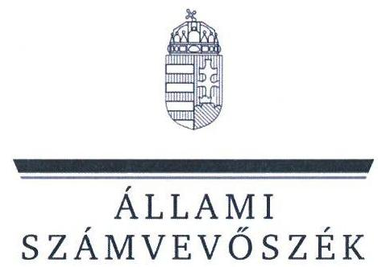

ÁLLAMI
SZÁMVEVŐSZÉK

# JELENTÉS 

## Az önkormányzatok működésének és gazdálkodásának ellenőrzése

Budapest Főváros XII. kerület Hegyvidéki Önkormányzat

2024. 

24003
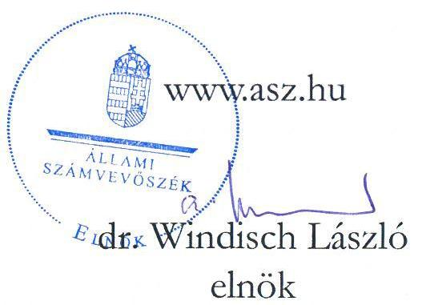

---

# ELLENŐRZÉSI IGAZGATÓSÁG: 

## ÁLLAMHÁZTARTÁS HELYI SZINTJÉT ELLENŐRZŐ IGAZGATÓSÁG

ELLENŐRZÉSI IGAZGATÓ:
KISGERGELY ISTVÁN igazgató

ELLENŐRZÉSVEZETŐ:
Jelentéseink az interneten a www.asz.hu címen olvashatók.

KERSMÁJER ÁGOTA ellenőrzésvezető

IKTATÓSZÁM: EL-3848-005/2024.
TÉMASZÁM: 2674
ELLENŐRZÉS-AZONOSÍTÓ SZÁM: V-101802

---

# TARTALOMJEGYZÉK 

■ AZ ELLENŐRZÉS ALAPADATAI ..... 5
■ AZ ELLENŐRZÖTT SZERVEZET ..... 8
■ ÖSSZEFOGLALÁS ..... 10
■ AZ ELLENŐRZÉS FÓKUSZTERÜLETEI ..... 14
■ MEGÁLLAPÍTÁSOK ..... 15
■ JAVASLATOK ..... 35
■ MELLÉKLETEK ..... 38
I. sz. melléklet: Értelmező szótár ..... 38
II. sz. melléklet: Az ellenőrzött szervezetek jegyzéke ..... 40
III. sz. melléklet: Ellenőrzési kritériumok ..... 41
IV. sz. melléklet: A 2022. évi módosított előirányzatok eltérései ..... 44
■ FÜGGELÉK: ÉSZREVÉTELEK ..... 45
■ RÖVIDÍTÉSEK JEGYZÉKE ..... 63

---

.

---

# AZ ELLENŐRZÉS ALAPADATAI 

## AZ ELLENŐRZÉS CÉLJA

Az ellenőrzés célja az Önkormányzat ${ }^{1}$ közfeladat ellátásának, pénzügyi és vagyoni helyzetének ellenőrzése volt. Az ellenőrzés során az ÁSZ ${ }^{2}$ értékelte az Önkormányzat költségvetés tervezése és végrehajtása, a pénzügyi és vagyongazdálkodása, valamint beszámolási kötelezettsége teljesítésének megfelelőségét. Az ellenőrzés kiterjedt annak vizsgálatára, hogy a belső ellenőrzés támogatta-e a gazdálkodás folyamatainak szabályosságát.

Az ellenőrzés célja volt továbbá annak megállapítása, hogy az Önkormányzat közzétételi kötelezettségeinek eleget tett-e, informatikai rendszerei hozzájárultak-e a szabályszerű működés és gazdálkodás biztosításához, valamint az Önkormányzat tett-e lépéseket a fenntartható működés érdekében.

## AZ ELLENŐRZÉS TÍPUSA

Megfelelőségi ellenőrzés.

## AZ ELLENŐRZÖTT IDŐSZAK

Az egyes fókuszterületek esetében az ellenőrzött időszak az alábbiak szerint alakult:

1. A költségvetés tervezése, végrehajtása, az éves beszámolási és zárszámadási kötelezettség teljesítése
a 2022. és a 2023. évi költségvetés tervezése, a 2022. évi költségvetés végrehajtása
2. Az Önkormányzat által ellátott közfeladatok pénzügyi feltételei és az önkormányzat fizetőképessége 2020-2022. évek
3. Az Önkormányzat vagyongazdálkodása, az éves költségvetési beszámoló mérlegének alátámasztottsága

- a vagyoni helyzetet befolyásoló vagyonváltozások, 2020-2022. évek
- a vagyon nyilvántartása, a költségvetési beszámoló mérlegének alátámasztottsága,
- az energiahatékonyság/környezet- és klímavédelem érdekében tett fejlesztési célú intézkedések.
2022. év
2020-2022. évek

4. A pénzügyi és vagyongazdálkodást támogató informatikai rendszerek
2022. év
5. Közzétételi kötelezettség teljesítése
a helyszíni ellenőrzés megkezdésekor (2023. július 12.) fennálló állapot

A belső ellenőrzés szervezeti kereteinek megfelelősége, a belső és külső ellenőrzések gazdálkodásra vonatkozó megállapításaira tett intézkedések önkormányzat általi nyomon követése

2020-2022. évek

---

# Az ellenőrzés alapadatai 

## Az ELLENŐRZÉS TÁRGYA

Az Önkormányzat költségvetésének tervezése és annak végrehajtása, a pénzügyi gazdálkodás szabályozottsága és szabályszerűsége, az éves beszámolási kötelezettség teljesítése, az önkormányzat közfeladatainak finanszírozása, ezen belül kiemelten a bölcsődei ellátás biztosítása, az önkormányzat pénzügyi helyzete és fizetőképessége. A vagyongazdálkodás szabályozottsága, a vagyonban bekövetkezett változások döntéshozatalának és elszámolásának szabályszerűsége, az önkormányzat vagyoni helyzete, az önkormányzat mérlegében kimutatott vagyon nyilvántartásának szabályszerűsége, a vagyon kimutatása, értékelése és a mérleg leltárral való alátámasztásának szabályszerűsége. Az energiahatékonyság/környezet- és klímavédelem érdekében tervezett és megvalósított fejlesztési célú intézkedések.

A pénzügyi és vagyongazdálkodást támogató informatikai rendszerek kialakítása, a közzétételi kötelezettség teljesítése. A belső ellenőrzés szervezeti kereteinek megfelelősége, a belső és külső ellenőrzések gazdálkodásra vonatkozó megállapításaira tett intézkedések önkormányzat általi nyomon követése.

Az ellenőrzés kiterjedt minden olyan körülményre és adatra, amely az ÁSZ jogszabályban meghatározott feladatainak teljesítéséhez, valamint a program végrehajtása folyamán felmerült újabb összefüggések feltárásához szükséges volt.

## AZ ELLENŐRZÉS JOGALAPJA

Az ellenőrzés jogszabályi alapját az ÁSZ tv. ${ }^{3} 1. § (3)$ bekezdésében, az 5. § (2)-(3), (5) és (6) bekezdéseiben, valamint az Áht. ${ }^{4} 61. § (2)$ bekezdésében foglalt előírások képezték.

## AZ ELLENŐRZÉS MÓDSZERE

Az ellenőrzés a nemzetközi standardokat irányadónak tekintve az ellenőrzési program szempontjai, az ellenőrzött időszakban hatályos jogszabályok, az ellenőrzés szakmai szabályok és módszertanok figyelembevételével került végrehajtásra.

Az ellenőrzési kérdések megválaszolásához szükséges bizonyítékok megszerzése az ellenőrzött szervezet által rendelkezésre bocsátott dokumentumokra, adatokra alapozva, interjú, információkérés, mintavételezés, valamint elemző eljárás alkalmazásával történt.

Az ellenőrzési bizonyítékként felhasznált adatforrások közé tartoztak az ellenőrzéshez kért dokumentumok, az ellenőrzés tárgya kapcsán releváns, nyilvánosan hozzáférhető adatok, dokumentumok, a Magyar Államkincstár adatbázisai. Adatforrás volt ezeken túlmenően minden az ellenőrzés folyamán feltárt, az ellenőrzés szempontjából információkat tartalmazó nyilatkozat, jegyzőkönyv, egyéb dokumentum.

Az ellenőrzés lefolytatásához az ellenőrzött szervezet tanúsítványok kitöltésével, valamint az ÁSZ által kért dokumentumok, adatok, információk megküldésével és átadásával szolgáltatott adatokat.

Az Önkormányzat pénzügyi helyzetének elemzéséhez a 2020-2022. évi összevont éves költségvetési beszámolóból származó adatokon túl felhasználásra kerültek a helyi adóbevételek, a kiszámlázott általános forgalmi adó, az általános forgalmi adó-visszatérítés, a kamatbevételek, az egyéb pénzügyi műveletek bevétele, a maradvány igénybevétele, valamint kamatkiadások, egyéb pénzügyi műveletek kiadása jogcímek működési és felhalmozási célú megosztásáról szolgáltatott önkormányzati adatok.

---

Az ellenőrzés az egyes területek szabályszerűségének, megfelelőségének értékelését a III. számú mellékletben megjelölt kritériumok alapján végezte el. A költségvetés végrehajtása, valamint a vagyoni helyzetet befolyásoló vagyonnövekedések és vagyoncsökkenések szabályszerűségének értékeléséhez statisztikai (véletlenszerű) és nem statisztikai módszerekkel, illetve kockázati alapon kiválasztott mintatételeket alkalmaztunk. Amennyiben a mintavételezéshez rendelkezésre álló valamely sokaság elemszáma kisebb volt, mint az előírt mintaelemszám, a sokaság tételes ellenőrzésre került. Statisztikai (véletlenszerű) mintavételezés történt a 2020-2021. évi, valamint a 2022. évi felhalmozási célú kiadások (beruházások és felújítások) tekintetében (30-30 db), a 2020-2021. évi vagyon értékesítések tekintetében (30 db), továbbá a 2022. évi működési célú kiadásokon belül a személyi juttatások (Munkavégzésre irányuló egyéb jogviszonyban nem saját dolgozónak fizetett juttatások főkönyvi számla), a dologi kiadások (Szakmai tevékenységet segítő szolgáltatások és Egyéb szolgáltatások főkönyvi számlák), az államháztartáson kívülre irányuló támogatások (Működési célú visszatérítendő támogatások, kölcsönök nyújtása államháztartáson kívülre, Egyéb működési célú támogatások államháztartáson kívülre, Felhalmozási célú visszatérítendő támogatások, kölcsönök nyújtása államháztartáson kívülre, Egyéb felhalmozási célú támogatások államháztartáson kívülre főkönyvi számlák) tekintetében (területenként 30 db, összesen 90 db). A teljes sokaság tételes ellenőrzésére került sor a 2022. évi vagyon értékesítéseknél (27 db), valamint az ellenőrzött időszak követelés elengedésénél (1 db). Kockázati alapon, a legnagyobb összegű tételek kerültek kiválasztásra a 2020-2022. évek térítés nélküli vagyonátadásaiból (5 db), valamint a 2020-2022. évek behajthatatlan követelés leírásaiból (11 db). A kiválasztott mintatételek értékelése egyedileg történt.

---

# AZ ELLENŐRZÖTT SZERVEZET 

## BudAPEST FŐVÁROS XII. KERÜLET HEGYVIDÉKI ÖNKORMÁNYZAT

Budapest XII. kerülete (Hegyvidék) a város budai oldalának középső, főképp hegyvidéki területein (a Budai-hegység magaslatain) fekszik, lakónépessége 2022. január 1-jén 55296 fő volt.

Az Önkormányzat munkáját 18 tagú Képviselő-testület ${ }^{5}$, valamint hét bizottság segíti: Egészségügyi és Szociális Bizottság, Jogi és Ügyrendi Bizottság, Közbiztonsági és Közlekedési Bizottság, Köznevelési és Kulturális Bizottság, Pénzügyi bizottság, Tulajdonosi és Városfejlesztési Bizottság, Zöld Bizottság.

A polgármester ${ }^{6}$ a negyedik ciklusban tölti be a tisztségét, munkáját egy alpolgármester támogatja.
A jegyző ${ }^{7}$ 2011-től tölti be tisztségét, munkáját kettő aljegyző támogatja. A Polgármesteri Hivatal ${ }^{8}$ 2022. évi létszáma 238 fő volt. A Polgármesteri Hivatal a következő szervezeti egységekre tagolódik: Polgármesteri és Jegyzői Törzskar, Anyakönyvi és Szolgáltatási Iroda, Adóigazgatási Iroda, Hegyvidéki Rendészet (Közterület felügyelet), Népjóléti Iroda, Hatósági Iroda, Városrendezési és Főépítészi Iroda, Városfejlesztési Iroda, Vagyongazdálkodási Iroda, Köznevelési és Közművelődési Iroda, Zöld Iroda, Pénzügyi és Költségvetési Iroda.

A kerületben 10 (bolgár, görög, horvát, lengyel, német, örmény, roma, szerb, ukrán, szlovák) nemzetiségi önkormányzat működik.

Az ellenőrzött időszakban az Önkormányzat kötelező és önként vállalt feladatainak ellátásáról - a Polgármesteri Hivatalon kívül - az irányítása alá tartozó 20 költségvetési szerv ${ }^{9}$ és a feladatok ellátására létrehozott öt önkormányzati tulajdonú gazdasági társaság ${ }^{10}$ útján gondoskodott. Emellett egy gazdasági társaság jelzőrendszeres házi segítségnyújtást végzett, további gazdasági társaságok egészségügyi alapellátásokat (háziorvosi ellátást, házi gyermekorvosi ellátást, fogorvosi alapellátást, ügyeleti ellátást) nyújtottak. Oktatási, szociális és gyermekjóléti szolgáltatások ellátásában nyolc egyéb szervezet vett részt. Az Önkormányzat 2021-ben a Virányosi Közösségi Ház intézményt megszüntette, és átvette más fenntartótól a Művész úti Óvoda és Bölcsőde intézményt. Így 2022-ben az Önkormányzat három bölcsődét, kilenc óvodát, egy óvoda és bölcsődét, négy szociális és egészségügyi intézményt (Családsegítő és Gyermekjóléti Központ, Szociális Központ, Fejlesztő Napközi Otthon, Egészségügyi Központ), a Gazdasági Ellátó Szolgálatot, továbbá a Hegyvidéki Lapkiadó és a Normafa Park intézményeket működtette.

Az Önkormányzat többségi befolyása alatt 2020. január 1-jén és 2022. december 31-én egyaránt öt -100%-os önkormányzati tulajdonban lévő - gazdasági társaság volt. A 2020. évben egy gazdasági társaság (Hegyvidéki Városfejlesztési Nonprofit Kft. „v. a.") végelszámolással megszűnt, egy pedig alapításra került (BBSZ Ingatlan 2022 Kft.). A gazdasági társaságok kulturális, sport és szabadidősport, üzemeltetési, városfejlesztési és -fenntartási, valamint ingatlanfejlesztési feladatokat láttak el.

Az Önkormányzat konszolidált költségvetési beszámolója szerinti költségvetési bevétele a 2020. évben 22 372,1 millió Ft volt, amely a 2022. évre 21 180,9 millió Ft-ra (5,3%-kal) csökkent. A konszolidált költségvetési beszámoló szerinti költségvetési kiadások a 2020. évi 20 794,6 millió Ft-ról 2022-re 21 483,3 millió Ft-ra (3,3%-kal) növekedtek.

---

Az Önkormányzat konszolidált mérleg szerinti vagyona a 2020. január 1-jei 60 140,1 millió Ft-ról a 2022. év végére 76 144,3 millió Ft-ra, 26,6%-kal növekedett. Ezen belül meghatározó volt a nemzeti vagyonba tartozó befektetett eszközök csoportja (benne a tárgyi eszközök), amely 2020. január 1-jén az önkormányzati vagyon 87,4%-át, 2022. december 31-én a 87,1%-át tette ki, és amelynek 26,2%-os növekedése az ellenőrzött időszakban döntő hatással volt a vagyon alakulására. Ugyanebben az időszakban a követelések nagysága 2863,2 millió Ft-ról 3150,3 millió Ft-ra, 10,0%-kal növekedett, miközben az önkormányzati vagyonban betöltött súlya 0,6 százalékponttal csökkent (4,7%-ról 4,1%-ra). Az Önkormányzat készpénz likviditásának növekedését jelzi a pénzeszközök 41,3%-kal, 4574,0 millió Ft-ról 6460,9 millió Ft-ra történt növekedése, így arányuk 0,9 százalékponttal, 8,5%-ra nőtt az önkormányzati vagyonon belül.

Az önkormányzati vagyon forrásai között meghatározó és egyre növekvő szerepe a saját tőkének volt, amely az ellenőrzött időszakban 71,1%-kal, 39 933,5 millió Ft-ról 68 312,0 millió Ft-ra, aránya 66,4%-ról 89,7%-ra növekedett. A forrásösszetétel változását ezen felül a passzív időbeli elhatárolások 18 667,4 millió Ft-ról 5739,8 millió Ft-ra, 69,3%-kal történt csökkenése okozta. A kötelezettségek a 2020. január 1-jei 1539,3 millió Ft-ról 2092,5 millió Ft-ra, 35,9%-kal növekedtek, de arányuk így sem számottevő (2,8%) a forrásokon belül. Az Önkormányzat vagyonának változását az 1. ábra szemlélteti:
1. ábra

AZ ÖNKORMÁNYZAT VAGYONÁNAK VÁLTOZÁSA
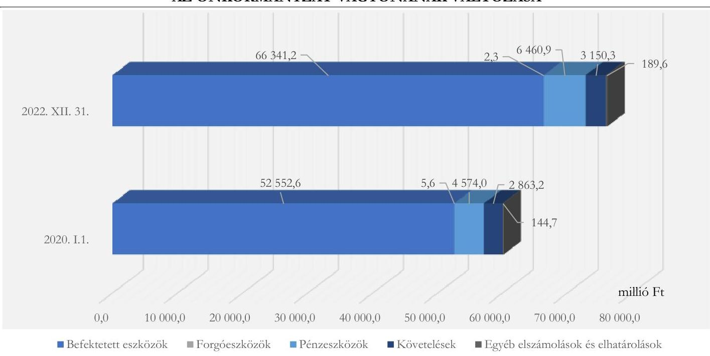

Forrás: Az Önkormányzat 2020. és 2022. évi összesített költségvetési beszámolói alapján ÁSZ saját szerkesztés

---

# ÖSSZEFOGLALÁS 

A helyi közügyek intézése, és ennek keretében a lakosság közszolgáltatásokkal való ellátása az önkormányzatok alapvető feladata. Az önkormányzati közfeladatokra fordított pénzeszközökkel és az ellátásukat szolgáló köztulajdonnal való felelős és átlátható gazdálkodás közérdek. Az ÁSZ az államháztartás ellenőrzésére kapott általános felhatalmazása keretében, mindezek figyelembevételével ellenőrizte az Önkormányzat közpénzekkel és vagyonnal való gazdálkodását.

A 2022. és a 2023. évi költségvetés tervezése és jóváhagyása során az Önkormányzat részben tartotta be a jogszabályi előírásokat. A polgármester a
 költségvetési rendelettervezeteket a törvényi határidőben benyújtotta a Képviselő-testületnek, a rendelettervezetek előterjesztésekor tájékoztatásul bemutatták a jogszabályban előírt mérlegeket és kimutatásokat. Az előterjesztésekhez a jogszabályban előírtak ellenére a Pénzügyi bizottság írásos véleményét nem csatolták. A Képviselő-testület határidőben megalkotta az Önkormányzat költségvetéséről szóló rendeleteket, amelyek megfeleltek a törvényben előírt tartalmi követelményeknek.

Az Önkormányzat 2022-ben a jogszabályban előírtaknak megfelelően a módosított kiadási előirányzatok mértékéig vállalt kötelezettséget és teljesítette a költségvetési kiadásokat. A kiadások teljesítése és elszámolása - a gazdálkodási jogkörök gyakorlásának öt esetben megállapított hibája kivételével - megfelelt a jogszabályi és belső előírásoknak az ellenőrzött külső személyi juttatások, államháztartáson kívülre nyújtott támogatások, valamint szakmai tevékenységet segítő szolgáltatások mintatételei esetében. Az Önkormányzat előirányzat-nyilvántartása a jogszabályban előírtak ellenére nem tartalmazta az eredeti előirányzatok módosításának, átcsoportosításának jogcímét, dátumát és hatáskörét, valamint az azt elrendelő dokumentum azonosításához szükséges adatokat.

A 2022. évi beszámolási és zárszámadási kötelezettség teljesítése - a közvetett támogatások bemutatása kivételével - szabályszerű volt. A 2022. évi zárszámadási rendelettervezetet a törvényben előírt határidőig és szerkezetben terjesztették a Képviselő-testület elé. A 2022. évi zárszámadási rendelet szerint a működési költségvetés 2495,5 millió Ft többletet, a felhalmozási költségvetés 2797,9 millió Ft hiányt mutatott, a 302,4 millió Ft költségvetési hiányt előző évi maradvány finanszírozta.

A 2023. évi költségvetési, valamint a 2022. évi zárszámadási rendelettervezet előterjesztésekor a közvetett támogatásokat nem a jogszabályi előírásoknak megfelelő részletezettséggel mutatták be.

Az Önkormányzat 2022. és 2023. évi költségvetési rendeleteiben, illetve 2022. évi zárszámadási rendeletében a kötelező és önként vállalt feladatok bevételeinek és kiadásainak megbontása nem volt megfelelő, mivel a Normafa Park rehabilitációval összefüggő, törvényben előírt közfeladatokat az önként vállalt, a törvény által előírt közfeladatokat el nem látó BBSZ Ingatlan 2022 Kft.-hez kapcsolódó feladatokat a kötelező feladatok között tüntették fel.

A teljesített költségvetési bevételek az ellenőrzött időszakban 5,3%-kal csökkentek, míg a teljesített költségvetési kiadások 3,3%-kal növekedtek. A teljesített költségvetési kiadásokra 2020. évben a teljesített költségvetési bevételek fedezetet nyújtottak, a 2021-2022. években azonban csak a maradvány igénybevételével nyújtottak fedezetet. A pénzügyi egyensúlyi helyzet összetételét tekintve, az ellenőrzött időszakban a működési bevételek és kiadások egyenlege kedvezően változott. Az Önkormányzatnak 2020-ban működési hiánya és felhalmozási többlete, míg a 2021-2022. években működési többlete és felhalmozási hiánya keletkezett. Az ellenőrzött időszakban a teljesített működési költségvetési kiadásokon belül a kötelező és az önként vállalt feladatokra fordított kiadások 95,7-96,0%, illetve 4,3-4,0% megoszlási aránya

---

stabil maradt, míg a teljesített felhalmozási kiadásokon belüli megoszlás ingadozott. A BBSZ Ingatlan 2022 Kft.-re fordított kiadások következtében 98,3%-ról 73,9%-ra csökkent a kötelező, és 1,7%-ról 26,1%-ra nőtt az önként vállalt feladatokra fordított felhalmozási kiadások aránya.

Az Önkormányzat a gazdasági társaságok veszteséges gazdálkodása esetén, illetve annak elkerülése érdekében megtette a szükséges intézkedéseket, a pótbefizetés és tőkejuttatás két gazdasági társaság részére az ellenőrzött időszakban összesen 1470,5 millió Ft pénzbeli hozzájárulás és 2865,0 millió Ft értékű ingatlan apport volt.

A törvényi előírásnak eleget téve, az önként vállalt feladatokra fordított kiadások nem veszélyeztették a kötelező feladatok ellátását, az Önkormányzat az ellátott közfeladatok pénzügyi feltételeit az ellenőrzött időszakban biztosította. Az Önkormányzat pénzügyi gazdálkodása kiegyensúlyozott, fizetőképessége stabil volt, amelyet az ellenőrzött időszak elején rendelkezésére álló tartalékok (előző évi maradványok) is segítettek.

Az ellenőrzött időszakban a kötelező feladatellátást érintő intézményi feladatátvételek, átszervezések, kiszervezések nem befolyásolták az Önkormányzat pénzügyi egyensúlyi helyzetét, mivel a működési kiadások és bevételek összességében közel azonos mértékben növekedtek az intézkedések eredményeként.

Az Önkormányzat a gyermekek bölcsődei ellátásának fenntartói feladatait összességében szabályszerűen látta el. A bölcsődei ellátást ténylegesen igénybe vevő gyerekek száma, a gondozási napok száma, valamint a férőhelyek kihasználtsága önkormányzati szinten egyaránt növekedett az ellenőrzött időszakban. A mutatószámok kedvező változása ellenére az Önkormányzatnak egyre nagyobb összeggel (2020-ban 214,1 millió Ft-tal, 2022-ben 477,6 millió Ft-tal) kellett hozzájárulni az állami támogatáson és térítési díjon felül a feladatellátás költségeihez.

A jogszabályi előírásoknak eleget téve, az Önkormányzat rendeletben szabályozta a vagyonnal történő gazdálkodás, a közbeszerzési értékhatárt elérő és el nem érő önkormányzati beszerzések helyi szabályait.

A közbeszerzési értékhatárt elérő fejlesztéseknél az Önkormányzat a közbeszerzési eljárásokat lefolytatta. A közbeszerzési értékhatárt el nem érő fejlesztések megvalósításához az Önkormányzat három árajánlatot kért be. A jogszabályi előírások ellenére a több év előirányzatai terhére vállalt kötelezettség esetén a kifizetés határidejét évenkénti ütemezésben 12 szerződés, a szervezetek képviselőinek nyilatkozatát arra vonatkozóan, hogy átlátható szervezetnek minősülnek 11 szerződés nem tartalmazta.

Az Önkormányzat a vagyon értékesítések során betartotta az előírt értékhatár feletti versenyeztetésre, valamint a forgalomképtelen és a korlátozottan forgalomképes törzsvagyon elidegenítésére vonatkozó korlátokat. A forgalomképtelen vagyontárgyak értékesítése előtt, az üzleti vagyon körébe történő átminősítésről azonban a jogszabályban foglaltak ellenére nem állítottak ki bizonylatot és azt nem rögzítették a könyvviteli nyilvántartásokban.

Az ellenőrzött öt térítés nélküli vagyonátadás közül négy esetben a döntéshozatal és a végrehajtás során nem tartották be maradéktalanul a jogszabályi előírásokat, az átadásokra azonban a közfeladat ellátás érdekében került sor és vagyonvesztést nem okozott. A vagyontárgyak átadása az Önkormányzat saját gazdasági társaságának, Budapest Főváros Önkormányzatának és gazdasági társaságának történt.

A követelés elengedése és a követelések behajthatatlanná minősítésének oka, valamint engedélyezése megfelelt a jogszabályokban és a belső szabályzatokban foglaltaknak. A számviteli nyilvántartásokban és a költségvetési beszámolókban azonban ezeket a gazdasági eseményeket nem a jogszabályi előírásoknak megfelelően rögzítették, illetve mutatták ki.

---

Az Önkormányzat a 2022. évben az önkormányzati törzsvagyont a törvényi előírásoknak megfelelve, a többi vagyontárgytól elkülönítve tartotta nyilván. A főkönyvi számlákhoz vezetett analitikus nyilvántartások tartalma a tárgyi eszközöknél, a részesedéseknél, a koncesszióba, vagyonkezelésbe adott eszközöknél, a követeléseknél, valamint a függő követeléseknél és kötelezettségeknél nem felelt meg a jogszabályban előírtaknak.

Az Önkormányzat 2022. évi zárszámadási rendelettervezetének előterjesztése a törvényi előírásnak megfelelően tájékoztatásul tartalmazta a vagyonkimutatást. A vagyonkimutatás tartalma, valamint annak Önkormányzatnál történt belső szabályozása azonban nem felelt meg a jogszabályi előírásoknak.

Az ellenőrzött időszakban az Önkormányzat a leltározás és leltárkészítés helyi szabályait meghatározta. A 2020. évben mennyiségi felvétellel, 2021-2022-ben egyeztetéssel történt a leltározás, amely megfelelt a jogszabályi előírásnak. Az Önkormányzat a főkönyvi számlák és a kapcsolódó analitikus nyilvántartás adatai közötti egyeztetést a 2022. év mérlegfordulónapjára vonatkozóan elvégezte. Az Önkormányzat a leltárkészítési kötelezettségének jogszabályokban előírtak ellenére a 2022. évben nem tett eleget a nemzeti vagyonba tartozó befektetett eszközöknél, a költségvetési évben és a költségvetési évet követően esedékes követeléseknél, valamint a költségvetési évben és a költségvetési évet követően esedékes kötelezettségeknél, amely miatt nem érvényesült a költségvetési beszámoló mérlegének leltárral történő alátámasztására vonatkozó követelmény.

A vagyongazdálkodás, a vagyon nyilvántartása és az éves költségvetési beszámoló mérlegének leltárral történő alátámasztása kapcsán megállapított hiányosságok miatt a jegyző nem érvényesítette maradéktalanul a felelős vagyongazdálkodásra vonatkozó törvényi követelményeket az ellenőrzött időszakban.

Az Önkormányzat az energiahatékonyság, a környezet- és klímavédelem érdekében célokat határozott meg a gazdasági programjában és a környezetvédelmi programjában, továbbá csatlakozott a Polgármesterek Éghajlat- és Energiapolitikai Szövetségéhez és elfogadta az Önkormányzat Fenntartható Energia és Klíma Akciótervét. A tervezett intézkedések végrehajtását azonban nem követte nyomon. Az Önkormányzat az ellenőrzött időszakra vonatkozóan vagyongazdálkodási koncepcióval rendelkezett, a jogszabályi előírások ellenére azonban nem készített közép- és hosszú távú vagyongazdálkodási tervet, valamint energiamegtakarítási intézkedési tervet.

Az ellenőrzött időszakban az Önkormányzat rendelkezett a lényeges adatvédelmi és informatikai biztonsági szabályzatokkal, biztosította a pénz- és vagyongazdálkodást támogató informatikai rendszerek alkalmazásának feltételeit. Ugyanakkor az informatikai rendszerek biztonsági osztályba sorolásának felülvizsgálata a jogszabályban előírt hároméves határidőn túl történt meg.

Az Önkormányzat szabályozta és kialakította a közérdekű adatok elektronikus közzétételi rendjét. Honlapját úgy alakította ki, hogy az a széles körben elterjedt, valamint a vakok és gyengénlátók által széles körben használt eszközökkel is olvasható legyen. Közérdekű adatait a jogszabályban foglaltak ellenére nem teljeskörűen tette közzé (elmaradt egyes szerződések közzététele). A Polgármesteri Hivatal a Központi Információs Közadat-nyilvántartás felületre az adatszolgáltatást teljesítette, az előírt első közzétételi határidőt azonban nem tartotta be.

Az Önkormányzatnál a jegyző kialakította a belső ellenőrzés szervezeti kereteit, amely biztosította a belső ellenőrök szervezeti és funkcionális függetlenségét. Az ellenőrzött szervek, szervezeti egységek vezetői elkészítették az intézkedési terveket, a tervezett intézkedések felelőseinek és határidőinek megjelölésével, amelyek nyomon követését a belső ellenőrzési vezető biztosította. A belső ellenőrzési vezető az elvégzett ellenőrzésekről minden ellenőrzött évben elkészítette az éves ellenőrzési jelentést.

---

Az ellenőrzés során feltárt hiányosságok megszüntetése érdekében a polgármester részére kettő, a jegyző részére 15 javaslatot fogalmazott meg az ÁSZ.

Az ellenőrzött szervezetek vezetői az ÁSZ tv. 29. § (2) bekezdés szerinti, a jelentéstervezet megállapításaira tett észrevételükben arról tájékoztatták az ÁSZ-t, hogy intézkedéseket tettek a hiányosságok megszüntetésére. A jelentéstervezet megállapításainak észrevételezése időszakában az Önkormányzat az ingatlanfejlesztési projekt folytathatóságára és a gazdasági program nyomon követésére, értékelésére vonatkozó tájékoztatási kötelezettségének eleget tett, informatikai biztonsági szabályzatát megküldte a Hatóság ${ }^{11}$ részére. Az Önkormányzat eleget tett az Önkormányzati SZMSZ ${ }^{12}$-re, a 2022. és 2023. évekre vonatkozó közbeszerzési tervekre, valamint az ajánlatok elbírálásáról szóló összegzésre vonatkozó közzétételi kötelezettségének, továbbá a „Közérdekű adatok" menüpontot az Önkormányzat honlapjának nyitólapjáról közvetlenül elérhetővé tette. Ezen hiányosságok megszüntetésével az ellenőrzés megállapításai az ellenőrzés folyamatában hasznosultak.

---

# AZ ELLENŐRZÉS FÓKUSZTERÜLETEI 

1.     - A költségvetés tervezése, végrehajtása, az éves beszámolási és zárszámadási kötelezettség teljesítése
2.     - Az önkormányzat által ellátott közfeladatok pénzügyi feltételei, az önkormányzat fizetőképessége
3.     - Az önkormányzat vagyongazdálkodása, az éves költségvetési beszámoló mérlegének alátámasztottsága
4.     - A pénzügyi és vagyongazdálkodást támogató informatikai rendszerek
5.     - Közzétételi kötelezettség teljesítése
6.     - A belső ellenőrzés szervezeti kereteinek megfelelősége, a belső és külső ellenőrzések gazdálkodásra vonatkozó megállapításaira tett intézkedések önkormányzat általi nyomon követése

---

# 1. A költségvetés tervezése, végrehajtása, az éves beszámolási és zárszámadási kötelezettség teljesítése 

Összegző megállapítás A költségvetés tervezése, végrehajtása, a költségvetési és a zárszámadási rendelettervezetek előterjesztése, az előirányzatok nyilvántartása, a gazdálkodási jogkörök gyakorlása, valamint a központi információs rendszerbe történő adatszolgáltatás nem felelt meg maradéktalanul az előírásoknak. A beszámolási kötelezettség teljesítése, a költségvetési és a zárszámadási rendelet jóváhagyása szabályszerű volt.
1.1. számú megállapítás

A költségvetés tervezése, a rendelettervezetek előterjesztése, a központi információs rendszerbe történő 2023. évi adatszolgáltatás nem felelt meg teljeskörűen a jogszabályi és a helyi előírásoknak. A költségvetési rendelet és annak jóváhagyása megfelelt a jogszabályi előírásoknak.

Az Önkormányzat a 2022. és a 2023. évi költségvetési rendelet elfogadásáig - az Áht. és a Gst ${ }^{13}$. előírásainak megfelelően - megállapította a saját bevételeinek a költségvetési évet követő három évre várható összegét. A költségvetési rendelettervezetet a jegyző mindkét évben a jóváhagyott tervszámoknak megfelelően készítette elő, és
 az Ávr. ${ }^{14}$-nek megfelelően egyeztette az önkormányzat irányítása alá tartozó költségvetési szervek vezetőivel.
A polgármester az Áht.-ban előírt határidőig (február 15-ig) benyújtotta a 2022. és a 2023. évi költségvetési rendelettervezetet a Képviselő-testületnek. Az előterjesztésekhez azonban az Ávr. 27. § (2) bekezdésében foglaltak ellenére nem csatolta a Pénzügyi bizottság írásos véleményét. (A Képviselő-testületi ülés dokumentumai között - a költségvetési rendelettervezetet tárgyaló képviselő-testületi ülést megelőzően - elektronikusan mindkét évben elérhető volt a Pénzügyi bizottság költségvetési rendelettervezetet tárgyaló üléséről a jegyzőkönyvi kivonat.)
Az előterjesztésre vonatkozó határidők tekintetében nem tartották be a „Tájékoztató a 2022. évi költségvetési rendelettervezet összeállításához" IV. Határidők, illetve a „Tájékoztató a 2023. évi költségvetési előirányzatok tervezésével kapcsolatban" IV. Határidők pontokban meghatározott saját belső szabályozásokat, amelyekben a jogszabályi előírásoknál szigorúbb határidőket határoztak meg.
A 2022. és a 2023. évi költségvetés előterjesztésekor az Áht.-ban előírt mérlegeket és kimutatásokat a Képviselő-testület részére tájékoztatásul bemutatták. A 2023. évi költségvetési rendelettervezet előterjesztésekor a közvetett támogatásokat nem az Ávr. 28. § b), d) és e) pontokban előírt részletezettséggel mutatták be, mivel hiányzott a lakosság részére lakásépítéshez, lakásfelújításhoz nyújtott kölcsönök elengedése, a helyiségek, eszközök hasznosításából származó bevételből nyújtott kedvezmény, mentesség, valamint az egyéb nyújtott kedvezmény vagy kölcsön elengedés összegének bemutatása.

---

A Képviselő-testület mindkét évben az Áht.-ban előírt határidőig (március 15-ig) elfogadta az önkormányzat költségvetési rendeleteit ${ }^{15}$, amelyek megfeleltek az Áht.-ban előírt tartalmi és szerkezeti követelményeknek.
Az önkormányzat a 2022. és 2023. évi költségvetéseiben nem tervezett olyan fejlesztési célt, amelyhez a Gst. szerinti adósságot keletkeztető ügylet megkötése vált volna szükségessé, továbbá a Gst. szerinti adósságot keletkeztető ügyletekből, valamint garanciákból és kezességekből fennálló kötelezettségei sem voltak.
Az Áht.-ban és az Ávr.-ben előírtaknak megfelelően az éves költségvetésről az önkormányzat és az irányítása alá tartozó költségvetési szervek adatot szolgáltattak a Magyar Államkincstár által működtetett elektronikus adatszolgáltató rendszerbe. Az Áht.-ban előírtaknak megfelelően a 2022. évi költségvetési rendeletben tervezett eredeti előirányzatok és az önkormányzati szinten összesített 2022. évi elemi költségvetés adatai megegyeztek.
A 2023. évi költségvetési rendelet és a 2023. évi első időközi költségvetési jelentés adatai között a 2023. évi időközi költségvetési jelentéshez kiadott Kincstári Útmutatóban ${ }^{16}$ foglaltak ellenére - nem volt meg az egyezőség az önkormányzat, valamint az önkormányzati szinten összesített adatok tekintetében. A 2023. évi költségvetési rendelet a költségvetési bevételeket, azon belül a működési bevételeket 75,0 millió Ft-tal magasabb összegben, a finanszírozási bevételeket, azon belül az előző évi maradvány igénybevételét 75,0 millió Ft-tal alacsonyabb összegben, a költségvetési kiadásokon belül az egyéb működési célú kiadásokat 58,1 millió Ft-tal alacsonyabb, az egyéb felhalmozási célú kiadásokat 58,1 millió Ft-tal magasabb összegben tartalmazta, mint a 2023. évi első időközi költségvetési jelentés.
A jegyző a Jat. ${ }^{17}$ 29. § (2) bekezdésében és a 338/2011. (XII. 29.) Korm. rendelet ${ }^{18}$ 4/A. §-ában foglaltak ellenére nem gondoskodott az önkormányzat 2022. és 2023. évi költségvetési rendeleteinek, valamint azok módosításainak a Nemzeti Jogszabálytárban történő közzétételéről.
1.2. számú megállapítás

A 2022. évi költségvetés végrehajtása során az önkormányzat nem minden esetben tartotta be a jogszabályok és a belső szabályzatok előírásait. A központi információs rendszerbe történő adatszolgáltatás, az előirányzatok nyilvántartása, valamint a gazdálkodási jogkörök gyakorlása nem felelt meg maradéktalanul a jogszabályi előírásoknak.

Az Áht.-ban foglaltaknak megfelelően, az önkormányzat 2022. évi előirányzatainak nyilvántartásában szereplő módosított előirányzatok adatai megegyeztek a 2022. évi költségvetési beszámoló és a zárás előtti főkönyvi kivonat adataival.
Az önkormányzatnál, valamint önkormányzati szinten összesítetten eltértek a 2022. évi zárszámadási rendelet ${ }^{19}$ és a 2022. évi költségvetési beszámoló módosított előirányzat adatai az utoljára módosított 2022. évi költségvetési rendelet ${ }^{20}$ adataitól a finanszírozási bevételek és a finanszírozási kiadások tekintetében, mivel - az Áht. 34. § (4) bekezdésében foglaltak ellenére - a pénzeszközök lekötött bankbetétként elhelyezése és megszüntetése előirányzatok módosítását a költségvetési rendeleten nem vezették át. Az önkormányzatnál - így önkormányzati szinten összesítetten is - eltértek továbbá a 2022. évi költségvetési beszámoló módosított előirányzat adatai az utoljára módosított 2022. évi költségvetési rendelet és a 2022. évi zárszámadási rendelet adataitól a személyi juttatások, a munkaadót terhelő járulékok és szociális hozzájárulási adó, az egyéb működési célú kiadások, az egyéb felhalmozási célú kiadások tekintetében a 2022. évi költségvetési beszámolóhoz kiadott Kincstári Útmutatóban ${ }^{21}$ foglaltak ellenére, amely szerint a kiemelt előirányzatoknak az önkormányzati

---

költségvetési rendeletben megállapított kiemelt előirányzatokkal egyezni kell. Ehhez kapcsolódóan az önkormányzat mint önálló költségvetési beszámolót készítő szerv főkönyvi nyilvántartásaiban - az Áhsz. 3. § (2) bekezdésében foglaltak ellenére - a költségvetési számvitel nem biztosította a kiadási előirányzatok alakulásának valóságnak megfelelő, áttekinthető nyilvántartását és az éves költségvetési beszámoló ezekre vonatkozó részei megbízható elkészítését. Az eltéréseket a IV. sz. melléklet részletezi.
Az önkormányzat előirányzat nyilvántartása az Áhsz. ${ }^{22}$ 39. § (3) bekezdése és a 14. melléklet I. 2. pont b) alpontja előírásai ellenére nem tartalmazta az előirányzatok módosításainak, átcsoportosításainak jogcímét, dátumát és hatáskörét, valamint az elrendelő dokumentum azonosításához szükséges adatokat.
Az önkormányzat az Áht.-nek megfelelően a 2022. évi kiadási előirányzatai terhére a módosított kiadási előirányzatok mértékéig vállalt kötelezettséget, és a költségvetési kiadásokat legfeljebb az év közben módosított költségvetési kiadási előirányzatok mértékéig teljesítette.
A kiadások teljesítése és elszámolása - az alábbi kivételekkel - megfelelt a Számv. tv. ${ }^{23}$, az Áht., az Ávr., az Áhsz. és a belső szabályzatok előírásainak az ellenőrzött 2022. évi külső személyi juttatások, az államháztartáson kívülre nyújtott támogatások, valamint a szakmai tevékenységet segítő szolgáltatások mintatételei esetében.

- Az Ávr. 52. § (1) bekezdésében előírtak ellenére egy (a mintatételek 3,3%-a, 30. mintatétel) államháztartáson kívülre nyújtott támogatás kifizetés esetén nem történt meg az írásbeli kötelezettségvállalás.
- A kötelezettségvállalás dokumentuma az Áht. 37. § (1) bekezdésében és az Ávr. 50. § (1) bekezdés d) pontjában előírtak ellenére a szakmai tevékenységet segítő szolgáltatások esetén egy (a mintatételek 3,3%-a, 6. mintatétel) kifizetés esetében nem tartalmazta a pénzügyi ellenjegyzést.
- Az Ávr. 57. § (1) bekezdésében foglaltak ellenére nem történt meg a teljesítés igazolása a szakmai tevékenységet segítő szolgáltatásoknál három (a mintatételek 10,0%-a, 13., 16. és 28. mintatétel) kifizetés esetében.
1.3. számú megállapítás

A 2022. évi beszámolási és zárszámadási kötelezettség teljesítése - a közvetett támogatások bemutatása kivételével - szabályszerű volt.

Az önkormányzat, valamint az általa irányított költségvetési szervek az éves költségvetési beszámolójukat és az azt alátámasztó főkönyvi kivonatot az Áhsz.-ben előírt határidőig feltöltötték a Magyar Államkincstár által működtetett elektronikus adatszolgáltató rendszerbe. Az önkormányzat az Áhsz.-ben előírt határidőig jóváhagyta az irányítása alá tartozó költségvetési szervek 2022. évi költségvetési beszámolóját.

A 2022. évi zárszámadási rendelettervezetet a polgármester az Áht.-ban előírt határidőben a Képviselő-testület elé terjesztette.
Az Mötv. ${ }^{24}$ előírásainak megfelelve, a Pénzügyi bizottság 2023. május 23-i ülésén véleményezte a 2022. évi zárszámadási rendelettervezetet.
A 2022. évi zárszámadási rendelettervezet előterjesztésekor a Képviselő-testület részére tájékoztatásul bemutatták az Áht. szerinti mérlegeket és kimutatásokat. A közvetett támogatások adatait azonban nem az Ávr. 28. § d) és e) pontokban előírt részletezettségben mutatták be, mivel hiányzott a helyiségek, eszközök hasznosításából származó bevételből nyújtott kedvezmény, mentesség, valamint az egyéb nyújtott kedvezmény vagy kölcsön elengedésének összege. A 2022. évi költségvetési rendelettervezet előterjesztésekor a helyiségek, eszközök hasznosításából származó bevételből nyújtott kedvezményt,

---

mentességet 95,7 millió Ft összegben szerepeltették, az egyéb nyújtott kedvezmény vagy kölcsön elengedésénél összeg nem szerepelt.
Az önkormányzat 2022. évi zárszámadási rendelete megfelelt az Áht. által előírt tartalmi és szerkezeti követelményeknek. Az Áht. előírásainak megfelelve, a 2022. évi zárszámadási rendelet és az önkormányzati szinten összesített költségvetési beszámoló teljesítési adatai megegyeztek.
A 2022. évi zárszámadási rendelet szerint a működési többlet 2495,5 millió Ft, a felhalmozási hiány 2797,9 millió Ft volt, a 302,4 millió Ft költségvetési hiányt az előző évi maradvány igénybevétele finanszírozta.
A Képviselő-testület az Áht. és az Ávr. előírásainak megfelelően a 2022. évi zárszámadási rendelet elfogadásával egy időben döntött az önkormányzat irányítása alá tartozó költségvetési szervek maradványának felhasználható összegéről (112,9 millió Ft). A szabad maradványt nem vonta el a költségvetési szervektől a Képviselő-testület. A 2022. évi maradvány jóváhagyásáról szóló képviselőtestületi határozat szerint az önkormányzat kötelezettségvállalással terhelt maradványa 585,5 millió Ft, szabad maradványa 4565,1 millió Ft volt, amely megegyezett a 2022. évi költségvetési beszámoló maradványkimutatásának vonatkozó adataival.
Az önkormányzat a 2022. évben könyvvizsgálót bízott meg, akinek feladata volt - többek között - az önkormányzat, a Polgármesteri Hivatal és az önkormányzat irányítása alá tartozó intézmények éves költségvetési beszámolójának, valamint az önkormányzat összevont (konszolidált) beszámolójának továbbá a zárszámadási rendelettervezet könyvvizsgálata és könyvvizsgálói véleményezése. A 2022. évi összevont (konszolidált) beszámolóról, valamint a 2022. évi költségvetés végrehajtásáról szóló rendelettervezetről készült független könyvvizsgálói jelentéseket a Képviselő-testület a zárszámadási rendelettervezettel együtt megtárgyalta. A könyvvizsgáló jelentéseiben minősítés nélküli könyvvizsgálói véleményt (hitelesítő záradékot) adott, jelentései nem tartalmaztak a mérleg leltárral történő alátámasztására vonatkozó - jelen ellenőrzés által feltárt - hiányosságokat.

# 2. Az önkormányzat által ellátott közfeladatok pénzügyi feltételei, az önkormányzat fizetőképessége 

Összegző megállapítás Az önkormányzat az ellátott közfeladatok pénzügyi feltételeit az ellenőrzött időszakban biztosította, pénzügyi gazdálkodása kiegyensúlyozott, fizetőképessége stabil volt, amelyet a rendelkezésére álló tartalékok is segítettek.
2.1. számú megállapítás

A kötelező feladatok körében végrehajtott feladatátvételek, átszervezések, kiszervezések lényegesen nem befolyásolták az önkormányzat pénzügyi helyzetét. Az önként vállalt feladatokra fordított kiadások nem veszélyeztették a kötelező feladatellátást, de a feladatok besorolása nem minden tekintetében felelt meg a jogszabályi előírásoknak.

A Képviselő-testület az önkormányzat kötelező és önként vállalt feladatainak körét az Önkormányzati SZMSZ-ben, valamint az éves költségvetési rendeleteiben határozta meg.

---

Az önkormányzat a Normafa Park rehabilitációval összefüggő feladatokat az éves költségvetési rendeletekben (3a, 3b és 6b mellékletek) az önként vállalt feladatok között szerepeltette, annak ellenére, hogy a feladatot a Normafa Park történelmi sportterületről szóló 2013. évi CXLVIII. törvény utalta az önkormányzat mint vagyonkezelő hatáskörébe azzal, hogy az érintett állami tulajdonú ingatlanok mint közfeladat ellátásához szükséges ingatlanok, ingyenesen az önkormányzat vagyonkezelésébe kerülnek és a feladatellátáshoz a törvény forrásokat is rendelt.
A BBSZ Ingatlan 2022 Kft. fő tevékenysége 2021. december 6-ig lakó és nem lakó épület építése, 2021. december 7-től saját tulajdonú ingatlan adásvétele volt, amelyek üzletszerű tevékenységek, így a projektcég az Mötv. 13. § (1) bekezdésében felsorolt és a (2) bekezdésében hivatkozott törvény által előírt kötelező közfeladatot nem látott el. Ennek ellenére az önkormányzat a kapcsolódó kiadásokat az éves költségvetési rendeletekben (6a melléklet) a kötelező feladatok (kötelezően ellátandó beruházási kiadások) között szerepeltette.
Az önkormányzat döntően a szociális szolgáltatások és ellátások ágazatban (jelzőrendszeres házi segítségnyújtás, támogató szolgáltatás, utcai szociális munka), a gyermekjóléti szolgáltatások és ellátások ágazatban, valamint a
 sport feladatok tekintetében látott el önként vállalt feladatokat.
Az ellenőrzött időszakban az Önkormányzat teljesített költségvetési bevételeinek és kiadásainak változása hullámzó tendenciát mutatott. A 2020-2022. években teljesített költségvetési bevételeket és kiadásokat, valamint a működési és a felhalmozási költségvetés egyensúlyi helyzetét a 2. ábra szemlélteti.
2. ábra

A 2020-2022. ÉVEKBEN TELJESÍTETT KÖLTSÉGVETÉSI BEVÉTELEK ÉS KIADÁSOK
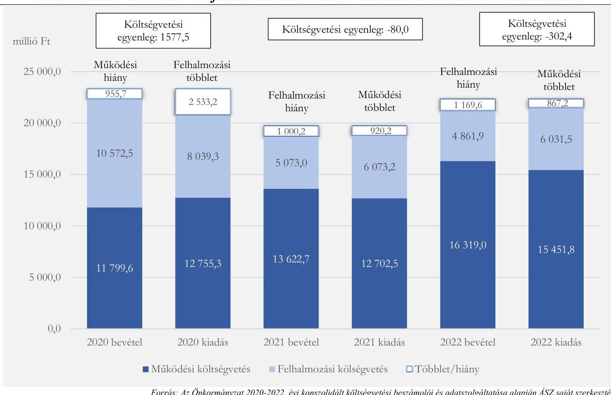

Forrás: Az Önkormányzat 2020-2022. évi konszolidált költségvetési beszámolói és adatszolgáltatása alapján ÁSZ saját szerkesztés
A 2020. évről a 2022. évre a teljesített költségvetési bevételek összeségében 5,3%-kal, 22 372,1 millió Ft-ról 21 180,9 millió Ft-ra csökkentek. Ezzel párhuzamosan a teljesített költségvetési kiadások összességében 3,3%-kal 20 794,6 millió Ft-ról 21 483,3 millió Ft-ra növekedtek. A 2020. évben a

---

teljesített költségvetési bevételek - 1577,5 millió Ft-tal meghaladva - fedezetet nyújtottak a teljesített költségvetési kiadásokra, ugyanakkor a költségvetési bevételek 2021-ben 80,0 millió Ft-tal, 2022-ben pedig 302,4 millió Ft-tal alacsonyabb szinten teljesültek a költségvetési kiadásoknál, így a pénzügyi egyensúly az előző évi maradvány (2021. évben: 5624,1 millió Ft, 2022. évben 5554,3 millió Ft) igénybevétele mellett volt biztosított.
A költségvetés végrehajtása során a teljesített működési bevételek és kiadások is növekedtek, a működési bevételek 2020-ról 2022-re 38,3%-kal (4519,4 millió Ft-tal), a működési kiadások ennél kisebb mértékben, 21,1%-kal (2696,5 millió Ft-tal). A működési költségvetés egyenlegének kedvező változása alapvetően a közhatalmi (helyi adó) bevételek növekedésének, valamint a működési költségvetési támogatások és a saját működési bevételek emelkedésének eredménye. Az időszakon belül a 2021. évről a 2022. évre történt növekedés volt jelentős, amely a bevételi oldalon főként a közhatalmi bevételek (iparűzési adó) és a működési bevételek (kamatbevételek, részesedésekből származó pénzügyi műveletek bevételei, szolgáltatások ellenértéke) növekedésének, a kiadási oldalon főként a személyi juttatások (garantált bérminimum és az ágazati pótlékok, köztisztviselői illetményalap, intézmény átvétel) és a dologi kiadások (energiaárak növekedése miatti szolgáltatási kiadások, vásárolt élelmezés) növekedésének következménye. Fenti tényezők együttes hatására a működési bevételek és kiadások egyenlege kedvezően változott. A felhalmozási többlet 2020-ban meghaladta a működési hiányt, így a tárgyévi költségvetés egyensúlya biztosított volt az előző évi maradvány bevonása nélkül is. A 2021-2022. években azonban a működési többlet nem nyújtott fedezetet a felhalmozási hiányra, amit az előző években képződött maradványokból finanszíroztak.
Az Önkormányzat kimutatása* szerint a teljesített működési kiadásokon belül a kötelező feladatokra fordított kiadások az ellenőrzött időszakban 26,4%-kal növekedtek, míg az önként vállalt feladatokra fordított kiadások - elsősorban a Normafa Park Sportterület működési kiadásainak mérséklődése miatt - 21,2%-kal csökkentek, amelynek következtében 12,1%-ról 7,9%-ra csökkent az önként vállalt feladatokra fordított kiadások aránya. Az ellenőrzés megállapításai alapján - azaz a Normafa Park rehabilitációval és a BBSZ Ingatlan 2022 Kft.-vel összefüggő feladatok kiadásaival korrigálva a kötelező és önként vállalt feladatok kiadásait - a teljesített működési kiadásokon belül a kötelező feladatokra fordított kiadások az ellenőrzött időszakban 21,1%-kal, az önként vállalt feladatokra fordított kiadások 11,9%-kal növekedtek, így az önként vállalt feladatokra fordított kiadások aránya lényegileg nem változott (4,3%-ról 4,0%-ra mérséklődött).
A teljesített felhalmozási bevételek a 2020. évről a 2022. évre 54,0%-kal (5710,6 millió Ft-tal), a teljesített felhalmozási kiadások ennél kisebb mértékben 25,0%-kal (2007,8 millió Ft-tal) mérséklődtek. A felhalmozási költségvetés 2020. évi, a későbbi éveknél magasabb szintjét a bevételi oldalon a Normafa Park rehabilitációjára, közszolgálati apartmanház és helyi közutak fejlesztésére kapott támogatás, valamint az ingatlan értékesítésekből származó bevételek, a kiadási oldalon a Normafa Park rehabilitációja kapcsán teljesített kiadások és az ehhez kapcsolódó ingatlanbeszerzés okozta. A 2020. évi felhalmozási bevételi többlet, illetve az évről évre keletkezett felhalmozási maradványok fedezetet nyújtottak a 2021-2022. évi felhalmozási hiányokra.
Az Önkormányzat kimutatása* szerint a teljesített felhalmozási kiadásokon belül az ellenőrzött időszakban 50,9%-ról 54,1%-ra nőtt a kötelező és 49,1%-ról 45,9%-ra csökkent az önként vállalt feladatokra fordított

[^0]
[^0]:    * A kötelező és az önként vállalt feladatok megbontása nem tartalmazza a Polgármesteri Hivatal államigazgatási feladatellátásával összefüggő kiadásokat.

---

kiadások aránya. Az ellenőrzés megállapításai alapján korrigált adatok szerint a teljesített felhalmozási kiadásokon belül 98,3%-ról 73,9%-ra csökkent a kötelező, és 1,7%-ról 26,1%-ra nőtt az önként vállalt feladatokra fordított kiadások aránya. Összhangban az Mötv. előírásaival, az önként vállalt feladatokat a saját bevételek és az erre a célra biztosított külön források (fejlesztési célú állami támogatások) finanszírozták, az önként vállalt feladatokra fordított kiadások nem veszélyeztették a kötelező feladatellátást.
Az Önkormányzat a gazdasági társaságok veszteséges gazdálkodása esetén, illetve annak elkerülése érdekében megtette a szükséges intézkedéseket, pótbefizetést teljesített és tőkeemelés címén nyújtott tőkejuttatást két gazdasági társasága részére, amely az ellenőrzött időszakban összesen 1470,5 millió Ft pénzbeli hozzájárulás és 2865,0 millió Ft értékű ingatlan apport volt. A Hegyvidéki Sportcsarnok és Sportközpont Kft. részére 2020-2021-ben 178,0 millió Ft pótbefizetés történt a veszteséges gazdálkodás fedezetére, a fizetésképtelen helyzet megelőzésére. Az Önkormányzat 2020-ban döntött egy ingatlanfejlesztési projekt megvalósításáról, amelynek keretében a részben önkormányzati tulajdonú ingatlanokkal lehatárolt projekthelyszínen a meglévő irodaházak lebontása után egy lakó-, kereskedelmi-, és iroda funkciójú ingatlan-együttes megépítésére kerülne sor 12 171,0 millió Ft tervezett költséggel. Az ingatlanfejlesztési projekt megvalósítását végző BBSZ Ingatlan 2022 Kft. működéséhez, illetve a projekttel kapcsolatos feladatok ellátásához a forrásokat az Önkormányzat biztosította, - az alapításkor 2020-ban rendelkezésre bocsátott 63,0 millió Ft mellett - a 2021-2022. években összesen 1292,5 millió Ft pénzbeli hozzájárulással, továbbá a fejlesztéssel érintett ingatlanok apportálásával, amelyek apportértéke 2865,0 millió Ft-ot tett ki. A társaságnak a feladatellátás jellegéből adódóan árbevétele nem keletkezett, más forrás (banki hitel) a projekt finanszírozására az ellenőrzött időszakban nem állt rendelkezésre. A Képviselő-testület 2022. szeptemberben a kedvezőtlen gazdasági folyamatok miatt a projekt elhalasztásáról, a terület parkolóként és közösségi térként történő hasznosításáról döntött, azzal, hogy 2023-ban szükséges tájékoztatást adni a projekt folytathatóságáról, amely a helyszíni ellenőrzés idejéig még nem történt meg. A jelentéstervezet megállapításainak észrevételezése időszakában az Önkormányzat a projekt folytathatóságára vonatkozó tájékoztatási kötelezettségének eleget tett, a hiányosságot megszüntette, ezáltal az ellenőrzés megállapítása az ellenőrzés folyamatában hasznosult.
Az ellenőrzött időszakban az alábbi feladatátvételek, átszervezések, kiszervezések történtek az Önkormányzat kötelező feladatait ellátó intézményeknél:

- a közművelődési feladatok hatékonyabb ellátása érdekében a Virányosi Közösségi Ház intézmény 2021. május 14-től megszüntetésre került, a feladatokat a MOM Kulturális Központ Nkft. vette át;
- a kerületben működő állami fenntartású - OMSZI Nonprofit Kft. által működtetett - Művész úti Óvoda és Bölcsőde fenntartói jogait az Önkormányzat 2021. szeptember 1-jétől átvette;
- a kerületben működő, korábban szintén állami fenntartású Bíró utcai Óvodára vonatkozó, az OMSZI Nonprofit Kft.-vel mint működtetővel az óvodai feladatellátásra kötött köznevelési megállapodás az intézmény egyházi fenntartásba kerülése miatt 2021-ben megszűnt;
- a Normafa Óvodában az alacsony kihasználtság miatt a 2022. évben az Önkormányzat a maximálisan felvehető gyereklétszámot csökkentette, tagóvodáját megszüntette.
A végrehajtott intézkedések nem befolyásolták az Önkormányzat pénzügyi egyensúlyi helyzetét, mivel a működési kiadások és bevételek összességében közel azonos mértékben növekedtek.

---

Az Önkormányzat és az irányítása alá tartozó költségvetési szervek követeléseinek összesített állománya 2020. január 1-jén 2863,2 millió Ft volt, amely 2022. december 31-re 3150,3 millió Ft-ra, 10,0%-kal
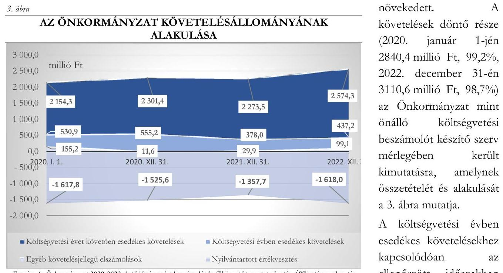
jelentős nagyságrendű értékvesztést is nyilvántartottak. Az Önkormányzat mint önálló költségvetési beszámolót készítő szervnél a 2020. év elején a 2148,7 millió Ft költségvetési évben esedékes követeléshez kapcsolódóan 1617,8 millió Ft értékvesztést, a 2022. év végén a 2055,2 millió Ft költségvetési évben esedékes követeléshez kapcsolódóan 1618,0 millió Ft értékvesztést tartottak nyilván, így a mérlegben kimutatott összeg 530,9 millió Ft, illetve 437,2 millió Ft volt.
Az Önkormányzat a követelések behajtása érdekében több intézkedést tett. Az ezzel megbízott ügyvédi iroda, valamint a Polgármesteri Hivatal érintett szervezeti egységei figyelemmel kísérték a befizetéseket, fizetési felszólításokat küldtek, indokolt esetben végrehajtási eljárást kezdeményeztek. A határidőn túli, lejárt követelések (pl. bérbeadásból származó bevételek, parkolási díjak, helyi adók) aránya az intézkedések ellenére is magas volt, 2020 elején 85,4% (1834,5 millió Ft), 2022 végén 97,8% (2010,9 millió Ft). A lejárt követelések 2022. december 31-i állományának 62,5%-a (1257,7 millió Ft) 360 napon túli követelés volt. Ez azt mutatja, hogy a követelések beszedésére tett intézkedések nem bizonyultak kellően eredményesnek. A határidőn túli követelések lejárat szerinti

[^0]4. ábra

HATÁRIDŐN TÚLI KÖVETELÉSEK LEJÁRAT SZERINT 2022. XII. 31-ÉN
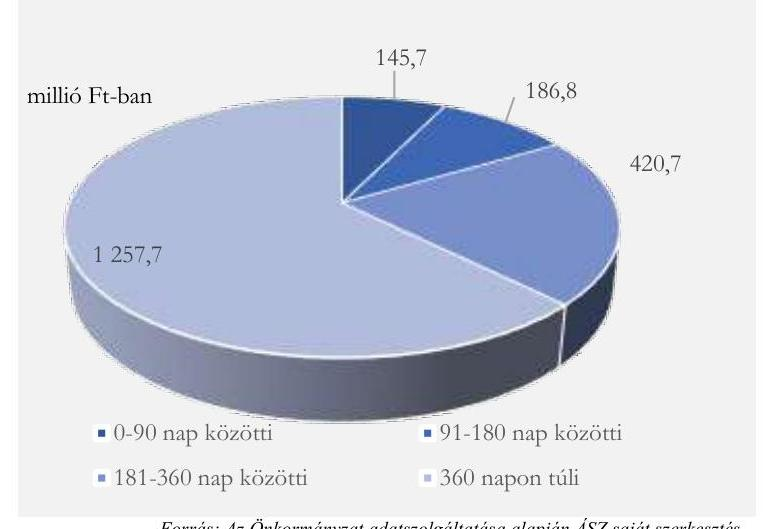

Forrás: Az Önkormányzat adatszolgáltatása alapján ÁSZ saját szerkesztés

[^0]:    4. ábra

---

megoszlását az ellenőrzött időszak végén a 4. ábra szemlélteti.
Az Önkormányzat és az irányítása alá tartozó költségvetési szervek költségvetési évben esedékes kötelezettségeinek állománya 2020. január 1-jén 68,7 millió Ft volt, amely 2022. december 31-re 112,0 millió Ft-ra, 63,0%-kal növekedett. A kötelezettségek teljes állománya 30 napon belüli kötelezettség volt.

Az Önkormányzatnak az ellenőrzött időszakban adósságot keletkeztető kötelezettségvállalása, pénzintézetekkel szembeni kötelezettsége, illetve garancia- és kezességvállalása nem volt. A 2021. és a 2022. években rendelkezésére álló 1000,0 millió Ft folyószámla-hitelkeret igénybevételére nem került sor.
2.2. számú megállapítás

Az Önkormányzat a gyermekek bölcsődei ellátásának fenntartói feladatait többségében szabályszerűen látta el, a 2020. évi értékelési kötelezettségének azonban nem tett eleget, 2022-ben pedig a térítési díjak megállapítása nem felelt meg a jogszabályi előírásoknak. A feladatellátás naturális mutatói az ellenőrzött időszakban javultak.

Az Önkormányzat a Gyvt. 25 előírásainak eleget téve, a területén bölcsődei feladatellátást végző intézményeket működtetett, amelyek száma az ellenőrzött időszakban háromról négyre emelkedett, mivel 2021. szeptember 1-jétől átvételre került a Magyar Államtól a Művész úti Óvoda és Bölcsőde fenntartói joga, amely intézménybe többségében a kerületben lakó gyermekek jártak.
Az Önkormányzat mint fenntartó a Gyvt. előírásainak megfelelően eleget tett a személyes gondoskodást nyújtó ellátások formáiról, azok igénybevételéről szóló rendeletalkotási kötelezettségének 26. Az Önkormányzat által fenntartott bölcsődei feladatellátást végző intézmények rendelkeztek szervezeti és működési szabályzattal, valamint szakmai programmal.
Az Önkormányzat a Gyvt. 104. § (1) bekezdés e) pontja ellenére a személyes gondoskodást nyújtó szociális és gyermekvédelmi intézmények 2020. évi szakmai munkája eredményességének értékelését, a Gyvt. 96. § (6) bekezdése ellenére a gyermekjóléti és gyermekvédelmi feladatok 2020. évi ellátásának átfogó értékelését nem végezte el. A 2021. és a 2022. évekre vonatkozóan ezen előírásoknak eleget tett.
Az ellenőrzött időszakban egy alkalommal, 2022. november 1-jétől történt változás a bölcsődei gondozással összefüggő térítési díj összegében. A Gyvt. 147. § (1) bekezdésében előírtak ellenére, az Önkormányzat mint fenntartó a bölcsődei ellátás intézményi térítési díját - a gyermekétkeztetés kivételével - nem a szolgáltatási önköltség és a központi költségvetésről szóló törvényben biztosított támogatás különbözeteként állapította meg.
A bölcsődei feladatellátásban résztvevő intézmények számának 2021. évi háromról négyre történt növekedésével a bölcsődei csoportok száma hárommal (29-re), az engedélyezett férőhelyek száma 36 fővel (348 főre) nőtt.
A 2020. és a 2022. évben a beíratott gyermekek éves átlagos száma megegyezett az
 engedélyezett férőhelyek számával. A 2021. évben a férőhelyek kihasználtsága átmenetileg romlott, a 348 engedélyezett férőhelyre éves átlagban 336 beíratott gyermek jutott. Az ellátást ténylegesen igénybe vevő gyerekek száma önkormányzati szinten a 2020. évi 133 főről 2022-re 179 főre, 34,6%-kal, a férőhelyek tényleges kihasználtsága 0,43-ról 0,51-re emelkedett. Az emelkedés ellenére is alacsony férőhely-kihasználtságban szerepet játszott egyrészt a nevelési év kezdetét (szeptember 1-jét) követő folyamatos beszoktatási (tényleges igénybevételi) időszak, a gyakori megbetegedések, valamint az egyéb okok miatt is jellemző hiányzások.

---

Hasonló tendenciát jelez a gondozási napok száma, amely 47,6%-kal emelkedett, a 2020. évi 26,9 ezer napról a 2022. évre 39,7 ezer napra. A 2020. évi adatokat - mint viszonyítási alapot - ugyanakkor torzították a koronavírus-járvány miatti időszakos intézménybezárások.
A bölcsődei ellátás működési célú kiadásai az ellenőrzött időszakban 63,1%-kal emelkedtek, a 2020. évi 550,8 millió Ft-ról a 2022. évi 898,5 millió Ft-ra, amelyet döntően - 2020-ban 95,1%-ban, 2021-ben 93,5%-ban, 2022-ben 93,6%-ban - irányító szervi működési célú támogatás, a fennmaradó részt intézményi működési bevétel finanszírozott. Az irányító szervi működési célú támogatásnak 2020-ban az 59,1%-át, 2021-ben a 68,8%-át, 2022-ben a 43,2%-át tette ki a központi költségvetési támogatás. A bölcsődei férőhelyek ellenőrzött időszakban javuló kihasználtsága ellenére az egy ellátott gyermekre jutó fajlagos működési célú kiadások emelkedtek. Az ellenőrzött időszakban az egy beíratott gyermekre vetített fajlagos működési kiadások 1,8 millió Ft és 2,6 millió Ft között, míg az ellátást ténylegesen igénybe vevő gyermekekre vetített fajlagos működési kiadások éves szinten 4,1 millió Ft és 5,0 millió Ft között alakultak.

# 3. Az önkormányzat vagyongazdálkodása, az éves költségvetési beszámoló mérlegének alátámasztottsága 

Összegző megállapítás A vagyongazdálkodás, a vagyon nyilvántartása és az éves
költségvetési beszámoló mérlegének alátámasztása során az
Önkormányzat nem tartotta be teljeskörűen a jogszabályi
előírásokat.
3.1. számú megállapítás Az Önkormányzatnál az ellenőrzött beruházások és felújítások, vagyonértékesítések és követeléselengedés esetében a döntések meghozatalára szabályszerűen került sor. A döntések előkészítése és végrehajtása, az ellenőrzött térítés nélküli vagyonátadások, valamint a behajthatatlan követelések leírása során azonban nem tartották be maradéktalanul a jogszabályok és a belső szabályzatok előírásait.
A törvényi előírásoknak (Mötv., Hatásköri tv. ${ }^{27}$ ) eleget téve az Önkormányzat vagyonrendeletben ${ }^{28}$ szabályozta a vagyonnal történő gazdálkodás helyi szabályait. A 2020-2022. években a közbeszerzési értékhatárt elérő önkormányzati beszerzésekre a közbeszerzési szabályzat ${ }^{29}$, a közbeszerzési értékhatárt el nem érő beszerzésekre a beszerzési szabályzat ${ }^{30}$ tartalmazta a helyi szabályokat.
Az ellenőrzött időszakban a fejlesztések (beruházások, felújítások) megvalósítására vonatkozó döntéseket az arra jogszabály, illetve helyi szabályozás alapján jogosult - a Képviselő-testület, illetve átruházott hatáskörben a Tulajdonosi és Városfejlesztési Bizottság - hozta meg. A közbeszerzési értékhatárt elérő fejlesztéseknél az Önkormányzat a Kbt. ${ }^{31}$ előírásainak megfelelve az eljárásokat lefolytatta.
Az Önkormányzat az irányítása alá tartozó költségvetési szervek, valamint a kizárólagos tulajdonában álló gazdasági társaságok részére központosított közbeszerzési rendszert működtetett, amely eljárások központi beszerző szervezetének a Gazdasági Ellátó Szolgálatot ${ }^{32}$ jelölte ki 2021. október 1-jétől. A központosított közbeszerzési rendszer működtetése céljából kötött Együttműködési megállapodás XV.1. pontjával ellentétben az Önkormányzat a közbeszerzési szabályzatát nem hozta összhangba az Együttműködési megállapodásban foglaltakkal. Ennek következtében a Bkr.

---

6. $\S$ (2) bekezdésében előírtak ellenére nem volt szabályozott, hogy a Gazdasági Ellátó Szolgálat által központilag lefolytatott, a Kbt. szerinti keretmegállapodásos eljárások esetén az Önkormányzatnak mely esetekben milyen szabályokat kell követnie.
A közbeszerzési értékhatárt el nem érő fejlesztéseknél jellemzően három árajánlatot kértek be. A Polgármesteri Hivatal illetékes belső szervezeti egységeinek vezetői nem tartották be a beszerzési szabályzat 12. $\S$ (1) bekezdését 12 szerződéshez kapcsolódóan 16 esetben, az ellenőrzött közbeszerzési értékhatárt el nem érő mintatételek 72,7%-ánál (2020-2021/8., 14., 18., 22., pót9. mintatétel, 2022/1., 8., 13-15., 18., 20., 29., pót1., pót6. mintatétel), mivel a nyertes ajánlattevőre vonatkozó javaslatot nem terjesztették döntéshozatal céljából a döntéshozó (polgármester, kötelezettségvállalásra jogosult alpolgármester) elé. Az ajánlatokat kiértékelő táblázat és szakmai javaslat csak a szerződés-tervezet aláírásra történt előterjesztésével együtt került a kötelezettségvállaló elé. Ennek következtében a döntéshozatallal nem dokumentált 12 szerződésből nyolc esetben a kötelezettségvállaló nem a beszerzési szabályzat 3. $\S$-a szerint döntéshozatalra feljogosított polgármester, illetve alpolgármester volt.
Az Ávr. 50. § (1) bekezdés c) pontjának előírása ellenére 12 ellenőrzött szerződés - amelyekhez 20 mintatétel kapcsolódott (a mintatételek 33,3%, 2020-2021/1., 4., 6-7., 13., 15., 17., 19-20., 23., 27., 29-30. mintatétel, 2022/3., 5., 7., 11., 16., 19., 24. mintatétel) - a több év előirányzatai terhére vállalt kötelezettség esetén nem tartalmazta a kifizetés határidejét évenkénti ütemezésben.
Az illetékes belső szervezeti egységek vezetői nem tartották be az Ávr. 50. § (1a) bekezdésének előírásait, mivel az általuk előkészített - jogi személlyel, jogi személyiséggel nem rendelkező szervezettel kötött - 11 visszterhes szerződés, 15 mintatétel esetében (mintatételek 25,0%-a, 2020-2021/3., 8., 11., 14., 18., 22. mintatétel, 2022/1., 9., 13., 18., 22., 28-29., pót1., pót6. mintatétel) nem tartalmazta a szervezet képviselőjének nyilatkozatát arra vonatkozóan, hogy átlátható szervezetnek minősül, és arról külön nyilatkozat sem állt rendelkezésre. Ennek következtében nem volt igazolt, hogy a kifizetések során biztosították az Áht. 41. § (6) bekezdés előírásainak betartását.
Az önkormányzati vagyon értékesítésére vonatkozó döntéseket az ellenőrzött időszakban az arra jogszabály, illetve helyi szabályozás alapján jogosult hozta meg. Az Önkormányzat betartotta a forgalomképtelen és a korlátozottan forgalomképes törzsvagyon elidegenítésére vonatkozó, Nvtv. ${ }^{33}$ által előírt korlátokat. A vagyontárgyakat - a Számv. tv. 15. § (3) bekezdésben foglalt valódiság elvét megsértve - 15 esetben (érintett mintatételek 26,3%-a, 2020-2021/4., 6., 10., 12., 14., 18., 30., 2022/20-27. mintatétel) a forgalomképtelen vagyontárgyak köréből vezették ki a számviteli nyilvántartásból, annak ellenére, hogy a tulajdonjogváltozás földhivatali nyilvántartásokon történt átvezetésekor az értékesített vagyontárgyak már ténylegesen az üzleti vagyon körébe tartoztak. Ennek során nem tartották be a Számv. tv. 165. § (1) bekezdésének előírásait, amikor az értékesítés előtt a forgalomképtelen vagyontárgyak üzleti vagyon körébe történő átminősítésről - mint az eszközök összetételét megváltoztató gazdasági eseményről - nem állítottak ki bizonylatot és azt nem rögzítették a könyvviteli nyilvántartásokban.
Az Önkormányzat a vagyon értékesítések során betartotta az Nvtv.-nek és a vagyonrendeletnek a költségvetési törvényekben ${ }^{34}$ előírt 25 millió Ft értékhatár feletti, versenyeztetésre vonatkozó előírását. Az Nvtv. 13. § (2) bekezdés előírásai ellenére az Önkormányzat a nem természetes személy részére történt értékesítések közül - három szervezethez kapcsolódóan - öt esetben (mintatételek 8,8%-a, 2020-2021/5., 7., 13-14., 29. mintatétel) dokumentáltan nem igazolta, hogy a tulajdonjog átruházása átlátható szervezetek részére történt.

---

A beruházások és felújítások számviteli nyilvántartásban történt rögzítése megfelelt a Számv. tv. és az Áhsz., ezekhez kapcsolódóan a gazdálkodási jogkörök gyakorlása a 2022. évben megfelelt az Áht. és az Ávr. vonatkozó előírásainak.
Az ellenőrzött térítés nélküli vagyonátadások a közfeladat ellátás érdekében történtek. Az Önkormányzat az ellenőrzött öt térítés nélküli vagyonátadás közül négy esetben nem tartotta be a vonatkozó jogszabályi előírásokat.

- A Budapest Főváros Önkormányzatának átadott, ivóvízellátást szolgáló vízmű ingatlanvagyon kapcsán az Önkormányzat nem tartotta be az Mötv. 42. § 16. pontjának előírásait, mivel az átadásról - előterjesztés hiányában - a Képviselő-testület nem döntött. Az átadásról a szerződést az Önkormányzat képviseletében a polgármester kötötte meg.
- A Budapesti Temetkezési Intézet Zrt. ${ }^{35}$-nek történt területátadás során az Önkormányzat nem tartotta be az Nvtv. 13. § (3) bekezdésének előírásait, amely szerint nemzeti vagyon tulajdonjogát ingyenesen átruházni csak törvényben meghatározott esetekben és feltételekkel lehet. A szerződés szerint ingyenesen történt átadás nem tartozott az Mötv. 108. § (2) bekezdésében nevesített esetek közé, ugyanakkor az Önkormányzat az ügylettel kapcsolatban történt területkiigazítások során az átadottnál nagyobb területet kapott - szintén ingyenesen - a Budapesti Temetkezési Intézet Zrt.-től.
- A vízmű ingatlanvagyon és a terület átadása kapcsán az Önkormányzat az Nvtv. 13. § (5) bekezdésében foglalt előírás ellenére nem kérelmezte a 15 éves elidegenítési tilalomnak az Önkormányzat javára szóló, ingatlan-nyilvántartásba történő feljegyzését, továbbá nem kérte az átvevő szervezetektől az Nvtv. 13. § (4) bekezdés b) pontjában előírt, az átruházott vagyon hasznosításáról szóló beszámolási kötelezettség teljesítését.
- A 2021. évi számviteli nyilvántartásokban rögzített kettő 0-ra leírt személygépjármű - az Önkormányzat gazdasági társasága tulajdonába történt - térítés nélküli átadása ellentétes volt a 166/2013. (VI. 20.) számú képviselő-testületi határozattal és a megkötött szerződésekkel, mivel azok nem a vagyon ingyenes tulajdonba adására, hanem az ingyenes használatba adására vonatkoztak. A számviteli elszámolást közvetlenül alátámasztó bizonylat a Számv. tv. 165. § (2) bekezdése és 167. § (1) bekezdés c) pontja ellenére nem tartalmazta a gazdasági műveletet elrendelő személy vagy szervezet megjelölését.
Az Önkormányzat - éves költségvetési beszámolói szerint - a 2020. év elején 376,8 millió Ft, a 2022. év végén 373,1 millió Ft bruttó értékű vagyonkezelésbe, koncesszióba adott eszközzel (ingatlanok és gépek, berendezések, felszerelések) rendelkezett. A 2020-2022. években nem adtak eszközöket vagyonkezelésbe, koncesszióba. A vagyonkezelésbe, koncesszióba adott eszközök között - az Áhsz. 11. § (11) bekezdésében foglalt előírások ellenére - bruttó 18,2 millió Ft értékben olyan eszközöket is kimutattak, amelyekre vonatkozóan koncessziós vagy vagyonkezelési szerződése az Önkormányzatnak nem volt, illetve amelyek üzemeltetését az Önkormányzat államháztartáson belüli szervezetnek adta át.
Az Önkormányzat - az Áhsz. 5. § (1) bekezdés előírásai ellenére - a 2020. évi költségvetési beszámoló kiegészítő mellékletében (15/A űrlap - Kimutatás az immateriális javak, tárgyi eszközök koncesszióba, vagyonkezelésbe adott eszközök állományának alakulásáról) a „Koncesszióba, vagyonkezelésbe adott eszközök" között, egyéb növekedésként és a terv szerinti értékcsökkenések között 1,8 millió Ft-ot szerepeltetett annak ellenére, hogy ilyen gazdasági esemény nem történt, és a számviteli nyilvántartásokban sem került rögzítésre.

---

Az ellenőrzött időszakban a követeléselengedés és a behajthatatlan követelések leírása adatait a számviteli nyilvántartásokban és a költségvetési beszámolókban eltérően mutatták ki. A 2020-2022. évben az Önkormányzat összesen 174,3 millió Ft behajthatatlan követelést követeléselengedésként rögzített a számviteli nyilvántartásokban, ami nem felelt meg az Áhsz. 43. § (2) bekezdésében foglalt előírásnak, amely szerint a behajthatatlan követelés leírása nem minősül a követeléselengedésnek. A 2020. évben a számviteli nyilvántartásokban rögzített 464,8 millió Ft behajthatatlan követelés leírása - az Önkormányzat nyilatkozata szerint - hibás számviteli elszámolás következménye, mivel gazdasági tartalma alapján ebben az évben 126,2 millió Ft volt a behajthatatlan követelés leírása. A hibás számviteli elszámolásokkal megsértették a Számv. tv. 15. § (3) bekezdésében előírt valódiság elvét. Mindezek következtében a könyvvezetés, valamint a könyvviteli zárlat során készített főkönyvi kivonat adatai a követeléselengedés és a behajthatatlan követelések leírása adatai tekintetében nem támasztotta alá az éves költségvetési beszámoló tájékoztató adatait, amellyel megsértették
 az Áhsz. 5. § (1) bekezdés előírásait.
Az ellenőrzött időszakban egy esetben történt követelés elengedés 0,2 millió Ft összegben. A követelés elengedés és az ellenőrzött esetekben a követelések behajthatatlanná minősítésének oka, valamint engedélyezése megfelelt az Áht.-ban, az Áhsz.-ben és a belső szabályzatokban foglaltaknak.
3.2. számú megállapítás

Az Önkormányzat a vagyonáról az előírt nyilvántartásokat vezette, azok tartalma azonban 2022-ben nem felelt meg maradéktalanul az Áhsz. előírásainak. A 2022. évi költségvetési beszámoló mérlegének leltárral történő alátámasztása nem volt teljeskörű. A mennyiségi leltárfelvételre vonatkozó helyi szabályozások összhangja nem volt biztosított.

Az Önkormányzat a 2022. évben az önkormányzati (forgalomképtelen és a korlátozottan forgalomképes) törzsvagyont az Áht.-ban, az Mőtv.-ben és az Nvtv.-ben foglaltaknak megfelelően, a többi vagyontárgytól (forgalomképes vagyon) elkülönítve tartotta nyilván.
Az Áhsz.-ben foglaltaknak megfelelve a főkönyvi számlákhoz kapcsolódóan analitikus (részletező) nyilvántartást vezették, azonban a 2022. évben a függő követelésekről és a függő kötelezettségekről vezetett analitikus (részletező) nyilvántartások adatai az Áhsz. 39. § (3) bekezdésében foglaltak ellenére nem támasztották alá a kapcsolódó főkönyvi számlák adatait, mivel az analitikus nyilvántartásokban rögzített változásokat - az Áhsz. 53. § (1)-(3) bekezdései és az (5) bekezdés a) pontjában foglaltak ellenére - a főkönyvi számlákon nem rögzítették.
A 2022. évben vezetett analitikus (részletező) nyilvántartások tartalma nem felelt meg az Áhsz. előírásainak, mivel

- a tárgyi eszközöknél az Áhsz. 39. § (3) bekezdése és a 14. melléklet VII. 4. b) pontja ellenére nem rögzítették az épület, építmény műszaki jellemzőit (falazat, tetőzet, szintek száma, területe, komfortfokozat stb.);
- a részesedéseknél az Áhsz. 39. § (3) bekezdése és a 14. melléklet VIII. 2. d) és 3. pontja ellenére nem rögzítették a részesedések bekerülési értéke változásainak okait, jellegét, az alátámasztó bizonylatok azonosításához szükséges adatokat, a forgalmazó megnevezését, a jegyzési adatokat, a részvény esetleges tőzsdei kategóriáját, a letéti helyet és a letéti igazolás sorszámát, az értékpapírszámla számát, megnevezését, a számlavezető nevét, valamint a részvénykönyvet vezető megnevezését;
- a koncesszióba, vagyonkezelésbe adott eszközöknél az Áhsz. 39. § (3) bekezdése és a 14. melléklet IX. 1. pontja ellenére nem rögzítették az épület, építmény műszaki jellemzőit (falazat, tetőzet,

---

szintek száma, területe, komfortfokozat stb.), továbbá a vagyonkezelésbe, koncesszióba adás adatait, így különösen a vagyonkezelő, koncesszió jogosultjának megnevezését, a vagyonkezelés, koncesszió időtartamát, a vagyonkezeléssel, koncesszióval kapcsolatos követelések, kötelezettségek azonosításához szükséges adatokat;

- a követeléseknél az Áhsz. 39. § (3) bekezdése és a 14. melléklet III. 4. j), l) pontjai ellenére nem rögzítették a követelésekkel kapcsolatos fizetési felhívások, behajtására tett intézkedések adatait; a behajthatatlanná vált követelésekkel kapcsolatos adatokat;
- a függő követeléseknél az Áhsz. 39. § (3) bekezdése és a 14. melléklet III. 4. a)-c) pontjai ellenére nem rögzítették a követelés nyilvántartásba vételének dátumát; a követelést tanúsító dokumentum megnevezését, keltét; a kötelezett azonosításához szükséges adatokat;
- a függő kötelezettségeknél az Áhsz. 39. § (3) bekezdése és a 14. melléklet II. 4. a), e), f) pontjai ellenére nem rögzítették a kötelezettséget tanúsító dokumentum megnevezését, iktatószámát, keltét, a pénzügyi ellenjegyzésre vonatkozó adatokat; a kötelezettség évek szerinti megoszlását, a költségvetési évben a teljesítési határidőket dátum szerint, a kötelezettség módosulásait.
A 2022. évi zárszámadási rendelettervezet előterjesztésekor az Áht.-ban foglaltaknak megfelelően tájékoztatásul bemutatták a vagyonkimutatást, amely azonban nem felelt meg a jogszabályi és az Önkormányzat belső szabályozásában foglalt előírásoknak, mivel
- az Áhsz. 30. § (1) bekezdésével ellentétben, nem tartalmazta az Önkormányzat által irányított költségvetési szervek tulajdonában álló eszközöket, így a nemzeti vagyonba tartozó befektetett eszközöknél 267,7 millió Ft-tal, a pénzeszközöknél 135,3 millió Ft-tal eltért az Önkormányzat összevont mérlegében szereplő értékektől;
- Áhsz. 30. § (2) bekezdésében foglaltaktól eltérően, összevontan tartalmazta a forintszámlákat és a devizaszámlákat;
- az Áhsz. 30. § (3) bekezdésében foglaltak ellenére, nem tartalmazta a „0"-ra leírt eszközök, a használatban lévő kisértékű immateriális javak, tárgyi eszközök állományát;
- a vagyonrendelet 2. mellékletétől eltérően nem mutatta be a használaton kívüli eszközöket, az érték nélkül nyilvántartott eszközöket.
A vagyonrendelet 2. mellékletében szabályozott vagyonkimutatás-minta nem felelt meg az Áhsz. 30. § (2)(3) bekezdés előírásainak, mivel az eszközök tagolását nem az Áhsz. 5. mellékletének megfelelően tartalmazta, továbbá nem tartalmazta a nemzetgazdasági szempontból kiemelt jelentőségű törzsvagyon, a használatban lévő kisértékű immateriális javak, tárgyi eszközök, készletek, a 01-02. számlacsoportban nyilvántartott eszközök, és az Nvtv. 1. § (2) bekezdés g) és h) pontja szerinti kulturális javak és régészeti leletek állományának bemutatását.
Az ellenőrzött időszakban az Önkormányzatnál a leltározás és leltárkészítés szabályait a leltározási szabályzat ${ }^{36}{ }^{37}$ határozta meg.
Az Önkormányzatnál - az erre vonatkozó nyilatkozatok és jegyzőkönyvek szerint - a 2020. évben mennyiségi felvétellel, a 2021-2022-ben egyeztetéssel történt leltározás. A beruházások, felújítások esetében a háromévente történt mennyiségi leltározás nem felelt meg az Önkormányzat leltározási szabályzatában ${ }_{2}$ foglaltaknak, mert abban a Számv. tv. 69. § (3) bekezdésében előírtaknál szigorúbb, évenkénti mennyiségi felvételt írtak elő. A leltározás háromévente mennyiségi felvétellel történő végrehajtása az ingatlanok, gépek, berendezések, felszerelések és gépjárművek eszközcsoportoknál nem

---

felelt meg a vagyonrendelet 2007-től hatályos 14. § (3), (5)-(6) bekezdések előírásainak, amelyekben kétévente mennyiségi felvétellel történő leltározást írtak elő.
Az Önkormányzat vagyonrendeletének 14. § (3), (5)-(6) bekezdéseiben foglaltak ellenére a 2021. január 4-től hatályos leltározási szabályzat ${ }_{2}$ háromévenkénti mennyiségi leltárfelvétellel történő leltározást határozott meg az ingatlanok, gépek, berendezések, felszerelések és gépjárművek eszközcsoportokra.
A Számv. tv. 69. § (1) bekezdése, valamint az Áhsz. 22. § (1) bekezdése előírásai ellenére a 2022. évben nem történt meg a vagyonelemek év végi könyv szerinti értékének tételes leltárral történő alátámasztása az A) Nemzeti vagyonba tartozó befektetett eszközök mérlegfőcsoport alá tartozó valamennyi mérlegsor, a D) Követelések mérlegfőcsoporton belül a D/I Költségvetési évben esedékes követelések és a D/II Költségvetési évet követően esedékes követelések mérlegcsoportok alá tartozó mérlegsoroknál, valamint H) Kötelezettségek mérlegfőcsoporton belül a H/I Költségvetési évben esedékes kötelezettségek és a költségvetési évet követően esedékes kötelezettségek mérlegcsoportok alá tartozó mérlegsoroknál.
A 2022. évi leltározás során nem tartották be teljeskörűen a belső szabályzatban foglaltakat. A leltározási szabályzat2 II. A leltározás részletes szabályai 3.2. A leltározás módszerei A) Befektetett eszközök I. Immateriális javak pontjában foglaltak ellenére nem történt meg dokumentáltan annak egyeztetése, hogy az analitikában szereplő immateriális javak a beszerzésükről rendelkezésre álló dokumentációknak megfelelően, azokkal egyezően kerültek-e nyilvántartásba vételre. A Leltározási szabályzat2 II. A leltározás részletes szabályai 3.2. A leltározás módszerei A) Befektetett eszközök II. Tárgyi eszközök 1. Ingatlanok és kapcsolódó vagyoni értékű jogok pontjában foglaltak ellenére nem történt meg dokumentáltan a földterületek, építmények, épületek esetében a vagyonkataszteri nyilvántartással, illetve szükség szerint a földhivatali nyilvántartással való egyeztetés. A Leltározási szabályzat2 II. A leltározás részletes szabályai 3.2. A leltározás módszerei A) Befektetett eszközök IV. Koncesszióba, vagyonkezelésbe adott eszközök esetén előírta, hogy „Az üzemeltetésre, kezelésre átadott, koncesszióba adott eszközöket évente az üzemeltetőtől megkért adatok, illetve közösen felvett leltár alapján, az esetleges eltérések tisztázásával kell a leltárban szerepeltetni." A MOM Sirály utcai étteremre vonatkozóan az üzemeltető által felvett, 2022. december 31-i időpontra vonatkozó leltár az eszközöket csoportosan tartalmazta és nem került kiértékelésre, így az esetleges eltérések tisztázása sem történhetett meg.
Az Önkormányzat a főkönyvi nyilvántartásokhoz kapcsolódóan az analitikus nyilvántartásokat különböző módszerekkel és alkalmazásokkal, így a főkönyvi könyveléshez használt Forrás program Eszköz és Pénzügyi moduljaival, a Magyar Államkincstár által biztosított ASP Adó szakrendszerrel, továbbá excel programmal vezette. Míg az alkalmazott Eszköz és Pénzügyi modulból a feladások a főkönyvi könyvelés irányába automatizáltak, a rendszerek zártak voltak, addig a különálló ASP Adó szakrendszerből készített feladások főkönyvi nyilvántartásokban történő rögzítésének, valamint az excel programmal vezetett analitikus nyilvántartások zártsága nem volt biztosított az Áhsz. 3. § (2)-(3) bekezdéseiben, a 39. § (1) bekezdésében és a 45. § (1) bekezdésében foglaltak ellenére. Mindemellett az excel táblázatokban kialakított nyilvántartások adattartalma nem volt kontrollált, amelynek következtében azok - a jelen fejezetben részletezettek szerint - nem feleltek meg teljeskörűen az Áhsz. 39. § (3) bekezdésében és a 14. mellékletében foglalt előírásoknak.

---

3.3. számú megállapítás

Az energiahatékonyság, a környezet- és klímavédelem érdekében az Önkormányzat határozott meg célokat és tett intézkedéseket. Az intézkedések végrehajtását azonban nem követték nyomon, továbbá nem készítettek közép- és hosszú távú vagyongazdálkodási tervet, valamint energiamegtakarítási intézkedési tervet.

Az Önkormányzat 2020-2025. évekre vonatkozó gazdasági programja tartalmazott környezetvédelemmel kapcsolatos feladatokat és célokat, továbbá a Hegyvidéki Fenntartható Energia és Klíma Akcióterv célkitűzéseinek időarányos megvalósítási feladatát. A gazdasági program célként, illetve feladatként tartalmazta az önkormányzati beruházásoknál a megújuló energia felhasználásának előtérbe helyezését.
Az Önkormányzat 2020-2025. évekre vonatkozó gazdasági programja tartalmazott öt célt, illetve feladatot az önkormányzati vagyongazdálkodással kapcsolatban, közvetlenül az energiahatékonyság, környezet- és klímavédelem azonban abban nem jelent meg.
Az Önkormányzat az ellenőrzött időszakra vonatkozóan vagyongazdálkodási koncepcióval rendelkezett, Nvtv. 9. § (1) bekezdésében foglaltak ellenére azonban nem készített közép- és hosszú távú vagyongazdálkodási tervet.
Az Önkormányzat az Ehat. ${ }^{38} 11/$A. § a) pontjában előírtak ellenére energiamegtakarítási intézkedési tervvel nem rendelkezett, így annak feltöltése sem történhetett meg a Nemzeti Energetikusi Hálózat által üzemeltetett online felületre.
Az Önkormányzat a Kvt. ${ }^{39}$-ben előírtaknak megfelelően rendelkezett a Képviselő-testület által jóváhagyott, a 2017-2022. évekre vonatkozó környezetvédelmi programmal ${ }^{40}$, amely tartalmazott a fenntartható fejlődéssel összhangban álló, elérni kívánt környezetvédelmi célokat, megjelölve köztük az energiatakarékossági és -hatékonysági célokat, programokat és azok időtávját. A Kvt. 48/B. § (2) bekezdés e) pontjában előírtak ellenére, a környezetvédelmi program nem tartalmazta az intézkedések végrehajtásának várható költségigényét, a tervezett források megjelölésével.
A Képviselő-testület csatlakozott a Polgármesterek Éghajlat- és Energiapolitikai Szövetségéhez, elfogadta a Szövetség hivatalos kötelezettségvállalási dokumentumában foglaltakat, egyúttal felhatalmazta a polgármestert a csatlakozási nyilatkozat aláírására és benyújtására. A Képviselő-testület jóváhagyta az Önkormányzat Fenntartható Energia és Klíma Akciótervét (SECAP).
Az energiahatékonysággal kapcsolatos fejlesztési feladatok az Önkormányzat éves költségvetési rendeleteiben kerültek megtervezésre (2021-ben a Zugligeti Bölcsőde főzőkonyha és Zugligeti Óvoda tálalókonyha fejlesztése, 2022-ben a MOM Kulturális Központ épületfelújítás, valamint Zugligeti Óvoda felújítása), és a tervezettekkel összhangban valósultak meg.
A 2020-2025. évekre vonatkozó gazdasági program nyomon követéséről, értékeléséről előterjesztés nem készült, így arról a Képviselő-testületnek nem számoltak be. A környezetvédelmi feladatok 2020-2021-2022. évi megvalósulásáról az éves zárszámadás-előterjesztések „Ágazati feladatellátás" teljesülését bemutató részében szerepeltek információk. A jelentéstervezet megállapításainak észrevételezése időszakában az Önkormányzat a gazdasági program 2020-2023. közötti időszakos teljesítéséről beszámolót készített, a hiányosságot megszüntette, ezáltal az ellenőrzés megállapítása az ellenőrzés folyamatában hasznosult.
A környezetvédelmi program 7. pont 5. bekezdésében foglaltak ellenére a környezetvédelmi program teljesüléséről éves teljesítményértékelő beszámoló nem készült „a vezetőség, valamint az Önkormányzati Képviselő-testület tájékoztatására".

---

A Zöld bizottság évente beszámolt tevékenységéről, benne az önkormányzati környezetvédelmi
 intézkedésekről, környezetvédelmi akciókról, lakossági programokról. A Polgármesteri Hivatal Zöld Iroda 2022. évről szóló jelentésében szerepel tájékoztatás a 2023-2028 évekre vonatkozóan készülő környezetvédelmi programról, benne több esetben a korábbi időszakban elvégzett feladatokról is.
Az Önkormányzat Fenntartható Energia és Klíma Akciótervében (SECAP) foglaltak előrehaladásáról, megvalósításáról az ellenőrzött időszakban nem készült beszámoló, monitoring jelentés. A Polgármesterek Klíma- és Energiaügyi Szövetségének jelentéstételi útmutatója a beadástól számított két naptári éven belül, majd ezt követően szintén kétévente monitoring jelentést írt elő, az Önkormányzat elfogadott Akcióterve 4.2. pontja - ajánlás jelleggel - évente határozott meg beszámoló értékelést.

# 4. A pénzügyi és vagyongazdálkodást támogató informatikai rendszerek 

## Összegző megállapítás

A pénzügyi és vagyongazdálkodást támogató informatikai rendszerek kialakítása és alkalmazása - a biztonsági osztályba sorolás felülvizsgálata kivételével - megfelelt a lényeges adatvédelmi és informatikai biztonsági előírásoknak.

Az Önkormányzat az Infotv. ${ }^{41}$-nek megfelelően az ellenőrzött időszakban rendelkezett Adatvédelmi és adatbiztonsági szabályzattal ${ }^{42}$, amely kiterjedt az Önkormányzat és a Polgármesteri Hivatal elektronikus ügyintézése során folytatott személyes adatokat tartalmazó adatkezelésre, a működés rendjére. Az Infotv. előírásainak eleget téve, a Polgármesteri Hivatalban a jegyző adatvédelmi tisztviselőt jelölt ki. A jegyző a személyes adatokkal kapcsolatos adatkezelésekről, a hozzáférési jogokról, az esetleges adatvédelmi incidensekről szervezeti egység szerinti bontásban nyilvántartást vezetett. Adatvédelmi incidens a nyilvántartás szerint nem történt.
Az Ibtv. ${ }^{43}$ előírásainak megfelelően a Polgármesteri Hivatal rendelkezett Informatikai biztonsági szabályzattal ${ }^{44}$ (IBSZ) és Informatikai felhasználói szabályzattal ${ }^{45}$. Az IBSZ meghatározta az egyes elektronikus információs rendszerek kockázati szintjeit és az irányadó biztonsági osztályokat, így az Ibtv. előírásának megfelelően a pénz- és vagyongazdálkodást támogató informatikai rendszerek biztonsági osztályokba sorolását. A biztonsági osztályba sorolás dokumentált felülvizsgálata - az Ibtv. 8. § (1) bekezdése által előírt - hároméves határidőn túl valósult meg, mivel a 2015. évi kiadását követően 2019-ben, majd 2023-ban került felülvizsgálatra. Az IBSZ az Ibtv. 12. § b) pontjában foglaltak ellenére a Hatóság részére az ellenőrzött időszakban nem került megküldésre. A jelentéstervezet megállapításainak észrevételezése időszakában az I/38/8/2023. ikt. számú IBSZ a Hatóság részére megküldésre került, az Önkormányzat a hiányosságot megszüntette, ezáltal az ellenőrzés megállapítása az ellenőrzés folyamatában hasznosult.
Az Ibtv. előírásai alapján az Önkormányzat gondoskodott az elektronikus információs rendszerek biztonságáért felelős személy kinevezéséről, az elektronikus információs rendszerek védelmi feladatainak és felelősségi köreinek oktatásáról, a dolgozók információbiztonsági ismereteinek szinten tartásáról.

---

Az ASP rendeletnek ${ }^{46}$ megfelelően az Önkormányzat ASP rendszer interfészes csatlakozási szerződése révén biztosított volt az adatok teljes körének automatizált elektronikus átadása az Önkormányzati adattárház számára.
Az ellenőrzött időszakban mind a belső ellenőrzés, mind - megbízás alapján - külső szerv vizsgálta az Önkormányzat informatikai rendszereit. A belső ellenőrzés összességében megfelelőnek értékelte az informatikai rendszerekhez való jogosultságok kezelését és nyilvántartását. Az adathalász támadás vizsgálatára irányuló külső ellenőrzés javasolta a felhasználók figyelmének rendszeres felhívását a megtévesztő levelek, az adathalászat veszélyeire, az incidensjelentés fontosságára, és javasolta a biztonságtudatosság növelését célzó megoldások felderítését és relevancia esetén képzési tervbe beépítését.

# 5. Közzétételi kötelezettség teljesítése 

## Összegző megállapítás Az Önkormányzat szabályozta és kialakította a közérdekű adatok elektronikus közzétételi rendjét, az előírt közérdekű adatokat azonban nem teljeskörűen tette közzé.

Az Önkormányzat az Infotv.-ben foglaltaknak megfelelően belső szabályzatban rendelkezett a közérdekű adatok elektronikus közzétételi kötelezettsége teljesítésének rendjéről. Az Önkormányzat közzétételi kötelezettségének a saját honlapján tett eleget. A 305/2005. (XII. 25.) Korm. rendeletnek ${ }^{47}$ megfelelően, a honlap (https://hegyvidek.hu/) kialakítására oly módon került sor, hogy az a széles körben elterjedt, valamint a vakok és gyengénlátók által széles körben használt eszközökkel is olvasható legyen.
A 305/2005. (XII. 25.) Korm. rendelet 5. § (6) bekezdésben foglaltak ellenére, a „Közérdekű adatok" menüpont az Önkormányzat honlapjának nyitólapjáról nem közvetlenül volt elérhető.
A jelentéstervezet megállapításainak észrevételezése időszakában az Önkormányzat a „Közérdekű adatok" menüpontot honlapjának nyitólapjáról közvetlenül elérhetővé tette, a hiányosságot megszüntette, ezáltal az ellenőrzés megállapítása az ellenőrzés folyamatában hasznosult.

## A közérdekű adatok körében az Önkormányzat:

- nem tette közzé az Infotv. 37. § (1) bekezdése és az 1. melléklet II.1. pontja előírásai ellenére az Önkormányzat SZMSZ-ét, a III.8. pontja előírásai ellenére a 2022. és 2023. évekre vonatkozó közbeszerzési terveit, valamint az összegzést az ajánlatok elbírálásáról,
- nem tette teljeskörűen közzé az Infotv. 37. § (1) bekezdés és az 1. melléklet III. 4. pontban meghatározottak ellenére az államháztartás pénzeszközei felhasználásával, az államháztartáshoz tartozó vagyonnal történő gazdálkodással összefüggő, ötmillió forintot elérő vagy azt meghaladó értékű szerződésekre vonatkozó adatait, a mintatételek közül hiányzott a beruházások, felújítások 2020-2021/pót7., a 2022/6. és pót5. mintatétel, a vagyonértékesítések 2020-2021/6., a 2022/21. és 22. mintatétel, a térítés nélküli vagyonátadások 6. mintatétel vonatkozó adatainak közzététele.
A jelentéstervezet megállapításainak észrevételezése időszakában az Önkormányzat az SZMSZ-ét, a 2022. és 2023. évekre vonatkozó közbeszerzési terveit, valamint az összegzést az ajánlatok elbírálásáról az

---

Infotv.-ben foglaltak szerint közzétette, a hiányosságot megszüntette, ezáltal az ellenőrzés megállapítása az ellenőrzés folyamatában hasznosult.
Az Önkormányzat az előírt módon közzétette az Infotv. 1. melléklet II.1., II.3., II.8., II.11., III.1-2. és III.5-8. pontokban előírt további adatokat.

A közérdekű adatok archívumában a foglalkoztatottak létszámára és személyi juttatásaira, a vezetők és a vezető tisztségviselők illetményére, munkabérére és rendszeres juttatásaira, költségtérítésére vonatkozó összesített adatokra, valamint az Európai Unió támogatásával megvalósuló fejlesztések leírására és a vonatkozó szerződésekre vonatkozó közzététel nem felelt meg az Infotv. 1. melléklet III.2. és III.7. pontjában előírt megőrzési időnek.
A Polgármesteri Hivatal gondoskodott a Központi Információs Közadat-nyilvántartás felületén a jogszabályi előírásban meghatározott adatok közzétételéről, az Info tv. 75/D. §-ában előírt 2023. február 28. helyett azonban az első közzététel június 19-én történt meg.

# 6. A belső ellenőrzés szervezeti kereteinek megfelelősége, a belső és külső ellenőrzések gazdálkodásra vonatkozó megállapításaira tett intézkedések önkormányzat általi nyomon követése 

## Összegző megállapítás Az Önkormányzat kialakította és működtette a belső ellenőrzést. A belső és külső ellenőrzések megállapításaira tett intézkedéseket nyomon követte.

Az Áht. és a Bkr. előírásaival összhangban a jegyző gondoskodott a belső ellenőrzés kialakításáról. A Polgármesteri Hivatal SZMSZ-e ${ }^{48}$ szerint a Belső ellenőrzési csoport feladata volt az Önkormányzat, a helyi nemzetiségi önkormányzatok, a Polgármesteri Hivatal, és az Önkormányzat irányítása alá tartozó költségvetési szervek belső ellenőrzése. Feladata volt továbbá az Önkormányzat többségi irányítása alá tartozó gazdasági társaságoknál, a vagyonkezelőknél, valamint a költségvetésből céljelleggel juttatott támogatások felhasználásával kapcsolatban a kedvezményezett szerveknél történő ellenőrzés. A Belső ellenőrzési csoport szervezeti és funkcionális függetlensége biztosított volt, a Polgármesteri és Jegyzői Törzskaron belül közvetlenül a jegyző irányítása alá tartozott.
A Polgármesteri Hivatal az ellenőrzött időszakban a Bkr.-nek megfelelően rendelkezett Belső ellenőrzési kézikönyvvel ${ }^{49}$. A 2020-2023. évekre vonatkozóan a Képviselő-testület stratégiai ellenőrzési tervet fogadott el. A kockázatelemzéssel alátámasztott éves belső ellenőrzési terveket a Képviselőtestület (2021-re vonatkozóan a nevében eljáró polgármester) a tárgyévet megelőző év december 31-ig jóváhagyta.
A 2020. évben 10 tervezett és egy soron kívüli ellenőrzés, a 2021. évben 16 tervezett és egy soron kívüli ellenőrzés, míg a 2022. évben 11 tervezett és egy soron kívüli ellenőrzés került megvalósításra. Az ellenőrzések kiterjedtek a költségvetési bevételek és kiadások tervezésére, felhasználására, elszámolására, az eszközökkel és forrásokkal való gazdálkodásra, a belső kontrollrendszer kiépítésére, a működés jogszabálynak való megfelelőségi vizsgálatára, a belső kontrollrendszer működésének gazdaságosságára, hatékonyságára és eredményességére, az erőforrásokkal való gazdálkodásra, valamint a vagyon megóvására és gyarapítására, az elszámolások megfelelőségére, a költségvetési beszámolók valódiságára.

---

Az ellenőrzések során büntető-, szabálysértési, kártérítési, illetve fegyelmi eljárás megindítására okot adó cselekmény, mulasztás vagy hiányosság gyanúja nem merült fel.
A belső ellenőrzés javaslatainak végrehajtása érdekében az ellenőrzött szervezetek, szervezeti egységek vezetői elkészítették az intézkedési terveket, amelyek tartalmazták a belső ellenőrzés javaslatait, a tervezett intézkedéseket a felelősök és a határidők megjelölésével.
A belső ellenőrzési vezető${ }^{50}$ az intézkedési tervek elkészítésének tényéről és elfogadásukra tett javaslatáról tájékoztatta a jegyzőt, aki a részére megküldött belső ellenőri levelek alapján a Bkr.-ben előírt határidőnek megfelelően döntött az intézkedési tervek elfogadásáról. Az intézkedési tervekben szereplő feladatok végrehajtását nyomon követték.
A belső ellenőrzési vezető - a Bkr.-nek megfelelően - nyilvántartást vezetett a belső ellenőrzési jelentésekben tett megállapításokról, javaslatokról, a vonatkozó intézkedési tervekről és azok végrehajtásáról. A nyilvántartás szerint a belső ellenőrzések gazdálkodásra vonatkozó megállapításait hasznosították.
A Bkr.-nek megfelelően, a belső ellenőrzési vezető minden ellenőrzött évben elkészítette az éves ellenőrzési jelentést, amelyet átruházott hatáskörben a 2020. évre vonatkozóan a polgármester, a 2021. és 2022. évre vonatkozóan a Pénzügyi bizottság jóváhagyott.
A jegyző a Bkr.-ben előírtaknak megfelelően gondoskodott a külső ellenőrzések nyilvántartásáról.
Az ellenőrzött időszakban az ÁSZ a 2021. évben, az Önkormányzat irányítása alá tartozó intézményeknél végzett ellenőrzést, amely ellenőrzés kapcsán az intézményvezetők részére - végrehajtási határidővel - levél került megküldésre a feltárt hiányosságok megszüntetésére, amelyekre intézkedések történtek.

---

# JAVASLATOK 

Az ÁSZ tv. 33. § (1) bekezdésében foglaltak értelmében az ellenőrzött szervezet vezetője köteles a jelentésben foglalt megállapításokhoz kapcsolódó intézkedési tervet összeállítani és azt a jelentés kézhezvételétől számított 30 napon belül az ÁSZ részére megküldeni. Amennyiben az ellenőrzött szervezet vezetője nem küldi meg határidőben az intézkedési tervet, vagy továbbra sem elfogadható intézkedési tervet küld, az Állami Számvevőszék elnöke az ÁSZ tv. 33. § (3) bekezdés a) és b) pontjaiban foglaltakat érvényesítheti.

## A POLGÁRMESTER RÉSZÉRE

1. Intézkedjen a nyilvános jelentés kézhezvételét követő 30 napon belül annak Képviselő-testület elé terjesztéséről. A napirend tárgyalásáról szóló jegyzőkönyvvel együtt a jelentést tájékoztatásul küldje meg a Kormányhivatal számára is.
2. A költségvetési rendelettervezet Képviselő-testület elé terjesztéséhez az Ávr. 27. § (2) bekezdésének megfelelően csatolja legalább a Pénzügyi bizottság írásos véleményét.

## A JEGYZŐ RÉSZÉRE

1. Tegyen intézkedéseket azon kontrolltevékenységek kialakítására és megfelelő működtetésére, amelyek megelőzik a költségvetés tervezés, módosítás és zárszámadás készítés folyamatában - a rendelettervezetek előterjesztése, a kötelező és önként vállalt feladatok bevételi és kiadási előirányzatainak bemutatása, a rendeletekben elfogadott és a központi információs rendszerbe szolgáltatott adatok eltérései vonatkozásában - a jelentésben leírt szabálytalanságok ismételt előfordulását.
2. Kezdeményezze a Bkr. 3. §-a szerinti, a kontrollkörnyezet kialakítására vonatkozó felelősségi körében az Önkormányzat vagyonrendeletének, a közbeszerzési szabályzatának és leltározási szabályzatának módosítását, pontosítását a jelentésben feltárt szabálytalanságok megszüntetése és a jövőbeni szabálytalanságok előfordulásának megelőzése érdekében.
3. Intézkedjen a Bkr. 3. §-a szerinti felelősségi körében az Áht. 37. § (1) bekezdésében és az Áht. 38. § (1) bekezdésében meghatározott kontrolltevékenységek kiépítésére és megfelelő működtetésére, amelyek megelőzik a gazdálkodási jogkörök - kötelezettségvállalás, pénzügyi ellenjegyzés, teljesítés igazolás gyakorlásával összefüggő, a jelentésben leírt szabálytalanságok ismételt előfordulását.

---

4. 

Intézkedjen az Áhsz. 39. § (3) bekezdésében előírtak alapján olyan analitikus nyilvántartások vezetésére, amelyek teljeskörűen megfelelnek az Ahsz. 14. mellékletében foglaltaknak az előirányzatok, a
 tárgyi eszközök, a részesedések, a vagyonkezelésbe, koncesszióba adott eszközök, a követelések, a függő követelések és a függő kötelezettségek tekintetében. Intézkedjen, hogy az analitikus nyilvántartások adataiban rögzített változásokat az Áhsz. 53. § (1)-(3) bekezdései és az (5) bekezdés a) pontjában foglaltaknak megfelelően rögzítsék a kapcsolódó főkönyvi nyilvántartási számlákon.
5. Intézkedjen, hogy a bölcsődei gondozás intézményi térítési dijának meghatározása a Gyvt. 147. § (1) bekezdésének megfelelően - a gyermekétkeztetések kivételével - a szolgáltatási önköltség és a normatív állami hozzájárulás különbözeteként kerüljön megállapításra.
6. Intézkedjen a Bkr. 3. §-a szerinti felelősségi körében olyan kontrolltevékenységek kiépítésére és/vagy működtetésére, amelyek biztosítják a vagyontárgyak beszerzése (beruházás, felújítás) és értékesítése céljából kötött szerződéseknél az Ávr. 50. § (1a) bekezdésében és az Nvtv. 13. § (2) bekezdésében előírt átláthatósági követelmények, valamint a saját belső szabályozások teljes körű érvényesülését.
7. Biztosítsa, hogy az Nvtv. 13. § (3) bekezdésében foglaltaknak megfelelően az önkormányzati vagyon tulajdonjogának ingyenes átruházására csak törvényben meghatározott esetekben és feltételekkel kerüljön sor.
8. Biztosítsa a Bkr. 3. § szerinti kontrollrendszer kiépítéséért és működtetéséért, valamint az Áhsz. 31. § (1) bekezdése és az 51. § (1) bekezdése szerinti, az éves költségvetési beszámoló és a számviteli politika készítéséért való felelősségi körében olyan számviteli rendszer működtetését, amely megelőzi - a vagyonkezelésbe, koncesszióba adott eszközök nyilvántartása, a behajthatatlan követelések és követelés-elengedések elszámolása, a bizonylatok kiállítása és rögzítése területén - a jelentésben feltárt szabálytalanságok jövőbeni előfordulását.
9. Intézkedjen a Számv. tv. 69. § (1) bekezdésében, valamint az Áhsz. 22. § (1) bekezdésében előírtak alapján az Önkormányzat éves költségvetési beszámolója mérlegének leltárral történő alátámasztásáról.
10. Intézkedjen az Nvtv. 9. § (1) bekezdés szerinti közép- és hosszú távú vagyongazdálkodási terv elkészítéséről, valamint a környezetvédelmi program Kvt. 48/B. § (2) bekezdés e) pontjában előírtak szerinti kiegészítéséről és azok elfogadása érdekében a Képviselő-testület elé történő terjesztésükről.

---

11. Intézkedjen az önkormányzati tulajdonban és használatban álló, közfeladat ellátását szolgáló épületek, épületrészek tekintetében az Ehat. 11/A. § a) pontjában előírt energiamegtakarítási intézkedési terv(ek) elkészítésére, jóváhagyására, továbbá a Nemzeti Energetikusi Hálózat által üzemeltetett online felületre történő feltöltésére. Biztosítsa az így elkészített és jóváhagyott energiamegtakarítási intézkedési terv(ek) végrehajtását, és az azokról történő Ehat. 11/A. § b) pontjában előírt beszámolási kötelezettség teljesítését.
12. Biztosítsa az energiahatékonyság, a környezet- és klímavédelem területén meghatározott célok, feladatok végrehajtásának monitoringját, nyomon követését és intézkedjen azokról beszámolók elkészítésével a Képviselő-testület tájékoztatására.
13. Intézkedjen a pénz- és vagyongazdálkodást támogató informatikai rendszerek biztonsági osztályokba sorolásának hároméven belüli felülvizsgálatára az Ibtv. 8. § (1) bekezdésében előírtak szerint.
14. Intézkedjen az Önkormányzat közérdekű adatainak az Infotv. 37. § (1) bekezdése és az 1. melléklete szerinti, valamint az önkormányzati rendeletek Nemzeti Jogszabálytárban történő, Jat. 29. § (2) bekezdés szerinti teljes körű közzétételére.
15. Tegyen intézkedéseket az Áht. (5) § (3) bekezdése alapján a számviteli nyilvántartásokban kimutatott követelésekhez kapcsolódó bevételek beszedésére, a határidőn túli követelésállomány és az elszámolt értékvesztések Áhsz. 18. § (4) bekezdésében előírt felülvizsgálatára, és az Áhsz. 1. § (1) bekezdés 1. pontja szerinti behajthatatlan követelések Áhsz. 53. § (8) bekezdés e) pontja alapján történő elszámolására.

---

# MELLÉKLETEK 

I. SZ. MELLÉKLET: ÉRTELMEZŐ SZÓTÁR
belső ellenőrzés
biztonsági osztály
biztonsági osztályba sorolás
biztonsági szint
biztonsági szintbe sorolás
elektronikus információs rendszer biztonsága
fenntarthatóság

Független, tárgyilagos bizonyosságot adó és tanácsadó tevékenység, amelynek célja, hogy az ellenőrzött szervezet működését fejlessze és eredményességét növelje, az ellenőrzött szervezet céljai elérése érdekében rendszerszemléletű megközelítéssel és módszeresen értékeli, illetve fejleszti az ellenőrzött szervezet irányítási és belső kontrollrendszerének hatékonyságát. (Forrás: Bkr. 2. § b) pontja)
Az elektronikus információs rendszer védelmének elvárt erőssége (Forrás: Ibtv. 1. § 1) bekezdés 11. pont)
A kockázatok alapján az elektronikus információs rendszer védelme elvárt erősségének meghatározása (Forrás: Ibtv. 1. § 1) bekezdés 12. pont)
A szervezet felkészültsége az e törvényben és a végrehajtására kiadott jogszabályokban meghatározott biztonsági feladatok kezelésére (Forrás: Ibtv. 1. § 1) bekezdés 13. pont)
A szervezet felkészültségének meghatározása az e törvényben és a végrehajtására kiadott jogszabályokban meghatározott biztonsági feladatok kezelésére (Forrás: Ibtv. 1. § 1) bekezdés 14. pont)
Az elektronikus információs rendszer olyan állapota, amelyben annak védelme az elektronikus információs rendszerben kezelt adatok bizalmassága, sértetlensége és rendelkezésre állása, valamint az elektronikus információs rendszer elemeinek sértetlensége és rendelkezésre állása szempontjából zárt, teljes körű, folytonos és a kockázatokkal arányos. (Forrás: Ibtv. 1. § 1) bekezdés 15. pont)
Az emberiség jelen szükségleteinek kielégítése, a környezet és természeti erőforrások jövő generációk számára történő megőrzésével egyidejűleg. (Forrás: A Világ Tudományos Akadémiáinak Nyilatkozata (Tokió, 2000)
A Polgármesterek Klíma- és Energiaügyi Szövetség tagjai által, a csatlakozástól számított két éven belül elkészítendő dokumentum, amely egyfelől egy keretrendszer (a széndioxid és egyéb üvegházhatású gázok kibocsátásának csökkentésével kapcsolatban tartalmaz intézkedéseket), másfelől a klímaváltozáshoz való alkalmazkodás stratégiája (felméri a település jelenlegi energetikai helyzetét, az energiafogyasztás szerkezetét; számba veszi a településen jelentkező legjellemzőbb, klímaváltozáshoz köthető természeti jelenségeket; megoldási javaslatokat nyújt az energiafelhasználás mérsékléséhez és a káros klímahatások elleni védekezéshez; valamint számszerűsíti a várható eredményeket), amelyről kétévente előrehaladási jelentést szükséges készíteni. (Forrás: EUR 28160 HU A Polgármesterek Klímaés Energiaügyi Szövetségének jelentéstételi útmutatója 1.0 verzió (2016. július)

---

gazdasági program (fejlesztési terv)
költségvetési támogatás
közfeladat
vagyongazdálkodás

A képviselő-testület hosszú távú fejlesztési elképzeléseit tartalmazó dokumentum, amely helyi szinten meghatározza mindazokat a célkitűzéseket és feladatokat, amelyek a helyi önkormányzat költségvetési lehetőségeivel összhangban, a helyi társadalmi, környezeti és gazdasági adottságok átfogó figyelembevételével a helyi önkormányzat által nyújtandó feladatok biztosítását, színvonalának javítását szolgálják. (Forrás: Mötv. 116. § (1) és (3) bekezdés)
A társadalombiztosítás pénzügyi alapjai kivételével az államháztartás központi alrendszeréből ellenérték nélkül, pénzben nyújtott támogatások, ide nem értve az Áht. 1. § 14. a)-o) pontjába sorolt kivételeket. (Forrás: Áht. 1. § 14. pontja)
Közfeladat a jogszabályban meghatározott állami vagy önkormányzati feladat. A közfeladatok ellátása költségvetési szervek alapításával és működtetésével vagy az azok ellátásához szükséges pénzügyi fedezet e törvényben meghatározott eszközökkel, részben vagy egészben történő biztosításával valósul meg. A közfeladatok ellátásában államháztartáson kívüli szervezet jogszabályban meghatározott rendben közreműködhet. A közfeladatot meghatározó jogszabályban meg kell határozni a közfeladat ellátásának módját és egyidejűleg rendelkezni kell az annak ellátásához szükséges pénzügyi fedezet biztosításáról. Új közfeladat kizárólag az annak ellátásához megfelelő pénzügyi fedezet rendelkezésre állása esetén írható elő vagy vállalható. Ha a pénzügyi fedezet már nem áll rendelkezésre, intézkedni kell a pénzügyi fedezet biztosításáról vagy a közfeladat megszüntetéséről. (Forrás: Áht. 3/A. §)
A nemzeti vagyongazdálkodás feladata a nemzeti vagyon rendeltetésének megfelelő, az állam, az önkormányzat mindenkori teherbíró képességéhez igazodó, elsődlegesen a közfeladatok ellátásához és a mindenkori társadalmi szükségletek kielégítéséhez szükséges, egységes elveken alapuló, átlátható, hatékony és költségtakarékos működtetése, értékének megőrzése, állagának védelme, értéknövelő használata, hasznosítása, gyarapítása, továbbá az állam vagy a helyi önkormányzat feladatának ellátása szempontjából feleslegessé váló vagyontárgyak elidegenítése.
(Forrás: Nvtv. 7. § (2) bekezdése)

---

II. SZ. MELLÉKLET: AZ ELLENŐRZŐTT SZERVEZETEK JEGYZÉKE

# MEGNEVEZÉS 

Budapest Főváros XII. kerület Hegyvidéki Önkormányzata
Budapest Főváros XII. kerület Hegyvidéki Polgármesteri hivatal

---

# FOKUSZTERÜLET 

1. A költségvetés tervezése, végrehajtása, az éves beszámolási és zárszámadási kötelezettség teljesítése
2. Az önkormányzat által ellátott közfeladatok pénzügyi feltételei, az önkormányzat fizetőképessége

## ELLENŐRZÉSI KRITÉRIUMOK

Áht. 5. § (4) bekezdés, 23. § (2)-(3) bekezdés, 24. § (2)(4) bekezdések, 25. § (1)-(4) bekezdések, 28. §, 28/A. § (2) bekezdés, 29/A. §, 34. § (1) és (4) bekezdés, 36. §, 37. § (1) bekezdés, 38. §, 48. § (1), (3) bekezdés, 48/B. § (1)(2) bekezdés, 68/B. § (1) bekezdés, 78. § (2) bekezdés, 86. § (5) bekezdés, 87. § (b) pont, 91. § (1)-(2) bekezdés
Mötv. 57. § (2) bekezdés, 110. § (2) bekezdés, 115. § (1) bekezdés, 120. § (1) bekezdés a) pont, (2) bekezdés
Gst. 8. § (2) bekezdés, 10/C. § (1) bekezdés, 45. § (1) bekezdés a) pont
Kbt. 15. §, 19. §, 27. § (1) bekezdés, 131. §
Számv. tv. 155. § (1)-(2) bekezdései, 156. § (1)-(5) bekezdései, 165. § (1)-(2) bekezdés, 167. § (1) bekezdés
Hatásköri tv. 138. § (1) bekezdés j) pont, 140. § (1) bekezdés h) pont
Jat. 29. § (1)-(2) bekezdései
353/2011. (XII. 30.) Korm. rendelet 51 3. §,
Ávr. 27. § (1)-(2) bekezdés, 28. §, 33. § (1) bekezdés, (2022-re hatályos), 50. § (1) bekezdés, 52. § (1) bekezdés, 53. § (1) bekezdés, 55. § (1) bekezdés, 56. § (1) bekezdés, 57. § (1), (3)-(4) bekezdések, 60. § (3) bekezdés, 64. § (1) bekezdés, 115/A. § (1) bekezdés, 149. § (1) bekezdés, 155. § (2) bekezdés, 157. § b) pont, 160. §, 162. §

Áhsz. 6. § (2) bekezdés, 8. § (3) bekezdés, 22. § (1)-(2) bekezdés, 26. §, 31. § (1) bekezdés, 32. § (1), (1a), (4) bekezdései, 39. § (1), (1a), (3) bekezdés, 40. § (1) bekezdés, 43. § (6)-(12) bekezdés, 50. § (1), (2) bekezdés a) pont, 3. melléklet, 14. melléklet I.2. pont, 15. melléklet, Bkr. 11. § (1), (2a) és (4) bekezdés, 1. melléklet 338/2011. (XII. 29.) Korm. rendelet 4/A. §
Kincstár Útmutató az időközi költségvetési jelentés az államháztartás önkormányzati alrendszerében űrlapokhoz I. Általános szabályok (2023-ra)
Tájékoztató a 2022. évi költségvetési rendelettervezet összeállításához IV. Határidők
Tájékoztató a 2023. évi költségvetési előirányzatok tervezésével kapcsolatban IV. Határidők
Nyilvántartás a teljesítésigazolásra és a kötelezettségvállalásra jogosult személyekről
Nyilvántartás a kötelezettségvállalás pénzügyi ellenjegyzésére jogosult személyekről
Mötv. 10-13. §, 111. § (2)-(4) bekezdések, 117. § (1) bekezdés a)-(b) pontok, 118. §, 120. § (1) c) pont, 143. § (4) bekezdés g) pont

Áht. 3/A. §, 4. §; (2)-(3) bekezdések, 4/A. § (2) bekezdés, 6. § (2)-(6) bekezdések, 11/A. § (2) bekezdés, 23. § (2) bekezdés ab) és bb) pontok, (4) bekezdés, 78. § (2) bekezdés, 87. §, 96. § (1) bekezdés, 97. § (2) bekezdés
Htv. 52 1/A. § (1) és (5) bekezdés; 36/A. §
2020.; 2021. és 2022. évi költségvetési törvények 2. és 3. melléklete

Ptk. 3:133. § (2) bekezdés, 3:189. § (1) bekezdés a) pont,

---

3. Az önkormányzat vagyongazdálkodása, az éves költségvetési beszámoló mérlegének alátámasztottsága

3:270. § (1) bekezdés a) pont, 6:42. § (2) bekezdés
Gst. 10. § (1)-(3) bekezdések, 10/B. § (3) és (5) bekezdés
Gyvt. 29. §, 94. § (2), (3), (3a) bekezdés, 96. § (6) bekezdés, 104. § (1) bekezdés a), b), d), e), i) pontok, 97. § (3) és (5) bekezdés, 147. § (1)-(2) bekezdés
Szoc.tv. 53 121. § (2) bekezdés a)-f) pontok és h)-m) pontok
2013. évi CXLVIII. törvény 3-4. §

Bkr. 8. § (1) bekezdés és (2) bekezdés b) pont
Ávr. 122. § (2) bekezdés
Áhsz. 1. § (1) bekezdés 1. a) pont, 14. melléklet III. 4. j) pont
328/2011. (XII. 29.) Korm. rendelet 54 2. § (1)

 bekezdés, 16. § (2)-(3) bekezdések

149/1997. (IX. 10.) Korm. rendelet ${ }^{55}$ 170/A. §, 10. melléklet
Önkormányzati SZMSZ 1. és 2. melléklet
Mőtv. 41. § (3) és (4) bekezdése, 108. §, 109. §, 110. § (1)(2) bekezdései, 116. § (1) és (4) bekezdések
Áht. 37. § (1) bekezdés, 91. § (2) e) pont, 97. § (2) bekezdés
Kbt. 15. § (1) bekezdés, 19. §, 27. § (1) bekezdés, 131. §
Számv. tv. 52. § (2) bekezdése, 46. §, 47. §, 52. §, 54-56. §, 57. § (2) bekezdése, 58. § (1)-(3) bekezdése, 59. § (2) bekezdése, 69. §, 165-166. §, 167. § (1) bekezdés a), d), e), f) pontjai

Nvtv. 3. § (1) bekezdés 3. és 6. pont, 5. § (7) bekezdése, 7. § (2) bekezdés, 9. § (1) bekezdés, 10. § (1) bekezdése, 11. § (1), (7) és (16) bekezdése, 12. § (3) bekezdése, 13. § (1)-(7) bekezdése, 14. § (1) bekezdés, (7) bekezdés

Koncessziós tv. ${ }^{56}$ 4. § (1) bekezdése, 11. §, 13. § (2) bekezdés,
Hatásköri tv. 138. § (1) bekezdés a) pont
Ehat. tv. 11/A. § a) és b) pont, 11/A. § b) pont
Kvt. 46. § (1) bekezdés b) pont, 48/B. § (1) bekezdés, (2) bekezdés b), e) és e) pont
Áhsz. 1. § (1) bekezdés 1. és 7. pont, 10. (2) bekezdése, 11. (1), (11) bekezdése, 13. § (5)-(6) bekezdés, 15-16/A. §, 17. §-22. §, 25. § (9a) bekezdés e) pontja, 26. § (10a) bekezdés, 30. §, 39. § (2)-(3) bekezdései, 43. § (1) és (2) bekezdései, 45. § (2)-(3) bekezdései, 48. § (8) bekezdés e) pont, 51. § (1) bekezdése, 52. §, 53. § (8) bekezdés e) pont, 14. és 16. melléklet,

Ávr. 13. (2) bekezdés b) pont, 50. § (1) és (1a) bekezdések, 52.-53. §, 55. §, 57. §, 60. §

Bkr. 5. § (1) bekezdés, 6. § (2) bekezdés, 10. §
Nyilvántartás a teljesítésigazolásra és a kötelezettségvállalásra jogosult személyekről
Nyilvántartás a kötelezettségvállalás pénzügyi ellenjegyzésére jogosult személyekről
Együttműködési megállapodás a központosított közbeszerzési rendszer működtetésére XV.1. pont
Közbeszerzési szabályzat2 IV. pont
Beszerzési szabályzat 3. §, 6-12. §
Vagyonrendelet 6-12/A. §, 13-13/B. §, 14. §, 2.

---

|  | melléklet   Leltározási szabályzat ${ }_{2}$ II.3)-4) pontok   Környezetvédelmi program 7. pont   Az Európai Bizottság „Polgármesterek Európai Klíma- és Energiaügyi Szövetsége" kezdeményezése.   A Polgármesterek Klíma- és Energiaügyi Szövetségének jelentéstételi útmutatója   Az Önkormányzat Fenntartható Energia és Klímaakciótervét (SECAP) jóváhagyó 191/2018. (XII. 13.) számú képviselő-testületi határozat   Önkormányzat elfogadott Akcióterve 4.2. pontja |
| :--: | :--: |
| 4. A pénzügyi és vagyongazdálkodást támogató informatikai rendszerek | Infotv. 25/A. § 3. bekezdés, 25/L. § 1. bekezdés, 25/E. § (1) bekezdés   Bkr. 21. § (3) bekezdés e) pont   ASP rendelet 9. §, 12. § (2) bekezdés   Ibtv. 7. §, 8. § (1)-(2), (5) bekezdés, 11. § (1) bekezdés   c), f), g), h), j), k) pontok, 12. § a)-b) pont, 13. § (3)   bekezdése, 22/A. § (1) bekezdés a) pontja   41/2015. (VII. 15.) BM rendelet ${ }^{57}$ 1. melléklet 1.2. pont, 4. melléklet 3.1.2.1. és 3.1.2.1.2.1. pont |
| 5. Közzétételi kötelezettség teljesítése | Infotv. 35. § (3) bekezdés; 37. § (1) és (3) bekezdés, 37/C. § (1)-(3) bekezdések, 1. melléklet   305/2005. (XII. 25.) Korm. rendelet 3. §, 5. § (3) és (6) bekezdések   499/2022. (XII. 8.) Korm. rendelet ${ }^{58}$ 2. § (1) bekezdés   a) pont, 3. § (2) bekezdés, 6. § (1) bekezdés   18/2005 (XII. 27.) IHM rendelet ${ }^{59}$ 2. § (1) bekezdés |
| 6. A belső ellenőrzés szervezeti kereteinek megfelelősége, a belső és külső ellenőrzések gazdálkodásra vonatkozó megállapításaira tett intézkedések önkormányzat általi nyomon követése | Áht. 70. § (1) bekezdés   Mőtv. 119. § (5) bekezdés   Bkr. 4. §, 13. § (1) bekezdés, 14. § (1) bekezdés, 15. § (2)   bekezdés, 17. § (1) bekezdés, (2) bekezdés e) pont, 17.-19.   §, 21. § (1)-(2) bekezdés, 22. § (1) bekezdés b) és g) pont,   28. § e) pont, 29. § (1) bekezdés, 31. § (1) bekezdés, 39. §   (1)-(2) bekezdés, 45. § (1)-(4) bekezdés, 47. § (1)-(2) bekezdés, 48. §   Polgármesteri Hivatal SZMSZ-e I.2., II.1., V.1. pontok |

---

# IV. SZ. MELLÉKLET: A 2022. ÉVI MÓDOSÍTOTT ELŐÍRÁNYZATOK ELTÉRÉSEI 

A 2022. ÉVI UTOLJÁRA MÓDOSÍTOTT KÖLTSÉGVETÉSI RENDELET, A ZÁRSZÁMADÁSI RENDELET ÉS AZ ÖNKORMÁNYZATI SZINTEN ÖSSZESÍTETT KÖLTSÉGVETÉSI BESZÁMOLÓ MÓDOSÍTOTT ELŐÍRÁNYZATAI KÖZÖTTI ELTÉRÉSEK (MILLIÓ FT)

| MEGNEVEZÉS | UTOLJÁRA MÓDOSÍTOTT KÖLTSÉGVETÉSI RENDELET   (1) | ZÁRSZÁMADÁSI RENDELET   (2) | ÖNKORMÁNYZATI SZINTEN ÖSSZESÍTETT KÖLTSÉGVETÉSI BESZÁMOLÓ   (3) | Eltérés   (1-2) | Eltérés   (2-3) |
| :--: | :--: | :--: | :--: | :--: | :--: |
| Személyi juttatások | 5316,0 | 5316,0 | 5312,8 | 0 | 3,2 |
| Munkaadót terhelő járulékok és szociális hozzájárulási adó | 799,2 | 799,2 | 802,4 | 0 | -3,2 |
| Egyéb működési célú kiadások (Eltérés: a Helyi önkormányzatok előző évi elszámolásából származó kiadások soron) | 4749,7 | 4749,7 | 4751,1 | 0 | -1,4 |
| Egyéb felhalmozási célú kiadások (Eltérés: az Egyéb felhalmozási célú támogatások államháztartáson belülre soron) | 247,0 | 247,0 | 245,6 | 0 | 1,4 |
| Finanszírozási bevételek   (Eltérés: a Lekötött bankbetétek megszüntetése) | 6088,4 | 31838,4 | 31838,4 | -25750,0 | 0 |
| Finanszírozási kiadások (Eltérés: a Pénzeszközök lekötött bankbetétként elhelyezése) | 522,5 | 26272,5 | 26272,5 | -25750,0 | 0 |

Forrás: 2022. évi utoljára módosított költségvetési rendelet, zárszámadási rendelet és összesített költségvetési beszámoló alapján ÁSZ saját szerkesztés

---

# FÜGGELÉK: ÉSZREVÉTELEK 

A jelentéstervezetet a Számvevőszék 15 napos észrevételezésre megküldte az ellenőrzött szervezet vezetőinek az ÁSZ tv. 29. § (1) bekezdése előírásának megfelelően.

A függelék tartalmazza az ellenőrzött észrevételeit, illetve az el nem fogadott észrevételek elutasításának indoklását.

[^0]
[^0]:    $\dagger$ 29. § (1) Az Állami Számvevőszék az ellenőrzési megállapításait megküldi az ellenőrzött szervezet vezetőjének vagy az általa megbízott személynek, és annak, akinek személyes felelősségét állapította meg.
    (2) Az ellenőrzött szervezet vezetője és a felelősként megjelölt személy az ellenőrzés megállapításaira tizenöt napon belül írásban észrevételt tehet.
    (3) Az Állami Számvevőszék az észrevételre a beérkezésétől számított harminc napon belül írásban válaszol. A figyelembe nem vett észrevételeket köteles a jelentésben feltüntetni, és megindokolni, hogy azokat miért nem fogadta el.

---

# Állami Számvevőszék   Államháztartás helyi szintjét ellenőrző igazgatóság 

## Kisgergely István

igazgató

Tárgy: Jelentéstervezet véleményezése

## Tisztelt Igazgató Úr!

Köszönettel megkaptam „Az önkormányzatok működésének és gazdálkodásának ellenőrzése Budapest Főváros XII. kerület Hegyvidéki Önkormányzat" című számvevőszéki jelentés tervezetét. Az Állami Számvevőszékről szóló 2011. évi LXVI. törvény 29. § (2) bekezdése szerinti „Észrevételeim"-et az alábbiak szerint teszem meg.

Először is szeretném megköszönni a vizsgálatban részt vevő számvevők segítő közreműködését, szakmai útmutatásait, amellyel az önkormányzati gazdálkodás színvonalának emeléséhez járultak hozzá. A 2023. június 22-én megkezdett vizsgálat keretében a 3478 dokumentum összegyűjtése, az ÁSZ elektronikus rendszerébe történő felvitele, majd ezek vizsgálata mind az Állami Számvevőszék, mint az Önkormányzat munkatársai számára jelentős munkát jelentett.
Az ellenőrzött időszak a koronavírus-járvány és az ukrán-orosz háború kitörése okozta energiaválság időszakával esett egybe, amely az országban a költségvetés minden szintjén jelentős nehézségeket okozott, számunkra is sok kihívást jelentett.

## 1.

Észrevételeim az Összefoglaló részhez

## 1.

A jelentéstervezet „Összefoglalójában" a 12. oldalon szereplő megállapítás
A 2020. évben mennyiségi felvétellel, 2021-2022-ben egyeztetéssel történt a leltározás, amely megfelel a jogszabályi előírásnak. Az Önkormányzat a főkönyvi számlák és a kapcsolódó analitikus nyilvántartás adatai közötti egyeztetést a 2022. év mérlegfordulónapjára vonatkozóan elvégezte. Az Önkormányzat a leltárkészítési kötelezettségének jogszabályokban előírtak ellenére a 2022. évben nem tett eleget a nemzeti vagyonba tartozó befektetett eszközöknél, a költségvetési évben és a költségvetési évet követően esedékes követeléseknél, valamint a költségvetési évben és a költségvetési évet követően esedékes kötelezettségeknél, amely miatt nem érvényesült a költségvetési beszámoló mérlegének leltárral történő alátámasztására vonatkozó követelmény.

## Észrevétel

Szeretnénk kifejezésre juttatni, hogy a mérlegben szereplő adatok a számvitel zárt rendszerében az analitikus nyilvántartásokkal egyeztetetten kerültek meghatározásra, de sajnálatos módon elmaradt a záró leltárdokumentum összeállítása.

---

# II. 

## Észrevételeim a megállapításokhoz

## 1.

## A jelentéstervezet 20. oldalán szereplő megállapítás

A BBSZ Ingatlan 2022. Kft-hez kapcsolódóan 2023-ban szükséges tájékoztatást adni a projekt folytathatóságáról, amely a helyszíni ellenőrzés idejéig még nem történt meg.

## Észrevétel

A 2023. november 23-i Képviselő-testületi ülésen polgármesteri beszámoló keretében megtörtént a tájékoztatás.

## 2.

## A jelentéstervezet 21. oldalán szereplő megállapítás

Az Önkormányzat, mint önálló költségvetési beszámolót készítő szervnél a 2020. év elején a 2148,7 millió Ft költségvetési évben esedékes követeléshez kapcsolódóan 1617,8 millió Ft értékvesztést, a 2022. év végén a 2055,2 millió Ft költségvetési évben esedékes követeléshez kapcsolódóan 1618,0 millió Ft értékvesztést tartottak nyilván, így a mérlegben kimutatott összeg 530,9 millió Ft, illetve 437,2 millió Ft volt.

## Észrevétel

A költségvetési évben esedékes követelések állománya 2020. év elejétől 2022. év végéig 93,5 millió Ft-tal, 18%-kal csökkent úgy, hogy az elszámolt értékvesztés összege gyakorlatilag nem változott. Ez azért volt lehetséges, mert az Önkormányzat hatékony intézkedéseket tett annak érdekében, hogy a tárgyévben keletkezett követeléseiből ne keletkezzen „mérlegtétel”, azaz azok határidőben, de intenzív behajtás révén legalább a mérlegkészítés időpontjáig befizetésre, behajtásra kerüljenek. Ez egy kedvező folyamat, amiről nem esik szó az elemzésben, viszont a továbbiakban részletesen, grafikus ábrán is szemléltetve a határidőn túli, lejárt követelések állományát illetően az a megállapítás szerepel, miszerint a követelések beszedésére tett intézkedések nem bizonyultak kellően eredményesnek. Természetesen részben ez is hozzájárulhat az értékvesztés állományának magas összegéhez, de az is okozhatja, hogy az Önkormányzat nem élt azzal a lehetőséggel, hogy a már a behajthatatlansági kritériumoknak megfelelő, de még behajtani remélt követeléseit az analitikus nyilvántartás keretében tartja nyilván, és a főkönyvből kivezeti. Az összetevők ilyen részletes vizsgálatára az ellenőrzés folyamán nem került sor.
Az ellenőrzés megállapításaival a fenti kiegészítéssel együtt tudunk egyetérteni.

## 3.

## A jelentéstervezet 25. oldalán szereplő megállapítás

Egyszemélyes gazdasági társaság részére történő területátadás során az Önkormányzat nem tartotta be az Nvtv. 13. § (3) bekezdésének előírásait, amely szerint nemzeti vagyon tulajdonjogát

---

ingyenesen átruházni csak törvényben meghatározott esetekben és feltételekkel lehet. A szerződés szerint ingyenesen történt átadás nem tartozott az Mőtv. 108. § (2) bekezdésében nevesített esetek közé, ugyanakkor az Önkormányzat az ügylettel kapcsolatban történt terület kiigazítások során az átadottnál
 nagyobb területet kapott - szintén ingyenesen - a cégtől.

# Észrevétel 

Álláspontom szerint a vagyonátadás az alábbiak miatt szabályosan történt.
Az Ömtv. 108. § (1) A helyi önkormányzat kizárólagos tulajdonában álló nemzeti vagyon birtoklása, használata, hasznai szedésének joga, fenntartása, üzemeltetése, létesítése, fejlesztése, valamint felújítása csak e törvényben és a nemzeti vagyonról szóló törvényben szabályozott módon engedhető át másnak.
Nvtv. 14. § (1) Amennyiben törvény a helyi önkormányzat feladatát más helyi önkormányzat feladataként vagy állami feladatként, illetve állami feladatot helyi önkormányzat feladataként állapít meg, a feladat ellátását közvetlenül szolgáló és ahhoz szükséges helyi önkormányzati, illetve állami vagyonnak a feladatot átvevő részére történő tulajdonba adása nyilvántartási értéken való átvezetéssel, ingyenesen történik. Ez a rendelkezés arra az esetre is vonatkozik, ha az állam vagy az önkormányzat a közfeladat részét képező feladatot ad át, és ennek a feladatnak az ellátását közvetlenül szolgáló és ahhoz szükséges vagyonelem tulajdonjoga kerül ingyenesen átruházásra.
Nvtv. 13. § (5) Az ingyenesen tulajdonba adott ingatlanon - az állam által történő tulajdonszerzést kivéve - e törvény erejénél fogva 15 évig elidegenítési tilalom áll fenn. Az elidegenítési tilalom ingatlan-nyilvántartásba történő feljegyzését a tulajdonjog bejegyzése iránti kérelem benyújtásával egyidejűleg a vagyont átruházó szerv kérelmezi.
Inytv. vhr. 28. § (1) Elidegenítési és terhelési tilalmat, elidegenítési tilalmat, rendelkezési jogot korlátozó egyéb tilalmat egész ingatlanra vagy egész tulajdoni illetőségre, illetve ezek eszmei hányadára lehet feljegyezni.
(3) Ha elidegenítési és terhelési tilalmat, elidegenítési tilalmat, rendelkezés jogát egyéb módon korlátozó tilalmat jegyeztek fel, szerződésen alapuló további jogokat csak a tilalom jogosultjának hozzájárulásával lehet bejegyezni. Nem szükséges a tilalom jogosultjának hozzájárulása a végrehajtási jog bejegyzéséhez.
Az Önkormányzat nem önálló helyrajzi számon kialakult ingatlanokat adott át - hiszen a KÉSZ alapján önálló ingatlanként nem lehetett kialakítani őket, hanem csupán meghatározott alapterületű ingatlanrészeket ( $392 \mathrm{~m}^{2}, 11 \mathrm{~m}^{2}, 203 \mathrm{~m}^{2}$ ). Az Inytv. vhr. alapján meghatározott ingatlanrész tekintetében elidegenítési tilalmat nem lehet az ingatlan-nyilvántartásba feljegyezni, hiszen, vagy csak egész ingatlanra, vagy tulajdoni illetőségre, vagy ezek eszmei hányadára lehet ilyen tilalmat feljegyezni. Teljes ingatlanra nem volt jogosultsága az Önkormányzatnak az elidegenítési tilalom feljegyzését kérni, míg a meghatározott tulajdoni hányadra történő feljegyzés sem azonosítható az átruházott ingatlanrésszel, így az elidegenítési tilalom tulajdoni hányadra történő feljegyzésével sem tudott eleget tenni az Önkormányzat az Nvtv. 13. § (5) bekezdésében írt kötelezettségének.

---

# 4. 

## A jelentéstervezet 3.3. pontjában szereplő megállapítás

A 2020-2025. évekre vonatkozó gazdasági program nyomon követéséről, értékeléséről előterjesztés nem készült, így arról a Képviselő-testületnek nem számoltak be.

## Észrevétel:

A Képviselő-testület 2023. november 23-i ülésén tárgyalta és elfogadta a 2020-2025. évi Gazdasági Program időszaki teljesítéséről szóló előterjesztést.

## 5.

## A jelentéstervezet 4. pontjában szereplő megállapítás

Az Ibtv. előírásainak megfelelően a Polgármesteri Hivatal rendelkezett Informatikai biztonsági szabályzattal (IBSZ) és Informatikai felhasználói szabályzattal. Az IBSZ meghatározta az egyes elektronikus információs rendszerek kockázati szintjeit és az irányadó biztonsági osztályokat, így az Ibtv. előírásának megfelelően a pénz- és vagyongazdálkodást támogató informatikai rendszerek biztonsági osztályokba sorolását. A biztonsági osztályba sorolás dokumentált felülvizsgálata - az Ibtv. 8. § (1) bekezdése által előírt - hároméves határidőn túl valósult meg, mivel a 2015. évi kiadását követően 2019-ben, majd 2023-ban került felülvizsgálatra. Az IBSZ az Ibtv. 12. § b) pontjában foglaltak ellenére a Hatóság részére az ellenőrzött időszakban nem került megküldésre.

## Észrevétel

A 2023. évben felülvizsgált informatikai biztonsági szabályzatot a Nemzetbiztonsági Szakszolgálat Nemzeti Kibervédelmi Intézet Hatósági Főosztálya részére beküldtük, és a Hatóság 2023. augusztus 16-ai dátummal nyilvántartásba vette. A dokumentumot mellékeljük.

## 6.

## A jelentéstervezet 5. pontjában szereplő két megállapítás

## Megállapítás

A közérdekű adatok körében az Önkormányzat nem tette közzé az Infotv. 37. § (1) bekezdése és az 1. melléklet II.1. pontja előírásai ellenére az Önkormányzat SZMSZ-ét, a III.8. pontja előírásai ellenére a 2022. és 2023. évekre vonatkozó közbeszerzési terveit, valamint az összegzést az ajánlatok elbírálásáról.

## Észrevétel

Az SZMSZ a közérdekű adatok között több alpont hivatkozásaiból is megnyitható volt (2. Tevékenységre, működésre vonatkozó adatok, VI. pont 1-5. alpontjai).
2023. december 1-jén feltöltésre került a honlapon a 2.fejezet I. pont alá is, amely az önkormányzati honlapstruktúra szerinti megfelelője a hivatkozott jogszabályhely szerinti elhelyezési követelménynek.

---

A közérdekű adatok III.8. pontjához tartozó adatok feltöltésére az Elektronikus Közbeszerzési Rendszer használatára tekintettel nem került sor. Mivel erre nem történt hivatkozás a menüpontban, ezért 2023. december 1-től a 3. fejezet VII. pontban ezzel kapcsolatosan az alábbi hivatkozás elhelyezése történt: „A közbeszerzési eljárásaink az Elektronikus Közbeszerzési Rendszeren (EKR) keresztül kerülnek lefolytatásra. Az eljárásokhoz kapcsolódó minden közbeszerzési dokumentum (így a közbeszerzési terv, valamint az összegzések az ajánlatok elbírálásáról) kereshető formában elérhető az alábbi honlapon:
https://ekr.gov.hu/portal/kozbeszerzes/terv-kereses
https://ekr.gov.hu/portal/kozbeszerzes/eljarasok/lista

# Megállapítás 

A 305/2005. (XII. 25.) Korm. rendelet 5. § (6) bekezdésben foglaltak ellenére, a „Közérdekű adatok" menüpont az Önkormányzat honlapjának nyitólapjáról nem közvetlenül volt elérhető.

## Észrevétel

A közérdekű adatok menüpont az önkormányzat honlapjának nyitólapjáról elérhetővé vált.
Budapest Hegyvidék 2023. december 11.
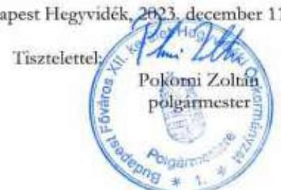
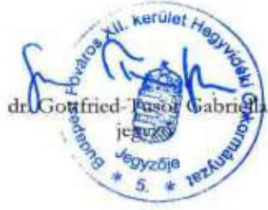

---

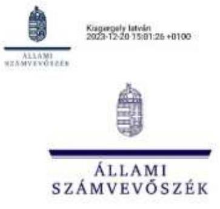

ÁLLAMHÁZTARTÁS HELYI SZINTJÉT
ELLENŐRZŐ IGAZGATÓSÁG

Ikt. szám: EL-3903-036/2023.
Ügyintéző: Kersmájer Ágota
Telefonszám: +36 66 529-241
+36 20 247-2195

Pokorni Zoltán
polgármester
Budapest Főváros XII. kerület Hegyvidéki Önkormányzat

Budapest

Tárgy: Válaszlevél ellenőrzéssel kapcsolatos észrevételek kezeléséről

Tisztelt Polgármester Úr!

„Az önkormányzatok működésének és gazdálkodásának ellenőrzése - Budapest Főváros XII. kerület Hegyvidéki Önkormányzat” című ellenőrzéssel kapcsolatos, 2023. december 11-i keltezésű észrevételét köszönettel megkaptam.

Az Állami Számvevőszék (továbbiakban: ÁSZ) észrevételekre vonatkozó álláspontjáról az alábbi tájékoztatást adom:

1. A jelentéstervezet „Összefoglalás” fejezet 12. oldal 3. bekezdése szerint „Az ellenőrzött időszakban az Önkormányzat a leltározás és leltárkészítés helyi szabályait meghatározza. A 2020. évben mennyiségi felvétellel, 2021-2022-ben egyeztetéssel történt a leltározás, amely megfelelő a jogszabályi előírásnak. Az Önkormányzat a főkönyvi számlák és a kapcsolódó analitikus nyilvántartás adatai közötti egyeztetést a 2022. év mérlegfordulóanapjára vonatkozóan elvégezte. Az Önkormányzat a leltárkészítési kötelezettségének jogszabályokban előírtak ellenére a 2022. évben nem tett eleget a nemzeti vagyonba tartozó befektetett eszközöknél, a költségvetési évben és a költségvetési évet követően esedékes követeléseknél, valamint a költségvetési évben és a költségvetési évet követően esedékes kötelezettségeknél, amely miatt nem érvényesült a költségvetési beszámoló mérlegének leltárral történő alátámasztására vonatkozó követelmény.”

Köszönettel vettem Polgármester úr arra vonatkozó tájékoztatását, hogy a mérlegben szereplő adatok a számvitel zárt rendszerében az analitikus nyilvántartásokkal egyeztetetten kerültek meghatározásra, de sajnálatos módon elmaradt a záró leltárdokumentum

1052 Budapest, Apáczai Csere János u. 10. | www.asz.hu
ahszei@asz.hu | 1364 Budapest 4., Pf. 54 | telefon: +36 1 484 9100

---

összeállítása. A tájékoztatásban foglaltak összhangban vannak a jelentéstervezet megállapításaival - „Összefoglalás" fejezet 12. oldal 3. bekezdése és a „Megállapítások" fejezet 27-28. oldal -, amelyek szerint a 2022. évben egyeztetéssel megtörtént a leltározás, a leltár elkészítése azonban elmaradt a megállapításban felsorolt eszközök és források esetében. Ezért a jelentéstervezet „Összefoglalás" fejezetében szereplő megállapítás módosítása nem indokolt.
2. A jelentéstervezet „Megállapítások" fejezet 20. oldal 2. bekezdésében szerepel, hogy „A Képviselő-testület 2022. szeptemberben a kedveztelen gazdasági folyamatok miatt a projekt elhalasztásáról, a terület parkolóként és közösségi térként történő hasznosításáról döntött, azzal, hogy 2023-ban szükséges tájékoztatást adni a projekt folytathatóságáról, amely a betérin ellenőrzés idejéig még nem történt meg."
Polgármester úr észrevételében tájékoztatást adott arról, hogy a 2023. november 23-i képviselő-testületi ülésen polgármesteri beszámoló keretében megtörtént a tájékoztatás. Az ÁSZ elvégezte a Képviselő-testület által meghatározott tájékoztatási kötelezettség teljesítésének ellenőrzését és megállapította, hogy a 2023. november 23-i Képviselőtestületi ülésen Polgármester úr tájékoztatást adott a terület jelenlegi hasznosításáról, valamint a gazdasági folyamatok alakulásáról, amely alapján a 2024. év II. félévében javasolta ismételten felülvizsgálni a beruházás folytathatóságát. Ennek megfelelően a jelentéstervezet „Megállapítások" fejezet 2.1. pontjában szereplő megállapítást a következők szerint kiegészítjük: „A jelentéstervezet megállapításainak észrevételezés időszakában az Önkormányzat a projekt folytathatóságára vonatkozó tájékoztatási kötelezettségének eleget tett, a hiányosságot megszüntette, ezáltal az ellenőrzés megállapítása az ellenőrzés folyamatában hasznosult." A hiányosság megszüntetésére vonatkozó információt az „Összefoglalás" fejezetben is szerepeltetjük.
3. A jelentéstervezet „Megállapítások" fejezet 21. oldal 2. bekezdésében szereplő elemző megállapítás szerint „Az Önkormányzat mint önálló költségvetési beszámolót készítő szervenél a 2020. év elején a 2148,7 millió Ft költségvetési évben esedékes követeléshez kapcsolódóan 1617,8 millió Ft értékvesztést, a 2022. év végén a 2055,2 millió Ft költségvetési évben esedékes követeléshez kapcsolódóan 1618,0 millió Ft értékvesztést tartottak nyilván, így a mérlegben kimutatott összeg 530,9 millió Ft, illetve 437,2 millió Ft volt."
Polgármester úr észrevételében tájékoztatást adott arról, hogy a költségvetési évben esedékes követelések állománya 2020. év elejétől 2022. év végéig 93,5 millió Ft-tal, 18%-kal csökkent úgy, hogy az elszámolt értékvesztés összege gyakorlatilag nem változott. Ez azért volt lehetséges, mert az Önkormányzat hatékony intézkedéseket tett annak érdekében, hogy a tárgyévben keletkezett követeléseiből ne keletkezzen „mérlegtétel”, azaz azok határidőben, de intenzív behajtás révén legalább a mérlegkészítés időpontjáig befizetésre, behajtásra kerüljenek. Kifogásolta, hogy erről a kedvező folyamatról nem esik szó az elemzésben, viszont a továbbiakban részletesen, grafikus ábrán is szemléltetve a határidőn túli, lejárt követelések állományát illetően az a megállapítás szerepel, miszerint a követelések beszedésére tett intézkedések nem bizonyultak kellően eredményesnek. Polgármester úr észrevétele szerint részben ez is hozzájárulhat az értékvesztés állományának magas összegéhez, de az is okozhatja, hogy az Önkormányzat nem élt azzal a lehetőséggel, hogy a már a behajthatatlansági kritériumoknak megfelelő, de még behajtani remélt követeléseit az analitikus nyilvántartás keretében tartja nyilván, és a főkönyvből kivezeti. Az összetevők ilyen részletes vizsgálatára az ellenőrzés folyamán nem került sor.

---

Tájékoztatom Polgármester urat, hogy a „Megállapítások" fejezetben szerepel tájékoztatás az Önkormányzat által a követelések behajtása érdekében megtett intézkedésekről, amely szerint: „Az Önkormányzat a követelések behajtása érdekében több intézkedést tett. Az ezzel megbízott ügyvédi iroda, valamint a Polgármesteri Hivatal érintett szervezeti egységei figyelemmel kísérték a befizetéseket, fizetési felszólításokat küldtek, indokolt esetben végrehajtási eljárást kezdeményezték. A határidőn túli, lejárt követelések (pl. bérbeadásból származó bevételek, parkolási díjak, helyi adók) aránya az intézkedések ellenére is magas volt...". Erre tekintettel az elemző megállapítás kiegészítése nem indokolt. Tájékoztatom továbbá, hogy az államháztartás számviteléről szóló 4/2013. (I. 11.) Korm. rendelet 53. § (8) bekezdés e) pontja szerint az éves könyvviteli zárlat keretében el kell végezni a behajthatatlan követelések elszámolását, amely alapján a behajthatatlan követelések elszámolása nem lehetőség, hanem jogszabályi kötelezettség az Önkormányzat számára. Ezt alátámasztják az Önkormányzat belső szabályzatai is - számlarend IV. fejezet, értékelési szabályzat IV.3.3. fejezet -, amelyek meghatározzák a kapcsolódó feladatokat.
A fentiekre tekintettel az ÁSZ megállapítása helytálló, módosítása nem indokolt.
4. A jelentéstervezet „Megállapítások" fejezet 25. oldal 2. bekezdés 2-3. francia bekezdése szerint „A Budapesti Temetkezési Intézet Zrt.-nek történt területátadás során az Önkormányzat nem tartotta be az Nvtv. 13. § (3) bekezdésének előírásait, amely szerint nemzeti vagyon
 tulajdonjogát ingyenesen átruházni csak törvényben meghatározott esetekben és feltételekkel lehet. A szerződés szerint ingyenesen történt átadás nem tartozott az Mötv. 108. § (2) bekezdésében nevesített esetek közé, ugyanakkor az Önkormányzat az ügylettel kapcsolatban történt területkiegészítések során az átadottval nagyobb területet kapott - szintén ingyenesen - a Budapesti Temetkezési Intézet Zrt.-től.
A .... a terület átadása kapcsán az Önkormányzat az Nvtv. 13. § (5) bekezdésében foglalt előírás ellenére nem kérelmezte a 15 éves elidegenítési tilalomnak az Önkormányzat javára szóló, ingatlannyilvántartásba történő feljegyzését....
Polgármester úr észrevételében vitatta az ellenőrzési megállapítást. Álláspontja szerint az ingatlan átadása a Magyarország helyi önkormányzatairól szóló 2011. évi CLXXXIX. törvény (Mötv.) 108. § (1) bekezdése és a nemzeti vagyonról szóló 2011. évi CXCVI. törvény (Nvtv.) 14. § (1) bekezdése hatálya alá tartozott, így szabályszerű volt. Tájékoztatott továbbá arról, hogy az Nvtv. 13. § (5) bekezdésében előírt 15 éves elidegenítési tilalom feljegyzését az ingatlan-nyilvántartásról szóló 1997. évi CXLI. törvény végrehajtásáról szóló 109/1999. (XII. 29.) FVM rendelet (Inytv. vhr.) 28. § (1) bekezdésének előírásai miatt nem tudták végrehajtani. „Az Önkormányzat nem önálló helyrajzi számon kialakult ingatlanokat adott át - hiszen a KÉSZ alapján önálló ingatlanként nem lehetett kialakítani őket, hanem csupán meghatározott alapterületű ingatlanrészeket ( $392 \mathrm{~m}^2, 11 \mathrm{~m}^2, 203 \mathrm{~m}^2$). Az Inytv. vhr. alapján meghatározott ingatlanrész tekintetében elidegenítési tilalmat nem lehet az ingatlan-nyilvántartásba feljegyezni, hiszen, vagy csak egész ingatlanra, vagy tulajdoni illetőségre, vagy ezek eszmei hányadára lehet ilyen tilalmat feljegyezni. Teljes ingatlanra nem volt jogosultsága az Önkormányzatnak az elidegenítési tilalom feljegyzését kérni, míg a meghatározott tulajdoni hányadra történő feljegyzés sem azonosítható az átruházott ingatlanrésszel, így az elidegenítési tilalom tulajdoni hányadra történő feljegyzésével sem tudott eleget tenni az Önkormányzat az Nvtv. 13. § (5) bekezdésében írt kötelezettségének."
Tájékoztatom Polgármester urat, hogy az Mötv. 108. § (1) bekezdésében a „nemzeti vagyon birtoklása, használata, használatának joga, fenntartása, üzemeltetése, létesítése, fejlesztése, valamint felújítása" szerepel, abban a nemzeti vagyon tulajdonjogának átadása nem szerepel. A nemzeti vagyon tulajdonjoga ingyenes átruházását az - ellenőrzési megállapításban szereplő - Mötv. 108. § (2) bekezdése szabályozza a közfeladatok ellátására szolgáló nemzeti vagyon védelmét biztosító garanciális rendelkezésként.

---

Tájékoztatom továbbá, hogy az Nvtv. 14. § (1) bekezdése azt az esetet szabályozza, amikor törvény a helyi önkormányzat feladatát más helyi önkormányzat feladataként vagy állami feladatként, illetve állami feladatot helyi önkormányzat feladataként állapít meg. A köztemetők fenntartása mint önkormányzati közfeladat az Mötv. 23. § (4) bekezdés 9. pontja alapján korábban is a Fővárosi önkormányzat feladatkörébe tartozott, nem az Önkormányzat feladatköréből került átadásra. Mindemellett az Önkormányzat a területeket nem a közfeladat ellátásáért felelős Fővárosi Önkormányzatnak, hanem a gazdasági társaságának adta át.
Az észrevétel szerint az Nvtv. 13. § (5) bekezdésében előírt 15 éves elidegenítési tilalom feljegyzését akadályozta az Inytv. vhr. 28. § (1) bekezdésének előírása, amely szerint elidegenítési és terhelési tilalmat, elidegenítési tilalmat, rendelkezési jogot korlátozó egyéb tilalmat egész ingatlanra vagy egész tulajdoni illetőségre, illetve ezek eszmei hányadára lehet feljegyezni. Ugyanakkor az ingatlanrészek átadása tárgyában az Önkormányzat és a Budapesti Temetkezési Intézet Zrt. között létrejött „Telekszabályozási megállapodás" érintett ingatlanokat bemutató 2. pontjában számos alkalommal ismertették az ingatlanok meghatározott hányadára ( $\mathrm{m}^2$-ére) vonatkozóan korábban már bejegyzett korlátozó jogokat. A megállapodásban azonban az Nvtv. 13. § (5) bekezdésében előírt 15 éves elidegenítési tilalom érvényesítési kötelezettségének a tényére, módjára vonatkozóan a felek közötti rendelkezés nem szerepelt.
A fentiekre tekintettel az ÁSZ megállapítása helytálló, módosítása nem indokolt.
5. A jelentéstervezet „megállapítások" fejezet 29. oldal 3.3. számú megállapítást alátámasztó 7. bekezdése szerint „A 2020-2025. évekre vonatkozó gazdasági program nyomon követéséről, értékeléséről előterjesztés nem készült, így arról a Képviselő-testületnek nem számoltak be."
Polgármester úr észrevételében tájékoztatást adott arról, hogy a Képviselő-testület 2023. november 23-i ülésén tárgyalta és elfogadta a 2020-2025. évi Gazdasági Program időszaki teljesítéséről szóló előterjesztést.
Az ÁSZ elvégezte a beszámolási kötelezettség teljesítésének ellenőrzését és megállapította, hogy a Képviselő-testület 2023. november 23-i ülésén 7. napirendi pontként tárgyalta Budapest Főváros XII. kerület Hegyvidéki Önkormányzat 2020-2025. évi Gazdasági Programjának 2020-2023. közötti időszakra vonatkozó beszámolóját, és az időszakos teljesítésről szóló beszámolót elfogadta.
Ennek megfelelően a jelentéstervezet „megállapítások" fejezet 3.3. pontjában szereplő megállapítást a következők szerint kiegészítjük: „A jelentéstervezet megállapításainak észrevételezése időszakában az Önkormányzat a gazdasági program 2020-2025. közötti időszakos teljesítéséről beszámolót készített, a hiányosságot megszüntette, ezáltal az ellenőrzés megállapítása az ellenőrzés folyamatában hasznosult." A hiányosság megszüntetésére vonatkozó információt az „Összefoglalás" fejezetben is szerepeltetjük.
6. A jelentéstervezet „megállapítások" fejezet 30. oldal 4. számú megállapítása szerint „Az IBSZ az Ibtv. 12. § b) pontjában foglaltak ellenére a Hatóság részére az ellenőrzött időszakban nem került megküldésre."
Polgármester úr észrevételében tájékoztatást adott arról, hogy a 2023. évben felülvizsgált informatikai biztonsági szabályzatot (IBSZ) a Nemzetbiztonsági Szakszolgálat Nemzeti Kibervédelmi Intézet Hatósági Főosztálya részére megküldték, és a Hatóság 2023. augusztus 16-i dátummal nyilvántartásba vette.
Az ÁSZ elvégezte az IBSZ Hatóság részére történő megküldési kötelezettsége teljesítésének ellenőrzését és megállapította, hogy az I/38/8/2023. ikt. számú IBSZ 2023.

---

# Függelék: Észrevételek

augusztus 3-án a Hatóság részére megküldésre, azt követően nyilvántartásba vételre került. Ennek megfelelően a jelentéstervezet "*Megállapítások*" fejezet 4. pontjában szereplő megállapítást a következők szerint kiegészítjük: *"A jelentéstervezet megállapításainak észrevételezésére időszakában az I/38/8/2023. ikt. számú IBSZ a Hatóság részére megküldésre került, az Önkormányzat a hiányosságot megszüntette, ezáltal az ellenőrző megállapítása az ellenőrzés folyamatában hasznosult."* A hiányosság megszüntetésére vonatkozó információt az "*Összefoglalás*" fejezetben is szerepeltetjük, és a jegyző számára megfogalmazott 13. javaslat vonatkozó részét töröljük *(,..., az IBSZ Hatóság részére történő megküldésére az Ibtv. 12. § b) pontjában, valamint ...").*

7. A jelentéstervezet "*Megállapítások*" fejezet 31. oldal 5. számú megállapításban foglaltak szerint "*A közérdekű adatok körében az Önkormányzat: ... nem tette közzé az Infotv. 37. § (1) bekezdése és az 1. melléklet II.1. pontja előírásai ellenére az Önkormányzat SZMSZ-ét, a III.8. pontja előírásai ellenére a 2022. és 2023. évekre vonatkozó közbeszerzési terveit, valamint az összegzést az ajánlatok elbírálásáról".*

Polgármester úr észrevételében tájékoztatást adott arról, hogy az SZMSZ a közérdekű adatok között több alpont hivatkozásaiból is megnyitható volt (2. Tevékenységre, működésre vonatkozó adatok, VI. pont 1-5. alpontjai). Továbbá 2023. december 1-jén feltöltésre került a honlapon a 2. fejezet I. pont alá is, amely az önkormányzati honlapstruktúra szerinti megfelelője a hivatkozott jogszabályhely szerinti elhelyezési követelménynek. Tájékoztatást adott továbbá arról, hogy a közérdekű adatok III.8. pontjához tartozó adatok feltöltésére az Elektronikus Közbeszerzési Rendszer használatára tekintettel nem került sor. Mivel erre nem történt hivatkozás a menüpontban, ezért 2023. december 1-től a 3. fejezet VII. pontban ezzel kapcsolatosan az alábbi hivatkozás elhelyezése történt: *"A közbeszerzési eljárásaink az Elektronikus Közbeszerzési Rendszeren (EKR) keresztül kerülnek lefolytatásra. Az eljárásokhoz kapcsolódó minden közbeszerzési dokumentum (így a közbeszerzési terv, valamint az összegzések az ajánlatok elbírálásáról) kereshető formában elérhető az alábbi honlapon:*

*https://ekr.gov.hu/portal/kozbeszerzési/terv-kereses*

*https://ekr.gov.hu/portal/kozbeszerzési/eljárások/lista"*

Az ÁSZ elvégezte az önkormányzati SZMSZ, valamint a 2022. és 2023. évekre vonatkozó közbeszerzési tervek és az ajánlatok elbírálásáról szóló összegzések közzétételi kötelezettségének ellenőrzését. Megállapította, hogy az önkormányzati SZMSZ közzététele megfelelő az információs önrendelkezési jogról és az információszabadságról szóló 2011. évi CXII. törvény (Infotv.) 37. § (1) bekezdése és az 1. melléklet II.1. pontja előírásainak. Megállapította továbbá, hogy az Önkormányzat honlapjáról elérhetőek a 2022. és 2023. évekre vonatkozó közbeszerzési tervek és az ajánlatok elbírálásáról szóló összegzések. Ennek megfelelően a jelentéstervezet "*Megállapítások*" fejezet 5. pontjában szereplő megállapítást a következők szerint kiegészítjük: *"A jelentéstervezet megállapításainak észrevételezése időszakában az Önkormányzat az SZMSZ-ét, a 2022. és 2023. évekre vonatkozó közbeszerzési terveit, valamint az összegzést az ajánlatok elbírálásáról az Infotv.-ben foglaltak szerint közzétette, a hiányosságot megszüntette, ezáltal az ellenőrző megállapítása az ellenőrzés folyamatában hasznosult."* A hiányosság megszüntetésére vonatkozó információt az "*Összefoglalás*" fejezetben is szerepeltetjük, továbbá az összegző megállapítások közül az SZMSZ és a közbeszerzési tervek közzétételének hiányára vonatkozó részt töröljük.

8. A jelentéstervezet "*Megállapítások*" fejezet 31. oldal 5. számú megállapítása szerint "*A 305/2005. (XII. 25.) Korm. rendelet 5. § (6) bekezdésben foglaltak ellenére, a "Közérdekű adatok" menüpont az Önkormányzat honlapjának nyilvántartásaiban közzétételi előírást".*

---

# Polgármester úr észrevételében tájékoztatást adott arról, hogy a közérdekű adatok menüpont az Önkormányzat honlapjának nyitólapjáról elérhetővé vált.

Az ÁSZ elvégezte az Önkormányzat honlapján a *„Közérdekű adatok”* menüpont elérhetőségének ellenőrzését, és megállapította, hogy az az Önkormányzat honlapjának nyitólapjáról közvetlenül elérhető. Ennek megfelelően a jelentéstervezet *„Megállapítások”* fejezet 5. pontjában szereplő megállapítást a következők szerint kiegészítjük: *„A jelentéstervezet megállapításainak észrevételezése időszakában az Önkormányzat a „Közérdekű adatok” menüpontot honlapjának nyitólapjáról közvetlenül elérhetővé tette, a hiányosságot megszüntette, ezáltal az ellenőrzés megállapítása az ellenőrzés folyamatában hasznosult.”* A hiányosság megszüntetésére vonatkozó információt az *„Összefoglalás”* fejezetben is szerepeltetjük, és a jegyző számára megfogalmazott 14. javaslatot töröljük.

Tájékoztatom Polgármester Urat, hogy a számvevőszéki jelentésben a figyelembe nem vett észrevételt szerepeltetjük az elutasítás indokának feltüntetésével.

Budapest, időbélyegző szerint

Tisztelettel:

az Állami Számvevőszék elnöke nevében:

____________________________
Kisgergely István
igazgató, kiadmányozó
Állami Számvevőszék

Államháztartás helyi szintjét ellenőrző igazgatóság

---

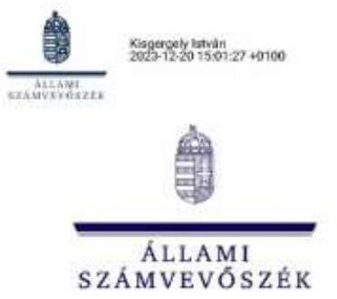

ÁLLAMHÁZTARTÁS HELYI SZINTJÉT
ELLENŐRZŐ IGAZGATÓSÁG

Ikt. szám: EL-3903-037/2023.
Ügyintéző: Kersmájer Ágota
Telefonszám: +36 66 529-241
+36 20 247-2195

Dr. Gottfried-Tusor Gabriella
jegyző

Budapest Főváros XII. kerület Hegyvidéki Polgármesteri Hivatal

Budapest

Tárgy: Válaszlevél ellenőrzéssel kapcsolatos észrevételek kezeléséről

Tisztelt Jegyző Asszony!

*Az önkormányzatok működésének és gazdálkodásának ellenőrzése - Budapest Főváros XII. kerület Hegyvidéki Önkormányzat* című ellenőrzéssel kapcsolatos, 2023. december 11-i keltezésű észrevételét köszönettel megkaptam.

Az Állami Számvevőszék (továbbiakban: ÁSZ) észrevételekre vonatkozó álláspontjáról az alábbi tájékoztatást adom:

1. A jelentéstervezet "*Összefoglalás*" fejezet 12. oldal 3. bekezdése szerint "*Az ellenőrzött időszakban az Önkormányzat a leltározás és leltárkészítés helyi szabályait meghatározta. A 2020. évben mennyiségi felvétellel, 2021-2022-ben egyeztetéssel történt a leltározás, amely megfelelő a jogszabályi előírásnak. Az Önkormányzat a főkönyvi számlák és a kapcsolódó analitikus nyilvántartás adatai közötti egyeztetést a 2022. év mérlegfordulónapjára vonatkozóan elvégezte. Az Önkormányzat a leltárkészítési kötelezettségének jogszabályokban előírtak ellenére a 2022. évben nem tett eleget a nemzeti vagyonba tartozó befektetett eszközöknél, a költségvetési évben és a költségvetési évet követően esedékes követeléseknél, valamint a költségvetési évben és a költségvetési évet követően esedékes kötelezettségeknél, amely miatt nem érvényesült a költségvetési beszámoló mérlegének leltárral történő alátámasztására vonatkozó követelmény.*"

Köszönettel vettem Jegyző asszony arra vonatkozó tájékoztatását, hogy a mérlegben szereplő adatok a számvitel zárt rendszerében az analitikus nyilvántartásokkal egyeztetetten kerültek meghatározásra, de sajnálatos módon elmaradt a záró leltárdokumentum összeállítása. A tájékoztatásban foglaltak összhangban vannak a jelentéstervezet

1052 Budapest, Apáczai Csere János u. 10. | www.asz.hu
aszlei@asz.hu | 1364 Budapest 4., Pf. 54 | telefon: +36 1 484 9100

---

megállapításaival - „Összefoglalás" fejezet 12. oldal 3. bekezdése és a „Megállapítások" fejezet 27-28. oldal -, amelyek
 szerint a 2022. évben egyeztetéssel megtörtént a leltározás, a leltár elkészítése azonban elmaradt a megállapításban felsorolt eszközök és források esetében. Ezért a jelentéstervezet „Összefoglalás" fejezetében szereplő megállapítás módosítása nem indokolt.
2. A jelentéstervezet „Megállapítások" fejezet 20. oldal 2. bekezdésében szerepel, hogy „A Képviselő-testület 2022. szeptemberben a kedvezőtlen gazdasági folyamatok miatt a projekt elhalasztásáról, a terület parkolóként és közösségi térként történő hasznosításáról döntött, azzal, hogy 2023-ban szükséges tájékoztatást adni a projekt folytathatóságáról, amely a betervezett ellenőrzés idejéig még nem történt meg."
Jegyző asszony észrevételében tájékoztatást adott arról, hogy a 2023. november 23-i képviselő-testületi ülésen polgármesteri beszámoló keretében megtörtént a tájékoztatás. Az ÁSZ elvégezte a Képviselő-testület által meghatározott tájékoztatási kötelezettség teljesítésének ellenőrzését és megállapította, hogy a 2023. november 23-i Képviselőtestületi ülésen Polgármester úr tájékoztatást adott a terület jelenlegi hasznosításáról, valamint a gazdasági folyamatok alakulásáról, amely alapján a 2024. év II. félévében javasolta ismételten felülvizsgálni a beruházás folytathatóságát. Ennek megfelelően a jelentéstervezet „Megállapítások" fejezet 2.1. pontjában szereplő megállapítást a következők szerint kiegészítjük: „A jelentéstervezet megállapításainak észrevételezése időszakában az Önkormányzat a projekt folytathatóságára vonatkozó tájékoztatási kötelezettségének eleget tett, a hiányosság megszűnt, ezáltal az ellenőrzés megállapítása az ellenőrzés folyamatában hasznosult." A hiányosság megszüntetésére vonatkozó információt az „Összefoglalás" fejezetben is szerepeltetjük.
3. A jelentéstervezet „Megállapítások" fejezet 21. oldal 2. bekezdésében szereplő elemző megállapítás szerint „Az Önkormányzat mint önálló költségvetési beszámolót készítő szervezetnél a 2020. év elején a 2148,7 millió Ft költségvetési évben esedékes követeléshez kapcsolódóan 1617,8 millió Ft értékvesztést, a 2022. év végén a 2055,2 millió Ft költségvetési évben esedékes követeléshez kapcsolódóan 1618,0 millió Ft értékvesztést tartottak nyilván, így a mérlegben kimutatott összeg 530,9 millió Ft, illetve 437,2 millió Ft volt."
Jegyző asszony észrevételében tájékoztatást adott arról, hogy a költségvetési évben esedékes követelések állománya 2020. év elejétől 2022. év végéig 93,5 millió Ft-tal, 18%-kal csökkent úgy, hogy az elszámolt értékvesztés összege gyakorlatilag nem változott. Ez azért volt lehetséges, mert az Önkormányzat hatékony intézkedéseket tett annak érdekében, hogy a tárgyévben keletkezett követeléseiből ne keletkezzen „mérlegtétel”, azaz azok határidőben, de intenzív behajtás révén legalább a mérlegkészítés időpontjáig befizetésre, behajtásra kerüljenek. Kifogásolta, hogy erről a kedvező folyamatról nem esik szó az elemzésben, viszont a továbbiakban részletesen, grafikus ábrán is szemléltetve a határidőn túli, lejárt követelések állományát illetően az a megállapítás szerepel, miszerint a követelések beszedésére tett intézkedések nem bizonyultak kellően eredményesnek. Jegyző asszony észrevétele szerint részben ez is hozzájárulhat az értékvesztés állományának magas összegéhez, de az is okozhatja, hogy az Önkormányzat nem élt azzal a lehetőséggel, hogy a már a behajthatatlansági kritériumoknak megfelelő, de még behajtani remélt követelésen az analitikus nyilvántartás keretében tartja nyilván, és a főkönyvből kivezeti. Az összetevők ilyen részletes vizsgálatára az ellenőrzés folyamán nem került sor.
Tájékoztatom Jegyző asszonyt, hogy a „Megállapítások" fejezetben szerepel tájékoztatás az Önkormányzat által a követelések behajtása érdekében megtett intézkedésekről, amely

---

szerint: „Az Önkormányzat a követelések behajtása érdekében több intézkedést tett. Az ezzel megbízott ügyvédi iroda, valamint a Polgármesteri Hivatal érintett szervezeti egységei figyelemmel kísérték a befizetéseket, fizetési felszólításokat küldtek, indokolt esetben végrehajtási eljárást kezdeményeztek. A határidőn túli, lejárt követelések (pl. bérbeadásból származó bevételek, parkolási díjak, helyi adók) aránya az intézkedések ellenére is magas volt...". Erre tekintettel az elemző megállapítás kiegészítése nem indokolt. Tájékoztatom továbbá, hogy az államháztartás számviteléről szóló 4/2013. (I. 11.) Korm. rendelet 53. § (8) bekezdés e) pontja szerint az éves könyvviteli zárlat keretében el kell végezni a behajthatatlan követelések elszámolását, amely alapján a behajthatatlan követelések elszámolása nem lehetőség, hanem jogszabályi kötelezettség az Önkormányzat számára. Ezt alátámasztják az Önkormányzat belső szabályzatai is - számlarend IV. fejezet, értékelési szabályzat IV.3.3. fejezet -, amelyek meghatározzák a kapcsolódó feladatokat.
A fentiekre tekintettel az ÁSZ megállapítása helytálló, módosítása nem indokolt.
4. A jelentéstervezet „Megállapítások" fejezet 25. oldal 2. bekezdés 2-3. francia bekezdése szerint „A Budapesti Temetkezési Intézet Zrt.-nek történt területátadás során az Önkormányzat nem tartotta be az Nvtv. 13. § (3) bekezdésének előírásait, amely szerint nemzeti vagyon tulajdonjogát ingyenesen átruházni csak törvényben meghatározott esetekben és feltételekkel lehet. A szerződés szerint ingyenesen történt átadás nem tartozott az Mótv. 108. § (2) bekezdésében nevesített esetek közé, ugyanakkor az Önkormányzat az ügylettel kapcsolatban történt terület kiegyenlítés során az átadottnál nagyobb területet kapott - szintén ingyenesen - a Budapesti Temetkezési Intézet Zrt.-től.
A .... a terület átadása kapcsán az Önkormányzat az Nvtv. 13. § (5) bekezdésében foglalt előírás ellenére nem kérelmezte a 15 éves elidegenítési tilalomnak az Önkormányzat javára szóló, ingatlannyilvántartásba történő feljegyzését....
Jegyző asszony észrevételében vitatta az ellenőrzési megállapítást. Álláspontja szerint az ingatlan átadása a Magyarország helyi önkormányzatairól szóló 2011. évi CLXXXIX. törvény (Mötv.) 108. § (1) bekezdése és a nemzeti vagyonról szóló 2011. évi CXCVI. törvény (Nvtv.) 14. § (1) bekezdése hatálya alá tartozott, így szabályszerű volt. Tájékoztatott továbbá arról, hogy az Nvtv. 13. § (5) bekezdésében előírt 15 éves elidegenítési tilalom feljegyzését az ingatlan-nyilvántartásról szóló 1997. évi CXLI. törvény végrehajtásáról szóló 109/1999. (XII. 29.) FVM rendelet (Inytv. vhr.) 28. § (1) bekezdésének előírásai miatt nem tudták végrehajtani. „Az Önkormányzat nem önálló helyrajzi számú kialakult ingatlanokat adott át - hiszen a KÉSZ alapján önálló ingatlanként nem lehetett kialakítani őket, hanem csupán meghatározott alapterületi ingatlanrészeket ( $392 \mathrm{~m}^2, 11 \mathrm{~m}^2, 203 \mathrm{~m}^2$). Az Inytv. vhr. alapján meghatározott ingatlanrész tekintetében elidegenítési tilalmat nem lehet az ingatlan-nyilvántartásba feljegyezni, hiszen, vagy csak egész ingatlanra, vagy egész tulajdoni illetőségű részre, vagy ezek eszmei hányadára lehet ilyen tilalmat feljegyezni. Teljes ingatlanra nem volt jogosultsága az Önkormányzatnak az elidegenítési tilalom feljegyzését kérni, míg a meghatározott tulajdoni hányadra történő feljegyzés sem azonosítható az átruházott ingatlanrésszel, így az elidegenítési tilalom tulajdoni hányadra történő feljegyzésével sem tudott eleget tenni az Önkormányzat az Nvtv. 13. § (5) bekezdésében írt kötelezettségének."
Tájékoztatom Jegyző asszonyt, hogy az Mötv. 108. § (1) bekezdésében a „nemzeti vagyon birtoklása, használata, kezelése, hasznosításának joga, fenntartása, üzemeltetése, létesítése, fejlesztése, valamint felújítása" szerepel, abban a nemzeti vagyon tulajdonjogának átadása nem szerepel. A nemzeti vagyon tulajdonjoga ingyenes átruházását az - ellenőrzési megállapításban szereplő - Mötv. 108. § (2) bekezdése szabályozza a közfeladatok ellátására szolgáló nemzeti vagyon védelmét biztosító garanciális rendelkezésként.
Tájékoztatom továbbá, hogy az Nvtv. 14. § (1) bekezdése azt az esetet szabályozza, amikor törvény a helyi önkormányzat feladatát más helyi önkormányzat feladataként vagy állami

---

feladatként, illetve állami feladatot helyi önkormányzat feladataként állapít meg. A köztemetők fenntartása mint önkormányzati közfeladat az Mötv. 23. § (4) bekezdés 9. pontja alapján korábban is a Fővárosi önkormányzat feladatkörébe tartozott, nem az Önkormányzat feladatköréből került átadásra. Mindemellett az Önkormányzat a területeket nem a közfeladat ellátásáért felelős Fővárosi Önkormányzatnak, hanem a gazdasági társaságának adta át.
Az észrevétel szerint az Nvtv. 13. § (5) bekezdésében előírt 15 éves elidegenítési tilalom feljegyzését akadályozta az Inytv. vhr. 28. § (1) bekezdésének előírása, amely szerint elidegenítési és terhelési tilalmat, elidegenítési tilalmat, rendelkezési jogot korlátozó egyéb tilalmat egész ingatlanra vagy egész tulajdoni illetőségű részre, illetve ezek eszmei hányadára lehet feljegyezni. Ugyanakkor az ingatlanrészek átadása tárgyában az Önkormányzat és a Budapesti Temetkezési Intézet Zrt. között létrejött „Telekátadási megállapodás" érintett ingatlanokat bemutató 2. pontjában számos alkalommal ismertették az ingatlanok meghatározott hányadára (m²-ére) vonatkozóan korábban már bejegyzett korlátozó jogokat. A megállapodásban azonban az Nvtv. 13. § (5) bekezdésében előírt 15 éves elidegenítési tilalom érvényesítési kötelezettségének a tényére, módjára vonatkozóan a felek közötti rendelkezés nem szerepelt.
A fentiekre tekintettel az ÁSZ megállapítása helytálló, módosítása nem indokolt.
5. A jelentéstervezet „megállapítások" fejezet 29. oldal 3.3. számú megállapítást alátámasztó 7. bekezdése szerint „A 2020-2023. évekre vonatkozó gazdasági program nyomon követéséről, értékeléséről előterjesztés nem készült, így arról a Képviselő-testületnek nem számoltak be."
Jegyző asszony észrevételében tájékoztatást adott arról, hogy a Képviselő-testület 2023. november 23-i ülésén tárgyalta és elfogadta a 2020-2025. évi Gazdasági Program időszaki teljesítéséről szóló előterjesztést.
Az ÁSZ elvégezte a beszámolási kötelezettség teljesítésének ellenőrzését és megállapította, hogy a Képviselő-testület 2023. november 23-i ülésén 7. napirendi pontként tárgyalta Budapest Főváros XII. kerület Hegyvidéki Önkormányzat 2020-2025. évi Gazdasági Programjának 2020-2023. közötti időszakra vonatkozó beszámolóját, és az időszakos teljesítésről szóló beszámolót elfogadta.
Ennek megfelelően a jelentéstervezet „megállapítások" fejezet 3.3. pontjában szereplő megállapítást a következők szerint kiegészítjük: „A jelentéstervezet megállapításainak észrevételezése időszakában az Önkormányzat a gazdasági program 2020-2023. közötti időszaki teljesítéséről beszámolót készített, a hiányosságot megszüntette, ezáltal az ellenőrzés megállapítása az ellenőrzés folyamatában hasznosult." A hiányosság megszüntetésére vonatkozó információt az „Összefoglalás" fejezetben is szerepeltetjük.
6. A jelentéstervezet „megállapítások" fejezet 30. oldal 4. számú megállapítása szerint „Az IBSZ az Ibtv. 12. § b) pontjában foglaltak ellenére a Hatóság részére az ellenőrzött időszakban nem került megküldésre."
Jegyző asszony észrevételében tájékoztatást adott arról, hogy a 2023. évben felülvizsgált informatikai biztonsági szabályzatot (IBSZ) a Nemzetbiztonsági Szakszolgálat Nemzeti Kibervédelmi Intézet Hatósági Főosztálya részére megküldték, és a Hatóság 2023. augusztus 16-i dátummal nyilvántartásba vette.
Az ÁSZ elvégezte az IBSZ Hatóság részére történő megküldési kötelezettség teljesítésének ellenőrzését és megállapította, hogy az I/38/8/2023. ikt. számú IBSZ 2023. augusztus 3-án a Hatóság részére megküldésre, azt követően nyilvántartásba vételre került.

---

Ennek megfelelően a jelentéstervezet „Megállapítások" fejezet 4. pontjában szereplő megállapítást a következők szerint kiegészítjük: „A jelentéstervezet megállapításainak észrevételezése időszakában az I/38/8/2023. ikt. számú IBSZ a Hatóság részére megküldésre került, az Önkormányzat a hiányosságot megszüntette, ezáltal az ellenőrzés megállapítása az ellenőrzés folyamatában hasznosult." A hiányosság megszüntetésére vonatkozó információt az „Összefoglalás" fejezetben is szerepeltetjük, és Jegyző asszony számára megfogalmazott 13. javaslat vonatkozó részét töröljük (,... az IBSZ Hatóság részére történő megküldésére az Ibtv. 12. § b) pontjában, valamint ...").
7. A jelentéstervezet „Megállapítások" fejezet 31. oldal 5. számú megállapításban foglaltak szerint „A közérdekű adatok körében az Önkormányzat: ... nem tette közzé az Infotv. 37. § (1) bekezdése és az 1. melléklet II.1. pontja előírásai ellenére az Önkormányzat SZMSZ-ét, a III.8. pontja előírásai ellenére a 2022. és 2023. évekre vonatkozó közbeszerzési terveit, valamint az összegzést az ajánlatok elbírálásáról".
Jegyző asszony észrevételében tájékoztatást adott arról, hogy az SZMSZ a közérdekű adatok között több alpont hivatkozásaiból is megnyitható volt (2. Tevékenységre, működésre vonatkozó adatok, VI. pont 1-5. alpontjai). Továbbá 2023. december 1-jén feltöltésre került a honlapon a 2. fejezet I. pont alá is, amely az önkormányzati honlapstruktúra szerinti megfelelője a hivatkozott jogszabályhely szerinti elhelyezési követelménynek. Tájékoztatást adott továbbá arról, hogy a közérdekű adatok III.8. pontjához tartozó adatok feltöltésére az Elektronikus Közbeszerzési
 Rendszer használatára tekintettel nem került sor. Mivel erre nem történt hivatkozás a menüpontban, ezért 2023. december 1-től a 3. fejezet VII. pontban ezzel kapcsolatosan az alábbi hivatkozás elhelyezése történt: „A közbeszerzési eljárásaink az Elektronikus Közbeszerzési Rendszeren (EKR) keresztül kerülnek lefolytatásra. Az eljárásokhoz kapcsolódó minden közbeszerzési dokumentum (így a közbeszerzési terv, valamint az összegzések az ajánlatok elbírálásáról) kereshető formában elérhető az alábbi honlapon:
https://ekr.gov.hu/portal/kozbeszerzes/terv-kereses
https://ekr.gov.hu/portal/kozbeszerzes/eljavasok/lista"
Az ÁSZ elvégezte az önkormányzati SZMSZ, valamint a 2022. és 2023. évekre vonatkozó közbeszerzési tervek és az ajánlatok elbírálásáról szóló összegzések közzétételi kötelezettségének ellenőrzését. Megállapította, hogy az önkormányzati SZMSZ közzététele megfelel az információs önrendelkezési jogról és az információszabadságról szóló 2011. évi CXII. törvény (Infotv.) 37. § (1) bekezdése és az 1. melléklet II.1. pontja előírásainak. Megállapította továbbá, hogy az Önkormányzat honlapjáról elérhetőek a 2022. és 2023. évekre vonatkozó közbeszerzési tervek és az ajánlatok elbírálásáról szóló összegzések.
Ennek megfelelően a jelentéstervezet „Megállapítások" fejezet 5. pontjában szereplő megállapítást a következők szerint kiegészítjük: „A jelentéstervezet megállapításainak észrevételezése időszakában az Önkormányzat az SZMSZ-ét, a 2022. és 2023. évekre vonatkozó közbeszerzési terveit, valamint az összegzést az ajánlatok elbírálásáról az Infotv.-ben foglaltak szerint közzétette, a hiányosságot megszüntette, ezáltal az ellenőrzés megállapítása az ellenőrzés folyamatában hasznosult." A hiányosság megszüntetésére vonatkozó információt az „Összefoglalás" fejezetben is szerepeltetjük, továbbá az összegző megállapítások közül az SZMSZ és a közbeszerzési tervek közzétételének hiányára vonatkozó részt töröljük.
8. A jelentéstervezet „Megállapítások" fejezet 31. oldal 5. számú megállapítása szerint „A 305/2005. (XII. 25.) Korm. rendelet 5. § (6) bekezdésben foglaltak ellenére, a „Közérdekű adatok" menüpont az Önkormányzat honlapjának nyitólapjáról nem közvetlenül volt elérhető."

---

Jegyző asszony észrevételében tájékoztatást adott arról, hogy a közérdekű adatok menüpont az Önkormányzat honlapjának nyitólapjáról elérhetővé vált.

Az ÁSZ elvégezte az Önkormányzat honlapján a *„Közérdekű adatok”* menüpont elérhetőségének ellenőrzését, és megállapította, hogy az az Önkormányzat honlapjának nyitólapjáról közvetlenül elérhető.

Ennek megfelelően a jelentéstervezet *„Megállapítások”* fejezet 5. pontjában szereplő megállapítást a következők szerint kiegészítjük: *„A jelentéstervezet megállapításainak észrevételezése időszakában az Önkormányzat a „Közérdekű adatok” menüpontot honlapjának nyitólapjáról közvetlenül elérhetővé tette, a hiányosságot megszüntette, ezáltal az ellenőrzés megállapítása az ellenőrzés folyamatában hasznosult.”* A hiányosság megszüntetésére vonatkozó információt az *„Összefoglalás”* fejezetben is szerepeltetjük, és Jegyző asszony számára megfogalmazott 14. javaslatot töröljük.

Tájékoztatom Jegyző asszonyt, hogy a számvevőszéki jelentésben a figyelembe nem vett észrevételt szerepeltetjük az elutasítás indokának feltüntetésével.

Budapest, időbélyegző szerint

Tisztelettel:

az Állami Számvevőszék elnöke nevében:

____________________________
Kisgergely István
igazgató, kiadmányozó
Állami Számvevőszék

Államháztartás helyi szintjét ellenőrző igazgatóság

---

# RÖVIDÍTÉSEK JEGYZÉKE 

${ }^{1}$ Önkormányzat
${ }^{2}$ ÁSZ
${ }^{3}$ ÁSZ tv.
${ }^{4}$ Áht.
${ }^{5}$ Képviselő-testület
${ }^{6}$ polgármester
${ }^{7}$ jegyző
${ }^{8}$ Polgármesteri Hivatal
${ }^{9}$ költségvetési szervek
${ }^{10}$ önkormányzati tulajdonú gazdasági társaságok
${ }^{11}$ Hatóság
${ }^{12}$ Önkormányzati SZMSZ

Budapest Főváros XII. kerület Hegyvidéki Önkormányzat
Állami Számvevőszék
2011. évi LXVI. törvény az Állami Számvevőszékről
2011. évi CXCV. törvény az államháztartásról

Budapest Főváros XII. kerület Hegyvidéki Önkormányzat Képviselő-testülete
Budapest Főváros XII. kerület Hegyvidéki Önkormányzat polgármestere
Budapest Főváros XII. kerület Hegyvidéki Önkormányzat jegyzője
Budapest Főváros XII. kerület Hegyvidéki Polgármesteri Hivatal
Az Önkormányzat irányítása alá tartozó költségvetési szervek:
Budapest Főváros XII. kerület Hegyvidéki Polgármesteri Hivatal
Budapest Főváros XII. kerület Hegyvidéki Önkormányzat Családsegítő és Gyermekjóléti Központ
Budapest Főváros XII. kerület Hegyvidéki Önkormányzat Fejlesztő Napközi Otthon
Budapest Főváros XII. kerület Hegyvidéki Önkormányzat Gazdasági Ellátó Szolgálat
Budapest Főváros XII. kerület Hegyvidéki Önkormányzat Hegyvidéki Egészségügyi
Központ
Budapest Főváros XII. kerület Hegyvidéki Önkormányzat Hegyvidéki Szociális
Központ
Budapest Főváros XII. kerület Hegyvidéki Önkormányzat Krisztinavárosi Bölcsőde
Budapest Főváros XII. kerület Hegyvidéki Önkormányzat Svábhegyi Bölcsőde
Budapest Főváros XII. kerület Hegyvidéki Önkormányzat Zugligeti Bölcsőde
Hegyvidéki Mesevár Óvoda
Hegyvidéki Lapkiadó
Kimbi Óvoda
Mackós Óvoda
Művész úti Óvoda és Bölcsőde (2021. szeptember 1-től)
Normafa Óvoda
Normafa Park Fenntartó és Üzemeltető Intézmény
Orbánhegyi Óvodák
Süni Óvodák
Táltos Óvoda
Városmajori Óvodák
Zugligeti Óvoda
Budapest Főváros XII. kerület Virányosi Közösségi Ház (megszűnt: 2021. május 14.)
MOM Kulturális Központ Nonprofit Kft.
Hegyvidéki Sportcsarnok és Sportközpont Kft.
Hegyvidéki Szabadidősport Nonprofit Kft.
FÁBER Üzemeltető, Városfejlesztő és -fenntartó Kft.
BBSZ Ingatlan 2022 Kft. (2020. július 25-től)
Hegyvidéki Városfejlesztési Nonprofit Kft. „v. a." (megszűnt: 2020. május 12.)
Nemzetbiztonsági Szakszolgálat (Nemzeti Kibervédelmi Intézet)
Budapest Főváros XII. kerület Hegyvidéki Önkormányzat Képviselő-testületének többször módosított 39/2018. (IX. 26.) önkormányzati rendelete a Budapest Főváros XII. kerület Hegyvidéki Önkormányzat Képviselő-testületének Szervezeti és Működési Szabályzatáról

---

${ }^{13}$ Gst.
${ }^{14}$ Ávr.
${ }^{15}$ 2022. évi költségvetési rendelet
2023. évi költségvetési rendelet
${ }^{16}$ Kincstári Útmutató:
${ }^{17}$ Jat.
${ }^{18}$ 338/2011. (XII. 29.) Korm. rendelet
${ }^{19}$ 2022. évi zárszámadási rendelet
${ }^{20}$ utoljára módosított 2022. évi költségvetési rendelet
${ }^{21}$ Kincstári Útmutató:
${ }^{22}$ Áhsz.
${ }^{23}$ Számv. tv.
${ }^{24}$ Mótv.
${ }^{25}$ Gyvt.
${ }^{26}$ gyermekjóléti rendelet
${ }^{27}$ Hatásköri tv.
${ }^{28}$ vagyonrendelet
${ }^{29}$ közbeszerzési szabályzat:
$\begin{array}{ll}\text { közbeszerzési szabályzat: } \\ \text { beszerzési szabályzat } & \\ \text { Kbt. } & \\ \text { Gazdasági Ellátó Szolgálat } \\ \text { Ntv. } & \\ \text { 2020. évi Kvtv. } & \\ \text { 2021. évi Kvtv. } & \\ \text { 2022. évi Kvtv. } & \\ \text { Budapest Temetkezési Intézet Zrt. } & \\ \text { leltározási szabályzat: } & \\ \text { leltározási szabályzat: } & \end{array}$
2011. évi CXCIV. törvény Magyarország gazdasági stabilitásáról
368/2011. (XII. 31.) Korm. rendelet az államháztartásról szóló törvény végrehajtásáról
Budapest Főváros XII. kerület Hegyvidéki Önkormányzat Képviselő-testületének 7/2022. (II. 24.) önkormányzati rendelete a Budapest Főváros XII. kerület Hegyvidéki Önkormányzat 2022. évi költségvetéséről
Budapest Főváros XII. kerület Hegyvidéki Önkormányzat Képviselő-testületének 7/2023. (II. 28.) önkormányzati rendelete a Budapest Főváros XII. kerület Hegyvidéki Önkormányzat 2023. évi költségvetéséről
Kitöltési útmutató az időközi költségvetési jelentés az államháztartás önkormányzati alrendszerében űrlapokhoz (közzététel: 2023. április 14.)
2010. évi CXXX. törvény a jogalkotásról
338/2011. (XII. 29.) Korm. rendelet a Nemzeti Jogszabálytárról
Budapest Főváros XII. kerület Hegyvidéki Önkormányzat Képviselő-testületének 17/2023. (V. 30.) önkormányzati rendelete a Budapest Főváros XII. kerület Hegyvidéki Önkormányzat 2022. évi összevont költségvetésének végrehajtásáról szóló beszámoló (zárszámadás) elfogadásáról

Budapest Főváros XII. kerület Hegyvidéki Önkormányzat Képviselő-testületének 6/2023. (II. 28.) önkormányzati rendelete a Budapest Főváros XII. kerület Hegyvidéki Önkormányzat 2022. évi költségvetésének módosításáról
Kitöltési útmutató a 2022. évi elemi költségvetés és éves költségvetési beszámoló űrlapokhoz
4/2013. (I. 11.) Korm. rendelet az államháztartás számviteléről
2000. évi C. törvény a számvitelről
2011. évi CLXXXIX. törvény Magyarország helyi önkormányzatairól
1997. évi XXXI. törvény a gyermekek védelméről és a gyámügyi igazgatásról
Budapest Főváros XII. kerület Hegyvidéki Önkormányzat Képviselő-testületének 55/2018. (XII. 17.) önkormányzati rendelete a személyes gondoskodást nyújtó gyermekjóléti alapellátásokról
1991. évi XX. törvény a helyi önkormányzatok és szerveik, a köztársasági megbízottak, valamint egyes centrális alárendeltségű szervek feladat- és hatásköreiről
Budapest Főváros XII. kerületi Önkormányzat 4/1994. (III. 2.) számú rendelete a Budapest Főváros XII. kerületi Önkormányzat vagyona feletti tulajdonosi jogok gyakorlásáról
Budapest Főváros XII. kerület Hegyvidéki Önkormányzat polgármesterének 2/2016. utasítása a Budapest Főváros XII. kerület Hegyvidéki Önkormányzat Közbeszerzési Szabályzatáról (2020. február 25-ig)
Budapest Főváros XII. kerület Hegyvidéki Önkormányzat Általános Közbeszerzési Szabályzata (2020. február 26-tól)
Budapest Főváros XII. kerület Hegyvidéki Önkormányzat polgármesterének 3/2018. utasítása a beszerzési szabályzatról
2015. évi CXLIII. törvény a közbeszerzésekről
Budapest Főváros XII. kerület Hegyvidéki Önkormányzat Gazdasági Ellátó Szolgálat 2011. évi CXCVI. törvény a nemzeti vagyonról
2019. évi LXXI. tv. Magyarország 2020. évi központi költségvetéséről
2020. évi XC. tv. Magyarország 2021. évi központi költségvetéséről
2021. évi XC. törvény Magyarország 2022. évi központi költségvetéséről

Budapesti Temetkezési Intézet Zártkörűen működő Részvénytársaság. 2021. augusztus 31-én beolvadással megszűnt, jogutódja a FÖTÁV Budapesti Távhőszolgáltató Nonprofit Zrt.
Budapest Főváros XII. kerület Hegyvidéki Önkormányzat Leltározási és leltárkészítési szabályzata 2017. (2021. január 3-ig)
Budapest Főváros XII. kerület Hegyvidéki Önkormányzat Leltározási és leltárkészítési szabályzata 2021. (2021. január 4-től)

---

${ }^{38}$ Ehat.
${ }^{39}$ Kvt.
${ }^{40}$ környezetvédelmi program
${ }^{41}$ Infotv.
${ }^{42}$ Adatvédelmi és adatbiztonsági szabályzat
${ }^{43}$ Ibtv.
${ }^{44}$ IBSZ
${ }^{45}$ Informatikai felhasználói szabályzat
${ }^{46}$ ASP rendelet
${ }^{47}$ 305/2005. (XII. 25.) Korm. rendelet
${ }^{48}$ Polgármesteri Hivatal SZMSZ-e
${ }^{49}$ Belső ellenőrzési kézikönyv
${ }^{50}$ belső ellenőrzési vezető
51 353/2011. (XII. 30.) Korm. rendelet
${ }^{52}$ Htv.
${ }^{53}$ Szoc.tv.
${ }^{54}$ 328/2011. (XII. 29.) Korm. rendelet
${ }^{55}$ 149/1997. (IX. 10.) Korm. rendelet
${ }^{56}$ Koncessziós tv.
${ }^{57}$ 41/2015. (VII. 15.) BM rendelet
${ }^{58}$ 499/2022. (XII. 8.) Korm. rendelet
${ }^{59}$ 18/2005. (XII. 27.) IHM rendelet
2015. évi LVII. törvény az energiahatékonyságról
1995. évi LIII. törvény a környezet védelmének általános szabályairól

Budapest XII. kerület Környezetvédelmi Program 2017-2022. (122/2017. (VI.29.) Bp. Főv. XII. ker. Hegyvidéki Önk. Kt. h.)
2011. évi CXII. törvény az információs önrendelkezési jogról és az információszabadságról
Budapest Főváros XII. kerület Hegyvidéki Önkormányzat és Budapest Főváros XII. Kerület Hegyvidék Polgármesteri Hivatal Elektronikus Ügyintézésre Vonatkozó Adatvédelmi és Adatbiztonsági Szabályzat
2013. évi L. törvény az állami és önkormányzati szervek elektronikus információbiztonságáról
13/2019. jegyzői utasítás Informatikai Biztonsági Szabályzat Budapest Főváros XII. kerület Hegyvidéki Polgármesteri Hivatal számára
14/2019. jegyzői utasítás Informatikai Felhasználói Szabályzat Budapest Főváros XII. kerület Hegyvidéki Polgármesteri Hivatal számára
257/2016. (VIII. 31.) Korm. rendelet az önkormányzati ASP rendszerről
305/2005. (XII. 25.) Korm. rendelet a közérdekű adatok elektronikus közzétételére, az egységes közadatkereső rendszerre, valamint a központi jegyzék adattartalmára, az adatintegrációra vonatkozó részletes szabályokról
Budapest Főváros XII. kerület Hegyvidéki Önkormányzat jegyzőjének 8/2018. utasítása Budapest Főváros XII. kerület Hegyvidéki Polgármesteri Hivatal Szervezeti és Működési Szabályzatáról
Budapest Főváros XII. kerület Hegyvidéki Polgármesteri Hivatal Belső ellenőrzési kézikönyv
Polgármesteri Hivatal Belső ellenőrzési csoport vezetője
353/2011. (XII. 30.) Korm. rendelet az adósságot keletkeztető ügyletekhez történő hozzájárulás részletes szabályairól
1990. évi C. törvény a helyi adókról
1993. évi III. törvény a szociális igazgatásról és szociális ellátásokról
328/2011. (XII. 29.) Korm. rendelet a személyes gondoskodást nyújtó gyermekjóléti alapellátások és gyermekvédelmi szakellátások térítési díjáról és az igénylésükhöz felhasználható bizonyítékokról
149/1997. (IX. 10.) Korm. rendelet a gyámhatóságokról, valamint a gyermekvédelmi és gyámügyi eljárásról
1991. évi XVI. törvény a koncesszióról
41/2015. (VII. 15.) BM rendelet az állami és önkormányzati szervek elektronikus információbiztonságáról szóló 2013. évi L. törvényben meghatározott technológiai biztonsági, valamint a biztonságos információs eszközökre, termékekre, továbbá a biztonsági osztályba és biztonsági szintbe sorolásra vonatkozó követelményekről
499/2022. (XII. 8.) Korm. rendelet a Központi Információs Közadat-nyilvántartás részletszabályairól
18/2005. (XII. 27.) IHM rendelet a közzétételi listákon szereplő adatok közzétételéhez szükséges közzétételi mintákról

---

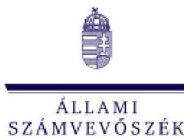

1052 Budapest, Apáczai Csere János u. 10. | 1364 Budapest 4., Pf. 54
www.asz.hu | szamvevoszek@asz.hu
telefon: +36 1 484 9100

